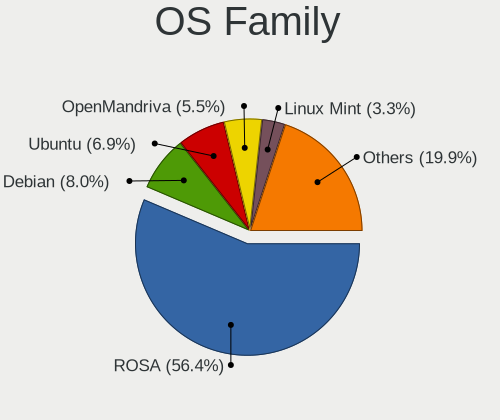
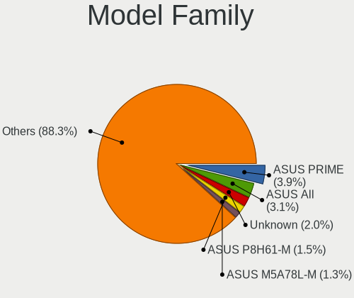
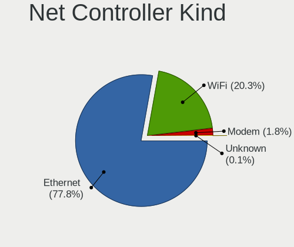

Linux in Russia - Tested Hardware & Statistics (Desktops)
---------------------------------------------------------

A project to collect tested hardware configurations for Linux in Russia.

Anyone can contribute to this report by the [hw-probe](https://github.com/linuxhw/hw-probe) tool:

    sudo -E hw-probe -all -upload

Please contribute! Especially if your hardware is rare.

Contents
--------

* [ Test Cases ](#test-cases)

* [ System ](#system)
  - [ OS                       ](#os)
  - [ OS Family                ](#os-family)
  - [ Kernel                   ](#kernel)
  - [ Kernel Family            ](#kernel-family)
  - [ Kernel Major Ver.        ](#kernel-major-ver)
  - [ Arch                     ](#arch)
  - [ DE                       ](#de)
  - [ Display Server           ](#display-server)
  - [ Display Manager          ](#display-manager)
  - [ OS Lang                  ](#os-lang)
  - [ Boot Mode                ](#boot-mode)
  - [ Filesystem               ](#filesystem)
  - [ Part. scheme             ](#part-scheme)
  - [ Dual Boot with Linux/BSD ](#dual-boot-with-linuxbsd)
  - [ Dual Boot (Win)          ](#dual-boot-win)

* [ Board ](#board)
  - [ Vendor                   ](#vendor)
  - [ Model                    ](#model)
  - [ Model Family             ](#model-family)
  - [ MFG Year                 ](#mfg-year)
  - [ Form Factor              ](#form-factor)
  - [ Secure Boot              ](#secure-boot)
  - [ Coreboot                 ](#coreboot)
  - [ RAM Size                 ](#ram-size)
  - [ RAM Used                 ](#ram-used)
  - [ Total Drives             ](#total-drives)
  - [ Has CD-ROM               ](#has-cd-rom)
  - [ Has Ethernet             ](#has-ethernet)
  - [ Has WiFi                 ](#has-wifi)
  - [ Has Bluetooth            ](#has-bluetooth)

* [ Location ](#location)
  - [ Country                  ](#country)
  - [ City                     ](#city)

* [ Drives ](#drives)
  - [ Drive Vendor             ](#drive-vendor)
  - [ Drive Model              ](#drive-model)
  - [ HDD Vendor               ](#hdd-vendor)
  - [ SSD Vendor               ](#ssd-vendor)
  - [ Drive Kind               ](#drive-kind)
  - [ Drive Connector          ](#drive-connector)
  - [ Drive Size               ](#drive-size)
  - [ Space Total              ](#space-total)
  - [ Space Used               ](#space-used)
  - [ Malfunc. Drives          ](#malfunc-drives)
  - [ Malfunc. Drive Vendor    ](#malfunc-drive-vendor)
  - [ Malfunc. HDD Vendor      ](#malfunc-hdd-vendor)
  - [ Malfunc. Drive Kind      ](#malfunc-drive-kind)
  - [ Failed Drives            ](#failed-drives)
  - [ Failed Drive Vendor      ](#failed-drive-vendor)
  - [ Drive Status             ](#drive-status)

* [ Storage controller ](#storage-controller)
  - [ Storage Vendor           ](#storage-vendor)
  - [ Storage Model            ](#storage-model)
  - [ Storage Kind             ](#storage-kind)

* [ Processor ](#processor)
  - [ CPU Vendor               ](#cpu-vendor)
  - [ CPU Model                ](#cpu-model)
  - [ CPU Model Family         ](#cpu-model-family)
  - [ CPU Cores                ](#cpu-cores)
  - [ CPU Sockets              ](#cpu-sockets)
  - [ CPU Threads              ](#cpu-threads)
  - [ CPU Op-Modes             ](#cpu-op-modes)
  - [ CPU Microcode            ](#cpu-microcode)
  - [ CPU Microarch            ](#cpu-microarch)

* [ Graphics ](#graphics)
  - [ GPU Vendor               ](#gpu-vendor)
  - [ GPU Model                ](#gpu-model)
  - [ GPU Combo                ](#gpu-combo)
  - [ GPU Driver               ](#gpu-driver)
  - [ GPU Memory               ](#gpu-memory)

* [ Monitor ](#monitor)
  - [ Monitor Vendor           ](#monitor-vendor)
  - [ Monitor Model            ](#monitor-model)
  - [ Monitor Resolution       ](#monitor-resolution)
  - [ Monitor Diagonal         ](#monitor-diagonal)
  - [ Monitor Width            ](#monitor-width)
  - [ Aspect Ratio             ](#aspect-ratio)
  - [ Monitor Area             ](#monitor-area)
  - [ Pixel Density            ](#pixel-density)
  - [ Multiple Monitors        ](#multiple-monitors)

* [ Network ](#network)
  - [ Net Controller Vendor    ](#net-controller-vendor)
  - [ Net Controller Model     ](#net-controller-model)
  - [ Wireless Vendor          ](#wireless-vendor)
  - [ Wireless Model           ](#wireless-model)
  - [ Ethernet Vendor          ](#ethernet-vendor)
  - [ Ethernet Model           ](#ethernet-model)
  - [ Net Controller Kind      ](#net-controller-kind)
  - [ Used Controller          ](#used-controller)
  - [ NICs                     ](#nics)
  - [ IPv6                     ](#ipv6)

* [ Bluetooth ](#bluetooth)
  - [ Bluetooth Vendor         ](#bluetooth-vendor)
  - [ Bluetooth Model          ](#bluetooth-model)

* [ Sound ](#sound)
  - [ Sound Vendor             ](#sound-vendor)
  - [ Sound Model              ](#sound-model)

* [ Memory ](#memory)
  - [ Memory Vendor            ](#memory-vendor)
  - [ Memory Model             ](#memory-model)
  - [ Memory Kind              ](#memory-kind)
  - [ Memory Form Factor       ](#memory-form-factor)
  - [ Memory Size              ](#memory-size)
  - [ Memory Speed             ](#memory-speed)

* [ Printers & scanners ](#printers--scanners)
  - [ Printer Vendor           ](#printer-vendor)
  - [ Printer Model            ](#printer-model)
  - [ Scanner Vendor           ](#scanner-vendor)
  - [ Scanner Model            ](#scanner-model)

* [ Camera ](#camera)
  - [ Camera Vendor            ](#camera-vendor)
  - [ Camera Model             ](#camera-model)

* [ Security ](#security)
  - [ Fingerprint Vendor       ](#fingerprint-vendor)
  - [ Fingerprint Model        ](#fingerprint-model)
  - [ Chipcard Vendor          ](#chipcard-vendor)
  - [ Chipcard Model           ](#chipcard-model)

* [ Unsupported ](#unsupported)
  - [ Unsupported Devices      ](#unsupported-devices)
  - [ Unsupported Device Types ](#unsupported-device-types)

Test Cases
----------

Total: 21960

| Vendor        | Model                       | Probe                                                      | Date         |
|---------------|-----------------------------|------------------------------------------------------------|--------------|
| ASUSTek       | TUF Gaming B550-PLUS WIF... | [c314d61f74](https://linux-hardware.org/?probe=c314d61f74) | May 09, 2024 |
| Lenovo        | Bantry CRB NOK              | [c2a11bca8a](https://linux-hardware.org/?probe=c2a11bca8a) | May 09, 2024 |
| ASRock        | H61M                        | [4db6a46097](https://linux-hardware.org/?probe=4db6a46097) | May 08, 2024 |
| ASRock        | H61M                        | [cf55ba331e](https://linux-hardware.org/?probe=cf55ba331e) | May 08, 2024 |
| ASRock        | B450M-HDV                   | [098e62d52a](https://linux-hardware.org/?probe=098e62d52a) | May 08, 2024 |
| ASRock        | B550M Phantom Gaming 4      | [336a5b4e2b](https://linux-hardware.org/?probe=336a5b4e2b) | May 08, 2024 |
| Gigabyte      | H81M-S1                     | [3566b1666c](https://linux-hardware.org/?probe=3566b1666c) | May 08, 2024 |
| ASUSTek       | E520                        | [4e025280e9](https://linux-hardware.org/?probe=4e025280e9) | May 08, 2024 |
| Gigabyte      | B560M H                     | [9d2a9c59a3](https://linux-hardware.org/?probe=9d2a9c59a3) | May 08, 2024 |
| MSI           | B450M-A PRO MAX II          | [cd66ff303c](https://linux-hardware.org/?probe=cd66ff303c) | May 08, 2024 |
| MSI           | PRO B650M-P                 | [2490ea1b56](https://linux-hardware.org/?probe=2490ea1b56) | May 08, 2024 |
| Gigabyte      | H81M-S2H                    | [217f6991ee](https://linux-hardware.org/?probe=217f6991ee) | May 08, 2024 |
| Gigabyte      | B450 GAMING X               | [f7eef71378](https://linux-hardware.org/?probe=f7eef71378) | May 08, 2024 |
| Gigabyte      | B450 AORUS ELITE            | [af6bde9c97](https://linux-hardware.org/?probe=af6bde9c97) | May 07, 2024 |
| Gigabyte      | B450 AORUS ELITE            | [1755d8da2b](https://linux-hardware.org/?probe=1755d8da2b) | May 07, 2024 |
| ASUSTek       | P8Z77-I DELUXE              | [6aa44077ff](https://linux-hardware.org/?probe=6aa44077ff) | May 07, 2024 |
| MSI           | Z170A-G43 PLUS              | [cbc2d08a03](https://linux-hardware.org/?probe=cbc2d08a03) | May 07, 2024 |
| ASRock        | AB350M-HDV R3.0             | [d919c0d099](https://linux-hardware.org/?probe=d919c0d099) | May 07, 2024 |
| Supermicro    | X10DDW-i                    | [ff62f6b4d9](https://linux-hardware.org/?probe=ff62f6b4d9) | May 07, 2024 |
| Supermicro    | X10DDW-i                    | [b849fea196](https://linux-hardware.org/?probe=b849fea196) | May 07, 2024 |
| Supermicro    | X10DDW-i                    | [c20ef4d35b](https://linux-hardware.org/?probe=c20ef4d35b) | May 07, 2024 |
| Supermicro    | X10DDW-i                    | [9b21386a04](https://linux-hardware.org/?probe=9b21386a04) | May 07, 2024 |
| Supermicro    | X10DDW-i                    | [99fbeae8c9](https://linux-hardware.org/?probe=99fbeae8c9) | May 07, 2024 |
| Supermicro    | X10DDW-i                    | [48bb233b46](https://linux-hardware.org/?probe=48bb233b46) | May 07, 2024 |
| Supermicro    | X10DRL-i                    | [da5c3ed75f](https://linux-hardware.org/?probe=da5c3ed75f) | May 07, 2024 |
| Gigabyte      | C1037UN-EU                  | [714735cd6f](https://linux-hardware.org/?probe=714735cd6f) | May 07, 2024 |
| Gigabyte      | B550M DS3H                  | [3514c9adca](https://linux-hardware.org/?probe=3514c9adca) | May 07, 2024 |
| Gigabyte      | B460 HD3                    | [8d8fcf703b](https://linux-hardware.org/?probe=8d8fcf703b) | May 07, 2024 |
| ASUSTek       | PRIME A320M-E               | [d97bbebd45](https://linux-hardware.org/?probe=d97bbebd45) | May 07, 2024 |
| GEEKOM        | A7                          | [87925a210f](https://linux-hardware.org/?probe=87925a210f) | May 07, 2024 |
| Gigabyte      | H610M S2H DDR4              | [4fb0650e99](https://linux-hardware.org/?probe=4fb0650e99) | May 07, 2024 |
| MSI           | PRO H610M-E DDR4            | [a415f46a9e](https://linux-hardware.org/?probe=a415f46a9e) | May 07, 2024 |
| ASUSTek       | ROG STRIX X299-E GAMING ... | [fc1633451e](https://linux-hardware.org/?probe=fc1633451e) | May 06, 2024 |
| ASRock        | B450M-HDV R4.0              | [1d40ae8807](https://linux-hardware.org/?probe=1d40ae8807) | May 06, 2024 |
| Lenovo        | 36C7 SDK0J40697 WIN 3305... | [867c770e38](https://linux-hardware.org/?probe=867c770e38) | May 06, 2024 |
| Gigabyte      | 8PEMT4                      | [d43ba07bdd](https://linux-hardware.org/?probe=d43ba07bdd) | May 06, 2024 |
| Gigabyte      | H61M-S2PV                   | [cece4d3b5e](https://linux-hardware.org/?probe=cece4d3b5e) | May 06, 2024 |
| Gigabyte      | H61M-S2PV                   | [98e922adae](https://linux-hardware.org/?probe=98e922adae) | May 06, 2024 |
| MSI           | PRO H610M-E DDR4            | [e4adc14010](https://linux-hardware.org/?probe=e4adc14010) | May 06, 2024 |
| Supermicro    | X9SCL/X9SCMA                | [bb7e4b6de6](https://linux-hardware.org/?probe=bb7e4b6de6) | May 06, 2024 |
| Gigabyte      | B75M-D3V                    | [52037a51a0](https://linux-hardware.org/?probe=52037a51a0) | May 06, 2024 |
| Supermicro    | X10DRL-i                    | [80cdad1821](https://linux-hardware.org/?probe=80cdad1821) | May 06, 2024 |
| Gigabyte      | H81M-S2H                    | [0b1a61e802](https://linux-hardware.org/?probe=0b1a61e802) | May 06, 2024 |
| Gigabyte      | B560M DS3H                  | [ead92a9fe5](https://linux-hardware.org/?probe=ead92a9fe5) | May 06, 2024 |
| SZMZ          | X99 DUAL Z8                 | [24f362dbe8](https://linux-hardware.org/?probe=24f362dbe8) | May 05, 2024 |
| ASRock        | FM2A68M-DG3+                | [0c960e6942](https://linux-hardware.org/?probe=0c960e6942) | May 05, 2024 |
| Gigabyte      | B560M DS3H                  | [3d88207b4d](https://linux-hardware.org/?probe=3d88207b4d) | May 05, 2024 |
| ASUSTek       | M5A78L-M/USB3               | [551c4cd540](https://linux-hardware.org/?probe=551c4cd540) | May 05, 2024 |
| ASUSTek       | TUF H310M-PLUS GAMING R2... | [2a47a6393b](https://linux-hardware.org/?probe=2a47a6393b) | May 05, 2024 |
| ASUSTek       | TUF Gaming B550M-PLUS WI... | [c785a73424](https://linux-hardware.org/?probe=c785a73424) | May 05, 2024 |
| ASRock        | B450M Pro4                  | [b1caabc9b5](https://linux-hardware.org/?probe=b1caabc9b5) | May 05, 2024 |
| Gigabyte      | B450 GAMING X               | [632943f952](https://linux-hardware.org/?probe=632943f952) | May 05, 2024 |
| MSI           | B650 GAMING PLUS WIFI       | [c1db6719c8](https://linux-hardware.org/?probe=c1db6719c8) | May 04, 2024 |
| Gigabyte      | Z68A-D3H-B3                 | [22b510c32b](https://linux-hardware.org/?probe=22b510c32b) | May 04, 2024 |
| Acer          | Aspire XC-1660 V:1.1        | [faaa324204](https://linux-hardware.org/?probe=faaa324204) | May 04, 2024 |
| ASUSTek       | P8P67                       | [9dcca1359b](https://linux-hardware.org/?probe=9dcca1359b) | May 04, 2024 |
| Gigabyte      | B550 AORUS ELITE V2         | [2f23713428](https://linux-hardware.org/?probe=2f23713428) | May 04, 2024 |
| MSI           | MS-7267                     | [c9e3d08574](https://linux-hardware.org/?probe=c9e3d08574) | May 04, 2024 |
| ASRock        | B550 Pro4                   | [7b008baaaa](https://linux-hardware.org/?probe=7b008baaaa) | May 04, 2024 |
| Gigabyte      | B550M DS3H                  | [178f62317e](https://linux-hardware.org/?probe=178f62317e) | May 04, 2024 |
| Gigabyte      | H97-D3H-CF                  | [d4b03a1295](https://linux-hardware.org/?probe=d4b03a1295) | May 04, 2024 |
| ASRock        | B760M PG Lightning/D4       | [50c91b7d78](https://linux-hardware.org/?probe=50c91b7d78) | May 03, 2024 |
| ASUSTek       | P7H55                       | [25860ff0c1](https://linux-hardware.org/?probe=25860ff0c1) | May 03, 2024 |
| SZMZ          | X99-S3                      | [9dc9366e04](https://linux-hardware.org/?probe=9dc9366e04) | May 03, 2024 |
| ASRock        | B450 Gaming K4              | [721fef3d82](https://linux-hardware.org/?probe=721fef3d82) | May 03, 2024 |
| Gigabyte      | B650M GAMING X AX           | [bca236e545](https://linux-hardware.org/?probe=bca236e545) | May 03, 2024 |
| Unknown       | Unknown                     | [1564e76ada](https://linux-hardware.org/?probe=1564e76ada) | May 03, 2024 |
| MSI           | MAG B760M MORTAR WIFI DD... | [a077206bc5](https://linux-hardware.org/?probe=a077206bc5) | May 03, 2024 |
| MSI           | A320M-A PRO                 | [007b5d93c7](https://linux-hardware.org/?probe=007b5d93c7) | May 03, 2024 |
| MSI           | B450-A PRO                  | [028acf1ed9](https://linux-hardware.org/?probe=028acf1ed9) | May 02, 2024 |
| Dell          | 0JP3NX A01                  | [59857ba04e](https://linux-hardware.org/?probe=59857ba04e) | May 02, 2024 |
| ASUSTek       | H81M-K                      | [f4dbf33638](https://linux-hardware.org/?probe=f4dbf33638) | May 02, 2024 |
| Gigabyte      | B560 HD3                    | [eb083c6668](https://linux-hardware.org/?probe=eb083c6668) | May 02, 2024 |
| Soyo          | SY-KL A320M.2-VH            | [e6ebaa107b](https://linux-hardware.org/?probe=e6ebaa107b) | May 02, 2024 |
| Gigabyte      | A320M-S2H V2-CF             | [f98dcf2d99](https://linux-hardware.org/?probe=f98dcf2d99) | May 02, 2024 |
| ASUSTek       | PRIME B660-PLUS D4          | [d7c901b5d7](https://linux-hardware.org/?probe=d7c901b5d7) | May 02, 2024 |
| MSI           | B650 GAMING PLUS WIFI       | [23638766ff](https://linux-hardware.org/?probe=23638766ff) | May 01, 2024 |
| ASUSTek       | ROG STRIX B550-A GAMING     | [0688fff0ed](https://linux-hardware.org/?probe=0688fff0ed) | May 01, 2024 |
| HP            | 0AA8h                       | [7b72e86416](https://linux-hardware.org/?probe=7b72e86416) | May 01, 2024 |
| Gigabyte      | B450 AORUS PRO-CF           | [1b914f7922](https://linux-hardware.org/?probe=1b914f7922) | May 01, 2024 |
| JGINYUE       | X99 TITANIUM D4             | [dc3cd2b7e9](https://linux-hardware.org/?probe=dc3cd2b7e9) | May 01, 2024 |
| ASRock        | H410M-HVS                   | [2a5b383001](https://linux-hardware.org/?probe=2a5b383001) | May 01, 2024 |
| Intel         | DZ77BH-55K AAG39008-401     | [9fae0699d4](https://linux-hardware.org/?probe=9fae0699d4) | May 01, 2024 |
| Acer          | WMCP78M                     | [34b0e08d0c](https://linux-hardware.org/?probe=34b0e08d0c) | May 01, 2024 |
| ASUSTek       | M4A87TD/USB3                | [91136f3f95](https://linux-hardware.org/?probe=91136f3f95) | May 01, 2024 |
| Unknown       | GB01                        | [cbbb8cc3ea](https://linux-hardware.org/?probe=cbbb8cc3ea) | May 01, 2024 |
| Gigabyte      | P67A-D3-B3                  | [22337aabf0](https://linux-hardware.org/?probe=22337aabf0) | Apr 30, 2024 |
| Gigabyte      | P67A-D3-B3                  | [f3950d30d7](https://linux-hardware.org/?probe=f3950d30d7) | Apr 30, 2024 |
| MSI           | PRO H610M-G DDR4            | [b8ab800603](https://linux-hardware.org/?probe=b8ab800603) | Apr 30, 2024 |
| ASUSTek       | PRIME H610I-PLUS D4         | [1c4e390f2d](https://linux-hardware.org/?probe=1c4e390f2d) | Apr 30, 2024 |
| ASRock        | H510M-HDV                   | [f48ead89ac](https://linux-hardware.org/?probe=f48ead89ac) | Apr 30, 2024 |
| Gigabyte      | H81M-S2V                    | [11f391fabc](https://linux-hardware.org/?probe=11f391fabc) | Apr 30, 2024 |
| Gigabyte      | H110M-S2-CF                 | [e55bcf23cf](https://linux-hardware.org/?probe=e55bcf23cf) | Apr 30, 2024 |
| ASUSTek       | M5A97 R2.0                  | [448d785ccb](https://linux-hardware.org/?probe=448d785ccb) | Apr 30, 2024 |
| ASRock        | B550 Phantom Gaming 4       | [29804b3285](https://linux-hardware.org/?probe=29804b3285) | Apr 30, 2024 |
| ASUSTek       | M5A99FX PRO R2.0            | [9dcdf5a463](https://linux-hardware.org/?probe=9dcdf5a463) | Apr 29, 2024 |
| Gigabyte      | B450M S2H                   | [28ce6a0f2e](https://linux-hardware.org/?probe=28ce6a0f2e) | Apr 29, 2024 |
| Gigabyte      | B450M S2H                   | [f96e09c9e1](https://linux-hardware.org/?probe=f96e09c9e1) | Apr 29, 2024 |
| ASUSTek       | P5KPL-VM                    | [d2d5710920](https://linux-hardware.org/?probe=d2d5710920) | Apr 29, 2024 |
| MSI           | A68HM-E33                   | [abf75e8321](https://linux-hardware.org/?probe=abf75e8321) | Apr 29, 2024 |
| Gigabyte      | C1037UN-EU                  | [ff9f6ab993](https://linux-hardware.org/?probe=ff9f6ab993) | Apr 29, 2024 |
| Gigabyte      | B550M AORUS ELITE           | [deab538223](https://linux-hardware.org/?probe=deab538223) | Apr 29, 2024 |
| ASRock        | H110M-DGS R3.0              | [e1d811fd8f](https://linux-hardware.org/?probe=e1d811fd8f) | Apr 29, 2024 |
| Unknown       | Unknown                     | [806e7d1dfa](https://linux-hardware.org/?probe=806e7d1dfa) | Apr 28, 2024 |
| Gigabyte      | M68M-S2P                    | [3608c76af5](https://linux-hardware.org/?probe=3608c76af5) | Apr 28, 2024 |
| MSI           | MPG B550 GAMING PLUS        | [df28569bfc](https://linux-hardware.org/?probe=df28569bfc) | Apr 28, 2024 |
| ASRock        | 970 Extreme3                | [41c988e70a](https://linux-hardware.org/?probe=41c988e70a) | Apr 28, 2024 |
| Dell          | 0Y5DDC A00                  | [ebc89ad860](https://linux-hardware.org/?probe=ebc89ad860) | Apr 28, 2024 |
| Gigabyte      | A320M-S2H V2-CF             | [a11f4281d0](https://linux-hardware.org/?probe=a11f4281d0) | Apr 28, 2024 |
| ASUSTek       | ROG STRIX Z490-A GAMING     | [3f33898064](https://linux-hardware.org/?probe=3f33898064) | Apr 28, 2024 |
| Gigabyte      | B450M GAMING                | [e1d90f7845](https://linux-hardware.org/?probe=e1d90f7845) | Apr 28, 2024 |
| ASUSTek       | TUF Gaming B550-PLUS        | [9668278c22](https://linux-hardware.org/?probe=9668278c22) | Apr 27, 2024 |
| ASUSTek       | PRIME B650M-K               | [b25f0a8640](https://linux-hardware.org/?probe=b25f0a8640) | Apr 27, 2024 |
| Gigabyte      | B560 HD3                    | [44238d5c6b](https://linux-hardware.org/?probe=44238d5c6b) | Apr 27, 2024 |
| Supermicro    | X10DRL-i                    | [442d3d029e](https://linux-hardware.org/?probe=442d3d029e) | Apr 27, 2024 |
| Gigabyte      | B550M K                     | [cd0ed468fc](https://linux-hardware.org/?probe=cd0ed468fc) | Apr 27, 2024 |
| Gigabyte      | P75-D3                      | [5b99a00fb6](https://linux-hardware.org/?probe=5b99a00fb6) | Apr 27, 2024 |
| ASRock        | A320M-DVS R3.0              | [3af9ef3df5](https://linux-hardware.org/?probe=3af9ef3df5) | Apr 27, 2024 |
| HP            | 8591                        | [bb5e30b6c7](https://linux-hardware.org/?probe=bb5e30b6c7) | Apr 27, 2024 |
| ASUSTek       | ROG STRIX B650E-E GAMING... | [40d791bbd0](https://linux-hardware.org/?probe=40d791bbd0) | Apr 27, 2024 |
| Supermicro    | X10DRL-i                    | [acd3d2d971](https://linux-hardware.org/?probe=acd3d2d971) | Apr 27, 2024 |
| Supermicro    | X10DRL-i                    | [97cef8e012](https://linux-hardware.org/?probe=97cef8e012) | Apr 27, 2024 |
| ASRock        | A520M Pro4                  | [4bc0a01a43](https://linux-hardware.org/?probe=4bc0a01a43) | Apr 27, 2024 |
| ASUSTek       | M5A97 LE R2.0               | [c01df1a8cc](https://linux-hardware.org/?probe=c01df1a8cc) | Apr 27, 2024 |
| MSI           | B560M PRO-VDH               | [e8eecbc1e8](https://linux-hardware.org/?probe=e8eecbc1e8) | Apr 27, 2024 |
| Gigabyte      | H61M-S2-B3                  | [cc5989068c](https://linux-hardware.org/?probe=cc5989068c) | Apr 26, 2024 |
| Unknown       | X79A                        | [c0456a0238](https://linux-hardware.org/?probe=c0456a0238) | Apr 26, 2024 |
| ASUSTek       | P5QL-CM                     | [28a4852048](https://linux-hardware.org/?probe=28a4852048) | Apr 26, 2024 |
| ASUSTek       | P5QL-CM                     | [bf1873c20d](https://linux-hardware.org/?probe=bf1873c20d) | Apr 26, 2024 |
| Gigabyte      | H55M-UD2H                   | [6caa28f904](https://linux-hardware.org/?probe=6caa28f904) | Apr 26, 2024 |
| ASUSTek       | P7H55-M LE                  | [517a020485](https://linux-hardware.org/?probe=517a020485) | Apr 26, 2024 |
| Gigabyte      | P75-D3                      | [496e1605e9](https://linux-hardware.org/?probe=496e1605e9) | Apr 26, 2024 |
| MSI           | A520M-A PRO                 | [b5da5c88d5](https://linux-hardware.org/?probe=b5da5c88d5) | Apr 26, 2024 |
| ASRock        | G31M-GS                     | [5a76ec66ed](https://linux-hardware.org/?probe=5a76ec66ed) | Apr 26, 2024 |
| ASUSTek       | P5KPL-CM                    | [8992ae65ab](https://linux-hardware.org/?probe=8992ae65ab) | Apr 26, 2024 |
| MSI           | MAG B550M MORTAR MAX WIF... | [d486386bde](https://linux-hardware.org/?probe=d486386bde) | Apr 26, 2024 |
| MSI           | A520M-A PRO                 | [29f83993ee](https://linux-hardware.org/?probe=29f83993ee) | Apr 26, 2024 |
| MSI           | PRO X670-P WIFI             | [78ae7b72db](https://linux-hardware.org/?probe=78ae7b72db) | Apr 26, 2024 |
| MSI           | B560M-A PRO                 | [8c03907a7f](https://linux-hardware.org/?probe=8c03907a7f) | Apr 26, 2024 |
| ASUSTek       | PRIME A320M-K               | [b55bedf1e5](https://linux-hardware.org/?probe=b55bedf1e5) | Apr 26, 2024 |
| Intel         | DQ77MK AAG39642-302         | [0e7e9ec585](https://linux-hardware.org/?probe=0e7e9ec585) | Apr 26, 2024 |
| ASUSTek       | Z170 PRO GAMING             | [79f0b7e272](https://linux-hardware.org/?probe=79f0b7e272) | Apr 26, 2024 |
| MSI           | MEG X670E ACE               | [e83a37876c](https://linux-hardware.org/?probe=e83a37876c) | Apr 25, 2024 |
| Gigabyte      | H610M H DDR4                | [f539d958f8](https://linux-hardware.org/?probe=f539d958f8) | Apr 25, 2024 |
| MSI           | PRO X670-P WIFI             | [12400b294e](https://linux-hardware.org/?probe=12400b294e) | Apr 25, 2024 |
| MAXSUN        | MS-Terminator B550M         | [4960448326](https://linux-hardware.org/?probe=4960448326) | Apr 25, 2024 |
| ECS           | H61H2-M13                   | [677042f9b9](https://linux-hardware.org/?probe=677042f9b9) | Apr 25, 2024 |
| MB            | A320-SF110                  | [12b1e02450](https://linux-hardware.org/?probe=12b1e02450) | Apr 25, 2024 |
| ASUSTek       | F2A85-M                     | [94e6f654e9](https://linux-hardware.org/?probe=94e6f654e9) | Apr 25, 2024 |
| MSI           | B450M PRO-VDH MAX           | [6af9b206fe](https://linux-hardware.org/?probe=6af9b206fe) | Apr 25, 2024 |
| ASUSTek       | TUF B450-PLUS GAMING        | [109dfaced4](https://linux-hardware.org/?probe=109dfaced4) | Apr 25, 2024 |
| ASUSTek       | TUF B450-PLUS GAMING        | [4a9bdd2079](https://linux-hardware.org/?probe=4a9bdd2079) | Apr 25, 2024 |
| Gigabyte      | B550M DS3H                  | [f4d652cc40](https://linux-hardware.org/?probe=f4d652cc40) | Apr 25, 2024 |
| ASRock        | B450M Pro4                  | [c21217d9a7](https://linux-hardware.org/?probe=c21217d9a7) | Apr 24, 2024 |
| Gigabyte      | 970A-UD3P                   | [e4237a07f0](https://linux-hardware.org/?probe=e4237a07f0) | Apr 24, 2024 |
| ASUSTek       | M5A78L-M PLUS/USB3          | [2d7981cb51](https://linux-hardware.org/?probe=2d7981cb51) | Apr 24, 2024 |
| ASUSTek       | Z87-K                       | [4e94cfc6a5](https://linux-hardware.org/?probe=4e94cfc6a5) | Apr 23, 2024 |
| ASUSTek       | Z87-K                       | [82b76f44a6](https://linux-hardware.org/?probe=82b76f44a6) | Apr 23, 2024 |
| Gigabyte      | Z77-DS3H                    | [b80658bbc0](https://linux-hardware.org/?probe=b80658bbc0) | Apr 23, 2024 |
| Shenzhen M... | RPBNB                       | [37eb2f2a94](https://linux-hardware.org/?probe=37eb2f2a94) | Apr 23, 2024 |
| Dell          | 0773VG A00                  | [1c8d42c2a0](https://linux-hardware.org/?probe=1c8d42c2a0) | Apr 23, 2024 |
| Biostar       | B250MHC                     | [ce7a852455](https://linux-hardware.org/?probe=ce7a852455) | Apr 23, 2024 |
| ASUSTek       | P8H61-I R2.0                | [db4468debf](https://linux-hardware.org/?probe=db4468debf) | Apr 23, 2024 |
| ASRock        | G31M-S                      | [591e58940a](https://linux-hardware.org/?probe=591e58940a) | Apr 22, 2024 |
| EPoX Compu... | nForce3 DDR: 8KDA3I Seri... | [12953efce9](https://linux-hardware.org/?probe=12953efce9) | Apr 22, 2024 |
| Gigabyte      | B560 HD3                    | [79a0bd3c5a](https://linux-hardware.org/?probe=79a0bd3c5a) | Apr 22, 2024 |
| MSI           | B450M MORTAR MAX            | [4c3f0758e4](https://linux-hardware.org/?probe=4c3f0758e4) | Apr 22, 2024 |
| ASUSTek       | PRIME H310M-R R2.0          | [2a4799164d](https://linux-hardware.org/?probe=2a4799164d) | Apr 22, 2024 |
| ASUSTek       | PRIME H310M-R R2.0          | [4a46b6f322](https://linux-hardware.org/?probe=4a46b6f322) | Apr 22, 2024 |
| Gigabyte      | B75-D3V                     | [4ddc5c0d0d](https://linux-hardware.org/?probe=4ddc5c0d0d) | Apr 21, 2024 |
| Gigabyte      | A520M H                     | [e2dbe2747f](https://linux-hardware.org/?probe=e2dbe2747f) | Apr 21, 2024 |
| ECS           | H61H2-MV                    | [ae7dbc61ba](https://linux-hardware.org/?probe=ae7dbc61ba) | Apr 21, 2024 |
| MSI           | 760GM-P21                   | [7984d3e4b9](https://linux-hardware.org/?probe=7984d3e4b9) | Apr 21, 2024 |
| Gigabyte      | H77N-WIFI                   | [a3913f0b25](https://linux-hardware.org/?probe=a3913f0b25) | Apr 21, 2024 |
| HP            | 8433 11                     | [c35af27b38](https://linux-hardware.org/?probe=c35af27b38) | Apr 21, 2024 |
| Gigabyte      | B560M DS3H V2               | [6d72c0e404](https://linux-hardware.org/?probe=6d72c0e404) | Apr 21, 2024 |
| Gigabyte      | B450M S2H                   | [91016c84f6](https://linux-hardware.org/?probe=91016c84f6) | Apr 21, 2024 |
| Intel         | X99                         | [efa0495932](https://linux-hardware.org/?probe=efa0495932) | Apr 20, 2024 |
| ASRock        | N68-VS3 UCC                 | [d273e0a39b](https://linux-hardware.org/?probe=d273e0a39b) | Apr 20, 2024 |
| Colorful T... | C.A68M-E V15                | [b0b7690daa](https://linux-hardware.org/?probe=b0b7690daa) | Apr 20, 2024 |
| ASRock        | N68C-GS FX                  | [8c11941906](https://linux-hardware.org/?probe=8c11941906) | Apr 20, 2024 |
| ASUSTek       | M5A97 R2.0                  | [05599b7ecf](https://linux-hardware.org/?probe=05599b7ecf) | Apr 20, 2024 |
| Gigabyte      | M68M-S2P                    | [e3b4d761b6](https://linux-hardware.org/?probe=e3b4d761b6) | Apr 20, 2024 |
| Unknown       | Unknown                     | [bda99e9656](https://linux-hardware.org/?probe=bda99e9656) | Apr 20, 2024 |
| Unknown       | Unknown                     | [4f687b566d](https://linux-hardware.org/?probe=4f687b566d) | Apr 20, 2024 |
| MSI           | MAG B550 TOMAHAWK           | [b3d6bd419d](https://linux-hardware.org/?probe=b3d6bd419d) | Apr 20, 2024 |
| MSI           | 2A9Ch                       | [9722851624](https://linux-hardware.org/?probe=9722851624) | Apr 19, 2024 |
| ASRock        | H55M-GE                     | [af9410e05d](https://linux-hardware.org/?probe=af9410e05d) | Apr 19, 2024 |
| ASRock        | H81M-HDS R2.0               | [fc15e77fd7](https://linux-hardware.org/?probe=fc15e77fd7) | Apr 19, 2024 |
| Gigabyte      | GA-870A-UD3                 | [5c12a39842](https://linux-hardware.org/?probe=5c12a39842) | Apr 19, 2024 |
| ASUSTek       | PRIME H410M-A               | [7177cc89e5](https://linux-hardware.org/?probe=7177cc89e5) | Apr 19, 2024 |
| Gigabyte      | GA-970A-UD3                 | [a898b849a3](https://linux-hardware.org/?probe=a898b849a3) | Apr 19, 2024 |
| ASUSTek       | PRIME H310M-R R2.0          | [b1b415511d](https://linux-hardware.org/?probe=b1b415511d) | Apr 19, 2024 |
| ASUSTek       | H81M-A                      | [1ef3d038c5](https://linux-hardware.org/?probe=1ef3d038c5) | Apr 19, 2024 |
| ASUSTek       | PRIME H310M-R R2.0          | [40a4bdb47b](https://linux-hardware.org/?probe=40a4bdb47b) | Apr 19, 2024 |
| Gigabyte      | B560M AORUS ELITE           | [ecce644b2d](https://linux-hardware.org/?probe=ecce644b2d) | Apr 19, 2024 |
| ASUSTek       | PRIME H310M-R R2.0          | [8d3a6c05f9](https://linux-hardware.org/?probe=8d3a6c05f9) | Apr 19, 2024 |
| ASRock        | B450M Pro4-F                | [d721e6ffa6](https://linux-hardware.org/?probe=d721e6ffa6) | Apr 18, 2024 |
| Gigabyte      | AB350M-DS3H V2-CF           | [7521a177c6](https://linux-hardware.org/?probe=7521a177c6) | Apr 18, 2024 |
| Unknown       | T100                        | [cbe8f3e9af](https://linux-hardware.org/?probe=cbe8f3e9af) | Apr 18, 2024 |
| Unknown       | T100                        | [03f07534d1](https://linux-hardware.org/?probe=03f07534d1) | Apr 18, 2024 |
| Intel         | SKYBAY                      | [8177e0db3d](https://linux-hardware.org/?probe=8177e0db3d) | Apr 18, 2024 |
| ASRock        | H55M-LE                     | [d1a9eab709](https://linux-hardware.org/?probe=d1a9eab709) | Apr 18, 2024 |
| ASUSTek       | PRIME B550M-K               | [8a7cf36703](https://linux-hardware.org/?probe=8a7cf36703) | Apr 18, 2024 |
| Gigabyte      | H61M-S2PV                   | [2237c11067](https://linux-hardware.org/?probe=2237c11067) | Apr 18, 2024 |
| ASRock        | B450 Pro4 R2.0              | [68b9255929](https://linux-hardware.org/?probe=68b9255929) | Apr 18, 2024 |
| MSI           | PRO B650M-P                 | [248ffb4c8d](https://linux-hardware.org/?probe=248ffb4c8d) | Apr 18, 2024 |
| Gigabyte      | H410M S2H V3                | [017e219995](https://linux-hardware.org/?probe=017e219995) | Apr 18, 2024 |
| MACHINIST     | X79 (INTEL Xeon E5/Corei... | [4dbd9441f2](https://linux-hardware.org/?probe=4dbd9441f2) | Apr 18, 2024 |
| HP            | 8534 MVB                    | [a72d3ca2aa](https://linux-hardware.org/?probe=a72d3ca2aa) | Apr 17, 2024 |
| ASRock        | H110M-DGS R3.0              | [f010a333ff](https://linux-hardware.org/?probe=f010a333ff) | Apr 17, 2024 |
| Supermicro    | X10DRL-i                    | [2fcba07dab](https://linux-hardware.org/?probe=2fcba07dab) | Apr 17, 2024 |
| Supermicro    | X10DDW-i                    | [870e9c2cc5](https://linux-hardware.org/?probe=870e9c2cc5) | Apr 17, 2024 |
| Supermicro    | X10DDW-i                    | [fe2a75df41](https://linux-hardware.org/?probe=fe2a75df41) | Apr 17, 2024 |
| Lenovo        | 102F SDK0E50510 WIN 2625... | [68691105b0](https://linux-hardware.org/?probe=68691105b0) | Apr 17, 2024 |
| MSI           | MPG B550 GAMING PLUS        | [3d86cc0385](https://linux-hardware.org/?probe=3d86cc0385) | Apr 17, 2024 |
| Lenovo        | 102F SDK0E50510 WIN 2625... | [b408b88671](https://linux-hardware.org/?probe=b408b88671) | Apr 17, 2024 |
| ASUSTek       | P8H67-M                     | [e3d45ddada](https://linux-hardware.org/?probe=e3d45ddada) | Apr 17, 2024 |
| ASUSTek       | P8H61-M LX R2.0             | [0d46687bb7](https://linux-hardware.org/?probe=0d46687bb7) | Apr 17, 2024 |
| Supermicro    | X10DRU-i+A                  | [c8cae2309d](https://linux-hardware.org/?probe=c8cae2309d) | Apr 17, 2024 |
| Gigabyte      | Z690 GAMING X DDR4          | [4bc71ebee3](https://linux-hardware.org/?probe=4bc71ebee3) | Apr 16, 2024 |
| ASUSTek       | A88XM-A                     | [9ec8a9c7a5](https://linux-hardware.org/?probe=9ec8a9c7a5) | Apr 16, 2024 |
| Gigabyte      | B360M DS3H                  | [5840160986](https://linux-hardware.org/?probe=5840160986) | Apr 16, 2024 |
| ASUSTek       | M5A97 R2.0                  | [4cbfaca39b](https://linux-hardware.org/?probe=4cbfaca39b) | Apr 16, 2024 |
| Gigabyte      | B360M DS3H                  | [b0cdd5070e](https://linux-hardware.org/?probe=b0cdd5070e) | Apr 16, 2024 |
| Intel         | D201GLY AAD81205-301        | [1b2fcf83fa](https://linux-hardware.org/?probe=1b2fcf83fa) | Apr 16, 2024 |
| ASUSTek       | P5Q-VM DO                   | [97854f0f53](https://linux-hardware.org/?probe=97854f0f53) | Apr 16, 2024 |
| ASUSTek       | P8H61-MX R2.0               | [53a06e22d4](https://linux-hardware.org/?probe=53a06e22d4) | Apr 16, 2024 |
| Gigabyte      | GA-78LMT-S2                 | [c9be366373](https://linux-hardware.org/?probe=c9be366373) | Apr 16, 2024 |
| ASUSTek       | P8H61-M LX R2.0             | [7cad8d2493](https://linux-hardware.org/?probe=7cad8d2493) | Apr 16, 2024 |
| ASUSTek       | PRIME B660M-K D4            | [ef00b4e19b](https://linux-hardware.org/?probe=ef00b4e19b) | Apr 15, 2024 |
| MSI           | X670E GAMING PLUS WIFI      | [e349330184](https://linux-hardware.org/?probe=e349330184) | Apr 15, 2024 |
| ASUSTek       | P7H55-M PRO                 | [ac09a9db06](https://linux-hardware.org/?probe=ac09a9db06) | Apr 15, 2024 |
| ASUSTek       | P5Q-EM                      | [dc780bc9a5](https://linux-hardware.org/?probe=dc780bc9a5) | Apr 15, 2024 |
| Gigabyte      | B450M K-CF                  | [b2bcb4464b](https://linux-hardware.org/?probe=b2bcb4464b) | Apr 14, 2024 |
| MAXSUN        | MS-Challenger B450M         | [1eae5a3d34](https://linux-hardware.org/?probe=1eae5a3d34) | Apr 14, 2024 |
| ASUSTek       | M4A77TD                     | [0382b33ed0](https://linux-hardware.org/?probe=0382b33ed0) | Apr 14, 2024 |
| Gigabyte      | H77N-WIFI                   | [1dbe5f68f3](https://linux-hardware.org/?probe=1dbe5f68f3) | Apr 14, 2024 |
| ASUSTek       | STRIX B250F GAMING          | [b80ca80da1](https://linux-hardware.org/?probe=b80ca80da1) | Apr 14, 2024 |
| Gigabyte      | B450M GAMING                | [b4ac82dde9](https://linux-hardware.org/?probe=b4ac82dde9) | Apr 14, 2024 |
| ASUSTek       | H81-PLUS                    | [6dbd2eaff6](https://linux-hardware.org/?probe=6dbd2eaff6) | Apr 14, 2024 |
| Gigabyte      | B550M K                     | [2d8d568aaa](https://linux-hardware.org/?probe=2d8d568aaa) | Apr 14, 2024 |
| MSI           | B250M MORTAR                | [dcacc2485e](https://linux-hardware.org/?probe=dcacc2485e) | Apr 14, 2024 |
| Gigabyte      | Z97M-DS3H                   | [209a4136f3](https://linux-hardware.org/?probe=209a4136f3) | Apr 14, 2024 |
| ECS           | GLKD-I2                     | [77d06e5960](https://linux-hardware.org/?probe=77d06e5960) | Apr 14, 2024 |
| ASUSTek       | TUF Gaming B550M-PLUS       | [bc904a86db](https://linux-hardware.org/?probe=bc904a86db) | Apr 14, 2024 |
| Biostar       | A68MHE                      | [d8db2caef4](https://linux-hardware.org/?probe=d8db2caef4) | Apr 14, 2024 |
| Biostar       | A68MHE                      | [acdf6abfbf](https://linux-hardware.org/?probe=acdf6abfbf) | Apr 14, 2024 |
| Gigabyte      | H61M-S2-B3                  | [5e533a401e](https://linux-hardware.org/?probe=5e533a401e) | Apr 14, 2024 |
| MSI           | B450M PRO-VDH MAX           | [dce8bf4cbc](https://linux-hardware.org/?probe=dce8bf4cbc) | Apr 13, 2024 |
| ASUSTek       | P8B75-M                     | [fc9c40684f](https://linux-hardware.org/?probe=fc9c40684f) | Apr 13, 2024 |
| ASUSTek       | PRIME B650M-K               | [702273a412](https://linux-hardware.org/?probe=702273a412) | Apr 13, 2024 |
| ASUSTek       | PRIME H610I-PLUS D4         | [cf8e423d4c](https://linux-hardware.org/?probe=cf8e423d4c) | Apr 13, 2024 |
| Biostar       | H610MH                      | [06dbe44a85](https://linux-hardware.org/?probe=06dbe44a85) | Apr 13, 2024 |
| Gigabyte      | H110N-CF                    | [4e8d65ec25](https://linux-hardware.org/?probe=4e8d65ec25) | Apr 13, 2024 |
| Gigabyte      | B560M AORUS PRO             | [6e49d2f74b](https://linux-hardware.org/?probe=6e49d2f74b) | Apr 13, 2024 |
| Gigabyte      | F2A68HM-DS2                 | [62cafd8bff](https://linux-hardware.org/?probe=62cafd8bff) | Apr 13, 2024 |
| Intel         | DH67BL AAG10189-209         | [0d8601b752](https://linux-hardware.org/?probe=0d8601b752) | Apr 13, 2024 |
| MSI           | MAG B660M MORTAR WIFI       | [663c8ae486](https://linux-hardware.org/?probe=663c8ae486) | Apr 13, 2024 |
| ASUSTek       | P7H55-M PRO                 | [ab4d2501d8](https://linux-hardware.org/?probe=ab4d2501d8) | Apr 13, 2024 |
| Gigabyte      | B450M DS3H-CF               | [cf6c011819](https://linux-hardware.org/?probe=cf6c011819) | Apr 13, 2024 |
| AZW           | GTR V02                     | [120d648339](https://linux-hardware.org/?probe=120d648339) | Apr 12, 2024 |
| MSI           | B450M-A PRO MAX             | [705cf8272f](https://linux-hardware.org/?probe=705cf8272f) | Apr 12, 2024 |
| MSI           | B450M-A PRO MAX             | [94b1f5a4cd](https://linux-hardware.org/?probe=94b1f5a4cd) | Apr 12, 2024 |
| ASUSTek       | P8H77-V                     | [ff2fb02615](https://linux-hardware.org/?probe=ff2fb02615) | Apr 12, 2024 |
| MSI           | H97M-G43                    | [dc55d3b788](https://linux-hardware.org/?probe=dc55d3b788) | Apr 12, 2024 |
| Lenovo        | Bantry CRB SDK0J40697 WI... | [d9ab381361](https://linux-hardware.org/?probe=d9ab381361) | Apr 12, 2024 |
| ASRock        | AB350 Pro4                  | [930f540c90](https://linux-hardware.org/?probe=930f540c90) | Apr 12, 2024 |
| Lenovo        | Bantry CRB SDK0J40697 WI... | [861ffd6210](https://linux-hardware.org/?probe=861ffd6210) | Apr 12, 2024 |
| ASRock        | H81M-HDS R2.0               | [78e0859e01](https://linux-hardware.org/?probe=78e0859e01) | Apr 12, 2024 |
| Lenovo        | Bantry CRB SDK0J40697 WI... | [bc8e13b93d](https://linux-hardware.org/?probe=bc8e13b93d) | Apr 12, 2024 |
| ASRock        | B75M-DGS                    | [d12544d0b5](https://linux-hardware.org/?probe=d12544d0b5) | Apr 12, 2024 |
| ASUSTek       | SABERTOOTH 990FX R2.0       | [91919808a7](https://linux-hardware.org/?probe=91919808a7) | Apr 12, 2024 |
| Dell          | 030VXY A01                  | [03bd29951c](https://linux-hardware.org/?probe=03bd29951c) | Apr 11, 2024 |
| ASUSTek       | Z170 PRO GAMING             | [026c72df1c](https://linux-hardware.org/?probe=026c72df1c) | Apr 11, 2024 |
| ASUSTek       | Z170-DELUXE                 | [8efe50aabf](https://linux-hardware.org/?probe=8efe50aabf) | Apr 11, 2024 |
| Gigabyte      | AB350M-D3V-CF               | [c80a1a724e](https://linux-hardware.org/?probe=c80a1a724e) | Apr 11, 2024 |
| Lenovo        | Bantry CRB SDK0J40697 WI... | [75b741a57b](https://linux-hardware.org/?probe=75b741a57b) | Apr 11, 2024 |
| Lenovo        | Bantry CRB SDK0J40697 WI... | [ab8331fb24](https://linux-hardware.org/?probe=ab8331fb24) | Apr 11, 2024 |
| ASUSTek       | P8H77-V LE                  | [e338c880cd](https://linux-hardware.org/?probe=e338c880cd) | Apr 11, 2024 |
| Lenovo        | Bantry CRB SDK0J40697 WI... | [204eec6335](https://linux-hardware.org/?probe=204eec6335) | Apr 11, 2024 |
| Intel         | H61                         | [99ba929566](https://linux-hardware.org/?probe=99ba929566) | Apr 11, 2024 |
| Lenovo        | Bantry CRB NOK              | [451151dc37](https://linux-hardware.org/?probe=451151dc37) | Apr 11, 2024 |
| Gigabyte      | H610M S2H DDR4              | [e27e00184c](https://linux-hardware.org/?probe=e27e00184c) | Apr 10, 2024 |
| ASRock        | H610M-HVS                   | [bb1b76d77f](https://linux-hardware.org/?probe=bb1b76d77f) | Apr 10, 2024 |
| Gigabyte      | A520M DS3H V2               | [b7832201c1](https://linux-hardware.org/?probe=b7832201c1) | Apr 10, 2024 |
| BESHTAU       | H610RU001 V1.0              | [13908cdc03](https://linux-hardware.org/?probe=13908cdc03) | Apr 10, 2024 |
| Gigabyte      | A520M DS3H                  | [9d82499edb](https://linux-hardware.org/?probe=9d82499edb) | Apr 10, 2024 |
| Lenovo        | Bantry CRB SDK0J40697 WI... | [0b230ea544](https://linux-hardware.org/?probe=0b230ea544) | Apr 10, 2024 |
| Gigabyte      | B75M-D2V                    | [73cc8735fc](https://linux-hardware.org/?probe=73cc8735fc) | Apr 10, 2024 |
| MSI           | B450M MORTAR MAX            | [2a497ea609](https://linux-hardware.org/?probe=2a497ea609) | Apr 10, 2024 |
| Biostar       | A320MH                      | [39c71c5a15](https://linux-hardware.org/?probe=39c71c5a15) | Apr 10, 2024 |
| ASUSTek       | ROG Rampage VI EXTREME      | [fb483fb3bc](https://linux-hardware.org/?probe=fb483fb3bc) | Apr 10, 2024 |
| Lenovo        | Bantry CRB SDK0J40697 WI... | [bdcccf8c92](https://linux-hardware.org/?probe=bdcccf8c92) | Apr 10, 2024 |
| Lenovo        | Bantry CRB SDK0J40697 WI... | [2ca0777f6f](https://linux-hardware.org/?probe=2ca0777f6f) | Apr 10, 2024 |
| Supermicro    | X10DRL-i                    | [3e5f2848b5](https://linux-hardware.org/?probe=3e5f2848b5) | Apr 10, 2024 |
| ASUSTek       | H110-PLUS                   | [f9d667563c](https://linux-hardware.org/?probe=f9d667563c) | Apr 10, 2024 |
| Gigabyte      | B75M-D3V                    | [606efbdac3](https://linux-hardware.org/?probe=606efbdac3) | Apr 10, 2024 |
| Supermicro    | X10DDW-i                    | [8711fda3e2](https://linux-hardware.org/?probe=8711fda3e2) | Apr 10, 2024 |
| Gigabyte      | A520M S2H                   | [baba89fd01](https://linux-hardware.org/?probe=baba89fd01) | Apr 10, 2024 |
| Supermicro    | X10DRL-i                    | [1fb898abac](https://linux-hardware.org/?probe=1fb898abac) | Apr 10, 2024 |
| Supermicro    | X10DDW-i                    | [b92dcd64e9](https://linux-hardware.org/?probe=b92dcd64e9) | Apr 10, 2024 |
| Supermicro    | X10DDW-i                    | [fb0193d2d1](https://linux-hardware.org/?probe=fb0193d2d1) | Apr 10, 2024 |
| ASUSTek       | ROG STRIX B650E-I GAMING... | [f4dfa0c669](https://linux-hardware.org/?probe=f4dfa0c669) | Apr 09, 2024 |
| ASRock        | B650I Lightning WiFi        | [229c518db0](https://linux-hardware.org/?probe=229c518db0) | Apr 09, 2024 |
| Gigabyte      | Z390 M GAMING-CF            | [cb1ab91477](https://linux-hardware.org/?probe=cb1ab91477) | Apr 09, 2024 |
| Lenovo        | Bantry CRB SDK0J40697 WI... | [5c33da7024](https://linux-hardware.org/?probe=5c33da7024) | Apr 09, 2024 |
| MSI           | A520M-A PRO                 | [e36f7cb49b](https://linux-hardware.org/?probe=e36f7cb49b) | Apr 09, 2024 |
| Gigabyte      | B75M-D3V                    | [af364f4b61](https://linux-hardware.org/?probe=af364f4b61) | Apr 09, 2024 |
| Gigabyte      | GA-78LMT-S2                 | [bf17502965](https://linux-hardware.org/?probe=bf17502965) | Apr 09, 2024 |
| MSI           | H110M PRO-VD PLUS           | [3536b4b6ae](https://linux-hardware.org/?probe=3536b4b6ae) | Apr 09, 2024 |
| ASRock        | A520M Pro4                  | [917d6e1ea7](https://linux-hardware.org/?probe=917d6e1ea7) | Apr 09, 2024 |
| MSI           | H110M PRO-D                 | [b3ab9e2e4c](https://linux-hardware.org/?probe=b3ab9e2e4c) | Apr 08, 2024 |
| Gigabyte      | 8PEMT4                      | [efaa20f6ef](https://linux-hardware.org/?probe=efaa20f6ef) | Apr 08, 2024 |
| Gigabyte      | AB350M-DS3H V2-CF           | [46f80c95ad](https://linux-hardware.org/?probe=46f80c95ad) | Apr 08, 2024 |
| Gigabyte      | A320M-DS2-CF                | [14aae5a31c](https://linux-hardware.org/?probe=14aae5a31c) | Apr 08, 2024 |
| Biostar       | H610MH                      | [588cd60ee9](https://linux-hardware.org/?probe=588cd60ee9) | Apr 08, 2024 |
| ASRock        | B650 Pro RS                 | [22f08d369c](https://linux-hardware.org/?probe=22f08d369c) | Apr 08, 2024 |
| ASUSTek       | P8Z68-V LX                  | [4b6af763ef](https://linux-hardware.org/?probe=4b6af763ef) | Apr 08, 2024 |
| ASUSTek       | ROG Rampage VI EXTREME      | [0de5191161](https://linux-hardware.org/?probe=0de5191161) | Apr 08, 2024 |
| MB            | A320-SF110                  | [70937f5b47](https://linux-hardware.org/?probe=70937f5b47) | Apr 08, 2024 |
| MSI           | H510M-A PRO                 | [638e20e26e](https://linux-hardware.org/?probe=638e20e26e) | Apr 08, 2024 |
| ASRock        | J5040-ITX                   | [2fc164e842](https://linux-hardware.org/?probe=2fc164e842) | Apr 08, 2024 |
| ASRock        | J5040-ITX                   | [f99f00b44e](https://linux-hardware.org/?probe=f99f00b44e) | Apr 08, 2024 |
| MSI           | A55M-P33                    | [4116940d72](https://linux-hardware.org/?probe=4116940d72) | Apr 08, 2024 |
| ASRock        | B650 Pro RS                 | [c966abe8ce](https://linux-hardware.org/?probe=c966abe8ce) | Apr 08, 2024 |
| MSI           | A55M-P33                    | [0697630ce1](https://linux-hardware.org/?probe=0697630ce1) | Apr 08, 2024 |
| Huanan        | X99 F8D V2.2                | [9d62ddde46](https://linux-hardware.org/?probe=9d62ddde46) | Apr 08, 2024 |
| Intel         | H61                         | [ee335cb309](https://linux-hardware.org/?probe=ee335cb309) | Apr 08, 2024 |
| Gigabyte      | GA-MA78LM-S2H               | [7d1804790f](https://linux-hardware.org/?probe=7d1804790f) | Apr 07, 2024 |
| Gigabyte      | GA-M56S-S3                  | [af30b29794](https://linux-hardware.org/?probe=af30b29794) | Apr 07, 2024 |
| ASUSTek       | PRIME H310M-K               | [fb3bb01029](https://linux-hardware.org/?probe=fb3bb01029) | Apr 07, 2024 |
| MSI           | G41M-P26                    | [c337a993c8](https://linux-hardware.org/?probe=c337a993c8) | Apr 07, 2024 |
| ASUSTek       | STRIX Z270E GAMING          | [61f6715e80](https://linux-hardware.org/?probe=61f6715e80) | Apr 07, 2024 |
| Gigabyte      | H61M-DS2 DVI                | [b4519443c0](https://linux-hardware.org/?probe=b4519443c0) | Apr 07, 2024 |
| ASUSTek       | B85-PLUS                    | [21ce73299e](https://linux-hardware.org/?probe=21ce73299e) | Apr 07, 2024 |
| Gigabyte      | B560M AORUS PRO             | [67db3a141e](https://linux-hardware.org/?probe=67db3a141e) | Apr 07, 2024 |
| MSI           | B450M MORTAR MAX            | [67dad6a68c](https://linux-hardware.org/?probe=67dad6a68c) | Apr 07, 2024 |
| ASUSTek       | P8B75-M LX                  | [9ba992195f](https://linux-hardware.org/?probe=9ba992195f) | Apr 07, 2024 |
| ASUSTek       | ROG STRIX B350-F GAMING     | [73ddc52a0f](https://linux-hardware.org/?probe=73ddc52a0f) | Apr 06, 2024 |
| ASRock        | 960GM-VGS3 FX               | [a477f6d679](https://linux-hardware.org/?probe=a477f6d679) | Apr 06, 2024 |
| Gigabyte      | H410M S2H V2                | [2713f1fbb2](https://linux-hardware.org/?probe=2713f1fbb2) | Apr 06, 2024 |
| MSI           | 770-C45                     | [ba92b1059e](https://linux-hardware.org/?probe=ba92b1059e) | Apr 06, 2024 |
| Gigabyte      | GA-970A-DS3                 | [5eaed7ef4a](https://linux-hardware.org/?probe=5eaed7ef4a) | Apr 06, 2024 |
| ASRock        | H410M-HVS                   | [bff4181453](https://linux-hardware.org/?probe=bff4181453) | Apr 06, 2024 |
| Intel         | X99                         | [ce7d0c7c5d](https://linux-hardware.org/?probe=ce7d0c7c5d) | Apr 06, 2024 |
| Intel         | X99H                        | [cc8af5d83d](https://linux-hardware.org/?probe=cc8af5d83d) | Apr 05, 2024 |
| ASUSTek       | M3R78L                      | [39b9a3e736](https://linux-hardware.org/?probe=39b9a3e736) | Apr 05, 2024 |
| Gigabyte      | B150-HD3 DDR3-CF            | [11eed3d590](https://linux-hardware.org/?probe=11eed3d590) | Apr 05, 2024 |
| Dell          | 0F373D A00                  | [34e756242b](https://linux-hardware.org/?probe=34e756242b) | Apr 05, 2024 |
| MSI           | MS-B0A21                    | [e74fc30957](https://linux-hardware.org/?probe=e74fc30957) | Apr 05, 2024 |
| ASUSTek       | P9X79 LE                    | [4526068a5d](https://linux-hardware.org/?probe=4526068a5d) | Apr 05, 2024 |
| ASUSTek       | P9X79 LE                    | [f4e8887942](https://linux-hardware.org/?probe=f4e8887942) | Apr 05, 2024 |
| MSI           | H61M-P20                    | [fc8a433734](https://linux-hardware.org/?probe=fc8a433734) | Apr 05, 2024 |
| ASRock        | B550M Steel Legend          | [d09a077cff](https://linux-hardware.org/?probe=d09a077cff) | Apr 05, 2024 |
| Gigabyte      | B75M-D3V                    | [2c9d3860d1](https://linux-hardware.org/?probe=2c9d3860d1) | Apr 05, 2024 |
| MSI           | A320M PRO-VD/S              | [4e485d29ea](https://linux-hardware.org/?probe=4e485d29ea) | Apr 05, 2024 |
| ASRock        | H610M-HVS                   | [0fe84d2ae2](https://linux-hardware.org/?probe=0fe84d2ae2) | Apr 05, 2024 |
| MSI           | X570-A PRO                  | [4f7dddb3d7](https://linux-hardware.org/?probe=4f7dddb3d7) | Apr 04, 2024 |
| ASRock        | H81M-HDS R2.0               | [f7dcd5cd93](https://linux-hardware.org/?probe=f7dcd5cd93) | Apr 04, 2024 |
| ASUSTek       | PRIME B550-PLUS             | [1151f3dcdc](https://linux-hardware.org/?probe=1151f3dcdc) | Apr 04, 2024 |
| Intel         | H61                         | [d442271cf5](https://linux-hardware.org/?probe=d442271cf5) | Apr 04, 2024 |
| ASRock        | N68C-GS FX                  | [9cb5b39fe1](https://linux-hardware.org/?probe=9cb5b39fe1) | Apr 04, 2024 |
| Biostar       | H410MH S2                   | [c2d62789b8](https://linux-hardware.org/?probe=c2d62789b8) | Apr 04, 2024 |
| Gigabyte      | EG43M-S2H                   | [c4af96ff1b](https://linux-hardware.org/?probe=c4af96ff1b) | Apr 04, 2024 |
| Gigabyte      | B360M H                     | [acb3dd01b9](https://linux-hardware.org/?probe=acb3dd01b9) | Apr 04, 2024 |
| Gigabyte      | Z77-D3H                     | [a3abe9a059](https://linux-hardware.org/?probe=a3abe9a059) | Apr 04, 2024 |
| Gigabyte      | H61M-S2PV                   | [0f125d9a05](https://linux-hardware.org/?probe=0f125d9a05) | Apr 04, 2024 |
| Gigabyte      | H61M-S2PV                   | [5a003d744c](https://linux-hardware.org/?probe=5a003d744c) | Apr 04, 2024 |
| Gigabyte      | H310 D3 x.x                 | [d524f96da0](https://linux-hardware.org/?probe=d524f96da0) | Apr 04, 2024 |
| ASRock        | B450 Pro4 R2.0              | [60056839c9](https://linux-hardware.org/?probe=60056839c9) | Apr 03, 2024 |
| ASUSTek       | Z97-DELUXE                  | [e2bd172da4](https://linux-hardware.org/?probe=e2bd172da4) | Apr 03, 2024 |
| ASUSTek       | ROG STRIX B560-A GAMING ... | [3463a25d2c](https://linux-hardware.org/?probe=3463a25d2c) | Apr 03, 2024 |
| Supermicro    | X8ST3                       | [45765546f5](https://linux-hardware.org/?probe=45765546f5) | Apr 03, 2024 |
| ASRock        | H55M-LE                     | [603c13de70](https://linux-hardware.org/?probe=603c13de70) | Apr 03, 2024 |
| ASUSTek       | P8H61-M LX R2.0             | [415b56c381](https://linux-hardware.org/?probe=415b56c381) | Apr 03, 2024 |
| Gigabyte      | GA-MA770T-UD3               | [c953922cd7](https://linux-hardware.org/?probe=c953922cd7) | Apr 03, 2024 |
| Gigabyte      | Z390 AORUS PRO-CF           | [076608b445](https://linux-hardware.org/?probe=076608b445) | Apr 03, 2024 |
| Biostar       | IH61MF-Q5                   | [4683e60b66](https://linux-hardware.org/?probe=4683e60b66) | Apr 02, 2024 |
| Biostar       | IH61MF-Q5                   | [a5194cd386](https://linux-hardware.org/?probe=a5194cd386) | Apr 02, 2024 |
| Intel         | X99                         | [fb72c19833](https://linux-hardware.org/?probe=fb72c19833) | Apr 02, 2024 |
| ASUSTek       | PRIME B650M-K               | [5f3337af59](https://linux-hardware.org/?probe=5f3337af59) | Apr 02, 2024 |
| Dell          | 0JP3NX A01                  | [207aea1619](https://linux-hardware.org/?probe=207aea1619) | Apr 02, 2024 |
| Gigabyte      | B365M DS3H                  | [157cf755c3](https://linux-hardware.org/?probe=157cf755c3) | Apr 02, 2024 |
| Gigabyte      | F2A88X-D3HP                 | [30294c2653](https://linux-hardware.org/?probe=30294c2653) | Apr 02, 2024 |
| Gigabyte      | H55-UD3H                    | [337c3ae004](https://linux-hardware.org/?probe=337c3ae004) | Apr 02, 2024 |
| ASUSTek       | PRIME B250-PRO              | [8ac1c3e9e8](https://linux-hardware.org/?probe=8ac1c3e9e8) | Apr 02, 2024 |
| Gigabyte      | H77N-WIFI                   | [1ed84965ff](https://linux-hardware.org/?probe=1ed84965ff) | Apr 02, 2024 |
| Gigabyte      | H510M S2H V3                | [860e8667e1](https://linux-hardware.org/?probe=860e8667e1) | Apr 02, 2024 |
| Kraftway      | KWH77                       | [cbd3a382de](https://linux-hardware.org/?probe=cbd3a382de) | Apr 02, 2024 |
| Gigabyte      | Z390 AORUS PRO-CF           | [aedfa9ff53](https://linux-hardware.org/?probe=aedfa9ff53) | Apr 02, 2024 |
| MSI           | B450M-A PRO MAX II          | [c4f17b1b3d](https://linux-hardware.org/?probe=c4f17b1b3d) | Apr 02, 2024 |
| Gigabyte      | B450M DS3H V2               | [f8c3755f9e](https://linux-hardware.org/?probe=f8c3755f9e) | Apr 02, 2024 |
| MSI           | B365M PRO-VH                | [3b94bbe5fe](https://linux-hardware.org/?probe=3b94bbe5fe) | Apr 02, 2024 |
| ASUSTek       | P5B                         | [a652289624](https://linux-hardware.org/?probe=a652289624) | Apr 02, 2024 |
| Dell          | 0JP3NX A01                  | [ed01bfcc7a](https://linux-hardware.org/?probe=ed01bfcc7a) | Apr 01, 2024 |
| ASUSTek       | EX-B150M-V3                 | [0c643b047e](https://linux-hardware.org/?probe=0c643b047e) | Apr 01, 2024 |
| ASUSTek       | EX-B150M-V3                 | [c6772f244f](https://linux-hardware.org/?probe=c6772f244f) | Apr 01, 2024 |
| Dell          | 04MFRM A02                  | [588fc1d405](https://linux-hardware.org/?probe=588fc1d405) | Apr 01, 2024 |
| ASUSTek       | PRIME H310M-E R2.0          | [4a49ac0e01](https://linux-hardware.org/?probe=4a49ac0e01) | Apr 01, 2024 |
| Gigabyte      | B760M DS3H DDR4             | [3197b1f7d7](https://linux-hardware.org/?probe=3197b1f7d7) | Apr 01, 2024 |
| Gigabyte      | EP35C-DS3R                  | [bfc80c9d90](https://linux-hardware.org/?probe=bfc80c9d90) | Apr 01, 2024 |
| MSI           | MPG Z790 CARBON WIFI        | [131c95d3d7](https://linux-hardware.org/?probe=131c95d3d7) | Apr 01, 2024 |
| Gigabyte      | B250M-D3H-CF                | [1439347b12](https://linux-hardware.org/?probe=1439347b12) | Apr 01, 2024 |
| Gigabyte      | GA-770T-D3L                 | [402894f9cd](https://linux-hardware.org/?probe=402894f9cd) | Apr 01, 2024 |
| ASUSTek       | TUF Gaming B550-PLUS        | [e9b930b832](https://linux-hardware.org/?probe=e9b930b832) | Apr 01, 2024 |
| ASRock        | AB350 Pro4                  | [ea73f70fbe](https://linux-hardware.org/?probe=ea73f70fbe) | Apr 01, 2024 |
| Gigabyte      | Z68P-DS3                    | [a692dcd385](https://linux-hardware.org/?probe=a692dcd385) | Apr 01, 2024 |
| Gigabyte      | B560M DS3H V3               | [7d2e02bbb4](https://linux-hardware.org/?probe=7d2e02bbb4) | Apr 01, 2024 |
| Huanan        | X79 V2.47                   | [46ef932a9f](https://linux-hardware.org/?probe=46ef932a9f) | Mar 31, 2024 |
| ASUSTek       | P5G41T-M LX3                | [766cded093](https://linux-hardware.org/?probe=766cded093) | Mar 31, 2024 |
| Gigabyte      | EP35C-DS3R                  | [f61c8ec0be](https://linux-hardware.org/?probe=f61c8ec0be) | Mar 31, 2024 |
| MSI           | B650 GAMING PLUS WIFI       | [c8f03b02ba](https://linux-hardware.org/?probe=c8f03b02ba) | Mar 31, 2024 |
| ASUSTek       | PRIME X470-PRO              | [fa1161d44a](https://linux-hardware.org/?probe=fa1161d44a) | Mar 31, 2024 |
| Gigabyte      | H61M-S2-B3                  | [a7615a9986](https://linux-hardware.org/?probe=a7615a9986) | Mar 31, 2024 |
| ASUSTek       | M5A78L-M/USB3               | [3dc1519718](https://linux-hardware.org/?probe=3dc1519718) | Mar 31, 2024 |
| Gigabyte      | H61M-S2-B3                  | [00de19b7af](https://linux-hardware.org/?probe=00de19b7af) | Mar 31, 2024 |
| ASUSTek       | M4A88TD-V EVO/USB3          | [a718289cf3](https://linux-hardware.org/?probe=a718289cf3) | Mar 31, 2024 |
| Unknown       | Unknown                     | [1c48ba772e](https://linux-hardware.org/?probe=1c48ba772e) | Mar 31, 2024 |
| ASUSTek       | P8H61-M LX R2.0             | [6452e5397a](https://linux-hardware.org/?probe=6452e5397a) | Mar 31, 2024 |
| Shenzhen M... | F6BFC                       | [bf5a4e1e40](https://linux-hardware.org/?probe=bf5a4e1e40) | Mar 31, 2024 |
| ASUSTek       | PRIME B450M-A               | [f3878488ab](https://linux-hardware.org/?probe=f3878488ab) | Mar 31, 2024 |
| Gigabyte      | H77N-WIFI                   | [6a9364640d](https://linux-hardware.org/?probe=6a9364640d) | Mar 31, 2024 |
| Gigabyte      | Z590 AORUS ELITE AX         | [5ffe6f99ff](https://linux-hardware.org/?probe=5ffe6f99ff) | Mar 30, 2024 |
| MSI           | MPG X570S CARBON MAX WIF... | [d4aba798d3](https://linux-hardware.org/?probe=d4aba798d3) | Mar 30, 2024 |
| MSI           | A320M PRO-VD/S              | [b996dca6eb](https://linux-hardware.org/?probe=b996dca6eb) | Mar 30, 2024 |
| ASRock        | B450M Pro4                  | [ad03d3584c](https://linux-hardware.org/?probe=ad03d3584c) | Mar 30, 2024 |
| ASUSTek       | ROG STRIX B550-A GAMING     | [8a49203e45](https://linux-hardware.org/?probe=8a49203e45) | Mar 30, 2024 |
| MSI           | X370 XPOWER GAMING TITAN... | [8aa60324c7](https://linux-hardware.org/?probe=8aa60324c7) | Mar 30, 2024 |
| Gigabyte      | H61M-S1                     | [d9f5951310](https://linux-hardware.org/?probe=d9f5951310) | Mar 29, 2024 |
| Supermicro    | X10DDW-i                    | [bcd153f551](https://linux-hardware.org/?probe=bcd153f551) | Mar 29, 2024 |
| Supermicro    | X10DDW-i                    | [3cbf3a2cdd](https://linux-hardware.org/?probe=3cbf3a2cdd) | Mar 29, 2024 |
| Supermicro    | X10DDW-i                    | [b3a4895ec0](https://linux-hardware.org/?probe=b3a4895ec0) | Mar 29, 2024 |
| Gigabyte      | X570 AORUS MASTER           | [70abf33885](https://linux-hardware.org/?probe=70abf33885) | Mar 29, 2024 |
| Gigabyte      | B660M GAMING X DDR4         | [fd1414dbcb](https://linux-hardware.org/?probe=fd1414dbcb) | Mar 29, 2024 |
| ASRock        | B450M Pro4                  | [58b0db3dfb](https://linux-hardware.org/?probe=58b0db3dfb) | Mar 29, 2024 |
| ASRock        | B550M Pro4                  | [4190d386b3](https://linux-hardware.org/?probe=4190d386b3) | Mar 29, 2024 |
| MSI           | MAG X570S TORPEDO MAX       | [4b37fd0dd4](https://linux-hardware.org/?probe=4b37fd0dd4) | Mar 29, 2024 |
| Supermicro    | X10DRU-i+A                  | [4100d5be4d](https://linux-hardware.org/?probe=4100d5be4d) | Mar 29, 2024 |
| ASUSTek       | P5K Deluxe                  | [07468c91cd](https://linux-hardware.org/?probe=07468c91cd) | Mar 29, 2024 |
| MSI           | 770-C45                     | [82b653914c](https://linux-hardware.org/?probe=82b653914c) | Mar 29, 2024 |
| Intel         | D102GGC2 AAD42789-204       | [6faa4bd906](https://linux-hardware.org/?probe=6faa4bd906) | Mar 29, 2024 |
| Gigabyte      | B550 AORUS ELITE AX V2      | [071b6ed41c](https://linux-hardware.org/?probe=071b6ed41c) | Mar 29, 2024 |
| ASRock        | H310CM-HDV/M.2 SE           | [89b9fc26fd](https://linux-hardware.org/?probe=89b9fc26fd) | Mar 29, 2024 |
| Gigabyte      | H110M-S2-CF                 | [5d6ded6b47](https://linux-hardware.org/?probe=5d6ded6b47) | Mar 28, 2024 |
| MSI           | H110M PRO-VD                | [f14980865f](https://linux-hardware.org/?probe=f14980865f) | Mar 28, 2024 |
| ASUSTek       | B85M-G                      | [e80bef29a7](https://linux-hardware.org/?probe=e80bef29a7) | Mar 28, 2024 |
| MSI           | B550-A PRO                  | [5ac75aad7e](https://linux-hardware.org/?probe=5ac75aad7e) | Mar 28, 2024 |
| Gigabyte      | A620M DS3H                  | [2b5f386cb4](https://linux-hardware.org/?probe=2b5f386cb4) | Mar 28, 2024 |
| Foxconn       | 2ABF                        | [1948e2f590](https://linux-hardware.org/?probe=1948e2f590) | Mar 28, 2024 |
| Huanan        | X99-8M-F V1.1               | [298251d6d5](https://linux-hardware.org/?probe=298251d6d5) | Mar 28, 2024 |
| Gigabyte      | P67A-D3-B3                  | [cade2b56ea](https://linux-hardware.org/?probe=cade2b56ea) | Mar 27, 2024 |
| Gigabyte      | B560M DS3H                  | [483f5486da](https://linux-hardware.org/?probe=483f5486da) | Mar 27, 2024 |
| Supermicro    | X10DRL-i                    | [e446eccbfa](https://linux-hardware.org/?probe=e446eccbfa) | Mar 27, 2024 |
| Gigabyte      | H81M-S2V                    | [af7633b712](https://linux-hardware.org/?probe=af7633b712) | Mar 27, 2024 |
| ASUSTek       | H61M-K                      | [d414dafec6](https://linux-hardware.org/?probe=d414dafec6) | Mar 27, 2024 |
| Huanan        | X79 ZHIZUN V7.1             | [f2b2f4d41d](https://linux-hardware.org/?probe=f2b2f4d41d) | Mar 27, 2024 |
| ASUSTek       | P8Z77-V LX                  | [af967ddbdc](https://linux-hardware.org/?probe=af967ddbdc) | Mar 26, 2024 |
| Supermicro    | X10DDW-i                    | [4aea04e994](https://linux-hardware.org/?probe=4aea04e994) | Mar 26, 2024 |
| ASUSTek       | P5G41T-M LX2/GB             | [0c8eb10bab](https://linux-hardware.org/?probe=0c8eb10bab) | Mar 26, 2024 |
| Supermicro    | X10DDW-i                    | [f9d7c4066f](https://linux-hardware.org/?probe=f9d7c4066f) | Mar 26, 2024 |
| Supermicro    | X10DDW-i                    | [2cd52f72ff](https://linux-hardware.org/?probe=2cd52f72ff) | Mar 26, 2024 |
| Gigabyte      | B550M AORUS PRO-P           | [704e412f17](https://linux-hardware.org/?probe=704e412f17) | Mar 26, 2024 |
| ASUSTek       | TUF Gaming B650M-PLUS       | [f6f2e4d8d3](https://linux-hardware.org/?probe=f6f2e4d8d3) | Mar 26, 2024 |
| Gigabyte      | B660 AORUS MASTER           | [65e022cf34](https://linux-hardware.org/?probe=65e022cf34) | Mar 26, 2024 |
| ASUSTek       | H61M-K                      | [761c06c5d3](https://linux-hardware.org/?probe=761c06c5d3) | Mar 26, 2024 |
| Gigabyte      | A520I AC                    | [baff8cb9b8](https://linux-hardware.org/?probe=baff8cb9b8) | Mar 25, 2024 |
| ASUSTek       | TUF Gaming B550-PLUS WIF... | [f929e8260b](https://linux-hardware.org/?probe=f929e8260b) | Mar 25, 2024 |
| Gigabyte      | B450M S2H                   | [0179ab9b9b](https://linux-hardware.org/?probe=0179ab9b9b) | Mar 25, 2024 |
| Biostar       | IH61MF-Q5                   | [6f251f08e1](https://linux-hardware.org/?probe=6f251f08e1) | Mar 25, 2024 |
| ASUSTek       | Maximus IV Extreme          | [0eb022bd57](https://linux-hardware.org/?probe=0eb022bd57) | Mar 25, 2024 |
| Biostar       | Hi-Fi A70U3P                | [8234630750](https://linux-hardware.org/?probe=8234630750) | Mar 24, 2024 |
| Unknown       | Unknown                     | [a510e47285](https://linux-hardware.org/?probe=a510e47285) | Mar 24, 2024 |
| MSI           | MAG B760M MORTAR            | [a7d3ac796f](https://linux-hardware.org/?probe=a7d3ac796f) | Mar 24, 2024 |
| MSI           | Z77A-GD65                   | [d45d119016](https://linux-hardware.org/?probe=d45d119016) | Mar 24, 2024 |
| Gigabyte      | A520M K V2                  | [bb5ad21304](https://linux-hardware.org/?probe=bb5ad21304) | Mar 24, 2024 |
| Aquarius      | AQH310CM                    | [368d914e46](https://linux-hardware.org/?probe=368d914e46) | Mar 24, 2024 |
| MSI           | Z77A-GD65                   | [07dc75f390](https://linux-hardware.org/?probe=07dc75f390) | Mar 24, 2024 |
| ASUSTek       | PRIME B450M-A II            | [02bfdecd45](https://linux-hardware.org/?probe=02bfdecd45) | Mar 24, 2024 |
| ASUSTek       | PRIME H510M-A               | [75f9128122](https://linux-hardware.org/?probe=75f9128122) | Mar 24, 2024 |
| MSI           | B650 GAMING PLUS WIFI       | [2f0263e786](https://linux-hardware.org/?probe=2f0263e786) | Mar 24, 2024 |
| Gigabyte      | P61-DS3-B3                  | [ca57139521](https://linux-hardware.org/?probe=ca57139521) | Mar 23, 2024 |
| Gigabyte      | P61-DS3-B3                  | [385ec2d0ff](https://linux-hardware.org/?probe=385ec2d0ff) | Mar 23, 2024 |
| Biostar       | Hi-Fi A70U3P                | [88168504fb](https://linux-hardware.org/?probe=88168504fb) | Mar 23, 2024 |
| MSI           | B460M PRO-VDH WIFI          | [f8af3eeb30](https://linux-hardware.org/?probe=f8af3eeb30) | Mar 23, 2024 |
| MSI           | B460M PRO-VDH WIFI          | [99e41413e4](https://linux-hardware.org/?probe=99e41413e4) | Mar 23, 2024 |
| ASUSTek       | P8H61-M LX2 R2.0            | [2eb4acdd5d](https://linux-hardware.org/?probe=2eb4acdd5d) | Mar 23, 2024 |
| Biostar       | H61MLV                      | [c4a166928e](https://linux-hardware.org/?probe=c4a166928e) | Mar 23, 2024 |
| Dell          | 0Y5DDC A00                  | [4ee28a1ed9](https://linux-hardware.org/?probe=4ee28a1ed9) | Mar 23, 2024 |
| ASUSTek       | PRIME B650M-K               | [c554279c73](https://linux-hardware.org/?probe=c554279c73) | Mar 23, 2024 |
| MSI           | MEG X570 UNIFY              | [4c1e8684a4](https://linux-hardware.org/?probe=4c1e8684a4) | Mar 23, 2024 |
| ASUSTek       | TUF Gaming B550M-PLUS       | [ae06319bd5](https://linux-hardware.org/?probe=ae06319bd5) | Mar 23, 2024 |
| ASUSTek       | Z170 PRO GAMING             | [b0092a8e43](https://linux-hardware.org/?probe=b0092a8e43) | Mar 23, 2024 |
| Intel         | DG33BU AAD79951-407         | [df1bfcb53e](https://linux-hardware.org/?probe=df1bfcb53e) | Mar 23, 2024 |
| Huanan        | X99-BD4 V1.1, NALEX         | [61ca546bc1](https://linux-hardware.org/?probe=61ca546bc1) | Mar 22, 2024 |
| MSI           | PRO B660M-E DDR4            | [083addc44d](https://linux-hardware.org/?probe=083addc44d) | Mar 22, 2024 |
| Biostar       | H61MLV                      | [8f05e7d694](https://linux-hardware.org/?probe=8f05e7d694) | Mar 22, 2024 |
| Acer          | WMCP78M                     | [42a75723ca](https://linux-hardware.org/?probe=42a75723ca) | Mar 22, 2024 |
| Gigabyte      | B560M AORUS PRO AX          | [693e93ff73](https://linux-hardware.org/?probe=693e93ff73) | Mar 22, 2024 |
| ASRock        | ALiveXFire-eSATA2           | [4046319313](https://linux-hardware.org/?probe=4046319313) | Mar 21, 2024 |
| ASRock        | B650I Lightning WiFi        | [2ccbc05edc](https://linux-hardware.org/?probe=2ccbc05edc) | Mar 21, 2024 |
| Gigabyte      | X570 GAMING X               | [4b4d9090da](https://linux-hardware.org/?probe=4b4d9090da) | Mar 21, 2024 |
| ASRock        | H61M/U3S3                   | [b521683a8c](https://linux-hardware.org/?probe=b521683a8c) | Mar 21, 2024 |
| Gigabyte      | B550 AORUS MASTER           | [4505be58ad](https://linux-hardware.org/?probe=4505be58ad) | Mar 21, 2024 |
| ASUSTek       | P8H61-M LX3                 | [5b4707338f](https://linux-hardware.org/?probe=5b4707338f) | Mar 21, 2024 |
| ASUSTek       | P8H61-M LX3                 | [0801a23a0f](https://linux-hardware.org/?probe=0801a23a0f) | Mar 21, 2024 |
| Gigabyte      | H61M-DS2                    | [fa35d836d3](https://linux-hardware.org/?probe=fa35d836d3) | Mar 21, 2024 |
| ASUSTek       | P8H61-M LX3                 | [bbd6d31a0c](https://linux-hardware.org/?probe=bbd6d31a0c) | Mar 21, 2024 |
| ASUSTek       | P8H61-M LX3                 | [131fa6deb3](https://linux-hardware.org/?probe=131fa6deb3) | Mar 21, 2024 |
| MSI           | G31TM-P21                   | [da55967c61](https://linux-hardware.org/?probe=da55967c61) | Mar 21, 2024 |
| Huanan        | X79 V2.47                   | [2409d6bc5e](https://linux-hardware.org/?probe=2409d6bc5e) | Mar 21, 2024 |
| Intel         | X99                         | [c85af1f29d](https://linux-hardware.org/?probe=c85af1f29d) | Mar 21, 2024 |
| ASUSTek       | TUF B450M-PLUS GAMING       | [e22f5ffbdb](https://linux-hardware.org/?probe=e22f5ffbdb) | Mar 20, 2024 |
| ASUSTek       | PRIME H510M-K               | [a64d5bab29](https://linux-hardware.org/?probe=a64d5bab29) | Mar 20, 2024 |
| OEM           | X79G                        | [3e4d82db74](https://linux-hardware.org/?probe=3e4d82db74) | Mar 20, 2024 |
| Gigabyte      | H510M S2H V2                | [cbfecba3df](https://linux-hardware.org/?probe=cbfecba3df) | Mar 20, 2024 |
| Gigabyte      | H510M S2H V2                | [f9d491fb3a](https://linux-hardware.org/?probe=f9d491fb3a) | Mar 20, 2024 |
| ASUSTek       | PRIME H310M-R R2.0          | [6c0a847cf4](https://linux-hardware.org/?probe=6c0a847cf4) | Mar 20, 2024 |
| Gigabyte      | H310M H                     | [041eca17dc](https://linux-hardware.org/?probe=041eca17dc) | Mar 20, 2024 |
| ASUSTek       | P8H61-M LX3 R2.0            | [21877754a0](https://linux-hardware.org/?probe=21877754a0) | Mar 20, 2024 |
| HP            | 198E                        | [dfdd44b32d](https://linux-hardware.org/?probe=dfdd44b32d) | Mar 20, 2024 |
| ASUSTek       | PRIME B360-PLUS             | [286fb4ec0a](https://linux-hardware.org/?probe=286fb4ec0a) | Mar 20, 2024 |
| Unknown       | T360D11                     | [8dc0de16f8](https://linux-hardware.org/?probe=8dc0de16f8) | Mar 20, 2024 |
| HP            | 2B43                        | [365885e742](https://linux-hardware.org/?probe=365885e742) | Mar 20, 2024 |
| Acer          | Aspire XC-885 V:1.1         | [ec2b946862](https://linux-hardware.org/?probe=ec2b946862) | Mar 20, 2024 |
| ASUSTek       | PRIME B360M-K               | [6f1c7b5c8b](https://linux-hardware.org/?probe=6f1c7b5c8b) | Mar 20, 2024 |
| ASUSTek       | PRIME B360M-K               | [422ae217e9](https://linux-hardware.org/?probe=422ae217e9) | Mar 20, 2024 |
| MSI           | PRO B760-P WIFI             | [f23497e346](https://linux-hardware.org/?probe=f23497e346) | Mar 19, 2024 |
| Supermicro    | X10DDW-i                    | [4fd83c0133](https://linux-hardware.org/?probe=4fd83c0133) | Mar 19, 2024 |
| Supermicro    | X10DDW-i                    | [2edb8132e3](https://linux-hardware.org/?probe=2edb8132e3) | Mar 19, 2024 |
| Supermicro    | X10DDW-i                    | [7d5fe593d2](https://linux-hardware.org/?probe=7d5fe593d2) | Mar 19, 2024 |
| Supermicro    | X10DDW-i                    | [3533575889](https://linux-hardware.org/?probe=3533575889) | Mar 19, 2024 |
| Supermicro    | X10DDW-i                    | [741cf57ee0](https://linux-hardware.org/?probe=741cf57ee0) | Mar 19, 2024 |
| Supermicro    | X10DDW-i                    | [8c8e74b098](https://linux-hardware.org/?probe=8c8e74b098) | Mar 19, 2024 |
| Supermicro    | X10DDW-i                    | [e91009f5fe](https://linux-hardware.org/?probe=e91009f5fe) | Mar 19, 2024 |
| Supermicro    | X10DDW-i                    | [2cead1703d](https://linux-hardware.org/?probe=2cead1703d) | Mar 19, 2024 |
| Supermicro    | X10DDW-i                    | [11cfe84914](https://linux-hardware.org/?probe=11cfe84914) | Mar 19, 2024 |
| ASUSTek       | ROG STRIX B650E-E GAMING... | [31e479654b](https://linux-hardware.org/?probe=31e479654b) | Mar 19, 2024 |
| ASUSTek       | ROG STRIX B650E-E GAMING... | [34fe95092d](https://linux-hardware.org/?probe=34fe95092d) | Mar 19, 2024 |
| K-Systems     | Unknown                     | [f1263fcfc7](https://linux-hardware.org/?probe=f1263fcfc7) | Mar 19, 2024 |
| K-Systems     | Unknown                     | [f82ecffa76](https://linux-hardware.org/?probe=f82ecffa76) | Mar 19, 2024 |
| Huanan        | X99 F8D V2.2                | [3a83b658e4](https://linux-hardware.org/?probe=3a83b658e4) | Mar 18, 2024 |
| JGINYUE       | X99-D8 Server V1.0          | [aad6effeb0](https://linux-hardware.org/?probe=aad6effeb0) | Mar 18, 2024 |
| ASUSTek       | TUF Gaming B650M-PLUS       | [fecb6cf968](https://linux-hardware.org/?probe=fecb6cf968) | Mar 18, 2024 |
| ASUSTek       | PRIME N100I-D D4            | [0b96b0508e](https://linux-hardware.org/?probe=0b96b0508e) | Mar 18, 2024 |
| MSI           | MPG B650I EDGE WIFI         | [24b7696f8a](https://linux-hardware.org/?probe=24b7696f8a) | Mar 18, 2024 |
| Gigabyte      | C1037UN-EU                  | [aa4f7d24b2](https://linux-hardware.org/?probe=aa4f7d24b2) | Mar 18, 2024 |
| MSI           | MEG X570 UNIFY              | [45753de529](https://linux-hardware.org/?probe=45753de529) | Mar 17, 2024 |
| ASRock        | H81M-DG4                    | [f41d354a25](https://linux-hardware.org/?probe=f41d354a25) | Mar 17, 2024 |
| ASUSTek       | PRIME A320M-K               | [e631f0ddf7](https://linux-hardware.org/?probe=e631f0ddf7) | Mar 17, 2024 |
| Intel         | DB43LD AAE60577-204         | [9b9fab3f17](https://linux-hardware.org/?probe=9b9fab3f17) | Mar 17, 2024 |
| Shenzhen M... | F7BFD                       | [d02591fce3](https://linux-hardware.org/?probe=d02591fce3) | Mar 17, 2024 |
| Acer          | Aspire TC-705               | [a349860877](https://linux-hardware.org/?probe=a349860877) | Mar 17, 2024 |
| ASUSTek       | P8Z77-V                     | [9a8b96a1df](https://linux-hardware.org/?probe=9a8b96a1df) | Mar 17, 2024 |
| Gigabyte      | B450 AORUS M                | [aad1a74ca6](https://linux-hardware.org/?probe=aad1a74ca6) | Mar 17, 2024 |
| Huanan        | X99 F8D V2.2                | [47c75c3708](https://linux-hardware.org/?probe=47c75c3708) | Mar 17, 2024 |
| ASUSTek       | ROG STRIX X570-E GAMING ... | [a8f9e94787](https://linux-hardware.org/?probe=a8f9e94787) | Mar 16, 2024 |
| Gigabyte      | GA-970A-DS3                 | [48c680cfa8](https://linux-hardware.org/?probe=48c680cfa8) | Mar 16, 2024 |
| ASRock        | FM2A88X Extreme4+           | [80b564a98a](https://linux-hardware.org/?probe=80b564a98a) | Mar 16, 2024 |
| Gigabyte      | B660M GAMING X DDR4         | [b51fd9bc2b](https://linux-hardware.org/?probe=b51fd9bc2b) | Mar 16, 2024 |
| Gigabyte      | B660M GAMING X DDR4         | [a3a01d0403](https://linux-hardware.org/?probe=a3a01d0403) | Mar 16, 2024 |
| MSI           | X570-A PRO                  | [54aac0dbe6](https://linux-hardware.org/?probe=54aac0dbe6) | Mar 16, 2024 |
| ASUSTek       | H81M-K                      | [bda4381f89](https://linux-hardware.org/?probe=bda4381f89) | Mar 16, 2024 |
| Dell          | 0J190T A01                  | [33f8e7ee95](https://linux-hardware.org/?probe=33f8e7ee95) | Mar 16, 2024 |
| Gigabyte      | A520M DS3H                  | [d999681595](https://linux-hardware.org/?probe=d999681595) | Mar 16, 2024 |
| Gigabyte      | A520M DS3H                  | [d6731a38c7](https://linux-hardware.org/?probe=d6731a38c7) | Mar 16, 2024 |
| ASRock        | ALiveXFire-eSATA2           | [7c0a8288c6](https://linux-hardware.org/?probe=7c0a8288c6) | Mar 15, 2024 |
| Gigabyte      | B560M DS3H                  | [79ce86cb80](https://linux-hardware.org/?probe=79ce86cb80) | Mar 15, 2024 |
| Gigabyte      | B450M S2H                   | [afedd5359e](https://linux-hardware.org/?probe=afedd5359e) | Mar 15, 2024 |
| Gigabyte      | B450M S2H                   | [2ee79ff5bc](https://linux-hardware.org/?probe=2ee79ff5bc) | Mar 15, 2024 |
| ASUSTek       | P5P41D                      | [9b1be78b66](https://linux-hardware.org/?probe=9b1be78b66) | Mar 15, 2024 |
| Gigabyte      | H61M-S1                     | [6f513f8c32](https://linux-hardware.org/?probe=6f513f8c32) | Mar 15, 2024 |
| Foxconn       | 2ABF                        | [0348bd12f8](https://linux-hardware.org/?probe=0348bd12f8) | Mar 15, 2024 |
| ASUSTek       | P8Z68-V LX                  | [3573b604cc](https://linux-hardware.org/?probe=3573b604cc) | Mar 15, 2024 |
| Gigabyte      | B75M-D3V                    | [4a7f8b6b79](https://linux-hardware.org/?probe=4a7f8b6b79) | Mar 15, 2024 |
| ASUSTek       | TUF B450-PRO GAMING         | [e35b463804](https://linux-hardware.org/?probe=e35b463804) | Mar 15, 2024 |
| MSI           | B560M BOMBER                | [e3c62a717e](https://linux-hardware.org/?probe=e3c62a717e) | Mar 14, 2024 |
| ASUSTek       | PRIME B550-PLUS             | [a80e2be7ab](https://linux-hardware.org/?probe=a80e2be7ab) | Mar 14, 2024 |
| Gigabyte      | B560M DS3H                  | [5cfc32b71d](https://linux-hardware.org/?probe=5cfc32b71d) | Mar 14, 2024 |
| Biostar       | A320MH                      | [0c17a88db4](https://linux-hardware.org/?probe=0c17a88db4) | Mar 14, 2024 |
| MSI           | MPG B560I GAMING EDGE WI... | [70775d0689](https://linux-hardware.org/?probe=70775d0689) | Mar 14, 2024 |
| Gigabyte      | B75M-D3V                    | [c80c4006f5](https://linux-hardware.org/?probe=c80c4006f5) | Mar 14, 2024 |
| Gigabyte      | Z390 AORUS PRO-CF           | [015eef9c08](https://linux-hardware.org/?probe=015eef9c08) | Mar 13, 2024 |
| ASUSTek       | TUF B450-PRO GAMING         | [fbd2947969](https://linux-hardware.org/?probe=fbd2947969) | Mar 13, 2024 |
| Gigabyte      | H61M-S1                     | [df6f2e8bed](https://linux-hardware.org/?probe=df6f2e8bed) | Mar 13, 2024 |
| Biostar       | H61MHV3                     | [de68d5069f](https://linux-hardware.org/?probe=de68d5069f) | Mar 13, 2024 |
| ASRock        | H610M-HVS                   | [3189e4304b](https://linux-hardware.org/?probe=3189e4304b) | Mar 13, 2024 |
| Gigabyte      | H81M-S2V                    | [951c32a197](https://linux-hardware.org/?probe=951c32a197) | Mar 13, 2024 |
| Lenovo        | 3752 NOK                    | [346e8ecb30](https://linux-hardware.org/?probe=346e8ecb30) | Mar 13, 2024 |
| Gigabyte      | B550M DS3H                  | [0bea57057c](https://linux-hardware.org/?probe=0bea57057c) | Mar 13, 2024 |
| MSI           | B550 GAMING GEN3            | [228d1219c6](https://linux-hardware.org/?probe=228d1219c6) | Mar 12, 2024 |
| ASUSTek       | TUF B450-PRO GAMING         | [3b35cebff6](https://linux-hardware.org/?probe=3b35cebff6) | Mar 12, 2024 |
| Gigabyte      | Z170-HD3 DDR3-CF            | [5790181302](https://linux-hardware.org/?probe=5790181302) | Mar 12, 2024 |
| ASUSTek       | P5G41T-M LX                 | [d89d81deb7](https://linux-hardware.org/?probe=d89d81deb7) | Mar 12, 2024 |
| Supermicro    | X10DDW-i                    | [c1f8e7cb16](https://linux-hardware.org/?probe=c1f8e7cb16) | Mar 12, 2024 |
| Acer          | Aspire XC-830               | [56026ee137](https://linux-hardware.org/?probe=56026ee137) | Mar 12, 2024 |
| MSI           | B450M-A PRO MAX             | [755b7b2566](https://linux-hardware.org/?probe=755b7b2566) | Mar 12, 2024 |
| MSI           | B550-A PRO                  | [fd6b99b446](https://linux-hardware.org/?probe=fd6b99b446) | Mar 12, 2024 |
| Unknown       | Intel X79                   | [e88d0410c8](https://linux-hardware.org/?probe=e88d0410c8) | Mar 11, 2024 |
| ASUSTek       | M5A97                       | [2778a1c570](https://linux-hardware.org/?probe=2778a1c570) | Mar 11, 2024 |
| 3Logic Gro... | AMUR DMB-H310-MCA01         | [3b98bf5ca7](https://linux-hardware.org/?probe=3b98bf5ca7) | Mar 11, 2024 |
| ASUSTek       | D300TA                      | [a09321cd27](https://linux-hardware.org/?probe=a09321cd27) | Mar 11, 2024 |
| INTECH PRO    | H510-M2 v5.0                | [6afefbab74](https://linux-hardware.org/?probe=6afefbab74) | Mar 11, 2024 |
| ASUSTek       | P8B75-V                     | [6529cfcd8e](https://linux-hardware.org/?probe=6529cfcd8e) | Mar 11, 2024 |
| MSI           | A520M-A PRO                 | [e5af1132d9](https://linux-hardware.org/?probe=e5af1132d9) | Mar 11, 2024 |
| ASUSTek       | P5KR                        | [13351a6cbd](https://linux-hardware.org/?probe=13351a6cbd) | Mar 10, 2024 |
| MSI           | H81M ECO                    | [c046e6730c](https://linux-hardware.org/?probe=c046e6730c) | Mar 10, 2024 |
| ASUSTek       | P8H61-M LE                  | [75db640e66](https://linux-hardware.org/?probe=75db640e66) | Mar 10, 2024 |
| Huanan        | X99-F8 GAMING V5.0          | [014ec83828](https://linux-hardware.org/?probe=014ec83828) | Mar 10, 2024 |
| Gigabyte      | H110M-S2PV-CF               | [ee56912aab](https://linux-hardware.org/?probe=ee56912aab) | Mar 10, 2024 |
| ASUSTek       | P5P41D                      | [c4bcfd497b](https://linux-hardware.org/?probe=c4bcfd497b) | Mar 10, 2024 |
| Gigabyte      | Z790 AORUS ELITE AX         | [b6909c9a7a](https://linux-hardware.org/?probe=b6909c9a7a) | Mar 10, 2024 |
| ASUSTek       | PRIME B350-PLUS             | [167473d89e](https://linux-hardware.org/?probe=167473d89e) | Mar 10, 2024 |
| Gigabyte      | B450M GAMING                | [d7a9a275ed](https://linux-hardware.org/?probe=d7a9a275ed) | Mar 10, 2024 |
| MSI           | MPG X570 GAMING PLUS        | [eecc91d036](https://linux-hardware.org/?probe=eecc91d036) | Mar 10, 2024 |
| Supermicro    | X9DR3-F                     | [f4f1646c44](https://linux-hardware.org/?probe=f4f1646c44) | Mar 10, 2024 |
| ASUSTek       | PRIME B450-PLUS             | [5e7d500ce9](https://linux-hardware.org/?probe=5e7d500ce9) | Mar 10, 2024 |
| ASUSTek       | TUF Gaming B550-PLUS WIF... | [0ec2344f7a](https://linux-hardware.org/?probe=0ec2344f7a) | Mar 10, 2024 |
| Gigabyte      | A320M-H-CF                  | [cd7cff78d6](https://linux-hardware.org/?probe=cd7cff78d6) | Mar 10, 2024 |
| ASUSTek       | TUF Gaming A520M-PLUS II    | [32f4bd1301](https://linux-hardware.org/?probe=32f4bd1301) | Mar 10, 2024 |
| Gigabyte      | B550 AORUS ELITE V2         | [5552313303](https://linux-hardware.org/?probe=5552313303) | Mar 09, 2024 |
| ASRock        | B660 Steel Legend           | [4905884d5a](https://linux-hardware.org/?probe=4905884d5a) | Mar 09, 2024 |
| Gigabyte      | Z590M                       | [c5c00c6eb2](https://linux-hardware.org/?probe=c5c00c6eb2) | Mar 09, 2024 |
| ASUSTek       | PRIME B360M-D               | [7d2950146c](https://linux-hardware.org/?probe=7d2950146c) | Mar 09, 2024 |
| Gigabyte      | AB350M-DS3H V2-CF           | [3d531c7373](https://linux-hardware.org/?probe=3d531c7373) | Mar 09, 2024 |
| ASUSTek       | STRIX Z270H GAMING          | [7cbe4695cc](https://linux-hardware.org/?probe=7cbe4695cc) | Mar 09, 2024 |
| ASRock        | B660 Steel Legend           | [e439bd4f0e](https://linux-hardware.org/?probe=e439bd4f0e) | Mar 09, 2024 |
| Gigabyte      | B75M-D3V                    | [425a64f975](https://linux-hardware.org/?probe=425a64f975) | Mar 09, 2024 |
| Unknown       | Intel X79                   | [221191b973](https://linux-hardware.org/?probe=221191b973) | Mar 09, 2024 |
| ASUSTek       | PRIME Z690-P D4             | [d7aceba710](https://linux-hardware.org/?probe=d7aceba710) | Mar 08, 2024 |
| MSI           | MPG Z790 CARBON WIFI        | [b4bd23b644](https://linux-hardware.org/?probe=b4bd23b644) | Mar 08, 2024 |
| MSI           | MAG B550 TOMAHAWK MAX WI... | [8dde2818f5](https://linux-hardware.org/?probe=8dde2818f5) | Mar 08, 2024 |
| MSI           | MPG B650I EDGE WIFI         | [37c62300bb](https://linux-hardware.org/?probe=37c62300bb) | Mar 08, 2024 |
| MSI           | MPG B650I EDGE WIFI         | [9a5a8c0338](https://linux-hardware.org/?probe=9a5a8c0338) | Mar 08, 2024 |
| Gigabyte      | B75-D3V                     | [52cebe0303](https://linux-hardware.org/?probe=52cebe0303) | Mar 08, 2024 |
| Intel         | D945GCLF AAE27042-302       | [9a6a316fc2](https://linux-hardware.org/?probe=9a6a316fc2) | Mar 08, 2024 |
| Gigabyte      | B460M DS3H                  | [334ee373c4](https://linux-hardware.org/?probe=334ee373c4) | Mar 08, 2024 |
| Gigabyte      | B250M-D3H-CF                | [c5dc366c0e](https://linux-hardware.org/?probe=c5dc366c0e) | Mar 08, 2024 |
| MSI           | MPG B560I GAMING EDGE WI... | [c5a6b34264](https://linux-hardware.org/?probe=c5a6b34264) | Mar 07, 2024 |
| Foxconn       | P35A01                      | [65350c4f66](https://linux-hardware.org/?probe=65350c4f66) | Mar 07, 2024 |
| Acer          | EM61SM/EM61PM               | [cb1d370f79](https://linux-hardware.org/?probe=cb1d370f79) | Mar 07, 2024 |
| MSI           | H61I-E35                    | [dbc777c090](https://linux-hardware.org/?probe=dbc777c090) | Mar 07, 2024 |
| Gigabyte      | X570S UD                    | [6331209e18](https://linux-hardware.org/?probe=6331209e18) | Mar 07, 2024 |
| Unknown       | Intel X79                   | [b5593f1cab](https://linux-hardware.org/?probe=b5593f1cab) | Mar 06, 2024 |
| MSI           | B550-A PRO                  | [1df3b86749](https://linux-hardware.org/?probe=1df3b86749) | Mar 06, 2024 |
| MSI           | MEG X570 UNIFY              | [c3ecdc1d99](https://linux-hardware.org/?probe=c3ecdc1d99) | Mar 06, 2024 |
| Gigabyte      | H370 HD3-CF                 | [e61502e8f9](https://linux-hardware.org/?probe=e61502e8f9) | Mar 06, 2024 |
| ASUSTek       | M5A88-V EVO                 | [69bbc282ac](https://linux-hardware.org/?probe=69bbc282ac) | Mar 06, 2024 |
| MSI           | B450-A PRO                  | [ec32ffdea7](https://linux-hardware.org/?probe=ec32ffdea7) | Mar 06, 2024 |
| ASRock        | H61M-VG3                    | [717618a9c6](https://linux-hardware.org/?probe=717618a9c6) | Mar 06, 2024 |
| Biostar       | H310MHC2                    | [29b173907b](https://linux-hardware.org/?probe=29b173907b) | Mar 06, 2024 |
| Biostar       | A68MHE                      | [d7f1ce84dc](https://linux-hardware.org/?probe=d7f1ce84dc) | Mar 06, 2024 |
| MSI           | MAG B550 TOMAHAWK           | [b626fbc265](https://linux-hardware.org/?probe=b626fbc265) | Mar 06, 2024 |
| Huanan        | X99-TF                      | [37d9e7a46b](https://linux-hardware.org/?probe=37d9e7a46b) | Mar 06, 2024 |
| Huanan        | X99-TF                      | [8adcbbcd8e](https://linux-hardware.org/?probe=8adcbbcd8e) | Mar 06, 2024 |
| MSI           | B350 TOMAHAWK PLUS          | [a17b71b49d](https://linux-hardware.org/?probe=a17b71b49d) | Mar 05, 2024 |
| MSI           | B350 PC MATE                | [8e5587f137](https://linux-hardware.org/?probe=8e5587f137) | Mar 05, 2024 |
| ASUSTek       | ProArt Z690-CREATOR WIFI    | [29b9dd14e6](https://linux-hardware.org/?probe=29b9dd14e6) | Mar 05, 2024 |
| Gigabyte      | H97M-HD3                    | [912c171bc5](https://linux-hardware.org/?probe=912c171bc5) | Mar 05, 2024 |
| ASRock        | ION3D-HT                    | [fbd8df394b](https://linux-hardware.org/?probe=fbd8df394b) | Mar 05, 2024 |
| ASRock        | FM2A58M-VG3+ R2.0           | [4db18e803a](https://linux-hardware.org/?probe=4db18e803a) | Mar 05, 2024 |
| MSI           | G41M-P26                    | [11ab0d567e](https://linux-hardware.org/?probe=11ab0d567e) | Mar 05, 2024 |
| Gigabyte      | Z170X-Gaming 3              | [9852232481](https://linux-hardware.org/?probe=9852232481) | Mar 04, 2024 |
| EPoX Compu... | nForce3 DDR: 8KDA3I Seri... | [08b4789de3](https://linux-hardware.org/?probe=08b4789de3) | Mar 04, 2024 |
| Gigabyte      | H61M-DS2 DVI                | [3dcd2f0f9e](https://linux-hardware.org/?probe=3dcd2f0f9e) | Mar 04, 2024 |
| ASUSTek       | P7H55-M SI                  | [b7775135ef](https://linux-hardware.org/?probe=b7775135ef) | Mar 04, 2024 |
| Biostar       | G41-M7                      | [134a309179](https://linux-hardware.org/?probe=134a309179) | Mar 04, 2024 |
| Gigabyte      | B550M AORUS PRO-P           | [cca8bbba52](https://linux-hardware.org/?probe=cca8bbba52) | Mar 03, 2024 |
| MSI           | X570-A PRO                  | [86fb0ef626](https://linux-hardware.org/?probe=86fb0ef626) | Mar 03, 2024 |
| Pegatron      | BYT-X1                      | [2e817a0b80](https://linux-hardware.org/?probe=2e817a0b80) | Mar 03, 2024 |
| MSI           | P55-CD53                    | [12af28caac](https://linux-hardware.org/?probe=12af28caac) | Mar 03, 2024 |
| Intel         | D102GGC2 AAD42789-204       | [0da90b1518](https://linux-hardware.org/?probe=0da90b1518) | Mar 03, 2024 |
| MSI           | MEG X570 UNIFY              | [46fef61e9e](https://linux-hardware.org/?probe=46fef61e9e) | Mar 03, 2024 |
| Biostar       | TB250-BTC                   | [c5edeef7fe](https://linux-hardware.org/?probe=c5edeef7fe) | Mar 03, 2024 |
| MSI           | X470 GAMING PLUS MAX        | [72e9a5fc69](https://linux-hardware.org/?probe=72e9a5fc69) | Mar 03, 2024 |
| Dell          | 0Y5DDC A00                  | [4a370aa964](https://linux-hardware.org/?probe=4a370aa964) | Mar 03, 2024 |
| Gigabyte      | P55-US3L                    | [f21e22bd07](https://linux-hardware.org/?probe=f21e22bd07) | Mar 02, 2024 |
| ECS           | G41T-M9                     | [880fe214bb](https://linux-hardware.org/?probe=880fe214bb) | Mar 02, 2024 |
| MSI           | Z97-G43 GAMING              | [5400a4a9d3](https://linux-hardware.org/?probe=5400a4a9d3) | Mar 02, 2024 |
| ASUSTek       | M2N-MX                      | [96bb3a6d17](https://linux-hardware.org/?probe=96bb3a6d17) | Mar 02, 2024 |
| ASRock        | N68-GS3 UCC                 | [b2fe7f0d8d](https://linux-hardware.org/?probe=b2fe7f0d8d) | Mar 02, 2024 |
| MSI           | MAG B560M MORTAR WIFI       | [e1c6361be6](https://linux-hardware.org/?probe=e1c6361be6) | Mar 02, 2024 |
| ASUSTek       | PRIME B550-PLUS             | [c4d1b90289](https://linux-hardware.org/?probe=c4d1b90289) | Mar 02, 2024 |
| ASUSTek       | PRIME A320M-E               | [312cf66d8d](https://linux-hardware.org/?probe=312cf66d8d) | Mar 02, 2024 |
| AZW           | SER V1                      | [37efbd0e32](https://linux-hardware.org/?probe=37efbd0e32) | Mar 02, 2024 |
| Gigabyte      | H310M S2                    | [ab894b803e](https://linux-hardware.org/?probe=ab894b803e) | Mar 01, 2024 |
| Gigabyte      | B550M K                     | [e2f8820b9b](https://linux-hardware.org/?probe=e2f8820b9b) | Mar 01, 2024 |
| Supermicro    | X10DDW-i                    | [ac7a49a754](https://linux-hardware.org/?probe=ac7a49a754) | Mar 01, 2024 |
| Supermicro    | X10DDW-i                    | [c27248f9e4](https://linux-hardware.org/?probe=c27248f9e4) | Mar 01, 2024 |
| Supermicro    | X10DDW-i                    | [ee9f0299ab](https://linux-hardware.org/?probe=ee9f0299ab) | Mar 01, 2024 |
| Supermicro    | X10DDW-i                    | [93298a6dec](https://linux-hardware.org/?probe=93298a6dec) | Mar 01, 2024 |
| ASUSTek       | P7P55D-E LX                 | [be8795986d](https://linux-hardware.org/?probe=be8795986d) | Mar 01, 2024 |
| Gigabyte      | B650M AORUS ELITE AX        | [2fae47ca0a](https://linux-hardware.org/?probe=2fae47ca0a) | Feb 29, 2024 |
| MSI           | H61I-E35                    | [d9c1e6f02c](https://linux-hardware.org/?probe=d9c1e6f02c) | Feb 29, 2024 |
| MSI           | H61I-E35                    | [7c13263839](https://linux-hardware.org/?probe=7c13263839) | Feb 29, 2024 |
| MSI           | H61I-E35                    | [b389d340cc](https://linux-hardware.org/?probe=b389d340cc) | Feb 29, 2024 |
| MSI           | H61I-E35                    | [42d07a20da](https://linux-hardware.org/?probe=42d07a20da) | Feb 29, 2024 |
| MSI           | H61I-E35                    | [be3349f314](https://linux-hardware.org/?probe=be3349f314) | Feb 29, 2024 |
| MSI           | X570-A PRO                  | [9c20ceba29](https://linux-hardware.org/?probe=9c20ceba29) | Feb 29, 2024 |
| AZW           | SER V1                      | [26dba2c735](https://linux-hardware.org/?probe=26dba2c735) | Feb 28, 2024 |
| ASUSTek       | P5E-V HDMI                  | [2d23e82bd7](https://linux-hardware.org/?probe=2d23e82bd7) | Feb 28, 2024 |
| ASUSTek       | P5E-V HDMI                  | [ae27039d21](https://linux-hardware.org/?probe=ae27039d21) | Feb 28, 2024 |
| MSI           | MS-7850                     | [c1d3f829f5](https://linux-hardware.org/?probe=c1d3f829f5) | Feb 28, 2024 |
| MSI           | MS-7850                     | [f5d6cb5f20](https://linux-hardware.org/?probe=f5d6cb5f20) | Feb 28, 2024 |
| Gigabyte      | Z590 UD AC                  | [d804f09c40](https://linux-hardware.org/?probe=d804f09c40) | Feb 28, 2024 |
| MSI           | PRO B660M-E DDR4            | [6d9ef71e3b](https://linux-hardware.org/?probe=6d9ef71e3b) | Feb 28, 2024 |
| ECS           | BAT-I                       | [073ae6ee14](https://linux-hardware.org/?probe=073ae6ee14) | Feb 28, 2024 |
| Gigabyte      | H510M H                     | [e3f138dca5](https://linux-hardware.org/?probe=e3f138dca5) | Feb 28, 2024 |
| ECS           | BAT-I                       | [df04815eeb](https://linux-hardware.org/?probe=df04815eeb) | Feb 28, 2024 |
| ASUSTek       | H81M-R                      | [b1b7cec12e](https://linux-hardware.org/?probe=b1b7cec12e) | Feb 28, 2024 |
| Gigabyte      | H510M H                     | [3f8d7911a8](https://linux-hardware.org/?probe=3f8d7911a8) | Feb 28, 2024 |
| ECS           | BAT-I                       | [800d47cce0](https://linux-hardware.org/?probe=800d47cce0) | Feb 28, 2024 |
| ECS           | BAT-I                       | [ec66a61d5d](https://linux-hardware.org/?probe=ec66a61d5d) | Feb 28, 2024 |
| ASUSTek       | H81M-R                      | [5e67b3baca](https://linux-hardware.org/?probe=5e67b3baca) | Feb 28, 2024 |
| ASUSTek       | H110M-R                     | [99161beb5e](https://linux-hardware.org/?probe=99161beb5e) | Feb 28, 2024 |
| ECS           | BAT-I                       | [7851503e83](https://linux-hardware.org/?probe=7851503e83) | Feb 28, 2024 |
| Gigabyte      | H310M H                     | [f2f7a74d55](https://linux-hardware.org/?probe=f2f7a74d55) | Feb 28, 2024 |
| ECS           | BAT-I                       | [2ae8282db0](https://linux-hardware.org/?probe=2ae8282db0) | Feb 28, 2024 |
| ASUSTek       | H81M-R                      | [f68c142e54](https://linux-hardware.org/?probe=f68c142e54) | Feb 28, 2024 |
| ASRock        | H81M-VG4 R2.0               | [3ece13ca96](https://linux-hardware.org/?probe=3ece13ca96) | Feb 28, 2024 |
| ASRock        | B450M Steel Legend          | [d1865a4030](https://linux-hardware.org/?probe=d1865a4030) | Feb 27, 2024 |
| Gigabyte      | B550 GAMING X V2            | [82cb00dd96](https://linux-hardware.org/?probe=82cb00dd96) | Feb 27, 2024 |
| Unknown       | Unknown                     | [9c1c3068b1](https://linux-hardware.org/?probe=9c1c3068b1) | Feb 27, 2024 |
| Unknown       | Unknown                     | [5f88523016](https://linux-hardware.org/?probe=5f88523016) | Feb 27, 2024 |
| Gigabyte      | H61M-S1                     | [28003e844a](https://linux-hardware.org/?probe=28003e844a) | Feb 27, 2024 |
| Gigabyte      | GA-MA770T-UD3               | [bc9f00f2a0](https://linux-hardware.org/?probe=bc9f00f2a0) | Feb 27, 2024 |
| ASRock        | G41M-VS3                    | [b655c15d4d](https://linux-hardware.org/?probe=b655c15d4d) | Feb 27, 2024 |
| ASUSTek       | P8H67-M                     | [fdbff4dbee](https://linux-hardware.org/?probe=fdbff4dbee) | Feb 27, 2024 |
| ASRock        | H97M-ITX/ac                 | [4fd0ac1af8](https://linux-hardware.org/?probe=4fd0ac1af8) | Feb 27, 2024 |
| ASUSTek       | PRIME A320M-C R2.0          | [b6b1f11968](https://linux-hardware.org/?probe=b6b1f11968) | Feb 26, 2024 |
| MSI           | B560M BOMBER                | [51d0000eeb](https://linux-hardware.org/?probe=51d0000eeb) | Feb 26, 2024 |
| HP            | 3646h                       | [0b7dd1d774](https://linux-hardware.org/?probe=0b7dd1d774) | Feb 26, 2024 |
| ASRock        | H510M-HDV                   | [8ca5959091](https://linux-hardware.org/?probe=8ca5959091) | Feb 26, 2024 |
| Supermicro    | X10DDW-i                    | [200757637e](https://linux-hardware.org/?probe=200757637e) | Feb 26, 2024 |
| ECS           | G31T-M9                     | [7a01032f18](https://linux-hardware.org/?probe=7a01032f18) | Feb 26, 2024 |
| ECS           | G31T-M9                     | [1b5a1b2fbe](https://linux-hardware.org/?probe=1b5a1b2fbe) | Feb 26, 2024 |
| Supermicro    | X10DRU-i+A                  | [373b019c31](https://linux-hardware.org/?probe=373b019c31) | Feb 26, 2024 |
| Aquarius      | AQB560M                     | [9d453966da](https://linux-hardware.org/?probe=9d453966da) | Feb 26, 2024 |
| Gigabyte      | Z77X-UD3H                   | [6fc9ab449f](https://linux-hardware.org/?probe=6fc9ab449f) | Feb 26, 2024 |
| iRU           | v1.0                        | [ee3017f62b](https://linux-hardware.org/?probe=ee3017f62b) | Feb 26, 2024 |
| Gigabyte      | B450 AORUS M                | [37a237ff5d](https://linux-hardware.org/?probe=37a237ff5d) | Feb 25, 2024 |
| ASUSTek       | H81M-K                      | [2e7804bd0c](https://linux-hardware.org/?probe=2e7804bd0c) | Feb 25, 2024 |
| Gigabyte      | B760M GAMING X AX DDR4      | [31e269f120](https://linux-hardware.org/?probe=31e269f120) | Feb 25, 2024 |
| Gigabyte      | Z590M                       | [036dd8813d](https://linux-hardware.org/?probe=036dd8813d) | Feb 25, 2024 |
| ASUSTek       | TUF Gaming X570-PLUS        | [48f560e40a](https://linux-hardware.org/?probe=48f560e40a) | Feb 25, 2024 |
| Biostar       | A68MHE                      | [5d160d4f95](https://linux-hardware.org/?probe=5d160d4f95) | Feb 25, 2024 |
| Gigabyte      | MZAPLBP-00                  | [6c2eff47ce](https://linux-hardware.org/?probe=6c2eff47ce) | Feb 25, 2024 |
| Intel         | D2700MUD AAG32419-600       | [fa79dddb91](https://linux-hardware.org/?probe=fa79dddb91) | Feb 25, 2024 |
| GEEKOM        | A5                          | [5aa21ee24a](https://linux-hardware.org/?probe=5aa21ee24a) | Feb 25, 2024 |
| MSI           | MPG B550 GAMING PLUS        | [9d153b59b6](https://linux-hardware.org/?probe=9d153b59b6) | Feb 25, 2024 |
| ASUSTek       | TUF Gaming X570-PLUS        | [7a1e61aea2](https://linux-hardware.org/?probe=7a1e61aea2) | Feb 24, 2024 |
| ASRock        | B650M-HDV/M.2               | [46cb967f35](https://linux-hardware.org/?probe=46cb967f35) | Feb 24, 2024 |
| ASRock        | B650M-HDV/M.2               | [1fbfc0c8b7](https://linux-hardware.org/?probe=1fbfc0c8b7) | Feb 24, 2024 |
| ASUSTek       | P9X79 LE                    | [9fc143e2b9](https://linux-hardware.org/?probe=9fc143e2b9) | Feb 24, 2024 |
| ASUSTek       | P5B                         | [a64f675fc1](https://linux-hardware.org/?probe=a64f675fc1) | Feb 24, 2024 |
| ASUSTek       | H81M-K                      | [0319862f8e](https://linux-hardware.org/?probe=0319862f8e) | Feb 24, 2024 |
| ASUSTek       | M5A78L-M LE                 | [5366289da9](https://linux-hardware.org/?probe=5366289da9) | Feb 24, 2024 |
| MSI           | B450M BAZOOKA V2            | [698b0f62d0](https://linux-hardware.org/?probe=698b0f62d0) | Feb 23, 2024 |
| Inventec      | D CLASS A02                 | [250eb41823](https://linux-hardware.org/?probe=250eb41823) | Feb 23, 2024 |
| ASUSTek       | TUF Gaming X670E-PLUS WI... | [b5c3a0469b](https://linux-hardware.org/?probe=b5c3a0469b) | Feb 23, 2024 |
| Gigabyte      | N3150ND3V                   | [704c1879b4](https://linux-hardware.org/?probe=704c1879b4) | Feb 23, 2024 |
| HP            | ProLiant ML350 G5           | [7c561170db](https://linux-hardware.org/?probe=7c561170db) | Feb 23, 2024 |
| Gigabyte      | B550M AORUS PRO-P           | [2c8688d9c9](https://linux-hardware.org/?probe=2c8688d9c9) | Feb 23, 2024 |
| ASUSTek       | Z170-K                      | [790bcad6c3](https://linux-hardware.org/?probe=790bcad6c3) | Feb 23, 2024 |
| Gigabyte      | B760M DS3H                  | [7e6352f1af](https://linux-hardware.org/?probe=7e6352f1af) | Feb 23, 2024 |
| ASUSTek       | PRIME B460M-A               | [faaab964ee](https://linux-hardware.org/?probe=faaab964ee) | Feb 22, 2024 |
| MSI           | H81M-E33                    | [620633c566](https://linux-hardware.org/?probe=620633c566) | Feb 22, 2024 |
| Gigabyte      | Z270P-D3-CF                 | [68d302d9b6](https://linux-hardware.org/?probe=68d302d9b6) | Feb 22, 2024 |
| Gigabyte      | Z590 VISION G               | [4e93c45557](https://linux-hardware.org/?probe=4e93c45557) | Feb 22, 2024 |
| Aquarius      | AQH310CM                    | [a255e64313](https://linux-hardware.org/?probe=a255e64313) | Feb 22, 2024 |
| Unknown       | T610D11-ALD                 | [5015ded00e](https://linux-hardware.org/?probe=5015ded00e) | Feb 22, 2024 |
| MSI           | B450M PRO-VDH MAX           | [2089982e68](https://linux-hardware.org/?probe=2089982e68) | Feb 22, 2024 |
| ASUSTek       | M5A78L-M LE                 | [a6c65a07d0](https://linux-hardware.org/?probe=a6c65a07d0) | Feb 22, 2024 |
| Unknown       | Lanner 1510                 | [5dc79bba04](https://linux-hardware.org/?probe=5dc79bba04) | Feb 21, 2024 |
| ASUSTek       | H81M-K                      | [51188483df](https://linux-hardware.org/?probe=51188483df) | Feb 21, 2024 |
| Unknown       | Unknown                     | [0b2da4684e](https://linux-hardware.org/?probe=0b2da4684e) | Feb 21, 2024 |
| ASUSTek       | PRIME H510M-K               | [2430483bb7](https://linux-hardware.org/?probe=2430483bb7) | Feb 21, 2024 |
| ASUSTek       | P5LD2-SE                    | [0cf69dbca1](https://linux-hardware.org/?probe=0cf69dbca1) | Feb 21, 2024 |
| ASUSTek       | TUF B450M-PRO GAMING        | [346ff4be29](https://linux-hardware.org/?probe=346ff4be29) | Feb 21, 2024 |
| Shenzhen M... | F7BFD                       | [81eec7d1fd](https://linux-hardware.org/?probe=81eec7d1fd) | Feb 20, 2024 |
| Gigabyte      | 8PEMT4                      | [d602f9bae2](https://linux-hardware.org/?probe=d602f9bae2) | Feb 20, 2024 |
| Gigabyte      | C1037UN-EU                  | [fc037a5832](https://linux-hardware.org/?probe=fc037a5832) | Feb 20, 2024 |
| Apple         | Mac-F60DEB81FF30ACF6 Mac... | [3c9c187529](https://linux-hardware.org/?probe=3c9c187529) | Feb 20, 2024 |
| MSI           | H510I PRO WIFI              | [52e9a0e485](https://linux-hardware.org/?probe=52e9a0e485) | Feb 19, 2024 |
| ASUSTek       | Z170 PRO GAMING             | [62c475de32](https://linux-hardware.org/?probe=62c475de32) | Feb 19, 2024 |
| Gigabyte      | H61M-D2-B3                  | [d48438b2f8](https://linux-hardware.org/?probe=d48438b2f8) | Feb 19, 2024 |
| ASUSTek       | P5KPL-AM EPU                | [2049db8150](https://linux-hardware.org/?probe=2049db8150) | Feb 19, 2024 |
| Gigabyte      | X670E AORUS PRO X           | [f10a5d0844](https://linux-hardware.org/?probe=f10a5d0844) | Feb 19, 2024 |
| ASRock        | B760M Pro RS/D4             | [f0f36877ea](https://linux-hardware.org/?probe=f0f36877ea) | Feb 19, 2024 |
| ASUSTek       | PRIME B660M-K D4            | [fa6fedf7d1](https://linux-hardware.org/?probe=fa6fedf7d1) | Feb 19, 2024 |
| ASUSTek       | TUF Gaming B450-PLUS II     | [1b7c7fab67](https://linux-hardware.org/?probe=1b7c7fab67) | Feb 19, 2024 |
| ASRock        | B450 Gaming K4              | [9064afb79a](https://linux-hardware.org/?probe=9064afb79a) | Feb 18, 2024 |
| MSI           | H81M-E33                    | [396774b8f9](https://linux-hardware.org/?probe=396774b8f9) | Feb 18, 2024 |
| Intel         | X99 V1.0                    | [53be939fd4](https://linux-hardware.org/?probe=53be939fd4) | Feb 18, 2024 |
| Gigabyte      | A320M-H-CF                  | [e115b602d3](https://linux-hardware.org/?probe=e115b602d3) | Feb 18, 2024 |
| ASUSTek       | Z170 PRO GAMING             | [4f55d722f7](https://linux-hardware.org/?probe=4f55d722f7) | Feb 18, 2024 |
| ASRock        | P43DE3                      | [5726c99726](https://linux-hardware.org/?probe=5726c99726) | Feb 18, 2024 |
| ASUSTek       | P6T SE                      | [19014495ef](https://linux-hardware.org/?probe=19014495ef) | Feb 18, 2024 |
| MACHINIST     | E5-MR9S V1.0                | [13018ea040](https://linux-hardware.org/?probe=13018ea040) | Feb 18, 2024 |
| Gigabyte      | H61M-S2-B3                  | [ddd8a1ca70](https://linux-hardware.org/?probe=ddd8a1ca70) | Feb 18, 2024 |
| AZW           | MINI S 10                   | [7145cdd737](https://linux-hardware.org/?probe=7145cdd737) | Feb 17, 2024 |
| ASUSTek       | H61M-K                      | [66135af4c0](https://linux-hardware.org/?probe=66135af4c0) | Feb 17, 2024 |
| ASUSTek       | H61M-K                      | [aa8d6c7318](https://linux-hardware.org/?probe=aa8d6c7318) | Feb 17, 2024 |
| BESSTAR Te... | TH50                        | [ee4866df27](https://linux-hardware.org/?probe=ee4866df27) | Feb 17, 2024 |
| Gigabyte      | H410M H V3                  | [934be97e77](https://linux-hardware.org/?probe=934be97e77) | Feb 17, 2024 |
| Huanan        | X99-TF                      | [08b622a692](https://linux-hardware.org/?probe=08b622a692) | Feb 17, 2024 |
| ASUSTek       | P8B75-M LE                  | [fd56e7b556](https://linux-hardware.org/?probe=fd56e7b556) | Feb 17, 2024 |
| OEM           | X79G                        | [8f55adbb98](https://linux-hardware.org/?probe=8f55adbb98) | Feb 16, 2024 |
| Gigabyte      | H81M-S2PV                   | [db78c3ff86](https://linux-hardware.org/?probe=db78c3ff86) | Feb 16, 2024 |
| Acer          | Veriton M480                | [97843f7233](https://linux-hardware.org/?probe=97843f7233) | Feb 16, 2024 |
| Unknown       | Unknown                     | [3e1781cc8c](https://linux-hardware.org/?probe=3e1781cc8c) | Feb 16, 2024 |
| Biostar       | H61MHV3                     | [622f610d1c](https://linux-hardware.org/?probe=622f610d1c) | Feb 16, 2024 |
| Unknown       | Unknown                     | [daefcf1b9f](https://linux-hardware.org/?probe=daefcf1b9f) | Feb 16, 2024 |
| Unknown       | TA320 Series                | [df96f8b57d](https://linux-hardware.org/?probe=df96f8b57d) | Feb 16, 2024 |
| MSI           | PRO B660M-E DDR4            | [40d28adbd5](https://linux-hardware.org/?probe=40d28adbd5) | Feb 15, 2024 |
| ASUSTek       | PRIME B450M-A II            | [1a90ac1ac4](https://linux-hardware.org/?probe=1a90ac1ac4) | Feb 15, 2024 |
| ASRock        | G41M-VGS3                   | [f24334673c](https://linux-hardware.org/?probe=f24334673c) | Feb 15, 2024 |
| ASRock        | G41M-VGS3                   | [a997315810](https://linux-hardware.org/?probe=a997315810) | Feb 15, 2024 |
| ASUSTek       | B85M-G                      | [cb455b8cc6](https://linux-hardware.org/?probe=cb455b8cc6) | Feb 15, 2024 |
| Gigabyte      | Z170-HD3 DDR3-CF            | [93a81f85e2](https://linux-hardware.org/?probe=93a81f85e2) | Feb 14, 2024 |
| MSI           | 770-C45                     | [821b89b717](https://linux-hardware.org/?probe=821b89b717) | Feb 14, 2024 |
| Biostar       | X470GTA                     | [a75fa29fe5](https://linux-hardware.org/?probe=a75fa29fe5) | Feb 14, 2024 |
| ASRock        | FM2A58M-VG3+ R2.0           | [86be5407ae](https://linux-hardware.org/?probe=86be5407ae) | Feb 14, 2024 |
| MSI           | 970A SLI Krait Edition      | [4c41e4bcc2](https://linux-hardware.org/?probe=4c41e4bcc2) | Feb 14, 2024 |
| Lenovo        | SHARKBAY NOK                | [fa37beed12](https://linux-hardware.org/?probe=fa37beed12) | Feb 14, 2024 |
| MSI           | H61M-P20                    | [b123f8a489](https://linux-hardware.org/?probe=b123f8a489) | Feb 14, 2024 |
| Intel         | SKYBAY                      | [83abda444f](https://linux-hardware.org/?probe=83abda444f) | Feb 14, 2024 |
| Gigabyte      | C1037UN-EU                  | [865c4a7b61](https://linux-hardware.org/?probe=865c4a7b61) | Feb 14, 2024 |
| HP            | 1497                        | [1a5712552e](https://linux-hardware.org/?probe=1a5712552e) | Feb 14, 2024 |
| MSI           | H110M PRO-VD                | [61b2aa976f](https://linux-hardware.org/?probe=61b2aa976f) | Feb 13, 2024 |
| Gigabyte      | C1037UN-EU                  | [9fa46dca6c](https://linux-hardware.org/?probe=9fa46dca6c) | Feb 13, 2024 |
| Gigabyte      | M52L-S3P                    | [342b394311](https://linux-hardware.org/?probe=342b394311) | Feb 13, 2024 |
| ASUSTek       | B85M-G                      | [fb903aa2de](https://linux-hardware.org/?probe=fb903aa2de) | Feb 13, 2024 |
| MSI           | H310M PRO-VDH PLUS          | [868ef78d2c](https://linux-hardware.org/?probe=868ef78d2c) | Feb 13, 2024 |
| Gigabyte      | H310M DS2                   | [5acae65173](https://linux-hardware.org/?probe=5acae65173) | Feb 13, 2024 |
| ASRock        | N68C-S UCC                  | [18ba568a75](https://linux-hardware.org/?probe=18ba568a75) | Feb 13, 2024 |
| MB            | A320-SF110                  | [1bff91c327](https://linux-hardware.org/?probe=1bff91c327) | Feb 13, 2024 |
| Gigabyte      | Z68P-DS3                    | [214c81c4de](https://linux-hardware.org/?probe=214c81c4de) | Feb 13, 2024 |
| Gigabyte      | 970A-DS3P                   | [22194a7763](https://linux-hardware.org/?probe=22194a7763) | Feb 13, 2024 |
| Gigabyte      | B550I AORUS PRO AX          | [8ec5fdc816](https://linux-hardware.org/?probe=8ec5fdc816) | Feb 12, 2024 |
| Gigabyte      | Z370M DS3H-CF               | [38034612df](https://linux-hardware.org/?probe=38034612df) | Feb 12, 2024 |
| Unknown       | Unknown                     | [599636c242](https://linux-hardware.org/?probe=599636c242) | Feb 12, 2024 |
| JGINYUE       | X99M-PLUS D4 V5.2           | [b4759f5526](https://linux-hardware.org/?probe=b4759f5526) | Feb 12, 2024 |
| Acer          | EQ45M                       | [bccab98448](https://linux-hardware.org/?probe=bccab98448) | Feb 12, 2024 |
| Acer          | Veriton M480                | [808cfea21d](https://linux-hardware.org/?probe=808cfea21d) | Feb 12, 2024 |
| Acer          | EQ45M                       | [bd853978df](https://linux-hardware.org/?probe=bd853978df) | Feb 12, 2024 |
| Acer          | Veriton M480                | [70ea4ffae2](https://linux-hardware.org/?probe=70ea4ffae2) | Feb 12, 2024 |
| Acer          | Veriton S480G               | [91b73c9d95](https://linux-hardware.org/?probe=91b73c9d95) | Feb 12, 2024 |
| Acer          | Veriton M480                | [cd12d15067](https://linux-hardware.org/?probe=cd12d15067) | Feb 12, 2024 |
| Acer          | Veriton M480                | [3060b2b68d](https://linux-hardware.org/?probe=3060b2b68d) | Feb 12, 2024 |
| Acer          | Veriton M480                | [75068101a1](https://linux-hardware.org/?probe=75068101a1) | Feb 12, 2024 |
| Acer          | Veriton M480                | [f6093b20a9](https://linux-hardware.org/?probe=f6093b20a9) | Feb 12, 2024 |
| Acer          | Veriton M480                | [3865a5a78a](https://linux-hardware.org/?probe=3865a5a78a) | Feb 12, 2024 |
| ASRock        | 4Core1600-GLAN              | [18ede4bf05](https://linux-hardware.org/?probe=18ede4bf05) | Feb 12, 2024 |
| Gigabyte      | B660 DS3H DDR4              | [40b8cc7bb5](https://linux-hardware.org/?probe=40b8cc7bb5) | Feb 12, 2024 |
| Gigabyte      | X670E AORUS MASTER          | [35afc5314f](https://linux-hardware.org/?probe=35afc5314f) | Feb 12, 2024 |
| ASUSTek       | PRIME B660M-K D4            | [1b42e73ad0](https://linux-hardware.org/?probe=1b42e73ad0) | Feb 12, 2024 |
| Gigabyte      | Z68P-DS3                    | [e719fc099d](https://linux-hardware.org/?probe=e719fc099d) | Feb 12, 2024 |
| Gigabyte      | B460 AORUS PRO AC           | [00a2a68eef](https://linux-hardware.org/?probe=00a2a68eef) | Feb 12, 2024 |
| HP            | 3646h                       | [8b68b9442a](https://linux-hardware.org/?probe=8b68b9442a) | Feb 11, 2024 |
| Gigabyte      | A320M-H-CF                  | [d55251f61e](https://linux-hardware.org/?probe=d55251f61e) | Feb 11, 2024 |
| MACHINIST     | X99-RS9 V3.1                | [f77f3320c0](https://linux-hardware.org/?probe=f77f3320c0) | Feb 11, 2024 |
| MACHINIST     | X99-RS9 V3.1                | [86e543bb4c](https://linux-hardware.org/?probe=86e543bb4c) | Feb 11, 2024 |
| ASUSTek       | PRIME B560-PLUS             | [cd76bb2ee9](https://linux-hardware.org/?probe=cd76bb2ee9) | Feb 11, 2024 |
| ASUSTek       | PRIME H310M-K               | [650431b1a3](https://linux-hardware.org/?probe=650431b1a3) | Feb 11, 2024 |
| ASRock        | N68C-GS UCC                 | [be8956565d](https://linux-hardware.org/?probe=be8956565d) | Feb 11, 2024 |
| ASUSTek       | P5B                         | [3b213fb567](https://linux-hardware.org/?probe=3b213fb567) | Feb 10, 2024 |
| MSI           | 760GM-P33                   | [0e3fce99bb](https://linux-hardware.org/?probe=0e3fce99bb) | Feb 10, 2024 |
| ASRock        | 970M Pro3                   | [c3bf668583](https://linux-hardware.org/?probe=c3bf668583) | Feb 10, 2024 |
| MSI           | PRO Z790-A MAX WIFI         | [b899696a86](https://linux-hardware.org/?probe=b899696a86) | Feb 10, 2024 |
| ASRock        | 970M Pro3                   | [d6ccdfc876](https://linux-hardware.org/?probe=d6ccdfc876) | Feb 10, 2024 |
| MSI           | H97M-G43                    | [59635213b8](https://linux-hardware.org/?probe=59635213b8) | Feb 10, 2024 |
| Gigabyte      | Z77M-D3H                    | [dbf87ca96b](https://linux-hardware.org/?probe=dbf87ca96b) | Feb 10, 2024 |
| HP            | 843B                        | [0279dedd88](https://linux-hardware.org/?probe=0279dedd88) | Feb 10, 2024 |
| MSI           | B450M-A PRO MAX             | [442b9d3150](https://linux-hardware.org/?probe=442b9d3150) | Feb 10, 2024 |
| ASUSTek       | H110M-R                     | [9df19beabd](https://linux-hardware.org/?probe=9df19beabd) | Feb 10, 2024 |
| ASUSTek       | H110M-R                     | [4d0e061568](https://linux-hardware.org/?probe=4d0e061568) | Feb 10, 2024 |
| MSI           | MAG B760M MORTAR MAX WIF... | [a83f316cf2](https://linux-hardware.org/?probe=a83f316cf2) | Feb 09, 2024 |
| MSI           | PRO Z790-A MAX WIFI         | [7d3bc858b6](https://linux-hardware.org/?probe=7d3bc858b6) | Feb 09, 2024 |
| Gigabyte      | B550M AORUS ELITE           | [37d98b4cbf](https://linux-hardware.org/?probe=37d98b4cbf) | Feb 09, 2024 |
| Gigabyte      | GA-M56S-S3                  | [b4b56dd0e0](https://linux-hardware.org/?probe=b4b56dd0e0) | Feb 09, 2024 |
| ASUSTek       | PRIME H510T2/CSM            | [6b8f0a0684](https://linux-hardware.org/?probe=6b8f0a0684) | Feb 09, 2024 |
| ASRock        | A320M-HDV R4.0              | [701ad54cd4](https://linux-hardware.org/?probe=701ad54cd4) | Feb 09, 2024 |
| ASUSTek       | TUF Z390M-PRO GAMING        | [308b87d845](https://linux-hardware.org/?probe=308b87d845) | Feb 09, 2024 |
| Gigabyte      | 990XA-UD3                   | [29948a0608](https://linux-hardware.org/?probe=29948a0608) | Feb 09, 2024 |
| MSI           | 760GM-P21                   | [18f56af6bd](https://linux-hardware.org/?probe=18f56af6bd) | Feb 09, 2024 |
| HP            | 859C                        | [15a3365f93](https://linux-hardware.org/?probe=15a3365f93) | Feb 09, 2024 |
| ASUSTek       | TUF B450-PRO GAMING         | [348dffed6d](https://linux-hardware.org/?probe=348dffed6d) | Feb 09, 2024 |
| MSI           | 770-C45                     | [8ff04ff7b8](https://linux-hardware.org/?probe=8ff04ff7b8) | Feb 09, 2024 |
| ASUSTek       | P5K                         | [a93b9e89e3](https://linux-hardware.org/?probe=a93b9e89e3) | Feb 08, 2024 |
| MSI           | B450M MORTAR MAX            | [a17d251862](https://linux-hardware.org/?probe=a17d251862) | Feb 08, 2024 |
| Manufact      | Pineview-D                  | [4bd96489f5](https://linux-hardware.org/?probe=4bd96489f5) | Feb 08, 2024 |
| Biostar       | H61MHV3                     | [699b8962e3](https://linux-hardware.org/?probe=699b8962e3) | Feb 08, 2024 |
| MSI           | G41M-P23                    | [4fb4d1fcac](https://linux-hardware.org/?probe=4fb4d1fcac) | Feb 08, 2024 |
| Gigabyte      | X570 AORUS ELITE            | [6600be95fb](https://linux-hardware.org/?probe=6600be95fb) | Feb 08, 2024 |
| Gigabyte      | B760M DS3H DDR4             | [672b95fe29](https://linux-hardware.org/?probe=672b95fe29) | Feb 08, 2024 |
| Gigabyte      | H61M-DS2                    | [b8e75e61a1](https://linux-hardware.org/?probe=b8e75e61a1) | Feb 08, 2024 |
| ECS           | H61H2-M13                   | [40ca590999](https://linux-hardware.org/?probe=40ca590999) | Feb 08, 2024 |
| ASUSTek       | PRIME H510M-K               | [adc5e324f1](https://linux-hardware.org/?probe=adc5e324f1) | Feb 08, 2024 |
| Gigabyte      | Z370M DS3H-CF               | [57957e1516](https://linux-hardware.org/?probe=57957e1516) | Feb 07, 2024 |
| ASUSTek       | P9X79 LE                    | [d718121ccc](https://linux-hardware.org/?probe=d718121ccc) | Feb 07, 2024 |
| Gigabyte      | M52L-S3P                    | [50564565d6](https://linux-hardware.org/?probe=50564565d6) | Feb 07, 2024 |
| ICP / iEi     | E338 V1.0                   | [df2c3919fe](https://linux-hardware.org/?probe=df2c3919fe) | Feb 07, 2024 |
| OEM           | X79G                        | [7eb9b85189](https://linux-hardware.org/?probe=7eb9b85189) | Feb 07, 2024 |
| ASUSTek       | TUF Gaming B450-PLUS II     | [5c48f72aa8](https://linux-hardware.org/?probe=5c48f72aa8) | Feb 07, 2024 |
| Unknown       | Unknown                     | [97cc2cfe31](https://linux-hardware.org/?probe=97cc2cfe31) | Feb 07, 2024 |
| Gigabyte      | F2A55M-S1                   | [527a67ba4f](https://linux-hardware.org/?probe=527a67ba4f) | Feb 07, 2024 |
| Gigabyte      | B550 AORUS ELITE V2         | [4f4a731909](https://linux-hardware.org/?probe=4f4a731909) | Feb 07, 2024 |
| ASRock        | G31M-GS                     | [50925f48af](https://linux-hardware.org/?probe=50925f48af) | Feb 06, 2024 |
| ASRock        | P45DE                       | [2dbcbb8483](https://linux-hardware.org/?probe=2dbcbb8483) | Feb 06, 2024 |
| iRU           | LPGR.469559.017             | [2314dfad5d](https://linux-hardware.org/?probe=2314dfad5d) | Feb 06, 2024 |
| ASRock        | N68C-S UCC                  | [9879ddf9c2](https://linux-hardware.org/?probe=9879ddf9c2) | Feb 06, 2024 |
| ASUSTek       | PRIME B550M-A               | [fdc99fe4fa](https://linux-hardware.org/?probe=fdc99fe4fa) | Feb 06, 2024 |
| ASUSTek       | Z170 PRO GAMING             | [51ac9437bb](https://linux-hardware.org/?probe=51ac9437bb) | Feb 06, 2024 |
| Gigabyte      | B560 HD3                    | [40dfc4b884](https://linux-hardware.org/?probe=40dfc4b884) | Feb 06, 2024 |
| ASUSTek       | H110T                       | [f6c942dbac](https://linux-hardware.org/?probe=f6c942dbac) | Feb 05, 2024 |
| Gigabyte      | H77M-D3H                    | [cccac82c9f](https://linux-hardware.org/?probe=cccac82c9f) | Feb 05, 2024 |
| Intel         | X99 V1.0                    | [7eda9d34ca](https://linux-hardware.org/?probe=7eda9d34ca) | Feb 05, 2024 |
| ASRock        | B450M-HDV R4.0              | [7a17a1e647](https://linux-hardware.org/?probe=7a17a1e647) | Feb 05, 2024 |
| MSI           | MAG B760M MORTAR MAX WIF... | [c82d881aee](https://linux-hardware.org/?probe=c82d881aee) | Feb 05, 2024 |
| ASUSTek       | PRIME B660M-K D4            | [e908a1e746](https://linux-hardware.org/?probe=e908a1e746) | Feb 05, 2024 |
| Shenzhen M... | F7BFD                       | [644587bb1c](https://linux-hardware.org/?probe=644587bb1c) | Feb 05, 2024 |
| ASUSTek       | PRIME Z690-P WIFI D4        | [e2c0eadcb1](https://linux-hardware.org/?probe=e2c0eadcb1) | Feb 05, 2024 |
| Gigabyte      | H77M-D3H                    | [4e70174dd5](https://linux-hardware.org/?probe=4e70174dd5) | Feb 04, 2024 |
| Kllisre       | X79 V2.72S                  | [a6c6499729](https://linux-hardware.org/?probe=a6c6499729) | Feb 04, 2024 |
| ASRock        | N68C-GS FX                  | [714ac272bb](https://linux-hardware.org/?probe=714ac272bb) | Feb 04, 2024 |
| Gigabyte      | B450 AORUS PRO-CF           | [8822403d1f](https://linux-hardware.org/?probe=8822403d1f) | Feb 04, 2024 |
| Unknown       | Unknown                     | [c10ba324df](https://linux-hardware.org/?probe=c10ba324df) | Feb 04, 2024 |
| ASUSTek       | TUF Gaming B450M-PLUS II    | [c2ec630f3d](https://linux-hardware.org/?probe=c2ec630f3d) | Feb 04, 2024 |
| Gigabyte      | B660M GAMING X DDR4         | [d7207d9c77](https://linux-hardware.org/?probe=d7207d9c77) | Feb 04, 2024 |
| MSI           | Z490M-S01                   | [49a63046bd](https://linux-hardware.org/?probe=49a63046bd) | Feb 04, 2024 |
| Biostar       | A68MHE                      | [05630290af](https://linux-hardware.org/?probe=05630290af) | Feb 04, 2024 |
| MSI           | B450M-A PRO MAX             | [89d29c5b12](https://linux-hardware.org/?probe=89d29c5b12) | Feb 04, 2024 |
| Dell          | 0Y5DDC A00                  | [239af3b38b](https://linux-hardware.org/?probe=239af3b38b) | Feb 03, 2024 |
| Intel         | JSL MRD                     | [a560adc22c](https://linux-hardware.org/?probe=a560adc22c) | Feb 03, 2024 |
| Shenzhen M... | F7BFD                       | [d548d52454](https://linux-hardware.org/?probe=d548d52454) | Feb 03, 2024 |
| Gigabyte      | H61M-D2-B3                  | [42805bd9f3](https://linux-hardware.org/?probe=42805bd9f3) | Feb 03, 2024 |
| Gigabyte      | H61M-D2-B3                  | [48c002e0d9](https://linux-hardware.org/?probe=48c002e0d9) | Feb 03, 2024 |
| AZW           | MINI S                      | [f10fcad141](https://linux-hardware.org/?probe=f10fcad141) | Feb 03, 2024 |
| Dell          | 0Y5DDC A00                  | [5cebf6ea45](https://linux-hardware.org/?probe=5cebf6ea45) | Feb 03, 2024 |
| MSI           | A520M PRO-VH                | [dd6b3dd9af](https://linux-hardware.org/?probe=dd6b3dd9af) | Feb 03, 2024 |
| Gigabyte      | M55S-S3                     | [ebc6e07ccf](https://linux-hardware.org/?probe=ebc6e07ccf) | Feb 03, 2024 |
| ASUSTek       | E2KM1I-DELUXE               | [591ac981e7](https://linux-hardware.org/?probe=591ac981e7) | Feb 03, 2024 |
| ASUSTek       | PRIME H510M-K               | [75c12b1309](https://linux-hardware.org/?probe=75c12b1309) | Feb 03, 2024 |
| ASUSTek       | PRIME B250-PLUS             | [6aac9282e3](https://linux-hardware.org/?probe=6aac9282e3) | Feb 03, 2024 |
| Gigabyte      | A320M-S2H V2-CF             | [88a3ffaf88](https://linux-hardware.org/?probe=88a3ffaf88) | Feb 02, 2024 |
| Gigabyte      | B550M AORUS PRO-P           | [1f0ece5a8b](https://linux-hardware.org/?probe=1f0ece5a8b) | Feb 02, 2024 |
| Gigabyte      | B550M AORUS PRO-P           | [11b2f337e7](https://linux-hardware.org/?probe=11b2f337e7) | Feb 02, 2024 |
| Delovoy of... | LPGR.469559.018 V1.0        | [4ed2bd72be](https://linux-hardware.org/?probe=4ed2bd72be) | Feb 02, 2024 |
| ASUSTek       | H110M-R                     | [2902d23de2](https://linux-hardware.org/?probe=2902d23de2) | Feb 02, 2024 |
| ASUSTek       | B85M-G                      | [cd9f6ee87d](https://linux-hardware.org/?probe=cd9f6ee87d) | Feb 02, 2024 |
| ASUSTek       | PRIME H510M-R               | [4196d911d2](https://linux-hardware.org/?probe=4196d911d2) | Feb 02, 2024 |
| Gigabyte      | A320M-S2H V2-CF             | [f38bbe7c82](https://linux-hardware.org/?probe=f38bbe7c82) | Feb 02, 2024 |
| Biostar       | IH61MF-Q5                   | [1087f70019](https://linux-hardware.org/?probe=1087f70019) | Feb 01, 2024 |
| ASUSTek       | P5K                         | [1414d10ffb](https://linux-hardware.org/?probe=1414d10ffb) | Feb 01, 2024 |
| Gigabyte      | EP43T-UD3L                  | [934c3f974a](https://linux-hardware.org/?probe=934c3f974a) | Feb 01, 2024 |
| ASUSTek       | PRIME B450M-A               | [5befaf642f](https://linux-hardware.org/?probe=5befaf642f) | Feb 01, 2024 |
| Apple         | Mac-F4208DC8 PVT            | [bce380880a](https://linux-hardware.org/?probe=bce380880a) | Feb 01, 2024 |
| ASRock        | G41M-VS3                    | [df1c8c0da3](https://linux-hardware.org/?probe=df1c8c0da3) | Feb 01, 2024 |
| ASUSTek       | M4A78-VM                    | [cc37c1b937](https://linux-hardware.org/?probe=cc37c1b937) | Feb 01, 2024 |
| ASUSTek       | P5B-Deluxe                  | [b30373632d](https://linux-hardware.org/?probe=b30373632d) | Feb 01, 2024 |
| Gigabyte      | B760M GAMING X DDR4         | [855d31073a](https://linux-hardware.org/?probe=855d31073a) | Feb 01, 2024 |
| Supermicro    | X10DRU-i+A                  | [f2881b94b0](https://linux-hardware.org/?probe=f2881b94b0) | Jan 31, 2024 |
| ASUSTek       | P8Z77-V LX                  | [011fd25549](https://linux-hardware.org/?probe=011fd25549) | Jan 31, 2024 |
| Biostar       | H610MH                      | [fb0234d450](https://linux-hardware.org/?probe=fb0234d450) | Jan 31, 2024 |
| ASUSTek       | A68HM-PLUS                  | [6361608cec](https://linux-hardware.org/?probe=6361608cec) | Jan 31, 2024 |
| ASUSTek       | B85M-G                      | [c14af0c776](https://linux-hardware.org/?probe=c14af0c776) | Jan 31, 2024 |
| Biostar       | NF61S-M2A                   | [4b42e5cd37](https://linux-hardware.org/?probe=4b42e5cd37) | Jan 31, 2024 |
| Intel         | SKYBAY                      | [1e706b6589](https://linux-hardware.org/?probe=1e706b6589) | Jan 31, 2024 |
| Intel         | SKYBAY                      | [4420198abc](https://linux-hardware.org/?probe=4420198abc) | Jan 31, 2024 |
| MSI           | H110M PRO-VD                | [29fd183b3b](https://linux-hardware.org/?probe=29fd183b3b) | Jan 31, 2024 |
| Intel         | SKYBAY                      | [9d6bc7afb3](https://linux-hardware.org/?probe=9d6bc7afb3) | Jan 31, 2024 |
| ASUSTek       | P6T WS PRO                  | [21d91717a1](https://linux-hardware.org/?probe=21d91717a1) | Jan 31, 2024 |
| Unknown       | Unknown                     | [6928c8eb05](https://linux-hardware.org/?probe=6928c8eb05) | Jan 30, 2024 |
| Gigabyte      | B365M H                     | [ac7a22a8f4](https://linux-hardware.org/?probe=ac7a22a8f4) | Jan 30, 2024 |
| Gigabyte      | H81M-S1                     | [0770521f11](https://linux-hardware.org/?probe=0770521f11) | Jan 30, 2024 |
| Unknown       | Unknown                     | [a4eb1c6dda](https://linux-hardware.org/?probe=a4eb1c6dda) | Jan 30, 2024 |
| Unknown       | Unknown                     | [f8b5f64c1e](https://linux-hardware.org/?probe=f8b5f64c1e) | Jan 30, 2024 |
| ASRock        | B550 Phantom Gaming 4       | [9d98a77586](https://linux-hardware.org/?probe=9d98a77586) | Jan 30, 2024 |
| Unknown       | T360D11                     | [4f06f14ee6](https://linux-hardware.org/?probe=4f06f14ee6) | Jan 30, 2024 |
| Gigabyte      | B360HD3                     | [7a7e6d1518](https://linux-hardware.org/?probe=7a7e6d1518) | Jan 30, 2024 |
| Gigabyte      | B75M-D3V                    | [5628f77cd1](https://linux-hardware.org/?probe=5628f77cd1) | Jan 30, 2024 |
| ASUSTek       | P8H61-MX                    | [1d7356527b](https://linux-hardware.org/?probe=1d7356527b) | Jan 30, 2024 |
| ASUSTek       | P7H55                       | [21853e5c4a](https://linux-hardware.org/?probe=21853e5c4a) | Jan 30, 2024 |
| Intel         | X99 V1.0                    | [dee15911ba](https://linux-hardware.org/?probe=dee15911ba) | Jan 29, 2024 |
| MSI           | Z490M-S01                   | [ed7f213619](https://linux-hardware.org/?probe=ed7f213619) | Jan 29, 2024 |
| MSI           | B550M PRO-VDH WIFI          | [d0403669b9](https://linux-hardware.org/?probe=d0403669b9) | Jan 29, 2024 |
| ASRock        | AB350M-HDV R3.0             | [7b68f8ca63](https://linux-hardware.org/?probe=7b68f8ca63) | Jan 29, 2024 |
| SZMZ          | X99-S3                      | [acf24ed760](https://linux-hardware.org/?probe=acf24ed760) | Jan 29, 2024 |
| ASRock        | AB350M-HDV R3.0             | [5cc2818fe5](https://linux-hardware.org/?probe=5cc2818fe5) | Jan 29, 2024 |
| ASUSTek       | M5A78L-M LX                 | [8c79f36086](https://linux-hardware.org/?probe=8c79f36086) | Jan 29, 2024 |
| ASRock        | X300TM-ITX                  | [c3277a6c4c](https://linux-hardware.org/?probe=c3277a6c4c) | Jan 29, 2024 |
| Huanan        | X99-QD4 V1.0                | [2194293ede](https://linux-hardware.org/?probe=2194293ede) | Jan 28, 2024 |
| ASUSTek       | PRIME B250M-C               | [5c34879ea0](https://linux-hardware.org/?probe=5c34879ea0) | Jan 28, 2024 |
| Intel         | Unknown                     | [24ab2fdfbf](https://linux-hardware.org/?probe=24ab2fdfbf) | Jan 28, 2024 |
| Dell          | 0Y5DDC A00                  | [bad163ed53](https://linux-hardware.org/?probe=bad163ed53) | Jan 28, 2024 |
| Gigabyte      | H61M-D2-B3                  | [a177c22fb5](https://linux-hardware.org/?probe=a177c22fb5) | Jan 28, 2024 |
| MSI           | Z97 GAMING 3                | [5a4ad9cb67](https://linux-hardware.org/?probe=5a4ad9cb67) | Jan 28, 2024 |
| ASUSTek       | PRIME B450M-A II            | [1d4239bc71](https://linux-hardware.org/?probe=1d4239bc71) | Jan 27, 2024 |
| ASUSTek       | P5K                         | [9cadd6185d](https://linux-hardware.org/?probe=9cadd6185d) | Jan 27, 2024 |
| ASUSTek       | PRIME X370-A                | [e3c045bb8c](https://linux-hardware.org/?probe=e3c045bb8c) | Jan 27, 2024 |

...

See full list of test cases in the file [Test_Cases.md](</Location/Russia/Desktop/Test_Cases.md>).

System
------

OS
--

Installed operating systems

| Name               | Desktops | Percent |
|--------------------|----------|---------|
| ROSA R11           | 1609     | 9.95%   |
| ROSA R10           | 1538     | 9.51%   |
| ROSA R8.1          | 1139     | 7.04%   |
| ROSA R8            | 1049     | 6.49%   |
| ROSA R9            | 930      | 5.75%   |
| ROSA 12.2          | 922      | 5.7%    |
| ROSA R11.1         | 908      | 5.62%   |
| Debian 11          | 713      | 4.41%   |
| ROSA 12.4          | 670      | 4.14%   |
| ROSA 12.3          | 450      | 2.78%   |
| Debian 12          | 358      | 2.21%   |
| Ubuntu 20.04       | 350      | 2.16%   |
| OpenMandriva 4.2   | 238      | 1.47%   |
| Ubuntu 22.04       | 230      | 1.42%   |
| Ubuntu 18.04       | 205      | 1.27%   |
| OpenMandriva 4.3   | 189      | 1.17%   |
| Arch Rolling       | 180      | 1.11%   |
| ROSA 12.1          | 159      | 0.98%   |
| ROSA 12            | 144      | 0.89%   |
| Red OS 7.3         | 130      | 0.8%    |
| ROSA 12.5          | 111      | 0.69%   |
| Manjaro            | 90       | 0.56%   |
| KDE neon 20.04     | 87       | 0.54%   |
| Debian 10          | 86       | 0.53%   |
| Xubuntu 20.04      | 84       | 0.52%   |
| Kometa P10         | 81       | 0.5%    |
| OpenMandriva 23.01 | 75       | 0.46%   |
| OpenMandriva 23.03 | 73       | 0.45%   |
| OpenMandriva 23.08 | 69       | 0.43%   |
| Arch               | 68       | 0.42%   |
| ALT Linux 10.1     | 63       | 0.39%   |
| Fedora 39          | 62       | 0.38%   |
| Linux Mint 20.3    | 60       | 0.37%   |
| RED X3             | 56       | 0.35%   |
| RED X4             | 52       | 0.32%   |
| Linux Mint 18.3    | 52       | 0.32%   |
| Fedora 38          | 52       | 0.32%   |
| Kubuntu 20.04      | 51       | 0.32%   |
| Red OS 7.3.1       | 49       | 0.3%    |
| Fedora 36          | 49       | 0.3%    |

OS Family
---------

OS without a version

| Name             | Desktops | Percent |
|------------------|----------|---------|
| ROSA             | 8241     | 58.13%  |
| Debian           | 1133     | 7.99%   |
| Ubuntu           | 947      | 6.68%   |
| OpenMandriva     | 729      | 5.14%   |
| Linux Mint       | 469      | 3.31%   |
| Fedora           | 350      | 2.47%   |
| ALT Linux        | 300      | 2.12%   |
| Manjaro          | 270      | 1.9%    |
| Arch             | 242      | 1.71%   |
| Red OS           | 230      | 1.62%   |
| Xubuntu          | 137      | 0.97%   |
| KDE neon         | 124      | 0.87%   |
| Kubuntu          | 122      | 0.86%   |
| RED              | 114      | 0.8%    |
| Gentoo           | 70       | 0.49%   |
| Pop!_OS          | 63       | 0.44%   |
| openSUSE         | 56       | 0.4%    |
| Endless          | 54       | 0.38%   |
| ArcoLinux        | 41       | 0.29%   |
| Ubuntu MATE      | 34       | 0.24%   |
| Elementary       | 32       | 0.23%   |
| Clear Linux      | 29       | 0.2%    |
| CentOS           | 26       | 0.18%   |
| Zorin            | 25       | 0.18%   |
| RELS             | 23       | 0.16%   |
| LMDE             | 21       | 0.15%   |
| Ubuntu Unity     | 20       | 0.14%   |
| Lubuntu          | 19       | 0.13%   |
| Kali             | 18       | 0.13%   |
| Nobara           | 17       | 0.12%   |
| EndeavourOS      | 17       | 0.12%   |
| MX               | 13       | 0.09%   |
| NixOS            | 12       | 0.08%   |
| Astra Linux      | 12       | 0.08%   |
| Artix            | 12       | 0.08%   |
| org.kde.Platform | 10       | 0.07%   |
| Xero             | 8        | 0.06%   |
| Devuan           | 8        | 0.06%   |
| Solus            | 6        | 0.04%   |
| Rocky Linux      | 6        | 0.04%   |

Kernel
------

Version of the Linux kernel

| Version                             | Desktops | Percent |
|-------------------------------------|----------|---------|
| 5.10.74-generic-2rosa2021.1-x86_64  | 803      | 4.61%   |
| 4.15.0-desktop-45.1rosa-x86_64      | 704      | 4.04%   |
| 4.9.60-nrj-desktop-1rosa-x86_64     | 690      | 3.96%   |
| 4.9.20-nrj-desktop-1rosa-x86_64     | 662      | 3.8%    |
| 5.10.0-7-amd64                      | 474      | 2.72%   |
| 4.1.34-nrj-desktop-2rosa-x86_64     | 401      | 2.3%    |
| 4.9.124-nrj-desktop-1rosa-x86_64    | 337      | 1.93%   |
| 4.1.25-nrj-desktop-1rosa-x86_64     | 313      | 1.8%    |
| 6.1.20-generic-2rosa2021.1-x86_64   | 310      | 1.78%   |
| 6.1.0-4-amd64                       | 270      | 1.55%   |
| 4.1.38-nrj-desktop-2rosa-x86_64     | 250      | 1.43%   |
| 4.9.9-nrj-desktop-1rosa-x86_64      | 248      | 1.42%   |
| 5.10.14-desktop-1omv4002            | 228      | 1.31%   |
| 4.9.76-nrj-desktop-1rosa-x86_64     | 208      | 1.19%   |
| 4.9.41-nrj-desktop-1rosa-x86_64     | 202      | 1.16%   |
| 4.9.155-nrj-desktop-1rosa-x86_64    | 200      | 1.15%   |
| 4.15.0-desktop-68.5rosa-x86_64      | 195      | 1.12%   |
| 6.1.58-generic-1rosa2021.1-x86_64   | 190      | 1.09%   |
| 4.15.0-desktop-122.124.1rosa-x86_64 | 190      | 1.09%   |
| 4.9.60-nrj-desktop-1rosa-i586       | 187      | 1.07%   |
| 4.9.20-nrj-desktop-1rosa-i586       | 181      | 1.04%   |
| 5.16.7-desktop-1omv4003             | 174      | 1%      |
| 4.15.0-desktop-45.1rosa-i586        | 171      | 0.98%   |
| 5.10.118-generic-2rosa2021.1-x86_64 | 170      | 0.98%   |
| 5.4.32-generic-2rosa-x86_64         | 165      | 0.95%   |
| 4.15.0-desktop-47.2rosa-x86_64      | 165      | 0.95%   |
| 5.4.83-generic-2rosa-x86_64         | 154      | 0.88%   |
| 5.15.75-generic-1rosa2021.1-x86_64  | 153      | 0.88%   |
| 4.9.9-nrj-desktop-1rosa-i586        | 146      | 0.84%   |
| 4.1.34-nrj-desktop-2rosa-i586       | 146      | 0.84%   |
| 5.15.79-generic-1rosa2021.1-x86_64  | 139      | 0.8%    |
| 4.15.0-desktop-94.1rosa-x86_64      | 137      | 0.79%   |
| 4.1.38-nrj-desktop-2rosa-i586       | 112      | 0.64%   |
| 4.1.25-nrj-desktop-1rosa-i586       | 111      | 0.64%   |
| 5.10.0-2-amd64                      | 109      | 0.63%   |
| 5.10.71-generic-1rosa2021.1-x86_64  | 93       | 0.53%   |
| 4.9.95-nrj-desktop-2rosa-x86_64     | 92       | 0.53%   |
| 4.15.0-desktop-60.7rosa-x86_64      | 92       | 0.53%   |
| 4.9.111-nrj-desktop-2rosa-x86_64    | 86       | 0.49%   |
| 6.1.46-generic-2rosa2021.1-x86_64   | 83       | 0.48%   |

Kernel Family
-------------

Linux kernel without a distro release

| Version  | Desktops | Percent |
|----------|----------|---------|
| 4.15.0   | 2026     | 11.98%  |
| 4.9.60   | 874      | 5.17%   |
| 4.9.20   | 839      | 4.96%   |
| 5.10.74  | 817      | 4.83%   |
| 5.10.0   | 711      | 4.2%    |
| 5.4.0    | 566      | 3.35%   |
| 4.1.34   | 544      | 3.22%   |
| 4.1.38   | 436      | 2.58%   |
| 4.1.25   | 424      | 2.51%   |
| 4.9.124  | 400      | 2.36%   |
| 4.9.9    | 391      | 2.31%   |
| 5.15.0   | 374      | 2.21%   |
| 6.1.0    | 363      | 2.15%   |
| 6.1.20   | 324      | 1.92%   |
| 4.9.155  | 266      | 1.57%   |
| 4.9.41   | 258      | 1.53%   |
| 4.9.76   | 255      | 1.51%   |
| 5.10.14  | 228      | 1.35%   |
| 5.4.32   | 221      | 1.31%   |
| 5.4.83   | 198      | 1.17%   |
| 6.1.58   | 195      | 1.15%   |
| 5.10.118 | 176      | 1.04%   |
| 5.16.7   | 175      | 1.03%   |
| 5.15.75  | 167      | 0.99%   |
| 5.8.0    | 139      | 0.82%   |
| 5.15.79  | 139      | 0.82%   |
| 5.3.0    | 137      | 0.81%   |
| 5.11.0   | 131      | 0.77%   |
| 4.9.95   | 123      | 0.73%   |
| 5.19.0   | 112      | 0.66%   |
| 5.0.0    | 111      | 0.66%   |
| 4.9.111  | 107      | 0.63%   |
| 5.10.71  | 94       | 0.56%   |
| 5.13.0   | 91       | 0.54%   |
| 6.1.46   | 85       | 0.5%    |
| 4.18.0   | 84       | 0.5%    |
| 4.9.87   | 83       | 0.49%   |
| 6.2.6    | 78       | 0.46%   |
| 4.19.0   | 76       | 0.45%   |
| 6.1.1    | 73       | 0.43%   |

Kernel Major Ver.
-----------------

Linux kernel major version

| Version | Desktops | Percent |
|---------|----------|---------|
| 4.9     | 3195     | 20.23%  |
| 5.10    | 2308     | 14.62%  |
| 4.15    | 2039     | 12.91%  |
| 4.1     | 1365     | 8.64%   |
| 6.1     | 1241     | 7.86%   |
| 5.4     | 1165     | 7.38%   |
| 5.15    | 1065     | 6.74%   |
| 6.6     | 249      | 1.58%   |
| 5.16    | 245      | 1.55%   |
| 6.2     | 222      | 1.41%   |
| 5.11    | 209      | 1.32%   |
| 5.8     | 196      | 1.24%   |
| 5.3     | 186      | 1.18%   |
| 6.5     | 162      | 1.03%   |
| 5.19    | 158      | 1%      |
| 5.0     | 130      | 0.82%   |
| 6.4     | 128      | 0.81%   |
| 5.13    | 127      | 0.8%    |
| 5.18    | 124      | 0.79%   |
| 6.0     | 119      | 0.75%   |
| 4.19    | 112      | 0.71%   |
| 4.18    | 94       | 0.6%    |
| 5.17    | 88       | 0.56%   |
| 5.14    | 80       | 0.51%   |
| 6.7     | 71       | 0.45%   |
| 5.6     | 61       | 0.39%   |
| 5.9     | 57       | 0.36%   |
| 6.8     | 55       | 0.35%   |
| 4.4     | 55       | 0.35%   |
| 4.13    | 50       | 0.32%   |
| 5.12    | 47       | 0.3%    |
| 6.3     | 45       | 0.28%   |
| 3.10    | 39       | 0.25%   |
| 5.7     | 38       | 0.24%   |
| 4.8     | 35       | 0.22%   |
| 4.14    | 28       | 0.18%   |
| 5.5     | 27       | 0.17%   |
| 4.16    | 27       | 0.17%   |
| 3.14    | 23       | 0.15%   |
| 5.2     | 20       | 0.13%   |

Arch
----

OS architecture (x86_64, i586, etc.)

| Name        | Desktops | Percent |
|-------------|----------|---------|
| x86_64      | 12179    | 87.98%  |
| i686        | 1653     | 11.94%  |
| e2k         | 7        | 0.05%   |
| ppc64       | 1        | 0.01%   |
| loongarch64 | 1        | 0.01%   |
| i586        | 1        | 0.01%   |
| armv6l      | 1        | 0.01%   |

DE
--

Desktop Environment

| Name              | Desktops | Percent |
|-------------------|----------|---------|
| KDE4              | 4745     | 32.26%  |
| KDE5              | 4176     | 28.39%  |
| GNOME             | 2190     | 14.89%  |
| Unknown           | 1426     | 9.69%   |
| MATE              | 484      | 3.29%   |
| XFCE              | 481      | 3.27%   |
| LXQt              | 394      | 2.68%   |
| X-Cinnamon        | 257      | 1.75%   |
| Cinnamon          | 206      | 1.4%    |
| KDE               | 138      | 0.94%   |
| Pantheon          | 31       | 0.21%   |
| LXDE              | 27       | 0.18%   |
| KDE6              | 21       | 0.14%   |
| i3                | 21       | 0.14%   |
| Unity             | 20       | 0.14%   |
| Budgie            | 11       | 0.07%   |
| Hyprland          | 10       | 0.07%   |
| GNOME Flashback   | 10       | 0.07%   |
| fly               | 9        | 0.06%   |
| Deepin            | 8        | 0.05%   |
| GNOME Classic     | 7        | 0.05%   |
| openbox           | 6        | 0.04%   |
| awesome           | 6        | 0.04%   |
| sway              | 4        | 0.03%   |
| DWM               | 4        | 0.03%   |
| lightdm-xsession  | 3        | 0.02%   |
| icewm             | 3        | 0.02%   |
| bspwm             | 3        | 0.02%   |
| xmonad            | 2        | 0.01%   |
| x-session-manager | 1        | 0.01%   |
| X-Generic         | 1        | 0.01%   |
| Trinity           | 1        | 0.01%   |
| steamos           | 1        | 0.01%   |
| i3-with-shmlog    | 1        | 0.01%   |
| /etc/X11/Xsession | 1        | 0.01%   |

Display Server
--------------

X11 or Wayland

| Name    | Desktops | Percent |
|---------|----------|---------|
| X11     | 10488    | 73.83%  |
| Wayland | 2463     | 17.34%  |
| Unknown | 1028     | 7.24%   |
| Tty     | 227      | 1.6%    |

Display Manager
---------------

SDDM, LightDM, etc.

| Name    | Desktops | Percent |
|---------|----------|---------|
| KDM     | 4789     | 32.64%  |
| SDDM    | 4185     | 28.52%  |
| Unknown | 2599     | 17.71%  |
| GDM     | 1763     | 12.01%  |
| LightDM | 615      | 4.19%   |
| GDM3    | 338      | 2.3%    |
| TDM     | 320      | 2.18%   |
| MDM     | 22       | 0.15%   |
| XDM     | 11       | 0.07%   |
| LXDM    | 10       | 0.07%   |
| SLiM    | 8        | 0.05%   |
| FLY-DM  | 7        | 0.05%   |
| Ly      | 2        | 0.01%   |
| LDM     | 2        | 0.01%   |
| WDM     | 1        | 0.01%   |
| NODM    | 1        | 0.01%   |
| GREETD  | 1        | 0.01%   |

OS Lang
-------

Language

| Lang        | Desktops | Percent |
|-------------|----------|---------|
| ru_RU       | 6683     | 46.79%  |
| Unknown     | 6259     | 43.82%  |
| en_US       | 1151     | 8.06%   |
| C           | 91       | 0.64%   |
| en_GB       | 33       | 0.23%   |
| ru_UA       | 10       | 0.07%   |
| ru_RU.UTF_8 | 9        | 0.06%   |
| ru_RU.UTF8  | 9        | 0.06%   |
| C.UTF8      | 9        | 0.06%   |
| POSIX       | 4        | 0.03%   |
| cv_RU       | 4        | 0.03%   |
| ru          | 3        | 0.02%   |
| en_DK       | 3        | 0.02%   |
| tt_RU       | 2        | 0.01%   |
| ba_RU       | 2        | 0.01%   |
| zh_CN       | 1        | 0.01%   |
| uk_UA       | 1        | 0.01%   |
| myv_RU      | 1        | 0.01%   |
| fr_FR       | 1        | 0.01%   |
| eo          | 1        | 0.01%   |
| en_RU       | 1        | 0.01%   |
| en_CA       | 1        | 0.01%   |
| en_AU       | 1        | 0.01%   |
| en_AG       | 1        | 0.01%   |
| de_DE       | 1        | 0.01%   |
| ce_RU       | 1        | 0.01%   |

Boot Mode
---------

EFI or BIOS

| Mode | Desktops | Percent |
|------|----------|---------|
| BIOS | 9745     | 69.33%  |
| EFI  | 4311     | 30.67%  |

Filesystem
----------

Type of filesystem

| Type     | Desktops | Percent |
|----------|----------|---------|
| Ext4     | 8092     | 55.6%   |
| Unknown  | 3830     | 26.32%  |
| Overlay  | 1441     | 9.9%    |
| Btrfs    | 805      | 5.53%   |
| Xfs      | 121      | 0.83%   |
| Tmpfs    | 84       | 0.58%   |
| Zfs      | 52       | 0.36%   |
| Ext3     | 47       | 0.32%   |
| F2fs     | 33       | 0.23%   |
| Ext2     | 20       | 0.14%   |
| Aufs     | 7        | 0.05%   |
| Reiserfs | 5        | 0.03%   |
| SAMSUNG  | 4        | 0.03%   |
| Jfs      | 4        | 0.03%   |
| XXXXXXX  | 3        | 0.02%   |
| Rootfs   | 2        | 0.01%   |
| XXXXX    | 1        | 0.01%   |
| Udf      | 1        | 0.01%   |
| Exfat    | 1        | 0.01%   |

Part. scheme
------------

Scheme of partitioning

| Type    | Desktops | Percent |
|---------|----------|---------|
| MBR     | 6456     | 44.33%  |
| GPT     | 4796     | 32.93%  |
| Unknown | 3311     | 22.74%  |

Dual Boot with Linux/BSD
------------------------

Hosting more than one Linux/BSD

| Dual boot | Desktops | Percent |
|-----------|----------|---------|
| No        | 11827    | 82.8%   |
| Yes       | 2457     | 17.2%   |

Dual Boot (Win)
---------------

Hosting Linux and Windows

| Dual boot | Desktops | Percent |
|-----------|----------|---------|
| No        | 8924     | 61.92%  |
| Yes       | 5489     | 38.08%  |

Board
-----

Vendor
------

Motherboard manufacturer

| Name                                 | Desktops | Percent |
|--------------------------------------|----------|---------|
| ASUSTek Computer                     | 4720     | 34.46%  |
| Gigabyte Technology                  | 3363     | 24.55%  |
| MSI                                  | 1507     | 11%     |
| ASRock                               | 1469     | 10.72%  |
| Intel                                | 435      | 3.18%   |
| ECS                                  | 290      | 2.12%   |
| Unknown                              | 241      | 1.76%   |
| Hewlett-Packard                      | 217      | 1.58%   |
| Acer                                 | 174      | 1.27%   |
| Biostar                              | 157      | 1.15%   |
| Foxconn                              | 134      | 0.98%   |
| Lenovo                               | 130      | 0.95%   |
| Huanan                               | 111      | 0.81%   |
| Dell                                 | 105      | 0.77%   |
| Pegatron                             | 87       | 0.64%   |
| Supermicro                           | 62       | 0.45%   |
| AZW                                  | 34       | 0.25%   |
| EPoX Computer                        | 27       | 0.2%    |
| DEPO Computers                       | 27       | 0.2%    |
| WinFast                              | 21       | 0.15%   |
| MACHINIST                            | 20       | 0.15%   |
| Fujitsu                              | 19       | 0.14%   |
| Aquarius                             | 19       | 0.14%   |
| OEM                                  | 16       | 0.12%   |
| Fujitsu Siemens                      | 13       | 0.09%   |
| iRU                                  | 12       | 0.09%   |
| Nvidia                               | 10       | 0.07%   |
| Kraftway                             | 10       | 0.07%   |
| AMD                                  | 10       | 0.07%   |
| Shuttle                              | 9        | 0.07%   |
| SiS Technology                       | 8        | 0.06%   |
| JW Technology                        | 8        | 0.06%   |
| Kllisre                              | 7        | 0.05%   |
| JGINYUE                              | 7        | 0.05%   |
| 3Logic Group                         | 7        | 0.05%   |
| Shenzhen Meigao Electronic Equipment | 6        | 0.04%   |
| MAINBRD                              | 6        | 0.04%   |
| Colorful Technology                  | 6        | 0.04%   |
| ABIT                                 | 6        | 0.04%   |
| Packard Bell                         | 5        | 0.04%   |

Model
-----

Motherboard model

| Name                     | Desktops | Percent |
|--------------------------|----------|---------|
| ASUS All Series          | 431      | 3.15%   |
| Unknown                  | 260      | 1.9%    |
| MSI MS-7996              | 81       | 0.59%   |
| MSI MS-7817              | 74       | 0.54%   |
| Gigabyte 970A-DS3P       | 74       | 0.54%   |
| ASUS H110M-R             | 70       | 0.51%   |
| ASUS M5A78L-M LX3        | 69       | 0.5%    |
| Intel SKYBAY             | 64       | 0.47%   |
| ASUS P8H61-M LX3 R2.0    | 64       | 0.47%   |
| ASUS S20 K29             | 55       | 0.4%    |
| ASUS P5K                 | 53       | 0.39%   |
| ASUS M5A97 R2.0          | 53       | 0.39%   |
| Gigabyte H61M-S1         | 50       | 0.37%   |
| MSI MS-7529              | 48       | 0.35%   |
| ASRock G31M-S            | 47       | 0.34%   |
| Gigabyte G31M-ES2L       | 46       | 0.34%   |
| ASUS PRIME A320M-K       | 46       | 0.34%   |
| ASUS P5G41T-M LX2/GB     | 46       | 0.34%   |
| Gigabyte H61M-S2PV       | 45       | 0.33%   |
| ASUS P5KPL-AM            | 45       | 0.33%   |
| MSI MS-7592              | 44       | 0.32%   |
| ASRock N68C-S UCC        | 43       | 0.31%   |
| Gigabyte H81M-S2V        | 41       | 0.3%    |
| ASUS M5A78L-M/USB3       | 40       | 0.29%   |
| ASUS M5A97 LE R2.0       | 39       | 0.28%   |
| Gigabyte A320M-S2H V2    | 38       | 0.28%   |
| ECS G31T-M9              | 38       | 0.28%   |
| Gigabyte Z77-DS3H        | 37       | 0.27%   |
| ASUS P5B                 | 36       | 0.26%   |
| ASUS PRIME H310M-R R2.0  | 34       | 0.25%   |
| ASUS P8Z77-V LX          | 34       | 0.25%   |
| ASUS P5Q SE2             | 34       | 0.25%   |
| ASUS A68HM-K             | 34       | 0.25%   |
| ASRock G41M-VS3          | 34       | 0.25%   |
| MSI MS-7721              | 33       | 0.24%   |
| Gigabyte GA-78LMT-S2     | 33       | 0.24%   |
| ASUS P5KPL-AM IN/ROEM/SI | 33       | 0.24%   |
| ASUS H110M-K             | 33       | 0.24%   |
| MSI MS-7641              | 32       | 0.23%   |
| Gigabyte A320M-H         | 32       | 0.23%   |

Model Family
------------

Motherboard model prefix

| Name               | Desktops | Percent |
|--------------------|----------|---------|
| ASUS PRIME         | 518      | 3.78%   |
| ASUS All           | 431      | 3.15%   |
| Unknown            | 260      | 1.9%    |
| ASUS P8H61-M       | 213      | 1.56%   |
| ASUS M5A78L-M      | 186      | 1.36%   |
| ASUS P5KPL-AM      | 132      | 0.96%   |
| ASUS M5A97         | 122      | 0.89%   |
| ASUS TUF           | 120      | 0.88%   |
| ASUS P5G41T-M      | 116      | 0.85%   |
| ASUS P5K           | 109      | 0.8%    |
| ASUS ROG           | 105      | 0.77%   |
| Acer Aspire        | 98       | 0.72%   |
| Gigabyte B450M     | 96       | 0.7%    |
| ASUS P8Z77-V       | 94       | 0.69%   |
| MSI MS-7996        | 81       | 0.59%   |
| HP Compaq          | 78       | 0.57%   |
| Gigabyte 970A-DS3P | 76       | 0.55%   |
| ASUS P5Q           | 76       | 0.55%   |
| MSI MS-7817        | 74       | 0.54%   |
| Dell OptiPlex      | 74       | 0.54%   |
| ASUS H110M-R       | 70       | 0.51%   |
| Lenovo ThinkCentre | 69       | 0.5%    |
| Gigabyte B450      | 66       | 0.48%   |
| Intel SKYBAY       | 64       | 0.47%   |
| Gigabyte A320M-S2H | 62       | 0.45%   |
| Acer Veriton       | 62       | 0.45%   |
| ASUS P8H77-V       | 58       | 0.42%   |
| ASUS P8H67-M       | 56       | 0.41%   |
| ASUS P8H61-MX      | 56       | 0.41%   |
| ASUS S20           | 55       | 0.4%    |
| ASUS SABERTOOTH    | 53       | 0.39%   |
| ASUS P7H55-M       | 52       | 0.38%   |
| Gigabyte H61M-S1   | 50       | 0.37%   |
| Gigabyte H310M     | 50       | 0.37%   |
| ASRock B450M       | 50       | 0.37%   |
| Gigabyte H410M     | 49       | 0.36%   |
| ASUS P8B75-M       | 49       | 0.36%   |
| MSI MS-7529        | 48       | 0.35%   |
| Gigabyte B550M     | 48       | 0.35%   |
| ASRock G31M-S      | 47       | 0.34%   |

MFG Year
--------

Motherboard manufacture year

| Year    | Desktops | Percent |
|---------|----------|---------|
| 2012    | 1780     | 13%     |
| 2009    | 1141     | 8.33%   |
| 2011    | 1138     | 8.31%   |
| 2018    | 1050     | 7.67%   |
| 2010    | 1001     | 7.31%   |
| 2013    | 945      | 6.9%    |
| 2008    | 827      | 6.04%   |
| 2007    | 779      | 5.69%   |
| 2020    | 607      | 4.43%   |
| 2014    | 568      | 4.15%   |
| 2016    | 556      | 4.06%   |
| 2021    | 544      | 3.97%   |
| 2019    | 538      | 3.93%   |
| 2017    | 507      | 3.7%    |
| 2006    | 501      | 3.66%   |
| 2015    | 477      | 3.48%   |
| 2022    | 285      | 2.08%   |
| 2005    | 200      | 1.46%   |
| 2023    | 90       | 0.66%   |
| 2004    | 72       | 0.53%   |
| 2003    | 45       | 0.33%   |
| Unknown | 24       | 0.18%   |
| 2024    | 9        | 0.07%   |
| 2002    | 8        | 0.06%   |
| 2001    | 4        | 0.03%   |
| 2000    | 1        | 0.01%   |

Form Factor
-----------

Physical design of the computer

| Name    | Desktops | Percent |
|---------|----------|---------|
| Desktop | 13697    | 100%    |

Secure Boot
-----------

Enabled or disabled

| State    | Desktops | Percent |
|----------|----------|---------|
| Disabled | 13592    | 99.15%  |
| Enabled  | 116      | 0.85%   |

Coreboot
--------

Have coreboot on board

| Used | Desktops | Percent |
|------|----------|---------|
| No   | 13693    | 99.97%  |
| Yes  | 4        | 0.03%   |

RAM Size
--------

Total RAM memory

| Size in GB      | Desktops | Percent |
|-----------------|----------|---------|
| 3.01-4.0        | 3333     | 23.33%  |
| 8.01-16.0       | 3032     | 21.22%  |
| 4.01-8.0        | 2290     | 16.03%  |
| 16.01-24.0      | 2246     | 15.72%  |
| 1.01-2.0        | 1096     | 7.67%   |
| 32.01-64.0      | 953      | 6.67%   |
| 2.01-3.0        | 676      | 4.73%   |
| 64.01-256.0     | 282      | 1.97%   |
| 24.01-32.0      | 188      | 1.32%   |
| 0.51-1.0        | 163      | 1.14%   |
| 0.01-0.5        | 14       | 0.1%    |
| More than 256.0 | 11       | 0.08%   |
| Unknown         | 3        | 0.02%   |

RAM Used
--------

Used RAM memory

| Used GB     | Desktops | Percent |
|-------------|----------|---------|
| 1.01-2.0    | 5842     | 37.39%  |
| 0.51-1.0    | 4939     | 31.61%  |
| 2.01-3.0    | 2124     | 13.59%  |
| 4.01-8.0    | 1046     | 6.69%   |
| 3.01-4.0    | 892      | 5.71%   |
| 8.01-16.0   | 328      | 2.1%    |
| 0.01-0.5    | 316      | 2.02%   |
| 16.01-24.0  | 69       | 0.44%   |
| 32.01-64.0  | 27       | 0.17%   |
| 24.01-32.0  | 26       | 0.17%   |
| Unknown     | 11       | 0.07%   |
| 64.01-256.0 | 6        | 0.04%   |

Total Drives
------------

Number of drives on board

| Drives  | Desktops | Percent |
|---------|----------|---------|
| 1       | 7088     | 48.6%   |
| 2       | 3907     | 26.79%  |
| 3       | 1985     | 13.61%  |
| 4       | 895      | 6.14%   |
| 5       | 370      | 2.54%   |
| 6       | 132      | 0.91%   |
| 0       | 98       | 0.67%   |
| 7       | 53       | 0.36%   |
| 8       | 26       | 0.18%   |
| 9       | 12       | 0.08%   |
| 10      | 6        | 0.04%   |
| 18      | 2        | 0.01%   |
| 17      | 2        | 0.01%   |
| 12      | 2        | 0.01%   |
| 26      | 1        | 0.01%   |
| 25      | 1        | 0.01%   |
| 16      | 1        | 0.01%   |
| 13      | 1        | 0.01%   |
| 11      | 1        | 0.01%   |
| Unknown | 1        | 0.01%   |

Has CD-ROM
----------

Has CD-ROM on board

| Presented | Desktops | Percent |
|-----------|----------|---------|
| No        | 7793     | 55.53%  |
| Yes       | 6240     | 44.47%  |

Has Ethernet
------------

Has Ethernet on board

| Presented | Desktops | Percent |
|-----------|----------|---------|
| Yes       | 13573    | 99.09%  |
| No        | 125      | 0.91%   |

Has WiFi
--------

Has WiFi module

| Presented | Desktops | Percent |
|-----------|----------|---------|
| No        | 10500    | 75.31%  |
| Yes       | 3443     | 24.69%  |

Has Bluetooth
-------------

Has Bluetooth module

| Presented | Desktops | Percent |
|-----------|----------|---------|
| No        | 11762    | 84.53%  |
| Yes       | 2152     | 15.47%  |

Location
--------

Country
-------

Geographic location (country)

| Country | Desktops | Percent |
|---------|----------|---------|
| Russia  | 13697    | 100%    |

City
----

Geographic location (city)

| City             | Desktops | Percent |
|------------------|----------|---------|
| Moscow           | 2476     | 16.93%  |
| St Petersburg    | 988      | 6.76%   |
| Voronezh         | 985      | 6.74%   |
| Novosibirsk      | 430      | 2.94%   |
| Pecherskoye      | 418      | 2.86%   |
| Yekaterinburg    | 370      | 2.53%   |
| Krasnodar        | 321      | 2.2%    |
| Samara           | 278      | 1.9%    |
| Nizhniy Novgorod | 263      | 1.8%    |
| Rostov-on-Don    | 260      | 1.78%   |
| Perm             | 232      | 1.59%   |
| Chelyabinsk      | 225      | 1.54%   |
| Krasnoyarsk      | 179      | 1.22%   |
| Saratov          | 157      | 1.07%   |
| Omsk             | 154      | 1.05%   |
| Ufa              | 147      | 1.01%   |
| Volgograd        | 146      | 1%      |
| Kazan         | 139      | 0.95%   |
| Stavropol        | 121      | 0.83%   |
| Vladivostok      | 120      | 0.82%   |
| Barnaul          | 118      | 0.81%   |
| Irkutsk          | 112      | 0.77%   |
| Tyumen           | 109      | 0.75%   |
| Khabarovsk       | 108      | 0.74%   |
| Ulyanovsk        | 95       | 0.65%   |
| Tomsk            | 88       | 0.6%    |
| Bryansk          | 88       | 0.6%    |
| Yaroslavl        | 85       | 0.58%   |
| Orenburg         | 85       | 0.58%   |
| Kemerovo         | 81       | 0.55%   |
| Belgorod         | 81       | 0.55%   |
| Novokuznetsk     | 80       | 0.55%   |
| Tolyatti         | 78       | 0.53%   |
| Tula             | 77       | 0.53%   |
| Lipetsk          | 76       | 0.52%   |
| Cheboksary       | 75       | 0.51%   |
| Penza            | 72       | 0.49%   |
| Kaliningrad      | 70       | 0.48%   |
| Izhevsk          | 70       | 0.48%   |
| Kirov            | 69       | 0.47%   |

Drives
------

Drive Vendor
------------

Hard drive vendors

| Vendor                      | Desktops | Drives | Percent |
|-----------------------------|----------|--------|---------|
| WDC                         | 5366     | 9413   | 23.21%  |
| Seagate                     | 5338     | 8741   | 23.09%  |
| Samsung Electronics         | 2075     | 3229   | 8.98%   |
| Toshiba                     | 1557     | 2364   | 6.74%   |
| Kingston                    | 1255     | 1750   | 5.43%   |
| Hitachi                     | 1140     | 1658   | 4.93%   |
| A-DATA Technology           | 461      | 640    | 1.99%   |
| China                       | 412      | 581    | 1.78%   |
| Crucial                     | 391      | 533    | 1.69%   |
| SPCC                        | 337      | 434    | 1.46%   |
| Maxtor                      | 300      | 383    | 1.3%    |
| Apacer                      | 280      | 387    | 1.21%   |
| Intel                       | 279      | 531    | 1.21%   |
| SanDisk                     | 269      | 420    | 1.16%   |
| OCZ                         | 262      | 338    | 1.13%   |
| HGST                        | 226      | 373    | 0.98%   |
| Plextor                     | 215      | 333    | 0.93%   |
| Patriot                     | 161      | 218    | 0.7%    |
| AMD                         | 159      | 205    | 0.69%   |
| Smartbuy                    | 148      | 207    | 0.64%   |
| Silicon Motion              | 141      | 179    | 0.61%   |
| Netac                       | 140      | 250    | 0.61%   |
| KingSpec                    | 126      | 158    | 0.55%   |
| Transcend                   | 101      | 130    | 0.44%   |
| GOODRAM                     | 99       | 141    | 0.43%   |
| Unknown                     | 94       | 153    | 0.41%   |
| HUAWEI                      | 91       | 107    | 0.39%   |
| Corsair                     | 91       | 133    | 0.39%   |
| Gigabyte Technology         | 80       | 104    | 0.35%   |
| Phison                      | 62       | 74     | 0.27%   |
| XrayDisk                    | 61       | 79     | 0.26%   |
| XPG                         | 56       | 76     | 0.24%   |
| JMicron Technology          | 54       | 56     | 0.23%   |
| Hewlett-Packard             | 52       | 90     | 0.22%   |
| Unknown                     | 50       | 54     | 0.22%   |
| KingDian                    | 49       | 76     | 0.21%   |
| Fujitsu                     | 48       | 72     | 0.21%   |
| MAXIO Technology (Hangzhou) | 42       | 47     | 0.18%   |
| Foxline                     | 41       | 51     | 0.18%   |
| ADATA Technology            | 39       | 51     | 0.17%   |

Drive Model
-----------

Hard drive models

| Model                            | Desktops | Percent |
|----------------------------------|----------|---------|
| Seagate ST500DM002-1BD142 500GB  | 438      | 1.65%   |
| Toshiba DT01ACA050 500GB         | 329      | 1.24%   |
| Seagate ST1000DM010-2EP102 1TB   | 312      | 1.18%   |
| Toshiba HDWD110 1TB              | 293      | 1.1%    |
| Seagate ST3500418AS 500GB        | 271      | 1.02%   |
| WDC WD10EZEX-08WN4A0 1TB         | 257      | 0.97%   |
| Seagate ST1000DM003-1CH162 1TB   | 225      | 0.85%   |
| Toshiba DT01ACA100 1TB           | 219      | 0.83%   |
| Kingston SA400S37240G 240GB SSD  | 210      | 0.79%   |
| Kingston SA400S37120G 120GB SSD  | 179      | 0.67%   |
| Samsung SSD 860 EVO 250GB        | 170      | 0.64%   |
| Kingston SV300S37A120G 120GB SSD | 155      | 0.58%   |
| WDC WDS240G2G0A-00JH30 240GB SSD | 152      | 0.57%   |
| WDC WD5000AAKX-001CA0 500GB      | 151      | 0.57%   |
| Seagate ST3250410AS 250GB        | 143      | 0.54%   |
| Seagate ST1000DM003-1ER162 1TB   | 143      | 0.54%   |
| Seagate ST380815AS 80GB          | 139      | 0.52%   |
| Seagate ST380011A 80GB           | 134      | 0.51%   |
| Seagate ST31000524AS 1TB         | 134      | 0.51%   |
| Seagate ST3160815AS 160GB        | 132      | 0.5%    |
| Hitachi HDS721050CLA362 500GB    | 129      | 0.49%   |
| Seagate ST31000528AS 1TB         | 124      | 0.47%   |
| Seagate ST3250310AS 250GB        | 120      | 0.45%   |
| WDC WDS120G2G0A-00JH30 120GB SSD | 117      | 0.44%   |
| Toshiba HDWD105 500GB            | 116      | 0.44%   |
| Crucial CT480BX500SSD1 480GB     | 111      | 0.42%   |
| Seagate ST1000DM003-9YN162 1TB   | 110      | 0.41%   |
| Kingston SA400S37480G 480GB SSD  | 101      | 0.38%   |
| Seagate ST250DM000-1BD141 250GB  | 99       | 0.37%   |
| Seagate ST3500413AS 500GB        | 98       | 0.37%   |
| WDC WD5000AAKX-00ERMA0 500GB     | 97       | 0.37%   |
| Seagate ST3250318AS 250GB        | 95       | 0.36%   |
| WDC WD10EZEX-00BN5A0 1TB         | 91       | 0.34%   |
| Samsung SSD 860 EVO 500GB        | 91       | 0.34%   |
| Seagate ST2000DM008-2FR102 2TB   | 87       | 0.33%   |
| Crucial CT240BX500SSD1 240GB     | 87       | 0.33%   |
| SPCC Solid State Disk 120GB      | 86       | 0.32%   |
| Seagate ST3320613AS 320GB        | 86       | 0.32%   |
| Seagate ST2000DM001-1CH164 2TB   | 84       | 0.32%   |
| WDC WD5000AADS-00S9B0 500GB      | 81       | 0.31%   |

HDD Vendor
----------

Hard disk drive vendors

| Vendor              | Desktops | Drives | Percent |
|---------------------|----------|--------|---------|
| Seagate             | 5316     | 8686   | 36.74%  |
| WDC                 | 4996     | 8556   | 34.52%  |
| Toshiba             | 1494     | 2238   | 10.32%  |
| Hitachi             | 1139     | 1657   | 7.87%   |
| Samsung Electronics | 812      | 1171   | 5.61%   |
| Maxtor              | 296      | 379    | 2.05%   |
| HGST                | 226      | 373    | 1.56%   |
| Fujitsu             | 47       | 71     | 0.32%   |
| JMicron Technology  | 40       | 41     | 0.28%   |
| Unknown             | 23       | 40     | 0.16%   |
| Hewlett-Packard     | 16       | 41     | 0.11%   |
| IBM/Hitachi         | 12       | 15     | 0.08%   |
| TO Exter            | 10       | 11     | 0.07%   |
| IBM                 | 4        | 4      | 0.03%   |
| QUANTUM             | 3        | 3      | 0.02%   |
| ASMT                | 3        | 14     | 0.02%   |
| WD MediaMax         | 2        | 2      | 0.01%   |
| Synology            | 2        | 3      | 0.01%   |
| StoreJet            | 2        | 2      | 0.01%   |
| ExcelStor           | 2        | 2      | 0.01%   |
| CLOVER              | 2        | 2      | 0.01%   |
| ASMT106x            | 2        | 3      | 0.01%   |
| Apple               | 2        | 2      | 0.01%   |
| Unknown             | 2        | 2      | 0.01%   |
| USB 3.0             | 1        | 1      | 0.01%   |
| Unknown (CF)        | 1        | 1      | 0.01%   |
| TDAS                | 1        | 4      | 0.01%   |
| Silicon             | 1        | 1      | 0.01%   |
| SAGE                | 1        | 1      | 0.01%   |
| MR2020              | 1        | 1      | 0.01%   |
| Min Yi U            | 1        | 1      | 0.01%   |
| MARVELL             | 1        | 1      | 0.01%   |
| MARSHAL             | 1        | 1      | 0.01%   |
| LIO-ORG             | 1        | 1      | 0.01%   |
| KESU                | 1        | 1      | 0.01%   |
| IET                 | 1        | 2      | 0.01%   |
| HPE                 | 1        | 2      | 0.01%   |
| HGST HTS            | 1        | 1      | 0.01%   |
| FC-1307             | 1        | 1      | 0.01%   |
| External            | 1        | 1      | 0.01%   |

SSD Vendor
----------

Solid state drive vendors

| Vendor              | Desktops | Drives | Percent |
|---------------------|----------|--------|---------|
| Kingston            | 1094     | 1509   | 15.95%  |
| Samsung Electronics | 797      | 1179   | 11.62%  |
| WDC                 | 558      | 770    | 8.13%   |
| China               | 409      | 578    | 5.96%   |
| Crucial             | 377      | 503    | 5.5%    |
| A-DATA Technology   | 361      | 486    | 5.26%   |
| SPCC                | 311      | 398    | 4.53%   |
| OCZ                 | 261      | 337    | 3.8%    |
| Apacer              | 243      | 330    | 3.54%   |
| Intel               | 196      | 387    | 2.86%   |
| Plextor             | 195      | 288    | 2.84%   |
| SanDisk             | 194      | 310    | 2.83%   |
| Patriot             | 147      | 203    | 2.14%   |
| AMD                 | 145      | 180    | 2.11%   |
| Smartbuy            | 138      | 192    | 2.01%   |
| KingSpec            | 123      | 155    | 1.79%   |
| Netac               | 100      | 199    | 1.46%   |
| GOODRAM             | 93       | 135    | 1.36%   |
| Transcend           | 89       | 111    | 1.3%    |
| Corsair             | 85       | 122    | 1.24%   |
| Toshiba             | 84       | 117    | 1.22%   |
| Gigabyte Technology | 58       | 68     | 0.85%   |
| XrayDisk            | 49       | 65     | 0.71%   |
| KingDian            | 49       | 76     | 0.71%   |
| Foxline             | 39       | 49     | 0.57%   |
| Kingmax             | 37       | 66     | 0.54%   |
| AXIOMTEK            | 32       | 34     | 0.47%   |
| Unknown             | 32       | 36     | 0.47%   |
| Qumo                | 26       | 36     | 0.38%   |
| Team                | 25       | 29     | 0.36%   |
| Hewlett-Packard     | 20       | 27     | 0.29%   |
| Seagate             | 16       | 32     | 0.23%   |
| Micron Technology   | 15       | 19     | 0.22%   |
| DEXP                | 15       | 21     | 0.22%   |
| KingFast            | 14       | 18     | 0.2%    |
| Londisk             | 13       | 15     | 0.19%   |
| Digma               | 13       | 16     | 0.19%   |
| Palit               | 12       | 17     | 0.17%   |
| OCZ-VERTEX3         | 12       | 17     | 0.17%   |
| Zheino              | 11       | 15     | 0.16%   |

Drive Kind
----------

HDD or SSD

| Kind    | Desktops | Drives | Percent |
|---------|----------|--------|---------|
| HDD     | 11191    | 23342  | 59.27%  |
| SSD     | 5677     | 9645   | 30.07%  |
| NVMe    | 1733     | 2745   | 9.18%   |
| Unknown | 257      | 312    | 1.36%   |
| MMC     | 24       | 31     | 0.13%   |

Drive Connector
---------------

SATA, SAS, NVMe, etc.

| Type | Desktops | Drives | Percent |
|------|----------|--------|---------|
| SATA | 13098    | 32616  | 85.41%  |
| NVMe | 1732     | 2740   | 11.29%  |
| SAS  | 482      | 688    | 3.14%   |
| MMC  | 24       | 31     | 0.16%   |

Drive Size
----------

Size of hard drive

| Size in TB      | Desktops | Drives | Percent |
|-----------------|----------|--------|---------|
| 0.01-0.5        | 11108    | 21485  | 62.66%  |
| 0.51-1.0        | 4622     | 8069   | 26.07%  |
| 1.01-2.0        | 1288     | 2160   | 7.27%   |
| 2.01-3.0        | 289      | 488    | 1.63%   |
| 3.01-4.0        | 253      | 437    | 1.43%   |
| 4.01-10.0       | 122      | 271    | 0.69%   |
| 10.01-20.0      | 37       | 67     | 0.21%   |
| More than 100.0 | 7        | 8      | 0.04%   |
| 20.01-50.0      | 1        | 1      | 0.01%   |
| 0               | 1        | 1      | 0.01%   |

Space Total
-----------

Amount of disk space available on the file system

| Size in GB     | Desktops | Percent |
|----------------|----------|---------|
| 101-250        | 3838     | 24.82%  |
| 251-500        | 2684     | 17.36%  |
| 501-1000       | 1937     | 12.53%  |
| 1-20           | 1540     | 9.96%   |
| 51-100         | 1453     | 9.4%    |
| 1001-2000      | 1237     | 8%      |
| Unknown        | 985      | 6.37%   |
| 21-50          | 825      | 5.34%   |
| More than 3000 | 502      | 3.25%   |
| 2001-3000      | 462      | 2.99%   |

Space Used
----------

Amount of used disk space

| Used GB        | Desktops | Percent |
|----------------|----------|---------|
| 1-20           | 7744     | 49.82%  |
| 21-50          | 1682     | 10.82%  |
| 101-250        | 1286     | 8.27%   |
| 51-100         | 1085     | 6.98%   |
| 251-500        | 1032     | 6.64%   |
| Unknown        | 985      | 6.34%   |
| 501-1000       | 846      | 5.44%   |
| 1001-2000      | 519      | 3.34%   |
| More than 3000 | 206      | 1.33%   |
| 2001-3000      | 154      | 0.99%   |
| 0              | 5        | 0.03%   |

Malfunc. Drives
---------------

Drive models with a malfunction

| Model                             | Desktops | Drives | Percent |
|-----------------------------------|----------|--------|---------|
| Seagate ST500DM002-1BD142 500GB   | 167      | 208    | 2.71%   |
| Seagate ST3500418AS 500GB         | 117      | 151    | 1.9%    |
| Seagate ST3250410AS 250GB         | 95       | 121    | 1.54%   |
| WDC WD5000AAKX-001CA0 500GB       | 74       | 95     | 1.2%    |
| Seagate ST3250310AS 250GB         | 70       | 115    | 1.14%   |
| Seagate ST3320613AS 320GB         | 64       | 87     | 1.04%   |
| Seagate ST1000DM003-1CH162 1TB    | 59       | 90     | 0.96%   |
| Seagate ST1000DM003-9YN162 1TB    | 57       | 67     | 0.93%   |
| Seagate ST31000528AS 1TB          | 56       | 63     | 0.91%   |
| Hitachi HDS721050CLA362 500GB     | 55       | 65     | 0.89%   |
| WDC WD3200AAJS-00L7A0 320GB       | 52       | 58     | 0.84%   |
| WDC WD5000AADS-00S9B0 500GB       | 49       | 56     | 0.8%    |
| Seagate ST3160815AS 160GB         | 48       | 59     | 0.78%   |
| Seagate ST31000524AS 1TB          | 47       | 63     | 0.76%   |
| Seagate ST250DM000-1BD141 250GB   | 47       | 63     | 0.76%   |
| Seagate ST380011A 80GB            | 46       | 49     | 0.75%   |
| Seagate ST3250318AS 250GB         | 43       | 55     | 0.7%    |
| WDC WD5000AAKX-60U6AA0 500GB      | 42       | 64     | 0.68%   |
| Seagate ST3160811AS 160GB         | 41       | 57     | 0.67%   |
| Hitachi HDS721616PLA380 160GB     | 40       | 55     | 0.65%   |
| Hitachi HDS721010CLA332 1TB       | 40       | 47     | 0.65%   |
| WDC WD10EARS-00Y5B1 1TB           | 39       | 65     | 0.63%   |
| Seagate ST380815AS 80GB           | 38       | 50     | 0.62%   |
| WDC WD5000AAKX-00ERMA0 500GB      | 35       | 46     | 0.57%   |
| Seagate ST3500413AS 500GB         | 35       | 38     | 0.57%   |
| Kingston SV300S37A120G 120GB SSD  | 35       | 37     | 0.57%   |
| Samsung Electronics HD160JJ 160GB | 34       | 54     | 0.55%   |
| Samsung Electronics HD080HJ 80GB  | 32       | 42     | 0.52%   |
| Maxtor STM3250310AS 250GB         | 32       | 41     | 0.52%   |
| WDC WD5000AAKS-00V1A0 500GB       | 29       | 34     | 0.47%   |
| Seagate ST31500341AS 1TB          | 29       | 38     | 0.47%   |
| Toshiba DT01ACA050 500GB          | 28       | 41     | 0.45%   |
| Hitachi HDP725050GLA360 500GB     | 28       | 40     | 0.45%   |
| Samsung Electronics HD161HJ 160GB | 27       | 33     | 0.44%   |
| Seagate ST3320620AS 320GB         | 26       | 34     | 0.42%   |
| Hitachi HDS721050CLA360 500GB     | 26       | 31     | 0.42%   |
| WDC WDS240G2G0A-00JH30 240GB SSD  | 24       | 34     | 0.39%   |
| Toshiba DT01ACA100 1TB            | 24       | 39     | 0.39%   |
| Seagate ST3500320AS 500GB         | 23       | 27     | 0.37%   |
| Seagate ST3320418AS 320GB         | 23       | 27     | 0.37%   |

Malfunc. Drive Vendor
---------------------

Vendors of faulty drives

| Vendor              | Desktops | Drives | Percent |
|---------------------|----------|--------|---------|
| Seagate             | 2079     | 2973   | 36.16%  |
| WDC                 | 1735     | 2459   | 30.18%  |
| Hitachi             | 520      | 694    | 9.05%   |
| Samsung Electronics | 432      | 604    | 7.51%   |
| Toshiba             | 204      | 275    | 3.55%   |
| Maxtor              | 171      | 206    | 2.97%   |
| Kingston            | 110      | 124    | 1.91%   |
| OCZ                 | 56       | 74     | 0.97%   |
| A-DATA Technology   | 42       | 59     | 0.73%   |
| HGST                | 40       | 47     | 0.7%    |
| SPCC                | 38       | 45     | 0.66%   |
| Intel               | 35       | 57     | 0.61%   |
| Corsair             | 31       | 47     | 0.54%   |
| Kingmax             | 24       | 47     | 0.42%   |
| China               | 19       | 23     | 0.33%   |
| KingSpec            | 17       | 19     | 0.3%    |
| AMD                 | 17       | 20     | 0.3%    |
| SanDisk             | 14       | 19     | 0.24%   |
| Plextor             | 14       | 28     | 0.24%   |
| Netac               | 12       | 12     | 0.21%   |
| Fujitsu             | 12       | 19     | 0.21%   |
| IBM/Hitachi         | 11       | 14     | 0.19%   |
| Crucial             | 11       | 21     | 0.19%   |
| Neo                 | 9        | 19     | 0.16%   |
| Apacer              | 8        | 9      | 0.14%   |
| OCZ-VERTEX3         | 6        | 11     | 0.1%    |
| Unknown             | 5        | 6      | 0.09%   |
| KingDian            | 4        | 5      | 0.07%   |
| XrayDisk            | 3        | 5      | 0.05%   |
| XPG                 | 3        | 7      | 0.05%   |
| Smartbuy            | 3        | 4      | 0.05%   |
| Silicon Motion      | 3        | 5      | 0.05%   |
| Qumo                | 3        | 8      | 0.05%   |
| PNY                 | 3        | 3      | 0.05%   |
| Patriot             | 3        | 3      | 0.05%   |
| LITEONIT            | 3        | 3      | 0.05%   |
| IBM                 | 3        | 3      | 0.05%   |
| Hewlett-Packard     | 3        | 4      | 0.05%   |
| walram              | 2        | 2      | 0.03%   |
| Verbatim            | 2        | 2      | 0.03%   |

Malfunc. HDD Vendor
-------------------

Vendors of faulty HDD drives

| Vendor              | Desktops | Drives | Percent |
|---------------------|----------|--------|---------|
| Seagate             | 2078     | 2970   | 40.5%   |
| WDC                 | 1690     | 2387   | 32.94%  |
| Hitachi             | 520      | 694    | 10.13%  |
| Samsung Electronics | 394      | 556    | 7.68%   |
| Toshiba             | 201      | 272    | 3.92%   |
| Maxtor              | 171      | 206    | 3.33%   |
| HGST                | 40       | 47     | 0.78%   |
| Fujitsu             | 12       | 19     | 0.23%   |
| IBM/Hitachi         | 11       | 14     | 0.21%   |
| IBM                 | 3        | 3      | 0.06%   |
| Hewlett-Packard     | 3        | 4      | 0.06%   |
| Quantum             | 2        | 2      | 0.04%   |
| WD MediaMax         | 1        | 1      | 0.02%   |
| StoreJet            | 1        | 1      | 0.02%   |
| MARSHAL             | 1        | 1      | 0.02%   |
| ExcelStor           | 1        | 1      | 0.02%   |
| ASMT                | 1        | 2      | 0.02%   |
| Unknown             | 1        | 1      | 0.02%   |

Malfunc. Drive Kind
-------------------

Kinds of faulty drives

| Kind | Desktops | Drives | Percent |
|------|----------|--------|---------|
| HDD  | 4509     | 7181   | 88.01%  |
| SSD  | 577      | 796    | 11.26%  |
| NVMe | 37       | 58     | 0.72%   |

Failed Drives
-------------

Failed drive models

| Model                             | Desktops | Drives | Percent |
|-----------------------------------|----------|--------|---------|
| Seagate ST31000528AS 1TB          | 8        | 10     | 4.12%   |
| Seagate ST31000524AS 1TB          | 7        | 9      | 3.61%   |
| Hitachi HDS721010DLE630 1TB       | 6        | 7      | 3.09%   |
| Seagate ST3500418AS 500GB         | 5        | 6      | 2.58%   |
| Seagate ST3500412AS 500GB         | 5        | 6      | 2.58%   |
| Seagate ST3320613AS 320GB         | 4        | 5      | 2.06%   |
| Seagate ST31000333AS 1TB          | 3        | 3      | 1.55%   |
| Samsung Electronics SP0411N 40GB  | 3        | 4      | 1.55%   |
| Maxtor 6Y080L0 82GB               | 3        | 3      | 1.55%   |
| Hitachi HDS721010CLA332 1TB       | 3        | 3      | 1.55%   |
| HGST HTS545050A7E380 500GB        | 3        | 3      | 1.55%   |
| WDC WD5000AAKS-00V1A0 500GB       | 2        | 2      | 1.03%   |
| WDC WD3200AAJS-00L7A0 320GB       | 2        | 2      | 1.03%   |
| WDC WD20EARS-00MVWB0 2TB          | 2        | 2      | 1.03%   |
| WDC WD15EARS-00MVWB0 1TB          | 2        | 4      | 1.03%   |
| Seagate STM3500418AS 500GB        | 2        | 2      | 1.03%   |
| Seagate ST500DM005 HD502HJ 500GB  | 2        | 3      | 1.03%   |
| Seagate ST500DM002-1BD142 500GB   | 2        | 2      | 1.03%   |
| Seagate ST500DM002-1BC142 500GB   | 2        | 2      | 1.03%   |
| Seagate ST3750528AS 752GB         | 2        | 2      | 1.03%   |
| Seagate ST3250318AS 250GB         | 2        | 2      | 1.03%   |
| Seagate ST32000542AS 2TB          | 2        | 4      | 1.03%   |
| Seagate ST3160318AS 160GB         | 2        | 2      | 1.03%   |
| Seagate ST250DM000-1BD141 250GB   | 2        | 2      | 1.03%   |
| Samsung Electronics HD503HI 500GB | 2        | 2      | 1.03%   |
| Samsung Electronics HD204UI 2TB   | 2        | 2      | 1.03%   |
| Samsung Electronics HD105SI 1TB   | 2        | 2      | 1.03%   |
| Hitachi HDT721032SLA380 320GB     | 2        | 2      | 1.03%   |
| Hitachi HDS721050DLE630 500GB     | 2        | 2      | 1.03%   |
| Hitachi HDS721025CLA382 250GB     | 2        | 2      | 1.03%   |
| WDC WD800JD-22LSA0 80GB           | 1        | 1      | 0.52%   |
| WDC WD800JB-00JJC0 80GB           | 1        | 1      | 0.52%   |
| WDC WD800JB-00FMA0 80GB           | 1        | 1      | 0.52%   |
| WDC WD800BB-55JKC0 80GB           | 1        | 2      | 0.52%   |
| WDC WD800BB-22JHA0 80GB           | 1        | 1      | 0.52%   |
| WDC WD800BB-00JKC0 80GB           | 1        | 2      | 0.52%   |
| WDC WD800BB-00JHC0 80GB           | 1        | 1      | 0.52%   |
| WDC WD7501AALS-00J7B0 752GB       | 1        | 2      | 0.52%   |
| WDC WD6400AACS-00G8B0 640GB       | 1        | 1      | 0.52%   |
| WDC WD5001AALS-00E3A0 500GB       | 1        | 1      | 0.52%   |

Failed Drive Vendor
-------------------

Failed drive vendors

| Vendor              | Desktops | Drives | Percent |
|---------------------|----------|--------|---------|
| Seagate             | 72       | 84     | 37.5%   |
| WDC                 | 49       | 65     | 25.52%  |
| Samsung Electronics | 23       | 25     | 11.98%  |
| Hitachi             | 18       | 19     | 9.38%   |
| Toshiba             | 8        | 8      | 4.17%   |
| Maxtor              | 7        | 7      | 3.65%   |
| HGST                | 6        | 7      | 3.13%   |
| Intel               | 2        | 5      | 1.04%   |
| Transcend           | 1        | 1      | 0.52%   |
| OCZ                 | 1        | 1      | 0.52%   |
| Hewlett-Packard     | 1        | 1      | 0.52%   |
| GOODRAM             | 1        | 1      | 0.52%   |
| Crucial             | 1        | 1      | 0.52%   |
| Corsair             | 1        | 1      | 0.52%   |
| A-DATA Technology   | 1        | 1      | 0.52%   |

Drive Status
------------

Number of failed and malfunc. drives

| Status   | Desktops | Drives | Percent |
|----------|----------|--------|---------|
| Works    | 9646     | 22228  | 56.27%  |
| Malfunc  | 4930     | 8035   | 28.76%  |
| Detected | 2378     | 5585   | 13.87%  |
| Failed   | 188      | 227    | 1.1%    |

Storage controller
------------------

Storage Vendor
--------------

Storage controller vendors

| Vendor                           | Desktops | Percent |
|----------------------------------|----------|---------|
| Intel                            | 9069     | 51.44%  |
| AMD                              | 3671     | 20.82%  |
| JMicron Technology               | 861      | 4.88%   |
| Nvidia                           | 814      | 4.62%   |
| Samsung Electronics              | 597      | 3.39%   |
| Marvell Technology Group         | 471      | 2.67%   |
| ASMedia Technology               | 459      | 2.6%    |
| Silicon Motion                   | 232      | 1.32%   |
| VIA Technologies                 | 226      | 1.28%   |
| Kingston Technology Company      | 213      | 1.21%   |
| Phison Electronics               | 196      | 1.11%   |
| ADATA Technology                 | 134      | 0.76%   |
| SanDisk                          | 132      | 0.75%   |
| Realtek Semiconductor            | 91       | 0.52%   |
| MAXIO Technology (Hangzhou)      | 78       | 0.44%   |
| Silicon Integrated Systems [SiS] | 42       | 0.24%   |
| Silicon Image                    | 38       | 0.22%   |
| Netac Technology                 | 37       | 0.21%   |
| Integrated Technology Express    | 32       | 0.18%   |
| Lite-On Technology               | 31       | 0.18%   |
| Adaptec                          | 25       | 0.14%   |
| Micron/Crucial Technology        | 24       | 0.14%   |
| SK hynix                         | 20       | 0.11%   |
| Broadcom / LSI                   | 17       | 0.1%    |
| LSI Logic / Symbios Logic        | 12       | 0.07%   |
| INNOGRIT                         | 10       | 0.06%   |
| Micron Technology                | 9        | 0.05%   |
| KIOXIA                           | 8        | 0.05%   |
| Toshiba America Info Systems     | 7        | 0.04%   |
| Shenzhen Longsys Electronics     | 7        | 0.04%   |
| MCST                             | 6        | 0.03%   |
| Hewlett-Packard                  | 6        | 0.03%   |
| Lite-On IT Corp. / Plextor       | 5        | 0.03%   |
| Biwin Storage Technology         | 5        | 0.03%   |
| ULi Electronics                  | 4        | 0.02%   |
| Transcend                        | 4        | 0.02%   |
| Solid State Storage Technology   | 4        | 0.02%   |
| Seagate Technology               | 4        | 0.02%   |
| Promise Technology               | 4        | 0.02%   |
| OCZ Technology Group             | 4        | 0.02%   |

Storage Model
-------------

Storage controller models

| Model                                                                                   | Desktops | Percent |
|-----------------------------------------------------------------------------------------|----------|---------|
| Intel NM10/ICH7 Family SATA Controller [IDE mode]                                       | 1496     | 6.14%   |
| AMD FCH SATA Controller [AHCI mode]                                                     | 1466     | 6.02%   |
| AMD SB7x0/SB8x0/SB9x0 IDE Controller                                                    | 1138     | 4.67%   |
| Intel 82801G (ICH7 Family) IDE Controller                                               | 1127     | 4.62%   |
| Intel 8 Series/C220 Series Chipset Family 6-port SATA Controller 1 [AHCI mode]          | 821      | 3.37%   |
| AMD SB7x0/SB8x0/SB9x0 SATA Controller [IDE mode]                                        | 806      | 3.31%   |
| Intel Q170/Q150/B150/H170/H110/Z170/CM236 Chipset SATA Controller [AHCI Mode]           | 691      | 2.84%   |
| AMD SB7x0/SB8x0/SB9x0 SATA Controller [AHCI mode]                                       | 675      | 2.77%   |
| Intel 6 Series/C200 Series Chipset Family Desktop SATA Controller (IDE mode, ports 4-5) | 671      | 2.75%   |
| Intel 6 Series/C200 Series Chipset Family Desktop SATA Controller (IDE mode, ports 0-3) | 669      | 2.75%   |
| Intel 6 Series/C200 Series Chipset Family 6 port Desktop SATA AHCI Controller           | 669      | 2.75%   |
| AMD 400 Series Chipset SATA Controller                                                  | 577      | 2.37%   |
| Intel 7 Series/C210 Series Chipset Family 6-port SATA Controller [AHCI mode]            | 531      | 2.18%   |
| Intel 200 Series PCH SATA controller [AHCI mode]                                        | 504      | 2.07%   |
| ASMedia ASM1061/ASM1062 Serial ATA Controller                                           | 437      | 1.79%   |
| Nvidia MCP61 SATA Controller                                                            | 420      | 1.72%   |
| JMicron JMB363 SATA/IDE Controller                                                      | 418      | 1.72%   |
| Nvidia MCP61 IDE                                                                        | 393      | 1.61%   |
| Samsung NVMe SSD Controller SM981/PM981/PM983                                           | 338      | 1.39%   |
| JMicron JMB368 IDE controller                                                           | 338      | 1.39%   |
| Intel 82801JI (ICH10 Family) 2 port SATA IDE Controller #2                              | 313      | 1.28%   |
| Intel 82801JI (ICH10 Family) 4 port SATA IDE Controller #1                              | 311      | 1.28%   |
| AMD 500 Series Chipset SATA Controller                                                  | 302      | 1.24%   |
| Intel 500 Series Chipset Family SATA AHCI Controller                                    | 299      | 1.23%   |
| Intel 82801I (ICH9 Family) 2 port SATA Controller [IDE mode]                            | 286      | 1.17%   |
| Intel Cannon Lake PCH SATA AHCI Controller                                              | 248      | 1.02%   |
| AMD FCH SATA Controller D                                                               | 244      | 1%      |
| Silicon Motion SM2263EN/SM2263XT (DRAM-less) NVMe SSD Controllers                       | 209      | 0.86%   |
| Intel 7 Series/C210 Series Chipset Family 4-port SATA Controller [IDE mode]             | 207      | 0.85%   |
| Intel 7 Series/C210 Series Chipset Family 2-port SATA Controller [IDE mode]             | 207      | 0.85%   |
| Intel 5 Series/3400 Series Chipset 4 port SATA IDE Controller                           | 204      | 0.84%   |
| Intel 5 Series/3400 Series Chipset 2 port SATA IDE Controller                           | 203      | 0.83%   |
| Intel 82801IB (ICH9) 2 port SATA Controller [IDE mode]                                  | 182      | 0.75%   |
| AMD 300 Series Chipset SATA Controller                                                  | 172      | 0.71%   |
| Intel 82801JI (ICH10 Family) SATA AHCI Controller                                       | 163      | 0.67%   |
| AMD FCH IDE Controller                                                                  | 153      | 0.63%   |
| Intel 9 Series Chipset Family SATA Controller [AHCI Mode]                               | 146      | 0.6%    |
| Intel 5 Series/3400 Series Chipset 6 port SATA AHCI Controller                          | 145      | 0.59%   |
| Intel 82801H (ICH8 Family) 4 port SATA Controller [IDE mode]                            | 131      | 0.54%   |
| AMD FCH SATA Controller [IDE mode]                                                      | 129      | 0.53%   |

Storage Kind
------------

Kind of storage controller (IDE, SATA, NVMe, SAS, ...)

| Kind | Desktops | Percent |
|------|----------|---------|
| SATA | 9135     | 51.96%  |
| IDE  | 6304     | 35.86%  |
| NVMe | 1741     | 9.9%    |
| RAID | 356      | 2.02%   |
| SAS  | 36       | 0.2%    |
| SCSI | 9        | 0.05%   |

Processor
---------

CPU Vendor
----------

Processor vendors

| Vendor       | Desktops | Percent |
|--------------|----------|---------|
| Intel        | 9210     | 67.24%  |
| AMD          | 4473     | 32.65%  |
| Unknown      | 3        | 0.02%   |
| Elbrus-MCST  | 2        | 0.01%   |
| CentaurHauls | 2        | 0.01%   |
| Vortex86 SoC | 1        | 0.01%   |
| PowerMac7,2  | 1        | 0.01%   |
| MBE8C-PC     | 1        | 0.01%   |
| Loongson     | 1        | 0.01%   |
| EL2S4        | 1        | 0.01%   |
| E8C/EATX     | 1        | 0.01%   |
| E8C-SWTX     | 1        | 0.01%   |
| E8C-mITX     | 1        | 0.01%   |

CPU Model
---------

Processor models

| Model                                       | Desktops | Percent |
|---------------------------------------------|----------|---------|
| Intel Core 2 Duo CPU E8400 @ 3.00GHz        | 176      | 1.27%   |
| AMD Ryzen 5 3600 6-Core Processor           | 144      | 1.04%   |
| Intel Core i3-2120 CPU @ 3.30GHz            | 138      | 1%      |
| Intel Core i3-2100 CPU @ 3.10GHz            | 122      | 0.88%   |
| Intel Core i5-3470 CPU @ 3.20GHz            | 117      | 0.84%   |
| Intel Core 2 Duo CPU E7500 @ 2.93GHz        | 117      | 0.84%   |
| Intel Core i3-3220 CPU @ 3.30GHz            | 115      | 0.83%   |
| AMD FX-6300 Six-Core Processor              | 115      | 0.83%   |
| Intel Pentium 4 CPU 3.00GHz                 | 112      | 0.81%   |
| Intel Core i5-9400 CPU @ 2.90GHz            | 111      | 0.8%    |
| AMD Athlon II X2 250 Processor              | 102      | 0.74%   |
| AMD Ryzen 5 2600 Six-Core Processor         | 100      | 0.72%   |
| Intel Pentium CPU G4400 @ 3.30GHz           | 98       | 0.71%   |
| AMD FX-8350 Eight-Core Processor            | 96       | 0.69%   |
| Intel Core 2 Quad CPU Q6600 @ 2.40GHz       | 93       | 0.67%   |
| Intel Core i5-2400 CPU @ 3.10GHz            | 90       | 0.65%   |
| Intel Core i3-6100 CPU @ 3.70GHz            | 90       | 0.65%   |
| AMD Ryzen 5 1600 Six-Core Processor         | 90       | 0.65%   |
| AMD Ryzen 3 2200G with Radeon Vega Graphics | 84       | 0.61%   |
| Intel Pentium Dual-Core CPU E5300 @ 2.60GHz | 79       | 0.57%   |
| AMD Ryzen 5 5600G with Radeon Graphics      | 78       | 0.56%   |
| AMD FX-4300 Quad-Core Processor             | 78       | 0.56%   |
| Intel Core i3-10100 CPU @ 3.60GHz           | 77       | 0.56%   |
| Intel Core i5-4460 CPU @ 3.20GHz            | 76       | 0.55%   |
| Intel Core i5-10400 CPU @ 2.90GHz           | 76       | 0.55%   |
| Intel Core i3-4130 CPU @ 3.40GHz            | 76       | 0.55%   |
| Intel Pentium Dual-Core CPU E5700 @ 3.00GHz | 71       | 0.51%   |
| Intel Core i7-3770 CPU @ 3.40GHz            | 71       | 0.51%   |
| AMD FX-8320 Eight-Core Processor            | 71       | 0.51%   |
| Intel Core i3-7100 CPU @ 3.90GHz            | 70       | 0.5%    |
| Intel Pentium Dual-Core CPU E6500 @ 2.93GHz | 69       | 0.5%    |
| Intel Core 2 Duo CPU E6550 @ 2.33GHz        | 69       | 0.5%    |
| AMD Ryzen 5 5600X 6-Core Processor          | 69       | 0.5%    |
| Intel Core i5-7400 CPU @ 3.00GHz            | 67       | 0.48%   |
| Intel Core 2 Duo CPU E7400 @ 2.80GHz        | 67       | 0.48%   |
| Intel Core i5-2500 CPU @ 3.30GHz            | 66       | 0.48%   |
| Intel Core i5-8400 CPU @ 2.80GHz            | 65       | 0.47%   |
| Intel Core i5-3570 CPU @ 3.40GHz            | 65       | 0.47%   |
| Intel Core i3-3240 CPU @ 3.40GHz            | 65       | 0.47%   |
| Intel Core 2 Duo CPU E8500 @ 3.16GHz        | 64       | 0.46%   |

CPU Model Family
----------------

Processor model prefix

| Model                   | Desktops | Percent |
|-------------------------|----------|---------|
| Intel Core i5           | 1871     | 13.53%  |
| Intel Core i3           | 1445     | 10.45%  |
| Intel Core 2 Duo        | 814      | 5.89%   |
| Intel Celeron           | 794      | 5.74%   |
| AMD Ryzen 5             | 772      | 5.58%   |
| Intel Core i7           | 771      | 5.58%   |
| Intel Pentium           | 765      | 5.53%   |
| Intel Xeon              | 709      | 5.13%   |
| AMD FX                  | 672      | 4.86%   |
| AMD Athlon 64 X2        | 423      | 3.06%   |
| Intel Pentium Dual-Core | 417      | 3.02%   |
| Intel Core 2 Quad       | 383      | 2.77%   |
| AMD Athlon II X2        | 345      | 2.5%    |
| Other                   | 319      | 2.31%   |
| AMD Ryzen 7             | 310      | 2.24%   |
| Intel Pentium 4         | 264      | 1.91%   |
| AMD Phenom II X4        | 221      | 1.6%    |
| AMD Ryzen 3             | 203      | 1.47%   |
| AMD Athlon II X4        | 157      | 1.14%   |
| Intel Pentium Dual      | 148      | 1.07%   |
| Intel Core 2            | 144      | 1.04%   |
| Intel Atom              | 137      | 0.99%   |
| AMD Athlon II X3        | 124      | 0.9%    |
| AMD A8                  | 123      | 0.89%   |
| AMD A10                 | 116      | 0.84%   |
| AMD Ryzen 9             | 115      | 0.83%   |
| Intel Pentium D         | 109      | 0.79%   |
| AMD Phenom              | 103      | 0.75%   |
| AMD A4                  | 100      | 0.72%   |
| AMD Athlon 64           | 94       | 0.68%   |
| Intel Pentium Gold      | 93       | 0.67%   |
| AMD Athlon              | 89       | 0.64%   |
| AMD Phenom II X6        | 88       | 0.64%   |
| AMD A6                  | 82       | 0.59%   |
| AMD Athlon X4           | 75       | 0.54%   |
| Intel Core i9           | 48       | 0.35%   |
| AMD Sempron             | 43       | 0.31%   |
| Intel Genuine           | 38       | 0.27%   |
| AMD Phenom II X2        | 37       | 0.27%   |
| AMD Ryzen 5 PRO         | 35       | 0.25%   |

CPU Cores
---------

Number of processor cores

| Number  | Desktops | Percent |
|---------|----------|---------|
| 2       | 5458     | 38.85%  |
| 4       | 4233     | 30.13%  |
| 6       | 1511     | 10.75%  |
| Unknown | 789      | 5.62%   |
| 1       | 679      | 4.83%   |
| 8       | 635      | 4.52%   |
| 3       | 335      | 2.38%   |
| 12      | 155      | 1.1%    |
| 16      | 85       | 0.6%    |
| 10      | 78       | 0.56%   |
| 24      | 27       | 0.19%   |
| 14      | 21       | 0.15%   |
| 28      | 19       | 0.14%   |
| 18      | 11       | 0.08%   |
| 32      | 5        | 0.04%   |
| 20      | 4        | 0.03%   |
| 22      | 2        | 0.01%   |
| 115     | 1        | 0.01%   |
| 36      | 1        | 0.01%   |
| 15      | 1        | 0.01%   |

CPU Sockets
-----------

Number of sockets

| Number  | Desktops | Percent |
|---------|----------|---------|
| 1       | 13579    | 99.1%   |
| 2       | 110      | 0.8%    |
| Unknown | 8        | 0.06%   |
| 4       | 2        | 0.01%   |
| 6       | 1        | 0.01%   |
| 3       | 1        | 0.01%   |
| 0       | 1        | 0.01%   |

CPU Threads
-----------

Threads per core (Hyper-Threading)

| Number  | Desktops | Percent |
|---------|----------|---------|
| 1       | 7495     | 53.55%  |
| 2       | 5709     | 40.79%  |
| Unknown | 788      | 5.63%   |
| 8       | 2        | 0.01%   |
| 6       | 2        | 0.01%   |

CPU Op-Modes
------------

CPU Operation Modes (32-bit, 64-bit)

| Op mode        | Desktops | Percent |
|----------------|----------|---------|
| 32-bit, 64-bit | 13440    | 98.02%  |
| 32-bit         | 192      | 1.4%    |
| Unknown        | 74       | 0.54%   |
| 64-bit         | 5        | 0.04%   |

CPU Microcode
-------------

Microcode number

| Number     | Desktops | Percent |
|------------|----------|---------|
| Unknown    | 1942     | 13.67%  |
| 0x1067a    | 1109     | 7.81%   |
| 0x206a7    | 1004     | 7.07%   |
| 0x306c3    | 909      | 6.4%    |
| 0x306a9    | 909      | 6.4%    |
| 0x010000c8 | 522      | 3.68%   |
| 0x506e3    | 461      | 3.25%   |
| 0x906e9    | 338      | 2.38%   |
| 0x906ea    | 326      | 2.3%    |
| 0x6fd      | 291      | 2.05%   |
| 0x10676    | 275      | 1.94%   |
| 0x6fb      | 243      | 1.71%   |
| 0x06000852 | 238      | 1.68%   |
| 0xa0653    | 237      | 1.67%   |
| 0x06001119 | 234      | 1.65%   |
| 0x0800820d | 205      | 1.44%   |
| 0x08701021 | 202      | 1.42%   |
| 0x0600084f | 172      | 1.21%   |
| 0x010000db | 152      | 1.07%   |
| 0x106e5    | 134      | 0.94%   |
| 0x08108109 | 123      | 0.87%   |
| 0x20655    | 120      | 0.84%   |
| 0x06003106 | 120      | 0.84%   |
| 0x306f2    | 114      | 0.8%    |
| 0x906eb    | 109      | 0.77%   |
| 0x08001138 | 106      | 0.75%   |
| 0x206d7    | 100      | 0.7%    |
| 0x08101016 | 98       | 0.69%   |
| 0x6f6      | 88       | 0.62%   |
| 0xf49      | 86       | 0.61%   |
| 0xa0671    | 86       | 0.61%   |
| 0x6f2      | 83       | 0.58%   |
| 0x20652    | 76       | 0.54%   |
| 0x010000c7 | 76       | 0.54%   |
| 0x906ed    | 75       | 0.53%   |
| 0xf41      | 74       | 0.52%   |
| 0x03000027 | 74       | 0.52%   |
| 0x010000dc | 73       | 0.51%   |
| 0x0600063d | 70       | 0.49%   |
| 0x06000822 | 69       | 0.49%   |

CPU Microarch
-------------

Microarchitecture

| Name             | Desktops | Percent |
|------------------|----------|---------|
| Penryn           | 1446     | 10.45%  |
| SandyBridge      | 1181     | 8.54%   |
| Haswell          | 1130     | 8.17%   |
| K10              | 1103     | 7.97%   |
| IvyBridge        | 1081     | 7.82%   |
| KabyLake         | 1001     | 7.24%   |
| Core             | 837      | 6.05%   |
| Piledriver       | 762      | 5.51%   |
| K8 Hammer        | 532      | 3.85%   |
| Skylake          | 531      | 3.84%   |
| NetBurst         | 489      | 3.54%   |
| Zen+             | 397      | 2.87%   |
| Zen 2            | 389      | 2.81%   |
| CometLake        | 386      | 2.79%   |
| Zen              | 377      | 2.73%   |
| Zen 3            | 327      | 2.36%   |
| Unknown          | 268      | 1.94%   |
| Westmere         | 237      | 1.71%   |
| Nehalem          | 201      | 1.45%   |
| Bulldozer        | 155      | 1.12%   |
| Steamroller      | 133      | 0.96%   |
| Alderlake Hybrid | 124      | 0.9%    |
| Silvermont       | 119      | 0.86%   |
| Bonnell          | 110      | 0.8%    |
| K10 Llano        | 81       | 0.59%   |
| Icelake          | 75       | 0.54%   |
| Excavator        | 70       | 0.51%   |
| Broadwell        | 67       | 0.48%   |
| Goldmont plus    | 66       | 0.48%   |
| Goldmont         | 37       | 0.27%   |
| Bobcat           | 28       | 0.2%    |
| Tremont          | 25       | 0.18%   |
| Jaguar           | 25       | 0.18%   |
| TigerLake        | 12       | 0.09%   |
| K6               | 11       | 0.08%   |
| Puma             | 7        | 0.05%   |
| P6               | 6        | 0.04%   |
| Gracemont        | 5        | 0.04%   |
| K8 & K10 hybrid  | 1        | 0.01%   |

Graphics
--------

GPU Vendor
----------

Vendors of graphics cards

| Vendor                                       | Desktops | Percent |
|----------------------------------------------|----------|---------|
| Nvidia                                       | 6687     | 46%     |
| AMD                                          | 3938     | 27.09%  |
| Intel                                        | 3789     | 26.07%  |
| ASPEED Technology                            | 49       | 0.34%   |
| Matrox Electronics Systems                   | 30       | 0.21%   |
| VIA Technologies                             | 16       | 0.11%   |
| ATI Technologies                             | 10       | 0.07%   |
| Silicon Integrated Systems [SiS]             | 4        | 0.03%   |
| S3 Graphics                                  | 4        | 0.03%   |
| XGI Technology (eXtreme Graphics Innovation) | 3        | 0.02%   |
| Silicon Motion                               | 3        | 0.02%   |
| Zhaoxin                                      | 1        | 0.01%   |
| Red Hat                                      | 1        | 0.01%   |
| Loongson Technology                          | 1        | 0.01%   |

GPU Model
---------

Graphics card models

| Model                                                                       | Desktops | Percent |
|-----------------------------------------------------------------------------|----------|---------|
| Intel Xeon E3-1200 v3/4th Gen Core Processor Integrated Graphics Controller | 439      | 2.9%    |
| Intel 2nd Generation Core Processor Family Integrated Graphics Controller   | 432      | 2.85%   |
| Nvidia GP107 [GeForce GTX 1050 Ti]                                          | 360      | 2.38%   |
| AMD Ellesmere [Radeon RX 470/480/570/570X/580/580X/590]                     | 344      | 2.27%   |
| Nvidia GK208B [GeForce GT 710]                                              | 309      | 2.04%   |
| Intel Xeon E3-1200 v2/3rd Gen Core processor Graphics Controller            | 305      | 2.01%   |
| Nvidia GT218 [GeForce 210]                                                  | 276      | 1.82%   |
| Intel CoffeeLake-S GT2 [UHD Graphics 630]                                   | 258      | 1.7%    |
| Intel 4 Series Chipset Integrated Graphics Controller                       | 253      | 1.67%   |
| Intel 82G33/G31 Express Integrated Graphics Controller                      | 238      | 1.57%   |
| Intel HD Graphics 530                                                       | 201      | 1.33%   |
| Intel CometLake-S GT2 [UHD Graphics 630]                                    | 193      | 1.27%   |
| Nvidia GK107 [GeForce GTX 650]                                              | 190      | 1.25%   |
| Nvidia GF108 [GeForce GT 630]                                               | 190      | 1.25%   |
| Nvidia G94 [GeForce 9600 GT]                                                | 173      | 1.14%   |
| Nvidia GM107 [GeForce GTX 750 Ti]                                           | 167      | 1.1%    |
| Intel HD Graphics 630                                                       | 161      | 1.06%   |
| Nvidia GF119 [GeForce GT 610]                                               | 159      | 1.05%   |
| Nvidia GF116 [GeForce GTX 550 Ti]                                           | 158      | 1.04%   |
| Nvidia GP108 [GeForce GT 1030]                                              | 154      | 1.02%   |
| Nvidia GP106 [GeForce GTX 1060 6GB]                                         | 154      | 1.02%   |
| AMD Raven Ridge [Radeon Vega Series / Radeon Vega Mobile Series]            | 146      | 0.96%   |
| Nvidia GK208B [GeForce GT 730]                                              | 139      | 0.92%   |
| Nvidia GF108 [GeForce GT 430]                                               | 137      | 0.9%    |
| AMD RS780L [Radeon 3000]                                                    | 131      | 0.86%   |
| Nvidia GF108 [GeForce GT 440]                                               | 124      | 0.82%   |
| Intel 4th Generation Core Processor Family Integrated Graphics Controller   | 124      | 0.82%   |
| Nvidia GF108 [GeForce GT 730]                                               | 122      | 0.81%   |
| AMD Picasso/Raven 2 [Radeon Vega Series / Radeon Vega Mobile Series]        | 122      | 0.81%   |
| Nvidia G92 [GeForce GTS 250]                                                | 121      | 0.8%    |
| Nvidia GK106 [GeForce GTX 660]                                              | 119      | 0.79%   |
| Intel 82945G/GZ Integrated Graphics Controller                              | 118      | 0.78%   |
| Nvidia GP107 [GeForce GTX 1050]                                             | 117      | 0.77%   |
| Nvidia GT215 [GeForce GT 240]                                               | 108      | 0.71%   |
| Nvidia G96C [GeForce 9500 GT]                                               | 104      | 0.69%   |
| Intel HD Graphics 510                                                       | 104      | 0.69%   |
| AMD Cezanne [Radeon Vega Series / Radeon Vega Mobile Series]                | 104      | 0.69%   |
| AMD Lexa PRO [Radeon 540/540X/550/550X / RX 540X/550/550X]                  | 103      | 0.68%   |
| Nvidia GP106 [GeForce GTX 1060 3GB]                                         | 101      | 0.67%   |
| Nvidia G92 [GeForce 9800 GT]                                                | 99       | 0.65%   |

GPU Combo
---------

Combinations of graphics cards

| Name                          | Desktops | Percent |
|-------------------------------|----------|---------|
| 1 x Nvidia                    | 6381     | 45.51%  |
| 1 x AMD                       | 3537     | 25.23%  |
| 1 x Intel                     | 3307     | 23.59%  |
| 2 x AMD                       | 289      | 2.06%   |
| Intel + Nvidia                | 195      | 1.39%   |
| AMD + Nvidia                  | 72       | 0.51%   |
| Intel + AMD                   | 51       | 0.36%   |
| 1 x ASPEED                    | 45       | 0.32%   |
| 2 x Nvidia                    | 37       | 0.26%   |
| 1 x Matrox                    | 27       | 0.19%   |
| Other                         | 18       | 0.13%   |
| 1 x VIA                       | 16       | 0.11%   |
| 2 x Intel                     | 6        | 0.04%   |
| 3 x AMD                       | 4        | 0.03%   |
| 1 x SiS                       | 4        | 0.03%   |
| 3 x Nvidia                    | 3        | 0.02%   |
| 1 x XGI                       | 3        | 0.02%   |
| 1 x Silicon Motion            | 3        | 0.02%   |
| Nvidia + Matrox               | 3        | 0.02%   |
| Nvidia + ASPEED               | 3        | 0.02%   |
| Intel + 2 x AMD               | 3        | 0.02%   |
| 1 x S3 Graphics               | 2        | 0.01%   |
| 3 x Nvidia + 1 x ASPEED       | 1        | 0.01%   |
| 2 x AMD + 1 x Nvidia          | 1        | 0.01%   |
| 1 x Red Hat                   | 1        | 0.01%   |
| Nvidia + Zhaoxin              | 1        | 0.01%   |
| 1 x Loongson Technology       | 1        | 0.01%   |
| 1 x Intel + 3 x Nvidia        | 1        | 0.01%   |
| Intel + 2 x Nvidia            | 1        | 0.01%   |
| Intel + SiS + 1 x S3 Graphics | 1        | 0.01%   |
| Intel + S3 Graphics           | 1        | 0.01%   |
| Intel + AMD + 4 x Nvidia      | 1        | 0.01%   |
| AMD + 2 x Nvidia              | 1        | 0.01%   |
| AMD + ASPEED                  | 1        | 0.01%   |

GPU Driver
----------

Free vs proprietary

| Driver      | Desktops | Percent |
|-------------|----------|---------|
| Free        | 9981     | 69.29%  |
| Proprietary | 2762     | 19.17%  |
| Unknown     | 1662     | 11.54%  |

GPU Memory
----------

Total video memory

| Size in GB | Desktops | Percent |
|------------|----------|---------|
| Unknown    | 4417     | 30.37%  |
| 1.01-2.0   | 2702     | 18.58%  |
| 0.51-1.0   | 2571     | 17.68%  |
| 0.01-0.5   | 2507     | 17.24%  |
| 3.01-4.0   | 1099     | 7.56%   |
| 7.01-8.0   | 579      | 3.98%   |
| 5.01-6.0   | 294      | 2.02%   |
| 2.01-3.0   | 174      | 1.2%    |
| 8.01-16.0  | 174      | 1.2%    |
| 16.01-24.0 | 20       | 0.14%   |
| 4.01-5.0   | 6        | 0.04%   |

Monitor
-------

Monitor Vendor
--------------

Monitor vendors

| Vendor               | Desktops | Percent |
|----------------------|----------|---------|
| Samsung Electronics  | 3042     | 23.32%  |
| Goldstar             | 1753     | 13.44%  |
| Acer                 | 1383     | 10.6%   |
| BenQ                 | 1072     | 8.22%   |
| Philips              | 909      | 6.97%   |
| AOC                  | 636      | 4.88%   |
| ViewSonic            | 616      | 4.72%   |
| Dell                 | 582      | 4.46%   |
| Ancor Communications | 414      | 3.17%   |
| Hewlett-Packard      | 372      | 2.85%   |
| NEC Computers        | 281      | 2.15%   |
| Iiyama               | 178      | 1.36%   |
| Sony                 | 117      | 0.9%    |
| Unknown              | 111      | 0.85%   |
| ASUSTek Computer     | 111      | 0.85%   |
| LG Electronics       | 71       | 0.54%   |
| Envision Peripherals | 66       | 0.51%   |
| Plain Tree Systems   | 60       | 0.46%   |
| HHT                  | 60       | 0.46%   |
| Packard Bell         | 57       | 0.44%   |
| Mi                   | 56       | 0.43%   |
| Lenovo               | 51       | 0.39%   |
| MSI                  | 45       | 0.35%   |
| HUAWEI               | 38       | 0.29%   |
| ___                  | 34       | 0.26%   |
| Toshiba              | 27       | 0.21%   |
| Fujitsu Siemens      | 27       | 0.21%   |
| CHR                  | 26       | 0.2%    |
| MStar                | 24       | 0.18%   |
| Unknown              | 24       | 0.18%   |
| VIE                  | 23       | 0.18%   |
| MiTAC                | 22       | 0.17%   |
| KTC                  | 22       | 0.17%   |
| JRY                  | 22       | 0.17%   |
| SGT                  | 21       | 0.16%   |
| RTK                  | 21       | 0.16%   |
| HannStar             | 20       | 0.15%   |
| Haier                | 20       | 0.15%   |
| CTV                  | 17       | 0.13%   |
| AGO                  | 17       | 0.13%   |

Monitor Model
-------------

Monitor models

| Model                                                                | Desktops | Percent |
|----------------------------------------------------------------------|----------|---------|
| Samsung Electronics SyncMaster SAM01E1 1280x1024 376x301mm 19.0-inch | 88       | 0.65%   |
| Samsung Electronics SyncMaster SAM011E 1280x1024 338x270mm 17.0-inch | 77       | 0.57%   |
| Acer AL1716 ACRAD46 1280x1024 338x270mm 17.0-inch                    | 73       | 0.54%   |
| Samsung Electronics SyncMaster SAM036E 1280x1024 376x301mm 19.0-inch | 70       | 0.52%   |
| Goldstar FULL HD GSM5B55 1920x1080 480x270mm 21.7-inch               | 66       | 0.49%   |
| Samsung Electronics SyncMaster SAM01B7 1280x1024 340x270mm 17.1-inch | 65       | 0.48%   |
| Philips PHL 243V7 PHLC155 1920x1080 527x296mm 23.8-inch              | 62       | 0.46%   |
| Goldstar W1943 GSM4BAD 1360x768 406x229mm 18.4-inch                  | 62       | 0.46%   |
| HHT ActivPanel V6 HHT0030 3840x2160 944x398mm 40.3-inch              | 59       | 0.43%   |
| Philips PHL 223V5 PHLC0CF 1920x1080 477x268mm 21.5-inch              | 58       | 0.43%   |
| BenQ GL2460 BNQ78CE 1920x1080 531x299mm 24.0-inch                    | 49       | 0.36%   |
| Samsung Electronics SME1920NR SAM06A4 1280x1024 376x301mm 19.0-inch  | 46       | 0.34%   |
| AOC 24B2W1 AOC2402 1920x1080 527x296mm 23.8-inch                     | 46       | 0.34%   |
| Unknown LCD Monitor FFFF 2288x1287 2550x2550mm 142.0-inch            | 45       | 0.33%   |
| AOC 27G2G3 AOC2702 1920x1080 598x336mm 27.0-inch                     | 44       | 0.32%   |
| Samsung Electronics S24D300 SAM0B43 1920x1080 531x299mm 24.0-inch    | 43       | 0.32%   |
| Samsung Electronics SyncMaster SAM02AD 1440x900 410x257mm 19.1-inch  | 42       | 0.31%   |
| Goldstar W1942 GSM4B6F 1440x900 408x255mm 18.9-inch                  | 42       | 0.31%   |
| Goldstar ULTRAWIDE GSM59F1 2560x1080 673x284mm 28.8-inch             | 42       | 0.31%   |
| BenQ GW2270 BNQ78DB 1920x1080 476x268mm 21.5-inch                    | 39       | 0.29%   |
| Philips PHL 243V5 PHLC0D1 1920x1080 521x293mm 23.5-inch              | 37       | 0.27%   |
| Goldstar IPS FULLHD GSM5AB8 1920x1080 480x270mm 21.7-inch            | 36       | 0.26%   |
| Samsung Electronics C24F390 SAM0D2C 1920x1080 521x293mm 23.5-inch    | 35       | 0.26%   |
| Dell U2412M DELA07A 1920x1200 518x324mm 24.1-inch                    | 35       | 0.26%   |
| Samsung Electronics SyncMaster SAM036F 1440x900 428x255mm 19.6-inch  | 33       | 0.24%   |
| Acer AL1916 ACRAD49 1280x1024 376x301mm 19.0-inch                    | 33       | 0.24%   |
| Samsung Electronics SyncMaster SAM011F 1280x1024 376x301mm 19.0-inch | 31       | 0.23%   |
| Goldstar L1942 GSM4B85 1280x1024 376x301mm 19.0-inch                 | 31       | 0.23%   |
| Goldstar IPS FULLHD GSM5AB7 1920x1080 480x270mm 21.7-inch            | 31       | 0.23%   |
| Goldstar IPS FULLHD GSM5AB6 1920x1080 480x270mm 21.7-inch            | 31       | 0.23%   |
| AOC 2470W AOC2470 1920x1080 521x293mm 23.5-inch                      | 29       | 0.21%   |
| Samsung Electronics C27F390 SAM0D32 1920x1080 598x336mm 27.0-inch    | 28       | 0.21%   |
| AOC 2269W AOC2269 1920x1080 477x268mm 21.5-inch                      | 28       | 0.21%   |
| Samsung Electronics S24F350 SAM0D20 1920x1080 521x293mm 23.5-inch    | 27       | 0.2%    |
| Goldstar L1952S GSM4AE0 1280x1024 376x301mm 19.0-inch                | 27       | 0.2%    |
| Goldstar L1730S GSM438D 1280x1024 338x270mm 17.0-inch                | 27       | 0.2%    |
| Philips PHL 273V7 PHLC156 1920x1080 598x336mm 27.0-inch              | 26       | 0.19%   |
| Philips 226VL PHLC081 1920x1080 480x268mm 21.6-inch                  | 26       | 0.19%   |
| Goldstar W2043 GSM4E9D 1600x900 443x249mm 20.0-inch                  | 26       | 0.19%   |
| Plain Tree Systems LCD Monitor PTS06A5 1280x1024 337x270mm 17.0-inch | 25       | 0.18%   |

Monitor Resolution
------------------

Monitor screen resolution

| Resolution         | Desktops | Percent |
|--------------------|----------|---------|
| 1920x1080 (FHD)    | 5650     | 44.12%  |
| 1280x1024 (SXGA)   | 2437     | 19.03%  |
| 1680x1050 (WSXGA+) | 681      | 5.32%   |
| 1440x900 (WXGA+)   | 597      | 4.66%   |
| 3840x2160 (4K)     | 570      | 4.45%   |
| 2560x1440 (QHD)    | 565      | 4.41%   |
| 1366x768 (WXGA)    | 503      | 3.93%   |
| 1600x900 (HD+)     | 424      | 3.31%   |
| 1920x1200 (WUXGA)  | 250      | 1.95%   |
| 1360x768           | 206      | 1.61%   |
| 1024x768 (XGA)     | 172      | 1.34%   |
| 2560x1080          | 118      | 0.92%   |
| Unknown            | 107      | 0.84%   |
| 1600x1200          | 96       | 0.75%   |
| 3440x1440          | 85       | 0.66%   |
| 2288x1287          | 47       | 0.37%   |
| 1280x720 (HD)      | 39       | 0.3%    |
| 1920x540           | 37       | 0.29%   |
| 3840x1080          | 30       | 0.23%   |
| 1400x1050          | 27       | 0.21%   |
| 1280x960           | 14       | 0.11%   |
| 1152x864           | 14       | 0.11%   |
| 2048x1536          | 13       | 0.1%    |
| 4480x1440          | 12       | 0.09%   |
| 2048x1152          | 11       | 0.09%   |
| 2560x1600          | 9        | 0.07%   |
| 1920x1440          | 8        | 0.06%   |
| 5760x2160          | 6        | 0.05%   |
| 5120x1440          | 5        | 0.04%   |
| 3200x1080          | 5        | 0.04%   |
| 2160x1200          | 5        | 0.04%   |
| 7680x2160          | 4        | 0.03%   |
| 5760x1080          | 4        | 0.03%   |
| 3840x2560          | 4        | 0.03%   |
| 3600x1080          | 4        | 0.03%   |
| 1280x768           | 4        | 0.03%   |
| 3840x1600          | 3        | 0.02%   |
| 5120x1080          | 2        | 0.02%   |
| 4093x4093          | 2        | 0.02%   |
| 4000x1440          | 2        | 0.02%   |

Monitor Diagonal
----------------

Diagonal size in inches

| Inches  | Desktops | Percent |
|---------|----------|---------|
| 21      | 2082     | 15.89%  |
| 19      | 1736     | 13.25%  |
| 23      | 1657     | 12.64%  |
| 24      | 1487     | 11.35%  |
| 17      | 1182     | 9.02%   |
| 27      | 1002     | 7.65%   |
| 18      | 674      | 5.14%   |
| 20      | 574      | 4.38%   |
| Unknown | 551      | 4.2%    |
| 22      | 417      | 3.18%   |
| 15      | 312      | 2.38%   |
| 31      | 236      | 1.8%    |
| 34      | 179      | 1.37%   |
| 40      | 147      | 1.12%   |
| 32      | 101      | 0.77%   |
| 54      | 100      | 0.76%   |
| 72      | 97       | 0.74%   |
| 52      | 57       | 0.43%   |
| 16      | 47       | 0.36%   |
| 142     | 45       | 0.34%   |
| 25      | 42       | 0.32%   |
| 84      | 41       | 0.31%   |
| 46      | 33       | 0.25%   |
| 48      | 30       | 0.23%   |
| 26      | 27       | 0.21%   |
| 28      | 26       | 0.2%    |
| 12      | 26       | 0.2%    |
| 42      | 25       | 0.19%   |
| 43      | 20       | 0.15%   |
| 14      | 17       | 0.13%   |
| 29      | 15       | 0.11%   |
| 65      | 13       | 0.1%    |
| 33      | 13       | 0.1%    |
| 13      | 12       | 0.09%   |
| 39      | 9        | 0.07%   |
| 58      | 8        | 0.06%   |
| 37      | 7        | 0.05%   |
| 36      | 7        | 0.05%   |
| 60      | 6        | 0.05%   |
| 50      | 6        | 0.05%   |

Monitor Width
-------------

Physical width

| Width in mm    | Desktops | Percent |
|----------------|----------|---------|
| 401-500        | 4270     | 33.18%  |
| 501-600        | 3938     | 30.6%   |
| 301-350        | 1515     | 11.77%  |
| 351-400        | 1226     | 9.53%   |
| Unknown        | 551      | 4.28%   |
| 601-700        | 337      | 2.62%   |
| 701-800        | 299      | 2.32%   |
| 1001-1500      | 271      | 2.11%   |
| 1501-2000      | 145      | 1.13%   |
| 801-900        | 107      | 0.83%   |
| 901-1000       | 107      | 0.83%   |
| 201-300        | 53       | 0.41%   |
| More than 2000 | 50       | 0.39%   |
| 1-100          | 1        | 0.01%   |

Aspect Ratio
------------

Proportional relationship between the width and the height

| Ratio   | Desktops | Percent |
|---------|----------|---------|
| 16/9    | 7320     | 58.69%  |
| 5/4     | 2317     | 18.58%  |
| 16/10   | 1468     | 11.77%  |
| 4/3     | 486      | 3.9%    |
| Unknown | 417      | 3.34%   |
| 21/9    | 253      | 2.03%   |
| 3/2     | 107      | 0.86%   |
| 1.00    | 45       | 0.36%   |
| 6/5     | 39       | 0.31%   |
| 32/9    | 16       | 0.13%   |
| 2.00    | 3        | 0.02%   |
| 0.56    | 1        | 0.01%   |

Monitor Area
------------

Area in inch

| Area in inch | Desktops | Percent |
|----------------|----------|---------|
| 201-250        | 4742     | 36.69%  |
| 151-200        | 2825     | 21.86%  |
| 141-150        | 1689     | 13.07%  |
| 301-350        | 1025     | 7.93%   |
| Unknown        | 551      | 4.26%   |
| 351-500        | 545      | 4.22%   |
| 251-300        | 444      | 3.44%   |
| More than 1000 | 417      | 3.23%   |
| 501-1000       | 268      | 2.07%   |
| 101-110        | 207      | 1.6%    |
| 111-120        | 126      | 0.97%   |
| 71-80          | 28       | 0.22%   |
| 121-130        | 25       | 0.19%   |
| 131-140        | 16       | 0.12%   |
| 81-90          | 9        | 0.07%   |
| 91-100         | 5        | 0.04%   |
| 61-70          | 1        | 0.01%   |
| 51-60          | 1        | 0.01%   |
| 1-40           | 1        | 0.01%   |

Pixel Density
-------------

Pixels per inch

| Density       | Desktops | Percent |
|---------------|----------|---------|
| 51-100        | 8547     | 68.54%  |
| 101-120       | 2561     | 20.54%  |
| Unknown       | 551      | 4.42%   |
| 1-50          | 472      | 3.78%   |
| 121-160       | 227      | 1.82%   |
| 161-240       | 111      | 0.89%   |
| More than 240 | 2        | 0.02%   |

Multiple Monitors
-----------------

Total monitors connected

| Total | Desktops | Percent |
|-------|----------|---------|
| 1     | 11316    | 80.7%   |
| 0     | 1432     | 10.21%  |
| 2     | 1186     | 8.46%   |
| 3     | 83       | 0.59%   |
| 4     | 6        | 0.04%   |

Network
-------

Net Controller Vendor
---------------------

Controller vendors

| Vendor                                 | Desktops | Percent |
|----------------------------------------|----------|---------|
| Realtek Semiconductor                  | 9891     | 55.94%  |
| Intel                                  | 2243     | 12.68%  |
| Qualcomm Atheros                       | 1578     | 8.92%   |
| Nvidia                                 | 702      | 3.97%   |
| Ralink Technology                      | 443      | 2.51%   |
| Huawei Technologies                    | 276      | 1.56%   |
| TP-Link                                | 269      | 1.52%   |
| Marvell Technology Group               | 248      | 1.4%    |
| Ralink                                 | 211      | 1.19%   |
| VIA Technologies                       | 191      | 1.08%   |
| D-Link System                          | 156      | 0.88%   |
| Broadcom                               | 156      | 0.88%   |
| D-Link                                 | 134      | 0.76%   |
| MediaTek                               | 130      | 0.74%   |
| ASUSTek Computer                       | 111      | 0.63%   |
| Qualcomm Atheros Communications        | 101      | 0.57%   |
| Xiaomi                                 | 79       | 0.45%   |
| Broadcom Limited                       | 74       | 0.42%   |
| ZTE WCDMA Technologies MSM             | 72       | 0.41%   |
| Samsung Electronics                    | 50       | 0.28%   |
| Sundance Technology Inc / IC Plus      | 38       | 0.21%   |
| Microsoft                              | 36       | 0.2%    |
| 3Com                                   | 33       | 0.19%   |
| Silicon Integrated Systems [SiS]       | 32       | 0.18%   |
| Mercucys                               | 25       | 0.14%   |
| NetGear                                | 22       | 0.12%   |
| Aquantia                               | 21       | 0.12%   |
| Qualcomm                               | 18       | 0.1%    |
| ASIX Electronics                       | 18       | 0.1%    |
| ZyXEL Communications                   | 17       | 0.1%    |
| OPPO Electronics                       | 16       | 0.09%   |
| IMC Networks                           | 16       | 0.09%   |
| Spreadtrum Communications              | 15       | 0.08%   |
| HTC (High Tech Computer)               | 15       | 0.08%   |
| Gemtek                                 | 15       | 0.08%   |
| T & A Mobile Phones                    | 10       | 0.06%   |
| Sony Ericsson Mobile Communications AB | 10       | 0.06%   |
| LSI                                    | 10       | 0.06%   |
| Tenda                                  | 9        | 0.05%   |
| JMicron Technology                     | 9        | 0.05%   |

Net Controller Model
--------------------

Controller models

| Model                                                                  | Desktops | Percent |
|------------------------------------------------------------------------|----------|---------|
| Realtek RTL8111/8168/8211/8411 PCI Express Gigabit Ethernet Controller | 8277     | 43.53%  |
| Realtek RTL810xE PCI Express Fast Ethernet controller                  | 512      | 2.69%   |
| Realtek RTL-8100/8101L/8139 PCI Fast Ethernet Adapter                  | 431      | 2.27%   |
| Nvidia MCP61 Ethernet                                                  | 374      | 1.97%   |
| Realtek RTL8125 2.5GbE Controller                                      | 310      | 1.63%   |
| Ralink MT7601U Wireless Adapter                                        | 282      | 1.48%   |
| Intel Ethernet Connection (2) I219-V                                   | 265      | 1.39%   |
| Qualcomm Atheros AR8151 v2.0 Gigabit Ethernet                          | 231      | 1.21%   |
| Intel I211 Gigabit Network Connection                                  | 223      | 1.17%   |
| Qualcomm Atheros Attansic L1 Gigabit Ethernet                          | 193      | 1.01%   |
| Realtek RTL8188EUS 802.11n Wireless Network Adapter                    | 186      | 0.98%   |
| Intel 82579V Gigabit Network Connection                                | 175      | 0.92%   |
| Qualcomm Atheros AR8121/AR8113/AR8114 Gigabit or Fast Ethernet         | 156      | 0.82%   |
| Qualcomm Atheros AR8161 Gigabit Ethernet                               | 144      | 0.76%   |
| Huawei Modem/Networkcard                                               | 136      | 0.72%   |
| VIA VT6105/VT6106S [Rhine-III]                                         | 133      | 0.7%    |
| Qualcomm Atheros AR8131 Gigabit Ethernet                               | 126      | 0.66%   |
| Intel Wi-Fi 6 AX200                                                    | 123      | 0.65%   |
| Intel Ethernet Controller I225-V                                       | 122      | 0.64%   |
| Qualcomm Atheros AR9485 Wireless Network Adapter                       | 115      | 0.6%    |
| Marvell Group 88E8056 PCI-E Gigabit Ethernet Controller                | 114      | 0.6%    |
| Intel Ethernet Connection (14) I219-V                                  | 108      | 0.57%   |
| Realtek RTL8192CU 802.11n WLAN Adapter                                 | 103      | 0.54%   |
| Realtek RTL-8110SC/8169SC Gigabit Ethernet                             | 91       | 0.48%   |
| Intel Ethernet Connection (7) I219-V                                   | 89       | 0.47%   |
| Realtek 802.11ac NIC                                                   | 88       | 0.46%   |
| Qualcomm Atheros AR9271 802.11n                                        | 82       | 0.43%   |
| Realtek RTL8169 PCI Gigabit Ethernet Controller                        | 81       | 0.43%   |
| Marvell Group 88E8001 Gigabit Ethernet Controller                      | 79       | 0.42%   |
| Intel Ethernet Connection I217-V                                       | 79       | 0.42%   |
| Intel Dual Band Wireless-AC 3168NGW [Stone Peak]                       | 79       | 0.42%   |
| Qualcomm Atheros QCA8171 Gigabit Ethernet                              | 76       | 0.4%    |
| Qualcomm Atheros AR8152 v2.0 Fast Ethernet                             | 75       | 0.39%   |
| Intel 82574L Gigabit Network Connection                                | 75       | 0.39%   |
| Intel 82579LM Gigabit Network Connection (Lewisville)                  | 73       | 0.38%   |
| Qualcomm Atheros AR9227 Wireless Network Adapter                       | 71       | 0.37%   |
| Nvidia MCP77 Ethernet                                                  | 71       | 0.37%   |
| Intel Wi-Fi 6E(802.11ax) AX210/AX1675* 2x2 [Typhoon Peak]              | 71       | 0.37%   |
| Nvidia CK804 Ethernet Controller                                       | 70       | 0.37%   |
| Qualcomm Atheros Attansic L2 Fast Ethernet                             | 69       | 0.36%   |

Wireless Vendor
---------------

Wireless vendors

| Vendor                          | Desktops | Percent |
|---------------------------------|----------|---------|
| Realtek Semiconductor           | 910      | 25.08%  |
| Intel                           | 617      | 17%     |
| Ralink Technology               | 443      | 12.21%  |
| Qualcomm Atheros                | 434      | 11.96%  |
| TP-Link                         | 262      | 7.22%   |
| Ralink                          | 211      | 5.81%   |
| D-Link                          | 130      | 3.58%   |
| ASUSTek Computer                | 105      | 2.89%   |
| Qualcomm Atheros Communications | 101      | 2.78%   |
| Broadcom                        | 91       | 2.51%   |
| MediaTek                        | 80       | 2.2%    |
| D-Link System                   | 64       | 1.76%   |
| Microsoft                       | 36       | 0.99%   |
| Mercucys                        | 25       | 0.69%   |
| NetGear                         | 21       | 0.58%   |
| IMC Networks                    | 16       | 0.44%   |
| Broadcom Limited                | 15       | 0.41%   |
| ZyXEL Communications            | 14       | 0.39%   |
| Tenda                           | 9        | 0.25%   |
| Xiaomi                          | 8        | 0.22%   |
| ZyDAS                           | 3        | 0.08%   |
| VIA Technologies                | 3        | 0.08%   |
| Texas Instruments               | 3        | 0.08%   |
| Micro Star International        | 3        | 0.08%   |
| Marvell Technology Group        | 3        | 0.08%   |
| Edimax Technology               | 3        | 0.08%   |
| Wilocity                        | 2        | 0.06%   |
| TRENDnet                        | 2        | 0.06%   |
| Linksys                         | 2        | 0.06%   |
| ZTopInc                         | 1        | 0.03%   |
| Z-Com                           | 1        | 0.03%   |
| Sierra Wireless                 | 1        | 0.03%   |
| Qualcomm Technologies           | 1        | 0.03%   |
| Gemtek                          | 1        | 0.03%   |
| Chu Yuen Enterprise             | 1        | 0.03%   |
| BUFFALO                         | 1        | 0.03%   |
| Belkin Components               | 1        | 0.03%   |
| ASUSTek Computer (wrong ID)     | 1        | 0.03%   |
| AirTies Wireless Networks       | 1        | 0.03%   |
| Accton Technology               | 1        | 0.03%   |

Wireless Model
--------------

Wireless models

| Model                                                          | Desktops | Percent |
|----------------------------------------------------------------|----------|---------|
| Ralink MT7601U Wireless Adapter                                | 282      | 7.69%   |
| Realtek RTL8188EUS 802.11n Wireless Network Adapter            | 186      | 5.07%   |
| Intel Wi-Fi 6 AX200                                            | 123      | 3.35%   |
| Qualcomm Atheros AR9485 Wireless Network Adapter               | 115      | 3.14%   |
| Realtek RTL8192CU 802.11n WLAN Adapter                         | 103      | 2.81%   |
| Realtek 802.11ac NIC                                           | 88       | 2.4%    |
| Qualcomm Atheros AR9271 802.11n                                | 82       | 2.24%   |
| Intel Dual Band Wireless-AC 3168NGW [Stone Peak]               | 79       | 2.15%   |
| Qualcomm Atheros AR9227 Wireless Network Adapter               | 71       | 1.94%   |
| Intel Wi-Fi 6E(802.11ax) AX210/AX1675* 2x2 [Typhoon Peak]      | 71       | 1.94%   |
| Realtek RTL8188CE 802.11b/g/n WiFi Adapter                     | 68       | 1.85%   |
| Ralink RT5370 Wireless Adapter                                 | 68       | 1.85%   |
| TP-Link TL-WN722N v2/v3 [Realtek RTL8188EUS]                   | 57       | 1.55%   |
| Realtek RTL8188EE Wireless Network Adapter                     | 56       | 1.53%   |
| Qualcomm Atheros AR9285 Wireless Network Adapter (PCI-Express) | 55       | 1.5%    |
| Intel Wireless 3165                                            | 54       | 1.47%   |
| Ralink RT2870/RT3070 Wireless Adapter                          | 50       | 1.36%   |
| Realtek RTL8188CUS 802.11n WLAN Adapter                        | 47       | 1.28%   |
| Intel Wireless 7265                                            | 46       | 1.25%   |
| Ralink RT3060 Wireless 802.11n 1T/1R                           | 45       | 1.23%   |
| Realtek RTL8192EU 802.11b/g/n WLAN Adapter                     | 44       | 1.2%    |
| Intel Wi-Fi 5(802.11ac) Wireless-AC 9x6x [Thunder Peak]        | 44       | 1.2%    |
| Realtek RTL8821CE 802.11ac PCIe Wireless Network Adapter       | 42       | 1.15%   |
| Ralink RT2561/RT61 rev B 802.11g                               | 42       | 1.15%   |
| Qualcomm Atheros AR5212/5213/2414 Wireless Network Adapter     | 40       | 1.09%   |
| TP-Link TL-WN821N v5/v6 [RTL8192EU]                            | 36       | 0.98%   |
| Qualcomm Atheros AR9287 Wireless Network Adapter (PCI-Express) | 36       | 0.98%   |
| TP-Link TL-WN823N v2/v3 [Realtek RTL8192EU]                    | 34       | 0.93%   |
| Realtek RTL8192EE PCIe Wireless Network Adapter                | 34       | 0.93%   |
| Ralink RT5360 Wireless 802.11n 1T/1R                           | 34       | 0.93%   |
| Qualcomm Atheros AR93xx Wireless Network Adapter               | 33       | 0.9%    |
| MediaTek MT7921K (RZ608) Wi-Fi 6E 80MHz                        | 33       | 0.9%    |
| Broadcom BCM4360 802.11ac Dual Band Wireless Network Adapter   | 32       | 0.87%   |
| Realtek RTL8811AU 802.11a/b/g/n/ac WLAN Adapter                | 30       | 0.82%   |
| TP-Link Archer T2U PLUS [RTL8821AU]                            | 29       | 0.79%   |
| MediaTek MT7922 802.11ax PCI Express Wireless Network Adapter  | 29       | 0.79%   |
| D-Link 802.11 n WLAN                                           | 29       | 0.79%   |
| ASUS N10 Nano 802.11n Network Adapter [Realtek RTL8192CU]      | 29       | 0.79%   |
| Intel Alder Lake-S PCH CNVi WiFi                               | 26       | 0.71%   |
| Intel Cannon Lake PCH CNVi WiFi                                | 25       | 0.68%   |

Ethernet Vendor
---------------

Ethernet vendors

| Vendor                                 | Desktops | Percent |
|----------------------------------------|----------|---------|
| Realtek Semiconductor                  | 9609     | 65.3%   |
| Intel                                  | 1881     | 12.78%  |
| Qualcomm Atheros                       | 1187     | 8.07%   |
| Nvidia                                 | 702      | 4.77%   |
| Marvell Technology Group               | 245      | 1.66%   |
| VIA Technologies                       | 186      | 1.26%   |
| Huawei Technologies                    | 94       | 0.64%   |
| D-Link System                          | 93       | 0.63%   |
| Xiaomi                                 | 71       | 0.48%   |
| ZTE WCDMA Technologies MSM             | 66       | 0.45%   |
| Broadcom                               | 66       | 0.45%   |
| Broadcom Limited                       | 59       | 0.4%    |
| Samsung Electronics                    | 50       | 0.34%   |
| MediaTek                               | 48       | 0.33%   |
| Sundance Technology Inc / IC Plus      | 38       | 0.26%   |
| 3Com                                   | 33       | 0.22%   |
| Silicon Integrated Systems [SiS]       | 32       | 0.22%   |
| Aquantia                               | 21       | 0.14%   |
| Qualcomm                               | 18       | 0.12%   |
| ASIX Electronics                       | 18       | 0.12%   |
| OPPO Electronics                       | 16       | 0.11%   |
| Spreadtrum Communications              | 15       | 0.1%    |
| HTC (High Tech Computer)               | 15       | 0.1%    |
| Gemtek                                 | 14       | 0.1%    |
| Sony Ericsson Mobile Communications AB | 10       | 0.07%   |
| T & A Mobile Phones                    | 9        | 0.06%   |
| JMicron Technology                     | 9        | 0.06%   |
| Vimtron Electronics                    | 8        | 0.05%   |
| TP-Link                                | 8        | 0.05%   |
| GCT Semiconductor                      | 8        | 0.05%   |
| MCST                                   | 6        | 0.04%   |
| HMD Global                             | 6        | 0.04%   |
| ASUSTek Computer                       | 6        | 0.04%   |
| Lenovo                                 | 5        | 0.03%   |
| ICS Advent                             | 5        | 0.03%   |
| ULi Electronics                        | 4        | 0.03%   |
| Mellanox Technologies                  | 4        | 0.03%   |
| D-Link                                 | 4        | 0.03%   |
| ZyXEL Communications                   | 3        | 0.02%   |
| OnePlus Technology (Shenzhen)          | 3        | 0.02%   |

Ethernet Model
--------------

Ethernet models

| Model                                                                  | Desktops | Percent |
|------------------------------------------------------------------------|----------|---------|
| Realtek RTL8111/8168/8211/8411 PCI Express Gigabit Ethernet Controller | 8277     | 54.91%  |
| Realtek RTL810xE PCI Express Fast Ethernet controller                  | 512      | 3.4%    |
| Realtek RTL-8100/8101L/8139 PCI Fast Ethernet Adapter                  | 431      | 2.86%   |
| Nvidia MCP61 Ethernet                                                  | 374      | 2.48%   |
| Realtek RTL8125 2.5GbE Controller                                      | 310      | 2.06%   |
| Intel Ethernet Connection (2) I219-V                                   | 265      | 1.76%   |
| Qualcomm Atheros AR8151 v2.0 Gigabit Ethernet                          | 231      | 1.53%   |
| Intel I211 Gigabit Network Connection                                  | 223      | 1.48%   |
| Qualcomm Atheros Attansic L1 Gigabit Ethernet                          | 193      | 1.28%   |
| Intel 82579V Gigabit Network Connection                                | 175      | 1.16%   |
| Qualcomm Atheros AR8121/AR8113/AR8114 Gigabit or Fast Ethernet         | 156      | 1.03%   |
| Qualcomm Atheros AR8161 Gigabit Ethernet                               | 144      | 0.96%   |
| VIA VT6105/VT6106S [Rhine-III]                                         | 133      | 0.88%   |
| Qualcomm Atheros AR8131 Gigabit Ethernet                               | 126      | 0.84%   |
| Intel Ethernet Controller I225-V                                       | 122      | 0.81%   |
| Marvell Group 88E8056 PCI-E Gigabit Ethernet Controller                | 114      | 0.76%   |
| Intel Ethernet Connection (14) I219-V                                  | 108      | 0.72%   |
| Realtek RTL-8110SC/8169SC Gigabit Ethernet                             | 91       | 0.6%    |
| Intel Ethernet Connection (7) I219-V                                   | 89       | 0.59%   |
| Realtek RTL8169 PCI Gigabit Ethernet Controller                        | 81       | 0.54%   |
| Marvell Group 88E8001 Gigabit Ethernet Controller                      | 79       | 0.52%   |
| Intel Ethernet Connection I217-V                                       | 79       | 0.52%   |
| Qualcomm Atheros QCA8171 Gigabit Ethernet                              | 76       | 0.5%    |
| Qualcomm Atheros AR8152 v2.0 Fast Ethernet                             | 75       | 0.5%    |
| Intel 82574L Gigabit Network Connection                                | 75       | 0.5%    |
| Intel 82579LM Gigabit Network Connection (Lewisville)                  | 73       | 0.48%   |
| Nvidia MCP77 Ethernet                                                  | 71       | 0.47%   |
| Nvidia CK804 Ethernet Controller                                       | 70       | 0.46%   |
| Qualcomm Atheros Attansic L2 Fast Ethernet                             | 69       | 0.46%   |
| Intel Ethernet Connection (2) I218-V                                   | 69       | 0.46%   |
| Realtek RTL8152 Fast Ethernet Adapter                                  | 68       | 0.45%   |
| D-Link System DGE-528T Gigabit Ethernet Adapter                        | 60       | 0.4%    |
| ZTE WCDMA MSM DEMO Mobile Boardband                                    | 54       | 0.36%   |
| Xiaomi Mi/Redmi series (RNDIS)                                         | 54       | 0.36%   |
| VIA VT6102/VT6103 [Rhine-II]                                           | 52       | 0.34%   |
| Nvidia MCP55 Ethernet                                                  | 52       | 0.34%   |
| Huawei VTR-L09                                                         | 52       | 0.34%   |
| Intel I210 Gigabit Network Connection                                  | 46       | 0.31%   |
| Qualcomm Atheros Killer E220x Gigabit Ethernet Controller              | 45       | 0.3%    |
| Intel 82567LM-3 Gigabit Network Connection                             | 45       | 0.3%    |

Net Controller Kind
-------------------

Ethernet, WiFi or modem

| Kind     | Desktops | Percent |
|----------|----------|---------|
| Ethernet | 13569    | 78.51%  |
| WiFi     | 3441     | 19.91%  |
| Modem    | 253      | 1.46%   |
| Unknown  | 21       | 0.12%   |

Used Controller
---------------

Currently used network controller

| Kind     | Desktops | Percent |
|----------|----------|---------|
| Ethernet | 11493    | 84.17%  |
| WiFi     | 2160     | 15.82%  |
| Modem    | 1        | 0.01%   |

NICs
----

Total network controllers on board

| Total | Desktops | Percent |
|-------|----------|---------|
| 1     | 10913    | 79.07%  |
| 2     | 2497     | 18.09%  |
| 3     | 206      | 1.49%   |
| 0     | 119      | 0.86%   |
| 4     | 46       | 0.33%   |
| 5     | 7        | 0.05%   |
| 8     | 4        | 0.03%   |
| 6     | 4        | 0.03%   |
| 7     | 3        | 0.02%   |
| 33    | 1        | 0.01%   |
| 13    | 1        | 0.01%   |

IPv6
----

IPv6 vs IPv4

| Used | Desktops | Percent |
|------|----------|---------|
| No   | 13488    | 98.08%  |
| Yes  | 264      | 1.92%   |

Bluetooth
---------

Bluetooth Vendor
----------------

Controller vendors

| Vendor                          | Desktops | Percent |
|---------------------------------|----------|---------|
| Cambridge Silicon Radio         | 850      | 38.43%  |
| Intel                           | 564      | 25.5%   |
| Realtek Semiconductor           | 196      | 8.86%   |
| ASUSTek Computer                | 179      | 8.09%   |
| Broadcom                        | 98       | 4.43%   |
| MediaTek                        | 61       | 2.76%   |
| Qualcomm Atheros Communications | 56       | 2.53%   |
| TP-Link                         | 40       | 1.81%   |
| IMC Networks                    | 33       | 1.49%   |
| Integrated System Solution      | 30       | 1.36%   |
| Lite-On Technology              | 14       | 0.63%   |
| Apple                           | 13       | 0.59%   |
| Foxconn / Hon Hai               | 11       | 0.5%    |
| SiW                             | 9        | 0.41%   |
| Conwise Technology              | 9        | 0.41%   |
| Actions                         | 8        | 0.36%   |
| Ralink                          | 6        | 0.27%   |
| Roper                           | 5        | 0.23%   |
| HTC (High Tech Computer)        | 5        | 0.23%   |
| Realtek                         | 4        | 0.18%   |
| Logitech                        | 4        | 0.18%   |
| D-Link System                   | 4        | 0.18%   |
| Unknown                         | 4        | 0.18%   |
| Hewlett-Packard                 | 3        | 0.14%   |
| Micro Star International        | 2        | 0.09%   |
| TRENDnet                        | 1        | 0.05%   |
| Toshiba                         | 1        | 0.05%   |
| Opticis                         | 1        | 0.05%   |
| Edimax Technology               | 1        | 0.05%   |

Bluetooth Model
---------------

Controller models

| Model                                                 | Desktops | Percent |
|-------------------------------------------------------|----------|---------|
| Cambridge Silicon Radio Bluetooth Dongle (HCI mode)   | 850      | 38.34%  |
| Realtek Bluetooth Radio                               | 172      | 7.76%   |
| Intel Bluetooth wireless interface                    | 137      | 6.18%   |
| Intel AX200 Bluetooth                                 | 119      | 5.37%   |
| Intel Wireless-AC 3168 Bluetooth                      | 77       | 3.47%   |
| ASUS Broadcom BCM20702A0 Bluetooth                    | 69       | 3.11%   |
| Intel AX210 Bluetooth                                 | 65       | 2.93%   |
| MediaTek Wireless_Device                              | 61       | 2.75%   |
| TP-Link UB500 Adapter                                 | 40       | 1.8%    |
| Intel Wireless-AC 9260 Bluetooth Adapter              | 39       | 1.76%   |
| Intel Bluetooth 9460/9560 Jefferson Peak (JfP)        | 38       | 1.71%   |
| Qualcomm Atheros AR3011 Bluetooth                     | 33       | 1.49%   |
| Intel AX201 Bluetooth                                 | 31       | 1.4%    |
| Intel AX211 Bluetooth                                 | 30       | 1.35%   |
| ASUS ASUS USB-BT500                                   | 26       | 1.17%   |
| ASUS Bluetooth Adapter                                | 24       | 1.08%   |
| Broadcom BCM20702A0 Bluetooth 4.0                     | 22       | 0.99%   |
| ASUS BCM20702A0                                       | 22       | 0.99%   |
| Broadcom BCM2045 Bluetooth                            | 21       | 0.95%   |
| Intel Bluetooth Device                                | 19       | 0.86%   |
| Integrated System Solution Bluetooth Device           | 18       | 0.81%   |
| Broadcom Bluetooth 3.0 Dongle                         | 17       | 0.77%   |
| Realtek  Bluetooth 4.2 Adapter                        | 13       | 0.59%   |
| ASUS Bluetooth Radio                                  | 13       | 0.59%   |
| Integrated System Solution KY-BT100 Bluetooth Adapter | 12       | 0.54%   |
| ASUS Qualcomm Bluetooth 4.1                           | 12       | 0.54%   |
| Lite-On Bluetooth Device                              | 11       | 0.5%    |
| Intel Centrino Bluetooth Wireless Transceiver         | 11       | 0.5%    |
| IMC Networks Wireless_Device                          | 11       | 0.5%    |
| IMC Networks Bluetooth Radio                          | 11       | 0.5%    |
| SiW SiW                                               | 9        | 0.41%   |
| Conwise CW6622                                        | 9        | 0.41%   |
| Apple Bluetooth Host Controller                       | 9        | 0.41%   |
| Actions general adapter                               | 8        | 0.36%   |
| Qualcomm Atheros  Bluetooth Device                    | 7        | 0.32%   |
| ASUS Bluetooth Device                                 | 7        | 0.32%   |
| Realtek Bluetooth 5.3 Radio                           | 6        | 0.27%   |
| Ralink RT3290 Bluetooth                               | 6        | 0.27%   |
| Foxconn / Hon Hai Wireless_Device                     | 6        | 0.27%   |
| Broadcom BCM920702 Bluetooth 4.0 Zero Touch Dongle    | 6        | 0.27%   |

Sound
-----

Sound Vendor
------------

Sound card vendors

| Vendor                                          | Desktops | Percent |
|-------------------------------------------------|----------|---------|
| Intel                                           | 8726     | 39.72%  |
| Nvidia                                          | 5844     | 26.6%   |
| AMD                                             | 5164     | 23.51%  |
| C-Media Electronics                             | 563      | 2.56%   |
| Creative Labs                                   | 351      | 1.6%    |
| VIA Technologies                                | 123      | 0.56%   |
| JMTek                                           | 106      | 0.48%   |
| Creative Technology                             | 96       | 0.44%   |
| Logitech                                        | 86       | 0.39%   |
| Generalplus Technology                          | 69       | 0.31%   |
| Texas Instruments                               | 61       | 0.28%   |
| Silicon Integrated Systems [SiS]                | 40       | 0.18%   |
| ASUSTek Computer                                | 38       | 0.17%   |
| Kingston Technology                             | 32       | 0.15%   |
| Micro Star International                        | 29       | 0.13%   |
| Razer USA                                       | 28       | 0.13%   |
| Plantronics                                     | 22       | 0.1%    |
| KTMicro                                         | 20       | 0.09%   |
| Sony                                            | 17       | 0.08%   |
| Yamaha                                          | 16       | 0.07%   |
| SteelSeries ApS                                 | 15       | 0.07%   |
| Focusrite-Novation                              | 15       | 0.07%   |
| A4Tech                                          | 14       | 0.06%   |
| Samson Technologies                             | 12       | 0.05%   |
| Pixart Imaging                                  | 12       | 0.05%   |
| M-Audio                                         | 12       | 0.05%   |
| GN Netcom                                       | 12       | 0.05%   |
| Zoran Co. Personal Media Division (Nogatech)    | 11       | 0.05%   |
| Realtek Semiconductor                           | 11       | 0.05%   |
| FIFINE Microphones                              | 11       | 0.05%   |
| Ensoniq                                         | 11       | 0.05%   |
| XMOS                                            | 10       | 0.05%   |
| BEHRINGER International                         | 9        | 0.04%   |
| Microsoft                                       | 8        | 0.04%   |
| Licensed by Sony Computer Entertainment America | 8        | 0.04%   |
| DSEA A/S                                        | 8        | 0.04%   |
| Conexant Systems                                | 8        | 0.04%   |
| ATI Technologies                                | 8        | 0.04%   |
| Unknown                                         | 8        | 0.04%   |
| Tenx Technology                                 | 7        | 0.03%   |

Sound Model
-----------

Sound card models

| Model                                                                      | Desktops | Percent |
|----------------------------------------------------------------------------|----------|---------|
| Intel NM10/ICH7 Family High Definition Audio Controller                    | 1509     | 6.09%   |
| AMD SBx00 Azalia (Intel HDA)                                               | 1506     | 6.08%   |
| Intel 6 Series/C200 Series Chipset Family High Definition Audio Controller | 1297     | 5.23%   |
| Intel 8 Series/C220 Series Chipset High Definition Audio Controller        | 860      | 3.47%   |
| Intel 7 Series/C216 Chipset Family High Definition Audio Controller        | 758      | 3.06%   |
| Intel 100 Series/C230 Series Chipset Family HD Audio Controller            | 676      | 2.73%   |
| Nvidia GF108 High Definition Audio Controller                              | 607      | 2.45%   |
| AMD Family 17h/19h HD Audio Controller                                     | 563      | 2.27%   |
| Intel 200 Series PCH HD Audio                                              | 519      | 2.09%   |
| AMD FCH Azalia Controller                                                  | 490      | 1.98%   |
| AMD Oland/Hainan/Cape Verde/Pitcairn HDMI Audio [Radeon HD 7000 Series]    | 489      | 1.97%   |
| Nvidia GK208 HDMI/DP Audio Controller                                      | 487      | 1.96%   |
| Nvidia GP107GL High Definition Audio Controller                            | 486      | 1.96%   |
| AMD Starship/Matisse HD Audio Controller                                   | 478      | 1.93%   |
| Nvidia High Definition Audio Controller                                    | 472      | 1.9%    |
| Intel 82801JI (ICH10 Family) HD Audio Controller                           | 448      | 1.81%   |
| AMD Family 17h (Models 00h-0fh) HD Audio Controller                        | 439      | 1.77%   |
| Intel Xeon E3-1200 v3/4th Gen Core Processor HD Audio Controller           | 438      | 1.77%   |
| Nvidia MCP61 High Definition Audio                                         | 405      | 1.63%   |
| AMD Ellesmere HDMI Audio [Radeon RX 470/480 / 570/580/590]                 | 370      | 1.49%   |
| Intel 82801I (ICH9 Family) HD Audio Controller                             | 341      | 1.38%   |
| Nvidia GK107 HDMI Audio Controller                                         | 333      | 1.34%   |
| Intel 5 Series/3400 Series Chipset High Definition Audio                   | 328      | 1.32%   |
| Nvidia GM107 High Definition Audio Controller [GeForce 940MX]              | 266      | 1.07%   |
| Nvidia GP106 High Definition Audio Controller                              | 260      | 1.05%   |
| Intel Cannon Lake PCH cAVS                                                 | 259      | 1.04%   |
| AMD Raven/Raven2/Fenghuang HDMI/DP Audio Controller                        | 253      | 1.02%   |
| Nvidia GK106 HDMI Audio Controller                                         | 241      | 0.97%   |
| Nvidia GF119 HDMI Audio Controller                                         | 237      | 0.96%   |
| AMD Baffin HDMI/DP Audio [Radeon RX 550 640SP / RX 560/560X]               | 237      | 0.96%   |
| Nvidia GF116 High Definition Audio Controller                              | 225      | 0.91%   |
| AMD Renoir Radeon High Definition Audio Controller                         | 200      | 0.81%   |
| Intel Smart Sound Technology (SST) Audio Controller                        | 199      | 0.8%    |
| Nvidia TU116 High Definition Audio Controller                              | 190      | 0.77%   |
| Nvidia GK104 HDMI Audio Controller                                         | 177      | 0.71%   |
| AMD Navi 21/23 HDMI/DP Audio Controller                                    | 175      | 0.71%   |
| Nvidia GP104 High Definition Audio Controller                              | 162      | 0.65%   |
| Intel 82801H (ICH8 Family) HD Audio Controller                             | 156      | 0.63%   |
| Nvidia GP108 High Definition Audio Controller                              | 154      | 0.62%   |
| AMD Turks HDMI Audio [Radeon HD 6500/6600 / 6700M Series]                  | 151      | 0.61%   |

Memory
------

Memory Vendor
-------------

Memory module vendors

| Vendor                       | Desktops | Percent |
|------------------------------|----------|---------|
| Unknown                      | 4986     | 37.26%  |
| Kingston                     | 2620     | 19.58%  |
| Crucial                      | 1070     | 8%      |
| Samsung Electronics          | 873      | 6.52%   |
| SK hynix                     | 569      | 4.25%   |
| Corsair                      | 515      | 3.85%   |
| Patriot                      | 384      | 2.87%   |
| AMD                          | 379      | 2.83%   |
| Micron Technology            | 223      | 1.67%   |
| A-DATA Technology            | 194      | 1.45%   |
| G.Skill                      | 128      | 0.96%   |
| Unknown                      | 117      | 0.87%   |
| GOODRAM                      | 115      | 0.86%   |
| Apacer                       | 99       | 0.74%   |
| Nanya Technology             | 86       | 0.64%   |
| Kingmax                      | 74       | 0.55%   |
| Foxline                      | 70       | 0.52%   |
| Qumo                         | 65       | 0.49%   |
| Silicon Power                | 59       | 0.44%   |
| Goldkey                      | 54       | 0.4%    |
| Elpida                       | 47       | 0.35%   |
| Kllisre                      | 43       | 0.32%   |
| Transcend                    | 41       | 0.31%   |
| Atermiter                    | 39       | 0.29%   |
| GeIL                         | 32       | 0.24%   |
| KETECH                       | 30       | 0.22%   |
| Ramaxel Technology           | 27       | 0.2%    |
| Hikvision                    | 27       | 0.2%    |
| Unknown (ABCD)               | 24       | 0.18%   |
| Unifosa                      | 24       | 0.18%   |
| Team                         | 23       | 0.17%   |
| Patriot Memory (PDP Systems) | 23       | 0.17%   |
| Patriot Memory               | 18       | 0.13%   |
| Ramos Technology             | 17       | 0.13%   |
| Qimonda                      | 14       | 0.1%    |
| Juhor                        | 13       | 0.1%    |
| Neo Forza                    | 11       | 0.08%   |
| KingSpec                     | 11       | 0.08%   |
| TakeMS                       | 9        | 0.07%   |
| Hexon                        | 8        | 0.06%   |

Memory Model
------------

Memory module models

| Model                                                    | Desktops | Percent |
|----------------------------------------------------------|----------|---------|
| Unknown RAM Module 2048MB DIMM DDR2 800MT/s              | 293      | 1.89%   |
| Unknown RAM Module 2048MB DIMM SDRAM                     | 270      | 1.74%   |
| Unknown RAM Module 2048MB DIMM 800MT/s                   | 264      | 1.7%    |
| Unknown RAM Module 1024MB DIMM SDRAM                     | 224      | 1.44%   |
| Unknown RAM Module 2048MB DIMM 1333MT/s                  | 214      | 1.38%   |
| Unknown RAM Module 4096MB DIMM 1333MT/s                  | 208      | 1.34%   |
| Unknown RAM Module 1024MB DIMM DDR2 800MT/s              | 189      | 1.22%   |
| Unknown RAM Module 1024MB DIMM 800MT/s                   | 142      | 0.91%   |
| Unknown RAM Module 1024MB DIMM DDR2 667MT/s              | 139      | 0.89%   |
| Unknown RAM Module 2GB DIMM SDRAM                        | 126      | 0.81%   |
| Unknown RAM Module 2048MB DIMM DDR2 667MT/s              | 124      | 0.8%    |
| Unknown                                                  | 117      | 0.75%   |
| Unknown RAM Module 2GB DIMM DDR2 800MT/s                 | 113      | 0.73%   |
| Kingston RAM KHX1600C9D3/4GX 4GB DIMM DDR3 1600MT/s      | 103      | 0.66%   |
| Unknown RAM Module 4096MB DIMM DDR3 1333MT/s             | 97       | 0.62%   |
| Unknown RAM Module 2048MB DIMM 667MT/s                   | 90       | 0.58%   |
| Unknown RAM Module 4GB DIMM 1333MT/s                     | 86       | 0.55%   |
| Unknown RAM Module 4096MB DIMM 1600MT/s                  | 86       | 0.55%   |
| Unknown RAM Module 1024MB DIMM 667MT/s                   | 86       | 0.55%   |
| Unknown RAM Module 512MB DIMM SDRAM                      | 85       | 0.55%   |
| Unknown RAM Module 2GB DIMM 800MT/s                      | 84       | 0.54%   |
| Unknown RAM Module 2048MB DIMM 400MT/s                   | 83       | 0.53%   |
| Kingston RAM 99U5584-005.A00LF 4GB DIMM DDR3 1600MT/s    | 77       | 0.5%    |
| Unknown RAM Module 2GB DIMM 1333MT/s                     | 73       | 0.47%   |
| Unknown RAM Module 1024MB DIMM                           | 71       | 0.46%   |
| Unknown RAM Module 2048MB DIMM DDR3 1333MT/s             | 70       | 0.45%   |
| Unknown RAM Module 2048MB DIMM DDR 1333MT/s              | 65       | 0.42%   |
| Kingston RAM KHX1600C10D3/8G 8GB DIMM DDR3 1648MT/s      | 65       | 0.42%   |
| Unknown RAM Module 4096MB DIMM 400MT/s                   | 64       | 0.41%   |
| Unknown RAM Module 4096MB DIMM DDR3 1600MT/s             | 61       | 0.39%   |
| Kingston RAM 99U5471-012.A00LF 4GB DIMM DDR3 1600MT/s    | 61       | 0.39%   |
| Unknown RAM Module 1024MB DIMM DDR2 333MT/s              | 60       | 0.39%   |
| Unknown RAM Module 1GB DIMM SDRAM                        | 59       | 0.38%   |
| SK hynix RAM HMT351U6CFR8C-H9 4GB DIMM DDR3 1333MT/s     | 58       | 0.37%   |
| Kingston RAM 99U5584-010.A00LF 4096MB DIMM DDR3 1866MT/s | 53       | 0.34%   |
| Kingston RAM KHX3200C16D4/8GX 8GB DIMM DDR4 3733MT/s     | 52       | 0.33%   |
| Kingston RAM KHX2666C16/8G 8GB DIMM DDR4 3466MT/s        | 52       | 0.33%   |
| Unknown RAM Module 512MB DIMM                            | 50       | 0.32%   |
| Kingston RAM 99U5471-020.A00LF 4GB DIMM DDR3 1600MT/s    | 49       | 0.32%   |
| Unknown RAM Module 4096MB DIMM SDRAM                     | 48       | 0.31%   |

Memory Kind
-----------

Memory module kinds

| Kind         | Desktops | Percent |
|--------------|----------|---------|
| DDR3         | 3987     | 32.9%   |
| DDR4         | 3194     | 26.36%  |
| Unknown      | 2075     | 17.12%  |
| DDR2         | 1342     | 11.07%  |
| SDRAM        | 1039     | 8.57%   |
| DDR          | 313      | 2.58%   |
| DDR5         | 84       | 0.69%   |
| DRAM         | 45       | 0.37%   |
| LPDDR4       | 33       | 0.27%   |
| EPROM        | 2        | 0.02%   |
| DDR2 FB-DIMM | 2        | 0.02%   |
| RAM          | 1        | 0.01%   |
| LPDDR3       | 1        | 0.01%   |

Memory Form Factor
------------------

Physical design of the memory module

| Name         | Desktops | Percent |
|--------------|----------|---------|
| DIMM         | 11566    | 96.45%  |
| SODIMM       | 412      | 3.44%   |
| FB-DIMM      | 7        | 0.06%   |
| Row Of Chips | 4        | 0.03%   |
| Unknown      | 2        | 0.02%   |
| RIMM         | 1        | 0.01%   |

Memory Size
-----------

Memory module size

| Size  | Desktops | Percent |
|-------|----------|---------|
| 4096  | 3842     | 27.72%  |
| 2048  | 3456     | 24.94%  |
| 8192  | 3189     | 23.01%  |
| 1024  | 1743     | 12.58%  |
| 16384 | 845      | 6.1%    |
| 512   | 426      | 3.07%   |
| 32768 | 255      | 1.84%   |
| 256   | 89       | 0.64%   |
| 32    | 5        | 0.04%   |
| 65536 | 2        | 0.01%   |
| 24576 | 2        | 0.01%   |
| 128   | 2        | 0.01%   |
| 16    | 2        | 0.01%   |
| 12536 | 1        | 0.01%   |

Memory Speed
------------

Memory module speed

| Speed   | Desktops | Percent |
|---------|----------|---------|
| 1600    | 2250     | 16.99%  |
| 1333    | 2005     | 15.14%  |
| 800     | 1333     | 10.06%  |
| Unknown | 1037     | 7.83%   |
| 667     | 733      | 5.53%   |
| 2400    | 675      | 5.1%    |
| 2667    | 605      | 4.57%   |
| 3200    | 587      | 4.43%   |
| 2133    | 494      | 3.73%   |
| 3600    | 297      | 2.24%   |
| 400     | 295      | 2.23%   |
| 1866    | 262      | 1.98%   |
| 1867    | 244      | 1.84%   |
| 1066    | 198      | 1.49%   |
| 3400    | 178      | 1.34%   |
| 2666    | 174      | 1.31%   |
| 533     | 140      | 1.06%   |
| 333     | 140      | 1.06%   |
| 2933    | 128      | 0.97%   |
| 1800    | 112      | 0.85%   |
| 3733    | 91       | 0.69%   |
| 3466    | 77       | 0.58%   |
| 3000    | 73       | 0.55%   |
| 1067    | 64       | 0.48%   |
| 266     | 59       | 0.45%   |
| 1334    | 50       | 0.38%   |
| 3266    | 48       | 0.36%   |
| 2800    | 48       | 0.36%   |
| 3333    | 47       | 0.35%   |
| 2866    | 44       | 0.33%   |
| 3066    | 38       | 0.29%   |
| 1648    | 38       | 0.29%   |
| 4800    | 33       | 0.25%   |
| 3800    | 33       | 0.25%   |
| 2000    | 33       | 0.25%   |
| 66      | 33       | 0.25%   |
| 3334    | 30       | 0.23%   |
| 2134    | 28       | 0.21%   |
| 1400    | 27       | 0.2%    |
| 2934    | 22       | 0.17%   |

Printers & scanners
-------------------

Printer Vendor
--------------

Printer device vendors

| Vendor                          | Desktops | Percent |
|---------------------------------|----------|---------|
| Hewlett-Packard                 | 319      | 29.43%  |
| Canon                           | 230      | 21.22%  |
| Samsung Electronics             | 179      | 16.51%  |
| Seiko Epson                     | 94       | 8.67%   |
| Brother Industries              | 79       | 7.29%   |
| Pantum                          | 42       | 3.87%   |
| Xerox                           | 38       | 3.51%   |
| Panasonic (Matsushita)          | 25       | 2.31%   |
| Kyocera                         | 21       | 1.94%   |
| QinHeng Electronics             | 13       | 1.2%    |
| Ricoh                           | 10       | 0.92%   |
| Prolific Technology             | 8        | 0.74%   |
| NXP Semiconductors              | 3        | 0.28%   |
| Custom Engineering SPA          | 3        | 0.28%   |
| TSC Auto ID Technology          | 2        | 0.18%   |
| STMicroelectronics              | 2        | 0.18%   |
| Lexmark International           | 2        | 0.18%   |
| Konica Minolta                  | 2        | 0.18%   |
| cab Produkttechnik GmbH & Co KG | 2        | 0.18%   |
| Apple                           | 2        | 0.18%   |
| Sharp                           | 1        | 0.09%   |
| Samsung Info. Systems America   | 1        | 0.09%   |
| NCR                             | 1        | 0.09%   |
| KODAK                           | 1        | 0.09%   |
| HIPER                           | 1        | 0.09%   |
| GODEX INTERNATIONAL             | 1        | 0.09%   |
| Fuji Xerox                      | 1        | 0.09%   |
| Datamax-O'Neil                  | 1        | 0.09%   |

Printer Model
-------------

Printer device models

| Model                                | Desktops | Percent |
|--------------------------------------|----------|---------|
| HP LaserJet 1020                     | 33       | 3.02%   |
| Samsung SCX-4200 series              | 30       | 2.75%   |
| HP LaserJet 1018                     | 30       | 2.75%   |
| Canon LBP2900                        | 29       | 2.66%   |
| HP LaserJet P1102                    | 28       | 2.57%   |
| HP LaserJet 1010                     | 19       | 1.74%   |
| Panasonic (Matsushita) KX-MB1500RU   | 18       | 1.65%   |
| HP LaserJet P1005                    | 16       | 1.47%   |
| Samsung SCX-3400 Series              | 15       | 1.37%   |
| Samsung M2070 Series                 | 15       | 1.37%   |
| HP LaserJet 1320                     | 15       | 1.37%   |
| Canon MF4010 series                  | 15       | 1.37%   |
| Seiko Epson Printer                  | 14       | 1.28%   |
| Samsung SCX-3200 Series              | 14       | 1.28%   |
| Canon MF4410                         | 14       | 1.28%   |
| Canon MF3010                         | 14       | 1.28%   |
| QinHeng CH340S                       | 13       | 1.19%   |
| Pantum P2200 series                  | 13       | 1.19%   |
| HP DeskJet 2130 series               | 13       | 1.19%   |
| Seiko Epson USB2.0 Printer           | 12       | 1.1%    |
| Samsung ML-2010P Mono Laser Printer  | 11       | 1.01%   |
| Canon LBP3010/LBP3018/LBP3050        | 11       | 1.01%   |
| Seiko Epson L210 Series              | 10       | 0.92%   |
| Pantum M6500 series                  | 10       | 0.92%   |
| HP LaserJet 1300                     | 10       | 0.92%   |
| HP LaserJet 1200                     | 10       | 0.92%   |
| Canon LBP810                         | 10       | 0.92%   |
| Samsung SCX-4100 Scanner             | 9        | 0.82%   |
| Samsung ML-1640 Series Laser Printer | 9        | 0.82%   |
| HP LaserJet 1022                     | 9        | 0.82%   |
| Canon PIXMA MG2500 Series            | 9        | 0.82%   |
| Brother DCP-7057 scanner/printer     | 9        | 0.82%   |
| Xerox Phaser 3140 and 3155           | 8        | 0.73%   |
| Samsung ML-216x Series Laser Printer | 8        | 0.73%   |
| Samsung ML-1210 Printer              | 8        | 0.73%   |
| Prolific PL2305 Parallel Port        | 8        | 0.73%   |
| Canon LBP6000                        | 8        | 0.73%   |
| Brother HL-2030 Laser Printer        | 8        | 0.73%   |
| Brother HL-1110 series               | 8        | 0.73%   |
| Xerox WorkCentre 3119 Series         | 7        | 0.64%   |

Scanner Vendor
--------------

Scanner device vendors

| Vendor                      | Desktops | Percent |
|-----------------------------|----------|---------|
| Canon                       | 112      | 38.36%  |
| Seiko Epson                 | 72       | 24.66%  |
| Hewlett-Packard             | 49       | 16.78%  |
| Mustek Systems              | 30       | 10.27%  |
| Acer Peripherals (now BenQ) | 12       | 4.11%   |
| Ultima Electronics          | 10       | 3.42%   |
| KYE Systems (Mouse Systems) | 3        | 1.03%   |
| Avision                     | 2        | 0.68%   |
| Plustek                     | 1        | 0.34%   |
| Canon Electronics           | 1        | 0.34%   |

Scanner Model
-------------

Scanner device models

| Model                                                                                 | Desktops | Percent |
|---------------------------------------------------------------------------------------|----------|---------|
| Canon CanoScan LIDE 25                                                                | 19       | 6.48%   |
| Canon CanoScan LiDE 110                                                               | 19       | 6.48%   |
| HP ScanJet 2400c                                                                      | 18       | 6.14%   |
| Canon CanoScan LiDE 120                                                               | 17       | 5.8%    |
| Canon CanoScan LiDE 210                                                               | 12       | 4.1%    |
| Mustek Systems BearPaw 1200 CU Plus                                                   | 11       | 3.75%   |
| Ultima Artec Ultima 2000 (GT6801 based)/Lifetec LT9385/ScanMagic 1200 UB Plus Scanner | 9        | 3.07%   |
| Seiko Epson GT-F730 [GT-S630/Perfection V33/V330 Photo]                               | 9        | 3.07%   |
| Seiko Epson GT-F650 [GT-S600/Perfection V10/V100]                                     | 9        | 3.07%   |
| Seiko Epson GT-F500/GT-F550 [Perfection 2480/2580 PHOTO]                              | 8        | 2.73%   |
| Seiko Epson GT-7400U [Perfection 1270]                                                | 8        | 2.73%   |
| Canon CanoScan N670U/N676U/LiDE 20                                                    | 8        | 2.73%   |
| Mustek Systems SNAPSCAN e22                                                           | 7        | 2.39%   |
| Canon CanoScan LiDE 60                                                                | 7        | 2.39%   |
| Seiko Epson GT-F520/GT-F570 [Perfection 3590 PHOTO]                                   | 6        | 2.05%   |
| Mustek Systems BearPaw 2400 CU Plus                                                   | 6        | 2.05%   |
| Seiko Epson GT-F670 [Perfection V200 Photo]                                           | 5        | 1.71%   |
| Canon CanoScan LiDE 220                                                               | 5        | 1.71%   |
| Canon CanoScan LiDE 100                                                               | 5        | 1.71%   |
| Acer Peripherals (now BenQ) Benq 5560                                                 | 5        | 1.71%   |
| Seiko Epson GT-8400UF [Perfection 1670/1670 PHOTO]                                    | 4        | 1.37%   |
| HP ScanJet 3800c                                                                      | 4        | 1.37%   |
| Seiko Epson Perfection 660                                                            | 3        | 1.02%   |
| Seiko Epson GT-9300UF [Perfection 2400 PHOTO]                                         | 3        | 1.02%   |
| Mustek Systems BearPaw 2448 TA Plus                                                   | 3        | 1.02%   |
| HP ScanJet 3970c                                                                      | 3        | 1.02%   |
| Canon CanoScan N1240U/LiDE 30                                                         | 3        | 1.02%   |
| Canon CanoScan LiDE 70                                                                | 3        | 1.02%   |
| Canon CanoScan LiDE 50/LiDE 35/LiDE 40                                                | 3        | 1.02%   |
| Seiko Epson GT-X770 [Perfection V500]                                                 | 2        | 0.68%   |
| Seiko Epson GT-X750 [Perfection 4490 Photo]                                           | 2        | 0.68%   |
| Seiko Epson GT-F720 [GT-S620/Perfection V30/V300 Photo]                               | 2        | 0.68%   |
| Seiko Epson GT-8300UF [Perfection 1660 PHOTO]                                         | 2        | 0.68%   |
| HP ScanJet G4050                                                                      | 2        | 0.68%   |
| HP Scanjet G2710                                                                      | 2        | 0.68%   |
| HP ScanJet 4300c                                                                      | 2        | 0.68%   |
| HP ScanJet 2300c                                                                      | 2        | 0.68%   |
| Canon CanoScan LiDE 700F                                                              | 2        | 0.68%   |
| Canon CanoScan LiDE 200                                                               | 2        | 0.68%   |
| Canon CanoScan                                                                        | 2        | 0.68%   |

Camera
------

Camera Vendor
-------------

Camera device vendors

| Vendor                                 | Desktops | Percent |
|----------------------------------------|----------|---------|
| Logitech                               | 865      | 32.86%  |
| Z-Star Microelectronics                | 402      | 15.27%  |
| Microdia                               | 191      | 7.26%   |
| Microsoft                              | 131      | 4.98%   |
| KYE Systems (Mouse Systems)            | 101      | 3.84%   |
| Arkmicro Technologies                  | 80       | 3.04%   |
| GEMBIRD                                | 71       | 2.7%    |
| Aveo Technology                        | 67       | 2.55%   |
| Chicony Electronics                    | 55       | 2.09%   |
| Cubeternet                             | 54       | 2.05%   |
| Realtek Semiconductor                  | 53       | 2.01%   |
| Sunplus Innovation Technology          | 52       | 1.98%   |
| Pixart Imaging                         | 52       | 1.98%   |
| Creative Technology                    | 52       | 1.98%   |
| Alcor Micro                            | 44       | 1.67%   |
| Apple                                  | 38       | 1.44%   |
| A4Tech                                 | 27       | 1.03%   |
| Samsung Electronics                    | 26       | 0.99%   |
| SunplusIT                              | 20       | 0.76%   |
| Genesys Logic                          | 18       | 0.68%   |
| lihappe8                               | 14       | 0.53%   |
| Guillemot                              | 14       | 0.53%   |
| Hewlett-Packard                        | 13       | 0.49%   |
| AVerMedia Technologies                 | 13       | 0.49%   |
| Generalplus Technology                 | 12       | 0.46%   |
| Philips (or NXP)                       | 10       | 0.38%   |
| Jieli Technology                       | 10       | 0.38%   |
| IMC Networks                           | 9        | 0.34%   |
| SiGma Micro                            | 8        | 0.3%    |
| Trust                                  | 7        | 0.27%   |
| Sunplus IT                             | 6        | 0.23%   |
| YGTek                                  | 5        | 0.19%   |
| Sonix Technology                       | 5        | 0.19%   |
| Xiaomi                                 | 4        | 0.15%   |
| Unknown                                | 4        | 0.15%   |
| Silicon Motion                         | 4        | 0.15%   |
| Razer USA                              | 4        | 0.15%   |
| KYE Systems                            | 4        | 0.15%   |
| Cheng Uei Precision Industry (Foxlink) | 4        | 0.15%   |
| ANYKA                                  | 4        | 0.15%   |

Camera Model
------------

Camera device models

| Model                                             | Desktops | Percent |
|---------------------------------------------------|----------|---------|
| Logitech Webcam C270                              | 311      | 11.79%  |
| Z-Star Venus USB2.0 Camera                        | 173      | 6.56%   |
| Microdia Camera                                   | 121      | 4.59%   |
| Z-Star A4 TECH USB2.0 PC Camera J                 | 112      | 4.25%   |
| Z-Star Vimicro USB Camera (Altair)                | 84       | 3.19%   |
| Arkmicro USB2.0 PC CAMERA                         | 74       | 2.81%   |
| Logitech Webcam C170                              | 69       | 2.62%   |
| Logitech Webcam C310                              | 67       | 2.54%   |
| Logitech HD Webcam C525                           | 61       | 2.31%   |
| Logitech Webcam C210                              | 49       | 1.86%   |
| Microsoft LifeCam HD-3000                         | 43       | 1.63%   |
| Pixart Imaging GE 1.3 MP MiniCam Pro              | 39       | 1.48%   |
| GEMBIRD USB2.0 PC CAMERA                          | 39       | 1.48%   |
| Logitech HD Pro Webcam C920                       | 33       | 1.25%   |
| Apple iPhone 5/5C/5S/6/SE/7/8/X                   | 32       | 1.21%   |
| GEMBIRD Generic UVC 1.00 camera [AppoTech AX2311] | 31       | 1.18%   |
| Cubeternet GL-UPC822 UVC WebCam                   | 30       | 1.14%   |
| Alcor Micro USB 2.0 PC Camera                     | 30       | 1.14%   |
| Logitech Webcam C110                              | 29       | 1.1%    |
| Logitech HD Webcam C510                           | 27       | 1.02%   |
| Logitech Logitech Webcam C160                     | 26       | 0.99%   |
| Aveo Camera                                       | 25       | 0.95%   |
| Samsung Galaxy series, misc. (MTP mode)           | 24       | 0.91%   |
| Sunplus Full HD webcam                            | 23       | 0.87%   |
| Microsoft LifeCam VX-800                          | 23       | 0.87%   |
| Aveo USB2.0 Camera                                | 22       | 0.83%   |
| Logitech HD Webcam C615                           | 21       | 0.8%    |
| Logitech HD Webcam C910                           | 20       | 0.76%   |
| Realtek FULL HD 1080P Webcam                      | 19       | 0.72%   |
| SunplusIT USB Camera                              | 18       | 0.68%   |
| Cubeternet USB2.0 Camera                          | 18       | 0.68%   |
| Microdia USB 2.0 Camera                           | 17       | 0.64%   |
| Z-Star A4 TECH HD PC Camera                       | 16       | 0.61%   |
| Microdia Sonix USB 2.0 Camera                     | 16       | 0.61%   |
| Logitech Logitech Webcam C100                     | 16       | 0.61%   |
| Aveo UVC camera (Bresser microscope)              | 16       | 0.61%   |
| Microsoft LifeCam VX-2000                         | 14       | 0.53%   |
| Microsoft LifeCam HD-5000                         | 14       | 0.53%   |
| Microsoft LifeCam Cinema                          | 14       | 0.53%   |
| Logitech C922 Pro Stream Webcam                   | 14       | 0.53%   |

Security
--------

Fingerprint Vendor
------------------

Fingerprint sensor vendors

| Vendor                | Desktops | Percent |
|-----------------------|----------|---------|
| LighTuning Technology | 5        | 41.67%  |
| Elan Microelectronics | 3        | 25%     |
| STMicroelectronics    | 2        | 16.67%  |
| Microsoft             | 2        | 16.67%  |

Fingerprint Model
-----------------

Fingerprint sensor models

| Model                                       | Desktops | Percent |
|---------------------------------------------|----------|---------|
| LighTuning Fingerprint Sensor               | 3        | 25%     |
| Elan fingerprint sensor [FeinTech FPS00200] | 3        | 25%     |
| STMicroelectronics Fingerprint Reader       | 2        | 16.67%  |
| Microsoft Fingerprint Reader                | 2        | 16.67%  |
| LighTuning ES603 Swipe Fingerprint Sensor   | 1        | 8.33%   |
| LighTuning EgisTec Touch Fingerprint Sensor | 1        | 8.33%   |

Chipcard Vendor
---------------

Chipcard module vendors

| Vendor                     | Desktops | Percent |
|----------------------------|----------|---------|
| Aktiv                      | 20       | 33.9%   |
| Aladdin Knowledge Systems  | 13       | 22.03%  |
| Aladdin R.D.               | 8        | 13.56%  |
| Athena Smartcard Solutions | 4        | 6.78%   |
| Alcor Micro                | 4        | 6.78%   |
| Advanced Card Systems      | 4        | 6.78%   |
| Yubico.com                 | 2        | 3.39%   |
| Realtek Semiconductor      | 1        | 1.69%   |
| OmniKey                    | 1        | 1.69%   |
| Gemalto (was Gemplus)      | 1        | 1.69%   |
| Castles Technology         | 1        | 1.69%   |

Chipcard Model
--------------

Chipcard module models

| Model                                             | Desktops | Percent |
|---------------------------------------------------|----------|---------|
| Aktiv Rutoken lite                                | 20       | 33.9%   |
| Aladdin Knowledge Systems Token JC                | 13       | 22.03%  |
| Aladdin R.D. JaCarta                              | 6        | 10.17%  |
| Athena Smartcard Solutions ASEDrive CCID          | 4        | 6.78%   |
| Alcor Micro Watchdata W 1981                      | 3        | 5.08%   |
| Yubico.com Yubikey 4/5 U2F+CCID                   | 2        | 3.39%   |
| Realtek Semiconductor Smart Card Reader Interface | 1        | 1.69%   |
| OmniKey Smart Card Reader USB                     | 1        | 1.69%   |
| Gemalto (was Gemplus) GemPC Key SmartCard Reader  | 1        | 1.69%   |
| Castles Technology EZCCID Smart Card Reader       | 1        | 1.69%   |
| Alcor Micro AU9540 Smartcard Reader               | 1        | 1.69%   |
| Aladdin R.D. Smart card reader JCR721             | 1        | 1.69%   |
| Aladdin R.D. JaCarta LT                           | 1        | 1.69%   |
| Advanced Card Systems ACR39U                      | 1        | 1.69%   |
| Advanced Card Systems ACR3901U                    | 1        | 1.69%   |
| Advanced Card Systems ACR38 SmartCard Reader      | 1        | 1.69%   |
| Advanced Card Systems ACR1281 1S Dual Reader      | 1        | 1.69%   |

Unsupported
-----------

Unsupported Devices
-------------------

Total unsupported devices on board

| Total | Desktops | Percent |
|-------|----------|---------|
| 0     | 11416    | 81.24%  |
| 1     | 2327     | 16.56%  |
| 2     | 228      | 1.62%   |
| 3     | 36       | 0.26%   |
| 4     | 34       | 0.24%   |
| 6     | 4        | 0.03%   |
| 5     | 4        | 0.03%   |
| 10    | 1        | 0.01%   |
| 9     | 1        | 0.01%   |
| 7     | 1        | 0.01%   |

Unsupported Device Types
------------------------

Types of unsupported devices

| Type                     | Desktops | Percent |
|--------------------------|----------|---------|
| Graphics card            | 1872     | 64.82%  |
| Net/wireless             | 278      | 9.63%   |
| Communication controller | 193      | 6.68%   |
| Unassigned class         | 156      | 5.4%    |
| Multimedia controller    | 71       | 2.46%   |
| Sound                    | 68       | 2.35%   |
| Camera                   | 42       | 1.45%   |
| Chipcard                 | 38       | 1.32%   |
| Net/ethernet             | 31       | 1.07%   |
| Bluetooth                | 27       | 0.93%   |
| Network                  | 22       | 0.76%   |
| Storage/raid             | 19       | 0.66%   |
| Modem                    | 18       | 0.62%   |
| Fingerprint reader       | 12       | 0.42%   |
| Dvb card                 | 9        | 0.31%   |
| Firewire controller      | 8        | 0.28%   |
| Storage/ata              | 7        | 0.24%   |
| Storage/ide              | 6        | 0.21%   |
| Tv card                  | 4        | 0.14%   |
| Storage                  | 4        | 0.14%   |
| Video                    | 1        | 0.03%   |
| Unclassified device      | 1        | 0.03%   |
| Card reader              | 1        | 0.03%   |

