Linux in Russia - Tested Hardware & Statistics (Desktops)
---------------------------------------------------------

A project to collect tested hardware configurations for Linux in Russia.

Anyone can contribute to this report by the [hw-probe](https://github.com/linuxhw/hw-probe) tool:

    sudo -E hw-probe -all -upload

Please contribute! Especially if your hardware is rare.

Contents
--------

* [ Test Cases ](#test-cases)

* [ System ](#system)
  - [ OS                       ](#os)
  - [ OS Family                ](#os-family)
  - [ Kernel                   ](#kernel)
  - [ Kernel Family            ](#kernel-family)
  - [ Kernel Major Ver.        ](#kernel-major-ver)
  - [ Arch                     ](#arch)
  - [ DE                       ](#de)
  - [ Display Server           ](#display-server)
  - [ Display Manager          ](#display-manager)
  - [ OS Lang                  ](#os-lang)
  - [ Boot Mode                ](#boot-mode)
  - [ Filesystem               ](#filesystem)
  - [ Part. scheme             ](#part-scheme)
  - [ Dual Boot with Linux/BSD ](#dual-boot-with-linuxbsd)
  - [ Dual Boot (Win)          ](#dual-boot-win)

* [ Board ](#board)
  - [ Vendor                   ](#vendor)
  - [ Model                    ](#model)
  - [ Model Family             ](#model-family)
  - [ MFG Year                 ](#mfg-year)
  - [ Form Factor              ](#form-factor)
  - [ Secure Boot              ](#secure-boot)
  - [ Coreboot                 ](#coreboot)
  - [ RAM Size                 ](#ram-size)
  - [ RAM Used                 ](#ram-used)
  - [ Total Drives             ](#total-drives)
  - [ Has CD-ROM               ](#has-cd-rom)
  - [ Has Ethernet             ](#has-ethernet)
  - [ Has WiFi                 ](#has-wifi)
  - [ Has Bluetooth            ](#has-bluetooth)

* [ Location ](#location)
  - [ Country                  ](#country)
  - [ City                     ](#city)

* [ Drives ](#drives)
  - [ Drive Vendor             ](#drive-vendor)
  - [ Drive Model              ](#drive-model)
  - [ HDD Vendor               ](#hdd-vendor)
  - [ SSD Vendor               ](#ssd-vendor)
  - [ Drive Kind               ](#drive-kind)
  - [ Drive Connector          ](#drive-connector)
  - [ Drive Size               ](#drive-size)
  - [ Space Total              ](#space-total)
  - [ Space Used               ](#space-used)
  - [ Malfunc. Drives          ](#malfunc-drives)
  - [ Malfunc. Drive Vendor    ](#malfunc-drive-vendor)
  - [ Malfunc. HDD Vendor      ](#malfunc-hdd-vendor)
  - [ Malfunc. Drive Kind      ](#malfunc-drive-kind)
  - [ Failed Drives            ](#failed-drives)
  - [ Failed Drive Vendor      ](#failed-drive-vendor)
  - [ Drive Status             ](#drive-status)

* [ Storage controller ](#storage-controller)
  - [ Storage Vendor           ](#storage-vendor)
  - [ Storage Model            ](#storage-model)
  - [ Storage Kind             ](#storage-kind)

* [ Processor ](#processor)
  - [ CPU Vendor               ](#cpu-vendor)
  - [ CPU Model                ](#cpu-model)
  - [ CPU Model Family         ](#cpu-model-family)
  - [ CPU Cores                ](#cpu-cores)
  - [ CPU Sockets              ](#cpu-sockets)
  - [ CPU Threads              ](#cpu-threads)
  - [ CPU Op-Modes             ](#cpu-op-modes)
  - [ CPU Microcode            ](#cpu-microcode)
  - [ CPU Microarch            ](#cpu-microarch)

* [ Graphics ](#graphics)
  - [ GPU Vendor               ](#gpu-vendor)
  - [ GPU Model                ](#gpu-model)
  - [ GPU Combo                ](#gpu-combo)
  - [ GPU Driver               ](#gpu-driver)
  - [ GPU Memory               ](#gpu-memory)

* [ Monitor ](#monitor)
  - [ Monitor Vendor           ](#monitor-vendor)
  - [ Monitor Model            ](#monitor-model)
  - [ Monitor Resolution       ](#monitor-resolution)
  - [ Monitor Diagonal         ](#monitor-diagonal)
  - [ Monitor Width            ](#monitor-width)
  - [ Aspect Ratio             ](#aspect-ratio)
  - [ Monitor Area             ](#monitor-area)
  - [ Pixel Density            ](#pixel-density)
  - [ Multiple Monitors        ](#multiple-monitors)

* [ Network ](#network)
  - [ Net Controller Vendor    ](#net-controller-vendor)
  - [ Net Controller Model     ](#net-controller-model)
  - [ Wireless Vendor          ](#wireless-vendor)
  - [ Wireless Model           ](#wireless-model)
  - [ Ethernet Vendor          ](#ethernet-vendor)
  - [ Ethernet Model           ](#ethernet-model)
  - [ Net Controller Kind      ](#net-controller-kind)
  - [ Used Controller          ](#used-controller)
  - [ NICs                     ](#nics)
  - [ IPv6                     ](#ipv6)

* [ Bluetooth ](#bluetooth)
  - [ Bluetooth Vendor         ](#bluetooth-vendor)
  - [ Bluetooth Model          ](#bluetooth-model)

* [ Sound ](#sound)
  - [ Sound Vendor             ](#sound-vendor)
  - [ Sound Model              ](#sound-model)

* [ Memory ](#memory)
  - [ Memory Vendor            ](#memory-vendor)
  - [ Memory Model             ](#memory-model)
  - [ Memory Kind              ](#memory-kind)
  - [ Memory Form Factor       ](#memory-form-factor)
  - [ Memory Size              ](#memory-size)
  - [ Memory Speed             ](#memory-speed)

* [ Printers & scanners ](#printers--scanners)
  - [ Printer Vendor           ](#printer-vendor)
  - [ Printer Model            ](#printer-model)
  - [ Scanner Vendor           ](#scanner-vendor)
  - [ Scanner Model            ](#scanner-model)

* [ Camera ](#camera)
  - [ Camera Vendor            ](#camera-vendor)
  - [ Camera Model             ](#camera-model)

* [ Security ](#security)
  - [ Fingerprint Vendor       ](#fingerprint-vendor)
  - [ Fingerprint Model        ](#fingerprint-model)
  - [ Chipcard Vendor          ](#chipcard-vendor)
  - [ Chipcard Model           ](#chipcard-model)

* [ Unsupported ](#unsupported)
  - [ Unsupported Devices      ](#unsupported-devices)
  - [ Unsupported Device Types ](#unsupported-device-types)

Test Cases
----------

Total: 16151

| Vendor        | Model                       | Probe                                                      | Date         |
|---------------|-----------------------------|------------------------------------------------------------|--------------|
| ASUSTek       | TUF Gaming Z490-PLUS        | [3a8803f198](https://linux-hardware.org/?probe=3a8803f198) | Sep 01, 2022 |
| ASRock        | 990FX Extreme3              | [1e75cefa31](https://linux-hardware.org/?probe=1e75cefa31) | Sep 01, 2022 |
| ASUSTek       | P8Z77-V LE PLUS             | [0f7d76d65c](https://linux-hardware.org/?probe=0f7d76d65c) | Sep 01, 2022 |
| Gigabyte      | P55-US3L                    | [93e1829d36](https://linux-hardware.org/?probe=93e1829d36) | Sep 01, 2022 |
| ASUSTek       | PRIME H310M-R R2.0          | [b226dd8bc2](https://linux-hardware.org/?probe=b226dd8bc2) | Sep 01, 2022 |
| ASRock        | N68-VS3 FX                  | [b4c043c208](https://linux-hardware.org/?probe=b4c043c208) | Sep 01, 2022 |
| Gigabyte      | GA-E6010N                   | [8daf2205a5](https://linux-hardware.org/?probe=8daf2205a5) | Sep 01, 2022 |
| ASUSTek       | PRIME B350M-K               | [ae0450c52a](https://linux-hardware.org/?probe=ae0450c52a) | Sep 01, 2022 |
| ASUSTek       | PRIME H310M-R R2.0          | [c1ba9218de](https://linux-hardware.org/?probe=c1ba9218de) | Sep 01, 2022 |
| Gigabyte      | 970A-DS3P                   | [1bc16dc2be](https://linux-hardware.org/?probe=1bc16dc2be) | Sep 01, 2022 |
| ASRock        | A320M-DVS R4.0              | [c3ca58ba40](https://linux-hardware.org/?probe=c3ca58ba40) | Sep 01, 2022 |
| ASUSTek       | P8H61-MX                    | [52e7588080](https://linux-hardware.org/?probe=52e7588080) | Aug 31, 2022 |
| Intel         | X99                         | [8f4cdd5290](https://linux-hardware.org/?probe=8f4cdd5290) | Aug 31, 2022 |
| Gigabyte      | H55M-UD2H                   | [1a72b89675](https://linux-hardware.org/?probe=1a72b89675) | Aug 31, 2022 |
| Gigabyte      | B75M-D3H                    | [0146e0f5c8](https://linux-hardware.org/?probe=0146e0f5c8) | Aug 31, 2022 |
| Gigabyte      | M68MT-S2                    | [29b9669488](https://linux-hardware.org/?probe=29b9669488) | Aug 31, 2022 |
| ASUSTek       | M2A-VM HDMI                 | [9d9462f5a9](https://linux-hardware.org/?probe=9d9462f5a9) | Aug 31, 2022 |
| MSI           | H510M-A PRO                 | [120400698e](https://linux-hardware.org/?probe=120400698e) | Aug 31, 2022 |
| ASUSTek       | TUF Gaming X570-PLUS        | [858b04d480](https://linux-hardware.org/?probe=858b04d480) | Aug 30, 2022 |
| ASRock        | B550M-HDV                   | [61f310f2a2](https://linux-hardware.org/?probe=61f310f2a2) | Aug 30, 2022 |
| Gigabyte      | M68MT-S2                    | [16b07a7497](https://linux-hardware.org/?probe=16b07a7497) | Aug 30, 2022 |
| Gigabyte      | B550M S2H                   | [73a8574652](https://linux-hardware.org/?probe=73a8574652) | Aug 30, 2022 |
| ASUSTek       | P5G41-M LX                  | [ecf64e8d47](https://linux-hardware.org/?probe=ecf64e8d47) | Aug 30, 2022 |
| ASUSTek       | P5G41-M LX                  | [b7e2198026](https://linux-hardware.org/?probe=b7e2198026) | Aug 30, 2022 |
| ASUSTek       | PRIME H310M-R R2.0          | [9d3e935355](https://linux-hardware.org/?probe=9d3e935355) | Aug 30, 2022 |
| ASUSTek       | PRIME H310M-R R2.0          | [28f3abde34](https://linux-hardware.org/?probe=28f3abde34) | Aug 30, 2022 |
| Gigabyte      | M68MT-S2                    | [cfd6369e5a](https://linux-hardware.org/?probe=cfd6369e5a) | Aug 30, 2022 |
| MACHINIST     | X99-RS9 V2.0                | [d972083fa3](https://linux-hardware.org/?probe=d972083fa3) | Aug 30, 2022 |
| Unknown       | Unknown                     | [3f51be2653](https://linux-hardware.org/?probe=3f51be2653) | Aug 30, 2022 |
| Intel         | D525MWV AAE93081-401        | [985d906899](https://linux-hardware.org/?probe=985d906899) | Aug 29, 2022 |
| Gigabyte      | B450 AORUS ELITE            | [a37d7cae28](https://linux-hardware.org/?probe=a37d7cae28) | Aug 29, 2022 |
| Gigabyte      | B550M S2H                   | [ac1d1ffdba](https://linux-hardware.org/?probe=ac1d1ffdba) | Aug 29, 2022 |
| ASRock        | A320M-DVS R4.0              | [5140e742a9](https://linux-hardware.org/?probe=5140e742a9) | Aug 29, 2022 |
| MSI           | B560M-A PRO                 | [a550031b1d](https://linux-hardware.org/?probe=a550031b1d) | Aug 28, 2022 |
| Gigabyte      | GA-870A-UD3                 | [809a84e36c](https://linux-hardware.org/?probe=809a84e36c) | Aug 28, 2022 |
| Gigabyte      | Z170-HD3P-CF                | [3ca98fc058](https://linux-hardware.org/?probe=3ca98fc058) | Aug 28, 2022 |
| Gigabyte      | GA-870A-UD3                 | [d037b5e961](https://linux-hardware.org/?probe=d037b5e961) | Aug 28, 2022 |
| ASRock        | 990FX Extreme3              | [ec517dabad](https://linux-hardware.org/?probe=ec517dabad) | Aug 28, 2022 |
| MSI           | B360M PRO-VD                | [b5c030133e](https://linux-hardware.org/?probe=b5c030133e) | Aug 28, 2022 |
| ASUSTek       | P7P55D                      | [4476755d78](https://linux-hardware.org/?probe=4476755d78) | Aug 28, 2022 |
| KupiDesheg... | Intel X79 lga 2011          | [92f097526f](https://linux-hardware.org/?probe=92f097526f) | Aug 28, 2022 |
| ASRock        | B550M Pro4                  | [8c6b85a46c](https://linux-hardware.org/?probe=8c6b85a46c) | Aug 27, 2022 |
| Dell          | 0RY007                      | [8ff65ac056](https://linux-hardware.org/?probe=8ff65ac056) | Aug 27, 2022 |
| ASUSTek       | PRIME A320M-A               | [517c813c17](https://linux-hardware.org/?probe=517c813c17) | Aug 27, 2022 |
| Gigabyte      | GA-MA78LMT-S2               | [a18db0fafd](https://linux-hardware.org/?probe=a18db0fafd) | Aug 27, 2022 |
| Gigabyte      | GA-E6010N                   | [5a180519a2](https://linux-hardware.org/?probe=5a180519a2) | Aug 27, 2022 |
| ASRock        | B560 Steel Legend           | [c64907de8d](https://linux-hardware.org/?probe=c64907de8d) | Aug 27, 2022 |
| ASRock        | A320M-HDV R4.0              | [67712f11d9](https://linux-hardware.org/?probe=67712f11d9) | Aug 27, 2022 |
| Gigabyte      | H77N-WIFI                   | [458442867e](https://linux-hardware.org/?probe=458442867e) | Aug 27, 2022 |
| ASUSTek       | Z170 PRO GAMING             | [e0fedafd62](https://linux-hardware.org/?probe=e0fedafd62) | Aug 27, 2022 |
| ASUSTek       | M5A97 EVO R2.0              | [0d6eddc581](https://linux-hardware.org/?probe=0d6eddc581) | Aug 27, 2022 |
| ASRock        | N68-GS4 FX                  | [cec8fd2c2a](https://linux-hardware.org/?probe=cec8fd2c2a) | Aug 27, 2022 |
| ASUSTek       | M5A78L-M PLUS/USB3          | [d745245f37](https://linux-hardware.org/?probe=d745245f37) | Aug 27, 2022 |
| Intel         | X99                         | [4acddafcc3](https://linux-hardware.org/?probe=4acddafcc3) | Aug 26, 2022 |
| MSI           | G31TM-P21                   | [cf0bc232f5](https://linux-hardware.org/?probe=cf0bc232f5) | Aug 26, 2022 |
| ASUSTek       | P5KPL-AM IN/ROEM/SI         | [8ca59c4893](https://linux-hardware.org/?probe=8ca59c4893) | Aug 26, 2022 |
| ASRock        | B560 Steel Legend           | [55ebdff357](https://linux-hardware.org/?probe=55ebdff357) | Aug 26, 2022 |
| MSI           | 760GM-P21                   | [7e45cde899](https://linux-hardware.org/?probe=7e45cde899) | Aug 26, 2022 |
| Gigabyte      | B250M-DS3H-CF               | [5d4e41a441](https://linux-hardware.org/?probe=5d4e41a441) | Aug 26, 2022 |
| ASUSTek       | P5QL-E                      | [f1c16cf6e7](https://linux-hardware.org/?probe=f1c16cf6e7) | Aug 26, 2022 |
| ASUSTek       | P5QL-E                      | [e69218ea58](https://linux-hardware.org/?probe=e69218ea58) | Aug 26, 2022 |
| Gigabyte      | B450 AORUS ELITE            | [bb51a9a03b](https://linux-hardware.org/?probe=bb51a9a03b) | Aug 26, 2022 |
| Dell          | 0D4MD1 A02                  | [7a06622253](https://linux-hardware.org/?probe=7a06622253) | Aug 25, 2022 |
| ASUSTek       | P8H67-M LE                  | [7bf3626764](https://linux-hardware.org/?probe=7bf3626764) | Aug 25, 2022 |
| Gigabyte      | Z170X-Gaming 3              | [d1ca2bc878](https://linux-hardware.org/?probe=d1ca2bc878) | Aug 25, 2022 |
| Dell          | 0RY007                      | [8dece84856](https://linux-hardware.org/?probe=8dece84856) | Aug 25, 2022 |
| Gigabyte      | Z170X-Gaming 3              | [8cb82a76c6](https://linux-hardware.org/?probe=8cb82a76c6) | Aug 25, 2022 |
| Gigabyte      | Z170X-Gaming 3              | [faf428d3aa](https://linux-hardware.org/?probe=faf428d3aa) | Aug 25, 2022 |
| ASRock        | Z87 Extreme4                | [c1c23ef82f](https://linux-hardware.org/?probe=c1c23ef82f) | Aug 24, 2022 |
| ASUSTek       | PRIME H310M-E R2.0          | [bc06f151fa](https://linux-hardware.org/?probe=bc06f151fa) | Aug 24, 2022 |
| Dell          | 0D4MD1 A02                  | [b634bcdfa9](https://linux-hardware.org/?probe=b634bcdfa9) | Aug 24, 2022 |
| ASUSTek       | TUF B450-PRO GAMING         | [e3d3a359b5](https://linux-hardware.org/?probe=e3d3a359b5) | Aug 24, 2022 |
| Huanan        | X99-F8D V2.4                | [11cfa7a502](https://linux-hardware.org/?probe=11cfa7a502) | Aug 24, 2022 |
| Gigabyte      | GA-MA770T-UD3               | [4ed5107048](https://linux-hardware.org/?probe=4ed5107048) | Aug 24, 2022 |
| ASUSTek       | Z170-A                      | [d3c0ea0334](https://linux-hardware.org/?probe=d3c0ea0334) | Aug 23, 2022 |
| ASUSTek       | Z170-A                      | [257425efde](https://linux-hardware.org/?probe=257425efde) | Aug 23, 2022 |
| ASUSTek       | P8B75-M LX PLUS             | [9f66ff50d5](https://linux-hardware.org/?probe=9f66ff50d5) | Aug 23, 2022 |
| ASUSTek       | TUF Gaming B550M-PLUS       | [a8eb4233e8](https://linux-hardware.org/?probe=a8eb4233e8) | Aug 23, 2022 |
| MSI           | Z390-A PRO                  | [f48d5a0a1c](https://linux-hardware.org/?probe=f48d5a0a1c) | Aug 23, 2022 |
| Gigabyte      | B550M S2H                   | [8b5fe2494e](https://linux-hardware.org/?probe=8b5fe2494e) | Aug 23, 2022 |
| Dell          | 0T1D10 A01                  | [c67ce079c7](https://linux-hardware.org/?probe=c67ce079c7) | Aug 23, 2022 |
| Aquarius      | AQH310CM                    | [5e7e2820f4](https://linux-hardware.org/?probe=5e7e2820f4) | Aug 23, 2022 |
| ASUSTek       | TUF X470-PLUS GAMING        | [ef940d86f4](https://linux-hardware.org/?probe=ef940d86f4) | Aug 23, 2022 |
| Gigabyte      | Z170-HD3P-CF                | [5a6911f8d2](https://linux-hardware.org/?probe=5a6911f8d2) | Aug 23, 2022 |
| Soyo          | SY-Classic B660M            | [7a2731c6bb](https://linux-hardware.org/?probe=7a2731c6bb) | Aug 23, 2022 |
| Soyo          | SY-Classic B660M            | [dcb41473bd](https://linux-hardware.org/?probe=dcb41473bd) | Aug 23, 2022 |
| ASUSTek       | P5QPL-AM                    | [1fdb1ad301](https://linux-hardware.org/?probe=1fdb1ad301) | Aug 23, 2022 |
| Gigabyte      | AB350M-DS3H-CF              | [f1947c5f8a](https://linux-hardware.org/?probe=f1947c5f8a) | Aug 23, 2022 |
| ASRock        | N68-GS4 FX                  | [026abd6a11](https://linux-hardware.org/?probe=026abd6a11) | Aug 23, 2022 |
| Gigabyte      | A320M-H-CF                  | [70d138aa2e](https://linux-hardware.org/?probe=70d138aa2e) | Aug 23, 2022 |
| Gigabyte      | F2A88XM-DS2                 | [6c91036286](https://linux-hardware.org/?probe=6c91036286) | Aug 22, 2022 |
| ASUSTek       | P9X79                       | [e279591136](https://linux-hardware.org/?probe=e279591136) | Aug 22, 2022 |
| ASUSTek       | PRIME H310M-E R2.0          | [37af41aa76](https://linux-hardware.org/?probe=37af41aa76) | Aug 22, 2022 |
| Gigabyte      | 970A-DS3                    | [ae71518dcf](https://linux-hardware.org/?probe=ae71518dcf) | Aug 22, 2022 |
| MSI           | H110M PRO-VD                | [7652f87b3a](https://linux-hardware.org/?probe=7652f87b3a) | Aug 22, 2022 |
| MSI           | P41T-C31                    | [f8487b4fdb](https://linux-hardware.org/?probe=f8487b4fdb) | Aug 22, 2022 |
| ASRock        | B365M Pro4-F                | [3b519201e2](https://linux-hardware.org/?probe=3b519201e2) | Aug 22, 2022 |
| MSI           | MAG B550M MORTAR            | [441eb14634](https://linux-hardware.org/?probe=441eb14634) | Aug 21, 2022 |
| Huanan        | X99 F8D V2.2                | [d12525038d](https://linux-hardware.org/?probe=d12525038d) | Aug 21, 2022 |
| Gigabyte      | G41MT-S2P                   | [6d96e92f0d](https://linux-hardware.org/?probe=6d96e92f0d) | Aug 21, 2022 |
| Gigabyte      | G41MT-S2P                   | [e47aa0a7b1](https://linux-hardware.org/?probe=e47aa0a7b1) | Aug 21, 2022 |
| Foxconn       | G31MX Series                | [a68130c719](https://linux-hardware.org/?probe=a68130c719) | Aug 21, 2022 |
| ASUSTek       | PRIME H510M-K               | [d52c203fc9](https://linux-hardware.org/?probe=d52c203fc9) | Aug 21, 2022 |
| ECS           | B75H2-M3                    | [c42410be8b](https://linux-hardware.org/?probe=c42410be8b) | Aug 21, 2022 |
| ASUSTek       | VM45                        | [7d7b99c7f4](https://linux-hardware.org/?probe=7d7b99c7f4) | Aug 21, 2022 |
| ASUSTek       | A88XM-A                     | [f8900d8840](https://linux-hardware.org/?probe=f8900d8840) | Aug 20, 2022 |
| Gigabyte      | B550M DS3H                  | [fd0604d0fb](https://linux-hardware.org/?probe=fd0604d0fb) | Aug 20, 2022 |
| Gigabyte      | H61M-S1                     | [a558a229d2](https://linux-hardware.org/?probe=a558a229d2) | Aug 20, 2022 |
| MSI           | Z590-A PRO                  | [8445aa0041](https://linux-hardware.org/?probe=8445aa0041) | Aug 20, 2022 |
| MSI           | MPG X570 GAMING PRO CARB... | [8b871bcdc8](https://linux-hardware.org/?probe=8b871bcdc8) | Aug 20, 2022 |
| Gigabyte      | Z170-D3H-CF                 | [8b3ca4e7d1](https://linux-hardware.org/?probe=8b3ca4e7d1) | Aug 19, 2022 |
| MSI           | Z390-A PRO                  | [4bb68951b6](https://linux-hardware.org/?probe=4bb68951b6) | Aug 19, 2022 |
| MSI           | B85I                        | [454972a062](https://linux-hardware.org/?probe=454972a062) | Aug 19, 2022 |
| HP            | 8184 X4                     | [2dcf653d17](https://linux-hardware.org/?probe=2dcf653d17) | Aug 19, 2022 |
| HP            | 8184 X4                     | [080aadafd7](https://linux-hardware.org/?probe=080aadafd7) | Aug 19, 2022 |
| ASRock        | B450M-HDV R4.0              | [2f99e182f6](https://linux-hardware.org/?probe=2f99e182f6) | Aug 19, 2022 |
| Gigabyte      | Z590 UD AC                  | [2709dfd2c3](https://linux-hardware.org/?probe=2709dfd2c3) | Aug 19, 2022 |
| ASUSTek       | P8H67-M LE                  | [ce8c93b28f](https://linux-hardware.org/?probe=ce8c93b28f) | Aug 19, 2022 |
| ASUSTek       | P5KPL-VM                    | [803031cd3b](https://linux-hardware.org/?probe=803031cd3b) | Aug 19, 2022 |
| Gigabyte      | X58-USB3                    | [5119bcb630](https://linux-hardware.org/?probe=5119bcb630) | Aug 19, 2022 |
| Gigabyte      | B450 GAMING X               | [699e2fb2ee](https://linux-hardware.org/?probe=699e2fb2ee) | Aug 19, 2022 |
| ASUSTek       | M4A77TD PRO                 | [a93d70f67b](https://linux-hardware.org/?probe=a93d70f67b) | Aug 19, 2022 |
| Gigabyte      | A320M-S2H V2-CF             | [38eed67854](https://linux-hardware.org/?probe=38eed67854) | Aug 18, 2022 |
| Gigabyte      | H310M H x.x                 | [67f253af6e](https://linux-hardware.org/?probe=67f253af6e) | Aug 18, 2022 |
| ASUSTek       | SABERTOOTH 990FX R2.0       | [334844dd8c](https://linux-hardware.org/?probe=334844dd8c) | Aug 18, 2022 |
| ECS           | H61H2-M13                   | [fb83ed3720](https://linux-hardware.org/?probe=fb83ed3720) | Aug 18, 2022 |
| ECS           | G31T-M9                     | [d5b3edd559](https://linux-hardware.org/?probe=d5b3edd559) | Aug 18, 2022 |
| ASUSTek       | M5A88-V EVO                 | [e8b519c4de](https://linux-hardware.org/?probe=e8b519c4de) | Aug 18, 2022 |
| ASRock        | 960GM-GS3 FX                | [ea73b0ba84](https://linux-hardware.org/?probe=ea73b0ba84) | Aug 17, 2022 |
| ASRock        | B550M Pro4                  | [41b271c4e7](https://linux-hardware.org/?probe=41b271c4e7) | Aug 17, 2022 |
| ASUSTek       | PRIME B250-PRO              | [870d7102f5](https://linux-hardware.org/?probe=870d7102f5) | Aug 17, 2022 |
| Acer          | Aspire TC-705               | [22d9229d27](https://linux-hardware.org/?probe=22d9229d27) | Aug 17, 2022 |
| ASUSTek       | P8H77-V LE                  | [7f6138d8ce](https://linux-hardware.org/?probe=7f6138d8ce) | Aug 17, 2022 |
| Gigabyte      | H61M-DS2                    | [d066e1bcdf](https://linux-hardware.org/?probe=d066e1bcdf) | Aug 17, 2022 |
| ASUSTek       | STRIX X99 GAMING            | [49872997f2](https://linux-hardware.org/?probe=49872997f2) | Aug 17, 2022 |
| ECS           | G31T-M9                     | [6192258c32](https://linux-hardware.org/?probe=6192258c32) | Aug 17, 2022 |
| ASRock        | FM2A75M-DGS R2.0            | [f6ff5fc2bf](https://linux-hardware.org/?probe=f6ff5fc2bf) | Aug 17, 2022 |
| ASUSTek       | Z170-P                      | [e6503a6655](https://linux-hardware.org/?probe=e6503a6655) | Aug 17, 2022 |
| ASUSTek       | F2A85-V                     | [a6a798ce96](https://linux-hardware.org/?probe=a6a798ce96) | Aug 16, 2022 |
| ASRock        | B660M-HDV                   | [937e7be38d](https://linux-hardware.org/?probe=937e7be38d) | Aug 16, 2022 |
| Gigabyte      | B550M AORUS PRO             | [ea53a9b42b](https://linux-hardware.org/?probe=ea53a9b42b) | Aug 16, 2022 |
| Gigabyte      | B450 I AORUS PRO WIFI-CF    | [315c1df30c](https://linux-hardware.org/?probe=315c1df30c) | Aug 16, 2022 |
| MSI           | 870-G45                     | [37a9139281](https://linux-hardware.org/?probe=37a9139281) | Aug 16, 2022 |
| Gigabyte      | 990XA-UD3                   | [6c1d243576](https://linux-hardware.org/?probe=6c1d243576) | Aug 16, 2022 |
| MSI           | Z170-A PRO                  | [c4a4ad3997](https://linux-hardware.org/?probe=c4a4ad3997) | Aug 16, 2022 |
| Intel         | DG33BU AAD79951-408         | [1880ca91f1](https://linux-hardware.org/?probe=1880ca91f1) | Aug 16, 2022 |
| Huanan        | X79 INTEL (INTEL Xeon E5... | [9e3fd854a1](https://linux-hardware.org/?probe=9e3fd854a1) | Aug 16, 2022 |
| Huanan        | X79 INTEL (INTEL Xeon E5... | [8f472765f9](https://linux-hardware.org/?probe=8f472765f9) | Aug 16, 2022 |
| ASRock        | 970 Pro3 R2.0               | [ca6f08767b](https://linux-hardware.org/?probe=ca6f08767b) | Aug 16, 2022 |
| Gigabyte      | 965P-S3                     | [46a181ec76](https://linux-hardware.org/?probe=46a181ec76) | Aug 15, 2022 |
| ASUSTek       | M3A76-CM                    | [710f116ee9](https://linux-hardware.org/?probe=710f116ee9) | Aug 15, 2022 |
| ASUSTek       | P6T WS PRO                  | [155ba78790](https://linux-hardware.org/?probe=155ba78790) | Aug 15, 2022 |
| MSI           | B450 TOMAHAWK MAX II        | [0b0efd02ad](https://linux-hardware.org/?probe=0b0efd02ad) | Aug 15, 2022 |
| MACHINIST     | X99-K9 V2.0                 | [9193936bdf](https://linux-hardware.org/?probe=9193936bdf) | Aug 15, 2022 |
| ASUSTek       | Z87-C                       | [e4ee5f823e](https://linux-hardware.org/?probe=e4ee5f823e) | Aug 15, 2022 |
| ASUSTek       | PRIME B550M-A               | [bd04485397](https://linux-hardware.org/?probe=bd04485397) | Aug 14, 2022 |
| ASUSTek       | STRIX X99 GAMING            | [b326bf9edc](https://linux-hardware.org/?probe=b326bf9edc) | Aug 14, 2022 |
| ASUSTek       | P8H77-V                     | [83abda5bc9](https://linux-hardware.org/?probe=83abda5bc9) | Aug 14, 2022 |
| Unknown       | 1.0                         | [35d076bae0](https://linux-hardware.org/?probe=35d076bae0) | Aug 14, 2022 |
| Gigabyte      | H87-D3H-CF                  | [a37d2f3c90](https://linux-hardware.org/?probe=a37d2f3c90) | Aug 13, 2022 |
| ASRock        | H110M-DGS R3.0              | [5ae618501c](https://linux-hardware.org/?probe=5ae618501c) | Aug 13, 2022 |
| MSI           | B450M GAMING PLUS           | [ac47b6f330](https://linux-hardware.org/?probe=ac47b6f330) | Aug 13, 2022 |
| ASUSTek       | SABERTOOTH 990FX R2.0       | [c00d2d23cb](https://linux-hardware.org/?probe=c00d2d23cb) | Aug 13, 2022 |
| Gigabyte      | X470 AORUS ULTRA GAMING-... | [f542f6836c](https://linux-hardware.org/?probe=f542f6836c) | Aug 13, 2022 |
| ASRock        | J5040-ITX                   | [acb79396fd](https://linux-hardware.org/?probe=acb79396fd) | Aug 13, 2022 |
| MSI           | B350M PRO-VD PLUS           | [ba65d9b67e](https://linux-hardware.org/?probe=ba65d9b67e) | Aug 13, 2022 |
| ASRock        | H61M-HVS                    | [12ad08259b](https://linux-hardware.org/?probe=12ad08259b) | Aug 12, 2022 |
| ASUSTek       | PRIME Z370-P                | [7afaba2067](https://linux-hardware.org/?probe=7afaba2067) | Aug 12, 2022 |
| MSI           | H110M PRO-VD                | [57be8a8829](https://linux-hardware.org/?probe=57be8a8829) | Aug 12, 2022 |
| ASUSTek       | P8Z77-V LK                  | [913f2b20a8](https://linux-hardware.org/?probe=913f2b20a8) | Aug 12, 2022 |
| ASRock        | H110M-DGS R3.0              | [934583e785](https://linux-hardware.org/?probe=934583e785) | Aug 11, 2022 |
| Aquarius      | AQH310CM                    | [4084737708](https://linux-hardware.org/?probe=4084737708) | Aug 11, 2022 |
| MSI           | H110M PRO-VD                | [830489f44c](https://linux-hardware.org/?probe=830489f44c) | Aug 11, 2022 |
| Gigabyte      | P35-DS3L                    | [c765f5b81c](https://linux-hardware.org/?probe=c765f5b81c) | Aug 11, 2022 |
| Gigabyte      | H87M-HD3                    | [f0b52d55d6](https://linux-hardware.org/?probe=f0b52d55d6) | Aug 11, 2022 |
| Gigabyte      | B360M HD3                   | [d8432224a8](https://linux-hardware.org/?probe=d8432224a8) | Aug 11, 2022 |
| Gigabyte      | B360M HD3                   | [1325d40c4e](https://linux-hardware.org/?probe=1325d40c4e) | Aug 11, 2022 |
| ASUSTek       | P7P55 LX                    | [8211ccc6cc](https://linux-hardware.org/?probe=8211ccc6cc) | Aug 11, 2022 |
| HP            | 87D6 SMVB                   | [8c0df7e19f](https://linux-hardware.org/?probe=8c0df7e19f) | Aug 11, 2022 |
| HP            | 87D6 SMVB                   | [948aa1d638](https://linux-hardware.org/?probe=948aa1d638) | Aug 11, 2022 |
| ASUSTek       | H81-PLUS                    | [fd9673005a](https://linux-hardware.org/?probe=fd9673005a) | Aug 10, 2022 |
| ASRock        | G31M-S                      | [335a6f8616](https://linux-hardware.org/?probe=335a6f8616) | Aug 10, 2022 |
| MSI           | H81M-P33                    | [fd910dc3ca](https://linux-hardware.org/?probe=fd910dc3ca) | Aug 10, 2022 |
| MSI           | G41M-P28                    | [c20d54489d](https://linux-hardware.org/?probe=c20d54489d) | Aug 10, 2022 |
| Gigabyte      | H55M-USB3                   | [505a83fd9d](https://linux-hardware.org/?probe=505a83fd9d) | Aug 10, 2022 |
| win elemen... | M1K A00                     | [b8fbdf223f](https://linux-hardware.org/?probe=b8fbdf223f) | Aug 10, 2022 |
| MSI           | H81M-P33                    | [243392c01f](https://linux-hardware.org/?probe=243392c01f) | Aug 10, 2022 |
| ASUSTek       | H81M-K                      | [79d09da66f](https://linux-hardware.org/?probe=79d09da66f) | Aug 10, 2022 |
| win elemen... | M1K A00                     | [06eeaf2405](https://linux-hardware.org/?probe=06eeaf2405) | Aug 10, 2022 |
| MSI           | X470 GAMING M7 AC           | [58947090d5](https://linux-hardware.org/?probe=58947090d5) | Aug 09, 2022 |
| ASUSTek       | M5A78L LE                   | [e4cf778f69](https://linux-hardware.org/?probe=e4cf778f69) | Aug 09, 2022 |
| Dell          | 0Y5DDC A00                  | [d9058af5e6](https://linux-hardware.org/?probe=d9058af5e6) | Aug 09, 2022 |
| HP            | 3048h                       | [9055fb67c5](https://linux-hardware.org/?probe=9055fb67c5) | Aug 09, 2022 |
| ASUSTek       | P8H61-M LX3                 | [19346d16de](https://linux-hardware.org/?probe=19346d16de) | Aug 09, 2022 |
| ASUSTek       | PRIME B660M-K D4            | [be80ebda16](https://linux-hardware.org/?probe=be80ebda16) | Aug 09, 2022 |
| MSI           | B250M PRO-VD                | [1cc3a005fc](https://linux-hardware.org/?probe=1cc3a005fc) | Aug 09, 2022 |
| ASUSTek       | Z87-C                       | [7427172180](https://linux-hardware.org/?probe=7427172180) | Aug 09, 2022 |
| Gigabyte      | H110M-S2V-CF                | [df0b3c4e19](https://linux-hardware.org/?probe=df0b3c4e19) | Aug 08, 2022 |
| Gigabyte      | B450 GAMING X               | [cb35907248](https://linux-hardware.org/?probe=cb35907248) | Aug 08, 2022 |
| Foxconn       | G41MXP/G41MXP-V             | [91fb10e9c6](https://linux-hardware.org/?probe=91fb10e9c6) | Aug 08, 2022 |
| ASUSTek       | AT3IONT-I DELUXE            | [642e31466d](https://linux-hardware.org/?probe=642e31466d) | Aug 08, 2022 |
| Intel         | X99                         | [7004914e87](https://linux-hardware.org/?probe=7004914e87) | Aug 08, 2022 |
| MSI           | B85-G43                     | [d35fcb0c87](https://linux-hardware.org/?probe=d35fcb0c87) | Aug 08, 2022 |
| Pegatron      | IPX41-D3                    | [2b76b11954](https://linux-hardware.org/?probe=2b76b11954) | Aug 08, 2022 |
| ASUSTek       | ROG STRIX B660-F GAMING ... | [b421a8c6c4](https://linux-hardware.org/?probe=b421a8c6c4) | Aug 08, 2022 |
| ECS           | G31T-M9                     | [6d24097613](https://linux-hardware.org/?probe=6d24097613) | Aug 08, 2022 |
| ASUSTek       | P8H67-M LE                  | [07c89bcbc6](https://linux-hardware.org/?probe=07c89bcbc6) | Aug 08, 2022 |
| Gigabyte      | X58-USB3                    | [c4b360063d](https://linux-hardware.org/?probe=c4b360063d) | Aug 08, 2022 |
| MSI           | MAG B550M MORTAR            | [7cf010b820](https://linux-hardware.org/?probe=7cf010b820) | Aug 08, 2022 |
| ASUSTek       | B85M-G                      | [82c2bcc60f](https://linux-hardware.org/?probe=82c2bcc60f) | Aug 07, 2022 |
| ASRock        | 960GM-VGS3 FX               | [c5c5963283](https://linux-hardware.org/?probe=c5c5963283) | Aug 07, 2022 |
| Gigabyte      | MZGLKAP-00                  | [5a349b05d2](https://linux-hardware.org/?probe=5a349b05d2) | Aug 07, 2022 |
| ASUSTek       | H110M-R                     | [5c19c69b07](https://linux-hardware.org/?probe=5c19c69b07) | Aug 07, 2022 |
| ASUSTek       | ROG STRIX X570-F GAMING     | [02fcf42041](https://linux-hardware.org/?probe=02fcf42041) | Aug 07, 2022 |
| ASUSTek       | PRIME Z370-P                | [6c9131c742](https://linux-hardware.org/?probe=6c9131c742) | Aug 07, 2022 |
| AZW           | U59                         | [33aea75ff4](https://linux-hardware.org/?probe=33aea75ff4) | Aug 07, 2022 |
| ASRock        | N68C-GS UCC                 | [c426402288](https://linux-hardware.org/?probe=c426402288) | Aug 06, 2022 |
| ASRock        | 970 Pro3 R2.0               | [3bdcd4ebd0](https://linux-hardware.org/?probe=3bdcd4ebd0) | Aug 06, 2022 |
| Gigabyte      | H110M-M2-CF                 | [23e85738fb](https://linux-hardware.org/?probe=23e85738fb) | Aug 06, 2022 |
| MSI           | B550-A PRO                  | [a3aa8d0879](https://linux-hardware.org/?probe=a3aa8d0879) | Aug 05, 2022 |
| ECS           | G31T-M9                     | [8cdebd57de](https://linux-hardware.org/?probe=8cdebd57de) | Aug 05, 2022 |
| Gigabyte      | H81M-S2V                    | [696740d407](https://linux-hardware.org/?probe=696740d407) | Aug 05, 2022 |
| ASUSTek       | P8Z77-V LX                  | [62ec3bce07](https://linux-hardware.org/?probe=62ec3bce07) | Aug 05, 2022 |
| Gigabyte      | P35-DS3L                    | [8479ed8742](https://linux-hardware.org/?probe=8479ed8742) | Aug 05, 2022 |
| ASUSTek       | A68HM-K                     | [d5d981cf7b](https://linux-hardware.org/?probe=d5d981cf7b) | Aug 04, 2022 |
| ASUSTek       | ROG STRIX B550-E GAMING     | [c6e5356615](https://linux-hardware.org/?probe=c6e5356615) | Aug 04, 2022 |
| ASUSTek       | P8H61-MX R2.0               | [37bbf9a538](https://linux-hardware.org/?probe=37bbf9a538) | Aug 04, 2022 |
| ASRock        | X299 Professional Gaming... | [759afd2f9a](https://linux-hardware.org/?probe=759afd2f9a) | Aug 04, 2022 |
| MSI           | MEG B550 UNIFY-X            | [7e2cdd3016](https://linux-hardware.org/?probe=7e2cdd3016) | Aug 04, 2022 |
| MSI           | MEG B550 UNIFY-X            | [ced1fc4e4a](https://linux-hardware.org/?probe=ced1fc4e4a) | Aug 04, 2022 |
| Biostar       | TB85                        | [8d00176a54](https://linux-hardware.org/?probe=8d00176a54) | Aug 03, 2022 |
| Gigabyte      | 970A-DS3P                   | [7f6ef3b14a](https://linux-hardware.org/?probe=7f6ef3b14a) | Aug 03, 2022 |
| Dell          | 0RY007                      | [2ae37df942](https://linux-hardware.org/?probe=2ae37df942) | Aug 03, 2022 |
| Koloe         | X58                         | [19c2318b39](https://linux-hardware.org/?probe=19c2318b39) | Aug 03, 2022 |
| Koloe         | X58                         | [a98013f216](https://linux-hardware.org/?probe=a98013f216) | Aug 03, 2022 |
| Huanan        | X79 PLUS V6.11              | [a4109a7ce6](https://linux-hardware.org/?probe=a4109a7ce6) | Aug 03, 2022 |
| ASUSTek       | P8H61-M LX3                 | [3d945110f8](https://linux-hardware.org/?probe=3d945110f8) | Aug 03, 2022 |
| Gigabyte      | Z77P-D3                     | [216f67b619](https://linux-hardware.org/?probe=216f67b619) | Aug 03, 2022 |
| ASRock        | AB350M-HDV                  | [4678a0f755](https://linux-hardware.org/?probe=4678a0f755) | Aug 03, 2022 |
| ASUSTek       | A88XM-A                     | [633c971916](https://linux-hardware.org/?probe=633c971916) | Aug 02, 2022 |
| ASUSTek       | PRIME B350-PLUS             | [ff0e034cfa](https://linux-hardware.org/?probe=ff0e034cfa) | Aug 02, 2022 |
| ASUSTek       | P8H61-M LX2                 | [e1918e04fc](https://linux-hardware.org/?probe=e1918e04fc) | Aug 02, 2022 |
| MSI           | H510M-A PRO                 | [b570321ffa](https://linux-hardware.org/?probe=b570321ffa) | Aug 02, 2022 |
| ASRock        | X370 Pro4                   | [674f15b7f7](https://linux-hardware.org/?probe=674f15b7f7) | Aug 02, 2022 |
| ASRock        | X370 Pro4                   | [3f9dca3a33](https://linux-hardware.org/?probe=3f9dca3a33) | Aug 02, 2022 |
| ASRock        | X370 Pro4                   | [d907eedbad](https://linux-hardware.org/?probe=d907eedbad) | Aug 02, 2022 |
| ASUSTek       | P5G41T-M LE                 | [80c0577159](https://linux-hardware.org/?probe=80c0577159) | Aug 02, 2022 |
| ASRock        | B75M-GL R2.0                | [eed9f05678](https://linux-hardware.org/?probe=eed9f05678) | Aug 01, 2022 |
| ASUSTek       | TUF B450M-PRO GAMING        | [afdfe95192](https://linux-hardware.org/?probe=afdfe95192) | Aug 01, 2022 |
| Dell          | 0W0CHX A00                  | [7d9b8e0f96](https://linux-hardware.org/?probe=7d9b8e0f96) | Aug 01, 2022 |
| ASRock        | G41M-VS3                    | [db7419f5a9](https://linux-hardware.org/?probe=db7419f5a9) | Aug 01, 2022 |
| ASRock        | H110M-DVS R2.0              | [c02a953cda](https://linux-hardware.org/?probe=c02a953cda) | Aug 01, 2022 |
| Gigabyte      | B365M DS3H                  | [14f73b6a3a](https://linux-hardware.org/?probe=14f73b6a3a) | Aug 01, 2022 |
| Gigabyte      | H110M-S2V-CF                | [c82958696b](https://linux-hardware.org/?probe=c82958696b) | Aug 01, 2022 |
| ASRock        | H470M-HVS                   | [5282e92d2c](https://linux-hardware.org/?probe=5282e92d2c) | Aug 01, 2022 |
| Gigabyte      | Z370M D3H-CF                | [73f940e59b](https://linux-hardware.org/?probe=73f940e59b) | Jul 31, 2022 |
| Intel         | X99                         | [db7e6016bd](https://linux-hardware.org/?probe=db7e6016bd) | Jul 31, 2022 |
| ASRock        | B450M Pro4                  | [33185c0a98](https://linux-hardware.org/?probe=33185c0a98) | Jul 31, 2022 |
| Intel         | X99                         | [c78ab21f9d](https://linux-hardware.org/?probe=c78ab21f9d) | Jul 31, 2022 |
| Gigabyte      | GA-M56S-S3                  | [cb93c45a3a](https://linux-hardware.org/?probe=cb93c45a3a) | Jul 31, 2022 |
| ASUSTek       | P8B75-M LE                  | [2433e8dc49](https://linux-hardware.org/?probe=2433e8dc49) | Jul 31, 2022 |
| MSI           | A68HM-P33 V2                | [35aafbb9db](https://linux-hardware.org/?probe=35aafbb9db) | Jul 31, 2022 |
| Gigabyte      | H61MS                       | [45fe0a0e86](https://linux-hardware.org/?probe=45fe0a0e86) | Jul 31, 2022 |
| ASRock        | J5040-ITX                   | [4a45cd058d](https://linux-hardware.org/?probe=4a45cd058d) | Jul 31, 2022 |
| ASUSTek       | P8B75-M LE                  | [d24e7e66b7](https://linux-hardware.org/?probe=d24e7e66b7) | Jul 31, 2022 |
| Gigabyte      | B450M DS3H-CF               | [addad8d630](https://linux-hardware.org/?probe=addad8d630) | Jul 31, 2022 |
| Gigabyte      | X570 GAMING X               | [b9feec66d2](https://linux-hardware.org/?probe=b9feec66d2) | Jul 31, 2022 |
| Gigabyte      | H110M-S2V-CF                | [492fb06d3e](https://linux-hardware.org/?probe=492fb06d3e) | Jul 31, 2022 |
| ASUSTek       | P8H61-M LE/USB3             | [baa47b4cd4](https://linux-hardware.org/?probe=baa47b4cd4) | Jul 30, 2022 |
| Gigabyte      | A320M-H-CF                  | [5facb7723f](https://linux-hardware.org/?probe=5facb7723f) | Jul 30, 2022 |
| ASUSTek       | B85M-G                      | [ef873d3e58](https://linux-hardware.org/?probe=ef873d3e58) | Jul 30, 2022 |
| ASRock        | J5040-ITX                   | [714707a291](https://linux-hardware.org/?probe=714707a291) | Jul 30, 2022 |
| ECS           | GF8100VM-M5                 | [ddefa755d1](https://linux-hardware.org/?probe=ddefa755d1) | Jul 30, 2022 |
| Gigabyte      | H55M-UD2H                   | [82b5528a51](https://linux-hardware.org/?probe=82b5528a51) | Jul 30, 2022 |
| ASUSTek       | ROG STRIX Z690-F GAMING ... | [9ff7c179fc](https://linux-hardware.org/?probe=9ff7c179fc) | Jul 30, 2022 |
| ASRock        | B365M Pro4                  | [ecc6f6025c](https://linux-hardware.org/?probe=ecc6f6025c) | Jul 30, 2022 |
| ASUSTek       | P8H61-M LX3                 | [0cdabe4b69](https://linux-hardware.org/?probe=0cdabe4b69) | Jul 30, 2022 |
| Gigabyte      | PH67A-D3-B3                 | [0c9e0bd6d5](https://linux-hardware.org/?probe=0c9e0bd6d5) | Jul 30, 2022 |
| ASUSTek       | M4A77TD                     | [f10ef09086](https://linux-hardware.org/?probe=f10ef09086) | Jul 30, 2022 |
| MSI           | MAG B550 TOMAHAWK           | [630db8885b](https://linux-hardware.org/?probe=630db8885b) | Jul 30, 2022 |
| Acer          | Predator G3100              | [f730533a75](https://linux-hardware.org/?probe=f730533a75) | Jul 30, 2022 |
| ASRock        | J5040-ITX                   | [2cc4fd5d75](https://linux-hardware.org/?probe=2cc4fd5d75) | Jul 30, 2022 |
| Gigabyte      | Z170X-Gaming 3              | [d01440215a](https://linux-hardware.org/?probe=d01440215a) | Jul 29, 2022 |
| ASUSTek       | PRIME B550-PLUS             | [692f1e17ec](https://linux-hardware.org/?probe=692f1e17ec) | Jul 29, 2022 |
| ASUSTek       | P8H67                       | [b1b842e547](https://linux-hardware.org/?probe=b1b842e547) | Jul 29, 2022 |
| MSI           | H110M PRO-VD                | [675b1fa2ff](https://linux-hardware.org/?probe=675b1fa2ff) | Jul 29, 2022 |
| ASUSTek       | PRIME B450M-K               | [25d688e258](https://linux-hardware.org/?probe=25d688e258) | Jul 29, 2022 |
| ASUSTek       | PRIME B450M-K               | [93caf82d7a](https://linux-hardware.org/?probe=93caf82d7a) | Jul 29, 2022 |
| ASUSTek       | P5QL PRO                    | [d105090c63](https://linux-hardware.org/?probe=d105090c63) | Jul 29, 2022 |
| ASUSTek       | Z87M-PLUS                   | [1b47c32e5d](https://linux-hardware.org/?probe=1b47c32e5d) | Jul 29, 2022 |
| Gigabyte      | A320M-H-CF                  | [4abf7b2771](https://linux-hardware.org/?probe=4abf7b2771) | Jul 29, 2022 |
| ASUSTek       | PRIME B250M-A               | [14b9dbb179](https://linux-hardware.org/?probe=14b9dbb179) | Jul 28, 2022 |
| AZW           | MINI S                      | [53ba28d9c3](https://linux-hardware.org/?probe=53ba28d9c3) | Jul 28, 2022 |
| ASUSTek       | M2N-E                       | [79286bb1fe](https://linux-hardware.org/?probe=79286bb1fe) | Jul 28, 2022 |
| AZW           | MINI S                      | [46216b2db1](https://linux-hardware.org/?probe=46216b2db1) | Jul 28, 2022 |
| Pegatron      | NARRA3                      | [5fd0fd95f8](https://linux-hardware.org/?probe=5fd0fd95f8) | Jul 28, 2022 |
| MSI           | H110M PRO-D                 | [9d4c1e01db](https://linux-hardware.org/?probe=9d4c1e01db) | Jul 28, 2022 |
| MSI           | PRO Z690-A DDR4             | [b5b5f049d0](https://linux-hardware.org/?probe=b5b5f049d0) | Jul 28, 2022 |
| ASUSTek       | PRIME B250M-K               | [311e74ba31](https://linux-hardware.org/?probe=311e74ba31) | Jul 28, 2022 |
| Gigabyte      | H77M-D3H                    | [8e2b057fa6](https://linux-hardware.org/?probe=8e2b057fa6) | Jul 28, 2022 |
| MSI           | H110M PRO-VD                | [33961c087b](https://linux-hardware.org/?probe=33961c087b) | Jul 28, 2022 |
| Gigabyte      | AB350-Gaming 3-CF           | [f666b16fde](https://linux-hardware.org/?probe=f666b16fde) | Jul 28, 2022 |
| Gigabyte      | G41M-ES2L                   | [036e802b2a](https://linux-hardware.org/?probe=036e802b2a) | Jul 28, 2022 |
| Gigabyte      | GA-970A-UD3                 | [62b86d61af](https://linux-hardware.org/?probe=62b86d61af) | Jul 28, 2022 |
| ASUSTek       | P8H67-M LE                  | [08af503a5a](https://linux-hardware.org/?probe=08af503a5a) | Jul 28, 2022 |
| ASRock        | A320M-HDV                   | [cc72c3c914](https://linux-hardware.org/?probe=cc72c3c914) | Jul 28, 2022 |
| Lenovo        | Tiger Hill                  | [66597a565e](https://linux-hardware.org/?probe=66597a565e) | Jul 28, 2022 |
| ASRock        | B450M Pro4-F                | [af4d396115](https://linux-hardware.org/?probe=af4d396115) | Jul 27, 2022 |
| ASRock        | J4005M                      | [8a55aa249a](https://linux-hardware.org/?probe=8a55aa249a) | Jul 27, 2022 |
| Gigabyte      | B660M GAMING DDR4           | [661a4a67d4](https://linux-hardware.org/?probe=661a4a67d4) | Jul 27, 2022 |
| ECS           | G31T-M9                     | [5537dcbed3](https://linux-hardware.org/?probe=5537dcbed3) | Jul 27, 2022 |
| MSI           | A68HM-P33 V2                | [4231780b0b](https://linux-hardware.org/?probe=4231780b0b) | Jul 27, 2022 |
| ASUSTek       | P5KPL-AM                    | [4a59fcf1b0](https://linux-hardware.org/?probe=4a59fcf1b0) | Jul 27, 2022 |
| Gigabyte      | X470 AORUS ULTRA GAMING-... | [b69c800641](https://linux-hardware.org/?probe=b69c800641) | Jul 27, 2022 |
| Gigabyte      | H55M-S2H                    | [a9a6ab85ac](https://linux-hardware.org/?probe=a9a6ab85ac) | Jul 27, 2022 |
| MSI           | H97M-G43                    | [e220da0122](https://linux-hardware.org/?probe=e220da0122) | Jul 27, 2022 |
| Gigabyte      | H410M S2 V3                 | [29d5401a6b](https://linux-hardware.org/?probe=29d5401a6b) | Jul 27, 2022 |
| ASUSTek       | TUF Gaming B550M-PLUS WI... | [bc6041d3f7](https://linux-hardware.org/?probe=bc6041d3f7) | Jul 26, 2022 |
| ASUSTek       | P8H61-M PRO                 | [ffb7529fba](https://linux-hardware.org/?probe=ffb7529fba) | Jul 26, 2022 |
| ASUSTek       | PRIME H310M-K               | [ba71ad5870](https://linux-hardware.org/?probe=ba71ad5870) | Jul 26, 2022 |
| Gigabyte      | A320M-S2H V2-CF             | [62975df2af](https://linux-hardware.org/?probe=62975df2af) | Jul 26, 2022 |
| ASRock        | G41M-VS3                    | [583b5285ac](https://linux-hardware.org/?probe=583b5285ac) | Jul 26, 2022 |
| Gigabyte      | H61M-S1                     | [5e8e9fbd71](https://linux-hardware.org/?probe=5e8e9fbd71) | Jul 26, 2022 |
| Gigabyte      | X570 AORUS ELITE            | [76199852e8](https://linux-hardware.org/?probe=76199852e8) | Jul 26, 2022 |
| Gigabyte      | 990XA-UD3                   | [803bd277e7](https://linux-hardware.org/?probe=803bd277e7) | Jul 26, 2022 |
| ASRock        | Z690 PG Riptide             | [87c499b088](https://linux-hardware.org/?probe=87c499b088) | Jul 26, 2022 |
| ASUSTek       | H110M-A D3                  | [fba82ed085](https://linux-hardware.org/?probe=fba82ed085) | Jul 26, 2022 |
| AZW           | GK mini                     | [56356fc0eb](https://linux-hardware.org/?probe=56356fc0eb) | Jul 26, 2022 |
| MSI           | B150M PRO-VD                | [8194e1dc19](https://linux-hardware.org/?probe=8194e1dc19) | Jul 26, 2022 |
| ASUSTek       | P5P43TD                     | [638bc6215a](https://linux-hardware.org/?probe=638bc6215a) | Jul 26, 2022 |
| Gigabyte      | Z590 D                      | [fe718899cb](https://linux-hardware.org/?probe=fe718899cb) | Jul 26, 2022 |
| MB            | A320-SF110                  | [936406dfb2](https://linux-hardware.org/?probe=936406dfb2) | Jul 26, 2022 |
| Dell          | 040DDP A00                  | [5375c9c059](https://linux-hardware.org/?probe=5375c9c059) | Jul 26, 2022 |
| ASUSTek       | P8H61-M LX3 R2.0            | [03991d3f80](https://linux-hardware.org/?probe=03991d3f80) | Jul 25, 2022 |
| ASRock        | AQB560M                     | [2cf4291e7c](https://linux-hardware.org/?probe=2cf4291e7c) | Jul 25, 2022 |
| ASRock        | 970M Pro3                   | [940bce56b9](https://linux-hardware.org/?probe=940bce56b9) | Jul 25, 2022 |
| Gigabyte      | AB350M-DS3H V2-CF           | [4a573758de](https://linux-hardware.org/?probe=4a573758de) | Jul 25, 2022 |
| ASUSTek       | P8H67-M LE                  | [a27a0707b8](https://linux-hardware.org/?probe=a27a0707b8) | Jul 25, 2022 |
| Gigabyte      | GA-78LMT-S2 R2              | [29c648d305](https://linux-hardware.org/?probe=29c648d305) | Jul 25, 2022 |
| MSI           | B450 TOMAHAWK MAX           | [bd776e5a09](https://linux-hardware.org/?probe=bd776e5a09) | Jul 25, 2022 |
| MSI           | MPG B460I GAMING EDGE WI... | [3baa91e586](https://linux-hardware.org/?probe=3baa91e586) | Jul 25, 2022 |
| ASUSTek       | H81M-K                      | [a3eeaecb07](https://linux-hardware.org/?probe=a3eeaecb07) | Jul 25, 2022 |
| Biostar       | TB85                        | [17b8f1263b](https://linux-hardware.org/?probe=17b8f1263b) | Jul 24, 2022 |
| Biostar       | TB85                        | [6f1bbe8f3a](https://linux-hardware.org/?probe=6f1bbe8f3a) | Jul 24, 2022 |
| ASUSTek       | P5KPL-AM                    | [3428dd60cf](https://linux-hardware.org/?probe=3428dd60cf) | Jul 24, 2022 |
| ASUSTek       | H110M-R                     | [ec3bb5d501](https://linux-hardware.org/?probe=ec3bb5d501) | Jul 24, 2022 |
| ASUSTek       | Z170-P                      | [85e3fee140](https://linux-hardware.org/?probe=85e3fee140) | Jul 24, 2022 |
| ASUSTek       | PRIME Z490-P                | [373007ed4b](https://linux-hardware.org/?probe=373007ed4b) | Jul 24, 2022 |
| Intel         | X99                         | [046538e5fc](https://linux-hardware.org/?probe=046538e5fc) | Jul 24, 2022 |
| Gigabyte      | GA-78LMT-S2P                | [49edf80315](https://linux-hardware.org/?probe=49edf80315) | Jul 24, 2022 |
| MSI           | H61I-E35 V2/W8              | [2fe8a156ac](https://linux-hardware.org/?probe=2fe8a156ac) | Jul 24, 2022 |
| Gigabyte      | X470 AORUS ULTRA GAMING-... | [278cc97533](https://linux-hardware.org/?probe=278cc97533) | Jul 24, 2022 |
| Gigabyte      | A320M-S2H-CF                | [ac9e055be0](https://linux-hardware.org/?probe=ac9e055be0) | Jul 24, 2022 |
| ASUSTek       | P8H61-MX                    | [6614f30e6a](https://linux-hardware.org/?probe=6614f30e6a) | Jul 24, 2022 |
| ASUSTek       | P5E3 PRO                    | [357b10a053](https://linux-hardware.org/?probe=357b10a053) | Jul 23, 2022 |
| MSI           | G31TM-P21                   | [abc0948b06](https://linux-hardware.org/?probe=abc0948b06) | Jul 23, 2022 |
| Gigabyte      | G31M-ES2L                   | [2ce8318d14](https://linux-hardware.org/?probe=2ce8318d14) | Jul 23, 2022 |
| ASUSTek       | P8P67 PRO                   | [99558bf48f](https://linux-hardware.org/?probe=99558bf48f) | Jul 23, 2022 |
| ASUSTek       | P8P67 PRO                   | [cc41561533](https://linux-hardware.org/?probe=cc41561533) | Jul 23, 2022 |
| ASUSTek       | PRIME A320M-K               | [e334207c19](https://linux-hardware.org/?probe=e334207c19) | Jul 23, 2022 |
| MSI           | B250M PRO-VD                | [386ad212fa](https://linux-hardware.org/?probe=386ad212fa) | Jul 23, 2022 |
| Gigabyte      | H61MS                       | [0f5ed14a04](https://linux-hardware.org/?probe=0f5ed14a04) | Jul 23, 2022 |
| ASUSTek       | M5A78L-M/USB3               | [4b3a55fc55](https://linux-hardware.org/?probe=4b3a55fc55) | Jul 23, 2022 |
| ASUSTek       | Z97-A                       | [3fe5c6dded](https://linux-hardware.org/?probe=3fe5c6dded) | Jul 23, 2022 |
| ASUSTek       | PRIME B550-PLUS             | [4277e38f9c](https://linux-hardware.org/?probe=4277e38f9c) | Jul 23, 2022 |
| ASUSTek       | M4A88TD-V EVO/USB3          | [50fb96b70d](https://linux-hardware.org/?probe=50fb96b70d) | Jul 23, 2022 |
| Intel         | X79 (INTEL Xeon E5/Corei... | [94a1c47910](https://linux-hardware.org/?probe=94a1c47910) | Jul 23, 2022 |
| Huanan        | X99-BD4 V1.1, NALEX         | [321c8cd47c](https://linux-hardware.org/?probe=321c8cd47c) | Jul 23, 2022 |
| Biostar       | J1800NH3                    | [68dcd9c23c](https://linux-hardware.org/?probe=68dcd9c23c) | Jul 23, 2022 |
| ASUSTek       | P7H55-M/USB3                | [7e7606e64d](https://linux-hardware.org/?probe=7e7606e64d) | Jul 23, 2022 |
| ASUSTek       | P4B-M                       | [a193b562fa](https://linux-hardware.org/?probe=a193b562fa) | Jul 22, 2022 |
| Biostar       | J1800NH3                    | [18aed7d90f](https://linux-hardware.org/?probe=18aed7d90f) | Jul 22, 2022 |
| ASUSTek       | P8H61-M LX3 PLUS            | [3c5c67efc0](https://linux-hardware.org/?probe=3c5c67efc0) | Jul 22, 2022 |
| ASRock        | A320M-DVS R4.0              | [55d3f800e3](https://linux-hardware.org/?probe=55d3f800e3) | Jul 22, 2022 |
| ASUSTek       | PRIME B550-PLUS             | [6bcdafc2d6](https://linux-hardware.org/?probe=6bcdafc2d6) | Jul 22, 2022 |
| ASUSTek       | P4B-M                       | [5128fcd55d](https://linux-hardware.org/?probe=5128fcd55d) | Jul 22, 2022 |
| ECS           | G31T-M9                     | [f7489c3b16](https://linux-hardware.org/?probe=f7489c3b16) | Jul 22, 2022 |
| MSI           | H110M PRO-VD                | [ffd65c627e](https://linux-hardware.org/?probe=ffd65c627e) | Jul 22, 2022 |
| ASUSTek       | M4A77TD                     | [80a1ec4ca0](https://linux-hardware.org/?probe=80a1ec4ca0) | Jul 22, 2022 |
| ECS           | H110M4-C2H                  | [17dee7ab46](https://linux-hardware.org/?probe=17dee7ab46) | Jul 22, 2022 |
| Gigabyte      | H170-Gaming 3               | [237d2d1e66](https://linux-hardware.org/?probe=237d2d1e66) | Jul 22, 2022 |
| Gigabyte      | X470 AORUS GAMING 7 WIFI... | [540a660447](https://linux-hardware.org/?probe=540a660447) | Jul 22, 2022 |
| MACHINIST     | B75 PRO V1.0                | [fddf3dc875](https://linux-hardware.org/?probe=fddf3dc875) | Jul 22, 2022 |
| ASUSTek       | P8Z77-V                     | [9643e881e0](https://linux-hardware.org/?probe=9643e881e0) | Jul 22, 2022 |
| Gigabyte      | X570S UD                    | [72ae03a2ab](https://linux-hardware.org/?probe=72ae03a2ab) | Jul 22, 2022 |
| Gigabyte      | GA-870A-UD3                 | [4f3b1e063a](https://linux-hardware.org/?probe=4f3b1e063a) | Jul 22, 2022 |
| DEPO Compu... | DPH310T                     | [7cc031e93b](https://linux-hardware.org/?probe=7cc031e93b) | Jul 22, 2022 |
| DEPO Compu... | DPH310T                     | [946610c122](https://linux-hardware.org/?probe=946610c122) | Jul 22, 2022 |
| DEPO Compu... | DPH310T                     | [fbff39be7e](https://linux-hardware.org/?probe=fbff39be7e) | Jul 22, 2022 |
| DEPO Compu... | DPH310T                     | [0076bf5efc](https://linux-hardware.org/?probe=0076bf5efc) | Jul 22, 2022 |
| Gigabyte      | H61M-S2PH                   | [88ba417ebb](https://linux-hardware.org/?probe=88ba417ebb) | Jul 21, 2022 |
| MSI           | H110M PRO-VD                | [ffcc0670ba](https://linux-hardware.org/?probe=ffcc0670ba) | Jul 21, 2022 |
| Gigabyte      | M68MT-S2                    | [e505d3e2da](https://linux-hardware.org/?probe=e505d3e2da) | Jul 21, 2022 |
| MSI           | G31TM-P21                   | [34b4e0a6ea](https://linux-hardware.org/?probe=34b4e0a6ea) | Jul 21, 2022 |
| Gigabyte      | M68MT-S2                    | [de41a6c75f](https://linux-hardware.org/?probe=de41a6c75f) | Jul 21, 2022 |
| ASUSTek       | M5A97 R2.0                  | [0401a46931](https://linux-hardware.org/?probe=0401a46931) | Jul 21, 2022 |
| Intel         | DH67BL AAG10189-209         | [8b924d9018](https://linux-hardware.org/?probe=8b924d9018) | Jul 21, 2022 |
| ASUSTek       | M5A78L-M PLUS/USB3          | [6de28040de](https://linux-hardware.org/?probe=6de28040de) | Jul 21, 2022 |
| MSI           | Z270-A PRO                  | [d76061a5b9](https://linux-hardware.org/?probe=d76061a5b9) | Jul 20, 2022 |
| Intel         | DH67BL AAG10189-209         | [d9ce312767](https://linux-hardware.org/?probe=d9ce312767) | Jul 20, 2022 |
| Intel         | DH67BL AAG10189-209         | [7bb5f0bd56](https://linux-hardware.org/?probe=7bb5f0bd56) | Jul 20, 2022 |
| ASUSTek       | Z97-A                       | [c7ad7491bc](https://linux-hardware.org/?probe=c7ad7491bc) | Jul 20, 2022 |
| MSI           | MS-7236                     | [e824199021](https://linux-hardware.org/?probe=e824199021) | Jul 20, 2022 |
| ASUSTek       | PRIME X470-PRO              | [c763e49e7e](https://linux-hardware.org/?probe=c763e49e7e) | Jul 20, 2022 |
| ASUSTek       | H81M-D                      | [fdc23ee163](https://linux-hardware.org/?probe=fdc23ee163) | Jul 20, 2022 |
| ASUSTek       | H97-PLUS                    | [e19704214a](https://linux-hardware.org/?probe=e19704214a) | Jul 20, 2022 |
| Gigabyte      | B550M AORUS ELITE           | [053851058e](https://linux-hardware.org/?probe=053851058e) | Jul 20, 2022 |
| Machinist/... | X99Z GAMING Beta            | [4f26d9126f](https://linux-hardware.org/?probe=4f26d9126f) | Jul 20, 2022 |
| Intel         | DH67BL AAG10189-209         | [ff8bfdfce1](https://linux-hardware.org/?probe=ff8bfdfce1) | Jul 19, 2022 |
| MSI           | H110M PRO-VD                | [ecf613ee2c](https://linux-hardware.org/?probe=ecf613ee2c) | Jul 19, 2022 |
| ASRock        | H470M-HVS                   | [2ccd5ab488](https://linux-hardware.org/?probe=2ccd5ab488) | Jul 19, 2022 |
| MSI           | H110M PRO-VD                | [069d79d670](https://linux-hardware.org/?probe=069d79d670) | Jul 19, 2022 |
| Supermicro    | C7Q67 V1.01                 | [9f8446c364](https://linux-hardware.org/?probe=9f8446c364) | Jul 19, 2022 |
| MSI           | B450-A PRO MAX              | [2e74bdb9aa](https://linux-hardware.org/?probe=2e74bdb9aa) | Jul 19, 2022 |
| ASUSTek       | PRIME B550-PLUS             | [b8d9c889eb](https://linux-hardware.org/?probe=b8d9c889eb) | Jul 19, 2022 |
| ASUSTek       | ROG STRIX B550-F GAMING     | [190936df71](https://linux-hardware.org/?probe=190936df71) | Jul 19, 2022 |
| ASUSTek       | PRIME Z370-P II             | [7006cb0938](https://linux-hardware.org/?probe=7006cb0938) | Jul 19, 2022 |
| Huanan        | X79 VAA1                    | [9069c6e2ad](https://linux-hardware.org/?probe=9069c6e2ad) | Jul 19, 2022 |
| ASRock        | H510M-HDV R2.0              | [96716b3d26](https://linux-hardware.org/?probe=96716b3d26) | Jul 19, 2022 |
| Gigabyte      | B450M H                     | [1fccd3aedc](https://linux-hardware.org/?probe=1fccd3aedc) | Jul 19, 2022 |
| Gigabyte      | AX370-Gaming K3             | [753e334d99](https://linux-hardware.org/?probe=753e334d99) | Jul 18, 2022 |
| ASUSTek       | P8H77-V LE                  | [6fce019adb](https://linux-hardware.org/?probe=6fce019adb) | Jul 18, 2022 |
| Acer          | Aspire XC-895 V:1.0         | [febfc57e99](https://linux-hardware.org/?probe=febfc57e99) | Jul 18, 2022 |
| ASUSTek       | H81M-C                      | [a647799d18](https://linux-hardware.org/?probe=a647799d18) | Jul 18, 2022 |
| ASUSTek       | M5A78L-M LX V2              | [4dd271969d](https://linux-hardware.org/?probe=4dd271969d) | Jul 18, 2022 |
| MSI           | H110M PRO-VD                | [b9799fcb96](https://linux-hardware.org/?probe=b9799fcb96) | Jul 18, 2022 |
| Gigabyte      | B550M AORUS PRO-P           | [f75e0f6ba1](https://linux-hardware.org/?probe=f75e0f6ba1) | Jul 18, 2022 |
| ASUSTek       | P5K SE/EPU                  | [b2b12a6837](https://linux-hardware.org/?probe=b2b12a6837) | Jul 18, 2022 |
| Acer          | Revo RN86                   | [f68b3df3f5](https://linux-hardware.org/?probe=f68b3df3f5) | Jul 18, 2022 |
| ASUSTek       | Leonite2                    | [9097aa6d1c](https://linux-hardware.org/?probe=9097aa6d1c) | Jul 18, 2022 |
| ASUSTek       | P5K                         | [f3c730853e](https://linux-hardware.org/?probe=f3c730853e) | Jul 18, 2022 |
| ASUSTek       | P5K                         | [581ed01922](https://linux-hardware.org/?probe=581ed01922) | Jul 18, 2022 |
| Intel         | X99                         | [211d5f94be](https://linux-hardware.org/?probe=211d5f94be) | Jul 18, 2022 |
| ASRock        | G31M-GS                     | [67b94e9781](https://linux-hardware.org/?probe=67b94e9781) | Jul 18, 2022 |
| Gigabyte      | 970A-D3                     | [f2ae77cc0c](https://linux-hardware.org/?probe=f2ae77cc0c) | Jul 17, 2022 |
| Dell          | 0Y5DDC A00                  | [a251d3536a](https://linux-hardware.org/?probe=a251d3536a) | Jul 17, 2022 |
| ASUSTek       | PRIME B550-PLUS             | [ec0b4cc4e3](https://linux-hardware.org/?probe=ec0b4cc4e3) | Jul 17, 2022 |
| Lenovo        | Bantry CRB NOK              | [0fdca53da8](https://linux-hardware.org/?probe=0fdca53da8) | Jul 17, 2022 |
| Gigabyte      | B85-HD3                     | [97f8c4636f](https://linux-hardware.org/?probe=97f8c4636f) | Jul 16, 2022 |
| MSI           | Z370 TOMAHAWK               | [0d8471735a](https://linux-hardware.org/?probe=0d8471735a) | Jul 16, 2022 |
| Gigabyte      | G1.Sniper A88X-CF           | [478e424482](https://linux-hardware.org/?probe=478e424482) | Jul 16, 2022 |
| Gigabyte      | B450M GAMING                | [ecdd88304f](https://linux-hardware.org/?probe=ecdd88304f) | Jul 16, 2022 |
| ASUSTek       | M5A78L-M LX3                | [20ca5341d9](https://linux-hardware.org/?probe=20ca5341d9) | Jul 16, 2022 |
| ASUSTek       | TUF B450M-PRO GAMING        | [53fd2c87d2](https://linux-hardware.org/?probe=53fd2c87d2) | Jul 16, 2022 |
| ASUSTek       | M5A78L-M LX V2              | [6a76cd2ddb](https://linux-hardware.org/?probe=6a76cd2ddb) | Jul 16, 2022 |
| Pegatron      | IPPPV-D3G                   | [979b4ac5cb](https://linux-hardware.org/?probe=979b4ac5cb) | Jul 15, 2022 |
| Gigabyte      | F2A68HM-DS2                 | [76f19b26c3](https://linux-hardware.org/?probe=76f19b26c3) | Jul 15, 2022 |
| ASUSTek       | P5E3 PRO                    | [b4c3e4eeb0](https://linux-hardware.org/?probe=b4c3e4eeb0) | Jul 15, 2022 |
| Gigabyte      | B660M GAMING X AX           | [9c3731dc13](https://linux-hardware.org/?probe=9c3731dc13) | Jul 15, 2022 |
| Gigabyte      | B660M GAMING X AX           | [8649d7a30c](https://linux-hardware.org/?probe=8649d7a30c) | Jul 15, 2022 |
| ASUSTek       | M5A78L-M LX3                | [cc88f91e8d](https://linux-hardware.org/?probe=cc88f91e8d) | Jul 15, 2022 |
| Dell          | 0HX555                      | [8e7e5d3902](https://linux-hardware.org/?probe=8e7e5d3902) | Jul 15, 2022 |
| Gigabyte      | B450M S2H                   | [2fcccdc54a](https://linux-hardware.org/?probe=2fcccdc54a) | Jul 15, 2022 |
| Gigabyte      | AB350M-DS3H-CF              | [83a48fffb4](https://linux-hardware.org/?probe=83a48fffb4) | Jul 15, 2022 |
| MSI           | H110M PRO-VD PLUS           | [03eaa344c6](https://linux-hardware.org/?probe=03eaa344c6) | Jul 15, 2022 |
| Gigabyte      | H55M-USB3                   | [b0deeb66d6](https://linux-hardware.org/?probe=b0deeb66d6) | Jul 14, 2022 |
| Gigabyte      | B250M-DS3H-CF               | [85f6b3a720](https://linux-hardware.org/?probe=85f6b3a720) | Jul 14, 2022 |
| Gigabyte      | H55M-USB3                   | [dc4170aeed](https://linux-hardware.org/?probe=dc4170aeed) | Jul 14, 2022 |
| OEM           | KX-18 V1.0                  | [a68e653aa9](https://linux-hardware.org/?probe=a68e653aa9) | Jul 14, 2022 |
| Gigabyte      | AB350M-DS3H-CF              | [cc25170369](https://linux-hardware.org/?probe=cc25170369) | Jul 14, 2022 |
| Intel         | DH67BL AAG10189-209         | [15c0aec8fc](https://linux-hardware.org/?probe=15c0aec8fc) | Jul 14, 2022 |
| ASRock        | B550M Pro4                  | [dcdc04db9f](https://linux-hardware.org/?probe=dcdc04db9f) | Jul 14, 2022 |
| ASRock        | B550M Pro4                  | [d77acde39a](https://linux-hardware.org/?probe=d77acde39a) | Jul 14, 2022 |
| Gigabyte      | H61M-DS2                    | [d0f1a65579](https://linux-hardware.org/?probe=d0f1a65579) | Jul 14, 2022 |
| ASRock        | B550M Pro4                  | [a48a330460](https://linux-hardware.org/?probe=a48a330460) | Jul 14, 2022 |
| ASRock        | A320M-DVS R4.0              | [14395a121e](https://linux-hardware.org/?probe=14395a121e) | Jul 14, 2022 |
| ASUSTek       | P8H61-M LX3 R2.0            | [2e7dfda4f6](https://linux-hardware.org/?probe=2e7dfda4f6) | Jul 13, 2022 |
| ASUSTek       | M3N78-VM                    | [cc00e74a6d](https://linux-hardware.org/?probe=cc00e74a6d) | Jul 13, 2022 |
| Foxconn       | 945 7MD Series              | [30585b93f0](https://linux-hardware.org/?probe=30585b93f0) | Jul 13, 2022 |
| ASUSTek       | M3N78-VM                    | [e78fb477b9](https://linux-hardware.org/?probe=e78fb477b9) | Jul 13, 2022 |
| ASUSTek       | H110M-R                     | [5af2c9a59e](https://linux-hardware.org/?probe=5af2c9a59e) | Jul 13, 2022 |
| ASUSTek       | PRIME A320M-K               | [65cc11dd3e](https://linux-hardware.org/?probe=65cc11dd3e) | Jul 13, 2022 |
| Gigabyte      | B550M S2H                   | [983c7f423d](https://linux-hardware.org/?probe=983c7f423d) | Jul 13, 2022 |
| Huanan        | X99 F8D V2.2                | [775fef826e](https://linux-hardware.org/?probe=775fef826e) | Jul 13, 2022 |
| Gigabyte      | H370M DS3H-CF               | [1ff67f7042](https://linux-hardware.org/?probe=1ff67f7042) | Jul 13, 2022 |
| Gigabyte      | H61M-DS2                    | [d581679f95](https://linux-hardware.org/?probe=d581679f95) | Jul 13, 2022 |
| Gigabyte      | Z77MX-D3H                   | [c8051cd18e](https://linux-hardware.org/?probe=c8051cd18e) | Jul 13, 2022 |
| ASUSTek       | H110M-R                     | [b1ec1ae2ba](https://linux-hardware.org/?probe=b1ec1ae2ba) | Jul 13, 2022 |
| ASRock        | H470M-HVS                   | [8f07cb2956](https://linux-hardware.org/?probe=8f07cb2956) | Jul 13, 2022 |
| ASUSTek       | P8H61-M LX3 R2.0            | [a8ac58a241](https://linux-hardware.org/?probe=a8ac58a241) | Jul 13, 2022 |
| MSI           | MEG B550 UNIFY-X            | [bb5cce0952](https://linux-hardware.org/?probe=bb5cce0952) | Jul 12, 2022 |
| ASUSTek       | PRIME X470-PRO              | [41274c8964](https://linux-hardware.org/?probe=41274c8964) | Jul 12, 2022 |
| Gigabyte      | B560M H                     | [9a929d58ed](https://linux-hardware.org/?probe=9a929d58ed) | Jul 12, 2022 |
| Gigabyte      | A320M-S2H-CF                | [4f48cb70b8](https://linux-hardware.org/?probe=4f48cb70b8) | Jul 12, 2022 |
| Unknown       | X79                         | [023bd2382f](https://linux-hardware.org/?probe=023bd2382f) | Jul 12, 2022 |
| Gigabyte      | H61M-S1                     | [12c6a843df](https://linux-hardware.org/?probe=12c6a843df) | Jul 12, 2022 |
| MSI           | 870-G45                     | [59f1589337](https://linux-hardware.org/?probe=59f1589337) | Jul 12, 2022 |
| HP            | 8768 A                      | [f4afb80e18](https://linux-hardware.org/?probe=f4afb80e18) | Jul 12, 2022 |
| ASUSTek       | P5P43TD PRO                 | [b29e109f61](https://linux-hardware.org/?probe=b29e109f61) | Jul 11, 2022 |
| ASUSTek       | P8Q77-M                     | [8ae6499adf](https://linux-hardware.org/?probe=8ae6499adf) | Jul 11, 2022 |
| ASUSTek       | P5E3 PRO                    | [4703d86794](https://linux-hardware.org/?probe=4703d86794) | Jul 11, 2022 |
| ECS           | G31T-M9                     | [3465370e70](https://linux-hardware.org/?probe=3465370e70) | Jul 11, 2022 |
| Gigabyte      | H310M S2H x.x               | [8dbe4d55a5](https://linux-hardware.org/?probe=8dbe4d55a5) | Jul 11, 2022 |
| Gigabyte      | P31-ES3G                    | [f66b3a5de5](https://linux-hardware.org/?probe=f66b3a5de5) | Jul 11, 2022 |
| MSI           | H110M PRO-VD                | [4fd6d22bdc](https://linux-hardware.org/?probe=4fd6d22bdc) | Jul 11, 2022 |
| Gigabyte      | A320M-S2H V2-CF             | [618141855c](https://linux-hardware.org/?probe=618141855c) | Jul 11, 2022 |
| ASRock        | H470M-HVS                   | [d670acc906](https://linux-hardware.org/?probe=d670acc906) | Jul 11, 2022 |
| ASUSTek       | TUF B450M-PRO GAMING        | [33c06e2d9c](https://linux-hardware.org/?probe=33c06e2d9c) | Jul 11, 2022 |
| ASUSTek       | PRIME B360M-A               | [692ed35cd1](https://linux-hardware.org/?probe=692ed35cd1) | Jul 11, 2022 |
| MSI           | H110M PRO-VD                | [56a2a5762d](https://linux-hardware.org/?probe=56a2a5762d) | Jul 11, 2022 |
| ECS           | GF8100VM-M5                 | [428124c0e7](https://linux-hardware.org/?probe=428124c0e7) | Jul 11, 2022 |
| ASRock        | B450 Steel Legend           | [1ba8cb2781](https://linux-hardware.org/?probe=1ba8cb2781) | Jul 11, 2022 |
| Gigabyte      | 946GMX-S2                   | [2b071ab326](https://linux-hardware.org/?probe=2b071ab326) | Jul 10, 2022 |
| ASUSTek       | P5G41T-M LX                 | [c813a37eae](https://linux-hardware.org/?probe=c813a37eae) | Jul 10, 2022 |
| ASUSTek       | ROG Maximus XI CODE         | [4c5776af5a](https://linux-hardware.org/?probe=4c5776af5a) | Jul 10, 2022 |
| ASUSTek       | M2A-MX                      | [0f3fa9a51b](https://linux-hardware.org/?probe=0f3fa9a51b) | Jul 10, 2022 |
| ASUSTek       | PRIME B450M-K               | [8caa3e9871](https://linux-hardware.org/?probe=8caa3e9871) | Jul 10, 2022 |
| ASUSTek       | PRIME H510M-A WIFI          | [7b4eeea730](https://linux-hardware.org/?probe=7b4eeea730) | Jul 10, 2022 |
| Gigabyte      | Z77-D3H                     | [14e18ec6af](https://linux-hardware.org/?probe=14e18ec6af) | Jul 10, 2022 |
| Gigabyte      | B450M S2H                   | [144a2f33ee](https://linux-hardware.org/?probe=144a2f33ee) | Jul 10, 2022 |
| ASRock        | G41M-VS2                    | [6eacb3b109](https://linux-hardware.org/?probe=6eacb3b109) | Jul 10, 2022 |
| Intel         | D33217GKE G76540-203        | [57d950e617](https://linux-hardware.org/?probe=57d950e617) | Jul 10, 2022 |
| ABIT          | IP35-E                      | [797026a126](https://linux-hardware.org/?probe=797026a126) | Jul 09, 2022 |
| ABIT          | IP35-E                      | [e217f62c10](https://linux-hardware.org/?probe=e217f62c10) | Jul 09, 2022 |
| Gigabyte      | 945PL-S3                    | [72ffb35881](https://linux-hardware.org/?probe=72ffb35881) | Jul 09, 2022 |
| ASUSTek       | P5E3 PRO                    | [0bc17db2de](https://linux-hardware.org/?probe=0bc17db2de) | Jul 09, 2022 |
| ASRock        | AMCP7A-ION                  | [5852afeb48](https://linux-hardware.org/?probe=5852afeb48) | Jul 09, 2022 |
| MSI           | B450-A PRO MAX              | [86165b2c7a](https://linux-hardware.org/?probe=86165b2c7a) | Jul 09, 2022 |
| ASRock        | FM2A88M Pro3+               | [58dad8074b](https://linux-hardware.org/?probe=58dad8074b) | Jul 09, 2022 |
| ASUSTek       | PRIME H270-PRO              | [05d4c3d3bb](https://linux-hardware.org/?probe=05d4c3d3bb) | Jul 09, 2022 |
| ASUSTek       | PRIME Z370-P II             | [0119a0878a](https://linux-hardware.org/?probe=0119a0878a) | Jul 08, 2022 |
| ASRock        | H470M-HVS                   | [ec73826821](https://linux-hardware.org/?probe=ec73826821) | Jul 08, 2022 |
| ASRock        | H470M-HVS                   | [ef38616f11](https://linux-hardware.org/?probe=ef38616f11) | Jul 08, 2022 |
| ASRock        | H470M-HVS                   | [d6274d6dbb](https://linux-hardware.org/?probe=d6274d6dbb) | Jul 08, 2022 |
| ASRock        | H470M-HVS                   | [d3f3acf23a](https://linux-hardware.org/?probe=d3f3acf23a) | Jul 08, 2022 |
| ASRock        | H470M-HVS                   | [0d57ba971f](https://linux-hardware.org/?probe=0d57ba971f) | Jul 08, 2022 |
| ASRock        | H470M-HVS                   | [1d775a2c62](https://linux-hardware.org/?probe=1d775a2c62) | Jul 08, 2022 |
| ASRock        | H470M-HVS                   | [74b436de8d](https://linux-hardware.org/?probe=74b436de8d) | Jul 08, 2022 |
| ASRock        | H470M-HVS                   | [8a7a7fc746](https://linux-hardware.org/?probe=8a7a7fc746) | Jul 08, 2022 |
| ASRock        | H470M-HVS                   | [cfbc35dc7d](https://linux-hardware.org/?probe=cfbc35dc7d) | Jul 08, 2022 |
| ASRock        | H470M-HVS                   | [6e1e9f1321](https://linux-hardware.org/?probe=6e1e9f1321) | Jul 08, 2022 |
| ASRock        | M3A UCC                     | [a7ffeac935](https://linux-hardware.org/?probe=a7ffeac935) | Jul 08, 2022 |
| ASUSTek       | M5A78L-M LX3                | [b6d0798e99](https://linux-hardware.org/?probe=b6d0798e99) | Jul 08, 2022 |
| ASUSTek       | P5K                         | [31df9a51bc](https://linux-hardware.org/?probe=31df9a51bc) | Jul 08, 2022 |
| ASUSTek       | P5Q SE2                     | [0921d27377](https://linux-hardware.org/?probe=0921d27377) | Jul 08, 2022 |
| ASRock        | 960GM-GS3 FX                | [f2a2bd39fe](https://linux-hardware.org/?probe=f2a2bd39fe) | Jul 08, 2022 |
| MSI           | MAG B460 TOMAHAWK           | [61c557efad](https://linux-hardware.org/?probe=61c557efad) | Jul 07, 2022 |
| MSI           | MAG B460 TOMAHAWK           | [6b4fa112f7](https://linux-hardware.org/?probe=6b4fa112f7) | Jul 07, 2022 |
| ASRock        | Z590 Phantom Gaming 4       | [25a3de7484](https://linux-hardware.org/?probe=25a3de7484) | Jul 07, 2022 |
| ASUSTek       | P5B                         | [0c722e5ec0](https://linux-hardware.org/?probe=0c722e5ec0) | Jul 07, 2022 |
| MSI           | B75MA-E33                   | [b98db7e4b2](https://linux-hardware.org/?probe=b98db7e4b2) | Jul 07, 2022 |
| HP            | 158B                        | [1f3ebf7ecf](https://linux-hardware.org/?probe=1f3ebf7ecf) | Jul 07, 2022 |
| Gigabyte      | H61M-DS2                    | [429afcad43](https://linux-hardware.org/?probe=429afcad43) | Jul 07, 2022 |
| ASUSTek       | P8H61-M LX3 R2.0            | [28a59cd061](https://linux-hardware.org/?probe=28a59cd061) | Jul 07, 2022 |
| Intel         | DQ35MP AAD82086-801         | [1f861ad92a](https://linux-hardware.org/?probe=1f861ad92a) | Jul 07, 2022 |
| Dell          | 0NK5PH A00                  | [6e17948aa5](https://linux-hardware.org/?probe=6e17948aa5) | Jul 07, 2022 |
| MSI           | H410M-A PRO                 | [90656c66bf](https://linux-hardware.org/?probe=90656c66bf) | Jul 07, 2022 |
| Supermicro    | X9SCL/X9SCM                 | [b806c8fc09](https://linux-hardware.org/?probe=b806c8fc09) | Jul 07, 2022 |
| Biostar       | A58MD                       | [03b59fe9ff](https://linux-hardware.org/?probe=03b59fe9ff) | Jul 07, 2022 |
| Gigabyte      | H61MA-D3V                   | [f07968d013](https://linux-hardware.org/?probe=f07968d013) | Jul 07, 2022 |
| Dell          | 0NK5PH A00                  | [56b772ade4](https://linux-hardware.org/?probe=56b772ade4) | Jul 07, 2022 |
| ASRock        | 960GM-GS3 FX                | [55c73d32ea](https://linux-hardware.org/?probe=55c73d32ea) | Jul 07, 2022 |
| Gigabyte      | B365M DS3H                  | [ef4a747ba3](https://linux-hardware.org/?probe=ef4a747ba3) | Jul 07, 2022 |
| Supermicro    | X10SRW-FB                   | [17c2ecc642](https://linux-hardware.org/?probe=17c2ecc642) | Jul 07, 2022 |
| Gigabyte      | H61M-S1                     | [9648c0aba6](https://linux-hardware.org/?probe=9648c0aba6) | Jul 07, 2022 |
| Gigabyte      | GA-MA790XT-UD4P             | [6a41cd85d1](https://linux-hardware.org/?probe=6a41cd85d1) | Jul 07, 2022 |
| Gigabyte      | AB350M-DS3H V2-CF           | [dc2bfcfb73](https://linux-hardware.org/?probe=dc2bfcfb73) | Jul 06, 2022 |
| ASRock        | K10N78D                     | [86b8ddf9fc](https://linux-hardware.org/?probe=86b8ddf9fc) | Jul 06, 2022 |
| ASUSTek       | ROG Maximus XI CODE         | [748907aeb9](https://linux-hardware.org/?probe=748907aeb9) | Jul 06, 2022 |
| ASUSTek       | PRIME Z270-A                | [66599eb01c](https://linux-hardware.org/?probe=66599eb01c) | Jul 06, 2022 |
| ASUSTek       | PRIME B450M-K               | [2ef60dfefe](https://linux-hardware.org/?probe=2ef60dfefe) | Jul 06, 2022 |
| ASUSTek       | M4A785T-M                   | [c45fe99d74](https://linux-hardware.org/?probe=c45fe99d74) | Jul 06, 2022 |
| ECS           | G31T-M9                     | [f075057e96](https://linux-hardware.org/?probe=f075057e96) | Jul 06, 2022 |
| MSI           | Z270-A PRO                  | [5946d280af](https://linux-hardware.org/?probe=5946d280af) | Jul 06, 2022 |
| Intel         | X79Turbo V1.x               | [497c3810d8](https://linux-hardware.org/?probe=497c3810d8) | Jul 06, 2022 |
| MSI           | G31TM-P21                   | [8c15268c47](https://linux-hardware.org/?probe=8c15268c47) | Jul 06, 2022 |
| MSI           | G31TM-P21                   | [a0a2cd9568](https://linux-hardware.org/?probe=a0a2cd9568) | Jul 06, 2022 |
| ASUSTek       | P5QL-CM                     | [0402b4f4c9](https://linux-hardware.org/?probe=0402b4f4c9) | Jul 06, 2022 |
| Intel         | DQ35MP AAD82086-702         | [a0cae9f6a9](https://linux-hardware.org/?probe=a0cae9f6a9) | Jul 06, 2022 |
| Gigabyte      | B450M S2H V2                | [5da0f57567](https://linux-hardware.org/?probe=5da0f57567) | Jul 06, 2022 |
| Intel         | HM87                        | [f86bb0ddd0](https://linux-hardware.org/?probe=f86bb0ddd0) | Jul 06, 2022 |
| Biostar       | A320MH                      | [1f7673bcc5](https://linux-hardware.org/?probe=1f7673bcc5) | Jul 06, 2022 |
| Gigabyte      | 970A-DS3P                   | [54f8e71da0](https://linux-hardware.org/?probe=54f8e71da0) | Jul 06, 2022 |
| ASUSTek       | ROG STRIX B660-F GAMING ... | [0954f0b44c](https://linux-hardware.org/?probe=0954f0b44c) | Jul 06, 2022 |
| ASRock        | B460 Phantom Gaming 4       | [0dc125da55](https://linux-hardware.org/?probe=0dc125da55) | Jul 05, 2022 |
| ASUSTek       | M2N68-AM SE2                | [602e9ed838](https://linux-hardware.org/?probe=602e9ed838) | Jul 05, 2022 |
| MSI           | PRO H610M-G DDR4            | [7a95d588c4](https://linux-hardware.org/?probe=7a95d588c4) | Jul 05, 2022 |
| Biostar       | H310MHC2                    | [9fc3974ab1](https://linux-hardware.org/?probe=9fc3974ab1) | Jul 05, 2022 |
| MSI           | H110M PRO-VD                | [cf4ef3e43e](https://linux-hardware.org/?probe=cf4ef3e43e) | Jul 05, 2022 |
| Gigabyte      | Z390 UD                     | [90f1c1255e](https://linux-hardware.org/?probe=90f1c1255e) | Jul 05, 2022 |
| ASUSTek       | SABERTOOTH 990FX R3.0       | [18145a20be](https://linux-hardware.org/?probe=18145a20be) | Jul 05, 2022 |
| ASRock        | H61M-VS                     | [c68e40b7eb](https://linux-hardware.org/?probe=c68e40b7eb) | Jul 05, 2022 |
| Gigabyte      | X58-USB3                    | [f62be90460](https://linux-hardware.org/?probe=f62be90460) | Jul 04, 2022 |
| MSI           | MEG X570 UNIFY              | [f1de99a0da](https://linux-hardware.org/?probe=f1de99a0da) | Jul 04, 2022 |
| ASRock        | B550M Pro4                  | [39803eaf94](https://linux-hardware.org/?probe=39803eaf94) | Jul 04, 2022 |
| ASRock        | B550M Pro4                  | [747051c1fc](https://linux-hardware.org/?probe=747051c1fc) | Jul 04, 2022 |
| ASUSTek       | M5A97 R2.0                  | [11107017de](https://linux-hardware.org/?probe=11107017de) | Jul 04, 2022 |
| Gigabyte      | EP41-UD3L                   | [11c91773f2](https://linux-hardware.org/?probe=11c91773f2) | Jul 04, 2022 |
| MSI           | B250M PRO-VDH               | [fb76db49bd](https://linux-hardware.org/?probe=fb76db49bd) | Jul 04, 2022 |
| ASRock        | B250M Pro4                  | [15a6e579fe](https://linux-hardware.org/?probe=15a6e579fe) | Jul 04, 2022 |
| ASUSTek       | M5A78L LE                   | [3e6ad05443](https://linux-hardware.org/?probe=3e6ad05443) | Jul 04, 2022 |
| Intel         | X79M-S                      | [06f54dbe3b](https://linux-hardware.org/?probe=06f54dbe3b) | Jul 04, 2022 |
| Gigabyte      | N3160TN                     | [b92830b100](https://linux-hardware.org/?probe=b92830b100) | Jul 03, 2022 |
| ASUSTek       | P5E3 PRO                    | [aed74cd5a2](https://linux-hardware.org/?probe=aed74cd5a2) | Jul 03, 2022 |
| HP            | 2AA6 PVT                    | [965700558a](https://linux-hardware.org/?probe=965700558a) | Jul 03, 2022 |
| Acer          | RS780HVF                    | [8bae7e5a7e](https://linux-hardware.org/?probe=8bae7e5a7e) | Jul 03, 2022 |
| ASUSTek       | M4A87TD/USB3                | [537a056c32](https://linux-hardware.org/?probe=537a056c32) | Jul 03, 2022 |
| Gigabyte      | X38-DS5                     | [3e0cd40392](https://linux-hardware.org/?probe=3e0cd40392) | Jul 03, 2022 |
| MSI           | B450 TOMAHAWK MAX           | [81c0f5f40c](https://linux-hardware.org/?probe=81c0f5f40c) | Jul 03, 2022 |
| ASRock        | B75M-DGS                    | [3675718365](https://linux-hardware.org/?probe=3675718365) | Jul 03, 2022 |
| MSI           | MS-7142                     | [6d9191e9ff](https://linux-hardware.org/?probe=6d9191e9ff) | Jul 03, 2022 |
| ASUSTek       | P6T WS PRO                  | [4160bc427a](https://linux-hardware.org/?probe=4160bc427a) | Jul 03, 2022 |
| ASUSTek       | H87-PLUS                    | [0a169988e9](https://linux-hardware.org/?probe=0a169988e9) | Jul 03, 2022 |
| ASRock        | A320M-HDV R4.0              | [d04c4404a6](https://linux-hardware.org/?probe=d04c4404a6) | Jul 03, 2022 |
| Gigabyte      | Z690 AORUS MASTER           | [cf8784ac23](https://linux-hardware.org/?probe=cf8784ac23) | Jul 03, 2022 |
| ASUSTek       | M5A78L-M LX3                | [2ed81eecda](https://linux-hardware.org/?probe=2ed81eecda) | Jul 03, 2022 |
| ASUSTek       | X99-E WS/USB                | [9027c6428d](https://linux-hardware.org/?probe=9027c6428d) | Jul 03, 2022 |
| ASUSTek       | P8H77-V LE                  | [25d916f403](https://linux-hardware.org/?probe=25d916f403) | Jul 02, 2022 |
| American M... | E5 Ver:3.2S                 | [b32bdd8a5e](https://linux-hardware.org/?probe=b32bdd8a5e) | Jul 02, 2022 |
| Pegatron      | NARRA3                      | [08eda77022](https://linux-hardware.org/?probe=08eda77022) | Jul 02, 2022 |
| Huanan        | X99-F8 GAMING V2.0          | [b6b37e157c](https://linux-hardware.org/?probe=b6b37e157c) | Jul 02, 2022 |
| ASRock        | B550 Steel Legend           | [70e0a9a17c](https://linux-hardware.org/?probe=70e0a9a17c) | Jul 02, 2022 |
| ASUSTek       | H81M-C                      | [4c166046a9](https://linux-hardware.org/?probe=4c166046a9) | Jul 02, 2022 |
| Gigabyte      | F2A68HM-HD2                 | [b9bb349f68](https://linux-hardware.org/?probe=b9bb349f68) | Jul 02, 2022 |
| ASUSTek       | PRIME X470-PRO              | [cac54bd273](https://linux-hardware.org/?probe=cac54bd273) | Jul 02, 2022 |
| Acer          | RS780HVF                    | [6c76b26692](https://linux-hardware.org/?probe=6c76b26692) | Jul 02, 2022 |
| Dell          | 0U649C                      | [3d43c77453](https://linux-hardware.org/?probe=3d43c77453) | Jul 02, 2022 |
| Gigabyte      | X470 AORUS GAMING 7 WIFI... | [47f8ea8d1d](https://linux-hardware.org/?probe=47f8ea8d1d) | Jul 01, 2022 |
| Intel         | X99 V3.0                    | [278a8cf70a](https://linux-hardware.org/?probe=278a8cf70a) | Jul 01, 2022 |
| Gigabyte      | B450 GAMING X               | [b381e9b1fe](https://linux-hardware.org/?probe=b381e9b1fe) | Jul 01, 2022 |
| Intel         | X99 V3.0                    | [c697bf23dd](https://linux-hardware.org/?probe=c697bf23dd) | Jul 01, 2022 |
| ASUSTek       | P5G41T-M LX2/GB             | [faf850bb00](https://linux-hardware.org/?probe=faf850bb00) | Jul 01, 2022 |
| ASUSTek       | M5A78L LE                   | [19dbe00e60](https://linux-hardware.org/?probe=19dbe00e60) | Jul 01, 2022 |
| Gigabyte      | H81M-DS2V                   | [5f35ee7109](https://linux-hardware.org/?probe=5f35ee7109) | Jul 01, 2022 |
| ASUSTek       | STRIX Z270H GAMING          | [48ff25c4d2](https://linux-hardware.org/?probe=48ff25c4d2) | Jul 01, 2022 |
| Gigabyte      | AB350-Gaming-CF             | [6b1b522b7e](https://linux-hardware.org/?probe=6b1b522b7e) | Jul 01, 2022 |
| ASUSTek       | PRIME H310M-R R2.0          | [d7d9387e6d](https://linux-hardware.org/?probe=d7d9387e6d) | Jul 01, 2022 |
| Gigabyte      | B550M DS3H                  | [36ea7e26d0](https://linux-hardware.org/?probe=36ea7e26d0) | Jul 01, 2022 |
| Gigabyte      | B85M-D3H                    | [d0d9e7b5c7](https://linux-hardware.org/?probe=d0d9e7b5c7) | Jul 01, 2022 |
| ASRock        | H270 Pro4                   | [729a9705aa](https://linux-hardware.org/?probe=729a9705aa) | Jul 01, 2022 |
| Intel         | MAHOBAY                     | [7df5adcb79](https://linux-hardware.org/?probe=7df5adcb79) | Jul 01, 2022 |
| Gigabyte      | GA-MA770T-UD3P              | [50ef3e22eb](https://linux-hardware.org/?probe=50ef3e22eb) | Jul 01, 2022 |
| Gigabyte      | A320M-S2H V2-CF             | [a045d05273](https://linux-hardware.org/?probe=a045d05273) | Jul 01, 2022 |
| Gigabyte      | H110M-S2-CF                 | [8146084972](https://linux-hardware.org/?probe=8146084972) | Jul 01, 2022 |
| Gigabyte      | X58-USB3                    | [d8289501d0](https://linux-hardware.org/?probe=d8289501d0) | Jul 01, 2022 |
| ASRock        | P67 Pro3 SE                 | [4243c2b021](https://linux-hardware.org/?probe=4243c2b021) | Jun 30, 2022 |
| ASUSTek       | PRIME Z590-A                | [c119afc3de](https://linux-hardware.org/?probe=c119afc3de) | Jun 30, 2022 |
| ASUSTek       | M5A78L-M LX3                | [9b58b7a4a5](https://linux-hardware.org/?probe=9b58b7a4a5) | Jun 30, 2022 |
| ASUSTek       | P5G41T-M LX2/GB             | [3bbee83307](https://linux-hardware.org/?probe=3bbee83307) | Jun 30, 2022 |
| ASUSTek       | P5G41T-M LX2/GB             | [0b299bea1b](https://linux-hardware.org/?probe=0b299bea1b) | Jun 30, 2022 |
| ASUSTek       | M3A78                       | [e478c0f488](https://linux-hardware.org/?probe=e478c0f488) | Jun 30, 2022 |
| ASUSTek       | P5KPL-E                     | [c969c7cce8](https://linux-hardware.org/?probe=c969c7cce8) | Jun 30, 2022 |
| ASRock        | H270 Pro4                   | [06005e844d](https://linux-hardware.org/?probe=06005e844d) | Jun 30, 2022 |
| ASRock        | H270 Pro4                   | [c45e976ae1](https://linux-hardware.org/?probe=c45e976ae1) | Jun 30, 2022 |
| ASRock        | ALiveXFire-eSATA2           | [f8d5c0bcd3](https://linux-hardware.org/?probe=f8d5c0bcd3) | Jun 30, 2022 |
| Gigabyte      | B560M DS3H V2               | [85b8793585](https://linux-hardware.org/?probe=85b8793585) | Jun 29, 2022 |
| Gigabyte      | H110M-S2V-CF                | [a12936e2d1](https://linux-hardware.org/?probe=a12936e2d1) | Jun 29, 2022 |
| ASUSTek       | P8H61-M LX3 PLUS R2.0       | [fcd0308b18](https://linux-hardware.org/?probe=fcd0308b18) | Jun 29, 2022 |
| Gigabyte      | GA-880GMA-USB3              | [4f8c462b4b](https://linux-hardware.org/?probe=4f8c462b4b) | Jun 29, 2022 |
| ASUSTek       | P5LD2-SE                    | [883ce9ac34](https://linux-hardware.org/?probe=883ce9ac34) | Jun 29, 2022 |
| Gigabyte      | H110M-S2V-CF                | [92a81791a4](https://linux-hardware.org/?probe=92a81791a4) | Jun 29, 2022 |
| ASUSTek       | P5KPL-AM SE                 | [3ee15448fc](https://linux-hardware.org/?probe=3ee15448fc) | Jun 28, 2022 |
| ASUSTek       | M4A785T-M                   | [aa1cb0ee66](https://linux-hardware.org/?probe=aa1cb0ee66) | Jun 28, 2022 |
| Gigabyte      | X58A-UD3R                   | [c414829bec](https://linux-hardware.org/?probe=c414829bec) | Jun 28, 2022 |
| Dell          | 0KWVT8 A03                  | [36ff1ef4b8](https://linux-hardware.org/?probe=36ff1ef4b8) | Jun 28, 2022 |
| Unknown       | Intel X79                   | [926d1b6b4e](https://linux-hardware.org/?probe=926d1b6b4e) | Jun 28, 2022 |
| Dell          | 0Y3R3K A01                  | [d6465d0684](https://linux-hardware.org/?probe=d6465d0684) | Jun 28, 2022 |
| Intel         | D945PLRN AAD32731-404       | [d9519690b8](https://linux-hardware.org/?probe=d9519690b8) | Jun 28, 2022 |
| ASUSTek       | M3A78-VM                    | [7f5cd79da9](https://linux-hardware.org/?probe=7f5cd79da9) | Jun 28, 2022 |
| Huanan        | X99 F8D V2.2                | [e6a457b28f](https://linux-hardware.org/?probe=e6a457b28f) | Jun 28, 2022 |
| Gigabyte      | H55M-USB3                   | [3dbf4d1f1b](https://linux-hardware.org/?probe=3dbf4d1f1b) | Jun 28, 2022 |
| ASUSTek       | H110M-R                     | [06f09abf11](https://linux-hardware.org/?probe=06f09abf11) | Jun 28, 2022 |
| Gigabyte      | H410M H V3                  | [aa87f3d3d5](https://linux-hardware.org/?probe=aa87f3d3d5) | Jun 28, 2022 |
| Unknown       | Intel X79                   | [62c601ed0c](https://linux-hardware.org/?probe=62c601ed0c) | Jun 27, 2022 |
| ASUSTek       | M3A78-VM                    | [ac7220ad8a](https://linux-hardware.org/?probe=ac7220ad8a) | Jun 27, 2022 |
| ASUSTek       | TUF B450M-PLUS GAMING       | [b882a17100](https://linux-hardware.org/?probe=b882a17100) | Jun 27, 2022 |
| Gigabyte      | H370M DS3H-CF               | [862d58f1a4](https://linux-hardware.org/?probe=862d58f1a4) | Jun 27, 2022 |
| ASUSTek       | B85M-G                      | [642e677d05](https://linux-hardware.org/?probe=642e677d05) | Jun 27, 2022 |
| Gigabyte      | Z77-D3H                     | [b254ec4f3b](https://linux-hardware.org/?probe=b254ec4f3b) | Jun 27, 2022 |
| ASRock        | 970 Pro3 R2.0               | [ba2f829e73](https://linux-hardware.org/?probe=ba2f829e73) | Jun 27, 2022 |
| MSI           | MPG Z490 GAMING PLUS        | [6273ae596d](https://linux-hardware.org/?probe=6273ae596d) | Jun 27, 2022 |
| ASUSTek       | PRIME B450M-A               | [60810eb934](https://linux-hardware.org/?probe=60810eb934) | Jun 27, 2022 |
| ASUSTek       | PRIME B450M-A               | [6ab12fa31e](https://linux-hardware.org/?probe=6ab12fa31e) | Jun 27, 2022 |
| Gigabyte      | A320M-S2H-CF                | [29f3baba59](https://linux-hardware.org/?probe=29f3baba59) | Jun 27, 2022 |
| ASRock        | A320M-HDV R4.0              | [0e8993f232](https://linux-hardware.org/?probe=0e8993f232) | Jun 27, 2022 |
| ASRock        | B550M Pro4                  | [92d424a6b5](https://linux-hardware.org/?probe=92d424a6b5) | Jun 26, 2022 |
| Gigabyte      | H97-HD3                     | [139fcd002b](https://linux-hardware.org/?probe=139fcd002b) | Jun 26, 2022 |
| Intel         | X99 V102                    | [558af313dc](https://linux-hardware.org/?probe=558af313dc) | Jun 26, 2022 |
| Intel         | X79M-S                      | [63e6dc6bdf](https://linux-hardware.org/?probe=63e6dc6bdf) | Jun 26, 2022 |
| MSI           | Z590-A PRO                  | [1adcde94c5](https://linux-hardware.org/?probe=1adcde94c5) | Jun 26, 2022 |
| Gigabyte      | G41M-Combo                  | [fa52090141](https://linux-hardware.org/?probe=fa52090141) | Jun 26, 2022 |
| MSI           | Z590-A PRO                  | [18d6fda695](https://linux-hardware.org/?probe=18d6fda695) | Jun 26, 2022 |
| ASUSTek       | P8P67 LE                    | [7b29a5b83e](https://linux-hardware.org/?probe=7b29a5b83e) | Jun 26, 2022 |
| ASUSTek       | P8Z77-V PRO                 | [838a928e6a](https://linux-hardware.org/?probe=838a928e6a) | Jun 26, 2022 |
| ASRock        | 960GM-GS3 FX                | [9b4fb7cef1](https://linux-hardware.org/?probe=9b4fb7cef1) | Jun 26, 2022 |
| Acer          | TDPS05                      | [8b52d664dc](https://linux-hardware.org/?probe=8b52d664dc) | Jun 26, 2022 |
| ASRock        | X300TM-ITX                  | [f66ec5082b](https://linux-hardware.org/?probe=f66ec5082b) | Jun 25, 2022 |
| ASUSTek       | H87-PLUS                    | [debe353a61](https://linux-hardware.org/?probe=debe353a61) | Jun 25, 2022 |
| ASUSTek       | P8H67                       | [b194dad4cf](https://linux-hardware.org/?probe=b194dad4cf) | Jun 25, 2022 |
| ASUSTek       | M5A97 R2.0                  | [1748712ed7](https://linux-hardware.org/?probe=1748712ed7) | Jun 25, 2022 |
| MSI           | H110M GAMING                | [457fcb5bc2](https://linux-hardware.org/?probe=457fcb5bc2) | Jun 25, 2022 |
| ASRock        | 960GM-GS3 FX                | [8aa941a2f2](https://linux-hardware.org/?probe=8aa941a2f2) | Jun 25, 2022 |
| ASUSTek       | P7H55-M                     | [86bf06f080](https://linux-hardware.org/?probe=86bf06f080) | Jun 25, 2022 |
| MSI           | B450M BAZOOKA V2            | [3e6272b0d3](https://linux-hardware.org/?probe=3e6272b0d3) | Jun 25, 2022 |
| HP            | 87D6 SMVB                   | [2a0ab0d9c7](https://linux-hardware.org/?probe=2a0ab0d9c7) | Jun 25, 2022 |
| MSI           | A68HM-P33 V2                | [a30e2e5ef8](https://linux-hardware.org/?probe=a30e2e5ef8) | Jun 25, 2022 |
| MSI           | B450M BAZOOKA V2            | [c9cd26e7d8](https://linux-hardware.org/?probe=c9cd26e7d8) | Jun 25, 2022 |
| ASUSTek       | H110M-R                     | [b40661fa72](https://linux-hardware.org/?probe=b40661fa72) | Jun 25, 2022 |
| MSI           | PH67S-C43                   | [5b02982c0d](https://linux-hardware.org/?probe=5b02982c0d) | Jun 25, 2022 |
| Gigabyte      | X470 AORUS ULTRA GAMING-... | [5a6c3b93e5](https://linux-hardware.org/?probe=5a6c3b93e5) | Jun 25, 2022 |
| ASRock        | G41M-S                      | [5dffa4e729](https://linux-hardware.org/?probe=5dffa4e729) | Jun 25, 2022 |
| HP            | 87D6 SMVB                   | [7920a7f8c3](https://linux-hardware.org/?probe=7920a7f8c3) | Jun 25, 2022 |
| Acer          | Aspire M1470                | [c36091e1c4](https://linux-hardware.org/?probe=c36091e1c4) | Jun 24, 2022 |
| ASUSTek       | TUF B450M-PRO GAMING        | [9070302331](https://linux-hardware.org/?probe=9070302331) | Jun 24, 2022 |
| Gigabyte      | M52LT-D3                    | [6c650dabf3](https://linux-hardware.org/?probe=6c650dabf3) | Jun 24, 2022 |
| Gigabyte      | P41T-D3P                    | [91ce49ee9f](https://linux-hardware.org/?probe=91ce49ee9f) | Jun 24, 2022 |
| Gigabyte      | Z590 GAMING X               | [be3aa4b61a](https://linux-hardware.org/?probe=be3aa4b61a) | Jun 24, 2022 |
| ASRock        | B560 Steel Legend           | [3813dc8fc9](https://linux-hardware.org/?probe=3813dc8fc9) | Jun 24, 2022 |
| Dell          | 0HN7XN A00                  | [4562c09862](https://linux-hardware.org/?probe=4562c09862) | Jun 24, 2022 |
| Gigabyte      | 946GMX-S2                   | [e0f9811057](https://linux-hardware.org/?probe=e0f9811057) | Jun 24, 2022 |
| Intel         | X79G V2.x                   | [67b2e27895](https://linux-hardware.org/?probe=67b2e27895) | Jun 24, 2022 |
| MSI           | Z77A-G45                    | [0209024ac5](https://linux-hardware.org/?probe=0209024ac5) | Jun 24, 2022 |
| Intel         | D2550MUD2 AAG73892-600      | [3902def32a](https://linux-hardware.org/?probe=3902def32a) | Jun 24, 2022 |
| Gigabyte      | H410M H V3                  | [fb85ee8196](https://linux-hardware.org/?probe=fb85ee8196) | Jun 24, 2022 |
| ASRock        | H310CM-HDV                  | [4a4dfe4bcc](https://linux-hardware.org/?probe=4a4dfe4bcc) | Jun 24, 2022 |
| Gigabyte      | H410M S2H V3                | [4546010140](https://linux-hardware.org/?probe=4546010140) | Jun 24, 2022 |
| Gigabyte      | 946GMX-S2                   | [0477f0b546](https://linux-hardware.org/?probe=0477f0b546) | Jun 24, 2022 |
| MSI           | B450M PRO-VDH               | [99f9ec9bce](https://linux-hardware.org/?probe=99f9ec9bce) | Jun 23, 2022 |
| MSI           | Z270-A PRO                  | [12ec14ff5d](https://linux-hardware.org/?probe=12ec14ff5d) | Jun 23, 2022 |
| ASUSTek       | P8H61-M LX3 R2.0            | [f586dd4875](https://linux-hardware.org/?probe=f586dd4875) | Jun 23, 2022 |
| ECS           | G31T-M9                     | [79e0e345f0](https://linux-hardware.org/?probe=79e0e345f0) | Jun 23, 2022 |
| Yadro         | YadroB560                   | [efadaa270a](https://linux-hardware.org/?probe=efadaa270a) | Jun 23, 2022 |
| ASUSTek       | PRIME A320M-K               | [04ef9c01b3](https://linux-hardware.org/?probe=04ef9c01b3) | Jun 23, 2022 |
| Gigabyte      | H410M S2H V3                | [90636e552f](https://linux-hardware.org/?probe=90636e552f) | Jun 23, 2022 |
| Gigabyte      | GA-A75M-D2H                 | [7411d7a561](https://linux-hardware.org/?probe=7411d7a561) | Jun 23, 2022 |
| ASUSTek       | M5A97 R2.0                  | [ff4273d578](https://linux-hardware.org/?probe=ff4273d578) | Jun 23, 2022 |
| Dell          | 0Y5DDC A00                  | [52102c6b9f](https://linux-hardware.org/?probe=52102c6b9f) | Jun 23, 2022 |
| Acer          | Aspire XC-885 V:1.1         | [340110a4d2](https://linux-hardware.org/?probe=340110a4d2) | Jun 23, 2022 |
| Gigabyte      | F2A68HM-S1                  | [3c8fa6df0d](https://linux-hardware.org/?probe=3c8fa6df0d) | Jun 22, 2022 |
| MSI           | H81M-E33                    | [0685f37e2c](https://linux-hardware.org/?probe=0685f37e2c) | Jun 22, 2022 |
| Gigabyte      | B660M GAMING X DDR4         | [d2d5590419](https://linux-hardware.org/?probe=d2d5590419) | Jun 22, 2022 |
| Gigabyte      | GA-870A-UD3                 | [32c7077904](https://linux-hardware.org/?probe=32c7077904) | Jun 22, 2022 |
| MSI           | H110M PRO-VD                | [a46ae32016](https://linux-hardware.org/?probe=a46ae32016) | Jun 22, 2022 |
| ASUSTek       | P6T WS PRO                  | [9899337065](https://linux-hardware.org/?probe=9899337065) | Jun 22, 2022 |
| Gigabyte      | GA-78LMT-S2P                | [831bf3c892](https://linux-hardware.org/?probe=831bf3c892) | Jun 22, 2022 |
| Kraftway      | KWH310-TI                   | [f44bb09a90](https://linux-hardware.org/?probe=f44bb09a90) | Jun 22, 2022 |
| Gigabyte      | GA-MA78GM-S2H               | [ca1f97100c](https://linux-hardware.org/?probe=ca1f97100c) | Jun 22, 2022 |
| Gigabyte      | A320M-S2H V2-CF             | [2727a44bcd](https://linux-hardware.org/?probe=2727a44bcd) | Jun 22, 2022 |
| Gigabyte      | H110M-S2V-CF                | [535c0e756b](https://linux-hardware.org/?probe=535c0e756b) | Jun 22, 2022 |
| Gigabyte      | GA-MA790FXT-UD5P            | [e4116b95a2](https://linux-hardware.org/?probe=e4116b95a2) | Jun 22, 2022 |
| Intel         | X79M-S                      | [fbfc5ee5eb](https://linux-hardware.org/?probe=fbfc5ee5eb) | Jun 22, 2022 |
| Gigabyte      | P35-S3G                     | [2b40eb9a40](https://linux-hardware.org/?probe=2b40eb9a40) | Jun 21, 2022 |
| Gigabyte      | B550M AORUS ELITE           | [20cd8be0b7](https://linux-hardware.org/?probe=20cd8be0b7) | Jun 21, 2022 |
| ASUSTek       | H110M-R                     | [49fca67e16](https://linux-hardware.org/?probe=49fca67e16) | Jun 21, 2022 |
| ASUSTek       | P5KPL-AM SE                 | [fd01dae061](https://linux-hardware.org/?probe=fd01dae061) | Jun 21, 2022 |
| Lenovo        | 3141 SDK0J40679 WIN 3273... | [7ebf46f8dc](https://linux-hardware.org/?probe=7ebf46f8dc) | Jun 21, 2022 |
| ASRock        | M3N78D                      | [8ae000afb6](https://linux-hardware.org/?probe=8ae000afb6) | Jun 21, 2022 |
| Gigabyte      | B360M H                     | [3b3898bab6](https://linux-hardware.org/?probe=3b3898bab6) | Jun 21, 2022 |
| Gigabyte      | B360M H                     | [9302b49143](https://linux-hardware.org/?probe=9302b49143) | Jun 21, 2022 |
| Gigabyte      | Z77-D3H                     | [544005b983](https://linux-hardware.org/?probe=544005b983) | Jun 21, 2022 |
| ASUSTek       | P5G41T-M LE                 | [2ff86ed754](https://linux-hardware.org/?probe=2ff86ed754) | Jun 21, 2022 |
| ASRock        | B550M Pro4                  | [ab46a92e42](https://linux-hardware.org/?probe=ab46a92e42) | Jun 20, 2022 |
| MSI           | Z77A-G43                    | [2724c1558a](https://linux-hardware.org/?probe=2724c1558a) | Jun 20, 2022 |
| ASRock        | G31M-S                      | [315b922402](https://linux-hardware.org/?probe=315b922402) | Jun 20, 2022 |
| ASUSTek       | P5G41T-M LX2/GB             | [d10101ec7b](https://linux-hardware.org/?probe=d10101ec7b) | Jun 20, 2022 |
| ASRock        | K10N750SLI-110dB            | [dbadca367d](https://linux-hardware.org/?probe=dbadca367d) | Jun 20, 2022 |
| Gigabyte      | P31-S3G                     | [00823b7eda](https://linux-hardware.org/?probe=00823b7eda) | Jun 20, 2022 |
| Gigabyte      | AB350-Gaming-CF             | [17fb59a98d](https://linux-hardware.org/?probe=17fb59a98d) | Jun 20, 2022 |
| ASRock        | X570 Steel Legend           | [8e8fcfc4bf](https://linux-hardware.org/?probe=8e8fcfc4bf) | Jun 20, 2022 |
| ASUSTek       | P5G41T-M LX2/GB             | [a62f39293b](https://linux-hardware.org/?probe=a62f39293b) | Jun 20, 2022 |
| ASUSTek       | M2N68-AM Plus               | [d85cded80a](https://linux-hardware.org/?probe=d85cded80a) | Jun 20, 2022 |
| ASUSTek       | P5GC-MX/1333                | [e7527331d5](https://linux-hardware.org/?probe=e7527331d5) | Jun 20, 2022 |
| Foxconn       | G33M03                      | [e66dc33431](https://linux-hardware.org/?probe=e66dc33431) | Jun 20, 2022 |
| ASUSTek       | PRIME H310M-R R2.0          | [e6bd544051](https://linux-hardware.org/?probe=e6bd544051) | Jun 20, 2022 |
| Huanan        | H97-ZD3 V2.0                | [11b099b1f5](https://linux-hardware.org/?probe=11b099b1f5) | Jun 20, 2022 |
| ASUSTek       | P8P67 LE                    | [8e1bc37281](https://linux-hardware.org/?probe=8e1bc37281) | Jun 19, 2022 |
| ASRock        | N68C-S UCC                  | [cc4d2fff62](https://linux-hardware.org/?probe=cc4d2fff62) | Jun 19, 2022 |
| MSI           | 760GM-P23                   | [52f937a3b7](https://linux-hardware.org/?probe=52f937a3b7) | Jun 19, 2022 |
| PLEXHD        | X79 Turbo                   | [b93749f5e0](https://linux-hardware.org/?probe=b93749f5e0) | Jun 19, 2022 |
| Gigabyte      | B450M S2H                   | [deae1c7af7](https://linux-hardware.org/?probe=deae1c7af7) | Jun 19, 2022 |
| ASUSTek       | PRIME B450M-K               | [90012988e8](https://linux-hardware.org/?probe=90012988e8) | Jun 19, 2022 |
| Gigabyte      | GA-MA770-UD3                | [ff4a97aa9c](https://linux-hardware.org/?probe=ff4a97aa9c) | Jun 18, 2022 |
| ASRock        | B450 Pro4                   | [9d03e8cba7](https://linux-hardware.org/?probe=9d03e8cba7) | Jun 18, 2022 |
| ECS           | G31T-M7                     | [eabde27eeb](https://linux-hardware.org/?probe=eabde27eeb) | Jun 18, 2022 |
| Gigabyte      | B450 GAMING X               | [780990a9b4](https://linux-hardware.org/?probe=780990a9b4) | Jun 18, 2022 |
| ASUSTek       | H61M-K                      | [0112d58d4e](https://linux-hardware.org/?probe=0112d58d4e) | Jun 18, 2022 |
| ASUSTek       | M5A78L-M/USB3               | [515b063f08](https://linux-hardware.org/?probe=515b063f08) | Jun 18, 2022 |
| Gigabyte      | G41MT-S2PT                  | [4f6d7afd3f](https://linux-hardware.org/?probe=4f6d7afd3f) | Jun 18, 2022 |
| Gigabyte      | H61M-DS2                    | [866ee7a33b](https://linux-hardware.org/?probe=866ee7a33b) | Jun 18, 2022 |
| MSI           | 870-G45                     | [f116a1cf99](https://linux-hardware.org/?probe=f116a1cf99) | Jun 18, 2022 |
| Gigabyte      | B450 AORUS M                | [8b1fb7056f](https://linux-hardware.org/?probe=8b1fb7056f) | Jun 17, 2022 |
| Gigabyte      | B450 AORUS M                | [277df992e4](https://linux-hardware.org/?probe=277df992e4) | Jun 17, 2022 |
| MSI           | Z390-A PRO                  | [71ce08eac1](https://linux-hardware.org/?probe=71ce08eac1) | Jun 17, 2022 |
| Gigabyte      | B450 AORUS PRO-CF           | [7449ef9056](https://linux-hardware.org/?probe=7449ef9056) | Jun 17, 2022 |
| ASUSTek       | H110M-R                     | [575d907137](https://linux-hardware.org/?probe=575d907137) | Jun 17, 2022 |
| ASUSTek       | P5G41T-M LE                 | [9f392efe48](https://linux-hardware.org/?probe=9f392efe48) | Jun 17, 2022 |
| ASUSTek       | P8H67-M LE                  | [f340c1d172](https://linux-hardware.org/?probe=f340c1d172) | Jun 17, 2022 |
| ASRock        | AB350M-HDV                  | [65478d1857](https://linux-hardware.org/?probe=65478d1857) | Jun 17, 2022 |
| ASUSTek       | P8H67-M LE                  | [baea5f4827](https://linux-hardware.org/?probe=baea5f4827) | Jun 17, 2022 |
| ASUSTek       | P8H67-M LE                  | [02fe348971](https://linux-hardware.org/?probe=02fe348971) | Jun 17, 2022 |
| ASUSTek       | P8H67-M LE                  | [d52a1b8eea](https://linux-hardware.org/?probe=d52a1b8eea) | Jun 17, 2022 |
| HP            | 8184 X4                     | [e2f24b580b](https://linux-hardware.org/?probe=e2f24b580b) | Jun 17, 2022 |
| MSI           | C847MS-E33                  | [aa48fba380](https://linux-hardware.org/?probe=aa48fba380) | Jun 17, 2022 |
| MSI           | C847MS-E33                  | [ff32814ae1](https://linux-hardware.org/?probe=ff32814ae1) | Jun 17, 2022 |
| ASUSTek       | A68HM-K                     | [b4214420f8](https://linux-hardware.org/?probe=b4214420f8) | Jun 17, 2022 |
| ASUSTek       | P8H67-M LE                  | [7205fff536](https://linux-hardware.org/?probe=7205fff536) | Jun 17, 2022 |
| Fujitsu       | D3221-A1 S26361-D3221-A1    | [eb011c0886](https://linux-hardware.org/?probe=eb011c0886) | Jun 17, 2022 |
| Huanan        | X99 F8D V2.2                | [810a24a7bb](https://linux-hardware.org/?probe=810a24a7bb) | Jun 17, 2022 |
| Unknown       | X79                         | [e8f620c43b](https://linux-hardware.org/?probe=e8f620c43b) | Jun 17, 2022 |
| HP            | 8184 X4                     | [668438d39e](https://linux-hardware.org/?probe=668438d39e) | Jun 17, 2022 |
| ASUSTek       | P5KPL-AM IN/ROEM/SI         | [5370a90d33](https://linux-hardware.org/?probe=5370a90d33) | Jun 17, 2022 |
| Gigabyte      | B450 AORUS PRO-CF           | [defce7d898](https://linux-hardware.org/?probe=defce7d898) | Jun 16, 2022 |
| ASUSTek       | P8H61-M LX3 R2.0            | [90f6e1ea11](https://linux-hardware.org/?probe=90f6e1ea11) | Jun 16, 2022 |
| ASUSTek       | P7H55                       | [eda50025d7](https://linux-hardware.org/?probe=eda50025d7) | Jun 16, 2022 |
| Gigabyte      | B75-D3V                     | [3de9ecfb70](https://linux-hardware.org/?probe=3de9ecfb70) | Jun 16, 2022 |
| MSI           | X570-A PRO                  | [721350acb3](https://linux-hardware.org/?probe=721350acb3) | Jun 16, 2022 |
| ASRock        | B450M Pro4                  | [aaca81f8aa](https://linux-hardware.org/?probe=aaca81f8aa) | Jun 15, 2022 |
| ASUSTek       | P5QPL-AM                    | [f67a5f860e](https://linux-hardware.org/?probe=f67a5f860e) | Jun 15, 2022 |
| MSI           | B360M PRO-VD                | [fa86b2da10](https://linux-hardware.org/?probe=fa86b2da10) | Jun 15, 2022 |
| Gigabyte      | H81M-S2V                    | [de482da93c](https://linux-hardware.org/?probe=de482da93c) | Jun 15, 2022 |
| Gigabyte      | H81M-S2V                    | [2af43ca43d](https://linux-hardware.org/?probe=2af43ca43d) | Jun 15, 2022 |
| AMI           | PCHK-Z83 Poslab_ECO         | [cfdb13aaed](https://linux-hardware.org/?probe=cfdb13aaed) | Jun 15, 2022 |
| Gigabyte      | B365M DS3H                  | [dffc8d229a](https://linux-hardware.org/?probe=dffc8d229a) | Jun 15, 2022 |
| ASRock        | B460 Phantom Gaming 4       | [3c8af14670](https://linux-hardware.org/?probe=3c8af14670) | Jun 15, 2022 |
| ASRock        | B550M Pro4                  | [4dc0746a65](https://linux-hardware.org/?probe=4dc0746a65) | Jun 15, 2022 |
| MSI           | H110M PRO-VD                | [9ac46f589f](https://linux-hardware.org/?probe=9ac46f589f) | Jun 14, 2022 |
| ASUSTek       | PRIME H310M-R R2.0          | [0c8ec2807f](https://linux-hardware.org/?probe=0c8ec2807f) | Jun 14, 2022 |
| ASUSTek       | P9X79 PRO                   | [6643e636b5](https://linux-hardware.org/?probe=6643e636b5) | Jun 14, 2022 |
| ASUSTek       | H81T                        | [6687cc21f3](https://linux-hardware.org/?probe=6687cc21f3) | Jun 14, 2022 |
| ASUSTek       | PRIME H310M-R R2.0          | [54800ad012](https://linux-hardware.org/?probe=54800ad012) | Jun 14, 2022 |
| ASUSTek       | PRIME B550M-A               | [82bc90d0ff](https://linux-hardware.org/?probe=82bc90d0ff) | Jun 14, 2022 |
| MSI           | H81M-E33                    | [d6180859a8](https://linux-hardware.org/?probe=d6180859a8) | Jun 14, 2022 |
| ASUSTek       | PRIME X470-PRO              | [1ca18bd07c](https://linux-hardware.org/?probe=1ca18bd07c) | Jun 14, 2022 |
| Gigabyte      | H77-DS3H                    | [ab224c8bd2](https://linux-hardware.org/?probe=ab224c8bd2) | Jun 13, 2022 |
| ASRock        | B550M Pro4                  | [5c9ca9542b](https://linux-hardware.org/?probe=5c9ca9542b) | Jun 13, 2022 |
| HP            | 87D6 SMVB                   | [2cce781654](https://linux-hardware.org/?probe=2cce781654) | Jun 13, 2022 |
| HP            | 87D6 SMVB                   | [b9d9581f23](https://linux-hardware.org/?probe=b9d9581f23) | Jun 13, 2022 |
| Gigabyte      | B560M DS3H V2               | [61d456c166](https://linux-hardware.org/?probe=61d456c166) | Jun 13, 2022 |
| ASUSTek       | P5GC-MX                     | [42602061fe](https://linux-hardware.org/?probe=42602061fe) | Jun 13, 2022 |
| MSI           | Z77A-G45                    | [a9e8adf221](https://linux-hardware.org/?probe=a9e8adf221) | Jun 13, 2022 |
| ASRock        | B550M Pro4                  | [275c522503](https://linux-hardware.org/?probe=275c522503) | Jun 13, 2022 |
| Biostar       | A320MH                      | [5559fb859c](https://linux-hardware.org/?probe=5559fb859c) | Jun 13, 2022 |
| ASUSTek       | P5Q-E                       | [5ad081e335](https://linux-hardware.org/?probe=5ad081e335) | Jun 13, 2022 |
| ASRock        | A520M Pro4                  | [bc4694c0ff](https://linux-hardware.org/?probe=bc4694c0ff) | Jun 13, 2022 |
| ASUSTek       | P5Q-E                       | [73f3d67b14](https://linux-hardware.org/?probe=73f3d67b14) | Jun 13, 2022 |
| ASUSTek       | H87-PLUS                    | [1c5488bdf7](https://linux-hardware.org/?probe=1c5488bdf7) | Jun 13, 2022 |
| ASUSTek       | H87-PLUS                    | [fd8af28ed5](https://linux-hardware.org/?probe=fd8af28ed5) | Jun 13, 2022 |
| ECS           | IC55H-A                     | [6056b39f07](https://linux-hardware.org/?probe=6056b39f07) | Jun 13, 2022 |
| ASRock        | Z590M Pro4                  | [fc2d03e4a2](https://linux-hardware.org/?probe=fc2d03e4a2) | Jun 13, 2022 |
| Huanan        | X99-TF V2.0                 | [cf8091c979](https://linux-hardware.org/?probe=cf8091c979) | Jun 13, 2022 |
| ASRock        | 970 Pro3 R2.0               | [3f14fb0ee8](https://linux-hardware.org/?probe=3f14fb0ee8) | Jun 12, 2022 |
| Intel         | X99 V1.0                    | [09570959b3](https://linux-hardware.org/?probe=09570959b3) | Jun 12, 2022 |
| MSI           | B450-A PRO MAX              | [71aeea3747](https://linux-hardware.org/?probe=71aeea3747) | Jun 12, 2022 |
| Unknown       | Unknown                     | [1c0896a9ef](https://linux-hardware.org/?probe=1c0896a9ef) | Jun 12, 2022 |
| ASUSTek       | M5A99X EVO R2.0             | [0ad8a12713](https://linux-hardware.org/?probe=0ad8a12713) | Jun 12, 2022 |
| Huanan        | X99 F8D V2.2                | [971d811ae2](https://linux-hardware.org/?probe=971d811ae2) | Jun 12, 2022 |
| Gigabyte      | B450M DS3H V2               | [5690c0a01b](https://linux-hardware.org/?probe=5690c0a01b) | Jun 12, 2022 |
| Gigabyte      | H110M-S2V-CF                | [3e33aeeff6](https://linux-hardware.org/?probe=3e33aeeff6) | Jun 11, 2022 |
| MSI           | MAG B550 TOMAHAWK           | [8b6be95d65](https://linux-hardware.org/?probe=8b6be95d65) | Jun 11, 2022 |
| Unknown       | X79                         | [684b5a9d22](https://linux-hardware.org/?probe=684b5a9d22) | Jun 11, 2022 |
| ASRock        | P43ME                       | [d14ef5c703](https://linux-hardware.org/?probe=d14ef5c703) | Jun 11, 2022 |
| Unknown       | Unknown                     | [f8072bfd45](https://linux-hardware.org/?probe=f8072bfd45) | Jun 11, 2022 |
| ASUSTek       | PRIME H310M-R R2.0          | [b15a9cd9ec](https://linux-hardware.org/?probe=b15a9cd9ec) | Jun 11, 2022 |
| ASUSTek       | PRIME H310M-R R2.0          | [530d14088b](https://linux-hardware.org/?probe=530d14088b) | Jun 11, 2022 |
| ASUSTek       | PRIME B350-PLUS             | [55be0755f9](https://linux-hardware.org/?probe=55be0755f9) | Jun 11, 2022 |
| ASUSTek       | PRIME H310M-R R2.0          | [288ab3a8ad](https://linux-hardware.org/?probe=288ab3a8ad) | Jun 11, 2022 |
| ASUSTek       | PRIME H310M-R R2.0          | [e7931e1d59](https://linux-hardware.org/?probe=e7931e1d59) | Jun 11, 2022 |
| ASUSTek       | PRIME H310M-R R2.0          | [4624e51d0d](https://linux-hardware.org/?probe=4624e51d0d) | Jun 11, 2022 |
| ASUSTek       | PRIME H310M-R R2.0          | [4d5e823219](https://linux-hardware.org/?probe=4d5e823219) | Jun 11, 2022 |
| ASUSTek       | PRIME H310M-R R2.0          | [d185e26655](https://linux-hardware.org/?probe=d185e26655) | Jun 11, 2022 |
| ASUSTek       | PRIME H310M-R R2.0          | [c184039865](https://linux-hardware.org/?probe=c184039865) | Jun 11, 2022 |
| ASUSTek       | PRIME H310M-R R2.0          | [96026aee3c](https://linux-hardware.org/?probe=96026aee3c) | Jun 11, 2022 |
| ASUSTek       | PRIME H310M-R R2.0          | [a7feb8b173](https://linux-hardware.org/?probe=a7feb8b173) | Jun 11, 2022 |
| ASUSTek       | PRIME H310M-R R2.0          | [8cf2ab21a1](https://linux-hardware.org/?probe=8cf2ab21a1) | Jun 11, 2022 |
| ASUSTek       | PRIME H310M-R R2.0          | [361ad1fd01](https://linux-hardware.org/?probe=361ad1fd01) | Jun 11, 2022 |
| ASUSTek       | PRIME H310M-R R2.0          | [2f0948a486](https://linux-hardware.org/?probe=2f0948a486) | Jun 11, 2022 |
| ASUSTek       | PRIME H310M-R R2.0          | [cbe79f811b](https://linux-hardware.org/?probe=cbe79f811b) | Jun 11, 2022 |
| ASUSTek       | PRIME H310M-R R2.0          | [128a4f95b3](https://linux-hardware.org/?probe=128a4f95b3) | Jun 11, 2022 |
| ASUSTek       | PRIME H310M-R R2.0          | [62c847aae6](https://linux-hardware.org/?probe=62c847aae6) | Jun 11, 2022 |
| ASUSTek       | PRIME H310M-R R2.0          | [0cdb0bc0ec](https://linux-hardware.org/?probe=0cdb0bc0ec) | Jun 11, 2022 |
| ASUSTek       | PRIME H310M-R R2.0          | [c6ea351f57](https://linux-hardware.org/?probe=c6ea351f57) | Jun 11, 2022 |
| ASUSTek       | PRIME H310M-R R2.0          | [a9a0fd0187](https://linux-hardware.org/?probe=a9a0fd0187) | Jun 11, 2022 |
| ASUSTek       | PRIME H310M-R R2.0          | [e0610fc3ee](https://linux-hardware.org/?probe=e0610fc3ee) | Jun 11, 2022 |
| ASUSTek       | PRIME H310M-R R2.0          | [17e9ad5909](https://linux-hardware.org/?probe=17e9ad5909) | Jun 11, 2022 |
| ASUSTek       | PRIME H310M-R R2.0          | [3ddd67d79c](https://linux-hardware.org/?probe=3ddd67d79c) | Jun 11, 2022 |
| ASUSTek       | PRIME H310M-R R2.0          | [52b1a2ddcc](https://linux-hardware.org/?probe=52b1a2ddcc) | Jun 11, 2022 |
| ASUSTek       | PRIME H310M-R R2.0          | [855eccf466](https://linux-hardware.org/?probe=855eccf466) | Jun 11, 2022 |
| ASUSTek       | PRIME H310M-R R2.0          | [8e97ffd0ce](https://linux-hardware.org/?probe=8e97ffd0ce) | Jun 11, 2022 |
| ASUSTek       | PRIME H310M-R R2.0          | [4c0f195f39](https://linux-hardware.org/?probe=4c0f195f39) | Jun 11, 2022 |
| ASUSTek       | PRIME H310M-R R2.0          | [e525f8832b](https://linux-hardware.org/?probe=e525f8832b) | Jun 11, 2022 |
| ASUSTek       | PRIME H310M-R R2.0          | [8511f3e652](https://linux-hardware.org/?probe=8511f3e652) | Jun 11, 2022 |
| ASUSTek       | PRIME H310M-R R2.0          | [44e4fe183c](https://linux-hardware.org/?probe=44e4fe183c) | Jun 11, 2022 |
| ASUSTek       | PRIME H310M-R R2.0          | [f8f771b95b](https://linux-hardware.org/?probe=f8f771b95b) | Jun 11, 2022 |
| ASUSTek       | PRIME H310M-R R2.0          | [3c70a63df1](https://linux-hardware.org/?probe=3c70a63df1) | Jun 11, 2022 |
| ASUSTek       | PRIME H310M-R R2.0          | [ea7ec909e0](https://linux-hardware.org/?probe=ea7ec909e0) | Jun 11, 2022 |
| ASUSTek       | H87-PLUS                    | [078c8bf9c7](https://linux-hardware.org/?probe=078c8bf9c7) | Jun 11, 2022 |
| Unknown       | Unknown                     | [19d1362c66](https://linux-hardware.org/?probe=19d1362c66) | Jun 10, 2022 |
| ASRock        | G31M-VS2                    | [8da76dfd88](https://linux-hardware.org/?probe=8da76dfd88) | Jun 10, 2022 |
| Unknown       | G41                         | [04e03cb3d5](https://linux-hardware.org/?probe=04e03cb3d5) | Jun 10, 2022 |
| ASRock        | ALiveXFire-eSATA2           | [ea869ce702](https://linux-hardware.org/?probe=ea869ce702) | Jun 10, 2022 |
| ASUSTek       | PRIME A320M-K               | [9fd04054b2](https://linux-hardware.org/?probe=9fd04054b2) | Jun 10, 2022 |
| Gigabyte      | H81M-DS2                    | [8f6316f63d](https://linux-hardware.org/?probe=8f6316f63d) | Jun 10, 2022 |
| ASUSTek       | PRIME B450M-A               | [a70d89a8b9](https://linux-hardware.org/?probe=a70d89a8b9) | Jun 10, 2022 |
| Supermicro    | X10SRH-CLN4FA               | [4e889caa2a](https://linux-hardware.org/?probe=4e889caa2a) | Jun 10, 2022 |
| ASUSTek       | PRIME H310M-R R2.0          | [25b0162512](https://linux-hardware.org/?probe=25b0162512) | Jun 10, 2022 |
| ASUSTek       | PRIME H310M-R R2.0          | [dec67b7ea7](https://linux-hardware.org/?probe=dec67b7ea7) | Jun 10, 2022 |
| ASUSTek       | PRIME H310M-R R2.0          | [a1af74a271](https://linux-hardware.org/?probe=a1af74a271) | Jun 10, 2022 |
| ASUSTek       | PRIME H310M-R R2.0          | [5863863487](https://linux-hardware.org/?probe=5863863487) | Jun 10, 2022 |
| ASUSTek       | PRIME H310M-R R2.0          | [4dd447cf4a](https://linux-hardware.org/?probe=4dd447cf4a) | Jun 10, 2022 |
| ASUSTek       | PRIME H310M-R R2.0          | [b248c80824](https://linux-hardware.org/?probe=b248c80824) | Jun 10, 2022 |
| ASUSTek       | PRIME H310M-R R2.0          | [ec484ac5f1](https://linux-hardware.org/?probe=ec484ac5f1) | Jun 10, 2022 |
| ASUSTek       | PRIME H310M-R R2.0          | [fbfb5f5567](https://linux-hardware.org/?probe=fbfb5f5567) | Jun 10, 2022 |
| ASUSTek       | PRIME H310M-R R2.0          | [69177b9dd1](https://linux-hardware.org/?probe=69177b9dd1) | Jun 10, 2022 |
| ASUSTek       | PRIME H310M-R R2.0          | [7b37f934d9](https://linux-hardware.org/?probe=7b37f934d9) | Jun 10, 2022 |
| ASUSTek       | PRIME H310M-R R2.0          | [f81bbaa809](https://linux-hardware.org/?probe=f81bbaa809) | Jun 10, 2022 |
| ASUSTek       | PRIME H310M-R R2.0          | [53cde78383](https://linux-hardware.org/?probe=53cde78383) | Jun 10, 2022 |
| MAINBRD       | OPS62A-SHA                  | [8fe4a74fa3](https://linux-hardware.org/?probe=8fe4a74fa3) | Jun 10, 2022 |
| ASRock        | B460 Phantom Gaming 4       | [a4054a2ac8](https://linux-hardware.org/?probe=a4054a2ac8) | Jun 10, 2022 |
| Gigabyte      | H410M S2H                   | [958add1814](https://linux-hardware.org/?probe=958add1814) | Jun 10, 2022 |
| Gigabyte      | H410M S2H                   | [0045fbc083](https://linux-hardware.org/?probe=0045fbc083) | Jun 10, 2022 |
| Gigabyte      | H410M S2H                   | [4e319d922b](https://linux-hardware.org/?probe=4e319d922b) | Jun 10, 2022 |
| Gigabyte      | H410M S2H                   | [6d0ab85ca8](https://linux-hardware.org/?probe=6d0ab85ca8) | Jun 10, 2022 |
| Gigabyte      | H410M S2H                   | [057d965770](https://linux-hardware.org/?probe=057d965770) | Jun 10, 2022 |
| Gigabyte      | H410M S2H                   | [47adb91a17](https://linux-hardware.org/?probe=47adb91a17) | Jun 10, 2022 |
| Gigabyte      | H410M S2H                   | [e6c10e7c75](https://linux-hardware.org/?probe=e6c10e7c75) | Jun 10, 2022 |
| Gigabyte      | H410M S2H                   | [aa239405c6](https://linux-hardware.org/?probe=aa239405c6) | Jun 10, 2022 |
| Gigabyte      | H410M S2H                   | [c581adfc75](https://linux-hardware.org/?probe=c581adfc75) | Jun 10, 2022 |
| Gigabyte      | H410M S2H                   | [36a127b30b](https://linux-hardware.org/?probe=36a127b30b) | Jun 10, 2022 |
| Gigabyte      | H410M S2H                   | [c265928721](https://linux-hardware.org/?probe=c265928721) | Jun 10, 2022 |
| Gigabyte      | H410M S2H                   | [bc6f4accca](https://linux-hardware.org/?probe=bc6f4accca) | Jun 10, 2022 |
| Gigabyte      | H410M S2H                   | [495a331678](https://linux-hardware.org/?probe=495a331678) | Jun 10, 2022 |
| Gigabyte      | H410M S2H                   | [50d4873224](https://linux-hardware.org/?probe=50d4873224) | Jun 10, 2022 |
| Gigabyte      | H410M S2H                   | [e90c802b8a](https://linux-hardware.org/?probe=e90c802b8a) | Jun 10, 2022 |
| ASRock        | ALiveXFire-eSATA2           | [5c7d129205](https://linux-hardware.org/?probe=5c7d129205) | Jun 10, 2022 |
| Dell          | 0X75JG A01                  | [04a5e20d9e](https://linux-hardware.org/?probe=04a5e20d9e) | Jun 10, 2022 |
| Unknown       | SKYBAY                      | [ca3c55b50a](https://linux-hardware.org/?probe=ca3c55b50a) | Jun 10, 2022 |
| Gigabyte      | H55M-S2                     | [86b61f1ef6](https://linux-hardware.org/?probe=86b61f1ef6) | Jun 10, 2022 |
| Gigabyte      | H61M-DS2                    | [e202a8662f](https://linux-hardware.org/?probe=e202a8662f) | Jun 10, 2022 |
| Acer          | TPDS05 R3700                | [0203dde7bd](https://linux-hardware.org/?probe=0203dde7bd) | Jun 09, 2022 |
| ASUSTek       | M5A97 LE R2.0               | [009ea9b40a](https://linux-hardware.org/?probe=009ea9b40a) | Jun 09, 2022 |
| ASUSTek       | A68HM-K                     | [93096f9e98](https://linux-hardware.org/?probe=93096f9e98) | Jun 09, 2022 |
| Gigabyte      | B450 GAMING X               | [a6018483b5](https://linux-hardware.org/?probe=a6018483b5) | Jun 09, 2022 |
| Gigabyte      | B360M H                     | [94843ffed7](https://linux-hardware.org/?probe=94843ffed7) | Jun 09, 2022 |
| Gigabyte      | 965P-S3                     | [d65ac78f7e](https://linux-hardware.org/?probe=d65ac78f7e) | Jun 09, 2022 |
| Intel         | X79 V2.4E                   | [12a530acde](https://linux-hardware.org/?probe=12a530acde) | Jun 09, 2022 |
| MSI           | H110M PRO-VD                | [d731f8ac03](https://linux-hardware.org/?probe=d731f8ac03) | Jun 09, 2022 |
| ASUSTek       | Z170-A                      | [87fa4e032d](https://linux-hardware.org/?probe=87fa4e032d) | Jun 09, 2022 |
| ASUSTek       | Z170-A                      | [3531488e43](https://linux-hardware.org/?probe=3531488e43) | Jun 09, 2022 |
| ASUSTek       | H61M-K                      | [f6cd37577f](https://linux-hardware.org/?probe=f6cd37577f) | Jun 09, 2022 |
| ASRock        | H310CM-HDV                  | [f67072c62a](https://linux-hardware.org/?probe=f67072c62a) | Jun 09, 2022 |
| MSI           | H110M PRO-VD                | [aac1519759](https://linux-hardware.org/?probe=aac1519759) | Jun 08, 2022 |
| Gigabyte      | B450 GAMING X               | [3ea3302fcc](https://linux-hardware.org/?probe=3ea3302fcc) | Jun 08, 2022 |
| Gigabyte      | H55M-S2H                    | [ee621d7569](https://linux-hardware.org/?probe=ee621d7569) | Jun 08, 2022 |
| MSI           | Z77A-G45                    | [280a410a24](https://linux-hardware.org/?probe=280a410a24) | Jun 08, 2022 |
| ASRock        | H470M-HVS                   | [0de4237fba](https://linux-hardware.org/?probe=0de4237fba) | Jun 08, 2022 |
| MSI           | H110M PRO-VD                | [0f1129c5f3](https://linux-hardware.org/?probe=0f1129c5f3) | Jun 08, 2022 |
| Foxconn       | H55MXV-LE                   | [b1c70f54f5](https://linux-hardware.org/?probe=b1c70f54f5) | Jun 08, 2022 |
| ASUSTek       | TUF B450M-PRO GAMING        | [e61e60d1e5](https://linux-hardware.org/?probe=e61e60d1e5) | Jun 08, 2022 |
| Gigabyte      | F2A55M-HD2                  | [19e1ff0736](https://linux-hardware.org/?probe=19e1ff0736) | Jun 08, 2022 |
| Gigabyte      | P55-UD3R                    | [83d6bee9d2](https://linux-hardware.org/?probe=83d6bee9d2) | Jun 08, 2022 |
| ASUSTek       | H110M-R                     | [75c023ebe1](https://linux-hardware.org/?probe=75c023ebe1) | Jun 08, 2022 |
| JGINYUE       | B85I PLUS V2.1              | [209b270579](https://linux-hardware.org/?probe=209b270579) | Jun 07, 2022 |
| ASRock        | B550M Pro4                  | [10fbde5027](https://linux-hardware.org/?probe=10fbde5027) | Jun 07, 2022 |
| Gigabyte      | Z390 M GAMING-CF            | [c443fc775b](https://linux-hardware.org/?probe=c443fc775b) | Jun 07, 2022 |
| ASUSTek       | PRIME H510T2/CSM            | [28e8a1e19c](https://linux-hardware.org/?probe=28e8a1e19c) | Jun 07, 2022 |
| ASUSTek       | H81M-K                      | [df5b1991e1](https://linux-hardware.org/?probe=df5b1991e1) | Jun 07, 2022 |
| MSI           | H110M PRO-VD                | [dbea5c81f2](https://linux-hardware.org/?probe=dbea5c81f2) | Jun 07, 2022 |
| Unknown       | Intel X79                   | [21cbd8251a](https://linux-hardware.org/?probe=21cbd8251a) | Jun 07, 2022 |
| Gigabyte      | Z170X-Gaming 3              | [f89849cd70](https://linux-hardware.org/?probe=f89849cd70) | Jun 07, 2022 |
| ASUSTek       | B85M-G                      | [67662acc02](https://linux-hardware.org/?probe=67662acc02) | Jun 07, 2022 |
| MSI           | H81M-E33                    | [b2ce1d66a3](https://linux-hardware.org/?probe=b2ce1d66a3) | Jun 07, 2022 |
| ASRock        | B85M Pro3                   | [929408f1cd](https://linux-hardware.org/?probe=929408f1cd) | Jun 07, 2022 |
| HP            | 0B4Ch D                     | [8ea7efbf2e](https://linux-hardware.org/?probe=8ea7efbf2e) | Jun 07, 2022 |
| ASRockRack    | ROMED8-2T                   | [3ee16e0227](https://linux-hardware.org/?probe=3ee16e0227) | Jun 07, 2022 |
| ASUSTek       | P5KPL-AM SE                 | [179f1f6c84](https://linux-hardware.org/?probe=179f1f6c84) | Jun 06, 2022 |
| Gigabyte      | G41MT-S2                    | [f1c3ae3db4](https://linux-hardware.org/?probe=f1c3ae3db4) | Jun 06, 2022 |
| MSI           | MPG X570 GAMING PRO CARB... | [7d11ebf752](https://linux-hardware.org/?probe=7d11ebf752) | Jun 06, 2022 |
| Gigabyte      | M68M-S2P                    | [9578cbf860](https://linux-hardware.org/?probe=9578cbf860) | Jun 06, 2022 |
| ASUSTek       | P8H67-M LE                  | [d1409ca910](https://linux-hardware.org/?probe=d1409ca910) | Jun 06, 2022 |
| ASUSTek       | P8H61-MX                    | [a1b3220a4e](https://linux-hardware.org/?probe=a1b3220a4e) | Jun 06, 2022 |
| Huanan        | X79-ZD3                     | [e1a7cd65ab](https://linux-hardware.org/?probe=e1a7cd65ab) | Jun 06, 2022 |
| ASRock        | H310CM-DVS                  | [2c46c3adb2](https://linux-hardware.org/?probe=2c46c3adb2) | Jun 06, 2022 |
| Gigabyte      | M61PME-S2P                  | [670e13360c](https://linux-hardware.org/?probe=670e13360c) | Jun 06, 2022 |
| ASUSTek       | ROG STRIX H370-I GAMING     | [814967f881](https://linux-hardware.org/?probe=814967f881) | Jun 06, 2022 |
| 3Logic Gro... | DMB-H510-MCA01              | [31ab5150ea](https://linux-hardware.org/?probe=31ab5150ea) | Jun 06, 2022 |
| Gigabyte      | M61PME-S2P                  | [eb30d4c40b](https://linux-hardware.org/?probe=eb30d4c40b) | Jun 06, 2022 |
| Gigabyte      | M61PME-S2P                  | [df74ef3654](https://linux-hardware.org/?probe=df74ef3654) | Jun 06, 2022 |
| Gigabyte      | B450 GAMING X               | [0df170aab3](https://linux-hardware.org/?probe=0df170aab3) | Jun 06, 2022 |
| ASUSTek       | PRIME Z390-A                | [4fa81ba66a](https://linux-hardware.org/?probe=4fa81ba66a) | Jun 06, 2022 |
| MSI           | A68HM-E33                   | [0c4686ca42](https://linux-hardware.org/?probe=0c4686ca42) | Jun 06, 2022 |
| ASRock        | H55M-GE                     | [7284c6acc2](https://linux-hardware.org/?probe=7284c6acc2) | Jun 06, 2022 |
| Gigabyte      | H110M-M2-CF                 | [c65eb1f673](https://linux-hardware.org/?probe=c65eb1f673) | Jun 05, 2022 |
| Gigabyte      | Z690 AORUS ELITE AX         | [4760e98a1c](https://linux-hardware.org/?probe=4760e98a1c) | Jun 05, 2022 |
| ASRock        | Z77 Extreme4                | [589c6c05f0](https://linux-hardware.org/?probe=589c6c05f0) | Jun 05, 2022 |
| Gigabyte      | Z77-D3H                     | [59b4c8dbd9](https://linux-hardware.org/?probe=59b4c8dbd9) | Jun 05, 2022 |
| ASRock        | B450 Gaming K4              | [cfc53ced7b](https://linux-hardware.org/?probe=cfc53ced7b) | Jun 05, 2022 |
| ASRock        | B450 Gaming K4              | [3dbea7fee1](https://linux-hardware.org/?probe=3dbea7fee1) | Jun 05, 2022 |
| ASUSTek       | P5B                         | [9a41359a26](https://linux-hardware.org/?probe=9a41359a26) | Jun 05, 2022 |
| ASUSTek       | B85M-G                      | [e7ec53f29a](https://linux-hardware.org/?probe=e7ec53f29a) | Jun 04, 2022 |
| ASUSTek       | M5A99X EVO R2.0             | [11c13be5ab](https://linux-hardware.org/?probe=11c13be5ab) | Jun 04, 2022 |
| ASUSTek       | P5QC                        | [23554c353a](https://linux-hardware.org/?probe=23554c353a) | Jun 04, 2022 |
| ASRock        | N68C-S UCC                  | [44419ee16a](https://linux-hardware.org/?probe=44419ee16a) | Jun 04, 2022 |
| ASUSTek       | P5KR                        | [793310120c](https://linux-hardware.org/?probe=793310120c) | Jun 04, 2022 |
| ASUSTek       | ROG Maximus Z690 HERO       | [70f49afd95](https://linux-hardware.org/?probe=70f49afd95) | Jun 04, 2022 |
| Gigabyte      | B550M AORUS ELITE           | [96f8c08754](https://linux-hardware.org/?probe=96f8c08754) | Jun 04, 2022 |
| ASUSTek       | ROG STRIX B550-A GAMING     | [0a3e4e91a0](https://linux-hardware.org/?probe=0a3e4e91a0) | Jun 04, 2022 |
| ASUSTek       | PRIME A320M-K               | [5d311a66dc](https://linux-hardware.org/?probe=5d311a66dc) | Jun 04, 2022 |
| Gigabyte      | Z77-D3H                     | [1568169ef4](https://linux-hardware.org/?probe=1568169ef4) | Jun 04, 2022 |
| ECS           | H61H2-MV                    | [917bca9152](https://linux-hardware.org/?probe=917bca9152) | Jun 04, 2022 |
| Unknown       | Intel X79                   | [32aad1ae25](https://linux-hardware.org/?probe=32aad1ae25) | Jun 04, 2022 |
| ASUSTek       | CROSSHAIR                   | [11834759e2](https://linux-hardware.org/?probe=11834759e2) | Jun 04, 2022 |
| Biostar       | X470GTA                     | [e3a1995eb2](https://linux-hardware.org/?probe=e3a1995eb2) | Jun 04, 2022 |
| ASUSTek       | M5A78L-M LE/USB3            | [95173b9d90](https://linux-hardware.org/?probe=95173b9d90) | Jun 04, 2022 |
| Huanan        | X99-F8 Gaming 2021, NALE... | [3f5769ccf9](https://linux-hardware.org/?probe=3f5769ccf9) | Jun 04, 2022 |
| MSI           | B450M PRO-VDH MAX           | [2e9cc784ac](https://linux-hardware.org/?probe=2e9cc784ac) | Jun 03, 2022 |
| Gigabyte      | B360M H                     | [8f5cd5eef5](https://linux-hardware.org/?probe=8f5cd5eef5) | Jun 03, 2022 |
| Gigabyte      | Z77X-UD5H                   | [43a0009cad](https://linux-hardware.org/?probe=43a0009cad) | Jun 03, 2022 |
| 3Logic Gro... | DMB-H510-MCA01              | [fb935ea1d0](https://linux-hardware.org/?probe=fb935ea1d0) | Jun 03, 2022 |
| ASRock        | P43DE3                      | [385af31593](https://linux-hardware.org/?probe=385af31593) | Jun 03, 2022 |
| ASUSTek       | P5B-VM                      | [0ee6de9e23](https://linux-hardware.org/?probe=0ee6de9e23) | Jun 03, 2022 |
| ASUSTek       | M2N-MX                      | [8d81b428d3](https://linux-hardware.org/?probe=8d81b428d3) | Jun 03, 2022 |
| Gigabyte      | B360M H                     | [3cd0f35827](https://linux-hardware.org/?probe=3cd0f35827) | Jun 03, 2022 |
| ASUSTek       | P8B75-M LE                  | [72008ba457](https://linux-hardware.org/?probe=72008ba457) | Jun 03, 2022 |
| ASUSTek       | ROG CROSSHAIR VII HERO      | [fab0ffc01e](https://linux-hardware.org/?probe=fab0ffc01e) | Jun 03, 2022 |
| MSI           | A68HM-P33                   | [9dbbf2c6ec](https://linux-hardware.org/?probe=9dbbf2c6ec) | Jun 03, 2022 |
| Gigabyte      | M61PME-S2P                  | [a56a39a60e](https://linux-hardware.org/?probe=a56a39a60e) | Jun 03, 2022 |
| MSI           | H81M-P33                    | [c7974d4e6d](https://linux-hardware.org/?probe=c7974d4e6d) | Jun 03, 2022 |
| MSI           | B75MA-E33                   | [cba34d6021](https://linux-hardware.org/?probe=cba34d6021) | Jun 03, 2022 |
| ASUSTek       | M4A78-EM                    | [7bfddcecee](https://linux-hardware.org/?probe=7bfddcecee) | Jun 03, 2022 |
| ASUSTek       | PRIME H310M-R R2.0          | [b20f8a904c](https://linux-hardware.org/?probe=b20f8a904c) | Jun 03, 2022 |
| ASUSTek       | PRIME H310M-R R2.0          | [deaecc76bb](https://linux-hardware.org/?probe=deaecc76bb) | Jun 03, 2022 |
| ASUSTek       | PRIME H310M-R R2.0          | [65725a95b9](https://linux-hardware.org/?probe=65725a95b9) | Jun 03, 2022 |
| ASUSTek       | PRIME H310M-R R2.0          | [a4622d1f55](https://linux-hardware.org/?probe=a4622d1f55) | Jun 03, 2022 |
| ASUSTek       | PRIME H310M-R R2.0          | [e8019b4f83](https://linux-hardware.org/?probe=e8019b4f83) | Jun 03, 2022 |
| ASUSTek       | PRIME H310M-R R2.0          | [afba735e60](https://linux-hardware.org/?probe=afba735e60) | Jun 03, 2022 |
| ASUSTek       | PRIME H310M-R R2.0          | [7f34664fe0](https://linux-hardware.org/?probe=7f34664fe0) | Jun 03, 2022 |
| ASUSTek       | PRIME H310M-R R2.0          | [feaafa4cfa](https://linux-hardware.org/?probe=feaafa4cfa) | Jun 03, 2022 |
| MSI           | A68HM-P33                   | [0590463974](https://linux-hardware.org/?probe=0590463974) | Jun 03, 2022 |
| ASUSTek       | PRIME H310M-R R2.0          | [61260328d6](https://linux-hardware.org/?probe=61260328d6) | Jun 03, 2022 |
| ASUSTek       | PRIME H310M-R R2.0          | [5dcef6967d](https://linux-hardware.org/?probe=5dcef6967d) | Jun 03, 2022 |
| ASUSTek       | PRIME H310M-R R2.0          | [3a2e3ed469](https://linux-hardware.org/?probe=3a2e3ed469) | Jun 03, 2022 |
| MSI           | A68HM-P33 V2                | [ff55b171ff](https://linux-hardware.org/?probe=ff55b171ff) | Jun 03, 2022 |
| ASRock        | B450M Pro4-F                | [1ae763c246](https://linux-hardware.org/?probe=1ae763c246) | Jun 03, 2022 |
| ASUSTek       | B85M-G                      | [68e585cb49](https://linux-hardware.org/?probe=68e585cb49) | Jun 03, 2022 |
| ASRock        | B460 Phantom Gaming 4       | [3806254bc2](https://linux-hardware.org/?probe=3806254bc2) | Jun 03, 2022 |
| Huanan        | X79-8D VAA31                | [eefff24cc2](https://linux-hardware.org/?probe=eefff24cc2) | Jun 03, 2022 |
| Gigabyte      | H57M-USB3                   | [ad3c50375c](https://linux-hardware.org/?probe=ad3c50375c) | Jun 03, 2022 |
| Gigabyte      | X470 AORUS ULTRA GAMING-... | [c14c89cd69](https://linux-hardware.org/?probe=c14c89cd69) | Jun 03, 2022 |
| ASUSTek       | F2A55-M LK                  | [b4570d9df1](https://linux-hardware.org/?probe=b4570d9df1) | Jun 02, 2022 |
| ASUSTek       | STRIX B250F GAMING          | [7cb777a285](https://linux-hardware.org/?probe=7cb777a285) | Jun 02, 2022 |
| MSI           | X570-A PRO                  | [102ed915c5](https://linux-hardware.org/?probe=102ed915c5) | Jun 02, 2022 |
| ASUSTek       | B85M-G                      | [c0273d93b6](https://linux-hardware.org/?probe=c0273d93b6) | Jun 02, 2022 |
| ASUSTek       | H110M-K                     | [e85b6e752d](https://linux-hardware.org/?probe=e85b6e752d) | Jun 02, 2022 |
| ASRock        | B460 Phantom Gaming 4       | [0353933c85](https://linux-hardware.org/?probe=0353933c85) | Jun 02, 2022 |
| ASUSTek       | H81M-K                      | [3fc80d0ef1](https://linux-hardware.org/?probe=3fc80d0ef1) | Jun 02, 2022 |
| ASUSTek       | PRIME H310M-R R2.0          | [7725e74369](https://linux-hardware.org/?probe=7725e74369) | Jun 02, 2022 |
| MSI           | A68HM-P33                   | [a47c89c432](https://linux-hardware.org/?probe=a47c89c432) | Jun 02, 2022 |
| Gigabyte      | X99-Gaming 5                | [40238d42f6](https://linux-hardware.org/?probe=40238d42f6) | Jun 02, 2022 |
| MSI           | A68HM-P33                   | [6cb525598b](https://linux-hardware.org/?probe=6cb525598b) | Jun 02, 2022 |
| MSI           | G31TM-P35                   | [eab7818a4f](https://linux-hardware.org/?probe=eab7818a4f) | Jun 02, 2022 |
| MSI           | Z390-A PRO                  | [1818f6fb72](https://linux-hardware.org/?probe=1818f6fb72) | Jun 02, 2022 |
| MSI           | H110M PRO-VD                | [cd124df84c](https://linux-hardware.org/?probe=cd124df84c) | Jun 02, 2022 |
| Gigabyte      | M68MT-S2                    | [c71933a046](https://linux-hardware.org/?probe=c71933a046) | Jun 02, 2022 |
| Gigabyte      | Z87X-UD3H-CF                | [238f6ecead](https://linux-hardware.org/?probe=238f6ecead) | Jun 02, 2022 |
| ASUSTek       | TUF Z270 MARK 2             | [c8c6c6ca29](https://linux-hardware.org/?probe=c8c6c6ca29) | Jun 02, 2022 |
| ASRock        | B550M Pro4                  | [9ac2f5ba04](https://linux-hardware.org/?probe=9ac2f5ba04) | Jun 01, 2022 |
| Gigabyte      | 970A-DS3P                   | [272322b54a](https://linux-hardware.org/?probe=272322b54a) | Jun 01, 2022 |
| Gigabyte      | 965P-S3                     | [4cb61e4d85](https://linux-hardware.org/?probe=4cb61e4d85) | Jun 01, 2022 |
| MSI           | B75MA-E33                   | [7deedcc941](https://linux-hardware.org/?probe=7deedcc941) | Jun 01, 2022 |
| ASUSTek       | P7H55-M/USB3                | [d54cb7b6a7](https://linux-hardware.org/?probe=d54cb7b6a7) | Jun 01, 2022 |
| ASRock        | A320M-HDV R3.0              | [1b402ad8a4](https://linux-hardware.org/?probe=1b402ad8a4) | Jun 01, 2022 |
| MSI           | Z77A-G41                    | [8a43bd2e75](https://linux-hardware.org/?probe=8a43bd2e75) | Jun 01, 2022 |
| Gigabyte      | F2A55M-HD2                  | [cb731e1ef2](https://linux-hardware.org/?probe=cb731e1ef2) | Jun 01, 2022 |
| ASRock        | A320M-HDV R4.0              | [341e488a1f](https://linux-hardware.org/?probe=341e488a1f) | Jun 01, 2022 |
| MSI           | A68HM-E33                   | [c784c88156](https://linux-hardware.org/?probe=c784c88156) | Jun 01, 2022 |
| Gigabyte      | M68MT-S2                    | [24ef5903aa](https://linux-hardware.org/?probe=24ef5903aa) | Jun 01, 2022 |
| MSI           | A68HM-P33                   | [cf1188fed4](https://linux-hardware.org/?probe=cf1188fed4) | Jun 01, 2022 |
| Gigabyte      | B150M-D2V DDR3-CF           | [915fbaa0ea](https://linux-hardware.org/?probe=915fbaa0ea) | Jun 01, 2022 |
| ASUSTek       | Z170-P                      | [4684599a3a](https://linux-hardware.org/?probe=4684599a3a) | Jun 01, 2022 |
| ASRock        | H81M-DG4                    | [45dbfa155f](https://linux-hardware.org/?probe=45dbfa155f) | Jun 01, 2022 |
| Gigabyte      | B250M-D3H-CF                | [3c61171710](https://linux-hardware.org/?probe=3c61171710) | Jun 01, 2022 |
| ASRock        | B450 Pro4                   | [fe32e36256](https://linux-hardware.org/?probe=fe32e36256) | Jun 01, 2022 |
| Gigabyte      | X58A-UD3R                   | [4436cf8db6](https://linux-hardware.org/?probe=4436cf8db6) | Jun 01, 2022 |
| ASUSTek       | PRIME Z370-P II             | [3729d094dc](https://linux-hardware.org/?probe=3729d094dc) | Jun 01, 2022 |
| Intel         | D2700DC AAG32420-602        | [a55bb5f425](https://linux-hardware.org/?probe=a55bb5f425) | Jun 01, 2022 |
| ASRock        | B365M Pro4-F                | [3a12e41029](https://linux-hardware.org/?probe=3a12e41029) | Jun 01, 2022 |
| Gigabyte      | N3160TN                     | [e2f44a8274](https://linux-hardware.org/?probe=e2f44a8274) | May 31, 2022 |
| Gigabyte      | P31-S3L                     | [329c96c5af](https://linux-hardware.org/?probe=329c96c5af) | May 31, 2022 |
| ASUSTek       | P8Z68-V GEN3                | [139f0688be](https://linux-hardware.org/?probe=139f0688be) | May 31, 2022 |
| ASUSTek       | PRIME H310M-R R2.0          | [4dad4a323a](https://linux-hardware.org/?probe=4dad4a323a) | May 31, 2022 |
| 3Logic Gro... | DMB-H510-MCA01              | [acc0a6ae9c](https://linux-hardware.org/?probe=acc0a6ae9c) | May 31, 2022 |
| Foxconn       | 2ABF                        | [8188c1e0a8](https://linux-hardware.org/?probe=8188c1e0a8) | May 31, 2022 |
| Intel         | MAHOBAY                     | [2d6ef8ef23](https://linux-hardware.org/?probe=2d6ef8ef23) | May 31, 2022 |
| ASUSTek       | PRIME H310M-R R2.0          | [c60a969370](https://linux-hardware.org/?probe=c60a969370) | May 31, 2022 |
| 3Logic Gro... | DMB-H510-MCA01              | [4ad9ca01bd](https://linux-hardware.org/?probe=4ad9ca01bd) | May 31, 2022 |
| ASUSTek       | P8H61-M LX3 R2.0            | [7bd2b1490a](https://linux-hardware.org/?probe=7bd2b1490a) | May 31, 2022 |
| ASUSTek       | P7H55-M SI                  | [bd7e895652](https://linux-hardware.org/?probe=bd7e895652) | May 31, 2022 |
| MSI           | G31TM-P21                   | [3ddbd38a08](https://linux-hardware.org/?probe=3ddbd38a08) | May 31, 2022 |
| ASUSTek       | B85M-G                      | [451572720e](https://linux-hardware.org/?probe=451572720e) | May 31, 2022 |
| Gigabyte      | M61PME-S2P                  | [6960eaa85b](https://linux-hardware.org/?probe=6960eaa85b) | May 31, 2022 |
| MSI           | B250M PRO-VDH               | [eede963720](https://linux-hardware.org/?probe=eede963720) | May 31, 2022 |
| MSI           | B250M PRO-VDH               | [e2dd690b16](https://linux-hardware.org/?probe=e2dd690b16) | May 31, 2022 |
| ASUSTek       | P5L-VM 1394                 | [5f44d47258](https://linux-hardware.org/?probe=5f44d47258) | May 31, 2022 |
| Gigabyte      | B450 AORUS M                | [eec83e91f0](https://linux-hardware.org/?probe=eec83e91f0) | May 31, 2022 |
| MSI           | B450M PRO-VDH MAX           | [ece9950c65](https://linux-hardware.org/?probe=ece9950c65) | May 31, 2022 |
| ASUSTek       | P8Z77-V LX                  | [0368b3543a](https://linux-hardware.org/?probe=0368b3543a) | May 31, 2022 |
| ASRock        | B460 Phantom Gaming 4       | [b450673fc0](https://linux-hardware.org/?probe=b450673fc0) | May 31, 2022 |
| MSI           | MPG Z390 GAMING PRO CARB... | [6f8785bd56](https://linux-hardware.org/?probe=6f8785bd56) | May 30, 2022 |
| Gigabyte      | X570 AORUS PRO              | [c39f904361](https://linux-hardware.org/?probe=c39f904361) | May 30, 2022 |
| Gigabyte      | H77-DS3H                    | [d593c93e62](https://linux-hardware.org/?probe=d593c93e62) | May 30, 2022 |
| ASUSTek       | M5A78L LE                   | [8eda28a8d4](https://linux-hardware.org/?probe=8eda28a8d4) | May 30, 2022 |
| ASUSTek       | TUF Gaming Z690-PLUS WIF... | [2c33cbbbe2](https://linux-hardware.org/?probe=2c33cbbbe2) | May 30, 2022 |
| Gigabyte      | H61M-S2-B3                  | [3de5695c62](https://linux-hardware.org/?probe=3de5695c62) | May 30, 2022 |
| Gigabyte      | H61M-S2PV                   | [b002ab0fe8](https://linux-hardware.org/?probe=b002ab0fe8) | May 30, 2022 |
| Dell          | 0Y5DDC A00                  | [1a67c11533](https://linux-hardware.org/?probe=1a67c11533) | May 30, 2022 |
| ASRock        | B550M Pro4                  | [a5eee874a5](https://linux-hardware.org/?probe=a5eee874a5) | May 30, 2022 |
| Huanan        | X99-TF                      | [cb08cd42a9](https://linux-hardware.org/?probe=cb08cd42a9) | May 30, 2022 |
| Intel         | MAHOBAY                     | [90c386e917](https://linux-hardware.org/?probe=90c386e917) | May 30, 2022 |
| Gigabyte      | M52L-S3                     | [1add8e904e](https://linux-hardware.org/?probe=1add8e904e) | May 30, 2022 |
| ASUSTek       | VM40B                       | [7ca55e50b4](https://linux-hardware.org/?probe=7ca55e50b4) | May 30, 2022 |
| Intel         | DH55TC AAE70932-204         | [774da6cf18](https://linux-hardware.org/?probe=774da6cf18) | May 30, 2022 |
| Gigabyte      | H61M-S2PV                   | [990a8757b8](https://linux-hardware.org/?probe=990a8757b8) | May 30, 2022 |
| Gigabyte      | M52L-S3                     | [e49b2962df](https://linux-hardware.org/?probe=e49b2962df) | May 30, 2022 |
| ASRock        | H470M-HVS                   | [b7404d28e0](https://linux-hardware.org/?probe=b7404d28e0) | May 30, 2022 |
| ASUSTek       | M5A78L LE                   | [44e2ec7714](https://linux-hardware.org/?probe=44e2ec7714) | May 30, 2022 |
| ASUSTek       | AT4NM10T-I                  | [c70d152830](https://linux-hardware.org/?probe=c70d152830) | May 29, 2022 |
| Lenovo        | 3129 SDK0J40679 WIN 3273... | [0314182c7f](https://linux-hardware.org/?probe=0314182c7f) | May 29, 2022 |
| ASUSTek       | PRIME H310M-K R2.0          | [1a8dbccc21](https://linux-hardware.org/?probe=1a8dbccc21) | May 29, 2022 |
| Gigabyte      | G31M-S2C                    | [458bf7fd6d](https://linux-hardware.org/?probe=458bf7fd6d) | May 29, 2022 |
| ASUSTek       | PRIME A320M-R               | [70e20c1143](https://linux-hardware.org/?probe=70e20c1143) | May 29, 2022 |
| Gigabyte      | B250-HD3-CF                 | [75d42068ac](https://linux-hardware.org/?probe=75d42068ac) | May 29, 2022 |
| Gigabyte      | B250-HD3-CF                 | [f4a35d313c](https://linux-hardware.org/?probe=f4a35d313c) | May 29, 2022 |
| Gigabyte      | GA-MA770-UD3                | [d1c4685112](https://linux-hardware.org/?probe=d1c4685112) | May 29, 2022 |
| Kllisre       | X99-B5 V1.1                 | [a4e80143d1](https://linux-hardware.org/?probe=a4e80143d1) | May 29, 2022 |
| ASRock        | B550M Pro4                  | [4e2d37a90d](https://linux-hardware.org/?probe=4e2d37a90d) | May 29, 2022 |
| ASUSTek       | P5KPL-AM IN/ROEM/SI         | [4647f374ee](https://linux-hardware.org/?probe=4647f374ee) | May 28, 2022 |
| ASUSTek       | TUF B450M-PRO GAMING        | [7e68528d56](https://linux-hardware.org/?probe=7e68528d56) | May 28, 2022 |
| Gigabyte      | 965P-S3                     | [2058a25c1e](https://linux-hardware.org/?probe=2058a25c1e) | May 28, 2022 |
| ASRock        | B550M Pro4                  | [b861a73ade](https://linux-hardware.org/?probe=b861a73ade) | May 28, 2022 |
| Intel         | X79 V2.72B                  | [15d19c724b](https://linux-hardware.org/?probe=15d19c724b) | May 28, 2022 |
| Gigabyte      | AB350M-DS3H V2-CF           | [c7eceb86c2](https://linux-hardware.org/?probe=c7eceb86c2) | May 28, 2022 |
| MSI           | MAG B550 TOMAHAWK           | [b78390767c](https://linux-hardware.org/?probe=b78390767c) | May 28, 2022 |
| Gigabyte      | B450M DS3H-CF               | [c3d1916e14](https://linux-hardware.org/?probe=c3d1916e14) | May 28, 2022 |
| ASRock        | H87 Pro4                    | [c2bbd20120](https://linux-hardware.org/?probe=c2bbd20120) | May 28, 2022 |
| MACHINIST     | X99-K9 V2.0                 | [6c8e83728c](https://linux-hardware.org/?probe=6c8e83728c) | May 28, 2022 |
| ASUSTek       | P7H55-M LE                  | [4f55b87c44](https://linux-hardware.org/?probe=4f55b87c44) | May 28, 2022 |
| MACHINIST     | X99-K9 V2.0                 | [11bdd69dc0](https://linux-hardware.org/?probe=11bdd69dc0) | May 28, 2022 |
| ASUSTek       | P8H61                       | [45ec66aa68](https://linux-hardware.org/?probe=45ec66aa68) | May 28, 2022 |
| Intel         | X79 V2.72B                  | [a1a4ad8594](https://linux-hardware.org/?probe=a1a4ad8594) | May 28, 2022 |
| MSI           | B450-A PRO                  | [a634794de3](https://linux-hardware.org/?probe=a634794de3) | May 28, 2022 |
| ASRock        | B450M Pro4-F                | [f67fdd8166](https://linux-hardware.org/?probe=f67fdd8166) | May 28, 2022 |
| Gigabyte      | GA-870A-USB3                | [f61c44c7b4](https://linux-hardware.org/?probe=f61c44c7b4) | May 28, 2022 |
| Gigabyte      | MCMLUCB-00                  | [90c886e471](https://linux-hardware.org/?probe=90c886e471) | May 27, 2022 |
| Acer          | Veriton X2665G              | [b07be0c2aa](https://linux-hardware.org/?probe=b07be0c2aa) | May 27, 2022 |
| ASUSTek       | PRIME A320M-R               | [93de227774](https://linux-hardware.org/?probe=93de227774) | May 27, 2022 |
| AMI           | PCHK-Z83 Poslab_ECO         | [a3d73b70b2](https://linux-hardware.org/?probe=a3d73b70b2) | May 27, 2022 |
| MSI           | H110M PRO-VD                | [6c505927be](https://linux-hardware.org/?probe=6c505927be) | May 27, 2022 |
| Dell          | 0Y5DDC A00                  | [e5dd5ddffe](https://linux-hardware.org/?probe=e5dd5ddffe) | May 27, 2022 |
| Gigabyte      | B85M-D3H                    | [dc5f3161bd](https://linux-hardware.org/?probe=dc5f3161bd) | May 27, 2022 |
| ASRock        | 970M Pro3                   | [7c13c36e57](https://linux-hardware.org/?probe=7c13c36e57) | May 27, 2022 |
| ECS           | H61H2-M13                   | [6c5eea6e0a](https://linux-hardware.org/?probe=6c5eea6e0a) | May 27, 2022 |
| ASRock        | FM2A75M-DGS                 | [73260214ee](https://linux-hardware.org/?probe=73260214ee) | May 27, 2022 |
| ASUSTek       | PRIME H310M-R R2.0          | [e28ecda6a9](https://linux-hardware.org/?probe=e28ecda6a9) | May 27, 2022 |
| ASUSTek       | PRIME H310M-R R2.0          | [5b4a1a0b2d](https://linux-hardware.org/?probe=5b4a1a0b2d) | May 27, 2022 |
| ASUSTek       | PRIME H310M-R R2.0          | [8a9debf1da](https://linux-hardware.org/?probe=8a9debf1da) | May 27, 2022 |
| ASUSTek       | PRIME H310M-R R2.0          | [c34cf96051](https://linux-hardware.org/?probe=c34cf96051) | May 27, 2022 |
| Intel         | DX58SO AAE29331-501         | [c574de14a5](https://linux-hardware.org/?probe=c574de14a5) | May 27, 2022 |
| Intel         | DX58SO AAE29331-501         | [7bbcdf39b4](https://linux-hardware.org/?probe=7bbcdf39b4) | May 27, 2022 |
| MSI           | MPG X570 GAMING PRO CARB... | [2cca2a7979](https://linux-hardware.org/?probe=2cca2a7979) | May 27, 2022 |
| HP            | 0B54h D                     | [d36988a09b](https://linux-hardware.org/?probe=d36988a09b) | May 26, 2022 |
| Gigabyte      | H110M-S2H-CF                | [305a4aa2be](https://linux-hardware.org/?probe=305a4aa2be) | May 26, 2022 |
| ASRock        | B85M Pro3                   | [661f30003c](https://linux-hardware.org/?probe=661f30003c) | May 26, 2022 |
| ASRock        | B460 Phantom Gaming 4       | [e692b2a091](https://linux-hardware.org/?probe=e692b2a091) | May 26, 2022 |
| Intel         | DH55TC AAE70932-204         | [63c6e6a359](https://linux-hardware.org/?probe=63c6e6a359) | May 26, 2022 |
| MSI           | A520M PRO                   | [3eb8006c14](https://linux-hardware.org/?probe=3eb8006c14) | May 26, 2022 |
| MSI           | H110M PRO-VD                | [f50e4f5314](https://linux-hardware.org/?probe=f50e4f5314) | May 26, 2022 |
| ASRock        | H470M-HVS                   | [134bd88895](https://linux-hardware.org/?probe=134bd88895) | May 26, 2022 |
| ASUSTek       | H81M-K                      | [3fc005308d](https://linux-hardware.org/?probe=3fc005308d) | May 26, 2022 |
| ASUSTek       | H87-PLUS                    | [b3abdcf25f](https://linux-hardware.org/?probe=b3abdcf25f) | May 26, 2022 |
| Gigabyte      | P61A-D3                     | [2ec61142d0](https://linux-hardware.org/?probe=2ec61142d0) | May 26, 2022 |
| ASUSTek       | P5KPL/1600                  | [4198598e6f](https://linux-hardware.org/?probe=4198598e6f) | May 26, 2022 |
| ASRock        | B550M Pro4                  | [d5df82a4ce](https://linux-hardware.org/?probe=d5df82a4ce) | May 25, 2022 |
| ASUSTek       | P8H77-M                     | [a34b43d64c](https://linux-hardware.org/?probe=a34b43d64c) | May 25, 2022 |
| Gigabyte      | Z590 AORUS ULTRA            | [544888143f](https://linux-hardware.org/?probe=544888143f) | May 25, 2022 |
| ECS           | G31T-M9                     | [cbc52e0724](https://linux-hardware.org/?probe=cbc52e0724) | May 25, 2022 |
| Gigabyte      | H67M-UD2H-B3                | [e355a95cfd](https://linux-hardware.org/?probe=e355a95cfd) | May 25, 2022 |
| Foxconn       | H61MXL/H61MXL-K             | [c44b877046](https://linux-hardware.org/?probe=c44b877046) | May 25, 2022 |
| ASUSTek       | PRO H410T                   | [7d7a4c7536](https://linux-hardware.org/?probe=7d7a4c7536) | May 25, 2022 |
| Gigabyte      | P75-D3                      | [becf8cce19](https://linux-hardware.org/?probe=becf8cce19) | May 25, 2022 |
| MSI           | A520M PRO                   | [9766bbe4c0](https://linux-hardware.org/?probe=9766bbe4c0) | May 25, 2022 |
| Gigabyte      | GA-MA78GM-S2H               | [93d4bd3b14](https://linux-hardware.org/?probe=93d4bd3b14) | May 25, 2022 |
| Unknown       | Unknown                     | [dd0ffbf45b](https://linux-hardware.org/?probe=dd0ffbf45b) | May 25, 2022 |
| ASUSTek       | M4A78-EM                    | [37a8e41d00](https://linux-hardware.org/?probe=37a8e41d00) | May 25, 2022 |
| Unknown       | Unknown                     | [213e81318d](https://linux-hardware.org/?probe=213e81318d) | May 25, 2022 |
| ASRock        | G41M-GS3                    | [85e26d9b09](https://linux-hardware.org/?probe=85e26d9b09) | May 25, 2022 |
| ASUSTek       | H97-PLUS                    | [cab2025064](https://linux-hardware.org/?probe=cab2025064) | May 24, 2022 |
| ASRock        | B550M Pro4                  | [35ba2b5a7a](https://linux-hardware.org/?probe=35ba2b5a7a) | May 24, 2022 |
| Foxconn       | G31MXP FAB:1.1              | [64552194de](https://linux-hardware.org/?probe=64552194de) | May 24, 2022 |
| Gigabyte      | H510M H                     | [4bf981574e](https://linux-hardware.org/?probe=4bf981574e) | May 24, 2022 |
| Acer          | Aspire TC-705               | [57bd3c5501](https://linux-hardware.org/?probe=57bd3c5501) | May 24, 2022 |
| ASUSTek       | ROG STRIX B550-I GAMING     | [f680d813d7](https://linux-hardware.org/?probe=f680d813d7) | May 24, 2022 |
| Gigabyte      | EP45-UD3LR                  | [ea7f269697](https://linux-hardware.org/?probe=ea7f269697) | May 24, 2022 |
| MSI           | H110M PRO-VD                | [5f3d17f133](https://linux-hardware.org/?probe=5f3d17f133) | May 24, 2022 |
| Intel         | D2500HN AAG81480-500        | [bc39db0484](https://linux-hardware.org/?probe=bc39db0484) | May 24, 2022 |
| ASRock        | N68-S3 UCC                  | [068b759d6e](https://linux-hardware.org/?probe=068b759d6e) | May 24, 2022 |
| ASUSTek       | P8H61                       | [5514e95c95](https://linux-hardware.org/?probe=5514e95c95) | May 24, 2022 |
| HP            | 0B54h D                     | [9dc982847a](https://linux-hardware.org/?probe=9dc982847a) | May 24, 2022 |
| ASUSTek       | P8H61                       | [873dd31f8e](https://linux-hardware.org/?probe=873dd31f8e) | May 23, 2022 |
| Gigabyte      | H61M-DS2                    | [1613ab8b42](https://linux-hardware.org/?probe=1613ab8b42) | May 23, 2022 |
| ASRock        | H470M-HVS                   | [0e8f0ed773](https://linux-hardware.org/?probe=0e8f0ed773) | May 23, 2022 |
| Gigabyte      | A320M-H-CF                  | [13c83f5c47](https://linux-hardware.org/?probe=13c83f5c47) | May 23, 2022 |
| ASUSTek       | C60M1-I                     | [169d96b73b](https://linux-hardware.org/?probe=169d96b73b) | May 23, 2022 |
| ASRock        | H470M-HVS                   | [193d7daf36](https://linux-hardware.org/?probe=193d7daf36) | May 23, 2022 |
| ASRock        | H470M-HVS                   | [0d1907cc6f](https://linux-hardware.org/?probe=0d1907cc6f) | May 23, 2022 |
| ASRock        | H470M-HVS                   | [ea8294c786](https://linux-hardware.org/?probe=ea8294c786) | May 23, 2022 |
| ASRock        | H470M-HVS                   | [a888bc633f](https://linux-hardware.org/?probe=a888bc633f) | May 23, 2022 |
| ASRock        | H470M-HVS                   | [4277ebe7e7](https://linux-hardware.org/?probe=4277ebe7e7) | May 23, 2022 |
| ASRock        | H470M-HVS                   | [6bfc4ef24f](https://linux-hardware.org/?probe=6bfc4ef24f) | May 23, 2022 |
| ASRock        | H470M-HVS                   | [3629d7c796](https://linux-hardware.org/?probe=3629d7c796) | May 23, 2022 |
| ASRock        | H470M-HVS                   | [9938056162](https://linux-hardware.org/?probe=9938056162) | May 23, 2022 |
| ASRock        | H470M-HVS                   | [02393f8ed7](https://linux-hardware.org/?probe=02393f8ed7) | May 23, 2022 |
| ASRock        | H470M-HVS                   | [f8257427c6](https://linux-hardware.org/?probe=f8257427c6) | May 23, 2022 |
| ASRock        | H470M-HVS                   | [3c545f2940](https://linux-hardware.org/?probe=3c545f2940) | May 23, 2022 |
| MAINBRD       | OPS62A-SHA                  | [9450237ae3](https://linux-hardware.org/?probe=9450237ae3) | May 23, 2022 |
| ASRock        | B365M Pro4-F                | [b3b2ee08af](https://linux-hardware.org/?probe=b3b2ee08af) | May 23, 2022 |
| ASUSTek       | PRIME B460M-K               | [765d22e752](https://linux-hardware.org/?probe=765d22e752) | May 23, 2022 |
| ASUSTek       | Z87-A                       | [861da6e999](https://linux-hardware.org/?probe=861da6e999) | May 23, 2022 |
| Gigabyte      | H55M-USB3                   | [08e7d1f0d2](https://linux-hardware.org/?probe=08e7d1f0d2) | May 22, 2022 |
| ASUSTek       | M4A88TD-V EVO/USB3          | [ed2bf9256c](https://linux-hardware.org/?probe=ed2bf9256c) | May 22, 2022 |
| Intel         | X79                         | [904bf5297c](https://linux-hardware.org/?probe=904bf5297c) | May 22, 2022 |
| ASRock        | B460 Phantom Gaming 4       | [2a6ba92f67](https://linux-hardware.org/?probe=2a6ba92f67) | May 22, 2022 |
| Unknown       | Intel X79                   | [52d19fdb12](https://linux-hardware.org/?probe=52d19fdb12) | May 22, 2022 |
| ASUSTek       | P8P67-M                     | [83917315b7](https://linux-hardware.org/?probe=83917315b7) | May 22, 2022 |
| ASRock        | B550M-HDV                   | [b64b85418b](https://linux-hardware.org/?probe=b64b85418b) | May 22, 2022 |
| Gigabyte      | GA-MA770-UD3                | [58dcd147b7](https://linux-hardware.org/?probe=58dcd147b7) | May 22, 2022 |
| Gigabyte      | GA-MA770-UD3                | [aeb22efb30](https://linux-hardware.org/?probe=aeb22efb30) | May 22, 2022 |
| Gigabyte      | B365M DS3H                  | [092f8be315](https://linux-hardware.org/?probe=092f8be315) | May 22, 2022 |
| ASUSTek       | P5KPL-AM IN/ROEM/SI         | [0e14154fc0](https://linux-hardware.org/?probe=0e14154fc0) | May 22, 2022 |
| ASUSTek       | P5KPL-AM IN/ROEM/SI         | [a94464dc7e](https://linux-hardware.org/?probe=a94464dc7e) | May 21, 2022 |
| ASRock        | B550M Pro4                  | [85974104c5](https://linux-hardware.org/?probe=85974104c5) | May 21, 2022 |
| ASRock        | B460 Phantom Gaming 4       | [f697c39b33](https://linux-hardware.org/?probe=f697c39b33) | May 21, 2022 |
| Gigabyte      | H61M-S2PV                   | [4dce3bdb3a](https://linux-hardware.org/?probe=4dce3bdb3a) | May 21, 2022 |
| MSI           | 970 GAMING                  | [082a1ac531](https://linux-hardware.org/?probe=082a1ac531) | May 21, 2022 |
| ASRock        | B460 Phantom Gaming 4       | [280302cc7b](https://linux-hardware.org/?probe=280302cc7b) | May 20, 2022 |
| Gigabyte      | G41MT-S2                    | [0245a34484](https://linux-hardware.org/?probe=0245a34484) | May 20, 2022 |
| ASUSTek       | H81M-R                      | [d29d7ee0ad](https://linux-hardware.org/?probe=d29d7ee0ad) | May 20, 2022 |
| ASRock        | B460 Phantom Gaming 4       | [6e8eed720d](https://linux-hardware.org/?probe=6e8eed720d) | May 20, 2022 |
| Gigabyte      | B560M H                     | [193e7d05a0](https://linux-hardware.org/?probe=193e7d05a0) | May 20, 2022 |
| Chatreey      | AC1-DP                      | [aefe90ce82](https://linux-hardware.org/?probe=aefe90ce82) | May 20, 2022 |
| Apple         | Mac-F4208DC8 PVT            | [9330599ada](https://linux-hardware.org/?probe=9330599ada) | May 20, 2022 |
| MSI           | H110M PRO-VD                | [a9d54e08c9](https://linux-hardware.org/?probe=a9d54e08c9) | May 20, 2022 |
| MAINBRD       | OPS62A-SHA                  | [ad85836549](https://linux-hardware.org/?probe=ad85836549) | May 20, 2022 |
| ASRock        | A320M-HDV R4.0              | [71797f9336](https://linux-hardware.org/?probe=71797f9336) | May 20, 2022 |
| ASUSTek       | H110M-K                     | [25cf1b1ec9](https://linux-hardware.org/?probe=25cf1b1ec9) | May 20, 2022 |
| Gigabyte      | GA-MA770-UD3                | [afce6e6cee](https://linux-hardware.org/?probe=afce6e6cee) | May 20, 2022 |
| ASUSTek       | P8H67-M PRO                 | [da744c49fd](https://linux-hardware.org/?probe=da744c49fd) | May 20, 2022 |
| Gigabyte      | X570S AORUS MASTER          | [d26b453c29](https://linux-hardware.org/?probe=d26b453c29) | May 20, 2022 |
| ASUSTek       | M5A97 LE R2.0               | [696932f291](https://linux-hardware.org/?probe=696932f291) | May 20, 2022 |
| ASUSTek       | M5A97 LE R2.0               | [be0659ce93](https://linux-hardware.org/?probe=be0659ce93) | May 20, 2022 |
| MSI           | H510TI-S01                  | [efe42ef07a](https://linux-hardware.org/?probe=efe42ef07a) | May 19, 2022 |
| ASRock        | H470M-HVS                   | [b78055bf57](https://linux-hardware.org/?probe=b78055bf57) | May 19, 2022 |
| iRU           | LPGR.469559.012             | [9163b267bc](https://linux-hardware.org/?probe=9163b267bc) | May 19, 2022 |
| ASUSTek       | P6T WS PRO                  | [1064f07721](https://linux-hardware.org/?probe=1064f07721) | May 19, 2022 |
| Gigabyte      | B365 HD3                    | [82bd3dbfe9](https://linux-hardware.org/?probe=82bd3dbfe9) | May 18, 2022 |
| HP            | 2820h                       | [af311c3a41](https://linux-hardware.org/?probe=af311c3a41) | May 18, 2022 |
| Gigabyte      | H55-UD3H                    | [e766ad4581](https://linux-hardware.org/?probe=e766ad4581) | May 18, 2022 |
| Gigabyte      | B75-D3V                     | [81bd72f465](https://linux-hardware.org/?probe=81bd72f465) | May 18, 2022 |
| ASUSTek       | P5E                         | [4038be4f49](https://linux-hardware.org/?probe=4038be4f49) | May 18, 2022 |
| Gigabyte      | AB350M-DS3H-CF              | [cc38925ca1](https://linux-hardware.org/?probe=cc38925ca1) | May 18, 2022 |
| Gigabyte      | E350N WIN8                  | [31923a075f](https://linux-hardware.org/?probe=31923a075f) | May 18, 2022 |
| Gigabyte      | P61A-D3                     | [dd4b8bf4e7](https://linux-hardware.org/?probe=dd4b8bf4e7) | May 18, 2022 |
| Gigabyte      | H61M-DS2                    | [01dc038814](https://linux-hardware.org/?probe=01dc038814) | May 18, 2022 |
| ASRock        | N68-S3 UCC                  | [5f2fb2e8bd](https://linux-hardware.org/?probe=5f2fb2e8bd) | May 17, 2022 |
| ASUSTek       | Z97M-PLUS                   | [a54f021132](https://linux-hardware.org/?probe=a54f021132) | May 17, 2022 |
| ASUSTek       | Z97M-PLUS                   | [5feb18b37b](https://linux-hardware.org/?probe=5feb18b37b) | May 17, 2022 |
| EPoX Compu... | nForce3 DDR: 8KDA3I Seri... | [4b38991c7a](https://linux-hardware.org/?probe=4b38991c7a) | May 17, 2022 |
| Gigabyte      | B75M-D2V                    | [6eba5e9bf2](https://linux-hardware.org/?probe=6eba5e9bf2) | May 17, 2022 |
| Foxconn       | 945 7MD Series              | [523af6afbd](https://linux-hardware.org/?probe=523af6afbd) | May 17, 2022 |
| ASUSTek       | P8H67-M LE                  | [ef70fd2699](https://linux-hardware.org/?probe=ef70fd2699) | May 17, 2022 |
| MSI           | H310M PRO-VDH PLUS          | [7fe3dc4301](https://linux-hardware.org/?probe=7fe3dc4301) | May 17, 2022 |
| HP            | ProLiant MicroServer        | [eb3f9d541e](https://linux-hardware.org/?probe=eb3f9d541e) | May 17, 2022 |
| HP            | ProLiant MicroServer Gen... | [2a8a53c628](https://linux-hardware.org/?probe=2a8a53c628) | May 17, 2022 |
| ASRock        | H470M-HVS                   | [d71e59e4ef](https://linux-hardware.org/?probe=d71e59e4ef) | May 17, 2022 |
| ASUSTek       | A68HM-K                     | [a3b4c84c89](https://linux-hardware.org/?probe=a3b4c84c89) | May 17, 2022 |
| ASUSTek       | P5L-VM 1394                 | [1589892eec](https://linux-hardware.org/?probe=1589892eec) | May 17, 2022 |
| ASUSTek       | A68HM-K                     | [a38bac0479](https://linux-hardware.org/?probe=a38bac0479) | May 17, 2022 |
| Gigabyte      | G31M-ES2L                   | [1ab7586d5f](https://linux-hardware.org/?probe=1ab7586d5f) | May 17, 2022 |
| Gigabyte      | H67N-USB3-B3                | [8feeed71b7](https://linux-hardware.org/?probe=8feeed71b7) | May 17, 2022 |
| ASUSTek       | P5L-VM 1394                 | [aee504bd13](https://linux-hardware.org/?probe=aee504bd13) | May 17, 2022 |
| Gigabyte      | P61A-D3                     | [d495e3aa63](https://linux-hardware.org/?probe=d495e3aa63) | May 17, 2022 |
| ASUSTek       | M4A78-EM                    | [ac65146c38](https://linux-hardware.org/?probe=ac65146c38) | May 17, 2022 |
| ASRock        | B550M Pro4                  | [acd5c94fc8](https://linux-hardware.org/?probe=acd5c94fc8) | May 16, 2022 |
| Gigabyte      | B75M-D2V                    | [86de85c736](https://linux-hardware.org/?probe=86de85c736) | May 16, 2022 |
| Acer          | Aspire TC-705               | [b0873a64d2](https://linux-hardware.org/?probe=b0873a64d2) | May 16, 2022 |
| Gigabyte      | H81M-S2V                    | [9646d7027f](https://linux-hardware.org/?probe=9646d7027f) | May 16, 2022 |
| ASUSTek       | PRO H410T                   | [8ededa12ef](https://linux-hardware.org/?probe=8ededa12ef) | May 16, 2022 |
| ASUSTek       | M5A78L LE                   | [697a89162e](https://linux-hardware.org/?probe=697a89162e) | May 16, 2022 |
| Gigabyte      | H81M-S2V                    | [f5817a11ec](https://linux-hardware.org/?probe=f5817a11ec) | May 16, 2022 |
| Gigabyte      | MCMLUCB-00                  | [1ad57be6ad](https://linux-hardware.org/?probe=1ad57be6ad) | May 16, 2022 |
| Gigabyte      | X570S AORUS MASTER          | [e12a8b383f](https://linux-hardware.org/?probe=e12a8b383f) | May 16, 2022 |
| Gigabyte      | B450M S2H                   | [44da55727f](https://linux-hardware.org/?probe=44da55727f) | May 16, 2022 |
| ASUSTek       | P8H61-MX R2.0               | [45da577bc5](https://linux-hardware.org/?probe=45da577bc5) | May 15, 2022 |
| ECS           | BSWI-D2                     | [f5ad79fb60](https://linux-hardware.org/?probe=f5ad79fb60) | May 15, 2022 |
| ASRock        | 880GMH/U3S3                 | [57c85dd37a](https://linux-hardware.org/?probe=57c85dd37a) | May 15, 2022 |
| MSI           | B450-A PRO                  | [e5121153f7](https://linux-hardware.org/?probe=e5121153f7) | May 15, 2022 |
| MSI           | J1900I                      | [86f37a71f5](https://linux-hardware.org/?probe=86f37a71f5) | May 15, 2022 |
| MSI           | J1900I                      | [5a48d83596](https://linux-hardware.org/?probe=5a48d83596) | May 15, 2022 |
| MSI           | X570-A PRO                  | [28b47bc364](https://linux-hardware.org/?probe=28b47bc364) | May 15, 2022 |
| ASUSTek       | TUF Gaming X570-PLUS        | [021f95ce24](https://linux-hardware.org/?probe=021f95ce24) | May 15, 2022 |
| ASUSTek       | TUF Gaming X570-PLUS        | [9ce2f8b28b](https://linux-hardware.org/?probe=9ce2f8b28b) | May 15, 2022 |
| ASUSTek       | M4A78-EM                    | [bedc08df5b](https://linux-hardware.org/?probe=bedc08df5b) | May 15, 2022 |
| ASUSTek       | M5A97 PRO                   | [18cf20e9a2](https://linux-hardware.org/?probe=18cf20e9a2) | May 15, 2022 |
| ASUSTek       | M5A97 PRO                   | [15d32c7578](https://linux-hardware.org/?probe=15d32c7578) | May 15, 2022 |
| ASUSTek       | PRIME H310-PLUS             | [770fbfefd3](https://linux-hardware.org/?probe=770fbfefd3) | May 15, 2022 |
| Gigabyte      | Z370M D3H-CF                | [eab1bcc17e](https://linux-hardware.org/?probe=eab1bcc17e) | May 15, 2022 |
| ASUSTek       | PRIME H310-PLUS             | [8baee6f2e6](https://linux-hardware.org/?probe=8baee6f2e6) | May 14, 2022 |
| ASRock        | B550M Pro4                  | [289c04b1dd](https://linux-hardware.org/?probe=289c04b1dd) | May 14, 2022 |
| ECS           | P43T-A2                     | [d3be091ef5](https://linux-hardware.org/?probe=d3be091ef5) | May 14, 2022 |
| ECS           | P43T-A2                     | [412be434c0](https://linux-hardware.org/?probe=412be434c0) | May 14, 2022 |
| ASUSTek       | PRIME Z370-P                | [5fb1304e59](https://linux-hardware.org/?probe=5fb1304e59) | May 14, 2022 |
| Gigabyte      | P61A-D3                     | [5abe5033c6](https://linux-hardware.org/?probe=5abe5033c6) | May 14, 2022 |
| ASRock        | G41M-VS2                    | [9cf93ac497](https://linux-hardware.org/?probe=9cf93ac497) | May 14, 2022 |
| ASUSTek       | M2A-VM                      | [7708e385fb](https://linux-hardware.org/?probe=7708e385fb) | May 14, 2022 |
| ASRock        | B75M-DGS R2.0               | [1d61892cb0](https://linux-hardware.org/?probe=1d61892cb0) | May 14, 2022 |
| MSI           | B350M PRO-VDH               | [a8033573ef](https://linux-hardware.org/?probe=a8033573ef) | May 14, 2022 |
| Gigabyte      | AB350-Gaming-CF             | [30085d6f41](https://linux-hardware.org/?probe=30085d6f41) | May 13, 2022 |
| ASRock        | B550M Pro4                  | [9f9e071e39](https://linux-hardware.org/?probe=9f9e071e39) | May 12, 2022 |
| Gigabyte      | X470 AORUS GAMING 7 WIFI... | [531749d46b](https://linux-hardware.org/?probe=531749d46b) | May 12, 2022 |
| ASRock        | B550M Pro4                  | [fad48ff5dd](https://linux-hardware.org/?probe=fad48ff5dd) | May 12, 2022 |
| MSI           | 870S-C45                    | [eefd6f4979](https://linux-hardware.org/?probe=eefd6f4979) | May 12, 2022 |
| ASUSTek       | P8P67 DELUXE                | [4293bc4b1c](https://linux-hardware.org/?probe=4293bc4b1c) | May 12, 2022 |
| Gigabyte      | F2A68HM-S1                  | [5674fc5620](https://linux-hardware.org/?probe=5674fc5620) | May 12, 2022 |
| ASRock        | 970 Pro3 R2.0               | [0b80003bf8](https://linux-hardware.org/?probe=0b80003bf8) | May 12, 2022 |
| ASUSTek       | H110-PLUS                   | [56b6d0f154](https://linux-hardware.org/?probe=56b6d0f154) | May 12, 2022 |
| ASRock        | H310CM-HDV                  | [319f70da4e](https://linux-hardware.org/?probe=319f70da4e) | May 12, 2022 |
| ASUSTek       | H110-PLUS                   | [cf7ae5c07b](https://linux-hardware.org/?probe=cf7ae5c07b) | May 12, 2022 |
| Gigabyte      | B550M S2H                   | [41c7fd7bcc](https://linux-hardware.org/?probe=41c7fd7bcc) | May 12, 2022 |
| ASUSTek       | PRIME B250M-PLUS            | [a4f4e7c199](https://linux-hardware.org/?probe=a4f4e7c199) | May 12, 2022 |
| ASUSTek       | H110M-R                     | [e4107f3e84](https://linux-hardware.org/?probe=e4107f3e84) | May 12, 2022 |
| ASRock        | Z370 Professional Gaming... | [658347ec76](https://linux-hardware.org/?probe=658347ec76) | May 12, 2022 |
| ASUSTek       | M5A78L-M LE/USB3            | [3494019436](https://linux-hardware.org/?probe=3494019436) | May 11, 2022 |
| MSI           | B450 TOMAHAWK               | [d14b68d592](https://linux-hardware.org/?probe=d14b68d592) | May 11, 2022 |
| HP            | 2AA6 PVT                    | [18fb552bc2](https://linux-hardware.org/?probe=18fb552bc2) | May 11, 2022 |
| Gigabyte      | B365M H                     | [e405d209d4](https://linux-hardware.org/?probe=e405d209d4) | May 11, 2022 |
| 3Logic Gro... | AMUR DMB-H310-MCA01         | [cfb12880a5](https://linux-hardware.org/?probe=cfb12880a5) | May 11, 2022 |
| ASRock        | B450 Gaming K4              | [a6873c7d7b](https://linux-hardware.org/?probe=a6873c7d7b) | May 11, 2022 |
| ASUSTek       | B75M-A                      | [70ef1387b3](https://linux-hardware.org/?probe=70ef1387b3) | May 11, 2022 |
| ASUSTek       | H81M-K                      | [66bb3248d5](https://linux-hardware.org/?probe=66bb3248d5) | May 11, 2022 |
| ASRock        | H570M-ITX/ac                | [74f198b961](https://linux-hardware.org/?probe=74f198b961) | May 11, 2022 |
| ASRock        | FM2A68M-DG3+                | [4060102b0d](https://linux-hardware.org/?probe=4060102b0d) | May 11, 2022 |
| ASRock        | B365M-HDV                   | [06a97b74c2](https://linux-hardware.org/?probe=06a97b74c2) | May 11, 2022 |
| ASRock        | B365M-HDV                   | [e118437b55](https://linux-hardware.org/?probe=e118437b55) | May 11, 2022 |
| ASRock        | N68-S3 UCC                  | [083ee33b93](https://linux-hardware.org/?probe=083ee33b93) | May 11, 2022 |
| ASUSTek       | A68HM-K                     | [657c27be04](https://linux-hardware.org/?probe=657c27be04) | May 10, 2022 |
| Huanan        | X99 F8D V2.2                | [af98aacde1](https://linux-hardware.org/?probe=af98aacde1) | May 10, 2022 |
| MSI           | Z370 TOMAHAWK               | [89222d6d5a](https://linux-hardware.org/?probe=89222d6d5a) | May 10, 2022 |
| ASRock        | 880GMH/U3S3                 | [73e6cb3b6b](https://linux-hardware.org/?probe=73e6cb3b6b) | May 10, 2022 |
| ASRock        | B550 Steel Legend           | [a940d31b37](https://linux-hardware.org/?probe=a940d31b37) | May 10, 2022 |
| ASUSTek       | M4A88TD-V EVO/USB3          | [38838b0da0](https://linux-hardware.org/?probe=38838b0da0) | May 10, 2022 |
| ASUSTek       | P5L-VM 1394                 | [b0a089f59e](https://linux-hardware.org/?probe=b0a089f59e) | May 10, 2022 |
| ASUSTek       | M5A78L-M LE/USB3            | [21b06f22da](https://linux-hardware.org/?probe=21b06f22da) | May 09, 2022 |
| Lenovo        | Kabini CRB 31900059 STD ... | [a862dd454d](https://linux-hardware.org/?probe=a862dd454d) | May 09, 2022 |
| ASUSTek       | M2N-VM HDMI                 | [28ef8fe01d](https://linux-hardware.org/?probe=28ef8fe01d) | May 09, 2022 |
| ASRock        | 960GM-GS3 FX                | [36fe76c490](https://linux-hardware.org/?probe=36fe76c490) | May 09, 2022 |
| ASRock        | H81M-ITX                    | [7da59c1f4c](https://linux-hardware.org/?probe=7da59c1f4c) | May 09, 2022 |
| Gigabyte      | P31-S3G                     | [98c00acfd0](https://linux-hardware.org/?probe=98c00acfd0) | May 08, 2022 |
| ASRock        | B560M Pro4                  | [c7e61a8776](https://linux-hardware.org/?probe=c7e61a8776) | May 08, 2022 |
| ASRock        | B560M Pro4                  | [b532438c73](https://linux-hardware.org/?probe=b532438c73) | May 08, 2022 |
| Kllisre       | X79 V2.72S                  | [24c5f93b26](https://linux-hardware.org/?probe=24c5f93b26) | May 08, 2022 |
| ASRock        | 960GM-GS3 FX                | [ee12f03755](https://linux-hardware.org/?probe=ee12f03755) | May 08, 2022 |
| MSI           | 970A-G43                    | [3338da03cc](https://linux-hardware.org/?probe=3338da03cc) | May 07, 2022 |
| Gigabyte      | H77-DS3H                    | [7a595e57da](https://linux-hardware.org/?probe=7a595e57da) | May 07, 2022 |
| ASUSTek       | P8B75-M                     | [6371d77b5d](https://linux-hardware.org/?probe=6371d77b5d) | May 07, 2022 |
| MSI           | MAG Z690 TOMAHAWK WIFI D... | [38c0346cf7](https://linux-hardware.org/?probe=38c0346cf7) | May 07, 2022 |
| ASUSTek       | F1A55-M LX                  | [b8505af5d6](https://linux-hardware.org/?probe=b8505af5d6) | May 07, 2022 |
| Gigabyte      | EP45-UD3LR                  | [1f6748931c](https://linux-hardware.org/?probe=1f6748931c) | May 07, 2022 |
| ASUSTek       | H110M-R                     | [720be5218f](https://linux-hardware.org/?probe=720be5218f) | May 07, 2022 |
| ASUSTek       | P5QL-E                      | [7847a3091b](https://linux-hardware.org/?probe=7847a3091b) | May 07, 2022 |
| Acer          | Aspire TC-391               | [ec090fb244](https://linux-hardware.org/?probe=ec090fb244) | May 07, 2022 |
| Lenovo        | MAHOBAY NO DPK              | [d58aad0813](https://linux-hardware.org/?probe=d58aad0813) | May 06, 2022 |
| Kllisre       | X79 V2.72S                  | [4f3f76f020](https://linux-hardware.org/?probe=4f3f76f020) | May 06, 2022 |
| Kllisre       | X79 V2.72S                  | [73d339904d](https://linux-hardware.org/?probe=73d339904d) | May 06, 2022 |
| Huanan        | X99-BD4 V1.1, NALEX         | [e69b3ef962](https://linux-hardware.org/?probe=e69b3ef962) | May 06, 2022 |
| ASRock        | H61M-GE                     | [fefe67c0d4](https://linux-hardware.org/?probe=fefe67c0d4) | May 05, 2022 |
| Gigabyte      | GA-M55PLUS-S3G              | [ff948aad6c](https://linux-hardware.org/?probe=ff948aad6c) | May 05, 2022 |
| Gigabyte      | B450 I AORUS PRO WIFI-CF    | [8f15e66f2d](https://linux-hardware.org/?probe=8f15e66f2d) | May 05, 2022 |
| Huanan        | X99-F8                      | [f9699aaa3e](https://linux-hardware.org/?probe=f9699aaa3e) | May 05, 2022 |
| MSI           | H410I PRO WIFI              | [bc1d89fabc](https://linux-hardware.org/?probe=bc1d89fabc) | May 05, 2022 |
| MSI           | A520M-A PRO                 | [ab6c74c421](https://linux-hardware.org/?probe=ab6c74c421) | May 05, 2022 |
| MSI           | 970A-G43                    | [8b6588eada](https://linux-hardware.org/?probe=8b6588eada) | May 04, 2022 |
| MSI           | B360M PRO-VDH               | [23b80ec93e](https://linux-hardware.org/?probe=23b80ec93e) | May 04, 2022 |
| Pegatron      | IPPPV-D3G                   | [bf56539e57](https://linux-hardware.org/?probe=bf56539e57) | May 04, 2022 |
| ASUSTek       | P8H67-M LE                  | [302e27b974](https://linux-hardware.org/?probe=302e27b974) | May 04, 2022 |
| ASUSTek       | P8H67-M LE                  | [a9cf3bc268](https://linux-hardware.org/?probe=a9cf3bc268) | May 04, 2022 |
| Intel         | SKYBAY                      | [4891bdbd5c](https://linux-hardware.org/?probe=4891bdbd5c) | May 04, 2022 |
| Gigabyte      | G41MT-S2P                   | [c3ae8f35f9](https://linux-hardware.org/?probe=c3ae8f35f9) | May 04, 2022 |
| Gigabyte      | P67A-D3-B3                  | [506ffac23c](https://linux-hardware.org/?probe=506ffac23c) | May 04, 2022 |
| Gigabyte      | H110M-DS2-CF                | [374070d210](https://linux-hardware.org/?probe=374070d210) | May 04, 2022 |
| Gigabyte      | B550M AORUS PRO             | [dd95306834](https://linux-hardware.org/?probe=dd95306834) | May 04, 2022 |
| ASUSTek       | H81M-K                      | [c25a0f8526](https://linux-hardware.org/?probe=c25a0f8526) | May 04, 2022 |
| ASUSTek       | P8P67                       | [653adf4036](https://linux-hardware.org/?probe=653adf4036) | May 04, 2022 |
| Lenovo        | ThinkCentre M55 8795B1G     | [295fe2b588](https://linux-hardware.org/?probe=295fe2b588) | May 04, 2022 |
| Lenovo        | ThinkCentre M55 8795B1G     | [b88ff00133](https://linux-hardware.org/?probe=b88ff00133) | May 04, 2022 |
| Unknown       | RS690-SB600                 | [a5a63d87df](https://linux-hardware.org/?probe=a5a63d87df) | May 04, 2022 |
| MSI           | B450M MORTAR MAX            | [5e1f408239](https://linux-hardware.org/?probe=5e1f408239) | May 04, 2022 |
| ASUSTek       | M5A97 EVO R2.0              | [256b7b7658](https://linux-hardware.org/?probe=256b7b7658) | May 03, 2022 |
| Unknown       | RS690-SB600                 | [cdda671470](https://linux-hardware.org/?probe=cdda671470) | May 03, 2022 |
| Gigabyte      | X570 I AORUS PRO WIFI       | [9fa64d179d](https://linux-hardware.org/?probe=9fa64d179d) | May 03, 2022 |
| Gigabyte      | X570 I AORUS PRO WIFI       | [a134998640](https://linux-hardware.org/?probe=a134998640) | May 03, 2022 |
| ASRock        | B450 Gaming K4              | [2010f5f8cc](https://linux-hardware.org/?probe=2010f5f8cc) | May 03, 2022 |
| Gigabyte      | B550M AORUS PRO             | [6649f5164e](https://linux-hardware.org/?probe=6649f5164e) | May 03, 2022 |
| Unknown       | Unknown                     | [755bcaa97c](https://linux-hardware.org/?probe=755bcaa97c) | May 03, 2022 |
| ABIT          | F-I90HD                     | [a76a1e15a0](https://linux-hardware.org/?probe=a76a1e15a0) | May 03, 2022 |
| Gigabyte      | H110M-S2V-CF                | [73358636b6](https://linux-hardware.org/?probe=73358636b6) | May 03, 2022 |
| MSI           | B550-A PRO                  | [6b961e699a](https://linux-hardware.org/?probe=6b961e699a) | May 03, 2022 |
| MSI           | Z87-G43                     | [d5612db7ca](https://linux-hardware.org/?probe=d5612db7ca) | May 02, 2022 |
| ASUSTek       | B150-PRO D3                 | [1620040802](https://linux-hardware.org/?probe=1620040802) | May 02, 2022 |
| Gigabyte      | 970A-DS3P                   | [68a966265b](https://linux-hardware.org/?probe=68a966265b) | May 02, 2022 |
| ASUSTek       | P8H67-M PRO                 | [d874b5668c](https://linux-hardware.org/?probe=d874b5668c) | May 02, 2022 |
| MSI           | NF520T-C35                  | [626f45376a](https://linux-hardware.org/?probe=626f45376a) | May 02, 2022 |
| Huanan        | X79 INTEL (INTEL Xeon E5... | [f776c43073](https://linux-hardware.org/?probe=f776c43073) | May 02, 2022 |
| Gigabyte      | GA-78LMT-S2P                | [e0983f2b8c](https://linux-hardware.org/?probe=e0983f2b8c) | May 02, 2022 |
| ASRock        | B450M-HDV                   | [1e0e1acbd3](https://linux-hardware.org/?probe=1e0e1acbd3) | May 02, 2022 |
| Gigabyte      | H77N-WIFI                   | [fa46d0866b](https://linux-hardware.org/?probe=fa46d0866b) | May 02, 2022 |
| Gigabyte      | B560M D3H                   | [4a93a15de8](https://linux-hardware.org/?probe=4a93a15de8) | May 02, 2022 |
| MSI           | Z390-A PRO                  | [f77de23642](https://linux-hardware.org/?probe=f77de23642) | May 02, 2022 |
| Gigabyte      | B550M AORUS PRO-P           | [d13bc7aee3](https://linux-hardware.org/?probe=d13bc7aee3) | May 02, 2022 |
| Gigabyte      | A320M-S2H V2-CF             | [c19f2858f0](https://linux-hardware.org/?probe=c19f2858f0) | May 01, 2022 |
| ASUSTek       | SABERTOOTH 990FX R2.0       | [8532d4b88f](https://linux-hardware.org/?probe=8532d4b88f) | May 01, 2022 |
| ASRock        | Z270 Gaming K4              | [c497e3c5a9](https://linux-hardware.org/?probe=c497e3c5a9) | May 01, 2022 |
| ASUSTek       | M5A78L-M LE/USB3            | [57d77dbfdd](https://linux-hardware.org/?probe=57d77dbfdd) | May 01, 2022 |
| ECS           | H61H2-M13                   | [c7ac6032f5](https://linux-hardware.org/?probe=c7ac6032f5) | May 01, 2022 |
| Acer          | Aspire TC-705               | [0e4b8cfff4](https://linux-hardware.org/?probe=0e4b8cfff4) | May 01, 2022 |
| Lenovo        | H420                        | [2f22f32e19](https://linux-hardware.org/?probe=2f22f32e19) | May 01, 2022 |
| MSI           | 760GM-P23                   | [95d109769d](https://linux-hardware.org/?probe=95d109769d) | May 01, 2022 |
| ASUSTek       | P8H61-M LX3 R2.0            | [8538f5cbeb](https://linux-hardware.org/?probe=8538f5cbeb) | May 01, 2022 |
| Gigabyte      | F2A68HM-S1                  | [23a77acbe8](https://linux-hardware.org/?probe=23a77acbe8) | Apr 30, 2022 |
| ASRock        | B560 Pro4                   | [a788b08450](https://linux-hardware.org/?probe=a788b08450) | Apr 30, 2022 |
| ASRock        | 880GM-LE FX                 | [f695420d7e](https://linux-hardware.org/?probe=f695420d7e) | Apr 30, 2022 |
| ASUSTek       | PRIME Z490-P                | [b6658c2ada](https://linux-hardware.org/?probe=b6658c2ada) | Apr 30, 2022 |
| ASUSTek       | M5A78L LE                   | [9328531b5a](https://linux-hardware.org/?probe=9328531b5a) | Apr 30, 2022 |
| ASUSTek       | P5QL                        | [121da21f08](https://linux-hardware.org/?probe=121da21f08) | Apr 30, 2022 |
| ASRock        | B75M-ITX                    | [dbc851e0d3](https://linux-hardware.org/?probe=dbc851e0d3) | Apr 30, 2022 |
| ASUSTek       | CROSSHAIR VI HERO           | [5220d21e84](https://linux-hardware.org/?probe=5220d21e84) | Apr 30, 2022 |
| ASUSTek       | H81M-K                      | [d5d92c2890](https://linux-hardware.org/?probe=d5d92c2890) | Apr 30, 2022 |
| ASUSTek       | PRIME B450M-A               | [a53000596e](https://linux-hardware.org/?probe=a53000596e) | Apr 30, 2022 |
| Gigabyte      | H610I DDR4                  | [b9ee954651](https://linux-hardware.org/?probe=b9ee954651) | Apr 30, 2022 |
| Gigabyte      | H610I DDR4                  | [ead878ad96](https://linux-hardware.org/?probe=ead878ad96) | Apr 29, 2022 |
| MSI           | H110M PRO-VD                | [e750916955](https://linux-hardware.org/?probe=e750916955) | Apr 29, 2022 |
| ASUSTek       | M4N68T                      | [8113a96dff](https://linux-hardware.org/?probe=8113a96dff) | Apr 29, 2022 |
| ASRock        | A300M-STX                   | [48af028244](https://linux-hardware.org/?probe=48af028244) | Apr 29, 2022 |
| Lite-On       | 08FCh E01                   | [876d70350c](https://linux-hardware.org/?probe=876d70350c) | Apr 29, 2022 |
| Gigabyte      | B550 AORUS PRO              | [9686556653](https://linux-hardware.org/?probe=9686556653) | Apr 29, 2022 |
| Gigabyte      | H55M-UD2H                   | [12e326fab8](https://linux-hardware.org/?probe=12e326fab8) | Apr 28, 2022 |
| ASUSTek       | CROSSHAIR VI HERO           | [c4fc81307d](https://linux-hardware.org/?probe=c4fc81307d) | Apr 28, 2022 |
| Gigabyte      | A320M-S2H V2-CF             | [02b4a9bd72](https://linux-hardware.org/?probe=02b4a9bd72) | Apr 28, 2022 |
| ASUSTek       | P5KPL-AM                    | [7669e97557](https://linux-hardware.org/?probe=7669e97557) | Apr 28, 2022 |
| Lenovo        | NOK                         | [4ea735896c](https://linux-hardware.org/?probe=4ea735896c) | Apr 28, 2022 |
| ASUSTek       | M5A78L LE                   | [96739891ab](https://linux-hardware.org/?probe=96739891ab) | Apr 28, 2022 |
| Acer          | Veriton X2640G V:1.0        | [c75ef7f42d](https://linux-hardware.org/?probe=c75ef7f42d) | Apr 28, 2022 |
| Acer          | Veriton X2640G V:1.0        | [af1b36d1f6](https://linux-hardware.org/?probe=af1b36d1f6) | Apr 28, 2022 |
| Gigabyte      | B450M DS3H V2               | [94a47b7e85](https://linux-hardware.org/?probe=94a47b7e85) | Apr 28, 2022 |
| ECS           | A780LM-M2                   | [ae8fabafb3](https://linux-hardware.org/?probe=ae8fabafb3) | Apr 28, 2022 |
| ASRock        | B550M Pro4                  | [31f358fdd0](https://linux-hardware.org/?probe=31f358fdd0) | Apr 28, 2022 |
| ECS           | GeForce7050M-M              | [7b99513a4a](https://linux-hardware.org/?probe=7b99513a4a) | Apr 27, 2022 |
| ECS           | GeForce7050M-M              | [d957db1716](https://linux-hardware.org/?probe=d957db1716) | Apr 27, 2022 |
| Gigabyte      | B450 GAMING X               | [155297b5da](https://linux-hardware.org/?probe=155297b5da) | Apr 27, 2022 |
| ASUSTek       | PRIME H570-PLUS             | [217e24d827](https://linux-hardware.org/?probe=217e24d827) | Apr 27, 2022 |
| Gigabyte      | F2A68HM-S1                  | [e1f76d9f38](https://linux-hardware.org/?probe=e1f76d9f38) | Apr 27, 2022 |
| MSI           | B85M-P33                    | [b18d0beead](https://linux-hardware.org/?probe=b18d0beead) | Apr 27, 2022 |
| Gigabyte      | H110M-S2H-CF                | [e612a2bab1](https://linux-hardware.org/?probe=e612a2bab1) | Apr 27, 2022 |
| Lenovo        | NOK                         | [6d17068770](https://linux-hardware.org/?probe=6d17068770) | Apr 27, 2022 |
| Gigabyte      | H61M-S1                     | [32fd06793f](https://linux-hardware.org/?probe=32fd06793f) | Apr 27, 2022 |
| Biostar       | H410MH S2                   | [2670b60f3c](https://linux-hardware.org/?probe=2670b60f3c) | Apr 27, 2022 |
| Biostar       | H410MH S2                   | [21763ed6a1](https://linux-hardware.org/?probe=21763ed6a1) | Apr 27, 2022 |
| ASUSTek       | PRIME H510M-K               | [31217e01e3](https://linux-hardware.org/?probe=31217e01e3) | Apr 27, 2022 |
| ASUSTek       | PRIME H510M-K               | [67c03df307](https://linux-hardware.org/?probe=67c03df307) | Apr 27, 2022 |
| MSI           | H510M-A PRO                 | [7630e097d9](https://linux-hardware.org/?probe=7630e097d9) | Apr 27, 2022 |
| ASRock        | B550M Pro4                  | [003eab04ae](https://linux-hardware.org/?probe=003eab04ae) | Apr 26, 2022 |
| ASUSTek       | M5A78L-M LX3                | [9fc1163ba6](https://linux-hardware.org/?probe=9fc1163ba6) | Apr 26, 2022 |
| ASUSTek       | PRIME B450M-K               | [458eb421b9](https://linux-hardware.org/?probe=458eb421b9) | Apr 26, 2022 |
| ASUSTek       | B85M-G                      | [a8934b94b8](https://linux-hardware.org/?probe=a8934b94b8) | Apr 26, 2022 |
| MSI           | H510M-A PRO                 | [6dcece8c55](https://linux-hardware.org/?probe=6dcece8c55) | Apr 26, 2022 |
| ASUSTek       | PRIME H510M-K               | [7e8c222029](https://linux-hardware.org/?probe=7e8c222029) | Apr 26, 2022 |
| Gigabyte      | B85M-D2V                    | [ca876d7b83](https://linux-hardware.org/?probe=ca876d7b83) | Apr 26, 2022 |
| ASRock        | B550M Pro4                  | [feea6c0d76](https://linux-hardware.org/?probe=feea6c0d76) | Apr 25, 2022 |
| Lenovo        | 3132 SDK0J40697 WIN 3305... | [c26bb7d11c](https://linux-hardware.org/?probe=c26bb7d11c) | Apr 25, 2022 |
| Gigabyte      | X570S AORUS MASTER          | [5ac12e226f](https://linux-hardware.org/?probe=5ac12e226f) | Apr 25, 2022 |
| ASUSTek       | M5A78L-M LX3                | [5991a49238](https://linux-hardware.org/?probe=5991a49238) | Apr 25, 2022 |
| ASRock        | G31M-VS2                    | [912aa8341f](https://linux-hardware.org/?probe=912aa8341f) | Apr 25, 2022 |
| ASUSTek       | M2N-MX SE Plus              | [7c068a38f3](https://linux-hardware.org/?probe=7c068a38f3) | Apr 25, 2022 |
| ASUSTek       | H81M-C                      | [643eb9c031](https://linux-hardware.org/?probe=643eb9c031) | Apr 25, 2022 |
| ASUSTek       | P7P55 LX                    | [82c13f2b01](https://linux-hardware.org/?probe=82c13f2b01) | Apr 25, 2022 |
| Acer          | Veriton X2640G V:1.0        | [f1e5d5715f](https://linux-hardware.org/?probe=f1e5d5715f) | Apr 25, 2022 |
| Acer          | Veriton X2640G V:1.0        | [a0e3085b4c](https://linux-hardware.org/?probe=a0e3085b4c) | Apr 25, 2022 |
| Acer          | Veriton X2640G V:1.0        | [9819b3fc78](https://linux-hardware.org/?probe=9819b3fc78) | Apr 25, 2022 |
| Acer          | Veriton X2640G V:1.0        | [d27d03b7e4](https://linux-hardware.org/?probe=d27d03b7e4) | Apr 25, 2022 |
| Acer          | Veriton X2640G V:1.0        | [a8784c861a](https://linux-hardware.org/?probe=a8784c861a) | Apr 25, 2022 |
| Acer          | Veriton X2640G V:1.0        | [b970feef75](https://linux-hardware.org/?probe=b970feef75) | Apr 25, 2022 |
| Acer          | Veriton X2640G V:1.0        | [6bfffcf96a](https://linux-hardware.org/?probe=6bfffcf96a) | Apr 25, 2022 |
| ASUSTek       | H81M-PLUS                   | [4479bed84f](https://linux-hardware.org/?probe=4479bed84f) | Apr 25, 2022 |
| ASUSTek       | H81M-PLUS                   | [4fd4202535](https://linux-hardware.org/?probe=4fd4202535) | Apr 25, 2022 |
| Gigabyte      | A320M-S2H V2-CF             | [4b41ff5fb9](https://linux-hardware.org/?probe=4b41ff5fb9) | Apr 24, 2022 |
| ASUSTek       | PRIME H570-PLUS             | [deb39edb0a](https://linux-hardware.org/?probe=deb39edb0a) | Apr 24, 2022 |
| ASUSTek       | P8H61-M LE                  | [9d244bbdcc](https://linux-hardware.org/?probe=9d244bbdcc) | Apr 24, 2022 |
| MSI           | G31TM-P35                   | [711f26a820](https://linux-hardware.org/?probe=711f26a820) | Apr 24, 2022 |
| MSI           | G31M3 V2                    | [4c1d75729a](https://linux-hardware.org/?probe=4c1d75729a) | Apr 24, 2022 |
| MSI           | G31TM-P35                   | [2c1b91769f](https://linux-hardware.org/?probe=2c1b91769f) | Apr 24, 2022 |
| ASRock        | B550 Taichi                 | [12060212f8](https://linux-hardware.org/?probe=12060212f8) | Apr 24, 2022 |
| Gigabyte      | X570S AORUS MASTER          | [fee9fe1263](https://linux-hardware.org/?probe=fee9fe1263) | Apr 24, 2022 |
| ASUSTek       | SABERTOOTH 990FX            | [f82141025b](https://linux-hardware.org/?probe=f82141025b) | Apr 24, 2022 |
| ASRock        | B560 Pro4                   | [734fbc9db6](https://linux-hardware.org/?probe=734fbc9db6) | Apr 24, 2022 |
| Acer          | Aspire TC-390               | [69a7263b5a](https://linux-hardware.org/?probe=69a7263b5a) | Apr 24, 2022 |
| ASUSTek       | SABERTOOTH 990FX            | [6d624aee80](https://linux-hardware.org/?probe=6d624aee80) | Apr 24, 2022 |
| ASRock        | X300M-STX                   | [096a0bc434](https://linux-hardware.org/?probe=096a0bc434) | Apr 24, 2022 |
| ASRock        | X300M-STX                   | [3e5e1e7137](https://linux-hardware.org/?probe=3e5e1e7137) | Apr 24, 2022 |
| Gigabyte      | B560M H                     | [fa2c44bf71](https://linux-hardware.org/?probe=fa2c44bf71) | Apr 24, 2022 |
| ASUSTek       | M5A97 R2.0                  | [d68949ed95](https://linux-hardware.org/?probe=d68949ed95) | Apr 23, 2022 |
| ASUSTek       | AM1I-A                      | [b041f2cde0](https://linux-hardware.org/?probe=b041f2cde0) | Apr 23, 2022 |
| Gigabyte      | A320M-S2H-CF                | [3d101a3380](https://linux-hardware.org/?probe=3d101a3380) | Apr 23, 2022 |
| Gigabyte      | X570 AORUS PRO              | [187db4f8e4](https://linux-hardware.org/?probe=187db4f8e4) | Apr 23, 2022 |
| Gigabyte      | 990XA-UD3                   | [d01bcb69ea](https://linux-hardware.org/?probe=d01bcb69ea) | Apr 23, 2022 |
| ASUSTek       | PRIME Z590-A                | [7f7ea99704](https://linux-hardware.org/?probe=7f7ea99704) | Apr 23, 2022 |
| MSI           | 770-G45                     | [5c1bce29f2](https://linux-hardware.org/?probe=5c1bce29f2) | Apr 23, 2022 |
| Gigabyte      | E2500N                      | [92784cd549](https://linux-hardware.org/?probe=92784cd549) | Apr 23, 2022 |
| ASUSTek       | PRIME H310M-R R2.0          | [661b8cc46d](https://linux-hardware.org/?probe=661b8cc46d) | Apr 23, 2022 |
| ASRock        | H410M-HVS                   | [5357a4e149](https://linux-hardware.org/?probe=5357a4e149) | Apr 23, 2022 |
| ASRock        | H410M-HVS                   | [97f2c666ff](https://linux-hardware.org/?probe=97f2c666ff) | Apr 23, 2022 |
| Gigabyte      | A320M-H-CF                  | [da2e3a603d](https://linux-hardware.org/?probe=da2e3a603d) | Apr 23, 2022 |
| ASRock        | QC5000M                     | [b9341a0704](https://linux-hardware.org/?probe=b9341a0704) | Apr 23, 2022 |
| ASUSTek       | P8H61-M LX3 R2.0            | [1d8b10f388](https://linux-hardware.org/?probe=1d8b10f388) | Apr 22, 2022 |
| ASUSTek       | M5A78L-M/USB3               | [4033356f39](https://linux-hardware.org/?probe=4033356f39) | Apr 22, 2022 |
| ASRock        | H110M-DVS R2.0              | [f682ddf4ed](https://linux-hardware.org/?probe=f682ddf4ed) | Apr 22, 2022 |
| MSI           | B250M BAZOOKA               | [36386a3115](https://linux-hardware.org/?probe=36386a3115) | Apr 22, 2022 |
| ASUSTek       | P5B                         | [223154e54d](https://linux-hardware.org/?probe=223154e54d) | Apr 22, 2022 |
| Gigabyte      | B360M H                     | [ec4003c77d](https://linux-hardware.org/?probe=ec4003c77d) | Apr 22, 2022 |
| ASUSTek       | ROG Maximus XIII HERO       | [6ba25a4781](https://linux-hardware.org/?probe=6ba25a4781) | Apr 22, 2022 |
| ASUSTek       | H110M-K                     | [c80263e88a](https://linux-hardware.org/?probe=c80263e88a) | Apr 22, 2022 |
| Gigabyte      | A320M-S2H-CF                | [4bb685c310](https://linux-hardware.org/?probe=4bb685c310) | Apr 22, 2022 |
| ASUSTek       | P5B                         | [00f8e07a8d](https://linux-hardware.org/?probe=00f8e07a8d) | Apr 22, 2022 |
| Dell          | 0T10XW A00                  | [508d41c597](https://linux-hardware.org/?probe=508d41c597) | Apr 22, 2022 |
| ASUSTek       | Z87-A                       | [ef07d8d824](https://linux-hardware.org/?probe=ef07d8d824) | Apr 22, 2022 |
| ASUSTek       | H81M-K                      | [95a2757020](https://linux-hardware.org/?probe=95a2757020) | Apr 22, 2022 |
| Colorful T... | C.H81A-BTC V20              | [1f0dab0203](https://linux-hardware.org/?probe=1f0dab0203) | Apr 22, 2022 |
| ASUSTek       | M5A78L-M LX3                | [2b17dd2971](https://linux-hardware.org/?probe=2b17dd2971) | Apr 22, 2022 |
| Dell          | 0T10XW A00                  | [de27893552](https://linux-hardware.org/?probe=de27893552) | Apr 22, 2022 |
| ASUSTek       | P8H77-M                     | [1b5a8b5542](https://linux-hardware.org/?probe=1b5a8b5542) | Apr 21, 2022 |
| Gigabyte      | 970A-UD3P                   | [98eb9909d0](https://linux-hardware.org/?probe=98eb9909d0) | Apr 21, 2022 |
| Dell          | 02X6YT A01                  | [f672bdbf0e](https://linux-hardware.org/?probe=f672bdbf0e) | Apr 21, 2022 |
| Kllisre       | X99-B5 V1.1                 | [14e557ad2d](https://linux-hardware.org/?probe=14e557ad2d) | Apr 21, 2022 |
| MSI           | 0A48                        | [1e73c16d0c](https://linux-hardware.org/?probe=1e73c16d0c) | Apr 21, 2022 |
| Gigabyte      | G41MT-USB3                  | [10f3a0eaae](https://linux-hardware.org/?probe=10f3a0eaae) | Apr 21, 2022 |
| ASRock        | H61M-VG4                    | [a2452e4824](https://linux-hardware.org/?probe=a2452e4824) | Apr 21, 2022 |
| Unknown       | Unknown                     | [c7c9ed4c0e](https://linux-hardware.org/?probe=c7c9ed4c0e) | Apr 21, 2022 |
| Gigabyte      | H310M S2                    | [0f18c98ee7](https://linux-hardware.org/?probe=0f18c98ee7) | Apr 21, 2022 |
| Gigabyte      | H61M-DS2 DVI                | [8ed5a0f97a](https://linux-hardware.org/?probe=8ed5a0f97a) | Apr 21, 2022 |
| MSI           | Z97-G43 GAMING              | [a4d2dc6c95](https://linux-hardware.org/?probe=a4d2dc6c95) | Apr 21, 2022 |
| Gigabyte      | H110M-M2-CF                 | [089f66bac4](https://linux-hardware.org/?probe=089f66bac4) | Apr 20, 2022 |
| MSI           | X470 GAMING PLUS            | [54084b1049](https://linux-hardware.org/?probe=54084b1049) | Apr 20, 2022 |
| Gigabyte      | 945GCM-S2L                  | [76bcd3a380](https://linux-hardware.org/?probe=76bcd3a380) | Apr 20, 2022 |
| Gigabyte      | P31-ES3G                    | [96e7ccb1b4](https://linux-hardware.org/?probe=96e7ccb1b4) | Apr 20, 2022 |
| Unknown       | RS690-SB600                 | [0cb86e267f](https://linux-hardware.org/?probe=0cb86e267f) | Apr 20, 2022 |
| ASUSTek       | PRIME B450M-K               | [f1881dec46](https://linux-hardware.org/?probe=f1881dec46) | Apr 20, 2022 |
| ASUSTek       | M5A78L-M/USB3               | [b09a55b7ad](https://linux-hardware.org/?probe=b09a55b7ad) | Apr 19, 2022 |
| Foxconn       | G41MXP/G41MXP-V             | [61c0639dae](https://linux-hardware.org/?probe=61c0639dae) | Apr 19, 2022 |
| HP            | 8437                        | [f359fffed7](https://linux-hardware.org/?probe=f359fffed7) | Apr 19, 2022 |
| Huanan        | X79 V2.47                   | [7441d98b6a](https://linux-hardware.org/?probe=7441d98b6a) | Apr 19, 2022 |
| ASUSTek       | H61M-K                      | [4fd2fa24e4](https://linux-hardware.org/?probe=4fd2fa24e4) | Apr 19, 2022 |
| MSI           | MS-7388                     | [2d133cd746](https://linux-hardware.org/?probe=2d133cd746) | Apr 19, 2022 |
| Gigabyte      | H77N-WIFI                   | [80950d86dc](https://linux-hardware.org/?probe=80950d86dc) | Apr 19, 2022 |
| Gigabyte      | B250M-D3H-CF                | [72972fdcd8](https://linux-hardware.org/?probe=72972fdcd8) | Apr 19, 2022 |
| Intel         | SKYBAY                      | [ec99a4a73b](https://linux-hardware.org/?probe=ec99a4a73b) | Apr 19, 2022 |
| ASRock        | FM2A88X Pro+                | [fecedeccaf](https://linux-hardware.org/?probe=fecedeccaf) | Apr 19, 2022 |
| Intel         | SKYBAY                      | [807bf178aa](https://linux-hardware.org/?probe=807bf178aa) | Apr 19, 2022 |
| ASUSTek       | M5A78L-M LX                 | [10f79ec4bc](https://linux-hardware.org/?probe=10f79ec4bc) | Apr 19, 2022 |
| ASRock        | B560 Pro4                   | [1c3459c038](https://linux-hardware.org/?probe=1c3459c038) | Apr 19, 2022 |
| ASUSTek       | M2N68-AM                    | [15c9b8ea76](https://linux-hardware.org/?probe=15c9b8ea76) | Apr 18, 2022 |
| MSI           | Z97-G43 GAMING              | [927a1a0b8d](https://linux-hardware.org/?probe=927a1a0b8d) | Apr 18, 2022 |
| ASUSTek       | M4A87TD/USB3                | [bee196bace](https://linux-hardware.org/?probe=bee196bace) | Apr 18, 2022 |
| MSI           | Z390-A PRO                  | [3ebe403371](https://linux-hardware.org/?probe=3ebe403371) | Apr 18, 2022 |
| MSI           | G41M-P33 Combo              | [b3c127802c](https://linux-hardware.org/?probe=b3c127802c) | Apr 18, 2022 |
| ASUSTek       | H97M-PLUS                   | [71ace683c7](https://linux-hardware.org/?probe=71ace683c7) | Apr 18, 2022 |
| ASUSTek       | M4A88T-I DELUXE             | [24d5e6293f](https://linux-hardware.org/?probe=24d5e6293f) | Apr 18, 2022 |
| Acer          | RS780HVF                    | [cfccb88227](https://linux-hardware.org/?probe=cfccb88227) | Apr 18, 2022 |
| Intel         | SKYBAY                      | [5ce5f89e30](https://linux-hardware.org/?probe=5ce5f89e30) | Apr 18, 2022 |
| Intel         | SKYBAY                      | [016707b662](https://linux-hardware.org/?probe=016707b662) | Apr 18, 2022 |
| Acer          | Veriton X2640G V:1.0        | [472e946f77](https://linux-hardware.org/?probe=472e946f77) | Apr 18, 2022 |
| Intel         | SKYBAY                      | [f227fe1fc7](https://linux-hardware.org/?probe=f227fe1fc7) | Apr 18, 2022 |
| Intel         | SKYBAY                      | [49039d6324](https://linux-hardware.org/?probe=49039d6324) | Apr 18, 2022 |
| Intel         | SKYBAY                      | [39553516dd](https://linux-hardware.org/?probe=39553516dd) | Apr 18, 2022 |
| Intel         | SKYBAY                      | [9f87ee8978](https://linux-hardware.org/?probe=9f87ee8978) | Apr 18, 2022 |
| ECS           | H61H2-M13                   | [f3d574e81e](https://linux-hardware.org/?probe=f3d574e81e) | Apr 18, 2022 |
| Biostar       | A320MH                      | [9beb151bac](https://linux-hardware.org/?probe=9beb151bac) | Apr 18, 2022 |
| ECS           | H310H5-M2                   | [653fae2086](https://linux-hardware.org/?probe=653fae2086) | Apr 18, 2022 |
| ASUSTek       | P5QL-E                      | [f5e7c2d5a1](https://linux-hardware.org/?probe=f5e7c2d5a1) | Apr 18, 2022 |
| Gigabyte      | G41MT-USB3                  | [4618c00b42](https://linux-hardware.org/?probe=4618c00b42) | Apr 17, 2022 |
| ASRock        | N68C-GS UCC                 | [444d0034c0](https://linux-hardware.org/?probe=444d0034c0) | Apr 17, 2022 |
| Gigabyte      | M61PME-S2P                  | [a245e4681b](https://linux-hardware.org/?probe=a245e4681b) | Apr 17, 2022 |
| MACHINIST     | B75 PRO V1.0                | [bc17af5881](https://linux-hardware.org/?probe=bc17af5881) | Apr 17, 2022 |
| ASUSTek       | P8Z77-V LX2                 | [a61fc6c54e](https://linux-hardware.org/?probe=a61fc6c54e) | Apr 17, 2022 |
| ASUSTek       | TUF Gaming H570-PRO         | [94b69dd7bc](https://linux-hardware.org/?probe=94b69dd7bc) | Apr 17, 2022 |
| Lenovo        | 3714 NOK                    | [80ed454cc3](https://linux-hardware.org/?probe=80ed454cc3) | Apr 17, 2022 |
| ASRock        | N68-GS                      | [b2c1441699](https://linux-hardware.org/?probe=b2c1441699) | Apr 17, 2022 |
| Gigabyte      | A320M-S2H V2-CF             | [1675f1f8a1](https://linux-hardware.org/?probe=1675f1f8a1) | Apr 17, 2022 |
| Gigabyte      | M61PME-S2P                  | [c354af5ec4](https://linux-hardware.org/?probe=c354af5ec4) | Apr 17, 2022 |
| ASUSTek       | M5A99X EVO R2.0             | [211859a28f](https://linux-hardware.org/?probe=211859a28f) | Apr 17, 2022 |
| ASUSTek       | M5A99X EVO R2.0             | [ae0700c71c](https://linux-hardware.org/?probe=ae0700c71c) | Apr 17, 2022 |
| Gigabyte      | GA-MA69VM-S2                | [5aa8ec8c7e](https://linux-hardware.org/?probe=5aa8ec8c7e) | Apr 17, 2022 |
| ASUSTek       | P8B75-M                     | [861c47b139](https://linux-hardware.org/?probe=861c47b139) | Apr 16, 2022 |
| ASUSTek       | H61M-K                      | [c2a4357527](https://linux-hardware.org/?probe=c2a4357527) | Apr 16, 2022 |
| ASUSTek       | H61M-K                      | [690867d18c](https://linux-hardware.org/?probe=690867d18c) | Apr 16, 2022 |
| ASRock        | B560M Pro4                  | [2fe297dc4b](https://linux-hardware.org/?probe=2fe297dc4b) | Apr 16, 2022 |
| Dell          | 0Y5DDC A00                  | [c9510b64e8](https://linux-hardware.org/?probe=c9510b64e8) | Apr 16, 2022 |
| Gigabyte      | M61PME-S2P                  | [cb64383c99](https://linux-hardware.org/?probe=cb64383c99) | Apr 16, 2022 |
| MSI           | Z270-A PRO                  | [55c72a253b](https://linux-hardware.org/?probe=55c72a253b) | Apr 16, 2022 |
| ASUSTek       | P8H67-M LX                  | [65116c3b59](https://linux-hardware.org/?probe=65116c3b59) | Apr 16, 2022 |
| ASUSTek       | PRIME H410M-R               | [c8146beb84](https://linux-hardware.org/?probe=c8146beb84) | Apr 16, 2022 |
| Gigabyte      | B450M DS3H V2               | [b097841482](https://linux-hardware.org/?probe=b097841482) | Apr 16, 2022 |
| Gigabyte      | EP31-DS3L                   | [13324a7aea](https://linux-hardware.org/?probe=13324a7aea) | Apr 15, 2022 |
| Gigabyte      | GA-MA785GM-US2H             | [3e7ec0a1bb](https://linux-hardware.org/?probe=3e7ec0a1bb) | Apr 15, 2022 |
| ASUSTek       | PRIME B450-PLUS             | [bf274bc0f4](https://linux-hardware.org/?probe=bf274bc0f4) | Apr 15, 2022 |
| Gigabyte      | 970A-DS3P                   | [a01b211bb4](https://linux-hardware.org/?probe=a01b211bb4) | Apr 15, 2022 |
| ASUSTek       | M2NPV-MX                    | [8192abd2c4](https://linux-hardware.org/?probe=8192abd2c4) | Apr 15, 2022 |
| Gigabyte      | H61M-S2PV                   | [83edb7e224](https://linux-hardware.org/?probe=83edb7e224) | Apr 15, 2022 |
| Gigabyte      | Z68P-DS3                    | [b9913d6c6b](https://linux-hardware.org/?probe=b9913d6c6b) | Apr 15, 2022 |
| ASUSTek       | TUF B450-PRO GAMING         | [c58a4b9726](https://linux-hardware.org/?probe=c58a4b9726) | Apr 15, 2022 |
| ASRock        | H110M-DGS R3.0              | [aa36281de8](https://linux-hardware.org/?probe=aa36281de8) | Apr 15, 2022 |
| MSI           | G31TM-P35                   | [f5aba83efe](https://linux-hardware.org/?probe=f5aba83efe) | Apr 15, 2022 |
| ASRock        | 960GM-GS3 FX                | [4cf37abd8d](https://linux-hardware.org/?probe=4cf37abd8d) | Apr 15, 2022 |
| ASRock        | G41M-VGS3                   | [62f424c896](https://linux-hardware.org/?probe=62f424c896) | Apr 15, 2022 |
| Unknown       | Unknown                     | [c9c0498d72](https://linux-hardware.org/?probe=c9c0498d72) | Apr 15, 2022 |
| Unknown       | Unknown                     | [0735862439](https://linux-hardware.org/?probe=0735862439) | Apr 15, 2022 |
| ASUSTek       | TUF B450M-PLUS GAMING       | [0b5246a205](https://linux-hardware.org/?probe=0b5246a205) | Apr 15, 2022 |
| Gigabyte      | B450 AORUS ELITE            | [90559719b1](https://linux-hardware.org/?probe=90559719b1) | Apr 15, 2022 |
| Biostar       | G31M+                       | [bbc349a405](https://linux-hardware.org/?probe=bbc349a405) | Apr 15, 2022 |
| ASUSTek       | PRIME B450M-A               | [2aac95b872](https://linux-hardware.org/?probe=2aac95b872) | Apr 15, 2022 |
| Unknown       | Unknown                     | [6476542bc7](https://linux-hardware.org/?probe=6476542bc7) | Apr 14, 2022 |
| Huanan        | X99-AD3 V4.0                | [186bccefad](https://linux-hardware.org/?probe=186bccefad) | Apr 14, 2022 |
| MSI           | Z390-A PRO                  | [1e26bb146f](https://linux-hardware.org/?probe=1e26bb146f) | Apr 14, 2022 |
| ASUSTek       | P5G41T-M LX                 | [3a0df7b88f](https://linux-hardware.org/?probe=3a0df7b88f) | Apr 14, 2022 |
| ASUSTek       | PRIME B450-PLUS             | [53137ae702](https://linux-hardware.org/?probe=53137ae702) | Apr 14, 2022 |
| MSI           | Z370-A PRO                  | [d23bd1d06f](https://linux-hardware.org/?probe=d23bd1d06f) | Apr 14, 2022 |
| Gigabyte      | B450M S2H                   | [a98b8b4304](https://linux-hardware.org/?probe=a98b8b4304) | Apr 14, 2022 |
| Intel         | SKYBAY                      | [0d3978670a](https://linux-hardware.org/?probe=0d3978670a) | Apr 14, 2022 |
| Gigabyte      | B450M S2H                   | [3829d7dfca](https://linux-hardware.org/?probe=3829d7dfca) | Apr 14, 2022 |
| Intel         | SKYBAY                      | [13122b16be](https://linux-hardware.org/?probe=13122b16be) | Apr 14, 2022 |
| Gigabyte      | GA-A55M-S2HP                | [68c70673ef](https://linux-hardware.org/?probe=68c70673ef) | Apr 13, 2022 |
| ASUSTek       | PRIME B550-PLUS             | [26a879283d](https://linux-hardware.org/?probe=26a879283d) | Apr 13, 2022 |
| ASUSTek       | P8Z77-V LX                  | [fcc2e4ef69](https://linux-hardware.org/?probe=fcc2e4ef69) | Apr 13, 2022 |
| MSI           | B360M PRO-VDH               | [33af7f8008](https://linux-hardware.org/?probe=33af7f8008) | Apr 13, 2022 |
| ASUSTek       | H97M-PLUS                   | [f420769b88](https://linux-hardware.org/?probe=f420769b88) | Apr 13, 2022 |
| Intel         | SKYBAY                      | [82df5d5154](https://linux-hardware.org/?probe=82df5d5154) | Apr 13, 2022 |
| Intel         | SKYBAY                      | [c55e8d0780](https://linux-hardware.org/?probe=c55e8d0780) | Apr 13, 2022 |
| Intel         | SKYBAY                      | [46344da31f](https://linux-hardware.org/?probe=46344da31f) | Apr 13, 2022 |
| Intel         | SKYBAY                      | [906a9f0a46](https://linux-hardware.org/?probe=906a9f0a46) | Apr 13, 2022 |
| Intel         | SKYBAY                      | [482922befd](https://linux-hardware.org/?probe=482922befd) | Apr 13, 2022 |
| Intel         | SKYBAY                      | [2cb7352d17](https://linux-hardware.org/?probe=2cb7352d17) | Apr 13, 2022 |
| Intel         | SKYBAY                      | [54f3bbf0af](https://linux-hardware.org/?probe=54f3bbf0af) | Apr 13, 2022 |
| Intel         | SKYBAY                      | [f7d3604a6b](https://linux-hardware.org/?probe=f7d3604a6b) | Apr 13, 2022 |
| Intel         | SKYBAY                      | [40083e1990](https://linux-hardware.org/?probe=40083e1990) | Apr 13, 2022 |
| Intel         | SKYBAY                      | [ecf34aa4f0](https://linux-hardware.org/?probe=ecf34aa4f0) | Apr 13, 2022 |
| Intel         | SKYBAY                      | [baf8cdeb1a](https://linux-hardware.org/?probe=baf8cdeb1a) | Apr 13, 2022 |
| Intel         | X79 V1.3                    | [7f3431a44d](https://linux-hardware.org/?probe=7f3431a44d) | Apr 13, 2022 |
| MSI           | C847IS-P33                  | [1d421862e1](https://linux-hardware.org/?probe=1d421862e1) | Apr 13, 2022 |
| Gigabyte      | Z68XP-UD3                   | [e517f230fa](https://linux-hardware.org/?probe=e517f230fa) | Apr 13, 2022 |
| ASUSTek       | P8H61-M LX3 PLUS R2.0       | [123febbcd2](https://linux-hardware.org/?probe=123febbcd2) | Apr 13, 2022 |
| ASUSTek       | M5A78L-M LX3                | [ce4447422d](https://linux-hardware.org/?probe=ce4447422d) | Apr 13, 2022 |
| ASRock        | B560 Steel Legend           | [2b96c77aae](https://linux-hardware.org/?probe=2b96c77aae) | Apr 12, 2022 |
| Gigabyte      | H97-HD3                     | [9d1d134940](https://linux-hardware.org/?probe=9d1d134940) | Apr 12, 2022 |
| Intel         | DP43TF AAE34878-401         | [69a9b1705c](https://linux-hardware.org/?probe=69a9b1705c) | Apr 12, 2022 |
| Gigabyte      | G31M-ES2L                   | [1eacb6915d](https://linux-hardware.org/?probe=1eacb6915d) | Apr 12, 2022 |
| ASUSTek       | P5K Premium                 | [93ea12ef83](https://linux-hardware.org/?probe=93ea12ef83) | Apr 12, 2022 |
| ASUSTek       | H110M-R                     | [eaf3d1ac6f](https://linux-hardware.org/?probe=eaf3d1ac6f) | Apr 12, 2022 |
| Gigabyte      | B85M-D3H                    | [0622e51d45](https://linux-hardware.org/?probe=0622e51d45) | Apr 12, 2022 |
| Gigabyte      | H110M-S2-CF                 | [2ed1b1bd6f](https://linux-hardware.org/?probe=2ed1b1bd6f) | Apr 12, 2022 |
| ASUSTek       | PRIME H510M-A               | [3cd8b545ab](https://linux-hardware.org/?probe=3cd8b545ab) | Apr 12, 2022 |
| MSI           | A68HM-E33 V2                | [0fecbe6cdc](https://linux-hardware.org/?probe=0fecbe6cdc) | Apr 12, 2022 |
| Intel         | SKYBAY                      | [97d94278ea](https://linux-hardware.org/?probe=97d94278ea) | Apr 12, 2022 |
| Intel         | SKYBAY                      | [5ebaca158a](https://linux-hardware.org/?probe=5ebaca158a) | Apr 12, 2022 |
| Intel         | SKYBAY                      | [7e40f60767](https://linux-hardware.org/?probe=7e40f60767) | Apr 12, 2022 |
| Intel         | SKYBAY                      | [ce83b095fe](https://linux-hardware.org/?probe=ce83b095fe) | Apr 12, 2022 |
| Gigabyte      | H110M-S2H-CF                | [105088d6de](https://linux-hardware.org/?probe=105088d6de) | Apr 12, 2022 |
| Gigabyte      | H110M-S2H-CF                | [126b987221](https://linux-hardware.org/?probe=126b987221) | Apr 12, 2022 |
| Intel         | SKYBAY                      | [5d59afae00](https://linux-hardware.org/?probe=5d59afae00) | Apr 12, 2022 |
| Intel         | SKYBAY                      | [442de26b34](https://linux-hardware.org/?probe=442de26b34) | Apr 12, 2022 |
| Intel         | SKYBAY                      | [9d7fc26276](https://linux-hardware.org/?probe=9d7fc26276) | Apr 12, 2022 |
| Intel         | SKYBAY                      | [e07ab03ffb](https://linux-hardware.org/?probe=e07ab03ffb) | Apr 12, 2022 |
| Intel         | SKYBAY                      | [b4b977309d](https://linux-hardware.org/?probe=b4b977309d) | Apr 12, 2022 |
| Intel         | SKYBAY                      | [bff39744bc](https://linux-hardware.org/?probe=bff39744bc) | Apr 12, 2022 |
| Intel         | SKYBAY                      | [01cd534e80](https://linux-hardware.org/?probe=01cd534e80) | Apr 12, 2022 |
| Intel         | SKYBAY                      | [669e6289c0](https://linux-hardware.org/?probe=669e6289c0) | Apr 12, 2022 |
| Intel         | SKYBAY                      | [d49df4c170](https://linux-hardware.org/?probe=d49df4c170) | Apr 12, 2022 |
| Intel         | SKYBAY                      | [01aa1a4299](https://linux-hardware.org/?probe=01aa1a4299) | Apr 12, 2022 |
| Intel         | SKYBAY                      | [a85817bb6d](https://linux-hardware.org/?probe=a85817bb6d) | Apr 12, 2022 |
| Intel         | SKYBAY                      | [25955c9bb1](https://linux-hardware.org/?probe=25955c9bb1) | Apr 12, 2022 |
| Intel         | SKYBAY                      | [0c81aeca67](https://linux-hardware.org/?probe=0c81aeca67) | Apr 12, 2022 |
| Intel         | SKYBAY                      | [e72fe0a0a9](https://linux-hardware.org/?probe=e72fe0a0a9) | Apr 12, 2022 |
| Intel         | SKYBAY                      | [33b61b457e](https://linux-hardware.org/?probe=33b61b457e) | Apr 12, 2022 |
| Intel         | SKYBAY                      | [d6c6259cc0](https://linux-hardware.org/?probe=d6c6259cc0) | Apr 12, 2022 |
| Intel         | SKYBAY                      | [f2444b315d](https://linux-hardware.org/?probe=f2444b315d) | Apr 12, 2022 |
| Intel         | SKYBAY                      | [aa745aba70](https://linux-hardware.org/?probe=aa745aba70) | Apr 12, 2022 |
| Fujitsu       | D3062-A1 S26361-D3062-A1    | [6b70f0a384](https://linux-hardware.org/?probe=6b70f0a384) | Apr 12, 2022 |
| Intel         | SKYBAY                      | [3b73c79a3c](https://linux-hardware.org/?probe=3b73c79a3c) | Apr 12, 2022 |
| Intel         | SKYBAY                      | [d1a4cd1698](https://linux-hardware.org/?probe=d1a4cd1698) | Apr 12, 2022 |
| Intel         | SKYBAY                      | [54713393ec](https://linux-hardware.org/?probe=54713393ec) | Apr 12, 2022 |
| Intel         | SKYBAY                      | [56d2022832](https://linux-hardware.org/?probe=56d2022832) | Apr 12, 2022 |
| ASRock        | A320M-DVS R4.0              | [0025682d7d](https://linux-hardware.org/?probe=0025682d7d) | Apr 12, 2022 |
| Gigabyte      | B450M DS3H-CF               | [d751a52423](https://linux-hardware.org/?probe=d751a52423) | Apr 11, 2022 |
| Gigabyte      | A520 AORUS ELITE            | [a0ff638057](https://linux-hardware.org/?probe=a0ff638057) | Apr 11, 2022 |
| Intel         | DP43TF AAE34878-401         | [7ddb79a059](https://linux-hardware.org/?probe=7ddb79a059) | Apr 11, 2022 |
| MSI           | Z390-A PRO                  | [259f72f743](https://linux-hardware.org/?probe=259f72f743) | Apr 11, 2022 |
| ASUSTek       | PRIME H270-PRO              | [5cc893af9c](https://linux-hardware.org/?probe=5cc893af9c) | Apr 11, 2022 |
| ASUSTek       | M5A78L-M LE/USB3            | [816c91bfcd](https://linux-hardware.org/?probe=816c91bfcd) | Apr 11, 2022 |
| Intel         | Tiger Hill                  | [1fbea29754](https://linux-hardware.org/?probe=1fbea29754) | Apr 11, 2022 |
| MSI           | Z490-A PRO                  | [3e5dde6b49](https://linux-hardware.org/?probe=3e5dde6b49) | Apr 11, 2022 |
| Gigabyte      | GA-870A-UD3                 | [d43f5778b1](https://linux-hardware.org/?probe=d43f5778b1) | Apr 11, 2022 |
| Intel         | SKYBAY                      | [efbe0a9eca](https://linux-hardware.org/?probe=efbe0a9eca) | Apr 11, 2022 |
| Intel         | SKYBAY                      | [60fbf7929d](https://linux-hardware.org/?probe=60fbf7929d) | Apr 11, 2022 |
| Gigabyte      | GA-970A-DS3                 | [a52c5e98af](https://linux-hardware.org/?probe=a52c5e98af) | Apr 11, 2022 |
| Intel         | SKYBAY                      | [e9a0bae6e6](https://linux-hardware.org/?probe=e9a0bae6e6) | Apr 11, 2022 |
| Intel         | SKYBAY                      | [4fb63d6dfe](https://linux-hardware.org/?probe=4fb63d6dfe) | Apr 11, 2022 |
| Intel         | SKYBAY                      | [8ee5753b25](https://linux-hardware.org/?probe=8ee5753b25) | Apr 11, 2022 |
| Intel         | SKYBAY                      | [6fb5a857e1](https://linux-hardware.org/?probe=6fb5a857e1) | Apr 11, 2022 |
| Intel         | SKYBAY                      | [613ea0ab6b](https://linux-hardware.org/?probe=613ea0ab6b) | Apr 11, 2022 |
| Intel         | SKYBAY                      | [2aeec4566f](https://linux-hardware.org/?probe=2aeec4566f) | Apr 11, 2022 |
| Intel         | SKYBAY                      | [5751abaf6c](https://linux-hardware.org/?probe=5751abaf6c) | Apr 11, 2022 |
| Intel         | SKYBAY                      | [31b40a1aa0](https://linux-hardware.org/?probe=31b40a1aa0) | Apr 11, 2022 |
| Intel         | SKYBAY                      | [d3bbe595ba](https://linux-hardware.org/?probe=d3bbe595ba) | Apr 11, 2022 |
| Intel         | SKYBAY                      | [24d5b7f6c6](https://linux-hardware.org/?probe=24d5b7f6c6) | Apr 11, 2022 |
| Intel         | SKYBAY                      | [f94dbbfc1f](https://linux-hardware.org/?probe=f94dbbfc1f) | Apr 11, 2022 |
| Intel         | SKYBAY                      | [960168908f](https://linux-hardware.org/?probe=960168908f) | Apr 11, 2022 |
| Intel         | SKYBAY                      | [71610e6e10](https://linux-hardware.org/?probe=71610e6e10) | Apr 11, 2022 |
| Intel         | SKYBAY                      | [d2407bd778](https://linux-hardware.org/?probe=d2407bd778) | Apr 11, 2022 |
| Intel         | SKYBAY                      | [88fc4d57ec](https://linux-hardware.org/?probe=88fc4d57ec) | Apr 11, 2022 |
| Intel         | SKYBAY                      | [a1cbc192aa](https://linux-hardware.org/?probe=a1cbc192aa) | Apr 11, 2022 |
| Intel         | SKYBAY                      | [66d94b1220](https://linux-hardware.org/?probe=66d94b1220) | Apr 11, 2022 |
| Intel         | SKYBAY                      | [e8c2f02ba1](https://linux-hardware.org/?probe=e8c2f02ba1) | Apr 11, 2022 |
| Unknown       | Unknown                     | [7ef15ed6c9](https://linux-hardware.org/?probe=7ef15ed6c9) | Apr 11, 2022 |
| Intel         | SKYBAY                      | [8bcad9c229](https://linux-hardware.org/?probe=8bcad9c229) | Apr 11, 2022 |
| ASRock        | FM2A55M-HD+                 | [a03ff53e01](https://linux-hardware.org/?probe=a03ff53e01) | Apr 11, 2022 |
| Intel         | SKYBAY                      | [5486388fa0](https://linux-hardware.org/?probe=5486388fa0) | Apr 11, 2022 |
| ASUSTek       | PRIME A320M-K               | [237634ce8d](https://linux-hardware.org/?probe=237634ce8d) | Apr 11, 2022 |
| Intel         | SKYBAY                      | [83b01e222e](https://linux-hardware.org/?probe=83b01e222e) | Apr 11, 2022 |
| Intel         | SKYBAY                      | [c6f290816a](https://linux-hardware.org/?probe=c6f290816a) | Apr 11, 2022 |
| Unknown       | S074VI5R8                   | [60c4fc315b](https://linux-hardware.org/?probe=60c4fc315b) | Apr 11, 2022 |
| Unknown       | S074VI5R8                   | [faad64ac67](https://linux-hardware.org/?probe=faad64ac67) | Apr 11, 2022 |
| ASUSTek       | PRIME B450-PLUS             | [f3fe662dcb](https://linux-hardware.org/?probe=f3fe662dcb) | Apr 11, 2022 |
| ASUSTek       | PRIME B450-PLUS             | [5293db1b11](https://linux-hardware.org/?probe=5293db1b11) | Apr 11, 2022 |
| Intel         | SKYBAY                      | [7d3b364ff0](https://linux-hardware.org/?probe=7d3b364ff0) | Apr 11, 2022 |
| ASUSTek       | PRIME B450-PLUS             | [d8307a4138](https://linux-hardware.org/?probe=d8307a4138) | Apr 11, 2022 |
| Unknown       | S074VI5R8                   | [bffde28b59](https://linux-hardware.org/?probe=bffde28b59) | Apr 11, 2022 |
| ASUSTek       | PRIME B450-PLUS             | [7d31dd74d7](https://linux-hardware.org/?probe=7d31dd74d7) | Apr 11, 2022 |
| ASUSTek       | PRIME B450-PLUS             | [7d03a291a2](https://linux-hardware.org/?probe=7d03a291a2) | Apr 11, 2022 |
| ASUSTek       | PRIME B450-PLUS             | [91f33b247d](https://linux-hardware.org/?probe=91f33b247d) | Apr 11, 2022 |
| ASUSTek       | PRIME B450-PLUS             | [2628069096](https://linux-hardware.org/?probe=2628069096) | Apr 11, 2022 |
| Intel         | SKYBAY                      | [7c2a257e92](https://linux-hardware.org/?probe=7c2a257e92) | Apr 11, 2022 |
| ASUSTek       | PRIME B450-PLUS             | [868b030342](https://linux-hardware.org/?probe=868b030342) | Apr 11, 2022 |
| Intel         | SKYBAY                      | [4088112a18](https://linux-hardware.org/?probe=4088112a18) | Apr 11, 2022 |
| Unknown       | S074VI5R8                   | [68820282cb](https://linux-hardware.org/?probe=68820282cb) | Apr 11, 2022 |
| Unknown       | Unknown                     | [5a5a1a7ae6](https://linux-hardware.org/?probe=5a5a1a7ae6) | Apr 11, 2022 |
| Intel         | SKYBAY                      | [936252dfca](https://linux-hardware.org/?probe=936252dfca) | Apr 11, 2022 |
| ASUSTek       | PRIME B450-PLUS             | [67ed2ddd29](https://linux-hardware.org/?probe=67ed2ddd29) | Apr 11, 2022 |
| ASUSTek       | PRIME B450-PLUS             | [fde95ea3ed](https://linux-hardware.org/?probe=fde95ea3ed) | Apr 11, 2022 |
| ASUSTek       | PRIME B450-PLUS             | [de01821ecf](https://linux-hardware.org/?probe=de01821ecf) | Apr 11, 2022 |
| Intel         | SKYBAY                      | [67f41bf764](https://linux-hardware.org/?probe=67f41bf764) | Apr 11, 2022 |
| Intel         | SKYBAY                      | [77aadf6511](https://linux-hardware.org/?probe=77aadf6511) | Apr 11, 2022 |
| Intel         | SKYBAY                      | [cb9ae4e880](https://linux-hardware.org/?probe=cb9ae4e880) | Apr 11, 2022 |
| ASUSTek       | A68HM-K                     | [0199b0b388](https://linux-hardware.org/?probe=0199b0b388) | Apr 11, 2022 |
| Intel         | SKYBAY                      | [d2a24f0327](https://linux-hardware.org/?probe=d2a24f0327) | Apr 11, 2022 |
| Intel         | SKYBAY                      | [498dd8c409](https://linux-hardware.org/?probe=498dd8c409) | Apr 11, 2022 |
| Intel         | SKYBAY                      | [fa2978c8db](https://linux-hardware.org/?probe=fa2978c8db) | Apr 11, 2022 |
| Intel         | SKYBAY                      | [150ce1c4dd](https://linux-hardware.org/?probe=150ce1c4dd) | Apr 11, 2022 |
| Intel         | SKYBAY                      | [76e9ddaa30](https://linux-hardware.org/?probe=76e9ddaa30) | Apr 11, 2022 |
| Unknown       | Unknown                     | [43c08af7bf](https://linux-hardware.org/?probe=43c08af7bf) | Apr 11, 2022 |
| Intel         | SKYBAY                      | [093a6488c3](https://linux-hardware.org/?probe=093a6488c3) | Apr 11, 2022 |
| Unknown       | S074VI5R8                   | [730280aef1](https://linux-hardware.org/?probe=730280aef1) | Apr 11, 2022 |
| Gigabyte      | H77-DS3H                    | [cb60e697d1](https://linux-hardware.org/?probe=cb60e697d1) | Apr 11, 2022 |
| ASUSTek       | PRIME X370-PRO              | [1b2b5e921d](https://linux-hardware.org/?probe=1b2b5e921d) | Apr 11, 2022 |
| ASUSTek       | B85M-E                      | [95ae38af4e](https://linux-hardware.org/?probe=95ae38af4e) | Apr 11, 2022 |
| Gigabyte      | 970A-DS3P                   | [eb62b9de81](https://linux-hardware.org/?probe=eb62b9de81) | Apr 11, 2022 |
| MSI           | H510M-A PRO                 | [a32957f98c](https://linux-hardware.org/?probe=a32957f98c) | Apr 11, 2022 |
| Kllisre       | X99-B5 V1.1                 | [5c1d47d9c9](https://linux-hardware.org/?probe=5c1d47d9c9) | Apr 11, 2022 |
| ASUSTek       | H81M-R                      | [34fa61f6bd](https://linux-hardware.org/?probe=34fa61f6bd) | Apr 11, 2022 |
| ASRock        | A320M-DVS R4.0              | [5de4abca91](https://linux-hardware.org/?probe=5de4abca91) | Apr 11, 2022 |
| Gigabyte      | G41MT-S2P                   | [67018740b8](https://linux-hardware.org/?probe=67018740b8) | Apr 11, 2022 |
| Gigabyte      | B75-D3V                     | [ea939b5214](https://linux-hardware.org/?probe=ea939b5214) | Apr 10, 2022 |
| ASUSTek       | PRIME B450M-A               | [335125845e](https://linux-hardware.org/?probe=335125845e) | Apr 10, 2022 |
| Intel         | X99                         | [ecea2585e1](https://linux-hardware.org/?probe=ecea2585e1) | Apr 10, 2022 |
| ASUSTek       | PRIME H310M-K R2.0          | [5abfaa2b99](https://linux-hardware.org/?probe=5abfaa2b99) | Apr 10, 2022 |
| MSI           | MPG Z390 GAMING EDGE AC     | [071e82f576](https://linux-hardware.org/?probe=071e82f576) | Apr 10, 2022 |
| Gigabyte      | M61PME-S2P                  | [f4b5ca3229](https://linux-hardware.org/?probe=f4b5ca3229) | Apr 10, 2022 |
| Gigabyte      | A320M-S2H V2-CF             | [63aaae3d92](https://linux-hardware.org/?probe=63aaae3d92) | Apr 10, 2022 |
| Gigabyte      | 945GCM-S2L                  | [8737781637](https://linux-hardware.org/?probe=8737781637) | Apr 10, 2022 |
| ASUSTek       | P8H77-V                     | [9014595f74](https://linux-hardware.org/?probe=9014595f74) | Apr 10, 2022 |
| Gigabyte      | H61M-S2PV                   | [8760e3254a](https://linux-hardware.org/?probe=8760e3254a) | Apr 10, 2022 |
| Gigabyte      | GA-MA770-UD3                | [18063bba4f](https://linux-hardware.org/?probe=18063bba4f) | Apr 10, 2022 |
| Gigabyte      | X470 AORUS GAMING 7 WIFI... | [645fb7bb30](https://linux-hardware.org/?probe=645fb7bb30) | Apr 09, 2022 |
| ASUSTek       | PRIME B250M-A               | [43c15ac73b](https://linux-hardware.org/?probe=43c15ac73b) | Apr 09, 2022 |
| ECS           | H61H2-M13                   | [d19ae9b1d5](https://linux-hardware.org/?probe=d19ae9b1d5) | Apr 09, 2022 |
| ASUSTek       | H110M-C                     | [0326b913dd](https://linux-hardware.org/?probe=0326b913dd) | Apr 09, 2022 |
| ASRock        | P43DE3                      | [21eed63d16](https://linux-hardware.org/?probe=21eed63d16) | Apr 09, 2022 |
| Intel         | DP35DP AAD81073-206         | [b257e3cf76](https://linux-hardware.org/?probe=b257e3cf76) | Apr 09, 2022 |
| ASUSTek       | ROG STRIX B450-F GAMING ... | [272c9f107a](https://linux-hardware.org/?probe=272c9f107a) | Apr 09, 2022 |
| Gigabyte      | Z490 UD                     | [31ecc9c776](https://linux-hardware.org/?probe=31ecc9c776) | Apr 09, 2022 |
| ASUSTek       | TUF B450M-PRO GAMING        | [457adc950f](https://linux-hardware.org/?probe=457adc950f) | Apr 09, 2022 |
| Gigabyte      | 970A-DS3P                   | [ea4da8fb23](https://linux-hardware.org/?probe=ea4da8fb23) | Apr 09, 2022 |
| ASUSTek       | SABERTOOTH 990FX            | [bb210a31b5](https://linux-hardware.org/?probe=bb210a31b5) | Apr 09, 2022 |
| MSI           | B450M PRO-VDH MAX           | [09946e9edf](https://linux-hardware.org/?probe=09946e9edf) | Apr 09, 2022 |
| Gigabyte      | GA-MA785GM-US2H             | [387e498dfc](https://linux-hardware.org/?probe=387e498dfc) | Apr 09, 2022 |
| ASUSTek       | P8H61-M LE                  | [f2af37f520](https://linux-hardware.org/?probe=f2af37f520) | Apr 08, 2022 |
| ASRock        | H61M-S                      | [7f0b28837f](https://linux-hardware.org/?probe=7f0b28837f) | Apr 08, 2022 |
| ASRock        | N68C-S UCC                  | [be7a7cb25f](https://linux-hardware.org/?probe=be7a7cb25f) | Apr 08, 2022 |
| ASRock        | B450 Pro4                   | [16ac7687a0](https://linux-hardware.org/?probe=16ac7687a0) | Apr 08, 2022 |
| ASUSTek       | PRIME H510M-A               | [7a337eb0a8](https://linux-hardware.org/?probe=7a337eb0a8) | Apr 08, 2022 |
| ASUSTek       | P5Q DELUXE                  | [8ab0db4e45](https://linux-hardware.org/?probe=8ab0db4e45) | Apr 08, 2022 |
| Gigabyte      | B550M DS3H                  | [0291e8b387](https://linux-hardware.org/?probe=0291e8b387) | Apr 08, 2022 |
| Gigabyte      | B75M-D2V                    | [256fd58a92](https://linux-hardware.org/?probe=256fd58a92) | Apr 08, 2022 |
| Gigabyte      | B550M AORUS PRO-P           | [8986d7abf1](https://linux-hardware.org/?probe=8986d7abf1) | Apr 08, 2022 |
| ASUSTek       | P5G41T-M LX3                | [28371c08c2](https://linux-hardware.org/?probe=28371c08c2) | Apr 08, 2022 |
| Gigabyte      | A320M-H-CF                  | [256bfd0a56](https://linux-hardware.org/?probe=256bfd0a56) | Apr 08, 2022 |
| MSI           | Z270 TOMAHAWK               | [4063e06462](https://linux-hardware.org/?probe=4063e06462) | Apr 07, 2022 |
| MSI           | MAG B550 TORPEDO            | [ce26da001a](https://linux-hardware.org/?probe=ce26da001a) | Apr 07, 2022 |
| MSI           | Z87-G41 PC Mate             | [f1f94d1273](https://linux-hardware.org/?probe=f1f94d1273) | Apr 07, 2022 |
| MSI           | X370 GAMING PLUS            | [1c1830c301](https://linux-hardware.org/?probe=1c1830c301) | Apr 07, 2022 |
| ASUSTek       | H110M-K                     | [5d846383e8](https://linux-hardware.org/?probe=5d846383e8) | Apr 07, 2022 |
| ECS           | IC55H-A                     | [932ee208e2](https://linux-hardware.org/?probe=932ee208e2) | Apr 07, 2022 |
| Gigabyte      | GA-870A-UD3                 | [c049a4a3a5](https://linux-hardware.org/?probe=c049a4a3a5) | Apr 07, 2022 |
| MSI           | H81M-P33                    | [2dc40369ce](https://linux-hardware.org/?probe=2dc40369ce) | Apr 07, 2022 |
| ASUSTek       | PRIME H510M-K               | [3b8c5ecec8](https://linux-hardware.org/?probe=3b8c5ecec8) | Apr 07, 2022 |
| Gigabyte      | X570 AORUS ULTRA            | [1b6a57154d](https://linux-hardware.org/?probe=1b6a57154d) | Apr 07, 2022 |
| ASRock        | H61M-VS                     | [92e741954d](https://linux-hardware.org/?probe=92e741954d) | Apr 07, 2022 |
| ASRock        | A520M Pro4                  | [28320f2e89](https://linux-hardware.org/?probe=28320f2e89) | Apr 07, 2022 |
| ASUSTek       | PRIME H510M-K               | [311f56085c](https://linux-hardware.org/?probe=311f56085c) | Apr 07, 2022 |
| ASRock        | A520M Pro4                  | [1eecc7b812](https://linux-hardware.org/?probe=1eecc7b812) | Apr 07, 2022 |
| Gigabyte      | B450 AORUS ELITE            | [b925472f54](https://linux-hardware.org/?probe=b925472f54) | Apr 07, 2022 |
| Gigabyte      | B450 AORUS ELITE            | [3cb9a7fe16](https://linux-hardware.org/?probe=3cb9a7fe16) | Apr 07, 2022 |
| MSI           | B450 TOMAHAWK MAX           | [9f6e1da5bd](https://linux-hardware.org/?probe=9f6e1da5bd) | Apr 07, 2022 |
| Gigabyte      | AB350M-DS3H-CF              | [91c32e3a92](https://linux-hardware.org/?probe=91c32e3a92) | Apr 07, 2022 |
| Gigabyte      | B450 AORUS M                | [ff329f98b5](https://linux-hardware.org/?probe=ff329f98b5) | Apr 07, 2022 |
| ASUSTek       | P5BV-C/4L                   | [b1eba1811a](https://linux-hardware.org/?probe=b1eba1811a) | Apr 07, 2022 |
| ASUSTek       | P5G41C-M                    | [438a8f1001](https://linux-hardware.org/?probe=438a8f1001) | Apr 07, 2022 |
| MSI           | B450-A PRO                  | [682206ff84](https://linux-hardware.org/?probe=682206ff84) | Apr 07, 2022 |
| Gigabyte      | B450M DS3H V2               | [c5b2bc51dc](https://linux-hardware.org/?probe=c5b2bc51dc) | Apr 06, 2022 |
| MSI           | B360-A PRO                  | [9db9a23b5d](https://linux-hardware.org/?probe=9db9a23b5d) | Apr 06, 2022 |
| MSI           | Z87I GAMING AC              | [f9596aa625](https://linux-hardware.org/?probe=f9596aa625) | Apr 06, 2022 |
| MSI           | G41M-P28                    | [b19249859b](https://linux-hardware.org/?probe=b19249859b) | Apr 06, 2022 |
| Biostar       | H61MHV2                     | [c14aa9ce1a](https://linux-hardware.org/?probe=c14aa9ce1a) | Apr 06, 2022 |
| ASUSTek       | PRIME B450-PLUS             | [679df55359](https://linux-hardware.org/?probe=679df55359) | Apr 06, 2022 |
| Unknown       | S074VI5R8                   | [3fd567de05](https://linux-hardware.org/?probe=3fd567de05) | Apr 06, 2022 |
| Unknown       | H510I                       | [ff0188e03f](https://linux-hardware.org/?probe=ff0188e03f) | Apr 06, 2022 |
| Gigabyte      | H410M S2H                   | [eff608a49e](https://linux-hardware.org/?probe=eff608a49e) | Apr 06, 2022 |
| Gigabyte      | H410M S2H                   | [a2cbf77c20](https://linux-hardware.org/?probe=a2cbf77c20) | Apr 06, 2022 |
| Gigabyte      | H410M S2H                   | [281a36cc7d](https://linux-hardware.org/?probe=281a36cc7d) | Apr 06, 2022 |
| Gigabyte      | H410M S2H                   | [b498ef386c](https://linux-hardware.org/?probe=b498ef386c) | Apr 06, 2022 |
| Gigabyte      | H410M S2H                   | [5f0fbae656](https://linux-hardware.org/?probe=5f0fbae656) | Apr 06, 2022 |
| Gigabyte      | H410M S2H                   | [e543d9b013](https://linux-hardware.org/?probe=e543d9b013) | Apr 06, 2022 |
| Gigabyte      | H410M S2H                   | [0bfc08cf7d](https://linux-hardware.org/?probe=0bfc08cf7d) | Apr 06, 2022 |
| Gigabyte      | B550M AORUS PRO-P           | [6e2067ac48](https://linux-hardware.org/?probe=6e2067ac48) | Apr 06, 2022 |
| 3Logic Gro... | DMB-H510-MCA01              | [7e10ceda79](https://linux-hardware.org/?probe=7e10ceda79) | Apr 06, 2022 |
| ASUSTek       | K8N-VM                      | [ec2a4f7170](https://linux-hardware.org/?probe=ec2a4f7170) | Apr 06, 2022 |
| Gigabyte      | H410M S2H                   | [9e22b32d6b](https://linux-hardware.org/?probe=9e22b32d6b) | Apr 06, 2022 |
| Gigabyte      | H410M S2H                   | [d11fa87811](https://linux-hardware.org/?probe=d11fa87811) | Apr 06, 2022 |
| Gigabyte      | H410M S2H                   | [01f4e56f26](https://linux-hardware.org/?probe=01f4e56f26) | Apr 06, 2022 |
| Gigabyte      | H410M S2H                   | [360473d244](https://linux-hardware.org/?probe=360473d244) | Apr 06, 2022 |
| Gigabyte      | H410M S2H                   | [7154fae7e4](https://linux-hardware.org/?probe=7154fae7e4) | Apr 06, 2022 |
| Gigabyte      | H410M S2H                   | [b5dcbdd4b0](https://linux-hardware.org/?probe=b5dcbdd4b0) | Apr 06, 2022 |
| Gigabyte      | H410M S2H                   | [22e3c6f830](https://linux-hardware.org/?probe=22e3c6f830) | Apr 06, 2022 |
| SYWZ          | S200 Series                 | [8c4c52cd9b](https://linux-hardware.org/?probe=8c4c52cd9b) | Apr 06, 2022 |
| ASUSTek       | P8B75-M                     | [39ab6f56fb](https://linux-hardware.org/?probe=39ab6f56fb) | Apr 06, 2022 |
| ASUSTek       | Z170M-PLUS                  | [2ab4d273c1](https://linux-hardware.org/?probe=2ab4d273c1) | Apr 06, 2022 |
| MSI           | MPG B550 GAMING CARBON W... | [203b65a3f5](https://linux-hardware.org/?probe=203b65a3f5) | Apr 06, 2022 |
| ASUSTek       | Z87-K                       | [41f654dc20](https://linux-hardware.org/?probe=41f654dc20) | Apr 06, 2022 |
| ASUSTek       | P8B75-M LE                  | [e5cdfad4e6](https://linux-hardware.org/?probe=e5cdfad4e6) | Apr 06, 2022 |
| Gigabyte      | B550M DS3H                  | [0cca11beab](https://linux-hardware.org/?probe=0cca11beab) | Apr 05, 2022 |
| Unknown       | RS690-SB600                 | [19ae42107e](https://linux-hardware.org/?probe=19ae42107e) | Apr 05, 2022 |
| Gigabyte      | GA-970A-DS3                 | [200d7fafb9](https://linux-hardware.org/?probe=200d7fafb9) | Apr 05, 2022 |
| ASRock        | B365M-HDV                   | [55622262b1](https://linux-hardware.org/?probe=55622262b1) | Apr 05, 2022 |
| Biostar       | TB250-BTC                   | [d6ef15453d](https://linux-hardware.org/?probe=d6ef15453d) | Apr 05, 2022 |
| Gigabyte      | 970A-DS3P                   | [1a090182c2](https://linux-hardware.org/?probe=1a090182c2) | Apr 05, 2022 |
| ASUSTek       | Z170-A                      | [68512f2b49](https://linux-hardware.org/?probe=68512f2b49) | Apr 05, 2022 |
| ASUSTek       | M5A78L-M LX3                | [b642303f8e](https://linux-hardware.org/?probe=b642303f8e) | Apr 05, 2022 |
| ASUSTek       | Z170-A                      | [a3d0521e54](https://linux-hardware.org/?probe=a3d0521e54) | Apr 05, 2022 |
| MSI           | G41M-P33 Combo              | [2290edabe7](https://linux-hardware.org/?probe=2290edabe7) | Apr 05, 2022 |
| ASUSTek       | B560M-A PRIME               | [1aff04b3de](https://linux-hardware.org/?probe=1aff04b3de) | Apr 05, 2022 |
| ASUSTek       | M2N-SLI DELUXE              | [6c25d1250d](https://linux-hardware.org/?probe=6c25d1250d) | Apr 05, 2022 |
| ASUSTek       | K8N-VM                      | [d914bc84e9](https://linux-hardware.org/?probe=d914bc84e9) | Apr 05, 2022 |
| Unknown       | Unknown                     | [d57ec60736](https://linux-hardware.org/?probe=d57ec60736) | Apr 05, 2022 |
| ASUSTek       | PRIME H510M-A               | [1737ff348a](https://linux-hardware.org/?probe=1737ff348a) | Apr 05, 2022 |
| ASUSTek       | H87-PRO                     | [0d18744bdf](https://linux-hardware.org/?probe=0d18744bdf) | Apr 05, 2022 |
| ASUSTek       | P5Q SE PLUS                 | [bb16122030](https://linux-hardware.org/?probe=bb16122030) | Apr 05, 2022 |
| Gigabyte      | F2A68HM-HD2                 | [cb0794850f](https://linux-hardware.org/?probe=cb0794850f) | Apr 05, 2022 |
| ASUSTek       | M3A78-EH                    | [4298b6c9dc](https://linux-hardware.org/?probe=4298b6c9dc) | Apr 05, 2022 |
| ASUSTek       | P8Z77-V LX                  | [d7bf7b48a1](https://linux-hardware.org/?probe=d7bf7b48a1) | Apr 05, 2022 |
| Unknown       | Unknown                     | [8f491b9fc2](https://linux-hardware.org/?probe=8f491b9fc2) | Apr 05, 2022 |
| ASUSTek       | P5Q DELUXE                  | [1c37d5b9ed](https://linux-hardware.org/?probe=1c37d5b9ed) | Apr 04, 2022 |
| ASRock        | B450 Pro4                   | [47ff657a18](https://linux-hardware.org/?probe=47ff657a18) | Apr 04, 2022 |
| ASUSTek       | H61M-D                      | [d22d7d52dc](https://linux-hardware.org/?probe=d22d7d52dc) | Apr 04, 2022 |
| ASRock        | G31M-VS2                    | [e618635f7e](https://linux-hardware.org/?probe=e618635f7e) | Apr 04, 2022 |
| Gigabyte      | X470 AORUS GAMING 7 WIFI... | [bc5ffea6a3](https://linux-hardware.org/?probe=bc5ffea6a3) | Apr 04, 2022 |
| Acer          | Aspire M1470                | [6612952747](https://linux-hardware.org/?probe=6612952747) | Apr 04, 2022 |
| ASUSTek       | P8H61-M LE                  | [1167744ae0](https://linux-hardware.org/?probe=1167744ae0) | Apr 04, 2022 |
| Gigabyte      | H410M S2H                   | [02c8690b96](https://linux-hardware.org/?probe=02c8690b96) | Apr 04, 2022 |
| Gigabyte      | H410M S2H                   | [52cdca6be2](https://linux-hardware.org/?probe=52cdca6be2) | Apr 04, 2022 |
| Gigabyte      | H410M S2H                   | [04078826f9](https://linux-hardware.org/?probe=04078826f9) | Apr 04, 2022 |
| Gigabyte      | H410M S2H                   | [beff3d022a](https://linux-hardware.org/?probe=beff3d022a) | Apr 04, 2022 |
| Gigabyte      | H410M S2H                   | [b50bb2ee16](https://linux-hardware.org/?probe=b50bb2ee16) | Apr 04, 2022 |
| ASUSTek       | P8H67-M                     | [e49282700d](https://linux-hardware.org/?probe=e49282700d) | Apr 04, 2022 |
| ECS           | IC55H-A                     | [a0287a7cca](https://linux-hardware.org/?probe=a0287a7cca) | Apr 04, 2022 |
| Gigabyte      | H410M S2H                   | [b78fd6db36](https://linux-hardware.org/?probe=b78fd6db36) | Apr 04, 2022 |
| Gigabyte      | H410M S2H                   | [7482990555](https://linux-hardware.org/?probe=7482990555) | Apr 04, 2022 |
| Gigabyte      | H410M S2H                   | [8b9056398a](https://linux-hardware.org/?probe=8b9056398a) | Apr 04, 2022 |
| Gigabyte      | H410M S2H                   | [6243da846e](https://linux-hardware.org/?probe=6243da846e) | Apr 04, 2022 |
| Gigabyte      | H410M S2H                   | [42553daa02](https://linux-hardware.org/?probe=42553daa02) | Apr 04, 2022 |
| Gigabyte      | H410M S2H                   | [f8fa4a854a](https://linux-hardware.org/?probe=f8fa4a854a) | Apr 04, 2022 |
| Gigabyte      | H410M S2H                   | [5e53b0911d](https://linux-hardware.org/?probe=5e53b0911d) | Apr 04, 2022 |
| Gigabyte      | H410M S2H                   | [1029c094d5](https://linux-hardware.org/?probe=1029c094d5) | Apr 04, 2022 |
| Gigabyte      | H410M S2H                   | [fcc9bc2d30](https://linux-hardware.org/?probe=fcc9bc2d30) | Apr 04, 2022 |
| Acer          | Aspire M1470                | [d32d46984e](https://linux-hardware.org/?probe=d32d46984e) | Apr 04, 2022 |
| Gigabyte      | H67A-UD3H-B3                | [5ccef6f1fe](https://linux-hardware.org/?probe=5ccef6f1fe) | Apr 04, 2022 |
| Gigabyte      | H410M S2H                   | [a88a724049](https://linux-hardware.org/?probe=a88a724049) | Apr 04, 2022 |
| ASUSTek       | P5B                         | [fd9454ab7a](https://linux-hardware.org/?probe=fd9454ab7a) | Apr 04, 2022 |
| Gigabyte      | G41M-ES2L                   | [864d69baab](https://linux-hardware.org/?probe=864d69baab) | Apr 04, 2022 |
| MSI           | G41M-P28                    | [afb7898d63](https://linux-hardware.org/?probe=afb7898d63) | Apr 04, 2022 |
| Unknown       | Unknown                     | [214ae5185b](https://linux-hardware.org/?probe=214ae5185b) | Apr 04, 2022 |
| Gigabyte      | GA-78LMT-S2P                | [eae759532b](https://linux-hardware.org/?probe=eae759532b) | Apr 04, 2022 |
| ASUSTek       | Maximus V EXTREME           | [01ef29c80a](https://linux-hardware.org/?probe=01ef29c80a) | Apr 04, 2022 |
| MSI           | B75A-G41                    | [80ec6aed14](https://linux-hardware.org/?probe=80ec6aed14) | Apr 04, 2022 |
| ASUSTek       | Maximus V EXTREME           | [6e91f5c899](https://linux-hardware.org/?probe=6e91f5c899) | Apr 03, 2022 |
| EPoX Compu... | NF550/570 DDR2: AF550/57... | [2ad5eecadc](https://linux-hardware.org/?probe=2ad5eecadc) | Apr 03, 2022 |
| ASUSTek       | A55BM-K                     | [c0832d15d0](https://linux-hardware.org/?probe=c0832d15d0) | Apr 03, 2022 |
| ASUSTek       | PRIME B450M-A               | [4368fb5c23](https://linux-hardware.org/?probe=4368fb5c23) | Apr 03, 2022 |
| Gigabyte      | P35C-DS3R                   | [e8ed38bd3d](https://linux-hardware.org/?probe=e8ed38bd3d) | Apr 03, 2022 |
| ASUSTek       | P5G41T-M LX                 | [2de94117ab](https://linux-hardware.org/?probe=2de94117ab) | Apr 03, 2022 |
| Gigabyte      | H310M S2H x.x               | [d2abd78cfc](https://linux-hardware.org/?probe=d2abd78cfc) | Apr 03, 2022 |
| Gigabyte      | P41-ES3G                    | [3db559b0cb](https://linux-hardware.org/?probe=3db559b0cb) | Apr 03, 2022 |
| ASUSTek       | B85M-G                      | [c6cb4c0d83](https://linux-hardware.org/?probe=c6cb4c0d83) | Apr 03, 2022 |
| Gigabyte      | P41-ES3G                    | [ba5297b664](https://linux-hardware.org/?probe=ba5297b664) | Apr 03, 2022 |
| ASRock        | B450M Pro4-F                | [45f577da9e](https://linux-hardware.org/?probe=45f577da9e) | Apr 03, 2022 |
| Biostar       | B450MH                      | [13317b700c](https://linux-hardware.org/?probe=13317b700c) | Apr 03, 2022 |
| MSI           | B360M PRO-VDH               | [b2da2d7cc2](https://linux-hardware.org/?probe=b2da2d7cc2) | Apr 03, 2022 |
| MSI           | H510M-A PRO                 | [b3dfc0ae31](https://linux-hardware.org/?probe=b3dfc0ae31) | Apr 02, 2022 |
| ASUSTek       | B75M-A                      | [06415c4f91](https://linux-hardware.org/?probe=06415c4f91) | Apr 02, 2022 |
| ASUSTek       | P5P41T-LE                   | [1ccfd166ec](https://linux-hardware.org/?probe=1ccfd166ec) | Apr 02, 2022 |
| ASUSTek       | P5KPL-AM EPU                | [9919bf1e95](https://linux-hardware.org/?probe=9919bf1e95) | Apr 02, 2022 |
| Intel         | D2500CC AAG81477-401        | [5beb419727](https://linux-hardware.org/?probe=5beb419727) | Apr 02, 2022 |
| Gigabyte      | H61M-S1                     | [4a26394306](https://linux-hardware.org/?probe=4a26394306) | Apr 02, 2022 |
| ASUSTek       | PRIME B250M-PLUS            | [77e2c60730](https://linux-hardware.org/?probe=77e2c60730) | Apr 02, 2022 |
| ASUSTek       | M5A99X EVO                  | [9bc98bf38e](https://linux-hardware.org/?probe=9bc98bf38e) | Apr 02, 2022 |
| Gigabyte      | H87-HD3                     | [0a4247912e](https://linux-hardware.org/?probe=0a4247912e) | Apr 02, 2022 |
| MSI           | P55M-SD40                   | [3232f9fb77](https://linux-hardware.org/?probe=3232f9fb77) | Apr 02, 2022 |
| ASUSTek       | M5A99X EVO                  | [f5a5374d7f](https://linux-hardware.org/?probe=f5a5374d7f) | Apr 02, 2022 |
| ASUSTek       | P7P55D                      | [626d7d9cf9](https://linux-hardware.org/?probe=626d7d9cf9) | Apr 02, 2022 |
| ECS           | G31T-M7                     | [c6f5fbd8ff](https://linux-hardware.org/?probe=c6f5fbd8ff) | Apr 02, 2022 |
| ASUSTek       | PRIME H270-PRO              | [80007d3994](https://linux-hardware.org/?probe=80007d3994) | Apr 02, 2022 |
| Gigabyte      | B450M H                     | [ae5976d302](https://linux-hardware.org/?probe=ae5976d302) | Apr 01, 2022 |
| Gigabyte      | AX370-Gaming K7             | [0b410c35cf](https://linux-hardware.org/?probe=0b410c35cf) | Apr 01, 2022 |
| ASRock        | B450M Pro4                  | [fe5fe3040c](https://linux-hardware.org/?probe=fe5fe3040c) | Apr 01, 2022 |
| Gigabyte      | GA-A55M-S2HP                | [6655b05056](https://linux-hardware.org/?probe=6655b05056) | Apr 01, 2022 |
| Gigabyte      | H81M-S1                     | [08db8019f3](https://linux-hardware.org/?probe=08db8019f3) | Apr 01, 2022 |
| Gigabyte      | B75M-D3V                    | [d648ac5ab2](https://linux-hardware.org/?probe=d648ac5ab2) | Apr 01, 2022 |
| Gigabyte      | B75M-D2V                    | [7b4861c8af](https://linux-hardware.org/?probe=7b4861c8af) | Apr 01, 2022 |
| Fujitsu       | D3062-A1 S26361-D3062-A1    | [198fed544f](https://linux-hardware.org/?probe=198fed544f) | Apr 01, 2022 |
| MSI           | MAG X570S TOMAHAWK MAX W... | [86b685b176](https://linux-hardware.org/?probe=86b685b176) | Apr 01, 2022 |
| Gigabyte      | H410M H V3                  | [9d86d8119a](https://linux-hardware.org/?probe=9d86d8119a) | Apr 01, 2022 |
| ASUSTek       | TUF B450-PRO GAMING         | [ee8cf37d90](https://linux-hardware.org/?probe=ee8cf37d90) | Apr 01, 2022 |
| Gigabyte      | B460M D3H                   | [7c159eefd8](https://linux-hardware.org/?probe=7c159eefd8) | Apr 01, 2022 |
| ASRock        | H55M-LE                     | [6284bd7200](https://linux-hardware.org/?probe=6284bd7200) | Apr 01, 2022 |
| ASUSTek       | PRIME H270-PRO              | [7c61bf8ce7](https://linux-hardware.org/?probe=7c61bf8ce7) | Apr 01, 2022 |
| Fujitsu       | D3062-A1 S26361-D3062-A1    | [7cba7f428a](https://linux-hardware.org/?probe=7cba7f428a) | Apr 01, 2022 |
| ASUSTek       | P5K                         | [544e656548](https://linux-hardware.org/?probe=544e656548) | Apr 01, 2022 |
| ASUSTek       | P5KPL-AM                    | [0190cbbd27](https://linux-hardware.org/?probe=0190cbbd27) | Apr 01, 2022 |
| ASUSTek       | P5KPL/1600                  | [4da992cdb7](https://linux-hardware.org/?probe=4da992cdb7) | Apr 01, 2022 |
| ASUSTek       | M3A78-CM                    | [477f340ef4](https://linux-hardware.org/?probe=477f340ef4) | Mar 31, 2022 |
| ASUSTek       | PRIME Z490-P                | [667310c4b8](https://linux-hardware.org/?probe=667310c4b8) | Mar 31, 2022 |
| MSI           | P67A-C45                    | [5ec0cd08a4](https://linux-hardware.org/?probe=5ec0cd08a4) | Mar 31, 2022 |
| Gigabyte      | H110M-S2V-CF                | [fe17eb0fec](https://linux-hardware.org/?probe=fe17eb0fec) | Mar 31, 2022 |
| ASUSTek       | P8H61-M PRO                 | [a30091eb45](https://linux-hardware.org/?probe=a30091eb45) | Mar 31, 2022 |
| ASRock        | B450M Pro4-F                | [96487ebeb0](https://linux-hardware.org/?probe=96487ebeb0) | Mar 31, 2022 |
| Gigabyte      | B450 AORUS ELITE            | [efae9a6cb7](https://linux-hardware.org/?probe=efae9a6cb7) | Mar 31, 2022 |
| ASRock        | Z170 Pro4/D3                | [275edd1533](https://linux-hardware.org/?probe=275edd1533) | Mar 31, 2022 |
| Gigabyte      | B360M H                     | [c6d64363b9](https://linux-hardware.org/?probe=c6d64363b9) | Mar 31, 2022 |
| Gigabyte      | H81M-S2V                    | [f2dc785121](https://linux-hardware.org/?probe=f2dc785121) | Mar 31, 2022 |
| ASUSTek       | PRIME H270-PRO              | [fd66ebbeee](https://linux-hardware.org/?probe=fd66ebbeee) | Mar 31, 2022 |
| MSI           | H97 GAMING 3                | [97f38615e3](https://linux-hardware.org/?probe=97f38615e3) | Mar 31, 2022 |
| ASUSTek       | PRIME B450M-A               | [8781d04da2](https://linux-hardware.org/?probe=8781d04da2) | Mar 31, 2022 |
| Gigabyte      | AX370-Gaming K3             | [63f7d865d3](https://linux-hardware.org/?probe=63f7d865d3) | Mar 31, 2022 |
| ASRock        | H61MV-ITX                   | [da935498ad](https://linux-hardware.org/?probe=da935498ad) | Mar 30, 2022 |
| ASUSTek       | P5Q-PRO                     | [75a190fb7c](https://linux-hardware.org/?probe=75a190fb7c) | Mar 30, 2022 |
| MSI           | H110M PRO-VD                | [e299a5abe8](https://linux-hardware.org/?probe=e299a5abe8) | Mar 30, 2022 |
| ASUSTek       | H81M-K                      | [cefeb9762e](https://linux-hardware.org/?probe=cefeb9762e) | Mar 30, 2022 |
| Gigabyte      | B75M-D2V                    | [b8ff95c0f1](https://linux-hardware.org/?probe=b8ff95c0f1) | Mar 30, 2022 |
| ASUSTek       | M2N                         | [1d11c3c0f9](https://linux-hardware.org/?probe=1d11c3c0f9) | Mar 30, 2022 |
| ASUSTek       | Z97-K                       | [34c82e4845](https://linux-hardware.org/?probe=34c82e4845) | Mar 30, 2022 |
| Gigabyte      | P35-DS3L                    | [8167ee62f2](https://linux-hardware.org/?probe=8167ee62f2) | Mar 30, 2022 |
| ASUSTek       | Z170-K                      | [d783ed375d](https://linux-hardware.org/?probe=d783ed375d) | Mar 30, 2022 |
| ASUSTek       | H81M-K                      | [4374d376e6](https://linux-hardware.org/?probe=4374d376e6) | Mar 30, 2022 |
| ASUSTek       | P8Z77-V                     | [0fa8cd8737](https://linux-hardware.org/?probe=0fa8cd8737) | Mar 30, 2022 |
| ASUSTek       | P8H67-M LX                  | [a30f5893f6](https://linux-hardware.org/?probe=a30f5893f6) | Mar 30, 2022 |
| Gigabyte      | B450 AORUS ELITE            | [759b8d297d](https://linux-hardware.org/?probe=759b8d297d) | Mar 30, 2022 |
| Gigabyte      | B450 AORUS ELITE            | [5cdca2d9b2](https://linux-hardware.org/?probe=5cdca2d9b2) | Mar 30, 2022 |
| ASUSTek       | P5Q-PRO                     | [a220b7b7cc](https://linux-hardware.org/?probe=a220b7b7cc) | Mar 29, 2022 |
| ASUSTek       | M5A78L-M LE/USB3            | [c0d1cdbeaf](https://linux-hardware.org/?probe=c0d1cdbeaf) | Mar 29, 2022 |
| ASUSTek       | Z170-K                      | [1b4b237c62](https://linux-hardware.org/?probe=1b4b237c62) | Mar 29, 2022 |
| ASRock        | B450 Pro4                   | [c879b8be1c](https://linux-hardware.org/?probe=c879b8be1c) | Mar 29, 2022 |
| Gigabyte      | B250M-D3H-CF                | [8b6f847c8e](https://linux-hardware.org/?probe=8b6f847c8e) | Mar 29, 2022 |
| MSI           | H81M-P33                    | [853b5b2236](https://linux-hardware.org/?probe=853b5b2236) | Mar 29, 2022 |
| ASUSTek       | M5A78L-M LX3                | [5c10e8ed7d](https://linux-hardware.org/?probe=5c10e8ed7d) | Mar 29, 2022 |
| Foxconn       | H61MXL-K                    | [50b743dab8](https://linux-hardware.org/?probe=50b743dab8) | Mar 29, 2022 |
| ASRock        | B365M-HDV                   | [ce8992d4dd](https://linux-hardware.org/?probe=ce8992d4dd) | Mar 29, 2022 |
| ASRock        | H470M-HDV                   | [19ee7b1fbc](https://linux-hardware.org/?probe=19ee7b1fbc) | Mar 29, 2022 |
| ASUSTek       | PRIME H310M-R R2.0          | [0ff3da859e](https://linux-hardware.org/?probe=0ff3da859e) | Mar 29, 2022 |
| ASUSTek       | PRIME B250M-K               | [2812792752](https://linux-hardware.org/?probe=2812792752) | Mar 28, 2022 |
| MSI           | H110M PRO-VD                | [54f0933a0a](https://linux-hardware.org/?probe=54f0933a0a) | Mar 28, 2022 |
| ECS           | H67H2-M3                    | [d6abbba502](https://linux-hardware.org/?probe=d6abbba502) | Mar 28, 2022 |
| ASRock        | H110M-DGS R3.0              | [c785b6b54b](https://linux-hardware.org/?probe=c785b6b54b) | Mar 28, 2022 |
| Intel         | DP965LT AAD41694-206        | [b6f8d31fa5](https://linux-hardware.org/?probe=b6f8d31fa5) | Mar 28, 2022 |
| Intel         | D2500HN AAG34776-402        | [990923b5a7](https://linux-hardware.org/?probe=990923b5a7) | Mar 28, 2022 |
| Gigabyte      | H97M-HD3                    | [9027088a52](https://linux-hardware.org/?probe=9027088a52) | Mar 28, 2022 |
| ASUSTek       | PRIME H310M-R R2.0          | [7fe672d3a9](https://linux-hardware.org/?probe=7fe672d3a9) | Mar 28, 2022 |
| Gigabyte      | A320M-S2H V2-CF             | [2b900adf8e](https://linux-hardware.org/?probe=2b900adf8e) | Mar 28, 2022 |
| ECS           | G41T-M7                     | [9bd8c1ef5a](https://linux-hardware.org/?probe=9bd8c1ef5a) | Mar 28, 2022 |
| Gigabyte      | M68MT-D3P                   | [8d596570ed](https://linux-hardware.org/?probe=8d596570ed) | Mar 28, 2022 |
| ASUSTek       | M4A88T-M                    | [4cfedd9c7a](https://linux-hardware.org/?probe=4cfedd9c7a) | Mar 28, 2022 |
| Lenovo        | H420                        | [3da1375d85](https://linux-hardware.org/?probe=3da1375d85) | Mar 28, 2022 |
| Gigabyte      | X470 AORUS GAMING 7 WIFI... | [45513b120d](https://linux-hardware.org/?probe=45513b120d) | Mar 28, 2022 |
| ASUSTek       | P8H61-M PRO                 | [870dc37754](https://linux-hardware.org/?probe=870dc37754) | Mar 28, 2022 |
| ASRock        | AB350M-HDV R3.0             | [7024cc263a](https://linux-hardware.org/?probe=7024cc263a) | Mar 28, 2022 |
| ASUSTek       | ROG STRIX B360-F GAMING     | [11d32dddf9](https://linux-hardware.org/?probe=11d32dddf9) | Mar 28, 2022 |
| ASRock        | G41C-GS R2.0                | [7829bdde58](https://linux-hardware.org/?probe=7829bdde58) | Mar 28, 2022 |
| ECS           | G41T-M7                     | [cdeda3b238](https://linux-hardware.org/?probe=cdeda3b238) | Mar 27, 2022 |
| ASUSTek       | H81M-R                      | [6fffff17df](https://linux-hardware.org/?probe=6fffff17df) | Mar 27, 2022 |
| ASRock        | A785GXH/128M                | [e644d9e545](https://linux-hardware.org/?probe=e644d9e545) | Mar 27, 2022 |
| MSI           | 970A-G46                    | [c1543a34cf](https://linux-hardware.org/?probe=c1543a34cf) | Mar 27, 2022 |
| ASRock        | B250 Pro4                   | [052897615f](https://linux-hardware.org/?probe=052897615f) | Mar 27, 2022 |
| Gigabyte      | X470 AORUS ULTRA GAMING-... | [b2884ac582](https://linux-hardware.org/?probe=b2884ac582) | Mar 27, 2022 |
| ASUSTek       | P5G41T-M LX2/GB             | [1727b6bd44](https://linux-hardware.org/?probe=1727b6bd44) | Mar 27, 2022 |
| MSI           | B450M PRO-VDH MAX           | [7a70776029](https://linux-hardware.org/?probe=7a70776029) | Mar 27, 2022 |
| HP            | 09F8h                       | [dbfc9b9f29](https://linux-hardware.org/?probe=dbfc9b9f29) | Mar 27, 2022 |
| Gigabyte      | P55-USB3                    | [a79e7dc9c5](https://linux-hardware.org/?probe=a79e7dc9c5) | Mar 27, 2022 |
| Gigabyte      | Z77X-D3H                    | [6ca9c192ee](https://linux-hardware.org/?probe=6ca9c192ee) | Mar 27, 2022 |
| Gigabyte      | B450 AORUS ELITE            | [0a94255553](https://linux-hardware.org/?probe=0a94255553) | Mar 27, 2022 |
| Gigabyte      | 970A-DS3P                   | [4d4d8a247d](https://linux-hardware.org/?probe=4d4d8a247d) | Mar 27, 2022 |
| Gigabyte      | B450 AORUS M                | [e7211c8a24](https://linux-hardware.org/?probe=e7211c8a24) | Mar 27, 2022 |
| Gigabyte      | H61M-S2PV                   | [c5dac7978e](https://linux-hardware.org/?probe=c5dac7978e) | Mar 27, 2022 |
| Gigabyte      | Z370M D3H-CF                | [ab14b95970](https://linux-hardware.org/?probe=ab14b95970) | Mar 27, 2022 |
| ECS           | H61H2-M2                    | [b055956ef9](https://linux-hardware.org/?probe=b055956ef9) | Mar 27, 2022 |
| Gigabyte      | B450M DS3H-CF               | [a8f5aed110](https://linux-hardware.org/?probe=a8f5aed110) | Mar 27, 2022 |
| Gigabyte      | GA-E6010N                   | [92e299d57a](https://linux-hardware.org/?probe=92e299d57a) | Mar 27, 2022 |
| Gigabyte      | B450 AORUS M                | [9e095340f3](https://linux-hardware.org/?probe=9e095340f3) | Mar 27, 2022 |
| MSI           | PRO Z690-A WIFI             | [f4e7cba010](https://linux-hardware.org/?probe=f4e7cba010) | Mar 27, 2022 |
| Gigabyte      | P41T-D3P                    | [3952f72348](https://linux-hardware.org/?probe=3952f72348) | Mar 26, 2022 |
| ASRock        | B560M Pro4                  | [0e02af9ab7](https://linux-hardware.org/?probe=0e02af9ab7) | Mar 26, 2022 |
| ASRock        | N68C-S UCC                  | [80db7a4eb7](https://linux-hardware.org/?probe=80db7a4eb7) | Mar 26, 2022 |
| ASRock        | 970M Pro3                   | [5baa3973a9](https://linux-hardware.org/?probe=5baa3973a9) | Mar 26, 2022 |
| Gigabyte      | B550 AORUS ELITE V2         | [a1b46c124a](https://linux-hardware.org/?probe=a1b46c124a) | Mar 26, 2022 |
| ECS           | G31T-M7                     | [6ae60fc846](https://linux-hardware.org/?probe=6ae60fc846) | Mar 26, 2022 |
| Gigabyte      | EP31-DS3L                   | [349383626b](https://linux-hardware.org/?probe=349383626b) | Mar 26, 2022 |
| ASUSTek       | P5G41T-M LX3                | [10b27986c9](https://linux-hardware.org/?probe=10b27986c9) | Mar 26, 2022 |
| Gigabyte      | B450M DS3H-CF               | [6690115e22](https://linux-hardware.org/?probe=6690115e22) | Mar 25, 2022 |
| MSI           | H61M-P31                    | [0b50659b44](https://linux-hardware.org/?probe=0b50659b44) | Mar 25, 2022 |
| ASUSTek       | F2A55-M LE                  | [e027562517](https://linux-hardware.org/?probe=e027562517) | Mar 25, 2022 |
| Gigabyte      | 990FXA-UD5                  | [9fb63e991c](https://linux-hardware.org/?probe=9fb63e991c) | Mar 25, 2022 |
| ASUSTek       | P8H61-M LE                  | [77f39ed5ef](https://linux-hardware.org/?probe=77f39ed5ef) | Mar 25, 2022 |
| ASRock        | B550M-HDV                   | [00e8da8c29](https://linux-hardware.org/?probe=00e8da8c29) | Mar 25, 2022 |
| Gigabyte      | X58A-UD3R                   | [40ec2200ee](https://linux-hardware.org/?probe=40ec2200ee) | Mar 25, 2022 |
| Gigabyte      | X58A-UD3R                   | [cb639d5f0a](https://linux-hardware.org/?probe=cb639d5f0a) | Mar 25, 2022 |
| Gigabyte      | A320M-S2H V2-CF             | [1381f81018](https://linux-hardware.org/?probe=1381f81018) | Mar 25, 2022 |
| Gigabyte      | Z77-DS3H                    | [f758ccfcbe](https://linux-hardware.org/?probe=f758ccfcbe) | Mar 25, 2022 |
| Unknown       | YL-J1900-V1                 | [835f68900c](https://linux-hardware.org/?probe=835f68900c) | Mar 25, 2022 |
| ASUSTek       | PRIME H270-PRO              | [d60719a932](https://linux-hardware.org/?probe=d60719a932) | Mar 25, 2022 |
| ASUSTek       | PRIME H270-PRO              | [36f716cd9b](https://linux-hardware.org/?probe=36f716cd9b) | Mar 25, 2022 |
| Gigabyte      | X470 AORUS GAMING 7 WIFI... | [1a9b30af2a](https://linux-hardware.org/?probe=1a9b30af2a) | Mar 25, 2022 |
| ASRock        | A300M-STX                   | [2a059657b4](https://linux-hardware.org/?probe=2a059657b4) | Mar 24, 2022 |
| ASUSTek       | P9X79 PRO                   | [4f717acbaa](https://linux-hardware.org/?probe=4f717acbaa) | Mar 24, 2022 |
| Intel         | B75                         | [e536726a62](https://linux-hardware.org/?probe=e536726a62) | Mar 24, 2022 |
| ASUSTek       | P5KPL-AM SE                 | [f1b11a1c3a](https://linux-hardware.org/?probe=f1b11a1c3a) | Mar 24, 2022 |
| Gigabyte      | X570S AORUS MASTER          | [b4c23c72de](https://linux-hardware.org/?probe=b4c23c72de) | Mar 24, 2022 |
| Biostar       | H81MHV3                     | [66b47eae5d](https://linux-hardware.org/?probe=66b47eae5d) | Mar 24, 2022 |
| Unknown       | Unknown                     | [95628eab40](https://linux-hardware.org/?probe=95628eab40) | Mar 24, 2022 |
| Gigabyte      | B550M S2H                   | [29ede999bb](https://linux-hardware.org/?probe=29ede999bb) | Mar 24, 2022 |
| Gigabyte      | B450M DS3H-CF               | [c10b664e4e](https://linux-hardware.org/?probe=c10b664e4e) | Mar 24, 2022 |
| Gigabyte      | A320M-S2H V2-CF             | [3d513e3c6c](https://linux-hardware.org/?probe=3d513e3c6c) | Mar 24, 2022 |
| ASUSTek       | PRIME H510M-A               | [9590cc2288](https://linux-hardware.org/?probe=9590cc2288) | Mar 24, 2022 |
| ASUSTek       | P5Q SE                      | [926ae629bd](https://linux-hardware.org/?probe=926ae629bd) | Mar 24, 2022 |
| MSI           | Z270-A PRO                  | [d9e98611b8](https://linux-hardware.org/?probe=d9e98611b8) | Mar 23, 2022 |
| ASRock        | H510M-HVS                   | [f47c9449b9](https://linux-hardware.org/?probe=f47c9449b9) | Mar 23, 2022 |
| MSI           | Z270-A PRO                  | [e0fefdb7c8](https://linux-hardware.org/?probe=e0fefdb7c8) | Mar 23, 2022 |
| MSI           | B350 PC MATE                | [4bef3efcae](https://linux-hardware.org/?probe=4bef3efcae) | Mar 23, 2022 |
| ASUSTek       | PRIME B360M-A               | [61a3132b66](https://linux-hardware.org/?probe=61a3132b66) | Mar 23, 2022 |
| ASRock        | N68-VS3 FX                  | [c675421a82](https://linux-hardware.org/?probe=c675421a82) | Mar 23, 2022 |
| ASRock        | A320M-HDV R4.0              | [66d2a3d28a](https://linux-hardware.org/?probe=66d2a3d28a) | Mar 23, 2022 |
| ASUSTek       | M5A97                       | [ea157e214f](https://linux-hardware.org/?probe=ea157e214f) | Mar 23, 2022 |
| Gigabyte      | B450 AORUS ELITE            | [ae49c43f44](https://linux-hardware.org/?probe=ae49c43f44) | Mar 23, 2022 |
| ASUSTek       | P8B75-M LE                  | [a2055267ff](https://linux-hardware.org/?probe=a2055267ff) | Mar 23, 2022 |
| Unknown       | YL-J1900-V1                 | [add4b942ef](https://linux-hardware.org/?probe=add4b942ef) | Mar 23, 2022 |
| MSI           | H61M-P21                    | [99db7fcf53](https://linux-hardware.org/?probe=99db7fcf53) | Mar 23, 2022 |
| ASUSTek       | M5A78L-M LX3                | [305ac1dddd](https://linux-hardware.org/?probe=305ac1dddd) | Mar 23, 2022 |
| ASUSTek       | M2N-MX                      | [6d2cb7a6f5](https://linux-hardware.org/?probe=6d2cb7a6f5) | Mar 22, 2022 |
| Acer          | Aspire XC-885 V:1.1         | [3625536523](https://linux-hardware.org/?probe=3625536523) | Mar 22, 2022 |
| Gigabyte      | P55-UD3L                    | [ee3e9ec967](https://linux-hardware.org/?probe=ee3e9ec967) | Mar 22, 2022 |
| ASRock        | Z370 Extreme4               | [f39b16204a](https://linux-hardware.org/?probe=f39b16204a) | Mar 22, 2022 |
| ASUSTek       | STRIX Z270H GAMING          | [1b06197c8b](https://linux-hardware.org/?probe=1b06197c8b) | Mar 22, 2022 |
| ASUSTek       | P8B75-M                     | [6788522a8a](https://linux-hardware.org/?probe=6788522a8a) | Mar 22, 2022 |
| ASUSTek       | P8H61-M LX2 R2.0            | [91d5c07184](https://linux-hardware.org/?probe=91d5c07184) | Mar 22, 2022 |
| ASRock        | B550M-HDV                   | [22983e54a4](https://linux-hardware.org/?probe=22983e54a4) | Mar 22, 2022 |
| HP            | 859C                        | [4c598fdb6d](https://linux-hardware.org/?probe=4c598fdb6d) | Mar 22, 2022 |
| Unknown       | YL-J1900-V1                 | [396ac36ac2](https://linux-hardware.org/?probe=396ac36ac2) | Mar 22, 2022 |
| Gigabyte      | A320M-H-CF                  | [1462cd20b7](https://linux-hardware.org/?probe=1462cd20b7) | Mar 22, 2022 |
| ASUSTek       | P5K                         | [da0019c5d0](https://linux-hardware.org/?probe=da0019c5d0) | Mar 22, 2022 |
| ASRock        | N68C-S UCC                  | [4346995b24](https://linux-hardware.org/?probe=4346995b24) | Mar 22, 2022 |
| MSI           | MS-7250                     | [c115855cc4](https://linux-hardware.org/?probe=c115855cc4) | Mar 22, 2022 |
| ASRock        | 970 Pro3 R2.0               | [7662478d56](https://linux-hardware.org/?probe=7662478d56) | Mar 22, 2022 |
| ASUSTek       | H81M-E                      | [069849c461](https://linux-hardware.org/?probe=069849c461) | Mar 21, 2022 |
| ASRock        | G41C-GS R2.0                | [6cd511ea30](https://linux-hardware.org/?probe=6cd511ea30) | Mar 21, 2022 |
| ASUSTek       | PRIME H510M-A               | [9c0d4c37d8](https://linux-hardware.org/?probe=9c0d4c37d8) | Mar 21, 2022 |
| ASRock        | H61M-VS                     | [c795f0ba68](https://linux-hardware.org/?probe=c795f0ba68) | Mar 21, 2022 |
| Gigabyte      | H81M-S2V                    | [d8f482f916](https://linux-hardware.org/?probe=d8f482f916) | Mar 21, 2022 |
| ASUSTek       | M5A78L-M LX3                | [80ef8b623c](https://linux-hardware.org/?probe=80ef8b623c) | Mar 21, 2022 |
| ASUSTek       | Crosshair IV Formula        | [b379b1157c](https://linux-hardware.org/?probe=b379b1157c) | Mar 21, 2022 |
| ASUSTek       | PRIME B560M-A               | [0b69dcafad](https://linux-hardware.org/?probe=0b69dcafad) | Mar 21, 2022 |
| ASUSTek       | B150 PRO GAMING             | [fce8e3cc98](https://linux-hardware.org/?probe=fce8e3cc98) | Mar 21, 2022 |
| Gigabyte      | B560M H                     | [dad19ddec6](https://linux-hardware.org/?probe=dad19ddec6) | Mar 20, 2022 |
| ASRock        | G41C-GS                     | [baab4934ee](https://linux-hardware.org/?probe=baab4934ee) | Mar 20, 2022 |
| MSI           | B450 TOMAHAWK MAX           | [f8f92ef73d](https://linux-hardware.org/?probe=f8f92ef73d) | Mar 20, 2022 |
| Gigabyte      | Z77-DS3H                    | [d9a23e9bfb](https://linux-hardware.org/?probe=d9a23e9bfb) | Mar 20, 2022 |
| Intel         | B75                         | [242c4cde30](https://linux-hardware.org/?probe=242c4cde30) | Mar 20, 2022 |
| Unknown       | Unknown                     | [a9ac1b42ff](https://linux-hardware.org/?probe=a9ac1b42ff) | Mar 20, 2022 |
| Gigabyte      | B450 AORUS ELITE            | [15e53dcce2](https://linux-hardware.org/?probe=15e53dcce2) | Mar 20, 2022 |
| Gigabyte      | X470 AORUS GAMING 7 WIFI... | [daa5dd8024](https://linux-hardware.org/?probe=daa5dd8024) | Mar 20, 2022 |
| Gigabyte      | GA-MA69VM-S2                | [5b7201b789](https://linux-hardware.org/?probe=5b7201b789) | Mar 20, 2022 |
| ASRock        | B560 Steel Legend           | [29e1abc7b1](https://linux-hardware.org/?probe=29e1abc7b1) | Mar 20, 2022 |
| Foxconn       | H67M-S/H67M-V/H67M          | [ced87dc2b5](https://linux-hardware.org/?probe=ced87dc2b5) | Mar 20, 2022 |
| MSI           | Z390-A PRO                  | [a6674cd472](https://linux-hardware.org/?probe=a6674cd472) | Mar 20, 2022 |
| ASUSTek       | PRIME Z590-A                | [bb400c5756](https://linux-hardware.org/?probe=bb400c5756) | Mar 20, 2022 |
| Gigabyte      | Z590 VISION G               | [8740fa2680](https://linux-hardware.org/?probe=8740fa2680) | Mar 20, 2022 |
| Gigabyte      | B450 GAMING X               | [2fd6e0b6e8](https://linux-hardware.org/?probe=2fd6e0b6e8) | Mar 20, 2022 |
| Unknown       | Unknown                     | [ba50ffd3f8](https://linux-hardware.org/?probe=ba50ffd3f8) | Mar 20, 2022 |
| ASRock        | H55M-LE                     | [f789f4563a](https://linux-hardware.org/?probe=f789f4563a) | Mar 19, 2022 |
| ASUSTek       | P8Z68-V LX                  | [2b99f73675](https://linux-hardware.org/?probe=2b99f73675) | Mar 19, 2022 |
| Gigabyte      | Z170-Gaming K3-CF           | [fb3415d61d](https://linux-hardware.org/?probe=fb3415d61d) | Mar 19, 2022 |
| ASUSTek       | PRIME X570-PRO              | [90adc19337](https://linux-hardware.org/?probe=90adc19337) | Mar 19, 2022 |
| HP            | 8906 SMVB                   | [da9b5fc00d](https://linux-hardware.org/?probe=da9b5fc00d) | Mar 19, 2022 |
| ASRock        | Z270 Gaming K4              | [fd96a47e75](https://linux-hardware.org/?probe=fd96a47e75) | Mar 19, 2022 |
| HP            | 8906 SMVB                   | [b07f0b09c6](https://linux-hardware.org/?probe=b07f0b09c6) | Mar 19, 2022 |
| ASUSTek       | B150M-PLUS D3               | [3ab8a178e9](https://linux-hardware.org/?probe=3ab8a178e9) | Mar 19, 2022 |
| Acer          | Aspire XC-885 V:1.1         | [97e0d86243](https://linux-hardware.org/?probe=97e0d86243) | Mar 19, 2022 |
| Gigabyte      | H97-HD3                     | [92215486d6](https://linux-hardware.org/?probe=92215486d6) | Mar 19, 2022 |
| ASUSTek       | Z170 PRO GAMING             | [6efb7791bb](https://linux-hardware.org/?probe=6efb7791bb) | Mar 19, 2022 |
| Gigabyte      | GA-78LMT-S2 R2              | [550ded7f81](https://linux-hardware.org/?probe=550ded7f81) | Mar 19, 2022 |
| ECS           | P4M900T-M2                  | [262211610d](https://linux-hardware.org/?probe=262211610d) | Mar 19, 2022 |
| Gigabyte      | Z170-Gaming K3-CF           | [f7c5c30266](https://linux-hardware.org/?probe=f7c5c30266) | Mar 18, 2022 |
| Biostar       | H61MHV2                     | [7215b0c338](https://linux-hardware.org/?probe=7215b0c338) | Mar 18, 2022 |
| Gigabyte      | B560M GAMING HD             | [7fb3161cf4](https://linux-hardware.org/?probe=7fb3161cf4) | Mar 18, 2022 |
| Gigabyte      | H410M H V3                  | [4d4f3f2f75](https://linux-hardware.org/?probe=4d4f3f2f75) | Mar 18, 2022 |
| Gigabyte      | B560M H                     | [e1abb8fa21](https://linux-hardware.org/?probe=e1abb8fa21) | Mar 18, 2022 |
| Gigabyte      | H110M-H-CF                  | [a164112f8d](https://linux-hardware.org/?probe=a164112f8d) | Mar 18, 2022 |
| Gigabyte      | H81M-S2PV                   | [5f407ad359](https://linux-hardware.org/?probe=5f407ad359) | Mar 18, 2022 |
| Gigabyte      | F2A88XM-DS2                 | [b8ad1b22aa](https://linux-hardware.org/?probe=b8ad1b22aa) | Mar 18, 2022 |
| ASUSTek       | P8Z77-V LX                  | [4b2329edf6](https://linux-hardware.org/?probe=4b2329edf6) | Mar 18, 2022 |
| Gigabyte      | G31M-S2L                    | [b9822ea50b](https://linux-hardware.org/?probe=b9822ea50b) | Mar 18, 2022 |
| Gigabyte      | P31-ES3G                    | [f2011ec78e](https://linux-hardware.org/?probe=f2011ec78e) | Mar 18, 2022 |
| ASUSTek       | P7H55-M LE                  | [a3c7a555df](https://linux-hardware.org/?probe=a3c7a555df) | Mar 18, 2022 |
| Lenovo        | H420                        | [b6aa4d1454](https://linux-hardware.org/?probe=b6aa4d1454) | Mar 18, 2022 |
| Gigabyte      | GA-MA74GM-S2                | [af8d9c8c06](https://linux-hardware.org/?probe=af8d9c8c06) | Mar 18, 2022 |
| MSI           | H81M-P33                    | [3cfbfd5eae](https://linux-hardware.org/?probe=3cfbfd5eae) | Mar 17, 2022 |
| Acer          | Veriton S2610G              | [f386a19d48](https://linux-hardware.org/?probe=f386a19d48) | Mar 17, 2022 |
| ASUSTek       | ROG CROSSHAIR VII HERO      | [b928348a02](https://linux-hardware.org/?probe=b928348a02) | Mar 17, 2022 |
| Biostar       | H61MHV2                     | [e35ee37a65](https://linux-hardware.org/?probe=e35ee37a65) | Mar 17, 2022 |
| Acer          | Veriton X2640G V:1.0        | [30bcf38da7](https://linux-hardware.org/?probe=30bcf38da7) | Mar 17, 2022 |
| MSI           | B450M PRO-VDH PLUS          | [a40f7ff51b](https://linux-hardware.org/?probe=a40f7ff51b) | Mar 17, 2022 |
| Gigabyte      | GA-78LMT-S2 R2              | [715a4f0c38](https://linux-hardware.org/?probe=715a4f0c38) | Mar 17, 2022 |
| ASRock        | A300M-STX                   | [1fb2262bcc](https://linux-hardware.org/?probe=1fb2262bcc) | Mar 17, 2022 |
| Acer          | Veriton N4660G              | [d388b291e1](https://linux-hardware.org/?probe=d388b291e1) | Mar 17, 2022 |
| ASUSTek       | P5K/EPU                     | [38de085421](https://linux-hardware.org/?probe=38de085421) | Mar 17, 2022 |
| Intel         | DH67BL AAG10189-211         | [90b9116ab3](https://linux-hardware.org/?probe=90b9116ab3) | Mar 17, 2022 |
| Gigabyte      | MZBSWMP-00                  | [7067f88bee](https://linux-hardware.org/?probe=7067f88bee) | Mar 17, 2022 |
| ASRock        | J3455-ITX                   | [9b36863bd5](https://linux-hardware.org/?probe=9b36863bd5) | Mar 17, 2022 |
| ASUSTek       | PRIME H510M-A               | [d71d1c794b](https://linux-hardware.org/?probe=d71d1c794b) | Mar 17, 2022 |
| Gigabyte      | B360M H                     | [3190c29544](https://linux-hardware.org/?probe=3190c29544) | Mar 17, 2022 |
| ASUSTek       | H170M-E D3                  | [167928d6e9](https://linux-hardware.org/?probe=167928d6e9) | Mar 17, 2022 |
| Dell          | 0V8F20 A01                  | [4ebf0529e9](https://linux-hardware.org/?probe=4ebf0529e9) | Mar 17, 2022 |
| HP            | 876C SMVB                   | [70e0a9f8cd](https://linux-hardware.org/?probe=70e0a9f8cd) | Mar 17, 2022 |
| HP            | 876C SMVB                   | [f077c079e1](https://linux-hardware.org/?probe=f077c079e1) | Mar 17, 2022 |
| ASUSTek       | PRIME H610M-K D4            | [5dc9563e82](https://linux-hardware.org/?probe=5dc9563e82) | Mar 16, 2022 |
| Gigabyte      | AX370-Gaming K7             | [bde043ea5f](https://linux-hardware.org/?probe=bde043ea5f) | Mar 16, 2022 |
| ASUSTek       | M2N68-AM Plus               | [0a84cfb575](https://linux-hardware.org/?probe=0a84cfb575) | Mar 16, 2022 |
| ASRock        | M3A770DE                    | [5d198542ea](https://linux-hardware.org/?probe=5d198542ea) | Mar 16, 2022 |
| ASUSTek       | PRIME H510M-A               | [fedff7063c](https://linux-hardware.org/?probe=fedff7063c) | Mar 16, 2022 |
| Gigabyte      | H270-HD3-CF                 | [1137a7fe46](https://linux-hardware.org/?probe=1137a7fe46) | Mar 16, 2022 |
| Gigabyte      | H510M H                     | [58397d6bc1](https://linux-hardware.org/?probe=58397d6bc1) | Mar 16, 2022 |
| MSI           | H110M PRO-VD                | [c187336160](https://linux-hardware.org/?probe=c187336160) | Mar 16, 2022 |
| Gigabyte      | MZBSWMP-00                  | [8016ca75e5](https://linux-hardware.org/?probe=8016ca75e5) | Mar 16, 2022 |
| ASUSTek       | P8B75-V                     | [a72345ecaa](https://linux-hardware.org/?probe=a72345ecaa) | Mar 16, 2022 |
| Gigabyte      | H81M-S1                     | [d45d4a8339](https://linux-hardware.org/?probe=d45d4a8339) | Mar 15, 2022 |
| Gigabyte      | E3000N                      | [10118ff80d](https://linux-hardware.org/?probe=10118ff80d) | Mar 15, 2022 |
| Gigabyte      | B365M DS3H                  | [84a794e739](https://linux-hardware.org/?probe=84a794e739) | Mar 15, 2022 |
| ECS           | GeForce6100PM-M2            | [ebabbc9e72](https://linux-hardware.org/?probe=ebabbc9e72) | Mar 15, 2022 |
| ASUSTek       | P5K                         | [28f94dd7f7](https://linux-hardware.org/?probe=28f94dd7f7) | Mar 15, 2022 |
| ASUSTek       | B85M-G                      | [aa7912e58f](https://linux-hardware.org/?probe=aa7912e58f) | Mar 15, 2022 |
| MSI           | A320M PRO-VD/S              | [f1844c7ecb](https://linux-hardware.org/?probe=f1844c7ecb) | Mar 15, 2022 |
| ASUSTek       | Z87M-PLUS                   | [2a0c9b98d8](https://linux-hardware.org/?probe=2a0c9b98d8) | Mar 15, 2022 |
| ASUSTek       | P5KPL-AM IN/GB              | [ccc391b2d8](https://linux-hardware.org/?probe=ccc391b2d8) | Mar 15, 2022 |
| ASUSTek       | STRIX Z270F GAMING          | [a0a0ba299e](https://linux-hardware.org/?probe=a0a0ba299e) | Mar 15, 2022 |
| ASUSTek       | P8H61-M LX3 R2.0            | [eda8848760](https://linux-hardware.org/?probe=eda8848760) | Mar 15, 2022 |
| Gigabyte      | X570 GAMING X               | [8e0a8d6f39](https://linux-hardware.org/?probe=8e0a8d6f39) | Mar 15, 2022 |
| Gigabyte      | X570 GAMING X               | [0bfaf3176d](https://linux-hardware.org/?probe=0bfaf3176d) | Mar 14, 2022 |
| Gigabyte      | G31M-S2L                    | [834e2eaf27](https://linux-hardware.org/?probe=834e2eaf27) | Mar 14, 2022 |
| ASUSTek       | H170M-E D3                  | [937c0097ca](https://linux-hardware.org/?probe=937c0097ca) | Mar 14, 2022 |
| ASUSTek       | B85M-G                      | [cc44f7c610](https://linux-hardware.org/?probe=cc44f7c610) | Mar 14, 2022 |
| ASUSTek       | PRIME H310M-R R2.0          | [7e9674d806](https://linux-hardware.org/?probe=7e9674d806) | Mar 14, 2022 |
| ASRock        | Z370 Gaming K6              | [90bedd5ff6](https://linux-hardware.org/?probe=90bedd5ff6) | Mar 14, 2022 |
| Aquarius      | AQH310CM                    | [e2d2a06fac](https://linux-hardware.org/?probe=e2d2a06fac) | Mar 14, 2022 |
| Gigabyte      | M68MT-S2                    | [7f4d5a9689](https://linux-hardware.org/?probe=7f4d5a9689) | Mar 14, 2022 |
| ASUSTek       | P9X79 PRO                   | [b511160401](https://linux-hardware.org/?probe=b511160401) | Mar 14, 2022 |
| Gigabyte      | GA-78LMT-S2P                | [893a0b24ad](https://linux-hardware.org/?probe=893a0b24ad) | Mar 14, 2022 |
| MSI           | P43T-C51                    | [62e6cbd351](https://linux-hardware.org/?probe=62e6cbd351) | Mar 14, 2022 |
| Gigabyte      | GA-78LMT-S2P                | [2720add6c2](https://linux-hardware.org/?probe=2720add6c2) | Mar 14, 2022 |
| ASUSTek       | Maximus IX FORMULA          | [29373ba448](https://linux-hardware.org/?probe=29373ba448) | Mar 14, 2022 |
| ASRock        | B75M-DGS                    | [2d0363d0ee](https://linux-hardware.org/?probe=2d0363d0ee) | Mar 14, 2022 |
| ASRock        | H470M-HDV                   | [72a6f7ef1b](https://linux-hardware.org/?probe=72a6f7ef1b) | Mar 13, 2022 |
| MSI           | B450 TOMAHAWK MAX           | [368bf3c9c6](https://linux-hardware.org/?probe=368bf3c9c6) | Mar 13, 2022 |
| Gigabyte      | P55-USB3                    | [a4e0cb6c6e](https://linux-hardware.org/?probe=a4e0cb6c6e) | Mar 13, 2022 |
| ASRock        | M3A785GM-LE/128M            | [c975b33785](https://linux-hardware.org/?probe=c975b33785) | Mar 13, 2022 |
| ASUSTek       | M5A78L LE                   | [a1d347d586](https://linux-hardware.org/?probe=a1d347d586) | Mar 13, 2022 |
| MSI           | X570-A PRO                  | [2012897e8d](https://linux-hardware.org/?probe=2012897e8d) | Mar 13, 2022 |
| ASRock        | M3A785GM-LE/128M            | [f53d1d8915](https://linux-hardware.org/?probe=f53d1d8915) | Mar 13, 2022 |
| ASRock        | A320M-HDV R4.0              | [84d1a5e923](https://linux-hardware.org/?probe=84d1a5e923) | Mar 13, 2022 |
| Q87IX-06 1... | Unknown                     | [76207bc752](https://linux-hardware.org/?probe=76207bc752) | Mar 13, 2022 |
| Gigabyte      | H110M-M2-CF                 | [4ff0a96ca0](https://linux-hardware.org/?probe=4ff0a96ca0) | Mar 13, 2022 |
| ASUSTek       | H81M-D PLUS                 | [ac0b0cf98a](https://linux-hardware.org/?probe=ac0b0cf98a) | Mar 13, 2022 |
| Gigabyte      | A320M-S2H V2-CF             | [91c5ac0437](https://linux-hardware.org/?probe=91c5ac0437) | Mar 13, 2022 |
| MSI           | MS-7388                     | [fdd664b3fe](https://linux-hardware.org/?probe=fdd664b3fe) | Mar 13, 2022 |
| MSI           | H510M-A PRO                 | [dc8b7b9927](https://linux-hardware.org/?probe=dc8b7b9927) | Mar 12, 2022 |
| MSI           | X570-A PRO                  | [2bb86501da](https://linux-hardware.org/?probe=2bb86501da) | Mar 12, 2022 |
| MSI           | H81M-P33                    | [95d1b63c52](https://linux-hardware.org/?probe=95d1b63c52) | Mar 12, 2022 |
| ASUSTek       | M2A74-AM SE                 | [7b20c55003](https://linux-hardware.org/?probe=7b20c55003) | Mar 12, 2022 |
| ASUSTek       | H81M-R                      | [2894a9c0be](https://linux-hardware.org/?probe=2894a9c0be) | Mar 12, 2022 |
| MSI           | Z490-A PRO                  | [5f10f7d1af](https://linux-hardware.org/?probe=5f10f7d1af) | Mar 12, 2022 |
| Gigabyte      | AB350M-DS3H-CF              | [33a860d059](https://linux-hardware.org/?probe=33a860d059) | Mar 12, 2022 |
| ASUSTek       | Z170I PRO GAMING            | [30fd47f18c](https://linux-hardware.org/?probe=30fd47f18c) | Mar 11, 2022 |
| ASUSTek       | Z170I PRO GAMING            | [7297101144](https://linux-hardware.org/?probe=7297101144) | Mar 11, 2022 |
| ASUSTek       | P5G41-M LE                  | [b6f7044980](https://linux-hardware.org/?probe=b6f7044980) | Mar 11, 2022 |
| Unknown       | Intel X79                   | [c848063fc1](https://linux-hardware.org/?probe=c848063fc1) | Mar 11, 2022 |
| ASUSTek       | P8H61-V                     | [566a8ae873](https://linux-hardware.org/?probe=566a8ae873) | Mar 11, 2022 |
| ASUSTek       | P5KPL-AM IN/GB              | [927be27436](https://linux-hardware.org/?probe=927be27436) | Mar 11, 2022 |
| ASRock        | H110M-DGS R3.0              | [0da436fc26](https://linux-hardware.org/?probe=0da436fc26) | Mar 11, 2022 |
| AZW           | Gemini J45                  | [6705e1afd9](https://linux-hardware.org/?probe=6705e1afd9) | Mar 11, 2022 |
| Gigabyte      | F2A75M-D3H                  | [093ff734b6](https://linux-hardware.org/?probe=093ff734b6) | Mar 11, 2022 |
| Gigabyte      | M61PME-S2P                  | [37c37094b9](https://linux-hardware.org/?probe=37c37094b9) | Mar 11, 2022 |
| ASUSTek       | P8H61-M LX                  | [2b68e9fabf](https://linux-hardware.org/?probe=2b68e9fabf) | Mar 11, 2022 |
| ASUSTek       | P8Z77-V LX                  | [cb8afcb315](https://linux-hardware.org/?probe=cb8afcb315) | Mar 11, 2022 |
| ASUSTek       | PRIME A520M-A               | [63d555c391](https://linux-hardware.org/?probe=63d555c391) | Mar 11, 2022 |
| Fujitsu       | D3221-A1 S26361-D3221-A1    | [2d3f5f0f14](https://linux-hardware.org/?probe=2d3f5f0f14) | Mar 11, 2022 |
| Fujitsu       | D3221-A1 S26361-D3221-A1    | [11b61d2b8a](https://linux-hardware.org/?probe=11b61d2b8a) | Mar 11, 2022 |
| ECS           | H61H2-M13                   | [c10003c041](https://linux-hardware.org/?probe=c10003c041) | Mar 11, 2022 |
| Gigabyte      | B550M AORUS PRO-P           | [dab731fd45](https://linux-hardware.org/?probe=dab731fd45) | Mar 11, 2022 |
| ASUSTek       | P8H61-MX R2.0               | [1a144a142f](https://linux-hardware.org/?probe=1a144a142f) | Mar 11, 2022 |
| ASRock        | H110M-DGS R3.0              | [0a534cf272](https://linux-hardware.org/?probe=0a534cf272) | Mar 11, 2022 |
| ASUSTek       | P8H61-MX R2.0               | [f58bb47a42](https://linux-hardware.org/?probe=f58bb47a42) | Mar 11, 2022 |
| ASUSTek       | M4N68T V2                   | [5b061fa374](https://linux-hardware.org/?probe=5b061fa374) | Mar 11, 2022 |
| ASUSTek       | P6T WS PRO                  | [4414e91602](https://linux-hardware.org/?probe=4414e91602) | Mar 11, 2022 |
| ASRock        | B75M-DGS                    | [01d3e72fe4](https://linux-hardware.org/?probe=01d3e72fe4) | Mar 11, 2022 |
| ASUSTek       | P8H77-M                     | [b5a4e6051e](https://linux-hardware.org/?probe=b5a4e6051e) | Mar 10, 2022 |
| ASUSTek       | P8H77-M                     | [95b79e0953](https://linux-hardware.org/?probe=95b79e0953) | Mar 10, 2022 |
| ASUSTek       | P8H61-M LX3 R2.0            | [8bbf7f5495](https://linux-hardware.org/?probe=8bbf7f5495) | Mar 10, 2022 |
| MSI           | B350 PC MATE                | [b4738fcf35](https://linux-hardware.org/?probe=b4738fcf35) | Mar 10, 2022 |
| ASUSTek       | ROG STRIX X570-E GAMING     | [74aa64e60f](https://linux-hardware.org/?probe=74aa64e60f) | Mar 10, 2022 |
| Gigabyte      | H81M-S2V                    | [db28c629ec](https://linux-hardware.org/?probe=db28c629ec) | Mar 10, 2022 |
| ASUSTek       | B85M-G                      | [45beec1b7c](https://linux-hardware.org/?probe=45beec1b7c) | Mar 10, 2022 |
| JW Technol... | JW-A61PM-D3 Ver1.0          | [36d5ff9438](https://linux-hardware.org/?probe=36d5ff9438) | Mar 10, 2022 |
| ASRock        | G31M-GS                     | [fffba31b29](https://linux-hardware.org/?probe=fffba31b29) | Mar 10, 2022 |
| Gigabyte      | G31M-S2C                    | [85d36fac37](https://linux-hardware.org/?probe=85d36fac37) | Mar 10, 2022 |
| Gigabyte      | M68MT-S2                    | [e3ff8d781a](https://linux-hardware.org/?probe=e3ff8d781a) | Mar 10, 2022 |
| Gigabyte      | B460M DS3H                  | [f07a9bd206](https://linux-hardware.org/?probe=f07a9bd206) | Mar 10, 2022 |
| Kllisre       | X99-B5 V1.1                 | [d6c85ec83f](https://linux-hardware.org/?probe=d6c85ec83f) | Mar 09, 2022 |
| Dell          | 0RJ291                      | [52526b4a77](https://linux-hardware.org/?probe=52526b4a77) | Mar 09, 2022 |
| ASUSTek       | PRIME A320M-K               | [8bb70cc1a1](https://linux-hardware.org/?probe=8bb70cc1a1) | Mar 09, 2022 |
| Gigabyte      | G31M-S2L                    | [17dd3a82ae](https://linux-hardware.org/?probe=17dd3a82ae) | Mar 09, 2022 |
| Gigabyte      | H61M-S2PV                   | [e8e64665a6](https://linux-hardware.org/?probe=e8e64665a6) | Mar 09, 2022 |
| ASUSTek       | H110-PLUS                   | [5074891336](https://linux-hardware.org/?probe=5074891336) | Mar 09, 2022 |
| MSI           | G41M-P26                    | [b6af52fe64](https://linux-hardware.org/?probe=b6af52fe64) | Mar 09, 2022 |
| ASUSTek       | P5K                         | [1232b6173b](https://linux-hardware.org/?probe=1232b6173b) | Mar 09, 2022 |
| ASUSTek       | Z87-C                       | [50bb4c65ab](https://linux-hardware.org/?probe=50bb4c65ab) | Mar 08, 2022 |
| MSI           | H97 PC Mate                 | [0f042a9f94](https://linux-hardware.org/?probe=0f042a9f94) | Mar 08, 2022 |
| ASUSTek       | H81M-D                      | [4a77df037b](https://linux-hardware.org/?probe=4a77df037b) | Mar 08, 2022 |
| Acer          | Aspire TC-391               | [146505adee](https://linux-hardware.org/?probe=146505adee) | Mar 08, 2022 |
| Lenovo        | H420                        | [79b5590711](https://linux-hardware.org/?probe=79b5590711) | Mar 08, 2022 |
| Gigabyte      | G41MT-D3                    | [92fc99440a](https://linux-hardware.org/?probe=92fc99440a) | Mar 08, 2022 |
| ASUSTek       | P5QPL-AM                    | [a16ebd0f29](https://linux-hardware.org/?probe=a16ebd0f29) | Mar 08, 2022 |
| Gigabyte      | 970A-DS3P                   | [c28b8c26c1](https://linux-hardware.org/?probe=c28b8c26c1) | Mar 08, 2022 |
| ASRock        | H55M-LE                     | [e8067701ed](https://linux-hardware.org/?probe=e8067701ed) | Mar 08, 2022 |
| MSI           | G31M2                       | [b801fd62b9](https://linux-hardware.org/?probe=b801fd62b9) | Mar 08, 2022 |
| Gigabyte      | GA-970A-DS3                 | [21926a008c](https://linux-hardware.org/?probe=21926a008c) | Mar 08, 2022 |
| ASUSTek       | M2N-MX SE                   | [6b9596628e](https://linux-hardware.org/?probe=6b9596628e) | Mar 08, 2022 |
| ASUSTek       | P8B75-V                     | [ced72ee9f4](https://linux-hardware.org/?probe=ced72ee9f4) | Mar 08, 2022 |
| MSI           | B450 TOMAHAWK MAX           | [2704174c66](https://linux-hardware.org/?probe=2704174c66) | Mar 07, 2022 |
| ASUSTek       | PRIME Z370-P                | [061074980c](https://linux-hardware.org/?probe=061074980c) | Mar 07, 2022 |
| ASUSTek       | PRIME Z370-P                | [826909597b](https://linux-hardware.org/?probe=826909597b) | Mar 07, 2022 |
| ASUSTek       | M5A97 LE R2.0               | [a013213da6](https://linux-hardware.org/?probe=a013213da6) | Mar 07, 2022 |
| Gigabyte      | P35C-DS3R                   | [20a55aa1f3](https://linux-hardware.org/?probe=20a55aa1f3) | Mar 07, 2022 |
| ASUSTek       | M2N-MX SE                   | [439d12c6fc](https://linux-hardware.org/?probe=439d12c6fc) | Mar 07, 2022 |
| Gigabyte      | B550M S2H                   | [ba45148aae](https://linux-hardware.org/?probe=ba45148aae) | Mar 07, 2022 |
| Gigabyte      | 970A-DS3P                   | [7df453dfd2](https://linux-hardware.org/?probe=7df453dfd2) | Mar 07, 2022 |
| MSI           | Z77A-G43                    | [cca7575f29](https://linux-hardware.org/?probe=cca7575f29) | Mar 07, 2022 |
| Gigabyte      | F2A68HM-DS2                 | [1f42efe596](https://linux-hardware.org/?probe=1f42efe596) | Mar 07, 2022 |
| Gigabyte      | Z590 GAMING X               | [b3d65c3dfe](https://linux-hardware.org/?probe=b3d65c3dfe) | Mar 07, 2022 |
| ASUSTek       | ROG STRIX B450-F GAMING     | [9c45f031b3](https://linux-hardware.org/?probe=9c45f031b3) | Mar 07, 2022 |
| Gigabyte      | Z68P-DS3                    | [0bb1088899](https://linux-hardware.org/?probe=0bb1088899) | Mar 06, 2022 |
| ASUSTek       | ROG CROSSHAIR VII HERO      | [a544689bd5](https://linux-hardware.org/?probe=a544689bd5) | Mar 06, 2022 |
| ASUSTek       | TUF Gaming X570-PLUS        | [4d84ed2405](https://linux-hardware.org/?probe=4d84ed2405) | Mar 06, 2022 |
| ASUSTek       | Z87-K                       | [4e3d7eb078](https://linux-hardware.org/?probe=4e3d7eb078) | Mar 06, 2022 |
| MSI           | B450 TOMAHAWK MAX           | [8170747d86](https://linux-hardware.org/?probe=8170747d86) | Mar 06, 2022 |
| ASRock        | P43DE                       | [08da43be7f](https://linux-hardware.org/?probe=08da43be7f) | Mar 06, 2022 |
| Gigabyte      | H61M-D2H                    | [de63f89d08](https://linux-hardware.org/?probe=de63f89d08) | Mar 06, 2022 |
| Gigabyte      | H55-UD3H                    | [d95c52bff7](https://linux-hardware.org/?probe=d95c52bff7) | Mar 06, 2022 |
| Gigabyte      | B450M S2H                   | [8a30ea3dc6](https://linux-hardware.org/?probe=8a30ea3dc6) | Mar 06, 2022 |
| ASUSTek       | M5A78L-M LE/USB3            | [ee546897fd](https://linux-hardware.org/?probe=ee546897fd) | Mar 06, 2022 |
| ASUSTek       | PRIME B360M-A               | [7301ac3b25](https://linux-hardware.org/?probe=7301ac3b25) | Mar 06, 2022 |
| ASUSTek       | PRIME B250M-PLUS            | [85a405bce4](https://linux-hardware.org/?probe=85a405bce4) | Mar 06, 2022 |
| Gigabyte      | M68MT-S2                    | [b57d637fce](https://linux-hardware.org/?probe=b57d637fce) | Mar 06, 2022 |
| ASRock        | 960GM-GS3 FX                | [8d2f324da4](https://linux-hardware.org/?probe=8d2f324da4) | Mar 06, 2022 |
| MSI           | B450 TOMAHAWK MAX           | [8512aba5f1](https://linux-hardware.org/?probe=8512aba5f1) | Mar 05, 2022 |
| FIC           | GE2 Series                  | [9bb3496465](https://linux-hardware.org/?probe=9bb3496465) | Mar 05, 2022 |
| Gigabyte      | H110M-S2-CF                 | [18b6ca38b8](https://linux-hardware.org/?probe=18b6ca38b8) | Mar 05, 2022 |
| AIO           | H61H-G11                    | [0d7e8c7568](https://linux-hardware.org/?probe=0d7e8c7568) | Mar 05, 2022 |
| Gigabyte      | A320M-S2H V2-CF             | [d62cbb546d](https://linux-hardware.org/?probe=d62cbb546d) | Mar 05, 2022 |
| FIC           | GE2 Series                  | [0e3eefdbbd](https://linux-hardware.org/?probe=0e3eefdbbd) | Mar 05, 2022 |
| MSI           | A320M PRO-VD/S              | [fb109e5618](https://linux-hardware.org/?probe=fb109e5618) | Mar 05, 2022 |
| Gigabyte      | H110M-S2H-CF                | [2df5098230](https://linux-hardware.org/?probe=2df5098230) | Mar 05, 2022 |
| ASUSTek       | PRIME A320M-K               | [53b6a5c6bd](https://linux-hardware.org/?probe=53b6a5c6bd) | Mar 05, 2022 |
| ASUSTek       | P8H61-M LX2                 | [c972c35bde](https://linux-hardware.org/?probe=c972c35bde) | Mar 05, 2022 |
| ASRock        | FM2A68M-HD+                 | [30ff404b05](https://linux-hardware.org/?probe=30ff404b05) | Mar 05, 2022 |
| ASUSTek       | TUF Gaming B450-PLUS II     | [88e2ccd4e5](https://linux-hardware.org/?probe=88e2ccd4e5) | Mar 05, 2022 |
| ASRock        | N68C-S UCC                  | [19345d9a81](https://linux-hardware.org/?probe=19345d9a81) | Mar 04, 2022 |
| ASRock        | Q370M vPro                  | [4f6fe9951a](https://linux-hardware.org/?probe=4f6fe9951a) | Mar 04, 2022 |
| ASRock        | H55M-LE                     | [7ba52b85fe](https://linux-hardware.org/?probe=7ba52b85fe) | Mar 04, 2022 |
| MSI           | H110M PRO-VD                | [015cea29f4](https://linux-hardware.org/?probe=015cea29f4) | Mar 04, 2022 |
| ASRock        | G31M-S                      | [f4f545a858](https://linux-hardware.org/?probe=f4f545a858) | Mar 04, 2022 |
| ASUSTek       | B150M-D                     | [98291d2c13](https://linux-hardware.org/?probe=98291d2c13) | Mar 03, 2022 |
| Gigabyte      | H110M-S2V-CF                | [0d5303fc1a](https://linux-hardware.org/?probe=0d5303fc1a) | Mar 03, 2022 |
| Gigabyte      | F2A55-DS3                   | [a1086c2436](https://linux-hardware.org/?probe=a1086c2436) | Mar 03, 2022 |
| Biostar       | P4M90-M7 Ver:1.0            | [9e310a9389](https://linux-hardware.org/?probe=9e310a9389) | Mar 03, 2022 |
| ASUSTek       | PRIME H510M-A               | [0195fe9da4](https://linux-hardware.org/?probe=0195fe9da4) | Mar 03, 2022 |
| ASUSTek       | P5B-V                       | [2bca34990f](https://linux-hardware.org/?probe=2bca34990f) | Mar 03, 2022 |
| Dell          | 0RM5DR A00                  | [2a8f42bdc3](https://linux-hardware.org/?probe=2a8f42bdc3) | Mar 03, 2022 |
| ASRock        | B550M Pro4                  | [c67a313947](https://linux-hardware.org/?probe=c67a313947) | Mar 03, 2022 |
| MSI           | B450-A PRO                  | [75a505dc2e](https://linux-hardware.org/?probe=75a505dc2e) | Mar 03, 2022 |
| Gigabyte      | Z77-DS3H                    | [9ab077cead](https://linux-hardware.org/?probe=9ab077cead) | Mar 02, 2022 |
| Gigabyte      | GA-MA780G-UD3H              | [312b86f0cc](https://linux-hardware.org/?probe=312b86f0cc) | Mar 02, 2022 |
| Aquarius      | AQH410T                     | [f02c2d0259](https://linux-hardware.org/?probe=f02c2d0259) | Mar 02, 2022 |
| Gigabyte      | B85M-D3H                    | [a90b7bb57e](https://linux-hardware.org/?probe=a90b7bb57e) | Mar 02, 2022 |
| ASUSTek       | P5BV-C/4L                   | [d05dbacfb2](https://linux-hardware.org/?probe=d05dbacfb2) | Mar 02, 2022 |
| Gigabyte      | AB350M-DS3H-CF              | [4dd2db58c8](https://linux-hardware.org/?probe=4dd2db58c8) | Mar 02, 2022 |
| Gigabyte      | H310M S2                    | [af747fddc7](https://linux-hardware.org/?probe=af747fddc7) | Mar 02, 2022 |
| Irbis         | G04NB6602812000702          | [9aca90e6d5](https://linux-hardware.org/?probe=9aca90e6d5) | Mar 01, 2022 |
| Gigabyte      | GA-MA780G-UD3H              | [d200cdb05c](https://linux-hardware.org/?probe=d200cdb05c) | Mar 01, 2022 |
| Gigabyte      | 970A-DS3P                   | [6708cd0723](https://linux-hardware.org/?probe=6708cd0723) | Mar 01, 2022 |
| ASUSTek       | M4A785D-M PRO               | [36e3089b38](https://linux-hardware.org/?probe=36e3089b38) | Mar 01, 2022 |
| Gigabyte      | B85M-D3H                    | [6e98976f1a](https://linux-hardware.org/?probe=6e98976f1a) | Mar 01, 2022 |
| MSI           | H55M-P31                    | [cde1b92fdc](https://linux-hardware.org/?probe=cde1b92fdc) | Mar 01, 2022 |
| ASUSTek       | PRIME H510M-A               | [e683855566](https://linux-hardware.org/?probe=e683855566) | Mar 01, 2022 |
| Dell          | 0M5DCD A00                  | [884adfefd3](https://linux-hardware.org/?probe=884adfefd3) | Mar 01, 2022 |
| ASUSTek       | PRIME H510M-A               | [c5b8c08527](https://linux-hardware.org/?probe=c5b8c08527) | Mar 01, 2022 |
| ASUSTek       | PRIME H510M-A               | [e61dde5545](https://linux-hardware.org/?probe=e61dde5545) | Mar 01, 2022 |
| Aquarius      | AQB560M                     | [091fa6d697](https://linux-hardware.org/?probe=091fa6d697) | Mar 01, 2022 |
| ASUSTek       | PRIME H270-PRO              | [a40ff918fe](https://linux-hardware.org/?probe=a40ff918fe) | Mar 01, 2022 |
| ASUSTek       | P8H61-M LX3                 | [6cf3696f35](https://linux-hardware.org/?probe=6cf3696f35) | Feb 28, 2022 |
| Gigabyte      | GA-78LMT-S2                 | [87083d1a0f](https://linux-hardware.org/?probe=87083d1a0f) | Feb 28, 2022 |
| ASUSTek       | P8H61-M LX3                 | [dccdb6871d](https://linux-hardware.org/?probe=dccdb6871d) | Feb 28, 2022 |
| ASUSTek       | PRIME H510M-A               | [efcd8651f8](https://linux-hardware.org/?probe=efcd8651f8) | Feb 28, 2022 |
| ASUSTek       | PRIME H510M-A               | [a032cb00cd](https://linux-hardware.org/?probe=a032cb00cd) | Feb 28, 2022 |
| ASUSTek       | P5LD2-X                     | [c8826083d1](https://linux-hardware.org/?probe=c8826083d1) | Feb 28, 2022 |
| ASRock        | 760GM-HDV                   | [7f7cbc5231](https://linux-hardware.org/?probe=7f7cbc5231) | Feb 28, 2022 |
| Gigabyte      | H77-DS3H                    | [eb150521bc](https://linux-hardware.org/?probe=eb150521bc) | Feb 28, 2022 |
| Gigabyte      | H61M-DS2                    | [905f4927f5](https://linux-hardware.org/?probe=905f4927f5) | Feb 28, 2022 |
| Biostar       | A68MHE                      | [b2146327c4](https://linux-hardware.org/?probe=b2146327c4) | Feb 28, 2022 |
| Intel         | DN2820FYK H24582-203        | [a1f5264c5a](https://linux-hardware.org/?probe=a1f5264c5a) | Feb 28, 2022 |
| ASUSTek       | ROG CROSSHAIR VII HERO      | [78cc2173d9](https://linux-hardware.org/?probe=78cc2173d9) | Feb 27, 2022 |
| Foxconn       | 2ABF                        | [f8f7e8ac88](https://linux-hardware.org/?probe=f8f7e8ac88) | Feb 27, 2022 |
| MSI           | B450 TOMAHAWK               | [9ae863d68c](https://linux-hardware.org/?probe=9ae863d68c) | Feb 27, 2022 |
| ASUSTek       | B85M-G                      | [ee2e8bab58](https://linux-hardware.org/?probe=ee2e8bab58) | Feb 27, 2022 |
| Gigabyte      | H510M S2H                   | [1cddab051d](https://linux-hardware.org/?probe=1cddab051d) | Feb 26, 2022 |
| Gigabyte      | B560M H                     | [441141c87d](https://linux-hardware.org/?probe=441141c87d) | Feb 26, 2022 |
| Gigabyte      | N3160TN                     | [f080ac90fa](https://linux-hardware.org/?probe=f080ac90fa) | Feb 26, 2022 |
| ASUSTek       | PRIME B550M-K               | [dfcdd05598](https://linux-hardware.org/?probe=dfcdd05598) | Feb 26, 2022 |
| ASUSTek       | P8H61 R2.0                  | [e762babc96](https://linux-hardware.org/?probe=e762babc96) | Feb 26, 2022 |
| ASUSTek       | PRIME X570-P                | [8559bbe9c1](https://linux-hardware.org/?probe=8559bbe9c1) | Feb 26, 2022 |
| Gigabyte      | H510M S2H                   | [9773c6c6bd](https://linux-hardware.org/?probe=9773c6c6bd) | Feb 26, 2022 |
| ASUSTek       | B85M-G                      | [8e648c583a](https://linux-hardware.org/?probe=8e648c583a) | Feb 25, 2022 |
| ASRock        | N68-GS3 UCC                 | [b2ba0fabdc](https://linux-hardware.org/?probe=b2ba0fabdc) | Feb 25, 2022 |
| AIO           | H61H-G11                    | [137ec871e7](https://linux-hardware.org/?probe=137ec871e7) | Feb 25, 2022 |
| Gigabyte      | H61M-DS2                    | [c4d875ab4f](https://linux-hardware.org/?probe=c4d875ab4f) | Feb 25, 2022 |
| HP            | 2AF7                        | [4487f8d05d](https://linux-hardware.org/?probe=4487f8d05d) | Feb 25, 2022 |
| MSI           | A320M-A PRO                 | [9f18f01c7a](https://linux-hardware.org/?probe=9f18f01c7a) | Feb 25, 2022 |
| ASUSTek       | PRIME H510M-A               | [50f19dd349](https://linux-hardware.org/?probe=50f19dd349) | Feb 25, 2022 |
| Gigabyte      | 8I945GZME-RH                | [4afdb1534e](https://linux-hardware.org/?probe=4afdb1534e) | Feb 25, 2022 |
| MSI           | Z97-G43 GAMING              | [c1d3cbc93c](https://linux-hardware.org/?probe=c1d3cbc93c) | Feb 25, 2022 |
| Gigabyte      | B250M-D2V-CF                | [e97bd26a11](https://linux-hardware.org/?probe=e97bd26a11) | Feb 25, 2022 |
| Intel         | X79M-S                      | [a175e713d6](https://linux-hardware.org/?probe=a175e713d6) | Feb 25, 2022 |
| ECS           | G31T-M9                     | [4de828bf82](https://linux-hardware.org/?probe=4de828bf82) | Feb 25, 2022 |
| ASUSTek       | H170M-E D3                  | [11aee9d1c8](https://linux-hardware.org/?probe=11aee9d1c8) | Feb 24, 2022 |
| ASUSTek       | PRIME B450M-K               | [6f1958559b](https://linux-hardware.org/?probe=6f1958559b) | Feb 24, 2022 |
| ASUSTek       | PRIME H510M-A               | [0b5555f2ed](https://linux-hardware.org/?probe=0b5555f2ed) | Feb 24, 2022 |
| Gigabyte      | 8I945GZME-RH                | [a7414ad5c1](https://linux-hardware.org/?probe=a7414ad5c1) | Feb 24, 2022 |
| ASUSTek       | M4A785D-M PRO               | [cfb97398c6](https://linux-hardware.org/?probe=cfb97398c6) | Feb 24, 2022 |
| Gigabyte      | H81M-S1                     | [c5e6e53bf0](https://linux-hardware.org/?probe=c5e6e53bf0) | Feb 24, 2022 |
| MSI           | H110M PRO-VD                | [5e687a3ff4](https://linux-hardware.org/?probe=5e687a3ff4) | Feb 24, 2022 |
| ECS           | G31T-M9                     | [a5898e6474](https://linux-hardware.org/?probe=a5898e6474) | Feb 24, 2022 |
| ASUSTek       | B85M-G                      | [1c753ca45b](https://linux-hardware.org/?probe=1c753ca45b) | Feb 24, 2022 |
| ASUSTek       | A68HM-K                     | [e6c9e3133f](https://linux-hardware.org/?probe=e6c9e3133f) | Feb 24, 2022 |
| ASUSTek       | PRIME H510M-A               | [00e3cebb2f](https://linux-hardware.org/?probe=00e3cebb2f) | Feb 24, 2022 |
| ASUSTek       | PRIME H510M-A               | [cbf876b408](https://linux-hardware.org/?probe=cbf876b408) | Feb 24, 2022 |
| Unknown       | Unknown                     | [ff0c4fc3a1](https://linux-hardware.org/?probe=ff0c4fc3a1) | Feb 24, 2022 |
| Unknown       | Unknown                     | [604009e029](https://linux-hardware.org/?probe=604009e029) | Feb 24, 2022 |
| Dell          | 0Y5DDC A00                  | [db8b03c5b3](https://linux-hardware.org/?probe=db8b03c5b3) | Feb 23, 2022 |
| Supermicro    | X10DAI                      | [4de85d4700](https://linux-hardware.org/?probe=4de85d4700) | Feb 23, 2022 |
| Gigabyte      | H61M-DS2 DVI                | [90c43679f7](https://linux-hardware.org/?probe=90c43679f7) | Feb 23, 2022 |
| Gigabyte      | Z490 UD                     | [3f8ccee299](https://linux-hardware.org/?probe=3f8ccee299) | Feb 23, 2022 |
| ASUSTek       | PRIME X370-PRO              | [6cbbd9a058](https://linux-hardware.org/?probe=6cbbd9a058) | Feb 23, 2022 |
| Gigabyte      | B460M DS3H                  | [c2ed3df75c](https://linux-hardware.org/?probe=c2ed3df75c) | Feb 23, 2022 |
| ASUSTek       | PRIME A320M-K               | [f7f5346da6](https://linux-hardware.org/?probe=f7f5346da6) | Feb 23, 2022 |
| Acer          | Aspire M1470                | [1bbfd129de](https://linux-hardware.org/?probe=1bbfd129de) | Feb 23, 2022 |
| ASUSTek       | P8H61-M LX3                 | [03e3c857ce](https://linux-hardware.org/?probe=03e3c857ce) | Feb 23, 2022 |
| ASUSTek       | P8H61-M LX3                 | [d8a9c2e960](https://linux-hardware.org/?probe=d8a9c2e960) | Feb 23, 2022 |
| Dell          | 0JP3NX A01                  | [95b1251334](https://linux-hardware.org/?probe=95b1251334) | Feb 23, 2022 |
| ASUSTek       | M3A78-CM                    | [0327cb408a](https://linux-hardware.org/?probe=0327cb408a) | Feb 23, 2022 |
| Lenovo        | 30D2 NOK                    | [108296cf9b](https://linux-hardware.org/?probe=108296cf9b) | Feb 22, 2022 |
| ASUSTek       | P5P800-VM                   | [134186f7a6](https://linux-hardware.org/?probe=134186f7a6) | Feb 22, 2022 |
| Acer          | Aspire M1470                | [216efdea1e](https://linux-hardware.org/?probe=216efdea1e) | Feb 22, 2022 |
| ASUSTek       | H110M-K                     | [8dd91322d5](https://linux-hardware.org/?probe=8dd91322d5) | Feb 22, 2022 |
| Gigabyte      | G31M-S2L                    | [8580399323](https://linux-hardware.org/?probe=8580399323) | Feb 22, 2022 |
| Gigabyte      | B550 AORUS ELITE V2         | [b431a936fd](https://linux-hardware.org/?probe=b431a936fd) | Feb 22, 2022 |
| ASUSTek       | H110M-K                     | [d529f24512](https://linux-hardware.org/?probe=d529f24512) | Feb 22, 2022 |
| ASUSTek       | P5QL-CM                     | [448c00878c](https://linux-hardware.org/?probe=448c00878c) | Feb 22, 2022 |
| Gigabyte      | Z390 GAMING X-CF            | [611cfcfbaa](https://linux-hardware.org/?probe=611cfcfbaa) | Feb 22, 2022 |
| Pegatron      | 2A99                        | [f6351515fa](https://linux-hardware.org/?probe=f6351515fa) | Feb 22, 2022 |
| ASUSTek       | P5QL                        | [2714d59901](https://linux-hardware.org/?probe=2714d59901) | Feb 22, 2022 |
| ECS           | G31T-M9                     | [a1c64c22b2](https://linux-hardware.org/?probe=a1c64c22b2) | Feb 21, 2022 |
| Gigabyte      | H81M-DS2V                   | [d4f94f7b98](https://linux-hardware.org/?probe=d4f94f7b98) | Feb 21, 2022 |
| Foxconn       | H61MXL-K                    | [2a9136e1ad](https://linux-hardware.org/?probe=2a9136e1ad) | Feb 21, 2022 |
| Gigabyte      | B250M-DS3H-CF               | [62161a1c28](https://linux-hardware.org/?probe=62161a1c28) | Feb 21, 2022 |
| Gigabyte      | B250M-DS3H-CF               | [aeba2103e0](https://linux-hardware.org/?probe=aeba2103e0) | Feb 21, 2022 |
| Gigabyte      | E2500N                      | [ca6fbcaf48](https://linux-hardware.org/?probe=ca6fbcaf48) | Feb 21, 2022 |
| ASUSTek       | Leonite2                    | [a90bf8db74](https://linux-hardware.org/?probe=a90bf8db74) | Feb 21, 2022 |
| ASUSTek       | P8H61-M LX3                 | [a4a377f7fe](https://linux-hardware.org/?probe=a4a377f7fe) | Feb 21, 2022 |
| Gigabyte      | H61M-DS2 DVI                | [03491eae09](https://linux-hardware.org/?probe=03491eae09) | Feb 21, 2022 |
| Gigabyte      | H61M-DS2                    | [c98a25e545](https://linux-hardware.org/?probe=c98a25e545) | Feb 21, 2022 |
| Gigabyte      | 970A-DS3P                   | [aabaad1b1e](https://linux-hardware.org/?probe=aabaad1b1e) | Feb 20, 2022 |
| ASRock        | FM2A58M-DG3+                | [2164cfa14f](https://linux-hardware.org/?probe=2164cfa14f) | Feb 20, 2022 |
| MSI           | H81I                        | [c556e9c713](https://linux-hardware.org/?probe=c556e9c713) | Feb 20, 2022 |
| Gigabyte      | 970A-DS3P                   | [99514a7dd5](https://linux-hardware.org/?probe=99514a7dd5) | Feb 20, 2022 |
| Gigabyte      | C1037UN-EU                  | [9bdd0a91ca](https://linux-hardware.org/?probe=9bdd0a91ca) | Feb 20, 2022 |
| Biostar       | TB250-BTC                   | [90154b9001](https://linux-hardware.org/?probe=90154b9001) | Feb 20, 2022 |
| Biostar       | TB250-BTC                   | [b42d2ce48e](https://linux-hardware.org/?probe=b42d2ce48e) | Feb 20, 2022 |
| MSI           | H55M-P31                    | [f87bc52ff4](https://linux-hardware.org/?probe=f87bc52ff4) | Feb 20, 2022 |
| Gigabyte      | Z590M                       | [561cf3500e](https://linux-hardware.org/?probe=561cf3500e) | Feb 20, 2022 |
| ASUSTek       | P8H67-M PRO                 | [263d909f47](https://linux-hardware.org/?probe=263d909f47) | Feb 19, 2022 |
| Intel         | D945GCLF2 AAE46416-101      | [4f5fc5f5da](https://linux-hardware.org/?probe=4f5fc5f5da) | Feb 19, 2022 |
| Acer          | Aspire M1470                | [ff70969c70](https://linux-hardware.org/?probe=ff70969c70) | Feb 19, 2022 |
| Dell          | 0Y5DDC A00                  | [8233027724](https://linux-hardware.org/?probe=8233027724) | Feb 19, 2022 |
| MSI           | MS-B1711                    | [24a0b63540](https://linux-hardware.org/?probe=24a0b63540) | Feb 19, 2022 |
| ASRock        | B450 Pro4                   | [859adc5b97](https://linux-hardware.org/?probe=859adc5b97) | Feb 19, 2022 |
| Pegatron      | 2A73h                       | [018ca406e2](https://linux-hardware.org/?probe=018ca406e2) | Feb 19, 2022 |
| MSI           | 970A-G43 PLUS               | [c3c6ed6429](https://linux-hardware.org/?probe=c3c6ed6429) | Feb 19, 2022 |
| MSI           | PH61-P33                    | [1bddbbedba](https://linux-hardware.org/?probe=1bddbbedba) | Feb 18, 2022 |
| Gigabyte      | M52L-S3P                    | [b8aecf78e9](https://linux-hardware.org/?probe=b8aecf78e9) | Feb 18, 2022 |
| MSI           | H81M-P33                    | [ee22059bf7](https://linux-hardware.org/?probe=ee22059bf7) | Feb 18, 2022 |
| MSI           | X370 GAMING PLUS            | [63a5e1d0ad](https://linux-hardware.org/?probe=63a5e1d0ad) | Feb 18, 2022 |
| ASRock        | H570M-ITX/ac                | [3eb9652b7e](https://linux-hardware.org/?probe=3eb9652b7e) | Feb 18, 2022 |
| Gigabyte      | B360M H                     | [17959e46ab](https://linux-hardware.org/?probe=17959e46ab) | Feb 18, 2022 |
| Huanan        | X99 F8D V2.2                | [b024b95162](https://linux-hardware.org/?probe=b024b95162) | Feb 18, 2022 |
| Gigabyte      | B560M DS3H                  | [9db1aef186](https://linux-hardware.org/?probe=9db1aef186) | Feb 18, 2022 |
| Gigabyte      | H110M-S2V-CF                | [37b0807b22](https://linux-hardware.org/?probe=37b0807b22) | Feb 18, 2022 |
| Gigabyte      | M61PME-S2                   | [c1b7bc8432](https://linux-hardware.org/?probe=c1b7bc8432) | Feb 18, 2022 |
| ECS           | G31T-M9                     | [c239ee9817](https://linux-hardware.org/?probe=c239ee9817) | Feb 17, 2022 |
| Gigabyte      | 970A-DS3P                   | [866eb72e69](https://linux-hardware.org/?probe=866eb72e69) | Feb 17, 2022 |
| ASUSTek       | M5A78L-M LX3                | [42b94e096d](https://linux-hardware.org/?probe=42b94e096d) | Feb 17, 2022 |
| ASUSTek       | M5A78L                      | [5d05f6fc45](https://linux-hardware.org/?probe=5d05f6fc45) | Feb 17, 2022 |
| Gigabyte      | M61PME-S2                   | [9dca95891f](https://linux-hardware.org/?probe=9dca95891f) | Feb 17, 2022 |
| Gigabyte      | Z77-DS3H                    | [7652292ba2](https://linux-hardware.org/?probe=7652292ba2) | Feb 17, 2022 |
| Gigabyte      | F2A68HM-S1                  | [83e6228c44](https://linux-hardware.org/?probe=83e6228c44) | Feb 17, 2022 |
| ASRock        | N68C-S UCC                  | [87de36a11b](https://linux-hardware.org/?probe=87de36a11b) | Feb 17, 2022 |
| ASRock        | B450 Gaming K4              | [f7f470651e](https://linux-hardware.org/?probe=f7f470651e) | Feb 17, 2022 |
| ASUSTek       | H87-PRO                     | [2e068751d5](https://linux-hardware.org/?probe=2e068751d5) | Feb 17, 2022 |
| ASUSTek       | H61M-E                      | [8500cd1a03](https://linux-hardware.org/?probe=8500cd1a03) | Feb 17, 2022 |
| Pegatron      | 2ACF                        | [d0f6143b51](https://linux-hardware.org/?probe=d0f6143b51) | Feb 17, 2022 |
| ASUSTek       | H81M-K                      | [86257153d8](https://linux-hardware.org/?probe=86257153d8) | Feb 17, 2022 |
| ASUSTek       | M2A74-AM SE                 | [d8b6a265a1](https://linux-hardware.org/?probe=d8b6a265a1) | Feb 17, 2022 |
| Gigabyte      | H61M-S1                     | [1b648c8fc9](https://linux-hardware.org/?probe=1b648c8fc9) | Feb 16, 2022 |
| ASRock        | G41M-VGS3                   | [b0d8f9faed](https://linux-hardware.org/?probe=b0d8f9faed) | Feb 16, 2022 |
| MSI           | X399 SLI PLUS               | [a1d172dbc0](https://linux-hardware.org/?probe=a1d172dbc0) | Feb 16, 2022 |
| ASRock        | G31M-GS                     | [8968aa239b](https://linux-hardware.org/?probe=8968aa239b) | Feb 16, 2022 |
| ASRock        | 760GM-HDV                   | [c561b5d4a6](https://linux-hardware.org/?probe=c561b5d4a6) | Feb 16, 2022 |
| Gigabyte      | A320M-H-CF                  | [e5e7379587](https://linux-hardware.org/?probe=e5e7379587) | Feb 16, 2022 |
| Intel         | DH61CR AAG14064-202         | [6a470e1659](https://linux-hardware.org/?probe=6a470e1659) | Feb 16, 2022 |
| ASRock        | B550 Taichi                 | [f0f81900f5](https://linux-hardware.org/?probe=f0f81900f5) | Feb 16, 2022 |
| ASUSTek       | F2A55-M LK                  | [131de7d020](https://linux-hardware.org/?probe=131de7d020) | Feb 15, 2022 |
| ASUSTek       | M5A97 PRO                   | [28c2882750](https://linux-hardware.org/?probe=28c2882750) | Feb 15, 2022 |
| ASUSTek       | ROG CROSSHAIR VII HERO      | [890fea8813](https://linux-hardware.org/?probe=890fea8813) | Feb 15, 2022 |
| ECS           | A740GM-M                    | [f8ac8fed60](https://linux-hardware.org/?probe=f8ac8fed60) | Feb 15, 2022 |
| MSI           | 970A-G43                    | [ee48ba78a8](https://linux-hardware.org/?probe=ee48ba78a8) | Feb 15, 2022 |
| ASUSTek       | M4A785T-M                   | [f5e313fff6](https://linux-hardware.org/?probe=f5e313fff6) | Feb 14, 2022 |
| ASRock        | J3455-ITX                   | [40f0863805](https://linux-hardware.org/?probe=40f0863805) | Feb 14, 2022 |
| Gigabyte      | A520M H                     | [6f8f7c786e](https://linux-hardware.org/?probe=6f8f7c786e) | Feb 14, 2022 |
| Gigabyte      | B250M-DS3H-CF               | [4fb06cfe97](https://linux-hardware.org/?probe=4fb06cfe97) | Feb 14, 2022 |
| Gigabyte      | A520M H                     | [b4c976a541](https://linux-hardware.org/?probe=b4c976a541) | Feb 14, 2022 |
| MSI           | X470 GAMING PLUS            | [64f2e3e9ce](https://linux-hardware.org/?probe=64f2e3e9ce) | Feb 14, 2022 |
| ASUSTek       | P5E-VM SE                   | [bfadfad800](https://linux-hardware.org/?probe=bfadfad800) | Feb 14, 2022 |
| ASUSTek       | M5A97 LE R2.0               | [3496364e83](https://linux-hardware.org/?probe=3496364e83) | Feb 14, 2022 |
| ASUSTek       | Z97-PRO                     | [7da7e083a2](https://linux-hardware.org/?probe=7da7e083a2) | Feb 14, 2022 |
| ASUSTek       | M2NPV-VM                    | [1c60918a3d](https://linux-hardware.org/?probe=1c60918a3d) | Feb 14, 2022 |
| Gigabyte      | A320M-H-CF                  | [2effd1e9c6](https://linux-hardware.org/?probe=2effd1e9c6) | Feb 14, 2022 |
| Pegatron      | 2A73h                       | [ca29e05afe](https://linux-hardware.org/?probe=ca29e05afe) | Feb 14, 2022 |
| Pegatron      | 2A73h                       | [fa19ca0049](https://linux-hardware.org/?probe=fa19ca0049) | Feb 14, 2022 |
| Gigabyte      | H61M-S1                     | [7a19abc29f](https://linux-hardware.org/?probe=7a19abc29f) | Feb 13, 2022 |
| Gigabyte      | Z77-DS3H                    | [39b082fe06](https://linux-hardware.org/?probe=39b082fe06) | Feb 13, 2022 |
| Gigabyte      | Z77-DS3H                    | [085add9a8c](https://linux-hardware.org/?probe=085add9a8c) | Feb 13, 2022 |
| ASUSTek       | M5A97 PRO                   | [cebe791ff7](https://linux-hardware.org/?probe=cebe791ff7) | Feb 13, 2022 |
| Gigabyte      | H510M S2H V2                | [25ae1cdef0](https://linux-hardware.org/?probe=25ae1cdef0) | Feb 13, 2022 |
| ASUSTek       | ROG STRIX Z590-E GAMING ... | [9078420067](https://linux-hardware.org/?probe=9078420067) | Feb 13, 2022 |
| Dell          | 0Y5DDC A00                  | [c970d00ddd](https://linux-hardware.org/?probe=c970d00ddd) | Feb 12, 2022 |
| ASUSTek       | P5K                         | [b6d1577be5](https://linux-hardware.org/?probe=b6d1577be5) | Feb 12, 2022 |
| Gigabyte      | H97M-HD3                    | [46b9019417](https://linux-hardware.org/?probe=46b9019417) | Feb 12, 2022 |
| ASRock        | X370 Gaming X               | [44da109aed](https://linux-hardware.org/?probe=44da109aed) | Feb 12, 2022 |
| ASUSTek       | ROG STRIX B560-E GAMING ... | [9b5ea5d470](https://linux-hardware.org/?probe=9b5ea5d470) | Feb 12, 2022 |
| Gigabyte      | X79-UD3                     | [452ebf6a67](https://linux-hardware.org/?probe=452ebf6a67) | Feb 12, 2022 |
| HP            | 09F8h                       | [a3d99bd1ad](https://linux-hardware.org/?probe=a3d99bd1ad) | Feb 12, 2022 |
| ASUSTek       | PRIME B460M-A               | [92246486de](https://linux-hardware.org/?probe=92246486de) | Feb 12, 2022 |
| ASUSTek       | PRIME B550-PLUS             | [921e224ec5](https://linux-hardware.org/?probe=921e224ec5) | Feb 12, 2022 |
| ASUSTek       | P5P43TD                     | [d1aaa12f3c](https://linux-hardware.org/?probe=d1aaa12f3c) | Feb 12, 2022 |
| ASRock        | P43DE3                      | [a90b00597e](https://linux-hardware.org/?probe=a90b00597e) | Feb 12, 2022 |
| Gigabyte      | H61M-S1                     | [469a5d773b](https://linux-hardware.org/?probe=469a5d773b) | Feb 12, 2022 |
| Gigabyte      | GA-M56S-S3                  | [8a37ffb80e](https://linux-hardware.org/?probe=8a37ffb80e) | Feb 11, 2022 |
| MSI           | MS-7345                     | [3bbbb89ce1](https://linux-hardware.org/?probe=3bbbb89ce1) | Feb 11, 2022 |
| Pegatron      | E60                         | [ea6a720ebf](https://linux-hardware.org/?probe=ea6a720ebf) | Feb 11, 2022 |
| Pegatron      | E60                         | [cb064b517f](https://linux-hardware.org/?probe=cb064b517f) | Feb 11, 2022 |
| ASRock        | J4205-ITX                   | [1decffbafb](https://linux-hardware.org/?probe=1decffbafb) | Feb 11, 2022 |
| MSI           | B560M PRO-VDH               | [a814e7ba37](https://linux-hardware.org/?probe=a814e7ba37) | Feb 11, 2022 |
| ASRock        | 970 Pro3 R2.0               | [c8ff899a05](https://linux-hardware.org/?probe=c8ff899a05) | Feb 11, 2022 |
| Gigabyte      | B360M H                     | [565dc78c67](https://linux-hardware.org/?probe=565dc78c67) | Feb 11, 2022 |
| ASUSTek       | B75M-A                      | [f9377b6de3](https://linux-hardware.org/?probe=f9377b6de3) | Feb 10, 2022 |
| ASUSTek       | A58M-K                      | [340256ddb2](https://linux-hardware.org/?probe=340256ddb2) | Feb 10, 2022 |
| ASUSTek       | PRO H410M-C                 | [e0619a1fd7](https://linux-hardware.org/?probe=e0619a1fd7) | Feb 10, 2022 |
| ASUSTek       | P8H61-M LX3 R2.0            | [44a8558637](https://linux-hardware.org/?probe=44a8558637) | Feb 10, 2022 |
| Gigabyte      | H77N-WIFI                   | [c010a2df07](https://linux-hardware.org/?probe=c010a2df07) | Feb 10, 2022 |
| ASUSTek       | P5B SE                      | [cf067d000a](https://linux-hardware.org/?probe=cf067d000a) | Feb 10, 2022 |
| ASUSTek       | H81M-E                      | [3643285f59](https://linux-hardware.org/?probe=3643285f59) | Feb 09, 2022 |
| ASUSTek       | PRIME B360M-K               | [698e174402](https://linux-hardware.org/?probe=698e174402) | Feb 09, 2022 |
| MSI           | 970A-G43                    | [9675bd9aaa](https://linux-hardware.org/?probe=9675bd9aaa) | Feb 09, 2022 |
| ASRock        | G31M-VS2                    | [9ec5d393d6](https://linux-hardware.org/?probe=9ec5d393d6) | Feb 09, 2022 |
| ASUSTek       | PRIME H510M-A               | [516754657f](https://linux-hardware.org/?probe=516754657f) | Feb 09, 2022 |
| Huanan        | X99-F8                      | [b8d5df2c09](https://linux-hardware.org/?probe=b8d5df2c09) | Feb 09, 2022 |
| ASUSTek       | P8H61-MX R2.0               | [ba54a33408](https://linux-hardware.org/?probe=ba54a33408) | Feb 09, 2022 |
| ASUSTek       | M5A78L-M LX3                | [5e040d4846](https://linux-hardware.org/?probe=5e040d4846) | Feb 08, 2022 |
| ASRock        | B450 Pro4                   | [9f05ddfb03](https://linux-hardware.org/?probe=9f05ddfb03) | Feb 08, 2022 |
| ASRock        | H55M-LE                     | [4d4434a1ae](https://linux-hardware.org/?probe=4d4434a1ae) | Feb 08, 2022 |
| ASUSTek       | Z170-A                      | [d0e07d420c](https://linux-hardware.org/?probe=d0e07d420c) | Feb 08, 2022 |
| ECS           | MCP61M-M3                   | [3e1e057d1f](https://linux-hardware.org/?probe=3e1e057d1f) | Feb 08, 2022 |
| MSI           | G41M-P28                    | [bf1ae3ecc9](https://linux-hardware.org/?probe=bf1ae3ecc9) | Feb 08, 2022 |
| MSI           | 760GM-P21                   | [2d1f440712](https://linux-hardware.org/?probe=2d1f440712) | Feb 08, 2022 |
| Intel         | D945GNT AAC96315-405        | [050a95af06](https://linux-hardware.org/?probe=050a95af06) | Feb 08, 2022 |
| MSI           | MPG B560I GAMING EDGE WI... | [0600816ba9](https://linux-hardware.org/?probe=0600816ba9) | Feb 08, 2022 |
| MSI           | MPG B560I GAMING EDGE WI... | [4b6abf8148](https://linux-hardware.org/?probe=4b6abf8148) | Feb 08, 2022 |
| Gigabyte      | A320M-H-CF                  | [7c09c25b46](https://linux-hardware.org/?probe=7c09c25b46) | Feb 08, 2022 |
| HP            | 339A                        | [eccd4901fd](https://linux-hardware.org/?probe=eccd4901fd) | Feb 08, 2022 |
| ASUSTek       | A88XM-A/USB                 | [02fcb19f44](https://linux-hardware.org/?probe=02fcb19f44) | Feb 08, 2022 |
| ASUSTek       | PRIME B450M-K               | [24a7621237](https://linux-hardware.org/?probe=24a7621237) | Feb 08, 2022 |
| ASRock        | J4125M                      | [fa6797fc35](https://linux-hardware.org/?probe=fa6797fc35) | Feb 08, 2022 |
| Gigabyte      | EP43-DS3L                   | [869ae4b0e8](https://linux-hardware.org/?probe=869ae4b0e8) | Feb 08, 2022 |
| Gigabyte      | B660M GAMING DDR4           | [8291648326](https://linux-hardware.org/?probe=8291648326) | Feb 07, 2022 |
| MSI           | A320M-A PRO                 | [b21be94001](https://linux-hardware.org/?probe=b21be94001) | Feb 07, 2022 |
| ASUSTek       | AM1I-A                      | [5f6867fad7](https://linux-hardware.org/?probe=5f6867fad7) | Feb 07, 2022 |
| Gigabyte      | Z170-HD3-CF                 | [f570e38ccd](https://linux-hardware.org/?probe=f570e38ccd) | Feb 07, 2022 |
| MSI           | 970A-G46                    | [b31d6b3fdb](https://linux-hardware.org/?probe=b31d6b3fdb) | Feb 07, 2022 |
| Gigabyte      | B550M S2H                   | [9a0a4874ac](https://linux-hardware.org/?probe=9a0a4874ac) | Feb 07, 2022 |
| ASUSTek       | B85M-G                      | [7d8714b9f8](https://linux-hardware.org/?probe=7d8714b9f8) | Feb 07, 2022 |
| ASUSTek       | PRIME H510M-A               | [b2bc043c0b](https://linux-hardware.org/?probe=b2bc043c0b) | Feb 07, 2022 |
| ASUSTek       | B85M-G                      | [20b4867308](https://linux-hardware.org/?probe=20b4867308) | Feb 07, 2022 |
| ASUSTek       | TUF Gaming B550M-PLUS       | [292fa356f7](https://linux-hardware.org/?probe=292fa356f7) | Feb 07, 2022 |
| ASUSTek       | P7H55                       | [1ac17e6259](https://linux-hardware.org/?probe=1ac17e6259) | Feb 07, 2022 |
| Inventec      | DQ Class A02                | [07853bea89](https://linux-hardware.org/?probe=07853bea89) | Feb 07, 2022 |
| ASUSTek       | H97I-PLUS                   | [87ed1a4a22](https://linux-hardware.org/?probe=87ed1a4a22) | Feb 07, 2022 |
| Gigabyte      | H77N-WIFI                   | [b1d68da487](https://linux-hardware.org/?probe=b1d68da487) | Feb 07, 2022 |
| ASUSTek       | B85M-G                      | [21b0ce3a44](https://linux-hardware.org/?probe=21b0ce3a44) | Feb 06, 2022 |
| ASUSTek       | P9X79                       | [2e55ebbf9f](https://linux-hardware.org/?probe=2e55ebbf9f) | Feb 06, 2022 |
| ASUSTek       | M4N68T                      | [5052fa9dac](https://linux-hardware.org/?probe=5052fa9dac) | Feb 05, 2022 |
| ASUSTek       | TUF B450-PLUS GAMING        | [cd81e5ce82](https://linux-hardware.org/?probe=cd81e5ce82) | Feb 05, 2022 |
| Gigabyte      | GA-78LMT-S2P                | [731f4c84e6](https://linux-hardware.org/?probe=731f4c84e6) | Feb 05, 2022 |
| Gigabyte      | B450M S2H                   | [b3ba3d3112](https://linux-hardware.org/?probe=b3ba3d3112) | Feb 04, 2022 |
| ASUSTek       | P5P41D                      | [d7264306f6](https://linux-hardware.org/?probe=d7264306f6) | Feb 04, 2022 |
| MSI           | B450M-A PRO MAX             | [fa05c49b58](https://linux-hardware.org/?probe=fa05c49b58) | Feb 04, 2022 |
| Gigabyte      | Z490 UD                     | [b571c22d4f](https://linux-hardware.org/?probe=b571c22d4f) | Feb 04, 2022 |
| Gigabyte      | GA-78LMT-S2P                | [8c7268f192](https://linux-hardware.org/?probe=8c7268f192) | Feb 03, 2022 |
| Gigabyte      | H61M-S2PV                   | [075f4c7c9d](https://linux-hardware.org/?probe=075f4c7c9d) | Feb 03, 2022 |
| ASRock        | B450M Steel Legend          | [182aaf7542](https://linux-hardware.org/?probe=182aaf7542) | Feb 03, 2022 |
| MSI           | B560M PRO-VDH               | [edcd28a541](https://linux-hardware.org/?probe=edcd28a541) | Feb 02, 2022 |
| Pegatron      | 2A73h                       | [b31d0806f5](https://linux-hardware.org/?probe=b31d0806f5) | Feb 02, 2022 |
| ASUSTek       | PRIME B460M-A R2.0          | [bb7c4c5854](https://linux-hardware.org/?probe=bb7c4c5854) | Feb 02, 2022 |
| ASUSTek       | P8P67                       | [91c6112da4](https://linux-hardware.org/?probe=91c6112da4) | Feb 02, 2022 |
| Unknown       | X99H                        | [29bd27d08f](https://linux-hardware.org/?probe=29bd27d08f) | Feb 02, 2022 |
| Gigabyte      | Z87M-D3H                    | [71569beb05](https://linux-hardware.org/?probe=71569beb05) | Feb 02, 2022 |
| ASUSTek       | P8H67                       | [443b05e506](https://linux-hardware.org/?probe=443b05e506) | Feb 01, 2022 |
| ASUSTek       | P8H67                       | [5d4dc0566d](https://linux-hardware.org/?probe=5d4dc0566d) | Feb 01, 2022 |
| ASUSTek       | P8H67-M LX                  | [5e92f5c961](https://linux-hardware.org/?probe=5e92f5c961) | Feb 01, 2022 |
| ASUSTek       | PRIME H510M-K               | [c1f9ad0faf](https://linux-hardware.org/?probe=c1f9ad0faf) | Feb 01, 2022 |
| ASUSTek       | P8H61-M LX3                 | [6ab247def8](https://linux-hardware.org/?probe=6ab247def8) | Feb 01, 2022 |
| Huanan        | X99-BD4 V1.31               | [a0bdb67b8a](https://linux-hardware.org/?probe=a0bdb67b8a) | Jan 31, 2022 |
| Aquarius      | AQH410T                     | [351b2e5344](https://linux-hardware.org/?probe=351b2e5344) | Jan 31, 2022 |
| ASUSTek       | PRIME B365M-K               | [f4679f24ff](https://linux-hardware.org/?probe=f4679f24ff) | Jan 31, 2022 |
| EPoX Compu... | nForce3 DDR: 8KDA3I Seri... | [29b8359b05](https://linux-hardware.org/?probe=29b8359b05) | Jan 31, 2022 |
| EPoX Compu... | nForce3 DDR: 8KDA3I Seri... | [c9e2f8c425](https://linux-hardware.org/?probe=c9e2f8c425) | Jan 31, 2022 |
| Gigabyte      | B75M-D3V                    | [14d2075383](https://linux-hardware.org/?probe=14d2075383) | Jan 31, 2022 |
| Gigabyte      | B365M H                     | [a66c49ed35](https://linux-hardware.org/?probe=a66c49ed35) | Jan 31, 2022 |
| ASUSTek       | PRIME H510T2/CSM            | [38ddf02b60](https://linux-hardware.org/?probe=38ddf02b60) | Jan 31, 2022 |
| Gigabyte      | B365M H                     | [c9af7240b9](https://linux-hardware.org/?probe=c9af7240b9) | Jan 31, 2022 |
| ASUSTek       | PRIME B550-PLUS             | [481e745592](https://linux-hardware.org/?probe=481e745592) | Jan 30, 2022 |
| Unknown       | Unknown                     | [07e2f38566](https://linux-hardware.org/?probe=07e2f38566) | Jan 30, 2022 |
| ASUSTek       | P8H61-M LX3 PLUS R2.0       | [ef6879fe39](https://linux-hardware.org/?probe=ef6879fe39) | Jan 30, 2022 |
| ASUSTek       | P8H61-M LE R2.0             | [d4593f5f1c](https://linux-hardware.org/?probe=d4593f5f1c) | Jan 29, 2022 |
| MSI           | MPG B560I GAMING EDGE WI... | [d2acef09e9](https://linux-hardware.org/?probe=d2acef09e9) | Jan 28, 2022 |
| ASUSTek       | P8H67-I PRO                 | [640b7e8450](https://linux-hardware.org/?probe=640b7e8450) | Jan 28, 2022 |
| ASRock        | M3A UCC                     | [8ca7699b4c](https://linux-hardware.org/?probe=8ca7699b4c) | Jan 28, 2022 |
| Gigabyte      | B450 AORUS PRO-CF           | [ae15cd3df6](https://linux-hardware.org/?probe=ae15cd3df6) | Jan 27, 2022 |
| ASUSTek       | PRIME H510M-A               | [fa25de8775](https://linux-hardware.org/?probe=fa25de8775) | Jan 27, 2022 |
| ASUSTek       | PRIME H510M-A               | [cf83c49673](https://linux-hardware.org/?probe=cf83c49673) | Jan 27, 2022 |
| ECS           | G31T-M7                     | [7c1b175bd1](https://linux-hardware.org/?probe=7c1b175bd1) | Jan 27, 2022 |
| ASUSTek       | B85M-G                      | [b994601640](https://linux-hardware.org/?probe=b994601640) | Jan 27, 2022 |
| ASRock        | Z270M Pro4                  | [dcd0c78f98](https://linux-hardware.org/?probe=dcd0c78f98) | Jan 27, 2022 |
| ASUSTek       | Leonite2                    | [c63a40538a](https://linux-hardware.org/?probe=c63a40538a) | Jan 27, 2022 |
| MSI           | 870-C45                     | [7234642cde](https://linux-hardware.org/?probe=7234642cde) | Jan 26, 2022 |
| Gigabyte      | GA-780T-D3L                 | [55f310b74b](https://linux-hardware.org/?probe=55f310b74b) | Jan 26, 2022 |
| ASUSTek       | PRIME B350M-A               | [3ec0bf0bc0](https://linux-hardware.org/?probe=3ec0bf0bc0) | Jan 26, 2022 |
| ASUSTek       | Z77-A                       | [310162f4cd](https://linux-hardware.org/?probe=310162f4cd) | Jan 25, 2022 |
| ASUSTek       | PRIME H510M-A               | [f2eb94b9ee](https://linux-hardware.org/?probe=f2eb94b9ee) | Jan 25, 2022 |
| Gigabyte      | H81M-S2V                    | [7500a45a9c](https://linux-hardware.org/?probe=7500a45a9c) | Jan 25, 2022 |
| Acer          | Aspire TC-391               | [bf81a4069a](https://linux-hardware.org/?probe=bf81a4069a) | Jan 25, 2022 |
| Gigabyte      | X570 AORUS ELITE            | [69a80bda4c](https://linux-hardware.org/?probe=69a80bda4c) | Jan 25, 2022 |
| MSI           | H81M-P33                    | [5906cdc7bb](https://linux-hardware.org/?probe=5906cdc7bb) | Jan 24, 2022 |
| ASUSTek       | H110M-C                     | [4235bc9196](https://linux-hardware.org/?probe=4235bc9196) | Jan 24, 2022 |
| ASUSTek       | P7P55-M                     | [a0462bc6a4](https://linux-hardware.org/?probe=a0462bc6a4) | Jan 24, 2022 |
| ASUSTek       | B85M-G                      | [d89e0eaac6](https://linux-hardware.org/?probe=d89e0eaac6) | Jan 24, 2022 |
| Gigabyte      | H61M-S1                     | [aff3eafa53](https://linux-hardware.org/?probe=aff3eafa53) | Jan 24, 2022 |
| Lenovo        | 1052 SDK0J40697 WIN 3305... | [a4b48a8427](https://linux-hardware.org/?probe=a4b48a8427) | Jan 23, 2022 |
| ASRock        | A320M-DVS R3.0              | [e84d3eedbc](https://linux-hardware.org/?probe=e84d3eedbc) | Jan 23, 2022 |
| Gigabyte      | GA-78LMT-S2P                | [6728b7369a](https://linux-hardware.org/?probe=6728b7369a) | Jan 23, 2022 |
| Lenovo        | 1052 SDK0J40697 WIN 3305... | [622bf721f3](https://linux-hardware.org/?probe=622bf721f3) | Jan 23, 2022 |
| MSI           | B560M PRO-VDH               | [f15cbbcef7](https://linux-hardware.org/?probe=f15cbbcef7) | Jan 22, 2022 |
| ASUSTek       | AM1I-A                      | [3928ad3bfc](https://linux-hardware.org/?probe=3928ad3bfc) | Jan 22, 2022 |
| ASUSTek       | AM1I-A                      | [fc51118bc1](https://linux-hardware.org/?probe=fc51118bc1) | Jan 22, 2022 |
| Gigabyte      | B450M S2H                   | [5c8ac15198](https://linux-hardware.org/?probe=5c8ac15198) | Jan 22, 2022 |
| Gigabyte      | Z490 UD                     | [eac4639ad2](https://linux-hardware.org/?probe=eac4639ad2) | Jan 22, 2022 |
| Intel         | DG35EC AAE29266-203         | [de1f1438cb](https://linux-hardware.org/?probe=de1f1438cb) | Jan 22, 2022 |
| MACHINIST     | B75 PRO V1.0                | [93a2a7dea6](https://linux-hardware.org/?probe=93a2a7dea6) | Jan 22, 2022 |
| Gigabyte      | B450M S2H                   | [8fd6a325ec](https://linux-hardware.org/?probe=8fd6a325ec) | Jan 21, 2022 |
| Intel         | DG35EC AAE29266-203         | [11f6273e6d](https://linux-hardware.org/?probe=11f6273e6d) | Jan 21, 2022 |
| ASUSTek       | P7P55-M                     | [e2c220b8b7](https://linux-hardware.org/?probe=e2c220b8b7) | Jan 21, 2022 |
| ASUSTek       | P7P55-M                     | [863acf7553](https://linux-hardware.org/?probe=863acf7553) | Jan 21, 2022 |
| ASUSTek       | PRIME B450M-A               | [e211c03111](https://linux-hardware.org/?probe=e211c03111) | Jan 21, 2022 |
| teleplatfo... | D4E4S16P8                   | [873cadc069](https://linux-hardware.org/?probe=873cadc069) | Jan 21, 2022 |
| MSI           | H410M PRO-VH                | [3f64c5903b](https://linux-hardware.org/?probe=3f64c5903b) | Jan 21, 2022 |
| ECS           | H61H2-M13                   | [bb336e025c](https://linux-hardware.org/?probe=bb336e025c) | Jan 21, 2022 |
| ASUSTek       | M4A77TD                     | [def5a2ab70](https://linux-hardware.org/?probe=def5a2ab70) | Jan 21, 2022 |
| ASUSTek       | PRIME B450M-A               | [913bcfdde8](https://linux-hardware.org/?probe=913bcfdde8) | Jan 21, 2022 |
| ASUSTek       | PRIME B450M-A               | [0962dc3d31](https://linux-hardware.org/?probe=0962dc3d31) | Jan 21, 2022 |
| ASUSTek       | PRIME B450M-A               | [76589eb682](https://linux-hardware.org/?probe=76589eb682) | Jan 21, 2022 |
| Gigabyte      | GA-MA790FXT-UD5P            | [773f86769e](https://linux-hardware.org/?probe=773f86769e) | Jan 21, 2022 |
| ASRock        | B450 Gaming K4              | [8c31667834](https://linux-hardware.org/?probe=8c31667834) | Jan 20, 2022 |
| ASUSTek       | P5KPL-AM                    | [a97bcb6c80](https://linux-hardware.org/?probe=a97bcb6c80) | Jan 20, 2022 |
| Gigabyte      | Z370P D3-CF                 | [5dc59f682d](https://linux-hardware.org/?probe=5dc59f682d) | Jan 20, 2022 |
| MSI           | A320M PRO-VD/S              | [62117934f0](https://linux-hardware.org/?probe=62117934f0) | Jan 20, 2022 |
| ASUSTek       | PRIME H310-PLUS R2.0        | [bcd74bd272](https://linux-hardware.org/?probe=bcd74bd272) | Jan 20, 2022 |
| ASUSTek       | H81M-C                      | [0b7b3544b2](https://linux-hardware.org/?probe=0b7b3544b2) | Jan 20, 2022 |
| Supermicro    | C7Q67 V1.01                 | [0160b3ff00](https://linux-hardware.org/?probe=0160b3ff00) | Jan 20, 2022 |
| Gigabyte      | GA-78LMT-S2P                | [dc5f20ce86](https://linux-hardware.org/?probe=dc5f20ce86) | Jan 19, 2022 |
| Gigabyte      | 970A-DS3P                   | [d4e8219651](https://linux-hardware.org/?probe=d4e8219651) | Jan 19, 2022 |
| Acer          | Aspire TC-390               | [a6a7896071](https://linux-hardware.org/?probe=a6a7896071) | Jan 19, 2022 |
| ASRock        | A520M-HDVP/DASH             | [edd6464f18](https://linux-hardware.org/?probe=edd6464f18) | Jan 19, 2022 |
| Gigabyte      | H81M-S2V                    | [700b09fbb1](https://linux-hardware.org/?probe=700b09fbb1) | Jan 19, 2022 |
| ASRock        | A520M-HDVP/DASH             | [93fef2e073](https://linux-hardware.org/?probe=93fef2e073) | Jan 19, 2022 |
| ASUSTek       | P5G41T-M LX2/GB             | [b8829db8e1](https://linux-hardware.org/?probe=b8829db8e1) | Jan 19, 2022 |
| Lenovo        | ThinkCentre Edge71 1583C... | [8f1ed70aa6](https://linux-hardware.org/?probe=8f1ed70aa6) | Jan 19, 2022 |
| ASUSTek       | P8H61-M LX2                 | [722709c052](https://linux-hardware.org/?probe=722709c052) | Jan 19, 2022 |
| ASUSTek       | P8P67 DELUXE                | [96b920990c](https://linux-hardware.org/?probe=96b920990c) | Jan 18, 2022 |
| ASUSTek       | H81M-R                      | [ea01dd4007](https://linux-hardware.org/?probe=ea01dd4007) | Jan 18, 2022 |
| ASRock        | 970M Pro3                   | [402a4f960e](https://linux-hardware.org/?probe=402a4f960e) | Jan 17, 2022 |
| ASUSTek       | P5K-VM                      | [8b7c021ac4](https://linux-hardware.org/?probe=8b7c021ac4) | Jan 17, 2022 |
| MSI           | A68HM-P33 V2                | [98e05db690](https://linux-hardware.org/?probe=98e05db690) | Jan 17, 2022 |
| Gigabyte      | B365M DS3H                  | [36db0c9260](https://linux-hardware.org/?probe=36db0c9260) | Jan 17, 2022 |
| Gigabyte      | H81M-S2V                    | [957331295f](https://linux-hardware.org/?probe=957331295f) | Jan 17, 2022 |
| ASUSTek       | H81M-R                      | [cf10bab7ad](https://linux-hardware.org/?probe=cf10bab7ad) | Jan 17, 2022 |
| ASUSTek       | J1800I-C                    | [17e652ed06](https://linux-hardware.org/?probe=17e652ed06) | Jan 16, 2022 |
| HP            | 09F8h                       | [9c088ae8dc](https://linux-hardware.org/?probe=9c088ae8dc) | Jan 16, 2022 |
| HP            | 09F8h                       | [a3769a7ca0](https://linux-hardware.org/?probe=a3769a7ca0) | Jan 16, 2022 |
| ASRock        | P43DE3                      | [40ef64d720](https://linux-hardware.org/?probe=40ef64d720) | Jan 16, 2022 |
| Gigabyte      | P31-DS3L                    | [7d922415df](https://linux-hardware.org/?probe=7d922415df) | Jan 16, 2022 |
| ASRock        | 760GM-S3                    | [effb341d7c](https://linux-hardware.org/?probe=effb341d7c) | Jan 16, 2022 |
| Gigabyte      | AX370-Gaming 3-CF           | [73773b7de6](https://linux-hardware.org/?probe=73773b7de6) | Jan 16, 2022 |
| Gigabyte      | P31-DS3L                    | [856f1716c9](https://linux-hardware.org/?probe=856f1716c9) | Jan 16, 2022 |
| MSI           | B450 GAMING PLUS MAX        | [7fd773a8f9](https://linux-hardware.org/?probe=7fd773a8f9) | Jan 15, 2022 |
| ASUSTek       | M3A78-CM                    | [6b76ecc629](https://linux-hardware.org/?probe=6b76ecc629) | Jan 15, 2022 |
| ASUSTek       | P5P43TD                     | [d3bf3d7ad7](https://linux-hardware.org/?probe=d3bf3d7ad7) | Jan 15, 2022 |
| ASUSTek       | P5P43TD                     | [290161508a](https://linux-hardware.org/?probe=290161508a) | Jan 15, 2022 |
| ASUSTek       | P8Z77-V LX                  | [6e9098beb8](https://linux-hardware.org/?probe=6e9098beb8) | Jan 15, 2022 |
| Gigabyte      | B550M DS3H                  | [446a16b532](https://linux-hardware.org/?probe=446a16b532) | Jan 15, 2022 |
| MSI           | Z490-A PRO                  | [b2655bbd43](https://linux-hardware.org/?probe=b2655bbd43) | Jan 15, 2022 |
| MSI           | Z490-A PRO                  | [62d5c59aec](https://linux-hardware.org/?probe=62d5c59aec) | Jan 15, 2022 |
| ASUSTek       | P5G41T-M LX                 | [a0f722b3aa](https://linux-hardware.org/?probe=a0f722b3aa) | Jan 14, 2022 |
| ASRock        | B450 Gaming K4              | [0c802de596](https://linux-hardware.org/?probe=0c802de596) | Jan 14, 2022 |
| ASUSTek       | M4A77TD                     | [f9f3b0fe25](https://linux-hardware.org/?probe=f9f3b0fe25) | Jan 14, 2022 |
| Gigabyte      | H61M-S1                     | [d06eaa03f6](https://linux-hardware.org/?probe=d06eaa03f6) | Jan 14, 2022 |
| Dell          | 0RY007                      | [7c76fda071](https://linux-hardware.org/?probe=7c76fda071) | Jan 14, 2022 |
| MSI           | A320M-A PRO                 | [6b023312e7](https://linux-hardware.org/?probe=6b023312e7) | Jan 14, 2022 |
| Gigabyte      | GA-78LMT-S2PV               | [69ba359c54](https://linux-hardware.org/?probe=69ba359c54) | Jan 13, 2022 |
| ASRock        | B450M-HDV R4.0              | [2ee1f74170](https://linux-hardware.org/?probe=2ee1f74170) | Jan 13, 2022 |
| ASUSTek       | M2N-MX SE Plus              | [4fae921f3e](https://linux-hardware.org/?probe=4fae921f3e) | Jan 13, 2022 |
| ASUSTek       | P5P41D                      | [fda05ec433](https://linux-hardware.org/?probe=fda05ec433) | Jan 12, 2022 |
| ASUSTek       | M5A99X EVO R2.0             | [894589da9f](https://linux-hardware.org/?probe=894589da9f) | Jan 11, 2022 |
| ASUSTek       | TUF Gaming X570-PLUS        | [b7c438c45a](https://linux-hardware.org/?probe=b7c438c45a) | Jan 11, 2022 |
| Acer          | ConceptD CT300-52A          | [c3ec9db0c9](https://linux-hardware.org/?probe=c3ec9db0c9) | Jan 11, 2022 |
| Gigabyte      | B450 GAMING X               | [4e745131e9](https://linux-hardware.org/?probe=4e745131e9) | Jan 11, 2022 |
| ASUSTek       | P5P43TD                     | [a904228b9d](https://linux-hardware.org/?probe=a904228b9d) | Jan 11, 2022 |
| Acer          | ConceptD CT300-52A          | [115277b508](https://linux-hardware.org/?probe=115277b508) | Jan 11, 2022 |
| ASRock        | H470M-HVS                   | [ec14408cbe](https://linux-hardware.org/?probe=ec14408cbe) | Jan 10, 2022 |
| ASRock        | H81M-DG4                    | [8e9dcd2eae](https://linux-hardware.org/?probe=8e9dcd2eae) | Jan 10, 2022 |
| MSI           | MS-7430 0A                  | [fc801d2c87](https://linux-hardware.org/?probe=fc801d2c87) | Jan 10, 2022 |
| Gigabyte      | X470 AORUS ULTRA GAMING-... | [9e18b9e49c](https://linux-hardware.org/?probe=9e18b9e49c) | Jan 10, 2022 |
| Gigabyte      | Z77X-D3H                    | [57fc8e39d7](https://linux-hardware.org/?probe=57fc8e39d7) | Jan 10, 2022 |
| Gigabyte      | G41MT-USB3                  | [e68dfeaed6](https://linux-hardware.org/?probe=e68dfeaed6) | Jan 10, 2022 |
| Gigabyte      | M52S-S3P                    | [5bdd85e9b5](https://linux-hardware.org/?probe=5bdd85e9b5) | Jan 10, 2022 |
| ASRock        | H470M-HVS                   | [b874d96145](https://linux-hardware.org/?probe=b874d96145) | Jan 10, 2022 |
| ASUSTek       | PRIME B360M-A               | [83b4312733](https://linux-hardware.org/?probe=83b4312733) | Jan 10, 2022 |
| ASUSTek       | P5Q SE2                     | [2ac94caa52](https://linux-hardware.org/?probe=2ac94caa52) | Jan 10, 2022 |
| MSI           | 870-C45                     | [c93f681412](https://linux-hardware.org/?probe=c93f681412) | Jan 09, 2022 |
| ASUSTek       | M4A88T-M                    | [7f20d8ac9a](https://linux-hardware.org/?probe=7f20d8ac9a) | Jan 09, 2022 |
| MB            | A320-SF110                  | [a7e48dafce](https://linux-hardware.org/?probe=a7e48dafce) | Jan 09, 2022 |
| Chatreey      | AC1-DP                      | [fb4af3e7ac](https://linux-hardware.org/?probe=fb4af3e7ac) | Jan 09, 2022 |
| ASUSTek       | M5A99X EVO R2.0             | [980348cf8f](https://linux-hardware.org/?probe=980348cf8f) | Jan 09, 2022 |
| Unknown       | Intel X79                   | [fb3cd8e89f](https://linux-hardware.org/?probe=fb3cd8e89f) | Jan 09, 2022 |
| Unknown       | Intel X79                   | [f11e53c43f](https://linux-hardware.org/?probe=f11e53c43f) | Jan 09, 2022 |
| Gigabyte      | H55M-S2                     | [cb569ecfe2](https://linux-hardware.org/?probe=cb569ecfe2) | Jan 09, 2022 |
| ASUSTek       | M2N32 WS Professional       | [55570a4caf](https://linux-hardware.org/?probe=55570a4caf) | Jan 09, 2022 |
| ASUSTek       | P7H55-M SI                  | [e5a3dd58b4](https://linux-hardware.org/?probe=e5a3dd58b4) | Jan 08, 2022 |
| MSI           | A68HM-P33 V2                | [6f850c21dd](https://linux-hardware.org/?probe=6f850c21dd) | Jan 08, 2022 |
| ASUSTek       | P5G41T-M LX                 | [5e34d82cf5](https://linux-hardware.org/?probe=5e34d82cf5) | Jan 08, 2022 |
| ASUSTek       | PRIME A320M-K               | [e540f5490c](https://linux-hardware.org/?probe=e540f5490c) | Jan 08, 2022 |
| ASUSTek       | ROG CROSSHAIR VIII IMPAC... | [2ca9e42a3f](https://linux-hardware.org/?probe=2ca9e42a3f) | Jan 08, 2022 |
| Pegatron      | IPPPV-D3G                   | [7d91f4b386](https://linux-hardware.org/?probe=7d91f4b386) | Jan 08, 2022 |
| Gigabyte      | B450M S2H                   | [858d718984](https://linux-hardware.org/?probe=858d718984) | Jan 07, 2022 |
| MSI           | B450 TOMAHAWK               | [0d375a3383](https://linux-hardware.org/?probe=0d375a3383) | Jan 07, 2022 |
| HP            | 2AA6 PVT                    | [ebf581be9f](https://linux-hardware.org/?probe=ebf581be9f) | Jan 07, 2022 |
| MSI           | B450 TOMAHAWK               | [092869cacd](https://linux-hardware.org/?probe=092869cacd) | Jan 07, 2022 |
| Gigabyte      | B75M-D3V                    | [faa71fac97](https://linux-hardware.org/?probe=faa71fac97) | Jan 06, 2022 |
| Gigabyte      | M68M-S2P                    | [b22747190b](https://linux-hardware.org/?probe=b22747190b) | Jan 06, 2022 |
| ASUSTek       | P8H77-V                     | [4cffd63b02](https://linux-hardware.org/?probe=4cffd63b02) | Jan 06, 2022 |
| Unknown       | Intel X79                   | [68f9084f74](https://linux-hardware.org/?probe=68f9084f74) | Jan 06, 2022 |
| ASRock        | A320M-HDV R4.0              | [b1e07585c2](https://linux-hardware.org/?probe=b1e07585c2) | Jan 06, 2022 |
| Gigabyte      | B250M-D3H-CF                | [c2c863f82a](https://linux-hardware.org/?probe=c2c863f82a) | Jan 06, 2022 |
| Gigabyte      | A320M-S2H-CF                | [865394b031](https://linux-hardware.org/?probe=865394b031) | Jan 06, 2022 |
| Unknown       | NF-CK804                    | [dc6287d017](https://linux-hardware.org/?probe=dc6287d017) | Jan 05, 2022 |
| ASUSTek       | Maximus IV GENE-Z/GEN3      | [a1e2cab707](https://linux-hardware.org/?probe=a1e2cab707) | Jan 05, 2022 |
| ASRock        | ALiveXFire-eSATA2           | [ecdbfe9b1d](https://linux-hardware.org/?probe=ecdbfe9b1d) | Jan 04, 2022 |
| MB            | A320-SF110                  | [7c1330f6a5](https://linux-hardware.org/?probe=7c1330f6a5) | Jan 04, 2022 |
| Gigabyte      | B85M-HD3                    | [a5cdfc2911](https://linux-hardware.org/?probe=a5cdfc2911) | Jan 03, 2022 |
| ASUSTek       | H81T                        | [fb5cc5d8e3](https://linux-hardware.org/?probe=fb5cc5d8e3) | Jan 03, 2022 |
| ASRock        | P43DE3                      | [b5593246f1](https://linux-hardware.org/?probe=b5593246f1) | Jan 03, 2022 |
| ASUSTek       | P5G41T-M LX                 | [667fd8b37d](https://linux-hardware.org/?probe=667fd8b37d) | Jan 03, 2022 |
| Gigabyte      | P67A-D3-B3                  | [ad4a117f64](https://linux-hardware.org/?probe=ad4a117f64) | Jan 03, 2022 |
| ASUSTek       | B75M-PLUS                   | [7b813765f3](https://linux-hardware.org/?probe=7b813765f3) | Jan 03, 2022 |
| Unknown       | X79                         | [c3b10952db](https://linux-hardware.org/?probe=c3b10952db) | Jan 03, 2022 |
| MSI           | C847IS-P33                  | [1ea085e13d](https://linux-hardware.org/?probe=1ea085e13d) | Jan 02, 2022 |
| ASUSTek       | H110M-A D3                  | [e97344283c](https://linux-hardware.org/?probe=e97344283c) | Jan 02, 2022 |
| Acer          | Aspire XC-830               | [ee050d2795](https://linux-hardware.org/?probe=ee050d2795) | Jan 02, 2022 |
| MSI           | Z87-GD65 GAMING             | [795fb13dd3](https://linux-hardware.org/?probe=795fb13dd3) | Jan 02, 2022 |
| MSI           | Z87-GD65 GAMING             | [c21811fbcd](https://linux-hardware.org/?probe=c21811fbcd) | Jan 02, 2022 |
| ASUSTek       | P7H55-M SI                  | [d42022e33e](https://linux-hardware.org/?probe=d42022e33e) | Jan 02, 2022 |
| HP            | 8184 X4                     | [3394545f42](https://linux-hardware.org/?probe=3394545f42) | Jan 02, 2022 |
| HP            | 8184 X4                     | [a5132121e1](https://linux-hardware.org/?probe=a5132121e1) | Jan 02, 2022 |
| ASUSTek       | H110M-A D3                  | [8259411656](https://linux-hardware.org/?probe=8259411656) | Jan 02, 2022 |
| Biostar       | A55MH                       | [3b3b92074f](https://linux-hardware.org/?probe=3b3b92074f) | Jan 02, 2022 |
| ASUSTek       | PRIME B360M-D               | [e3b3ac9f8b](https://linux-hardware.org/?probe=e3b3ac9f8b) | Jan 01, 2022 |
| ASRock        | 760GM-S3                    | [410f2a617f](https://linux-hardware.org/?probe=410f2a617f) | Jan 01, 2022 |
| ASRock        | G41C-GS                     | [2fe51370fe](https://linux-hardware.org/?probe=2fe51370fe) | Dec 31, 2021 |
| MSI           | MEG Z490 UNIFY              | [5a14bee075](https://linux-hardware.org/?probe=5a14bee075) | Dec 31, 2021 |
| ASUSTek       | PRIME B365M-K               | [428a598475](https://linux-hardware.org/?probe=428a598475) | Dec 31, 2021 |
| ASRock        | H97M-ITX/ac                 | [3753776fff](https://linux-hardware.org/?probe=3753776fff) | Dec 31, 2021 |
| AZW           | Gemini M                    | [25e63b737c](https://linux-hardware.org/?probe=25e63b737c) | Dec 31, 2021 |
| AZW           | Gemini M                    | [05ef59842c](https://linux-hardware.org/?probe=05ef59842c) | Dec 31, 2021 |
| ASUSTek       | TUF B450M-PRO GAMING        | [e333cc58cb](https://linux-hardware.org/?probe=e333cc58cb) | Dec 31, 2021 |
| ASUSTek       | P5L-MX                      | [7b75024026](https://linux-hardware.org/?probe=7b75024026) | Dec 30, 2021 |
| ASRock        | ALiveXFire-eSATA2           | [fd1407e384](https://linux-hardware.org/?probe=fd1407e384) | Dec 30, 2021 |
| Gigabyte      | MZGLKBP-00                  | [202ccac61c](https://linux-hardware.org/?probe=202ccac61c) | Dec 30, 2021 |
| ASRock        | X370 Gaming X               | [4859c24519](https://linux-hardware.org/?probe=4859c24519) | Dec 29, 2021 |
| Unknown       | Unknown                     | [bc0c412ebb](https://linux-hardware.org/?probe=bc0c412ebb) | Dec 29, 2021 |
| QIYIDA        | X99-H9 V2.0                 | [56da257cb5](https://linux-hardware.org/?probe=56da257cb5) | Dec 29, 2021 |
| ECS           | G41T-M2                     | [6b4159a357](https://linux-hardware.org/?probe=6b4159a357) | Dec 29, 2021 |
| ASUSTek       | B85M-G                      | [425c6b168a](https://linux-hardware.org/?probe=425c6b168a) | Dec 29, 2021 |
| ASUSTek       | Pro H510M-C                 | [d2544fc8dc](https://linux-hardware.org/?probe=d2544fc8dc) | Dec 29, 2021 |
| Acer          | Aspire XC-1660 V:1.1        | [22a2611b6f](https://linux-hardware.org/?probe=22a2611b6f) | Dec 29, 2021 |
| Biostar       | A960D+V2                    | [447fc7af58](https://linux-hardware.org/?probe=447fc7af58) | Dec 29, 2021 |
| MSI           | B450M-A PRO MAX             | [a6065f8e21](https://linux-hardware.org/?probe=a6065f8e21) | Dec 29, 2021 |
| ASUSTek       | P7H55-M SI                  | [c863a88fdf](https://linux-hardware.org/?probe=c863a88fdf) | Dec 28, 2021 |
| MSI           | C847MS-E33                  | [e5b32b3444](https://linux-hardware.org/?probe=e5b32b3444) | Dec 28, 2021 |
| ASRock        | H61MV-ITX                   | [be772b3f4a](https://linux-hardware.org/?probe=be772b3f4a) | Dec 28, 2021 |
| Fujitsu Si... | D2584-A1 S26361-D2584-A1    | [01df3a24cd](https://linux-hardware.org/?probe=01df3a24cd) | Dec 28, 2021 |
| HP            | 843C                        | [f822738421](https://linux-hardware.org/?probe=f822738421) | Dec 28, 2021 |
| Gigabyte      | B85M-D3H                    | [4a40c7a706](https://linux-hardware.org/?probe=4a40c7a706) | Dec 28, 2021 |
| ASRock        | X370 Pro4                   | [701f9ae732](https://linux-hardware.org/?probe=701f9ae732) | Dec 28, 2021 |
| ECS           | GF8100VM-M5                 | [674ce5ec9c](https://linux-hardware.org/?probe=674ce5ec9c) | Dec 28, 2021 |
| ASRock        | X370 Pro4                   | [d6585bd061](https://linux-hardware.org/?probe=d6585bd061) | Dec 28, 2021 |
| MSI           | 970A SLI Krait Edition      | [af3c225e1b](https://linux-hardware.org/?probe=af3c225e1b) | Dec 28, 2021 |
| ASUSTek       | PRIME A320M-K               | [4fd8febea4](https://linux-hardware.org/?probe=4fd8febea4) | Dec 27, 2021 |
| ASUSTek       | PRIME A320M-A               | [bee2c521b1](https://linux-hardware.org/?probe=bee2c521b1) | Dec 27, 2021 |
| ASUSTek       | H170 PRO GAMING             | [41f329f7d3](https://linux-hardware.org/?probe=41f329f7d3) | Dec 27, 2021 |
| Gigabyte      | H81M-S2V                    | [eb08ea9851](https://linux-hardware.org/?probe=eb08ea9851) | Dec 27, 2021 |
| ASUSTek       | P7H55-M SI                  | [267bc3ffbd](https://linux-hardware.org/?probe=267bc3ffbd) | Dec 27, 2021 |
| Gigabyte      | B75M-D3V                    | [1c15b6b3c7](https://linux-hardware.org/?probe=1c15b6b3c7) | Dec 26, 2021 |
| Gigabyte      | N3050ND3H                   | [3b5551f0df](https://linux-hardware.org/?probe=3b5551f0df) | Dec 26, 2021 |
| EPoX Compu... | i915PL DDR : 5ELA3I         | [eed50d7d0b](https://linux-hardware.org/?probe=eed50d7d0b) | Dec 26, 2021 |
| ASUSTek       | PRIME A320M-A               | [61630a987b](https://linux-hardware.org/?probe=61630a987b) | Dec 25, 2021 |
| ASRock        | J5040-ITX                   | [a3599c2da5](https://linux-hardware.org/?probe=a3599c2da5) | Dec 25, 2021 |
| ASUSTek       | M3A78-CM                    | [770a77451f](https://linux-hardware.org/?probe=770a77451f) | Dec 25, 2021 |
| ASRock        | N68-S3 UCC                  | [ae1acd8bbe](https://linux-hardware.org/?probe=ae1acd8bbe) | Dec 24, 2021 |
| ASUSTek       | ROG STRIX B360-G GAMING     | [ee1cb83947](https://linux-hardware.org/?probe=ee1cb83947) | Dec 24, 2021 |
| ASRock        | G31M-S                      | [a9a5a44f67](https://linux-hardware.org/?probe=a9a5a44f67) | Dec 24, 2021 |
| ASRock        | H470M-HDV                   | [1f95a18db2](https://linux-hardware.org/?probe=1f95a18db2) | Dec 24, 2021 |
| ASRock        | H470M-HDV                   | [65a6c91940](https://linux-hardware.org/?probe=65a6c91940) | Dec 24, 2021 |
| Gigabyte      | H77M-D3H                    | [c8ff16f0ed](https://linux-hardware.org/?probe=c8ff16f0ed) | Dec 24, 2021 |
| ASUSTek       | M5A78L-M PLUS/USB3          | [89ec1bd8e6](https://linux-hardware.org/?probe=89ec1bd8e6) | Dec 24, 2021 |
| ASUSTek       | P5G41T-M LX2/GB             | [7d0eeda884](https://linux-hardware.org/?probe=7d0eeda884) | Dec 24, 2021 |
| ASRock        | H61M                        | [6326fff611](https://linux-hardware.org/?probe=6326fff611) | Dec 24, 2021 |
| ASUSTek       | M5A97 PRO                   | [d8aa2ff291](https://linux-hardware.org/?probe=d8aa2ff291) | Dec 23, 2021 |
| Gigabyte      | GA-78LMT-S2P                | [870a0913ee](https://linux-hardware.org/?probe=870a0913ee) | Dec 23, 2021 |
| Supermicro    | X11SDW-14CNT-TP13F          | [4d8499f8ba](https://linux-hardware.org/?probe=4d8499f8ba) | Dec 23, 2021 |
| Gigabyte      | Z77X-D3H                    | [1dbb28ea7e](https://linux-hardware.org/?probe=1dbb28ea7e) | Dec 23, 2021 |
| ASRock        | 970M Pro3                   | [d14dc298c0](https://linux-hardware.org/?probe=d14dc298c0) | Dec 23, 2021 |
| ASRock        | A320M-HDV R4.0              | [9180a824d8](https://linux-hardware.org/?probe=9180a824d8) | Dec 23, 2021 |
| Gigabyte      | Z390 M-CF                   | [6efc5bede0](https://linux-hardware.org/?probe=6efc5bede0) | Dec 23, 2021 |
| MSI           | 870S-C45                    | [ac4454681e](https://linux-hardware.org/?probe=ac4454681e) | Dec 23, 2021 |
| ASUSTek       | PRIME B450M-K               | [3d2f9b7cc6](https://linux-hardware.org/?probe=3d2f9b7cc6) | Dec 22, 2021 |
| ASUSTek       | PRIME B450M-K               | [ec93b29eb2](https://linux-hardware.org/?probe=ec93b29eb2) | Dec 22, 2021 |
| ASUSTek       | H81M-PLUS                   | [66cd7cb6e5](https://linux-hardware.org/?probe=66cd7cb6e5) | Dec 22, 2021 |
| Acer          | Aspire XC-830               | [ed3434147c](https://linux-hardware.org/?probe=ed3434147c) | Dec 22, 2021 |
| ASRock        | B450 Pro4                   | [0832f6d0fd](https://linux-hardware.org/?probe=0832f6d0fd) | Dec 22, 2021 |
| Lenovo        | 3140 NOK                    | [016ae577ec](https://linux-hardware.org/?probe=016ae577ec) | Dec 22, 2021 |
| Huanan        | X99-8M-F V1.1               | [c56f06be0f](https://linux-hardware.org/?probe=c56f06be0f) | Dec 22, 2021 |
| Gigabyte      | G41MT-D3                    | [c575f5fc18](https://linux-hardware.org/?probe=c575f5fc18) | Dec 22, 2021 |
| Huanan        | X99-8M-F V1.1               | [11c6b9c8f3](https://linux-hardware.org/?probe=11c6b9c8f3) | Dec 22, 2021 |
| ASUSTek       | P5LD2-SE                    | [28771b0751](https://linux-hardware.org/?probe=28771b0751) | Dec 21, 2021 |
| ASRock        | H410D4-P1                   | [ba673049cb](https://linux-hardware.org/?probe=ba673049cb) | Dec 21, 2021 |
| ASUSTek       | P8H67-M LX                  | [e1fb64a7cd](https://linux-hardware.org/?probe=e1fb64a7cd) | Dec 20, 2021 |
| ASRock        | H470M-HVS                   | [a48a676fb3](https://linux-hardware.org/?probe=a48a676fb3) | Dec 20, 2021 |
| ASRock        | H470M-HVS                   | [655f1beaae](https://linux-hardware.org/?probe=655f1beaae) | Dec 20, 2021 |
| ASRock        | H470M-HVS                   | [ba03646dce](https://linux-hardware.org/?probe=ba03646dce) | Dec 20, 2021 |
| ASRock        | H470M-HVS                   | [18425a0c0d](https://linux-hardware.org/?probe=18425a0c0d) | Dec 20, 2021 |
| MSI           | B450-A PRO MAX              | [f14eef1ae6](https://linux-hardware.org/?probe=f14eef1ae6) | Dec 20, 2021 |
| MSI           | X370 GAMING PLUS            | [79ff299ff3](https://linux-hardware.org/?probe=79ff299ff3) | Dec 19, 2021 |
| ASUSTek       | H61M-K                      | [8f53f4e97c](https://linux-hardware.org/?probe=8f53f4e97c) | Dec 19, 2021 |
| ASUSTek       | SABERTOOTH 990FX R2.0       | [9f1ab29552](https://linux-hardware.org/?probe=9f1ab29552) | Dec 19, 2021 |
| ASUSTek       | P7H55-M SI                  | [b7f81353b8](https://linux-hardware.org/?probe=b7f81353b8) | Dec 19, 2021 |
| MSI           | MEG B550 UNIFY-X            | [4371d24300](https://linux-hardware.org/?probe=4371d24300) | Dec 19, 2021 |
| Lenovo        | 367D NOK                    | [8f43fc0047](https://linux-hardware.org/?probe=8f43fc0047) | Dec 18, 2021 |
| JINGSHA       | Unknown                     | [13da82798c](https://linux-hardware.org/?probe=13da82798c) | Dec 18, 2021 |
| ASUSTek       | ROG STRIX X570-I GAMING     | [bee0b80356](https://linux-hardware.org/?probe=bee0b80356) | Dec 18, 2021 |
| ASUSTek       | ROG STRIX X570-I GAMING     | [bc4e465833](https://linux-hardware.org/?probe=bc4e465833) | Dec 18, 2021 |
| Unknown       | SKYBAY                      | [19694f0921](https://linux-hardware.org/?probe=19694f0921) | Dec 18, 2021 |
| Gigabyte      | H61M-DS2 DVI                | [13bfd7bbd2](https://linux-hardware.org/?probe=13bfd7bbd2) | Dec 18, 2021 |
| ASUSTek       | P5LD2                       | [64809c7cee](https://linux-hardware.org/?probe=64809c7cee) | Dec 17, 2021 |
| Huanan        | X99-F8                      | [3d3a49ce43](https://linux-hardware.org/?probe=3d3a49ce43) | Dec 17, 2021 |
| ASRock        | B450 Gaming K4              | [7ef05a32a9](https://linux-hardware.org/?probe=7ef05a32a9) | Dec 17, 2021 |
| Huanan        | X99-F8                      | [ffd502b8dc](https://linux-hardware.org/?probe=ffd502b8dc) | Dec 17, 2021 |
| ASUSTek       | Pro H510M-C                 | [1e938fa2cb](https://linux-hardware.org/?probe=1e938fa2cb) | Dec 17, 2021 |
| ASRock        | H310CM-DVS                  | [17e733167d](https://linux-hardware.org/?probe=17e733167d) | Dec 17, 2021 |
| ASUSTek       | Pro H510M-C                 | [28d02842a6](https://linux-hardware.org/?probe=28d02842a6) | Dec 17, 2021 |
| Foxconn       | H61MXV/H67MXV               | [dd2a38b869](https://linux-hardware.org/?probe=dd2a38b869) | Dec 17, 2021 |
| Foxconn       | H61MXV/H67MXV               | [218235b0b1](https://linux-hardware.org/?probe=218235b0b1) | Dec 17, 2021 |
| ASRock        | H470M-HVS                   | [0470e28c02](https://linux-hardware.org/?probe=0470e28c02) | Dec 17, 2021 |
| ASUSTek       | H81M-K                      | [8ba18843cb](https://linux-hardware.org/?probe=8ba18843cb) | Dec 17, 2021 |
| MSI           | G31TM-P35                   | [320ad12871](https://linux-hardware.org/?probe=320ad12871) | Dec 17, 2021 |
| ASUSTek       | H81M-R                      | [d7d3f52f65](https://linux-hardware.org/?probe=d7d3f52f65) | Dec 17, 2021 |
| MSI           | A320M-A PRO                 | [23ea4933bf](https://linux-hardware.org/?probe=23ea4933bf) | Dec 17, 2021 |
| ASRock        | AB350M Pro4                 | [4738ccac47](https://linux-hardware.org/?probe=4738ccac47) | Dec 16, 2021 |
| ASRock        | AB350M Pro4                 | [5e55084c3e](https://linux-hardware.org/?probe=5e55084c3e) | Dec 16, 2021 |
| Gigabyte      | GA-78LMT-S2P                | [082bd4283a](https://linux-hardware.org/?probe=082bd4283a) | Dec 16, 2021 |
| Pegatron      | H110-P1                     | [4ba766f851](https://linux-hardware.org/?probe=4ba766f851) | Dec 16, 2021 |
| Gigabyte      | B460M DS3H                  | [83c339b963](https://linux-hardware.org/?probe=83c339b963) | Dec 16, 2021 |
| ASUSTek       | PRIME H310I-PLUS R2.0       | [c1dac87021](https://linux-hardware.org/?probe=c1dac87021) | Dec 16, 2021 |
| Gigabyte      | H81M-S2V                    | [0a7ab91f41](https://linux-hardware.org/?probe=0a7ab91f41) | Dec 16, 2021 |
| MSI           | MPG B560I GAMING EDGE WI... | [2aff2121af](https://linux-hardware.org/?probe=2aff2121af) | Dec 16, 2021 |
| Fujitsu       | D3221-A1 S26361-D3221-A1    | [ab117d0139](https://linux-hardware.org/?probe=ab117d0139) | Dec 16, 2021 |
| ASUSTek       | AM1I-A                      | [fd350b52da](https://linux-hardware.org/?probe=fd350b52da) | Dec 16, 2021 |
| Fujitsu       | D3221-A1 S26361-D3221-A1    | [14467dd4b9](https://linux-hardware.org/?probe=14467dd4b9) | Dec 15, 2021 |
| Fujitsu       | D3221-A1 S26361-D3221-A1    | [8b1901d7dc](https://linux-hardware.org/?probe=8b1901d7dc) | Dec 15, 2021 |
| MSI           | MPG B560I GAMING EDGE WI... | [30eab5f54f](https://linux-hardware.org/?probe=30eab5f54f) | Dec 15, 2021 |
| HP            | 2AA6 PVT                    | [e2c989bfdb](https://linux-hardware.org/?probe=e2c989bfdb) | Dec 15, 2021 |
| ASUSTek       | P5G41T-M LX                 | [466da9344c](https://linux-hardware.org/?probe=466da9344c) | Dec 15, 2021 |
| ASUSTek       | M5A78L-M/USB3               | [2297b49962](https://linux-hardware.org/?probe=2297b49962) | Dec 15, 2021 |
| MSI           | B75MA-E33                   | [bcd1e4cb29](https://linux-hardware.org/?probe=bcd1e4cb29) | Dec 15, 2021 |
| Unknown       | Unknown                     | [21e1829e7a](https://linux-hardware.org/?probe=21e1829e7a) | Dec 14, 2021 |
| Lenovo        | MAHOBAY 0B98401 PRO         | [c38b4574db](https://linux-hardware.org/?probe=c38b4574db) | Dec 14, 2021 |
| ASRock        | B450 Gaming K4              | [ab6de59887](https://linux-hardware.org/?probe=ab6de59887) | Dec 14, 2021 |
| ASUSTek       | H110M-R                     | [4f0b004478](https://linux-hardware.org/?probe=4f0b004478) | Dec 14, 2021 |
| ASRock        | B450 Gaming K4              | [1192a0862d](https://linux-hardware.org/?probe=1192a0862d) | Dec 14, 2021 |
| Gigabyte      | B450 AORUS ELITE V2         | [5b22d90ef7](https://linux-hardware.org/?probe=5b22d90ef7) | Dec 14, 2021 |
| ASUSTek       | P8H67-M LX                  | [620a5a9fb4](https://linux-hardware.org/?probe=620a5a9fb4) | Dec 14, 2021 |
| ASUSTek       | H110M-K                     | [9ea51b7d26](https://linux-hardware.org/?probe=9ea51b7d26) | Dec 13, 2021 |
| MSI           | H110M PRO-VH PLUS           | [cb886a82aa](https://linux-hardware.org/?probe=cb886a82aa) | Dec 13, 2021 |
| Foxconn       | NT-A2400&NT-A3500 FAB       | [99e69bc018](https://linux-hardware.org/?probe=99e69bc018) | Dec 13, 2021 |
| Intel         | Eaglelake Fab D             | [354a223fbd](https://linux-hardware.org/?probe=354a223fbd) | Dec 13, 2021 |
| ASUSTek       | M5A78L-M/USB3               | [a85c1b3793](https://linux-hardware.org/?probe=a85c1b3793) | Dec 13, 2021 |
| System76      | Thelio thelio-r1            | [4d84c05d5a](https://linux-hardware.org/?probe=4d84c05d5a) | Dec 12, 2021 |
| Gigabyte      | B560M DS3H V2               | [169e6793c2](https://linux-hardware.org/?probe=169e6793c2) | Dec 12, 2021 |
| ASUSTek       | ROG CROSSHAIR VII HERO      | [021525201e](https://linux-hardware.org/?probe=021525201e) | Dec 12, 2021 |
| Huanan        | X58 V1.0                    | [6cb5c8da29](https://linux-hardware.org/?probe=6cb5c8da29) | Dec 12, 2021 |
| ASUSTek       | H87-PLUS                    | [bb93c7406e](https://linux-hardware.org/?probe=bb93c7406e) | Dec 12, 2021 |
| ASUSTek       | H170-PRO                    | [635d2063bf](https://linux-hardware.org/?probe=635d2063bf) | Dec 12, 2021 |
| ASUSTek       | P8H61-M LX                  | [48325242e3](https://linux-hardware.org/?probe=48325242e3) | Dec 12, 2021 |
| ASUSTek       | H110M-R                     | [cc66463e42](https://linux-hardware.org/?probe=cc66463e42) | Dec 12, 2021 |
| Acer          | Aspire XC-830               | [a8e3e0e9d5](https://linux-hardware.org/?probe=a8e3e0e9d5) | Dec 12, 2021 |
| Gigabyte      | A320M-S2H V2-CF             | [4a558bf6f1](https://linux-hardware.org/?probe=4a558bf6f1) | Dec 11, 2021 |
| Huanan        | X79                         | [86c899a9ae](https://linux-hardware.org/?probe=86c899a9ae) | Dec 11, 2021 |
| ASUSTek       | P5G41T-M LX2/GB             | [f4c075a2d2](https://linux-hardware.org/?probe=f4c075a2d2) | Dec 11, 2021 |
| ASUSTek       | H81M-R                      | [290e60c451](https://linux-hardware.org/?probe=290e60c451) | Dec 11, 2021 |
| Gigabyte      | X570 AORUS PRO              | [8ae1043ce6](https://linux-hardware.org/?probe=8ae1043ce6) | Dec 10, 2021 |
| Supermicro    | X9SCL/X9SCM                 | [9c415e153b](https://linux-hardware.org/?probe=9c415e153b) | Dec 10, 2021 |
| ASUSTek       | PRIME B360-PLUS             | [2c0128c587](https://linux-hardware.org/?probe=2c0128c587) | Dec 10, 2021 |
| Gigabyte      | H61M-S1                     | [9815e03f0d](https://linux-hardware.org/?probe=9815e03f0d) | Dec 10, 2021 |
| ASUSTek       | H61M-K                      | [3cd23b929b](https://linux-hardware.org/?probe=3cd23b929b) | Dec 10, 2021 |
| ASRock        | B450M Pro4-F                | [877095541e](https://linux-hardware.org/?probe=877095541e) | Dec 09, 2021 |
| MSI           | MS-7238                     | [05583cce99](https://linux-hardware.org/?probe=05583cce99) | Dec 09, 2021 |
| Gigabyte      | Z690 UD DDR4                | [d0070c39c4](https://linux-hardware.org/?probe=d0070c39c4) | Dec 09, 2021 |
| Gigabyte      | H81M-S2V                    | [d1d8529d39](https://linux-hardware.org/?probe=d1d8529d39) | Dec 09, 2021 |
| Gigabyte      | Z77-D3H                     | [c486c9645b](https://linux-hardware.org/?probe=c486c9645b) | Dec 09, 2021 |
| Gigabyte      | 8I945GZME-RH                | [2cdee48749](https://linux-hardware.org/?probe=2cdee48749) | Dec 09, 2021 |
| ASRock        | N68C-S                      | [ea417e042a](https://linux-hardware.org/?probe=ea417e042a) | Dec 09, 2021 |
| MSI           | B560M PRO-VDH               | [ba2880686f](https://linux-hardware.org/?probe=ba2880686f) | Dec 08, 2021 |
| Gigabyte      | G41M-ES2L                   | [fe423d9f2d](https://linux-hardware.org/?probe=fe423d9f2d) | Dec 08, 2021 |
| ASRock        | B450M Pro4-F                | [6eab211fad](https://linux-hardware.org/?probe=6eab211fad) | Dec 08, 2021 |
| ASRock        | H55DE3                      | [30f7ecb27c](https://linux-hardware.org/?probe=30f7ecb27c) | Dec 08, 2021 |
| Gigabyte      | B450M S2H                   | [d111b1da0d](https://linux-hardware.org/?probe=d111b1da0d) | Dec 08, 2021 |
| ECS           | G31T-M9                     | [ec3bb13ae2](https://linux-hardware.org/?probe=ec3bb13ae2) | Dec 08, 2021 |
| ASUSTek       | ET2321I                     | [a464e64057](https://linux-hardware.org/?probe=a464e64057) | Dec 08, 2021 |
| MSI           | A320M-A PRO                 | [0ad46680b2](https://linux-hardware.org/?probe=0ad46680b2) | Dec 07, 2021 |
| Gigabyte      | B75M-D2V                    | [4f0e1458f2](https://linux-hardware.org/?probe=4f0e1458f2) | Dec 07, 2021 |
| ASUSTek       | H81M-K                      | [d7c59ade1e](https://linux-hardware.org/?probe=d7c59ade1e) | Dec 07, 2021 |
| Gigabyte      | GA-MA78LM-S2                | [43317bd67f](https://linux-hardware.org/?probe=43317bd67f) | Dec 07, 2021 |
| MSI           | H270M BAZOOKA               | [336585da89](https://linux-hardware.org/?probe=336585da89) | Dec 07, 2021 |
| Gigabyte      | B550 GAMING X               | [c853f62ddd](https://linux-hardware.org/?probe=c853f62ddd) | Dec 06, 2021 |
| ASRock        | A520M Pro4                  | [5a00aff0fc](https://linux-hardware.org/?probe=5a00aff0fc) | Dec 06, 2021 |
| ASUSTek       | H61M-K                      | [0f3fd91a00](https://linux-hardware.org/?probe=0f3fd91a00) | Dec 06, 2021 |
| ASRock        | H55M Pro                    | [6a4ccca36d](https://linux-hardware.org/?probe=6a4ccca36d) | Dec 05, 2021 |
| Gigabyte      | H61M-S1                     | [c44fa77c0e](https://linux-hardware.org/?probe=c44fa77c0e) | Dec 05, 2021 |
| ASUSTek       | P8H61-M LX2 R2.0            | [641a9747b5](https://linux-hardware.org/?probe=641a9747b5) | Dec 05, 2021 |
| Gigabyte      | M68M-S2P                    | [351056300d](https://linux-hardware.org/?probe=351056300d) | Dec 05, 2021 |
| Gigabyte      | B250M-DS3H-CF               | [c39160cbba](https://linux-hardware.org/?probe=c39160cbba) | Dec 05, 2021 |
| ASRock        | N68-GS3 UCC                 | [66c631fa19](https://linux-hardware.org/?probe=66c631fa19) | Dec 04, 2021 |
| ASRock        | H55M-LE                     | [350e86d2a2](https://linux-hardware.org/?probe=350e86d2a2) | Dec 04, 2021 |
| ECS           | H310H5-M2                   | [a308733c0a](https://linux-hardware.org/?probe=a308733c0a) | Dec 04, 2021 |
| MSI           | B350 TOMAHAWK PLUS          | [a718308a13](https://linux-hardware.org/?probe=a718308a13) | Dec 04, 2021 |
| Acer          | Aspire TC-605               | [6737d1ed9d](https://linux-hardware.org/?probe=6737d1ed9d) | Dec 04, 2021 |
| ASUSTek       | PRIME A320M-K               | [f8286e866e](https://linux-hardware.org/?probe=f8286e866e) | Dec 04, 2021 |
| ASUSTek       | H81M-K                      | [4e5949da98](https://linux-hardware.org/?probe=4e5949da98) | Dec 03, 2021 |
| ASUSTek       | PRIME B450M-K               | [a94e228ed4](https://linux-hardware.org/?probe=a94e228ed4) | Dec 03, 2021 |
| ASUSTek       | P5K SE                      | [89a5a0d5ac](https://linux-hardware.org/?probe=89a5a0d5ac) | Dec 03, 2021 |
| Gigabyte      | F2A68HM-DS2                 | [dba1ac491b](https://linux-hardware.org/?probe=dba1ac491b) | Dec 03, 2021 |
| Gigabyte      | B450M S2H                   | [4029822099](https://linux-hardware.org/?probe=4029822099) | Dec 03, 2021 |
| Lenovo        | 1048 SDK0T08861 WIN 3305... | [c8b48bd2a7](https://linux-hardware.org/?probe=c8b48bd2a7) | Dec 03, 2021 |
| Gigabyte      | H77N-WIFI                   | [bd730964e5](https://linux-hardware.org/?probe=bd730964e5) | Dec 02, 2021 |
| ASUSTek       | B85M-G                      | [b7ed830b09](https://linux-hardware.org/?probe=b7ed830b09) | Dec 02, 2021 |
| ASUSTek       | H81M-C                      | [ffecd77f3a](https://linux-hardware.org/?probe=ffecd77f3a) | Dec 02, 2021 |
| ASUSTek       | H81M-R                      | [7daf865e1c](https://linux-hardware.org/?probe=7daf865e1c) | Dec 02, 2021 |
| ASRock        | G31M-VS2                    | [477e2949fe](https://linux-hardware.org/?probe=477e2949fe) | Dec 01, 2021 |
| ASRock        | B450M Pro4-F                | [a193d7ccae](https://linux-hardware.org/?probe=a193d7ccae) | Dec 01, 2021 |
| ASUSTek       | B85M-G                      | [8289b6f249](https://linux-hardware.org/?probe=8289b6f249) | Dec 01, 2021 |
| ASUSTek       | Z170-K                      | [803ac222f4](https://linux-hardware.org/?probe=803ac222f4) | Dec 01, 2021 |
| Gigabyte      | G31M-S2L                    | [b12e3b7ad0](https://linux-hardware.org/?probe=b12e3b7ad0) | Dec 01, 2021 |
| ASUSTek       | PRIME A320M-K               | [fe6b093555](https://linux-hardware.org/?probe=fe6b093555) | Dec 01, 2021 |
| ASUSTek       | H81M-C                      | [209e43a42c](https://linux-hardware.org/?probe=209e43a42c) | Dec 01, 2021 |
| ASUSTek       | PRIME B250-PLUS             | [d319a0f393](https://linux-hardware.org/?probe=d319a0f393) | Dec 01, 2021 |
| Gigabyte      | X470 AORUS GAMING 7 WIFI... | [57587ffa8e](https://linux-hardware.org/?probe=57587ffa8e) | Dec 01, 2021 |
| Unknown       | Unknown                     | [0f5c69902a](https://linux-hardware.org/?probe=0f5c69902a) | Dec 01, 2021 |
| Gigabyte      | H77N-WIFI                   | [791569d6e8](https://linux-hardware.org/?probe=791569d6e8) | Nov 30, 2021 |
| MSI           | H110M PRO-VD                | [915ab51632](https://linux-hardware.org/?probe=915ab51632) | Nov 30, 2021 |
| ECS           | G31T-M9                     | [54a394adb1](https://linux-hardware.org/?probe=54a394adb1) | Nov 30, 2021 |
| ASUSTek       | ROG STRIX B450-F GAMING     | [6762543fa8](https://linux-hardware.org/?probe=6762543fa8) | Nov 30, 2021 |
| ECS           | B85H3-M4R                   | [fb85d32462](https://linux-hardware.org/?probe=fb85d32462) | Nov 30, 2021 |
| ASUSTek       | H81M-R                      | [604d0028d2](https://linux-hardware.org/?probe=604d0028d2) | Nov 30, 2021 |
| ASUSTek       | Rampage III GENE            | [8967a333fa](https://linux-hardware.org/?probe=8967a333fa) | Nov 29, 2021 |
| Foxconn       | H61MXL-K                    | [271670f758](https://linux-hardware.org/?probe=271670f758) | Nov 29, 2021 |
| ASUSTek       | P8H61-M LX3 R2.0            | [592b77242d](https://linux-hardware.org/?probe=592b77242d) | Nov 29, 2021 |
| ASUSTek       | P8H61-M LX3 R2.0            | [d5aae23742](https://linux-hardware.org/?probe=d5aae23742) | Nov 29, 2021 |
| ASUSTek       | P8H61-M LX3 R2.0            | [593d86b4d2](https://linux-hardware.org/?probe=593d86b4d2) | Nov 29, 2021 |
| ASUSTek       | P8H61-M LX3 R2.0            | [70954353f3](https://linux-hardware.org/?probe=70954353f3) | Nov 29, 2021 |
| ASUSTek       | P8H61-M LX2                 | [b0c19bcc93](https://linux-hardware.org/?probe=b0c19bcc93) | Nov 29, 2021 |
| Gigabyte      | H81M-S2V                    | [4f34b82346](https://linux-hardware.org/?probe=4f34b82346) | Nov 29, 2021 |
| Lenovo        | H420                        | [46b2e4c604](https://linux-hardware.org/?probe=46b2e4c604) | Nov 29, 2021 |
| Gigabyte      | EP45C-DS3R                  | [7229f8da38](https://linux-hardware.org/?probe=7229f8da38) | Nov 28, 2021 |
| Gigabyte      | EP45C-DS3R                  | [4d539399e2](https://linux-hardware.org/?probe=4d539399e2) | Nov 28, 2021 |
| ASUSTek       | P5G41T-M LX2/GB/LPT         | [402d467e5c](https://linux-hardware.org/?probe=402d467e5c) | Nov 28, 2021 |
| ECS           | G31T-M7                     | [6c5f9af439](https://linux-hardware.org/?probe=6c5f9af439) | Nov 28, 2021 |
| ASUSTek       | P5KPL                       | [5770f2e744](https://linux-hardware.org/?probe=5770f2e744) | Nov 28, 2021 |
| ASRock        | B450M Pro4                  | [68a1f83b4f](https://linux-hardware.org/?probe=68a1f83b4f) | Nov 28, 2021 |
| ASUSTek       | M4A77                       | [1ae1f0835d](https://linux-hardware.org/?probe=1ae1f0835d) | Nov 28, 2021 |
| ASRock        | X570 Steel Legend           | [66c0369c95](https://linux-hardware.org/?probe=66c0369c95) | Nov 27, 2021 |
| ASUSTek       | M5A78L-M PLUS/USB3          | [a37391d012](https://linux-hardware.org/?probe=a37391d012) | Nov 27, 2021 |
| OEM           | Intel H81                   | [751a43c7b2](https://linux-hardware.org/?probe=751a43c7b2) | Nov 27, 2021 |
| Gigabyte      | 945GCMX-S2                  | [7280b29922](https://linux-hardware.org/?probe=7280b29922) | Nov 27, 2021 |
| ASUSTek       | A68HM-K                     | [a60ff3baf4](https://linux-hardware.org/?probe=a60ff3baf4) | Nov 27, 2021 |
| Gigabyte      | B550M AORUS PRO-P           | [503d7ece7a](https://linux-hardware.org/?probe=503d7ece7a) | Nov 27, 2021 |
| ASRock        | H470M-HVS                   | [921493c5de](https://linux-hardware.org/?probe=921493c5de) | Nov 26, 2021 |
| ASRock        | H470M-HVS                   | [372ecff863](https://linux-hardware.org/?probe=372ecff863) | Nov 26, 2021 |
| ASRock        | H470M-HVS                   | [c2e9888262](https://linux-hardware.org/?probe=c2e9888262) | Nov 26, 2021 |

...

See full list of test cases in the file [Test_Cases.md](</Location/Russia/Desktop/Test_Cases.md>).

System
------

OS
--

Installed operating systems

| Name              | Desktops | Percent |
|-------------------|----------|---------|
| ROSA R11          | 1598     | 13.34%  |
| ROSA R10          | 1538     | 12.84%  |
| ROSA R8.1         | 1139     | 9.51%   |
| ROSA R8           | 1050     | 8.77%   |
| ROSA R9           | 928      | 7.75%   |
| ROSA R11.1        | 839      | 7.01%   |
| ROSA 12.2         | 730      | 6.1%    |
| Debian 11         | 554      | 4.63%   |
| Ubuntu 20.04      | 320      | 2.67%   |
| OpenMandriva 4.2  | 221      | 1.85%   |
| Ubuntu 18.04      | 201      | 1.68%   |
| ROSA 12.1         | 135      | 1.13%   |
| OpenMandriva 4.3  | 116      | 0.97%   |
| ROSA 12           | 88       | 0.73%   |
| KDE neon 20.04    | 83       | 0.69%   |
| Kometa P10        | 81       | 0.68%   |
| Debian 10         | 80       | 0.67%   |
| Arch Rolling      | 76       | 0.63%   |
| Arch              | 66       | 0.55%   |
| RED X3            | 56       | 0.47%   |
| Ubuntu 22.04      | 53       | 0.44%   |
| RED X4            | 50       | 0.42%   |
| Linux Mint 18.3   | 50       | 0.42%   |
| Kubuntu 20.04     | 49       | 0.41%   |
| Linux Mint 20.3   | 48       | 0.4%    |
| Manjaro           | 45       | 0.38%   |
| Linux Mint 19.1   | 43       | 0.36%   |
| Linux Mint 19.3   | 41       | 0.34%   |
| ROSA R12          | 38       | 0.32%   |
| Linux Mint 20     | 38       | 0.32%   |
| Xubuntu 20.04     | 34       | 0.28%   |
| Linux Mint 20.1   | 33       | 0.28%   |
| Fedora 36         | 33       | 0.28%   |
| Fedora 35         | 33       | 0.28%   |
| ROSA R7           | 32       | 0.27%   |
| Linux Mint 19     | 32       | 0.27%   |
| Fedora 32         | 32       | 0.27%   |
| ALT Linux 9.1     | 32       | 0.27%   |
| Ubuntu 19.10      | 31       | 0.26%   |
| Linux Mint 20.2   | 31       | 0.26%   |
| Xubuntu 18.04     | 30       | 0.25%   |
| Linux Mint 19.2   | 30       | 0.25%   |
| Fedora 34         | 28       | 0.23%   |
| Fedora 33         | 28       | 0.23%   |
| OpenMandriva 4.50 | 26       | 0.22%   |
| Debian 9          | 25       | 0.21%   |
| Ubuntu 20.10      | 24       | 0.2%    |
| Ubuntu 16.04      | 24       | 0.2%    |
| Manjaro 20.0      | 24       | 0.2%    |
| Gentoo 2.7        | 24       | 0.2%    |
| Ubuntu 19.04      | 23       | 0.19%   |
| Red OS 7.3        | 21       | 0.18%   |
| Ubuntu 21.04      | 20       | 0.17%   |
| ROSA R6           | 19       | 0.16%   |
| Red OS 7.3.1      | 19       | 0.16%   |
| ALT Linux 10.0    | 17       | 0.14%   |
| Ubuntu 21.10      | 16       | 0.13%   |
| Pop!_OS 20.04     | 16       | 0.13%   |
| KDE neon 18.04    | 16       | 0.13%   |
| Manjaro 20.2.1    | 15       | 0.13%   |

OS Family
---------

OS without a version

| Name             | Desktops | Percent |
|------------------|----------|---------|
| ROSA             | 7011     | 65.89%  |
| Ubuntu           | 699      | 6.57%   |
| Debian           | 681      | 6.4%    |
| OpenMandriva     | 374      | 3.51%   |
| Linux Mint       | 342      | 3.21%   |
| Manjaro          | 204      | 1.92%   |
| Fedora           | 174      | 1.64%   |
| ALT Linux        | 168      | 1.58%   |
| Arch             | 139      | 1.31%   |
| RED              | 112      | 1.05%   |
| KDE neon         | 98       | 0.92%   |
| Kubuntu          | 84       | 0.79%   |
| Xubuntu          | 72       | 0.68%   |
| Endless          | 53       | 0.5%    |
| Gentoo           | 51       | 0.48%   |
| Pop!_OS          | 42       | 0.39%   |
| Red OS           | 41       | 0.39%   |
| openSUSE         | 30       | 0.28%   |
| Ubuntu MATE      | 26       | 0.24%   |
| RELS             | 22       | 0.21%   |
| Clear Linux      | 22       | 0.21%   |
| CentOS           | 21       | 0.2%    |
| Lubuntu          | 17       | 0.16%   |
| Elementary       | 15       | 0.14%   |
| Zorin            | 14       | 0.13%   |
| ArcoLinux        | 12       | 0.11%   |
| LMDE             | 11       | 0.1%    |
| Kali             | 7        | 0.07%   |
| Artix            | 6        | 0.06%   |
| Solus            | 5        | 0.05%   |
| Astra Linux      | 5        | 0.05%   |
| Void Linux       | 4        | 0.04%   |
| Virtuozzo        | 4        | 0.04%   |
| EndeavourOS      | 4        | 0.04%   |
| Devuan           | 4        | 0.04%   |
| Calculate        | 4        | 0.04%   |
| Alpine           | 4        | 0.04%   |
| Slackware        | 3        | 0.03%   |
| RHEL             | 3        | 0.03%   |
| Parrot           | 3        | 0.03%   |
| Parabola         | 3        | 0.03%   |
| MX               | 3        | 0.03%   |
| Garuda Linux     | 3        | 0.03%   |
| antergos         | 3        | 0.03%   |
| Rocky Linux      | 2        | 0.02%   |
| Peppermint       | 2        | 0.02%   |
| org.kde.Platform | 2        | 0.02%   |
| Oracle Linux     | 2        | 0.02%   |
| NixOS            | 2        | 0.02%   |
| Maui             | 2        | 0.02%   |
| Mageia           | 2        | 0.02%   |
| BlackPanther     | 2        | 0.02%   |
| AlmaLinux        | 2        | 0.02%   |
| Xero             | 1        | 0.01%   |
| Ubuntu Budgie    | 1        | 0.01%   |
| SLES             | 1        | 0.01%   |
| Redcore          | 1        | 0.01%   |
| Reborn OS        | 1        | 0.01%   |
| PureOS           | 1        | 0.01%   |
| PuppyRus-A       | 1        | 0.01%   |

Kernel
------

Version of the Linux kernel

| Version                             | Desktops | Percent |
|-------------------------------------|----------|---------|
| 4.9.60-nrj-desktop-1rosa-x86_64     | 697      | 5.4%    |
| 4.15.0-desktop-45.1rosa-x86_64      | 696      | 5.39%   |
| 5.10.74-generic-2rosa2021.1-x86_64  | 673      | 5.21%   |
| 4.9.20-nrj-desktop-1rosa-x86_64     | 667      | 5.17%   |
| 5.10.0-7-amd64                      | 415      | 3.22%   |
| 4.1.34-nrj-desktop-2rosa-x86_64     | 401      | 3.11%   |
| 4.9.124-nrj-desktop-1rosa-x86_64    | 332      | 2.57%   |
| 4.1.25-nrj-desktop-1rosa-x86_64     | 318      | 2.46%   |
| 4.9.9-nrj-desktop-1rosa-x86_64      | 255      | 1.98%   |
| 4.1.38-nrj-desktop-2rosa-x86_64     | 250      | 1.94%   |
| 5.10.14-desktop-1omv4002            | 210      | 1.63%   |
| 4.9.76-nrj-desktop-1rosa-x86_64     | 205      | 1.59%   |
| 4.9.41-nrj-desktop-1rosa-x86_64     | 196      | 1.52%   |
| 4.9.155-nrj-desktop-1rosa-x86_64    | 195      | 1.51%   |
| 4.15.0-desktop-68.5rosa-x86_64      | 195      | 1.51%   |
| 4.9.60-nrj-desktop-1rosa-i586       | 189      | 1.46%   |
| 4.9.20-nrj-desktop-1rosa-i586       | 183      | 1.42%   |
| 4.15.0-desktop-122.124.1rosa-x86_64 | 171      | 1.32%   |
| 4.15.0-desktop-45.1rosa-i586        | 166      | 1.29%   |
| 4.15.0-desktop-47.2rosa-x86_64      | 165      | 1.28%   |
| 5.4.32-generic-2rosa-x86_64         | 154      | 1.19%   |
| 4.9.9-nrj-desktop-1rosa-i586        | 151      | 1.17%   |
| 4.1.34-nrj-desktop-2rosa-i586       | 148      | 1.15%   |
| 5.4.83-generic-2rosa-x86_64         | 143      | 1.11%   |
| 4.15.0-desktop-94.1rosa-x86_64      | 137      | 1.06%   |
| 5.16.7-desktop-1omv4003             | 113      | 0.88%   |
| 4.1.38-nrj-desktop-2rosa-i586       | 112      | 0.87%   |
| 4.1.25-nrj-desktop-1rosa-i586       | 112      | 0.87%   |
| 5.10.118-generic-2rosa2021.1-x86_64 | 95       | 0.74%   |
| 4.15.0-desktop-60.7rosa-x86_64      | 92       | 0.71%   |
| 4.9.95-nrj-desktop-2rosa-x86_64     | 91       | 0.71%   |
| 5.10.71-generic-1rosa2021.1-x86_64  | 85       | 0.66%   |
| 4.9.111-nrj-desktop-2rosa-x86_64    | 83       | 0.64%   |
| 5.10.0-2-amd64                      | 71       | 0.55%   |
| 4.1.38-nrj-desktop-1rosa-x86_64     | 65       | 0.5%    |
| 4.9.87-nrj-desktop-2rosa-x86_64     | 64       | 0.5%    |
| 4.9.124-nrj-desktop-1rosa-i586      | 64       | 0.5%    |
| 4.9.155-nrj-desktop-1rosa-i586      | 62       | 0.48%   |
| 4.9.41-nrj-desktop-1rosa-i586       | 56       | 0.43%   |
| 5.10.109-std-def-alt1               | 51       | 0.4%    |
| 5.4.32-generic-2rosa-i586           | 50       | 0.39%   |
| 5.4.0-42-generic                    | 48       | 0.37%   |
| 4.9.76-nrj-desktop-1rosa-i586       | 47       | 0.36%   |
| 4.15.0-desktop-54.1rosa-x86_64      | 42       | 0.33%   |
| 4.15.0-desktop-51.4rosa-x86_64      | 42       | 0.33%   |
| 4.15.0-desktop-47.2rosa-i586        | 42       | 0.33%   |
| 4.15.0-desktop-68.5rosa-i586        | 36       | 0.28%   |
| 4.9.14-nrj-desktop-2rosa-x86_64     | 35       | 0.27%   |
| 5.4.83-generic-2rosa-i586           | 33       | 0.26%   |
| 4.15.0-desktop-122.124.1rosa-i586   | 32       | 0.25%   |
| 5.4.40-generic-1rosa-x86_64         | 31       | 0.24%   |
| 4.9.95-nrj-desktop-2rosa-i586       | 29       | 0.22%   |
| 4.15.0-desktop-54.3rosa-x86_64      | 29       | 0.22%   |
| 5.4.0-52-generic                    | 28       | 0.22%   |
| 5.4.0-58-generic                    | 27       | 0.21%   |
| 5.10.102-std-def-alt1               | 27       | 0.21%   |
| 4.9.34-nrj-desktop-1rosa-x86_64     | 27       | 0.21%   |
| 4.15.0-desktop-94.1rosa-i586        | 27       | 0.21%   |
| 5.4.0-48-generic                    | 24       | 0.19%   |
| 5.3.0-28-generic                    | 22       | 0.17%   |

Kernel Family
-------------

Linux kernel without a distro release

| Version  | Desktops | Percent |
|----------|----------|---------|
| 4.15.0   | 1988     | 15.93%  |
| 4.9.60   | 884      | 7.09%   |
| 4.9.20   | 846      | 6.78%   |
| 5.10.74  | 684      | 5.48%   |
| 5.10.0   | 551      | 4.42%   |
| 4.1.34   | 546      | 4.38%   |
| 5.4.0    | 489      | 3.92%   |
| 4.1.38   | 434      | 3.48%   |
| 4.1.25   | 430      | 3.45%   |
| 4.9.9    | 402      | 3.22%   |
| 4.9.124  | 395      | 3.17%   |
| 4.9.155  | 257      | 2.06%   |
| 4.9.76   | 251      | 2.01%   |
| 4.9.41   | 250      | 2%      |
| 5.10.14  | 210      | 1.68%   |
| 5.4.32   | 203      | 1.63%   |
| 5.4.83   | 179      | 1.43%   |
| 5.8.0    | 138      | 1.11%   |
| 5.3.0    | 137      | 1.1%    |
| 5.11.0   | 123      | 0.99%   |
| 4.9.95   | 120      | 0.96%   |
| 5.16.7   | 114      | 0.91%   |
| 5.0.0    | 110      | 0.88%   |
| 4.9.111  | 104      | 0.83%   |
| 5.15.0   | 100      | 0.8%    |
| 5.10.118 | 96       | 0.77%   |
| 5.13.0   | 89       | 0.71%   |
| 5.10.71  | 86       | 0.69%   |
| 4.9.87   | 82       | 0.66%   |
| 4.18.0   | 80       | 0.64%   |
| 4.19.0   | 70       | 0.56%   |
| 5.10.109 | 51       | 0.41%   |
| 4.9.14   | 48       | 0.38%   |
| 5.4.40   | 39       | 0.31%   |
| 4.13.0   | 38       | 0.3%    |
| 4.9.34   | 37       | 0.3%    |
| 3.10.0   | 37       | 0.3%    |
| 5.15.32  | 35       | 0.28%   |
| 5.10.102 | 27       | 0.22%   |
| 4.1.15   | 27       | 0.22%   |
| 5.15.43  | 23       | 0.18%   |
| 4.9.0    | 23       | 0.18%   |
| 4.4.0    | 22       | 0.18%   |
| 5.11.6   | 21       | 0.17%   |
| 5.17.11  | 20       | 0.16%   |
| 3.14.44  | 20       | 0.16%   |
| 5.12.4   | 18       | 0.14%   |
| 5.15.10  | 17       | 0.14%   |
| 4.10.0   | 17       | 0.14%   |
| 4.16.18  | 15       | 0.12%   |
| 5.3.18   | 14       | 0.11%   |
| 5.18.8   | 14       | 0.11%   |
| 5.9.16   | 13       | 0.1%    |
| 5.18.12  | 13       | 0.1%    |
| 5.11.12  | 13       | 0.1%    |
| 5.4.60   | 12       | 0.1%    |
| 5.4.33   | 12       | 0.1%    |
| 5.4.28   | 12       | 0.1%    |
| 5.10.29  | 12       | 0.1%    |
| 4.4.16   | 12       | 0.1%    |

Kernel Major Ver.
-----------------

Linux kernel major version

| Version | Desktops | Percent |
|---------|----------|---------|
| 4.9     | 3191     | 27.37%  |
| 4.15    | 1999     | 17.15%  |
| 5.10    | 1789     | 15.35%  |
| 4.1     | 1369     | 11.74%  |
| 5.4     | 1043     | 8.95%   |
| 5.15    | 259      | 2.22%   |
| 5.11    | 201      | 1.72%   |
| 5.8     | 195      | 1.67%   |
| 5.3     | 185      | 1.59%   |
| 5.16    | 169      | 1.45%   |
| 5.0     | 129      | 1.11%   |
| 5.13    | 124      | 1.06%   |
| 5.18    | 104      | 0.89%   |
| 4.19    | 102      | 0.87%   |
| 4.18    | 90       | 0.77%   |
| 5.6     | 60       | 0.51%   |
| 5.9     | 57       | 0.49%   |
| 5.17    | 53       | 0.45%   |
| 5.14    | 52       | 0.45%   |
| 4.4     | 52       | 0.45%   |
| 4.13    | 51       | 0.44%   |
| 5.12    | 47       | 0.4%    |
| 5.7     | 38       | 0.33%   |
| 3.10    | 37       | 0.32%   |
| 4.8     | 36       | 0.31%   |
| 4.14    | 26       | 0.22%   |
| 5.5     | 25       | 0.21%   |
| 4.16    | 25       | 0.21%   |
| 3.14    | 23       | 0.2%    |
| 5.2     | 21       | 0.18%   |
| 4.10    | 20       | 0.17%   |
| 4.20    | 13       | 0.11%   |
| 4.17    | 13       | 0.11%   |
| 4.12    | 13       | 0.11%   |
| 4.11    | 11       | 0.09%   |
| 5.19    | 8        | 0.07%   |
| 4.7     | 8        | 0.07%   |
| 5.1     | 4        | 0.03%   |
| 3.16    | 3        | 0.03%   |
| 3.13    | 3        | 0.03%   |
| 4.5     | 2        | 0.02%   |
| 3.2     | 2        | 0.02%   |
| 6.0     | 1        | 0.01%   |
| 4.6     | 1        | 0.01%   |
| 4.2     | 1        | 0.01%   |
| 3.19    | 1        | 0.01%   |
| 3.17    | 1        | 0.01%   |
| 2.6     | 1        | 0.01%   |

Arch
----

OS architecture (x86_64, i586, etc.)

| Name   | Desktops | Percent |
|--------|----------|---------|
| x86_64 | 8910     | 84.85%  |
| i686   | 1586     | 15.1%   |
| e2k    | 3        | 0.03%   |
| ppc64  | 1        | 0.01%   |
| armv6l | 1        | 0.01%   |

DE
--

Desktop Environment

| Name             | Desktops | Percent |
|------------------|----------|---------|
| KDE4             | 4695     | 42.37%  |
| KDE5             | 2802     | 25.29%  |
| GNOME            | 1249     | 11.27%  |
| Unknown          | 964      | 8.7%    |
| XFCE             | 289      | 2.61%   |
| LXQt             | 263      | 2.37%   |
| MATE             | 256      | 2.31%   |
| Cinnamon         | 173      | 1.56%   |
| X-Cinnamon       | 136      | 1.23%   |
| KDE              | 135      | 1.22%   |
| LXDE             | 22       | 0.2%    |
| Unity            | 19       | 0.17%   |
| Pantheon         | 14       | 0.13%   |
| Budgie           | 11       | 0.1%    |
| GNOME Flashback  | 7        | 0.06%   |
| Deepin           | 7        | 0.06%   |
| Openbox          | 6        | 0.05%   |
| i3               | 6        | 0.05%   |
| GNOME Classic    | 6        | 0.05%   |
| awesome          | 5        | 0.05%   |
| fly              | 4        | 0.04%   |
| xmonad           | 2        | 0.02%   |
| sway             | 2        | 0.02%   |
| lightdm-xsession | 2        | 0.02%   |
| icewm            | 2        | 0.02%   |
| Trinity          | 1        | 0.01%   |
| DWM              | 1        | 0.01%   |
| bspwm            | 1        | 0.01%   |

Display Server
--------------

X11 or Wayland

| Name    | Desktops | Percent |
|---------|----------|---------|
| X11     | 8854     | 83.57%  |
| Wayland | 982      | 9.27%   |
| Unknown | 662      | 6.25%   |
| Tty     | 97       | 0.92%   |

Display Manager
---------------

SDDM, LightDM, etc.

| Name    | Desktops | Percent |
|---------|----------|---------|
| KDM     | 4737     | 42.95%  |
| SDDM    | 2905     | 26.34%  |
| Unknown | 1692     | 15.34%  |
| GDM     | 952      | 8.63%   |
| TDM     | 321      | 2.91%   |
| LightDM | 244      | 2.21%   |
| GDM3    | 129      | 1.17%   |
| MDM     | 22       | 0.2%    |
| XDM     | 9        | 0.08%   |
| SLiM    | 7        | 0.06%   |
| LXDM    | 5        | 0.05%   |
| FLY-DM  | 3        | 0.03%   |
| Ly      | 2        | 0.02%   |
| LDM     | 1        | 0.01%   |

OS Lang
-------

Language

| Lang        | Desktops | Percent |
|-------------|----------|---------|
| Unknown     | 6171     | 57.01%  |
| ru_RU       | 3933     | 36.33%  |
| en_US       | 631      | 5.83%   |
| C           | 33       | 0.3%    |
| en_GB       | 14       | 0.13%   |
| ru_RU.UTF_8 | 9        | 0.08%   |
| ru_UA       | 6        | 0.06%   |
| ru_RU.UTF8  | 6        | 0.06%   |
| C.UTF8      | 5        | 0.05%   |
| POSIX       | 3        | 0.03%   |
| cv_RU       | 3        | 0.03%   |
| tt_RU       | 2        | 0.02%   |
| en_DK       | 2        | 0.02%   |
| zh_CN       | 1        | 0.01%   |
| myv_RU      | 1        | 0.01%   |
| fr_FR       | 1        | 0.01%   |
| en_CA       | 1        | 0.01%   |
| en_AG       | 1        | 0.01%   |
| de_DE       | 1        | 0.01%   |
| ba_RU       | 1        | 0.01%   |

Boot Mode
---------

EFI or BIOS

| Mode | Desktops | Percent |
|------|----------|---------|
| BIOS | 7929     | 74.61%  |
| EFI  | 2698     | 25.39%  |

Filesystem
----------

Type of filesystem

| Type     | Desktops | Percent |
|----------|----------|---------|
| Ext4     | 5727     | 51.98%  |
| Unknown  | 3833     | 34.79%  |
| Overlay  | 868      | 7.88%   |
| Btrfs    | 380      | 3.45%   |
| Xfs      | 83       | 0.75%   |
| Ext3     | 40       | 0.36%   |
| Zfs      | 28       | 0.25%   |
| F2fs     | 18       | 0.16%   |
| Ext2     | 18       | 0.16%   |
| Aufs     | 5        | 0.05%   |
| XXXXXXX  | 3        | 0.03%   |
| SAMSUNG  | 3        | 0.03%   |
| Jfs      | 3        | 0.03%   |
| Tmpfs    | 2        | 0.02%   |
| Rootfs   | 2        | 0.02%   |
| Reiserfs | 2        | 0.02%   |
| XXXXX    | 1        | 0.01%   |
| Exfat    | 1        | 0.01%   |

Part. scheme
------------

Scheme of partitioning

| Type    | Desktops | Percent |
|---------|----------|---------|
| MBR     | 5387     | 48.68%  |
| GPT     | 2856     | 25.81%  |
| Unknown | 2824     | 25.52%  |

Dual Boot with Linux/BSD
------------------------

Hosting more than one Linux/BSD

| Dual boot | Desktops | Percent |
|-----------|----------|---------|
| No        | 9100     | 84.56%  |
| Yes       | 1661     | 15.44%  |

Dual Boot (Win)
---------------

Hosting Linux and Windows

| Dual boot | Desktops | Percent |
|-----------|----------|---------|
| No        | 7028     | 64.6%   |
| Yes       | 3852     | 35.4%   |

Board
-----

Vendor
------

Motherboard manufacturer

| Name                | Desktops | Percent |
|---------------------|----------|---------|
| ASUSTek Computer    | 3775     | 36.41%  |
| Gigabyte Technology | 2522     | 24.33%  |
| ASRock              | 1151     | 11.1%   |
| MSI                 | 1089     | 10.5%   |
| Intel               | 317      | 3.06%   |
| ECS                 | 235      | 2.27%   |
| Hewlett-Packard     | 153      | 1.48%   |
| Unknown             | 152      | 1.47%   |
| Acer                | 139      | 1.34%   |
| Foxconn             | 112      | 1.08%   |
| Biostar             | 107      | 1.03%   |
| Dell                | 88       | 0.85%   |
| Lenovo              | 86       | 0.83%   |
| Pegatron            | 78       | 0.75%   |
| Huanan              | 57       | 0.55%   |
| EPoX Computer       | 21       | 0.2%    |
| WinFast             | 20       | 0.19%   |
| DEPO Computers      | 19       | 0.18%   |
| Supermicro          | 17       | 0.16%   |
| Fujitsu             | 15       | 0.14%   |
| Fujitsu Siemens     | 12       | 0.12%   |
| Nvidia              | 10       | 0.1%    |
| AMD                 | 10       | 0.1%    |
| JW Technology       | 8        | 0.08%   |
| Aquarius            | 8        | 0.08%   |
| SiS Technology      | 7        | 0.07%   |
| Shuttle             | 7        | 0.07%   |
| Kraftway            | 7        | 0.07%   |
| AZW                 | 6        | 0.06%   |
| ABIT                | 6        | 0.06%   |
| Packard Bell        | 5        | 0.05%   |
| OEM                 | 5        | 0.05%   |
| MACHINIST           | 5        | 0.05%   |
| Lite-On             | 5        | 0.05%   |
| Kllisre             | 5        | 0.05%   |
| IBM                 | 5        | 0.05%   |
| iRU                 | 4        | 0.04%   |
| ASRockRack          | 4        | 0.04%   |
| AMI                 | 4        | 0.04%   |
| AIO                 | 4        | 0.04%   |
| TONK                | 3        | 0.03%   |
| Koloe               | 3        | 0.03%   |
| K-Systems           | 3        | 0.03%   |
| eMachines           | 3        | 0.03%   |
| Colorful Technology | 3        | 0.03%   |
| Apple               | 3        | 0.03%   |
| 3Logic Group        | 3        | 0.03%   |
| Wibtek              | 2        | 0.02%   |
| Trinity             | 2        | 0.02%   |
| SYWZ                | 2        | 0.02%   |
| Soyo                | 2        | 0.02%   |
| QIYIDA              | 2        | 0.02%   |
| PCChips             | 2        | 0.02%   |
| Medion              | 2        | 0.02%   |
| MAINBRD             | 2        | 0.02%   |
| JINGSHA             | 2        | 0.02%   |
| Irbis               | 2        | 0.02%   |
| iEi                 | 2        | 0.02%   |
| FIC                 | 2        | 0.02%   |
| EVGA                | 2        | 0.02%   |

Model
-----

Motherboard model

| Name                       | Desktops | Percent |
|----------------------------|----------|---------|
| ASUS All Series            | 327      | 3.15%   |
| Unknown                    | 167      | 1.61%   |
| Gigabyte 970A-DS3P         | 67       | 0.65%   |
| MSI MS-7996                | 65       | 0.63%   |
| ASUS M5A78L-M LX3          | 65       | 0.63%   |
| MSI MS-7817                | 62       | 0.6%    |
| ASUS P8H61-M LX3 R2.0      | 56       | 0.54%   |
| ASUS S20 K29               | 54       | 0.52%   |
| ASUS H110M-R               | 54       | 0.52%   |
| Intel SKYBAY               | 46       | 0.44%   |
| ASRock G31M-S              | 45       | 0.43%   |
| MSI MS-7529                | 42       | 0.41%   |
| Gigabyte H61M-S1           | 42       | 0.41%   |
| ASUS M5A97 R2.0            | 42       | 0.41%   |
| Gigabyte G31M-ES2L         | 40       | 0.39%   |
| ASUS P5KPL-AM              | 40       | 0.39%   |
| ASUS P5K                   | 40       | 0.39%   |
| ASUS P5G41T-M LX2/GB       | 39       | 0.38%   |
| ASUS M5A78L-M/USB3         | 38       | 0.37%   |
| ASRock N68C-S UCC          | 38       | 0.37%   |
| MSI MS-7592                | 37       | 0.36%   |
| ASUS M5A97 LE R2.0         | 36       | 0.35%   |
| Gigabyte H61M-S2PV         | 35       | 0.34%   |
| Gigabyte Z77-DS3H          | 32       | 0.31%   |
| ASUS P5B                   | 32       | 0.31%   |
| ASUS PRIME A320M-K         | 31       | 0.3%    |
| ASUS P5KPL-AM IN/ROEM/SI   | 31       | 0.3%    |
| ASUS A68HM-K               | 31       | 0.3%    |
| MSI MS-7721                | 30       | 0.29%   |
| ASUS P8Z77-V LX            | 30       | 0.29%   |
| ASUS P5Q SE2               | 30       | 0.29%   |
| ASRock G41M-VS3            | 30       | 0.29%   |
| MSI MS-7693                | 29       | 0.28%   |
| Gigabyte GA-78LMT-S2P      | 29       | 0.28%   |
| ASUS PRIME H310M-R R2.0    | 28       | 0.27%   |
| ASUS H110M-K               | 28       | 0.27%   |
| Gigabyte GA-78LMT-S2       | 27       | 0.26%   |
| ASUS SABERTOOTH 990FX R2.0 | 27       | 0.26%   |
| MSI MS-7309                | 25       | 0.24%   |
| Gigabyte B75M-D3V          | 25       | 0.24%   |
| ASRock G31M-VS2            | 25       | 0.24%   |
| MSI MS-7A15                | 24       | 0.23%   |
| MSI MS-7758                | 24       | 0.23%   |
| Gigabyte G41M-Combo        | 24       | 0.23%   |
| ASUS P5GC-MX/1333          | 24       | 0.23%   |
| MSI MS-7788                | 23       | 0.22%   |
| Gigabyte A320M-S2H V2      | 23       | 0.22%   |
| ASUS P8H61-M LE            | 23       | 0.22%   |
| ASUS P5KPL-AM SE           | 23       | 0.22%   |
| MSI MS-7641                | 22       | 0.21%   |
| Gigabyte H81M-S2V          | 22       | 0.21%   |
| Gigabyte H81M-S1           | 22       | 0.21%   |
| ASUS P8H77-V LE            | 22       | 0.21%   |
| ASUS M5A78L LE             | 22       | 0.21%   |
| ASUS H61M-K                | 22       | 0.21%   |
| Gigabyte B450M DS3H        | 21       | 0.2%    |
| ECS H61H2-M13              | 21       | 0.2%    |
| ASUS P8H77-V               | 21       | 0.2%    |
| ASUS P8H67                 | 21       | 0.2%    |
| ASUS P5G41T-M LX           | 21       | 0.2%    |

Model Family
------------

Motherboard model prefix

| Name                  | Desktops | Percent |
|-----------------------|----------|---------|
| ASUS All              | 327      | 3.15%   |
| ASUS PRIME            | 323      | 3.12%   |
| ASUS P8H61-M          | 175      | 1.69%   |
| ASUS M5A78L-M         | 168      | 1.62%   |
| Unknown               | 167      | 1.61%   |
| ASUS P5KPL-AM         | 118      | 1.14%   |
| ASUS M5A97            | 103      | 0.99%   |
| ASUS P5G41T-M         | 98       | 0.95%   |
| ASUS P5K              | 88       | 0.85%   |
| Acer Aspire           | 87       | 0.84%   |
| ASUS P8Z77-V          | 83       | 0.8%    |
| ASUS P5Q              | 70       | 0.68%   |
| Gigabyte 970A-DS3P    | 68       | 0.66%   |
| MSI MS-7996           | 65       | 0.63%   |
| MSI MS-7817           | 62       | 0.6%    |
| Dell OptiPlex         | 61       | 0.59%   |
| ASUS ROG              | 61       | 0.59%   |
| HP Compaq             | 59       | 0.57%   |
| ASUS S20              | 54       | 0.52%   |
| ASUS H110M-R          | 54       | 0.52%   |
| ASUS TUF              | 52       | 0.5%    |
| Gigabyte B450M        | 51       | 0.49%   |
| ASUS P8H67-M          | 50       | 0.48%   |
| Intel SKYBAY          | 46       | 0.44%   |
| ASUS SABERTOOTH       | 45       | 0.43%   |
| ASRock G31M-S         | 45       | 0.43%   |
| Gigabyte B450         | 44       | 0.42%   |
| ASUS P8H77-V          | 43       | 0.41%   |
| MSI MS-7529           | 42       | 0.41%   |
| Gigabyte H61M-S1      | 42       | 0.41%   |
| ASUS P8B75-M          | 41       | 0.4%    |
| Gigabyte G31M-ES2L    | 40       | 0.39%   |
| ASUS P8H61-MX         | 40       | 0.39%   |
| ASRock N68C-S         | 39       | 0.38%   |
| Acer Veriton          | 39       | 0.38%   |
| Lenovo ThinkCentre    | 38       | 0.37%   |
| Gigabyte A320M-S2H    | 38       | 0.37%   |
| ASUS P5B              | 38       | 0.37%   |
| MSI MS-7592           | 37       | 0.36%   |
| Gigabyte H61M-S2PV    | 35       | 0.34%   |
| Gigabyte H310M        | 35       | 0.34%   |
| ASUS P7H55-M          | 35       | 0.34%   |
| ASUS P5GC-MX          | 34       | 0.33%   |
| ASRock 970            | 33       | 0.32%   |
| Gigabyte Z77-DS3H     | 32       | 0.31%   |
| Gigabyte GA-78LMT-S2  | 32       | 0.31%   |
| ASUS A68HM-K          | 31       | 0.3%    |
| MSI MS-7721           | 30       | 0.29%   |
| ASRock G41M-VS3       | 30       | 0.29%   |
| ASRock B450M          | 30       | 0.29%   |
| MSI MS-7693           | 29       | 0.28%   |
| Gigabyte GA-78LMT-S2P | 29       | 0.28%   |
| ASUS M5A78L           | 29       | 0.28%   |
| ASUS H110M-K          | 29       | 0.28%   |
| ASRock B450           | 29       | 0.28%   |
| ASUS P5QL             | 28       | 0.27%   |
| ASUS M2N68-AM         | 27       | 0.26%   |
| ASUS M2N-MX           | 27       | 0.26%   |
| ASRock A320M-HDV      | 27       | 0.26%   |
| MSI MS-7309           | 25       | 0.24%   |

MFG Year
--------

Motherboard manufacture year

| Year    | Desktops | Percent |
|---------|----------|---------|
| 2012    | 1480     | 14.28%  |
| 2009    | 931      | 8.98%   |
| 2011    | 927      | 8.94%   |
| 2010    | 854      | 8.24%   |
| 2013    | 771      | 7.44%   |
| 2008    | 714      | 6.89%   |
| 2018    | 709      | 6.84%   |
| 2007    | 701      | 6.76%   |
| 2016    | 465      | 4.49%   |
| 2006    | 441      | 4.25%   |
| 2014    | 409      | 3.95%   |
| 2017    | 382      | 3.68%   |
| 2019    | 352      | 3.4%    |
| 2015    | 349      | 3.37%   |
| 2020    | 319      | 3.08%   |
| 2021    | 214      | 2.06%   |
| 2005    | 190      | 1.83%   |
| 2004    | 67       | 0.65%   |
| 2003    | 40       | 0.39%   |
| 2022    | 24       | 0.23%   |
| Unknown | 17       | 0.16%   |
| 2002    | 7        | 0.07%   |
| 2001    | 4        | 0.04%   |

Form Factor
-----------

Physical design of the computer

| Name    | Desktops | Percent |
|---------|----------|---------|
| Desktop | 10367    | 100%    |

Secure Boot
-----------

Enabled or disabled

| State    | Desktops | Percent |
|----------|----------|---------|
| Disabled | 10318    | 99.51%  |
| Enabled  | 51       | 0.49%   |

Coreboot
--------

Have coreboot on board

| Used | Desktops | Percent |
|------|----------|---------|
| No   | 10365    | 99.98%  |
| Yes  | 2        | 0.02%   |

RAM Size
--------

Total RAM memory

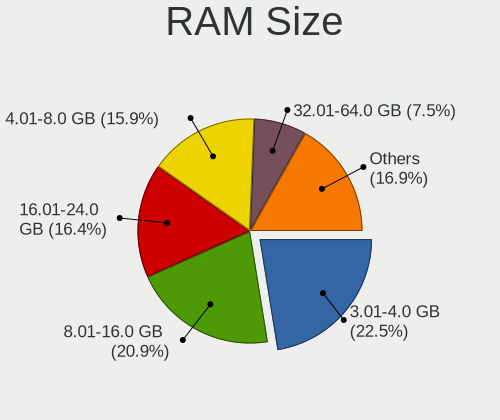

| Size in GB      | Desktops | Percent |
|-----------------|----------|---------|
| 3.01-4.0        | 2835     | 26.23%  |
| 8.01-16.0       | 2457     | 22.74%  |
| 4.01-8.0        | 1678     | 15.53%  |
| 16.01-24.0      | 1417     | 13.11%  |
| 1.01-2.0        | 952      | 8.81%   |
| 2.01-3.0        | 623      | 5.76%   |
| 32.01-64.0      | 461      | 4.27%   |
| 0.51-1.0        | 152      | 1.41%   |
| 64.01-256.0     | 109      | 1.01%   |
| 24.01-32.0      | 106      | 0.98%   |
| 0.01-0.5        | 12       | 0.11%   |
| Unknown         | 3        | 0.03%   |
| More than 256.0 | 2        | 0.02%   |

RAM Used
--------

Used RAM memory

| Used GB     | Desktops | Percent |
|-------------|----------|---------|
| 1.01-2.0    | 4464     | 38.11%  |
| 0.51-1.0    | 4273     | 36.48%  |
| 2.01-3.0    | 1309     | 11.17%  |
| 4.01-8.0    | 613      | 5.23%   |
| 3.01-4.0    | 532      | 4.54%   |
| 0.01-0.5    | 271      | 2.31%   |
| 8.01-16.0   | 173      | 1.48%   |
| 16.01-24.0  | 44       | 0.38%   |
| 32.01-64.0  | 14       | 0.12%   |
| 24.01-32.0  | 10       | 0.09%   |
| Unknown     | 9        | 0.08%   |
| 64.01-256.0 | 2        | 0.02%   |

Total Drives
------------

Number of drives on board

| Drives  | Desktops | Percent |
|---------|----------|---------|
| 1       | 5522     | 50.34%  |
| 2       | 2966     | 27.04%  |
| 3       | 1426     | 13%     |
| 4       | 601      | 5.48%   |
| 5       | 246      | 2.24%   |
| 6       | 77       | 0.7%    |
| 0       | 70       | 0.64%   |
| 7       | 29       | 0.26%   |
| 8       | 15       | 0.14%   |
| 9       | 8        | 0.07%   |
| 10      | 2        | 0.02%   |
| Unknown | 2        | 0.02%   |
| 18      | 1        | 0.01%   |
| 17      | 1        | 0.01%   |
| 13      | 1        | 0.01%   |
| 12      | 1        | 0.01%   |
| 11      | 1        | 0.01%   |

Has CD-ROM
----------

Has CD-ROM on board

| Presented | Desktops | Percent |
|-----------|----------|---------|
| Yes       | 5427     | 51.12%  |
| No        | 5189     | 48.88%  |

Has Ethernet
------------

Has Ethernet on board

| Presented | Desktops | Percent |
|-----------|----------|---------|
| Yes       | 10269    | 99.05%  |
| No        | 99       | 0.95%   |

Has WiFi
--------

Has WiFi module

| Presented | Desktops | Percent |
|-----------|----------|---------|
| No        | 8155     | 77.39%  |
| Yes       | 2383     | 22.61%  |

Has Bluetooth
-------------

Has Bluetooth module

| Presented | Desktops | Percent |
|-----------|----------|---------|
| No        | 9220     | 87.85%  |
| Yes       | 1275     | 12.15%  |

Location
--------

Country
-------

Geographic location (country)

| Country | Desktops | Percent |
|---------|----------|---------|
| Russia  | 10367    | 100%    |

City
----

Geographic location (city)

| City             | Desktops | Percent |
|------------------|----------|---------|
| Moscow           | 1744     | 15.79%  |
| St Petersburg    | 701      | 6.35%   |
| Voronezh         | 640      | 5.8%    |
| Pecherskoye      | 421      | 3.81%   |
| Novosibirsk      | 335      | 3.03%   |
| Yekaterinburg    | 278      | 2.52%   |
| Krasnodar        | 233      | 2.11%   |
| Samara           | 224      | 2.03%   |
| Nizhniy Novgorod | 214      | 1.94%   |
| Rostov-on-Don    | 206      | 1.87%   |
| Perm             | 180      | 1.63%   |
| Chelyabinsk      | 179      | 1.62%   |
| Krasnoyarsk      | 136      | 1.23%   |
| Omsk             | 128      | 1.16%   |
| Saratov          | 127      | 1.15%   |
| Kazan         | 106      | 0.96%   |
| Volgograd        | 101      | 0.91%   |
| Ufa              | 98       | 0.89%   |
| Barnaul          | 98       | 0.89%   |
| Vladivostok      | 93       | 0.84%   |
| Tyumen           | 90       | 0.81%   |
| Stavropol        | 90       | 0.81%   |
| Irkutsk          | 89       | 0.81%   |
| Khabarovsk       | 87       | 0.79%   |
| Ulyanovsk        | 75       | 0.68%   |
| Orenburg         | 73       | 0.66%   |
| Tomsk            | 72       | 0.65%   |
| Bryansk          | 69       | 0.62%   |
| Belgorod         | 69       | 0.62%   |
| Kemerovo         | 63       | 0.57%   |
| Yaroslavl        | 62       | 0.56%   |
| Tula             | 62       | 0.56%   |
| Cheboksary       | 62       | 0.56%   |
| Tolyatti         | 61       | 0.55%   |
| Novokuznetsk     | 60       | 0.54%   |
| Lipetsk          | 59       | 0.53%   |
| Izhevsk          | 59       | 0.53%   |
| Ryazan           | 58       | 0.53%   |
| Kaliningrad      | 57       | 0.52%   |
| Murmansk         | 54       | 0.49%   |
| Astrakhan        | 54       | 0.49%   |
| Penza            | 53       | 0.48%   |
| Smolensk         | 51       | 0.46%   |
| Kirov            | 50       | 0.45%   |
| Kurgan           | 47       | 0.43%   |
| Surgut           | 46       | 0.42%   |
| Ivanovo          | 46       | 0.42%   |
| Kaluga           | 44       | 0.4%    |
| Abakan           | 44       | 0.4%    |
| Vladimir         | 43       | 0.39%   |
| Yoshkar-Ola      | 38       | 0.34%   |
| Pskov            | 37       | 0.34%   |
| Veliky Novgorod  | 35       | 0.32%   |
| Oryol            | 35       | 0.32%   |
| Kostroma         | 35       | 0.32%   |
| Chita            | 35       | 0.32%   |
| Tver             | 34       | 0.31%   |
| Sochi            | 34       | 0.31%   |
| Blagoveshchensk  | 34       | 0.31%   |
| Arkhangelsk      | 32       | 0.29%   |

Drives
------

Drive Vendor
------------

Hard drive vendors

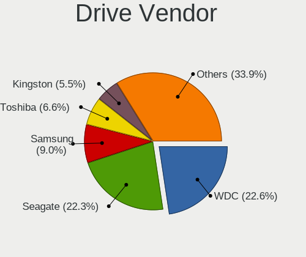

| Vendor                | Desktops | Drives  | Percent |
|-----------------------|----------|---------|---------|
| Seagate               | 4339     | 7002    | 25.79%  |
| WDC                   | 4180     | 7134    | 24.85%  |
| Samsung Electronics   | 1493     | 2229    | 8.87%   |
| Toshiba               | 1138     | 1680    | 6.76%   |
| Hitachi               | 957      | 1283    | 5.69%   |
| Kingston              | 823      | 1120    | 4.89%   |
| A-DATA Technology     | 266      | 366     | 1.58%   |
| Maxtor                | 265      | 336     | 1.58%   |
| SPCC                  | 260      | 325     | 1.55%   |
| China                 | 251      | 359     | 1.49%   |
| Crucial               | 246      | 329     | 1.46%   |
| OCZ                   | 218      | 286     | 1.3%    |
| Intel                 | 191      | 315     | 1.14%   |
| Plextor               | 176      | 270     | 1.05%   |
| SanDisk               | 175      | 242     | 1.04%   |
| HGST                  | 164      | 244     | 0.97%   |
| Apacer                | 125      | 176     | 0.74%   |
| Smartbuy              | 105      | 137     | 0.62%   |
| HUAWEI                | 86       | 101     | 0.51%   |
| Patriot               | 79       | 106     | 0.47%   |
| AMD                   | 78       | 93      | 0.46%   |
| GOODRAM               | 74       | 101     | 0.44%   |
| Corsair               | 73       | 106     | 0.43%   |
| Transcend             | 63       | 80      | 0.37%   |
| Silicon Motion        | 61       | 75      | 0.36%   |
| KingSpec              | 58       | 76      | 0.34%   |
| Unknown               | 52       | 86      | 0.31%   |
| Phison                | 45       | 52      | 0.27%   |
| Netac                 | 44       | 98      | 0.26%   |
| KingDian              | 41       | 65      | 0.24%   |
| Gigabyte Technology   | 41       | 47      | 0.24%   |
| Fujitsu               | 37       | 43      | 0.22%   |
| Kingmax               | 35       | 59      | 0.21%   |
| XPG                   | 33       | 40      | 0.2%    |
| Foxline               | 26       | 30      | 0.15%   |
| AXIOMTEK              | 26       | 26      | 0.15%   |
| ZTE                   | 22       | 26      | 0.13%   |
| JMicron Technology    | 22       | 23      | 0.13%   |
| TF CARD               | 20       | 24      | 0.12%   |
| SK hynix              | 19       | 22      | 0.11%   |
| Hewlett-Packard       | 19       | 28      | 0.11%   |
| XrayDisk              | 17       | 24      | 0.1%    |
| Mass                  | 16       | Unknown | 0.1%    |
| Realtek Semiconductor | 14       | 15      | 0.08%   |
| Qumo                  | 13       | 17      | 0.08%   |
| Micron Technology     | 13       | 17      | 0.08%   |
| Londisk               | 12       | 13      | 0.07%   |
| KingFast              | 12       | 16      | 0.07%   |
| IBM/Hitachi           | 12       | 15      | 0.07%   |
| Unknown               | 11       | 11      | 0.07%   |
| Team                  | 10       | 11      | 0.06%   |
| Palit                 | 9        | 12      | 0.05%   |
| Zheino                | 8        | 10      | 0.05%   |
| Lite-On               | 8        | 10      | 0.05%   |
| e2e4                  | 8        | 12      | 0.05%   |
| TO Exter              | 7        | 7       | 0.04%   |
| PNY                   | 7        | 8       | 0.04%   |
| OCZ-VERTEX3           | 7        | 11      | 0.04%   |
| LITEON                | 6        | 7       | 0.04%   |
| LITEONIT              | 5        | 10      | 0.03%   |

Drive Model
-----------

Hard drive models

| Model                            | Desktops | Percent |
|----------------------------------|----------|---------|
| Seagate ST500DM002-1BD142 500GB  | 351      | 1.81%   |
| Toshiba DT01ACA050 500GB         | 239      | 1.23%   |
| Seagate ST3500418AS 500GB        | 228      | 1.18%   |
| Seagate ST1000DM010-2EP102 1TB   | 211      | 1.09%   |
| Toshiba HDWD110 1TB              | 205      | 1.06%   |
| WDC WD10EZEX-08WN4A0 1TB         | 196      | 1.01%   |
| Seagate ST1000DM003-1CH162 1TB   | 181      | 0.93%   |
| Toshiba DT01ACA100 1TB           | 175      | 0.9%    |
| Kingston SV300S37A120G 120GB SSD | 138      | 0.71%   |
| Kingston SA400S37120G 120GB SSD  | 135      | 0.7%    |
| WDC WD5000AAKX-001CA0 500GB      | 133      | 0.69%   |
| Seagate ST380011A 80GB           | 125      | 0.65%   |
| Samsung SSD 860 EVO 250GB        | 125      | 0.65%   |
| Seagate ST3250410AS 250GB        | 123      | 0.64%   |
| Seagate ST380815AS 80GB          | 117      | 0.6%    |
| Kingston SA400S37240G 240GB SSD  | 116      | 0.6%    |
| Seagate ST31000524AS 1TB         | 113      | 0.58%   |
| Seagate ST3160815AS 160GB        | 111      | 0.57%   |
| WDC WDS240G2G0A-00JH30 240GB SSD | 110      | 0.57%   |
| Seagate ST31000528AS 1TB         | 110      | 0.57%   |
| Seagate ST3250310AS 250GB        | 105      | 0.54%   |
| Seagate ST1000DM003-1ER162 1TB   | 104      | 0.54%   |
| Hitachi HDS721050CLA362 500GB    | 104      | 0.54%   |
| Seagate ST1000DM003-9YN162 1TB   | 97       | 0.5%    |
| Toshiba HDWD105 500GB            | 89       | 0.46%   |
| WDC WDS120G2G0A-00JH30 120GB SSD | 84       | 0.43%   |
| Seagate ST3250318AS 250GB        | 83       | 0.43%   |
| Seagate ST250DM000-1BD141 250GB  | 83       | 0.43%   |
| Seagate ST3500413AS 500GB        | 81       | 0.42%   |
| SPCC Solid State Disk 120GB      | 77       | 0.4%    |
| Seagate ST2000DM001-1CH164 2TB   | 76       | 0.39%   |
| Crucial CT480BX500SSD1 480GB     | 76       | 0.39%   |
| WDC WD5000AAKX-00ERMA0 500GB     | 75       | 0.39%   |
| WDC WD10EZEX-00BN5A0 1TB         | 72       | 0.37%   |
| Seagate ST3320613AS 320GB        | 72       | 0.37%   |
| Seagate ST3320620AS 320GB        | 71       | 0.37%   |
| WDC WD5000AADS-00S9B0 500GB      | 70       | 0.36%   |
| Hitachi HDS721616PLA380 160GB    | 64       | 0.33%   |
| SPCC Solid State Disk 64GB       | 63       | 0.33%   |
| Seagate ST340014A 40GB           | 63       | 0.33%   |
| Hitachi HDS721010CLA332 1TB      | 63       | 0.33%   |
| WDC WD10EARS-00Y5B1 1TB          | 62       | 0.32%   |
| Seagate ST3160811AS 160GB        | 60       | 0.31%   |
| Samsung SSD 860 EVO 500GB        | 59       | 0.3%    |
| Samsung SSD 850 EVO 250GB        | 58       | 0.3%    |
| WDC WD10EZEX-00RKKA0 1TB         | 57       | 0.29%   |
| Samsung HD080HJ 80GB             | 57       | 0.29%   |
| WDC WD5000AAKX-60U6AA0 500GB     | 54       | 0.28%   |
| Toshiba HDWD120 2TB              | 53       | 0.27%   |
| WDC WD3200AAJS-00L7A0 320GB      | 52       | 0.27%   |
| Seagate ST3320418AS 320GB        | 52       | 0.27%   |
| Seagate ST2000DM008-2FR102 2TB   | 52       | 0.27%   |
| WDC WD5000AZRX-00A8LB0 500GB     | 51       | 0.26%   |
| WDC WD20EARX-00PASB0 2TB         | 51       | 0.26%   |
| WDC WD10EZEX-08M2NA0 1TB         | 51       | 0.26%   |
| Kingston SV300S37A60G 64GB SSD   | 51       | 0.26%   |
| Seagate ST2000DM006-2DM164 2TB   | 50       | 0.26%   |
| Hitachi HDS721050CLA360 500GB    | 50       | 0.26%   |
| Toshiba DT01ACA200 2TB           | 49       | 0.25%   |
| Crucial CT240BX500SSD1 240GB     | 47       | 0.24%   |

HDD Vendor
----------

Hard disk drive vendors

| Vendor              | Desktops | Drives | Percent |
|---------------------|----------|--------|---------|
| Seagate             | 4322     | 6965   | 37.39%  |
| WDC                 | 3939     | 6602   | 34.08%  |
| Toshiba             | 1089     | 1579   | 9.42%   |
| Hitachi             | 957      | 1283   | 8.28%   |
| Samsung Electronics | 710      | 1028   | 6.14%   |
| Maxtor              | 264      | 335    | 2.28%   |
| HGST                | 164      | 244    | 1.42%   |
| Fujitsu             | 36       | 42     | 0.31%   |
| Unknown             | 17       | 23     | 0.15%   |
| IBM/Hitachi         | 12       | 15     | 0.1%    |
| Hewlett-Packard     | 8        | 11     | 0.07%   |
| IBM                 | 4        | 4      | 0.03%   |
| USB3.0              | 3        | 3      | 0.03%   |
| Quantum             | 3        | 3      | 0.03%   |
| ASMedia             | 3        | 4      | 0.03%   |
| WD MediaMax         | 2        | 2      | 0.02%   |
| Synology            | 2        | 3      | 0.02%   |
| PHD 3.0             | 2        | 2      | 0.02%   |
| ExcelStor           | 2        | 2      | 0.02%   |
| CLOVER              | 2        | 2      | 0.02%   |
| ASMT106x            | 2        | 3      | 0.02%   |
| ASMT                | 2        | 6      | 0.02%   |
| Apple               | 2        | 2      | 0.02%   |
| USB 3.0             | 1        | 1      | 0.01%   |
| USB                 | 1        | 1      | 0.01%   |
| Silicon             | 1        | 1      | 0.01%   |
| SATAFIRM            | 1        | 1      | 0.01%   |
| SAGE                | 1        | 1      | 0.01%   |
| MR2020              | 1        | 1      | 0.01%   |
| MARVELL             | 1        | 1      | 0.01%   |
| LIO-ORG             | 1        | 1      | 0.01%   |
| KESU                | 1        | 1      | 0.01%   |
| JMicron Technology  | 1        | 1      | 0.01%   |
| IET                 | 1        | 2      | 0.01%   |
| Unknown             | 1        | 1      | 0.01%   |

SSD Vendor
----------

Solid state drive vendors

| Vendor              | Desktops | Drives | Percent |
|---------------------|----------|--------|---------|
| Kingston            | 765      | 1036   | 17.01%  |
| Samsung Electronics | 557      | 798    | 12.38%  |
| WDC                 | 372      | 493    | 8.27%   |
| China               | 249      | 357    | 5.54%   |
| SPCC                | 246      | 307    | 5.47%   |
| Crucial             | 239      | 317    | 5.31%   |
| A-DATA Technology   | 218      | 286    | 4.85%   |
| OCZ                 | 217      | 285    | 4.82%   |
| Plextor             | 161      | 235    | 3.58%   |
| SanDisk             | 156      | 222    | 3.47%   |
| Intel               | 141      | 239    | 3.13%   |
| Apacer              | 113      | 162    | 2.51%   |
| Smartbuy            | 99       | 129    | 2.2%    |
| Patriot             | 76       | 102    | 1.69%   |
| Toshiba             | 71       | 99     | 1.58%   |
| AMD                 | 71       | 84     | 1.58%   |
| Corsair             | 70       | 100    | 1.56%   |
| GOODRAM             | 69       | 96     | 1.53%   |
| Transcend           | 59       | 75     | 1.31%   |
| KingSpec            | 58       | 76     | 1.29%   |
| Netac               | 41       | 95     | 0.91%   |
| KingDian            | 41       | 65     | 0.91%   |
| Kingmax             | 35       | 59     | 0.78%   |
| Gigabyte Technology | 30       | 33     | 0.67%   |
| Foxline             | 26       | 30     | 0.58%   |
| AXIOMTEK            | 26       | 26     | 0.58%   |
| Qumo                | 13       | 17     | 0.29%   |
| JMicron Technology  | 13       | 13     | 0.29%   |
| XrayDisk            | 12       | 19     | 0.27%   |
| Londisk             | 12       | 13     | 0.27%   |
| Seagate             | 11       | 19     | 0.24%   |
| KingFast            | 10       | 13     | 0.22%   |
| Palit               | 9        | 12     | 0.2%    |
| Micron Technology   | 9        | 13     | 0.2%    |
| Zheino              | 8        | 10     | 0.18%   |
| Unknown             | 8        | 12     | 0.18%   |
| Team                | 8        | 8      | 0.18%   |
| Hewlett-Packard     | 8        | 13     | 0.18%   |
| TO Exter            | 7        | 7      | 0.16%   |
| PNY                 | 7        | 8      | 0.16%   |
| OCZ-VERTEX3         | 7        | 11     | 0.16%   |
| e2e4                | 7        | 11     | 0.16%   |
| Unknown             | 6        | 6      | 0.13%   |
| SK hynix            | 5        | 6      | 0.11%   |
| LITEONIT            | 5        | 10     | 0.11%   |
| Xinhaike            | 4        | 6      | 0.09%   |
| Verbatim            | 4        | 4      | 0.09%   |
| OCZ-VERTEX2         | 4        | 4      | 0.09%   |
| NGFF                | 4        | 4      | 0.09%   |
| LITEON              | 4        | 5      | 0.09%   |
| Kingrich            | 4        | 6      | 0.09%   |
| WALRAM              | 3        | 3      | 0.07%   |
| Pioneer             | 3        | 3      | 0.07%   |
| OCZ-VERTEX          | 3        | 6      | 0.07%   |
| KIOXIA-EXCERIA      | 3        | 5      | 0.07%   |
| GLOWAY              | 3        | 3      | 0.07%   |
| FORESEE             | 3        | 3      | 0.07%   |
| Faspeed             | 3        | 3      | 0.07%   |
| UNIC2               | 2        | 2      | 0.04%   |
| SSD                 | 2        | 2      | 0.04%   |

Drive Kind
----------

HDD or SSD

| Kind    | Desktops | Drives | Percent |
|---------|----------|--------|---------|
| HDD     | 8921     | 18176  | 65.04%  |
| SSD     | 3824     | 6202   | 27.88%  |
| NVMe    | 757      | 1100   | 5.52%   |
| Unknown | 204      | 236    | 1.49%   |
| MMC     | 11       | 17     | 0.08%   |

Drive Connector
---------------

SATA, SAS, NVMe, etc.

| Type | Desktops | Drives | Percent |
|------|----------|--------|---------|
| SATA | 10087    | 24199  | 90.09%  |
| NVMe | 755      | 1096   | 6.74%   |
| SAS  | 343      | 419    | 3.06%   |
| MMC  | 11       | 17     | 0.1%    |

Drive Size
----------

Size of hard drive

| Size in TB      | Desktops | Drives | Percent |
|-----------------|----------|--------|---------|
| 0.01-0.5        | 8625     | 16286  | 64.23%  |
| 0.51-1.0        | 3477     | 5891   | 25.89%  |
| 1.01-2.0        | 890      | 1444   | 6.63%   |
| 2.01-3.0        | 200      | 323    | 1.49%   |
| 3.01-4.0        | 152      | 242    | 1.13%   |
| 4.01-10.0       | 71       | 168    | 0.53%   |
| 10.01-20.0      | 12       | 22     | 0.09%   |
| More than 100.0 | 1        | 1      | 0.01%   |
| 20.01-50.0      | 1        | 1      | 0.01%   |

Space Total
-----------

Amount of disk space available on the file system

| Size in GB     | Desktops | Percent |
|----------------|----------|---------|
| 101-250        | 2919     | 25.11%  |
| 251-500        | 2009     | 17.28%  |
| 501-1000       | 1450     | 12.47%  |
| 51-100         | 1228     | 10.56%  |
| 1-20           | 1221     | 10.5%   |
| 1001-2000      | 872      | 7.5%    |
| 21-50          | 719      | 6.18%   |
| Unknown        | 605      | 5.2%    |
| 2001-3000      | 311      | 2.68%   |
| More than 3000 | 291      | 2.5%    |

Space Used
----------

Amount of used disk space

| Used GB        | Desktops | Percent |
|----------------|----------|---------|
| 1-20           | 6287     | 53.92%  |
| 21-50          | 1151     | 9.87%   |
| 101-250        | 898      | 7.7%    |
| 251-500        | 767      | 6.58%   |
| 51-100         | 742      | 6.36%   |
| 501-1000       | 622      | 5.33%   |
| Unknown        | 605      | 5.19%   |
| 1001-2000      | 358      | 3.07%   |
| More than 3000 | 123      | 1.05%   |
| 2001-3000      | 105      | 0.9%    |
| 0              | 1        | 0.01%   |

Malfunc. Drives
---------------

Drive models with a malfunction

| Model                             | Desktops | Drives | Percent |
|-----------------------------------|----------|--------|---------|
| Seagate ST500DM002-1BD142 500GB   | 128      | 162    | 2.54%   |
| Seagate ST3500418AS 500GB         | 100      | 128    | 1.99%   |
| Seagate ST3250410AS 250GB         | 81       | 103    | 1.61%   |
| WDC WD5000AAKX-001CA0 500GB       | 63       | 81     | 1.25%   |
| Seagate ST3250310AS 250GB         | 60       | 97     | 1.19%   |
| Seagate ST3320613AS 320GB         | 55       | 73     | 1.09%   |
| Seagate ST31000528AS 1TB          | 51       | 58     | 1.01%   |
| Seagate ST1000DM003-9YN162 1TB    | 50       | 60     | 0.99%   |
| Seagate ST1000DM003-1CH162 1TB    | 48       | 75     | 0.95%   |
| WDC WD5000AADS-00S9B0 500GB       | 44       | 51     | 0.87%   |
| Seagate ST380011A 80GB            | 44       | 47     | 0.87%   |
| Hitachi HDS721050CLA362 500GB     | 42       | 48     | 0.83%   |
| Seagate ST3160815AS 160GB         | 41       | 52     | 0.81%   |
| Seagate ST250DM000-1BD141 250GB   | 41       | 53     | 0.81%   |
| Seagate ST31000524AS 1TB          | 40       | 53     | 0.79%   |
| WDC WD10EARS-00Y5B1 1TB           | 35       | 59     | 0.7%    |
| Seagate ST3250318AS 250GB         | 35       | 42     | 0.7%    |
| Hitachi HDS721010CLA332 1TB       | 35       | 42     | 0.7%    |
| WDC WD3200AAJS-00L7A0 320GB       | 34       | 39     | 0.68%   |
| Seagate ST3160811AS 160GB         | 34       | 49     | 0.68%   |
| Seagate ST380815AS 80GB           | 33       | 45     | 0.66%   |
| Samsung Electronics HD160JJ 160GB | 33       | 53     | 0.66%   |
| Hitachi HDS721616PLA380 160GB     | 33       | 46     | 0.66%   |
| Samsung Electronics HD080HJ 80GB  | 32       | 42     | 0.64%   |
| WDC WD5000AAKX-60U6AA0 500GB      | 31       | 38     | 0.62%   |
| Maxtor STM3250310AS 250GB         | 30       | 39     | 0.6%    |
| Kingston SV300S37A120G 120GB SSD  | 30       | 31     | 0.6%    |
| Seagate ST31500341AS 1TB          | 28       | 36     | 0.56%   |
| WDC WD5000AAKX-00ERMA0 500GB      | 26       | 35     | 0.52%   |
| Seagate ST3500413AS 500GB         | 26       | 28     | 0.52%   |
| Hitachi HDP725050GLA360 500GB     | 25       | 37     | 0.5%    |
| Samsung Electronics HD161HJ 160GB | 24       | 30     | 0.48%   |
| WDC WD5000AAKS-00V1A0 500GB       | 23       | 26     | 0.46%   |
| Seagate ST3320620AS 320GB         | 23       | 30     | 0.46%   |
| Seagate ST3500320AS 500GB         | 21       | 25     | 0.42%   |
| Kingston SHFS37A120G 120GB SSD    | 21       | 26     | 0.42%   |
| WDC WD5000AAKS-00UU3A0 500GB      | 20       | 25     | 0.4%    |
| Toshiba DT01ACA050 500GB          | 20       | 30     | 0.4%    |
| Samsung Electronics HD321KJ 320GB | 20       | 25     | 0.4%    |
| WDC WD15EARS-00Z5B1 1TB           | 19       | 24     | 0.38%   |
| WDC WD1002FAEX-00Z3A0 1TB         | 19       | 19     | 0.38%   |
| Toshiba DT01ACA100 1TB            | 19       | 29     | 0.38%   |
| Seagate ST380811AS 80GB           | 19       | 23     | 0.38%   |
| Seagate ST3320418AS 320GB         | 19       | 22     | 0.38%   |
| Seagate ST1000DL002-9TT153 1TB    | 19       | 20     | 0.38%   |
| Hitachi HDS721050CLA360 500GB     | 19       | 22     | 0.38%   |
| Hitachi HDS721032CLA362 320GB     | 19       | 26     | 0.38%   |
| WDC WD1600AAJS-00L7A0 160GB       | 18       | 25     | 0.36%   |
| Seagate ST3750528AS 752GB         | 18       | 30     | 0.36%   |
| Hitachi HDS721680PLA380 80GB      | 18       | 18     | 0.36%   |
| WDC WD3200AAKS-00L9A0 320GB       | 17       | 19     | 0.34%   |
| Seagate ST9250315AS 250GB         | 17       | 20     | 0.34%   |
| Seagate ST3160813AS 160GB         | 17       | 23     | 0.34%   |
| Seagate ST2000DM001-1CH164 2TB    | 17       | 28     | 0.34%   |
| Samsung Electronics SP2504C 250GB | 17       | 36     | 0.34%   |
| Samsung Electronics SP0802N 80GB  | 17       | 19     | 0.34%   |
| WDC WD10EARS-00MVWB0 1TB          | 16       | 20     | 0.32%   |
| Seagate ST3120827AS 120GB         | 16       | 21     | 0.32%   |
| Seagate ST3120813AS 120GB         | 16       | 20     | 0.32%   |
| Hitachi HDS721050DLE630 500GB     | 16       | 19     | 0.32%   |

Malfunc. Drive Vendor
---------------------

Vendors of faulty drives

| Vendor              | Desktops | Drives | Percent |
|---------------------|----------|--------|---------|
| Seagate             | 1748     | 2498   | 37.28%  |
| WDC                 | 1405     | 1970   | 29.96%  |
| Hitachi             | 432      | 570    | 9.21%   |
| Samsung Electronics | 376      | 529    | 8.02%   |
| Maxtor              | 153      | 183    | 3.26%   |
| Toshiba             | 143      | 195    | 3.05%   |
| Kingston            | 86       | 97     | 1.83%   |
| OCZ                 | 47       | 63     | 1%      |
| SPCC                | 34       | 41     | 0.73%   |
| HGST                | 30       | 36     | 0.64%   |
| A-DATA Technology   | 29       | 41     | 0.62%   |
| Corsair             | 26       | 37     | 0.55%   |
| Intel               | 25       | 29     | 0.53%   |
| Kingmax             | 24       | 42     | 0.51%   |
| Plextor             | 12       | 22     | 0.26%   |
| SanDisk             | 11       | 16     | 0.23%   |
| IBM/Hitachi         | 11       | 14     | 0.23%   |
| KingSpec            | 10       | 10     | 0.21%   |
| Fujitsu             | 9        | 10     | 0.19%   |
| Crucial             | 9        | 19     | 0.19%   |
| China               | 9        | 11     | 0.19%   |
| AMD                 | 6        | 8      | 0.13%   |
| Qumo                | 3        | 4      | 0.06%   |
| OCZ-VERTEX3         | 3        | 7      | 0.06%   |
| KingDian            | 3        | 4      | 0.06%   |
| IBM                 | 3        | 3      | 0.06%   |
| Verbatim            | 2        | 2      | 0.04%   |
| Smartbuy            | 2        | 2      | 0.04%   |
| Silicon Motion      | 2        | 3      | 0.04%   |
| Quantum             | 2        | 2      | 0.04%   |
| Patriot             | 2        | 2      | 0.04%   |
| Netac               | 2        | 2      | 0.04%   |
| LITEONIT            | 2        | 2      | 0.04%   |
| Intenso             | 2        | 8      | 0.04%   |
| Hewlett-Packard     | 2        | 3      | 0.04%   |
| Apacer              | 2        | 2      | 0.04%   |
| XPG                 | 1        | 1      | 0.02%   |
| WD MediaMax         | 1        | 1      | 0.02%   |
| walram              | 1        | 1      | 0.02%   |
| Unknown             | 1        | 1      | 0.02%   |
| Team                | 1        | 1      | 0.02%   |
| SuperTalent         | 1        | 1      | 0.02%   |
| SK hynix            | 1        | 2      | 0.02%   |
| s60                 | 1        | 1      | 0.02%   |
| Reeioon             | 1        | 1      | 0.02%   |
| Neo                 | 1        | 1      | 0.02%   |
| Kingrich            | 1        | 1      | 0.02%   |
| Hyperdisk           | 1        | 1      | 0.02%   |
| GLOWAY              | 1        | 1      | 0.02%   |
| Foxline             | 1        | 1      | 0.02%   |
| FORESEE             | 1        | 1      | 0.02%   |
| ExcelStor           | 1        | 1      | 0.02%   |
| Espada              | 1        | 2      | 0.02%   |
| EK60HYXTFY176       | 1        | 1      | 0.02%   |
| DEPO                | 1        | 1      | 0.02%   |
| Centerm             | 1        | 1      | 0.02%   |
| ASMT                | 1        | 2      | 0.02%   |
| ASMedia             | 1        | 1      | 0.02%   |

Malfunc. HDD Vendor
-------------------

Vendors of faulty HDD drives

| Vendor              | Desktops | Drives | Percent |
|---------------------|----------|--------|---------|
| Seagate             | 1747     | 2495   | 40.86%  |
| WDC                 | 1386     | 1933   | 32.41%  |
| Hitachi             | 432      | 570    | 10.1%   |
| Samsung Electronics | 356      | 507    | 8.33%   |
| Maxtor              | 153      | 183    | 3.58%   |
| Toshiba             | 141      | 193    | 3.3%    |
| HGST                | 30       | 36     | 0.7%    |
| IBM/Hitachi         | 11       | 14     | 0.26%   |
| Fujitsu             | 9        | 10     | 0.21%   |
| IBM                 | 3        | 3      | 0.07%   |
| Quantum             | 2        | 2      | 0.05%   |
| Hewlett-Packard     | 2        | 3      | 0.05%   |
| WD MediaMax         | 1        | 1      | 0.02%   |
| ExcelStor           | 1        | 1      | 0.02%   |
| ASMT                | 1        | 2      | 0.02%   |
| ASMedia             | 1        | 1      | 0.02%   |

Malfunc. Drive Kind
-------------------

Kinds of faulty drives

| Kind | Desktops | Drives | Percent |
|------|----------|--------|---------|
| HDD  | 3756     | 5954   | 90.16%  |
| SSD  | 396      | 534    | 9.51%   |
| NVMe | 14       | 24     | 0.34%   |

Failed Drives
-------------

Failed drive models

| Model                            | Desktops | Drives | Percent |
|----------------------------------|----------|--------|---------|
| Seagate ST31000528AS 1TB         | 7        | 9      | 4.09%   |
| Seagate ST31000524AS 1TB         | 7        | 9      | 4.09%   |
| Seagate ST3500418AS 500GB        | 5        | 6      | 2.92%   |
| Seagate ST3500412AS 500GB        | 5        | 6      | 2.92%   |
| Hitachi HDS721010DLE630 1TB      | 5        | 6      | 2.92%   |
| Seagate ST31000333AS 1TB         | 3        | 3      | 1.75%   |
| Samsung Electronics SP0411N 40GB | 3        | 4      | 1.75%   |
| Maxtor 6Y080L0 82GB              | 3        | 3      | 1.75%   |
| Hitachi HDS721010CLA332 1TB      | 3        | 3      | 1.75%   |
| WDC WD5000AAKS-00V1A0 500GB      | 2        | 2      | 1.17%   |
| WDC WD3200AAJS-00L7A0 320GB      | 2        | 2      | 1.17%   |
| WDC WD20EARS-00MVWB0 2TB         | 2        | 2      | 1.17%   |
| WDC WD15EARS-00MVWB0 1TB         | 2        | 4      | 1.17%   |
| Seagate STM3500418AS 499GB       | 2        | 2      | 1.17%   |
| Seagate ST500DM005 HD502HJ 500GB | 2        | 3      | 1.17%   |
| Seagate ST500DM002-1BD142 500GB  | 2        | 2      | 1.17%   |
| Seagate ST500DM002-1BC142 500GB  | 2        | 2      | 1.17%   |
| Seagate ST3750528AS 752GB        | 2        | 2      | 1.17%   |
| Seagate ST3320613AS 320GB        | 2        | 3      | 1.17%   |
| Seagate ST3250318AS 250GB        | 2        | 2      | 1.17%   |
| Seagate ST32000542AS 2TB         | 2        | 4      | 1.17%   |
| Seagate ST3160318AS 160GB        | 2        | 2      | 1.17%   |
| Samsung Electronics HD204UI 2TB  | 2        | 2      | 1.17%   |
| Samsung Electronics HD105SI 1TB  | 2        | 2      | 1.17%   |
| Hitachi HDT721032SLA380 320GB    | 2        | 2      | 1.17%   |
| Hitachi HDS721025CLA382 165GB    | 2        | 2      | 1.17%   |
| HGST HTS545050A7E380 500GB       | 2        | 2      | 1.17%   |
| WDC WD800JD-22LSA0 80GB          | 1        | 1      | 0.58%   |
| WDC WD800BB-55JKC0 80GB          | 1        | 2      | 0.58%   |
| WDC WD800BB-00JKC0 80GB          | 1        | 2      | 0.58%   |
| WDC WD800BB-00JHC0 80GB          | 1        | 1      | 0.58%   |
| WDC WD6400AACS-00G8B0 640GB      | 1        | 1      | 0.58%   |
| WDC WD5001AALS-00E3A0 500GB      | 1        | 1      | 0.58%   |
| WDC WD5000BPVT-00HXZT1 500GB     | 1        | 1      | 0.58%   |
| WDC WD5000BEVT-00ZAT0 500GB      | 1        | 2      | 0.58%   |
| WDC WD5000BEVT-00A0RT0 500GB     | 1        | 1      | 0.58%   |
| WDC WD5000AAKX-001CA0 500GB      | 1        | 1      | 0.58%   |
| WDC WD5000AAKS-22A7B2 500GB      | 1        | 2      | 0.58%   |
| WDC WD5000AAKS-00M9A0 500GB      | 1        | 1      | 0.58%   |
| WDC WD5000AAJS-22YFA0 500GB      | 1        | 1      | 0.58%   |
| WDC WD5000AAJS-00TKA0 500GB      | 1        | 1      | 0.58%   |
| WDC WD5000AADS-00M2B0 500GB      | 1        | 2      | 0.58%   |
| WDC WD3200BPVT-22ZEST0 320GB     | 1        | 1      | 0.58%   |
| WDC WD3200BEVT-80A0RT0 320GB     | 1        | 1      | 0.58%   |
| WDC WD3200BEKT-60PVMT0 320GB     | 1        | 1      | 0.58%   |
| WDC WD3200AAJS-60M0A1 320GB      | 1        | 2      | 0.58%   |
| WDC WD3200AAJS-00B4A0 320GB      | 1        | 1      | 0.58%   |
| WDC WD30EZRS-00J99B0 3TB         | 1        | 2      | 0.58%   |
| WDC WD3000HLFS-01MZUV0 304GB     | 1        | 1      | 0.58%   |
| WDC WD2500JS-22NCB1 250GB        | 1        | 2      | 0.58%   |
| WDC WD2500AAKX-00ERMA0 250GB     | 1        | 1      | 0.58%   |
| WDC WD2500AAKS-00F0A0 250GB      | 1        | 1      | 0.58%   |
| WDC WD2500AAJS-00VTA0 250GB      | 1        | 1      | 0.58%   |
| WDC WD2500AAJS-00B4A0 250GB      | 1        | 1      | 0.58%   |
| WDC WD20EARX-00PASB0 2TB         | 1        | 1      | 0.58%   |
| WDC WD1600JS-00MHB0 160GB        | 1        | 1      | 0.58%   |
| WDC WD1600JB-00REA0 160GB        | 1        | 2      | 0.58%   |
| WDC WD1600BEVS-22RST0 160GB      | 1        | 2      | 0.58%   |
| WDC WD1600AAJS-65WAA0 160GB      | 1        | 1      | 0.58%   |
| WDC WD1600AAJS-07WAA0 160GB      | 1        | 1      | 0.58%   |

Failed Drive Vendor
-------------------

Failed drive vendors

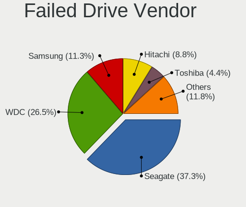

| Vendor              | Desktops | Drives | Percent |
|---------------------|----------|--------|---------|
| Seagate             | 64       | 76     | 37.65%  |
| WDC                 | 45       | 58     | 26.47%  |
| Samsung Electronics | 21       | 23     | 12.35%  |
| Hitachi             | 16       | 17     | 9.41%   |
| Maxtor              | 7        | 7      | 4.12%   |
| Toshiba             | 6        | 6      | 3.53%   |
| HGST                | 4        | 4      | 2.35%   |
| Transcend           | 1        | 1      | 0.59%   |
| OCZ                 | 1        | 1      | 0.59%   |
| Hewlett-Packard     | 1        | 1      | 0.59%   |
| Goodram             | 1        | 1      | 0.59%   |
| Crucial             | 1        | 1      | 0.59%   |
| Corsair             | 1        | 1      | 0.59%   |
| A-DATA Technology   | 1        | 1      | 0.59%   |

Drive Status
------------

Number of failed and malfunc. drives

| Status   | Desktops | Drives | Percent |
|----------|----------|--------|---------|
| Works    | 7230     | 15516  | 55.55%  |
| Malfunc  | 4023     | 6512   | 30.91%  |
| Detected | 1596     | 3505   | 12.26%  |
| Failed   | 167      | 198    | 1.28%   |

Storage controller
------------------

Storage Vendor
--------------

Storage controller vendors

| Vendor                           | Desktops | Percent |
|----------------------------------|----------|---------|
| Intel                            | 6852     | 53.51%  |
| AMD                              | 2672     | 20.87%  |
| Nvidia                           | 721      | 5.63%   |
| JMicron Technology               | 715      | 5.58%   |
| Marvell Technology Group         | 399      | 3.12%   |
| ASMedia Technology               | 330      | 2.58%   |
| Samsung Electronics              | 296      | 2.31%   |
| VIA Technologies                 | 198      | 1.55%   |
| Silicon Motion                   | 103      | 0.8%    |
| Phison Electronics               | 91       | 0.71%   |
| Kingston Technology Company      | 68       | 0.53%   |
| SanDisk                          | 50       | 0.39%   |
| ADATA Technology                 | 50       | 0.39%   |
| Realtek Semiconductor            | 43       | 0.34%   |
| Silicon Integrated Systems [SiS] | 39       | 0.3%    |
| Silicon Image                    | 32       | 0.25%   |
| Integrated Technology Express    | 28       | 0.22%   |
| Lite-On Technology               | 26       | 0.2%    |
| SK hynix                         | 14       | 0.11%   |
| Micron/Crucial Technology        | 9        | 0.07%   |
| Broadcom / LSI                   | 9        | 0.07%   |
| Adaptec                          | 9        | 0.07%   |
| Lite-On IT Corp. / Plextor       | 5        | 0.04%   |
| ULi Electronics                  | 4        | 0.03%   |
| Promise Technology               | 4        | 0.03%   |
| Micron Technology                | 4        | 0.03%   |
| LSI Logic / Symbios Logic        | 4        | 0.03%   |
| Hewlett-Packard                  | 4        | 0.03%   |
| OCZ Technology Group             | 3        | 0.02%   |
| MCST                             | 3        | 0.02%   |
| KIOXIA                           | 3        | 0.02%   |
| Toshiba America Info Systems     | 2        | 0.02%   |
| Solid State Storage Technology   | 2        | 0.02%   |
| Seagate Technology               | 2        | 0.02%   |
| MAXIO Technology (Hangzhou)      | 2        | 0.02%   |
| Broadcom                         | 2        | 0.02%   |
| 3ware                            | 2        | 0.02%   |
| Zhaoxin                          | 1        | 0.01%   |
| Union Memory (Shenzhen)          | 1        | 0.01%   |
| Shenzhen Longsys Electronics     | 1        | 0.01%   |
| Biwin Storage Technology         | 1        | 0.01%   |
| ATI Technologies                 | 1        | 0.01%   |
| Artop Electronic                 | 1        | 0.01%   |

Storage Model
-------------

Storage controller models

| Model                                                                                   | Desktops | Percent |
|-----------------------------------------------------------------------------------------|----------|---------|
| Intel NM10/ICH7 Family SATA Controller [IDE mode]                                       | 1318     | 7.18%   |
| AMD FCH SATA Controller [AHCI mode]                                                     | 1037     | 5.65%   |
| Intel 82801G (ICH7 Family) IDE Controller                                               | 991      | 5.4%    |
| AMD SB7x0/SB8x0/SB9x0 IDE Controller                                                    | 987      | 5.38%   |
| AMD SB7x0/SB8x0/SB9x0 SATA Controller [IDE mode]                                        | 712      | 3.88%   |
| Intel 8 Series/C220 Series Chipset Family 6-port SATA Controller 1 [AHCI mode]          | 610      | 3.32%   |
| AMD SB7x0/SB8x0/SB9x0 SATA Controller [AHCI mode]                                       | 566      | 3.08%   |
| Intel 6 Series/C200 Series Chipset Family Desktop SATA Controller (IDE mode, ports 4-5) | 554      | 3.02%   |
| Intel 6 Series/C200 Series Chipset Family Desktop SATA Controller (IDE mode, ports 0-3) | 553      | 3.01%   |
| Intel Q170/Q150/B150/H170/H110/Z170/CM236 Chipset SATA Controller [AHCI Mode]           | 543      | 2.96%   |
| Intel 6 Series/C200 Series Chipset Family 6 port Desktop SATA AHCI Controller           | 517      | 2.82%   |
| Intel 7 Series/C210 Series Chipset Family 6-port SATA Controller [AHCI mode]            | 425      | 2.32%   |
| Nvidia MCP61 SATA Controller                                                            | 377      | 2.05%   |
| Intel 200 Series PCH SATA controller [AHCI mode]                                        | 372      | 2.03%   |
| Nvidia MCP61 IDE                                                                        | 353      | 1.92%   |
| JMicron JMB363 SATA/IDE Controller                                                      | 350      | 1.91%   |
| AMD 400 Series Chipset SATA Controller                                                  | 349      | 1.9%    |
| ASMedia ASM1062 Serial ATA Controller                                                   | 316      | 1.72%   |
| JMicron JMB368 IDE controller                                                           | 273      | 1.49%   |
| Intel 82801JI (ICH10 Family) 4 port SATA IDE Controller #1                              | 257      | 1.4%    |
| Intel 82801JI (ICH10 Family) 2 port SATA IDE Controller #2                              | 257      | 1.4%    |
| Intel 82801I (ICH9 Family) 2 port SATA Controller [IDE mode]                            | 243      | 1.32%   |
| Samsung NVMe SSD Controller SM981/PM981/PM983                                           | 195      | 1.06%   |
| Intel 5 Series/3400 Series Chipset 4 port SATA IDE Controller                           | 170      | 0.93%   |
| Intel 5 Series/3400 Series Chipset 2 port SATA IDE Controller                           | 169      | 0.92%   |
| Intel 7 Series/C210 Series Chipset Family 4-port SATA Controller [IDE mode]             | 168      | 0.92%   |
| Intel 7 Series/C210 Series Chipset Family 2-port SATA Controller [IDE mode]             | 168      | 0.92%   |
| AMD FCH SATA Controller D                                                               | 156      | 0.85%   |
| Intel 82801IB (ICH9) 2 port SATA Controller [IDE mode]                                  | 153      | 0.83%   |
| Intel Cannon Lake PCH SATA AHCI Controller                                              | 149      | 0.81%   |
| AMD FCH IDE Controller                                                                  | 134      | 0.73%   |
| Intel 82801JI (ICH10 Family) SATA AHCI Controller                                       | 124      | 0.68%   |
| AMD 300 Series Chipset SATA Controller                                                  | 122      | 0.66%   |
| Intel 82801H (ICH8 Family) 4 port SATA Controller [IDE mode]                            | 114      | 0.62%   |
| Intel 500 Series Chipset Family SATA AHCI Controller                                    | 114      | 0.62%   |
| AMD FCH SATA Controller [IDE mode]                                                      | 113      | 0.62%   |
| Intel 82801HR/HO/HH (ICH8R/DO/DH) 2 port SATA Controller [IDE mode]                     | 109      | 0.59%   |
| Intel 5 Series/3400 Series Chipset 6 port SATA AHCI Controller                          | 109      | 0.59%   |
| VIA VT6415 PATA IDE Host Controller                                                     | 106      | 0.58%   |
| Marvell Group 88SE6101/6102 single-port PATA133 interface                               | 106      | 0.58%   |
| Intel 9 Series Chipset Family SATA Controller [AHCI Mode]                               | 104      | 0.57%   |
| Marvell Group 88SE6111/6121 SATA II / PATA Controller                                   | 96       | 0.52%   |
| AMD 500 Series Chipset SATA Controller                                                  | 95       | 0.52%   |
| Silicon Motion SM2263EN/SM2263XT SSD Controller                                         | 92       | 0.5%    |
| AMD SB600 Non-Raid-5 SATA                                                               | 92       | 0.5%    |
| AMD SB600 IDE                                                                           | 92       | 0.5%    |
| Intel 82801IR/IO/IH (ICH9R/DO/DH) 4 port SATA Controller [IDE mode]                     | 89       | 0.48%   |
| Intel 82801EB/ER (ICH5/ICH5R) IDE Controller                                            | 86       | 0.47%   |
| Intel C600/X79 series chipset 6-Port SATA AHCI Controller                               | 82       | 0.45%   |
| Intel SATA Controller [RAID mode]                                                       | 81       | 0.44%   |
| VIA VT82C586A/B/VT82C686/A/B/VT823x/A/C PIPC Bus Master IDE                             | 66       | 0.36%   |
| Nvidia MCP78S [GeForce 8200] IDE                                                        | 66       | 0.36%   |
| Nvidia CK804 Serial ATA Controller                                                      | 66       | 0.36%   |
| Nvidia CK804 IDE                                                                        | 66       | 0.36%   |
| Marvell Group 88SE9172 SATA 6Gb/s Controller                                            | 57       | 0.31%   |
| Intel 400 Series Chipset Family SATA AHCI Controller                                    | 57       | 0.31%   |
| Nvidia MCP55 SATA Controller                                                            | 56       | 0.31%   |
| Nvidia MCP55 IDE                                                                        | 56       | 0.31%   |
| Intel 82801FB/FW (ICH6/ICH6W) SATA Controller                                           | 55       | 0.3%    |
| Samsung NVMe SSD Controller SM961/PM961/SM963                                           | 54       | 0.29%   |

Storage Kind
------------

Kind of storage controller (IDE, SATA, NVMe, SAS, ...)

| Kind | Desktops | Percent |
|------|----------|---------|
| SATA | 6462     | 49.94%  |
| IDE  | 5433     | 41.99%  |
| NVMe | 764      | 5.9%    |
| RAID | 260      | 2.01%   |
| SAS  | 15       | 0.12%   |
| SCSI | 6        | 0.05%   |

Processor
---------

CPU Vendor
----------

Processor vendors

| Vendor       | Desktops | Percent |
|--------------|----------|---------|
| Intel        | 6991     | 67.44%  |
| AMD          | 3369     | 32.5%   |
| CentaurHauls | 2        | 0.02%   |
| PowerMac7,2  | 1        | 0.01%   |
| MBE8C-PC     | 1        | 0.01%   |
| E8C/EATX     | 1        | 0.01%   |
| E8C-SWTX     | 1        | 0.01%   |
| Unknown      | 1        | 0.01%   |

CPU Model
---------

Processor models

| Model                                       | Desktops | Percent |
|---------------------------------------------|----------|---------|
| Intel Core 2 Duo CPU E8400 @ 3.00GHz        | 157      | 1.5%    |
| Intel Pentium 4 CPU 3.00GHz                 | 112      | 1.07%   |
| Intel Core i3-2120 CPU @ 3.30GHz            | 105      | 1%      |
| Intel Core i3-2100 CPU @ 3.10GHz            | 104      | 0.99%   |
| Intel Core 2 Duo CPU E7500 @ 2.93GHz        | 98       | 0.93%   |
| AMD FX-6300 Six-Core Processor              | 97       | 0.93%   |
| Intel Core i3-3220 CPU @ 3.30GHz            | 95       | 0.91%   |
| Intel Core i5-3470 CPU @ 3.20GHz            | 92       | 0.88%   |
| Intel Core i5-9400 CPU @ 2.90GHz            | 90       | 0.86%   |
| AMD FX-8350 Eight-Core Processor            | 88       | 0.84%   |
| AMD Athlon II X2 250 Processor              | 87       | 0.83%   |
| AMD Ryzen 5 3600 6-Core Processor           | 80       | 0.76%   |
| Intel Core 2 Quad CPU Q6600 @ 2.40GHz       | 79       | 0.75%   |
| Intel Pentium CPU G4400 @ 3.30GHz           | 77       | 0.73%   |
| Intel Core i3-6100 CPU @ 3.70GHz            | 76       | 0.72%   |
| AMD Ryzen 5 1600 Six-Core Processor         | 71       | 0.68%   |
| AMD FX-4300 Quad-Core Processor             | 71       | 0.68%   |
| Intel Pentium Dual-Core CPU E5300 @ 2.60GHz | 69       | 0.66%   |
| Intel Core i5-2400 CPU @ 3.10GHz            | 66       | 0.63%   |
| Intel Core i5-4460 CPU @ 3.20GHz            | 65       | 0.62%   |
| Intel Core 2 Duo CPU E6550 @ 2.33GHz        | 63       | 0.6%    |
| AMD FX-8320 Eight-Core Processor            | 63       | 0.6%    |
| Intel Pentium Dual-Core CPU E5700 @ 3.00GHz | 62       | 0.59%   |
| AMD Ryzen 5 2600 Six-Core Processor         | 60       | 0.57%   |
| AMD Ryzen 3 2200G with Radeon Vega Graphics | 59       | 0.56%   |
| Intel Core i5-2500 CPU @ 3.30GHz            | 56       | 0.53%   |
| Intel Pentium Dual-Core CPU E5200 @ 2.50GHz | 54       | 0.52%   |
| Intel Core i7-3770 CPU @ 3.40GHz            | 54       | 0.52%   |
| Intel Core 2 Duo CPU E4500 @ 2.20GHz        | 53       | 0.51%   |
| Intel Core i3-4130 CPU @ 3.40GHz            | 52       | 0.5%    |
| Intel Core 2 Duo CPU E8500 @ 3.16GHz        | 52       | 0.5%    |
| Intel Core i3-3240 CPU @ 3.40GHz            | 51       | 0.49%   |
| Intel Pentium CPU G630 @ 2.70GHz            | 50       | 0.48%   |
| Intel Core i5-7400 CPU @ 3.00GHz            | 50       | 0.48%   |
| Intel Core i5-3570 CPU @ 3.40GHz            | 49       | 0.47%   |
| Intel Core i3-7100 CPU @ 3.90GHz            | 49       | 0.47%   |
| AMD Athlon II X2 240 Processor              | 49       | 0.47%   |
| Intel Xeon CPU E5450 @ 3.00GHz              | 48       | 0.46%   |
| Intel Pentium CPU G3420 @ 3.20GHz           | 48       | 0.46%   |
| Intel Core i5-3330 CPU @ 3.00GHz            | 48       | 0.46%   |
| Intel Pentium Dual-Core CPU E6500 @ 2.93GHz | 47       | 0.45%   |
| Intel Core i5-3570K CPU @ 3.40GHz           | 47       | 0.45%   |
| Intel Core i3 CPU 540 @ 3.07GHz             | 47       | 0.45%   |
| AMD Athlon 64 X2 Dual Core Processor 5200+  | 46       | 0.44%   |
| Intel Core i3-10100 CPU @ 3.60GHz           | 45       | 0.43%   |
| AMD Athlon 64 X2 Dual Core Processor 6000+  | 45       | 0.43%   |
| AMD Athlon 64 X2 Dual Core Processor 5600+  | 45       | 0.43%   |
| Intel Pentium CPU G4560 @ 3.50GHz           | 44       | 0.42%   |
| Intel Core i7-3770K CPU @ 3.50GHz           | 44       | 0.42%   |
| Intel Core i5-3450 CPU @ 3.10GHz            | 44       | 0.42%   |
| Intel Core 2 Duo CPU E7400 @ 2.80GHz        | 44       | 0.42%   |
| Intel Core i7-2600 CPU @ 3.40GHz            | 43       | 0.41%   |
| Intel Core i5-8400 CPU @ 2.80GHz            | 43       | 0.41%   |
| Intel Core i3-6100TE CPU @ 2.70GHz          | 43       | 0.41%   |
| Intel Core 2 Duo CPU E7200 @ 2.53GHz        | 43       | 0.41%   |
| Intel Core 2 Quad CPU Q8300 @ 2.50GHz       | 42       | 0.4%    |
| Intel Celeron CPU E3400 @ 2.60GHz           | 42       | 0.4%    |
| Intel Pentium Dual CPU E2200 @ 2.20GHz      | 41       | 0.39%   |
| Intel Core i7-2600K CPU @ 3.40GHz           | 41       | 0.39%   |
| Intel Core i5-2320 CPU @ 3.00GHz            | 41       | 0.39%   |

CPU Model Family
----------------

Processor model prefix

| Model                   | Desktops | Percent |
|-------------------------|----------|---------|
| Intel Core i5           | 1420     | 13.58%  |
| Intel Core i3           | 1053     | 10.07%  |
| Intel Core 2 Duo        | 696      | 6.65%   |
| Intel Pentium           | 625      | 5.98%   |
| Intel Celeron           | 623      | 5.96%   |
| AMD FX                  | 582      | 5.56%   |
| Intel Core i7           | 572      | 5.47%   |
| Intel Xeon              | 429      | 4.1%    |
| AMD Ryzen 5             | 409      | 3.91%   |
| AMD Athlon 64 X2        | 386      | 3.69%   |
| Intel Pentium Dual-Core | 351      | 3.36%   |
| Intel Core 2 Quad       | 322      | 3.08%   |
| AMD Athlon II X2        | 305      | 2.92%   |
| Intel Pentium 4         | 252      | 2.41%   |
| AMD Phenom II X4        | 186      | 1.78%   |
| AMD Ryzen 7             | 151      | 1.44%   |
| AMD Ryzen 3             | 140      | 1.34%   |
| AMD Athlon II X4        | 140      | 1.34%   |
| Intel Pentium Dual      | 136      | 1.3%    |
| Intel Core 2            | 126      | 1.2%    |
| AMD Athlon II X3        | 109      | 1.04%   |
| Intel Atom              | 106      | 1.01%   |
| Intel Pentium D         | 104      | 0.99%   |
| AMD A8                  | 99       | 0.95%   |
| AMD Phenom              | 93       | 0.89%   |
| AMD A4                  | 93       | 0.89%   |
| Other                   | 91       | 0.87%   |
| AMD A10                 | 90       | 0.86%   |
| AMD Athlon 64           | 85       | 0.81%   |
| AMD Phenom II X6        | 71       | 0.68%   |
| AMD A6                  | 70       | 0.67%   |
| AMD Athlon X4           | 69       | 0.66%   |
| Intel Pentium Gold      | 64       | 0.61%   |
| AMD Athlon              | 63       | 0.6%    |
| AMD Sempron             | 41       | 0.39%   |
| AMD Ryzen 9             | 37       | 0.35%   |
| Intel Genuine           | 32       | 0.31%   |
| AMD Phenom II X2        | 32       | 0.31%   |
| Intel Core i9           | 27       | 0.26%   |
| AMD Phenom II X3        | 20       | 0.19%   |
| AMD Ryzen 5 PRO         | 17       | 0.16%   |
| AMD Ryzen 7 PRO         | 16       | 0.15%   |
| AMD E                   | 14       | 0.13%   |
| Intel Pentium Silver    | 13       | 0.12%   |
| Intel Celeron D         | 13       | 0.12%   |
| AMD E2                  | 13       | 0.12%   |
| AMD Athlon X2           | 12       | 0.11%   |
| AMD Ryzen 3 PRO         | 11       | 0.11%   |
| AMD E1                  | 6        | 0.06%   |
| AMD G                   | 5        | 0.05%   |
| AMD Athlon XP           | 5        | 0.05%   |
| AMD Athlon Dual Core    | 5        | 0.05%   |
| Intel Core 2 Extreme    | 3        | 0.03%   |
| AMD Ryzen Threadripper  | 3        | 0.03%   |
| AMD A12                 | 3        | 0.03%   |
| Intel Pentium III       | 2        | 0.02%   |
| Intel Celeron M         | 2        | 0.02%   |
| AMD Turion II Neo       | 2        | 0.02%   |
| AMD Sempron X2          | 2        | 0.02%   |
| Intel Xeon Bronze       | 1        | 0.01%   |

CPU Cores
---------

Number of processor cores

| Number  | Desktops | Percent |
|---------|----------|---------|
| 2       | 4477     | 41.94%  |
| 4       | 3163     | 29.63%  |
| 6       | 877      | 8.22%   |
| Unknown | 794      | 7.44%   |
| 1       | 600      | 5.62%   |
| 8       | 346      | 3.24%   |
| 3       | 279      | 2.61%   |
| 12      | 62       | 0.58%   |
| 16      | 29       | 0.27%   |
| 10      | 27       | 0.25%   |
| 24      | 9        | 0.08%   |
| 18      | 3        | 0.03%   |
| 32      | 2        | 0.02%   |
| 14      | 2        | 0.02%   |
| 22      | 1        | 0.01%   |
| 20      | 1        | 0.01%   |
| 15      | 1        | 0.01%   |
| 5       | 1        | 0.01%   |

CPU Sockets
-----------

Number of sockets

| Number  | Desktops | Percent |
|---------|----------|---------|
| 1       | 10309    | 99.41%  |
| 2       | 52       | 0.5%    |
| Unknown | 7        | 0.07%   |
| 4       | 1        | 0.01%   |
| 0       | 1        | 0.01%   |

CPU Threads
-----------

Threads per core (Hyper-Threading)

| Number  | Desktops | Percent |
|---------|----------|---------|
| 1       | 6106     | 57.35%  |
| 2       | 3745     | 35.18%  |
| Unknown | 794      | 7.46%   |
| 6       | 1        | 0.01%   |

CPU Op-Modes
------------

CPU Operation Modes (32-bit, 64-bit)

| Op mode        | Desktops | Percent |
|----------------|----------|---------|
| 32-bit, 64-bit | 10129    | 97.58%  |
| 32-bit         | 178      | 1.71%   |
| Unknown        | 68       | 0.66%   |
| 64-bit         | 5        | 0.05%   |

CPU Microcode
-------------

Microcode number

| Number     | Desktops | Percent |
|------------|----------|---------|
| Unknown    | 1019     | 9.58%   |
| 0x1067a    | 930      | 8.75%   |
| 0x206a7    | 858      | 8.07%   |
| 0x306a9    | 751      | 7.06%   |
| 0x306c3    | 723      | 6.8%    |
| 0x010000c8 | 474      | 4.46%   |
| 0x506e3    | 376      | 3.54%   |
| 0x906e9    | 273      | 2.57%   |
| 0x6fd      | 262      | 2.46%   |
| 0x10676    | 251      | 2.36%   |
| 0x906ea    | 250      | 2.35%   |
| 0x06000852 | 226      | 2.13%   |
| 0x6fb      | 216      | 2.03%   |
| 0x06001119 | 206      | 1.94%   |
| 0x0600084f | 171      | 1.61%   |
| 0x010000db | 143      | 1.34%   |
| 0x0800820d | 136      | 1.28%   |
| 0x08701021 | 130      | 1.22%   |
| 0xa0653    | 121      | 1.14%   |
| 0x106e5    | 114      | 1.07%   |
| 0x20655    | 98       | 0.92%   |
| 0x06003106 | 93       | 0.87%   |
| 0xf49      | 82       | 0.77%   |
| 0x08108109 | 79       | 0.74%   |
| 0x6f6      | 78       | 0.73%   |
| 0x08001138 | 77       | 0.72%   |
| 0x6f2      | 76       | 0.71%   |
| 0x906eb    | 75       | 0.71%   |
| 0x010000c7 | 75       | 0.71%   |
| 0xf41      | 72       | 0.68%   |
| 0x206d7    | 71       | 0.67%   |
| 0x0600063d | 68       | 0.64%   |
| 0x010000dc | 68       | 0.64%   |
| 0x03000027 | 64       | 0.6%    |
| 0x306f2    | 62       | 0.58%   |
| 0x20652    | 62       | 0.58%   |
| 0x0600063e | 62       | 0.58%   |
| 0x10677    | 60       | 0.56%   |
| 0x08101016 | 59       | 0.55%   |
| 0xf65      | 57       | 0.54%   |
| 0x906ed    | 53       | 0.5%    |
| 0x08701013 | 53       | 0.5%    |
| 0x106ca    | 52       | 0.49%   |
| 0xf43      | 47       | 0.44%   |
| 0x0810100b | 46       | 0.43%   |
| 0xa0671    | 45       | 0.42%   |
| 0xf64      | 43       | 0.4%    |
| 0xa0655    | 43       | 0.4%    |
| 0x0600611a | 43       | 0.4%    |
| 0x01000095 | 43       | 0.4%    |
| 0xf29      | 41       | 0.39%   |
| 0x01000083 | 41       | 0.39%   |
| 0x306e4    | 38       | 0.36%   |
| 0x106a5    | 38       | 0.36%   |
| 0x10661    | 38       | 0.36%   |
| 0x08001137 | 36       | 0.34%   |
| 0x06000822 | 36       | 0.34%   |
| 0x30678    | 31       | 0.29%   |
| 0xf34      | 30       | 0.28%   |
| 0x706a1    | 28       | 0.26%   |

CPU Microarch
-------------

Microarchitecture

| Name             | Desktops | Percent |
|------------------|----------|---------|
| Penryn           | 1204     | 11.51%  |
| SandyBridge      | 955      | 9.13%   |
| K10              | 955      | 9.13%   |
| IvyBridge        | 834      | 7.98%   |
| Haswell          | 823      | 7.87%   |
| Core             | 752      | 7.19%   |
| KabyLake         | 715      | 6.84%   |
| Piledriver       | 662      | 6.33%   |
| K8 Hammer        | 480      | 4.59%   |
| NetBurst         | 463      | 4.43%   |
| Skylake          | 415      | 3.97%   |
| Zen              | 273      | 2.61%   |
| Zen+             | 261      | 2.5%    |
| Zen 2            | 232      | 2.22%   |
| Westmere         | 189      | 1.81%   |
| CometLake        | 176      | 1.68%   |
| Nehalem          | 160      | 1.53%   |
| Unknown          | 141      | 1.35%   |
| Bulldozer        | 135      | 1.29%   |
| Steamroller      | 103      | 0.98%   |
| Bonnell          | 85       | 0.81%   |
| Silvermont       | 83       | 0.79%   |
| K10 Llano        | 69       | 0.66%   |
| Zen 3            | 60       | 0.57%   |
| Excavator        | 51       | 0.49%   |
| Goldmont plus    | 39       | 0.37%   |
| Jaguar           | 24       | 0.23%   |
| Goldmont         | 23       | 0.22%   |
| Icelake          | 21       | 0.2%    |
| Bobcat           | 20       | 0.19%   |
| Broadwell        | 18       | 0.17%   |
| K6               | 11       | 0.11%   |
| Alderlake Hybrid | 11       | 0.11%   |
| Puma             | 5        | 0.05%   |
| P6               | 4        | 0.04%   |
| Tremont          | 2        | 0.02%   |
| TigerLake        | 2        | 0.02%   |
| K8 & K10 hybrid  | 1        | 0.01%   |

Graphics
--------

GPU Vendor
----------

Vendors of graphics cards

| Vendor                                       | Desktops | Percent |
|----------------------------------------------|----------|---------|
| Nvidia                                       | 5278     | 48.23%  |
| AMD                                          | 2872     | 26.24%  |
| Intel                                        | 2736     | 25%     |
| VIA Technologies                             | 15       | 0.14%   |
| ASPEED Technology                            | 15       | 0.14%   |
| Matrox Electronics Systems                   | 11       | 0.1%    |
| ATI Technologies                             | 7        | 0.06%   |
| Silicon Integrated Systems [SiS]             | 3        | 0.03%   |
| S3 Graphics                                  | 3        | 0.03%   |
| Silicon Motion                               | 2        | 0.02%   |
| Zhaoxin                                      | 1        | 0.01%   |
| XGI Technology (eXtreme Graphics Innovation) | 1        | 0.01%   |

GPU Model
---------

Graphics card models

| Model                                                                       | Desktops | Percent |
|-----------------------------------------------------------------------------|----------|---------|
| Intel 2nd Generation Core Processor Family Integrated Graphics Controller   | 342      | 3%      |
| Intel Xeon E3-1200 v3/4th Gen Core Processor Integrated Graphics Controller | 333      | 2.92%   |
| Nvidia GP107 [GeForce GTX 1050 Ti]                                          | 261      | 2.29%   |
| Nvidia GK208B [GeForce GT 710]                                              | 244      | 2.14%   |
| Nvidia GT218 [GeForce 210]                                                  | 238      | 2.09%   |
| AMD Ellesmere [Radeon RX 470/480/570/570X/580/580X/590]                     | 223      | 1.96%   |
| Intel Xeon E3-1200 v2/3rd Gen Core processor Graphics Controller            | 218      | 1.91%   |
| Intel 82G33/G31 Express Integrated Graphics Controller                      | 195      | 1.71%   |
| Intel 4 Series Chipset Integrated Graphics Controller                       | 195      | 1.71%   |
| Intel CoffeeLake-S GT2 [UHD Graphics 630]                                   | 189      | 1.66%   |
| Nvidia GF108 [GeForce GT 630]                                               | 166      | 1.46%   |
| Nvidia GK107 [GeForce GTX 650]                                              | 164      | 1.44%   |
| Nvidia G94 [GeForce 9600 GT]                                                | 158      | 1.39%   |
| Intel HD Graphics 530                                                       | 150      | 1.32%   |
| Nvidia GF119 [GeForce GT 610]                                               | 139      | 1.22%   |
| Nvidia GF116 [GeForce GTX 550 Ti]                                           | 139      | 1.22%   |
| Nvidia GM107 [GeForce GTX 750 Ti]                                           | 137      | 1.2%    |
| Intel HD Graphics 630                                                       | 126      | 1.11%   |
| Nvidia GF108 [GeForce GT 430]                                               | 111      | 0.97%   |
| Nvidia GP106 [GeForce GTX 1060 6GB]                                         | 110      | 0.96%   |
| Nvidia GF108 [GeForce GT 440]                                               | 110      | 0.96%   |
| Nvidia G92 [GeForce GTS 250]                                                | 110      | 0.96%   |
| AMD RS780L [Radeon 3000]                                                    | 110      | 0.96%   |
| Nvidia GK208B [GeForce GT 730]                                              | 107      | 0.94%   |
| Intel 82945G/GZ Integrated Graphics Controller                              | 107      | 0.94%   |
| Nvidia GP108 [GeForce GT 1030]                                              | 103      | 0.9%    |
| Nvidia GK106 [GeForce GTX 660]                                              | 101      | 0.89%   |
| Nvidia GP107 [GeForce GTX 1050]                                             | 100      | 0.88%   |
| Intel CometLake-S GT2 [UHD Graphics 630]                                    | 98       | 0.86%   |
| AMD Raven Ridge [Radeon Vega Series / Radeon Vega Mobile Series]            | 97       | 0.85%   |
| Nvidia GT215 [GeForce GT 240]                                               | 95       | 0.83%   |
| Nvidia G92 [GeForce 9800 GT]                                                | 89       | 0.78%   |
| Nvidia GF108 [GeForce GT 730]                                               | 88       | 0.77%   |
| Nvidia G84 [GeForce 8600 GT]                                                | 88       | 0.77%   |
| Intel 4th Generation Core Processor Family Integrated Graphics Controller   | 88       | 0.77%   |
| Nvidia G96C [GeForce 9500 GT]                                               | 87       | 0.76%   |
| Intel HD Graphics 510                                                       | 81       | 0.71%   |
| Nvidia GK106 [GeForce GTX 650 Ti]                                           | 80       | 0.7%    |
| Nvidia GF106 [GeForce GTS 450]                                              | 80       | 0.7%    |
| Nvidia GK104 [GeForce GTX 760]                                              | 79       | 0.69%   |
| AMD Cape Verde XT [Radeon HD 7770/8760 / R7 250X]                           | 79       | 0.69%   |
| Nvidia GP106 [GeForce GTX 1060 3GB]                                         | 78       | 0.68%   |
| Nvidia GK107 [GeForce GT 640]                                               | 78       | 0.68%   |
| AMD Picasso/Raven 2 [Radeon Vega Series / Radeon Vega Mobile Series]        | 77       | 0.68%   |
| AMD Cape Verde PRO [Radeon HD 7750/8740 / R7 250E]                          | 74       | 0.65%   |
| Nvidia G86 [GeForce 8500 GT]                                                | 72       | 0.63%   |
| AMD Turks XT [Radeon HD 6670/7670]                                          | 68       | 0.6%    |
| Nvidia GM107 [GeForce GTX 750]                                              | 67       | 0.59%   |
| AMD Caicos [Radeon HD 6450/7450/8450 / R5 230 OEM]                          | 67       | 0.59%   |
| AMD Cedar [Radeon HD 5000/6000/7350/8350 Series]                            | 66       | 0.58%   |
| Nvidia GP104 [GeForce GTX 1070]                                             | 65       | 0.57%   |
| AMD Baffin [Radeon RX 550 640SP / RX 560/560X]                              | 64       | 0.56%   |
| Nvidia GF119 [GeForce GT 520]                                               | 60       | 0.53%   |
| AMD Lexa PRO [Radeon 540/540X/550/550X / RX 540X/550/550X]                  | 60       | 0.53%   |
| Nvidia GT216 [GeForce GT 220]                                               | 59       | 0.52%   |
| AMD Oland PRO [Radeon R7 240/340 / Radeon 520]                              | 57       | 0.5%    |
| Nvidia GM206 [GeForce GTX 960]                                              | 55       | 0.48%   |
| Nvidia C61 [GeForce 7025 / nForce 630a]                                     | 52       | 0.46%   |
| Intel CoffeeLake-S GT1 [UHD Graphics 610]                                   | 52       | 0.46%   |
| Nvidia GF114 [GeForce GTX 560]                                              | 51       | 0.45%   |

GPU Combo
---------

Combinations of graphics cards

| Name                          | Desktops | Percent |
|-------------------------------|----------|---------|
| 1 x Nvidia                    | 5076     | 47.9%   |
| 1 x AMD                       | 2572     | 24.27%  |
| 1 x Intel                     | 2409     | 22.73%  |
| 2 x AMD                       | 243      | 2.29%   |
| Intel + Nvidia                | 131      | 1.24%   |
| AMD + Nvidia                  | 41       | 0.39%   |
| 2 x Nvidia                    | 29       | 0.27%   |
| Intel + AMD                   | 28       | 0.26%   |
| 1 x VIA                       | 15       | 0.14%   |
| 1 x ASPEED                    | 13       | 0.12%   |
| 1 x Matrox                    | 10       | 0.09%   |
| Other                         | 7        | 0.07%   |
| 3 x Nvidia                    | 3        | 0.03%   |
| 1 x SiS                       | 3        | 0.03%   |
| 3 x AMD                       | 2        | 0.02%   |
| 1 x Silicon Motion            | 2        | 0.02%   |
| 1 x S3 Graphics               | 2        | 0.02%   |
| Nvidia + ASPEED               | 2        | 0.02%   |
| 2 x AMD + 1 x Nvidia          | 1        | 0.01%   |
| 1 x XGI                       | 1        | 0.01%   |
| Nvidia + Zhaoxin              | 1        | 0.01%   |
| Nvidia + Matrox               | 1        | 0.01%   |
| Intel + 2 x AMD               | 1        | 0.01%   |
| Intel + SiS + 1 x S3 Graphics | 1        | 0.01%   |
| Intel + AMD + 4 x Nvidia      | 1        | 0.01%   |
| AMD + 2 x Nvidia              | 1        | 0.01%   |

GPU Driver
----------

Free vs proprietary

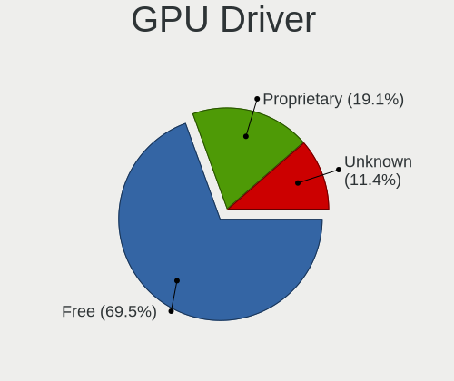

| Driver      | Desktops | Percent |
|-------------|----------|---------|
| Free        | 7566     | 69.33%  |
| Proprietary | 2173     | 19.91%  |
| Unknown     | 1174     | 10.76%  |

GPU Memory
----------

Total video memory

| Size in GB | Desktops | Percent |
|------------|----------|---------|
| Unknown    | 2775     | 25.3%   |
| 1.01-2.0   | 2290     | 20.88%  |
| 0.51-1.0   | 2220     | 20.24%  |
| 0.01-0.5   | 2192     | 19.99%  |
| 3.01-4.0   | 817      | 7.45%   |
| 7.01-8.0   | 308      | 2.81%   |
| 5.01-6.0   | 175      | 1.6%    |
| 2.01-3.0   | 137      | 1.25%   |
| 8.01-16.0  | 46       | 0.42%   |
| 4.01-5.0   | 5        | 0.05%   |
| 16.01-24.0 | 3        | 0.03%   |

Monitor
-------

Monitor Vendor
--------------

Monitor vendors

| Vendor               | Desktops | Percent |
|----------------------|----------|---------|
| Samsung Electronics  | 2470     | 24.95%  |
| Goldstar             | 1427     | 14.41%  |
| Acer                 | 1102     | 11.13%  |
| BenQ                 | 876      | 8.85%   |
| Philips              | 652      | 6.59%   |
| ViewSonic            | 500      | 5.05%   |
| AOC                  | 433      | 4.37%   |
| Dell                 | 411      | 4.15%   |
| Ancor Communications | 326      | 3.29%   |
| Hewlett-Packard      | 249      | 2.52%   |
| NEC Computers        | 227      | 2.29%   |
| Iiyama               | 129      | 1.3%    |
| Sony                 | 89       | 0.9%    |
| Unknown              | 69       | 0.7%    |
| Envision Peripherals | 55       | 0.56%   |
| Plain Tree Systems   | 54       | 0.55%   |
| LG Electronics       | 47       | 0.47%   |
| ASUSTek Computer     | 46       | 0.46%   |
| HHT                  | 44       | 0.44%   |
| Packard Bell         | 36       | 0.36%   |
| Lenovo               | 36       | 0.36%   |
| ___                  | 30       | 0.3%    |
| Toshiba              | 24       | 0.24%   |
| Fujitsu Siemens      | 22       | 0.22%   |
| MiTAC                | 19       | 0.19%   |
| CHR                  | 19       | 0.19%   |
| KTC                  | 17       | 0.17%   |
| HannStar             | 17       | 0.17%   |
| VIE                  | 16       | 0.16%   |
| MStar                | 14       | 0.14%   |
| Mi                   | 14       | 0.14%   |
| JRY                  | 14       | 0.14%   |
| HKC                  | 14       | 0.14%   |
| Haier                | 13       | 0.13%   |
| AGO                  | 13       | 0.13%   |
| Panasonic            | 12       | 0.12%   |
| Hitachi              | 11       | 0.11%   |
| BBK                  | 11       | 0.11%   |
| Sharp                | 9        | 0.09%   |
| CTV                  | 9        | 0.09%   |
| CVT                  | 8        | 0.08%   |
| Belinea              | 8        | 0.08%   |
| Apple                | 8        | 0.08%   |
| Idek Iiyama          | 7        | 0.07%   |
| eMachines            | 7        | 0.07%   |
| Unknown (XXX)        | 6        | 0.06%   |
| SGT                  | 6        | 0.06%   |
| RTK                  | 6        | 0.06%   |
| MSI                  | 6        | 0.06%   |
| Daewoo               | 6        | 0.06%   |
| CTX                  | 6        | 0.06%   |
| Xiaomi               | 5        | 0.05%   |
| STD                  | 5        | 0.05%   |
| SKY                  | 5        | 0.05%   |
| LSC                  | 5        | 0.05%   |
| HUAWEI               | 5        | 0.05%   |
| HIB                  | 5        | 0.05%   |
| GDH                  | 5        | 0.05%   |
| DNS                  | 5        | 0.05%   |
| Unknown              | 5        | 0.05%   |

Monitor Model
-------------

Monitor models

| Model                                                                | Desktops | Percent |
|----------------------------------------------------------------------|----------|---------|
| Samsung Electronics SyncMaster SAM01E1 1280x1024 376x301mm 19.0-inch | 75       | 0.73%   |
| Samsung Electronics SyncMaster SAM011E 1280x1024 338x270mm 17.0-inch | 67       | 0.65%   |
| Acer AL1716 ACRAD46 1280x1024 338x270mm 17.0-inch                    | 65       | 0.63%   |
| Samsung Electronics SyncMaster SAM036E 1280x1024 376x301mm 19.0-inch | 58       | 0.56%   |
| Goldstar W1943 GSM4BAD 1360x768 406x229mm 18.4-inch                  | 54       | 0.53%   |
| Samsung Electronics SyncMaster SAM01B7 1280x1024 338x270mm 17.0-inch | 52       | 0.51%   |
| Goldstar FULL HD GSM5B55 1920x1080 480x270mm 21.7-inch               | 46       | 0.45%   |
| Philips PHL 223V5 PHLC0CF 1920x1080 477x268mm 21.5-inch              | 44       | 0.43%   |
| HHT ActviPanel V5 HHT0030 3840x2160 944x398mm 40.3-inch              | 43       | 0.42%   |
| BenQ GL2460 BNQ78CE 1920x1080 531x299mm 24.0-inch                    | 43       | 0.42%   |
| Samsung Electronics SME1920NR SAM06A4 1280x1024 376x301mm 19.0-inch  | 41       | 0.4%    |
| Samsung Electronics SyncMaster SAM02AD 1440x900 410x257mm 19.1-inch  | 39       | 0.38%   |
| Goldstar W1942 GSM4B6F 1440x900 408x255mm 18.9-inch                  | 38       | 0.37%   |
| Philips PHL 243V7 PHLC155 1920x1080 527x296mm 23.8-inch              | 36       | 0.35%   |
| Goldstar ULTRAWIDE GSM59F1 2560x1080 673x284mm 28.8-inch             | 35       | 0.34%   |
| Acer AL1916 ACRAD49 1280x1024 376x301mm 19.0-inch                    | 32       | 0.31%   |
| Samsung Electronics S24D300 SAM0B43 1920x1080 531x299mm 24.0-inch    | 31       | 0.3%    |
| Goldstar L1942 GSM4B85 1280x1024 376x301mm 19.0-inch                 | 28       | 0.27%   |
| BenQ GW2270 BNQ78DB 1920x1080 476x268mm 21.5-inch                    | 28       | 0.27%   |
| Samsung Electronics SyncMaster SAM036F 1440x900 428x255mm 19.6-inch  | 26       | 0.25%   |
| Samsung Electronics C24F390 SAM0D2C 1920x1080 520x290mm 23.4-inch    | 24       | 0.23%   |
| Plain Tree Systems Monitor PTS06A5 1280x1024 337x270mm 17.0-inch     | 24       | 0.23%   |
| Goldstar W2043 GSM4E9D 1600x900 443x249mm 20.0-inch                  | 24       | 0.23%   |
| Goldstar LCD Monitor GSM5AB8 1920x1080 480x270mm 21.7-inch           | 24       | 0.23%   |
| Goldstar IPS FULLHD GSM5AB6 1920x1080 480x270mm 21.7-inch            | 24       | 0.23%   |
| Dell U2412M DELA07A 1920x1200 518x324mm 24.1-inch                    | 24       | 0.23%   |
| Samsung Electronics SyncMaster SAM011F 1280x1024 376x301mm 19.0-inch | 23       | 0.22%   |
| Philips PHL 243V5 PHLC0D1 1920x1080 521x293mm 23.5-inch              | 23       | 0.22%   |
| Goldstar L1952S GSM4AE0 1280x1024 376x301mm 19.0-inch                | 23       | 0.22%   |
| Goldstar L1918S GSM4B31 1280x1024 376x301mm 19.0-inch                | 23       | 0.22%   |
| Goldstar L1730S GSM438D 1280x1024 338x270mm 17.0-inch                | 23       | 0.22%   |
| Goldstar IPS FULLHD GSM5AB7 1920x1080 480x270mm 21.7-inch            | 23       | 0.22%   |
| AOC 2470W AOC2470 1920x1080 521x293mm 23.5-inch                      | 23       | 0.22%   |
| AOC 2269W AOC2269 1920x1080 477x268mm 21.5-inch                      | 22       | 0.21%   |
| Samsung Electronics C27F390 SAM0D32 1920x1080 600x340mm 27.2-inch    | 21       | 0.2%    |
| Goldstar W2242 GSM5677 1680x1050 474x296mm 22.0-inch                 | 21       | 0.2%    |
| Goldstar L1718S GSM443C 1280x1024 338x270mm 17.0-inch                | 21       | 0.2%    |
| Samsung Electronics SyncMaster SAM022B 1280x1024 340x270mm 17.1-inch | 20       | 0.19%   |
| Goldstar W2243 GSM56FE 1920x1080 477x269mm 21.6-inch                 | 20       | 0.19%   |
| Goldstar L192WS GSM4B32 1440x900 410x256mm 19.0-inch                 | 20       | 0.19%   |
| AOC 2270W AOC2270 1920x1080 477x268mm 21.5-inch                      | 20       | 0.19%   |
| Acer V226HQL ACR0335 1920x1080 477x268mm 21.5-inch                   | 20       | 0.19%   |
| Acer AL1716 ACR06B4 1280x1024 338x270mm 17.0-inch                    | 20       | 0.19%   |
| Goldstar W1934 GSM4B7A 1440x900 410x256mm 19.0-inch                  | 19       | 0.18%   |
| BenQ GL2450 BNQ78A5 1920x1080 530x300mm 24.0-inch                    | 19       | 0.18%   |
| BenQ G925HDA BNQ7843 1366x768 410x230mm 18.5-inch                    | 19       | 0.18%   |
| AOC 2250W AOC2250 1920x1080 477x268mm 21.5-inch                      | 19       | 0.18%   |
| ___ LCDTV16 ___0101 1920x1080                                        | 18       | 0.18%   |
| Samsung Electronics SyncMaster SAM0580 1280x1024 376x301mm 19.0-inch | 18       | 0.18%   |
| Samsung Electronics SyncMaster SAM03D0 1440x900 410x257mm 19.1-inch  | 18       | 0.18%   |
| Samsung Electronics SMB1920NW SAM06A5 1440x900 408x255mm 18.9-inch   | 18       | 0.18%   |
| Samsung Electronics S24F350 SAM0D20 1920x1080 521x293mm 23.5-inch    | 18       | 0.18%   |
| Samsung Electronics S24E390 SAM0C1A 1920x1080 521x293mm 23.5-inch    | 18       | 0.18%   |
| Samsung Electronics S22E390 SAM0C18 1920x1080 477x268mm 21.5-inch    | 18       | 0.18%   |
| Philips 226V4 PHLC0B1 1920x1080 477x268mm 21.5-inch                  | 18       | 0.18%   |
| BenQ G2420HD BNQ7840 1920x1080 531x299mm 24.0-inch                   | 18       | 0.18%   |
| AOC 27G2G4 AOC2702 1920x1080 598x336mm 27.0-inch                     | 18       | 0.18%   |
| Acer V193 ACR004C 1280x1024 376x301mm 19.0-inch                      | 18       | 0.18%   |
| Acer AL1716 ACRAD51 1280x1024 340x270mm 17.1-inch                    | 18       | 0.18%   |
| Samsung Electronics SyncMaster SAM010B 1280x1024 340x270mm 17.1-inch | 17       | 0.17%   |

Monitor Resolution
------------------

Monitor screen resolution

| Resolution         | Desktops | Percent |
|--------------------|----------|---------|
| 1920x1080 (FHD)    | 4166     | 42.74%  |
| 1280x1024 (SXGA)   | 2106     | 21.6%   |
| 1680x1050 (WSXGA+) | 579      | 5.94%   |
| 1440x900 (WXGA+)   | 517      | 5.3%    |
| 1366x768 (WXGA)    | 402      | 4.12%   |
| 1600x900 (HD+)     | 350      | 3.59%   |
| 3840x2160 (4K)     | 315      | 3.23%   |
| 2560x1440 (QHD)    | 297      | 3.05%   |
| 1920x1200 (WUXGA)  | 182      | 1.87%   |
| 1360x768           | 175      | 1.8%    |
| 1024x768 (XGA)     | 150      | 1.54%   |
| 1600x1200          | 84       | 0.86%   |
| Unknown            | 77       | 0.79%   |
| 2560x1080          | 75       | 0.77%   |
| 3440x1440          | 35       | 0.36%   |
| 1280x720 (HD)      | 33       | 0.34%   |
| 1920x540           | 29       | 0.3%    |
| 1400x1050          | 24       | 0.25%   |
| 3840x1080          | 21       | 0.22%   |
| 2048x1536          | 13       | 0.13%   |
| 2288x1287          | 12       | 0.12%   |
| 1280x960           | 12       | 0.12%   |
| 1152x864           | 12       | 0.12%   |
| 2048x1152          | 8        | 0.08%   |
| 1920x1440          | 8        | 0.08%   |
| 4480x1440          | 7        | 0.07%   |
| 5760x1080          | 4        | 0.04%   |
| 3600x1080          | 4        | 0.04%   |
| 3200x1080          | 4        | 0.04%   |
| 2160x1200          | 4        | 0.04%   |
| 7680x2160          | 3        | 0.03%   |
| 5760x2160          | 3        | 0.03%   |
| 2560x1600          | 3        | 0.03%   |
| 4000x1440          | 2        | 0.02%   |
| 3840x1200          | 2        | 0.02%   |
| 3286x1080          | 2        | 0.02%   |
| 3200x900           | 2        | 0.02%   |
| 2960x1050          | 2        | 0.02%   |
| 2560x1024          | 2        | 0.02%   |
| 1280x768           | 2        | 0.02%   |
| 8704x2160          | 1        | 0.01%   |
| 7680x2164          | 1        | 0.01%   |
| 6400x2160          | 1        | 0.01%   |
| 6400x1080          | 1        | 0.01%   |
| 5520x2160          | 1        | 0.01%   |
| 5280x1080          | 1        | 0.01%   |
| 5120x1440          | 1        | 0.01%   |
| 5120x1080          | 1        | 0.01%   |
| 4480x1080          | 1        | 0.01%   |
| 3840x2560          | 1        | 0.01%   |
| 3840x1600          | 1        | 0.01%   |
| 3840x1024          | 1        | 0.01%   |
| 3640x1920          | 1        | 0.01%   |
| 3600x1200          | 1        | 0.01%   |
| 3280x1080          | 1        | 0.01%   |
| 2944x1080          | 1        | 0.01%   |
| 2880x900           | 1        | 0.01%   |
| 2880x1440          | 1        | 0.01%   |
| 2624x900           | 1        | 0.01%   |
| 2560x2520          | 1        | 0.01%   |

Monitor Diagonal
----------------

Diagonal size in inches

| Inches  | Desktops | Percent |
|---------|----------|---------|
| 21      | 1611     | 16.21%  |
| 19      | 1475     | 14.84%  |
| 23      | 1237     | 12.44%  |
| 17      | 1043     | 10.49%  |
| 24      | 968      | 9.74%   |
| 27      | 632      | 6.36%   |
| 18      | 562      | 5.65%   |
| 20      | 475      | 4.78%   |
| Unknown | 386      | 3.88%   |
| 22      | 359      | 3.61%   |
| 15      | 269      | 2.71%   |
| 31      | 144      | 1.45%   |
| 34      | 101      | 1.02%   |
| 40      | 90       | 0.91%   |
| 72      | 82       | 0.82%   |
| 54      | 76       | 0.76%   |
| 32      | 61       | 0.61%   |
| 52      | 41       | 0.41%   |
| 16      | 40       | 0.4%    |
| 25      | 32       | 0.32%   |
| 84      | 27       | 0.27%   |
| 48      | 25       | 0.25%   |
| 46      | 24       | 0.24%   |
| 43      | 18       | 0.18%   |
| 26      | 16       | 0.16%   |
| 12      | 16       | 0.16%   |
| 14      | 15       | 0.15%   |
| 42      | 14       | 0.14%   |
| 13      | 12       | 0.12%   |
| 28      | 11       | 0.11%   |
| 142     | 10       | 0.1%    |
| 33      | 8        | 0.08%   |
| 39      | 6        | 0.06%   |
| 37      | 6        | 0.06%   |
| 29      | 6        | 0.06%   |
| 55      | 5        | 0.05%   |
| 50      | 5        | 0.05%   |
| 47      | 5        | 0.05%   |
| 99      | 4        | 0.04%   |
| 65      | 4        | 0.04%   |
| 60      | 3        | 0.03%   |
| 49      | 3        | 0.03%   |
| 74      | 2        | 0.02%   |
| 64      | 2        | 0.02%   |
| 44      | 2        | 0.02%   |
| 41      | 2        | 0.02%   |
| 85      | 1        | 0.01%   |
| 57      | 1        | 0.01%   |
| 36      | 1        | 0.01%   |
| 11      | 1        | 0.01%   |
| 3       | 1        | 0.01%   |

Monitor Width
-------------

Physical width

| Width in mm    | Desktops | Percent |
|----------------|----------|---------|
| 401-500        | 3454     | 35.27%  |
| 501-600        | 2722     | 27.8%   |
| 301-350        | 1326     | 13.54%  |
| 351-400        | 1045     | 10.67%  |
| Unknown        | 386      | 3.94%   |
| 1001-1500      | 193      | 1.97%   |
| 601-700        | 192      | 1.96%   |
| 701-800        | 169      | 1.73%   |
| 1501-2000      | 112      | 1.14%   |
| 901-1000       | 77       | 0.79%   |
| 801-900        | 61       | 0.62%   |
| 201-300        | 41       | 0.42%   |
| More than 2000 | 14       | 0.14%   |
| 1-100          | 1        | 0.01%   |

Aspect Ratio
------------

Proportional relationship between the width and the height

| Ratio   | Desktops | Percent |
|---------|----------|---------|
| 16/9    | 5332     | 55.92%  |
| 5/4     | 1993     | 20.9%   |
| 16/10   | 1204     | 12.63%  |
| 4/3     | 425      | 4.46%   |
| Unknown | 283      | 2.97%   |
| 21/9    | 148      | 1.55%   |
| 3/2     | 96       | 1.01%   |
| 6/5     | 35       | 0.37%   |
| 1.00    | 10       | 0.1%    |
| 32/9    | 8        | 0.08%   |
| 2.00    | 1        | 0.01%   |

Monitor Area
------------

Area in inch

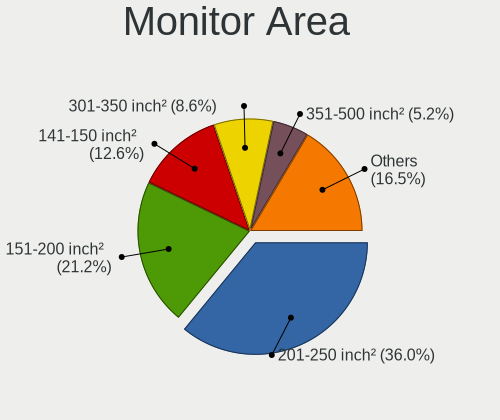

| Area in inch | Desktops | Percent |
|----------------|----------|---------|
| 201-250        | 3564     | 36.28%  |
| 151-200        | 2389     | 24.32%  |
| 141-150        | 1452     | 14.78%  |
| 301-350        | 646      | 6.58%   |
| Unknown        | 386      | 3.93%   |
| 351-500        | 316      | 3.22%   |
| More than 1000 | 284      | 2.89%   |
| 251-300        | 254      | 2.59%   |
| 501-1000       | 176      | 1.79%   |
| 101-110        | 168      | 1.71%   |
| 111-120        | 117      | 1.19%   |
| 121-130        | 24       | 0.24%   |
| 71-80          | 18       | 0.18%   |
| 131-140        | 13       | 0.13%   |
| 81-90          | 9        | 0.09%   |
| 91-100         | 5        | 0.05%   |
| 61-70          | 1        | 0.01%   |
| 51-60          | 1        | 0.01%   |
| 1-40           | 1        | 0.01%   |

Pixel Density
-------------

Pixels per inch

| Density       | Desktops | Percent |
|---------------|----------|---------|
| 51-100        | 6640     | 69.9%   |
| 101-120       | 1895     | 19.95%  |
| Unknown       | 386      | 4.06%   |
| 1-50          | 348      | 3.66%   |
| 121-160       | 153      | 1.61%   |
| 161-240       | 75       | 0.79%   |
| More than 240 | 2        | 0.02%   |

Multiple Monitors
-----------------

Total monitors connected

| Total | Desktops | Percent |
|-------|----------|---------|
| 1     | 8824     | 83.42%  |
| 0     | 885      | 8.37%   |
| 2     | 811      | 7.67%   |
| 3     | 55       | 0.52%   |
| 4     | 3        | 0.03%   |

Network
-------

Net Controller Vendor
---------------------

Controller vendors

| Vendor                                 | Desktops | Percent |
|----------------------------------------|----------|---------|
| Realtek Semiconductor                  | 7407     | 55.64%  |
| Intel                                  | 1414     | 10.62%  |
| Qualcomm Atheros                       | 1326     | 9.96%   |
| Nvidia                                 | 624      | 4.69%   |
| Ralink Technology                      | 334      | 2.51%   |
| Huawei Technologies                    | 250      | 1.88%   |
| Marvell Technology Group               | 209      | 1.57%   |
| Ralink                                 | 177      | 1.33%   |
| VIA Technologies                       | 172      | 1.29%   |
| TP-Link                                | 150      | 1.13%   |
| D-Link System                          | 138      | 1.04%   |
| D-Link                                 | 123      | 0.92%   |
| Broadcom                               | 117      | 0.88%   |
| ASUSTek Computer                       | 97       | 0.73%   |
| Qualcomm Atheros Communications        | 91       | 0.68%   |
| ZTE WCDMA Technologies MSM             | 66       | 0.5%    |
| Broadcom Limited                       | 63       | 0.47%   |
| Xiaomi                                 | 58       | 0.44%   |
| MediaTek                               | 44       | 0.33%   |
| Sundance Technology Inc / IC Plus      | 37       | 0.28%   |
| Samsung Electronics                    | 35       | 0.26%   |
| 3Com                                   | 30       | 0.23%   |
| Silicon Integrated Systems [SiS]       | 29       | 0.22%   |
| Microsoft                              | 22       | 0.17%   |
| NetGear                                | 17       | 0.13%   |
| HTC (High Tech Computer)               | 15       | 0.11%   |
| IMC Networks                           | 14       | 0.11%   |
| Gemtek                                 | 14       | 0.11%   |
| ZyXEL Communications                   | 13       | 0.1%    |
| Mercucys                               | 13       | 0.1%    |
| Spreadtrum Communications              | 12       | 0.09%   |
| ASIX Electronics                       | 11       | 0.08%   |
| Sony Ericsson Mobile Communications AB | 10       | 0.08%   |
| Realtek                                | 9        | 0.07%   |
| Qualcomm                               | 9        | 0.07%   |
| LSI                                    | 9        | 0.07%   |
| Aquantia                               | 9        | 0.07%   |
| GCT Semiconductor                      | 8        | 0.06%   |
| Xilinx                                 | 7        | 0.05%   |
| T & A Mobile Phones                    | 7        | 0.05%   |
| Vimtron Electronics                    | 6        | 0.05%   |
| Microchip Technology                   | 6        | 0.05%   |
| JMicron Technology                     | 6        | 0.05%   |
| HMD Global                             | 6        | 0.05%   |
| Lenovo                                 | 5        | 0.04%   |
| ULi Electronics                        | 4        | 0.03%   |
| STMicroelectronics                     | 4        | 0.03%   |
| ZyDAS                                  | 3        | 0.02%   |
| U-Blox                                 | 3        | 0.02%   |
| Texas Instruments                      | 3        | 0.02%   |
| PCTel                                  | 3        | 0.02%   |
| OPPO Electronics                       | 3        | 0.02%   |
| OnePlus Technology (Shenzhen)          | 3        | 0.02%   |
| MCST                                   | 3        | 0.02%   |
| ICS Advent                             | 3        | 0.02%   |
| TRENDnet                               | 2        | 0.02%   |
| NTmore                                 | 2        | 0.02%   |
| Motorola PCS                           | 2        | 0.02%   |
| Motorola                               | 2        | 0.02%   |
| Micro Star International               | 2        | 0.02%   |

Net Controller Model
--------------------

Controller models

| Model                                                                      | Desktops | Percent |
|----------------------------------------------------------------------------|----------|---------|
| Realtek RTL8111/8168/8411 PCI Express Gigabit Ethernet Controller          | 6249     | 43.97%  |
| Realtek RTL810xE PCI Express Fast Ethernet controller                      | 435      | 3.06%   |
| Realtek RTL-8100/8101L/8139 PCI Fast Ethernet Adapter                      | 386      | 2.72%   |
| Nvidia MCP61 Ethernet                                                      | 335      | 2.36%   |
| Ralink MT7601U Wireless Adapter                                            | 197      | 1.39%   |
| Intel Ethernet Connection (2) I219-V                                       | 189      | 1.33%   |
| Qualcomm Atheros AR8151 v2.0 Gigabit Ethernet                              | 186      | 1.31%   |
| Qualcomm Atheros Attansic L1 Gigabit Ethernet                              | 167      | 1.18%   |
| Intel I211 Gigabit Network Connection                                      | 164      | 1.15%   |
| Intel 82579V Gigabit Network Connection                                    | 152      | 1.07%   |
| Realtek RTL8188EUS 802.11n Wireless Network Adapter                        | 144      | 1.01%   |
| Qualcomm Atheros AR8121/AR8113/AR8114 Gigabit or Fast Ethernet             | 138      | 0.97%   |
| Huawei Modem/Networkcard                                                   | 134      | 0.94%   |
| Qualcomm Atheros AR8161 Gigabit Ethernet                                   | 126      | 0.89%   |
| VIA VT6105/VT6106S [Rhine-III]                                             | 116      | 0.82%   |
| Qualcomm Atheros AR8131 Gigabit Ethernet                                   | 106      | 0.75%   |
| Qualcomm Atheros AR9485 Wireless Network Adapter                           | 101      | 0.71%   |
| Marvell Group 88E8056 PCI-E Gigabit Ethernet Controller                    | 96       | 0.68%   |
| Realtek RTL8192CU 802.11n WLAN Adapter                                     | 84       | 0.59%   |
| Realtek RTL8125 2.5GbE Controller                                          | 78       | 0.55%   |
| Marvell Group 88E8001 Gigabit Ethernet Controller                          | 77       | 0.54%   |
| Realtek RTL-8110SC/8169SC Gigabit Ethernet                                 | 76       | 0.53%   |
| Qualcomm Atheros AR9271 802.11n                                            | 74       | 0.52%   |
| Realtek RTL8169 PCI Gigabit Ethernet Controller                            | 71       | 0.5%    |
| Intel Ethernet Connection I217-V                                           | 70       | 0.49%   |
| Intel Wi-Fi 6 AX200                                                        | 66       | 0.46%   |
| Qualcomm Atheros QCA8171 Gigabit Ethernet                                  | 65       | 0.46%   |
| Qualcomm Atheros Attansic L2 Fast Ethernet                                 | 62       | 0.44%   |
| Qualcomm Atheros AR9227 Wireless Network Adapter                           | 62       | 0.44%   |
| Nvidia CK804 Ethernet Controller                                           | 62       | 0.44%   |
| Ralink RT5370 Wireless Adapter                                             | 60       | 0.42%   |
| Qualcomm Atheros AR8152 v2.0 Fast Ethernet                                 | 60       | 0.42%   |
| Nvidia MCP77 Ethernet                                                      | 60       | 0.42%   |
| Intel 82574L Gigabit Network Connection                                    | 54       | 0.38%   |
| Intel Ethernet Connection (2) I218-V                                       | 53       | 0.37%   |
| Realtek RTL8188CE 802.11b/g/n WiFi Adapter                                 | 52       | 0.37%   |
| ZTE WCDMA MSM ZTE Mobile Broadband Station                                 | 51       | 0.36%   |
| Intel Ethernet Connection (14) I219-V                                      | 51       | 0.36%   |
| VIA VT6102/VT6103 [Rhine-II]                                               | 50       | 0.35%   |
| Nvidia MCP55 Ethernet                                                      | 50       | 0.35%   |
| D-Link System DGE-528T Gigabit Ethernet Adapter                            | 50       | 0.35%   |
| Realtek RTL8152 Fast Ethernet Adapter                                      | 48       | 0.34%   |
| Intel Ethernet Connection (7) I219-V                                       | 47       | 0.33%   |
| Intel 82579LM Gigabit Network Connection (Lewisville)                      | 47       | 0.33%   |
| Realtek RTL8188CUS 802.11n WLAN Adapter                                    | 46       | 0.32%   |
| Ralink RT2870/RT3070 Wireless Adapter                                      | 44       | 0.31%   |
| Realtek RTL8188EE Wireless Network Adapter                                 | 43       | 0.3%    |
| Intel Dual Band Wireless-AC 3168NGW [Stone Peak]                           | 42       | 0.3%    |
| Qualcomm Atheros AR9285 Wireless Network Adapter (PCI-Express)             | 41       | 0.29%   |
| Huawei JNY-LX1                                                             | 40       | 0.28%   |
| Intel 82567LM-3 Gigabit Network Connection                                 | 38       | 0.27%   |
| Intel 82566DM-2 Gigabit Network Connection                                 | 38       | 0.27%   |
| Xiaomi Mi/Redmi series (RNDIS)                                             | 37       | 0.26%   |
| Ralink RT3060 Wireless 802.11n 1T/1R                                       | 37       | 0.26%   |
| Nvidia MCP51 Ethernet Controller                                           | 37       | 0.26%   |
| D-Link 802.11 n WLAN                                                       | 36       | 0.25%   |
| TP-Link TL-WN722N v2                                                       | 35       | 0.25%   |
| Sundance Inc / IC Plus IC Plus IP100A Integrated 10/100 Ethernet MAC + PHY | 35       | 0.25%   |
| Realtek 802.11ac NIC                                                       | 35       | 0.25%   |
| Ralink RT2561/RT61 rev B 802.11g                                           | 35       | 0.25%   |

Wireless Vendor
---------------

Wireless vendors

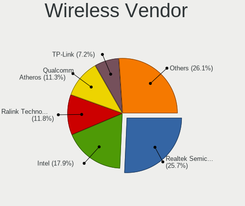

| Vendor                          | Desktops | Percent |
|---------------------------------|----------|---------|
| Realtek Semiconductor           | 628      | 25.07%  |
| Qualcomm Atheros                | 362      | 14.45%  |
| Ralink Technology               | 334      | 13.33%  |
| Intel                           | 296      | 11.82%  |
| Ralink                          | 177      | 7.07%   |
| TP-Link                         | 146      | 5.83%   |
| D-Link                          | 119      | 4.75%   |
| Qualcomm Atheros Communications | 91       | 3.63%   |
| ASUSTek Computer                | 91       | 3.63%   |
| Broadcom                        | 69       | 2.75%   |
| D-Link System                   | 58       | 2.32%   |
| Microsoft                       | 22       | 0.88%   |
| NetGear                         | 16       | 0.64%   |
| IMC Networks                    | 14       | 0.56%   |
| Mercucys                        | 13       | 0.52%   |
| ZyXEL Communications            | 11       | 0.44%   |
| Realtek                         | 9        | 0.36%   |
| Broadcom Limited                | 9        | 0.36%   |
| Xiaomi                          | 7        | 0.28%   |
| MediaTek                        | 5        | 0.2%    |
| ZyDAS                           | 3        | 0.12%   |
| VIA Technologies                | 3        | 0.12%   |
| Texas Instruments               | 3        | 0.12%   |
| Marvell Technology Group        | 3        | 0.12%   |
| TRENDnet                        | 2        | 0.08%   |
| Micro Star International        | 2        | 0.08%   |
| Edimax Technology               | 2        | 0.08%   |
| Z-Com                           | 1        | 0.04%   |
| Wilocity                        | 1        | 0.04%   |
| Sierra Wireless                 | 1        | 0.04%   |
| Linksys                         | 1        | 0.04%   |
| Chu Yuen Enterprise             | 1        | 0.04%   |
| BUFFALO                         | 1        | 0.04%   |
| Belkin Components               | 1        | 0.04%   |
| ASUSTek Computer (wrong ID)     | 1        | 0.04%   |
| Accton Technology               | 1        | 0.04%   |
| AboCom Systems                  | 1        | 0.04%   |

Wireless Model
--------------

Wireless models

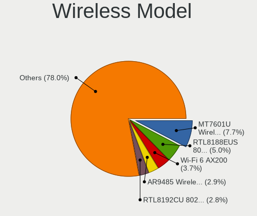

| Model                                                                | Desktops | Percent |
|----------------------------------------------------------------------|----------|---------|
| Ralink MT7601U Wireless Adapter                                      | 197      | 7.78%   |
| Realtek RTL8188EUS 802.11n Wireless Network Adapter                  | 144      | 5.69%   |
| Qualcomm Atheros AR9485 Wireless Network Adapter                     | 101      | 3.99%   |
| Realtek RTL8192CU 802.11n WLAN Adapter                               | 84       | 3.32%   |
| Qualcomm Atheros AR9271 802.11n                                      | 74       | 2.92%   |
| Intel Wi-Fi 6 AX200                                                  | 66       | 2.61%   |
| Qualcomm Atheros AR9227 Wireless Network Adapter                     | 62       | 2.45%   |
| Ralink RT5370 Wireless Adapter                                       | 60       | 2.37%   |
| Realtek RTL8188CE 802.11b/g/n WiFi Adapter                           | 52       | 2.05%   |
| Realtek RTL8188CUS 802.11n WLAN Adapter                              | 46       | 1.82%   |
| Ralink RT2870/RT3070 Wireless Adapter                                | 44       | 1.74%   |
| Realtek RTL8188EE Wireless Network Adapter                           | 43       | 1.7%    |
| Intel Dual Band Wireless-AC 3168NGW [Stone Peak]                     | 42       | 1.66%   |
| Qualcomm Atheros AR9285 Wireless Network Adapter (PCI-Express)       | 41       | 1.62%   |
| Ralink RT3060 Wireless 802.11n 1T/1R                                 | 37       | 1.46%   |
| D-Link 802.11 n WLAN                                                 | 36       | 1.42%   |
| TP-Link TL-WN722N v2                                                 | 35       | 1.38%   |
| Realtek 802.11ac NIC                                                 | 35       | 1.38%   |
| Ralink RT2561/RT61 rev B 802.11g                                     | 35       | 1.38%   |
| Qualcomm Atheros AR9287 Wireless Network Adapter (PCI-Express)       | 32       | 1.26%   |
| Intel Wireless-AC 9260                                               | 32       | 1.26%   |
| Qualcomm Atheros AR5212/5213/2414 Wireless Network Adapter           | 29       | 1.15%   |
| Realtek RTL8192EU 802.11b/g/n WLAN Adapter                           | 28       | 1.11%   |
| Ralink RT5360 Wireless 802.11n 1T/1R                                 | 28       | 1.11%   |
| Qualcomm Atheros AR93xx Wireless Network Adapter                     | 27       | 1.07%   |
| TP-Link TL-WN823N v2/v3 [Realtek RTL8192EU]                          | 25       | 0.99%   |
| ASUS N10 Nano 802.11n Network Adapter [Realtek RTL8192CU]            | 25       | 0.99%   |
| Intel Wireless 3165                                                  | 24       | 0.95%   |
| Broadcom BCM4360 802.11ac Wireless Network Adapter                   | 24       | 0.95%   |
| Realtek RTL8811AU 802.11a/b/g/n/ac WLAN Adapter                      | 22       | 0.87%   |
| TP-Link TL-WN821N v5/v6 [RTL8192EU]                                  | 21       | 0.83%   |
| Realtek RTL8192EE PCIe Wireless Network Adapter                      | 20       | 0.79%   |
| Realtek RTL8821CE 802.11ac PCIe Wireless Network Adapter             | 19       | 0.75%   |
| Ralink RT5390 Wireless 802.11n 1T/1R PCIe                            | 19       | 0.75%   |
| Qualcomm Atheros AR9462 Wireless Network Adapter                     | 19       | 0.75%   |
| Intel Wi-Fi 6 AX210/AX211/AX411 160MHz                               | 19       | 0.75%   |
| ASUS USB-N13 802.11n Network Adapter (rev. B1) [Realtek RTL8192CU]   | 19       | 0.75%   |
| Realtek RTL-8185 IEEE 802.11a/b/g Wireless LAN Controller            | 18       | 0.71%   |
| Intel Wireless 7265                                                  | 17       | 0.67%   |
| D-Link DWA-125 Wireless N 150 Adapter(rev.A3) [Ralink RT5370]        | 17       | 0.67%   |
| Intel Cannon Lake PCH CNVi WiFi                                      | 16       | 0.63%   |
| D-Link 802.11n WLAN Adapter                                          | 16       | 0.63%   |
| Realtek RTL8191SU 802.11n WLAN Adapter                               | 15       | 0.59%   |
| Ralink RT5392 PCIe Wireless Network Adapter                          | 14       | 0.55%   |
| D-Link DWA-125 11n Adapter                                           | 14       | 0.55%   |
| Broadcom BCM4352 802.11ac Wireless Network Adapter                   | 14       | 0.55%   |
| Realtek RTL8812AE 802.11ac PCIe Wireless Network Adapter             | 13       | 0.51%   |
| Realtek RTL8723BE PCIe Wireless Network Adapter                      | 13       | 0.51%   |
| Ralink MT7610U ("Archer T2U" 2.4G+5G WLAN Adapter                    | 13       | 0.51%   |
| IMC Networks RTL8191S WLAN Adapter                                   | 13       | 0.51%   |
| D-Link System DWA-140 RangeBooster N Adapter(rev.B2) [Ralink RT3072] | 13       | 0.51%   |
| D-Link System DWA-125 Wireless N 150 Adapter(rev.A2) [Ralink RT3070] | 13       | 0.51%   |
| Broadcom BCM43228 802.11a/b/g/n                                      | 13       | 0.51%   |
| ASUS WL-167G v3 802.11n Adapter [Realtek RTL8188SU]                  | 13       | 0.51%   |
| TP-Link Archer T2U PLUS [RTL8821AU]                                  | 12       | 0.47%   |
| Ralink RT3090 Wireless 802.11n 1T/1R PCIe                            | 12       | 0.47%   |
| ASUS USB-N10 802.11n Network Adapter [Realtek RTL8188SU]             | 12       | 0.47%   |
| TP-Link AC600 wireless Realtek RTL8811AU [Archer T2U Nano]           | 11       | 0.43%   |
| Ralink RT2561/RT61 802.11g PCI                                       | 11       | 0.43%   |
| Qualcomm Atheros QCA6174 802.11ac Wireless Network Adapter           | 11       | 0.43%   |

Ethernet Vendor
---------------

Ethernet vendors

| Vendor                                 | Desktops | Percent |
|----------------------------------------|----------|---------|
| Realtek Semiconductor                  | 7204     | 64.74%  |
| Intel                                  | 1261     | 11.33%  |
| Qualcomm Atheros                       | 1004     | 9.02%   |
| Nvidia                                 | 624      | 5.61%   |
| Marvell Technology Group               | 206      | 1.85%   |
| VIA Technologies                       | 167      | 1.5%    |
| D-Link System                          | 81       | 0.73%   |
| Huawei Technologies                    | 71       | 0.64%   |
| Broadcom Limited                       | 54       | 0.49%   |
| Xiaomi                                 | 51       | 0.46%   |
| Broadcom                               | 48       | 0.43%   |
| MediaTek                               | 38       | 0.34%   |
| Sundance Technology Inc / IC Plus      | 37       | 0.33%   |
| Samsung Electronics                    | 35       | 0.31%   |
| 3Com                                   | 30       | 0.27%   |
| Silicon Integrated Systems [SiS]       | 29       | 0.26%   |
| Gemtek                                 | 14       | 0.13%   |
| HTC (High Tech Computer)               | 13       | 0.12%   |
| Spreadtrum Communications              | 12       | 0.11%   |
| ASIX Electronics                       | 11       | 0.1%    |
| ZTE WCDMA Technologies MSM             | 10       | 0.09%   |
| Sony Ericsson Mobile Communications AB | 10       | 0.09%   |
| Qualcomm                               | 9        | 0.08%   |
| Aquantia                               | 9        | 0.08%   |
| GCT Semiconductor                      | 8        | 0.07%   |
| T & A Mobile Phones                    | 7        | 0.06%   |
| Vimtron Electronics                    | 6        | 0.05%   |
| JMicron Technology                     | 6        | 0.05%   |
| HMD Global                             | 6        | 0.05%   |
| ASUSTek Computer                       | 6        | 0.05%   |
| Lenovo                                 | 5        | 0.04%   |
| ULi Electronics                        | 4        | 0.04%   |
| TP-Link                                | 4        | 0.04%   |
| D-Link                                 | 4        | 0.04%   |
| OPPO Electronics                       | 3        | 0.03%   |
| OnePlus Technology (Shenzhen)          | 3        | 0.03%   |
| MCST                                   | 3        | 0.03%   |
| ICS Advent                             | 3        | 0.03%   |
| ZyXEL Communications                   | 2        | 0.02%   |
| NTmore                                 | 2        | 0.02%   |
| LG Electronics                         | 2        | 0.02%   |
| Digitech Systems                       | 2        | 0.02%   |
| Davicom Semiconductor                  | 2        | 0.02%   |
| Android                                | 2        | 0.02%   |
| American Megatrends                    | 2        | 0.02%   |
| Yulong                                 | 1        | 0.01%   |
| SysKonnect                             | 1        | 0.01%   |
| Reply Group                            | 1        | 0.01%   |
| NetXen Incorporated                    | 1        | 0.01%   |
| NetGear                                | 1        | 0.01%   |
| National Semiconductor                 | 1        | 0.01%   |
| Motorola PCS                           | 1        | 0.01%   |
| Microchip Technology                   | 1        | 0.01%   |
| Mellanox Technologies                  | 1        | 0.01%   |
| Meizu                                  | 1        | 0.01%   |
| Lite-On Communications                 | 1        | 0.01%   |
| Hewlett-Packard                        | 1        | 0.01%   |
| FS406                                  | 1        | 0.01%   |
| DisplayLink                            | 1        | 0.01%   |
| Belkin Components                      | 1        | 0.01%   |

Ethernet Model
--------------

Ethernet models

| Model                                                                      | Desktops | Percent |
|----------------------------------------------------------------------------|----------|---------|
| Realtek RTL8111/8168/8411 PCI Express Gigabit Ethernet Controller          | 6249     | 54.89%  |
| Realtek RTL810xE PCI Express Fast Ethernet controller                      | 435      | 3.82%   |
| Realtek RTL-8100/8101L/8139 PCI Fast Ethernet Adapter                      | 386      | 3.39%   |
| Nvidia MCP61 Ethernet                                                      | 335      | 2.94%   |
| Intel Ethernet Connection (2) I219-V                                       | 189      | 1.66%   |
| Qualcomm Atheros AR8151 v2.0 Gigabit Ethernet                              | 186      | 1.63%   |
| Qualcomm Atheros Attansic L1 Gigabit Ethernet                              | 167      | 1.47%   |
| Intel I211 Gigabit Network Connection                                      | 164      | 1.44%   |
| Intel 82579V Gigabit Network Connection                                    | 152      | 1.34%   |
| Qualcomm Atheros AR8121/AR8113/AR8114 Gigabit or Fast Ethernet             | 138      | 1.21%   |
| Qualcomm Atheros AR8161 Gigabit Ethernet                                   | 126      | 1.11%   |
| VIA VT6105/VT6106S [Rhine-III]                                             | 116      | 1.02%   |
| Qualcomm Atheros AR8131 Gigabit Ethernet                                   | 106      | 0.93%   |
| Marvell Group 88E8056 PCI-E Gigabit Ethernet Controller                    | 96       | 0.84%   |
| Realtek RTL8125 2.5GbE Controller                                          | 78       | 0.69%   |
| Marvell Group 88E8001 Gigabit Ethernet Controller                          | 77       | 0.68%   |
| Realtek RTL-8110SC/8169SC Gigabit Ethernet                                 | 76       | 0.67%   |
| Realtek RTL8169 PCI Gigabit Ethernet Controller                            | 71       | 0.62%   |
| Intel Ethernet Connection I217-V                                           | 70       | 0.61%   |
| Qualcomm Atheros QCA8171 Gigabit Ethernet                                  | 65       | 0.57%   |
| Qualcomm Atheros Attansic L2 Fast Ethernet                                 | 62       | 0.54%   |
| Nvidia CK804 Ethernet Controller                                           | 62       | 0.54%   |
| Qualcomm Atheros AR8152 v2.0 Fast Ethernet                                 | 60       | 0.53%   |
| Nvidia MCP77 Ethernet                                                      | 60       | 0.53%   |
| Intel 82574L Gigabit Network Connection                                    | 54       | 0.47%   |
| Intel Ethernet Connection (2) I218-V                                       | 53       | 0.47%   |
| Intel Ethernet Connection (14) I219-V                                      | 51       | 0.45%   |
| VIA VT6102/VT6103 [Rhine-II]                                               | 50       | 0.44%   |
| Nvidia MCP55 Ethernet                                                      | 50       | 0.44%   |
| D-Link System DGE-528T Gigabit Ethernet Adapter                            | 50       | 0.44%   |
| Realtek RTL8152 Fast Ethernet Adapter                                      | 48       | 0.42%   |
| Intel Ethernet Connection (7) I219-V                                       | 47       | 0.41%   |
| Intel 82579LM Gigabit Network Connection (Lewisville)                      | 47       | 0.41%   |
| Huawei JNY-LX1                                                             | 40       | 0.35%   |
| Intel 82567LM-3 Gigabit Network Connection                                 | 38       | 0.33%   |
| Intel 82566DM-2 Gigabit Network Connection                                 | 38       | 0.33%   |
| Xiaomi Mi/Redmi series (RNDIS)                                             | 37       | 0.32%   |
| Nvidia MCP51 Ethernet Controller                                           | 37       | 0.32%   |
| Sundance Inc / IC Plus IC Plus IP100A Integrated 10/100 Ethernet MAC + PHY | 35       | 0.31%   |
| Qualcomm Atheros Killer E220x Gigabit Ethernet Controller                  | 35       | 0.31%   |
| Intel Ethernet Connection I219-LM                                          | 33       | 0.29%   |
| Intel Ethernet Controller I225-V                                           | 32       | 0.28%   |
| Marvell Group 88E8053 PCI-E Gigabit Ethernet Controller                    | 31       | 0.27%   |
| MediaTek moto e6s                                                          | 30       | 0.26%   |
| Samsung Galaxy series, misc. (tethering mode)                              | 29       | 0.25%   |
| Huawei E353/E3131                                                          | 29       | 0.25%   |
| Intel Ethernet Connection (2) I219-LM                                      | 26       | 0.23%   |
| Silicon Integrated Systems [SiS] SiS900 PCI Fast Ethernet                  | 23       | 0.2%    |
| Intel I210 Gigabit Network Connection                                      | 23       | 0.2%    |
| Intel 82557/8/9/0/1 Ethernet Pro 100                                       | 23       | 0.2%    |
| Qualcomm Atheros AR8151 v1.0 Gigabit Ethernet                              | 21       | 0.18%   |
| Intel 82567V-2 Gigabit Network Connection                                  | 20       | 0.18%   |
| Intel 82566DC-2 Gigabit Network Connection                                 | 20       | 0.18%   |
| Intel Ethernet Connection I217-LM                                          | 19       | 0.17%   |
| Nvidia MCP79 Ethernet                                                      | 18       | 0.16%   |
| Intel 82562EZ 10/100 Ethernet Controller                                   | 18       | 0.16%   |
| Nvidia MCP67 Ethernet                                                      | 17       | 0.15%   |
| D-Link System DGE-530T Gigabit Ethernet Adapter (rev 11)                   | 17       | 0.15%   |
| Intel NM10/ICH7 Family LAN Controller                                      | 16       | 0.14%   |
| Intel 82578DC Gigabit Network Connection                                   | 16       | 0.14%   |

Net Controller Kind
-------------------

Ethernet, WiFi or modem

| Kind     | Desktops | Percent |
|----------|----------|---------|
| Ethernet | 10263    | 79.31%  |
| WiFi     | 2384     | 18.42%  |
| Modem    | 275      | 2.13%   |
| Unknown  | 18       | 0.14%   |

Used Controller
---------------

Currently used network controller

| Kind     | Desktops | Percent |
|----------|----------|---------|
| Ethernet | 8690     | 84.64%  |
| WiFi     | 1554     | 15.14%  |
| Modem    | 23       | 0.22%   |

NICs
----

Total network controllers on board

| Total | Desktops | Percent |
|-------|----------|---------|
| 1     | 8452     | 80.93%  |
| 2     | 1739     | 16.65%  |
| 3     | 135      | 1.29%   |
| 0     | 87       | 0.83%   |
| 4     | 21       | 0.2%    |
| 5     | 3        | 0.03%   |
| 8     | 2        | 0.02%   |
| 6     | 2        | 0.02%   |
| 33    | 1        | 0.01%   |
| 13    | 1        | 0.01%   |

IPv6
----

IPv6 vs IPv4

| Used | Desktops | Percent |
|------|----------|---------|
| No   | 10280    | 98.9%   |
| Yes  | 114      | 1.1%    |

Bluetooth
---------

Bluetooth Vendor
----------------

Controller vendors

| Vendor                          | Desktops | Percent |
|---------------------------------|----------|---------|
| Cambridge Silicon Radio         | 603      | 46.28%  |
| Intel                           | 260      | 19.95%  |
| ASUSTek Computer                | 130      | 9.98%   |
| Broadcom                        | 85       | 6.52%   |
| Realtek Semiconductor           | 80       | 6.14%   |
| Qualcomm Atheros Communications | 43       | 3.3%    |
| Integrated System Solution      | 26       | 2%      |
| IMC Networks                    | 15       | 1.15%   |
| Lite-On Technology              | 12       | 0.92%   |
| Conwise Technology              | 8        | 0.61%   |
| Ralink                          | 6        | 0.46%   |
| Apple                           | 6        | 0.46%   |
| Roper                           | 5        | 0.38%   |
| Logitech                        | 4        | 0.31%   |
| HTC (High Tech Computer)        | 4        | 0.31%   |
| TP-Link                         | 3        | 0.23%   |
| Hewlett-Packard                 | 3        | 0.23%   |
| Foxconn / Hon Hai               | 3        | 0.23%   |
| D-Link System                   | 3        | 0.23%   |
| Micro Star International        | 2        | 0.15%   |
| TRENDnet                        | 1        | 0.08%   |
| Edimax Technology               | 1        | 0.08%   |

Bluetooth Model
---------------

Controller models

| Model                                                                | Desktops | Percent |
|----------------------------------------------------------------------|----------|---------|
| Cambridge Silicon Radio Bluetooth Dongle (HCI mode)                  | 603      | 46.21%  |
| Intel Bluetooth wireless interface                                   | 76       | 5.82%   |
| Realtek Bluetooth Radio                                              | 68       | 5.21%   |
| Intel AX200 Bluetooth                                                | 63       | 4.83%   |
| ASUS Broadcom BCM20702A0 Bluetooth                                   | 56       | 4.29%   |
| Intel Wireless-AC 3168 Bluetooth                                     | 40       | 3.07%   |
| Intel Wireless-AC 9260 Bluetooth Adapter                             | 28       | 2.15%   |
| Qualcomm Atheros AR3011 Bluetooth                                    | 25       | 1.92%   |
| ASUS Bluetooth Adapter                                               | 23       | 1.76%   |
| Intel Bluetooth 9460/9560 Jefferson Peak (JfP)                       | 19       | 1.46%   |
| Broadcom BCM20702A0 Bluetooth 4.0                                    | 19       | 1.46%   |
| Broadcom BCM2045 Bluetooth                                           | 17       | 1.3%    |
| Intel AX210 Bluetooth                                                | 16       | 1.23%   |
| Integrated System Solution Bluetooth Device                          | 15       | 1.15%   |
| ASUS BCM20702A0                                                      | 14       | 1.07%   |
| Broadcom Bluetooth 3.0 Dongle                                        | 13       | 1%      |
| ASUS Bluetooth Radio                                                 | 12       | 0.92%   |
| Integrated System Solution KY-BT100 Bluetooth Adapter                | 11       | 0.84%   |
| Lite-On Bluetooth Device                                             | 10       | 0.77%   |
| Realtek  Bluetooth 4.2 Adapter                                       | 9        | 0.69%   |
| Broadcom BCM92045B3 ROM                                              | 9        | 0.69%   |
| ASUS Qualcomm Bluetooth 4.1                                          | 9        | 0.69%   |
| Intel Centrino Bluetooth Wireless Transceiver                        | 8        | 0.61%   |
| Intel AX201 Bluetooth                                                | 8        | 0.61%   |
| Conwise CW6622                                                       | 8        | 0.61%   |
| ASUS ASUS USB-BT500                                                  | 7        | 0.54%   |
| Ralink RT3290 Bluetooth                                              | 6        | 0.46%   |
| ASUS Bluetooth Device                                                | 6        | 0.46%   |
| Roper Class 1 Bluetooth Dongle                                       | 5        | 0.38%   |
| Qualcomm Atheros  Bluetooth Device                                   | 5        | 0.38%   |
| Qualcomm Atheros Bluetooth (AR3011)                                  | 5        | 0.38%   |
| Logitech BT Mini-Receiver (HCI mode)                                 | 4        | 0.31%   |
| IMC Networks Bluetooth Module                                        | 4        | 0.31%   |
| HTC (High Tech Computer) Vive Hub Bluetooth 4.1 (Broadcom BCM920703) | 4        | 0.31%   |
| Broadcom Bluetooth dongle                                            | 4        | 0.31%   |
| Broadcom Bluetooth 2.0+eDR dongle                                    | 4        | 0.31%   |
| Broadcom BCM920702 Bluetooth 4.0 Zero Touch Dongle                   | 4        | 0.31%   |
| Broadcom BCM92046DG-CL1ROM Bluetooth 2.1 Adapter                     | 4        | 0.31%   |
| Apple Bluetooth USB Host Controller                                  | 4        | 0.31%   |
| TP-Link UB500 Adapter                                                | 3        | 0.23%   |
| D-Link System DBT-122 Bluetooth                                      | 3        | 0.23%   |
| Broadcom Bluetooth 3.0 Device                                        | 3        | 0.23%   |
| Qualcomm Atheros AR3012 Bluetooth 4.0                                | 2        | 0.15%   |
| Micro Star International Bluetooth Device                            | 2        | 0.15%   |
| Intel Bluetooth Device                                               | 2        | 0.15%   |
| IMC Networks Bluetooth Radio                                         | 2        | 0.15%   |
| IMC Networks Bluetooth Device                                        | 2        | 0.15%   |
| IMC Networks Bluetooth                                               | 2        | 0.15%   |
| IMC Networks BCM20702A0                                              | 2        | 0.15%   |
| HP Bluetooth 2.0 Interface [Broadcom BCM2045]                        | 2        | 0.15%   |
| Foxconn / Hon Hai Bluetooth Device                                   | 2        | 0.15%   |
| Broadcom HP Portable Bumble Bee                                      | 2        | 0.15%   |
| Broadcom BCM2035 Bluetooth dongle                                    | 2        | 0.15%   |
| ASUS Broadcom BCM20702 Single-Chip Bluetooth 4.0 + LE                | 2        | 0.15%   |
| ASUS 2045 Bluetooth 2.0 Device with trace filter                     | 2        | 0.15%   |
| TRENDnet TBW-108UB USB Adapter                                       | 1        | 0.08%   |
| Realtek RTL8821A Bluetooth                                           | 1        | 0.08%   |
| Realtek RTL8723B Bluetooth                                           | 1        | 0.08%   |
| Realtek RTL8723A Bluetooth                                           | 1        | 0.08%   |
| Qualcomm Atheros QCA61x4 Bluetooth 4.0                               | 1        | 0.08%   |

Sound
-----

Sound Vendor
------------

Sound card vendors

| Vendor                                          | Desktops | Percent |
|-------------------------------------------------|----------|---------|
| Intel                                           | 6626     | 40.29%  |
| Nvidia                                          | 4518     | 27.47%  |
| AMD                                             | 3805     | 23.14%  |
| C-Media Electronics                             | 431      | 2.62%   |
| Creative Labs                                   | 278      | 1.69%   |
| VIA Technologies                                | 112      | 0.68%   |
| Creative Technology                             | 63       | 0.38%   |
| Logitech                                        | 57       | 0.35%   |
| JMTek                                           | 55       | 0.33%   |
| Silicon Integrated Systems [SiS]                | 37       | 0.22%   |
| Texas Instruments                               | 33       | 0.2%    |
| Generalplus Technology                          | 30       | 0.18%   |
| ASUSTek Computer                                | 20       | 0.12%   |
| Plantronics                                     | 17       | 0.1%    |
| Kingston Technology                             | 16       | 0.1%    |
| Yamaha                                          | 13       | 0.08%   |
| Razer USA                                       | 11       | 0.07%   |
| A4Tech                                          | 11       | 0.07%   |
| Pixart Imaging                                  | 10       | 0.06%   |
| Ensoniq                                         | 10       | 0.06%   |
| SteelSeries ApS                                 | 9        | 0.05%   |
| Sony                                            | 9        | 0.05%   |
| Focusrite-Novation                              | 9        | 0.05%   |
| M-Audio                                         | 8        | 0.05%   |
| Samson Technologies                             | 7        | 0.04%   |
| GN Netcom                                       | 7        | 0.04%   |
| ESS Technology                                  | 7        | 0.04%   |
| Conexant Systems                                | 7        | 0.04%   |
| BEHRINGER International                         | 7        | 0.04%   |
| ATI Technologies                                | 7        | 0.04%   |
| Shenzhen Rapoo Technology                       | 6        | 0.04%   |
| Microsoft                                       | 6        | 0.04%   |
| Aureal Semiconductor                            | 6        | 0.04%   |
| XMOS                                            | 5        | 0.03%   |
| Tenx Technology                                 | 5        | 0.03%   |
| SAVITECH                                        | 5        | 0.03%   |
| Realtek Semiconductor                           | 5        | 0.03%   |
| Nordic Semiconductor ASA                        | 5        | 0.03%   |
| Elite Silicon                                   | 5        | 0.03%   |
| Unknown                                         | 4        | 0.02%   |
| ULi Electronics                                 | 4        | 0.02%   |
| Thesycon Systemsoftware & Consulting            | 4        | 0.02%   |
| Sennheiser Communications                       | 4        | 0.02%   |
| Philips (or NXP)                                | 4        | 0.02%   |
| Licensed by Sony Computer Entertainment America | 4        | 0.02%   |
| KORG                                            | 4        | 0.02%   |
| Fortemedia                                      | 4        | 0.02%   |
| DigiTech                                        | 4        | 0.02%   |
| Yealink Network Technology                      | 3        | 0.02%   |
| Shenzhen Riitek Technology                      | 3        | 0.02%   |
| Numark                                          | 3        | 0.02%   |
| MCST                                            | 3        | 0.02%   |
| KTMicro                                         | 3        | 0.02%   |
| iCreate Technologies                            | 3        | 0.02%   |
| GYROCOM C&C                                     | 3        | 0.02%   |
| Giga-Byte Technology                            | 3        | 0.02%   |
| EGO SYStems                                     | 3        | 0.02%   |
| Corsair                                         | 3        | 0.02%   |
| BY EDIFIER                                      | 3        | 0.02%   |
| Blue Microphones                                | 3        | 0.02%   |

Sound Model
-----------

Sound card models

| Model                                                                             | Desktops | Percent |
|-----------------------------------------------------------------------------------|----------|---------|
| Intel NM10/ICH7 Family High Definition Audio Controller                           | 1322     | 7.19%   |
| AMD SBx00 Azalia (Intel HDA)                                                      | 1300     | 7.07%   |
| Intel 6 Series/C200 Series Chipset Family High Definition Audio Controller        | 1032     | 5.62%   |
| Intel 8 Series/C220 Series Chipset High Definition Audio Controller               | 638      | 3.47%   |
| Intel 7 Series/C216 Chipset Family High Definition Audio Controller               | 607      | 3.3%    |
| Intel 100 Series/C230 Series Chipset Family HD Audio Controller                   | 534      | 2.91%   |
| Nvidia GF108 High Definition Audio Controller                                     | 508      | 2.76%   |
| AMD FCH Azalia Controller                                                         | 416      | 2.26%   |
| AMD Oland/Hainan/Cape Verde/Pitcairn HDMI Audio [Radeon HD 7000 Series]           | 409      | 2.23%   |
| Nvidia High Definition Audio Controller                                           | 408      | 2.22%   |
| Nvidia GK208 HDMI/DP Audio Controller                                             | 387      | 2.11%   |
| Intel 200 Series PCH HD Audio                                                     | 384      | 2.09%   |
| Nvidia GP107GL High Definition Audio Controller                                   | 365      | 1.99%   |
| Nvidia MCP61 High Definition Audio                                                | 364      | 1.98%   |
| Intel 82801JI (ICH10 Family) HD Audio Controller                                  | 357      | 1.94%   |
| Intel Xeon E3-1200 v3/4th Gen Core Processor HD Audio Controller                  | 331      | 1.8%    |
| AMD Family 17h (Models 00h-0fh) HD Audio Controller                               | 310      | 1.69%   |
| Intel 82801I (ICH9 Family) HD Audio Controller                                    | 292      | 1.59%   |
| Nvidia GK107 HDMI Audio Controller                                                | 286      | 1.56%   |
| Intel 5 Series/3400 Series Chipset High Definition Audio                          | 265      | 1.44%   |
| AMD Family 17h/19h HD Audio Controller                                            | 260      | 1.41%   |
| AMD Starship/Matisse HD Audio Controller                                          | 226      | 1.23%   |
| AMD Ellesmere HDMI Audio [Radeon RX 470/480 / 570/580/590]                        | 226      | 1.23%   |
| Nvidia GM107 High Definition Audio Controller [GeForce 940MX]                     | 219      | 1.19%   |
| Nvidia GK106 HDMI Audio Controller                                                | 209      | 1.14%   |
| Nvidia GF119 HDMI Audio Controller                                                | 204      | 1.11%   |
| Nvidia GP106 High Definition Audio Controller                                     | 191      | 1.04%   |
| Nvidia GF116 High Definition Audio Controller                                     | 188      | 1.02%   |
| AMD Raven/Raven2/Fenghuang HDMI/DP Audio Controller                               | 170      | 0.93%   |
| AMD Baffin HDMI/DP Audio [Radeon RX 550 640SP / RX 560/560X]                      | 170      | 0.93%   |
| Intel Cannon Lake PCH cAVS                                                        | 156      | 0.85%   |
| Nvidia GK104 HDMI Audio Controller                                                | 154      | 0.84%   |
| Intel 82801H (ICH8 Family) HD Audio Controller                                    | 135      | 0.73%   |
| C-Media Electronics CMI8738/CMI8768 PCI Audio                                     | 131      | 0.71%   |
| AMD Turks HDMI Audio [Radeon HD 6500/6600 / 6700M Series]                         | 127      | 0.69%   |
| AMD Juniper HDMI Audio [Radeon HD 5700 Series]                                    | 123      | 0.67%   |
| C-Media Electronics CMI8788 [Oxygen HD Audio]                                     | 122      | 0.66%   |
| Nvidia GP104 High Definition Audio Controller                                     | 111      | 0.6%    |
| AMD RV710/730 HDMI Audio [Radeon HD 4000 series]                                  | 105      | 0.57%   |
| Intel 9 Series Chipset Family HD Audio Controller                                 | 104      | 0.57%   |
| Nvidia GP108 High Definition Audio Controller                                     | 103      | 0.56%   |
| Nvidia GF114 HDMI Audio Controller                                                | 101      | 0.55%   |
| AMD Caicos HDMI Audio [Radeon HD 6450 / 7450/8450/8490 OEM / R5 230/235/235X OEM] | 99       | 0.54%   |
| Nvidia GM206 High Definition Audio Controller                                     | 97       | 0.53%   |
| Intel 82801EB/ER (ICH5/ICH5R) AC'97 Audio Controller                              | 90       | 0.49%   |
| Nvidia GF106 High Definition Audio Controller                                     | 87       | 0.47%   |
| AMD Trinity HDMI Audio Controller                                                 | 87       | 0.47%   |
| AMD Redwood HDMI Audio [Radeon HD 5000 Series]                                    | 85       | 0.46%   |
| Nvidia TU116 High Definition Audio Controller                                     | 83       | 0.45%   |
| Creative Labs CA0106/CA0111 [SB Live!/Audigy/X-Fi Series]                         | 81       | 0.44%   |
| Intel C600/X79 series chipset High Definition Audio Controller                    | 78       | 0.42%   |
| AMD Cedar HDMI Audio [Radeon HD 5400/6300/7300 Series]                            | 78       | 0.42%   |
| Nvidia GT216 HDMI Audio Controller                                                | 72       | 0.39%   |
| Intel Audio device                                                                | 72       | 0.39%   |
| Nvidia MCP72XE/MCP72P/MCP78U/MCP78S High Definition Audio                         | 71       | 0.39%   |
| AMD RV770 HDMI Audio [Radeon HD 4850/4870]                                        | 67       | 0.36%   |
| Intel C610/X99 series chipset HD Audio Controller                                 | 65       | 0.35%   |
| Nvidia TU106 High Definition Audio Controller                                     | 64       | 0.35%   |
| AMD Barts HDMI Audio [Radeon HD 6790/6850/6870 / 7720 OEM]                        | 64       | 0.35%   |
| Intel Comet Lake PCH-V cAVS                                                       | 62       | 0.34%   |

Memory
------

Memory Vendor
-------------

Memory module vendors

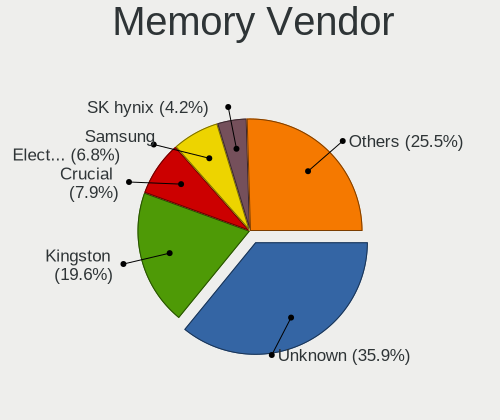

| Vendor                       | Desktops | Percent |
|------------------------------|----------|---------|
| Unknown                      | 4309     | 42.41%  |
| Kingston                     | 1917     | 18.87%  |
| Crucial                      | 820      | 8.07%   |
| Samsung Electronics          | 617      | 6.07%   |
| Corsair                      | 430      | 4.23%   |
| SK hynix                     | 421      | 4.14%   |
| Patriot                      | 252      | 2.48%   |
| AMD                          | 216      | 2.13%   |
| Micron Technology            | 144      | 1.42%   |
| Nanya Technology             | 75       | 0.74%   |
| Goodram                      | 75       | 0.74%   |
| A-DATA Technology            | 73       | 0.72%   |
| G.Skill                      | 63       | 0.62%   |
| Kingmax                      | 60       | 0.59%   |
| Qumo                         | 55       | 0.54%   |
| Apacer                       | 48       | 0.47%   |
| Silicon Power                | 45       | 0.44%   |
| Goldkey                      | 44       | 0.43%   |
| Foxline                      | 43       | 0.42%   |
| Elpida                       | 38       | 0.37%   |
| Transcend                    | 37       | 0.36%   |
| Kllisre                      | 35       | 0.34%   |
| Unknown                      | 28       | 0.28%   |
| KETECH                       | 27       | 0.27%   |
| GeIL                         | 25       | 0.25%   |
| Ramaxel Technology           | 21       | 0.21%   |
| Hikvision                    | 21       | 0.21%   |
| Unifosa                      | 20       | 0.2%    |
| Team                         | 18       | 0.18%   |
| Atermiter                    | 15       | 0.15%   |
| Ramos Technology             | 13       | 0.13%   |
| Qimonda                      | 9        | 0.09%   |
| Neo Forza                    | 9        | 0.09%   |
| TakeMS                       | 8        | 0.08%   |
| Unknown (ABCD)               | 7        | 0.07%   |
| Hexon                        | 7        | 0.07%   |
| PLEXHD                       | 5        | 0.05%   |
| OCZ                          | 5        | 0.05%   |
| Kingmax Semiconductor        | 5        | 0.05%   |
| Wilk Elektronik              | 4        | 0.04%   |
| Exceleram                    | 4        | 0.04%   |
| 48spaces                     | 4        | 0.04%   |
| Toshiba                      | 3        | 0.03%   |
| Patriot Memory (PDP Systems) | 3        | 0.03%   |
| Patriot Memory               | 3        | 0.03%   |
| Juhor                        | 3        | 0.03%   |
| Hewlett-Packard              | 3        | 0.03%   |
| Golden Empire                | 3        | 0.03%   |
| ASint Technology             | 3        | 0.03%   |
| Veineda                      | 2        | 0.02%   |
| V-Color                      | 2        | 0.02%   |
| Unknown (0x5846)             | 2        | 0.02%   |
| Unknown (094A)               | 2        | 0.02%   |
| TwinMOS                      | 2        | 0.02%   |
| Teikon                       | 2        | 0.02%   |
| SHARETRONIC                  | 2        | 0.02%   |
| MLLSE                        | 2        | 0.02%   |
| KingSpec                     | 2        | 0.02%   |
| Hyundai lnc                  | 2        | 0.02%   |
| GLOWAY                       | 2        | 0.02%   |

Memory Model
------------

Memory module models

| Model                                                   | Desktops | Percent |
|---------------------------------------------------------|----------|---------|
| Unknown RAM Module 2048MB DIMM DDR2 800MT/s             | 287      | 2.41%   |
| Unknown RAM Module 2048MB DIMM SDRAM                    | 268      | 2.25%   |
| Unknown RAM Module 2048MB DIMM 800MT/s                  | 263      | 2.21%   |
| Unknown RAM Module 1024MB DIMM SDRAM                    | 221      | 1.86%   |
| Unknown RAM Module 2048MB DIMM 1333MT/s                 | 211      | 1.77%   |
| Unknown RAM Module 4096MB DIMM 1333MT/s                 | 203      | 1.71%   |
| Unknown RAM Module 1024MB DIMM DDR2 800MT/s             | 182      | 1.53%   |
| Unknown RAM Module 1024MB DIMM 800MT/s                  | 140      | 1.18%   |
| Unknown RAM Module 1024MB DIMM DDR2 667MT/s             | 137      | 1.15%   |
| Unknown RAM Module 2048MB DIMM DDR2 667MT/s             | 122      | 1.03%   |
| Unknown RAM Module 4096MB DIMM DDR3 1333MT/s            | 96       | 0.81%   |
| Unknown RAM Module 2048MB DIMM 667MT/s                  | 88       | 0.74%   |
| Unknown RAM Module 1024MB DIMM 667MT/s                  | 85       | 0.71%   |
| Unknown RAM Module 4096MB DIMM 1600MT/s                 | 84       | 0.71%   |
| Kingston RAM KHX1600C9D3/4GX 4GB DIMM DDR3 2400MT/s     | 84       | 0.71%   |
| Unknown RAM Module 2048MB DIMM 400MT/s                  | 83       | 0.7%    |
| Unknown RAM Module 512MB DIMM SDRAM                     | 78       | 0.66%   |
| Unknown RAM Module 1024MB DIMM                          | 71       | 0.6%    |
| Unknown RAM Module 2048MB DIMM DDR3 1333MT/s            | 69       | 0.58%   |
| Unknown RAM Module 2GB DIMM SDRAM                       | 65       | 0.55%   |
| Unknown RAM Module 4096MB DIMM 400MT/s                  | 63       | 0.53%   |
| Unknown RAM Module 2048MB DIMM DDR 1333MT/s             | 63       | 0.53%   |
| Unknown RAM Module 4096MB DIMM DDR3 1600MT/s            | 61       | 0.51%   |
| Unknown RAM Module 1024MB DIMM DDR2 333MT/s             | 60       | 0.5%    |
| Kingston RAM 99U5584-005.A00LF 4GB DIMM DDR3 1600MT/s   | 56       | 0.47%   |
| Kingston RAM 99U5471-012.A00LF 4GB DIMM DDR3 1600MT/s   | 53       | 0.45%   |
| Kingston RAM KHX1600C10D3/8G 8GB DIMM DDR3 1600MT/s     | 51       | 0.43%   |
| Unknown RAM Module 2048MB DIMM                          | 47       | 0.4%    |
| Unknown RAM Module 4096MB DIMM SDRAM                    | 46       | 0.39%   |
| Unknown RAM Module 2GB DIMM DDR2 800MT/s                | 46       | 0.39%   |
| Unknown RAM Module 1024MB DIMM DDR2                     | 46       | 0.39%   |
| Unknown RAM Module 4GB DIMM 1333MT/s                    | 45       | 0.38%   |
| Unknown RAM Module 2048MB DIMM DDR2                     | 45       | 0.38%   |
| Unknown RAM Module 512MB DIMM                           | 44       | 0.37%   |
| Unknown RAM Module 2048MB DIMM 1066MT/s                 | 44       | 0.37%   |
| Unknown RAM Module 4096MB DIMM 667MT/s                  | 43       | 0.36%   |
| Kingston RAM 99U5471-020.A00LF 4GB DIMM DDR3 1600MT/s   | 42       | 0.35%   |
| Unknown RAM Module 2GB DIMM 800MT/s                     | 41       | 0.34%   |
| Unknown RAM Module 2GB DIMM 1333MT/s                    | 40       | 0.34%   |
| Unknown RAM Module 2048MB DIMM DDR2 333MT/s             | 40       | 0.34%   |
| Kingston RAM KHX2666C16/8G 8GB DIMM DDR4 3466MT/s       | 40       | 0.34%   |
| Kingston RAM 99U5584-010.A00LF 4096MB DIMM 1866MT/s     | 40       | 0.34%   |
| Unknown RAM Module 1024MB DIMM 400MT/s                  | 39       | 0.33%   |
| Kingston RAM KHX1866C10D3/8G 8GB DIMM DDR3 1867MT/s     | 39       | 0.33%   |
| Unknown RAM Module 2048MB DIMM DDR 800MT/s              | 36       | 0.3%    |
| Kingston RAM KHX3200C16D4/8GX 8GB DIMM DDR4 3600MT/s    | 36       | 0.3%    |
| Crucial RAM CT51264BA160B.C16F 4GB DIMM DDR3 1600MT/s   | 35       | 0.29%   |
| Samsung RAM M378B5273DH0-CH9 4096MB DIMM DDR3 2133MT/s  | 34       | 0.29%   |
| Kingston RAM KHX1866C10D3/4G 4096MB DIMM DDR3 1867MT/s  | 34       | 0.29%   |
| Unknown RAM Module 8192MB DIMM DDR3 1600MT/s            | 33       | 0.28%   |
| SK hynix RAM HMT351U6CFR8C-H9 4096MB DIMM DDR3 1600MT/s | 33       | 0.28%   |
| SK hynix RAM HMT325U6BFR8C-H9 2GB DIMM DDR3 1333MT/s    | 32       | 0.27%   |
| Corsair RAM CMX8GX3M2A1600C9 4GB DIMM DDR3 1800MT/s     | 32       | 0.27%   |
| Kingston RAM 99U5474-028.A00LF 4GB DIMM DDR3 1600MT/s   | 31       | 0.26%   |
| Crucial RAM CT8G4DFRA266.M16FG 8GB DIMM DDR4 2666MT/s   | 31       | 0.26%   |
| Unknown RAM Module 512MB DIMM DDR2 667MT/s              | 30       | 0.25%   |
| Unknown RAM Module 4096MB DIMM DDR 1333MT/s             | 30       | 0.25%   |
| Unknown RAM Module 4096MB DIMM 1066MT/s                 | 30       | 0.25%   |
| Unknown RAM Module 1GB DIMM SDRAM                       | 29       | 0.24%   |
| Kingston RAM 99U5471-054.A00LF 8GB DIMM DDR3 1600MT/s   | 29       | 0.24%   |

Memory Kind
-----------

Memory module kinds

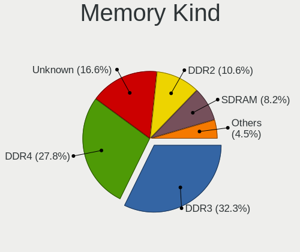

| Kind    | Desktops | Percent |
|---------|----------|---------|
| DDR3    | 3224     | 34.76%  |
| DDR4    | 1884     | 20.31%  |
| Unknown | 1799     | 19.4%   |
| DDR2    | 1178     | 12.7%   |
| SDRAM   | 897      | 9.67%   |
| DDR     | 266      | 2.87%   |
| DRAM    | 14       | 0.15%   |
| LPDDR4  | 11       | 0.12%   |
| DDR5    | 1        | 0.01%   |

Memory Form Factor
------------------

Physical design of the memory module

| Name    | Desktops | Percent |
|---------|----------|---------|
| DIMM    | 8949     | 97.41%  |
| SODIMM  | 233      | 2.54%   |
| FB-DIMM | 5        | 0.05%   |

Memory Size
-----------

Memory module size

| Size  | Desktops | Percent |
|-------|----------|---------|
| 4096  | 3145     | 29.49%  |
| 2048  | 2957     | 27.73%  |
| 8192  | 2063     | 19.35%  |
| 1024  | 1564     | 14.67%  |
| 512   | 389      | 3.65%   |
| 16384 | 383      | 3.59%   |
| 256   | 85       | 0.8%    |
| 32768 | 69       | 0.65%   |
| 32    | 5        | 0.05%   |
| 128   | 2        | 0.02%   |
| 16    | 2        | 0.02%   |

Memory Speed
------------

Memory module speed

| Speed   | Desktops | Percent |
|---------|----------|---------|
| 1600    | 1840     | 18.3%   |
| 1333    | 1650     | 16.41%  |
| 800     | 1147     | 11.41%  |
| Unknown | 917      | 9.12%   |
| 667     | 653      | 6.49%   |
| 2400    | 503      | 5%      |
| 2133    | 391      | 3.89%   |
| 2667    | 349      | 3.47%   |
| 3200    | 271      | 2.7%    |
| 400     | 263      | 2.62%   |
| 1867    | 203      | 2.02%   |
| 1866    | 180      | 1.79%   |
| 1066    | 157      | 1.56%   |
| 3600    | 133      | 1.32%   |
| 333     | 129      | 1.28%   |
| 533     | 123      | 1.22%   |
| 2933    | 101      | 1%      |
| 2666    | 100      | 0.99%   |
| 1800    | 67       | 0.67%   |
| 3466    | 65       | 0.65%   |
| 3400    | 60       | 0.6%    |
| 266     | 57       | 0.57%   |
| 1067    | 55       | 0.55%   |
| 3000    | 49       | 0.49%   |
| 2866    | 49       | 0.49%   |
| 1334    | 43       | 0.43%   |
| 2800    | 37       | 0.37%   |
| 66      | 33       | 0.33%   |
| 3066    | 32       | 0.32%   |
| 2134    | 28       | 0.28%   |
| 2000    | 27       | 0.27%   |
| 1400    | 25       | 0.25%   |
| 3334    | 21       | 0.21%   |
| 200     | 18       | 0.18%   |
| 3733    | 17       | 0.17%   |
| 2187    | 15       | 0.15%   |
| 3333    | 14       | 0.14%   |
| 2733    | 14       | 0.14%   |
| 2934    | 13       | 0.13%   |
| 3151    | 12       | 0.12%   |
| 2048    | 12       | 0.12%   |
| 3500    | 11       | 0.11%   |
| 1648    | 11       | 0.11%   |
| 1639    | 11       | 0.11%   |
| 4333    | 10       | 0.1%    |
| 49926   | 9        | 0.09%   |
| 2200    | 8        | 0.08%   |
| 50410   | 6        | 0.06%   |
| 5354    | 6        | 0.06%   |
| 3800    | 6        | 0.06%   |
| 2747    | 6        | 0.06%   |
| 3467    | 5        | 0.05%   |
| 3100    | 5        | 0.05%   |
| 2176    | 5        | 0.05%   |
| 3007    | 4        | 0.04%   |
| 65535   | 3        | 0.03%   |
| 4800    | 3        | 0.03%   |
| 4133    | 3        | 0.03%   |
| 2448    | 3        | 0.03%   |
| 133     | 3        | 0.03%   |

Printers & scanners
-------------------

Printer Vendor
--------------

Printer device vendors

| Vendor                          | Desktops | Percent |
|---------------------------------|----------|---------|
| Hewlett-Packard                 | 250      | 28.54%  |
| Canon                           | 189      | 21.58%  |
| Samsung Electronics             | 157      | 17.92%  |
| Seiko Epson                     | 82       | 9.36%   |
| Brother Industries              | 61       | 6.96%   |
| Xerox                           | 31       | 3.54%   |
| Panasonic (Matsushita)          | 24       | 2.74%   |
| Pantum                          | 21       | 2.4%    |
| Kyocera                         | 17       | 1.94%   |
| QinHeng Electronics             | 11       | 1.26%   |
| Ricoh                           | 9        | 1.03%   |
| Prolific Technology             | 6        | 0.68%   |
| TSC Auto ID Technology          | 2        | 0.23%   |
| NXP Semiconductors              | 2        | 0.23%   |
| Lexmark International           | 2        | 0.23%   |
| Konica Minolta                  | 2        | 0.23%   |
| cab Produkttechnik GmbH & Co KG | 2        | 0.23%   |
| STMicroelectronics              | 1        | 0.11%   |
| Sharp                           | 1        | 0.11%   |
| Samsung Info. Systems America   | 1        | 0.11%   |
| KODAK                           | 1        | 0.11%   |
| GODEX INTERNATIONAL             | 1        | 0.11%   |
| Fuji Xerox                      | 1        | 0.11%   |
| Datamax-O'Neil                  | 1        | 0.11%   |
| Apple                           | 1        | 0.11%   |

Printer Model
-------------

Printer device models

| Model                                         | Desktops | Percent |
|-----------------------------------------------|----------|---------|
| HP LaserJet 1020                              | 28       | 3.17%   |
| Canon LBP2900                                 | 28       | 3.17%   |
| Samsung SCX-4200 series                       | 27       | 3.06%   |
| HP LaserJet P1102                             | 24       | 2.72%   |
| HP LaserJet 1018                              | 23       | 2.6%    |
| Panasonic (Matsushita) KX-MB1500UC            | 17       | 1.93%   |
| HP LaserJet 1010                              | 16       | 1.81%   |
| Samsung SCX-3400 Series                       | 15       | 1.7%    |
| Seiko Epson Printer                           | 14       | 1.59%   |
| Seiko Epson USB2.0 Printer (Hi-speed)         | 12       | 1.36%   |
| HP LaserJet P1005                             | 12       | 1.36%   |
| Samsung SCX-3200 Series                       | 11       | 1.25%   |
| QinHeng CH340S                                | 11       | 1.25%   |
| Canon MF4410                                  | 11       | 1.25%   |
| Canon MF3010                                  | 11       | 1.25%   |
| HP LaserJet 1320                              | 10       | 1.13%   |
| HP LaserJet 1300                              | 10       | 1.13%   |
| Samsung SCX-4100 Scanner                      | 9        | 1.02%   |
| Samsung ML-2010P Mono Laser Printer           | 9        | 1.02%   |
| Pantum P2200 series                           | 9        | 1.02%   |
| HP LaserJet 1200                              | 9        | 1.02%   |
| Canon MF4010 series                           | 9        | 1.02%   |
| Canon LBP3010/LBP3018/LBP3050                 | 9        | 1.02%   |
| Samsung ML-1640 Series Laser Printer          | 8        | 0.91%   |
| Samsung ML-1210 Printer                       | 8        | 0.91%   |
| Samsung M2070 Series                          | 8        | 0.91%   |
| HP LaserJet 1022                              | 8        | 0.91%   |
| HP DeskJet 2130 series                        | 8        | 0.91%   |
| Canon PIXMA MG2500 Series                     | 8        | 0.91%   |
| Canon LBP810                                  | 8        | 0.91%   |
| Xerox WorkCentre 3119 Series                  | 7        | 0.79%   |
| Xerox Phaser 3140 and 3155                    | 7        | 0.79%   |
| Seiko Epson L210 Series                       | 7        | 0.79%   |
| Samsung ML-216x Series Laser Printer          | 7        | 0.79%   |
| Pantum M6500 series                           | 7        | 0.79%   |
| HP LaserJet 1000                              | 7        | 0.79%   |
| Canon MG2400 series                           | 7        | 0.79%   |
| Canon LBP6000                                 | 7        | 0.79%   |
| Brother HL-2030 Laser Printer                 | 7        | 0.79%   |
| Brother HL-1110 series                        | 7        | 0.79%   |
| Samsung ML-1610 Mono Laser Printer            | 6        | 0.68%   |
| Prolific PL2305 Parallel Port                 | 6        | 0.68%   |
| Canon LaserShot LBP-1120 Printer              | 6        | 0.68%   |
| Canon iP7200 series                           | 6        | 0.68%   |
| Brother DCP-7057 scanner/printer              | 6        | 0.68%   |
| Xerox Phaser 3020                             | 5        | 0.57%   |
| Seiko Epson ME 340 Series/Stylus NX130 Series | 5        | 0.57%   |
| Seiko Epson L312 Series                       | 5        | 0.57%   |
| Seiko Epson L110 Series                       | 5        | 0.57%   |
| Samsung ML-1865                               | 5        | 0.57%   |
| Samsung M2020 Series                          | 5        | 0.57%   |
| HP LaserJet P1006                             | 5        | 0.57%   |
| HP Deskjet 2050 J510                          | 5        | 0.57%   |
| Brother DCP-7010                              | 5        | 0.57%   |
| Seiko Epson L805 Series                       | 4        | 0.45%   |
| Seiko Epson L220 Series                       | 4        | 0.45%   |
| HP LaserJet P2055 series                      | 4        | 0.45%   |
| HP LaserJet 1012                              | 4        | 0.45%   |
| Canon PIXMA MP230                             | 4        | 0.45%   |
| Canon MF3200 series                           | 4        | 0.45%   |

Scanner Vendor
--------------

Scanner device vendors

| Vendor                      | Desktops | Percent |
|-----------------------------|----------|---------|
| Canon                       | 98       | 37.98%  |
| Seiko Epson                 | 64       | 24.81%  |
| Hewlett-Packard             | 43       | 16.67%  |
| Mustek Systems              | 28       | 10.85%  |
| Ultima Electronics          | 10       | 3.88%   |
| Acer Peripherals (now BenQ) | 9        | 3.49%   |
| KYE Systems (Mouse Systems) | 3        | 1.16%   |
| Avision                     | 2        | 0.78%   |
| Canon Electronics           | 1        | 0.39%   |

Scanner Model
-------------

Scanner device models

| Model                                                                                 | Desktops | Percent |
|---------------------------------------------------------------------------------------|----------|---------|
| HP ScanJet 2400c                                                                      | 17       | 6.56%   |
| Canon CanoScan LIDE 25                                                                | 17       | 6.56%   |
| Canon CanoScan LiDE 120                                                               | 16       | 6.18%   |
| Canon CanoScan LiDE 110                                                               | 15       | 5.79%   |
| Mustek Systems BearPaw 1200 CU Plus                                                   | 11       | 4.25%   |
| Canon CanoScan LiDE 210                                                               | 10       | 3.86%   |
| Ultima Artec Ultima 2000 (GT6801 based)/Lifetec LT9385/ScanMagic 1200 UB Plus Scanner | 9        | 3.47%   |
| Seiko Epson GT-F730 [GT-S630/Perfection V33/V330 Photo]                               | 9        | 3.47%   |
| Seiko Epson GT-7400U [Perfection 1270]                                                | 8        | 3.09%   |
| Canon CanoScan N670U/N676U/LiDE 20                                                    | 8        | 3.09%   |
| Seiko Epson GT-F650 [GT-S600/Perfection V10/V100]                                     | 7        | 2.7%    |
| Seiko Epson GT-F500/GT-F550 [Perfection 2480/2580 PHOTO]                              | 6        | 2.32%   |
| Mustek Systems SNAPSCAN e22                                                           | 6        | 2.32%   |
| Mustek Systems BearPaw 2400 CU Plus                                                   | 6        | 2.32%   |
| Seiko Epson GT-F670 [Perfection V200 Photo]                                           | 5        | 1.93%   |
| Seiko Epson GT-F520/GT-F570 [Perfection 3590 PHOTO]                                   | 5        | 1.93%   |
| Canon CanoScan LiDE 60                                                                | 5        | 1.93%   |
| Canon CanoScan LiDE 220                                                               | 5        | 1.93%   |
| Canon CanoScan LiDE 100                                                               | 5        | 1.93%   |
| Seiko Epson GT-8400UF [Perfection 1670/1670 PHOTO]                                    | 4        | 1.54%   |
| HP ScanJet 3800c                                                                      | 4        | 1.54%   |
| Seiko Epson Perfection 660                                                            | 3        | 1.16%   |
| HP ScanJet 3970c                                                                      | 3        | 1.16%   |
| Canon CanoScan LiDE 70                                                                | 3        | 1.16%   |
| Canon CanoScan LiDE 50/LiDE 35/LiDE 40                                                | 3        | 1.16%   |
| Acer Peripherals (now BenQ) Benq 5560                                                 | 3        | 1.16%   |
| Seiko Epson GT-X770 [Perfection V500]                                                 | 2        | 0.77%   |
| Seiko Epson GT-X750 [Perfection 4490 Photo]                                           | 2        | 0.77%   |
| Seiko Epson GT-F720 [GT-S620/Perfection V30/V300 Photo]                               | 2        | 0.77%   |
| Seiko Epson GT-9300UF [Perfection 2400 PHOTO]                                         | 2        | 0.77%   |
| Mustek Systems BearPaw 2448 TA Plus                                                   | 2        | 0.77%   |
| HP ScanJet G4050                                                                      | 2        | 0.77%   |
| HP ScanJet 4300c                                                                      | 2        | 0.77%   |
| HP ScanJet 2300c                                                                      | 2        | 0.77%   |
| Canon CanoScan N1240U/LiDE 30                                                         | 2        | 0.77%   |
| Canon CanoScan LiDE 700F                                                              | 2        | 0.77%   |
| Canon CanoScan                                                                        | 2        | 0.77%   |
| Avision iVina FB1600/UMAX Astra 4500                                                  | 2        | 0.77%   |
| Acer Peripherals (now BenQ) Color FlatbedScanner39                                    | 2        | 0.77%   |
| Ultima Umax Astraslim                                                                 | 1        | 0.39%   |
| Seiko Epson Stylus Photo RX500/510                                                    | 1        | 0.39%   |
| Seiko Epson Scanner                                                                   | 1        | 0.39%   |
| Seiko Epson GT-X800 [Perfection 4990 PHOTO]                                           | 1        | 0.39%   |
| Seiko Epson GT-F700 [Perfection V350]                                                 | 1        | 0.39%   |
| Seiko Epson GT-9800F [Perfection 3200]                                                | 1        | 0.39%   |
| Seiko Epson GT-8300UF [Perfection 1660 PHOTO]                                         | 1        | 0.39%   |
| Seiko Epson GT-7300U [Perfection 1260/1260 PHOTO]                                     | 1        | 0.39%   |
| Seiko Epson GT-7200U [Perfection 1250/1250 PHOTO]                                     | 1        | 0.39%   |
| Seiko Epson ES-8500 [Expression 1640 XL]                                              | 1        | 0.39%   |
| Mustek Systems ScanExpress 1200 USB Plus                                              | 1        | 0.39%   |
| Mustek Systems BearPaw 2448 TA Pro                                                    | 1        | 0.39%   |
| Mustek Systems BearPaw 2448 CU Pro                                                    | 1        | 0.39%   |
| Mustek Systems BearPaw 2400 TA Plus                                                   | 1        | 0.39%   |
| KYE Systems (Mouse Systems) ColorPage-Vivid4                                          | 1        | 0.39%   |
| KYE Systems (Mouse Systems) ColorPage-HR7 Scanner                                     | 1        | 0.39%   |
| KYE Systems (Mouse Systems) ColorPage-HR6 V2 Scanner                                  | 1        | 0.39%   |
| HP Scanjet N6010                                                                      | 1        | 0.39%   |
| HP ScanJet G3110                                                                      | 1        | 0.39%   |
| HP ScanJet G3010                                                                      | 1        | 0.39%   |
| HP Scanjet G2710                                                                      | 1        | 0.39%   |

Camera
------

Camera Vendor
-------------

Camera device vendors

| Vendor                                            | Desktops | Percent |
|---------------------------------------------------|----------|---------|
| Logitech                                          | 695      | 33.33%  |
| Z-Star Microelectronics                           | 362      | 17.36%  |
| Microdia                                          | 159      | 7.63%   |
| Microsoft                                         | 106      | 5.08%   |
| KYE Systems (Mouse Systems)                       | 82       | 3.93%   |
| Arkmicro Technologies                             | 70       | 3.36%   |
| GEMBIRD                                           | 61       | 2.93%   |
| Aveo Technology                                   | 59       | 2.83%   |
| Pixart Imaging                                    | 47       | 2.25%   |
| Cubeternet                                        | 47       | 2.25%   |
| Chicony Electronics                               | 42       | 2.01%   |
| Creative Technology                               | 40       | 1.92%   |
| Alcor Micro                                       | 38       | 1.82%   |
| Realtek Semiconductor                             | 32       | 1.53%   |
| Apple                                             | 27       | 1.29%   |
| Samsung Electronics                               | 20       | 0.96%   |
| Genesys Logic                                     | 18       | 0.86%   |
| Sunplus Innovation Technology                     | 14       | 0.67%   |
| A4Tech                                            | 14       | 0.67%   |
| Guillemot                                         | 13       | 0.62%   |
| Philips (or NXP)                                  | 10       | 0.48%   |
| Hewlett-Packard                                   | 10       | 0.48%   |
| SiGma Micro                                       | 8        | 0.38%   |
| lihappe8                                          | 7        | 0.34%   |
| IMC Networks                                      | 7        | 0.34%   |
| Generalplus Technology                            | 7        | 0.34%   |
| AVerMedia Technologies                            | 6        | 0.29%   |
| Trust                                             | 5        | 0.24%   |
| Unknown                                           | 4        | 0.19%   |
| SunplusIT                                         | 4        | 0.19%   |
| Suyin                                             | 3        | 0.14%   |
| Sony                                              | 3        | 0.14%   |
| Sonix Technology                                  | 3        | 0.14%   |
| Silicon Motion                                    | 3        | 0.14%   |
| Nokia Mobile Phones                               | 3        | 0.14%   |
| MacroSilicon                                      | 3        | 0.14%   |
| Jieli Technology                                  | 3        | 0.14%   |
| Cheng Uei Precision Industry (Foxlink)            | 3        | 0.14%   |
| Canon                                             | 3        | 0.14%   |
| Acer                                              | 3        | 0.14%   |
| Xiaomi                                            | 2        | 0.1%    |
| OmniVision Technologies                           | 2        | 0.1%    |
| Novatel Wireless                                  | 2        | 0.1%    |
| Importek                                          | 2        | 0.1%    |
| Huawei Technologies                               | 2        | 0.1%    |
| Google                                            | 2        | 0.1%    |
| GenesysLogic Technology                           | 2        | 0.1%    |
| Fushicai                                          | 2        | 0.1%    |
| Tobii Technology AB                               | 1        | 0.05%   |
| Syntek                                            | 1        | 0.05%   |
| Sweex                                             | 1        | 0.05%   |
| Sunplus Technology                                | 1        | 0.05%   |
| Sunplus IT                                        | 1        | 0.05%   |
| STMicroelectronics Imaging Division (VLSI Vision) | 1        | 0.05%   |
| Spreadtrum Communications                         | 1        | 0.05%   |
| Solid Year                                        | 1        | 0.05%   |
| SJ-180517-N                                       | 1        | 0.05%   |
| Ricoh                                             | 1        | 0.05%   |
| Razer USA                                         | 1        | 0.05%   |
| PrehKeyTec                                        | 1        | 0.05%   |

Camera Model
------------

Camera device models

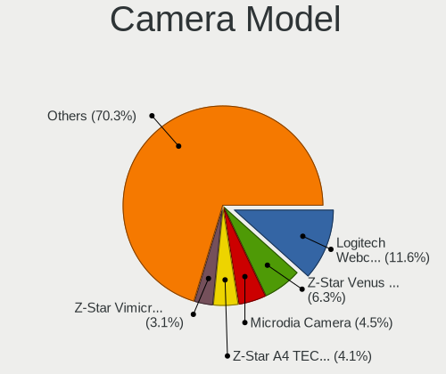

| Model                                             | Desktops | Percent |
|---------------------------------------------------|----------|---------|
| Logitech Webcam C270                              | 252      | 12.07%  |
| Z-Star Venus USB2.0 Camera                        | 154      | 7.38%   |
| Z-Star A4 TECH USB2.0 PC Camera J                 | 104      | 4.98%   |
| Microdia Camera                                   | 101      | 4.84%   |
| Z-Star A4 TECH USB2.0 PC Camera E                 | 76       | 3.64%   |
| Arkmicro USB2.0 PC CAMERA                         | 64       | 3.07%   |
| Logitech Webcam C170                              | 58       | 2.78%   |
| Logitech Webcam C310                              | 54       | 2.59%   |
| Logitech HD Webcam C525                           | 53       | 2.54%   |
| Logitech Webcam C210                              | 44       | 2.11%   |
| Pixart Imaging GE 1.3 MP MiniCam Pro              | 35       | 1.68%   |
| Microsoft LifeCam HD-3000                         | 32       | 1.53%   |
| GEMBIRD USB2.0 PC CAMERA                          | 31       | 1.48%   |
| Alcor Micro USB 2.0 PC Camera                     | 30       | 1.44%   |
| Logitech HD Pro Webcam C920                       | 29       | 1.39%   |
| GEMBIRD Generic UVC 1.00 camera [AppoTech AX2311] | 29       | 1.39%   |
| Cubeternet GL-UPC822 UVC WebCam                   | 25       | 1.2%    |
| Logitech Webcam C110                              | 24       | 1.15%   |
| Logitech HD Webcam C510                           | 24       | 1.15%   |
| Aveo Camera                                       | 22       | 1.05%   |
| Apple iPhone 5/5C/5S/6/SE                         | 22       | 1.05%   |
| Microsoft LifeCam VX-800                          | 21       | 1.01%   |
| Samsung Galaxy series, misc. (MTP mode)           | 19       | 0.91%   |
| Logitech Logitech Webcam C160                     | 19       | 0.91%   |
| Aveo USB2.0 Camera                                | 18       | 0.86%   |
| Realtek FULL HD 1080P Webcam                      | 15       | 0.72%   |
| Microdia USB 2.0 Camera                           | 15       | 0.72%   |
| Logitech HD Webcam C910                           | 15       | 0.72%   |
| Cubeternet USB2.0 Camera                          | 15       | 0.72%   |
| Aveo UVC camera (Bresser microscope)              | 15       | 0.72%   |
| Z-Star A4 TECH HD PC Camera                       | 14       | 0.67%   |
| Logitech HD Webcam C615                           | 14       | 0.67%   |
| Microsoft LifeCam Cinema                          | 13       | 0.62%   |
| Microdia Sonix USB 2.0 Camera                     | 13       | 0.62%   |
| Microsoft LifeCam VX-2000                         | 12       | 0.57%   |
| Microsoft LifeCam HD-5000                         | 12       | 0.57%   |
| Genesys Logic Camera                              | 12       | 0.57%   |
| Logitech Logitech Webcam C100                     | 11       | 0.53%   |
| Realtek USB Camera                                | 10       | 0.48%   |
| Microdia MSI Starcam Racer                        | 10       | 0.48%   |
| Logitech Webcam C250                              | 10       | 0.48%   |
| Logitech Webcam Pro 9000                          | 9        | 0.43%   |
| Logitech Webcam C120                              | 9        | 0.43%   |
| Creative Live! Cam Chat HD [VF0700]               | 9        | 0.43%   |
| Logitech Webcam C200                              | 8        | 0.38%   |
| Logitech QuickCam Pro 9000                        | 8        | 0.38%   |
| Logitech C922 Pro Stream Webcam                   | 8        | 0.38%   |
| KYE Systems (Mouse Systems) FaceCam 1000X         | 8        | 0.38%   |
| A4Tech FHD 1080P PC Camera                        | 8        | 0.38%   |
| Pixart Imaging Webcam Genius iLook 300            | 7        | 0.34%   |
| Logitech HD Webcam B910                           | 7        | 0.34%   |
| lihappe8 USB 2.0 Camera                           | 7        | 0.34%   |
| KYE Systems (Mouse Systems) iSlim 320             | 7        | 0.34%   |
| KYE Systems (Mouse Systems) Genius FaceCam 320    | 7        | 0.34%   |
| Chicony Gateway Webcam                            | 7        | 0.34%   |
| SiGma Micro WebCam SiGma Micro                    | 6        | 0.29%   |
| Microsoft LifeCam VX-700                          | 6        | 0.29%   |
| KYE Systems (Mouse Systems) iSlim 1320            | 6        | 0.29%   |
| KYE Systems (Mouse Systems) Genius FaceCam 312    | 6        | 0.29%   |
| Cubeternet WebCam                                 | 6        | 0.29%   |

Security
--------

Fingerprint Vendor
------------------

Fingerprint sensor vendors

| Vendor                | Desktops | Percent |
|-----------------------|----------|---------|
| STMicroelectronics    | 2        | 40%     |
| LighTuning Technology | 2        | 40%     |
| Elan Microelectronics | 1        | 20%     |

Fingerprint Model
-----------------

Fingerprint sensor models

| Model                                       | Desktops | Percent |
|---------------------------------------------|----------|---------|
| STMicroelectronics Fingerprint Reader       | 2        | 40%     |
| LighTuning ES603 Swipe Fingerprint Sensor   | 1        | 20%     |
| LighTuning EgisTec Touch Fingerprint Sensor | 1        | 20%     |
| Elan fingerprint sensor [FeinTech FPS00200] | 1        | 20%     |

Chipcard Vendor
---------------

Chipcard module vendors

| Vendor                     | Desktops | Percent |
|----------------------------|----------|---------|
| Aktiv                      | 10       | 23.81%  |
| Aladdin Knowledge Systems  | 9        | 21.43%  |
| Aladdin R.D.               | 6        | 14.29%  |
| Athena Smartcard Solutions | 4        | 9.52%   |
| Alcor Micro                | 4        | 9.52%   |
| Advanced Card Systems      | 4        | 9.52%   |
| Yubico.com                 | 2        | 4.76%   |
| OmniKey                    | 1        | 2.38%   |
| Gemalto (was Gemplus)      | 1        | 2.38%   |
| Castles Technology         | 1        | 2.38%   |

Chipcard Model
--------------

Chipcard module models

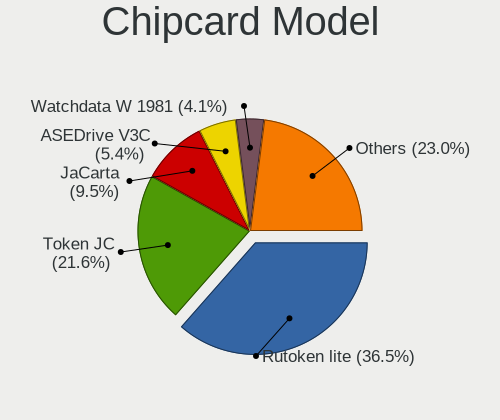

| Model                                            | Desktops | Percent |
|--------------------------------------------------|----------|---------|
| Aktiv Rutoken lite                               | 10       | 23.81%  |
| Aladdin Knowledge Systems Token JC               | 9        | 21.43%  |
| Aladdin R.D. JaCarta                             | 6        | 14.29%  |
| Athena Smartcard Solutions ASEDrive CCID         | 4        | 9.52%   |
| Alcor Micro Watchdata W 1981                     | 3        | 7.14%   |
| Yubico.com Yubikey 4 U2F+CCID                    | 2        | 4.76%   |
| OmniKey Smart Card Reader USB                    | 1        | 2.38%   |
| Gemalto (was Gemplus) GemPC Key SmartCard Reader | 1        | 2.38%   |
| Castles Technology EZCCID Smart Card Reader      | 1        | 2.38%   |
| Alcor Micro AU9540 Smartcard Reader              | 1        | 2.38%   |
| Advanced Card Systems ACR39U                     | 1        | 2.38%   |
| Advanced Card Systems ACR3901U                   | 1        | 2.38%   |
| Advanced Card Systems ACR38 SmartCard Reader     | 1        | 2.38%   |
| Advanced Card Systems ACR1281 1S Dual Reader     | 1        | 2.38%   |

Unsupported
-----------

Unsupported Devices
-------------------

Total unsupported devices on board

| Total | Desktops | Percent |
|-------|----------|---------|
| 0     | 8764     | 82.45%  |
| 1     | 1682     | 15.82%  |
| 2     | 151      | 1.42%   |
| 3     | 18       | 0.17%   |
| 4     | 8        | 0.08%   |
| 6     | 3        | 0.03%   |
| 9     | 1        | 0.01%   |
| 7     | 1        | 0.01%   |
| 5     | 1        | 0.01%   |

Unsupported Device Types
------------------------

Types of unsupported devices

| Type                     | Desktops | Percent |
|--------------------------|----------|---------|
| Graphics card            | 1318     | 65.97%  |
| Net/wireless             | 196      | 9.81%   |
| Communication controller | 127      | 6.36%   |
| Unassigned class         | 74       | 3.7%    |
| Multimedia controller    | 62       | 3.1%    |
| Sound                    | 48       | 2.4%    |
| Chipcard                 | 32       | 1.6%    |
| Camera                   | 29       | 1.45%   |
| Network                  | 18       | 0.9%    |
| Net/ethernet             | 17       | 0.85%   |
| Bluetooth                | 17       | 0.85%   |
| Modem                    | 15       | 0.75%   |
| Storage/raid             | 10       | 0.5%    |
| Dvb card                 | 7        | 0.35%   |
| Firewire controller      | 6        | 0.3%    |
| Storage/ata              | 5        | 0.25%   |
| Fingerprint reader       | 5        | 0.25%   |
| Storage/ide              | 4        | 0.2%    |
| Tv card                  | 3        | 0.15%   |
| Storage                  | 2        | 0.1%    |
| Video                    | 1        | 0.05%   |
| Unclassified device      | 1        | 0.05%   |
| Card reader              | 1        | 0.05%   |

