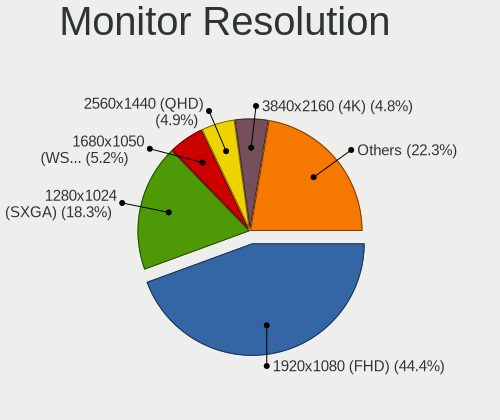
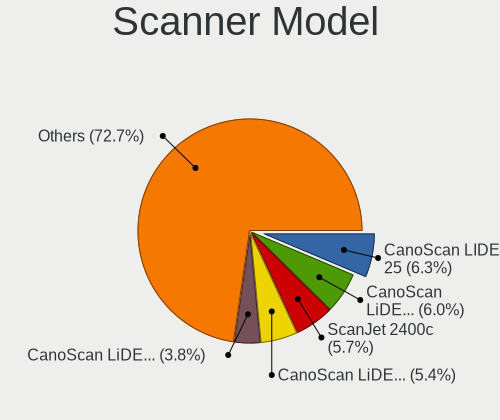

Linux in Russia - Tested Hardware & Statistics (Desktops)
---------------------------------------------------------

A project to collect tested hardware configurations for Linux in Russia.

Anyone can contribute to this report by the [hw-probe](https://github.com/linuxhw/hw-probe) tool:

    sudo -E hw-probe -all -upload

Please contribute! Especially if your hardware is rare.

Contents
--------

* [ Test Cases ](#test-cases)

* [ System ](#system)
  - [ OS                       ](#os)
  - [ OS Family                ](#os-family)
  - [ Kernel                   ](#kernel)
  - [ Kernel Family            ](#kernel-family)
  - [ Kernel Major Ver.        ](#kernel-major-ver)
  - [ Arch                     ](#arch)
  - [ DE                       ](#de)
  - [ Display Server           ](#display-server)
  - [ Display Manager          ](#display-manager)
  - [ OS Lang                  ](#os-lang)
  - [ Boot Mode                ](#boot-mode)
  - [ Filesystem               ](#filesystem)
  - [ Part. scheme             ](#part-scheme)
  - [ Dual Boot with Linux/BSD ](#dual-boot-with-linuxbsd)
  - [ Dual Boot (Win)          ](#dual-boot-win)

* [ Board ](#board)
  - [ Vendor                   ](#vendor)
  - [ Model                    ](#model)
  - [ Model Family             ](#model-family)
  - [ MFG Year                 ](#mfg-year)
  - [ Form Factor              ](#form-factor)
  - [ Secure Boot              ](#secure-boot)
  - [ Coreboot                 ](#coreboot)
  - [ RAM Size                 ](#ram-size)
  - [ RAM Used                 ](#ram-used)
  - [ Total Drives             ](#total-drives)
  - [ Has CD-ROM               ](#has-cd-rom)
  - [ Has Ethernet             ](#has-ethernet)
  - [ Has WiFi                 ](#has-wifi)
  - [ Has Bluetooth            ](#has-bluetooth)

* [ Location ](#location)
  - [ Country                  ](#country)
  - [ City                     ](#city)

* [ Drives ](#drives)
  - [ Drive Vendor             ](#drive-vendor)
  - [ Drive Model              ](#drive-model)
  - [ HDD Vendor               ](#hdd-vendor)
  - [ SSD Vendor               ](#ssd-vendor)
  - [ Drive Kind               ](#drive-kind)
  - [ Drive Connector          ](#drive-connector)
  - [ Drive Size               ](#drive-size)
  - [ Space Total              ](#space-total)
  - [ Space Used               ](#space-used)
  - [ Malfunc. Drives          ](#malfunc-drives)
  - [ Malfunc. Drive Vendor    ](#malfunc-drive-vendor)
  - [ Malfunc. HDD Vendor      ](#malfunc-hdd-vendor)
  - [ Malfunc. Drive Kind      ](#malfunc-drive-kind)
  - [ Failed Drives            ](#failed-drives)
  - [ Failed Drive Vendor      ](#failed-drive-vendor)
  - [ Drive Status             ](#drive-status)

* [ Storage controller ](#storage-controller)
  - [ Storage Vendor           ](#storage-vendor)
  - [ Storage Model            ](#storage-model)
  - [ Storage Kind             ](#storage-kind)

* [ Processor ](#processor)
  - [ CPU Vendor               ](#cpu-vendor)
  - [ CPU Model                ](#cpu-model)
  - [ CPU Model Family         ](#cpu-model-family)
  - [ CPU Cores                ](#cpu-cores)
  - [ CPU Sockets              ](#cpu-sockets)
  - [ CPU Threads              ](#cpu-threads)
  - [ CPU Op-Modes             ](#cpu-op-modes)
  - [ CPU Microcode            ](#cpu-microcode)
  - [ CPU Microarch            ](#cpu-microarch)

* [ Graphics ](#graphics)
  - [ GPU Vendor               ](#gpu-vendor)
  - [ GPU Model                ](#gpu-model)
  - [ GPU Combo                ](#gpu-combo)
  - [ GPU Driver               ](#gpu-driver)
  - [ GPU Memory               ](#gpu-memory)

* [ Monitor ](#monitor)
  - [ Monitor Vendor           ](#monitor-vendor)
  - [ Monitor Model            ](#monitor-model)
  - [ Monitor Resolution       ](#monitor-resolution)
  - [ Monitor Diagonal         ](#monitor-diagonal)
  - [ Monitor Width            ](#monitor-width)
  - [ Aspect Ratio             ](#aspect-ratio)
  - [ Monitor Area             ](#monitor-area)
  - [ Pixel Density            ](#pixel-density)
  - [ Multiple Monitors        ](#multiple-monitors)

* [ Network ](#network)
  - [ Net Controller Vendor    ](#net-controller-vendor)
  - [ Net Controller Model     ](#net-controller-model)
  - [ Wireless Vendor          ](#wireless-vendor)
  - [ Wireless Model           ](#wireless-model)
  - [ Ethernet Vendor          ](#ethernet-vendor)
  - [ Ethernet Model           ](#ethernet-model)
  - [ Net Controller Kind      ](#net-controller-kind)
  - [ Used Controller          ](#used-controller)
  - [ NICs                     ](#nics)
  - [ IPv6                     ](#ipv6)

* [ Bluetooth ](#bluetooth)
  - [ Bluetooth Vendor         ](#bluetooth-vendor)
  - [ Bluetooth Model          ](#bluetooth-model)

* [ Sound ](#sound)
  - [ Sound Vendor             ](#sound-vendor)
  - [ Sound Model              ](#sound-model)

* [ Memory ](#memory)
  - [ Memory Vendor            ](#memory-vendor)
  - [ Memory Model             ](#memory-model)
  - [ Memory Kind              ](#memory-kind)
  - [ Memory Form Factor       ](#memory-form-factor)
  - [ Memory Size              ](#memory-size)
  - [ Memory Speed             ](#memory-speed)

* [ Printers & scanners ](#printers--scanners)
  - [ Printer Vendor           ](#printer-vendor)
  - [ Printer Model            ](#printer-model)
  - [ Scanner Vendor           ](#scanner-vendor)
  - [ Scanner Model            ](#scanner-model)

* [ Camera ](#camera)
  - [ Camera Vendor            ](#camera-vendor)
  - [ Camera Model             ](#camera-model)

* [ Security ](#security)
  - [ Fingerprint Vendor       ](#fingerprint-vendor)
  - [ Fingerprint Model        ](#fingerprint-model)
  - [ Chipcard Vendor          ](#chipcard-vendor)
  - [ Chipcard Model           ](#chipcard-model)

* [ Unsupported ](#unsupported)
  - [ Unsupported Devices      ](#unsupported-devices)
  - [ Unsupported Device Types ](#unsupported-device-types)

Test Cases
----------

Total: 18017

| Vendor        | Model                       | Probe                                                      | Date         |
|---------------|-----------------------------|------------------------------------------------------------|--------------|
| ASRock        | 760GM-HDV                   | [c420a55609](https://linux-hardware.org/?probe=c420a55609) | Feb 28, 2023 |
| ASRock        | B550M Steel Legend          | [8fd450db03](https://linux-hardware.org/?probe=8fd450db03) | Feb 28, 2023 |
| ASUSTek       | P8H61-M LE                  | [69713a19ea](https://linux-hardware.org/?probe=69713a19ea) | Feb 28, 2023 |
| HP            | ProLiant ML350 G5           | [073427bc3c](https://linux-hardware.org/?probe=073427bc3c) | Feb 28, 2023 |
| HP            | ProLiant ML350 Gen9         | [bbad31d175](https://linux-hardware.org/?probe=bbad31d175) | Feb 28, 2023 |
| Gigabyte      | A320M-S2H-CF                | [19fd766ea6](https://linux-hardware.org/?probe=19fd766ea6) | Feb 28, 2023 |
| ASUSTek       | P8B75-V                     | [17fcfc2758](https://linux-hardware.org/?probe=17fcfc2758) | Feb 28, 2023 |
| Aquarius      | AQB560M                     | [ee0c530562](https://linux-hardware.org/?probe=ee0c530562) | Feb 28, 2023 |
| AZW           | MINI S                      | [e65b0d1ef6](https://linux-hardware.org/?probe=e65b0d1ef6) | Feb 28, 2023 |
| Gigabyte      | P31-ES3G                    | [5ab1863f2b](https://linux-hardware.org/?probe=5ab1863f2b) | Feb 28, 2023 |
| Gigabyte      | H61M-DS2                    | [49205269e7](https://linux-hardware.org/?probe=49205269e7) | Feb 28, 2023 |
| ASUSTek       | P8B75-V                     | [cf4c7357eb](https://linux-hardware.org/?probe=cf4c7357eb) | Feb 28, 2023 |
| Foxconn       | 2ABF                        | [d6eb6b4839](https://linux-hardware.org/?probe=d6eb6b4839) | Feb 28, 2023 |
| MSI           | MS-7210 100                 | [5cb2d5ea2c](https://linux-hardware.org/?probe=5cb2d5ea2c) | Feb 28, 2023 |
| MSI           | MS-7210 100                 | [a541b48e4d](https://linux-hardware.org/?probe=a541b48e4d) | Feb 28, 2023 |
| ASRock        | X370 Professional Gaming    | [3a670fbd63](https://linux-hardware.org/?probe=3a670fbd63) | Feb 27, 2023 |
| MSI           | MPG B560I GAMING EDGE WI... | [882168458c](https://linux-hardware.org/?probe=882168458c) | Feb 27, 2023 |
| Gigabyte      | GA-970A-UD3                 | [e4bb117847](https://linux-hardware.org/?probe=e4bb117847) | Feb 27, 2023 |
| Gigabyte      | GA-970A-UD3                 | [732f6c8c00](https://linux-hardware.org/?probe=732f6c8c00) | Feb 27, 2023 |
| MSI           | NF750-G55                   | [f279251ffa](https://linux-hardware.org/?probe=f279251ffa) | Feb 27, 2023 |
| ASUSTek       | P7H55                       | [394ad3d24f](https://linux-hardware.org/?probe=394ad3d24f) | Feb 27, 2023 |
| Aquarius      | AQH310CM                    | [a2f4d0f77e](https://linux-hardware.org/?probe=a2f4d0f77e) | Feb 27, 2023 |
| Gigabyte      | B365M D2V                   | [aa39313621](https://linux-hardware.org/?probe=aa39313621) | Feb 27, 2023 |
| ASUSTek       | P8B75-V                     | [7a8e478900](https://linux-hardware.org/?probe=7a8e478900) | Feb 27, 2023 |
| Gigabyte      | B365M H                     | [dbb3e73c89](https://linux-hardware.org/?probe=dbb3e73c89) | Feb 27, 2023 |
| Dell          | 0Y5DDC A00                  | [e3090d9725](https://linux-hardware.org/?probe=e3090d9725) | Feb 27, 2023 |
| ASUSTek       | H61M-E                      | [ee5b36d127](https://linux-hardware.org/?probe=ee5b36d127) | Feb 27, 2023 |
| Gigabyte      | B550M AORUS PRO             | [ffdac8fa88](https://linux-hardware.org/?probe=ffdac8fa88) | Feb 27, 2023 |
| Kllisre       | X79 V2.72S                  | [eb7e4b521c](https://linux-hardware.org/?probe=eb7e4b521c) | Feb 26, 2023 |
| ASUSTek       | PRIME B450M-K               | [575e6a8c55](https://linux-hardware.org/?probe=575e6a8c55) | Feb 26, 2023 |
| ASUSTek       | PRIME B250-PLUS             | [49b1cd5754](https://linux-hardware.org/?probe=49b1cd5754) | Feb 26, 2023 |
| ASUSTek       | Z97-K                       | [77a5832b3f](https://linux-hardware.org/?probe=77a5832b3f) | Feb 26, 2023 |
| MSI           | Z77A-G43                    | [2fe5c30b13](https://linux-hardware.org/?probe=2fe5c30b13) | Feb 26, 2023 |
| MSI           | Z77A-G43                    | [4b96538701](https://linux-hardware.org/?probe=4b96538701) | Feb 26, 2023 |
| ASRock        | 880GM-LE                    | [32366172e4](https://linux-hardware.org/?probe=32366172e4) | Feb 26, 2023 |
| Unknown       | Intel X79                   | [0f7920afd6](https://linux-hardware.org/?probe=0f7920afd6) | Feb 26, 2023 |
| ASUSTek       | PRIME A320M-K               | [c204192a4b](https://linux-hardware.org/?probe=c204192a4b) | Feb 26, 2023 |
| Gigabyte      | H310M D3H                   | [058fac57c2](https://linux-hardware.org/?probe=058fac57c2) | Feb 25, 2023 |
| Unknown       | Unknown                     | [b4e0540b00](https://linux-hardware.org/?probe=b4e0540b00) | Feb 25, 2023 |
| Gigabyte      | GA-78LMT-USB3 R2 sex        | [585e02a6dc](https://linux-hardware.org/?probe=585e02a6dc) | Feb 25, 2023 |
| ASUSTek       | H81M-E                      | [25a3002df1](https://linux-hardware.org/?probe=25a3002df1) | Feb 25, 2023 |
| MSI           | B350M PRO-VDH               | [748d109cb3](https://linux-hardware.org/?probe=748d109cb3) | Feb 24, 2023 |
| HP            | 1497                        | [ebf580cb5d](https://linux-hardware.org/?probe=ebf580cb5d) | Feb 24, 2023 |
| ASUSTek       | P5B                         | [60cb8319db](https://linux-hardware.org/?probe=60cb8319db) | Feb 24, 2023 |
| ASUSTek       | P5Q-EM                      | [3fef9c126a](https://linux-hardware.org/?probe=3fef9c126a) | Feb 24, 2023 |
| ASRock        | 760GM-GS3                   | [5440ad3270](https://linux-hardware.org/?probe=5440ad3270) | Feb 24, 2023 |
| ASRock        | N68C-GS FX                  | [6b7b16645d](https://linux-hardware.org/?probe=6b7b16645d) | Feb 24, 2023 |
| Seeed Stud... | ODYSSEY-X86J4105 SD-BS-C... | [1989031eb6](https://linux-hardware.org/?probe=1989031eb6) | Feb 24, 2023 |
| ASUSTek       | P8H61-M LX R2.0             | [b410c9f493](https://linux-hardware.org/?probe=b410c9f493) | Feb 24, 2023 |
| ASUSTek       | M2N-MX SE Plus              | [21aa20cd64](https://linux-hardware.org/?probe=21aa20cd64) | Feb 24, 2023 |
| MSI           | Z170A PC MATE               | [5ee58b9271](https://linux-hardware.org/?probe=5ee58b9271) | Feb 24, 2023 |
| Gigabyte      | B660M DS3H DDR4             | [4cddc9362b](https://linux-hardware.org/?probe=4cddc9362b) | Feb 23, 2023 |
| MSI           | B450M GAMING PLUS           | [accb966ada](https://linux-hardware.org/?probe=accb966ada) | Feb 23, 2023 |
| ASUSTek       | P5K                         | [f564dd9ac5](https://linux-hardware.org/?probe=f564dd9ac5) | Feb 23, 2023 |
| Gigabyte      | GA-970A-D3                  | [8b1222a755](https://linux-hardware.org/?probe=8b1222a755) | Feb 23, 2023 |
| Gigabyte      | G1.Sniper A88X-CF           | [cfe5ecec44](https://linux-hardware.org/?probe=cfe5ecec44) | Feb 23, 2023 |
| Gigabyte      | H61M-S1                     | [ca76e62a1e](https://linux-hardware.org/?probe=ca76e62a1e) | Feb 23, 2023 |
| ASUSTek       | P5K                         | [1769888b2b](https://linux-hardware.org/?probe=1769888b2b) | Feb 23, 2023 |
| MSI           | G31TM-P21                   | [7d6e4cd766](https://linux-hardware.org/?probe=7d6e4cd766) | Feb 23, 2023 |
| ASUSTek       | TUF Gaming X570-PLUS        | [640957cabe](https://linux-hardware.org/?probe=640957cabe) | Feb 23, 2023 |
| ASUSTek       | PRIME H510M-K               | [3dab1052d4](https://linux-hardware.org/?probe=3dab1052d4) | Feb 22, 2023 |
| Unknown       | NF-CK804                    | [3dd6239815](https://linux-hardware.org/?probe=3dd6239815) | Feb 22, 2023 |
| MSI           | MPG X570 GAMING EDGE WIF... | [feea587fef](https://linux-hardware.org/?probe=feea587fef) | Feb 22, 2023 |
| ASUSTek       | P7H55-M/USB3                | [472721d72c](https://linux-hardware.org/?probe=472721d72c) | Feb 22, 2023 |
| ASUSTek       | P8H61-M LX3                 | [af3c7b2459](https://linux-hardware.org/?probe=af3c7b2459) | Feb 22, 2023 |
| ASUSTek       | P8B75-V                     | [fb050eaf3c](https://linux-hardware.org/?probe=fb050eaf3c) | Feb 22, 2023 |
| ASRock        | B450M Pro4                  | [f245e79c04](https://linux-hardware.org/?probe=f245e79c04) | Feb 22, 2023 |
| ASRock        | B450M Pro4                  | [2e1d1c3117](https://linux-hardware.org/?probe=2e1d1c3117) | Feb 22, 2023 |
| MSI           | GF615M-P33                  | [c9cad5f4fa](https://linux-hardware.org/?probe=c9cad5f4fa) | Feb 22, 2023 |
| ASUSTek       | P8B75-M LE                  | [fa3e62fdef](https://linux-hardware.org/?probe=fa3e62fdef) | Feb 22, 2023 |
| ASRock        | AB350 Pro4                  | [aaad317fe4](https://linux-hardware.org/?probe=aaad317fe4) | Feb 22, 2023 |
| ASUSTek       | P8B75-V                     | [de56e36164](https://linux-hardware.org/?probe=de56e36164) | Feb 21, 2023 |
| Intel         | DH61CR AAG14064-204         | [f511e61852](https://linux-hardware.org/?probe=f511e61852) | Feb 21, 2023 |
| Lenovo        | ThinkCentre M91p 4524PL4    | [5cda5522e8](https://linux-hardware.org/?probe=5cda5522e8) | Feb 21, 2023 |
| Intel         | DH61CR AAG14064-204         | [eec6e2f905](https://linux-hardware.org/?probe=eec6e2f905) | Feb 21, 2023 |
| ASUSTek       | B75M-A                      | [c0c41ca089](https://linux-hardware.org/?probe=c0c41ca089) | Feb 21, 2023 |
| ASUSTek       | B75M-A                      | [2ea45a0d80](https://linux-hardware.org/?probe=2ea45a0d80) | Feb 21, 2023 |
| ASUSTek       | Z97-K                       | [132a805814](https://linux-hardware.org/?probe=132a805814) | Feb 20, 2023 |
| ASUSTek       | Z97-K                       | [59931c7434](https://linux-hardware.org/?probe=59931c7434) | Feb 20, 2023 |
| MSI           | A320M PRO-E                 | [3e441c86f1](https://linux-hardware.org/?probe=3e441c86f1) | Feb 20, 2023 |
| ASUSTek       | B85M-G                      | [501a95ac36](https://linux-hardware.org/?probe=501a95ac36) | Feb 20, 2023 |
| Huanan        | X99 F8D V2.2                | [c9d8617e08](https://linux-hardware.org/?probe=c9d8617e08) | Feb 20, 2023 |
| Gigabyte      | GA-78LMT-S2                 | [29758ea823](https://linux-hardware.org/?probe=29758ea823) | Feb 20, 2023 |
| Intel         | X79M-S                      | [89ac8fc3ce](https://linux-hardware.org/?probe=89ac8fc3ce) | Feb 20, 2023 |
| ASUSTek       | P8H61-M LX3                 | [509f76c7ec](https://linux-hardware.org/?probe=509f76c7ec) | Feb 20, 2023 |
| ASUSTek       | M5A99FX PRO R2.0            | [45e185354c](https://linux-hardware.org/?probe=45e185354c) | Feb 20, 2023 |
| Gigabyte      | MRHM3AP                     | [9f4978d79f](https://linux-hardware.org/?probe=9f4978d79f) | Feb 19, 2023 |
| Gigabyte      | H61M-S1                     | [82ab7aabe2](https://linux-hardware.org/?probe=82ab7aabe2) | Feb 19, 2023 |
| AZW           | GK55                        | [e8376dbc54](https://linux-hardware.org/?probe=e8376dbc54) | Feb 19, 2023 |
| ASRock        | 870 Extreme3 R2.0           | [68c2299161](https://linux-hardware.org/?probe=68c2299161) | Feb 19, 2023 |
| Gigabyte      | P85-D3                      | [970f04658e](https://linux-hardware.org/?probe=970f04658e) | Feb 19, 2023 |
| Gigabyte      | P85-D3                      | [331f606733](https://linux-hardware.org/?probe=331f606733) | Feb 19, 2023 |
| ASRock        | AB350 Pro4                  | [0f1365d8d8](https://linux-hardware.org/?probe=0f1365d8d8) | Feb 19, 2023 |
| Dell          | 0Y5DDC A00                  | [87c921a93a](https://linux-hardware.org/?probe=87c921a93a) | Feb 19, 2023 |
| MSI           | B85M-P33 V2                 | [b78aee1c5a](https://linux-hardware.org/?probe=b78aee1c5a) | Feb 19, 2023 |
| Gigabyte      | B550 AORUS ELITE V2         | [6eda9f2592](https://linux-hardware.org/?probe=6eda9f2592) | Feb 19, 2023 |
| ASUSTek       | ROG STRIX B550-F GAMING     | [0c6f21a56e](https://linux-hardware.org/?probe=0c6f21a56e) | Feb 18, 2023 |
| ASUSTek       | P5Q SE2                     | [37b0d0609f](https://linux-hardware.org/?probe=37b0d0609f) | Feb 18, 2023 |
| Gigabyte      | H410M S2H                   | [bdb8c0094b](https://linux-hardware.org/?probe=bdb8c0094b) | Feb 18, 2023 |
| OEM           | Intel H81                   | [2dc44e8ff2](https://linux-hardware.org/?probe=2dc44e8ff2) | Feb 18, 2023 |
| ASRock        | B550M Steel Legend          | [b3c5c043ea](https://linux-hardware.org/?probe=b3c5c043ea) | Feb 18, 2023 |
| ASRock        | B550M Steel Legend          | [1c1470c8a2](https://linux-hardware.org/?probe=1c1470c8a2) | Feb 18, 2023 |
| Intel         | DP965LT AAD41694-206        | [2744ec3c4a](https://linux-hardware.org/?probe=2744ec3c4a) | Feb 18, 2023 |
| Gigabyte      | B550 AORUS ELITE            | [13a132516b](https://linux-hardware.org/?probe=13a132516b) | Feb 18, 2023 |
| ASUSTek       | H170 PRO GAMING             | [e85ff6e5c3](https://linux-hardware.org/?probe=e85ff6e5c3) | Feb 18, 2023 |
| Gigabyte      | MRHM3AP                     | [a427da167b](https://linux-hardware.org/?probe=a427da167b) | Feb 18, 2023 |
| ASRock        | Z690 Pro RS                 | [68dcf39492](https://linux-hardware.org/?probe=68dcf39492) | Feb 18, 2023 |
| Biostar       | H61MLB                      | [b79584c7c9](https://linux-hardware.org/?probe=b79584c7c9) | Feb 18, 2023 |
| MSI           | B450-A PRO MAX              | [13485dcee3](https://linux-hardware.org/?probe=13485dcee3) | Feb 18, 2023 |
| MSI           | MAG B550 TOMAHAWK           | [46289356fa](https://linux-hardware.org/?probe=46289356fa) | Feb 18, 2023 |
| OEM           | Unknown                     | [90c705ee6b](https://linux-hardware.org/?probe=90c705ee6b) | Feb 17, 2023 |
| Gigabyte      | G31M-S2L                    | [78e184862a](https://linux-hardware.org/?probe=78e184862a) | Feb 17, 2023 |
| ASRock        | 970 Pro3 R2.0               | [55a53738ee](https://linux-hardware.org/?probe=55a53738ee) | Feb 17, 2023 |
| MSI           | B460M PRO-VDH               | [38f8f579be](https://linux-hardware.org/?probe=38f8f579be) | Feb 17, 2023 |
| MSI           | MAG B560 TOMAHAWK WIFI      | [6538791548](https://linux-hardware.org/?probe=6538791548) | Feb 17, 2023 |
| MSI           | MAG B560 TOMAHAWK WIFI      | [2da59271fe](https://linux-hardware.org/?probe=2da59271fe) | Feb 17, 2023 |
| MSI           | MPG X570 GAMING PLUS        | [0d5eded653](https://linux-hardware.org/?probe=0d5eded653) | Feb 17, 2023 |
| ASUSTek       | P5G41-M LX                  | [0a174dcd20](https://linux-hardware.org/?probe=0a174dcd20) | Feb 17, 2023 |
| ASUSTek       | H110M-R                     | [bd6636c99d](https://linux-hardware.org/?probe=bd6636c99d) | Feb 17, 2023 |
| HP            | 18E7                        | [2c779d2395](https://linux-hardware.org/?probe=2c779d2395) | Feb 17, 2023 |
| Gigabyte      | B360M DS3H                  | [1ceaa9af7d](https://linux-hardware.org/?probe=1ceaa9af7d) | Feb 17, 2023 |
| iRU           | v1.0                        | [9d70818485](https://linux-hardware.org/?probe=9d70818485) | Feb 17, 2023 |
| ASRock        | 760GM-GS3                   | [88433e4e24](https://linux-hardware.org/?probe=88433e4e24) | Feb 16, 2023 |
| ASRock        | X370 Gaming X               | [cda38b5b9b](https://linux-hardware.org/?probe=cda38b5b9b) | Feb 16, 2023 |
| Gigabyte      | H410M S2 V3                 | [0dbeeea38c](https://linux-hardware.org/?probe=0dbeeea38c) | Feb 16, 2023 |
| ASUSTek       | P7H55-M SI                  | [387881f288](https://linux-hardware.org/?probe=387881f288) | Feb 16, 2023 |
| Intel         | DP67BA AAG10219-300         | [8fc0c69640](https://linux-hardware.org/?probe=8fc0c69640) | Feb 16, 2023 |
| ASUSTek       | H81T                        | [51aa090e9a](https://linux-hardware.org/?probe=51aa090e9a) | Feb 16, 2023 |
| MSI           | G41M-P28                    | [85efceb14b](https://linux-hardware.org/?probe=85efceb14b) | Feb 16, 2023 |
| Gigabyte      | A320M-S2H V2-CF             | [b19c73e236](https://linux-hardware.org/?probe=b19c73e236) | Feb 15, 2023 |
| ASUSTek       | TUF Z390-PLUS GAMING        | [ca54397755](https://linux-hardware.org/?probe=ca54397755) | Feb 15, 2023 |
| Gigabyte      | EP43-S3L                    | [82730ed699](https://linux-hardware.org/?probe=82730ed699) | Feb 15, 2023 |
| ASRock        | N68C-GS FX                  | [bc0fe319be](https://linux-hardware.org/?probe=bc0fe319be) | Feb 15, 2023 |
| ASUSTek       | Z170-PRO                    | [bd408485b0](https://linux-hardware.org/?probe=bd408485b0) | Feb 15, 2023 |
| ASRock        | Z77 Pro3                    | [095671c1c9](https://linux-hardware.org/?probe=095671c1c9) | Feb 15, 2023 |
| ASRock        | H61M-DGS                    | [9716d5ed72](https://linux-hardware.org/?probe=9716d5ed72) | Feb 15, 2023 |
| MSI           | MS-7357                     | [84cadfbabc](https://linux-hardware.org/?probe=84cadfbabc) | Feb 15, 2023 |
| ASUSTek       | PRIME B365M-K               | [20b88dda19](https://linux-hardware.org/?probe=20b88dda19) | Feb 15, 2023 |
| Dell          | 0Y5DDC A00                  | [261e3ca363](https://linux-hardware.org/?probe=261e3ca363) | Feb 15, 2023 |
| MSI           | Z390-A PRO                  | [713f522b92](https://linux-hardware.org/?probe=713f522b92) | Feb 14, 2023 |
| Unknown       | X79A                        | [4cf2d15d70](https://linux-hardware.org/?probe=4cf2d15d70) | Feb 14, 2023 |
| ASUSTek       | P9X79                       | [d7f1d6a937](https://linux-hardware.org/?probe=d7f1d6a937) | Feb 14, 2023 |
| MAINBRD       | OPS62A-SHA                  | [a9267dffac](https://linux-hardware.org/?probe=a9267dffac) | Feb 14, 2023 |
| Gigabyte      | Z87-HD3                     | [e856a4629d](https://linux-hardware.org/?probe=e856a4629d) | Feb 14, 2023 |
| Gigabyte      | B450M H                     | [5ebd73227b](https://linux-hardware.org/?probe=5ebd73227b) | Feb 14, 2023 |
| ASRock        | AQH410T                     | [9ca03a8dcd](https://linux-hardware.org/?probe=9ca03a8dcd) | Feb 14, 2023 |
| Intel         | X99 V1.0                    | [0bfbfe2876](https://linux-hardware.org/?probe=0bfbfe2876) | Feb 14, 2023 |
| Gigabyte      | GA-990XA-UD3                | [da50295fcc](https://linux-hardware.org/?probe=da50295fcc) | Feb 14, 2023 |
| ICL           | H410SB                      | [e994f10643](https://linux-hardware.org/?probe=e994f10643) | Feb 14, 2023 |
| Gigabyte      | B450M S2H                   | [2120a2f3b5](https://linux-hardware.org/?probe=2120a2f3b5) | Feb 13, 2023 |
| Gigabyte      | B450M DS3H V2               | [6338542845](https://linux-hardware.org/?probe=6338542845) | Feb 13, 2023 |
| ASUSTek       | P7P55D-E EVO                | [f1ec250753](https://linux-hardware.org/?probe=f1ec250753) | Feb 13, 2023 |
| MSI           | PRO B660M-E DDR4            | [aab30259f8](https://linux-hardware.org/?probe=aab30259f8) | Feb 13, 2023 |
| Gigabyte      | H510M S2H V2                | [e3580e73af](https://linux-hardware.org/?probe=e3580e73af) | Feb 13, 2023 |
| ASUSTek       | PRIME H510M-A               | [8583704242](https://linux-hardware.org/?probe=8583704242) | Feb 13, 2023 |
| MSI           | H97 GAMING 3                | [855634fadc](https://linux-hardware.org/?probe=855634fadc) | Feb 13, 2023 |
| Biostar       | A320MH                      | [d51405079c](https://linux-hardware.org/?probe=d51405079c) | Feb 13, 2023 |
| ASUSTek       | M2N-E SLI                   | [8bf6aedf43](https://linux-hardware.org/?probe=8bf6aedf43) | Feb 12, 2023 |
| Huanan        | X99 F8D V2.2                | [7b98ade6b1](https://linux-hardware.org/?probe=7b98ade6b1) | Feb 12, 2023 |
| ASRock        | B450M Pro4                  | [8f60713f8a](https://linux-hardware.org/?probe=8f60713f8a) | Feb 12, 2023 |
| Gigabyte      | B550M DS3H                  | [06dc671402](https://linux-hardware.org/?probe=06dc671402) | Feb 12, 2023 |
| Gigabyte      | B450M H                     | [124d65cd04](https://linux-hardware.org/?probe=124d65cd04) | Feb 12, 2023 |
| MSI           | MS-7369                     | [f2d9a7a428](https://linux-hardware.org/?probe=f2d9a7a428) | Feb 12, 2023 |
| MSI           | Z97 U3 PLUS                 | [12ed284f81](https://linux-hardware.org/?probe=12ed284f81) | Feb 12, 2023 |
| MSI           | 770-C45                     | [80cd4311f5](https://linux-hardware.org/?probe=80cd4311f5) | Feb 12, 2023 |
| ASRock        | B460 Phantom Gaming 4       | [785e6e2876](https://linux-hardware.org/?probe=785e6e2876) | Feb 12, 2023 |
| ASUSTek       | M4N78-AM                    | [26ecdbcf90](https://linux-hardware.org/?probe=26ecdbcf90) | Feb 12, 2023 |
| OEM           | Intel H81                   | [89ca7b56ce](https://linux-hardware.org/?probe=89ca7b56ce) | Feb 12, 2023 |
| Unknown       | X79A                        | [d2cdf88906](https://linux-hardware.org/?probe=d2cdf88906) | Feb 12, 2023 |
| ASRock        | X99 Professional Gaming ... | [56a6b8bb0f](https://linux-hardware.org/?probe=56a6b8bb0f) | Feb 11, 2023 |
| ASRock        | X99 Professional Gaming ... | [975e99c02f](https://linux-hardware.org/?probe=975e99c02f) | Feb 11, 2023 |
| ASUSTek       | P5B-E                       | [92bf62be3c](https://linux-hardware.org/?probe=92bf62be3c) | Feb 11, 2023 |
| ASRock        | B460M-HDV                   | [cb5573dd52](https://linux-hardware.org/?probe=cb5573dd52) | Feb 11, 2023 |
| Gigabyte      | Z370M DS3H-CF               | [2194ea605a](https://linux-hardware.org/?probe=2194ea605a) | Feb 11, 2023 |
| Acer          | RS880M05                    | [c585589925](https://linux-hardware.org/?probe=c585589925) | Feb 11, 2023 |
| Gigabyte      | B550 AORUS PRO AC           | [0207d4f5eb](https://linux-hardware.org/?probe=0207d4f5eb) | Feb 11, 2023 |
| MSI           | MAG X570S TOMAHAWK MAX W... | [4a3b0fd844](https://linux-hardware.org/?probe=4a3b0fd844) | Feb 11, 2023 |
| MSI           | H110M PRO-VD                | [5483d83053](https://linux-hardware.org/?probe=5483d83053) | Feb 11, 2023 |
| Huanan        | X99 F8D V2.2                | [226310e919](https://linux-hardware.org/?probe=226310e919) | Feb 10, 2023 |
| MSI           | MAG X570S TOMAHAWK MAX W... | [d88dcef939](https://linux-hardware.org/?probe=d88dcef939) | Feb 10, 2023 |
| ASUSTek       | PRIME H510M-K               | [ad01ef1c97](https://linux-hardware.org/?probe=ad01ef1c97) | Feb 10, 2023 |
| Gigabyte      | B560M DS3H V2               | [2512d8d9ab](https://linux-hardware.org/?probe=2512d8d9ab) | Feb 10, 2023 |
| MSI           | PH61-SP35                   | [ffd100018d](https://linux-hardware.org/?probe=ffd100018d) | Feb 10, 2023 |
| EPoX Compu... | nForce4 DDR: 9NPA3I / 9N... | [978c5bad53](https://linux-hardware.org/?probe=978c5bad53) | Feb 10, 2023 |
| Gigabyte      | H310M S2V x.x               | [e87d8bc37e](https://linux-hardware.org/?probe=e87d8bc37e) | Feb 10, 2023 |
| MSI           | MAG B550 TOMAHAWK           | [2cfb05371e](https://linux-hardware.org/?probe=2cfb05371e) | Feb 09, 2023 |
| Gigabyte      | Z690 AORUS PRO              | [7a116a53c6](https://linux-hardware.org/?probe=7a116a53c6) | Feb 09, 2023 |
| MSI           | MAG B550 TOMAHAWK           | [4468518165](https://linux-hardware.org/?probe=4468518165) | Feb 09, 2023 |
| MSI           | PH61-SP35                   | [579c7bc265](https://linux-hardware.org/?probe=579c7bc265) | Feb 09, 2023 |
| MSI           | H510M-A PRO                 | [dea6a1a077](https://linux-hardware.org/?probe=dea6a1a077) | Feb 09, 2023 |
| ASUSTek       | M4A785TD-M EVO              | [31d8a68d71](https://linux-hardware.org/?probe=31d8a68d71) | Feb 09, 2023 |
| ASUSTek       | ROG STRIX B550-A GAMING     | [2a366ac100](https://linux-hardware.org/?probe=2a366ac100) | Feb 09, 2023 |
| MSI           | X470 GAMING PRO             | [7b972f1e58](https://linux-hardware.org/?probe=7b972f1e58) | Feb 09, 2023 |
| MSI           | H97 GAMING 3                | [209d4693fe](https://linux-hardware.org/?probe=209d4693fe) | Feb 09, 2023 |
| Gigabyte      | H61M-S2PV                   | [6cd301542b](https://linux-hardware.org/?probe=6cd301542b) | Feb 09, 2023 |
| Unknown       | X99H                        | [722aafff41](https://linux-hardware.org/?probe=722aafff41) | Feb 09, 2023 |
| Huanan        | B75 V10.1 376               | [f501974f04](https://linux-hardware.org/?probe=f501974f04) | Feb 09, 2023 |
| AZW           | GTR V02                     | [739c44358c](https://linux-hardware.org/?probe=739c44358c) | Feb 08, 2023 |
| MSI           | MS-B1711                    | [9a5096ba48](https://linux-hardware.org/?probe=9a5096ba48) | Feb 08, 2023 |
| ASRock        | B460M-HDV                   | [dd0daa720e](https://linux-hardware.org/?probe=dd0daa720e) | Feb 08, 2023 |
| ASRock        | B460M-HDV                   | [4684c0511e](https://linux-hardware.org/?probe=4684c0511e) | Feb 08, 2023 |
| Gigabyte      | H61M-S2V-B3                 | [e533f4d15f](https://linux-hardware.org/?probe=e533f4d15f) | Feb 08, 2023 |
| MSI           | H110M PRO-VD PLUS           | [c296dedf74](https://linux-hardware.org/?probe=c296dedf74) | Feb 08, 2023 |
| ASUSTek       | Z170-P                      | [b0e0ac8815](https://linux-hardware.org/?probe=b0e0ac8815) | Feb 08, 2023 |
| Intel         | DH67CL AAG10212-208         | [e53a89d83d](https://linux-hardware.org/?probe=e53a89d83d) | Feb 08, 2023 |
| ASUSTek       | H61M-K                      | [5fc600ad0c](https://linux-hardware.org/?probe=5fc600ad0c) | Feb 08, 2023 |
| ASUSTek       | P7H55-USB3                  | [0c02735e75](https://linux-hardware.org/?probe=0c02735e75) | Feb 08, 2023 |
| ASRock        | A320M-DVS R4.0              | [8fb4060e1f](https://linux-hardware.org/?probe=8fb4060e1f) | Feb 08, 2023 |
| Gigabyte      | B85M-D3V                    | [21e3210daa](https://linux-hardware.org/?probe=21e3210daa) | Feb 08, 2023 |
| ASRock        | B450M Pro4-F                | [133f0c845d](https://linux-hardware.org/?probe=133f0c845d) | Feb 07, 2023 |
| ECS           | GF8100VM-M5                 | [9b536f16be](https://linux-hardware.org/?probe=9b536f16be) | Feb 07, 2023 |
| ASUSTek       | P7H55-USB3                  | [8d7cca4218](https://linux-hardware.org/?probe=8d7cca4218) | Feb 07, 2023 |
| Dell          | 0Y5DDC A00                  | [35c52844f5](https://linux-hardware.org/?probe=35c52844f5) | Feb 07, 2023 |
| Gigabyte      | B550 AORUS ELITE V2         | [b6c83b73c5](https://linux-hardware.org/?probe=b6c83b73c5) | Feb 07, 2023 |
| Pegatron      | 2A73h                       | [6745d62f6e](https://linux-hardware.org/?probe=6745d62f6e) | Feb 07, 2023 |
| Gigabyte      | B365M DS3H                  | [4bc9beae71](https://linux-hardware.org/?probe=4bc9beae71) | Feb 07, 2023 |
| Gigabyte      | B450M S2H V2                | [62a01ed1f1](https://linux-hardware.org/?probe=62a01ed1f1) | Feb 07, 2023 |
| ASUSTek       | P8B75-V                     | [04d1d12416](https://linux-hardware.org/?probe=04d1d12416) | Feb 07, 2023 |
| Gigabyte      | B560 HD3                    | [ab4ab47498](https://linux-hardware.org/?probe=ab4ab47498) | Feb 06, 2023 |
| ASUSTek       | P5QL/EPU                    | [32c834326a](https://linux-hardware.org/?probe=32c834326a) | Feb 06, 2023 |
| Gigabyte      | M61SME-S2                   | [395b6fa893](https://linux-hardware.org/?probe=395b6fa893) | Feb 06, 2023 |
| Lenovo        | 3708 NOK                    | [b306f4c9dc](https://linux-hardware.org/?probe=b306f4c9dc) | Feb 06, 2023 |
| Acer          | FMCP7A-ION-LE               | [4567c6a09c](https://linux-hardware.org/?probe=4567c6a09c) | Feb 06, 2023 |
| Compal        | DIP00                       | [fc6de899ba](https://linux-hardware.org/?probe=fc6de899ba) | Feb 06, 2023 |
| Compal        | DIP00                       | [632d4c313a](https://linux-hardware.org/?probe=632d4c313a) | Feb 06, 2023 |
| ASRock        | FM2A78 Pro4+                | [788d1d408b](https://linux-hardware.org/?probe=788d1d408b) | Feb 06, 2023 |
| ASRock        | FM2A88X Extreme4+           | [97252e199d](https://linux-hardware.org/?probe=97252e199d) | Feb 06, 2023 |
| ASRock        | K10N78D                     | [f8bf09228c](https://linux-hardware.org/?probe=f8bf09228c) | Feb 06, 2023 |
| ASRock        | K10N78D                     | [8ac073e470](https://linux-hardware.org/?probe=8ac073e470) | Feb 06, 2023 |
| Gigabyte      | B85M-D3H                    | [fcf0932318](https://linux-hardware.org/?probe=fcf0932318) | Feb 06, 2023 |
| Gigabyte      | B450M DS3H-CF               | [ebe7e665d6](https://linux-hardware.org/?probe=ebe7e665d6) | Feb 05, 2023 |
| Huanan        | X79 VAA1                    | [62888124bd](https://linux-hardware.org/?probe=62888124bd) | Feb 05, 2023 |
| ASRock        | H61M-VG4                    | [b2fec94855](https://linux-hardware.org/?probe=b2fec94855) | Feb 05, 2023 |
| Quanta        | 2AC5 101                    | [fbf7122883](https://linux-hardware.org/?probe=fbf7122883) | Feb 05, 2023 |
| ASUSTek       | ROG STRIX B550-E GAMING     | [bdd3224e6c](https://linux-hardware.org/?probe=bdd3224e6c) | Feb 05, 2023 |
| ASUSTek       | M2N                         | [cc5d457ca6](https://linux-hardware.org/?probe=cc5d457ca6) | Feb 05, 2023 |
| ECS           | H61H2-MV                    | [e0a93d257b](https://linux-hardware.org/?probe=e0a93d257b) | Feb 05, 2023 |
| ASRock        | A75M-HVS                    | [74c7bde15c](https://linux-hardware.org/?probe=74c7bde15c) | Feb 05, 2023 |
| ASUSTek       | M4A785T-M                   | [5402edfed1](https://linux-hardware.org/?probe=5402edfed1) | Feb 04, 2023 |
| Unknown       | MZ-B75-S                    | [ed6041df37](https://linux-hardware.org/?probe=ed6041df37) | Feb 04, 2023 |
| Intel         | X99 V1.0                    | [b8de53522e](https://linux-hardware.org/?probe=b8de53522e) | Feb 04, 2023 |
| JGINYUE       | H97I GAMING V1.0            | [d83687e8ea](https://linux-hardware.org/?probe=d83687e8ea) | Feb 03, 2023 |
| Biostar       | A320MH                      | [61f708d874](https://linux-hardware.org/?probe=61f708d874) | Feb 03, 2023 |
| ASUSTek       | M5A78L LE                   | [96181fd904](https://linux-hardware.org/?probe=96181fd904) | Feb 03, 2023 |
| Gigabyte      | 990XA-UD3                   | [f26da18faa](https://linux-hardware.org/?probe=f26da18faa) | Feb 02, 2023 |
| MSI           | 770-C45                     | [fa06564503](https://linux-hardware.org/?probe=fa06564503) | Feb 02, 2023 |
| MSI           | Z87-GD65 GAMING             | [0021264c10](https://linux-hardware.org/?probe=0021264c10) | Feb 02, 2023 |
| Gigabyte      | X58A-UD3R                   | [e29b47f46f](https://linux-hardware.org/?probe=e29b47f46f) | Feb 02, 2023 |
| ASUSTek       | M5A78L-M LE                 | [dab3550ce4](https://linux-hardware.org/?probe=dab3550ce4) | Feb 02, 2023 |
| MSI           | B450M MORTAR MAX            | [4b8bbc4d84](https://linux-hardware.org/?probe=4b8bbc4d84) | Feb 02, 2023 |
| Gigabyte      | A320M-S2H-CF                | [3b016839cd](https://linux-hardware.org/?probe=3b016839cd) | Feb 02, 2023 |
| Biostar       | G41-M7                      | [862afd5a70](https://linux-hardware.org/?probe=862afd5a70) | Feb 01, 2023 |
| Gigabyte      | B560 HD3                    | [477504bfc6](https://linux-hardware.org/?probe=477504bfc6) | Feb 01, 2023 |
| ASUSTek       | ROG STRIX B660-I GAMING ... | [19d65de9b6](https://linux-hardware.org/?probe=19d65de9b6) | Jan 31, 2023 |
| Gigabyte      | B560M H                     | [65f58e4e39](https://linux-hardware.org/?probe=65f58e4e39) | Jan 31, 2023 |
| Gigabyte      | P85-D3                      | [7e25d19fae](https://linux-hardware.org/?probe=7e25d19fae) | Jan 31, 2023 |
| Gigabyte      | B450 AORUS ELITE            | [a2c87504d6](https://linux-hardware.org/?probe=a2c87504d6) | Jan 31, 2023 |
| MSI           | G41M-P28                    | [7f37c4b40e](https://linux-hardware.org/?probe=7f37c4b40e) | Jan 31, 2023 |
| ASRock        | G31M-VS2                    | [e12dd528ea](https://linux-hardware.org/?probe=e12dd528ea) | Jan 31, 2023 |
| MSI           | H81M-E34                    | [19b8f90522](https://linux-hardware.org/?probe=19b8f90522) | Jan 31, 2023 |
| Gigabyte      | A320M-H-CF                  | [f5379a55ea](https://linux-hardware.org/?probe=f5379a55ea) | Jan 31, 2023 |
| ASUSTek       | B85M-G                      | [44c2ca8150](https://linux-hardware.org/?probe=44c2ca8150) | Jan 31, 2023 |
| HP            | 8599                        | [3ffedfbc62](https://linux-hardware.org/?probe=3ffedfbc62) | Jan 31, 2023 |
| HP            | 8599                        | [759d3a0829](https://linux-hardware.org/?probe=759d3a0829) | Jan 31, 2023 |
| ASUSTek       | H110-PLUS                   | [c20a43e3e5](https://linux-hardware.org/?probe=c20a43e3e5) | Jan 31, 2023 |
| ASRock        | B650M PG Riptide            | [260d257a0c](https://linux-hardware.org/?probe=260d257a0c) | Jan 30, 2023 |
| ASUSTek       | P8H61-MX                    | [4830eacf5e](https://linux-hardware.org/?probe=4830eacf5e) | Jan 30, 2023 |
| ASUSTek       | P8H61-MX                    | [0b59b68d55](https://linux-hardware.org/?probe=0b59b68d55) | Jan 30, 2023 |
| ASUSTek       | M4A89GTD-PRO/USB3           | [10c275723f](https://linux-hardware.org/?probe=10c275723f) | Jan 30, 2023 |
| Gigabyte      | B365M H                     | [89d336f0b7](https://linux-hardware.org/?probe=89d336f0b7) | Jan 30, 2023 |
| MSI           | H81M-P33                    | [32149d3b64](https://linux-hardware.org/?probe=32149d3b64) | Jan 30, 2023 |
| ASUSTek       | P8H61-MX                    | [f13f4da766](https://linux-hardware.org/?probe=f13f4da766) | Jan 30, 2023 |
| HP            | 8526 MVB, A                 | [eaa1bf595f](https://linux-hardware.org/?probe=eaa1bf595f) | Jan 30, 2023 |
| MSI           | B450M-A PRO MAX             | [a7232f4811](https://linux-hardware.org/?probe=a7232f4811) | Jan 30, 2023 |
| ASUSTek       | P8Q77-M                     | [be0ebca5cc](https://linux-hardware.org/?probe=be0ebca5cc) | Jan 29, 2023 |
| HC            | HCAR357-MI V1.0             | [986dd858ba](https://linux-hardware.org/?probe=986dd858ba) | Jan 29, 2023 |
| Gigabyte      | B550 GAMING X V2            | [868269808a](https://linux-hardware.org/?probe=868269808a) | Jan 29, 2023 |
| ASRock        | P45DE3                      | [e4c2e737f7](https://linux-hardware.org/?probe=e4c2e737f7) | Jan 29, 2023 |
| EVGA          | E689 $                      | [9d4b1aeaa9](https://linux-hardware.org/?probe=9d4b1aeaa9) | Jan 29, 2023 |
| ASRock        | Z77M                        | [83a27ed2b5](https://linux-hardware.org/?probe=83a27ed2b5) | Jan 29, 2023 |
| Gigabyte      | X570 AORUS PRO              | [ab13127567](https://linux-hardware.org/?probe=ab13127567) | Jan 29, 2023 |
| Gigabyte      | 8IPE1000-G/L                | [6f83e8b57d](https://linux-hardware.org/?probe=6f83e8b57d) | Jan 29, 2023 |
| ASRock        | G41M-S3                     | [2196343afa](https://linux-hardware.org/?probe=2196343afa) | Jan 29, 2023 |
| ASUSTek       | P7P55D LE                   | [943a02b7e9](https://linux-hardware.org/?probe=943a02b7e9) | Jan 29, 2023 |
| ASUSTek       | P6T SE                      | [c52b5b3357](https://linux-hardware.org/?probe=c52b5b3357) | Jan 29, 2023 |
| ASRock        | B450 Gaming K4              | [e768563b42](https://linux-hardware.org/?probe=e768563b42) | Jan 29, 2023 |
| ASUSTek       | TUF Gaming X570-PLUS        | [97aa61aba5](https://linux-hardware.org/?probe=97aa61aba5) | Jan 29, 2023 |
| ASRock        | B450 Gaming K4              | [000203af81](https://linux-hardware.org/?probe=000203af81) | Jan 29, 2023 |
| MSI           | B450M MORTAR MAX            | [017467452c](https://linux-hardware.org/?probe=017467452c) | Jan 29, 2023 |
| Intel         | X79G V2.x                   | [40bc764c73](https://linux-hardware.org/?probe=40bc764c73) | Jan 28, 2023 |
| EVGA          | E689 $                      | [be99ae882b](https://linux-hardware.org/?probe=be99ae882b) | Jan 28, 2023 |
| ASRock        | X570 Taichi                 | [3b1c5df727](https://linux-hardware.org/?probe=3b1c5df727) | Jan 28, 2023 |
| AZW           | Gemini M                    | [5534667621](https://linux-hardware.org/?probe=5534667621) | Jan 28, 2023 |
| AZW           | GTR V02                     | [b1b34f10a2](https://linux-hardware.org/?probe=b1b34f10a2) | Jan 28, 2023 |
| Unknown       | X79                         | [164508bcb4](https://linux-hardware.org/?probe=164508bcb4) | Jan 28, 2023 |
| Gigabyte      | AB350M-DS3H V2-CF           | [8492e549e2](https://linux-hardware.org/?probe=8492e549e2) | Jan 28, 2023 |
| Gigabyte      | GA-MA770-UD3                | [554aa8592c](https://linux-hardware.org/?probe=554aa8592c) | Jan 28, 2023 |
| ASUSTek       | ROG STRIX B460-G GAMING     | [836e9a9809](https://linux-hardware.org/?probe=836e9a9809) | Jan 28, 2023 |
| DEPO Compu... | DPH410S                     | [d380c83ebf](https://linux-hardware.org/?probe=d380c83ebf) | Jan 28, 2023 |
| ASUSTek       | P8Z77-M                     | [22d53e86e0](https://linux-hardware.org/?probe=22d53e86e0) | Jan 28, 2023 |
| Acer          | Aspire TC-705               | [be48644835](https://linux-hardware.org/?probe=be48644835) | Jan 27, 2023 |
| ASUSTek       | M2N-MX                      | [0920c10a0e](https://linux-hardware.org/?probe=0920c10a0e) | Jan 27, 2023 |
| Gigabyte      | B85M-D3H-A                  | [8289da39ca](https://linux-hardware.org/?probe=8289da39ca) | Jan 27, 2023 |
| Gigabyte      | 970A-DS3P                   | [547e171057](https://linux-hardware.org/?probe=547e171057) | Jan 27, 2023 |
| ASUSTek       | B85M-G                      | [4a83dc2dc2](https://linux-hardware.org/?probe=4a83dc2dc2) | Jan 27, 2023 |
| ASUSTek       | H81M-K                      | [13f23afb38](https://linux-hardware.org/?probe=13f23afb38) | Jan 27, 2023 |
| ASRock        | B450 Gaming K4              | [7ce2ff0443](https://linux-hardware.org/?probe=7ce2ff0443) | Jan 27, 2023 |
| Gigabyte      | G41MT-S2                    | [774f8eb27f](https://linux-hardware.org/?probe=774f8eb27f) | Jan 27, 2023 |
| Aquarius      | AQB560M                     | [1187e4d240](https://linux-hardware.org/?probe=1187e4d240) | Jan 27, 2023 |
| Intel         | X99                         | [1fbd6cf5bd](https://linux-hardware.org/?probe=1fbd6cf5bd) | Jan 27, 2023 |
| Loongson      | LS3A5000-7A2000-1w-EVB-V... | [2fea9476f5](https://linux-hardware.org/?probe=2fea9476f5) | Jan 26, 2023 |
| MSI           | 770-C45                     | [3da3ee46c2](https://linux-hardware.org/?probe=3da3ee46c2) | Jan 26, 2023 |
| Gigabyte      | G41MT-S2                    | [06cd0f5943](https://linux-hardware.org/?probe=06cd0f5943) | Jan 26, 2023 |
| ASUSTek       | P6T SE                      | [1033fae7e9](https://linux-hardware.org/?probe=1033fae7e9) | Jan 26, 2023 |
| ASRock        | B650M PG Riptide            | [e9f4894d6d](https://linux-hardware.org/?probe=e9f4894d6d) | Jan 26, 2023 |
| ASUSTek       | P8B75-V                     | [1f8bd6b38e](https://linux-hardware.org/?probe=1f8bd6b38e) | Jan 26, 2023 |
| ASRock        | H610M-HDV/M.2               | [2936bb8fec](https://linux-hardware.org/?probe=2936bb8fec) | Jan 26, 2023 |
| ASUSTek       | ROG STRIX B650E-E GAMING... | [4ad0b3594f](https://linux-hardware.org/?probe=4ad0b3594f) | Jan 26, 2023 |
| ASUSTek       | P7H55-M                     | [34c55ab8ae](https://linux-hardware.org/?probe=34c55ab8ae) | Jan 26, 2023 |
| iRU           | v1.0                        | [5dfa804f74](https://linux-hardware.org/?probe=5dfa804f74) | Jan 26, 2023 |
| ASUSTek       | P5E-VM SE                   | [0b25483160](https://linux-hardware.org/?probe=0b25483160) | Jan 26, 2023 |
| Intel         | X99 V1.0                    | [560cc09a5a](https://linux-hardware.org/?probe=560cc09a5a) | Jan 26, 2023 |
| Gigabyte      | AB350M-DS3H V2-CF           | [883b4a1c39](https://linux-hardware.org/?probe=883b4a1c39) | Jan 26, 2023 |
| Intel         | H61M-DS2V                   | [0591a32a07](https://linux-hardware.org/?probe=0591a32a07) | Jan 25, 2023 |
| ASUSTek       | P8H61-M LX2                 | [dee0143024](https://linux-hardware.org/?probe=dee0143024) | Jan 25, 2023 |
| MSI           | 770-C45                     | [42ffd24c35](https://linux-hardware.org/?probe=42ffd24c35) | Jan 25, 2023 |
| Lenovo        | ThinkCentre M70e 0851RZ3    | [23b8d711f4](https://linux-hardware.org/?probe=23b8d711f4) | Jan 25, 2023 |
| MSI           | 770-C45                     | [1991e96ff2](https://linux-hardware.org/?probe=1991e96ff2) | Jan 25, 2023 |
| Gigabyte      | B450M DS3H V2               | [90d383c54e](https://linux-hardware.org/?probe=90d383c54e) | Jan 25, 2023 |
| ASUSTek       | H110M-R                     | [e4b50b33a2](https://linux-hardware.org/?probe=e4b50b33a2) | Jan 25, 2023 |
| Gigabyte      | B365 M AORUS ELITE-CF       | [28effc69e6](https://linux-hardware.org/?probe=28effc69e6) | Jan 25, 2023 |
| ASRock        | H110 Pro BTC+               | [4fab0cb4c4](https://linux-hardware.org/?probe=4fab0cb4c4) | Jan 25, 2023 |
| MSI           | PRO H610M-E DDR4            | [8a06b2350d](https://linux-hardware.org/?probe=8a06b2350d) | Jan 25, 2023 |
| MSI           | H110M PRO-VD                | [e0eefbde94](https://linux-hardware.org/?probe=e0eefbde94) | Jan 25, 2023 |
| Gigabyte      | H61M-DS2                    | [347446f16f](https://linux-hardware.org/?probe=347446f16f) | Jan 25, 2023 |
| Gigabyte      | B560M AORUS PRO             | [a145217706](https://linux-hardware.org/?probe=a145217706) | Jan 25, 2023 |
| ASRock        | H310CM-DVS                  | [41b1ad4545](https://linux-hardware.org/?probe=41b1ad4545) | Jan 25, 2023 |
| Gigabyte      | B550 GAMING X V2            | [8a7a7f6b72](https://linux-hardware.org/?probe=8a7a7f6b72) | Jan 25, 2023 |
| ASRock        | X99 Professional Gaming ... | [74054f4cb8](https://linux-hardware.org/?probe=74054f4cb8) | Jan 24, 2023 |
| ASRock        | X99 Professional Gaming ... | [2a89d751e1](https://linux-hardware.org/?probe=2a89d751e1) | Jan 24, 2023 |
| MSI           | G41M-P28                    | [465a715dc7](https://linux-hardware.org/?probe=465a715dc7) | Jan 24, 2023 |
| Gigabyte      | B450M S2H V2                | [e8e7a44a2a](https://linux-hardware.org/?probe=e8e7a44a2a) | Jan 24, 2023 |
| MSI           | B560M PRO-VDH               | [8cb2b45267](https://linux-hardware.org/?probe=8cb2b45267) | Jan 24, 2023 |
| Biostar       | G41-M7                      | [3f66a61637](https://linux-hardware.org/?probe=3f66a61637) | Jan 24, 2023 |
| Pegatron      | IPPPV-D3G                   | [770e25fefd](https://linux-hardware.org/?probe=770e25fefd) | Jan 24, 2023 |
| ASRock        | H110 Pro BTC+               | [f4a90a48ec](https://linux-hardware.org/?probe=f4a90a48ec) | Jan 24, 2023 |
| ECS           | G31T-M9                     | [59747c81ca](https://linux-hardware.org/?probe=59747c81ca) | Jan 24, 2023 |
| ASUSTek       | M5A97 R2.0                  | [e2d597c046](https://linux-hardware.org/?probe=e2d597c046) | Jan 24, 2023 |
| Gigabyte      | B650 AORUS ELITE AX         | [416a11089a](https://linux-hardware.org/?probe=416a11089a) | Jan 23, 2023 |
| ASRock        | B450 Gaming K4              | [0a7ef9990f](https://linux-hardware.org/?probe=0a7ef9990f) | Jan 23, 2023 |
| ASUSTek       | P8Z77-M                     | [06d41872a9](https://linux-hardware.org/?probe=06d41872a9) | Jan 23, 2023 |
| ASUSTek       | P8Z77-M                     | [f965d9b5b1](https://linux-hardware.org/?probe=f965d9b5b1) | Jan 23, 2023 |
| ASUSTek       | P5KPL-AM SE                 | [257f3b320c](https://linux-hardware.org/?probe=257f3b320c) | Jan 23, 2023 |
| Gigabyte      | H81M-S1                     | [ab746d7557](https://linux-hardware.org/?probe=ab746d7557) | Jan 23, 2023 |
| Intel         | SKYBAY                      | [0d2187e1bd](https://linux-hardware.org/?probe=0d2187e1bd) | Jan 23, 2023 |
| Intel         | SKYBAY                      | [1781c6451f](https://linux-hardware.org/?probe=1781c6451f) | Jan 23, 2023 |
| Gigabyte      | A320M-S2H V2-CF             | [10fa3eeed2](https://linux-hardware.org/?probe=10fa3eeed2) | Jan 23, 2023 |
| ASUSTek       | P5K SE                      | [6d55940af7](https://linux-hardware.org/?probe=6d55940af7) | Jan 23, 2023 |
| ASUSTek       | H81M-K                      | [3c25197bac](https://linux-hardware.org/?probe=3c25197bac) | Jan 23, 2023 |
| ASRock        | X300M-STX                   | [13ce0469f3](https://linux-hardware.org/?probe=13ce0469f3) | Jan 23, 2023 |
| Dell          | 0JP3NX A01                  | [f75ac14e70](https://linux-hardware.org/?probe=f75ac14e70) | Jan 23, 2023 |
| Gigabyte      | B75M-HD3                    | [77d58eb890](https://linux-hardware.org/?probe=77d58eb890) | Jan 23, 2023 |
| ASUSTek       | P5Q SE2                     | [8618810acb](https://linux-hardware.org/?probe=8618810acb) | Jan 23, 2023 |
| Gigabyte      | P85-D3                      | [69164f2a61](https://linux-hardware.org/?probe=69164f2a61) | Jan 23, 2023 |
| ASUSTek       | A88X-PRO                    | [659f4bf9b1](https://linux-hardware.org/?probe=659f4bf9b1) | Jan 23, 2023 |
| Biostar       | H510MHP                     | [be134c4160](https://linux-hardware.org/?probe=be134c4160) | Jan 23, 2023 |
| ASUSTek       | Z97-C                       | [3a89f39a8f](https://linux-hardware.org/?probe=3a89f39a8f) | Jan 23, 2023 |
| Biostar       | H510MHP                     | [2df96ea9cf](https://linux-hardware.org/?probe=2df96ea9cf) | Jan 23, 2023 |
| MSI           | PRO H610M-E DDR4            | [d5c4129361](https://linux-hardware.org/?probe=d5c4129361) | Jan 23, 2023 |
| ASRock        | X99 Professional Gaming ... | [04f06d8d99](https://linux-hardware.org/?probe=04f06d8d99) | Jan 23, 2023 |
| ASUSTek       | J1800I-C                    | [ec7d450cb0](https://linux-hardware.org/?probe=ec7d450cb0) | Jan 23, 2023 |
| ASUSTek       | J1800I-C                    | [d55b2b9507](https://linux-hardware.org/?probe=d55b2b9507) | Jan 23, 2023 |
| ASUSTek       | J1800I-C                    | [8716ca07da](https://linux-hardware.org/?probe=8716ca07da) | Jan 23, 2023 |
| ASUSTek       | J1800I-C                    | [21e1d557cc](https://linux-hardware.org/?probe=21e1d557cc) | Jan 23, 2023 |
| ASUSTek       | J1800I-C                    | [33c845f3a4](https://linux-hardware.org/?probe=33c845f3a4) | Jan 23, 2023 |
| ASUSTek       | J1800I-C                    | [24d2721a00](https://linux-hardware.org/?probe=24d2721a00) | Jan 23, 2023 |
| ASUSTek       | J1800I-C                    | [1e1066bd8b](https://linux-hardware.org/?probe=1e1066bd8b) | Jan 23, 2023 |
| ASUSTek       | J1800I-C                    | [7e636906b9](https://linux-hardware.org/?probe=7e636906b9) | Jan 23, 2023 |
| ASUSTek       | J1800I-C                    | [5aa076d0a5](https://linux-hardware.org/?probe=5aa076d0a5) | Jan 23, 2023 |
| ASUSTek       | H81M-E                      | [2a20dabdd7](https://linux-hardware.org/?probe=2a20dabdd7) | Jan 23, 2023 |
| Biostar       | N61PB-M2S                   | [bce8692808](https://linux-hardware.org/?probe=bce8692808) | Jan 22, 2023 |
| ASUSTek       | PRIME B450M-K               | [8a68388e16](https://linux-hardware.org/?probe=8a68388e16) | Jan 22, 2023 |
| ASUSTek       | P5Q                         | [9e3b6b7075](https://linux-hardware.org/?probe=9e3b6b7075) | Jan 22, 2023 |
| Gigabyte      | F2A55M-DS2                  | [0e1605a304](https://linux-hardware.org/?probe=0e1605a304) | Jan 22, 2023 |
| ASUSTek       | PRIME A320M-K               | [4c4a17a3cf](https://linux-hardware.org/?probe=4c4a17a3cf) | Jan 22, 2023 |
| Gigabyte      | H310M H                     | [bd85a7e96e](https://linux-hardware.org/?probe=bd85a7e96e) | Jan 22, 2023 |
| MSI           | B350 TOMAHAWK               | [91ef58d8a0](https://linux-hardware.org/?probe=91ef58d8a0) | Jan 22, 2023 |
| Huanan        | X99-F8 GAMING V5.0          | [ecfd1795a0](https://linux-hardware.org/?probe=ecfd1795a0) | Jan 22, 2023 |
| ASRock        | B75M-GL R2.0                | [19b61442fe](https://linux-hardware.org/?probe=19b61442fe) | Jan 22, 2023 |
| ASRock        | B360 Pro4                   | [9cd508a59c](https://linux-hardware.org/?probe=9cd508a59c) | Jan 22, 2023 |
| ASUSTek       | P5E-VM SE                   | [a0b3d87534](https://linux-hardware.org/?probe=a0b3d87534) | Jan 22, 2023 |
| Dell          | 0JP3NX A01                  | [7189416b97](https://linux-hardware.org/?probe=7189416b97) | Jan 22, 2023 |
| Huanan        | H97-ZD3 V2.0                | [afb82fa3cf](https://linux-hardware.org/?probe=afb82fa3cf) | Jan 22, 2023 |
| MSI           | H97 GAMING 3                | [c861b7e450](https://linux-hardware.org/?probe=c861b7e450) | Jan 22, 2023 |
| Loongson      | LS3A5000-7A2000-1w-EVB-V... | [e967d42f1b](https://linux-hardware.org/?probe=e967d42f1b) | Jan 22, 2023 |
| ASUSTek       | TUF X470-PLUS GAMING        | [77a744c052](https://linux-hardware.org/?probe=77a744c052) | Jan 22, 2023 |
| ASUSTek       | P5KPL-AM SE                 | [9672c4222a](https://linux-hardware.org/?probe=9672c4222a) | Jan 21, 2023 |
| ASUSTek       | P7H55-M                     | [18efa12cb2](https://linux-hardware.org/?probe=18efa12cb2) | Jan 21, 2023 |
| Biostar       | H310MHP                     | [21de314a44](https://linux-hardware.org/?probe=21de314a44) | Jan 21, 2023 |
| MSI           | B75MA-E33                   | [df4c3bb4d2](https://linux-hardware.org/?probe=df4c3bb4d2) | Jan 21, 2023 |
| ASUSTek       | Z87M-PLUS                   | [3a1d7fb570](https://linux-hardware.org/?probe=3a1d7fb570) | Jan 21, 2023 |
| ASUSTek       | P7H55-USB3                  | [3f270588f4](https://linux-hardware.org/?probe=3f270588f4) | Jan 21, 2023 |
| ASRock        | 880GMH/U3S3                 | [f2dff18301](https://linux-hardware.org/?probe=f2dff18301) | Jan 21, 2023 |
| ASRock        | X99 Professional Gaming ... | [d203633f83](https://linux-hardware.org/?probe=d203633f83) | Jan 21, 2023 |
| ASRock        | X99 Professional Gaming ... | [e47d5b2419](https://linux-hardware.org/?probe=e47d5b2419) | Jan 21, 2023 |
| ASUSTek       | PRIME A320M-K               | [b6b4b01344](https://linux-hardware.org/?probe=b6b4b01344) | Jan 20, 2023 |
| Gigabyte      | H410M H V2                  | [5767b63675](https://linux-hardware.org/?probe=5767b63675) | Jan 20, 2023 |
| Supermicro    | X9DR6-LN4+                  | [23fe7b0642](https://linux-hardware.org/?probe=23fe7b0642) | Jan 20, 2023 |
| Supermicro    | X9DR6-LN4+                  | [4e099f57d5](https://linux-hardware.org/?probe=4e099f57d5) | Jan 20, 2023 |
| Gigabyte      | A520M H                     | [db3b391bd0](https://linux-hardware.org/?probe=db3b391bd0) | Jan 20, 2023 |
| MSI           | Z490-A PRO                  | [712d12e3e9](https://linux-hardware.org/?probe=712d12e3e9) | Jan 20, 2023 |
| Gigabyte      | P85-D3                      | [28e6aeb27a](https://linux-hardware.org/?probe=28e6aeb27a) | Jan 20, 2023 |
| Gigabyte      | P85-D3                      | [beec5d3864](https://linux-hardware.org/?probe=beec5d3864) | Jan 20, 2023 |
| Gigabyte      | P85-D3                      | [6ff84d12be](https://linux-hardware.org/?probe=6ff84d12be) | Jan 20, 2023 |
| ASUSTek       | P5E-VM SE                   | [b3df4a1dfa](https://linux-hardware.org/?probe=b3df4a1dfa) | Jan 20, 2023 |
| MSI           | H510M PRO-E                 | [c81f6adb11](https://linux-hardware.org/?probe=c81f6adb11) | Jan 20, 2023 |
| HP            | 3047h                       | [4bbcb58967](https://linux-hardware.org/?probe=4bbcb58967) | Jan 20, 2023 |
| MSI           | PH61-SP35                   | [3bdfad797c](https://linux-hardware.org/?probe=3bdfad797c) | Jan 20, 2023 |
| ASUSTek       | M5A78L-M LE                 | [af00f739f8](https://linux-hardware.org/?probe=af00f739f8) | Jan 20, 2023 |
| Gigabyte      | P85-D3                      | [002a38370c](https://linux-hardware.org/?probe=002a38370c) | Jan 20, 2023 |
| Gigabyte      | P85-D3                      | [bbfb85788c](https://linux-hardware.org/?probe=bbfb85788c) | Jan 20, 2023 |
| Gigabyte      | P85-D3                      | [9d6c73b1c1](https://linux-hardware.org/?probe=9d6c73b1c1) | Jan 20, 2023 |
| ASRock        | B450M Pro4-F                | [031b7e3b0a](https://linux-hardware.org/?probe=031b7e3b0a) | Jan 20, 2023 |
| Lenovo        | 3111 SDK0J40697 WIN 3305... | [4ebd222ef1](https://linux-hardware.org/?probe=4ebd222ef1) | Jan 20, 2023 |
| HP            | 18E4                        | [9a62a59c37](https://linux-hardware.org/?probe=9a62a59c37) | Jan 20, 2023 |
| ASUSTek       | PRIME B460M-K               | [86d4a0e87c](https://linux-hardware.org/?probe=86d4a0e87c) | Jan 20, 2023 |
| ASUSTek       | P5KPL-CM                    | [b9f1f115ba](https://linux-hardware.org/?probe=b9f1f115ba) | Jan 20, 2023 |
| Gigabyte      | B360HD3                     | [cbd81c917f](https://linux-hardware.org/?probe=cbd81c917f) | Jan 20, 2023 |
| Gigabyte      | H510M H                     | [f44f319e21](https://linux-hardware.org/?probe=f44f319e21) | Jan 20, 2023 |
| ASRock        | X99 Professional Gaming ... | [266b8bc492](https://linux-hardware.org/?probe=266b8bc492) | Jan 20, 2023 |
| Gigabyte      | B560M DS3H V2               | [d53ffd975c](https://linux-hardware.org/?probe=d53ffd975c) | Jan 19, 2023 |
| ASRock        | Z87 Extreme4                | [b795f7c940](https://linux-hardware.org/?probe=b795f7c940) | Jan 19, 2023 |
| Huanan        | X99-F8D V2.4                | [26bc61b381](https://linux-hardware.org/?probe=26bc61b381) | Jan 19, 2023 |
| ASRock        | X99 Professional Gaming ... | [0fbcb3df67](https://linux-hardware.org/?probe=0fbcb3df67) | Jan 19, 2023 |
| ASUSTek       | PRIME B450M-K               | [cbad1c4df4](https://linux-hardware.org/?probe=cbad1c4df4) | Jan 19, 2023 |
| AZW           | U59                         | [6621409d8c](https://linux-hardware.org/?probe=6621409d8c) | Jan 19, 2023 |
| Gigabyte      | H81M-S2V                    | [76be7bde5d](https://linux-hardware.org/?probe=76be7bde5d) | Jan 19, 2023 |
| Biostar       | A780LB                      | [ffce251f42](https://linux-hardware.org/?probe=ffce251f42) | Jan 19, 2023 |
| ASRock        | H110 Pro BTC+               | [f888822c0d](https://linux-hardware.org/?probe=f888822c0d) | Jan 19, 2023 |
| Gigabyte      | B85M-D3V                    | [285dc35475](https://linux-hardware.org/?probe=285dc35475) | Jan 19, 2023 |
| Gigabyte      | B660 GAMING X DDR4          | [348a5d1848](https://linux-hardware.org/?probe=348a5d1848) | Jan 19, 2023 |
| ASUSTek       | PRIME B450M-K               | [3ff2eaf5ed](https://linux-hardware.org/?probe=3ff2eaf5ed) | Jan 19, 2023 |
| ASUSTek       | M5A97 R2.0                  | [19eabab270](https://linux-hardware.org/?probe=19eabab270) | Jan 19, 2023 |
| Gigabyte      | H610M S2H DDR4              | [4e77673e60](https://linux-hardware.org/?probe=4e77673e60) | Jan 19, 2023 |
| ASUSTek       | P8H61-M                     | [1ffe9344ff](https://linux-hardware.org/?probe=1ffe9344ff) | Jan 18, 2023 |
| ASUSTek       | P4P800                      | [f37bee349c](https://linux-hardware.org/?probe=f37bee349c) | Jan 18, 2023 |
| MSI           | PRO H610M-E DDR4            | [3f185b85f5](https://linux-hardware.org/?probe=3f185b85f5) | Jan 18, 2023 |
| ASUSTek       | H81M-K                      | [1e6f35ceff](https://linux-hardware.org/?probe=1e6f35ceff) | Jan 18, 2023 |
| MSI           | MAG B550M MORTAR WIFI       | [bb4c5c0f73](https://linux-hardware.org/?probe=bb4c5c0f73) | Jan 18, 2023 |
| Gigabyte      | B360HD3                     | [3fb3939014](https://linux-hardware.org/?probe=3fb3939014) | Jan 18, 2023 |
| ASUSTek       | P5G41T-M LX3                | [67dc4c315a](https://linux-hardware.org/?probe=67dc4c315a) | Jan 17, 2023 |
| ASUSTek       | P8Q77-M                     | [f883cb7c7b](https://linux-hardware.org/?probe=f883cb7c7b) | Jan 17, 2023 |
| ASUSTek       | Z97-K                       | [ac58bc440d](https://linux-hardware.org/?probe=ac58bc440d) | Jan 17, 2023 |
| ASUSTek       | Z97-K                       | [8e21ef4b91](https://linux-hardware.org/?probe=8e21ef4b91) | Jan 17, 2023 |
| ASRock        | H110 Pro BTC+               | [0b515319d8](https://linux-hardware.org/?probe=0b515319d8) | Jan 17, 2023 |
| ASRock        | H410M-HVS                   | [2024f1ae76](https://linux-hardware.org/?probe=2024f1ae76) | Jan 17, 2023 |
| Gigabyte      | 970A-DS3P                   | [b01089cba7](https://linux-hardware.org/?probe=b01089cba7) | Jan 17, 2023 |
| ASUSTek       | J1800I-C                    | [c32c7f2d35](https://linux-hardware.org/?probe=c32c7f2d35) | Jan 17, 2023 |
| Biostar       | A780LB                      | [fe4d79e9f8](https://linux-hardware.org/?probe=fe4d79e9f8) | Jan 17, 2023 |
| Gigabyte      | 970A-DS3P                   | [bffcece8fb](https://linux-hardware.org/?probe=bffcece8fb) | Jan 17, 2023 |
| Gigabyte      | B360HD3                     | [8b992a1d50](https://linux-hardware.org/?probe=8b992a1d50) | Jan 17, 2023 |
| ASUSTek       | H81M-K                      | [a4ee55fea9](https://linux-hardware.org/?probe=a4ee55fea9) | Jan 17, 2023 |
| ASUSTek       | PRIME H510M-K               | [f9f926e910](https://linux-hardware.org/?probe=f9f926e910) | Jan 17, 2023 |
| MSI           | H81M-E34                    | [db4a6791a0](https://linux-hardware.org/?probe=db4a6791a0) | Jan 17, 2023 |
| ASUSTek       | P5G41T-M LE                 | [31b369770d](https://linux-hardware.org/?probe=31b369770d) | Jan 17, 2023 |
| Gigabyte      | B450M H                     | [e3638a2110](https://linux-hardware.org/?probe=e3638a2110) | Jan 17, 2023 |
| ASRock        | H61M-HVGS                   | [2256e1c087](https://linux-hardware.org/?probe=2256e1c087) | Jan 17, 2023 |
| Gigabyte      | B560M DS3H V2               | [e29ceaa96c](https://linux-hardware.org/?probe=e29ceaa96c) | Jan 17, 2023 |
| Gigabyte      | H310M H                     | [faa3746295](https://linux-hardware.org/?probe=faa3746295) | Jan 17, 2023 |
| ASUSTek       | M2N68-AM SE2                | [72e3ebc3b8](https://linux-hardware.org/?probe=72e3ebc3b8) | Jan 17, 2023 |
| ASUSTek       | H81-PLUS                    | [e95534600a](https://linux-hardware.org/?probe=e95534600a) | Jan 16, 2023 |
| Gigabyte      | A320M-S2H-CF                | [df0f33ee66](https://linux-hardware.org/?probe=df0f33ee66) | Jan 16, 2023 |
| Intel         | X99                         | [f966e7aa92](https://linux-hardware.org/?probe=f966e7aa92) | Jan 16, 2023 |
| Huanan        | H97-ZD3 V2.0                | [aececc6971](https://linux-hardware.org/?probe=aececc6971) | Jan 16, 2023 |
| MSI           | 970A-G43                    | [f15370df26](https://linux-hardware.org/?probe=f15370df26) | Jan 16, 2023 |
| Intel         | DH67BL AAG10189-206         | [23e07704eb](https://linux-hardware.org/?probe=23e07704eb) | Jan 16, 2023 |
| Unknown       | T310D11                     | [acce0e1df1](https://linux-hardware.org/?probe=acce0e1df1) | Jan 16, 2023 |
| Biostar       | H310MHC2                    | [2ebeb3fa1a](https://linux-hardware.org/?probe=2ebeb3fa1a) | Jan 16, 2023 |
| ASRock        | J3455-ITX                   | [6746dfae39](https://linux-hardware.org/?probe=6746dfae39) | Jan 16, 2023 |
| Intel         | X99                         | [9c0ea1f762](https://linux-hardware.org/?probe=9c0ea1f762) | Jan 16, 2023 |
| Gigabyte      | B450 GAMING X               | [c07c86ed27](https://linux-hardware.org/?probe=c07c86ed27) | Jan 16, 2023 |
| Gigabyte      | B450 GAMING X               | [f06080b088](https://linux-hardware.org/?probe=f06080b088) | Jan 16, 2023 |
| ASUSTek       | P8H77-V                     | [d136e01384](https://linux-hardware.org/?probe=d136e01384) | Jan 16, 2023 |
| Gigabyte      | MZBSWMP-00                  | [c1660ab5a4](https://linux-hardware.org/?probe=c1660ab5a4) | Jan 16, 2023 |
| Biostar       | H310MHC2                    | [939ab29431](https://linux-hardware.org/?probe=939ab29431) | Jan 16, 2023 |
| ASRock        | J3455-ITX                   | [457c7ea5a4](https://linux-hardware.org/?probe=457c7ea5a4) | Jan 16, 2023 |
| ASRock        | Z77 Pro4-M                  | [4c8f01cfd7](https://linux-hardware.org/?probe=4c8f01cfd7) | Jan 15, 2023 |
| MSI           | 970A-G43                    | [669512ff6c](https://linux-hardware.org/?probe=669512ff6c) | Jan 15, 2023 |
| ASUSTek       | P7H55-USB3                  | [d412197c51](https://linux-hardware.org/?probe=d412197c51) | Jan 15, 2023 |
| Gigabyte      | B450 AORUS M                | [ac596694bd](https://linux-hardware.org/?probe=ac596694bd) | Jan 15, 2023 |
| ASUSTek       | P5KPL-AM SE                 | [fe4b311f78](https://linux-hardware.org/?probe=fe4b311f78) | Jan 15, 2023 |
| Gigabyte      | B450 AORUS ELITE            | [a65831f165](https://linux-hardware.org/?probe=a65831f165) | Jan 15, 2023 |
| ASUSTek       | P5E-VM SE                   | [af5169b24d](https://linux-hardware.org/?probe=af5169b24d) | Jan 15, 2023 |
| PLEXHD        | X79T rev. V1.0              | [9c8c729f1c](https://linux-hardware.org/?probe=9c8c729f1c) | Jan 15, 2023 |
| Gigabyte      | B450 AORUS M                | [89a3800060](https://linux-hardware.org/?probe=89a3800060) | Jan 15, 2023 |
| Intel         | X99 V1.0                    | [c531fbad47](https://linux-hardware.org/?probe=c531fbad47) | Jan 14, 2023 |
| ASUSTek       | M5A99X EVO R2.0             | [c59c9570d6](https://linux-hardware.org/?probe=c59c9570d6) | Jan 14, 2023 |
| Acer          | Aspire XC-830               | [1d9206b1f1](https://linux-hardware.org/?probe=1d9206b1f1) | Jan 14, 2023 |
| MSI           | B450M MORTAR MAX            | [1e42d818dd](https://linux-hardware.org/?probe=1e42d818dd) | Jan 14, 2023 |
| ASRock        | AB350 Pro4                  | [77adbc7487](https://linux-hardware.org/?probe=77adbc7487) | Jan 14, 2023 |
| ASRock        | AB350 Pro4                  | [e430030b47](https://linux-hardware.org/?probe=e430030b47) | Jan 14, 2023 |
| Gigabyte      | B250M-DS3H-CF               | [69819d1ce1](https://linux-hardware.org/?probe=69819d1ce1) | Jan 14, 2023 |
| ASRock        | N68C-S UCC                  | [7c5f173e5c](https://linux-hardware.org/?probe=7c5f173e5c) | Jan 13, 2023 |
| ASRock        | A320M-HDV R4.0              | [aa35c556bc](https://linux-hardware.org/?probe=aa35c556bc) | Jan 13, 2023 |
| Gigabyte      | GA-MA770T-UD3P              | [7cde78238f](https://linux-hardware.org/?probe=7cde78238f) | Jan 13, 2023 |
| ASUSTek       | P8H77-V LE                  | [ae418043f3](https://linux-hardware.org/?probe=ae418043f3) | Jan 13, 2023 |
| ASRock        | B450M Pro4                  | [fdf24274c5](https://linux-hardware.org/?probe=fdf24274c5) | Jan 13, 2023 |
| MSI           | H310M PRO-VD PLUS           | [e33042f453](https://linux-hardware.org/?probe=e33042f453) | Jan 13, 2023 |
| MSI           | B450M MORTAR MAX            | [e840ab1f61](https://linux-hardware.org/?probe=e840ab1f61) | Jan 13, 2023 |
| Gigabyte      | G41MT-S2                    | [25b6ab4c75](https://linux-hardware.org/?probe=25b6ab4c75) | Jan 12, 2023 |
| ASUSTek       | H81M-K                      | [8c3dc4bac3](https://linux-hardware.org/?probe=8c3dc4bac3) | Jan 12, 2023 |
| ASUSTek       | P5E-VM SE                   | [feee0755d0](https://linux-hardware.org/?probe=feee0755d0) | Jan 12, 2023 |
| ASUSTek       | H81M-K                      | [14ed7f9591](https://linux-hardware.org/?probe=14ed7f9591) | Jan 12, 2023 |
| Unknown       | X79                         | [62bf02da9d](https://linux-hardware.org/?probe=62bf02da9d) | Jan 12, 2023 |
| Unknown       | X79                         | [aed457b56c](https://linux-hardware.org/?probe=aed457b56c) | Jan 12, 2023 |
| Gigabyte      | X570S UD                    | [e3458505fd](https://linux-hardware.org/?probe=e3458505fd) | Jan 12, 2023 |
| Gigabyte      | H510M H                     | [69d2cb7e14](https://linux-hardware.org/?probe=69d2cb7e14) | Jan 11, 2023 |
| Intel         | X79G V2.x                   | [8228b94c50](https://linux-hardware.org/?probe=8228b94c50) | Jan 11, 2023 |
| Yadro         | YadroB560                   | [9d45ee1c8c](https://linux-hardware.org/?probe=9d45ee1c8c) | Jan 11, 2023 |
| ASRock        | B450M Pro4                  | [5b24178097](https://linux-hardware.org/?probe=5b24178097) | Jan 11, 2023 |
| ASUSTek       | P7H55-USB3                  | [ae85db39c6](https://linux-hardware.org/?probe=ae85db39c6) | Jan 11, 2023 |
| Gigabyte      | A320M-S2H V2-CF             | [b8df2d6479](https://linux-hardware.org/?probe=b8df2d6479) | Jan 11, 2023 |
| ASUSTek       | P8Z77-V PREMIUM             | [49863a504f](https://linux-hardware.org/?probe=49863a504f) | Jan 11, 2023 |
| Gigabyte      | A320M-S2H V2-CF             | [4074262fd3](https://linux-hardware.org/?probe=4074262fd3) | Jan 11, 2023 |
| ASUSTek       | ROG STRIX B650E-E GAMING... | [a1e541c1b3](https://linux-hardware.org/?probe=a1e541c1b3) | Jan 11, 2023 |
| Intel         | SKYBAY                      | [b6402cdd5e](https://linux-hardware.org/?probe=b6402cdd5e) | Jan 11, 2023 |
| Gigabyte      | B360HD3                     | [6c3f234091](https://linux-hardware.org/?probe=6c3f234091) | Jan 11, 2023 |
| Intel         | SKYBAY                      | [c896f4d5ee](https://linux-hardware.org/?probe=c896f4d5ee) | Jan 11, 2023 |
| ASUSTek       | A8N32-SLI-Deluxe            | [e9a8dfc18e](https://linux-hardware.org/?probe=e9a8dfc18e) | Jan 11, 2023 |
| ASUSTek       | H81M-K                      | [2e985853be](https://linux-hardware.org/?probe=2e985853be) | Jan 11, 2023 |
| ASUSTek       | PRIME H610M-K D4            | [31ecdfb704](https://linux-hardware.org/?probe=31ecdfb704) | Jan 11, 2023 |
| ASUSTek       | ROG CROSSHAIR VIII DARK ... | [4cb06b24fd](https://linux-hardware.org/?probe=4cb06b24fd) | Jan 11, 2023 |
| ASUSTek       | ROG STRIX B650E-E GAMING... | [a57b3e3df6](https://linux-hardware.org/?probe=a57b3e3df6) | Jan 11, 2023 |
| ASUSTek       | ROG STRIX B650E-E GAMING... | [694c5c31f9](https://linux-hardware.org/?probe=694c5c31f9) | Jan 10, 2023 |
| Gigabyte      | H61M-S2PV                   | [8248661973](https://linux-hardware.org/?probe=8248661973) | Jan 10, 2023 |
| Gigabyte      | H510M H                     | [81a8002b99](https://linux-hardware.org/?probe=81a8002b99) | Jan 10, 2023 |
| Gigabyte      | H61M-DS2                    | [69ceed18f7](https://linux-hardware.org/?probe=69ceed18f7) | Jan 10, 2023 |
| Gigabyte      | Z690M DS3H DDR4             | [3b99403f0f](https://linux-hardware.org/?probe=3b99403f0f) | Jan 10, 2023 |
| Gigabyte      | H510M H                     | [286d590fda](https://linux-hardware.org/?probe=286d590fda) | Jan 10, 2023 |
| ECS           | BSWI-D2                     | [74f6bf3564](https://linux-hardware.org/?probe=74f6bf3564) | Jan 10, 2023 |
| ASRock        | H110 Pro BTC+               | [685765625e](https://linux-hardware.org/?probe=685765625e) | Jan 10, 2023 |
| ASUSTek       | PRIME B460-PLUS             | [88840b68e3](https://linux-hardware.org/?probe=88840b68e3) | Jan 10, 2023 |
| ASUSTek       | P7H55-M                     | [808e7e41c5](https://linux-hardware.org/?probe=808e7e41c5) | Jan 10, 2023 |
| Acer          | Aspire TC-605               | [77ecead5ed](https://linux-hardware.org/?probe=77ecead5ed) | Jan 09, 2023 |
| ASUSTek       | P5E-VM SE                   | [d9f3023575](https://linux-hardware.org/?probe=d9f3023575) | Jan 09, 2023 |
| Intel         | DP43BF AAE78171-302         | [ef4b23a73d](https://linux-hardware.org/?probe=ef4b23a73d) | Jan 09, 2023 |
| HP            | 18E6                        | [61070949ee](https://linux-hardware.org/?probe=61070949ee) | Jan 09, 2023 |
| Gigabyte      | GA-870A-UD3                 | [49beabba6b](https://linux-hardware.org/?probe=49beabba6b) | Jan 09, 2023 |
| Acer          | Veriton N4660G              | [8f27f893b1](https://linux-hardware.org/?probe=8f27f893b1) | Jan 09, 2023 |
| Intel         | DP43BF AAE78171-302         | [2a22078fe1](https://linux-hardware.org/?probe=2a22078fe1) | Jan 09, 2023 |
| Gigabyte      | 965P-DS3                    | [1b27c7404f](https://linux-hardware.org/?probe=1b27c7404f) | Jan 09, 2023 |
| ASUSTek       | P8H61-MX R2.0               | [d5c81ffaec](https://linux-hardware.org/?probe=d5c81ffaec) | Jan 09, 2023 |
| ASRock        | AB350 Pro4                  | [66805743c5](https://linux-hardware.org/?probe=66805743c5) | Jan 09, 2023 |
| ASUSTek       | PRIME B560M-A               | [3447d8086d](https://linux-hardware.org/?probe=3447d8086d) | Jan 09, 2023 |
| Gigabyte      | B450M DS3H-CF               | [4dd5ee2fa8](https://linux-hardware.org/?probe=4dd5ee2fa8) | Jan 09, 2023 |
| MSI           | MPG Z390 GAMING EDGE AC     | [50032f13ef](https://linux-hardware.org/?probe=50032f13ef) | Jan 09, 2023 |
| ASUSTek       | TUF Gaming B550M-PLUS WI... | [8ddf09108e](https://linux-hardware.org/?probe=8ddf09108e) | Jan 08, 2023 |
| ASUSTek       | Z170-K                      | [896e860da1](https://linux-hardware.org/?probe=896e860da1) | Jan 08, 2023 |
| ASUSTek       | PRIME A320M-K               | [61f4028846](https://linux-hardware.org/?probe=61f4028846) | Jan 08, 2023 |
| ASUSTek       | P5B                         | [9fd56e9b73](https://linux-hardware.org/?probe=9fd56e9b73) | Jan 08, 2023 |
| ASRock        | Z77 Extreme3                | [51f731b0f4](https://linux-hardware.org/?probe=51f731b0f4) | Jan 08, 2023 |
| Gigabyte      | GA-MA770T-UD3               | [8ef8c9baa7](https://linux-hardware.org/?probe=8ef8c9baa7) | Jan 08, 2023 |
| ASRock        | 960GM-VGS3 FX               | [5b64e74a17](https://linux-hardware.org/?probe=5b64e74a17) | Jan 08, 2023 |
| ASUSTek       | PRIME A320M-K               | [49f4c2fbc8](https://linux-hardware.org/?probe=49f4c2fbc8) | Jan 08, 2023 |
| ASUSTek       | P5QL PRO                    | [e5d4ce1aa7](https://linux-hardware.org/?probe=e5d4ce1aa7) | Jan 08, 2023 |
| ASUSTek       | ROG STRIX Z390-I GAMING     | [afd852d260](https://linux-hardware.org/?probe=afd852d260) | Jan 08, 2023 |
| ASUSTek       | ROG STRIX Z390-I GAMING     | [5f3e927024](https://linux-hardware.org/?probe=5f3e927024) | Jan 08, 2023 |
| ASUSTek       | P8H77-V                     | [85e7e56c1d](https://linux-hardware.org/?probe=85e7e56c1d) | Jan 08, 2023 |
| ASUSTek       | P6X58D-E                    | [0fdf612101](https://linux-hardware.org/?probe=0fdf612101) | Jan 08, 2023 |
| ASUSTek       | PRIME B365M-A               | [4f9477b846](https://linux-hardware.org/?probe=4f9477b846) | Jan 08, 2023 |
| Gigabyte      | Z490 AORUS PRO AX           | [914e3f30cc](https://linux-hardware.org/?probe=914e3f30cc) | Jan 08, 2023 |
| Foxconn       | H55MXV Series               | [8722a85ee1](https://linux-hardware.org/?probe=8722a85ee1) | Jan 08, 2023 |
| MSI           | B450M MORTAR MAX            | [93957e7a70](https://linux-hardware.org/?probe=93957e7a70) | Jan 07, 2023 |
| Gigabyte      | GA-MA770-UD3                | [b4bf97514d](https://linux-hardware.org/?probe=b4bf97514d) | Jan 07, 2023 |
| ASUSTek       | P5G41T-M LX2/GB             | [f811d71835](https://linux-hardware.org/?probe=f811d71835) | Jan 07, 2023 |
| Gigabyte      | Z690 GAMING X DDR4          | [c1c8654cde](https://linux-hardware.org/?probe=c1c8654cde) | Jan 07, 2023 |
| ASUSTek       | PRIME B450M-A               | [829138fad9](https://linux-hardware.org/?probe=829138fad9) | Jan 07, 2023 |
| ASUSTek       | P8H61-M LX2                 | [9193043004](https://linux-hardware.org/?probe=9193043004) | Jan 07, 2023 |
| ASUSTek       | P8H61-M LX2                 | [a6d1d6523b](https://linux-hardware.org/?probe=a6d1d6523b) | Jan 07, 2023 |
| Gigabyte      | GA-MA770T-UD3               | [af95c3e61e](https://linux-hardware.org/?probe=af95c3e61e) | Jan 07, 2023 |
| ASUSTek       | P8H61-M LE R2.0             | [4f26146dd8](https://linux-hardware.org/?probe=4f26146dd8) | Jan 07, 2023 |
| Gigabyte      | H610M H DDR4                | [f139bfc805](https://linux-hardware.org/?probe=f139bfc805) | Jan 07, 2023 |
| ASRock        | X300M-STX                   | [55db2decf3](https://linux-hardware.org/?probe=55db2decf3) | Jan 07, 2023 |
| MB            | A320-SF110                  | [d23ec63d82](https://linux-hardware.org/?probe=d23ec63d82) | Jan 07, 2023 |
| ASUSTek       | PRIME B460M-A               | [b5dd8ee9f3](https://linux-hardware.org/?probe=b5dd8ee9f3) | Jan 07, 2023 |
| ASUSTek       | M5A97 R2.0                  | [6893b29920](https://linux-hardware.org/?probe=6893b29920) | Jan 07, 2023 |
| Gigabyte      | F2A68HM-DS2                 | [a9288e85f6](https://linux-hardware.org/?probe=a9288e85f6) | Jan 06, 2023 |
| ASRock        | 960GM-VGS3 FX               | [633f31b57e](https://linux-hardware.org/?probe=633f31b57e) | Jan 06, 2023 |
| ASUSTek       | PRIME B450M-A II            | [30bf1793c5](https://linux-hardware.org/?probe=30bf1793c5) | Jan 06, 2023 |
| ASUSTek       | ROG CROSSHAIR VII HERO      | [68e299de33](https://linux-hardware.org/?probe=68e299de33) | Jan 06, 2023 |
| Gigabyte      | GA-A75M-DS2                 | [843dbca31d](https://linux-hardware.org/?probe=843dbca31d) | Jan 06, 2023 |
| ASUSTek       | P8H77-V LE                  | [bed374999d](https://linux-hardware.org/?probe=bed374999d) | Jan 06, 2023 |
| MB            | A320-SF110                  | [5b690cf226](https://linux-hardware.org/?probe=5b690cf226) | Jan 06, 2023 |
| ASRock        | A320D4-P1                   | [b6a61f9d2d](https://linux-hardware.org/?probe=b6a61f9d2d) | Jan 06, 2023 |
| ASUSTek       | PRIME B450M-A               | [61b7c0cda0](https://linux-hardware.org/?probe=61b7c0cda0) | Jan 06, 2023 |
| Gigabyte      | H61M-S1                     | [7b61bf12d0](https://linux-hardware.org/?probe=7b61bf12d0) | Jan 06, 2023 |
| ASRock        | D1800M                      | [f70a4786d7](https://linux-hardware.org/?probe=f70a4786d7) | Jan 06, 2023 |
| ASUSTek       | P7H55-USB3                  | [e94f2584b0](https://linux-hardware.org/?probe=e94f2584b0) | Jan 06, 2023 |
| ASUSTek       | M5A97 R2.0                  | [6cd2288696](https://linux-hardware.org/?probe=6cd2288696) | Jan 06, 2023 |
| Gigabyte      | H77M-D3H                    | [8a0c5b7924](https://linux-hardware.org/?probe=8a0c5b7924) | Jan 06, 2023 |
| Gigabyte      | GA-A75M-DS2                 | [0f4c3a7053](https://linux-hardware.org/?probe=0f4c3a7053) | Jan 06, 2023 |
| ASRock        | A320M-HDV R4.0              | [78ab02a131](https://linux-hardware.org/?probe=78ab02a131) | Jan 05, 2023 |
| MSI           | H61M-P20                    | [f48c04fe8f](https://linux-hardware.org/?probe=f48c04fe8f) | Jan 05, 2023 |
| Gigabyte      | B450M S2H                   | [a559464349](https://linux-hardware.org/?probe=a559464349) | Jan 05, 2023 |
| Gigabyte      | B550M DS3H                  | [24d21ee9f1](https://linux-hardware.org/?probe=24d21ee9f1) | Jan 05, 2023 |
| ASRock        | M3A770DE                    | [952caf04f8](https://linux-hardware.org/?probe=952caf04f8) | Jan 05, 2023 |
| ASUSTek       | M2N68 Plus                  | [12309f8c91](https://linux-hardware.org/?probe=12309f8c91) | Jan 05, 2023 |
| ASRock        | Z77M                        | [fe6f6a7b05](https://linux-hardware.org/?probe=fe6f6a7b05) | Jan 05, 2023 |
| ASRock        | X570 Steel Legend           | [584234b202](https://linux-hardware.org/?probe=584234b202) | Jan 05, 2023 |
| Gigabyte      | H61M-S1                     | [e1b3de18e9](https://linux-hardware.org/?probe=e1b3de18e9) | Jan 05, 2023 |
| ASUSTek       | A55BM-PLUS                  | [8601b7f2e9](https://linux-hardware.org/?probe=8601b7f2e9) | Jan 04, 2023 |
| ASRock        | H510M-HVS                   | [738739788a](https://linux-hardware.org/?probe=738739788a) | Jan 04, 2023 |
| Maibenben     | PC34 V1.0                   | [0ed25644b7](https://linux-hardware.org/?probe=0ed25644b7) | Jan 04, 2023 |
| Gigabyte      | P35-DS3L                    | [c07ba0a973](https://linux-hardware.org/?probe=c07ba0a973) | Jan 04, 2023 |
| ECS           | G41T-M2                     | [8df8f82fb8](https://linux-hardware.org/?probe=8df8f82fb8) | Jan 04, 2023 |
| ASRock        | FM2A85X Extreme4            | [67f24d7bfa](https://linux-hardware.org/?probe=67f24d7bfa) | Jan 04, 2023 |
| Gigabyte      | B450M S2H                   | [6d6e710ac3](https://linux-hardware.org/?probe=6d6e710ac3) | Jan 04, 2023 |
| MSI           | A320M GRENADE               | [5e6f9a181c](https://linux-hardware.org/?probe=5e6f9a181c) | Jan 04, 2023 |
| MSI           | MS-B0A41                    | [f57c26d714](https://linux-hardware.org/?probe=f57c26d714) | Jan 04, 2023 |
| MSI           | B550-A PRO                  | [36c23fdfd7](https://linux-hardware.org/?probe=36c23fdfd7) | Jan 04, 2023 |
| Lenovo        | H420                        | [0765ceb3e8](https://linux-hardware.org/?probe=0765ceb3e8) | Jan 04, 2023 |
| ASUSTek       | PRIME B450M-A               | [89868317cd](https://linux-hardware.org/?probe=89868317cd) | Jan 03, 2023 |
| Gigabyte      | B550M DS3H                  | [c8618e40a6](https://linux-hardware.org/?probe=c8618e40a6) | Jan 03, 2023 |
| ASUSTek       | PRIME B550M-K               | [395606c638](https://linux-hardware.org/?probe=395606c638) | Jan 03, 2023 |
| ASRock        | N68-GS4 FX                  | [f55d8b7bc9](https://linux-hardware.org/?probe=f55d8b7bc9) | Jan 03, 2023 |
| Gigabyte      | H470M DS3H                  | [07e46fc5f7](https://linux-hardware.org/?probe=07e46fc5f7) | Jan 03, 2023 |
| Gigabyte      | H61M-S1                     | [5ea753453b](https://linux-hardware.org/?probe=5ea753453b) | Jan 03, 2023 |
| Gigabyte      | J1800N-D2H                  | [f809473b20](https://linux-hardware.org/?probe=f809473b20) | Jan 03, 2023 |
| Gigabyte      | B550M DS3H                  | [677feeeca9](https://linux-hardware.org/?probe=677feeeca9) | Jan 03, 2023 |
| Gigabyte      | H61M-S2PV                   | [85ad98c994](https://linux-hardware.org/?probe=85ad98c994) | Jan 02, 2023 |
| ASUSTek       | P8Z68-M PRO                 | [33b212da3e](https://linux-hardware.org/?probe=33b212da3e) | Jan 02, 2023 |
| AZW           | MINI S                      | [ad7c4329eb](https://linux-hardware.org/?probe=ad7c4329eb) | Jan 02, 2023 |
| Gigabyte      | Z590 UD AC                  | [9346b2e1bc](https://linux-hardware.org/?probe=9346b2e1bc) | Jan 01, 2023 |
| OEM           | Intel H81                   | [1700a7a4c7](https://linux-hardware.org/?probe=1700a7a4c7) | Jan 01, 2023 |
| Gigabyte      | H55M-USB3                   | [2952e11cdb](https://linux-hardware.org/?probe=2952e11cdb) | Jan 01, 2023 |
| Intel         | DG41TY AAE47335-300         | [11f3804cb6](https://linux-hardware.org/?probe=11f3804cb6) | Jan 01, 2023 |
| Gigabyte      | EP45-DS3L                   | [e818c3c6ed](https://linux-hardware.org/?probe=e818c3c6ed) | Jan 01, 2023 |
| MSI           | B450M-A PRO MAX             | [8726e38f02](https://linux-hardware.org/?probe=8726e38f02) | Jan 01, 2023 |
| Huanan        | X99 F8D V2.2                | [c1818201ce](https://linux-hardware.org/?probe=c1818201ce) | Jan 01, 2023 |
| ASUSTek       | P8H67                       | [33bf029e5f](https://linux-hardware.org/?probe=33bf029e5f) | Jan 01, 2023 |
| ZOTAC         | Unknown                     | [c3d5155637](https://linux-hardware.org/?probe=c3d5155637) | Jan 01, 2023 |
| MSI           | MS-B0A41                    | [c69ab6fbe8](https://linux-hardware.org/?probe=c69ab6fbe8) | Jan 01, 2023 |
| ASUSTek       | M5A78L-M/USB3               | [e18f6635d3](https://linux-hardware.org/?probe=e18f6635d3) | Dec 31, 2022 |
| Phoenix       | 945GM                       | [d391eaf6e2](https://linux-hardware.org/?probe=d391eaf6e2) | Dec 31, 2022 |
| Gigabyte      | F2A68HM-DS2                 | [7b10613c1e](https://linux-hardware.org/?probe=7b10613c1e) | Dec 31, 2022 |
| MSI           | B550M PRO-VDH WIFI          | [92920d8ac2](https://linux-hardware.org/?probe=92920d8ac2) | Dec 31, 2022 |
| MSI           | H510M-A PRO                 | [4dba3b7c55](https://linux-hardware.org/?probe=4dba3b7c55) | Dec 30, 2022 |
| Gigabyte      | H55M-USB3                   | [729e1569a8](https://linux-hardware.org/?probe=729e1569a8) | Dec 30, 2022 |
| Gigabyte      | H61M-DS2                    | [dff8a56537](https://linux-hardware.org/?probe=dff8a56537) | Dec 30, 2022 |
| Gigabyte      | H55M-USB3                   | [8fdced7ae8](https://linux-hardware.org/?probe=8fdced7ae8) | Dec 30, 2022 |
| MSI           | B360M GAMING PLUS           | [9d4f6afc25](https://linux-hardware.org/?probe=9d4f6afc25) | Dec 30, 2022 |
| ASUSTek       | P8Z77-V                     | [b0a607e8d8](https://linux-hardware.org/?probe=b0a607e8d8) | Dec 30, 2022 |
| ASRock        | J3455-ITX                   | [4f45d532ac](https://linux-hardware.org/?probe=4f45d532ac) | Dec 30, 2022 |
| Gigabyte      | H61M-DS2                    | [4ea88219d8](https://linux-hardware.org/?probe=4ea88219d8) | Dec 30, 2022 |
| AZW           | U59                         | [290e34b89a](https://linux-hardware.org/?probe=290e34b89a) | Dec 30, 2022 |
| ASRock        | N68-GS4 FX                  | [379552e4d2](https://linux-hardware.org/?probe=379552e4d2) | Dec 30, 2022 |
| ASUSTek       | PRIME B560M-A               | [ee7c086eb6](https://linux-hardware.org/?probe=ee7c086eb6) | Dec 30, 2022 |
| ASUSTek       | UN65U                       | [b7f1365865](https://linux-hardware.org/?probe=b7f1365865) | Dec 30, 2022 |
| ASUSTek       | ROG STRIX B360-F GAMING     | [aa6b264eb4](https://linux-hardware.org/?probe=aa6b264eb4) | Dec 30, 2022 |
| Gigabyte      | H55M-USB3                   | [6621ba66ac](https://linux-hardware.org/?probe=6621ba66ac) | Dec 30, 2022 |
| Gigabyte      | B550 GAMING X               | [6e92b3e37b](https://linux-hardware.org/?probe=6e92b3e37b) | Dec 29, 2022 |
| ASUSTek       | H97-PRO                     | [b96b861fd7](https://linux-hardware.org/?probe=b96b861fd7) | Dec 29, 2022 |
| ASRock        | B550 Taichi                 | [469f9d71e2](https://linux-hardware.org/?probe=469f9d71e2) | Dec 29, 2022 |
| ASUSTek       | PRIME A320M-A               | [2cdb821b42](https://linux-hardware.org/?probe=2cdb821b42) | Dec 29, 2022 |
| Gigabyte      | M61SME-S2L                  | [660194090d](https://linux-hardware.org/?probe=660194090d) | Dec 29, 2022 |
| Gigabyte      | M61SME-S2L                  | [7ba365cac3](https://linux-hardware.org/?probe=7ba365cac3) | Dec 29, 2022 |
| Gigabyte      | H61M-S2V-B3                 | [b3970a8e5a](https://linux-hardware.org/?probe=b3970a8e5a) | Dec 29, 2022 |
| Gigabyte      | B360M HD3                   | [556bc61c51](https://linux-hardware.org/?probe=556bc61c51) | Dec 29, 2022 |
| Gigabyte      | B360M HD3                   | [f0ab6f0649](https://linux-hardware.org/?probe=f0ab6f0649) | Dec 29, 2022 |
| ASRock        | B450 Gaming K4              | [1afc5015f1](https://linux-hardware.org/?probe=1afc5015f1) | Dec 28, 2022 |
| ASUSTek       | PRIME B450M-A               | [422238387a](https://linux-hardware.org/?probe=422238387a) | Dec 28, 2022 |
| MSI           | Z97 GAMING 3                | [519607ec55](https://linux-hardware.org/?probe=519607ec55) | Dec 28, 2022 |
| ASUSTek       | M4A79XTD EVO                | [91c217e497](https://linux-hardware.org/?probe=91c217e497) | Dec 28, 2022 |
| ASRock        | J3455-ITX                   | [6e628aeb01](https://linux-hardware.org/?probe=6e628aeb01) | Dec 28, 2022 |
| ASUSTek       | M4A785-M                    | [7fb63e4360](https://linux-hardware.org/?probe=7fb63e4360) | Dec 27, 2022 |
| Gigabyte      | B550M AORUS PRO-P           | [bd232cd937](https://linux-hardware.org/?probe=bd232cd937) | Dec 27, 2022 |
| MSI           | B350 PC MATE                | [3b9dbdb180](https://linux-hardware.org/?probe=3b9dbdb180) | Dec 27, 2022 |
| MSI           | MPG X570 GAMING PLUS        | [1aac1f7eca](https://linux-hardware.org/?probe=1aac1f7eca) | Dec 27, 2022 |
| Gigabyte      | H97-HD3                     | [1707593d6d](https://linux-hardware.org/?probe=1707593d6d) | Dec 27, 2022 |
| ASRock        | H510M-HVS                   | [3733446191](https://linux-hardware.org/?probe=3733446191) | Dec 27, 2022 |
| Gigabyte      | B450 I AORUS PRO WIFI-CF    | [dab993d989](https://linux-hardware.org/?probe=dab993d989) | Dec 27, 2022 |
| Pegatron      | APX85-GS                    | [82db9f15c6](https://linux-hardware.org/?probe=82db9f15c6) | Dec 27, 2022 |
| Intel         | X79 (INTEL Xeon E5/Corei... | [23dc9112a8](https://linux-hardware.org/?probe=23dc9112a8) | Dec 27, 2022 |
| ASUSTek       | ROG STRIX X570-I GAMING     | [731f916db1](https://linux-hardware.org/?probe=731f916db1) | Dec 27, 2022 |
| Gigabyte      | GA-890XA-UD3                | [492719506f](https://linux-hardware.org/?probe=492719506f) | Dec 27, 2022 |
| Gigabyte      | H510M S2H V2                | [a47cb3fa7c](https://linux-hardware.org/?probe=a47cb3fa7c) | Dec 27, 2022 |
| ASRock        | H470M-HVS                   | [210f0c0375](https://linux-hardware.org/?probe=210f0c0375) | Dec 27, 2022 |
| Gigabyte      | B360M D3H-CF                | [2041ed5cba](https://linux-hardware.org/?probe=2041ed5cba) | Dec 27, 2022 |
| Gigabyte      | H510M S2H V2                | [7ddc3d0292](https://linux-hardware.org/?probe=7ddc3d0292) | Dec 27, 2022 |
| ASRock        | AB350M-HDV                  | [666ea6d820](https://linux-hardware.org/?probe=666ea6d820) | Dec 26, 2022 |
| Gigabyte      | B660M GAMING DDR4           | [2618b85414](https://linux-hardware.org/?probe=2618b85414) | Dec 26, 2022 |
| ASUSTek       | M5A78L-M LX V2              | [f040219e23](https://linux-hardware.org/?probe=f040219e23) | Dec 26, 2022 |
| ASUSTek       | PRIME H510T2/CSM            | [b5ff4bd9d6](https://linux-hardware.org/?probe=b5ff4bd9d6) | Dec 26, 2022 |
| Gigabyte      | B360M H                     | [2f0d1b1c8d](https://linux-hardware.org/?probe=2f0d1b1c8d) | Dec 26, 2022 |
| Gigabyte      | B365M DS3H                  | [f9d83535bd](https://linux-hardware.org/?probe=f9d83535bd) | Dec 26, 2022 |
| Gigabyte      | F2A55M-DS2                  | [735d3cfda2](https://linux-hardware.org/?probe=735d3cfda2) | Dec 26, 2022 |
| ASUSTek       | M3A32-MVP DELUXE            | [0fa5809533](https://linux-hardware.org/?probe=0fa5809533) | Dec 26, 2022 |
| Gigabyte      | H61M-S1                     | [384000d018](https://linux-hardware.org/?probe=384000d018) | Dec 25, 2022 |
| ASUSTek       | P8H61-MX R2.0               | [5174af9fdd](https://linux-hardware.org/?probe=5174af9fdd) | Dec 25, 2022 |
| ASRock        | H110 Pro BTC+               | [29311fe64c](https://linux-hardware.org/?probe=29311fe64c) | Dec 25, 2022 |
| ASUSTek       | P5G41T-M LX                 | [01466a6701](https://linux-hardware.org/?probe=01466a6701) | Dec 25, 2022 |
| ASUSTek       | H81M-K                      | [c702bed39d](https://linux-hardware.org/?probe=c702bed39d) | Dec 25, 2022 |
| ASUSTek       | P7H55-M/USB3                | [85b55a267a](https://linux-hardware.org/?probe=85b55a267a) | Dec 25, 2022 |
| Gigabyte      | A320M-S2H V2-CF             | [8994b9a877](https://linux-hardware.org/?probe=8994b9a877) | Dec 25, 2022 |
| ASUSTek       | F1A55-M LX R2.0             | [177c5ee2a6](https://linux-hardware.org/?probe=177c5ee2a6) | Dec 25, 2022 |
| ASUSTek       | ROG STRIX X670E-F GAMING... | [628cefc78a](https://linux-hardware.org/?probe=628cefc78a) | Dec 25, 2022 |
| Gigabyte      | AB350-Gaming 3-CF           | [c545cf1f08](https://linux-hardware.org/?probe=c545cf1f08) | Dec 25, 2022 |
| ASRock        | H110 Pro BTC+               | [90f3fd2f80](https://linux-hardware.org/?probe=90f3fd2f80) | Dec 25, 2022 |
| Huanan        | B660-D4 V1.0                | [2a3d5dc01f](https://linux-hardware.org/?probe=2a3d5dc01f) | Dec 25, 2022 |
| Gigabyte      | B450M DS3H-CF               | [f48ac4aa81](https://linux-hardware.org/?probe=f48ac4aa81) | Dec 25, 2022 |
| MSI           | MAG X570S TOMAHAWK MAX W... | [b98be1b1e7](https://linux-hardware.org/?probe=b98be1b1e7) | Dec 25, 2022 |
| ASRock        | A75M-HVS                    | [5368526dc0](https://linux-hardware.org/?probe=5368526dc0) | Dec 25, 2022 |
| ASRock        | A75M-HVS                    | [fab270a7bf](https://linux-hardware.org/?probe=fab270a7bf) | Dec 25, 2022 |
| Pegatron      | IPPPV-D3G                   | [4d1a2299dc](https://linux-hardware.org/?probe=4d1a2299dc) | Dec 24, 2022 |
| ASRock        | B365M-HDV                   | [84ea64b29c](https://linux-hardware.org/?probe=84ea64b29c) | Dec 24, 2022 |
| ASRock        | B365M-HDV                   | [407f76f02f](https://linux-hardware.org/?probe=407f76f02f) | Dec 24, 2022 |
| ASRock        | B450 Gaming K4              | [bb8b44cf69](https://linux-hardware.org/?probe=bb8b44cf69) | Dec 24, 2022 |
| ASUSTek       | P8H67-M LE                  | [892d40f349](https://linux-hardware.org/?probe=892d40f349) | Dec 24, 2022 |
| Gigabyte      | Z390 M GAMING-CF            | [7edfc4df26](https://linux-hardware.org/?probe=7edfc4df26) | Dec 24, 2022 |
| Gigabyte      | Z390 M GAMING-CF            | [7f19b0ef63](https://linux-hardware.org/?probe=7f19b0ef63) | Dec 24, 2022 |
| ASUSTek       | P8H67-M LE                  | [7517437358](https://linux-hardware.org/?probe=7517437358) | Dec 24, 2022 |
| Gigabyte      | B660M D2H DDR4              | [c34803fb1e](https://linux-hardware.org/?probe=c34803fb1e) | Dec 24, 2022 |
| Gigabyte      | H61M-S2V-B3                 | [6f60f1b6da](https://linux-hardware.org/?probe=6f60f1b6da) | Dec 24, 2022 |
| Dell          | 0Y5DDC A00                  | [c107bb3a14](https://linux-hardware.org/?probe=c107bb3a14) | Dec 24, 2022 |
| Gigabyte      | B550 AORUS PRO AC           | [83203eef25](https://linux-hardware.org/?probe=83203eef25) | Dec 24, 2022 |
| ASRock        | FM2A68M-DG3+                | [11eb39826a](https://linux-hardware.org/?probe=11eb39826a) | Dec 24, 2022 |
| ASUSTek       | P8B75-V                     | [cf3882b3f7](https://linux-hardware.org/?probe=cf3882b3f7) | Dec 24, 2022 |
| Gigabyte      | H55M-S2H                    | [7cecfa756a](https://linux-hardware.org/?probe=7cecfa756a) | Dec 24, 2022 |
| Gigabyte      | X470 AORUS GAMING 7 WIFI... | [40c2593694](https://linux-hardware.org/?probe=40c2593694) | Dec 24, 2022 |
| Gigabyte      | A320M-H-CF                  | [81febc2905](https://linux-hardware.org/?probe=81febc2905) | Dec 23, 2022 |
| ASUSTek       | H97-PLUS                    | [0d45265efc](https://linux-hardware.org/?probe=0d45265efc) | Dec 23, 2022 |
| Unknown       | 865GV-ICH5                  | [fe2ef2ef31](https://linux-hardware.org/?probe=fe2ef2ef31) | Dec 23, 2022 |
| ASUSTek       | TUF B360-PRO GAMING         | [561b98afc3](https://linux-hardware.org/?probe=561b98afc3) | Dec 23, 2022 |
| ASUSTek       | H81M-C                      | [73dc1109eb](https://linux-hardware.org/?probe=73dc1109eb) | Dec 23, 2022 |
| ASUSTek       | PRIME H510T2/CSM            | [f5f35c12a4](https://linux-hardware.org/?probe=f5f35c12a4) | Dec 23, 2022 |
| ASUSTek       | PRIME H510T2/CSM            | [686b84facc](https://linux-hardware.org/?probe=686b84facc) | Dec 23, 2022 |
| Gigabyte      | H310M A-CF x.x              | [daf1310bfa](https://linux-hardware.org/?probe=daf1310bfa) | Dec 23, 2022 |
| ASUSTek       | B85-PLUS                    | [16b14098bf](https://linux-hardware.org/?probe=16b14098bf) | Dec 22, 2022 |
| ASUSTek       | PRIME B350M-A               | [b03e4717c0](https://linux-hardware.org/?probe=b03e4717c0) | Dec 22, 2022 |
| ASUSTek       | P5K                         | [406d3a2d92](https://linux-hardware.org/?probe=406d3a2d92) | Dec 22, 2022 |
| Intel         | X99                         | [24e1c625cb](https://linux-hardware.org/?probe=24e1c625cb) | Dec 22, 2022 |
| Gigabyte      | EP43-DS3                    | [d0f0cd82f9](https://linux-hardware.org/?probe=d0f0cd82f9) | Dec 22, 2022 |
| Gigabyte      | B550 AORUS ELITE AX V2      | [ae98ccd9c2](https://linux-hardware.org/?probe=ae98ccd9c2) | Dec 22, 2022 |
| Unknown       | 865GV-ICH5                  | [f42b7383f4](https://linux-hardware.org/?probe=f42b7383f4) | Dec 22, 2022 |
| ASRock        | A320M Pro4-F                | [4f2abe0c64](https://linux-hardware.org/?probe=4f2abe0c64) | Dec 22, 2022 |
| Gigabyte      | B450 AORUS ELITE V2         | [2683bf55bf](https://linux-hardware.org/?probe=2683bf55bf) | Dec 22, 2022 |
| ECS           | H110M4-C2H                  | [f349ed8914](https://linux-hardware.org/?probe=f349ed8914) | Dec 22, 2022 |
| Gigabyte      | B550 AORUS ELITE AX V2      | [c485d688ad](https://linux-hardware.org/?probe=c485d688ad) | Dec 22, 2022 |
| DEPO Compu... | DPH410S                     | [0ba02e46fa](https://linux-hardware.org/?probe=0ba02e46fa) | Dec 22, 2022 |
| ASUSTek       | P5K PRO                     | [4088ff40e3](https://linux-hardware.org/?probe=4088ff40e3) | Dec 22, 2022 |
| ASUSTek       | PRIME X370-PRO              | [10a98289bb](https://linux-hardware.org/?probe=10a98289bb) | Dec 21, 2022 |
| ASUSTek       | VANGUARD B85                | [73560a1b6a](https://linux-hardware.org/?probe=73560a1b6a) | Dec 21, 2022 |
| Gigabyte      | F2A68HM-DS2                 | [b7311f5a21](https://linux-hardware.org/?probe=b7311f5a21) | Dec 21, 2022 |
| ASUSTek       | PRIME H510M-K               | [768834619c](https://linux-hardware.org/?probe=768834619c) | Dec 21, 2022 |
| ASUSTek       | P5KPL-AM IN/ROEM/SI         | [c39538e70e](https://linux-hardware.org/?probe=c39538e70e) | Dec 21, 2022 |
| MSI           | A320M-A PRO                 | [88eb56085f](https://linux-hardware.org/?probe=88eb56085f) | Dec 21, 2022 |
| ASRock        | ALiveXFire-eSATA2           | [e7383e309b](https://linux-hardware.org/?probe=e7383e309b) | Dec 21, 2022 |
| MSI           | B450-A PRO MAX              | [8ea27950b9](https://linux-hardware.org/?probe=8ea27950b9) | Dec 21, 2022 |
| Gigabyte      | EP41-UD3L                   | [0456782550](https://linux-hardware.org/?probe=0456782550) | Dec 21, 2022 |
| Gigabyte      | EP43-S3L                    | [8a24afa21d](https://linux-hardware.org/?probe=8a24afa21d) | Dec 20, 2022 |
| Intel         | X99                         | [ce9b83b781](https://linux-hardware.org/?probe=ce9b83b781) | Dec 20, 2022 |
| ASUSTek       | TUF Gaming B450-PLUS II     | [e7cfce65f6](https://linux-hardware.org/?probe=e7cfce65f6) | Dec 20, 2022 |
| ASUSTek       | P5QL PRO                    | [44d3238797](https://linux-hardware.org/?probe=44d3238797) | Dec 20, 2022 |
| Huanan        | X79 (INTEL Xeon E5/Core ... | [65d1b97540](https://linux-hardware.org/?probe=65d1b97540) | Dec 20, 2022 |
| Huanan        | X79 (INTEL Xeon E5/Core ... | [18ad099caf](https://linux-hardware.org/?probe=18ad099caf) | Dec 20, 2022 |
| Intel         | DG35EC AAE29266-205         | [3cee3ad865](https://linux-hardware.org/?probe=3cee3ad865) | Dec 20, 2022 |
| Gigabyte      | GA-A75M-UD2H                | [f7e97a6c6c](https://linux-hardware.org/?probe=f7e97a6c6c) | Dec 20, 2022 |
| ASUSTek       | H81M-C                      | [9ae92c3b1e](https://linux-hardware.org/?probe=9ae92c3b1e) | Dec 20, 2022 |
| Gigabyte      | H77N-WIFI                   | [a39b8f54af](https://linux-hardware.org/?probe=a39b8f54af) | Dec 20, 2022 |
| ASUSTek       | M4A79XTD EVO                | [7c854ad5e0](https://linux-hardware.org/?probe=7c854ad5e0) | Dec 20, 2022 |
| ASUSTek       | M4A79XTD EVO                | [f82010222c](https://linux-hardware.org/?probe=f82010222c) | Dec 20, 2022 |
| Gigabyte      | Z690 AORUS PRO              | [dd024e0315](https://linux-hardware.org/?probe=dd024e0315) | Dec 20, 2022 |
| ASRock        | Z77M                        | [33c2afa3e0](https://linux-hardware.org/?probe=33c2afa3e0) | Dec 20, 2022 |
| Gigabyte      | 945GCMX-S2                  | [3b9937e6df](https://linux-hardware.org/?probe=3b9937e6df) | Dec 20, 2022 |
| Unknown       | Unknown                     | [5ad56cab50](https://linux-hardware.org/?probe=5ad56cab50) | Dec 19, 2022 |
| Unknown       | Unknown                     | [e06ebbd650](https://linux-hardware.org/?probe=e06ebbd650) | Dec 19, 2022 |
| Gigabyte      | B85-HD3                     | [a8d78baa67](https://linux-hardware.org/?probe=a8d78baa67) | Dec 19, 2022 |
| ASUSTek       | PRIME B550-PLUS             | [70b20b876e](https://linux-hardware.org/?probe=70b20b876e) | Dec 19, 2022 |
| ASUSTek       | PRIME B450M-K               | [de20614d06](https://linux-hardware.org/?probe=de20614d06) | Dec 19, 2022 |
| Gigabyte      | 970A-DS3P                   | [66e45d9a82](https://linux-hardware.org/?probe=66e45d9a82) | Dec 19, 2022 |
| ASUSTek       | PRIME B450M-K               | [90ea21bd4a](https://linux-hardware.org/?probe=90ea21bd4a) | Dec 19, 2022 |
| ASUSTek       | P7P55D EVO                  | [c8f2df83aa](https://linux-hardware.org/?probe=c8f2df83aa) | Dec 19, 2022 |
| ASRock        | P67 Pro3 SE                 | [5a59282fea](https://linux-hardware.org/?probe=5a59282fea) | Dec 19, 2022 |
| Gigabyte      | Z690 AORUS PRO              | [dbefd12c1c](https://linux-hardware.org/?probe=dbefd12c1c) | Dec 19, 2022 |
| Dell          | 0Y5DDC A00                  | [aa5228e9b8](https://linux-hardware.org/?probe=aa5228e9b8) | Dec 19, 2022 |
| ASRock        | H110 Pro BTC+               | [b44ba7da8e](https://linux-hardware.org/?probe=b44ba7da8e) | Dec 19, 2022 |
| ASRock        | N68-GS3 UCC                 | [19dad9b5b2](https://linux-hardware.org/?probe=19dad9b5b2) | Dec 19, 2022 |
| Gigabyte      | G41MT-ES2L                  | [d23b58b5da](https://linux-hardware.org/?probe=d23b58b5da) | Dec 19, 2022 |
| Intel         | MAHOBAY                     | [7f8c2370d4](https://linux-hardware.org/?probe=7f8c2370d4) | Dec 19, 2022 |
| ASUSTek       | P5QL PRO                    | [5f3343c803](https://linux-hardware.org/?probe=5f3343c803) | Dec 19, 2022 |
| ASUSTek       | TUF Gaming B650-PLUS WIF... | [afcae667f0](https://linux-hardware.org/?probe=afcae667f0) | Dec 19, 2022 |
| ASRock        | Z390 Pro4                   | [478165e478](https://linux-hardware.org/?probe=478165e478) | Dec 18, 2022 |
| ASUSTek       | PRIME B550-PLUS             | [8d21cb0063](https://linux-hardware.org/?probe=8d21cb0063) | Dec 18, 2022 |
| Gigabyte      | GA-K8NE                     | [64adeb3e60](https://linux-hardware.org/?probe=64adeb3e60) | Dec 18, 2022 |
| Gigabyte      | B550 AORUS ELITE AX V2      | [626b750c51](https://linux-hardware.org/?probe=626b750c51) | Dec 18, 2022 |
| Biostar       | TB250-BTC                   | [00dd0bc59e](https://linux-hardware.org/?probe=00dd0bc59e) | Dec 18, 2022 |
| Gigabyte      | PH67A-D3-B3                 | [4760b50d21](https://linux-hardware.org/?probe=4760b50d21) | Dec 18, 2022 |
| ASUSTek       | PRIME B550-PLUS             | [7964862f29](https://linux-hardware.org/?probe=7964862f29) | Dec 18, 2022 |
| ASUSTek       | P8H61-MX R2.0               | [320ef20ffa](https://linux-hardware.org/?probe=320ef20ffa) | Dec 18, 2022 |
| ASUSTek       | PRIME X470-PRO              | [7e864dc271](https://linux-hardware.org/?probe=7e864dc271) | Dec 18, 2022 |
| Gigabyte      | P41T-D3P                    | [20f90ee21e](https://linux-hardware.org/?probe=20f90ee21e) | Dec 18, 2022 |
| ASUSTek       | P8H77-V LE                  | [3f76e320c0](https://linux-hardware.org/?probe=3f76e320c0) | Dec 18, 2022 |
| MSI           | MS-B0A41                    | [3eff37d029](https://linux-hardware.org/?probe=3eff37d029) | Dec 18, 2022 |
| MSI           | H310M PRO-VDH PLUS          | [1212530d94](https://linux-hardware.org/?probe=1212530d94) | Dec 18, 2022 |
| Gigabyte      | B360M D3H-CF                | [6ea891850f](https://linux-hardware.org/?probe=6ea891850f) | Dec 18, 2022 |
| MSI           | H310M PRO-VDH PLUS          | [19e8973a92](https://linux-hardware.org/?probe=19e8973a92) | Dec 18, 2022 |
| Gigabyte      | H110N-CF                    | [239dcc2a5c](https://linux-hardware.org/?probe=239dcc2a5c) | Dec 18, 2022 |
| ASUSTek       | A88XM-A                     | [e889711ed9](https://linux-hardware.org/?probe=e889711ed9) | Dec 17, 2022 |
| ASUSTek       | M2N-XE                      | [5cf5b3eb1b](https://linux-hardware.org/?probe=5cf5b3eb1b) | Dec 17, 2022 |
| Gigabyte      | X570S AERO G                | [1ec932aa3a](https://linux-hardware.org/?probe=1ec932aa3a) | Dec 17, 2022 |
| ASUSTek       | PRIME B550-PLUS             | [43d229d12e](https://linux-hardware.org/?probe=43d229d12e) | Dec 17, 2022 |
| ASUSTek       | P8H67-M                     | [cf6fc033d6](https://linux-hardware.org/?probe=cf6fc033d6) | Dec 17, 2022 |
| ASUSTek       | TUF Gaming B550-PLUS        | [a8936bc5e3](https://linux-hardware.org/?probe=a8936bc5e3) | Dec 17, 2022 |
| MSI           | MAG B550 TOMAHAWK MAX WI... | [74133cd0bd](https://linux-hardware.org/?probe=74133cd0bd) | Dec 17, 2022 |
| ASUSTek       | PRIME B550-PLUS             | [f9f06d0bcb](https://linux-hardware.org/?probe=f9f06d0bcb) | Dec 17, 2022 |
| Gigabyte      | M61SME-S2                   | [8babc33ab6](https://linux-hardware.org/?probe=8babc33ab6) | Dec 17, 2022 |
| ASUSTek       | PRIME B550-PLUS             | [5f8287cae9](https://linux-hardware.org/?probe=5f8287cae9) | Dec 17, 2022 |
| Gigabyte      | X470 AORUS ULTRA GAMING-... | [0eb4a7c919](https://linux-hardware.org/?probe=0eb4a7c919) | Dec 17, 2022 |
| Gigabyte      | F2A55M-DS2                  | [d34f278afd](https://linux-hardware.org/?probe=d34f278afd) | Dec 17, 2022 |
| Gigabyte      | 970A-DS3P                   | [f0303dc0a9](https://linux-hardware.org/?probe=f0303dc0a9) | Dec 17, 2022 |
| Gigabyte      | H81-D3                      | [547126e9e7](https://linux-hardware.org/?probe=547126e9e7) | Dec 17, 2022 |
| ASUSTek       | M3N78-VM                    | [afd0404144](https://linux-hardware.org/?probe=afd0404144) | Dec 17, 2022 |
| ASUSTek       | M3N78-VM                    | [e7e9b42211](https://linux-hardware.org/?probe=e7e9b42211) | Dec 16, 2022 |
| HP            | 18E6                        | [62ae9ced0f](https://linux-hardware.org/?probe=62ae9ced0f) | Dec 16, 2022 |
| Biostar       | A10N-8800E                  | [bc96dc9caf](https://linux-hardware.org/?probe=bc96dc9caf) | Dec 16, 2022 |
| Gigabyte      | H110M-M2-CF                 | [11c0643905](https://linux-hardware.org/?probe=11c0643905) | Dec 16, 2022 |
| ASUSTek       | PRIME B560M-A               | [abfa3437b3](https://linux-hardware.org/?probe=abfa3437b3) | Dec 16, 2022 |
| Graviton      | DMB-H510-MCA01              | [702f634fc4](https://linux-hardware.org/?probe=702f634fc4) | Dec 16, 2022 |
| ASUSTek       | PRIME B560M-A               | [f43049fe6d](https://linux-hardware.org/?probe=f43049fe6d) | Dec 16, 2022 |
| Gigabyte      | P75-D3                      | [32b4b4d664](https://linux-hardware.org/?probe=32b4b4d664) | Dec 16, 2022 |
| MSI           | B450I GAMING PLUS AC        | [59a22369a1](https://linux-hardware.org/?probe=59a22369a1) | Dec 16, 2022 |
| Huanan        | X99-QD4 V1.0                | [a959e56dc8](https://linux-hardware.org/?probe=a959e56dc8) | Dec 15, 2022 |
| ASUSTek       | PRIME B550-PLUS             | [62395615bf](https://linux-hardware.org/?probe=62395615bf) | Dec 15, 2022 |
| ASRock        | X570 Pro4                   | [713a2bcaf4](https://linux-hardware.org/?probe=713a2bcaf4) | Dec 15, 2022 |
| Gigabyte      | F2A85X-UP4                  | [80358a5ba1](https://linux-hardware.org/?probe=80358a5ba1) | Dec 15, 2022 |
| Gigabyte      | B550M AORUS ELITE           | [3807037a5c](https://linux-hardware.org/?probe=3807037a5c) | Dec 15, 2022 |
| MSI           | K9N6PGM2-V2                 | [c25f374572](https://linux-hardware.org/?probe=c25f374572) | Dec 15, 2022 |
| ASUSTek       | H110M-R                     | [6367cb9215](https://linux-hardware.org/?probe=6367cb9215) | Dec 15, 2022 |
| ASRock        | H110 Pro BTC+               | [9821ed300c](https://linux-hardware.org/?probe=9821ed300c) | Dec 15, 2022 |
| ASRock        | A520M Pro4                  | [9a6fcc5f1b](https://linux-hardware.org/?probe=9a6fcc5f1b) | Dec 15, 2022 |
| MSI           | B450-A PRO MAX              | [257ccc50d8](https://linux-hardware.org/?probe=257ccc50d8) | Dec 15, 2022 |
| ASUSTek       | PRIME B450M-A               | [766e33e4fb](https://linux-hardware.org/?probe=766e33e4fb) | Dec 15, 2022 |
| Colorful T... | H610M-K M.2 V20             | [795e44f6f2](https://linux-hardware.org/?probe=795e44f6f2) | Dec 15, 2022 |
| Gigabyte      | H410M H V3                  | [cf668e53f4](https://linux-hardware.org/?probe=cf668e53f4) | Dec 15, 2022 |
| ASRock        | H470M-HVS                   | [3c6c7c5eb5](https://linux-hardware.org/?probe=3c6c7c5eb5) | Dec 15, 2022 |
| ASUSTek       | H110M-R                     | [db904895cc](https://linux-hardware.org/?probe=db904895cc) | Dec 15, 2022 |
| Gigabyte      | B360M D3H-CF                | [0679db84af](https://linux-hardware.org/?probe=0679db84af) | Dec 14, 2022 |
| ASUSTek       | F2A55-M LE                  | [f4c6e3c225](https://linux-hardware.org/?probe=f4c6e3c225) | Dec 14, 2022 |
| Gigabyte      | H110M-S2-CF                 | [af9afd9f4b](https://linux-hardware.org/?probe=af9afd9f4b) | Dec 14, 2022 |
| Gigabyte      | GA-MA785GMT-UD2H            | [9e8ad3aefd](https://linux-hardware.org/?probe=9e8ad3aefd) | Dec 14, 2022 |
| Gigabyte      | GA-MA785GMT-UD2H            | [bdbf3d8792](https://linux-hardware.org/?probe=bdbf3d8792) | Dec 14, 2022 |
| ASUSTek       | P8H61-M LX3 R2.0            | [049fef0294](https://linux-hardware.org/?probe=049fef0294) | Dec 14, 2022 |
| Gigabyte      | H77N-WIFI                   | [5093772c0f](https://linux-hardware.org/?probe=5093772c0f) | Dec 14, 2022 |
| Intel         | X79v2.72 KD V2.0            | [0e58af2a59](https://linux-hardware.org/?probe=0e58af2a59) | Dec 14, 2022 |
| ASUSTek       | M5A97 R2.0                  | [c337db1381](https://linux-hardware.org/?probe=c337db1381) | Dec 14, 2022 |
| ASRock        | M3A770DE                    | [2e6b1f9c2d](https://linux-hardware.org/?probe=2e6b1f9c2d) | Dec 13, 2022 |
| Gigabyte      | B550M DS3H                  | [bf6f0c23a2](https://linux-hardware.org/?probe=bf6f0c23a2) | Dec 13, 2022 |
| Gigabyte      | B85M-D3V-A                  | [22431e9b10](https://linux-hardware.org/?probe=22431e9b10) | Dec 13, 2022 |
| ASUSTek       | X99-A II                    | [a6e0258bbe](https://linux-hardware.org/?probe=a6e0258bbe) | Dec 13, 2022 |
| Gigabyte      | B85M-D3V-A                  | [0e9eba0773](https://linux-hardware.org/?probe=0e9eba0773) | Dec 13, 2022 |
| ASUSTek       | P7H55-M SI                  | [973e367765](https://linux-hardware.org/?probe=973e367765) | Dec 13, 2022 |
| ASUSTek       | P5KPL-AM EPU                | [af674c6b1b](https://linux-hardware.org/?probe=af674c6b1b) | Dec 13, 2022 |
| AZW           | U59                         | [fd5ccbfbd2](https://linux-hardware.org/?probe=fd5ccbfbd2) | Dec 13, 2022 |
| Gigabyte      | Z590 UD AC                  | [895bd1b0b2](https://linux-hardware.org/?probe=895bd1b0b2) | Dec 13, 2022 |
| ASUSTek       | PRIME H270-PRO              | [dc7d6ae170](https://linux-hardware.org/?probe=dc7d6ae170) | Dec 13, 2022 |
| ASUSTek       | PRIME B550-PLUS             | [2f5b88399a](https://linux-hardware.org/?probe=2f5b88399a) | Dec 13, 2022 |
| Intel         | X79v2.72 KD V2.0            | [476f1e7cad](https://linux-hardware.org/?probe=476f1e7cad) | Dec 12, 2022 |
| MSI           | MEG B550 UNIFY              | [e9a996b54a](https://linux-hardware.org/?probe=e9a996b54a) | Dec 12, 2022 |
| ASUSTek       | PB62                        | [fb3796ceea](https://linux-hardware.org/?probe=fb3796ceea) | Dec 12, 2022 |
| Gigabyte      | B450 GAMING X               | [8918608744](https://linux-hardware.org/?probe=8918608744) | Dec 12, 2022 |
| Gigabyte      | H310M A-CF x.x              | [2e0158ba73](https://linux-hardware.org/?probe=2e0158ba73) | Dec 12, 2022 |
| ASUSTek       | PB62                        | [4d4a5fcc93](https://linux-hardware.org/?probe=4d4a5fcc93) | Dec 12, 2022 |
| Gigabyte      | H310M A-CF x.x              | [c6e03bcd07](https://linux-hardware.org/?probe=c6e03bcd07) | Dec 12, 2022 |
| Gigabyte      | B450M S2H                   | [c5220a0b87](https://linux-hardware.org/?probe=c5220a0b87) | Dec 11, 2022 |
| Gigabyte      | B550M AORUS PRO-P           | [6964e348d6](https://linux-hardware.org/?probe=6964e348d6) | Dec 11, 2022 |
| ASUSTek       | X99-A II                    | [09f8da551c](https://linux-hardware.org/?probe=09f8da551c) | Dec 11, 2022 |
| MSI           | Z97-G43 GAMING              | [982bf94727](https://linux-hardware.org/?probe=982bf94727) | Dec 11, 2022 |
| Gigabyte      | A320M-H-CF                  | [7d4b5e1c20](https://linux-hardware.org/?probe=7d4b5e1c20) | Dec 11, 2022 |
| ASUSTek       | ROG STRIX B550-F GAMING     | [23be4288bb](https://linux-hardware.org/?probe=23be4288bb) | Dec 11, 2022 |
| ASUSTek       | ROG STRIX B550-F GAMING     | [121359234c](https://linux-hardware.org/?probe=121359234c) | Dec 11, 2022 |
| ASUSTek       | PRIME B450-PLUS             | [f0fa1101ce](https://linux-hardware.org/?probe=f0fa1101ce) | Dec 11, 2022 |
| Gigabyte      | Z77-DS3H                    | [dbd992f05e](https://linux-hardware.org/?probe=dbd992f05e) | Dec 11, 2022 |
| ASUSTek       | Z170-K                      | [f883834ef1](https://linux-hardware.org/?probe=f883834ef1) | Dec 11, 2022 |
| ASUSTek       | P8H61-M LE/USB3             | [9f72d262ef](https://linux-hardware.org/?probe=9f72d262ef) | Dec 11, 2022 |
| ASUSTek       | Z170-K                      | [8bd005fd95](https://linux-hardware.org/?probe=8bd005fd95) | Dec 11, 2022 |
| ASUSTek       | PRIME B360M-K               | [aac6da2dfb](https://linux-hardware.org/?probe=aac6da2dfb) | Dec 11, 2022 |
| ASUSTek       | TUF Gaming B550-PRO         | [e2a043a361](https://linux-hardware.org/?probe=e2a043a361) | Dec 10, 2022 |
| Gigabyte      | H77-DS3H                    | [4c52e333dd](https://linux-hardware.org/?probe=4c52e333dd) | Dec 10, 2022 |
| ASRock        | H81M-HDS R2.0               | [e3c2a2bc54](https://linux-hardware.org/?probe=e3c2a2bc54) | Dec 10, 2022 |
| ASRock        | Z270 Pro4                   | [9810ecf266](https://linux-hardware.org/?probe=9810ecf266) | Dec 10, 2022 |
| Intel         | D2500HN AAG81480-500        | [0963fa0173](https://linux-hardware.org/?probe=0963fa0173) | Dec 10, 2022 |
| ASUSTek       | PRIME B350M-A               | [619a4c2f87](https://linux-hardware.org/?probe=619a4c2f87) | Dec 10, 2022 |
| ASRock        | 760GM-HDV                   | [bbd75ce275](https://linux-hardware.org/?probe=bbd75ce275) | Dec 10, 2022 |
| ASUSTek       | P5Q                         | [fbc5b65636](https://linux-hardware.org/?probe=fbc5b65636) | Dec 10, 2022 |
| ASUSTek       | M5A99X EVO R2.0             | [941668ad89](https://linux-hardware.org/?probe=941668ad89) | Dec 10, 2022 |
| ASUSTek       | M5A99X EVO R2.0             | [fc07cad186](https://linux-hardware.org/?probe=fc07cad186) | Dec 10, 2022 |
| ASUSTek       | Z170-P                      | [5180b907e3](https://linux-hardware.org/?probe=5180b907e3) | Dec 10, 2022 |
| MSI           | H310M PRO-VDH PLUS          | [d11e502254](https://linux-hardware.org/?probe=d11e502254) | Dec 10, 2022 |
| HP            | 158A                        | [ebcf08f784](https://linux-hardware.org/?probe=ebcf08f784) | Dec 10, 2022 |
| ASRock        | H97 Anniversary             | [3f7aa1b6de](https://linux-hardware.org/?probe=3f7aa1b6de) | Dec 10, 2022 |
| ASUSTek       | PRIME X570-P                | [f064a744ba](https://linux-hardware.org/?probe=f064a744ba) | Dec 10, 2022 |
| ASUSTek       | Z170-A                      | [c9df3386c5](https://linux-hardware.org/?probe=c9df3386c5) | Dec 10, 2022 |
| ASUSTek       | P5Q                         | [415b325dd0](https://linux-hardware.org/?probe=415b325dd0) | Dec 09, 2022 |
| Gigabyte      | H61N-USB3                   | [9a8885a88d](https://linux-hardware.org/?probe=9a8885a88d) | Dec 09, 2022 |
| ASUSTek       | M5A97 R2.0                  | [75f1600dba](https://linux-hardware.org/?probe=75f1600dba) | Dec 09, 2022 |
| ASUSTek       | PRIME B450-PLUS             | [ed30003f61](https://linux-hardware.org/?probe=ed30003f61) | Dec 09, 2022 |
| Gigabyte      | B365M DS3H                  | [89e51f2eaa](https://linux-hardware.org/?probe=89e51f2eaa) | Dec 09, 2022 |
| Gigabyte      | D425TUD                     | [4d8c330a78](https://linux-hardware.org/?probe=4d8c330a78) | Dec 09, 2022 |
| Aquarius      | AQB560M                     | [b4bd04a5a0](https://linux-hardware.org/?probe=b4bd04a5a0) | Dec 09, 2022 |
| Aquarius      | AQB560M                     | [56a6a749bb](https://linux-hardware.org/?probe=56a6a749bb) | Dec 09, 2022 |
| ASRock        | H110M-DGS                   | [2311fd9c2f](https://linux-hardware.org/?probe=2311fd9c2f) | Dec 09, 2022 |
| ASUSTek       | M2N-X                       | [63a0188273](https://linux-hardware.org/?probe=63a0188273) | Dec 09, 2022 |
| Gigabyte      | G31M-S2L                    | [05707c88e0](https://linux-hardware.org/?probe=05707c88e0) | Dec 08, 2022 |
| Gigabyte      | H81M-S1                     | [c2ba58af35](https://linux-hardware.org/?probe=c2ba58af35) | Dec 08, 2022 |
| Gigabyte      | H61M-S2V-B3                 | [4462cb3156](https://linux-hardware.org/?probe=4462cb3156) | Dec 08, 2022 |
| MSI           | PH61-SP35                   | [c3f5b1ddd3](https://linux-hardware.org/?probe=c3f5b1ddd3) | Dec 08, 2022 |
| Gigabyte      | P31-ES3G                    | [21c291e1e2](https://linux-hardware.org/?probe=21c291e1e2) | Dec 08, 2022 |
| Huanan        | X99 F8D V2.2                | [d960add854](https://linux-hardware.org/?probe=d960add854) | Dec 08, 2022 |
| ASRock        | H470M-HVS                   | [2f4b3b1185](https://linux-hardware.org/?probe=2f4b3b1185) | Dec 08, 2022 |
| ASUSTek       | P5W DH Deluxe               | [bedb81f629](https://linux-hardware.org/?probe=bedb81f629) | Dec 08, 2022 |
| ASUSTek       | H110-PLUS                   | [57e0d3651c](https://linux-hardware.org/?probe=57e0d3651c) | Dec 08, 2022 |
| ASUSTek       | H81M-R                      | [0858714315](https://linux-hardware.org/?probe=0858714315) | Dec 08, 2022 |
| Aquarius      | AQB560M                     | [3ac41202cf](https://linux-hardware.org/?probe=3ac41202cf) | Dec 08, 2022 |
| Gigabyte      | Z370M D3H-CF                | [dabda33265](https://linux-hardware.org/?probe=dabda33265) | Dec 07, 2022 |
| eMachines     | ET1350                      | [2d05a7a068](https://linux-hardware.org/?probe=2d05a7a068) | Dec 07, 2022 |
| ASUSTek       | PRIME B350-PLUS             | [038581b13f](https://linux-hardware.org/?probe=038581b13f) | Dec 07, 2022 |
| ASRock        | H110 Pro BTC+               | [c4f63ee5a1](https://linux-hardware.org/?probe=c4f63ee5a1) | Dec 06, 2022 |
| ASUSTek       | PRIME A320M-K               | [ae67b039af](https://linux-hardware.org/?probe=ae67b039af) | Dec 06, 2022 |
| HC Technol... | HCAR4000-MI                 | [596c3680f3](https://linux-hardware.org/?probe=596c3680f3) | Dec 06, 2022 |
| Gigabyte      | Z390 M GAMING-CF            | [0327ae6d81](https://linux-hardware.org/?probe=0327ae6d81) | Dec 06, 2022 |
| ASUSTek       | PRIME B450M-K               | [7e82777792](https://linux-hardware.org/?probe=7e82777792) | Dec 06, 2022 |
| Gigabyte      | GA-MA770-ES3                | [70c1a43352](https://linux-hardware.org/?probe=70c1a43352) | Dec 06, 2022 |
| ASUSTek       | H170-PRO                    | [37cf939cbd](https://linux-hardware.org/?probe=37cf939cbd) | Dec 06, 2022 |
| ASUSTek       | M2N-XE                      | [663b3c7870](https://linux-hardware.org/?probe=663b3c7870) | Dec 06, 2022 |
| ASUSTek       | PRIME B450M-K               | [0e7586e771](https://linux-hardware.org/?probe=0e7586e771) | Dec 06, 2022 |
| Dell          | 0XHGV1 A00                  | [9b9778c525](https://linux-hardware.org/?probe=9b9778c525) | Dec 06, 2022 |
| ASUSTek       | P7H55-M                     | [aaa5171bd6](https://linux-hardware.org/?probe=aaa5171bd6) | Dec 06, 2022 |
| ASRock        | P67 Pro                     | [74b28c3c76](https://linux-hardware.org/?probe=74b28c3c76) | Dec 06, 2022 |
| ASRock        | B450M-HDV                   | [afeed5f423](https://linux-hardware.org/?probe=afeed5f423) | Dec 05, 2022 |
| Gigabyte      | 970A-DS3P                   | [517e06781a](https://linux-hardware.org/?probe=517e06781a) | Dec 05, 2022 |
| MSI           | H110M PRO-VD                | [64c80c03cf](https://linux-hardware.org/?probe=64c80c03cf) | Dec 05, 2022 |
| MSI           | X470 GAMING PRO CARBON      | [76ce7610ea](https://linux-hardware.org/?probe=76ce7610ea) | Dec 05, 2022 |
| ECS           | 945P/PL-A                   | [8db8eec28d](https://linux-hardware.org/?probe=8db8eec28d) | Dec 05, 2022 |
| Gigabyte      | B450 GAMING X               | [c8b886d9bf](https://linux-hardware.org/?probe=c8b886d9bf) | Dec 05, 2022 |
| ASUSTek       | PRIME A320M-K               | [0301ad14ee](https://linux-hardware.org/?probe=0301ad14ee) | Dec 05, 2022 |
| ASUSTek       | A55BM-K                     | [e78b25a518](https://linux-hardware.org/?probe=e78b25a518) | Dec 05, 2022 |
| MSI           | H97 PC Mate                 | [b8081159ab](https://linux-hardware.org/?probe=b8081159ab) | Dec 05, 2022 |
| ASRock        | J4205-ITX                   | [f5eb647cc9](https://linux-hardware.org/?probe=f5eb647cc9) | Dec 04, 2022 |
| Gigabyte      | B550 AORUS PRO AC           | [930b8d0ff2](https://linux-hardware.org/?probe=930b8d0ff2) | Dec 04, 2022 |
| ASUSTek       | PRIME B450M-A               | [10dd0b119a](https://linux-hardware.org/?probe=10dd0b119a) | Dec 04, 2022 |
| Unknown       | Unknown                     | [bdf0020add](https://linux-hardware.org/?probe=bdf0020add) | Dec 04, 2022 |
| HP            | 2AAC                        | [a6fb7751ed](https://linux-hardware.org/?probe=a6fb7751ed) | Dec 04, 2022 |
| Intel         | DG41CN AAE82429-102         | [8d5cd3253c](https://linux-hardware.org/?probe=8d5cd3253c) | Dec 04, 2022 |
| ASUSTek       | P8H61-M LX2 R2.0            | [d3c99c8d63](https://linux-hardware.org/?probe=d3c99c8d63) | Dec 04, 2022 |
| Intel         | D2500HN AAG34776-404        | [b1ccefe421](https://linux-hardware.org/?probe=b1ccefe421) | Dec 04, 2022 |
| ASUSTek       | H81M-C                      | [0218d4ec25](https://linux-hardware.org/?probe=0218d4ec25) | Dec 03, 2022 |
| ASUSTek       | P5K                         | [c05392b19e](https://linux-hardware.org/?probe=c05392b19e) | Dec 03, 2022 |
| ASUSTek       | PRIME A320M-A               | [91d50f0379](https://linux-hardware.org/?probe=91d50f0379) | Dec 03, 2022 |
| Gigabyte      | P35-DS3                     | [f4be331a61](https://linux-hardware.org/?probe=f4be331a61) | Dec 03, 2022 |
| ASUSTek       | H81M-C                      | [ea7168ab4c](https://linux-hardware.org/?probe=ea7168ab4c) | Dec 03, 2022 |
| Gigabyte      | GA-990FXA-UD3               | [1d881e7756](https://linux-hardware.org/?probe=1d881e7756) | Dec 03, 2022 |
| Gigabyte      | A320M-H-CF                  | [78746e7632](https://linux-hardware.org/?probe=78746e7632) | Dec 03, 2022 |
| Gigabyte      | A320M-H-CF                  | [ead86b243b](https://linux-hardware.org/?probe=ead86b243b) | Dec 03, 2022 |
| ASRock        | K10N78D                     | [7d0d581c7a](https://linux-hardware.org/?probe=7d0d581c7a) | Dec 03, 2022 |
| MSI           | B75A-G41                    | [cbf02bbd94](https://linux-hardware.org/?probe=cbf02bbd94) | Dec 03, 2022 |
| Gigabyte      | A320M-H-CF                  | [f1e82e8a2a](https://linux-hardware.org/?probe=f1e82e8a2a) | Dec 03, 2022 |
| ASRock        | H110 Pro BTC+               | [d485a9f321](https://linux-hardware.org/?probe=d485a9f321) | Dec 03, 2022 |
| Gigabyte      | 970A-UD3P                   | [7bb879efed](https://linux-hardware.org/?probe=7bb879efed) | Dec 03, 2022 |
| Gigabyte      | MZBSWMP-00                  | [76ba1ef6f2](https://linux-hardware.org/?probe=76ba1ef6f2) | Dec 03, 2022 |
| MSI           | P67S-C43                    | [9674663124](https://linux-hardware.org/?probe=9674663124) | Dec 03, 2022 |
| ASUSTek       | Z170M-PLUS                  | [a39dbe7189](https://linux-hardware.org/?probe=a39dbe7189) | Dec 03, 2022 |
| Gigabyte      | H61M-D2-B3                  | [0cc7f26d32](https://linux-hardware.org/?probe=0cc7f26d32) | Dec 02, 2022 |
| Gigabyte      | B550M AORUS PRO-P           | [ec36ceb3fd](https://linux-hardware.org/?probe=ec36ceb3fd) | Dec 02, 2022 |
| Intel         | JSL MRD                     | [1a63097a67](https://linux-hardware.org/?probe=1a63097a67) | Dec 02, 2022 |
| ASUSTek       | PRIME B450-PLUS             | [5c0129ab3f](https://linux-hardware.org/?probe=5c0129ab3f) | Dec 02, 2022 |
| ASUSTek       | M5A78L-M LE/USB3            | [eaaeeb57fe](https://linux-hardware.org/?probe=eaaeeb57fe) | Dec 02, 2022 |
| ASRock        | H510M-HVS R2.0              | [4309758f8f](https://linux-hardware.org/?probe=4309758f8f) | Dec 02, 2022 |
| 3Q            | TD2500G-P-Q3 A01            | [46626558f6](https://linux-hardware.org/?probe=46626558f6) | Dec 01, 2022 |
| ASUSTek       | AT3IONT-I DELUXE            | [16680c5211](https://linux-hardware.org/?probe=16680c5211) | Dec 01, 2022 |
| Gigabyte      | B450 I AORUS PRO WIFI-CF    | [9866b7f07f](https://linux-hardware.org/?probe=9866b7f07f) | Dec 01, 2022 |
| Gigabyte      | B450 GAMING X               | [ff5aef2f59](https://linux-hardware.org/?probe=ff5aef2f59) | Dec 01, 2022 |
| ASUSTek       | M5A97 PLUS                  | [63820e3937](https://linux-hardware.org/?probe=63820e3937) | Dec 01, 2022 |
| MSI           | H81M-E33                    | [aa874580d3](https://linux-hardware.org/?probe=aa874580d3) | Dec 01, 2022 |
| Gigabyte      | GA-MA790FXT-UD5P            | [010349b87b](https://linux-hardware.org/?probe=010349b87b) | Dec 01, 2022 |
| Gigabyte      | GA-990FXA-UD7               | [e300be2b5e](https://linux-hardware.org/?probe=e300be2b5e) | Dec 01, 2022 |
| ASUSTek       | P5B                         | [44f13beada](https://linux-hardware.org/?probe=44f13beada) | Dec 01, 2022 |
| ASUSTek       | PRIME Z690-P WIFI D4        | [42932dd5fd](https://linux-hardware.org/?probe=42932dd5fd) | Dec 01, 2022 |
| ASUSTek       | P8H77-V LE                  | [d82ed03dd9](https://linux-hardware.org/?probe=d82ed03dd9) | Dec 01, 2022 |
| ASUSTek       | SABERTOOTH X58              | [4ae619c728](https://linux-hardware.org/?probe=4ae619c728) | Dec 01, 2022 |
| Graviton      | DMB-H510-MCA01              | [4dbcbc3b7a](https://linux-hardware.org/?probe=4dbcbc3b7a) | Nov 30, 2022 |
| Gigabyte      | B450M DS3H-CF               | [952c3681c0](https://linux-hardware.org/?probe=952c3681c0) | Nov 30, 2022 |
| ASUSTek       | H81M-C                      | [458ea4bd06](https://linux-hardware.org/?probe=458ea4bd06) | Nov 29, 2022 |
| ASUSTek       | M5A78L/USB3                 | [99c33f6741](https://linux-hardware.org/?probe=99c33f6741) | Nov 29, 2022 |
| HP            | 8437                        | [c5bbfc32f6](https://linux-hardware.org/?probe=c5bbfc32f6) | Nov 29, 2022 |
| Lenovo        | 3162 SDK0J40697 WIN 3305... | [296ceaab80](https://linux-hardware.org/?probe=296ceaab80) | Nov 29, 2022 |
| Gigabyte      | B450M DS3H-CF               | [eae94e440a](https://linux-hardware.org/?probe=eae94e440a) | Nov 29, 2022 |
| ASRock        | N68C-S UCC                  | [c7bff3d908](https://linux-hardware.org/?probe=c7bff3d908) | Nov 29, 2022 |
| ASUSTek       | P5KPL-CM                    | [a20e18af73](https://linux-hardware.org/?probe=a20e18af73) | Nov 29, 2022 |
| Dell          | 0Y5DDC A00                  | [5d4811b390](https://linux-hardware.org/?probe=5d4811b390) | Nov 29, 2022 |
| ASRock        | H510M-HDV                   | [03a1675c85](https://linux-hardware.org/?probe=03a1675c85) | Nov 29, 2022 |
| Gigabyte      | A320M-H-CF                  | [66fe0c3ddf](https://linux-hardware.org/?probe=66fe0c3ddf) | Nov 29, 2022 |

...

See full list of test cases in the file [Test_Cases.md](</Location/Russia/Desktop/Test_Cases.md>).

System
------

OS
--

Installed operating systems

| Name               | Desktops | Percent |
|--------------------|----------|---------|
| ROSA R11           | 1604     | 12.04%  |
| ROSA R10           | 1538     | 11.54%  |
| ROSA R8.1          | 1139     | 8.55%   |
| ROSA R8            | 1050     | 7.88%   |
| ROSA R9            | 928      | 6.96%   |
| ROSA 12.2          | 909      | 6.82%   |
| ROSA R11.1         | 866      | 6.5%    |
| Debian 11          | 666      | 5%      |
| ROSA 12.3          | 352      | 2.64%   |
| Ubuntu 20.04       | 333      | 2.5%    |
| OpenMandriva 4.2   | 230      | 1.73%   |
| Ubuntu 18.04       | 203      | 1.52%   |
| OpenMandriva 4.3   | 163      | 1.22%   |
| ROSA 12.1          | 145      | 1.09%   |
| Ubuntu 22.04       | 105      | 0.79%   |
| Arch Rolling       | 103      | 0.77%   |
| ROSA 12            | 93       | 0.7%    |
| KDE neon 20.04     | 87       | 0.65%   |
| Kometa P10         | 81       | 0.61%   |
| Debian 10          | 81       | 0.61%   |
| Xubuntu 20.04      | 73       | 0.55%   |
| Arch               | 68       | 0.51%   |
| OpenMandriva 23.01 | 59       | 0.44%   |
| Manjaro            | 58       | 0.44%   |
| RED X3             | 56       | 0.42%   |
| Linux Mint 20.3    | 55       | 0.41%   |
| RED X4             | 51       | 0.38%   |
| Linux Mint 18.3    | 51       | 0.38%   |
| Kubuntu 20.04      | 51       | 0.38%   |
| Fedora 36          | 47       | 0.35%   |
| Linux Mint 19.3    | 44       | 0.33%   |
| Linux Mint 19.1    | 43       | 0.32%   |
| Red OS 7.3.1       | 42       | 0.32%   |
| Red OS 7.3         | 42       | 0.32%   |
| ROSA R12           | 38       | 0.29%   |
| OpenMandriva 4.50  | 38       | 0.29%   |
| Linux Mint 20      | 38       | 0.29%   |
| Fedora 35          | 34       | 0.26%   |
| Linux Mint 20.2    | 33       | 0.25%   |
| Linux Mint 20.1    | 33       | 0.25%   |

OS Family
---------

OS without a version

| Name         | Desktops | Percent |
|--------------|----------|---------|
| ROSA         | 7450     | 63.13%  |
| Debian       | 804      | 6.81%   |
| Ubuntu       | 767      | 6.5%    |
| OpenMandriva | 503      | 4.26%   |
| Linux Mint   | 389      | 3.3%    |
| Manjaro      | 224      | 1.9%    |
| Fedora       | 212      | 1.8%    |
| ALT Linux    | 207      | 1.75%   |
| Arch         | 166      | 1.41%   |
| Xubuntu      | 115      | 0.97%   |
| RED          | 113      | 0.96%   |
| Red OS       | 109      | 0.92%   |
| KDE neon     | 109      | 0.92%   |
| Kubuntu      | 95       | 0.81%   |
| Gentoo       | 58       | 0.49%   |
| Endless      | 53       | 0.45%   |
| Pop!_OS      | 45       | 0.38%   |
| openSUSE     | 36       | 0.31%   |
| Ubuntu MATE  | 28       | 0.24%   |
| Elementary   | 24       | 0.2%    |
| Clear Linux  | 24       | 0.2%    |
| RELS         | 22       | 0.19%   |
| CentOS       | 21       | 0.18%   |
| Zorin        | 19       | 0.16%   |
| Ubuntu Unity | 18       | 0.15%   |
| Lubuntu      | 17       | 0.14%   |
| LMDE         | 16       | 0.14%   |
| ArcoLinux    | 16       | 0.14%   |
| Kali         | 10       | 0.08%   |
| Astra Linux  | 7        | 0.06%   |
| Solus        | 6        | 0.05%   |
| MX           | 6        | 0.05%   |
| EndeavourOS  | 6        | 0.05%   |
| Artix        | 6        | 0.05%   |
| Devuan       | 5        | 0.04%   |
| Calculate    | 5        | 0.04%   |
| Void Linux   | 4        | 0.03%   |
| Virtuozzo    | 4        | 0.03%   |
| Slackware    | 4        | 0.03%   |
| Rocky Linux  | 4        | 0.03%   |

Kernel
------

Version of the Linux kernel

| Version                             | Desktops | Percent |
|-------------------------------------|----------|---------|
| 5.10.74-generic-2rosa2021.1-x86_64  | 778      | 5.42%   |
| 4.15.0-desktop-45.1rosa-x86_64      | 700      | 4.87%   |
| 4.9.60-nrj-desktop-1rosa-x86_64     | 697      | 4.85%   |
| 4.9.20-nrj-desktop-1rosa-x86_64     | 667      | 4.64%   |
| 5.10.0-7-amd64                      | 472      | 3.29%   |
| 4.1.34-nrj-desktop-2rosa-x86_64     | 401      | 2.79%   |
| 4.9.124-nrj-desktop-1rosa-x86_64    | 332      | 2.31%   |
| 4.1.25-nrj-desktop-1rosa-x86_64     | 318      | 2.21%   |
| 4.9.9-nrj-desktop-1rosa-x86_64      | 255      | 1.78%   |
| 4.1.38-nrj-desktop-2rosa-x86_64     | 250      | 1.74%   |
| 5.10.14-desktop-1omv4002            | 219      | 1.52%   |
| 4.9.76-nrj-desktop-1rosa-x86_64     | 205      | 1.43%   |
| 4.9.155-nrj-desktop-1rosa-x86_64    | 197      | 1.37%   |
| 4.9.41-nrj-desktop-1rosa-x86_64     | 196      | 1.36%   |
| 4.15.0-desktop-68.5rosa-x86_64      | 195      | 1.36%   |
| 4.9.60-nrj-desktop-1rosa-i586       | 189      | 1.32%   |
| 4.9.20-nrj-desktop-1rosa-i586       | 183      | 1.27%   |
| 4.15.0-desktop-122.124.1rosa-x86_64 | 178      | 1.24%   |
| 4.15.0-desktop-45.1rosa-i586        | 169      | 1.18%   |
| 5.10.118-generic-2rosa2021.1-x86_64 | 167      | 1.16%   |
| 4.15.0-desktop-47.2rosa-x86_64      | 165      | 1.15%   |
| 5.4.32-generic-2rosa-x86_64         | 157      | 1.09%   |
| 5.16.7-desktop-1omv4003             | 156      | 1.09%   |
| 4.9.9-nrj-desktop-1rosa-i586        | 151      | 1.05%   |
| 5.4.83-generic-2rosa-x86_64         | 148      | 1.03%   |
| 4.1.34-nrj-desktop-2rosa-i586       | 148      | 1.03%   |
| 4.15.0-desktop-94.1rosa-x86_64      | 137      | 0.95%   |
| 4.1.38-nrj-desktop-2rosa-i586       | 112      | 0.78%   |
| 4.1.25-nrj-desktop-1rosa-i586       | 112      | 0.78%   |
| 5.15.75-generic-1rosa2021.1-x86_64  | 111      | 0.77%   |
| 5.15.79-generic-1rosa2021.1-x86_64  | 105      | 0.73%   |
| 5.10.0-2-amd64                      | 102      | 0.71%   |
| 4.15.0-desktop-60.7rosa-x86_64      | 92       | 0.64%   |
| 5.10.71-generic-1rosa2021.1-x86_64  | 91       | 0.63%   |
| 4.9.95-nrj-desktop-2rosa-x86_64     | 91       | 0.63%   |
| 4.9.111-nrj-desktop-2rosa-x86_64    | 83       | 0.58%   |
| 4.1.38-nrj-desktop-1rosa-x86_64     | 65       | 0.45%   |
| 4.9.87-nrj-desktop-2rosa-x86_64     | 64       | 0.45%   |
| 4.9.155-nrj-desktop-1rosa-i586      | 64       | 0.45%   |
| 4.9.124-nrj-desktop-1rosa-i586      | 64       | 0.45%   |

Kernel Family
-------------

Linux kernel without a distro release

| Version  | Desktops | Percent |
|----------|----------|---------|
| 4.15.0   | 2001     | 14.4%   |
| 4.9.60   | 884      | 6.36%   |
| 4.9.20   | 846      | 6.09%   |
| 5.10.74  | 791      | 5.69%   |
| 5.10.0   | 666      | 4.79%   |
| 4.1.34   | 546      | 3.93%   |
| 5.4.0    | 543      | 3.91%   |
| 4.1.38   | 434      | 3.12%   |
| 4.1.25   | 430      | 3.09%   |
| 4.9.9    | 402      | 2.89%   |
| 4.9.124  | 395      | 2.84%   |
| 4.9.155  | 261      | 1.88%   |
| 4.9.76   | 251      | 1.81%   |
| 4.9.41   | 250      | 1.8%    |
| 5.15.0   | 236      | 1.7%    |
| 5.10.14  | 219      | 1.58%   |
| 5.4.32   | 209      | 1.5%    |
| 5.4.83   | 188      | 1.35%   |
| 5.10.118 | 172      | 1.24%   |
| 5.16.7   | 157      | 1.13%   |
| 5.8.0    | 139      | 1%      |
| 5.3.0    | 137      | 0.99%   |
| 5.11.0   | 129      | 0.93%   |
| 5.15.75  | 122      | 0.88%   |
| 4.9.95   | 120      | 0.86%   |
| 5.0.0    | 110      | 0.79%   |
| 5.15.79  | 106      | 0.76%   |
| 4.9.111  | 104      | 0.75%   |
| 5.10.71  | 92       | 0.66%   |
| 5.13.0   | 89       | 0.64%   |
| 4.9.87   | 82       | 0.59%   |
| 4.18.0   | 82       | 0.59%   |
| 4.19.0   | 72       | 0.52%   |
| 6.1.1    | 57       | 0.41%   |
| 5.10.109 | 51       | 0.37%   |
| 4.9.14   | 48       | 0.35%   |
| 5.17.11  | 44       | 0.32%   |
| 5.4.40   | 39       | 0.28%   |
| 4.13.0   | 38       | 0.27%   |
| 4.9.34   | 37       | 0.27%   |

Kernel Major Ver.
-----------------

Linux kernel major version

| Version | Desktops | Percent |
|---------|----------|---------|
| 4.9     | 3195     | 24.63%  |
| 5.10    | 2145     | 16.54%  |
| 4.15    | 2013     | 15.52%  |
| 4.1     | 1369     | 10.56%  |
| 5.4     | 1112     | 8.57%   |
| 5.15    | 727      | 5.61%   |
| 5.16    | 220      | 1.7%    |
| 5.11    | 207      | 1.6%    |
| 5.8     | 196      | 1.51%   |
| 5.3     | 186      | 1.43%   |
| 5.0     | 129      | 0.99%   |
| 5.13    | 125      | 0.96%   |
| 5.18    | 122      | 0.94%   |
| 6.1     | 113      | 0.87%   |
| 4.19    | 107      | 0.82%   |
| 6.0     | 100      | 0.77%   |
| 4.18    | 92       | 0.71%   |
| 5.17    | 79       | 0.61%   |
| 5.19    | 76       | 0.59%   |
| 5.6     | 60       | 0.46%   |
| 5.9     | 57       | 0.44%   |
| 5.14    | 57       | 0.44%   |
| 4.4     | 52       | 0.4%    |
| 4.13    | 51       | 0.39%   |
| 5.12    | 47       | 0.36%   |
| 5.7     | 38       | 0.29%   |
| 3.10    | 38       | 0.29%   |
| 4.8     | 36       | 0.28%   |
| 5.5     | 27       | 0.21%   |
| 4.14    | 26       | 0.2%    |
| 4.16    | 25       | 0.19%   |
| 3.14    | 23       | 0.18%   |
| 5.2     | 21       | 0.16%   |
| 4.10    | 20       | 0.15%   |
| 4.20    | 13       | 0.1%    |
| 4.17    | 13       | 0.1%    |
| 4.12    | 13       | 0.1%    |
| 4.11    | 11       | 0.08%   |
| 4.7     | 8        | 0.06%   |
| 5.1     | 4        | 0.03%   |

Arch
----

OS architecture (x86_64, i586, etc.)

| Name        | Desktops | Percent |
|-------------|----------|---------|
| x86_64      | 9970     | 85.99%  |
| i686        | 1618     | 13.95%  |
| e2k         | 4        | 0.03%   |
| ppc64       | 1        | 0.01%   |
| loongarch64 | 1        | 0.01%   |
| armv6l      | 1        | 0.01%   |

DE
--

Desktop Environment

| Name              | Desktops | Percent |
|-------------------|----------|---------|
| KDE4              | 4714     | 38.38%  |
| KDE5              | 3265     | 26.58%  |
| GNOME             | 1567     | 12.76%  |
| Unknown           | 1082     | 8.81%   |
| XFCE              | 366      | 2.98%   |
| MATE              | 333      | 2.71%   |
| LXQt              | 307      | 2.5%    |
| Cinnamon          | 186      | 1.51%   |
| X-Cinnamon        | 180      | 1.47%   |
| KDE               | 137      | 1.12%   |
| LXDE              | 24       | 0.2%    |
| Pantheon          | 23       | 0.19%   |
| Unity             | 18       | 0.15%   |
| i3                | 11       | 0.09%   |
| Budgie            | 11       | 0.09%   |
| GNOME Flashback   | 8        | 0.07%   |
| Deepin            | 8        | 0.07%   |
| GNOME Classic     | 7        | 0.06%   |
| Openbox           | 6        | 0.05%   |
| awesome           | 5        | 0.04%   |
| fly               | 4        | 0.03%   |
| bspwm             | 3        | 0.02%   |
| xmonad            | 2        | 0.02%   |
| sway              | 2        | 0.02%   |
| lightdm-xsession  | 2        | 0.02%   |
| icewm             | 2        | 0.02%   |
| Hyprland          | 2        | 0.02%   |
| DWM               | 2        | 0.02%   |
| X-Generic         | 1        | 0.01%   |
| Trinity           | 1        | 0.01%   |
| steamos           | 1        | 0.01%   |
| i3-with-shmlog    | 1        | 0.01%   |
| /etc/X11/Xsession | 1        | 0.01%   |

Display Server
--------------

X11 or Wayland

| Name    | Desktops | Percent |
|---------|----------|---------|
| X11     | 9468     | 80.24%  |
| Wayland | 1451     | 12.3%   |
| Unknown | 762      | 6.46%   |
| Tty     | 119      | 1.01%   |

Display Manager
---------------

SDDM, LightDM, etc.

| Name    | Desktops | Percent |
|---------|----------|---------|
| KDM     | 4756     | 38.88%  |
| SDDM    | 3335     | 27.26%  |
| Unknown | 1927     | 15.75%  |
| GDM     | 1255     | 10.26%  |
| LightDM | 380      | 3.11%   |
| TDM     | 320      | 2.62%   |
| GDM3    | 204      | 1.67%   |
| MDM     | 22       | 0.18%   |
| XDM     | 10       | 0.08%   |
| SLiM    | 8        | 0.07%   |
| LXDM    | 6        | 0.05%   |
| FLY-DM  | 5        | 0.04%   |
| Ly      | 2        | 0.02%   |
| WDM     | 1        | 0.01%   |
| LDM     | 1        | 0.01%   |

OS Lang
-------

Language

| Lang        | Desktops | Percent |
|-------------|----------|---------|
| Unknown     | 6236     | 52.15%  |
| ru_RU       | 4826     | 40.36%  |
| en_US       | 783      | 6.55%   |
| C           | 41       | 0.34%   |
| en_GB       | 19       | 0.16%   |
| ru_RU.UTF_8 | 9        | 0.08%   |
| ru_UA       | 8        | 0.07%   |
| C.UTF8      | 7        | 0.06%   |
| ru_RU.UTF8  | 6        | 0.05%   |
| POSIX       | 4        | 0.03%   |
| cv_RU       | 4        | 0.03%   |
| tt_RU       | 2        | 0.02%   |
| en_DK       | 2        | 0.02%   |
| ba_RU       | 2        | 0.02%   |
| zh_CN       | 1        | 0.01%   |
| uk_UA       | 1        | 0.01%   |
| myv_RU      | 1        | 0.01%   |
| fr_FR       | 1        | 0.01%   |
| en_RU       | 1        | 0.01%   |
| en_CA       | 1        | 0.01%   |
| en_AG       | 1        | 0.01%   |
| de_DE       | 1        | 0.01%   |
| ce_RU       | 1        | 0.01%   |

Boot Mode
---------

EFI or BIOS

| Mode | Desktops | Percent |
|------|----------|---------|
| BIOS | 8546     | 72.76%  |
| EFI  | 3200     | 27.24%  |

Filesystem
----------

Type of filesystem

| Type     | Desktops | Percent |
|----------|----------|---------|
| Ext4     | 6570     | 53.95%  |
| Unknown  | 3833     | 31.47%  |
| Overlay  | 1066     | 8.75%   |
| Btrfs    | 476      | 3.91%   |
| Xfs      | 92       | 0.76%   |
| Ext3     | 43       | 0.35%   |
| Zfs      | 33       | 0.27%   |
| F2fs     | 22       | 0.18%   |
| Ext2     | 19       | 0.16%   |
| Aufs     | 5        | 0.04%   |
| Jfs      | 4        | 0.03%   |
| XXXXXXX  | 3        | 0.02%   |
| SAMSUNG  | 3        | 0.02%   |
| Reiserfs | 3        | 0.02%   |
| Tmpfs    | 2        | 0.02%   |
| Rootfs   | 2        | 0.02%   |
| XXXXX    | 1        | 0.01%   |
| Exfat    | 1        | 0.01%   |

Part. scheme
------------

Scheme of partitioning

| Type    | Desktops | Percent |
|---------|----------|---------|
| MBR     | 5749     | 47.05%  |
| GPT     | 3506     | 28.7%   |
| Unknown | 2963     | 24.25%  |

Dual Boot with Linux/BSD
------------------------

Hosting more than one Linux/BSD

| Dual boot | Desktops | Percent |
|-----------|----------|---------|
| No        | 9974     | 83.79%  |
| Yes       | 1929     | 16.21%  |

Dual Boot (Win)
---------------

Hosting Linux and Windows

| Dual boot | Desktops | Percent |
|-----------|----------|---------|
| No        | 7642     | 63.46%  |
| Yes       | 4401     | 36.54%  |

Board
-----

Vendor
------

Motherboard manufacturer

| Name                | Desktops | Percent |
|---------------------|----------|---------|
| ASUSTek Computer    | 4112     | 35.89%  |
| Gigabyte Technology | 2813     | 24.55%  |
| ASRock              | 1258     | 10.98%  |
| MSI                 | 1212     | 10.58%  |
| Intel               | 346      | 3.02%   |
| ECS                 | 258      | 2.25%   |
| Hewlett-Packard     | 177      | 1.54%   |
| Unknown             | 173      | 1.51%   |
| Acer                | 145      | 1.27%   |
| Biostar             | 125      | 1.09%   |
| Foxconn             | 117      | 1.02%   |
| Lenovo              | 98       | 0.86%   |
| Dell                | 94       | 0.82%   |
| Pegatron            | 82       | 0.72%   |
| Huanan              | 74       | 0.65%   |
| EPoX Computer       | 22       | 0.19%   |
| DEPO Computers      | 21       | 0.18%   |
| WinFast             | 20       | 0.17%   |
| Supermicro          | 18       | 0.16%   |
| Fujitsu             | 18       | 0.16%   |
| AZW                 | 15       | 0.13%   |
| Aquarius            | 13       | 0.11%   |
| Fujitsu Siemens     | 12       | 0.1%    |
| Nvidia              | 10       | 0.09%   |
| AMD                 | 10       | 0.09%   |
| OEM                 | 9        | 0.08%   |
| MACHINIST           | 9        | 0.08%   |
| Kraftway            | 8        | 0.07%   |
| JW Technology       | 8        | 0.07%   |
| SiS Technology      | 7        | 0.06%   |
| Shuttle             | 7        | 0.06%   |
| Kllisre             | 7        | 0.06%   |
| iRU                 | 6        | 0.05%   |
| ABIT                | 6        | 0.05%   |
| Packard Bell        | 5        | 0.04%   |
| Lite-On             | 5        | 0.04%   |
| IBM                 | 5        | 0.04%   |
| eMachines           | 5        | 0.04%   |
| Colorful Technology | 5        | 0.04%   |
| AMI                 | 5        | 0.04%   |

Model
-----

Motherboard model

| Name                     | Desktops | Percent |
|--------------------------|----------|---------|
| ASUS All Series          | 371      | 3.24%   |
| Unknown                  | 190      | 1.66%   |
| MSI MS-7996              | 70       | 0.61%   |
| Gigabyte 970A-DS3P       | 70       | 0.61%   |
| MSI MS-7817              | 67       | 0.58%   |
| ASUS M5A78L-M LX3        | 67       | 0.58%   |
| ASUS P8H61-M LX3 R2.0    | 58       | 0.51%   |
| ASUS H110M-R             | 58       | 0.51%   |
| ASUS S20 K29             | 55       | 0.48%   |
| Intel SKYBAY             | 47       | 0.41%   |
| ASUS P5K                 | 46       | 0.4%    |
| ASUS M5A97 R2.0          | 46       | 0.4%    |
| ASRock G31M-S            | 46       | 0.4%    |
| Gigabyte H61M-S1         | 45       | 0.39%   |
| MSI MS-7529              | 44       | 0.38%   |
| Gigabyte G31M-ES2L       | 43       | 0.38%   |
| ASUS P5G41T-M LX2/GB     | 41       | 0.36%   |
| Gigabyte H61M-S2PV       | 40       | 0.35%   |
| ASUS P5KPL-AM            | 40       | 0.35%   |
| ASRock N68C-S UCC        | 40       | 0.35%   |
| ASUS M5A78L-M/USB3       | 39       | 0.34%   |
| MSI MS-7592              | 38       | 0.33%   |
| ASUS PRIME A320M-K       | 37       | 0.32%   |
| ASUS M5A97 LE R2.0       | 37       | 0.32%   |
| ASUS P5B                 | 34       | 0.3%    |
| Gigabyte Z77-DS3H        | 33       | 0.29%   |
| ASUS A68HM-K             | 33       | 0.29%   |
| ECS G31T-M9              | 32       | 0.28%   |
| ASUS P5Q SE2             | 32       | 0.28%   |
| ASUS P5KPL-AM IN/ROEM/SI | 32       | 0.28%   |
| ASRock G41M-VS3          | 31       | 0.27%   |
| MSI MS-7721              | 30       | 0.26%   |
| Gigabyte GA-78LMT-S2     | 30       | 0.26%   |
| ASUS P8Z77-V LX          | 30       | 0.26%   |
| MSI MS-7693              | 29       | 0.25%   |
| Gigabyte GA-78LMT-S2P    | 29       | 0.25%   |
| ASUS PRIME H310M-R R2.0  | 28       | 0.24%   |
| ASUS P8B75-V             | 28       | 0.24%   |
| ASUS H110M-K             | 28       | 0.24%   |
| MSI MS-7309              | 27       | 0.24%   |

Model Family
------------

Motherboard model prefix

| Name               | Desktops | Percent |
|--------------------|----------|---------|
| ASUS PRIME         | 378      | 3.3%    |
| ASUS All           | 371      | 3.24%   |
| Unknown            | 190      | 1.66%   |
| ASUS P8H61-M       | 187      | 1.63%   |
| ASUS M5A78L-M      | 177      | 1.54%   |
| ASUS P5KPL-AM      | 124      | 1.08%   |
| ASUS M5A97         | 112      | 0.98%   |
| ASUS P5G41T-M      | 104      | 0.91%   |
| ASUS P5K           | 96       | 0.84%   |
| Acer Aspire        | 90       | 0.79%   |
| ASUS P8Z77-V       | 85       | 0.74%   |
| ASUS ROG           | 73       | 0.64%   |
| ASUS P5Q           | 73       | 0.64%   |
| Gigabyte 970A-DS3P | 71       | 0.62%   |
| MSI MS-7996        | 70       | 0.61%   |
| ASUS TUF           | 70       | 0.61%   |
| MSI MS-7817        | 67       | 0.58%   |
| Gigabyte B450M     | 67       | 0.58%   |
| HP Compaq          | 66       | 0.58%   |
| Dell OptiPlex      | 64       | 0.56%   |
| ASUS H110M-R       | 58       | 0.51%   |
| Gigabyte B450      | 55       | 0.48%   |
| ASUS S20           | 55       | 0.48%   |
| ASUS P8H77-V       | 52       | 0.45%   |
| ASUS P8H67-M       | 52       | 0.45%   |
| Intel SKYBAY       | 47       | 0.41%   |
| ASUS SABERTOOTH    | 47       | 0.41%   |
| ASUS P8H61-MX      | 47       | 0.41%   |
| Lenovo ThinkCentre | 46       | 0.4%    |
| ASRock G31M-S      | 46       | 0.4%    |
| Gigabyte H61M-S1   | 45       | 0.39%   |
| ASUS P7H55-M       | 45       | 0.39%   |
| MSI MS-7529        | 44       | 0.38%   |
| Gigabyte G31M-ES2L | 43       | 0.38%   |
| Gigabyte A320M-S2H | 43       | 0.38%   |
| Gigabyte H310M     | 42       | 0.37%   |
| ASUS P8B75-M       | 42       | 0.37%   |
| Acer Veriton       | 42       | 0.37%   |
| ASRock N68C-S      | 41       | 0.36%   |
| Gigabyte H61M-S2PV | 40       | 0.35%   |

MFG Year
--------

Motherboard manufacture year

| Year    | Desktops | Percent |
|---------|----------|---------|
| 2012    | 1588     | 13.86%  |
| 2009    | 1006     | 8.78%   |
| 2011    | 991      | 8.65%   |
| 2010    | 925      | 8.07%   |
| 2013    | 844      | 7.37%   |
| 2018    | 815      | 7.11%   |
| 2008    | 760      | 6.63%   |
| 2007    | 721      | 6.29%   |
| 2016    | 498      | 4.35%   |
| 2006    | 466      | 4.07%   |
| 2014    | 453      | 3.95%   |
| 2017    | 432      | 3.77%   |
| 2019    | 427      | 3.73%   |
| 2020    | 403      | 3.52%   |
| 2015    | 380      | 3.32%   |
| 2021    | 330      | 2.88%   |
| 2005    | 197      | 1.72%   |
| 2022    | 79       | 0.69%   |
| 2004    | 69       | 0.6%    |
| 2003    | 41       | 0.36%   |
| Unknown | 19       | 0.17%   |
| 2002    | 7        | 0.06%   |
| 2001    | 4        | 0.03%   |
| 2023    | 1        | 0.01%   |
| 2000    | 1        | 0.01%   |

Form Factor
-----------

Physical design of the computer

| Name    | Desktops | Percent |
|---------|----------|---------|
| Desktop | 11457    | 100%    |

Secure Boot
-----------

Enabled or disabled

| State    | Desktops | Percent |
|----------|----------|---------|
| Disabled | 11392    | 99.4%   |
| Enabled  | 69       | 0.6%    |

Coreboot
--------

Have coreboot on board

| Used | Desktops | Percent |
|------|----------|---------|
| No   | 11455    | 99.98%  |
| Yes  | 2        | 0.02%   |

RAM Size
--------

Total RAM memory

| Size in GB      | Desktops | Percent |
|-----------------|----------|---------|
| 3.01-4.0        | 3034     | 25.41%  |
| 8.01-16.0       | 2654     | 22.22%  |
| 4.01-8.0        | 1881     | 15.75%  |
| 16.01-24.0      | 1693     | 14.18%  |
| 1.01-2.0        | 1011     | 8.47%   |
| 2.01-3.0        | 641      | 5.37%   |
| 32.01-64.0      | 580      | 4.86%   |
| 0.51-1.0        | 156      | 1.31%   |
| 64.01-256.0     | 145      | 1.21%   |
| 24.01-32.0      | 128      | 1.07%   |
| 0.01-0.5        | 13       | 0.11%   |
| More than 256.0 | 3        | 0.03%   |
| Unknown         | 3        | 0.03%   |

RAM Used
--------

Used RAM memory

| Used GB     | Desktops | Percent |
|-------------|----------|---------|
| 1.01-2.0    | 4957     | 38.16%  |
| 0.51-1.0    | 4534     | 34.91%  |
| 2.01-3.0    | 1551     | 11.94%  |
| 4.01-8.0    | 731      | 5.63%   |
| 3.01-4.0    | 630      | 4.85%   |
| 0.01-0.5    | 284      | 2.19%   |
| 8.01-16.0   | 211      | 1.62%   |
| 16.01-24.0  | 51       | 0.39%   |
| 32.01-64.0  | 15       | 0.12%   |
| 24.01-32.0  | 12       | 0.09%   |
| Unknown     | 11       | 0.08%   |
| 64.01-256.0 | 2        | 0.02%   |

Total Drives
------------

Number of drives on board

| Drives  | Desktops | Percent |
|---------|----------|---------|
| 1       | 6025     | 49.65%  |
| 2       | 3285     | 27.07%  |
| 3       | 1606     | 13.23%  |
| 4       | 691      | 5.69%   |
| 5       | 282      | 2.32%   |
| 6       | 96       | 0.79%   |
| 0       | 79       | 0.65%   |
| 7       | 36       | 0.3%    |
| 8       | 17       | 0.14%   |
| 9       | 8        | 0.07%   |
| 10      | 3        | 0.02%   |
| Unknown | 2        | 0.02%   |
| 25      | 1        | 0.01%   |
| 18      | 1        | 0.01%   |
| 17      | 1        | 0.01%   |
| 13      | 1        | 0.01%   |
| 12      | 1        | 0.01%   |
| 11      | 1        | 0.01%   |

Has CD-ROM
----------

Has CD-ROM on board

| Presented | Desktops | Percent |
|-----------|----------|---------|
| No        | 6012     | 51.24%  |
| Yes       | 5721     | 48.76%  |

Has Ethernet
------------

Has Ethernet on board

| Presented | Desktops | Percent |
|-----------|----------|---------|
| Yes       | 11350    | 99.06%  |
| No        | 108      | 0.94%   |

Has WiFi
--------

Has WiFi module

| Presented | Desktops | Percent |
|-----------|----------|---------|
| No        | 8924     | 76.63%  |
| Yes       | 2721     | 23.37%  |

Has Bluetooth
-------------

Has Bluetooth module

| Presented | Desktops | Percent |
|-----------|----------|---------|
| No        | 10084    | 86.85%  |
| Yes       | 1527     | 13.15%  |

Location
--------

Country
-------

Geographic location (country)

| Country | Desktops | Percent |
|---------|----------|---------|
| Russia  | 11457    | 100%    |

City
----

Geographic location (city)

| City             | Desktops | Percent |
|------------------|----------|---------|
| Moscow           | 1948     | 15.96%  |
| St Petersburg    | 793      | 6.5%    |
| Voronezh         | 755      | 6.18%   |
| Pecherskoye      | 421      | 3.45%   |
| Novosibirsk      | 375      | 3.07%   |
| Yekaterinburg    | 310      | 2.54%   |
| Krasnodar        | 266      | 2.18%   |
| Samara           | 242      | 1.98%   |
| Nizhniy Novgorod | 238      | 1.95%   |
| Rostov-on-Don    | 218      | 1.79%   |
| Perm             | 195      | 1.6%    |
| Chelyabinsk      | 194      | 1.59%   |
| Krasnoyarsk      | 153      | 1.25%   |
| Saratov          | 137      | 1.12%   |
| Omsk             | 136      | 1.11%   |
| Volgograd        | 117      | 0.96%   |
| Kazan         | 115      | 0.94%   |
| Ufa              | 112      | 0.92%   |
| Barnaul          | 105      | 0.86%   |
| Vladivostok      | 103      | 0.84%   |
| Stavropol        | 103      | 0.84%   |
| Tyumen           | 98       | 0.8%    |
| Khabarovsk       | 94       | 0.77%   |
| Irkutsk          | 94       | 0.77%   |
| Ulyanovsk        | 80       | 0.66%   |
| Orenburg         | 79       | 0.65%   |
| Tomsk            | 74       | 0.61%   |
| Bryansk          | 72       | 0.59%   |
| Belgorod         | 72       | 0.59%   |
| Kemerovo         | 71       | 0.58%   |
| Novokuznetsk     | 69       | 0.57%   |
| Yaroslavl        | 68       | 0.56%   |
| Tolyatti         | 68       | 0.56%   |
| Tula             | 66       | 0.54%   |
| Cheboksary       | 66       | 0.54%   |
| Lipetsk          | 64       | 0.52%   |
| Kaliningrad      | 61       | 0.5%    |
| Izhevsk          | 61       | 0.5%    |
| Astrakhan        | 59       | 0.48%   |
| Ryazan           | 58       | 0.48%   |

Drives
------

Drive Vendor
------------

Hard drive vendors

| Vendor              | Desktops | Drives | Percent |
|---------------------|----------|--------|---------|
| Seagate             | 4687     | 7622   | 24.88%  |
| WDC                 | 4593     | 7864   | 24.38%  |
| Samsung Electronics | 1663     | 2520   | 8.83%   |
| Toshiba             | 1287     | 1910   | 6.83%   |
| Hitachi             | 1024     | 1429   | 5.43%   |
| Kingston            | 980      | 1338   | 5.2%    |
| A-DATA Technology   | 325      | 449    | 1.72%   |
| China               | 309      | 435    | 1.64%   |
| SPCC                | 297      | 375    | 1.58%   |
| Crucial             | 279      | 373    | 1.48%   |
| Maxtor              | 275      | 348    | 1.46%   |
| OCZ                 | 228      | 298    | 1.21%   |
| Intel               | 211      | 361    | 1.12%   |
| SanDisk             | 206      | 302    | 1.09%   |
| Plextor             | 192      | 295    | 1.02%   |
| HGST                | 181      | 277    | 0.96%   |
| Apacer              | 168      | 231    | 0.89%   |
| Smartbuy            | 117      | 159    | 0.62%   |
| Patriot             | 108      | 142    | 0.57%   |
| AMD                 | 105      | 138    | 0.56%   |
| HUAWEI              | 88       | 103    | 0.47%   |
| Silicon Motion      | 85       | 104    | 0.45%   |
| GOODRAM             | 81       | 115    | 0.43%   |
| Corsair             | 81       | 119    | 0.43%   |
| Transcend           | 79       | 99     | 0.42%   |
| KingSpec            | 71       | 89     | 0.38%   |
| Netac               | 70       | 144    | 0.37%   |
| Unknown             | 62       | 98     | 0.33%   |
| Gigabyte Technology | 55       | 65     | 0.29%   |
| Phison              | 52       | 60     | 0.28%   |
| KingDian            | 44       | 70     | 0.23%   |
| XPG                 | 43       | 53     | 0.23%   |
| Fujitsu             | 38       | 44     | 0.2%    |
| Kingmax             | 35       | 62     | 0.19%   |
| JMicron Technology  | 32       | 33     | 0.17%   |
| Foxline             | 31       | 36     | 0.16%   |
| XrayDisk            | 29       | 37     | 0.15%   |
| AXIOMTEK            | 26       | 28     | 0.14%   |
| Unknown             | 26       | 27     | 0.14%   |
| Hewlett-Packard     | 24       | 41     | 0.13%   |

Drive Model
-----------

Hard drive models

| Model                            | Desktops | Percent |
|----------------------------------|----------|---------|
| Seagate ST500DM002-1BD142 500GB  | 381      | 1.76%   |
| Toshiba DT01ACA050 500GB         | 272      | 1.26%   |
| Seagate ST1000DM010-2EP102 1TB   | 246      | 1.14%   |
| Seagate ST3500418AS 500GB        | 244      | 1.13%   |
| Toshiba HDWD110 1TB              | 243      | 1.12%   |
| WDC WD10EZEX-08WN4A0 1TB         | 217      | 1%      |
| Seagate ST1000DM003-1CH162 1TB   | 197      | 0.91%   |
| Toshiba DT01ACA100 1TB           | 194      | 0.9%    |
| Kingston SA400S37120G 120GB SSD  | 154      | 0.71%   |
| Kingston SA400S37240G 240GB SSD  | 148      | 0.68%   |
| Kingston SV300S37A120G 120GB SSD | 145      | 0.67%   |
| Samsung SSD 860 EVO 250GB        | 144      | 0.66%   |
| WDC WD5000AAKX-001CA0 500GB      | 137      | 0.63%   |
| Seagate ST3250410AS 250GB        | 131      | 0.6%    |
| WDC WDS240G2G0A-00JH30 240GB SSD | 130      | 0.6%    |
| Seagate ST380011A 80GB           | 128      | 0.59%   |
| Seagate ST380815AS 80GB          | 124      | 0.57%   |
| Seagate ST31000524AS 1TB         | 120      | 0.55%   |
| Seagate ST3160815AS 160GB        | 117      | 0.54%   |
| Hitachi HDS721050CLA362 500GB    | 116      | 0.54%   |
| Seagate ST31000528AS 1TB         | 115      | 0.53%   |
| Seagate ST3250310AS 250GB        | 112      | 0.52%   |
| Seagate ST1000DM003-1ER162 1TB   | 112      | 0.52%   |
| Seagate ST1000DM003-9YN162 1TB   | 102      | 0.47%   |
| Toshiba HDWD105 500GB            | 99       | 0.46%   |
| WDC WDS120G2G0A-00JH30 120GB SSD | 98       | 0.45%   |
| Seagate ST250DM000-1BD141 250GB  | 90       | 0.42%   |
| Seagate ST3250318AS 250GB        | 89       | 0.41%   |
| Crucial CT480BX500SSD1 480GB     | 87       | 0.4%    |
| WDC WD5000AAKX-00ERMA0 500GB     | 86       | 0.4%    |
| Seagate ST3500413AS 500GB        | 86       | 0.4%    |
| SPCC Solid State Disk 120GB      | 82       | 0.38%   |
| Seagate ST3320613AS 320GB        | 80       | 0.37%   |
| WDC WD10EZEX-00BN5A0 1TB         | 79       | 0.36%   |
| Seagate ST2000DM001-1CH164 2TB   | 78       | 0.36%   |
| Seagate ST3320620AS 320GB        | 76       | 0.35%   |
| WDC WD5000AADS-00S9B0 500GB      | 74       | 0.34%   |
| Samsung SSD 860 EVO 500GB        | 73       | 0.34%   |
| Hitachi HDS721616PLA380 160GB    | 70       | 0.32%   |
| SPCC Solid State Disk 64GB       | 68       | 0.31%   |

HDD Vendor
----------

Hard disk drive vendors

| Vendor              | Desktops | Drives | Percent |
|---------------------|----------|--------|---------|
| Seagate             | 4669     | 7579   | 37.13%  |
| WDC                 | 4301     | 7216   | 34.2%   |
| Toshiba             | 1232     | 1798   | 9.8%    |
| Hitachi             | 1024     | 1429   | 8.14%   |
| Samsung Electronics | 750      | 1080   | 5.96%   |
| Maxtor              | 274      | 347    | 2.18%   |
| HGST                | 181      | 277    | 1.44%   |
| Fujitsu             | 37       | 43     | 0.29%   |
| JMicron Technology  | 22       | 22     | 0.17%   |
| Unknown             | 20       | 28     | 0.16%   |
| IBM/Hitachi         | 12       | 15     | 0.1%    |
| Hewlett-Packard     | 10       | 20     | 0.08%   |
| IBM                 | 4        | 4      | 0.03%   |
| USB3.0              | 3        | 3      | 0.02%   |
| Quantum             | 3        | 3      | 0.02%   |
| WD MediaMax         | 2        | 2      | 0.02%   |
| Synology            | 2        | 3      | 0.02%   |
| PHD 3.0             | 2        | 2      | 0.02%   |
| ExcelStor           | 2        | 2      | 0.02%   |
| CLOVER              | 2        | 2      | 0.02%   |
| ASMT106x            | 2        | 3      | 0.02%   |
| ASMT                | 2        | 10     | 0.02%   |
| Apple               | 2        | 2      | 0.02%   |
| Unknown             | 2        | 2      | 0.02%   |
| USB 3.0             | 1        | 1      | 0.01%   |
| USB                 | 1        | 1      | 0.01%   |
| Silicon             | 1        | 1      | 0.01%   |
| SAGE                | 1        | 1      | 0.01%   |
| Pioneer             | 1        | 1      | 0.01%   |
| MR2020              | 1        | 1      | 0.01%   |
| MARVELL             | 1        | 1      | 0.01%   |
| LIO-ORG             | 1        | 1      | 0.01%   |
| KESU                | 1        | 1      | 0.01%   |
| IET                 | 1        | 2      | 0.01%   |
| HGST HTS            | 1        | 1      | 0.01%   |
| FreeBSD             | 1        | 1      | 0.01%   |
| External            | 1        | 1      | 0.01%   |
| ASMedia             | 1        | 2      | 0.01%   |
| AFAYA               | 1        | 1      | 0.01%   |

SSD Vendor
----------

Solid state drive vendors

| Vendor              | Desktops | Drives | Percent |
|---------------------|----------|--------|---------|
| Kingston            | 883      | 1205   | 16.85%  |
| Samsung Electronics | 630      | 914    | 12.03%  |
| WDC                 | 446      | 591    | 8.51%   |
| China               | 307      | 433    | 5.86%   |
| SPCC                | 279      | 353    | 5.33%   |
| Crucial             | 271      | 360    | 5.17%   |
| A-DATA Technology   | 269      | 353    | 5.13%   |
| OCZ                 | 227      | 297    | 4.33%   |
| Plextor             | 176      | 257    | 3.36%   |
| SanDisk             | 173      | 258    | 3.3%    |
| Intel               | 153      | 268    | 2.92%   |
| Apacer              | 148      | 205    | 2.82%   |
| Smartbuy            | 109      | 149    | 2.08%   |
| Patriot             | 102      | 135    | 1.95%   |
| AMD                 | 93       | 119    | 1.78%   |
| Toshiba             | 78       | 108    | 1.49%   |
| GOODRAM             | 76       | 110    | 1.45%   |
| Corsair             | 76       | 110    | 1.45%   |
| Transcend           | 71       | 88     | 1.36%   |
| KingSpec            | 70       | 88     | 1.34%   |
| Netac               | 58       | 129    | 1.11%   |
| KingDian            | 44       | 70     | 0.84%   |
| Gigabyte Technology | 40       | 44     | 0.76%   |
| Kingmax             | 35       | 62     | 0.67%   |
| Foxline             | 30       | 35     | 0.57%   |
| AXIOMTEK            | 26       | 28     | 0.5%    |
| XrayDisk            | 23       | 30     | 0.44%   |
| Qumo                | 19       | 25     | 0.36%   |
| Unknown             | 17       | 18     | 0.32%   |
| Seagate             | 13       | 23     | 0.25%   |
| Team                | 12       | 13     | 0.23%   |
| Londisk             | 12       | 13     | 0.23%   |
| Micron Technology   | 11       | 15     | 0.21%   |
| Hewlett-Packard     | 11       | 17     | 0.21%   |
| Zheino              | 10       | 12     | 0.19%   |
| Palit               | 10       | 14     | 0.19%   |
| OCZ-VERTEX3         | 10       | 15     | 0.19%   |
| KingFast            | 10       | 14     | 0.19%   |
| Unknown             | 9        | 13     | 0.17%   |
| PNY                 | 9        | 11     | 0.17%   |

Drive Kind
----------

HDD or SSD

| Kind    | Desktops | Drives | Percent |
|---------|----------|--------|---------|
| HDD     | 9724     | 19909  | 63.14%  |
| SSD     | 4412     | 7263   | 28.65%  |
| NVMe    | 1025     | 1526   | 6.66%   |
| Unknown | 223      | 257    | 1.45%   |
| MMC     | 16       | 22     | 0.1%    |

Drive Connector
---------------

SATA, SAS, NVMe, etc.

| Type | Desktops | Drives | Percent |
|------|----------|--------|---------|
| SATA | 11098    | 26935  | 88.64%  |
| NVMe | 1020     | 1517   | 8.15%   |
| SAS  | 387      | 503    | 3.09%   |
| MMC  | 16       | 22     | 0.13%   |

Drive Size
----------

Size of hard drive

| Size in TB      | Desktops | Drives | Percent |
|-----------------|----------|--------|---------|
| 0.01-0.5        | 9473     | 18002  | 63.65%  |
| 0.51-1.0        | 3893     | 6621   | 26.16%  |
| 1.01-2.0        | 1005     | 1651   | 6.75%   |
| 2.01-3.0        | 230      | 394    | 1.55%   |
| 3.01-4.0        | 165      | 269    | 1.11%   |
| 4.01-10.0       | 97       | 204    | 0.65%   |
| 10.01-20.0      | 16       | 28     | 0.11%   |
| More than 100.0 | 1        | 1      | 0.01%   |
| 20.01-50.0      | 1        | 1      | 0.01%   |
| 0               | 1        | 1      | 0.01%   |

Space Total
-----------

Amount of disk space available on the file system

| Size in GB     | Desktops | Percent |
|----------------|----------|---------|
| 101-250        | 3247     | 25.21%  |
| 251-500        | 2226     | 17.28%  |
| 501-1000       | 1619     | 12.57%  |
| 1-20           | 1344     | 10.43%  |
| 51-100         | 1304     | 10.12%  |
| 1001-2000      | 989      | 7.68%   |
| 21-50          | 757      | 5.88%   |
| Unknown        | 701      | 5.44%   |
| 2001-3000      | 350      | 2.72%   |
| More than 3000 | 345      | 2.68%   |

Space Used
----------

Amount of used disk space

| Used GB        | Desktops | Percent |
|----------------|----------|---------|
| 1-20           | 6823     | 52.76%  |
| 21-50          | 1302     | 10.07%  |
| 101-250        | 1029     | 7.96%   |
| 51-100         | 862      | 6.67%   |
| 251-500        | 850      | 6.57%   |
| Unknown        | 701      | 5.42%   |
| 501-1000       | 689      | 5.33%   |
| 1001-2000      | 412      | 3.19%   |
| More than 3000 | 144      | 1.11%   |
| 2001-3000      | 120      | 0.93%   |
| 0              | 1        | 0.01%   |

Malfunc. Drives
---------------

Drive models with a malfunction

| Model                              | Desktops | Drives | Percent |
|------------------------------------|----------|--------|---------|
| Seagate ST500DM002-1BD142 500GB    | 144      | 182    | 2.65%   |
| Seagate ST3500418AS 500GB          | 107      | 137    | 1.97%   |
| Seagate ST3250410AS 250GB          | 86       | 110    | 1.58%   |
| WDC WD5000AAKX-001CA0 500GB        | 67       | 85     | 1.23%   |
| Seagate ST3250310AS 250GB          | 65       | 108    | 1.19%   |
| Seagate ST3320613AS 320GB          | 62       | 81     | 1.14%   |
| Seagate ST31000528AS 1TB           | 55       | 62     | 1.01%   |
| Seagate ST1000DM003-9YN162 1TB     | 53       | 63     | 0.97%   |
| Seagate ST1000DM003-1CH162 1TB     | 52       | 80     | 0.96%   |
| Hitachi HDS721050CLA362 500GB      | 46       | 54     | 0.85%   |
| WDC WD5000AADS-00S9B0 500GB        | 45       | 52     | 0.83%   |
| Seagate ST380011A 80GB             | 45       | 48     | 0.83%   |
| Seagate ST250DM000-1BD141 250GB    | 43       | 57     | 0.79%   |
| Seagate ST3160815AS 160GB          | 42       | 53     | 0.77%   |
| Seagate ST31000524AS 1TB           | 41       | 54     | 0.75%   |
| Seagate ST3250318AS 250GB          | 39       | 46     | 0.72%   |
| Hitachi HDS721010CLA332 1TB        | 38       | 45     | 0.7%    |
| WDC WD3200AAJS-00L7A0 320GB        | 37       | 42     | 0.68%   |
| Hitachi HDS721616PLA380 160GB      | 37       | 51     | 0.68%   |
| WDC WD5000AAKX-60U6AA0 500GB       | 36       | 44     | 0.66%   |
| WDC WD10EARS-00Y5B1 1TB            | 36       | 60     | 0.66%   |
| Seagate ST380815AS 80GB            | 34       | 46     | 0.62%   |
| Seagate ST3160811AS 160GB          | 34       | 49     | 0.62%   |
| Samsung Electronics HD160JJ/ 160GB | 33       | 53     | 0.61%   |
| Samsung Electronics HD080HJ 80GB   | 32       | 42     | 0.59%   |
| Kingston SV300S37A120G 120GB SSD   | 32       | 33     | 0.59%   |
| WDC WD5000AAKX-00ERMA0 500GB       | 30       | 39     | 0.55%   |
| Seagate ST3500413AS 500GB          | 30       | 32     | 0.55%   |
| Maxtor STM3250310AS 250GB          | 30       | 39     | 0.55%   |
| Seagate ST31500341AS 1TB           | 28       | 36     | 0.51%   |
| Hitachi HDP725050GLA360 500GB      | 27       | 39     | 0.5%    |
| WDC WD5000AAKS-00V1A0 500GB        | 26       | 31     | 0.48%   |
| Seagate ST3320620AS 320GB          | 26       | 34     | 0.48%   |
| Samsung Electronics HD161HJ 160GB  | 25       | 31     | 0.46%   |
| Toshiba DT01ACA050 500GB           | 24       | 35     | 0.44%   |
| WDC WD5000AAKS-00UU3A0 500GB       | 22       | 27     | 0.4%    |
| Toshiba DT01ACA100 1TB             | 22       | 32     | 0.4%    |
| Seagate ST3500320AS 500GB          | 22       | 26     | 0.4%    |
| Samsung Electronics HD321KJ 320GB  | 22       | 27     | 0.4%    |
| Hitachi HDS721050CLA360 500GB      | 22       | 25     | 0.4%    |

Malfunc. Drive Vendor
---------------------

Vendors of faulty drives

| Vendor              | Desktops | Drives | Percent |
|---------------------|----------|--------|---------|
| Seagate             | 1882     | 2703   | 37.13%  |
| WDC                 | 1518     | 2127   | 29.95%  |
| Hitachi             | 465      | 622    | 9.17%   |
| Samsung Electronics | 390      | 551    | 7.69%   |
| Toshiba             | 167      | 222    | 3.29%   |
| Maxtor              | 160      | 191    | 3.16%   |
| Kingston            | 94       | 105    | 1.85%   |
| OCZ                 | 50       | 66     | 0.99%   |
| SPCC                | 37       | 44     | 0.73%   |
| A-DATA Technology   | 32       | 46     | 0.63%   |
| HGST                | 31       | 38     | 0.61%   |
| Corsair             | 29       | 43     | 0.57%   |
| Intel               | 25       | 30     | 0.49%   |
| Kingmax             | 24       | 45     | 0.47%   |
| SanDisk             | 13       | 18     | 0.26%   |
| Plextor             | 12       | 23     | 0.24%   |
| KingSpec            | 12       | 13     | 0.24%   |
| IBM/Hitachi         | 11       | 14     | 0.22%   |
| China               | 11       | 13     | 0.22%   |
| Crucial             | 10       | 20     | 0.2%    |
| AMD                 | 10       | 13     | 0.2%    |
| Fujitsu             | 9        | 10     | 0.18%   |
| OCZ-VERTEX3         | 6        | 11     | 0.12%   |
| Netac               | 4        | 4      | 0.08%   |
| Neo                 | 4        | 7      | 0.08%   |
| Unknown             | 4        | 5      | 0.08%   |
| XPG                 | 3        | 4      | 0.06%   |
| Qumo                | 3        | 5      | 0.06%   |
| LITEONIT            | 3        | 3      | 0.06%   |
| KingDian            | 3        | 4      | 0.06%   |
| IBM                 | 3        | 3      | 0.06%   |
| Hewlett-Packard     | 3        | 4      | 0.06%   |
| Apacer              | 3        | 3      | 0.06%   |
| Verbatim            | 2        | 2      | 0.04%   |
| Smartbuy            | 2        | 2      | 0.04%   |
| Silicon Motion      | 2        | 3      | 0.04%   |
| Quantum             | 2        | 2      | 0.04%   |
| PNY                 | 2        | 2      | 0.04%   |
| Patriot             | 2        | 2      | 0.04%   |
| Intenso             | 2        | 7      | 0.04%   |

Malfunc. HDD Vendor
-------------------

Vendors of faulty HDD drives

| Vendor              | Desktops | Drives | Percent |
|---------------------|----------|--------|---------|
| Seagate             | 1881     | 2700   | 40.99%  |
| WDC                 | 1490     | 2077   | 32.47%  |
| Hitachi             | 465      | 622    | 10.13%  |
| Samsung Electronics | 366      | 521    | 7.98%   |
| Toshiba             | 164      | 219    | 3.57%   |
| Maxtor              | 160      | 191    | 3.49%   |
| HGST                | 31       | 38     | 0.68%   |
| IBM/Hitachi         | 11       | 14     | 0.24%   |
| Fujitsu             | 9        | 10     | 0.2%    |
| IBM                 | 3        | 3      | 0.07%   |
| Hewlett-Packard     | 3        | 4      | 0.07%   |
| Quantum             | 2        | 2      | 0.04%   |
| WD MediaMax         | 1        | 1      | 0.02%   |
| ExcelStor           | 1        | 1      | 0.02%   |
| ASMT                | 1        | 2      | 0.02%   |
| Unknown             | 1        | 1      | 0.02%   |

Malfunc. Drive Kind
-------------------

Kinds of faulty drives

| Kind | Desktops | Drives | Percent |
|------|----------|--------|---------|
| HDD  | 4030     | 6406   | 89.4%   |
| SSD  | 457      | 617    | 10.14%  |
| NVMe | 21       | 35     | 0.47%   |

Failed Drives
-------------

Failed drive models

| Model                             | Desktops | Drives | Percent |
|-----------------------------------|----------|--------|---------|
| Seagate ST31000528AS 1TB          | 7        | 9      | 3.85%   |
| Seagate ST31000524AS 1TB          | 7        | 9      | 3.85%   |
| Seagate ST3500418AS 500GB         | 5        | 6      | 2.75%   |
| Seagate ST3500412AS 500GB         | 5        | 6      | 2.75%   |
| Hitachi HDS721010DLE630 1TB       | 5        | 6      | 2.75%   |
| Seagate ST31000333AS 1TB          | 3        | 3      | 1.65%   |
| Samsung Electronics SP0411N 40GB  | 3        | 4      | 1.65%   |
| Maxtor 6Y080L0 81GB               | 3        | 3      | 1.65%   |
| Hitachi HDS721010CLA332 1TB       | 3        | 3      | 1.65%   |
| HGST HTS545050A7E380 500GB        | 3        | 3      | 1.65%   |
| WDC WD5000AAKS-00V1A0 500GB       | 2        | 2      | 1.1%    |
| WDC WD3200AAJS-00L7A0 320GB       | 2        | 2      | 1.1%    |
| WDC WD20EARS-00MVWB0 2TB          | 2        | 2      | 1.1%    |
| WDC WD15EARS-00MVWB0 1TB          | 2        | 4      | 1.1%    |
| Seagate STM3500418AS 500GB        | 2        | 2      | 1.1%    |
| Seagate ST500DM005 HD502HJ 500GB  | 2        | 3      | 1.1%    |
| Seagate ST500DM002-1BD142 500GB   | 2        | 2      | 1.1%    |
| Seagate ST500DM002-1BC142 500GB   | 2        | 2      | 1.1%    |
| Seagate ST3750528AS 752GB         | 2        | 2      | 1.1%    |
| Seagate ST3320613AS 320GB         | 2        | 3      | 1.1%    |
| Seagate ST3250318AS 250GB         | 2        | 2      | 1.1%    |
| Seagate ST32000542AS 2TB          | 2        | 4      | 1.1%    |
| Seagate ST3160318AS 160GB         | 2        | 2      | 1.1%    |
| Seagate ST250DM000-1BD141 250GB   | 2        | 2      | 1.1%    |
| Samsung Electronics HD503HI 500GB | 2        | 2      | 1.1%    |
| Samsung Electronics HD204UI 2TB   | 2        | 2      | 1.1%    |
| Samsung Electronics HD105SI 1TB   | 2        | 2      | 1.1%    |
| Hitachi HDT721032SLA380 320GB     | 2        | 2      | 1.1%    |
| Hitachi HDS721050DLE630 500GB     | 2        | 2      | 1.1%    |
| Hitachi HDS721025CLA382 250GB     | 2        | 2      | 1.1%    |
| WDC WD800JD-22LSA0 80GB           | 1        | 1      | 0.55%   |
| WDC WD800JB-00JJC0 80GB           | 1        | 1      | 0.55%   |
| WDC WD800JB-00FMA0 80GB           | 1        | 1      | 0.55%   |
| WDC WD800BB-55JKC0 80GB           | 1        | 2      | 0.55%   |
| WDC WD800BB-22JHA0 80GB           | 1        | 1      | 0.55%   |
| WDC WD800BB-00JKC0 80GB           | 1        | 2      | 0.55%   |
| WDC WD800BB-00JHC0 80GB           | 1        | 1      | 0.55%   |
| WDC WD7501AALS-00J7B0 752GB       | 1        | 2      | 0.55%   |
| WDC WD6400AACS-00G8B0 640GB       | 1        | 1      | 0.55%   |
| WDC WD5001AALS-00E3A0 500GB       | 1        | 1      | 0.55%   |

Failed Drive Vendor
-------------------

Failed drive vendors

| Vendor              | Desktops | Drives | Percent |
|---------------------|----------|--------|---------|
| Seagate             | 67       | 79     | 37.22%  |
| WDC                 | 48       | 63     | 26.67%  |
| Samsung Electronics | 22       | 24     | 12.22%  |
| Hitachi             | 17       | 18     | 9.44%   |
| Maxtor              | 7        | 7      | 3.89%   |
| Toshiba             | 6        | 6      | 3.33%   |
| HGST                | 5        | 5      | 2.78%   |
| Transcend           | 1        | 1      | 0.56%   |
| OCZ                 | 1        | 1      | 0.56%   |
| Intel               | 1        | 1      | 0.56%   |
| Hewlett-Packard     | 1        | 1      | 0.56%   |
| GOODRAM             | 1        | 1      | 0.56%   |
| Crucial             | 1        | 1      | 0.56%   |
| Corsair             | 1        | 1      | 0.56%   |
| A-DATA Technology   | 1        | 1      | 0.56%   |

Drive Status
------------

Number of failed and malfunc. drives

| Status   | Desktops | Drives | Percent |
|----------|----------|--------|---------|
| Works    | 8017     | 17599  | 55.77%  |
| Malfunc  | 4346     | 7058   | 30.23%  |
| Detected | 1837     | 4110   | 12.78%  |
| Failed   | 176      | 210    | 1.22%   |

Storage controller
------------------

Storage Vendor
--------------

Storage controller vendors

| Vendor                           | Desktops | Percent |
|----------------------------------|----------|---------|
| Intel                            | 7582     | 53.02%  |
| AMD                              | 2983     | 20.86%  |
| JMicron Technology               | 765      | 5.35%   |
| Nvidia                           | 764      | 5.34%   |
| Marvell Technology Group         | 430      | 3.01%   |
| Samsung Electronics              | 367      | 2.57%   |
| ASMedia Technology               | 363      | 2.54%   |
| VIA Technologies                 | 206      | 1.44%   |
| Silicon Motion                   | 146      | 1.02%   |
| Phison Electronics               | 118      | 0.83%   |
| Kingston Technology Company      | 116      | 0.81%   |
| SanDisk                          | 74       | 0.52%   |
| ADATA Technology                 | 63       | 0.44%   |
| Realtek Semiconductor            | 55       | 0.38%   |
| Silicon Integrated Systems [SiS] | 39       | 0.27%   |
| Silicon Image                    | 36       | 0.25%   |
| Integrated Technology Express    | 31       | 0.22%   |
| Lite-On Technology               | 29       | 0.2%    |
| SK hynix                         | 15       | 0.1%    |
| MAXIO Technology (Hangzhou)      | 12       | 0.08%   |
| Micron/Crucial Technology        | 11       | 0.08%   |
| Adaptec                          | 10       | 0.07%   |
| Broadcom / LSI                   | 9        | 0.06%   |
| Netac Technology                 | 8        | 0.06%   |
| LSI Logic / Symbios Logic        | 6        | 0.04%   |
| Hewlett-Packard                  | 6        | 0.04%   |
| Micron Technology                | 5        | 0.03%   |
| Lite-On IT Corp. / Plextor       | 5        | 0.03%   |
| ULi Electronics                  | 4        | 0.03%   |
| Toshiba America Info Systems     | 4        | 0.03%   |
| Shenzhen Longsys Electronics     | 4        | 0.03%   |
| Promise Technology               | 4        | 0.03%   |
| MCST                             | 4        | 0.03%   |
| KIOXIA                           | 4        | 0.03%   |
| Seagate Technology               | 3        | 0.02%   |
| OCZ Technology Group             | 3        | 0.02%   |
| Union Memory (Shenzhen)          | 2        | 0.01%   |
| Solid State Storage Technology   | 2        | 0.01%   |
| INNOGRIT                         | 2        | 0.01%   |
| Broadcom                         | 2        | 0.01%   |

Storage Model
-------------

Storage controller models

| Model                                                                                   | Desktops | Percent |
|-----------------------------------------------------------------------------------------|----------|---------|
| Intel NM10/ICH7 Family SATA Controller [IDE mode]                                       | 1387     | 6.84%   |
| AMD FCH SATA Controller [AHCI mode]                                                     | 1177     | 5.8%    |
| AMD SB7x0/SB8x0/SB9x0 IDE Controller                                                    | 1050     | 5.18%   |
| Intel 82801G (ICH7 Family) IDE Controller                                               | 1043     | 5.14%   |
| AMD SB7x0/SB8x0/SB9x0 SATA Controller [IDE mode]                                        | 752      | 3.71%   |
| Intel 8 Series/C220 Series Chipset Family 6-port SATA Controller 1 [AHCI mode]          | 680      | 3.35%   |
| AMD SB7x0/SB8x0/SB9x0 SATA Controller [AHCI mode]                                       | 608      | 3%      |
| Intel 6 Series/C200 Series Chipset Family Desktop SATA Controller (IDE mode, ports 4-5) | 592      | 2.92%   |
| Intel 6 Series/C200 Series Chipset Family Desktop SATA Controller (IDE mode, ports 0-3) | 591      | 2.91%   |
| Intel Q170/Q150/B150/H170/H110/Z170/CM236 Chipset SATA Controller [AHCI Mode]           | 590      | 2.91%   |
| Intel 6 Series/C200 Series Chipset Family 6 port Desktop SATA AHCI Controller           | 568      | 2.8%    |
| Intel 7 Series/C210 Series Chipset Family 6-port SATA Controller [AHCI mode]            | 469      | 2.31%   |
| AMD 400 Series Chipset SATA Controller                                                  | 429      | 2.12%   |
| Intel 200 Series PCH SATA controller [AHCI mode]                                        | 414      | 2.04%   |
| Nvidia MCP61 SATA Controller                                                            | 396      | 1.95%   |
| JMicron JMB363 SATA/IDE Controller                                                      | 377      | 1.86%   |
| Nvidia MCP61 IDE                                                                        | 372      | 1.83%   |
| ASMedia ASM1062 Serial ATA Controller                                                   | 349      | 1.72%   |
| JMicron JMB368 IDE controller                                                           | 294      | 1.45%   |
| Intel 82801JI (ICH10 Family) 2 port SATA IDE Controller #2                              | 277      | 1.37%   |
| Intel 82801JI (ICH10 Family) 4 port SATA IDE Controller #1                              | 276      | 1.36%   |
| Intel 82801I (ICH9 Family) 2 port SATA Controller [IDE mode]                            | 259      | 1.28%   |
| Samsung NVMe SSD Controller SM981/PM981/PM983                                           | 233      | 1.15%   |
| Intel 7 Series/C210 Series Chipset Family 4-port SATA Controller [IDE mode]             | 186      | 0.92%   |
| Intel 7 Series/C210 Series Chipset Family 2-port SATA Controller [IDE mode]             | 186      | 0.92%   |
| AMD FCH SATA Controller D                                                               | 185      | 0.91%   |
| Intel 5 Series/3400 Series Chipset 4 port SATA IDE Controller                           | 183      | 0.9%    |
| Intel 5 Series/3400 Series Chipset 2 port SATA IDE Controller                           | 182      | 0.9%    |
| Intel Cannon Lake PCH SATA AHCI Controller                                              | 180      | 0.89%   |
| Intel 500 Series Chipset Family SATA AHCI Controller                                    | 180      | 0.89%   |
| Intel 82801IB (ICH9) 2 port SATA Controller [IDE mode]                                  | 167      | 0.82%   |
| AMD 500 Series Chipset SATA Controller                                                  | 145      | 0.72%   |
| AMD FCH IDE Controller                                                                  | 142      | 0.7%    |
| Intel 82801JI (ICH10 Family) SATA AHCI Controller                                       | 136      | 0.67%   |
| AMD 300 Series Chipset SATA Controller                                                  | 134      | 0.66%   |
| Silicon Motion SM2263EN/SM2263XT SSD Controller                                         | 129      | 0.64%   |
| Intel 9 Series Chipset Family SATA Controller [AHCI Mode]                               | 124      | 0.61%   |
| Intel 82801H (ICH8 Family) 4 port SATA Controller [IDE mode]                            | 119      | 0.59%   |
| AMD FCH SATA Controller [IDE mode]                                                      | 119      | 0.59%   |
| Intel 5 Series/3400 Series Chipset 6 port SATA AHCI Controller                          | 115      | 0.57%   |

Storage Kind
------------

Kind of storage controller (IDE, SATA, NVMe, SAS, ...)

| Kind | Desktops | Percent |
|------|----------|---------|
| SATA | 7323     | 50.76%  |
| IDE  | 5763     | 39.95%  |
| NVMe | 1029     | 7.13%   |
| RAID | 286      | 1.98%   |
| SAS  | 20       | 0.14%   |
| SCSI | 6        | 0.04%   |

Processor
---------

CPU Vendor
----------

Processor vendors

| Vendor       | Desktops | Percent |
|--------------|----------|---------|
| Intel        | 7725     | 67.43%  |
| AMD          | 3723     | 32.5%   |
| CentaurHauls | 2        | 0.02%   |
| PowerMac7,2  | 1        | 0.01%   |
| MBE8C-PC     | 1        | 0.01%   |
| Loongson     | 1        | 0.01%   |
| Elbrus-MCST  | 1        | 0.01%   |
| E8C/EATX     | 1        | 0.01%   |
| E8C-SWTX     | 1        | 0.01%   |
| Unknown      | 1        | 0.01%   |

CPU Model
---------

Processor models

| Model                                       | Desktops | Percent |
|---------------------------------------------|----------|---------|
| Intel Core 2 Duo CPU E8400 @ 3.00GHz        | 166      | 1.43%   |
| Intel Pentium 4 CPU 3.00GHz                 | 113      | 0.98%   |
| Intel Core i3-2120 CPU @ 3.30GHz            | 112      | 0.97%   |
| Intel Core i3-2100 CPU @ 3.10GHz            | 112      | 0.97%   |
| Intel Core 2 Duo CPU E7500 @ 2.93GHz        | 108      | 0.93%   |
| AMD FX-6300 Six-Core Processor              | 105      | 0.91%   |
| Intel Core i3-3220 CPU @ 3.30GHz            | 104      | 0.9%    |
| Intel Core i5-3470 CPU @ 3.20GHz            | 102      | 0.88%   |
| Intel Core i5-9400 CPU @ 2.90GHz            | 99       | 0.85%   |
| AMD Ryzen 5 3600 6-Core Processor           | 98       | 0.85%   |
| AMD FX-8350 Eight-Core Processor            | 90       | 0.78%   |
| AMD Athlon II X2 250 Processor              | 90       | 0.78%   |
| Intel Pentium CPU G4400 @ 3.30GHz           | 84       | 0.73%   |
| Intel Core 2 Quad CPU Q6600 @ 2.40GHz       | 84       | 0.73%   |
| Intel Core i3-6100 CPU @ 3.70GHz            | 82       | 0.71%   |
| AMD Ryzen 5 1600 Six-Core Processor         | 76       | 0.66%   |
| AMD Ryzen 5 2600 Six-Core Processor         | 75       | 0.65%   |
| AMD FX-4300 Quad-Core Processor             | 74       | 0.64%   |
| Intel Core i5-2400 CPU @ 3.10GHz            | 73       | 0.63%   |
| Intel Pentium Dual-Core CPU E5300 @ 2.60GHz | 71       | 0.61%   |
| Intel Core i5-4460 CPU @ 3.20GHz            | 70       | 0.6%    |
| Intel Pentium Dual-Core CPU E5700 @ 3.00GHz | 65       | 0.56%   |
| Intel Core 2 Duo CPU E6550 @ 2.33GHz        | 65       | 0.56%   |
| AMD FX-8320 Eight-Core Processor            | 65       | 0.56%   |
| AMD Ryzen 3 2200G with Radeon Vega Graphics | 62       | 0.54%   |
| Intel Core i5-2500 CPU @ 3.30GHz            | 60       | 0.52%   |
| Intel Pentium Dual-Core CPU E5200 @ 2.50GHz | 58       | 0.5%    |
| Intel Core i3-4130 CPU @ 3.40GHz            | 58       | 0.5%    |
| Intel Core i3-3240 CPU @ 3.40GHz            | 58       | 0.5%    |
| Intel Core 2 Duo CPU E8500 @ 3.16GHz        | 58       | 0.5%    |
| Intel Pentium Dual-Core CPU E6500 @ 2.93GHz | 56       | 0.48%   |
| Intel Core i7-3770 CPU @ 3.40GHz            | 55       | 0.47%   |
| Intel Core i5-7400 CPU @ 3.00GHz            | 55       | 0.47%   |
| Intel Core i3-10100 CPU @ 3.60GHz           | 55       | 0.47%   |
| Intel Core i3-7100 CPU @ 3.90GHz            | 54       | 0.47%   |
| Intel Core 2 Duo CPU E4500 @ 2.20GHz        | 54       | 0.47%   |
| Intel Xeon CPU E5450 @ 3.00GHz              | 53       | 0.46%   |
| Intel Pentium CPU G3420 @ 3.20GHz           | 53       | 0.46%   |
| Intel Core i5-8400 CPU @ 2.80GHz            | 53       | 0.46%   |
| Intel Core i5-3570K CPU @ 3.40GHz           | 53       | 0.46%   |

CPU Model Family
----------------

Processor model prefix

| Model                   | Desktops | Percent |
|-------------------------|----------|---------|
| Intel Core i5           | 1598     | 13.83%  |
| Intel Core i3           | 1186     | 10.26%  |
| Intel Core 2 Duo        | 741      | 6.41%   |
| Intel Celeron           | 685      | 5.93%   |
| Intel Pentium           | 667      | 5.77%   |
| Intel Core i7           | 631      | 5.46%   |
| AMD FX                  | 618      | 5.35%   |
| AMD Ryzen 5             | 514      | 4.45%   |
| Intel Xeon              | 502      | 4.34%   |
| AMD Athlon 64 X2        | 403      | 3.49%   |
| Intel Pentium Dual-Core | 376      | 3.25%   |
| Intel Core 2 Quad       | 345      | 2.99%   |
| AMD Athlon II X2        | 322      | 2.79%   |
| Intel Pentium 4         | 255      | 2.21%   |
| AMD Phenom II X4        | 202      | 1.75%   |
| AMD Ryzen 7             | 189      | 1.64%   |
| AMD Ryzen 3             | 160      | 1.38%   |
| Other                   | 148      | 1.28%   |
| AMD Athlon II X4        | 147      | 1.27%   |
| Intel Pentium Dual      | 141      | 1.22%   |
| Intel Core 2            | 131      | 1.13%   |
| AMD Athlon II X3        | 117      | 1.01%   |
| Intel Atom              | 116      | 1%      |
| Intel Pentium D         | 106      | 0.92%   |
| AMD A8                  | 103      | 0.89%   |
| AMD A10                 | 101      | 0.87%   |
| AMD Phenom              | 99       | 0.86%   |
| AMD A4                  | 95       | 0.82%   |
| AMD Athlon 64           | 89       | 0.77%   |
| AMD Phenom II X6        | 79       | 0.68%   |
| AMD A6                  | 75       | 0.65%   |
| AMD Athlon              | 74       | 0.64%   |
| Intel Pentium Gold      | 73       | 0.63%   |
| AMD Athlon X4           | 72       | 0.62%   |
| AMD Ryzen 9             | 50       | 0.43%   |
| AMD Sempron             | 42       | 0.36%   |
| Intel Genuine           | 35       | 0.3%    |
| AMD Phenom II X2        | 32       | 0.28%   |
| Intel Core i9           | 29       | 0.25%   |
| AMD Phenom II X3        | 23       | 0.2%    |

CPU Cores
---------

Number of processor cores

| Number  | Desktops | Percent |
|---------|----------|---------|
| 2       | 4824     | 40.98%  |
| 4       | 3535     | 30.03%  |
| 6       | 1074     | 9.12%   |
| Unknown | 794      | 6.74%   |
| 1       | 626      | 5.32%   |
| 8       | 430      | 3.65%   |
| 3       | 305      | 2.59%   |
| 12      | 80       | 0.68%   |
| 16      | 38       | 0.32%   |
| 10      | 36       | 0.31%   |
| 24      | 13       | 0.11%   |
| 18      | 5        | 0.04%   |
| 20      | 4        | 0.03%   |
| 14      | 3        | 0.03%   |
| 32      | 2        | 0.02%   |
| 22      | 1        | 0.01%   |
| 15      | 1        | 0.01%   |
| 5       | 1        | 0.01%   |

CPU Sockets
-----------

Number of sockets

| Number  | Desktops | Percent |
|---------|----------|---------|
| 1       | 11391    | 99.4%   |
| 2       | 60       | 0.52%   |
| Unknown | 7        | 0.06%   |
| 4       | 1        | 0.01%   |
| 0       | 1        | 0.01%   |

CPU Threads
-----------

Threads per core (Hyper-Threading)

| Number  | Desktops | Percent |
|---------|----------|---------|
| 1       | 6622     | 56.41%  |
| 2       | 4322     | 36.81%  |
| Unknown | 794      | 6.76%   |
| 6       | 2        | 0.02%   |

CPU Op-Modes
------------

CPU Operation Modes (32-bit, 64-bit)

| Op mode        | Desktops | Percent |
|----------------|----------|---------|
| 32-bit, 64-bit | 11212    | 97.75%  |
| 32-bit         | 183      | 1.6%    |
| Unknown        | 70       | 0.61%   |
| 64-bit         | 5        | 0.04%   |

CPU Microcode
-------------

Microcode number

| Number     | Desktops | Percent |
|------------|----------|---------|
| Unknown    | 1157     | 9.83%   |
| 0x1067a    | 1000     | 8.5%    |
| 0x206a7    | 917      | 7.79%   |
| 0x306a9    | 821      | 6.98%   |
| 0x306c3    | 804      | 6.83%   |
| 0x010000c8 | 496      | 4.21%   |
| 0x506e3    | 409      | 3.47%   |
| 0x906e9    | 291      | 2.47%   |
| 0x906ea    | 287      | 2.44%   |
| 0x6fd      | 271      | 2.3%    |
| 0x10676    | 263      | 2.23%   |
| 0x06000852 | 233      | 1.98%   |
| 0x6fb      | 229      | 1.95%   |
| 0x06001119 | 217      | 1.84%   |
| 0xa0653    | 176      | 1.5%    |
| 0x0600084f | 171      | 1.45%   |
| 0x0800820d | 165      | 1.4%    |
| 0x08701021 | 157      | 1.33%   |
| 0x010000db | 146      | 1.24%   |
| 0x106e5    | 119      | 1.01%   |
| 0x20655    | 105      | 0.89%   |
| 0x06003106 | 99       | 0.84%   |
| 0x08108109 | 93       | 0.79%   |
| 0x08001138 | 90       | 0.76%   |
| 0x906eb    | 89       | 0.76%   |
| 0xf49      | 83       | 0.71%   |
| 0x206d7    | 83       | 0.71%   |
| 0x6f6      | 81       | 0.69%   |
| 0x306f2    | 80       | 0.68%   |
| 0x6f2      | 79       | 0.67%   |
| 0x010000c7 | 76       | 0.65%   |
| 0xf41      | 74       | 0.63%   |
| 0x08101016 | 73       | 0.62%   |
| 0x010000dc | 70       | 0.59%   |
| 0x0600063d | 69       | 0.59%   |
| 0x03000027 | 69       | 0.59%   |
| 0x20652    | 68       | 0.58%   |
| 0xa0671    | 65       | 0.55%   |
| 0x0600063e | 65       | 0.55%   |
| 0x10677    | 64       | 0.54%   |

CPU Microarch
-------------

Microarchitecture

| Name             | Desktops | Percent |
|------------------|----------|---------|
| Penryn           | 1294     | 11.2%   |
| SandyBridge      | 1035     | 8.95%   |
| K10              | 1021     | 8.83%   |
| Haswell          | 930      | 8.05%   |
| IvyBridge        | 922      | 7.98%   |
| KabyLake         | 805      | 6.96%   |
| Core             | 782      | 6.77%   |
| Piledriver       | 701      | 6.07%   |
| K8 Hammer        | 503      | 4.35%   |
| NetBurst         | 472      | 4.08%   |
| Skylake          | 453      | 3.92%   |
| Zen              | 311      | 2.69%   |
| Zen+             | 309      | 2.67%   |
| Zen 2            | 277      | 2.4%    |
| CometLake        | 249      | 2.15%   |
| Westmere         | 204      | 1.77%   |
| Unknown          | 171      | 1.48%   |
| Nehalem          | 168      | 1.45%   |
| Bulldozer        | 142      | 1.23%   |
| Zen 3            | 126      | 1.09%   |
| Steamroller      | 111      | 0.96%   |
| Silvermont       | 100      | 0.87%   |
| Bonnell          | 94       | 0.81%   |
| K10 Llano        | 75       | 0.65%   |
| Excavator        | 55       | 0.48%   |
| Goldmont plus    | 51       | 0.44%   |
| Icelake          | 37       | 0.32%   |
| Alderlake Hybrid | 33       | 0.29%   |
| Jaguar           | 24       | 0.21%   |
| Goldmont         | 24       | 0.21%   |
| Broadwell        | 22       | 0.19%   |
| Bobcat           | 21       | 0.18%   |
| K6               | 11       | 0.1%    |
| Tremont          | 10       | 0.09%   |
| Puma             | 6        | 0.05%   |
| P6               | 5        | 0.04%   |
| TigerLake        | 3        | 0.03%   |
| K8 & K10 hybrid  | 1        | 0.01%   |

Graphics
--------

GPU Vendor
----------

Vendors of graphics cards

| Vendor                                       | Desktops | Percent |
|----------------------------------------------|----------|---------|
| Nvidia                                       | 5763     | 47.56%  |
| AMD                                          | 3209     | 26.48%  |
| Intel                                        | 3084     | 25.45%  |
| VIA Technologies                             | 15       | 0.12%   |
| ASPEED Technology                            | 15       | 0.12%   |
| Matrox Electronics Systems                   | 14       | 0.12%   |
| ATI Technologies                             | 7        | 0.06%   |
| Silicon Integrated Systems [SiS]             | 3        | 0.02%   |
| S3 Graphics                                  | 3        | 0.02%   |
| Silicon Motion                               | 2        | 0.02%   |
| Zhaoxin                                      | 1        | 0.01%   |
| XGI Technology (eXtreme Graphics Innovation) | 1        | 0.01%   |
| Loongson Technology                          | 1        | 0.01%   |

GPU Model
---------

Graphics card models

| Model                                                                       | Desktops | Percent |
|-----------------------------------------------------------------------------|----------|---------|
| Intel 2nd Generation Core Processor Family Integrated Graphics Controller   | 380      | 3.01%   |
| Intel Xeon E3-1200 v3/4th Gen Core Processor Integrated Graphics Controller | 369      | 2.92%   |
| Nvidia GP107 [GeForce GTX 1050 Ti]                                          | 301      | 2.38%   |
| AMD Ellesmere [Radeon RX 470/480/570/570X/580/580X/590]                     | 266      | 2.11%   |
| Nvidia GK208B [GeForce GT 710]                                              | 263      | 2.08%   |
| Intel Xeon E3-1200 v2/3rd Gen Core processor Graphics Controller            | 252      | 2%      |
| Nvidia GT218 [GeForce 210]                                                  | 247      | 1.96%   |
| Intel 82G33/G31 Express Integrated Graphics Controller                      | 211      | 1.67%   |
| Intel 4 Series Chipset Integrated Graphics Controller                       | 211      | 1.67%   |
| Intel CoffeeLake-S GT2 [UHD Graphics 630]                                   | 209      | 1.66%   |
| Nvidia GF108 [GeForce GT 630]                                               | 177      | 1.4%    |
| Nvidia GK107 [GeForce GTX 650]                                              | 171      | 1.35%   |
| Intel HD Graphics 530                                                       | 166      | 1.32%   |
| Nvidia G94 [GeForce 9600 GT]                                                | 165      | 1.31%   |
| Nvidia GF116 [GeForce GTX 550 Ti]                                           | 148      | 1.17%   |
| Nvidia GM107 [GeForce GTX 750 Ti]                                           | 147      | 1.16%   |
| Nvidia GF119 [GeForce GT 610]                                               | 146      | 1.16%   |
| Intel CometLake-S GT2 [UHD Graphics 630]                                    | 137      | 1.09%   |
| Intel HD Graphics 630                                                       | 136      | 1.08%   |
| Nvidia GF108 [GeForce GT 430]                                               | 126      | 1%      |
| Nvidia GP108 [GeForce GT 1030]                                              | 124      | 0.98%   |
| Nvidia GP106 [GeForce GTX 1060 6GB]                                         | 123      | 0.97%   |
| Nvidia GK208B [GeForce GT 730]                                              | 122      | 0.97%   |
| AMD RS780L [Radeon 3000]                                                    | 120      | 0.95%   |
| Nvidia G92 [GeForce GTS 250]                                                | 118      | 0.93%   |
| Nvidia GF108 [GeForce GT 440]                                               | 117      | 0.93%   |
| AMD Raven Ridge [Radeon Vega Series / Radeon Vega Mobile Series]            | 114      | 0.9%    |
| Intel 82945G/GZ Integrated Graphics Controller                              | 108      | 0.86%   |
| Nvidia GK106 [GeForce GTX 660]                                              | 107      | 0.85%   |
| Nvidia GP107 [GeForce GTX 1050]                                             | 105      | 0.83%   |
| Intel 4th Generation Core Processor Family Integrated Graphics Controller   | 101      | 0.8%    |
| Nvidia GT215 [GeForce GT 240]                                               | 97       | 0.77%   |
| Nvidia GF108 [GeForce GT 730]                                               | 95       | 0.75%   |
| Nvidia G96C [GeForce 9500 GT]                                               | 94       | 0.74%   |
| AMD Picasso/Raven 2 [Radeon Vega Series / Radeon Vega Mobile Series]        | 93       | 0.74%   |
| Nvidia G92 [GeForce 9800 GT]                                                | 92       | 0.73%   |
| Nvidia GP106 [GeForce GTX 1060 3GB]                                         | 91       | 0.72%   |
| Nvidia G84 [GeForce 8600 GT]                                                | 90       | 0.71%   |
| Intel HD Graphics 510                                                       | 89       | 0.71%   |
| Nvidia GF106 [GeForce GTS 450]                                              | 88       | 0.7%    |

GPU Combo
---------

Combinations of graphics cards

| Name                          | Desktops | Percent |
|-------------------------------|----------|---------|
| 1 x Nvidia                    | 5532     | 47.21%  |
| 1 x AMD                       | 2880     | 24.58%  |
| 1 x Intel                     | 2706     | 23.09%  |
| 2 x AMD                       | 257      | 2.19%   |
| Intel + Nvidia                | 153      | 1.31%   |
| AMD + Nvidia                  | 46       | 0.39%   |
| Intel + AMD                   | 37       | 0.32%   |
| 2 x Nvidia                    | 31       | 0.26%   |
| 1 x VIA                       | 15       | 0.13%   |
| 1 x ASPEED                    | 13       | 0.11%   |
| 1 x Matrox                    | 12       | 0.1%    |
| Other                         | 8        | 0.07%   |
| 3 x Nvidia                    | 3        | 0.03%   |
| 3 x AMD                       | 3        | 0.03%   |
| 1 x SiS                       | 3        | 0.03%   |
| 1 x Silicon Motion            | 2        | 0.02%   |
| 1 x S3 Graphics               | 2        | 0.02%   |
| Nvidia + Matrox               | 2        | 0.02%   |
| Nvidia + ASPEED               | 2        | 0.02%   |
| 2 x Intel                     | 1        | 0.01%   |
| 2 x AMD + 1 x Nvidia          | 1        | 0.01%   |
| 1 x XGI                       | 1        | 0.01%   |
| Nvidia + Zhaoxin              | 1        | 0.01%   |
| 1 x Loongson Technology       | 1        | 0.01%   |
| Intel + 2 x Nvidia            | 1        | 0.01%   |
| Intel + 2 x AMD               | 1        | 0.01%   |
| Intel + SiS + 1 x S3 Graphics | 1        | 0.01%   |
| Intel + AMD + 4 x Nvidia      | 1        | 0.01%   |
| AMD + 2 x Nvidia              | 1        | 0.01%   |

GPU Driver
----------

Free vs proprietary

| Driver      | Desktops | Percent |
|-------------|----------|---------|
| Free        | 8394     | 69.59%  |
| Proprietary | 2347     | 19.46%  |
| Unknown     | 1321     | 10.95%  |

GPU Memory
----------

Total video memory

| Size in GB | Desktops | Percent |
|------------|----------|---------|
| Unknown    | 3272     | 26.95%  |
| 1.01-2.0   | 2439     | 20.09%  |
| 0.51-1.0   | 2368     | 19.51%  |
| 0.01-0.5   | 2302     | 18.96%  |
| 3.01-4.0   | 917      | 7.55%   |
| 7.01-8.0   | 386      | 3.18%   |
| 5.01-6.0   | 207      | 1.71%   |
| 2.01-3.0   | 159      | 1.31%   |
| 8.01-16.0  | 78       | 0.64%   |
| 4.01-5.0   | 6        | 0.05%   |
| 16.01-24.0 | 6        | 0.05%   |

Monitor
-------

Monitor Vendor
--------------

Monitor vendors

| Vendor               | Desktops | Percent |
|----------------------|----------|---------|
| Samsung Electronics  | 2664     | 24.35%  |
| Goldstar             | 1544     | 14.11%  |
| Acer                 | 1191     | 10.88%  |
| BenQ                 | 951      | 8.69%   |
| Philips              | 734      | 6.71%   |
| ViewSonic            | 542      | 4.95%   |
| AOC                  | 515      | 4.71%   |
| Dell                 | 478      | 4.37%   |
| Ancor Communications | 366      | 3.34%   |
| Hewlett-Packard      | 295      | 2.7%    |
| NEC Computers        | 242      | 2.21%   |
| Iiyama               | 144      | 1.32%   |
| Sony                 | 102      | 0.93%   |
| Unknown              | 76       | 0.69%   |
| ASUSTek Computer     | 63       | 0.58%   |
| Envision Peripherals | 61       | 0.56%   |
| LG Electronics       | 57       | 0.52%   |
| Plain Tree Systems   | 56       | 0.51%   |
| HHT                  | 45       | 0.41%   |
| Lenovo               | 44       | 0.4%    |
| Packard Bell         | 39       | 0.36%   |
| ___                  | 32       | 0.29%   |
| Toshiba              | 25       | 0.23%   |
| Fujitsu Siemens      | 23       | 0.21%   |
| Mi                   | 21       | 0.19%   |
| CHR                  | 21       | 0.19%   |
| VIE                  | 20       | 0.18%   |
| MiTAC                | 20       | 0.18%   |
| KTC                  | 19       | 0.17%   |
| HannStar             | 18       | 0.16%   |
| JRY                  | 15       | 0.14%   |
| HKC                  | 15       | 0.14%   |
| Panasonic            | 14       | 0.13%   |
| MStar                | 14       | 0.13%   |
| MSI                  | 14       | 0.13%   |
| HUAWEI               | 14       | 0.13%   |
| Haier                | 14       | 0.13%   |
| AGO                  | 14       | 0.13%   |
| Hitachi              | 12       | 0.11%   |
| BBK                  | 11       | 0.1%    |

Monitor Model
-------------

Monitor models

| Model                                                                | Desktops | Percent |
|----------------------------------------------------------------------|----------|---------|
| Samsung Electronics SyncMaster SAM01E1 1280x1024 376x301mm 19.0-inch | 80       | 0.7%    |
| Samsung Electronics SyncMaster SAM011E 1280x1024 338x270mm 17.0-inch | 71       | 0.62%   |
| Acer AL1716 ACRAD46 1280x1024 338x270mm 17.0-inch                    | 71       | 0.62%   |
| Samsung Electronics SyncMaster SAM036E 1280x1024 376x301mm 19.0-inch | 63       | 0.55%   |
| Goldstar W1943 GSM4BAD 1360x768 406x229mm 18.4-inch                  | 60       | 0.53%   |
| Goldstar FULL HD GSM5B55 1920x1080 480x270mm 21.7-inch               | 55       | 0.48%   |
| Samsung Electronics SyncMaster SAM01B7 1280x1024 338x270mm 17.0-inch | 54       | 0.47%   |
| Philips PHL 223V5 PHLC0CF 1920x1080 477x268mm 21.5-inch              | 46       | 0.4%    |
| Philips PHL 243V7 PHLC155 1920x1080 527x296mm 23.8-inch              | 45       | 0.4%    |
| BenQ GL2460 BNQ78CE 1920x1080 531x299mm 24.0-inch                    | 45       | 0.4%    |
| HHT ActivPanel V6 HHT0030 3840x2160 944x398mm 40.3-inch              | 44       | 0.39%   |
| Samsung Electronics SME1920NR SAM06A4 1280x1024 376x301mm 19.0-inch  | 43       | 0.38%   |
| Samsung Electronics SyncMaster SAM02AD 1440x900 410x257mm 19.1-inch  | 40       | 0.35%   |
| Goldstar W1942 GSM4B6F 1440x900 408x255mm 18.9-inch                  | 38       | 0.33%   |
| Goldstar ULTRAWIDE GSM59F1 2560x1080 798x334mm 34.1-inch             | 36       | 0.32%   |
| BenQ GW2270 BNQ78DB 1920x1080 476x268mm 21.5-inch                    | 35       | 0.31%   |
| Samsung Electronics S24D300 SAM0B43 1920x1080 531x299mm 24.0-inch    | 33       | 0.29%   |
| AOC 24B2W1G5 AOC2402 1920x1080 527x296mm 23.8-inch                   | 32       | 0.28%   |
| Acer AL1916 ACRAD49 1280x1024 376x301mm 19.0-inch                    | 32       | 0.28%   |
| Goldstar IPS FULLHD GSM5AB8 1920x1080 480x270mm 21.7-inch            | 29       | 0.25%   |
| Samsung Electronics C24F390 SAM0D2C 1920x1080 521x293mm 23.5-inch    | 28       | 0.25%   |
| Goldstar L1942 GSM4B85 1280x1024 376x301mm 19.0-inch                 | 28       | 0.25%   |
| Dell U2412M DELA07A 1920x1200 518x324mm 24.1-inch                    | 28       | 0.25%   |
| AOC 2470W AOC2470 1920x1080 521x293mm 23.5-inch                      | 28       | 0.25%   |
| Samsung Electronics SyncMaster SAM036F 1440x900 428x255mm 19.6-inch  | 27       | 0.24%   |
| Philips PHL 243V5 PHLC0D1 1920x1080 521x293mm 23.5-inch              | 26       | 0.23%   |
| Goldstar IPS FULLHD GSM5AB6 1920x1080 480x270mm 21.7-inch            | 26       | 0.23%   |
| AOC 2269W AOC2269 1920x1080 477x268mm 21.5-inch                      | 26       | 0.23%   |
| Samsung Electronics SyncMaster SAM011F 1280x1024 376x301mm 19.0-inch | 25       | 0.22%   |
| Plain Tree Systems LCD Monitor PTS06A5 1280x1024 337x270mm 17.0-inch | 25       | 0.22%   |
| Goldstar W2043 GSM4E9D 1600x900 443x249mm 20.0-inch                  | 25       | 0.22%   |
| Goldstar IPS FULLHD GSM5AB7 1920x1080 480x270mm 21.7-inch            | 25       | 0.22%   |
| Goldstar L1952S GSM4AE0 1280x1024 376x301mm 19.0-inch                | 24       | 0.21%   |
| AOC 27G2G4 AOC2702 1920x1080 598x336mm 27.0-inch                     | 24       | 0.21%   |
| Samsung Electronics C27F390 SAM0D32 1920x1080 598x336mm 27.0-inch    | 23       | 0.2%    |
| Goldstar L1918S GSM4B31 1280x1024 376x301mm 19.0-inch                | 23       | 0.2%    |
| Goldstar L1730S GSM438D 1280x1024 338x270mm 17.0-inch                | 23       | 0.2%    |
| Samsung Electronics SyncMaster SAM0580 1280x1024 376x301mm 19.0-inch | 22       | 0.19%   |
| Samsung Electronics S24F350 SAM0D20 1920x1080 521x293mm 23.5-inch    | 22       | 0.19%   |
| Goldstar W2242 GSM5677 1680x1050 474x296mm 22.0-inch                 | 22       | 0.19%   |

Monitor Resolution
------------------

Monitor screen resolution

| Resolution         | Desktops | Percent |
|--------------------|----------|---------|
| 1920x1080 (FHD)    | 4674     | 43.43%  |
| 1280x1024 (SXGA)   | 2231     | 20.73%  |
| 1680x1050 (WSXGA+) | 616      | 5.72%   |
| 1440x900 (WXGA+)   | 545      | 5.06%   |
| 1366x768 (WXGA)    | 441      | 4.1%    |
| 1600x900 (HD+)     | 382      | 3.55%   |
| 3840x2160 (4K)     | 377      | 3.5%    |
| 2560x1440 (QHD)    | 372      | 3.46%   |
| 1920x1200 (WUXGA)  | 204      | 1.9%    |
| 1360x768           | 190      | 1.77%   |
| 1024x768 (XGA)     | 154      | 1.43%   |
| 2560x1080          | 86       | 0.8%    |
| 1600x1200          | 86       | 0.8%    |
| Unknown            | 85       | 0.79%   |
| 3440x1440          | 50       | 0.46%   |
| 1280x720 (HD)      | 37       | 0.34%   |
| 1920x540           | 32       | 0.3%    |
| 1400x1050          | 24       | 0.22%   |
| 3840x1080          | 23       | 0.21%   |
| 2288x1287          | 16       | 0.15%   |
| 2048x1536          | 13       | 0.12%   |
| 1152x864           | 13       | 0.12%   |
| 1280x960           | 12       | 0.11%   |
| 2048x1152          | 9        | 0.08%   |
| 4480x1440          | 8        | 0.07%   |
| 1920x1440          | 8        | 0.07%   |
| 2560x1600          | 6        | 0.06%   |
| 3200x1080          | 5        | 0.05%   |
| 7680x2160          | 4        | 0.04%   |
| 5760x2160          | 4        | 0.04%   |
| 5760x1080          | 4        | 0.04%   |
| 3600x1080          | 4        | 0.04%   |
| 2160x1200          | 4        | 0.04%   |
| 1280x768           | 3        | 0.03%   |
| 5120x1440          | 2        | 0.02%   |
| 5120x1080          | 2        | 0.02%   |
| 4093x4093          | 2        | 0.02%   |
| 4000x1440          | 2        | 0.02%   |
| 3840x2560          | 2        | 0.02%   |
| 3840x1600          | 2        | 0.02%   |

Monitor Diagonal
----------------

Diagonal size in inches

| Inches  | Desktops | Percent |
|---------|----------|---------|
| 21      | 1766     | 16.06%  |
| 19      | 1566     | 14.25%  |
| 23      | 1398     | 12.72%  |
| 24      | 1113     | 10.12%  |
| 17      | 1098     | 9.99%   |
| 27      | 735      | 6.69%   |
| 18      | 615      | 5.59%   |
| 20      | 508      | 4.62%   |
| Unknown | 438      | 3.98%   |
| 22      | 382      | 3.47%   |
| 15      | 280      | 2.55%   |
| 31      | 174      | 1.58%   |
| 34      | 123      | 1.12%   |
| 40      | 116      | 1.06%   |
| 72      | 89       | 0.81%   |
| 54      | 87       | 0.79%   |
| 32      | 77       | 0.7%    |
| 52      | 43       | 0.39%   |
| 16      | 40       | 0.36%   |
| 25      | 38       | 0.35%   |
| 84      | 33       | 0.3%    |
| 48      | 27       | 0.25%   |
| 46      | 26       | 0.24%   |
| 42      | 20       | 0.18%   |
| 12      | 20       | 0.18%   |
| 43      | 19       | 0.17%   |
| 26      | 17       | 0.15%   |
| 14      | 16       | 0.15%   |
| 28      | 15       | 0.14%   |
| 142     | 14       | 0.13%   |
| 13      | 12       | 0.11%   |
| 33      | 11       | 0.1%    |
| 29      | 9        | 0.08%   |
| 58      | 7        | 0.06%   |
| 50      | 7        | 0.06%   |
| 37      | 7        | 0.06%   |
| 60      | 6        | 0.05%   |
| 39      | 6        | 0.05%   |
| 65      | 5        | 0.05%   |
| 47      | 5        | 0.05%   |

Monitor Width
-------------

Physical width

| Width in mm    | Desktops | Percent |
|----------------|----------|---------|
| 401-500        | 3737     | 34.56%  |
| 501-600        | 3101     | 28.68%  |
| 301-350        | 1393     | 12.88%  |
| 351-400        | 1112     | 10.28%  |
| Unknown        | 438      | 4.05%   |
| 601-700        | 237      | 2.19%   |
| 1001-1500      | 221      | 2.04%   |
| 701-800        | 211      | 1.95%   |
| 1501-2000      | 126      | 1.17%   |
| 801-900        | 87       | 0.8%    |
| 901-1000       | 85       | 0.79%   |
| 201-300        | 46       | 0.43%   |
| More than 2000 | 18       | 0.17%   |
| 1-100          | 1        | 0.01%   |

Aspect Ratio
------------

Proportional relationship between the width and the height

| Ratio   | Desktops | Percent |
|---------|----------|---------|
| 16/9    | 5999     | 57.06%  |
| 5/4     | 2115     | 20.12%  |
| 16/10   | 1294     | 12.31%  |
| 4/3     | 443      | 4.21%   |
| Unknown | 327      | 3.11%   |
| 21/9    | 175      | 1.66%   |
| 3/2     | 99       | 0.94%   |
| 6/5     | 37       | 0.35%   |
| 1.00    | 14       | 0.13%   |
| 32/9    | 10       | 0.1%    |
| 2.00    | 1        | 0.01%   |

Monitor Area
------------

Area in inch

| Area in inch | Desktops | Percent |
|----------------|----------|---------|
| 201-250        | 3971     | 36.6%   |
| 151-200        | 2540     | 23.41%  |
| 141-150        | 1551     | 14.29%  |
| 301-350        | 752      | 6.93%   |
| Unknown        | 438      | 4.04%   |
| 351-500        | 390      | 3.59%   |
| More than 1000 | 326      | 3%      |
| 251-300        | 296      | 2.73%   |
| 501-1000       | 213      | 1.96%   |
| 101-110        | 177      | 1.63%   |
| 111-120        | 118      | 1.09%   |
| 121-130        | 25       | 0.23%   |
| 71-80          | 22       | 0.2%    |
| 131-140        | 14       | 0.13%   |
| 81-90          | 9        | 0.08%   |
| 91-100         | 5        | 0.05%   |
| 61-70          | 1        | 0.01%   |
| 51-60          | 1        | 0.01%   |
| 1-40           | 1        | 0.01%   |

Pixel Density
-------------

Pixels per inch

| Density       | Desktops | Percent |
|---------------|----------|---------|
| 51-100        | 7292     | 69.52%  |
| 101-120       | 2112     | 20.14%  |
| Unknown       | 438      | 4.18%   |
| 1-50          | 391      | 3.73%   |
| 121-160       | 170      | 1.62%   |
| 161-240       | 84       | 0.8%    |
| More than 240 | 2        | 0.02%   |

Multiple Monitors
-----------------

Total monitors connected

| Total | Desktops | Percent |
|-------|----------|---------|
| 1     | 9653     | 82.41%  |
| 0     | 1068     | 9.12%   |
| 2     | 925      | 7.9%    |
| 3     | 64       | 0.55%   |
| 4     | 3        | 0.03%   |

Network
-------

Net Controller Vendor
---------------------

Controller vendors

| Vendor                                 | Desktops | Percent |
|----------------------------------------|----------|---------|
| Realtek Semiconductor                  | 8205     | 55.64%  |
| Intel                                  | 1660     | 11.26%  |
| Qualcomm Atheros                       | 1429     | 9.69%   |
| Nvidia                                 | 662      | 4.49%   |
| Ralink Technology                      | 380      | 2.58%   |
| Huawei Technologies                    | 260      | 1.76%   |
| Marvell Technology Group               | 222      | 1.51%   |
| TP-Link                                | 195      | 1.32%   |
| Ralink                                 | 190      | 1.29%   |
| VIA Technologies                       | 182      | 1.23%   |
| D-Link System                          | 145      | 0.98%   |
| Broadcom                               | 127      | 0.86%   |
| D-Link                                 | 126      | 0.85%   |
| ASUSTek Computer                       | 104      | 0.71%   |
| Qualcomm Atheros Communications        | 98       | 0.66%   |
| ZTE WCDMA Technologies MSM             | 68       | 0.46%   |
| Xiaomi                                 | 68       | 0.46%   |
| Broadcom Limited                       | 67       | 0.45%   |
| MediaTek                               | 57       | 0.39%   |
| Samsung Electronics                    | 43       | 0.29%   |
| Sundance Technology Inc / IC Plus      | 37       | 0.25%   |
| 3Com                                   | 31       | 0.21%   |
| Silicon Integrated Systems [SiS]       | 29       | 0.2%    |
| Microsoft                              | 23       | 0.16%   |
| NetGear                                | 18       | 0.12%   |
| Mercucys                               | 16       | 0.11%   |
| IMC Networks                           | 16       | 0.11%   |
| ZyXEL Communications                   | 15       | 0.1%    |
| HTC (High Tech Computer)               | 15       | 0.1%    |
| Gemtek                                 | 15       | 0.1%    |
| ASIX Electronics                       | 14       | 0.09%   |
| Aquantia                               | 13       | 0.09%   |
| Spreadtrum Communications              | 12       | 0.08%   |
| Qualcomm                               | 11       | 0.07%   |
| Sony Ericsson Mobile Communications AB | 10       | 0.07%   |
| OPPO                                   | 10       | 0.07%   |
| LSI                                    | 9        | 0.06%   |
| T & A Mobile Phones                    | 8        | 0.05%   |
| GCT Semiconductor                      | 8        | 0.05%   |
| Xilinx                                 | 7        | 0.05%   |

Net Controller Model
--------------------

Controller models

| Model                                                             | Desktops | Percent |
|-------------------------------------------------------------------|----------|---------|
| Realtek RTL8111/8168/8411 PCI Express Gigabit Ethernet Controller | 6916     | 43.86%  |
| Realtek RTL810xE PCI Express Fast Ethernet controller             | 464      | 2.94%   |
| Realtek RTL-8100/8101L/8139 PCI Fast Ethernet Adapter             | 401      | 2.54%   |
| Nvidia MCP61 Ethernet                                             | 353      | 2.24%   |
| Ralink MT7601U Wireless Adapter                                   | 233      | 1.48%   |
| Intel Ethernet Connection (2) I219-V                              | 212      | 1.34%   |
| Qualcomm Atheros AR8151 v2.0 Gigabit Ethernet                     | 203      | 1.29%   |
| Intel I211 Gigabit Network Connection                             | 182      | 1.15%   |
| Qualcomm Atheros Attansic L1 Gigabit Ethernet                     | 178      | 1.13%   |
| Intel 82579V Gigabit Network Connection                           | 162      | 1.03%   |
| Realtek RTL8188EUS 802.11n Wireless Network Adapter               | 158      | 1%      |
| Qualcomm Atheros AR8121/AR8113/AR8114 Gigabit or Fast Ethernet    | 151      | 0.96%   |
| Qualcomm Atheros AR8161 Gigabit Ethernet                          | 135      | 0.86%   |
| Huawei Modem/Networkcard                                          | 134      | 0.85%   |
| Realtek RTL8125 2.5GbE Controller                                 | 133      | 0.84%   |
| VIA VT6105/VT6106S [Rhine-III]                                    | 125      | 0.79%   |
| Qualcomm Atheros AR8131 Gigabit Ethernet                          | 115      | 0.73%   |
| Qualcomm Atheros AR9485 Wireless Network Adapter                  | 106      | 0.67%   |
| Marvell Group 88E8056 PCI-E Gigabit Ethernet Controller           | 103      | 0.65%   |
| Realtek RTL8192CU 802.11n WLAN Adapter                            | 92       | 0.58%   |
| Realtek RTL-8110SC/8169SC Gigabit Ethernet                        | 82       | 0.52%   |
| Intel Wi-Fi 6 AX200                                               | 82       | 0.52%   |
| Qualcomm Atheros AR9271 802.11n                                   | 80       | 0.51%   |
| Realtek RTL8169 PCI Gigabit Ethernet Controller                   | 77       | 0.49%   |
| Marvell Group 88E8001 Gigabit Ethernet Controller                 | 77       | 0.49%   |
| Intel Ethernet Connection I217-V                                  | 73       | 0.46%   |
| Intel Ethernet Connection (14) I219-V                             | 73       | 0.46%   |
| Qualcomm Atheros QCA8171 Gigabit Ethernet                         | 69       | 0.44%   |
| Nvidia MCP77 Ethernet                                             | 68       | 0.43%   |
| Nvidia CK804 Ethernet Controller                                  | 67       | 0.42%   |
| Qualcomm Atheros AR9227 Wireless Network Adapter                  | 64       | 0.41%   |
| Qualcomm Atheros AR8152 v2.0 Fast Ethernet                        | 64       | 0.41%   |
| Qualcomm Atheros Attansic L2 Fast Ethernet                        | 63       | 0.4%    |
| Ralink RT5370 Wireless Adapter                                    | 62       | 0.39%   |
| Intel Ethernet Connection (7) I219-V                              | 62       | 0.39%   |
| Intel 82574L Gigabit Network Connection                           | 62       | 0.39%   |
| Intel Ethernet Controller I225-V                                  | 61       | 0.39%   |
| Intel 82579LM Gigabit Network Connection (Lewisville)             | 60       | 0.38%   |
| Realtek RTL8188CE 802.11b/g/n WiFi Adapter                        | 58       | 0.37%   |
| Intel Ethernet Connection (2) I218-V                              | 58       | 0.37%   |

Wireless Vendor
---------------

Wireless vendors

| Vendor                          | Desktops | Percent |
|---------------------------------|----------|---------|
| Realtek Semiconductor           | 710      | 24.83%  |
| Intel                           | 393      | 13.74%  |
| Qualcomm Atheros                | 388      | 13.57%  |
| Ralink Technology               | 380      | 13.29%  |
| TP-Link                         | 191      | 6.68%   |
| Ralink                          | 190      | 6.64%   |
| D-Link                          | 122      | 4.27%   |
| Qualcomm Atheros Communications | 98       | 3.43%   |
| ASUSTek Computer                | 98       | 3.43%   |
| Broadcom                        | 75       | 2.62%   |
| D-Link System                   | 61       | 2.13%   |
| Microsoft                       | 23       | 0.8%    |
| NetGear                         | 17       | 0.59%   |
| Mercucys                        | 16       | 0.56%   |
| IMC Networks                    | 16       | 0.56%   |
| MediaTek                        | 15       | 0.52%   |
| ZyXEL Communications            | 13       | 0.45%   |
| Broadcom Limited                | 10       | 0.35%   |
| Xiaomi                          | 7        | 0.24%   |
| Tenda                           | 6        | 0.21%   |
| ZyDAS                           | 3        | 0.1%    |
| VIA Technologies                | 3        | 0.1%    |
| Texas Instruments               | 3        | 0.1%    |
| Micro Star International        | 3        | 0.1%    |
| Marvell Technology Group        | 3        | 0.1%    |
| TRENDnet                        | 2        | 0.07%   |
| Edimax Technology               | 2        | 0.07%   |
| Z-Com                           | 1        | 0.03%   |
| Wilocity                        | 1        | 0.03%   |
| Sierra Wireless                 | 1        | 0.03%   |
| Linksys                         | 1        | 0.03%   |
| Gemtek                          | 1        | 0.03%   |
| Chu Yuen Enterprise             | 1        | 0.03%   |
| BUFFALO                         | 1        | 0.03%   |
| Belkin Components               | 1        | 0.03%   |
| ASUSTek Computer (wrong ID)     | 1        | 0.03%   |
| AirTies Wireless Networks       | 1        | 0.03%   |
| Accton Technology               | 1        | 0.03%   |
| AboCom Systems                  | 1        | 0.03%   |

Wireless Model
--------------

Wireless models

| Model                                                              | Desktops | Percent |
|--------------------------------------------------------------------|----------|---------|
| Ralink MT7601U Wireless Adapter                                    | 233      | 8.06%   |
| Realtek RTL8188EUS 802.11n Wireless Network Adapter                | 158      | 5.47%   |
| Qualcomm Atheros AR9485 Wireless Network Adapter                   | 106      | 3.67%   |
| Realtek RTL8192CU 802.11n WLAN Adapter                             | 92       | 3.18%   |
| Intel Wi-Fi 6 AX200                                                | 82       | 2.84%   |
| Qualcomm Atheros AR9271 802.11n                                    | 80       | 2.77%   |
| Qualcomm Atheros AR9227 Wireless Network Adapter                   | 64       | 2.21%   |
| Ralink RT5370 Wireless Adapter                                     | 62       | 2.15%   |
| Realtek RTL8188CE 802.11b/g/n WiFi Adapter                         | 58       | 2.01%   |
| Intel Dual Band Wireless-AC 3168NGW [Stone Peak]                   | 54       | 1.87%   |
| Realtek 802.11ac NIC                                               | 51       | 1.76%   |
| TP-Link TL-WN722N v2/v3 [Realtek RTL8188EUS]                       | 47       | 1.63%   |
| Realtek RTL8188CUS 802.11n WLAN Adapter                            | 47       | 1.63%   |
| Ralink RT2870/RT3070 Wireless Adapter                              | 46       | 1.59%   |
| Qualcomm Atheros AR9285 Wireless Network Adapter (PCI-Express)     | 46       | 1.59%   |
| Realtek RTL8188EE Wireless Network Adapter                         | 45       | 1.56%   |
| Ralink RT3060 Wireless 802.11n 1T/1R                               | 39       | 1.35%   |
| Intel Wi-Fi 6 AX210/AX211/AX411 160MHz                             | 38       | 1.31%   |
| Ralink RT2561/RT61 rev B 802.11g                                   | 37       | 1.28%   |
| Intel Wireless-AC 9260                                             | 37       | 1.28%   |
| Qualcomm Atheros AR9287 Wireless Network Adapter (PCI-Express)     | 34       | 1.18%   |
| Intel Wireless 3165                                                | 33       | 1.14%   |
| Realtek RTL8192EU 802.11b/g/n WLAN Adapter                         | 32       | 1.11%   |
| Qualcomm Atheros AR5212/5213/2414 Wireless Network Adapter         | 31       | 1.07%   |
| TP-Link TL-WN823N v2/v3 [Realtek RTL8192EU]                        | 30       | 1.04%   |
| Ralink RT5360 Wireless 802.11n 1T/1R                               | 30       | 1.04%   |
| Qualcomm Atheros AR93xx Wireless Network Adapter                   | 30       | 1.04%   |
| Realtek RTL8192EE PCIe Wireless Network Adapter                    | 28       | 0.97%   |
| TP-Link TL-WN821N v5/v6 [RTL8192EU]                                | 27       | 0.93%   |
| Realtek RTL8821CE 802.11ac PCIe Wireless Network Adapter           | 27       | 0.93%   |
| D-Link 802.11 n WLAN                                               | 27       | 0.93%   |
| ASUS N10 Nano 802.11n Network Adapter [Realtek RTL8192CU]          | 26       | 0.9%    |
| Intel Wireless 7265                                                | 25       | 0.87%   |
| Broadcom BCM4360 802.11ac Wireless Network Adapter                 | 25       | 0.87%   |
| Realtek RTL8811AU 802.11a/b/g/n/ac WLAN Adapter                    | 23       | 0.8%    |
| Ralink RT5390 Wireless 802.11n 1T/1R PCIe                          | 21       | 0.73%   |
| TP-Link Archer T2U PLUS [RTL8821AU]                                | 20       | 0.69%   |
| ASUS USB-N13 802.11n Network Adapter (rev. B1) [Realtek RTL8192CU] | 20       | 0.69%   |
| Qualcomm Atheros AR9462 Wireless Network Adapter                   | 19       | 0.66%   |
| Realtek RTL-8185 IEEE 802.11a/b/g Wireless LAN Controller          | 18       | 0.62%   |

Ethernet Vendor
---------------

Ethernet vendors

| Vendor                                 | Desktops | Percent |
|----------------------------------------|----------|---------|
| Realtek Semiconductor                  | 7974     | 64.61%  |
| Intel                                  | 1445     | 11.71%  |
| Qualcomm Atheros                       | 1082     | 8.77%   |
| Nvidia                                 | 662      | 5.36%   |
| Marvell Technology Group               | 219      | 1.77%   |
| VIA Technologies                       | 177      | 1.43%   |
| D-Link System                          | 85       | 0.69%   |
| Huawei Technologies                    | 80       | 0.65%   |
| ZTE WCDMA Technologies MSM             | 63       | 0.51%   |
| Xiaomi                                 | 61       | 0.49%   |
| Broadcom Limited                       | 57       | 0.46%   |
| Broadcom                               | 52       | 0.42%   |
| Samsung Electronics                    | 43       | 0.35%   |
| MediaTek                               | 41       | 0.33%   |
| Sundance Technology Inc / IC Plus      | 37       | 0.3%    |
| 3Com                                   | 31       | 0.25%   |
| Silicon Integrated Systems [SiS]       | 29       | 0.23%   |
| HTC (High Tech Computer)               | 15       | 0.12%   |
| Gemtek                                 | 14       | 0.11%   |
| ASIX Electronics                       | 14       | 0.11%   |
| Aquantia                               | 13       | 0.11%   |
| Spreadtrum Communications              | 12       | 0.1%    |
| Qualcomm                               | 11       | 0.09%   |
| Sony Ericsson Mobile Communications AB | 10       | 0.08%   |
| OPPO                                   | 10       | 0.08%   |
| T & A Mobile Phones                    | 8        | 0.06%   |
| GCT Semiconductor                      | 8        | 0.06%   |
| Vimtron Electronics                    | 7        | 0.06%   |
| JMicron Technology                     | 6        | 0.05%   |
| HMD Global                             | 6        | 0.05%   |
| ASUSTek Computer                       | 6        | 0.05%   |
| TP-Link                                | 5        | 0.04%   |
| Lenovo                                 | 5        | 0.04%   |
| ULi Electronics                        | 4        | 0.03%   |
| MCST                                   | 4        | 0.03%   |
| D-Link                                 | 4        | 0.03%   |
| OnePlus Technology (Shenzhen)          | 3        | 0.02%   |
| ICS Advent                             | 3        | 0.02%   |
| Davicom Semiconductor                  | 3        | 0.02%   |
| ZyXEL Communications                   | 2        | 0.02%   |

Ethernet Model
--------------

Ethernet models

| Model                                                             | Desktops | Percent |
|-------------------------------------------------------------------|----------|---------|
| Realtek RTL8111/8168/8411 PCI Express Gigabit Ethernet Controller | 6916     | 54.78%  |
| Realtek RTL810xE PCI Express Fast Ethernet controller             | 464      | 3.68%   |
| Realtek RTL-8100/8101L/8139 PCI Fast Ethernet Adapter             | 401      | 3.18%   |
| Nvidia MCP61 Ethernet                                             | 353      | 2.8%    |
| Intel Ethernet Connection (2) I219-V                              | 212      | 1.68%   |
| Qualcomm Atheros AR8151 v2.0 Gigabit Ethernet                     | 203      | 1.61%   |
| Intel I211 Gigabit Network Connection                             | 182      | 1.44%   |
| Qualcomm Atheros Attansic L1 Gigabit Ethernet                     | 178      | 1.41%   |
| Intel 82579V Gigabit Network Connection                           | 162      | 1.28%   |
| Qualcomm Atheros AR8121/AR8113/AR8114 Gigabit or Fast Ethernet    | 151      | 1.2%    |
| Qualcomm Atheros AR8161 Gigabit Ethernet                          | 135      | 1.07%   |
| Realtek RTL8125 2.5GbE Controller                                 | 133      | 1.05%   |
| VIA VT6105/VT6106S [Rhine-III]                                    | 125      | 0.99%   |
| Qualcomm Atheros AR8131 Gigabit Ethernet                          | 115      | 0.91%   |
| Marvell Group 88E8056 PCI-E Gigabit Ethernet Controller           | 103      | 0.82%   |
| Realtek RTL-8110SC/8169SC Gigabit Ethernet                        | 82       | 0.65%   |
| Realtek RTL8169 PCI Gigabit Ethernet Controller                   | 77       | 0.61%   |
| Marvell Group 88E8001 Gigabit Ethernet Controller                 | 77       | 0.61%   |
| Intel Ethernet Connection I217-V                                  | 73       | 0.58%   |
| Intel Ethernet Connection (14) I219-V                             | 73       | 0.58%   |
| Qualcomm Atheros QCA8171 Gigabit Ethernet                         | 69       | 0.55%   |
| Nvidia MCP77 Ethernet                                             | 68       | 0.54%   |
| Nvidia CK804 Ethernet Controller                                  | 67       | 0.53%   |
| Qualcomm Atheros AR8152 v2.0 Fast Ethernet                        | 64       | 0.51%   |
| Qualcomm Atheros Attansic L2 Fast Ethernet                        | 63       | 0.5%    |
| Intel Ethernet Connection (7) I219-V                              | 62       | 0.49%   |
| Intel 82574L Gigabit Network Connection                           | 62       | 0.49%   |
| Intel Ethernet Controller I225-V                                  | 61       | 0.48%   |
| Intel 82579LM Gigabit Network Connection (Lewisville)             | 60       | 0.48%   |
| Intel Ethernet Connection (2) I218-V                              | 58       | 0.46%   |
| ZTE WCDMA MSM USB SCSI CD-ROM                                     | 53       | 0.42%   |
| D-Link System DGE-528T Gigabit Ethernet Adapter                   | 53       | 0.42%   |
| VIA VT6102/VT6103 [Rhine-II]                                      | 51       | 0.4%    |
| Nvidia MCP55 Ethernet                                             | 51       | 0.4%    |
| Realtek RTL8152 Fast Ethernet Adapter                             | 50       | 0.4%    |
| Xiaomi Mi/Redmi series (RNDIS)                                    | 46       | 0.36%   |
| Huawei MLA-L11                                                    | 45       | 0.36%   |
| Qualcomm Atheros Killer E220x Gigabit Ethernet Controller         | 41       | 0.32%   |
| Intel 82567LM-3 Gigabit Network Connection                        | 39       | 0.31%   |
| Intel 82566DM-2 Gigabit Network Connection                        | 39       | 0.31%   |

Net Controller Kind
-------------------

Ethernet, WiFi or modem

| Kind     | Desktops | Percent |
|----------|----------|---------|
| Ethernet | 11344    | 79.23%  |
| WiFi     | 2722     | 19.01%  |
| Modem    | 232      | 1.62%   |
| Unknown  | 20       | 0.14%   |

Used Controller
---------------

Currently used network controller

| Kind     | Desktops | Percent |
|----------|----------|---------|
| Ethernet | 9616     | 84.6%   |
| WiFi     | 1749     | 15.39%  |
| Modem    | 1        | 0.01%   |

NICs
----

Total network controllers on board

| Total | Desktops | Percent |
|-------|----------|---------|
| 1     | 9295     | 80.55%  |
| 2     | 1948     | 16.88%  |
| 3     | 160      | 1.39%   |
| 0     | 96       | 0.83%   |
| 4     | 31       | 0.27%   |
| 5     | 3        | 0.03%   |
| 8     | 2        | 0.02%   |
| 6     | 2        | 0.02%   |
| 33    | 1        | 0.01%   |
| 13    | 1        | 0.01%   |

IPv6
----

IPv6 vs IPv4

| Used | Desktops | Percent |
|------|----------|---------|
| No   | 11332    | 98.65%  |
| Yes  | 155      | 1.35%   |

Bluetooth
---------

Bluetooth Vendor
----------------

Controller vendors

| Vendor                          | Desktops | Percent |
|---------------------------------|----------|---------|
| Cambridge Silicon Radio         | 685      | 43.94%  |
| Intel                           | 352      | 22.58%  |
| ASUSTek Computer                | 145      | 9.3%    |
| Realtek Semiconductor           | 111      | 7.12%   |
| Broadcom                        | 91       | 5.84%   |
| Qualcomm Atheros Communications | 48       | 3.08%   |
| Integrated System Solution      | 28       | 1.8%    |
| IMC Networks                    | 17       | 1.09%   |
| TP-Link                         | 13       | 0.83%   |
| Lite-On Technology              | 12       | 0.77%   |
| Conwise Technology              | 9        | 0.58%   |
| MediaTek                        | 8        | 0.51%   |
| Apple                           | 7        | 0.45%   |
| Ralink                          | 6        | 0.38%   |
| Roper                           | 5        | 0.32%   |
| Logitech                        | 4        | 0.26%   |
| HTC (High Tech Computer)        | 4        | 0.26%   |
| Foxconn / Hon Hai               | 4        | 0.26%   |
| Hewlett-Packard                 | 3        | 0.19%   |
| D-Link System                   | 3        | 0.19%   |
| Micro Star International        | 2        | 0.13%   |
| TRENDnet                        | 1        | 0.06%   |
| Edimax Technology               | 1        | 0.06%   |

Bluetooth Model
---------------

Controller models

| Model                                                                | Desktops | Percent |
|----------------------------------------------------------------------|----------|---------|
| Cambridge Silicon Radio Bluetooth Dongle (HCI mode)                  | 685      | 43.88%  |
| Intel Bluetooth wireless interface                                   | 99       | 6.34%   |
| Realtek Bluetooth Radio                                              | 98       | 6.28%   |
| Intel AX200 Bluetooth                                                | 78       | 5%      |
| ASUS Broadcom BCM20702A0 Bluetooth                                   | 64       | 4.1%    |
| Intel Wireless-AC 3168 Bluetooth                                     | 52       | 3.33%   |
| Intel AX210 Bluetooth                                                | 34       | 2.18%   |
| Intel Wireless-AC 9260 Bluetooth Adapter                             | 32       | 2.05%   |
| Qualcomm Atheros AR3011 Bluetooth                                    | 28       | 1.79%   |
| Intel Bluetooth 9460/9560 Jefferson Peak (JfP)                       | 25       | 1.6%    |
| ASUS Bluetooth Adapter                                               | 23       | 1.47%   |
| Broadcom BCM20702A0 Bluetooth 4.0                                    | 20       | 1.28%   |
| Broadcom BCM2045 Bluetooth                                           | 18       | 1.15%   |
| Intel AX201 Bluetooth                                                | 17       | 1.09%   |
| Integrated System Solution Bluetooth Device                          | 16       | 1.02%   |
| ASUS BCM20702A0                                                      | 16       | 1.02%   |
| Broadcom Bluetooth 3.0 Dongle                                        | 14       | 0.9%    |
| TP-Link TPuLink UB500 Adapter                                        | 13       | 0.83%   |
| Integrated System Solution KY-BT100 Bluetooth Adapter                | 12       | 0.77%   |
| ASUS Bluetooth Radio                                                 | 12       | 0.77%   |
| ASUS Qualcomm Bluetooth 4.1                                          | 11       | 0.7%    |
| Realtek  Bluetooth 4.2 Adapter                                       | 10       | 0.64%   |
| Lite-On Bluetooth Device                                             | 10       | 0.64%   |
| ASUS ASUS USB-BT500                                                  | 10       | 0.64%   |
| Intel Centrino Bluetooth Wireless Transceiver                        | 9        | 0.58%   |
| Conwise CW6622                                                       | 9        | 0.58%   |
| Broadcom BCM92045B3 ROM                                              | 9        | 0.58%   |
| MediaTek Wireless_Device                                             | 8        | 0.51%   |
| Qualcomm Atheros  Bluetooth Device                                   | 7        | 0.45%   |
| Ralink RT3290 Bluetooth                                              | 6        | 0.38%   |
| Intel Bluetooth Device                                               | 6        | 0.38%   |
| ASUS Bluetooth Device                                                | 6        | 0.38%   |
| Roper Class 1 Bluetooth Dongle                                       | 5        | 0.32%   |
| Qualcomm Atheros Bluetooth (AR3011)                                  | 5        | 0.32%   |
| Logitech BT Mini-Receiver (HCI mode)                                 | 4        | 0.26%   |
| IMC Networks Bluetooth Radio                                         | 4        | 0.26%   |
| IMC Networks Bluetooth Module                                        | 4        | 0.26%   |
| HTC (High Tech Computer) Vive Hub Bluetooth 4.1 (Broadcom BCM920703) | 4        | 0.26%   |
| Broadcom Bluetooth dongle                                            | 4        | 0.26%   |
| Broadcom Bluetooth 2.0+eDR dongle                                    | 4        | 0.26%   |

Sound
-----

Sound Vendor
------------

Sound card vendors

| Vendor                               | Desktops | Percent |
|--------------------------------------|----------|---------|
| Intel                                | 7339     | 40.18%  |
| Nvidia                               | 4971     | 27.21%  |
| AMD                                  | 4240     | 23.21%  |
| C-Media Electronics                  | 481      | 2.63%   |
| Creative Labs                        | 300      | 1.64%   |
| VIA Technologies                     | 116      | 0.64%   |
| Creative Technology                  | 77       | 0.42%   |
| JMTek                                | 69       | 0.38%   |
| Logitech                             | 65       | 0.36%   |
| Texas Instruments                    | 46       | 0.25%   |
| Generalplus Technology               | 40       | 0.22%   |
| Silicon Integrated Systems [SiS]     | 37       | 0.2%    |
| ASUSTek Computer                     | 24       | 0.13%   |
| Kingston Technology                  | 23       | 0.13%   |
| Plantronics                          | 19       | 0.1%    |
| Sony                                 | 14       | 0.08%   |
| Yamaha                               | 13       | 0.07%   |
| Razer USA                            | 13       | 0.07%   |
| Pixart Imaging                       | 11       | 0.06%   |
| GN Netcom                            | 11       | 0.06%   |
| A4Tech                               | 11       | 0.06%   |
| Focusrite-Novation                   | 10       | 0.05%   |
| Ensoniq                              | 10       | 0.05%   |
| SteelSeries ApS                      | 9        | 0.05%   |
| Samson Technologies                  | 8        | 0.04%   |
| M-Audio                              | 8        | 0.04%   |
| XMOS                                 | 7        | 0.04%   |
| Microsoft                            | 7        | 0.04%   |
| KTMicro                              | 7        | 0.04%   |
| ESS Technology                       | 7        | 0.04%   |
| Conexant Systems                     | 7        | 0.04%   |
| BEHRINGER International              | 7        | 0.04%   |
| ATI Technologies                     | 7        | 0.04%   |
| Tenx Technology                      | 6        | 0.03%   |
| Shenzhen Rapoo Technology            | 6        | 0.03%   |
| Nordic Semiconductor ASA             | 6        | 0.03%   |
| Aureal Semiconductor                 | 6        | 0.03%   |
| Thesycon Systemsoftware & Consulting | 5        | 0.03%   |
| SAVITECH                             | 5        | 0.03%   |
| Realtek Semiconductor                | 5        | 0.03%   |

Sound Model
-----------

Sound card models

| Model                                                                      | Desktops | Percent |
|----------------------------------------------------------------------------|----------|---------|
| Intel NM10/ICH7 Family High Definition Audio Controller                    | 1394     | 6.81%   |
| AMD SBx00 Azalia (Intel HDA)                                               | 1384     | 6.76%   |
| Intel 6 Series/C200 Series Chipset Family High Definition Audio Controller | 1123     | 5.49%   |
| Intel 8 Series/C220 Series Chipset High Definition Audio Controller        | 714      | 3.49%   |
| Intel 7 Series/C216 Chipset Family High Definition Audio Controller        | 668      | 3.26%   |
| Intel 100 Series/C230 Series Chipset Family HD Audio Controller            | 582      | 2.84%   |
| Nvidia GF108 High Definition Audio Controller                              | 546      | 2.67%   |
| AMD FCH Azalia Controller                                                  | 440      | 2.15%   |
| AMD Oland/Hainan/Cape Verde/Pitcairn HDMI Audio [Radeon HD 7000 Series]    | 433      | 2.12%   |
| Intel 200 Series PCH HD Audio                                              | 426      | 2.08%   |
| Nvidia GK208 HDMI/DP Audio Controller                                      | 424      | 2.07%   |
| Nvidia High Definition Audio Controller                                    | 423      | 2.07%   |
| Nvidia GP107GL High Definition Audio Controller                            | 411      | 2.01%   |
| Intel 82801JI (ICH10 Family) HD Audio Controller                           | 387      | 1.89%   |
| Nvidia MCP61 High Definition Audio                                         | 383      | 1.87%   |
| Intel Xeon E3-1200 v3/4th Gen Core Processor HD Audio Controller           | 367      | 1.79%   |
| AMD Family 17h (Models 00h-0fh) HD Audio Controller                        | 358      | 1.75%   |
| AMD Family 17h/19h HD Audio Controller                                     | 335      | 1.64%   |
| Intel 82801I (ICH9 Family) HD Audio Controller                             | 310      | 1.51%   |
| Nvidia GK107 HDMI Audio Controller                                         | 301      | 1.47%   |
| AMD Starship/Matisse HD Audio Controller                                   | 292      | 1.43%   |
| Intel 5 Series/3400 Series Chipset High Definition Audio                   | 282      | 1.38%   |
| AMD Ellesmere HDMI Audio [Radeon RX 470/480 / 570/580/590]                 | 275      | 1.34%   |
| Nvidia GM107 High Definition Audio Controller [GeForce 940MX]              | 234      | 1.14%   |
| Nvidia GK106 HDMI Audio Controller                                         | 221      | 1.08%   |
| Nvidia GP106 High Definition Audio Controller                              | 218      | 1.07%   |
| Nvidia GF119 HDMI Audio Controller                                         | 214      | 1.05%   |
| Nvidia GF116 High Definition Audio Controller                              | 204      | 1%      |
| AMD Raven/Raven2/Fenghuang HDMI/DP Audio Controller                        | 202      | 0.99%   |
| Intel Cannon Lake PCH cAVS                                                 | 188      | 0.92%   |
| AMD Baffin HDMI/DP Audio [Radeon RX 550 640SP / RX 560/560X]               | 187      | 0.91%   |
| Nvidia GK104 HDMI Audio Controller                                         | 164      | 0.8%    |
| AMD Turks HDMI Audio [Radeon HD 6500/6600 / 6700M Series]                  | 143      | 0.7%    |
| Intel 82801H (ICH8 Family) HD Audio Controller                             | 142      | 0.69%   |
| C-Media Electronics CMI8788 [Oxygen HD Audio]                              | 134      | 0.65%   |
| C-Media Electronics CMI8738/CMI8768 PCI Audio                              | 134      | 0.65%   |
| AMD Juniper HDMI Audio [Radeon HD 5700 Series]                             | 131      | 0.64%   |
| Nvidia GP104 High Definition Audio Controller                              | 125      | 0.61%   |
| Nvidia GP108 High Definition Audio Controller                              | 124      | 0.61%   |
| Intel 9 Series Chipset Family HD Audio Controller                          | 121      | 0.59%   |

Memory
------

Memory Vendor
-------------

Memory module vendors

| Vendor                       | Desktops | Percent |
|------------------------------|----------|---------|
| Unknown                      | 4576     | 40.81%  |
| Kingston                     | 2139     | 19.07%  |
| Crucial                      | 902      | 8.04%   |
| Samsung Electronics          | 704      | 6.28%   |
| SK hynix                     | 463      | 4.13%   |
| Corsair                      | 463      | 4.13%   |
| Patriot                      | 290      | 2.59%   |
| AMD                          | 281      | 2.51%   |
| Micron Technology            | 157      | 1.4%    |
| A-DATA Technology            | 95       | 0.85%   |
| Goodram                      | 90       | 0.8%    |
| Nanya Technology             | 80       | 0.71%   |
| G.Skill                      | 79       | 0.7%    |
| Kingmax                      | 65       | 0.58%   |
| Qumo                         | 62       | 0.55%   |
| Apacer                       | 61       | 0.54%   |
| Foxline                      | 56       | 0.5%    |
| Goldkey                      | 49       | 0.44%   |
| Unknown                      | 49       | 0.44%   |
| Silicon Power                | 46       | 0.41%   |
| Elpida                       | 42       | 0.37%   |
| Kllisre                      | 39       | 0.35%   |
| Transcend                    | 37       | 0.33%   |
| KETECH                       | 29       | 0.26%   |
| GeIL                         | 27       | 0.24%   |
| Ramaxel Technology           | 24       | 0.21%   |
| Hikvision                    | 24       | 0.21%   |
| Unifosa                      | 22       | 0.2%    |
| Atermiter                    | 21       | 0.19%   |
| Team                         | 19       | 0.17%   |
| Unknown (ABCD)               | 15       | 0.13%   |
| Ramos Technology             | 15       | 0.13%   |
| Neo Forza                    | 10       | 0.09%   |
| Qimonda                      | 9        | 0.08%   |
| TakeMS                       | 8        | 0.07%   |
| Patriot Memory (PDP Systems) | 8        | 0.07%   |
| Hexon                        | 7        | 0.06%   |
| Wilk Elektronik              | 6        | 0.05%   |
| Patriot Memory               | 6        | 0.05%   |
| Juhor                        | 6        | 0.05%   |

Memory Model
------------

Memory module models

| Model                                                    | Desktops | Percent |
|----------------------------------------------------------|----------|---------|
| Unknown RAM Module 2048MB DIMM DDR2 800MT/s              | 289      | 2.21%   |
| Unknown RAM Module 2048MB DIMM SDRAM                     | 268      | 2.05%   |
| Unknown RAM Module 2048MB DIMM 800MT/s                   | 263      | 2.01%   |
| Unknown RAM Module 1024MB DIMM SDRAM                     | 223      | 1.7%    |
| Unknown RAM Module 2048MB DIMM 1333MT/s                  | 212      | 1.62%   |
| Unknown RAM Module 4096MB DIMM 1333MT/s                  | 205      | 1.57%   |
| Unknown RAM Module 1024MB DIMM DDR2 800MT/s              | 186      | 1.42%   |
| Unknown RAM Module 1024MB DIMM 800MT/s                   | 142      | 1.08%   |
| Unknown RAM Module 1024MB DIMM DDR2 667MT/s              | 137      | 1.05%   |
| Unknown RAM Module 2048MB DIMM DDR2 667MT/s              | 122      | 0.93%   |
| Unknown RAM Module 4096MB DIMM DDR3 1333MT/s             | 97       | 0.74%   |
| Kingston RAM KHX1600C9D3/4GX 4GB DIMM DDR3 1600MT/s      | 90       | 0.69%   |
| Unknown RAM Module 2GB DIMM SDRAM                        | 89       | 0.68%   |
| Unknown RAM Module 2048MB DIMM 667MT/s                   | 89       | 0.68%   |
| Unknown RAM Module 4096MB DIMM 1600MT/s                  | 86       | 0.66%   |
| Unknown RAM Module 1024MB DIMM 667MT/s                   | 86       | 0.66%   |
| Unknown RAM Module 2048MB DIMM 400MT/s                   | 83       | 0.63%   |
| Unknown RAM Module 512MB DIMM SDRAM                      | 81       | 0.62%   |
| Unknown RAM Module 1024MB DIMM                           | 71       | 0.54%   |
| Unknown RAM Module 2048MB DIMM DDR3 1333MT/s             | 69       | 0.53%   |
| Unknown RAM Module 2GB DIMM DDR2 800MT/s                 | 66       | 0.5%    |
| Unknown RAM Module 2048MB DIMM DDR 1333MT/s              | 64       | 0.49%   |
| Unknown RAM Module 4GB DIMM 1333MT/s                     | 63       | 0.48%   |
| Unknown RAM Module 4096MB DIMM 400MT/s                   | 63       | 0.48%   |
| Unknown RAM Module 2GB DIMM 800MT/s                      | 63       | 0.48%   |
| Kingston RAM 99U5584-005.A00LF 4096MB DIMM DDR3 1600MT/s | 62       | 0.47%   |
| Unknown RAM Module 4096MB DIMM DDR3 1600MT/s             | 61       | 0.47%   |
| Unknown RAM Module 1024MB DIMM DDR2 333MT/s              | 60       | 0.46%   |
| Kingston RAM 99U5471-012.A00LF 4GB DIMM DDR3 1600MT/s    | 57       | 0.44%   |
| Kingston RAM KHX1600C10D3/8G 8GB DIMM DDR3 1600MT/s      | 52       | 0.4%    |
| Unknown RAM Module 2GB DIMM 1333MT/s                     | 49       | 0.37%   |
| Unknown                                                  | 49       | 0.37%   |
| Kingston RAM KHX2666C16/8G 8GB DIMM DDR4 3466MT/s        | 48       | 0.37%   |
| Unknown RAM Module 512MB DIMM                            | 47       | 0.36%   |
| Unknown RAM Module 4096MB DIMM SDRAM                     | 47       | 0.36%   |
| Unknown RAM Module 2048MB DIMM                           | 47       | 0.36%   |
| Unknown RAM Module 1024MB DIMM DDR2                      | 46       | 0.35%   |
| Unknown RAM Module 2048MB DIMM DDR2                      | 45       | 0.34%   |
| Kingston RAM 99U5584-010.A00LF 4GB DIMM DDR3 1866MT/s    | 45       | 0.34%   |
| Kingston RAM 99U5471-020.A00LF 4GB DIMM DDR3 1600MT/s    | 45       | 0.34%   |

Memory Kind
-----------

Memory module kinds

| Kind    | Desktops | Percent |
|---------|----------|---------|
| DDR3    | 3498     | 34.26%  |
| DDR4    | 2288     | 22.41%  |
| Unknown | 1906     | 18.67%  |
| DDR2    | 1231     | 12.06%  |
| SDRAM   | 954      | 9.34%   |
| DDR     | 286      | 2.8%    |
| LPDDR4  | 21       | 0.21%   |
| DRAM    | 14       | 0.14%   |
| DDR5    | 13       | 0.13%   |

Memory Form Factor
------------------

Physical design of the memory module

| Name         | Desktops | Percent |
|--------------|----------|---------|
| DIMM         | 9829     | 97.12%  |
| SODIMM       | 282      | 2.79%   |
| FB-DIMM      | 6        | 0.06%   |
| Row Of Chips | 2        | 0.02%   |
| RIMM         | 1        | 0.01%   |

Memory Size
-----------

Memory module size

| Size  | Desktops | Percent |
|-------|----------|---------|
| 4096  | 3394     | 28.98%  |
| 2048  | 3125     | 26.68%  |
| 8192  | 2459     | 21%     |
| 1024  | 1636     | 13.97%  |
| 16384 | 490      | 4.18%   |
| 512   | 400      | 3.42%   |
| 32768 | 110      | 0.94%   |
| 256   | 88       | 0.75%   |
| 32    | 5        | 0.04%   |
| 128   | 2        | 0.02%   |
| 16    | 2        | 0.02%   |

Memory Speed
------------

Memory module speed

| Speed   | Desktops | Percent |
|---------|----------|---------|
| 1600    | 2006     | 18.06%  |
| 1333    | 1766     | 15.9%   |
| 800     | 1232     | 11.09%  |
| Unknown | 960      | 8.64%   |
| 667     | 682      | 6.14%   |
| 2400    | 550      | 4.95%   |
| 2133    | 419      | 3.77%   |
| 2667    | 401      | 3.61%   |
| 3200    | 302      | 2.72%   |
| 400     | 273      | 2.46%   |
| 1867    | 216      | 1.94%   |
| 1866    | 209      | 1.88%   |
| 3600    | 191      | 1.72%   |
| 1066    | 169      | 1.52%   |
| 3400    | 135      | 1.22%   |
| 333     | 133      | 1.2%    |
| 533     | 129      | 1.16%   |
| 2666    | 116      | 1.04%   |
| 2933    | 108      | 0.97%   |
| 3466    | 75       | 0.68%   |
| 1800    | 70       | 0.63%   |
| 3000    | 64       | 0.58%   |
| 1067    | 59       | 0.53%   |
| 266     | 59       | 0.53%   |
| 3266    | 58       | 0.52%   |
| 2866    | 52       | 0.47%   |
| 2800    | 50       | 0.45%   |
| 1334    | 47       | 0.42%   |
| 3333    | 37       | 0.33%   |
| 3066    | 35       | 0.32%   |
| 1648    | 33       | 0.3%    |
| 66      | 33       | 0.3%    |
| 2134    | 30       | 0.27%   |
| 2000    | 28       | 0.25%   |
| 3334    | 25       | 0.23%   |
| 1400    | 25       | 0.23%   |
| 3733    | 19       | 0.17%   |
| 200     | 19       | 0.17%   |
| 2934    | 17       | 0.15%   |
| 2733    | 16       | 0.14%   |

Printers & scanners
-------------------

Printer Vendor
--------------

Printer device vendors

| Vendor                          | Desktops | Percent |
|---------------------------------|----------|---------|
| Hewlett-Packard                 | 271      | 28.92%  |
| Canon                           | 201      | 21.45%  |
| Samsung Electronics             | 164      | 17.5%   |
| Seiko Epson                     | 84       | 8.96%   |
| Brother Industries              | 65       | 6.94%   |
| Xerox                           | 33       | 3.52%   |
| Pantum                          | 28       | 2.99%   |
| Panasonic (Matsushita)          | 25       | 2.67%   |
| Kyocera                         | 20       | 2.13%   |
| QinHeng Electronics             | 11       | 1.17%   |
| Ricoh                           | 10       | 1.07%   |
| Prolific Technology             | 6        | 0.64%   |
| TSC Auto ID Technology          | 2        | 0.21%   |
| STMicroelectronics              | 2        | 0.21%   |
| NXP Semiconductors              | 2        | 0.21%   |
| Lexmark International           | 2        | 0.21%   |
| Konica Minolta                  | 2        | 0.21%   |
| cab Produkttechnik GmbH & Co KG | 2        | 0.21%   |
| Sharp                           | 1        | 0.11%   |
| Samsung Info. Systems America   | 1        | 0.11%   |
| KODAK                           | 1        | 0.11%   |
| GODEX INTERNATIONAL             | 1        | 0.11%   |
| Fuji Xerox                      | 1        | 0.11%   |
| Datamax-O'Neil                  | 1        | 0.11%   |
| Apple                           | 1        | 0.11%   |

Printer Model
-------------

Printer device models

| Model                                 | Desktops | Percent |
|---------------------------------------|----------|---------|
| HP LaserJet 1020                      | 29       | 3.07%   |
| Canon LBP2900                         | 29       | 3.07%   |
| Samsung SCX-4200 series               | 28       | 2.97%   |
| HP LaserJet 1018                      | 25       | 2.65%   |
| HP LaserJet P1102                     | 24       | 2.54%   |
| Panasonic (Matsushita) KX-MB1500RU    | 18       | 1.91%   |
| HP LaserJet 1010                      | 17       | 1.8%    |
| HP LaserJet P1005                     | 16       | 1.69%   |
| Samsung SCX-3400 Series               | 15       | 1.59%   |
| Seiko Epson Printer                   | 14       | 1.48%   |
| Canon MF4410                          | 13       | 1.38%   |
| Seiko Epson USB2.0 Printer (Hi-speed) | 12       | 1.27%   |
| Samsung SCX-3200 Series               | 12       | 1.27%   |
| HP LaserJet 1320                      | 12       | 1.27%   |
| QinHeng CH340S                        | 11       | 1.17%   |
| Canon MF3010                          | 11       | 1.17%   |
| Samsung M2070 Series                  | 10       | 1.06%   |
| Pantum P2200 series                   | 10       | 1.06%   |
| HP LaserJet 1300                      | 10       | 1.06%   |
| HP LaserJet 1200                      | 10       | 1.06%   |
| Canon MF4010 series                   | 10       | 1.06%   |
| Samsung SCX-4100 Scanner              | 9        | 0.95%   |
| Samsung ML-2010P Mono Laser Printer   | 9        | 0.95%   |
| HP DeskJet 2130 series                | 9        | 0.95%   |
| Canon LBP3010/LBP3018/LBP3050         | 9        | 0.95%   |
| Xerox Phaser 3140 and 3155            | 8        | 0.85%   |
| Samsung ML-216x Series Laser Printer  | 8        | 0.85%   |
| Samsung ML-1640 Series Laser Printer  | 8        | 0.85%   |
| Samsung ML-1210 Printer               | 8        | 0.85%   |
| Pantum M6500 series                   | 8        | 0.85%   |
| HP LaserJet 1022                      | 8        | 0.85%   |
| Canon PIXMA MG2500 Series             | 8        | 0.85%   |
| Canon LBP810                          | 8        | 0.85%   |
| Canon LBP6000                         | 8        | 0.85%   |
| Brother DCP-7057 scanner/printer      | 8        | 0.85%   |
| Xerox WorkCentre 3119 Series          | 7        | 0.74%   |
| Seiko Epson L210 Series               | 7        | 0.74%   |
| HP LaserJet 1000                      | 7        | 0.74%   |
| Canon MG2400 series                   | 7        | 0.74%   |
| Brother HL-2030 Laser Printer         | 7        | 0.74%   |

Scanner Vendor
--------------

Scanner device vendors

| Vendor                      | Desktops | Percent |
|-----------------------------|----------|---------|
| Canon                       | 100      | 37.59%  |
| Seiko Epson                 | 66       | 24.81%  |
| Hewlett-Packard             | 45       | 16.92%  |
| Mustek Systems              | 28       | 10.53%  |
| Acer Peripherals (now BenQ) | 11       | 4.14%   |
| Ultima Electronics          | 10       | 3.76%   |
| KYE Systems (Mouse Systems) | 3        | 1.13%   |
| Avision                     | 2        | 0.75%   |
| Canon Electronics           | 1        | 0.38%   |

Scanner Model
-------------

Scanner device models

| Model                                                                                 | Desktops | Percent |
|---------------------------------------------------------------------------------------|----------|---------|
| HP ScanJet 2400c                                                                      | 17       | 6.37%   |
| Canon CanoScan LIDE 25                                                                | 17       | 6.37%   |
| Canon CanoScan LiDE 120                                                               | 16       | 5.99%   |
| Canon CanoScan LiDE 110                                                               | 16       | 5.99%   |
| Mustek Systems BearPaw 1200 CU Plus                                                   | 11       | 4.12%   |
| Canon CanoScan LiDE 210                                                               | 11       | 4.12%   |
| Ultima Artec Ultima 2000 (GT6801 based)/Lifetec LT9385/ScanMagic 1200 UB Plus Scanner | 9        | 3.37%   |
| Seiko Epson GT-F730 [GT-S630/Perfection V33/V330 Photo]                               | 9        | 3.37%   |
| Seiko Epson GT-F650 [GT-S600/Perfection V10/V100]                                     | 8        | 3%      |
| Seiko Epson GT-7400U [Perfection 1270]                                                | 8        | 3%      |
| Canon CanoScan N670U/N676U/LiDE 20                                                    | 8        | 3%      |
| Seiko Epson GT-F500/GT-F550 [Perfection 2480/2580 PHOTO]                              | 7        | 2.62%   |
| Mustek Systems SNAPSCAN e22                                                           | 6        | 2.25%   |
| Mustek Systems BearPaw 2400 CU Plus                                                   | 6        | 2.25%   |
| Seiko Epson GT-F670 [Perfection V200 Photo]                                           | 5        | 1.87%   |
| Seiko Epson GT-F520/GT-F570 [Perfection 3590 PHOTO]                                   | 5        | 1.87%   |
| Canon CanoScan LiDE 60                                                                | 5        | 1.87%   |
| Canon CanoScan LiDE 220                                                               | 5        | 1.87%   |
| Canon CanoScan LiDE 100                                                               | 5        | 1.87%   |
| Seiko Epson GT-8400UF [Perfection 1670/1670 PHOTO]                                    | 4        | 1.5%    |
| HP ScanJet 3800c                                                                      | 4        | 1.5%    |
| Acer Peripherals (now BenQ) Benq 5560                                                 | 4        | 1.5%    |
| Seiko Epson Perfection 660                                                            | 3        | 1.12%   |
| HP ScanJet 3970c                                                                      | 3        | 1.12%   |
| Canon CanoScan LiDE 70                                                                | 3        | 1.12%   |
| Canon CanoScan LiDE 50/LiDE 35/LiDE 40                                                | 3        | 1.12%   |
| Seiko Epson GT-X770 [Perfection V500]                                                 | 2        | 0.75%   |
| Seiko Epson GT-X750 [Perfection 4490 Photo]                                           | 2        | 0.75%   |
| Seiko Epson GT-F720 [GT-S620/Perfection V30/V300 Photo]                               | 2        | 0.75%   |
| Seiko Epson GT-9300UF [Perfection 2400 PHOTO]                                         | 2        | 0.75%   |
| Mustek Systems BearPaw 2448 TA Plus                                                   | 2        | 0.75%   |
| HP ScanJet G4050                                                                      | 2        | 0.75%   |
| HP ScanJet 4300c                                                                      | 2        | 0.75%   |
| HP ScanJet 2300c                                                                      | 2        | 0.75%   |
| Canon CanoScan N1240U/LiDE 30                                                         | 2        | 0.75%   |
| Canon CanoScan LiDE 700F                                                              | 2        | 0.75%   |
| Canon CanoScan                                                                        | 2        | 0.75%   |
| Avision iVina FB1600/UMAX Astra 4500                                                  | 2        | 0.75%   |
| Acer Peripherals (now BenQ) Color FlatbedScanner39                                    | 2        | 0.75%   |
| Acer Peripherals (now BenQ) Benq 5000                                                 | 2        | 0.75%   |

Camera
------

Camera Vendor
-------------

Camera device vendors

| Vendor                                 | Desktops | Percent |
|----------------------------------------|----------|---------|
| Logitech                               | 760      | 33.58%  |
| Z-Star Microelectronics                | 373      | 16.48%  |
| Microdia                               | 175      | 7.73%   |
| Microsoft                              | 115      | 5.08%   |
| KYE Systems (Mouse Systems)            | 90       | 3.98%   |
| Arkmicro Technologies                  | 73       | 3.23%   |
| GEMBIRD                                | 64       | 2.83%   |
| Aveo Technology                        | 62       | 2.74%   |
| Pixart Imaging                         | 50       | 2.21%   |
| Cubeternet                             | 50       | 2.21%   |
| Chicony Electronics                    | 46       | 2.03%   |
| Creative Technology                    | 42       | 1.86%   |
| Alcor Micro                            | 40       | 1.77%   |
| Realtek Semiconductor                  | 38       | 1.68%   |
| Apple                                  | 29       | 1.28%   |
| Sunplus Innovation Technology          | 22       | 0.97%   |
| Samsung Electronics                    | 22       | 0.97%   |
| Genesys Logic                          | 18       | 0.8%    |
| A4Tech                                 | 17       | 0.75%   |
| Guillemot                              | 13       | 0.57%   |
| Philips (or NXP)                       | 10       | 0.44%   |
| Hewlett-Packard                        | 10       | 0.44%   |
| SiGma Micro                            | 8        | 0.35%   |
| lihappe8                               | 8        | 0.35%   |
| IMC Networks                           | 8        | 0.35%   |
| Generalplus Technology                 | 8        | 0.35%   |
| AVerMedia Technologies                 | 8        | 0.35%   |
| Trust                                  | 7        | 0.31%   |
| SunplusIT                              | 6        | 0.27%   |
| Unknown                                | 4        | 0.18%   |
| Silicon Motion                         | 4        | 0.18%   |
| Cheng Uei Precision Industry (Foxlink) | 4        | 0.18%   |
| Xiaomi                                 | 3        | 0.13%   |
| Suyin                                  | 3        | 0.13%   |
| Sony                                   | 3        | 0.13%   |
| Sonix Technology                       | 3        | 0.13%   |
| Nokia Mobile Phones                    | 3        | 0.13%   |
| MacroSilicon                           | 3        | 0.13%   |
| Jieli Technology                       | 3        | 0.13%   |
| Google                                 | 3        | 0.13%   |

Camera Model
------------

Camera device models

| Model                                             | Desktops | Percent |
|---------------------------------------------------|----------|---------|
| Logitech Webcam C270                              | 277      | 12.22%  |
| Z-Star Venus USB2.0 Camera                        | 157      | 6.93%   |
| Microdia Camera                                   | 110      | 4.85%   |
| Z-Star A4 TECH USB2.0 PC Camera J                 | 108      | 4.76%   |
| Z-Star Vimicro USB Camera (Altair)                | 77       | 3.4%    |
| Arkmicro USB2.0 PC CAMERA                         | 67       | 2.96%   |
| Logitech Webcam C170                              | 63       | 2.78%   |
| Logitech Webcam C310                              | 59       | 2.6%    |
| Logitech HD Webcam C525                           | 55       | 2.43%   |
| Logitech Webcam C210                              | 47       | 2.07%   |
| Pixart Imaging GE 1.3 MP MiniCam Pro              | 37       | 1.63%   |
| Microsoft LifeCam HD-3000                         | 34       | 1.5%    |
| Logitech HD Pro Webcam C920                       | 32       | 1.41%   |
| GEMBIRD USB2.0 PC CAMERA                          | 32       | 1.41%   |
| GEMBIRD Generic UVC 1.00 camera [AppoTech AX2311] | 31       | 1.37%   |
| Cubeternet GL-UPC822 UVC WebCam                   | 28       | 1.24%   |
| Alcor Micro USB 2.0 PC Camera                     | 26       | 1.15%   |
| Logitech Webcam C110                              | 24       | 1.06%   |
| Logitech HD Webcam C510                           | 24       | 1.06%   |
| Aveo Camera                                       | 24       | 1.06%   |
| Apple iPhone 5/5C/5S/6/SE                         | 24       | 1.06%   |
| Microsoft LifeCam VX-800                          | 22       | 0.97%   |
| Samsung Galaxy A5 (MTP)                           | 21       | 0.93%   |
| Logitech Logitech Webcam C160                     | 19       | 0.84%   |
| Logitech HD Webcam C615                           | 19       | 0.84%   |
| Aveo USB2.0 Camera                                | 19       | 0.84%   |
| Logitech HD Webcam C910                           | 17       | 0.75%   |
| Z-Star A4 TECH HD PC Camera                       | 16       | 0.71%   |
| Realtek FULL HD 1080P Webcam                      | 16       | 0.71%   |
| Microdia USB 2.0 Camera                           | 15       | 0.66%   |
| Microdia Sonix USB 2.0 Camera                     | 15       | 0.66%   |
| Cubeternet USB2.0 Camera                          | 15       | 0.66%   |
| Aveo UVC camera (Bresser microscope)              | 15       | 0.66%   |
| Microsoft LifeCam VX-2000                         | 14       | 0.62%   |
| Microsoft LifeCam HD-5000                         | 13       | 0.57%   |
| Microsoft LifeCam Cinema                          | 13       | 0.57%   |
| Logitech Logitech Webcam C100                     | 13       | 0.57%   |
| Genesys Logic Camera                              | 12       | 0.53%   |
| Microdia MSI Starcam Racer                        | 11       | 0.49%   |
| Logitech Webcam C250                              | 10       | 0.44%   |

Security
--------

Fingerprint Vendor
------------------

Fingerprint sensor vendors

| Vendor                | Desktops | Percent |
|-----------------------|----------|---------|
| LighTuning Technology | 4        | 44.44%  |
| STMicroelectronics    | 2        | 22.22%  |
| Microsoft             | 2        | 22.22%  |
| Elan Microelectronics | 1        | 11.11%  |

Fingerprint Model
-----------------

Fingerprint sensor models

| Model                                       | Desktops | Percent |
|---------------------------------------------|----------|---------|
| STMicroelectronics Fingerprint Reader       | 2        | 22.22%  |
| Microsoft Fingerprint Reader                | 2        | 22.22%  |
| LighTuning Fingerprint Sensor               | 2        | 22.22%  |
| LighTuning ES603 Swipe Fingerprint Sensor   | 1        | 11.11%  |
| LighTuning EgisTec Touch Fingerprint Sensor | 1        | 11.11%  |
| Elan fingerprint sensor [FeinTech FPS00200] | 1        | 11.11%  |

Chipcard Vendor
---------------

Chipcard module vendors

| Vendor                     | Desktops | Percent |
|----------------------------|----------|---------|
| Aktiv                      | 13       | 28.26%  |
| Aladdin Knowledge Systems  | 9        | 19.57%  |
| Aladdin R.D.               | 7        | 15.22%  |
| Athena Smartcard Solutions | 4        | 8.7%    |
| Alcor Micro                | 4        | 8.7%    |
| Advanced Card Systems      | 4        | 8.7%    |
| Yubico.com                 | 2        | 4.35%   |
| OmniKey                    | 1        | 2.17%   |
| Gemalto (was Gemplus)      | 1        | 2.17%   |
| Castles Technology         | 1        | 2.17%   |

Chipcard Model
--------------

Chipcard module models

| Model                                            | Desktops | Percent |
|--------------------------------------------------|----------|---------|
| Aktiv Rutoken lite                               | 13       | 28.26%  |
| Aladdin Knowledge Systems Token JC               | 9        | 19.57%  |
| Aladdin R.D. JaCarta                             | 6        | 13.04%  |
| Athena Smartcard Solutions ASEDrive CCID         | 4        | 8.7%    |
| Alcor Micro Watchdata W 1981                     | 3        | 6.52%   |
| Yubico.com Yubikey 4 U2F+CCID                    | 2        | 4.35%   |
| OmniKey Smart Card Reader USB                    | 1        | 2.17%   |
| Gemalto (was Gemplus) GemPC Key SmartCard Reader | 1        | 2.17%   |
| Castles Technology EZCCID Smart Card Reader      | 1        | 2.17%   |
| Alcor Micro AU9540 Smartcard Reader              | 1        | 2.17%   |
| Aladdin R.D. Smart card reader JCR721            | 1        | 2.17%   |
| Advanced Card Systems ACR39U                     | 1        | 2.17%   |
| Advanced Card Systems ACR3901U                   | 1        | 2.17%   |
| Advanced Card Systems ACR38 SmartCard Reader     | 1        | 2.17%   |
| Advanced Card Systems ACR1281 1S Dual Reader     | 1        | 2.17%   |

Unsupported
-----------

Unsupported Devices
-------------------

Total unsupported devices on board

| Total | Desktops | Percent |
|-------|----------|---------|
| 0     | 9619     | 81.84%  |
| 1     | 1917     | 16.31%  |
| 2     | 176      | 1.5%    |
| 3     | 25       | 0.21%   |
| 4     | 10       | 0.09%   |
| 6     | 3        | 0.03%   |
| 5     | 2        | 0.02%   |
| 9     | 1        | 0.01%   |
| 7     | 1        | 0.01%   |

Unsupported Device Types
------------------------

Types of unsupported devices

| Type                     | Desktops | Percent |
|--------------------------|----------|---------|
| Graphics card            | 1518     | 65.97%  |
| Net/wireless             | 225      | 9.78%   |
| Communication controller | 142      | 6.17%   |
| Unassigned class         | 90       | 3.91%   |
| Multimedia controller    | 66       | 2.87%   |
| Sound                    | 57       | 2.48%   |
| Chipcard                 | 35       | 1.52%   |
| Camera                   | 35       | 1.52%   |
| Net/ethernet             | 24       | 1.04%   |
| Network                  | 19       | 0.83%   |
| Bluetooth                | 19       | 0.83%   |
| Modem                    | 16       | 0.7%    |
| Storage/raid             | 13       | 0.56%   |
| Fingerprint reader       | 9        | 0.39%   |
| Dvb card                 | 8        | 0.35%   |
| Firewire controller      | 6        | 0.26%   |
| Storage/ide              | 5        | 0.22%   |
| Storage/ata              | 5        | 0.22%   |
| Tv card                  | 4        | 0.17%   |
| Storage                  | 2        | 0.09%   |
| Video                    | 1        | 0.04%   |
| Unclassified device      | 1        | 0.04%   |
| Card reader              | 1        | 0.04%   |

