Linux in Russia - Tested Hardware & Statistics (Notebooks)
----------------------------------------------------------

A project to collect tested hardware configurations for Linux in Russia.

Anyone can contribute to this report by the [hw-probe](https://github.com/linuxhw/hw-probe) tool:

    sudo -E hw-probe -all -upload

Please contribute! Especially if your hardware is rare.

Contents
--------

* [ Test Cases ](#test-cases)

* [ System ](#system)
  - [ OS                       ](#os)
  - [ OS Family                ](#os-family)
  - [ Kernel                   ](#kernel)
  - [ Kernel Family            ](#kernel-family)
  - [ Kernel Major Ver.        ](#kernel-major-ver)
  - [ Arch                     ](#arch)
  - [ DE                       ](#de)
  - [ Display Server           ](#display-server)
  - [ Display Manager          ](#display-manager)
  - [ OS Lang                  ](#os-lang)
  - [ Boot Mode                ](#boot-mode)
  - [ Filesystem               ](#filesystem)
  - [ Part. scheme             ](#part-scheme)
  - [ Dual Boot with Linux/BSD ](#dual-boot-with-linuxbsd)
  - [ Dual Boot (Win)          ](#dual-boot-win)

* [ Board ](#board)
  - [ Vendor                   ](#vendor)
  - [ Model                    ](#model)
  - [ Model Family             ](#model-family)
  - [ MFG Year                 ](#mfg-year)
  - [ Form Factor              ](#form-factor)
  - [ Secure Boot              ](#secure-boot)
  - [ Coreboot                 ](#coreboot)
  - [ RAM Size                 ](#ram-size)
  - [ RAM Used                 ](#ram-used)
  - [ Total Drives             ](#total-drives)
  - [ Has CD-ROM               ](#has-cd-rom)
  - [ Has Ethernet             ](#has-ethernet)
  - [ Has WiFi                 ](#has-wifi)
  - [ Has Bluetooth            ](#has-bluetooth)

* [ Location ](#location)
  - [ Country                  ](#country)
  - [ City                     ](#city)

* [ Drives ](#drives)
  - [ Drive Vendor             ](#drive-vendor)
  - [ Drive Model              ](#drive-model)
  - [ HDD Vendor               ](#hdd-vendor)
  - [ SSD Vendor               ](#ssd-vendor)
  - [ Drive Kind               ](#drive-kind)
  - [ Drive Connector          ](#drive-connector)
  - [ Drive Size               ](#drive-size)
  - [ Space Total              ](#space-total)
  - [ Space Used               ](#space-used)
  - [ Malfunc. Drives          ](#malfunc-drives)
  - [ Malfunc. Drive Vendor    ](#malfunc-drive-vendor)
  - [ Malfunc. HDD Vendor      ](#malfunc-hdd-vendor)
  - [ Malfunc. Drive Kind      ](#malfunc-drive-kind)
  - [ Failed Drives            ](#failed-drives)
  - [ Failed Drive Vendor      ](#failed-drive-vendor)
  - [ Drive Status             ](#drive-status)

* [ Storage controller ](#storage-controller)
  - [ Storage Vendor           ](#storage-vendor)
  - [ Storage Model            ](#storage-model)
  - [ Storage Kind             ](#storage-kind)

* [ Processor ](#processor)
  - [ CPU Vendor               ](#cpu-vendor)
  - [ CPU Model                ](#cpu-model)
  - [ CPU Model Family         ](#cpu-model-family)
  - [ CPU Cores                ](#cpu-cores)
  - [ CPU Sockets              ](#cpu-sockets)
  - [ CPU Threads              ](#cpu-threads)
  - [ CPU Op-Modes             ](#cpu-op-modes)
  - [ CPU Microcode            ](#cpu-microcode)
  - [ CPU Microarch            ](#cpu-microarch)

* [ Graphics ](#graphics)
  - [ GPU Vendor               ](#gpu-vendor)
  - [ GPU Model                ](#gpu-model)
  - [ GPU Combo                ](#gpu-combo)
  - [ GPU Driver               ](#gpu-driver)
  - [ GPU Memory               ](#gpu-memory)

* [ Monitor ](#monitor)
  - [ Monitor Vendor           ](#monitor-vendor)
  - [ Monitor Model            ](#monitor-model)
  - [ Monitor Resolution       ](#monitor-resolution)
  - [ Monitor Diagonal         ](#monitor-diagonal)
  - [ Monitor Width            ](#monitor-width)
  - [ Aspect Ratio             ](#aspect-ratio)
  - [ Monitor Area             ](#monitor-area)
  - [ Pixel Density            ](#pixel-density)
  - [ Multiple Monitors        ](#multiple-monitors)

* [ Network ](#network)
  - [ Net Controller Vendor    ](#net-controller-vendor)
  - [ Net Controller Model     ](#net-controller-model)
  - [ Wireless Vendor          ](#wireless-vendor)
  - [ Wireless Model           ](#wireless-model)
  - [ Ethernet Vendor          ](#ethernet-vendor)
  - [ Ethernet Model           ](#ethernet-model)
  - [ Net Controller Kind      ](#net-controller-kind)
  - [ Used Controller          ](#used-controller)
  - [ NICs                     ](#nics)
  - [ IPv6                     ](#ipv6)

* [ Bluetooth ](#bluetooth)
  - [ Bluetooth Vendor         ](#bluetooth-vendor)
  - [ Bluetooth Model          ](#bluetooth-model)

* [ Sound ](#sound)
  - [ Sound Vendor             ](#sound-vendor)
  - [ Sound Model              ](#sound-model)

* [ Memory ](#memory)
  - [ Memory Vendor            ](#memory-vendor)
  - [ Memory Model             ](#memory-model)
  - [ Memory Kind              ](#memory-kind)
  - [ Memory Form Factor       ](#memory-form-factor)
  - [ Memory Size              ](#memory-size)
  - [ Memory Speed             ](#memory-speed)

* [ Printers & scanners ](#printers--scanners)
  - [ Printer Vendor           ](#printer-vendor)
  - [ Printer Model            ](#printer-model)
  - [ Scanner Vendor           ](#scanner-vendor)
  - [ Scanner Model            ](#scanner-model)

* [ Camera ](#camera)
  - [ Camera Vendor            ](#camera-vendor)
  - [ Camera Model             ](#camera-model)

* [ Security ](#security)
  - [ Fingerprint Vendor       ](#fingerprint-vendor)
  - [ Fingerprint Model        ](#fingerprint-model)
  - [ Chipcard Vendor          ](#chipcard-vendor)
  - [ Chipcard Model           ](#chipcard-model)

* [ Unsupported ](#unsupported)
  - [ Unsupported Devices      ](#unsupported-devices)
  - [ Unsupported Device Types ](#unsupported-device-types)

Test Cases
----------

Total: 26535

| Vendor        | Model                       | Probe                                                      | Date         |
|---------------|-----------------------------|------------------------------------------------------------|--------------|
| Lenovo        | ThinkPad T490 20N3S4SR00    | [636e2f513a](https://linux-hardware.org/?probe=636e2f513a) | Jan 03, 2026 |
| TECNO Mobi... | MEGABOOK K16SDA             | [7c753ecd02](https://linux-hardware.org/?probe=7c753ecd02) | Jan 03, 2026 |
| Acer          | TravelMate P253             | [7437655096](https://linux-hardware.org/?probe=7437655096) | Jan 03, 2026 |
| HP            | OMEN Laptop 15-ek1xxx       | [bda423d65d](https://linux-hardware.org/?probe=bda423d65d) | Jan 03, 2026 |
| Lenovo        | IdeaPad 3 15ITL6 82H8       | [f87b5913e7](https://linux-hardware.org/?probe=f87b5913e7) | Jan 03, 2026 |
| HP            | Laptop 15-bs0xx             | [2650d734a4](https://linux-hardware.org/?probe=2650d734a4) | Jan 02, 2026 |
| Lecoo         | N155A                       | [53880e7543](https://linux-hardware.org/?probe=53880e7543) | Jan 02, 2026 |
| Chuwi         | CoreBook Plus               | [931988b25b](https://linux-hardware.org/?probe=931988b25b) | Jan 02, 2026 |
| Lenovo        | ThinkPad T495 20NKS2H000    | [c7c3bdf251](https://linux-hardware.org/?probe=c7c3bdf251) | Jan 02, 2026 |
| Lenovo        | G570 20079                  | [6a21938418](https://linux-hardware.org/?probe=6a21938418) | Jan 02, 2026 |
| Dell          | Latitude 5511               | [fe37f30f42](https://linux-hardware.org/?probe=fe37f30f42) | Jan 02, 2026 |
| Dell          | Latitude 5511               | [7ca0df5f58](https://linux-hardware.org/?probe=7ca0df5f58) | Jan 02, 2026 |
| Notebook      | NS50_70MU                   | [8a5df1d66e](https://linux-hardware.org/?probe=8a5df1d66e) | Jan 01, 2026 |
| HUAWEI        | BoDE-WXX9                   | [e51c3aa90a](https://linux-hardware.org/?probe=e51c3aa90a) | Jan 01, 2026 |
| Lenovo        | G50-30 80G0                 | [1f6c184581](https://linux-hardware.org/?probe=1f6c184581) | Jan 01, 2026 |
| Unknown       | NB156D-H                    | [849b5f259d](https://linux-hardware.org/?probe=849b5f259d) | Dec 31, 2025 |
| HP            | Laptop 15-bw0xx             | [3a23bf7a11](https://linux-hardware.org/?probe=3a23bf7a11) | Dec 31, 2025 |
| HP            | Laptop 15-bw0xx             | [df82b0cf27](https://linux-hardware.org/?probe=df82b0cf27) | Dec 31, 2025 |
| Lenovo        | G550 20023                  | [9eacc3bfa0](https://linux-hardware.org/?probe=9eacc3bfa0) | Dec 31, 2025 |
| Lenovo        | G550 20023                  | [906ce38118](https://linux-hardware.org/?probe=906ce38118) | Dec 31, 2025 |
| ASUSTek       | Vivobook Go E1504FA_E150... | [f95b289f04](https://linux-hardware.org/?probe=f95b289f04) | Dec 31, 2025 |
| Samsung       | 350V5C/351V5C/3540VC/344... | [5ba56ec2ff](https://linux-hardware.org/?probe=5ba56ec2ff) | Dec 31, 2025 |
| Acer          | Aspire 4720Z                | [603ea7c32a](https://linux-hardware.org/?probe=603ea7c32a) | Dec 31, 2025 |
| ASUSTek       | VivoBook_ASUSLaptop M140... | [0f90cf58f4](https://linux-hardware.org/?probe=0f90cf58f4) | Dec 31, 2025 |
| Samsung       | 300E4A/300E5A/300E7A        | [6bd6a568ae](https://linux-hardware.org/?probe=6bd6a568ae) | Dec 30, 2025 |
| Acer          | Aspire S3-391               | [05a0381593](https://linux-hardware.org/?probe=05a0381593) | Dec 30, 2025 |
| Lenovo        | Legion Slim 5 16AHP9 83D... | [ff042d3ff4](https://linux-hardware.org/?probe=ff042d3ff4) | Dec 30, 2025 |
| ASUSTek       | VivoBook_ASUSLaptop M150... | [535965644c](https://linux-hardware.org/?probe=535965644c) | Dec 30, 2025 |
| ASUSTek       | VivoBook_ASUSLaptop M160... | [5fa3fdadf1](https://linux-hardware.org/?probe=5fa3fdadf1) | Dec 29, 2025 |
| ASUSTek       | Vivobook Go E1504FA_E150... | [c4a5206eb2](https://linux-hardware.org/?probe=c4a5206eb2) | Dec 29, 2025 |
| XIAOMI        | REDMI Book Pro 16 2025      | [f209324f9a](https://linux-hardware.org/?probe=f209324f9a) | Dec 29, 2025 |
| Dell          | Inspiron 3521               | [00b9b17f56](https://linux-hardware.org/?probe=00b9b17f56) | Dec 29, 2025 |
| Lunnen        | LL6FA                       | [55e1e58491](https://linux-hardware.org/?probe=55e1e58491) | Dec 29, 2025 |
| HUAWEI        | BOM-WXX9                    | [3bd37ac69a](https://linux-hardware.org/?probe=3bd37ac69a) | Dec 29, 2025 |
| ANCOMP        | Learnmate A15-501           | [2be4994dff](https://linux-hardware.org/?probe=2be4994dff) | Dec 28, 2025 |
| Lenovo        | ThinkBook 16 G6 IRL 21KH    | [1f8d6aed5d](https://linux-hardware.org/?probe=1f8d6aed5d) | Dec 28, 2025 |
| Echips Imp... | Echips Hot [XPS15U57]       | [95a05e64c5](https://linux-hardware.org/?probe=95a05e64c5) | Dec 28, 2025 |
| MECHREVO      | Jiaolong16K Series GM6BG... | [72063c4c8c](https://linux-hardware.org/?probe=72063c4c8c) | Dec 28, 2025 |
| Samsung       | 300E4A/300E5A/300E7A/343... | [31924a6983](https://linux-hardware.org/?probe=31924a6983) | Dec 28, 2025 |
| MSI           | U270 series                 | [0c56417614](https://linux-hardware.org/?probe=0c56417614) | Dec 28, 2025 |
| HP            | Pavilion g7                 | [57da019672](https://linux-hardware.org/?probe=57da019672) | Dec 28, 2025 |
| MSI           | CX61 0NC/CX61 0ND/CX61 0... | [7590e01f43](https://linux-hardware.org/?probe=7590e01f43) | Dec 27, 2025 |
| Lenovo        | G780 20138                  | [8fa5079f52](https://linux-hardware.org/?probe=8fa5079f52) | Dec 27, 2025 |
| Lenovo        | G780 20138                  | [8cfe656814](https://linux-hardware.org/?probe=8cfe656814) | Dec 27, 2025 |
| ASUSTek       | Vivobook Go E1504GA_E150... | [f573016b6b](https://linux-hardware.org/?probe=f573016b6b) | Dec 27, 2025 |
| HP            | 15                          | [ecbc6e5096](https://linux-hardware.org/?probe=ecbc6e5096) | Dec 26, 2025 |
| ICL Techno    | F160i                       | [bac9008660](https://linux-hardware.org/?probe=bac9008660) | Dec 26, 2025 |
| ASUSTek       | VivoBook_ASUSLaptop M350... | [ddfa01a20f](https://linux-hardware.org/?probe=ddfa01a20f) | Dec 26, 2025 |
| HP            | Laptop 15-bw0xx             | [c92ffed220](https://linux-hardware.org/?probe=c92ffed220) | Dec 26, 2025 |
| Lenovo        | ThinkPad X13 Gen 3 21BQA... | [53c2a58a67](https://linux-hardware.org/?probe=53c2a58a67) | Dec 26, 2025 |
| Valve         | Galileo                     | [ebc5c77c10](https://linux-hardware.org/?probe=ebc5c77c10) | Dec 26, 2025 |
| MSI           | Prestige 14H B12UCX         | [37ed113c6c](https://linux-hardware.org/?probe=37ed113c6c) | Dec 26, 2025 |
| MSI           | Prestige 14H B12UCX         | [5ba8f0e652](https://linux-hardware.org/?probe=5ba8f0e652) | Dec 26, 2025 |
| Dell          | Latitude 5490               | [adbe981dd3](https://linux-hardware.org/?probe=adbe981dd3) | Dec 26, 2025 |
| Acer          | Extensa 2511G               | [a06e90429a](https://linux-hardware.org/?probe=a06e90429a) | Dec 26, 2025 |
| Acer          | Aspire A315-24P             | [b741e91f27](https://linux-hardware.org/?probe=b741e91f27) | Dec 25, 2025 |
| Lenovo        | ThinkBook X G2 IAH 21TU     | [1c592512a1](https://linux-hardware.org/?probe=1c592512a1) | Dec 25, 2025 |
| Lenovo        | ThinkPad X13 Gen 2i 20WL... | [26e9e874ed](https://linux-hardware.org/?probe=26e9e874ed) | Dec 25, 2025 |
| HP            | Notebook                    | [c94b890814](https://linux-hardware.org/?probe=c94b890814) | Dec 25, 2025 |
| Lenovo        | G50-30 80G0                 | [eaca56d6a6](https://linux-hardware.org/?probe=eaca56d6a6) | Dec 25, 2025 |
| ICL           | RAYbook Bi1504              | [f8987c77c0](https://linux-hardware.org/?probe=f8987c77c0) | Dec 25, 2025 |
| Chuwi         | CoreBook X                  | [78a49fcdc4](https://linux-hardware.org/?probe=78a49fcdc4) | Dec 25, 2025 |
| ASUSTek       | VivoBook_ASUSLaptop X350... | [50c46978b4](https://linux-hardware.org/?probe=50c46978b4) | Dec 24, 2025 |
| HP            | Pavilion dv6                | [1ea0bc11a3](https://linux-hardware.org/?probe=1ea0bc11a3) | Dec 24, 2025 |
| Acer          | Aspire 7750ZG               | [d91ab9d5c0](https://linux-hardware.org/?probe=d91ab9d5c0) | Dec 24, 2025 |
| Unknown       | Unknown                     | [d2e0d6b442](https://linux-hardware.org/?probe=d2e0d6b442) | Dec 24, 2025 |
| Dell          | Inspiron N5110              | [f5bc2f1cb8](https://linux-hardware.org/?probe=f5bc2f1cb8) | Dec 24, 2025 |
| Aquarius      | CMP NS685U_4                | [be5b574e32](https://linux-hardware.org/?probe=be5b574e32) | Dec 24, 2025 |
| ASUSTek       | VivoBook_ASUSLaptop M370... | [f76a7c18e7](https://linux-hardware.org/?probe=f76a7c18e7) | Dec 24, 2025 |
| Lenovo        | Yoga Slim 6 14IRH8 83E0     | [d4f46fec5e](https://linux-hardware.org/?probe=d4f46fec5e) | Dec 24, 2025 |
| KVADRA        | NAU LE14U                   | [40f1d6da79](https://linux-hardware.org/?probe=40f1d6da79) | Dec 24, 2025 |
| Lenovo        | B590 20208                  | [2f3ae48fe5](https://linux-hardware.org/?probe=2f3ae48fe5) | Dec 23, 2025 |
| Dell          | Latitude E6440              | [a3ade03557](https://linux-hardware.org/?probe=a3ade03557) | Dec 23, 2025 |
| Lenovo        | K14 Gen 1 21CSS16E00        | [8a21735d0b](https://linux-hardware.org/?probe=8a21735d0b) | Dec 23, 2025 |
| Lenovo        | ThinkPad X1 Carbon Gen 1... | [005dcb2031](https://linux-hardware.org/?probe=005dcb2031) | Dec 23, 2025 |
| HUAWEI        | BOM-WXX9                    | [1ff12fda41](https://linux-hardware.org/?probe=1ff12fda41) | Dec 22, 2025 |
| Acer          | Aspire 5741G                | [e4e0eec765](https://linux-hardware.org/?probe=e4e0eec765) | Dec 22, 2025 |
| HONOR         | FRI-HXX                     | [ee8332097d](https://linux-hardware.org/?probe=ee8332097d) | Dec 22, 2025 |
| Lenovo        | G50-45 80E3                 | [83cb9c04d2](https://linux-hardware.org/?probe=83cb9c04d2) | Dec 22, 2025 |
| LTD Delovo... | EVE 15 P417                 | [30044582c8](https://linux-hardware.org/?probe=30044582c8) | Dec 21, 2025 |
| HONOR         | GOH-X                       | [35b61f915f](https://linux-hardware.org/?probe=35b61f915f) | Dec 21, 2025 |
| MSI           | Vector GP77 13VG            | [3b942563c2](https://linux-hardware.org/?probe=3b942563c2) | Dec 21, 2025 |
| MSI           | CX61 0NC/CX61 0ND/CX61 0... | [9ef3889e8a](https://linux-hardware.org/?probe=9ef3889e8a) | Dec 21, 2025 |
| ASUSTek       | ROG Strix SCAR 18 G835LW... | [3067f36821](https://linux-hardware.org/?probe=3067f36821) | Dec 21, 2025 |
| HP            | Notebook                    | [123804d767](https://linux-hardware.org/?probe=123804d767) | Dec 21, 2025 |
| Dell          | Latitude E7250              | [a120bf9a16](https://linux-hardware.org/?probe=a120bf9a16) | Dec 20, 2025 |
| Sony          | SVE14A2V1RWI                | [f91b104aae](https://linux-hardware.org/?probe=f91b104aae) | Dec 20, 2025 |
| ASUSTek       | UX32VD                      | [a4baf3a4b3](https://linux-hardware.org/?probe=a4baf3a4b3) | Dec 20, 2025 |
| HP            | Compaq nc4200 (PY302AA#A... | [1c1a20dd48](https://linux-hardware.org/?probe=1c1a20dd48) | Dec 20, 2025 |
| ASUSTek       | VivoBook_ASUSLaptop X150... | [79f7ba8742](https://linux-hardware.org/?probe=79f7ba8742) | Dec 19, 2025 |
| LTD Delovo... | EVE 15 P417                 | [c4b8386fbd](https://linux-hardware.org/?probe=c4b8386fbd) | Dec 19, 2025 |
| ASUSTek       | VivoBook_ASUSLaptop M350... | [e06345e713](https://linux-hardware.org/?probe=e06345e713) | Dec 19, 2025 |
| Aquarius      | NS685U R11                  | [7b547c107c](https://linux-hardware.org/?probe=7b547c107c) | Dec 19, 2025 |
| Acer          | Aspire A515-57              | [f4ace6f9d7](https://linux-hardware.org/?probe=f4ace6f9d7) | Dec 19, 2025 |
| HUAWEI        | MCLG-XX                     | [a1ea970bc2](https://linux-hardware.org/?probe=a1ea970bc2) | Dec 19, 2025 |
| Sony          | VPCCW1S1R                   | [f71d59a1a5](https://linux-hardware.org/?probe=f71d59a1a5) | Dec 19, 2025 |
| Toshiba       | Satellite C650              | [0adf64316a](https://linux-hardware.org/?probe=0adf64316a) | Dec 19, 2025 |
| Dell          | Latitude 7350               | [e3705bb612](https://linux-hardware.org/?probe=e3705bb612) | Dec 18, 2025 |
| Lenovo        | B50-30 20382                | [d1e9734088](https://linux-hardware.org/?probe=d1e9734088) | Dec 18, 2025 |
| Acer          | Predator PHN16-71           | [d4d0ca3f4c](https://linux-hardware.org/?probe=d4d0ca3f4c) | Dec 18, 2025 |
| Lenovo        | V14 G2 ALC 82KC             | [4f7e7701f9](https://linux-hardware.org/?probe=4f7e7701f9) | Dec 18, 2025 |
| XIAOMI        | Redmi Book Pro 14 2024      | [dcb15b1ba8](https://linux-hardware.org/?probe=dcb15b1ba8) | Dec 17, 2025 |
| ASUSTek       | Vivobook Go E1504FA_E150... | [7402223e0a](https://linux-hardware.org/?probe=7402223e0a) | Dec 17, 2025 |
| ASUSTek       | VivoBook 15_ASUS Laptop ... | [9b1f13f884](https://linux-hardware.org/?probe=9b1f13f884) | Dec 17, 2025 |
| ASUSTek       | VivoBook_ASUSLaptop X515... | [76ee4bb3f5](https://linux-hardware.org/?probe=76ee4bb3f5) | Dec 17, 2025 |
| ASUSTek       | VivoBook_ASUSLaptop X160... | [773cf8e719](https://linux-hardware.org/?probe=773cf8e719) | Dec 17, 2025 |
| Lenovo        | V15 G4 IRU 83A1             | [31c01fc5f8](https://linux-hardware.org/?probe=31c01fc5f8) | Dec 17, 2025 |
| KVADRA        | NAU LE14U                   | [c11922f617](https://linux-hardware.org/?probe=c11922f617) | Dec 17, 2025 |
| ICL           | RAYbook Si1512              | [1d48d4ce35](https://linux-hardware.org/?probe=1d48d4ce35) | Dec 17, 2025 |
| Lenovo        | IdeaPad 320-17AST 80XW      | [162147506c](https://linux-hardware.org/?probe=162147506c) | Dec 16, 2025 |
| Aquarius      | CMP NS685U_4                | [3a876c4cc0](https://linux-hardware.org/?probe=3a876c4cc0) | Dec 16, 2025 |
| HONOR         | BRN-FXXC                    | [f7ee59f2a2](https://linux-hardware.org/?probe=f7ee59f2a2) | Dec 16, 2025 |
| Lenovo        | V130-15IKB 81HN             | [1505b2f652](https://linux-hardware.org/?probe=1505b2f652) | Dec 16, 2025 |
| Lenovo        | ThinkBook 15 G4 ABA 21DL    | [cc682c2aac](https://linux-hardware.org/?probe=cc682c2aac) | Dec 16, 2025 |
| Lenovo        | K14 Gen 1 21CSS16E00        | [a3c2eebb60](https://linux-hardware.org/?probe=a3c2eebb60) | Dec 16, 2025 |
| Dell          | Latitude 5431               | [3653ed7c47](https://linux-hardware.org/?probe=3653ed7c47) | Dec 16, 2025 |
| HP            | Stream Notebook PC 11       | [ca335dd63a](https://linux-hardware.org/?probe=ca335dd63a) | Dec 15, 2025 |
| Lenovo        | IdeaPad 3 15IIL05 81WE      | [1f71b59fad](https://linux-hardware.org/?probe=1f71b59fad) | Dec 15, 2025 |
| Lenovo        | G570 20079                  | [34b93938fb](https://linux-hardware.org/?probe=34b93938fb) | Dec 15, 2025 |
| Lenovo        | G570 20079                  | [8d1c054bcd](https://linux-hardware.org/?probe=8d1c054bcd) | Dec 15, 2025 |
| ASUSTek       | ASUS Vivobook S 14 S5406... | [863cd1643a](https://linux-hardware.org/?probe=863cd1643a) | Dec 15, 2025 |
| HP            | Presario CQ56               | [ee464eac85](https://linux-hardware.org/?probe=ee464eac85) | Dec 15, 2025 |
| Acer          | Extensa 5635ZG              | [4da9cdb0d4](https://linux-hardware.org/?probe=4da9cdb0d4) | Dec 15, 2025 |
| KVADRA        | NAU LE15T                   | [5c987775f5](https://linux-hardware.org/?probe=5c987775f5) | Dec 15, 2025 |
| ICL Techno    | B150i                       | [b483c152c7](https://linux-hardware.org/?probe=b483c152c7) | Dec 15, 2025 |
| LTD Delovo... | EVE 14 C414 NA9144BXW01     | [f7b097204d](https://linux-hardware.org/?probe=f7b097204d) | Dec 15, 2025 |
| Lenovo        | IdeaPad 3 17ALC6 82KV       | [de8f48fcec](https://linux-hardware.org/?probe=de8f48fcec) | Dec 15, 2025 |
| Lenovo        | G570 20079                  | [d4e55a3f51](https://linux-hardware.org/?probe=d4e55a3f51) | Dec 14, 2025 |
| Lenovo        | Legion R7000P APH8 82Y9     | [0f9bd26403](https://linux-hardware.org/?probe=0f9bd26403) | Dec 14, 2025 |
| Dell          | Latitude E7270              | [20b809fbe1](https://linux-hardware.org/?probe=20b809fbe1) | Dec 14, 2025 |
| Samsung       | 355V4C/356V4C/3445VC/354... | [b84ef7649f](https://linux-hardware.org/?probe=b84ef7649f) | Dec 14, 2025 |
| MSI           | Vector 17 HX A14VIG         | [fb4398c9c9](https://linux-hardware.org/?probe=fb4398c9c9) | Dec 14, 2025 |
| Lenovo        | ThinkPad X230 2320ENG       | [fc067550c8](https://linux-hardware.org/?probe=fc067550c8) | Dec 14, 2025 |
| Lenovo        | ThinkPad E580 20KS001JRT    | [4f206adfbf](https://linux-hardware.org/?probe=4f206adfbf) | Dec 13, 2025 |
| Dell          | Inspiron 1525               | [16e6de888a](https://linux-hardware.org/?probe=16e6de888a) | Dec 13, 2025 |
| Acer          | TravelMate P215-41          | [bb1fcf4ab5](https://linux-hardware.org/?probe=bb1fcf4ab5) | Dec 13, 2025 |
| ICL           | S1523 G2R                   | [93fd185a4d](https://linux-hardware.org/?probe=93fd185a4d) | Dec 13, 2025 |
| Samsung       | R580/R590                   | [6fd58e5785](https://linux-hardware.org/?probe=6fd58e5785) | Dec 13, 2025 |
| DEXP          | Atlas M15-I3W302            | [cab1f65dba](https://linux-hardware.org/?probe=cab1f65dba) | Dec 13, 2025 |
| Samsung       | 350V5C/351V5C/3540VC/344... | [20b7aac7a8](https://linux-hardware.org/?probe=20b7aac7a8) | Dec 13, 2025 |
| Maibenben     | X-Treme Typhoon Series      | [431375d97c](https://linux-hardware.org/?probe=431375d97c) | Dec 13, 2025 |
| Infinix       | Y3 Max                      | [7bbe9da30b](https://linux-hardware.org/?probe=7bbe9da30b) | Dec 12, 2025 |
| Acer          | Aspire A315-21              | [26c12c9dc1](https://linux-hardware.org/?probe=26c12c9dc1) | Dec 12, 2025 |
| MSI           | Alpha 15 B5EEK              | [60ae24706e](https://linux-hardware.org/?probe=60ae24706e) | Dec 12, 2025 |
| MSI           | U90/U100                    | [8579ded174](https://linux-hardware.org/?probe=8579ded174) | Dec 12, 2025 |
| Dell          | Latitude E7270              | [a3b36fd0f4](https://linux-hardware.org/?probe=a3b36fd0f4) | Dec 12, 2025 |
| ASUSTek       | ASUS Vivobook S 16 M5606... | [f6516af3f7](https://linux-hardware.org/?probe=f6516af3f7) | Dec 12, 2025 |
| Aquarius      | NS685U R11                  | [ff64382536](https://linux-hardware.org/?probe=ff64382536) | Dec 12, 2025 |
| Acer          | AOD270                      | [0705275e8c](https://linux-hardware.org/?probe=0705275e8c) | Dec 12, 2025 |
| KVADRA        | NAU LE14U                   | [0228f27922](https://linux-hardware.org/?probe=0228f27922) | Dec 12, 2025 |
| Acer          | TravelMate P215-53          | [47c631b9cb](https://linux-hardware.org/?probe=47c631b9cb) | Dec 12, 2025 |
| LTD Delovo... | EVE 14 C414 ES4060EW        | [f20cec0847](https://linux-hardware.org/?probe=f20cec0847) | Dec 12, 2025 |
| DEXP          | OEM                         | [e85626a2f6](https://linux-hardware.org/?probe=e85626a2f6) | Dec 12, 2025 |
| Chuwi         | MiniBook X                  | [5c039493f2](https://linux-hardware.org/?probe=5c039493f2) | Dec 12, 2025 |
| HP            | ProBook 4740s               | [98fc942dc5](https://linux-hardware.org/?probe=98fc942dc5) | Dec 12, 2025 |
| HONOR         | HYM-WXX                     | [b7b96d7b7d](https://linux-hardware.org/?probe=b7b96d7b7d) | Dec 11, 2025 |
| ASUSTek       | ASUS Vivobook S 16 S3607... | [c662d2a28f](https://linux-hardware.org/?probe=c662d2a28f) | Dec 11, 2025 |
| ASUSTek       | VivoBook_ASUSLaptop X150... | [b41bbbccd8](https://linux-hardware.org/?probe=b41bbbccd8) | Dec 11, 2025 |
| MSI           | Modern 14 C12MO             | [160ac79e85](https://linux-hardware.org/?probe=160ac79e85) | Dec 11, 2025 |
| Aquarius      | NS685U R11                  | [4b4e7ae459](https://linux-hardware.org/?probe=4b4e7ae459) | Dec 11, 2025 |
| Aquarius      | NS685U R11                  | [cfd5d20089](https://linux-hardware.org/?probe=cfd5d20089) | Dec 10, 2025 |
| ASUSTek       | K53TA                       | [7c45b5f4f6](https://linux-hardware.org/?probe=7c45b5f4f6) | Dec 10, 2025 |
| Dell          | XPS 15 9520                 | [4e3150adf5](https://linux-hardware.org/?probe=4e3150adf5) | Dec 10, 2025 |
| Lenovo        | IdeaPad Slim 3 16IAH8 83... | [9656173e90](https://linux-hardware.org/?probe=9656173e90) | Dec 10, 2025 |
| DEPO Compu... | DPA156                      | [a2b32f6913](https://linux-hardware.org/?probe=a2b32f6913) | Dec 10, 2025 |
| Lenovo        | K14 Gen 1 21CSS16E00        | [a2830302b9](https://linux-hardware.org/?probe=a2830302b9) | Dec 10, 2025 |
| ICL Techno    | F150a                       | [73bcb364a3](https://linux-hardware.org/?probe=73bcb364a3) | Dec 10, 2025 |
| Acer          | Aspire V5-552G              | [cfbf3de03d](https://linux-hardware.org/?probe=cfbf3de03d) | Dec 10, 2025 |
| MSI           | Modern 14 C12MO             | [6c1e355749](https://linux-hardware.org/?probe=6c1e355749) | Dec 09, 2025 |
| ASUSTek       | K61IC                       | [65e78812d6](https://linux-hardware.org/?probe=65e78812d6) | Dec 09, 2025 |
| Aquarius      | NS685U R11                  | [50dff82ef0](https://linux-hardware.org/?probe=50dff82ef0) | Dec 09, 2025 |
| HIPER Tech... | HIPER WORKBOOK              | [0475893176](https://linux-hardware.org/?probe=0475893176) | Dec 08, 2025 |
| Dell          | Inspiron 3793               | [5cd72b4c9e](https://linux-hardware.org/?probe=5cd72b4c9e) | Dec 08, 2025 |
| ASUSTek       | VivoBook_ASUS Laptop E41... | [5dae3f6c72](https://linux-hardware.org/?probe=5dae3f6c72) | Dec 08, 2025 |
| HP            | ProBook 430 G3              | [f195190fdd](https://linux-hardware.org/?probe=f195190fdd) | Dec 08, 2025 |
| Lenovo        | ThinkPad E14 Gen 4 21E4S... | [eb43635a59](https://linux-hardware.org/?probe=eb43635a59) | Dec 08, 2025 |
| Acer          | Aspire 5750ZG               | [198ce06158](https://linux-hardware.org/?probe=198ce06158) | Dec 08, 2025 |
| ASUSTek       | VivoBook_ASUSLaptop X150... | [c733519d76](https://linux-hardware.org/?probe=c733519d76) | Dec 08, 2025 |
| Infinix       | Y3 Max                      | [7cc7c0d52f](https://linux-hardware.org/?probe=7cc7c0d52f) | Dec 08, 2025 |
| ASUSTek       | VivoBook_ASUSLaptop X412... | [2ae73c7e7e](https://linux-hardware.org/?probe=2ae73c7e7e) | Dec 07, 2025 |
| iRU           | 14ALH                       | [fa4cb84b2b](https://linux-hardware.org/?probe=fa4cb84b2b) | Dec 07, 2025 |
| Acer          | TravelMate P259-MG          | [203141bf35](https://linux-hardware.org/?probe=203141bf35) | Dec 07, 2025 |
| Dell          | Inspiron 5565               | [3522288144](https://linux-hardware.org/?probe=3522288144) | Dec 07, 2025 |
| Lenovo        | ThinkPad T14 Gen 6 21QC0... | [48f8cb5252](https://linux-hardware.org/?probe=48f8cb5252) | Dec 07, 2025 |
| Acer          | TravelMate P259-MG          | [85e671b32b](https://linux-hardware.org/?probe=85e671b32b) | Dec 07, 2025 |
| Aquarius      | NS685U R11                  | [4c862fdee5](https://linux-hardware.org/?probe=4c862fdee5) | Dec 07, 2025 |
| Acer          | Aspire 1410                 | [fc96b8b1cc](https://linux-hardware.org/?probe=fc96b8b1cc) | Dec 07, 2025 |
| ASUSTek       | TUF Gaming FX505DV_FX505... | [1907bd840c](https://linux-hardware.org/?probe=1907bd840c) | Dec 06, 2025 |
| MSI           | GF63 Thin 11UC              | [113622fc7d](https://linux-hardware.org/?probe=113622fc7d) | Dec 06, 2025 |
| Acer          | Swift SF314-41              | [bc44a66b9b](https://linux-hardware.org/?probe=bc44a66b9b) | Dec 06, 2025 |
| Acer          | Swift SFX14-41G             | [bcecb027ea](https://linux-hardware.org/?probe=bcecb027ea) | Dec 06, 2025 |
| Lenovo        | IdeaPad 5 14ARE05 81YM      | [1beff3cc2c](https://linux-hardware.org/?probe=1beff3cc2c) | Dec 06, 2025 |
| ICL Techno    | F150a                       | [25de542577](https://linux-hardware.org/?probe=25de542577) | Dec 06, 2025 |
| ASUSTek       | VivoBook_ASUSLaptop X740... | [9738d5bd82](https://linux-hardware.org/?probe=9738d5bd82) | Dec 06, 2025 |
| ASUSTek       | X550VB                      | [852f46d89d](https://linux-hardware.org/?probe=852f46d89d) | Dec 06, 2025 |
| HIPER         | SLIM                        | [cffa8dd1d7](https://linux-hardware.org/?probe=cffa8dd1d7) | Dec 06, 2025 |
| ICL Techno    | F160a                       | [cdd9f278a9](https://linux-hardware.org/?probe=cdd9f278a9) | Dec 06, 2025 |
| Lenovo        | ThinkBook 14 G8 IRL 21SG    | [b1b2ca205c](https://linux-hardware.org/?probe=b1b2ca205c) | Dec 06, 2025 |
| Lenovo        | ThinkPad X1 Carbon Gen 1... | [f4eb2ae68c](https://linux-hardware.org/?probe=f4eb2ae68c) | Dec 06, 2025 |
| Lenovo        | Legion Slim 5 16AHP9 83D... | [43c0405c7e](https://linux-hardware.org/?probe=43c0405c7e) | Dec 06, 2025 |
| MSI           | Thin 15 B12UCX              | [7ea3664f29](https://linux-hardware.org/?probe=7ea3664f29) | Dec 06, 2025 |
| ASUSTek       | X75VC                       | [0f19e12155](https://linux-hardware.org/?probe=0f19e12155) | Dec 05, 2025 |
| Packard Be... | EasyNote TX86               | [c89b3aa367](https://linux-hardware.org/?probe=c89b3aa367) | Dec 05, 2025 |
| Unknown       | Unknown                     | [2b8ce84657](https://linux-hardware.org/?probe=2b8ce84657) | Dec 05, 2025 |
| Notebook      | WA50SRQ                     | [7e4b859077](https://linux-hardware.org/?probe=7e4b859077) | Dec 05, 2025 |
| HP            | ProBook 4520s               | [8343c8860b](https://linux-hardware.org/?probe=8343c8860b) | Dec 05, 2025 |
| Lenovo        | IdeaPad 320-15IAP 80XR      | [9552155b6e](https://linux-hardware.org/?probe=9552155b6e) | Dec 05, 2025 |
| HP            | 250 G7 Notebook PC          | [19ae04c8ce](https://linux-hardware.org/?probe=19ae04c8ce) | Dec 05, 2025 |
| Lenovo        | ThinkPad X1 Carbon Gen 1... | [41db734d35](https://linux-hardware.org/?probe=41db734d35) | Dec 05, 2025 |
| Sony          | SVE14A2V1RWI                | [bd2ae25cd7](https://linux-hardware.org/?probe=bd2ae25cd7) | Dec 05, 2025 |
| ASUSTek       | X540YA                      | [3a65759d63](https://linux-hardware.org/?probe=3a65759d63) | Dec 05, 2025 |
| MSI           | Modern 15 A5M               | [12f6a62ead](https://linux-hardware.org/?probe=12f6a62ead) | Dec 04, 2025 |
| HUAWEI        | NbDE-WXX9                   | [e1c390d219](https://linux-hardware.org/?probe=e1c390d219) | Dec 04, 2025 |
| Lenovo        | ThinkPad E14 Gen 4 21E4S... | [37e77b8a17](https://linux-hardware.org/?probe=37e77b8a17) | Dec 04, 2025 |
| Clevo         | NL41MU2                     | [1dd10fc777](https://linux-hardware.org/?probe=1dd10fc777) | Dec 04, 2025 |
| Lenovo        | V560                        | [be64e9bc2b](https://linux-hardware.org/?probe=be64e9bc2b) | Dec 04, 2025 |
| Lenovo        | IdeaPad S12 20021,2959      | [f352d7205f](https://linux-hardware.org/?probe=f352d7205f) | Dec 04, 2025 |
| Digma Pro     | Pro Pactos DN16R7-ADXW03    | [a657cf5e11](https://linux-hardware.org/?probe=a657cf5e11) | Dec 03, 2025 |
| KVADRA        | NAU LE14U                   | [228e5ac284](https://linux-hardware.org/?probe=228e5ac284) | Dec 03, 2025 |
| Acer          | Aspire 5750ZG               | [af8ea35cce](https://linux-hardware.org/?probe=af8ea35cce) | Dec 03, 2025 |
| Unknown       | Unknown                     | [d4bd467ea1](https://linux-hardware.org/?probe=d4bd467ea1) | Dec 03, 2025 |
| Lenovo        | ThinkPad E14 Gen 4 21E4S... | [9ea4976efd](https://linux-hardware.org/?probe=9ea4976efd) | Dec 03, 2025 |
| Lenovo        | ThinkPad E14 Gen 4 21E4S... | [9a73a84bdc](https://linux-hardware.org/?probe=9a73a84bdc) | Dec 03, 2025 |
| Lenovo        | ThinkPad E14 Gen 4 21E4S... | [bb01dd2498](https://linux-hardware.org/?probe=bb01dd2498) | Dec 03, 2025 |
| HP            | Laptop 15s-fq2xxx           | [7014704a94](https://linux-hardware.org/?probe=7014704a94) | Dec 03, 2025 |
| Acer          | Aspire 5750ZG               | [09fcea9337](https://linux-hardware.org/?probe=09fcea9337) | Dec 03, 2025 |
| HP            | 255 G7 Notebook PC          | [a56d0d29fc](https://linux-hardware.org/?probe=a56d0d29fc) | Dec 03, 2025 |
| Samsung       | R428/P428                   | [bb0a9e0e82](https://linux-hardware.org/?probe=bb0a9e0e82) | Dec 03, 2025 |
| MSI           | Modern 14 C12MO             | [346e02ca85](https://linux-hardware.org/?probe=346e02ca85) | Dec 03, 2025 |
| HP            | 255 G7 Notebook PC          | [2c5e713545](https://linux-hardware.org/?probe=2c5e713545) | Dec 02, 2025 |
| ASUSTek       | VivoBook 15_ASUS Laptop ... | [86c63c93c8](https://linux-hardware.org/?probe=86c63c93c8) | Dec 02, 2025 |
| Lenovo        | B590 20208                  | [ee66ca753e](https://linux-hardware.org/?probe=ee66ca753e) | Dec 02, 2025 |
| HP            | ProBook 6555b               | [e97e272856](https://linux-hardware.org/?probe=e97e272856) | Dec 02, 2025 |
| KVADRA        | NAU LE14U                   | [20ea077243](https://linux-hardware.org/?probe=20ea077243) | Dec 02, 2025 |
| HUAWEI        | MCLG-XX                     | [ab020727c8](https://linux-hardware.org/?probe=ab020727c8) | Dec 01, 2025 |
| MECHREVO      | WUJIE Series                | [24e45667aa](https://linux-hardware.org/?probe=24e45667aa) | Dec 01, 2025 |
| Lenovo        | Legion Y7000P IRX9 83DG     | [d3b96ccb91](https://linux-hardware.org/?probe=d3b96ccb91) | Dec 01, 2025 |
| ASUSTek       | X502CA                      | [8e9284261d](https://linux-hardware.org/?probe=8e9284261d) | Dec 01, 2025 |
| ASUSTek       | X502CA                      | [4e9902746e](https://linux-hardware.org/?probe=4e9902746e) | Dec 01, 2025 |
| Clevo         | NL41MU2                     | [8d3485ce1a](https://linux-hardware.org/?probe=8d3485ce1a) | Dec 01, 2025 |
| Lenovo        | IdeaPad 3 15ITL05 81X8      | [7e09d770da](https://linux-hardware.org/?probe=7e09d770da) | Dec 01, 2025 |
| Lenovo        | B50-10 80QR                 | [4408a00ac3](https://linux-hardware.org/?probe=4408a00ac3) | Dec 01, 2025 |
| ASUSTek       | X555LJ                      | [5fad9ba529](https://linux-hardware.org/?probe=5fad9ba529) | Nov 30, 2025 |
| ASUSTek       | X555LJ                      | [3c12e5e01b](https://linux-hardware.org/?probe=3c12e5e01b) | Nov 30, 2025 |
| MACHENIKE     | L17                         | [aa2858ace7](https://linux-hardware.org/?probe=aa2858ace7) | Nov 30, 2025 |
| Unknown       | Unknown                     | [ee12208a62](https://linux-hardware.org/?probe=ee12208a62) | Nov 30, 2025 |
| HP            | Laptop 15-bw0xx             | [2f242fdc0b](https://linux-hardware.org/?probe=2f242fdc0b) | Nov 30, 2025 |
| Lenovo        | G780 20138                  | [52df720185](https://linux-hardware.org/?probe=52df720185) | Nov 30, 2025 |
| HONOR         | NBR-WAX9                    | [a42f67d06f](https://linux-hardware.org/?probe=a42f67d06f) | Nov 29, 2025 |
| ASUSTek       | X540NV                      | [47f975460d](https://linux-hardware.org/?probe=47f975460d) | Nov 29, 2025 |
| Acer          | Aspire A315-32              | [df7efde796](https://linux-hardware.org/?probe=df7efde796) | Nov 29, 2025 |
| Lenovo        | Legion 5 15ARH05 82B5       | [25cd282017](https://linux-hardware.org/?probe=25cd282017) | Nov 29, 2025 |
| Apple         | MacBookAir7,2               | [febe23b978](https://linux-hardware.org/?probe=febe23b978) | Nov 28, 2025 |
| Lenovo        | G50-45 80E3                 | [c361dde8b7](https://linux-hardware.org/?probe=c361dde8b7) | Nov 28, 2025 |
| Sony          | VPCF11E1R                   | [46fb646513](https://linux-hardware.org/?probe=46fb646513) | Nov 28, 2025 |
| MSI           | Katana 17 B12VFK            | [bd57d9c660](https://linux-hardware.org/?probe=bd57d9c660) | Nov 28, 2025 |
| ASUSTek       | VivoBook_ASUSLaptop M350... | [febb2ceca8](https://linux-hardware.org/?probe=febb2ceca8) | Nov 28, 2025 |
| ASUSTek       | VivoBook_ASUSLaptop X150... | [f962d7c987](https://linux-hardware.org/?probe=f962d7c987) | Nov 27, 2025 |
| Sony          | VPCF11M1R                   | [50afd26693](https://linux-hardware.org/?probe=50afd26693) | Nov 27, 2025 |
| Irbis         | NB143                       | [6002321310](https://linux-hardware.org/?probe=6002321310) | Nov 27, 2025 |
| Acer          | Aspire V5-552G              | [08e6c77301](https://linux-hardware.org/?probe=08e6c77301) | Nov 27, 2025 |
| Lenovo        | ThinkPad E15 Gen 3 20YG0... | [0088139ee6](https://linux-hardware.org/?probe=0088139ee6) | Nov 27, 2025 |
| ASUSTek       | X751LJ                      | [d83b3cc580](https://linux-hardware.org/?probe=d83b3cc580) | Nov 27, 2025 |
| ASUSTek       | ASUS TUF Gaming F17 FX70... | [4a5c34a8fd](https://linux-hardware.org/?probe=4a5c34a8fd) | Nov 27, 2025 |
| Dell          | Inspiron 15-3573            | [e6776b50ac](https://linux-hardware.org/?probe=e6776b50ac) | Nov 27, 2025 |
| HP            | Pavilion dv6                | [f16d2d16be](https://linux-hardware.org/?probe=f16d2d16be) | Nov 26, 2025 |
| Sony          | SVF1521D1RW                 | [5437323d4c](https://linux-hardware.org/?probe=5437323d4c) | Nov 26, 2025 |
| ASUSTek       | VivoBook_ASUSLaptop K360... | [c356933cf8](https://linux-hardware.org/?probe=c356933cf8) | Nov 26, 2025 |
| HP            | ProBook 445 G7              | [bbd70afdd2](https://linux-hardware.org/?probe=bbd70afdd2) | Nov 26, 2025 |
| Prestigio     | Multipad Visconte V         | [83f78a7f60](https://linux-hardware.org/?probe=83f78a7f60) | Nov 26, 2025 |
| Sony          | VPCF13E1R                   | [fc0af389cd](https://linux-hardware.org/?probe=fc0af389cd) | Nov 26, 2025 |
| HONOR         | FRI-HXX                     | [08706b033a](https://linux-hardware.org/?probe=08706b033a) | Nov 26, 2025 |
| HP            | 255 G7 Notebook PC          | [b82b2eb482](https://linux-hardware.org/?probe=b82b2eb482) | Nov 26, 2025 |
| HONOR         | FRI-HXX                     | [9647656c65](https://linux-hardware.org/?probe=9647656c65) | Nov 26, 2025 |
| ASUSTek       | K53SC                       | [9ff8f91c2e](https://linux-hardware.org/?probe=9ff8f91c2e) | Nov 25, 2025 |
| Unknown       | Unknown                     | [4b0449aa6e](https://linux-hardware.org/?probe=4b0449aa6e) | Nov 25, 2025 |
| Samsung       | 350V5C/351V5C/3540VC/344... | [ae6267812f](https://linux-hardware.org/?probe=ae6267812f) | Nov 25, 2025 |
| ICL           | RAYbook Si1512              | [c2234581d0](https://linux-hardware.org/?probe=c2234581d0) | Nov 25, 2025 |
| Sony          | VGN-SR11MR                  | [a8453d07ae](https://linux-hardware.org/?probe=a8453d07ae) | Nov 25, 2025 |
| MECHREVO      | JIAOLONG Series             | [2ea3590957](https://linux-hardware.org/?probe=2ea3590957) | Nov 25, 2025 |
| MECHREVO      | JIAOLONG Series             | [58a5d46684](https://linux-hardware.org/?probe=58a5d46684) | Nov 24, 2025 |
| Dell          | Inspiron 3793               | [ff121e5ccd](https://linux-hardware.org/?probe=ff121e5ccd) | Nov 24, 2025 |
| Lenovo        | ThinkPad X1 Extreme 20MF... | [cfe5254c8d](https://linux-hardware.org/?probe=cfe5254c8d) | Nov 24, 2025 |
| HUAWEI        | HKFG-XX                     | [fea6427cc1](https://linux-hardware.org/?probe=fea6427cc1) | Nov 24, 2025 |
| Lenovo        | IdeaPad 3 14ADA05 81W0      | [3800aebfb5](https://linux-hardware.org/?probe=3800aebfb5) | Nov 24, 2025 |
| Acer          | Aspire E1-532               | [5a0d1ba9b1](https://linux-hardware.org/?probe=5a0d1ba9b1) | Nov 23, 2025 |
| MSI           | GF63 Thin 10UC              | [6e993cb535](https://linux-hardware.org/?probe=6e993cb535) | Nov 23, 2025 |
| Dell          | Inspiron 3793               | [ae79b3056b](https://linux-hardware.org/?probe=ae79b3056b) | Nov 23, 2025 |
| HP            | Pavilion dv6                | [8153452cb0](https://linux-hardware.org/?probe=8153452cb0) | Nov 23, 2025 |
| ASUSTek       | ASUS Zenbook 14 UM3406HA... | [8da81be78e](https://linux-hardware.org/?probe=8da81be78e) | Nov 23, 2025 |
| Lenovo        | G505 20240                  | [387c644758](https://linux-hardware.org/?probe=387c644758) | Nov 23, 2025 |
| Clevo         | W760T/M740T/M760T           | [ce0bec48c1](https://linux-hardware.org/?probe=ce0bec48c1) | Nov 23, 2025 |
| Acer          | Aspire A315-24P             | [f71ed5d413](https://linux-hardware.org/?probe=f71ed5d413) | Nov 23, 2025 |
| TANSHI        | X-Treme Typhoon Series      | [6f4eb6dc32](https://linux-hardware.org/?probe=6f4eb6dc32) | Nov 23, 2025 |
| Lenovo        | Legion 5 15ARH05 82B5       | [dbfecee032](https://linux-hardware.org/?probe=dbfecee032) | Nov 22, 2025 |
| HP            | ProBook 6570b               | [4c4287b388](https://linux-hardware.org/?probe=4c4287b388) | Nov 22, 2025 |
| HP            | ProBook 6570b               | [ff39c172e4](https://linux-hardware.org/?probe=ff39c172e4) | Nov 22, 2025 |
| Lenovo        | G50-45 80E3                 | [e843eec589](https://linux-hardware.org/?probe=e843eec589) | Nov 22, 2025 |
| Maibenben     | Medio Series                | [32bd227210](https://linux-hardware.org/?probe=32bd227210) | Nov 21, 2025 |
| Lenovo        | ThinkPad E14 Gen 5 21JK0... | [d206d9e111](https://linux-hardware.org/?probe=d206d9e111) | Nov 21, 2025 |
| Lenovo        | IdeaPad S340-14API 81NB     | [f56124d2ff](https://linux-hardware.org/?probe=f56124d2ff) | Nov 21, 2025 |
| Lenovo        | ThinkPad E14 Gen 5 21JK0... | [c672066e49](https://linux-hardware.org/?probe=c672066e49) | Nov 21, 2025 |
| Lenovo        | IdeaPad Z570 HuronRiver ... | [3a933c5efa](https://linux-hardware.org/?probe=3a933c5efa) | Nov 21, 2025 |
| Lenovo        | ThinkPad T14 Gen 1 20UES... | [fb77763439](https://linux-hardware.org/?probe=fb77763439) | Nov 20, 2025 |
| Sony          | VGN-NW2MRE_S                | [401184e312](https://linux-hardware.org/?probe=401184e312) | Nov 20, 2025 |
| Chuwi         | MiniBook X                  | [0e90ed28c5](https://linux-hardware.org/?probe=0e90ed28c5) | Nov 20, 2025 |
| ASUSTek       | ASUS TUF Gaming F15 FX50... | [ab9277b88c](https://linux-hardware.org/?probe=ab9277b88c) | Nov 20, 2025 |
| ASUSTek       | VivoBook 15_ASUS Laptop ... | [a38f38ab38](https://linux-hardware.org/?probe=a38f38ab38) | Nov 20, 2025 |
| ASUSTek       | VivoBook 15_ASUS Laptop ... | [2aa43111c0](https://linux-hardware.org/?probe=2aa43111c0) | Nov 20, 2025 |
| Lenovo        | B50-30 20382                | [6e381bf622](https://linux-hardware.org/?probe=6e381bf622) | Nov 20, 2025 |
| Apple         | MacBookPro11,1              | [5b91331678](https://linux-hardware.org/?probe=5b91331678) | Nov 20, 2025 |
| F-Plus Mob... | FLAPTOP r                   | [feb44b14b7](https://linux-hardware.org/?probe=feb44b14b7) | Nov 20, 2025 |
| F-Plus Mob... | FLAPTOP r                   | [5f7fee7cb7](https://linux-hardware.org/?probe=5f7fee7cb7) | Nov 20, 2025 |
| Lenovo        | G570 20079                  | [282067a7a1](https://linux-hardware.org/?probe=282067a7a1) | Nov 19, 2025 |
| Acer          | Aspire E5-573               | [3ad0a07fbf](https://linux-hardware.org/?probe=3ad0a07fbf) | Nov 19, 2025 |
| Panasonic     | FZ-M1CDB49E3                | [d2db935977](https://linux-hardware.org/?probe=d2db935977) | Nov 19, 2025 |
| ASUSTek       | N73SV                       | [f613cc70f0](https://linux-hardware.org/?probe=f613cc70f0) | Nov 18, 2025 |
| Apple         | MacBookAir7,2               | [5f842b9ad6](https://linux-hardware.org/?probe=5f842b9ad6) | Nov 18, 2025 |
| HUAWEI        | VGHH-XX                     | [1b8c88ef45](https://linux-hardware.org/?probe=1b8c88ef45) | Nov 18, 2025 |
| Samsung       | 350V5C/351V5C/3540VC/344... | [355cd9e7b4](https://linux-hardware.org/?probe=355cd9e7b4) | Nov 18, 2025 |
| ASUSTek       | VivoBook_ASUSLaptop M370... | [c92ab7dfc6](https://linux-hardware.org/?probe=c92ab7dfc6) | Nov 18, 2025 |
| HP            | Pavilion g6                 | [e0dcaaa03b](https://linux-hardware.org/?probe=e0dcaaa03b) | Nov 17, 2025 |
| ICL           | S1523 G1R                   | [75838504f7](https://linux-hardware.org/?probe=75838504f7) | Nov 17, 2025 |
| ICL           | S1523 G1R                   | [a9b47c884d](https://linux-hardware.org/?probe=a9b47c884d) | Nov 17, 2025 |
| Samsung       | 305E4Z/305E5Z/305E7Z        | [8e798d1a91](https://linux-hardware.org/?probe=8e798d1a91) | Nov 17, 2025 |
| Clevo         | NL41MU2                     | [f07fa16720](https://linux-hardware.org/?probe=f07fa16720) | Nov 17, 2025 |
| ASUSTek       | VivoBook_ASUSLaptop X160... | [7ad3e3af10](https://linux-hardware.org/?probe=7ad3e3af10) | Nov 17, 2025 |
| Samsung       | 355V4C/355V4X/355V5C/355... | [b8f58c12e8](https://linux-hardware.org/?probe=b8f58c12e8) | Nov 17, 2025 |
| ASUSTek       | X75VC                       | [bf06213c40](https://linux-hardware.org/?probe=bf06213c40) | Nov 16, 2025 |
| Valve         | Jupiter                     | [92eeb09795](https://linux-hardware.org/?probe=92eeb09795) | Nov 16, 2025 |
| ASUSTek       | X75VC                       | [c8a519a28d](https://linux-hardware.org/?probe=c8a519a28d) | Nov 16, 2025 |
| ASUSTek       | X550VB                      | [6a68fb57ad](https://linux-hardware.org/?probe=6a68fb57ad) | Nov 16, 2025 |
| ICL           | RAYbook Si1514              | [60ea0e327e](https://linux-hardware.org/?probe=60ea0e327e) | Nov 16, 2025 |
| Apple         | MacBookPro8,1               | [d713ff600d](https://linux-hardware.org/?probe=d713ff600d) | Nov 15, 2025 |
| Pegatron      | A35                         | [f654f3aacb](https://linux-hardware.org/?probe=f654f3aacb) | Nov 15, 2025 |
| HP            | ProBook 430 G8 Notebook ... | [c5e8621772](https://linux-hardware.org/?probe=c5e8621772) | Nov 15, 2025 |
| ASUSTek       | Vivobook Go E1504FA_E150... | [d31c237d71](https://linux-hardware.org/?probe=d31c237d71) | Nov 15, 2025 |
| Valve         | Galileo                     | [aef52cd176](https://linux-hardware.org/?probe=aef52cd176) | Nov 15, 2025 |
| Valve         | Galileo                     | [fc0c4a761b](https://linux-hardware.org/?probe=fc0c4a761b) | Nov 15, 2025 |
| Valve         | Galileo                     | [67b5b7e108](https://linux-hardware.org/?probe=67b5b7e108) | Nov 15, 2025 |
| Valve         | Galileo                     | [2694f60016](https://linux-hardware.org/?probe=2694f60016) | Nov 14, 2025 |
| Unknown       | Unknown                     | [942ead11f1](https://linux-hardware.org/?probe=942ead11f1) | Nov 14, 2025 |
| MSI           | Thin A15 B7VF               | [f7ee30dce4](https://linux-hardware.org/?probe=f7ee30dce4) | Nov 14, 2025 |
| Lenovo        | V580c 20160                 | [b5adf6124e](https://linux-hardware.org/?probe=b5adf6124e) | Nov 14, 2025 |
| Packard Be... | EasyNote ENTG81BA           | [a69c58a0d2](https://linux-hardware.org/?probe=a69c58a0d2) | Nov 13, 2025 |
| Acer          | TravelMate P243             | [0d575a0415](https://linux-hardware.org/?probe=0d575a0415) | Nov 13, 2025 |
| HP            | Laptop 15s-eq0xxx           | [c4002e4738](https://linux-hardware.org/?probe=c4002e4738) | Nov 13, 2025 |
| ICL           | S1523 G1R                   | [1f8df1f4d3](https://linux-hardware.org/?probe=1f8df1f4d3) | Nov 13, 2025 |
| Lenovo        | G575 20081                  | [628e54aa5e](https://linux-hardware.org/?probe=628e54aa5e) | Nov 12, 2025 |
| HP            | Notebook                    | [0d38417929](https://linux-hardware.org/?probe=0d38417929) | Nov 12, 2025 |
| HP            | ProBook 640 G3              | [f1a026c762](https://linux-hardware.org/?probe=f1a026c762) | Nov 12, 2025 |
| HP            | ProBook 440 G5              | [36d79e378d](https://linux-hardware.org/?probe=36d79e378d) | Nov 12, 2025 |
| ASUSTek       | X541SA                      | [7ea8b23f2d](https://linux-hardware.org/?probe=7ea8b23f2d) | Nov 12, 2025 |
| Dell          | Inspiron 3542               | [4e9afd31e7](https://linux-hardware.org/?probe=4e9afd31e7) | Nov 12, 2025 |
| Hena Group... | A15-I3W401                  | [dd824f8fd5](https://linux-hardware.org/?probe=dd824f8fd5) | Nov 12, 2025 |
| ASUSTek       | ROG Strix G731GW_G731GW     | [6d51deb31b](https://linux-hardware.org/?probe=6d51deb31b) | Nov 11, 2025 |
| Chuwi         | MiniBook X                  | [61b198cde8](https://linux-hardware.org/?probe=61b198cde8) | Nov 10, 2025 |
| iRU           | 15ALG                       | [a7dfec7ef6](https://linux-hardware.org/?probe=a7dfec7ef6) | Nov 10, 2025 |
| HP            | Notebook                    | [50d9f20e6c](https://linux-hardware.org/?probe=50d9f20e6c) | Nov 10, 2025 |
| HP            | Pavilion g6                 | [5d57cc2fb3](https://linux-hardware.org/?probe=5d57cc2fb3) | Nov 10, 2025 |
| ASUSTek       | X58C                        | [acfc2f6c86](https://linux-hardware.org/?probe=acfc2f6c86) | Nov 10, 2025 |
| Unknown       | Unknown                     | [114ff92c5f](https://linux-hardware.org/?probe=114ff92c5f) | Nov 10, 2025 |
| HP            | ProBook 4540s               | [b7fc6735ba](https://linux-hardware.org/?probe=b7fc6735ba) | Nov 09, 2025 |
| Haier         | A1410ED                     | [706ee2b6a1](https://linux-hardware.org/?probe=706ee2b6a1) | Nov 09, 2025 |
| ShenZhen Z... | NA08H                       | [aacd920408](https://linux-hardware.org/?probe=aacd920408) | Nov 09, 2025 |
| Toshiba       | Satellite C660              | [ab473b164e](https://linux-hardware.org/?probe=ab473b164e) | Nov 09, 2025 |
| Toshiba       | Satellite C660D             | [d42f297260](https://linux-hardware.org/?probe=d42f297260) | Nov 09, 2025 |
| Lenovo        | G580 20150                  | [db8b630d86](https://linux-hardware.org/?probe=db8b630d86) | Nov 09, 2025 |
| Irbis         | i101                        | [c62d183ea5](https://linux-hardware.org/?probe=c62d183ea5) | Nov 09, 2025 |
| ASUSTek       | ASUS TUF Gaming F17 FX70... | [c07d72d007](https://linux-hardware.org/?probe=c07d72d007) | Nov 08, 2025 |
| Samsung       | RC410/RC510/RC710           | [8b74ee3241](https://linux-hardware.org/?probe=8b74ee3241) | Nov 08, 2025 |
| ASUSTek       | K54C                        | [6dd0329ea7](https://linux-hardware.org/?probe=6dd0329ea7) | Nov 08, 2025 |
| Maibenben     | Perfectum Series            | [92aeab305f](https://linux-hardware.org/?probe=92aeab305f) | Nov 08, 2025 |
| Dell          | Latitude 5490               | [0b4eabf1e3](https://linux-hardware.org/?probe=0b4eabf1e3) | Nov 07, 2025 |
| Lenovo        | IdeaPad 5 14ABA7 82SE       | [2d2a5731a2](https://linux-hardware.org/?probe=2d2a5731a2) | Nov 07, 2025 |
| ASUSTek       | K54C                        | [48bd38b285](https://linux-hardware.org/?probe=48bd38b285) | Nov 07, 2025 |
| HUAWEI        | MDF-XX                      | [fe8121df14](https://linux-hardware.org/?probe=fe8121df14) | Nov 07, 2025 |
| KVADRA        | NAU LE14U                   | [76175a5d3c](https://linux-hardware.org/?probe=76175a5d3c) | Nov 07, 2025 |
| MSI           | GF63 Thin 11UC              | [4f72f050bb](https://linux-hardware.org/?probe=4f72f050bb) | Nov 07, 2025 |
| ASUSTek       | K53BR                       | [9969e3d3a2](https://linux-hardware.org/?probe=9969e3d3a2) | Nov 06, 2025 |
| Lenovo        | IdeaPad 100-14IBY 80MH      | [a24d184f63](https://linux-hardware.org/?probe=a24d184f63) | Nov 06, 2025 |
| ASUSTek       | M51SE                       | [73e29fed88](https://linux-hardware.org/?probe=73e29fed88) | Nov 06, 2025 |
| Dell          | Vostro 3460                 | [39a1b02911](https://linux-hardware.org/?probe=39a1b02911) | Nov 06, 2025 |
| HP            | Elite x2 1012 G1            | [f0ea810e4e](https://linux-hardware.org/?probe=f0ea810e4e) | Nov 06, 2025 |
| n\a           | Unknown                     | [1eacb3ac3b](https://linux-hardware.org/?probe=1eacb3ac3b) | Nov 06, 2025 |
| Clevo         | NL41MU2                     | [a1b7ae430e](https://linux-hardware.org/?probe=a1b7ae430e) | Nov 05, 2025 |
| Acer          | Aspire A315-21G             | [399b5e11dc](https://linux-hardware.org/?probe=399b5e11dc) | Nov 05, 2025 |
| ASUSTek       | X553MA                      | [6970923a5b](https://linux-hardware.org/?probe=6970923a5b) | Nov 05, 2025 |
| Lenovo        | ThinkBook 15 G4 ABA 21DL    | [6860407bcc](https://linux-hardware.org/?probe=6860407bcc) | Nov 05, 2025 |
| Acer          | Aspire A315-21G             | [4ff9897a42](https://linux-hardware.org/?probe=4ff9897a42) | Nov 05, 2025 |
| Acer          | Aspire 7738                 | [6bd8a5fc50](https://linux-hardware.org/?probe=6bd8a5fc50) | Nov 05, 2025 |
| HONOR         | NMH-WDX9                    | [f215a8fe63](https://linux-hardware.org/?probe=f215a8fe63) | Nov 04, 2025 |
| ASUSTek       | K43SJ                       | [4cfa9a0eb2](https://linux-hardware.org/?probe=4cfa9a0eb2) | Nov 04, 2025 |
| Chuwi         | GemiBook Plus               | [6dca48c139](https://linux-hardware.org/?probe=6dca48c139) | Nov 04, 2025 |
| Lenovo        | ThinkPad T14 Gen 4 21HES... | [d0e8cce900](https://linux-hardware.org/?probe=d0e8cce900) | Nov 04, 2025 |
| ASUSTek       | ASUS Vivobook Pro 15 N65... | [1a62c16243](https://linux-hardware.org/?probe=1a62c16243) | Nov 04, 2025 |
| Dell          | Inspiron 3781               | [0cb39c66c6](https://linux-hardware.org/?probe=0cb39c66c6) | Nov 04, 2025 |
| Dell          | Inspiron 3781               | [a95951d135](https://linux-hardware.org/?probe=a95951d135) | Nov 04, 2025 |
| Toshiba       | Satellite L850D-C6W         | [d07c8dc5da](https://linux-hardware.org/?probe=d07c8dc5da) | Nov 04, 2025 |
| Acer          | Extensa 215-31              | [3246c8edad](https://linux-hardware.org/?probe=3246c8edad) | Nov 03, 2025 |
| Dell          | Inspiron 3781               | [573098bfef](https://linux-hardware.org/?probe=573098bfef) | Nov 03, 2025 |
| MSI           | Alpha 17 B5EEK              | [4b1e57ceb8](https://linux-hardware.org/?probe=4b1e57ceb8) | Nov 03, 2025 |
| ASUSTek       | M3N                         | [f27dd0fd2f](https://linux-hardware.org/?probe=f27dd0fd2f) | Nov 03, 2025 |
| ASUSTek       | ASUS EXPERTBOOK B3604CMA... | [0a38d6e7fa](https://linux-hardware.org/?probe=0a38d6e7fa) | Nov 03, 2025 |
| Rombica       | RMBC ZAMD                   | [d937c9b387](https://linux-hardware.org/?probe=d937c9b387) | Nov 02, 2025 |
| Chuwi         | MiniBook X                  | [b65126c24e](https://linux-hardware.org/?probe=b65126c24e) | Nov 02, 2025 |
| Acer          | Aspire E1-571G              | [072b3f0746](https://linux-hardware.org/?probe=072b3f0746) | Nov 02, 2025 |
| HP            | Pavilion g6                 | [6062664e02](https://linux-hardware.org/?probe=6062664e02) | Nov 02, 2025 |
| Lenovo        | B590 20206                  | [984585e2e9](https://linux-hardware.org/?probe=984585e2e9) | Nov 02, 2025 |
| Lenovo        | IdeaPad S145-15AST 81N3     | [bcd80bae0e](https://linux-hardware.org/?probe=bcd80bae0e) | Nov 01, 2025 |
| Lenovo        | Yoga Slim 7 14APU8 83AA     | [85140176a9](https://linux-hardware.org/?probe=85140176a9) | Nov 01, 2025 |
| MSI           | Alpha 15 B5EEK              | [194760637e](https://linux-hardware.org/?probe=194760637e) | Nov 01, 2025 |
| Lenovo        | B570e HuronRiver Platfor... | [ae6b5fec21](https://linux-hardware.org/?probe=ae6b5fec21) | Nov 01, 2025 |
| Notebook      | N230WU                      | [10eb9d62e7](https://linux-hardware.org/?probe=10eb9d62e7) | Nov 01, 2025 |
| Sony          | VGN-FW21ZR                  | [f3128eb162](https://linux-hardware.org/?probe=f3128eb162) | Nov 01, 2025 |
| Lenovo        | G550 20023                  | [7b63f33d3b](https://linux-hardware.org/?probe=7b63f33d3b) | Nov 01, 2025 |
| Lenovo        | ThinkBook X G2 IAH 21TU     | [205f60ce76](https://linux-hardware.org/?probe=205f60ce76) | Oct 31, 2025 |
| MSI           | Katana 17 B12UCR            | [6eadcfaaab](https://linux-hardware.org/?probe=6eadcfaaab) | Oct 31, 2025 |
| ASUSTek       | VivoBook_ASUSLaptop X150... | [678f93a7d0](https://linux-hardware.org/?probe=678f93a7d0) | Oct 31, 2025 |
| Lenovo        | B50-45 20388                | [9426c1bdb6](https://linux-hardware.org/?probe=9426c1bdb6) | Oct 31, 2025 |
| ASUSTek       | VivoBook_ASUSLaptop X509... | [0333010683](https://linux-hardware.org/?probe=0333010683) | Oct 31, 2025 |
| Dell          | Inspiron 3582               | [80543bd631](https://linux-hardware.org/?probe=80543bd631) | Oct 31, 2025 |
| Unknown       | Unknown                     | [2510e9c66b](https://linux-hardware.org/?probe=2510e9c66b) | Oct 31, 2025 |
| Lenovo        | VIWGQ                       | [f9fe2ba0b4](https://linux-hardware.org/?probe=f9fe2ba0b4) | Oct 31, 2025 |
| MSI           | Thin GF63 12HW              | [8a0d63d409](https://linux-hardware.org/?probe=8a0d63d409) | Oct 31, 2025 |
| Sony          | VPCEH3F1R                   | [3041a6a565](https://linux-hardware.org/?probe=3041a6a565) | Oct 30, 2025 |
| Lenovo        | K14 Gen 1 21CSS16E00        | [3ab344bc9c](https://linux-hardware.org/?probe=3ab344bc9c) | Oct 30, 2025 |
| HP            | ProBook 440 G4              | [1de777391e](https://linux-hardware.org/?probe=1de777391e) | Oct 30, 2025 |
| KVADRA        | NAU LE14U                   | [ff27b5eea9](https://linux-hardware.org/?probe=ff27b5eea9) | Oct 30, 2025 |
| Lenovo        | ThinkPad T480s 20L8S3X10... | [e490a86662](https://linux-hardware.org/?probe=e490a86662) | Oct 29, 2025 |
| Maibenben     | X-Treme Typhoon Series      | [4f03703462](https://linux-hardware.org/?probe=4f03703462) | Oct 29, 2025 |
| Lenovo        | Legion Slim 5 16AHP9 83D... | [7632b2f6b3](https://linux-hardware.org/?probe=7632b2f6b3) | Oct 29, 2025 |
| HP            | 250 G6 Notebook PC          | [42fcdd367a](https://linux-hardware.org/?probe=42fcdd367a) | Oct 29, 2025 |
| Lenovo        | Legion Slim 5 16AHP9 83D... | [99aee0f23d](https://linux-hardware.org/?probe=99aee0f23d) | Oct 29, 2025 |
| ASUSTek       | K56CM                       | [04ec4c3b36](https://linux-hardware.org/?probe=04ec4c3b36) | Oct 29, 2025 |
| Apple         | MacBookPro5,5               | [3695ded55a](https://linux-hardware.org/?probe=3695ded55a) | Oct 29, 2025 |
| MSI           | GF65 Thin 10UE              | [445968a4b8](https://linux-hardware.org/?probe=445968a4b8) | Oct 29, 2025 |
| MSI           | CR61 2M/CX61 2OC/CX61 2O... | [4c3dd256bc](https://linux-hardware.org/?probe=4c3dd256bc) | Oct 29, 2025 |
| Lenovo        | ThinkPad T480s 20L8S3X10... | [3a00e8aa6d](https://linux-hardware.org/?probe=3a00e8aa6d) | Oct 28, 2025 |
| Samsung       | 530U3BI/530U4BI/530U4BH     | [94cc4625aa](https://linux-hardware.org/?probe=94cc4625aa) | Oct 28, 2025 |
| DEXP          | Atlas M15-A5W305            | [1e3a66aca6](https://linux-hardware.org/?probe=1e3a66aca6) | Oct 28, 2025 |
| Lenovo        | V570c HuronRiver Platfor... | [833ce2d3cd](https://linux-hardware.org/?probe=833ce2d3cd) | Oct 28, 2025 |
| Lenovo        | IdeaPad Z585                | [00e9c85184](https://linux-hardware.org/?probe=00e9c85184) | Oct 28, 2025 |
| HUAWEI        | BOHB-WAX9                   | [089395d2bd](https://linux-hardware.org/?probe=089395d2bd) | Oct 28, 2025 |
| Lenovo        | IdeaPad Z585                | [bcff270245](https://linux-hardware.org/?probe=bcff270245) | Oct 28, 2025 |
| Aquarius      | CMP NS685U_4                | [34ed86c5c1](https://linux-hardware.org/?probe=34ed86c5c1) | Oct 28, 2025 |
| ASUSTek       | X551MA                      | [2cdf545de6](https://linux-hardware.org/?probe=2cdf545de6) | Oct 28, 2025 |
| Lenovo        | IdeaPad S145-15AST 81N3     | [710326b332](https://linux-hardware.org/?probe=710326b332) | Oct 27, 2025 |
| DIGMA Pro     | Fortis M DN15R5-ADXW07      | [b9f9fb8ef0](https://linux-hardware.org/?probe=b9f9fb8ef0) | Oct 27, 2025 |
| ASUSTek       | VivoBook_ASUSLaptop X160... | [d530e9901d](https://linux-hardware.org/?probe=d530e9901d) | Oct 27, 2025 |
| Packard Be... | DOT S                       | [e2c36738ff](https://linux-hardware.org/?probe=e2c36738ff) | Oct 27, 2025 |
| Dell          | Precision 7560              | [3b00fba8c9](https://linux-hardware.org/?probe=3b00fba8c9) | Oct 27, 2025 |
| Lenovo        | ThinkBook X G2 IAH 21TU     | [620677bfcd](https://linux-hardware.org/?probe=620677bfcd) | Oct 26, 2025 |
| Lenovo        | ThinkBook 14 G6+ AHP 21L... | [b791f6cb16](https://linux-hardware.org/?probe=b791f6cb16) | Oct 26, 2025 |
| HUAWEI        | MDG-XX                      | [2619f4a1c8](https://linux-hardware.org/?probe=2619f4a1c8) | Oct 26, 2025 |
| Lenovo        | ThinkPad T495 20NKS1F700    | [e0f4ee5394](https://linux-hardware.org/?probe=e0f4ee5394) | Oct 26, 2025 |
| Acer          | Aspire 5742G                | [b86c99622d](https://linux-hardware.org/?probe=b86c99622d) | Oct 26, 2025 |
| HP            | EliteBook 8470p             | [fcad6c3450](https://linux-hardware.org/?probe=fcad6c3450) | Oct 25, 2025 |
| Valve         | Galileo                     | [f955540e36](https://linux-hardware.org/?probe=f955540e36) | Oct 25, 2025 |
| Lenovo        | ThinkPad T14p Gen 1 21J7... | [96f833a6fd](https://linux-hardware.org/?probe=96f833a6fd) | Oct 24, 2025 |
| Acer          | Aspire 7720Z                | [6d4974c988](https://linux-hardware.org/?probe=6d4974c988) | Oct 24, 2025 |
| Toshiba       | Satellite A300              | [978e2b8519](https://linux-hardware.org/?probe=978e2b8519) | Oct 24, 2025 |
| Acer          | Aspire A515-45              | [40c5a37f16](https://linux-hardware.org/?probe=40c5a37f16) | Oct 24, 2025 |
| Unknown       | Unknown                     | [f3a9f93434](https://linux-hardware.org/?probe=f3a9f93434) | Oct 23, 2025 |
| Clevo         | NL41MU2                     | [58fce3e321](https://linux-hardware.org/?probe=58fce3e321) | Oct 23, 2025 |
| Communicat... | TA-04                       | [331b591dc1](https://linux-hardware.org/?probe=331b591dc1) | Oct 23, 2025 |
| KVADRA        | NAU LE14U                   | [d82ac14d80](https://linux-hardware.org/?probe=d82ac14d80) | Oct 23, 2025 |
| Digma Pro     | Pro Pactos DN16P3-8CXW01    | [1bc52f736a](https://linux-hardware.org/?probe=1bc52f736a) | Oct 22, 2025 |
| Acer          | Aspire 5755G                | [0fef98617a](https://linux-hardware.org/?probe=0fef98617a) | Oct 22, 2025 |
| Chuwi         | CoreBook X                  | [527295ff20](https://linux-hardware.org/?probe=527295ff20) | Oct 22, 2025 |
| ASUSTek       | Vivobook Go E1504FA_E150... | [da5254417b](https://linux-hardware.org/?probe=da5254417b) | Oct 21, 2025 |
| ASUSTek       | M51Sr                       | [5eb2366e56](https://linux-hardware.org/?probe=5eb2366e56) | Oct 21, 2025 |
| ASUSTek       | ASUS EXPERTBOOK B3604CMA... | [ef20f24473](https://linux-hardware.org/?probe=ef20f24473) | Oct 21, 2025 |
| Lenovo        | IdeaPad Gaming 3 15IMH05... | [8a4e398823](https://linux-hardware.org/?probe=8a4e398823) | Oct 21, 2025 |
| Lenovo        | IdeaPad Gaming 3 15IMH05... | [8c0905c518](https://linux-hardware.org/?probe=8c0905c518) | Oct 21, 2025 |
| Acer          | Aspire V3-571               | [d9c2545afc](https://linux-hardware.org/?probe=d9c2545afc) | Oct 21, 2025 |
| Acer          | Aspire V3-571               | [aafce83c77](https://linux-hardware.org/?probe=aafce83c77) | Oct 21, 2025 |
| Lenovo        | ThinkPad T14 Gen 3 21AH0... | [a177b27eee](https://linux-hardware.org/?probe=a177b27eee) | Oct 21, 2025 |
| DEPO Compu... | DPC156                      | [140649646e](https://linux-hardware.org/?probe=140649646e) | Oct 21, 2025 |
| HUAWEI        | NBM-WXX9                    | [d50db4ffde](https://linux-hardware.org/?probe=d50db4ffde) | Oct 21, 2025 |
| ASUSTek       | ASUS TUF Gaming A15 FA50... | [431abba4ce](https://linux-hardware.org/?probe=431abba4ce) | Oct 21, 2025 |
| Apple         | MacBookPro15,1              | [a45ebbe116](https://linux-hardware.org/?probe=a45ebbe116) | Oct 20, 2025 |
| Valve         | Galileo                     | [53c8e4bffc](https://linux-hardware.org/?probe=53c8e4bffc) | Oct 20, 2025 |
| Apple         | MacBookPro15,1              | [26aa92fbbd](https://linux-hardware.org/?probe=26aa92fbbd) | Oct 20, 2025 |
| Aquarius      | Cmp NS755                   | [7b3657cfa5](https://linux-hardware.org/?probe=7b3657cfa5) | Oct 20, 2025 |
| Maibenben     | X-Treme Typhoon Series      | [476095da15](https://linux-hardware.org/?probe=476095da15) | Oct 19, 2025 |
| HP            | EliteBook 8470p             | [d88cafa7a7](https://linux-hardware.org/?probe=d88cafa7a7) | Oct 18, 2025 |
| HONOR         | FRI-HXX                     | [effc682978](https://linux-hardware.org/?probe=effc682978) | Oct 18, 2025 |
| Dell          | Inspiron 13-7378            | [88fd329366](https://linux-hardware.org/?probe=88fd329366) | Oct 18, 2025 |
| HUAWEI        | RLEF-XX                     | [e7020e9a9b](https://linux-hardware.org/?probe=e7020e9a9b) | Oct 18, 2025 |
| MSI           | Bravo 15 C7VE               | [3d49083a5a](https://linux-hardware.org/?probe=3d49083a5a) | Oct 18, 2025 |
| Acer          | Extensa 215-55              | [649fcb931e](https://linux-hardware.org/?probe=649fcb931e) | Oct 18, 2025 |
| Acer          | Extensa 2540                | [18456f1e03](https://linux-hardware.org/?probe=18456f1e03) | Oct 18, 2025 |
| Samsung       | 350V5C/351V5C/3540VC/344... | [cc4c4b3691](https://linux-hardware.org/?probe=cc4c4b3691) | Oct 18, 2025 |
| HP            | Pavilion g6                 | [0ec1b1476f](https://linux-hardware.org/?probe=0ec1b1476f) | Oct 17, 2025 |
| Dell          | Latitude E7450              | [ff697e0b0f](https://linux-hardware.org/?probe=ff697e0b0f) | Oct 17, 2025 |
| Dell          | Latitude 5511               | [c666fe7fd5](https://linux-hardware.org/?probe=c666fe7fd5) | Oct 17, 2025 |
| Lenovo        | IdeaPad L340-17IRH Gamin... | [fbeecc3978](https://linux-hardware.org/?probe=fbeecc3978) | Oct 17, 2025 |
| Lenovo        | ThinkBook 15 G3 ACL 21A4    | [db33dc1d98](https://linux-hardware.org/?probe=db33dc1d98) | Oct 17, 2025 |
| HP            | Pavilion Laptop 14-ec1xx... | [6a3a0a64b6](https://linux-hardware.org/?probe=6a3a0a64b6) | Oct 16, 2025 |
| Lenovo        | IdeaPad 3 15ADA05 81W1      | [93d2ed631f](https://linux-hardware.org/?probe=93d2ed631f) | Oct 16, 2025 |
| ASUSTek       | VivoBook_ASUSLaptop X740... | [1fca203436](https://linux-hardware.org/?probe=1fca203436) | Oct 16, 2025 |
| Dell          | Latitude E5510              | [cd32bf3200](https://linux-hardware.org/?probe=cd32bf3200) | Oct 16, 2025 |
| Dell          | Precision 7560              | [3d3f2fd0e6](https://linux-hardware.org/?probe=3d3f2fd0e6) | Oct 16, 2025 |
| Aquarius      | NS685U R11                  | [897261961b](https://linux-hardware.org/?probe=897261961b) | Oct 16, 2025 |
| XIAOMI        | Redmi Book Pro 14 2024      | [96745c0b5d](https://linux-hardware.org/?probe=96745c0b5d) | Oct 15, 2025 |
| ASUSTek       | ROG Zephyrus G15 GA503RS... | [82403ded0f](https://linux-hardware.org/?probe=82403ded0f) | Oct 15, 2025 |
| HUAWEI        | BOM-WXX9                    | [88280c3ab6](https://linux-hardware.org/?probe=88280c3ab6) | Oct 15, 2025 |
| MSI           | Crosshair 17 HX D14VGKG     | [c1af8f573e](https://linux-hardware.org/?probe=c1af8f573e) | Oct 15, 2025 |
| HP            | ProBook 440 G5              | [0a3fd32e42](https://linux-hardware.org/?probe=0a3fd32e42) | Oct 15, 2025 |
| Acer          | Aspire A15-41M              | [ccbeca4aff](https://linux-hardware.org/?probe=ccbeca4aff) | Oct 15, 2025 |
| ASUSTek       | ROG Zephyrus G15 GA503RS... | [d7931673c4](https://linux-hardware.org/?probe=d7931673c4) | Oct 15, 2025 |
| HP            | Pavilion dv6                | [6e4ddff933](https://linux-hardware.org/?probe=6e4ddff933) | Oct 15, 2025 |
| Lenovo        | ThinkBook X G2 IAH 21TU     | [86cd3fc4c0](https://linux-hardware.org/?probe=86cd3fc4c0) | Oct 14, 2025 |
| Dell          | Inspiron 3781               | [beb143cf1d](https://linux-hardware.org/?probe=beb143cf1d) | Oct 14, 2025 |
| ASUSTek       | VivoBook_ASUSLaptop X170... | [5273419dac](https://linux-hardware.org/?probe=5273419dac) | Oct 14, 2025 |
| ASUSTek       | VivoBook_ASUSLaptop X170... | [cf712a1c3e](https://linux-hardware.org/?probe=cf712a1c3e) | Oct 14, 2025 |
| Apple         | MacBookAir9,1               | [76d2ad5356](https://linux-hardware.org/?probe=76d2ad5356) | Oct 14, 2025 |
| HONOR         | BMH-WDX9                    | [dc8a6dec2c](https://linux-hardware.org/?probe=dc8a6dec2c) | Oct 14, 2025 |
| Lenovo        | ThinkPad X1 Carbon Gen 1... | [33728f1e16](https://linux-hardware.org/?probe=33728f1e16) | Oct 13, 2025 |
| DIGMA Pro     | Fortis M DN15R5-ADXW07      | [a7f9f636bb](https://linux-hardware.org/?probe=a7f9f636bb) | Oct 13, 2025 |
| ASUSTek       | ASUS Vivobook S 16 S3607... | [7a06d96269](https://linux-hardware.org/?probe=7a06d96269) | Oct 13, 2025 |
| Maibenben     | MaiBook M                   | [ce284eeef1](https://linux-hardware.org/?probe=ce284eeef1) | Oct 13, 2025 |
| Valve         | Galileo                     | [7c36ec1ce2](https://linux-hardware.org/?probe=7c36ec1ce2) | Oct 13, 2025 |
| Lenovo        | ThinkBook 14 G8 IAL 21SJ    | [1a0fb173f0](https://linux-hardware.org/?probe=1a0fb173f0) | Oct 13, 2025 |
| HONOR         | NMH-WDX9                    | [163a68862b](https://linux-hardware.org/?probe=163a68862b) | Oct 13, 2025 |
| Clevo         | NL41MU2                     | [70c261e58f](https://linux-hardware.org/?probe=70c261e58f) | Oct 13, 2025 |
| HP            | 255 G8 Notebook PC          | [d06861a5ea](https://linux-hardware.org/?probe=d06861a5ea) | Oct 13, 2025 |
| Sony          | VPCEB3Z1R                   | [95e5de3604](https://linux-hardware.org/?probe=95e5de3604) | Oct 13, 2025 |
| HUAWEI        | BoDE-WXX9                   | [e349e61c48](https://linux-hardware.org/?probe=e349e61c48) | Oct 13, 2025 |
| XIAOMI        | Redmi Book Pro 14 2024      | [97d3d7533d](https://linux-hardware.org/?probe=97d3d7533d) | Oct 13, 2025 |
| Lenovo        | ThinkBook 14 G8 IAL 21SJ    | [5f38e0e5e9](https://linux-hardware.org/?probe=5f38e0e5e9) | Oct 13, 2025 |
| HP            | Pavilion g6                 | [0f481183c1](https://linux-hardware.org/?probe=0f481183c1) | Oct 13, 2025 |
| Lenovo        | B590 627435G                | [439b1c0ebc](https://linux-hardware.org/?probe=439b1c0ebc) | Oct 12, 2025 |
| Lenovo        | IdeaPad S340-14API 81NB     | [f18681b542](https://linux-hardware.org/?probe=f18681b542) | Oct 12, 2025 |
| Acer          | Aspire 1410                 | [22b2f25db6](https://linux-hardware.org/?probe=22b2f25db6) | Oct 12, 2025 |
| GPD           | G1628-04-L                  | [80fb40b9ba](https://linux-hardware.org/?probe=80fb40b9ba) | Oct 12, 2025 |
| HONOR         | GOH-X                       | [5e4611a594](https://linux-hardware.org/?probe=5e4611a594) | Oct 12, 2025 |
| Unknown       | Unknown                     | [37e12fcfd7](https://linux-hardware.org/?probe=37e12fcfd7) | Oct 12, 2025 |
| HONOR         | FRI-HXX                     | [6a2b097236](https://linux-hardware.org/?probe=6a2b097236) | Oct 12, 2025 |
| HONOR         | FRI-HXX                     | [9a75eb423e](https://linux-hardware.org/?probe=9a75eb423e) | Oct 12, 2025 |
| HONOR         | FRI-HXX                     | [db5aaf5141](https://linux-hardware.org/?probe=db5aaf5141) | Oct 12, 2025 |
| HUAWEI        | BoDE-WXX9                   | [b2741fd67a](https://linux-hardware.org/?probe=b2741fd67a) | Oct 12, 2025 |
| Lenovo        | ThinkPad X13 Gen 1 20T3A... | [972ae6d16a](https://linux-hardware.org/?probe=972ae6d16a) | Oct 11, 2025 |
| Dell          | Inspiron 5565               | [ddb77b5113](https://linux-hardware.org/?probe=ddb77b5113) | Oct 11, 2025 |
| ASUSTek       | M3N                         | [5eb58cc9bd](https://linux-hardware.org/?probe=5eb58cc9bd) | Oct 11, 2025 |
| HONOR         | BMH-WCX9                    | [272c29a6f0](https://linux-hardware.org/?probe=272c29a6f0) | Oct 11, 2025 |
| Lenovo        | ThinkPad X120e 0596RY9      | [32d179ed83](https://linux-hardware.org/?probe=32d179ed83) | Oct 11, 2025 |
| Lenovo        | ThinkPad X120e 0596RY9      | [b9efd64493](https://linux-hardware.org/?probe=b9efd64493) | Oct 11, 2025 |
| ASUSTek       | Vivobook Go E1504FA_E150... | [07fd531d56](https://linux-hardware.org/?probe=07fd531d56) | Oct 11, 2025 |
| ASUSTek       | N53SM                       | [f5a803def6](https://linux-hardware.org/?probe=f5a803def6) | Oct 11, 2025 |
| ASUSTek       | ASUS Vivobook S 16 S3607... | [c89431f901](https://linux-hardware.org/?probe=c89431f901) | Oct 11, 2025 |
| ASUSTek       | ASUS TUF Gaming F15 FX50... | [087d9e1bcd](https://linux-hardware.org/?probe=087d9e1bcd) | Oct 11, 2025 |
| KUANLITU      | S series                    | [acb0a84ac8](https://linux-hardware.org/?probe=acb0a84ac8) | Oct 11, 2025 |
| Lenovo        | IdeaPad 300-15ISK 80Q7      | [662b56f4cc](https://linux-hardware.org/?probe=662b56f4cc) | Oct 11, 2025 |
| ASUSTek       | ASUS TUF Gaming F15 FX50... | [f827636967](https://linux-hardware.org/?probe=f827636967) | Oct 11, 2025 |
| HP            | Pavilion g6                 | [57b550a6dc](https://linux-hardware.org/?probe=57b550a6dc) | Oct 10, 2025 |
| eMachines     | E525                        | [163a3db0ab](https://linux-hardware.org/?probe=163a3db0ab) | Oct 10, 2025 |
| Dell          | Inspiron N5110              | [92743c904a](https://linux-hardware.org/?probe=92743c904a) | Oct 10, 2025 |
| Dell          | Vostro 5468                 | [6ebb323adc](https://linux-hardware.org/?probe=6ebb323adc) | Oct 10, 2025 |
| Lenovo        | Legion Y9000P IRX9 83DF     | [0574d779e3](https://linux-hardware.org/?probe=0574d779e3) | Oct 10, 2025 |
| Lenovo        | G700 20251                  | [8f2938b8b2](https://linux-hardware.org/?probe=8f2938b8b2) | Oct 10, 2025 |
| Lenovo        | G700 20251                  | [dfa65dc67d](https://linux-hardware.org/?probe=dfa65dc67d) | Oct 09, 2025 |
| MECHREVO      | XINGYAO Series              | [4511fedf0d](https://linux-hardware.org/?probe=4511fedf0d) | Oct 08, 2025 |
| Sony          | VGN-FE41ZR                  | [3c07816a20](https://linux-hardware.org/?probe=3c07816a20) | Oct 08, 2025 |
| Sony          | VGN-FE41ZR                  | [47f9dfeb71](https://linux-hardware.org/?probe=47f9dfeb71) | Oct 08, 2025 |
| MSI           | GL62M 7RDX                  | [d825b634e8](https://linux-hardware.org/?probe=d825b634e8) | Oct 08, 2025 |
| HONOR         | GOH-X                       | [c643de8150](https://linux-hardware.org/?probe=c643de8150) | Oct 08, 2025 |
| Chuwi         | MiniBook X                  | [651b7b9d87](https://linux-hardware.org/?probe=651b7b9d87) | Oct 08, 2025 |
| Lenovo        | ThinkPad E16 Gen 1 21JN0... | [9ade55f1d6](https://linux-hardware.org/?probe=9ade55f1d6) | Oct 07, 2025 |
| Acer          | Acadia V1.42                | [977c4f815f](https://linux-hardware.org/?probe=977c4f815f) | Oct 07, 2025 |
| Clevo         | NL41MU2                     | [cd9397003b](https://linux-hardware.org/?probe=cd9397003b) | Oct 07, 2025 |
| Google        | Helios                      | [db5c794e53](https://linux-hardware.org/?probe=db5c794e53) | Oct 07, 2025 |
| Dell          | Latitude 5420               | [0034826ce4](https://linux-hardware.org/?probe=0034826ce4) | Oct 07, 2025 |
| ICL           | S1513 G1R                   | [5205ccbaa9](https://linux-hardware.org/?probe=5205ccbaa9) | Oct 07, 2025 |
| Acer          | Aspire A314-35              | [150931279b](https://linux-hardware.org/?probe=150931279b) | Oct 07, 2025 |
| Apple         | MacBookPro14,1              | [5161ee32c0](https://linux-hardware.org/?probe=5161ee32c0) | Oct 06, 2025 |
| Lenovo        | IdeaPad Slim 3 16ABR8 82... | [59a53481bb](https://linux-hardware.org/?probe=59a53481bb) | Oct 06, 2025 |
| Acer          | Aspire 5750G                | [f36c3ef520](https://linux-hardware.org/?probe=f36c3ef520) | Oct 06, 2025 |
| HP            | Pavilion dm1                | [c84162750f](https://linux-hardware.org/?probe=c84162750f) | Oct 06, 2025 |
| ASUSTek       | ROG Zephyrus M16 GU603HE... | [0220a6ff38](https://linux-hardware.org/?probe=0220a6ff38) | Oct 06, 2025 |
| HP            | Pavilion dm1                | [ba3e98daf1](https://linux-hardware.org/?probe=ba3e98daf1) | Oct 06, 2025 |
| HP            | Pavilion g6                 | [240b190948](https://linux-hardware.org/?probe=240b190948) | Oct 05, 2025 |
| ASUSTek       | ASUS TUF Gaming F17 FX70... | [c5fbc106a5](https://linux-hardware.org/?probe=c5fbc106a5) | Oct 05, 2025 |
| Intel         | HuronRiver Platform         | [c87a7bba79](https://linux-hardware.org/?probe=c87a7bba79) | Oct 04, 2025 |
| Maibenben     | Perfectum Series            | [062b501bd4](https://linux-hardware.org/?probe=062b501bd4) | Oct 04, 2025 |
| ASUSTek       | Vivobook Go E1504FA_E150... | [32afaf01d4](https://linux-hardware.org/?probe=32afaf01d4) | Oct 04, 2025 |
| Samsung       | 350V5C/351V5C/3540VC/344... | [7bc0b0d64c](https://linux-hardware.org/?probe=7bc0b0d64c) | Oct 04, 2025 |
| ASUSTek       | VivoBook_ASUSLaptop M370... | [2700027b68](https://linux-hardware.org/?probe=2700027b68) | Oct 04, 2025 |
| Maibenben     | MaiBook X series            | [fcd88c6aff](https://linux-hardware.org/?probe=fcd88c6aff) | Oct 04, 2025 |
| ASUSTek       | ASUS TUF Gaming A15 FA50... | [5b293b2f9b](https://linux-hardware.org/?probe=5b293b2f9b) | Oct 03, 2025 |
| XIAOMI        | Redmi Book Pro 16 2024      | [ec4242351e](https://linux-hardware.org/?probe=ec4242351e) | Oct 03, 2025 |
| ASUSTek       | X55A                        | [fce1124dee](https://linux-hardware.org/?probe=fce1124dee) | Oct 03, 2025 |
| TECNO Mobi... | MEGABOOK T15DA              | [722b98bc39](https://linux-hardware.org/?probe=722b98bc39) | Oct 03, 2025 |
| TECNO Mobi... | MEGABOOK T15DA              | [59ffa731bd](https://linux-hardware.org/?probe=59ffa731bd) | Oct 03, 2025 |
| HP            | Laptop 15-da3xxx            | [b778c47979](https://linux-hardware.org/?probe=b778c47979) | Oct 03, 2025 |
| HUAWEI        | MCLF-XX                     | [03bfdf0684](https://linux-hardware.org/?probe=03bfdf0684) | Oct 03, 2025 |
| Lenovo        | ThinkPad E15 Gen 4 21ED0... | [fc011d0c04](https://linux-hardware.org/?probe=fc011d0c04) | Oct 02, 2025 |
| HP            | ProBook 450 G8 Notebook ... | [2febc25a10](https://linux-hardware.org/?probe=2febc25a10) | Oct 02, 2025 |
| HP            | EliteBook 8470p             | [0f554efbb5](https://linux-hardware.org/?probe=0f554efbb5) | Oct 02, 2025 |
| Lenovo        | ThinkPad T14 Gen 4 21HES... | [ced23c8564](https://linux-hardware.org/?probe=ced23c8564) | Oct 02, 2025 |
| Lenovo        | ThinkPad T480 20L50000RT    | [9cf0dc9d06](https://linux-hardware.org/?probe=9cf0dc9d06) | Oct 01, 2025 |
| HP            | EliteBook 840 G4            | [9112c312e1](https://linux-hardware.org/?probe=9112c312e1) | Oct 01, 2025 |
| HP            | Laptop 15-bw0xx             | [b11a4c15a9](https://linux-hardware.org/?probe=b11a4c15a9) | Oct 01, 2025 |
| Clevo         | NL41MU2                     | [9a73ee8c6b](https://linux-hardware.org/?probe=9a73ee8c6b) | Oct 01, 2025 |
| Lenovo        | ThinkPad L520 5017BK4       | [aceb05e77e](https://linux-hardware.org/?probe=aceb05e77e) | Oct 01, 2025 |
| Apple         | MacBook7,1                  | [d5214a0b71](https://linux-hardware.org/?probe=d5214a0b71) | Oct 01, 2025 |
| Apple         | MacBook7,1                  | [ace63366e2](https://linux-hardware.org/?probe=ace63366e2) | Oct 01, 2025 |
| Apple         | MacBookPro8,1               | [74da896ec9](https://linux-hardware.org/?probe=74da896ec9) | Oct 01, 2025 |
| KVADRA        | U15W                        | [7530d47234](https://linux-hardware.org/?probe=7530d47234) | Oct 01, 2025 |
| KVADRA        | NAU LE14U                   | [fbdc9c3689](https://linux-hardware.org/?probe=fbdc9c3689) | Oct 01, 2025 |
| ICL           | S1523 G1R                   | [1d517f94a2](https://linux-hardware.org/?probe=1d517f94a2) | Oct 01, 2025 |
| ASUSTek       | TX300CA                     | [08b7ccb629](https://linux-hardware.org/?probe=08b7ccb629) | Oct 01, 2025 |
| Clevo         | NL41MU2                     | [0873e2a9fc](https://linux-hardware.org/?probe=0873e2a9fc) | Oct 01, 2025 |
| Graviton      | N17i-T                      | [fc4add0c15](https://linux-hardware.org/?probe=fc4add0c15) | Oct 01, 2025 |
| Lenovo        | IdeaPad S12 20021,2959      | [b3f3ecf4e6](https://linux-hardware.org/?probe=b3f3ecf4e6) | Oct 01, 2025 |
| ICL           | S1523 G1R                   | [c2c180a4e3](https://linux-hardware.org/?probe=c2c180a4e3) | Oct 01, 2025 |
| ICL           | NJ50_70CU                   | [aa80a936b2](https://linux-hardware.org/?probe=aa80a936b2) | Oct 01, 2025 |
| Notebook      | Si155                       | [0f03ffe904](https://linux-hardware.org/?probe=0f03ffe904) | Oct 01, 2025 |
| KVADRA        | NAU LE15T                   | [0ad0233a50](https://linux-hardware.org/?probe=0ad0233a50) | Oct 01, 2025 |
| Lenovo        | ThinkPad L520 5017BK4       | [2d12b57a69](https://linux-hardware.org/?probe=2d12b57a69) | Oct 01, 2025 |
| HP            | ProBook 440 G5              | [f925a30081](https://linux-hardware.org/?probe=f925a30081) | Oct 01, 2025 |
| Lenovo        | B550 20053                  | [12289a2080](https://linux-hardware.org/?probe=12289a2080) | Oct 01, 2025 |
| Gigabyte      | G6 MF                       | [1e3325105d](https://linux-hardware.org/?probe=1e3325105d) | Oct 01, 2025 |
| Apple         | MacBookPro8,1               | [ce0a3fc6ec](https://linux-hardware.org/?probe=ce0a3fc6ec) | Sep 30, 2025 |
| HUAWEI        | BOD-WXX9                    | [cf7fca6ba0](https://linux-hardware.org/?probe=cf7fca6ba0) | Sep 30, 2025 |
| Apple         | MacBookPro8,1               | [b1818ad095](https://linux-hardware.org/?probe=b1818ad095) | Sep 30, 2025 |
| Lenovo        | IdeaPad 1 15IAU7 82QD       | [db349c4045](https://linux-hardware.org/?probe=db349c4045) | Sep 30, 2025 |
| Lenovo        | IdeaPad 1 15IAU7 82QD       | [4bfd25aeef](https://linux-hardware.org/?probe=4bfd25aeef) | Sep 30, 2025 |
| HONOR         | GOH-X                       | [5e87c16f57](https://linux-hardware.org/?probe=5e87c16f57) | Sep 30, 2025 |
| Lenovo        | ThinkPad E14 Gen 4 21E4S... | [f46824018a](https://linux-hardware.org/?probe=f46824018a) | Sep 30, 2025 |
| Graviton      | N17i-T                      | [a2244ba436](https://linux-hardware.org/?probe=a2244ba436) | Sep 30, 2025 |
| Graviton      | N17i-T                      | [b4ccf9b1e2](https://linux-hardware.org/?probe=b4ccf9b1e2) | Sep 30, 2025 |
| ASUSTek       | X541SA                      | [3ae57e264a](https://linux-hardware.org/?probe=3ae57e264a) | Sep 30, 2025 |
| XIAOMI        | Redmi Book Pro 14 2024      | [853403f11a](https://linux-hardware.org/?probe=853403f11a) | Sep 30, 2025 |
| Apple         | MacBookAir7,2               | [be3a0a7b5f](https://linux-hardware.org/?probe=be3a0a7b5f) | Sep 30, 2025 |
| Lenovo        | ThinkBook 15 G4 ABA 21DL    | [31ab15ddb2](https://linux-hardware.org/?probe=31ab15ddb2) | Sep 30, 2025 |
| Lenovo        | B550 20053                  | [813e97cec1](https://linux-hardware.org/?probe=813e97cec1) | Sep 30, 2025 |
| HUAWEI        | BOD-WXX9                    | [e05440b9d2](https://linux-hardware.org/?probe=e05440b9d2) | Sep 30, 2025 |
| Acer          | Aspire 5750G                | [0f47335921](https://linux-hardware.org/?probe=0f47335921) | Sep 29, 2025 |
| Maibenben     | MaiBook M                   | [e30038ee97](https://linux-hardware.org/?probe=e30038ee97) | Sep 29, 2025 |
| Lenovo        | B590 20206                  | [b3d62bdf59](https://linux-hardware.org/?probe=b3d62bdf59) | Sep 29, 2025 |
| Acer          | Aspire A315-23              | [aa7bba5c23](https://linux-hardware.org/?probe=aa7bba5c23) | Sep 28, 2025 |
| Lenovo        | B590 20208                  | [db8a8cbd0c](https://linux-hardware.org/?probe=db8a8cbd0c) | Sep 28, 2025 |
| Lenovo        | B590 20208                  | [c0e320409b](https://linux-hardware.org/?probe=c0e320409b) | Sep 28, 2025 |
| HUAWEI        | HKFG-XX                     | [42002341fe](https://linux-hardware.org/?probe=42002341fe) | Sep 27, 2025 |
| LTD Delovo... | EVE 15 P417                 | [71841f222e](https://linux-hardware.org/?probe=71841f222e) | Sep 27, 2025 |
| Packard Be... | EasyNote TE69CX             | [13e4c87cf7](https://linux-hardware.org/?probe=13e4c87cf7) | Sep 27, 2025 |
| HP            | 250 G4 Notebook PC          | [5ec270c8f6](https://linux-hardware.org/?probe=5ec270c8f6) | Sep 27, 2025 |
| Sony          | VGN-NR31ER_S                | [66e4938a99](https://linux-hardware.org/?probe=66e4938a99) | Sep 27, 2025 |
| Chuwi         | MiniBook X                  | [ddfae46563](https://linux-hardware.org/?probe=ddfae46563) | Sep 26, 2025 |
| HP            | Pavilion g6                 | [e498881c8e](https://linux-hardware.org/?probe=e498881c8e) | Sep 26, 2025 |
| ASUSTek       | VivoBook_ASUSLaptop M370... | [73f60f6b56](https://linux-hardware.org/?probe=73f60f6b56) | Sep 26, 2025 |
| Dell          | Precision 7560              | [a5ff1e8c5f](https://linux-hardware.org/?probe=a5ff1e8c5f) | Sep 26, 2025 |
| Lenovo        | V15 G4 AMN 82YU             | [62febec209](https://linux-hardware.org/?probe=62febec209) | Sep 26, 2025 |
| Gigabyte      | G6X9MG                      | [19af0f5565](https://linux-hardware.org/?probe=19af0f5565) | Sep 25, 2025 |
| Samsung       | 350V5C/351V5C/3540VC/344... | [859a0a4f52](https://linux-hardware.org/?probe=859a0a4f52) | Sep 25, 2025 |
| HUAWEI        | MACHD-WXX9                  | [2d66ee7703](https://linux-hardware.org/?probe=2d66ee7703) | Sep 25, 2025 |
| HP            | Pavilion Gaming Laptop 1... | [e61a602a03](https://linux-hardware.org/?probe=e61a602a03) | Sep 24, 2025 |
| Acer          | Aspire E5-551G              | [e82589ccb5](https://linux-hardware.org/?probe=e82589ccb5) | Sep 24, 2025 |
| HP            | Victus by Laptop 16-e0xx... | [679f32c355](https://linux-hardware.org/?probe=679f32c355) | Sep 24, 2025 |
| HUAWEI        | CREFG-XX                    | [4b97f10069](https://linux-hardware.org/?probe=4b97f10069) | Sep 24, 2025 |
| HONOR         | FRI-HXX                     | [dc447f5149](https://linux-hardware.org/?probe=dc447f5149) | Sep 24, 2025 |
| Lenovo        | K14 Gen 1 21CSS16E00        | [4e842bf3a2](https://linux-hardware.org/?probe=4e842bf3a2) | Sep 24, 2025 |
| Lunnen        | LL6FA                       | [11b9feea5b](https://linux-hardware.org/?probe=11b9feea5b) | Sep 24, 2025 |
| Acer          | Aspire 5738                 | [b7d128d09f](https://linux-hardware.org/?probe=b7d128d09f) | Sep 24, 2025 |
| MSI           | GE70 2OC\2OD\2OE            | [884c28ecbc](https://linux-hardware.org/?probe=884c28ecbc) | Sep 23, 2025 |
| Lenovo        | IdeaPad 310-15IKB 80TV      | [6ae8f9160c](https://linux-hardware.org/?probe=6ae8f9160c) | Sep 23, 2025 |
| ASUSTek       | VivoBook_ASUSLaptop M650... | [99532f4e53](https://linux-hardware.org/?probe=99532f4e53) | Sep 23, 2025 |
| Pegatron      | C15B                        | [a4e31e6b30](https://linux-hardware.org/?probe=a4e31e6b30) | Sep 23, 2025 |
| HP            | ProBook 4530s               | [4ffd20d65e](https://linux-hardware.org/?probe=4ffd20d65e) | Sep 23, 2025 |
| Acer          | Extensa 215-23              | [84030d146d](https://linux-hardware.org/?probe=84030d146d) | Sep 23, 2025 |
| HP            | Pavilion g6                 | [0b1e053c51](https://linux-hardware.org/?probe=0b1e053c51) | Sep 23, 2025 |
| ICL Techno    | F160i                       | [9c5eeb4ec3](https://linux-hardware.org/?probe=9c5eeb4ec3) | Sep 23, 2025 |
| HUAWEI        | BOHK-WAX9X                  | [a02a426485](https://linux-hardware.org/?probe=a02a426485) | Sep 22, 2025 |
| Toshiba       | PORTEGE R930                | [54c1e32380](https://linux-hardware.org/?probe=54c1e32380) | Sep 22, 2025 |
| Lenovo        | B590 20208                  | [711f8c621a](https://linux-hardware.org/?probe=711f8c621a) | Sep 22, 2025 |
| Pegatron      | A15                         | [68690e3c1c](https://linux-hardware.org/?probe=68690e3c1c) | Sep 22, 2025 |
| Unknown       | Unknown                     | [1091e8ef9c](https://linux-hardware.org/?probe=1091e8ef9c) | Sep 22, 2025 |
| Lenovo        | ThinkPad T440 20B7A15YRT    | [7ed3cdd151](https://linux-hardware.org/?probe=7ed3cdd151) | Sep 22, 2025 |
| ASUSTek       | X550VC                      | [db3636921f](https://linux-hardware.org/?probe=db3636921f) | Sep 22, 2025 |
| Dell          | Inspiron N5010              | [6156819dba](https://linux-hardware.org/?probe=6156819dba) | Sep 22, 2025 |
| Acer          | Aspire A315-23              | [4c95726e0f](https://linux-hardware.org/?probe=4c95726e0f) | Sep 22, 2025 |
| HP            | Pavilion g6                 | [12856100f7](https://linux-hardware.org/?probe=12856100f7) | Sep 22, 2025 |
| Apple         | MacBookPro8,1               | [2ea7df8ed1](https://linux-hardware.org/?probe=2ea7df8ed1) | Sep 21, 2025 |
| Notebook      | W65_67SJ                    | [874455701b](https://linux-hardware.org/?probe=874455701b) | Sep 21, 2025 |
| Timi          | Redmi Book Pro 15 2022      | [d725cae8eb](https://linux-hardware.org/?probe=d725cae8eb) | Sep 21, 2025 |
| Unknown       | Unknown                     | [3fe0895ea5](https://linux-hardware.org/?probe=3fe0895ea5) | Sep 21, 2025 |
| ASUSTek       | VivoBook 15_ASUS Laptop ... | [61c4901311](https://linux-hardware.org/?probe=61c4901311) | Sep 21, 2025 |
| Dell          | Inspiron N5110              | [b5b975f533](https://linux-hardware.org/?probe=b5b975f533) | Sep 21, 2025 |
| KVADRA        | NAU LE14U                   | [dd0dabe0cf](https://linux-hardware.org/?probe=dd0dabe0cf) | Sep 21, 2025 |
| Lenovo        | ThinkPad T14 Gen 1 20S00... | [a7a4ca60a7](https://linux-hardware.org/?probe=a7a4ca60a7) | Sep 21, 2025 |
| HUAWEI        | NbDE-WXX9                   | [56fbc49be2](https://linux-hardware.org/?probe=56fbc49be2) | Sep 21, 2025 |
| HP            | 655                         | [f2e2c05b98](https://linux-hardware.org/?probe=f2e2c05b98) | Sep 20, 2025 |
| ASUSTek       | VivoBook 15_ASUS Laptop ... | [e830aa6c76](https://linux-hardware.org/?probe=e830aa6c76) | Sep 20, 2025 |
| Unknown       | Unknown                     | [0518e9a30e](https://linux-hardware.org/?probe=0518e9a30e) | Sep 20, 2025 |
| HP            | EliteBook 2560p             | [a819ebc55b](https://linux-hardware.org/?probe=a819ebc55b) | Sep 19, 2025 |
| MSI           | GE620/GE620DX/FX620DX/FX... | [6a8e103a03](https://linux-hardware.org/?probe=6a8e103a03) | Sep 19, 2025 |
| Unknown       | TG-1554                     | [fa7e6d3308](https://linux-hardware.org/?probe=fa7e6d3308) | Sep 19, 2025 |
| HONOR         | GOH-X                       | [fba44e065a](https://linux-hardware.org/?probe=fba44e065a) | Sep 19, 2025 |
| Maibenben     | MaiBook M                   | [e73bb71e65](https://linux-hardware.org/?probe=e73bb71e65) | Sep 19, 2025 |
| HP            | ProBook 430 G3              | [046fb35901](https://linux-hardware.org/?probe=046fb35901) | Sep 18, 2025 |
| ASUSTek       | VivoBook_ASUSLaptop X340... | [58b51e9dbb](https://linux-hardware.org/?probe=58b51e9dbb) | Sep 18, 2025 |
| ASUSTek       | VivoBook_ASUSLaptop X160... | [b08b5a543f](https://linux-hardware.org/?probe=b08b5a543f) | Sep 18, 2025 |
| Acer          | Aspire 5680                 | [6358ca7fd2](https://linux-hardware.org/?probe=6358ca7fd2) | Sep 17, 2025 |
| Lenovo        | ThinkBook X G2 IAH 21TU     | [bea3a76385](https://linux-hardware.org/?probe=bea3a76385) | Sep 17, 2025 |
| KVADRA        | NAU LE14U                   | [cfff3c4532](https://linux-hardware.org/?probe=cfff3c4532) | Sep 17, 2025 |
| HONOR         | GDG-X                       | [b76a809783](https://linux-hardware.org/?probe=b76a809783) | Sep 17, 2025 |
| HP            | Pavilion g6                 | [f046c215cb](https://linux-hardware.org/?probe=f046c215cb) | Sep 17, 2025 |
| HONOR         | BRI-XX                      | [4071ebf052](https://linux-hardware.org/?probe=4071ebf052) | Sep 16, 2025 |
| ASUSTek       | VivoBook_ASUSLaptop M140... | [3c3f171fc2](https://linux-hardware.org/?probe=3c3f171fc2) | Sep 16, 2025 |
| Dell          | XPS 15 9550                 | [c00d7d062d](https://linux-hardware.org/?probe=c00d7d062d) | Sep 16, 2025 |
| Lenovo        | ThinkPad X220 4291B66       | [64a74af838](https://linux-hardware.org/?probe=64a74af838) | Sep 16, 2025 |
| Lenovo        | ThinkBook 15 G4 ABA 21DL    | [48d0497478](https://linux-hardware.org/?probe=48d0497478) | Sep 16, 2025 |
| HUAWEI        | NBD-WXX9                    | [8404ac9981](https://linux-hardware.org/?probe=8404ac9981) | Sep 16, 2025 |
| Dell          | Inspiron N5040              | [46b985e8b2](https://linux-hardware.org/?probe=46b985e8b2) | Sep 15, 2025 |
| Dell          | Inspiron N5040              | [5d87068a1e](https://linux-hardware.org/?probe=5d87068a1e) | Sep 15, 2025 |
| MSI           | Modern 15 B7M               | [f996402ae2](https://linux-hardware.org/?probe=f996402ae2) | Sep 15, 2025 |
| Lenovo        | ThinkPad L520 5017AD1       | [8aed99c7ec](https://linux-hardware.org/?probe=8aed99c7ec) | Sep 15, 2025 |
| HP            | ProBook 450 G8 Notebook ... | [7ee68d890b](https://linux-hardware.org/?probe=7ee68d890b) | Sep 15, 2025 |
| HP            | Laptop 15-dw1xxx            | [ebc6c93ad0](https://linux-hardware.org/?probe=ebc6c93ad0) | Sep 15, 2025 |
| Apple         | MacBookAir6,2               | [8a5c167cb9](https://linux-hardware.org/?probe=8a5c167cb9) | Sep 15, 2025 |
| Apple         | MacBookAir6,2               | [63a8338153](https://linux-hardware.org/?probe=63a8338153) | Sep 15, 2025 |
| Lenovo        | ThinkBook X G2 IAH 21TU     | [f051746d72](https://linux-hardware.org/?probe=f051746d72) | Sep 15, 2025 |
| KVADRA        | NAU LE14U                   | [6084aceb16](https://linux-hardware.org/?probe=6084aceb16) | Sep 15, 2025 |
| Maibenben     | Perfectum Series            | [f4affc4eb2](https://linux-hardware.org/?probe=f4affc4eb2) | Sep 15, 2025 |
| MSI           | Katana 17 B11UCX            | [b014bb6845](https://linux-hardware.org/?probe=b014bb6845) | Sep 15, 2025 |
| Lenovo        | Legion Y9000P IAH7H 82RF    | [0f2c57d980](https://linux-hardware.org/?probe=0f2c57d980) | Sep 14, 2025 |
| Irbis         | NB291                       | [f6a58307d6](https://linux-hardware.org/?probe=f6a58307d6) | Sep 14, 2025 |
| ASUSTek       | X453MA                      | [7de2e0cc87](https://linux-hardware.org/?probe=7de2e0cc87) | Sep 14, 2025 |
| Dell          | Inspiron 3558               | [3ec615edc8](https://linux-hardware.org/?probe=3ec615edc8) | Sep 13, 2025 |
| Infinix       | ZERO BOOK ULTRA             | [20cae5f92e](https://linux-hardware.org/?probe=20cae5f92e) | Sep 13, 2025 |
| HUAWEI        | VGHH-XX                     | [b512ef93c2](https://linux-hardware.org/?probe=b512ef93c2) | Sep 13, 2025 |
| Lenovo        | IdeaPad 5 Pro 16ACH6 82L... | [3ea9ca58a5](https://linux-hardware.org/?probe=3ea9ca58a5) | Sep 13, 2025 |
| Lenovo        | K14 Gen 1 21CSS16E00        | [98de2d48d8](https://linux-hardware.org/?probe=98de2d48d8) | Sep 13, 2025 |
| KVADRA        | NAU LE14U                   | [54c934e783](https://linux-hardware.org/?probe=54c934e783) | Sep 13, 2025 |
| HP            | OMEN by Laptop 15-dh1xxx    | [226a7d79a3](https://linux-hardware.org/?probe=226a7d79a3) | Sep 13, 2025 |
| Dell          | Inspiron 15 7000 Gaming     | [966dae330d](https://linux-hardware.org/?probe=966dae330d) | Sep 12, 2025 |
| Digma Pro     | Pro Cursus DN15R5-ADXW10    | [37d41a4e19](https://linux-hardware.org/?probe=37d41a4e19) | Sep 12, 2025 |
| Toshiba       | Satellite C650              | [db1e84a3a0](https://linux-hardware.org/?probe=db1e84a3a0) | Sep 12, 2025 |
| ASUSTek       | K53SD                       | [14f35381d9](https://linux-hardware.org/?probe=14f35381d9) | Sep 12, 2025 |
| Dell          | Inspiron 15 7000 Gaming     | [756e59ddda](https://linux-hardware.org/?probe=756e59ddda) | Sep 11, 2025 |
| Lenovo        | ThinkBook 14 G6 IRL 21KG    | [a6aaf95aff](https://linux-hardware.org/?probe=a6aaf95aff) | Sep 11, 2025 |
| eMachines     | eME732G                     | [b74809d3a4](https://linux-hardware.org/?probe=b74809d3a4) | Sep 11, 2025 |
| Acer          | Aspire 5750G                | [5e07c666cb](https://linux-hardware.org/?probe=5e07c666cb) | Sep 11, 2025 |
| Durabook      | S15                         | [e575c5e799](https://linux-hardware.org/?probe=e575c5e799) | Sep 10, 2025 |
| Lenovo        | ThinkPad T480s 20L8S7232... | [618cfacd7a](https://linux-hardware.org/?probe=618cfacd7a) | Sep 10, 2025 |
| Lenovo        | K14 Gen 1 21CSS16E00        | [b1c88e0e91](https://linux-hardware.org/?probe=b1c88e0e91) | Sep 10, 2025 |
| Lunnen        | LL4FA                       | [0cf34ef154](https://linux-hardware.org/?probe=0cf34ef154) | Sep 10, 2025 |
| ICL Techno    | F160a                       | [c16a714f8b](https://linux-hardware.org/?probe=c16a714f8b) | Sep 10, 2025 |
| KVADRA        | NAU LE14U                   | [2548605f64](https://linux-hardware.org/?probe=2548605f64) | Sep 10, 2025 |
| Samsung       | RV413/RV513                 | [3cf3fd9b5a](https://linux-hardware.org/?probe=3cf3fd9b5a) | Sep 10, 2025 |
| Acer          | Aspire E1-522               | [1fb89e88c2](https://linux-hardware.org/?probe=1fb89e88c2) | Sep 09, 2025 |
| Lenovo        | B70-80 80MR                 | [77445f0305](https://linux-hardware.org/?probe=77445f0305) | Sep 09, 2025 |
| eMachines     | eME732ZG                    | [a21a7f6d54](https://linux-hardware.org/?probe=a21a7f6d54) | Sep 09, 2025 |
| ASUSTek       | Vivobook Go E1504FA_E150... | [299372a732](https://linux-hardware.org/?probe=299372a732) | Sep 09, 2025 |
| MSI           | GE62                        | [62dcde67a3](https://linux-hardware.org/?probe=62dcde67a3) | Sep 09, 2025 |
| Lunnen        | LL4FA                       | [17126e82d7](https://linux-hardware.org/?probe=17126e82d7) | Sep 09, 2025 |
| Echips Imp... | Echips Hot [NB15A-RH]       | [016216b7d9](https://linux-hardware.org/?probe=016216b7d9) | Sep 08, 2025 |
| HP            | Pavilion dv6                | [41f62b8b1f](https://linux-hardware.org/?probe=41f62b8b1f) | Sep 08, 2025 |
| HP            | Laptop 15-bw0xx             | [312fc16f0e](https://linux-hardware.org/?probe=312fc16f0e) | Sep 08, 2025 |
| Maibenben     | MaiBook M                   | [b80d54e36c](https://linux-hardware.org/?probe=b80d54e36c) | Sep 08, 2025 |
| ASUSTek       | VivoBook_ASUSLaptop M370... | [43c8afba71](https://linux-hardware.org/?probe=43c8afba71) | Sep 08, 2025 |
| ASUSTek       | TUF Gaming FX505DT_FX505... | [0c5361d2cc](https://linux-hardware.org/?probe=0c5361d2cc) | Sep 08, 2025 |
| Lenovo        | IdeaPad 330-15IKB 81DE      | [377848afb6](https://linux-hardware.org/?probe=377848afb6) | Sep 07, 2025 |
| Pegatron      | A15W8                       | [78fa5dd860](https://linux-hardware.org/?probe=78fa5dd860) | Sep 07, 2025 |
| HONOR         | NBR-WAX9                    | [81c18f1aa1](https://linux-hardware.org/?probe=81c18f1aa1) | Sep 07, 2025 |
| Irbis         | NB291                       | [bc5b3e88f2](https://linux-hardware.org/?probe=bc5b3e88f2) | Sep 07, 2025 |
| Valve         | Galileo                     | [260ad25f0e](https://linux-hardware.org/?probe=260ad25f0e) | Sep 06, 2025 |
| Unknown       | Unknown                     | [0687959697](https://linux-hardware.org/?probe=0687959697) | Sep 06, 2025 |
| ASUSTek       | X541NA                      | [fe158bd42b](https://linux-hardware.org/?probe=fe158bd42b) | Sep 06, 2025 |
| ICL Techno    | F160i                       | [40258feea5](https://linux-hardware.org/?probe=40258feea5) | Sep 06, 2025 |
| HONOR         | BRN-GXXX                    | [24bd06f573](https://linux-hardware.org/?probe=24bd06f573) | Sep 05, 2025 |
| Lenovo        | G70-80 80FF                 | [ca406896dc](https://linux-hardware.org/?probe=ca406896dc) | Sep 05, 2025 |
| Acer          | Aspire E1-522               | [abb0dcb8ed](https://linux-hardware.org/?probe=abb0dcb8ed) | Sep 05, 2025 |
| ASUSTek       | ROG Strix SCAR 18 G835LW... | [df6384f8f7](https://linux-hardware.org/?probe=df6384f8f7) | Sep 05, 2025 |
| TECNO Mobi... | MEGABOOK K15S AMD           | [d3f32b4761](https://linux-hardware.org/?probe=d3f32b4761) | Sep 05, 2025 |
| Lenovo        | ThinkPad X220 4291B66       | [e425ecb8e7](https://linux-hardware.org/?probe=e425ecb8e7) | Sep 05, 2025 |
| ASUSTek       | X556UA                      | [bb1e27a4e4](https://linux-hardware.org/?probe=bb1e27a4e4) | Sep 05, 2025 |
| HUAWEI        | MCLF-XX                     | [930dcf49a6](https://linux-hardware.org/?probe=930dcf49a6) | Sep 04, 2025 |
| Acer          | AOA110                      | [b73837781e](https://linux-hardware.org/?probe=b73837781e) | Sep 04, 2025 |
| XIAOMI        | Redmi Book Pro 15 2023      | [1c72f56d8d](https://linux-hardware.org/?probe=1c72f56d8d) | Sep 04, 2025 |
| ICL           | S1523 G1R                   | [ce68b895c7](https://linux-hardware.org/?probe=ce68b895c7) | Sep 04, 2025 |
| Acer          | Aspire 5742G                | [d84f46fca9](https://linux-hardware.org/?probe=d84f46fca9) | Sep 04, 2025 |
| Lenovo        | ThinkPad X1 Carbon Gen 1... | [dc5e9e553d](https://linux-hardware.org/?probe=dc5e9e553d) | Sep 04, 2025 |
| Samsung       | 305V4A/305V5A/3415VA        | [4ed304d70c](https://linux-hardware.org/?probe=4ed304d70c) | Sep 04, 2025 |
| Digma         | Pro Fortis M DN15P5-8DXW... | [d3d831a047](https://linux-hardware.org/?probe=d3d831a047) | Sep 04, 2025 |
| Digma         | Pro Fortis M DN15P5-8DXW... | [78b565c1b1](https://linux-hardware.org/?probe=78b565c1b1) | Sep 04, 2025 |
| Acer          | Aspire A315-44P             | [78a1924469](https://linux-hardware.org/?probe=78a1924469) | Sep 04, 2025 |
| ASUSTek       | X200LA                      | [a29f7c128d](https://linux-hardware.org/?probe=a29f7c128d) | Sep 03, 2025 |
| HONOR         | BMH-WDX9                    | [49d0ba9e49](https://linux-hardware.org/?probe=49d0ba9e49) | Sep 03, 2025 |
| Google        | Treeya                      | [3fa4c53034](https://linux-hardware.org/?probe=3fa4c53034) | Sep 03, 2025 |
| ASUSTek       | VivoBook_ASUSLaptop M370... | [7bbace6baf](https://linux-hardware.org/?probe=7bbace6baf) | Sep 03, 2025 |
| HP            | ProBook 455 G8 Notebook ... | [ecdb84b5c8](https://linux-hardware.org/?probe=ecdb84b5c8) | Sep 02, 2025 |
| Notebook      | WA50SRQ                     | [ad74ad526b](https://linux-hardware.org/?probe=ad74ad526b) | Sep 02, 2025 |
| Lenovo        | B590 20206                  | [0931135e97](https://linux-hardware.org/?probe=0931135e97) | Sep 02, 2025 |
| Lenovo        | B590 20206                  | [9b44348ed8](https://linux-hardware.org/?probe=9b44348ed8) | Sep 02, 2025 |
| ASUSTek       | ROG Strix G713QM_G713QM     | [cdd4387f04](https://linux-hardware.org/?probe=cdd4387f04) | Sep 02, 2025 |
| ASUSTek       | VivoBook_ASUSLaptop M350... | [0c829297cf](https://linux-hardware.org/?probe=0c829297cf) | Sep 02, 2025 |
| Sony          | VPCS13Z9R                   | [e14981b8bb](https://linux-hardware.org/?probe=e14981b8bb) | Sep 02, 2025 |
| Dell          | Precision 7560              | [cbb782a558](https://linux-hardware.org/?probe=cbb782a558) | Sep 02, 2025 |
| Acer          | Aspire 5738                 | [95bf860bc4](https://linux-hardware.org/?probe=95bf860bc4) | Sep 02, 2025 |
| Unknown       | Unknown                     | [fe4e39ffe3](https://linux-hardware.org/?probe=fe4e39ffe3) | Sep 01, 2025 |
| eMachines     | Rhine V1.45                 | [7358641170](https://linux-hardware.org/?probe=7358641170) | Sep 01, 2025 |
| ASUSTek       | VivoBook_ASUSLaptop K360... | [c92f887b61](https://linux-hardware.org/?probe=c92f887b61) | Sep 01, 2025 |
| Lenovo        | ThinkPad E14 Gen 4 21E4S... | [5aa7054d72](https://linux-hardware.org/?probe=5aa7054d72) | Sep 01, 2025 |
| Lenovo        | IdeaPad 1 15AMN7 82VG       | [a050af7816](https://linux-hardware.org/?probe=a050af7816) | Aug 31, 2025 |
| HP            | ProBook 430 G5              | [8fee95dc3f](https://linux-hardware.org/?probe=8fee95dc3f) | Aug 31, 2025 |
| Lenovo        | XiaoXin 14 IRL8 82XD        | [6b668bc111](https://linux-hardware.org/?probe=6b668bc111) | Aug 31, 2025 |
| Pegatron      | A15                         | [ee67a9066e](https://linux-hardware.org/?probe=ee67a9066e) | Aug 30, 2025 |
| ASUSTek       | TUF Gaming FX504GD_FX80G... | [f5a94b00b8](https://linux-hardware.org/?probe=f5a94b00b8) | Aug 30, 2025 |
| Irbis         | NB291                       | [a46a9f2252](https://linux-hardware.org/?probe=a46a9f2252) | Aug 30, 2025 |
| MSI           | Raider GE78HX 13VH          | [097556f105](https://linux-hardware.org/?probe=097556f105) | Aug 30, 2025 |
| MCD           | iceBook 7 Pro               | [1f8b4ccfbe](https://linux-hardware.org/?probe=1f8b4ccfbe) | Aug 29, 2025 |
| Maibenben     | MaiBook X series            | [4e973b7609](https://linux-hardware.org/?probe=4e973b7609) | Aug 29, 2025 |
| Dell          | Inspiron 15-3573            | [63a4b1180c](https://linux-hardware.org/?probe=63a4b1180c) | Aug 29, 2025 |
| Lenovo        | ThinkPad T15 Gen 1 20S60... | [f4ba4e349a](https://linux-hardware.org/?probe=f4ba4e349a) | Aug 29, 2025 |
| Acer          | Aspire E5-573G              | [6f351e1256](https://linux-hardware.org/?probe=6f351e1256) | Aug 29, 2025 |
| Unknown       | Unknown                     | [fe10ae0a85](https://linux-hardware.org/?probe=fe10ae0a85) | Aug 29, 2025 |
| HP            | ProBook 440 14 inch G9 N... | [a975fd3bce](https://linux-hardware.org/?probe=a975fd3bce) | Aug 29, 2025 |
| Sony          | VPCCA2S1R                   | [5afedab933](https://linux-hardware.org/?probe=5afedab933) | Aug 29, 2025 |
| Chuwi         | MiniBook X                  | [e287ca55da](https://linux-hardware.org/?probe=e287ca55da) | Aug 28, 2025 |
| HP            | Notebook                    | [8ee1f29e80](https://linux-hardware.org/?probe=8ee1f29e80) | Aug 28, 2025 |
| ASUSTek       | X540YA                      | [080b388b53](https://linux-hardware.org/?probe=080b388b53) | Aug 28, 2025 |
| Acer          | Extensa 215-32              | [df20fc7d18](https://linux-hardware.org/?probe=df20fc7d18) | Aug 28, 2025 |
| Notebook      | WA50SRQ                     | [7971a26441](https://linux-hardware.org/?probe=7971a26441) | Aug 28, 2025 |
| ASUSTek       | VivoBook_ASUSLaptop M370... | [9797c14451](https://linux-hardware.org/?probe=9797c14451) | Aug 28, 2025 |
| Lecoo         | N155A                       | [85cd3fcf64](https://linux-hardware.org/?probe=85cd3fcf64) | Aug 27, 2025 |
| Lecoo         | N155A                       | [ee4b2052db](https://linux-hardware.org/?probe=ee4b2052db) | Aug 27, 2025 |
| Acer          | Aspire A315-23              | [a253f9b5bf](https://linux-hardware.org/?probe=a253f9b5bf) | Aug 27, 2025 |
| ASUSTek       | X540YA                      | [e2c86c8fa2](https://linux-hardware.org/?probe=e2c86c8fa2) | Aug 27, 2025 |
| Lenovo        | IdeaPad Z500 20202          | [6398a6db41](https://linux-hardware.org/?probe=6398a6db41) | Aug 27, 2025 |
| Dell          | Inspiron 3558               | [b33adce7dd](https://linux-hardware.org/?probe=b33adce7dd) | Aug 27, 2025 |
| HP            | 15                          | [118680a713](https://linux-hardware.org/?probe=118680a713) | Aug 27, 2025 |
| Rikor         | MSK 401.1                   | [7f5492d5f4](https://linux-hardware.org/?probe=7f5492d5f4) | Aug 27, 2025 |
| HONOR         | BRI-XX                      | [a26e3e29e5](https://linux-hardware.org/?probe=a26e3e29e5) | Aug 27, 2025 |
| Packard Be... | EasyNote TM98               | [e9508db22f](https://linux-hardware.org/?probe=e9508db22f) | Aug 27, 2025 |
| ASUSTek       | X751MD                      | [32b1019bfb](https://linux-hardware.org/?probe=32b1019bfb) | Aug 27, 2025 |
| Lenovo        | ThinkPad E490 20N8002ART    | [274b9349f4](https://linux-hardware.org/?probe=274b9349f4) | Aug 27, 2025 |
| Acer          | Aspire A114-31              | [05d18cae87](https://linux-hardware.org/?probe=05d18cae87) | Aug 27, 2025 |
| MSI           | GF63 Thin 11UC              | [4fdc4a1a04](https://linux-hardware.org/?probe=4fdc4a1a04) | Aug 26, 2025 |
| Lenovo        | ThinkPad T14 Gen 3 21AH0... | [4a8831a879](https://linux-hardware.org/?probe=4a8831a879) | Aug 26, 2025 |
| Lenovo        | ThinkPad T14s Gen 1 20UJ... | [3befb9640c](https://linux-hardware.org/?probe=3befb9640c) | Aug 26, 2025 |
| ASUSTek       | ASUS Zenbook 14 UM3406HA... | [b8a06f78bf](https://linux-hardware.org/?probe=b8a06f78bf) | Aug 26, 2025 |
| HUAWEI        | BOM-WXX9                    | [14d590097e](https://linux-hardware.org/?probe=14d590097e) | Aug 26, 2025 |
| KUANLITU      | S series                    | [c0149d6786](https://linux-hardware.org/?probe=c0149d6786) | Aug 25, 2025 |
| Unknown       | Unknown                     | [c972d306bd](https://linux-hardware.org/?probe=c972d306bd) | Aug 25, 2025 |
| HP            | EliteBook 2540p             | [714af7ab27](https://linux-hardware.org/?probe=714af7ab27) | Aug 25, 2025 |
| HUAWEI        | FLMH-XX                     | [be845977d2](https://linux-hardware.org/?probe=be845977d2) | Aug 25, 2025 |
| Lenovo        | B70-80 80MR                 | [ec27a19507](https://linux-hardware.org/?probe=ec27a19507) | Aug 24, 2025 |
| HONOR         | BMH-WDX9                    | [43c2436c09](https://linux-hardware.org/?probe=43c2436c09) | Aug 24, 2025 |
| Valve         | Jupiter                     | [601f5df277](https://linux-hardware.org/?probe=601f5df277) | Aug 24, 2025 |
| Unknown       | Unknown                     | [8e916a6558](https://linux-hardware.org/?probe=8e916a6558) | Aug 24, 2025 |
| Acer          | Swift SF314-57              | [4f2d11e5ad](https://linux-hardware.org/?probe=4f2d11e5ad) | Aug 24, 2025 |
| Infinix       | INBOOK Y1 PLUS              | [84c9cbaaf4](https://linux-hardware.org/?probe=84c9cbaaf4) | Aug 24, 2025 |
| Acer          | Swift SF314-57              | [a239a7b542](https://linux-hardware.org/?probe=a239a7b542) | Aug 24, 2025 |
| Dell          | Inspiron 15-3573            | [85e41c548b](https://linux-hardware.org/?probe=85e41c548b) | Aug 23, 2025 |
| ASUSTek       | Vivobook Go E1504FA_E150... | [0e212293db](https://linux-hardware.org/?probe=0e212293db) | Aug 23, 2025 |
| DEXP          | C15-ICW300                  | [f34ce7c753](https://linux-hardware.org/?probe=f34ce7c753) | Aug 22, 2025 |
| Acer          | Aspire 5733Z                | [517b49c5b4](https://linux-hardware.org/?probe=517b49c5b4) | Aug 22, 2025 |
| HP            | ProBook 430 G1              | [86578f9fac](https://linux-hardware.org/?probe=86578f9fac) | Aug 22, 2025 |
| Lenovo        | ThinkBook X G2 IAH 21TU     | [289f875242](https://linux-hardware.org/?probe=289f875242) | Aug 22, 2025 |
| ASUSTek       | VivoBook_ASUSLaptop M150... | [86bc6f8493](https://linux-hardware.org/?probe=86bc6f8493) | Aug 22, 2025 |
| Lenovo        | ThinkPad X220 4291B66       | [ebc856cc52](https://linux-hardware.org/?probe=ebc856cc52) | Aug 22, 2025 |
| Lenovo        | IdeaPad 1 15IAU7 82QD       | [538bf416d8](https://linux-hardware.org/?probe=538bf416d8) | Aug 22, 2025 |
| Apple         | MacBookPro8,1               | [f46648a115](https://linux-hardware.org/?probe=f46648a115) | Aug 22, 2025 |
| HUAWEI        | CREFG-XX                    | [6869e46647](https://linux-hardware.org/?probe=6869e46647) | Aug 22, 2025 |
| ASUSTek       | ZenBook UX431DA_UM431DA     | [b262f540f7](https://linux-hardware.org/?probe=b262f540f7) | Aug 21, 2025 |
| ASUSTek       | ZenBook UX431DA_UM431DA     | [2c046c62f5](https://linux-hardware.org/?probe=2c046c62f5) | Aug 21, 2025 |
| Lenovo        | ThinkBook 15 G2 ARE 20VG    | [10f618ce11](https://linux-hardware.org/?probe=10f618ce11) | Aug 21, 2025 |
| Lenovo        | ThinkPad T14 Gen 5 21MMS... | [6547cfc58e](https://linux-hardware.org/?probe=6547cfc58e) | Aug 21, 2025 |
| Acer          | Aspire 5750ZG               | [d8a91175b3](https://linux-hardware.org/?probe=d8a91175b3) | Aug 21, 2025 |
| Toshiba       | Satellite C850-C3K          | [501d9e6b43](https://linux-hardware.org/?probe=501d9e6b43) | Aug 21, 2025 |
| Lenovo        | ThinkBook 15 G2 ARE 20VG    | [7e87a4666b](https://linux-hardware.org/?probe=7e87a4666b) | Aug 21, 2025 |
| Lenovo        | ThinkBook 16 G6 IRL 21KH    | [9c6946612b](https://linux-hardware.org/?probe=9c6946612b) | Aug 20, 2025 |
| Packard Be... | EasyNote ENLG81BA           | [f649e2ed91](https://linux-hardware.org/?probe=f649e2ed91) | Aug 20, 2025 |
| HUAWEI        | MCLG-XX                     | [3a3aa5b0e4](https://linux-hardware.org/?probe=3a3aa5b0e4) | Aug 20, 2025 |
| TECNO Mobi... | MEGABOOK T15DA              | [b2a33da811](https://linux-hardware.org/?probe=b2a33da811) | Aug 19, 2025 |
| Lenovo        | G580 20157                  | [7735ef68e0](https://linux-hardware.org/?probe=7735ef68e0) | Aug 19, 2025 |
| ASUSTek       | X75VC                       | [90c39720c8](https://linux-hardware.org/?probe=90c39720c8) | Aug 19, 2025 |
| ICL Techno    | F150a                       | [cc2044bd96](https://linux-hardware.org/?probe=cc2044bd96) | Aug 19, 2025 |
| Dell          | Inspiron N5110              | [fa4677fd1f](https://linux-hardware.org/?probe=fa4677fd1f) | Aug 18, 2025 |
| Sony          | SVE1711G1RW                 | [76ff90597c](https://linux-hardware.org/?probe=76ff90597c) | Aug 18, 2025 |
| ICL Techno    | F150a                       | [0f56194a0d](https://linux-hardware.org/?probe=0f56194a0d) | Aug 18, 2025 |
| Notebook      | V15x_V17xRNJ_NH             | [a0085e17c8](https://linux-hardware.org/?probe=a0085e17c8) | Aug 17, 2025 |
| Samsung       | 300E4A/300E5A/300E7A/343... | [4d4741244f](https://linux-hardware.org/?probe=4d4741244f) | Aug 17, 2025 |
| ASUSTek       | Vivobook Go E1504FA_E150... | [3731836d2d](https://linux-hardware.org/?probe=3731836d2d) | Aug 17, 2025 |
| Lenovo        | IdeaPad 320-15ISK 80XH      | [412d72a077](https://linux-hardware.org/?probe=412d72a077) | Aug 17, 2025 |
| HP            | Pavilion g7                 | [58428ab5a5](https://linux-hardware.org/?probe=58428ab5a5) | Aug 17, 2025 |
| Lenovo        | ThinkPad E14 Gen 5 21JK0... | [51c10eb030](https://linux-hardware.org/?probe=51c10eb030) | Aug 17, 2025 |
| Lenovo        | IdeaPad 320-15ISK 80XH      | [a8e24ee6be](https://linux-hardware.org/?probe=a8e24ee6be) | Aug 17, 2025 |
| Lenovo        | ThinkPad X220 4291TAV       | [7b9347e29a](https://linux-hardware.org/?probe=7b9347e29a) | Aug 17, 2025 |
| HP            | 655                         | [368a8fe849](https://linux-hardware.org/?probe=368a8fe849) | Aug 16, 2025 |
| HONOR         | BRN-HXXB                    | [99157d575b](https://linux-hardware.org/?probe=99157d575b) | Aug 16, 2025 |
| HONOR         | BRN-HXX                     | [0f5f01dd89](https://linux-hardware.org/?probe=0f5f01dd89) | Aug 16, 2025 |
| Lenovo        | ThinkPad E14 Gen 5 21JK0... | [d2846fa957](https://linux-hardware.org/?probe=d2846fa957) | Aug 16, 2025 |
| realme        | RMNBXXXX                    | [80f2becebc](https://linux-hardware.org/?probe=80f2becebc) | Aug 16, 2025 |
| Lenovo        | IdeaPad S10-2 20027         | [f77d044722](https://linux-hardware.org/?probe=f77d044722) | Aug 15, 2025 |
| Chuwi         | MiniBook X                  | [f695c9bee9](https://linux-hardware.org/?probe=f695c9bee9) | Aug 15, 2025 |
| Lenovo        | IdeaPad S145-15IWL 81MV     | [7b335a09b4](https://linux-hardware.org/?probe=7b335a09b4) | Aug 15, 2025 |
| Lenovo        | ThinkPad X250 20CLS8PJ00    | [26200460bc](https://linux-hardware.org/?probe=26200460bc) | Aug 15, 2025 |
| Lenovo        | IdeaPad Slim 3 16IRH10 8... | [8b6a008987](https://linux-hardware.org/?probe=8b6a008987) | Aug 15, 2025 |
| Lenovo        | 20150                       | [8f3474c398](https://linux-hardware.org/?probe=8f3474c398) | Aug 15, 2025 |
| ASUSTek       | F83VF                       | [afcdab2fb9](https://linux-hardware.org/?probe=afcdab2fb9) | Aug 15, 2025 |
| ASUSTek       | X751MD                      | [8109faa5c1](https://linux-hardware.org/?probe=8109faa5c1) | Aug 14, 2025 |
| Dell          | Inspiron N5110              | [0c1a8f0fba](https://linux-hardware.org/?probe=0c1a8f0fba) | Aug 14, 2025 |
| Acer          | Aspire V5-571G              | [eb91ee796e](https://linux-hardware.org/?probe=eb91ee796e) | Aug 14, 2025 |
| HUAWEI        | CREM-WXX9                   | [2d82f10c61](https://linux-hardware.org/?probe=2d82f10c61) | Aug 14, 2025 |
| KVADRA        | NAU LE14U                   | [f9c9d350c9](https://linux-hardware.org/?probe=f9c9d350c9) | Aug 14, 2025 |
| Acer          | Aspire V3-571G              | [0c6d59f3f4](https://linux-hardware.org/?probe=0c6d59f3f4) | Aug 14, 2025 |
| ASUSTek       | VivoBook_ASUSLaptop X421... | [dfb04b7277](https://linux-hardware.org/?probe=dfb04b7277) | Aug 14, 2025 |
| Samsung       | R530/R730/P530              | [2fde679984](https://linux-hardware.org/?probe=2fde679984) | Aug 13, 2025 |
| Dell          | Inspiron 5565               | [dccf2024b3](https://linux-hardware.org/?probe=dccf2024b3) | Aug 13, 2025 |
| ICL           | RAYbook Bi1014              | [eed2c20b9a](https://linux-hardware.org/?probe=eed2c20b9a) | Aug 13, 2025 |
| TECNO Mobi... | MEGABOOK_K16                | [5871e89fd2](https://linux-hardware.org/?probe=5871e89fd2) | Aug 13, 2025 |
| KVADRA        | NAU LE14U                   | [3fbdadfd20](https://linux-hardware.org/?probe=3fbdadfd20) | Aug 13, 2025 |
| ICL           | S1523 G1R                   | [ddccc2c405](https://linux-hardware.org/?probe=ddccc2c405) | Aug 13, 2025 |
| MSI           | GP62M 7RDX                  | [682e965647](https://linux-hardware.org/?probe=682e965647) | Aug 12, 2025 |
| HP            | Laptop 15-bw0xx             | [9b24cff4b6](https://linux-hardware.org/?probe=9b24cff4b6) | Aug 12, 2025 |
| ASUSTek       | VivoBook_ASUSLaptop X160... | [72ddde3f42](https://linux-hardware.org/?probe=72ddde3f42) | Aug 12, 2025 |
| Lenovo        | ThinkBook 14 G5+ APO 21J... | [d3b1cc41cf](https://linux-hardware.org/?probe=d3b1cc41cf) | Aug 12, 2025 |
| Clevo         | NL41MU2                     | [7080dfd953](https://linux-hardware.org/?probe=7080dfd953) | Aug 12, 2025 |
| Packard Be... | EasyNote TE69KB             | [0991a50f9b](https://linux-hardware.org/?probe=0991a50f9b) | Aug 12, 2025 |
| ASUSTek       | VivoBook 15_ASUS Laptop ... | [2c22d6f5be](https://linux-hardware.org/?probe=2c22d6f5be) | Aug 12, 2025 |
| HUAWEI        | BOM-WXX9                    | [6257537b47](https://linux-hardware.org/?probe=6257537b47) | Aug 11, 2025 |
| Lenovo        | ThinkPad X200 745584G       | [2ead044e7e](https://linux-hardware.org/?probe=2ead044e7e) | Aug 11, 2025 |
| HUAWEI        | BOM-WXX9                    | [026e12a464](https://linux-hardware.org/?probe=026e12a464) | Aug 11, 2025 |
| Lenovo        | ThinkPad T14 Gen 1 20UES... | [81d954fea4](https://linux-hardware.org/?probe=81d954fea4) | Aug 10, 2025 |
| Lenovo        | IdeaPad 330-15AST 81D6      | [2acac188c0](https://linux-hardware.org/?probe=2acac188c0) | Aug 10, 2025 |
| Lenovo        | IdeaPad Slim 1-11AST-05 ... | [b75dd65ce7](https://linux-hardware.org/?probe=b75dd65ce7) | Aug 10, 2025 |
| HP            | Pavilion Gaming Laptop 1... | [3aa4a08f51](https://linux-hardware.org/?probe=3aa4a08f51) | Aug 10, 2025 |
| Acer          | AOHAPPY2                    | [262d7528a8](https://linux-hardware.org/?probe=262d7528a8) | Aug 10, 2025 |
| Packard Be... | EasyNote TE69HW             | [cc236c6dbc](https://linux-hardware.org/?probe=cc236c6dbc) | Aug 10, 2025 |
| Lenovo        | IdeaPad Slim 1-11AST-05 ... | [06b3ba6463](https://linux-hardware.org/?probe=06b3ba6463) | Aug 10, 2025 |
| ASUSTek       | VivoBook_ASUSLaptop M160... | [dd58986ed8](https://linux-hardware.org/?probe=dd58986ed8) | Aug 10, 2025 |
| HP            | Laptop 15-bw0xx             | [4aa95c5b19](https://linux-hardware.org/?probe=4aa95c5b19) | Aug 09, 2025 |
| ASUSTek       | X542UQ                      | [06cf45dcc3](https://linux-hardware.org/?probe=06cf45dcc3) | Aug 09, 2025 |
| Timi          | A35S                        | [56c7e49ddd](https://linux-hardware.org/?probe=56c7e49ddd) | Aug 09, 2025 |
| Lenovo        | IdeaPad 320-15IKB 80XL      | [0abd86d849](https://linux-hardware.org/?probe=0abd86d849) | Aug 09, 2025 |
| HP            | Notebook                    | [0059e1f746](https://linux-hardware.org/?probe=0059e1f746) | Aug 09, 2025 |
| Lenovo        | ThinkPad T480s 20L7001SR... | [2b9190544c](https://linux-hardware.org/?probe=2b9190544c) | Aug 09, 2025 |
| Samsung       | RV420/RV520/RV720/E3530/... | [391d30f4c8](https://linux-hardware.org/?probe=391d30f4c8) | Aug 08, 2025 |
| ASUSTek       | N61Vg                       | [df9760ddc3](https://linux-hardware.org/?probe=df9760ddc3) | Aug 08, 2025 |
| HP            | 255 G8 Notebook PC          | [defe4d612d](https://linux-hardware.org/?probe=defe4d612d) | Aug 08, 2025 |
| BESHTAU       | LT1502RU001                 | [b36effc9b6](https://linux-hardware.org/?probe=b36effc9b6) | Aug 08, 2025 |
| Lenovo        | IdeaPad S145-15IIL 81W8     | [a1b62bd40f](https://linux-hardware.org/?probe=a1b62bd40f) | Aug 08, 2025 |
| DEXP          | M14-I5W304                  | [75b181e2f3](https://linux-hardware.org/?probe=75b181e2f3) | Aug 08, 2025 |
| ASUSTek       | X200MA                      | [9d3fd7cbba](https://linux-hardware.org/?probe=9d3fd7cbba) | Aug 08, 2025 |
| Toshiba       | Satellite C650              | [b606c82e30](https://linux-hardware.org/?probe=b606c82e30) | Aug 07, 2025 |
| Toshiba       | Satellite C650              | [a215538187](https://linux-hardware.org/?probe=a215538187) | Aug 07, 2025 |
| HIPER         | SLIM                        | [46893f2bf5](https://linux-hardware.org/?probe=46893f2bf5) | Aug 07, 2025 |
| ASUSTek       | X553MA                      | [d7a546b91a](https://linux-hardware.org/?probe=d7a546b91a) | Aug 07, 2025 |
| Lenovo        | G780 20138                  | [bccc1b76d5](https://linux-hardware.org/?probe=bccc1b76d5) | Aug 06, 2025 |
| HP            | EliteBook 8460p             | [0d09e2fbc8](https://linux-hardware.org/?probe=0d09e2fbc8) | Aug 06, 2025 |
| Apple         | MacBookPro11,1              | [8e42325b0a](https://linux-hardware.org/?probe=8e42325b0a) | Aug 06, 2025 |
| Lenovo        | ThinkPad W541               | [356d862857](https://linux-hardware.org/?probe=356d862857) | Aug 06, 2025 |
| Acer          | Aspire A315-24P             | [d1c0bc5706](https://linux-hardware.org/?probe=d1c0bc5706) | Aug 06, 2025 |
| Dell          | Inspiron 5565               | [baa1f8a7fb](https://linux-hardware.org/?probe=baa1f8a7fb) | Aug 06, 2025 |
| Dell          | 500                         | [635ca270b0](https://linux-hardware.org/?probe=635ca270b0) | Aug 06, 2025 |
| Unknown       | Unknown                     | [0467fc909f](https://linux-hardware.org/?probe=0467fc909f) | Aug 06, 2025 |
| TECNO         | MEGABOOK T1                 | [8a7f7a48b1](https://linux-hardware.org/?probe=8a7f7a48b1) | Aug 05, 2025 |
| Unknown       | Unknown                     | [cccbb8a7f7](https://linux-hardware.org/?probe=cccbb8a7f7) | Aug 05, 2025 |
| Acer          | Aspire 7750ZG               | [63f8125fd4](https://linux-hardware.org/?probe=63f8125fd4) | Aug 05, 2025 |
| HONOR         | GLO-GXXX                    | [292ad7060a](https://linux-hardware.org/?probe=292ad7060a) | Aug 05, 2025 |
| HONOR         | FMB-P                       | [3c4b10cf61](https://linux-hardware.org/?probe=3c4b10cf61) | Aug 05, 2025 |
| Acer          | AO722                       | [c2c33e9840](https://linux-hardware.org/?probe=c2c33e9840) | Aug 05, 2025 |
| Dell          | Inspiron 5565               | [c6567db0d1](https://linux-hardware.org/?probe=c6567db0d1) | Aug 04, 2025 |
| Digma Pro     | Pro Pactos DN16R7-ADXW03    | [37ca08c828](https://linux-hardware.org/?probe=37ca08c828) | Aug 04, 2025 |
| Unknown       | Unknown                     | [4bc148570b](https://linux-hardware.org/?probe=4bc148570b) | Aug 03, 2025 |
| Apple         | MacBookPro6,2               | [0f9a486bb1](https://linux-hardware.org/?probe=0f9a486bb1) | Aug 03, 2025 |
| ASUSTek       | TUF Gaming FX505GT_FX505... | [6ae5e86e2a](https://linux-hardware.org/?probe=6ae5e86e2a) | Aug 03, 2025 |
| Dell          | Inspiron 3542               | [2ae2819de6](https://linux-hardware.org/?probe=2ae2819de6) | Aug 03, 2025 |
| Razer         | Blade Stealth               | [61db124e05](https://linux-hardware.org/?probe=61db124e05) | Aug 03, 2025 |
| Acer          | Aspire A315-23              | [b6678c41e9](https://linux-hardware.org/?probe=b6678c41e9) | Aug 02, 2025 |
| Sony          | VPCS11V9R                   | [a5897bfc4c](https://linux-hardware.org/?probe=a5897bfc4c) | Aug 02, 2025 |
| Acer          | Aspire ES1-731              | [1aa9ebce99](https://linux-hardware.org/?probe=1aa9ebce99) | Aug 02, 2025 |
| Acer          | Nitro AN515-42              | [351e195afe](https://linux-hardware.org/?probe=351e195afe) | Aug 02, 2025 |
| Unknown       | Unknown                     | [730f57eaac](https://linux-hardware.org/?probe=730f57eaac) | Aug 02, 2025 |
| Samsung       | N150/N210/N220              | [41daa3754b](https://linux-hardware.org/?probe=41daa3754b) | Aug 02, 2025 |
| Lenovo        | IdeaPad Z580                | [62d936b084](https://linux-hardware.org/?probe=62d936b084) | Aug 02, 2025 |
| HP            | 255 15.6 inch G10           | [a92229701d](https://linux-hardware.org/?probe=a92229701d) | Aug 02, 2025 |
| HUAWEI        | NbDE-WXX9                   | [7a14dabbfb](https://linux-hardware.org/?probe=7a14dabbfb) | Aug 01, 2025 |
| Lenovo        | IdeaPad L340-15IRH Gamin... | [824a9e8651](https://linux-hardware.org/?probe=824a9e8651) | Aug 01, 2025 |
| Apple         | MacBookPro12,1              | [f567a54ebb](https://linux-hardware.org/?probe=f567a54ebb) | Aug 01, 2025 |
| ASUSTek       | E402MA                      | [4465a87cbf](https://linux-hardware.org/?probe=4465a87cbf) | Aug 01, 2025 |
| Dell          | Inspiron 15-3552            | [32c2038967](https://linux-hardware.org/?probe=32c2038967) | Aug 01, 2025 |
| Lenovo        | ThinkPad T15p Gen 3 21DB... | [d2fc62508a](https://linux-hardware.org/?probe=d2fc62508a) | Aug 01, 2025 |
| Maibenben     | Perfectum Series            | [27b7d4cad1](https://linux-hardware.org/?probe=27b7d4cad1) | Aug 01, 2025 |
| ASUSTek       | Vivobook Go E1504FA_E150... | [6db321bdd0](https://linux-hardware.org/?probe=6db321bdd0) | Aug 01, 2025 |
| Lenovo        | IdeaPad Pro 5 14IMH9 83D... | [69208301bb](https://linux-hardware.org/?probe=69208301bb) | Jul 31, 2025 |
| MSI           | Katana GF76 11UC            | [7c630d40aa](https://linux-hardware.org/?probe=7c630d40aa) | Jul 31, 2025 |
| Unknown       | Unknown                     | [335d3e0ce6](https://linux-hardware.org/?probe=335d3e0ce6) | Jul 31, 2025 |
| HP            | Laptop 15s-eq2xxx           | [2745798dbd](https://linux-hardware.org/?probe=2745798dbd) | Jul 31, 2025 |
| ASUSTek       | ROG Strix G513QY_G513QY     | [0a953c2138](https://linux-hardware.org/?probe=0a953c2138) | Jul 31, 2025 |
| Rikor         | MSK 401.1                   | [ce28e3de2d](https://linux-hardware.org/?probe=ce28e3de2d) | Jul 30, 2025 |
| Lenovo        | B50-30 20382                | [a79e5dfb63](https://linux-hardware.org/?probe=a79e5dfb63) | Jul 30, 2025 |
| HP            | Notebook                    | [77c2a3f00b](https://linux-hardware.org/?probe=77c2a3f00b) | Jul 30, 2025 |
| Unknown       | E142                        | [5dc79c499d](https://linux-hardware.org/?probe=5dc79c499d) | Jul 30, 2025 |
| ASUSTek       | K401UQK                     | [3ef8d740e2](https://linux-hardware.org/?probe=3ef8d740e2) | Jul 29, 2025 |
| ASUSTek       | K401UQK                     | [c013be00a9](https://linux-hardware.org/?probe=c013be00a9) | Jul 29, 2025 |
| ASUSTek       | X551MA                      | [32e4b5b4a7](https://linux-hardware.org/?probe=32e4b5b4a7) | Jul 29, 2025 |

...

See full list of test cases in the file [Test_Cases.md](</Location/Russia/Notebook/Test_Cases.md>).

System
------

OS
--

Installed operating systems

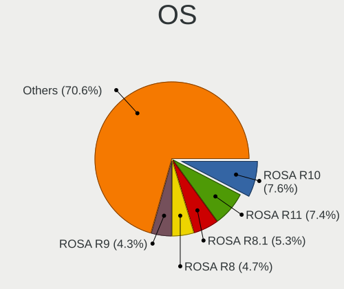

| Name               | Notebooks | Percent |
|--------------------|-----------|---------|
| ROSA R10           | 1495      | 7.63%   |
| ROSA R11           | 1449      | 7.4%    |
| ROSA R8.1          | 1045      | 5.33%   |
| ROSA R8            | 917       | 4.68%   |
| ROSA R9            | 848       | 4.33%   |
| ROSA R11.1         | 844       | 4.31%   |
| ROSA 12.2          | 803       | 4.1%    |
| ROSA 12.4          | 651       | 3.32%   |
| ROSA 12.5.1        | 606       | 3.09%   |
| Ubuntu 20.04       | 513       | 2.62%   |
| Ubuntu 22.04       | 452       | 2.31%   |
| ROSA 12.3          | 371       | 1.89%   |
| Arch Rolling       | 364       | 1.86%   |
| ROSA 12            | 302       | 1.54%   |
| Debian 11          | 296       | 1.51%   |
| Ubuntu 24.04       | 272       | 1.39%   |
| Debian 12          | 270       | 1.38%   |
| ROSA 13.0          | 267       | 1.36%   |
| Ubuntu 18.04       | 258       | 1.32%   |
| OpenMandriva 4.2   | 166       | 0.85%   |
| Manjaro            | 146       | 0.75%   |
| Fedora 39          | 133       | 0.68%   |
| ROSA 12.1          | 128       | 0.65%   |
| ROSA 12.5          | 126       | 0.64%   |
| Fedora 40          | 122       | 0.62%   |
| Fedora 38          | 112       | 0.57%   |
| OpenMandriva 4.3   | 108       | 0.55%   |
| Fedora 37          | 106       | 0.54%   |
| KDE neon 20.04     | 104       | 0.53%   |
| Arch               | 98        | 0.5%    |
| Fedora 36          | 96        | 0.49%   |
| Linux Mint 19.3    | 86        | 0.44%   |
| Fedora 41          | 84        | 0.43%   |
| Linux Mint 20.3    | 82        | 0.42%   |
| Red OS 7.3         | 81        | 0.41%   |
| Pop!_OS 22.04      | 81        | 0.41%   |
| ALT Linux 11.0     | 79        | 0.4%    |
| OpenMandriva 23.08 | 72        | 0.37%   |
| Fedora 35          | 71        | 0.36%   |
| Linux Mint 20.1    | 70        | 0.36%   |

OS Family
---------

OS without a version

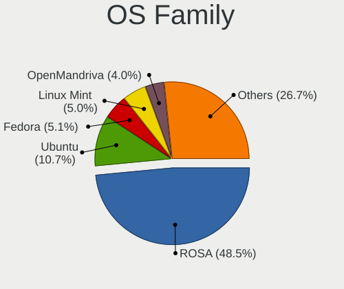

| Name          | Notebooks | Percent |
|---------------|-----------|---------|
| ROSA          | 8447      | 48.5%   |
| Ubuntu        | 1867      | 10.72%  |
| Fedora        | 894       | 5.13%   |
| Linux Mint    | 874       | 5.02%   |
| OpenMandriva  | 690       | 3.96%   |
| Debian        | 657       | 3.77%   |
| ALT Linux     | 489       | 2.81%   |
| Manjaro       | 465       | 2.67%   |
| Arch          | 448       | 2.57%   |
| Kubuntu       | 257       | 1.48%   |
| Red OS        | 220       | 1.26%   |
| Endless       | 220       | 1.26%   |
| KDE neon      | 186       | 1.07%   |
| Xubuntu       | 151       | 0.87%   |
| Pop!_OS       | 143       | 0.82%   |
| SteamOS       | 130       | 0.75%   |
| Elementary    | 107       | 0.61%   |
| Kali          | 99        | 0.57%   |
| Gentoo        | 93        | 0.53%   |
| openSUSE      | 85        | 0.49%   |
| Zorin         | 70        | 0.4%    |
| Lubuntu       | 66        | 0.38%   |
| LMDE          | 55        | 0.32%   |
| ArcoLinux     | 54        | 0.31%   |
| RED           | 46        | 0.26%   |
| EndeavourOS   | 46        | 0.26%   |
| Ubuntu MATE   | 43        | 0.25%   |
| Clear Linux   | 37        | 0.21%   |
| Ubuntu Unity  | 30        | 0.17%   |
| NixOS         | 30        | 0.17%   |
| Astra Linux   | 30        | 0.17%   |
| MX            | 27        | 0.16%   |
| CachyOS       | 23        | 0.13%   |
| Void Linux    | 21        | 0.12%   |
| Nobara        | 21        | 0.12%   |
| Parrot        | 18        | 0.1%    |
| Devuan        | 17        | 0.1%    |
| Artix         | 17        | 0.1%    |
| Ubuntu Budgie | 16        | 0.09%   |
| CentOS        | 14        | 0.08%   |

Kernel
------

Version of the Linux kernel

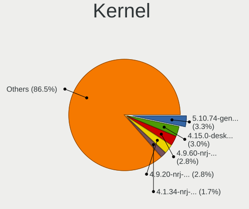

| Version                             | Notebooks | Percent |
|-------------------------------------|-----------|---------|
| 5.10.74-generic-2rosa2021.1-x86_64  | 695       | 3.28%   |
| 4.15.0-desktop-45.1rosa-x86_64      | 625       | 2.95%   |
| 4.9.60-nrj-desktop-1rosa-x86_64     | 602       | 2.85%   |
| 4.9.20-nrj-desktop-1rosa-x86_64     | 588       | 2.78%   |
| 4.1.34-nrj-desktop-2rosa-x86_64     | 354       | 1.67%   |
| 6.1.20-generic-2rosa2021.1-x86_64   | 316       | 1.49%   |
| 6.6.27-generic-3rosa2021.1-x86_64   | 315       | 1.49%   |
| 4.9.124-nrj-desktop-1rosa-x86_64    | 286       | 1.35%   |
| 4.9.9-nrj-desktop-1rosa-x86_64      | 273       | 1.29%   |
| 6.6.47-generic-1rosa2021.1-x86_64   | 238       | 1.12%   |
| 4.1.25-nrj-desktop-1rosa-x86_64     | 230       | 1.09%   |
| 4.1.38-nrj-desktop-2rosa-x86_64     | 216       | 1.02%   |
| 4.9.60-nrj-desktop-1rosa-i586       | 199       | 0.94%   |
| 6.1.58-generic-1rosa2021.1-x86_64   | 183       | 0.86%   |
| 4.9.76-nrj-desktop-1rosa-x86_64     | 178       | 0.84%   |
| 4.9.41-nrj-desktop-1rosa-x86_64     | 176       | 0.83%   |
| 4.15.0-desktop-45.1rosa-i586        | 176       | 0.83%   |
| 4.9.20-nrj-desktop-1rosa-i586       | 174       | 0.82%   |
| 4.15.0-desktop-68.5rosa-x86_64      | 169       | 0.8%    |
| 5.10.14-desktop-1omv4002            | 161       | 0.76%   |
| 4.9.155-nrj-desktop-1rosa-x86_64    | 152       | 0.72%   |
| 4.15.0-desktop-122.124.1rosa-x86_64 | 152       | 0.72%   |
| 5.4.32-generic-2rosa-x86_64         | 150       | 0.71%   |
| 5.10.118-generic-2rosa2021.1-x86_64 | 148       | 0.7%    |
| 4.1.34-nrj-desktop-2rosa-i586       | 145       | 0.69%   |
| 5.4.83-generic-2rosa-x86_64         | 144       | 0.68%   |
| 4.15.0-desktop-47.2rosa-x86_64      | 138       | 0.65%   |
| 5.15.75-generic-1rosa2021.1-x86_64  | 127       | 0.6%    |
| 5.10.0-7-amd64                      | 110       | 0.52%   |
| 4.15.0-desktop-94.1rosa-x86_64      | 107       | 0.51%   |
| 4.1.38-nrj-desktop-2rosa-i586       | 106       | 0.5%    |
| 4.9.95-nrj-desktop-2rosa-x86_64     | 104       | 0.49%   |
| 5.15.79-generic-1rosa2021.1-x86_64  | 99        | 0.47%   |
| 5.16.7-desktop-1omv4003             | 97        | 0.46%   |
| 4.9.9-nrj-desktop-1rosa-i586        | 95        | 0.45%   |
| 4.1.25-nrj-desktop-1rosa-i586       | 89        | 0.42%   |
| 6.14.2-desktop-3omv2590             | 82        | 0.39%   |
| 6.1.38-generic-1rosa2021.1-x86_64   | 82        | 0.39%   |
| 4.9.124-nrj-desktop-1rosa-i586      | 79        | 0.37%   |
| 6.6.21-generic-8rosa2021.1-x86_64   | 78        | 0.37%   |

Kernel Family
-------------

Linux kernel without a distro release

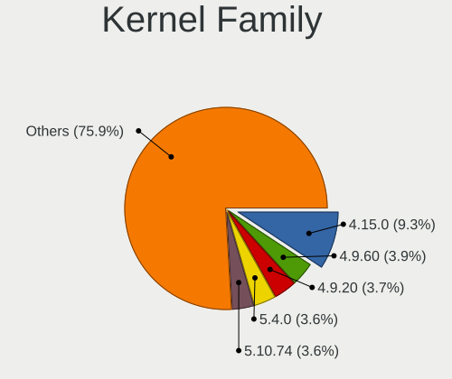

| Version  | Notebooks | Percent |
|----------|-----------|---------|
| 4.15.0   | 1915      | 9.31%   |
| 4.9.60   | 801       | 3.89%   |
| 4.9.20   | 764       | 3.71%   |
| 5.4.0    | 741       | 3.6%    |
| 5.10.74  | 731       | 3.55%   |
| 5.15.0   | 552       | 2.68%   |
| 4.1.34   | 501       | 2.44%   |
| 6.8.0    | 437       | 2.12%   |
| 4.1.38   | 395       | 1.92%   |
| 4.9.9    | 368       | 1.79%   |
| 4.9.124  | 368       | 1.79%   |
| 5.10.0   | 344       | 1.67%   |
| 6.1.20   | 324       | 1.58%   |
| 6.6.27   | 323       | 1.57%   |
| 6.1.0    | 323       | 1.57%   |
| 4.1.25   | 320       | 1.56%   |
| 6.5.0    | 283       | 1.38%   |
| 5.3.0    | 251       | 1.22%   |
| 6.6.47   | 243       | 1.18%   |
| 4.9.41   | 237       | 1.15%   |
| 4.9.76   | 232       | 1.13%   |
| 6.2.0    | 222       | 1.08%   |
| 5.4.32   | 222       | 1.08%   |
| 5.13.0   | 222       | 1.08%   |
| 4.9.155  | 212       | 1.03%   |
| 5.11.0   | 211       | 1.03%   |
| 5.8.0    | 205       | 1%      |
| 5.4.83   | 200       | 0.97%   |
| 6.1.58   | 193       | 0.94%   |
| 5.0.0    | 170       | 0.83%   |
| 5.19.0   | 167       | 0.81%   |
| 5.10.14  | 164       | 0.8%    |
| 5.15.75  | 161       | 0.78%   |
| 5.10.118 | 155       | 0.75%   |
| 6.11.0   | 139       | 0.68%   |
| 4.9.95   | 134       | 0.65%   |
| 6.12.34  | 125       | 0.61%   |
| 6.12.47  | 115       | 0.56%   |
| 6.14.0   | 104       | 0.51%   |
| 5.15.79  | 103       | 0.5%    |

Kernel Major Ver.
-----------------

Linux kernel major version

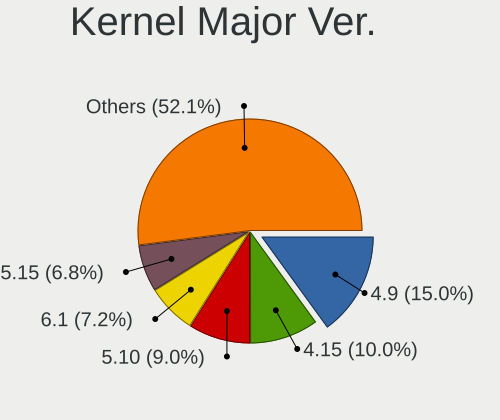

| Version | Notebooks | Percent |
|---------|-----------|---------|
| 4.9     | 2906      | 15.01%  |
| 4.15    | 1931      | 9.97%   |
| 5.10    | 1738      | 8.98%   |
| 6.1     | 1396      | 7.21%   |
| 5.15    | 1314      | 6.79%   |
| 5.4     | 1295      | 6.69%   |
| 4.1     | 1198      | 6.19%   |
| 6.6     | 1024      | 5.29%   |
| 6.12    | 698       | 3.6%    |
| 6.8     | 566       | 2.92%   |
| 6.5     | 415       | 2.14%   |
| 6.2     | 387       | 2%      |
| 5.3     | 291       | 1.5%    |
| 5.13    | 284       | 1.47%   |
| 5.11    | 279       | 1.44%   |
| 5.8     | 265       | 1.37%   |
| 6.11    | 254       | 1.31%   |
| 6.14    | 232       | 1.2%    |
| 5.19    | 227       | 1.17%   |
| 5.0     | 178       | 0.92%   |
| 6.4     | 176       | 0.91%   |
| 5.16    | 173       | 0.89%   |
| 6.0     | 146       | 0.75%   |
| 5.17    | 135       | 0.7%    |
| 6.10    | 122       | 0.63%   |
| 5.18    | 121       | 0.62%   |
| 5.14    | 117       | 0.6%    |
| 4.19    | 113       | 0.58%   |
| 6.9     | 112       | 0.58%   |
| 4.18    | 110       | 0.57%   |
| 4.13    | 109       | 0.56%   |
| 6.7     | 93        | 0.48%   |
| 5.6     | 88        | 0.45%   |
| 6.3     | 79        | 0.41%   |
| 6.13    | 73        | 0.38%   |
| 5.9     | 69        | 0.36%   |
| 6.15    | 65        | 0.34%   |
| 6.17    | 52        | 0.27%   |
| 4.4     | 51        | 0.26%   |
| 5.7     | 50        | 0.26%   |

Arch
----

OS architecture (x86_64, i586, etc.)

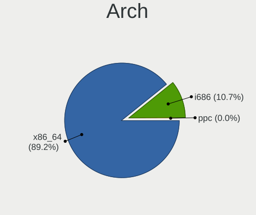

| Name    | Notebooks | Percent |
|---------|-----------|---------|
| x86_64  | 15153     | 89.22%  |
| i686    | 1813      | 10.67%  |
| armv7l  | 10        | 0.06%   |
| aarch64 | 7         | 0.04%   |
| ppc     | 1         | 0.01%   |

DE
--

Desktop Environment

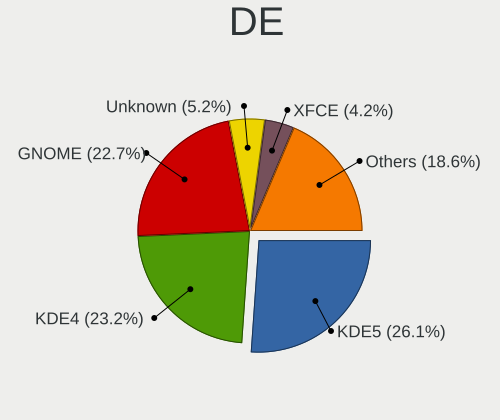

| Name               | Notebooks | Percent |
|--------------------|-----------|---------|
| KDE5               | 4723      | 26.11%  |
| KDE4               | 4193      | 23.18%  |
| GNOME              | 4103      | 22.68%  |
| Unknown            | 936       | 5.17%   |
| XFCE               | 766       | 4.23%   |
| LXQt               | 757       | 4.18%   |
| KDE6               | 626       | 3.46%   |
| MATE               | 521       | 2.88%   |
| X-Cinnamon         | 507       | 2.8%    |
| Cinnamon           | 275       | 1.52%   |
| KDE                | 200       | 1.11%   |
| Pantheon           | 104       | 0.57%   |
| i3                 | 65        | 0.36%   |
| Hyprland           | 45        | 0.25%   |
| LXDE               | 44        | 0.24%   |
| Budgie             | 33        | 0.18%   |
| Unity              | 31        | 0.17%   |
| sway               | 24        | 0.13%   |
| GNOME Flashback    | 23        | 0.13%   |
| fly                | 22        | 0.12%   |
| GNOME Classic      | 10        | 0.06%   |
| Deepin             | 9         | 0.05%   |
| Trinity            | 7         | 0.04%   |
| KDE:KDE-Wayland    | 7         | 0.04%   |
| icewm              | 7         | 0.04%   |
| awesome            | 7         | 0.04%   |
| openbox            | 6         | 0.03%   |
| bspwm              | 6         | 0.03%   |
| DWM                | 5         | 0.03%   |
| fluxbox            | 4         | 0.02%   |
| COSMIC             | 4         | 0.02%   |
| Endless:GNOME      | 3         | 0.02%   |
| xmonad             | 2         | 0.01%   |
| niri               | 2         | 0.01%   |
| lightdm-xsession   | 2         | 0.01%   |
| Enlightenment      | 2         | 0.01%   |
| DDE                | 2         | 0.01%   |
| xinitrc            | 1         | 0.01%   |
| qtile              | 1         | 0.01%   |
| pantheon-non-gnome | 1         | 0.01%   |

Display Server
--------------

X11 or Wayland

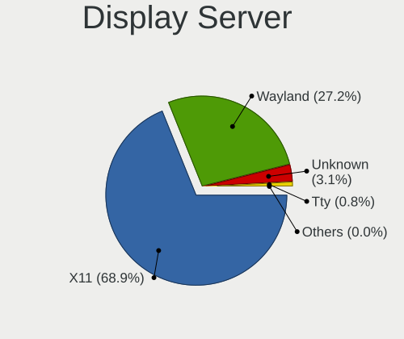

| Name        | Notebooks | Percent |
|-------------|-----------|---------|
| X11         | 12034     | 68.91%  |
| Wayland     | 4744      | 27.16%  |
| Unknown     | 536       | 3.07%   |
| Tty         | 146       | 0.84%   |
| Web         | 2         | 0.01%   |
| Unspecified | 2         | 0.01%   |

Display Manager
---------------

SDDM, LightDM, etc.

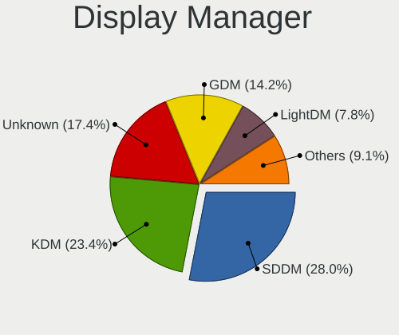

| Name                  | Notebooks | Percent |
|-----------------------|-----------|---------|
| SDDM                  | 5048      | 28.04%  |
| KDM                   | 4204      | 23.36%  |
| Unknown               | 3137      | 17.43%  |
| GDM                   | 2562      | 14.23%  |
| LightDM               | 1408      | 7.82%   |
| GDM3                  | 1102      | 6.12%   |
| TDM                   | 436       | 2.42%   |
| MDM                   | 22        | 0.12%   |
| XDM                   | 18        | 0.1%    |
| SLiM                  | 14        | 0.08%   |
| FLY-DM                | 14        | 0.08%   |
| GREETD                | 10        | 0.06%   |
| LY-DM                 | 7         | 0.04%   |
| Ly                    | 6         | 0.03%   |
| LXDM                  | 4         | 0.02%   |
| SLIMSKI               | 3         | 0.02%   |
| NODM                  | 3         | 0.02%   |
| DISPLAY-MANAGER-START | 1         | 0.01%   |
| COSMIC-GREETER        | 1         | 0.01%   |

OS Lang
-------

Language

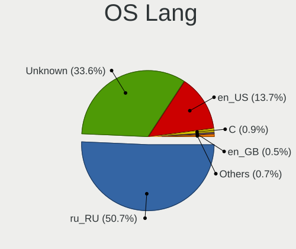

| Lang        | Notebooks | Percent |
|-------------|-----------|---------|
| ru_RU       | 8853      | 50.69%  |
| Unknown     | 5862      | 33.56%  |
| en_US       | 2388      | 13.67%  |
| C           | 164       | 0.94%   |
| en_GB       | 81        | 0.46%   |
| ru_RU.UTF_8 | 19        | 0.11%   |
| ru_UA       | 13        | 0.07%   |
| POSIX       | 13        | 0.07%   |
| C.UTF8      | 7         | 0.04%   |
| zh_CN       | 5         | 0.03%   |
| fr_FR       | 5         | 0.03%   |
| en_AG       | 5         | 0.03%   |
| it_IT       | 4         | 0.02%   |
| en_DK       | 4         | 0.02%   |
| de_DE       | 4         | 0.02%   |
| uk_UA       | 3         | 0.02%   |
| es_ES       | 3         | 0.02%   |
| en_CA       | 3         | 0.02%   |
| ba_RU       | 3         | 0.02%   |
| tr_TR       | 2         | 0.01%   |
| ru_RU.UTF8  | 2         | 0.01%   |
| ru_RU.utf-8 | 2         | 0.01%   |
| ru          | 2         | 0.01%   |
| pt_BR       | 2         | 0.01%   |
| cv_RU       | 2         | 0.01%   |
| tt_RU       | 1         | 0.01%   |
| ru_RU.UTF=8 | 1         | 0.01%   |
| ru_RU-UTF8  | 1         | 0.01%   |
| myv_RU      | 1         | 0.01%   |
| ja_JP       | 1         | 0.01%   |
| es_US       | 1         | 0.01%   |
| en_US.UTF8  | 1         | 0.01%   |
| en_NZ       | 1         | 0.01%   |
| en_IL       | 1         | 0.01%   |
| en_GB.utf-8 | 1         | 0.01%   |
| en_EN       | 1         | 0.01%   |
| en_AU       | 1         | 0.01%   |
| en-US       | 1         | 0.01%   |
| Default     | 1         | 0.01%   |
| aa_DJ       | 1         | 0.01%   |

Boot Mode
---------

EFI or BIOS

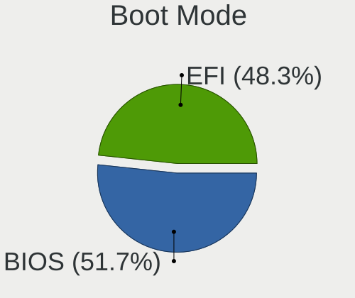

| Mode | Notebooks | Percent |
|------|-----------|---------|
| BIOS | 8898      | 51.68%  |
| EFI  | 8318      | 48.32%  |

Filesystem
----------

Type of filesystem

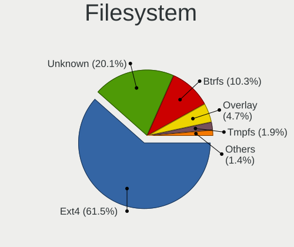

| Type     | Notebooks | Percent |
|----------|-----------|---------|
| Ext4     | 10902     | 61.53%  |
| Unknown  | 3558      | 20.08%  |
| Btrfs    | 1829      | 10.32%  |
| Overlay  | 833       | 4.7%    |
| Tmpfs    | 340       | 1.92%   |
| Xfs      | 113       | 0.64%   |
| Zfs      | 36        | 0.2%    |
| Ext3     | 27        | 0.15%   |
| F2fs     | 26        | 0.15%   |
| Ext2     | 21        | 0.12%   |
| Aufs     | 19        | 0.11%   |
| XXXXX    | 3         | 0.02%   |
| Rootfs   | 3         | 0.02%   |
| Reiserfs | 3         | 0.02%   |
| XXXXXXX  | 1         | 0.01%   |
| Ufs      | 1         | 0.01%   |
| Jfs      | 1         | 0.01%   |
| Bcachefs | 1         | 0.01%   |

Part. scheme
------------

Scheme of partitioning

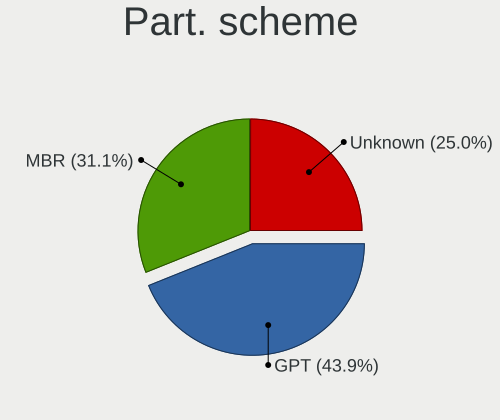

| Type    | Notebooks | Percent |
|---------|-----------|---------|
| GPT     | 7750      | 43.92%  |
| MBR     | 5489      | 31.1%   |
| Unknown | 4408      | 24.98%  |

Dual Boot with Linux/BSD
------------------------

Hosting more than one Linux/BSD

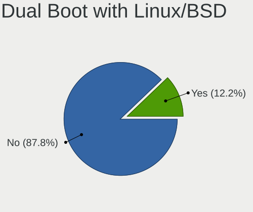

| Dual boot | Notebooks | Percent |
|-----------|-----------|---------|
| No        | 15278     | 87.84%  |
| Yes       | 2115      | 12.16%  |

Dual Boot (Win)
---------------

Hosting Linux and Windows

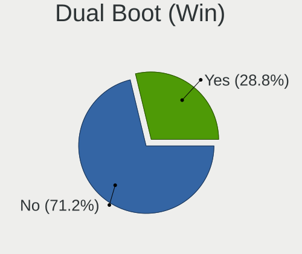

| Dual boot | Notebooks | Percent |
|-----------|-----------|---------|
| No        | 12435     | 71.24%  |
| Yes       | 5020      | 28.76%  |

Board
-----

Vendor
------

Motherboard manufacturer

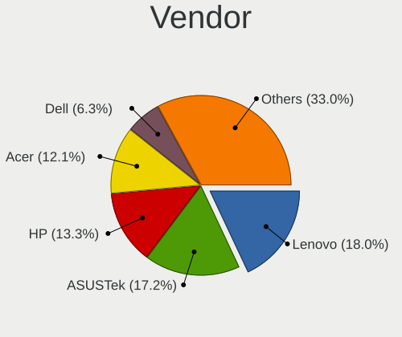

| Name                 | Notebooks | Percent |
|----------------------|-----------|---------|
| Lenovo               | 3033      | 18.01%  |
| ASUSTek Computer     | 2902      | 17.24%  |
| Hewlett-Packard      | 2239      | 13.3%   |
| Acer                 | 2043      | 12.13%  |
| Dell                 | 1069      | 6.35%   |
| Samsung Electronics  | 775       | 4.6%    |
| HUAWEI               | 509       | 3.02%   |
| MSI                  | 482       | 2.86%   |
| Toshiba              | 344       | 2.04%   |
| Sony                 | 335       | 1.99%   |
| Unknown              | 227       | 1.35%   |
| Packard Bell         | 197       | 1.17%   |
| Apple                | 191       | 1.13%   |
| Clevo                | 171       | 1.02%   |
| HONOR                | 167       | 0.99%   |
| eMachines            | 144       | 0.86%   |
| Timi                 | 142       | 0.84%   |
| Valve                | 124       | 0.74%   |
| Aquarius             | 113       | 0.67%   |
| Maibenben            | 108       | 0.64%   |
| Notebook             | 92        | 0.55%   |
| Pegatron             | 70        | 0.42%   |
| Digma                | 65        | 0.39%   |
| Fujitsu Siemens      | 58        | 0.34%   |
| DEXP                 | 56        | 0.33%   |
| ICL                  | 51        | 0.3%    |
| Chuwi                | 50        | 0.3%    |
| Irbis                | 49        | 0.29%   |
| Intel                | 47        | 0.28%   |
| Fujitsu              | 47        | 0.28%   |
| KVADRA               | 44        | 0.26%   |
| DNS                  | 43        | 0.26%   |
| Gigabyte Technology  | 41        | 0.24%   |
| XIAOMI               | 38        | 0.23%   |
| Infinix              | 35        | 0.21%   |
| Quanta               | 32        | 0.19%   |
| Prestigio            | 32        | 0.19%   |
| TECNO Mobile Limited | 30        | 0.18%   |
| Haier                | 26        | 0.15%   |
| DEPO Computers       | 24        | 0.14%   |

Model
-----

Motherboard model

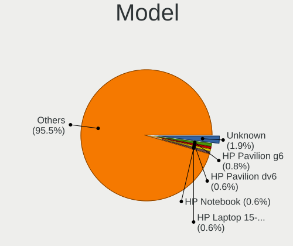

| Name                                       | Notebooks | Percent |
|--------------------------------------------|-----------|---------|
| Unknown                                    | 323       | 1.92%   |
| HP Pavilion g6                             | 142       | 0.84%   |
| HP Pavilion dv6                            | 103       | 0.61%   |
| HP Notebook                                | 100       | 0.59%   |
| HP Laptop 15-bw0xx                         | 98        | 0.58%   |
| Clevo NL41MU2                              | 90        | 0.53%   |
| Valve Jupiter                              | 84        | 0.5%    |
| HUAWEI BOM-WXX9                            | 72        | 0.43%   |
| Acer Aspire V3-571G                        | 69        | 0.41%   |
| Lenovo G570 20079                          | 67        | 0.4%    |
| Lenovo B590 20206                          | 55        | 0.33%   |
| Lenovo B570e HuronRiver Platform           | 51        | 0.3%    |
| Aquarius NS585                             | 50        | 0.3%    |
| HP Pavilion 15                             | 48        | 0.29%   |
| Lenovo G500 20236                          | 46        | 0.27%   |
| Lenovo B590 20208                          | 44        | 0.26%   |
| Packard Bell EasyNote TE11HC               | 43        | 0.26%   |
| HP Pavilion dv7                            | 43        | 0.26%   |
| Lenovo G50-30 80G0                         | 41        | 0.24%   |
| Valve Galileo                              | 40        | 0.24%   |
| Lenovo G50-45 80E3                         | 40        | 0.24%   |
| HUAWEI NBLK-WAX9X                          | 40        | 0.24%   |
| Samsung 300V3A/300V4A/300V5A/200A4B/200A5B | 39        | 0.23%   |
| KVADRA NAU LE14U                           | 39        | 0.23%   |
| HP Pavilion g7                             | 38        | 0.23%   |
| Dell Inspiron N5110                        | 38        | 0.23%   |
| ASUS X550CC                                | 38        | 0.23%   |
| Lenovo B560                                | 37        | 0.22%   |
| Toshiba Satellite C660                     | 36        | 0.21%   |
| HUAWEI BOD-WXX9                            | 36        | 0.21%   |
| Maibenben MaiBook M                        | 35        | 0.21%   |
| Lenovo G580 20150                          | 35        | 0.21%   |
| HUAWEI KLVL-WXXW                           | 35        | 0.21%   |
| ASUS K50IJ                                 | 35        | 0.21%   |
| Acer Aspire 5742G                          | 35        | 0.21%   |
| Lenovo G580 20157                          | 34        | 0.2%    |
| Acer Aspire E1-571G                        | 34        | 0.2%    |
| Acer Aspire 5750G                          | 34        | 0.2%    |
| HP Pavilion Notebook                       | 33        | 0.2%    |
| ASUS VivoBook 15_ASUS Laptop X540BA        | 33        | 0.2%    |

Model Family
------------

Motherboard model prefix

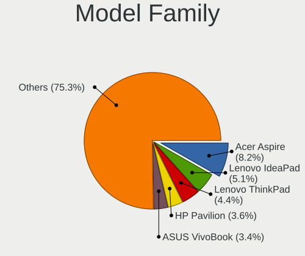

| Name                  | Notebooks | Percent |
|-----------------------|-----------|---------|
| Acer Aspire           | 1387      | 8.24%   |
| Lenovo IdeaPad        | 858       | 5.1%    |
| Lenovo ThinkPad       | 736       | 4.37%   |
| HP Pavilion           | 610       | 3.62%   |
| ASUS VivoBook         | 575       | 3.42%   |
| Dell Inspiron         | 515       | 3.06%   |
| HP Laptop             | 394       | 2.34%   |
| HP ProBook            | 373       | 2.22%   |
| Unknown               | 323       | 1.92%   |
| Toshiba Satellite     | 317       | 1.88%   |
| Dell Latitude         | 224       | 1.33%   |
| Acer Extensa          | 186       | 1.1%    |
| Packard Bell EasyNote | 173       | 1.03%   |
| Lenovo ThinkBook      | 151       | 0.9%    |
| Dell Vostro           | 148       | 0.88%   |
| HP EliteBook          | 133       | 0.79%   |
| ASUS ASUS             | 131       | 0.78%   |
| Acer TravelMate       | 112       | 0.67%   |
| HP Compaq             | 108       | 0.64%   |
| HP Notebook           | 101       | 0.6%    |
| Lenovo B590           | 100       | 0.59%   |
| Lenovo Legion         | 92        | 0.55%   |
| Acer Nitro            | 92        | 0.55%   |
| Lenovo G580           | 91        | 0.54%   |
| Clevo NL41MU2         | 90        | 0.53%   |
| Valve Jupiter         | 84        | 0.5%    |
| ASUS ROG              | 80        | 0.48%   |
| ASUS ZenBook          | 77        | 0.46%   |
| HP 250                | 75        | 0.45%   |
| HUAWEI BOM-WXX9       | 72        | 0.43%   |
| Acer Swift            | 71        | 0.42%   |
| Lenovo G570           | 68        | 0.4%    |
| HP ENVY               | 56        | 0.33%   |
| Dell XPS              | 56        | 0.33%   |
| Maibenben MaiBook     | 53        | 0.31%   |
| ASUS TUF              | 53        | 0.31%   |
| Samsung 355V4C        | 52        | 0.31%   |
| Samsung 300V3A        | 51        | 0.3%    |
| MSI Modern            | 51        | 0.3%    |
| MSI Katana            | 51        | 0.3%    |

MFG Year
--------

Motherboard manufacture year

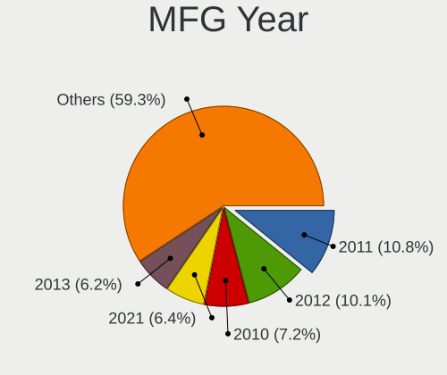

| Year    | Notebooks | Percent |
|---------|-----------|---------|
| 2011    | 1826      | 10.85%  |
| 2012    | 1696      | 10.07%  |
| 2010    | 1215      | 7.22%   |
| 2021    | 1083      | 6.43%   |
| 2013    | 1039      | 6.17%   |
| 2019    | 1037      | 6.16%   |
| 2020    | 949       | 5.64%   |
| 2022    | 887       | 5.27%   |
| 2017    | 863       | 5.13%   |
| 2018    | 855       | 5.08%   |
| 2014    | 746       | 4.43%   |
| 2009    | 732       | 4.35%   |
| 2008    | 726       | 4.31%   |
| 2023    | 712       | 4.23%   |
| 2015    | 626       | 3.72%   |
| 2016    | 591       | 3.51%   |
| 2007    | 525       | 3.12%   |
| 2024    | 323       | 1.92%   |
| 2006    | 244       | 1.45%   |
| 2025    | 64        | 0.38%   |
| 2005    | 59        | 0.35%   |
| Unknown | 23        | 0.14%   |
| 2004    | 13        | 0.08%   |
| 2003    | 2         | 0.01%   |
| 2001    | 1         | 0.01%   |

Form Factor
-----------

Physical design of the computer

| Name     | Notebooks | Percent |
|----------|-----------|---------|
| Notebook | 16837     | 100%    |

Secure Boot
-----------

Enabled or disabled

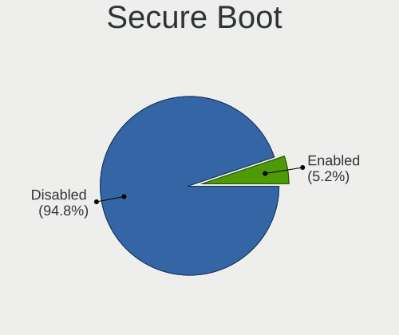

| State    | Notebooks | Percent |
|----------|-----------|---------|
| Disabled | 16071     | 94.84%  |
| Enabled  | 875       | 5.16%   |

Coreboot
--------

Have coreboot on board

| Used | Notebooks | Percent |
|------|-----------|---------|
| No   | 16809     | 99.83%  |
| Yes  | 28        | 0.17%   |

RAM Size
--------

Total RAM memory

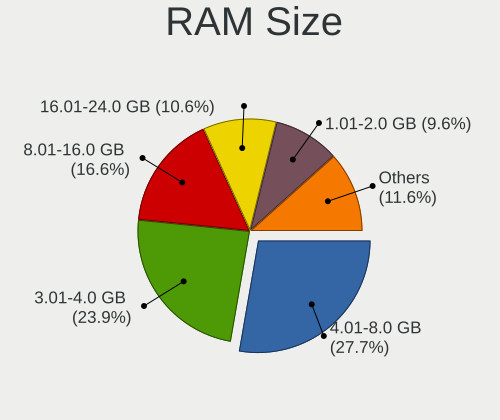

| Size in GB  | Notebooks | Percent |
|-------------|-----------|---------|
| 4.01-8.0    | 4809      | 27.73%  |
| 3.01-4.0    | 4139      | 23.87%  |
| 8.01-16.0   | 2877      | 16.59%  |
| 16.01-24.0  | 1843      | 10.63%  |
| 1.01-2.0    | 1657      | 9.56%   |
| 2.01-3.0    | 882       | 5.09%   |
| 32.01-64.0  | 573       | 3.3%    |
| 0.51-1.0    | 298       | 1.72%   |
| 24.01-32.0  | 179       | 1.03%   |
| 64.01-256.0 | 62        | 0.36%   |
| 0.01-0.5    | 18        | 0.1%    |
| Unknown     | 3         | 0.02%   |

RAM Used
--------

Used RAM memory

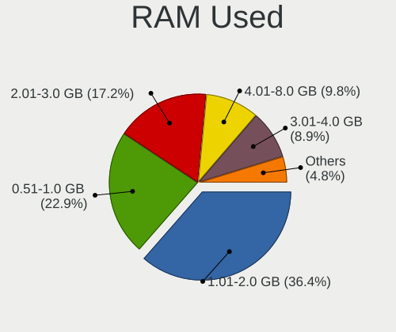

| Used GB    | Notebooks | Percent |
|------------|-----------|---------|
| 1.01-2.0   | 6965      | 36.43%  |
| 0.51-1.0   | 4378      | 22.9%   |
| 2.01-3.0   | 3283      | 17.17%  |
| 4.01-8.0   | 1878      | 9.82%   |
| 3.01-4.0   | 1706      | 8.92%   |
| 8.01-16.0  | 471       | 2.46%   |
| 0.01-0.5   | 360       | 1.88%   |
| 16.01-24.0 | 52        | 0.27%   |
| 24.01-32.0 | 14        | 0.07%   |
| Unknown    | 10        | 0.05%   |
| 32.01-64.0 | 3         | 0.02%   |

Total Drives
------------

Number of drives on board

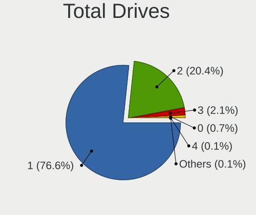

| Drives  | Notebooks | Percent |
|---------|-----------|---------|
| 1       | 13272     | 76.65%  |
| 2       | 3528      | 20.37%  |
| 3       | 367       | 2.12%   |
| 0       | 114       | 0.66%   |
| 4       | 25        | 0.14%   |
| 5       | 7         | 0.04%   |
| 6       | 2         | 0.01%   |
| Unknown | 1         | 0.01%   |

Has CD-ROM
----------

Has CD-ROM on board

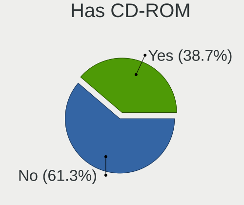

| Presented | Notebooks | Percent |
|-----------|-----------|---------|
| No        | 10438     | 61.26%  |
| Yes       | 6602      | 38.74%  |

Has Ethernet
------------

Has Ethernet on board

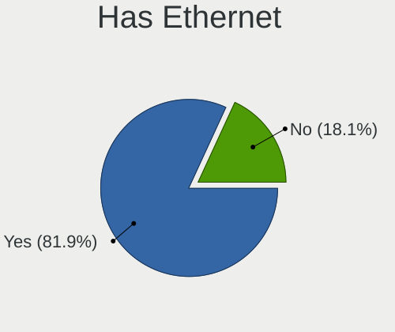

| Presented | Notebooks | Percent |
|-----------|-----------|---------|
| Yes       | 13828     | 81.88%  |
| No        | 3061      | 18.12%  |

Has WiFi
--------

Has WiFi module

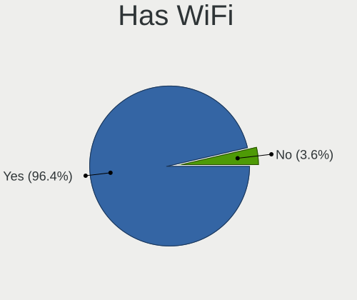

| Presented | Notebooks | Percent |
|-----------|-----------|---------|
| Yes       | 16246     | 96.38%  |
| No        | 610       | 3.62%   |

Has Bluetooth
-------------

Has Bluetooth module

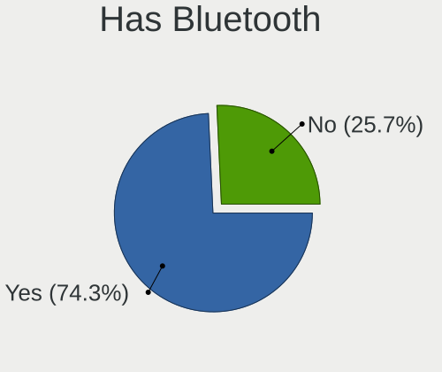

| Presented | Notebooks | Percent |
|-----------|-----------|---------|
| Yes       | 12681     | 74.27%  |
| No        | 4394      | 25.73%  |

Location
--------

Country
-------

Geographic location (country)

| Country | Notebooks | Percent |
|---------|-----------|---------|
| Russia  | 16837     | 100%    |

City
----

Geographic location (city)

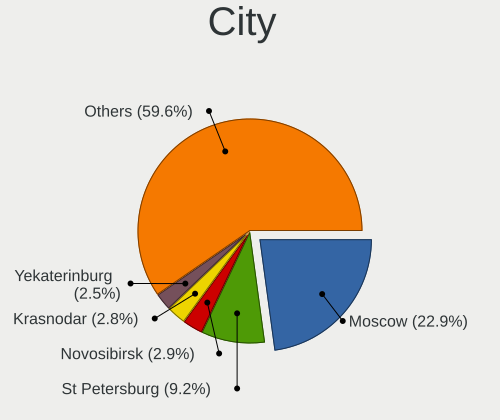

| City             | Notebooks | Percent |
|------------------|-----------|---------|
| Moscow           | 4147      | 22.86%  |
| St Petersburg    | 1673      | 9.22%   |
| Novosibirsk      | 535       | 2.95%   |
| Krasnodar        | 515       | 2.84%   |
| Yekaterinburg    | 459       | 2.53%   |
| Voronezh         | 446       | 2.46%   |
| Pecherskoye      | 329       | 1.81%   |
| Nizhniy Novgorod | 326       | 1.8%    |
| Samara           | 314       | 1.73%   |
| Chelyabinsk      | 290       | 1.6%    |
| Perm             | 287       | 1.58%   |
| Rostov-on-Don    | 284       | 1.57%   |
| Kazan’         | 234       | 1.29%   |
| Krasnoyarsk      | 206       | 1.14%   |
| Ufa              | 178       | 0.98%   |
| Saratov          | 175       | 0.96%   |
| Omsk             | 150       | 0.83%   |
| Tyumen           | 140       | 0.77%   |
| Vladivostok      | 138       | 0.76%   |
| Khabarovsk       | 137       | 0.76%   |
| Barnaul          | 132       | 0.73%   |
| Volgograd        | 128       | 0.71%   |
| Irkutsk          | 127       | 0.7%    |
| Kaliningrad      | 121       | 0.67%   |
| Yaroslavl        | 117       | 0.64%   |
| Stavropol        | 105       | 0.58%   |
| Ulyanovsk        | 102       | 0.56%   |
| Tula             | 102       | 0.56%   |
| Tver             | 100       | 0.55%   |
| Surgut           | 98        | 0.54%   |
| Kirov            | 98        | 0.54%   |
| Tomsk            | 96        | 0.53%   |
| Belgorod         | 96        | 0.53%   |
| Kemerovo         | 91        | 0.5%    |
| Smolensk         | 90        | 0.5%    |
| Ryazan           | 86        | 0.47%   |
| Orenburg         | 77        | 0.42%   |
| Lipetsk          | 75        | 0.41%   |
| Izhevsk          | 74        | 0.41%   |
| Penza            | 73        | 0.4%    |

Drives
------

Drive Vendor
------------

Hard drive vendors

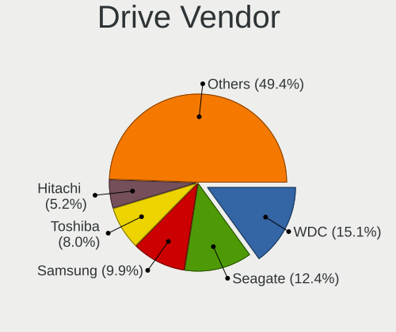

| Vendor                      | Notebooks | Drives | Percent |
|-----------------------------|-----------|--------|---------|
| WDC                         | 3141      | 4259   | 15.05%  |
| Seagate                     | 2591      | 3418   | 12.41%  |
| Samsung Electronics         | 2063      | 2867   | 9.89%   |
| Toshiba                     | 1663      | 2176   | 7.97%   |
| Hitachi                     | 1095      | 1444   | 5.25%   |
| Kingston                    | 1035      | 1302   | 4.96%   |
| Unknown                     | 842       | 1073   | 4.03%   |
| Sandisk                     | 814       | 1040   | 3.9%    |
| HGST                        | 630       | 885    | 3.02%   |
| SK hynix                    | 618       | 828    | 2.96%   |
| Intel                       | 531       | 704    | 2.54%   |
| A-DATA Technology           | 456       | 716    | 2.18%   |
| Micron Technology           | 417       | 543    | 2%      |
| China                       | 373       | 495    | 1.79%   |
| KIOXIA                      | 266       | 348    | 1.27%   |
| Crucial                     | 185       | 232    | 0.89%   |
| Apacer                      | 173       | 215    | 0.83%   |
| SPCC                        | 169       | 260    | 0.81%   |
| Silicon Motion              | 161       | 202    | 0.77%   |
| Fujitsu                     | 160       | 201    | 0.77%   |
| Phison Electronics          | 147       | 165    | 0.7%    |
| KingSpec                    | 135       | 176    | 0.65%   |
| Phison                      | 127       | 145    | 0.61%   |
| Smartbuy                    | 124       | 148    | 0.59%   |
| Netac                       | 120       | 158    | 0.57%   |
| BIWIN                       | 115       | 124    | 0.55%   |
| Transcend                   | 112       | 143    | 0.54%   |
| OCZ                         | 107       | 125    | 0.51%   |
| Apple                       | 102       | 137    | 0.49%   |
| AMD                         | 102       | 119    | 0.49%   |
| Unknown                     | 97        | 108    | 0.46%   |
| Plextor                     | 95        | 125    | 0.46%   |
| Patriot                     | 90        | 117    | 0.43%   |
| Kingston Technology Company | 77        | 103    | 0.37%   |
| HUAWEI                      | 74        | 83     | 0.35%   |
| FORESEE                     | 73        | 90     | 0.35%   |
| JMicron Technology          | 68        | 73     | 0.33%   |
| MAXIO Technology (Hangzhou) | 62        | 81     | 0.3%    |
| Gigabyte Technology         | 53        | 61     | 0.25%   |
| YMTC                        | 50        | 57     | 0.24%   |

Drive Model
-----------

Hard drive models

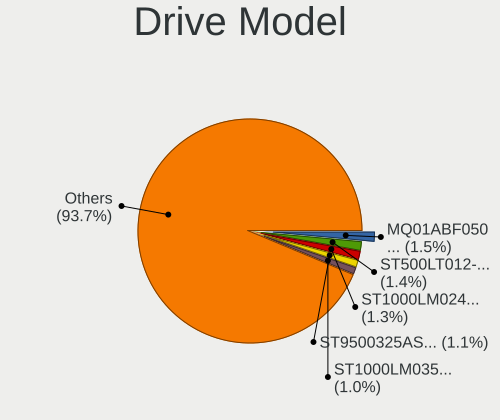

| Model                                             | Notebooks | Percent |
|---------------------------------------------------|-----------|---------|
| Toshiba MQ01ABF050 500GB                          | 313       | 1.46%   |
| Seagate ST500LT012-1DG142 500GB                   | 296       | 1.38%   |
| Seagate ST1000LM024 HN-M101MBB 1TB                | 282       | 1.31%   |
| Seagate ST9500325AS 500GB                         | 237       | 1.11%   |
| Seagate ST1000LM035-1RK172 1TB                    | 224       | 1.04%   |
| Seagate ST9320325AS 320GB                         | 179       | 0.83%   |
| HGST HTS545050A7E680 500GB                        | 163       | 0.76%   |
| Toshiba MQ01ABD100 1TB                            | 145       | 0.68%   |
| Kingston SA400S37240G 240GB SSD                   | 143       | 0.67%   |
| Toshiba MQ04ABF100 1TB                            | 142       | 0.66%   |
| Hitachi HTS543232A7A384 320GB                     | 122       | 0.57%   |
| Seagate ST500LT012-9WS142 500GB                   | 116       | 0.54%   |
| Kingston SA400S37120G 120GB SSD                   | 111       | 0.52%   |
| Intel SSDPEKNU512GZ 512GB                         | 110       | 0.51%   |
| Seagate ST9250315AS 250GB                         | 107       | 0.5%    |
| HGST HTS545050A7E380 500GB                        | 106       | 0.49%   |
| WDC WD5000LPVX-22V0TT0 500GB                      | 101       | 0.47%   |
| Seagate ST320LT020-9YG142 320GB                   | 101       | 0.47%   |
| Seagate ST500LM012 HN-M500MBB 500GB               | 100       | 0.47%   |
| Hitachi HTS547550A9E384 500GB                     | 100       | 0.47%   |
| Unknown                                           | 97        | 0.45%   |
| HGST HTS721010A9E630 1TB                          | 95        | 0.44%   |
| HGST HTS541010A9E680 1TB                          | 95        | 0.44%   |
| Samsung NVMe SSD Controller SM981/PM981/PM983 1TB | 94        | 0.44%   |
| Hitachi HTS545025B9A300 250GB                     | 93        | 0.43%   |
| WDC WDS240G2G0A-00JH30 240GB SSD                  | 91        | 0.42%   |
| WDC WD3200BPVT-22JJ5T0 320GB                      | 90        | 0.42%   |
| SanDisk NVMe SSD Drive 512GB                      | 89        | 0.42%   |
| Hitachi HTS547575A9E384 752GB                     | 86        | 0.4%    |
| BIWIN CE480T5D101-256 256GB                       | 86        | 0.4%    |
| WDC WD5000LPCX-21VHAT0 500GB                      | 84        | 0.39%   |
| WDC WD10JPVX-22JC3T0 1TB                          | 83        | 0.39%   |
| WDC WD5000LPCX-24VHAT0 500GB                      | 81        | 0.38%   |
| Kingston SV300S37A120G 120GB SSD                  | 79        | 0.37%   |
| Kingston SA400S37480G 480GB SSD                   | 78        | 0.36%   |
| Samsung SSD 860 EVO 250GB                         | 76        | 0.35%   |
| WDC WDS120G2G0A-00JH30 120GB SSD                  | 75        | 0.35%   |
| Unknown MMC Card  32GB                            | 74        | 0.35%   |
| Toshiba MQ01ABD050 500GB                          | 72        | 0.34%   |
| Micron 2400_MTFDKBA512QFM 512GB                   | 70        | 0.33%   |

HDD Vendor
----------

Hard disk drive vendors

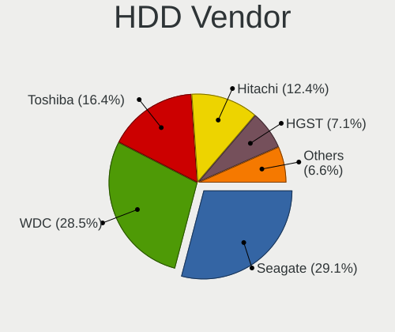

| Vendor              | Notebooks | Drives | Percent |
|---------------------|-----------|--------|---------|
| Seagate             | 2573      | 3387   | 29.07%  |
| WDC                 | 2519      | 3418   | 28.46%  |
| Toshiba             | 1450      | 1904   | 16.38%  |
| Hitachi             | 1094      | 1443   | 12.36%  |
| HGST                | 630       | 885    | 7.12%   |
| Samsung Electronics | 254       | 309    | 2.87%   |
| Fujitsu             | 159       | 200    | 1.8%    |
| JMicron Technology  | 45        | 50     | 0.51%   |
| Unknown             | 36        | 45     | 0.41%   |
| External            | 17        | 22     | 0.19%   |
| TO Exter            | 15        | 20     | 0.17%   |
| JetFlash            | 8         | 16     | 0.09%   |
| IBM/Hitachi         | 7         | 7      | 0.08%   |
| USB                 | 5         | 6      | 0.06%   |
| Apple               | 5         | 5      | 0.06%   |
| HGST HTS            | 4         | 4      | 0.05%   |
| USB3.0              | 3         | 3      | 0.03%   |
| Unknown             | 3         | 3      | 0.03%   |
| StoreJet            | 2         | 2      | 0.02%   |
| QNAP                | 2         | 6      | 0.02%   |
| KESU                | 2         | 2      | 0.02%   |
| ZALMAN              | 1         | 1      | 0.01%   |
| XrayDisk            | 1         | 3      | 0.01%   |
| WD MediaMax         | 1         | 2      | 0.01%   |
| SILICONMOTION       | 1         | 1      | 0.01%   |
| Shenzhen            | 1         | 2      | 0.01%   |
| SAGE                | 1         | 1      | 0.01%   |
| OEM                 | 1         | 2      | 0.01%   |
| NVME USB            | 1         | 1      | 0.01%   |
| Min Yi U            | 1         | 1      | 0.01%   |
| MARSHAL             | 1         | 1      | 0.01%   |
| Initio              | 1         | 1      | 0.01%   |
| IET                 | 1         | 1      | 0.01%   |
| IBM                 | 1         | 1      | 0.01%   |
| HGST HUS            | 1         | 1      | 0.01%   |
| CLOVER              | 1         | 1      | 0.01%   |
| BR                  | 1         | 1      | 0.01%   |
| ASMT                | 1         | 1      | 0.01%   |
| ACASIS              | 1         | 1      | 0.01%   |

SSD Vendor
----------

Solid state drive vendors

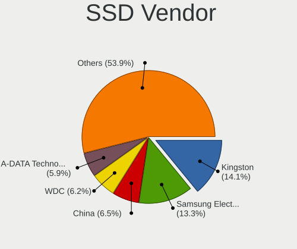

| Vendor              | Notebooks | Drives | Percent |
|---------------------|-----------|--------|---------|
| Kingston            | 791       | 999    | 14.08%  |
| Samsung Electronics | 746       | 1044   | 13.28%  |
| China               | 368       | 490    | 6.55%   |
| WDC                 | 349       | 429    | 6.21%   |
| A-DATA Technology   | 334       | 557    | 5.94%   |
| SanDisk             | 322       | 440    | 5.73%   |
| Crucial             | 170       | 211    | 3.03%   |
| SPCC                | 162       | 252    | 2.88%   |
| Intel               | 153       | 204    | 2.72%   |
| Apacer              | 148       | 188    | 2.63%   |
| KingSpec            | 129       | 167    | 2.3%    |
| Smartbuy            | 119       | 143    | 2.12%   |
| SK hynix            | 111       | 141    | 1.98%   |
| OCZ                 | 107       | 125    | 1.9%    |
| Transcend           | 105       | 128    | 1.87%   |
| AMD                 | 98        | 113    | 1.74%   |
| Netac               | 95        | 118    | 1.69%   |
| Plextor             | 94        | 124    | 1.67%   |
| Patriot             | 88        | 115    | 1.57%   |
| Toshiba             | 79        | 101    | 1.41%   |
| Micron Technology   | 76        | 111    | 1.35%   |
| Apple               | 70        | 82     | 1.25%   |
| GOODRAM             | 48        | 54     | 0.85%   |
| Unknown             | 48        | 56     | 0.85%   |
| DEXP                | 38        | 47     | 0.68%   |
| KingDian            | 35        | 48     | 0.62%   |
| Corsair             | 33        | 43     | 0.59%   |
| LITEON              | 32        | 38     | 0.57%   |
| XrayDisk            | 31        | 52     | 0.55%   |
| Gigabyte Technology | 30        | 35     | 0.53%   |
| LITEONIT            | 28        | 48     | 0.5%    |
| Team                | 24        | 32     | 0.43%   |
| Hewlett-Packard     | 24        | 39     | 0.43%   |
| Digma               | 22        | 25     | 0.39%   |
| Qumo                | 19        | 22     | 0.34%   |
| KingFast            | 19        | 23     | 0.34%   |
| ShiJi               | 16        | 18     | 0.28%   |
| Londisk             | 15        | 18     | 0.27%   |
| BIWIN               | 15        | 15     | 0.27%   |
| Kingmax             | 14        | 27     | 0.25%   |

Drive Kind
----------

HDD or SSD

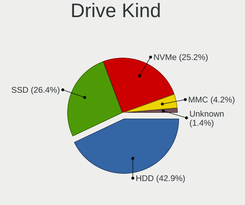

| Kind    | Notebooks | Drives | Percent |
|---------|-----------|--------|---------|
| HDD     | 8496      | 11760  | 42.95%  |
| SSD     | 5216      | 7464   | 26.37%  |
| NVMe    | 4977      | 6934   | 25.16%  |
| MMC     | 823       | 1075   | 4.16%   |
| Unknown | 271       | 296    | 1.37%   |

Drive Connector
---------------

SATA, SAS, NVMe, etc.

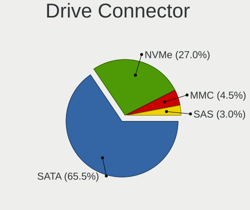

| Type | Notebooks | Drives | Percent |
|------|-----------|--------|---------|
| SATA | 12061     | 18886  | 65.52%  |
| NVMe | 4971      | 6904   | 27.01%  |
| MMC  | 823       | 1075   | 4.47%   |
| SAS  | 552       | 664    | 3%      |

Drive Size
----------

Size of hard drive

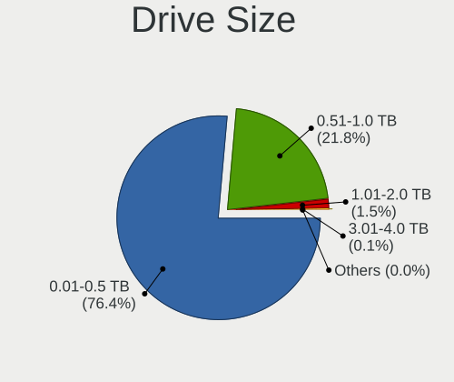

| Size in TB | Notebooks | Drives | Percent |
|------------|-----------|--------|---------|
| 0.01-0.5   | 10011     | 14667  | 76.41%  |
| 0.51-1.0   | 2856      | 4215   | 21.8%   |
| 1.01-2.0   | 202       | 291    | 1.54%   |
| 3.01-4.0   | 18        | 30     | 0.14%   |
| 4.01-10.0  | 9         | 11     | 0.07%   |
| 2.01-3.0   | 4         | 8      | 0.03%   |
| 0          | 2         | 2      | 0.02%   |

Space Total
-----------

Amount of disk space available on the file system

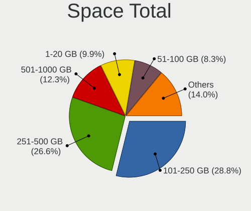

| Size in GB     | Notebooks | Percent |
|----------------|-----------|---------|
| 101-250        | 5314      | 28.85%  |
| 251-500        | 4898      | 26.59%  |
| 501-1000       | 2267      | 12.31%  |
| 1-20           | 1824      | 9.9%    |
| 51-100         | 1538      | 8.35%   |
| 21-50          | 1120      | 6.08%   |
| 1001-2000      | 773       | 4.2%    |
| Unknown        | 412       | 2.24%   |
| 2001-3000      | 160       | 0.87%   |
| More than 3000 | 114       | 0.62%   |

Space Used
----------

Amount of used disk space

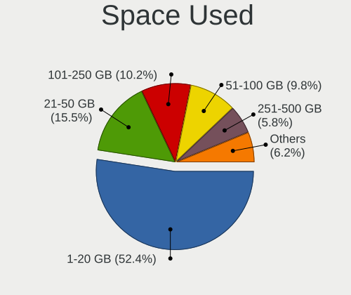

| Used GB        | Notebooks | Percent |
|----------------|-----------|---------|
| 1-20           | 9924      | 52.43%  |
| 21-50          | 2937      | 15.52%  |
| 101-250        | 1926      | 10.18%  |
| 51-100         | 1855      | 9.8%    |
| 251-500        | 1107      | 5.85%   |
| 501-1000       | 535       | 2.83%   |
| Unknown        | 412       | 2.18%   |
| 1001-2000      | 165       | 0.87%   |
| 2001-3000      | 33        | 0.17%   |
| More than 3000 | 21        | 0.11%   |
| 0              | 12        | 0.06%   |

Malfunc. Drives
---------------

Drive models with a malfunction

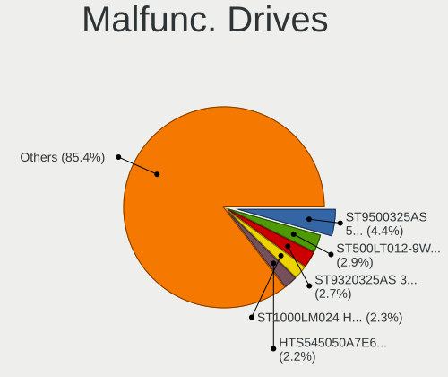

| Model                               | Notebooks | Drives | Percent |
|-------------------------------------|-----------|--------|---------|
| Seagate ST9500325AS 500GB           | 159       | 215    | 4.4%    |
| Seagate ST500LT012-9WS142 500GB     | 106       | 127    | 2.93%   |
| Seagate ST9320325AS 320GB           | 98        | 124    | 2.71%   |
| Seagate ST1000LM024 HN-M101MBB 1TB  | 83        | 105    | 2.3%    |
| HGST HTS545050A7E680 500GB          | 80        | 118    | 2.21%   |
| Seagate ST500LT012-1DG142 500GB     | 78        | 95     | 2.16%   |
| Seagate ST9250315AS 250GB           | 74        | 105    | 2.05%   |
| Seagate ST320LT020-9YG142 320GB     | 65        | 92     | 1.8%    |
| HGST HTS545050A7E380 500GB          | 51        | 84     | 1.41%   |
| Hitachi HTS543232A7A384 320GB       | 49        | 57     | 1.36%   |
| Hitachi HTS545025B9A300 250GB       | 48        | 57     | 1.33%   |
| Toshiba MQ01ABF050 500GB            | 44        | 73     | 1.22%   |
| Seagate ST320LT012-9WS14C 320GB     | 44        | 57     | 1.22%   |
| Hitachi HTS547550A9E384 500GB       | 40        | 55     | 1.11%   |
| Hitachi HTS547575A9E384 752GB       | 39        | 52     | 1.08%   |
| Toshiba MQ01ABD050 500GB            | 33        | 41     | 0.91%   |
| Hitachi HTS541612J9SA00 120GB       | 31        | 42     | 0.86%   |
| Toshiba MK3265GSX 320GB             | 29        | 35     | 0.8%    |
| Seagate ST500LM012 HN-M500MBB 500GB | 27        | 31     | 0.75%   |
| Hitachi HTS545032B9A300 320GB       | 27        | 33     | 0.75%   |
| Hitachi HTS545050B9A300 500GB       | 26        | 34     | 0.72%   |
| Hitachi HTS541680J9SA00 80GB        | 26        | 30     | 0.72%   |
| HGST HTS541010A9E680 1TB            | 26        | 45     | 0.72%   |
| Seagate ST9500420AS 500GB           | 25        | 38     | 0.69%   |
| Samsung Electronics HM160HI 160GB   | 25        | 29     | 0.69%   |
| Hitachi HTS545050A7E380 500GB       | 24        | 34     | 0.66%   |
| Toshiba MQ01ABD100 1TB              | 23        | 35     | 0.64%   |
| Hitachi HTS542512K9SA00 120GB       | 22        | 29     | 0.61%   |
| WDC WD5000LPVX-22V0TT0 500GB        | 21        | 27     | 0.58%   |
| Hitachi HTS542516K9SA00 160GB       | 20        | 36     | 0.55%   |
| WDC WD3200BPVT-22ZEST0 320GB        | 19        | 25     | 0.53%   |
| WDC WD3200BPVT-22JJ5T0 320GB        | 19        | 22     | 0.53%   |
| WDC WD2500BEVT-22A23T0 250GB        | 18        | 23     | 0.5%    |
| Seagate ST1000LM035-1RK172 1TB      | 18        | 23     | 0.5%    |
| Samsung Electronics HM321HI 320GB   | 18        | 24     | 0.5%    |
| Samsung Electronics HM250HI 250GB   | 17        | 19     | 0.47%   |
| Toshiba MQ01ABD075 752GB            | 16        | 21     | 0.44%   |
| Toshiba MK3259GSXP 320GB            | 16        | 26     | 0.44%   |
| Seagate ST9250827AS 250GB           | 16        | 19     | 0.44%   |
| Seagate ST9160821AS 160GB           | 16        | 18     | 0.44%   |

Malfunc. Drive Vendor
---------------------

Vendors of faulty drives

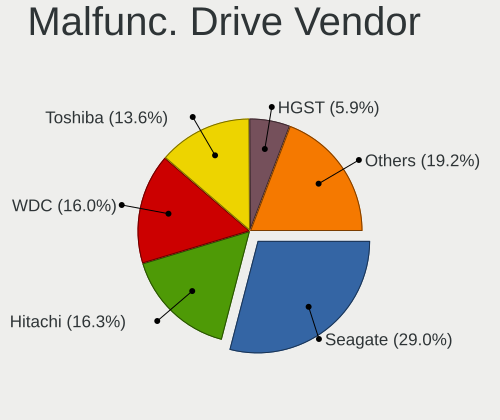

| Vendor              | Notebooks | Drives | Percent |
|---------------------|-----------|--------|---------|
| Seagate             | 1043      | 1355   | 29.04%  |
| Hitachi             | 585       | 741    | 16.29%  |
| WDC                 | 574       | 763    | 15.98%  |
| Toshiba             | 488       | 661    | 13.59%  |
| HGST                | 211       | 323    | 5.88%   |
| Samsung Electronics | 146       | 172    | 4.07%   |
| Kingston            | 69        | 88     | 1.92%   |
| Fujitsu             | 53        | 74     | 1.48%   |
| SanDisk             | 51        | 61     | 1.42%   |
| SK hynix            | 37        | 50     | 1.03%   |
| China               | 36        | 47     | 1%      |
| Intel               | 35        | 53     | 0.97%   |
| A-DATA Technology   | 28        | 35     | 0.78%   |
| OCZ                 | 20        | 21     | 0.56%   |
| KingSpec            | 19        | 22     | 0.53%   |
| SPCC                | 16        | 17     | 0.45%   |
| LITEON              | 15        | 16     | 0.42%   |
| Crucial             | 12        | 16     | 0.33%   |
| Micron Technology   | 11        | 17     | 0.31%   |
| Netac               | 10        | 14     | 0.28%   |
| Plextor             | 9         | 12     | 0.25%   |
| AMD                 | 9         | 11     | 0.25%   |
| LITEONIT            | 8         | 14     | 0.22%   |
| Corsair             | 8         | 8      | 0.22%   |
| Transcend           | 6         | 6      | 0.17%   |
| SSSTC               | 6         | 11     | 0.17%   |
| IBM/Hitachi         | 6         | 6      | 0.17%   |
| Patriot             | 5         | 5      | 0.14%   |
| Kingmax             | 5         | 6      | 0.14%   |
| Apple               | 5         | 5      | 0.14%   |
| Smartbuy            | 4         | 4      | 0.11%   |
| KingDian            | 4         | 7      | 0.11%   |
| Unknown             | 4         | 5      | 0.11%   |
| Team                | 2         | 3      | 0.06%   |
| SandForce           | 2         | 2      | 0.06%   |
| Qumo                | 2         | 2      | 0.06%   |
| OCZ-VERTEX3         | 2         | 2      | 0.06%   |
| Neo                 | 2         | 7      | 0.06%   |
| Mushkin             | 2         | 2      | 0.06%   |
| Kimtigo             | 2         | 2      | 0.06%   |

Malfunc. HDD Vendor
-------------------

Vendors of faulty HDD drives

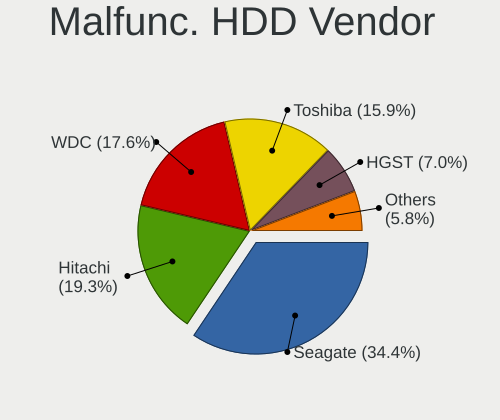

| Vendor              | Notebooks | Drives | Percent |
|---------------------|-----------|--------|---------|
| Seagate             | 1043      | 1355   | 34.4%   |
| Hitachi             | 585       | 741    | 19.29%  |
| WDC                 | 535       | 717    | 17.65%  |
| Toshiba             | 482       | 655    | 15.9%   |
| HGST                | 211       | 323    | 6.96%   |
| Samsung Electronics | 113       | 138    | 3.73%   |
| Fujitsu             | 53        | 74     | 1.75%   |
| IBM/Hitachi         | 6         | 6      | 0.2%    |
| HGST HTS            | 2         | 2      | 0.07%   |
| MARSHAL             | 1         | 1      | 0.03%   |
| External            | 1         | 1      | 0.03%   |

Malfunc. Drive Kind
-------------------

Kinds of faulty drives

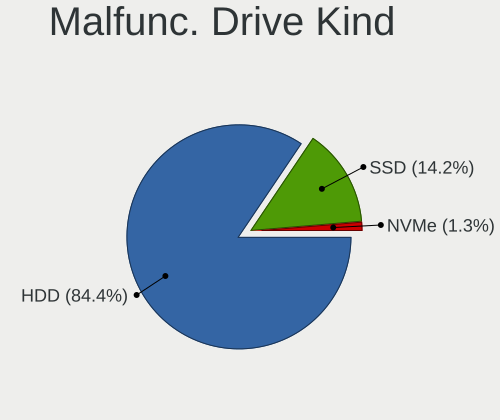

| Kind | Notebooks | Drives | Percent |
|------|-----------|--------|---------|
| HDD  | 2990      | 4013   | 84.44%  |
| SSD  | 504       | 645    | 14.23%  |
| NVMe | 47        | 53     | 1.33%   |

Failed Drives
-------------

Failed drive models

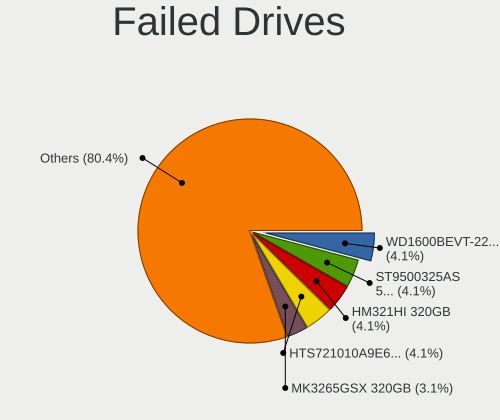

| Model                              | Notebooks | Drives | Percent |
|------------------------------------|-----------|--------|---------|
| WDC WD1600BEVT-22ZCT0 160GB        | 4         | 5      | 4.12%   |
| Seagate ST9500325AS 500GB          | 4         | 4      | 4.12%   |
| Samsung Electronics HM321HI 320GB  | 4         | 5      | 4.12%   |
| HGST HTS721010A9E630 1TB           | 4         | 5      | 4.12%   |
| Toshiba MK3265GSX 320GB            | 3         | 3      | 3.09%   |
| Seagate ST9320325AS 320GB          | 3         | 3      | 3.09%   |
| Hitachi HTS547550A9E384 500GB      | 3         | 3      | 3.09%   |
| HGST HTS545050A7E680 500GB         | 3         | 3      | 3.09%   |
| WDC WD3200BEVT-22ZCT0 320GB        | 2         | 2      | 2.06%   |
| WDC WD1600BEVS-22RST0 160GB        | 2         | 2      | 2.06%   |
| Toshiba MQ01ABD050 500GB           | 2         | 2      | 2.06%   |
| Toshiba MK6465GSX 640GB            | 2         | 2      | 2.06%   |
| Toshiba MK3259GSXP 320GB           | 2         | 2      | 2.06%   |
| Seagate ST500LT012-1DG142 500GB    | 2         | 2      | 2.06%   |
| Seagate ST1000LM024 HN-M101MBB 1TB | 2         | 2      | 2.06%   |
| Samsung Electronics HM160HI 160GB  | 2         | 2      | 2.06%   |
| Hitachi HTS545050A7E380 500GB      | 2         | 3      | 2.06%   |
| Hitachi HTS543225A7A384 250GB      | 2         | 3      | 2.06%   |
| HGST HTS541010A9E680 1TB           | 2         | 2      | 2.06%   |
| WDC WD800BEVS-22RST0 80GB          | 1         | 1      | 1.03%   |
| WDC WD7500BPVT-22HXZT3 752GB       | 1         | 1      | 1.03%   |
| WDC WD7500BPVT-22HXZT1 752GB       | 1         | 1      | 1.03%   |
| WDC WD5000M22K-24Z1LT0-SSHD-16GB   | 1         | 1      | 1.03%   |
| WDC WD5000LPCX-24VHAT0 500GB       | 1         | 1      | 1.03%   |
| WDC WD5000BPVT-80HXZT1 500GB       | 1         | 1      | 1.03%   |
| WDC WD5000BPVT-24HXZT3 500GB       | 1         | 1      | 1.03%   |
| WDC WD5000BEVT-35ZAT0 500GB        | 1         | 1      | 1.03%   |
| WDC WD5000BEVT-22A0RT0 500GB       | 1         | 1      | 1.03%   |
| WDC WD3200BPVT-80ZEST0 320GB       | 1         | 1      | 1.03%   |
| WDC WD3200BPVT-22JJ5T0 320GB       | 1         | 1      | 1.03%   |
| WDC WD3200BEVS-0 320GB             | 1         | 1      | 1.03%   |
| WDC WD2500LPCX-24C6HT0 250GB       | 1         | 1      | 1.03%   |
| WDC WD2500BEVT-35A23T0 250GB       | 1         | 2      | 1.03%   |
| WDC WD2500BEVT-24A23T0 250GB       | 1         | 1      | 1.03%   |
| WDC WD2500BEVT-22ZCT0 250GB        | 1         | 1      | 1.03%   |
| WDC WD1600BEVT-75ZCT2 160GB        | 1         | 1      | 1.03%   |
| WDC WD1200BEVS-07LAT0 120GB        | 1         | 1      | 1.03%   |
| WDC WD10JPVX-22JC3T0 1TB           | 1         | 1      | 1.03%   |
| Toshiba MK8037GSX 80GB             | 1         | 1      | 1.03%   |
| Toshiba MK8025GAL 80GB             | 1         | 2      | 1.03%   |

Failed Drive Vendor
-------------------

Failed drive vendors

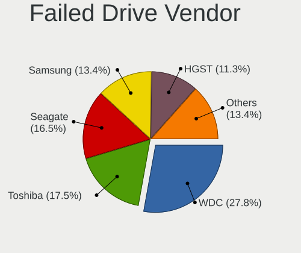

| Vendor              | Notebooks | Drives | Percent |
|---------------------|-----------|--------|---------|
| WDC                 | 27        | 29     | 27.84%  |
| Toshiba             | 17        | 19     | 17.53%  |
| Seagate             | 16        | 18     | 16.49%  |
| Samsung Electronics | 13        | 14     | 13.4%   |
| HGST                | 11        | 13     | 11.34%  |
| Hitachi             | 9         | 11     | 9.28%   |
| SanDisk             | 1         | 2      | 1.03%   |
| Fujitsu             | 1         | 1      | 1.03%   |
| DEXP                | 1         | 1      | 1.03%   |
| Apple               | 1         | 2      | 1.03%   |

Drive Status
------------

Number of failed and malfunc. drives

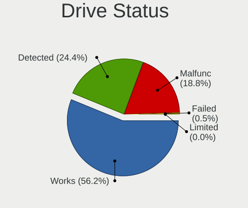

| Status   | Notebooks | Drives | Percent |
|----------|-----------|--------|---------|
| Works    | 10423     | 15976  | 56.2%   |
| Detected | 4533      | 6730   | 24.44%  |
| Malfunc  | 3491      | 4711   | 18.82%  |
| Failed   | 97        | 110    | 0.52%   |
| Limited  | 2         | 2      | 0.01%   |

Storage controller
------------------

Storage Vendor
--------------

Storage controller vendors

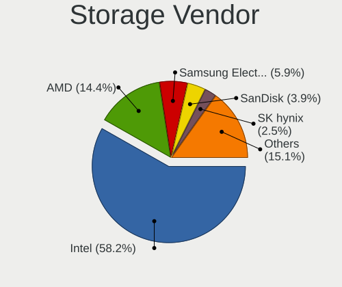

| Vendor                                  | Notebooks | Percent |
|-----------------------------------------|-----------|---------|
| Intel                                   | 11207     | 58.22%  |
| AMD                                     | 2767      | 14.37%  |
| Samsung Electronics                     | 1133      | 5.89%   |
| SanDisk                                 | 750       | 3.9%    |
| SK hynix                                | 485       | 2.52%   |
| Micron Technology                       | 344       | 1.79%   |
| Phison Electronics                      | 338       | 1.76%   |
| Kingston Technology Company             | 313       | 1.63%   |
| KIOXIA                                  | 276       | 1.43%   |
| Silicon Motion                          | 203       | 1.05%   |
| Nvidia                                  | 151       | 0.78%   |
| ADATA Technology                        | 142       | 0.74%   |
| Toshiba America Info Systems            | 139       | 0.72%   |
| Shenzhen Longsys Electronics            | 107       | 0.56%   |
| INNOGRIT                                | 98        | 0.51%   |
| MAXIO Technology (Hangzhou)             | 97        | 0.5%    |
| Yangtze Memory Technologies             | 88        | 0.46%   |
| Silicon Integrated Systems [SiS]        | 85        | 0.44%   |
| Union Memory (Shenzhen)                 | 75        | 0.39%   |
| Solid State Storage Technology          | 72        | 0.37%   |
| Realtek Semiconductor                   | 65        | 0.34%   |
| JMicron Technology                      | 43        | 0.22%   |
| Shenzhen Shichuangyi Electronics        | 31        | 0.16%   |
| Shenzhen Unionmemory Information System | 28        | 0.15%   |
| Netac Technology                        | 24        | 0.12%   |
| Unknown                                 | 23        | 0.12%   |
| Micron/Crucial Technology               | 22        | 0.11%   |
| Apple                                   | 21        | 0.11%   |
| O2 Micro                                | 18        | 0.09%   |
| Lite-On Technology                      | 14        | 0.07%   |
| VIA Technologies                        | 13        | 0.07%   |
| Marvell Technology Group                | 13        | 0.07%   |
| Solidigm                                | 10        | 0.05%   |
| Hosin Global Electronics                | 8         | 0.04%   |
| Lenovo                                  | 7         | 0.04%   |
| Jiangsu Huacun Elec.                    | 6         | 0.03%   |
| Biwin Storage Technology                | 6         | 0.03%   |
| ASMedia Technology                      | 6         | 0.03%   |
| Transcend                               | 4         | 0.02%   |
| ShenZhen TIGO Semiconductor             | 4         | 0.02%   |

Storage Model
-------------

Storage controller models

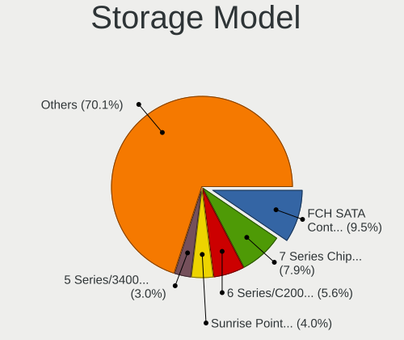

| Model                                                                            | Notebooks | Percent |
|----------------------------------------------------------------------------------|-----------|---------|
| AMD FCH SATA Controller [AHCI mode]                                              | 1985      | 9.47%   |
| Intel 7 Series Chipset Family 6-port SATA Controller [AHCI mode]                 | 1655      | 7.9%    |
| Intel 6 Series/C200 Series Chipset Family 6 port Mobile SATA AHCI Controller     | 1170      | 5.58%   |
| Intel Sunrise Point-LP SATA Controller [AHCI mode]                               | 832       | 3.97%   |
| Intel 5 Series/3400 Series Chipset 4 port SATA AHCI Controller                   | 632       | 3.02%   |
| Intel 82801IBM/IEM (ICH9M/ICH9M-E) 4 port SATA Controller [AHCI mode]            | 628       | 3%      |
| AMD SB7x0/SB8x0/SB9x0 SATA Controller [AHCI mode]                                | 499       | 2.38%   |
| Intel NM10/ICH7 Family SATA Controller [AHCI mode]                               | 463       | 2.21%   |
| Intel 82801HM/HEM (ICH8M/ICH8M-E) IDE Controller                                 | 452       | 2.16%   |
| Intel 82801 Mobile SATA Controller [RAID mode]                                   | 418       | 2%      |
| Intel 8 Series SATA Controller 1 [AHCI mode]                                     | 406       | 1.94%   |
| Samsung NVMe SSD Controller 980 (DRAM-less)                                      | 394       | 1.88%   |
| Samsung NVMe SSD Controller SM981/PM981/PM983                                    | 372       | 1.78%   |
| Intel 82801HM/HEM (ICH8M/ICH8M-E) SATA Controller [AHCI mode]                    | 365       | 1.74%   |
| Intel Tiger Lake-LP SATA Controller                                              | 318       | 1.52%   |
| Intel 8 Series/C220 Series Chipset Family 6-port SATA Controller 1 [AHCI mode]   | 304       | 1.45%   |
| Intel Atom Processor E3800 Series SATA AHCI Controller                           | 297       | 1.42%   |
| Intel Celeron/Pentium Silver Processor SATA Controller                           | 268       | 1.28%   |
| Intel Volume Management Device NVMe RAID Controller                              | 265       | 1.26%   |
| Intel Atom/Celeron/Pentium Processor x5-E8000/J3xxx/N3xxx Series SATA Controller | 240       | 1.15%   |
| Intel Wildcat Point-LP SATA Controller [AHCI Mode]                               | 239       | 1.14%   |
| Intel Cannon Lake Mobile PCH SATA AHCI Controller                                | 231       | 1.1%    |
| Intel Comet Lake SATA AHCI Controller                                            | 228       | 1.09%   |
| Intel Cannon Point-LP SATA Controller [AHCI Mode]                                | 211       | 1.01%   |
| Intel 82801GBM/GHM (ICH7-M Family) SATA Controller [IDE mode]                    | 188       | 0.9%    |
| Phison PS5013-E13 PCIe3 NVMe Controller (DRAM-less)                              | 180       | 0.86%   |
| KIOXIA NVMe SSD Controller BG4 (DRAM-less)                                       | 177       | 0.84%   |
| Intel Celeron N3350/Pentium N4200/Atom E3900 Series SATA AHCI Controller         | 172       | 0.82%   |
| Intel Alder Lake-P SATA AHCI Controller                                          | 168       | 0.8%    |
| SK hynix Gold P31/BC711/PC711 NVMe Solid State Drive                             | 159       | 0.76%   |
| Intel HM170/QM170 Chipset SATA Controller [AHCI Mode]                            | 152       | 0.73%   |
| Intel SSD 670p Series [Keystone Harbor]                                          | 149       | 0.71%   |
| SanDisk Ultra 3D / WD PC SN530, IX SN530, Blue SN550 NVMe SSD (DRAM-less)        | 148       | 0.71%   |
| SanDisk Extreme Pro / WD Black SN750 / PC SN730 / Red SN700 NVMe SSD             | 143       | 0.68%   |
| Intel 82801HM/HEM (ICH8M/ICH8M-E) SATA Controller [IDE mode]                     | 140       | 0.67%   |
| Intel 5 Series/3400 Series Chipset 6 port SATA AHCI Controller                   | 140       | 0.67%   |
| Intel 82801G (ICH7 Family) IDE Controller                                        | 139       | 0.66%   |
| AMD SB600 Non-Raid-5 SATA                                                        | 133       | 0.63%   |
| AMD SB600 IDE                                                                    | 130       | 0.62%   |
| Intel SSD 660P Series                                                            | 128       | 0.61%   |

Storage Kind
------------

Kind of storage controller (IDE, SATA, NVMe, SAS, ...)

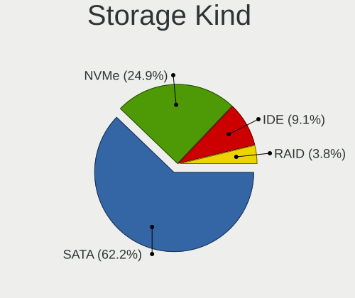

| Kind | Notebooks | Percent |
|------|-----------|---------|
| SATA | 12453     | 62.18%  |
| NVMe | 4988      | 24.91%  |
| IDE  | 1823      | 9.1%    |
| RAID | 762       | 3.81%   |

Processor
---------

CPU Vendor
----------

Processor vendors

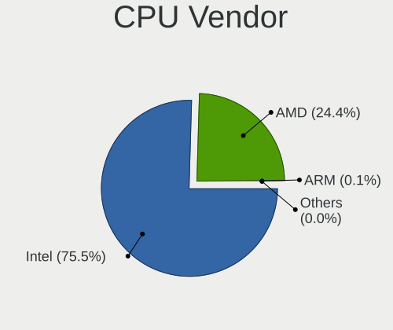

| Vendor       | Notebooks | Percent |
|--------------|-----------|---------|
| Intel        | 12708     | 75.46%  |
| AMD          | 4106      | 24.38%  |
| ARM          | 10        | 0.06%   |
| CentaurHauls | 7         | 0.04%   |
| Unknown      | 7         | 0.04%   |
| Qualcomm     | 2         | 0.01%   |
| PowerBook5,6 | 1         | 0.01%   |

CPU Model
---------

Processor models

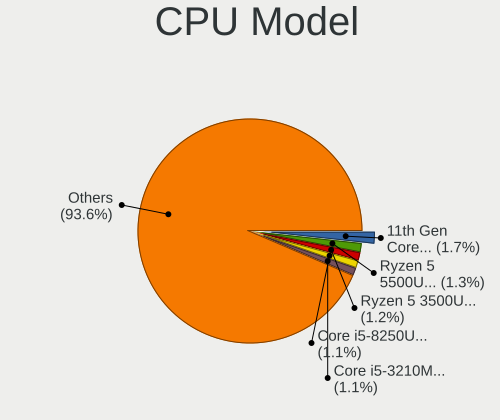

| Model                                         | Notebooks | Percent |
|-----------------------------------------------|-----------|---------|
| Intel 11th Gen Core i5-1135G7 @ 2.40GHz       | 290       | 1.72%   |
| AMD Ryzen 5 5500U with Radeon Graphics        | 225       | 1.33%   |
| AMD Ryzen 5 3500U with Radeon Vega Mobile Gfx | 200       | 1.18%   |
| Intel Core i5-8250U CPU @ 1.60GHz             | 187       | 1.11%   |
| Intel Core i5-3210M CPU @ 2.50GHz             | 186       | 1.1%    |
| Intel Core i5-3230M CPU @ 2.60GHz             | 184       | 1.09%   |
| Intel Core i5-10210U CPU @ 1.60GHz            | 175       | 1.04%   |
| Intel Core i5-8265U CPU @ 1.60GHz             | 160       | 0.95%   |
| Intel Core i5-2410M CPU @ 2.30GHz             | 150       | 0.89%   |
| Intel Pentium CPU B960 @ 2.20GHz              | 148       | 0.88%   |
| Intel Core i5-2450M CPU @ 2.50GHz             | 141       | 0.83%   |
| Intel Core i3-2350M CPU @ 2.30GHz             | 131       | 0.78%   |
| Intel Atom CPU N450 @ 1.66GHz                 | 130       | 0.77%   |
| Intel Core i5-7200U CPU @ 2.50GHz             | 129       | 0.76%   |
| Intel Core i5-2430M CPU @ 2.40GHz             | 126       | 0.75%   |
| Intel Core i3-2310M CPU @ 2.10GHz             | 123       | 0.73%   |
| Intel Core i3 CPU M 370 @ 2.40GHz             | 120       | 0.71%   |
| Intel Core i3-6006U CPU @ 2.00GHz             | 119       | 0.7%    |
| Intel 11th Gen Core i3-1115G4 @ 3.00GHz       | 118       | 0.7%    |
| Intel Celeron CPU N2840 @ 2.16GHz             | 117       | 0.69%   |
| Intel Core i3-3110M CPU @ 2.40GHz             | 116       | 0.69%   |
| AMD Ryzen 7 5700U with Radeon Graphics        | 107       | 0.63%   |
| Intel 12th Gen Core i5-1235U                  | 106       | 0.63%   |
| AMD E-450 APU with Radeon HD Graphics         | 106       | 0.63%   |
| Intel Core i3 CPU M 380 @ 2.53GHz             | 104       | 0.62%   |
| Intel Atom CPU N270 @ 1.60GHz                 | 102       | 0.6%    |
| Intel Core i3-5005U CPU @ 2.00GHz             | 101       | 0.6%    |
| AMD Ryzen 7 5800H with Radeon Graphics        | 98        | 0.58%   |
| Intel Core i5-4210U CPU @ 1.70GHz             | 97        | 0.57%   |
| Intel Atom CPU N455 @ 1.66GHz                 | 96        | 0.57%   |
| Intel Celeron CPU N3350 @ 1.10GHz             | 95        | 0.56%   |
| Intel Pentium CPU 2020M @ 2.40GHz             | 94        | 0.56%   |
| Intel Core i7-3630QM CPU @ 2.40GHz            | 94        | 0.56%   |
| Intel Core i5-8300H CPU @ 2.30GHz             | 91        | 0.54%   |
| Intel Atom CPU N2600 @ 1.60GHz                | 90        | 0.53%   |
| AMD Ryzen 5 4600H with Radeon Graphics        | 90        | 0.53%   |
| AMD Custom APU 0405                           | 89        | 0.53%   |
| Intel Core i3-3120M CPU @ 2.50GHz             | 88        | 0.52%   |
| AMD Ryzen 5 5600H with Radeon Graphics        | 88        | 0.52%   |
| AMD A10-4600M APU with Radeon HD Graphics     | 88        | 0.52%   |

CPU Model Family
----------------

Processor model prefix

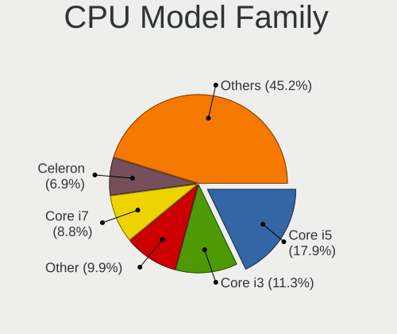

| Model                          | Notebooks | Percent |
|--------------------------------|-----------|---------|
| Intel Core i5                  | 3017      | 17.87%  |
| Intel Core i3                  | 1912      | 11.33%  |
| Other                          | 1665      | 9.86%   |
| Intel Core i7                  | 1491      | 8.83%   |
| Intel Celeron                  | 1162      | 6.88%   |
| Intel Pentium                  | 1028      | 6.09%   |
| AMD Ryzen 5                    | 925       | 5.48%   |
| Intel Atom                     | 821       | 4.86%   |
| Intel Core 2 Duo               | 753       | 4.46%   |
| AMD Ryzen 7                    | 639       | 3.78%   |
| AMD A6                         | 306       | 1.81%   |
| Intel Pentium Dual-Core        | 249       | 1.47%   |
| AMD Ryzen 3                    | 221       | 1.31%   |
| AMD A4                         | 206       | 1.22%   |
| AMD A8                         | 189       | 1.12%   |
| AMD A10                        | 187       | 1.11%   |
| AMD E                          | 178       | 1.05%   |
| AMD E1                         | 141       | 0.84%   |
| Intel Genuine                  | 127       | 0.75%   |
| AMD E2                         | 125       | 0.74%   |
| Intel Pentium Dual             | 116       | 0.69%   |
| Intel Core 2                   | 109       | 0.65%   |
| Intel Pentium Silver           | 98        | 0.58%   |
| Intel Core                     | 89        | 0.53%   |
| Intel Celeron Dual-Core        | 86        | 0.51%   |
| Intel Celeron M                | 84        | 0.5%    |
| AMD Turion 64 X2 Mobile        | 84        | 0.5%    |
| AMD Phenom II                  | 82        | 0.49%   |
| AMD Ryzen 9                    | 71        | 0.42%   |
| Intel Pentium M                | 66        | 0.39%   |
| AMD Athlon                     | 61        | 0.36%   |
| AMD Athlon II                  | 43        | 0.25%   |
| AMD C-60                       | 41        | 0.24%   |
| AMD Ryzen 7 PRO                | 39        | 0.23%   |
| AMD Athlon X2                  | 31        | 0.18%   |
| AMD Athlon 64 X2               | 30        | 0.18%   |
| AMD Turion II Dual-Core        | 27        | 0.16%   |
| AMD Turion X2 Dual-Core Mobile | 26        | 0.15%   |
| Intel Core Duo                 | 25        | 0.15%   |
| AMD C-50                       | 23        | 0.14%   |

CPU Cores
---------

Number of processor cores

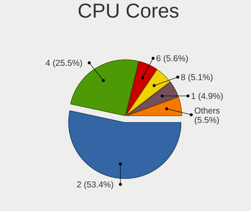

| Number  | Notebooks | Percent |
|---------|-----------|---------|
| 2       | 9034      | 53.37%  |
| 4       | 4312      | 25.47%  |
| 6       | 950       | 5.61%   |
| 8       | 869       | 5.13%   |
| 1       | 823       | 4.86%   |
| Unknown | 283       | 1.67%   |
| 10      | 215       | 1.27%   |
| 12      | 179       | 1.06%   |
| 14      | 145       | 0.86%   |
| 16      | 66        | 0.39%   |
| 3       | 28        | 0.17%   |
| 24      | 18        | 0.11%   |
| 20      | 4         | 0.02%   |
| 192     | 1         | 0.01%   |

CPU Sockets
-----------

Number of sockets

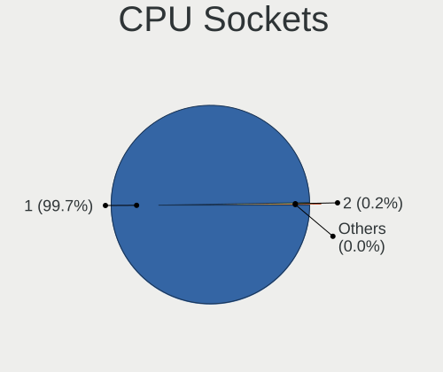

| Number  | Notebooks | Percent |
|---------|-----------|---------|
| 1       | 16802     | 99.73%  |
| 2       | 26        | 0.15%   |
| Unknown | 15        | 0.09%   |
| 4       | 2         | 0.01%   |
| 24      | 1         | 0.01%   |
| 16      | 1         | 0.01%   |
| 8       | 1         | 0.01%   |

CPU Threads
-----------

Threads per core (Hyper-Threading)

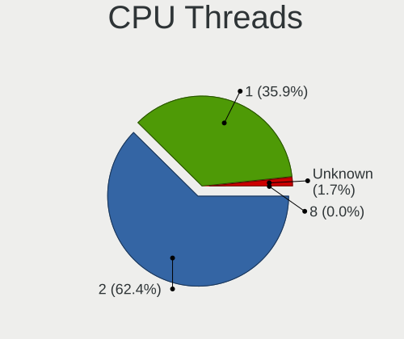

| Number  | Notebooks | Percent |
|---------|-----------|---------|
| 2       | 10582     | 62.42%  |
| 1       | 6086      | 35.9%   |
| Unknown | 283       | 1.67%   |
| 4       | 2         | 0.01%   |
| 8       | 1         | 0.01%   |

CPU Op-Modes
------------

CPU Operation Modes (32-bit, 64-bit)

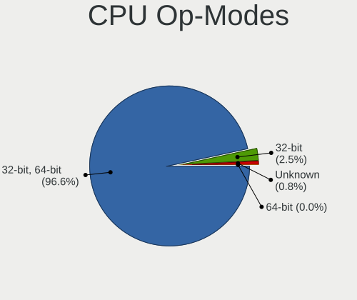

| Op mode        | Notebooks | Percent |
|----------------|-----------|---------|
| 32-bit, 64-bit | 16284     | 96.6%   |
| 32-bit         | 427       | 2.53%   |
| Unknown        | 138       | 0.82%   |
| 64-bit         | 8         | 0.05%   |

CPU Microcode
-------------

Microcode number

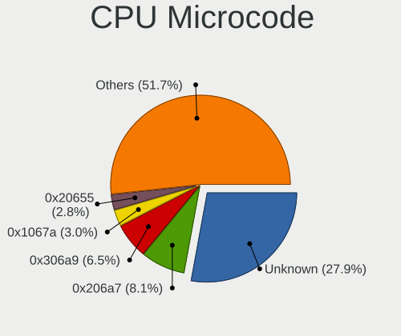

| Number     | Notebooks | Percent |
|------------|-----------|---------|
| Unknown    | 4875      | 27.89%  |
| 0x206a7    | 1414      | 8.09%   |
| 0x306a9    | 1130      | 6.46%   |
| 0x1067a    | 527       | 3.01%   |
| 0x20655    | 496       | 2.84%   |
| 0x6fd      | 366       | 2.09%   |
| 0x806ec    | 352       | 2.01%   |
| 0x806c1    | 341       | 1.95%   |
| 0x106ca    | 341       | 1.95%   |
| 0x40651    | 333       | 1.9%    |
| 0x806ea    | 323       | 1.85%   |
| 0x30678    | 296       | 1.69%   |
| 0x306c3    | 258       | 1.48%   |
| 0x406e3    | 257       | 1.47%   |
| 0x806e9    | 230       | 1.32%   |
| 0x08108109 | 216       | 1.24%   |
| 0x906ea    | 208       | 1.19%   |
| 0x306d4    | 202       | 1.16%   |
| 0x06001119 | 188       | 1.08%   |
| 0x406c4    | 184       | 1.05%   |
| 0x05000119 | 177       | 1.01%   |
| 0x10676    | 176       | 1.01%   |
| 0x0a50000c | 176       | 1.01%   |
| 0x08608103 | 170       | 0.97%   |
| 0x07030105 | 169       | 0.97%   |
| 0x06006705 | 167       | 0.96%   |
| 0x20652    | 165       | 0.94%   |
| 0x03000027 | 152       | 0.87%   |
| 0x08108102 | 147       | 0.84%   |
| 0x010000c8 | 145       | 0.83%   |
| 0x30661    | 136       | 0.78%   |
| 0x106c2    | 132       | 0.76%   |
| 0x08600106 | 125       | 0.72%   |
| 0x406c3    | 123       | 0.7%    |
| 0x706e5    | 112       | 0.64%   |
| 0x506c9    | 110       | 0.63%   |
| 0x10661    | 110       | 0.63%   |
| 0x706a1    | 106       | 0.61%   |
| 0x6e8      | 92        | 0.53%   |
| 0x906e9    | 88        | 0.5%    |

CPU Microarch
-------------

Microarchitecture

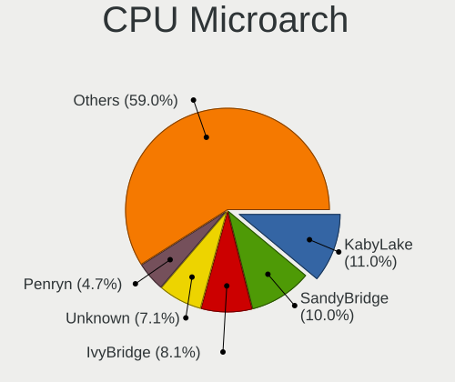

| Name               | Notebooks | Percent |
|--------------------|-----------|---------|
| KabyLake           | 1865      | 11.04%  |
| SandyBridge        | 1697      | 10.04%  |
| IvyBridge          | 1377      | 8.15%   |
| Unknown            | 1192      | 7.05%   |
| Penryn             | 800       | 4.73%   |
| Westmere           | 787       | 4.66%   |
| Haswell            | 772       | 4.57%   |
| Silvermont         | 743       | 4.4%    |
| Core               | 731       | 4.33%   |
| TigerLake          | 675       | 3.99%   |
| Bonnell            | 613       | 3.63%   |
| Alderlake Hybrid   | 521       | 3.08%   |
| Zen+               | 435       | 2.57%   |
| Zen 3              | 421       | 2.49%   |
| Skylake            | 396       | 2.34%   |
| Excavator          | 358       | 2.12%   |
| Zen 2              | 345       | 2.04%   |
| Bobcat             | 297       | 1.76%   |
| Broadwell          | 277       | 1.64%   |
| Goldmont plus      | 271       | 1.6%    |
| Piledriver         | 251       | 1.49%   |
| IceLake            | 242       | 1.43%   |
| Puma               | 240       | 1.42%   |
| K10                | 222       | 1.31%   |
| P6                 | 217       | 1.28%   |
| K10 Llano          | 198       | 1.17%   |
| K8 Hammer          | 174       | 1.03%   |
| Goldmont           | 172       | 1.02%   |
| CometLake          | 149       | 0.88%   |
| Jaguar             | 115       | 0.68%   |
| Zen                | 92        | 0.54%   |
| K8 & K10 hybrid    | 77        | 0.46%   |
| Meteorlake Hybrid  | 51        | 0.3%    |
| Tremont            | 44        | 0.26%   |
| Nehalem            | 28        | 0.17%   |
| Gracemont          | 22        | 0.13%   |
| Steamroller        | 18        | 0.11%   |
| NetBurst           | 5         | 0.03%   |
| Lunarlake Hybrid   | 5         | 0.03%   |
| ArrowLake-H Hybrid | 4         | 0.02%   |

Graphics
--------

GPU Vendor
----------

Vendors of graphics cards

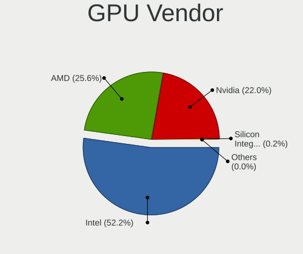

| Vendor                           | Notebooks | Percent |
|----------------------------------|-----------|---------|
| Intel                            | 11166     | 52.2%   |
| AMD                              | 5471      | 25.58%  |
| Nvidia                           | 4700      | 21.97%  |
| Silicon Integrated Systems [SiS] | 36        | 0.17%   |
| VIA Technologies                 | 10        | 0.05%   |
| Zhaoxin                          | 3         | 0.01%   |
| Silicon Motion                   | 2         | 0.01%   |
| ATI Technologies                 | 2         | 0.01%   |

GPU Model
---------

Graphics card models

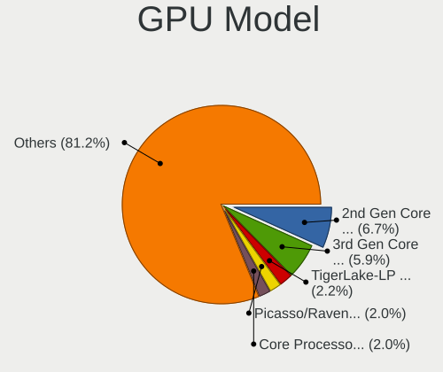

| Model                                                                                    | Notebooks | Percent |
|------------------------------------------------------------------------------------------|-----------|---------|
| Intel 2nd Generation Core Processor Family Integrated Graphics Controller                | 1530      | 6.74%   |
| Intel 3rd Gen Core processor Graphics Controller                                         | 1337      | 5.89%   |
| Intel TigerLake-LP GT2 [Iris Xe Graphics]                                                | 511       | 2.25%   |
| AMD Picasso/Raven 2 [Radeon Vega Series / Radeon Vega Mobile Series]                     | 449       | 1.98%   |
| Intel Core Processor Integrated Graphics Controller                                      | 445       | 1.96%   |
| Intel Haswell-ULT Integrated Graphics Controller                                         | 433       | 1.91%   |
| Nvidia GF117M [GeForce 610M/710M/810M/820M / GT 620M/625M/630M/720M]                     | 430       | 1.89%   |
| Intel Mobile 4 Series Chipset Integrated Graphics Controller                             | 395       | 1.74%   |
| Intel Atom Processor Z36xxx/Z37xxx Series Graphics & Display                             | 392       | 1.73%   |
| AMD Lucienne                                                                             | 380       | 1.67%   |
| Intel Atom Processor D4xx/D5xx/N4xx/N5xx Integrated Graphics Controller                  | 357       | 1.57%   |
| Intel Atom/Celeron/Pentium Processor x5-E8000/J3xxx/N3xxx Integrated Graphics Controller | 351       | 1.55%   |
| AMD Renoir [Radeon Vega Series / Radeon Vega Mobile Series]                              | 341       | 1.5%    |
| Intel Kaby Lake-R GT2 [UHD Graphics 620]                                                 | 321       | 1.41%   |
| Intel 4th Gen Core Processor Integrated Graphics Controller                              | 311       | 1.37%   |
| AMD Cezanne [Radeon Vega Series / Radeon Vega Mobile Series]                             | 307       | 1.35%   |
| Intel CometLake-U GT2 [UHD Graphics]                                                     | 304       | 1.34%   |
| AMD Stoney [Radeon R2/R3/R4/R5 Graphics]                                                 | 292       | 1.29%   |
| Intel Mobile GM965/GL960 Integrated Graphics Controller (secondary)                      | 287       | 1.26%   |
| Intel Mobile GM965/GL960 Integrated Graphics Controller (primary)                        | 287       | 1.26%   |
| Intel CoffeeLake-H GT2 [UHD Graphics 630]                                                | 284       | 1.25%   |
| Intel Skylake-U GT2 [HD Graphics 520]                                                    | 282       | 1.24%   |
| Intel Kaby Lake-U GT2 [HD Graphics 620]                                                  | 280       | 1.23%   |
| Intel WhiskeyLake-U GT2 [UHD Graphics 620]                                               | 258       | 1.14%   |
| Intel Mobile 945GM/GMS/GME, 943/940GML Express Integrated Graphics Controller            | 244       | 1.07%   |
| AMD Seymour [Radeon HD 6400M/7400M Series]                                               | 244       | 1.07%   |
| AMD Thames [Radeon HD 7500M/7600M Series]                                                | 218       | 0.96%   |
| Intel Broadwell-U GT2 [HD Graphics 5500]                                                 | 217       | 0.96%   |
| Intel GeminiLake [UHD Graphics 600]                                                      | 191       | 0.84%   |
| AMD Sun XT [Radeon HD 8670A/8670M/8690M / R5 M330 / M430 / Radeon 520 Mobile]            | 189       | 0.83%   |
| AMD Park [Mobility Radeon HD 5430/5450/5470]                                             | 184       | 0.81%   |
| Nvidia TU117M [GeForce GTX 1650 Mobile / Max-Q]                                          | 183       | 0.81%   |
| AMD Topaz XT [Radeon R7 M260/M265 / M340/M360 / M440/M445 / 530/535 / 620/625 Mobile]    | 182       | 0.8%    |
| Intel Tiger Lake-LP GT2 [UHD Graphics G4]                                                | 163       | 0.72%   |
| Intel Alder Lake-P GT2 [Iris Xe Graphics]                                                | 158       | 0.7%    |
| Nvidia GP107M [GeForce GTX 1050 Mobile]                                                  | 156       | 0.69%   |
| Nvidia GF108M [GeForce GT 540M]                                                          | 149       | 0.66%   |
| Intel Atom Processor D2xxx/N2xxx Integrated Graphics Controller                          | 142       | 0.63%   |
| AMD Rembrandt [Radeon 680M]                                                              | 139       | 0.61%   |
| Intel Mobile 945GM/GMS, 943/940GML Express Integrated Graphics Controller                | 137       | 0.6%    |

GPU Combo
---------

Combinations of graphics cards

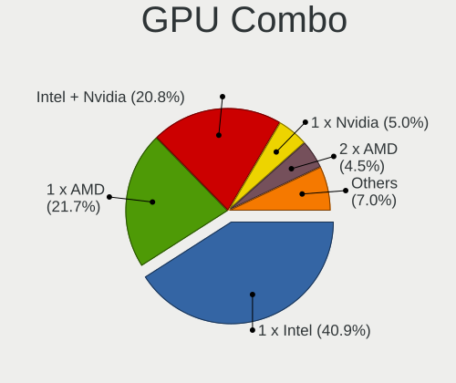

| Name                   | Notebooks | Percent |
|------------------------|-----------|---------|
| 1 x Intel              | 6920      | 40.95%  |
| 1 x AMD                | 3671      | 21.72%  |
| Intel + Nvidia         | 3515      | 20.8%   |
| 1 x Nvidia             | 840       | 4.97%   |
| 2 x AMD                | 765       | 4.53%   |
| Intel + AMD            | 696       | 4.12%   |
| AMD + Nvidia           | 345       | 2.04%   |
| 2 x Intel              | 62        | 0.37%   |
| 1 x SiS                | 36        | 0.21%   |
| Other                  | 28        | 0.17%   |
| 1 x VIA                | 10        | 0.06%   |
| 2 x Nvidia             | 5         | 0.03%   |
| 1 x Zhaoxin            | 3         | 0.02%   |
| 1 x Silicon Motion     | 2         | 0.01%   |
| 2 x Intel + 1 x Nvidia | 1         | 0.01%   |
| Intel + 2 x Nvidia     | 1         | 0.01%   |

GPU Driver
----------

Free vs proprietary

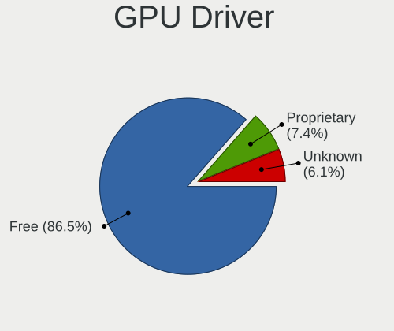

| Driver      | Notebooks | Percent |
|-------------|-----------|---------|
| Free        | 14874     | 86.48%  |
| Proprietary | 1277      | 7.42%   |
| Unknown     | 1049      | 6.1%    |

GPU Memory
----------

Total video memory

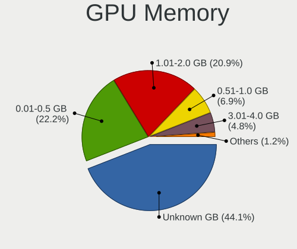

| Size in GB | Notebooks | Percent |
|------------|-----------|---------|
| Unknown    | 7727      | 44.06%  |
| 0.01-0.5   | 3898      | 22.23%  |
| 1.01-2.0   | 3657      | 20.85%  |
| 0.51-1.0   | 1209      | 6.89%   |
| 3.01-4.0   | 840       | 4.79%   |
| 5.01-6.0   | 105       | 0.6%    |
| 7.01-8.0   | 60        | 0.34%   |
| 2.01-3.0   | 29        | 0.17%   |
| 8.01-16.0  | 11        | 0.06%   |

Monitor
-------

Monitor Vendor
--------------

Monitor vendors

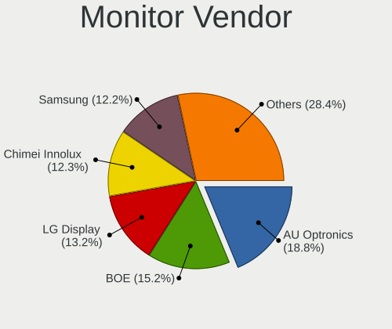

| Vendor                  | Notebooks | Percent |
|-------------------------|-----------|---------|
| AU Optronics            | 3292      | 18.77%  |
| BOE                     | 2671      | 15.23%  |
| LG Display              | 2319      | 13.22%  |
| Chimei Innolux          | 2153      | 12.27%  |
| Samsung Electronics     | 2132      | 12.15%  |
| Chi Mei Optoelectronics | 965       | 5.5%    |
| Lenovo                  | 276       | 1.57%   |
| PANDA                   | 265       | 1.51%   |
| LG Philips              | 262       | 1.49%   |
| HannStar                | 208       | 1.19%   |
| Apple                   | 200       | 1.14%   |
| Dell                    | 199       | 1.13%   |
| Goldstar                | 180       | 1.03%   |
| Sharp                   | 159       | 0.91%   |
| InfoVision              | 148       | 0.84%   |
| CPT                     | 134       | 0.76%   |
| Philips                 | 130       | 0.74%   |
| Acer                    | 129       | 0.74%   |
| BenQ                    | 124       | 0.71%   |
| Valve                   | 118       | 0.67%   |
| AOC                     | 117       | 0.67%   |
| CSO                     | 105       | 0.6%    |
| Hewlett-Packard         | 94        | 0.54%   |
| TMX                     | 90        | 0.51%   |
| Sony                    | 81        | 0.46%   |
| HKC                     | 62        | 0.35%   |
| CSOT                    | 56        | 0.32%   |
| Ancor Communications    | 50        | 0.29%   |
| ViewSonic               | 48        | 0.27%   |
| InnoLux Display         | 46        | 0.26%   |
| Iiyama                  | 45        | 0.26%   |
| Mi                      | 43        | 0.25%   |
| NEC Computers           | 36        | 0.21%   |
| HUAWEI                  | 34        | 0.19%   |
| Toshiba                 | 32        | 0.18%   |
| Quanta Display          | 31        | 0.18%   |
| MSI                     | 26        | 0.15%   |
| CSW                     | 26        | 0.15%   |
| ASUSTek Computer        | 24        | 0.14%   |
| Unknown                 | 20        | 0.11%   |

Monitor Model
-------------

Monitor models

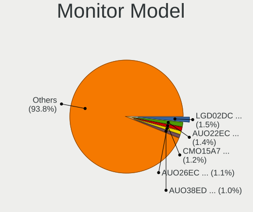

| Model                                                                    | Notebooks | Percent |
|--------------------------------------------------------------------------|-----------|---------|
| LG Display LCD Monitor LGD02DC 1366x768 344x194mm 15.5-inch              | 272       | 1.54%   |
| AU Optronics LCD Monitor AUO22EC 1366x768 344x193mm 15.5-inch            | 246       | 1.39%   |
| Chi Mei Optoelectronics LCD Monitor CMO15A7 1366x768 344x193mm 15.5-inch | 205       | 1.16%   |
| AU Optronics LCD Monitor AUO26EC 1366x768 344x193mm 15.5-inch            | 189       | 1.07%   |
| AU Optronics LCD Monitor AUO38ED 1920x1080 344x193mm 15.5-inch           | 178       | 1.01%   |
| BOE LCD Monitor BOE0872 1920x1080 344x194mm 15.5-inch                    | 172       | 0.97%   |
| Chimei Innolux LCD Monitor CMN15DB 1366x768 344x193mm 15.5-inch          | 137       | 0.78%   |
| AU Optronics LCD Monitor AUO21ED 1920x1080 344x193mm 15.5-inch           | 136       | 0.77%   |
| Chimei Innolux LCD Monitor CMN14D4 1920x1080 309x173mm 13.9-inch         | 126       | 0.71%   |
| BOE LCD Monitor BOE06A5 1366x768 344x194mm 15.5-inch                     | 122       | 0.69%   |
| Samsung Electronics LCD Monitor SEC3245 1366x768 340x190mm 15.3-inch     | 121       | 0.68%   |
| LG Display LCD Monitor LGD033A 1366x768 344x194mm 15.5-inch              | 117       | 0.66%   |
| AU Optronics LCD Monitor AUO21EC 1366x768 344x193mm 15.5-inch            | 114       | 0.64%   |
| BOE LCD Monitor BOE0877 1920x1080 309x173mm 13.9-inch                    | 112       | 0.63%   |
| Samsung Electronics LCD Monitor SEC5441 1280x800 331x207mm 15.4-inch     | 102       | 0.58%   |
| Chimei Innolux LCD Monitor CMN15E7 1920x1080 344x193mm 15.5-inch         | 102       | 0.58%   |
| Samsung Electronics LCD Monitor SEC324A 1366x768 344x194mm 15.5-inch     | 91        | 0.51%   |
| Chimei Innolux LCD Monitor CMN15D5 1920x1080 344x193mm 15.5-inch         | 88        | 0.5%    |
| Chi Mei Optoelectronics LCD Monitor CMO1592 1366x768 344x193mm 15.5-inch | 88        | 0.5%    |
| AU Optronics LCD Monitor AUO20EC 1366x768 344x193mm 15.5-inch            | 87        | 0.49%   |
| AU Optronics LCD Monitor AUO61D2 1024x600 222x125mm 10.0-inch            | 86        | 0.49%   |
| HannStar LCD Monitor HSD03E9 1024x600 220x129mm 10.0-inch                | 85        | 0.48%   |
| Chimei Innolux LCD Monitor CMN15F5 1920x1080 344x193mm 15.5-inch         | 85        | 0.48%   |
| Chimei Innolux LCD Monitor CMN1521 1920x1080 344x193mm 15.5-inch         | 84        | 0.48%   |
| Valve ANX7530 U VLV3001 800x1280 100x150mm 7.1-inch                      | 79        | 0.45%   |
| Lenovo LCD Monitor LEN40B0 1366x768 344x194mm 15.5-inch                  | 79        | 0.45%   |
| BOE LCD Monitor BOE0687 1920x1080 344x193mm 15.5-inch                    | 79        | 0.45%   |
| Chi Mei Optoelectronics LCD Monitor CMO15A3 1366x768 344x193mm 15.5-inch | 77        | 0.44%   |
| LG Display LCD Monitor LGD038E 1366x768 344x194mm 15.5-inch              | 75        | 0.42%   |
| AU Optronics LCD Monitor AUO45EC 1366x768 344x193mm 15.5-inch            | 74        | 0.42%   |
| AU Optronics LCD Monitor AUO71EC 1366x768 344x193mm 15.5-inch            | 72        | 0.41%   |
| BOE LCD Monitor BOE0747 1920x1080 344x194mm 15.5-inch                    | 70        | 0.4%    |
| AU Optronics LCD Monitor AUO46EC 1366x768 344x193mm 15.5-inch            | 67        | 0.38%   |
| BOE LCD Monitor BOE0812 1920x1080 344x194mm 15.5-inch                    | 66        | 0.37%   |
| BOE LCD Monitor BOE0700 1920x1080 344x194mm 15.5-inch                    | 66        | 0.37%   |
| AU Optronics LCD Monitor AUO403D 1920x1080 309x174mm 14.0-inch           | 64        | 0.36%   |
| Chimei Innolux LCD Monitor CMN15C9 1366x768 344x193mm 15.5-inch          | 63        | 0.36%   |
| BOE LCD Monitor BOE0893 2160x1440 296x197mm 14.0-inch                    | 63        | 0.36%   |
| BOE LCD Monitor BOE069C 1920x1080 344x193mm 15.5-inch                    | 63        | 0.36%   |
| Chimei Innolux LCD Monitor CMN1728 1600x900 382x215mm 17.3-inch          | 62        | 0.35%   |

Monitor Resolution
------------------

Monitor screen resolution

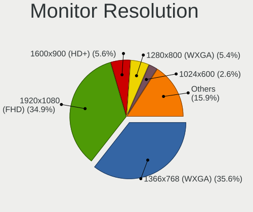

| Resolution         | Notebooks | Percent |
|--------------------|-----------|---------|
| 1366x768 (WXGA)    | 6046      | 35.57%  |
| 1920x1080 (FHD)    | 5937      | 34.93%  |
| 1600x900 (HD+)     | 958       | 5.64%   |
| 1280x800 (WXGA)    | 915       | 5.38%   |
| 1024x600           | 439       | 2.58%   |
| 1920x1200 (WUXGA)  | 431       | 2.54%   |
| 3840x2160 (4K)     | 307       | 1.81%   |
| 2560x1440 (QHD)    | 296       | 1.74%   |
| 2560x1600          | 287       | 1.69%   |
| 1440x900 (WXGA+)   | 225       | 1.32%   |
| 1280x1024 (SXGA)   | 147       | 0.86%   |
| 800x1280           | 122       | 0.72%   |
| 2880x1800          | 115       | 0.68%   |
| 2160x1440          | 110       | 0.65%   |
| 1680x1050 (WSXGA+) | 100       | 0.59%   |
| 3200x2000          | 56        | 0.33%   |
| 1024x768 (XGA)     | 44        | 0.26%   |
| 2520x1680          | 35        | 0.21%   |
| 3440x1440          | 34        | 0.2%    |
| Unknown            | 31        | 0.18%   |
| 2560x1080          | 29        | 0.17%   |
| 2880x1620          | 26        | 0.15%   |
| 3000x2000          | 25        | 0.15%   |
| 3072x1920          | 23        | 0.14%   |
| 2288x1287          | 23        | 0.14%   |
| 1360x768           | 23        | 0.14%   |
| 1280x720 (HD)      | 22        | 0.13%   |
| 2240x1400          | 20        | 0.12%   |
| 3840x2400          | 19        | 0.11%   |
| 1680x945           | 17        | 0.1%    |
| 3456x2160          | 13        | 0.08%   |
| 3200x1800 (QHD+)   | 12        | 0.07%   |
| 1600x1200          | 11        | 0.06%   |
| 3120x2080          | 10        | 0.06%   |
| 1400x1050          | 10        | 0.06%   |
| 1920x540           | 8         | 0.05%   |
| 2256x1504          | 7         | 0.04%   |
| 3840x2560          | 5         | 0.03%   |
| 2880x1920          | 5         | 0.03%   |
| 2048x1280          | 5         | 0.03%   |

Monitor Diagonal
----------------

Diagonal size in inches

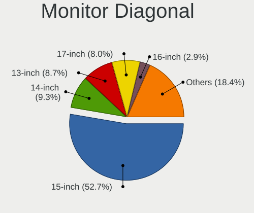

| Inches  | Notebooks | Percent |
|---------|-----------|---------|
| 15      | 9225      | 52.69%  |
| 14      | 1625      | 9.28%   |
| 13      | 1526      | 8.72%   |
| 17      | 1406      | 8.03%   |
| 16      | 502       | 2.87%   |
| 10      | 446       | 2.55%   |
| 24      | 358       | 2.04%   |
| 27      | 351       | 2%      |
| 11      | 331       | 1.89%   |
| 12      | 273       | 1.56%   |
| 21      | 251       | 1.43%   |
| 23      | 244       | 1.39%   |
| 7       | 118       | 0.67%   |
| 19      | 110       | 0.63%   |
| 18      | 100       | 0.57%   |
| 31      | 98        | 0.56%   |
| Unknown | 97        | 0.55%   |
| 34      | 69        | 0.39%   |
| 20      | 43        | 0.25%   |
| 22      | 39        | 0.22%   |
| 40      | 29        | 0.17%   |
| 8       | 29        | 0.17%   |
| 32      | 23        | 0.13%   |
| 52      | 20        | 0.11%   |
| 54      | 18        | 0.1%    |
| 28      | 17        | 0.1%    |
| 72      | 14        | 0.08%   |
| 142     | 13        | 0.07%   |
| 42      | 13        | 0.07%   |
| 84      | 11        | 0.06%   |
| 86      | 10        | 0.06%   |
| 26      | 10        | 0.06%   |
| 63      | 9         | 0.05%   |
| 25      | 9         | 0.05%   |
| 29      | 8         | 0.05%   |
| 48      | 7         | 0.04%   |
| 46      | 6         | 0.03%   |
| 37      | 5         | 0.03%   |
| 65      | 4         | 0.02%   |
| 55      | 4         | 0.02%   |

Monitor Width
-------------

Physical width

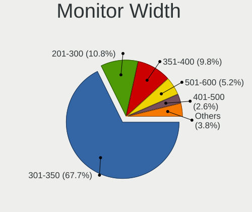

| Width in mm    | Notebooks | Percent |
|----------------|-----------|---------|
| 301-350        | 11783     | 67.68%  |
| 201-300        | 1879      | 10.79%  |
| 351-400        | 1707      | 9.8%    |
| 501-600        | 913       | 5.24%   |
| 401-500        | 458       | 2.63%   |
| 601-700        | 137       | 0.79%   |
| 1-100          | 122       | 0.7%    |
| Unknown        | 97        | 0.56%   |
| 701-800        | 92        | 0.53%   |
| 1001-1500      | 90        | 0.52%   |
| 801-900        | 39        | 0.22%   |
| 1501-2000      | 32        | 0.18%   |
| 101-200        | 29        | 0.17%   |
| 901-1000       | 18        | 0.1%    |
| More than 2000 | 14        | 0.08%   |

Aspect Ratio
------------

Proportional relationship between the width and the height

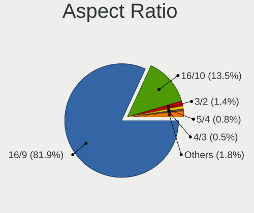

| Ratio   | Notebooks | Percent |
|---------|-----------|---------|
| 16/9    | 13412     | 81.89%  |
| 16/10   | 2219      | 13.55%  |
| 3/2     | 227       | 1.39%   |
| 5/4     | 135       | 0.82%   |
| 4/3     | 89        | 0.54%   |
| 21/9    | 79        | 0.48%   |
| 0.67    | 79        | 0.48%   |
| Unknown | 50        | 0.31%   |
| 0.62    | 40        | 0.24%   |
| 1.00    | 13        | 0.08%   |
| 0.56    | 11        | 0.07%   |
| 6/5     | 10        | 0.06%   |
| 32/9    | 7         | 0.04%   |
| 3.73    | 2         | 0.01%   |
| 3.40    | 2         | 0.01%   |
| 0.63    | 2         | 0.01%   |
| 3.33    | 1         | 0.01%   |
| 1.96    | 1         | 0.01%   |

Monitor Area
------------

Area in inch²

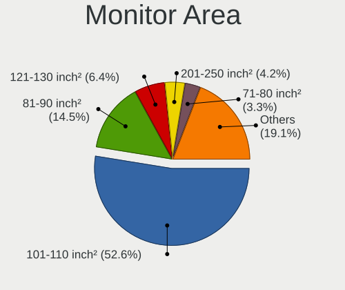

| Area in inch² | Notebooks | Percent |
|----------------|-----------|---------|
| 101-110        | 9197      | 52.55%  |
| 81-90          | 2529      | 14.45%  |
| 121-130        | 1116      | 6.38%   |
| 201-250        | 739       | 4.22%   |
| 71-80          | 570       | 3.26%   |
| 41-50          | 449       | 2.57%   |
| 111-120        | 443       | 2.53%   |
| 301-350        | 360       | 2.06%   |
| 51-60          | 333       | 1.9%    |
| 131-140        | 255       | 1.46%   |
| 61-70          | 254       | 1.45%   |
| 351-500        | 211       | 1.21%   |
| 151-200        | 206       | 1.18%   |
| 1-40           | 151       | 0.86%   |
| 141-150        | 149       | 0.85%   |
| 91-100         | 148       | 0.85%   |
| More than 1000 | 124       | 0.71%   |
| 251-300        | 103       | 0.59%   |
| Unknown        | 97        | 0.55%   |
| 501-1000       | 66        | 0.38%   |

Pixel Density
-------------

Pixels per inch

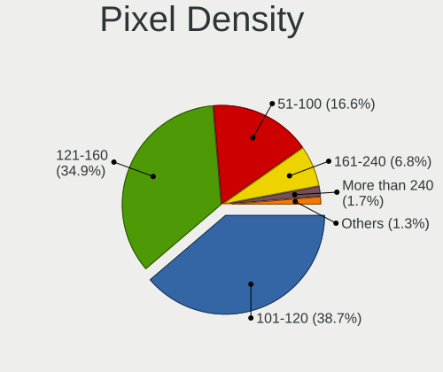

| Density       | Notebooks | Percent |
|---------------|-----------|---------|
| 101-120       | 6697      | 38.74%  |
| 121-160       | 6040      | 34.94%  |
| 51-100        | 2863      | 16.56%  |
| 161-240       | 1168      | 6.76%   |
| More than 240 | 292       | 1.69%   |
| 1-50          | 128       | 0.74%   |
| Unknown       | 97        | 0.56%   |

Multiple Monitors
-----------------

Total monitors connected

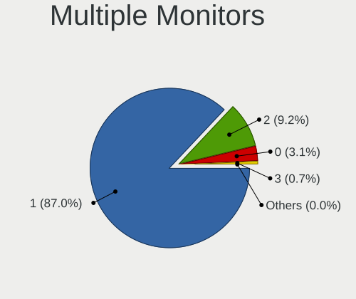

| Total | Notebooks | Percent |
|-------|-----------|---------|
| 1     | 14964     | 87.01%  |
| 2     | 1588      | 9.23%   |
| 0     | 526       | 3.06%   |
| 3     | 115       | 0.67%   |
| 4     | 3         | 0.02%   |
| 6     | 1         | 0.01%   |
| 5     | 1         | 0.01%   |

Network
-------

Net Controller Vendor
---------------------

Controller vendors

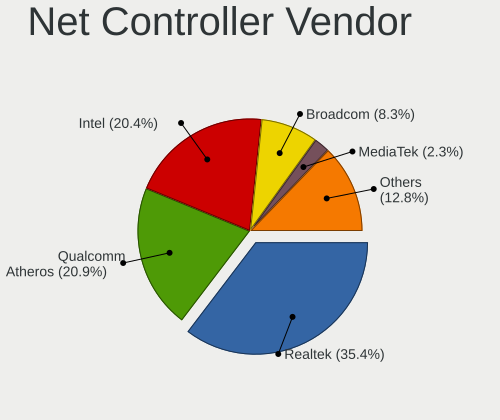

| Vendor                            | Notebooks | Percent |
|-----------------------------------|-----------|---------|
| Realtek Semiconductor             | 9796      | 35.36%  |
| Qualcomm Atheros                  | 5777      | 20.85%  |
| Intel                             | 5664      | 20.44%  |
| Broadcom                          | 2295      | 8.28%   |
| MediaTek                          | 631       | 2.28%   |
| Marvell Technology Group          | 561       | 2.02%   |
| Broadcom Limited                  | 557       | 2.01%   |
| Ralink                            | 408       | 1.47%   |
| Huawei Technologies               | 236       | 0.85%   |
| Qualcomm                          | 182       | 0.66%   |
| Xiaomi                            | 150       | 0.54%   |
| JMicron Technology                | 130       | 0.47%   |
| TP-Link                           | 124       | 0.45%   |
| Attansic Technology               | 123       | 0.44%   |
| Ralink Technology                 | 106       | 0.38%   |
| ASIX Electronics                  | 87        | 0.31%   |
| Nvidia                            | 82        | 0.3%    |
| Samsung Electronics               | 79        | 0.29%   |
| Silicon Integrated Systems [SiS]  | 56        | 0.2%    |
| ZTE WCDMA Technologies MSM        | 44        | 0.16%   |
| ASUSTek Computer                  | 39        | 0.14%   |
| Shenzhen Goodix Technology        | 36        | 0.13%   |
| OPPO Electronics                  | 35        | 0.13%   |
| D-Link                            | 35        | 0.13%   |
| Qualcomm Atheros Communications   | 31        | 0.11%   |
| Sierra Wireless                   | 29        | 0.1%    |
| Hewlett-Packard                   | 29        | 0.1%    |
| Lenovo                            | 28        | 0.1%    |
| Ericsson Business Mobile Networks | 28        | 0.1%    |
| Dell                              | 23        | 0.08%   |
| Gemtek                            | 20        | 0.07%   |
| Vimtron Electronics               | 18        | 0.06%   |
| Fibocom                           | 16        | 0.06%   |
| DisplayLink                       | 12        | 0.04%   |
| D-Link System                     | 12        | 0.04%   |
| ICS Advent                        | 11        | 0.04%   |
| Google                            | 11        | 0.04%   |
| Unknown                           | 11        | 0.04%   |
| QinHeng Electronics               | 9         | 0.03%   |
| Apple                             | 9         | 0.03%   |

Net Controller Model
--------------------

Controller models

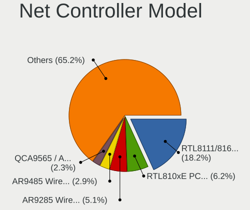

| Model                                                                   | Notebooks | Percent |
|-------------------------------------------------------------------------|-----------|---------|
| Realtek RTL8111/8168/8211/8411 PCI Express Gigabit Ethernet Controller  | 5814      | 18.19%  |
| Realtek RTL810xE PCI Express Fast Ethernet controller                   | 1984      | 6.21%   |
| Qualcomm Atheros AR9285 Wireless Network Adapter (PCI-Express)          | 1628      | 5.09%   |
| Qualcomm Atheros AR9485 Wireless Network Adapter                        | 938       | 2.93%   |
| Qualcomm Atheros QCA9565 / AR9565 Wireless Network Adapter              | 749       | 2.34%   |
| Broadcom BCM4313 802.11bgn Wireless Network Adapter                     | 678       | 2.12%   |
| Qualcomm Atheros QCA9377 802.11ac Wireless Network Adapter              | 648       | 2.03%   |
| Realtek RTL8822CE 802.11ac PCIe Wireless Network Adapter                | 629       | 1.97%   |
| Realtek RTL8821CE 802.11ac PCIe Wireless Network Adapter                | 583       | 1.82%   |
| Intel Wi-Fi 6 AX201                                                     | 527       | 1.65%   |
| Realtek RTL8723BE PCIe Wireless Network Adapter                         | 489       | 1.53%   |
| Broadcom BCM43142 802.11b/g/n                                           | 404       | 1.26%   |
| Qualcomm Atheros AR242x / AR542x Wireless Network Adapter (PCI-Express) | 397       | 1.24%   |
| Intel Alder Lake-P PCH CNVi WiFi                                        | 389       | 1.22%   |
| Intel PRO/Wireless 3945ABG [Golan] Network Connection                   | 317       | 0.99%   |
| Intel Wireless 7265                                                     | 313       | 0.98%   |
| Qualcomm Atheros AR8151 v2.0 Gigabit Ethernet                           | 311       | 0.97%   |
| Intel Wireless 8265 / 8275                                              | 307       | 0.96%   |
| Intel Wi-Fi 6 AX200                                                     | 303       | 0.95%   |
| Broadcom NetLink BCM57785 Gigabit Ethernet PCIe                         | 279       | 0.87%   |
| Qualcomm Atheros AR9462 Wireless Network Adapter                        | 261       | 0.82%   |
| Realtek RTL8153 Gigabit Ethernet Adapter                                | 260       | 0.81%   |
| MediaTek MT7921 802.11ax PCIe Wireless Network Adapter [Filogic 330]    | 244       | 0.76%   |
| Intel Comet Lake PCH-LP CNVi WiFi                                       | 244       | 0.76%   |
| Realtek RTL8723DE Wireless Network Adapter                              | 229       | 0.72%   |
| Ralink RT3290 Wireless 802.11n 1T/1R PCIe                               | 228       | 0.71%   |
| Intel Cannon Lake PCH CNVi WiFi                                         | 228       | 0.71%   |
| Marvell Group 88E8040 PCI-E Fast Ethernet Controller                    | 223       | 0.7%    |
| Intel 82579LM Gigabit Network Connection (Lewisville)                   | 199       | 0.62%   |
| Qualcomm Atheros AR8132 Fast Ethernet                                   | 186       | 0.58%   |
| Intel Wireless 3165                                                     | 172       | 0.54%   |
| Broadcom BCM4312 802.11b/g LP-PHY                                       | 172       | 0.54%   |
| Qualcomm Atheros AR8131 Gigabit Ethernet                                | 169       | 0.53%   |
| Intel WiFi Link 5100                                                    | 169       | 0.53%   |
| Intel Cannon Point-LP CNVi [Wireless-AC]                                | 168       | 0.53%   |
| Qualcomm Atheros AR8152 v2.0 Fast Ethernet                              | 166       | 0.52%   |
| Intel Dual Band Wireless-AC 3168NGW [Stone Peak]                        | 164       | 0.51%   |
| Intel Wireless 7260                                                     | 163       | 0.51%   |
| Realtek RTL8723AE PCIe Wireless Network Adapter                         | 157       | 0.49%   |
| Realtek RTL8188CE 802.11b/g/n WiFi Adapter                              | 157       | 0.49%   |

Wireless Vendor
---------------

Wireless vendors

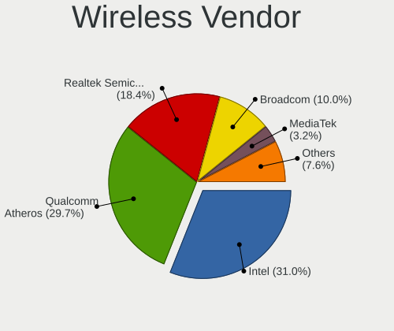

| Vendor                            | Notebooks | Percent |
|-----------------------------------|-----------|---------|
| Intel                             | 5209      | 31.04%  |
| Qualcomm Atheros                  | 4987      | 29.72%  |
| Realtek Semiconductor             | 3091      | 18.42%  |
| Broadcom                          | 1678      | 10%     |
| MediaTek                          | 539       | 3.21%   |
| Ralink                            | 408       | 2.43%   |
| Broadcom Limited                  | 315       | 1.88%   |
| Qualcomm                          | 140       | 0.83%   |
| Ralink Technology                 | 106       | 0.63%   |
| TP-Link                           | 87        | 0.52%   |
| ASUSTek Computer                  | 36        | 0.21%   |
| Qualcomm Atheros Communications   | 31        | 0.18%   |
| Sierra Wireless                   | 29        | 0.17%   |
| D-Link                            | 18        | 0.11%   |
| Fibocom                           | 16        | 0.1%    |
| Dell                              | 14        | 0.08%   |
| Unknown                           | 11        | 0.07%   |
| D-Link System                     | 10        | 0.06%   |
| Micro Star International          | 8         | 0.05%   |
| Quectel Wireless Solutions        | 7         | 0.04%   |
| Mercucys                          | 7         | 0.04%   |
| Hewlett-Packard                   | 6         | 0.04%   |
| ZyXEL Communications              | 4         | 0.02%   |
| Tenda                             | 4         | 0.02%   |
| Edimax Technology                 | 4         | 0.02%   |
| ZTopInc                           | 3         | 0.02%   |
| Xiaomi                            | 3         | 0.02%   |
| Fujitsu Siemens Computers         | 2         | 0.01%   |
| Wacom                             | 1         | 0.01%   |
| Qcom                              | 1         | 0.01%   |
| NetGear                           | 1         | 0.01%   |
| Microsoft                         | 1         | 0.01%   |
| Marvell Technology Group          | 1         | 0.01%   |
| Linksys                           | 1         | 0.01%   |
| Ericsson Business Mobile Networks | 1         | 0.01%   |
| ASUSTek Computer (wrong ID)       | 1         | 0.01%   |
| Askey Computer                    | 1         | 0.01%   |

Wireless Model
--------------

Wireless models

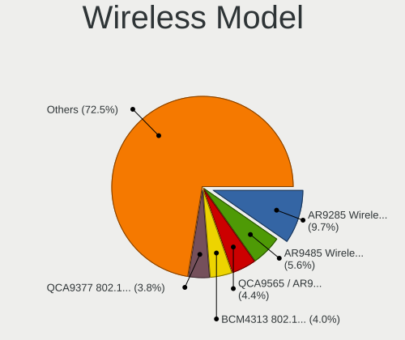

| Model                                                                   | Notebooks | Percent |
|-------------------------------------------------------------------------|-----------|---------|
| Qualcomm Atheros AR9285 Wireless Network Adapter (PCI-Express)          | 1628      | 9.66%   |
| Qualcomm Atheros AR9485 Wireless Network Adapter                        | 938       | 5.57%   |
| Qualcomm Atheros QCA9565 / AR9565 Wireless Network Adapter              | 749       | 4.45%   |
| Broadcom BCM4313 802.11bgn Wireless Network Adapter                     | 678       | 4.02%   |
| Qualcomm Atheros QCA9377 802.11ac Wireless Network Adapter              | 648       | 3.85%   |
| Realtek RTL8822CE 802.11ac PCIe Wireless Network Adapter                | 629       | 3.73%   |
| Realtek RTL8821CE 802.11ac PCIe Wireless Network Adapter                | 583       | 3.46%   |
| Intel Wi-Fi 6 AX201                                                     | 527       | 3.13%   |
| Realtek RTL8723BE PCIe Wireless Network Adapter                         | 489       | 2.9%    |
| Broadcom BCM43142 802.11b/g/n                                           | 404       | 2.4%    |
| Qualcomm Atheros AR242x / AR542x Wireless Network Adapter (PCI-Express) | 397       | 2.36%   |
| Intel PRO/Wireless 3945ABG [Golan] Network Connection                   | 317       | 1.88%   |
| Intel Wireless 7265                                                     | 313       | 1.86%   |
| Intel Wireless 8265 / 8275                                              | 307       | 1.82%   |
| Intel Wi-Fi 6 AX200                                                     | 303       | 1.8%    |
| Qualcomm Atheros AR9462 Wireless Network Adapter                        | 261       | 1.55%   |
| MediaTek MT7921 802.11ax PCIe Wireless Network Adapter [Filogic 330]    | 244       | 1.45%   |
| Intel Comet Lake PCH-LP CNVi WiFi                                       | 244       | 1.45%   |
| Realtek RTL8723DE Wireless Network Adapter                              | 229       | 1.36%   |
| Ralink RT3290 Wireless 802.11n 1T/1R PCIe                               | 228       | 1.35%   |
| Intel Cannon Lake PCH CNVi WiFi                                         | 228       | 1.35%   |
| Intel Wireless 3165                                                     | 172       | 1.02%   |
| Broadcom BCM4312 802.11b/g LP-PHY                                       | 172       | 1.02%   |
| Intel WiFi Link 5100                                                    | 169       | 1%      |
| Intel Cannon Point-LP CNVi [Wireless-AC]                                | 168       | 1%      |
| Intel Dual Band Wireless-AC 3168NGW [Stone Peak]                        | 164       | 0.97%   |
| Intel Wireless 7260                                                     | 163       | 0.97%   |
| Realtek RTL8723AE PCIe Wireless Network Adapter                         | 157       | 0.93%   |
| Realtek RTL8188CE 802.11b/g/n WiFi Adapter                              | 157       | 0.93%   |
| Intel Centrino Wireless-N 130                                           | 146       | 0.87%   |
| Qualcomm Atheros QCA6174 802.11ac Wireless Network Adapter              | 145       | 0.86%   |
| Qualcomm QCNFA765 Wireless Network Adapter                              | 136       | 0.81%   |
| Intel Alder Lake-P PCH CNVi WiFi                                        | 135       | 0.8%    |
| Intel Centrino Advanced-N 6205 [Taylor Peak]                            | 133       | 0.79%   |
| Intel Raptor Lake PCH CNVi WiFi                                         | 117       | 0.69%   |
| Intel Wi-Fi 6E(802.11ax) AX210/AX1675* 2x2 [Typhoon Peak]               | 116       | 0.69%   |
| Ralink RT3090 Wireless 802.11n 1T/1R PCIe                               | 115       | 0.68%   |
| Intel Comet Lake PCH CNVi WiFi                                          | 114       | 0.68%   |
| Realtek RTL8852BE PCIe 802.11ax Wireless Network Controller             | 109       | 0.65%   |
| Realtek RTL8822BE 802.11a/b/g/n/ac WiFi adapter                         | 106       | 0.63%   |

Ethernet Vendor
---------------

Ethernet vendors

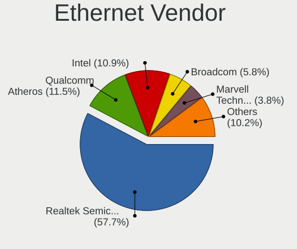

| Vendor                                 | Notebooks | Percent |
|----------------------------------------|-----------|---------|
| Realtek Semiconductor                  | 8411      | 57.73%  |
| Qualcomm Atheros                       | 1682      | 11.54%  |
| Intel                                  | 1593      | 10.93%  |
| Broadcom                               | 845       | 5.8%    |
| Marvell Technology Group               | 560       | 3.84%   |
| Broadcom Limited                       | 253       | 1.74%   |
| Xiaomi                                 | 147       | 1.01%   |
| JMicron Technology                     | 130       | 0.89%   |
| Attansic Technology                    | 123       | 0.84%   |
| MediaTek                               | 90        | 0.62%   |
| ASIX Electronics                       | 87        | 0.6%    |
| Nvidia                                 | 81        | 0.56%   |
| Huawei Technologies                    | 81        | 0.56%   |
| Samsung Electronics                    | 79        | 0.54%   |
| Silicon Integrated Systems [SiS]       | 55        | 0.38%   |
| Qualcomm                               | 42        | 0.29%   |
| TP-Link                                | 37        | 0.25%   |
| OPPO Electronics                       | 35        | 0.24%   |
| Lenovo                                 | 25        | 0.17%   |
| Gemtek                                 | 20        | 0.14%   |
| Vimtron Electronics                    | 18        | 0.12%   |
| D-Link                                 | 17        | 0.12%   |
| DisplayLink                            | 12        | 0.08%   |
| ICS Advent                             | 11        | 0.08%   |
| Google                                 | 11        | 0.08%   |
| Hewlett-Packard                        | 9         | 0.06%   |
| Apple                                  | 9         | 0.06%   |
| ZTE WCDMA Technologies MSM             | 8         | 0.05%   |
| VIA Technologies                       | 8         | 0.05%   |
| HMD Global                             | 8         | 0.05%   |
| QinHeng Electronics                    | 7         | 0.05%   |
| HTC (High Tech Computer)               | 7         | 0.05%   |
| Spreadtrum Communications              | 6         | 0.04%   |
| Sony Ericsson Mobile Communications AB | 6         | 0.04%   |
| Altair Semiconductor                   | 5         | 0.03%   |
| T & A Mobile Phones                    | 4         | 0.03%   |
| Suzhou Motorcomm Electronic Technology | 4         | 0.03%   |
| Motorola PCS                           | 4         | 0.03%   |
| GCT Semiconductor                      | 4         | 0.03%   |
| ASUSTek Computer                       | 4         | 0.03%   |

Ethernet Model
--------------

Ethernet models

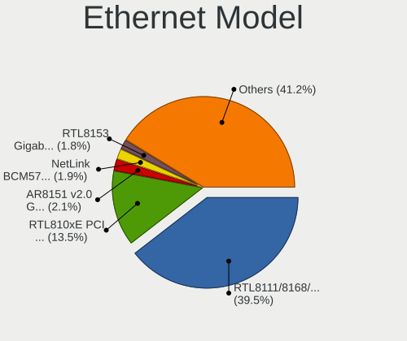

| Model                                                                          | Notebooks | Percent |
|--------------------------------------------------------------------------------|-----------|---------|
| Realtek RTL8111/8168/8211/8411 PCI Express Gigabit Ethernet Controller         | 5814      | 39.5%   |
| Realtek RTL810xE PCI Express Fast Ethernet controller                          | 1984      | 13.48%  |
| Qualcomm Atheros AR8151 v2.0 Gigabit Ethernet                                  | 311       | 2.11%   |
| Broadcom NetLink BCM57785 Gigabit Ethernet PCIe                                | 279       | 1.9%    |
| Realtek RTL8153 Gigabit Ethernet Adapter                                       | 260       | 1.77%   |
| Intel Alder Lake-P PCH CNVi WiFi                                               | 254       | 1.73%   |
| Marvell Group 88E8040 PCI-E Fast Ethernet Controller                           | 223       | 1.52%   |
| Intel 82579LM Gigabit Network Connection (Lewisville)                          | 199       | 1.35%   |
| Qualcomm Atheros AR8132 Fast Ethernet                                          | 186       | 1.26%   |
| Qualcomm Atheros AR8131 Gigabit Ethernet                                       | 169       | 1.15%   |
| Qualcomm Atheros AR8152 v2.0 Fast Ethernet                                     | 166       | 1.13%   |
| Realtek RTL-8100/8101L/8139 PCI Fast Ethernet Adapter                          | 149       | 1.01%   |
| Qualcomm Atheros QCA8172 Fast Ethernet                                         | 149       | 1.01%   |
| Intel Ethernet Connection (13) I219-V                                          | 148       | 1.01%   |
| Qualcomm Atheros AR8162 Fast Ethernet                                          | 144       | 0.98%   |
| Qualcomm Atheros AR8161 Gigabit Ethernet                                       | 141       | 0.96%   |
| Attansic AR8152 v2.0 Fast Ethernet                                             | 123       | 0.84%   |
| Broadcom NetLink BCM57780 Gigabit Ethernet PCIe                                | 122       | 0.83%   |
| Realtek RTL8152 Fast Ethernet Adapter                                          | 117       | 0.79%   |
| Xiaomi Mi/Redmi series (RNDIS)                                                 | 116       | 0.79%   |
| Intel WiMAX Connection 2400m                                                   | 116       | 0.79%   |
| JMicron JMC250 PCI Express Gigabit Ethernet Controller                         | 106       | 0.72%   |
| Marvell Group 88E8055 PCI-E Gigabit Ethernet Controller                        | 97        | 0.66%   |
| Broadcom NetLink BCM5787M Gigabit Ethernet PCI Express                         | 95        | 0.65%   |
| Intel Ethernet Connection (6) I219-V                                           | 88        | 0.6%    |
| Qualcomm Atheros AR8121/AR8113/AR8114 Gigabit or Fast Ethernet                 | 87        | 0.59%   |
| Broadcom Limited NetLink BCM57780 Gigabit Ethernet PCIe                        | 87        | 0.59%   |
| Qualcomm Atheros QCA8171 Gigabit Ethernet                                      | 78        | 0.53%   |
| ASIX AX88179 Gigabit Ethernet                                                  | 77        | 0.52%   |
| Broadcom BCM4401-B0 100Base-TX                                                 | 72        | 0.49%   |
| Broadcom NetLink BCM5906M Fast Ethernet PCI Express                            | 68        | 0.46%   |
| Intel 82577LM Gigabit Network Connection                                       | 66        | 0.45%   |
| Realtek RTL8125 2.5GbE Controller                                              | 64        | 0.43%   |
| Marvell Group Yukon Optima 88E8059 [PCIe Gigabit Ethernet Controller with AVB] | 64        | 0.43%   |
| Samsung Galaxy series, misc. (tethering mode)                                  | 63        | 0.43%   |
| Qualcomm Atheros AR8152 v1.1 Fast Ethernet                                     | 59        | 0.4%    |
| Qualcomm Atheros Killer E220x Gigabit Ethernet Controller                      | 56        | 0.38%   |
| Silicon Integrated Systems [SiS] 191 Gigabit Ethernet Adapter                  | 53        | 0.36%   |
| Intel Ethernet Connection (4) I219-V                                           | 53        | 0.36%   |
| Qualcomm Atheros AR8151 v1.0 Gigabit Ethernet                                  | 52        | 0.35%   |

Net Controller Kind
-------------------

Ethernet, WiFi or modem

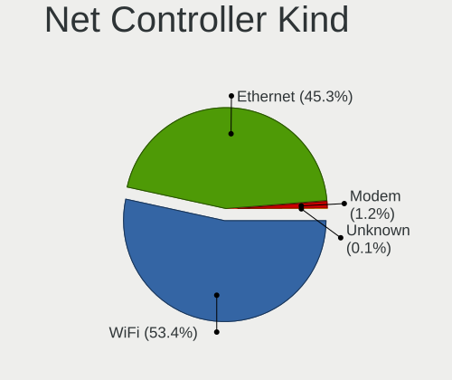

| Kind     | Notebooks | Percent |
|----------|-----------|---------|
| WiFi     | 16246     | 53.41%  |
| Ethernet | 13786     | 45.32%  |
| Modem    | 368       | 1.21%   |
| Unknown  | 18        | 0.06%   |

Used Controller
---------------

Currently used network controller

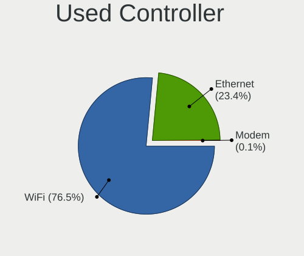

| Kind     | Notebooks | Percent |
|----------|-----------|---------|
| WiFi     | 13300     | 76.5%   |
| Ethernet | 4060      | 23.35%  |
| Modem    | 25        | 0.14%   |

NICs
----

Total network controllers on board

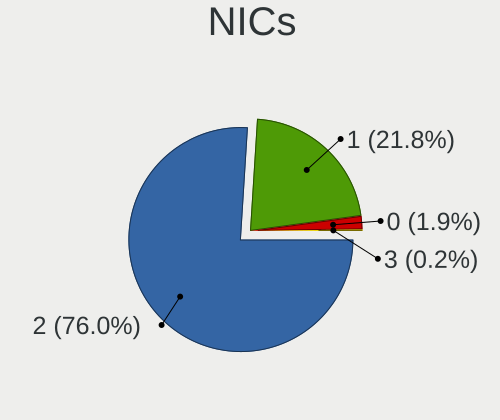

| Total | Notebooks | Percent |
|-------|-----------|---------|
| 2     | 12817     | 76%     |
| 1     | 3684      | 21.84%  |
| 0     | 325       | 1.93%   |
| 3     | 39        | 0.23%   |

IPv6
----

IPv6 vs IPv4

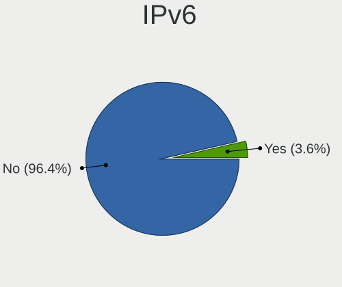

| Used | Notebooks | Percent |
|------|-----------|---------|
| No   | 16365     | 96.43%  |
| Yes  | 606       | 3.57%   |

Bluetooth
---------

Bluetooth Vendor
----------------

Controller vendors

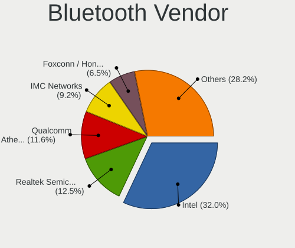

| Vendor                          | Notebooks | Percent |
|---------------------------------|-----------|---------|
| Intel                           | 4102      | 32.02%  |
| Realtek Semiconductor           | 1601      | 12.5%   |
| Qualcomm Atheros Communications | 1487      | 11.61%  |
| IMC Networks                    | 1184      | 9.24%   |
| Foxconn / Hon Hai               | 828       | 6.46%   |
| Lite-On Technology              | 798       | 6.23%   |
| Broadcom                        | 780       | 6.09%   |
| Realtek                         | 249       | 1.94%   |
| Ralink                          | 228       | 1.78%   |
| ASUSTek Computer                | 220       | 1.72%   |
| Foxconn International           | 190       | 1.48%   |
| Toshiba                         | 169       | 1.32%   |
| Apple                           | 169       | 1.32%   |
| Cambridge Silicon Radio         | 165       | 1.29%   |
| Hewlett-Packard                 | 155       | 1.21%   |
| Dell                            | 128       | 1%      |
| MediaTek                        | 96        | 0.75%   |
| Alps Electric                   | 77        | 0.6%    |
| Ralink Technology               | 48        | 0.37%   |
| Opticis                         | 44        | 0.34%   |
| Chicony Electronics             | 29        | 0.23%   |
| Micro Star International        | 16        | 0.12%   |
| USI                             | 9         | 0.07%   |
| Askey Computer                  | 8         | 0.06%   |
| TP-Link                         | 7         | 0.05%   |
| Taiyo Yuden                     | 7         | 0.05%   |
| Integrated System Solution      | 3         | 0.02%   |
| Fujitsu                         | 3         | 0.02%   |
| Samsung Electronics             | 2         | 0.02%   |
| Qcom                            | 2         | 0.02%   |
| Unknown                         | 2         | 0.02%   |
| Syntek                          | 1         | 0.01%   |
| SiW                             | 1         | 0.01%   |
| Mercucys                        | 1         | 0.01%   |
| Marvell Semiconductor           | 1         | 0.01%   |
| LG Electronics                  | 1         | 0.01%   |

Bluetooth Model
---------------

Controller models

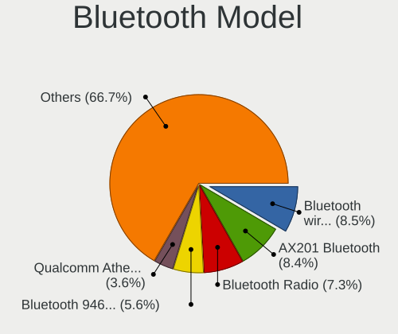

| Model                                               | Notebooks | Percent |
|-----------------------------------------------------|-----------|---------|
| Intel Bluetooth wireless interface                  | 1085      | 8.46%   |
| Intel AX201 Bluetooth                               | 1072      | 8.36%   |
| Realtek Bluetooth Radio                             | 937       | 7.31%   |
| Intel Bluetooth 9460/9560 Jefferson Peak (JfP)      | 715       | 5.58%   |
| Qualcomm Atheros  Bluetooth Device                  | 462       | 3.6%    |
| Qualcomm Atheros AR3011 Bluetooth                   | 436       | 3.4%    |
| IMC Networks Bluetooth Radio                        | 389       | 3.03%   |
| Realtek  Bluetooth 4.2 Adapter                      | 354       | 2.76%   |
| Qualcomm Atheros AR3012 Bluetooth 4.0               | 313       | 2.44%   |
| Intel AX200 Bluetooth                               | 302       | 2.36%   |
| Foxconn / Hon Hai Bluetooth Device                  | 282       | 2.2%    |
| Intel Bluetooth Device                              | 263       | 2.05%   |
| Realtek Bluetooth Radio                             | 249       | 1.94%   |
| IMC Networks Wireless_Device                        | 243       | 1.9%    |
| Ralink RT3290 Bluetooth                             | 228       | 1.78%   |
| IMC Networks Bluetooth Device                       | 226       | 1.76%   |
| Lite-On Qualcomm Atheros QCA9377 Bluetooth          | 196       | 1.53%   |
| Lite-On Atheros AR3012 Bluetooth                    | 193       | 1.51%   |
| Foxconn International BCM43142A0 Bluetooth module   | 187       | 1.46%   |
| Intel Centrino Advanced-N 6230 Bluetooth adapter    | 175       | 1.37%   |
| Lite-On Bluetooth Device                            | 173       | 1.35%   |
| Intel Centrino Bluetooth Wireless Transceiver       | 170       | 1.33%   |
| IMC Networks Atheros AR3012 Bluetooth 4.0 Adapter   | 170       | 1.33%   |
| Cambridge Silicon Radio Bluetooth Dongle (HCI mode) | 165       | 1.29%   |
| Intel Wireless-AC 3168 Bluetooth                    | 154       | 1.2%    |
| Broadcom BCM2070 Bluetooth Device                   | 125       | 0.98%   |
| Realtek RTL8723B Bluetooth                          | 122       | 0.95%   |
| Broadcom BCM2070 Bluetooth 2.1 + EDR                | 122       | 0.95%   |
| Intel AX210 Bluetooth                               | 110       | 0.86%   |
| Apple Bluetooth Host Controller                     | 95        | 0.74%   |
| Broadcom BCM2045 Bluetooth                          | 90        | 0.7%    |
| Foxconn / Hon Hai Wireless_Device                   | 85        | 0.66%   |
| Qualcomm Atheros Bluetooth                          | 84        | 0.66%   |
| MediaTek Wireless_Device                            | 81        | 0.63%   |
| Lite-On Broadcom BCM43142A0 Bluetooth Device        | 81        | 0.63%   |
| Foxconn / Hon Hai Broadcom Bluetooth 2.1 Device     | 81        | 0.63%   |
| Broadcom BCM2045B (BDC-2.1)                         | 81        | 0.63%   |
| HP Broadcom 2070 Bluetooth Combo                    | 76        | 0.59%   |
| ASUS BT-183 Bluetooth 2.0+EDR adapter               | 73        | 0.57%   |
| HP Bluetooth 2.0 Interface [Broadcom BCM2045]       | 72        | 0.56%   |

Sound
-----

Sound Vendor
------------

Sound card vendors

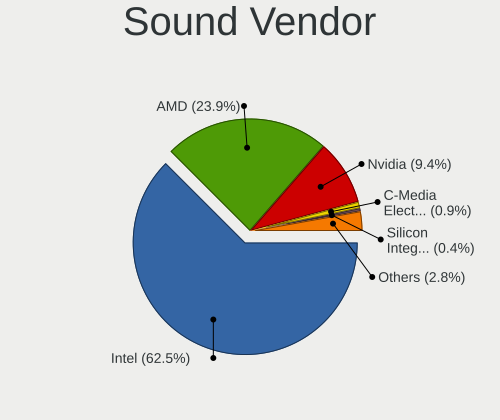

| Vendor                                       | Notebooks | Percent |
|----------------------------------------------|-----------|---------|
| Intel                                        | 12258     | 62.5%   |
| AMD                                          | 4686      | 23.89%  |
| Nvidia                                       | 1847      | 9.42%   |
| C-Media Electronics                          | 184       | 0.94%   |
| Silicon Integrated Systems [SiS]             | 85        | 0.43%   |
| Lenovo                                       | 45        | 0.23%   |
| Logitech                                     | 44        | 0.22%   |
| Realtek Semiconductor                        | 31        | 0.16%   |
| Creative Technology                          | 31        | 0.16%   |
| JMTek                                        | 29        | 0.15%   |
| Generalplus Technology                       | 28        | 0.14%   |
| Texas Instruments                            | 25        | 0.13%   |
| GN Netcom                                    | 20        | 0.1%    |
| ASUSTek Computer                             | 17        | 0.09%   |
| Plantronics                                  | 15        | 0.08%   |
| VIA Technologies                             | 13        | 0.07%   |
| Apple                                        | 12        | 0.06%   |
| Focusrite-Novation                           | 11        | 0.06%   |
| Unknown                                      | 11        | 0.06%   |
| Zoran Co. Personal Media Division (Nogatech) | 9         | 0.05%   |
| Razer USA                                    | 9         | 0.05%   |
| DSEA A/S                                     | 9         | 0.05%   |
| Promethean Limited                           | 8         | 0.04%   |
| Huawei Technologies                          | 8         | 0.04%   |
| Hewlett-Packard                              | 8         | 0.04%   |
| Yamaha                                       | 7         | 0.04%   |
| SteelSeries ApS                              | 7         | 0.04%   |
| Sony                                         | 7         | 0.04%   |
| fifine Microphones                           | 7         | 0.04%   |
| Samson Technologies                          | 6         | 0.03%   |
| Jieli Technology                             | 6         | 0.03%   |
| BEHRINGER International                      | 6         | 0.03%   |
| Thesycon Systemsoftware & Consulting         | 5         | 0.03%   |
| A4Tech                                       | 5         | 0.03%   |
| SAVITECH                                     | 4         | 0.02%   |
| Samsung Electronics                          | 4         | 0.02%   |
| Nordic Semiconductor ASA                     | 4         | 0.02%   |
| Kingston Technology                          | 4         | 0.02%   |
| Zhaoxin                                      | 3         | 0.02%   |
| XMOS                                         | 3         | 0.02%   |

Sound Model
-----------

Sound card models

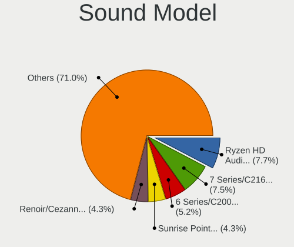

| Model                                                                                             | Notebooks | Percent |
|---------------------------------------------------------------------------------------------------|-----------|---------|
| AMD Ryzen HD Audio Controller                                                                     | 1852      | 7.68%   |
| Intel 7 Series/C216 Chipset Family High Definition Audio Controller                               | 1811      | 7.51%   |
| Intel 6 Series/C200 Series Chipset Family High Definition Audio Controller                        | 1254      | 5.2%    |
| Intel Sunrise Point-LP HD Audio                                                                   | 1044      | 4.33%   |
| AMD Renoir/Cezanne HDMI/DP Audio Controller                                                       | 1038      | 4.31%   |
| AMD FCH Azalia Controller                                                                         | 896       | 3.72%   |
| Intel NM10/ICH7 Family High Definition Audio Controller                                           | 831       | 3.45%   |
| Intel 5 Series/3400 Series Chipset High Definition Audio                                          | 811       | 3.36%   |
| Intel 82801I (ICH9 Family) HD Audio Controller                                                    | 698       | 2.9%    |
| AMD SBx00 Azalia (Intel HDA)                                                                      | 680       | 2.82%   |
| Intel Tiger Lake-LP Smart Sound Technology Audio Controller                                       | 675       | 2.8%    |
| Intel 82801H (ICH8 Family) HD Audio Controller                                                    | 505       | 2.1%    |
| AMD Raven/Raven2/Fenghuang HDMI/DP Audio Controller                                               | 495       | 2.05%   |
| Intel Alder Lake PCH-P High Definition Audio Controller                                           | 458       | 1.9%    |
| Intel Haswell-ULT HD Audio Controller                                                             | 435       | 1.8%    |
| Intel 8 Series HD Audio Controller                                                                | 435       | 1.8%    |
| AMD Kabini HDMI/DP Audio                                                                          | 432       | 1.79%   |
| AMD Radeon High Definition Audio Controller                                                       | 413       | 1.71%   |
| AMD Family 15h (Models 60h-6fh) Audio Controller                                                  | 359       | 1.49%   |
| Intel Cannon Lake PCH cAVS                                                                        | 358       | 1.49%   |
| Intel Cannon Point-LP High Definition Audio Controller                                            | 346       | 1.44%   |
| Intel 8 Series/C220 Series Chipset High Definition Audio Controller                               | 340       | 1.41%   |
| Intel Comet Lake PCH-LP cAVS                                                                      | 329       | 1.36%   |
| Intel Xeon E3-1200 v3/4th Gen Core Processor HD Audio Controller                                  | 314       | 1.3%    |
| Intel Atom Processor Z36xxx/Z37xxx Series High Definition Audio Controller                        | 313       | 1.3%    |
| Nvidia GF108 High Definition Audio Controller                                                     | 302       | 1.25%   |
| AMD High Definition Audio Controller                                                              | 292       | 1.21%   |
| Intel Broadwell-U Audio Controller                                                                | 277       | 1.15%   |
| Intel Wildcat Point-LP High Definition Audio Controller                                           | 273       | 1.13%   |
| Intel Celeron/Pentium Silver Processor High Definition Audio                                      | 271       | 1.12%   |
| Intel Atom/Celeron/Pentium Processor x5-E8000/J3xxx/N3xxx Series High Definition Audio Controller | 256       | 1.06%   |
| AMD Wrestler HDMI Audio                                                                           | 255       | 1.06%   |
| AMD Trinity HDMI Audio Controller                                                                 | 251       | 1.04%   |
| AMD BeaverCreek HDMI Audio [Radeon HD 6500D and 6400G-6600G series]                               | 198       | 0.82%   |
| AMD Cedar HDMI Audio [Radeon HD 5400/6300/7300 Series]                                            | 194       | 0.8%    |
| Nvidia TU107 GeForce GTX 1650 High Definition Audio Controller                                    | 186       | 0.77%   |
| Nvidia High Definition Audio Controller                                                           | 181       | 0.75%   |
| Intel Celeron N3350/Pentium N4200/Atom E3900 Series Audio Cluster                                 | 172       | 0.71%   |
| Intel Ice Lake-LP Smart Sound Technology Audio Controller                                         | 170       | 0.71%   |
| Intel Raptor Lake-P/U/H cAVS                                                                      | 167       | 0.69%   |

Memory
------

Memory Vendor
-------------

Memory module vendors

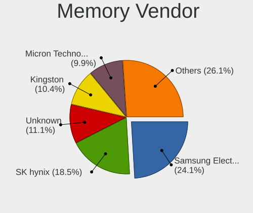

| Vendor                | Notebooks | Percent |
|-----------------------|-----------|---------|
| Samsung Electronics   | 4021      | 24.05%  |
| SK hynix              | 3085      | 18.46%  |
| Unknown               | 1861      | 11.13%  |
| Kingston              | 1735      | 10.38%  |
| Micron Technology     | 1650      | 9.87%   |
| Elpida                | 553       | 3.31%   |
| Crucial               | 481       | 2.88%   |
| Nanya Technology      | 446       | 2.67%   |
| Ramaxel Technology    | 445       | 2.66%   |
| A-DATA Technology     | 403       | 2.41%   |
| AMD                   | 229       | 1.37%   |
| Unknown               | 217       | 1.3%    |
| Unknown (ABCD)        | 158       | 0.95%   |
| ASint Technology      | 145       | 0.87%   |
| Patriot               | 138       | 0.83%   |
| Corsair               | 108       | 0.65%   |
| 48spaces              | 88        | 0.53%   |
| Goldkey               | 86        | 0.51%   |
| ACPI Digital          | 84        | 0.5%    |
| Foxline               | 78        | 0.47%   |
| Apacer                | 63        | 0.38%   |
| SHARETRONIC           | 60        | 0.36%   |
| ChangXin Memory       | 45        | 0.27%   |
| GOODRAM               | 42        | 0.25%   |
| Transcend             | 40        | 0.24%   |
| Kllisre               | 40        | 0.24%   |
| Qimonda               | 31        | 0.19%   |
| Unifosa               | 25        | 0.15%   |
| Qumo                  | 22        | 0.13%   |
| Unknown (0x0BEC)      | 17        | 0.1%    |
| Toshiba               | 17        | 0.1%    |
| Silicon Power         | 17        | 0.1%    |
| Wodposit              | 15        | 0.09%   |
| Kingmax               | 13        | 0.08%   |
| Unknown (0x7FFF)      | 10        | 0.06%   |
| Ankowall              | 9         | 0.05%   |
| Kingmax Semiconductor | 7         | 0.04%   |
| Hikvision             | 7         | 0.04%   |
| Unknown (8AD6)        | 6         | 0.04%   |
| Unknown (0x0CAB)      | 6         | 0.04%   |

Memory Model
------------

Memory module models

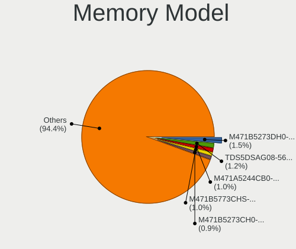

| Model                                                                     | Notebooks | Percent |
|---------------------------------------------------------------------------|-----------|---------|
| Samsung RAM M471B5273DH0-CH9 4GB SODIMM DDR3 1600MT/s                     | 265       | 1.47%   |
| Unknown                                                                   | 217       | 1.2%    |
| Samsung RAM M471A5244CB0-CTD 4GB SODIMM DDR4 3266MT/s                     | 184       | 1.02%   |
| Samsung RAM M471B5773CHS-CH9 2GB SODIMM DDR3 4199MT/s                     | 173       | 0.96%   |
| Samsung RAM M471B5273CH0-CH9 4GB SODIMM DDR3 1334MT/s                     | 163       | 0.9%    |
| Samsung RAM M471B5773DH0-CH9 2GB SODIMM DDR3 1600MT/s                     | 156       | 0.86%   |
| Samsung RAM M471B5173DB0-YK0 4GB SODIMM DDR3 1600MT/s                     | 156       | 0.86%   |
| Samsung RAM M471B5273DH0-CK0 4GB SODIMM DDR3 2400MT/s                     | 150       | 0.83%   |
| SK hynix RAM HMT351S6CFR8C-PB 4GB SODIMM DDR3 1600MT/s                    | 142       | 0.79%   |
| Unknown (ABCD) RAM 123456789012345678 2GB SODIMM LPDDR4 2400MT/s          | 140       | 0.78%   |
| Samsung RAM M471B5173EB0-YK0 4GB SODIMM DDR3 1600MT/s                     | 131       | 0.73%   |
| Samsung RAM M471A1K43EB1-CWE 8GB SODIMM DDR4 3200MT/s                     | 128       | 0.71%   |
| Unknown RAM Module 2048MB SODIMM DDR2 667MT/s                             | 124       | 0.69%   |
| SK hynix RAM HMT451S6BFR8A-PB 4GB SODIMM DDR3 1600MT/s                    | 121       | 0.67%   |
| Samsung RAM M471B5173QH0-YK0 4GB SODIMM DDR3 1600MT/s                     | 121       | 0.67%   |
| Unknown RAM Module 2048MB SODIMM DDR2                                     | 113       | 0.63%   |
| Samsung RAM M471A5244CB0-CRC 4GB SODIMM DDR4 2667MT/s                     | 112       | 0.62%   |
| Elpida RAM EBJ41UF8BCS0-DJ-F 4GB SODIMM DDR3 1334MT/s                     | 106       | 0.59%   |
| SK hynix RAM HMT451S6AFR8A-PB 4GB SODIMM DDR3 1600MT/s                    | 104       | 0.58%   |
| Unknown RAM Module 1024MB SODIMM DDR2                                     | 97        | 0.54%   |
| SK hynix RAM HMT325S6CFR8C-PB 2GB SODIMM DDR3 1600MT/s                    | 96        | 0.53%   |
| Samsung RAM M471B5673FH0-CH9 2048MB SODIMM DDR3 1600MT/s                  | 96        | 0.53%   |
| Unknown RAM Module 2GB SODIMM DDR2 667MT/s                                | 94        | 0.52%   |
| Unknown RAM Module 1024MB SODIMM DDR2 667MT/s                             | 92        | 0.51%   |
| 48spaces RAM 012345678901234567890123456789012345 2GB SODIMM DDR2 667MT/s | 87        | 0.48%   |
| Micron RAM 4ATF51264HZ-2G6E1 4GB SODIMM DDR4 2667MT/s                     | 86        | 0.48%   |
| SK hynix RAM HMA81GS6AFR8N-UH 8GB SODIMM DDR4 2667MT/s                    | 85        | 0.47%   |
| Micron RAM 4ATF1G64HZ-3G2E1 8GB Row Of Chips DDR4 3200MT/s                | 84        | 0.47%   |
| ACPI Digital RAM CMB6-DHDA1BAR08D00 16GB SODIMM DDR4 3200MT/s             | 84        | 0.47%   |
| A-DATA RAM AD73I1C1674EV 4GB SODIMM DDR3 1334MT/s                         | 84        | 0.47%   |
| Samsung RAM M471A1G44AB0-CWE 8GiB SODIMM DDR4 3200MT/s                    | 82        | 0.45%   |
| Samsung RAM M471B5773DH0-CK0 2GB SODIMM DDR3 1600MT/s                     | 80        | 0.44%   |
| SK hynix RAM HMA851S6AFR6N-UH 4GB SODIMM DDR4 2667MT/s                    | 78        | 0.43%   |
| Micron RAM 4ATF51264HZ-3G2J1 4GB SODIMM DDR4 3200MT/s                     | 77        | 0.43%   |
| Nanya RAM NT2GC64B88B0NS-CG 2048MB SODIMM DDR3 1334MT/s                   | 75        | 0.42%   |
| Samsung RAM M471A1K43DB1-CTD 8GB SODIMM DDR4 2667MT/s                     | 73        | 0.4%    |
| Unknown RAM Module 4096MB SODIMM DDR3                                     | 72        | 0.4%    |
| SK hynix RAM HMA851S6CJR6N-VK 4GB SODIMM DDR4 2667MT/s                    | 72        | 0.4%    |
| Samsung RAM M471A1G44BB0-CWE 8GB SODIMM DDR4 3200MT/s                     | 72        | 0.4%    |
| SK hynix RAM HMT351S6BFR8C-H9 4GB SODIMM DDR3 1333MT/s                    | 71        | 0.39%   |

Memory Kind
-----------

Memory module kinds

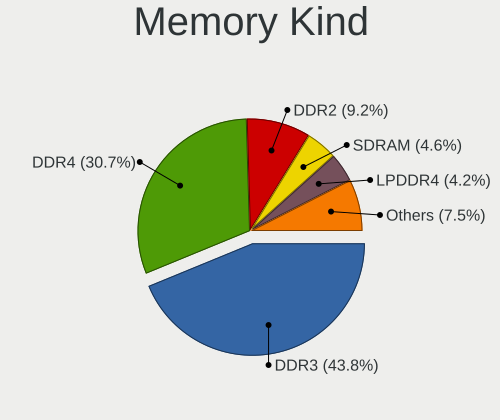

| Kind    | Notebooks | Percent |
|---------|-----------|---------|
| DDR3    | 6216      | 43.8%   |
| DDR4    | 4363      | 30.74%  |
| DDR2    | 1312      | 9.24%   |
| SDRAM   | 648       | 4.57%   |
| LPDDR4  | 591       | 4.16%   |
| LPDDR5  | 300       | 2.11%   |
| DDR5    | 240       | 1.69%   |
| Unknown | 161       | 1.13%   |
| DDR     | 146       | 1.03%   |
| DRAM    | 109       | 0.77%   |
| LPDDR3  | 106       | 0.75%   |
| SRAM    | 1         | 0.01%   |

Memory Form Factor
------------------

Physical design of the memory module

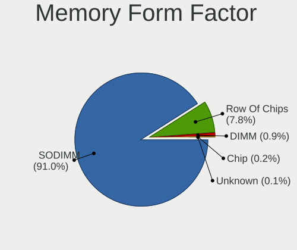

| Name         | Notebooks | Percent |
|--------------|-----------|---------|
| SODIMM       | 12592     | 91.02%  |
| Row Of Chips | 1079      | 7.8%    |
| DIMM         | 119       | 0.86%   |
| Chip         | 32        | 0.23%   |
| Unknown      | 13        | 0.09%   |

Memory Size
-----------

Memory module size

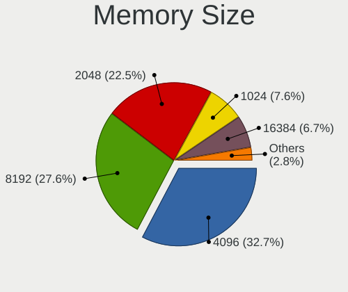

| Size    | Notebooks | Percent |
|---------|-----------|---------|
| 4096    | 5289      | 32.71%  |
| 8192    | 4469      | 27.64%  |
| 2048    | 3645      | 22.55%  |
| 1024    | 1233      | 7.63%   |
| 16384   | 1086      | 6.72%   |
| 32768   | 244       | 1.51%   |
| 512     | 150       | 0.93%   |
| 256     | 16        | 0.1%    |
| 3072    | 10        | 0.06%   |
| 12288   | 9         | 0.06%   |
| 1536    | 8         | 0.05%   |
| Unknown | 6         | 0.04%   |
| 6144    | 2         | 0.01%   |

Memory Speed
------------

Memory module speed

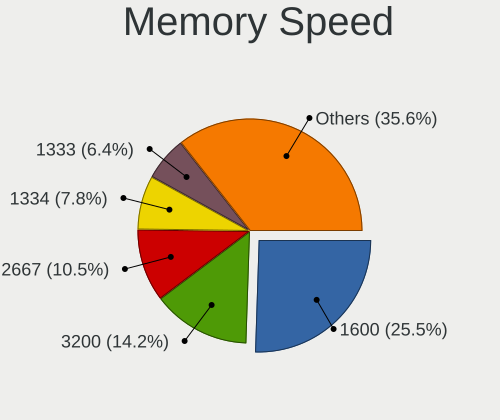

| Speed   | Notebooks | Percent |
|---------|-----------|---------|
| 1600    | 3986      | 25.52%  |
| 3200    | 2218      | 14.2%   |
| 2667    | 1640      | 10.5%   |
| 1334    | 1221      | 7.82%   |
| 1333    | 997       | 6.38%   |
| 2400    | 841       | 5.38%   |
| 667     | 794       | 5.08%   |
| Unknown | 754       | 4.83%   |
| 4199    | 383       | 2.45%   |
| 2133    | 311       | 1.99%   |
| 800     | 308       | 1.97%   |
| 1067    | 292       | 1.87%   |
| 533     | 192       | 1.23%   |
| 4267    | 185       | 1.18%   |
| 3266    | 184       | 1.18%   |
| 6400    | 178       | 1.14%   |
| 4800    | 136       | 0.87%   |
| 1066    | 120       | 0.77%   |
| 2048    | 116       | 0.74%   |
| 5600    | 107       | 0.68%   |
| 1867    | 76        | 0.49%   |
| 975     | 74        | 0.47%   |
| 8400    | 70        | 0.45%   |
| 3733    | 69        | 0.44%   |
| 7500    | 65        | 0.42%   |
| 333     | 52        | 0.33%   |
| 4266    | 42        | 0.27%   |
| 1639    | 35        | 0.22%   |
| 8533    | 31        | 0.2%    |
| 1866    | 31        | 0.2%    |
| 400     | 30        | 0.19%   |
| 2933    | 16        | 0.1%    |
| 7467    | 13        | 0.08%   |
| 5500    | 8         | 0.05%   |
| 2666    | 5         | 0.03%   |
| 266     | 5         | 0.03%   |
| 200     | 4         | 0.03%   |
| 65535   | 3         | 0.02%   |
| 2267    | 3         | 0.02%   |
| 1776    | 3         | 0.02%   |

Printers & scanners
-------------------

Printer Vendor
--------------

Printer device vendors

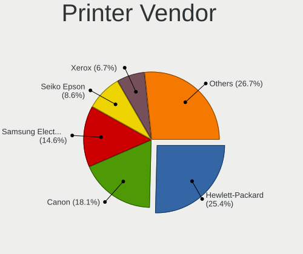

| Vendor                 | Notebooks | Percent |
|------------------------|-----------|---------|
| Hewlett-Packard        | 80        | 25.4%   |
| Canon                  | 57        | 18.1%   |
| Samsung Electronics    | 46        | 14.6%   |
| Seiko Epson            | 27        | 8.57%   |
| Xerox                  | 21        | 6.67%   |
| Brother Industries     | 20        | 6.35%   |
| Pantum                 | 16        | 5.08%   |
| Panasonic (Matsushita) | 14        | 4.44%   |
| Kyocera                | 11        | 3.49%   |
| Ricoh                  | 9         | 2.86%   |
| Lexmark International  | 4         | 1.27%   |
| Xiaomi                 | 3         | 0.95%   |
| Prolific Technology    | 1         | 0.32%   |
| Oki Data               | 1         | 0.32%   |
| NXP Semiconductors     | 1         | 0.32%   |
| MiiiW                  | 1         | 0.32%   |
| Katusha"               | 1         | 0.32%   |
| Index Braille AB       | 1         | 0.32%   |
| iDPRT                  | 1         | 0.32%   |

Printer Model
-------------

Printer device models

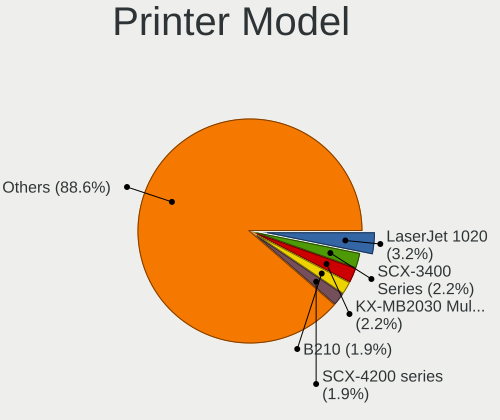

| Model                                                        | Notebooks | Percent |
|--------------------------------------------------------------|-----------|---------|
| HP LaserJet 1020                                             | 10        | 3.15%   |
| Samsung SCX-3400 Series                                      | 7         | 2.21%   |
| Panasonic (Matsushita) KX-MB2030 Multifunction Laser Printer | 7         | 2.21%   |
| Xerox B210                                                   | 6         | 1.89%   |
| Samsung SCX-4200 series                                      | 6         | 1.89%   |
| Samsung SCX-3200 Series                                      | 6         | 1.89%   |
| Panasonic (Matsushita) KX-MB1500RU                           | 6         | 1.89%   |
| HP LaserJet P1102                                            | 6         | 1.89%   |
| Xerox B205                                                   | 4         | 1.26%   |
| Samsung ML-1210 Printer                                      | 4         | 1.26%   |
| Samsung M2020 Series                                         | 4         | 1.26%   |
| HP LaserJet 1200                                             | 4         | 1.26%   |
| Canon PIXMA MG2500 Series                                    | 4         | 1.26%   |
| Canon MF4010 series                                          | 4         | 1.26%   |
| Canon LBP3010/LBP3018/LBP3050                                | 4         | 1.26%   |
| Canon CAPT USB Device                                        | 4         | 1.26%   |
| Brother HL-1110 series                                       | 4         | 1.26%   |
| Xiaomi MiMouse 2                                             | 3         | 0.95%   |
| Seiko Epson L210 Series                                      | 3         | 0.95%   |
| Seiko Epson L200 Series                                      | 3         | 0.95%   |
| Seiko Epson EPSON L132 Series                                | 3         | 0.95%   |
| Samsung ML-1640 Series Laser Printer                         | 3         | 0.95%   |
| Samsung M332x 382x 402x Series                               | 3         | 0.95%   |
| HP LaserJet P1005                                            | 3         | 0.95%   |
| HP LaserJet 400 M401dne                                      | 3         | 0.95%   |
| HP LaserJet 1022                                             | 3         | 0.95%   |
| HP LaserJet 1018                                             | 3         | 0.95%   |
| HP LaserJet 1010                                             | 3         | 0.95%   |
| HP DeskJet 2300 series                                       | 3         | 0.95%   |
| HP DeskJet 2130 series                                       | 3         | 0.95%   |
| Canon LBP7010C/7018C                                         | 3         | 0.95%   |
| Canon LBP6000                                                | 3         | 0.95%   |
| Canon LaserShot LBP-1120 Printer                             | 3         | 0.95%   |
| Canon iP2700 series                                          | 3         | 0.95%   |
| Canon G1000 series                                           | 3         | 0.95%   |
| Brother HL-L2300D series                                     | 3         | 0.95%   |
| Xerox Phaser 3020                                            | 2         | 0.63%   |
| Seiko Epson USB2.0 Printer (Hi-speed)                        | 2         | 0.63%   |
| Seiko Epson Printer                                          | 2         | 0.63%   |
| Seiko Epson L120 Series                                      | 2         | 0.63%   |

Scanner Vendor
--------------

Scanner device vendors

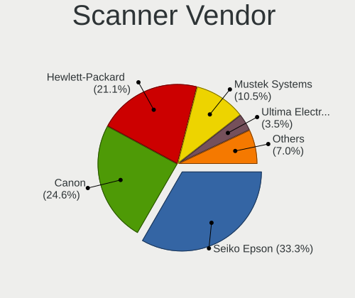

| Vendor                      | Notebooks | Percent |
|-----------------------------|-----------|---------|
| Seiko Epson                 | 19        | 33.33%  |
| Canon                       | 14        | 24.56%  |
| Hewlett-Packard             | 12        | 21.05%  |
| Mustek Systems              | 6         | 10.53%  |
| Ultima Electronics          | 2         | 3.51%   |
| KYE Systems (Mouse Systems) | 2         | 3.51%   |
| Acer Peripherals (now BenQ) | 2         | 3.51%   |

Scanner Model
-------------

Scanner device models

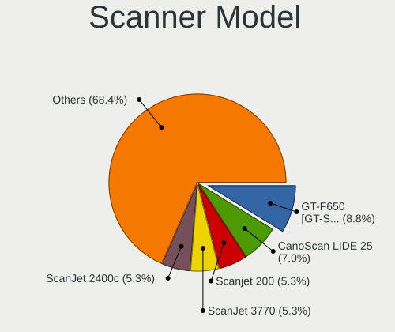

| Model                                                                                 | Notebooks | Percent |
|---------------------------------------------------------------------------------------|-----------|---------|
| Seiko Epson GT-F650 [GT-S600/Perfection V10/V100]                                     | 5         | 8.77%   |
| Canon CanoScan LIDE 25                                                                | 4         | 7.02%   |
| HP ScanJet 3770                                                                       | 3         | 5.26%   |
| HP ScanJet 2400c                                                                      | 3         | 5.26%   |
| HP Scanjet 200                                                                        | 3         | 5.26%   |
| Canon CanoScan LiDE 110                                                               | 3         | 5.26%   |
| Ultima Artec Ultima 2000 (GT6801 based)/Lifetec LT9385/ScanMagic 1200 UB Plus Scanner | 2         | 3.51%   |
| Seiko Epson GT-F670 [Perfection V200 Photo]                                           | 2         | 3.51%   |
| Seiko Epson GT-F520/GT-F570 [Perfection 3590 PHOTO]                                   | 2         | 3.51%   |
| Seiko Epson GT-F500/GT-F550 [Perfection 2480/2580 PHOTO]                              | 2         | 3.51%   |
| Mustek Systems BearPaw 1200 TA/CS                                                     | 2         | 3.51%   |
| Canon CanoScan LiDE 120                                                               | 2         | 3.51%   |
| Seiko Epson GT-X900 [Perfection V700/V750 Photo]                                      | 1         | 1.75%   |
| Seiko Epson GT-X800 [Perfection 4990 PHOTO]                                           | 1         | 1.75%   |
| Seiko Epson GT-X770 [Perfection V500]                                                 | 1         | 1.75%   |
| Seiko Epson GT-F730 [GT-S630/Perfection V33/V330 Photo]                               | 1         | 1.75%   |
| Seiko Epson GT-F600 [Perfection 4180]                                                 | 1         | 1.75%   |
| Seiko Epson GT-9700F [Perfection 2450 PHOTO]                                          | 1         | 1.75%   |
| Seiko Epson GT-7400U [Perfection 1270]                                                | 1         | 1.75%   |
| Seiko Epson GT-7300U [Perfection 1260/1260 PHOTO]                                     | 1         | 1.75%   |
| Mustek Systems SNAPSCAN e22                                                           | 1         | 1.75%   |
| Mustek Systems BearPaw 2448 CU Pro                                                    | 1         | 1.75%   |
| Mustek Systems BearPaw 2400 TA Plus                                                   | 1         | 1.75%   |
| Mustek Systems BearPaw 1200 CU Plus                                                   | 1         | 1.75%   |
| KYE Systems (Mouse Systems) ColorPage-Vivid4                                          | 1         | 1.75%   |
| KYE Systems (Mouse Systems) ColorPage-Vivid 1200 XE                                   | 1         | 1.75%   |
| HP ScanJet G4010                                                                      | 1         | 1.75%   |
| HP ScanJet 7400c                                                                      | 1         | 1.75%   |
| HP HP Scanjet 300                                                                     | 1         | 1.75%   |
| Canon CanoScan N670U/N676U/LiDE 20                                                    | 1         | 1.75%   |
| Canon CanoScan LiDE 70                                                                | 1         | 1.75%   |
| Canon CanoScan LiDE 60                                                                | 1         | 1.75%   |
| Canon CanoScan LiDE 220                                                               | 1         | 1.75%   |
| Canon CanoScan 4400F                                                                  | 1         | 1.75%   |
| Acer Peripherals (now BenQ) Benq 5150/5250                                            | 1         | 1.75%   |
| Acer Peripherals (now BenQ) Benq 5000                                                 | 1         | 1.75%   |

Camera
------

Camera Vendor
-------------

Camera device vendors

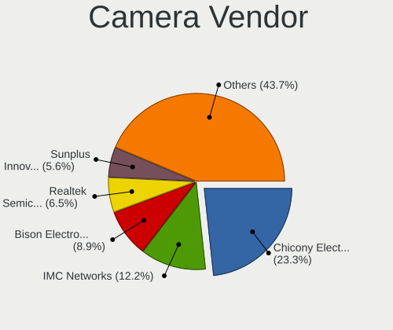

| Vendor                                 | Notebooks | Percent |
|----------------------------------------|-----------|---------|
| Chicony Electronics                    | 3468      | 23.3%   |
| IMC Networks                           | 1809      | 12.15%  |
| Bison Electronics                      | 1319      | 8.86%   |
| Realtek Semiconductor                  | 961       | 6.46%   |
| Sunplus Innovation Technology          | 829       | 5.57%   |
| Quanta                                 | 802       | 5.39%   |
| Suyin                                  | 744       | 5%      |
| Microdia                               | 728       | 4.89%   |
| Silicon Motion                         | 492       | 3.31%   |
| Cheng Uei Precision Industry (Foxlink) | 477       | 3.2%    |
| Syntek                                 | 458       | 3.08%   |
| Alcor Micro                            | 358       | 2.41%   |
| Luxvisions Innotech Limited            | 227       | 1.53%   |
| Z-Star Microelectronics                | 186       | 1.25%   |
| Apple                                  | 176       | 1.18%   |
| Lite-On Technology                     | 171       | 1.15%   |
| Sonix Technology                       | 156       | 1.05%   |
| Ricoh                                  | 146       | 0.98%   |
| Acer                                   | 132       | 0.89%   |
| ALi                                    | 124       | 0.83%   |
| SunplusIT                              | 119       | 0.8%    |
| DigiTech                               | 98        | 0.66%   |
| Logitech                               | 91        | 0.61%   |
| Shinetech                              | 78        | 0.52%   |
| icSpring                               | 67        | 0.45%   |
| ShineOptics                            | 51        | 0.34%   |
| Lenovo                                 | 51        | 0.34%   |
| Primax Electronics                     | 46        | 0.31%   |
| Samsung Electronics                    | 44        | 0.3%    |
| Unknown                                | 31        | 0.21%   |
| Y Media                                | 30        | 0.2%    |
| Importek                               | 29        | 0.19%   |
| Shine-optics                           | 28        | 0.19%   |
| BillionPixels                          | 23        | 0.15%   |
| USB Camera CS                          | 21        | 0.14%   |
| Sunplus Technology                     | 19        | 0.13%   |
| GEMBIRD                                | 19        | 0.13%   |
| OmniVision Technologies                | 16        | 0.11%   |
| HYGD-221208-J                          | 16        | 0.11%   |
| kingcome                               | 14        | 0.09%   |

Camera Model
------------

Camera device models

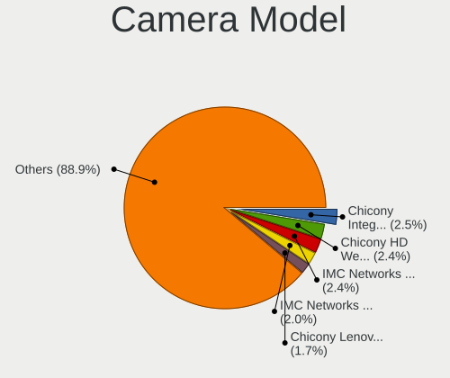

| Model                                | Notebooks | Percent |
|--------------------------------------|-----------|---------|
| Chicony Integrated Camera            | 379       | 2.54%   |
| Chicony HD WebCam                    | 364       | 2.44%   |
| IMC Networks USB2.0 HD UVC WebCam    | 351       | 2.35%   |
| IMC Networks USB2.0 VGA UVC WebCam   | 305       | 2.04%   |
| Chicony Lenovo EasyCamera            | 260       | 1.74%   |
| Bison Lenovo Integrated Webcam       | 260       | 1.74%   |
| IMC Networks Integrated Camera       | 228       | 1.53%   |
| Microdia Integrated_Webcam_HD        | 211       | 1.41%   |
| Syntek Integrated Camera             | 186       | 1.25%   |
| Sunplus HD WebCam                    | 178       | 1.19%   |
| IMC Networks UVC VGA Webcam          | 177       | 1.19%   |
| Chicony USB2.0 HD UVC WebCam         | 162       | 1.09%   |
| Bison Lenovo EasyCamera              | 162       | 1.09%   |
| Quanta ov9734_techfront_camera       | 161       | 1.08%   |
| Bison Integrated Camera              | 150       | 1.01%   |
| IMC Networks HD Camera               | 149       | 1%      |
| Realtek Integrated_Webcam_HD         | 139       | 0.93%   |
| Chicony VGA Webcam                   | 133       | 0.89%   |
| Chicony HP Webcam                    | 132       | 0.88%   |
| Bison BisonCam,NB Pro                | 129       | 0.86%   |
| Chicony USB 2.0 Camera               | 128       | 0.86%   |
| Bison HD Webcam                      | 126       | 0.84%   |
| Bison BisonCam, NB Pro               | 124       | 0.83%   |
| Realtek Lenovo EasyCamera            | 119       | 0.8%    |
| Quanta VGA WebCam                    | 119       | 0.8%    |
| Chicony USB2.0 VGA UVC WebCam        | 117       | 0.78%   |
| Realtek USB Camera                   | 114       | 0.76%   |
| Alcor Micro Asus Integrated Webcam   | 109       | 0.73%   |
| Sunplus Integrated_Webcam_HD         | 102       | 0.68%   |
| Silicon Motion WebCam SC-0311139N    | 100       | 0.67%   |
| IMC Networks ov9734_azurewave_camera | 98        | 0.66%   |
| Sunplus Integrated Camera            | 97        | 0.65%   |
| Syntek Lenovo EasyCamera             | 96        | 0.64%   |
| Chicony 2.0M UVC Webcam / CNF7129    | 90        | 0.6%    |
| Chicony HP TrueVision HD             | 88        | 0.59%   |
| Chicony HP HD Camera                 | 88        | 0.59%   |
| DigiTech USB 2.0 PC Camera           | 87        | 0.58%   |
| Quanta HD User Facing                | 85        | 0.57%   |
| IMC Networks Integrated Webcam       | 85        | 0.57%   |
| ALi Gateway Webcam                   | 85        | 0.57%   |

Security
--------

Fingerprint Vendor
------------------

Fingerprint sensor vendors

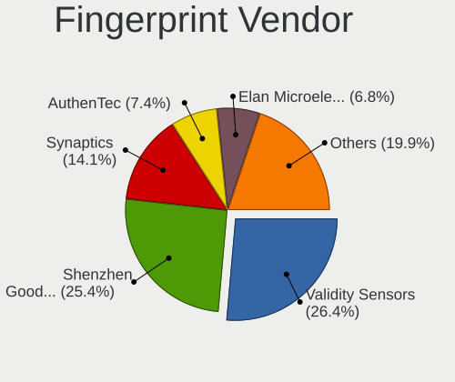

| Vendor                             | Notebooks | Percent |
|------------------------------------|-----------|---------|
| Validity Sensors                   | 569       | 26.39%  |
| Shenzhen Goodix Technology         | 547       | 25.37%  |
| Synaptics                          | 305       | 14.15%  |
| AuthenTec                          | 160       | 7.42%   |
| Elan Microelectronics              | 147       | 6.82%   |
| Upek                               | 145       | 6.73%   |
| LighTuning Technology              | 111       | 5.15%   |
| HOLTEK                             | 53        | 2.46%   |
| STMicroelectronics                 | 39        | 1.81%   |
| Focal-systems.Corp                 | 38        | 1.76%   |
| Realtek USB2.0 Finger Print Bridge | 31        | 1.44%   |
| GDMicroelectronics                 | 9         | 0.42%   |
| Samsung Electronics                | 1         | 0.05%   |
| Next Biometrics                    | 1         | 0.05%   |

Fingerprint Model
-----------------

Fingerprint sensor models

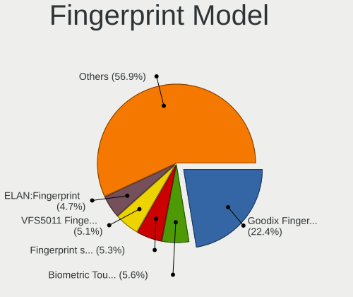

| Model                                                                      | Notebooks | Percent |
|----------------------------------------------------------------------------|-----------|---------|
| Shenzhen Goodix  Fingerprint Device                                        | 483       | 22.4%   |
| Upek Biometric Touchchip/Touchstrip Fingerprint Sensor                     | 121       | 5.61%   |
| Validity Sensors Fingerprint scanner                                       | 114       | 5.29%   |
| Validity Sensors VFS5011 Fingerprint Reader                                | 110       | 5.1%    |
| Elan ELAN:Fingerprint                                                      | 101       | 4.68%   |
| Validity Sensors VFS495 Fingerprint Reader                                 | 99        | 4.59%   |
| Synaptics Prometheus MIS Touch Fingerprint Reader                          | 93        | 4.31%   |
| Shenzhen Goodix Fingerprint Reader                                         | 53        | 2.46%   |
| HOLTEK FocalTech Fingerprint Device                                        | 53        | 2.46%   |
| LighTuning Fingerprint Reader                                              | 52        | 2.41%   |
| AuthenTec AES1600                                                          | 51        | 2.37%   |
| Elan ELAN:ARM-M4                                                           | 43        | 1.99%   |
| Synaptics Metallica MOH Touch Fingerprint Reader                           | 42        | 1.95%   |
| AuthenTec AES2501 Fingerprint Sensor                                       | 40        | 1.86%   |
| STMicroelectronics Fingerprint Reader                                      | 39        | 1.81%   |
| LighTuning EgisTec Touch Fingerprint Sensor                                | 39        | 1.81%   |
| Focal-systems.Corp FT9201Fingerprint.                                      | 38        | 1.76%   |
| Validity Sensors VFS491                                                    | 37        | 1.72%   |
| Validity Sensors VFS 5011 fingerprint sensor                               | 36        | 1.67%   |
| Validity Sensors VFS451 Fingerprint Reader                                 | 35        | 1.62%   |
| Synaptics Metallica MIS Touch Fingerprint Reader                           | 32        | 1.48%   |
| Realtek USB2.0 Finger Print Bridge FocalTech Fingerprint Device            | 31        | 1.44%   |
| Validity Sensors VFS471 Fingerprint Reader                                 | 29        | 1.35%   |
| AuthenTec AES2810                                                          | 29        | 1.35%   |
| Upek TCS5B Fingerprint sensor                                              | 24        | 1.11%   |
| Synaptics FS7604 Touch Fingerprint Sensor with PurePrint                   | 24        | 1.11%   |
| AuthenTec AES1660 Fingerprint Sensor                                       | 24        | 1.11%   |
| Validity Sensors VFS301 Fingerprint Reader                                 | 23        | 1.07%   |
| Synaptics  FS7604 Touch Fingerprint Sensor with PurePrint                  | 22        | 1.02%   |
| Validity Sensors Synaptics VFS7552 Touch Fingerprint Sensor with PurePrint | 20        | 0.93%   |
| LighTuning ES603 Swipe Fingerprint Sensor                                  | 20        | 0.93%   |
| Validity Sensors Synaptics WBDI                                            | 19        | 0.88%   |
| Synaptics Fingerprint reader [HP G6]                                       | 19        | 0.88%   |
| Synaptics UWP WBDI Device                                                  | 18        | 0.83%   |
| Synaptics  WBDI                                                            | 18        | 0.83%   |
| Synaptics WBDI Fingerprint Reader USB 086                                  | 17        | 0.79%   |
| Validity Sensors VFS101 Fingerprint Reader                                 | 13        | 0.6%    |
| Validity Sensors Swipe Fingerprint Sensor                                  | 13        | 0.6%    |
| Validity Sensors VFS7500 Touch Fingerprint Sensor                          | 12        | 0.56%   |
| Shenzhen Goodix FingerPrint                                                | 11        | 0.51%   |

Chipcard Vendor
---------------

Chipcard module vendors

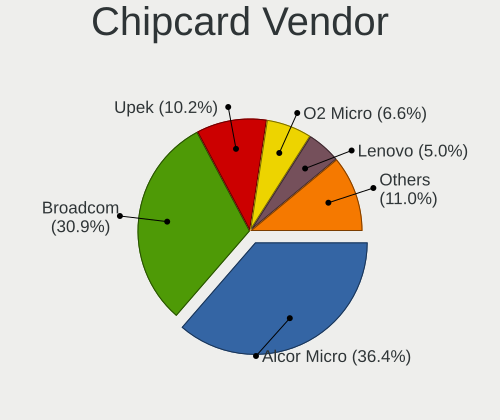

| Vendor                    | Notebooks | Percent |
|---------------------------|-----------|---------|
| Alcor Micro               | 132       | 36.36%  |
| Broadcom                  | 112       | 30.85%  |
| Upek                      | 37        | 10.19%  |
| O2 Micro                  | 24        | 6.61%   |
| Lenovo                    | 18        | 4.96%   |
| Aktiv                     | 13        | 3.58%   |
| Yubico.com                | 10        | 2.75%   |
| Aladdin Knowledge Systems | 6         | 1.65%   |
| Gemalto (was Gemplus)     | 5         | 1.38%   |
| Aladdin R.D.              | 5         | 1.38%   |
| Microchip Technology      | 1         | 0.28%   |

Chipcard Model
--------------

Chipcard module models

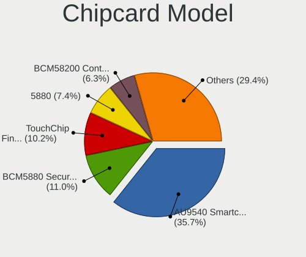

| Model                                                                        | Notebooks | Percent |
|------------------------------------------------------------------------------|-----------|---------|
| Alcor Micro AU9540 Smartcard Reader                                          | 130       | 35.71%  |
| Broadcom BCM5880 Secure Applications Processor                               | 40        | 10.99%  |
| Upek TouchChip Fingerprint Coprocessor (WBF advanced mode)                   | 37        | 10.16%  |
| Broadcom 5880                                                                | 27        | 7.42%   |
| Broadcom BCM58200 ControlVault 3 (FingerPrint sensor + Contacted SmartCard)  | 23        | 6.32%   |
| O2 Micro OZ776 CCID Smartcard Reader                                         | 20        | 5.49%   |
| Broadcom BCM5880 Secure Applications Processor with fingerprint swipe sensor | 20        | 5.49%   |
| Lenovo Integrated Smart Card Reader                                          | 18        | 4.95%   |
| Aktiv Rutoken lite                                                           | 13        | 3.57%   |
| Yubico.com Yubikey 4/5 U2F+CCID                                              | 9         | 2.47%   |
| Aladdin Knowledge Systems Token JC                                           | 6         | 1.65%   |
| Aladdin R.D. JaCarta                                                         | 5         | 1.37%   |
| O2 Micro Oz776 SmartCard Reader                                              | 4         | 1.1%    |
| Gemalto (was Gemplus) Compact Smart Card Reader Writer                       | 4         | 1.1%    |
| Broadcom 58200                                                               | 3         | 0.82%   |
| Yubico.com Yubikey 4/5 CCID                                                  | 1         | 0.27%   |
| Microchip Technology SMSC USX101x Reader                                     | 1         | 0.27%   |
| Gemalto (was Gemplus) GemPC Key SmartCard Reader                             | 1         | 0.27%   |
| Alcor Micro Watchdata W 1981                                                 | 1         | 0.27%   |
| Alcor Micro EMV Smartcard Reader                                             | 1         | 0.27%   |

Unsupported
-----------

Unsupported Devices
-------------------

Total unsupported devices on board

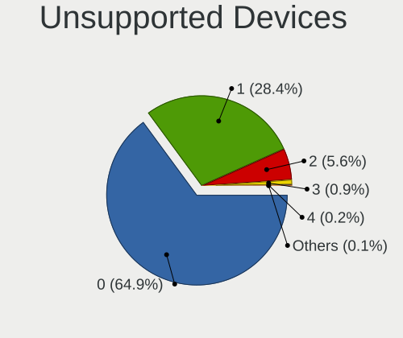

| Total | Notebooks | Percent |
|-------|-----------|---------|
| 0     | 11335     | 64.93%  |
| 1     | 4954      | 28.38%  |
| 2     | 973       | 5.57%   |
| 3     | 153       | 0.88%   |
| 4     | 28        | 0.16%   |
| 5     | 7         | 0.04%   |
| 6     | 4         | 0.02%   |
| 11    | 1         | 0.01%   |
| 8     | 1         | 0.01%   |
| 7     | 1         | 0.01%   |

Unsupported Device Types
------------------------

Types of unsupported devices

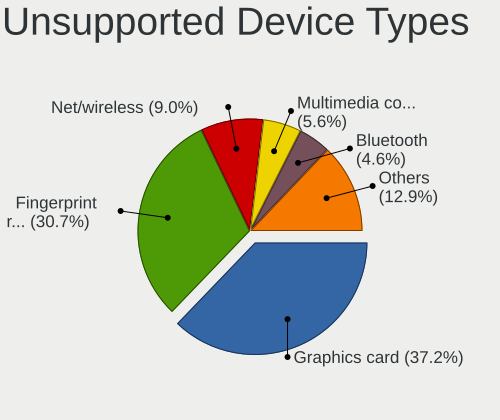

| Type                     | Notebooks | Percent |
|--------------------------|-----------|---------|
| Graphics card            | 2600      | 37.19%  |
| Fingerprint reader       | 2147      | 30.71%  |
| Net/wireless             | 629       | 9%      |
| Multimedia controller    | 389       | 5.56%   |
| Bluetooth                | 325       | 4.65%   |
| Chipcard                 | 300       | 4.29%   |
| Camera                   | 186       | 2.66%   |
| Communication controller | 108       | 1.54%   |
| Storage                  | 77        | 1.1%    |
| Flash memory             | 73        | 1.04%   |
| Card reader              | 39        | 0.56%   |
| Sound                    | 38        | 0.54%   |
| Net/ethernet             | 35        | 0.5%    |
| Modem                    | 14        | 0.2%    |
| Network                  | 12        | 0.17%   |
| Dvb card                 | 6         | 0.09%   |
| Storage/ide              | 4         | 0.06%   |
| Tv card                  | 3         | 0.04%   |
| Firewire controller      | 3         | 0.04%   |
| Wireless                 | 1         | 0.01%   |
| Unclassified device      | 1         | 0.01%   |
| Storage/raid             | 1         | 0.01%   |
| Storage/nvme             | 1         | 0.01%   |

