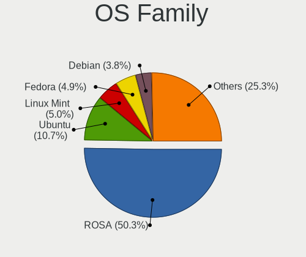
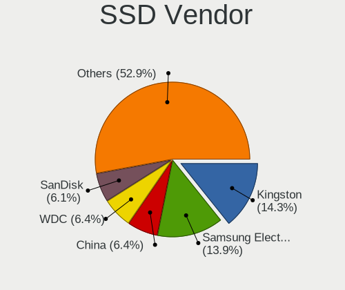
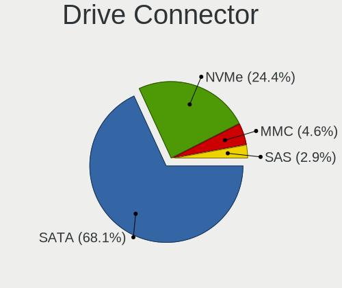
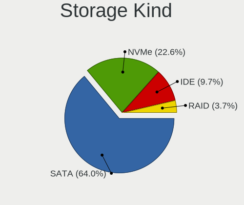
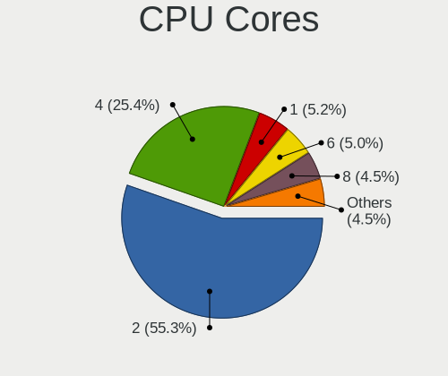
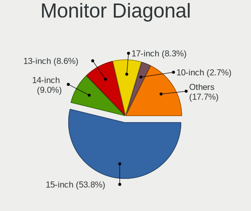
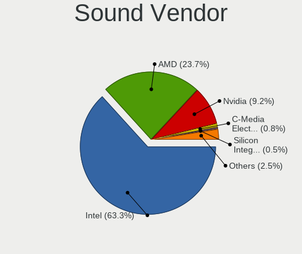

Linux in Russia - Tested Hardware & Statistics (Notebooks)
----------------------------------------------------------

A project to collect tested hardware configurations for Linux in Russia.

Anyone can contribute to this report by the [hw-probe](https://github.com/linuxhw/hw-probe) tool:

    sudo -E hw-probe -all -upload

Please contribute! Especially if your hardware is rare.

Contents
--------

* [ Test Cases ](#test-cases)

* [ System ](#system)
  - [ OS                       ](#os)
  - [ OS Family                ](#os-family)
  - [ Kernel                   ](#kernel)
  - [ Kernel Family            ](#kernel-family)
  - [ Kernel Major Ver.        ](#kernel-major-ver)
  - [ Arch                     ](#arch)
  - [ DE                       ](#de)
  - [ Display Server           ](#display-server)
  - [ Display Manager          ](#display-manager)
  - [ OS Lang                  ](#os-lang)
  - [ Boot Mode                ](#boot-mode)
  - [ Filesystem               ](#filesystem)
  - [ Part. scheme             ](#part-scheme)
  - [ Dual Boot with Linux/BSD ](#dual-boot-with-linuxbsd)
  - [ Dual Boot (Win)          ](#dual-boot-win)

* [ Board ](#board)
  - [ Vendor                   ](#vendor)
  - [ Model                    ](#model)
  - [ Model Family             ](#model-family)
  - [ MFG Year                 ](#mfg-year)
  - [ Form Factor              ](#form-factor)
  - [ Secure Boot              ](#secure-boot)
  - [ Coreboot                 ](#coreboot)
  - [ RAM Size                 ](#ram-size)
  - [ RAM Used                 ](#ram-used)
  - [ Total Drives             ](#total-drives)
  - [ Has CD-ROM               ](#has-cd-rom)
  - [ Has Ethernet             ](#has-ethernet)
  - [ Has WiFi                 ](#has-wifi)
  - [ Has Bluetooth            ](#has-bluetooth)

* [ Location ](#location)
  - [ Country                  ](#country)
  - [ City                     ](#city)

* [ Drives ](#drives)
  - [ Drive Vendor             ](#drive-vendor)
  - [ Drive Model              ](#drive-model)
  - [ HDD Vendor               ](#hdd-vendor)
  - [ SSD Vendor               ](#ssd-vendor)
  - [ Drive Kind               ](#drive-kind)
  - [ Drive Connector          ](#drive-connector)
  - [ Drive Size               ](#drive-size)
  - [ Space Total              ](#space-total)
  - [ Space Used               ](#space-used)
  - [ Malfunc. Drives          ](#malfunc-drives)
  - [ Malfunc. Drive Vendor    ](#malfunc-drive-vendor)
  - [ Malfunc. HDD Vendor      ](#malfunc-hdd-vendor)
  - [ Malfunc. Drive Kind      ](#malfunc-drive-kind)
  - [ Failed Drives            ](#failed-drives)
  - [ Failed Drive Vendor      ](#failed-drive-vendor)
  - [ Drive Status             ](#drive-status)

* [ Storage controller ](#storage-controller)
  - [ Storage Vendor           ](#storage-vendor)
  - [ Storage Model            ](#storage-model)
  - [ Storage Kind             ](#storage-kind)

* [ Processor ](#processor)
  - [ CPU Vendor               ](#cpu-vendor)
  - [ CPU Model                ](#cpu-model)
  - [ CPU Model Family         ](#cpu-model-family)
  - [ CPU Cores                ](#cpu-cores)
  - [ CPU Sockets              ](#cpu-sockets)
  - [ CPU Threads              ](#cpu-threads)
  - [ CPU Op-Modes             ](#cpu-op-modes)
  - [ CPU Microcode            ](#cpu-microcode)
  - [ CPU Microarch            ](#cpu-microarch)

* [ Graphics ](#graphics)
  - [ GPU Vendor               ](#gpu-vendor)
  - [ GPU Model                ](#gpu-model)
  - [ GPU Combo                ](#gpu-combo)
  - [ GPU Driver               ](#gpu-driver)
  - [ GPU Memory               ](#gpu-memory)

* [ Monitor ](#monitor)
  - [ Monitor Vendor           ](#monitor-vendor)
  - [ Monitor Model            ](#monitor-model)
  - [ Monitor Resolution       ](#monitor-resolution)
  - [ Monitor Diagonal         ](#monitor-diagonal)
  - [ Monitor Width            ](#monitor-width)
  - [ Aspect Ratio             ](#aspect-ratio)
  - [ Monitor Area             ](#monitor-area)
  - [ Pixel Density            ](#pixel-density)
  - [ Multiple Monitors        ](#multiple-monitors)

* [ Network ](#network)
  - [ Net Controller Vendor    ](#net-controller-vendor)
  - [ Net Controller Model     ](#net-controller-model)
  - [ Wireless Vendor          ](#wireless-vendor)
  - [ Wireless Model           ](#wireless-model)
  - [ Ethernet Vendor          ](#ethernet-vendor)
  - [ Ethernet Model           ](#ethernet-model)
  - [ Net Controller Kind      ](#net-controller-kind)
  - [ Used Controller          ](#used-controller)
  - [ NICs                     ](#nics)
  - [ IPv6                     ](#ipv6)

* [ Bluetooth ](#bluetooth)
  - [ Bluetooth Vendor         ](#bluetooth-vendor)
  - [ Bluetooth Model          ](#bluetooth-model)

* [ Sound ](#sound)
  - [ Sound Vendor             ](#sound-vendor)
  - [ Sound Model              ](#sound-model)

* [ Memory ](#memory)
  - [ Memory Vendor            ](#memory-vendor)
  - [ Memory Model             ](#memory-model)
  - [ Memory Kind              ](#memory-kind)
  - [ Memory Form Factor       ](#memory-form-factor)
  - [ Memory Size              ](#memory-size)
  - [ Memory Speed             ](#memory-speed)

* [ Printers & scanners ](#printers--scanners)
  - [ Printer Vendor           ](#printer-vendor)
  - [ Printer Model            ](#printer-model)
  - [ Scanner Vendor           ](#scanner-vendor)
  - [ Scanner Model            ](#scanner-model)

* [ Camera ](#camera)
  - [ Camera Vendor            ](#camera-vendor)
  - [ Camera Model             ](#camera-model)

* [ Security ](#security)
  - [ Fingerprint Vendor       ](#fingerprint-vendor)
  - [ Fingerprint Model        ](#fingerprint-model)
  - [ Chipcard Vendor          ](#chipcard-vendor)
  - [ Chipcard Model           ](#chipcard-model)

* [ Unsupported ](#unsupported)
  - [ Unsupported Devices      ](#unsupported-devices)
  - [ Unsupported Device Types ](#unsupported-device-types)

Test Cases
----------

Total: 20837

| Vendor        | Model                       | Probe                                                      | Date         |
|---------------|-----------------------------|------------------------------------------------------------|--------------|
| Acer          | Nitro AN515-54              | [051e477b5f](https://linux-hardware.org/?probe=051e477b5f) | Feb 02, 2024 |
| HP            | EliteBook 8560w             | [6ff665aaf5](https://linux-hardware.org/?probe=6ff665aaf5) | Feb 02, 2024 |
| Acer          | Aspire VN7-591G             | [c0f024d3e0](https://linux-hardware.org/?probe=c0f024d3e0) | Feb 02, 2024 |
| Acer          | P4LJ0                       | [c0a2639732](https://linux-hardware.org/?probe=c0a2639732) | Feb 02, 2024 |
| ASUSTek       | F8Vr                        | [02fced1d70](https://linux-hardware.org/?probe=02fced1d70) | Feb 02, 2024 |
| DEXP          | Atlas M14-I5W303            | [fd14684ed2](https://linux-hardware.org/?probe=fd14684ed2) | Feb 02, 2024 |
| Lenovo        | ThinkPad E590 20NB002BRT    | [283a2fd324](https://linux-hardware.org/?probe=283a2fd324) | Feb 02, 2024 |
| Timi          | RedmiBook Pro 15S           | [70dacc6818](https://linux-hardware.org/?probe=70dacc6818) | Feb 02, 2024 |
| MSI           | Modern 14 B11MOU            | [a5b3665f64](https://linux-hardware.org/?probe=a5b3665f64) | Feb 02, 2024 |
| MSI           | Modern 14 B11MOU            | [f7d0fcd205](https://linux-hardware.org/?probe=f7d0fcd205) | Feb 02, 2024 |
| Samsung       | 305E4A/305E5A/305E7A        | [bf840a5308](https://linux-hardware.org/?probe=bf840a5308) | Feb 02, 2024 |
| Acer          | Aspire 7740                 | [a329ef6c37](https://linux-hardware.org/?probe=a329ef6c37) | Feb 01, 2024 |
| Acer          | TravelMate B118-M           | [4f53c6a6af](https://linux-hardware.org/?probe=4f53c6a6af) | Feb 01, 2024 |
| Acer          | Aspire A515-56              | [5599d65127](https://linux-hardware.org/?probe=5599d65127) | Feb 01, 2024 |
| HONOR         | BRN-HXX                     | [9e92d94ecb](https://linux-hardware.org/?probe=9e92d94ecb) | Feb 01, 2024 |
| Samsung       | RV413/RV513/E3413           | [975921919b](https://linux-hardware.org/?probe=975921919b) | Feb 01, 2024 |
| Apple         | MacBookPro11,3              | [9b4ae891b7](https://linux-hardware.org/?probe=9b4ae891b7) | Feb 01, 2024 |
| Lenovo        | G500 20236                  | [8b5fd80f76](https://linux-hardware.org/?probe=8b5fd80f76) | Feb 01, 2024 |
| Lenovo        | G500 20236                  | [31fc253b87](https://linux-hardware.org/?probe=31fc253b87) | Feb 01, 2024 |
| Lenovo        | IdeaPad 3 15IGL05 81WQ      | [589322c92f](https://linux-hardware.org/?probe=589322c92f) | Feb 01, 2024 |
| HONOR         | BBR-WAX9                    | [a34e642fbe](https://linux-hardware.org/?probe=a34e642fbe) | Jan 31, 2024 |
| ASUSTek       | VivoBook_ASUSLaptop M160... | [0414c66c77](https://linux-hardware.org/?probe=0414c66c77) | Jan 31, 2024 |
| MACHCREATO... | E                           | [af231c3cc8](https://linux-hardware.org/?probe=af231c3cc8) | Jan 31, 2024 |
| HONOR         | BBR-WAX9                    | [a1b73e72d3](https://linux-hardware.org/?probe=a1b73e72d3) | Jan 31, 2024 |
| ASUSTek       | X540YA                      | [4e8d90738d](https://linux-hardware.org/?probe=4e8d90738d) | Jan 31, 2024 |
| Lenovo        | G50-30 80G0                 | [16e8c28b87](https://linux-hardware.org/?probe=16e8c28b87) | Jan 31, 2024 |
| HUAWEI        | MCLF-XX                     | [97bfeb35bc](https://linux-hardware.org/?probe=97bfeb35bc) | Jan 31, 2024 |
| HP            | ProBook 4510s               | [2982cc0a30](https://linux-hardware.org/?probe=2982cc0a30) | Jan 31, 2024 |
| Lenovo        | G575 20081                  | [162e1f81cf](https://linux-hardware.org/?probe=162e1f81cf) | Jan 31, 2024 |
| Acer          | Aspire ES1-531              | [eb59b4c3ac](https://linux-hardware.org/?probe=eb59b4c3ac) | Jan 31, 2024 |
| HUAWEI        | BOM-WXX9                    | [44970ca2bb](https://linux-hardware.org/?probe=44970ca2bb) | Jan 31, 2024 |
| Unknown       | X133                        | [a2fcc244e8](https://linux-hardware.org/?probe=a2fcc244e8) | Jan 31, 2024 |
| HP            | EliteBook 855 G8 Noteboo... | [fff51c5158](https://linux-hardware.org/?probe=fff51c5158) | Jan 30, 2024 |
| Dell          | XPS 9315                    | [dd96b44e05](https://linux-hardware.org/?probe=dd96b44e05) | Jan 30, 2024 |
| ASUSTek       | ROG Zephyrus G15 GA503QS... | [556c1ede91](https://linux-hardware.org/?probe=556c1ede91) | Jan 30, 2024 |
| MSI           | GE62 6QE                    | [6d6f9ba002](https://linux-hardware.org/?probe=6d6f9ba002) | Jan 30, 2024 |
| Lenovo        | IdeaPad S340-14API 81NB     | [39c2f54da6](https://linux-hardware.org/?probe=39c2f54da6) | Jan 30, 2024 |
| ASUSTek       | ASUS EXPERTBOOK L2402CYA... | [7b41a93878](https://linux-hardware.org/?probe=7b41a93878) | Jan 30, 2024 |
| Fujitsu       | LIFEBOOK AH544              | [7c4ab0f337](https://linux-hardware.org/?probe=7c4ab0f337) | Jan 29, 2024 |
| Fujitsu       | LIFEBOOK AH544              | [b7421bfef5](https://linux-hardware.org/?probe=b7421bfef5) | Jan 29, 2024 |
| HUAWEI        | KPRC-WX0                    | [dea81917ae](https://linux-hardware.org/?probe=dea81917ae) | Jan 29, 2024 |
| Lenovo        | G50-30 80G0                 | [94b345e552](https://linux-hardware.org/?probe=94b345e552) | Jan 29, 2024 |
| Lenovo        | V370 HuronRiver Platform    | [9d6e253461](https://linux-hardware.org/?probe=9d6e253461) | Jan 29, 2024 |
| DEPO Compu... | DPH610S                     | [de6c6c0dc5](https://linux-hardware.org/?probe=de6c6c0dc5) | Jan 29, 2024 |
| MSI           | Modern 15 B5M               | [af1dd03737](https://linux-hardware.org/?probe=af1dd03737) | Jan 29, 2024 |
| MSI           | Bravo 15 C7VE               | [1510824aee](https://linux-hardware.org/?probe=1510824aee) | Jan 29, 2024 |
| Lenovo        | V370 HuronRiver Platform    | [77ec188a66](https://linux-hardware.org/?probe=77ec188a66) | Jan 29, 2024 |
| eMachines     | Rhine V1.45                 | [6bb4f91b29](https://linux-hardware.org/?probe=6bb4f91b29) | Jan 29, 2024 |
| HP            | EliteBook 2540p             | [65de0b33df](https://linux-hardware.org/?probe=65de0b33df) | Jan 29, 2024 |
| Lenovo        | ThinkPad T14 Gen 2i 20W0... | [454031382d](https://linux-hardware.org/?probe=454031382d) | Jan 29, 2024 |
| Lenovo        | B590 20208                  | [ea632b2785](https://linux-hardware.org/?probe=ea632b2785) | Jan 28, 2024 |
| Lenovo        | IdeaPad P585 20181          | [d54756c11a](https://linux-hardware.org/?probe=d54756c11a) | Jan 28, 2024 |
| Acer          | Iconia W701                 | [572a3d7c02](https://linux-hardware.org/?probe=572a3d7c02) | Jan 28, 2024 |
| ASUSTek       | K52JU                       | [066d333914](https://linux-hardware.org/?probe=066d333914) | Jan 28, 2024 |
| ASUSTek       | X540SA                      | [39aef9d411](https://linux-hardware.org/?probe=39aef9d411) | Jan 28, 2024 |
| Lenovo        | V560                        | [a0dbd66d53](https://linux-hardware.org/?probe=a0dbd66d53) | Jan 28, 2024 |
| Acer          | Aspire A315-41G             | [e0d994ac23](https://linux-hardware.org/?probe=e0d994ac23) | Jan 27, 2024 |
| Acer          | Aspire A315-41G             | [1b15d869d4](https://linux-hardware.org/?probe=1b15d869d4) | Jan 27, 2024 |
| Lenovo        | ThinkPad T14 Gen 3 21AHA... | [f2ed690a39](https://linux-hardware.org/?probe=f2ed690a39) | Jan 27, 2024 |
| ARDOR GAMI... | PD5x_7xSNC_SND_SNE          | [398529b5cb](https://linux-hardware.org/?probe=398529b5cb) | Jan 27, 2024 |
| Lenovo        | ThinkPad T14 Gen 3 21AHA... | [4644130b45](https://linux-hardware.org/?probe=4644130b45) | Jan 27, 2024 |
| Timi          | Xiaomi Book Pro 16 2022     | [60e1022aef](https://linux-hardware.org/?probe=60e1022aef) | Jan 27, 2024 |
| HP            | ProBook 640 G1              | [6359631eb5](https://linux-hardware.org/?probe=6359631eb5) | Jan 27, 2024 |
| Acer          | Aspire 5732Z                | [0499bd177a](https://linux-hardware.org/?probe=0499bd177a) | Jan 27, 2024 |
| Dell          | Inspiron 3793               | [ab1d389327](https://linux-hardware.org/?probe=ab1d389327) | Jan 27, 2024 |
| HONOR         | FRI-FXX                     | [c9b0b584fc](https://linux-hardware.org/?probe=c9b0b584fc) | Jan 27, 2024 |
| HUAWEI        | WRT-WX9                     | [4fe4c818d5](https://linux-hardware.org/?probe=4fe4c818d5) | Jan 26, 2024 |
| Unknown       | Unknown                     | [9e979ee4e4](https://linux-hardware.org/?probe=9e979ee4e4) | Jan 26, 2024 |
| Unknown       | Unknown                     | [3e9fd3e31a](https://linux-hardware.org/?probe=3e9fd3e31a) | Jan 26, 2024 |
| HP            | Pavilion 15                 | [c303f2769d](https://linux-hardware.org/?probe=c303f2769d) | Jan 26, 2024 |
| Lenovo        | IdeaPad S340-14API 81NB     | [1e983d206c](https://linux-hardware.org/?probe=1e983d206c) | Jan 26, 2024 |
| Lenovo        | Legion 5 17ACH6H 82JY       | [6db5a094d7](https://linux-hardware.org/?probe=6db5a094d7) | Jan 26, 2024 |
| ASUSTek       | B400VC                      | [af39cde6d9](https://linux-hardware.org/?probe=af39cde6d9) | Jan 26, 2024 |
| Dell          | Inspiron 1720               | [cff6e1a58a](https://linux-hardware.org/?probe=cff6e1a58a) | Jan 26, 2024 |
| HUAWEI        | KLVD-WXX9                   | [42e8e68344](https://linux-hardware.org/?probe=42e8e68344) | Jan 26, 2024 |
| MSI           | Katana 17 B11UCX            | [0fa09d8394](https://linux-hardware.org/?probe=0fa09d8394) | Jan 26, 2024 |
| MSI           | GF65 Thin 9SEXR             | [5be9da4fbd](https://linux-hardware.org/?probe=5be9da4fbd) | Jan 26, 2024 |
| Lenovo        | IdeaPad L340-15API 81LW     | [db2cd07d84](https://linux-hardware.org/?probe=db2cd07d84) | Jan 26, 2024 |
| MACHENIKE     | S15C                        | [7429416572](https://linux-hardware.org/?probe=7429416572) | Jan 25, 2024 |
| Unknown       | Unknown                     | [f24b77e03e](https://linux-hardware.org/?probe=f24b77e03e) | Jan 25, 2024 |
| Apple         | MacBookPro4,1               | [8cbf896791](https://linux-hardware.org/?probe=8cbf896791) | Jan 25, 2024 |
| ASUSTek       | N61Vg                       | [ea2d37b9a8](https://linux-hardware.org/?probe=ea2d37b9a8) | Jan 25, 2024 |
| ASUSTek       | VivoBook 15_ASUS Laptop ... | [bed129824b](https://linux-hardware.org/?probe=bed129824b) | Jan 25, 2024 |
| Unknown       | Unknown                     | [f149927f3f](https://linux-hardware.org/?probe=f149927f3f) | Jan 25, 2024 |
| Dell          | Inspiron 5521               | [18fc8668de](https://linux-hardware.org/?probe=18fc8668de) | Jan 25, 2024 |
| HUAWEI        | NBD-WXX9                    | [d2b6c52d72](https://linux-hardware.org/?probe=d2b6c52d72) | Jan 25, 2024 |
| ASUSTek       | VivoBook_ASUSLaptop M650... | [68c758113c](https://linux-hardware.org/?probe=68c758113c) | Jan 25, 2024 |
| Acer          | Aspire 5820TG               | [d36d7405c8](https://linux-hardware.org/?probe=d36d7405c8) | Jan 25, 2024 |
| Lenovo        | ThinkPad X230 Tablet 343... | [40618fab75](https://linux-hardware.org/?probe=40618fab75) | Jan 25, 2024 |
| Samsung       | RC410/RC510/RC710           | [34369cc7eb](https://linux-hardware.org/?probe=34369cc7eb) | Jan 25, 2024 |
| Lenovo        | Legion 5 15ACH6H 82JU       | [ceebacdeee](https://linux-hardware.org/?probe=ceebacdeee) | Jan 24, 2024 |
| Acer          | Nitro AN515-52              | [36dc15871c](https://linux-hardware.org/?probe=36dc15871c) | Jan 24, 2024 |
| eMachines     | eME732Z                     | [fe3d184f11](https://linux-hardware.org/?probe=fe3d184f11) | Jan 24, 2024 |
| ASUSTek       | Vivobook Go E1504GA_E150... | [47052e9985](https://linux-hardware.org/?probe=47052e9985) | Jan 24, 2024 |
| MACHENIKE     | L17                         | [6510b1b157](https://linux-hardware.org/?probe=6510b1b157) | Jan 24, 2024 |
| Acer          | Aspire V3-331               | [002e761d1d](https://linux-hardware.org/?probe=002e761d1d) | Jan 24, 2024 |
| Acer          | Aspire V3-331               | [944c9b110c](https://linux-hardware.org/?probe=944c9b110c) | Jan 24, 2024 |
| Acer          | Aspire A515-51G             | [d1fe84630c](https://linux-hardware.org/?probe=d1fe84630c) | Jan 24, 2024 |
| HUAWEI        | RLEF-XX                     | [dc4ce0b71d](https://linux-hardware.org/?probe=dc4ce0b71d) | Jan 24, 2024 |
| HUAWEI        | RLEF-XX                     | [c53987023c](https://linux-hardware.org/?probe=c53987023c) | Jan 24, 2024 |
| Unknown       | Toshiba AC100 / Dynabook... | [7dcaf9ae21](https://linux-hardware.org/?probe=7dcaf9ae21) | Jan 24, 2024 |
| Samsung       | RC410/RC510/RC710           | [d48bdbaec0](https://linux-hardware.org/?probe=d48bdbaec0) | Jan 24, 2024 |
| Lenovo        | IdeaPad 330-15AST 81D6      | [10eb215783](https://linux-hardware.org/?probe=10eb215783) | Jan 24, 2024 |
| ASUSTek       | ROG Strix G733PZ_G733PZ     | [5a5ec0016f](https://linux-hardware.org/?probe=5a5ec0016f) | Jan 24, 2024 |
| Lenovo        | IdeaPad Gaming 3 15ACH6 ... | [11f654a03a](https://linux-hardware.org/?probe=11f654a03a) | Jan 24, 2024 |
| Infinix       | INBOOK X2                   | [a49adb917b](https://linux-hardware.org/?probe=a49adb917b) | Jan 24, 2024 |
| HP            | Pavilion g6                 | [ba785cef9c](https://linux-hardware.org/?probe=ba785cef9c) | Jan 23, 2024 |
| Apple         | MacBookPro4,1               | [4c99b7a6ff](https://linux-hardware.org/?probe=4c99b7a6ff) | Jan 23, 2024 |
| Samsung       | R580/R590                   | [832ca89f89](https://linux-hardware.org/?probe=832ca89f89) | Jan 23, 2024 |
| ASUSTek       | Vivobook Go E1504FA_E150... | [0ccaa8b707](https://linux-hardware.org/?probe=0ccaa8b707) | Jan 23, 2024 |
| ASUSTek       | Vivobook Go E1504FA_E150... | [43c061d6de](https://linux-hardware.org/?probe=43c061d6de) | Jan 23, 2024 |
| Clevo         | NL41MU2                     | [9ea0222064](https://linux-hardware.org/?probe=9ea0222064) | Jan 23, 2024 |
| eMachines     | eME732G                     | [df21539c0d](https://linux-hardware.org/?probe=df21539c0d) | Jan 23, 2024 |
| ASUSTek       | S551LN                      | [4bcdfef62c](https://linux-hardware.org/?probe=4bcdfef62c) | Jan 23, 2024 |
| Lenovo        | Legion R9000P2021H 82JQ     | [3d55ffe30d](https://linux-hardware.org/?probe=3d55ffe30d) | Jan 23, 2024 |
| Samsung       | 305V4A/305V5A               | [f5cf7e9fd4](https://linux-hardware.org/?probe=f5cf7e9fd4) | Jan 23, 2024 |
| Packard Be... | EasyNote TS11HR             | [31a4f6e57f](https://linux-hardware.org/?probe=31a4f6e57f) | Jan 22, 2024 |
| Acidanther... | MacBookPro16,3              | [ec9ea0d332](https://linux-hardware.org/?probe=ec9ea0d332) | Jan 22, 2024 |
| Alienware     | Area-51m                    | [5d5a86f557](https://linux-hardware.org/?probe=5d5a86f557) | Jan 22, 2024 |
| Acer          | Aspire A315-57G             | [75b94f015e](https://linux-hardware.org/?probe=75b94f015e) | Jan 22, 2024 |
| AMI           | Cherry Trail CR             | [873a9b67e1](https://linux-hardware.org/?probe=873a9b67e1) | Jan 22, 2024 |
| Acer          | Aspire 7551                 | [19efb9c9b1](https://linux-hardware.org/?probe=19efb9c9b1) | Jan 21, 2024 |
| ASUSTek       | N53Jg                       | [63a02d2a23](https://linux-hardware.org/?probe=63a02d2a23) | Jan 21, 2024 |
| Lenovo        | ThinkPad T490 20N2000RRT    | [b48f14a503](https://linux-hardware.org/?probe=b48f14a503) | Jan 20, 2024 |
| ASUSTek       | K50IN                       | [ce48aa2c37](https://linux-hardware.org/?probe=ce48aa2c37) | Jan 20, 2024 |
| HP            | EliteBook 840 G8 Noteboo... | [e03dc88f3e](https://linux-hardware.org/?probe=e03dc88f3e) | Jan 20, 2024 |
| Lenovo        | ThinkPad T14 Gen 2i 20W1... | [c5644b867a](https://linux-hardware.org/?probe=c5644b867a) | Jan 19, 2024 |
| HIPER Tech... | HIPER WORKBOOK              | [88b6a30668](https://linux-hardware.org/?probe=88b6a30668) | Jan 19, 2024 |
| Lenovo        | ThinkPad T14 Gen 2i 20W1... | [20e88d4383](https://linux-hardware.org/?probe=20e88d4383) | Jan 19, 2024 |
| HIPER Tech... | HIPER WORKBOOK              | [277f1fa594](https://linux-hardware.org/?probe=277f1fa594) | Jan 19, 2024 |
| Acer          | Aspire A515-43              | [2c2f4e8e3b](https://linux-hardware.org/?probe=2c2f4e8e3b) | Jan 19, 2024 |
| ASUSTek       | UX303UA                     | [a1e8d78385](https://linux-hardware.org/?probe=a1e8d78385) | Jan 19, 2024 |
| Chuwi         | GemiBook Pro                | [216035484c](https://linux-hardware.org/?probe=216035484c) | Jan 19, 2024 |
| Lenovo        | IdeaPad L340-15API 81LW     | [ca9e77a64e](https://linux-hardware.org/?probe=ca9e77a64e) | Jan 19, 2024 |
| Samsung       | 300V3A/300V4A/300V5A/200... | [69a5d8296c](https://linux-hardware.org/?probe=69a5d8296c) | Jan 19, 2024 |
| Lenovo        | ThinkPad X230 23205XG       | [384ae6ddfb](https://linux-hardware.org/?probe=384ae6ddfb) | Jan 19, 2024 |
| realme        | CloudProXXXX                | [a82160e17d](https://linux-hardware.org/?probe=a82160e17d) | Jan 19, 2024 |
| Acer          | Aspire A315-21              | [0e67fe580f](https://linux-hardware.org/?probe=0e67fe580f) | Jan 18, 2024 |
| ASUSTek       | VivoBook_ASUSLaptop K660... | [96aa415cee](https://linux-hardware.org/?probe=96aa415cee) | Jan 18, 2024 |
| Fujitsu       | LIFEBOOK P771               | [47367bff01](https://linux-hardware.org/?probe=47367bff01) | Jan 18, 2024 |
| HUAWEI        | MACHD-WXX9                  | [0f17e4ee65](https://linux-hardware.org/?probe=0f17e4ee65) | Jan 18, 2024 |
| Lenovo        | ThinkPad L530 2479BG8       | [4c8c134e10](https://linux-hardware.org/?probe=4c8c134e10) | Jan 18, 2024 |
| UMAX          | VisionBook 14Wr Plus        | [7ce24a39ab](https://linux-hardware.org/?probe=7ce24a39ab) | Jan 18, 2024 |
| MECHREVO      | Jiaolong Series GM5ZG0O     | [4f589be8f4](https://linux-hardware.org/?probe=4f589be8f4) | Jan 18, 2024 |
| Lenovo        | ThinkPad X1 Carbon Gen 1... | [f73bc25ab5](https://linux-hardware.org/?probe=f73bc25ab5) | Jan 17, 2024 |
| MSI           | GE60 2PL                    | [a0eff25dfe](https://linux-hardware.org/?probe=a0eff25dfe) | Jan 17, 2024 |
| ASUSTek       | K53U                        | [04cc25d38b](https://linux-hardware.org/?probe=04cc25d38b) | Jan 17, 2024 |
| ASUSTek       | ASUS TUF Dash F15 FX517Z... | [1bb64ecbb9](https://linux-hardware.org/?probe=1bb64ecbb9) | Jan 17, 2024 |
| ASUSTek       | ASUS TUF Dash F15 FX517Z... | [42c4cf9cea](https://linux-hardware.org/?probe=42c4cf9cea) | Jan 17, 2024 |
| Aquarius      | NS585                       | [21185900ad](https://linux-hardware.org/?probe=21185900ad) | Jan 17, 2024 |
| HP            | Laptop 15-dw3xxx            | [77766f1cc1](https://linux-hardware.org/?probe=77766f1cc1) | Jan 17, 2024 |
| Packard Be... | EasyNote TE11HC             | [b38e6a2298](https://linux-hardware.org/?probe=b38e6a2298) | Jan 17, 2024 |
| ASUSTek       | Vivobook Go E1504FA_E150... | [f12e5f7ddc](https://linux-hardware.org/?probe=f12e5f7ddc) | Jan 16, 2024 |
| Lenovo        | YogaAir 14s APU8 83AA       | [8951d7dd3e](https://linux-hardware.org/?probe=8951d7dd3e) | Jan 16, 2024 |
| MSI           | Katana GF66 12UE            | [6864ccb2af](https://linux-hardware.org/?probe=6864ccb2af) | Jan 16, 2024 |
| Lenovo        | ThinkPad X1 Carbon Gen 1... | [8578d3d843](https://linux-hardware.org/?probe=8578d3d843) | Jan 15, 2024 |
| Lenovo        | G580 20157                  | [02e26b7dbe](https://linux-hardware.org/?probe=02e26b7dbe) | Jan 15, 2024 |
| MSI           | Katana GF66 12UE            | [cb2a25098e](https://linux-hardware.org/?probe=cb2a25098e) | Jan 15, 2024 |
| ASUSTek       | VivoBook 15_ASUS Laptop ... | [4162a83dbc](https://linux-hardware.org/?probe=4162a83dbc) | Jan 15, 2024 |
| Clevo         | M815P                       | [3ee9aaa992](https://linux-hardware.org/?probe=3ee9aaa992) | Jan 15, 2024 |
| Clevo         | M815P                       | [398ddcd746](https://linux-hardware.org/?probe=398ddcd746) | Jan 15, 2024 |
| ASUSTek       | VivoBook_ASUSLaptop M350... | [e73d1f2078](https://linux-hardware.org/?probe=e73d1f2078) | Jan 15, 2024 |
| HUAWEI        | KLVL-WXXW                   | [3a8600efaf](https://linux-hardware.org/?probe=3a8600efaf) | Jan 14, 2024 |
| Dell          | Inspiron 1501               | [b96b5df9e5](https://linux-hardware.org/?probe=b96b5df9e5) | Jan 14, 2024 |
| ASUSTek       | VivoBook_ASUSLaptop M650... | [3aab9743d9](https://linux-hardware.org/?probe=3aab9743d9) | Jan 14, 2024 |
| Acer          | Nitro AN515-52              | [d6885f2fa0](https://linux-hardware.org/?probe=d6885f2fa0) | Jan 14, 2024 |
| Dell          | Inspiron 1501               | [7498db6367](https://linux-hardware.org/?probe=7498db6367) | Jan 14, 2024 |
| HP            | ProBook 430 G2              | [0c1f594a26](https://linux-hardware.org/?probe=0c1f594a26) | Jan 14, 2024 |
| Dell          | Inspiron 15-3567            | [fe568bbc5d](https://linux-hardware.org/?probe=fe568bbc5d) | Jan 14, 2024 |
| ASUSTek       | VivoBook_ASUSLaptop X515... | [3382d92b24](https://linux-hardware.org/?probe=3382d92b24) | Jan 14, 2024 |
| ASUSTek       | VivoBook_ASUSLaptop X515... | [1d59e1c691](https://linux-hardware.org/?probe=1d59e1c691) | Jan 14, 2024 |
| Acer          | Aspire A315-24P             | [abc7a5352b](https://linux-hardware.org/?probe=abc7a5352b) | Jan 14, 2024 |
| MSI           | FX610MX                     | [398e37e98e](https://linux-hardware.org/?probe=398e37e98e) | Jan 14, 2024 |
| Valve         | Galileo                     | [48d337c0f3](https://linux-hardware.org/?probe=48d337c0f3) | Jan 14, 2024 |
| ASUSTek       | VivoBook_ASUSLaptop M650... | [a6d483fa69](https://linux-hardware.org/?probe=a6d483fa69) | Jan 14, 2024 |
| Acer          | Aspire A315-24P             | [166d3493a4](https://linux-hardware.org/?probe=166d3493a4) | Jan 14, 2024 |
| Lenovo        | B590 20208                  | [5f1f7fc385](https://linux-hardware.org/?probe=5f1f7fc385) | Jan 14, 2024 |
| Packard Be... | EasyNote ENTE70BH           | [3b0a0b0f19](https://linux-hardware.org/?probe=3b0a0b0f19) | Jan 13, 2024 |
| HUAWEI        | BOM-WXX9                    | [f15e99bc7d](https://linux-hardware.org/?probe=f15e99bc7d) | Jan 13, 2024 |
| Apple         | MacBookPro7,1               | [932b9f58d5](https://linux-hardware.org/?probe=932b9f58d5) | Jan 13, 2024 |
| HUAWEI        | HLY-WX9XX                   | [d15fd25a80](https://linux-hardware.org/?probe=d15fd25a80) | Jan 13, 2024 |
| HUAWEI        | BOD-WXX9                    | [e0c9cacfa0](https://linux-hardware.org/?probe=e0c9cacfa0) | Jan 13, 2024 |
| Acer          | Aspire E5-532               | [5441361fdd](https://linux-hardware.org/?probe=5441361fdd) | Jan 13, 2024 |
| HP            | EliteBook 840 G4            | [e5073c8346](https://linux-hardware.org/?probe=e5073c8346) | Jan 13, 2024 |
| HP            | Pavilion dv7                | [5b2ddda1cc](https://linux-hardware.org/?probe=5b2ddda1cc) | Jan 13, 2024 |
| Packard Be... | EasyNote ENLG81BA           | [8fce4ff747](https://linux-hardware.org/?probe=8fce4ff747) | Jan 13, 2024 |
| HP            | ProBook 445 G7              | [6b3e44d0ab](https://linux-hardware.org/?probe=6b3e44d0ab) | Jan 12, 2024 |
| Lenovo        | G500 20236                  | [5dacf75c7d](https://linux-hardware.org/?probe=5dacf75c7d) | Jan 12, 2024 |
| HP            | Pavilion Gaming Laptop 1... | [dba8b3f332](https://linux-hardware.org/?probe=dba8b3f332) | Jan 12, 2024 |
| HUAWEI        | BOM-WXX9                    | [77d4403dbe](https://linux-hardware.org/?probe=77d4403dbe) | Jan 12, 2024 |
| Lenovo        | V15-IGL 82C3                | [c7de9c6d40](https://linux-hardware.org/?probe=c7de9c6d40) | Jan 12, 2024 |
| Chuwi         | LapBook Pro                 | [9b26a023b9](https://linux-hardware.org/?probe=9b26a023b9) | Jan 12, 2024 |
| Chuwi         | LapBook Pro                 | [efa337f154](https://linux-hardware.org/?probe=efa337f154) | Jan 12, 2024 |
| HP            | ProBook 450 G1              | [aada05f6c2](https://linux-hardware.org/?probe=aada05f6c2) | Jan 12, 2024 |
| Timi          | RedmiBook Pro 15S           | [a4693e04aa](https://linux-hardware.org/?probe=a4693e04aa) | Jan 12, 2024 |
| Timi          | RedmiBook Pro 15S           | [856d9c6c00](https://linux-hardware.org/?probe=856d9c6c00) | Jan 12, 2024 |
| ASUSTek       | VivoBook_ASUSLaptop M350... | [c317a3afa7](https://linux-hardware.org/?probe=c317a3afa7) | Jan 12, 2024 |
| ASUSTek       | ROG Strix G513RW_G513RW     | [2bc2a90ad1](https://linux-hardware.org/?probe=2bc2a90ad1) | Jan 12, 2024 |
| Clevo         | NL41MU2                     | [a1934fd532](https://linux-hardware.org/?probe=a1934fd532) | Jan 11, 2024 |
| Sony          | VGN-NS11ER_S                | [a36cd10d4f](https://linux-hardware.org/?probe=a36cd10d4f) | Jan 11, 2024 |
| HP            | Pavilion 15                 | [f2b6647344](https://linux-hardware.org/?probe=f2b6647344) | Jan 11, 2024 |
| Unknown       | Unknown                     | [f6ae9e1e1d](https://linux-hardware.org/?probe=f6ae9e1e1d) | Jan 11, 2024 |
| Pegatron      | C15B                        | [168aedbfba](https://linux-hardware.org/?probe=168aedbfba) | Jan 11, 2024 |
| Dell          | Inspiron 5547               | [0b1f6ac0e4](https://linux-hardware.org/?probe=0b1f6ac0e4) | Jan 11, 2024 |
| Dell          | Inspiron 5547               | [453ed6cb99](https://linux-hardware.org/?probe=453ed6cb99) | Jan 11, 2024 |
| Samsung       | 550P5C/550P7C               | [0153b8d5e8](https://linux-hardware.org/?probe=0153b8d5e8) | Jan 11, 2024 |
| MSI           | Prestige 13Evo A13M         | [65eda94bdb](https://linux-hardware.org/?probe=65eda94bdb) | Jan 11, 2024 |
| HUAWEI        | MRGFG-XX                    | [93269856b2](https://linux-hardware.org/?probe=93269856b2) | Jan 11, 2024 |
| ASUSTek       | F3JA                        | [bdf839bb01](https://linux-hardware.org/?probe=bdf839bb01) | Jan 10, 2024 |
| MSI           | Bravo 15 C7VE               | [6c44184013](https://linux-hardware.org/?probe=6c44184013) | Jan 10, 2024 |
| ASUSTek       | K54HR                       | [9bea135bd3](https://linux-hardware.org/?probe=9bea135bd3) | Jan 10, 2024 |
| HUAWEI        | KLVF-XX                     | [133633238b](https://linux-hardware.org/?probe=133633238b) | Jan 10, 2024 |
| Lenovo        | ThinkPad E14 20RA001BRT     | [99ac2e5b0c](https://linux-hardware.org/?probe=99ac2e5b0c) | Jan 10, 2024 |
| iRU           | 15TLI                       | [4d83aee906](https://linux-hardware.org/?probe=4d83aee906) | Jan 10, 2024 |
| MSI           | Katana GF76 12UC            | [73c3208c03](https://linux-hardware.org/?probe=73c3208c03) | Jan 10, 2024 |
| MSI           | Katana GF76 12UC            | [15db2ea112](https://linux-hardware.org/?probe=15db2ea112) | Jan 10, 2024 |
| DEXP          | Aquilon C14                 | [d38932d74f](https://linux-hardware.org/?probe=d38932d74f) | Jan 10, 2024 |
| Dell          | System Inspiron N7110       | [4b3ae60a61](https://linux-hardware.org/?probe=4b3ae60a61) | Jan 10, 2024 |
| HP            | Pavilion 15                 | [e719d4a0cf](https://linux-hardware.org/?probe=e719d4a0cf) | Jan 09, 2024 |
| HP            | Pavilion 15                 | [850d28e06d](https://linux-hardware.org/?probe=850d28e06d) | Jan 09, 2024 |
| ASUSTek       | VivoBook_ASUSLaptop X513... | [ded91accee](https://linux-hardware.org/?probe=ded91accee) | Jan 09, 2024 |
| Acer          | Aspire V5-552G              | [b27d99d614](https://linux-hardware.org/?probe=b27d99d614) | Jan 09, 2024 |
| ASUSTek       | VivoBook_ASUSLaptop X513... | [d041e87729](https://linux-hardware.org/?probe=d041e87729) | Jan 09, 2024 |
| HP            | Laptop 15s-eq2xxx           | [2e0223d4eb](https://linux-hardware.org/?probe=2e0223d4eb) | Jan 09, 2024 |
| Aquarius      | NS585                       | [ad17f295fa](https://linux-hardware.org/?probe=ad17f295fa) | Jan 09, 2024 |
| Aquarius      | NS585                       | [c74d9cb486](https://linux-hardware.org/?probe=c74d9cb486) | Jan 09, 2024 |
| Aquarius      | NS585                       | [8710764b3b](https://linux-hardware.org/?probe=8710764b3b) | Jan 09, 2024 |
| Lenovo        | IdeaPad L340-15API 81LW     | [04855eeea8](https://linux-hardware.org/?probe=04855eeea8) | Jan 09, 2024 |
| Aquarius      | NS585                       | [23ec56d03f](https://linux-hardware.org/?probe=23ec56d03f) | Jan 09, 2024 |
| Aquarius      | NS585                       | [a9250fd152](https://linux-hardware.org/?probe=a9250fd152) | Jan 09, 2024 |
| Acer          | Extensa 215-22              | [c2884d7a5d](https://linux-hardware.org/?probe=c2884d7a5d) | Jan 09, 2024 |
| iRU           | 15TLI                       | [d318923a72](https://linux-hardware.org/?probe=d318923a72) | Jan 09, 2024 |
| Aquarius      | NS585                       | [f3090f70d2](https://linux-hardware.org/?probe=f3090f70d2) | Jan 09, 2024 |
| Aquarius      | NS585                       | [a167167f54](https://linux-hardware.org/?probe=a167167f54) | Jan 09, 2024 |
| Aquarius      | NS585                       | [0d67b1f360](https://linux-hardware.org/?probe=0d67b1f360) | Jan 09, 2024 |
| Samsung       | N145P/N250P/N260P           | [42f3dc5b5b](https://linux-hardware.org/?probe=42f3dc5b5b) | Jan 08, 2024 |
| Acer          | Swift SF314-43              | [fbd53e189d](https://linux-hardware.org/?probe=fbd53e189d) | Jan 08, 2024 |
| Packard Be... | EasyNote ENTE70BH           | [686528b2b8](https://linux-hardware.org/?probe=686528b2b8) | Jan 08, 2024 |
| Unknown       | Unknown                     | [124f393da9](https://linux-hardware.org/?probe=124f393da9) | Jan 08, 2024 |
| Lenovo        | IdeaPad L340-15API 81LW     | [908776c42b](https://linux-hardware.org/?probe=908776c42b) | Jan 08, 2024 |
| ASUSTek       | K42JK                       | [458158ebaf](https://linux-hardware.org/?probe=458158ebaf) | Jan 08, 2024 |
| Lenovo        | B560                        | [900be0c575](https://linux-hardware.org/?probe=900be0c575) | Jan 08, 2024 |
| MSI           | Creator Z17 A12UGST         | [b9357d76fc](https://linux-hardware.org/?probe=b9357d76fc) | Jan 08, 2024 |
| ASUSTek       | T100TA                      | [6c102638a9](https://linux-hardware.org/?probe=6c102638a9) | Jan 08, 2024 |
| MSI           | Creator Z17 A12UGST         | [6027d9f940](https://linux-hardware.org/?probe=6027d9f940) | Jan 08, 2024 |
| Acer          | Aspire 5520                 | [0a5ec0c310](https://linux-hardware.org/?probe=0a5ec0c310) | Jan 08, 2024 |
| ASUSTek       | X551MA                      | [243ad8414b](https://linux-hardware.org/?probe=243ad8414b) | Jan 08, 2024 |
| MSI           | Bravo 15 C7VE               | [0235f555a0](https://linux-hardware.org/?probe=0235f555a0) | Jan 07, 2024 |
| ASUSTek       | ASUS TUF Gaming A15 FA50... | [be56ab0378](https://linux-hardware.org/?probe=be56ab0378) | Jan 07, 2024 |
| HP            | ProBook 6360b               | [e47b503ba6](https://linux-hardware.org/?probe=e47b503ba6) | Jan 07, 2024 |
| HP            | Laptop 15s-eq2xxx           | [9233f4fdcb](https://linux-hardware.org/?probe=9233f4fdcb) | Jan 07, 2024 |
| Acer          | Aspire 7739ZG               | [62dc64989b](https://linux-hardware.org/?probe=62dc64989b) | Jan 07, 2024 |
| Digitek       | Z156                        | [db1140fc17](https://linux-hardware.org/?probe=db1140fc17) | Jan 07, 2024 |
| Timi          | Redmi Book Pro 15 2022      | [85ffea8873](https://linux-hardware.org/?probe=85ffea8873) | Jan 07, 2024 |
| Lenovo        | IdeaPad 3 15ITL6 82H8       | [aabe472c22](https://linux-hardware.org/?probe=aabe472c22) | Jan 07, 2024 |
| HP            | EliteBook 2540p             | [5ca15a89d6](https://linux-hardware.org/?probe=5ca15a89d6) | Jan 07, 2024 |
| Lenovo        | IdeaPad Gaming 3 15ARH05... | [31daef8900](https://linux-hardware.org/?probe=31daef8900) | Jan 07, 2024 |
| MSI           | Modern 15 B5M               | [edf62d9f68](https://linux-hardware.org/?probe=edf62d9f68) | Jan 07, 2024 |
| Lenovo        | ThinkPad X120e 0611AN2      | [8d06f74a60](https://linux-hardware.org/?probe=8d06f74a60) | Jan 07, 2024 |
| HP            | 635                         | [29632bb08b](https://linux-hardware.org/?probe=29632bb08b) | Jan 07, 2024 |
| Lenovo        | G710 20252                  | [0ee32cd03b](https://linux-hardware.org/?probe=0ee32cd03b) | Jan 07, 2024 |
| GPD           | G1621-02                    | [ea062fdae3](https://linux-hardware.org/?probe=ea062fdae3) | Jan 06, 2024 |
| Apple         | MacBookAir6,2               | [ef63e5e5dd](https://linux-hardware.org/?probe=ef63e5e5dd) | Jan 06, 2024 |
| HUAWEI        | HKFG-XX                     | [a90398b4f6](https://linux-hardware.org/?probe=a90398b4f6) | Jan 06, 2024 |
| Lenovo        | IdeaPad 5 14ARE05 81YM      | [6859e6749d](https://linux-hardware.org/?probe=6859e6749d) | Jan 06, 2024 |
| MSI           | GL62M 7REX                  | [d3f10df70f](https://linux-hardware.org/?probe=d3f10df70f) | Jan 06, 2024 |
| ASUSTek       | VivoBook_ASUSLaptop X740... | [4d0a7d86bb](https://linux-hardware.org/?probe=4d0a7d86bb) | Jan 06, 2024 |
| ASUSTek       | VivoBook_ASUSLaptop M340... | [2b10c57f32](https://linux-hardware.org/?probe=2b10c57f32) | Jan 06, 2024 |
| Dell          | Latitude E7440              | [3e3121718d](https://linux-hardware.org/?probe=3e3121718d) | Jan 06, 2024 |
| Lenovo        | IdeaPad S145-15AST 81N3     | [3a2e5d320d](https://linux-hardware.org/?probe=3a2e5d320d) | Jan 06, 2024 |
| TECNO Mobi... | MEGABOOK T14TA              | [deadd2cf3d](https://linux-hardware.org/?probe=deadd2cf3d) | Jan 05, 2024 |
| HONOR         | NMH-WCX9                    | [48f7f496b7](https://linux-hardware.org/?probe=48f7f496b7) | Jan 05, 2024 |
| Acer          | Predator PH717-72           | [cfa0e5b6c6](https://linux-hardware.org/?probe=cfa0e5b6c6) | Jan 05, 2024 |
| Samsung       | 300V3A/300V4A/300V5A/200... | [db402d3717](https://linux-hardware.org/?probe=db402d3717) | Jan 05, 2024 |
| HP            | EliteBook 840 G4            | [2831ef8f2f](https://linux-hardware.org/?probe=2831ef8f2f) | Jan 05, 2024 |
| Lenovo        | ThinkPad T61 6464WM6        | [a0b959c7c4](https://linux-hardware.org/?probe=a0b959c7c4) | Jan 05, 2024 |
| Lenovo        | ThinkPad T61 6464WM6        | [3cf7d0764e](https://linux-hardware.org/?probe=3cf7d0764e) | Jan 05, 2024 |
| ASUSTek       | M51Sn                       | [909c38ed4b](https://linux-hardware.org/?probe=909c38ed4b) | Jan 05, 2024 |
| Clevo         | W760T/M740T/M760T           | [1b63264977](https://linux-hardware.org/?probe=1b63264977) | Jan 05, 2024 |
| Acer          | Aspire 5732Z                | [4ec5e534a6](https://linux-hardware.org/?probe=4ec5e534a6) | Jan 05, 2024 |
| HUAWEI        | BoDE-WXX9                   | [19c9de230e](https://linux-hardware.org/?probe=19c9de230e) | Jan 05, 2024 |
| HUAWEI        | BoDE-WXX9                   | [37d74e549d](https://linux-hardware.org/?probe=37d74e549d) | Jan 05, 2024 |
| Lenovo        | G470 20078                  | [e9f6af483a](https://linux-hardware.org/?probe=e9f6af483a) | Jan 05, 2024 |
| HP            | ProBook 445 G7              | [758fdda6d6](https://linux-hardware.org/?probe=758fdda6d6) | Jan 05, 2024 |
| ASUSTek       | VivoBook_ASUSLaptop M160... | [96f32abb26](https://linux-hardware.org/?probe=96f32abb26) | Jan 05, 2024 |
| HP            | Compaq Presario CQ50        | [593df08bff](https://linux-hardware.org/?probe=593df08bff) | Jan 05, 2024 |
| Clevo         | NL41MU2                     | [c45b51ce3f](https://linux-hardware.org/?probe=c45b51ce3f) | Jan 05, 2024 |
| Maibenben     | MaiBook X series            | [eb4921954d](https://linux-hardware.org/?probe=eb4921954d) | Jan 05, 2024 |
| Maibenben     | MaiBook X series            | [8a3ed185f1](https://linux-hardware.org/?probe=8a3ed185f1) | Jan 05, 2024 |
| HP            | Compaq Presario CQ50        | [1b67d7fdc7](https://linux-hardware.org/?probe=1b67d7fdc7) | Jan 04, 2024 |
| HP            | Laptop 17-by3xxx            | [32486bf070](https://linux-hardware.org/?probe=32486bf070) | Jan 04, 2024 |
| ASUSTek       | TUF Gaming FX505DY_FX505... | [1f5e805f6a](https://linux-hardware.org/?probe=1f5e805f6a) | Jan 04, 2024 |
| Acer          | Aspire ES1-531              | [d690461c92](https://linux-hardware.org/?probe=d690461c92) | Jan 04, 2024 |
| Acer          | Aspire ES1-531              | [cb353673fe](https://linux-hardware.org/?probe=cb353673fe) | Jan 04, 2024 |
| ASUSTek       | K40IN                       | [3652028e43](https://linux-hardware.org/?probe=3652028e43) | Jan 04, 2024 |
| Acer          | Aspire A315-23              | [68f433dca5](https://linux-hardware.org/?probe=68f433dca5) | Jan 04, 2024 |
| Acer          | Aspire A715-71G             | [47783802e5](https://linux-hardware.org/?probe=47783802e5) | Jan 04, 2024 |
| ASUSTek       | VivoBook_ASUSLaptop K650... | [1b25631ac9](https://linux-hardware.org/?probe=1b25631ac9) | Jan 03, 2024 |
| Irbis         | NB264                       | [c42f5880cc](https://linux-hardware.org/?probe=c42f5880cc) | Jan 03, 2024 |
| Unknown       | Unknown                     | [737a25372c](https://linux-hardware.org/?probe=737a25372c) | Jan 03, 2024 |
| Lenovo        | IdeaPad Z560 20060          | [decb357ee5](https://linux-hardware.org/?probe=decb357ee5) | Jan 03, 2024 |
| HUAWEI        | NBM-WXX9                    | [f1a366a5a9](https://linux-hardware.org/?probe=f1a366a5a9) | Jan 03, 2024 |
| Unknown       | Unknown                     | [ec1ee65b65](https://linux-hardware.org/?probe=ec1ee65b65) | Jan 03, 2024 |
| Timi          | Redmi Book Pro 15 2022      | [6a25b4f0dc](https://linux-hardware.org/?probe=6a25b4f0dc) | Jan 03, 2024 |
| Maibenben     | XiaoMai6 Plus               | [96ad7f78e9](https://linux-hardware.org/?probe=96ad7f78e9) | Jan 03, 2024 |
| Lenovo        | ThinkBook 16 G4+ ARA 21D... | [9ebfe6bfaf](https://linux-hardware.org/?probe=9ebfe6bfaf) | Jan 03, 2024 |
| Acer          | Aspire 5733Z                | [3a3502aceb](https://linux-hardware.org/?probe=3a3502aceb) | Jan 03, 2024 |
| Lenovo        | B580 20144                  | [f062a8fd3a](https://linux-hardware.org/?probe=f062a8fd3a) | Jan 03, 2024 |
| Lenovo        | Mullins-LarneML             | [6300b4535f](https://linux-hardware.org/?probe=6300b4535f) | Jan 02, 2024 |
| Acer          | Extensa 2540                | [0dd0c273c1](https://linux-hardware.org/?probe=0dd0c273c1) | Jan 02, 2024 |
| ASUSTek       | P53SJ                       | [166aa26cbf](https://linux-hardware.org/?probe=166aa26cbf) | Jan 02, 2024 |
| ASUSTek       | P53SJ                       | [b4d6eb4321](https://linux-hardware.org/?probe=b4d6eb4321) | Jan 02, 2024 |
| HUAWEI        | BOM-WXX9                    | [4c7efd21fe](https://linux-hardware.org/?probe=4c7efd21fe) | Jan 02, 2024 |
| Intel         | Unknown                     | [b9c1ff5dd5](https://linux-hardware.org/?probe=b9c1ff5dd5) | Jan 02, 2024 |
| Lenovo        | Legion R9000P ARX8 82WM     | [2903680651](https://linux-hardware.org/?probe=2903680651) | Jan 02, 2024 |
| KVADRA        | NAU LE15T                   | [b53fe7cc28](https://linux-hardware.org/?probe=b53fe7cc28) | Jan 02, 2024 |
| Acer          | AO531h                      | [d53e1252c6](https://linux-hardware.org/?probe=d53e1252c6) | Jan 02, 2024 |
| 3Q            | 3QLAP-ES1001N-WBN6-MB       | [d0a86ccf9e](https://linux-hardware.org/?probe=d0a86ccf9e) | Jan 02, 2024 |
| Lenovo        | V15 G3 IAP 82TT             | [2ca86aaf30](https://linux-hardware.org/?probe=2ca86aaf30) | Jan 02, 2024 |
| HP            | ProBook 430 G1              | [7f61fa84aa](https://linux-hardware.org/?probe=7f61fa84aa) | Jan 02, 2024 |
| ASUSTek       | TUF Gaming FX705DT_FX705... | [c71368b0eb](https://linux-hardware.org/?probe=c71368b0eb) | Jan 01, 2024 |
| ASUSTek       | ZenBook UX425UA_UM425UA     | [6826d7c88d](https://linux-hardware.org/?probe=6826d7c88d) | Jan 01, 2024 |
| Sony          | VPCEH3P1R                   | [d5a18ec675](https://linux-hardware.org/?probe=d5a18ec675) | Jan 01, 2024 |
| ASUSTek       | X555LB                      | [6e12fcec56](https://linux-hardware.org/?probe=6e12fcec56) | Jan 01, 2024 |
| Lenovo        | ThinkPad T430 2349SB4       | [06956b900b](https://linux-hardware.org/?probe=06956b900b) | Jan 01, 2024 |
| ASUSTek       | VivoBook 17_ASUS Laptop ... | [156c23e1d0](https://linux-hardware.org/?probe=156c23e1d0) | Jan 01, 2024 |
| ASUSTek       | X751LA                      | [089bb5bca9](https://linux-hardware.org/?probe=089bb5bca9) | Jan 01, 2024 |
| Irbis         | NB264                       | [b7da9b39c3](https://linux-hardware.org/?probe=b7da9b39c3) | Dec 31, 2023 |
| XIAOMI        | Redmi Book Pro 15 2023      | [9f9b454f97](https://linux-hardware.org/?probe=9f9b454f97) | Dec 31, 2023 |
| Dell          | Inspiron 3537               | [7adc50aeab](https://linux-hardware.org/?probe=7adc50aeab) | Dec 31, 2023 |
| Acer          | Extensa 5220                | [dd3638713e](https://linux-hardware.org/?probe=dd3638713e) | Dec 31, 2023 |
| Intel         | ChiefRiver                  | [6fc4ceeaa6](https://linux-hardware.org/?probe=6fc4ceeaa6) | Dec 30, 2023 |
| DERE          | Unknown                     | [0c27b482df](https://linux-hardware.org/?probe=0c27b482df) | Dec 30, 2023 |
| Dell          | Inspiron 5748               | [20017233b9](https://linux-hardware.org/?probe=20017233b9) | Dec 30, 2023 |
| Lenovo        | V15 G3 IAP 82TT             | [adf7c97dab](https://linux-hardware.org/?probe=adf7c97dab) | Dec 30, 2023 |
| ASUSTek       | K52JB                       | [169f787cff](https://linux-hardware.org/?probe=169f787cff) | Dec 30, 2023 |
| ASUSTek       | ASUS TUF Gaming A17 FA70... | [1372c9e7e6](https://linux-hardware.org/?probe=1372c9e7e6) | Dec 30, 2023 |
| Acer          | Aspire A715-75G             | [753b419047](https://linux-hardware.org/?probe=753b419047) | Dec 30, 2023 |
| Valve         | Jupiter                     | [0254493ea3](https://linux-hardware.org/?probe=0254493ea3) | Dec 29, 2023 |
| Lenovo        | IdeaPad 320-15IAP 80XR      | [d2c1896794](https://linux-hardware.org/?probe=d2c1896794) | Dec 29, 2023 |
| Acer          | Aspire A515-44              | [b063fdc8bf](https://linux-hardware.org/?probe=b063fdc8bf) | Dec 29, 2023 |
| Lenovo        | B560                        | [1f8cf50933](https://linux-hardware.org/?probe=1f8cf50933) | Dec 29, 2023 |
| Lenovo        | XiaoXinPro 16 IRH8 83AQ     | [e21e415784](https://linux-hardware.org/?probe=e21e415784) | Dec 29, 2023 |
| Acer          | Aspire SW5-012              | [4efea61fa3](https://linux-hardware.org/?probe=4efea61fa3) | Dec 29, 2023 |
| HUAWEI        | BOD-WXX9                    | [fdcf9374ad](https://linux-hardware.org/?probe=fdcf9374ad) | Dec 29, 2023 |
| HONOR         | NMH-WDX9                    | [a632604865](https://linux-hardware.org/?probe=a632604865) | Dec 29, 2023 |
| HUAWEI        | BOD-WXX9                    | [eee070b636](https://linux-hardware.org/?probe=eee070b636) | Dec 29, 2023 |
| HUAWEI        | CREFG-XX                    | [91cc2daf14](https://linux-hardware.org/?probe=91cc2daf14) | Dec 28, 2023 |
| MACHENIKE     | T58-V                       | [bbcdf32afc](https://linux-hardware.org/?probe=bbcdf32afc) | Dec 28, 2023 |
| Dell          | Latitude 7490               | [7eab9f671e](https://linux-hardware.org/?probe=7eab9f671e) | Dec 28, 2023 |
| HIPER Tech... | HIPER WORKBOOK              | [ddca4cca74](https://linux-hardware.org/?probe=ddca4cca74) | Dec 28, 2023 |
| HUAWEI        | BOD-WXX9                    | [7d74ad36fd](https://linux-hardware.org/?probe=7d74ad36fd) | Dec 28, 2023 |
| Clevo         | NL41MU2                     | [51d90b2126](https://linux-hardware.org/?probe=51d90b2126) | Dec 28, 2023 |
| Lenovo        | ThinkPad L520 5017AD1       | [93cc8d014a](https://linux-hardware.org/?probe=93cc8d014a) | Dec 28, 2023 |
| Toshiba       | Satellite A200              | [081782c544](https://linux-hardware.org/?probe=081782c544) | Dec 28, 2023 |
| ASUSTek       | ROG Zephyrus G14 GA401QM... | [9c498442e0](https://linux-hardware.org/?probe=9c498442e0) | Dec 28, 2023 |
| Lenovo        | B570e HuronRiver Platfor... | [274273301c](https://linux-hardware.org/?probe=274273301c) | Dec 28, 2023 |
| ASUSTek       | X200LA                      | [e7eb756fbf](https://linux-hardware.org/?probe=e7eb756fbf) | Dec 27, 2023 |
| Packard Be... | EasyNote TE11HC             | [6061821ba9](https://linux-hardware.org/?probe=6061821ba9) | Dec 27, 2023 |
| HUAWEI        | BOD-WXX9                    | [1d2d72f2a2](https://linux-hardware.org/?probe=1d2d72f2a2) | Dec 27, 2023 |
| Lenovo        | ThinkPad T480 20L50007RT    | [17df248bb2](https://linux-hardware.org/?probe=17df248bb2) | Dec 27, 2023 |
| HUAWEI        | NbDE-WXX9                   | [5f124e4838](https://linux-hardware.org/?probe=5f124e4838) | Dec 27, 2023 |
| ASUSTek       | F3Ke                        | [22f515ae42](https://linux-hardware.org/?probe=22f515ae42) | Dec 26, 2023 |
| ASUSTek       | X550CC                      | [6fa1156580](https://linux-hardware.org/?probe=6fa1156580) | Dec 26, 2023 |
| Apple         | MacBookAir6,2               | [67979f3133](https://linux-hardware.org/?probe=67979f3133) | Dec 26, 2023 |
| Sony          | VGC-LT1SR                   | [680780a4de](https://linux-hardware.org/?probe=680780a4de) | Dec 26, 2023 |
| Sony          | VGC-LT1SR                   | [2a7c712f76](https://linux-hardware.org/?probe=2a7c712f76) | Dec 26, 2023 |
| MECHREVO      | Jiaolong16Q Series GM6BG... | [900da4b920](https://linux-hardware.org/?probe=900da4b920) | Dec 26, 2023 |
| MSI           | GE70 0NC\0ND                | [ffc8a3bf6d](https://linux-hardware.org/?probe=ffc8a3bf6d) | Dec 26, 2023 |
| ASUSTek       | VivoBook_ASUSLaptop X421... | [522209b304](https://linux-hardware.org/?probe=522209b304) | Dec 26, 2023 |
| ASUSTek       | GL553VE                     | [19d431f40e](https://linux-hardware.org/?probe=19d431f40e) | Dec 25, 2023 |
| THTF          | WUJIE 14                    | [c402523a2c](https://linux-hardware.org/?probe=c402523a2c) | Dec 25, 2023 |
| Lenovo        | B590 20206                  | [c0fb6339e4](https://linux-hardware.org/?probe=c0fb6339e4) | Dec 25, 2023 |
| Lenovo        | B590 20208                  | [0ae0c3dd40](https://linux-hardware.org/?probe=0ae0c3dd40) | Dec 25, 2023 |
| ARDOR GAMI... | V15x_V17xPNKPNJPNH          | [46a795ef16](https://linux-hardware.org/?probe=46a795ef16) | Dec 25, 2023 |
| Lenovo        | ThinkPad T14 Gen 3 21AH0... | [14d453985d](https://linux-hardware.org/?probe=14d453985d) | Dec 25, 2023 |
| HP            | 250 G8 Notebook PC          | [494c6b1fe3](https://linux-hardware.org/?probe=494c6b1fe3) | Dec 25, 2023 |
| THTF          | WUJIE 14                    | [39ee354a27](https://linux-hardware.org/?probe=39ee354a27) | Dec 25, 2023 |
| MSI           | PS63 Modern 8M              | [3097ac02eb](https://linux-hardware.org/?probe=3097ac02eb) | Dec 25, 2023 |
| Gigabyte      | AORUS 15 XE4                | [4fa06b2483](https://linux-hardware.org/?probe=4fa06b2483) | Dec 25, 2023 |
| Dell          | Inspiron 5520               | [27f944d802](https://linux-hardware.org/?probe=27f944d802) | Dec 25, 2023 |
| Dell          | Inspiron 5520               | [7cc405c94d](https://linux-hardware.org/?probe=7cc405c94d) | Dec 25, 2023 |
| ASUSTek       | X550CC                      | [ee3308d282](https://linux-hardware.org/?probe=ee3308d282) | Dec 25, 2023 |
| Valve         | Jupiter                     | [3f9fc8839c](https://linux-hardware.org/?probe=3f9fc8839c) | Dec 24, 2023 |
| HP            | ProBook 430 G2              | [e383d83cd9](https://linux-hardware.org/?probe=e383d83cd9) | Dec 24, 2023 |
| Dell          | Inspiron N5110              | [4629a1dfe0](https://linux-hardware.org/?probe=4629a1dfe0) | Dec 24, 2023 |
| Notebook      | W65_67SJ                    | [8bea89f7c9](https://linux-hardware.org/?probe=8bea89f7c9) | Dec 24, 2023 |
| Notebook      | W65_67SJ                    | [439816e10c](https://linux-hardware.org/?probe=439816e10c) | Dec 24, 2023 |
| Anbernic      | Win600                      | [3b5255f14b](https://linux-hardware.org/?probe=3b5255f14b) | Dec 24, 2023 |
| Lenovo        | V15 G4 AMN 82YU             | [d7518dd730](https://linux-hardware.org/?probe=d7518dd730) | Dec 24, 2023 |
| TECNO Mobi... | MEGABOOK T15DA              | [82d65cfce4](https://linux-hardware.org/?probe=82d65cfce4) | Dec 23, 2023 |
| Lenovo        | V15 G4 AMN 82YU             | [a4b5f3a556](https://linux-hardware.org/?probe=a4b5f3a556) | Dec 23, 2023 |
| Dell          | Latitude E4310              | [0c4f2ab6b3](https://linux-hardware.org/?probe=0c4f2ab6b3) | Dec 23, 2023 |
| ASUSTek       | U5A                         | [fd3c48af54](https://linux-hardware.org/?probe=fd3c48af54) | Dec 23, 2023 |
| ASUSTek       | N53SV                       | [5098aee09b](https://linux-hardware.org/?probe=5098aee09b) | Dec 23, 2023 |
| ASUSTek       | Zenbook UM3402YAR_UM3402... | [a72824a48c](https://linux-hardware.org/?probe=a72824a48c) | Dec 23, 2023 |
| ASUSTek       | N53SV                       | [5ad49bc6d3](https://linux-hardware.org/?probe=5ad49bc6d3) | Dec 23, 2023 |
| Anbernic      | Win600                      | [02e1d7adeb](https://linux-hardware.org/?probe=02e1d7adeb) | Dec 23, 2023 |
| ASUSTek       | TUF Gaming FX504GD_FX80G... | [76b5abd1bd](https://linux-hardware.org/?probe=76b5abd1bd) | Dec 23, 2023 |
| Samsung       | 350V5C/351V5C/3540VC/344... | [541c5efbf3](https://linux-hardware.org/?probe=541c5efbf3) | Dec 23, 2023 |
| HP            | 340S G7 Notebook PC         | [097603b65a](https://linux-hardware.org/?probe=097603b65a) | Dec 23, 2023 |
| Dell          | Inspiron N5050              | [51b49fb205](https://linux-hardware.org/?probe=51b49fb205) | Dec 22, 2023 |
| HUAWEI        | KLVL-WXXW                   | [ccf505804c](https://linux-hardware.org/?probe=ccf505804c) | Dec 22, 2023 |
| Acer          | Aspire 5920G                | [93945148f3](https://linux-hardware.org/?probe=93945148f3) | Dec 22, 2023 |
| Irbis         | NB264                       | [8821679765](https://linux-hardware.org/?probe=8821679765) | Dec 22, 2023 |
| iRU           | 15ALC                       | [28f7177799](https://linux-hardware.org/?probe=28f7177799) | Dec 22, 2023 |
| Samsung       | 300V3A/300V4A/300V5A/200... | [4bf5538ba0](https://linux-hardware.org/?probe=4bf5538ba0) | Dec 22, 2023 |
| ASUSTek       | X553MA                      | [af944b3278](https://linux-hardware.org/?probe=af944b3278) | Dec 22, 2023 |
| ASUSTek       | X553MA                      | [ccc1d214ce](https://linux-hardware.org/?probe=ccc1d214ce) | Dec 22, 2023 |
| Dell          | Vostro 15 3510              | [d2c7d30632](https://linux-hardware.org/?probe=d2c7d30632) | Dec 22, 2023 |
| Lenovo        | ThinkPad T14 Gen 1 20UES... | [283320e72d](https://linux-hardware.org/?probe=283320e72d) | Dec 22, 2023 |
| HUAWEI        | RLEF-XX                     | [cdcc0b8368](https://linux-hardware.org/?probe=cdcc0b8368) | Dec 22, 2023 |
| Sony          | VPCCA3X1R                   | [156b109950](https://linux-hardware.org/?probe=156b109950) | Dec 21, 2023 |
| Dell          | Precision M4700             | [3048d06ee6](https://linux-hardware.org/?probe=3048d06ee6) | Dec 21, 2023 |
| LG Electro... | F1-2A85R                    | [06bdffa7cc](https://linux-hardware.org/?probe=06bdffa7cc) | Dec 21, 2023 |
| Gigabyte      | AORUS 15 XE4                | [5dd281e2dd](https://linux-hardware.org/?probe=5dd281e2dd) | Dec 21, 2023 |
| Dell          | Inspiron 5558               | [b847e03f71](https://linux-hardware.org/?probe=b847e03f71) | Dec 21, 2023 |
| Acer          | Aspire ES1-531              | [0bacfb8ebc](https://linux-hardware.org/?probe=0bacfb8ebc) | Dec 21, 2023 |
| Valve         | Jupiter                     | [f30a4a2d8a](https://linux-hardware.org/?probe=f30a4a2d8a) | Dec 21, 2023 |
| Acer          | Aspire ES1-531              | [14e802a51f](https://linux-hardware.org/?probe=14e802a51f) | Dec 21, 2023 |
| ASUSTek       | X540LA                      | [ae9a60ec08](https://linux-hardware.org/?probe=ae9a60ec08) | Dec 21, 2023 |
| realme        | RMNBXXXX                    | [d8e473e1e4](https://linux-hardware.org/?probe=d8e473e1e4) | Dec 21, 2023 |
| HUAWEI        | NBLL-WXX9                   | [c125585a5d](https://linux-hardware.org/?probe=c125585a5d) | Dec 21, 2023 |
| ASUSTek       | K53SM                       | [7af945d0af](https://linux-hardware.org/?probe=7af945d0af) | Dec 21, 2023 |
| ASUSTek       | VivoBook_ASUSLaptop X150... | [46c4d5053b](https://linux-hardware.org/?probe=46c4d5053b) | Dec 21, 2023 |
| ASUSTek       | VX7                         | [df8564bf5b](https://linux-hardware.org/?probe=df8564bf5b) | Dec 21, 2023 |
| DEXP          | Aquilon C14                 | [09cd71a27d](https://linux-hardware.org/?probe=09cd71a27d) | Dec 21, 2023 |
| DEXP          | Atlas M15-I3W302            | [176dd6f77a](https://linux-hardware.org/?probe=176dd6f77a) | Dec 20, 2023 |
| ASUSTek       | Zenbook UX535QE_UM535QE     | [d420770c44](https://linux-hardware.org/?probe=d420770c44) | Dec 20, 2023 |
| Lenovo        | ThinkPad T530 239233G       | [83d94e2acb](https://linux-hardware.org/?probe=83d94e2acb) | Dec 20, 2023 |
| Dell          | Inspiron N5110              | [c983a4857a](https://linux-hardware.org/?probe=c983a4857a) | Dec 20, 2023 |
| ASUSTek       | VivoBook_ASUSLaptop X340... | [00d649079a](https://linux-hardware.org/?probe=00d649079a) | Dec 20, 2023 |
| iRU           | 15TLI                       | [bbb5b326aa](https://linux-hardware.org/?probe=bbb5b326aa) | Dec 20, 2023 |
| HUAWEI        | CREFG-XX                    | [b97589a2bc](https://linux-hardware.org/?probe=b97589a2bc) | Dec 19, 2023 |
| HUAWEI        | CREFG-XX                    | [5dd323e917](https://linux-hardware.org/?probe=5dd323e917) | Dec 19, 2023 |
| Acer          | Nitro AN515-56              | [3fb0406c18](https://linux-hardware.org/?probe=3fb0406c18) | Dec 19, 2023 |
| ASUSTek       | N73Jn                       | [75d7e7434d](https://linux-hardware.org/?probe=75d7e7434d) | Dec 19, 2023 |
| ASUSTek       | VivoBook_ASUSLaptop M650... | [188dea7b4b](https://linux-hardware.org/?probe=188dea7b4b) | Dec 19, 2023 |
| DNS           | V40SI2                      | [cc28f4eaa2](https://linux-hardware.org/?probe=cc28f4eaa2) | Dec 19, 2023 |
| Dell          | Inspiron 5520               | [df5cca640e](https://linux-hardware.org/?probe=df5cca640e) | Dec 19, 2023 |
| Valve         | Jupiter                     | [d6b925353e](https://linux-hardware.org/?probe=d6b925353e) | Dec 18, 2023 |
| ASUSTek       | 1011PX                      | [6046941a0a](https://linux-hardware.org/?probe=6046941a0a) | Dec 18, 2023 |
| Gigabyte      | AORUS 17H BXF               | [ad8b646e5c](https://linux-hardware.org/?probe=ad8b646e5c) | Dec 18, 2023 |
| Dell          | Inspiron 5520               | [0d5fb0418b](https://linux-hardware.org/?probe=0d5fb0418b) | Dec 18, 2023 |
| Acer          | Aspire E1-522               | [874bdf3d31](https://linux-hardware.org/?probe=874bdf3d31) | Dec 18, 2023 |
| HUAWEI        | BOD-WXX9                    | [3d0c812852](https://linux-hardware.org/?probe=3d0c812852) | Dec 18, 2023 |
| Acer          | Aspire A114-33              | [0d1dc00e78](https://linux-hardware.org/?probe=0d1dc00e78) | Dec 18, 2023 |
| Toshiba       | Satellite Pro C660          | [8d45441911](https://linux-hardware.org/?probe=8d45441911) | Dec 18, 2023 |
| Maibenben     | MaiBook P series            | [6bd05cc6a1](https://linux-hardware.org/?probe=6bd05cc6a1) | Dec 18, 2023 |
| Lenovo        | G500 20236                  | [d8f95bfd45](https://linux-hardware.org/?probe=d8f95bfd45) | Dec 18, 2023 |
| Lenovo        | G500 20236                  | [f9a70833ee](https://linux-hardware.org/?probe=f9a70833ee) | Dec 18, 2023 |
| HP            | Pavilion dv6                | [604417783f](https://linux-hardware.org/?probe=604417783f) | Dec 18, 2023 |
| Clevo         | NL41MU2                     | [31d86d4507](https://linux-hardware.org/?probe=31d86d4507) | Dec 18, 2023 |
| Dell          | Studio 1535                 | [06e18b7a2f](https://linux-hardware.org/?probe=06e18b7a2f) | Dec 18, 2023 |
| Lenovo        | V15 G1 IML 82NB             | [90d82dc1a1](https://linux-hardware.org/?probe=90d82dc1a1) | Dec 18, 2023 |
| realme        | RMNBXXXX                    | [100bef421f](https://linux-hardware.org/?probe=100bef421f) | Dec 18, 2023 |
| Clevo         | NL41MU2                     | [7bf2e8159e](https://linux-hardware.org/?probe=7bf2e8159e) | Dec 18, 2023 |
| Lenovo        | IdeaPad 3 15ITL05 81X8      | [4c190c150c](https://linux-hardware.org/?probe=4c190c150c) | Dec 18, 2023 |
| MSI           | Katana GF66 11SC            | [96407da6d4](https://linux-hardware.org/?probe=96407da6d4) | Dec 18, 2023 |
| HUAWEI        | BOHB-WAX9                   | [94757e986e](https://linux-hardware.org/?probe=94757e986e) | Dec 18, 2023 |
| Irbis         | NB264                       | [8c32d8fb0b](https://linux-hardware.org/?probe=8c32d8fb0b) | Dec 18, 2023 |
| Dell          | System Inspiron N7110       | [b1f392f5f3](https://linux-hardware.org/?probe=b1f392f5f3) | Dec 17, 2023 |
| Lenovo        | ThinkPad T430u 86147MG      | [0463c0adc2](https://linux-hardware.org/?probe=0463c0adc2) | Dec 17, 2023 |
| Dell          | Inspiron 1545               | [cd3471d9e5](https://linux-hardware.org/?probe=cd3471d9e5) | Dec 17, 2023 |
| ASUSTek       | VivoBook_ASUSLaptop M150... | [ed79377477](https://linux-hardware.org/?probe=ed79377477) | Dec 17, 2023 |
| ASUSTek       | K53SC                       | [4424929359](https://linux-hardware.org/?probe=4424929359) | Dec 17, 2023 |
| ASUSTek       | VivoBook_ASUSLaptop M160... | [0f49954dd1](https://linux-hardware.org/?probe=0f49954dd1) | Dec 17, 2023 |
| Irbis         | NB12                        | [f6eb11e455](https://linux-hardware.org/?probe=f6eb11e455) | Dec 17, 2023 |
| HP            | Laptop 14s-dq2xxx           | [0e123e0682](https://linux-hardware.org/?probe=0e123e0682) | Dec 16, 2023 |
| MSI           | GF63 Thin 9RCX              | [fe9179b1fb](https://linux-hardware.org/?probe=fe9179b1fb) | Dec 16, 2023 |
| Toshiba       | Satellite C660              | [c67f7d8341](https://linux-hardware.org/?probe=c67f7d8341) | Dec 16, 2023 |
| MSI           | Modern 15 B5M               | [893ff177b3](https://linux-hardware.org/?probe=893ff177b3) | Dec 16, 2023 |
| Apple         | MacBookAir7,2               | [d227968843](https://linux-hardware.org/?probe=d227968843) | Dec 16, 2023 |
| HP            | Pavilion Gaming Laptop 1... | [49e930f611](https://linux-hardware.org/?probe=49e930f611) | Dec 16, 2023 |
| Toshiba       | Satellite U300              | [f8f967d0fe](https://linux-hardware.org/?probe=f8f967d0fe) | Dec 16, 2023 |
| Samsung       | R528/R728                   | [3a61761648](https://linux-hardware.org/?probe=3a61761648) | Dec 16, 2023 |
| Toshiba       | T20                         | [5bb395790c](https://linux-hardware.org/?probe=5bb395790c) | Dec 16, 2023 |
| ROMBICA       | myBook Discovery            | [c7b69fb478](https://linux-hardware.org/?probe=c7b69fb478) | Dec 16, 2023 |
| Valve         | Jupiter                     | [298b8b5df0](https://linux-hardware.org/?probe=298b8b5df0) | Dec 16, 2023 |
| MSI           | Thin GF63 12HW              | [47f661e72c](https://linux-hardware.org/?probe=47f661e72c) | Dec 15, 2023 |
| Lenovo        | ThinkBook 15 G2 ITL 20VE    | [a53b2d9ba9](https://linux-hardware.org/?probe=a53b2d9ba9) | Dec 15, 2023 |
| ASUSTek       | ROG Strix G531GU_GL531GU    | [b3b3853325](https://linux-hardware.org/?probe=b3b3853325) | Dec 15, 2023 |
| Unknown       | Toshiba AC100 / Dynabook... | [4ed450dd80](https://linux-hardware.org/?probe=4ed450dd80) | Dec 15, 2023 |
| Clevo         | NL41MU2                     | [7042699eef](https://linux-hardware.org/?probe=7042699eef) | Dec 15, 2023 |
| ASUSTek       | X550CC                      | [e07df321e3](https://linux-hardware.org/?probe=e07df321e3) | Dec 15, 2023 |
| Sony          | VGN-FW11ER                  | [eead7d1cca](https://linux-hardware.org/?probe=eead7d1cca) | Dec 15, 2023 |
| Dell          | Vostro 15 3510              | [051090b9e0](https://linux-hardware.org/?probe=051090b9e0) | Dec 15, 2023 |
| Timi          | TM1701                      | [5b3c697954](https://linux-hardware.org/?probe=5b3c697954) | Dec 14, 2023 |
| Lenovo        | ThinkPad T480s 20L8S7232... | [d9de3edb6b](https://linux-hardware.org/?probe=d9de3edb6b) | Dec 14, 2023 |
| Lenovo        | ThinkPad T480s 20L8S7232... | [84f162f88f](https://linux-hardware.org/?probe=84f162f88f) | Dec 14, 2023 |
| Dell          | Studio 1535                 | [0fd7468ec1](https://linux-hardware.org/?probe=0fd7468ec1) | Dec 14, 2023 |
| Lenovo        | IdeaPad 320-17IKB 80XM      | [8374878f6a](https://linux-hardware.org/?probe=8374878f6a) | Dec 14, 2023 |
| Lenovo        | IdeaPad Slim 3 14AMN8 82... | [b616535984](https://linux-hardware.org/?probe=b616535984) | Dec 14, 2023 |
| Acer          | AO521                       | [e519cc3d02](https://linux-hardware.org/?probe=e519cc3d02) | Dec 14, 2023 |
| Acer          | AO521                       | [0dd76d9c3a](https://linux-hardware.org/?probe=0dd76d9c3a) | Dec 14, 2023 |
| Valve         | Jupiter                     | [594141dc7c](https://linux-hardware.org/?probe=594141dc7c) | Dec 14, 2023 |
| Valve         | Jupiter                     | [9e2657f1ed](https://linux-hardware.org/?probe=9e2657f1ed) | Dec 14, 2023 |
| HP            | ProBook 6560b               | [e103647ee9](https://linux-hardware.org/?probe=e103647ee9) | Dec 13, 2023 |
| Lenovo        | IdeaPad L340-15API 81LW     | [c4aead03a2](https://linux-hardware.org/?probe=c4aead03a2) | Dec 13, 2023 |
| Dell          | Vostro 3400                 | [01915c7894](https://linux-hardware.org/?probe=01915c7894) | Dec 13, 2023 |
| Dell          | Vostro 3400                 | [a8d24008e2](https://linux-hardware.org/?probe=a8d24008e2) | Dec 13, 2023 |
| HP            | Notebook                    | [d25691af9b](https://linux-hardware.org/?probe=d25691af9b) | Dec 13, 2023 |
| HP            | OMEN by Laptop              | [12c97adbac](https://linux-hardware.org/?probe=12c97adbac) | Dec 12, 2023 |
| ASUSTek       | Zenbook UM3402YA_UM3402Y... | [950309042d](https://linux-hardware.org/?probe=950309042d) | Dec 12, 2023 |
| Lenovo        | ThinkPad W530 24382KU       | [b389060869](https://linux-hardware.org/?probe=b389060869) | Dec 12, 2023 |
| Timi          | A35R                        | [6133c765d4](https://linux-hardware.org/?probe=6133c765d4) | Dec 12, 2023 |
| Digma         | EVE 14 C411                 | [bcd7c864a1](https://linux-hardware.org/?probe=bcd7c864a1) | Dec 12, 2023 |
| Acer          | Aspire A517-51G             | [8396e4fdc5](https://linux-hardware.org/?probe=8396e4fdc5) | Dec 12, 2023 |
| HP            | ProBook 450 15.6 inch G9... | [7af6ecc981](https://linux-hardware.org/?probe=7af6ecc981) | Dec 12, 2023 |
| HP            | Pavilion 15                 | [235d10da72](https://linux-hardware.org/?probe=235d10da72) | Dec 12, 2023 |
| HP            | Pavilion 15                 | [fd466b16c8](https://linux-hardware.org/?probe=fd466b16c8) | Dec 12, 2023 |
| Lenovo        | ThinkPad Z61t 9441W15       | [af90f6fb00](https://linux-hardware.org/?probe=af90f6fb00) | Dec 11, 2023 |
| MouseCompu... | H116K                       | [0d2d3680f0](https://linux-hardware.org/?probe=0d2d3680f0) | Dec 11, 2023 |
| Lenovo        | G700                        | [97b63677f6](https://linux-hardware.org/?probe=97b63677f6) | Dec 11, 2023 |
| HP            | ProBook 450 15.6 inch G9... | [b9fbad0653](https://linux-hardware.org/?probe=b9fbad0653) | Dec 11, 2023 |
| Unknown       | Unknown                     | [79c6d70468](https://linux-hardware.org/?probe=79c6d70468) | Dec 11, 2023 |
| Lenovo        | ThinkPad E15 Gen 3 20YG0... | [0d7abecf9b](https://linux-hardware.org/?probe=0d7abecf9b) | Dec 11, 2023 |
| Lenovo        | ThinkPad E15 Gen 3 20YG0... | [3dcb225ff4](https://linux-hardware.org/?probe=3dcb225ff4) | Dec 11, 2023 |
| Lenovo        | IdeaPad 310-15ISK 80SM      | [9b5ac1a49b](https://linux-hardware.org/?probe=9b5ac1a49b) | Dec 11, 2023 |
| HP            | Pavilion Gaming Laptop 1... | [6e3a76166e](https://linux-hardware.org/?probe=6e3a76166e) | Dec 11, 2023 |
| HUAWEI        | NBD-WXX9                    | [2e767eb168](https://linux-hardware.org/?probe=2e767eb168) | Dec 11, 2023 |
| Acer          | Aspire E1-572G              | [c087547192](https://linux-hardware.org/?probe=c087547192) | Dec 11, 2023 |
| Acer          | Aspire E1-572G              | [5347b71932](https://linux-hardware.org/?probe=5347b71932) | Dec 11, 2023 |
| Dell          | Inspiron 15-3552            | [39d34daca5](https://linux-hardware.org/?probe=39d34daca5) | Dec 10, 2023 |
| Lenovo        | ThinkBook 16 G5+ IRH 21H... | [2ed954fa7b](https://linux-hardware.org/?probe=2ed954fa7b) | Dec 10, 2023 |
| Lenovo        | ThinkBook 16 G5+ IRH 21H... | [4dd76b8671](https://linux-hardware.org/?probe=4dd76b8671) | Dec 10, 2023 |
| Irbis         | NB290                       | [dcea177b24](https://linux-hardware.org/?probe=dcea177b24) | Dec 10, 2023 |
| ASUSTek       | ROG Strix G533QM_G533QM     | [200be2174b](https://linux-hardware.org/?probe=200be2174b) | Dec 09, 2023 |
| Lenovo        | IdeaPad S145-15API 81UT     | [0d57f82fc5](https://linux-hardware.org/?probe=0d57f82fc5) | Dec 09, 2023 |
| HUAWEI        | BOM-WXX9                    | [0d970bde9a](https://linux-hardware.org/?probe=0d970bde9a) | Dec 09, 2023 |
| eMachines     | eME728                      | [b89ccf8caf](https://linux-hardware.org/?probe=b89ccf8caf) | Dec 09, 2023 |
| eMachines     | eME728                      | [1c6bed2983](https://linux-hardware.org/?probe=1c6bed2983) | Dec 09, 2023 |
| Lenovo        | IdeaPad S145-15IIL 81W8     | [9aa2e36112](https://linux-hardware.org/?probe=9aa2e36112) | Dec 09, 2023 |
| ASUSTek       | X507UB                      | [f1a1ea60e6](https://linux-hardware.org/?probe=f1a1ea60e6) | Dec 09, 2023 |
| Valve         | Jupiter                     | [60c55f7c8c](https://linux-hardware.org/?probe=60c55f7c8c) | Dec 08, 2023 |
| Unknown       | Unknown                     | [f6c17cee3d](https://linux-hardware.org/?probe=f6c17cee3d) | Dec 08, 2023 |
| Acer          | Aspire A515-47              | [363153833d](https://linux-hardware.org/?probe=363153833d) | Dec 08, 2023 |
| MSI           | GF65 Thin 9SEXR             | [a988076537](https://linux-hardware.org/?probe=a988076537) | Dec 08, 2023 |
| Maibenben     | MaiBook X series            | [d3de4cf5b2](https://linux-hardware.org/?probe=d3de4cf5b2) | Dec 08, 2023 |
| HUAWEI        | MRGF-XX                     | [ec03f0452e](https://linux-hardware.org/?probe=ec03f0452e) | Dec 08, 2023 |
| HUAWEI        | MRGF-XX                     | [88fc932f99](https://linux-hardware.org/?probe=88fc932f99) | Dec 08, 2023 |
| Lenovo        | V15 G2 ALC 82KD             | [02763925e5](https://linux-hardware.org/?probe=02763925e5) | Dec 08, 2023 |
| ASUSTek       | X540SC                      | [4d5388e6ab](https://linux-hardware.org/?probe=4d5388e6ab) | Dec 08, 2023 |
| Lenovo        | IdeaPad 5 14ALC05 82LM      | [9d717185fb](https://linux-hardware.org/?probe=9d717185fb) | Dec 07, 2023 |
| Lenovo        | K14 Gen 1 21CSS16E00        | [b0d96c9e33](https://linux-hardware.org/?probe=b0d96c9e33) | Dec 07, 2023 |
| HP            | G62                         | [c2f10412aa](https://linux-hardware.org/?probe=c2f10412aa) | Dec 07, 2023 |
| Aquarius      | NS585                       | [b6b0a78cfa](https://linux-hardware.org/?probe=b6b0a78cfa) | Dec 07, 2023 |
| Acer          | TravelMate B118-M           | [22f8658b94](https://linux-hardware.org/?probe=22f8658b94) | Dec 07, 2023 |
| HUAWEI        | BoDE-WXX9                   | [290f7cf6b8](https://linux-hardware.org/?probe=290f7cf6b8) | Dec 06, 2023 |
| HP            | Pavilion Laptop 15-eg0xx... | [21b8166e02](https://linux-hardware.org/?probe=21b8166e02) | Dec 06, 2023 |
| Valve         | Jupiter                     | [14e2e0d2b6](https://linux-hardware.org/?probe=14e2e0d2b6) | Dec 06, 2023 |
| Infinix       | INBOOK X3                   | [51e5d10a85](https://linux-hardware.org/?probe=51e5d10a85) | Dec 06, 2023 |
| Lenovo        | ThinkPad X220 4290JN8       | [f9cec63bf8](https://linux-hardware.org/?probe=f9cec63bf8) | Dec 06, 2023 |
| ASUSTek       | VivoBook_ASUS Laptop E41... | [d1acc8db3d](https://linux-hardware.org/?probe=d1acc8db3d) | Dec 06, 2023 |
| Lenovo        | G50-70 20351                | [a5c872d21f](https://linux-hardware.org/?probe=a5c872d21f) | Dec 06, 2023 |
| HUAWEI        | KLVL-WXXW                   | [3c655a8eed](https://linux-hardware.org/?probe=3c655a8eed) | Dec 05, 2023 |
| HP            | ProBook 450 G7              | [b70e2e4765](https://linux-hardware.org/?probe=b70e2e4765) | Dec 05, 2023 |
| Unknown       | Unknown                     | [1bf269cb9e](https://linux-hardware.org/?probe=1bf269cb9e) | Dec 05, 2023 |
| Fujitsu       | LIFEBOOK AH531/GFO          | [dfc6e4c96b](https://linux-hardware.org/?probe=dfc6e4c96b) | Dec 05, 2023 |
| eMachines     | eME732G                     | [d94dd62bf1](https://linux-hardware.org/?probe=d94dd62bf1) | Dec 05, 2023 |
| Acidanther... | MacBookPro16,3              | [58eeb19907](https://linux-hardware.org/?probe=58eeb19907) | Dec 05, 2023 |
| Acidanther... | MacBookPro16,3              | [5a7b70b8e0](https://linux-hardware.org/?probe=5a7b70b8e0) | Dec 05, 2023 |
| ARDOR GAMI... | V15x_V17xRNx                | [ac9b89a2cd](https://linux-hardware.org/?probe=ac9b89a2cd) | Dec 05, 2023 |
| Lenovo        | IdeaPad S145-15API 81UT     | [48a8d668d9](https://linux-hardware.org/?probe=48a8d668d9) | Dec 04, 2023 |
| HP            | OMEN by Laptop              | [603e55b746](https://linux-hardware.org/?probe=603e55b746) | Dec 04, 2023 |
| ASUSTek       | ASUS TUF Gaming F15 FX50... | [c2d2b59a76](https://linux-hardware.org/?probe=c2d2b59a76) | Dec 04, 2023 |
| ASUSTek       | VivoBook_ASUSLaptop M350... | [5e0643e419](https://linux-hardware.org/?probe=5e0643e419) | Dec 04, 2023 |
| Dell          | Latitude 5420               | [b3ebc9b0fc](https://linux-hardware.org/?probe=b3ebc9b0fc) | Dec 04, 2023 |
| Clevo         | NL41MU2                     | [fbc45d8077](https://linux-hardware.org/?probe=fbc45d8077) | Dec 04, 2023 |
| HP            | EliteBook 840 G4            | [1ea135770e](https://linux-hardware.org/?probe=1ea135770e) | Dec 04, 2023 |
| ASUSTek       | VivoBook_ASUSLaptop X321... | [80d59e5b16](https://linux-hardware.org/?probe=80d59e5b16) | Dec 03, 2023 |
| eMachines     | eME732G                     | [931569e396](https://linux-hardware.org/?probe=931569e396) | Dec 03, 2023 |
| HP            | Laptop 15s-fq3xxx           | [e9d509dd95](https://linux-hardware.org/?probe=e9d509dd95) | Dec 03, 2023 |
| HUAWEI        | BoDE-WXX9                   | [28ae7336e2](https://linux-hardware.org/?probe=28ae7336e2) | Dec 03, 2023 |
| Apple         | MacBookAir3,2               | [f3560f311e](https://linux-hardware.org/?probe=f3560f311e) | Dec 03, 2023 |
| Timi          | Mi Laptop Pro 15            | [41ef064705](https://linux-hardware.org/?probe=41ef064705) | Dec 03, 2023 |
| Dell          | Vostro 1015                 | [50b53131f2](https://linux-hardware.org/?probe=50b53131f2) | Dec 03, 2023 |
| Timi          | Mi Laptop Pro 15            | [b14a847625](https://linux-hardware.org/?probe=b14a847625) | Dec 03, 2023 |
| Valve         | Jupiter                     | [80a3ff932f](https://linux-hardware.org/?probe=80a3ff932f) | Dec 03, 2023 |
| Irbis         | NB133                       | [b376d8603a](https://linux-hardware.org/?probe=b376d8603a) | Dec 03, 2023 |
| HP            | ENVY m6                     | [3a3cde32ab](https://linux-hardware.org/?probe=3a3cde32ab) | Dec 03, 2023 |
| HUAWEI        | NBD-WXX9                    | [2d7c4215b0](https://linux-hardware.org/?probe=2d7c4215b0) | Dec 03, 2023 |
| ASUSTek       | TUF Gaming FX505DT_FX505... | [7dab5dd440](https://linux-hardware.org/?probe=7dab5dd440) | Dec 03, 2023 |
| Lenovo        | ThinkPad E15 Gen 4 21E60... | [b85f62262a](https://linux-hardware.org/?probe=b85f62262a) | Dec 02, 2023 |
| ASUSTek       | X550LD                      | [d6118da294](https://linux-hardware.org/?probe=d6118da294) | Dec 02, 2023 |
| HP            | Pavilion Gaming Laptop 1... | [13816c1292](https://linux-hardware.org/?probe=13816c1292) | Dec 02, 2023 |
| ASUSTek       | X75VCP                      | [c4746fbc7c](https://linux-hardware.org/?probe=c4746fbc7c) | Dec 02, 2023 |
| MSI           | Modern 14 B5M               | [c22637e524](https://linux-hardware.org/?probe=c22637e524) | Dec 02, 2023 |
| Lenovo        | IdeaPad L340-15API 81LW     | [786b8aae1c](https://linux-hardware.org/?probe=786b8aae1c) | Dec 02, 2023 |
| Acer          | Nitro AN517-52              | [80b6f0b84a](https://linux-hardware.org/?probe=80b6f0b84a) | Dec 02, 2023 |
| Graviton      | N15i-T                      | [45f4b45d76](https://linux-hardware.org/?probe=45f4b45d76) | Dec 02, 2023 |
| Graviton      | N15i-T                      | [2dfff446c0](https://linux-hardware.org/?probe=2dfff446c0) | Dec 02, 2023 |
| HP            | ProBook 450 G5              | [695b186626](https://linux-hardware.org/?probe=695b186626) | Dec 02, 2023 |
| ASUSTek       | X550CC                      | [cc61afde30](https://linux-hardware.org/?probe=cc61afde30) | Dec 02, 2023 |
| HP            | Pavilion g7                 | [5c596e9e4f](https://linux-hardware.org/?probe=5c596e9e4f) | Dec 02, 2023 |
| LTD Delovo... | EVE 14 C414 NA9144BXW01     | [ef37f773f0](https://linux-hardware.org/?probe=ef37f773f0) | Dec 02, 2023 |
| HUAWEI        | BoDE-WXX9                   | [a374355292](https://linux-hardware.org/?probe=a374355292) | Dec 02, 2023 |
| Unknown       | X133                        | [9081482503](https://linux-hardware.org/?probe=9081482503) | Dec 02, 2023 |
| Acer          | Aspire A315-21              | [a89238478d](https://linux-hardware.org/?probe=a89238478d) | Dec 01, 2023 |
| HP            | 250 G8 Notebook PC          | [444b1864c9](https://linux-hardware.org/?probe=444b1864c9) | Dec 01, 2023 |
| ASUSTek       | VivoBook_ASUSLaptop M160... | [17b807be9d](https://linux-hardware.org/?probe=17b807be9d) | Dec 01, 2023 |
| HP            | 250 G8 Notebook PC          | [475b7358ee](https://linux-hardware.org/?probe=475b7358ee) | Dec 01, 2023 |
| Lenovo        | B5400 20278                 | [fd17e40f77](https://linux-hardware.org/?probe=fd17e40f77) | Dec 01, 2023 |
| Lenovo        | G50-70 20351                | [7b700be3e2](https://linux-hardware.org/?probe=7b700be3e2) | Nov 30, 2023 |
| Toshiba       | Satellite U300              | [9b42ec691e](https://linux-hardware.org/?probe=9b42ec691e) | Nov 30, 2023 |
| HP            | OMEN Laptop 15-en0xxx       | [f2dc650bdf](https://linux-hardware.org/?probe=f2dc650bdf) | Nov 30, 2023 |
| Lenovo        | Legion 5 15ARH05H 82B1      | [7f260cf5f4](https://linux-hardware.org/?probe=7f260cf5f4) | Nov 30, 2023 |
| Lenovo        | ThinkPad T14s Gen1 20UH0... | [9c37d9bff8](https://linux-hardware.org/?probe=9c37d9bff8) | Nov 30, 2023 |
| Timi          | TM1703                      | [cc3fe6b22b](https://linux-hardware.org/?probe=cc3fe6b22b) | Nov 30, 2023 |
| Irbis         | NB290                       | [75805d6558](https://linux-hardware.org/?probe=75805d6558) | Nov 29, 2023 |
| HUAWEI        | NbDE-WXX9                   | [8fc5d22e76](https://linux-hardware.org/?probe=8fc5d22e76) | Nov 29, 2023 |
| MSI           | GT70 2PC                    | [0806985a42](https://linux-hardware.org/?probe=0806985a42) | Nov 29, 2023 |
| Dell          | Inspiron 15-3565            | [7d7541ceb2](https://linux-hardware.org/?probe=7d7541ceb2) | Nov 29, 2023 |
| Samsung       | RC530/RC730                 | [01aee620f1](https://linux-hardware.org/?probe=01aee620f1) | Nov 29, 2023 |
| HP            | Laptop 14s-fq0xxx           | [cc31cdf621](https://linux-hardware.org/?probe=cc31cdf621) | Nov 29, 2023 |
| Lenovo        | G700                        | [3c8ae88b16](https://linux-hardware.org/?probe=3c8ae88b16) | Nov 29, 2023 |
| Lenovo        | IdeaPad L340-15API 81LW     | [3b62534051](https://linux-hardware.org/?probe=3b62534051) | Nov 29, 2023 |
| Gigabyte      | G5 GE                       | [53343f6e05](https://linux-hardware.org/?probe=53343f6e05) | Nov 29, 2023 |
| ASUSTek       | ZenBook UX425UA_UM425UA     | [d4c90a615f](https://linux-hardware.org/?probe=d4c90a615f) | Nov 29, 2023 |
| ARDOR GAMI... | V15x_V17xRNx                | [b711d78ac1](https://linux-hardware.org/?probe=b711d78ac1) | Nov 29, 2023 |
| Lenovo        | ThinkPad X230 23245C8       | [bf518076d5](https://linux-hardware.org/?probe=bf518076d5) | Nov 29, 2023 |
| ASUSTek       | M50Vc                       | [0eba431c7a](https://linux-hardware.org/?probe=0eba431c7a) | Nov 29, 2023 |
| ASUSTek       | VivoBook_ASUSLaptop X513... | [7ca8c7adc5](https://linux-hardware.org/?probe=7ca8c7adc5) | Nov 29, 2023 |
| Acer          | AO531h                      | [25d156801c](https://linux-hardware.org/?probe=25d156801c) | Nov 28, 2023 |
| Acer          | AO531h                      | [1b430bd7c0](https://linux-hardware.org/?probe=1b430bd7c0) | Nov 28, 2023 |
| Lenovo        | IdeaPad Gaming 3 15ARH05... | [2f1a80ecf8](https://linux-hardware.org/?probe=2f1a80ecf8) | Nov 28, 2023 |
| Dell          | System Inspiron N7110       | [83375f1b7a](https://linux-hardware.org/?probe=83375f1b7a) | Nov 28, 2023 |
| Lenovo        | ThinkBook 15 G2 ARE 20VG    | [6ccad5b430](https://linux-hardware.org/?probe=6ccad5b430) | Nov 28, 2023 |
| Timi          | TM1703                      | [87ad7cf4b2](https://linux-hardware.org/?probe=87ad7cf4b2) | Nov 28, 2023 |
| ASUSTek       | VivoBook_ASUSLaptop M350... | [cabab02402](https://linux-hardware.org/?probe=cabab02402) | Nov 28, 2023 |
| Packard Be... | EasyNote TE11HC             | [d9993e4ca1](https://linux-hardware.org/?probe=d9993e4ca1) | Nov 28, 2023 |
| HP            | ProBook 445 G7              | [979fcdaea6](https://linux-hardware.org/?probe=979fcdaea6) | Nov 28, 2023 |
| HP            | Notebook                    | [3faeeff15b](https://linux-hardware.org/?probe=3faeeff15b) | Nov 28, 2023 |
| Acer          | Aspire A315-51              | [9d08bad421](https://linux-hardware.org/?probe=9d08bad421) | Nov 28, 2023 |
| Acer          | Aspire A315-57G             | [10678fbceb](https://linux-hardware.org/?probe=10678fbceb) | Nov 28, 2023 |
| ASUSTek       | VivoBook_ASUSLaptop X513... | [9f9e92a1f6](https://linux-hardware.org/?probe=9f9e92a1f6) | Nov 28, 2023 |
| Lenovo        | Legion Y9000P IAH7H 82RF    | [b3bea8127f](https://linux-hardware.org/?probe=b3bea8127f) | Nov 27, 2023 |
| Valve         | Jupiter                     | [2bf5b349c3](https://linux-hardware.org/?probe=2bf5b349c3) | Nov 27, 2023 |
| Lenovo        | B590 20208                  | [fd5004acd4](https://linux-hardware.org/?probe=fd5004acd4) | Nov 27, 2023 |
| Samsung       | RV411/RV511/E3511/S3511     | [36ecf595ab](https://linux-hardware.org/?probe=36ecf595ab) | Nov 27, 2023 |
| Machcreato... | 14X                         | [25e406809e](https://linux-hardware.org/?probe=25e406809e) | Nov 27, 2023 |
| Timi          | TM1701                      | [dfb21da820](https://linux-hardware.org/?probe=dfb21da820) | Nov 27, 2023 |
| MSI           | Modern 14 A10M              | [b3d2181006](https://linux-hardware.org/?probe=b3d2181006) | Nov 27, 2023 |
| HONOR         | BMH-WCX9                    | [62d142db95](https://linux-hardware.org/?probe=62d142db95) | Nov 27, 2023 |
| ASUSTek       | K56CB                       | [fc0cf53ff2](https://linux-hardware.org/?probe=fc0cf53ff2) | Nov 27, 2023 |
| Dell          | Vostro 3590                 | [8ca5eb4e42](https://linux-hardware.org/?probe=8ca5eb4e42) | Nov 27, 2023 |
| Clevo         | NL41MU2                     | [972ddcedb5](https://linux-hardware.org/?probe=972ddcedb5) | Nov 27, 2023 |
| Lenovo        | ThinkPad E14 Gen 2 20TA0... | [9d3e14a9ba](https://linux-hardware.org/?probe=9d3e14a9ba) | Nov 27, 2023 |
| Dell          | Vostro 14 5410              | [d8694cd2f4](https://linux-hardware.org/?probe=d8694cd2f4) | Nov 27, 2023 |
| Acer          | Aspire V3-771               | [7563ed582c](https://linux-hardware.org/?probe=7563ed582c) | Nov 27, 2023 |
| HP            | ProBook 430 G2              | [ebdc85d7a5](https://linux-hardware.org/?probe=ebdc85d7a5) | Nov 27, 2023 |
| HUAWEI        | CREF-XX                     | [096f432812](https://linux-hardware.org/?probe=096f432812) | Nov 27, 2023 |
| HUAWEI        | CREF-XX                     | [630d8838dc](https://linux-hardware.org/?probe=630d8838dc) | Nov 27, 2023 |
| HUAWEI        | KLVL-WXXW                   | [04e5d5c0e9](https://linux-hardware.org/?probe=04e5d5c0e9) | Nov 27, 2023 |
| ASUSTek       | X551MA                      | [462be5c161](https://linux-hardware.org/?probe=462be5c161) | Nov 26, 2023 |
| HONOR         | HYM-WXX                     | [ce9c3cc669](https://linux-hardware.org/?probe=ce9c3cc669) | Nov 26, 2023 |
| Valve         | Jupiter                     | [c6c33679d8](https://linux-hardware.org/?probe=c6c33679d8) | Nov 26, 2023 |
| HUAWEI        | HVY-WXX9                    | [e083bf134c](https://linux-hardware.org/?probe=e083bf134c) | Nov 26, 2023 |
| HP            | Pavilion dv7                | [940ce7b8ed](https://linux-hardware.org/?probe=940ce7b8ed) | Nov 26, 2023 |
| Valve         | Jupiter                     | [2b2f81a5b3](https://linux-hardware.org/?probe=2b2f81a5b3) | Nov 26, 2023 |
| TECNO Mobi... | MEGABOOK T14TA              | [602741eba3](https://linux-hardware.org/?probe=602741eba3) | Nov 26, 2023 |
| MSI           | GT70 2PC                    | [c4589b53bb](https://linux-hardware.org/?probe=c4589b53bb) | Nov 26, 2023 |
| Clevo         | NL41MU2                     | [77e9934d61](https://linux-hardware.org/?probe=77e9934d61) | Nov 26, 2023 |
| HUAWEI        | RLEF-XX                     | [626b08dbe0](https://linux-hardware.org/?probe=626b08dbe0) | Nov 26, 2023 |
| Unknown       | Unknown                     | [9bebf014dd](https://linux-hardware.org/?probe=9bebf014dd) | Nov 26, 2023 |
| ASUSTek       | X540SA                      | [df8b6199fc](https://linux-hardware.org/?probe=df8b6199fc) | Nov 26, 2023 |
| Acer          | Aspire V5-571G              | [325e8c5f4e](https://linux-hardware.org/?probe=325e8c5f4e) | Nov 26, 2023 |
| Lenovo        | G700 20251                  | [786f74858b](https://linux-hardware.org/?probe=786f74858b) | Nov 26, 2023 |
| Timi          | TM1701                      | [f0eb78725f](https://linux-hardware.org/?probe=f0eb78725f) | Nov 26, 2023 |
| Lenovo        | ThinkBook 15 G4 IAP 21DJ    | [7b30223421](https://linux-hardware.org/?probe=7b30223421) | Nov 26, 2023 |
| HUAWEI        | BOD-WXX9                    | [87185da0b7](https://linux-hardware.org/?probe=87185da0b7) | Nov 26, 2023 |
| HUAWEI        | HVY-WXX9                    | [ed18c0bb54](https://linux-hardware.org/?probe=ed18c0bb54) | Nov 26, 2023 |
| Lenovo        | IdeaPad L340-15API 81LW     | [bfe4912cfd](https://linux-hardware.org/?probe=bfe4912cfd) | Nov 26, 2023 |
| Lenovo        | Y520-15IKBN 80WK            | [7078ba99e1](https://linux-hardware.org/?probe=7078ba99e1) | Nov 26, 2023 |
| Lenovo        | IdeaPad Y580                | [c17c868d52](https://linux-hardware.org/?probe=c17c868d52) | Nov 26, 2023 |
| Lenovo        | IdeaPad 3 15ITL05 81X8      | [721fac0123](https://linux-hardware.org/?probe=721fac0123) | Nov 26, 2023 |
| Packard Be... | EasyNote TE11HC             | [812406c15d](https://linux-hardware.org/?probe=812406c15d) | Nov 26, 2023 |
| Unknown       | Unknown                     | [00756344be](https://linux-hardware.org/?probe=00756344be) | Nov 25, 2023 |
| ASUSTek       | VivoBook_ASUSLaptop M140... | [977c83a086](https://linux-hardware.org/?probe=977c83a086) | Nov 25, 2023 |
| Acer          | Aspire A515-52G             | [5b0ff6d81a](https://linux-hardware.org/?probe=5b0ff6d81a) | Nov 25, 2023 |
| ASUSTek       | VivoBook_ASUSLaptop X513... | [36e2df7f72](https://linux-hardware.org/?probe=36e2df7f72) | Nov 25, 2023 |
| HP            | Laptop 15-bw0xx             | [09f8fda895](https://linux-hardware.org/?probe=09f8fda895) | Nov 25, 2023 |
| HP            | Notebook                    | [519d55357d](https://linux-hardware.org/?probe=519d55357d) | Nov 25, 2023 |
| Lenovo        | G505 20240                  | [f0b93fcca9](https://linux-hardware.org/?probe=f0b93fcca9) | Nov 25, 2023 |
| Lenovo        | IdeaPad Z500 20202          | [59a8bda477](https://linux-hardware.org/?probe=59a8bda477) | Nov 25, 2023 |
| ASUSTek       | Zenbook 15 UM3504DA_UM35... | [6d1874da45](https://linux-hardware.org/?probe=6d1874da45) | Nov 25, 2023 |
| HP            | ProBook 4340s               | [15f28b24ae](https://linux-hardware.org/?probe=15f28b24ae) | Nov 25, 2023 |
| ASUSTek       | VivoBook_ASUSLaptop X515... | [434ef5c010](https://linux-hardware.org/?probe=434ef5c010) | Nov 25, 2023 |
| Acer          | Aspire ES1-522              | [b367ec5e53](https://linux-hardware.org/?probe=b367ec5e53) | Nov 25, 2023 |
| HP            | ENVY 17                     | [d4d314c6cb](https://linux-hardware.org/?probe=d4d314c6cb) | Nov 25, 2023 |
| 3Logic Gro... | Graviton N15i               | [a351a9f906](https://linux-hardware.org/?probe=a351a9f906) | Nov 25, 2023 |
| Lenovo        | IdeaPad L340-15IRH Gamin... | [26cfb9b66d](https://linux-hardware.org/?probe=26cfb9b66d) | Nov 24, 2023 |
| Unknown       | Unknown                     | [805f1fdc46](https://linux-hardware.org/?probe=805f1fdc46) | Nov 24, 2023 |
| ASUSTek       | VivoBook_ASUSLaptop K650... | [3443df47ab](https://linux-hardware.org/?probe=3443df47ab) | Nov 24, 2023 |
| Lenovo        | IdeaPad Gaming 3 15ARH05... | [7186bd00ff](https://linux-hardware.org/?probe=7186bd00ff) | Nov 24, 2023 |
| Apple         | MacBookAir6,2               | [013087de59](https://linux-hardware.org/?probe=013087de59) | Nov 24, 2023 |
| ASUSTek       | N550JK                      | [637d2ba066](https://linux-hardware.org/?probe=637d2ba066) | Nov 24, 2023 |
| ASUSTek       | VivoBook_ASUSLaptop X150... | [574a491168](https://linux-hardware.org/?probe=574a491168) | Nov 24, 2023 |
| Lenovo        | IdeaPad Gaming 3 16ARH7 ... | [2c6adf9db4](https://linux-hardware.org/?probe=2c6adf9db4) | Nov 23, 2023 |
| HP            | ProBook 4540s               | [90454b68e2](https://linux-hardware.org/?probe=90454b68e2) | Nov 23, 2023 |
| HUAWEI        | KLVF-XX                     | [279b1557ed](https://linux-hardware.org/?probe=279b1557ed) | Nov 23, 2023 |
| Lenovo        | IdeaPad Gaming 3 16ARH7 ... | [6a200f511c](https://linux-hardware.org/?probe=6a200f511c) | Nov 23, 2023 |
| ASUSTek       | ASUS TUF Gaming A15 FA50... | [94fc35a5f9](https://linux-hardware.org/?probe=94fc35a5f9) | Nov 23, 2023 |
| Timi          | Redmi Book Pro 15 2022      | [05c1dddd8d](https://linux-hardware.org/?probe=05c1dddd8d) | Nov 23, 2023 |
| Dell          | Latitude E6430              | [a7befe7f1b](https://linux-hardware.org/?probe=a7befe7f1b) | Nov 23, 2023 |
| ASUSTek       | VivoBook_ASUSLaptop M140... | [0cc77ec093](https://linux-hardware.org/?probe=0cc77ec093) | Nov 23, 2023 |
| ASUSTek       | X751LD                      | [f41a7c6412](https://linux-hardware.org/?probe=f41a7c6412) | Nov 22, 2023 |
| HP            | 340S G7 Notebook PC         | [5f8d3105b5](https://linux-hardware.org/?probe=5f8d3105b5) | Nov 22, 2023 |
| HP            | Notebook                    | [efccf1789b](https://linux-hardware.org/?probe=efccf1789b) | Nov 22, 2023 |
| ASUSTek       | VivoBook_ASUSLaptop M340... | [5ebe8bc062](https://linux-hardware.org/?probe=5ebe8bc062) | Nov 22, 2023 |
| ASUSTek       | G75VX                       | [e433e70a9f](https://linux-hardware.org/?probe=e433e70a9f) | Nov 22, 2023 |
| Lenovo        | G500 20236                  | [43a399828f](https://linux-hardware.org/?probe=43a399828f) | Nov 22, 2023 |
| ASUSTek       | VivoBook_ASUSLaptop X340... | [7172a8aca0](https://linux-hardware.org/?probe=7172a8aca0) | Nov 22, 2023 |
| HP            | Laptop 15-bw0xx             | [9e429c4742](https://linux-hardware.org/?probe=9e429c4742) | Nov 22, 2023 |
| Lenovo        | G500 20236                  | [b72fbdf43a](https://linux-hardware.org/?probe=b72fbdf43a) | Nov 22, 2023 |
| Samsung       | 700Z3A/700Z4A/700Z5A/700... | [91b3ed41e0](https://linux-hardware.org/?probe=91b3ed41e0) | Nov 22, 2023 |
| HUAWEI        | BOHB-WAX9                   | [e80db886ed](https://linux-hardware.org/?probe=e80db886ed) | Nov 22, 2023 |
| HUAWEI        | BOHB-WAX9                   | [8789c24bc2](https://linux-hardware.org/?probe=8789c24bc2) | Nov 22, 2023 |
| TECNO         | MEGABOOK T1                 | [af9ab5c122](https://linux-hardware.org/?probe=af9ab5c122) | Nov 22, 2023 |
| ASUSTek       | VivoBook_ASUSLaptop K370... | [17ba2ef64a](https://linux-hardware.org/?probe=17ba2ef64a) | Nov 22, 2023 |
| Samsung       | 355V4C/356V4C/3445VC/354... | [ecc33f393d](https://linux-hardware.org/?probe=ecc33f393d) | Nov 22, 2023 |
| HP            | Compaq Presario CQ50        | [40a3d73ff2](https://linux-hardware.org/?probe=40a3d73ff2) | Nov 21, 2023 |
| MSI           | Modern 14 C12M              | [072fdd8676](https://linux-hardware.org/?probe=072fdd8676) | Nov 21, 2023 |
| Lenovo        | ThinkPad T460s 20FAS1TQ0... | [5586688561](https://linux-hardware.org/?probe=5586688561) | Nov 21, 2023 |
| LTD Delovo... | 15Y                         | [8d54474ad0](https://linux-hardware.org/?probe=8d54474ad0) | Nov 21, 2023 |
| Acer          | Aspire A315-41              | [e880b6a41f](https://linux-hardware.org/?probe=e880b6a41f) | Nov 21, 2023 |
| HP            | EliteBook 850 G1            | [7d7599e0d0](https://linux-hardware.org/?probe=7d7599e0d0) | Nov 21, 2023 |
| HUAWEI        | NDZ-WXX9                    | [95caa4b8a1](https://linux-hardware.org/?probe=95caa4b8a1) | Nov 21, 2023 |
| HUAWEI        | NDZ-WXX9                    | [0324427380](https://linux-hardware.org/?probe=0324427380) | Nov 21, 2023 |
| HP            | EliteBook 840 G3            | [3adc2d4951](https://linux-hardware.org/?probe=3adc2d4951) | Nov 21, 2023 |
| Samsung       | G25/G26                     | [75ea3e9d1c](https://linux-hardware.org/?probe=75ea3e9d1c) | Nov 21, 2023 |
| HUAWEI        | HVY-WXX9                    | [efba109da8](https://linux-hardware.org/?probe=efba109da8) | Nov 21, 2023 |
| HP            | G62                         | [de2f290631](https://linux-hardware.org/?probe=de2f290631) | Nov 20, 2023 |
| Lenovo        | ThinkPad P15v Gen 3 21D8... | [7c6999858f](https://linux-hardware.org/?probe=7c6999858f) | Nov 20, 2023 |
| Timi          | RedmiBook 15                | [00a6933cf0](https://linux-hardware.org/?probe=00a6933cf0) | Nov 20, 2023 |
| ASUSTek       | Zenbook 15 UM3504DA_UM35... | [251174d0cc](https://linux-hardware.org/?probe=251174d0cc) | Nov 20, 2023 |
| Dell          | Latitude 3520               | [a6f62b0a2c](https://linux-hardware.org/?probe=a6f62b0a2c) | Nov 20, 2023 |
| HP            | ProBook 430 G6              | [6175f06df9](https://linux-hardware.org/?probe=6175f06df9) | Nov 20, 2023 |
| Samsung       | G25/G26                     | [4fa1c48bf4](https://linux-hardware.org/?probe=4fa1c48bf4) | Nov 20, 2023 |
| Acer          | Aspire A517-53              | [9572f8f8c1](https://linux-hardware.org/?probe=9572f8f8c1) | Nov 20, 2023 |
| Dell          | Vostro 14 5410              | [af794f8249](https://linux-hardware.org/?probe=af794f8249) | Nov 20, 2023 |
| Lenovo        | ThinkPad X230 23301H3       | [53976ca7f1](https://linux-hardware.org/?probe=53976ca7f1) | Nov 20, 2023 |
| HP            | Pavilion dv6                | [15c38c7e03](https://linux-hardware.org/?probe=15c38c7e03) | Nov 19, 2023 |
| Dell          | Inspiron 1521               | [0b0507a1ae](https://linux-hardware.org/?probe=0b0507a1ae) | Nov 19, 2023 |
| Acer          | Nitro AN517-41              | [c5f0fec07b](https://linux-hardware.org/?probe=c5f0fec07b) | Nov 19, 2023 |
| Dell          | Latitude E6230              | [92e65f6bca](https://linux-hardware.org/?probe=92e65f6bca) | Nov 19, 2023 |
| ASUSTek       | K53E                        | [8b2b851183](https://linux-hardware.org/?probe=8b2b851183) | Nov 19, 2023 |
| ASUSTek       | G750JX                      | [94ad738290](https://linux-hardware.org/?probe=94ad738290) | Nov 18, 2023 |
| Lenovo        | ThinkBook 16 G5+ ARP 21J... | [e5148f6b93](https://linux-hardware.org/?probe=e5148f6b93) | Nov 18, 2023 |
| Lenovo        | B5400 20278                 | [69336c15b9](https://linux-hardware.org/?probe=69336c15b9) | Nov 18, 2023 |
| Lenovo        | B560                        | [05bde0afed](https://linux-hardware.org/?probe=05bde0afed) | Nov 18, 2023 |
| Acer          | Aspire A315-53G             | [7f9669bf0b](https://linux-hardware.org/?probe=7f9669bf0b) | Nov 18, 2023 |
| Sony          | VGN-NS11ER_S                | [f295aaa7fd](https://linux-hardware.org/?probe=f295aaa7fd) | Nov 18, 2023 |
| Acer          | Aspire 5334                 | [0dcad1d6e0](https://linux-hardware.org/?probe=0dcad1d6e0) | Nov 18, 2023 |
| ASUSTek       | X201E                       | [3532136698](https://linux-hardware.org/?probe=3532136698) | Nov 18, 2023 |
| Lenovo        | ThinkBook 15 G3 ACL 21A4    | [d4e8f3f548](https://linux-hardware.org/?probe=d4e8f3f548) | Nov 17, 2023 |
| ASUSTek       | X101H                       | [d9e12c16e0](https://linux-hardware.org/?probe=d9e12c16e0) | Nov 17, 2023 |
| MSI           | Katana GF76 12UC            | [0f4df1b67e](https://linux-hardware.org/?probe=0f4df1b67e) | Nov 17, 2023 |
| Timi          | Redmi Book Pro 15 2022      | [113cd1dc11](https://linux-hardware.org/?probe=113cd1dc11) | Nov 17, 2023 |
| Toshiba       | Satellite L300              | [416018ed84](https://linux-hardware.org/?probe=416018ed84) | Nov 17, 2023 |
| Irbis         | NB120                       | [a90949861b](https://linux-hardware.org/?probe=a90949861b) | Nov 17, 2023 |
| HP            | Pavilion Laptop 15-eh2xx... | [39179fa6fd](https://linux-hardware.org/?probe=39179fa6fd) | Nov 17, 2023 |
| ASUSTek       | X201E                       | [f9b0c13ec1](https://linux-hardware.org/?probe=f9b0c13ec1) | Nov 17, 2023 |
| Lenovo        | ThinkPad T460 20FMS36800    | [5954abe148](https://linux-hardware.org/?probe=5954abe148) | Nov 17, 2023 |
| ASUSTek       | ZenBook UX435EG_UX435EG     | [01e59bb98c](https://linux-hardware.org/?probe=01e59bb98c) | Nov 16, 2023 |
| Valve         | Jupiter                     | [c726569566](https://linux-hardware.org/?probe=c726569566) | Nov 16, 2023 |
| ASUSTek       | 1001PXD                     | [6f92b6aa53](https://linux-hardware.org/?probe=6f92b6aa53) | Nov 16, 2023 |
| HP            | Pavilion Gaming Laptop 1... | [2164c33a50](https://linux-hardware.org/?probe=2164c33a50) | Nov 16, 2023 |
| Valve         | Jupiter                     | [521a021c1d](https://linux-hardware.org/?probe=521a021c1d) | Nov 16, 2023 |
| HUAWEI        | MDF-XX                      | [d4cdc093f4](https://linux-hardware.org/?probe=d4cdc093f4) | Nov 16, 2023 |
| Lenovo        | IdeaPad 3 15IML05 81WB      | [d5c9e20e7b](https://linux-hardware.org/?probe=d5c9e20e7b) | Nov 15, 2023 |
| Dell          | Inspiron 3521               | [d038cb0c11](https://linux-hardware.org/?probe=d038cb0c11) | Nov 15, 2023 |
| Sony          | VPCCA2S1R                   | [f94fcde51d](https://linux-hardware.org/?probe=f94fcde51d) | Nov 15, 2023 |
| ASUSTek       | ROG Strix G531GU_GL531GU    | [d4815cabeb](https://linux-hardware.org/?probe=d4815cabeb) | Nov 15, 2023 |
| HP            | 250 G7 Notebook PC          | [127af8c0e3](https://linux-hardware.org/?probe=127af8c0e3) | Nov 15, 2023 |
| HUAWEI        | BOM-WXX9                    | [c4db182f7c](https://linux-hardware.org/?probe=c4db182f7c) | Nov 15, 2023 |
| Acer          | Extensa 215-32              | [477b965e66](https://linux-hardware.org/?probe=477b965e66) | Nov 15, 2023 |
| Lenovo        | ThinkPad T490 20N2000NRT    | [fa750668a7](https://linux-hardware.org/?probe=fa750668a7) | Nov 15, 2023 |
| Unknown       | Unknown                     | [8f82e3bd78](https://linux-hardware.org/?probe=8f82e3bd78) | Nov 15, 2023 |
| Razer         | Blade 14 (2022) - RZ09-0... | [426fd54105](https://linux-hardware.org/?probe=426fd54105) | Nov 15, 2023 |
| MSI           | Katana GF76 11UD            | [4f5b6c3898](https://linux-hardware.org/?probe=4f5b6c3898) | Nov 15, 2023 |
| Acer          | TravelMate B118-M           | [25b9244c80](https://linux-hardware.org/?probe=25b9244c80) | Nov 15, 2023 |
| HP            | EliteBook 8460p             | [57e8703df8](https://linux-hardware.org/?probe=57e8703df8) | Nov 14, 2023 |
| Lenovo        | Yoga Slim 7 Carbon 14ACN... | [3394acc120](https://linux-hardware.org/?probe=3394acc120) | Nov 14, 2023 |
| HIPER Tech... | HIPER WORKBOOK              | [8e914770df](https://linux-hardware.org/?probe=8e914770df) | Nov 14, 2023 |
| Unknown       | Unknown                     | [d169a02b18](https://linux-hardware.org/?probe=d169a02b18) | Nov 14, 2023 |
| Lenovo        | IdeaPad S540-14API 81NH     | [7ae6ce2914](https://linux-hardware.org/?probe=7ae6ce2914) | Nov 14, 2023 |
| HP            | ProBook 440 G3              | [bcb8afe2d9](https://linux-hardware.org/?probe=bcb8afe2d9) | Nov 14, 2023 |
| Lenovo        | IdeaPad L340-15API 81LW     | [9dbd54affc](https://linux-hardware.org/?probe=9dbd54affc) | Nov 14, 2023 |
| HP            | Pavilion g6                 | [1598948ed4](https://linux-hardware.org/?probe=1598948ed4) | Nov 14, 2023 |
| HUAWEI        | MRGFG-XX                    | [b7dda3ece0](https://linux-hardware.org/?probe=b7dda3ece0) | Nov 14, 2023 |
| Acer          | AOD255                      | [64aee07a6b](https://linux-hardware.org/?probe=64aee07a6b) | Nov 14, 2023 |
| Acer          | AOD255                      | [140fc27d54](https://linux-hardware.org/?probe=140fc27d54) | Nov 14, 2023 |
| Unchartevi... | 6540                        | [5353bd2c2c](https://linux-hardware.org/?probe=5353bd2c2c) | Nov 13, 2023 |
| HP            | Pavilion dv7                | [788b9eee54](https://linux-hardware.org/?probe=788b9eee54) | Nov 13, 2023 |
| HP            | Pavilion dv7                | [b53b5881ea](https://linux-hardware.org/?probe=b53b5881ea) | Nov 13, 2023 |
| Infinix       | INBOOK X3 Plus              | [7c4201934f](https://linux-hardware.org/?probe=7c4201934f) | Nov 13, 2023 |
| Infinix       | INBOOK X3 Plus              | [99b8206bb0](https://linux-hardware.org/?probe=99b8206bb0) | Nov 13, 2023 |
| Lenovo        | IdeaPad 5 14ARE05 81YM      | [0e8786e8a9](https://linux-hardware.org/?probe=0e8786e8a9) | Nov 13, 2023 |
| MSI           | Modern 14 C5M               | [94c27199a0](https://linux-hardware.org/?probe=94c27199a0) | Nov 13, 2023 |
| MSI           | Modern 14 C5M               | [808a76b01b](https://linux-hardware.org/?probe=808a76b01b) | Nov 13, 2023 |
| HUAWEI        | HVY-WXX9                    | [b0ed26f85a](https://linux-hardware.org/?probe=b0ed26f85a) | Nov 13, 2023 |
| Fujitsu Si... | AMILO Pro Edition V3505     | [47597109a6](https://linux-hardware.org/?probe=47597109a6) | Nov 13, 2023 |
| Samsung       | G25/G26                     | [5fdbe7131c](https://linux-hardware.org/?probe=5fdbe7131c) | Nov 13, 2023 |
| Timi          | Mi Laptop Pro 15 2020       | [ade278e9c7](https://linux-hardware.org/?probe=ade278e9c7) | Nov 13, 2023 |
| Apple         | MacBookPro16,2              | [bbc6a54b40](https://linux-hardware.org/?probe=bbc6a54b40) | Nov 12, 2023 |
| Lenovo        | G50-30 80G0                 | [51cd292a70](https://linux-hardware.org/?probe=51cd292a70) | Nov 12, 2023 |
| Lenovo        | B570e HuronRiver Platfor... | [ab99d222f4](https://linux-hardware.org/?probe=ab99d222f4) | Nov 12, 2023 |
| Lenovo        | ThinkPad T14 Gen 3 21AH0... | [929afc7ae1](https://linux-hardware.org/?probe=929afc7ae1) | Nov 12, 2023 |
| ASUSTek       | X540SA                      | [ff4f0ffc8c](https://linux-hardware.org/?probe=ff4f0ffc8c) | Nov 12, 2023 |
| HUAWEI        | BOM-WXX9                    | [56107ca4c0](https://linux-hardware.org/?probe=56107ca4c0) | Nov 12, 2023 |
| HUAWEI        | BOM-WXX9                    | [d3fd2f491d](https://linux-hardware.org/?probe=d3fd2f491d) | Nov 12, 2023 |
| HP            | Pavilion g6                 | [e00bbf5062](https://linux-hardware.org/?probe=e00bbf5062) | Nov 12, 2023 |
| Unknown       | Unknown                     | [263f51fc64](https://linux-hardware.org/?probe=263f51fc64) | Nov 12, 2023 |
| Irbis         | NB211                       | [2d4aa9a87a](https://linux-hardware.org/?probe=2d4aa9a87a) | Nov 11, 2023 |
| Toshiba       | Satellite L735              | [a04ec0c5b2](https://linux-hardware.org/?probe=a04ec0c5b2) | Nov 11, 2023 |
| HUAWEI        | HLY-WX9XX                   | [641f011e49](https://linux-hardware.org/?probe=641f011e49) | Nov 11, 2023 |
| ASUSTek       | M51Tr                       | [d022e223bc](https://linux-hardware.org/?probe=d022e223bc) | Nov 11, 2023 |
| ASUSTek       | ZenBook UX425UA_UM425UA     | [6996973cde](https://linux-hardware.org/?probe=6996973cde) | Nov 11, 2023 |
| Lenovo        | Legion R9000P ARX8 82WM     | [bad94e2ebe](https://linux-hardware.org/?probe=bad94e2ebe) | Nov 11, 2023 |
| ASUSTek       | K53SC                       | [e86d8effd9](https://linux-hardware.org/?probe=e86d8effd9) | Nov 11, 2023 |
| Lenovo        | IdeaPad 3 15IML05 81WB      | [3d7d7d3e34](https://linux-hardware.org/?probe=3d7d7d3e34) | Nov 11, 2023 |
| Samsung       | 305V4A/305V5A/3415VA        | [0ce9bba443](https://linux-hardware.org/?probe=0ce9bba443) | Nov 11, 2023 |
| Haier         | U1530EM                     | [ea3804c31f](https://linux-hardware.org/?probe=ea3804c31f) | Nov 11, 2023 |
| Dell          | Latitude 7390               | [b1f996e81e](https://linux-hardware.org/?probe=b1f996e81e) | Nov 11, 2023 |
| ASUSTek       | VivoBook_ASUSLaptop X515... | [fa680be8d9](https://linux-hardware.org/?probe=fa680be8d9) | Nov 10, 2023 |
| HP            | ProBook 4510s               | [9b83dea197](https://linux-hardware.org/?probe=9b83dea197) | Nov 10, 2023 |
| Aquarius      | NS585                       | [0f0c55bda1](https://linux-hardware.org/?probe=0f0c55bda1) | Nov 10, 2023 |
| Lenovo        | Y520-15IKBA 80WY            | [2a5b34f6e6](https://linux-hardware.org/?probe=2a5b34f6e6) | Nov 10, 2023 |
| Lenovo        | ThinkPad T490 20N2000NRT    | [fe5dd30b3d](https://linux-hardware.org/?probe=fe5dd30b3d) | Nov 10, 2023 |
| HUAWEI        | BOD-WXX9                    | [430cbdbe91](https://linux-hardware.org/?probe=430cbdbe91) | Nov 10, 2023 |
| HUAWEI        | KLVD-WXX9                   | [0de73c41cd](https://linux-hardware.org/?probe=0de73c41cd) | Nov 10, 2023 |
| ASUSTek       | VivoBook_ASUSLaptop M160... | [139e9d8e09](https://linux-hardware.org/?probe=139e9d8e09) | Nov 10, 2023 |
| ASUSTek       | VivoBook_ASUSLaptop M160... | [7ffe26a7bc](https://linux-hardware.org/?probe=7ffe26a7bc) | Nov 10, 2023 |
| Valve         | Jupiter                     | [f3e618c03e](https://linux-hardware.org/?probe=f3e618c03e) | Nov 10, 2023 |
| Fujitsu Si... | AMILO Pro Edition V3505     | [78a7710228](https://linux-hardware.org/?probe=78a7710228) | Nov 10, 2023 |
| Infinix       | INBOOK X2                   | [05a78e325d](https://linux-hardware.org/?probe=05a78e325d) | Nov 09, 2023 |
| Pegatron      | Deepcam                     | [5bf6bdb719](https://linux-hardware.org/?probe=5bf6bdb719) | Nov 09, 2023 |
| ASUSTek       | X550CC                      | [dc3a25ade3](https://linux-hardware.org/?probe=dc3a25ade3) | Nov 09, 2023 |
| Lenovo        | IdeaPad 330-15ARR 81D2      | [7279b92270](https://linux-hardware.org/?probe=7279b92270) | Nov 09, 2023 |
| Lenovo        | G580 20150                  | [8c11a6230e](https://linux-hardware.org/?probe=8c11a6230e) | Nov 09, 2023 |
| HP            | Pavilion g6                 | [1bddfcc66f](https://linux-hardware.org/?probe=1bddfcc66f) | Nov 09, 2023 |
| Aquarius      | NS685U R11                  | [fe2d295af1](https://linux-hardware.org/?probe=fe2d295af1) | Nov 09, 2023 |
| ASUSTek       | ASUS EXPERTBOOK L1500CDA... | [b1671e6e25](https://linux-hardware.org/?probe=b1671e6e25) | Nov 09, 2023 |
| Fujitsu Si... | AMILO Pro Edition V3405     | [429a0b938f](https://linux-hardware.org/?probe=429a0b938f) | Nov 09, 2023 |
| Acer          | Aspire A515-57              | [99456a20b8](https://linux-hardware.org/?probe=99456a20b8) | Nov 09, 2023 |
| HP            | Pavilion g6                 | [ef6c4056ae](https://linux-hardware.org/?probe=ef6c4056ae) | Nov 09, 2023 |
| Lenovo        | G780                        | [5140efbfd8](https://linux-hardware.org/?probe=5140efbfd8) | Nov 09, 2023 |
| Sony          | VPCEL3S1R                   | [00e9149304](https://linux-hardware.org/?probe=00e9149304) | Nov 08, 2023 |
| Lenovo        | IdeaPad 320-15IAP 80XR      | [4a82e665de](https://linux-hardware.org/?probe=4a82e665de) | Nov 08, 2023 |
| MSI           | Modern 14 C12MO             | [61aae729b5](https://linux-hardware.org/?probe=61aae729b5) | Nov 08, 2023 |
| Acer          | Aspire E1-570G              | [ecbf335e61](https://linux-hardware.org/?probe=ecbf335e61) | Nov 08, 2023 |
| Clevo         | NL41MU2                     | [cf49add8e7](https://linux-hardware.org/?probe=cf49add8e7) | Nov 08, 2023 |
| Unknown       | TG-1554                     | [56ac6640b8](https://linux-hardware.org/?probe=56ac6640b8) | Nov 08, 2023 |
| Unknown       | Unknown                     | [a1be0f3000](https://linux-hardware.org/?probe=a1be0f3000) | Nov 08, 2023 |
| HP            | Laptop 15-rb0xx             | [3d2ec07a57](https://linux-hardware.org/?probe=3d2ec07a57) | Nov 08, 2023 |
| HP            | Laptop 15-rb0xx             | [eb27db3944](https://linux-hardware.org/?probe=eb27db3944) | Nov 08, 2023 |
| Samsung       | 300V3A/300V4A/300V5A/200... | [8ae8c2d4d9](https://linux-hardware.org/?probe=8ae8c2d4d9) | Nov 08, 2023 |
| Toshiba       | Satellite U300              | [c4701b779e](https://linux-hardware.org/?probe=c4701b779e) | Nov 08, 2023 |
| Lenovo        | IdeaPad 3 15ARE05 81W4      | [4b18a13143](https://linux-hardware.org/?probe=4b18a13143) | Nov 08, 2023 |
| Valve         | Jupiter                     | [98976642aa](https://linux-hardware.org/?probe=98976642aa) | Nov 08, 2023 |
| ASUSTek       | VivoBook_ASUSLaptop M760... | [696f32a866](https://linux-hardware.org/?probe=696f32a866) | Nov 08, 2023 |
| Maibenben     | MaiBook M                   | [2fb76b07c1](https://linux-hardware.org/?probe=2fb76b07c1) | Nov 08, 2023 |
| Unknown       | Unknown                     | [fe49c747a0](https://linux-hardware.org/?probe=fe49c747a0) | Nov 07, 2023 |
| Unknown       | Unknown                     | [bfe1505cfc](https://linux-hardware.org/?probe=bfe1505cfc) | Nov 07, 2023 |
| Unknown       | Unknown                     | [562976164d](https://linux-hardware.org/?probe=562976164d) | Nov 07, 2023 |
| Aquarius      | NS585                       | [a5b5734657](https://linux-hardware.org/?probe=a5b5734657) | Nov 07, 2023 |
| Aquarius      | NS585                       | [d9d5e97f89](https://linux-hardware.org/?probe=d9d5e97f89) | Nov 07, 2023 |
| Unknown       | Unknown                     | [988072756b](https://linux-hardware.org/?probe=988072756b) | Nov 07, 2023 |
| Aquarius      | NS585                       | [83a4894072](https://linux-hardware.org/?probe=83a4894072) | Nov 07, 2023 |
| Lenovo        | ThinkPad P15v Gen 3 21D8... | [1d557ddec8](https://linux-hardware.org/?probe=1d557ddec8) | Nov 07, 2023 |
| Lenovo        | ThinkPad P15v Gen 3 21D8... | [beca8ba507](https://linux-hardware.org/?probe=beca8ba507) | Nov 07, 2023 |
| HP            | ProBook 450 G1              | [bb1bf92ea5](https://linux-hardware.org/?probe=bb1bf92ea5) | Nov 07, 2023 |
| HP            | ProBook 450 G1              | [bec045a214](https://linux-hardware.org/?probe=bec045a214) | Nov 07, 2023 |
| ASUSTek       | X200CA                      | [a982252e30](https://linux-hardware.org/?probe=a982252e30) | Nov 07, 2023 |
| ASUSTek       | X540SA                      | [d2ac290ce9](https://linux-hardware.org/?probe=d2ac290ce9) | Nov 07, 2023 |
| ASUSTek       | VivoBook_ASUSLaptop M150... | [503b6e943c](https://linux-hardware.org/?probe=503b6e943c) | Nov 06, 2023 |
| Acer          | Aspire ES1-512              | [4b43ed314b](https://linux-hardware.org/?probe=4b43ed314b) | Nov 06, 2023 |
| Haier         | GG1500A                     | [f9eeec4df8](https://linux-hardware.org/?probe=f9eeec4df8) | Nov 06, 2023 |
| ASUSTek       | VivoBook_ASUSLaptop X509... | [e149cb0865](https://linux-hardware.org/?probe=e149cb0865) | Nov 06, 2023 |
| Inferit       | E-Note                      | [ab14e435d4](https://linux-hardware.org/?probe=ab14e435d4) | Nov 06, 2023 |
| ASUSTek       | VivoBook 15_ASUS Laptop ... | [55a0738916](https://linux-hardware.org/?probe=55a0738916) | Nov 06, 2023 |
| ASUSTek       | VivoBook 15_ASUS Laptop ... | [738c6220a5](https://linux-hardware.org/?probe=738c6220a5) | Nov 06, 2023 |
| HP            | EliteBook 8460p             | [cc6b66c576](https://linux-hardware.org/?probe=cc6b66c576) | Nov 06, 2023 |
| Aquarius      | NS585                       | [ddc8256647](https://linux-hardware.org/?probe=ddc8256647) | Nov 06, 2023 |
| Aquarius      | NS585                       | [2f4e49837d](https://linux-hardware.org/?probe=2f4e49837d) | Nov 06, 2023 |
| HP            | Laptop 15s-eq2xxx           | [b63a038c08](https://linux-hardware.org/?probe=b63a038c08) | Nov 06, 2023 |
| Aquarius      | NS585                       | [4fea63336a](https://linux-hardware.org/?probe=4fea63336a) | Nov 06, 2023 |
| HP            | Laptop 15-bw0xx             | [bd3e108e8a](https://linux-hardware.org/?probe=bd3e108e8a) | Nov 06, 2023 |
| ASUSTek       | ASUS TUF Gaming A15 FA50... | [60ec029256](https://linux-hardware.org/?probe=60ec029256) | Nov 05, 2023 |
| ASUSTek       | X550WA                      | [8c15da796b](https://linux-hardware.org/?probe=8c15da796b) | Nov 05, 2023 |
| HUAWEI        | NBLK-WAX9X                  | [cff5d02cde](https://linux-hardware.org/?probe=cff5d02cde) | Nov 05, 2023 |
| HP            | ProBook 440 G7              | [1d1311204e](https://linux-hardware.org/?probe=1d1311204e) | Nov 05, 2023 |
| HP            | ProBook 6545b               | [a81427fffa](https://linux-hardware.org/?probe=a81427fffa) | Nov 05, 2023 |
| HP            | Laptop 17t-by000            | [b23b606118](https://linux-hardware.org/?probe=b23b606118) | Nov 05, 2023 |
| Acer          | Aspire 5349                 | [b1ca6f597c](https://linux-hardware.org/?probe=b1ca6f597c) | Nov 05, 2023 |
| Lenovo        | IdeaPad 100-15IBY 80MJ      | [f782cf5541](https://linux-hardware.org/?probe=f782cf5541) | Nov 05, 2023 |
| ASUSTek       | VivoBook_ASUSLaptop X521... | [a3a6205085](https://linux-hardware.org/?probe=a3a6205085) | Nov 05, 2023 |
| ASUSTek       | VivoBook_ASUSLaptop X521... | [1d56b84bdd](https://linux-hardware.org/?probe=1d56b84bdd) | Nov 05, 2023 |
| Acer          | Aspire E1-571G              | [fac63c4d5c](https://linux-hardware.org/?probe=fac63c4d5c) | Nov 05, 2023 |
| ASUSTek       | VivoBook 15_ASUS Laptop ... | [5541e01522](https://linux-hardware.org/?probe=5541e01522) | Nov 05, 2023 |
| Acer          | Aspire 5100                 | [62b63704e9](https://linux-hardware.org/?probe=62b63704e9) | Nov 04, 2023 |
| Acer          | Aspire 5100                 | [c4d628cb50](https://linux-hardware.org/?probe=c4d628cb50) | Nov 04, 2023 |
| Acer          | TravelMate B118-M           | [051346666e](https://linux-hardware.org/?probe=051346666e) | Nov 04, 2023 |
| Timi          | Redmi Book Pro 15 2022      | [2084300c18](https://linux-hardware.org/?probe=2084300c18) | Nov 04, 2023 |
| Acer          | Aspire E5-573G              | [c74051abb7](https://linux-hardware.org/?probe=c74051abb7) | Nov 04, 2023 |
| Acer          | TravelMate P215-54          | [5688b7940d](https://linux-hardware.org/?probe=5688b7940d) | Nov 04, 2023 |
| HP            | Laptop 15s-eq2xxx           | [6fcd2a768b](https://linux-hardware.org/?probe=6fcd2a768b) | Nov 04, 2023 |
| MSI           | Bravo 15 C7VE               | [5db0e7314a](https://linux-hardware.org/?probe=5db0e7314a) | Nov 04, 2023 |
| Acer          | TravelMate P215-54          | [f051dc617c](https://linux-hardware.org/?probe=f051dc617c) | Nov 04, 2023 |
| Lenovo        | IdeaPad 330-15IGM 81D1      | [157f4d1006](https://linux-hardware.org/?probe=157f4d1006) | Nov 04, 2023 |
| Dell          | Inspiron M5110              | [20e338fb21](https://linux-hardware.org/?probe=20e338fb21) | Nov 04, 2023 |
| ASUSTek       | VivoBook 15_ASUS Laptop ... | [86d2394935](https://linux-hardware.org/?probe=86d2394935) | Nov 03, 2023 |
| ASUSTek       | ROG Strix G513QY_G513QY     | [85a38e7906](https://linux-hardware.org/?probe=85a38e7906) | Nov 03, 2023 |
| Unknown       | Unknown                     | [d27cd12013](https://linux-hardware.org/?probe=d27cd12013) | Nov 03, 2023 |
| DEXP          | Aquilon C14                 | [b91d7803a2](https://linux-hardware.org/?probe=b91d7803a2) | Nov 03, 2023 |
| ASUSTek       | ROG Strix G513RM_G513RM     | [ded1d73643](https://linux-hardware.org/?probe=ded1d73643) | Nov 03, 2023 |
| Timi          | A35S                        | [d62fbb6f83](https://linux-hardware.org/?probe=d62fbb6f83) | Nov 03, 2023 |
| HONOR         | NMH-WDX9                    | [11e32e2482](https://linux-hardware.org/?probe=11e32e2482) | Nov 03, 2023 |
| HUAWEI        | BOM-WXX9                    | [bc3b3daf33](https://linux-hardware.org/?probe=bc3b3daf33) | Nov 03, 2023 |
| Apple         | MacBookAir7,1               | [50cb167f37](https://linux-hardware.org/?probe=50cb167f37) | Nov 03, 2023 |
| Lenovo        | G580                        | [d137c3bc30](https://linux-hardware.org/?probe=d137c3bc30) | Nov 02, 2023 |
| HP            | Laptop 15-bw0xx             | [589f0a0dfb](https://linux-hardware.org/?probe=589f0a0dfb) | Nov 02, 2023 |
| ASUSTek       | VivoBook_ASUSLaptop M140... | [f1b74562ae](https://linux-hardware.org/?probe=f1b74562ae) | Nov 02, 2023 |
| KVADRA        | U15W                        | [1c1f562cf5](https://linux-hardware.org/?probe=1c1f562cf5) | Nov 02, 2023 |
| Digma         | Pro Fortis M DN15P5-8CXN... | [7bb9e8e743](https://linux-hardware.org/?probe=7bb9e8e743) | Nov 02, 2023 |
| Samsung       | 350V5C/351V5C/3540VC/344... | [10b531fcd1](https://linux-hardware.org/?probe=10b531fcd1) | Nov 02, 2023 |
| Acer          | TravelMate P259-MG          | [ba3faece8c](https://linux-hardware.org/?probe=ba3faece8c) | Nov 01, 2023 |
| HP            | Laptop 15s-eq1xxx           | [075049b538](https://linux-hardware.org/?probe=075049b538) | Nov 01, 2023 |
| ASUSTek       | VivoBook_ASUSLaptop M140... | [0a7341e5e0](https://linux-hardware.org/?probe=0a7341e5e0) | Nov 01, 2023 |
| ASUSTek       | X553SA                      | [0eba32de41](https://linux-hardware.org/?probe=0eba32de41) | Nov 01, 2023 |
| Lenovo        | ThinkPad T14 Gen 3 21AJS... | [a2a8295797](https://linux-hardware.org/?probe=a2a8295797) | Nov 01, 2023 |
| Lenovo        | ThinkPad T14 Gen 3 21AJS... | [0d49a75fe1](https://linux-hardware.org/?probe=0d49a75fe1) | Nov 01, 2023 |
| Lenovo        | ThinkPad T14 Gen 3 21AH0... | [cbe947aefc](https://linux-hardware.org/?probe=cbe947aefc) | Nov 01, 2023 |
| Samsung       | P29/28/26                   | [15d449da5d](https://linux-hardware.org/?probe=15d449da5d) | Nov 01, 2023 |
| Dell          | Precision M4700             | [ab52e67d9d](https://linux-hardware.org/?probe=ab52e67d9d) | Nov 01, 2023 |
| ANCOMP        | Learnmate A15-501           | [da0c777960](https://linux-hardware.org/?probe=da0c777960) | Nov 01, 2023 |
| Dell          | G15 5510                    | [60ea93226d](https://linux-hardware.org/?probe=60ea93226d) | Nov 01, 2023 |
| MSI           | Prestige 14Evo A12M         | [98e32e98bf](https://linux-hardware.org/?probe=98e32e98bf) | Oct 31, 2023 |
| Dell          | Inspiron N5050              | [2ec8097b67](https://linux-hardware.org/?probe=2ec8097b67) | Oct 31, 2023 |
| Lenovo        | Legion Pro 7 16IRX8 82WR    | [f6929f0d98](https://linux-hardware.org/?probe=f6929f0d98) | Oct 31, 2023 |
| HONOR         | BMH-WDX9                    | [a1962fef8a](https://linux-hardware.org/?probe=a1962fef8a) | Oct 31, 2023 |
| Acer          | Extensa 215-22              | [5fd05270e7](https://linux-hardware.org/?probe=5fd05270e7) | Oct 31, 2023 |
| Lenovo        | Legion Pro 7 16IRX8 82WR    | [794c56fb64](https://linux-hardware.org/?probe=794c56fb64) | Oct 31, 2023 |
| Lenovo        | ThinkPad X260 VB6R77903H    | [c4baf8a67b](https://linux-hardware.org/?probe=c4baf8a67b) | Oct 30, 2023 |
| Dell          | Latitude 7320               | [efc40122bf](https://linux-hardware.org/?probe=efc40122bf) | Oct 30, 2023 |
| THUNDEROBO... | 911AirD                     | [698adeeba7](https://linux-hardware.org/?probe=698adeeba7) | Oct 30, 2023 |
| Apple         | MacBookAir6,2               | [b1a709477b](https://linux-hardware.org/?probe=b1a709477b) | Oct 30, 2023 |
| TECNO         | MEGABOOK T1                 | [2bab6515f4](https://linux-hardware.org/?probe=2bab6515f4) | Oct 30, 2023 |
| Valve         | Jupiter                     | [7eda72383a](https://linux-hardware.org/?probe=7eda72383a) | Oct 30, 2023 |
| Acer          | Extensa 2520G               | [bcc4e567f3](https://linux-hardware.org/?probe=bcc4e567f3) | Oct 30, 2023 |
| ASUSTek       | N61Vn                       | [d8ee34cdbc](https://linux-hardware.org/?probe=d8ee34cdbc) | Oct 30, 2023 |
| Sony          | SVE1511B1RB                 | [74651497a9](https://linux-hardware.org/?probe=74651497a9) | Oct 30, 2023 |
| Apple         | MacBookAir6,2               | [afd23e164c](https://linux-hardware.org/?probe=afd23e164c) | Oct 30, 2023 |
| HP            | Laptop 15-dy2xxx            | [f39cf8f2f8](https://linux-hardware.org/?probe=f39cf8f2f8) | Oct 30, 2023 |
| ASUSTek       | N53SV                       | [8d853d0cb4](https://linux-hardware.org/?probe=8d853d0cb4) | Oct 30, 2023 |
| ASUSTek       | ZenBook UX425UA_UM425UA     | [de3f77c938](https://linux-hardware.org/?probe=de3f77c938) | Oct 30, 2023 |
| ASUSTek       | X540YA                      | [082e5b7e0b](https://linux-hardware.org/?probe=082e5b7e0b) | Oct 29, 2023 |
| Lenovo        | ThinkBook 15 G3 ACL 21A4    | [8ddd5fdfba](https://linux-hardware.org/?probe=8ddd5fdfba) | Oct 29, 2023 |
| HUAWEI        | BOM-WXX9                    | [3a547e1959](https://linux-hardware.org/?probe=3a547e1959) | Oct 29, 2023 |
| eMachines     | Rhine V1.45                 | [dc1b87d14a](https://linux-hardware.org/?probe=dc1b87d14a) | Oct 29, 2023 |
| ASUSTek       | K84L                        | [e6d103b3e4](https://linux-hardware.org/?probe=e6d103b3e4) | Oct 29, 2023 |
| ASUSTek       | Zenbook UX3402VA_UX3402V... | [300d56f39e](https://linux-hardware.org/?probe=300d56f39e) | Oct 29, 2023 |
| Acer          | Extensa 5220                | [d9fbe1bc8a](https://linux-hardware.org/?probe=d9fbe1bc8a) | Oct 29, 2023 |
| ASUSTek       | Zenbook UX3402VA_UX3402V... | [29a362f501](https://linux-hardware.org/?probe=29a362f501) | Oct 29, 2023 |
| Clevo         | W150HRM                     | [ef386d81b5](https://linux-hardware.org/?probe=ef386d81b5) | Oct 29, 2023 |
| HP            | Pavilion Notebook           | [c76c1fe34a](https://linux-hardware.org/?probe=c76c1fe34a) | Oct 29, 2023 |
| Lenovo        | G780                        | [ffb91c2552](https://linux-hardware.org/?probe=ffb91c2552) | Oct 29, 2023 |
| Lenovo        | G780                        | [86a631f874](https://linux-hardware.org/?probe=86a631f874) | Oct 29, 2023 |
| ASUSTek       | VivoBook_ASUSLaptop K650... | [a123ac023f](https://linux-hardware.org/?probe=a123ac023f) | Oct 29, 2023 |
| Valve         | Jupiter                     | [935baa5e6a](https://linux-hardware.org/?probe=935baa5e6a) | Oct 29, 2023 |
| HUAWEI        | BOM-WXX9                    | [57c7ce8322](https://linux-hardware.org/?probe=57c7ce8322) | Oct 28, 2023 |
| Toshiba       | Satellite L755              | [6f0566d95a](https://linux-hardware.org/?probe=6f0566d95a) | Oct 28, 2023 |
| HP            | Laptop 15-bw0xx             | [63c6987bfa](https://linux-hardware.org/?probe=63c6987bfa) | Oct 28, 2023 |
| Maibenben     | MaiBook X series            | [63e0cb487a](https://linux-hardware.org/?probe=63e0cb487a) | Oct 28, 2023 |
| HP            | Pavilion dv6                | [cb8ef15ece](https://linux-hardware.org/?probe=cb8ef15ece) | Oct 28, 2023 |
| HP            | Pavilion dv6                | [88a3365d2c](https://linux-hardware.org/?probe=88a3365d2c) | Oct 28, 2023 |
| ICL           | RAYbook Si1512              | [a17fa22636](https://linux-hardware.org/?probe=a17fa22636) | Oct 28, 2023 |
| HUAWEI        | CREM-WXX9                   | [217aaa00da](https://linux-hardware.org/?probe=217aaa00da) | Oct 28, 2023 |
| Sony          | VPCEB1S1R                   | [bb50d8e6f3](https://linux-hardware.org/?probe=bb50d8e6f3) | Oct 28, 2023 |
| Lenovo        | IdeaPad 320-15AST 80XV      | [9c28038bcb](https://linux-hardware.org/?probe=9c28038bcb) | Oct 28, 2023 |
| Lenovo        | IdeaPad 320-15AST 80XV      | [f7556d51ff](https://linux-hardware.org/?probe=f7556d51ff) | Oct 28, 2023 |
| HONOR         | BOD-WXX9                    | [6de8b3afda](https://linux-hardware.org/?probe=6de8b3afda) | Oct 27, 2023 |
| ASUSTek       | X75VC                       | [be944959dc](https://linux-hardware.org/?probe=be944959dc) | Oct 27, 2023 |
| HP            | Laptop 15s-fq5xxx           | [72d2f9d210](https://linux-hardware.org/?probe=72d2f9d210) | Oct 27, 2023 |
| HP            | Notebook                    | [efb9814479](https://linux-hardware.org/?probe=efb9814479) | Oct 27, 2023 |
| Lenovo        | ThinkPad P15v Gen 3 21D8... | [67b966e75c](https://linux-hardware.org/?probe=67b966e75c) | Oct 27, 2023 |
| ASUSTek       | N56VZ                       | [bfe478311d](https://linux-hardware.org/?probe=bfe478311d) | Oct 26, 2023 |
| Acer          | Nitro AN515-57              | [3b669afc38](https://linux-hardware.org/?probe=3b669afc38) | Oct 26, 2023 |
| HP            | Laptop 14s-fq1xxx           | [e8158c3275](https://linux-hardware.org/?probe=e8158c3275) | Oct 26, 2023 |
| HP            | Laptop 14s-fq1xxx           | [ae3bbe4ecf](https://linux-hardware.org/?probe=ae3bbe4ecf) | Oct 26, 2023 |
| Unknown       | Unknown                     | [d246d98312](https://linux-hardware.org/?probe=d246d98312) | Oct 26, 2023 |
| Valve         | Jupiter                     | [8eebce7a7b](https://linux-hardware.org/?probe=8eebce7a7b) | Oct 26, 2023 |
| Unknown       | X133                        | [c653721c37](https://linux-hardware.org/?probe=c653721c37) | Oct 26, 2023 |
| ASUSTek       | ZenBook UX425UA_UM425UA     | [47e99a1356](https://linux-hardware.org/?probe=47e99a1356) | Oct 26, 2023 |
| Maibenben     | MaiBook M                   | [ccee3b60c7](https://linux-hardware.org/?probe=ccee3b60c7) | Oct 26, 2023 |
| HP            | ProBook 4730s               | [935df70e31](https://linux-hardware.org/?probe=935df70e31) | Oct 26, 2023 |
| Toshiba       | Satellite C660D             | [8dc1c1d768](https://linux-hardware.org/?probe=8dc1c1d768) | Oct 26, 2023 |
| ANCOMP        | Learnmate A15-501           | [832eeb008b](https://linux-hardware.org/?probe=832eeb008b) | Oct 26, 2023 |
| HP            | 650                         | [0625bd022d](https://linux-hardware.org/?probe=0625bd022d) | Oct 26, 2023 |
| Sony          | VGN-SR19VRN                 | [b6137146d6](https://linux-hardware.org/?probe=b6137146d6) | Oct 26, 2023 |

...

See full list of test cases in the file [Test_Cases.md](</Location/Russia/Notebook/Test_Cases.md>).

System
------

OS
--

Installed operating systems

| Name             | Notebooks | Percent |
|------------------|-----------|---------|
| ROSA R10         | 1494      | 9.75%   |
| ROSA R11         | 1445      | 9.43%   |
| ROSA R8.1        | 1043      | 6.81%   |
| ROSA R8          | 920       | 6.01%   |
| ROSA R9          | 846       | 5.52%   |
| ROSA R11.1       | 806       | 5.26%   |
| ROSA 12.2        | 788       | 5.14%   |
| ROSA 12.4        | 542       | 3.54%   |
| Ubuntu 20.04     | 492       | 3.21%   |
| ROSA 12.3        | 361       | 2.36%   |
| Ubuntu 22.04     | 331       | 2.16%   |
| Debian 11        | 284       | 1.85%   |
| Ubuntu 18.04     | 256       | 1.67%   |
| Arch Rolling     | 186       | 1.21%   |
| OpenMandriva 4.2 | 160       | 1.04%   |
| Debian 12        | 139       | 0.91%   |
| ROSA 12.1        | 119       | 0.78%   |
| Manjaro          | 108       | 0.71%   |
| Fedora 38        | 108       | 0.71%   |
| Fedora 37        | 106       | 0.69%   |
| OpenMandriva 4.3 | 104       | 0.68%   |
| KDE neon 20.04   | 104       | 0.68%   |
| Arch             | 98        | 0.64%   |
| Fedora 36        | 95        | 0.62%   |
| ROSA 12          | 90        | 0.59%   |
| Linux Mint 19.3  | 85        | 0.55%   |
| Linux Mint 20.3  | 75        | 0.49%   |
| Fedora 35        | 71        | 0.46%   |
| Linux Mint 20.1  | 69        | 0.45%   |
| Kubuntu 20.04    | 63        | 0.41%   |
| Fedora 39        | 63        | 0.41%   |
| ALT Linux 10.1   | 61        | 0.4%    |
| Debian 10        | 60        | 0.39%   |
| Linux Mint 20    | 59        | 0.39%   |
| Linux Mint 19.1  | 59        | 0.39%   |
| Linux Mint 18.3  | 59        | 0.39%   |
| Fedora 34        | 57        | 0.37%   |
| Linux Mint 19.2  | 55        | 0.36%   |
| Kometa P10       | 54        | 0.35%   |
| Xubuntu 20.04    | 52        | 0.34%   |

OS Family
---------

OS without a version

| Name          | Notebooks | Percent |
|---------------|-----------|---------|
| ROSA          | 7273      | 53.31%  |
| Ubuntu        | 1404      | 10.29%  |
| Linux Mint    | 691       | 5.06%   |
| Fedora        | 560       | 4.1%    |
| Debian        | 485       | 3.55%   |
| OpenMandriva  | 436       | 3.2%    |
| Manjaro       | 383       | 2.81%   |
| Arch          | 272       | 1.99%   |
| ALT Linux     | 263       | 1.93%   |
| Endless       | 216       | 1.58%   |
| Kubuntu       | 177       | 1.3%    |
| KDE neon      | 151       | 1.11%   |
| Xubuntu       | 134       | 0.98%   |
| Red OS        | 125       | 0.92%   |
| Pop!_OS       | 107       | 0.78%   |
| Kali          | 81        | 0.59%   |
| Gentoo        | 71        | 0.52%   |
| Elementary    | 71        | 0.52%   |
| openSUSE      | 61        | 0.45%   |
| SteamOS       | 57        | 0.42%   |
| Lubuntu       | 53        | 0.39%   |
| RED           | 46        | 0.34%   |
| Zorin         | 44        | 0.32%   |
| LMDE          | 43        | 0.32%   |
| ArcoLinux     | 36        | 0.26%   |
| Clear Linux   | 34        | 0.25%   |
| Ubuntu MATE   | 33        | 0.24%   |
| Ubuntu Unity  | 28        | 0.21%   |
| EndeavourOS   | 25        | 0.18%   |
| Astra Linux   | 18        | 0.13%   |
| MX            | 15        | 0.11%   |
| Artix         | 15        | 0.11%   |
| Ubuntu Budgie | 14        | 0.1%    |
| Parrot        | 14        | 0.1%    |
| CentOS        | 14        | 0.1%    |
| Nobara        | 13        | 0.1%    |
| Void Linux    | 12        | 0.09%   |
| Xero          | 11        | 0.08%   |
| RELS          | 11        | 0.08%   |
| Devuan        | 10        | 0.07%   |

Kernel
------

Version of the Linux kernel

| Version                             | Notebooks | Percent |
|-------------------------------------|-----------|---------|
| 5.10.74-generic-2rosa2021.1-x86_64  | 673       | 4.08%   |
| 4.15.0-desktop-45.1rosa-x86_64      | 622       | 3.77%   |
| 4.9.60-nrj-desktop-1rosa-x86_64     | 621       | 3.77%   |
| 4.9.20-nrj-desktop-1rosa-x86_64     | 586       | 3.56%   |
| 4.1.34-nrj-desktop-2rosa-x86_64     | 350       | 2.12%   |
| 4.9.9-nrj-desktop-1rosa-x86_64      | 278       | 1.69%   |
| 4.9.124-nrj-desktop-1rosa-x86_64    | 275       | 1.67%   |
| 6.1.20-generic-2rosa2021.1-x86_64   | 273       | 1.66%   |
| 4.1.25-nrj-desktop-1rosa-x86_64     | 236       | 1.43%   |
| 4.1.38-nrj-desktop-2rosa-x86_64     | 218       | 1.32%   |
| 4.9.60-nrj-desktop-1rosa-i586       | 200       | 1.21%   |
| 4.9.76-nrj-desktop-1rosa-x86_64     | 175       | 1.06%   |
| 4.9.41-nrj-desktop-1rosa-x86_64     | 175       | 1.06%   |
| 4.9.20-nrj-desktop-1rosa-i586       | 174       | 1.06%   |
| 4.15.0-desktop-45.1rosa-i586        | 174       | 1.06%   |
| 4.15.0-desktop-68.5rosa-x86_64      | 169       | 1.03%   |
| 5.10.14-desktop-1omv4002            | 155       | 0.94%   |
| 5.4.32-generic-2rosa-x86_64         | 149       | 0.9%    |
| 5.10.118-generic-2rosa2021.1-x86_64 | 148       | 0.9%    |
| 4.9.155-nrj-desktop-1rosa-x86_64    | 148       | 0.9%    |
| 4.1.34-nrj-desktop-2rosa-i586       | 146       | 0.89%   |
| 4.15.0-desktop-122.124.1rosa-x86_64 | 142       | 0.86%   |
| 5.4.83-generic-2rosa-x86_64         | 141       | 0.86%   |
| 4.15.0-desktop-47.2rosa-x86_64      | 138       | 0.84%   |
| 5.15.75-generic-1rosa2021.1-x86_64  | 124       | 0.75%   |
| 6.1.58-generic-1rosa2021.1-x86_64   | 123       | 0.75%   |
| 5.10.0-7-amd64                      | 110       | 0.67%   |
| 4.15.0-desktop-94.1rosa-x86_64      | 107       | 0.65%   |
| 4.1.38-nrj-desktop-2rosa-i586       | 107       | 0.65%   |
| 5.15.79-generic-1rosa2021.1-x86_64  | 97        | 0.59%   |
| 4.9.95-nrj-desktop-2rosa-x86_64     | 96        | 0.58%   |
| 4.9.9-nrj-desktop-1rosa-i586        | 96        | 0.58%   |
| 5.16.7-desktop-1omv4003             | 93        | 0.56%   |
| 4.1.25-nrj-desktop-1rosa-i586       | 90        | 0.55%   |
| 6.1.38-generic-1rosa2021.1-x86_64   | 81        | 0.49%   |
| 4.9.124-nrj-desktop-1rosa-i586      | 78        | 0.47%   |
| 5.4.0-42-generic                    | 71        | 0.43%   |
| 4.15.0-desktop-60.7rosa-x86_64      | 69        | 0.42%   |
| 5.4.32-generic-2rosa-i586           | 64        | 0.39%   |
| 5.15.0-56-generic                   | 59        | 0.36%   |

Kernel Family
-------------

Linux kernel without a distro release

| Version  | Notebooks | Percent |
|----------|-----------|---------|
| 4.15.0   | 1899      | 11.88%  |
| 4.9.60   | 821       | 5.14%   |
| 4.9.20   | 763       | 4.77%   |
| 5.4.0    | 723       | 4.52%   |
| 5.10.74  | 707       | 4.42%   |
| 4.1.34   | 498       | 3.12%   |
| 5.15.0   | 467       | 2.92%   |
| 4.1.38   | 395       | 2.47%   |
| 4.9.9    | 374       | 2.34%   |
| 4.9.124  | 357       | 2.23%   |
| 5.10.0   | 334       | 2.09%   |
| 4.1.25   | 327       | 2.05%   |
| 6.1.20   | 280       | 1.75%   |
| 5.3.0    | 251       | 1.57%   |
| 4.9.41   | 235       | 1.47%   |
| 4.9.76   | 230       | 1.44%   |
| 5.13.0   | 221       | 1.38%   |
| 5.4.32   | 213       | 1.33%   |
| 5.11.0   | 209       | 1.31%   |
| 6.2.0    | 208       | 1.3%    |
| 4.9.155  | 208       | 1.3%    |
| 5.8.0    | 205       | 1.28%   |
| 5.4.83   | 189       | 1.18%   |
| 6.1.0    | 173       | 1.08%   |
| 5.0.0    | 170       | 1.06%   |
| 5.19.0   | 163       | 1.02%   |
| 5.10.14  | 158       | 0.99%   |
| 5.15.75  | 156       | 0.98%   |
| 5.10.118 | 155       | 0.97%   |
| 6.1.58   | 128       | 0.8%    |
| 4.9.95   | 124       | 0.78%   |
| 5.15.79  | 101       | 0.63%   |
| 5.16.7   | 95        | 0.59%   |
| 4.18.0   | 95        | 0.59%   |
| 4.13.0   | 93        | 0.58%   |
| 6.1.38   | 92        | 0.58%   |
| 6.5.0    | 86        | 0.54%   |
| 4.9.111  | 81        | 0.51%   |
| 4.19.0   | 73        | 0.46%   |
| 6.2.6    | 66        | 0.41%   |

Kernel Major Ver.
-----------------

Linux kernel major version

| Version | Notebooks | Percent |
|---------|-----------|---------|
| 4.9     | 2900      | 19.25%  |
| 4.15    | 1915      | 12.71%  |
| 5.10    | 1671      | 11.09%  |
| 5.4     | 1257      | 8.34%   |
| 4.1     | 1202      | 7.98%   |
| 5.15    | 1128      | 7.49%   |
| 6.1     | 912       | 6.05%   |
| 6.2     | 368       | 2.44%   |
| 5.3     | 291       | 1.93%   |
| 5.13    | 281       | 1.87%   |
| 5.11    | 277       | 1.84%   |
| 5.8     | 265       | 1.76%   |
| 5.19    | 223       | 1.48%   |
| 6.5     | 199       | 1.32%   |
| 5.0     | 178       | 1.18%   |
| 5.16    | 170       | 1.13%   |
| 6.0     | 146       | 0.97%   |
| 6.4     | 143       | 0.95%   |
| 5.17    | 132       | 0.88%   |
| 5.18    | 120       | 0.8%    |
| 6.6     | 119       | 0.79%   |
| 4.19    | 114       | 0.76%   |
| 4.18    | 110       | 0.73%   |
| 4.13    | 109       | 0.72%   |
| 5.14    | 106       | 0.7%    |
| 5.6     | 88        | 0.58%   |
| 6.3     | 79        | 0.52%   |
| 5.9     | 69        | 0.46%   |
| 5.7     | 50        | 0.33%   |
| 4.4     | 50        | 0.33%   |
| 4.16    | 50        | 0.33%   |
| 5.12    | 48        | 0.32%   |
| 5.5     | 41        | 0.27%   |
| 4.8     | 37        | 0.25%   |
| 4.10    | 35        | 0.23%   |
| 3.14    | 20        | 0.13%   |
| 4.14    | 19        | 0.13%   |
| 5.2     | 18        | 0.12%   |
| 3.10    | 17        | 0.11%   |
| 6.7     | 15        | 0.1%    |

Arch
----

OS architecture (x86_64, i586, etc.)

| Name    | Notebooks | Percent |
|---------|-----------|---------|
| x86_64  | 11662     | 87.11%  |
| i686    | 1715      | 12.81%  |
| armv7l  | 8         | 0.06%   |
| ppc     | 1         | 0.01%   |
| aarch64 | 1         | 0.01%   |

DE
--

Desktop Environment

| Name               | Notebooks | Percent |
|--------------------|-----------|---------|
| KDE4               | 4171      | 29.39%  |
| KDE5               | 3762      | 26.51%  |
| GNOME              | 2917      | 20.56%  |
| Unknown            | 762       | 5.37%   |
| XFCE               | 574       | 4.04%   |
| LXQt               | 523       | 3.69%   |
| MATE               | 396       | 2.79%   |
| X-Cinnamon         | 337       | 2.37%   |
| Cinnamon           | 258       | 1.82%   |
| KDE                | 168       | 1.18%   |
| Pantheon           | 68        | 0.48%   |
| i3                 | 51        | 0.36%   |
| LXDE               | 36        | 0.25%   |
| Unity              | 28        | 0.2%    |
| Budgie             | 28        | 0.2%    |
| GNOME Flashback    | 21        | 0.15%   |
| sway               | 15        | 0.11%   |
| fly                | 13        | 0.09%   |
| Deepin             | 9         | 0.06%   |
| Hyprland           | 6         | 0.04%   |
| awesome            | 6         | 0.04%   |
| icewm              | 5         | 0.04%   |
| GNOME Classic      | 5         | 0.04%   |
| DWM                | 5         | 0.04%   |
| Trinity            | 4         | 0.03%   |
| openbox            | 4         | 0.03%   |
| fluxbox            | 4         | 0.03%   |
| bspwm              | 4         | 0.03%   |
| xmonad             | 2         | 0.01%   |
| lightdm-xsession   | 2         | 0.01%   |
| qtile              | 1         | 0.01%   |
| pantheon-non-gnome | 1         | 0.01%   |
| none+i3            | 1         | 0.01%   |
| Lumina             | 1         | 0.01%   |
| Lubuntu            | 1         | 0.01%   |
| Enlightenment      | 1         | 0.01%   |
| DDE                | 1         | 0.01%   |

Display Server
--------------

X11 or Wayland

| Name        | Notebooks | Percent |
|-------------|-----------|---------|
| X11         | 10422     | 76.27%  |
| Wayland     | 2691      | 19.69%  |
| Unknown     | 444       | 3.25%   |
| Tty         | 105       | 0.77%   |
| Web         | 1         | 0.01%   |
| Unspecified | 1         | 0.01%   |

Display Manager
---------------

SDDM, LightDM, etc.

| Name    | Notebooks | Percent |
|---------|-----------|---------|
| KDM     | 4190      | 29.6%   |
| SDDM    | 3783      | 26.73%  |
| Unknown | 2457      | 17.36%  |
| GDM     | 1754      | 12.39%  |
| LightDM | 868       | 6.13%   |
| GDM3    | 599       | 4.23%   |
| TDM     | 433       | 3.06%   |
| MDM     | 21        | 0.15%   |
| XDM     | 17        | 0.12%   |
| SLiM    | 10        | 0.07%   |
| FLY-DM  | 6         | 0.04%   |
| Ly      | 5         | 0.04%   |
| NODM    | 3         | 0.02%   |
| LXDM    | 3         | 0.02%   |
| GREETD  | 3         | 0.02%   |
| SLIMSKI | 1         | 0.01%   |
| LY-DM   | 1         | 0.01%   |

OS Lang
-------

Language

| Lang        | Notebooks | Percent |
|-------------|-----------|---------|
| ru_RU       | 6076      | 44.12%  |
| Unknown     | 5829      | 42.32%  |
| en_US       | 1624      | 11.79%  |
| C           | 96        | 0.7%    |
| en_GB       | 60        | 0.44%   |
| ru_RU.UTF_8 | 19        | 0.14%   |
| ru_UA       | 9         | 0.07%   |
| POSIX       | 6         | 0.04%   |
| zh_CN       | 5         | 0.04%   |
| en_AG       | 5         | 0.04%   |
| C.UTF8      | 4         | 0.03%   |
| it_IT       | 3         | 0.02%   |
| fr_FR       | 3         | 0.02%   |
| en_DK       | 3         | 0.02%   |
| en_CA       | 3         | 0.02%   |
| de_DE       | 3         | 0.02%   |
| ba_RU       | 3         | 0.02%   |
| uk_UA       | 2         | 0.01%   |
| tr_TR       | 2         | 0.01%   |
| pt_BR       | 2         | 0.01%   |
| es_ES       | 2         | 0.01%   |
| cv_RU       | 2         | 0.01%   |
| tt_RU       | 1         | 0.01%   |
| ru_RU.UTF8  | 1         | 0.01%   |
| ru_RU.utf-8 | 1         | 0.01%   |
| ru_RU-UTF8  | 1         | 0.01%   |
| ru          | 1         | 0.01%   |
| myv_RU      | 1         | 0.01%   |
| ja_JP       | 1         | 0.01%   |
| en_NZ       | 1         | 0.01%   |
| en_IL       | 1         | 0.01%   |
| en_GB.utf-8 | 1         | 0.01%   |
| en_AU       | 1         | 0.01%   |
| en-US       | 1         | 0.01%   |

Boot Mode
---------

EFI or BIOS

| Mode | Notebooks | Percent |
|------|-----------|---------|
| BIOS | 7479      | 55.3%   |
| EFI  | 6046      | 44.7%   |

Filesystem
----------

Type of filesystem

| Type     | Notebooks | Percent |
|----------|-----------|---------|
| Ext4     | 8425      | 60.3%   |
| Unknown  | 3586      | 25.67%  |
| Btrfs    | 1011      | 7.24%   |
| Overlay  | 629       | 4.5%    |
| Tmpfs    | 127       | 0.91%   |
| Xfs      | 71        | 0.51%   |
| Zfs      | 29        | 0.21%   |
| Ext3     | 23        | 0.16%   |
| F2fs     | 20        | 0.14%   |
| Ext2     | 20        | 0.14%   |
| Aufs     | 19        | 0.14%   |
| Rootfs   | 3         | 0.02%   |
| Reiserfs | 3         | 0.02%   |
| XXXXX    | 2         | 0.01%   |
| XXXXXXX  | 1         | 0.01%   |
| Ufs      | 1         | 0.01%   |
| Jfs      | 1         | 0.01%   |
| Bcachefs | 1         | 0.01%   |

Part. scheme
------------

Scheme of partitioning

| Type    | Notebooks | Percent |
|---------|-----------|---------|
| GPT     | 5207      | 37.34%  |
| MBR     | 4916      | 35.26%  |
| Unknown | 3821      | 27.4%   |

Dual Boot with Linux/BSD
------------------------

Hosting more than one Linux/BSD

| Dual boot | Notebooks | Percent |
|-----------|-----------|---------|
| No        | 12026     | 88.11%  |
| Yes       | 1623      | 11.89%  |

Dual Boot (Win)
---------------

Hosting Linux and Windows

| Dual boot | Notebooks | Percent |
|-----------|-----------|---------|
| No        | 9844      | 71.61%  |
| Yes       | 3902      | 28.39%  |

Board
-----

Vendor
------

Motherboard manufacturer

| Name                | Notebooks | Percent |
|---------------------|-----------|---------|
| Lenovo              | 2385      | 18%     |
| ASUSTek Computer    | 2323      | 17.53%  |
| Hewlett-Packard     | 1870      | 14.11%  |
| Acer                | 1770      | 13.36%  |
| Dell                | 902       | 6.81%   |
| Samsung Electronics | 689       | 5.2%    |
| MSI                 | 363       | 2.74%   |
| HUAWEI              | 310       | 2.34%   |
| Toshiba             | 309       | 2.33%   |
| Sony                | 283       | 2.14%   |
| Packard Bell        | 183       | 1.38%   |
| Unknown             | 130       | 0.98%   |
| Clevo               | 125       | 0.94%   |
| eMachines           | 124       | 0.94%   |
| Timi                | 119       | 0.9%    |
| Apple               | 115       | 0.87%   |
| Aquarius            | 84        | 0.63%   |
| Notebook            | 81        | 0.61%   |
| HONOR               | 66        | 0.5%    |
| Pegatron            | 65        | 0.49%   |
| Valve               | 56        | 0.42%   |
| Digma               | 51        | 0.38%   |
| Fujitsu Siemens     | 48        | 0.36%   |
| Fujitsu             | 43        | 0.32%   |
| Irbis               | 40        | 0.3%    |
| DNS                 | 40        | 0.3%    |
| Maibenben           | 38        | 0.29%   |
| Intel               | 38        | 0.29%   |
| DEXP                | 37        | 0.28%   |
| Quanta              | 31        | 0.23%   |
| Prestigio           | 30        | 0.23%   |
| ICL                 | 30        | 0.23%   |
| Chuwi               | 30        | 0.23%   |
| Gigabyte Technology | 24        | 0.18%   |
| Haier               | 20        | 0.15%   |
| 3Logic Group        | 17        | 0.13%   |
| Infinix             | 16        | 0.12%   |
| Insyde              | 13        | 0.1%    |
| Panasonic           | 12        | 0.09%   |
| Kraftway            | 12        | 0.09%   |

Model
-----

Motherboard model

| Name                                       | Notebooks | Percent |
|--------------------------------------------|-----------|---------|
| Unknown                                    | 212       | 1.6%    |
| HP Pavilion g6                             | 128       | 0.97%   |
| HP Notebook                                | 88        | 0.66%   |
| HP Pavilion dv6                            | 86        | 0.65%   |
| HP Laptop 15-bw0xx                         | 79        | 0.6%    |
| Acer Aspire V3-571G                        | 64        | 0.48%   |
| Valve Jupiter                              | 55        | 0.42%   |
| Lenovo G570 20079                          | 54        | 0.41%   |
| Clevo NL41MU2                              | 54        | 0.41%   |
| Aquarius NS585                             | 50        | 0.38%   |
| Lenovo B570e HuronRiver Platform           | 48        | 0.36%   |
| Lenovo B590 20206                          | 47        | 0.35%   |
| HP Pavilion 15                             | 45        | 0.34%   |
| HP Pavilion dv7                            | 42        | 0.32%   |
| Packard Bell EasyNote TE11HC               | 41        | 0.31%   |
| Lenovo B590 20208                          | 39        | 0.29%   |
| Lenovo G500 20236                          | 38        | 0.29%   |
| Lenovo G50-45 80E3                         | 36        | 0.27%   |
| Samsung 300V3A/300V4A/300V5A/200A4B/200A5B | 35        | 0.26%   |
| HUAWEI NBLK-WAX9X                          | 35        | 0.26%   |
| ASUS X550CC                                | 35        | 0.26%   |
| Lenovo B560                                | 34        | 0.26%   |
| HP Pavilion g7                             | 34        | 0.26%   |
| Dell Inspiron N5110                        | 34        | 0.26%   |
| Toshiba Satellite C660                     | 33        | 0.25%   |
| Lenovo G50-30 80G0                         | 33        | 0.25%   |
| Lenovo G580 20150                          | 32        | 0.24%   |
| ASUS K50IJ                                 | 32        | 0.24%   |
| ASUS VivoBook 15_ASUS Laptop X540BA        | 31        | 0.23%   |
| Samsung 355V4C/356V4C/3445VC/3545VC        | 30        | 0.23%   |
| Lenovo G580 20157                          | 30        | 0.23%   |
| Acer Aspire E1-571G                        | 30        | 0.23%   |
| Acer Aspire 5750G                          | 30        | 0.23%   |
| HUAWEI BOM-WXX9                            | 29        | 0.22%   |
| Acer Aspire 5742G                          | 29        | 0.22%   |
| Dell Inspiron 3521                         | 28        | 0.21%   |
| Samsung 300E4C/300E5C/300E7C               | 27        | 0.2%    |
| HUAWEI KLVL-WXXW                           | 27        | 0.2%    |
| Acer Extensa 2519                          | 26        | 0.2%    |
| HP Pavilion Notebook                       | 25        | 0.19%   |

Model Family
------------

Motherboard model prefix

| Name                  | Notebooks | Percent |
|-----------------------|-----------|---------|
| Acer Aspire           | 1207      | 9.11%   |
| Lenovo IdeaPad        | 704       | 5.31%   |
| Lenovo ThinkPad       | 538       | 4.06%   |
| HP Pavilion           | 528       | 3.98%   |
| Dell Inspiron         | 443       | 3.34%   |
| ASUS VivoBook         | 375       | 2.83%   |
| HP Laptop             | 329       | 2.48%   |
| HP ProBook            | 291       | 2.2%    |
| Toshiba Satellite     | 286       | 2.16%   |
| Unknown               | 212       | 1.6%    |
| Dell Latitude         | 178       | 1.34%   |
| Acer Extensa          | 162       | 1.22%   |
| Packard Bell EasyNote | 160       | 1.21%   |
| Dell Vostro           | 127       | 0.96%   |
| HP EliteBook          | 104       | 0.78%   |
| HP Compaq             | 100       | 0.75%   |
| Acer TravelMate       | 100       | 0.75%   |
| HP Notebook           | 89        | 0.67%   |
| Lenovo B590           | 86        | 0.65%   |
| Lenovo G580           | 83        | 0.63%   |
| Lenovo ThinkBook      | 79        | 0.6%    |
| Acer Nitro            | 69        | 0.52%   |
| HP 250                | 62        | 0.47%   |
| Lenovo Legion         | 61        | 0.46%   |
| Acer Swift            | 58        | 0.44%   |
| ASUS ROG              | 57        | 0.43%   |
| ASUS ZenBook          | 56        | 0.42%   |
| Valve Jupiter         | 55        | 0.42%   |
| Lenovo G570           | 55        | 0.42%   |
| Clevo NL41MU2         | 54        | 0.41%   |
| ASUS ASUS             | 53        | 0.4%    |
| Aquarius NS585        | 50        | 0.38%   |
| Lenovo B570e          | 48        | 0.36%   |
| HP ENVY               | 48        | 0.36%   |
| Samsung 355V4C        | 47        | 0.35%   |
| Samsung 300V3A        | 47        | 0.35%   |
| Dell XPS              | 46        | 0.35%   |
| Notebook W65          | 43        | 0.32%   |
| ASUS TUF              | 43        | 0.32%   |
| Fujitsu LIFEBOOK      | 42        | 0.32%   |

MFG Year
--------

Motherboard manufacture year

| Year    | Notebooks | Percent |
|---------|-----------|---------|
| 2011    | 1588      | 11.98%  |
| 2012    | 1457      | 11%     |
| 2010    | 1062      | 8.01%   |
| 2013    | 918       | 6.93%   |
| 2019    | 867       | 6.54%   |
| 2021    | 786       | 5.93%   |
| 2020    | 728       | 5.49%   |
| 2018    | 717       | 5.41%   |
| 2017    | 700       | 5.28%   |
| 2008    | 648       | 4.89%   |
| 2009    | 638       | 4.81%   |
| 2014    | 616       | 4.65%   |
| 2022    | 537       | 4.05%   |
| 2015    | 533       | 4.02%   |
| 2016    | 524       | 3.95%   |
| 2007    | 487       | 3.68%   |
| 2006    | 208       | 1.57%   |
| 2023    | 152       | 1.15%   |
| 2005    | 55        | 0.42%   |
| Unknown | 16        | 0.12%   |
| 2004    | 11        | 0.08%   |
| 2003    | 2         | 0.02%   |
| 2001    | 1         | 0.01%   |

Form Factor
-----------

Physical design of the computer

| Name     | Notebooks | Percent |
|----------|-----------|---------|
| Notebook | 13251     | 100%    |

Secure Boot
-----------

Enabled or disabled

| State    | Notebooks | Percent |
|----------|-----------|---------|
| Disabled | 12645     | 94.91%  |
| Enabled  | 678       | 5.09%   |

Coreboot
--------

Have coreboot on board

| Used | Notebooks | Percent |
|------|-----------|---------|
| No   | 13233     | 99.86%  |
| Yes  | 18        | 0.14%   |

RAM Size
--------

Total RAM memory

| Size in GB      | Notebooks | Percent |
|-----------------|-----------|---------|
| 4.01-8.0        | 3754      | 27.55%  |
| 3.01-4.0        | 3655      | 26.82%  |
| 8.01-16.0       | 2003      | 14.7%   |
| 1.01-2.0        | 1502      | 11.02%  |
| 16.01-24.0      | 1206      | 8.85%   |
| 2.01-3.0        | 818       | 6%      |
| 32.01-64.0      | 286       | 2.1%    |
| 0.51-1.0        | 277       | 2.03%   |
| 24.01-32.0      | 77        | 0.57%   |
| 64.01-256.0     | 28        | 0.21%   |
| 0.01-0.5        | 16        | 0.12%   |
| Unknown         | 3         | 0.02%   |
| More than 256.0 | 1         | 0.01%   |

RAM Used
--------

Used RAM memory

| Used GB    | Notebooks | Percent |
|------------|-----------|---------|
| 1.01-2.0   | 5646      | 37.72%  |
| 0.51-1.0   | 4096      | 27.37%  |
| 2.01-3.0   | 2382      | 15.91%  |
| 3.01-4.0   | 1120      | 7.48%   |
| 4.01-8.0   | 1103      | 7.37%   |
| 0.01-0.5   | 316       | 2.11%   |
| 8.01-16.0  | 263       | 1.76%   |
| 16.01-24.0 | 19        | 0.13%   |
| Unknown    | 11        | 0.07%   |
| 24.01-32.0 | 10        | 0.07%   |
| 32.01-64.0 | 2         | 0.01%   |

Total Drives
------------

Number of drives on board

| Drives  | Notebooks | Percent |
|---------|-----------|---------|
| 1       | 10445     | 76.64%  |
| 2       | 2787      | 20.45%  |
| 3       | 283       | 2.08%   |
| 0       | 91        | 0.67%   |
| 4       | 16        | 0.12%   |
| 5       | 6         | 0.04%   |
| Unknown | 1         | 0.01%   |

Has CD-ROM
----------

Has CD-ROM on board

| Presented | Notebooks | Percent |
|-----------|-----------|---------|
| No        | 7561      | 56.36%  |
| Yes       | 5855      | 43.64%  |

Has Ethernet
------------

Has Ethernet on board

| Presented | Notebooks | Percent |
|-----------|-----------|---------|
| Yes       | 11178     | 84.17%  |
| No        | 2102      | 15.83%  |

Has WiFi
--------

Has WiFi module

| Presented | Notebooks | Percent |
|-----------|-----------|---------|
| Yes       | 13007     | 98.04%  |
| No        | 260       | 1.96%   |

Has Bluetooth
-------------

Has Bluetooth module

| Presented | Notebooks | Percent |
|-----------|-----------|---------|
| Yes       | 9641      | 71.73%  |
| No        | 3799      | 28.27%  |

Location
--------

Country
-------

Geographic location (country)

| Country | Notebooks | Percent |
|---------|-----------|---------|
| Russia  | 13251     | 100%    |

City
----

Geographic location (city)

| City             | Notebooks | Percent |
|------------------|-----------|---------|
| Moscow           | 3014      | 21.1%   |
| St Petersburg    | 1301      | 9.11%   |
| Krasnodar        | 420       | 2.94%   |
| Novosibirsk      | 419       | 2.93%   |
| Voronezh         | 381       | 2.67%   |
| Yekaterinburg    | 368       | 2.58%   |
| Pecherskoye      | 337       | 2.36%   |
| Nizhniy Novgorod | 273       | 1.91%   |
| Samara           | 256       | 1.79%   |
| Perm             | 244       | 1.71%   |
| Chelyabinsk      | 224       | 1.57%   |
| Rostov-on-Don    | 217       | 1.52%   |
| Kazan         | 179       | 1.25%   |
| Krasnoyarsk      | 165       | 1.16%   |
| Saratov          | 155       | 1.09%   |
| Ufa              | 154       | 1.08%   |
| Omsk             | 125       | 0.88%   |
| Khabarovsk       | 122       | 0.85%   |
| Vladivostok      | 118       | 0.83%   |
| Tyumen           | 115       | 0.81%   |
| Volgograd        | 113       | 0.79%   |
| Barnaul          | 112       | 0.78%   |
| Irkutsk          | 101       | 0.71%   |
| Yaroslavl        | 97        | 0.68%   |
| Kaliningrad      | 95        | 0.67%   |
| Kirov            | 86        | 0.6%    |
| Stavropol        | 85        | 0.6%    |
| Tula             | 82        | 0.57%   |
| Surgut           | 82        | 0.57%   |
| Belgorod         | 77        | 0.54%   |
| Ulyanovsk        | 76        | 0.53%   |
| Tomsk            | 76        | 0.53%   |
| Ryazan           | 74        | 0.52%   |
| Kemerovo         | 74        | 0.52%   |
| Tver             | 73        | 0.51%   |
| Ivanovo          | 64        | 0.45%   |
| Penza            | 61        | 0.43%   |
| Orenburg         | 61        | 0.43%   |
| Smolensk         | 60        | 0.42%   |
| Lipetsk          | 60        | 0.42%   |

Drives
------

Drive Vendor
------------

Hard drive vendors

| Vendor              | Notebooks | Drives | Percent |
|---------------------|-----------|--------|---------|
| WDC                 | 2794      | 3750   | 17.09%  |
| Seagate             | 2319      | 3045   | 14.18%  |
| Samsung Electronics | 1586      | 2134   | 9.7%    |
| Toshiba             | 1499      | 1939   | 9.17%   |
| Hitachi             | 996       | 1302   | 6.09%   |
| Kingston            | 825       | 1023   | 5.04%   |
| Unknown             | 672       | 864    | 4.11%   |
| HGST                | 583       | 817    | 3.57%   |
| SanDisk             | 538       | 692    | 3.29%   |
| SK hynix            | 446       | 589    | 2.73%   |
| Intel               | 401       | 512    | 2.45%   |
| A-DATA Technology   | 299       | 502    | 1.83%   |
| China               | 266       | 345    | 1.63%   |
| Micron Technology   | 231       | 296    | 1.41%   |
| Fujitsu             | 148       | 181    | 0.91%   |
| Crucial             | 143       | 179    | 0.87%   |
| SPCC                | 141       | 205    | 0.86%   |
| KIOXIA              | 139       | 170    | 0.85%   |
| Apacer              | 119       | 145    | 0.73%   |
| Smartbuy            | 103       | 120    | 0.63%   |
| KingSpec            | 93        | 113    | 0.57%   |
| OCZ                 | 92        | 108    | 0.56%   |
| Transcend           | 90        | 114    | 0.55%   |
| Plextor             | 86        | 109    | 0.53%   |
| Phison              | 82        | 91     | 0.5%    |
| Silicon Motion      | 80        | 104    | 0.49%   |
| HUAWEI              | 72        | 81     | 0.44%   |
| Netac               | 68        | 85     | 0.42%   |
| Phison Electronics  | 67        | 74     | 0.41%   |
| BIWIN               | 65        | 66     | 0.4%    |
| Unknown             | 61        | 67     | 0.37%   |
| AMD                 | 60        | 70     | 0.37%   |
| Apple               | 57        | 73     | 0.35%   |
| Patriot             | 56        | 63     | 0.34%   |
| JMicron Technology  | 46        | 47     | 0.28%   |
| GOODRAM             | 40        | 45     | 0.24%   |
| Gigabyte Technology | 38        | 43     | 0.23%   |
| FORESEE             | 35        | 40     | 0.21%   |
| SSSTC               | 34        | 35     | 0.21%   |
| Corsair             | 32        | 40     | 0.2%    |

Drive Model
-----------

Hard drive models

| Model                                  | Notebooks | Percent |
|----------------------------------------|-----------|---------|
| Toshiba MQ01ABF050 500GB               | 277       | 1.65%   |
| Seagate ST500LT012-1DG142 500GB        | 268       | 1.6%    |
| Seagate ST1000LM024 HN-M101MBB 1TB     | 259       | 1.54%   |
| Seagate ST9500325AS 500GB              | 211       | 1.26%   |
| Seagate ST1000LM035-1RK172 1TB         | 191       | 1.14%   |
| Seagate ST9320325AS 320GB              | 165       | 0.98%   |
| HGST HTS545050A7E680 500GB             | 155       | 0.92%   |
| Toshiba MQ01ABD100 1TB                 | 136       | 0.81%   |
| Toshiba MQ04ABF100 1TB                 | 124       | 0.74%   |
| Hitachi HTS543232A7A384 320GB          | 111       | 0.66%   |
| Kingston SA400S37240G 240GB SSD        | 107       | 0.64%   |
| Seagate ST500LT012-9WS142 500GB        | 106       | 0.63%   |
| HGST HTS545050A7E380 500GB             | 98        | 0.58%   |
| Seagate ST9250315AS 250GB              | 97        | 0.58%   |
| Seagate ST500LM012 HN-M500MBB 500GB    | 96        | 0.57%   |
| Kingston SA400S37120G 120GB SSD        | 94        | 0.56%   |
| Seagate ST320LT020-9YG142 320GB        | 93        | 0.55%   |
| WDC WD5000LPVX-22V0TT0 500GB           | 92        | 0.55%   |
| Hitachi HTS547550A9E384 500GB          | 90        | 0.54%   |
| HGST HTS541010A9E680 1TB               | 90        | 0.54%   |
| Hitachi HTS545025B9A300 250GB          | 87        | 0.52%   |
| HGST HTS721010A9E630 1TB               | 86        | 0.51%   |
| WDC WD3200BPVT-22JJ5T0 320GB           | 82        | 0.49%   |
| WDC WDS240G2G0A-00JH30 240GB SSD       | 80        | 0.48%   |
| WDC WD10JPVX-22JC3T0 1TB               | 78        | 0.46%   |
| Hitachi HTS547575A9E384 752GB          | 78        | 0.46%   |
| WDC WD5000LPCX-21VHAT0 500GB           | 76        | 0.45%   |
| Kingston SV300S37A120G 120GB SSD       | 73        | 0.44%   |
| WDC WD5000LPCX-24VHAT0 500GB           | 72        | 0.43%   |
| WDC WDS120G2G0A-00JH30 120GB SSD       | 65        | 0.39%   |
| Intel SSDPEKNU512GZ 512GB              | 65        | 0.39%   |
| Toshiba MQ01ABD075 752GB               | 62        | 0.37%   |
| Toshiba MQ01ABD050 500GB               | 62        | 0.37%   |
| Unknown                                | 61        | 0.36%   |
| Samsung SSD 860 EVO 250GB              | 57        | 0.34%   |
| Samsung HM321HI 320GB                  | 56        | 0.33%   |
| Hitachi HTS545032B9A300 320GB          | 56        | 0.33%   |
| Unknown MMC Card  32GB                 | 55        | 0.33%   |
| Samsung PM963 2.5" NVMe PCIe SSD 256GB | 55        | 0.33%   |
| A-DATA SU800 512GB SSD                 | 55        | 0.33%   |

HDD Vendor
----------

Hard disk drive vendors

| Vendor              | Notebooks | Drives | Percent |
|---------------------|-----------|--------|---------|
| Seagate             | 2306      | 3022   | 28.88%  |
| WDC                 | 2285      | 3075   | 28.62%  |
| Toshiba             | 1316      | 1704   | 16.48%  |
| Hitachi             | 996       | 1302   | 12.47%  |
| HGST                | 583       | 817    | 7.3%    |
| Samsung Electronics | 239       | 285    | 2.99%   |
| Fujitsu             | 147       | 180    | 1.84%   |
| JMicron Technology  | 33        | 34     | 0.41%   |
| Unknown             | 23        | 30     | 0.29%   |
| TO Exter            | 14        | 18     | 0.18%   |
| External            | 12        | 17     | 0.15%   |
| IBM/Hitachi         | 6         | 6      | 0.08%   |
| Apple               | 5         | 5      | 0.06%   |
| HGST HTS            | 3         | 3      | 0.04%   |
| QNAP                | 2         | 6      | 0.03%   |
| KESU                | 2         | 2      | 0.03%   |
| Unknown             | 2         | 2      | 0.03%   |
| ZALMAN              | 1         | 1      | 0.01%   |
| XrayDisk            | 1         | 3      | 0.01%   |
| WD MediaMax         | 1         | 2      | 0.01%   |
| StoreJet            | 1         | 1      | 0.01%   |
| SILICONMOTION       | 1         | 1      | 0.01%   |
| OEM                 | 1         | 2      | 0.01%   |
| MARSHAL             | 1         | 1      | 0.01%   |
| Initio              | 1         | 1      | 0.01%   |
| IBM                 | 1         | 1      | 0.01%   |
| CLOVER              | 1         | 1      | 0.01%   |
| ACASIS              | 1         | 1      | 0.01%   |

SSD Vendor
----------

Solid state drive vendors

| Vendor              | Notebooks | Drives | Percent |
|---------------------|-----------|--------|---------|
| Kingston            | 645       | 800    | 14.91%  |
| Samsung Electronics | 621       | 837    | 14.36%  |
| WDC                 | 293       | 345    | 6.77%   |
| SanDisk             | 286       | 384    | 6.61%   |
| China               | 265       | 344    | 6.13%   |
| A-DATA Technology   | 255       | 445    | 5.9%    |
| Crucial             | 136       | 168    | 3.14%   |
| SPCC                | 135       | 199    | 3.12%   |
| Intel               | 126       | 164    | 2.91%   |
| Apacer              | 103       | 127    | 2.38%   |
| Smartbuy            | 100       | 117    | 2.31%   |
| KingSpec            | 93        | 113    | 2.15%   |
| OCZ                 | 92        | 108    | 2.13%   |
| SK hynix            | 87        | 108    | 2.01%   |
| Transcend           | 86        | 107    | 1.99%   |
| Plextor             | 86        | 109    | 1.99%   |
| Toshiba             | 73        | 93     | 1.69%   |
| Micron Technology   | 66        | 99     | 1.53%   |
| AMD                 | 57        | 66     | 1.32%   |
| Patriot             | 55        | 62     | 1.27%   |
| Netac               | 48        | 59     | 1.11%   |
| Apple               | 41        | 50     | 0.95%   |
| GOODRAM             | 40        | 45     | 0.92%   |
| KingDian            | 30        | 43     | 0.69%   |
| Corsair             | 29        | 37     | 0.67%   |
| LITEON              | 25        | 31     | 0.58%   |
| Unknown             | 25        | 28     | 0.58%   |
| LITEONIT            | 21        | 35     | 0.49%   |
| XrayDisk            | 19        | 29     | 0.44%   |
| Gigabyte Technology | 18        | 21     | 0.42%   |
| KingFast            | 16        | 18     | 0.37%   |
| Hewlett-Packard     | 16        | 26     | 0.37%   |
| Londisk             | 14        | 17     | 0.32%   |
| Team                | 13        | 18     | 0.3%    |
| Kingmax             | 13        | 25     | 0.3%    |
| Zheino              | 11        | 13     | 0.25%   |
| ShiJi               | 10        | 11     | 0.23%   |
| Qumo                | 8         | 10     | 0.18%   |
| FORESEE             | 8         | 8      | 0.18%   |
| Digma               | 8         | 8      | 0.18%   |

Drive Kind
----------

HDD or SSD

| Kind    | Notebooks | Drives | Percent |
|---------|-----------|--------|---------|
| HDD     | 7666      | 10523  | 49.12%  |
| SSD     | 4051      | 5653   | 25.96%  |
| NVMe    | 3000      | 4055   | 19.22%  |
| MMC     | 682       | 898    | 4.37%   |
| Unknown | 208       | 229    | 1.33%   |

Drive Connector
---------------

SATA, SAS, NVMe, etc.

| Type | Notebooks | Drives | Percent |
|------|-----------|--------|---------|
| SATA | 10366     | 15952  | 71.84%  |
| NVMe | 2998      | 4045   | 20.78%  |
| MMC  | 682       | 898    | 4.73%   |
| SAS  | 383       | 463    | 2.65%   |

Drive Size
----------

Size of hard drive

| Size in TB | Notebooks | Drives | Percent |
|------------|-----------|--------|---------|
| 0.01-0.5   | 8581      | 12424  | 76.82%  |
| 0.51-1.0   | 2481      | 3606   | 22.21%  |
| 1.01-2.0   | 90        | 117    | 0.81%   |
| 4.01-10.0  | 10        | 20     | 0.09%   |
| 3.01-4.0   | 6         | 7      | 0.05%   |
| 2.01-3.0   | 1         | 1      | 0.01%   |
| 0          | 1         | 1      | 0.01%   |

Space Total
-----------

Amount of disk space available on the file system

| Size in GB     | Notebooks | Percent |
|----------------|-----------|---------|
| 101-250        | 4264      | 29.43%  |
| 251-500        | 3816      | 26.34%  |
| 501-1000       | 1601      | 11.05%  |
| 1-20           | 1565      | 10.8%   |
| 51-100         | 1285      | 8.87%   |
| 21-50          | 973       | 6.72%   |
| 1001-2000      | 511       | 3.53%   |
| Unknown        | 317       | 2.19%   |
| 2001-3000      | 99        | 0.68%   |
| More than 3000 | 57        | 0.39%   |

Space Used
----------

Amount of used disk space

| Used GB        | Notebooks | Percent |
|----------------|-----------|---------|
| 1-20           | 8241      | 55.6%   |
| 21-50          | 2132      | 14.38%  |
| 101-250        | 1465      | 9.88%   |
| 51-100         | 1371      | 9.25%   |
| 251-500        | 802       | 5.41%   |
| 501-1000       | 360       | 2.43%   |
| Unknown        | 317       | 2.14%   |
| 1001-2000      | 99        | 0.67%   |
| 2001-3000      | 18        | 0.12%   |
| More than 3000 | 13        | 0.09%   |
| 0              | 3         | 0.02%   |

Malfunc. Drives
---------------

Drive models with a malfunction

| Model                               | Notebooks | Drives | Percent |
|-------------------------------------|-----------|--------|---------|
| Seagate ST9500325AS 500GB           | 144       | 198    | 4.54%   |
| Seagate ST500LT012-9WS142 500GB     | 96        | 114    | 3.03%   |
| Seagate ST9320325AS 320GB           | 90        | 116    | 2.84%   |
| HGST HTS545050A7E680 500GB          | 75        | 113    | 2.36%   |
| Seagate ST1000LM024 HN-M101MBB 1TB  | 74        | 93     | 2.33%   |
| Seagate ST500LT012-1DG142 500GB     | 69        | 85     | 2.17%   |
| Seagate ST9250315AS 250GB           | 67        | 84     | 2.11%   |
| Seagate ST320LT020-9YG142 320GB     | 58        | 83     | 1.83%   |
| HGST HTS545050A7E380 500GB          | 48        | 78     | 1.51%   |
| Hitachi HTS545025B9A300 250GB       | 44        | 53     | 1.39%   |
| Hitachi HTS543232A7A384 320GB       | 44        | 50     | 1.39%   |
| Seagate ST320LT012-9WS14C 320GB     | 40        | 53     | 1.26%   |
| Toshiba MQ01ABF050 500GB            | 35        | 54     | 1.1%    |
| Hitachi HTS547550A9E384 500GB       | 35        | 48     | 1.1%    |
| Hitachi HTS547575A9E384 752GB       | 34        | 47     | 1.07%   |
| Toshiba MQ01ABD050 500GB            | 30        | 37     | 0.95%   |
| Hitachi HTS541612J9SA00 120GB       | 30        | 40     | 0.95%   |
| Seagate ST500LM012 HN-M500MBB 500GB | 27        | 31     | 0.85%   |
| Toshiba MK3265GSX 320GB             | 26        | 32     | 0.82%   |
| Hitachi HTS541680J9SA00 80GB        | 26        | 30     | 0.82%   |
| HGST HTS541010A9E680 1TB            | 25        | 41     | 0.79%   |
| Seagate ST9500420AS 500GB           | 24        | 37     | 0.76%   |
| Samsung Electronics HM160HI 160GB   | 24        | 26     | 0.76%   |
| Hitachi HTS545032B9A300 320GB       | 24        | 30     | 0.76%   |
| Hitachi HTS545050B9A300 500GB       | 21        | 28     | 0.66%   |
| Hitachi HTS545050A7E380 500GB       | 21        | 31     | 0.66%   |
| Hitachi HTS542512K9SA00 120GB       | 21        | 27     | 0.66%   |
| WDC WD5000LPVX-22V0TT0 500GB        | 20        | 24     | 0.63%   |
| Toshiba MQ01ABD100 1TB              | 20        | 28     | 0.63%   |
| WDC WD3200BPVT-22ZEST0 320GB        | 19        | 25     | 0.6%    |
| WDC WD3200BPVT-22JJ5T0 320GB        | 18        | 21     | 0.57%   |
| Samsung Electronics HM321HI 320GB   | 18        | 23     | 0.57%   |
| WDC WD2500BEVT-22A23T0 250GB        | 16        | 20     | 0.5%    |
| Toshiba MQ01ABD075 752GB            | 16        | 21     | 0.5%    |
| Toshiba MK3259GSXP 320GB            | 16        | 26     | 0.5%    |
| Samsung Electronics HM250HI 250GB   | 16        | 18     | 0.5%    |
| Hitachi HTS542516K9SA00 160GB       | 16        | 30     | 0.5%    |
| Seagate ST9250827AS 250GB           | 15        | 17     | 0.47%   |
| Seagate ST9160821AS 160GB           | 15        | 17     | 0.47%   |
| Hitachi HTS542525K9SA00 250GB       | 15        | 21     | 0.47%   |

Malfunc. Drive Vendor
---------------------

Vendors of faulty drives

| Vendor              | Notebooks | Drives | Percent |
|---------------------|-----------|--------|---------|
| Seagate             | 945       | 1208   | 29.95%  |
| Hitachi             | 529       | 673    | 16.77%  |
| WDC                 | 503       | 663    | 15.94%  |
| Toshiba             | 445       | 592    | 14.1%   |
| HGST                | 195       | 297    | 6.18%   |
| Samsung Electronics | 131       | 152    | 4.15%   |
| Kingston            | 52        | 64     | 1.65%   |
| SanDisk             | 46        | 55     | 1.46%   |
| Fujitsu             | 45        | 64     | 1.43%   |
| SK hynix            | 28        | 36     | 0.89%   |
| Intel               | 27        | 41     | 0.86%   |
| A-DATA Technology   | 20        | 27     | 0.63%   |
| China               | 18        | 24     | 0.57%   |
| OCZ                 | 16        | 16     | 0.51%   |
| KingSpec            | 13        | 15     | 0.41%   |
| SPCC                | 12        | 13     | 0.38%   |
| LITEON              | 11        | 12     | 0.35%   |
| Crucial             | 10        | 13     | 0.32%   |
| Plextor             | 9         | 11     | 0.29%   |
| Micron Technology   | 9         | 15     | 0.29%   |
| Corsair             | 8         | 8      | 0.25%   |
| LITEONIT            | 7         | 13     | 0.22%   |
| Netac               | 6         | 7      | 0.19%   |
| AMD                 | 6         | 8      | 0.19%   |
| IBM/Hitachi         | 5         | 5      | 0.16%   |
| Kingmax             | 4         | 4      | 0.13%   |
| Apple               | 4         | 4      | 0.13%   |
| Unknown             | 4         | 5      | 0.13%   |
| Transcend           | 3         | 3      | 0.1%    |
| SSSTC               | 3         | 4      | 0.1%    |
| Smartbuy            | 3         | 3      | 0.1%    |
| KingDian            | 3         | 6      | 0.1%    |
| Team                | 2         | 3      | 0.06%   |
| SandForce           | 2         | 2      | 0.06%   |
| Patriot             | 2         | 2      | 0.06%   |
| OCZ-VERTEX3         | 2         | 2      | 0.06%   |
| Mushkin             | 2         | 2      | 0.06%   |
| Kimtigo             | 2         | 2      | 0.06%   |
| HGST HTS            | 2         | 2      | 0.06%   |
| Zheino              | 1         | 1      | 0.03%   |

Malfunc. HDD Vendor
-------------------

Vendors of faulty HDD drives

| Vendor              | Notebooks | Drives | Percent |
|---------------------|-----------|--------|---------|
| Seagate             | 945       | 1208   | 34.4%   |
| Hitachi             | 529       | 673    | 19.26%  |
| WDC                 | 477       | 636    | 17.36%  |
| Toshiba             | 441       | 588    | 16.05%  |
| HGST                | 195       | 297    | 7.1%    |
| Samsung Electronics | 106       | 126    | 3.86%   |
| Fujitsu             | 45        | 64     | 1.64%   |
| IBM/Hitachi         | 5         | 5      | 0.18%   |
| HGST HTS            | 2         | 2      | 0.07%   |
| MARSHAL             | 1         | 1      | 0.04%   |
| External            | 1         | 1      | 0.04%   |

Malfunc. Drive Kind
-------------------

Kinds of faulty drives

| Kind | Notebooks | Drives | Percent |
|------|-----------|--------|---------|
| HDD  | 2707      | 3601   | 86.99%  |
| SSD  | 381       | 475    | 12.24%  |
| NVMe | 24        | 27     | 0.77%   |

Failed Drives
-------------

Failed drive models

| Model                              | Notebooks | Drives | Percent |
|------------------------------------|-----------|--------|---------|
| WDC WD1600BEVT-22ZCT0 160GB        | 4         | 5      | 4.26%   |
| Seagate ST9500325AS 500GB          | 4         | 4      | 4.26%   |
| Samsung Electronics HM321HI 320GB  | 4         | 5      | 4.26%   |
| HGST HTS721010A9E630 1TB           | 4         | 5      | 4.26%   |
| Toshiba MK3265GSX 320GB            | 3         | 3      | 3.19%   |
| Seagate ST9320325AS 320GB          | 3         | 3      | 3.19%   |
| Hitachi HTS547550A9E384 500GB      | 3         | 3      | 3.19%   |
| HGST HTS545050A7E680 500GB         | 3         | 3      | 3.19%   |
| WDC WD3200BEVT-22ZCT0 320GB        | 2         | 2      | 2.13%   |
| WDC WD1600BEVS-22RST0 160GB        | 2         | 2      | 2.13%   |
| Toshiba MQ01ABD050 500GB           | 2         | 2      | 2.13%   |
| Toshiba MK6465GSX 640GB            | 2         | 2      | 2.13%   |
| Toshiba MK3259GSXP 320GB           | 2         | 2      | 2.13%   |
| Seagate ST500LT012-1DG142 500GB    | 2         | 2      | 2.13%   |
| Seagate ST1000LM024 HN-M101MBB 1TB | 2         | 2      | 2.13%   |
| Samsung Electronics HM160HI 160GB  | 2         | 2      | 2.13%   |
| Hitachi HTS545050A7E380 500GB      | 2         | 3      | 2.13%   |
| Hitachi HTS543225A7A384 250GB      | 2         | 3      | 2.13%   |
| HGST HTS541010A9E680 1TB           | 2         | 2      | 2.13%   |
| WDC WD800BEVS-22RST0 80GB          | 1         | 1      | 1.06%   |
| WDC WD7500BPVT-22HXZT3 752GB       | 1         | 1      | 1.06%   |
| WDC WD7500BPVT-22HXZT1 752GB       | 1         | 1      | 1.06%   |
| WDC WD5000M22K-24Z1LT0-SSHD-16GB   | 1         | 1      | 1.06%   |
| WDC WD5000LPCX-24VHAT0 500GB       | 1         | 1      | 1.06%   |
| WDC WD5000BPVT-80HXZT1 500GB       | 1         | 1      | 1.06%   |
| WDC WD5000BPVT-24HXZT3 500GB       | 1         | 1      | 1.06%   |
| WDC WD5000BEVT-35ZAT0 500GB        | 1         | 1      | 1.06%   |
| WDC WD5000BEVT-22A0RT0 500GB       | 1         | 1      | 1.06%   |
| WDC WD3200BPVT-80ZEST0 320GB       | 1         | 1      | 1.06%   |
| WDC WD3200BPVT-22JJ5T0 320GB       | 1         | 1      | 1.06%   |
| WDC WD3200BEVS-0 320GB             | 1         | 1      | 1.06%   |
| WDC WD2500LPCX-24C6HT0 250GB       | 1         | 1      | 1.06%   |
| WDC WD2500BEVT-35A23T0 250GB       | 1         | 1      | 1.06%   |
| WDC WD2500BEVT-24A23T0 250GB       | 1         | 1      | 1.06%   |
| WDC WD2500BEVT-22ZCT0 250GB        | 1         | 1      | 1.06%   |
| WDC WD1600BEVT-75ZCT2 160GB        | 1         | 1      | 1.06%   |
| WDC WD1200BEVS-07LAT0 120GB        | 1         | 1      | 1.06%   |
| WDC WD10JPVX-22JC3T0 1TB           | 1         | 1      | 1.06%   |
| Toshiba MK8037GSX 80GB             | 1         | 1      | 1.06%   |
| Toshiba MK8025GAL 80GB             | 1         | 2      | 1.06%   |

Failed Drive Vendor
-------------------

Failed drive vendors

| Vendor              | Notebooks | Drives | Percent |
|---------------------|-----------|--------|---------|
| WDC                 | 27        | 28     | 28.72%  |
| Toshiba             | 16        | 18     | 17.02%  |
| Seagate             | 16        | 18     | 17.02%  |
| Samsung Electronics | 13        | 14     | 13.83%  |
| HGST                | 11        | 13     | 11.7%   |
| Hitachi             | 9         | 11     | 9.57%   |
| Fujitsu             | 1         | 1      | 1.06%   |
| Apple               | 1         | 2      | 1.06%   |

Drive Status
------------

Number of failed and malfunc. drives

| Status   | Notebooks | Drives | Percent |
|----------|-----------|--------|---------|
| Works    | 8028      | 12120  | 54.97%  |
| Detected | 3413      | 5029   | 23.37%  |
| Malfunc  | 3068      | 4103   | 21.01%  |
| Failed   | 94        | 105    | 0.64%   |
| Limited  | 1         | 1      | 0.01%   |

Storage controller
------------------

Storage Vendor
--------------

Storage controller vendors

| Vendor                                  | Notebooks | Percent |
|-----------------------------------------|-----------|---------|
| Intel                                   | 9276      | 62.54%  |
| AMD                                     | 2345      | 15.81%  |
| Samsung Electronics                     | 779       | 5.25%   |
| SanDisk                                 | 452       | 3.05%   |
| SK hynix                                | 341       | 2.3%    |
| Kingston Technology Company             | 201       | 1.36%   |
| Phison Electronics                      | 199       | 1.34%   |
| Micron Technology                       | 165       | 1.11%   |
| KIOXIA                                  | 151       | 1.02%   |
| Nvidia                                  | 132       | 0.89%   |
| Toshiba America Info Systems            | 114       | 0.77%   |
| Silicon Motion                          | 104       | 0.7%    |
| Silicon Integrated Systems [SiS]        | 77        | 0.52%   |
| Union Memory (Shenzhen)                 | 63        | 0.42%   |
| INNOGRIT                                | 58        | 0.39%   |
| Solid State Storage Technology          | 54        | 0.36%   |
| ADATA Technology                        | 49        | 0.33%   |
| Shenzhen Longsys Electronics            | 45        | 0.3%    |
| JMicron Technology                      | 35        | 0.24%   |
| Realtek Semiconductor                   | 31        | 0.21%   |
| MAXIO Technology (Hangzhou)             | 22        | 0.15%   |
| Yangtze Memory Technologies             | 15        | 0.1%    |
| Micron/Crucial Technology               | 15        | 0.1%    |
| Netac Technology                        | 14        | 0.09%   |
| O2 Micro                                | 13        | 0.09%   |
| VIA Technologies                        | 12        | 0.08%   |
| Apple                                   | 9         | 0.06%   |
| Shenzhen Shichuangyi Electronics        | 8         | 0.05%   |
| Lite-On Technology                      | 7         | 0.05%   |
| Lenovo                                  | 7         | 0.05%   |
| Marvell Technology Group                | 6         | 0.04%   |
| ASMedia Technology                      | 6         | 0.04%   |
| Shenzhen Unionmemory Information System | 5         | 0.03%   |
| Unknown                                 | 4         | 0.03%   |
| Jiangsu Huacun Elec.                    | 3         | 0.02%   |
| Zhaoxin                                 | 2         | 0.01%   |
| Transcend                               | 2         | 0.01%   |
| Silicon Image                           | 2         | 0.01%   |
| ShenZhen TIGO Semiconductor             | 2         | 0.01%   |
| Seagate Technology                      | 2         | 0.01%   |

Storage Model
-------------

Storage controller models

| Model                                                                            | Notebooks | Percent |
|----------------------------------------------------------------------------------|-----------|---------|
| AMD FCH SATA Controller [AHCI mode]                                              | 1638      | 10.06%  |
| Intel 7 Series Chipset Family 6-port SATA Controller [AHCI mode]                 | 1434      | 8.81%   |
| Intel 6 Series/C200 Series Chipset Family 6 port Mobile SATA AHCI Controller     | 1009      | 6.2%    |
| Intel Sunrise Point-LP SATA Controller [AHCI mode]                               | 698       | 4.29%   |
| Intel 82801IBM/IEM (ICH9M/ICH9M-E) 4 port SATA Controller [AHCI mode]            | 558       | 3.43%   |
| Intel 5 Series/3400 Series Chipset 4 port SATA AHCI Controller                   | 547       | 3.36%   |
| AMD SB7x0/SB8x0/SB9x0 SATA Controller [AHCI mode]                                | 450       | 2.76%   |
| Intel NM10/ICH7 Family SATA Controller [AHCI mode]                               | 420       | 2.58%   |
| Intel 82801HM/HEM (ICH8M/ICH8M-E) IDE Controller                                 | 401       | 2.46%   |
| Intel 82801 Mobile SATA Controller [RAID mode]                                   | 354       | 2.17%   |
| Intel 8 Series SATA Controller 1 [AHCI mode]                                     | 351       | 2.16%   |
| Intel 82801HM/HEM (ICH8M/ICH8M-E) SATA Controller [AHCI mode]                    | 326       | 2%      |
| Samsung NVMe SSD Controller 980 (DRAM-less)                                      | 301       | 1.85%   |
| Samsung NVMe SSD Controller SM981/PM981/PM983                                    | 300       | 1.84%   |
| Intel 8 Series/C220 Series Chipset Family 6-port SATA Controller 1 [AHCI mode]   | 271       | 1.66%   |
| Intel Atom Processor E3800 Series SATA AHCI Controller                           | 245       | 1.5%    |
| Intel Atom/Celeron/Pentium Processor x5-E8000/J3xxx/N3xxx Series SATA Controller | 213       | 1.31%   |
| Intel Celeron/Pentium Silver Processor SATA Controller                           | 204       | 1.25%   |
| Intel Cannon Lake Mobile PCH SATA AHCI Controller                                | 198       | 1.22%   |
| Intel Tiger Lake-LP SATA Controller                                              | 194       | 1.19%   |
| Intel Wildcat Point-LP SATA Controller [AHCI Mode]                               | 191       | 1.17%   |
| Intel Comet Lake SATA AHCI Controller                                            | 174       | 1.07%   |
| Intel 82801GBM/GHM (ICH7-M Family) SATA Controller [IDE mode]                    | 173       | 1.06%   |
| Intel Volume Management Device NVMe RAID Controller                              | 169       | 1.04%   |
| Intel Cannon Point-LP SATA Controller [AHCI Mode]                                | 169       | 1.04%   |
| Intel Celeron N3350/Pentium N4200/Atom E3900 Series SATA AHCI Controller         | 133       | 0.82%   |
| Phison PS5013-E13 PCIe3 NVMe Controller (DRAM-less)                              | 131       | 0.8%    |
| KIOXIA NVMe SSD Controller BG4 (DRAM-less)                                       | 126       | 0.77%   |
| Intel HM170/QM170 Chipset SATA Controller [AHCI Mode]                            | 126       | 0.77%   |
| Intel 82801HM/HEM (ICH8M/ICH8M-E) SATA Controller [IDE mode]                     | 124       | 0.76%   |
| Intel 82801G (ICH7 Family) IDE Controller                                        | 122       | 0.75%   |
| AMD SB600 Non-Raid-5 SATA                                                        | 121       | 0.74%   |
| SK hynix Gold P31/BC711/PC711 NVMe Solid State Drive                             | 119       | 0.73%   |
| SanDisk Extreme Pro / WD Black SN750 / PC SN730 / Red SN700 NVMe SSD             | 119       | 0.73%   |
| AMD SB600 IDE                                                                    | 118       | 0.72%   |
| Intel 5 Series/3400 Series Chipset 6 port SATA AHCI Controller                   | 117       | 0.72%   |
| AMD SB7x0/SB8x0/SB9x0 IDE Controller                                             | 113       | 0.69%   |
| Intel SSD 660P Series                                                            | 110       | 0.68%   |
| SanDisk Ultra 3D / WD Blue SN550 NVMe SSD                                        | 106       | 0.65%   |
| SK hynix BC501 NVMe Solid State Drive                                            | 105       | 0.64%   |

Storage Kind
------------

Kind of storage controller (IDE, SATA, NVMe, SAS, ...)

| Kind | Notebooks | Percent |
|------|-----------|---------|
| SATA | 10387     | 66.63%  |
| NVMe | 3019      | 19.37%  |
| IDE  | 1642      | 10.53%  |
| RAID | 540       | 3.46%   |

Processor
---------

CPU Vendor
----------

Processor vendors

| Vendor       | Notebooks | Percent |
|--------------|-----------|---------|
| Intel        | 10197     | 76.94%  |
| AMD          | 3040      | 22.94%  |
| ARM          | 8         | 0.06%   |
| CentaurHauls | 5         | 0.04%   |
| Unknown      | 3         | 0.02%   |
| PowerBook5,6 | 1         | 0.01%   |

CPU Model
---------

Processor models

| Model                                         | Notebooks | Percent |
|-----------------------------------------------|-----------|---------|
| Intel 11th Gen Core i5-1135G7 @ 2.40GHz       | 187       | 1.41%   |
| Intel Core i5-3210M CPU @ 2.50GHz             | 171       | 1.29%   |
| AMD Ryzen 5 3500U with Radeon Vega Mobile Gfx | 164       | 1.23%   |
| Intel Core i5-8250U CPU @ 1.60GHz             | 155       | 1.17%   |
| Intel Core i5-3230M CPU @ 2.60GHz             | 151       | 1.14%   |
| Intel Core i5-8265U CPU @ 1.60GHz             | 144       | 1.08%   |
| Intel Core i5-2410M CPU @ 2.30GHz             | 138       | 1.04%   |
| AMD Ryzen 5 5500U with Radeon Graphics        | 135       | 1.02%   |
| Intel Core i5-10210U CPU @ 1.60GHz            | 133       | 1%      |
| Intel Pentium CPU B960 @ 2.20GHz              | 130       | 0.98%   |
| Intel Atom CPU N450 @ 1.66GHz                 | 121       | 0.91%   |
| Intel Core i5-2450M CPU @ 2.50GHz             | 120       | 0.9%    |
| Intel Core i3-2350M CPU @ 2.30GHz             | 115       | 0.87%   |
| Intel Core i3-6006U CPU @ 2.00GHz             | 109       | 0.82%   |
| Intel Core i3-2310M CPU @ 2.10GHz             | 108       | 0.81%   |
| Intel Core i5-2430M CPU @ 2.40GHz             | 107       | 0.8%    |
| Intel Core i5-7200U CPU @ 2.50GHz             | 103       | 0.77%   |
| Intel Celeron CPU N2840 @ 2.16GHz             | 100       | 0.75%   |
| Intel Core i3 CPU M 370 @ 2.40GHz             | 99        | 0.74%   |
| Intel Core i3-3110M CPU @ 2.40GHz             | 98        | 0.74%   |
| Intel Core i3 CPU M 380 @ 2.53GHz             | 95        | 0.71%   |
| Intel Atom CPU N270 @ 1.60GHz                 | 90        | 0.68%   |
| AMD E-450 APU with Radeon HD Graphics         | 90        | 0.68%   |
| Intel Atom CPU N455 @ 1.66GHz                 | 86        | 0.65%   |
| Intel Core i7-3630QM CPU @ 2.40GHz            | 85        | 0.64%   |
| Intel Core i5-4210U CPU @ 1.70GHz             | 84        | 0.63%   |
| Intel Core i3-5005U CPU @ 2.00GHz             | 84        | 0.63%   |
| Intel Atom CPU N2600 @ 1.60GHz                | 82        | 0.62%   |
| Intel Pentium CPU 2020M @ 2.40GHz             | 78        | 0.59%   |
| AMD A10-4600M APU with Radeon HD Graphics     | 78        | 0.59%   |
| Intel Core i3-3120M CPU @ 2.50GHz             | 77        | 0.58%   |
| Intel 11th Gen Core i3-1115G4 @ 3.00GHz       | 75        | 0.56%   |
| Intel Core i5-8300H CPU @ 2.30GHz             | 74        | 0.56%   |
| AMD Ryzen 5 4600H with Radeon Graphics        | 74        | 0.56%   |
| AMD Ryzen 7 5800H with Radeon Graphics        | 73        | 0.55%   |
| Intel Celeron CPU N3060 @ 1.60GHz             | 72        | 0.54%   |
| Intel Core i7-2670QM CPU @ 2.20GHz            | 70        | 0.53%   |
| Intel Core i5-6200U CPU @ 2.30GHz             | 69        | 0.52%   |
| Intel Celeron CPU N3350 @ 1.10GHz             | 68        | 0.51%   |
| Intel Atom CPU N570 @ 1.66GHz                 | 67        | 0.5%    |

CPU Model Family
----------------

Processor model prefix

| Model                          | Notebooks | Percent |
|--------------------------------|-----------|---------|
| Intel Core i5                  | 2478      | 18.65%  |
| Intel Core i3                  | 1630      | 12.27%  |
| Intel Core i7                  | 1252      | 9.42%   |
| Intel Celeron                  | 967       | 7.28%   |
| Intel Pentium                  | 890       | 6.7%    |
| Other                          | 803       | 6.04%   |
| Intel Atom                     | 744       | 5.6%    |
| Intel Core 2 Duo               | 672       | 5.06%   |
| AMD Ryzen 5                    | 593       | 4.46%   |
| AMD Ryzen 7                    | 353       | 2.66%   |
| AMD A6                         | 264       | 1.99%   |
| Intel Pentium Dual-Core        | 214       | 1.61%   |
| AMD A4                         | 180       | 1.35%   |
| AMD A8                         | 171       | 1.29%   |
| AMD A10                        | 162       | 1.22%   |
| AMD Ryzen 3                    | 158       | 1.19%   |
| AMD E                          | 158       | 1.19%   |
| AMD E1                         | 122       | 0.92%   |
| Intel Genuine                  | 111       | 0.84%   |
| AMD E2                         | 109       | 0.82%   |
| Intel Pentium Dual             | 102       | 0.77%   |
| Intel Core 2                   | 102       | 0.77%   |
| Intel Pentium Silver           | 80        | 0.6%    |
| Intel Celeron Dual-Core        | 79        | 0.59%   |
| Intel Celeron M                | 78        | 0.59%   |
| AMD Turion 64 X2 Mobile        | 76        | 0.57%   |
| AMD Phenom II                  | 75        | 0.56%   |
| Intel Pentium M                | 60        | 0.45%   |
| AMD Athlon                     | 49        | 0.37%   |
| AMD Ryzen 9                    | 42        | 0.32%   |
| AMD C-60                       | 37        | 0.28%   |
| AMD Athlon II                  | 36        | 0.27%   |
| AMD Athlon 64 X2               | 29        | 0.22%   |
| AMD Athlon X2                  | 28        | 0.21%   |
| AMD Ryzen 7 PRO                | 27        | 0.2%    |
| AMD Turion X2 Dual-Core Mobile | 26        | 0.2%    |
| AMD Turion II Dual-Core        | 26        | 0.2%    |
| Intel Core Duo                 | 22        | 0.17%   |
| AMD C-50                       | 22        | 0.17%   |
| AMD Athlon II Dual-Core        | 21        | 0.16%   |

CPU Cores
---------

Number of processor cores

| Number  | Notebooks | Percent |
|---------|-----------|---------|
| 2       | 7719      | 57.91%  |
| 4       | 3364      | 25.24%  |
| 1       | 739       | 5.54%   |
| 6       | 579       | 4.34%   |
| 8       | 439       | 3.29%   |
| Unknown | 287       | 2.15%   |
| 12      | 70        | 0.53%   |
| 10      | 54        | 0.41%   |
| 14      | 44        | 0.33%   |
| 3       | 26        | 0.2%    |
| 16      | 4         | 0.03%   |
| 24      | 3         | 0.02%   |
| 192     | 1         | 0.01%   |

CPU Sockets
-----------

Number of sockets

| Number  | Notebooks | Percent |
|---------|-----------|---------|
| 1       | 13237     | 99.83%  |
| Unknown | 15        | 0.11%   |
| 2       | 5         | 0.04%   |
| 4       | 2         | 0.02%   |

CPU Threads
-----------

Threads per core (Hyper-Threading)

| Number  | Notebooks | Percent |
|---------|-----------|---------|
| 2       | 7878      | 59.02%  |
| 1       | 5181      | 38.81%  |
| Unknown | 287       | 2.15%   |
| 4       | 2         | 0.01%   |

CPU Op-Modes
------------

CPU Operation Modes (32-bit, 64-bit)

| Op mode        | Notebooks | Percent |
|----------------|-----------|---------|
| 32-bit, 64-bit | 12747     | 96.05%  |
| 32-bit         | 389       | 2.93%   |
| Unknown        | 133       | 1%      |
| 64-bit         | 2         | 0.02%   |

CPU Microcode
-------------

Microcode number

| Number     | Notebooks | Percent |
|------------|-----------|---------|
| Unknown    | 1841      | 13.53%  |
| 0x206a7    | 1364      | 10.03%  |
| 0x306a9    | 1093      | 8.03%   |
| 0x1067a    | 502       | 3.69%   |
| 0x20655    | 475       | 3.49%   |
| 0x6fd      | 353       | 2.6%    |
| 0x806ec    | 336       | 2.47%   |
| 0x106ca    | 323       | 2.37%   |
| 0x40651    | 322       | 2.37%   |
| 0x806ea    | 300       | 2.21%   |
| 0x806c1    | 299       | 2.2%    |
| 0x30678    | 281       | 2.07%   |
| 0x406e3    | 250       | 1.84%   |
| 0x306c3    | 250       | 1.84%   |
| 0x806e9    | 220       | 1.62%   |
| 0x906ea    | 199       | 1.46%   |
| 0x08108109 | 196       | 1.44%   |
| 0x306d4    | 189       | 1.39%   |
| 0x406c4    | 180       | 1.32%   |
| 0x06001119 | 179       | 1.32%   |
| 0x05000119 | 173       | 1.27%   |
| 0x10676    | 170       | 1.25%   |
| 0x07030105 | 158       | 1.16%   |
| 0x20652    | 157       | 1.15%   |
| 0x0a50000c | 157       | 1.15%   |
| 0x06006705 | 157       | 1.15%   |
| 0x03000027 | 149       | 1.1%    |
| 0x010000c8 | 137       | 1.01%   |
| 0x08108102 | 134       | 0.99%   |
| 0x08608103 | 133       | 0.98%   |
| 0x30661    | 124       | 0.91%   |
| 0x106c2    | 119       | 0.87%   |
| 0x406c3    | 117       | 0.86%   |
| 0x08600106 | 112       | 0.82%   |
| 0x10661    | 106       | 0.78%   |
| 0x706e5    | 105       | 0.77%   |
| 0x706a1    | 103       | 0.76%   |
| 0x506c9    | 101       | 0.74%   |
| 0x906e9    | 85        | 0.62%   |
| 0x6e8      | 84        | 0.62%   |

CPU Microarch
-------------

Microarchitecture

| Name             | Notebooks | Percent |
|------------------|-----------|---------|
| KabyLake         | 1513      | 11.39%  |
| SandyBridge      | 1470      | 11.07%  |
| IvyBridge        | 1192      | 8.97%   |
| Penryn           | 694       | 5.23%   |
| Westmere         | 676       | 5.09%   |
| Core             | 670       | 5.04%   |
| Haswell          | 665       | 5.01%   |
| Silvermont       | 642       | 4.83%   |
| Bonnell          | 553       | 4.16%   |
| Unknown          | 512       | 3.85%   |
| TigerLake        | 429       | 3.23%   |
| Zen+             | 348       | 2.62%   |
| Skylake          | 345       | 2.6%    |
| Excavator        | 303       | 2.28%   |
| Zen 2            | 268       | 2.02%   |
| Bobcat           | 267       | 2.01%   |
| Zen 3            | 244       | 1.84%   |
| Piledriver       | 220       | 1.66%   |
| Broadwell        | 215       | 1.62%   |
| Puma             | 207       | 1.56%   |
| Goldmont plus    | 207       | 1.56%   |
| K10              | 202       | 1.52%   |
| P6               | 193       | 1.45%   |
| IceLake          | 178       | 1.34%   |
| K10 Llano        | 176       | 1.33%   |
| Alderlake Hybrid | 166       | 1.25%   |
| K8 Hammer        | 159       | 1.2%    |
| Goldmont         | 133       | 1%      |
| CometLake        | 108       | 0.81%   |
| Jaguar           | 100       | 0.75%   |
| Zen              | 77        | 0.58%   |
| K8 & K10 hybrid  | 73        | 0.55%   |
| Tremont          | 30        | 0.23%   |
| Nehalem          | 27        | 0.2%    |
| Steamroller      | 15        | 0.11%   |
| NetBurst         | 5         | 0.04%   |

Graphics
--------

GPU Vendor
----------

Vendors of graphics cards

| Vendor                           | Notebooks | Percent |
|----------------------------------|-----------|---------|
| Intel                            | 8826      | 51.91%  |
| AMD                              | 4263      | 25.07%  |
| Nvidia                           | 3864      | 22.73%  |
| Silicon Integrated Systems [SiS] | 34        | 0.2%    |
| VIA Technologies                 | 9         | 0.05%   |
| Zhaoxin                          | 2         | 0.01%   |
| ATI Technologies                 | 2         | 0.01%   |
| ASPEED Technology                | 1         | 0.01%   |

GPU Model
---------

Graphics card models

| Model                                                                                    | Notebooks | Percent |
|------------------------------------------------------------------------------------------|-----------|---------|
| Intel 2nd Generation Core Processor Family Integrated Graphics Controller                | 1320      | 7.27%   |
| Intel 3rd Gen Core processor Graphics Controller                                         | 1157      | 6.37%   |
| Intel Core Processor Integrated Graphics Controller                                      | 376       | 2.07%   |
| Intel Haswell-ULT Integrated Graphics Controller                                         | 368       | 2.03%   |
| Nvidia GF117M [GeForce 610M/710M/810M/820M / GT 620M/625M/630M/720M]                     | 367       | 2.02%   |
| AMD Picasso/Raven 2 [Radeon Vega Series / Radeon Vega Mobile Series]                     | 361       | 1.99%   |
| Intel Mobile 4 Series Chipset Integrated Graphics Controller                             | 343       | 1.89%   |
| Intel TigerLake-LP GT2 [Iris Xe Graphics]                                                | 328       | 1.81%   |
| Intel Atom Processor D4xx/D5xx/N4xx/N5xx Integrated Graphics Controller                  | 327       | 1.8%    |
| Intel Atom Processor Z36xxx/Z37xxx Series Graphics & Display                             | 326       | 1.8%    |
| Intel Atom/Celeron/Pentium Processor x5-E8000/J3xxx/N3xxx Integrated Graphics Controller | 316       | 1.74%   |
| Intel 4th Gen Core Processor Integrated Graphics Controller                              | 274       | 1.51%   |
| AMD Renoir [Radeon RX Vega 6 (Ryzen 4000/5000 Mobile Series)]                            | 263       | 1.45%   |
| Intel UHD Graphics 620                                                                   | 259       | 1.43%   |
| Intel Mobile GM965/GL960 Integrated Graphics Controller (secondary)                      | 252       | 1.39%   |
| Intel Mobile GM965/GL960 Integrated Graphics Controller (primary)                        | 252       | 1.39%   |
| AMD Stoney [Radeon R2/R3/R4/R5 Graphics]                                                 | 250       | 1.38%   |
| Intel Skylake GT2 [HD Graphics 520]                                                      | 247       | 1.36%   |
| Intel HD Graphics 620                                                                    | 242       | 1.33%   |
| Intel CoffeeLake-H GT2 [UHD Graphics 630]                                                | 238       | 1.31%   |
| Intel CometLake-U GT2 [UHD Graphics]                                                     | 237       | 1.31%   |
| Intel WhiskeyLake-U GT2 [UHD Graphics 620]                                               | 227       | 1.25%   |
| AMD Seymour [Radeon HD 6400M/7400M Series]                                               | 221       | 1.22%   |
| Intel Mobile 945GM/GMS/GME, 943/940GML Express Integrated Graphics Controller            | 218       | 1.2%    |
| AMD Lucienne                                                                             | 216       | 1.19%   |
| AMD Cezanne [Radeon Vega Series / Radeon Vega Mobile Series]                             | 206       | 1.13%   |
| AMD Thames [Radeon HD 7500M/7600M Series]                                                | 197       | 1.09%   |
| Intel HD Graphics 5500                                                                   | 172       | 0.95%   |
| AMD Sun XT [Radeon HD 8670A/8670M/8690M / R5 M330 / M430 / Radeon 520 Mobile]            | 168       | 0.93%   |
| AMD Park [Mobility Radeon HD 5430/5450/5470]                                             | 160       | 0.88%   |
| AMD Topaz XT [Radeon R7 M260/M265 / M340/M360 / M440/M445 / 530/535 / 620/625 Mobile]    | 156       | 0.86%   |
| Nvidia TU117M [GeForce GTX 1650 Mobile / Max-Q]                                          | 146       | 0.8%    |
| Intel GeminiLake [UHD Graphics 600]                                                      | 141       | 0.78%   |
| Nvidia GF108M [GeForce GT 540M]                                                          | 131       | 0.72%   |
| Intel Atom Processor D2xxx/N2xxx Integrated Graphics Controller                          | 126       | 0.69%   |
| Nvidia GP107M [GeForce GTX 1050 Mobile]                                                  | 122       | 0.67%   |
| Intel Mobile 945GM/GMS, 943/940GML Express Integrated Graphics Controller                | 121       | 0.67%   |
| Nvidia GF108M [GeForce GT 620M/630M/635M/640M LE]                                        | 117       | 0.64%   |
| Nvidia GM108M [GeForce 840M]                                                             | 110       | 0.61%   |
| AMD Mullins [Radeon R4/R5 Graphics]                                                      | 109       | 0.6%    |

GPU Combo
---------

Combinations of graphics cards

| Name               | Notebooks | Percent |
|--------------------|-----------|---------|
| 1 x Intel          | 5310      | 39.92%  |
| Intel + Nvidia     | 2903      | 21.83%  |
| 1 x AMD            | 2763      | 20.77%  |
| 1 x Nvidia         | 726       | 5.46%   |
| 2 x AMD            | 658       | 4.95%   |
| Intel + AMD        | 615       | 4.62%   |
| AMD + Nvidia       | 234       | 1.76%   |
| 1 x SiS            | 34        | 0.26%   |
| 2 x Intel          | 21        | 0.16%   |
| Other              | 20        | 0.15%   |
| 1 x VIA            | 9         | 0.07%   |
| 2 x Nvidia         | 3         | 0.02%   |
| 1 x Zhaoxin        | 2         | 0.02%   |
| Nvidia + ASPEED    | 1         | 0.01%   |
| Intel + 2 x Nvidia | 1         | 0.01%   |

GPU Driver
----------

Free vs proprietary

| Driver      | Notebooks | Percent |
|-------------|-----------|---------|
| Free        | 11709     | 86.51%  |
| Proprietary | 1204      | 8.9%    |
| Unknown     | 622       | 4.6%    |

GPU Memory
----------

Total video memory

| Size in GB | Notebooks | Percent |
|------------|-----------|---------|
| Unknown    | 5216      | 37.77%  |
| 1.01-2.0   | 3445      | 24.95%  |
| 0.01-0.5   | 3221      | 23.32%  |
| 0.51-1.0   | 1029      | 7.45%   |
| 3.01-4.0   | 747       | 5.41%   |
| 5.01-6.0   | 84        | 0.61%   |
| 7.01-8.0   | 36        | 0.26%   |
| 2.01-3.0   | 23        | 0.17%   |
| 8.01-16.0  | 8         | 0.06%   |
| 16.01-24.0 | 1         | 0.01%   |

Monitor
-------

Monitor Vendor
--------------

Monitor vendors

| Vendor                  | Notebooks | Percent |
|-------------------------|-----------|---------|
| AU Optronics            | 2716      | 20%     |
| LG Display              | 1986      | 14.62%  |
| BOE                     | 1793      | 13.2%   |
| Samsung Electronics     | 1765      | 13%     |
| Chimei Innolux          | 1637      | 12.05%  |
| Chi Mei Optoelectronics | 867       | 6.38%   |
| LG Philips              | 237       | 1.74%   |
| Lenovo                  | 211       | 1.55%   |
| PANDA                   | 193       | 1.42%   |
| HannStar                | 188       | 1.38%   |
| Goldstar                | 150       | 1.1%    |
| Dell                    | 140       | 1.03%   |
| InfoVision              | 122       | 0.9%    |
| Apple                   | 122       | 0.9%    |
| CPT                     | 120       | 0.88%   |
| Sharp                   | 115       | 0.85%   |
| BenQ                    | 103       | 0.76%   |
| Acer                    | 96        | 0.71%   |
| Philips                 | 88        | 0.65%   |
| AOC                     | 80        | 0.59%   |
| Sony                    | 67        | 0.49%   |
| Hewlett-Packard         | 57        | 0.42%   |
| TMX                     | 52        | 0.38%   |
| CSO                     | 52        | 0.38%   |
| Valve                   | 51        | 0.38%   |
| Ancor Communications    | 45        | 0.33%   |
| ViewSonic               | 44        | 0.32%   |
| Iiyama                  | 36        | 0.27%   |
| InnoLux Display         | 35        | 0.26%   |
| Quanta Display          | 29        | 0.21%   |
| Toshiba                 | 28        | 0.21%   |
| NEC Computers           | 27        | 0.2%    |
| HKC                     | 23        | 0.17%   |
| Mi                      | 16        | 0.12%   |
| Unknown                 | 15        | 0.11%   |
| HUAWEI                  | 15        | 0.11%   |
| Panasonic               | 13        | 0.1%    |
| ASUSTek Computer        | 13        | 0.1%    |
| Nvidia                  | 11        | 0.08%   |
| SLD                     | 8         | 0.06%   |

Monitor Model
-------------

Monitor models

| Model                                                                     | Notebooks | Percent |
|---------------------------------------------------------------------------|-----------|---------|
| LG Display LCD Monitor LGD02DC 1366x768 344x194mm 15.5-inch               | 241       | 1.76%   |
| AU Optronics LCD Monitor AUO22EC 1366x768 344x193mm 15.5-inch             | 214       | 1.57%   |
| Chi Mei Optoelectronics LCD Monitor CMO15A7 1366x768 344x193mm 15.5-inch  | 185       | 1.35%   |
| AU Optronics LCD Monitor AUO26EC 1366x768 344x193mm 15.5-inch             | 166       | 1.21%   |
| AU Optronics LCD Monitor AUO38ED 1920x1080 344x193mm 15.5-inch            | 159       | 1.16%   |
| Chimei Innolux LCD Monitor CMN15DB 1366x768 344x193mm 15.5-inch           | 115       | 0.84%   |
| Samsung Electronics LCD Monitor SEC3245 1366x768 344x194mm 15.5-inch      | 109       | 0.8%    |
| AU Optronics LCD Monitor AUO21ED 1920x1080 344x193mm 15.5-inch            | 108       | 0.79%   |
| AU Optronics LCD Monitor AUO21EC 1366x768 344x193mm 15.5-inch             | 103       | 0.75%   |
| LG Display LCD Monitor LGD033A 1366x768 344x194mm 15.5-inch               | 97        | 0.71%   |
| Chimei Innolux LCD Monitor CMN14D4 1920x1080 309x173mm 13.9-inch          | 97        | 0.71%   |
| BOE LCD Monitor BOE06A5 1366x768 344x194mm 15.5-inch                      | 96        | 0.7%    |
| Samsung Electronics LCD Monitor SEC5441 1366x768 344x194mm 15.5-inch      | 91        | 0.67%   |
| BOE LCD Monitor BOE0872 1920x1080 344x194mm 15.5-inch                     | 79        | 0.58%   |
| HannStar LCD Monitor HSD03E9 1024x600 220x129mm 10.0-inch                 | 78        | 0.57%   |
| Chi Mei Optoelectronics LCD Monitor CMO1592 1366x768 344x193mm 15.5-inch  | 78        | 0.57%   |
| AU Optronics LCD Monitor AUO61D2 1024x600 222x125mm 10.0-inch             | 78        | 0.57%   |
| Samsung Electronics LCD Monitor SEC324A 1366x768 344x194mm 15.5-inch      | 77        | 0.56%   |
| AU Optronics LCD Monitor AUO20EC 1366x768 344x193mm 15.5-inch             | 76        | 0.56%   |
| Chimei Innolux LCD Monitor CMN15F5 1920x1080 344x193mm 15.5-inch          | 72        | 0.53%   |
| Chimei Innolux LCD Monitor CMN15D5 1920x1080 344x193mm 15.5-inch          | 72        | 0.53%   |
| LG Display LCD Monitor LGD038E 1366x768 344x194mm 15.5-inch               | 69        | 0.5%    |
| AU Optronics LCD Monitor AUO45EC 1366x768 340x190mm 15.3-inch             | 68        | 0.5%    |
| BOE LCD Monitor BOE0877 1920x1080 309x173mm 13.9-inch                     | 67        | 0.49%   |
| Lenovo LCD Monitor LEN40B0 1366x768 345x194mm 15.6-inch                   | 65        | 0.48%   |
| BOE LCD Monitor BOE0687 1920x1080 344x193mm 15.5-inch                     | 64        | 0.47%   |
| AU Optronics LCD Monitor AUO71EC 1366x768 344x193mm 15.5-inch             | 64        | 0.47%   |
| Chi Mei Optoelectronics LCD Monitor CMO15A3 1366x768 344x193mm 15.5-inch  | 63        | 0.46%   |
| BOE LCD Monitor BOE069C 1920x1080 344x193mm 15.5-inch                     | 60        | 0.44%   |
| AU Optronics LCD Monitor AUO8174 1280x800 331x207mm 15.4-inch             | 56        | 0.41%   |
| AU Optronics LCD Monitor AUO46EC 1366x768 344x193mm 15.5-inch             | 56        | 0.41%   |
| Chimei Innolux LCD Monitor CMN15E7 1920x1080 344x193mm 15.5-inch          | 55        | 0.4%    |
| Chimei Innolux LCD Monitor CMN15C9 1366x768 344x193mm 15.5-inch           | 54        | 0.4%    |
| Chimei Innolux LCD Monitor CMN1728 1600x900 382x215mm 17.3-inch           | 53        | 0.39%   |
| Chimei Innolux LCD Monitor CMN1521 1920x1080 344x193mm 15.5-inch          | 53        | 0.39%   |
| Chi Mei Optoelectronics LCD Monitor CMO1720 1920x1080 382x215mm 17.3-inch | 53        | 0.39%   |
| BOE LCD Monitor BOE0812 1920x1080 344x194mm 15.5-inch                     | 53        | 0.39%   |
| InfoVision LCD Monitor IVO03F4 1366x768 344x193mm 15.5-inch               | 51        | 0.37%   |
| Valve ANX7530 U VLV3001 800x1280 100x150mm 7.1-inch                       | 50        | 0.37%   |
| LG Display LCD Monitor LGD02F2 1366x768 344x194mm 15.5-inch               | 50        | 0.37%   |

Monitor Resolution
------------------

Monitor screen resolution

| Resolution         | Notebooks | Percent |
|--------------------|-----------|---------|
| 1366x768 (WXGA)    | 5231      | 39.64%  |
| 1920x1080 (FHD)    | 4310      | 32.66%  |
| 1600x900 (HD+)     | 837       | 6.34%   |
| 1280x800 (WXGA)    | 820       | 6.21%   |
| 1024x600           | 400       | 3.03%   |
| 3840x2160 (4K)     | 212       | 1.61%   |
| 1440x900 (WXGA+)   | 200       | 1.52%   |
| 1920x1200 (WUXGA)  | 168       | 1.27%   |
| 2560x1440 (QHD)    | 164       | 1.24%   |
| 1280x1024 (SXGA)   | 130       | 0.99%   |
| 2560x1600          | 106       | 0.8%    |
| 1680x1050 (WSXGA+) | 89        | 0.67%   |
| 2160x1440          | 82        | 0.62%   |
| 800x1280           | 55        | 0.42%   |
| 2880x1800          | 42        | 0.32%   |
| 1024x768 (XGA)     | 40        | 0.3%    |
| 3200x2000          | 31        | 0.23%   |
| 3440x1440          | 22        | 0.17%   |
| 2560x1080          | 22        | 0.17%   |
| 1280x720 (HD)      | 22        | 0.17%   |
| 1360x768           | 21        | 0.16%   |
| 2288x1287          | 19        | 0.14%   |
| 2520x1680          | 17        | 0.13%   |
| 1680x945           | 15        | 0.11%   |
| 3000x2000          | 14        | 0.11%   |
| 3840x2400          | 10        | 0.08%   |
| 2880x1620          | 10        | 0.08%   |
| 1400x1050          | 10        | 0.08%   |
| 3200x1800 (QHD+)   | 9         | 0.07%   |
| 2240x1400          | 9         | 0.07%   |
| 3456x2160          | 8         | 0.06%   |
| 1920x540           | 8         | 0.06%   |
| 1600x1200          | 7         | 0.05%   |
| 3120x2080          | 6         | 0.05%   |
| Unknown            | 6         | 0.05%   |
| 1024x576           | 5         | 0.04%   |
| 2256x1504          | 4         | 0.03%   |
| 3840x1080          | 3         | 0.02%   |
| 2736x1824          | 3         | 0.02%   |
| 1280x768           | 3         | 0.02%   |

Monitor Diagonal
----------------

Diagonal size in inches

| Inches  | Notebooks | Percent |
|---------|-----------|---------|
| 15      | 7515      | 55.39%  |
| 17      | 1171      | 8.63%   |
| 14      | 1148      | 8.46%   |
| 13      | 1148      | 8.46%   |
| 10      | 409       | 3.01%   |
| 11      | 268       | 1.98%   |
| 24      | 245       | 1.81%   |
| 12      | 231       | 1.7%    |
| 23      | 200       | 1.47%   |
| 16      | 191       | 1.41%   |
| 27      | 188       | 1.39%   |
| 21      | 175       | 1.29%   |
| 19      | 102       | 0.75%   |
| 18      | 87        | 0.64%   |
| Unknown | 61        | 0.45%   |
| 7       | 51        | 0.38%   |
| 31      | 48        | 0.35%   |
| 34      | 43        | 0.32%   |
| 20      | 39        | 0.29%   |
| 22      | 33        | 0.24%   |
| 8       | 23        | 0.17%   |
| 40      | 22        | 0.16%   |
| 32      | 21        | 0.15%   |
| 54      | 16        | 0.12%   |
| 52      | 16        | 0.12%   |
| 72      | 12        | 0.09%   |
| 26      | 10        | 0.07%   |
| 142     | 9         | 0.07%   |
| 86      | 9         | 0.07%   |
| 42      | 9         | 0.07%   |
| 84      | 8         | 0.06%   |
| 28      | 7         | 0.05%   |
| 25      | 7         | 0.05%   |
| 48      | 5         | 0.04%   |
| 46      | 5         | 0.04%   |
| 3       | 4         | 0.03%   |
| 50      | 3         | 0.02%   |
| 36      | 3         | 0.02%   |
| 29      | 3         | 0.02%   |
| 9       | 3         | 0.02%   |

Monitor Width
-------------

Physical width

| Width in mm    | Notebooks | Percent |
|----------------|-----------|---------|
| 301-350        | 9152      | 67.82%  |
| 201-300        | 1537      | 11.39%  |
| 351-400        | 1416      | 10.49%  |
| 501-600        | 615       | 4.56%   |
| 401-500        | 366       | 2.71%   |
| 601-700        | 70        | 0.52%   |
| 701-800        | 69        | 0.51%   |
| 1001-1500      | 61        | 0.45%   |
| Unknown        | 61        | 0.45%   |
| 1-100          | 55        | 0.41%   |
| 801-900        | 25        | 0.19%   |
| 101-200        | 23        | 0.17%   |
| 1501-2000      | 22        | 0.16%   |
| 901-1000       | 13        | 0.1%    |
| More than 2000 | 10        | 0.07%   |

Aspect Ratio
------------

Proportional relationship between the width and the height

| Ratio   | Notebooks | Percent |
|---------|-----------|---------|
| 16/9    | 10739     | 84.29%  |
| 16/10   | 1489      | 11.69%  |
| 3/2     | 152       | 1.19%   |
| 5/4     | 119       | 0.93%   |
| 4/3     | 80        | 0.63%   |
| 0.67    | 50        | 0.39%   |
| 21/9    | 49        | 0.38%   |
| Unknown | 27        | 0.21%   |
| 0.56    | 10        | 0.08%   |
| 6/5     | 9         | 0.07%   |
| 1.00    | 9         | 0.07%   |
| 32/9    | 2         | 0.02%   |
| 3.73    | 2         | 0.02%   |
| 3.40    | 1         | 0.01%   |
| 1.96    | 1         | 0.01%   |
| 0.62    | 1         | 0.01%   |

Monitor Area
------------

Area in inch

| Area in inch | Notebooks | Percent |
|----------------|-----------|---------|
| 101-110        | 7528      | 55.49%  |
| 81-90          | 1802      | 13.28%  |
| 121-130        | 930       | 6.85%   |
| 201-250        | 556       | 4.1%    |
| 71-80          | 479       | 3.53%   |
| 41-50          | 412       | 3.04%   |
| 51-60          | 269       | 1.98%   |
| 131-140        | 210       | 1.55%   |
| 61-70          | 209       | 1.54%   |
| 301-350        | 195       | 1.44%   |
| 151-200        | 182       | 1.34%   |
| 141-150        | 128       | 0.94%   |
| 351-500        | 122       | 0.9%    |
| 111-120        | 105       | 0.77%   |
| 91-100         | 100       | 0.74%   |
| More than 1000 | 86        | 0.63%   |
| 1-40           | 78        | 0.57%   |
| 251-300        | 68        | 0.5%    |
| Unknown        | 61        | 0.45%   |
| 501-1000       | 47        | 0.35%   |

Pixel Density
-------------

Pixels per inch

| Density       | Notebooks | Percent |
|---------------|-----------|---------|
| 101-120       | 5698      | 42.54%  |
| 121-160       | 4329      | 32.32%  |
| 51-100        | 2395      | 17.88%  |
| 161-240       | 644       | 4.81%   |
| More than 240 | 172       | 1.28%   |
| 1-50          | 97        | 0.72%   |
| Unknown       | 61        | 0.46%   |

Multiple Monitors
-----------------

Total monitors connected

| Total | Notebooks | Percent |
|-------|-----------|---------|
| 1     | 11865     | 87.9%   |
| 2     | 1158      | 8.58%   |
| 0     | 412       | 3.05%   |
| 3     | 64        | 0.47%   |

Network
-------

Net Controller Vendor
---------------------

Controller vendors

| Vendor                            | Notebooks | Percent |
|-----------------------------------|-----------|---------|
| Realtek Semiconductor             | 7756      | 35.12%  |
| Qualcomm Atheros                  | 5073      | 22.97%  |
| Intel                             | 4137      | 18.73%  |
| Broadcom                          | 1956      | 8.86%   |
| Marvell Technology Group          | 497       | 2.25%   |
| Broadcom Limited                  | 479       | 2.17%   |
| Ralink                            | 364       | 1.65%   |
| MediaTek                          | 315       | 1.43%   |
| Huawei Technologies               | 223       | 1.01%   |
| JMicron Technology                | 120       | 0.54%   |
| Attansic Technology               | 116       | 0.53%   |
| Xiaomi                            | 110       | 0.5%    |
| TP-Link                           | 94        | 0.43%   |
| Ralink Technology                 | 86        | 0.39%   |
| Nvidia                            | 72        | 0.33%   |
| Qualcomm                          | 61        | 0.28%   |
| Samsung Electronics               | 58        | 0.26%   |
| Silicon Integrated Systems [SiS]  | 50        | 0.23%   |
| ZTE WCDMA Technologies MSM        | 38        | 0.17%   |
| ASIX Electronics                  | 38        | 0.17%   |
| D-Link                            | 34        | 0.15%   |
| ASUSTek Computer                  | 30        | 0.14%   |
| Qualcomm Atheros Communications   | 28        | 0.13%   |
| Hewlett-Packard                   | 26        | 0.12%   |
| Sierra Wireless                   | 24        | 0.11%   |
| Ericsson Business Mobile Networks | 24        | 0.11%   |
| Lenovo                            | 20        | 0.09%   |
| Gemtek                            | 20        | 0.09%   |
| Dell                              | 18        | 0.08%   |
| Vimtron Electronics               | 14        | 0.06%   |
| OPPO Electronics                  | 13        | 0.06%   |
| Fibocom                           | 13        | 0.06%   |
| D-Link System                     | 9         | 0.04%   |
| VIA Technologies                  | 8         | 0.04%   |
| ICS Advent                        | 8         | 0.04%   |
| DisplayLink                       | 8         | 0.04%   |
| Apple                             | 8         | 0.04%   |
| HTC (High Tech Computer)          | 7         | 0.03%   |
| HMD Global                        | 7         | 0.03%   |
| T & A Mobile Phones               | 6         | 0.03%   |

Net Controller Model
--------------------

Controller models

| Model                                                                   | Notebooks | Percent |
|-------------------------------------------------------------------------|-----------|---------|
| Realtek RTL8111/8168/8211/8411 PCI Express Gigabit Ethernet Controller  | 4612      | 18.12%  |
| Realtek RTL810xE PCI Express Fast Ethernet controller                   | 1732      | 6.8%    |
| Qualcomm Atheros AR9285 Wireless Network Adapter (PCI-Express)          | 1465      | 5.76%   |
| Qualcomm Atheros AR9485 Wireless Network Adapter                        | 815       | 3.2%    |
| Qualcomm Atheros QCA9565 / AR9565 Wireless Network Adapter              | 659       | 2.59%   |
| Broadcom BCM4313 802.11bgn Wireless Network Adapter                     | 597       | 2.35%   |
| Qualcomm Atheros QCA9377 802.11ac Wireless Network Adapter              | 541       | 2.13%   |
| Realtek RTL8822CE 802.11ac PCIe Wireless Network Adapter                | 447       | 1.76%   |
| Realtek RTL8723BE PCIe Wireless Network Adapter                         | 423       | 1.66%   |
| Realtek RTL8821CE 802.11ac PCIe Wireless Network Adapter                | 401       | 1.58%   |
| Qualcomm Atheros AR242x / AR542x Wireless Network Adapter (PCI-Express) | 359       | 1.41%   |
| Intel Wi-Fi 6 AX201                                                     | 340       | 1.34%   |
| Broadcom BCM43142 802.11b/g/n                                           | 328       | 1.29%   |
| Qualcomm Atheros AR8151 v2.0 Gigabit Ethernet                           | 285       | 1.12%   |
| Intel PRO/Wireless 3945ABG [Golan] Network Connection                   | 284       | 1.12%   |
| Broadcom NetLink BCM57785 Gigabit Ethernet PCIe                         | 251       | 0.99%   |
| Qualcomm Atheros AR9462 Wireless Network Adapter                        | 231       | 0.91%   |
| Intel Wireless 8265 / 8275                                              | 226       | 0.89%   |
| Intel Wireless 7265                                                     | 222       | 0.87%   |
| Intel Wi-Fi 6 AX200                                                     | 219       | 0.86%   |
| Ralink RT3290 Wireless 802.11n 1T/1R PCIe                               | 203       | 0.8%    |
| Marvell Group 88E8040 PCI-E Fast Ethernet Controller                    | 202       | 0.79%   |
| Intel Cannon Lake PCH CNVi WiFi                                         | 199       | 0.78%   |
| Realtek RTL8723DE Wireless Network Adapter                              | 198       | 0.78%   |
| Intel Comet Lake PCH-LP CNVi WiFi                                       | 195       | 0.77%   |
| Qualcomm Atheros AR8132 Fast Ethernet                                   | 166       | 0.65%   |
| MediaTek MT7921 802.11ax PCI Express Wireless Network Adapter           | 159       | 0.62%   |
| Intel WiFi Link 5100                                                    | 159       | 0.62%   |
| Intel 82579LM Gigabit Network Connection (Lewisville)                   | 157       | 0.62%   |
| Qualcomm Atheros AR8152 v2.0 Fast Ethernet                              | 148       | 0.58%   |
| Broadcom BCM4312 802.11b/g LP-PHY                                       | 148       | 0.58%   |
| Intel Wireless 3165                                                     | 147       | 0.58%   |
| Qualcomm Atheros AR8131 Gigabit Ethernet                                | 146       | 0.57%   |
| Intel Cannon Point-LP CNVi [Wireless-AC]                                | 145       | 0.57%   |
| Intel Alder Lake-P PCH CNVi WiFi                                        | 139       | 0.55%   |
| Realtek RTL8723AE PCIe Wireless Network Adapter                         | 137       | 0.54%   |
| Intel Wireless 7260                                                     | 135       | 0.53%   |
| Realtek RTL-8100/8101L/8139 PCI Fast Ethernet Adapter                   | 134       | 0.53%   |
| Realtek RTL8188CE 802.11b/g/n WiFi Adapter                              | 131       | 0.51%   |
| Qualcomm Atheros QCA8172 Fast Ethernet                                  | 131       | 0.51%   |

Wireless Vendor
---------------

Wireless vendors

| Vendor                            | Notebooks | Percent |
|-----------------------------------|-----------|---------|
| Qualcomm Atheros                  | 4379      | 32.67%  |
| Intel                             | 3990      | 29.77%  |
| Realtek Semiconductor             | 2370      | 17.68%  |
| Broadcom                          | 1408      | 10.5%   |
| Ralink                            | 364       | 2.72%   |
| MediaTek                          | 271       | 2.02%   |
| Broadcom Limited                  | 262       | 1.95%   |
| Ralink Technology                 | 86        | 0.64%   |
| TP-Link                           | 62        | 0.46%   |
| Qualcomm                          | 35        | 0.26%   |
| Qualcomm Atheros Communications   | 28        | 0.21%   |
| ASUSTek Computer                  | 28        | 0.21%   |
| Sierra Wireless                   | 24        | 0.18%   |
| D-Link                            | 18        | 0.13%   |
| Fibocom                           | 13        | 0.1%    |
| Dell                              | 9         | 0.07%   |
| D-Link System                     | 9         | 0.07%   |
| Micro Star International          | 6         | 0.04%   |
| Mercucys                          | 5         | 0.04%   |
| Unknown                           | 5         | 0.04%   |
| Tenda                             | 4         | 0.03%   |
| Hewlett-Packard                   | 4         | 0.03%   |
| Ericsson Business Mobile Networks | 4         | 0.03%   |
| Xiaomi                            | 3         | 0.02%   |
| Edimax Technology                 | 3         | 0.02%   |
| ZyXEL Communications              | 2         | 0.01%   |
| Quectel Wireless Solutions        | 2         | 0.01%   |
| Fujitsu Siemens Computers         | 2         | 0.01%   |
| Wacom                             | 1         | 0.01%   |
| Qcom                              | 1         | 0.01%   |
| NetGear                           | 1         | 0.01%   |
| Microsoft                         | 1         | 0.01%   |
| Marvell Technology Group          | 1         | 0.01%   |
| Linksys                           | 1         | 0.01%   |
| ASUSTek Computer (wrong ID)       | 1         | 0.01%   |
| Askey Computer                    | 1         | 0.01%   |

Wireless Model
--------------

Wireless models

| Model                                                                   | Notebooks | Percent |
|-------------------------------------------------------------------------|-----------|---------|
| Qualcomm Atheros AR9285 Wireless Network Adapter (PCI-Express)          | 1465      | 10.89%  |
| Qualcomm Atheros AR9485 Wireless Network Adapter                        | 815       | 6.06%   |
| Qualcomm Atheros QCA9565 / AR9565 Wireless Network Adapter              | 659       | 4.9%    |
| Broadcom BCM4313 802.11bgn Wireless Network Adapter                     | 597       | 4.44%   |
| Qualcomm Atheros QCA9377 802.11ac Wireless Network Adapter              | 541       | 4.02%   |
| Realtek RTL8822CE 802.11ac PCIe Wireless Network Adapter                | 447       | 3.32%   |
| Realtek RTL8723BE PCIe Wireless Network Adapter                         | 423       | 3.14%   |
| Realtek RTL8821CE 802.11ac PCIe Wireless Network Adapter                | 401       | 2.98%   |
| Qualcomm Atheros AR242x / AR542x Wireless Network Adapter (PCI-Express) | 359       | 2.67%   |
| Intel Wi-Fi 6 AX201                                                     | 340       | 2.53%   |
| Broadcom BCM43142 802.11b/g/n                                           | 328       | 2.44%   |
| Intel PRO/Wireless 3945ABG [Golan] Network Connection                   | 284       | 2.11%   |
| Qualcomm Atheros AR9462 Wireless Network Adapter                        | 231       | 1.72%   |
| Intel Wireless 8265 / 8275                                              | 226       | 1.68%   |
| Intel Wireless 7265                                                     | 222       | 1.65%   |
| Intel Wi-Fi 6 AX200                                                     | 219       | 1.63%   |
| Ralink RT3290 Wireless 802.11n 1T/1R PCIe                               | 203       | 1.51%   |
| Intel Cannon Lake PCH CNVi WiFi                                         | 199       | 1.48%   |
| Realtek RTL8723DE Wireless Network Adapter                              | 198       | 1.47%   |
| Intel Comet Lake PCH-LP CNVi WiFi                                       | 195       | 1.45%   |
| MediaTek MT7921 802.11ax PCI Express Wireless Network Adapter           | 159       | 1.18%   |
| Intel WiFi Link 5100                                                    | 159       | 1.18%   |
| Broadcom BCM4312 802.11b/g LP-PHY                                       | 148       | 1.1%    |
| Intel Wireless 3165                                                     | 147       | 1.09%   |
| Intel Cannon Point-LP CNVi [Wireless-AC]                                | 145       | 1.08%   |
| Intel Alder Lake-P PCH CNVi WiFi                                        | 139       | 1.03%   |
| Realtek RTL8723AE PCIe Wireless Network Adapter                         | 137       | 1.02%   |
| Intel Wireless 7260                                                     | 135       | 1%      |
| Realtek RTL8188CE 802.11b/g/n WiFi Adapter                              | 131       | 0.97%   |
| Intel Centrino Wireless-N 130                                           | 131       | 0.97%   |
| Intel Dual Band Wireless-AC 3168NGW [Stone Peak]                        | 119       | 0.88%   |
| Qualcomm Atheros QCA6174 802.11ac Wireless Network Adapter              | 114       | 0.85%   |
| Intel Centrino Advanced-N 6205 [Taylor Peak]                            | 106       | 0.79%   |
| Ralink RT3090 Wireless 802.11n 1T/1R PCIe                               | 101       | 0.75%   |
| Intel PRO/Wireless 4965 AG or AGN [Kedron] Network Connection           | 92        | 0.68%   |
| Qualcomm Atheros AR9287 Wireless Network Adapter (PCI-Express)          | 91        | 0.68%   |
| Intel Centrino Wireless-N 2230                                          | 89        | 0.66%   |
| Realtek RTL8822BE 802.11a/b/g/n/ac WiFi adapter                         | 88        | 0.65%   |
| Intel WiMAX/WiFi Link 5150                                              | 85        | 0.63%   |
| Intel Comet Lake PCH CNVi WiFi                                          | 84        | 0.62%   |

Ethernet Vendor
---------------

Ethernet vendors

| Vendor                                 | Notebooks | Percent |
|----------------------------------------|-----------|---------|
| Realtek Semiconductor                  | 6743      | 57.84%  |
| Qualcomm Atheros                       | 1488      | 12.76%  |
| Intel                                  | 1006      | 8.63%   |
| Broadcom                               | 738       | 6.33%   |
| Marvell Technology Group               | 496       | 4.25%   |
| Broadcom Limited                       | 227       | 1.95%   |
| JMicron Technology                     | 120       | 1.03%   |
| Attansic Technology                    | 116       | 0.99%   |
| Xiaomi                                 | 107       | 0.92%   |
| Huawei Technologies                    | 74        | 0.63%   |
| Nvidia                                 | 71        | 0.61%   |
| Samsung Electronics                    | 58        | 0.5%    |
| Silicon Integrated Systems [SiS]       | 49        | 0.42%   |
| MediaTek                               | 42        | 0.36%   |
| ZTE WCDMA Technologies MSM             | 38        | 0.33%   |
| ASIX Electronics                       | 38        | 0.33%   |
| TP-Link                                | 32        | 0.27%   |
| Qualcomm                               | 26        | 0.22%   |
| Lenovo                                 | 20        | 0.17%   |
| Gemtek                                 | 20        | 0.17%   |
| D-Link                                 | 16        | 0.14%   |
| Vimtron Electronics                    | 14        | 0.12%   |
| OPPO Electronics                       | 13        | 0.11%   |
| VIA Technologies                       | 8         | 0.07%   |
| ICS Advent                             | 8         | 0.07%   |
| Hewlett-Packard                        | 8         | 0.07%   |
| DisplayLink                            | 8         | 0.07%   |
| Apple                                  | 8         | 0.07%   |
| HTC (High Tech Computer)               | 7         | 0.06%   |
| HMD Global                             | 7         | 0.06%   |
| Google                                 | 6         | 0.05%   |
| Sony Ericsson Mobile Communications AB | 5         | 0.04%   |
| NTmore                                 | 5         | 0.04%   |
| T & A Mobile Phones                    | 4         | 0.03%   |
| Spreadtrum Communications              | 4         | 0.03%   |
| GCT Semiconductor                      | 4         | 0.03%   |
| LG Electronics                         | 3         | 0.03%   |
| ASUSTek Computer                       | 3         | 0.03%   |
| Motorola PCS                           | 2         | 0.02%   |
| LeEco                                  | 2         | 0.02%   |

Ethernet Model
--------------

Ethernet models

| Model                                                                          | Notebooks | Percent |
|--------------------------------------------------------------------------------|-----------|---------|
| Realtek RTL8111/8168/8211/8411 PCI Express Gigabit Ethernet Controller         | 4612      | 39.39%  |
| Realtek RTL810xE PCI Express Fast Ethernet controller                          | 1732      | 14.79%  |
| Qualcomm Atheros AR8151 v2.0 Gigabit Ethernet                                  | 285       | 2.43%   |
| Broadcom NetLink BCM57785 Gigabit Ethernet PCIe                                | 251       | 2.14%   |
| Marvell Group 88E8040 PCI-E Fast Ethernet Controller                           | 202       | 1.73%   |
| Qualcomm Atheros AR8132 Fast Ethernet                                          | 166       | 1.42%   |
| Intel 82579LM Gigabit Network Connection (Lewisville)                          | 157       | 1.34%   |
| Qualcomm Atheros AR8152 v2.0 Fast Ethernet                                     | 148       | 1.26%   |
| Qualcomm Atheros AR8131 Gigabit Ethernet                                       | 146       | 1.25%   |
| Realtek RTL-8100/8101L/8139 PCI Fast Ethernet Adapter                          | 134       | 1.14%   |
| Qualcomm Atheros QCA8172 Fast Ethernet                                         | 131       | 1.12%   |
| Qualcomm Atheros AR8162 Fast Ethernet                                          | 126       | 1.08%   |
| Realtek RTL8153 Gigabit Ethernet Adapter                                       | 124       | 1.06%   |
| Qualcomm Atheros AR8161 Gigabit Ethernet                                       | 117       | 1%      |
| Attansic AR8152 v2.0 Fast Ethernet                                             | 116       | 0.99%   |
| Broadcom NetLink BCM57780 Gigabit Ethernet PCIe                                | 110       | 0.94%   |
| Intel WiMAX Connection 2400m                                                   | 103       | 0.88%   |
| JMicron JMC250 PCI Express Gigabit Ethernet Controller                         | 100       | 0.85%   |
| Intel Ethernet Connection (13) I219-V                                          | 88        | 0.75%   |
| Marvell Group 88E8055 PCI-E Gigabit Ethernet Controller                        | 87        | 0.74%   |
| Xiaomi Mi/Redmi series (RNDIS)                                                 | 86        | 0.73%   |
| Broadcom NetLink BCM5787M Gigabit Ethernet PCI Express                         | 85        | 0.73%   |
| Qualcomm Atheros AR8121/AR8113/AR8114 Gigabit or Fast Ethernet                 | 82        | 0.7%    |
| Realtek RTL8152 Fast Ethernet Adapter                                          | 75        | 0.64%   |
| Broadcom Limited NetLink BCM57780 Gigabit Ethernet PCIe                        | 75        | 0.64%   |
| Broadcom BCM4401-B0 100Base-TX                                                 | 68        | 0.58%   |
| Qualcomm Atheros QCA8171 Gigabit Ethernet                                      | 67        | 0.57%   |
| Intel Ethernet Connection (6) I219-V                                           | 67        | 0.57%   |
| Broadcom NetLink BCM5906M Fast Ethernet PCI Express                            | 60        | 0.51%   |
| Intel 82577LM Gigabit Network Connection                                       | 57        | 0.49%   |
| Marvell Group Yukon Optima 88E8059 [PCIe Gigabit Ethernet Controller with AVB] | 52        | 0.44%   |
| Qualcomm Atheros Killer E220x Gigabit Ethernet Controller                      | 51        | 0.44%   |
| Samsung Galaxy series, misc. (tethering mode)                                  | 50        | 0.43%   |
| Qualcomm Atheros AR8152 v1.1 Fast Ethernet                                     | 48        | 0.41%   |
| Silicon Integrated Systems [SiS] 191 Gigabit Ethernet Adapter                  | 47        | 0.4%    |
| Qualcomm Atheros AR8151 v1.0 Gigabit Ethernet                                  | 46        | 0.39%   |
| Intel Ethernet Connection (4) I219-V                                           | 40        | 0.34%   |
| Intel Ethernet Connection (10) I219-V                                          | 40        | 0.34%   |
| Marvell Group 88E8057 PCI-E Gigabit Ethernet Controller                        | 38        | 0.32%   |
| Huawei STG-LX1                                                                 | 38        | 0.32%   |

Net Controller Kind
-------------------

Ethernet, WiFi or modem

| Kind     | Notebooks | Percent |
|----------|-----------|---------|
| WiFi     | 13003     | 53.23%  |
| Ethernet | 11145     | 45.62%  |
| Modem    | 269       | 1.1%    |
| Unknown  | 12        | 0.05%   |

Used Controller
---------------

Currently used network controller

| Kind     | Notebooks | Percent |
|----------|-----------|---------|
| WiFi     | 10634     | 77.69%  |
| Ethernet | 3050      | 22.28%  |
| Modem    | 4         | 0.03%   |

NICs
----

Total network controllers on board

| Total | Notebooks | Percent |
|-------|-----------|---------|
| 2     | 10570     | 79.63%  |
| 1     | 2402      | 18.1%   |
| 0     | 277       | 2.09%   |
| 3     | 25        | 0.19%   |

IPv6
----

IPv6 vs IPv4

| Used | Notebooks | Percent |
|------|-----------|---------|
| No   | 13001     | 97.55%  |
| Yes  | 327       | 2.45%   |

Bluetooth
---------

Bluetooth Vendor
----------------

Controller vendors

| Vendor                          | Notebooks | Percent |
|---------------------------------|-----------|---------|
| Intel                           | 2794      | 28.68%  |
| Qualcomm Atheros Communications | 1281      | 13.15%  |
| Realtek Semiconductor           | 1219      | 12.51%  |
| IMC Networks                    | 848       | 8.71%   |
| Lite-On Technology              | 681       | 6.99%   |
| Broadcom                        | 661       | 6.79%   |
| Foxconn / Hon Hai               | 603       | 6.19%   |
| Ralink                          | 203       | 2.08%   |
| ASUSTek Computer                | 198       | 2.03%   |
| Realtek                         | 177       | 1.82%   |
| Foxconn International           | 163       | 1.67%   |
| Toshiba                         | 157       | 1.61%   |
| Hewlett-Packard                 | 137       | 1.41%   |
| Cambridge Silicon Radio         | 135       | 1.39%   |
| Dell                            | 117       | 1.2%    |
| Apple                           | 105       | 1.08%   |
| Alps Electric                   | 68        | 0.7%    |
| MediaTek                        | 49        | 0.5%    |
| Ralink Technology               | 38        | 0.39%   |
| Opticis                         | 36        | 0.37%   |
| Chicony Electronics             | 23        | 0.24%   |
| Micro Star International        | 14        | 0.14%   |
| Askey Computer                  | 7         | 0.07%   |
| USI                             | 6         | 0.06%   |
| Taiyo Yuden                     | 5         | 0.05%   |
| TP-Link                         | 3         | 0.03%   |
| Integrated System Solution      | 3         | 0.03%   |
| Samsung Electronics             | 2         | 0.02%   |
| Qcom                            | 2         | 0.02%   |
| Unknown                         | 2         | 0.02%   |
| Syntek                          | 1         | 0.01%   |
| Marvell Semiconductor           | 1         | 0.01%   |
| Fujitsu                         | 1         | 0.01%   |
| Edimax Technology               | 1         | 0.01%   |

Bluetooth Model
---------------

Controller models

| Model                                                                               | Notebooks | Percent |
|-------------------------------------------------------------------------------------|-----------|---------|
| Intel Bluetooth wireless interface                                                  | 838       | 8.6%    |
| Realtek Bluetooth Radio                                                             | 738       | 7.57%   |
| Intel AX201 Bluetooth                                                               | 598       | 6.14%   |
| Intel Bluetooth 9460/9560 Jefferson Peak (JfP)                                      | 559       | 5.74%   |
| Qualcomm Atheros AR3011 Bluetooth                                                   | 391       | 4.01%   |
| Qualcomm Atheros  Bluetooth Device                                                  | 383       | 3.93%   |
| Realtek  Bluetooth 4.2 Adapter                                                      | 293       | 3.01%   |
| IMC Networks Bluetooth Radio                                                        | 281       | 2.88%   |
| Qualcomm Atheros AR3012 Bluetooth 4.0                                               | 267       | 2.74%   |
| Intel Bluetooth Device                                                              | 226       | 2.32%   |
| Intel AX200 Bluetooth                                                               | 218       | 2.24%   |
| Ralink RT3290 Bluetooth                                                             | 203       | 2.08%   |
| Foxconn / Hon Hai Bluetooth Device                                                  | 201       | 2.06%   |
| IMC Networks Bluetooth Device                                                       | 185       | 1.9%    |
| Realtek Bluetooth Radio                                                             | 177       | 1.82%   |
| Lite-On Qualcomm Atheros QCA9377 Bluetooth                                          | 173       | 1.78%   |
| Lite-On Atheros AR3012 Bluetooth                                                    | 170       | 1.74%   |
| Foxconn International BCM43142A0 Bluetooth module                                   | 161       | 1.65%   |
| Intel Centrino Bluetooth Wireless Transceiver                                       | 154       | 1.58%   |
| Lite-On Bluetooth Device                                                            | 153       | 1.57%   |
| IMC Networks Atheros AR3012 Bluetooth 4.0 Adapter                                   | 144       | 1.48%   |
| Cambridge Silicon Radio Bluetooth Dongle (HCI mode)                                 | 135       | 1.39%   |
| Intel Wireless-AC 3168 Bluetooth                                                    | 113       | 1.16%   |
| Broadcom BCM2070 Bluetooth 2.1 + EDR                                                | 111       | 1.14%   |
| Broadcom BCM2070 Bluetooth Device                                                   | 109       | 1.12%   |
| Realtek RTL8723B Bluetooth                                                          | 105       | 1.08%   |
| IMC Networks Wireless_Device                                                        | 102       | 1.05%   |
| Broadcom BCM2045 Bluetooth                                                          | 83        | 0.85%   |
| Qualcomm Atheros Bluetooth                                                          | 75        | 0.77%   |
| Foxconn / Hon Hai Broadcom Bluetooth 2.1 Device                                     | 74        | 0.76%   |
| ASUS BT-183 Bluetooth 2.0+EDR adapter                                               | 66        | 0.68%   |
| HP Broadcom 2070 Bluetooth Combo                                                    | 65        | 0.67%   |
| HP Bluetooth 2.0 Interface [Broadcom BCM2045]                                       | 65        | 0.67%   |
| Broadcom HP Portable Valentine                                                      | 62        | 0.64%   |
| Broadcom BCM2045B (BDC-2.1)                                                         | 62        | 0.64%   |
| Lite-On Broadcom BCM43142A0 Bluetooth Device                                        | 61        | 0.63%   |
| Foxconn / Hon Hai Wireless_Device                                                   | 60        | 0.62%   |
| Toshiba Integrated Bluetooth HCI                                                    | 59        | 0.61%   |
| Foxconn / Hon Hai Foxconn T77H114 BCM2070 [Single-Chip Bluetooth 2.1 + EDR Adapter] | 59        | 0.61%   |
| ASUS BT-253 Bluetooth Adapter                                                       | 59        | 0.61%   |

Sound
-----

Sound Vendor
------------

Sound card vendors

| Vendor                                       | Notebooks | Percent |
|----------------------------------------------|-----------|---------|
| Intel                                        | 9798      | 64.29%  |
| AMD                                          | 3545      | 23.26%  |
| Nvidia                                       | 1356      | 8.9%    |
| C-Media Electronics                          | 118       | 0.77%   |
| Silicon Integrated Systems [SiS]             | 77        | 0.51%   |
| Logitech                                     | 26        | 0.17%   |
| Creative Technology                          | 25        | 0.16%   |
| Realtek Semiconductor                        | 23        | 0.15%   |
| JMTek                                        | 22        | 0.14%   |
| Generalplus Technology                       | 19        | 0.12%   |
| Lenovo                                       | 17        | 0.11%   |
| Texas Instruments                            | 16        | 0.1%    |
| VIA Technologies                             | 12        | 0.08%   |
| GN Netcom                                    | 11        | 0.07%   |
| Plantronics                                  | 10        | 0.07%   |
| ASUSTek Computer                             | 10        | 0.07%   |
| Promethean Limited                           | 8         | 0.05%   |
| Sennheiser Communications                    | 7         | 0.05%   |
| Focusrite-Novation                           | 7         | 0.05%   |
| Zoran Co. Personal Media Division (Nogatech) | 6         | 0.04%   |
| SteelSeries ApS                              | 6         | 0.04%   |
| Samson Technologies                          | 6         | 0.04%   |
| Yamaha                                       | 5         | 0.03%   |
| Hewlett-Packard                              | 5         | 0.03%   |
| A4Tech                                       | 5         | 0.03%   |
| Thesycon Systemsoftware & Consulting         | 4         | 0.03%   |
| Razer USA                                    | 4         | 0.03%   |
| Nordic Semiconductor ASA                     | 4         | 0.03%   |
| Apple                                        | 4         | 0.03%   |
| SAVITECH                                     | 3         | 0.02%   |
| Kingston Technology                          | 3         | 0.02%   |
| GYROCOM C&C                                  | 3         | 0.02%   |
| BR23                                         | 3         | 0.02%   |
| Zhaoxin                                      | 2         | 0.01%   |
| XMOS                                         | 2         | 0.01%   |
| TTGK Technology                              | 2         | 0.01%   |
| Sony                                         | 2         | 0.01%   |
| Samsung Electronics                          | 2         | 0.01%   |
| Roland                                       | 2         | 0.01%   |
| Microsoft                                    | 2         | 0.01%   |

Sound Model
-----------

Sound card models

| Model                                                                                             | Notebooks | Percent |
|---------------------------------------------------------------------------------------------------|-----------|---------|
| Intel 7 Series/C216 Chipset Family High Definition Audio Controller                               | 1574      | 8.42%   |
| AMD Family 17h/19h HD Audio Controller                                                            | 1143      | 6.12%   |
| Intel 6 Series/C200 Series Chipset Family High Definition Audio Controller                        | 1082      | 5.79%   |
| Intel Sunrise Point-LP HD Audio                                                                   | 861       | 4.61%   |
| AMD FCH Azalia Controller                                                                         | 787       | 4.21%   |
| Intel NM10/ICH7 Family High Definition Audio Controller                                           | 754       | 4.04%   |
| Intel 5 Series/3400 Series Chipset High Definition Audio                                          | 699       | 3.74%   |
| AMD Renoir Radeon High Definition Audio Controller                                                | 639       | 3.42%   |
| Intel 82801I (ICH9 Family) HD Audio Controller                                                    | 621       | 3.32%   |
| AMD SBx00 Azalia (Intel HDA)                                                                      | 617       | 3.3%    |
| Intel 82801H (ICH8 Family) HD Audio Controller                                                    | 451       | 2.41%   |
| Intel Tiger Lake-LP Smart Sound Technology Audio Controller                                       | 429       | 2.3%    |
| AMD Raven/Raven2/Fenghuang HDMI/DP Audio Controller                                               | 398       | 2.13%   |
| AMD Kabini HDMI/DP Audio                                                                          | 371       | 1.99%   |
| Intel Haswell-ULT HD Audio Controller                                                             | 369       | 1.97%   |
| Intel 8 Series HD Audio Controller                                                                | 369       | 1.97%   |
| Intel Cannon Lake PCH cAVS                                                                        | 306       | 1.64%   |
| AMD Family 15h (Models 60h-6fh) Audio Controller                                                  | 305       | 1.63%   |
| Intel 8 Series/C220 Series Chipset High Definition Audio Controller                               | 298       | 1.59%   |
| Intel Cannon Point-LP High Definition Audio Controller                                            | 288       | 1.54%   |
| Intel Xeon E3-1200 v3/4th Gen Core Processor HD Audio Controller                                  | 275       | 1.47%   |
| Intel Atom Processor Z36xxx/Z37xxx Series High Definition Audio Controller                        | 257       | 1.38%   |
| Intel Comet Lake PCH-LP cAVS                                                                      | 256       | 1.37%   |
| AMD High Definition Audio Controller                                                              | 250       | 1.34%   |
| Nvidia GF108 High Definition Audio Controller                                                     | 246       | 1.32%   |
| AMD Wrestler HDMI Audio                                                                           | 230       | 1.23%   |
| Intel Atom/Celeron/Pentium Processor x5-E8000/J3xxx/N3xxx Series High Definition Audio Controller | 228       | 1.22%   |
| AMD Trinity HDMI Audio Controller                                                                 | 222       | 1.19%   |
| Intel Broadwell-U Audio Controller                                                                | 215       | 1.15%   |
| Intel Wildcat Point-LP High Definition Audio Controller                                           | 212       | 1.13%   |
| Intel Celeron/Pentium Silver Processor High Definition Audio                                      | 207       | 1.11%   |
| AMD BeaverCreek HDMI Audio [Radeon HD 6500D and 6400G-6600G series]                               | 176       | 0.94%   |
| AMD Cedar HDMI Audio [Radeon HD 5400/6300/7300 Series]                                            | 172       | 0.92%   |
| Intel Alder Lake PCH-P High Definition Audio Controller                                           | 170       | 0.91%   |
| Nvidia High Definition Audio Controller                                                           | 148       | 0.79%   |
| Nvidia TU107 GeForce GTX 1650 High Definition Audio Controller                                    | 146       | 0.78%   |
| AMD RV710/730 HDMI Audio [Radeon HD 4000 series]                                                  | 142       | 0.76%   |
| Intel Celeron N3350/Pentium N4200/Atom E3900 Series Audio Cluster                                 | 133       | 0.71%   |
| Intel Ice Lake-LP Smart Sound Technology Audio Controller                                         | 129       | 0.69%   |
| AMD Rembrandt Radeon High Definition Audio Controller                                             | 125       | 0.67%   |

Memory
------

Memory Vendor
-------------

Memory module vendors

| Vendor                             | Notebooks | Percent |
|------------------------------------|-----------|---------|
| Samsung Electronics                | 3137      | 23.6%   |
| SK hynix                           | 2503      | 18.83%  |
| Unknown                            | 1611      | 12.12%  |
| Kingston                           | 1455      | 10.94%  |
| Micron Technology                  | 1175      | 8.84%   |
| Elpida                             | 494       | 3.72%   |
| Nanya Technology                   | 399       | 3%      |
| Ramaxel Technology                 | 376       | 2.83%   |
| Crucial                            | 357       | 2.69%   |
| A-DATA Technology                  | 349       | 2.63%   |
| AMD                                | 168       | 1.26%   |
| ASint Technology                   | 130       | 0.98%   |
| Unknown (ABCD)                     | 118       | 0.89%   |
| Patriot                            | 113       | 0.85%   |
| Corsair                            | 99        | 0.74%   |
| Goldkey                            | 81        | 0.61%   |
| 48spaces                           | 81        | 0.61%   |
| SHARETRONIC                        | 56        | 0.42%   |
| Unknown                            | 54        | 0.41%   |
| Foxline                            | 52        | 0.39%   |
| ACPI Digital                       | 52        | 0.39%   |
| Apacer                             | 44        | 0.33%   |
| Transcend                          | 40        | 0.3%    |
| GOODRAM                            | 34        | 0.26%   |
| Qimonda                            | 30        | 0.23%   |
| Kllisre                            | 29        | 0.22%   |
| Unifosa                            | 23        | 0.17%   |
| ChangXin Memory                    | 22        | 0.17%   |
| Qumo                               | 19        | 0.14%   |
| Toshiba                            | 16        | 0.12%   |
| Silicon Power                      | 14        | 0.11%   |
| Kingmax                            | 10        | 0.08%   |
| Kingmax Semiconductor              | 7         | 0.05%   |
| Unknown (0x0BEC)                   | 5         | 0.04%   |
| Lexar Co Limited                   | 5         | 0.04%   |
| Ankowall                           | 5         | 0.04%   |
| Unknown (8AD6)                     | 4         | 0.03%   |
| MLLSE                              | 4         | 0.03%   |
| Kimtigo Semiconductor (HK) Limited | 4         | 0.03%   |
| Atermiter                          | 4         | 0.03%   |

Memory Model
------------

Memory module models

| Model                                                                     | Notebooks | Percent |
|---------------------------------------------------------------------------|-----------|---------|
| Samsung RAM M471B5273DH0-CH9 4GB SODIMM DDR3 1334MT/s                     | 235       | 1.63%   |
| SK hynix RAM HMT351S6CFR8C-PB 4GB SODIMM DDR3 1600MT/s                    | 160       | 1.11%   |
| Samsung RAM M471A5244CB0-CTD 4096MB SODIMM DDR4 3266MT/s                  | 155       | 1.08%   |
| Samsung RAM M471B5773CHS-CH9 2048MB SODIMM DDR3 4199MT/s                  | 149       | 1.04%   |
| Samsung RAM M471B5273CH0-CH9 4GB SODIMM DDR3 1334MT/s                     | 143       | 0.99%   |
| Samsung RAM M471B5773DH0-CH9 2GB SODIMM DDR3 1600MT/s                     | 142       | 0.99%   |
| Samsung RAM M471B5273DH0-CK0 4GB SODIMM DDR3 1600MT/s                     | 133       | 0.92%   |
| Samsung RAM M471B5173DB0-YK0 4GB SODIMM DDR3 1600MT/s                     | 130       | 0.9%    |
| Unknown RAM Module 2048MB SODIMM DDR2 667MT/s                             | 123       | 0.85%   |
| Samsung RAM M471B5173EB0-YK0 4GB SODIMM DDR3 1600MT/s                     | 112       | 0.78%   |
| Unknown RAM Module 2048MB SODIMM DDR2                                     | 111       | 0.77%   |
| Samsung RAM M471B5173QH0-YK0 4096MB SODIMM DDR3 1600MT/s                  | 110       | 0.76%   |
| Unknown (ABCD) RAM 123456789012345678 2048MB SODIMM LPDDR4 2400MT/s       | 105       | 0.73%   |
| SK hynix RAM HMT451S6BFR8A-PB 4GB SODIMM DDR3 1600MT/s                    | 104       | 0.72%   |
| Elpida RAM EBJ41UF8BCS0-DJ-F 4GB SODIMM DDR3 1334MT/s                     | 99        | 0.69%   |
| Samsung RAM M471A5244CB0-CRC 4GB SODIMM DDR4 2667MT/s                     | 96        | 0.67%   |
| Unknown RAM Module 1024MB SODIMM DDR2                                     | 95        | 0.66%   |
| SK hynix RAM HMT451S6AFR8A-PB 4GB SODIMM DDR3 1600MT/s                    | 91        | 0.63%   |
| Unknown RAM Module 1024MB SODIMM DDR2 667MT/s                             | 90        | 0.63%   |
| SK hynix RAM HMT325S6CFR8C-PB 2GB SODIMM DDR3 1600MT/s                    | 89        | 0.62%   |
| Samsung RAM M471B5673FH0-CH9 2GB SODIMM DDR3 1334MT/s                     | 85        | 0.59%   |
| 48spaces RAM 012345678901234567890123456789012345 2GB SODIMM DDR2 667MT/s | 80        | 0.56%   |
| A-DATA RAM AD73I1C1674EV 4GB SODIMM DDR3 1334MT/s                         | 78        | 0.54%   |
| SK hynix RAM HMA81GS6AFR8N-UH 8GB SODIMM DDR4 2667MT/s                    | 74        | 0.51%   |
| Samsung RAM M471A1K43EB1-CWE 8GB SODIMM DDR4 3200MT/s                     | 73        | 0.51%   |
| Samsung RAM M471B5773DH0-CK0 2GB SODIMM DDR3 1600MT/s                     | 72        | 0.5%    |
| Unknown RAM Module 4096MB SODIMM DDR3                                     | 71        | 0.49%   |
| Samsung RAM M471A1K43DB1-CTD 8GB SODIMM DDR4 2667MT/s                     | 68        | 0.47%   |
| SK hynix RAM HMA851S6AFR6N-UH 4GB SODIMM DDR4 2667MT/s                    | 67        | 0.47%   |
| Nanya RAM NT2GC64B88B0NS-CG 2048MB SODIMM DDR3 1334MT/s                   | 67        | 0.47%   |
| Micron RAM 4ATF51264HZ-3G2J1 4GB SODIMM DDR4 3200MT/s                     | 66        | 0.46%   |
| Micron RAM 4ATF51264HZ-2G6E1 4GB SODIMM DDR4 2667MT/s                     | 62        | 0.43%   |
| SK hynix RAM HMT351S6BFR8C-H9 4GB SODIMM DDR3 1333MT/s                    | 61        | 0.42%   |
| SK hynix RAM HMA851S6CJR6N-VK 4GB SODIMM DDR4 2667MT/s                    | 61        | 0.42%   |
| Unknown RAM Module 2GB SODIMM DDR2 667MT/s                                | 60        | 0.42%   |
| Samsung RAM M471A1G44AB0-CWE 8GB SODIMM DDR4 3200MT/s                     | 60        | 0.42%   |
| Unknown RAM Module 2048MB SODIMM DDR2 800MT/s                             | 59        | 0.41%   |
| Samsung RAM M471A1G44AB0-CWE 8GB Row Of Chips DDR4 3200MT/s               | 59        | 0.41%   |
| SK hynix RAM HMT425S6AFR6A-PB 2GB SODIMM DDR3 3200MT/s                    | 57        | 0.4%    |
| Elpida RAM EBJ40UG8BBU0-GN-F 4GB SODIMM DDR3 1600MT/s                     | 56        | 0.39%   |

Memory Kind
-----------

Memory module kinds

| Kind    | Notebooks | Percent |
|---------|-----------|---------|
| DDR3    | 5476      | 49.06%  |
| DDR4    | 3019      | 27.05%  |
| DDR2    | 1174      | 10.52%  |
| SDRAM   | 534       | 4.78%   |
| LPDDR4  | 377       | 3.38%   |
| Unknown | 140       | 1.25%   |
| DDR     | 135       | 1.21%   |
| DRAM    | 101       | 0.9%    |
| LPDDR3  | 86        | 0.77%   |
| LPDDR5  | 68        | 0.61%   |
| DDR5    | 51        | 0.46%   |
| SRAM    | 1         | 0.01%   |

Memory Form Factor
------------------

Physical design of the memory module

| Name         | Notebooks | Percent |
|--------------|-----------|---------|
| SODIMM       | 10191     | 93.18%  |
| Row Of Chips | 613       | 5.6%    |
| DIMM         | 100       | 0.91%   |
| Chip         | 25        | 0.23%   |
| Unknown      | 8         | 0.07%   |

Memory Size
-----------

Memory module size

| Size    | Notebooks | Percent |
|---------|-----------|---------|
| 4096    | 4514      | 35.06%  |
| 2048    | 3339      | 25.93%  |
| 8192    | 3015      | 23.42%  |
| 1024    | 1094      | 8.5%    |
| 16384   | 635       | 4.93%   |
| 512     | 142       | 1.1%    |
| 32768   | 107       | 0.83%   |
| 256     | 16        | 0.12%   |
| 12288   | 5         | 0.04%   |
| Unknown | 5         | 0.04%   |
| 1536    | 4         | 0.03%   |

Memory Speed
------------

Memory module speed

| Speed   | Notebooks | Percent |
|---------|-----------|---------|
| 1600    | 3273      | 26.38%  |
| 2667    | 1385      | 11.16%  |
| 1334    | 1384      | 11.15%  |
| 3200    | 1327      | 10.69%  |
| 1333    | 890       | 7.17%   |
| 667     | 714       | 5.75%   |
| Unknown | 668       | 5.38%   |
| 2400    | 580       | 4.67%   |
| 4199    | 291       | 2.35%   |
| 800     | 275       | 2.22%   |
| 1067    | 253       | 2.04%   |
| 2133    | 250       | 2.01%   |
| 533     | 165       | 1.33%   |
| 3266    | 155       | 1.25%   |
| 2048    | 112       | 0.9%    |
| 1066    | 110       | 0.89%   |
| 4267    | 87        | 0.7%    |
| 975     | 69        | 0.56%   |
| 6400    | 65        | 0.52%   |
| 1867    | 59        | 0.48%   |
| 333     | 49        | 0.39%   |
| 4800    | 46        | 0.37%   |
| 3733    | 37        | 0.3%    |
| 400     | 28        | 0.23%   |
| 4266    | 25        | 0.2%    |
| 1639    | 24        | 0.19%   |
| 1866    | 20        | 0.16%   |
| 8400    | 17        | 0.14%   |
| 2933    | 10        | 0.08%   |
| 5600    | 7         | 0.06%   |
| 200     | 4         | 0.03%   |
| 65535   | 3         | 0.02%   |
| 2666    | 3         | 0.02%   |
| 1776    | 3         | 0.02%   |
| 266     | 3         | 0.02%   |
| 100     | 3         | 0.02%   |
| 1       | 3         | 0.02%   |
| 2800    | 2         | 0.02%   |
| 2267    | 2         | 0.02%   |
| 666     | 2         | 0.02%   |

Printers & scanners
-------------------

Printer Vendor
--------------

Printer device vendors

| Vendor                 | Notebooks | Percent |
|------------------------|-----------|---------|
| Hewlett-Packard        | 67        | 27.02%  |
| Canon                  | 47        | 18.95%  |
| Samsung Electronics    | 40        | 16.13%  |
| Seiko Epson            | 22        | 8.87%   |
| Brother Industries     | 17        | 6.85%   |
| Xerox                  | 13        | 5.24%   |
| Panasonic (Matsushita) | 13        | 5.24%   |
| Ricoh                  | 9         | 3.63%   |
| Pantum                 | 8         | 3.23%   |
| Kyocera                | 4         | 1.61%   |
| Xiaomi                 | 2         | 0.81%   |
| Lexmark International  | 2         | 0.81%   |
| Prolific Technology    | 1         | 0.4%    |
| Oki Data               | 1         | 0.4%    |
| NXP Semiconductors     | 1         | 0.4%    |
| iDPRT                  | 1         | 0.4%    |

Printer Model
-------------

Printer device models

| Model                                                        | Notebooks | Percent |
|--------------------------------------------------------------|-----------|---------|
| HP LaserJet 1020                                             | 9         | 3.61%   |
| Samsung SCX-3400 Series                                      | 7         | 2.81%   |
| Samsung SCX-4200 series                                      | 6         | 2.41%   |
| Panasonic (Matsushita) KX-MB2030 Multifunction Laser Printer | 6         | 2.41%   |
| Panasonic (Matsushita) KX-MB1500RU                           | 6         | 2.41%   |
| HP LaserJet P1102                                            | 6         | 2.41%   |
| Samsung SCX-3200 Series                                      | 5         | 2.01%   |
| Xerox B205                                                   | 4         | 1.61%   |
| Samsung ML-1210 Printer                                      | 4         | 1.61%   |
| Samsung M2020 Series                                         | 4         | 1.61%   |
| HP LaserJet 1200                                             | 4         | 1.61%   |
| Canon PIXMA MG2500 Series                                    | 4         | 1.61%   |
| Canon LBP6020                                                | 4         | 1.61%   |
| Brother HL-1110 series                                       | 4         | 1.61%   |
| Seiko Epson L210 Series                                      | 3         | 1.2%    |
| Seiko Epson L200 Series                                      | 3         | 1.2%    |
| Samsung ML-1640 Series Laser Printer                         | 3         | 1.2%    |
| HP LaserJet P1005                                            | 3         | 1.2%    |
| HP LaserJet 1018                                             | 3         | 1.2%    |
| HP DeskJet 2300 series                                       | 3         | 1.2%    |
| Canon MF4010 series                                          | 3         | 1.2%    |
| Canon LBP7010C/7018C                                         | 3         | 1.2%    |
| Canon LBP3010/LBP3018/LBP3050                                | 3         | 1.2%    |
| Canon LaserShot LBP-1120 Printer                             | 3         | 1.2%    |
| Canon G1000 series                                           | 3         | 1.2%    |
| Brother HL-L2300D series                                     | 3         | 1.2%    |
| Xiaomi MiMouse 2                                             | 2         | 0.8%    |
| Xerox Phaser 3020                                            | 2         | 0.8%    |
| Seiko Epson USB2.0 Printer                                   | 2         | 0.8%    |
| Seiko Epson Printer                                          | 2         | 0.8%    |
| Seiko Epson L132 Series                                      | 2         | 0.8%    |
| Seiko Epson L120 Series                                      | 2         | 0.8%    |
| Samsung ML-1865                                              | 2         | 0.8%    |
| Samsung M2070 Series                                         | 2         | 0.8%    |
| Ricoh SP 150SUw                                              | 2         | 0.8%    |
| Pantum P2200 series                                          | 2         | 0.8%    |
| Pantum M6500 series                                          | 2         | 0.8%    |
| Kyocera FS-1120MFP                                           | 2         | 0.8%    |
| HP LaserJet Professional P1102w                              | 2         | 0.8%    |
| HP LaserJet Professional P 1102w                             | 2         | 0.8%    |

Scanner Vendor
--------------

Scanner device vendors

| Vendor                      | Notebooks | Percent |
|-----------------------------|-----------|---------|
| Seiko Epson                 | 15        | 31.25%  |
| Canon                       | 12        | 25%     |
| Hewlett-Packard             | 9         | 18.75%  |
| Mustek Systems              | 6         | 12.5%   |
| Ultima Electronics          | 2         | 4.17%   |
| KYE Systems (Mouse Systems) | 2         | 4.17%   |
| Acer Peripherals (now BenQ) | 2         | 4.17%   |

Scanner Model
-------------

Scanner device models

| Model                                                                                 | Notebooks | Percent |
|---------------------------------------------------------------------------------------|-----------|---------|
| Seiko Epson GT-F650 [GT-S600/Perfection V10/V100]                                     | 5         | 10.42%  |
| Canon CanoScan LIDE 25                                                                | 3         | 6.25%   |
| Canon CanoScan LiDE 110                                                               | 3         | 6.25%   |
| Ultima Artec Ultima 2000 (GT6801 based)/Lifetec LT9385/ScanMagic 1200 UB Plus Scanner | 2         | 4.17%   |
| Seiko Epson GT-F670 [Perfection V200 Photo]                                           | 2         | 4.17%   |
| Seiko Epson GT-F500/GT-F550 [Perfection 2480/2580 PHOTO]                              | 2         | 4.17%   |
| Mustek Systems BearPaw 1200 TA/CS                                                     | 2         | 4.17%   |
| HP ScanJet 3770                                                                       | 2         | 4.17%   |
| HP ScanJet 2400c                                                                      | 2         | 4.17%   |
| HP Scanjet 200                                                                        | 2         | 4.17%   |
| Canon CanoScan LiDE 120                                                               | 2         | 4.17%   |
| Seiko Epson GT-X800 [Perfection 4990 PHOTO]                                           | 1         | 2.08%   |
| Seiko Epson GT-X770 [Perfection V500]                                                 | 1         | 2.08%   |
| Seiko Epson GT-F730 [GT-S630/Perfection V33/V330 Photo]                               | 1         | 2.08%   |
| Seiko Epson GT-F520/GT-F570 [Perfection 3590 PHOTO]                                   | 1         | 2.08%   |
| Seiko Epson GT-9700F [Perfection 2450 PHOTO]                                          | 1         | 2.08%   |
| Seiko Epson GT-7400U [Perfection 1270]                                                | 1         | 2.08%   |
| Mustek Systems SNAPSCAN e22                                                           | 1         | 2.08%   |
| Mustek Systems BearPaw 2448 CU Pro                                                    | 1         | 2.08%   |
| Mustek Systems BearPaw 2400 TA Plus                                                   | 1         | 2.08%   |
| Mustek Systems BearPaw 1200 CU Plus                                                   | 1         | 2.08%   |
| KYE Systems (Mouse Systems) ColorPage-Vivid4                                          | 1         | 2.08%   |
| KYE Systems (Mouse Systems) ColorPage-Vivid 1200 XE                                   | 1         | 2.08%   |
| HP ScanJet G4010                                                                      | 1         | 2.08%   |
| HP ScanJet 7400c                                                                      | 1         | 2.08%   |
| HP Scanjet 300                                                                        | 1         | 2.08%   |
| Canon CanoScan N670U/N676U/LiDE 20                                                    | 1         | 2.08%   |
| Canon CanoScan LiDE 70                                                                | 1         | 2.08%   |
| Canon CanoScan LiDE 220                                                               | 1         | 2.08%   |
| Canon CanoScan 4400F                                                                  | 1         | 2.08%   |
| Acer Peripherals (now BenQ) Benq 5150/5250                                            | 1         | 2.08%   |
| Acer Peripherals (now BenQ) Benq 5000                                                 | 1         | 2.08%   |

Camera
------

Camera Vendor
-------------

Camera device vendors

| Vendor                                 | Notebooks | Percent |
|----------------------------------------|-----------|---------|
| Chicony Electronics                    | 2892      | 24.85%  |
| IMC Networks                           | 1428      | 12.27%  |
| Realtek Semiconductor                  | 777       | 6.68%   |
| Bison Electronics                      | 705       | 6.06%   |
| Suyin                                  | 674       | 5.79%   |
| Microdia                               | 591       | 5.08%   |
| Quanta                                 | 558       | 4.79%   |
| Sunplus Innovation Technology          | 555       | 4.77%   |
| Silicon Motion                         | 433       | 3.72%   |
| Acer                                   | 420       | 3.61%   |
| Cheng Uei Precision Industry (Foxlink) | 418       | 3.59%   |
| Syntek                                 | 355       | 3.05%   |
| Alcor Micro                            | 306       | 2.63%   |
| Z-Star Microelectronics                | 170       | 1.46%   |
| Luxvisions Innotech Limited            | 134       | 1.15%   |
| Lite-On Technology                     | 134       | 1.15%   |
| Ricoh                                  | 126       | 1.08%   |
| Apple                                  | 123       | 1.06%   |
| ALi                                    | 110       | 0.95%   |
| DigiTech                               | 85        | 0.73%   |
| Sonix Technology                       | 73        | 0.63%   |
| Logitech                               | 67        | 0.58%   |
| SunplusIT                              | 51        | 0.44%   |
| USB Camera                             | 41        | 0.35%   |
| Lenovo                                 | 41        | 0.35%   |
| Samsung Electronics                    | 40        | 0.34%   |
| Primax Electronics                     | 38        | 0.33%   |
| Y Media                                | 25        | 0.21%   |
| Importek                               | 23        | 0.2%    |
| Unknown                                | 19        | 0.16%   |
| Sunplus Technology                     | 18        | 0.15%   |
| USB Camera CS                          | 15        | 0.13%   |
| OmniVision Technologies                | 15        | 0.13%   |
| GEMBIRD                                | 15        | 0.13%   |
| Shine-optics                           | 10        | 0.09%   |
| Image Processor                        | 10        | 0.09%   |
| ShineTech                              | 9         | 0.08%   |
| Genesys Logic                          | 9         | 0.08%   |
| Pixart Imaging                         | 7         | 0.06%   |
| Hy-UXGA(B5M2)-Camera                   | 7         | 0.06%   |

Camera Model
------------

Camera device models

| Model                                            | Notebooks | Percent |
|--------------------------------------------------|-----------|---------|
| Chicony HD WebCam                                | 312       | 2.68%   |
| Chicony Integrated Camera                        | 287       | 2.46%   |
| IMC Networks USB2.0 VGA UVC WebCam               | 261       | 2.24%   |
| Chicony Lenovo EasyCamera                        | 234       | 2.01%   |
| IMC Networks USB2.0 HD UVC WebCam                | 229       | 1.97%   |
| IMC Networks Integrated Camera                   | 171       | 1.47%   |
| Microdia Integrated_Webcam_HD                    | 167       | 1.43%   |
| Bison Lenovo Integrated Webcam                   | 167       | 1.43%   |
| Sunplus HD WebCam                                | 160       | 1.37%   |
| Chicony USB2.0 HD UVC WebCam                     | 148       | 1.27%   |
| IMC Networks UVC VGA Webcam                      | 147       | 1.26%   |
| Realtek USB Camera                               | 128       | 1.1%    |
| Chicony USB 2.0 Camera                           | 128       | 1.1%    |
| Acer BisonCam, NB Pro                            | 128       | 1.1%    |
| Realtek Integrated_Webcam_HD                     | 123       | 1.06%   |
| Bison Lenovo EasyCamera                          | 120       | 1.03%   |
| Syntek Integrated Camera                         | 118       | 1.01%   |
| Chicony VGA WebCam                               | 116       | 1%      |
| Chicony HP Webcam                                | 110       | 0.94%   |
| Realtek Lenovo EasyCamera                        | 103       | 0.88%   |
| Quanta VGA WebCam                                | 102       | 0.88%   |
| IMC Networks HD Camera                           | 101       | 0.87%   |
| Chicony USB2.0 VGA UVC WebCam                    | 96        | 0.82%   |
| Bison Integrated Camera                          | 92        | 0.79%   |
| Alcor Micro Asus Integrated Webcam               | 92        | 0.79%   |
| Silicon Motion WebCam SC-0311139N                | 87        | 0.75%   |
| Quanta ov9734_techfront_camera                   | 84        | 0.72%   |
| IMC Networks Integrated Webcam                   | 82        | 0.7%    |
| Chicony 2.0M UVC Webcam / CNF7129                | 82        | 0.7%    |
| Syntek Lenovo EasyCamera                         | 81        | 0.7%    |
| Suyin Acer/HP Integrated Webcam [CN0314]         | 80        | 0.69%   |
| Sunplus Integrated_Webcam_HD                     | 80        | 0.69%   |
| Chicony HP Truevision HD                         | 79        | 0.68%   |
| Bison BisonCam,NB Pro                            | 78        | 0.67%   |
| Alcor Micro USB 2.0 Camera                       | 78        | 0.67%   |
| DigiTech USB 2.0 PC Camera                       | 77        | 0.66%   |
| IMC Networks ov9734_azurewave_camera             | 75        | 0.64%   |
| ALi Gateway Webcam                               | 74        | 0.64%   |
| Cheng Uei Precision Industry (Foxlink) HP Webcam | 72        | 0.62%   |
| Silicon Motion WebCam SCB-1100N                  | 70        | 0.6%    |

Security
--------

Fingerprint Vendor
------------------

Fingerprint sensor vendors

| Vendor                             | Notebooks | Percent |
|------------------------------------|-----------|---------|
| Validity Sensors                   | 477       | 29.66%  |
| Shenzhen Goodix Technology         | 349       | 21.7%   |
| Synaptics                          | 225       | 13.99%  |
| AuthenTec                          | 143       | 8.89%   |
| Elan Microelectronics              | 117       | 7.28%   |
| Upek                               | 114       | 7.09%   |
| LighTuning Technology              | 100       | 6.22%   |
| STMicroelectronics                 | 36        | 2.24%   |
| Realtek USB2.0 Finger Print Bridge | 22        | 1.37%   |
| Focal-systems.Corp                 | 16        | 1%      |
| FocalTech                          | 6         | 0.37%   |
| GDMicroelectronics                 | 2         | 0.12%   |
| Samsung Electronics                | 1         | 0.06%   |

Fingerprint Model
-----------------

Fingerprint sensor models

| Model                                                                      | Notebooks | Percent |
|----------------------------------------------------------------------------|-----------|---------|
| Shenzhen Goodix  Fingerprint Device                                        | 290       | 18.03%  |
| Validity Sensors Fingerprint scanner                                       | 104       | 6.47%   |
| Upek Biometric Touchchip/Touchstrip Fingerprint Sensor                     | 96        | 5.97%   |
| Validity Sensors VFS5011 Fingerprint Reader                                | 91        | 5.66%   |
| Validity Sensors VFS495 Fingerprint Reader                                 | 81        | 5.04%   |
| Elan ELAN:Fingerprint                                                      | 79        | 4.91%   |
| Synaptics Prometheus MIS Touch Fingerprint Reader                          | 71        | 4.42%   |
| Shenzhen Goodix Fingerprint Reader                                         | 51        | 3.17%   |
| LighTuning Fingerprint Reader                                              | 48        | 2.99%   |
| AuthenTec AES1600                                                          | 44        | 2.74%   |
| Synaptics Metallica MOH Touch Fingerprint Reader                           | 36        | 2.24%   |
| STMicroelectronics Fingerprint Reader                                      | 36        | 2.24%   |
| Elan ELAN:ARM-M4                                                           | 35        | 2.18%   |
| AuthenTec AES2501 Fingerprint Sensor                                       | 35        | 2.18%   |
| LighTuning EgisTec Touch Fingerprint Sensor                                | 33        | 2.05%   |
| Validity Sensors VFS491                                                    | 29        | 1.8%    |
| Validity Sensors VFS 5011 fingerprint sensor                               | 29        | 1.8%    |
| Validity Sensors VFS451 Fingerprint Reader                                 | 28        | 1.74%   |
| AuthenTec AES2810                                                          | 28        | 1.74%   |
| Validity Sensors VFS471 Fingerprint Reader                                 | 27        | 1.68%   |
| Validity Sensors VFS301 Fingerprint Reader                                 | 22        | 1.37%   |
| Realtek USB2.0 Finger Print Bridge FocalTech Fingerprint Device            | 22        | 1.37%   |
| AuthenTec AES1660 Fingerprint Sensor                                       | 22        | 1.37%   |
| Synaptics Metallica MIS Touch Fingerprint Reader                           | 21        | 1.31%   |
| Synaptics FS7604 Touch Fingerprint Sensor with PurePrint                   | 19        | 1.18%   |
| LighTuning ES603 Swipe Fingerprint Sensor                                  | 19        | 1.18%   |
| Upek TCS5B Fingerprint sensor                                              | 18        | 1.12%   |
| Synaptics  FS7604 Touch Fingerprint Sensor with PurePrint                  | 16        | 1%      |
| Synaptics Fingerprint reader [HP G6]                                       | 16        | 1%      |
| Focal-systems.Corp FT9201Fingerprint.                                  | 16        | 1%      |
| Validity Sensors Synaptics WBDI                                            | 15        | 0.93%   |
| Synaptics WBDI Fingerprint Reader USB 086                                  | 15        | 0.93%   |
| Validity Sensors VFS101 Fingerprint Reader                                 | 12        | 0.75%   |
| Synaptics UWP WBDI Device                                                  | 12        | 0.75%   |
| Synaptics  WBDI                                                            | 12        | 0.75%   |
| Validity Sensors VFS7500 Touch Fingerprint Sensor                          | 11        | 0.68%   |
| Validity Sensors Synaptics VFS7552 Touch Fingerprint Sensor with PurePrint | 11        | 0.68%   |
| Validity Sensors Swipe Fingerprint Sensor                                  | 9         | 0.56%   |
| Shenzhen Goodix FingerPrint                                                | 8         | 0.5%    |
| AuthenTec AES2550 Fingerprint Sensor                                       | 8         | 0.5%    |

Chipcard Vendor
---------------

Chipcard module vendors

| Vendor                    | Notebooks | Percent |
|---------------------------|-----------|---------|
| Alcor Micro               | 111       | 37.88%  |
| Broadcom                  | 91        | 31.06%  |
| Upek                      | 30        | 10.24%  |
| O2 Micro                  | 21        | 7.17%   |
| Lenovo                    | 16        | 5.46%   |
| Yubico.com                | 6         | 2.05%   |
| Gemalto (was Gemplus)     | 5         | 1.71%   |
| Aladdin R.D.              | 4         | 1.37%   |
| Aladdin Knowledge Systems | 4         | 1.37%   |
| Aktiv                     | 4         | 1.37%   |
| Microchip Technology      | 1         | 0.34%   |

Chipcard Model
--------------

Chipcard module models

| Model                                                                        | Notebooks | Percent |
|------------------------------------------------------------------------------|-----------|---------|
| Alcor Micro AU9540 Smartcard Reader                                          | 109       | 37.2%   |
| Broadcom BCM5880 Secure Applications Processor                               | 35        | 11.95%  |
| Upek TouchChip Fingerprint Coprocessor (WBF advanced mode)                   | 30        | 10.24%  |
| Broadcom 5880                                                                | 20        | 6.83%   |
| Broadcom 58200                                                               | 20        | 6.83%   |
| O2 Micro OZ776 CCID Smartcard Reader                                         | 18        | 6.14%   |
| Lenovo Integrated Smart Card Reader                                          | 16        | 5.46%   |
| Broadcom BCM5880 Secure Applications Processor with fingerprint swipe sensor | 16        | 5.46%   |
| Yubico.com Yubikey 4/5 U2F+CCID                                              | 5         | 1.71%   |
| Gemalto (was Gemplus) Compact Smart Card Reader Writer                       | 4         | 1.37%   |
| Aladdin R.D. JaCarta                                                         | 4         | 1.37%   |
| Aladdin Knowledge Systems Token JC                                           | 4         | 1.37%   |
| Aktiv Rutoken lite                                                           | 4         | 1.37%   |
| O2 Micro Oz776 SmartCard Reader                                              | 3         | 1.02%   |
| Yubico.com Yubikey 4/5 CCID                                                  | 1         | 0.34%   |
| Microchip Technology SMSC USX101x Reader                                     | 1         | 0.34%   |
| Gemalto (was Gemplus) GemPC Key SmartCard Reader                             | 1         | 0.34%   |
| Alcor Micro Watchdata W 1981                                                 | 1         | 0.34%   |
| Alcor Micro EMV Smartcard Reader                                             | 1         | 0.34%   |

Unsupported
-----------

Unsupported Devices
-------------------

Total unsupported devices on board

| Total | Notebooks | Percent |
|-------|-----------|---------|
| 0     | 9150      | 66.46%  |
| 1     | 3686      | 26.77%  |
| 2     | 780       | 5.67%   |
| 3     | 119       | 0.86%   |
| 4     | 22        | 0.16%   |
| 5     | 7         | 0.05%   |
| 6     | 2         | 0.01%   |
| 7     | 1         | 0.01%   |

Unsupported Device Types
------------------------

Types of unsupported devices

| Type                     | Notebooks | Percent |
|--------------------------|-----------|---------|
| Graphics card            | 1914      | 36.23%  |
| Fingerprint reader       | 1601      | 30.3%   |
| Net/wireless             | 476       | 9.01%   |
| Bluetooth                | 281       | 5.32%   |
| Multimedia controller    | 279       | 5.28%   |
| Chipcard                 | 250       | 4.73%   |
| Camera                   | 146       | 2.76%   |
| Communication controller | 87        | 1.65%   |
| Flash memory             | 68        | 1.29%   |
| Storage                  | 66        | 1.25%   |
| Card reader              | 31        | 0.59%   |
| Sound                    | 24        | 0.45%   |
| Net/ethernet             | 19        | 0.36%   |
| Modem                    | 14        | 0.27%   |
| Network                  | 9         | 0.17%   |
| Dvb card                 | 6         | 0.11%   |
| Storage/ide              | 4         | 0.08%   |
| Firewire controller      | 2         | 0.04%   |
| Wireless                 | 1         | 0.02%   |
| Unclassified device      | 1         | 0.02%   |
| Tv card                  | 1         | 0.02%   |
| Storage/raid             | 1         | 0.02%   |
| Storage/nvme             | 1         | 0.02%   |
| Storage/ata              | 1         | 0.02%   |

