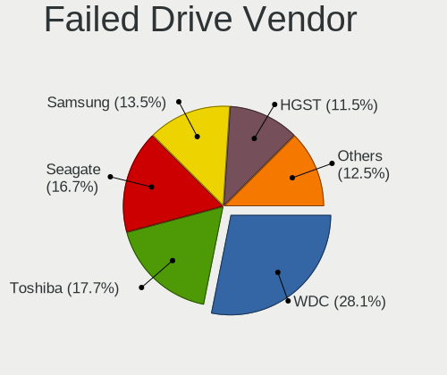
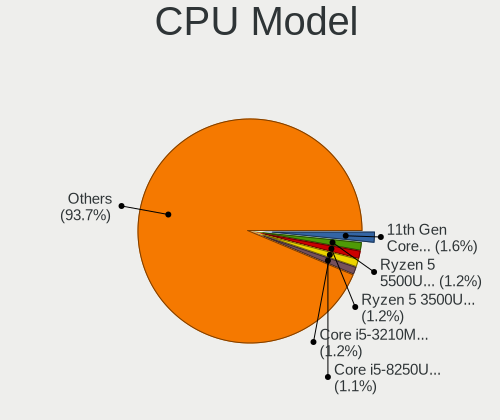
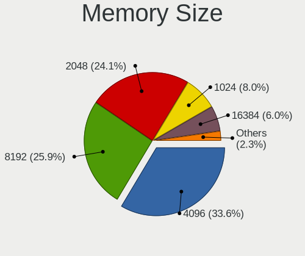

Linux in Russia - Tested Hardware & Statistics (Notebooks)
----------------------------------------------------------

A project to collect tested hardware configurations for Linux in Russia.

Anyone can contribute to this report by the [hw-probe](https://github.com/linuxhw/hw-probe) tool:

    sudo -E hw-probe -all -upload

Please contribute! Especially if your hardware is rare.

Contents
--------

* [ Test Cases ](#test-cases)

* [ System ](#system)
  - [ OS                       ](#os)
  - [ OS Family                ](#os-family)
  - [ Kernel                   ](#kernel)
  - [ Kernel Family            ](#kernel-family)
  - [ Kernel Major Ver.        ](#kernel-major-ver)
  - [ Arch                     ](#arch)
  - [ DE                       ](#de)
  - [ Display Server           ](#display-server)
  - [ Display Manager          ](#display-manager)
  - [ OS Lang                  ](#os-lang)
  - [ Boot Mode                ](#boot-mode)
  - [ Filesystem               ](#filesystem)
  - [ Part. scheme             ](#part-scheme)
  - [ Dual Boot with Linux/BSD ](#dual-boot-with-linuxbsd)
  - [ Dual Boot (Win)          ](#dual-boot-win)

* [ Board ](#board)
  - [ Vendor                   ](#vendor)
  - [ Model                    ](#model)
  - [ Model Family             ](#model-family)
  - [ MFG Year                 ](#mfg-year)
  - [ Form Factor              ](#form-factor)
  - [ Secure Boot              ](#secure-boot)
  - [ Coreboot                 ](#coreboot)
  - [ RAM Size                 ](#ram-size)
  - [ RAM Used                 ](#ram-used)
  - [ Total Drives             ](#total-drives)
  - [ Has CD-ROM               ](#has-cd-rom)
  - [ Has Ethernet             ](#has-ethernet)
  - [ Has WiFi                 ](#has-wifi)
  - [ Has Bluetooth            ](#has-bluetooth)

* [ Location ](#location)
  - [ Country                  ](#country)
  - [ City                     ](#city)

* [ Drives ](#drives)
  - [ Drive Vendor             ](#drive-vendor)
  - [ Drive Model              ](#drive-model)
  - [ HDD Vendor               ](#hdd-vendor)
  - [ SSD Vendor               ](#ssd-vendor)
  - [ Drive Kind               ](#drive-kind)
  - [ Drive Connector          ](#drive-connector)
  - [ Drive Size               ](#drive-size)
  - [ Space Total              ](#space-total)
  - [ Space Used               ](#space-used)
  - [ Malfunc. Drives          ](#malfunc-drives)
  - [ Malfunc. Drive Vendor    ](#malfunc-drive-vendor)
  - [ Malfunc. HDD Vendor      ](#malfunc-hdd-vendor)
  - [ Malfunc. Drive Kind      ](#malfunc-drive-kind)
  - [ Failed Drives            ](#failed-drives)
  - [ Failed Drive Vendor      ](#failed-drive-vendor)
  - [ Drive Status             ](#drive-status)

* [ Storage controller ](#storage-controller)
  - [ Storage Vendor           ](#storage-vendor)
  - [ Storage Model            ](#storage-model)
  - [ Storage Kind             ](#storage-kind)

* [ Processor ](#processor)
  - [ CPU Vendor               ](#cpu-vendor)
  - [ CPU Model                ](#cpu-model)
  - [ CPU Model Family         ](#cpu-model-family)
  - [ CPU Cores                ](#cpu-cores)
  - [ CPU Sockets              ](#cpu-sockets)
  - [ CPU Threads              ](#cpu-threads)
  - [ CPU Op-Modes             ](#cpu-op-modes)
  - [ CPU Microcode            ](#cpu-microcode)
  - [ CPU Microarch            ](#cpu-microarch)

* [ Graphics ](#graphics)
  - [ GPU Vendor               ](#gpu-vendor)
  - [ GPU Model                ](#gpu-model)
  - [ GPU Combo                ](#gpu-combo)
  - [ GPU Driver               ](#gpu-driver)
  - [ GPU Memory               ](#gpu-memory)

* [ Monitor ](#monitor)
  - [ Monitor Vendor           ](#monitor-vendor)
  - [ Monitor Model            ](#monitor-model)
  - [ Monitor Resolution       ](#monitor-resolution)
  - [ Monitor Diagonal         ](#monitor-diagonal)
  - [ Monitor Width            ](#monitor-width)
  - [ Aspect Ratio             ](#aspect-ratio)
  - [ Monitor Area             ](#monitor-area)
  - [ Pixel Density            ](#pixel-density)
  - [ Multiple Monitors        ](#multiple-monitors)

* [ Network ](#network)
  - [ Net Controller Vendor    ](#net-controller-vendor)
  - [ Net Controller Model     ](#net-controller-model)
  - [ Wireless Vendor          ](#wireless-vendor)
  - [ Wireless Model           ](#wireless-model)
  - [ Ethernet Vendor          ](#ethernet-vendor)
  - [ Ethernet Model           ](#ethernet-model)
  - [ Net Controller Kind      ](#net-controller-kind)
  - [ Used Controller          ](#used-controller)
  - [ NICs                     ](#nics)
  - [ IPv6                     ](#ipv6)

* [ Bluetooth ](#bluetooth)
  - [ Bluetooth Vendor         ](#bluetooth-vendor)
  - [ Bluetooth Model          ](#bluetooth-model)

* [ Sound ](#sound)
  - [ Sound Vendor             ](#sound-vendor)
  - [ Sound Model              ](#sound-model)

* [ Memory ](#memory)
  - [ Memory Vendor            ](#memory-vendor)
  - [ Memory Model             ](#memory-model)
  - [ Memory Kind              ](#memory-kind)
  - [ Memory Form Factor       ](#memory-form-factor)
  - [ Memory Size              ](#memory-size)
  - [ Memory Speed             ](#memory-speed)

* [ Printers & scanners ](#printers--scanners)
  - [ Printer Vendor           ](#printer-vendor)
  - [ Printer Model            ](#printer-model)
  - [ Scanner Vendor           ](#scanner-vendor)
  - [ Scanner Model            ](#scanner-model)

* [ Camera ](#camera)
  - [ Camera Vendor            ](#camera-vendor)
  - [ Camera Model             ](#camera-model)

* [ Security ](#security)
  - [ Fingerprint Vendor       ](#fingerprint-vendor)
  - [ Fingerprint Model        ](#fingerprint-model)
  - [ Chipcard Vendor          ](#chipcard-vendor)
  - [ Chipcard Model           ](#chipcard-model)

* [ Unsupported ](#unsupported)
  - [ Unsupported Devices      ](#unsupported-devices)
  - [ Unsupported Device Types ](#unsupported-device-types)

Test Cases
----------

Total: 21822

| Vendor        | Model                       | Probe                                                      | Date         |
|---------------|-----------------------------|------------------------------------------------------------|--------------|
| Samsung       | 350V5C/351V5C/3540VC/344... | [c7b3c10131](https://linux-hardware.org/?probe=c7b3c10131) | May 09, 2024 |
| Unknown       | Unknown                     | [3c4e207a92](https://linux-hardware.org/?probe=3c4e207a92) | May 09, 2024 |
| ASUSTek       | K52F                        | [f67d81858e](https://linux-hardware.org/?probe=f67d81858e) | May 09, 2024 |
| Lenovo        | IdeaPad S340-14API 81NB     | [6bb0aa91af](https://linux-hardware.org/?probe=6bb0aa91af) | May 09, 2024 |
| Packard Be... | EasyNote LM98               | [4826f72192](https://linux-hardware.org/?probe=4826f72192) | May 08, 2024 |
| Lenovo        | ThinkBook 16 G6 IRL 21KH    | [58b9bbc4d6](https://linux-hardware.org/?probe=58b9bbc4d6) | May 08, 2024 |
| ASUSTek       | VivoBook 15_ASUS Laptop ... | [11d69e96cb](https://linux-hardware.org/?probe=11d69e96cb) | May 08, 2024 |
| Dell          | XPS 15 9500                 | [b981a13960](https://linux-hardware.org/?probe=b981a13960) | May 08, 2024 |
| Acer          | Aspire AL14-31P             | [fc4db570af](https://linux-hardware.org/?probe=fc4db570af) | May 08, 2024 |
| EVOC          | P7xxTM1                     | [7c15b2991c](https://linux-hardware.org/?probe=7c15b2991c) | May 08, 2024 |
| ASUSTek       | ASUS TUF Dash F15 FX517Z... | [ac49e3fa07](https://linux-hardware.org/?probe=ac49e3fa07) | May 08, 2024 |
| Sony          | VPCF13E1R                   | [593de85e33](https://linux-hardware.org/?probe=593de85e33) | May 08, 2024 |
| Dell          | Inspiron 3542               | [fcc3b9cc19](https://linux-hardware.org/?probe=fcc3b9cc19) | May 08, 2024 |
| Lenovo        | IdeaPad S510p 20298         | [e4c7ca80f3](https://linux-hardware.org/?probe=e4c7ca80f3) | May 08, 2024 |
| Digma         | Pro Magnus M DN16R9-ADXW... | [beee17622d](https://linux-hardware.org/?probe=beee17622d) | May 08, 2024 |
| Valve         | Galileo                     | [9b9caa6850](https://linux-hardware.org/?probe=9b9caa6850) | May 07, 2024 |
| Dell          | XPS 15 9530                 | [cdcf7e98eb](https://linux-hardware.org/?probe=cdcf7e98eb) | May 07, 2024 |
| Dell          | Vostro 15 3510              | [9236e5d92d](https://linux-hardware.org/?probe=9236e5d92d) | May 07, 2024 |
| Dell          | Inspiron 3793               | [02e4c23d86](https://linux-hardware.org/?probe=02e4c23d86) | May 07, 2024 |
| Dell          | Inspiron 3793               | [00234ed0c4](https://linux-hardware.org/?probe=00234ed0c4) | May 07, 2024 |
| ASUSTek       | ASUSLaptop_Q530VJ           | [97021794a9](https://linux-hardware.org/?probe=97021794a9) | May 07, 2024 |
| ASUSTek       | VivoBook S15 X530UF         | [5725e80488](https://linux-hardware.org/?probe=5725e80488) | May 07, 2024 |
| MSI           | GL62M 7RDX                  | [df43002002](https://linux-hardware.org/?probe=df43002002) | May 07, 2024 |
| HP            | EliteBook 8470p             | [1022758f4a](https://linux-hardware.org/?probe=1022758f4a) | May 07, 2024 |
| HP            | EliteBook 8470p             | [36f94dbbd1](https://linux-hardware.org/?probe=36f94dbbd1) | May 07, 2024 |
| Dell          | XPS 15 9500                 | [e5dc310897](https://linux-hardware.org/?probe=e5dc310897) | May 07, 2024 |
| HUAWEI        | HLYL-WXX9                   | [71d1f5cdfb](https://linux-hardware.org/?probe=71d1f5cdfb) | May 07, 2024 |
| ASUSTek       | VivoBook_ASUSLaptop M350... | [e6dfd023b6](https://linux-hardware.org/?probe=e6dfd023b6) | May 06, 2024 |
| ASUSTek       | VivoBook_ASUSLaptop M350... | [6ece3912e8](https://linux-hardware.org/?probe=6ece3912e8) | May 06, 2024 |
| Lenovo        | E31-80 80MX                 | [1c9fd17eff](https://linux-hardware.org/?probe=1c9fd17eff) | May 06, 2024 |
| MSI           | Creator Z16 A12UET          | [edf6b45103](https://linux-hardware.org/?probe=edf6b45103) | May 06, 2024 |
| Lenovo        | IdeaPad Z580                | [2fad877602](https://linux-hardware.org/?probe=2fad877602) | May 06, 2024 |
| MSI           | Creator Z16 A12UET          | [2aea1cacac](https://linux-hardware.org/?probe=2aea1cacac) | May 06, 2024 |
| Dell          | Vostro 3520                 | [0b420358ac](https://linux-hardware.org/?probe=0b420358ac) | May 06, 2024 |
| Dell          | Vostro 15 3510              | [cd07d15de0](https://linux-hardware.org/?probe=cd07d15de0) | May 06, 2024 |
| eMachines     | E725                        | [171963d4bd](https://linux-hardware.org/?probe=171963d4bd) | May 05, 2024 |
| ASUSTek       | X550CC                      | [47b8006c42](https://linux-hardware.org/?probe=47b8006c42) | May 05, 2024 |
| Lenovo        | ThinkPad X240 20ALA08VRT    | [b894f49df3](https://linux-hardware.org/?probe=b894f49df3) | May 05, 2024 |
| Lenovo        | ThinkPad L512 2597W1R       | [d7cb3b5ddd](https://linux-hardware.org/?probe=d7cb3b5ddd) | May 05, 2024 |
| Acer          | Nitro AN515-46              | [23ae7fd7c6](https://linux-hardware.org/?probe=23ae7fd7c6) | May 05, 2024 |
| Samsung       | R528/R728                   | [2f4a17771e](https://linux-hardware.org/?probe=2f4a17771e) | May 05, 2024 |
| ASUSTek       | A7U                         | [d380bb6272](https://linux-hardware.org/?probe=d380bb6272) | May 05, 2024 |
| Unknown       | Unknown                     | [b7866b963f](https://linux-hardware.org/?probe=b7866b963f) | May 04, 2024 |
| Toshiba       | Satellite L500              | [c947dc4138](https://linux-hardware.org/?probe=c947dc4138) | May 04, 2024 |
| Lenovo        | ThinkPad T480 20L6S7MP00    | [2e32ab2b3b](https://linux-hardware.org/?probe=2e32ab2b3b) | May 04, 2024 |
| Infinix       | INBOOK X2 GEN11             | [9002e7e3c5](https://linux-hardware.org/?probe=9002e7e3c5) | May 04, 2024 |
| Acer          | Extensa 5630                | [3312068dfc](https://linux-hardware.org/?probe=3312068dfc) | May 04, 2024 |
| Lenovo        | ThinkPad T14 Gen 2i 20W1... | [6689db52ed](https://linux-hardware.org/?probe=6689db52ed) | May 04, 2024 |
| Unknown       | Unknown                     | [ad1cee8128](https://linux-hardware.org/?probe=ad1cee8128) | May 04, 2024 |
| Dell          | Latitude 7490               | [300c9cd271](https://linux-hardware.org/?probe=300c9cd271) | May 03, 2024 |
| HP            | ProBook 6450b               | [c4d1788222](https://linux-hardware.org/?probe=c4d1788222) | May 03, 2024 |
| ASUSTek       | ASUS TUF Dash F15 FX517Z... | [2ce93c9d05](https://linux-hardware.org/?probe=2ce93c9d05) | May 03, 2024 |
| Apple         | MacBookPro11,3              | [9dc81700bc](https://linux-hardware.org/?probe=9dc81700bc) | May 03, 2024 |
| Timi          | Xiaomi Book Pro 14 2022     | [30f381be91](https://linux-hardware.org/?probe=30f381be91) | May 03, 2024 |
| HP            | ProBook 450 G3              | [63fa17c1de](https://linux-hardware.org/?probe=63fa17c1de) | May 03, 2024 |
| Lenovo        | V130-15IKB 81HN             | [d00e301298](https://linux-hardware.org/?probe=d00e301298) | May 03, 2024 |
| HP            | 15                          | [6c1f8325a6](https://linux-hardware.org/?probe=6c1f8325a6) | May 02, 2024 |
| ASUSTek       | VivoBook_ASUSLaptop M160... | [9c68c10a9e](https://linux-hardware.org/?probe=9c68c10a9e) | May 02, 2024 |
| Acer          | Aspire 3690                 | [18468b287d](https://linux-hardware.org/?probe=18468b287d) | May 02, 2024 |
| Lenovo        | ThinkBook 14 G6+ AHP 21L... | [bc762dbbd9](https://linux-hardware.org/?probe=bc762dbbd9) | May 02, 2024 |
| MECHREVO      | WUJIE14 PRO                 | [2004900fec](https://linux-hardware.org/?probe=2004900fec) | May 02, 2024 |
| Samsung       | RV420/RV520/RV720/E3530/... | [b12580ca82](https://linux-hardware.org/?probe=b12580ca82) | May 02, 2024 |
| Acer          | Aspire A315-53G             | [d782707b53](https://linux-hardware.org/?probe=d782707b53) | May 02, 2024 |
| Acer          | Swift SF314-41              | [7c627dfe92](https://linux-hardware.org/?probe=7c627dfe92) | May 02, 2024 |
| Acer          | Swift SF314-41              | [c6c8d9ef33](https://linux-hardware.org/?probe=c6c8d9ef33) | May 02, 2024 |
| HUAWEI        | BOM-WXX9                    | [358e00bbaa](https://linux-hardware.org/?probe=358e00bbaa) | May 02, 2024 |
| Samsung       | R530/R730                   | [bef875b7e6](https://linux-hardware.org/?probe=bef875b7e6) | May 02, 2024 |
| HONOR         | HYM-WXX                     | [58cc24a6c2](https://linux-hardware.org/?probe=58cc24a6c2) | May 02, 2024 |
| Lenovo        | B590 20206                  | [9c08740bb5](https://linux-hardware.org/?probe=9c08740bb5) | May 02, 2024 |
| HUAWEI        | BOD-WXX9                    | [555e3c4b2c](https://linux-hardware.org/?probe=555e3c4b2c) | May 02, 2024 |
| Acer          | Nitro AN515-54              | [27189a555f](https://linux-hardware.org/?probe=27189a555f) | May 02, 2024 |
| Acer          | Nitro AN515-54              | [2293918110](https://linux-hardware.org/?probe=2293918110) | May 02, 2024 |
| HUAWEI        | BOD-WXX9                    | [0cd46d4084](https://linux-hardware.org/?probe=0cd46d4084) | May 02, 2024 |
| Dell          | Precision 5510              | [a010faffda](https://linux-hardware.org/?probe=a010faffda) | May 01, 2024 |
| HUAWEI        | CREFG-XX                    | [35fbc74ed5](https://linux-hardware.org/?probe=35fbc74ed5) | May 01, 2024 |
| Unknown       | Unknown                     | [9fb77bbafc](https://linux-hardware.org/?probe=9fb77bbafc) | May 01, 2024 |
| Maibenben     | MaiBook M                   | [791e571e24](https://linux-hardware.org/?probe=791e571e24) | May 01, 2024 |
| HP            | EliteBook 8460p             | [d5b743dc5a](https://linux-hardware.org/?probe=d5b743dc5a) | May 01, 2024 |
| HP            | Unknown                     | [c2419b4779](https://linux-hardware.org/?probe=c2419b4779) | May 01, 2024 |
| Lenovo        | ThinkPad T480s 20L7001HR... | [f6ec4c6b31](https://linux-hardware.org/?probe=f6ec4c6b31) | May 01, 2024 |
| Lenovo        | ThinkPad T14 Gen 2i 20W1... | [6dee7f5b7c](https://linux-hardware.org/?probe=6dee7f5b7c) | May 01, 2024 |
| Packard Be... | EasyNote TJ71               | [f421f823ec](https://linux-hardware.org/?probe=f421f823ec) | May 01, 2024 |
| Lenovo        | V580c 20160                 | [f7f711165b](https://linux-hardware.org/?probe=f7f711165b) | May 01, 2024 |
| ASUSTek       | M50Vc                       | [d1db0617f1](https://linux-hardware.org/?probe=d1db0617f1) | May 01, 2024 |
| ASUSTek       | X75VC                       | [0896559952](https://linux-hardware.org/?probe=0896559952) | May 01, 2024 |
| Acer          | Predator PH317-52           | [bd69caed14](https://linux-hardware.org/?probe=bd69caed14) | Apr 30, 2024 |
| Lenovo        | ThinkPad T60 1952W2Q        | [cfb8cb1bb5](https://linux-hardware.org/?probe=cfb8cb1bb5) | Apr 30, 2024 |
| HP            | EliteBook 845 14 inch G1... | [8fa3424cce](https://linux-hardware.org/?probe=8fa3424cce) | Apr 30, 2024 |
| HP            | EliteBook 845 14 inch G1... | [62914f0506](https://linux-hardware.org/?probe=62914f0506) | Apr 30, 2024 |
| Lenovo        | V580c 20160                 | [2114d134ab](https://linux-hardware.org/?probe=2114d134ab) | Apr 30, 2024 |
| Digma         | CITI E301 ES3008EW          | [91b8be60a0](https://linux-hardware.org/?probe=91b8be60a0) | Apr 30, 2024 |
| Digma         | CITI E301 ES3008EW          | [586069736d](https://linux-hardware.org/?probe=586069736d) | Apr 30, 2024 |
| HUAWEI        | NBD-WXX9                    | [28ca7324e5](https://linux-hardware.org/?probe=28ca7324e5) | Apr 30, 2024 |
| ASUSTek       | X550VC                      | [cc8153163f](https://linux-hardware.org/?probe=cc8153163f) | Apr 30, 2024 |
| DEXP          | Atlas M15-I3W302            | [efae6e687e](https://linux-hardware.org/?probe=efae6e687e) | Apr 30, 2024 |
| HUAWEI        | BOM-WXX9                    | [b6223c94a8](https://linux-hardware.org/?probe=b6223c94a8) | Apr 30, 2024 |
| Dell          | Inspiron 3542               | [b37cc5d9c0](https://linux-hardware.org/?probe=b37cc5d9c0) | Apr 30, 2024 |
| Maibenben     | MaiBook M                   | [ca131f72bd](https://linux-hardware.org/?probe=ca131f72bd) | Apr 30, 2024 |
| Echips Imp... | NX140A-S                    | [dec569991b](https://linux-hardware.org/?probe=dec569991b) | Apr 30, 2024 |
| HP            | Pavilion g6                 | [466b38f1ee](https://linux-hardware.org/?probe=466b38f1ee) | Apr 30, 2024 |
| HIPER Tech... | HIPER WORKBOOK              | [b553fc9cbc](https://linux-hardware.org/?probe=b553fc9cbc) | Apr 29, 2024 |
| Lenovo        | B50-80 80EW                 | [5f20d3fde3](https://linux-hardware.org/?probe=5f20d3fde3) | Apr 29, 2024 |
| Lenovo        | IdeaPad 5 15ARE05 81YQ      | [69ab0359f4](https://linux-hardware.org/?probe=69ab0359f4) | Apr 29, 2024 |
| Lenovo        | IdeaPad 5 14ARE05 81YM      | [6c0201b207](https://linux-hardware.org/?probe=6c0201b207) | Apr 29, 2024 |
| Lenovo        | ThinkPad T480 20L6S7MP00    | [ea3db5dd3c](https://linux-hardware.org/?probe=ea3db5dd3c) | Apr 29, 2024 |
| Maibenben     | MaiBook M                   | [48837878a2](https://linux-hardware.org/?probe=48837878a2) | Apr 29, 2024 |
| Acer          | Aspire A515-47              | [7cef016361](https://linux-hardware.org/?probe=7cef016361) | Apr 29, 2024 |
| HP            | Laptop 15s-eq1xxx           | [43977b477b](https://linux-hardware.org/?probe=43977b477b) | Apr 29, 2024 |
| Lenovo        | ThinkPad E16 Gen 1 21JNS... | [d55532cec3](https://linux-hardware.org/?probe=d55532cec3) | Apr 29, 2024 |
| Lenovo        | ThinkPad E16 Gen 1 21JNS... | [64c12d9b15](https://linux-hardware.org/?probe=64c12d9b15) | Apr 29, 2024 |
| Lenovo        | ThinkBook 15 G3 ACL 21A4    | [63088368e6](https://linux-hardware.org/?probe=63088368e6) | Apr 29, 2024 |
| ASUSTek       | N53Jf                       | [02cf0c80c7](https://linux-hardware.org/?probe=02cf0c80c7) | Apr 29, 2024 |
| HUAWEI        | NbDE-WXX9                   | [b378a91172](https://linux-hardware.org/?probe=b378a91172) | Apr 29, 2024 |
| ASUSTek       | K53SJ                       | [45bc744085](https://linux-hardware.org/?probe=45bc744085) | Apr 28, 2024 |
| Acer          | Swift SF314-43              | [eeb771fb99](https://linux-hardware.org/?probe=eeb771fb99) | Apr 28, 2024 |
| Intel Clie... | LAPAC71H                    | [a1a6c57c02](https://linux-hardware.org/?probe=a1a6c57c02) | Apr 28, 2024 |
| HP            | Dragonfly 13.5 inch G4 N... | [2faf3d5ce2](https://linux-hardware.org/?probe=2faf3d5ce2) | Apr 28, 2024 |
| Acer          | Aspire ES1-523              | [8459f9ea9a](https://linux-hardware.org/?probe=8459f9ea9a) | Apr 28, 2024 |
| Dell          | Inspiron 5558               | [544ce3b297](https://linux-hardware.org/?probe=544ce3b297) | Apr 28, 2024 |
| Lenovo        | G700 20251                  | [c98807b638](https://linux-hardware.org/?probe=c98807b638) | Apr 28, 2024 |
| HP            | EliteBook 840 G4            | [85dd5fce8a](https://linux-hardware.org/?probe=85dd5fce8a) | Apr 28, 2024 |
| HP            | EliteBook 840 G4            | [0da481706b](https://linux-hardware.org/?probe=0da481706b) | Apr 27, 2024 |
| ASUSTek       | X541NA                      | [19a17079a5](https://linux-hardware.org/?probe=19a17079a5) | Apr 27, 2024 |
| Lenovo        | G700 20251                  | [a280143fe1](https://linux-hardware.org/?probe=a280143fe1) | Apr 27, 2024 |
| XIAOMI        | Redmi Book Pro 15 2023      | [e4feccc962](https://linux-hardware.org/?probe=e4feccc962) | Apr 27, 2024 |
| HONOR         | BMH-WDX9                    | [0f5f7fc34b](https://linux-hardware.org/?probe=0f5f7fc34b) | Apr 27, 2024 |
| HP            | Unknown                     | [6be2b918a8](https://linux-hardware.org/?probe=6be2b918a8) | Apr 27, 2024 |
| ASUSTek       | VivoBook_ASUSLaptop M370... | [fdd97ab603](https://linux-hardware.org/?probe=fdd97ab603) | Apr 27, 2024 |
| HUAWEI        | BOM-WXX9                    | [8fd8598d05](https://linux-hardware.org/?probe=8fd8598d05) | Apr 27, 2024 |
| Acer          | Aspire ES1-732              | [dda97c8536](https://linux-hardware.org/?probe=dda97c8536) | Apr 26, 2024 |
| Lenovo        | ThinkPad X220 4290RW1       | [306c586e02](https://linux-hardware.org/?probe=306c586e02) | Apr 26, 2024 |
| Dell          | Precision 5560              | [5bb30e87d6](https://linux-hardware.org/?probe=5bb30e87d6) | Apr 26, 2024 |
| Apple         | MacBookPro11,5              | [477f528415](https://linux-hardware.org/?probe=477f528415) | Apr 26, 2024 |
| HP            | Pavilion Notebook           | [baeaf7e578](https://linux-hardware.org/?probe=baeaf7e578) | Apr 26, 2024 |
| ASUSTek       | X541NA                      | [bba16f5bc3](https://linux-hardware.org/?probe=bba16f5bc3) | Apr 26, 2024 |
| Unknown       | Unknown                     | [0cb76807b8](https://linux-hardware.org/?probe=0cb76807b8) | Apr 26, 2024 |
| Lenovo        | ThinkBook 16 G4+ ARA 21D... | [9c92ac1222](https://linux-hardware.org/?probe=9c92ac1222) | Apr 26, 2024 |
| Lenovo        | IdeaPad Y570 20091          | [67336a137f](https://linux-hardware.org/?probe=67336a137f) | Apr 26, 2024 |
| Haier         | AX1750SD                    | [75850d1eb4](https://linux-hardware.org/?probe=75850d1eb4) | Apr 26, 2024 |
| HONOR         | BMH-WCX9                    | [78d048ebdc](https://linux-hardware.org/?probe=78d048ebdc) | Apr 26, 2024 |
| Acer          | AO725                       | [edab2bcf78](https://linux-hardware.org/?probe=edab2bcf78) | Apr 25, 2024 |
| HUAWEI        | MRGF-XX                     | [fc337f163c](https://linux-hardware.org/?probe=fc337f163c) | Apr 25, 2024 |
| Acer          | Aspire V3-551G              | [86b4773429](https://linux-hardware.org/?probe=86b4773429) | Apr 25, 2024 |
| HUAWEI        | MRGF-XX                     | [f8e3f93462](https://linux-hardware.org/?probe=f8e3f93462) | Apr 25, 2024 |
| Lenovo        | 3000 G770 PIWG1             | [07341d0770](https://linux-hardware.org/?probe=07341d0770) | Apr 25, 2024 |
| Sony          | SVF1521X1RB                 | [49942872ab](https://linux-hardware.org/?probe=49942872ab) | Apr 25, 2024 |
| Timi          | Xiaomi Book Pro 14 2022     | [c08c262bee](https://linux-hardware.org/?probe=c08c262bee) | Apr 25, 2024 |
| Acer          | Aspire V5-122               | [56cc9120d0](https://linux-hardware.org/?probe=56cc9120d0) | Apr 25, 2024 |
| ASUSTek       | X75VC                       | [11dcf2d1f8](https://linux-hardware.org/?probe=11dcf2d1f8) | Apr 25, 2024 |
| Samsung       | 350V5C/351V5C/3540VC/344... | [5df7b71a31](https://linux-hardware.org/?probe=5df7b71a31) | Apr 25, 2024 |
| DEXP          | Atlas M15-A5W304            | [4185759bbc](https://linux-hardware.org/?probe=4185759bbc) | Apr 24, 2024 |
| ZET           | Ward M103                   | [af64c3a8c3](https://linux-hardware.org/?probe=af64c3a8c3) | Apr 24, 2024 |
| Dell          | Vostro 5502                 | [ec30716f3d](https://linux-hardware.org/?probe=ec30716f3d) | Apr 24, 2024 |
| MSI           | Katana 17 B12VGK            | [9774448ac4](https://linux-hardware.org/?probe=9774448ac4) | Apr 24, 2024 |
| Dell          | Precision 5560              | [47fef25c3b](https://linux-hardware.org/?probe=47fef25c3b) | Apr 24, 2024 |
| HONOR         | GLO-GXXX                    | [d92d20c83b](https://linux-hardware.org/?probe=d92d20c83b) | Apr 23, 2024 |
| Lenovo        | ThinkBook 16 G6 IRL 21KH    | [14164a1cf6](https://linux-hardware.org/?probe=14164a1cf6) | Apr 23, 2024 |
| ASUSTek       | X550ZA                      | [89422ba7fc](https://linux-hardware.org/?probe=89422ba7fc) | Apr 23, 2024 |
| Clevo         | NL41MU2                     | [bfc7896f0a](https://linux-hardware.org/?probe=bfc7896f0a) | Apr 23, 2024 |
| Lenovo        | IdeaPad L340-15API 81LW     | [e61e4963d5](https://linux-hardware.org/?probe=e61e4963d5) | Apr 23, 2024 |
| XIAOMI        | Redmi Book 14 2024          | [8bc80a1886](https://linux-hardware.org/?probe=8bc80a1886) | Apr 23, 2024 |
| Dell          | Precision M4700             | [fa5aa96761](https://linux-hardware.org/?probe=fa5aa96761) | Apr 23, 2024 |
| Lenovo        | XiaoXinPro 16 AHP9 83D5     | [8ee1de3473](https://linux-hardware.org/?probe=8ee1de3473) | Apr 23, 2024 |
| Standard      | Unknown                     | [56927b31d9](https://linux-hardware.org/?probe=56927b31d9) | Apr 23, 2024 |
| Maibenben     | Perfectum Series            | [bec84b156a](https://linux-hardware.org/?probe=bec84b156a) | Apr 23, 2024 |
| ASUSTek       | K53SD                       | [777dfb666e](https://linux-hardware.org/?probe=777dfb666e) | Apr 23, 2024 |
| ASUSTek       | VivoBook_ASUSLaptop X521... | [044858db54](https://linux-hardware.org/?probe=044858db54) | Apr 23, 2024 |
| Unknown       | Unknown                     | [f8d5589c4d](https://linux-hardware.org/?probe=f8d5589c4d) | Apr 22, 2024 |
| HUAWEI        | BOM-WXX9                    | [4113f409f3](https://linux-hardware.org/?probe=4113f409f3) | Apr 22, 2024 |
| MSI           | Prestige 13Evo A13M         | [9103acf647](https://linux-hardware.org/?probe=9103acf647) | Apr 22, 2024 |
| Lenovo        | ThinkPad SL510 28477EG      | [cd4ebf191f](https://linux-hardware.org/?probe=cd4ebf191f) | Apr 22, 2024 |
| Acer          | Aspire ES1-731G             | [4f759b0a0c](https://linux-hardware.org/?probe=4f759b0a0c) | Apr 22, 2024 |
| MSI           | CX600                       | [061bf45f86](https://linux-hardware.org/?probe=061bf45f86) | Apr 21, 2024 |
| Lenovo        | G50-30 80G0                 | [6b8474e96b](https://linux-hardware.org/?probe=6b8474e96b) | Apr 21, 2024 |
| Apple         | MacBookPro11,1              | [3f4e9ae066](https://linux-hardware.org/?probe=3f4e9ae066) | Apr 21, 2024 |
| Apple         | MacBookPro11,1              | [e70b7338c2](https://linux-hardware.org/?probe=e70b7338c2) | Apr 21, 2024 |
| HP            | Presario CQ56               | [80adb74ef1](https://linux-hardware.org/?probe=80adb74ef1) | Apr 21, 2024 |
| HUAWEI        | BOHK-WAX9X                  | [b69304aa9b](https://linux-hardware.org/?probe=b69304aa9b) | Apr 21, 2024 |
| Acer          | Aspire S3                   | [e43ba2d3ae](https://linux-hardware.org/?probe=e43ba2d3ae) | Apr 21, 2024 |
| Alienware     | x15 R1                      | [63bd9e4e5b](https://linux-hardware.org/?probe=63bd9e4e5b) | Apr 21, 2024 |
| Alienware     | x15 R1                      | [adfa8b3aea](https://linux-hardware.org/?probe=adfa8b3aea) | Apr 21, 2024 |
| Lenovo        | ThinkPad T61 7663PJG        | [6463d83351](https://linux-hardware.org/?probe=6463d83351) | Apr 21, 2024 |
| Intel Clie... | LAPAC71H                    | [c365e08c03](https://linux-hardware.org/?probe=c365e08c03) | Apr 20, 2024 |
| HUAWEI        | BOM-WXX9                    | [fb9a9f3feb](https://linux-hardware.org/?probe=fb9a9f3feb) | Apr 20, 2024 |
| Acer          | Aspire 5742Z                | [d74abf8d8a](https://linux-hardware.org/?probe=d74abf8d8a) | Apr 20, 2024 |
| HP            | Pavilion g6                 | [9e232056dd](https://linux-hardware.org/?probe=9e232056dd) | Apr 20, 2024 |
| Sony          | VGN-FW11ER                  | [a8a0b64a18](https://linux-hardware.org/?probe=a8a0b64a18) | Apr 20, 2024 |
| Lenovo        | ThinkPad T530 2392AQU       | [6f325b5377](https://linux-hardware.org/?probe=6f325b5377) | Apr 20, 2024 |
| HP            | Pavilion Laptop 15-eh0xx... | [e63dbfe22c](https://linux-hardware.org/?probe=e63dbfe22c) | Apr 20, 2024 |
| Valve         | Jupiter                     | [3d82c7c0ee](https://linux-hardware.org/?probe=3d82c7c0ee) | Apr 20, 2024 |
| Acer          | Aspire 5943G                | [25e8c506a4](https://linux-hardware.org/?probe=25e8c506a4) | Apr 20, 2024 |
| HP            | ProBook 450 G5              | [7f344d90df](https://linux-hardware.org/?probe=7f344d90df) | Apr 20, 2024 |
| HUAWEI        | BOM-WXX9                    | [44ae5efad2](https://linux-hardware.org/?probe=44ae5efad2) | Apr 20, 2024 |
| Lenovo        | IdeaPad S10-2 20027         | [db640aaaa7](https://linux-hardware.org/?probe=db640aaaa7) | Apr 20, 2024 |
| ASUSTek       | VivoBook_ASUSLaptop X580... | [8740fd113c](https://linux-hardware.org/?probe=8740fd113c) | Apr 19, 2024 |
| Unknown       | Unknown                     | [5dbe94517d](https://linux-hardware.org/?probe=5dbe94517d) | Apr 19, 2024 |
| Google        | Shyvana                     | [a0d110b275](https://linux-hardware.org/?probe=a0d110b275) | Apr 19, 2024 |
| Acer          | Aspire A315-53G             | [3929f4890f](https://linux-hardware.org/?probe=3929f4890f) | Apr 19, 2024 |
| Unknown       | Unknown                     | [7d4668e73c](https://linux-hardware.org/?probe=7d4668e73c) | Apr 19, 2024 |
| Toshiba       | Satellite C850-C1S          | [f81e33341e](https://linux-hardware.org/?probe=f81e33341e) | Apr 19, 2024 |
| Lenovo        | ThinkPad E15 Gen 2 20TES... | [06ac86f46d](https://linux-hardware.org/?probe=06ac86f46d) | Apr 18, 2024 |
| Lenovo        | ThinkPad E15 Gen 2 20TES... | [0552b58ce6](https://linux-hardware.org/?probe=0552b58ce6) | Apr 18, 2024 |
| HP            | Laptop 15-bw0xx             | [1291c4934f](https://linux-hardware.org/?probe=1291c4934f) | Apr 18, 2024 |
| ASUSTek       | VivoBook_ASUSLaptop M150... | [38a33160a4](https://linux-hardware.org/?probe=38a33160a4) | Apr 18, 2024 |
| HP            | ProBook 430 G3              | [aa87864d43](https://linux-hardware.org/?probe=aa87864d43) | Apr 18, 2024 |
| Lenovo        | 3000 G770 PIWG1             | [d649ef0780](https://linux-hardware.org/?probe=d649ef0780) | Apr 18, 2024 |
| Aquarius      | NS685U R11                  | [b5b6ca6e69](https://linux-hardware.org/?probe=b5b6ca6e69) | Apr 18, 2024 |
| Lenovo        | G50-30 80G0                 | [bb33045893](https://linux-hardware.org/?probe=bb33045893) | Apr 18, 2024 |
| HP            | 655                         | [603622d552](https://linux-hardware.org/?probe=603622d552) | Apr 18, 2024 |
| Lenovo        | ThinkPad T430 2349QF4       | [b9dbaebca0](https://linux-hardware.org/?probe=b9dbaebca0) | Apr 17, 2024 |
| HP            | EliteBook 8440p             | [eb3a684db2](https://linux-hardware.org/?probe=eb3a684db2) | Apr 17, 2024 |
| Lenovo        | G505 20240                  | [e51eddb945](https://linux-hardware.org/?probe=e51eddb945) | Apr 17, 2024 |
| HUAWEI        | KLVL-WXXW                   | [0279a4db38](https://linux-hardware.org/?probe=0279a4db38) | Apr 17, 2024 |
| HP            | EliteBook 2530p             | [930a387011](https://linux-hardware.org/?probe=930a387011) | Apr 17, 2024 |
| HP            | EliteBook 2530p             | [b6df5893ef](https://linux-hardware.org/?probe=b6df5893ef) | Apr 17, 2024 |
| Sony          | SVF1521X1RB                 | [9e0873ff32](https://linux-hardware.org/?probe=9e0873ff32) | Apr 17, 2024 |
| Infinix       | INBOOK Y2 PLUS              | [8daf9c701b](https://linux-hardware.org/?probe=8daf9c701b) | Apr 17, 2024 |
| MECHREVO      | WUJIE14 PRO                 | [88a4e369a9](https://linux-hardware.org/?probe=88a4e369a9) | Apr 17, 2024 |
| ICL Techno    | F140a                       | [bd46cdda52](https://linux-hardware.org/?probe=bd46cdda52) | Apr 16, 2024 |
| eMachines     | eM355                       | [7cdc6d2995](https://linux-hardware.org/?probe=7cdc6d2995) | Apr 16, 2024 |
| ASUSTek       | F80S                        | [74bd778747](https://linux-hardware.org/?probe=74bd778747) | Apr 16, 2024 |
| Acer          | Predator PH317-52           | [61bf535f73](https://linux-hardware.org/?probe=61bf535f73) | Apr 16, 2024 |
| HP            | Presario CQ61               | [8247d1e7e6](https://linux-hardware.org/?probe=8247d1e7e6) | Apr 16, 2024 |
| Dell          | Inspiron 15-3552            | [6d75038dbf](https://linux-hardware.org/?probe=6d75038dbf) | Apr 16, 2024 |
| Sony          | VGN-Z21VRN_X                | [6cc5820724](https://linux-hardware.org/?probe=6cc5820724) | Apr 16, 2024 |
| Lenovo        | B590 20206                  | [be2ff40e34](https://linux-hardware.org/?probe=be2ff40e34) | Apr 16, 2024 |
| ANCOMP        | Learnmate A15-501           | [4084ef8bf3](https://linux-hardware.org/?probe=4084ef8bf3) | Apr 16, 2024 |
| HIPER         | EXPERTBOOK                  | [d0acd21b3b](https://linux-hardware.org/?probe=d0acd21b3b) | Apr 16, 2024 |
| MSI           | GF75 Thin 10SC              | [7ab70feffe](https://linux-hardware.org/?probe=7ab70feffe) | Apr 16, 2024 |
| Maibenben     | MaiBook M                   | [9bf28eb5b5](https://linux-hardware.org/?probe=9bf28eb5b5) | Apr 15, 2024 |
| ASUSTek       | K53SM                       | [63f81d22fb](https://linux-hardware.org/?probe=63f81d22fb) | Apr 15, 2024 |
| ASUSTek       | K53SM                       | [d23a978a95](https://linux-hardware.org/?probe=d23a978a95) | Apr 15, 2024 |
| Toshiba       | Satellite C850-C1S          | [d4457e5519](https://linux-hardware.org/?probe=d4457e5519) | Apr 15, 2024 |
| HP            | Pavilion m6                 | [c0e3a0cb12](https://linux-hardware.org/?probe=c0e3a0cb12) | Apr 15, 2024 |
| Lenovo        | G570 20079                  | [177d1c0089](https://linux-hardware.org/?probe=177d1c0089) | Apr 15, 2024 |
| MACHENIKE     | MACHCREATOR-16              | [03f369c46b](https://linux-hardware.org/?probe=03f369c46b) | Apr 15, 2024 |
| DEPO Compu... | W25CEW                      | [6653a2975d](https://linux-hardware.org/?probe=6653a2975d) | Apr 15, 2024 |
| Acer          | Aspire E5-573G              | [4afd132fe0](https://linux-hardware.org/?probe=4afd132fe0) | Apr 15, 2024 |
| HP            | Pavilion dv7                | [36f682acf5](https://linux-hardware.org/?probe=36f682acf5) | Apr 15, 2024 |
| Dell          | Inspiron 11-3162            | [ba7e2b7089](https://linux-hardware.org/?probe=ba7e2b7089) | Apr 14, 2024 |
| HP            | Laptop 14s-dq2xxx           | [d6865e9438](https://linux-hardware.org/?probe=d6865e9438) | Apr 14, 2024 |
| HONOR         | NMH-WDX9                    | [2560619236](https://linux-hardware.org/?probe=2560619236) | Apr 14, 2024 |
| HP            | Pavilion g6                 | [067ec164b8](https://linux-hardware.org/?probe=067ec164b8) | Apr 14, 2024 |
| Acer          | Aspire ES1-533              | [c4059b2efa](https://linux-hardware.org/?probe=c4059b2efa) | Apr 14, 2024 |
| Aquarius      | NE405                       | [0a14f42d90](https://linux-hardware.org/?probe=0a14f42d90) | Apr 14, 2024 |
| Lenovo        | Legion S7 15ACH6 82K8       | [4e8dddab03](https://linux-hardware.org/?probe=4e8dddab03) | Apr 14, 2024 |
| XIAOMI        | Redmi Book Pro 15 2023      | [7bad2daef7](https://linux-hardware.org/?probe=7bad2daef7) | Apr 14, 2024 |
| IP3 Tech      | ZEN1                        | [d85ba98172](https://linux-hardware.org/?probe=d85ba98172) | Apr 13, 2024 |
| Lenovo        | ThinkPad X250 20CLS2JX00    | [2c388fd864](https://linux-hardware.org/?probe=2c388fd864) | Apr 13, 2024 |
| HUAWEI        | BOD-WXX9                    | [c8f3706c61](https://linux-hardware.org/?probe=c8f3706c61) | Apr 13, 2024 |
| Lenovo        | IdeaPad 310-15IKB 80TV      | [75ef2f2d7a](https://linux-hardware.org/?probe=75ef2f2d7a) | Apr 13, 2024 |
| MSI           | MS-N014                     | [22666eaddc](https://linux-hardware.org/?probe=22666eaddc) | Apr 13, 2024 |
| HUAWEI        | BOM-WXX9                    | [c5720fd484](https://linux-hardware.org/?probe=c5720fd484) | Apr 13, 2024 |
| Clevo         | NL41MU2                     | [682e4993f4](https://linux-hardware.org/?probe=682e4993f4) | Apr 12, 2024 |
| Lenovo        | ThinkBook 13s G2 ITL 20V... | [c62b0de6a3](https://linux-hardware.org/?probe=c62b0de6a3) | Apr 12, 2024 |
| Lenovo        | ThinkPad T480 20L6S57T00    | [06575d2064](https://linux-hardware.org/?probe=06575d2064) | Apr 12, 2024 |
| HONOR         | GLO-GXXX                    | [d8d90912a0](https://linux-hardware.org/?probe=d8d90912a0) | Apr 12, 2024 |
| Packard Be... | EasyNote LM98               | [e5f560059b](https://linux-hardware.org/?probe=e5f560059b) | Apr 12, 2024 |
| eMachines     | D620 Rev                    | [14ed3fe2a0](https://linux-hardware.org/?probe=14ed3fe2a0) | Apr 12, 2024 |
| Lenovo        | IdeaPad S145-15IWL 81MV     | [057d948dbd](https://linux-hardware.org/?probe=057d948dbd) | Apr 12, 2024 |
| Dell          | Inspiron 3180               | [1e6985a883](https://linux-hardware.org/?probe=1e6985a883) | Apr 12, 2024 |
| HP            | ProBook 440 G5              | [aef600663a](https://linux-hardware.org/?probe=aef600663a) | Apr 12, 2024 |
| Notebook      | Si155                       | [52da5014e6](https://linux-hardware.org/?probe=52da5014e6) | Apr 12, 2024 |
| Lenovo        | IdeaPad S340-14API 81NB     | [a252dc6dd3](https://linux-hardware.org/?probe=a252dc6dd3) | Apr 12, 2024 |
| ASUSTek       | X200CA                      | [463838f274](https://linux-hardware.org/?probe=463838f274) | Apr 12, 2024 |
| Infinix       | INBOOK Y2 PLUS              | [47c3147253](https://linux-hardware.org/?probe=47c3147253) | Apr 12, 2024 |
| ANCOMP        | Learnmate A15-501           | [4200531dd0](https://linux-hardware.org/?probe=4200531dd0) | Apr 12, 2024 |
| Acer          | Nitro ANV15-51              | [b78fb4e0df](https://linux-hardware.org/?probe=b78fb4e0df) | Apr 12, 2024 |
| Timi          | TM1701                      | [0af4854c82](https://linux-hardware.org/?probe=0af4854c82) | Apr 12, 2024 |
| Samsung       | R510/P510                   | [0c28f56ea4](https://linux-hardware.org/?probe=0c28f56ea4) | Apr 11, 2024 |
| Lenovo        | Legion 5 17ACH6H 82JY       | [248ee4d26e](https://linux-hardware.org/?probe=248ee4d26e) | Apr 11, 2024 |
| ASUSTek       | VivoBook_ASUSLaptop M350... | [33cfdae960](https://linux-hardware.org/?probe=33cfdae960) | Apr 11, 2024 |
| HUAWEI        | NbDE-WXX9                   | [ab55a720c5](https://linux-hardware.org/?probe=ab55a720c5) | Apr 11, 2024 |
| Lenovo        | B50-80 80EW                 | [eb7ac17048](https://linux-hardware.org/?probe=eb7ac17048) | Apr 11, 2024 |
| Lenovo        | B50-80 80EW                 | [147e0059fe](https://linux-hardware.org/?probe=147e0059fe) | Apr 11, 2024 |
| MSI           | GL62M 7RDX                  | [253c6d2492](https://linux-hardware.org/?probe=253c6d2492) | Apr 11, 2024 |
| Samsung       | 350V5C/351V5C/3540VC/344... | [1e03070905](https://linux-hardware.org/?probe=1e03070905) | Apr 11, 2024 |
| TECNO         | MEGABOOK T1                 | [d19f36b422](https://linux-hardware.org/?probe=d19f36b422) | Apr 10, 2024 |
| Timi          | TM1701                      | [c71e4ec638](https://linux-hardware.org/?probe=c71e4ec638) | Apr 10, 2024 |
| ASUSTek       | VivoBook_ASUS Laptop X50... | [8d05f71f6b](https://linux-hardware.org/?probe=8d05f71f6b) | Apr 10, 2024 |
| ASUSTek       | VivoBook_ASUS Laptop X50... | [4b2cfbf4b2](https://linux-hardware.org/?probe=4b2cfbf4b2) | Apr 10, 2024 |
| MACHENIKE     | L17A                        | [5bd336609a](https://linux-hardware.org/?probe=5bd336609a) | Apr 10, 2024 |
| Lenovo        | G570 20079                  | [ac6c9fa01b](https://linux-hardware.org/?probe=ac6c9fa01b) | Apr 10, 2024 |
| ASUSTek       | VivoBook_ASUSLaptop X150... | [df283b0cd8](https://linux-hardware.org/?probe=df283b0cd8) | Apr 10, 2024 |
| Fujitsu       | CELSIUS H780                | [f5dc0c7623](https://linux-hardware.org/?probe=f5dc0c7623) | Apr 10, 2024 |
| ASUSTek       | K54HR                       | [5ac55f4069](https://linux-hardware.org/?probe=5ac55f4069) | Apr 10, 2024 |
| Dell          | G5 5590                     | [0e79211d8e](https://linux-hardware.org/?probe=0e79211d8e) | Apr 09, 2024 |
| HP            | ProBook 4520s               | [6886f7483d](https://linux-hardware.org/?probe=6886f7483d) | Apr 09, 2024 |
| ASUSTek       | X555LF                      | [8c3943f55b](https://linux-hardware.org/?probe=8c3943f55b) | Apr 09, 2024 |
| Toshiba       | Satellite Pro L300          | [b400408af4](https://linux-hardware.org/?probe=b400408af4) | Apr 09, 2024 |
| Lenovo        | B450                        | [b3bc6520f9](https://linux-hardware.org/?probe=b3bc6520f9) | Apr 09, 2024 |
| HONOR         | NMH-WDX9                    | [03ebb39034](https://linux-hardware.org/?probe=03ebb39034) | Apr 09, 2024 |
| Lenovo        | ThinkPad T420 4180DS7       | [e8ea27e460](https://linux-hardware.org/?probe=e8ea27e460) | Apr 09, 2024 |
| HIPER Tech... | HIPER WORKBOOK              | [4a64209bcc](https://linux-hardware.org/?probe=4a64209bcc) | Apr 09, 2024 |
| HP            | ProBook 4510s               | [9992995d43](https://linux-hardware.org/?probe=9992995d43) | Apr 09, 2024 |
| HUAWEI        | RLEFG-XX                    | [2bc54fcf85](https://linux-hardware.org/?probe=2bc54fcf85) | Apr 09, 2024 |
| HUAWEI        | RLEFG-XX                    | [268dc837cb](https://linux-hardware.org/?probe=268dc837cb) | Apr 09, 2024 |
| Lenovo        | G710 20252                  | [6859d6ad04](https://linux-hardware.org/?probe=6859d6ad04) | Apr 09, 2024 |
| HUAWEI        | CREM-WXX9                   | [2abd83a846](https://linux-hardware.org/?probe=2abd83a846) | Apr 09, 2024 |
| Unknown       | Unknown                     | [4bc1ff4841](https://linux-hardware.org/?probe=4bc1ff4841) | Apr 09, 2024 |
| Toshiba       | Satellite U300              | [a72672e15f](https://linux-hardware.org/?probe=a72672e15f) | Apr 09, 2024 |
| Samsung       | RV413/RV513                 | [7c83951a22](https://linux-hardware.org/?probe=7c83951a22) | Apr 08, 2024 |
| ASUSTek       | N53SV                       | [aa46266206](https://linux-hardware.org/?probe=aa46266206) | Apr 08, 2024 |
| HUAWEI        | CREM-WXX9                   | [622d81532a](https://linux-hardware.org/?probe=622d81532a) | Apr 08, 2024 |
| Sony          | SVE1512G1RB                 | [667f25c5c9](https://linux-hardware.org/?probe=667f25c5c9) | Apr 08, 2024 |
| Dell          | Precision M4700             | [14e5ad11ff](https://linux-hardware.org/?probe=14e5ad11ff) | Apr 08, 2024 |
| Lenovo        | IdeaPad S145-15AST 81N3     | [0739adb3ee](https://linux-hardware.org/?probe=0739adb3ee) | Apr 08, 2024 |
| Chuwi         | MiniBook X                  | [9a717f509d](https://linux-hardware.org/?probe=9a717f509d) | Apr 07, 2024 |
| Lenovo        | B590 20208                  | [4d24cbea78](https://linux-hardware.org/?probe=4d24cbea78) | Apr 07, 2024 |
| HUAWEI        | NBLK-WAX9X                  | [cb62a6fe3a](https://linux-hardware.org/?probe=cb62a6fe3a) | Apr 07, 2024 |
| ASUSTek       | N50Vc                       | [e7ae85215d](https://linux-hardware.org/?probe=e7ae85215d) | Apr 07, 2024 |
| Valve         | Jupiter                     | [6fb589032f](https://linux-hardware.org/?probe=6fb589032f) | Apr 07, 2024 |
| HUAWEI        | BOM-WXX9                    | [a5ab134bcf](https://linux-hardware.org/?probe=a5ab134bcf) | Apr 07, 2024 |
| Lenovo        | IdeaPad 330-15IKB 81DE      | [c1d58b4852](https://linux-hardware.org/?probe=c1d58b4852) | Apr 07, 2024 |
| ASUSTek       | 1215N                       | [38e91de3c6](https://linux-hardware.org/?probe=38e91de3c6) | Apr 07, 2024 |
| Chuwi         | MiniBook X                  | [b747ca2f62](https://linux-hardware.org/?probe=b747ca2f62) | Apr 07, 2024 |
| Maibenben     | Typhoon Series              | [f2ecb7a366](https://linux-hardware.org/?probe=f2ecb7a366) | Apr 07, 2024 |
| ASUSTek       | 1001PX                      | [5b414f71aa](https://linux-hardware.org/?probe=5b414f71aa) | Apr 07, 2024 |
| Valve         | Jupiter                     | [ca414b0905](https://linux-hardware.org/?probe=ca414b0905) | Apr 07, 2024 |
| Lenovo        | G505 20240                  | [c4a98d7c4b](https://linux-hardware.org/?probe=c4a98d7c4b) | Apr 06, 2024 |
| ASUSTek       | VivoBook_ASUSLaptop M160... | [a6e759eb1f](https://linux-hardware.org/?probe=a6e759eb1f) | Apr 06, 2024 |
| Irbis         | NB264                       | [c64561eaa6](https://linux-hardware.org/?probe=c64561eaa6) | Apr 06, 2024 |
| Timi          | Xiaomi Book Pro 14 2022     | [c1e2a24ecd](https://linux-hardware.org/?probe=c1e2a24ecd) | Apr 06, 2024 |
| Fujitsu Si... | ESPRIMO Mobile U9200        | [44ccd02e3f](https://linux-hardware.org/?probe=44ccd02e3f) | Apr 06, 2024 |
| Acer          | Swift SF314-43              | [2b8af801f3](https://linux-hardware.org/?probe=2b8af801f3) | Apr 06, 2024 |
| Lenovo        | B590 20208                  | [bcf0312d12](https://linux-hardware.org/?probe=bcf0312d12) | Apr 06, 2024 |
| Lenovo        | ThinkPad E14 Gen 5 21JSS... | [327b8112a5](https://linux-hardware.org/?probe=327b8112a5) | Apr 06, 2024 |
| Chuwi         | MiniBook X                  | [85f4cc1804](https://linux-hardware.org/?probe=85f4cc1804) | Apr 06, 2024 |
| ASUSTek       | N76VJ                       | [677cc11076](https://linux-hardware.org/?probe=677cc11076) | Apr 06, 2024 |
| Lenovo        | 3000 G770 PIWG1             | [dc1eb85932](https://linux-hardware.org/?probe=dc1eb85932) | Apr 06, 2024 |
| ASUSTek       | TUF Gaming FX505DV_FX505... | [40e7da85c2](https://linux-hardware.org/?probe=40e7da85c2) | Apr 06, 2024 |
| ASUSTek       | TUF Gaming FX505DV_FX505... | [6ab031c460](https://linux-hardware.org/?probe=6ab031c460) | Apr 06, 2024 |
| DEPO Compu... | DPC156                      | [957ec88118](https://linux-hardware.org/?probe=957ec88118) | Apr 06, 2024 |
| Maibenben     | MaiBook X series            | [dbf76a7686](https://linux-hardware.org/?probe=dbf76a7686) | Apr 06, 2024 |
| HP            | 14 TS                       | [9ac43a4a95](https://linux-hardware.org/?probe=9ac43a4a95) | Apr 06, 2024 |
| HUAWEI        | HVY-WXX9                    | [7c7e74b442](https://linux-hardware.org/?probe=7c7e74b442) | Apr 06, 2024 |
| ASUSTek       | VivoBook 15_ASUS Laptop ... | [5b6ccc400c](https://linux-hardware.org/?probe=5b6ccc400c) | Apr 06, 2024 |
| Acer          | AO751h                      | [d2bba2eb45](https://linux-hardware.org/?probe=d2bba2eb45) | Apr 06, 2024 |
| Acer          | Aspire 5536                 | [40d6361edd](https://linux-hardware.org/?probe=40d6361edd) | Apr 06, 2024 |
| Packard Be... | EasyNote TV11HC             | [02779c78ea](https://linux-hardware.org/?probe=02779c78ea) | Apr 06, 2024 |
| Packard Be... | EasyNote TE69KB             | [39d995af3d](https://linux-hardware.org/?probe=39d995af3d) | Apr 06, 2024 |
| Alienware     | 15 R2                       | [87eb25aa1a](https://linux-hardware.org/?probe=87eb25aa1a) | Apr 05, 2024 |
| Alienware     | 15 R2                       | [145032bba4](https://linux-hardware.org/?probe=145032bba4) | Apr 05, 2024 |
| Lenovo        | XiaoXinPro 14 APH8 83AM     | [3a979a2c53](https://linux-hardware.org/?probe=3a979a2c53) | Apr 05, 2024 |
| Lenovo        | Legion Y530-15ICH 81FV      | [25c53a5f52](https://linux-hardware.org/?probe=25c53a5f52) | Apr 05, 2024 |
| Timi          | RedmiBook Pro 14S           | [fd0d32d3cb](https://linux-hardware.org/?probe=fd0d32d3cb) | Apr 05, 2024 |
| Unknown       | X133                        | [c85c7ccafc](https://linux-hardware.org/?probe=c85c7ccafc) | Apr 05, 2024 |
| ASUSTek       | UX42VS                      | [c2a278a12f](https://linux-hardware.org/?probe=c2a278a12f) | Apr 05, 2024 |
| HP            | Laptop 15-bw0xx             | [3ca37ac33c](https://linux-hardware.org/?probe=3ca37ac33c) | Apr 05, 2024 |
| Unknown       | Unknown                     | [4c4a9c5f53](https://linux-hardware.org/?probe=4c4a9c5f53) | Apr 05, 2024 |
| HUAWEI        | MRGF-XX                     | [aeccfe5e22](https://linux-hardware.org/?probe=aeccfe5e22) | Apr 05, 2024 |
| Lenovo        | Legion Y530-15ICH 81FV      | [58e74c68af](https://linux-hardware.org/?probe=58e74c68af) | Apr 05, 2024 |
| ASUSTek       | GL503VD                     | [009b84286f](https://linux-hardware.org/?probe=009b84286f) | Apr 05, 2024 |
| Acer          | Aspire V3-571G              | [54eaa3974d](https://linux-hardware.org/?probe=54eaa3974d) | Apr 05, 2024 |
| Acer          | Aspire V3-571G              | [5a8cd57120](https://linux-hardware.org/?probe=5a8cd57120) | Apr 05, 2024 |
| ASUSTek       | F80S                        | [bd2ef82132](https://linux-hardware.org/?probe=bd2ef82132) | Apr 05, 2024 |
| Dell          | Vostro 3559                 | [6fcf8b4651](https://linux-hardware.org/?probe=6fcf8b4651) | Apr 05, 2024 |
| HUAWEI        | RLEF-XX                     | [912bbd56b1](https://linux-hardware.org/?probe=912bbd56b1) | Apr 05, 2024 |
| HP            | 255 G7 Notebook PC          | [de15f115b7](https://linux-hardware.org/?probe=de15f115b7) | Apr 04, 2024 |
| Acer          | Nitro AN515-54              | [4cd085f7f7](https://linux-hardware.org/?probe=4cd085f7f7) | Apr 04, 2024 |
| Toshiba       | Satellite C850-B1K          | [54bfebf11c](https://linux-hardware.org/?probe=54bfebf11c) | Apr 04, 2024 |
| HP            | Pavilion Gaming Laptop 1... | [6f73e98bd2](https://linux-hardware.org/?probe=6f73e98bd2) | Apr 04, 2024 |
| ASUSTek       | N76VJ                       | [283ab72984](https://linux-hardware.org/?probe=283ab72984) | Apr 04, 2024 |
| Dell          | Latitude 7290               | [b7f36c7c42](https://linux-hardware.org/?probe=b7f36c7c42) | Apr 04, 2024 |
| Aquarius      | NS685U R11                  | [1835039a14](https://linux-hardware.org/?probe=1835039a14) | Apr 04, 2024 |
| Acer          | eMachine V1.45              | [90a127f026](https://linux-hardware.org/?probe=90a127f026) | Apr 04, 2024 |
| HP            | Laptop 15-gw0xxx            | [ba96d62394](https://linux-hardware.org/?probe=ba96d62394) | Apr 04, 2024 |
| Dell          | Vostro 5468                 | [065b2c71f1](https://linux-hardware.org/?probe=065b2c71f1) | Apr 04, 2024 |
| ASUSTek       | K54C                        | [caa5ba5924](https://linux-hardware.org/?probe=caa5ba5924) | Apr 04, 2024 |
| Aquarius      | NS685U R11                  | [a26d251971](https://linux-hardware.org/?probe=a26d251971) | Apr 04, 2024 |
| DEPO Compu... | DPC156                      | [9320cdbb02](https://linux-hardware.org/?probe=9320cdbb02) | Apr 04, 2024 |
| XIAOMI        | Redmi Book Pro 15 2023      | [96b30498b9](https://linux-hardware.org/?probe=96b30498b9) | Apr 04, 2024 |
| HP            | Laptop 17t-by000            | [d4cc1fe9d7](https://linux-hardware.org/?probe=d4cc1fe9d7) | Apr 03, 2024 |
| DEXP          | Atlas M15-A5W305            | [b27b93bc8c](https://linux-hardware.org/?probe=b27b93bc8c) | Apr 03, 2024 |
| Acer          | Aspire A315-22G             | [8ebdcaad32](https://linux-hardware.org/?probe=8ebdcaad32) | Apr 03, 2024 |
| HUAWEI        | NBLBZ-WAX9N                 | [f0688bc1c1](https://linux-hardware.org/?probe=f0688bc1c1) | Apr 03, 2024 |
| ASUSTek       | Zenbook UX8402VU_UX8402V... | [2cea574673](https://linux-hardware.org/?probe=2cea574673) | Apr 03, 2024 |
| Toshiba       | Satellite A200              | [0c54df7f91](https://linux-hardware.org/?probe=0c54df7f91) | Apr 03, 2024 |
| Sony          | SVE1512G1RB                 | [54ae17acf8](https://linux-hardware.org/?probe=54ae17acf8) | Apr 03, 2024 |
| Lenovo        | IdeaPad S340-14IIL 81VV     | [6fa0021220](https://linux-hardware.org/?probe=6fa0021220) | Apr 03, 2024 |
| Lenovo        | IdeaPad S340-14IIL 81VV     | [00dbe246ec](https://linux-hardware.org/?probe=00dbe246ec) | Apr 03, 2024 |
| Valve         | Jupiter                     | [450a01c984](https://linux-hardware.org/?probe=450a01c984) | Apr 03, 2024 |
| ASUSTek       | ASUS TUF Gaming A17 FA70... | [22996086cd](https://linux-hardware.org/?probe=22996086cd) | Apr 03, 2024 |
| Acer          | AO531h                      | [34b9d3fa61](https://linux-hardware.org/?probe=34b9d3fa61) | Apr 03, 2024 |
| MSI           | GP60 2OD                    | [134464f908](https://linux-hardware.org/?probe=134464f908) | Apr 03, 2024 |
| Notebook      | WA50SRQ                     | [9106a71979](https://linux-hardware.org/?probe=9106a71979) | Apr 03, 2024 |
| Lenovo        | ThinkPad X1 Carbon 3rd 2... | [d9533c6ff4](https://linux-hardware.org/?probe=d9533c6ff4) | Apr 03, 2024 |
| Acer          | Aspire A315-53G             | [966e473570](https://linux-hardware.org/?probe=966e473570) | Apr 03, 2024 |
| ASUSTek       | X751MJ                      | [cdb26bf7a8](https://linux-hardware.org/?probe=cdb26bf7a8) | Apr 03, 2024 |
| Lenovo        | ThinkPad L530 24793J2       | [1e4c7768c1](https://linux-hardware.org/?probe=1e4c7768c1) | Apr 02, 2024 |
| Lenovo        | ThinkPad L530 24793J2       | [9f6aec0751](https://linux-hardware.org/?probe=9f6aec0751) | Apr 02, 2024 |
| Timi          | Xiaomi Book Pro 14 2022     | [7040c47312](https://linux-hardware.org/?probe=7040c47312) | Apr 02, 2024 |
| TPS           | C48P                        | [ae189fc69f](https://linux-hardware.org/?probe=ae189fc69f) | Apr 02, 2024 |
| Lenovo        | G50-30 80G0                 | [2783320d6e](https://linux-hardware.org/?probe=2783320d6e) | Apr 02, 2024 |
| ASUSTek       | VivoBook_ASUSLaptop X570... | [693ff3cfb1](https://linux-hardware.org/?probe=693ff3cfb1) | Apr 02, 2024 |
| Lenovo        | ThinkPad E15 Gen 2 20TD0... | [3a49180fbf](https://linux-hardware.org/?probe=3a49180fbf) | Apr 02, 2024 |
| Lenovo        | ThinkPad E490 20N8002ART    | [eb49df1b97](https://linux-hardware.org/?probe=eb49df1b97) | Apr 02, 2024 |
| Dell          | Precision 5560              | [2a88b33a32](https://linux-hardware.org/?probe=2a88b33a32) | Apr 02, 2024 |
| Dell          | Precision 5560              | [e9dfd89a49](https://linux-hardware.org/?probe=e9dfd89a49) | Apr 01, 2024 |
| Lenovo        | ThinkPad X1 Extreme 20MF... | [43a3819af7](https://linux-hardware.org/?probe=43a3819af7) | Apr 01, 2024 |
| Acer          | Aspire A315-23              | [db43c42221](https://linux-hardware.org/?probe=db43c42221) | Apr 01, 2024 |
| HP            | ProBook 4720s               | [978eb70871](https://linux-hardware.org/?probe=978eb70871) | Apr 01, 2024 |
| Lenovo        | IdeaPad S145-15IWL 81MV     | [786ccd46d4](https://linux-hardware.org/?probe=786ccd46d4) | Apr 01, 2024 |
| Lenovo        | IdeaPad 310-15IAP 80TT      | [072c615063](https://linux-hardware.org/?probe=072c615063) | Apr 01, 2024 |
| GPD           | G1619-04                    | [4d8878864a](https://linux-hardware.org/?probe=4d8878864a) | Apr 01, 2024 |
| Apple         | MacBookAir2,1               | [a80e8486df](https://linux-hardware.org/?probe=a80e8486df) | Apr 01, 2024 |
| Lenovo        | ThinkPad P15v Gen 3 21D8... | [2a236e9fd5](https://linux-hardware.org/?probe=2a236e9fd5) | Apr 01, 2024 |
| Lenovo        | IdeaPad 3 15IIL05 81WE      | [b12aee4d87](https://linux-hardware.org/?probe=b12aee4d87) | Apr 01, 2024 |
| Apple         | MacBookAir2,1               | [72fee9e6ec](https://linux-hardware.org/?probe=72fee9e6ec) | Apr 01, 2024 |
| Acer          | Aspire V5-572G              | [b1d00300e0](https://linux-hardware.org/?probe=b1d00300e0) | Apr 01, 2024 |
| HP            | Laptop 15s-eq2xxx           | [70b2aa3d03](https://linux-hardware.org/?probe=70b2aa3d03) | Mar 31, 2024 |
| Lunnen        | LL6FA                       | [9ac6487779](https://linux-hardware.org/?probe=9ac6487779) | Mar 31, 2024 |
| Lenovo        | IdeaPad 320-15IKB 80XL      | [a029650e84](https://linux-hardware.org/?probe=a029650e84) | Mar 31, 2024 |
| Samsung       | NC210/NC110                 | [57294b1e3f](https://linux-hardware.org/?probe=57294b1e3f) | Mar 31, 2024 |
| Timi          | Redmi Book Pro 15 2022      | [1ca1580b1d](https://linux-hardware.org/?probe=1ca1580b1d) | Mar 31, 2024 |
| ASUSTek       | ROG Zephyrus M16 GU603HE... | [3316d5eaec](https://linux-hardware.org/?probe=3316d5eaec) | Mar 31, 2024 |
| Acer          | Aspire A315-51              | [445d41291a](https://linux-hardware.org/?probe=445d41291a) | Mar 31, 2024 |
| Dell          | Latitude 7490               | [956211ad36](https://linux-hardware.org/?probe=956211ad36) | Mar 31, 2024 |
| Lenovo        | IdeaPad S145-15IWL 81MV     | [7b7e530a69](https://linux-hardware.org/?probe=7b7e530a69) | Mar 31, 2024 |
| ASUSTek       | TUF Gaming FX505DT_FX505... | [64599c7737](https://linux-hardware.org/?probe=64599c7737) | Mar 31, 2024 |
| Dell          | Latitude D430               | [2a17846b53](https://linux-hardware.org/?probe=2a17846b53) | Mar 31, 2024 |
| ASUSTek       | TUF Gaming FX505DT_FX505... | [2e8a52ef75](https://linux-hardware.org/?probe=2e8a52ef75) | Mar 31, 2024 |
| KUANLITU      | S series                    | [5db7aca4ab](https://linux-hardware.org/?probe=5db7aca4ab) | Mar 30, 2024 |
| ASUSTek       | ASUSLaptop_Q530VJ           | [c7460fce88](https://linux-hardware.org/?probe=c7460fce88) | Mar 30, 2024 |
| ASUSTek       | X555LN                      | [c95810d29d](https://linux-hardware.org/?probe=c95810d29d) | Mar 30, 2024 |
| HONOR         | BMH-WDX9                    | [286a97d27b](https://linux-hardware.org/?probe=286a97d27b) | Mar 30, 2024 |
| ASUSTek       | VivoBook_ASUSLaptop X160... | [ab83809a8f](https://linux-hardware.org/?probe=ab83809a8f) | Mar 30, 2024 |
| HONOR         | HYM-WXX                     | [9754f1deb5](https://linux-hardware.org/?probe=9754f1deb5) | Mar 30, 2024 |
| ASUSTek       | ASUS EXPERTBOOK B5402CVA... | [b0c74f7b30](https://linux-hardware.org/?probe=b0c74f7b30) | Mar 30, 2024 |
| Acer          | Aspire 5750ZG               | [cc9cf86880](https://linux-hardware.org/?probe=cc9cf86880) | Mar 30, 2024 |
| Lenovo        | IdeaPad Slim 5 16ABR8 82... | [396cf5fa7b](https://linux-hardware.org/?probe=396cf5fa7b) | Mar 30, 2024 |
| HUAWEI        | BOD-WXX9                    | [4e26880f3b](https://linux-hardware.org/?probe=4e26880f3b) | Mar 30, 2024 |
| Toshiba       | Satellite A200              | [9bcf8b40fc](https://linux-hardware.org/?probe=9bcf8b40fc) | Mar 30, 2024 |
| HP            | EliteBook 840 G5            | [f25cac79a7](https://linux-hardware.org/?probe=f25cac79a7) | Mar 29, 2024 |
| XIAOMI        | Redmi Book Pro 16 2024      | [a8755c4714](https://linux-hardware.org/?probe=a8755c4714) | Mar 29, 2024 |
| Samsung       | 350V5C/351V5C/3540VC/344... | [cde549ae53](https://linux-hardware.org/?probe=cde549ae53) | Mar 29, 2024 |
| HUAWEI        | BOM-WXX9                    | [89c3eb85da](https://linux-hardware.org/?probe=89c3eb85da) | Mar 29, 2024 |
| Gigabyte      | AORUS 5 KE                  | [aee8f4658d](https://linux-hardware.org/?probe=aee8f4658d) | Mar 28, 2024 |
| HP            | Pavilion 17                 | [9f10efb99b](https://linux-hardware.org/?probe=9f10efb99b) | Mar 28, 2024 |
| Lenovo        | ThinkBook 13s G2 ITL 20V... | [cf0cbf1eb2](https://linux-hardware.org/?probe=cf0cbf1eb2) | Mar 28, 2024 |
| ROMBICA       | myBook Eclipse              | [c5d773bb0f](https://linux-hardware.org/?probe=c5d773bb0f) | Mar 28, 2024 |
| ASUSTek       | Zenbook 15 UM3504DA_UM35... | [612a0c054e](https://linux-hardware.org/?probe=612a0c054e) | Mar 28, 2024 |
| ASUSTek       | Zenbook UM5401QA_UM5401Q... | [39e3f850a3](https://linux-hardware.org/?probe=39e3f850a3) | Mar 28, 2024 |
| Lenovo        | ThinkBook 14 G3 ACL 21A2    | [75c0051304](https://linux-hardware.org/?probe=75c0051304) | Mar 28, 2024 |
| HP            | 635                         | [96cc20f748](https://linux-hardware.org/?probe=96cc20f748) | Mar 28, 2024 |
| Unknown       | Unknown                     | [534b840aae](https://linux-hardware.org/?probe=534b840aae) | Mar 28, 2024 |
| HUAWEI        | HKF-WXX                     | [fbeda19e57](https://linux-hardware.org/?probe=fbeda19e57) | Mar 28, 2024 |
| HUAWEI        | YTF-XXX                     | [fe3bb27b46](https://linux-hardware.org/?probe=fe3bb27b46) | Mar 28, 2024 |
| Lenovo        | ThinkPad E490 20N8002ART    | [7ddfbb062b](https://linux-hardware.org/?probe=7ddfbb062b) | Mar 28, 2024 |
| Dell          | Latitude 3450               | [e94bd779b1](https://linux-hardware.org/?probe=e94bd779b1) | Mar 27, 2024 |
| DEXP          | Atlas M15-I3W300            | [c1a497fc53](https://linux-hardware.org/?probe=c1a497fc53) | Mar 27, 2024 |
| Lenovo        | G570 20079                  | [b5f56f9d77](https://linux-hardware.org/?probe=b5f56f9d77) | Mar 27, 2024 |
| Lenovo        | G570 20079                  | [42e2389620](https://linux-hardware.org/?probe=42e2389620) | Mar 27, 2024 |
| Lenovo        | IdeaPad Slim 5 16IRL8 82... | [24242425fc](https://linux-hardware.org/?probe=24242425fc) | Mar 27, 2024 |
| MSI           | Bravo 15 C7VE               | [c73d32c09f](https://linux-hardware.org/?probe=c73d32c09f) | Mar 27, 2024 |
| HUAWEI        | MRGFG-XX                    | [84d07d9c47](https://linux-hardware.org/?probe=84d07d9c47) | Mar 27, 2024 |
| Samsung       | 350V5C/351V5C/3540VC/344... | [77bbf9ae04](https://linux-hardware.org/?probe=77bbf9ae04) | Mar 27, 2024 |
| Lenovo        | IdeaPad 110-15ACL 80TJ      | [04804240cc](https://linux-hardware.org/?probe=04804240cc) | Mar 27, 2024 |
| DEXP          | Atlas M15-I3W300            | [a3dcd0089d](https://linux-hardware.org/?probe=a3dcd0089d) | Mar 27, 2024 |
| Samsung       | 300E4C/300E5C/300E7C        | [448e52314e](https://linux-hardware.org/?probe=448e52314e) | Mar 26, 2024 |
| HUAWEI        | NBLB-WAX9N                  | [df9db38c8a](https://linux-hardware.org/?probe=df9db38c8a) | Mar 26, 2024 |
| Digma         | EVE 15 C419 ES5065EW        | [83810dcd33](https://linux-hardware.org/?probe=83810dcd33) | Mar 26, 2024 |
| Lenovo        | IdeaPad S145-14AST 81ST     | [ccd1b2b6f2](https://linux-hardware.org/?probe=ccd1b2b6f2) | Mar 26, 2024 |
| Lunnen        | LLL5DAW                     | [72cff21a83](https://linux-hardware.org/?probe=72cff21a83) | Mar 26, 2024 |
| Lenovo        | G500 20236                  | [8709768753](https://linux-hardware.org/?probe=8709768753) | Mar 26, 2024 |
| ASUSTek       | ASUS TUF Gaming A15 FA50... | [50ff654c73](https://linux-hardware.org/?probe=50ff654c73) | Mar 26, 2024 |
| ASUSTek       | K53SC                       | [dadf168399](https://linux-hardware.org/?probe=dadf168399) | Mar 26, 2024 |
| Acer          | Aspire 5820TG               | [9e3a75ab14](https://linux-hardware.org/?probe=9e3a75ab14) | Mar 26, 2024 |
| ASUSTek       | X542UQ                      | [75455c4a87](https://linux-hardware.org/?probe=75455c4a87) | Mar 26, 2024 |
| ASUSTek       | ASUS EXPERTBOOK B2402CBA... | [de297d782e](https://linux-hardware.org/?probe=de297d782e) | Mar 26, 2024 |
| ASUSTek       | X540LA                      | [2c593ff829](https://linux-hardware.org/?probe=2c593ff829) | Mar 26, 2024 |
| Maibenben     | Perfectum Series            | [083055f303](https://linux-hardware.org/?probe=083055f303) | Mar 26, 2024 |
| DEXP          | Atlas M16-A7W303            | [ea5ae76f9e](https://linux-hardware.org/?probe=ea5ae76f9e) | Mar 26, 2024 |
| Packard Be... | EasyNote LM98               | [4002423f3c](https://linux-hardware.org/?probe=4002423f3c) | Mar 26, 2024 |
| Apple         | MacBook4,1                  | [2a77e891e5](https://linux-hardware.org/?probe=2a77e891e5) | Mar 25, 2024 |
| Lunnen        | LLL5DAW                     | [4538ed2fdf](https://linux-hardware.org/?probe=4538ed2fdf) | Mar 25, 2024 |
| HP            | 625                         | [4371b61062](https://linux-hardware.org/?probe=4371b61062) | Mar 25, 2024 |
| Lenovo        | IdeaPad 330-15ARR 81D2      | [38ecc4a222](https://linux-hardware.org/?probe=38ecc4a222) | Mar 25, 2024 |
| Sony          | SVF1521X1RB                 | [9a7b4d6d38](https://linux-hardware.org/?probe=9a7b4d6d38) | Mar 25, 2024 |
| Lenovo        | IdeaPad U350                | [c331aa5e14](https://linux-hardware.org/?probe=c331aa5e14) | Mar 25, 2024 |
| LG Electro... | 17Z90R-H.ADC8U1             | [d0bcf896cf](https://linux-hardware.org/?probe=d0bcf896cf) | Mar 25, 2024 |
| THUNDEROBO... | 911 Plus                    | [26658bfa2e](https://linux-hardware.org/?probe=26658bfa2e) | Mar 25, 2024 |
| Dell          | Vostro 3501                 | [a93a1c775d](https://linux-hardware.org/?probe=a93a1c775d) | Mar 25, 2024 |
| ASUSTek       | VivoBook_ASUSLaptop K650... | [56ced57fe4](https://linux-hardware.org/?probe=56ced57fe4) | Mar 24, 2024 |
| Lenovo        | IdeaPad S145-14AST 81ST     | [879204692b](https://linux-hardware.org/?probe=879204692b) | Mar 24, 2024 |
| Maibenben     | MaiBook M                   | [e75fc661c1](https://linux-hardware.org/?probe=e75fc661c1) | Mar 24, 2024 |
| ASUSTek       | VivoBook_ASUSLaptop M350... | [843460ad8c](https://linux-hardware.org/?probe=843460ad8c) | Mar 24, 2024 |
| HUAWEI        | NBM-WXX9                    | [ef8c9d2a46](https://linux-hardware.org/?probe=ef8c9d2a46) | Mar 24, 2024 |
| HUAWEI        | NBM-WXX9                    | [91a269a388](https://linux-hardware.org/?probe=91a269a388) | Mar 24, 2024 |
| Lenovo        | ThinkPad Edge 03014CG       | [2b57d89f5a](https://linux-hardware.org/?probe=2b57d89f5a) | Mar 24, 2024 |
| Sony          | VGN-NS11ER_S                | [4c6946b182](https://linux-hardware.org/?probe=4c6946b182) | Mar 24, 2024 |
| Unknown       | Home a2 lite                | [88544e3a1c](https://linux-hardware.org/?probe=88544e3a1c) | Mar 24, 2024 |
| Acer          | Aspire 5750ZG               | [b864796f5c](https://linux-hardware.org/?probe=b864796f5c) | Mar 23, 2024 |
| Timi          | TM1701                      | [fb85b5c0df](https://linux-hardware.org/?probe=fb85b5c0df) | Mar 23, 2024 |
| HP            | ProBook 640 G5              | [5bf68bfed8](https://linux-hardware.org/?probe=5bf68bfed8) | Mar 23, 2024 |
| Acer          | Aspire A715-71G             | [24ccb5c519](https://linux-hardware.org/?probe=24ccb5c519) | Mar 23, 2024 |
| ASUSTek       | K50IN                       | [cb20965ea3](https://linux-hardware.org/?probe=cb20965ea3) | Mar 23, 2024 |
| HP            | 635                         | [de4ace6942](https://linux-hardware.org/?probe=de4ace6942) | Mar 23, 2024 |
| Lenovo        | ThinkPad X220 4289A92       | [419b67eb72](https://linux-hardware.org/?probe=419b67eb72) | Mar 23, 2024 |
| HUAWEI        | BOM-WXX9                    | [20d2290d1c](https://linux-hardware.org/?probe=20d2290d1c) | Mar 23, 2024 |
| Insyde        | BayTrail                    | [2566898a32](https://linux-hardware.org/?probe=2566898a32) | Mar 23, 2024 |
| Lenovo        | B590 20206                  | [d3e9088b43](https://linux-hardware.org/?probe=d3e9088b43) | Mar 23, 2024 |
| Lenovo        | IdeaPad 330-17IKB 81DM      | [ef34d994d0](https://linux-hardware.org/?probe=ef34d994d0) | Mar 22, 2024 |
| Lenovo        | B590 20206                  | [36c66318b0](https://linux-hardware.org/?probe=36c66318b0) | Mar 22, 2024 |
| HP            | Unknown                     | [8247de95f8](https://linux-hardware.org/?probe=8247de95f8) | Mar 22, 2024 |
| HP            | ProBook 470 G0              | [7947b2c132](https://linux-hardware.org/?probe=7947b2c132) | Mar 22, 2024 |
| HP            | Pavilion Notebook           | [2c5499e776](https://linux-hardware.org/?probe=2c5499e776) | Mar 22, 2024 |
| Apple         | MacBookPro8,1               | [918da57743](https://linux-hardware.org/?probe=918da57743) | Mar 22, 2024 |
| Lenovo        | B590 20208                  | [22c0d1ef85](https://linux-hardware.org/?probe=22c0d1ef85) | Mar 22, 2024 |
| Lenovo        | B590 20208                  | [89259828b2](https://linux-hardware.org/?probe=89259828b2) | Mar 21, 2024 |
| Lenovo        | ThinkPad X1 Carbon 7th 2... | [9ea82cd391](https://linux-hardware.org/?probe=9ea82cd391) | Mar 21, 2024 |
| Toshiba       | PORTEGE R500                | [33c598fc6e](https://linux-hardware.org/?probe=33c598fc6e) | Mar 21, 2024 |
| Apple         | MacBook4,1                  | [bf0e5c50ea](https://linux-hardware.org/?probe=bf0e5c50ea) | Mar 21, 2024 |
| Haier         | AX1750SD                    | [4c573c4681](https://linux-hardware.org/?probe=4c573c4681) | Mar 21, 2024 |
| HP            | ProBook 450 G3              | [a32e851ddd](https://linux-hardware.org/?probe=a32e851ddd) | Mar 21, 2024 |
| ASUSTek       | TUF Gaming FX505GT_FX505... | [d337b27afc](https://linux-hardware.org/?probe=d337b27afc) | Mar 21, 2024 |
| Lenovo        | IdeaPad 3 15ARE05 81W4      | [71e6476160](https://linux-hardware.org/?probe=71e6476160) | Mar 21, 2024 |
| Dell          | Vostro 5568                 | [bafabe8708](https://linux-hardware.org/?probe=bafabe8708) | Mar 21, 2024 |
| Timi          | Redmi Book Pro 14 2022      | [164d9ccd8d](https://linux-hardware.org/?probe=164d9ccd8d) | Mar 21, 2024 |
| Dell          | Vostro 5568                 | [e45d89ada7](https://linux-hardware.org/?probe=e45d89ada7) | Mar 21, 2024 |
| MSI           | PE70 6QD                    | [e94cb83321](https://linux-hardware.org/?probe=e94cb83321) | Mar 21, 2024 |
| HP            | ProBook 4545s               | [d377f5f133](https://linux-hardware.org/?probe=d377f5f133) | Mar 21, 2024 |
| Lenovo        | 3000 G770 PIWG1             | [4f49e10775](https://linux-hardware.org/?probe=4f49e10775) | Mar 21, 2024 |
| Lenovo        | ThinkPad X1 Carbon Gen 9... | [9fc12dcaec](https://linux-hardware.org/?probe=9fc12dcaec) | Mar 21, 2024 |
| HONOR         | FRI-FXX                     | [52c0d69000](https://linux-hardware.org/?probe=52c0d69000) | Mar 21, 2024 |
| Acer          | Aspire ES1-731              | [d104e477d9](https://linux-hardware.org/?probe=d104e477d9) | Mar 20, 2024 |
| ASUSTek       | VivoBook_ASUSLaptop X509... | [0b1a51735d](https://linux-hardware.org/?probe=0b1a51735d) | Mar 20, 2024 |
| ASUSTek       | X756UQ                      | [9557771f1d](https://linux-hardware.org/?probe=9557771f1d) | Mar 20, 2024 |
| TECNO Mobi... | MEGABOOK T15DA              | [c9580df31c](https://linux-hardware.org/?probe=c9580df31c) | Mar 20, 2024 |
| HP            | Pavilion g6                 | [4d90befad6](https://linux-hardware.org/?probe=4d90befad6) | Mar 20, 2024 |
| Dell          | Precision M4700             | [667558cba6](https://linux-hardware.org/?probe=667558cba6) | Mar 20, 2024 |
| HP            | ENVY 17                     | [0ee4da384d](https://linux-hardware.org/?probe=0ee4da384d) | Mar 20, 2024 |
| Apple         | MacBookAir7,2               | [928d1b1d84](https://linux-hardware.org/?probe=928d1b1d84) | Mar 20, 2024 |
| Lenovo        | ThinkPad P15 Gen 2i 20YQ... | [003c2d476f](https://linux-hardware.org/?probe=003c2d476f) | Mar 20, 2024 |
| Lenovo        | ThinkBook 15 G4 IAP 21DJ    | [d5c50b0264](https://linux-hardware.org/?probe=d5c50b0264) | Mar 20, 2024 |
| ASUSTek       | UX31E                       | [bb8b9596e5](https://linux-hardware.org/?probe=bb8b9596e5) | Mar 20, 2024 |
| Chuwi         | CoreBook XPro               | [6f7647cfe7](https://linux-hardware.org/?probe=6f7647cfe7) | Mar 20, 2024 |
| Lenovo        | IdeaPad L340-15IRH Gamin... | [e19abf95e9](https://linux-hardware.org/?probe=e19abf95e9) | Mar 19, 2024 |
| Acer          | Unknown                     | [ed0c4a7bd2](https://linux-hardware.org/?probe=ed0c4a7bd2) | Mar 19, 2024 |
| Dell          | Inspiron 1520               | [295570b958](https://linux-hardware.org/?probe=295570b958) | Mar 19, 2024 |
| MACHENIKE     | L17                         | [5baba9a106](https://linux-hardware.org/?probe=5baba9a106) | Mar 19, 2024 |
| HUAWEI        | KLVL-WXXW                   | [7400d40886](https://linux-hardware.org/?probe=7400d40886) | Mar 19, 2024 |
| Samsung       | NC210/NC110                 | [c323bc2a30](https://linux-hardware.org/?probe=c323bc2a30) | Mar 19, 2024 |
| LTD Delovo... | 15U                         | [86fd7e6d4a](https://linux-hardware.org/?probe=86fd7e6d4a) | Mar 19, 2024 |
| Sony          | VPCEH3J1R                   | [195eb03fa4](https://linux-hardware.org/?probe=195eb03fa4) | Mar 19, 2024 |
| ASUSTek       | K53SC                       | [8f2d0c4705](https://linux-hardware.org/?probe=8f2d0c4705) | Mar 19, 2024 |
| Valve         | Galileo                     | [085b9b9244](https://linux-hardware.org/?probe=085b9b9244) | Mar 19, 2024 |
| Acer          | Nitro AN515-43              | [85aae083ad](https://linux-hardware.org/?probe=85aae083ad) | Mar 19, 2024 |
| ASUSTek       | UX31E                       | [569f3ba982](https://linux-hardware.org/?probe=569f3ba982) | Mar 19, 2024 |
| Lenovo        | IdeaPad 3 17ALC6 82KV       | [1fea3d6368](https://linux-hardware.org/?probe=1fea3d6368) | Mar 18, 2024 |
| Dell          | Inspiron 14-3452            | [7563b824e5](https://linux-hardware.org/?probe=7563b824e5) | Mar 18, 2024 |
| THUNDEROBO... | 911AirXSD                   | [63b0cf2adf](https://linux-hardware.org/?probe=63b0cf2adf) | Mar 18, 2024 |
| THUNDEROBO... | 911AirXSD                   | [3f961a467e](https://linux-hardware.org/?probe=3f961a467e) | Mar 18, 2024 |
| Chuwi         | CoreBook X                  | [ef8f61b58a](https://linux-hardware.org/?probe=ef8f61b58a) | Mar 18, 2024 |
| Lenovo        | B50-10 80QR                 | [7fcdee5f54](https://linux-hardware.org/?probe=7fcdee5f54) | Mar 18, 2024 |
| Dell          | Inspiron 3585               | [2378788f88](https://linux-hardware.org/?probe=2378788f88) | Mar 18, 2024 |
| Dell          | Inspiron N5010              | [14031f3746](https://linux-hardware.org/?probe=14031f3746) | Mar 17, 2024 |
| Apple         | MacBookPro8,1               | [d4f946dccd](https://linux-hardware.org/?probe=d4f946dccd) | Mar 17, 2024 |
| Apple         | MacBookPro8,1               | [b291ca03c0](https://linux-hardware.org/?probe=b291ca03c0) | Mar 17, 2024 |
| Lenovo        | ThinkPad E14 Gen 3 20Y70... | [2f5011b8d8](https://linux-hardware.org/?probe=2f5011b8d8) | Mar 17, 2024 |
| Lenovo        | Legion 7 15IMH05 81YT       | [6e83554006](https://linux-hardware.org/?probe=6e83554006) | Mar 17, 2024 |
| Dell          | Inspiron 3542               | [815f2730fa](https://linux-hardware.org/?probe=815f2730fa) | Mar 17, 2024 |
| HP            | Laptop 17-by3xxx            | [430290e97d](https://linux-hardware.org/?probe=430290e97d) | Mar 17, 2024 |
| Haier         | AX1750SD                    | [e195d01670](https://linux-hardware.org/?probe=e195d01670) | Mar 16, 2024 |
| Lenovo        | ThinkPad X230 23249Q2       | [53750d45df](https://linux-hardware.org/?probe=53750d45df) | Mar 16, 2024 |
| Dell          | Latitude 7280               | [da43146800](https://linux-hardware.org/?probe=da43146800) | Mar 16, 2024 |
| HP            | Pavilion Laptop 15-eh1xx... | [6ae797b598](https://linux-hardware.org/?probe=6ae797b598) | Mar 16, 2024 |
| ASUSTek       | K52JB                       | [11a2732ad2](https://linux-hardware.org/?probe=11a2732ad2) | Mar 16, 2024 |
| Dell          | Inspiron 5521               | [215576ab98](https://linux-hardware.org/?probe=215576ab98) | Mar 16, 2024 |
| Samsung       | N145P/N250P/N260P           | [5883806cc2](https://linux-hardware.org/?probe=5883806cc2) | Mar 16, 2024 |
| HUAWEI        | BOM-WXX9                    | [4523fc3b5b](https://linux-hardware.org/?probe=4523fc3b5b) | Mar 16, 2024 |
| ASUSTek       | ASUS TUF Dash F15 FX516P... | [3693213bee](https://linux-hardware.org/?probe=3693213bee) | Mar 15, 2024 |
| TECNO Mobi... | MEGABOOK T15DA              | [f89c51ffb4](https://linux-hardware.org/?probe=f89c51ffb4) | Mar 15, 2024 |
| HP            | EliteBook 855 G8 Noteboo... | [7f4a2b0418](https://linux-hardware.org/?probe=7f4a2b0418) | Mar 15, 2024 |
| Acer          | Nitro AN515-52              | [08be28ac58](https://linux-hardware.org/?probe=08be28ac58) | Mar 15, 2024 |
| Lenovo        | IdeaPad 100-15IBY 80MJ      | [c59faf2a38](https://linux-hardware.org/?probe=c59faf2a38) | Mar 15, 2024 |
| HP            | ProBook 4545s               | [2297cc3886](https://linux-hardware.org/?probe=2297cc3886) | Mar 15, 2024 |
| HP            | ProBook 450 15.6 inch G1... | [a8aed111bd](https://linux-hardware.org/?probe=a8aed111bd) | Mar 15, 2024 |
| HP            | ProBook 450 15.6 inch G1... | [e037e932e6](https://linux-hardware.org/?probe=e037e932e6) | Mar 15, 2024 |
| Lenovo        | IdeaPad Slim 5 16IRL8 82... | [e6003cf319](https://linux-hardware.org/?probe=e6003cf319) | Mar 15, 2024 |
| Casper        | NIRVANA NOTEBOOK            | [c5debcd029](https://linux-hardware.org/?probe=c5debcd029) | Mar 15, 2024 |
| ASUSTek       | VivoBook_ASUSLaptop X509... | [6e0b43ec0f](https://linux-hardware.org/?probe=6e0b43ec0f) | Mar 15, 2024 |
| Acer          | Aspire A515-54G             | [7a1b6dfb64](https://linux-hardware.org/?probe=7a1b6dfb64) | Mar 15, 2024 |
| Acer          | Aspire A515-54G             | [9bf4d26fde](https://linux-hardware.org/?probe=9bf4d26fde) | Mar 15, 2024 |
| Valve         | Jupiter                     | [5685e8711f](https://linux-hardware.org/?probe=5685e8711f) | Mar 15, 2024 |
| Dell          | Latitude E6430              | [54e9652592](https://linux-hardware.org/?probe=54e9652592) | Mar 14, 2024 |
| Fujitsu Si... | LIFEBOOK T5010              | [99e6ef98f0](https://linux-hardware.org/?probe=99e6ef98f0) | Mar 14, 2024 |
| Lenovo        | ThinkPad T14 Gen 4 21K4S... | [37260aa51d](https://linux-hardware.org/?probe=37260aa51d) | Mar 14, 2024 |
| Clevo         | NL41MU2                     | [fd65a9a975](https://linux-hardware.org/?probe=fd65a9a975) | Mar 14, 2024 |
| Dell          | Inspiron 5521               | [5b5a5bc0dd](https://linux-hardware.org/?probe=5b5a5bc0dd) | Mar 14, 2024 |
| Lenovo        | IdeaPad L340-17IRH Gamin... | [898f0686a4](https://linux-hardware.org/?probe=898f0686a4) | Mar 14, 2024 |
| Lenovo        | IdeaPad L340-17IRH Gamin... | [fa3d8709e3](https://linux-hardware.org/?probe=fa3d8709e3) | Mar 14, 2024 |
| Lenovo        | ThinkPad T14 Gen 2i 20W0... | [a3c64dbf76](https://linux-hardware.org/?probe=a3c64dbf76) | Mar 14, 2024 |
| Lenovo        | G565 20071                  | [53c4aa7525](https://linux-hardware.org/?probe=53c4aa7525) | Mar 14, 2024 |
| GPD           | G1621-02                    | [382319d2bd](https://linux-hardware.org/?probe=382319d2bd) | Mar 13, 2024 |
| ASUSTek       | VivoBook_ASUSLaptop X421... | [d2152999e9](https://linux-hardware.org/?probe=d2152999e9) | Mar 13, 2024 |
| Lenovo        | ThinkPad T410 2537RA4       | [57b5973629](https://linux-hardware.org/?probe=57b5973629) | Mar 13, 2024 |
| Dell          | Inspiron N5110              | [dc024261f5](https://linux-hardware.org/?probe=dc024261f5) | Mar 13, 2024 |
| MSI           | MS-1759                     | [1841b625b6](https://linux-hardware.org/?probe=1841b625b6) | Mar 12, 2024 |
| ASUSTek       | X555LJ                      | [4c27f2dbb4](https://linux-hardware.org/?probe=4c27f2dbb4) | Mar 12, 2024 |
| Lenovo        | IdeaPad Slim 5 16IRL8 82... | [253a5cace0](https://linux-hardware.org/?probe=253a5cace0) | Mar 12, 2024 |
| Clevo         | NL41MU2                     | [33f876f46b](https://linux-hardware.org/?probe=33f876f46b) | Mar 12, 2024 |
| Toshiba       | Satellite A300              | [12d262455d](https://linux-hardware.org/?probe=12d262455d) | Mar 12, 2024 |
| CRX           | N95                         | [472d8b11b7](https://linux-hardware.org/?probe=472d8b11b7) | Mar 12, 2024 |
| Unknown       | Unknown                     | [5a4b0b9993](https://linux-hardware.org/?probe=5a4b0b9993) | Mar 12, 2024 |
| HONOR         | GLO-GXXX                    | [459c6c6233](https://linux-hardware.org/?probe=459c6c6233) | Mar 12, 2024 |
| ASUSTek       | VivoBook_ASUSLaptop X513... | [b907857b7b](https://linux-hardware.org/?probe=b907857b7b) | Mar 12, 2024 |
| Lenovo        | Mullins-LarneML             | [c63272bf48](https://linux-hardware.org/?probe=c63272bf48) | Mar 12, 2024 |
| Lenovo        | Mullins-LarneML             | [7513cad8df](https://linux-hardware.org/?probe=7513cad8df) | Mar 12, 2024 |
| Lenovo        | G700 20251                  | [1174aff664](https://linux-hardware.org/?probe=1174aff664) | Mar 12, 2024 |
| Lenovo        | IdeaPad 330-15ARR 81D2      | [3a0b64148f](https://linux-hardware.org/?probe=3a0b64148f) | Mar 11, 2024 |
| Lenovo        | ThinkPad T14 Gen 2i 20W0... | [7662b464fc](https://linux-hardware.org/?probe=7662b464fc) | Mar 11, 2024 |
| HP            | ProBook 430 G3              | [8a0f402b86](https://linux-hardware.org/?probe=8a0f402b86) | Mar 11, 2024 |
| Dell          | G15 5511                    | [ff19732587](https://linux-hardware.org/?probe=ff19732587) | Mar 11, 2024 |
| Lenovo        | ThinkPad X1 Carbon Gen 9... | [92accbf818](https://linux-hardware.org/?probe=92accbf818) | Mar 11, 2024 |
| Dell          | Inspiron 3583               | [7e2f65db59](https://linux-hardware.org/?probe=7e2f65db59) | Mar 11, 2024 |
| Star Labs     | StarBook                    | [6dfcd28891](https://linux-hardware.org/?probe=6dfcd28891) | Mar 11, 2024 |
| HONOR         | GLO-GXXX                    | [f5234b5b05](https://linux-hardware.org/?probe=f5234b5b05) | Mar 11, 2024 |
| ASUSTek       | ASUS EXPERTBOOK B5402CVA... | [093a0c28e4](https://linux-hardware.org/?probe=093a0c28e4) | Mar 11, 2024 |
| ICL Techno    | F140a                       | [b8e3a1fe63](https://linux-hardware.org/?probe=b8e3a1fe63) | Mar 11, 2024 |
| Apple         | MacBookAir7,2               | [03dbb01a57](https://linux-hardware.org/?probe=03dbb01a57) | Mar 11, 2024 |
| Lenovo        | Flex 2-14 20404             | [5da900fb67](https://linux-hardware.org/?probe=5da900fb67) | Mar 10, 2024 |
| Lenovo        | ThinkBook 13s G2 ITL 20V... | [e430a077ba](https://linux-hardware.org/?probe=e430a077ba) | Mar 10, 2024 |
| Dell          | Latitude 5521               | [911d6925c4](https://linux-hardware.org/?probe=911d6925c4) | Mar 10, 2024 |
| Lenovo        | IdeaPad 3 15ARE05 81W4      | [b7cd7e8cc4](https://linux-hardware.org/?probe=b7cd7e8cc4) | Mar 10, 2024 |
| Acer          | Aspire E5-771G              | [ca805074d2](https://linux-hardware.org/?probe=ca805074d2) | Mar 10, 2024 |
| MSI           | Bravo 15 C7VE               | [f804a72847](https://linux-hardware.org/?probe=f804a72847) | Mar 10, 2024 |
| ASUSTek       | X555LJ                      | [6362bae49c](https://linux-hardware.org/?probe=6362bae49c) | Mar 10, 2024 |
| ARDOR GAMI... | V15x_V17xPNKPNJPNH          | [cf518d2630](https://linux-hardware.org/?probe=cf518d2630) | Mar 10, 2024 |
| HP            | EliteBook 855 G8 Noteboo... | [1729eda52e](https://linux-hardware.org/?probe=1729eda52e) | Mar 10, 2024 |
| ASUSTek       | ASUSLaptop_Q530VJ           | [2c665bd0c8](https://linux-hardware.org/?probe=2c665bd0c8) | Mar 10, 2024 |
| HUAWEI        | BOM-WXX9                    | [91013c89e7](https://linux-hardware.org/?probe=91013c89e7) | Mar 10, 2024 |
| ICL Techno    | F140a                       | [58e9a1ddd1](https://linux-hardware.org/?probe=58e9a1ddd1) | Mar 10, 2024 |
| Lenovo        | ThinkPad E14 Gen 5 21JSS... | [d2bc937dc1](https://linux-hardware.org/?probe=d2bc937dc1) | Mar 09, 2024 |
| Timi          | Mi Laptop Pro 15 2020       | [df6d6e16a3](https://linux-hardware.org/?probe=df6d6e16a3) | Mar 09, 2024 |
| Lenovo        | Legion 7 16ARHA7 82UH       | [229492dd1a](https://linux-hardware.org/?probe=229492dd1a) | Mar 09, 2024 |
| Lenovo        | Legion Y540-15IRH 81SX      | [afa0de9aa3](https://linux-hardware.org/?probe=afa0de9aa3) | Mar 09, 2024 |
| ASUSTek       | Zenbook UX8402VU_UX8402V... | [11541992d2](https://linux-hardware.org/?probe=11541992d2) | Mar 08, 2024 |
| Timi          | RedmiBook 14 II             | [7e5543467c](https://linux-hardware.org/?probe=7e5543467c) | Mar 08, 2024 |
| ASUSTek       | ZenBook UX435EG_UX435EG     | [f477b038da](https://linux-hardware.org/?probe=f477b038da) | Mar 08, 2024 |
| Timi          | RedmiBook 14 II             | [12e94f58fa](https://linux-hardware.org/?probe=12e94f58fa) | Mar 08, 2024 |
| Sony          | SVE1512H1RW                 | [e8330932c9](https://linux-hardware.org/?probe=e8330932c9) | Mar 08, 2024 |
| Maibenben     | MaiBook M                   | [b7ead3f3ea](https://linux-hardware.org/?probe=b7ead3f3ea) | Mar 08, 2024 |
| ASUSTek       | ROG Zephyrus M16 GU603HE... | [f706c7c515](https://linux-hardware.org/?probe=f706c7c515) | Mar 08, 2024 |
| Unknown       | X133                        | [0f427ce089](https://linux-hardware.org/?probe=0f427ce089) | Mar 08, 2024 |
| Lenovo        | Legion 7 16ARHA7 82UH       | [c3eba8016e](https://linux-hardware.org/?probe=c3eba8016e) | Mar 08, 2024 |
| Samsung       | 300E4C/300E5C/300E7C        | [5dda6dbf6f](https://linux-hardware.org/?probe=5dda6dbf6f) | Mar 07, 2024 |
| Acer          | Aspire A514-52G             | [e272a833a9](https://linux-hardware.org/?probe=e272a833a9) | Mar 07, 2024 |
| ANCOMP        | Learnmate A15-501           | [24a515a276](https://linux-hardware.org/?probe=24a515a276) | Mar 07, 2024 |
| Lenovo        | ThinkPad P1 Gen 4i 20Y30... | [19d8702f15](https://linux-hardware.org/?probe=19d8702f15) | Mar 07, 2024 |
| HONOR         | FRI-FXX                     | [e020bb443f](https://linux-hardware.org/?probe=e020bb443f) | Mar 07, 2024 |
| HP            | Laptop 15-bw0xx             | [02fc67b4fb](https://linux-hardware.org/?probe=02fc67b4fb) | Mar 07, 2024 |
| HP            | Compaq Presario CQ61        | [3a0ae8d2d3](https://linux-hardware.org/?probe=3a0ae8d2d3) | Mar 07, 2024 |
| Acer          | Aspire 5920G                | [586c5cb0e1](https://linux-hardware.org/?probe=586c5cb0e1) | Mar 06, 2024 |
| ASRock        | H370 Pro4                   | [63932431e7](https://linux-hardware.org/?probe=63932431e7) | Mar 06, 2024 |
| Lenovo        | ThinkPad E15 20RD0014RT     | [b12b855825](https://linux-hardware.org/?probe=b12b855825) | Mar 06, 2024 |
| Aquarius      | CMP NS685U_4                | [50d8a6cf79](https://linux-hardware.org/?probe=50d8a6cf79) | Mar 06, 2024 |
| Lenovo        | ThinkBook 15 G3 ACL 21A4    | [04eb258027](https://linux-hardware.org/?probe=04eb258027) | Mar 06, 2024 |
| Acer          | Swift SF114-32              | [049617ce31](https://linux-hardware.org/?probe=049617ce31) | Mar 06, 2024 |
| DEPO Compu... | DPC156 V2                   | [bc629ecee9](https://linux-hardware.org/?probe=bc629ecee9) | Mar 06, 2024 |
| HP            | Pavilion dv6                | [89a9407fb7](https://linux-hardware.org/?probe=89a9407fb7) | Mar 06, 2024 |
| HP            | Laptop 15-dw1xxx            | [2751142293](https://linux-hardware.org/?probe=2751142293) | Mar 06, 2024 |
| Acer          | Aspire A715-71G             | [5591b344cd](https://linux-hardware.org/?probe=5591b344cd) | Mar 06, 2024 |
| Lenovo        | ThinkPad Edge E540 20C60... | [78afc87033](https://linux-hardware.org/?probe=78afc87033) | Mar 06, 2024 |
| HP            | ProBook 4720s               | [134f6993e2](https://linux-hardware.org/?probe=134f6993e2) | Mar 06, 2024 |
| Intel Clie... | LAPAC71H                    | [f4e563ecb8](https://linux-hardware.org/?probe=f4e563ecb8) | Mar 05, 2024 |
| Sony          | VPCY11M1R                   | [53bd4974e0](https://linux-hardware.org/?probe=53bd4974e0) | Mar 05, 2024 |
| HP            | Compaq nc6320 (RU397EA#A... | [edd727d30d](https://linux-hardware.org/?probe=edd727d30d) | Mar 05, 2024 |
| Sony          | SVE1713P1RB                 | [625635b6eb](https://linux-hardware.org/?probe=625635b6eb) | Mar 05, 2024 |
| ASUSTek       | ASUS TUF Gaming A15 FA50... | [bc08a4f316](https://linux-hardware.org/?probe=bc08a4f316) | Mar 05, 2024 |
| ASUSTek       | ASUS EXPERTBOOK B1502CVA... | [0222a2f98a](https://linux-hardware.org/?probe=0222a2f98a) | Mar 05, 2024 |
| Lenovo        | IdeaPad 3 15ABA7 82RN       | [da7fc15861](https://linux-hardware.org/?probe=da7fc15861) | Mar 05, 2024 |
| Toshiba       | Satellite A100              | [99366bab71](https://linux-hardware.org/?probe=99366bab71) | Mar 05, 2024 |
| Toshiba       | Satellite A100              | [0fe823286f](https://linux-hardware.org/?probe=0fe823286f) | Mar 05, 2024 |
| ASUSTek       | VivoBook_ASUSLaptop X150... | [6a23efbf60](https://linux-hardware.org/?probe=6a23efbf60) | Mar 05, 2024 |
| Lenovo        | B50-80 80EW                 | [c06e49bbad](https://linux-hardware.org/?probe=c06e49bbad) | Mar 05, 2024 |
| MSI           | Bravo 15 C7VE               | [0ab92b4e2b](https://linux-hardware.org/?probe=0ab92b4e2b) | Mar 05, 2024 |
| Acer          | Extensa 215-33              | [efe3c07386](https://linux-hardware.org/?probe=efe3c07386) | Mar 04, 2024 |
| HONOR         | HYM-WXX                     | [368a0d6d4c](https://linux-hardware.org/?probe=368a0d6d4c) | Mar 04, 2024 |
| Acer          | Extensa 215-33              | [0b2c9b5116](https://linux-hardware.org/?probe=0b2c9b5116) | Mar 04, 2024 |
| Lenovo        | G550 20023                  | [ab98886bbc](https://linux-hardware.org/?probe=ab98886bbc) | Mar 04, 2024 |
| Acer          | Aspire A517-51G             | [6ed26782d4](https://linux-hardware.org/?probe=6ed26782d4) | Mar 04, 2024 |
| ANCOMP        | Learnmate A15-501           | [9f02f3c977](https://linux-hardware.org/?probe=9f02f3c977) | Mar 04, 2024 |
| Maibenben     | MaiBook M                   | [b589598404](https://linux-hardware.org/?probe=b589598404) | Mar 04, 2024 |
| Acer          | Swift SF314-41              | [9143ec0c20](https://linux-hardware.org/?probe=9143ec0c20) | Mar 04, 2024 |
| Lenovo        | IdeaPad Slim 3 15IAN8 82... | [6b13499624](https://linux-hardware.org/?probe=6b13499624) | Mar 04, 2024 |
| Lenovo        | Legion R9000P2021H 82JQ     | [524c37b36e](https://linux-hardware.org/?probe=524c37b36e) | Mar 04, 2024 |
| Lenovo        | IdeaPad Slim 3 15IAN8 82... | [df4fc7d269](https://linux-hardware.org/?probe=df4fc7d269) | Mar 04, 2024 |
| Sony          | VPCEB3C4R                   | [f63a65b29f](https://linux-hardware.org/?probe=f63a65b29f) | Mar 04, 2024 |
| HUAWEI        | NBLB-WAX9N                  | [b3142de854](https://linux-hardware.org/?probe=b3142de854) | Mar 04, 2024 |
| ASUSTek       | X55A                        | [8ef5ab8fcf](https://linux-hardware.org/?probe=8ef5ab8fcf) | Mar 03, 2024 |
| ICL Techno    | F140a                       | [2bdc9718e7](https://linux-hardware.org/?probe=2bdc9718e7) | Mar 03, 2024 |
| THUNDEROBO... | 911S                        | [71618e3421](https://linux-hardware.org/?probe=71618e3421) | Mar 03, 2024 |
| Fujitsu Si... | AMILO Ui 3520               | [3daef8a3d5](https://linux-hardware.org/?probe=3daef8a3d5) | Mar 03, 2024 |
| THUNDEROBO... | 911S                        | [77d46f40ce](https://linux-hardware.org/?probe=77d46f40ce) | Mar 03, 2024 |
| COLORFUL      | X15 XS 22                   | [7d88cf8f7e](https://linux-hardware.org/?probe=7d88cf8f7e) | Mar 03, 2024 |
| ASUSTek       | X551MA                      | [2654a2794e](https://linux-hardware.org/?probe=2654a2794e) | Mar 03, 2024 |
| ASUSTek       | X551MA                      | [b2ceed3cea](https://linux-hardware.org/?probe=b2ceed3cea) | Mar 03, 2024 |
| Samsung       | 530U3C/530U4C               | [918631002b](https://linux-hardware.org/?probe=918631002b) | Mar 03, 2024 |
| Acer          | Aspire A515-55G             | [9d2dde6d8c](https://linux-hardware.org/?probe=9d2dde6d8c) | Mar 03, 2024 |
| ASUSTek       | X550CC                      | [3e39b6abb1](https://linux-hardware.org/?probe=3e39b6abb1) | Mar 03, 2024 |
| Acer          | Aspire A715-71G             | [52962c307f](https://linux-hardware.org/?probe=52962c307f) | Mar 03, 2024 |
| ASUSTek       | ASUS TUF Gaming A15 FA50... | [d93931cd39](https://linux-hardware.org/?probe=d93931cd39) | Mar 03, 2024 |
| HP            | Pavilion dv6                | [4ed39c3833](https://linux-hardware.org/?probe=4ed39c3833) | Mar 03, 2024 |
| Maibenben     | MaiBook M                   | [e8f7a7959b](https://linux-hardware.org/?probe=e8f7a7959b) | Mar 02, 2024 |
| Apple         | MacBookPro14,1              | [69f0e32aa7](https://linux-hardware.org/?probe=69f0e32aa7) | Mar 02, 2024 |
| HASEE Comp... | NHx0DB,DE                   | [f8fda16385](https://linux-hardware.org/?probe=f8fda16385) | Mar 02, 2024 |
| HONOR         | NBR-WAX9                    | [7260734dab](https://linux-hardware.org/?probe=7260734dab) | Mar 02, 2024 |
| Unknown       | Unknown                     | [2ca2d631cc](https://linux-hardware.org/?probe=2ca2d631cc) | Mar 02, 2024 |
| MSI           | MS-168A                     | [1625072479](https://linux-hardware.org/?probe=1625072479) | Mar 02, 2024 |
| HP            | EliteBook 2540p             | [f0aab0e0f6](https://linux-hardware.org/?probe=f0aab0e0f6) | Mar 02, 2024 |
| MSI           | MS-168A                     | [cae162bcad](https://linux-hardware.org/?probe=cae162bcad) | Mar 02, 2024 |
| Unknown       | Toshiba AC100 / Dynabook... | [7946cd6bb3](https://linux-hardware.org/?probe=7946cd6bb3) | Mar 02, 2024 |
| Sony          | VGN-NS11ER_S                | [b98a93241c](https://linux-hardware.org/?probe=b98a93241c) | Mar 02, 2024 |
| ASUSTek       | F5VL                        | [c498441136](https://linux-hardware.org/?probe=c498441136) | Mar 02, 2024 |
| HP            | OMEN by Laptop 16-c0xxx     | [231c4ecf3b](https://linux-hardware.org/?probe=231c4ecf3b) | Mar 02, 2024 |
| HUAWEI        | BOM-WXX9                    | [3a7fd5ff3f](https://linux-hardware.org/?probe=3a7fd5ff3f) | Mar 02, 2024 |
| HP            | 250 G6 Notebook PC          | [565fa13f9c](https://linux-hardware.org/?probe=565fa13f9c) | Mar 02, 2024 |
| Lenovo        | V110-15IAP 80TG             | [4e9ef75882](https://linux-hardware.org/?probe=4e9ef75882) | Mar 02, 2024 |
| HONOR         | NBR-WAX9                    | [9f871c7f7e](https://linux-hardware.org/?probe=9f871c7f7e) | Mar 02, 2024 |
| ASUSTek       | K501LB                      | [d40732a5f1](https://linux-hardware.org/?probe=d40732a5f1) | Mar 02, 2024 |
| Lenovo        | IdeaPad Gaming 3 15ARH05... | [de96f427a2](https://linux-hardware.org/?probe=de96f427a2) | Mar 02, 2024 |
| F-Plus Mob... | FLAPTOP r                   | [8308887cbc](https://linux-hardware.org/?probe=8308887cbc) | Mar 02, 2024 |
| Maibenben     | Perfectum Series            | [0f627f63f5](https://linux-hardware.org/?probe=0f627f63f5) | Mar 02, 2024 |
| Acer          | Nitro AN515-54              | [4bf7cd3483](https://linux-hardware.org/?probe=4bf7cd3483) | Mar 02, 2024 |
| Acer          | Extensa 5620                | [6b671a40de](https://linux-hardware.org/?probe=6b671a40de) | Mar 01, 2024 |
| Fujitsu Si... | AMILO Pro V3205             | [f865610b43](https://linux-hardware.org/?probe=f865610b43) | Mar 01, 2024 |
| HP            | Pavilion Notebook           | [914372642c](https://linux-hardware.org/?probe=914372642c) | Mar 01, 2024 |
| Maibenben     | Perfectum Series            | [f08f57a128](https://linux-hardware.org/?probe=f08f57a128) | Mar 01, 2024 |
| Sony          | SVE1713L1RW                 | [950284e8df](https://linux-hardware.org/?probe=950284e8df) | Mar 01, 2024 |
| HP            | EliteBook 840 G4            | [447f73473c](https://linux-hardware.org/?probe=447f73473c) | Mar 01, 2024 |
| Sony          | SVF1521X1RB                 | [7cc44ab7c8](https://linux-hardware.org/?probe=7cc44ab7c8) | Mar 01, 2024 |
| Dell          | Precision M4700             | [8e50df0d77](https://linux-hardware.org/?probe=8e50df0d77) | Mar 01, 2024 |
| Dell          | Inspiron 3537               | [e05c7c262b](https://linux-hardware.org/?probe=e05c7c262b) | Mar 01, 2024 |
| Lenovo        | IdeaPad 100-15IBY 80MJ      | [3e73dd51ae](https://linux-hardware.org/?probe=3e73dd51ae) | Mar 01, 2024 |
| Acer          | Aspire A514-52G             | [bbb24a24fa](https://linux-hardware.org/?probe=bbb24a24fa) | Feb 29, 2024 |
| ASUSTek       | ASUS TUF Gaming F17 FX70... | [d4cd3ca805](https://linux-hardware.org/?probe=d4cd3ca805) | Feb 29, 2024 |
| ASUSTek       | ROG Zephyrus S17 GX701LX... | [15a8eddc01](https://linux-hardware.org/?probe=15a8eddc01) | Feb 29, 2024 |
| Dell          | Latitude 3380               | [8fd57a6249](https://linux-hardware.org/?probe=8fd57a6249) | Feb 29, 2024 |
| Dell          | Inspiron 3537               | [e76d792669](https://linux-hardware.org/?probe=e76d792669) | Feb 29, 2024 |
| MSI           | GL65 Leopard 10SCXR         | [c7a95a6968](https://linux-hardware.org/?probe=c7a95a6968) | Feb 29, 2024 |
| TECNO         | MEGABOOK T1                 | [b1ab1c255d](https://linux-hardware.org/?probe=b1ab1c255d) | Feb 29, 2024 |
| Acer          | Nitro AN515-57              | [7e202b0bf0](https://linux-hardware.org/?probe=7e202b0bf0) | Feb 29, 2024 |
| ASUSTek       | VivoBook_ASUSLaptop M150... | [b622a53e9d](https://linux-hardware.org/?probe=b622a53e9d) | Feb 28, 2024 |
| MSI           | Modern 14 B11MOU            | [66a88413c4](https://linux-hardware.org/?probe=66a88413c4) | Feb 28, 2024 |
| Maibenben     | MaiBook M                   | [15c3307e88](https://linux-hardware.org/?probe=15c3307e88) | Feb 28, 2024 |
| Lenovo        | ThinkPad 20AC0018US         | [f132e9ed8f](https://linux-hardware.org/?probe=f132e9ed8f) | Feb 28, 2024 |
| Sony          | VGN-FW11ER                  | [c6e5978dc0](https://linux-hardware.org/?probe=c6e5978dc0) | Feb 28, 2024 |
| Lenovo        | ThinkBook 15 G3 ACL 21A4    | [d6bfebf715](https://linux-hardware.org/?probe=d6bfebf715) | Feb 28, 2024 |
| HP            | EliteBook 840 G4            | [f1abf020be](https://linux-hardware.org/?probe=f1abf020be) | Feb 28, 2024 |
| Sony          | VGN-FW11ER                  | [a9ff5f3adb](https://linux-hardware.org/?probe=a9ff5f3adb) | Feb 28, 2024 |
| Acer          | Swift SF114-34              | [75d2193098](https://linux-hardware.org/?probe=75d2193098) | Feb 28, 2024 |
| HP            | 15                          | [6fb113d856](https://linux-hardware.org/?probe=6fb113d856) | Feb 28, 2024 |
| ASUSTek       | M80TA                       | [5f355dcdbe](https://linux-hardware.org/?probe=5f355dcdbe) | Feb 28, 2024 |
| Timi          | TM1604                      | [e7ae3e8c4f](https://linux-hardware.org/?probe=e7ae3e8c4f) | Feb 27, 2024 |
| ASUSTek       | K53SJ                       | [4f8e5147ba](https://linux-hardware.org/?probe=4f8e5147ba) | Feb 27, 2024 |
| Timi          | Redmi Book Pro 14 2022      | [b2c8fa2bd5](https://linux-hardware.org/?probe=b2c8fa2bd5) | Feb 27, 2024 |
| Insyde        | CherryTrail                 | [26a3cd45d8](https://linux-hardware.org/?probe=26a3cd45d8) | Feb 27, 2024 |
| Lenovo        | Unknown                     | [16315ec313](https://linux-hardware.org/?probe=16315ec313) | Feb 27, 2024 |
| Lenovo        | Legion R7000P APH8 82Y9     | [5192f2f68d](https://linux-hardware.org/?probe=5192f2f68d) | Feb 26, 2024 |
| ASUSTek       | X550CC                      | [d9b2c3a575](https://linux-hardware.org/?probe=d9b2c3a575) | Feb 26, 2024 |
| Lenovo        | V130-15IKB 81HN             | [12e75015d7](https://linux-hardware.org/?probe=12e75015d7) | Feb 26, 2024 |
| Lenovo        | Legion R9000K2021H 82N6     | [41346a73bb](https://linux-hardware.org/?probe=41346a73bb) | Feb 26, 2024 |
| Acer          | Aspire A715-75G             | [f0b195ab68](https://linux-hardware.org/?probe=f0b195ab68) | Feb 26, 2024 |
| MSI           | Alpha 15 A4DEK              | [27dfde8568](https://linux-hardware.org/?probe=27dfde8568) | Feb 26, 2024 |
| HP            | 250 G1                      | [805489bf43](https://linux-hardware.org/?probe=805489bf43) | Feb 26, 2024 |
| ASUSTek       | G75VX                       | [453d89a2d6](https://linux-hardware.org/?probe=453d89a2d6) | Feb 26, 2024 |
| MSI           | Katana GF66 12UE            | [c3f9fe34d9](https://linux-hardware.org/?probe=c3f9fe34d9) | Feb 26, 2024 |
| HUAWEI        | HKD-WXX                     | [f13b90ff35](https://linux-hardware.org/?probe=f13b90ff35) | Feb 26, 2024 |
| Lenovo        | ThinkBook 14 G3 ACL 21A2    | [2ac6a2a9d4](https://linux-hardware.org/?probe=2ac6a2a9d4) | Feb 25, 2024 |
| Apple         | MacBookPro11,5              | [e079325d3f](https://linux-hardware.org/?probe=e079325d3f) | Feb 25, 2024 |
| Acer          | Aspire ES1-731              | [3a3a51458b](https://linux-hardware.org/?probe=3a3a51458b) | Feb 25, 2024 |
| Lenovo        | IdeaPad 3 14ADA05 81W0      | [ca33f4c1c6](https://linux-hardware.org/?probe=ca33f4c1c6) | Feb 25, 2024 |
| ASUSTek       | F80L                        | [e54453d17e](https://linux-hardware.org/?probe=e54453d17e) | Feb 25, 2024 |
| Acer          | Aspire 5333                 | [83eb3675a6](https://linux-hardware.org/?probe=83eb3675a6) | Feb 25, 2024 |
| Lenovo        | G780                        | [93cd67aa42](https://linux-hardware.org/?probe=93cd67aa42) | Feb 25, 2024 |
| HP            | OMEN by Laptop              | [f5d826478a](https://linux-hardware.org/?probe=f5d826478a) | Feb 25, 2024 |
| Acer          | Aspire V3-571G              | [3f90ba96c1](https://linux-hardware.org/?probe=3f90ba96c1) | Feb 25, 2024 |
| Lenovo        | IdeaPad S340-14API 81NB     | [56dd3561b4](https://linux-hardware.org/?probe=56dd3561b4) | Feb 25, 2024 |
| ASUSTek       | VivoBook_ASUSLaptop X321... | [4328f54cbf](https://linux-hardware.org/?probe=4328f54cbf) | Feb 25, 2024 |
| Notebook      | W94_95_97SU2,SUY,-C,-T      | [8c39d19753](https://linux-hardware.org/?probe=8c39d19753) | Feb 24, 2024 |
| Lenovo        | IdeaPad 320-15AST 80XV      | [36495e7e77](https://linux-hardware.org/?probe=36495e7e77) | Feb 24, 2024 |
| HUAWEI        | BOM-WXX9                    | [693c751b40](https://linux-hardware.org/?probe=693c751b40) | Feb 24, 2024 |
| Lenovo        | IdeaPad L340-17API 81LY     | [1e0f578b7a](https://linux-hardware.org/?probe=1e0f578b7a) | Feb 24, 2024 |
| MACHENIKE     | L17                         | [08154c66fa](https://linux-hardware.org/?probe=08154c66fa) | Feb 24, 2024 |
| Clevo         | M815P                       | [8db215c91c](https://linux-hardware.org/?probe=8db215c91c) | Feb 24, 2024 |
| Dell          | Latitude E6430              | [efb55db7dd](https://linux-hardware.org/?probe=efb55db7dd) | Feb 24, 2024 |
| Lenovo        | G780                        | [0698a7b2a3](https://linux-hardware.org/?probe=0698a7b2a3) | Feb 24, 2024 |
| Lenovo        | ThinkBook 15 G4 IAP 21DJ    | [c651e72886](https://linux-hardware.org/?probe=c651e72886) | Feb 24, 2024 |
| Lenovo        | Yoga Slim 7 Pro 14IAP7 8... | [9a9aab7762](https://linux-hardware.org/?probe=9a9aab7762) | Feb 24, 2024 |
| Lenovo        | ThinkPad X390 20Q1A005CD    | [136a52a9df](https://linux-hardware.org/?probe=136a52a9df) | Feb 23, 2024 |
| Acer          | Ferrari One 200             | [5072f72087](https://linux-hardware.org/?probe=5072f72087) | Feb 23, 2024 |
| HP            | Notebook                    | [5f3373127c](https://linux-hardware.org/?probe=5f3373127c) | Feb 23, 2024 |
| ASUSTek       | ASUSPRO P1440FAC_P1440FA    | [3855f6e348](https://linux-hardware.org/?probe=3855f6e348) | Feb 23, 2024 |
| ASUSTek       | ASUSPRO P1440FAC_P1440FA    | [5d0b20b6d7](https://linux-hardware.org/?probe=5d0b20b6d7) | Feb 23, 2024 |
| Apple         | MacBookAir4,1               | [96d93394a4](https://linux-hardware.org/?probe=96d93394a4) | Feb 23, 2024 |
| ASUSTek       | F8Vr                        | [5f463aa091](https://linux-hardware.org/?probe=5f463aa091) | Feb 23, 2024 |
| Lenovo        | ThinkBook 14 G3 ACL 21A2    | [1bfe939854](https://linux-hardware.org/?probe=1bfe939854) | Feb 23, 2024 |
| Acer          | Aspire 5520                 | [60cedd75eb](https://linux-hardware.org/?probe=60cedd75eb) | Feb 23, 2024 |
| MSI           | GS60 2PE                    | [271700ec06](https://linux-hardware.org/?probe=271700ec06) | Feb 22, 2024 |
| Acer          | Aspire 5732Z                | [e2286ae69c](https://linux-hardware.org/?probe=e2286ae69c) | Feb 22, 2024 |
| HP            | Pavilion Notebook           | [c1d5ecbfff](https://linux-hardware.org/?probe=c1d5ecbfff) | Feb 22, 2024 |
| Lenovo        | V110-15IAP 80TG             | [40db337b2e](https://linux-hardware.org/?probe=40db337b2e) | Feb 22, 2024 |
| HUAWEI        | RLEF-XX                     | [40120d3797](https://linux-hardware.org/?probe=40120d3797) | Feb 22, 2024 |
| Samsung       | R528/R728                   | [6ac6c8e9ed](https://linux-hardware.org/?probe=6ac6c8e9ed) | Feb 22, 2024 |
| HUAWEI        | BOM-WXX9                    | [b837b638a6](https://linux-hardware.org/?probe=b837b638a6) | Feb 21, 2024 |
| Lenovo        | ThinkPad L530 24793J2       | [43ffa6eb0c](https://linux-hardware.org/?probe=43ffa6eb0c) | Feb 21, 2024 |
| Acer          | Aspire 5732Z                | [caa89e80d0](https://linux-hardware.org/?probe=caa89e80d0) | Feb 21, 2024 |
| Clevo         | NL41MU2                     | [77b091dccf](https://linux-hardware.org/?probe=77b091dccf) | Feb 21, 2024 |
| ASUSTek       | UX301LAA                    | [161f96f02d](https://linux-hardware.org/?probe=161f96f02d) | Feb 21, 2024 |
| MSI           | Modern 14 B5M               | [6ac198222d](https://linux-hardware.org/?probe=6ac198222d) | Feb 20, 2024 |
| ASUSTek       | VivoBook_ASUSLaptop X431... | [de4e57858e](https://linux-hardware.org/?probe=de4e57858e) | Feb 20, 2024 |
| TECNO Mobi... | MEGABOOK T14TA              | [9874f5d3c1](https://linux-hardware.org/?probe=9874f5d3c1) | Feb 20, 2024 |
| Lenovo        | G50-30 80G0                 | [05d7ddd936](https://linux-hardware.org/?probe=05d7ddd936) | Feb 20, 2024 |
| XIAOMI        | Redmi Book Pro 15 2023      | [3b36efa1d0](https://linux-hardware.org/?probe=3b36efa1d0) | Feb 20, 2024 |
| Lenovo        | IdeaPad 1 15IAU7 82QD       | [b6a4906cf3](https://linux-hardware.org/?probe=b6a4906cf3) | Feb 20, 2024 |
| Clevo         | NL41MU2                     | [44809f0abc](https://linux-hardware.org/?probe=44809f0abc) | Feb 20, 2024 |
| Sony          | VPCEB3C4R                   | [93a9016bf3](https://linux-hardware.org/?probe=93a9016bf3) | Feb 20, 2024 |
| Lenovo        | ThinkPad Edge 13IAL# 019... | [8d4589c01b](https://linux-hardware.org/?probe=8d4589c01b) | Feb 20, 2024 |
| Lenovo        | V15 G2 ALC 82KD             | [76ecf55cde](https://linux-hardware.org/?probe=76ecf55cde) | Feb 20, 2024 |
| Packard Be... | EasyNote LM98               | [3a5dcf9e49](https://linux-hardware.org/?probe=3a5dcf9e49) | Feb 19, 2024 |
| Lenovo        | ThinkPad E14 Gen 2 20T60... | [14f46fe9da](https://linux-hardware.org/?probe=14f46fe9da) | Feb 19, 2024 |
| MECHREVO      | WUJIE14 PRO                 | [21510ac281](https://linux-hardware.org/?probe=21510ac281) | Feb 19, 2024 |
| MSI           | Bravo 15 C7VF               | [82ee626dbd](https://linux-hardware.org/?probe=82ee626dbd) | Feb 19, 2024 |
| iRU           | 15TLI                       | [2af6577cf0](https://linux-hardware.org/?probe=2af6577cf0) | Feb 19, 2024 |
| Dell          | Inspiron 3521               | [320100a896](https://linux-hardware.org/?probe=320100a896) | Feb 19, 2024 |
| ASUSTek       | VivoBook_ASUSLaptop M350... | [69f45460a5](https://linux-hardware.org/?probe=69f45460a5) | Feb 19, 2024 |
| ASUSTek       | E402BA                      | [c5cad3232c](https://linux-hardware.org/?probe=c5cad3232c) | Feb 19, 2024 |
| MSI           | Katana GF76 11UC            | [90af60d3ea](https://linux-hardware.org/?probe=90af60d3ea) | Feb 18, 2024 |
| Lenovo        | G500 20236                  | [394984f932](https://linux-hardware.org/?probe=394984f932) | Feb 18, 2024 |
| HUAWEI        | HVY-WXX9                    | [3e7f8f8df8](https://linux-hardware.org/?probe=3e7f8f8df8) | Feb 18, 2024 |
| Lenovo        | IdeaPad 330-15IKB 81DC      | [1e0db2694e](https://linux-hardware.org/?probe=1e0db2694e) | Feb 18, 2024 |
| EVOC          | P7xxTM1                     | [480360fcfd](https://linux-hardware.org/?probe=480360fcfd) | Feb 18, 2024 |
| HP            | 15                          | [8db827dc11](https://linux-hardware.org/?probe=8db827dc11) | Feb 18, 2024 |
| Lenovo        | ThinkPad L530 24793J2       | [08cc7e9149](https://linux-hardware.org/?probe=08cc7e9149) | Feb 18, 2024 |
| Lenovo        | ThinkPad L530 24793J2       | [16c653e553](https://linux-hardware.org/?probe=16c653e553) | Feb 18, 2024 |
| Lenovo        | IdeaPad 330-17IKB 81DK      | [b626bc37d7](https://linux-hardware.org/?probe=b626bc37d7) | Feb 18, 2024 |
| Lenovo        | B50-45 20388                | [d89d7b315f](https://linux-hardware.org/?probe=d89d7b315f) | Feb 18, 2024 |
| HP            | Presario CQ56               | [fb99928f36](https://linux-hardware.org/?probe=fb99928f36) | Feb 18, 2024 |
| Packard Be... | EasyNote LM98               | [0155fa730c](https://linux-hardware.org/?probe=0155fa730c) | Feb 18, 2024 |
| HUAWEI        | KLVL-WXXW                   | [3f40cff65f](https://linux-hardware.org/?probe=3f40cff65f) | Feb 18, 2024 |
| Unknown       | Unknown                     | [df466668e4](https://linux-hardware.org/?probe=df466668e4) | Feb 17, 2024 |
| Dell          | Inspiron 3558               | [ef42213fdd](https://linux-hardware.org/?probe=ef42213fdd) | Feb 17, 2024 |
| Lenovo        | Legion R9000P2021H 82JQ     | [a03d0a9190](https://linux-hardware.org/?probe=a03d0a9190) | Feb 17, 2024 |
| HP            | OMEN by Laptop 16-c0xxx     | [35a9df6c32](https://linux-hardware.org/?probe=35a9df6c32) | Feb 17, 2024 |
| Lenovo        | Legion R9000P2021H 82JQ     | [61774f1b30](https://linux-hardware.org/?probe=61774f1b30) | Feb 17, 2024 |
| Lenovo        | IdeaPad 3 15ITL6 82H8       | [f4f3ecbe6d](https://linux-hardware.org/?probe=f4f3ecbe6d) | Feb 17, 2024 |
| HP            | Laptop 15s-fq2xxx           | [9ea66a8713](https://linux-hardware.org/?probe=9ea66a8713) | Feb 17, 2024 |
| ASUSTek       | VivoBook 15_ASUS Laptop ... | [0fd49ab79d](https://linux-hardware.org/?probe=0fd49ab79d) | Feb 17, 2024 |
| ASUSTek       | F5VL                        | [a78564818c](https://linux-hardware.org/?probe=a78564818c) | Feb 17, 2024 |
| Samsung       | R59P/R60P/R61P              | [07c2d7b87b](https://linux-hardware.org/?probe=07c2d7b87b) | Feb 17, 2024 |
| ASUSTek       | ROG Zephyrus G15 GA502IU... | [46119aca23](https://linux-hardware.org/?probe=46119aca23) | Feb 17, 2024 |
| Timi          | RedmiBook 15                | [7f742140d7](https://linux-hardware.org/?probe=7f742140d7) | Feb 17, 2024 |
| ASUSTek       | G56JR                       | [6b794adf83](https://linux-hardware.org/?probe=6b794adf83) | Feb 17, 2024 |
| HP            | ProBook 6450b               | [1a4b4a3788](https://linux-hardware.org/?probe=1a4b4a3788) | Feb 17, 2024 |
| Acer          | Aspire 5520                 | [a77b37341b](https://linux-hardware.org/?probe=a77b37341b) | Feb 16, 2024 |
| ASUSTek       | ASUS TUF Gaming A15 FA50... | [c4c9fa144f](https://linux-hardware.org/?probe=c4c9fa144f) | Feb 16, 2024 |
| ASUSTek       | VivoBook_ASUSLaptop X421... | [b35c381ed3](https://linux-hardware.org/?probe=b35c381ed3) | Feb 16, 2024 |
| Sony          | SVJ2021M1RWI                | [6b8a15b379](https://linux-hardware.org/?probe=6b8a15b379) | Feb 16, 2024 |
| MSI           | Summit E13FlipEvo A13MT     | [8fac79d312](https://linux-hardware.org/?probe=8fac79d312) | Feb 16, 2024 |
| Lenovo        | 3 15ADA05 81W1              | [1751897bf2](https://linux-hardware.org/?probe=1751897bf2) | Feb 16, 2024 |
| ASUSTek       | VivoBook_ASUSLaptop X571... | [8317f520c9](https://linux-hardware.org/?probe=8317f520c9) | Feb 16, 2024 |
| HUAWEI        | RLEF-XX                     | [e646fce660](https://linux-hardware.org/?probe=e646fce660) | Feb 16, 2024 |
| Packard Be... | EasyNote LM98               | [ceb5e91ec2](https://linux-hardware.org/?probe=ceb5e91ec2) | Feb 15, 2024 |
| HP            | OMEN by Laptop              | [a1de52f7c7](https://linux-hardware.org/?probe=a1de52f7c7) | Feb 15, 2024 |
| Lenovo        | Legion R9000K2021H 82N6     | [6e178e92ac](https://linux-hardware.org/?probe=6e178e92ac) | Feb 15, 2024 |
| Acer          | Nitro AN515-54              | [23fafe819b](https://linux-hardware.org/?probe=23fafe819b) | Feb 15, 2024 |
| Dell          | G5 5590                     | [c4c28daa01](https://linux-hardware.org/?probe=c4c28daa01) | Feb 15, 2024 |
| Acer          | Aspire A315-24P             | [96c7b5b101](https://linux-hardware.org/?probe=96c7b5b101) | Feb 15, 2024 |
| ASUSTek       | K53SM                       | [f1041b1b6f](https://linux-hardware.org/?probe=f1041b1b6f) | Feb 15, 2024 |
| Irbis         | NB264                       | [ca67997641](https://linux-hardware.org/?probe=ca67997641) | Feb 15, 2024 |
| Infinix       | INBOOK X2 PLUS              | [ef58804464](https://linux-hardware.org/?probe=ef58804464) | Feb 15, 2024 |
| Infinix       | INBOOK X2 PLUS              | [bf574e4c09](https://linux-hardware.org/?probe=bf574e4c09) | Feb 15, 2024 |
| Irbis         | NB264                       | [a84742fcdf](https://linux-hardware.org/?probe=a84742fcdf) | Feb 15, 2024 |
| Acer          | AO531h                      | [41172ed668](https://linux-hardware.org/?probe=41172ed668) | Feb 15, 2024 |
| ASUSTek       | X55VD                       | [dfe71f00a2](https://linux-hardware.org/?probe=dfe71f00a2) | Feb 15, 2024 |
| DNS           | N150SC                      | [46bc1e5295](https://linux-hardware.org/?probe=46bc1e5295) | Feb 15, 2024 |
| HUAWEI        | HVY-WXX9                    | [88cd8fd670](https://linux-hardware.org/?probe=88cd8fd670) | Feb 15, 2024 |
| Gigabyte      | AORUS 15 XE4                | [aae58ed0bd](https://linux-hardware.org/?probe=aae58ed0bd) | Feb 14, 2024 |
| HUAWEI        | HVY-WXX9                    | [03f01a9d31](https://linux-hardware.org/?probe=03f01a9d31) | Feb 14, 2024 |
| Fujitsu       | LIFEBOOK AH544              | [902ac8e112](https://linux-hardware.org/?probe=902ac8e112) | Feb 14, 2024 |
| Fujitsu       | LIFEBOOK AH544              | [eb6f47e6a5](https://linux-hardware.org/?probe=eb6f47e6a5) | Feb 14, 2024 |
| Apple         | MacBookPro11,1              | [62786854fc](https://linux-hardware.org/?probe=62786854fc) | Feb 14, 2024 |
| Lenovo        | ThinkPad L460 20FVS20700    | [aef1f3fcab](https://linux-hardware.org/?probe=aef1f3fcab) | Feb 14, 2024 |
| Lenovo        | Legion R9000K2021H 82N6     | [e21e7f68cc](https://linux-hardware.org/?probe=e21e7f68cc) | Feb 14, 2024 |
| Acer          | Aspire E5-571G              | [29a77bf074](https://linux-hardware.org/?probe=29a77bf074) | Feb 14, 2024 |
| Acer          | Extensa 5620                | [bf36bc9fc4](https://linux-hardware.org/?probe=bf36bc9fc4) | Feb 14, 2024 |
| Lenovo        | ThinkPad X1 Carbon Gen 9... | [07438c1c0a](https://linux-hardware.org/?probe=07438c1c0a) | Feb 14, 2024 |
| Lenovo        | B560                        | [f61a26f3e6](https://linux-hardware.org/?probe=f61a26f3e6) | Feb 14, 2024 |
| TECNO         | MEGABOOK T1                 | [33fe01408f](https://linux-hardware.org/?probe=33fe01408f) | Feb 14, 2024 |
| rombica       | myBook Eclipse              | [986935267c](https://linux-hardware.org/?probe=986935267c) | Feb 13, 2024 |
| HUAWEI        | NBD-WXX9                    | [40e3859a30](https://linux-hardware.org/?probe=40e3859a30) | Feb 13, 2024 |
| Lenovo        | IdeaPad L340-15API 81LW     | [5299dd1826](https://linux-hardware.org/?probe=5299dd1826) | Feb 13, 2024 |
| Dell          | Precision M4700             | [02cfb33222](https://linux-hardware.org/?probe=02cfb33222) | Feb 13, 2024 |
| HP            | ProBook 440 G4              | [8d9de31e48](https://linux-hardware.org/?probe=8d9de31e48) | Feb 13, 2024 |
| HP            | ENVY 6                      | [ccd623bfad](https://linux-hardware.org/?probe=ccd623bfad) | Feb 13, 2024 |
| Packard Be... | EasyNote ENLG81BA           | [f652a4484a](https://linux-hardware.org/?probe=f652a4484a) | Feb 13, 2024 |
| Lenovo        | ThinkPad T410s 2912BQ5      | [a482dc6643](https://linux-hardware.org/?probe=a482dc6643) | Feb 13, 2024 |
| Unknown       | Apple MacBook Pro (13-in... | [7d0d42af14](https://linux-hardware.org/?probe=7d0d42af14) | Feb 13, 2024 |
| Sony          | SVJ2021M1RWI                | [660a4d64c3](https://linux-hardware.org/?probe=660a4d64c3) | Feb 12, 2024 |
| HP            | Pavilion g7                 | [ac6712d6f4](https://linux-hardware.org/?probe=ac6712d6f4) | Feb 12, 2024 |
| Lenovo        | ThinkPad T400 2765N6G       | [1d3bfc2800](https://linux-hardware.org/?probe=1d3bfc2800) | Feb 12, 2024 |
| ASUSTek       | K54C                        | [c0141fc4ce](https://linux-hardware.org/?probe=c0141fc4ce) | Feb 12, 2024 |
| Lenovo        | ThinkPad L520 5017BK4       | [2b0c89c13f](https://linux-hardware.org/?probe=2b0c89c13f) | Feb 12, 2024 |
| Lenovo        | ThinkPad L460 20FVS20700    | [605b38dfd0](https://linux-hardware.org/?probe=605b38dfd0) | Feb 12, 2024 |
| Timi          | Redmi Book Pro 14 2022      | [5fb1a12085](https://linux-hardware.org/?probe=5fb1a12085) | Feb 12, 2024 |
| Timi          | Redmi Book Pro 14 2022      | [73d79df1ea](https://linux-hardware.org/?probe=73d79df1ea) | Feb 12, 2024 |
| ASUSTek       | X751LB                      | [e2b955fef7](https://linux-hardware.org/?probe=e2b955fef7) | Feb 12, 2024 |
| Infinix       | INBOOK X2 GEN11             | [f1d916474f](https://linux-hardware.org/?probe=f1d916474f) | Feb 12, 2024 |
| Infinix       | INBOOK X2 GEN11             | [43a65f4060](https://linux-hardware.org/?probe=43a65f4060) | Feb 12, 2024 |
| Valve         | Jupiter                     | [ffaf97c4b5](https://linux-hardware.org/?probe=ffaf97c4b5) | Feb 12, 2024 |
| HP            | ProBook 430 G8 Notebook ... | [def3e44236](https://linux-hardware.org/?probe=def3e44236) | Feb 12, 2024 |
| HP            | Pavilion dv6                | [360d719ec5](https://linux-hardware.org/?probe=360d719ec5) | Feb 12, 2024 |
| Acer          | Aspire A715-75G             | [0c08871a46](https://linux-hardware.org/?probe=0c08871a46) | Feb 11, 2024 |
| Acer          | AOD270                      | [a0b7e5e68a](https://linux-hardware.org/?probe=a0b7e5e68a) | Feb 11, 2024 |
| Unknown       | Unknown                     | [abf73b0d88](https://linux-hardware.org/?probe=abf73b0d88) | Feb 11, 2024 |
| HP            | OMEN by Laptop              | [ad1b4515b1](https://linux-hardware.org/?probe=ad1b4515b1) | Feb 11, 2024 |
| HONOR         | HYM-WXX                     | [bfbf91743f](https://linux-hardware.org/?probe=bfbf91743f) | Feb 11, 2024 |
| ASUSTek       | VivoBook_ASUSLaptop M650... | [91edd04dc3](https://linux-hardware.org/?probe=91edd04dc3) | Feb 11, 2024 |
| ASUSTek       | U30Jc                       | [7d00951468](https://linux-hardware.org/?probe=7d00951468) | Feb 11, 2024 |
| ASUSTek       | Vivobook Go E1504FA_E150... | [74416f0bdb](https://linux-hardware.org/?probe=74416f0bdb) | Feb 11, 2024 |
| Lenovo        | G50-30 80G0                 | [cff468bc98](https://linux-hardware.org/?probe=cff468bc98) | Feb 11, 2024 |
| Toshiba       | Satellite U300              | [5e307666a8](https://linux-hardware.org/?probe=5e307666a8) | Feb 11, 2024 |
| ASUSTek       | ROG Zephyrus G15 GA502IU... | [7cd212b3af](https://linux-hardware.org/?probe=7cd212b3af) | Feb 11, 2024 |
| Apple         | MacBookPro12,1              | [5285dc8046](https://linux-hardware.org/?probe=5285dc8046) | Feb 10, 2024 |
| HONOR         | NBR-WAX9                    | [d66beadc82](https://linux-hardware.org/?probe=d66beadc82) | Feb 10, 2024 |
| HP            | ProBook 455 G1              | [fea4de4b90](https://linux-hardware.org/?probe=fea4de4b90) | Feb 10, 2024 |
| ICL           | RAYbook Si1507              | [c503f513a0](https://linux-hardware.org/?probe=c503f513a0) | Feb 09, 2024 |
| Samsung       | RV420/RV520/RV720/E3530/... | [177050808c](https://linux-hardware.org/?probe=177050808c) | Feb 09, 2024 |
| Teclast       | X98 Plus                    | [59736535cc](https://linux-hardware.org/?probe=59736535cc) | Feb 09, 2024 |
| LTD Delovo... | EVE 14 C414                 | [1914cfb601](https://linux-hardware.org/?probe=1914cfb601) | Feb 09, 2024 |
| Lenovo        | ThinkPad E490 20N80017RT    | [bad3f7f138](https://linux-hardware.org/?probe=bad3f7f138) | Feb 09, 2024 |
| Dell          | Vostro 3500                 | [72eddcc0a7](https://linux-hardware.org/?probe=72eddcc0a7) | Feb 09, 2024 |
| ASUSTek       | K50IJ                       | [6199b895f2](https://linux-hardware.org/?probe=6199b895f2) | Feb 09, 2024 |
| HP            | Pavilion g6                 | [da7ff3a6d1](https://linux-hardware.org/?probe=da7ff3a6d1) | Feb 09, 2024 |
| HP            | ProBook 455 G1              | [b31430d3a1](https://linux-hardware.org/?probe=b31430d3a1) | Feb 09, 2024 |
| Apple         | MacBookPro7,1               | [b708422791](https://linux-hardware.org/?probe=b708422791) | Feb 09, 2024 |
| Acer          | Aspire V3-772               | [99253fd4ea](https://linux-hardware.org/?probe=99253fd4ea) | Feb 09, 2024 |
| Acer          | Aspire V3-772               | [662724dc18](https://linux-hardware.org/?probe=662724dc18) | Feb 09, 2024 |
| Valve         | Jupiter                     | [b2758be2c2](https://linux-hardware.org/?probe=b2758be2c2) | Feb 08, 2024 |
| Acer          | Aspire A515-57              | [5e72988c18](https://linux-hardware.org/?probe=5e72988c18) | Feb 08, 2024 |
| HP            | Pavilion dv5                | [7c9e52629b](https://linux-hardware.org/?probe=7c9e52629b) | Feb 08, 2024 |
| Lenovo        | ThinkPad E15 20RD0011RT     | [0081dd802e](https://linux-hardware.org/?probe=0081dd802e) | Feb 08, 2024 |
| HP            | Presario CQ43               | [7a83910893](https://linux-hardware.org/?probe=7a83910893) | Feb 08, 2024 |
| Dell          | Vostro 3500                 | [005733c995](https://linux-hardware.org/?probe=005733c995) | Feb 08, 2024 |
| Valve         | Galileo                     | [11d7631320](https://linux-hardware.org/?probe=11d7631320) | Feb 08, 2024 |
| HUAWEI        | NBD-WXX9                    | [8c4237a03d](https://linux-hardware.org/?probe=8c4237a03d) | Feb 08, 2024 |
| HUAWEI        | NBD-WXX9                    | [d2529ff0cf](https://linux-hardware.org/?probe=d2529ff0cf) | Feb 08, 2024 |
| Dell          | G3 3500                     | [bf7069e804](https://linux-hardware.org/?probe=bf7069e804) | Feb 07, 2024 |
| Acer          | Aspire 5732Z                | [76604f435d](https://linux-hardware.org/?probe=76604f435d) | Feb 07, 2024 |
| HUAWEI        | BOM-WXX9                    | [d4ae52d8ae](https://linux-hardware.org/?probe=d4ae52d8ae) | Feb 07, 2024 |
| HUAWEI        | NBD-WXX9                    | [fc0e50f34a](https://linux-hardware.org/?probe=fc0e50f34a) | Feb 07, 2024 |
| Fujitsu       | LIFEBOOK U904               | [2f7b8f6c83](https://linux-hardware.org/?probe=2f7b8f6c83) | Feb 07, 2024 |
| Clevo         | NL41MU2                     | [f3741adfba](https://linux-hardware.org/?probe=f3741adfba) | Feb 07, 2024 |
| ASUSTek       | X541UV                      | [89ba873ea4](https://linux-hardware.org/?probe=89ba873ea4) | Feb 07, 2024 |
| Clevo         | NL41MU2                     | [04dab9b1d0](https://linux-hardware.org/?probe=04dab9b1d0) | Feb 07, 2024 |
| Lenovo        | V370 HuronRiver Platform    | [1ad82367ba](https://linux-hardware.org/?probe=1ad82367ba) | Feb 07, 2024 |
| HP            | EliteBook 8470p             | [2427c6c77d](https://linux-hardware.org/?probe=2427c6c77d) | Feb 07, 2024 |
| Unknown       | Unknown                     | [728b017f87](https://linux-hardware.org/?probe=728b017f87) | Feb 07, 2024 |
| Dell          | G15 5510                    | [736e3cb22e](https://linux-hardware.org/?probe=736e3cb22e) | Feb 06, 2024 |
| Lenovo        | IdeaPad 100-15IBY 80MJ      | [c96a13877b](https://linux-hardware.org/?probe=c96a13877b) | Feb 06, 2024 |
| Sony          | VPCSA2Z9R                   | [88e21aee02](https://linux-hardware.org/?probe=88e21aee02) | Feb 06, 2024 |
| Aquarius      | CMP NS685U_4                | [1115097f9a](https://linux-hardware.org/?probe=1115097f9a) | Feb 05, 2024 |
| HP            | ProBook 440 G8 Notebook ... | [df7b813324](https://linux-hardware.org/?probe=df7b813324) | Feb 05, 2024 |
| Unknown       | Unknown                     | [6724b67e0d](https://linux-hardware.org/?probe=6724b67e0d) | Feb 05, 2024 |
| Lenovo        | Legion Y540-15IRH 81SX      | [2fcbacb807](https://linux-hardware.org/?probe=2fcbacb807) | Feb 05, 2024 |
| Lenovo        | Yoga Slim 7 Carbon 14ACN... | [fdcb78e59e](https://linux-hardware.org/?probe=fdcb78e59e) | Feb 05, 2024 |
| Lenovo        | ThinkPad T14 Gen 3 21AH0... | [c1799350c3](https://linux-hardware.org/?probe=c1799350c3) | Feb 05, 2024 |
| Acer          | AOD257                      | [13daf2822d](https://linux-hardware.org/?probe=13daf2822d) | Feb 05, 2024 |
| HP            | Pavilion Gaming Laptop 1... | [7b57e6f1b5](https://linux-hardware.org/?probe=7b57e6f1b5) | Feb 04, 2024 |
| HP            | Laptop 15-dy2xxx            | [741712e605](https://linux-hardware.org/?probe=741712e605) | Feb 04, 2024 |
| Valve         | Jupiter                     | [1564fac4f6](https://linux-hardware.org/?probe=1564fac4f6) | Feb 04, 2024 |
| HP            | Laptop 14s-fq0xxx           | [abc419b071](https://linux-hardware.org/?probe=abc419b071) | Feb 04, 2024 |
| ASUSTek       | T100HAN                     | [085fef7e4b](https://linux-hardware.org/?probe=085fef7e4b) | Feb 04, 2024 |
| HUAWEI        | NbDE-WXX9                   | [24b72150af](https://linux-hardware.org/?probe=24b72150af) | Feb 04, 2024 |
| Lenovo        | G500 20236                  | [ef9f082a81](https://linux-hardware.org/?probe=ef9f082a81) | Feb 03, 2024 |
| ASUSTek       | K53SM                       | [c356c0e7f5](https://linux-hardware.org/?probe=c356c0e7f5) | Feb 03, 2024 |
| F-PLUS EQU... | FNB-140-S1                  | [46406865ee](https://linux-hardware.org/?probe=46406865ee) | Feb 03, 2024 |
| Timi          | RedmiBook Pro 15S           | [348cd68da9](https://linux-hardware.org/?probe=348cd68da9) | Feb 03, 2024 |
| HP            | Pavilion dv6                | [56e5073c7a](https://linux-hardware.org/?probe=56e5073c7a) | Feb 03, 2024 |
| HP            | Pavilion g7                 | [1c6ea74601](https://linux-hardware.org/?probe=1c6ea74601) | Feb 03, 2024 |
| Acer          | Aspire E5-521               | [c17ac980cc](https://linux-hardware.org/?probe=c17ac980cc) | Feb 03, 2024 |
| MSI           | Modern 15 B5M               | [3deb5cf58d](https://linux-hardware.org/?probe=3deb5cf58d) | Feb 03, 2024 |
| Lenovo        | Legion 7 16ARHA7 82UH       | [28f2b5b1a5](https://linux-hardware.org/?probe=28f2b5b1a5) | Feb 03, 2024 |
| Lenovo        | Legion 7 16ARHA7 82UH       | [7b178df76b](https://linux-hardware.org/?probe=7b178df76b) | Feb 03, 2024 |
| Lenovo        | IdeaPad 3 15IGL05 81WQ      | [f9c267386a](https://linux-hardware.org/?probe=f9c267386a) | Feb 02, 2024 |
| Acer          | Nitro AN515-54              | [051e477b5f](https://linux-hardware.org/?probe=051e477b5f) | Feb 02, 2024 |
| HP            | EliteBook 8560w             | [6ff665aaf5](https://linux-hardware.org/?probe=6ff665aaf5) | Feb 02, 2024 |
| Acer          | Aspire VN7-591G             | [c0f024d3e0](https://linux-hardware.org/?probe=c0f024d3e0) | Feb 02, 2024 |
| Acer          | P4LJ0                       | [c0a2639732](https://linux-hardware.org/?probe=c0a2639732) | Feb 02, 2024 |
| ASUSTek       | F8Vr                        | [02fced1d70](https://linux-hardware.org/?probe=02fced1d70) | Feb 02, 2024 |
| DEXP          | Atlas M14-I5W303            | [fd14684ed2](https://linux-hardware.org/?probe=fd14684ed2) | Feb 02, 2024 |
| Lenovo        | ThinkPad E590 20NB002BRT    | [283a2fd324](https://linux-hardware.org/?probe=283a2fd324) | Feb 02, 2024 |
| Timi          | RedmiBook Pro 15S           | [70dacc6818](https://linux-hardware.org/?probe=70dacc6818) | Feb 02, 2024 |
| MSI           | Modern 14 B11MOU            | [a5b3665f64](https://linux-hardware.org/?probe=a5b3665f64) | Feb 02, 2024 |
| MSI           | Modern 14 B11MOU            | [f7d0fcd205](https://linux-hardware.org/?probe=f7d0fcd205) | Feb 02, 2024 |
| Samsung       | 305E4A/305E5A/305E7A        | [bf840a5308](https://linux-hardware.org/?probe=bf840a5308) | Feb 02, 2024 |
| Acer          | Aspire 7740                 | [a329ef6c37](https://linux-hardware.org/?probe=a329ef6c37) | Feb 01, 2024 |
| Acer          | TravelMate B118-M           | [4f53c6a6af](https://linux-hardware.org/?probe=4f53c6a6af) | Feb 01, 2024 |
| Acer          | Aspire A515-56              | [5599d65127](https://linux-hardware.org/?probe=5599d65127) | Feb 01, 2024 |
| HONOR         | BRN-HXX                     | [9e92d94ecb](https://linux-hardware.org/?probe=9e92d94ecb) | Feb 01, 2024 |

...

See full list of test cases in the file [Test_Cases.md](</Location/Russia/Notebook/Test_Cases.md>).

System
------

OS
--

Installed operating systems

| Name               | Notebooks | Percent |
|--------------------|-----------|---------|
| ROSA R10           | 1494      | 9.31%   |
| ROSA R11           | 1445      | 9%      |
| ROSA R8.1          | 1043      | 6.5%    |
| ROSA R8            | 917       | 5.71%   |
| ROSA R9            | 847       | 5.28%   |
| ROSA R11.1         | 817       | 5.09%   |
| ROSA 12.2          | 791       | 4.93%   |
| ROSA 12.4          | 633       | 3.94%   |
| Ubuntu 20.04       | 497       | 3.1%    |
| Ubuntu 22.04       | 372       | 2.32%   |
| ROSA 12.3          | 363       | 2.26%   |
| Debian 11          | 290       | 1.81%   |
| Ubuntu 18.04       | 256       | 1.6%    |
| Arch Rolling       | 216       | 1.35%   |
| Debian 12          | 173       | 1.08%   |
| OpenMandriva 4.2   | 162       | 1.01%   |
| ROSA 12.1          | 121       | 0.75%   |
| Fedora 39          | 119       | 0.74%   |
| Manjaro            | 116       | 0.72%   |
| ROSA 12            | 115       | 0.72%   |
| Fedora 38          | 111       | 0.69%   |
| ROSA 12.5          | 109       | 0.68%   |
| OpenMandriva 4.3   | 106       | 0.66%   |
| Fedora 37          | 106       | 0.66%   |
| KDE neon 20.04     | 104       | 0.65%   |
| Arch               | 98        | 0.61%   |
| Fedora 36          | 95        | 0.59%   |
| Linux Mint 19.3    | 86        | 0.54%   |
| Linux Mint 20.3    | 75        | 0.47%   |
| Fedora 35          | 71        | 0.44%   |
| Linux Mint 20.1    | 70        | 0.44%   |
| Kubuntu 20.04      | 64        | 0.4%    |
| ALT Linux 10.1     | 62        | 0.39%   |
| Debian 10          | 60        | 0.37%   |
| Linux Mint 20      | 59        | 0.37%   |
| Linux Mint 18.3    | 59        | 0.37%   |
| Pop!_OS 22.04      | 58        | 0.36%   |
| Linux Mint 19.1    | 58        | 0.36%   |
| OpenMandriva 23.08 | 57        | 0.36%   |
| Fedora 34          | 57        | 0.36%   |

OS Family
---------

OS without a version

| Name          | Notebooks | Percent |
|---------------|-----------|---------|
| ROSA          | 7479      | 52.37%  |
| Ubuntu        | 1475      | 10.33%  |
| Linux Mint    | 715       | 5.01%   |
| Fedora        | 632       | 4.43%   |
| Debian        | 525       | 3.68%   |
| OpenMandriva  | 457       | 3.2%    |
| Manjaro       | 398       | 2.79%   |
| Arch          | 300       | 2.1%    |
| ALT Linux     | 295       | 2.07%   |
| Endless       | 217       | 1.52%   |
| Kubuntu       | 189       | 1.32%   |
| KDE neon      | 158       | 1.11%   |
| Red OS        | 138       | 0.97%   |
| Xubuntu       | 137       | 0.96%   |
| Pop!_OS       | 115       | 0.81%   |
| Kali          | 85        | 0.6%    |
| Elementary    | 80        | 0.56%   |
| Gentoo        | 76        | 0.53%   |
| openSUSE      | 67        | 0.47%   |
| SteamOS       | 64        | 0.45%   |
| Lubuntu       | 56        | 0.39%   |
| Zorin         | 48        | 0.34%   |
| LMDE          | 47        | 0.33%   |
| RED           | 46        | 0.32%   |
| ArcoLinux     | 44        | 0.31%   |
| Ubuntu MATE   | 38        | 0.27%   |
| Clear Linux   | 34        | 0.24%   |
| EndeavourOS   | 29        | 0.2%    |
| Ubuntu Unity  | 28        | 0.2%    |
| Astra Linux   | 20        | 0.14%   |
| Nobara        | 18        | 0.13%   |
| MX            | 16        | 0.11%   |
| Void Linux    | 15        | 0.11%   |
| Ubuntu Budgie | 15        | 0.11%   |
| Artix         | 15        | 0.11%   |
| Parrot        | 14        | 0.1%    |
| CentOS        | 14        | 0.1%    |
| NixOS         | 12        | 0.08%   |
| Xero          | 11        | 0.08%   |
| RELS          | 11        | 0.08%   |

Kernel
------

Version of the Linux kernel

| Version                             | Notebooks | Percent |
|-------------------------------------|-----------|---------|
| 5.10.74-generic-2rosa2021.1-x86_64  | 679       | 3.93%   |
| 4.15.0-desktop-45.1rosa-x86_64      | 622       | 3.6%    |
| 4.9.60-nrj-desktop-1rosa-x86_64     | 601       | 3.48%   |
| 4.9.20-nrj-desktop-1rosa-x86_64     | 588       | 3.4%    |
| 4.1.34-nrj-desktop-2rosa-x86_64     | 353       | 2.04%   |
| 6.1.20-generic-2rosa2021.1-x86_64   | 305       | 1.77%   |
| 4.9.124-nrj-desktop-1rosa-x86_64    | 286       | 1.66%   |
| 4.9.9-nrj-desktop-1rosa-x86_64      | 273       | 1.58%   |
| 4.1.25-nrj-desktop-1rosa-x86_64     | 230       | 1.33%   |
| 4.1.38-nrj-desktop-2rosa-x86_64     | 216       | 1.25%   |
| 4.9.60-nrj-desktop-1rosa-i586       | 199       | 1.15%   |
| 4.9.76-nrj-desktop-1rosa-x86_64     | 178       | 1.03%   |
| 6.1.58-generic-1rosa2021.1-x86_64   | 177       | 1.02%   |
| 4.9.41-nrj-desktop-1rosa-x86_64     | 176       | 1.02%   |
| 4.15.0-desktop-45.1rosa-i586        | 175       | 1.01%   |
| 4.9.20-nrj-desktop-1rosa-i586       | 173       | 1%      |
| 4.15.0-desktop-68.5rosa-x86_64      | 169       | 0.98%   |
| 5.10.14-desktop-1omv4002            | 157       | 0.91%   |
| 4.9.155-nrj-desktop-1rosa-x86_64    | 149       | 0.86%   |
| 5.10.118-generic-2rosa2021.1-x86_64 | 148       | 0.86%   |
| 5.4.32-generic-2rosa-x86_64         | 147       | 0.85%   |
| 4.15.0-desktop-122.124.1rosa-x86_64 | 145       | 0.84%   |
| 4.1.34-nrj-desktop-2rosa-i586       | 145       | 0.84%   |
| 5.4.83-generic-2rosa-x86_64         | 143       | 0.83%   |
| 4.15.0-desktop-47.2rosa-x86_64      | 138       | 0.8%    |
| 5.15.75-generic-1rosa2021.1-x86_64  | 122       | 0.71%   |
| 5.10.0-7-amd64                      | 110       | 0.64%   |
| 4.15.0-desktop-94.1rosa-x86_64      | 107       | 0.62%   |
| 4.1.38-nrj-desktop-2rosa-i586       | 106       | 0.61%   |
| 4.9.95-nrj-desktop-2rosa-x86_64     | 104       | 0.6%    |
| 5.15.79-generic-1rosa2021.1-x86_64  | 99        | 0.57%   |
| 5.16.7-desktop-1omv4003             | 95        | 0.55%   |
| 4.9.9-nrj-desktop-1rosa-i586        | 94        | 0.54%   |
| 4.1.25-nrj-desktop-1rosa-i586       | 89        | 0.52%   |
| 6.1.38-generic-1rosa2021.1-x86_64   | 82        | 0.47%   |
| 4.9.124-nrj-desktop-1rosa-i586      | 79        | 0.46%   |
| 5.4.0-42-generic                    | 71        | 0.41%   |
| 6.1.0-4-amd64                       | 70        | 0.41%   |
| 4.15.0-desktop-60.7rosa-x86_64      | 69        | 0.4%    |
| 5.4.32-generic-2rosa-i586           | 67        | 0.39%   |

Kernel Family
-------------

Linux kernel without a distro release

| Version  | Notebooks | Percent |
|----------|-----------|---------|
| 4.15.0   | 1903      | 11.35%  |
| 4.9.60   | 800       | 4.77%   |
| 4.9.20   | 763       | 4.55%   |
| 5.4.0    | 727       | 4.34%   |
| 5.10.74  | 712       | 4.25%   |
| 4.1.34   | 500       | 2.98%   |
| 5.15.0   | 491       | 2.93%   |
| 4.1.38   | 395       | 2.36%   |
| 4.9.124  | 368       | 2.2%    |
| 4.9.9    | 367       | 2.19%   |
| 5.10.0   | 339       | 2.02%   |
| 4.1.25   | 320       | 1.91%   |
| 6.1.20   | 313       | 1.87%   |
| 5.3.0    | 251       | 1.5%    |
| 4.9.41   | 237       | 1.41%   |
| 4.9.76   | 232       | 1.38%   |
| 5.13.0   | 221       | 1.32%   |
| 5.4.32   | 214       | 1.28%   |
| 6.2.0    | 212       | 1.26%   |
| 6.1.0    | 212       | 1.26%   |
| 5.11.0   | 210       | 1.25%   |
| 4.9.155  | 209       | 1.25%   |
| 5.8.0    | 205       | 1.22%   |
| 5.4.83   | 194       | 1.16%   |
| 6.5.0    | 187       | 1.12%   |
| 6.1.58   | 182       | 1.09%   |
| 5.0.0    | 170       | 1.01%   |
| 5.19.0   | 165       | 0.98%   |
| 5.10.14  | 160       | 0.95%   |
| 5.10.118 | 155       | 0.92%   |
| 5.15.75  | 154       | 0.92%   |
| 4.9.95   | 134       | 0.8%    |
| 5.15.79  | 103       | 0.61%   |
| 5.16.7   | 97        | 0.58%   |
| 4.18.0   | 95        | 0.57%   |
| 6.1.38   | 94        | 0.56%   |
| 4.13.0   | 93        | 0.55%   |
| 4.9.111  | 83        | 0.5%    |
| 4.19.0   | 72        | 0.43%   |
| 6.2.6    | 67        | 0.4%    |

Kernel Major Ver.
-----------------

Linux kernel major version

| Version | Notebooks | Percent |
|---------|-----------|---------|
| 4.9     | 2901      | 18.37%  |
| 4.15    | 1919      | 12.15%  |
| 5.10    | 1693      | 10.72%  |
| 5.4     | 1267      | 8.02%   |
| 4.1     | 1197      | 7.58%   |
| 5.15    | 1177      | 7.45%   |
| 6.1     | 1094      | 6.93%   |
| 6.2     | 374       | 2.37%   |
| 6.5     | 312       | 1.98%   |
| 5.3     | 291       | 1.84%   |
| 6.6     | 282       | 1.79%   |
| 5.13    | 281       | 1.78%   |
| 5.11    | 278       | 1.76%   |
| 5.8     | 265       | 1.68%   |
| 5.19    | 225       | 1.42%   |
| 5.0     | 178       | 1.13%   |
| 5.16    | 171       | 1.08%   |
| 6.4     | 155       | 0.98%   |
| 6.0     | 144       | 0.91%   |
| 5.17    | 135       | 0.85%   |
| 5.18    | 121       | 0.77%   |
| 4.19    | 113       | 0.72%   |
| 5.14    | 110       | 0.7%    |
| 4.18    | 110       | 0.7%    |
| 4.13    | 109       | 0.69%   |
| 6.7     | 89        | 0.56%   |
| 5.6     | 88        | 0.56%   |
| 6.8     | 86        | 0.54%   |
| 6.3     | 79        | 0.5%    |
| 5.9     | 69        | 0.44%   |
| 4.4     | 51        | 0.32%   |
| 5.7     | 50        | 0.32%   |
| 4.16    | 50        | 0.32%   |
| 5.12    | 49        | 0.31%   |
| 5.5     | 41        | 0.26%   |
| 4.8     | 38        | 0.24%   |
| 4.10    | 35        | 0.22%   |
| 3.14    | 20        | 0.13%   |
| 4.14    | 19        | 0.12%   |
| 5.2     | 18        | 0.11%   |

Arch
----

OS architecture (x86_64, i586, etc.)

| Name    | Notebooks | Percent |
|---------|-----------|---------|
| x86_64  | 12240     | 87.53%  |
| i686    | 1731      | 12.38%  |
| armv7l  | 9         | 0.06%   |
| aarch64 | 3         | 0.02%   |
| ppc     | 1         | 0.01%   |

DE
--

Desktop Environment

| Name               | Notebooks | Percent |
|--------------------|-----------|---------|
| KDE4               | 4168      | 28.1%   |
| KDE5               | 3992      | 26.91%  |
| GNOME              | 3126      | 21.08%  |
| Unknown            | 791       | 5.33%   |
| XFCE               | 604       | 4.07%   |
| LXQt               | 562       | 3.79%   |
| MATE               | 420       | 2.83%   |
| X-Cinnamon         | 367       | 2.47%   |
| Cinnamon           | 262       | 1.77%   |
| KDE                | 168       | 1.13%   |
| Pantheon           | 77        | 0.52%   |
| i3                 | 53        | 0.36%   |
| LXDE               | 36        | 0.24%   |
| Budgie             | 29        | 0.2%    |
| Unity              | 28        | 0.19%   |
| KDE6               | 22        | 0.15%   |
| GNOME Flashback    | 21        | 0.14%   |
| sway               | 19        | 0.13%   |
| fly                | 14        | 0.09%   |
| Hyprland           | 12        | 0.08%   |
| Deepin             | 9         | 0.06%   |
| GNOME Classic      | 7         | 0.05%   |
| bspwm              | 6         | 0.04%   |
| awesome            | 6         | 0.04%   |
| icewm              | 5         | 0.03%   |
| DWM                | 5         | 0.03%   |
| Trinity            | 4         | 0.03%   |
| openbox            | 4         | 0.03%   |
| fluxbox            | 4         | 0.03%   |
| xmonad             | 2         | 0.01%   |
| lightdm-xsession   | 2         | 0.01%   |
| qtile              | 1         | 0.01%   |
| pantheon-non-gnome | 1         | 0.01%   |
| none+i3            | 1         | 0.01%   |
| Lumina             | 1         | 0.01%   |
| Lubuntu            | 1         | 0.01%   |
| Enlightenment      | 1         | 0.01%   |
| DDE                | 1         | 0.01%   |

Display Server
--------------

X11 or Wayland

| Name        | Notebooks | Percent |
|-------------|-----------|---------|
| X11         | 10681     | 74.68%  |
| Wayland     | 3045      | 21.29%  |
| Unknown     | 467       | 3.27%   |
| Tty         | 107       | 0.75%   |
| Web         | 1         | 0.01%   |
| Unspecified | 1         | 0.01%   |

Display Manager
---------------

SDDM, LightDM, etc.

| Name    | Notebooks | Percent |
|---------|-----------|---------|
| KDM     | 4186      | 28.31%  |
| SDDM    | 4009      | 27.11%  |
| Unknown | 2592      | 17.53%  |
| GDM     | 1864      | 12.61%  |
| LightDM | 951       | 6.43%   |
| GDM3    | 678       | 4.59%   |
| TDM     | 433       | 2.93%   |
| MDM     | 22        | 0.15%   |
| XDM     | 17        | 0.11%   |
| SLiM    | 12        | 0.08%   |
| FLY-DM  | 6         | 0.04%   |
| Ly      | 5         | 0.03%   |
| NODM    | 3         | 0.02%   |
| LXDM    | 3         | 0.02%   |
| GREETD  | 3         | 0.02%   |
| LY-DM   | 2         | 0.01%   |
| SLIMSKI | 1         | 0.01%   |

OS Lang
-------

Language

| Lang        | Notebooks | Percent |
|-------------|-----------|---------|
| ru_RU       | 6536      | 45.44%  |
| Unknown     | 5831      | 40.54%  |
| en_US       | 1750      | 12.17%  |
| C           | 109       | 0.76%   |
| en_GB       | 66        | 0.46%   |
| ru_RU.UTF_8 | 19        | 0.13%   |
| ru_UA       | 9         | 0.06%   |
| POSIX       | 9         | 0.06%   |
| zh_CN       | 5         | 0.03%   |
| en_AG       | 5         | 0.03%   |
| C.UTF8      | 4         | 0.03%   |
| it_IT       | 3         | 0.02%   |
| fr_FR       | 3         | 0.02%   |
| en_DK       | 3         | 0.02%   |
| en_CA       | 3         | 0.02%   |
| de_DE       | 3         | 0.02%   |
| ba_RU       | 3         | 0.02%   |
| uk_UA       | 2         | 0.01%   |
| tr_TR       | 2         | 0.01%   |
| ru          | 2         | 0.01%   |
| pt_BR       | 2         | 0.01%   |
| es_ES       | 2         | 0.01%   |
| cv_RU       | 2         | 0.01%   |
| tt_RU       | 1         | 0.01%   |
| ru_RU.UTF8  | 1         | 0.01%   |
| ru_RU.utf-8 | 1         | 0.01%   |
| ru_RU-UTF8  | 1         | 0.01%   |
| myv_RU      | 1         | 0.01%   |
| ja_JP       | 1         | 0.01%   |
| en_NZ       | 1         | 0.01%   |
| en_IL       | 1         | 0.01%   |
| en_GB.utf-8 | 1         | 0.01%   |
| en_AU       | 1         | 0.01%   |
| en-US       | 1         | 0.01%   |
| Default     | 1         | 0.01%   |

Boot Mode
---------

EFI or BIOS

| Mode | Notebooks | Percent |
|------|-----------|---------|
| BIOS | 7734      | 54.66%  |
| EFI  | 6416      | 45.34%  |

Filesystem
----------

Type of filesystem

| Type     | Notebooks | Percent |
|----------|-----------|---------|
| Ext4     | 8854      | 60.64%  |
| Unknown  | 3554      | 24.34%  |
| Btrfs    | 1166      | 7.99%   |
| Overlay  | 658       | 4.51%   |
| Tmpfs    | 165       | 1.13%   |
| Xfs      | 73        | 0.5%    |
| Zfs      | 32        | 0.22%   |
| Ext3     | 24        | 0.16%   |
| F2fs     | 23        | 0.16%   |
| Ext2     | 20        | 0.14%   |
| Aufs     | 19        | 0.13%   |
| Rootfs   | 3         | 0.02%   |
| Reiserfs | 3         | 0.02%   |
| XXXXX    | 2         | 0.01%   |
| XXXXXXX  | 1         | 0.01%   |
| Ufs      | 1         | 0.01%   |
| Jfs      | 1         | 0.01%   |
| Bcachefs | 1         | 0.01%   |

Part. scheme
------------

Scheme of partitioning

| Type    | Notebooks | Percent |
|---------|-----------|---------|
| GPT     | 5607      | 38.49%  |
| MBR     | 5051      | 34.68%  |
| Unknown | 3908      | 26.83%  |

Dual Boot with Linux/BSD
------------------------

Hosting more than one Linux/BSD

| Dual boot | Notebooks | Percent |
|-----------|-----------|---------|
| No        | 12575     | 88.06%  |
| Yes       | 1705      | 11.94%  |

Dual Boot (Win)
---------------

Hosting Linux and Windows

| Dual boot | Notebooks | Percent |
|-----------|-----------|---------|
| No        | 10250     | 71.34%  |
| Yes       | 4117      | 28.66%  |

Board
-----

Vendor
------

Motherboard manufacturer

| Name                | Notebooks | Percent |
|---------------------|-----------|---------|
| Lenovo              | 2499      | 18.05%  |
| ASUSTek Computer    | 2406      | 17.38%  |
| Hewlett-Packard     | 1937      | 13.99%  |
| Acer                | 1817      | 13.12%  |
| Dell                | 937       | 6.77%   |
| Samsung Electronics | 698       | 5.04%   |
| MSI                 | 380       | 2.74%   |
| HUAWEI              | 349       | 2.52%   |
| Toshiba             | 315       | 2.28%   |
| Sony                | 290       | 2.09%   |
| Packard Bell        | 186       | 1.34%   |
| Unknown             | 149       | 1.08%   |
| Clevo               | 131       | 0.95%   |
| Timi                | 129       | 0.93%   |
| eMachines           | 127       | 0.92%   |
| Apple               | 127       | 0.92%   |
| Aquarius            | 89        | 0.64%   |
| Notebook            | 83        | 0.6%    |
| HONOR               | 78        | 0.56%   |
| Pegatron            | 65        | 0.47%   |
| Valve               | 63        | 0.46%   |
| Digma               | 54        | 0.39%   |
| Fujitsu Siemens     | 52        | 0.38%   |
| Maibenben           | 50        | 0.36%   |
| Fujitsu             | 46        | 0.33%   |
| DEXP                | 42        | 0.3%    |
| Irbis               | 41        | 0.3%    |
| DNS                 | 41        | 0.3%    |
| Intel               | 38        | 0.27%   |
| Chuwi               | 33        | 0.24%   |
| Quanta              | 31        | 0.22%   |
| ICL                 | 31        | 0.22%   |
| Prestigio           | 30        | 0.22%   |
| Gigabyte Technology | 25        | 0.18%   |
| Haier               | 21        | 0.15%   |
| Infinix             | 19        | 0.14%   |
| 3Logic Group        | 17        | 0.12%   |
| Insyde              | 15        | 0.11%   |
| DEPO Computers      | 15        | 0.11%   |
| Panasonic           | 12        | 0.09%   |

Model
-----

Motherboard model

| Name                                       | Notebooks | Percent |
|--------------------------------------------|-----------|---------|
| Unknown                                    | 236       | 1.7%    |
| HP Pavilion g6                             | 131       | 0.95%   |
| HP Pavilion dv6                            | 89        | 0.64%   |
| HP Notebook                                | 89        | 0.64%   |
| HP Laptop 15-bw0xx                         | 81        | 0.59%   |
| Acer Aspire V3-571G                        | 65        | 0.47%   |
| Clevo NL41MU2                              | 60        | 0.43%   |
| Valve Jupiter                              | 59        | 0.43%   |
| Lenovo G570 20079                          | 56        | 0.4%    |
| Aquarius NS585                             | 50        | 0.36%   |
| Lenovo B590 20206                          | 48        | 0.35%   |
| Lenovo B570e HuronRiver Platform           | 48        | 0.35%   |
| HP Pavilion 15                             | 45        | 0.33%   |
| HP Pavilion dv7                            | 42        | 0.3%    |
| Packard Bell EasyNote TE11HC               | 41        | 0.3%    |
| Lenovo G500 20236                          | 41        | 0.3%    |
| Lenovo B590 20208                          | 40        | 0.29%   |
| HUAWEI BOM-WXX9                            | 39        | 0.28%   |
| ASUS X550CC                                | 37        | 0.27%   |
| Lenovo G50-45 80E3                         | 36        | 0.26%   |
| Samsung 300V3A/300V4A/300V5A/200A4B/200A5B | 35        | 0.25%   |
| Lenovo G50-30 80G0                         | 35        | 0.25%   |
| Lenovo B560                                | 35        | 0.25%   |
| HUAWEI NBLK-WAX9X                          | 35        | 0.25%   |
| HP Pavilion g7                             | 35        | 0.25%   |
| Dell Inspiron N5110                        | 34        | 0.25%   |
| Toshiba Satellite C660                     | 33        | 0.24%   |
| ASUS K50IJ                                 | 33        | 0.24%   |
| Lenovo G580 20150                          | 32        | 0.23%   |
| ASUS VivoBook 15_ASUS Laptop X540BA        | 32        | 0.23%   |
| Samsung 355V4C/356V4C/3445VC/3545VC        | 30        | 0.22%   |
| Lenovo G580 20157                          | 30        | 0.22%   |
| Acer Aspire E1-571G                        | 30        | 0.22%   |
| Acer Aspire 5750G                          | 30        | 0.22%   |
| HUAWEI KLVL-WXXW                           | 29        | 0.21%   |
| Acer Aspire 5742G                          | 29        | 0.21%   |
| Samsung 300E4C/300E5C/300E7C               | 28        | 0.2%    |
| HP Pavilion Notebook                       | 28        | 0.2%    |
| Dell Inspiron 3521                         | 28        | 0.2%    |
| Dell Inspiron 3542                         | 27        | 0.2%    |

Model Family
------------

Motherboard model prefix

| Name                  | Notebooks | Percent |
|-----------------------|-----------|---------|
| Acer Aspire           | 1234      | 8.91%   |
| Lenovo IdeaPad        | 737       | 5.32%   |
| Lenovo ThinkPad       | 574       | 4.15%   |
| HP Pavilion           | 543       | 3.92%   |
| Dell Inspiron         | 454       | 3.28%   |
| ASUS VivoBook         | 400       | 2.89%   |
| HP Laptop             | 336       | 2.43%   |
| HP ProBook            | 305       | 2.2%    |
| Toshiba Satellite     | 291       | 2.1%    |
| Unknown               | 236       | 1.7%    |
| Dell Latitude         | 186       | 1.34%   |
| Acer Extensa          | 165       | 1.19%   |
| Packard Bell EasyNote | 163       | 1.18%   |
| Dell Vostro           | 136       | 0.98%   |
| HP EliteBook          | 113       | 0.82%   |
| HP Compaq             | 102       | 0.74%   |
| Acer TravelMate       | 100       | 0.72%   |
| HP Notebook           | 90        | 0.65%   |
| Lenovo B590           | 88        | 0.64%   |
| Lenovo ThinkBook      | 86        | 0.62%   |
| Lenovo G580           | 83        | 0.6%    |
| Acer Nitro            | 77        | 0.56%   |
| Lenovo Legion         | 68        | 0.49%   |
| HP 250                | 64        | 0.46%   |
| ASUS ASUS             | 62        | 0.45%   |
| Acer Swift            | 61        | 0.44%   |
| Clevo NL41MU2         | 60        | 0.43%   |
| Valve Jupiter         | 59        | 0.43%   |
| ASUS ROG              | 59        | 0.43%   |
| ASUS ZenBook          | 58        | 0.42%   |
| Lenovo G570           | 57        | 0.41%   |
| HP ENVY               | 50        | 0.36%   |
| Aquarius NS585        | 50        | 0.36%   |
| Lenovo B570e          | 48        | 0.35%   |
| Dell XPS              | 48        | 0.35%   |
| Samsung 355V4C        | 47        | 0.34%   |
| Samsung 300V3A        | 47        | 0.34%   |
| Fujitsu LIFEBOOK      | 44        | 0.32%   |
| Notebook W65          | 43        | 0.31%   |
| ASUS TUF              | 43        | 0.31%   |

MFG Year
--------

Motherboard manufacture year

| Year    | Notebooks | Percent |
|---------|-----------|---------|
| 2011    | 1621      | 11.71%  |
| 2012    | 1502      | 10.85%  |
| 2010    | 1088      | 7.86%   |
| 2013    | 941       | 6.8%    |
| 2019    | 898       | 6.49%   |
| 2021    | 864       | 6.24%   |
| 2020    | 777       | 5.61%   |
| 2018    | 748       | 5.4%    |
| 2017    | 718       | 5.19%   |
| 2008    | 663       | 4.79%   |
| 2009    | 657       | 4.75%   |
| 2014    | 636       | 4.59%   |
| 2022    | 586       | 4.23%   |
| 2015    | 557       | 4.02%   |
| 2016    | 540       | 3.9%    |
| 2007    | 497       | 3.59%   |
| 2023    | 245       | 1.77%   |
| 2006    | 213       | 1.54%   |
| 2005    | 55        | 0.4%    |
| Unknown | 19        | 0.14%   |
| 2004    | 11        | 0.08%   |
| 2024    | 6         | 0.04%   |
| 2003    | 2         | 0.01%   |
| 2001    | 1         | 0.01%   |

Form Factor
-----------

Physical design of the computer

| Name     | Notebooks | Percent |
|----------|-----------|---------|
| Notebook | 13845     | 100%    |

Secure Boot
-----------

Enabled or disabled

| State    | Notebooks | Percent |
|----------|-----------|---------|
| Disabled | 13213     | 94.89%  |
| Enabled  | 711       | 5.11%   |

Coreboot
--------

Have coreboot on board

| Used | Notebooks | Percent |
|------|-----------|---------|
| No   | 13826     | 99.86%  |
| Yes  | 19        | 0.14%   |

RAM Size
--------

Total RAM memory

| Size in GB      | Notebooks | Percent |
|-----------------|-----------|---------|
| 4.01-8.0        | 3944      | 27.68%  |
| 3.01-4.0        | 3746      | 26.29%  |
| 8.01-16.0       | 2139      | 15.01%  |
| 1.01-2.0        | 1533      | 10.76%  |
| 16.01-24.0      | 1311      | 9.2%    |
| 2.01-3.0        | 829       | 5.82%   |
| 32.01-64.0      | 321       | 2.25%   |
| 0.51-1.0        | 281       | 1.97%   |
| 24.01-32.0      | 85        | 0.6%    |
| 64.01-256.0     | 38        | 0.27%   |
| 0.01-0.5        | 17        | 0.12%   |
| Unknown         | 3         | 0.02%   |
| More than 256.0 | 1         | 0.01%   |

RAM Used
--------

Used RAM memory

| Used GB    | Notebooks | Percent |
|------------|-----------|---------|
| 1.01-2.0   | 5899      | 37.63%  |
| 0.51-1.0   | 4140      | 26.41%  |
| 2.01-3.0   | 2528      | 16.13%  |
| 4.01-8.0   | 1234      | 7.87%   |
| 3.01-4.0   | 1219      | 7.78%   |
| 0.01-0.5   | 322       | 2.05%   |
| 8.01-16.0  | 288       | 1.84%   |
| 16.01-24.0 | 22        | 0.14%   |
| 24.01-32.0 | 11        | 0.07%   |
| Unknown    | 11        | 0.07%   |
| 32.01-64.0 | 2         | 0.01%   |

Total Drives
------------

Number of drives on board

| Drives  | Notebooks | Percent |
|---------|-----------|---------|
| 1       | 10900     | 76.52%  |
| 2       | 2922      | 20.51%  |
| 3       | 303       | 2.13%   |
| 0       | 95        | 0.67%   |
| 4       | 18        | 0.13%   |
| 5       | 6         | 0.04%   |
| Unknown | 1         | 0.01%   |

Has CD-ROM
----------

Has CD-ROM on board

| Presented | Notebooks | Percent |
|-----------|-----------|---------|
| No        | 8041      | 57.36%  |
| Yes       | 5977      | 42.64%  |

Has Ethernet
------------

Has Ethernet on board

| Presented | Notebooks | Percent |
|-----------|-----------|---------|
| Yes       | 11597     | 83.56%  |
| No        | 2281      | 16.44%  |

Has WiFi
--------

Has WiFi module

| Presented | Notebooks | Percent |
|-----------|-----------|---------|
| Yes       | 13596     | 98.08%  |
| No        | 266       | 1.92%   |

Has Bluetooth
-------------

Has Bluetooth module

| Presented | Notebooks | Percent |
|-----------|-----------|---------|
| Yes       | 10139     | 72.2%   |
| No        | 3904      | 27.8%   |

Location
--------

Country
-------

Geographic location (country)

| Country | Notebooks | Percent |
|---------|-----------|---------|
| Russia  | 13845     | 100%    |

City
----

Geographic location (city)

| City             | Notebooks | Percent |
|------------------|-----------|---------|
| Moscow           | 3200      | 21.44%  |
| St Petersburg    | 1368      | 9.17%   |
| Krasnodar        | 438       | 2.94%   |
| Novosibirsk      | 436       | 2.92%   |
| Voronezh         | 402       | 2.69%   |
| Yekaterinburg    | 384       | 2.57%   |
| Pecherskoye      | 329       | 2.2%    |
| Nizhniy Novgorod | 285       | 1.91%   |
| Samara           | 267       | 1.79%   |
| Perm             | 254       | 1.7%    |
| Chelyabinsk      | 235       | 1.57%   |
| Rostov-on-Don    | 227       | 1.52%   |
| Kazan         | 183       | 1.23%   |
| Krasnoyarsk      | 169       | 1.13%   |
| Saratov          | 160       | 1.07%   |
| Ufa              | 156       | 1.05%   |
| Omsk             | 125       | 0.84%   |
| Khabarovsk       | 125       | 0.84%   |
| Vladivostok      | 121       | 0.81%   |
| Tyumen           | 121       | 0.81%   |
| Volgograd        | 116       | 0.78%   |
| Barnaul          | 115       | 0.77%   |
| Irkutsk          | 106       | 0.71%   |
| Yaroslavl        | 98        | 0.66%   |
| Kaliningrad      | 98        | 0.66%   |
| Surgut           | 87        | 0.58%   |
| Stavropol        | 87        | 0.58%   |
| Tula             | 86        | 0.58%   |
| Kirov            | 86        | 0.58%   |
| Tomsk            | 81        | 0.54%   |
| Ulyanovsk        | 80        | 0.54%   |
| Kemerovo         | 80        | 0.54%   |
| Ryazan           | 79        | 0.53%   |
| Belgorod         | 79        | 0.53%   |
| Tver             | 74        | 0.5%    |
| Smolensk         | 66        | 0.44%   |
| Penza            | 65        | 0.44%   |
| Ivanovo          | 65        | 0.44%   |
| Izhevsk          | 64        | 0.43%   |
| Orenburg         | 62        | 0.42%   |

Drives
------

Drive Vendor
------------

Hard drive vendors

| Vendor              | Notebooks | Drives | Percent |
|---------------------|-----------|--------|---------|
| WDC                 | 2864      | 3849   | 16.72%  |
| Seagate             | 2366      | 3106   | 13.82%  |
| Samsung Electronics | 1673      | 2273   | 9.77%   |
| Toshiba             | 1529      | 1984   | 8.93%   |
| Hitachi             | 1024      | 1337   | 5.98%   |
| Kingston            | 858       | 1077   | 5.01%   |
| Unknown             | 708       | 909    | 4.13%   |
| HGST                | 591       | 835    | 3.45%   |
| SanDisk             | 580       | 746    | 3.39%   |
| SK hynix            | 474       | 630    | 2.77%   |
| Intel               | 425       | 548    | 2.48%   |
| A-DATA Technology   | 314       | 520    | 1.83%   |
| China               | 276       | 365    | 1.61%   |
| Micron Technology   | 260       | 334    | 1.52%   |
| KIOXIA              | 168       | 205    | 0.98%   |
| Crucial             | 151       | 192    | 0.88%   |
| Fujitsu             | 148       | 181    | 0.86%   |
| SPCC                | 145       | 216    | 0.85%   |
| Apacer              | 128       | 157    | 0.75%   |
| Smartbuy            | 104       | 123    | 0.61%   |
| KingSpec            | 100       | 125    | 0.58%   |
| Silicon Motion      | 98        | 127    | 0.57%   |
| OCZ                 | 94        | 110    | 0.55%   |
| Transcend           | 93        | 117    | 0.54%   |
| Phison              | 91        | 101    | 0.53%   |
| Plextor             | 87        | 114    | 0.51%   |
| Netac               | 78        | 99     | 0.46%   |
| Phison Electronics  | 77        | 87     | 0.45%   |
| BIWIN               | 75        | 77     | 0.44%   |
| HUAWEI              | 72        | 81     | 0.42%   |
| AMD                 | 71        | 82     | 0.41%   |
| Unknown             | 71        | 78     | 0.41%   |
| Apple               | 67        | 89     | 0.39%   |
| Patriot             | 64        | 76     | 0.37%   |
| JMicron Technology  | 49        | 52     | 0.29%   |
| Gigabyte Technology | 43        | 48     | 0.25%   |
| GOODRAM             | 42        | 47     | 0.25%   |
| FORESEE             | 40        | 46     | 0.23%   |
| SSSTC               | 35        | 39     | 0.2%    |
| Corsair             | 33        | 42     | 0.19%   |

Drive Model
-----------

Hard drive models

| Model                                             | Notebooks | Percent |
|---------------------------------------------------|-----------|---------|
| Toshiba MQ01ABF050 500GB                          | 285       | 1.62%   |
| Seagate ST500LT012-1DG142 500GB                   | 273       | 1.55%   |
| Seagate ST1000LM024 HN-M101MBB 1TB                | 263       | 1.5%    |
| Seagate ST9500325AS 500GB                         | 213       | 1.21%   |
| Seagate ST1000LM035-1RK172 1TB                    | 197       | 1.12%   |
| Seagate ST9320325AS 320GB                         | 166       | 0.94%   |
| HGST HTS545050A7E680 500GB                        | 156       | 0.89%   |
| Toshiba MQ01ABD100 1TB                            | 137       | 0.78%   |
| Toshiba MQ04ABF100 1TB                            | 126       | 0.72%   |
| Hitachi HTS543232A7A384 320GB                     | 115       | 0.65%   |
| Kingston SA400S37240G 240GB SSD                   | 114       | 0.65%   |
| Seagate ST500LT012-9WS142 500GB                   | 106       | 0.6%    |
| Seagate ST9250315AS 250GB                         | 99        | 0.56%   |
| Kingston SA400S37120G 120GB SSD                   | 99        | 0.56%   |
| HGST HTS545050A7E380 500GB                        | 99        | 0.56%   |
| Seagate ST500LM012 HN-M500MBB 500GB               | 98        | 0.56%   |
| Seagate ST320LT020-9YG142 320GB                   | 94        | 0.54%   |
| Hitachi HTS547550A9E384 500GB                     | 94        | 0.54%   |
| WDC WD5000LPVX-22V0TT0 500GB                      | 92        | 0.52%   |
| HGST HTS541010A9E680 1TB                          | 90        | 0.51%   |
| Hitachi HTS545025B9A300 250GB                     | 89        | 0.51%   |
| HGST HTS721010A9E630 1TB                          | 89        | 0.51%   |
| WDC WDS240G2G0A-00JH30 240GB SSD                  | 84        | 0.48%   |
| WDC WD3200BPVT-22JJ5T0 320GB                      | 83        | 0.47%   |
| WDC WD10JPVX-22JC3T0 1TB                          | 80        | 0.46%   |
| Hitachi HTS547575A9E384 752GB                     | 78        | 0.44%   |
| WDC WD5000LPCX-21VHAT0 500GB                      | 77        | 0.44%   |
| Intel SSDPEKNU512GZ 512GB                         | 75        | 0.43%   |
| WDC WD5000LPCX-24VHAT0 500GB                      | 73        | 0.42%   |
| Kingston SV300S37A120G 120GB SSD                  | 73        | 0.42%   |
| Unknown                                           | 71        | 0.4%    |
| WDC WDS120G2G0A-00JH30 120GB SSD                  | 67        | 0.38%   |
| Toshiba MQ01ABD050 500GB                          | 65        | 0.37%   |
| Toshiba MQ01ABD075 752GB                          | 62        | 0.35%   |
| Unknown MMC Card  32GB                            | 59        | 0.34%   |
| BIWIN CE480T5D101-256 256GB                       | 59        | 0.34%   |
| Samsung SSD 860 EVO 250GB                         | 58        | 0.33%   |
| Samsung NVMe SSD Controller SM981/PM981/PM983 1TB | 57        | 0.32%   |
| Samsung SSD 860 EVO 500GB                         | 56        | 0.32%   |
| Samsung HM321HI 320GB                             | 56        | 0.32%   |

HDD Vendor
----------

Hard disk drive vendors

| Vendor              | Notebooks | Drives | Percent |
|---------------------|-----------|--------|---------|
| Seagate             | 2353      | 3083   | 28.91%  |
| WDC                 | 2329      | 3137   | 28.62%  |
| Toshiba             | 1341      | 1742   | 16.48%  |
| Hitachi             | 1024      | 1337   | 12.58%  |
| HGST                | 591       | 835    | 7.26%   |
| Samsung Electronics | 243       | 291    | 2.99%   |
| Fujitsu             | 147       | 180    | 1.81%   |
| JMicron Technology  | 36        | 39     | 0.44%   |
| Unknown             | 26        | 33     | 0.32%   |
| TO Exter            | 14        | 18     | 0.17%   |
| IBM/Hitachi         | 6         | 6      | 0.07%   |
| Apple               | 5         | 5      | 0.06%   |
| HGST HTS            | 3         | 3      | 0.04%   |
| Unknown             | 3         | 3      | 0.04%   |
| QNAP                | 2         | 6      | 0.02%   |
| KESU                | 2         | 2      | 0.02%   |
| ZALMAN              | 1         | 1      | 0.01%   |
| XrayDisk            | 1         | 3      | 0.01%   |
| WD MediaMax         | 1         | 2      | 0.01%   |
| StoreJet            | 1         | 1      | 0.01%   |
| SILICONMOTION       | 1         | 1      | 0.01%   |
| Shenzhen            | 1         | 2      | 0.01%   |
| SAGE                | 1         | 1      | 0.01%   |
| OEM                 | 1         | 2      | 0.01%   |
| MARSHAL             | 1         | 1      | 0.01%   |
| Initio              | 1         | 1      | 0.01%   |
| IBM                 | 1         | 1      | 0.01%   |
| CLOVER              | 1         | 1      | 0.01%   |
| ACASIS              | 1         | 1      | 0.01%   |

SSD Vendor
----------

Solid state drive vendors

| Vendor              | Notebooks | Drives | Percent |
|---------------------|-----------|--------|---------|
| Kingston            | 668       | 839    | 14.6%   |
| Samsung Electronics | 658       | 898    | 14.38%  |
| WDC                 | 304       | 363    | 6.64%   |
| SanDisk             | 297       | 401    | 6.49%   |
| China               | 275       | 364    | 6.01%   |
| A-DATA Technology   | 266       | 459    | 5.81%   |
| Crucial             | 144       | 180    | 3.15%   |
| SPCC                | 139       | 209    | 3.04%   |
| Intel               | 128       | 168    | 2.8%    |
| Apacer              | 110       | 137    | 2.4%    |
| Smartbuy            | 101       | 120    | 2.21%   |
| KingSpec            | 100       | 125    | 2.19%   |
| OCZ                 | 94        | 110    | 2.05%   |
| SK hynix            | 92        | 117    | 2.01%   |
| Transcend           | 87        | 108    | 1.9%    |
| Plextor             | 87        | 114    | 1.9%    |
| Toshiba             | 75        | 95     | 1.64%   |
| Micron Technology   | 68        | 103    | 1.49%   |
| AMD                 | 67        | 76     | 1.46%   |
| Patriot             | 62        | 74     | 1.36%   |
| Netac               | 53        | 68     | 1.16%   |
| Apple               | 48        | 58     | 1.05%   |
| GOODRAM             | 42        | 47     | 0.92%   |
| KingDian            | 31        | 44     | 0.68%   |
| Corsair             | 30        | 39     | 0.66%   |
| Unknown             | 29        | 32     | 0.63%   |
| LITEON              | 26        | 32     | 0.57%   |
| XrayDisk            | 22        | 36     | 0.48%   |
| LITEONIT            | 22        | 37     | 0.48%   |
| Gigabyte Technology | 22        | 25     | 0.48%   |
| Hewlett-Packard     | 18        | 29     | 0.39%   |
| KingFast            | 17        | 19     | 0.37%   |
| Team                | 16        | 22     | 0.35%   |
| Qumo                | 14        | 16     | 0.31%   |
| Londisk             | 14        | 17     | 0.31%   |
| Kingmax             | 13        | 25     | 0.28%   |
| External            | 13        | 18     | 0.28%   |
| ShiJi               | 12        | 13     | 0.26%   |
| DEXP                | 12        | 12     | 0.26%   |
| Zheino              | 11        | 14     | 0.24%   |

Drive Kind
----------

HDD or SSD

| Kind    | Notebooks | Drives | Percent |
|---------|-----------|--------|---------|
| HDD     | 7817      | 10738  | 47.91%  |
| SSD     | 4265      | 6036   | 26.14%  |
| NVMe    | 3311      | 4505   | 20.29%  |
| MMC     | 709       | 935    | 4.35%   |
| Unknown | 214       | 239    | 1.31%   |

Drive Connector
---------------

SATA, SAS, NVMe, etc.

| Type | Notebooks | Drives | Percent |
|------|-----------|--------|---------|
| SATA | 10664     | 16528  | 70.68%  |
| NVMe | 3307      | 4493   | 21.92%  |
| MMC  | 709       | 935    | 4.7%    |
| SAS  | 408       | 497    | 2.7%    |

Drive Size
----------

Size of hard drive

| Size in TB | Notebooks | Drives | Percent |
|------------|-----------|--------|---------|
| 0.01-0.5   | 8845      | 12874  | 76.69%  |
| 0.51-1.0   | 2536      | 3691   | 21.99%  |
| 1.01-2.0   | 130       | 175    | 1.13%   |
| 3.01-4.0   | 14        | 26     | 0.12%   |
| 4.01-10.0  | 4         | 4      | 0.03%   |
| 0          | 2         | 2      | 0.02%   |
| 2.01-3.0   | 1         | 1      | 0.01%   |
| 10.01-20.0 | 1         | 1      | 0.01%   |

Space Total
-----------

Amount of disk space available on the file system

| Size in GB     | Notebooks | Percent |
|----------------|-----------|---------|
| 101-250        | 4448      | 29.37%  |
| 251-500        | 4014      | 26.5%   |
| 501-1000       | 1705      | 11.26%  |
| 1-20           | 1587      | 10.48%  |
| 51-100         | 1328      | 8.77%   |
| 21-50          | 1000      | 6.6%    |
| 1001-2000      | 549       | 3.62%   |
| Unknown        | 337       | 2.23%   |
| 2001-3000      | 106       | 0.7%    |
| More than 3000 | 71        | 0.47%   |

Space Used
----------

Amount of used disk space

| Used GB        | Notebooks | Percent |
|----------------|-----------|---------|
| 1-20           | 8496      | 54.77%  |
| 21-50          | 2286      | 14.74%  |
| 101-250        | 1551      | 10%     |
| 51-100         | 1452      | 9.36%   |
| 251-500        | 853       | 5.5%    |
| 501-1000       | 390       | 2.51%   |
| Unknown        | 337       | 2.17%   |
| 1001-2000      | 106       | 0.68%   |
| 2001-3000      | 20        | 0.13%   |
| More than 3000 | 15        | 0.1%    |
| 0              | 5         | 0.03%   |

Malfunc. Drives
---------------

Drive models with a malfunction

| Model                               | Notebooks | Drives | Percent |
|-------------------------------------|-----------|--------|---------|
| Seagate ST9500325AS 500GB           | 144       | 199    | 4.43%   |
| Seagate ST500LT012-9WS142 500GB     | 96        | 115    | 2.95%   |
| Seagate ST9320325AS 320GB           | 91        | 117    | 2.8%    |
| Seagate ST1000LM024 HN-M101MBB 1TB  | 75        | 94     | 2.31%   |
| HGST HTS545050A7E680 500GB          | 75        | 113    | 2.31%   |
| Seagate ST500LT012-1DG142 500GB     | 70        | 86     | 2.15%   |
| Seagate ST9250315AS 250GB           | 67        | 86     | 2.06%   |
| Seagate ST320LT020-9YG142 320GB     | 59        | 84     | 1.81%   |
| HGST HTS545050A7E380 500GB          | 48        | 80     | 1.48%   |
| Hitachi HTS543232A7A384 320GB       | 46        | 52     | 1.41%   |
| Hitachi HTS545025B9A300 250GB       | 45        | 54     | 1.38%   |
| Seagate ST320LT012-9WS14C 320GB     | 42        | 55     | 1.29%   |
| Toshiba MQ01ABF050 500GB            | 38        | 58     | 1.17%   |
| Hitachi HTS547550A9E384 500GB       | 38        | 52     | 1.17%   |
| Hitachi HTS547575A9E384 752GB       | 34        | 47     | 1.05%   |
| Toshiba MQ01ABD050 500GB            | 31        | 38     | 0.95%   |
| Hitachi HTS541612J9SA00 120GB       | 31        | 41     | 0.95%   |
| Seagate ST500LM012 HN-M500MBB 500GB | 27        | 31     | 0.83%   |
| Toshiba MK3265GSX 320GB             | 26        | 32     | 0.8%    |
| Hitachi HTS541680J9SA00 80GB        | 26        | 30     | 0.8%    |
| Samsung Electronics HM160HI 160GB   | 25        | 28     | 0.77%   |
| HGST HTS541010A9E680 1TB            | 25        | 42     | 0.77%   |
| Seagate ST9500420AS 500GB           | 24        | 37     | 0.74%   |
| Hitachi HTS545032B9A300 320GB       | 24        | 30     | 0.74%   |
| Hitachi HTS545050B9A300 500GB       | 23        | 30     | 0.71%   |
| Hitachi HTS545050A7E380 500GB       | 23        | 33     | 0.71%   |
| Hitachi HTS542512K9SA00 120GB       | 21        | 27     | 0.65%   |
| WDC WD5000LPVX-22V0TT0 500GB        | 20        | 25     | 0.61%   |
| Toshiba MQ01ABD100 1TB              | 20        | 28     | 0.61%   |
| WDC WD3200BPVT-22ZEST0 320GB        | 19        | 25     | 0.58%   |
| WDC WD3200BPVT-22JJ5T0 320GB        | 18        | 21     | 0.55%   |
| Samsung Electronics HM321HI 320GB   | 18        | 23     | 0.55%   |
| Hitachi HTS542516K9SA00 160GB       | 18        | 33     | 0.55%   |
| WDC WD2500BEVT-22A23T0 250GB        | 16        | 20     | 0.49%   |
| Toshiba MQ01ABD075 752GB            | 16        | 21     | 0.49%   |
| Toshiba MK3259GSXP 320GB            | 16        | 26     | 0.49%   |
| Seagate ST9250827AS 250GB           | 16        | 18     | 0.49%   |
| Samsung Electronics HM250HI 250GB   | 16        | 18     | 0.49%   |
| Seagate ST9160821AS 160GB           | 15        | 17     | 0.46%   |
| Seagate ST1000LM035-1RK172 1TB      | 15        | 15     | 0.46%   |

Malfunc. Drive Vendor
---------------------

Vendors of faulty drives

| Vendor              | Notebooks | Drives | Percent |
|---------------------|-----------|--------|---------|
| Seagate             | 958       | 1227   | 29.61%  |
| Hitachi             | 546       | 693    | 16.88%  |
| WDC                 | 519       | 682    | 16.04%  |
| Toshiba             | 454       | 604    | 14.03%  |
| HGST                | 196       | 304    | 6.06%   |
| Samsung Electronics | 138       | 160    | 4.27%   |
| Kingston            | 55        | 67     | 1.7%    |
| SanDisk             | 46        | 56     | 1.42%   |
| Fujitsu             | 45        | 64     | 1.39%   |
| SK hynix            | 31        | 42     | 0.96%   |
| Intel               | 27        | 42     | 0.83%   |
| A-DATA Technology   | 22        | 29     | 0.68%   |
| China               | 18        | 24     | 0.56%   |
| OCZ                 | 17        | 17     | 0.53%   |
| KingSpec            | 15        | 18     | 0.46%   |
| SPCC                | 12        | 13     | 0.37%   |
| LITEON              | 12        | 13     | 0.37%   |
| Crucial             | 11        | 15     | 0.34%   |
| Plextor             | 9         | 12     | 0.28%   |
| Micron Technology   | 9         | 15     | 0.28%   |
| Corsair             | 8         | 8      | 0.25%   |
| LITEONIT            | 7         | 13     | 0.22%   |
| Netac               | 6         | 7      | 0.19%   |
| AMD                 | 6         | 8      | 0.19%   |
| IBM/Hitachi         | 5         | 5      | 0.15%   |
| Kingmax             | 4         | 4      | 0.12%   |
| Apple               | 4         | 4      | 0.12%   |
| Unknown             | 4         | 5      | 0.12%   |
| Transcend           | 3         | 3      | 0.09%   |
| SSSTC               | 3         | 5      | 0.09%   |
| Smartbuy            | 3         | 3      | 0.09%   |
| Patriot             | 3         | 3      | 0.09%   |
| KingDian            | 3         | 6      | 0.09%   |
| Team                | 2         | 3      | 0.06%   |
| SandForce           | 2         | 2      | 0.06%   |
| OCZ-VERTEX3         | 2         | 2      | 0.06%   |
| Mushkin             | 2         | 2      | 0.06%   |
| Kimtigo             | 2         | 2      | 0.06%   |
| HGST HTS            | 2         | 2      | 0.06%   |
| Colorful            | 2         | 3      | 0.06%   |

Malfunc. HDD Vendor
-------------------

Vendors of faulty HDD drives

| Vendor              | Notebooks | Drives | Percent |
|---------------------|-----------|--------|---------|
| Seagate             | 958       | 1227   | 34.17%  |
| Hitachi             | 546       | 693    | 19.47%  |
| WDC                 | 492       | 654    | 17.55%  |
| Toshiba             | 449       | 599    | 16.01%  |
| HGST                | 196       | 304    | 6.99%   |
| Samsung Electronics | 110       | 131    | 3.92%   |
| Fujitsu             | 45        | 64     | 1.6%    |
| IBM/Hitachi         | 5         | 5      | 0.18%   |
| HGST HTS            | 2         | 2      | 0.07%   |
| MARSHAL             | 1         | 1      | 0.04%   |

Malfunc. Drive Kind
-------------------

Kinds of faulty drives

| Kind | Notebooks | Drives | Percent |
|------|-----------|--------|---------|
| HDD  | 2764      | 3680   | 86.62%  |
| SSD  | 399       | 504    | 12.5%   |
| NVMe | 28        | 32     | 0.88%   |

Failed Drives
-------------

Failed drive models

| Model                              | Notebooks | Drives | Percent |
|------------------------------------|-----------|--------|---------|
| WDC WD1600BEVT-22ZCT0 160GB        | 4         | 5      | 4.21%   |
| Seagate ST9500325AS 500GB          | 4         | 4      | 4.21%   |
| Samsung Electronics HM321HI 320GB  | 4         | 5      | 4.21%   |
| HGST HTS721010A9E630 1TB           | 4         | 5      | 4.21%   |
| Toshiba MK3265GSX 320GB            | 3         | 3      | 3.16%   |
| Seagate ST9320325AS 320GB          | 3         | 3      | 3.16%   |
| Hitachi HTS547550A9E384 500GB      | 3         | 3      | 3.16%   |
| HGST HTS545050A7E680 500GB         | 3         | 3      | 3.16%   |
| WDC WD3200BEVT-22ZCT0 320GB        | 2         | 2      | 2.11%   |
| WDC WD1600BEVS-22RST0 160GB        | 2         | 2      | 2.11%   |
| Toshiba MQ01ABD050 500GB           | 2         | 2      | 2.11%   |
| Toshiba MK6465GSX 640GB            | 2         | 2      | 2.11%   |
| Toshiba MK3259GSXP 320GB           | 2         | 2      | 2.11%   |
| Seagate ST500LT012-1DG142 500GB    | 2         | 2      | 2.11%   |
| Seagate ST1000LM024 HN-M101MBB 1TB | 2         | 2      | 2.11%   |
| Samsung Electronics HM160HI 160GB  | 2         | 2      | 2.11%   |
| Hitachi HTS545050A7E380 500GB      | 2         | 3      | 2.11%   |
| Hitachi HTS543225A7A384 250GB      | 2         | 3      | 2.11%   |
| HGST HTS541010A9E680 1TB           | 2         | 2      | 2.11%   |
| WDC WD800BEVS-22RST0 80GB          | 1         | 1      | 1.05%   |
| WDC WD7500BPVT-22HXZT3 752GB       | 1         | 1      | 1.05%   |
| WDC WD7500BPVT-22HXZT1 752GB       | 1         | 1      | 1.05%   |
| WDC WD5000M22K-24Z1LT0-SSHD-16GB   | 1         | 1      | 1.05%   |
| WDC WD5000LPCX-24VHAT0 500GB       | 1         | 1      | 1.05%   |
| WDC WD5000BPVT-80HXZT1 500GB       | 1         | 1      | 1.05%   |
| WDC WD5000BPVT-24HXZT3 500GB       | 1         | 1      | 1.05%   |
| WDC WD5000BEVT-35ZAT0 500GB        | 1         | 1      | 1.05%   |
| WDC WD5000BEVT-22A0RT0 500GB       | 1         | 1      | 1.05%   |
| WDC WD3200BPVT-80ZEST0 320GB       | 1         | 1      | 1.05%   |
| WDC WD3200BPVT-22JJ5T0 320GB       | 1         | 1      | 1.05%   |
| WDC WD3200BEVS-0 320GB             | 1         | 1      | 1.05%   |
| WDC WD2500LPCX-24C6HT0 250GB       | 1         | 1      | 1.05%   |
| WDC WD2500BEVT-35A23T0 250GB       | 1         | 1      | 1.05%   |
| WDC WD2500BEVT-24A23T0 250GB       | 1         | 1      | 1.05%   |
| WDC WD2500BEVT-22ZCT0 250GB        | 1         | 1      | 1.05%   |
| WDC WD1600BEVT-75ZCT2 160GB        | 1         | 1      | 1.05%   |
| WDC WD1200BEVS-07LAT0 120GB        | 1         | 1      | 1.05%   |
| WDC WD10JPVX-22JC3T0 1TB           | 1         | 1      | 1.05%   |
| Toshiba MK8037GSX 80GB             | 1         | 1      | 1.05%   |
| Toshiba MK8025GAL 80GB             | 1         | 2      | 1.05%   |

Failed Drive Vendor
-------------------

Failed drive vendors

| Vendor              | Notebooks | Drives | Percent |
|---------------------|-----------|--------|---------|
| WDC                 | 27        | 28     | 28.42%  |
| Toshiba             | 17        | 19     | 17.89%  |
| Seagate             | 16        | 18     | 16.84%  |
| Samsung Electronics | 13        | 14     | 13.68%  |
| HGST                | 11        | 13     | 11.58%  |
| Hitachi             | 9         | 11     | 9.47%   |
| Fujitsu             | 1         | 1      | 1.05%   |
| Apple               | 1         | 2      | 1.05%   |

Drive Status
------------

Number of failed and malfunc. drives

| Status   | Notebooks | Drives | Percent |
|----------|-----------|--------|---------|
| Works    | 8410      | 12773  | 55.11%  |
| Detected | 3607      | 5357   | 23.64%  |
| Malfunc  | 3147      | 4216   | 20.62%  |
| Failed   | 95        | 106    | 0.62%   |
| Limited  | 1         | 1      | 0.01%   |

Storage controller
------------------

Storage Vendor
--------------

Storage controller vendors

| Vendor                                  | Notebooks | Percent |
|-----------------------------------------|-----------|---------|
| Intel                                   | 9614      | 61.76%  |
| AMD                                     | 2424      | 15.57%  |
| Samsung Electronics                     | 831       | 5.34%   |
| SanDisk                                 | 497       | 3.19%   |
| SK hynix                                | 363       | 2.33%   |
| Phison Electronics                      | 219       | 1.41%   |
| Kingston Technology Company             | 215       | 1.38%   |
| Micron Technology                       | 192       | 1.23%   |
| KIOXIA                                  | 180       | 1.16%   |
| Nvidia                                  | 134       | 0.86%   |
| Silicon Motion                          | 126       | 0.81%   |
| Toshiba America Info Systems            | 117       | 0.75%   |
| Silicon Integrated Systems [SiS]        | 80        | 0.51%   |
| Union Memory (Shenzhen)                 | 65        | 0.42%   |
| INNOGRIT                                | 65        | 0.42%   |
| Solid State Storage Technology          | 56        | 0.36%   |
| ADATA Technology                        | 56        | 0.36%   |
| Shenzhen Longsys Electronics            | 53        | 0.34%   |
| JMicron Technology                      | 36        | 0.23%   |
| Realtek Semiconductor                   | 35        | 0.22%   |
| MAXIO Technology (Hangzhou)             | 34        | 0.22%   |
| Yangtze Memory Technologies             | 25        | 0.16%   |
| Netac Technology                        | 17        | 0.11%   |
| O2 Micro                                | 15        | 0.1%    |
| Micron/Crucial Technology               | 15        | 0.1%    |
| VIA Technologies                        | 12        | 0.08%   |
| Shenzhen Shichuangyi Electronics        | 10        | 0.06%   |
| Apple                                   | 10        | 0.06%   |
| Shenzhen Unionmemory Information System | 8         | 0.05%   |
| Lite-On Technology                      | 8         | 0.05%   |
| Marvell Technology Group                | 7         | 0.04%   |
| Lenovo                                  | 7         | 0.04%   |
| Unknown                                 | 7         | 0.04%   |
| ASMedia Technology                      | 6         | 0.04%   |
| Jiangsu Huacun Elec.                    | 5         | 0.03%   |
| Transcend                               | 4         | 0.03%   |
| Hosin Global Electronics                | 4         | 0.03%   |
| Zhaoxin                                 | 3         | 0.02%   |
| ShenZhen TIGO Semiconductor             | 3         | 0.02%   |
| Solidigm                                | 2         | 0.01%   |

Storage Model
-------------

Storage controller models

| Model                                                                            | Notebooks | Percent |
|----------------------------------------------------------------------------------|-----------|---------|
| AMD FCH SATA Controller [AHCI mode]                                              | 1705      | 9.99%   |
| Intel 7 Series Chipset Family 6-port SATA Controller [AHCI mode]                 | 1475      | 8.64%   |
| Intel 6 Series/C200 Series Chipset Family 6 port Mobile SATA AHCI Controller     | 1037      | 6.08%   |
| Intel Sunrise Point-LP SATA Controller [AHCI mode]                               | 727       | 4.26%   |
| Intel 82801IBM/IEM (ICH9M/ICH9M-E) 4 port SATA Controller [AHCI mode]            | 574       | 3.36%   |
| Intel 5 Series/3400 Series Chipset 4 port SATA AHCI Controller                   | 557       | 3.26%   |
| AMD SB7x0/SB8x0/SB9x0 SATA Controller [AHCI mode]                                | 455       | 2.67%   |
| Intel NM10/ICH7 Family SATA Controller [AHCI mode]                               | 429       | 2.51%   |
| Intel 82801HM/HEM (ICH8M/ICH8M-E) IDE Controller                                 | 408       | 2.39%   |
| Intel 82801 Mobile SATA Controller [RAID mode]                                   | 367       | 2.15%   |
| Intel 8 Series SATA Controller 1 [AHCI mode]                                     | 362       | 2.12%   |
| Intel 82801HM/HEM (ICH8M/ICH8M-E) SATA Controller [AHCI mode]                    | 330       | 1.93%   |
| Samsung NVMe SSD Controller 980 (DRAM-less)                                      | 315       | 1.85%   |
| Samsung NVMe SSD Controller SM981/PM981/PM983                                    | 313       | 1.83%   |
| Intel 8 Series/C220 Series Chipset Family 6-port SATA Controller 1 [AHCI mode]   | 277       | 1.62%   |
| Intel Atom Processor E3800 Series SATA AHCI Controller                           | 252       | 1.48%   |
| Intel Atom/Celeron/Pentium Processor x5-E8000/J3xxx/N3xxx Series SATA Controller | 217       | 1.27%   |
| Intel Tiger Lake-LP SATA Controller                                              | 214       | 1.25%   |
| Intel Celeron/Pentium Silver Processor SATA Controller                           | 213       | 1.25%   |
| Intel Cannon Lake Mobile PCH SATA AHCI Controller                                | 208       | 1.22%   |
| Intel Wildcat Point-LP SATA Controller [AHCI Mode]                               | 200       | 1.17%   |
| Intel Comet Lake SATA AHCI Controller                                            | 191       | 1.12%   |
| Intel Volume Management Device NVMe RAID Controller                              | 180       | 1.05%   |
| Intel Cannon Point-LP SATA Controller [AHCI Mode]                                | 176       | 1.03%   |
| Intel 82801GBM/GHM (ICH7-M Family) SATA Controller [IDE mode]                    | 176       | 1.03%   |
| KIOXIA NVMe SSD Controller BG4 (DRAM-less)                                       | 141       | 0.83%   |
| Phison PS5013-E13 PCIe3 NVMe Controller (DRAM-less)                              | 139       | 0.81%   |
| Intel Celeron N3350/Pentium N4200/Atom E3900 Series SATA AHCI Controller         | 139       | 0.81%   |
| Intel HM170/QM170 Chipset SATA Controller [AHCI Mode]                            | 131       | 0.77%   |
| SK hynix Gold P31/BC711/PC711 NVMe Solid State Drive                             | 129       | 0.76%   |
| SanDisk Extreme Pro / WD Black SN750 / PC SN730 / Red SN700 NVMe SSD             | 129       | 0.76%   |
| Intel 82801G (ICH7 Family) IDE Controller                                        | 128       | 0.75%   |
| Intel 82801HM/HEM (ICH8M/ICH8M-E) SATA Controller [IDE mode]                     | 127       | 0.74%   |
| Intel 5 Series/3400 Series Chipset 6 port SATA AHCI Controller                   | 124       | 0.73%   |
| AMD SB600 Non-Raid-5 SATA                                                        | 124       | 0.73%   |
| AMD SB600 IDE                                                                    | 121       | 0.71%   |
| Intel SSD 660P Series                                                            | 117       | 0.69%   |
| AMD SB7x0/SB8x0/SB9x0 IDE Controller                                             | 115       | 0.67%   |
| SanDisk Ultra 3D / WD Blue SN550 NVMe SSD                                        | 111       | 0.65%   |
| SK hynix BC501 NVMe Solid State Drive                                            | 109       | 0.64%   |

Storage Kind
------------

Kind of storage controller (IDE, SATA, NVMe, SAS, ...)

| Kind | Notebooks | Percent |
|------|-----------|---------|
| SATA | 10761     | 65.91%  |
| NVMe | 3326      | 20.37%  |
| IDE  | 1670      | 10.23%  |
| RAID | 571       | 3.5%    |

Processor
---------

CPU Vendor
----------

Processor vendors

| Vendor       | Notebooks | Percent |
|--------------|-----------|---------|
| Intel        | 10614     | 76.64%  |
| AMD          | 3214      | 23.21%  |
| ARM          | 9         | 0.06%   |
| CentaurHauls | 6         | 0.04%   |
| Unknown      | 5         | 0.04%   |
| PowerBook5,6 | 1         | 0.01%   |

CPU Model
---------

Processor models

| Model                                         | Notebooks | Percent |
|-----------------------------------------------|-----------|---------|
| Intel 11th Gen Core i5-1135G7 @ 2.40GHz       | 206       | 1.48%   |
| Intel Core i5-3210M CPU @ 2.50GHz             | 173       | 1.25%   |
| AMD Ryzen 5 3500U with Radeon Vega Mobile Gfx | 171       | 1.23%   |
| Intel Core i5-8250U CPU @ 1.60GHz             | 159       | 1.14%   |
| Intel Core i5-3230M CPU @ 2.60GHz             | 155       | 1.12%   |
| AMD Ryzen 5 5500U with Radeon Graphics        | 152       | 1.09%   |
| Intel Core i5-8265U CPU @ 1.60GHz             | 148       | 1.07%   |
| Intel Core i5-10210U CPU @ 1.60GHz            | 142       | 1.02%   |
| Intel Core i5-2410M CPU @ 2.30GHz             | 140       | 1.01%   |
| Intel Pentium CPU B960 @ 2.20GHz              | 132       | 0.95%   |
| Intel Core i5-2450M CPU @ 2.50GHz             | 124       | 0.89%   |
| Intel Atom CPU N450 @ 1.66GHz                 | 123       | 0.89%   |
| Intel Core i3-2350M CPU @ 2.30GHz             | 117       | 0.84%   |
| Intel Core i3-2310M CPU @ 2.10GHz             | 112       | 0.81%   |
| Intel Core i5-2430M CPU @ 2.40GHz             | 111       | 0.8%    |
| Intel Core i3-6006U CPU @ 2.00GHz             | 110       | 0.79%   |
| Intel Core i5-7200U CPU @ 2.50GHz             | 109       | 0.78%   |
| Intel Core i3 CPU M 370 @ 2.40GHz             | 104       | 0.75%   |
| Intel Celeron CPU N2840 @ 2.16GHz             | 102       | 0.73%   |
| Intel Core i3-3110M CPU @ 2.40GHz             | 100       | 0.72%   |
| Intel Core i3 CPU M 380 @ 2.53GHz             | 95        | 0.68%   |
| Intel Atom CPU N270 @ 1.60GHz                 | 92        | 0.66%   |
| AMD E-450 APU with Radeon HD Graphics         | 91        | 0.66%   |
| Intel Atom CPU N455 @ 1.66GHz                 | 89        | 0.64%   |
| Intel Core i7-3630QM CPU @ 2.40GHz            | 88        | 0.63%   |
| Intel Core i5-4210U CPU @ 1.70GHz             | 88        | 0.63%   |
| Intel Core i3-5005U CPU @ 2.00GHz             | 87        | 0.63%   |
| Intel Atom CPU N2600 @ 1.60GHz                | 83        | 0.6%    |
| AMD Ryzen 5 4600H with Radeon Graphics        | 82        | 0.59%   |
| Intel Core i3-3120M CPU @ 2.50GHz             | 80        | 0.58%   |
| Intel 11th Gen Core i3-1115G4 @ 3.00GHz       | 80        | 0.58%   |
| AMD Ryzen 7 5800H with Radeon Graphics        | 80        | 0.58%   |
| AMD A10-4600M APU with Radeon HD Graphics     | 79        | 0.57%   |
| Intel Pentium CPU 2020M @ 2.40GHz             | 78        | 0.56%   |
| Intel Core i5-8300H CPU @ 2.30GHz             | 77        | 0.55%   |
| Intel Core i5-6200U CPU @ 2.30GHz             | 72        | 0.52%   |
| Intel Celeron CPU N3350 @ 1.10GHz             | 72        | 0.52%   |
| Intel Celeron CPU N3060 @ 1.60GHz             | 72        | 0.52%   |
| Intel Atom CPU N570 @ 1.66GHz                 | 69        | 0.5%    |
| Intel Core i7-2670QM CPU @ 2.20GHz            | 68        | 0.49%   |

CPU Model Family
----------------

Processor model prefix

| Model                          | Notebooks | Percent |
|--------------------------------|-----------|---------|
| Intel Core i5                  | 2590      | 18.66%  |
| Intel Core i3                  | 1682      | 12.12%  |
| Intel Core i7                  | 1297      | 9.34%   |
| Intel Celeron                  | 995       | 7.17%   |
| Other                          | 920       | 6.63%   |
| Intel Pentium                  | 910       | 6.55%   |
| Intel Atom                     | 763       | 5.5%    |
| Intel Core 2 Duo               | 690       | 4.97%   |
| AMD Ryzen 5                    | 653       | 4.7%    |
| AMD Ryzen 7                    | 402       | 2.9%    |
| AMD A6                         | 271       | 1.95%   |
| Intel Pentium Dual-Core        | 220       | 1.58%   |
| AMD A4                         | 183       | 1.32%   |
| AMD A8                         | 177       | 1.27%   |
| AMD Ryzen 3                    | 172       | 1.24%   |
| AMD A10                        | 164       | 1.18%   |
| AMD E                          | 159       | 1.15%   |
| AMD E1                         | 125       | 0.9%    |
| Intel Genuine                  | 112       | 0.81%   |
| AMD E2                         | 111       | 0.8%    |
| Intel Pentium Dual             | 105       | 0.76%   |
| Intel Core 2                   | 103       | 0.74%   |
| Intel Pentium Silver           | 83        | 0.6%    |
| Intel Celeron M                | 81        | 0.58%   |
| Intel Celeron Dual-Core        | 79        | 0.57%   |
| AMD Turion 64 X2 Mobile        | 77        | 0.55%   |
| AMD Phenom II                  | 75        | 0.54%   |
| Intel Pentium M                | 60        | 0.43%   |
| AMD Athlon                     | 50        | 0.36%   |
| AMD Ryzen 9                    | 46        | 0.33%   |
| AMD C-60                       | 38        | 0.27%   |
| AMD Athlon II                  | 38        | 0.27%   |
| AMD Ryzen 7 PRO                | 30        | 0.22%   |
| AMD Athlon X2                  | 30        | 0.22%   |
| AMD Athlon 64 X2               | 29        | 0.21%   |
| AMD Turion X2 Dual-Core Mobile | 26        | 0.19%   |
| AMD Turion II Dual-Core        | 26        | 0.19%   |
| Intel Core Duo                 | 23        | 0.17%   |
| AMD C-50                       | 22        | 0.16%   |
| AMD Athlon II Dual-Core        | 21        | 0.15%   |

CPU Cores
---------

Number of processor cores

| Number  | Notebooks | Percent |
|---------|-----------|---------|
| 2       | 7946      | 57.06%  |
| 4       | 3527      | 25.33%  |
| 1       | 764       | 5.49%   |
| 6       | 648       | 4.65%   |
| 8       | 510       | 3.66%   |
| Unknown | 282       | 2.03%   |
| 12      | 87        | 0.62%   |
| 10      | 67        | 0.48%   |
| 14      | 58        | 0.42%   |
| 3       | 26        | 0.19%   |
| 16      | 5         | 0.04%   |
| 24      | 4         | 0.03%   |
| 192     | 1         | 0.01%   |

CPU Sockets
-----------

Number of sockets

| Number  | Notebooks | Percent |
|---------|-----------|---------|
| 1       | 13831     | 99.84%  |
| Unknown | 15        | 0.11%   |
| 2       | 5         | 0.04%   |
| 4       | 2         | 0.01%   |

CPU Threads
-----------

Threads per core (Hyper-Threading)

| Number  | Notebooks | Percent |
|---------|-----------|---------|
| 2       | 8323      | 59.68%  |
| 1       | 5338      | 38.28%  |
| Unknown | 282       | 2.02%   |
| 4       | 2         | 0.01%   |
| 8       | 1         | 0.01%   |

CPU Op-Modes
------------

CPU Operation Modes (32-bit, 64-bit)

| Op mode        | Notebooks | Percent |
|----------------|-----------|---------|
| 32-bit, 64-bit | 13329     | 96.13%  |
| 32-bit         | 397       | 2.86%   |
| Unknown        | 135       | 0.97%   |
| 64-bit         | 4         | 0.03%   |

CPU Microcode
-------------

Microcode number

| Number     | Notebooks | Percent |
|------------|-----------|---------|
| Unknown    | 2236      | 15.68%  |
| 0x206a7    | 1382      | 9.69%   |
| 0x306a9    | 1104      | 7.74%   |
| 0x1067a    | 509       | 3.57%   |
| 0x20655    | 479       | 3.36%   |
| 0x6fd      | 358       | 2.51%   |
| 0x806ec    | 342       | 2.4%    |
| 0x106ca    | 329       | 2.31%   |
| 0x40651    | 326       | 2.29%   |
| 0x806c1    | 312       | 2.19%   |
| 0x806ea    | 308       | 2.16%   |
| 0x30678    | 283       | 1.98%   |
| 0x406e3    | 253       | 1.77%   |
| 0x306c3    | 253       | 1.77%   |
| 0x806e9    | 224       | 1.57%   |
| 0x906ea    | 203       | 1.42%   |
| 0x08108109 | 201       | 1.41%   |
| 0x306d4    | 195       | 1.37%   |
| 0x406c4    | 182       | 1.28%   |
| 0x06001119 | 181       | 1.27%   |
| 0x05000119 | 174       | 1.22%   |
| 0x10676    | 171       | 1.2%    |
| 0x0a50000c | 168       | 1.18%   |
| 0x07030105 | 162       | 1.14%   |
| 0x06006705 | 160       | 1.12%   |
| 0x20652    | 158       | 1.11%   |
| 0x03000027 | 149       | 1.05%   |
| 0x08608103 | 141       | 0.99%   |
| 0x010000c8 | 139       | 0.97%   |
| 0x08108102 | 138       | 0.97%   |
| 0x30661    | 125       | 0.88%   |
| 0x106c2    | 122       | 0.86%   |
| 0x406c3    | 121       | 0.85%   |
| 0x08600106 | 118       | 0.83%   |
| 0x706e5    | 107       | 0.75%   |
| 0x10661    | 106       | 0.74%   |
| 0x706a1    | 104       | 0.73%   |
| 0x506c9    | 102       | 0.72%   |
| 0x906e9    | 87        | 0.61%   |
| 0x6e8      | 86        | 0.6%    |

CPU Microarch
-------------

Microarchitecture

| Name             | Notebooks | Percent |
|------------------|-----------|---------|
| KabyLake         | 1591      | 11.46%  |
| SandyBridge      | 1508      | 10.86%  |
| IvyBridge        | 1221      | 8.79%   |
| Penryn           | 715       | 5.15%   |
| Westmere         | 693       | 4.99%   |
| Haswell          | 688       | 4.95%   |
| Core             | 681       | 4.9%    |
| Silvermont       | 660       | 4.75%   |
| Unknown          | 596       | 4.29%   |
| Bonnell          | 565       | 4.07%   |
| TigerLake        | 469       | 3.38%   |
| Zen+             | 363       | 2.61%   |
| Skylake          | 357       | 2.57%   |
| Excavator        | 309       | 2.23%   |
| Zen 2            | 293       | 2.11%   |
| Zen 3            | 278       | 2%      |
| Bobcat           | 270       | 1.94%   |
| Piledriver       | 226       | 1.63%   |
| Broadwell        | 226       | 1.63%   |
| Goldmont plus    | 216       | 1.56%   |
| Puma             | 213       | 1.53%   |
| Alderlake Hybrid | 212       | 1.53%   |
| K10              | 204       | 1.47%   |
| P6               | 198       | 1.43%   |
| IceLake          | 190       | 1.37%   |
| K10 Llano        | 177       | 1.27%   |
| K8 Hammer        | 163       | 1.17%   |
| Goldmont         | 139       | 1%      |
| CometLake        | 120       | 0.86%   |
| Jaguar           | 105       | 0.76%   |
| Zen              | 81        | 0.58%   |
| K8 & K10 hybrid  | 75        | 0.54%   |
| Tremont          | 32        | 0.23%   |
| Nehalem          | 27        | 0.19%   |
| Steamroller      | 15        | 0.11%   |
| NetBurst         | 5         | 0.04%   |
| Gracemont        | 5         | 0.04%   |

Graphics
--------

GPU Vendor
----------

Vendors of graphics cards

| Vendor                           | Notebooks | Percent |
|----------------------------------|-----------|---------|
| Intel                            | 9219      | 51.91%  |
| AMD                              | 4469      | 25.16%  |
| Nvidia                           | 4023      | 22.65%  |
| Silicon Integrated Systems [SiS] | 34        | 0.19%   |
| VIA Technologies                 | 9         | 0.05%   |
| Zhaoxin                          | 3         | 0.02%   |
| ATI Technologies                 | 2         | 0.01%   |
| ASPEED Technology                | 1         | 0.01%   |

GPU Model
---------

Graphics card models

| Model                                                                                    | Notebooks | Percent |
|------------------------------------------------------------------------------------------|-----------|---------|
| Intel 2nd Generation Core Processor Family Integrated Graphics Controller                | 1357      | 7.16%   |
| Intel 3rd Gen Core processor Graphics Controller                                         | 1185      | 6.26%   |
| Intel Core Processor Integrated Graphics Controller                                      | 388       | 2.05%   |
| Intel Haswell-ULT Integrated Graphics Controller                                         | 382       | 2.02%   |
| Nvidia GF117M [GeForce 610M/710M/810M/820M / GT 620M/625M/630M/720M]                     | 380       | 2.01%   |
| AMD Picasso/Raven 2 [Radeon Vega Series / Radeon Vega Mobile Series]                     | 377       | 1.99%   |
| Intel TigerLake-LP GT2 [Iris Xe Graphics]                                                | 358       | 1.89%   |
| Intel Mobile 4 Series Chipset Integrated Graphics Controller                             | 355       | 1.87%   |
| Intel Atom Processor Z36xxx/Z37xxx Series Graphics & Display                             | 335       | 1.77%   |
| Intel Atom Processor D4xx/D5xx/N4xx/N5xx Integrated Graphics Controller                  | 335       | 1.77%   |
| Intel Atom/Celeron/Pentium Processor x5-E8000/J3xxx/N3xxx Integrated Graphics Controller | 325       | 1.72%   |
| AMD Renoir [Radeon RX Vega 6 (Ryzen 4000/5000 Mobile Series)]                            | 288       | 1.52%   |
| Intel 4th Gen Core Processor Integrated Graphics Controller                              | 283       | 1.49%   |
| Intel UHD Graphics 620                                                                   | 273       | 1.44%   |
| Intel Mobile GM965/GL960 Integrated Graphics Controller (secondary)                      | 257       | 1.36%   |
| Intel Mobile GM965/GL960 Integrated Graphics Controller (primary)                        | 257       | 1.36%   |
| Intel Skylake GT2 [HD Graphics 520]                                                      | 255       | 1.35%   |
| Intel HD Graphics 620                                                                    | 254       | 1.34%   |
| Intel CometLake-U GT2 [UHD Graphics]                                                     | 254       | 1.34%   |
| AMD Stoney [Radeon R2/R3/R4/R5 Graphics]                                                 | 254       | 1.34%   |
| Intel CoffeeLake-H GT2 [UHD Graphics 630]                                                | 251       | 1.33%   |
| AMD Lucienne                                                                             | 246       | 1.3%    |
| AMD Cezanne [Radeon Vega Series / Radeon Vega Mobile Series]                             | 234       | 1.24%   |
| Intel WhiskeyLake-U GT2 [UHD Graphics 620]                                               | 233       | 1.23%   |
| Intel Mobile 945GM/GMS/GME, 943/940GML Express Integrated Graphics Controller            | 227       | 1.2%    |
| AMD Seymour [Radeon HD 6400M/7400M Series]                                               | 224       | 1.18%   |
| AMD Thames [Radeon HD 7500M/7600M Series]                                                | 202       | 1.07%   |
| Intel HD Graphics 5500                                                                   | 180       | 0.95%   |
| AMD Sun XT [Radeon HD 8670A/8670M/8690M / R5 M330 / M430 / Radeon 520 Mobile]            | 173       | 0.91%   |
| AMD Park [Mobility Radeon HD 5430/5450/5470]                                             | 161       | 0.85%   |
| Nvidia TU117M [GeForce GTX 1650 Mobile / Max-Q]                                          | 160       | 0.84%   |
| AMD Topaz XT [Radeon R7 M260/M265 / M340/M360 / M440/M445 / 530/535 / 620/625 Mobile]    | 160       | 0.84%   |
| Intel GeminiLake [UHD Graphics 600]                                                      | 148       | 0.78%   |
| Nvidia GF108M [GeForce GT 540M]                                                          | 133       | 0.7%    |
| Nvidia GP107M [GeForce GTX 1050 Mobile]                                                  | 129       | 0.68%   |
| Intel Mobile 945GM/GMS, 943/940GML Express Integrated Graphics Controller                | 128       | 0.68%   |
| Intel Atom Processor D2xxx/N2xxx Integrated Graphics Controller                          | 127       | 0.67%   |
| Nvidia GF108M [GeForce GT 620M/630M/635M/640M LE]                                        | 120       | 0.63%   |
| Nvidia GM108M [GeForce 840M]                                                             | 113       | 0.6%    |
| Nvidia GT218M [GeForce 310M]                                                             | 111       | 0.59%   |

GPU Combo
---------

Combinations of graphics cards

| Name               | Notebooks | Percent |
|--------------------|-----------|---------|
| 1 x Intel          | 5552      | 39.96%  |
| Intel + Nvidia     | 3029      | 21.8%   |
| 1 x AMD            | 2917      | 20.99%  |
| 1 x Nvidia         | 740       | 5.33%   |
| 2 x AMD            | 672       | 4.84%   |
| Intel + AMD        | 635       | 4.57%   |
| AMD + Nvidia       | 252       | 1.81%   |
| 1 x SiS            | 34        | 0.24%   |
| Other              | 23        | 0.17%   |
| 2 x Intel          | 23        | 0.17%   |
| 1 x VIA            | 9         | 0.06%   |
| 2 x Nvidia         | 4         | 0.03%   |
| 1 x Zhaoxin        | 3         | 0.02%   |
| Nvidia + ASPEED    | 1         | 0.01%   |
| Intel + 2 x Nvidia | 1         | 0.01%   |

GPU Driver
----------

Free vs proprietary

| Driver      | Notebooks | Percent |
|-------------|-----------|---------|
| Free        | 12215     | 86.35%  |
| Proprietary | 1275      | 9.01%   |
| Unknown     | 656       | 4.64%   |

GPU Memory
----------

Total video memory

| Size in GB | Notebooks | Percent |
|------------|-----------|---------|
| Unknown    | 5612      | 38.88%  |
| 1.01-2.0   | 3497      | 24.22%  |
| 0.01-0.5   | 3326      | 23.04%  |
| 0.51-1.0   | 1066      | 7.38%   |
| 3.01-4.0   | 772       | 5.35%   |
| 5.01-6.0   | 90        | 0.62%   |
| 7.01-8.0   | 38        | 0.26%   |
| 2.01-3.0   | 25        | 0.17%   |
| 8.01-16.0  | 9         | 0.06%   |
| 16.01-24.0 | 1         | 0.01%   |

Monitor
-------

Monitor Vendor
--------------

Monitor vendors

| Vendor                  | Notebooks | Percent |
|-------------------------|-----------|---------|
| AU Optronics            | 2817      | 19.79%  |
| LG Display              | 2052      | 14.42%  |
| BOE                     | 1945      | 13.66%  |
| Samsung Electronics     | 1820      | 12.79%  |
| Chimei Innolux          | 1715      | 12.05%  |
| Chi Mei Optoelectronics | 880       | 6.18%   |
| LG Philips              | 241       | 1.69%   |
| Lenovo                  | 223       | 1.57%   |
| PANDA                   | 204       | 1.43%   |
| HannStar                | 192       | 1.35%   |
| Goldstar                | 154       | 1.08%   |
| Dell                    | 148       | 1.04%   |
| Apple                   | 134       | 0.94%   |
| Sharp                   | 128       | 0.9%    |
| InfoVision              | 125       | 0.88%   |
| CPT                     | 121       | 0.85%   |
| BenQ                    | 109       | 0.77%   |
| Acer                    | 105       | 0.74%   |
| Philips                 | 92        | 0.65%   |
| AOC                     | 87        | 0.61%   |
| Sony                    | 71        | 0.5%    |
| Hewlett-Packard         | 61        | 0.43%   |
| TMX                     | 60        | 0.42%   |
| CSO                     | 59        | 0.41%   |
| Valve                   | 58        | 0.41%   |
| Ancor Communications    | 48        | 0.34%   |
| ViewSonic               | 45        | 0.32%   |
| Iiyama                  | 37        | 0.26%   |
| InnoLux Display         | 36        | 0.25%   |
| HKC                     | 32        | 0.22%   |
| Toshiba                 | 30        | 0.21%   |
| Quanta Display          | 30        | 0.21%   |
| NEC Computers           | 29        | 0.2%    |
| HUAWEI                  | 22        | 0.15%   |
| Mi                      | 19        | 0.13%   |
| ASUSTek Computer        | 16        | 0.11%   |
| Unknown                 | 15        | 0.11%   |
| Panasonic               | 15        | 0.11%   |
| Nvidia                  | 11        | 0.08%   |
| MSI                     | 10        | 0.07%   |

Monitor Model
-------------

Monitor models

| Model                                                                     | Notebooks | Percent |
|---------------------------------------------------------------------------|-----------|---------|
| LG Display LCD Monitor LGD02DC 1366x768 344x194mm 15.5-inch               | 246       | 1.72%   |
| AU Optronics LCD Monitor AUO22EC 1366x768 344x193mm 15.5-inch             | 222       | 1.55%   |
| Chi Mei Optoelectronics LCD Monitor CMO15A7 1366x768 344x193mm 15.5-inch  | 188       | 1.31%   |
| AU Optronics LCD Monitor AUO26EC 1366x768 344x193mm 15.5-inch             | 169       | 1.18%   |
| AU Optronics LCD Monitor AUO38ED 1920x1080 344x193mm 15.5-inch            | 162       | 1.13%   |
| Chimei Innolux LCD Monitor CMN15DB 1366x768 344x193mm 15.5-inch           | 118       | 0.82%   |
| AU Optronics LCD Monitor AUO21ED 1920x1080 344x193mm 15.5-inch            | 115       | 0.8%    |
| Samsung Electronics LCD Monitor SEC3245 1366x768 344x194mm 15.5-inch      | 111       | 0.77%   |
| AU Optronics LCD Monitor AUO21EC 1366x768 344x193mm 15.5-inch             | 104       | 0.73%   |
| Chimei Innolux LCD Monitor CMN14D4 1920x1080 309x173mm 13.9-inch          | 102       | 0.71%   |
| LG Display LCD Monitor LGD033A 1366x768 344x194mm 15.5-inch               | 100       | 0.7%    |
| BOE LCD Monitor BOE06A5 1366x768 344x194mm 15.5-inch                      | 98        | 0.68%   |
| BOE LCD Monitor BOE0872 1920x1080 344x194mm 15.5-inch                     | 97        | 0.68%   |
| Samsung Electronics LCD Monitor SEC5441 1366x768 344x194mm 15.5-inch      | 93        | 0.65%   |
| BOE LCD Monitor BOE0877 1920x1080 309x173mm 13.9-inch                     | 81        | 0.57%   |
| Samsung Electronics LCD Monitor SEC324A 1366x768 344x194mm 15.5-inch      | 80        | 0.56%   |
| HannStar LCD Monitor HSD03E9 1024x600 220x129mm 10.0-inch                 | 80        | 0.56%   |
| AU Optronics LCD Monitor AUO61D2 1024x600 222x125mm 10.0-inch             | 80        | 0.56%   |
| Chimei Innolux LCD Monitor CMN15D5 1920x1080 344x193mm 15.5-inch          | 79        | 0.55%   |
| Chi Mei Optoelectronics LCD Monitor CMO1592 1366x768 344x193mm 15.5-inch  | 78        | 0.54%   |
| AU Optronics LCD Monitor AUO20EC 1366x768 344x193mm 15.5-inch             | 77        | 0.54%   |
| Chimei Innolux LCD Monitor CMN15F5 1920x1080 344x193mm 15.5-inch          | 74        | 0.52%   |
| LG Display LCD Monitor LGD038E 1366x768 344x194mm 15.5-inch               | 70        | 0.49%   |
| AU Optronics LCD Monitor AUO45EC 1366x768 344x193mm 15.5-inch             | 70        | 0.49%   |
| Lenovo LCD Monitor LEN40B0 1366x768 344x193mm 15.5-inch                   | 69        | 0.48%   |
| BOE LCD Monitor BOE0687 1920x1080 344x193mm 15.5-inch                     | 68        | 0.47%   |
| Chi Mei Optoelectronics LCD Monitor CMO15A3 1366x768 344x193mm 15.5-inch  | 66        | 0.46%   |
| AU Optronics LCD Monitor AUO71EC 1366x768 344x193mm 15.5-inch             | 66        | 0.46%   |
| Chimei Innolux LCD Monitor CMN15E7 1920x1080 344x193mm 15.5-inch          | 62        | 0.43%   |
| BOE LCD Monitor BOE069C 1920x1080 344x193mm 15.5-inch                     | 61        | 0.43%   |
| AU Optronics LCD Monitor AUO46EC 1366x768 344x193mm 15.5-inch             | 58        | 0.4%    |
| Chimei Innolux LCD Monitor CMN1521 1920x1080 344x193mm 15.5-inch          | 57        | 0.4%    |
| BOE LCD Monitor BOE0812 1920x1080 344x194mm 15.5-inch                     | 57        | 0.4%    |
| AU Optronics LCD Monitor AUO8174 1280x800 331x207mm 15.4-inch             | 57        | 0.4%    |
| Chimei Innolux LCD Monitor CMN15C9 1366x768 344x193mm 15.5-inch           | 55        | 0.38%   |
| Valve ANX7530 U VLV3001 800x1280 100x150mm 7.1-inch                       | 54        | 0.38%   |
| Chimei Innolux LCD Monitor CMN1728 1600x900 382x215mm 17.3-inch           | 54        | 0.38%   |
| Chi Mei Optoelectronics LCD Monitor CMO1720 1920x1080 382x215mm 17.3-inch | 53        | 0.37%   |
| BOE LCD Monitor BOE0747 1920x1080 344x194mm 15.5-inch                     | 52        | 0.36%   |
| InfoVision LCD Monitor IVO03F4 1920x1080 309x173mm 13.9-inch              | 51        | 0.36%   |

Monitor Resolution
------------------

Monitor screen resolution

| Resolution         | Notebooks | Percent |
|--------------------|-----------|---------|
| 1366x768 (WXGA)    | 5366      | 38.83%  |
| 1920x1080 (FHD)    | 4619      | 33.42%  |
| 1600x900 (HD+)     | 858       | 6.21%   |
| 1280x800 (WXGA)    | 839       | 6.07%   |
| 1024x600           | 407       | 2.95%   |
| 3840x2160 (4K)     | 222       | 1.61%   |
| 1440x900 (WXGA+)   | 206       | 1.49%   |
| 1920x1200 (WUXGA)  | 188       | 1.36%   |
| 2560x1440 (QHD)    | 186       | 1.35%   |
| 1280x1024 (SXGA)   | 134       | 0.97%   |
| 2560x1600          | 124       | 0.9%    |
| 1680x1050 (WSXGA+) | 91        | 0.66%   |
| 2160x1440          | 85        | 0.62%   |
| 800x1280           | 62        | 0.45%   |
| 2880x1800          | 51        | 0.37%   |
| 1024x768 (XGA)     | 41        | 0.3%    |
| 3200x2000          | 34        | 0.25%   |
| 3440x1440          | 26        | 0.19%   |
| 2560x1080          | 23        | 0.17%   |
| 2520x1680          | 23        | 0.17%   |
| 1280x720 (HD)      | 22        | 0.16%   |
| 1360x768           | 21        | 0.15%   |
| 2288x1287          | 19        | 0.14%   |
| 1680x945           | 15        | 0.11%   |
| 3000x2000          | 14        | 0.1%    |
| 3840x2400          | 12        | 0.09%   |
| 2880x1620          | 12        | 0.09%   |
| 2240x1400          | 12        | 0.09%   |
| 3200x1800 (QHD+)   | 10        | 0.07%   |
| 1400x1050          | 10        | 0.07%   |
| 3456x2160          | 9         | 0.07%   |
| 1920x540           | 8         | 0.06%   |
| 1600x1200          | 8         | 0.06%   |
| 3120x2080          | 7         | 0.05%   |
| Unknown            | 7         | 0.05%   |
| 1024x576           | 5         | 0.04%   |
| 2256x1504          | 4         | 0.03%   |
| 3840x1080          | 3         | 0.02%   |
| 3072x1920          | 3         | 0.02%   |
| 2736x1824          | 3         | 0.02%   |

Monitor Diagonal
----------------

Diagonal size in inches

| Inches  | Notebooks | Percent |
|---------|-----------|---------|
| 15      | 7826      | 55.06%  |
| 14      | 1223      | 8.6%    |
| 13      | 1212      | 8.53%   |
| 17      | 1210      | 8.51%   |
| 10      | 415       | 2.92%   |
| 11      | 276       | 1.94%   |
| 24      | 268       | 1.89%   |
| 12      | 241       | 1.7%    |
| 16      | 222       | 1.56%   |
| 27      | 211       | 1.48%   |
| 23      | 209       | 1.47%   |
| 21      | 182       | 1.28%   |
| 19      | 103       | 0.72%   |
| 18      | 88        | 0.62%   |
| Unknown | 66        | 0.46%   |
| 7       | 58        | 0.41%   |
| 31      | 55        | 0.39%   |
| 34      | 48        | 0.34%   |
| 20      | 41        | 0.29%   |
| 22      | 34        | 0.24%   |
| 8       | 25        | 0.18%   |
| 40      | 24        | 0.17%   |
| 32      | 20        | 0.14%   |
| 52      | 19        | 0.13%   |
| 54      | 16        | 0.11%   |
| 72      | 12        | 0.08%   |
| 26      | 10        | 0.07%   |
| 142     | 9         | 0.06%   |
| 86      | 9         | 0.06%   |
| 42      | 9         | 0.06%   |
| 84      | 8         | 0.06%   |
| 28      | 8         | 0.06%   |
| 25      | 8         | 0.06%   |
| 48      | 5         | 0.04%   |
| 46      | 5         | 0.04%   |
| 3       | 4         | 0.03%   |
| 55      | 3         | 0.02%   |
| 50      | 3         | 0.02%   |
| 36      | 3         | 0.02%   |
| 29      | 3         | 0.02%   |

Monitor Width
-------------

Physical width

| Width in mm    | Notebooks | Percent |
|----------------|-----------|---------|
| 301-350        | 9591      | 67.84%  |
| 201-300        | 1592      | 11.26%  |
| 351-400        | 1467      | 10.38%  |
| 501-600        | 668       | 4.73%   |
| 401-500        | 376       | 2.66%   |
| 601-700        | 78        | 0.55%   |
| 701-800        | 73        | 0.52%   |
| 1001-1500      | 67        | 0.47%   |
| Unknown        | 66        | 0.47%   |
| 1-100          | 62        | 0.44%   |
| 801-900        | 27        | 0.19%   |
| 101-200        | 25        | 0.18%   |
| 1501-2000      | 22        | 0.16%   |
| 901-1000       | 13        | 0.09%   |
| More than 2000 | 10        | 0.07%   |

Aspect Ratio
------------

Proportional relationship between the width and the height

| Ratio   | Notebooks | Percent |
|---------|-----------|---------|
| 16/9    | 11214     | 84.1%   |
| 16/10   | 1576      | 11.82%  |
| 3/2     | 164       | 1.23%   |
| 5/4     | 123       | 0.92%   |
| 4/3     | 81        | 0.61%   |
| 21/9    | 54        | 0.4%    |
| 0.67    | 54        | 0.4%    |
| Unknown | 28        | 0.21%   |
| 0.56    | 10        | 0.07%   |
| 6/5     | 9         | 0.07%   |
| 1.00    | 9         | 0.07%   |
| 0.62    | 5         | 0.04%   |
| 32/9    | 2         | 0.01%   |
| 3.73    | 2         | 0.01%   |
| 3.40    | 1         | 0.01%   |
| 3.33    | 1         | 0.01%   |
| 1.96    | 1         | 0.01%   |

Monitor Area
------------

Area in inch

| Area in inch | Notebooks | Percent |
|----------------|-----------|---------|
| 101-110        | 7846      | 55.21%  |
| 81-90          | 1920      | 13.51%  |
| 121-130        | 964       | 6.78%   |
| 201-250        | 585       | 4.12%   |
| 71-80          | 493       | 3.47%   |
| 41-50          | 418       | 2.94%   |
| 51-60          | 277       | 1.95%   |
| 61-70          | 219       | 1.54%   |
| 301-350        | 218       | 1.53%   |
| 131-140        | 214       | 1.51%   |
| 151-200        | 185       | 1.3%    |
| 351-500        | 134       | 0.94%   |
| 141-150        | 131       | 0.92%   |
| 111-120        | 128       | 0.9%    |
| 91-100         | 108       | 0.76%   |
| More than 1000 | 92        | 0.65%   |
| 1-40           | 87        | 0.61%   |
| 251-300        | 78        | 0.55%   |
| Unknown        | 66        | 0.46%   |
| 501-1000       | 49        | 0.34%   |

Pixel Density
-------------

Pixels per inch

| Density       | Notebooks | Percent |
|---------------|-----------|---------|
| 101-120       | 5849      | 41.68%  |
| 121-160       | 4649      | 33.13%  |
| 51-100        | 2475      | 17.64%  |
| 161-240       | 700       | 4.99%   |
| More than 240 | 192       | 1.37%   |
| 1-50          | 103       | 0.73%   |
| Unknown       | 66        | 0.47%   |

Multiple Monitors
-----------------

Total monitors connected

| Total | Notebooks | Percent |
|-------|-----------|---------|
| 1     | 12363     | 87.62%  |
| 2     | 1233      | 8.74%   |
| 0     | 441       | 3.13%   |
| 3     | 70        | 0.5%    |
| 4     | 2         | 0.01%   |

Network
-------

Net Controller Vendor
---------------------

Controller vendors

| Vendor                            | Notebooks | Percent |
|-----------------------------------|-----------|---------|
| Realtek Semiconductor             | 8090      | 35.16%  |
| Qualcomm Atheros                  | 5198      | 22.59%  |
| Intel                             | 4409      | 19.16%  |
| Broadcom                          | 2016      | 8.76%   |
| Marvell Technology Group          | 506       | 2.2%    |
| Broadcom Limited                  | 491       | 2.13%   |
| Ralink                            | 378       | 1.64%   |
| MediaTek                          | 344       | 1.5%    |
| Huawei Technologies               | 225       | 0.98%   |
| JMicron Technology                | 121       | 0.53%   |
| Attansic Technology               | 117       | 0.51%   |
| Xiaomi                            | 113       | 0.49%   |
| TP-Link                           | 100       | 0.43%   |
| Ralink Technology                 | 88        | 0.38%   |
| Qualcomm                          | 72        | 0.31%   |
| Nvidia                            | 72        | 0.31%   |
| Samsung Electronics               | 62        | 0.27%   |
| Silicon Integrated Systems [SiS]  | 52        | 0.23%   |
| ASIX Electronics                  | 48        | 0.21%   |
| ZTE WCDMA Technologies MSM        | 38        | 0.17%   |
| D-Link                            | 35        | 0.15%   |
| ASUSTek Computer                  | 34        | 0.15%   |
| Qualcomm Atheros Communications   | 29        | 0.13%   |
| Hewlett-Packard                   | 26        | 0.11%   |
| Sierra Wireless                   | 24        | 0.1%    |
| Ericsson Business Mobile Networks | 24        | 0.1%    |
| Lenovo                            | 23        | 0.1%    |
| Gemtek                            | 20        | 0.09%   |
| Dell                              | 19        | 0.08%   |
| Vimtron Electronics               | 15        | 0.07%   |
| OPPO Electronics                  | 15        | 0.07%   |
| FIBOCOM                           | 15        | 0.07%   |
| DisplayLink                       | 10        | 0.04%   |
| D-Link System                     | 10        | 0.04%   |
| ICS Advent                        | 9         | 0.04%   |
| VIA Technologies                  | 8         | 0.03%   |
| Apple                             | 8         | 0.03%   |
| Micro Star International          | 7         | 0.03%   |
| Mercucys                          | 7         | 0.03%   |
| HTC (High Tech Computer)          | 7         | 0.03%   |

Net Controller Model
--------------------

Controller models

| Model                                                                   | Notebooks | Percent |
|-------------------------------------------------------------------------|-----------|---------|
| Realtek RTL8111/8168/8211/8411 PCI Express Gigabit Ethernet Controller  | 4819      | 18.17%  |
| Realtek RTL810xE PCI Express Fast Ethernet controller                   | 1778      | 6.7%    |
| Qualcomm Atheros AR9285 Wireless Network Adapter (PCI-Express)          | 1488      | 5.61%   |
| Qualcomm Atheros AR9485 Wireless Network Adapter                        | 827       | 3.12%   |
| Qualcomm Atheros QCA9565 / AR9565 Wireless Network Adapter              | 678       | 2.56%   |
| Broadcom BCM4313 802.11bgn Wireless Network Adapter                     | 612       | 2.31%   |
| Qualcomm Atheros QCA9377 802.11ac Wireless Network Adapter              | 566       | 2.13%   |
| Realtek RTL8822CE 802.11ac PCIe Wireless Network Adapter                | 488       | 1.84%   |
| Realtek RTL8723BE PCIe Wireless Network Adapter                         | 438       | 1.65%   |
| Realtek RTL8821CE 802.11ac PCIe Wireless Network Adapter                | 421       | 1.59%   |
| Qualcomm Atheros AR242x / AR542x Wireless Network Adapter (PCI-Express) | 368       | 1.39%   |
| Intel Wi-Fi 6 AX201                                                     | 368       | 1.39%   |
| Broadcom BCM43142 802.11b/g/n                                           | 341       | 1.29%   |
| Qualcomm Atheros AR8151 v2.0 Gigabit Ethernet                           | 289       | 1.09%   |
| Intel PRO/Wireless 3945ABG [Golan] Network Connection                   | 289       | 1.09%   |
| Broadcom NetLink BCM57785 Gigabit Ethernet PCIe                         | 254       | 0.96%   |
| Intel Wireless 8265 / 8275                                              | 248       | 0.94%   |
| Intel Wireless 7265                                                     | 240       | 0.9%    |
| Intel Wi-Fi 6 AX200                                                     | 239       | 0.9%    |
| Qualcomm Atheros AR9462 Wireless Network Adapter                        | 236       | 0.89%   |
| Ralink RT3290 Wireless 802.11n 1T/1R PCIe                               | 212       | 0.8%    |
| Intel Comet Lake PCH-LP CNVi WiFi                                       | 210       | 0.79%   |
| Intel Cannon Lake PCH CNVi WiFi                                         | 207       | 0.78%   |
| Marvell Group 88E8040 PCI-E Fast Ethernet Controller                    | 206       | 0.78%   |
| Realtek RTL8723DE Wireless Network Adapter                              | 200       | 0.75%   |
| MediaTek MT7921 802.11ax PCI Express Wireless Network Adapter           | 169       | 0.64%   |
| Qualcomm Atheros AR8132 Fast Ethernet                                   | 168       | 0.63%   |
| Intel Alder Lake-P PCH CNVi WiFi                                        | 166       | 0.63%   |
| Intel 82579LM Gigabit Network Connection (Lewisville)                   | 163       | 0.61%   |
| Intel WiFi Link 5100                                                    | 161       | 0.61%   |
| Broadcom BCM4312 802.11b/g LP-PHY                                       | 155       | 0.58%   |
| Intel Wireless 3165                                                     | 154       | 0.58%   |
| Qualcomm Atheros AR8152 v2.0 Fast Ethernet                              | 151       | 0.57%   |
| Qualcomm Atheros AR8131 Gigabit Ethernet                                | 149       | 0.56%   |
| Intel Cannon Point-LP CNVi [Wireless-AC]                                | 148       | 0.56%   |
| Intel Wireless 7260                                                     | 140       | 0.53%   |
| Realtek RTL8723AE PCIe Wireless Network Adapter                         | 139       | 0.52%   |
| Realtek RTL8153 Gigabit Ethernet Adapter                                | 137       | 0.52%   |
| Qualcomm Atheros QCA8172 Fast Ethernet                                  | 137       | 0.52%   |
| Realtek RTL-8100/8101L/8139 PCI Fast Ethernet Adapter                   | 135       | 0.51%   |

Wireless Vendor
---------------

Wireless vendors

| Vendor                          | Notebooks | Percent |
|---------------------------------|-----------|---------|
| Qualcomm Atheros                | 4484      | 31.99%  |
| Intel                           | 4254      | 30.34%  |
| Realtek Semiconductor           | 2487      | 17.74%  |
| Broadcom                        | 1457      | 10.39%  |
| Ralink                          | 378       | 2.7%    |
| MediaTek                        | 299       | 2.13%   |
| Broadcom Limited                | 272       | 1.94%   |
| Ralink Technology               | 88        | 0.63%   |
| TP-Link                         | 66        | 0.47%   |
| Qualcomm                        | 45        | 0.32%   |
| ASUSTek Computer                | 32        | 0.23%   |
| Qualcomm Atheros Communications | 29        | 0.21%   |
| Sierra Wireless                 | 24        | 0.17%   |
| D-Link                          | 18        | 0.13%   |
| FIBOCOM                         | 15        | 0.11%   |
| Dell                            | 10        | 0.07%   |
| D-Link System                   | 10        | 0.07%   |
| Micro Star International        | 7         | 0.05%   |
| Mercucys                        | 7         | 0.05%   |
| Unknown                         | 7         | 0.05%   |
| Tenda                           | 4         | 0.03%   |
| Hewlett-Packard                 | 4         | 0.03%   |
| Edimax Technology               | 4         | 0.03%   |
| Xiaomi                          | 3         | 0.02%   |
| ZyXEL Communications            | 2         | 0.01%   |
| Quectel Wireless Solutions      | 2         | 0.01%   |
| Fujitsu Siemens Computers       | 2         | 0.01%   |
| ZTopInc                         | 1         | 0.01%   |
| Wacom                           | 1         | 0.01%   |
| Qcom                            | 1         | 0.01%   |
| NetGear                         | 1         | 0.01%   |
| Microsoft                       | 1         | 0.01%   |
| Marvell Technology Group        | 1         | 0.01%   |
| Linksys                         | 1         | 0.01%   |
| ASUSTek Computer (wrong ID)     | 1         | 0.01%   |
| Askey Computer                  | 1         | 0.01%   |

Wireless Model
--------------

Wireless models

| Model                                                                   | Notebooks | Percent |
|-------------------------------------------------------------------------|-----------|---------|
| Qualcomm Atheros AR9285 Wireless Network Adapter (PCI-Express)          | 1488      | 10.57%  |
| Qualcomm Atheros AR9485 Wireless Network Adapter                        | 827       | 5.88%   |
| Qualcomm Atheros QCA9565 / AR9565 Wireless Network Adapter              | 678       | 4.82%   |
| Broadcom BCM4313 802.11bgn Wireless Network Adapter                     | 612       | 4.35%   |
| Qualcomm Atheros QCA9377 802.11ac Wireless Network Adapter              | 566       | 4.02%   |
| Realtek RTL8822CE 802.11ac PCIe Wireless Network Adapter                | 488       | 3.47%   |
| Realtek RTL8723BE PCIe Wireless Network Adapter                         | 438       | 3.11%   |
| Realtek RTL8821CE 802.11ac PCIe Wireless Network Adapter                | 421       | 2.99%   |
| Qualcomm Atheros AR242x / AR542x Wireless Network Adapter (PCI-Express) | 368       | 2.61%   |
| Intel Wi-Fi 6 AX201                                                     | 368       | 2.61%   |
| Broadcom BCM43142 802.11b/g/n                                           | 341       | 2.42%   |
| Intel PRO/Wireless 3945ABG [Golan] Network Connection                   | 289       | 2.05%   |
| Intel Wireless 8265 / 8275                                              | 248       | 1.76%   |
| Intel Wireless 7265                                                     | 240       | 1.71%   |
| Intel Wi-Fi 6 AX200                                                     | 239       | 1.7%    |
| Qualcomm Atheros AR9462 Wireless Network Adapter                        | 236       | 1.68%   |
| Ralink RT3290 Wireless 802.11n 1T/1R PCIe                               | 212       | 1.51%   |
| Intel Comet Lake PCH-LP CNVi WiFi                                       | 210       | 1.49%   |
| Intel Cannon Lake PCH CNVi WiFi                                         | 207       | 1.47%   |
| Realtek RTL8723DE Wireless Network Adapter                              | 200       | 1.42%   |
| MediaTek MT7921 802.11ax PCI Express Wireless Network Adapter           | 169       | 1.2%    |
| Intel Alder Lake-P PCH CNVi WiFi                                        | 166       | 1.18%   |
| Intel WiFi Link 5100                                                    | 161       | 1.14%   |
| Broadcom BCM4312 802.11b/g LP-PHY                                       | 155       | 1.1%    |
| Intel Wireless 3165                                                     | 154       | 1.09%   |
| Intel Cannon Point-LP CNVi [Wireless-AC]                                | 148       | 1.05%   |
| Intel Wireless 7260                                                     | 140       | 0.99%   |
| Realtek RTL8723AE PCIe Wireless Network Adapter                         | 139       | 0.99%   |
| Realtek RTL8188CE 802.11b/g/n WiFi Adapter                              | 134       | 0.95%   |
| Intel Centrino Wireless-N 130                                           | 131       | 0.93%   |
| Intel Dual Band Wireless-AC 3168NGW [Stone Peak]                        | 130       | 0.92%   |
| Qualcomm Atheros QCA6174 802.11ac Wireless Network Adapter              | 123       | 0.87%   |
| Intel Centrino Advanced-N 6205 [Taylor Peak]                            | 110       | 0.78%   |
| Ralink RT3090 Wireless 802.11n 1T/1R PCIe                               | 103       | 0.73%   |
| Intel PRO/Wireless 4965 AG or AGN [Kedron] Network Connection           | 95        | 0.67%   |
| Intel Comet Lake PCH CNVi WiFi                                          | 93        | 0.66%   |
| Qualcomm Atheros AR9287 Wireless Network Adapter (PCI-Express)          | 92        | 0.65%   |
| Intel Centrino Wireless-N 2230                                          | 90        | 0.64%   |
| Realtek RTL8822BE 802.11a/b/g/n/ac WiFi adapter                         | 88        | 0.63%   |
| Broadcom Limited BCM4312 802.11b/g LP-PHY                               | 88        | 0.63%   |

Ethernet Vendor
---------------

Ethernet vendors

| Vendor                                 | Notebooks | Percent |
|----------------------------------------|-----------|---------|
| Realtek Semiconductor                  | 7017      | 58.01%  |
| Qualcomm Atheros                       | 1519      | 12.56%  |
| Intel                                  | 1072      | 8.86%   |
| Broadcom                               | 755       | 6.24%   |
| Marvell Technology Group               | 505       | 4.17%   |
| Broadcom Limited                       | 229       | 1.89%   |
| JMicron Technology                     | 121       | 1%      |
| Attansic Technology                    | 117       | 0.97%   |
| Xiaomi                                 | 110       | 0.91%   |
| Huawei Technologies                    | 75        | 0.62%   |
| Nvidia                                 | 71        | 0.59%   |
| Samsung Electronics                    | 62        | 0.51%   |
| Silicon Integrated Systems [SiS]       | 51        | 0.42%   |
| ASIX Electronics                       | 48        | 0.4%    |
| MediaTek                               | 43        | 0.36%   |
| ZTE WCDMA Technologies MSM             | 38        | 0.31%   |
| TP-Link                                | 34        | 0.28%   |
| Qualcomm                               | 27        | 0.22%   |
| Lenovo                                 | 22        | 0.18%   |
| Gemtek                                 | 20        | 0.17%   |
| D-Link                                 | 17        | 0.14%   |
| Vimtron Electronics                    | 15        | 0.12%   |
| OPPO Electronics                       | 15        | 0.12%   |
| DisplayLink                            | 10        | 0.08%   |
| ICS Advent                             | 9         | 0.07%   |
| VIA Technologies                       | 8         | 0.07%   |
| Hewlett-Packard                        | 8         | 0.07%   |
| Apple                                  | 8         | 0.07%   |
| HTC (High Tech Computer)               | 7         | 0.06%   |
| HMD Global                             | 7         | 0.06%   |
| Google                                 | 6         | 0.05%   |
| Sony Ericsson Mobile Communications AB | 5         | 0.04%   |
| NTmore                                 | 5         | 0.04%   |
| T & A Mobile Phones                    | 4         | 0.03%   |
| Spreadtrum Communications              | 4         | 0.03%   |
| GCT Semiconductor                      | 4         | 0.03%   |
| vivo                                   | 3         | 0.02%   |
| Motorola PCS                           | 3         | 0.02%   |
| LG Electronics                         | 3         | 0.02%   |
| ASUSTek Computer                       | 3         | 0.02%   |

Ethernet Model
--------------

Ethernet models

| Model                                                                          | Notebooks | Percent |
|--------------------------------------------------------------------------------|-----------|---------|
| Realtek RTL8111/8168/8211/8411 PCI Express Gigabit Ethernet Controller         | 4819      | 39.66%  |
| Realtek RTL810xE PCI Express Fast Ethernet controller                          | 1778      | 14.63%  |
| Qualcomm Atheros AR8151 v2.0 Gigabit Ethernet                                  | 289       | 2.38%   |
| Broadcom NetLink BCM57785 Gigabit Ethernet PCIe                                | 254       | 2.09%   |
| Marvell Group 88E8040 PCI-E Fast Ethernet Controller                           | 206       | 1.7%    |
| Qualcomm Atheros AR8132 Fast Ethernet                                          | 168       | 1.38%   |
| Intel 82579LM Gigabit Network Connection (Lewisville)                          | 163       | 1.34%   |
| Qualcomm Atheros AR8152 v2.0 Fast Ethernet                                     | 151       | 1.24%   |
| Qualcomm Atheros AR8131 Gigabit Ethernet                                       | 149       | 1.23%   |
| Realtek RTL8153 Gigabit Ethernet Adapter                                       | 137       | 1.13%   |
| Qualcomm Atheros QCA8172 Fast Ethernet                                         | 137       | 1.13%   |
| Realtek RTL-8100/8101L/8139 PCI Fast Ethernet Adapter                          | 135       | 1.11%   |
| Qualcomm Atheros AR8162 Fast Ethernet                                          | 128       | 1.05%   |
| Qualcomm Atheros AR8161 Gigabit Ethernet                                       | 121       | 1%      |
| Attansic AR8152 v2.0 Fast Ethernet                                             | 117       | 0.96%   |
| Broadcom NetLink BCM57780 Gigabit Ethernet PCIe                                | 114       | 0.94%   |
| Intel WiMAX Connection 2400m                                                   | 105       | 0.86%   |
| JMicron JMC250 PCI Express Gigabit Ethernet Controller                         | 101       | 0.83%   |
| Intel Ethernet Connection (13) I219-V                                          | 99        | 0.81%   |
| Xiaomi Mi/Redmi series (RNDIS)                                                 | 89        | 0.73%   |
| Marvell Group 88E8055 PCI-E Gigabit Ethernet Controller                        | 88        | 0.72%   |
| Broadcom NetLink BCM5787M Gigabit Ethernet PCI Express                         | 88        | 0.72%   |
| Qualcomm Atheros AR8121/AR8113/AR8114 Gigabit or Fast Ethernet                 | 83        | 0.68%   |
| Realtek RTL8152 Fast Ethernet Adapter                                          | 79        | 0.65%   |
| Broadcom Limited NetLink BCM57780 Gigabit Ethernet PCIe                        | 76        | 0.63%   |
| Intel Ethernet Connection (6) I219-V                                           | 71        | 0.58%   |
| Qualcomm Atheros QCA8171 Gigabit Ethernet                                      | 69        | 0.57%   |
| Broadcom BCM4401-B0 100Base-TX                                                 | 69        | 0.57%   |
| Broadcom NetLink BCM5906M Fast Ethernet PCI Express                            | 61        | 0.5%    |
| Intel 82577LM Gigabit Network Connection                                       | 60        | 0.49%   |
| Samsung Galaxy series, misc. (tethering mode)                                  | 53        | 0.44%   |
| Marvell Group Yukon Optima 88E8059 [PCIe Gigabit Ethernet Controller with AVB] | 53        | 0.44%   |
| Qualcomm Atheros Killer E220x Gigabit Ethernet Controller                      | 52        | 0.43%   |
| Silicon Integrated Systems [SiS] 191 Gigabit Ethernet Adapter                  | 49        | 0.4%    |
| Qualcomm Atheros AR8152 v1.1 Fast Ethernet                                     | 49        | 0.4%    |
| Qualcomm Atheros AR8151 v1.0 Gigabit Ethernet                                  | 46        | 0.38%   |
| Intel Ethernet Connection (10) I219-V                                          | 42        | 0.35%   |
| Intel Ethernet Connection (4) I219-V                                           | 41        | 0.34%   |
| ASIX AX88179 Gigabit Ethernet                                                  | 41        | 0.34%   |
| Marvell Group 88E8057 PCI-E Gigabit Ethernet Controller                        | 39        | 0.32%   |

Net Controller Kind
-------------------

Ethernet, WiFi or modem

| Kind     | Notebooks | Percent |
|----------|-----------|---------|
| WiFi     | 13594     | 53.42%  |
| Ethernet | 11564     | 45.44%  |
| Modem    | 278       | 1.09%   |
| Unknown  | 12        | 0.05%   |

Used Controller
---------------

Currently used network controller

| Kind     | Notebooks | Percent |
|----------|-----------|---------|
| WiFi     | 11114     | 77.63%  |
| Ethernet | 3198      | 22.34%  |
| Modem    | 4         | 0.03%   |

NICs
----

Total network controllers on board

| Total | Notebooks | Percent |
|-------|-----------|---------|
| 2     | 10953     | 78.97%  |
| 1     | 2603      | 18.77%  |
| 0     | 289       | 2.08%   |
| 3     | 25        | 0.18%   |

IPv6
----

IPv6 vs IPv4

| Used | Notebooks | Percent |
|------|-----------|---------|
| No   | 13556     | 97.29%  |
| Yes  | 377       | 2.71%   |

Bluetooth
---------

Bluetooth Vendor
----------------

Controller vendors

| Vendor                          | Notebooks | Percent |
|---------------------------------|-----------|---------|
| Intel                           | 3020      | 29.47%  |
| Qualcomm Atheros Communications | 1325      | 12.93%  |
| Realtek Semiconductor           | 1276      | 12.45%  |
| IMC Networks                    | 881       | 8.6%    |
| Lite-On Technology              | 704       | 6.87%   |
| Broadcom                        | 675       | 6.59%   |
| Foxconn / Hon Hai               | 634       | 6.19%   |
| Ralink                          | 212       | 2.07%   |
| ASUSTek Computer                | 201       | 1.96%   |
| Realtek                         | 195       | 1.9%    |
| Foxconn International           | 168       | 1.64%   |
| Toshiba                         | 159       | 1.55%   |
| Hewlett-Packard                 | 141       | 1.38%   |
| Cambridge Silicon Radio         | 141       | 1.38%   |
| Dell                            | 118       | 1.15%   |
| Apple                           | 116       | 1.13%   |
| Alps Electric                   | 68        | 0.66%   |
| MediaTek                        | 55        | 0.54%   |
| Ralink Technology               | 41        | 0.4%    |
| Opticis                         | 39        | 0.38%   |
| Chicony Electronics             | 25        | 0.24%   |
| Micro Star International        | 15        | 0.15%   |
| USI                             | 7         | 0.07%   |
| Askey Computer                  | 7         | 0.07%   |
| Taiyo Yuden                     | 6         | 0.06%   |
| TP-Link                         | 5         | 0.05%   |
| Integrated System Solution      | 3         | 0.03%   |
| Samsung Electronics             | 2         | 0.02%   |
| Qcom                            | 2         | 0.02%   |
| Unknown                         | 2         | 0.02%   |
| Syntek                          | 1         | 0.01%   |
| SiW                             | 1         | 0.01%   |
| Marvell Semiconductor           | 1         | 0.01%   |
| Fujitsu                         | 1         | 0.01%   |
| Edimax Technology               | 1         | 0.01%   |

Bluetooth Model
---------------

Controller models

| Model                                                                               | Notebooks | Percent |
|-------------------------------------------------------------------------------------|-----------|---------|
| Realtek Bluetooth Radio                                                             | 682       | 6.65%   |
| Intel AX201 Bluetooth                                                               | 660       | 6.44%   |
| Intel Bluetooth 9460/9560 Jefferson Peak (JfP)                                      | 601       | 5.86%   |
| Intel Bluetooth wireless interface                                                  | 597       | 5.82%   |
| Qualcomm Atheros  Bluetooth Device                                                  | 405       | 3.95%   |
| Qualcomm Atheros AR3011 Bluetooth                                                   | 397       | 3.87%   |
| Intel Bluetooth Device                                                              | 296       | 2.89%   |
| IMC Networks Bluetooth Radio                                                        | 291       | 2.84%   |
| Qualcomm Atheros AR3012 Bluetooth 4.0                                               | 274       | 2.67%   |
| Realtek  Bluetooth 4.2 Adapter                                                      | 267       | 2.6%    |
| Intel AX200 Bluetooth                                                               | 238       | 2.32%   |
| Ralink RT3290 Bluetooth                                                             | 212       | 2.07%   |
| Foxconn / Hon Hai Bluetooth Device                                                  | 209       | 2.04%   |
| Realtek Bluetooth Radio                                                             | 195       | 1.9%    |
| IMC Networks Bluetooth Device                                                       | 192       | 1.87%   |
| Lite-On Qualcomm Atheros QCA9377 Bluetooth                                          | 176       | 1.72%   |
| Lite-On Atheros AR3012 Bluetooth                                                    | 173       | 1.69%   |
| Foxconn International BCM43142A0 Bluetooth module                                   | 166       | 1.62%   |
| Intel Centrino Advanced-N 6230 Bluetooth adapter                                    | 159       | 1.55%   |
| Intel Centrino Bluetooth Wireless Transceiver                                       | 158       | 1.54%   |
| Lite-On Bluetooth Device                                                            | 156       | 1.52%   |
| IMC Networks Atheros AR3012 Bluetooth 4.0 Adapter                                   | 146       | 1.42%   |
| Cambridge Silicon Radio Bluetooth Dongle (HCI mode)                                 | 141       | 1.37%   |
| Intel Wireless-AC 3168 Bluetooth                                                    | 123       | 1.2%    |
| Broadcom BCM2070 Bluetooth Device                                                   | 112       | 1.09%   |
| Broadcom BCM2070 Bluetooth 2.1 + EDR                                                | 112       | 1.09%   |
| IMC Networks Wireless_Device                                                        | 111       | 1.08%   |
| Realtek RTL8723B Bluetooth                                                          | 108       | 1.05%   |
| Realtek 802.11ac WLAN Adapter                                                       | 92        | 0.9%    |
| Intel AX211 Bluetooth                                                               | 86        | 0.84%   |
| Broadcom BCM2045 Bluetooth                                                          | 83        | 0.81%   |
| Foxconn / Hon Hai Broadcom Bluetooth 2.1 Device                                     | 77        | 0.75%   |
| Qualcomm Atheros Bluetooth                                                          | 76        | 0.74%   |
| Lite-On Broadcom BCM43142A0 Bluetooth Device                                        | 67        | 0.65%   |
| HP Broadcom 2070 Bluetooth Combo                                                    | 67        | 0.65%   |
| HP Bluetooth 2.0 Interface [Broadcom BCM2045]                                       | 67        | 0.65%   |
| ASUS BT-183 Bluetooth 2.0+EDR adapter                                               | 67        | 0.65%   |
| Broadcom BCM2045B (BDC-2.1)                                                         | 65        | 0.63%   |
| Broadcom HP Portable Valentine                                                      | 64        | 0.62%   |
| Foxconn / Hon Hai Foxconn T77H114 BCM2070 [Single-Chip Bluetooth 2.1 + EDR Adapter] | 61        | 0.59%   |

Sound
-----

Sound Vendor
------------

Sound card vendors

| Vendor                                       | Notebooks | Percent |
|----------------------------------------------|-----------|---------|
| Intel                                        | 10204     | 63.95%  |
| AMD                                          | 3728      | 23.36%  |
| Nvidia                                       | 1436      | 9%      |
| C-Media Electronics                          | 128       | 0.8%    |
| Silicon Integrated Systems [SiS]             | 80        | 0.5%    |
| Logitech                                     | 30        | 0.19%   |
| Realtek Semiconductor                        | 26        | 0.16%   |
| Creative Technology                          | 26        | 0.16%   |
| JMTek                                        | 23        | 0.14%   |
| Generalplus Technology                       | 21        | 0.13%   |
| Lenovo                                       | 20        | 0.13%   |
| Texas Instruments                            | 16        | 0.1%    |
| VIA Technologies                             | 12        | 0.08%   |
| GN Netcom                                    | 12        | 0.08%   |
| Plantronics                                  | 11        | 0.07%   |
| ASUSTek Computer                             | 11        | 0.07%   |
| Promethean Limited                           | 8         | 0.05%   |
| Zoran Co. Personal Media Division (Nogatech) | 7         | 0.04%   |
| Focusrite-Novation                           | 7         | 0.04%   |
| SteelSeries ApS                              | 6         | 0.04%   |
| Samson Technologies                          | 6         | 0.04%   |
| DSEA A/S                                     | 6         | 0.04%   |
| Yamaha                                       | 5         | 0.03%   |
| Thesycon Systemsoftware & Consulting         | 5         | 0.03%   |
| Razer USA                                    | 5         | 0.03%   |
| Hewlett-Packard                              | 5         | 0.03%   |
| A4Tech                                       | 5         | 0.03%   |
| SAVITECH                                     | 4         | 0.03%   |
| Nordic Semiconductor ASA                     | 4         | 0.03%   |
| Kingston Technology                          | 4         | 0.03%   |
| Apple                                        | 4         | 0.03%   |
| Zhaoxin                                      | 3         | 0.02%   |
| Sony                                         | 3         | 0.02%   |
| M-Audio                                      | 3         | 0.02%   |
| Huawei Technologies                          | 3         | 0.02%   |
| GYROCOM C&C                                  | 3         | 0.02%   |
| FIFINE Microphones                           | 3         | 0.02%   |
| EGO SYStems                                  | 3         | 0.02%   |
| BR25                                         | 3         | 0.02%   |
| XMOS                                         | 2         | 0.01%   |

Sound Model
-----------

Sound card models

| Model                                                                                             | Notebooks | Percent |
|---------------------------------------------------------------------------------------------------|-----------|---------|
| Intel 7 Series/C216 Chipset Family High Definition Audio Controller                               | 1614      | 8.24%   |
| AMD Family 17h/19h HD Audio Controller                                                            | 1260      | 6.43%   |
| Intel 6 Series/C200 Series Chipset Family High Definition Audio Controller                        | 1110      | 5.67%   |
| Intel Sunrise Point-LP HD Audio                                                                   | 899       | 4.59%   |
| AMD FCH Azalia Controller                                                                         | 807       | 4.12%   |
| Intel NM10/ICH7 Family High Definition Audio Controller                                           | 772       | 3.94%   |
| AMD Renoir Radeon High Definition Audio Controller                                                | 724       | 3.7%    |
| Intel 5 Series/3400 Series Chipset High Definition Audio                                          | 716       | 3.66%   |
| Intel 82801I (ICH9 Family) HD Audio Controller                                                    | 637       | 3.25%   |
| AMD SBx00 Azalia (Intel HDA)                                                                      | 626       | 3.2%    |
| Intel Tiger Lake-LP Smart Sound Technology Audio Controller                                       | 469       | 2.39%   |
| Intel 82801H (ICH8 Family) HD Audio Controller                                                    | 458       | 2.34%   |
| AMD Raven/Raven2/Fenghuang HDMI/DP Audio Controller                                               | 417       | 2.13%   |
| AMD Kabini HDMI/DP Audio                                                                          | 384       | 1.96%   |
| Intel Haswell-ULT HD Audio Controller                                                             | 383       | 1.96%   |
| Intel 8 Series HD Audio Controller                                                                | 383       | 1.96%   |
| Intel Cannon Lake PCH cAVS                                                                        | 322       | 1.64%   |
| AMD Family 15h (Models 60h-6fh) Audio Controller                                                  | 311       | 1.59%   |
| Intel 8 Series/C220 Series Chipset High Definition Audio Controller                               | 308       | 1.57%   |
| Intel Cannon Point-LP High Definition Audio Controller                                            | 298       | 1.52%   |
| Intel Xeon E3-1200 v3/4th Gen Core Processor HD Audio Controller                                  | 284       | 1.45%   |
| Intel Comet Lake PCH-LP cAVS                                                                      | 274       | 1.4%    |
| Intel Atom Processor Z36xxx/Z37xxx Series High Definition Audio Controller                        | 264       | 1.35%   |
| Nvidia GF108 High Definition Audio Controller                                                     | 256       | 1.31%   |
| AMD High Definition Audio Controller                                                              | 254       | 1.3%    |
| AMD Wrestler HDMI Audio                                                                           | 233       | 1.19%   |
| Intel Atom/Celeron/Pentium Processor x5-E8000/J3xxx/N3xxx Series High Definition Audio Controller | 232       | 1.18%   |
| AMD Trinity HDMI Audio Controller                                                                 | 228       | 1.16%   |
| Intel Broadwell-U Audio Controller                                                                | 226       | 1.15%   |
| Intel Wildcat Point-LP High Definition Audio Controller                                           | 223       | 1.14%   |
| Intel Celeron/Pentium Silver Processor High Definition Audio                                      | 216       | 1.1%    |
| Intel Alder Lake PCH-P High Definition Audio Controller                                           | 200       | 1.02%   |
| AMD BeaverCreek HDMI Audio [Radeon HD 6500D and 6400G-6600G series]                               | 177       | 0.9%    |
| AMD Cedar HDMI Audio [Radeon HD 5400/6300/7300 Series]                                            | 173       | 0.88%   |
| Nvidia TU107 GeForce GTX 1650 High Definition Audio Controller                                    | 160       | 0.82%   |
| Nvidia High Definition Audio Controller                                                           | 156       | 0.8%    |
| AMD Rembrandt Radeon High Definition Audio Controller                                             | 155       | 0.79%   |
| AMD RV710/730 HDMI Audio [Radeon HD 4000 series]                                                  | 145       | 0.74%   |
| Intel Celeron N3350/Pentium N4200/Atom E3900 Series Audio Cluster                                 | 139       | 0.71%   |
| Intel Ice Lake-LP Smart Sound Technology Audio Controller                                         | 135       | 0.69%   |

Memory
------

Memory Vendor
-------------

Memory module vendors

| Vendor                             | Notebooks | Percent |
|------------------------------------|-----------|---------|
| Samsung Electronics                | 3273      | 23.61%  |
| SK hynix                           | 2585      | 18.65%  |
| Unknown                            | 1656      | 11.95%  |
| Kingston                           | 1501      | 10.83%  |
| Micron Technology                  | 1255      | 9.05%   |
| Elpida                             | 509       | 3.67%   |
| Nanya Technology                   | 405       | 2.92%   |
| Ramaxel Technology                 | 387       | 2.79%   |
| Crucial                            | 386       | 2.78%   |
| A-DATA Technology                  | 358       | 2.58%   |
| AMD                                | 182       | 1.31%   |
| ASint Technology                   | 133       | 0.96%   |
| Unknown (ABCD)                     | 125       | 0.9%    |
| Patriot                            | 120       | 0.87%   |
| Corsair                            | 101       | 0.73%   |
| 48spaces                           | 84        | 0.61%   |
| Goldkey                            | 82        | 0.59%   |
| Unknown                            | 77        | 0.56%   |
| ACPI Digital                       | 58        | 0.42%   |
| SHARETRONIC                        | 57        | 0.41%   |
| Foxline                            | 56        | 0.4%    |
| Apacer                             | 46        | 0.33%   |
| Transcend                          | 40        | 0.29%   |
| GOODRAM                            | 36        | 0.26%   |
| Qimonda                            | 31        | 0.22%   |
| Kllisre                            | 30        | 0.22%   |
| ChangXin Memory                    | 26        | 0.19%   |
| Unifosa                            | 24        | 0.17%   |
| Qumo                               | 19        | 0.14%   |
| Toshiba                            | 17        | 0.12%   |
| Silicon Power                      | 15        | 0.11%   |
| Kingmax                            | 10        | 0.07%   |
| Unknown (0x0BEC)                   | 9         | 0.06%   |
| Kingmax Semiconductor              | 7         | 0.05%   |
| Ankowall                           | 7         | 0.05%   |
| Unknown (8AD6)                     | 5         | 0.04%   |
| PUSKILL                            | 5         | 0.04%   |
| MLLSE                              | 5         | 0.04%   |
| Lexar Co Limited                   | 5         | 0.04%   |
| Kimtigo Semiconductor (HK) Limited | 5         | 0.04%   |

Memory Model
------------

Memory module models

| Model                                                                     | Notebooks | Percent |
|---------------------------------------------------------------------------|-----------|---------|
| Samsung RAM M471B5273DH0-CH9 4GB SODIMM DDR3 1334MT/s                     | 241       | 1.61%   |
| SK hynix RAM HMT351S6CFR8C-PB 4GB SODIMM DDR3 1600MT/s                    | 163       | 1.09%   |
| Samsung RAM M471A5244CB0-CTD 4GB SODIMM DDR4 3266MT/s                     | 159       | 1.06%   |
| Samsung RAM M471B5773CHS-CH9 2048MB SODIMM DDR3 4199MT/s                  | 150       | 1%      |
| Samsung RAM M471B5273CH0-CH9 4GB SODIMM DDR3 1334MT/s                     | 147       | 0.98%   |
| Samsung RAM M471B5773DH0-CH9 2GB SODIMM DDR3 1600MT/s                     | 143       | 0.95%   |
| Samsung RAM M471B5173DB0-YK0 4GB SODIMM DDR3 1600MT/s                     | 137       | 0.91%   |
| Samsung RAM M471B5273DH0-CK0 4096MB SODIMM DDR3 1600MT/s                  | 134       | 0.89%   |
| Unknown RAM Module 2048MB SODIMM DDR2 667MT/s                             | 123       | 0.82%   |
| Samsung RAM M471B5173EB0-YK0 4GB SODIMM DDR3 1600MT/s                     | 115       | 0.77%   |
| Samsung RAM M471B5173QH0-YK0 4GB SODIMM DDR3 1600MT/s                     | 112       | 0.75%   |
| Unknown RAM Module 2048MB SODIMM DDR2                                     | 111       | 0.74%   |
| Unknown (ABCD) RAM 123456789012345678 2GB SODIMM LPDDR4 2400MT/s          | 111       | 0.74%   |
| SK hynix RAM HMT451S6BFR8A-PB 4GB SODIMM DDR3 1600MT/s                    | 105       | 0.7%    |
| Elpida RAM EBJ41UF8BCS0-DJ-F 4GB SODIMM DDR3 1334MT/s                     | 103       | 0.69%   |
| Samsung RAM M471A5244CB0-CRC 4GB SODIMM DDR4 2667MT/s                     | 99        | 0.66%   |
| Unknown RAM Module 1024MB SODIMM DDR2                                     | 95        | 0.63%   |
| Unknown RAM Module 1024MB SODIMM DDR2 667MT/s                             | 91        | 0.61%   |
| SK hynix RAM HMT325S6CFR8C-PB 2GB SODIMM DDR3 1600MT/s                    | 91        | 0.61%   |
| Samsung RAM M471B5673FH0-CH9 2GB SODIMM DDR3 1334MT/s                     | 87        | 0.58%   |
| Samsung RAM M471A1K43EB1-CWE 8GB SODIMM DDR4 3200MT/s                     | 84        | 0.56%   |
| 48spaces RAM 012345678901234567890123456789012345 1GB SODIMM DDR2 667MT/s | 83        | 0.55%   |
| A-DATA RAM AD73I1C1674EV 4GB SODIMM DDR3 1334MT/s                         | 79        | 0.53%   |
| SK hynix RAM HMA81GS6AFR8N-UH 8GB SODIMM DDR4 2667MT/s                    | 77        | 0.51%   |
| Unknown                                                                   | 77        | 0.51%   |
| Samsung RAM M471B5773DH0-CK0 2GB SODIMM DDR3 1600MT/s                     | 72        | 0.48%   |
| Unknown RAM Module 4096MB SODIMM DDR3                                     | 71        | 0.47%   |
| Samsung RAM M471A1K43DB1-CTD 8GB SODIMM DDR4 2667MT/s                     | 71        | 0.47%   |
| Micron RAM 4ATF51264HZ-3G2J1 4GB SODIMM DDR4 3200MT/s                     | 71        | 0.47%   |
| Micron RAM 4ATF51264HZ-2G6E1 4GB SODIMM DDR4 2667MT/s                     | 69        | 0.46%   |
| Unknown RAM Module 2GB SODIMM DDR2 667MT/s                                | 68        | 0.45%   |
| SK hynix RAM HMA851S6AFR6N-UH 4GB SODIMM DDR4 2667MT/s                    | 68        | 0.45%   |
| Nanya RAM NT2GC64B88B0NS-CG 2GB SODIMM DDR3 1334MT/s                      | 68        | 0.45%   |
| Samsung RAM M471A1G44AB0-CWE 8192MB SODIMM DDR4 3200MT/s                  | 64        | 0.43%   |
| Micron RAM 4ATF1G64HZ-3G2E1 8GB Row Of Chips DDR4 3200MT/s                | 64        | 0.43%   |
| SK hynix RAM HMT351S6BFR8C-H9 4GB SODIMM DDR3 1333MT/s                    | 62        | 0.41%   |
| Samsung RAM M471A1G44AB0-CWE 8GB Row Of Chips DDR4 3200MT/s               | 62        | 0.41%   |
| SK hynix RAM HMT451S6MFR8C-PB 4GB SODIMM DDR3 1600MT/s                    | 60        | 0.4%    |
| Unknown RAM Module 2048MB SODIMM DDR2 800MT/s                             | 59        | 0.39%   |
| SK hynix RAM HMT425S6AFR6A-PB 2GB SODIMM DDR3 3200MT/s                    | 58        | 0.39%   |

Memory Kind
-----------

Memory module kinds

| Kind    | Notebooks | Percent |
|---------|-----------|---------|
| DDR3    | 5612      | 48.22%  |
| DDR4    | 3242      | 27.85%  |
| DDR2    | 1200      | 10.31%  |
| SDRAM   | 541       | 4.65%   |
| LPDDR4  | 407       | 3.5%    |
| Unknown | 146       | 1.25%   |
| DDR     | 137       | 1.18%   |
| DRAM    | 102       | 0.88%   |
| LPDDR5  | 91        | 0.78%   |
| LPDDR3  | 89        | 0.76%   |
| DDR5    | 71        | 0.61%   |
| SRAM    | 1         | 0.01%   |

Memory Form Factor
------------------

Physical design of the memory module

| Name         | Notebooks | Percent |
|--------------|-----------|---------|
| SODIMM       | 10597     | 92.81%  |
| Row Of Chips | 682       | 5.97%   |
| DIMM         | 103       | 0.9%    |
| Chip         | 26        | 0.23%   |
| Unknown      | 10        | 0.09%   |

Memory Size
-----------

Memory module size

| Size    | Notebooks | Percent |
|---------|-----------|---------|
| 4096    | 4646      | 34.65%  |
| 2048    | 3402      | 25.37%  |
| 8192    | 3241      | 24.17%  |
| 1024    | 1117      | 8.33%   |
| 16384   | 698       | 5.21%   |
| 512     | 145       | 1.08%   |
| 32768   | 127       | 0.95%   |
| 256     | 16        | 0.12%   |
| 12288   | 5         | 0.04%   |
| 1536    | 5         | 0.04%   |
| Unknown | 5         | 0.04%   |
| 3072    | 1         | 0.01%   |

Memory Speed
------------

Memory module speed

| Speed   | Notebooks | Percent |
|---------|-----------|---------|
| 1600    | 3368      | 26.05%  |
| 3200    | 1464      | 11.32%  |
| 2667    | 1457      | 11.27%  |
| 1334    | 1410      | 10.91%  |
| 1333    | 906       | 7.01%   |
| 667     | 731       | 5.65%   |
| Unknown | 683       | 5.28%   |
| 2400    | 609       | 4.71%   |
| 4199    | 295       | 2.28%   |
| 800     | 282       | 2.18%   |
| 1067    | 261       | 2.02%   |
| 2133    | 259       | 2%      |
| 533     | 170       | 1.31%   |
| 3266    | 159       | 1.23%   |
| 2048    | 113       | 0.87%   |
| 1066    | 112       | 0.87%   |
| 4267    | 99        | 0.77%   |
| 6400    | 86        | 0.67%   |
| 975     | 72        | 0.56%   |
| 1867    | 62        | 0.48%   |
| 4800    | 61        | 0.47%   |
| 333     | 50        | 0.39%   |
| 3733    | 41        | 0.32%   |
| 400     | 29        | 0.22%   |
| 4266    | 26        | 0.2%    |
| 1639    | 24        | 0.19%   |
| 1866    | 20        | 0.15%   |
| 8400    | 17        | 0.13%   |
| 2933    | 11        | 0.09%   |
| 5600    | 10        | 0.08%   |
| 2666    | 5         | 0.04%   |
| 200     | 4         | 0.03%   |
| 65535   | 3         | 0.02%   |
| 7500    | 3         | 0.02%   |
| 1776    | 3         | 0.02%   |
| 266     | 3         | 0.02%   |
| 100     | 3         | 0.02%   |
| 1       | 3         | 0.02%   |
| 7400    | 2         | 0.02%   |
| 2800    | 2         | 0.02%   |

Printers & scanners
-------------------

Printer Vendor
--------------

Printer device vendors

| Vendor                 | Notebooks | Percent |
|------------------------|-----------|---------|
| Hewlett-Packard        | 68        | 26.46%  |
| Canon                  | 47        | 18.29%  |
| Samsung Electronics    | 41        | 15.95%  |
| Seiko Epson            | 23        | 8.95%   |
| Brother Industries     | 18        | 7%      |
| Xerox                  | 13        | 5.06%   |
| Panasonic (Matsushita) | 13        | 5.06%   |
| Ricoh                  | 9         | 3.5%    |
| Pantum                 | 9         | 3.5%    |
| Kyocera                | 6         | 2.33%   |
| Lexmark International  | 3         | 1.17%   |
| Xiaomi                 | 2         | 0.78%   |
| Prolific Technology    | 1         | 0.39%   |
| Oki Data               | 1         | 0.39%   |
| NXP Semiconductors     | 1         | 0.39%   |
| Index Braille AB       | 1         | 0.39%   |
| iDPRT                  | 1         | 0.39%   |

Printer Model
-------------

Printer device models

| Model                                                        | Notebooks | Percent |
|--------------------------------------------------------------|-----------|---------|
| HP LaserJet 1020                                             | 9         | 3.49%   |
| Samsung SCX-3400 Series                                      | 7         | 2.71%   |
| Samsung SCX-4200 series                                      | 6         | 2.33%   |
| Panasonic (Matsushita) KX-MB2030 Multifunction Laser Printer | 6         | 2.33%   |
| Panasonic (Matsushita) KX-MB1500RU                           | 6         | 2.33%   |
| HP LaserJet P1102                                            | 6         | 2.33%   |
| Samsung SCX-3200 Series                                      | 5         | 1.94%   |
| Xerox B205                                                   | 4         | 1.55%   |
| Samsung ML-1210 Printer                                      | 4         | 1.55%   |
| Samsung M2020 Series                                         | 4         | 1.55%   |
| HP LaserJet 1200                                             | 4         | 1.55%   |
| Canon PIXMA MG2500 Series                                    | 4         | 1.55%   |
| Canon CAPT USB Device                                        | 4         | 1.55%   |
| Brother HL-1110 series                                       | 4         | 1.55%   |
| Seiko Epson L210 Series                                      | 3         | 1.16%   |
| Seiko Epson L200 Series                                      | 3         | 1.16%   |
| Samsung ML-1640 Series Laser Printer                         | 3         | 1.16%   |
| HP LaserJet P1005                                            | 3         | 1.16%   |
| HP LaserJet 1018                                             | 3         | 1.16%   |
| HP DeskJet 2300 series                                       | 3         | 1.16%   |
| Canon MF4010 series                                          | 3         | 1.16%   |
| Canon LBP7010C/7018C                                         | 3         | 1.16%   |
| Canon LBP3010/LBP3018/LBP3050                                | 3         | 1.16%   |
| Canon LaserShot LBP-1120 Printer                             | 3         | 1.16%   |
| Canon G1000 series                                           | 3         | 1.16%   |
| Brother HL-L2300D series                                     | 3         | 1.16%   |
| Xiaomi MiMouse 2                                             | 2         | 0.78%   |
| Xerox Phaser 3020                                            | 2         | 0.78%   |
| Seiko Epson USB2.0 Printer                                   | 2         | 0.78%   |
| Seiko Epson Printer                                          | 2         | 0.78%   |
| Seiko Epson L132 Series                                      | 2         | 0.78%   |
| Seiko Epson L120 Series                                      | 2         | 0.78%   |
| Samsung ML-1865                                              | 2         | 0.78%   |
| Samsung M2070 Series                                         | 2         | 0.78%   |
| Ricoh SP 150SUw                                              | 2         | 0.78%   |
| Pantum P2200 series                                          | 2         | 0.78%   |
| Pantum M6500 series                                          | 2         | 0.78%   |
| Kyocera FS-1120MFP                                           | 2         | 0.78%   |
| HP LaserJet Professional P1606dn                             | 2         | 0.78%   |
| HP LaserJet Professional P1102w                              | 2         | 0.78%   |

Scanner Vendor
--------------

Scanner device vendors

| Vendor                      | Notebooks | Percent |
|-----------------------------|-----------|---------|
| Seiko Epson                 | 16        | 31.37%  |
| Canon                       | 13        | 25.49%  |
| Hewlett-Packard             | 10        | 19.61%  |
| Mustek Systems              | 6         | 11.76%  |
| Ultima Electronics          | 2         | 3.92%   |
| KYE Systems (Mouse Systems) | 2         | 3.92%   |
| Acer Peripherals (now BenQ) | 2         | 3.92%   |

Scanner Model
-------------

Scanner device models

| Model                                                                                 | Notebooks | Percent |
|---------------------------------------------------------------------------------------|-----------|---------|
| Seiko Epson GT-F650 [GT-S600/Perfection V10/V100]                                     | 5         | 9.8%    |
| Canon CanoScan LIDE 25                                                                | 4         | 7.84%   |
| HP ScanJet 2400c                                                                      | 3         | 5.88%   |
| Canon CanoScan LiDE 110                                                               | 3         | 5.88%   |
| Ultima Artec Ultima 2000 (GT6801 based)/Lifetec LT9385/ScanMagic 1200 UB Plus Scanner | 2         | 3.92%   |
| Seiko Epson GT-F670 [Perfection V200 Photo]                                           | 2         | 3.92%   |
| Seiko Epson GT-F500/GT-F550 [Perfection 2480/2580 PHOTO]                              | 2         | 3.92%   |
| Mustek Systems BearPaw 1200 TA/CS                                                     | 2         | 3.92%   |
| HP ScanJet 3770                                                                       | 2         | 3.92%   |
| HP Scanjet 200                                                                        | 2         | 3.92%   |
| Canon CanoScan LiDE 120                                                               | 2         | 3.92%   |
| Seiko Epson GT-X900 [Perfection V700/V750 Photo]                                      | 1         | 1.96%   |
| Seiko Epson GT-X800 [Perfection 4990 PHOTO]                                           | 1         | 1.96%   |
| Seiko Epson GT-X770 [Perfection V500]                                                 | 1         | 1.96%   |
| Seiko Epson GT-F730 [GT-S630/Perfection V33/V330 Photo]                               | 1         | 1.96%   |
| Seiko Epson GT-F520/GT-F570 [Perfection 3590 PHOTO]                                   | 1         | 1.96%   |
| Seiko Epson GT-9700F [Perfection 2450 PHOTO]                                          | 1         | 1.96%   |
| Seiko Epson GT-7400U [Perfection 1270]                                                | 1         | 1.96%   |
| Mustek Systems SNAPSCAN e22                                                           | 1         | 1.96%   |
| Mustek Systems BearPaw 2448 CU Pro                                                    | 1         | 1.96%   |
| Mustek Systems BearPaw 2400 TA Plus                                                   | 1         | 1.96%   |
| Mustek Systems BearPaw 1200 CU Plus                                                   | 1         | 1.96%   |
| KYE Systems (Mouse Systems) ColorPage-Vivid4                                          | 1         | 1.96%   |
| KYE Systems (Mouse Systems) ColorPage-Vivid 1200 XE                                   | 1         | 1.96%   |
| HP ScanJet G4010                                                                      | 1         | 1.96%   |
| HP ScanJet 7400c                                                                      | 1         | 1.96%   |
| HP Scanjet 300                                                                        | 1         | 1.96%   |
| Canon CanoScan N670U/N676U/LiDE 20                                                    | 1         | 1.96%   |
| Canon CanoScan LiDE 70                                                                | 1         | 1.96%   |
| Canon CanoScan LiDE 220                                                               | 1         | 1.96%   |
| Canon CanoScan 4400F                                                                  | 1         | 1.96%   |
| Acer Peripherals (now BenQ) Benq 5150/5250                                            | 1         | 1.96%   |
| Acer Peripherals (now BenQ) Benq 5000                                                 | 1         | 1.96%   |

Camera
------

Camera Vendor
-------------

Camera device vendors

| Vendor                                 | Notebooks | Percent |
|----------------------------------------|-----------|---------|
| Chicony Electronics                    | 2991      | 24.57%  |
| IMC Networks                           | 1505      | 12.37%  |
| Realtek Semiconductor                  | 807       | 6.63%   |
| Suyin                                  | 687       | 5.64%   |
| Bison Electronics                      | 652       | 5.36%   |
| Microdia                               | 620       | 5.09%   |
| Quanta                                 | 610       | 5.01%   |
| Sunplus Innovation Technology          | 597       | 4.91%   |
| Acer                                   | 526       | 4.32%   |
| Silicon Motion                         | 440       | 3.62%   |
| Cheng Uei Precision Industry (Foxlink) | 431       | 3.54%   |
| Syntek                                 | 372       | 3.06%   |
| Alcor Micro                            | 312       | 2.56%   |
| Z-Star Microelectronics                | 172       | 1.41%   |
| Luxvisions Innotech Limited            | 148       | 1.22%   |
| Lite-On Technology                     | 140       | 1.15%   |
| Apple                                  | 136       | 1.12%   |
| Ricoh                                  | 128       | 1.05%   |
| ALi                                    | 111       | 0.91%   |
| DigiTech                               | 87        | 0.71%   |
| Sonix Technology                       | 83        | 0.68%   |
| Logitech                               | 70        | 0.58%   |
| SunplusIT                              | 61        | 0.5%    |
| icSpring                               | 52        | 0.43%   |
| Lenovo                                 | 45        | 0.37%   |
| Samsung Electronics                    | 40        | 0.33%   |
| Primax Electronics                     | 39        | 0.32%   |
| Y Media                                | 27        | 0.22%   |
| Importek                               | 23        | 0.19%   |
| Unknown                                | 21        | 0.17%   |
| Sunplus Technology                     | 18        | 0.15%   |
| USB Camera CS                          | 17        | 0.14%   |
| OmniVision Technologies                | 15        | 0.12%   |
| GEMBIRD                                | 15        | 0.12%   |
| ShineTech                              | 13        | 0.11%   |
| Shine-optics                           | 11        | 0.09%   |
| Image Processor                        | 10        | 0.08%   |
| Genesys Logic                          | 9         | 0.07%   |
| Pixart Imaging                         | 7         | 0.06%   |
| Microsoft                              | 7         | 0.06%   |

Camera Model
------------

Camera device models

| Model                                            | Notebooks | Percent |
|--------------------------------------------------|-----------|---------|
| Chicony HD WebCam                                | 318       | 2.61%   |
| Chicony Integrated Camera                        | 301       | 2.47%   |
| IMC Networks USB2.0 VGA UVC WebCam               | 269       | 2.21%   |
| IMC Networks USB2.0 HD UVC WebCam                | 250       | 2.05%   |
| Chicony Lenovo EasyCamera                        | 237       | 1.94%   |
| Acer Lenovo Integrated Webcam                    | 199       | 1.63%   |
| Microdia Integrated_Webcam_HD                    | 182       | 1.49%   |
| IMC Networks Integrated Camera                   | 181       | 1.48%   |
| Sunplus HD WebCam                                | 164       | 1.35%   |
| IMC Networks UVC VGA Webcam                      | 156       | 1.28%   |
| Chicony USB2.0 HD UVC WebCam                     | 152       | 1.25%   |
| Realtek USB Camera                               | 135       | 1.11%   |
| Syntek Integrated Camera                         | 128       | 1.05%   |
| IMC Networks HD Camera                           | 128       | 1.05%   |
| Realtek Integrated_Webcam_HD                     | 125       | 1.03%   |
| Bison BisonCam, NB Pro                           | 123       | 1.01%   |
| Chicony VGA WebCam                               | 118       | 0.97%   |
| Quanta VGA Webcam                                | 116       | 0.95%   |
| Realtek Lenovo EasyCamera                        | 114       | 0.94%   |
| Chicony HP Webcam                                | 113       | 0.93%   |
| Acer Lenovo EasyCamera                           | 108       | 0.89%   |
| Quanta ov9734_techfront_camera                   | 99        | 0.81%   |
| Chicony USB2.0 VGA UVC WebCam                    | 98        | 0.8%    |
| Alcor Micro Asus Integrated Webcam               | 95        | 0.78%   |
| Bison Integrated Camera                          | 90        | 0.74%   |
| Silicon Motion WebCam SC-0311139N                | 88        | 0.72%   |
| Bison BisonCam,NB Pro                            | 87        | 0.71%   |
| Sunplus Integrated_Webcam_HD                     | 86        | 0.71%   |
| Chicony USB 2.0 Camera                           | 85        | 0.7%    |
| Chicony 2.0M UVC Webcam / CNF7129                | 85        | 0.7%    |
| Syntek Lenovo EasyCamera                         | 84        | 0.69%   |
| IMC Networks Integrated Webcam                   | 82        | 0.67%   |
| Suyin Acer/HP Integrated Webcam [CN0314]         | 80        | 0.66%   |
| Chicony HP Truevision HD                         | 80        | 0.66%   |
| DigiTech USB 2.0 PC Camera                       | 79        | 0.65%   |
| Bison HD Webcam                                  | 76        | 0.62%   |
| ALi Gateway Webcam                               | 75        | 0.62%   |
| Alcor Micro USB 2.0 PC cam                       | 75        | 0.62%   |
| Quanta HD User Facing                            | 74        | 0.61%   |
| Cheng Uei Precision Industry (Foxlink) HP Webcam | 73        | 0.6%    |

Security
--------

Fingerprint Vendor
------------------

Fingerprint sensor vendors

| Vendor                             | Notebooks | Percent |
|------------------------------------|-----------|---------|
| Validity Sensors                   | 500       | 29.04%  |
| Shenzhen Goodix Technology         | 385       | 22.36%  |
| Synaptics                          | 238       | 13.82%  |
| AuthenTec                          | 148       | 8.59%   |
| Elan Microelectronics              | 125       | 7.26%   |
| Upek                               | 122       | 7.08%   |
| LighTuning Technology              | 103       | 5.98%   |
| STMicroelectronics                 | 37        | 2.15%   |
| Realtek USB2.0 Finger Print Bridge | 24        | 1.39%   |
| Focal-systems.Corp                 | 18        | 1.05%   |
| FocalTech                          | 15        | 0.87%   |
| GDMicroelectronics                 | 5         | 0.29%   |
| Samsung Electronics                | 1         | 0.06%   |
| Next Biometrics                    | 1         | 0.06%   |

Fingerprint Model
-----------------

Fingerprint sensor models

| Model                                                                      | Notebooks | Percent |
|----------------------------------------------------------------------------|-----------|---------|
| Shenzhen Goodix  Fingerprint Device                                        | 324       | 18.82%  |
| Validity Sensors Fingerprint scanner                                       | 107       | 6.21%   |
| Upek Biometric Touchchip/Touchstrip Fingerprint Sensor                     | 103       | 5.98%   |
| Validity Sensors VFS5011 Fingerprint Reader                                | 96        | 5.57%   |
| Elan ELAN:Fingerprint                                                      | 87        | 5.05%   |
| Validity Sensors VFS495 Fingerprint Reader                                 | 86        | 4.99%   |
| Synaptics Prometheus MIS Touch Fingerprint Reader                          | 75        | 4.36%   |
| Shenzhen Goodix Fingerprint Reader                                         | 52        | 3.02%   |
| LighTuning Fingerprint Reader                                              | 49        | 2.85%   |
| AuthenTec AES1600                                                          | 46        | 2.67%   |
| Synaptics Metallica MOH Touch Fingerprint Reader                           | 38        | 2.21%   |
| STMicroelectronics Fingerprint Reader                                      | 37        | 2.15%   |
| AuthenTec AES2501 Fingerprint Sensor                                       | 36        | 2.09%   |
| LighTuning EgisTec Touch Fingerprint Sensor                                | 35        | 2.03%   |
| Elan ELAN:ARM-M4                                                           | 35        | 2.03%   |
| Validity Sensors VFS451 Fingerprint Reader                                 | 32        | 1.86%   |
| Validity Sensors VFS 5011 fingerprint sensor                               | 31        | 1.8%    |
| Validity Sensors VFS491                                                    | 30        | 1.74%   |
| AuthenTec AES2810                                                          | 29        | 1.68%   |
| Validity Sensors VFS471 Fingerprint Reader                                 | 27        | 1.57%   |
| Synaptics Metallica MIS Touch Fingerprint Reader                           | 25        | 1.45%   |
| Realtek USB2.0 Finger Print Bridge FocalTech Fingerprint Device            | 24        | 1.39%   |
| Validity Sensors VFS301 Fingerprint Reader                                 | 22        | 1.28%   |
| AuthenTec AES1660 Fingerprint Sensor                                       | 22        | 1.28%   |
| Synaptics FS7604 Touch Fingerprint Sensor with PurePrint                   | 21        | 1.22%   |
| Upek TCS5B Fingerprint sensor                                              | 19        | 1.1%    |
| LighTuning ES603 Swipe Fingerprint Sensor                                  | 19        | 1.1%    |
| Focal-systems.Corp FT9201Fingerprint.                                      | 18        | 1.05%   |
| Synaptics  FS7604 Touch Fingerprint Sensor with PurePrint                  | 16        | 0.93%   |
| Synaptics Fingerprint reader [HP G6]                                       | 16        | 0.93%   |
| Validity Sensors Synaptics WBDI                                            | 15        | 0.87%   |
| Synaptics WBDI Fingerprint Reader USB 086                                  | 15        | 0.87%   |
| FocalTech Fingerprint Device                                               | 15        | 0.87%   |
| Validity Sensors VFS101 Fingerprint Reader                                 | 13        | 0.75%   |
| Validity Sensors Synaptics VFS7552 Touch Fingerprint Sensor with PurePrint | 12        | 0.7%    |
| Synaptics UWP WBDI Device                                                  | 12        | 0.7%    |
| Synaptics  WBDI                                                            | 12        | 0.7%    |
| Validity Sensors VFS7500 Touch Fingerprint Sensor                          | 11        | 0.64%   |
| Validity Sensors Swipe Fingerprint Sensor                                  | 10        | 0.58%   |
| Shenzhen Goodix FingerPrint                                                | 9         | 0.52%   |

Chipcard Vendor
---------------

Chipcard module vendors

| Vendor                    | Notebooks | Percent |
|---------------------------|-----------|---------|
| Alcor Micro               | 114       | 37.13%  |
| Broadcom                  | 95        | 30.94%  |
| Upek                      | 31        | 10.1%   |
| O2 Micro                  | 23        | 7.49%   |
| Lenovo                    | 16        | 5.21%   |
| Yubico.com                | 7         | 2.28%   |
| Aladdin Knowledge Systems | 6         | 1.95%   |
| Gemalto (was Gemplus)     | 5         | 1.63%   |
| Aktiv                     | 5         | 1.63%   |
| Aladdin R.D.              | 4         | 1.3%    |
| Microchip Technology      | 1         | 0.33%   |

Chipcard Model
--------------

Chipcard module models

| Model                                                                        | Notebooks | Percent |
|------------------------------------------------------------------------------|-----------|---------|
| Alcor Micro AU9540 Smartcard Reader                                          | 112       | 36.48%  |
| Broadcom BCM5880 Secure Applications Processor                               | 35        | 11.4%   |
| Upek TouchChip Fingerprint Coprocessor (WBF advanced mode)                   | 31        | 10.1%   |
| Broadcom 5880                                                                | 22        | 7.17%   |
| Broadcom 58200                                                               | 21        | 6.84%   |
| O2 Micro OZ776 CCID Smartcard Reader                                         | 19        | 6.19%   |
| Broadcom BCM5880 Secure Applications Processor with fingerprint swipe sensor | 17        | 5.54%   |
| Lenovo Integrated Smart Card Reader                                          | 16        | 5.21%   |
| Yubico.com Yubikey 4/5 U2F+CCID                                              | 6         | 1.95%   |
| Aladdin Knowledge Systems Token JC                                           | 6         | 1.95%   |
| Aktiv Rutoken lite                                                           | 5         | 1.63%   |
| O2 Micro Oz776 SmartCard Reader                                              | 4         | 1.3%    |
| Gemalto (was Gemplus) Compact Smart Card Reader Writer                       | 4         | 1.3%    |
| Aladdin R.D. JaCarta                                                         | 4         | 1.3%    |
| Yubico.com Yubikey 4/5 CCID                                                  | 1         | 0.33%   |
| Microchip Technology SMSC USX101x Reader                                     | 1         | 0.33%   |
| Gemalto (was Gemplus) GemPC Key SmartCard Reader                             | 1         | 0.33%   |
| Alcor Micro Watchdata W 1981                                                 | 1         | 0.33%   |
| Alcor Micro EMV Smartcard Reader                                             | 1         | 0.33%   |

Unsupported
-----------

Unsupported Devices
-------------------

Total unsupported devices on board

| Total | Notebooks | Percent |
|-------|-----------|---------|
| 0     | 9526      | 66.24%  |
| 1     | 3896      | 27.09%  |
| 2     | 805       | 5.6%    |
| 3     | 122       | 0.85%   |
| 4     | 23        | 0.16%   |
| 5     | 6         | 0.04%   |
| 6     | 2         | 0.01%   |
| 7     | 1         | 0.01%   |

Unsupported Device Types
------------------------

Types of unsupported devices

| Type                     | Notebooks | Percent |
|--------------------------|-----------|---------|
| Graphics card            | 1982      | 35.69%  |
| Fingerprint reader       | 1714      | 30.86%  |
| Net/wireless             | 502       | 9.04%   |
| Multimedia controller    | 301       | 5.42%   |
| Bluetooth                | 295       | 5.31%   |
| Chipcard                 | 260       | 4.68%   |
| Camera                   | 152       | 2.74%   |
| Communication controller | 91        | 1.64%   |
| Flash memory             | 69        | 1.24%   |
| Storage                  | 67        | 1.21%   |
| Card reader              | 32        | 0.58%   |
| Sound                    | 26        | 0.47%   |
| Net/ethernet             | 21        | 0.38%   |
| Modem                    | 14        | 0.25%   |
| Network                  | 9         | 0.16%   |
| Dvb card                 | 6         | 0.11%   |
| Storage/ide              | 4         | 0.07%   |
| Tv card                  | 2         | 0.04%   |
| Firewire controller      | 2         | 0.04%   |
| Wireless                 | 1         | 0.02%   |
| Unclassified device      | 1         | 0.02%   |
| Storage/raid             | 1         | 0.02%   |
| Storage/nvme             | 1         | 0.02%   |
| Storage/ata              | 1         | 0.02%   |

