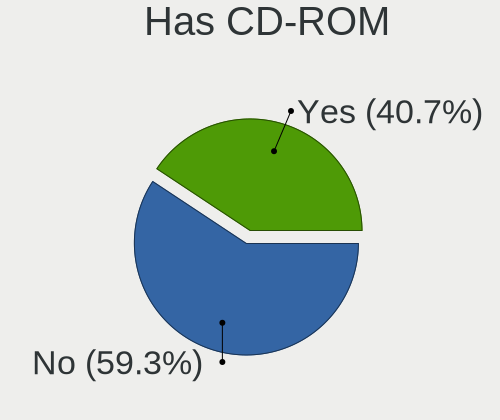

Linux in Russia - Tested Hardware & Statistics (Notebooks)
----------------------------------------------------------

A project to collect tested hardware configurations for Linux in Russia.

Anyone can contribute to this report by the [hw-probe](https://github.com/linuxhw/hw-probe) tool:

    sudo -E hw-probe -all -upload

Please contribute! Especially if your hardware is rare.

Contents
--------

* [ Test Cases ](#test-cases)

* [ System ](#system)
  - [ OS                       ](#os)
  - [ OS Family                ](#os-family)
  - [ Kernel                   ](#kernel)
  - [ Kernel Family            ](#kernel-family)
  - [ Kernel Major Ver.        ](#kernel-major-ver)
  - [ Arch                     ](#arch)
  - [ DE                       ](#de)
  - [ Display Server           ](#display-server)
  - [ Display Manager          ](#display-manager)
  - [ OS Lang                  ](#os-lang)
  - [ Boot Mode                ](#boot-mode)
  - [ Filesystem               ](#filesystem)
  - [ Part. scheme             ](#part-scheme)
  - [ Dual Boot with Linux/BSD ](#dual-boot-with-linuxbsd)
  - [ Dual Boot (Win)          ](#dual-boot-win)

* [ Board ](#board)
  - [ Vendor                   ](#vendor)
  - [ Model                    ](#model)
  - [ Model Family             ](#model-family)
  - [ MFG Year                 ](#mfg-year)
  - [ Form Factor              ](#form-factor)
  - [ Secure Boot              ](#secure-boot)
  - [ Coreboot                 ](#coreboot)
  - [ RAM Size                 ](#ram-size)
  - [ RAM Used                 ](#ram-used)
  - [ Total Drives             ](#total-drives)
  - [ Has CD-ROM               ](#has-cd-rom)
  - [ Has Ethernet             ](#has-ethernet)
  - [ Has WiFi                 ](#has-wifi)
  - [ Has Bluetooth            ](#has-bluetooth)

* [ Location ](#location)
  - [ Country                  ](#country)
  - [ City                     ](#city)

* [ Drives ](#drives)
  - [ Drive Vendor             ](#drive-vendor)
  - [ Drive Model              ](#drive-model)
  - [ HDD Vendor               ](#hdd-vendor)
  - [ SSD Vendor               ](#ssd-vendor)
  - [ Drive Kind               ](#drive-kind)
  - [ Drive Connector          ](#drive-connector)
  - [ Drive Size               ](#drive-size)
  - [ Space Total              ](#space-total)
  - [ Space Used               ](#space-used)
  - [ Malfunc. Drives          ](#malfunc-drives)
  - [ Malfunc. Drive Vendor    ](#malfunc-drive-vendor)
  - [ Malfunc. HDD Vendor      ](#malfunc-hdd-vendor)
  - [ Malfunc. Drive Kind      ](#malfunc-drive-kind)
  - [ Failed Drives            ](#failed-drives)
  - [ Failed Drive Vendor      ](#failed-drive-vendor)
  - [ Drive Status             ](#drive-status)

* [ Storage controller ](#storage-controller)
  - [ Storage Vendor           ](#storage-vendor)
  - [ Storage Model            ](#storage-model)
  - [ Storage Kind             ](#storage-kind)

* [ Processor ](#processor)
  - [ CPU Vendor               ](#cpu-vendor)
  - [ CPU Model                ](#cpu-model)
  - [ CPU Model Family         ](#cpu-model-family)
  - [ CPU Cores                ](#cpu-cores)
  - [ CPU Sockets              ](#cpu-sockets)
  - [ CPU Threads              ](#cpu-threads)
  - [ CPU Op-Modes             ](#cpu-op-modes)
  - [ CPU Microcode            ](#cpu-microcode)
  - [ CPU Microarch            ](#cpu-microarch)

* [ Graphics ](#graphics)
  - [ GPU Vendor               ](#gpu-vendor)
  - [ GPU Model                ](#gpu-model)
  - [ GPU Combo                ](#gpu-combo)
  - [ GPU Driver               ](#gpu-driver)
  - [ GPU Memory               ](#gpu-memory)

* [ Monitor ](#monitor)
  - [ Monitor Vendor           ](#monitor-vendor)
  - [ Monitor Model            ](#monitor-model)
  - [ Monitor Resolution       ](#monitor-resolution)
  - [ Monitor Diagonal         ](#monitor-diagonal)
  - [ Monitor Width            ](#monitor-width)
  - [ Aspect Ratio             ](#aspect-ratio)
  - [ Monitor Area             ](#monitor-area)
  - [ Pixel Density            ](#pixel-density)
  - [ Multiple Monitors        ](#multiple-monitors)

* [ Network ](#network)
  - [ Net Controller Vendor    ](#net-controller-vendor)
  - [ Net Controller Model     ](#net-controller-model)
  - [ Wireless Vendor          ](#wireless-vendor)
  - [ Wireless Model           ](#wireless-model)
  - [ Ethernet Vendor          ](#ethernet-vendor)
  - [ Ethernet Model           ](#ethernet-model)
  - [ Net Controller Kind      ](#net-controller-kind)
  - [ Used Controller          ](#used-controller)
  - [ NICs                     ](#nics)
  - [ IPv6                     ](#ipv6)

* [ Bluetooth ](#bluetooth)
  - [ Bluetooth Vendor         ](#bluetooth-vendor)
  - [ Bluetooth Model          ](#bluetooth-model)

* [ Sound ](#sound)
  - [ Sound Vendor             ](#sound-vendor)
  - [ Sound Model              ](#sound-model)

* [ Memory ](#memory)
  - [ Memory Vendor            ](#memory-vendor)
  - [ Memory Model             ](#memory-model)
  - [ Memory Kind              ](#memory-kind)
  - [ Memory Form Factor       ](#memory-form-factor)
  - [ Memory Size              ](#memory-size)
  - [ Memory Speed             ](#memory-speed)

* [ Printers & scanners ](#printers--scanners)
  - [ Printer Vendor           ](#printer-vendor)
  - [ Printer Model            ](#printer-model)
  - [ Scanner Vendor           ](#scanner-vendor)
  - [ Scanner Model            ](#scanner-model)

* [ Camera ](#camera)
  - [ Camera Vendor            ](#camera-vendor)
  - [ Camera Model             ](#camera-model)

* [ Security ](#security)
  - [ Fingerprint Vendor       ](#fingerprint-vendor)
  - [ Fingerprint Model        ](#fingerprint-model)
  - [ Chipcard Vendor          ](#chipcard-vendor)
  - [ Chipcard Model           ](#chipcard-model)

* [ Unsupported ](#unsupported)
  - [ Unsupported Devices      ](#unsupported-devices)
  - [ Unsupported Device Types ](#unsupported-device-types)

Test Cases
----------

Total: 19081

| Vendor        | Model                       | Probe                                                      | Date         |
|---------------|-----------------------------|------------------------------------------------------------|--------------|
| Acer          | Aspire E1-571G              | [ca51aaad9f](https://linux-hardware.org/?probe=ca51aaad9f) | Aug 12, 2023 |
| ASUSTek       | T200TA                      | [affc999457](https://linux-hardware.org/?probe=affc999457) | Aug 12, 2023 |
| ASUSTek       | T200TA                      | [24d6504b2c](https://linux-hardware.org/?probe=24d6504b2c) | Aug 12, 2023 |
| Apple         | MacBookAir7,2               | [b80181bc47](https://linux-hardware.org/?probe=b80181bc47) | Aug 12, 2023 |
| HP            | ENVY Notebook               | [24c2810def](https://linux-hardware.org/?probe=24c2810def) | Aug 12, 2023 |
| Lenovo        | PIQY0                       | [0149927d91](https://linux-hardware.org/?probe=0149927d91) | Aug 11, 2023 |
| HP            | Victus by Laptop 16-e0xx... | [377a0e25aa](https://linux-hardware.org/?probe=377a0e25aa) | Aug 11, 2023 |
| Lenovo        | IdeaPad 5 15IAL7 82SF       | [c2d9d3160b](https://linux-hardware.org/?probe=c2d9d3160b) | Aug 11, 2023 |
| MSI           | Sword 17 A11UD              | [8ad81394c8](https://linux-hardware.org/?probe=8ad81394c8) | Aug 11, 2023 |
| HP            | ENVY Notebook               | [6327abde35](https://linux-hardware.org/?probe=6327abde35) | Aug 11, 2023 |
| ASUSTek       | VivoBook_ASUSLaptop M140... | [a4a009cd79](https://linux-hardware.org/?probe=a4a009cd79) | Aug 11, 2023 |
| HP            | Pavilion 15                 | [0f7859844f](https://linux-hardware.org/?probe=0f7859844f) | Aug 11, 2023 |
| Acer          | Extensa 2511G               | [536699834a](https://linux-hardware.org/?probe=536699834a) | Aug 11, 2023 |
| Acer          | Nitro AN515-52              | [c9b1265a23](https://linux-hardware.org/?probe=c9b1265a23) | Aug 11, 2023 |
| Lenovo        | IdeaPad L340-15API 81LW     | [7d63566e0a](https://linux-hardware.org/?probe=7d63566e0a) | Aug 11, 2023 |
| ASUSTek       | ZenBook UX535LI_UX535LI     | [29065a56ee](https://linux-hardware.org/?probe=29065a56ee) | Aug 11, 2023 |
| ASUSTek       | ROG Strix G513QY_G513QY     | [46ae462027](https://linux-hardware.org/?probe=46ae462027) | Aug 11, 2023 |
| Fujitsu Si... | AMILO Li 2727               | [1dc2c421f8](https://linux-hardware.org/?probe=1dc2c421f8) | Aug 11, 2023 |
| HP            | Pavilion 15                 | [3de983a470](https://linux-hardware.org/?probe=3de983a470) | Aug 10, 2023 |
| ASUSTek       | VivoBook_ASUSLaptop M150... | [80f2f711d8](https://linux-hardware.org/?probe=80f2f711d8) | Aug 10, 2023 |
| Toshiba       | Satellite C660              | [26597d8a51](https://linux-hardware.org/?probe=26597d8a51) | Aug 10, 2023 |
| Acer          | Extensa 5630                | [1cc3eaf69a](https://linux-hardware.org/?probe=1cc3eaf69a) | Aug 10, 2023 |
| Acer          | Aspire V3-571G              | [6c4354fa1c](https://linux-hardware.org/?probe=6c4354fa1c) | Aug 10, 2023 |
| HP            | ENVY Notebook               | [9e8624aa8d](https://linux-hardware.org/?probe=9e8624aa8d) | Aug 09, 2023 |
| ASUSTek       | VivoBook_ASUSLaptop X321... | [204b2fa0a0](https://linux-hardware.org/?probe=204b2fa0a0) | Aug 09, 2023 |
| ASUSTek       | VivoBook_ASUSLaptop M350... | [70765ac17b](https://linux-hardware.org/?probe=70765ac17b) | Aug 09, 2023 |
| HP            | Pavilion 15                 | [8636764a35](https://linux-hardware.org/?probe=8636764a35) | Aug 09, 2023 |
| Lenovo        | ThinkPad X1 Carbon 2nd 2... | [f28e4b71d6](https://linux-hardware.org/?probe=f28e4b71d6) | Aug 09, 2023 |
| Chuwi         | GemiBook Pro                | [3702186068](https://linux-hardware.org/?probe=3702186068) | Aug 08, 2023 |
| ARDOR GAMI... | V15x_V17xPNKPNJPNH          | [77f61b77f5](https://linux-hardware.org/?probe=77f61b77f5) | Aug 08, 2023 |
| ASUSTek       | X501U                       | [1cd218236c](https://linux-hardware.org/?probe=1cd218236c) | Aug 08, 2023 |
| ARDOR GAMI... | V15x_V17xPNKPNJPNH          | [fa4f74161f](https://linux-hardware.org/?probe=fa4f74161f) | Aug 08, 2023 |
| HUAWEI        | BOHB-WAX9                   | [42303ab8af](https://linux-hardware.org/?probe=42303ab8af) | Aug 08, 2023 |
| Dell          | Precision M4700             | [95ac580b0d](https://linux-hardware.org/?probe=95ac580b0d) | Aug 08, 2023 |
| HP            | ENVY Notebook               | [9c6d8ac7f9](https://linux-hardware.org/?probe=9c6d8ac7f9) | Aug 08, 2023 |
| Dell          | Latitude 5511               | [e9ea435e85](https://linux-hardware.org/?probe=e9ea435e85) | Aug 08, 2023 |
| Acer          | Extensa 215-51K             | [27a26187b9](https://linux-hardware.org/?probe=27a26187b9) | Aug 08, 2023 |
| HP            | Presario CQ58               | [07f5cdfaa8](https://linux-hardware.org/?probe=07f5cdfaa8) | Aug 08, 2023 |
| Acer          | Aspire E5-573G              | [305061b67e](https://linux-hardware.org/?probe=305061b67e) | Aug 08, 2023 |
| Samsung       | R528/R728                   | [cc6458fab9](https://linux-hardware.org/?probe=cc6458fab9) | Aug 08, 2023 |
| Jumper        | QCYL-200                    | [24da6190dc](https://linux-hardware.org/?probe=24da6190dc) | Aug 08, 2023 |
| ASUSTek       | VivoBook_ASUSLaptop M650... | [36b0caba9e](https://linux-hardware.org/?probe=36b0caba9e) | Aug 07, 2023 |
| Acer          | Aspire A315-42G             | [eff926e4a9](https://linux-hardware.org/?probe=eff926e4a9) | Aug 07, 2023 |
| Echips Imp... | NQ15E                       | [7d5e97a545](https://linux-hardware.org/?probe=7d5e97a545) | Aug 07, 2023 |
| ASUSTek       | ZenBook UX431DA_UM431DA     | [36c52dfe36](https://linux-hardware.org/?probe=36c52dfe36) | Aug 07, 2023 |
| ASUSTek       | ZenBook UX431DA_UM431DA     | [be823adc05](https://linux-hardware.org/?probe=be823adc05) | Aug 07, 2023 |
| ASUSTek       | X751NV                      | [ff33d23814](https://linux-hardware.org/?probe=ff33d23814) | Aug 07, 2023 |
| ASUSTek       | VivoBook_ASUSLaptop M140... | [bd036e1e65](https://linux-hardware.org/?probe=bd036e1e65) | Aug 07, 2023 |
| Dell          | XPS 15 9500                 | [dbefafc94d](https://linux-hardware.org/?probe=dbefafc94d) | Aug 07, 2023 |
| Dell          | Inspiron N5110              | [52c9bb6c33](https://linux-hardware.org/?probe=52c9bb6c33) | Aug 06, 2023 |
| ASUSTek       | UX32VD                      | [298a3261a0](https://linux-hardware.org/?probe=298a3261a0) | Aug 06, 2023 |
| Lenovo        | ThinkPad X1 Carbon Gen 1... | [2771828543](https://linux-hardware.org/?probe=2771828543) | Aug 06, 2023 |
| Timi          | TM1701                      | [2fc0a44940](https://linux-hardware.org/?probe=2fc0a44940) | Aug 06, 2023 |
| ASUSTek       | X550CC                      | [0a99f6f654](https://linux-hardware.org/?probe=0a99f6f654) | Aug 06, 2023 |
| TECNO         | MEGABOOK T1                 | [ced0647d42](https://linux-hardware.org/?probe=ced0647d42) | Aug 06, 2023 |
| ASUSTek       | X550CC                      | [23298de8c1](https://linux-hardware.org/?probe=23298de8c1) | Aug 06, 2023 |
| Valve         | Jupiter                     | [6bf7b7dc2b](https://linux-hardware.org/?probe=6bf7b7dc2b) | Aug 05, 2023 |
| Lenovo        | IdeaPad 330-15IGM 81D1      | [efe021e3b5](https://linux-hardware.org/?probe=efe021e3b5) | Aug 05, 2023 |
| ASUSTek       | VivoBook_ASUSLaptop M140... | [5f516e849d](https://linux-hardware.org/?probe=5f516e849d) | Aug 05, 2023 |
| Chuwi         | CoreBook XPro               | [776bcc618a](https://linux-hardware.org/?probe=776bcc618a) | Aug 05, 2023 |
| ASUSTek       | N53SV                       | [2c4db62652](https://linux-hardware.org/?probe=2c4db62652) | Aug 05, 2023 |
| Acer          | Aspire A715-72G             | [c95d1a55cd](https://linux-hardware.org/?probe=c95d1a55cd) | Aug 05, 2023 |
| MSI           | GE70 0NC                    | [c9fd935b80](https://linux-hardware.org/?probe=c9fd935b80) | Aug 05, 2023 |
| HP            | EliteBook 830 G5            | [d4ebcfaf3d](https://linux-hardware.org/?probe=d4ebcfaf3d) | Aug 05, 2023 |
| HP            | EliteBook 830 G5            | [cf67e6a006](https://linux-hardware.org/?probe=cf67e6a006) | Aug 05, 2023 |
| ASUSTek       | 1215N                       | [35853f5b92](https://linux-hardware.org/?probe=35853f5b92) | Aug 04, 2023 |
| Lenovo        | ThinkPad X1 Carbon Gen 1... | [7abc08a315](https://linux-hardware.org/?probe=7abc08a315) | Aug 04, 2023 |
| Dell          | Vostro 5515                 | [bd17eec0e3](https://linux-hardware.org/?probe=bd17eec0e3) | Aug 04, 2023 |
| ASUSTek       | Zenbook UX535QE_UM535QE     | [59dda0e2b7](https://linux-hardware.org/?probe=59dda0e2b7) | Aug 04, 2023 |
| Dell          | Latitude E6510              | [b32213c71d](https://linux-hardware.org/?probe=b32213c71d) | Aug 03, 2023 |
| Samsung       | 305U1A                      | [f65d34a8fb](https://linux-hardware.org/?probe=f65d34a8fb) | Aug 03, 2023 |
| ASUSTek       | VivoBook_ASUSLaptop X515... | [2b8f90f79d](https://linux-hardware.org/?probe=2b8f90f79d) | Aug 03, 2023 |
| Lenovo        | IdeaPad 5 Pro 16ACH6 82L... | [7d96f87e00](https://linux-hardware.org/?probe=7d96f87e00) | Aug 03, 2023 |
| Notebook      | W54_W94_W955TU,-T,-C        | [1f1f14320c](https://linux-hardware.org/?probe=1f1f14320c) | Aug 03, 2023 |
| Panasonic     | CF-31WBLAXLM                | [580b017d88](https://linux-hardware.org/?probe=580b017d88) | Aug 03, 2023 |
| MSI           | Prestige 14Evo A12M         | [c9e4b6dd90](https://linux-hardware.org/?probe=c9e4b6dd90) | Aug 03, 2023 |
| MSI           | Modern 14 C12M              | [aa352b05aa](https://linux-hardware.org/?probe=aa352b05aa) | Aug 03, 2023 |
| ASUSTek       | 1015BX                      | [4770dbfc22](https://linux-hardware.org/?probe=4770dbfc22) | Aug 02, 2023 |
| ASUSTek       | ZenBook UX431DA_UM431DA     | [a1f99c3e4d](https://linux-hardware.org/?probe=a1f99c3e4d) | Aug 02, 2023 |
| Acer          | Aspire A715-71G             | [fabe23f1a8](https://linux-hardware.org/?probe=fabe23f1a8) | Aug 02, 2023 |
| HUAWEI        | NBLB-WAX9N                  | [28ff7ce482](https://linux-hardware.org/?probe=28ff7ce482) | Aug 02, 2023 |
| ASUSTek       | VivoBook_ASUSLaptop M350... | [e3f2347cf7](https://linux-hardware.org/?probe=e3f2347cf7) | Aug 02, 2023 |
| Sony          | VPCSB1V9R                   | [8d809c3877](https://linux-hardware.org/?probe=8d809c3877) | Aug 02, 2023 |
| ASUSTek       | VivoBook_ASUSLaptop X515... | [2f4ed3cb1f](https://linux-hardware.org/?probe=2f4ed3cb1f) | Aug 02, 2023 |
| Unknown       | Unknown                     | [41ff18df05](https://linux-hardware.org/?probe=41ff18df05) | Aug 02, 2023 |
| Unknown       | Unknown                     | [eb3d428d41](https://linux-hardware.org/?probe=eb3d428d41) | Aug 02, 2023 |
| ASUSTek       | VivoBook_ASUSLaptop X160... | [4a6b173235](https://linux-hardware.org/?probe=4a6b173235) | Aug 01, 2023 |
| Acer          | Aspire A315-23              | [ef1917aa93](https://linux-hardware.org/?probe=ef1917aa93) | Aug 01, 2023 |
| Dell          | Vostro 3500                 | [266d25478e](https://linux-hardware.org/?probe=266d25478e) | Aug 01, 2023 |
| Acer          | Aspire A315-23              | [9164151f28](https://linux-hardware.org/?probe=9164151f28) | Aug 01, 2023 |
| Dell          | Inspiron 5567               | [d252fa93be](https://linux-hardware.org/?probe=d252fa93be) | Aug 01, 2023 |
| Timi          | Xiaomi Book Pro 16 2022     | [1e963cc76b](https://linux-hardware.org/?probe=1e963cc76b) | Aug 01, 2023 |
| Teclast       | Tbolt 10 DG                 | [cd75496056](https://linux-hardware.org/?probe=cd75496056) | Aug 01, 2023 |
| Acer          | Aspire A715-71G             | [7f3c7327b7](https://linux-hardware.org/?probe=7f3c7327b7) | Aug 01, 2023 |
| Lenovo        | ThinkPad X1 Carbon Gen 1... | [f7be9307b1](https://linux-hardware.org/?probe=f7be9307b1) | Jul 31, 2023 |
| Toshiba       | Satellite C870-D7K          | [9e8acac201](https://linux-hardware.org/?probe=9e8acac201) | Jul 31, 2023 |
| Acer          | Aspire V3-551G              | [a90eeb2fa3](https://linux-hardware.org/?probe=a90eeb2fa3) | Jul 31, 2023 |
| Dell          | G15 5511                    | [278d65cdc0](https://linux-hardware.org/?probe=278d65cdc0) | Jul 31, 2023 |
| Lenovo        | G580 20150                  | [81ab0317ab](https://linux-hardware.org/?probe=81ab0317ab) | Jul 31, 2023 |
| ASUSTek       | X411UA                      | [9ceaa9062e](https://linux-hardware.org/?probe=9ceaa9062e) | Jul 31, 2023 |
| Dell          | G15 5511                    | [e4570caa8f](https://linux-hardware.org/?probe=e4570caa8f) | Jul 31, 2023 |
| ASUSTek       | ROG Strix G513RM_G513RM     | [c42c13e7be](https://linux-hardware.org/?probe=c42c13e7be) | Jul 31, 2023 |
| Samsung       | 300V3A/300V4A/300V5A        | [a757cca527](https://linux-hardware.org/?probe=a757cca527) | Jul 31, 2023 |
| ASUSTek       | F3Se                        | [e5f8a806ea](https://linux-hardware.org/?probe=e5f8a806ea) | Jul 31, 2023 |
| Timi          | Redmi Book Pro 15 2022      | [8a2a5c6265](https://linux-hardware.org/?probe=8a2a5c6265) | Jul 30, 2023 |
| Acer          | Aspire A315-56              | [522c7e4381](https://linux-hardware.org/?probe=522c7e4381) | Jul 30, 2023 |
| Acer          | Aspire E5-573G              | [14307e0b7e](https://linux-hardware.org/?probe=14307e0b7e) | Jul 30, 2023 |
| HUAWEI        | BOM-WXX9                    | [583bc42f4e](https://linux-hardware.org/?probe=583bc42f4e) | Jul 30, 2023 |
| Timi          | Redmi Book Pro 14 2022      | [71379f70f2](https://linux-hardware.org/?probe=71379f70f2) | Jul 30, 2023 |
| Unknown       | Unknown                     | [b5f5ef27a8](https://linux-hardware.org/?probe=b5f5ef27a8) | Jul 30, 2023 |
| HP            | Pavilion dv6                | [2046d205d6](https://linux-hardware.org/?probe=2046d205d6) | Jul 30, 2023 |
| Dell          | Vostro A860                 | [0148ba9cdc](https://linux-hardware.org/?probe=0148ba9cdc) | Jul 30, 2023 |
| HP            | 250 G7 Notebook PC          | [cefd14313d](https://linux-hardware.org/?probe=cefd14313d) | Jul 30, 2023 |
| HP            | Pavilion dv7                | [cdf06f1680](https://linux-hardware.org/?probe=cdf06f1680) | Jul 30, 2023 |
| HONOR         | NBR-WAX9                    | [b69caa0c17](https://linux-hardware.org/?probe=b69caa0c17) | Jul 29, 2023 |
| HONOR         | NBR-WAX9                    | [d7434fdb2a](https://linux-hardware.org/?probe=d7434fdb2a) | Jul 29, 2023 |
| Lenovo        | V15 G4 AMN 82YU             | [c3523b3823](https://linux-hardware.org/?probe=c3523b3823) | Jul 29, 2023 |
| Sony          | SVS13A1Z9RN                 | [533b3018ea](https://linux-hardware.org/?probe=533b3018ea) | Jul 29, 2023 |
| Lenovo        | Unknown                     | [d43f4e6715](https://linux-hardware.org/?probe=d43f4e6715) | Jul 29, 2023 |
| Lenovo        | ThinkBook 13s G2 ITL 20V... | [ea4fee91b6](https://linux-hardware.org/?probe=ea4fee91b6) | Jul 28, 2023 |
| ASUSTek       | X411UA                      | [0126e6254a](https://linux-hardware.org/?probe=0126e6254a) | Jul 28, 2023 |
| ASUSTek       | VivoBook_ASUSLaptop M350... | [cb17388b8c](https://linux-hardware.org/?probe=cb17388b8c) | Jul 28, 2023 |
| Lenovo        | ThinkPad T14 Gen 2i 20W0... | [03b716e2bf](https://linux-hardware.org/?probe=03b716e2bf) | Jul 28, 2023 |
| HP            | OMEN by Laptop 17-cb1xxx    | [b24aea2d95](https://linux-hardware.org/?probe=b24aea2d95) | Jul 28, 2023 |
| Acer          | Aspire A517-53              | [41c9602cac](https://linux-hardware.org/?probe=41c9602cac) | Jul 28, 2023 |
| Acer          | Aspire A315-21G             | [0a4e1c4510](https://linux-hardware.org/?probe=0a4e1c4510) | Jul 28, 2023 |
| Acer          | Extensa 215-32              | [18d32a6c36](https://linux-hardware.org/?probe=18d32a6c36) | Jul 27, 2023 |
| Lenovo        | ThinkPad E490 20N80029RT    | [69cf27eaae](https://linux-hardware.org/?probe=69cf27eaae) | Jul 27, 2023 |
| ASUSTek       | VivoBook_ASUSLaptop K650... | [1b3e699a2a](https://linux-hardware.org/?probe=1b3e699a2a) | Jul 27, 2023 |
| Dell          | Inspiron 1520               | [a119f99239](https://linux-hardware.org/?probe=a119f99239) | Jul 27, 2023 |
| Valve         | Jupiter                     | [7ca21b7b46](https://linux-hardware.org/?probe=7ca21b7b46) | Jul 26, 2023 |
| Lenovo        | ThinkPad X1 Carbon Gen 1... | [b8b95820c1](https://linux-hardware.org/?probe=b8b95820c1) | Jul 26, 2023 |
| HP            | Laptop 14s-dq0xxx           | [dc484f95af](https://linux-hardware.org/?probe=dc484f95af) | Jul 26, 2023 |
| HUAWEI        | BOD-WXX9                    | [52358f6567](https://linux-hardware.org/?probe=52358f6567) | Jul 26, 2023 |
| HP            | Laptop 14s-dq0xxx           | [8a0b28f729](https://linux-hardware.org/?probe=8a0b28f729) | Jul 26, 2023 |
| HUAWEI        | NBM-WXX9                    | [30cb22d368](https://linux-hardware.org/?probe=30cb22d368) | Jul 26, 2023 |
| Sony          | VPCSB1V9R                   | [12b5777cff](https://linux-hardware.org/?probe=12b5777cff) | Jul 26, 2023 |
| HUAWEI        | NBM-WXX9                    | [b28bc4ba91](https://linux-hardware.org/?probe=b28bc4ba91) | Jul 25, 2023 |
| ASUSTek       | X550CC                      | [15d4d04323](https://linux-hardware.org/?probe=15d4d04323) | Jul 25, 2023 |
| Acer          | Aspire 5742G                | [dd2b862a0c](https://linux-hardware.org/?probe=dd2b862a0c) | Jul 25, 2023 |
| Dell          | Vostro A860                 | [8932ae1e87](https://linux-hardware.org/?probe=8932ae1e87) | Jul 25, 2023 |
| ASUSTek       | ASUS TUF Gaming A17 FA70... | [bd31324aeb](https://linux-hardware.org/?probe=bd31324aeb) | Jul 25, 2023 |
| ASUSTek       | X550CC                      | [9b0d43ec8f](https://linux-hardware.org/?probe=9b0d43ec8f) | Jul 25, 2023 |
| HP            | Victus by Laptop 16-e0xx... | [58ac4a2c1b](https://linux-hardware.org/?probe=58ac4a2c1b) | Jul 25, 2023 |
| ASUSTek       | ASUS TUF Dash F15 FX516P... | [c4d5317061](https://linux-hardware.org/?probe=c4d5317061) | Jul 25, 2023 |
| ASUSTek       | VivoBook_ASUSLaptop X740... | [5262229deb](https://linux-hardware.org/?probe=5262229deb) | Jul 25, 2023 |
| Notebook      | W510LU                      | [c770b71a6b](https://linux-hardware.org/?probe=c770b71a6b) | Jul 24, 2023 |
| ASUSTek       | VivoBook_ASUSLaptop M650... | [ad266cd914](https://linux-hardware.org/?probe=ad266cd914) | Jul 24, 2023 |
| ASUSTek       | VivoBook_ASUSLaptop M160... | [a15d078adf](https://linux-hardware.org/?probe=a15d078adf) | Jul 24, 2023 |
| INSYS         | IP1-XN23                    | [4212432f00](https://linux-hardware.org/?probe=4212432f00) | Jul 24, 2023 |
| Gigabyte      | G5 KE                       | [4837040c2a](https://linux-hardware.org/?probe=4837040c2a) | Jul 24, 2023 |
| ASUSTek       | Zenbook UX535QE_UM535QE     | [cb7e913e03](https://linux-hardware.org/?probe=cb7e913e03) | Jul 24, 2023 |
| ASUSTek       | VivoBook_ASUSLaptop M350... | [7bd82402c7](https://linux-hardware.org/?probe=7bd82402c7) | Jul 24, 2023 |
| Unknown       | Unknown                     | [1f64a4762c](https://linux-hardware.org/?probe=1f64a4762c) | Jul 24, 2023 |
| Timi          | Redmi G 2022                | [2a01d75ab6](https://linux-hardware.org/?probe=2a01d75ab6) | Jul 24, 2023 |
| Acer          | Swift SF114-34              | [eef65c51cf](https://linux-hardware.org/?probe=eef65c51cf) | Jul 24, 2023 |
| Acer          | Nitro AN515-46              | [a2d73523d4](https://linux-hardware.org/?probe=a2d73523d4) | Jul 24, 2023 |
| Unknown       | Toshiba AC100 / Dynabook... | [c7dd142af9](https://linux-hardware.org/?probe=c7dd142af9) | Jul 24, 2023 |
| Acer          | Nitro AN515-54              | [696b36cfb3](https://linux-hardware.org/?probe=696b36cfb3) | Jul 24, 2023 |
| Valve         | Jupiter                     | [cdf83d0eb8](https://linux-hardware.org/?probe=cdf83d0eb8) | Jul 24, 2023 |
| Samsung       | R780                        | [5f994aa483](https://linux-hardware.org/?probe=5f994aa483) | Jul 24, 2023 |
| Dell          | System Inspiron 17 7000 ... | [d4af5c7529](https://linux-hardware.org/?probe=d4af5c7529) | Jul 24, 2023 |
| ASUSTek       | VivoBook_ASUSLaptop M160... | [db7d7ddd9c](https://linux-hardware.org/?probe=db7d7ddd9c) | Jul 23, 2023 |
| Lenovo        | ThinkPad P50 20EQS2A500     | [d25f59d64d](https://linux-hardware.org/?probe=d25f59d64d) | Jul 23, 2023 |
| HUAWEI        | BOM-WXX9                    | [3c35f3e9b5](https://linux-hardware.org/?probe=3c35f3e9b5) | Jul 23, 2023 |
| Maibenben     | MaiBook M                   | [7b591c93bb](https://linux-hardware.org/?probe=7b591c93bb) | Jul 23, 2023 |
| Acer          | Aspire V3-571G              | [0581ed028d](https://linux-hardware.org/?probe=0581ed028d) | Jul 23, 2023 |
| Lenovo        | IdeaPad Yoga 2-13 594202... | [66db18067c](https://linux-hardware.org/?probe=66db18067c) | Jul 23, 2023 |
| Lenovo        | IdeaPad L340-17IRH Gamin... | [383118634e](https://linux-hardware.org/?probe=383118634e) | Jul 23, 2023 |
| Maibenben     | MaiBook M                   | [09beccd6f9](https://linux-hardware.org/?probe=09beccd6f9) | Jul 23, 2023 |
| ASUSTek       | TUF Gaming FX505DT_FX505... | [a14a1b8379](https://linux-hardware.org/?probe=a14a1b8379) | Jul 23, 2023 |
| ASUSTek       | VivoBook_ASUSLaptop M140... | [4222b801a9](https://linux-hardware.org/?probe=4222b801a9) | Jul 23, 2023 |
| HUAWEI        | NBLB-WAX9N                  | [ddb8dbe4e4](https://linux-hardware.org/?probe=ddb8dbe4e4) | Jul 23, 2023 |
| HUAWEI        | NBLB-WAX9N                  | [82242fa0a6](https://linux-hardware.org/?probe=82242fa0a6) | Jul 23, 2023 |
| ASUSTek       | X751LD                      | [de2e3a3ebb](https://linux-hardware.org/?probe=de2e3a3ebb) | Jul 23, 2023 |
| Lenovo        | B590 20206                  | [95e16f79ed](https://linux-hardware.org/?probe=95e16f79ed) | Jul 23, 2023 |
| Lenovo        | ThinkPad T14 Gen 3 21CGS... | [46218bae31](https://linux-hardware.org/?probe=46218bae31) | Jul 23, 2023 |
| Lenovo        | V14-IIL 82C4                | [b2870ce6ad](https://linux-hardware.org/?probe=b2870ce6ad) | Jul 22, 2023 |
| Lenovo        | Legion 5 15IMH6 82NL        | [f12c3b23e5](https://linux-hardware.org/?probe=f12c3b23e5) | Jul 22, 2023 |
| Infinix       | INBOOK X2 GEN11             | [2b3d4271bf](https://linux-hardware.org/?probe=2b3d4271bf) | Jul 22, 2023 |
| Lenovo        | ThinkPad T14 Gen 3 21CGS... | [7a3abd2e4d](https://linux-hardware.org/?probe=7a3abd2e4d) | Jul 22, 2023 |
| ASUSTek       | S551LN                      | [c716419bfb](https://linux-hardware.org/?probe=c716419bfb) | Jul 22, 2023 |
| Lenovo        | ThinkPad T470 W10DG 20HE... | [e6320dd4ae](https://linux-hardware.org/?probe=e6320dd4ae) | Jul 22, 2023 |
| Lenovo        | B590 20208                  | [41f2b0b599](https://linux-hardware.org/?probe=41f2b0b599) | Jul 21, 2023 |
| Lenovo        | ThinkPad X390 20SDA018CD    | [b2f5443fc2](https://linux-hardware.org/?probe=b2f5443fc2) | Jul 21, 2023 |
| Lenovo        | ThinkPad X390 20SDA018CD    | [3161baf648](https://linux-hardware.org/?probe=3161baf648) | Jul 21, 2023 |
| Lenovo        | IdeaPad 3 14ITL05 81X7      | [568ab8dd45](https://linux-hardware.org/?probe=568ab8dd45) | Jul 21, 2023 |
| ASUSTek       | X55A                        | [6818ec7338](https://linux-hardware.org/?probe=6818ec7338) | Jul 21, 2023 |
| HUAWEI        | BOD-WXX9                    | [e98c83ea9b](https://linux-hardware.org/?probe=e98c83ea9b) | Jul 21, 2023 |
| Lenovo        | G505 20240                  | [c9c45ceeaf](https://linux-hardware.org/?probe=c9c45ceeaf) | Jul 21, 2023 |
| HUAWEI        | BOD-WXX9                    | [c0d9daee63](https://linux-hardware.org/?probe=c0d9daee63) | Jul 21, 2023 |
| HP            | Laptop 15s-eq2xxx           | [7930c61fb6](https://linux-hardware.org/?probe=7930c61fb6) | Jul 21, 2023 |
| Acer          | Aspire 5610                 | [aa66524b51](https://linux-hardware.org/?probe=aa66524b51) | Jul 21, 2023 |
| Unknown       | Unknown                     | [139780d2a0](https://linux-hardware.org/?probe=139780d2a0) | Jul 21, 2023 |
| F-Plus Mob... | FLAPTOP r                   | [de2decf47b](https://linux-hardware.org/?probe=de2decf47b) | Jul 20, 2023 |
| HUAWEI        | BOD-WXX9                    | [10c841c8ae](https://linux-hardware.org/?probe=10c841c8ae) | Jul 20, 2023 |
| F-Plus Mob... | FLAPTOP r                   | [f21f00d216](https://linux-hardware.org/?probe=f21f00d216) | Jul 20, 2023 |
| Lenovo        | IdeaPad S145-15AST 81N3     | [cb2cdb1a94](https://linux-hardware.org/?probe=cb2cdb1a94) | Jul 20, 2023 |
| Samsung       | R530/R730                   | [0af014c11b](https://linux-hardware.org/?probe=0af014c11b) | Jul 20, 2023 |
| MSI           | GS73 Stealth 8RE            | [8fdb7e6e4e](https://linux-hardware.org/?probe=8fdb7e6e4e) | Jul 20, 2023 |
| HP            | ProBook 440 G4              | [5fbf587eba](https://linux-hardware.org/?probe=5fbf587eba) | Jul 19, 2023 |
| Acer          | AOD260                      | [e3854aa993](https://linux-hardware.org/?probe=e3854aa993) | Jul 19, 2023 |
| MSI           | Sword 17 A11UD              | [fd2864f7e1](https://linux-hardware.org/?probe=fd2864f7e1) | Jul 19, 2023 |
| Chuwi         | CoreBook                    | [816be37c03](https://linux-hardware.org/?probe=816be37c03) | Jul 19, 2023 |
| Toshiba       | QOSMIO G30                  | [520eb05b29](https://linux-hardware.org/?probe=520eb05b29) | Jul 19, 2023 |
| HP            | Notebook                    | [92bc221e2c](https://linux-hardware.org/?probe=92bc221e2c) | Jul 19, 2023 |
| Lenovo        | IdeaPad 100-14IBY 80MH      | [39035af050](https://linux-hardware.org/?probe=39035af050) | Jul 19, 2023 |
| Acer          | Extensa 215-22              | [fc3dadd5bc](https://linux-hardware.org/?probe=fc3dadd5bc) | Jul 19, 2023 |
| Apple         | MacBookPro5,5               | [b5b8d4fce2](https://linux-hardware.org/?probe=b5b8d4fce2) | Jul 19, 2023 |
| Lenovo        | B590 20208                  | [5f2fbf2720](https://linux-hardware.org/?probe=5f2fbf2720) | Jul 19, 2023 |
| ASUSTek       | K40IN                       | [ad25a9b9a2](https://linux-hardware.org/?probe=ad25a9b9a2) | Jul 19, 2023 |
| ASUSTek       | X550CL                      | [15f6e3e7e0](https://linux-hardware.org/?probe=15f6e3e7e0) | Jul 19, 2023 |
| HP            | EliteBook 8570p             | [8e456f1108](https://linux-hardware.org/?probe=8e456f1108) | Jul 18, 2023 |
| Lenovo        | IdeaPad 3 15IIL05 81WE      | [f81b2bedb9](https://linux-hardware.org/?probe=f81b2bedb9) | Jul 18, 2023 |
| Lenovo        | IdeaPad S10-2 20027         | [ea5513d981](https://linux-hardware.org/?probe=ea5513d981) | Jul 18, 2023 |
| HP            | Compaq nx7400 (EY587ES#A... | [15ba20b136](https://linux-hardware.org/?probe=15ba20b136) | Jul 18, 2023 |
| ASUSTek       | VivoBook_ASUSLaptop M650... | [8ce3a9560a](https://linux-hardware.org/?probe=8ce3a9560a) | Jul 18, 2023 |
| MSI           | GF63 Thin 11UC              | [3ef8cdcacb](https://linux-hardware.org/?probe=3ef8cdcacb) | Jul 18, 2023 |
| Apple         | MacBookAir6,2               | [fe575143d6](https://linux-hardware.org/?probe=fe575143d6) | Jul 18, 2023 |
| MSI           | GS73 Stealth 8RE            | [83f9ea8fc6](https://linux-hardware.org/?probe=83f9ea8fc6) | Jul 18, 2023 |
| HP            | 17-ak041ur                  | [5881affa24](https://linux-hardware.org/?probe=5881affa24) | Jul 18, 2023 |
| Acer          | Extensa 2519                | [59550c139a](https://linux-hardware.org/?probe=59550c139a) | Jul 18, 2023 |
| Lenovo        | ThinkPad E480 20KN005CRT    | [722170f1f3](https://linux-hardware.org/?probe=722170f1f3) | Jul 17, 2023 |
| HP            | EliteBook 830 G5            | [42eb1edbb6](https://linux-hardware.org/?probe=42eb1edbb6) | Jul 17, 2023 |
| HONOR         | BBR-WAX9                    | [b098dc2f61](https://linux-hardware.org/?probe=b098dc2f61) | Jul 17, 2023 |
| MSI           | GF63 Thin 11UC              | [f4fc84ba4b](https://linux-hardware.org/?probe=f4fc84ba4b) | Jul 17, 2023 |
| MSI           | GF63 Thin 11UC              | [9e330138e8](https://linux-hardware.org/?probe=9e330138e8) | Jul 17, 2023 |
| ASUSTek       | VivoBook_ASUSLaptop X415... | [73cb939cd2](https://linux-hardware.org/?probe=73cb939cd2) | Jul 17, 2023 |
| HP            | ProBook 440 G7              | [48cf81576d](https://linux-hardware.org/?probe=48cf81576d) | Jul 17, 2023 |
| Dell          | Vostro 3400                 | [ee71316b5e](https://linux-hardware.org/?probe=ee71316b5e) | Jul 17, 2023 |
| Gigabyte      | G5 ME                       | [eaefa9c2c6](https://linux-hardware.org/?probe=eaefa9c2c6) | Jul 17, 2023 |
| Pegatron      | A24                         | [2423e38b38](https://linux-hardware.org/?probe=2423e38b38) | Jul 17, 2023 |
| Lenovo        | ThinkPad X390 20Q1S67S00    | [be43004463](https://linux-hardware.org/?probe=be43004463) | Jul 17, 2023 |
| Valve         | Jupiter                     | [d5af3b1fe2](https://linux-hardware.org/?probe=d5af3b1fe2) | Jul 17, 2023 |
| Dell          | Latitude 5490               | [3938a20867](https://linux-hardware.org/?probe=3938a20867) | Jul 16, 2023 |
| ASUSTek       | TUF Gaming FX505GT_FX505... | [65e4fb1356](https://linux-hardware.org/?probe=65e4fb1356) | Jul 16, 2023 |
| HP            | Pavilion g7                 | [55b3650fc4](https://linux-hardware.org/?probe=55b3650fc4) | Jul 16, 2023 |
| Digma         | EVE 15 C413 ES5059EW        | [8898bab875](https://linux-hardware.org/?probe=8898bab875) | Jul 16, 2023 |
| Lenovo        | ThinkPad X120e 0611AN2      | [497e6c5432](https://linux-hardware.org/?probe=497e6c5432) | Jul 16, 2023 |
| Lenovo        | ThinkPad X1 Carbon Gen 1... | [6b4e2c6a3e](https://linux-hardware.org/?probe=6b4e2c6a3e) | Jul 16, 2023 |
| Digma         | EVE 15 C413 ES5059EW        | [c3f684db9d](https://linux-hardware.org/?probe=c3f684db9d) | Jul 16, 2023 |
| Unknown       | X133                        | [9ddb375619](https://linux-hardware.org/?probe=9ddb375619) | Jul 15, 2023 |
| Quanta        | SWH                         | [b7b21e5a7e](https://linux-hardware.org/?probe=b7b21e5a7e) | Jul 15, 2023 |
| Lenovo        | B590 20208                  | [47ef0bfa06](https://linux-hardware.org/?probe=47ef0bfa06) | Jul 15, 2023 |
| Maibenben     | MaiBook M                   | [44a9f08c5e](https://linux-hardware.org/?probe=44a9f08c5e) | Jul 15, 2023 |
| Acer          | Aspire V5-571G              | [e49b457f5b](https://linux-hardware.org/?probe=e49b457f5b) | Jul 15, 2023 |
| Lenovo        | IdeaPad S340-15API 81NC     | [a24026d3c6](https://linux-hardware.org/?probe=a24026d3c6) | Jul 14, 2023 |
| Lenovo        | G570 20079                  | [942a140f96](https://linux-hardware.org/?probe=942a140f96) | Jul 14, 2023 |
| ASUSTek       | VivoBook_ASUSLaptop M650... | [d3c3cdb439](https://linux-hardware.org/?probe=d3c3cdb439) | Jul 14, 2023 |
| Acer          | Aspire V5-571G              | [e606ef8f63](https://linux-hardware.org/?probe=e606ef8f63) | Jul 14, 2023 |
| Lenovo        | Legion R9000K2021H 82N6     | [4c8fc2482e](https://linux-hardware.org/?probe=4c8fc2482e) | Jul 14, 2023 |
| Lenovo        | V14-IIL 82C4                | [42aba63af0](https://linux-hardware.org/?probe=42aba63af0) | Jul 13, 2023 |
| ASUSTek       | ROG Zephyrus G15 GA503QM... | [793289bc48](https://linux-hardware.org/?probe=793289bc48) | Jul 13, 2023 |
| ASUSTek       | N56VZ                       | [af989434ae](https://linux-hardware.org/?probe=af989434ae) | Jul 13, 2023 |
| Dell          | Inspiron 3721               | [bc68686efe](https://linux-hardware.org/?probe=bc68686efe) | Jul 13, 2023 |
| Valve         | Jupiter                     | [14f7ea4a48](https://linux-hardware.org/?probe=14f7ea4a48) | Jul 13, 2023 |
| HP            | ENVY dv7                    | [f9022b116c](https://linux-hardware.org/?probe=f9022b116c) | Jul 13, 2023 |
| MSI           | Alpha 15 A4DEK              | [9a192c4a0b](https://linux-hardware.org/?probe=9a192c4a0b) | Jul 13, 2023 |
| HP            | EliteBook 855 G8 Noteboo... | [2b7aba4c76](https://linux-hardware.org/?probe=2b7aba4c76) | Jul 13, 2023 |
| Lenovo        | IdeaPad S340-14API 81NB     | [23e018569e](https://linux-hardware.org/?probe=23e018569e) | Jul 13, 2023 |
| HUAWEI        | CREM-WXX9                   | [d5ff5f9f79](https://linux-hardware.org/?probe=d5ff5f9f79) | Jul 13, 2023 |
| ASUSTek       | K40IN                       | [882334cade](https://linux-hardware.org/?probe=882334cade) | Jul 13, 2023 |
| Lenovo        | ThinkPad T440p 20AWS0V30... | [174cb234d5](https://linux-hardware.org/?probe=174cb234d5) | Jul 12, 2023 |
| Acer          | TravelMate B118-M           | [97e1dc01ce](https://linux-hardware.org/?probe=97e1dc01ce) | Jul 12, 2023 |
| Intel Clie... | LAPBC710                    | [c957ebba28](https://linux-hardware.org/?probe=c957ebba28) | Jul 12, 2023 |
| HP            | Laptop 17-ak0xx             | [19b530567f](https://linux-hardware.org/?probe=19b530567f) | Jul 12, 2023 |
| MSI           | Alpha 15 A4DEK              | [cbae5fed49](https://linux-hardware.org/?probe=cbae5fed49) | Jul 12, 2023 |
| Acer          | Aspire 5820TG               | [86cfbf79ce](https://linux-hardware.org/?probe=86cfbf79ce) | Jul 12, 2023 |
| MSI           | FX603                       | [a2c598f9eb](https://linux-hardware.org/?probe=a2c598f9eb) | Jul 12, 2023 |
| Samsung       | R780                        | [b83bd7a46e](https://linux-hardware.org/?probe=b83bd7a46e) | Jul 12, 2023 |
| ASUSTek       | K53SM                       | [7aac135bc0](https://linux-hardware.org/?probe=7aac135bc0) | Jul 11, 2023 |
| MSI           | Katana GF76 11UD            | [dc3e50c4e3](https://linux-hardware.org/?probe=dc3e50c4e3) | Jul 11, 2023 |
| HP            | Compaq 2510p                | [a7cb1d43fb](https://linux-hardware.org/?probe=a7cb1d43fb) | Jul 11, 2023 |
| ASUSTek       | K53SV                       | [3a7ff2690e](https://linux-hardware.org/?probe=3a7ff2690e) | Jul 11, 2023 |
| Lenovo        | ThinkPad E15 Gen 4 21E60... | [390b1ec39e](https://linux-hardware.org/?probe=390b1ec39e) | Jul 11, 2023 |
| HP            | Notebook                    | [eb64e08d64](https://linux-hardware.org/?probe=eb64e08d64) | Jul 11, 2023 |
| Lenovo        | ThinkPad E15 Gen 4 21E60... | [443e3f909c](https://linux-hardware.org/?probe=443e3f909c) | Jul 11, 2023 |
| ASUSTek       | VivoBook_ASUSLaptop M350... | [fc0d49b8b1](https://linux-hardware.org/?probe=fc0d49b8b1) | Jul 11, 2023 |
| Lenovo        | ThinkBook 16 G4+ ARA 21D... | [b073050c46](https://linux-hardware.org/?probe=b073050c46) | Jul 11, 2023 |
| Dell          | Precision M4700             | [7dc84c10b5](https://linux-hardware.org/?probe=7dc84c10b5) | Jul 11, 2023 |
| Acer          | Swift SF114-34              | [aef11f1cde](https://linux-hardware.org/?probe=aef11f1cde) | Jul 11, 2023 |
| Samsung       | 355V4C/355V4X/355V5C/355... | [11b9751db7](https://linux-hardware.org/?probe=11b9751db7) | Jul 10, 2023 |
| HP            | Compaq 2510p                | [98d500c68c](https://linux-hardware.org/?probe=98d500c68c) | Jul 10, 2023 |
| ASUSTek       | G73Jh                       | [60e43d39b2](https://linux-hardware.org/?probe=60e43d39b2) | Jul 10, 2023 |
| HP            | EliteBook 745 G2            | [572e346587](https://linux-hardware.org/?probe=572e346587) | Jul 10, 2023 |
| HUAWEI        | BOD-WXX9                    | [e157c2b1d6](https://linux-hardware.org/?probe=e157c2b1d6) | Jul 10, 2023 |
| HP            | Pavilion 17                 | [e181859893](https://linux-hardware.org/?probe=e181859893) | Jul 09, 2023 |
| HP            | Pavilion 17                 | [3824925c02](https://linux-hardware.org/?probe=3824925c02) | Jul 09, 2023 |
| HONOR         | HLYL-WXX9                   | [874777047d](https://linux-hardware.org/?probe=874777047d) | Jul 09, 2023 |
| MSI           | Modern 14 B11MOU            | [c2e76ab704](https://linux-hardware.org/?probe=c2e76ab704) | Jul 09, 2023 |
| Dell          | Inspiron 3583               | [3f5ae451c0](https://linux-hardware.org/?probe=3f5ae451c0) | Jul 09, 2023 |
| Lenovo        | IdeaPad S340-14API 81NB     | [214dd1ad57](https://linux-hardware.org/?probe=214dd1ad57) | Jul 09, 2023 |
| Acer          | Extensa 2519                | [1aa67ff6d3](https://linux-hardware.org/?probe=1aa67ff6d3) | Jul 09, 2023 |
| Lenovo        | ThinkPad P50 20EQS2A500     | [d053bea459](https://linux-hardware.org/?probe=d053bea459) | Jul 09, 2023 |
| HP            | Notebook                    | [9944e4c37d](https://linux-hardware.org/?probe=9944e4c37d) | Jul 09, 2023 |
| Timi          | Redmi G 2022                | [30e96afcdd](https://linux-hardware.org/?probe=30e96afcdd) | Jul 08, 2023 |
| Lenovo        | IdeaPad 3 15ARE05 81W4      | [2eb50b690c](https://linux-hardware.org/?probe=2eb50b690c) | Jul 08, 2023 |
| ASUSTek       | VivoBook_ASUSLaptop M150... | [b01bdb1bd6](https://linux-hardware.org/?probe=b01bdb1bd6) | Jul 08, 2023 |
| Acer          | Extensa 5630                | [8ba8120911](https://linux-hardware.org/?probe=8ba8120911) | Jul 08, 2023 |
| Samsung       | 350V5C/351V5C/3540VC/344... | [cdff301d1a](https://linux-hardware.org/?probe=cdff301d1a) | Jul 08, 2023 |
| ASUSTek       | UX550VE                     | [b782a00935](https://linux-hardware.org/?probe=b782a00935) | Jul 08, 2023 |
| HP            | EliteBook 840 G4            | [cc006abf72](https://linux-hardware.org/?probe=cc006abf72) | Jul 08, 2023 |
| ASUSTek       | Zenbook UM5401QAB_UM5401... | [6f3284cac3](https://linux-hardware.org/?probe=6f3284cac3) | Jul 07, 2023 |
| TECNO         | MEGABOOK T1                 | [63737caadb](https://linux-hardware.org/?probe=63737caadb) | Jul 07, 2023 |
| HP            | ProBook 430 G1              | [abb4e75faa](https://linux-hardware.org/?probe=abb4e75faa) | Jul 07, 2023 |
| Lenovo        | B50-70 20384                | [8a0a97b362](https://linux-hardware.org/?probe=8a0a97b362) | Jul 07, 2023 |
| Dell          | Inspiron 15-3552            | [2584019194](https://linux-hardware.org/?probe=2584019194) | Jul 06, 2023 |
| MSI           | Katana GF76 11UD            | [c3a26fb815](https://linux-hardware.org/?probe=c3a26fb815) | Jul 06, 2023 |
| ASUSTek       | VivoBook_ASUSLaptop X321... | [d4c8c30176](https://linux-hardware.org/?probe=d4c8c30176) | Jul 06, 2023 |
| Toshiba       | Satellite P200D             | [609a275664](https://linux-hardware.org/?probe=609a275664) | Jul 06, 2023 |
| HONOR         | BOHK-WAX9X                  | [95d2ae1051](https://linux-hardware.org/?probe=95d2ae1051) | Jul 06, 2023 |
| HONOR         | BOHK-WAX9X                  | [4f6d2375a3](https://linux-hardware.org/?probe=4f6d2375a3) | Jul 06, 2023 |
| ASUSTek       | VivoBook_ASUSLaptop M350... | [d9dc7d5425](https://linux-hardware.org/?probe=d9dc7d5425) | Jul 06, 2023 |
| Nokia         | N900                        | [7728c85b90](https://linux-hardware.org/?probe=7728c85b90) | Jul 06, 2023 |
| HP            | 630                         | [d1836d596c](https://linux-hardware.org/?probe=d1836d596c) | Jul 06, 2023 |
| MSI           | Modern 15 A11SBU            | [1d46fd852c](https://linux-hardware.org/?probe=1d46fd852c) | Jul 06, 2023 |
| Intel Clie... | LAPBC710                    | [fd97a27365](https://linux-hardware.org/?probe=fd97a27365) | Jul 06, 2023 |
| Acer          | Predator PT515-51           | [9971e8a3da](https://linux-hardware.org/?probe=9971e8a3da) | Jul 05, 2023 |
| Lenovo        | ThinkPad X1 Carbon Gen 1... | [d55667dbf0](https://linux-hardware.org/?probe=d55667dbf0) | Jul 05, 2023 |
| HONOR         | HYM-WXX                     | [d164a02f42](https://linux-hardware.org/?probe=d164a02f42) | Jul 05, 2023 |
| HP            | Laptop 15s-eq0xxx           | [02df64cd7b](https://linux-hardware.org/?probe=02df64cd7b) | Jul 05, 2023 |
| MSI           | Summit E13FlipEvo A13MT     | [ec1d2fbdad](https://linux-hardware.org/?probe=ec1d2fbdad) | Jul 04, 2023 |
| Lenovo        | Legion R9000K2021H 82N6     | [a968f4b15c](https://linux-hardware.org/?probe=a968f4b15c) | Jul 04, 2023 |
| Lenovo        | IdeaPad S340-14API 81NB     | [c387c4fbf1](https://linux-hardware.org/?probe=c387c4fbf1) | Jul 04, 2023 |
| Dell          | Latitude E6510              | [1f9e94e1cf](https://linux-hardware.org/?probe=1f9e94e1cf) | Jul 04, 2023 |
| ASUSTek       | VivoBook_ASUSLaptop M350... | [f876739c27](https://linux-hardware.org/?probe=f876739c27) | Jul 04, 2023 |
| Timi          | Redmi G 2022                | [cd2b7e13ce](https://linux-hardware.org/?probe=cd2b7e13ce) | Jul 04, 2023 |
| ICL           | Si1407                      | [c4c9d43042](https://linux-hardware.org/?probe=c4c9d43042) | Jul 04, 2023 |
| HUAWEI        | BOHB-WAX9                   | [2e4a653435](https://linux-hardware.org/?probe=2e4a653435) | Jul 04, 2023 |
| Lenovo        | IdeaPad 5 Pro 14ACN6 82L... | [d47bc7229c](https://linux-hardware.org/?probe=d47bc7229c) | Jul 04, 2023 |
| Graviton      | N15I-T                      | [b457883ad3](https://linux-hardware.org/?probe=b457883ad3) | Jul 04, 2023 |
| Timi          | Redmi G 2022                | [a6c12e95a6](https://linux-hardware.org/?probe=a6c12e95a6) | Jul 04, 2023 |
| MSI           | FX603                       | [8b0664bd4e](https://linux-hardware.org/?probe=8b0664bd4e) | Jul 04, 2023 |
| Lenovo        | ThinkBook 15 G3 ACL 21A4    | [dfd88b9f78](https://linux-hardware.org/?probe=dfd88b9f78) | Jul 04, 2023 |
| TECNO         | MEGABOOK T1                 | [484f3282fa](https://linux-hardware.org/?probe=484f3282fa) | Jul 04, 2023 |
| Acer          | Nitro AN515-46              | [b45f18bac2](https://linux-hardware.org/?probe=b45f18bac2) | Jul 04, 2023 |
| Infinix       | INBOOK X2 GEN11             | [62e1543492](https://linux-hardware.org/?probe=62e1543492) | Jul 04, 2023 |
| rombica       | myBook Eclipse              | [c8f641ef96](https://linux-hardware.org/?probe=c8f641ef96) | Jul 04, 2023 |
| Lenovo        | ThinkPad P50 20EQS2A500     | [8231312f5c](https://linux-hardware.org/?probe=8231312f5c) | Jul 04, 2023 |
| Acer          | Aspire E5-771G              | [39716dd662](https://linux-hardware.org/?probe=39716dd662) | Jul 03, 2023 |
| Lenovo        | Legion 5 Pro 16ACH6 82JS    | [90b6b19a97](https://linux-hardware.org/?probe=90b6b19a97) | Jul 03, 2023 |
| HP            | EliteBook 830 G5            | [72f7ad0022](https://linux-hardware.org/?probe=72f7ad0022) | Jul 03, 2023 |
| Lenovo        | IdeaPad S340-14API 81NB     | [f9e366002e](https://linux-hardware.org/?probe=f9e366002e) | Jul 03, 2023 |
| HUAWEI        | NBLB-WAX9N                  | [1af3478d1a](https://linux-hardware.org/?probe=1af3478d1a) | Jul 03, 2023 |
| ASUSTek       | 1015BX                      | [c4bc43a932](https://linux-hardware.org/?probe=c4bc43a932) | Jul 03, 2023 |
| HP            | Laptop 15s-eq0xxx           | [ee60bb65df](https://linux-hardware.org/?probe=ee60bb65df) | Jul 03, 2023 |
| Graviton      | N15I-T                      | [305390c16e](https://linux-hardware.org/?probe=305390c16e) | Jul 03, 2023 |
| ASUSTek       | VivoBook_ASUSLaptop M150... | [73146ccba2](https://linux-hardware.org/?probe=73146ccba2) | Jul 03, 2023 |
| ASUSTek       | VivoBook_ASUSLaptop M560... | [6ca874df22](https://linux-hardware.org/?probe=6ca874df22) | Jul 03, 2023 |
| MSI           | ER710                       | [aa6325e66e](https://linux-hardware.org/?probe=aa6325e66e) | Jul 03, 2023 |
| HP            | Notebook                    | [8399533d47](https://linux-hardware.org/?probe=8399533d47) | Jul 03, 2023 |
| Dell          | Latitude E6510              | [bc2c3c520a](https://linux-hardware.org/?probe=bc2c3c520a) | Jul 02, 2023 |
| Haier         | i1500SD                     | [1a118c855a](https://linux-hardware.org/?probe=1a118c855a) | Jul 02, 2023 |
| HP            | EliteBook 8460p             | [40b92fc7ba](https://linux-hardware.org/?probe=40b92fc7ba) | Jul 02, 2023 |
| HP            | 250 G1                      | [25559429ca](https://linux-hardware.org/?probe=25559429ca) | Jul 02, 2023 |
| Prestigio     | Smartbook PSB116A           | [ff56870120](https://linux-hardware.org/?probe=ff56870120) | Jul 02, 2023 |
| HP            | OMEN by Laptop              | [6ad6d2e8c6](https://linux-hardware.org/?probe=6ad6d2e8c6) | Jul 02, 2023 |
| HP            | Laptop 15s-eq1xxx           | [a3df72826f](https://linux-hardware.org/?probe=a3df72826f) | Jul 02, 2023 |
| Dell          | Inspiron N5110              | [d49ddcbcf1](https://linux-hardware.org/?probe=d49ddcbcf1) | Jul 01, 2023 |
| Aquarius      | NS685U R11                  | [e310cace05](https://linux-hardware.org/?probe=e310cace05) | Jul 01, 2023 |
| Aquarius      | NS685U R11                  | [2e0aca71ba](https://linux-hardware.org/?probe=2e0aca71ba) | Jul 01, 2023 |
| rombica       | myBook Eclipse              | [f42493341a](https://linux-hardware.org/?probe=f42493341a) | Jul 01, 2023 |
| rombica       | myBook Eclipse              | [19d5480b96](https://linux-hardware.org/?probe=19d5480b96) | Jul 01, 2023 |
| HUAWEI        | BOM-WXX9                    | [13c1e56ca9](https://linux-hardware.org/?probe=13c1e56ca9) | Jul 01, 2023 |
| Timi          | Redmi Book Pro 14 2022      | [b5d1a7e115](https://linux-hardware.org/?probe=b5d1a7e115) | Jun 30, 2023 |
| Acer          | Aspire A315-23              | [434ba90999](https://linux-hardware.org/?probe=434ba90999) | Jun 30, 2023 |
| HP            | Laptop 17-by3xxx            | [8bfe14749f](https://linux-hardware.org/?probe=8bfe14749f) | Jun 30, 2023 |
| Lenovo        | ThinkPad E490 20N80017RT    | [a2a1011725](https://linux-hardware.org/?probe=a2a1011725) | Jun 30, 2023 |
| Maibenben     | MaiBook X series            | [5e11bea093](https://linux-hardware.org/?probe=5e11bea093) | Jun 30, 2023 |
| Chuwi         | CoreBook XPro               | [501d899938](https://linux-hardware.org/?probe=501d899938) | Jun 30, 2023 |
| ASUSTek       | VivoBook_ASUSLaptop X321... | [05cb990f84](https://linux-hardware.org/?probe=05cb990f84) | Jun 30, 2023 |
| ASUSTek       | ASUS TUF Gaming F17 FX70... | [4677625b04](https://linux-hardware.org/?probe=4677625b04) | Jun 30, 2023 |
| ASUSTek       | VivoBook_ASUSLaptop M560... | [5dd37cbc97](https://linux-hardware.org/?probe=5dd37cbc97) | Jun 30, 2023 |
| ASUSTek       | ME176C                      | [2f2e7076e1](https://linux-hardware.org/?probe=2f2e7076e1) | Jun 30, 2023 |
| ASUSTek       | K52F                        | [98e9b448c7](https://linux-hardware.org/?probe=98e9b448c7) | Jun 30, 2023 |
| Timi          | Redmi Book Pro 14 2022      | [b98433fa84](https://linux-hardware.org/?probe=b98433fa84) | Jun 29, 2023 |
| Dell          | Studio 1558                 | [66e76ea87d](https://linux-hardware.org/?probe=66e76ea87d) | Jun 29, 2023 |
| Lenovo        | IdeaPad S340-14API 81NB     | [f3cb4dc749](https://linux-hardware.org/?probe=f3cb4dc749) | Jun 29, 2023 |
| Acer          | Aspire E5-531G              | [a6eaac367e](https://linux-hardware.org/?probe=a6eaac367e) | Jun 29, 2023 |
| Lenovo        | G50-80 80L0                 | [9979e7a733](https://linux-hardware.org/?probe=9979e7a733) | Jun 29, 2023 |
| Timi          | Redmi Book Pro 15 2022      | [1c349accca](https://linux-hardware.org/?probe=1c349accca) | Jun 29, 2023 |
| Acer          | Aspire V3-571G              | [9d4c4f5506](https://linux-hardware.org/?probe=9d4c4f5506) | Jun 29, 2023 |
| eMachines     | eME728                      | [37dc0ef617](https://linux-hardware.org/?probe=37dc0ef617) | Jun 29, 2023 |
| ASUSTek       | VivoBook_ASUSLaptop M350... | [076e14da35](https://linux-hardware.org/?probe=076e14da35) | Jun 29, 2023 |
| HP            | EliteBook 845 G7 Noteboo... | [61930889dc](https://linux-hardware.org/?probe=61930889dc) | Jun 29, 2023 |
| HP            | Pavilion g6                 | [b16b0ced2f](https://linux-hardware.org/?probe=b16b0ced2f) | Jun 28, 2023 |
| HP            | Notebook                    | [d5ab0810e6](https://linux-hardware.org/?probe=d5ab0810e6) | Jun 28, 2023 |
| HP            | Notebook                    | [2b5ac7b339](https://linux-hardware.org/?probe=2b5ac7b339) | Jun 28, 2023 |
| Dell          | Inspiron 15-3552            | [6197072395](https://linux-hardware.org/?probe=6197072395) | Jun 28, 2023 |
| Unknown       | Unknown                     | [0ea4bcb3df](https://linux-hardware.org/?probe=0ea4bcb3df) | Jun 28, 2023 |
| Aquarius      | NS585                       | [52a07593c9](https://linux-hardware.org/?probe=52a07593c9) | Jun 28, 2023 |
| Aquarius      | NS585                       | [b2f86e98f9](https://linux-hardware.org/?probe=b2f86e98f9) | Jun 28, 2023 |
| Lenovo        | ThinkPad P17 Gen 1 20SN0... | [5ea6336cb5](https://linux-hardware.org/?probe=5ea6336cb5) | Jun 28, 2023 |
| Acer          | Aspire A315-23              | [36f9eb51e6](https://linux-hardware.org/?probe=36f9eb51e6) | Jun 28, 2023 |
| Lenovo        | XiaoXinPro 16 ARP8 83AS     | [1d6bf708ce](https://linux-hardware.org/?probe=1d6bf708ce) | Jun 28, 2023 |
| Lenovo        | Legion R9000P ARH7H 82RG    | [ab4772fd2e](https://linux-hardware.org/?probe=ab4772fd2e) | Jun 28, 2023 |
| MSI           | GL65 Leopard 10SCSR         | [165a76b787](https://linux-hardware.org/?probe=165a76b787) | Jun 27, 2023 |
| Acer          | Extensa 2519                | [1a8a4ee11e](https://linux-hardware.org/?probe=1a8a4ee11e) | Jun 27, 2023 |
| Clevo         | NL41MU2                     | [d7e51d1ddb](https://linux-hardware.org/?probe=d7e51d1ddb) | Jun 27, 2023 |
| ASUSTek       | VivoBook_ASUSLaptop M350... | [5336cd4400](https://linux-hardware.org/?probe=5336cd4400) | Jun 27, 2023 |
| 3Logic Gro... | Graviton N15i               | [1f7adfe250](https://linux-hardware.org/?probe=1f7adfe250) | Jun 27, 2023 |
| Lenovo        | ThinkPad SL410 2842RN9      | [37157ab2f7](https://linux-hardware.org/?probe=37157ab2f7) | Jun 27, 2023 |
| MSI           | Katana GF66 11SC            | [dc32791d25](https://linux-hardware.org/?probe=dc32791d25) | Jun 27, 2023 |
| MSI           | Katana GF66 11SC            | [adf7a275be](https://linux-hardware.org/?probe=adf7a275be) | Jun 27, 2023 |
| Dell          | Inspiron N5110              | [ec28913b4e](https://linux-hardware.org/?probe=ec28913b4e) | Jun 27, 2023 |
| HUAWEI        | KLVL-WXXW                   | [5454a08ba6](https://linux-hardware.org/?probe=5454a08ba6) | Jun 26, 2023 |
| 3Logic Gro... | APM Graviton A15i-K2        | [6371ce9a45](https://linux-hardware.org/?probe=6371ce9a45) | Jun 26, 2023 |
| ASUSTek       | VivoBook_ASUSLaptop X321... | [cde6a94b92](https://linux-hardware.org/?probe=cde6a94b92) | Jun 26, 2023 |
| Acer          | Nitro AN515-45              | [674acd96a8](https://linux-hardware.org/?probe=674acd96a8) | Jun 26, 2023 |
| Clevo         | NL41MU2                     | [91bb626fa8](https://linux-hardware.org/?probe=91bb626fa8) | Jun 26, 2023 |
| Lenovo        | G780 20138                  | [41cdbe05fe](https://linux-hardware.org/?probe=41cdbe05fe) | Jun 26, 2023 |
| Aquarius      | NS585                       | [25af22ec30](https://linux-hardware.org/?probe=25af22ec30) | Jun 26, 2023 |
| Aquarius      | NS585                       | [8e957a70f0](https://linux-hardware.org/?probe=8e957a70f0) | Jun 26, 2023 |
| HUAWEI        | BOM-WXX9                    | [2e9bc10188](https://linux-hardware.org/?probe=2e9bc10188) | Jun 26, 2023 |
| Aquarius      | NS585                       | [bb09ae1f8d](https://linux-hardware.org/?probe=bb09ae1f8d) | Jun 26, 2023 |
| Unknown       | Unknown                     | [9c8513ff31](https://linux-hardware.org/?probe=9c8513ff31) | Jun 25, 2023 |
| HP            | Pavilion Notebook           | [eb68fc38b0](https://linux-hardware.org/?probe=eb68fc38b0) | Jun 25, 2023 |
| HASEE Comp... | PB50_70DFx,DDx              | [3690bcb661](https://linux-hardware.org/?probe=3690bcb661) | Jun 25, 2023 |
| ASUSTek       | X540NA                      | [6a01ca36af](https://linux-hardware.org/?probe=6a01ca36af) | Jun 25, 2023 |
| ASUSTek       | X540NA                      | [b5996a0d85](https://linux-hardware.org/?probe=b5996a0d85) | Jun 25, 2023 |
| Lenovo        | IdeaPad Gaming 3 15ARH7 ... | [cee2bb11dc](https://linux-hardware.org/?probe=cee2bb11dc) | Jun 25, 2023 |
| ASUSTek       | M51Vr                       | [16404e70f6](https://linux-hardware.org/?probe=16404e70f6) | Jun 25, 2023 |
| ASUSTek       | ZenBook UX435EG_UX435EG     | [a5d8941505](https://linux-hardware.org/?probe=a5d8941505) | Jun 25, 2023 |
| HONOR         | BMH-WCX9                    | [f40cb826de](https://linux-hardware.org/?probe=f40cb826de) | Jun 25, 2023 |
| ASUSTek       | ZenBook UX435EG_UX435EG     | [6398806c80](https://linux-hardware.org/?probe=6398806c80) | Jun 25, 2023 |
| Haier         | i1510SD                     | [f464f11210](https://linux-hardware.org/?probe=f464f11210) | Jun 25, 2023 |
| HUAWEI        | NBLB-WAX9N                  | [3a045583a7](https://linux-hardware.org/?probe=3a045583a7) | Jun 25, 2023 |
| Acer          | Aspire A517-51              | [7f4ad14efb](https://linux-hardware.org/?probe=7f4ad14efb) | Jun 25, 2023 |
| Lenovo        | G580                        | [daa41583f5](https://linux-hardware.org/?probe=daa41583f5) | Jun 25, 2023 |
| Dell          | Inspiron N5110              | [0a3cfef2ce](https://linux-hardware.org/?probe=0a3cfef2ce) | Jun 25, 2023 |
| HP            | Pavilion Gaming Laptop 1... | [39719594b9](https://linux-hardware.org/?probe=39719594b9) | Jun 24, 2023 |
| eMachines     | E725                        | [91c6056aff](https://linux-hardware.org/?probe=91c6056aff) | Jun 24, 2023 |
| Dell          | Inspiron 1720               | [60c2ef3b92](https://linux-hardware.org/?probe=60c2ef3b92) | Jun 24, 2023 |
| Lenovo        | ThinkPad X120e 0611AN2      | [a8420bc87d](https://linux-hardware.org/?probe=a8420bc87d) | Jun 24, 2023 |
| Timi          | RedmiBook Pro 14S           | [3910260d34](https://linux-hardware.org/?probe=3910260d34) | Jun 24, 2023 |
| Toshiba       | Satellite U300              | [2abf629721](https://linux-hardware.org/?probe=2abf629721) | Jun 24, 2023 |
| Lenovo        | ThinkPad P15 Gen 1 20ST0... | [e44e80fc33](https://linux-hardware.org/?probe=e44e80fc33) | Jun 23, 2023 |
| HP            | Pavilion Gaming Laptop 1... | [b6bc214e79](https://linux-hardware.org/?probe=b6bc214e79) | Jun 23, 2023 |
| HP            | 530 Notebook PC(KP479AA#... | [0c639de47d](https://linux-hardware.org/?probe=0c639de47d) | Jun 23, 2023 |
| ASUSTek       | VivoBook_ASUSLaptop X321... | [bb559685e3](https://linux-hardware.org/?probe=bb559685e3) | Jun 23, 2023 |
| HP            | Pavilion Aero Laptop 13-... | [610b99a65b](https://linux-hardware.org/?probe=610b99a65b) | Jun 23, 2023 |
| Lenovo        | Legion Y540-15IRH Laptop... | [3f7008d282](https://linux-hardware.org/?probe=3f7008d282) | Jun 22, 2023 |
| Lenovo        | ThinkPad P15 Gen 1 20ST0... | [e8e25f684e](https://linux-hardware.org/?probe=e8e25f684e) | Jun 22, 2023 |
| Acer          | Aspire ES1-571              | [db93ddfd03](https://linux-hardware.org/?probe=db93ddfd03) | Jun 22, 2023 |
| Timi          | RedmiBook Pro 14S           | [f46c865218](https://linux-hardware.org/?probe=f46c865218) | Jun 22, 2023 |
| Lenovo        | B590 20206                  | [17fb06c810](https://linux-hardware.org/?probe=17fb06c810) | Jun 21, 2023 |
| Packard Be... | EasyNote TE69CX             | [d72fa50a56](https://linux-hardware.org/?probe=d72fa50a56) | Jun 21, 2023 |
| HP            | Unknown                     | [f7a4bc57b0](https://linux-hardware.org/?probe=f7a4bc57b0) | Jun 21, 2023 |
| Lenovo        | B50-70 20384                | [03450fe3f0](https://linux-hardware.org/?probe=03450fe3f0) | Jun 21, 2023 |
| Quanta        | TWH                         | [5d04c17be4](https://linux-hardware.org/?probe=5d04c17be4) | Jun 21, 2023 |
| Intel Clie... | LAPBC710                    | [6c97bec6f0](https://linux-hardware.org/?probe=6c97bec6f0) | Jun 21, 2023 |
| Lenovo        | IdeaPad 330-17AST 81D7      | [dc5a63aacc](https://linux-hardware.org/?probe=dc5a63aacc) | Jun 20, 2023 |
| Acer          | Nitro AN515-45              | [b34b0bc6e5](https://linux-hardware.org/?probe=b34b0bc6e5) | Jun 20, 2023 |
| Lenovo        | K14 Gen 1 21CSS16E00        | [d60f0418a5](https://linux-hardware.org/?probe=d60f0418a5) | Jun 20, 2023 |
| HP            | Laptop 15-bw0xx             | [2e2c8b4c64](https://linux-hardware.org/?probe=2e2c8b4c64) | Jun 20, 2023 |
| ASUSTek       | K53SC                       | [1dee87098f](https://linux-hardware.org/?probe=1dee87098f) | Jun 20, 2023 |
| MSI           | Modern 14 B4MW              | [11edb8696f](https://linux-hardware.org/?probe=11edb8696f) | Jun 20, 2023 |
| MSI           | Modern 14 B4MW              | [2df6a58651](https://linux-hardware.org/?probe=2df6a58651) | Jun 20, 2023 |
| ASUSTek       | 1011CX                      | [0fa6b0b3dc](https://linux-hardware.org/?probe=0fa6b0b3dc) | Jun 19, 2023 |
| Acer          | Extensa 5630                | [b3abbec1ca](https://linux-hardware.org/?probe=b3abbec1ca) | Jun 19, 2023 |
| Samsung       | 350V5C/351V5C/3540VC/344... | [2ac629a3ac](https://linux-hardware.org/?probe=2ac629a3ac) | Jun 19, 2023 |
| MSI           | GT70 2OC/2OD                | [adee2af879](https://linux-hardware.org/?probe=adee2af879) | Jun 19, 2023 |
| Apple         | MacBookPro7,1               | [0d56b62a99](https://linux-hardware.org/?probe=0d56b62a99) | Jun 19, 2023 |
| ASUSTek       | X200LA                      | [28ba5d9a3a](https://linux-hardware.org/?probe=28ba5d9a3a) | Jun 18, 2023 |
| ASUSTek       | ROG Zephyrus G14 GA401IV... | [ce819ae3d3](https://linux-hardware.org/?probe=ce819ae3d3) | Jun 18, 2023 |
| ASUSTek       | VivoBook_ASUSLaptop X412... | [f3cbbb121e](https://linux-hardware.org/?probe=f3cbbb121e) | Jun 18, 2023 |
| ASUSTek       | X200LA                      | [5aca48b9ca](https://linux-hardware.org/?probe=5aca48b9ca) | Jun 18, 2023 |
| Aquarius      | NS483                       | [dd5daf7f12](https://linux-hardware.org/?probe=dd5daf7f12) | Jun 18, 2023 |
| HP            | Laptop 15-bw0xx             | [a161ef52b4](https://linux-hardware.org/?probe=a161ef52b4) | Jun 18, 2023 |
| Lenovo        | IdeaPad S340-14IIL 81VV     | [945376fe33](https://linux-hardware.org/?probe=945376fe33) | Jun 17, 2023 |
| Lenovo        | IdeaPad S145-15IWL 81MV     | [6b85997420](https://linux-hardware.org/?probe=6b85997420) | Jun 17, 2023 |
| MSI           | GX60 1AC                    | [64c48d22a7](https://linux-hardware.org/?probe=64c48d22a7) | Jun 17, 2023 |
| HP            | 630                         | [493010a411](https://linux-hardware.org/?probe=493010a411) | Jun 16, 2023 |
| HP            | Pavilion dv6                | [7e699d65f7](https://linux-hardware.org/?probe=7e699d65f7) | Jun 16, 2023 |
| TECNO         | MEGABOOK T1                 | [896d66d33f](https://linux-hardware.org/?probe=896d66d33f) | Jun 16, 2023 |
| Dell          | Latitude 3420               | [a0074970bf](https://linux-hardware.org/?probe=a0074970bf) | Jun 16, 2023 |
| TECNO         | MEGABOOK T1                 | [b26c331bfc](https://linux-hardware.org/?probe=b26c331bfc) | Jun 16, 2023 |
| HIPER Tech... | HIPER WORKBOOK              | [06ce0448f5](https://linux-hardware.org/?probe=06ce0448f5) | Jun 16, 2023 |
| WeiBu         | OEM                         | [349908e6d0](https://linux-hardware.org/?probe=349908e6d0) | Jun 16, 2023 |
| ASUSTek       | X555LN                      | [1e46ee1872](https://linux-hardware.org/?probe=1e46ee1872) | Jun 16, 2023 |
| HP            | Laptop 15-bw0xx             | [baa9231329](https://linux-hardware.org/?probe=baa9231329) | Jun 15, 2023 |
| HONOR         | NMH-WCX9                    | [39b295867e](https://linux-hardware.org/?probe=39b295867e) | Jun 15, 2023 |
| HP            | EliteBook 845 14 inch G9... | [1360220387](https://linux-hardware.org/?probe=1360220387) | Jun 15, 2023 |
| HP            | EliteBook 845 14 inch G9... | [5ce34d4e94](https://linux-hardware.org/?probe=5ce34d4e94) | Jun 15, 2023 |
| HP            | EliteBook 845 14 inch G9... | [92482439de](https://linux-hardware.org/?probe=92482439de) | Jun 15, 2023 |
| HP            | ENVY Notebook               | [ee7a2ae915](https://linux-hardware.org/?probe=ee7a2ae915) | Jun 15, 2023 |
| HP            | ENVY Notebook               | [29828fefe2](https://linux-hardware.org/?probe=29828fefe2) | Jun 15, 2023 |
| HUAWEI        | HVY-WXX9                    | [8649d41483](https://linux-hardware.org/?probe=8649d41483) | Jun 15, 2023 |
| Unknown       | Unknown                     | [3a944bbbd5](https://linux-hardware.org/?probe=3a944bbbd5) | Jun 15, 2023 |
| Unknown       | Unknown                     | [581aba0aa2](https://linux-hardware.org/?probe=581aba0aa2) | Jun 15, 2023 |
| ASUSTek       | ROG Zephyrus M16 GU603HE... | [ff2a2aeca0](https://linux-hardware.org/?probe=ff2a2aeca0) | Jun 15, 2023 |
| ASUSTek       | ROG Strix G731GT_GL731GT    | [fe83d43137](https://linux-hardware.org/?probe=fe83d43137) | Jun 15, 2023 |
| HONOR         | NMH-WCX9                    | [8515730b56](https://linux-hardware.org/?probe=8515730b56) | Jun 15, 2023 |
| Valve         | Jupiter                     | [dcf3ae5611](https://linux-hardware.org/?probe=dcf3ae5611) | Jun 15, 2023 |
| ASUSTek       | VivoBook_ASUSLaptop X421... | [eba8248dae](https://linux-hardware.org/?probe=eba8248dae) | Jun 14, 2023 |
| Acer          | Aspire S3-391               | [0547c7bf3a](https://linux-hardware.org/?probe=0547c7bf3a) | Jun 14, 2023 |
| HONOR         | BBR-WAX9                    | [b980e4f162](https://linux-hardware.org/?probe=b980e4f162) | Jun 14, 2023 |
| ASUSTek       | VivoBook_ASUSLaptop X421... | [6ef7b87ef5](https://linux-hardware.org/?probe=6ef7b87ef5) | Jun 14, 2023 |
| HP            | ProBook 430 G1              | [b972bb9890](https://linux-hardware.org/?probe=b972bb9890) | Jun 14, 2023 |
| MSI           | Katana GF66 12UE            | [49026cdaf3](https://linux-hardware.org/?probe=49026cdaf3) | Jun 14, 2023 |
| Toshiba       | Satellite L30               | [0b240892de](https://linux-hardware.org/?probe=0b240892de) | Jun 14, 2023 |
| ASUSTek       | ASUS EXPERTBOOK L1500CDA... | [5659761c9c](https://linux-hardware.org/?probe=5659761c9c) | Jun 14, 2023 |
| HP            | ProBook 455 G8 Notebook ... | [57b3c23d43](https://linux-hardware.org/?probe=57b3c23d43) | Jun 14, 2023 |
| Irbis         | NB123                       | [f6dae4c3c4](https://linux-hardware.org/?probe=f6dae4c3c4) | Jun 14, 2023 |
| Dell          | Inspiron 1501               | [456a49b146](https://linux-hardware.org/?probe=456a49b146) | Jun 13, 2023 |
| Lenovo        | ThinkPad E14 Gen 2 20TA0... | [ee5c72c283](https://linux-hardware.org/?probe=ee5c72c283) | Jun 13, 2023 |
| Lenovo        | ThinkPad E14 Gen 2 20TA0... | [db48a7b38d](https://linux-hardware.org/?probe=db48a7b38d) | Jun 13, 2023 |
| HP            | Laptop 15s-eq1xxx           | [680fe3ebbf](https://linux-hardware.org/?probe=680fe3ebbf) | Jun 13, 2023 |
| HUAWEI        | HKF-WXX                     | [ad88913ce4](https://linux-hardware.org/?probe=ad88913ce4) | Jun 13, 2023 |
| Dell          | 500                         | [b220c5553e](https://linux-hardware.org/?probe=b220c5553e) | Jun 12, 2023 |
| Apple         | MacBookPro9,2               | [4a879a147e](https://linux-hardware.org/?probe=4a879a147e) | Jun 12, 2023 |
| Dell          | Inspiron N5110              | [dcae82c86f](https://linux-hardware.org/?probe=dcae82c86f) | Jun 12, 2023 |
| MSI           | Prestige 14Evo A12M         | [3e121c01dd](https://linux-hardware.org/?probe=3e121c01dd) | Jun 12, 2023 |
| Acer          | Extensa 5220                | [3f547b15a3](https://linux-hardware.org/?probe=3f547b15a3) | Jun 12, 2023 |
| ASUSTek       | X551CAP                     | [4076a43510](https://linux-hardware.org/?probe=4076a43510) | Jun 12, 2023 |
| Lenovo        | IdeaPad S10-2 20027         | [cd1619a50d](https://linux-hardware.org/?probe=cd1619a50d) | Jun 11, 2023 |
| Acer          | Aspire 5920G                | [2a5625ca4c](https://linux-hardware.org/?probe=2a5625ca4c) | Jun 11, 2023 |
| Samsung       | 300E4C/300E5C/300E7C        | [4ecff82426](https://linux-hardware.org/?probe=4ecff82426) | Jun 11, 2023 |
| ASUSTek       | X75VC                       | [77cb4dfd02](https://linux-hardware.org/?probe=77cb4dfd02) | Jun 11, 2023 |
| Samsung       | P29/28/26                   | [d7e9b6f2f3](https://linux-hardware.org/?probe=d7e9b6f2f3) | Jun 11, 2023 |
| ASUSTek       | ZenBook UX334FAC_UX334FA    | [ba762c6d80](https://linux-hardware.org/?probe=ba762c6d80) | Jun 11, 2023 |
| ASUSTek       | VivoBook_ASUSLaptop K350... | [8b88702b69](https://linux-hardware.org/?probe=8b88702b69) | Jun 11, 2023 |
| HP            | ProBook 470 G0              | [d3fdf73c3e](https://linux-hardware.org/?probe=d3fdf73c3e) | Jun 10, 2023 |
| Acer          | Aspire A517-51              | [01cfb1c93f](https://linux-hardware.org/?probe=01cfb1c93f) | Jun 10, 2023 |
| Samsung       | P29/28/26                   | [6040d56961](https://linux-hardware.org/?probe=6040d56961) | Jun 10, 2023 |
| WeiBu         | OEM                         | [49bd40f956](https://linux-hardware.org/?probe=49bd40f956) | Jun 10, 2023 |
| HUAWEI        | NBD-WXX9                    | [61c1703e67](https://linux-hardware.org/?probe=61c1703e67) | Jun 10, 2023 |
| HUAWEI        | NBD-WXX9                    | [321ad38786](https://linux-hardware.org/?probe=321ad38786) | Jun 10, 2023 |
| MACHENIKE     | F117-7P                     | [78ad896b83](https://linux-hardware.org/?probe=78ad896b83) | Jun 10, 2023 |
| Lenovo        | Legion 5 15ARH05 82B5       | [2b4f40f41b](https://linux-hardware.org/?probe=2b4f40f41b) | Jun 09, 2023 |
| Dell          | Inspiron N5110              | [62d37454d3](https://linux-hardware.org/?probe=62d37454d3) | Jun 09, 2023 |
| Dell          | Latitude 5480               | [5b3fb0b4f8](https://linux-hardware.org/?probe=5b3fb0b4f8) | Jun 09, 2023 |
| Acer          | Aspire 5750G                | [69227c0908](https://linux-hardware.org/?probe=69227c0908) | Jun 09, 2023 |
| HUAWEI        | BOHB-WAX9                   | [aa0b439e8d](https://linux-hardware.org/?probe=aa0b439e8d) | Jun 09, 2023 |
| Lenovo        | IdeaPad 5 14ARE05 81YM      | [e246e70bb6](https://linux-hardware.org/?probe=e246e70bb6) | Jun 09, 2023 |
| Acer          | Aspire A517-53              | [c14dcffa32](https://linux-hardware.org/?probe=c14dcffa32) | Jun 08, 2023 |
| Lenovo        | Unknown                     | [1842b75de0](https://linux-hardware.org/?probe=1842b75de0) | Jun 08, 2023 |
| Dell          | Vostro 1015                 | [dcd4a1ad41](https://linux-hardware.org/?probe=dcd4a1ad41) | Jun 08, 2023 |
| ASUSTek       | ROG Strix G713PI_G713PI     | [13b0e73872](https://linux-hardware.org/?probe=13b0e73872) | Jun 08, 2023 |
| INFERIT       | Silver                      | [f6b3fc6762](https://linux-hardware.org/?probe=f6b3fc6762) | Jun 08, 2023 |
| Dell          | Inspiron 3558               | [87b5fd28c2](https://linux-hardware.org/?probe=87b5fd28c2) | Jun 08, 2023 |
| MSI           | GE60 2PL                    | [e1d118e2d2](https://linux-hardware.org/?probe=e1d118e2d2) | Jun 08, 2023 |
| HP            | G62                         | [fb9522ceac](https://linux-hardware.org/?probe=fb9522ceac) | Jun 08, 2023 |
| Acer          | Aspire 7741                 | [c85cff4000](https://linux-hardware.org/?probe=c85cff4000) | Jun 08, 2023 |
| Lenovo        | IdeaPad 5 Pro 14ACN6 82L... | [292625f2da](https://linux-hardware.org/?probe=292625f2da) | Jun 08, 2023 |
| Sony          | VPCEH2E1R                   | [97e5366810](https://linux-hardware.org/?probe=97e5366810) | Jun 08, 2023 |
| Lenovo        | B590 20208                  | [102b3706f4](https://linux-hardware.org/?probe=102b3706f4) | Jun 08, 2023 |
| Machcreato... | 14                          | [d889b02b13](https://linux-hardware.org/?probe=d889b02b13) | Jun 07, 2023 |
| ASUSTek       | VivoBook_ASUSLaptop M150... | [6d434209eb](https://linux-hardware.org/?probe=6d434209eb) | Jun 07, 2023 |
| Maibenben     | MaiBook X series            | [5ca7ad5fb0](https://linux-hardware.org/?probe=5ca7ad5fb0) | Jun 07, 2023 |
| ASUSTek       | X205TA                      | [4c56663011](https://linux-hardware.org/?probe=4c56663011) | Jun 07, 2023 |
| Samsung       | 355V4C/356V4C/3445VC/354... | [6e2a67c010](https://linux-hardware.org/?probe=6e2a67c010) | Jun 07, 2023 |
| Samsung       | 350V5C/351V5C/3540VC/344... | [2e0b21f8d4](https://linux-hardware.org/?probe=2e0b21f8d4) | Jun 07, 2023 |
| HP            | Laptop 15s-eq1xxx           | [db91b1b71c](https://linux-hardware.org/?probe=db91b1b71c) | Jun 07, 2023 |
| Acer          | AOD257                      | [1b75b86659](https://linux-hardware.org/?probe=1b75b86659) | Jun 06, 2023 |
| HP            | Laptop 15s-eq1xxx           | [d2c05f91c4](https://linux-hardware.org/?probe=d2c05f91c4) | Jun 06, 2023 |
| Packard Be... | EasyNote TE69KB             | [d6f404ae63](https://linux-hardware.org/?probe=d6f404ae63) | Jun 06, 2023 |
| Machcreato... | 14                          | [f0a27a9f97](https://linux-hardware.org/?probe=f0a27a9f97) | Jun 06, 2023 |
| HP            | Pavilion 15                 | [d75a894e8c](https://linux-hardware.org/?probe=d75a894e8c) | Jun 06, 2023 |
| HP            | 250 15.6 inch G9 Noteboo... | [be9987ca28](https://linux-hardware.org/?probe=be9987ca28) | Jun 06, 2023 |
| Dell          | G5 5587                     | [909f234c06](https://linux-hardware.org/?probe=909f234c06) | Jun 06, 2023 |
| Lenovo        | G70-70 80HW                 | [0d46480e90](https://linux-hardware.org/?probe=0d46480e90) | Jun 06, 2023 |
| Acer          | Swift SF314-511             | [60bf4b0442](https://linux-hardware.org/?probe=60bf4b0442) | Jun 05, 2023 |
| MSI           | Delta 15 A5EFK              | [d55fa44834](https://linux-hardware.org/?probe=d55fa44834) | Jun 05, 2023 |
| realme        | CloudProXXXX                | [22cced9066](https://linux-hardware.org/?probe=22cced9066) | Jun 05, 2023 |
| Aquarius      | NS585                       | [b3f11e4a53](https://linux-hardware.org/?probe=b3f11e4a53) | Jun 05, 2023 |
| HP            | EliteBook 2560p             | [3ed00534ed](https://linux-hardware.org/?probe=3ed00534ed) | Jun 05, 2023 |
| Lenovo        | IdeaPad 520-15IKB 81BF      | [2e429d02d1](https://linux-hardware.org/?probe=2e429d02d1) | Jun 05, 2023 |
| HP            | Mini 210-1000               | [96f41af422](https://linux-hardware.org/?probe=96f41af422) | Jun 05, 2023 |
| Samsung       | N102                        | [c3e402b50d](https://linux-hardware.org/?probe=c3e402b50d) | Jun 04, 2023 |
| HP            | Pavilion 15                 | [944c353c44](https://linux-hardware.org/?probe=944c353c44) | Jun 04, 2023 |
| ASUSTek       | VivoBook_ASUSLaptop X571... | [dfb8881ffe](https://linux-hardware.org/?probe=dfb8881ffe) | Jun 04, 2023 |
| Apple         | MacBookPro11,1              | [4192000802](https://linux-hardware.org/?probe=4192000802) | Jun 04, 2023 |
| Samsung       | 305V4A/305V5A/3415VA        | [a0f9cde008](https://linux-hardware.org/?probe=a0f9cde008) | Jun 04, 2023 |
| Apple         | MacBookPro11,1              | [168fa7f541](https://linux-hardware.org/?probe=168fa7f541) | Jun 04, 2023 |
| Lenovo        | V560                        | [b2564e07cc](https://linux-hardware.org/?probe=b2564e07cc) | Jun 03, 2023 |
| Valve         | Jupiter                     | [fdfee4fc99](https://linux-hardware.org/?probe=fdfee4fc99) | Jun 03, 2023 |
| Maibenben     | MaiBook M                   | [b5d7957b55](https://linux-hardware.org/?probe=b5d7957b55) | Jun 03, 2023 |
| Lenovo        | IdeaPad 320-17IKB 80XM      | [5d6b08920f](https://linux-hardware.org/?probe=5d6b08920f) | Jun 03, 2023 |
| Valve         | Jupiter                     | [cf26028872](https://linux-hardware.org/?probe=cf26028872) | Jun 03, 2023 |
| Acer          | Aspire S3                   | [23c1a32b88](https://linux-hardware.org/?probe=23c1a32b88) | Jun 03, 2023 |
| Samsung       | N102                        | [b21ddf3fea](https://linux-hardware.org/?probe=b21ddf3fea) | Jun 03, 2023 |
| ASUSTek       | VivoBook 17_ASUS Laptop ... | [88c3440ff2](https://linux-hardware.org/?probe=88c3440ff2) | Jun 03, 2023 |
| Dell          | Inspiron 1525               | [3160e89723](https://linux-hardware.org/?probe=3160e89723) | Jun 03, 2023 |
| ASUSTek       | X556UQ                      | [088518df2b](https://linux-hardware.org/?probe=088518df2b) | Jun 02, 2023 |
| HUAWEI        | BOD-WXX9                    | [532dea434a](https://linux-hardware.org/?probe=532dea434a) | Jun 02, 2023 |
| HP            | ENVY Notebook               | [e7f4c63499](https://linux-hardware.org/?probe=e7f4c63499) | Jun 02, 2023 |
| DEXP          | Aquilon C15                 | [763c923576](https://linux-hardware.org/?probe=763c923576) | Jun 02, 2023 |
| Aquarius      | NS585                       | [6f93385917](https://linux-hardware.org/?probe=6f93385917) | Jun 02, 2023 |
| ASUSTek       | VivoBook_ASUS Laptop X50... | [6ae18b11ab](https://linux-hardware.org/?probe=6ae18b11ab) | Jun 02, 2023 |
| ASUSTek       | VivoBook_ASUSLaptop N760... | [05a99cf128](https://linux-hardware.org/?probe=05a99cf128) | Jun 02, 2023 |
| ASUSTek       | VivoBook_ASUS Laptop X50... | [963b30ca7f](https://linux-hardware.org/?probe=963b30ca7f) | Jun 02, 2023 |
| Aquarius      | NS585                       | [091267ec3a](https://linux-hardware.org/?probe=091267ec3a) | Jun 02, 2023 |
| Aquarius      | NS585                       | [7534819f94](https://linux-hardware.org/?probe=7534819f94) | Jun 02, 2023 |
| Lenovo        | S40-70 80GQ                 | [9a3fbc7388](https://linux-hardware.org/?probe=9a3fbc7388) | Jun 02, 2023 |
| ASUSTek       | ASUS TUF Gaming F17 FX70... | [23e94c534e](https://linux-hardware.org/?probe=23e94c534e) | Jun 01, 2023 |
| HP            | EliteBook 840 G6            | [81ec1cc134](https://linux-hardware.org/?probe=81ec1cc134) | Jun 01, 2023 |
| Timi          | RedmiBook Pro 15S           | [1708ebae47](https://linux-hardware.org/?probe=1708ebae47) | Jun 01, 2023 |
| Aquarius      | NS585                       | [ffa7425b95](https://linux-hardware.org/?probe=ffa7425b95) | Jun 01, 2023 |
| MSI           | GF63 Thin 11SC              | [8f8afcc010](https://linux-hardware.org/?probe=8f8afcc010) | Jun 01, 2023 |
| Aquarius      | NS585                       | [fafcbbe90e](https://linux-hardware.org/?probe=fafcbbe90e) | Jun 01, 2023 |
| Dell          | Latitude 5490               | [34dde30b90](https://linux-hardware.org/?probe=34dde30b90) | Jun 01, 2023 |
| ASUSTek       | X550CC                      | [d75bfc397f](https://linux-hardware.org/?probe=d75bfc397f) | Jun 01, 2023 |
| Timi          | TM1801                      | [aa1db210df](https://linux-hardware.org/?probe=aa1db210df) | Jun 01, 2023 |
| Lenovo        | K14 Gen 1 21CSS16E00        | [9c95ad4263](https://linux-hardware.org/?probe=9c95ad4263) | May 31, 2023 |
| Acer          | Aspire 4810T                | [3058ac9018](https://linux-hardware.org/?probe=3058ac9018) | May 31, 2023 |
| Apple         | MacBookPro16,1              | [717c7884c8](https://linux-hardware.org/?probe=717c7884c8) | May 31, 2023 |
| Acer          | Aspire ES1-523              | [d68236f41d](https://linux-hardware.org/?probe=d68236f41d) | May 31, 2023 |
| Dell          | Latitude 5411               | [8583aa2091](https://linux-hardware.org/?probe=8583aa2091) | May 31, 2023 |
| HP            | EliteBook 840 G3            | [384ebf87a3](https://linux-hardware.org/?probe=384ebf87a3) | May 31, 2023 |
| HP            | Laptop 15-gw0xxx            | [ebc3d97429](https://linux-hardware.org/?probe=ebc3d97429) | May 30, 2023 |
| HP            | Laptop 15-gw0xxx            | [97382e45f8](https://linux-hardware.org/?probe=97382e45f8) | May 30, 2023 |
| HP            | Laptop 17-ca0xxx            | [3222c41173](https://linux-hardware.org/?probe=3222c41173) | May 30, 2023 |
| Samsung       | RV410/RV510/S3510/E3510     | [d20ebd68c0](https://linux-hardware.org/?probe=d20ebd68c0) | May 30, 2023 |
| Lenovo        | Legion Y530-15ICH 81FV      | [85a2504037](https://linux-hardware.org/?probe=85a2504037) | May 30, 2023 |
| HP            | Laptop 15s-fq2xxx           | [7ab8c72481](https://linux-hardware.org/?probe=7ab8c72481) | May 30, 2023 |
| ICL           | RAYbook Si1407              | [5956bb96ff](https://linux-hardware.org/?probe=5956bb96ff) | May 30, 2023 |
| Acer          | Swift SF114-34              | [3722c76b10](https://linux-hardware.org/?probe=3722c76b10) | May 30, 2023 |
| Lenovo        | G570 20079                  | [4843789a62](https://linux-hardware.org/?probe=4843789a62) | May 30, 2023 |
| HP            | ProBook 440 G7              | [9da720226e](https://linux-hardware.org/?probe=9da720226e) | May 30, 2023 |
| Lenovo        | Legion Y530-15ICH 81FV      | [c0e9edd453](https://linux-hardware.org/?probe=c0e9edd453) | May 30, 2023 |
| MSI           | GE60 2PC                    | [48c124853f](https://linux-hardware.org/?probe=48c124853f) | May 30, 2023 |
| ASUSTek       | X550WA                      | [864236b0c9](https://linux-hardware.org/?probe=864236b0c9) | May 29, 2023 |
| Lenovo        | ThinkPad E14 Gen 3 20Y70... | [3933dfe4f0](https://linux-hardware.org/?probe=3933dfe4f0) | May 29, 2023 |
| Samsung       | RV410/RV510/S3510/E3510     | [a786eb985d](https://linux-hardware.org/?probe=a786eb985d) | May 29, 2023 |
| ASUSTek       | GL553VD                     | [a1f825f4e5](https://linux-hardware.org/?probe=a1f825f4e5) | May 29, 2023 |
| HP            | ProBook 440 G6              | [35d14ed328](https://linux-hardware.org/?probe=35d14ed328) | May 29, 2023 |
| HP            | ProBook 440 G6              | [36a3563566](https://linux-hardware.org/?probe=36a3563566) | May 29, 2023 |
| ICL-KME CS    | RAYbook                     | [9e976ffc1a](https://linux-hardware.org/?probe=9e976ffc1a) | May 29, 2023 |
| HP            | Laptop 17-ca0xxx            | [4b53ed4ede](https://linux-hardware.org/?probe=4b53ed4ede) | May 29, 2023 |
| Acer          | Swift SF114-34              | [b7be0bf5ad](https://linux-hardware.org/?probe=b7be0bf5ad) | May 29, 2023 |
| HONOR         | BBR-WAX9                    | [e57b9850f8](https://linux-hardware.org/?probe=e57b9850f8) | May 28, 2023 |
| Acer          | Aspire V3-571G              | [d3afe375cf](https://linux-hardware.org/?probe=d3afe375cf) | May 28, 2023 |
| Maibenben     | MaiBook M                   | [fa3f4694ba](https://linux-hardware.org/?probe=fa3f4694ba) | May 28, 2023 |
| ASUSTek       | VivoBook_ASUSLaptop X415... | [86876e9715](https://linux-hardware.org/?probe=86876e9715) | May 28, 2023 |
| HIPER Tech... | HIPER WORKBOOK              | [8283b1247f](https://linux-hardware.org/?probe=8283b1247f) | May 28, 2023 |
| LTD Delovo... | EVE 14 C414                 | [d52f6c1303](https://linux-hardware.org/?probe=d52f6c1303) | May 28, 2023 |
| Unknown       | Unknown                     | [b294c91e3a](https://linux-hardware.org/?probe=b294c91e3a) | May 28, 2023 |
| Lenovo        | IdeaPad Z570 1024CPU        | [eb1c70f7af](https://linux-hardware.org/?probe=eb1c70f7af) | May 28, 2023 |
| MSI           | Katana GF76 12UGSO          | [fb534d212e](https://linux-hardware.org/?probe=fb534d212e) | May 28, 2023 |
| MSI           | Katana GF76 12UGSO          | [6b753016ff](https://linux-hardware.org/?probe=6b753016ff) | May 28, 2023 |
| ASUSTek       | ROG Strix G634JY_G634JY     | [026cf06ce5](https://linux-hardware.org/?probe=026cf06ce5) | May 27, 2023 |
| HP            | Laptop 15s-fq5xxx           | [c6309fc374](https://linux-hardware.org/?probe=c6309fc374) | May 27, 2023 |
| Infinix       | INBOOK X2                   | [1f8b536f4f](https://linux-hardware.org/?probe=1f8b536f4f) | May 27, 2023 |
| Acer          | Aspire A517-51G             | [bfc89878ce](https://linux-hardware.org/?probe=bfc89878ce) | May 27, 2023 |
| Aquarius      | NS585                       | [a87c8d46b6](https://linux-hardware.org/?probe=a87c8d46b6) | May 27, 2023 |
| HP            | Pavilion Laptop 14-ec0xx... | [4662e37743](https://linux-hardware.org/?probe=4662e37743) | May 26, 2023 |
| Samsung       | N130                        | [bd37239d10](https://linux-hardware.org/?probe=bd37239d10) | May 26, 2023 |
| Timi          | TM1701                      | [94105aa58f](https://linux-hardware.org/?probe=94105aa58f) | May 26, 2023 |
| eMachines     | eME644G                     | [cde4d7b461](https://linux-hardware.org/?probe=cde4d7b461) | May 26, 2023 |
| eMachines     | E725                        | [a4be8012a8](https://linux-hardware.org/?probe=a4be8012a8) | May 26, 2023 |
| Lenovo        | B570e HuronRiver Platfor... | [d3ac4866d3](https://linux-hardware.org/?probe=d3ac4866d3) | May 26, 2023 |
| Lenovo        | B570e HuronRiver Platfor... | [67b6a5e731](https://linux-hardware.org/?probe=67b6a5e731) | May 26, 2023 |
| ASUSTek       | G50VT                       | [6e4a2588b1](https://linux-hardware.org/?probe=6e4a2588b1) | May 26, 2023 |
| Acer          | Aspire V3-551               | [9d609ccd4a](https://linux-hardware.org/?probe=9d609ccd4a) | May 26, 2023 |
| Infinix       | INBOOK X2                   | [925318e521](https://linux-hardware.org/?probe=925318e521) | May 26, 2023 |
| Intel Clie... | LAPBC710                    | [7ed6d7079c](https://linux-hardware.org/?probe=7ed6d7079c) | May 26, 2023 |
| Unknown       | Unknown                     | [b63a3cbd7b](https://linux-hardware.org/?probe=b63a3cbd7b) | May 25, 2023 |
| Unknown       | Unknown                     | [3db7516231](https://linux-hardware.org/?probe=3db7516231) | May 25, 2023 |
| ASUSTek       | X502CA                      | [7b19816353](https://linux-hardware.org/?probe=7b19816353) | May 25, 2023 |
| HP            | ProBook 4535s               | [bf141ba124](https://linux-hardware.org/?probe=bf141ba124) | May 25, 2023 |
| eMachines     | eME644G                     | [bc740da95e](https://linux-hardware.org/?probe=bc740da95e) | May 25, 2023 |
| Aquarius      | NS685U R11                  | [8e0050a63d](https://linux-hardware.org/?probe=8e0050a63d) | May 25, 2023 |
| Aquarius      | NS685U R11                  | [17191f57d3](https://linux-hardware.org/?probe=17191f57d3) | May 25, 2023 |
| Clevo         | NL41MU2                     | [41f9a8d4b1](https://linux-hardware.org/?probe=41f9a8d4b1) | May 25, 2023 |
| ASUSTek       | GL553VD                     | [51dbf3c463](https://linux-hardware.org/?probe=51dbf3c463) | May 25, 2023 |
| Acer          | Aspire A515-45G             | [99bcbfbb2a](https://linux-hardware.org/?probe=99bcbfbb2a) | May 25, 2023 |
| Aquarius      | NS585                       | [82a0d45251](https://linux-hardware.org/?probe=82a0d45251) | May 25, 2023 |
| HONOR         | HYM-WXX                     | [00a5e48ef4](https://linux-hardware.org/?probe=00a5e48ef4) | May 25, 2023 |
| Acer          | Aspire 7750G                | [589639a63f](https://linux-hardware.org/?probe=589639a63f) | May 25, 2023 |
| Timi          | TM1701                      | [c883337466](https://linux-hardware.org/?probe=c883337466) | May 24, 2023 |
| Acer          | Aspire E5-573G              | [c6cc5e2a20](https://linux-hardware.org/?probe=c6cc5e2a20) | May 24, 2023 |
| HP            | EliteBook 855 G8 Noteboo... | [fb5edbbd6b](https://linux-hardware.org/?probe=fb5edbbd6b) | May 24, 2023 |
| Acer          | Extensa 5630                | [00e8bb4d6a](https://linux-hardware.org/?probe=00e8bb4d6a) | May 24, 2023 |
| HUAWEI        | BOD-WXX9                    | [9486b7ca4f](https://linux-hardware.org/?probe=9486b7ca4f) | May 24, 2023 |
| Samsung       | R710                        | [a2c199b3cd](https://linux-hardware.org/?probe=a2c199b3cd) | May 24, 2023 |
| Packard Be... | DOT S                       | [a49bbc7aa2](https://linux-hardware.org/?probe=a49bbc7aa2) | May 24, 2023 |
| DEXP          | Aquilon C14                 | [357a7caaf8](https://linux-hardware.org/?probe=357a7caaf8) | May 24, 2023 |
| DEXP          | Aquilon C14                 | [cd3dc35687](https://linux-hardware.org/?probe=cd3dc35687) | May 24, 2023 |
| HP            | EliteBook 855 G8 Noteboo... | [a03284052b](https://linux-hardware.org/?probe=a03284052b) | May 24, 2023 |
| ASUSTek       | UL30A                       | [d7ab3b0ed3](https://linux-hardware.org/?probe=d7ab3b0ed3) | May 24, 2023 |
| Lenovo        | Legion Y530-15ICH 81FV      | [dd1104fc5a](https://linux-hardware.org/?probe=dd1104fc5a) | May 23, 2023 |
| Unknown       | Unknown                     | [6680332a54](https://linux-hardware.org/?probe=6680332a54) | May 23, 2023 |
| HUAWEI        | CREF-XX                     | [39ff25bc94](https://linux-hardware.org/?probe=39ff25bc94) | May 23, 2023 |
| ASUSTek       | N53SM                       | [95301f4dea](https://linux-hardware.org/?probe=95301f4dea) | May 23, 2023 |
| Dell          | Inspiron N5110              | [a410c18f8c](https://linux-hardware.org/?probe=a410c18f8c) | May 23, 2023 |
| ASUSTek       | ET2321I                     | [829fe9b078](https://linux-hardware.org/?probe=829fe9b078) | May 23, 2023 |
| ASUSTek       | ROG Zephyrus G15 GA503QS... | [374ccaecd9](https://linux-hardware.org/?probe=374ccaecd9) | May 22, 2023 |
| Acer          | Nitro AN515-46              | [702a597b36](https://linux-hardware.org/?probe=702a597b36) | May 22, 2023 |
| HUAWEI        | KLVL-WXXW                   | [6ca579ee78](https://linux-hardware.org/?probe=6ca579ee78) | May 22, 2023 |
| HP            | EliteBook 8440p             | [3ad250d762](https://linux-hardware.org/?probe=3ad250d762) | May 22, 2023 |
| Acer          | Nitro AN515-45              | [179e48239b](https://linux-hardware.org/?probe=179e48239b) | May 22, 2023 |
| Valve         | Jupiter                     | [0a03a5a40a](https://linux-hardware.org/?probe=0a03a5a40a) | May 22, 2023 |
| ASUSTek       | X550CC                      | [8226c82b49](https://linux-hardware.org/?probe=8226c82b49) | May 21, 2023 |
| ASUSTek       | X550CC                      | [6a8e6201be](https://linux-hardware.org/?probe=6a8e6201be) | May 21, 2023 |
| Lenovo        | Unknown                     | [1288108e10](https://linux-hardware.org/?probe=1288108e10) | May 21, 2023 |
| Unknown       | X133                        | [52cd0be8f5](https://linux-hardware.org/?probe=52cd0be8f5) | May 21, 2023 |
| HP            | Laptop 17-by3xxx            | [7f15c1b9e3](https://linux-hardware.org/?probe=7f15c1b9e3) | May 21, 2023 |
| Dell          | Inspiron N5110              | [279141fa2a](https://linux-hardware.org/?probe=279141fa2a) | May 21, 2023 |
| ASUSTek       | ASUS TUF Gaming A15 FA50... | [47ab72fc6c](https://linux-hardware.org/?probe=47ab72fc6c) | May 20, 2023 |
| HASEE Comp... | V1x0PNPx                    | [ce5f16dcfe](https://linux-hardware.org/?probe=ce5f16dcfe) | May 20, 2023 |
| Dell          | Inspiron 3542               | [166b73ef05](https://linux-hardware.org/?probe=166b73ef05) | May 20, 2023 |
| ASUSTek       | K53SC                       | [d2ddb09cc1](https://linux-hardware.org/?probe=d2ddb09cc1) | May 20, 2023 |
| Apple         | MacBookPro9,2               | [ac3d3ea87c](https://linux-hardware.org/?probe=ac3d3ea87c) | May 19, 2023 |
| ASUSTek       | TUF Gaming FX504GE_FX80G... | [a51baad28a](https://linux-hardware.org/?probe=a51baad28a) | May 19, 2023 |
| ASUSTek       | ASUS EXPERTBOOK B2402CBA... | [13d783ec86](https://linux-hardware.org/?probe=13d783ec86) | May 19, 2023 |
| Valve         | Jupiter                     | [7d600a9c24](https://linux-hardware.org/?probe=7d600a9c24) | May 19, 2023 |
| ASUSTek       | VivoBook_ASUSLaptop M160... | [39fa0ce7e9](https://linux-hardware.org/?probe=39fa0ce7e9) | May 19, 2023 |
| Lenovo        | Legion 5 15ARH05H 82B1      | [d51c5680e8](https://linux-hardware.org/?probe=d51c5680e8) | May 19, 2023 |
| HP            | Laptop 17-ca0xxx            | [c1f8fc5eed](https://linux-hardware.org/?probe=c1f8fc5eed) | May 19, 2023 |
| Lenovo        | Legion 5 15ITH6H 82JH       | [7f35aa414f](https://linux-hardware.org/?probe=7f35aa414f) | May 18, 2023 |
| Samsung       | 355V4C/356V4C/3445VC/354... | [08df098150](https://linux-hardware.org/?probe=08df098150) | May 18, 2023 |
| HP            | Laptop 15-bs1xx             | [0517273b27](https://linux-hardware.org/?probe=0517273b27) | May 18, 2023 |
| Aquarius      | NS585                       | [dc2b351b40](https://linux-hardware.org/?probe=dc2b351b40) | May 18, 2023 |
| Digma         | EVE 15 P417 NP3158CXW01     | [fdb0fb3d9c](https://linux-hardware.org/?probe=fdb0fb3d9c) | May 18, 2023 |
| HONOR         | HLYL-WXX9                   | [01a49c336d](https://linux-hardware.org/?probe=01a49c336d) | May 18, 2023 |
| HP            | Laptop 17-ca0xxx            | [f93ee0d717](https://linux-hardware.org/?probe=f93ee0d717) | May 17, 2023 |
| Aquarius      | NS685U R11                  | [23e33588a8](https://linux-hardware.org/?probe=23e33588a8) | May 17, 2023 |
| Lenovo        | ThinkPad L13 Gen 3 21BAS... | [2df1a28c50](https://linux-hardware.org/?probe=2df1a28c50) | May 17, 2023 |
| Lenovo        | ThinkPad L13 Gen 3 21BAA... | [5e4e802b87](https://linux-hardware.org/?probe=5e4e802b87) | May 17, 2023 |
| Lenovo        | ThinkPad W520 4284W2U       | [429d4451c9](https://linux-hardware.org/?probe=429d4451c9) | May 16, 2023 |
| ASUSTek       | K53TA                       | [9700522405](https://linux-hardware.org/?probe=9700522405) | May 16, 2023 |
| HP            | ENVY dv6                    | [2490803f28](https://linux-hardware.org/?probe=2490803f28) | May 16, 2023 |
| Digma         | EVE 11 C422 ES1068EW        | [21255b70aa](https://linux-hardware.org/?probe=21255b70aa) | May 16, 2023 |
| Acer          | AOD257                      | [421fde4e9b](https://linux-hardware.org/?probe=421fde4e9b) | May 16, 2023 |
| Samsung       | R780                        | [5862ae2996](https://linux-hardware.org/?probe=5862ae2996) | May 16, 2023 |
| Samsung       | R780                        | [1fc01590bb](https://linux-hardware.org/?probe=1fc01590bb) | May 16, 2023 |
| ASUSTek       | X550CC                      | [cce2c46f1e](https://linux-hardware.org/?probe=cce2c46f1e) | May 16, 2023 |
| ASUSTek       | K53TA                       | [57a36429fe](https://linux-hardware.org/?probe=57a36429fe) | May 15, 2023 |
| HUAWEI        | NBLK-WAX9X                  | [2b6c863711](https://linux-hardware.org/?probe=2b6c863711) | May 15, 2023 |
| HP            | Pavilion Gaming Laptop 1... | [2ffc331e90](https://linux-hardware.org/?probe=2ffc331e90) | May 15, 2023 |
| Samsung       | R428/P428                   | [1d93335f58](https://linux-hardware.org/?probe=1d93335f58) | May 15, 2023 |
| Toshiba       | Satellite L755              | [ec59045a15](https://linux-hardware.org/?probe=ec59045a15) | May 15, 2023 |
| Lenovo        | ThinkBook 16 G4+ ARA 21D... | [acd8d0441a](https://linux-hardware.org/?probe=acd8d0441a) | May 15, 2023 |
| ASUSTek       | GL703VD                     | [6de826cbe5](https://linux-hardware.org/?probe=6de826cbe5) | May 15, 2023 |
| Lenovo        | IdeaPad S145-15AST 81N3     | [f8f9a6dc69](https://linux-hardware.org/?probe=f8f9a6dc69) | May 15, 2023 |
| Lenovo        | ThinkPad T61 7661V3L        | [5714171d2a](https://linux-hardware.org/?probe=5714171d2a) | May 14, 2023 |
| Acer          | Aspire V5-552G              | [4384294484](https://linux-hardware.org/?probe=4384294484) | May 14, 2023 |
| HP            | ProBook 6560b               | [e8f24791d1](https://linux-hardware.org/?probe=e8f24791d1) | May 14, 2023 |
| Acer          | TravelMate B113             | [b6a4ef5336](https://linux-hardware.org/?probe=b6a4ef5336) | May 14, 2023 |
| Acer          | TravelMate B113             | [c2e9fe6581](https://linux-hardware.org/?probe=c2e9fe6581) | May 14, 2023 |
| MSI           | GL62 6QF                    | [6ae5c650f3](https://linux-hardware.org/?probe=6ae5c650f3) | May 14, 2023 |
| ASUSTek       | VivoBook_ASUSLaptop M650... | [72eaf980ad](https://linux-hardware.org/?probe=72eaf980ad) | May 14, 2023 |
| Unknown       | Unknown                     | [077df36551](https://linux-hardware.org/?probe=077df36551) | May 14, 2023 |
| HP            | OMEN by Laptop 15-dc1xxx    | [ba47df6545](https://linux-hardware.org/?probe=ba47df6545) | May 14, 2023 |
| HP            | OMEN by Laptop 15-dc1xxx    | [0b6c34eefa](https://linux-hardware.org/?probe=0b6c34eefa) | May 14, 2023 |
| Dell          | Inspiron 3520               | [675fc0ce85](https://linux-hardware.org/?probe=675fc0ce85) | May 14, 2023 |
| Irbis         | NB64                        | [a3dc2d6133](https://linux-hardware.org/?probe=a3dc2d6133) | May 13, 2023 |
| Irbis         | NB64                        | [369617cbf6](https://linux-hardware.org/?probe=369617cbf6) | May 13, 2023 |
| HP            | Laptop 15-bw0xx             | [10ee4f50b6](https://linux-hardware.org/?probe=10ee4f50b6) | May 13, 2023 |
| Digma         | EVE 15 P417 NP3158CXW01     | [7e178a2a32](https://linux-hardware.org/?probe=7e178a2a32) | May 13, 2023 |
| Apple         | MacBookPro8,1               | [cd0c59d678](https://linux-hardware.org/?probe=cd0c59d678) | May 13, 2023 |
| Packard Be... | EasyNote TK85               | [3d4b4e176a](https://linux-hardware.org/?probe=3d4b4e176a) | May 13, 2023 |
| Samsung       | R425/R525                   | [a7719ea5d3](https://linux-hardware.org/?probe=a7719ea5d3) | May 13, 2023 |
| HP            | Pavilion g6                 | [a86469b33f](https://linux-hardware.org/?probe=a86469b33f) | May 12, 2023 |
| HUAWEI        | CREM-WXX9                   | [b1b041ac47](https://linux-hardware.org/?probe=b1b041ac47) | May 12, 2023 |
| Digma         | EVE 15 P417 NP3158CXW01     | [29e584b980](https://linux-hardware.org/?probe=29e584b980) | May 12, 2023 |
| Digma         | EVE 15 P417 NP3158CXW01     | [22673e3f0c](https://linux-hardware.org/?probe=22673e3f0c) | May 12, 2023 |
| ASUSTek       | M51Sn                       | [94a426384a](https://linux-hardware.org/?probe=94a426384a) | May 12, 2023 |
| Digma         | EVE 15 P417 NP3158CXW01     | [2a93dcb797](https://linux-hardware.org/?probe=2a93dcb797) | May 12, 2023 |
| Apple         | MacBookPro11,2              | [ceea346358](https://linux-hardware.org/?probe=ceea346358) | May 12, 2023 |
| realme        | RMNBXXXX                    | [16782746d8](https://linux-hardware.org/?probe=16782746d8) | May 12, 2023 |
| Digma         | Pro Magnus M DN16R7-ADXW... | [4e4a1278e9](https://linux-hardware.org/?probe=4e4a1278e9) | May 12, 2023 |
| HUAWEI        | NbDE-WXX9                   | [77da4c15ba](https://linux-hardware.org/?probe=77da4c15ba) | May 12, 2023 |
| Rombica       | myBook Zenith               | [f7438f1448](https://linux-hardware.org/?probe=f7438f1448) | May 11, 2023 |
| Notebook      | W250EGQ / W270EGQ           | [7259a9f7fb](https://linux-hardware.org/?probe=7259a9f7fb) | May 11, 2023 |
| ASUSTek       | K53SC                       | [68e25fe72f](https://linux-hardware.org/?probe=68e25fe72f) | May 11, 2023 |
| HUAWEI        | CREM-WXX9                   | [847d86e573](https://linux-hardware.org/?probe=847d86e573) | May 11, 2023 |
| HP            | Laptop 15-bw0xx             | [11e89ebe3c](https://linux-hardware.org/?probe=11e89ebe3c) | May 11, 2023 |
| Lenovo        | IdeaPad 520-15IKB 80YL      | [3fb4df889e](https://linux-hardware.org/?probe=3fb4df889e) | May 11, 2023 |
| Clevo         | W210CUQ                     | [73f12c473d](https://linux-hardware.org/?probe=73f12c473d) | May 11, 2023 |
| Clevo         | NL41MU2                     | [3c0893a822](https://linux-hardware.org/?probe=3c0893a822) | May 11, 2023 |
| Unknown       | Unknown                     | [39f23657d8](https://linux-hardware.org/?probe=39f23657d8) | May 11, 2023 |
| Clevo         | NL41MU2                     | [3fee2052a6](https://linux-hardware.org/?probe=3fee2052a6) | May 11, 2023 |
| Lenovo        | B590 20206                  | [b266312b1e](https://linux-hardware.org/?probe=b266312b1e) | May 11, 2023 |
| Digma         | EVE 11 C422 ES1068EW        | [6c6b40d9de](https://linux-hardware.org/?probe=6c6b40d9de) | May 10, 2023 |
| HONOR         | BBR-WAX9                    | [e391a674fa](https://linux-hardware.org/?probe=e391a674fa) | May 10, 2023 |
| HUAWEI        | MACHD-WXX9                  | [7b956abe69](https://linux-hardware.org/?probe=7b956abe69) | May 10, 2023 |
| Irbis         | NB143                       | [b4dd25345a](https://linux-hardware.org/?probe=b4dd25345a) | May 10, 2023 |
| ASUSTek       | VivoBook_ASUSLaptop M160... | [ce24dc022b](https://linux-hardware.org/?probe=ce24dc022b) | May 10, 2023 |
| Valve         | Jupiter                     | [1285d2af93](https://linux-hardware.org/?probe=1285d2af93) | May 10, 2023 |
| MSI           | GP60 2OD                    | [910b0f9647](https://linux-hardware.org/?probe=910b0f9647) | May 10, 2023 |
| HONOR         | HYM-WXX                     | [ab5b69b742](https://linux-hardware.org/?probe=ab5b69b742) | May 10, 2023 |
| Packard Be... | DOT S                       | [1ca8df486d](https://linux-hardware.org/?probe=1ca8df486d) | May 10, 2023 |
| Valve         | Jupiter                     | [21471afcae](https://linux-hardware.org/?probe=21471afcae) | May 09, 2023 |
| Unknown       | Unknown                     | [4a0ccb88d2](https://linux-hardware.org/?probe=4a0ccb88d2) | May 09, 2023 |
| Clevo         | W210CUQ                     | [afd0fd091b](https://linux-hardware.org/?probe=afd0fd091b) | May 09, 2023 |
| HUAWEI        | KLVD-WXX9                   | [3ad22447bb](https://linux-hardware.org/?probe=3ad22447bb) | May 09, 2023 |
| Acer          | Aspire 5100                 | [d12cffdc1d](https://linux-hardware.org/?probe=d12cffdc1d) | May 09, 2023 |
| Valve         | Jupiter                     | [1324443418](https://linux-hardware.org/?probe=1324443418) | May 09, 2023 |
| Lenovo        | G700 20251                  | [de7d5668d5](https://linux-hardware.org/?probe=de7d5668d5) | May 08, 2023 |
| Clevo         | W240EL/W250ELQ/W270ELQ      | [f63a54bf5f](https://linux-hardware.org/?probe=f63a54bf5f) | May 08, 2023 |
| HP            | 255 G8 Notebook PC          | [1d61e5da8b](https://linux-hardware.org/?probe=1d61e5da8b) | May 08, 2023 |
| Acer          | Aspire 5733Z                | [5c8c1872e4](https://linux-hardware.org/?probe=5c8c1872e4) | May 08, 2023 |
| Toshiba       | Satellite L855              | [5e78ff90cc](https://linux-hardware.org/?probe=5e78ff90cc) | May 08, 2023 |
| Acer          | Aspire 5733Z                | [8394909745](https://linux-hardware.org/?probe=8394909745) | May 08, 2023 |
| Acer          | Aspire ES1-132              | [10a13dcd68](https://linux-hardware.org/?probe=10a13dcd68) | May 08, 2023 |
| Samsung       | 350V5C/351V5C/3540VC/344... | [47f5fe62aa](https://linux-hardware.org/?probe=47f5fe62aa) | May 08, 2023 |
| Samsung       | 300V3A/300V4A/300V5A        | [bb84771a09](https://linux-hardware.org/?probe=bb84771a09) | May 08, 2023 |
| Dell          | Inspiron N5050              | [577e5fe375](https://linux-hardware.org/?probe=577e5fe375) | May 08, 2023 |
| Lenovo        | V580c 20160                 | [8efa05ada7](https://linux-hardware.org/?probe=8efa05ada7) | May 07, 2023 |
| Sony          | VPCZ23Q9R                   | [38c78ad6b1](https://linux-hardware.org/?probe=38c78ad6b1) | May 07, 2023 |
| Sony          | VPCZ23Q9R                   | [fe13bc275e](https://linux-hardware.org/?probe=fe13bc275e) | May 07, 2023 |
| Lenovo        | ThinkPad E14 Gen 2 20T60... | [af9591cedc](https://linux-hardware.org/?probe=af9591cedc) | May 07, 2023 |
| HP            | 255 G8 Notebook PC          | [8ec6bd089d](https://linux-hardware.org/?probe=8ec6bd089d) | May 07, 2023 |
| HP            | ProBook 440 G4              | [ec3ee4b9da](https://linux-hardware.org/?probe=ec3ee4b9da) | May 07, 2023 |
| Lenovo        | B590 20208                  | [e505ff2542](https://linux-hardware.org/?probe=e505ff2542) | May 07, 2023 |
| Dell          | Inspiron 3520               | [00ce6a8f5a](https://linux-hardware.org/?probe=00ce6a8f5a) | May 07, 2023 |
| Lenovo        | V580c 20160                 | [8a0af12a27](https://linux-hardware.org/?probe=8a0af12a27) | May 07, 2023 |
| Acer          | Aspire V5-571G              | [e9212685f5](https://linux-hardware.org/?probe=e9212685f5) | May 07, 2023 |
| HONOR         | BMH-WCX9                    | [ea0b55ed61](https://linux-hardware.org/?probe=ea0b55ed61) | May 07, 2023 |
| Acer          | Aspire E5-573G              | [5cff94f71e](https://linux-hardware.org/?probe=5cff94f71e) | May 07, 2023 |
| HONOR         | BMH-WCX9                    | [df06b3c5b3](https://linux-hardware.org/?probe=df06b3c5b3) | May 07, 2023 |
| Lenovo        | ThinkBook 16p Gen 2 20YM    | [30581d3bef](https://linux-hardware.org/?probe=30581d3bef) | May 07, 2023 |
| Unknown       | Unknown                     | [9ed744299a](https://linux-hardware.org/?probe=9ed744299a) | May 06, 2023 |
| Unknown       | Unknown                     | [82281ca3d5](https://linux-hardware.org/?probe=82281ca3d5) | May 06, 2023 |
| ASUSTek       | X202E                       | [f5ea22351c](https://linux-hardware.org/?probe=f5ea22351c) | May 06, 2023 |
| Dell          | Vostro 5391                 | [f5342b41ec](https://linux-hardware.org/?probe=f5342b41ec) | May 06, 2023 |
| Chuwi         | HeroBook Air                | [872196fb37](https://linux-hardware.org/?probe=872196fb37) | May 06, 2023 |
| Unknown       | X133                        | [6ed8dbca4d](https://linux-hardware.org/?probe=6ed8dbca4d) | May 06, 2023 |
| HP            | Laptop 15s-eq0xxx           | [a5252d48f3](https://linux-hardware.org/?probe=a5252d48f3) | May 06, 2023 |
| Dell          | Inspiron 5490               | [6e2a4689b5](https://linux-hardware.org/?probe=6e2a4689b5) | May 06, 2023 |
| Lenovo        | IdeaPad Z570 1024CPU        | [18bcbf2f00](https://linux-hardware.org/?probe=18bcbf2f00) | May 06, 2023 |
| Lenovo        | IdeaPad Z570 1024CPU        | [8e8c638dd7](https://linux-hardware.org/?probe=8e8c638dd7) | May 06, 2023 |
| Quanta        | JW2                         | [eb9ff2a263](https://linux-hardware.org/?probe=eb9ff2a263) | May 06, 2023 |
| Maibenben     | MaiBook M                   | [aaad2fda16](https://linux-hardware.org/?probe=aaad2fda16) | May 06, 2023 |
| HP            | 650                         | [86b80ba835](https://linux-hardware.org/?probe=86b80ba835) | May 05, 2023 |
| Valve         | Jupiter                     | [42abbac529](https://linux-hardware.org/?probe=42abbac529) | May 05, 2023 |
| Maibenben     | MaiBook M                   | [c6b9cf8729](https://linux-hardware.org/?probe=c6b9cf8729) | May 05, 2023 |
| ASUSTek       | X401A1                      | [3fa1a1e9f0](https://linux-hardware.org/?probe=3fa1a1e9f0) | May 05, 2023 |
| HUAWEI        | CREM-WXX9                   | [55e2b9f062](https://linux-hardware.org/?probe=55e2b9f062) | May 05, 2023 |
| HUAWEI        | CREM-WXX9                   | [70f39dc2df](https://linux-hardware.org/?probe=70f39dc2df) | May 05, 2023 |
| Graviton      | N14I-T                      | [e82c8f00d8](https://linux-hardware.org/?probe=e82c8f00d8) | May 05, 2023 |
| Clevo         | NL41MU2                     | [6a80029392](https://linux-hardware.org/?probe=6a80029392) | May 05, 2023 |
| HUAWEI        | NBD-WXX9                    | [207442de78](https://linux-hardware.org/?probe=207442de78) | May 05, 2023 |
| Clevo         | NL41MU2                     | [1d50da2ba5](https://linux-hardware.org/?probe=1d50da2ba5) | May 05, 2023 |
| HP            | 255 G8 Notebook PC          | [49152448eb](https://linux-hardware.org/?probe=49152448eb) | May 05, 2023 |
| HP            | OMEN Laptop 15-en0xxx       | [2f63d091a0](https://linux-hardware.org/?probe=2f63d091a0) | May 04, 2023 |
| MSI           | GP60 2OD                    | [9dc27339b8](https://linux-hardware.org/?probe=9dc27339b8) | May 04, 2023 |
| Lenovo        | ThinkPad E14 Gen 3 20Y70... | [cf49833602](https://linux-hardware.org/?probe=cf49833602) | May 04, 2023 |
| HUAWEI        | BDZ-WXX9                    | [6f864fb399](https://linux-hardware.org/?probe=6f864fb399) | May 04, 2023 |
| Quanta        | UW3 TBD                     | [0c951d032e](https://linux-hardware.org/?probe=0c951d032e) | May 04, 2023 |
| Acer          | Aspire A315-55G             | [1af4545239](https://linux-hardware.org/?probe=1af4545239) | May 04, 2023 |
| Aquarius      | NS585                       | [817d9a6b62](https://linux-hardware.org/?probe=817d9a6b62) | May 04, 2023 |
| HP            | Unknown                     | [311e275897](https://linux-hardware.org/?probe=311e275897) | May 04, 2023 |
| Quanta        | UW3 TBD                     | [c138f57a47](https://linux-hardware.org/?probe=c138f57a47) | May 04, 2023 |
| HP            | ProBook 440 G4              | [7ac58f6955](https://linux-hardware.org/?probe=7ac58f6955) | May 03, 2023 |
| HP            | Laptop 15-db0xxx            | [5b2534c11a](https://linux-hardware.org/?probe=5b2534c11a) | May 03, 2023 |
| ASUSTek       | X750JB                      | [02a5481254](https://linux-hardware.org/?probe=02a5481254) | May 03, 2023 |
| Aquarius      | NS585                       | [c629501448](https://linux-hardware.org/?probe=c629501448) | May 03, 2023 |
| MSI           | Katana GF66 11UE            | [00cae795f4](https://linux-hardware.org/?probe=00cae795f4) | May 03, 2023 |
| LTD Delovo... | 15CLG1                      | [9e3fbfad28](https://linux-hardware.org/?probe=9e3fbfad28) | May 03, 2023 |
| LTD Delovo... | 15CLG1                      | [0a60804fd0](https://linux-hardware.org/?probe=0a60804fd0) | May 03, 2023 |
| Valve         | Jupiter                     | [c2e70cab2c](https://linux-hardware.org/?probe=c2e70cab2c) | May 03, 2023 |
| Samsung       | 305V4A/305V5A               | [a91ba19b0a](https://linux-hardware.org/?probe=a91ba19b0a) | May 03, 2023 |
| MSI           | Katana GF66 12UE            | [799a951714](https://linux-hardware.org/?probe=799a951714) | May 03, 2023 |
| F-PLUS EQU... | FNB-140-P1                  | [f78d6739f5](https://linux-hardware.org/?probe=f78d6739f5) | May 03, 2023 |
| THUNDEROBO... | 911AirXD                    | [a6630cdd1c](https://linux-hardware.org/?probe=a6630cdd1c) | May 03, 2023 |
| HUAWEI        | CREM-WXX9                   | [8ebf347e24](https://linux-hardware.org/?probe=8ebf347e24) | May 03, 2023 |
| Clevo         | NL41MU2                     | [67b2580836](https://linux-hardware.org/?probe=67b2580836) | May 03, 2023 |
| ASUSTek       | VivoBook_ASUSLaptop X571... | [1515ab9d19](https://linux-hardware.org/?probe=1515ab9d19) | May 03, 2023 |
| Acer          | Aspire 5935                 | [1ba45b2b8f](https://linux-hardware.org/?probe=1ba45b2b8f) | May 03, 2023 |
| Acer          | Swift SF314-41              | [520066013b](https://linux-hardware.org/?probe=520066013b) | May 03, 2023 |
| MSI           | Unknown                     | [917d7a7fc9](https://linux-hardware.org/?probe=917d7a7fc9) | May 03, 2023 |
| Lenovo        | E31-80 80MX                 | [90be5f2d6e](https://linux-hardware.org/?probe=90be5f2d6e) | May 03, 2023 |
| HP            | Unknown                     | [122c1783c0](https://linux-hardware.org/?probe=122c1783c0) | May 03, 2023 |
| Dell          | Inspiron 3537               | [92b0fa6435](https://linux-hardware.org/?probe=92b0fa6435) | May 03, 2023 |
| ASUSTek       | VivoBook_ASUSLaptop X571... | [61faf68b9f](https://linux-hardware.org/?probe=61faf68b9f) | May 03, 2023 |
| Aquarius      | NS585                       | [e6922e974c](https://linux-hardware.org/?probe=e6922e974c) | May 02, 2023 |
| Lenovo        | B450 1S16800336100N8        | [34e42f6eaa](https://linux-hardware.org/?probe=34e42f6eaa) | May 02, 2023 |
| Dell          | Inspiron 3537               | [9833999b46](https://linux-hardware.org/?probe=9833999b46) | May 02, 2023 |
| Toshiba       | Satellite L850D-BNK         | [525c048249](https://linux-hardware.org/?probe=525c048249) | May 02, 2023 |
| Acer          | Aspire 5735                 | [00c2a8eb33](https://linux-hardware.org/?probe=00c2a8eb33) | May 02, 2023 |
| Acer          | Aspire 5735                 | [4463d7323a](https://linux-hardware.org/?probe=4463d7323a) | May 02, 2023 |
| Lenovo        | IdeaPad L340-15API 81LW     | [a61a9a88bc](https://linux-hardware.org/?probe=a61a9a88bc) | May 02, 2023 |
| Toshiba       | Satellite X200              | [e1674b1234](https://linux-hardware.org/?probe=e1674b1234) | May 02, 2023 |
| Timi          | Xiaomi Book Pro 14 2022     | [313d9f6e42](https://linux-hardware.org/?probe=313d9f6e42) | May 01, 2023 |
| Timi          | Xiaomi Book Pro 14 2022     | [61ca990255](https://linux-hardware.org/?probe=61ca990255) | May 01, 2023 |
| MSI           | GE620/GE620DX/FX620DX/FX... | [19a4e5d4d4](https://linux-hardware.org/?probe=19a4e5d4d4) | May 01, 2023 |
| Timi          | Xiaomi Book Pro 14 2022     | [e7398c9db0](https://linux-hardware.org/?probe=e7398c9db0) | May 01, 2023 |
| HP            | ProBook 430 G1              | [56542de280](https://linux-hardware.org/?probe=56542de280) | May 01, 2023 |
| Maibenben     | MaiBook M                   | [920228c05f](https://linux-hardware.org/?probe=920228c05f) | May 01, 2023 |
| HP            | 255 G8 Notebook PC          | [b1429990db](https://linux-hardware.org/?probe=b1429990db) | May 01, 2023 |
| HP            | 255 G8 Notebook PC          | [6d1a7c83c5](https://linux-hardware.org/?probe=6d1a7c83c5) | May 01, 2023 |
| Lenovo        | IdeaPad Z570 1024CPU        | [0e948e2cf6](https://linux-hardware.org/?probe=0e948e2cf6) | May 01, 2023 |
| HP            | ProBook 440 G4              | [ebdeafc055](https://linux-hardware.org/?probe=ebdeafc055) | May 01, 2023 |
| Valve         | Jupiter                     | [eab445bfa5](https://linux-hardware.org/?probe=eab445bfa5) | May 01, 2023 |
| Valve         | Jupiter                     | [09f9cbd392](https://linux-hardware.org/?probe=09f9cbd392) | May 01, 2023 |
| Lenovo        | ThinkBook 15 G2 ITL 20VE    | [8f8a912636](https://linux-hardware.org/?probe=8f8a912636) | May 01, 2023 |
| Apple         | MacBookAir7,2               | [1a343a4622](https://linux-hardware.org/?probe=1a343a4622) | Apr 30, 2023 |
| Notebook      | W250EGQ / W270EGQ           | [e523dbbf78](https://linux-hardware.org/?probe=e523dbbf78) | Apr 30, 2023 |
| HP            | Pavilion Gaming Laptop 1... | [43a167afad](https://linux-hardware.org/?probe=43a167afad) | Apr 30, 2023 |
| HP            | Pavilion Gaming Laptop 1... | [0ae3fb5506](https://linux-hardware.org/?probe=0ae3fb5506) | Apr 30, 2023 |
| Thomson       | NEO14A-4WH128               | [be47cb81e5](https://linux-hardware.org/?probe=be47cb81e5) | Apr 30, 2023 |
| ASUSTek       | VivoBook 15_ASUS Laptop ... | [4470195d38](https://linux-hardware.org/?probe=4470195d38) | Apr 30, 2023 |
| Dell          | Inspiron N5110              | [9f932190c4](https://linux-hardware.org/?probe=9f932190c4) | Apr 30, 2023 |
| Maibenben     | MaiBook X series            | [5f97e34b20](https://linux-hardware.org/?probe=5f97e34b20) | Apr 30, 2023 |
| HP            | Pavilion Gaming Laptop 1... | [cc7ea9df99](https://linux-hardware.org/?probe=cc7ea9df99) | Apr 30, 2023 |
| Dell          | Vostro 15 3515              | [8f07407e1a](https://linux-hardware.org/?probe=8f07407e1a) | Apr 29, 2023 |
| HP            | Pavilion g6                 | [6d3e51b808](https://linux-hardware.org/?probe=6d3e51b808) | Apr 29, 2023 |
| ASUSTek       | GL702VMK                    | [a3c0cb6515](https://linux-hardware.org/?probe=a3c0cb6515) | Apr 29, 2023 |
| ASUSTek       | G56JR                       | [b7eb868ec4](https://linux-hardware.org/?probe=b7eb868ec4) | Apr 29, 2023 |
| HONOR         | HYM-WXX                     | [6923c4c1ce](https://linux-hardware.org/?probe=6923c4c1ce) | Apr 29, 2023 |
| Samsung       | 300E4C/300E5C/300E7C        | [e6257e3e50](https://linux-hardware.org/?probe=e6257e3e50) | Apr 29, 2023 |
| Lenovo        | Unknown                     | [33a55a2347](https://linux-hardware.org/?probe=33a55a2347) | Apr 29, 2023 |
| Clevo         | E512xQ/E4129                | [7499c233c9](https://linux-hardware.org/?probe=7499c233c9) | Apr 29, 2023 |
| Dell          | Inspiron N5110              | [04da6f1db9](https://linux-hardware.org/?probe=04da6f1db9) | Apr 29, 2023 |
| HUAWEI        | BOM-WXX9                    | [b09f495645](https://linux-hardware.org/?probe=b09f495645) | Apr 29, 2023 |
| HUAWEI        | BOM-WXX9                    | [a69dab4a99](https://linux-hardware.org/?probe=a69dab4a99) | Apr 29, 2023 |
| Notebook      | W250EGQ / W270EGQ           | [f25ef6f165](https://linux-hardware.org/?probe=f25ef6f165) | Apr 29, 2023 |
| Toshiba       | Satellite C850-D8K          | [a27eb72e94](https://linux-hardware.org/?probe=a27eb72e94) | Apr 29, 2023 |
| Notebook      | W250EGQ / W270EGQ           | [e4ab273aac](https://linux-hardware.org/?probe=e4ab273aac) | Apr 29, 2023 |
| HP            | 250 G7 Notebook PC          | [e5fe9aa407](https://linux-hardware.org/?probe=e5fe9aa407) | Apr 29, 2023 |
| Toshiba       | Satellite C850-D8K          | [f2f50094ba](https://linux-hardware.org/?probe=f2f50094ba) | Apr 28, 2023 |
| Sony          | VPCSB2A7R                   | [f089770d02](https://linux-hardware.org/?probe=f089770d02) | Apr 28, 2023 |
| Sony          | VPCSB2A7R                   | [89f52ca147](https://linux-hardware.org/?probe=89f52ca147) | Apr 28, 2023 |
| Aquarius      | NS585                       | [b23696ca41](https://linux-hardware.org/?probe=b23696ca41) | Apr 28, 2023 |
| ASUSTek       | ASUS TUF Gaming A15 FA50... | [3059eade71](https://linux-hardware.org/?probe=3059eade71) | Apr 28, 2023 |
| Lenovo        | IdeaPad 5 Pro 14ACN6 82L... | [e665e9d318](https://linux-hardware.org/?probe=e665e9d318) | Apr 28, 2023 |
| Valve         | Jupiter                     | [583e105bbf](https://linux-hardware.org/?probe=583e105bbf) | Apr 28, 2023 |
| MSI           | Katana GF66 12UGS           | [3607ee704e](https://linux-hardware.org/?probe=3607ee704e) | Apr 28, 2023 |
| Lenovo        | ThinkPad T14 Gen 3 21AH0... | [e0ef7894af](https://linux-hardware.org/?probe=e0ef7894af) | Apr 28, 2023 |
| Acer          | Aspire 5935                 | [9dfeeff104](https://linux-hardware.org/?probe=9dfeeff104) | Apr 28, 2023 |
| ASUSTek       | GL702VMK                    | [5df53b9f76](https://linux-hardware.org/?probe=5df53b9f76) | Apr 28, 2023 |
| ASUSTek       | X51RL                       | [0d18de9922](https://linux-hardware.org/?probe=0d18de9922) | Apr 28, 2023 |
| F-Plus Mob... | FLAPTOP r                   | [539369db0e](https://linux-hardware.org/?probe=539369db0e) | Apr 28, 2023 |
| Valve         | Jupiter                     | [37534616d7](https://linux-hardware.org/?probe=37534616d7) | Apr 27, 2023 |
| Acer          | Swift SF314-43              | [9ca9aedf16](https://linux-hardware.org/?probe=9ca9aedf16) | Apr 27, 2023 |
| Dell          | Latitude D531               | [a6f2e7170f](https://linux-hardware.org/?probe=a6f2e7170f) | Apr 27, 2023 |
| Dell          | Inspiron N5110              | [2a40d09c1a](https://linux-hardware.org/?probe=2a40d09c1a) | Apr 27, 2023 |
| Lenovo        | B590 20208                  | [912acd510d](https://linux-hardware.org/?probe=912acd510d) | Apr 27, 2023 |
| HP            | Laptop 15-bw0xx             | [387eecc18e](https://linux-hardware.org/?probe=387eecc18e) | Apr 27, 2023 |
| Lenovo        | Legion 5 17ARH05H 82GN      | [e207848340](https://linux-hardware.org/?probe=e207848340) | Apr 27, 2023 |
| Timi          | Redmi Book Pro 14 2022      | [dcc8c22535](https://linux-hardware.org/?probe=dcc8c22535) | Apr 27, 2023 |
| Dell          | Inspiron N5010              | [78b4f0cd2f](https://linux-hardware.org/?probe=78b4f0cd2f) | Apr 27, 2023 |
| Lenovo        | ThinkPad P15 Gen 1 20ST0... | [a6845d78e4](https://linux-hardware.org/?probe=a6845d78e4) | Apr 27, 2023 |
| ASUSTek       | ROG Strix G513QY_G513QY     | [640a71aea3](https://linux-hardware.org/?probe=640a71aea3) | Apr 27, 2023 |
| ARDOR GAMI... | PD5x_7xPNP_PNR_PNN_PNT      | [e61f528ba5](https://linux-hardware.org/?probe=e61f528ba5) | Apr 27, 2023 |
| ASUSTek       | Zenbook UX535QE_UM535QE     | [2093399e21](https://linux-hardware.org/?probe=2093399e21) | Apr 27, 2023 |
| Acer          | Aspire 5720G                | [f566395f99](https://linux-hardware.org/?probe=f566395f99) | Apr 27, 2023 |
| ASUSTek       | ASUS TUF Gaming A15 FA50... | [67288f740c](https://linux-hardware.org/?probe=67288f740c) | Apr 27, 2023 |
| ASUSTek       | N750JV                      | [3ec3c7aa7b](https://linux-hardware.org/?probe=3ec3c7aa7b) | Apr 26, 2023 |
| ASUSTek       | N750JV                      | [53c0f79af9](https://linux-hardware.org/?probe=53c0f79af9) | Apr 26, 2023 |
| ARDOR GAMI... | PD5x_7xPNP_PNR_PNN_PNT      | [cec3a72c8a](https://linux-hardware.org/?probe=cec3a72c8a) | Apr 26, 2023 |
| ASUSTek       | K501UX                      | [3f46fa9a68](https://linux-hardware.org/?probe=3f46fa9a68) | Apr 26, 2023 |
| Timi          | RedmiBook Pro 15S           | [7153e7fbe0](https://linux-hardware.org/?probe=7153e7fbe0) | Apr 26, 2023 |
| Clevo         | NL41MU2                     | [4f2ffb4273](https://linux-hardware.org/?probe=4f2ffb4273) | Apr 26, 2023 |
| Acer          | Aspire 5935                 | [0430d21b33](https://linux-hardware.org/?probe=0430d21b33) | Apr 26, 2023 |
| Fujitsu Si... | AMILO Pro V2085             | [d577e7c1e8](https://linux-hardware.org/?probe=d577e7c1e8) | Apr 26, 2023 |
| Sony          | SVE1512K1RW                 | [521db31dfc](https://linux-hardware.org/?probe=521db31dfc) | Apr 26, 2023 |
| HP            | Pavilion g6                 | [e1b7d44502](https://linux-hardware.org/?probe=e1b7d44502) | Apr 26, 2023 |
| Unknown       | Unknown                     | [208f6823ed](https://linux-hardware.org/?probe=208f6823ed) | Apr 26, 2023 |
| Dell          | Inspiron 5748               | [dd4d50839d](https://linux-hardware.org/?probe=dd4d50839d) | Apr 25, 2023 |
| Lenovo        | IdeaPad S110 20126          | [4defb36760](https://linux-hardware.org/?probe=4defb36760) | Apr 25, 2023 |
| Dell          | XPS 13 9310                 | [b9bc4703a8](https://linux-hardware.org/?probe=b9bc4703a8) | Apr 25, 2023 |
| Aquarius      | NS585                       | [a0983c89d8](https://linux-hardware.org/?probe=a0983c89d8) | Apr 25, 2023 |
| Aquarius      | NS585                       | [5d9edb6ed4](https://linux-hardware.org/?probe=5d9edb6ed4) | Apr 25, 2023 |
| Aquarius      | NS585                       | [972d7f6e4a](https://linux-hardware.org/?probe=972d7f6e4a) | Apr 25, 2023 |
| Aquarius      | NS585                       | [c89bbd8bc0](https://linux-hardware.org/?probe=c89bbd8bc0) | Apr 25, 2023 |
| Aquarius      | NS585                       | [a6e5a5f3d1](https://linux-hardware.org/?probe=a6e5a5f3d1) | Apr 25, 2023 |
| Aquarius      | NS585                       | [b6dac5b058](https://linux-hardware.org/?probe=b6dac5b058) | Apr 25, 2023 |
| Aquarius      | NS585                       | [1563889dac](https://linux-hardware.org/?probe=1563889dac) | Apr 25, 2023 |
| Aquarius      | NS585                       | [9bdbad2ab7](https://linux-hardware.org/?probe=9bdbad2ab7) | Apr 25, 2023 |
| Aquarius      | NS585                       | [e30d7dde7b](https://linux-hardware.org/?probe=e30d7dde7b) | Apr 25, 2023 |
| Aquarius      | NS585                       | [68527a900f](https://linux-hardware.org/?probe=68527a900f) | Apr 25, 2023 |
| Aquarius      | NS585                       | [ce99b27fb4](https://linux-hardware.org/?probe=ce99b27fb4) | Apr 25, 2023 |
| Aquarius      | NS585                       | [fc377acae2](https://linux-hardware.org/?probe=fc377acae2) | Apr 25, 2023 |
| Aquarius      | NS585                       | [ed32f24d6e](https://linux-hardware.org/?probe=ed32f24d6e) | Apr 25, 2023 |
| HUAWEI        | CREM-WXX9                   | [fe2d361db9](https://linux-hardware.org/?probe=fe2d361db9) | Apr 25, 2023 |
| Aquarius      | NS585                       | [ea60267a5b](https://linux-hardware.org/?probe=ea60267a5b) | Apr 25, 2023 |
| Aquarius      | NS585                       | [f71897bf76](https://linux-hardware.org/?probe=f71897bf76) | Apr 25, 2023 |
| Aquarius      | NS585                       | [7aa4561ca5](https://linux-hardware.org/?probe=7aa4561ca5) | Apr 25, 2023 |
| Aquarius      | NS585                       | [385ce8cd93](https://linux-hardware.org/?probe=385ce8cd93) | Apr 25, 2023 |
| Aquarius      | NS585                       | [3fc8926a1a](https://linux-hardware.org/?probe=3fc8926a1a) | Apr 25, 2023 |
| Lenovo        | ThinkPad E14 Gen 2 20T60... | [3a7c24a13f](https://linux-hardware.org/?probe=3a7c24a13f) | Apr 25, 2023 |
| Lenovo        | IdeaPad Z580                | [ad5a6d474b](https://linux-hardware.org/?probe=ad5a6d474b) | Apr 25, 2023 |
| Aquarius      | NS585                       | [58306d0266](https://linux-hardware.org/?probe=58306d0266) | Apr 25, 2023 |
| ICL           | RAYbook Si1512              | [6aa907fd2e](https://linux-hardware.org/?probe=6aa907fd2e) | Apr 25, 2023 |
| Notebook      | W650EH                      | [8e848e589e](https://linux-hardware.org/?probe=8e848e589e) | Apr 25, 2023 |
| ICL           | RAYbook Si1512              | [4e960cbe90](https://linux-hardware.org/?probe=4e960cbe90) | Apr 24, 2023 |
| HP            | ProBook 4520s               | [b680525b61](https://linux-hardware.org/?probe=b680525b61) | Apr 24, 2023 |
| HP            | ProBook 4520s               | [e4ce7aed55](https://linux-hardware.org/?probe=e4ce7aed55) | Apr 24, 2023 |
| Lenovo        | G560 20042                  | [af88bff29f](https://linux-hardware.org/?probe=af88bff29f) | Apr 24, 2023 |
| Lenovo        | IdeaPad 3 15IGL05 81WQ      | [52086c894a](https://linux-hardware.org/?probe=52086c894a) | Apr 24, 2023 |
| Lenovo        | ThinkPad T440s 20ARS16G0... | [b019f5af89](https://linux-hardware.org/?probe=b019f5af89) | Apr 24, 2023 |
| Panasonic     | CF-19RHSC8FN                | [cef5165f9c](https://linux-hardware.org/?probe=cef5165f9c) | Apr 23, 2023 |
| HP            | Pavilion g6                 | [1ca41a3608](https://linux-hardware.org/?probe=1ca41a3608) | Apr 23, 2023 |
| Acer          | Aspire A515-57              | [23f076b6d3](https://linux-hardware.org/?probe=23f076b6d3) | Apr 23, 2023 |
| HUAWEI        | KLVC-WXX9                   | [911f7932cc](https://linux-hardware.org/?probe=911f7932cc) | Apr 23, 2023 |
| Acer          | Aspire A315-56              | [5efcb6cf5d](https://linux-hardware.org/?probe=5efcb6cf5d) | Apr 23, 2023 |
| ASUSTek       | UX310UA                     | [a7b628ab1c](https://linux-hardware.org/?probe=a7b628ab1c) | Apr 23, 2023 |
| ASUSTek       | X550CC                      | [f51db9e4de](https://linux-hardware.org/?probe=f51db9e4de) | Apr 23, 2023 |
| Lenovo        | Legion 5 15ARH05 82B5       | [803d0798f1](https://linux-hardware.org/?probe=803d0798f1) | Apr 22, 2023 |
| ASUSTek       | X551CAP                     | [96dc0b9b7c](https://linux-hardware.org/?probe=96dc0b9b7c) | Apr 22, 2023 |
| Lenovo        | G560 20042                  | [29bfcf59fa](https://linux-hardware.org/?probe=29bfcf59fa) | Apr 22, 2023 |
| MSI           | GP60 2OD                    | [3504850973](https://linux-hardware.org/?probe=3504850973) | Apr 22, 2023 |
| ASUSTek       | ASUS TUF Gaming F15 FX50... | [dae63185d5](https://linux-hardware.org/?probe=dae63185d5) | Apr 21, 2023 |
| HP            | ProBook 440 G8 Notebook ... | [40aaf19667](https://linux-hardware.org/?probe=40aaf19667) | Apr 21, 2023 |
| Valve         | Jupiter                     | [9091e5efc9](https://linux-hardware.org/?probe=9091e5efc9) | Apr 21, 2023 |
| Lenovo        | IdeaPad S510p 20298         | [8a1e6b7f32](https://linux-hardware.org/?probe=8a1e6b7f32) | Apr 21, 2023 |
| Clevo         | NL41MU2                     | [2f1b310ca2](https://linux-hardware.org/?probe=2f1b310ca2) | Apr 21, 2023 |

...

See full list of test cases in the file [Test_Cases.md](</Location/Russia/Notebook/Test_Cases.md>).

System
------

OS
--

Installed operating systems

| Name             | Notebooks | Percent |
|------------------|-----------|---------|
| ROSA R10         | 1494      | 10.63%  |
| ROSA R11         | 1443      | 10.27%  |
| ROSA R8.1        | 1042      | 7.42%   |
| ROSA R8          | 919       | 6.54%   |
| ROSA R9          | 846       | 6.02%   |
| ROSA R11.1       | 787       | 5.6%    |
| ROSA 12.2        | 781       | 5.56%   |
| Ubuntu 20.04     | 487       | 3.47%   |
| ROSA 12.3        | 352       | 2.51%   |
| Debian 11        | 278       | 1.98%   |
| Ubuntu 18.04     | 256       | 1.82%   |
| ROSA 12.4        | 246       | 1.75%   |
| Ubuntu 22.04     | 229       | 1.63%   |
| OpenMandriva 4.2 | 160       | 1.14%   |
| Arch Rolling     | 140       | 1%      |
| ROSA 12.1        | 115       | 0.82%   |
| KDE neon 20.04   | 104       | 0.74%   |
| Fedora 37        | 103       | 0.73%   |
| OpenMandriva 4.3 | 101       | 0.72%   |
| Arch             | 98        | 0.7%    |
| Fedora 36        | 93        | 0.66%   |
| Manjaro          | 92        | 0.65%   |
| Linux Mint 19.3  | 84        | 0.6%    |
| Linux Mint 20.3  | 72        | 0.51%   |
| Fedora 35        | 71        | 0.51%   |
| Debian 12        | 70        | 0.5%    |
| Linux Mint 20.1  | 69        | 0.49%   |
| Kubuntu 20.04    | 62        | 0.44%   |
| Debian 10        | 60        | 0.43%   |
| Linux Mint 20    | 59        | 0.42%   |
| Linux Mint 19.1  | 59        | 0.42%   |
| Linux Mint 18.3  | 59        | 0.42%   |
| Fedora 34        | 57        | 0.41%   |
| Linux Mint 19.2  | 55        | 0.39%   |
| Kometa P10       | 54        | 0.38%   |
| ALT Linux 10.1   | 54        | 0.38%   |
| Ubuntu 21.10     | 52        | 0.37%   |
| ROSA 12          | 52        | 0.37%   |
| Fedora 38        | 51        | 0.36%   |
| Linux Mint 21.1  | 49        | 0.35%   |

OS Family
---------

OS without a version

| Name          | Notebooks | Percent |
|---------------|-----------|---------|
| ROSA          | 6947      | 55.53%  |
| Ubuntu        | 1248      | 9.98%   |
| Linux Mint    | 636       | 5.08%   |
| Fedora        | 447       | 3.57%   |
| Debian        | 422       | 3.37%   |
| OpenMandriva  | 368       | 2.94%   |
| Manjaro       | 349       | 2.79%   |
| ALT Linux     | 229       | 1.83%   |
| Arch          | 227       | 1.81%   |
| Endless       | 215       | 1.72%   |
| Kubuntu       | 157       | 1.25%   |
| KDE neon      | 141       | 1.13%   |
| Xubuntu       | 124       | 0.99%   |
| Red OS        | 99        | 0.79%   |
| Pop!_OS       | 96        | 0.77%   |
| Kali          | 69        | 0.55%   |
| Gentoo        | 62        | 0.5%    |
| Elementary    | 62        | 0.5%    |
| openSUSE      | 52        | 0.42%   |
| RED           | 46        | 0.37%   |
| Lubuntu       | 46        | 0.37%   |
| LMDE          | 40        | 0.32%   |
| Zorin         | 37        | 0.3%    |
| Ubuntu MATE   | 33        | 0.26%   |
| Clear Linux   | 32        | 0.26%   |
| SteamOS       | 27        | 0.22%   |
| Ubuntu Unity  | 26        | 0.21%   |
| ArcoLinux     | 26        | 0.21%   |
| EndeavourOS   | 18        | 0.14%   |
| Astra Linux   | 15        | 0.12%   |
| Artix         | 15        | 0.12%   |
| Ubuntu Budgie | 13        | 0.1%    |
| Parrot        | 13        | 0.1%    |
| MX            | 13        | 0.1%    |
| CentOS        | 13        | 0.1%    |
| RELS          | 11        | 0.09%   |
| Void Linux    | 9         | 0.07%   |
| Calculate     | 9         | 0.07%   |
| Devuan        | 8         | 0.06%   |
| RELD          | 7         | 0.06%   |

Kernel
------

Version of the Linux kernel

| Version                             | Notebooks | Percent |
|-------------------------------------|-----------|---------|
| 5.10.74-generic-2rosa2021.1-x86_64  | 663       | 4.39%   |
| 4.9.60-nrj-desktop-1rosa-x86_64     | 621       | 4.11%   |
| 4.15.0-desktop-45.1rosa-x86_64      | 621       | 4.11%   |
| 4.9.20-nrj-desktop-1rosa-x86_64     | 586       | 3.88%   |
| 4.1.34-nrj-desktop-2rosa-x86_64     | 349       | 2.31%   |
| 4.9.9-nrj-desktop-1rosa-x86_64      | 278       | 1.84%   |
| 4.9.124-nrj-desktop-1rosa-x86_64    | 275       | 1.82%   |
| 4.1.25-nrj-desktop-1rosa-x86_64     | 236       | 1.56%   |
| 4.1.38-nrj-desktop-2rosa-x86_64     | 218       | 1.44%   |
| 4.9.60-nrj-desktop-1rosa-i586       | 200       | 1.32%   |
| 6.1.20-generic-2rosa2021.1-x86_64   | 177       | 1.17%   |
| 4.9.76-nrj-desktop-1rosa-x86_64     | 175       | 1.16%   |
| 4.9.41-nrj-desktop-1rosa-x86_64     | 175       | 1.16%   |
| 4.9.20-nrj-desktop-1rosa-i586       | 174       | 1.15%   |
| 4.15.0-desktop-45.1rosa-i586        | 173       | 1.15%   |
| 4.15.0-desktop-68.5rosa-x86_64      | 169       | 1.12%   |
| 5.10.14-desktop-1omv4002            | 155       | 1.03%   |
| 5.4.32-generic-2rosa-x86_64         | 147       | 0.97%   |
| 5.10.118-generic-2rosa2021.1-x86_64 | 147       | 0.97%   |
| 4.9.155-nrj-desktop-1rosa-x86_64    | 147       | 0.97%   |
| 4.1.34-nrj-desktop-2rosa-i586       | 146       | 0.97%   |
| 4.15.0-desktop-47.2rosa-x86_64      | 138       | 0.91%   |
| 4.15.0-desktop-122.124.1rosa-x86_64 | 138       | 0.91%   |
| 5.4.83-generic-2rosa-x86_64         | 136       | 0.9%    |
| 5.15.75-generic-1rosa2021.1-x86_64  | 120       | 0.79%   |
| 5.10.0-7-amd64                      | 110       | 0.73%   |
| 4.15.0-desktop-94.1rosa-x86_64      | 107       | 0.71%   |
| 4.1.38-nrj-desktop-2rosa-i586       | 106       | 0.7%    |
| 5.15.79-generic-1rosa2021.1-x86_64  | 97        | 0.64%   |
| 4.9.95-nrj-desktop-2rosa-x86_64     | 96        | 0.64%   |
| 4.9.9-nrj-desktop-1rosa-i586        | 96        | 0.64%   |
| 5.16.7-desktop-1omv4003             | 90        | 0.6%    |
| 4.1.25-nrj-desktop-1rosa-i586       | 90        | 0.6%    |
| 4.9.124-nrj-desktop-1rosa-i586      | 78        | 0.52%   |
| 5.4.0-42-generic                    | 71        | 0.47%   |
| 4.15.0-desktop-60.7rosa-x86_64      | 69        | 0.46%   |
| 5.4.32-generic-2rosa-i586           | 62        | 0.41%   |
| 4.9.111-nrj-desktop-2rosa-x86_64    | 59        | 0.39%   |
| 5.15.0-56-generic                   | 58        | 0.38%   |
| 4.9.41-nrj-desktop-1rosa-i586       | 58        | 0.38%   |

Kernel Family
-------------

Linux kernel without a distro release

| Version  | Notebooks | Percent |
|----------|-----------|---------|
| 4.15.0   | 1889      | 12.91%  |
| 4.9.60   | 821       | 5.61%   |
| 4.9.20   | 763       | 5.21%   |
| 5.4.0    | 717       | 4.9%    |
| 5.10.74  | 696       | 4.76%   |
| 4.1.34   | 497       | 3.4%    |
| 5.15.0   | 404       | 2.76%   |
| 4.1.38   | 394       | 2.69%   |
| 4.9.9    | 374       | 2.56%   |
| 4.9.124  | 357       | 2.44%   |
| 5.10.0   | 328       | 2.24%   |
| 4.1.25   | 327       | 2.23%   |
| 5.3.0    | 251       | 1.72%   |
| 4.9.41   | 235       | 1.61%   |
| 4.9.76   | 230       | 1.57%   |
| 5.4.32   | 209       | 1.43%   |
| 5.11.0   | 209       | 1.43%   |
| 4.9.155  | 207       | 1.41%   |
| 5.8.0    | 204       | 1.39%   |
| 5.13.0   | 204       | 1.39%   |
| 6.1.20   | 183       | 1.25%   |
| 5.4.83   | 182       | 1.24%   |
| 5.0.0    | 170       | 1.16%   |
| 5.19.0   | 160       | 1.09%   |
| 5.10.14  | 158       | 1.08%   |
| 5.10.118 | 154       | 1.05%   |
| 5.15.75  | 149       | 1.02%   |
| 4.9.95   | 124       | 0.85%   |
| 5.15.79  | 101       | 0.69%   |
| 6.1.0    | 100       | 0.68%   |
| 4.18.0   | 95        | 0.65%   |
| 4.13.0   | 93        | 0.64%   |
| 5.16.7   | 92        | 0.63%   |
| 4.9.111  | 81        | 0.55%   |
| 4.19.0   | 73        | 0.5%    |
| 6.2.6    | 62        | 0.42%   |
| 4.9.87   | 58        | 0.4%    |
| 6.2.0    | 56        | 0.38%   |
| 6.1.38   | 51        | 0.35%   |
| 6.1.1    | 45        | 0.31%   |

Kernel Major Ver.
-----------------

Linux kernel major version

| Version | Notebooks | Percent |
|---------|-----------|---------|
| 4.9     | 2898      | 21.02%  |
| 4.15    | 1904      | 13.81%  |
| 5.10    | 1628      | 11.81%  |
| 5.4     | 1239      | 8.99%   |
| 4.1     | 1200      | 8.71%   |
| 5.15    | 1012      | 7.34%   |
| 6.1     | 490       | 3.55%   |
| 5.3     | 291       | 2.11%   |
| 5.11    | 277       | 2.01%   |
| 5.8     | 264       | 1.92%   |
| 5.13    | 264       | 1.92%   |
| 5.19    | 220       | 1.6%    |
| 6.2     | 191       | 1.39%   |
| 5.0     | 178       | 1.29%   |
| 5.16    | 167       | 1.21%   |
| 6.0     | 143       | 1.04%   |
| 5.17    | 130       | 0.94%   |
| 5.18    | 118       | 0.86%   |
| 4.19    | 114       | 0.83%   |
| 4.18    | 110       | 0.8%    |
| 4.13    | 109       | 0.79%   |
| 5.14    | 99        | 0.72%   |
| 5.6     | 88        | 0.64%   |
| 5.9     | 69        | 0.5%    |
| 6.3     | 67        | 0.49%   |
| 5.7     | 50        | 0.36%   |
| 4.4     | 50        | 0.36%   |
| 4.16    | 50        | 0.36%   |
| 5.12    | 48        | 0.35%   |
| 6.4     | 41        | 0.3%    |
| 5.5     | 41        | 0.3%    |
| 4.8     | 37        | 0.27%   |
| 4.10    | 35        | 0.25%   |
| 3.14    | 20        | 0.15%   |
| 4.14    | 19        | 0.14%   |
| 5.2     | 18        | 0.13%   |
| 3.10    | 16        | 0.12%   |
| 4.17    | 14        | 0.1%    |
| 4.12    | 13        | 0.09%   |
| 5.1     | 12        | 0.09%   |

Arch
----

OS architecture (x86_64, i586, etc.)

| Name    | Notebooks | Percent |
|---------|-----------|---------|
| x86_64  | 10625     | 86.27%  |
| i686    | 1683      | 13.67%  |
| armv7l  | 6         | 0.05%   |
| ppc     | 1         | 0.01%   |
| aarch64 | 1         | 0.01%   |

DE
--

Desktop Environment

| Name               | Notebooks | Percent |
|--------------------|-----------|---------|
| KDE4               | 4158      | 31.89%  |
| KDE5               | 3362      | 25.78%  |
| GNOME              | 2500      | 19.17%  |
| Unknown            | 734       | 5.63%   |
| XFCE               | 510       | 3.91%   |
| LXQt               | 448       | 3.44%   |
| MATE               | 356       | 2.73%   |
| X-Cinnamon         | 282       | 2.16%   |
| Cinnamon           | 253       | 1.94%   |
| KDE                | 166       | 1.27%   |
| Pantheon           | 59        | 0.45%   |
| i3                 | 39        | 0.3%    |
| LXDE               | 32        | 0.25%   |
| Unity              | 26        | 0.2%    |
| Budgie             | 25        | 0.19%   |
| GNOME Flashback    | 18        | 0.14%   |
| sway               | 12        | 0.09%   |
| fly                | 10        | 0.08%   |
| Deepin             | 8         | 0.06%   |
| awesome            | 5         | 0.04%   |
| Trinity            | 4         | 0.03%   |
| icewm              | 4         | 0.03%   |
| fluxbox            | 4         | 0.03%   |
| DWM                | 4         | 0.03%   |
| bspwm              | 4         | 0.03%   |
| openbox            | 3         | 0.02%   |
| GNOME Classic      | 3         | 0.02%   |
| xmonad             | 2         | 0.02%   |
| Hyprland           | 2         | 0.02%   |
| qtile              | 1         | 0.01%   |
| pantheon-non-gnome | 1         | 0.01%   |
| none+i3            | 1         | 0.01%   |
| Lumina             | 1         | 0.01%   |
| Lubuntu            | 1         | 0.01%   |
| lightdm-xsession   | 1         | 0.01%   |
| Enlightenment      | 1         | 0.01%   |

Display Server
--------------

X11 or Wayland

| Name        | Notebooks | Percent |
|-------------|-----------|---------|
| X11         | 9925      | 79.22%  |
| Wayland     | 2090      | 16.68%  |
| Unknown     | 426       | 3.4%    |
| Tty         | 85        | 0.68%   |
| Web         | 1         | 0.01%   |
| Unspecified | 1         | 0.01%   |

Display Manager
---------------

SDDM, LightDM, etc.

| Name    | Notebooks | Percent |
|---------|-----------|---------|
| KDM     | 4177      | 32.12%  |
| SDDM    | 3432      | 26.39%  |
| Unknown | 2210      | 16.99%  |
| GDM     | 1559      | 11.99%  |
| LightDM | 709       | 5.45%   |
| TDM     | 433       | 3.33%   |
| GDM3    | 422       | 3.24%   |
| MDM     | 21        | 0.16%   |
| XDM     | 17        | 0.13%   |
| SLiM    | 9         | 0.07%   |
| FLY-DM  | 5         | 0.04%   |
| NODM    | 3         | 0.02%   |
| Ly      | 3         | 0.02%   |
| GREETD  | 3         | 0.02%   |
| LXDM    | 2         | 0.02%   |

OS Lang
-------

Language

| Lang        | Notebooks | Percent |
|-------------|-----------|---------|
| Unknown     | 5814      | 45.94%  |
| ru_RU       | 5282      | 41.73%  |
| en_US       | 1356      | 10.71%  |
| C           | 71        | 0.56%   |
| en_GB       | 55        | 0.43%   |
| ru_RU.UTF_8 | 19        | 0.15%   |
| ru_UA       | 9         | 0.07%   |
| POSIX       | 5         | 0.04%   |
| zh_CN       | 4         | 0.03%   |
| en_AG       | 4         | 0.03%   |
| C.UTF8      | 4         | 0.03%   |
| en_CA       | 3         | 0.02%   |
| de_DE       | 3         | 0.02%   |
| ba_RU       | 3         | 0.02%   |
| uk_UA       | 2         | 0.02%   |
| tr_TR       | 2         | 0.02%   |
| it_IT       | 2         | 0.02%   |
| fr_FR       | 2         | 0.02%   |
| es_ES       | 2         | 0.02%   |
| en_DK       | 2         | 0.02%   |
| cv_RU       | 2         | 0.02%   |
| tt_RU       | 1         | 0.01%   |
| ru_RU.UTF8  | 1         | 0.01%   |
| ru_RU.utf-8 | 1         | 0.01%   |
| pt_BR       | 1         | 0.01%   |
| myv_RU      | 1         | 0.01%   |
| ja_JP       | 1         | 0.01%   |
| en_NZ       | 1         | 0.01%   |
| en_IL       | 1         | 0.01%   |
| en_GB.utf-8 | 1         | 0.01%   |
| en_AU       | 1         | 0.01%   |
| en-US       | 1         | 0.01%   |

Boot Mode
---------

EFI or BIOS

| Mode | Notebooks | Percent |
|------|-----------|---------|
| BIOS | 7061      | 56.81%  |
| EFI  | 5369      | 43.19%  |

Filesystem
----------

Type of filesystem

| Type     | Notebooks | Percent |
|----------|-----------|---------|
| Ext4     | 7720      | 60.03%  |
| Unknown  | 3579      | 27.83%  |
| Btrfs    | 789       | 6.13%   |
| Overlay  | 555       | 4.32%   |
| Xfs      | 65        | 0.51%   |
| Tmpfs    | 46        | 0.36%   |
| Zfs      | 27        | 0.21%   |
| Ext3     | 21        | 0.16%   |
| Ext2     | 20        | 0.16%   |
| Aufs     | 17        | 0.13%   |
| F2fs     | 12        | 0.09%   |
| Rootfs   | 3         | 0.02%   |
| Reiserfs | 3         | 0.02%   |
| XXXXXXX  | 1         | 0.01%   |
| XXXXX    | 1         | 0.01%   |
| Ufs      | 1         | 0.01%   |
| Jfs      | 1         | 0.01%   |

Part. scheme
------------

Scheme of partitioning

| Type    | Notebooks | Percent |
|---------|-----------|---------|
| MBR     | 4698      | 36.59%  |
| GPT     | 4537      | 35.33%  |
| Unknown | 3605      | 28.08%  |

Dual Boot with Linux/BSD
------------------------

Hosting more than one Linux/BSD

| Dual boot | Notebooks | Percent |
|-----------|-----------|---------|
| No        | 11088     | 88.43%  |
| Yes       | 1451      | 11.57%  |

Dual Boot (Win)
---------------

Hosting Linux and Windows

| Dual boot | Notebooks | Percent |
|-----------|-----------|---------|
| No        | 9102      | 71.98%  |
| Yes       | 3543      | 28.02%  |

Board
-----

Vendor
------

Motherboard manufacturer

| Name                | Notebooks | Percent |
|---------------------|-----------|---------|
| Lenovo              | 2214      | 18.17%  |
| ASUSTek Computer    | 2156      | 17.69%  |
| Hewlett-Packard     | 1753      | 14.39%  |
| Acer                | 1672      | 13.72%  |
| Dell                | 855       | 7.02%   |
| Samsung Electronics | 665       | 5.46%   |
| MSI                 | 315       | 2.58%   |
| Toshiba             | 298       | 2.45%   |
| Sony                | 270       | 2.22%   |
| HUAWEI              | 223       | 1.83%   |
| Packard Bell        | 176       | 1.44%   |
| eMachines           | 118       | 0.97%   |
| Unknown             | 106       | 0.87%   |
| Clevo               | 105       | 0.86%   |
| Apple               | 97        | 0.8%    |
| Timi                | 95        | 0.78%   |
| Aquarius            | 82        | 0.67%   |
| Notebook            | 77        | 0.63%   |
| Pegatron            | 62        | 0.51%   |
| HONOR               | 53        | 0.43%   |
| Digma               | 46        | 0.38%   |
| Fujitsu Siemens     | 45        | 0.37%   |
| Fujitsu             | 39        | 0.32%   |
| DNS                 | 39        | 0.32%   |
| Intel               | 36        | 0.3%    |
| Irbis               | 34        | 0.28%   |
| DEXP                | 32        | 0.26%   |
| Quanta              | 31        | 0.25%   |
| Valve               | 28        | 0.23%   |
| Prestigio           | 28        | 0.23%   |
| ICL                 | 28        | 0.23%   |
| Maibenben           | 25        | 0.21%   |
| Chuwi               | 24        | 0.2%    |
| Gigabyte Technology | 20        | 0.16%   |
| Haier               | 19        | 0.16%   |
| 3Logic Group        | 17        | 0.14%   |
| Insyde              | 13        | 0.11%   |
| Panasonic           | 12        | 0.1%    |
| Infinix             | 11        | 0.09%   |
| Kraftway            | 10        | 0.08%   |

Model
-----

Motherboard model

| Name                                       | Notebooks | Percent |
|--------------------------------------------|-----------|---------|
| Unknown                                    | 181       | 1.49%   |
| HP Pavilion g6                             | 125       | 1.03%   |
| HP Pavilion dv6                            | 81        | 0.66%   |
| HP Notebook                                | 81        | 0.66%   |
| HP Laptop 15-bw0xx                         | 76        | 0.62%   |
| Acer Aspire V3-571G                        | 62        | 0.51%   |
| Lenovo G570 20079                          | 54        | 0.44%   |
| Aquarius NS585                             | 50        | 0.41%   |
| Lenovo B570e HuronRiver Platform           | 47        | 0.39%   |
| Lenovo B590 20206                          | 44        | 0.36%   |
| HP Pavilion dv7                            | 42        | 0.34%   |
| Packard Bell EasyNote TE11HC               | 39        | 0.32%   |
| HP Pavilion 15                             | 39        | 0.32%   |
| Lenovo B590 20208                          | 38        | 0.31%   |
| Lenovo G50-45 80E3                         | 36        | 0.3%    |
| Clevo NL41MU2                              | 35        | 0.29%   |
| HUAWEI NBLK-WAX9X                          | 34        | 0.28%   |
| Samsung 300V3A/300V4A/300V5A/200A4B/200A5B | 33        | 0.27%   |
| Lenovo G500 20236                          | 33        | 0.27%   |
| Dell Inspiron N5110                        | 33        | 0.27%   |
| Toshiba Satellite C660                     | 32        | 0.26%   |
| Lenovo G50-30 80G0                         | 32        | 0.26%   |
| HP Pavilion g7                             | 32        | 0.26%   |
| Lenovo B560                                | 31        | 0.25%   |
| ASUS X550CC                                | 31        | 0.25%   |
| ASUS VivoBook 15_ASUS Laptop X540BA        | 31        | 0.25%   |
| Lenovo G580 20150                          | 30        | 0.25%   |
| ASUS K50IJ                                 | 30        | 0.25%   |
| Acer Aspire 5750G                          | 30        | 0.25%   |
| Samsung 355V4C/356V4C/3445VC/3545VC        | 29        | 0.24%   |
| Acer Aspire E1-571G                        | 29        | 0.24%   |
| Valve Jupiter                              | 28        | 0.23%   |
| Lenovo G580 20157                          | 28        | 0.23%   |
| Acer Aspire 5742G                          | 28        | 0.23%   |
| Samsung 300E4C/300E5C/300E7C               | 27        | 0.22%   |
| Dell Inspiron 3521                         | 26        | 0.21%   |
| Acer Extensa 2519                          | 26        | 0.21%   |
| HP Pavilion Notebook                       | 25        | 0.21%   |
| Lenovo IdeaPad 110-15ACL 80TJ              | 24        | 0.2%    |
| Dell Inspiron 3542                         | 24        | 0.2%    |

Model Family
------------

Motherboard model prefix

| Name                  | Notebooks | Percent |
|-----------------------|-----------|---------|
| Acer Aspire           | 1143      | 9.38%   |
| Lenovo IdeaPad        | 653       | 5.36%   |
| HP Pavilion           | 506       | 4.15%   |
| Lenovo ThinkPad       | 489       | 4.01%   |
| Dell Inspiron         | 421       | 3.45%   |
| ASUS VivoBook         | 320       | 2.63%   |
| HP Laptop             | 299       | 2.45%   |
| Toshiba Satellite     | 277       | 2.27%   |
| HP ProBook            | 261       | 2.14%   |
| Unknown               | 181       | 1.49%   |
| Dell Latitude         | 171       | 1.4%    |
| Acer Extensa          | 158       | 1.3%    |
| Packard Bell EasyNote | 153       | 1.26%   |
| Dell Vostro           | 117       | 0.96%   |
| HP Compaq             | 101       | 0.83%   |
| HP EliteBook          | 92        | 0.75%   |
| Acer TravelMate       | 90        | 0.74%   |
| Lenovo B590           | 82        | 0.67%   |
| HP Notebook           | 82        | 0.67%   |
| Lenovo G580           | 79        | 0.65%   |
| Lenovo ThinkBook      | 70        | 0.57%   |
| Acer Nitro            | 60        | 0.49%   |
| HP 250                | 56        | 0.46%   |
| Lenovo G570           | 55        | 0.45%   |
| Acer Swift            | 55        | 0.45%   |
| Lenovo Legion         | 51        | 0.42%   |
| Aquarius NS585        | 50        | 0.41%   |
| HP ENVY               | 48        | 0.39%   |
| ASUS ROG              | 48        | 0.39%   |
| Lenovo B570e          | 47        | 0.39%   |
| ASUS ZenBook          | 47        | 0.39%   |
| Samsung 355V4C        | 45        | 0.37%   |
| Samsung 300V3A        | 45        | 0.37%   |
| Dell XPS              | 45        | 0.37%   |
| ASUS ASUS             | 42        | 0.34%   |
| Notebook W65          | 41        | 0.34%   |
| HP 255                | 39        | 0.32%   |
| Lenovo G50-45         | 38        | 0.31%   |
| Fujitsu LIFEBOOK      | 38        | 0.31%   |
| ASUS TUF              | 37        | 0.3%    |

MFG Year
--------

Motherboard manufacture year

| Year    | Notebooks | Percent |
|---------|-----------|---------|
| 2011    | 1511      | 12.4%   |
| 2012    | 1393      | 11.43%  |
| 2010    | 1020      | 8.37%   |
| 2013    | 863       | 7.08%   |
| 2019    | 815       | 6.69%   |
| 2018    | 689       | 5.65%   |
| 2017    | 656       | 5.38%   |
| 2021    | 653       | 5.36%   |
| 2020    | 651       | 5.34%   |
| 2009    | 623       | 5.11%   |
| 2008    | 610       | 5.01%   |
| 2014    | 587       | 4.82%   |
| 2015    | 514       | 4.22%   |
| 2016    | 505       | 4.14%   |
| 2007    | 455       | 3.73%   |
| 2022    | 344       | 2.82%   |
| 2006    | 200       | 1.64%   |
| 2005    | 52        | 0.43%   |
| 2023    | 16        | 0.13%   |
| Unknown | 15        | 0.12%   |
| 2004    | 11        | 0.09%   |
| 2003    | 2         | 0.02%   |
| 2001    | 1         | 0.01%   |

Form Factor
-----------

Physical design of the computer

| Name     | Notebooks | Percent |
|----------|-----------|---------|
| Notebook | 12186     | 100%    |

Secure Boot
-----------

Enabled or disabled

| State    | Notebooks | Percent |
|----------|-----------|---------|
| Disabled | 11669     | 95.23%  |
| Enabled  | 585       | 4.77%   |

Coreboot
--------

Have coreboot on board

| Used | Notebooks | Percent |
|------|-----------|---------|
| No   | 12170     | 99.87%  |
| Yes  | 16        | 0.13%   |

RAM Size
--------

Total RAM memory

| Size in GB  | Notebooks | Percent |
|-------------|-----------|---------|
| 3.01-4.0    | 3508      | 28.02%  |
| 4.01-8.0    | 3410      | 27.24%  |
| 8.01-16.0   | 1748      | 13.96%  |
| 1.01-2.0    | 1459      | 11.66%  |
| 16.01-24.0  | 1008      | 8.05%   |
| 2.01-3.0    | 791       | 6.32%   |
| 0.51-1.0    | 268       | 2.14%   |
| 32.01-64.0  | 228       | 1.82%   |
| 24.01-32.0  | 61        | 0.49%   |
| 64.01-256.0 | 20        | 0.16%   |
| 0.01-0.5    | 14        | 0.11%   |
| Unknown     | 3         | 0.02%   |

RAM Used
--------

Used RAM memory

| Used GB    | Notebooks | Percent |
|------------|-----------|---------|
| 1.01-2.0   | 5251      | 38.23%  |
| 0.51-1.0   | 3992      | 29.06%  |
| 2.01-3.0   | 2087      | 15.19%  |
| 3.01-4.0   | 942       | 6.86%   |
| 4.01-8.0   | 914       | 6.65%   |
| 0.01-0.5   | 302       | 2.2%    |
| 8.01-16.0  | 214       | 1.56%   |
| 16.01-24.0 | 14        | 0.1%    |
| Unknown    | 10        | 0.07%   |
| 24.01-32.0 | 9         | 0.07%   |
| 32.01-64.0 | 2         | 0.01%   |

Total Drives
------------

Number of drives on board

| Drives  | Notebooks | Percent |
|---------|-----------|---------|
| 1       | 9632      | 76.85%  |
| 2       | 2536      | 20.23%  |
| 3       | 257       | 2.05%   |
| 0       | 86        | 0.69%   |
| 4       | 15        | 0.12%   |
| 5       | 6         | 0.05%   |
| Unknown | 1         | 0.01%   |

Has CD-ROM
----------

Has CD-ROM on board

| Presented | Notebooks | Percent |
|-----------|-----------|---------|
| No        | 6712      | 54.35%  |
| Yes       | 5637      | 45.65%  |

Has Ethernet
------------

Has Ethernet on board

| Presented | Notebooks | Percent |
|-----------|-----------|---------|
| Yes       | 10455     | 85.63%  |
| No        | 1754      | 14.37%  |

Has WiFi
--------

Has WiFi module

| Presented | Notebooks | Percent |
|-----------|-----------|---------|
| Yes       | 11961     | 98.03%  |
| No        | 240       | 1.97%   |

Has Bluetooth
-------------

Has Bluetooth module

| Presented | Notebooks | Percent |
|-----------|-----------|---------|
| Yes       | 8723      | 70.56%  |
| No        | 3640      | 29.44%  |

Location
--------

Country
-------

Geographic location (country)

| Country | Notebooks | Percent |
|---------|-----------|---------|
| Russia  | 12186     | 100%    |

City
----

Geographic location (city)

| City             | Notebooks | Percent |
|------------------|-----------|---------|
| Moscow           | 2713      | 20.67%  |
| St Petersburg    | 1190      | 9.07%   |
| Novosibirsk      | 396       | 3.02%   |
| Krasnodar        | 394       | 3%      |
| Voronezh         | 357       | 2.72%   |
| Pecherskoye      | 337       | 2.57%   |
| Yekaterinburg    | 335       | 2.55%   |
| Nizhniy Novgorod | 257       | 1.96%   |
| Samara           | 240       | 1.83%   |
| Perm             | 218       | 1.66%   |
| Chelyabinsk      | 207       | 1.58%   |
| Rostov-on-Don    | 196       | 1.49%   |
| Kazan         | 165       | 1.26%   |
| Krasnoyarsk      | 149       | 1.14%   |
| Saratov          | 145       | 1.1%    |
| Ufa              | 141       | 1.07%   |
| Omsk             | 119       | 0.91%   |
| Khabarovsk       | 112       | 0.85%   |
| Tyumen           | 107       | 0.82%   |
| Volgograd        | 104       | 0.79%   |
| Vladivostok      | 104       | 0.79%   |
| Barnaul          | 101       | 0.77%   |
| Irkutsk          | 93        | 0.71%   |
| Yaroslavl        | 92        | 0.7%    |
| Kaliningrad      | 92        | 0.7%    |
| Stavropol        | 82        | 0.62%   |
| Kirov            | 80        | 0.61%   |
| Tula             | 75        | 0.57%   |
| Ryazan           | 73        | 0.56%   |
| Ulyanovsk        | 70        | 0.53%   |
| Tomsk            | 69        | 0.53%   |
| Surgut           | 69        | 0.53%   |
| Kemerovo         | 69        | 0.53%   |
| Belgorod         | 68        | 0.52%   |
| Tver             | 67        | 0.51%   |
| Ivanovo          | 60        | 0.46%   |
| Penza            | 58        | 0.44%   |
| Kaluga           | 56        | 0.43%   |
| Izhevsk          | 56        | 0.43%   |
| Astrakhan        | 56        | 0.43%   |

Drives
------

Drive Vendor
------------

Hard drive vendors

| Vendor              | Notebooks | Drives | Percent |
|---------------------|-----------|--------|---------|
| WDC                 | 2659      | 3554   | 17.76%  |
| Seagate             | 2242      | 2939   | 14.98%  |
| Toshiba             | 1441      | 1848   | 9.63%   |
| Samsung Electronics | 1406      | 1884   | 9.39%   |
| Hitachi             | 965       | 1259   | 6.45%   |
| Kingston            | 761       | 937    | 5.08%   |
| Unknown             | 610       | 781    | 4.07%   |
| HGST                | 558       | 779    | 3.73%   |
| SanDisk             | 468       | 606    | 3.13%   |
| SK hynix            | 403       | 515    | 2.69%   |
| Intel               | 342       | 442    | 2.28%   |
| A-DATA Technology   | 262       | 440    | 1.75%   |
| China               | 233       | 304    | 1.56%   |
| Micron Technology   | 181       | 230    | 1.21%   |
| Fujitsu             | 143       | 171    | 0.96%   |
| SPCC                | 130       | 186    | 0.87%   |
| Crucial             | 128       | 159    | 0.85%   |
| KIOXIA              | 106       | 130    | 0.71%   |
| Apacer              | 102       | 122    | 0.68%   |
| Smartbuy            | 99        | 113    | 0.66%   |
| OCZ                 | 89        | 105    | 0.59%   |
| Transcend           | 86        | 110    | 0.57%   |
| Plextor             | 85        | 108    | 0.57%   |
| KingSpec            | 85        | 105    | 0.57%   |
| HUAWEI              | 71        | 79     | 0.47%   |
| Phison              | 61        | 67     | 0.41%   |
| Netac               | 57        | 72     | 0.38%   |
| Silicon Motion      | 48        | 58     | 0.32%   |
| AMD                 | 48        | 55     | 0.32%   |
| Patriot             | 47        | 54     | 0.31%   |
| Apple               | 47        | 59     | 0.31%   |
| Unknown             | 47        | 51     | 0.31%   |
| BIWIN               | 44        | 45     | 0.29%   |
| Phison Electronics  | 42        | 48     | 0.28%   |
| JMicron Technology  | 38        | 39     | 0.25%   |
| GOODRAM             | 38        | 42     | 0.25%   |
| Gigabyte Technology | 33        | 38     | 0.22%   |
| KingDian            | 31        | 44     | 0.21%   |
| Corsair             | 31        | 39     | 0.21%   |
| SSSTC               | 26        | 27     | 0.17%   |

Drive Model
-----------

Hard drive models

| Model                               | Notebooks | Percent |
|-------------------------------------|-----------|---------|
| Toshiba MQ01ABF050 500GB            | 264       | 1.72%   |
| Seagate ST500LT012-1DG142 500GB     | 256       | 1.67%   |
| Seagate ST1000LM024 HN-M101MBB 1TB  | 248       | 1.62%   |
| Seagate ST9500325AS 500GB           | 205       | 1.34%   |
| Seagate ST1000LM035-1RK172 1TB      | 179       | 1.17%   |
| Seagate ST9320325AS 320GB           | 163       | 1.06%   |
| HGST HTS545050A7E680 500GB          | 151       | 0.98%   |
| Toshiba MQ01ABD100 1TB              | 133       | 0.87%   |
| Toshiba MQ04ABF100 1TB              | 115       | 0.75%   |
| Hitachi HTS543232A7A384 320GB       | 105       | 0.68%   |
| Seagate ST500LT012-9WS142 500GB     | 104       | 0.68%   |
| Kingston SA400S37240G 240GB SSD     | 97        | 0.63%   |
| Seagate ST9250315AS 250GB           | 95        | 0.62%   |
| HGST HTS545050A7E380 500GB          | 94        | 0.61%   |
| Seagate ST500LM012 HN-M500MBB 500GB | 93        | 0.61%   |
| Seagate ST320LT020-9YG142 320GB     | 91        | 0.59%   |
| Kingston SA400S37120G 120GB SSD     | 91        | 0.59%   |
| WDC WD5000LPVX-22V0TT0 500GB        | 90        | 0.59%   |
| Hitachi HTS547550A9E384 500GB       | 87        | 0.57%   |
| Hitachi HTS545025B9A300 250GB       | 86        | 0.56%   |
| HGST HTS541010A9E680 1TB            | 85        | 0.55%   |
| HGST HTS721010A9E630 1TB            | 81        | 0.53%   |
| WDC WD3200BPVT-22JJ5T0 320GB        | 79        | 0.51%   |
| WDC WD10JPVX-22JC3T0 1TB            | 78        | 0.51%   |
| Hitachi HTS547575A9E384 752GB       | 78        | 0.51%   |
| WDC WD5000LPCX-21VHAT0 500GB        | 74        | 0.48%   |
| WDC WDS240G2G0A-00JH30 240GB SSD    | 73        | 0.48%   |
| Kingston SV300S37A120G 120GB SSD    | 71        | 0.46%   |
| WDC WD5000LPCX-24VHAT0 500GB        | 69        | 0.45%   |
| Toshiba MQ01ABD050 500GB            | 60        | 0.39%   |
| WDC WDS120G2G0A-00JH30 120GB SSD    | 59        | 0.38%   |
| Toshiba MQ01ABD075 752GB            | 59        | 0.38%   |
| Samsung HM321HI 320GB               | 56        | 0.36%   |
| Samsung SSD 860 EVO 250GB           | 55        | 0.36%   |
| Samsung NVMe SSD Drive 256GB        | 55        | 0.36%   |
| A-DATA SU800 512GB SSD              | 54        | 0.35%   |
| Hitachi HTS545050A7E380 500GB       | 53        | 0.35%   |
| Hitachi HTS545032B9A300 320GB       | 53        | 0.35%   |
| WDC WD1600BEVT-22ZCT0 160GB         | 52        | 0.34%   |
| Seagate ST1000LM048-2E7172 1TB      | 51        | 0.33%   |

HDD Vendor
----------

Hard disk drive vendors

| Vendor              | Notebooks | Drives | Percent |
|---------------------|-----------|--------|---------|
| Seagate             | 2230      | 2921   | 29.04%  |
| WDC                 | 2196      | 2947   | 28.59%  |
| Toshiba             | 1268      | 1625   | 16.51%  |
| Hitachi             | 965       | 1259   | 12.57%  |
| HGST                | 558       | 779    | 7.27%   |
| Samsung Electronics | 236       | 282    | 3.07%   |
| Fujitsu             | 142       | 170    | 1.85%   |
| JMicron Technology  | 26        | 27     | 0.34%   |
| Unknown             | 22        | 29     | 0.29%   |
| External            | 9         | 11     | 0.12%   |
| IBM/Hitachi         | 6         | 6      | 0.08%   |
| Apple               | 5         | 5      | 0.07%   |
| HGST HTS            | 3         | 3      | 0.04%   |
| QNAP                | 2         | 6      | 0.03%   |
| KESU                | 2         | 2      | 0.03%   |
| ZALMAN              | 1         | 1      | 0.01%   |
| WD MediaMax         | 1         | 2      | 0.01%   |
| USB3.0              | 1         | 1      | 0.01%   |
| SILICONMOTION       | 1         | 1      | 0.01%   |
| PHD 3.0             | 1         | 1      | 0.01%   |
| OEM                 | 1         | 2      | 0.01%   |
| MARSHAL             | 1         | 1      | 0.01%   |
| IBM                 | 1         | 1      | 0.01%   |
| CLOVER              | 1         | 1      | 0.01%   |
| Unknown             | 1         | 1      | 0.01%   |

SSD Vendor
----------

Solid state drive vendors

| Vendor              | Notebooks | Drives | Percent |
|---------------------|-----------|--------|---------|
| Kingston            | 601       | 739    | 15.21%  |
| Samsung Electronics | 570       | 766    | 14.42%  |
| SanDisk             | 273       | 365    | 6.91%   |
| WDC                 | 269       | 314    | 6.81%   |
| China               | 232       | 303    | 5.87%   |
| A-DATA Technology   | 228       | 393    | 5.77%   |
| SPCC                | 125       | 181    | 3.16%   |
| Crucial             | 121       | 150    | 3.06%   |
| Intel               | 115       | 150    | 2.91%   |
| Smartbuy            | 96        | 110    | 2.43%   |
| OCZ                 | 89        | 105    | 2.25%   |
| Apacer              | 88        | 106    | 2.23%   |
| Plextor             | 85        | 108    | 2.15%   |
| KingSpec            | 85        | 105    | 2.15%   |
| SK hynix            | 84        | 103    | 2.13%   |
| Transcend           | 83        | 104    | 2.1%    |
| Toshiba             | 71        | 91     | 1.8%    |
| Micron Technology   | 61        | 91     | 1.54%   |
| Patriot             | 47        | 54     | 1.19%   |
| AMD                 | 46        | 52     | 1.16%   |
| Netac               | 41        | 51     | 1.04%   |
| GOODRAM             | 38        | 42     | 0.96%   |
| Apple               | 34        | 40     | 0.86%   |
| KingDian            | 30        | 43     | 0.76%   |
| Corsair             | 29        | 37     | 0.73%   |
| LITEON              | 22        | 28     | 0.56%   |
| LITEONIT            | 21        | 35     | 0.53%   |
| Unknown             | 19        | 21     | 0.48%   |
| XrayDisk            | 17        | 22     | 0.43%   |
| Gigabyte Technology | 15        | 18     | 0.38%   |
| Londisk             | 13        | 16     | 0.33%   |
| Kingmax             | 12        | 24     | 0.3%    |
| KingFast            | 12        | 14     | 0.3%    |
| Hewlett-Packard     | 12        | 19     | 0.3%    |
| TO Exter            | 11        | 14     | 0.28%   |
| Team                | 10        | 13     | 0.25%   |
| Zheino              | 9         | 11     | 0.23%   |
| ShiJi               | 9         | 10     | 0.23%   |
| FORESEE             | 8         | 8      | 0.2%    |
| Foxline             | 7         | 7      | 0.18%   |

Drive Kind
----------

HDD or SSD

| Kind    | Notebooks | Drives | Percent |
|---------|-----------|--------|---------|
| HDD     | 7381      | 10084  | 51.54%  |
| SSD     | 3705      | 5134   | 25.87%  |
| NVMe    | 2421      | 3253   | 16.91%  |
| MMC     | 625       | 816    | 4.36%   |
| Unknown | 188       | 204    | 1.31%   |

Drive Connector
---------------

SATA, SAS, NVMe, etc.

| Type | Notebooks | Drives | Percent |
|------|-----------|--------|---------|
| SATA | 9843      | 15027  | 74.43%  |
| NVMe | 2419      | 3246   | 18.29%  |
| MMC  | 625       | 816    | 4.73%   |
| SAS  | 337       | 402    | 2.55%   |

Drive Size
----------

Size of hard drive

| Size in TB | Notebooks | Drives | Percent |
|------------|-----------|--------|---------|
| 0.01-0.5   | 8144      | 11721  | 76.93%  |
| 0.51-1.0   | 2344      | 3369   | 22.14%  |
| 1.01-2.0   | 83        | 104    | 0.78%   |
| 4.01-10.0  | 8         | 17     | 0.08%   |
| 3.01-4.0   | 5         | 5      | 0.05%   |
| 2.01-3.0   | 1         | 1      | 0.01%   |
| 0          | 1         | 1      | 0.01%   |

Space Total
-----------

Amount of disk space available on the file system

| Size in GB     | Notebooks | Percent |
|----------------|-----------|---------|
| 101-250        | 3935      | 29.54%  |
| 251-500        | 3493      | 26.22%  |
| 1-20           | 1474      | 11.06%  |
| 501-1000       | 1431      | 10.74%  |
| 51-100         | 1199      | 9%      |
| 21-50          | 928       | 6.97%   |
| 1001-2000      | 444       | 3.33%   |
| Unknown        | 288       | 2.16%   |
| 2001-3000      | 85        | 0.64%   |
| More than 3000 | 46        | 0.35%   |

Space Used
----------

Amount of used disk space

| Used GB        | Notebooks | Percent |
|----------------|-----------|---------|
| 1-20           | 7703      | 56.56%  |
| 21-50          | 1894      | 13.91%  |
| 101-250        | 1322      | 9.71%   |
| 51-100         | 1248      | 9.16%   |
| 251-500        | 718       | 5.27%   |
| 501-1000       | 324       | 2.38%   |
| Unknown        | 288       | 2.11%   |
| 1001-2000      | 92        | 0.68%   |
| 2001-3000      | 16        | 0.12%   |
| More than 3000 | 12        | 0.09%   |
| 0              | 1         | 0.01%   |

Malfunc. Drives
---------------

Drive models with a malfunction

| Model                               | Notebooks | Drives | Percent |
|-------------------------------------|-----------|--------|---------|
| Seagate ST9500325AS 500GB           | 141       | 194    | 4.6%    |
| Seagate ST500LT012-9WS142 500GB     | 94        | 112    | 3.07%   |
| Seagate ST9320325AS 320GB           | 89        | 114    | 2.9%    |
| HGST HTS545050A7E680 500GB          | 73        | 110    | 2.38%   |
| Seagate ST1000LM024 HN-M101MBB 1TB  | 72        | 89     | 2.35%   |
| Seagate ST9250315AS 250GB           | 66        | 82     | 2.15%   |
| Seagate ST500LT012-1DG142 500GB     | 66        | 81     | 2.15%   |
| Seagate ST320LT020-9YG142 320GB     | 56        | 81     | 1.83%   |
| HGST HTS545050A7E380 500GB          | 47        | 74     | 1.53%   |
| Hitachi HTS545025B9A300 250GB       | 43        | 52     | 1.4%    |
| Hitachi HTS543232A7A384 320GB       | 42        | 48     | 1.37%   |
| Seagate ST320LT012-9WS14C 320GB     | 38        | 51     | 1.24%   |
| Hitachi HTS547550A9E384 500GB       | 35        | 48     | 1.14%   |
| Hitachi HTS547575A9E384 752GB       | 34        | 47     | 1.11%   |
| Toshiba MQ01ABF050 500GB            | 32        | 45     | 1.04%   |
| Toshiba MQ01ABD050 500GB            | 30        | 37     | 0.98%   |
| Hitachi HTS541612J9SA00 120GB       | 29        | 39     | 0.95%   |
| Seagate ST500LM012 HN-M500MBB 500GB | 26        | 30     | 0.85%   |
| Hitachi HTS541680J9SA00 80GB        | 26        | 30     | 0.85%   |
| Toshiba MK3265GSX 320GB             | 24        | 30     | 0.78%   |
| Seagate ST9500420AS 500GB           | 24        | 37     | 0.78%   |
| Samsung Electronics HM160HI 160GB   | 23        | 25     | 0.75%   |
| Hitachi HTS545032B9A300 320GB       | 23        | 29     | 0.75%   |
| HGST HTS541010A9E680 1TB            | 23        | 37     | 0.75%   |
| Hitachi HTS545050A7E380 500GB       | 21        | 31     | 0.69%   |
| Toshiba MQ01ABD100 1TB              | 20        | 28     | 0.65%   |
| Hitachi HTS545050B9A300 500GB       | 20        | 27     | 0.65%   |
| WDC WD3200BPVT-22ZEST0 320GB        | 19        | 25     | 0.62%   |
| Hitachi HTS542512K9SA00 120GB       | 19        | 24     | 0.62%   |
| WDC WD5000LPVX-22V0TT0 500GB        | 18        | 21     | 0.59%   |
| Samsung Electronics HM321HI 320GB   | 18        | 23     | 0.59%   |
| WDC WD3200BPVT-22JJ5T0 320GB        | 17        | 20     | 0.55%   |
| Hitachi HTS542516K9SA00 160GB       | 16        | 28     | 0.52%   |
| WDC WD2500BEVT-22A23T0 250GB        | 15        | 18     | 0.49%   |
| Toshiba MQ01ABD075 752GB            | 15        | 20     | 0.49%   |
| Toshiba MK3259GSXP 320GB            | 15        | 25     | 0.49%   |
| Seagate ST9160821AS 160GB           | 15        | 17     | 0.49%   |
| Samsung Electronics HM250HI 250GB   | 15        | 17     | 0.49%   |
| Hitachi HTS542525K9SA00 250GB       | 15        | 21     | 0.49%   |
| Seagate ST9250827AS 250GB           | 14        | 16     | 0.46%   |

Malfunc. Drive Vendor
---------------------

Vendors of faulty drives

| Vendor                       | Notebooks | Drives | Percent |
|------------------------------|-----------|--------|---------|
| Seagate                      | 923       | 1177   | 30.3%   |
| Hitachi                      | 517       | 657    | 16.97%  |
| WDC                          | 481       | 632    | 15.79%  |
| Toshiba                      | 434       | 565    | 14.25%  |
| HGST                         | 186       | 279    | 6.11%   |
| Samsung Electronics          | 124       | 145    | 4.07%   |
| Kingston                     | 48        | 59     | 1.58%   |
| Fujitsu                      | 45        | 61     | 1.48%   |
| SanDisk                      | 43        | 52     | 1.41%   |
| SK hynix                     | 26        | 34     | 0.85%   |
| Intel                        | 25        | 37     | 0.82%   |
| A-DATA Technology            | 20        | 27     | 0.66%   |
| China                        | 17        | 23     | 0.56%   |
| OCZ                          | 16        | 16     | 0.53%   |
| KingSpec                     | 13        | 15     | 0.43%   |
| SPCC                         | 12        | 13     | 0.39%   |
| Crucial                      | 10        | 13     | 0.33%   |
| Plextor                      | 9         | 11     | 0.3%    |
| LITEON                       | 9         | 10     | 0.3%    |
| Micron Technology            | 8         | 14     | 0.26%   |
| Corsair                      | 8         | 8      | 0.26%   |
| LITEONIT                     | 7         | 13     | 0.23%   |
| AMD                          | 6         | 8      | 0.2%    |
| Netac                        | 5         | 6      | 0.16%   |
| IBM/Hitachi                  | 5         | 5      | 0.16%   |
| Transcend                    | 3         | 3      | 0.1%    |
| SSSTC                        | 3         | 4      | 0.1%    |
| Smartbuy                     | 3         | 3      | 0.1%    |
| Kingmax                      | 3         | 3      | 0.1%    |
| KingDian                     | 3         | 6      | 0.1%    |
| Apple                        | 3         | 3      | 0.1%    |
| Unknown                      | 3         | 4      | 0.1%    |
| Team                         | 2         | 2      | 0.07%   |
| OCZ-VERTEX3                  | 2         | 2      | 0.07%   |
| Mushkin                      | 2         | 2      | 0.07%   |
| HGST HTS                     | 2         | 2      | 0.07%   |
| Zheino                       | 1         | 1      | 0.03%   |
| XrayDisk                     | 1         | 1      | 0.03%   |
| Unknown                      | 1         | 1      | 0.03%   |
| Shenzhen Longsys Electronics | 1         | 1      | 0.03%   |

Malfunc. HDD Vendor
-------------------

Vendors of faulty HDD drives

| Vendor              | Notebooks | Drives | Percent |
|---------------------|-----------|--------|---------|
| Seagate             | 923       | 1177   | 34.56%  |
| Hitachi             | 517       | 657    | 19.36%  |
| WDC                 | 457       | 608    | 17.11%  |
| Toshiba             | 430       | 561    | 16.1%   |
| HGST                | 186       | 279    | 6.96%   |
| Samsung Electronics | 104       | 124    | 3.89%   |
| Fujitsu             | 45        | 61     | 1.68%   |
| IBM/Hitachi         | 5         | 5      | 0.19%   |
| HGST HTS            | 2         | 2      | 0.07%   |
| MARSHAL             | 1         | 1      | 0.04%   |
| External            | 1         | 1      | 0.04%   |

Malfunc. Drive Kind
-------------------

Kinds of faulty drives

| Kind | Notebooks | Drives | Percent |
|------|-----------|--------|---------|
| HDD  | 2634      | 3476   | 87.62%  |
| SSD  | 353       | 439    | 11.74%  |
| NVMe | 19        | 22     | 0.63%   |

Failed Drives
-------------

Failed drive models

| Model                              | Notebooks | Drives | Percent |
|------------------------------------|-----------|--------|---------|
| WDC WD1600BEVT-22ZCT0 160GB        | 4         | 5      | 4.26%   |
| Seagate ST9500325AS 500GB          | 4         | 4      | 4.26%   |
| Samsung Electronics HM321HI 320GB  | 4         | 5      | 4.26%   |
| HGST HTS721010A9E630 1TB           | 4         | 5      | 4.26%   |
| Toshiba MK3265GSX 320GB            | 3         | 3      | 3.19%   |
| Seagate ST9320325AS 320GB          | 3         | 3      | 3.19%   |
| Hitachi HTS547550A9E384 500GB      | 3         | 3      | 3.19%   |
| HGST HTS545050A7E680 500GB         | 3         | 3      | 3.19%   |
| WDC WD3200BEVT-22ZCT0 320GB        | 2         | 2      | 2.13%   |
| WDC WD1600BEVS-22RST0 160GB        | 2         | 2      | 2.13%   |
| Toshiba MQ01ABD050 500GB           | 2         | 2      | 2.13%   |
| Toshiba MK6465GSX 640GB            | 2         | 2      | 2.13%   |
| Toshiba MK3259GSXP 320GB           | 2         | 2      | 2.13%   |
| Seagate ST500LT012-1DG142 500GB    | 2         | 2      | 2.13%   |
| Seagate ST1000LM024 HN-M101MBB 1TB | 2         | 2      | 2.13%   |
| Samsung Electronics HM160HI 160GB  | 2         | 2      | 2.13%   |
| Hitachi HTS545050A7E380 500GB      | 2         | 3      | 2.13%   |
| Hitachi HTS543225A7A384 250GB      | 2         | 3      | 2.13%   |
| HGST HTS541010A9E680 1TB           | 2         | 2      | 2.13%   |
| WDC WD800BEVS-22RST0 80GB          | 1         | 1      | 1.06%   |
| WDC WD7500BPVT-22HXZT3 752GB       | 1         | 1      | 1.06%   |
| WDC WD7500BPVT-22HXZT1 752GB       | 1         | 1      | 1.06%   |
| WDC WD5000M22K-24Z1LT0-SSHD-16GB   | 1         | 1      | 1.06%   |
| WDC WD5000LPCX-24VHAT0 500GB       | 1         | 1      | 1.06%   |
| WDC WD5000BPVT-80HXZT1 500GB       | 1         | 1      | 1.06%   |
| WDC WD5000BPVT-24HXZT3 500GB       | 1         | 1      | 1.06%   |
| WDC WD5000BEVT-35ZAT0 500GB        | 1         | 1      | 1.06%   |
| WDC WD5000BEVT-22A0RT0 500GB       | 1         | 1      | 1.06%   |
| WDC WD3200BPVT-80ZEST0 320GB       | 1         | 1      | 1.06%   |
| WDC WD3200BPVT-22JJ5T0 320GB       | 1         | 1      | 1.06%   |
| WDC WD3200BEVS-0 320GB             | 1         | 1      | 1.06%   |
| WDC WD2500LPCX-24C6HT0 250GB       | 1         | 1      | 1.06%   |
| WDC WD2500BEVT-35A23T0 250GB       | 1         | 1      | 1.06%   |
| WDC WD2500BEVT-24A23T0 250GB       | 1         | 1      | 1.06%   |
| WDC WD2500BEVT-22ZCT0 250GB        | 1         | 1      | 1.06%   |
| WDC WD1600BEVT-75ZCT2 160GB        | 1         | 1      | 1.06%   |
| WDC WD1200BEVS-07LAT0 120GB        | 1         | 1      | 1.06%   |
| WDC WD10JPVX-22JC3T0 1TB           | 1         | 1      | 1.06%   |
| Toshiba MK8037GSX 80GB             | 1         | 1      | 1.06%   |
| Toshiba MK8025GAL 80GB             | 1         | 2      | 1.06%   |

Failed Drive Vendor
-------------------

Failed drive vendors

| Vendor              | Notebooks | Drives | Percent |
|---------------------|-----------|--------|---------|
| WDC                 | 27        | 28     | 28.72%  |
| Toshiba             | 16        | 18     | 17.02%  |
| Seagate             | 16        | 18     | 17.02%  |
| Samsung Electronics | 13        | 14     | 13.83%  |
| HGST                | 11        | 13     | 11.7%   |
| Hitachi             | 9         | 11     | 9.57%   |
| Fujitsu             | 1         | 1      | 1.06%   |
| Apple               | 1         | 2      | 1.06%   |

Drive Status
------------

Number of failed and malfunc. drives

| Status   | Notebooks | Drives | Percent |
|----------|-----------|--------|---------|
| Works    | 7333      | 11020  | 54.66%  |
| Detected | 3025      | 4428   | 22.55%  |
| Malfunc  | 2962      | 3937   | 22.08%  |
| Failed   | 94        | 105    | 0.7%    |
| Limited  | 1         | 1      | 0.01%   |

Storage controller
------------------

Storage Vendor
--------------

Storage controller vendors

| Vendor                                  | Notebooks | Percent |
|-----------------------------------------|-----------|---------|
| Intel                                   | 8680      | 64.31%  |
| AMD                                     | 2193      | 16.25%  |
| Samsung Electronics                     | 650       | 4.82%   |
| SanDisk                                 | 374       | 2.77%   |
| SK hynix                                | 304       | 2.25%   |
| Kingston Technology Company             | 172       | 1.27%   |
| Phison Electronics                      | 147       | 1.09%   |
| Nvidia                                  | 123       | 0.91%   |
| Micron Technology                       | 120       | 0.89%   |
| KIOXIA                                  | 115       | 0.85%   |
| Toshiba America Info Systems            | 109       | 0.81%   |
| Silicon Integrated Systems [SiS]        | 76        | 0.56%   |
| Silicon Motion                          | 67        | 0.5%    |
| Union Memory (Shenzhen)                 | 59        | 0.44%   |
| Solid State Storage Technology          | 44        | 0.33%   |
| INNOGRIT                                | 37        | 0.27%   |
| ADATA Technology                        | 35        | 0.26%   |
| JMicron Technology                      | 34        | 0.25%   |
| Shenzhen Longsys Electronics            | 29        | 0.21%   |
| Realtek Semiconductor                   | 29        | 0.21%   |
| VIA Technologies                        | 12        | 0.09%   |
| Netac Technology                        | 11        | 0.08%   |
| Micron/Crucial Technology               | 11        | 0.08%   |
| Yangtze Memory Technologies             | 9         | 0.07%   |
| Lite-On Technology                      | 7         | 0.05%   |
| Apple                                   | 7         | 0.05%   |
| O2 Micro                                | 6         | 0.04%   |
| MAXIO Technology (Hangzhou)             | 6         | 0.04%   |
| Lenovo                                  | 6         | 0.04%   |
| ASMedia Technology                      | 5         | 0.04%   |
| Shenzhen Shichuangyi Electronics        | 3         | 0.02%   |
| Marvell Technology Group                | 3         | 0.02%   |
| Unknown                                 | 3         | 0.02%   |
| Zhaoxin                                 | 2         | 0.01%   |
| Silicon Image                           | 2         | 0.01%   |
| Seagate Technology                      | 2         | 0.01%   |
| ULi Electronics                         | 1         | 0.01%   |
| Transcend                               | 1         | 0.01%   |
| Shenzhen Unionmemory Information System | 1         | 0.01%   |
| ShenZhen TIGO Semiconductor             | 1         | 0.01%   |

Storage Model
-------------

Storage controller models

| Model                                                                            | Notebooks | Percent |
|----------------------------------------------------------------------------------|-----------|---------|
| AMD FCH SATA Controller [AHCI mode]                                              | 1509      | 10.14%  |
| Intel 7 Series Chipset Family 6-port SATA Controller [AHCI mode]                 | 1366      | 9.18%   |
| Intel 6 Series/C200 Series Chipset Family 6 port Mobile SATA AHCI Controller     | 952       | 6.4%    |
| Intel Sunrise Point-LP SATA Controller [AHCI mode]                               | 673       | 4.52%   |
| Intel 82801IBM/IEM (ICH9M/ICH9M-E) 4 port SATA Controller [AHCI mode]            | 537       | 3.61%   |
| Intel 5 Series/3400 Series Chipset 4 port SATA AHCI Controller                   | 520       | 3.49%   |
| AMD SB7x0/SB8x0/SB9x0 SATA Controller [AHCI mode]                                | 433       | 2.91%   |
| Intel NM10/ICH7 Family SATA Controller [AHCI mode]                               | 409       | 2.75%   |
| Intel 82801HM/HEM (ICH8M/ICH8M-E) IDE Controller                                 | 387       | 2.6%    |
| Intel 82801 Mobile SATA Controller [RAID mode]                                   | 333       | 2.24%   |
| Intel 8 Series SATA Controller 1 [AHCI mode]                                     | 332       | 2.23%   |
| Intel 82801HM/HEM (ICH8M/ICH8M-E) SATA Controller [AHCI mode]                    | 310       | 2.08%   |
| Samsung NVMe SSD Controller SM981/PM981/PM983                                    | 276       | 1.85%   |
| Intel 8 Series/C220 Series Chipset Family 6-port SATA Controller 1 [AHCI mode]   | 253       | 1.7%    |
| Samsung NVMe SSD Controller 980                                                  | 247       | 1.66%   |
| Intel Atom Processor E3800 Series SATA AHCI Controller                           | 236       | 1.59%   |
| Intel Atom/Celeron/Pentium Processor x5-E8000/J3xxx/N3xxx Series SATA Controller | 201       | 1.35%   |
| Intel Cannon Lake Mobile PCH SATA AHCI Controller                                | 184       | 1.24%   |
| Intel Wildcat Point-LP SATA Controller [AHCI Mode]                               | 181       | 1.22%   |
| Intel Celeron/Pentium Silver Processor SATA Controller                           | 178       | 1.2%    |
| Intel 82801GBM/GHM (ICH7-M Family) SATA Controller [IDE mode]                    | 170       | 1.14%   |
| Intel Cannon Point-LP SATA Controller [AHCI Mode]                                | 160       | 1.08%   |
| Intel Comet Lake SATA AHCI Controller                                            | 154       | 1.04%   |
| Intel Tiger Lake-LP SATA Controller                                              | 141       | 0.95%   |
| Intel Volume Management Device NVMe RAID Controller                              | 130       | 0.87%   |
| Intel 82801HM/HEM (ICH8M/ICH8M-E) SATA Controller [IDE mode]                     | 124       | 0.83%   |
| Intel Celeron N3350/Pentium N4200/Atom E3900 Series SATA AHCI Controller         | 123       | 0.83%   |
| Intel HM170/QM170 Chipset SATA Controller [AHCI Mode]                            | 118       | 0.79%   |
| AMD SB600 Non-Raid-5 SATA                                                        | 118       | 0.79%   |
| Intel 82801G (ICH7 Family) IDE Controller                                        | 117       | 0.79%   |
| Intel 5 Series/3400 Series Chipset 6 port SATA AHCI Controller                   | 116       | 0.78%   |
| AMD SB600 IDE                                                                    | 115       | 0.77%   |
| AMD SB7x0/SB8x0/SB9x0 IDE Controller                                             | 108       | 0.73%   |
| KIOXIA NVMe SSD Controller BG4 (DRAM-less)                                       | 105       | 0.71%   |
| Phison PS5013 E13 NVMe Controller                                                | 104       | 0.7%    |
| SanDisk WD Black SN750 / PC SN730 NVMe SSD                                       | 103       | 0.69%   |
| SK hynix BC501 NVMe Solid State Drive                                            | 100       | 0.67%   |
| Intel SSD 660P Series                                                            | 98        | 0.66%   |
| SK hynix Gold P31/BC711/PC711 NVMe Solid State Drive                             | 96        | 0.65%   |
| SanDisk WD Blue SN550 NVMe SSD                                                   | 93        | 0.63%   |

Storage Kind
------------

Kind of storage controller (IDE, SATA, NVMe, SAS, ...)

| Kind | Notebooks | Percent |
|------|-----------|---------|
| SATA | 9727      | 68.35%  |
| NVMe | 2441      | 17.15%  |
| IDE  | 1591      | 11.18%  |
| RAID | 472       | 3.32%   |

Processor
---------

CPU Vendor
----------

Processor vendors

| Vendor       | Notebooks | Percent |
|--------------|-----------|---------|
| Intel        | 9475      | 77.74%  |
| AMD          | 2699      | 22.14%  |
| CentaurHauls | 5         | 0.04%   |
| ARM          | 5         | 0.04%   |
| Unknown      | 3         | 0.02%   |
| PowerBook5,6 | 1         | 0.01%   |

CPU Model
---------

Processor models

| Model                                         | Notebooks | Percent |
|-----------------------------------------------|-----------|---------|
| Intel Core i5-3210M CPU @ 2.50GHz             | 163       | 1.33%   |
| AMD Ryzen 5 3500U with Radeon Vega Mobile Gfx | 153       | 1.25%   |
| Intel Core i5-8250U CPU @ 1.60GHz             | 151       | 1.24%   |
| Intel Core i5-3230M CPU @ 2.60GHz             | 144       | 1.18%   |
| Intel 11th Gen Core i5-1135G7 @ 2.40GHz       | 144       | 1.18%   |
| Intel Core i5-8265U CPU @ 1.60GHz             | 137       | 1.12%   |
| Intel Core i5-2410M CPU @ 2.30GHz             | 132       | 1.08%   |
| Intel Pentium CPU B960 @ 2.20GHz              | 124       | 1.01%   |
| Intel Core i5-10210U CPU @ 1.60GHz            | 122       | 1%      |
| Intel Atom CPU N450 @ 1.66GHz                 | 117       | 0.96%   |
| Intel Core i3-2350M CPU @ 2.30GHz             | 112       | 0.92%   |
| Intel Core i5-2450M CPU @ 2.50GHz             | 111       | 0.91%   |
| Intel Core i3-2310M CPU @ 2.10GHz             | 104       | 0.85%   |
| Intel Core i3-6006U CPU @ 2.00GHz             | 103       | 0.84%   |
| Intel Core i5-7200U CPU @ 2.50GHz             | 101       | 0.83%   |
| Intel Core i5-2430M CPU @ 2.40GHz             | 101       | 0.83%   |
| AMD Ryzen 5 5500U with Radeon Graphics        | 100       | 0.82%   |
| Intel Celeron CPU N2840 @ 2.16GHz             | 98        | 0.8%    |
| Intel Core i3-3110M CPU @ 2.40GHz             | 94        | 0.77%   |
| Intel Core i3 CPU M 370 @ 2.40GHz             | 93        | 0.76%   |
| Intel Core i3 CPU M 380 @ 2.53GHz             | 91        | 0.74%   |
| Intel Atom CPU N270 @ 1.60GHz                 | 89        | 0.73%   |
| AMD E-450 APU with Radeon HD Graphics         | 87        | 0.71%   |
| Intel Atom CPU N455 @ 1.66GHz                 | 84        | 0.69%   |
| Intel Core i7-3630QM CPU @ 2.40GHz            | 80        | 0.65%   |
| Intel Core i3-5005U CPU @ 2.00GHz             | 80        | 0.65%   |
| Intel Atom CPU N2600 @ 1.60GHz                | 80        | 0.65%   |
| Intel Core i5-4210U CPU @ 1.70GHz             | 78        | 0.64%   |
| AMD A10-4600M APU with Radeon HD Graphics     | 75        | 0.61%   |
| Intel Core i3-3120M CPU @ 2.50GHz             | 74        | 0.61%   |
| Intel Pentium CPU 2020M @ 2.40GHz             | 73        | 0.6%    |
| Intel Core i5-8300H CPU @ 2.30GHz             | 71        | 0.58%   |
| Intel Celeron CPU N3060 @ 1.60GHz             | 71        | 0.58%   |
| Intel Core i7-2670QM CPU @ 2.20GHz            | 69        | 0.56%   |
| Intel Core i5-6200U CPU @ 2.30GHz             | 66        | 0.54%   |
| Intel Pentium Dual-Core CPU T4500 @ 2.30GHz   | 65        | 0.53%   |
| AMD Ryzen 5 4600H with Radeon Graphics        | 65        | 0.53%   |
| Intel Core i7-8750H CPU @ 2.20GHz             | 64        | 0.52%   |
| Intel Atom CPU N570 @ 1.66GHz                 | 64        | 0.52%   |
| Intel Core i3-3217U CPU @ 1.80GHz             | 62        | 0.51%   |

CPU Model Family
----------------

Processor model prefix

| Model                          | Notebooks | Percent |
|--------------------------------|-----------|---------|
| Intel Core i5                  | 2314      | 18.94%  |
| Intel Core i3                  | 1561      | 12.78%  |
| Intel Core i7                  | 1178      | 9.64%   |
| Intel Celeron                  | 904       | 7.4%    |
| Intel Pentium                  | 850       | 6.96%   |
| Intel Atom                     | 722       | 5.91%   |
| Intel Core 2 Duo               | 643       | 5.26%   |
| Other                          | 545       | 4.46%   |
| AMD Ryzen 5                    | 489       | 4%      |
| AMD Ryzen 7                    | 259       | 2.12%   |
| AMD A6                         | 251       | 2.05%   |
| Intel Pentium Dual-Core        | 208       | 1.7%    |
| AMD A4                         | 173       | 1.42%   |
| AMD A8                         | 167       | 1.37%   |
| AMD A10                        | 158       | 1.29%   |
| AMD E                          | 152       | 1.24%   |
| AMD Ryzen 3                    | 131       | 1.07%   |
| AMD E1                         | 120       | 0.98%   |
| Intel Genuine                  | 107       | 0.88%   |
| Intel Pentium Dual             | 99        | 0.81%   |
| AMD E2                         | 99        | 0.81%   |
| Intel Core 2                   | 97        | 0.79%   |
| Intel Celeron M                | 76        | 0.62%   |
| Intel Celeron Dual-Core        | 74        | 0.61%   |
| Intel Pentium Silver           | 72        | 0.59%   |
| AMD Phenom II                  | 72        | 0.59%   |
| AMD Turion 64 X2 Mobile        | 70        | 0.57%   |
| Intel Pentium M                | 58        | 0.47%   |
| AMD Athlon                     | 46        | 0.38%   |
| AMD C-60                       | 37        | 0.3%    |
| AMD Athlon II                  | 35        | 0.29%   |
| AMD Ryzen 9                    | 34        | 0.28%   |
| AMD Athlon 64 X2               | 29        | 0.24%   |
| AMD Athlon X2                  | 27        | 0.22%   |
| AMD Turion II Dual-Core        | 25        | 0.2%    |
| AMD Turion X2 Dual-Core Mobile | 24        | 0.2%    |
| AMD Ryzen 7 PRO                | 23        | 0.19%   |
| AMD C-50                       | 22        | 0.18%   |
| Intel Core Duo                 | 21        | 0.17%   |
| AMD Athlon II Dual-Core        | 20        | 0.16%   |

CPU Cores
---------

Number of processor cores

| Number  | Notebooks | Percent |
|---------|-----------|---------|
| 2       | 7309      | 59.61%  |
| 4       | 3040      | 24.79%  |
| 1       | 719       | 5.86%   |
| 6       | 478       | 3.9%    |
| 8       | 320       | 2.61%   |
| Unknown | 287       | 2.34%   |
| 12      | 33        | 0.27%   |
| 14      | 28        | 0.23%   |
| 3       | 25        | 0.2%    |
| 10      | 20        | 0.16%   |
| 192     | 1         | 0.01%   |
| 24      | 1         | 0.01%   |

CPU Sockets
-----------

Number of sockets

| Number  | Notebooks | Percent |
|---------|-----------|---------|
| 1       | 12171     | 99.82%  |
| Unknown | 15        | 0.12%   |
| 2       | 5         | 0.04%   |
| 4       | 2         | 0.02%   |

CPU Threads
-----------

Threads per core (Hyper-Threading)

| Number  | Notebooks | Percent |
|---------|-----------|---------|
| 2       | 7087      | 57.7%   |
| 1       | 4907      | 39.95%  |
| Unknown | 287       | 2.34%   |
| 4       | 1         | 0.01%   |

CPU Op-Modes
------------

CPU Operation Modes (32-bit, 64-bit)

| Op mode        | Notebooks | Percent |
|----------------|-----------|---------|
| 32-bit, 64-bit | 11692     | 95.79%  |
| 32-bit         | 381       | 3.12%   |
| Unknown        | 131       | 1.07%   |
| 64-bit         | 2         | 0.02%   |

CPU Microcode
-------------

Microcode number

| Number     | Notebooks | Percent |
|------------|-----------|---------|
| Unknown    | 1347      | 10.81%  |
| 0x206a7    | 1323      | 10.62%  |
| 0x306a9    | 1059      | 8.5%    |
| 0x1067a    | 485       | 3.89%   |
| 0x20655    | 465       | 3.73%   |
| 0x6fd      | 342       | 2.74%   |
| 0x806ec    | 320       | 2.57%   |
| 0x106ca    | 314       | 2.52%   |
| 0x40651    | 312       | 2.5%    |
| 0x806ea    | 290       | 2.33%   |
| 0x30678    | 272       | 2.18%   |
| 0x806c1    | 247       | 1.98%   |
| 0x406e3    | 245       | 1.97%   |
| 0x306c3    | 241       | 1.93%   |
| 0x806e9    | 218       | 1.75%   |
| 0x906ea    | 197       | 1.58%   |
| 0x306d4    | 180       | 1.44%   |
| 0x08108109 | 179       | 1.44%   |
| 0x406c4    | 177       | 1.42%   |
| 0x06001119 | 177       | 1.42%   |
| 0x05000119 | 171       | 1.37%   |
| 0x10676    | 162       | 1.3%    |
| 0x07030105 | 155       | 1.24%   |
| 0x20652    | 151       | 1.21%   |
| 0x06006705 | 146       | 1.17%   |
| 0x03000027 | 143       | 1.15%   |
| 0x010000c8 | 132       | 1.06%   |
| 0x0a50000c | 129       | 1.04%   |
| 0x30661    | 123       | 0.99%   |
| 0x08108102 | 119       | 0.96%   |
| 0x106c2    | 118       | 0.95%   |
| 0x406c3    | 108       | 0.87%   |
| 0x10661    | 106       | 0.85%   |
| 0x506c9    | 99        | 0.79%   |
| 0x706a1    | 98        | 0.79%   |
| 0x08600106 | 98        | 0.79%   |
| 0x706e5    | 95        | 0.76%   |
| 0x08608103 | 94        | 0.75%   |
| 0x6e8      | 81        | 0.65%   |
| 0x906e9    | 80        | 0.64%   |

CPU Microarch
-------------

Microarchitecture

| Name             | Notebooks | Percent |
|------------------|-----------|---------|
| KabyLake         | 1429      | 11.7%   |
| SandyBridge      | 1400      | 11.46%  |
| IvyBridge        | 1132      | 9.27%   |
| Penryn           | 665       | 5.44%   |
| Core             | 649       | 5.31%   |
| Westmere         | 648       | 5.31%   |
| Haswell          | 622       | 5.09%   |
| Silvermont       | 614       | 5.03%   |
| Bonnell          | 539       | 4.41%   |
| Unknown          | 351       | 2.87%   |
| Skylake          | 327       | 2.68%   |
| TigerLake        | 319       | 2.61%   |
| Zen+             | 317       | 2.6%    |
| Excavator        | 284       | 2.33%   |
| Bobcat           | 260       | 2.13%   |
| Zen 2            | 235       | 1.92%   |
| Piledriver       | 214       | 1.75%   |
| Broadwell        | 202       | 1.65%   |
| Puma             | 201       | 1.65%   |
| K10              | 194       | 1.59%   |
| P6               | 186       | 1.52%   |
| Zen 3            | 184       | 1.51%   |
| Goldmont plus    | 181       | 1.48%   |
| K10 Llano        | 165       | 1.35%   |
| K8 Hammer        | 152       | 1.24%   |
| IceLake          | 147       | 1.2%    |
| Goldmont         | 123       | 1.01%   |
| Jaguar           | 97        | 0.79%   |
| CometLake        | 95        | 0.78%   |
| Alderlake Hybrid | 73        | 0.6%    |
| Zen              | 71        | 0.58%   |
| K8 & K10 hybrid  | 70        | 0.57%   |
| Nehalem          | 26        | 0.21%   |
| Tremont          | 22        | 0.18%   |
| Steamroller      | 15        | 0.12%   |
| NetBurst         | 5         | 0.04%   |

Graphics
--------

GPU Vendor
----------

Vendors of graphics cards

| Vendor                           | Notebooks | Percent |
|----------------------------------|-----------|---------|
| Intel                            | 8169      | 52.06%  |
| AMD                              | 3873      | 24.68%  |
| Nvidia                           | 3603      | 22.96%  |
| Silicon Integrated Systems [SiS] | 33        | 0.21%   |
| VIA Technologies                 | 9         | 0.06%   |
| Zhaoxin                          | 2         | 0.01%   |
| ATI Technologies                 | 2         | 0.01%   |

GPU Model
---------

Graphics card models

| Model                                                                                    | Notebooks | Percent |
|------------------------------------------------------------------------------------------|-----------|---------|
| Intel 2nd Generation Core Processor Family Integrated Graphics Controller                | 1258      | 7.49%   |
| Intel 3rd Gen Core processor Graphics Controller                                         | 1099      | 6.54%   |
| Intel Core Processor Integrated Graphics Controller                                      | 359       | 2.14%   |
| Nvidia GF117M [GeForce 610M/710M/810M/820M / GT 620M/625M/630M/720M]                     | 353       | 2.1%    |
| Intel Haswell-ULT Integrated Graphics Controller                                         | 347       | 2.07%   |
| Intel Mobile 4 Series Chipset Integrated Graphics Controller                             | 332       | 1.98%   |
| AMD Picasso/Raven 2 [Radeon Vega Series / Radeon Vega Mobile Series]                     | 328       | 1.95%   |
| Intel Atom Processor D4xx/D5xx/N4xx/N5xx Integrated Graphics Controller                  | 316       | 1.88%   |
| Intel Atom Processor Z36xxx/Z37xxx Series Graphics & Display                             | 312       | 1.86%   |
| Intel Atom/Celeron/Pentium Processor x5-E8000/J3xxx/N3xxx Integrated Graphics Controller | 302       | 1.8%    |
| Intel 4th Gen Core Processor Integrated Graphics Controller                              | 255       | 1.52%   |
| Intel TigerLake-LP GT2 [Iris Xe Graphics]                                                | 249       | 1.48%   |
| Intel UHD Graphics 620                                                                   | 248       | 1.48%   |
| Intel Mobile GM965/GL960 Integrated Graphics Controller (secondary)                      | 245       | 1.46%   |
| Intel Mobile GM965/GL960 Integrated Graphics Controller (primary)                        | 245       | 1.46%   |
| Intel HD Graphics 620                                                                    | 234       | 1.39%   |
| Intel Skylake GT2 [HD Graphics 520]                                                      | 233       | 1.39%   |
| AMD Stoney [Radeon R2/R3/R4/R5 Graphics]                                                 | 232       | 1.38%   |
| AMD Renoir                                                                               | 232       | 1.38%   |
| Intel CoffeeLake-H GT2 [UHD Graphics 630]                                                | 222       | 1.32%   |
| Intel WhiskeyLake-U GT2 [UHD Graphics 620]                                               | 218       | 1.3%    |
| Intel CometLake-U GT2 [UHD Graphics]                                                     | 214       | 1.27%   |
| AMD Seymour [Radeon HD 6400M/7400M Series]                                               | 213       | 1.27%   |
| Intel Mobile 945GM/GMS/GME, 943/940GML Express Integrated Graphics Controller            | 210       | 1.25%   |
| AMD Thames [Radeon HD 7500M/7600M Series]                                                | 193       | 1.15%   |
| Intel HD Graphics 5500                                                                   | 165       | 0.98%   |
| AMD Cezanne [Radeon Vega Series / Radeon Vega Mobile Series]                             | 164       | 0.98%   |
| AMD Sun XT [Radeon HD 8670A/8670M/8690M / R5 M330 / M430 / Radeon 520 Mobile]            | 156       | 0.93%   |
| AMD Park [Mobility Radeon HD 5430/5450/5470]                                             | 156       | 0.93%   |
| AMD Lucienne                                                                             | 154       | 0.92%   |
| AMD Topaz XT [Radeon R7 M260/M265 / M340/M360 / M440/M445 / 530/535 / 620/625 Mobile]    | 147       | 0.88%   |
| Nvidia GF108M [GeForce GT 540M]                                                          | 126       | 0.75%   |
| Intel Atom Processor D2xxx/N2xxx Integrated Graphics Controller                          | 124       | 0.74%   |
| Intel GeminiLake [UHD Graphics 600]                                                      | 120       | 0.71%   |
| Nvidia GP107M [GeForce GTX 1050 Mobile]                                                  | 115       | 0.68%   |
| Nvidia GF108M [GeForce GT 620M/630M/635M/640M LE]                                        | 114       | 0.68%   |
| Intel Mobile 945GM/GMS, 943/940GML Express Integrated Graphics Controller                | 114       | 0.68%   |
| Nvidia GM108M [GeForce 840M]                                                             | 108       | 0.64%   |
| AMD Mullins [Radeon R4/R5 Graphics]                                                      | 107       | 0.64%   |
| AMD RV710/M92 [Mobility Radeon HD 4530/4570/5145/530v/540v/545v]                         | 105       | 0.63%   |

GPU Combo
---------

Combinations of graphics cards

| Name               | Notebooks | Percent |
|--------------------|-----------|---------|
| 1 x Intel          | 4858      | 39.72%  |
| Intel + Nvidia     | 2735      | 22.36%  |
| 1 x AMD            | 2476      | 20.24%  |
| 1 x Nvidia         | 677       | 5.54%   |
| 2 x AMD            | 629       | 5.14%   |
| Intel + AMD        | 583       | 4.77%   |
| AMD + Nvidia       | 192       | 1.57%   |
| 1 x SiS            | 33        | 0.27%   |
| Other              | 18        | 0.15%   |
| 2 x Intel          | 15        | 0.12%   |
| 1 x VIA            | 9         | 0.07%   |
| 2 x Nvidia         | 3         | 0.02%   |
| 1 x Zhaoxin        | 2         | 0.02%   |
| Intel + 2 x Nvidia | 1         | 0.01%   |

GPU Driver
----------

Free vs proprietary

| Driver      | Notebooks | Percent |
|-------------|-----------|---------|
| Free        | 10764     | 86.44%  |
| Proprietary | 1099      | 8.83%   |
| Unknown     | 589       | 4.73%   |

GPU Memory
----------

Total video memory

| Size in GB | Notebooks | Percent |
|------------|-----------|---------|
| Unknown    | 4556      | 35.87%  |
| 1.01-2.0   | 3342      | 26.31%  |
| 0.01-0.5   | 3005      | 23.66%  |
| 0.51-1.0   | 962       | 7.57%   |
| 3.01-4.0   | 711       | 5.6%    |
| 5.01-6.0   | 74        | 0.58%   |
| 7.01-8.0   | 25        | 0.2%    |
| 2.01-3.0   | 21        | 0.17%   |
| 8.01-16.0  | 7         | 0.06%   |

Monitor
-------

Monitor Vendor
--------------

Monitor vendors

| Vendor                  | Notebooks | Percent |
|-------------------------|-----------|---------|
| AU Optronics            | 2560      | 20.61%  |
| LG Display              | 1886      | 15.19%  |
| Samsung Electronics     | 1641      | 13.21%  |
| BOE                     | 1516      | 12.21%  |
| Chimei Innolux          | 1468      | 11.82%  |
| Chi Mei Optoelectronics | 826       | 6.65%   |
| LG Philips              | 229       | 1.84%   |
| Lenovo                  | 204       | 1.64%   |
| HannStar                | 186       | 1.5%    |
| PANDA                   | 162       | 1.3%    |
| Goldstar                | 127       | 1.02%   |
| Dell                    | 126       | 1.01%   |
| InfoVision              | 118       | 0.95%   |
| CPT                     | 117       | 0.94%   |
| Sharp                   | 104       | 0.84%   |
| Apple                   | 104       | 0.84%   |
| BenQ                    | 101       | 0.81%   |
| Acer                    | 91        | 0.73%   |
| Philips                 | 78        | 0.63%   |
| AOC                     | 66        | 0.53%   |
| Sony                    | 65        | 0.52%   |
| Hewlett-Packard         | 52        | 0.42%   |
| Ancor Communications    | 45        | 0.36%   |
| ViewSonic               | 42        | 0.34%   |
| CSO                     | 39        | 0.31%   |
| TMX                     | 36        | 0.29%   |
| Iiyama                  | 34        | 0.27%   |
| InnoLux Display         | 33        | 0.27%   |
| Toshiba                 | 28        | 0.23%   |
| Quanta Display          | 26        | 0.21%   |
| NEC Computers           | 24        | 0.19%   |
| Valve                   | 23        | 0.19%   |
| Unknown                 | 14        | 0.11%   |
| HKC                     | 13        | 0.1%    |
| Panasonic               | 12        | 0.1%    |
| Nvidia                  | 11        | 0.09%   |
| Mi                      | 11        | 0.09%   |
| ASUSTek Computer        | 11        | 0.09%   |
| HUAWEI                  | 10        | 0.08%   |
| S2-Tek                  | 8         | 0.06%   |

Monitor Model
-------------

Monitor models

| Model                                                                     | Notebooks | Percent |
|---------------------------------------------------------------------------|-----------|---------|
| LG Display LCD Monitor LGD02DC 1366x768 344x194mm 15.5-inch               | 232       | 1.86%   |
| AU Optronics LCD Monitor AUO22EC 1366x768 344x193mm 15.5-inch             | 207       | 1.66%   |
| Chi Mei Optoelectronics LCD Monitor CMO15A7 1366x768 344x193mm 15.5-inch  | 175       | 1.4%    |
| AU Optronics LCD Monitor AUO26EC 1366x768 344x193mm 15.5-inch             | 158       | 1.26%   |
| AU Optronics LCD Monitor AUO38ED 1920x1080 344x193mm 15.5-inch            | 157       | 1.26%   |
| Chimei Innolux LCD Monitor CMN15DB 1366x768 344x193mm 15.5-inch           | 109       | 0.87%   |
| Samsung Electronics LCD Monitor SEC3245 1366x768 344x194mm 15.5-inch      | 106       | 0.85%   |
| AU Optronics LCD Monitor AUO21ED 1920x1080 344x194mm 15.5-inch            | 101       | 0.81%   |
| LG Display LCD Monitor LGD033A 1366x768 344x194mm 15.5-inch               | 94        | 0.75%   |
| BOE LCD Monitor BOE06A5 1366x768 344x194mm 15.5-inch                      | 94        | 0.75%   |
| AU Optronics LCD Monitor AUO21EC 1366x768 344x193mm 15.5-inch             | 94        | 0.75%   |
| Samsung Electronics LCD Monitor SEC5441 1366x768 344x194mm 15.5-inch      | 86        | 0.69%   |
| Chimei Innolux LCD Monitor CMN14D4 1920x1080 309x173mm 13.9-inch          | 81        | 0.65%   |
| HannStar LCD Monitor HSD03E9 1024x600 220x129mm 10.0-inch                 | 77        | 0.62%   |
| AU Optronics LCD Monitor AUO61D2 1024x600 222x125mm 10.0-inch             | 75        | 0.6%    |
| Samsung Electronics LCD Monitor SEC324A 1366x768 344x194mm 15.5-inch      | 74        | 0.59%   |
| Chi Mei Optoelectronics LCD Monitor CMO1592 1366x768 344x193mm 15.5-inch  | 74        | 0.59%   |
| AU Optronics LCD Monitor AUO20EC 1366x768 344x193mm 15.5-inch             | 74        | 0.59%   |
| LG Display LCD Monitor LGD038E 1366x768 344x194mm 15.5-inch               | 69        | 0.55%   |
| Chimei Innolux LCD Monitor CMN15D5 1920x1080 344x193mm 15.5-inch          | 68        | 0.54%   |
| AU Optronics LCD Monitor AUO45EC 1366x768 344x193mm 15.5-inch             | 65        | 0.52%   |
| Lenovo LCD Monitor LEN40B0 1366x768 344x194mm 15.5-inch                   | 64        | 0.51%   |
| Chimei Innolux LCD Monitor CMN15F5 1920x1080 344x193mm 15.5-inch          | 62        | 0.5%    |
| BOE LCD Monitor BOE0687 1920x1080 344x193mm 15.5-inch                     | 60        | 0.48%   |
| AU Optronics LCD Monitor AUO71EC 1366x768 344x193mm 15.5-inch             | 59        | 0.47%   |
| Chi Mei Optoelectronics LCD Monitor CMO15A3 1366x768 344x193mm 15.5-inch  | 57        | 0.46%   |
| BOE LCD Monitor BOE069C 1920x1080 344x193mm 15.5-inch                     | 56        | 0.45%   |
| AU Optronics LCD Monitor AUO8174 1280x800 331x207mm 15.4-inch             | 54        | 0.43%   |
| AU Optronics LCD Monitor AUO46EC 1366x768 344x193mm 15.5-inch             | 53        | 0.42%   |
| BOE LCD Monitor BOE0877 1920x1080 309x173mm 13.9-inch                     | 51        | 0.41%   |
| InfoVision LCD Monitor IVO03F4 1024x600 223x125mm 10.1-inch               | 50        | 0.4%    |
| Chimei Innolux LCD Monitor CMN1728 1600x900 382x215mm 17.3-inch           | 50        | 0.4%    |
| Chimei Innolux LCD Monitor CMN15C9 1366x768 344x193mm 15.5-inch           | 50        | 0.4%    |
| LG Display LCD Monitor LGD02F2 1366x768 344x194mm 15.5-inch               | 49        | 0.39%   |
| BOE LCD Monitor BOE0872 1920x1080 344x194mm 15.5-inch                     | 49        | 0.39%   |
| Chi Mei Optoelectronics LCD Monitor CMO1720 1920x1080 382x215mm 17.3-inch | 48        | 0.38%   |
| LG Display LCD Monitor LGD039F 1366x768 345x194mm 15.6-inch               | 44        | 0.35%   |
| BOE LCD Monitor BOE0812 1920x1080 344x194mm 15.5-inch                     | 44        | 0.35%   |
| AU Optronics LCD Monitor AUO139E 1600x900 382x214mm 17.2-inch             | 44        | 0.35%   |
| LG Display LCD Monitor LGD01E8 1366x768 344x194mm 15.5-inch               | 43        | 0.34%   |

Monitor Resolution
------------------

Monitor screen resolution

| Resolution         | Notebooks | Percent |
|--------------------|-----------|---------|
| 1366x768 (WXGA)    | 4977      | 41.2%   |
| 1920x1080 (FHD)    | 3794      | 31.41%  |
| 1600x900 (HD+)     | 798       | 6.61%   |
| 1280x800 (WXGA)    | 792       | 6.56%   |
| 1024x600           | 392       | 3.25%   |
| 1440x900 (WXGA+)   | 189       | 1.56%   |
| 3840x2160 (4K)     | 177       | 1.47%   |
| 1920x1200 (WUXGA)  | 133       | 1.1%    |
| 2560x1440 (QHD)    | 130       | 1.08%   |
| 1280x1024 (SXGA)   | 130       | 1.08%   |
| 1680x1050 (WSXGA+) | 85        | 0.7%    |
| 2560x1600          | 73        | 0.6%    |
| 2160x1440          | 58        | 0.48%   |
| 1024x768 (XGA)     | 36        | 0.3%    |
| 2880x1800          | 33        | 0.27%   |
| 800x1280           | 27        | 0.22%   |
| 1360x768           | 20        | 0.17%   |
| 3440x1440          | 19        | 0.16%   |
| 3200x2000          | 19        | 0.16%   |
| 2288x1287          | 19        | 0.16%   |
| 1280x720 (HD)      | 19        | 0.16%   |
| 2560x1080          | 18        | 0.15%   |
| 1680x945           | 14        | 0.12%   |
| 2520x1680          | 13        | 0.11%   |
| 3000x2000          | 12        | 0.1%    |
| 1400x1050          | 10        | 0.08%   |
| 3840x2400          | 9         | 0.07%   |
| 1920x540           | 8         | 0.07%   |
| 3200x1800 (QHD+)   | 7         | 0.06%   |
| 2240x1400          | 7         | 0.06%   |
| 1600x1200          | 7         | 0.06%   |
| 2880x1620          | 6         | 0.05%   |
| Unknown            | 6         | 0.05%   |
| 3456x2160          | 5         | 0.04%   |
| 1024x576           | 5         | 0.04%   |
| 2256x1504          | 4         | 0.03%   |
| 3120x2080          | 3         | 0.02%   |
| 2736x1824          | 3         | 0.02%   |
| 3840x1080          | 2         | 0.02%   |
| 1920x515           | 2         | 0.02%   |

Monitor Diagonal
----------------

Diagonal size in inches

| Inches  | Notebooks | Percent |
|---------|-----------|---------|
| 15      | 6957      | 56.06%  |
| 17      | 1100      | 8.86%   |
| 13      | 1036      | 8.35%   |
| 14      | 1005      | 8.1%    |
| 10      | 400       | 3.22%   |
| 11      | 256       | 2.06%   |
| 24      | 216       | 1.74%   |
| 12      | 214       | 1.72%   |
| 23      | 183       | 1.47%   |
| 21      | 162       | 1.31%   |
| 27      | 152       | 1.22%   |
| 16      | 131       | 1.06%   |
| 19      | 94        | 0.76%   |
| 18      | 83        | 0.67%   |
| Unknown | 53        | 0.43%   |
| 31      | 39        | 0.31%   |
| 34      | 36        | 0.29%   |
| 20      | 36        | 0.29%   |
| 22      | 32        | 0.26%   |
| 8       | 23        | 0.19%   |
| 7       | 23        | 0.19%   |
| 40      | 21        | 0.17%   |
| 32      | 20        | 0.16%   |
| 26      | 18        | 0.15%   |
| 52      | 16        | 0.13%   |
| 54      | 15        | 0.12%   |
| 72      | 12        | 0.1%    |
| 142     | 9         | 0.07%   |
| 42      | 9         | 0.07%   |
| 84      | 8         | 0.06%   |
| 25      | 7         | 0.06%   |
| 28      | 5         | 0.04%   |
| 48      | 4         | 0.03%   |
| 46      | 4         | 0.03%   |
| 3       | 4         | 0.03%   |
| 50      | 3         | 0.02%   |
| 36      | 3         | 0.02%   |
| 9       | 3         | 0.02%   |
| 65      | 2         | 0.02%   |
| 37      | 2         | 0.02%   |

Monitor Width
-------------

Physical width

| Width in mm    | Notebooks | Percent |
|----------------|-----------|---------|
| 301-350        | 8360      | 67.74%  |
| 201-300        | 1439      | 11.66%  |
| 351-400        | 1322      | 10.71%  |
| 501-600        | 549       | 4.45%   |
| 401-500        | 340       | 2.75%   |
| 701-800        | 60        | 0.49%   |
| 601-700        | 54        | 0.44%   |
| Unknown        | 53        | 0.43%   |
| 1001-1500      | 47        | 0.38%   |
| 1-100          | 27        | 0.22%   |
| 801-900        | 24        | 0.19%   |
| 101-200        | 23        | 0.19%   |
| 1501-2000      | 22        | 0.18%   |
| 901-1000       | 12        | 0.1%    |
| More than 2000 | 10        | 0.08%   |

Aspect Ratio
------------

Proportional relationship between the width and the height

| Ratio   | Notebooks | Percent |
|---------|-----------|---------|
| 16/9    | 9907      | 84.85%  |
| 16/10   | 1351      | 11.57%  |
| 3/2     | 118       | 1.01%   |
| 5/4     | 111       | 0.95%   |
| 4/3     | 80        | 0.69%   |
| 21/9    | 41        | 0.35%   |
| Unknown | 24        | 0.21%   |
| 0.67    | 23        | 0.2%    |
| 6/5     | 9         | 0.08%   |
| 1.00    | 9         | 0.08%   |
| 3.73    | 2         | 0.02%   |
| 1.96    | 1         | 0.01%   |

Monitor Area
------------

Area in inch

| Area in inch | Notebooks | Percent |
|----------------|-----------|---------|
| 101-110        | 6965      | 56.13%  |
| 81-90          | 1578      | 12.72%  |
| 121-130        | 855       | 6.89%   |
| 201-250        | 504       | 4.06%   |
| 71-80          | 451       | 3.63%   |
| 41-50          | 403       | 3.25%   |
| 51-60          | 256       | 2.06%   |
| 131-140        | 199       | 1.6%    |
| 61-70          | 195       | 1.57%   |
| 151-200        | 173       | 1.39%   |
| 301-350        | 166       | 1.34%   |
| 141-150        | 122       | 0.98%   |
| 351-500        | 104       | 0.84%   |
| 91-100         | 91        | 0.73%   |
| More than 1000 | 74        | 0.6%    |
| 111-120        | 69        | 0.56%   |
| 251-300        | 59        | 0.48%   |
| Unknown        | 53        | 0.43%   |
| 1-40           | 50        | 0.4%    |
| 501-1000       | 41        | 0.33%   |

Pixel Density
-------------

Pixels per inch

| Density       | Notebooks | Percent |
|---------------|-----------|---------|
| 101-120       | 5434      | 44.35%  |
| 121-160       | 3802      | 31.03%  |
| 51-100        | 2247      | 18.34%  |
| 161-240       | 493       | 4.02%   |
| More than 240 | 142       | 1.16%   |
| 1-50          | 82        | 0.67%   |
| Unknown       | 53        | 0.43%   |

Multiple Monitors
-----------------

Total monitors connected

| Total | Notebooks | Percent |
|-------|-----------|---------|
| 1     | 10941     | 88.22%  |
| 2     | 1034      | 8.34%   |
| 0     | 373       | 3.01%   |
| 3     | 54        | 0.44%   |

Network
-------

Net Controller Vendor
---------------------

Controller vendors

| Vendor                                 | Notebooks | Percent |
|----------------------------------------|-----------|---------|
| Realtek Semiconductor                  | 7122      | 34.84%  |
| Qualcomm Atheros                       | 4846      | 23.71%  |
| Intel                                  | 3716      | 18.18%  |
| Broadcom                               | 1863      | 9.11%   |
| Marvell Technology Group               | 478       | 2.34%   |
| Broadcom Limited                       | 451       | 2.21%   |
| Ralink                                 | 350       | 1.71%   |
| MediaTek                               | 232       | 1.13%   |
| Huawei Technologies                    | 218       | 1.07%   |
| JMicron Technology                     | 116       | 0.57%   |
| Attansic Technology                    | 112       | 0.55%   |
| Xiaomi                                 | 93        | 0.45%   |
| TP-Link                                | 90        | 0.44%   |
| Ralink Technology                      | 80        | 0.39%   |
| Nvidia                                 | 66        | 0.32%   |
| Silicon Integrated Systems [SiS]       | 49        | 0.24%   |
| Samsung Electronics                    | 47        | 0.23%   |
| Qualcomm                               | 46        | 0.23%   |
| ZTE WCDMA Technologies MSM             | 37        | 0.18%   |
| ASIX Electronics                       | 34        | 0.17%   |
| D-Link                                 | 32        | 0.16%   |
| ASUSTek Computer                       | 29        | 0.14%   |
| Qualcomm Atheros Communications        | 25        | 0.12%   |
| Hewlett-Packard                        | 24        | 0.12%   |
| Ericsson Business Mobile Networks      | 24        | 0.12%   |
| Sierra Wireless                        | 22        | 0.11%   |
| Gemtek                                 | 20        | 0.1%    |
| Lenovo                                 | 18        | 0.09%   |
| Dell                                   | 18        | 0.09%   |
| Vimtron Electronics                    | 14        | 0.07%   |
| Fibocom                                | 12        | 0.06%   |
| OPPO Electronics                       | 10        | 0.05%   |
| VIA Technologies                       | 8         | 0.04%   |
| HTC (High Tech Computer)               | 7         | 0.03%   |
| HMD Global                             | 7         | 0.03%   |
| D-Link System                          | 7         | 0.03%   |
| Apple                                  | 7         | 0.03%   |
| T & A Mobile Phones                    | 6         | 0.03%   |
| Sony Ericsson Mobile Communications AB | 6         | 0.03%   |
| ICS Advent                             | 6         | 0.03%   |

Net Controller Model
--------------------

Controller models

| Model                                                                   | Notebooks | Percent |
|-------------------------------------------------------------------------|-----------|---------|
| Realtek RTL8111/8168/8411 PCI Express Gigabit Ethernet Controller       | 4267      | 18.09%  |
| Realtek RTL810xE PCI Express Fast Ethernet controller                   | 1662      | 7.05%   |
| Qualcomm Atheros AR9285 Wireless Network Adapter (PCI-Express)          | 1409      | 5.97%   |
| Qualcomm Atheros AR9485 Wireless Network Adapter                        | 784       | 3.32%   |
| Qualcomm Atheros QCA9565 / AR9565 Wireless Network Adapter              | 629       | 2.67%   |
| Broadcom BCM4313 802.11bgn Wireless Network Adapter                     | 576       | 2.44%   |
| Qualcomm Atheros QCA9377 802.11ac Wireless Network Adapter              | 505       | 2.14%   |
| Realtek RTL8723BE PCIe Wireless Network Adapter                         | 406       | 1.72%   |
| Realtek RTL8821CE 802.11ac PCIe Wireless Network Adapter                | 358       | 1.52%   |
| Realtek RTL8822CE 802.11ac PCIe Wireless Network Adapter                | 349       | 1.48%   |
| Qualcomm Atheros AR242x / AR542x Wireless Network Adapter (PCI-Express) | 347       | 1.47%   |
| Broadcom BCM43142 802.11b/g/n                                           | 307       | 1.3%    |
| Intel PRO/Wireless 3945ABG [Golan] Network Connection                   | 275       | 1.17%   |
| Qualcomm Atheros AR8151 v2.0 Gigabit Ethernet                           | 272       | 1.15%   |
| Intel Wi-Fi 6 AX201                                                     | 255       | 1.08%   |
| Broadcom NetLink BCM57785 Gigabit Ethernet PCIe                         | 242       | 1.03%   |
| Qualcomm Atheros AR9462 Wireless Network Adapter                        | 220       | 0.93%   |
| Intel Wireless 8265 / 8275                                              | 213       | 0.9%    |
| Intel Wi-Fi 6 AX200                                                     | 200       | 0.85%   |
| Marvell Group 88E8040 PCI-E Fast Ethernet Controller                    | 198       | 0.84%   |
| Intel Wireless 7265                                                     | 197       | 0.84%   |
| Ralink RT3290 Wireless 802.11n 1T/1R PCIe                               | 192       | 0.81%   |
| Realtek RTL8723DE Wireless Network Adapter                              | 188       | 0.8%    |
| Intel Cannon Lake PCH CNVi WiFi                                         | 186       | 0.79%   |
| Intel Comet Lake PCH-LP CNVi WiFi                                       | 175       | 0.74%   |
| Qualcomm Atheros AR8132 Fast Ethernet                                   | 162       | 0.69%   |
| Intel WiFi Link 5100                                                    | 154       | 0.65%   |
| Qualcomm Atheros AR8152 v2.0 Fast Ethernet                              | 143       | 0.61%   |
| Intel 82579LM Gigabit Network Connection (Lewisville)                   | 143       | 0.61%   |
| Broadcom BCM4312 802.11b/g LP-PHY                                       | 143       | 0.61%   |
| Qualcomm Atheros AR8131 Gigabit Ethernet                                | 139       | 0.59%   |
| Realtek RTL8723AE PCIe Wireless Network Adapter                         | 135       | 0.57%   |
| Intel Wireless 3165                                                     | 135       | 0.57%   |
| Intel Cannon Point-LP CNVi [Wireless-AC]                                | 135       | 0.57%   |
| Realtek RTL-8100/8101L/8139 PCI Fast Ethernet Adapter                   | 129       | 0.55%   |
| Intel Wireless 7260                                                     | 129       | 0.55%   |
| Realtek RTL8188CE 802.11b/g/n WiFi Adapter                              | 126       | 0.53%   |
| Intel Centrino Wireless-N 130                                           | 125       | 0.53%   |
| Qualcomm Atheros QCA8172 Fast Ethernet                                  | 121       | 0.51%   |
| Qualcomm Atheros AR8162 Fast Ethernet                                   | 121       | 0.51%   |

Wireless Vendor
---------------

Wireless vendors

| Vendor                            | Notebooks | Percent |
|-----------------------------------|-----------|---------|
| Qualcomm Atheros                  | 4186      | 33.98%  |
| Intel                             | 3582      | 29.08%  |
| Realtek Semiconductor             | 2123      | 17.23%  |
| Broadcom                          | 1331      | 10.81%  |
| Ralink                            | 350       | 2.84%   |
| Broadcom Limited                  | 244       | 1.98%   |
| MediaTek                          | 192       | 1.56%   |
| Ralink Technology                 | 80        | 0.65%   |
| TP-Link                           | 58        | 0.47%   |
| ASUSTek Computer                  | 27        | 0.22%   |
| Qualcomm Atheros Communications   | 25        | 0.2%    |
| Sierra Wireless                   | 22        | 0.18%   |
| Qualcomm                          | 22        | 0.18%   |
| D-Link                            | 16        | 0.13%   |
| Fibocom                           | 12        | 0.1%    |
| Dell                              | 9         | 0.07%   |
| D-Link System                     | 7         | 0.06%   |
| Micro Star International          | 4         | 0.03%   |
| Ericsson Business Mobile Networks | 4         | 0.03%   |
| Xiaomi                            | 3         | 0.02%   |
| Mercucys                          | 3         | 0.02%   |
| Hewlett-Packard                   | 3         | 0.02%   |
| Edimax Technology                 | 3         | 0.02%   |
| ZyXEL Communications              | 2         | 0.02%   |
| Fujitsu Siemens Computers         | 2         | 0.02%   |
| Wacom                             | 1         | 0.01%   |
| Quectel Wireless Solutions        | 1         | 0.01%   |
| Qcom                              | 1         | 0.01%   |
| NetGear                           | 1         | 0.01%   |
| Microsoft                         | 1         | 0.01%   |
| Linksys                           | 1         | 0.01%   |
| ASUSTek Computer (wrong ID)       | 1         | 0.01%   |
| Askey Computer                    | 1         | 0.01%   |

Wireless Model
--------------

Wireless models

| Model                                                                   | Notebooks | Percent |
|-------------------------------------------------------------------------|-----------|---------|
| Qualcomm Atheros AR9285 Wireless Network Adapter (PCI-Express)          | 1409      | 11.35%  |
| Qualcomm Atheros AR9485 Wireless Network Adapter                        | 784       | 6.32%   |
| Qualcomm Atheros QCA9565 / AR9565 Wireless Network Adapter              | 629       | 5.07%   |
| Broadcom BCM4313 802.11bgn Wireless Network Adapter                     | 576       | 4.64%   |
| Qualcomm Atheros QCA9377 802.11ac Wireless Network Adapter              | 505       | 4.07%   |
| Realtek RTL8723BE PCIe Wireless Network Adapter                         | 406       | 3.27%   |
| Realtek RTL8821CE 802.11ac PCIe Wireless Network Adapter                | 358       | 2.88%   |
| Realtek RTL8822CE 802.11ac PCIe Wireless Network Adapter                | 349       | 2.81%   |
| Qualcomm Atheros AR242x / AR542x Wireless Network Adapter (PCI-Express) | 347       | 2.8%    |
| Broadcom BCM43142 802.11b/g/n                                           | 307       | 2.47%   |
| Intel PRO/Wireless 3945ABG [Golan] Network Connection                   | 275       | 2.22%   |
| Intel Wi-Fi 6 AX201                                                     | 255       | 2.05%   |
| Qualcomm Atheros AR9462 Wireless Network Adapter                        | 220       | 1.77%   |
| Intel Wireless 8265 / 8275                                              | 213       | 1.72%   |
| Intel Wi-Fi 6 AX200                                                     | 200       | 1.61%   |
| Intel Wireless 7265                                                     | 197       | 1.59%   |
| Ralink RT3290 Wireless 802.11n 1T/1R PCIe                               | 192       | 1.55%   |
| Realtek RTL8723DE Wireless Network Adapter                              | 188       | 1.51%   |
| Intel Cannon Lake PCH CNVi WiFi                                         | 186       | 1.5%    |
| Intel Comet Lake PCH-LP CNVi WiFi                                       | 175       | 1.41%   |
| Intel WiFi Link 5100                                                    | 154       | 1.24%   |
| Broadcom BCM4312 802.11b/g LP-PHY                                       | 143       | 1.15%   |
| Realtek RTL8723AE PCIe Wireless Network Adapter                         | 135       | 1.09%   |
| Intel Wireless 3165                                                     | 135       | 1.09%   |
| Intel Cannon Point-LP CNVi [Wireless-AC]                                | 135       | 1.09%   |
| Intel Wireless 7260                                                     | 129       | 1.04%   |
| Realtek RTL8188CE 802.11b/g/n WiFi Adapter                              | 126       | 1.02%   |
| Intel Centrino Wireless-N 130                                           | 125       | 1.01%   |
| MediaTek MT7921 802.11ax PCI Express Wireless Network Adapter           | 119       | 0.96%   |
| Intel Dual Band Wireless-AC 3168NGW [Stone Peak]                        | 111       | 0.89%   |
| Qualcomm Atheros QCA6174 802.11ac Wireless Network Adapter              | 108       | 0.87%   |
| Ralink RT3090 Wireless 802.11n 1T/1R PCIe                               | 99        | 0.8%    |
| Intel Centrino Advanced-N 6205 [Taylor Peak]                            | 98        | 0.79%   |
| Intel PRO/Wireless 4965 AG or AGN [Kedron] Network Connection           | 90        | 0.73%   |
| Qualcomm Atheros AR9287 Wireless Network Adapter (PCI-Express)          | 89        | 0.72%   |
| Realtek RTL8822BE 802.11a/b/g/n/ac WiFi adapter                         | 85        | 0.68%   |
| Intel Centrino Wireless-N 2230                                          | 84        | 0.68%   |
| Intel WiMAX/WiFi Link 5150                                              | 83        | 0.67%   |
| Broadcom BCM4311 802.11b/g WLAN                                         | 79        | 0.64%   |
| Broadcom Limited BCM4312 802.11b/g LP-PHY                               | 78        | 0.63%   |

Ethernet Vendor
---------------

Ethernet vendors

| Vendor                                 | Notebooks | Percent |
|----------------------------------------|-----------|---------|
| Realtek Semiconductor                  | 6270      | 57.79%  |
| Qualcomm Atheros                       | 1420      | 13.09%  |
| Intel                                  | 875       | 8.06%   |
| Broadcom                               | 708       | 6.53%   |
| Marvell Technology Group               | 478       | 4.41%   |
| Broadcom Limited                       | 217       | 2%      |
| JMicron Technology                     | 116       | 1.07%   |
| Attansic Technology                    | 112       | 1.03%   |
| Xiaomi                                 | 90        | 0.83%   |
| Huawei Technologies                    | 70        | 0.65%   |
| Nvidia                                 | 65        | 0.6%    |
| Silicon Integrated Systems [SiS]       | 48        | 0.44%   |
| Samsung Electronics                    | 40        | 0.37%   |
| MediaTek                               | 38        | 0.35%   |
| ZTE WCDMA Technologies MSM             | 37        | 0.34%   |
| ASIX Electronics                       | 34        | 0.31%   |
| TP-Link                                | 32        | 0.29%   |
| Qualcomm                               | 24        | 0.22%   |
| Gemtek                                 | 20        | 0.18%   |
| Lenovo                                 | 18        | 0.17%   |
| D-Link                                 | 16        | 0.15%   |
| Vimtron Electronics                    | 14        | 0.13%   |
| OPPO Electronics                       | 10        | 0.09%   |
| VIA Technologies                       | 8         | 0.07%   |
| Hewlett-Packard                        | 8         | 0.07%   |
| HTC (High Tech Computer)               | 7         | 0.06%   |
| HMD Global                             | 7         | 0.06%   |
| Apple                                  | 7         | 0.06%   |
| ICS Advent                             | 6         | 0.06%   |
| Sony Ericsson Mobile Communications AB | 5         | 0.05%   |
| NTmore                                 | 5         | 0.05%   |
| DisplayLink                            | 5         | 0.05%   |
| Tenda                                  | 4         | 0.04%   |
| T & A Mobile Phones                    | 4         | 0.04%   |
| GCT Semiconductor                      | 4         | 0.04%   |
| LG Electronics                         | 3         | 0.03%   |
| ASUSTek Computer                       | 3         | 0.03%   |
| Spreadtrum Communications              | 2         | 0.02%   |
| Motorola PCS                           | 2         | 0.02%   |
| LeEco                                  | 2         | 0.02%   |

Ethernet Model
--------------

Ethernet models

| Model                                                                          | Notebooks | Percent |
|--------------------------------------------------------------------------------|-----------|---------|
| Realtek RTL8111/8168/8411 PCI Express Gigabit Ethernet Controller              | 4267      | 39.17%  |
| Realtek RTL810xE PCI Express Fast Ethernet controller                          | 1662      | 15.26%  |
| Qualcomm Atheros AR8151 v2.0 Gigabit Ethernet                                  | 272       | 2.5%    |
| Broadcom NetLink BCM57785 Gigabit Ethernet PCIe                                | 242       | 2.22%   |
| Marvell Group 88E8040 PCI-E Fast Ethernet Controller                           | 198       | 1.82%   |
| Qualcomm Atheros AR8132 Fast Ethernet                                          | 162       | 1.49%   |
| Qualcomm Atheros AR8152 v2.0 Fast Ethernet                                     | 143       | 1.31%   |
| Intel 82579LM Gigabit Network Connection (Lewisville)                          | 143       | 1.31%   |
| Qualcomm Atheros AR8131 Gigabit Ethernet                                       | 139       | 1.28%   |
| Realtek RTL-8100/8101L/8139 PCI Fast Ethernet Adapter                          | 129       | 1.18%   |
| Qualcomm Atheros QCA8172 Fast Ethernet                                         | 121       | 1.11%   |
| Qualcomm Atheros AR8162 Fast Ethernet                                          | 121       | 1.11%   |
| Qualcomm Atheros AR8161 Gigabit Ethernet                                       | 114       | 1.05%   |
| Attansic AR8152 v2.0 Fast Ethernet                                             | 112       | 1.03%   |
| Broadcom NetLink BCM57780 Gigabit Ethernet PCIe                                | 106       | 0.97%   |
| Realtek RTL8153 Gigabit Ethernet Adapter                                       | 103       | 0.95%   |
| JMicron JMC250 PCI Express Gigabit Ethernet Controller                         | 96        | 0.88%   |
| Broadcom NetLink BCM5787M Gigabit Ethernet PCI Express                         | 82        | 0.75%   |
| Marvell Group 88E8055 PCI-E Gigabit Ethernet Controller                        | 80        | 0.73%   |
| Qualcomm Atheros AR8121/AR8113/AR8114 Gigabit or Fast Ethernet                 | 78        | 0.72%   |
| Xiaomi Mi/Redmi series (RNDIS)                                                 | 71        | 0.65%   |
| Broadcom Limited NetLink BCM57780 Gigabit Ethernet PCIe                        | 69        | 0.63%   |
| Intel Ethernet Connection (13) I219-V                                          | 66        | 0.61%   |
| Broadcom BCM4401-B0 100Base-TX                                                 | 66        | 0.61%   |
| Intel Ethernet Connection (6) I219-V                                           | 64        | 0.59%   |
| Qualcomm Atheros QCA8171 Gigabit Ethernet                                      | 62        | 0.57%   |
| Realtek RTL8152 Fast Ethernet Adapter                                          | 61        | 0.56%   |
| Broadcom NetLink BCM5906M Fast Ethernet PCI Express                            | 58        | 0.53%   |
| Intel WiMAX Connection 2400m                                                   | 55        | 0.5%    |
| Intel 82577LM Gigabit Network Connection                                       | 55        | 0.5%    |
| Marvell Group Yukon Optima 88E8059 [PCIe Gigabit Ethernet Controller with AVB] | 49        | 0.45%   |
| Qualcomm Atheros Killer E220x Gigabit Ethernet Controller                      | 47        | 0.43%   |
| Qualcomm Atheros AR8152 v1.1 Fast Ethernet                                     | 47        | 0.43%   |
| Silicon Integrated Systems [SiS] 191 Gigabit Ethernet Adapter                  | 46        | 0.42%   |
| Qualcomm Atheros AR8151 v1.0 Gigabit Ethernet                                  | 44        | 0.4%    |
| Samsung Galaxy series, misc. (tethering mode)                                  | 40        | 0.37%   |
| Intel Ethernet Connection (4) I219-V                                           | 39        | 0.36%   |
| Marvell Group 88E8057 PCI-E Gigabit Ethernet Controller                        | 37        | 0.34%   |
| Intel Ethernet Connection (10) I219-V                                          | 37        | 0.34%   |
| Broadcom NetLink BCM5784M Gigabit Ethernet PCIe                                | 36        | 0.33%   |

Net Controller Kind
-------------------

Ethernet, WiFi or modem

| Kind     | Notebooks | Percent |
|----------|-----------|---------|
| WiFi     | 11957     | 52.76%  |
| Ethernet | 10426     | 46%     |
| Modem    | 271       | 1.2%    |
| Unknown  | 11        | 0.05%   |

Used Controller
---------------

Currently used network controller

| Kind     | Notebooks | Percent |
|----------|-----------|---------|
| WiFi     | 9764      | 77.6%   |
| Ethernet | 2814      | 22.37%  |
| Modem    | 4         | 0.03%   |

NICs
----

Total network controllers on board

| Total | Notebooks | Percent |
|-------|-----------|---------|
| 2     | 9931      | 81.35%  |
| 1     | 2004      | 16.42%  |
| 0     | 252       | 2.06%   |
| 3     | 21        | 0.17%   |

IPv6
----

IPv6 vs IPv4

| Used | Notebooks | Percent |
|------|-----------|---------|
| No   | 11978     | 97.8%   |
| Yes  | 270       | 2.2%    |

Bluetooth
---------

Bluetooth Vendor
----------------

Controller vendors

| Vendor                          | Notebooks | Percent |
|---------------------------------|-----------|---------|
| Intel                           | 2434      | 27.62%  |
| Qualcomm Atheros Communications | 1211      | 13.74%  |
| Realtek Semiconductor           | 1116      | 12.66%  |
| IMC Networks                    | 741       | 8.41%   |
| Lite-On Technology              | 632       | 7.17%   |
| Broadcom                        | 626       | 7.1%    |
| Foxconn / Hon Hai               | 552       | 6.26%   |
| Ralink                          | 192       | 2.18%   |
| ASUSTek Computer                | 187       | 2.12%   |
| Toshiba                         | 153       | 1.74%   |
| Foxconn International           | 152       | 1.72%   |
| Realtek                         | 142       | 1.61%   |
| Hewlett-Packard                 | 127       | 1.44%   |
| Cambridge Silicon Radio         | 124       | 1.41%   |
| Dell                            | 113       | 1.28%   |
| Apple                           | 90        | 1.02%   |
| Alps Electric                   | 65        | 0.74%   |
| Ralink Technology               | 38        | 0.43%   |
| MediaTek                        | 27        | 0.31%   |
| Opticis                         | 24        | 0.27%   |
| Chicony Electronics             | 23        | 0.26%   |
| Micro Star International        | 12        | 0.14%   |
| Askey Computer                  | 7         | 0.08%   |
| USI                             | 6         | 0.07%   |
| Taiyo Yuden                     | 5         | 0.06%   |
| TP-Link                         | 3         | 0.03%   |
| Integrated System Solution      | 3         | 0.03%   |
| Samsung Electronics             | 2         | 0.02%   |
| Qcom                            | 2         | 0.02%   |
| Syntek                          | 1         | 0.01%   |
| ISSC                            | 1         | 0.01%   |
| Fujitsu                         | 1         | 0.01%   |
| Unknown                         | 1         | 0.01%   |

Bluetooth Model
---------------

Controller models

| Model                                                                               | Notebooks | Percent |
|-------------------------------------------------------------------------------------|-----------|---------|
| Intel Bluetooth wireless interface                                                  | 777       | 8.81%   |
| Realtek Bluetooth Radio                                                             | 611       | 6.93%   |
| Intel Bluetooth 9460/9560 Jefferson Peak (JfP)                                      | 496       | 5.62%   |
| Intel AX201 Bluetooth                                                               | 453       | 5.14%   |
| Qualcomm Atheros AR3011 Bluetooth                                                   | 366       | 4.15%   |
| Qualcomm Atheros  Bluetooth Device                                                  | 362       | 4.11%   |
| Realtek  Bluetooth 4.2 Adapter                                                      | 280       | 3.18%   |
| Qualcomm Atheros AR3012 Bluetooth 4.0                                               | 255       | 2.89%   |
| IMC Networks Bluetooth Radio                                                        | 230       | 2.61%   |
| Intel AX200 Bluetooth                                                               | 200       | 2.27%   |
| Ralink RT3290 Bluetooth                                                             | 192       | 2.18%   |
| Foxconn / Hon Hai Bluetooth Device                                                  | 185       | 2.1%    |
| IMC Networks Bluetooth Device                                                       | 172       | 1.95%   |
| Lite-On Atheros AR3012 Bluetooth                                                    | 162       | 1.84%   |
| Lite-On Qualcomm Atheros QCA9377 Bluetooth                                          | 160       | 1.81%   |
| Intel Centrino Advanced-N 6230 Bluetooth adapter                                    | 151       | 1.71%   |
| Foxconn International BCM43142A0 Bluetooth module                                   | 150       | 1.7%    |
| Lite-On Bluetooth Device                                                            | 147       | 1.67%   |
| Intel Centrino Bluetooth Wireless Transceiver                                       | 146       | 1.66%   |
| IMC Networks Atheros AR3012 Bluetooth 4.0 Adapter                                   | 137       | 1.55%   |
| Realtek 802.11ac WLAN Adapter                                                       | 136       | 1.54%   |
| Cambridge Silicon Radio Bluetooth Dongle (HCI mode)                                 | 124       | 1.41%   |
| Broadcom BCM2070 Bluetooth Device                                                   | 107       | 1.21%   |
| Intel Wireless-AC 3168 Bluetooth                                                    | 106       | 1.2%    |
| Broadcom BCM2070 Bluetooth 2.1 + EDR                                                | 105       | 1.19%   |
| Realtek RTL8723B Bluetooth                                                          | 103       | 1.17%   |
| Broadcom BCM2045 Bluetooth                                                          | 81        | 0.92%   |
| Qualcomm Atheros Bluetooth                                                          | 73        | 0.83%   |
| Foxconn / Hon Hai Broadcom Bluetooth 2.1 Device                                     | 71        | 0.81%   |
| IMC Networks Wireless_Device                                                        | 67        | 0.76%   |
| HP Bluetooth 2.0 Interface [Broadcom BCM2045]                                       | 64        | 0.73%   |
| ASUS BT-183 Bluetooth 2.0+EDR adapter                                               | 63        | 0.71%   |
| Broadcom HP Portable Valentine                                                      | 62        | 0.7%    |
| Toshiba Integrated Bluetooth HCI                                                    | 58        | 0.66%   |
| Foxconn / Hon Hai Foxconn T77H114 BCM2070 [Single-Chip Bluetooth 2.1 + EDR Adapter] | 58        | 0.66%   |
| Broadcom BCM2045B (BDC-2.1)                                                         | 58        | 0.66%   |
| Lite-On Broadcom BCM43142A0 Bluetooth Device                                        | 56        | 0.64%   |
| HP Broadcom 2070 Bluetooth Combo                                                    | 56        | 0.64%   |
| Foxconn / Hon Hai Bluetooth USB Host Controller                                     | 54        | 0.61%   |
| ASUS BT-253 Bluetooth Adapter                                                       | 54        | 0.61%   |

Sound
-----

Sound Vendor
------------

Sound card vendors

| Vendor                                       | Notebooks | Percent |
|----------------------------------------------|-----------|---------|
| Intel                                        | 9090      | 65.15%  |
| AMD                                          | 3188      | 22.85%  |
| Nvidia                                       | 1208      | 8.66%   |
| C-Media Electronics                          | 93        | 0.67%   |
| Silicon Integrated Systems [SiS]             | 76        | 0.54%   |
| Logitech                                     | 23        | 0.16%   |
| Creative Technology                          | 23        | 0.16%   |
| Realtek Semiconductor                        | 19        | 0.14%   |
| JMTek                                        | 18        | 0.13%   |
| Lenovo                                       | 14        | 0.1%    |
| Generalplus Technology                       | 14        | 0.1%    |
| Texas Instruments                            | 13        | 0.09%   |
| VIA Technologies                             | 12        | 0.09%   |
| Plantronics                                  | 10        | 0.07%   |
| GN Netcom                                    | 9         | 0.06%   |
| ASUSTek Computer                             | 8         | 0.06%   |
| Sennheiser Communications                    | 7         | 0.05%   |
| Promethean Limited                           | 7         | 0.05%   |
| Samson Technologies                          | 6         | 0.04%   |
| Yamaha                                       | 5         | 0.04%   |
| SteelSeries ApS                              | 5         | 0.04%   |
| Focusrite-Novation                           | 5         | 0.04%   |
| A4Tech                                       | 5         | 0.04%   |
| Thesycon Systemsoftware & Consulting         | 4         | 0.03%   |
| Razer USA                                    | 4         | 0.03%   |
| Hewlett-Packard                              | 4         | 0.03%   |
| Zoran Co. Personal Media Division (Nogatech) | 3         | 0.02%   |
| SAVITECH                                     | 3         | 0.02%   |
| GYROCOM C&C                                  | 3         | 0.02%   |
| Apple                                        | 3         | 0.02%   |
| Zhaoxin                                      | 2         | 0.01%   |
| XMOS                                         | 2         | 0.01%   |
| TTGK Technology                              | 2         | 0.01%   |
| Sony                                         | 2         | 0.01%   |
| Samsung Electronics                          | 2         | 0.01%   |
| Roland                                       | 2         | 0.01%   |
| Nordic Semiconductor ASA                     | 2         | 0.01%   |
| Microsoft                                    | 2         | 0.01%   |
| M-Audio                                      | 2         | 0.01%   |
| Kingston Technology                          | 2         | 0.01%   |

Sound Model
-----------

Sound card models

| Model                                                                                             | Notebooks | Percent |
|---------------------------------------------------------------------------------------------------|-----------|---------|
| Intel 7 Series/C216 Chipset Family High Definition Audio Controller                               | 1503      | 8.79%   |
| Intel 6 Series/C200 Series Chipset Family High Definition Audio Controller                        | 1023      | 5.99%   |
| AMD Family 17h/19h HD Audio Controller                                                            | 930       | 5.44%   |
| Intel Sunrise Point-LP HD Audio                                                                   | 827       | 4.84%   |
| AMD FCH Azalia Controller                                                                         | 760       | 4.45%   |
| Intel NM10/ICH7 Family High Definition Audio Controller                                           | 732       | 4.28%   |
| Intel 5 Series/3400 Series Chipset High Definition Audio                                          | 671       | 3.93%   |
| Intel 82801I (ICH9 Family) HD Audio Controller                                                    | 598       | 3.5%    |
| AMD SBx00 Azalia (Intel HDA)                                                                      | 597       | 3.49%   |
| AMD Renoir Radeon High Definition Audio Controller                                                | 494       | 2.89%   |
| Intel 82801H (ICH8 Family) HD Audio Controller                                                    | 435       | 2.55%   |
| AMD Raven/Raven2/Fenghuang HDMI/DP Audio Controller                                               | 363       | 2.12%   |
| AMD Kabini HDMI/DP Audio                                                                          | 361       | 2.11%   |
| Intel Haswell-ULT HD Audio Controller                                                             | 348       | 2.04%   |
| Intel 8 Series HD Audio Controller                                                                | 348       | 2.04%   |
| Intel Tiger Lake-LP Smart Sound Technology Audio Controller                                       | 319       | 1.87%   |
| Intel Cannon Lake PCH cAVS                                                                        | 288       | 1.69%   |
| AMD Family 15h (Models 60h-6fh) Audio Controller                                                  | 286       | 1.67%   |
| Intel 8 Series/C220 Series Chipset High Definition Audio Controller                               | 276       | 1.61%   |
| Intel Cannon Point-LP High Definition Audio Controller                                            | 273       | 1.6%    |
| Intel Xeon E3-1200 v3/4th Gen Core Processor HD Audio Controller                                  | 258       | 1.51%   |
| Intel Atom Processor Z36xxx/Z37xxx Series High Definition Audio Controller                        | 248       | 1.45%   |
| AMD High Definition Audio Controller                                                              | 232       | 1.36%   |
| Intel Comet Lake PCH-LP cAVS                                                                      | 231       | 1.35%   |
| Nvidia GF108 High Definition Audio Controller                                                     | 225       | 1.32%   |
| AMD Wrestler HDMI Audio                                                                           | 225       | 1.32%   |
| Intel Atom/Celeron/Pentium Processor x5-E8000/J3xxx/N3xxx Series High Definition Audio Controller | 216       | 1.26%   |
| AMD Trinity HDMI Audio Controller                                                                 | 216       | 1.26%   |
| Intel Broadwell-U Audio Controller                                                                | 202       | 1.18%   |
| Intel Wildcat Point-LP High Definition Audio Controller                                           | 199       | 1.16%   |
| Intel Celeron/Pentium Silver Processor High Definition Audio                                      | 180       | 1.05%   |
| AMD Cedar HDMI Audio [Radeon HD 5400/6300/7300 Series]                                            | 169       | 0.99%   |
| AMD BeaverCreek HDMI Audio [Radeon HD 6500D and 6400G-6600G series]                               | 165       | 0.97%   |
| Nvidia High Definition Audio Controller                                                           | 141       | 0.83%   |
| AMD RV710/730 HDMI Audio [Radeon HD 4000 series]                                                  | 139       | 0.81%   |
| Nvidia TU107 GeForce GTX 1650 High Definition Audio Controller                                    | 128       | 0.75%   |
| Intel Celeron N3350/Pentium N4200/Atom E3900 Series Audio Cluster                                 | 123       | 0.72%   |
| Intel Ice Lake-LP Smart Sound Technology Audio Controller                                         | 108       | 0.63%   |
| Intel CM238 HD Audio Controller                                                                   | 101       | 0.59%   |
| Nvidia GP107GL High Definition Audio Controller                                                   | 97        | 0.57%   |

Memory
------

Memory Vendor
-------------

Memory module vendors

| Vendor                       | Notebooks | Percent |
|------------------------------|-----------|---------|
| Samsung Electronics          | 2872      | 23.35%  |
| SK hynix                     | 2342      | 19.04%  |
| Unknown                      | 1530      | 12.44%  |
| Kingston                     | 1367      | 11.12%  |
| Micron Technology            | 1054      | 8.57%   |
| Elpida                       | 473       | 3.85%   |
| Nanya Technology             | 383       | 3.11%   |
| Ramaxel Technology           | 353       | 2.87%   |
| Crucial                      | 333       | 2.71%   |
| A-DATA Technology            | 326       | 2.65%   |
| AMD                          | 152       | 1.24%   |
| ASint Technology             | 125       | 1.02%   |
| Unknown (ABCD)               | 101       | 0.82%   |
| Patriot                      | 100       | 0.81%   |
| Corsair                      | 93        | 0.76%   |
| Goldkey                      | 78        | 0.63%   |
| 48spaces                     | 77        | 0.63%   |
| SHARETRONIC                  | 53        | 0.43%   |
| Foxline                      | 47        | 0.38%   |
| Transcend                    | 37        | 0.3%    |
| Apacer                       | 36        | 0.29%   |
| GOODRAM                      | 34        | 0.28%   |
| ACPI Digital                 | 34        | 0.28%   |
| Unknown                      | 33        | 0.27%   |
| Qimonda                      | 28        | 0.23%   |
| Kllisre                      | 26        | 0.21%   |
| Unifosa                      | 23        | 0.19%   |
| Qumo                         | 19        | 0.15%   |
| Toshiba                      | 16        | 0.13%   |
| Silicon Power                | 13        | 0.11%   |
| ChangXin Memory              | 12        | 0.1%    |
| Kingmax                      | 8         | 0.07%   |
| Kingmax Semiconductor        | 7         | 0.06%   |
| Unknown (8AD6)               | 4         | 0.03%   |
| Ankowall                     | 4         | 0.03%   |
| Unknown (08AE)               | 3         | 0.02%   |
| SGS/Thomson                  | 3         | 0.02%   |
| Patriot Memory (PDP Systems) | 3         | 0.02%   |
| MLLSE                        | 3         | 0.02%   |
| KingTiger                    | 3         | 0.02%   |

Memory Model
------------

Memory module models

| Model                                                                     | Notebooks | Percent |
|---------------------------------------------------------------------------|-----------|---------|
| Samsung RAM M471B5273DH0-CH9 4GB SODIMM DDR3 1334MT/s                     | 226       | 1.7%    |
| SK hynix RAM HMT351S6CFR8C-PB 4GB SODIMM DDR3 1600MT/s                    | 152       | 1.14%   |
| Samsung RAM M471B5773CHS-CH9 2048MB SODIMM DDR3 4199MT/s                  | 146       | 1.1%    |
| Samsung RAM M471A5244CB0-CTD 4GB SODIMM DDR4 3266MT/s                     | 139       | 1.04%   |
| Samsung RAM M471B5773DH0-CH9 2GB SODIMM 1600MT/s                          | 137       | 1.03%   |
| Samsung RAM M471B5273CH0-CH9 4GB SODIMM DDR3 1334MT/s                     | 136       | 1.02%   |
| Samsung RAM M471B5273DH0-CK0 4GB SODIMM DDR3 1600MT/s                     | 128       | 0.96%   |
| Samsung RAM M471B5173DB0-YK0 4GB SODIMM DDR3 1600MT/s                     | 124       | 0.93%   |
| Unknown RAM Module 2048MB SODIMM DDR2 667MT/s                             | 121       | 0.91%   |
| Samsung RAM M471B5173EB0-YK0 4GB SODIMM DDR3 1600MT/s                     | 111       | 0.83%   |
| Unknown RAM Module 2048MB SODIMM DDR2                                     | 109       | 0.82%   |
| Samsung RAM M471B5173QH0-YK0 4096MB SODIMM DDR3 1600MT/s                  | 104       | 0.78%   |
| SK hynix RAM HMT451S6BFR8A-PB 4GB SODIMM DDR3 1600MT/s                    | 97        | 0.73%   |
| Samsung RAM M471A5244CB0-CRC 4GB SODIMM DDR4 2667MT/s                     | 96        | 0.72%   |
| Unknown RAM Module 1024MB SODIMM DDR2                                     | 95        | 0.71%   |
| Elpida RAM EBJ41UF8BCS0-DJ-F 4GB SODIMM DDR3 1334MT/s                     | 93        | 0.7%    |
| SK hynix RAM HMT451S6AFR8A-PB 4GB SODIMM DDR3 1600MT/s                    | 91        | 0.68%   |
| Unknown (ABCD) RAM 123456789012345678 2GB SODIMM LPDDR4 2400MT/s          | 90        | 0.68%   |
| Unknown RAM Module 1024MB SODIMM DDR2 667MT/s                             | 89        | 0.67%   |
| SK hynix RAM HMT325S6CFR8C-PB 2GB SODIMM DDR3 1600MT/s                    | 87        | 0.65%   |
| Samsung RAM M471B5673FH0-CH9 2GB SODIMM DDR3 1334MT/s                     | 83        | 0.62%   |
| A-DATA RAM AD73I1C1674EV 4GB SODIMM DDR3 1334MT/s                         | 77        | 0.58%   |
| 48spaces RAM 012345678901234567890123456789012345 2GB SODIMM DDR2 667MT/s | 76        | 0.57%   |
| Unknown RAM Module 4096MB SODIMM DDR3                                     | 71        | 0.53%   |
| SK hynix RAM HMA81GS6AFR8N-UH 8GB SODIMM DDR4 2667MT/s                    | 71        | 0.53%   |
| Samsung RAM M471B5773DH0-CK0 2GB SODIMM DDR3 1600MT/s                     | 70        | 0.53%   |
| Samsung RAM M471A1K43DB1-CTD 8GB SODIMM DDR4 2667MT/s                     | 65        | 0.49%   |
| SK hynix RAM HMA851S6AFR6N-UH 4096MB SODIMM DDR4 2667MT/s                 | 64        | 0.48%   |
| Nanya RAM NT2GC64B88B0NS-CG 2GB SODIMM DDR3 1334MT/s                      | 64        | 0.48%   |
| Micron RAM 4ATF51264HZ-3G2J1 4GB SODIMM DDR4 3200MT/s                     | 60        | 0.45%   |
| Micron RAM 4ATF51264HZ-2G6E1 4GB SODIMM DDR4 2667MT/s                     | 60        | 0.45%   |
| Unknown RAM Module 2048MB SODIMM DDR2 800MT/s                             | 59        | 0.44%   |
| SK hynix RAM HMT451S6MFR8C-PB 4GB SODIMM DDR3 1600MT/s                    | 59        | 0.44%   |
| SK hynix RAM HMT351S6BFR8C-H9 4GB SODIMM DDR3 1333MT/s                    | 58        | 0.44%   |
| SK hynix RAM HMA851S6CJR6N-VK 4GB SODIMM DDR4 2667MT/s                    | 57        | 0.43%   |
| SK hynix RAM HMT425S6AFR6A-PB 2GB SODIMM DDR3 3200MT/s                    | 55        | 0.41%   |
| Samsung RAM M471A1G44AB0-CWE 8GB SODIMM DDR4 3200MT/s                     | 55        | 0.41%   |
| Elpida RAM EBJ40UG8BBU0-GN-F 4GB SODIMM DDR3 1600MT/s                     | 55        | 0.41%   |
| Unknown RAM Module 2048MB SODIMM SDRAM                                    | 54        | 0.41%   |
| Crucial RAM CT8G4SFRA266.C8FD1 8GB SODIMM DDR4 2667MT/s                   | 53        | 0.4%    |

Memory Kind
-----------

Memory module kinds

| Kind    | Notebooks | Percent |
|---------|-----------|---------|
| DDR3    | 5252      | 50.99%  |
| DDR4    | 2610      | 25.34%  |
| DDR2    | 1120      | 10.87%  |
| SDRAM   | 520       | 5.05%   |
| LPDDR4  | 294       | 2.85%   |
| Unknown | 134       | 1.3%    |
| DDR     | 132       | 1.28%   |
| DRAM    | 100       | 0.97%   |
| LPDDR3  | 85        | 0.83%   |
| LPDDR5  | 30        | 0.29%   |
| DDR5    | 23        | 0.22%   |
| SRAM    | 1         | 0.01%   |

Memory Form Factor
------------------

Physical design of the memory module

| Name         | Notebooks | Percent |
|--------------|-----------|---------|
| SODIMM       | 9512      | 94.22%  |
| Row Of Chips | 461       | 4.57%   |
| DIMM         | 92        | 0.91%   |
| Chip         | 23        | 0.23%   |
| Unknown      | 8         | 0.08%   |

Memory Size
-----------

Memory module size

| Size    | Notebooks | Percent |
|---------|-----------|---------|
| 4096    | 4297      | 36.1%   |
| 2048    | 3192      | 26.82%  |
| 8192    | 2685      | 22.56%  |
| 1024    | 1046      | 8.79%   |
| 16384   | 470       | 3.95%   |
| 512     | 137       | 1.15%   |
| 32768   | 46        | 0.39%   |
| 256     | 16        | 0.13%   |
| 12288   | 5         | 0.04%   |
| Unknown | 5         | 0.04%   |
| 1536    | 3         | 0.03%   |

Memory Speed
------------

Memory module speed

| Speed   | Notebooks | Percent |
|---------|-----------|---------|
| 1600    | 3169      | 27.66%  |
| 1334    | 1334      | 11.65%  |
| 2667    | 1262      | 11.02%  |
| 3200    | 975       | 8.51%   |
| 1333    | 833       | 7.27%   |
| 667     | 684       | 5.97%   |
| Unknown | 645       | 5.63%   |
| 2400    | 566       | 4.94%   |
| 4199    | 285       | 2.49%   |
| 800     | 264       | 2.3%    |
| 1067    | 252       | 2.2%    |
| 2133    | 237       | 2.07%   |
| 533     | 157       | 1.37%   |
| 3266    | 139       | 1.21%   |
| 2048    | 108       | 0.94%   |
| 1066    | 106       | 0.93%   |
| 975     | 66        | 0.58%   |
| 1867    | 59        | 0.52%   |
| 333     | 47        | 0.41%   |
| 4267    | 45        | 0.39%   |
| 6400    | 30        | 0.26%   |
| 3733    | 27        | 0.24%   |
| 400     | 26        | 0.23%   |
| 4800    | 25        | 0.22%   |
| 1639    | 22        | 0.19%   |
| 1866    | 20        | 0.17%   |
| 4266    | 19        | 0.17%   |
| 8400    | 16        | 0.14%   |
| 2933    | 9         | 0.08%   |
| 200     | 4         | 0.03%   |
| 65535   | 3         | 0.03%   |
| 2666    | 3         | 0.03%   |
| 1776    | 3         | 0.03%   |
| 266     | 3         | 0.03%   |
| 100     | 3         | 0.03%   |
| 1       | 3         | 0.03%   |
| 2800    | 2         | 0.02%   |
| 2267    | 2         | 0.02%   |
| 1596    | 1         | 0.01%   |
| 166     | 1         | 0.01%   |

Printers & scanners
-------------------

Printer Vendor
--------------

Printer device vendors

| Vendor                 | Notebooks | Percent |
|------------------------|-----------|---------|
| Hewlett-Packard        | 64        | 27.35%  |
| Canon                  | 46        | 19.66%  |
| Samsung Electronics    | 38        | 16.24%  |
| Seiko Epson            | 21        | 8.97%   |
| Brother Industries     | 17        | 7.26%   |
| Xerox                  | 13        | 5.56%   |
| Panasonic (Matsushita) | 12        | 5.13%   |
| Ricoh                  | 8         | 3.42%   |
| Pantum                 | 6         | 2.56%   |
| Kyocera                | 3         | 1.28%   |
| Xiaomi                 | 2         | 0.85%   |
| Prolific Technology    | 1         | 0.43%   |
| NXP Semiconductors     | 1         | 0.43%   |
| Lexmark International  | 1         | 0.43%   |
| iDPRT                  | 1         | 0.43%   |

Printer Model
-------------

Printer device models

| Model                                                        | Notebooks | Percent |
|--------------------------------------------------------------|-----------|---------|
| HP LaserJet 1020                                             | 9         | 3.83%   |
| Samsung SCX-4200 series                                      | 6         | 2.55%   |
| Samsung SCX-3400 Series                                      | 6         | 2.55%   |
| Panasonic (Matsushita) KX-MB1500RU                           | 6         | 2.55%   |
| Samsung SCX-3200 Series                                      | 5         | 2.13%   |
| Panasonic (Matsushita) KX-MB2030 Multifunction Laser Printer | 5         | 2.13%   |
| HP LaserJet P1102                                            | 5         | 2.13%   |
| Xerox B205                                                   | 4         | 1.7%    |
| Samsung ML-1210 Printer                                      | 4         | 1.7%    |
| Samsung M2020 Series                                         | 4         | 1.7%    |
| HP LaserJet 1200                                             | 4         | 1.7%    |
| Canon PIXMA MG2500 Series                                    | 4         | 1.7%    |
| Canon LBP6020                                                | 4         | 1.7%    |
| Brother HL-1110 series                                       | 4         | 1.7%    |
| Seiko Epson L210 Series                                      | 3         | 1.28%   |
| Seiko Epson L200 Series                                      | 3         | 1.28%   |
| Samsung ML-1640 Series Laser Printer                         | 3         | 1.28%   |
| HP LaserJet P1005                                            | 3         | 1.28%   |
| HP LaserJet 1018                                             | 3         | 1.28%   |
| Canon MF4010 series                                          | 3         | 1.28%   |
| Canon LBP7010C/7018C                                         | 3         | 1.28%   |
| Canon LBP3010/LBP3018/LBP3050                                | 3         | 1.28%   |
| Canon LaserShot LBP-1120 Printer                             | 3         | 1.28%   |
| Canon G1000 series                                           | 3         | 1.28%   |
| Brother HL-L2300D series                                     | 3         | 1.28%   |
| Xiaomi MiMouse 2                                             | 2         | 0.85%   |
| Xerox Phaser 3020                                            | 2         | 0.85%   |
| Seiko Epson USB2.0 Printer (Hi-speed)                        | 2         | 0.85%   |
| Seiko Epson Printer                                          | 2         | 0.85%   |
| Seiko Epson L132 Series                                      | 2         | 0.85%   |
| Seiko Epson L120 Series                                      | 2         | 0.85%   |
| Samsung ML-1865                                              | 2         | 0.85%   |
| Samsung M2070 Series                                         | 2         | 0.85%   |
| Ricoh SP 150SUw                                              | 2         | 0.85%   |
| Pantum P2200 series                                          | 2         | 0.85%   |
| Pantum M6500 series                                          | 2         | 0.85%   |
| Kyocera FS-1120MFP                                           | 2         | 0.85%   |
| HP LaserJet Professional P1102w                              | 2         | 0.85%   |
| HP LaserJet 1320                                             | 2         | 0.85%   |
| HP LaserJet 1022                                             | 2         | 0.85%   |

Scanner Vendor
--------------

Scanner device vendors

| Vendor                      | Notebooks | Percent |
|-----------------------------|-----------|---------|
| Seiko Epson                 | 14        | 32.56%  |
| Canon                       | 10        | 23.26%  |
| Hewlett-Packard             | 8         | 18.6%   |
| Mustek Systems              | 5         | 11.63%  |
| Ultima Electronics          | 2         | 4.65%   |
| KYE Systems (Mouse Systems) | 2         | 4.65%   |
| Acer Peripherals (now BenQ) | 2         | 4.65%   |

Scanner Model
-------------

Scanner device models

| Model                                                                                 | Notebooks | Percent |
|---------------------------------------------------------------------------------------|-----------|---------|
| Seiko Epson GT-F650 [GT-S600/Perfection V10/V100]                                     | 5         | 11.63%  |
| Ultima Artec Ultima 2000 (GT6801 based)/Lifetec LT9385/ScanMagic 1200 UB Plus Scanner | 2         | 4.65%   |
| Seiko Epson GT-F670 [Perfection V200 Photo]                                           | 2         | 4.65%   |
| Seiko Epson GT-F500/GT-F550 [Perfection 2480/2580 PHOTO]                              | 2         | 4.65%   |
| Mustek Systems BearPaw 1200 TA/CS                                                     | 2         | 4.65%   |
| HP ScanJet 3770                                                                       | 2         | 4.65%   |
| HP ScanJet 2400c                                                                      | 2         | 4.65%   |
| HP Scanjet 200                                                                        | 2         | 4.65%   |
| Canon CanoScan LIDE 25                                                                | 2         | 4.65%   |
| Canon CanoScan LiDE 120                                                               | 2         | 4.65%   |
| Canon CanoScan LiDE 110                                                               | 2         | 4.65%   |
| Seiko Epson GT-X800 [Perfection 4990 PHOTO]                                           | 1         | 2.33%   |
| Seiko Epson GT-X770 [Perfection V500]                                                 | 1         | 2.33%   |
| Seiko Epson GT-F730 [GT-S630/Perfection V33/V330 Photo]                               | 1         | 2.33%   |
| Seiko Epson GT-F520/GT-F570 [Perfection 3590 PHOTO]                                   | 1         | 2.33%   |
| Seiko Epson GT-7400U [Perfection 1270]                                                | 1         | 2.33%   |
| Mustek Systems SNAPSCAN e22                                                           | 1         | 2.33%   |
| Mustek Systems BearPaw 2448 CU Pro                                                    | 1         | 2.33%   |
| Mustek Systems BearPaw 2400 TA Plus                                                   | 1         | 2.33%   |
| KYE Systems (Mouse Systems) ColorPage-Vivid4                                          | 1         | 2.33%   |
| KYE Systems (Mouse Systems) ColorPage-Vivid 1200 XE                                   | 1         | 2.33%   |
| HP ScanJet G4010                                                                      | 1         | 2.33%   |
| HP Scanjet 300                                                                        | 1         | 2.33%   |
| Canon CanoScan N670U/N676U/LiDE 20                                                    | 1         | 2.33%   |
| Canon CanoScan LiDE 70                                                                | 1         | 2.33%   |
| Canon CanoScan LiDE 220                                                               | 1         | 2.33%   |
| Canon CanoScan 4400F                                                                  | 1         | 2.33%   |
| Acer Peripherals (now BenQ) Benq 5150/5250                                            | 1         | 2.33%   |
| Acer Peripherals (now BenQ) Benq 5000                                                 | 1         | 2.33%   |

Camera
------

Camera Vendor
-------------

Camera device vendors

| Vendor                                 | Notebooks | Percent |
|----------------------------------------|-----------|---------|
| Chicony Electronics                    | 2712      | 25.32%  |
| IMC Networks                           | 1315      | 12.28%  |
| Bison Electronics                      | 740       | 6.91%   |
| Realtek Semiconductor                  | 728       | 6.8%    |
| Suyin                                  | 647       | 6.04%   |
| Microdia                               | 555       | 5.18%   |
| Sunplus Innovation Technology          | 506       | 4.72%   |
| Quanta                                 | 462       | 4.31%   |
| Silicon Motion                         | 411       | 3.84%   |
| Cheng Uei Precision Industry (Foxlink) | 387       | 3.61%   |
| Syntek                                 | 326       | 3.04%   |
| Alcor Micro                            | 291       | 2.72%   |
| Acer                                   | 290       | 2.71%   |
| Z-Star Microelectronics                | 163       | 1.52%   |
| Lite-On Technology                     | 123       | 1.15%   |
| Ricoh                                  | 118       | 1.1%    |
| Apple                                  | 108       | 1.01%   |
| Luxvisions Innotech Limited            | 107       | 1%      |
| ALi                                    | 107       | 1%      |
| DigiTech                               | 85        | 0.79%   |
| Logitech                               | 64        | 0.6%    |
| Sonix Technology                       | 46        | 0.43%   |
| Lenovo                                 | 40        | 0.37%   |
| Samsung Electronics                    | 36        | 0.34%   |
| SunplusIT                              | 34        | 0.32%   |
| Primax Electronics                     | 34        | 0.32%   |
| icSpring                               | 30        | 0.28%   |
| Y Media                                | 22        | 0.21%   |
| Importek                               | 22        | 0.21%   |
| Sunplus Technology                     | 18        | 0.17%   |
| Unknown                                | 17        | 0.16%   |
| OmniVision Technologies                | 15        | 0.14%   |
| GEMBIRD                                | 15        | 0.14%   |
| USB Camera CS                          | 13        | 0.12%   |
| Image Processor                        | 9         | 0.08%   |
| Genesys Logic                          | 9         | 0.08%   |
| Pixart Imaging                         | 7         | 0.07%   |
| Nebraska Furniture Mart                | 6         | 0.06%   |
| Microsoft                              | 5         | 0.05%   |
| KYE Systems (Mouse Systems)            | 5         | 0.05%   |

Camera Model
------------

Camera device models

| Model                                            | Notebooks | Percent |
|--------------------------------------------------|-----------|---------|
| Chicony HD WebCam                                | 297       | 2.77%   |
| Chicony Integrated Camera                        | 259       | 2.41%   |
| IMC Networks USB2.0 VGA UVC WebCam               | 247       | 2.3%    |
| Chicony Lenovo EasyCamera                        | 225       | 2.1%    |
| IMC Networks USB2.0 HD UVC WebCam                | 199       | 1.85%   |
| Bison Lenovo Integrated Webcam                   | 187       | 1.74%   |
| Sunplus HD WebCam                                | 173       | 1.61%   |
| Microdia Integrated_Webcam_HD                    | 158       | 1.47%   |
| IMC Networks Integrated Camera                   | 151       | 1.41%   |
| IMC Networks UVC VGA Webcam                      | 142       | 1.32%   |
| Chicony USB2.0 HD UVC WebCam                     | 139       | 1.3%    |
| Bison BisonCam, NB Pro                           | 128       | 1.19%   |
| Chicony USB 2.0 Camera                           | 122       | 1.14%   |
| Realtek Integrated_Webcam_HD                     | 111       | 1.03%   |
| Chicony HP Webcam                                | 104       | 0.97%   |
| Chicony VGA WebCam                               | 103       | 0.96%   |
| IMC Networks HD Camera                           | 102       | 0.95%   |
| Bison Lenovo EasyCamera                          | 102       | 0.95%   |
| Realtek Lenovo EasyCamera                        | 98        | 0.91%   |
| Syntek Integrated Camera                         | 96        | 0.89%   |
| Quanta VGA WebCam                                | 96        | 0.89%   |
| Realtek USB Camera                               | 93        | 0.87%   |
| Chicony USB2.0 VGA UVC WebCam                    | 92        | 0.86%   |
| Alcor Micro Asus Integrated Webcam               | 88        | 0.82%   |
| Silicon Motion WebCam SC-0311139N                | 85        | 0.79%   |
| IMC Networks Integrated Webcam                   | 80        | 0.75%   |
| Bison Integrated Camera                          | 80        | 0.75%   |
| Syntek Lenovo EasyCamera                         | 79        | 0.74%   |
| Suyin Acer/HP Integrated Webcam [CN0314]         | 77        | 0.72%   |
| DigiTech USB 2.0 PC Camera                       | 77        | 0.72%   |
| Chicony 2.0M UVC Webcam / CNF7129                | 77        | 0.72%   |
| Chicony HP Truevision HD                         | 75        | 0.7%    |
| Alcor Micro USB 2.0 Camera                       | 75        | 0.7%    |
| Sunplus Integrated_Webcam_HD                     | 73        | 0.68%   |
| ALi Gateway Webcam                               | 72        | 0.67%   |
| Cheng Uei Precision Industry (Foxlink) HP Webcam | 68        | 0.63%   |
| Silicon Motion WebCam SCB-1100N                  | 65        | 0.61%   |
| Chicony EasyCamera                               | 65        | 0.61%   |
| Suyin 1.3M HD WebCam                             | 62        | 0.58%   |
| Sunplus Asus Webcam                              | 61        | 0.57%   |

Security
--------

Fingerprint Vendor
------------------

Fingerprint sensor vendors

| Vendor                             | Notebooks | Percent |
|------------------------------------|-----------|---------|
| Validity Sensors                   | 450       | 31.45%  |
| Shenzhen Goodix Technology         | 280       | 19.57%  |
| Synaptics                          | 199       | 13.91%  |
| AuthenTec                          | 138       | 9.64%   |
| Upek                               | 111       | 7.76%   |
| Elan Microelectronics              | 97        | 6.78%   |
| LighTuning Technology              | 96        | 6.71%   |
| STMicroelectronics                 | 35        | 2.45%   |
| Realtek USB2.0 Finger Print Bridge | 12        | 0.84%   |
| Focal-systems.Corp                 | 11        | 0.77%   |
| Samsung Electronics                | 1         | 0.07%   |
| GDMicroelectronics                 | 1         | 0.07%   |

Fingerprint Model
-----------------

Fingerprint sensor models

| Model                                                                      | Notebooks | Percent |
|----------------------------------------------------------------------------|-----------|---------|
| Shenzhen Goodix  Fingerprint Device                                        | 225       | 15.72%  |
| Validity Sensors Fingerprint scanner                                       | 102       | 7.13%   |
| Upek Biometric Touchchip/Touchstrip Fingerprint Sensor                     | 93        | 6.5%    |
| Validity Sensors VFS5011 Fingerprint Reader                                | 89        | 6.22%   |
| Validity Sensors VFS495 Fingerprint Reader                                 | 73        | 5.1%    |
| Synaptics Prometheus MIS Touch Fingerprint Reader                          | 64        | 4.47%   |
| Elan ELAN:Fingerprint                                                      | 64        | 4.47%   |
| Shenzhen Goodix Fingerprint Reader                                         | 47        | 3.28%   |
| LighTuning Fingerprint Reader                                              | 45        | 3.14%   |
| AuthenTec AES1600                                                          | 42        | 2.94%   |
| STMicroelectronics Fingerprint Reader                                      | 35        | 2.45%   |
| Synaptics Metallica MOH Touch Fingerprint Reader                           | 34        | 2.38%   |
| LighTuning EgisTec Touch Fingerprint Sensor                                | 33        | 2.31%   |
| AuthenTec AES2501 Fingerprint Sensor                                       | 33        | 2.31%   |
| Elan ELAN:ARM-M4                                                           | 30        | 2.1%    |
| Validity Sensors VFS491                                                    | 28        | 1.96%   |
| AuthenTec AES2810                                                          | 28        | 1.96%   |
| Validity Sensors VFS451 Fingerprint Reader                                 | 26        | 1.82%   |
| Validity Sensors VFS 5011 fingerprint sensor                               | 26        | 1.82%   |
| Validity Sensors VFS471 Fingerprint Reader                                 | 23        | 1.61%   |
| AuthenTec AES1660 Fingerprint Sensor                                       | 22        | 1.54%   |
| Validity Sensors VFS301 Fingerprint Reader                                 | 20        | 1.4%    |
| Synaptics Metallica MIS Touch Fingerprint Reader                           | 19        | 1.33%   |
| Upek TCS5B Fingerprint sensor                                              | 18        | 1.26%   |
| LighTuning ES603 Swipe Fingerprint Sensor                                  | 18        | 1.26%   |
| Synaptics Fingerprint reader [HP G6]                                       | 16        | 1.12%   |
| Validity Sensors Synaptics WBDI                                            | 14        | 0.98%   |
| Synaptics  FS7604 Touch Fingerprint Sensor with PurePrint                  | 14        | 0.98%   |
| Synaptics FS7604 Touch Fingerprint Sensor with PurePrint                   | 14        | 0.98%   |
| Validity Sensors VFS101 Fingerprint Reader                                 | 12        | 0.84%   |
| Synaptics WBDI Fingerprint Reader USB 086                                  | 12        | 0.84%   |
| Realtek USB2.0 Finger Print Bridge FocalTech Fingerprint Device            | 12        | 0.84%   |
| Validity Sensors Synaptics VFS7552 Touch Fingerprint Sensor with PurePrint | 11        | 0.77%   |
| Synaptics  WBDI                                                            | 11        | 0.77%   |
| Focal-systems.Corp FT9201Fingerprint.                                      | 11        | 0.77%   |
| Validity Sensors VFS7500 Touch Fingerprint Sensor                          | 10        | 0.7%    |
| Validity Sensors Swipe Fingerprint Sensor                                  | 9         | 0.63%   |
| Synaptics UWP WBDI Device                                                  | 9         | 0.63%   |
| Shenzhen Goodix FingerPrint                                                | 8         | 0.56%   |
| AuthenTec AES2550 Fingerprint Sensor                                       | 8         | 0.56%   |

Chipcard Vendor
---------------

Chipcard module vendors

| Vendor                    | Notebooks | Percent |
|---------------------------|-----------|---------|
| Alcor Micro               | 102       | 37.36%  |
| Broadcom                  | 88        | 32.23%  |
| Upek                      | 26        | 9.52%   |
| O2 Micro                  | 21        | 7.69%   |
| Lenovo                    | 16        | 5.86%   |
| Yubico.com                | 5         | 1.83%   |
| Gemalto (was Gemplus)     | 4         | 1.47%   |
| Aladdin Knowledge Systems | 4         | 1.47%   |
| Aladdin R.D.              | 3         | 1.1%    |
| Aktiv                     | 3         | 1.1%    |
| Microchip Technology      | 1         | 0.37%   |

Chipcard Model
--------------

Chipcard module models

| Model                                                                        | Notebooks | Percent |
|------------------------------------------------------------------------------|-----------|---------|
| Alcor Micro AU9540 Smartcard Reader                                          | 100       | 36.63%  |
| Broadcom BCM5880 Secure Applications Processor                               | 34        | 12.45%  |
| Upek TouchChip Fingerprint Coprocessor (WBF advanced mode)                   | 26        | 9.52%   |
| Broadcom 5880                                                                | 19        | 6.96%   |
| Broadcom 58200                                                               | 19        | 6.96%   |
| O2 Micro OZ776 CCID Smartcard Reader                                         | 18        | 6.59%   |
| Lenovo Integrated Smart Card Reader                                          | 16        | 5.86%   |
| Broadcom BCM5880 Secure Applications Processor with fingerprint swipe sensor | 16        | 5.86%   |
| Yubico.com Yubikey 4/5 U2F+CCID                                              | 5         | 1.83%   |
| Aladdin Knowledge Systems Token JC                                           | 4         | 1.47%   |
| O2 Micro Oz776 SmartCard Reader                                              | 3         | 1.1%    |
| Gemalto (was Gemplus) Compact Smart Card Reader Writer                       | 3         | 1.1%    |
| Aladdin R.D. JaCarta                                                         | 3         | 1.1%    |
| Aktiv Rutoken lite                                                           | 3         | 1.1%    |
| Microchip Technology SMSC USX101x Reader                                     | 1         | 0.37%   |
| Gemalto (was Gemplus) GemPC Key SmartCard Reader                             | 1         | 0.37%   |
| Alcor Micro Watchdata W 1981                                                 | 1         | 0.37%   |
| Alcor Micro EMV Smartcard Reader                                             | 1         | 0.37%   |

Unsupported
-----------

Unsupported Devices
-------------------

Total unsupported devices on board

| Total | Notebooks | Percent |
|-------|-----------|---------|
| 0     | 8425      | 66.53%  |
| 1     | 3374      | 26.64%  |
| 2     | 725       | 5.72%   |
| 3     | 112       | 0.88%   |
| 4     | 19        | 0.15%   |
| 5     | 6         | 0.05%   |
| 6     | 2         | 0.02%   |
| 7     | 1         | 0.01%   |

Unsupported Device Types
------------------------

Types of unsupported devices

| Type                     | Notebooks | Percent |
|--------------------------|-----------|---------|
| Graphics card            | 1803      | 37.14%  |
| Fingerprint reader       | 1425      | 29.36%  |
| Net/wireless             | 449       | 9.25%   |
| Bluetooth                | 263       | 5.42%   |
| Multimedia controller    | 240       | 4.94%   |
| Chipcard                 | 236       | 4.86%   |
| Camera                   | 126       | 2.6%    |
| Communication controller | 83        | 1.71%   |
| Flash memory             | 64        | 1.32%   |
| Storage                  | 63        | 1.3%    |
| Card reader              | 28        | 0.58%   |
| Sound                    | 22        | 0.45%   |
| Net/ethernet             | 16        | 0.33%   |
| Modem                    | 13        | 0.27%   |
| Network                  | 7         | 0.14%   |
| Dvb card                 | 6         | 0.12%   |
| Storage/ide              | 4         | 0.08%   |
| Firewire controller      | 2         | 0.04%   |
| Wireless                 | 1         | 0.02%   |
| Unclassified device      | 1         | 0.02%   |
| Tv card                  | 1         | 0.02%   |
| Storage/raid             | 1         | 0.02%   |

