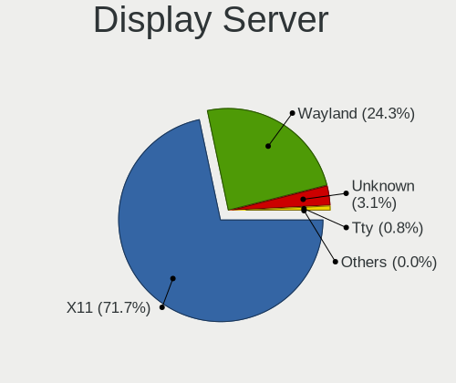
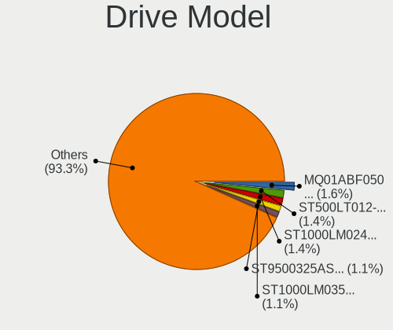
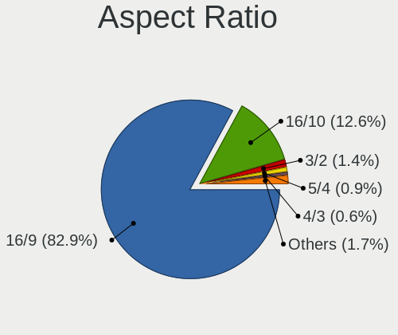
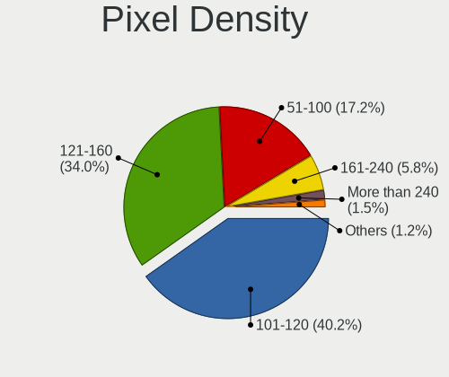
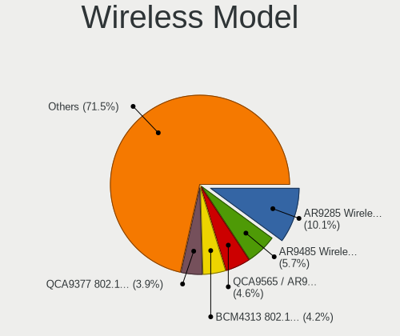
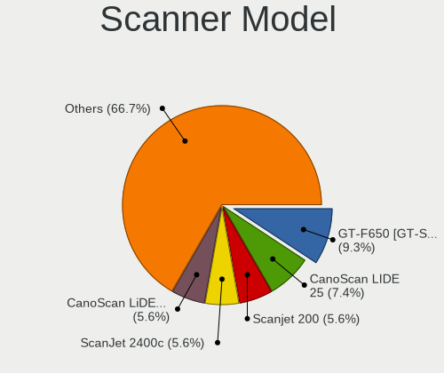
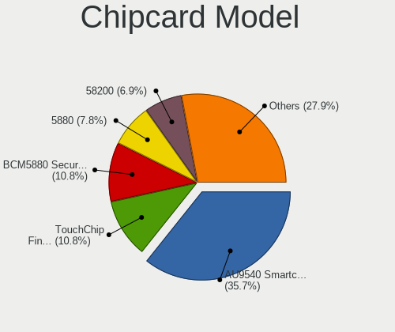

Linux in Russia - Tested Hardware & Statistics (Notebooks)
----------------------------------------------------------

A project to collect tested hardware configurations for Linux in Russia.

Anyone can contribute to this report by the [hw-probe](https://github.com/linuxhw/hw-probe) tool:

    sudo -E hw-probe -all -upload

Please contribute! Especially if your hardware is rare.

Contents
--------

* [ Test Cases ](#test-cases)

* [ System ](#system)
  - [ OS                       ](#os)
  - [ OS Family                ](#os-family)
  - [ Kernel                   ](#kernel)
  - [ Kernel Family            ](#kernel-family)
  - [ Kernel Major Ver.        ](#kernel-major-ver)
  - [ Arch                     ](#arch)
  - [ DE                       ](#de)
  - [ Display Server           ](#display-server)
  - [ Display Manager          ](#display-manager)
  - [ OS Lang                  ](#os-lang)
  - [ Boot Mode                ](#boot-mode)
  - [ Filesystem               ](#filesystem)
  - [ Part. scheme             ](#part-scheme)
  - [ Dual Boot with Linux/BSD ](#dual-boot-with-linuxbsd)
  - [ Dual Boot (Win)          ](#dual-boot-win)

* [ Board ](#board)
  - [ Vendor                   ](#vendor)
  - [ Model                    ](#model)
  - [ Model Family             ](#model-family)
  - [ MFG Year                 ](#mfg-year)
  - [ Form Factor              ](#form-factor)
  - [ Secure Boot              ](#secure-boot)
  - [ Coreboot                 ](#coreboot)
  - [ RAM Size                 ](#ram-size)
  - [ RAM Used                 ](#ram-used)
  - [ Total Drives             ](#total-drives)
  - [ Has CD-ROM               ](#has-cd-rom)
  - [ Has Ethernet             ](#has-ethernet)
  - [ Has WiFi                 ](#has-wifi)
  - [ Has Bluetooth            ](#has-bluetooth)

* [ Location ](#location)
  - [ Country                  ](#country)
  - [ City                     ](#city)

* [ Drives ](#drives)
  - [ Drive Vendor             ](#drive-vendor)
  - [ Drive Model              ](#drive-model)
  - [ HDD Vendor               ](#hdd-vendor)
  - [ SSD Vendor               ](#ssd-vendor)
  - [ Drive Kind               ](#drive-kind)
  - [ Drive Connector          ](#drive-connector)
  - [ Drive Size               ](#drive-size)
  - [ Space Total              ](#space-total)
  - [ Space Used               ](#space-used)
  - [ Malfunc. Drives          ](#malfunc-drives)
  - [ Malfunc. Drive Vendor    ](#malfunc-drive-vendor)
  - [ Malfunc. HDD Vendor      ](#malfunc-hdd-vendor)
  - [ Malfunc. Drive Kind      ](#malfunc-drive-kind)
  - [ Failed Drives            ](#failed-drives)
  - [ Failed Drive Vendor      ](#failed-drive-vendor)
  - [ Drive Status             ](#drive-status)

* [ Storage controller ](#storage-controller)
  - [ Storage Vendor           ](#storage-vendor)
  - [ Storage Model            ](#storage-model)
  - [ Storage Kind             ](#storage-kind)

* [ Processor ](#processor)
  - [ CPU Vendor               ](#cpu-vendor)
  - [ CPU Model                ](#cpu-model)
  - [ CPU Model Family         ](#cpu-model-family)
  - [ CPU Cores                ](#cpu-cores)
  - [ CPU Sockets              ](#cpu-sockets)
  - [ CPU Threads              ](#cpu-threads)
  - [ CPU Op-Modes             ](#cpu-op-modes)
  - [ CPU Microcode            ](#cpu-microcode)
  - [ CPU Microarch            ](#cpu-microarch)

* [ Graphics ](#graphics)
  - [ GPU Vendor               ](#gpu-vendor)
  - [ GPU Model                ](#gpu-model)
  - [ GPU Combo                ](#gpu-combo)
  - [ GPU Driver               ](#gpu-driver)
  - [ GPU Memory               ](#gpu-memory)

* [ Monitor ](#monitor)
  - [ Monitor Vendor           ](#monitor-vendor)
  - [ Monitor Model            ](#monitor-model)
  - [ Monitor Resolution       ](#monitor-resolution)
  - [ Monitor Diagonal         ](#monitor-diagonal)
  - [ Monitor Width            ](#monitor-width)
  - [ Aspect Ratio             ](#aspect-ratio)
  - [ Monitor Area             ](#monitor-area)
  - [ Pixel Density            ](#pixel-density)
  - [ Multiple Monitors        ](#multiple-monitors)

* [ Network ](#network)
  - [ Net Controller Vendor    ](#net-controller-vendor)
  - [ Net Controller Model     ](#net-controller-model)
  - [ Wireless Vendor          ](#wireless-vendor)
  - [ Wireless Model           ](#wireless-model)
  - [ Ethernet Vendor          ](#ethernet-vendor)
  - [ Ethernet Model           ](#ethernet-model)
  - [ Net Controller Kind      ](#net-controller-kind)
  - [ Used Controller          ](#used-controller)
  - [ NICs                     ](#nics)
  - [ IPv6                     ](#ipv6)

* [ Bluetooth ](#bluetooth)
  - [ Bluetooth Vendor         ](#bluetooth-vendor)
  - [ Bluetooth Model          ](#bluetooth-model)

* [ Sound ](#sound)
  - [ Sound Vendor             ](#sound-vendor)
  - [ Sound Model              ](#sound-model)

* [ Memory ](#memory)
  - [ Memory Vendor            ](#memory-vendor)
  - [ Memory Model             ](#memory-model)
  - [ Memory Kind              ](#memory-kind)
  - [ Memory Form Factor       ](#memory-form-factor)
  - [ Memory Size              ](#memory-size)
  - [ Memory Speed             ](#memory-speed)

* [ Printers & scanners ](#printers--scanners)
  - [ Printer Vendor           ](#printer-vendor)
  - [ Printer Model            ](#printer-model)
  - [ Scanner Vendor           ](#scanner-vendor)
  - [ Scanner Model            ](#scanner-model)

* [ Camera ](#camera)
  - [ Camera Vendor            ](#camera-vendor)
  - [ Camera Model             ](#camera-model)

* [ Security ](#security)
  - [ Fingerprint Vendor       ](#fingerprint-vendor)
  - [ Fingerprint Model        ](#fingerprint-model)
  - [ Chipcard Vendor          ](#chipcard-vendor)
  - [ Chipcard Model           ](#chipcard-model)

* [ Unsupported ](#unsupported)
  - [ Unsupported Devices      ](#unsupported-devices)
  - [ Unsupported Device Types ](#unsupported-device-types)

Test Cases
----------

Total: 17207

| Vendor        | Model                       | Probe                                                      | Date         |
|---------------|-----------------------------|------------------------------------------------------------|--------------|
| MSI           | MS-N0E1 Ver                 | [9c4dcef9c6](https://linux-hardware.org/?probe=9c4dcef9c6) | Feb 01, 2023 |
| Lenovo        | ThinkPad T490 20N2000LRT    | [aaaf227faf](https://linux-hardware.org/?probe=aaaf227faf) | Feb 01, 2023 |
| Lenovo        | IdeaPad 3 17ITL6 82H9       | [eaaf15f3f6](https://linux-hardware.org/?probe=eaaf15f3f6) | Feb 01, 2023 |
| ASUSTek       | Zenbook UX535QE_UM535QE     | [ee219f2f82](https://linux-hardware.org/?probe=ee219f2f82) | Feb 01, 2023 |
| ASUSTek       | Zenbook UX535QE_UM535QE     | [af2f6edc6f](https://linux-hardware.org/?probe=af2f6edc6f) | Feb 01, 2023 |
| ASUSTek       | N552VW                      | [1ebeeec517](https://linux-hardware.org/?probe=1ebeeec517) | Feb 01, 2023 |
| Dell          | Inspiron 5748               | [7ee6505f8d](https://linux-hardware.org/?probe=7ee6505f8d) | Feb 01, 2023 |
| Acer          | Nitro AN515-52              | [86156a3b50](https://linux-hardware.org/?probe=86156a3b50) | Jan 31, 2023 |
| Acer          | Aspire E1-522               | [af61a3d9c8](https://linux-hardware.org/?probe=af61a3d9c8) | Jan 31, 2023 |
| Dell          | Inspiron 5748               | [ecbd4ac8b6](https://linux-hardware.org/?probe=ecbd4ac8b6) | Jan 31, 2023 |
| HP            | 255 15.6 inch G9 Noteboo... | [7758d7c535](https://linux-hardware.org/?probe=7758d7c535) | Jan 31, 2023 |
| Aquarius      | Cmp NS685U                  | [b067e76e64](https://linux-hardware.org/?probe=b067e76e64) | Jan 31, 2023 |
| Clevo         | NL41MU2                     | [95dac05397](https://linux-hardware.org/?probe=95dac05397) | Jan 31, 2023 |
| Lenovo        | IdeaPad 5 15ARE05 81YQ      | [396877a008](https://linux-hardware.org/?probe=396877a008) | Jan 31, 2023 |
| Lenovo        | ThinkPad T410 2518BPG       | [011f53deaa](https://linux-hardware.org/?probe=011f53deaa) | Jan 31, 2023 |
| ASUSTek       | N53Ta                       | [30131c7409](https://linux-hardware.org/?probe=30131c7409) | Jan 31, 2023 |
| HP            | Pavilion Gaming Laptop 1... | [9fd1916420](https://linux-hardware.org/?probe=9fd1916420) | Jan 31, 2023 |
| ASUSTek       | 1011PX                      | [204706229b](https://linux-hardware.org/?probe=204706229b) | Jan 31, 2023 |
| HP            | Pavilion Gaming Laptop 1... | [318f007db6](https://linux-hardware.org/?probe=318f007db6) | Jan 31, 2023 |
| Acer          | Aspire A517-51              | [cb65ba4ce5](https://linux-hardware.org/?probe=cb65ba4ce5) | Jan 31, 2023 |
| HP            | 255 15.6 inch G9 Noteboo... | [5201a076f6](https://linux-hardware.org/?probe=5201a076f6) | Jan 30, 2023 |
| MACHENIKE     | MACHCREATOR-16              | [c44c077d1e](https://linux-hardware.org/?probe=c44c077d1e) | Jan 30, 2023 |
| ASUSTek       | X55VD                       | [4120c1019c](https://linux-hardware.org/?probe=4120c1019c) | Jan 30, 2023 |
| MSI           | GL75 Leopard 10SCSR         | [8e30762127](https://linux-hardware.org/?probe=8e30762127) | Jan 30, 2023 |
| HP            | ProBook 4720s               | [b6edbaeae1](https://linux-hardware.org/?probe=b6edbaeae1) | Jan 30, 2023 |
| Infinix       | INBOOK X2 GEN11             | [d826805d37](https://linux-hardware.org/?probe=d826805d37) | Jan 30, 2023 |
| Lenovo        | Z50-70 20354                | [54f6c27c09](https://linux-hardware.org/?probe=54f6c27c09) | Jan 30, 2023 |
| HP            | Pavilion g6                 | [d25ed40cf3](https://linux-hardware.org/?probe=d25ed40cf3) | Jan 30, 2023 |
| ASUSTek       | VivoBook_ASUSLaptop M150... | [8a324e4189](https://linux-hardware.org/?probe=8a324e4189) | Jan 30, 2023 |
| HP            | Pavilion dv6                | [0966ae419c](https://linux-hardware.org/?probe=0966ae419c) | Jan 30, 2023 |
| ASUSTek       | ASUS TUF Gaming F15 FX50... | [d800b8a4b9](https://linux-hardware.org/?probe=d800b8a4b9) | Jan 30, 2023 |
| ASUSTek       | 1011PX                      | [7359bcfbfb](https://linux-hardware.org/?probe=7359bcfbfb) | Jan 29, 2023 |
| Sony          | PCG-Z1VA(UC)                | [db4f48132e](https://linux-hardware.org/?probe=db4f48132e) | Jan 29, 2023 |
| Acer          | Nitro AN515-52              | [c8c73a9f67](https://linux-hardware.org/?probe=c8c73a9f67) | Jan 29, 2023 |
| MACHENIKE     | MACHCREATOR-16              | [e3d7c03a2e](https://linux-hardware.org/?probe=e3d7c03a2e) | Jan 29, 2023 |
| Sony          | VPCSB11FX                   | [7659c1ba93](https://linux-hardware.org/?probe=7659c1ba93) | Jan 29, 2023 |
| Unknown       | Unknown                     | [23d04579d4](https://linux-hardware.org/?probe=23d04579d4) | Jan 29, 2023 |
| TECNO         | MEGABOOK T1                 | [db0e6c89b4](https://linux-hardware.org/?probe=db0e6c89b4) | Jan 29, 2023 |
| Samsung       | RV420/RV520/RV720/E3530/... | [93e0f40842](https://linux-hardware.org/?probe=93e0f40842) | Jan 29, 2023 |
| Acer          | Aspire 3810T                | [a7b93a7119](https://linux-hardware.org/?probe=a7b93a7119) | Jan 29, 2023 |
| ASUSTek       | TUF Gaming FX505DT_FX505... | [87502e1eb2](https://linux-hardware.org/?probe=87502e1eb2) | Jan 29, 2023 |
| Acer          | Nitro AN515-52              | [2fb747792d](https://linux-hardware.org/?probe=2fb747792d) | Jan 29, 2023 |
| HP            | Notebook                    | [d38e078368](https://linux-hardware.org/?probe=d38e078368) | Jan 28, 2023 |
| ASUSTek       | X550MJ                      | [51fd1f6c24](https://linux-hardware.org/?probe=51fd1f6c24) | Jan 28, 2023 |
| Timi          | Redmi Book Pro 15 2022      | [7e6cf30d81](https://linux-hardware.org/?probe=7e6cf30d81) | Jan 28, 2023 |
| Lenovo        | ThinkPad T14 Gen 2a 20XK... | [85e23fef85](https://linux-hardware.org/?probe=85e23fef85) | Jan 28, 2023 |
| ASUSTek       | ET2321I                     | [dbb162975e](https://linux-hardware.org/?probe=dbb162975e) | Jan 28, 2023 |
| Lenovo        | ThinkPad T450s 20BWS23W0... | [41c82dbadb](https://linux-hardware.org/?probe=41c82dbadb) | Jan 27, 2023 |
| Unknown       | Unknown                     | [b4270378b4](https://linux-hardware.org/?probe=b4270378b4) | Jan 27, 2023 |
| Lenovo        | B570e HuronRiver Platfor... | [376c580dcb](https://linux-hardware.org/?probe=376c580dcb) | Jan 27, 2023 |
| ASUSTek       | N56VJ                       | [6ad6470149](https://linux-hardware.org/?probe=6ad6470149) | Jan 27, 2023 |
| HONOR         | BMH-WCX9                    | [882bb3b505](https://linux-hardware.org/?probe=882bb3b505) | Jan 27, 2023 |
| MSI           | Prestige 14Evo A12M         | [17f4098b36](https://linux-hardware.org/?probe=17f4098b36) | Jan 27, 2023 |
| HP            | ProBook 445 G7              | [d0b5bf560a](https://linux-hardware.org/?probe=d0b5bf560a) | Jan 27, 2023 |
| ASUSTek       | VivoBook_ASUSLaptop X515... | [acbaa4516c](https://linux-hardware.org/?probe=acbaa4516c) | Jan 27, 2023 |
| Acer          | Aspire 3810T                | [c77f7df143](https://linux-hardware.org/?probe=c77f7df143) | Jan 27, 2023 |
| Clevo         | M770SUA                     | [3a19bae169](https://linux-hardware.org/?probe=3a19bae169) | Jan 27, 2023 |
| Lenovo        | IdeaPad 3 14ITL05 81X7      | [ff67a5eb33](https://linux-hardware.org/?probe=ff67a5eb33) | Jan 27, 2023 |
| Clevo         | NL41MU2                     | [86e493728f](https://linux-hardware.org/?probe=86e493728f) | Jan 27, 2023 |
| MSI           | Prestige 14Evo A12M         | [3638a1774c](https://linux-hardware.org/?probe=3638a1774c) | Jan 27, 2023 |
| Lenovo        | IdeaPad 320-15IAP 80XR      | [ecd1e46811](https://linux-hardware.org/?probe=ecd1e46811) | Jan 27, 2023 |
| Lenovo        | G480 20156                  | [9e09139dbc](https://linux-hardware.org/?probe=9e09139dbc) | Jan 26, 2023 |
| ASUSTek       | 1201N                       | [ddc52a086f](https://linux-hardware.org/?probe=ddc52a086f) | Jan 26, 2023 |
| Acer          | Nitro AN515-52              | [02dffce8d7](https://linux-hardware.org/?probe=02dffce8d7) | Jan 26, 2023 |
| ASUSTek       | VivoBook 15_ASUS Laptop ... | [6290f61a46](https://linux-hardware.org/?probe=6290f61a46) | Jan 26, 2023 |
| HONOR         | HLYL-WXX9                   | [00c90b28ca](https://linux-hardware.org/?probe=00c90b28ca) | Jan 26, 2023 |
| Unknown       | Unknown                     | [6ac74fad2b](https://linux-hardware.org/?probe=6ac74fad2b) | Jan 26, 2023 |
| ASUSTek       | Zenbook UX535QE_UM535QE     | [4a3c63f3f0](https://linux-hardware.org/?probe=4a3c63f3f0) | Jan 26, 2023 |
| Infinix       | INBOOK X2 GEN11             | [ee7b9f5fd0](https://linux-hardware.org/?probe=ee7b9f5fd0) | Jan 26, 2023 |
| Clevo         | M815P                       | [cfc5f6689f](https://linux-hardware.org/?probe=cfc5f6689f) | Jan 25, 2023 |
| HP            | EliteBook 840 G4            | [ee6e7a2924](https://linux-hardware.org/?probe=ee6e7a2924) | Jan 25, 2023 |
| Timi          | Redmi Book Pro 15 2022      | [b89ee82de7](https://linux-hardware.org/?probe=b89ee82de7) | Jan 25, 2023 |
| ASUSTek       | VivoBook_ASUSLaptop X540... | [ef947d32a1](https://linux-hardware.org/?probe=ef947d32a1) | Jan 25, 2023 |
| ASUSTek       | VivoBook_ASUSLaptop X540... | [d0a3780add](https://linux-hardware.org/?probe=d0a3780add) | Jan 25, 2023 |
| Lenovo        | V310-15IKB 80T3             | [fe11977488](https://linux-hardware.org/?probe=fe11977488) | Jan 25, 2023 |
| ASUSTek       | Zenbook UX535QE_UM535QE     | [702b3c77fc](https://linux-hardware.org/?probe=702b3c77fc) | Jan 25, 2023 |
| HP            | Laptop 15-bw0xx             | [c2867457c2](https://linux-hardware.org/?probe=c2867457c2) | Jan 25, 2023 |
| MSI           | GL63 8RC                    | [138e8de541](https://linux-hardware.org/?probe=138e8de541) | Jan 25, 2023 |
| Lenovo        | V310-15IKB 80T3             | [d56d0b1732](https://linux-hardware.org/?probe=d56d0b1732) | Jan 25, 2023 |
| Acer          | Aspire A315-59              | [33292253d0](https://linux-hardware.org/?probe=33292253d0) | Jan 25, 2023 |
| Acer          | Extensa 2540                | [af5b1ea485](https://linux-hardware.org/?probe=af5b1ea485) | Jan 25, 2023 |
| Clevo         | NL41MU2                     | [82e558cf16](https://linux-hardware.org/?probe=82e558cf16) | Jan 25, 2023 |
| Acer          | Aspire 5742G                | [e7afbd79e9](https://linux-hardware.org/?probe=e7afbd79e9) | Jan 24, 2023 |
| realme        | CloudProXXXX                | [520d929687](https://linux-hardware.org/?probe=520d929687) | Jan 24, 2023 |
| Lenovo        | IdeaPad L340-15API 81LW     | [186aef8e0c](https://linux-hardware.org/?probe=186aef8e0c) | Jan 24, 2023 |
| Clevo         | NL41MU2                     | [831e02a268](https://linux-hardware.org/?probe=831e02a268) | Jan 24, 2023 |
| ASUSTek       | A9T                         | [3e313bb71a](https://linux-hardware.org/?probe=3e313bb71a) | Jan 24, 2023 |
| HIPER Tech... | HIPER WORKBOOK              | [3b1ce8fc77](https://linux-hardware.org/?probe=3b1ce8fc77) | Jan 24, 2023 |
| ASUSTek       | A9T                         | [8ed103fd24](https://linux-hardware.org/?probe=8ed103fd24) | Jan 24, 2023 |
| Lenovo        | ThinkPad E15 20RD0011RT     | [3fb25133ec](https://linux-hardware.org/?probe=3fb25133ec) | Jan 24, 2023 |
| Lenovo        | IdeaPad 5 Pro 16ACH6 82L... | [56a9b7ad32](https://linux-hardware.org/?probe=56a9b7ad32) | Jan 24, 2023 |
| HUAWEI        | BDZ-WXX9                    | [21f0949826](https://linux-hardware.org/?probe=21f0949826) | Jan 24, 2023 |
| Lenovo        | B560                        | [b474faa82b](https://linux-hardware.org/?probe=b474faa82b) | Jan 23, 2023 |
| ASUSTek       | X51L                        | [b482dc649b](https://linux-hardware.org/?probe=b482dc649b) | Jan 23, 2023 |
| Notebook      | W65_67SH                    | [f80b7fddba](https://linux-hardware.org/?probe=f80b7fddba) | Jan 23, 2023 |
| Lenovo        | ThinkPad X121e 3055A18      | [97ef868fa0](https://linux-hardware.org/?probe=97ef868fa0) | Jan 23, 2023 |
| Lenovo        | ThinkPad X121e 3055A18      | [780e3b2071](https://linux-hardware.org/?probe=780e3b2071) | Jan 23, 2023 |
| realme        | CloudProXXXX                | [e5cbb75254](https://linux-hardware.org/?probe=e5cbb75254) | Jan 23, 2023 |
| HP            | ProBook 6470b               | [3319221b9c](https://linux-hardware.org/?probe=3319221b9c) | Jan 23, 2023 |
| MACHENIKE     | MACHCREATOR-16              | [7b3107564a](https://linux-hardware.org/?probe=7b3107564a) | Jan 23, 2023 |
| MACHENIKE     | MACHCREATOR-16              | [6b370a283e](https://linux-hardware.org/?probe=6b370a283e) | Jan 23, 2023 |
| Lenovo        | IdeaPad S510p 20298         | [18fdd7a490](https://linux-hardware.org/?probe=18fdd7a490) | Jan 23, 2023 |
| Samsung       | 300E4C/300E5C/300E7C        | [5648fbf4a0](https://linux-hardware.org/?probe=5648fbf4a0) | Jan 23, 2023 |
| Valve         | Jupiter                     | [f1553073f5](https://linux-hardware.org/?probe=f1553073f5) | Jan 23, 2023 |
| Samsung       | NC10                        | [6bd13301d9](https://linux-hardware.org/?probe=6bd13301d9) | Jan 22, 2023 |
| HONOR         | NBR-WAX9                    | [cee0f1ccd5](https://linux-hardware.org/?probe=cee0f1ccd5) | Jan 22, 2023 |
| HP            | ProBook 5330m               | [989327864b](https://linux-hardware.org/?probe=989327864b) | Jan 22, 2023 |
| HUAWEI        | HVY-WXX9                    | [e0b75953b9](https://linux-hardware.org/?probe=e0b75953b9) | Jan 22, 2023 |
| ASUSTek       | N56VJ                       | [167dae47d7](https://linux-hardware.org/?probe=167dae47d7) | Jan 22, 2023 |
| Acer          | Aspire E1-530G              | [b4f6567b3f](https://linux-hardware.org/?probe=b4f6567b3f) | Jan 22, 2023 |
| Lenovo        | ThinkPad E15 20RD0019RT     | [282161cc92](https://linux-hardware.org/?probe=282161cc92) | Jan 22, 2023 |
| Lenovo        | ThinkPad E15 20RD0019RT     | [8d235b1b8d](https://linux-hardware.org/?probe=8d235b1b8d) | Jan 22, 2023 |
| Timi          | TM1701                      | [bec2d3a691](https://linux-hardware.org/?probe=bec2d3a691) | Jan 22, 2023 |
| Lenovo        | ThinkPad L430 2466DS2       | [8be9a889b7](https://linux-hardware.org/?probe=8be9a889b7) | Jan 22, 2023 |
| HP            | Pavilion Gaming Laptop 1... | [15b2f3fc5e](https://linux-hardware.org/?probe=15b2f3fc5e) | Jan 22, 2023 |
| ASUSTek       | VivoBook 15_ASUS Laptop ... | [7d63d494c6](https://linux-hardware.org/?probe=7d63d494c6) | Jan 21, 2023 |
| Samsung       | RV408/RV508                 | [0d5c4881c1](https://linux-hardware.org/?probe=0d5c4881c1) | Jan 21, 2023 |
| HP            | OMEN Laptop 15-en1xxx       | [adeb24c41e](https://linux-hardware.org/?probe=adeb24c41e) | Jan 21, 2023 |
| Acer          | Aspire A515-45G             | [df633f4583](https://linux-hardware.org/?probe=df633f4583) | Jan 21, 2023 |
| Valve         | Jupiter                     | [c464fc36a9](https://linux-hardware.org/?probe=c464fc36a9) | Jan 21, 2023 |
| Toshiba       | Satellite P200              | [cdc37dfe5e](https://linux-hardware.org/?probe=cdc37dfe5e) | Jan 20, 2023 |
| Lenovo        | G505 20240                  | [c591d80181](https://linux-hardware.org/?probe=c591d80181) | Jan 20, 2023 |
| Sony          | VGN-FJ3SR_B                 | [4dc8b8d09d](https://linux-hardware.org/?probe=4dc8b8d09d) | Jan 20, 2023 |
| Lenovo        | B450                        | [96b87672bf](https://linux-hardware.org/?probe=96b87672bf) | Jan 20, 2023 |
| Acer          | Aspire A315-42G             | [ed4c536efa](https://linux-hardware.org/?probe=ed4c536efa) | Jan 20, 2023 |
| ASUSTek       | VivoBook 15_ASUS Laptop ... | [459b2e28d0](https://linux-hardware.org/?probe=459b2e28d0) | Jan 20, 2023 |
| Lenovo        | V130-15IKB 81HN             | [a74a5b3b7b](https://linux-hardware.org/?probe=a74a5b3b7b) | Jan 20, 2023 |
| Lenovo        | IdeaPad L340-15API 81LW     | [8472d89767](https://linux-hardware.org/?probe=8472d89767) | Jan 20, 2023 |
| Acer          | Nitro AN515-52              | [9abd51692e](https://linux-hardware.org/?probe=9abd51692e) | Jan 20, 2023 |
| ASUSTek       | VivoBook_ASUSLaptop X740... | [e04a896c6a](https://linux-hardware.org/?probe=e04a896c6a) | Jan 20, 2023 |
| Blackview     | AceBook 1                   | [ea4db42aa8](https://linux-hardware.org/?probe=ea4db42aa8) | Jan 19, 2023 |
| Lenovo        | IdeaPad L340-15API 81LW     | [7d95709d81](https://linux-hardware.org/?probe=7d95709d81) | Jan 19, 2023 |
| Lenovo        | IdeaPad 320-15ABR 80XS      | [20749dc72f](https://linux-hardware.org/?probe=20749dc72f) | Jan 19, 2023 |
| Acer          | Aspire E5-573G              | [cfe663eeb9](https://linux-hardware.org/?probe=cfe663eeb9) | Jan 19, 2023 |
| Notebook      | W65_67SJ                    | [8628d6f752](https://linux-hardware.org/?probe=8628d6f752) | Jan 18, 2023 |
| HP            | ProBook 440 G4              | [43b8eec1e2](https://linux-hardware.org/?probe=43b8eec1e2) | Jan 18, 2023 |
| Chuwi         | HeroBook Pro                | [42bf8b9a0d](https://linux-hardware.org/?probe=42bf8b9a0d) | Jan 18, 2023 |
| Lenovo        | IdeaPad 330-15IKB 81DE      | [82eea2cc7b](https://linux-hardware.org/?probe=82eea2cc7b) | Jan 18, 2023 |
| HP            | ProBook 640 G5              | [095355c9fc](https://linux-hardware.org/?probe=095355c9fc) | Jan 18, 2023 |
| Lenovo        | ThinkPad E15 20RD0011RT     | [d27ca45841](https://linux-hardware.org/?probe=d27ca45841) | Jan 18, 2023 |
| Toshiba       | Satellite Pro C660          | [02a6db2951](https://linux-hardware.org/?probe=02a6db2951) | Jan 18, 2023 |
| Toshiba       | Satellite Pro C660          | [a9de8742d5](https://linux-hardware.org/?probe=a9de8742d5) | Jan 17, 2023 |
| Clevo         | NL41MU2                     | [c1c0617217](https://linux-hardware.org/?probe=c1c0617217) | Jan 17, 2023 |
| Acer          | Aspire A315-59              | [469c40ec75](https://linux-hardware.org/?probe=469c40ec75) | Jan 17, 2023 |
| HP            | Laptop 15s-eq1xxx           | [62fc20fe3e](https://linux-hardware.org/?probe=62fc20fe3e) | Jan 17, 2023 |
| HP            | Notebook                    | [a998060574](https://linux-hardware.org/?probe=a998060574) | Jan 17, 2023 |
| Lenovo        | Flex 2-14 20404             | [bdfe91e3c9](https://linux-hardware.org/?probe=bdfe91e3c9) | Jan 17, 2023 |
| Acer          | Nitro AN515-52              | [4507d2f32d](https://linux-hardware.org/?probe=4507d2f32d) | Jan 17, 2023 |
| Acer          | Aspire V3-571G              | [84bce1ebbb](https://linux-hardware.org/?probe=84bce1ebbb) | Jan 17, 2023 |
| ASUSTek       | Zenbook UX535QE_UM535QE     | [a5ddfa16b9](https://linux-hardware.org/?probe=a5ddfa16b9) | Jan 17, 2023 |
| Acer          | Aspire A315-58              | [7a697f398d](https://linux-hardware.org/?probe=7a697f398d) | Jan 17, 2023 |
| HP            | Laptop 15s-eq1xxx           | [9e3506397c](https://linux-hardware.org/?probe=9e3506397c) | Jan 17, 2023 |
| Samsung       | 300E4A/300E5A/300E7A        | [13962de59b](https://linux-hardware.org/?probe=13962de59b) | Jan 16, 2023 |
| Samsung       | 300E4A/300E5A/300E7A        | [4db3b47f5a](https://linux-hardware.org/?probe=4db3b47f5a) | Jan 16, 2023 |
| Lenovo        | G500 20236                  | [37891c1ea9](https://linux-hardware.org/?probe=37891c1ea9) | Jan 16, 2023 |
| Aquarius      | AQNS685V4                   | [1f0cd980d8](https://linux-hardware.org/?probe=1f0cd980d8) | Jan 16, 2023 |
| ASUSTek       | P43E                        | [2685c35f77](https://linux-hardware.org/?probe=2685c35f77) | Jan 16, 2023 |
| HP            | Laptop 15-db0xxx            | [363f8daa52](https://linux-hardware.org/?probe=363f8daa52) | Jan 16, 2023 |
| Lenovo        | IdeaPad 3 14ADA05 81W0      | [e1aa5d3186](https://linux-hardware.org/?probe=e1aa5d3186) | Jan 16, 2023 |
| Acer          | Aspire 5625G                | [244d8473fc](https://linux-hardware.org/?probe=244d8473fc) | Jan 16, 2023 |
| Acer          | Aspire V3-571G              | [3715650f46](https://linux-hardware.org/?probe=3715650f46) | Jan 16, 2023 |
| Unknown       | Unknown                     | [84f591bd6b](https://linux-hardware.org/?probe=84f591bd6b) | Jan 16, 2023 |
| HP            | Notebook                    | [219540f0f7](https://linux-hardware.org/?probe=219540f0f7) | Jan 16, 2023 |
| ASUSTek       | VivoBook 15_ASUS Laptop ... | [2ec1685227](https://linux-hardware.org/?probe=2ec1685227) | Jan 15, 2023 |
| ASUSTek       | VivoBook 12_ASUS Laptop ... | [21c91371cc](https://linux-hardware.org/?probe=21c91371cc) | Jan 15, 2023 |
| Acer          | Aspire V3-772G              | [832efe11f1](https://linux-hardware.org/?probe=832efe11f1) | Jan 15, 2023 |
| eMachines     | eME442                      | [9de636b72e](https://linux-hardware.org/?probe=9de636b72e) | Jan 15, 2023 |
| Lenovo        | ThinkBook 15-IIL 20SM       | [63449ba8a3](https://linux-hardware.org/?probe=63449ba8a3) | Jan 15, 2023 |
| HUAWEI        | BOHK-WAX9X                  | [847fab84ee](https://linux-hardware.org/?probe=847fab84ee) | Jan 15, 2023 |
| ASUSTek       | VivoBook 15_ASUS Laptop ... | [bf4ea0ba42](https://linux-hardware.org/?probe=bf4ea0ba42) | Jan 15, 2023 |
| Kraftway      | ACCORD                      | [63039ae17f](https://linux-hardware.org/?probe=63039ae17f) | Jan 15, 2023 |
| Acer          | Aspire A515-43              | [cefbe7ee6e](https://linux-hardware.org/?probe=cefbe7ee6e) | Jan 15, 2023 |
| HP            | ProBook 455 G1              | [8fbd7eb667](https://linux-hardware.org/?probe=8fbd7eb667) | Jan 15, 2023 |
| HP            | 15                          | [6df03629da](https://linux-hardware.org/?probe=6df03629da) | Jan 15, 2023 |
| Toshiba       | Satellite L300              | [282e0e478f](https://linux-hardware.org/?probe=282e0e478f) | Jan 15, 2023 |
| HP            | Pavilion dv6                | [60f339781c](https://linux-hardware.org/?probe=60f339781c) | Jan 14, 2023 |
| HP            | Laptop 15s-eq2xxx           | [52b5182480](https://linux-hardware.org/?probe=52b5182480) | Jan 14, 2023 |
| Lenovo        | ThinkPad W520 4284W2U       | [576a509224](https://linux-hardware.org/?probe=576a509224) | Jan 14, 2023 |
| MECHREVO      | Jiaolong Series GM5ZG0O     | [17487f7b28](https://linux-hardware.org/?probe=17487f7b28) | Jan 14, 2023 |
| MSI           | GE62 6QF                    | [5ac082fab9](https://linux-hardware.org/?probe=5ac082fab9) | Jan 14, 2023 |
| Clevo         | W240EL/W250ELQ/W270ELQ      | [fd3560384c](https://linux-hardware.org/?probe=fd3560384c) | Jan 14, 2023 |
| ASUSTek       | ASUS TUF Gaming A15 FA50... | [efffe2d61b](https://linux-hardware.org/?probe=efffe2d61b) | Jan 14, 2023 |
| HP            | Mini 110-3700               | [564cb84405](https://linux-hardware.org/?probe=564cb84405) | Jan 14, 2023 |
| HP            | Pavilion Laptop 14-ec0xx... | [23f6f87501](https://linux-hardware.org/?probe=23f6f87501) | Jan 14, 2023 |
| MECHREVO      | Jiaolong Series GM5ZG0O     | [a02f812ef3](https://linux-hardware.org/?probe=a02f812ef3) | Jan 14, 2023 |
| Dell          | Inspiron ME051              | [853b489238](https://linux-hardware.org/?probe=853b489238) | Jan 14, 2023 |
| Dell          | Inspiron ME051              | [e806b368b7](https://linux-hardware.org/?probe=e806b368b7) | Jan 14, 2023 |
| Timi          | Redmi Book Pro 14S          | [911075716c](https://linux-hardware.org/?probe=911075716c) | Jan 13, 2023 |
| ASUSTek       | ASUS TUF Gaming A15 FA50... | [810b2daeef](https://linux-hardware.org/?probe=810b2daeef) | Jan 13, 2023 |
| Unknown       | Unknown                     | [ce69bfd81b](https://linux-hardware.org/?probe=ce69bfd81b) | Jan 13, 2023 |
| Lenovo        | B560                        | [e5a272b9c1](https://linux-hardware.org/?probe=e5a272b9c1) | Jan 13, 2023 |
| MACHENIKE     | MACHCREATOR-16              | [fbb327effe](https://linux-hardware.org/?probe=fbb327effe) | Jan 12, 2023 |
| Valve         | Jupiter                     | [599dc8d4af](https://linux-hardware.org/?probe=599dc8d4af) | Jan 12, 2023 |
| HP            | Laptop 14s-dq3xxx           | [19be6bae3d](https://linux-hardware.org/?probe=19be6bae3d) | Jan 12, 2023 |
| Dell          | Inspiron 3521               | [694d5be301](https://linux-hardware.org/?probe=694d5be301) | Jan 12, 2023 |
| Lenovo        | IdeaPad Z570 HuronRiver ... | [2316d5dc8b](https://linux-hardware.org/?probe=2316d5dc8b) | Jan 12, 2023 |
| Lenovo        | IdeaPad Gaming 3 15ACH6 ... | [c551a35ec7](https://linux-hardware.org/?probe=c551a35ec7) | Jan 12, 2023 |
| DEPO Compu... | DPC156                      | [1cf9823b87](https://linux-hardware.org/?probe=1cf9823b87) | Jan 12, 2023 |
| Acer          | Aspire A315-41G             | [2bfe8a0134](https://linux-hardware.org/?probe=2bfe8a0134) | Jan 12, 2023 |
| Lenovo        | ThinkPad T440p 20AW005BG... | [4e5eb618a2](https://linux-hardware.org/?probe=4e5eb618a2) | Jan 12, 2023 |
| HP            | Pavilion Laptop 14-dv0xx... | [e607ba7fc4](https://linux-hardware.org/?probe=e607ba7fc4) | Jan 12, 2023 |
| Lenovo        | IdeaPad 5 Pro 14ITL6 82L... | [f4d63c1053](https://linux-hardware.org/?probe=f4d63c1053) | Jan 12, 2023 |
| Unknown       | Unknown                     | [5f6b66b79b](https://linux-hardware.org/?probe=5f6b66b79b) | Jan 12, 2023 |
| Lenovo        | ThinkPad X220 4291LF6       | [fa0060843c](https://linux-hardware.org/?probe=fa0060843c) | Jan 11, 2023 |
| Lenovo        | ThinkPad X220 4291LF6       | [2a4a915d05](https://linux-hardware.org/?probe=2a4a915d05) | Jan 11, 2023 |
| HUAWEI        | KLVL-WXXW                   | [1270cfda4e](https://linux-hardware.org/?probe=1270cfda4e) | Jan 11, 2023 |
| Valve         | Jupiter                     | [7e8a3b18b7](https://linux-hardware.org/?probe=7e8a3b18b7) | Jan 11, 2023 |
| Lenovo        | Legion 5 15ACH6H 82JU       | [03b88e9443](https://linux-hardware.org/?probe=03b88e9443) | Jan 11, 2023 |
| Valve         | Jupiter                     | [8955775398](https://linux-hardware.org/?probe=8955775398) | Jan 11, 2023 |
| Acer          | Aspire A315-59              | [a436e3e89f](https://linux-hardware.org/?probe=a436e3e89f) | Jan 11, 2023 |
| Unknown       | Unknown                     | [45ea0a8983](https://linux-hardware.org/?probe=45ea0a8983) | Jan 11, 2023 |
| ASUSTek       | T200TAC                     | [5f39b8c967](https://linux-hardware.org/?probe=5f39b8c967) | Jan 11, 2023 |
| Intel         | Jasper Lake Client Platf... | [3000408196](https://linux-hardware.org/?probe=3000408196) | Jan 11, 2023 |
| Lenovo        | IdeaPad 3 17ADA05 81W2      | [5c4331e8b9](https://linux-hardware.org/?probe=5c4331e8b9) | Jan 11, 2023 |
| Lenovo        | ThinkPad Edge E330 33544... | [d6464d2317](https://linux-hardware.org/?probe=d6464d2317) | Jan 11, 2023 |
| HONOR         | NMH-WCX9                    | [a67f1ee7b0](https://linux-hardware.org/?probe=a67f1ee7b0) | Jan 11, 2023 |
| Lenovo        | IdeaPad L340-15IRH Gamin... | [a5ea710efd](https://linux-hardware.org/?probe=a5ea710efd) | Jan 11, 2023 |
| Acer          | Aspire ES1-512              | [9d614553aa](https://linux-hardware.org/?probe=9d614553aa) | Jan 11, 2023 |
| Timi          | RedmiBook Pro 15S           | [4eaa490031](https://linux-hardware.org/?probe=4eaa490031) | Jan 11, 2023 |
| MSI           | GP60 2OD                    | [dbd191a73b](https://linux-hardware.org/?probe=dbd191a73b) | Jan 11, 2023 |
| Infinix       | INBOOK X2                   | [11aac46bdc](https://linux-hardware.org/?probe=11aac46bdc) | Jan 10, 2023 |
| Aquarius      | NS585                       | [6fbcdf4d2f](https://linux-hardware.org/?probe=6fbcdf4d2f) | Jan 10, 2023 |
| Lenovo        | ThinkBook 16 G4+ ARA 21D... | [8d567b585a](https://linux-hardware.org/?probe=8d567b585a) | Jan 10, 2023 |
| Lenovo        | ThinkBook 16 G4+ ARA 21D... | [c4de77365a](https://linux-hardware.org/?probe=c4de77365a) | Jan 10, 2023 |
| MSI           | GE70 2PL                    | [57907f4005](https://linux-hardware.org/?probe=57907f4005) | Jan 10, 2023 |
| Aquarius      | NS585                       | [2d37eb6524](https://linux-hardware.org/?probe=2d37eb6524) | Jan 10, 2023 |
| Lenovo        | ThinkPad E14 20RA0011RT     | [2f2e1a45df](https://linux-hardware.org/?probe=2f2e1a45df) | Jan 10, 2023 |
| ICL           | RAYbook Si1512              | [df6c349ed9](https://linux-hardware.org/?probe=df6c349ed9) | Jan 10, 2023 |
| HUAWEI        | HVY-WXX9                    | [8c86504bdd](https://linux-hardware.org/?probe=8c86504bdd) | Jan 10, 2023 |
| HUAWEI        | HVY-WXX9                    | [ea97a4c5bd](https://linux-hardware.org/?probe=ea97a4c5bd) | Jan 10, 2023 |
| HUAWEI        | KLVD-WXX9                   | [c457f69728](https://linux-hardware.org/?probe=c457f69728) | Jan 10, 2023 |
| HP            | Unknown                     | [63d24f2719](https://linux-hardware.org/?probe=63d24f2719) | Jan 10, 2023 |
| Lenovo        | Yoga Slim 7 Pro 16ACH6 8... | [acab6ec02e](https://linux-hardware.org/?probe=acab6ec02e) | Jan 10, 2023 |
| Acer          | Aspire V3-331               | [b1f637177e](https://linux-hardware.org/?probe=b1f637177e) | Jan 10, 2023 |
| Acer          | Aspire 5733Z                | [87c8f3902d](https://linux-hardware.org/?probe=87c8f3902d) | Jan 10, 2023 |
| ASUSTek       | FX503VD                     | [c3a958527e](https://linux-hardware.org/?probe=c3a958527e) | Jan 10, 2023 |
| HP            | ProBook 4520s               | [8e1eba4ad4](https://linux-hardware.org/?probe=8e1eba4ad4) | Jan 09, 2023 |
| Lenovo        | S10-3                       | [ea711c1ded](https://linux-hardware.org/?probe=ea711c1ded) | Jan 09, 2023 |
| Samsung       | RV420/RV520/RV720           | [c0697ead47](https://linux-hardware.org/?probe=c0697ead47) | Jan 09, 2023 |
| Samsung       | 305E4A/305E5A/305E7A        | [930ac46758](https://linux-hardware.org/?probe=930ac46758) | Jan 09, 2023 |
| ASUSTek       | TUF Gaming FX505DT_FX505... | [b994b522e6](https://linux-hardware.org/?probe=b994b522e6) | Jan 09, 2023 |
| Acer          | Aspire 5755G                | [f6ecd5ed6e](https://linux-hardware.org/?probe=f6ecd5ed6e) | Jan 09, 2023 |
| ASUSTek       | K54L                        | [88b71478e6](https://linux-hardware.org/?probe=88b71478e6) | Jan 09, 2023 |
| ASUSTek       | K61IC                       | [c593968311](https://linux-hardware.org/?probe=c593968311) | Jan 09, 2023 |
| Lenovo        | ThinkPad X1 Extreme Gen ... | [1829eed17a](https://linux-hardware.org/?probe=1829eed17a) | Jan 09, 2023 |
| MSI           | GV72 8RD                    | [5fa5d4ef58](https://linux-hardware.org/?probe=5fa5d4ef58) | Jan 09, 2023 |
| MSI           | Modern 14 B11MOU            | [0db2c1a27c](https://linux-hardware.org/?probe=0db2c1a27c) | Jan 09, 2023 |
| Acer          | TravelMate P278-M           | [6b2be0a8cc](https://linux-hardware.org/?probe=6b2be0a8cc) | Jan 09, 2023 |
| Lenovo        | ThinkPad X1 Carbon 6th 2... | [e85e91a7f2](https://linux-hardware.org/?probe=e85e91a7f2) | Jan 09, 2023 |
| ASUSTek       | K95VB                       | [f42992ef2a](https://linux-hardware.org/?probe=f42992ef2a) | Jan 09, 2023 |
| Samsung       | 350V5C/351V5C/3540VC/344... | [71bd754745](https://linux-hardware.org/?probe=71bd754745) | Jan 09, 2023 |
| ASUSTek       | VivoBook_ASUSLaptop X540... | [364cc4a06d](https://linux-hardware.org/?probe=364cc4a06d) | Jan 09, 2023 |
| Lenovo        | IdeaPad 320-15AST 80XV      | [4e7429ebbf](https://linux-hardware.org/?probe=4e7429ebbf) | Jan 08, 2023 |
| Lenovo        | ThinkBook 15 G2 ITL 20VE    | [b6e56e8d87](https://linux-hardware.org/?probe=b6e56e8d87) | Jan 08, 2023 |
| Acer          | Aspire ES1-311              | [6f857b7e85](https://linux-hardware.org/?probe=6f857b7e85) | Jan 08, 2023 |
| Infinix       | INBOOK X2 GEN11             | [a899026279](https://linux-hardware.org/?probe=a899026279) | Jan 08, 2023 |
| Jumper        | EZpad                       | [b42f4266ff](https://linux-hardware.org/?probe=b42f4266ff) | Jan 08, 2023 |
| Notebook      | W65_67SH                    | [09761dd51c](https://linux-hardware.org/?probe=09761dd51c) | Jan 08, 2023 |
| ASUSTek       | X541UVK                     | [50e9caee7f](https://linux-hardware.org/?probe=50e9caee7f) | Jan 08, 2023 |
| ASUSTek       | Zenbook UX535QE_UM535QE     | [66ba6bf6d3](https://linux-hardware.org/?probe=66ba6bf6d3) | Jan 08, 2023 |
| Dell          | Inspiron 3793               | [67be2bc16f](https://linux-hardware.org/?probe=67be2bc16f) | Jan 08, 2023 |
| ASUSTek       | Zenbook UX535QE_UM535QE     | [7a02a3b48b](https://linux-hardware.org/?probe=7a02a3b48b) | Jan 08, 2023 |
| Dell          | Latitude 5490               | [8fd07b1457](https://linux-hardware.org/?probe=8fd07b1457) | Jan 08, 2023 |
| HUAWEI        | BOM-WXX9                    | [21fcd391f1](https://linux-hardware.org/?probe=21fcd391f1) | Jan 08, 2023 |
| ASUSTek       | VivoBook_ASUSLaptop X540... | [d32518b04e](https://linux-hardware.org/?probe=d32518b04e) | Jan 08, 2023 |
| ASUSTek       | VivoBook_ASUSLaptop X540... | [5936a203cc](https://linux-hardware.org/?probe=5936a203cc) | Jan 08, 2023 |
| ASUSTek       | ASUS TUF Gaming F15 FX50... | [d7b3bed98d](https://linux-hardware.org/?probe=d7b3bed98d) | Jan 08, 2023 |
| ASUSTek       | 1003HAG                     | [0b411dbd38](https://linux-hardware.org/?probe=0b411dbd38) | Jan 08, 2023 |
| Digma         | Pro Fortis M DN15P3-8CXN... | [077fd44029](https://linux-hardware.org/?probe=077fd44029) | Jan 08, 2023 |
| Lenovo        | B590 20208                  | [e082e7aece](https://linux-hardware.org/?probe=e082e7aece) | Jan 07, 2023 |
| Acer          | Aspire ES1-572              | [dbbd130a08](https://linux-hardware.org/?probe=dbbd130a08) | Jan 07, 2023 |
| Intel         | Jasper Lake Client Platf... | [24fef9e401](https://linux-hardware.org/?probe=24fef9e401) | Jan 07, 2023 |
| Acer          | Aspire V3-551G              | [adfe7169cc](https://linux-hardware.org/?probe=adfe7169cc) | Jan 07, 2023 |
| Acer          | Nitro AN515-54              | [0336238a86](https://linux-hardware.org/?probe=0336238a86) | Jan 07, 2023 |
| ASUSTek       | 1003HAG                     | [eb8e81a088](https://linux-hardware.org/?probe=eb8e81a088) | Jan 07, 2023 |
| Lenovo        | G580 20157                  | [57ec88a87b](https://linux-hardware.org/?probe=57ec88a87b) | Jan 07, 2023 |
| Lenovo        | ThinkPad E590 20NB001BGE    | [44d45b8178](https://linux-hardware.org/?probe=44d45b8178) | Jan 06, 2023 |
| Sony          | SVS1512U1RW                 | [c5de402a7c](https://linux-hardware.org/?probe=c5de402a7c) | Jan 06, 2023 |
| Lenovo        | ThinkPad L13 Gen 3 21BAA... | [7892dbaa3d](https://linux-hardware.org/?probe=7892dbaa3d) | Jan 06, 2023 |
| HP            | OMEN by Laptop 17-ck0xxx    | [9655429e71](https://linux-hardware.org/?probe=9655429e71) | Jan 06, 2023 |
| HP            | Compaq 515                  | [6cc60c3d13](https://linux-hardware.org/?probe=6cc60c3d13) | Jan 06, 2023 |
| Samsung       | 350V5C/350V5X/350V4C/350... | [daca90b2bb](https://linux-hardware.org/?probe=daca90b2bb) | Jan 05, 2023 |
| Samsung       | 350V5C/350V5X/350V4C/350... | [74bacb92f5](https://linux-hardware.org/?probe=74bacb92f5) | Jan 05, 2023 |
| Acer          | Nitro AN515-44              | [1b36fc58ae](https://linux-hardware.org/?probe=1b36fc58ae) | Jan 05, 2023 |
| Chuwi         | CoreBook X                  | [bf8c10bdca](https://linux-hardware.org/?probe=bf8c10bdca) | Jan 05, 2023 |
| Dell          | G7 7790                     | [ffaafd92cf](https://linux-hardware.org/?probe=ffaafd92cf) | Jan 05, 2023 |
| ASUSTek       | F8SG                        | [d70636ce7e](https://linux-hardware.org/?probe=d70636ce7e) | Jan 05, 2023 |
| ASUSTek       | VivoBook_ASUSLaptop M150... | [2cb5d2f306](https://linux-hardware.org/?probe=2cb5d2f306) | Jan 05, 2023 |
| Maibenben     | MaiBook M                   | [6b475a50fc](https://linux-hardware.org/?probe=6b475a50fc) | Jan 05, 2023 |
| Acer          | Extensa 2540                | [4442f2c14a](https://linux-hardware.org/?probe=4442f2c14a) | Jan 05, 2023 |
| Samsung       | 350V5C/351V5C/3540VC/344... | [729add189b](https://linux-hardware.org/?probe=729add189b) | Jan 05, 2023 |
| Lenovo        | IdeaPad S145-15AST 81N3     | [c2df57a53f](https://linux-hardware.org/?probe=c2df57a53f) | Jan 05, 2023 |
| Lenovo        | B570e HuronRiver Platfor... | [5be962cfea](https://linux-hardware.org/?probe=5be962cfea) | Jan 05, 2023 |
| HP            | ProBook 640 G1              | [e3fd4121a2](https://linux-hardware.org/?probe=e3fd4121a2) | Jan 04, 2023 |
| HP            | EliteBook 840 G5 NOTEBOO... | [343d0f4c48](https://linux-hardware.org/?probe=343d0f4c48) | Jan 04, 2023 |
| Acer          | Extensa 2540                | [ec8b49d7b0](https://linux-hardware.org/?probe=ec8b49d7b0) | Jan 04, 2023 |
| HUAWEI        | BOM-WXX9                    | [f4631a1285](https://linux-hardware.org/?probe=f4631a1285) | Jan 04, 2023 |
| Samsung       | 355V4C/355V4X/355V5C/355... | [e06b51ae0a](https://linux-hardware.org/?probe=e06b51ae0a) | Jan 04, 2023 |
| Acer          | Aspire A515-51G             | [628e5fab6a](https://linux-hardware.org/?probe=628e5fab6a) | Jan 04, 2023 |
| Chuwi         | GemiBook Pro                | [272d23ec5d](https://linux-hardware.org/?probe=272d23ec5d) | Jan 04, 2023 |
| Acer          | Swift SF114-32              | [50315135d2](https://linux-hardware.org/?probe=50315135d2) | Jan 04, 2023 |
| Acer          | Aspire A315-59              | [c166af4a6a](https://linux-hardware.org/?probe=c166af4a6a) | Jan 04, 2023 |
| Infinix       | INBOOK X2 GEN11             | [0cef66e1f2](https://linux-hardware.org/?probe=0cef66e1f2) | Jan 04, 2023 |
| Acer          | Aspire A315-59              | [427a19e69c](https://linux-hardware.org/?probe=427a19e69c) | Jan 04, 2023 |
| Chuwi         | GemiBook Pro                | [ed8c1ab25e](https://linux-hardware.org/?probe=ed8c1ab25e) | Jan 04, 2023 |
| HP            | Pavilion 15                 | [9cf74b665b](https://linux-hardware.org/?probe=9cf74b665b) | Jan 04, 2023 |
| HP            | Pavilion 15                 | [c33e367298](https://linux-hardware.org/?probe=c33e367298) | Jan 04, 2023 |
| Dell          | Inspiron 1525               | [c3c074f183](https://linux-hardware.org/?probe=c3c074f183) | Jan 03, 2023 |
| ASUSTek       | X510UNR                     | [5ac1da09ba](https://linux-hardware.org/?probe=5ac1da09ba) | Jan 03, 2023 |
| Acer          | Aspire 5738                 | [aa99474aec](https://linux-hardware.org/?probe=aa99474aec) | Jan 03, 2023 |
| HP            | EliteBook 855 G8 Noteboo... | [ac3df6f289](https://linux-hardware.org/?probe=ac3df6f289) | Jan 03, 2023 |
| Dell          | Inspiron 7577               | [437194cbc0](https://linux-hardware.org/?probe=437194cbc0) | Jan 03, 2023 |
| Unknown       | Unknown                     | [dba4431951](https://linux-hardware.org/?probe=dba4431951) | Jan 03, 2023 |
| Clevo         | M815P                       | [7f1503c5e6](https://linux-hardware.org/?probe=7f1503c5e6) | Jan 03, 2023 |
| MSI           | Katana GF66 11SC            | [d788f444ff](https://linux-hardware.org/?probe=d788f444ff) | Jan 03, 2023 |
| Gigabyte      | G5 KD                       | [b86543e8cf](https://linux-hardware.org/?probe=b86543e8cf) | Jan 03, 2023 |
| Acer          | Aspire 5349                 | [b482fc96ea](https://linux-hardware.org/?probe=b482fc96ea) | Jan 03, 2023 |
| Lenovo        | ThinkPad T570 W10DG 20JX... | [63a14c970b](https://linux-hardware.org/?probe=63a14c970b) | Jan 03, 2023 |
| HUAWEI        | BOD-WXX9                    | [34ce85079c](https://linux-hardware.org/?probe=34ce85079c) | Jan 03, 2023 |
| HUAWEI        | BOD-WXX9                    | [69dd532d74](https://linux-hardware.org/?probe=69dd532d74) | Jan 03, 2023 |
| Lenovo        | IdeaPad Gaming 3 15ARH05... | [8eef31a350](https://linux-hardware.org/?probe=8eef31a350) | Jan 03, 2023 |
| Dell          | Latitude 7410               | [3dadd543f1](https://linux-hardware.org/?probe=3dadd543f1) | Jan 03, 2023 |
| MSI           | Raider GE76 12UGS           | [8552e25872](https://linux-hardware.org/?probe=8552e25872) | Jan 03, 2023 |
| Lenovo        | ThinkPad L13 Gen 3 21BAA... | [3f6f3dd3fe](https://linux-hardware.org/?probe=3f6f3dd3fe) | Jan 03, 2023 |
| ASUSTek       | VivoBook 15_ASUS Laptop ... | [4842e4b3e5](https://linux-hardware.org/?probe=4842e4b3e5) | Jan 03, 2023 |
| ASUSTek       | VivoBook_ASUSLaptop X740... | [70c50fe035](https://linux-hardware.org/?probe=70c50fe035) | Jan 02, 2023 |
| Clevo         | M815P                       | [034cecc238](https://linux-hardware.org/?probe=034cecc238) | Jan 02, 2023 |
| ASUSTek       | VivoBook 15_ASUS Laptop ... | [a959b07b66](https://linux-hardware.org/?probe=a959b07b66) | Jan 02, 2023 |
| ASUSTek       | VivoBook_ASUSLaptop X740... | [8d4934bc09](https://linux-hardware.org/?probe=8d4934bc09) | Jan 02, 2023 |
| Lenovo        | ThinkBook 13s G2 ITL 20V... | [daeb060f32](https://linux-hardware.org/?probe=daeb060f32) | Jan 02, 2023 |
| Unknown       | Unknown                     | [e4608bbed6](https://linux-hardware.org/?probe=e4608bbed6) | Jan 02, 2023 |
| Acer          | Aspire A315-59              | [f84116ec07](https://linux-hardware.org/?probe=f84116ec07) | Jan 01, 2023 |
| HP            | EliteBook 855 G8 Noteboo... | [fbf89f7693](https://linux-hardware.org/?probe=fbf89f7693) | Jan 01, 2023 |
| Lenovo        | ThinkPad T14 Gen 2i 20W0... | [5a95ae3186](https://linux-hardware.org/?probe=5a95ae3186) | Jan 01, 2023 |
| Fujitsu       | LIFEBOOK U749               | [c09072c09f](https://linux-hardware.org/?probe=c09072c09f) | Jan 01, 2023 |
| Lenovo        | ThinkPad T14 Gen 3 21AH0... | [322cf5484d](https://linux-hardware.org/?probe=322cf5484d) | Dec 31, 2022 |
| ASUSTek       | X540YA                      | [37ef421251](https://linux-hardware.org/?probe=37ef421251) | Dec 31, 2022 |
| Lenovo        | G780 20138                  | [896aeb4e20](https://linux-hardware.org/?probe=896aeb4e20) | Dec 31, 2022 |
| Dell          | Inspiron 15-3552            | [e8b804ddd5](https://linux-hardware.org/?probe=e8b804ddd5) | Dec 31, 2022 |
| Valve         | Jupiter                     | [61cb7375d1](https://linux-hardware.org/?probe=61cb7375d1) | Dec 31, 2022 |
| Samsung       | 300V3A/300V4A/300V5A        | [14b589709d](https://linux-hardware.org/?probe=14b589709d) | Dec 31, 2022 |
| MACHENIKE     | MACHCREATOR-16              | [f7ed4a6609](https://linux-hardware.org/?probe=f7ed4a6609) | Dec 30, 2022 |
| Timi          | A35S                        | [c62c9ae956](https://linux-hardware.org/?probe=c62c9ae956) | Dec 30, 2022 |
| HP            | Pavilion g6                 | [6f29ccd86e](https://linux-hardware.org/?probe=6f29ccd86e) | Dec 30, 2022 |
| Lenovo        | IdeaPad L340-15API 81LW     | [5b5e0e4535](https://linux-hardware.org/?probe=5b5e0e4535) | Dec 30, 2022 |
| ASUSTek       | VivoBook 15_ASUS Laptop ... | [5710b93654](https://linux-hardware.org/?probe=5710b93654) | Dec 30, 2022 |
| Dell          | Inspiron 5490               | [c8a80649d2](https://linux-hardware.org/?probe=c8a80649d2) | Dec 30, 2022 |
| Lenovo        | IdeaPad 330-15IKB 81DE      | [2d63537d23](https://linux-hardware.org/?probe=2d63537d23) | Dec 30, 2022 |
| ASUSTek       | VivoBook_ASUS Laptop E21... | [41da11b027](https://linux-hardware.org/?probe=41da11b027) | Dec 30, 2022 |
| Lenovo        | IdeaPad 330-15IKB 81DE      | [954fdfcd25](https://linux-hardware.org/?probe=954fdfcd25) | Dec 30, 2022 |
| Unknown       | Unknown                     | [b74128543f](https://linux-hardware.org/?probe=b74128543f) | Dec 29, 2022 |
| HP            | ProBook 430 G8 Notebook ... | [3f4178001d](https://linux-hardware.org/?probe=3f4178001d) | Dec 29, 2022 |
| Lenovo        | IdeaPad 5 Pro 14ITL6 82L... | [6c836dde26](https://linux-hardware.org/?probe=6c836dde26) | Dec 29, 2022 |
| MACHCREATO... | AB                          | [52a6beb872](https://linux-hardware.org/?probe=52a6beb872) | Dec 29, 2022 |
| Timi          | RedmiBook Pro 15S           | [42640b7b6e](https://linux-hardware.org/?probe=42640b7b6e) | Dec 29, 2022 |
| Timi          | RedmiBook Pro 15S           | [16c240a462](https://linux-hardware.org/?probe=16c240a462) | Dec 29, 2022 |
| Prestigio     | PSB141C04CGH                | [591f91b689](https://linux-hardware.org/?probe=591f91b689) | Dec 29, 2022 |
| MACHENIKE     | MACHCREATOR-16              | [3c627bc707](https://linux-hardware.org/?probe=3c627bc707) | Dec 29, 2022 |
| MACHENIKE     | MACHCREATOR-16              | [b246257695](https://linux-hardware.org/?probe=b246257695) | Dec 29, 2022 |
| HUAWEI        | BOM-WXX9                    | [fb1d454bc2](https://linux-hardware.org/?probe=fb1d454bc2) | Dec 29, 2022 |
| Lenovo        | IdeaPad L340-17IRH Gamin... | [83acd419e0](https://linux-hardware.org/?probe=83acd419e0) | Dec 29, 2022 |
| HUAWEI        | BOM-WXX9                    | [62010fe267](https://linux-hardware.org/?probe=62010fe267) | Dec 29, 2022 |
| ASUSTek       | N551JM                      | [932615a484](https://linux-hardware.org/?probe=932615a484) | Dec 29, 2022 |
| ASUSTek       | K40IN                       | [1b4a2d0604](https://linux-hardware.org/?probe=1b4a2d0604) | Dec 29, 2022 |
| Lenovo        | IdeaPad L340-15API 81LW     | [a05251fd39](https://linux-hardware.org/?probe=a05251fd39) | Dec 29, 2022 |
| HP            | EliteBook Folio 1040 G3     | [6aad572cd5](https://linux-hardware.org/?probe=6aad572cd5) | Dec 29, 2022 |
| 3Logic Gro... | Graviton N15i-K2            | [fe79eba13b](https://linux-hardware.org/?probe=fe79eba13b) | Dec 29, 2022 |
| Aquarius      | NS685U R11                  | [d99ae12a0c](https://linux-hardware.org/?probe=d99ae12a0c) | Dec 29, 2022 |
| Lenovo        | V560                        | [f937de4c61](https://linux-hardware.org/?probe=f937de4c61) | Dec 28, 2022 |
| Dell          | Inspiron 5490               | [457c2ae4ae](https://linux-hardware.org/?probe=457c2ae4ae) | Dec 28, 2022 |
| Lenovo        | V14-IIL 82C4                | [221e9b9fd6](https://linux-hardware.org/?probe=221e9b9fd6) | Dec 28, 2022 |
| Dell          | Inspiron 5490               | [fdfd0f21c7](https://linux-hardware.org/?probe=fdfd0f21c7) | Dec 28, 2022 |
| Clevo         | NL41MU2                     | [6aaaf2e570](https://linux-hardware.org/?probe=6aaaf2e570) | Dec 28, 2022 |
| Lenovo        | IdeaPad L3 15ITL6 82HL      | [0852995abb](https://linux-hardware.org/?probe=0852995abb) | Dec 28, 2022 |
| DEPO Compu... | DPC156                      | [b49fe3beb3](https://linux-hardware.org/?probe=b49fe3beb3) | Dec 28, 2022 |
| HUAWEI        | HLYL-WXX9                   | [790b3dcdde](https://linux-hardware.org/?probe=790b3dcdde) | Dec 28, 2022 |
| Lenovo        | ThinkPad T430 23448AG       | [00ba06cfd1](https://linux-hardware.org/?probe=00ba06cfd1) | Dec 28, 2022 |
| ASUSTek       | VivoBook 15_ASUS Laptop ... | [e36e85614e](https://linux-hardware.org/?probe=e36e85614e) | Dec 28, 2022 |
| Lenovo        | ThinkPad E14 Gen 2 20T60... | [b62b4d2134](https://linux-hardware.org/?probe=b62b4d2134) | Dec 27, 2022 |
| MSI           | GL63 8RC                    | [0b973e252f](https://linux-hardware.org/?probe=0b973e252f) | Dec 27, 2022 |
| Toshiba       | Satellite U300              | [88861461c8](https://linux-hardware.org/?probe=88861461c8) | Dec 27, 2022 |
| Lenovo        | ThinkPad T430 23448AG       | [a570034bbc](https://linux-hardware.org/?probe=a570034bbc) | Dec 27, 2022 |
| ASUSTek       | VivoBook 15_ASUS Laptop ... | [942fbb1ccb](https://linux-hardware.org/?probe=942fbb1ccb) | Dec 27, 2022 |
| HP            | Compaq Presario CQ50        | [802e160a5a](https://linux-hardware.org/?probe=802e160a5a) | Dec 27, 2022 |
| Lenovo        | V14-IIL 82C4                | [2b7f53c989](https://linux-hardware.org/?probe=2b7f53c989) | Dec 27, 2022 |
| HP            | Laptop 15s-eq2xxx           | [155c738d10](https://linux-hardware.org/?probe=155c738d10) | Dec 27, 2022 |
| ASUSTek       | K43E                        | [530e44f9c6](https://linux-hardware.org/?probe=530e44f9c6) | Dec 27, 2022 |
| Unknown       | Unknown                     | [6aa557fb75](https://linux-hardware.org/?probe=6aa557fb75) | Dec 27, 2022 |
| 3Logic Gro... | Graviton N15i-K2            | [4d7e3586e2](https://linux-hardware.org/?probe=4d7e3586e2) | Dec 27, 2022 |
| MACHENIKE     | Machcreator-16              | [682c068af0](https://linux-hardware.org/?probe=682c068af0) | Dec 27, 2022 |
| Clevo         | NL41MU2                     | [0c71831ff4](https://linux-hardware.org/?probe=0c71831ff4) | Dec 27, 2022 |
| Clevo         | NL41MU2                     | [50c31f6b47](https://linux-hardware.org/?probe=50c31f6b47) | Dec 27, 2022 |
| HUAWEI        | NBLK-WAX9X                  | [292ef79b8a](https://linux-hardware.org/?probe=292ef79b8a) | Dec 27, 2022 |
| ASUSTek       | ROG Strix G513QY_G513QY     | [cedce58f23](https://linux-hardware.org/?probe=cedce58f23) | Dec 27, 2022 |
| HONOR         | BMH-WCX9                    | [815525e6d2](https://linux-hardware.org/?probe=815525e6d2) | Dec 27, 2022 |
| ASUSTek       | ROG Strix G513QY_G513QY     | [0e063e5fd5](https://linux-hardware.org/?probe=0e063e5fd5) | Dec 27, 2022 |
| Gigabyte      | i1520N                      | [4f94938d1b](https://linux-hardware.org/?probe=4f94938d1b) | Dec 27, 2022 |
| MSI           | Modern 14 B4MW              | [17bd139f0c](https://linux-hardware.org/?probe=17bd139f0c) | Dec 26, 2022 |
| Digma         | CITI E401 ET4007EW          | [252a51f201](https://linux-hardware.org/?probe=252a51f201) | Dec 26, 2022 |
| Timi          | A18R                        | [83f858038d](https://linux-hardware.org/?probe=83f858038d) | Dec 26, 2022 |
| Lenovo        | IdeaPad 330-15AST 81D6      | [0a5cad12c2](https://linux-hardware.org/?probe=0a5cad12c2) | Dec 26, 2022 |
| ASUSTek       | N56VZ                       | [1ba62f0fab](https://linux-hardware.org/?probe=1ba62f0fab) | Dec 26, 2022 |
| Dell          | G5 5590                     | [43fbc3b36d](https://linux-hardware.org/?probe=43fbc3b36d) | Dec 26, 2022 |
| Clevo         | NL41MU2                     | [190bb1537d](https://linux-hardware.org/?probe=190bb1537d) | Dec 26, 2022 |
| Clevo         | NL41MU2                     | [0574ad6c44](https://linux-hardware.org/?probe=0574ad6c44) | Dec 26, 2022 |
| HUAWEI        | NBD-WXX9                    | [713b103493](https://linux-hardware.org/?probe=713b103493) | Dec 25, 2022 |
| HP            | 470 G8 Notebook PC          | [6d77c48324](https://linux-hardware.org/?probe=6d77c48324) | Dec 25, 2022 |
| Acer          | Acadia V1.45                | [2d98a8cef2](https://linux-hardware.org/?probe=2d98a8cef2) | Dec 25, 2022 |
| Unknown       | Unknown                     | [8f4d031a78](https://linux-hardware.org/?probe=8f4d031a78) | Dec 25, 2022 |
| LTD Delovo... | 15Y                         | [286aa3fb96](https://linux-hardware.org/?probe=286aa3fb96) | Dec 25, 2022 |
| Pegatron      | C15B                        | [f838b3f22c](https://linux-hardware.org/?probe=f838b3f22c) | Dec 25, 2022 |
| HUAWEI        | HVY-WXX9                    | [649291f277](https://linux-hardware.org/?probe=649291f277) | Dec 25, 2022 |
| Acer          | Nitro AN515-52              | [1571f74238](https://linux-hardware.org/?probe=1571f74238) | Dec 25, 2022 |
| Unknown       | Unknown                     | [1e55cad727](https://linux-hardware.org/?probe=1e55cad727) | Dec 25, 2022 |
| ASUSTek       | X551CAP                     | [3442037418](https://linux-hardware.org/?probe=3442037418) | Dec 25, 2022 |
| ASUSTek       | M51Tr                       | [dffa412a98](https://linux-hardware.org/?probe=dffa412a98) | Dec 25, 2022 |
| Dell          | Inspiron 5490               | [ea09a6daa8](https://linux-hardware.org/?probe=ea09a6daa8) | Dec 25, 2022 |
| Dell          | Inspiron 5490               | [45737153e4](https://linux-hardware.org/?probe=45737153e4) | Dec 25, 2022 |
| HP            | Laptop 15-bw0xx             | [3bf8001e85](https://linux-hardware.org/?probe=3bf8001e85) | Dec 24, 2022 |
| Dell          | G7 7790                     | [da767d5fd4](https://linux-hardware.org/?probe=da767d5fd4) | Dec 24, 2022 |
| HP            | Laptop 15-bw0xx             | [8a5bfa5e66](https://linux-hardware.org/?probe=8a5bfa5e66) | Dec 24, 2022 |
| Acer          | Aspire V3-551G              | [6adf185edf](https://linux-hardware.org/?probe=6adf185edf) | Dec 24, 2022 |
| Lenovo        | IdeaPad S145-15AST 81N3     | [8c835888d6](https://linux-hardware.org/?probe=8c835888d6) | Dec 24, 2022 |
| HP            | EliteBook Folio 1040 G3     | [7b8e9fe353](https://linux-hardware.org/?probe=7b8e9fe353) | Dec 24, 2022 |
| Acer          | Aspire A315-21G             | [435933801a](https://linux-hardware.org/?probe=435933801a) | Dec 24, 2022 |
| HP            | Notebook                    | [10dfda9549](https://linux-hardware.org/?probe=10dfda9549) | Dec 24, 2022 |
| Toshiba       | Satellite C55-A             | [02a3f1cf18](https://linux-hardware.org/?probe=02a3f1cf18) | Dec 24, 2022 |
| Acer          | Aspire VX5-591G             | [f2e0369ba1](https://linux-hardware.org/?probe=f2e0369ba1) | Dec 24, 2022 |
| Dell          | Vostro 5490                 | [f694fa24c8](https://linux-hardware.org/?probe=f694fa24c8) | Dec 23, 2022 |
| Lenovo        | G505s 20255                 | [2a0fc9ecc3](https://linux-hardware.org/?probe=2a0fc9ecc3) | Dec 23, 2022 |
| Intel         | ChiefRiver                  | [a23ea2e43e](https://linux-hardware.org/?probe=a23ea2e43e) | Dec 23, 2022 |
| Clevo         | NL41MU2                     | [f9b6dc975b](https://linux-hardware.org/?probe=f9b6dc975b) | Dec 23, 2022 |
| Unknown       | Unknown                     | [5e4cb87810](https://linux-hardware.org/?probe=5e4cb87810) | Dec 23, 2022 |
| HP            | Laptop 15-db0xxx            | [3e269dcad0](https://linux-hardware.org/?probe=3e269dcad0) | Dec 23, 2022 |
| Dell          | Inspiron 5490               | [1c424b5f55](https://linux-hardware.org/?probe=1c424b5f55) | Dec 23, 2022 |
| HP            | Laptop 15-db0xxx            | [27f289cf57](https://linux-hardware.org/?probe=27f289cf57) | Dec 23, 2022 |
| ASUSTek       | TUF Gaming FX705DT_FX705... | [5ce0dacccf](https://linux-hardware.org/?probe=5ce0dacccf) | Dec 23, 2022 |
| Unknown       | Unknown                     | [c9637c2acf](https://linux-hardware.org/?probe=c9637c2acf) | Dec 22, 2022 |
| Lenovo        | ThinkPad T14 Gen 2i 20W0... | [451f22ab12](https://linux-hardware.org/?probe=451f22ab12) | Dec 22, 2022 |
| ASUSTek       | M51Vr                       | [ffc48a52ea](https://linux-hardware.org/?probe=ffc48a52ea) | Dec 22, 2022 |
| Lenovo        | B570e HuronRiver Platfor... | [672c320794](https://linux-hardware.org/?probe=672c320794) | Dec 22, 2022 |
| HP            | G62                         | [00b47da7dc](https://linux-hardware.org/?probe=00b47da7dc) | Dec 22, 2022 |
| Lenovo        | G700 20251                  | [1a8f388366](https://linux-hardware.org/?probe=1a8f388366) | Dec 22, 2022 |
| Toshiba       | Satellite A300              | [8981102ebe](https://linux-hardware.org/?probe=8981102ebe) | Dec 22, 2022 |
| HP            | ProBook 440 G4              | [c93f96de9e](https://linux-hardware.org/?probe=c93f96de9e) | Dec 22, 2022 |
| ASUSTek       | ASUS TUF Gaming A15 FA50... | [677cb5b0b3](https://linux-hardware.org/?probe=677cb5b0b3) | Dec 22, 2022 |
| HP            | ProBook 440 G6              | [ad317dc4fd](https://linux-hardware.org/?probe=ad317dc4fd) | Dec 22, 2022 |
| Lenovo        | ThinkPad E490 20N80019RT    | [87746a4f6c](https://linux-hardware.org/?probe=87746a4f6c) | Dec 22, 2022 |
| Lenovo        | ThinkPad T14 Gen 1 20S1S... | [5f132c928b](https://linux-hardware.org/?probe=5f132c928b) | Dec 22, 2022 |
| ASUSTek       | Zenbook UX535QE_UM535QE     | [95b8e650ce](https://linux-hardware.org/?probe=95b8e650ce) | Dec 21, 2022 |
| Lenovo        | G700 20251                  | [afac6a5bfa](https://linux-hardware.org/?probe=afac6a5bfa) | Dec 21, 2022 |
| ASUSTek       | Zenbook UX535QE_UM535QE     | [5262e622da](https://linux-hardware.org/?probe=5262e622da) | Dec 21, 2022 |
| MSI           | Alpha 15 B5EEK              | [d6e55e247a](https://linux-hardware.org/?probe=d6e55e247a) | Dec 21, 2022 |
| HP            | EliteBook Folio 1040 G3     | [3d89cf5c71](https://linux-hardware.org/?probe=3d89cf5c71) | Dec 21, 2022 |
| ASUSTek       | VivoBook_ASUSLaptop X570... | [cc485cc076](https://linux-hardware.org/?probe=cc485cc076) | Dec 21, 2022 |
| eMachines     | E525                        | [8368666118](https://linux-hardware.org/?probe=8368666118) | Dec 21, 2022 |
| Samsung       | 350V5C/351V5C/3540VC/344... | [127d74a6ea](https://linux-hardware.org/?probe=127d74a6ea) | Dec 21, 2022 |
| ASUSTek       | X555SJ                      | [c580c82fe2](https://linux-hardware.org/?probe=c580c82fe2) | Dec 21, 2022 |
| Lenovo        | ThinkPad E15 20RD0011RT     | [1f1c718c61](https://linux-hardware.org/?probe=1f1c718c61) | Dec 21, 2022 |
| Lenovo        | G700 20251                  | [ba8b12c87e](https://linux-hardware.org/?probe=ba8b12c87e) | Dec 21, 2022 |
| Samsung       | 350V5C/351V5C/3540VC/344... | [c56023ff15](https://linux-hardware.org/?probe=c56023ff15) | Dec 21, 2022 |
| Lenovo        | IdeaPad 310-15IAP 80TT      | [7fe5232b14](https://linux-hardware.org/?probe=7fe5232b14) | Dec 20, 2022 |
| Lenovo        | ThinkPad E15 20RD0011RT     | [bbfea042cd](https://linux-hardware.org/?probe=bbfea042cd) | Dec 20, 2022 |
| ASUSTek       | X550VC                      | [5d5f66f67a](https://linux-hardware.org/?probe=5d5f66f67a) | Dec 20, 2022 |
| Lenovo        | IdeaPad 5 Pro 14ITL6 82L... | [a7364cab6e](https://linux-hardware.org/?probe=a7364cab6e) | Dec 20, 2022 |
| ASUSTek       | Zenbook UX5400EA_UX5400E... | [011d3e746d](https://linux-hardware.org/?probe=011d3e746d) | Dec 20, 2022 |
| ASUSTek       | VivoBook_ASUSLaptop X509... | [593cdd8cf6](https://linux-hardware.org/?probe=593cdd8cf6) | Dec 19, 2022 |
| MSI           | CreatorPro Z17 A12UKST      | [6b97aacdf0](https://linux-hardware.org/?probe=6b97aacdf0) | Dec 19, 2022 |
| Dell          | Latitude 7320               | [25546304f0](https://linux-hardware.org/?probe=25546304f0) | Dec 19, 2022 |
| Dell          | Latitude 7320               | [ad474d946a](https://linux-hardware.org/?probe=ad474d946a) | Dec 19, 2022 |
| HUAWEI        | HVY-WXX9                    | [ebf2594631](https://linux-hardware.org/?probe=ebf2594631) | Dec 19, 2022 |
| ASUSTek       | ASUS TUF Gaming A15 FA50... | [714d2a6dea](https://linux-hardware.org/?probe=714d2a6dea) | Dec 19, 2022 |
| Irbis         | NB264                       | [4bb5935a41](https://linux-hardware.org/?probe=4bb5935a41) | Dec 19, 2022 |
| Irbis         | NB264                       | [1209e6c899](https://linux-hardware.org/?probe=1209e6c899) | Dec 19, 2022 |
| Lenovo        | IdeaPad 510-15ISK 80SR      | [a5a207a46d](https://linux-hardware.org/?probe=a5a207a46d) | Dec 19, 2022 |
| Timi          | RedmiBook Pro 15S           | [6a2ea2cc50](https://linux-hardware.org/?probe=6a2ea2cc50) | Dec 18, 2022 |
| Timi          | RedmiBook Pro 15S           | [a1ccdb589e](https://linux-hardware.org/?probe=a1ccdb589e) | Dec 18, 2022 |
| Lenovo        | ThinkPad E15 Gen 4 21E60... | [4c1ad2ea2e](https://linux-hardware.org/?probe=4c1ad2ea2e) | Dec 18, 2022 |
| MSI           | X460/X460DX                 | [6fff37a8a5](https://linux-hardware.org/?probe=6fff37a8a5) | Dec 18, 2022 |
| MSI           | X460/X460DX                 | [71ca32ac12](https://linux-hardware.org/?probe=71ca32ac12) | Dec 18, 2022 |
| Acer          | Nitro AN515-56              | [cac9892365](https://linux-hardware.org/?probe=cac9892365) | Dec 18, 2022 |
| Kraftway      | ACCORD                      | [34360d84a8](https://linux-hardware.org/?probe=34360d84a8) | Dec 18, 2022 |
| eMachines     | E525                        | [2a0aeb50bf](https://linux-hardware.org/?probe=2a0aeb50bf) | Dec 18, 2022 |
| Pegatron      | C15B                        | [865b882e8a](https://linux-hardware.org/?probe=865b882e8a) | Dec 18, 2022 |
| Kraftway      | ACCORD                      | [a199d930ff](https://linux-hardware.org/?probe=a199d930ff) | Dec 18, 2022 |
| Lenovo        | ThinkBook 15 G3 ACL 21A4    | [23b255ed61](https://linux-hardware.org/?probe=23b255ed61) | Dec 18, 2022 |
| Acer          | AO533                       | [1639951fe5](https://linux-hardware.org/?probe=1639951fe5) | Dec 18, 2022 |
| ASUSTek       | K55A                        | [6129e825d9](https://linux-hardware.org/?probe=6129e825d9) | Dec 18, 2022 |
| ASUSTek       | 1201N                       | [214a7002b9](https://linux-hardware.org/?probe=214a7002b9) | Dec 18, 2022 |
| Dell          | Inspiron 15-3552            | [0dc1961e62](https://linux-hardware.org/?probe=0dc1961e62) | Dec 18, 2022 |
| Aquarius      | Pro, Std, Elt Series        | [59b7fca136](https://linux-hardware.org/?probe=59b7fca136) | Dec 18, 2022 |
| HP            | Pavilion g7                 | [6a1a042504](https://linux-hardware.org/?probe=6a1a042504) | Dec 18, 2022 |
| ASUSTek       | X555UJ                      | [94a9979dd8](https://linux-hardware.org/?probe=94a9979dd8) | Dec 18, 2022 |
| HP            | Pavilion g7                 | [465a08d81a](https://linux-hardware.org/?probe=465a08d81a) | Dec 18, 2022 |
| ASUSTek       | N551JM                      | [e02ba85a63](https://linux-hardware.org/?probe=e02ba85a63) | Dec 18, 2022 |
| Lenovo        | G580 20157                  | [c6cce8ff6d](https://linux-hardware.org/?probe=c6cce8ff6d) | Dec 18, 2022 |
| Dell          | Inspiron 1525               | [216bedab36](https://linux-hardware.org/?probe=216bedab36) | Dec 18, 2022 |
| Prestigio     | PSB141C04CGH                | [60f02a4cb4](https://linux-hardware.org/?probe=60f02a4cb4) | Dec 17, 2022 |
| Lenovo        | IdeaPad 510-15ISK 80SR      | [f047451b08](https://linux-hardware.org/?probe=f047451b08) | Dec 17, 2022 |
| ICL           | RAYbook Si1511              | [9994b3ec08](https://linux-hardware.org/?probe=9994b3ec08) | Dec 17, 2022 |
| Gigabyte      | G5 KE                       | [9ff3d65e35](https://linux-hardware.org/?probe=9ff3d65e35) | Dec 17, 2022 |
| ASUSTek       | ASUS TUF Gaming A15 FA50... | [1fe7ad453e](https://linux-hardware.org/?probe=1fe7ad453e) | Dec 17, 2022 |
| ASUSTek       | ROG Strix G713QM_G713QM     | [c04b0805ad](https://linux-hardware.org/?probe=c04b0805ad) | Dec 17, 2022 |
| GPD           | G1619-04                    | [0859fa80c8](https://linux-hardware.org/?probe=0859fa80c8) | Dec 17, 2022 |
| Lenovo        | IdeaPad 510-15ISK 80SR      | [645e7245d4](https://linux-hardware.org/?probe=645e7245d4) | Dec 17, 2022 |
| Acer          | Aspire ES1-521              | [4f4f04579a](https://linux-hardware.org/?probe=4f4f04579a) | Dec 17, 2022 |
| Maibenben     | MaiBook M                   | [a216b90cac](https://linux-hardware.org/?probe=a216b90cac) | Dec 17, 2022 |
| Apple         | MacBook4,1                  | [26bb5af1a4](https://linux-hardware.org/?probe=26bb5af1a4) | Dec 16, 2022 |
| Lenovo        | ThinkPad X200s 7466A17      | [1831439f56](https://linux-hardware.org/?probe=1831439f56) | Dec 16, 2022 |
| ASUSTek       | X550CC                      | [045064bd18](https://linux-hardware.org/?probe=045064bd18) | Dec 16, 2022 |
| Acer          | Aspire V5-571G              | [575a61802b](https://linux-hardware.org/?probe=575a61802b) | Dec 16, 2022 |
| 3Logic Gro... | Graviton N15i               | [9d85f624db](https://linux-hardware.org/?probe=9d85f624db) | Dec 16, 2022 |
| Dell          | Vostro 5590                 | [3735674d3f](https://linux-hardware.org/?probe=3735674d3f) | Dec 16, 2022 |
| 3Logic Gro... | Graviton N15i-K2            | [a04f7471b9](https://linux-hardware.org/?probe=a04f7471b9) | Dec 16, 2022 |
| Lenovo        | ThinkPad L430 246429G       | [acb9efe70f](https://linux-hardware.org/?probe=acb9efe70f) | Dec 16, 2022 |
| Samsung       | 350V5C/351V5C/3540VC/344... | [66d31fc2c8](https://linux-hardware.org/?probe=66d31fc2c8) | Dec 16, 2022 |
| Shanghai Z... | ZXE CRB                     | [20ce0a7f23](https://linux-hardware.org/?probe=20ce0a7f23) | Dec 16, 2022 |
| HUAWEI        | NBM-WXX9                    | [a9f5b0866f](https://linux-hardware.org/?probe=a9f5b0866f) | Dec 16, 2022 |
| HUAWEI        | KLVL-WXXW                   | [302dc680df](https://linux-hardware.org/?probe=302dc680df) | Dec 16, 2022 |
| HUAWEI        | KLVL-WXXW                   | [d289646ec3](https://linux-hardware.org/?probe=d289646ec3) | Dec 16, 2022 |
| Machcreato... | 14                          | [8b69842953](https://linux-hardware.org/?probe=8b69842953) | Dec 15, 2022 |
| Lenovo        | B590 20206                  | [b2b98c19da](https://linux-hardware.org/?probe=b2b98c19da) | Dec 15, 2022 |
| Irbis         | NB264                       | [14764ec4e5](https://linux-hardware.org/?probe=14764ec4e5) | Dec 15, 2022 |
| HUAWEI        | BOM-WXX9                    | [ca39e55353](https://linux-hardware.org/?probe=ca39e55353) | Dec 15, 2022 |
| Lenovo        | ThinkPad T14 Gen 3 21AH0... | [b8cc280665](https://linux-hardware.org/?probe=b8cc280665) | Dec 15, 2022 |
| ASUSTek       | K40IJ                       | [191b6ded65](https://linux-hardware.org/?probe=191b6ded65) | Dec 15, 2022 |
| Unknown       | Unknown                     | [24bebac773](https://linux-hardware.org/?probe=24bebac773) | Dec 15, 2022 |
| Lenovo        | G700 20251                  | [f72bd71975](https://linux-hardware.org/?probe=f72bd71975) | Dec 15, 2022 |
| HUAWEI        | KLVL-WXXW                   | [1dd0f2a71f](https://linux-hardware.org/?probe=1dd0f2a71f) | Dec 15, 2022 |
| Unknown       | Unknown                     | [643cb41a84](https://linux-hardware.org/?probe=643cb41a84) | Dec 15, 2022 |
| Lenovo        | IdeaPad S340-15IIL 81VW     | [e6b439e36e](https://linux-hardware.org/?probe=e6b439e36e) | Dec 15, 2022 |
| Dell          | Inspiron 5370               | [dd8f3feae5](https://linux-hardware.org/?probe=dd8f3feae5) | Dec 15, 2022 |
| Lenovo        | B50-70 20384                | [82edcc6c08](https://linux-hardware.org/?probe=82edcc6c08) | Dec 15, 2022 |
| Irbis         | NB264                       | [d137aad605](https://linux-hardware.org/?probe=d137aad605) | Dec 14, 2022 |
| Digma         | EVE 11 C421Y ES1067EW       | [458afe13df](https://linux-hardware.org/?probe=458afe13df) | Dec 14, 2022 |
| ASUSTek       | VivoBook_ASUSLaptop X509... | [c84a4ee6f2](https://linux-hardware.org/?probe=c84a4ee6f2) | Dec 14, 2022 |
| ECS           | CMPC                        | [53d853228f](https://linux-hardware.org/?probe=53d853228f) | Dec 14, 2022 |
| ASUSTek       | F7Z                         | [3c42714822](https://linux-hardware.org/?probe=3c42714822) | Dec 14, 2022 |
| Samsung       | 350V5C/351V5C/3540VC/344... | [7040d4353c](https://linux-hardware.org/?probe=7040d4353c) | Dec 14, 2022 |
| Lenovo        | ThinkBook 15-IML 20RW       | [d8d72f23e6](https://linux-hardware.org/?probe=d8d72f23e6) | Dec 14, 2022 |
| ASUSTek       | N73SV                       | [7b729a3a7c](https://linux-hardware.org/?probe=7b729a3a7c) | Dec 14, 2022 |
| Lenovo        | Legion 5 15IMH05H 81Y6      | [1457c2669d](https://linux-hardware.org/?probe=1457c2669d) | Dec 13, 2022 |
| HP            | Pavilion Gaming Laptop 1... | [c476fb8f49](https://linux-hardware.org/?probe=c476fb8f49) | Dec 13, 2022 |
| Dell          | Inspiron 1525               | [5a88d1f0e3](https://linux-hardware.org/?probe=5a88d1f0e3) | Dec 13, 2022 |
| Acer          | Aspire 5720                 | [5940b07034](https://linux-hardware.org/?probe=5940b07034) | Dec 13, 2022 |
| Pegatron      | C17A                        | [adde308568](https://linux-hardware.org/?probe=adde308568) | Dec 13, 2022 |
| ASUSTek       | N73SV                       | [c696bac1dd](https://linux-hardware.org/?probe=c696bac1dd) | Dec 13, 2022 |
| Lenovo        | IdeaPad 110-15ACL 80TJ      | [5d00840ad3](https://linux-hardware.org/?probe=5d00840ad3) | Dec 13, 2022 |
| Lenovo        | IdeaPad L340-17IRH Gamin... | [b479704ea5](https://linux-hardware.org/?probe=b479704ea5) | Dec 13, 2022 |
| Samsung       | 305V4A/305V5A/3415VA        | [d01e578aa0](https://linux-hardware.org/?probe=d01e578aa0) | Dec 13, 2022 |
| Sony          | VPCEJ1L1R                   | [25ab3e0119](https://linux-hardware.org/?probe=25ab3e0119) | Dec 13, 2022 |
| Valve         | Jupiter                     | [008a4d9a91](https://linux-hardware.org/?probe=008a4d9a91) | Dec 13, 2022 |
| MSI           | GF65 Thin 10UE              | [ff4ab808c0](https://linux-hardware.org/?probe=ff4ab808c0) | Dec 13, 2022 |
| Clevo         | M7x0K                       | [08ce94ab11](https://linux-hardware.org/?probe=08ce94ab11) | Dec 13, 2022 |
| GPD           | G1619-04                    | [d263576c0f](https://linux-hardware.org/?probe=d263576c0f) | Dec 12, 2022 |
| Lenovo        | V14-IIL 82C4                | [8c4853dba7](https://linux-hardware.org/?probe=8c4853dba7) | Dec 12, 2022 |
| Lenovo        | ThinkPad T440s 20AQ004EU... | [8d04dfe3a5](https://linux-hardware.org/?probe=8d04dfe3a5) | Dec 12, 2022 |
| Timi          | TM1701                      | [ab22ee1055](https://linux-hardware.org/?probe=ab22ee1055) | Dec 12, 2022 |
| Lenovo        | ThinkPad T460 20FMS1GR17    | [2d90485ea0](https://linux-hardware.org/?probe=2d90485ea0) | Dec 12, 2022 |
| Sony          | SVE1111M1RW                 | [bc29721da9](https://linux-hardware.org/?probe=bc29721da9) | Dec 12, 2022 |
| Acer          | Aspire 5740                 | [5b35ba45a3](https://linux-hardware.org/?probe=5b35ba45a3) | Dec 12, 2022 |
| Lenovo        | IdeaPad Z580                | [4784b53f14](https://linux-hardware.org/?probe=4784b53f14) | Dec 12, 2022 |
| Acer          | Aspire A515-44              | [965817e5f0](https://linux-hardware.org/?probe=965817e5f0) | Dec 11, 2022 |
| Acer          | Aspire A315-42G             | [1d93c8b401](https://linux-hardware.org/?probe=1d93c8b401) | Dec 11, 2022 |
| Toshiba       | Satellite A300              | [211e44e5d2](https://linux-hardware.org/?probe=211e44e5d2) | Dec 11, 2022 |
| Sony          | VPCEB3D4R                   | [5f85b7c516](https://linux-hardware.org/?probe=5f85b7c516) | Dec 11, 2022 |
| Lenovo        | G770 20089                  | [f6f1441538](https://linux-hardware.org/?probe=f6f1441538) | Dec 11, 2022 |
| MSI           | Modern 14 B11MOU            | [ec8ac9bbd7](https://linux-hardware.org/?probe=ec8ac9bbd7) | Dec 11, 2022 |
| ASUSTek       | ROG Zephyrus M16 GU603HE... | [c90a3cb8c2](https://linux-hardware.org/?probe=c90a3cb8c2) | Dec 11, 2022 |
| Acer          | Aspire E5-571G              | [5ddea1e0e0](https://linux-hardware.org/?probe=5ddea1e0e0) | Dec 11, 2022 |
| ASUSTek       | UL30A                       | [f24e02511f](https://linux-hardware.org/?probe=f24e02511f) | Dec 11, 2022 |
| Notebook      | WA50SRQ                     | [da74211ac6](https://linux-hardware.org/?probe=da74211ac6) | Dec 11, 2022 |
| Lenovo        | G700 20251                  | [0400a58c53](https://linux-hardware.org/?probe=0400a58c53) | Dec 11, 2022 |
| HP            | Laptop 15-bw0xx             | [5f885c41a0](https://linux-hardware.org/?probe=5f885c41a0) | Dec 11, 2022 |
| Samsung       | SQ45/Q70C/P200              | [4a96589cf5](https://linux-hardware.org/?probe=4a96589cf5) | Dec 11, 2022 |
| ASUSTek       | N75SF                       | [4d1916b6ca](https://linux-hardware.org/?probe=4d1916b6ca) | Dec 11, 2022 |
| Lenovo        | ThinkPad T14 Gen 1 20S1S... | [b56d83f25b](https://linux-hardware.org/?probe=b56d83f25b) | Dec 10, 2022 |
| Lenovo        | IdeaPad L340-15API 81LW     | [6cedae9702](https://linux-hardware.org/?probe=6cedae9702) | Dec 10, 2022 |
| Lenovo        | IdeaPad Gaming 3 15ARH05... | [bb4615bd96](https://linux-hardware.org/?probe=bb4615bd96) | Dec 10, 2022 |
| ASUSTek       | Zenbook UX535QE_UM535QE     | [92d1403bdf](https://linux-hardware.org/?probe=92d1403bdf) | Dec 10, 2022 |
| Samsung       | RC530/RC730                 | [4b7783525a](https://linux-hardware.org/?probe=4b7783525a) | Dec 10, 2022 |
| Acer          | Aspire E1-571G              | [344383d85d](https://linux-hardware.org/?probe=344383d85d) | Dec 10, 2022 |
| Lenovo        | IdeaPad 3 15ITL6 82H8       | [fa13871cf9](https://linux-hardware.org/?probe=fa13871cf9) | Dec 10, 2022 |
| Lenovo        | V15-IGL 82C3                | [ec71643183](https://linux-hardware.org/?probe=ec71643183) | Dec 09, 2022 |
| Lenovo        | V15-IGL 82C3                | [aa2fd0b3bc](https://linux-hardware.org/?probe=aa2fd0b3bc) | Dec 09, 2022 |
| Pegatron      | C17A                        | [2437a88730](https://linux-hardware.org/?probe=2437a88730) | Dec 09, 2022 |
| MSI           | Modern 15 B12M              | [b5f43a3075](https://linux-hardware.org/?probe=b5f43a3075) | Dec 09, 2022 |
| HP            | Laptop 14s-dq1xxx           | [6af7fadd72](https://linux-hardware.org/?probe=6af7fadd72) | Dec 09, 2022 |
| HP            | Laptop 14s-dq1xxx           | [7e1510d6c6](https://linux-hardware.org/?probe=7e1510d6c6) | Dec 09, 2022 |
| MSI           | GP66 Leopard 11UG           | [daffbd93fb](https://linux-hardware.org/?probe=daffbd93fb) | Dec 09, 2022 |
| Lenovo        | IdeaPad L340-15API 81LW     | [311f47baef](https://linux-hardware.org/?probe=311f47baef) | Dec 09, 2022 |
| Gigabyte      | AORUS 15G KC                | [91e987df99](https://linux-hardware.org/?probe=91e987df99) | Dec 09, 2022 |
| ASUSTek       | UX310UQK                    | [c4a573e93c](https://linux-hardware.org/?probe=c4a573e93c) | Dec 08, 2022 |
| Acer          | Aspire F5-571G              | [dedd56f0fe](https://linux-hardware.org/?probe=dedd56f0fe) | Dec 08, 2022 |
| Lenovo        | B590 20206                  | [969ca94bb7](https://linux-hardware.org/?probe=969ca94bb7) | Dec 08, 2022 |
| Timi          | Redmi Book Pro 14 2022      | [e7813eb1b3](https://linux-hardware.org/?probe=e7813eb1b3) | Dec 08, 2022 |
| ASUSTek       | K42F                        | [ee90271b2d](https://linux-hardware.org/?probe=ee90271b2d) | Dec 08, 2022 |
| ASUSTek       | N750JV                      | [e06c6025f3](https://linux-hardware.org/?probe=e06c6025f3) | Dec 08, 2022 |
| Dell          | Vostro 14 5410              | [af22c1db61](https://linux-hardware.org/?probe=af22c1db61) | Dec 08, 2022 |
| Apple         | MacBookAir6,2               | [65bc0e828c](https://linux-hardware.org/?probe=65bc0e828c) | Dec 08, 2022 |
| HP            | Laptop 15s-eq1xxx           | [79a0f9e73a](https://linux-hardware.org/?probe=79a0f9e73a) | Dec 08, 2022 |
| Packard Be... | DOT S                       | [753f17a658](https://linux-hardware.org/?probe=753f17a658) | Dec 08, 2022 |
| Acer          | Aspire A315-34              | [85794e606c](https://linux-hardware.org/?probe=85794e606c) | Dec 08, 2022 |
| MSI           | Modern 14 B11MOU            | [426e23829e](https://linux-hardware.org/?probe=426e23829e) | Dec 08, 2022 |
| HP            | Laptop 15s-eq1xxx           | [c1cd524970](https://linux-hardware.org/?probe=c1cd524970) | Dec 08, 2022 |
| Dell          | Inspiron 3721               | [3bfc5892fe](https://linux-hardware.org/?probe=3bfc5892fe) | Dec 08, 2022 |
| Apple         | MacBook7,1                  | [317fdfd70b](https://linux-hardware.org/?probe=317fdfd70b) | Dec 08, 2022 |
| Samsung       | 350V5C/351V5C/3540VC/344... | [c6d0984a2c](https://linux-hardware.org/?probe=c6d0984a2c) | Dec 08, 2022 |
| ASUSTek       | U24E                        | [e8bdc6be97](https://linux-hardware.org/?probe=e8bdc6be97) | Dec 08, 2022 |
| Aquarius      | NS685U R11                  | [c0dff8c525](https://linux-hardware.org/?probe=c0dff8c525) | Dec 08, 2022 |
| MSI           | Modern 14 B11MOU            | [49e70cf65f](https://linux-hardware.org/?probe=49e70cf65f) | Dec 07, 2022 |
| Dell          | Inspiron 3137               | [2f74d45567](https://linux-hardware.org/?probe=2f74d45567) | Dec 07, 2022 |
| Unknown       | Y116                        | [204f1465c7](https://linux-hardware.org/?probe=204f1465c7) | Dec 07, 2022 |
| HP            | OMEN by Laptop 16-c0xxx     | [cd83a085ba](https://linux-hardware.org/?probe=cd83a085ba) | Dec 07, 2022 |
| Lenovo        | IdeaPad 3 15ITL6 82H8       | [fd694a5ddd](https://linux-hardware.org/?probe=fd694a5ddd) | Dec 07, 2022 |
| HP            | ENVY 17                     | [a19d90a89f](https://linux-hardware.org/?probe=a19d90a89f) | Dec 07, 2022 |
| HP            | EliteBook 8540p             | [1c0ff5bf47](https://linux-hardware.org/?probe=1c0ff5bf47) | Dec 07, 2022 |
| HP            | EliteBook 8540p             | [9cf475f84e](https://linux-hardware.org/?probe=9cf475f84e) | Dec 07, 2022 |
| Pegatron      | C17A                        | [5fc3c61389](https://linux-hardware.org/?probe=5fc3c61389) | Dec 07, 2022 |
| Lenovo        | ThinkBook 15 G2 ITL 20VE    | [619fd919a1](https://linux-hardware.org/?probe=619fd919a1) | Dec 07, 2022 |
| ASUSTek       | K53SV                       | [a745b1ead9](https://linux-hardware.org/?probe=a745b1ead9) | Dec 07, 2022 |
| Clevo         | P150HMx                     | [f1500b1665](https://linux-hardware.org/?probe=f1500b1665) | Dec 06, 2022 |
| HP            | Pavilion Laptop 15-eh1xx... | [ceae9dc7d5](https://linux-hardware.org/?probe=ceae9dc7d5) | Dec 06, 2022 |
| Acer          | Extensa 5220                | [30ca0c3efa](https://linux-hardware.org/?probe=30ca0c3efa) | Dec 06, 2022 |
| HONOR         | BBR-WAX9                    | [d7d701ca15](https://linux-hardware.org/?probe=d7d701ca15) | Dec 06, 2022 |
| Lenovo        | G700 20251                  | [0613a1c41e](https://linux-hardware.org/?probe=0613a1c41e) | Dec 06, 2022 |
| MSI           | Pulse GL66 12UEK            | [ea01a2005e](https://linux-hardware.org/?probe=ea01a2005e) | Dec 06, 2022 |
| HP            | Laptop 17-ak0xx             | [9fb5c9d094](https://linux-hardware.org/?probe=9fb5c9d094) | Dec 06, 2022 |
| HP            | ENVY 17                     | [569f7b0e9f](https://linux-hardware.org/?probe=569f7b0e9f) | Dec 06, 2022 |
| HP            | Pavilion 15                 | [eb3caff76e](https://linux-hardware.org/?probe=eb3caff76e) | Dec 06, 2022 |
| ICL           | RAYbook Si1512              | [b8c52ae5cb](https://linux-hardware.org/?probe=b8c52ae5cb) | Dec 06, 2022 |
| HP            | ProBook 440 G5              | [7f9c0a0974](https://linux-hardware.org/?probe=7f9c0a0974) | Dec 06, 2022 |
| MSI           | Pulse GL66 12UEK            | [4438c9636c](https://linux-hardware.org/?probe=4438c9636c) | Dec 06, 2022 |
| ASUSTek       | ASUS TUF Dash F15 FX516P... | [12e33b1925](https://linux-hardware.org/?probe=12e33b1925) | Dec 06, 2022 |
| HP            | ProBook 650 G1              | [d080bb3fe0](https://linux-hardware.org/?probe=d080bb3fe0) | Dec 05, 2022 |
| HP            | ProBook 650 G1              | [8e3bfa4f20](https://linux-hardware.org/?probe=8e3bfa4f20) | Dec 05, 2022 |
| Gigabyte      | U24                         | [dbe62c503d](https://linux-hardware.org/?probe=dbe62c503d) | Dec 05, 2022 |
| Apple         | MacBookPro9,2               | [5827ea2fa5](https://linux-hardware.org/?probe=5827ea2fa5) | Dec 05, 2022 |
| HONOR         | BOHK-WAX9X                  | [543eb800d7](https://linux-hardware.org/?probe=543eb800d7) | Dec 05, 2022 |
| Apple         | MacBookPro9,2               | [7f8dcdb666](https://linux-hardware.org/?probe=7f8dcdb666) | Dec 05, 2022 |
| HP            | Laptop 15s-eq1xxx           | [0cd3371014](https://linux-hardware.org/?probe=0cd3371014) | Dec 05, 2022 |
| Dell          | Inspiron 3521               | [44f8fe348a](https://linux-hardware.org/?probe=44f8fe348a) | Dec 05, 2022 |
| ASUSTek       | ROG Zephyrus G14 GA401QM... | [d512bff9cc](https://linux-hardware.org/?probe=d512bff9cc) | Dec 04, 2022 |
| ASUSTek       | ROG Zephyrus G14 GA401QM... | [fef748b3f4](https://linux-hardware.org/?probe=fef748b3f4) | Dec 04, 2022 |
| MSI           | Sword 15 A12UE              | [32df733b5e](https://linux-hardware.org/?probe=32df733b5e) | Dec 04, 2022 |
| ASUSTek       | ASUS TUF Gaming A17 FA70... | [90db11aeba](https://linux-hardware.org/?probe=90db11aeba) | Dec 04, 2022 |
| Lenovo        | ThinkPad L420 7854RP1       | [3216e34b2e](https://linux-hardware.org/?probe=3216e34b2e) | Dec 04, 2022 |
| ASUSTek       | P43E                        | [c21502af00](https://linux-hardware.org/?probe=c21502af00) | Dec 04, 2022 |
| HP            | EliteBook 855 G8 Noteboo... | [3ee55cc441](https://linux-hardware.org/?probe=3ee55cc441) | Dec 04, 2022 |
| Acer          | Nitro AN515-43              | [f18907cee0](https://linux-hardware.org/?probe=f18907cee0) | Dec 04, 2022 |
| ASUSTek       | K42F                        | [05ddce411d](https://linux-hardware.org/?probe=05ddce411d) | Dec 04, 2022 |
| HP            | ProBook 440 G5              | [a8e17ad39c](https://linux-hardware.org/?probe=a8e17ad39c) | Dec 04, 2022 |
| ASUSTek       | X550CC                      | [be693e121b](https://linux-hardware.org/?probe=be693e121b) | Dec 04, 2022 |
| Lenovo        | IdeaPad Gaming 3 15ARH05... | [c795306dd2](https://linux-hardware.org/?probe=c795306dd2) | Dec 03, 2022 |
| HP            | ProBook 430 G2              | [a66be8f003](https://linux-hardware.org/?probe=a66be8f003) | Dec 03, 2022 |
| Pegatron      | A15W8                       | [f33c1aea21](https://linux-hardware.org/?probe=f33c1aea21) | Dec 03, 2022 |
| Unknown       | Unknown                     | [40917baf56](https://linux-hardware.org/?probe=40917baf56) | Dec 03, 2022 |
| Lenovo        | IdeaPad 330-15IKB 81DE      | [91bffab1ae](https://linux-hardware.org/?probe=91bffab1ae) | Dec 03, 2022 |
| Lenovo        | IdeaPad 330-14AST 81D5      | [795327c2b7](https://linux-hardware.org/?probe=795327c2b7) | Dec 03, 2022 |
| HONOR         | NMH-WCX9                    | [3f107d24d1](https://linux-hardware.org/?probe=3f107d24d1) | Dec 03, 2022 |
| Samsung       | 350V5C/351V5C/3540VC/344... | [6cb73d5a1c](https://linux-hardware.org/?probe=6cb73d5a1c) | Dec 03, 2022 |
| Lenovo        | Legion 5 Pro 16ITH6H 82J... | [77651c30c5](https://linux-hardware.org/?probe=77651c30c5) | Dec 03, 2022 |
| ASUSTek       | X541UJ                      | [898b49da7f](https://linux-hardware.org/?probe=898b49da7f) | Dec 03, 2022 |
| ASUSTek       | N750JV                      | [0fc50d63c4](https://linux-hardware.org/?probe=0fc50d63c4) | Dec 02, 2022 |
| Lenovo        | IdeaPad Gaming 3 15IHU6 ... | [e16c372c9c](https://linux-hardware.org/?probe=e16c372c9c) | Dec 02, 2022 |
| ASUSTek       | X550CL                      | [8a2aad437e](https://linux-hardware.org/?probe=8a2aad437e) | Dec 02, 2022 |
| Lenovo        | B590 20208                  | [367c0f8907](https://linux-hardware.org/?probe=367c0f8907) | Dec 02, 2022 |
| MSI           | GE72 6QC                    | [8411668d4d](https://linux-hardware.org/?probe=8411668d4d) | Dec 02, 2022 |
| Acer          | Aspire 5951G                | [0b1e900a8c](https://linux-hardware.org/?probe=0b1e900a8c) | Dec 02, 2022 |
| Aquarius      | NS585                       | [bbd3bd3ca6](https://linux-hardware.org/?probe=bbd3bd3ca6) | Dec 02, 2022 |
| HP            | 635                         | [cf79165440](https://linux-hardware.org/?probe=cf79165440) | Dec 02, 2022 |
| Aquarius      | NS585                       | [50222418e5](https://linux-hardware.org/?probe=50222418e5) | Dec 02, 2022 |
| Aquarius      | NS585                       | [d55d40681f](https://linux-hardware.org/?probe=d55d40681f) | Dec 02, 2022 |
| Aquarius      | NS585                       | [9013a1cce6](https://linux-hardware.org/?probe=9013a1cce6) | Dec 02, 2022 |
| Acer          | Aspire V5-572G              | [638e9873a7](https://linux-hardware.org/?probe=638e9873a7) | Dec 02, 2022 |
| Acer          | Aspire V5-572G              | [711acef394](https://linux-hardware.org/?probe=711acef394) | Dec 02, 2022 |
| Unknown       | Y116                        | [5686455162](https://linux-hardware.org/?probe=5686455162) | Dec 02, 2022 |
| Unknown       | Y116                        | [5050c40509](https://linux-hardware.org/?probe=5050c40509) | Dec 02, 2022 |
| Acer          | Swift SF314-510G            | [b66322960d](https://linux-hardware.org/?probe=b66322960d) | Dec 02, 2022 |
| Samsung       | R410                        | [7c2a18f2cc](https://linux-hardware.org/?probe=7c2a18f2cc) | Dec 01, 2022 |
| Acer          | Aspire V3-571G              | [bbb0c707bb](https://linux-hardware.org/?probe=bbb0c707bb) | Dec 01, 2022 |
| Acer          | Aspire V3-771               | [38dfcb79d5](https://linux-hardware.org/?probe=38dfcb79d5) | Dec 01, 2022 |
| Acer          | Aspire 3830TG               | [8bb246cbaa](https://linux-hardware.org/?probe=8bb246cbaa) | Dec 01, 2022 |
| Lenovo        | ThinkPad T440p 20AN0079M... | [79261239c1](https://linux-hardware.org/?probe=79261239c1) | Dec 01, 2022 |
| Acer          | Aspire 3830TG               | [46bcb20e26](https://linux-hardware.org/?probe=46bcb20e26) | Dec 01, 2022 |
| Lenovo        | ThinkBook 15 G3 ACL 21A4    | [d57de89542](https://linux-hardware.org/?probe=d57de89542) | Dec 01, 2022 |
| Acer          | Aspire E1-570G              | [b41442c5a1](https://linux-hardware.org/?probe=b41442c5a1) | Dec 01, 2022 |
| Lenovo        | IdeaPad S340-14API 81NB     | [a8156db955](https://linux-hardware.org/?probe=a8156db955) | Dec 01, 2022 |
| ASUSTek       | ASUS TUF Dash F15 FX516P... | [0128a48982](https://linux-hardware.org/?probe=0128a48982) | Dec 01, 2022 |
| Acer          | Aspire 5336                 | [65be105c02](https://linux-hardware.org/?probe=65be105c02) | Dec 01, 2022 |
| Unknown       | Unknown                     | [dceef2a9d5](https://linux-hardware.org/?probe=dceef2a9d5) | Dec 01, 2022 |
| Dell          | Vostro 3578                 | [89161c2dee](https://linux-hardware.org/?probe=89161c2dee) | Dec 01, 2022 |
| Lenovo        | B450 1S1680033610187        | [e33670a27b](https://linux-hardware.org/?probe=e33670a27b) | Nov 30, 2022 |
| Acer          | Aspire A315-21              | [7c3a371165](https://linux-hardware.org/?probe=7c3a371165) | Nov 30, 2022 |
| HP            | 255 G4                      | [33b2fb7f31](https://linux-hardware.org/?probe=33b2fb7f31) | Nov 30, 2022 |
| Acer          | Aspire A315-21              | [5f14327a56](https://linux-hardware.org/?probe=5f14327a56) | Nov 30, 2022 |
| Samsung       | 300E4A/300E5A/300E7A/343... | [5f53eff4a6](https://linux-hardware.org/?probe=5f53eff4a6) | Nov 30, 2022 |
| MSI           | GE72 6QC                    | [ba4847397e](https://linux-hardware.org/?probe=ba4847397e) | Nov 30, 2022 |
| Pegatron      | C15B                        | [defacd8748](https://linux-hardware.org/?probe=defacd8748) | Nov 30, 2022 |
| Pegatron      | C15B                        | [92271ab582](https://linux-hardware.org/?probe=92271ab582) | Nov 30, 2022 |
| Unknown       | Unknown                     | [9964cb6fe2](https://linux-hardware.org/?probe=9964cb6fe2) | Nov 30, 2022 |
| Lenovo        | IdeaPad Gaming 3 15ARH05... | [65c3211b0a](https://linux-hardware.org/?probe=65c3211b0a) | Nov 30, 2022 |
| Lenovo        | IdeaPad Gaming 3 15ARH05... | [2a8dbc14ef](https://linux-hardware.org/?probe=2a8dbc14ef) | Nov 30, 2022 |
| HUAWEI        | CREM-WXX9                   | [33f7ac03f4](https://linux-hardware.org/?probe=33f7ac03f4) | Nov 30, 2022 |
| Haier         | A1420EM                     | [6f18b3c1ce](https://linux-hardware.org/?probe=6f18b3c1ce) | Nov 30, 2022 |
| Lenovo        | Y520-15IKBN 80WK            | [b245f9da58](https://linux-hardware.org/?probe=b245f9da58) | Nov 30, 2022 |
| Dell          | Inspiron 3558               | [481755baa3](https://linux-hardware.org/?probe=481755baa3) | Nov 30, 2022 |
| Samsung       | 300E4A/300E5A/300E7A/343... | [aadb9ff1d4](https://linux-hardware.org/?probe=aadb9ff1d4) | Nov 30, 2022 |
| Lenovo        | Legion 5 17ACH6H 82JY       | [f5f86becf7](https://linux-hardware.org/?probe=f5f86becf7) | Nov 30, 2022 |
| Samsung       | R560                        | [936ae4b775](https://linux-hardware.org/?probe=936ae4b775) | Nov 29, 2022 |
| Lenovo        | B590 20206                  | [5bec8860f3](https://linux-hardware.org/?probe=5bec8860f3) | Nov 29, 2022 |
| Apple         | MacBookPro12,1              | [f03f3a9325](https://linux-hardware.org/?probe=f03f3a9325) | Nov 29, 2022 |
| ASUSTek       | Zenbook UX535QE_UM535QE     | [9f473cbdeb](https://linux-hardware.org/?probe=9f473cbdeb) | Nov 29, 2022 |
| HP            | ProBook 440 G5              | [45097ff070](https://linux-hardware.org/?probe=45097ff070) | Nov 29, 2022 |
| Dell          | XPS 15 9500                 | [9c87ab493e](https://linux-hardware.org/?probe=9c87ab493e) | Nov 29, 2022 |
| Lenovo        | G565 20071                  | [659a9a89b9](https://linux-hardware.org/?probe=659a9a89b9) | Nov 28, 2022 |
| Timi          | TM1701                      | [64ee057496](https://linux-hardware.org/?probe=64ee057496) | Nov 28, 2022 |
| ASUSTek       | Zenbook UX535QE_UM535QE     | [a3c2004787](https://linux-hardware.org/?probe=a3c2004787) | Nov 28, 2022 |
| Acer          | Aspire ES1-522              | [114c1d0914](https://linux-hardware.org/?probe=114c1d0914) | Nov 28, 2022 |
| Lenovo        | IdeaPad S340-14API 81NB     | [4fbe923ad2](https://linux-hardware.org/?probe=4fbe923ad2) | Nov 28, 2022 |
| Lenovo        | IdeaPad S340-14API 81NB     | [e117f07f42](https://linux-hardware.org/?probe=e117f07f42) | Nov 28, 2022 |
| ASUSTek       | GL752VW                     | [edc0678b85](https://linux-hardware.org/?probe=edc0678b85) | Nov 28, 2022 |
| Lenovo        | IdeaPad L340-15API 81LW     | [ddb1791ff6](https://linux-hardware.org/?probe=ddb1791ff6) | Nov 28, 2022 |
| Lenovo        | ThinkBook 15 G3 ACL 21A4    | [901fa6e871](https://linux-hardware.org/?probe=901fa6e871) | Nov 28, 2022 |
| ASUSTek       | ROG Zephyrus G15 GA502IV... | [86f58e68b6](https://linux-hardware.org/?probe=86f58e68b6) | Nov 28, 2022 |
| Lenovo        | ThinkPad L540 20AVA07BJP    | [cfc9d5c8a2](https://linux-hardware.org/?probe=cfc9d5c8a2) | Nov 27, 2022 |
| HUAWEI        | RLEF-XX                     | [bb5c736032](https://linux-hardware.org/?probe=bb5c736032) | Nov 27, 2022 |
| Quanta        | JW6H                        | [12c85e1c14](https://linux-hardware.org/?probe=12c85e1c14) | Nov 27, 2022 |
| HUAWEI        | KLVL-WXXW                   | [7e65f428cc](https://linux-hardware.org/?probe=7e65f428cc) | Nov 27, 2022 |
| HP            | ENVY 17                     | [4a784f4642](https://linux-hardware.org/?probe=4a784f4642) | Nov 27, 2022 |
| Lenovo        | IdeaPad 700-15ISK 80RU      | [d9ae3d1795](https://linux-hardware.org/?probe=d9ae3d1795) | Nov 27, 2022 |
| Unknown       | Unknown                     | [9e16a80342](https://linux-hardware.org/?probe=9e16a80342) | Nov 27, 2022 |
| HP            | Notebook                    | [4ff28b891c](https://linux-hardware.org/?probe=4ff28b891c) | Nov 27, 2022 |
| HP            | Pavilion g6                 | [c5f8f3f82b](https://linux-hardware.org/?probe=c5f8f3f82b) | Nov 26, 2022 |
| Acer          | TravelMate 4200             | [14b60c4afa](https://linux-hardware.org/?probe=14b60c4afa) | Nov 26, 2022 |
| ASUSTek       | ASUS TUF Gaming A15 FA50... | [74fcf5cb22](https://linux-hardware.org/?probe=74fcf5cb22) | Nov 26, 2022 |
| ASUSTek       | ASUS TUF Gaming A15 FA50... | [a4dbfc0da9](https://linux-hardware.org/?probe=a4dbfc0da9) | Nov 26, 2022 |
| Acer          | Aspire 5733Z                | [7fc415db1f](https://linux-hardware.org/?probe=7fc415db1f) | Nov 26, 2022 |
| Sony          | VGN-P31ZRK_G                | [3c0c707fd4](https://linux-hardware.org/?probe=3c0c707fd4) | Nov 26, 2022 |
| Chuwi         | CoreBook X                  | [f0e76c8866](https://linux-hardware.org/?probe=f0e76c8866) | Nov 26, 2022 |
| HP            | Laptop 14s-dq1xxx           | [9b3a058fda](https://linux-hardware.org/?probe=9b3a058fda) | Nov 26, 2022 |
| MACHENIKE     | MACHCREATOR-16              | [15d49eb71a](https://linux-hardware.org/?probe=15d49eb71a) | Nov 26, 2022 |
| Lenovo        | Legion R9000P ARH7H 82RG    | [0e3f081937](https://linux-hardware.org/?probe=0e3f081937) | Nov 26, 2022 |
| HUAWEI        | MRGF-XX                     | [f60090b407](https://linux-hardware.org/?probe=f60090b407) | Nov 26, 2022 |
| HP            | Notebook                    | [6a8992e3ee](https://linux-hardware.org/?probe=6a8992e3ee) | Nov 26, 2022 |
| ASUSTek       | VivoBook_ASUSLaptop M150... | [52da79e88f](https://linux-hardware.org/?probe=52da79e88f) | Nov 25, 2022 |
| Acer          | Aspire E1-570G              | [9c2f530d6a](https://linux-hardware.org/?probe=9c2f530d6a) | Nov 25, 2022 |
| Insyde        | CherryTrail                 | [f7728857e6](https://linux-hardware.org/?probe=f7728857e6) | Nov 25, 2022 |
| HP            | Pavilion g7                 | [9b84cb2362](https://linux-hardware.org/?probe=9b84cb2362) | Nov 25, 2022 |
| ASUSTek       | GL752VW                     | [2dfd7f3926](https://linux-hardware.org/?probe=2dfd7f3926) | Nov 25, 2022 |
| DEPO Compu... | DPC156                      | [9607de1a9c](https://linux-hardware.org/?probe=9607de1a9c) | Nov 25, 2022 |
| Lenovo        | ThinkBook 15 G2 ITL 20VE    | [4a758bfcc8](https://linux-hardware.org/?probe=4a758bfcc8) | Nov 25, 2022 |
| Lenovo        | IdeaPad Y580 20132          | [41fc6614f7](https://linux-hardware.org/?probe=41fc6614f7) | Nov 25, 2022 |
| Samsung       | 530U3BI/530U4BI/530U4BH     | [0bb72a6a2a](https://linux-hardware.org/?probe=0bb72a6a2a) | Nov 25, 2022 |
| HUAWEI        | KLVD-WXX9                   | [04b855bde5](https://linux-hardware.org/?probe=04b855bde5) | Nov 25, 2022 |
| Apple         | MacBookPro9,2               | [44b8a68c63](https://linux-hardware.org/?probe=44b8a68c63) | Nov 24, 2022 |
| Lenovo        | B590 20208                  | [9f49ff06cf](https://linux-hardware.org/?probe=9f49ff06cf) | Nov 24, 2022 |
| MSI           | GE72 6QC                    | [07084dd8f9](https://linux-hardware.org/?probe=07084dd8f9) | Nov 24, 2022 |
| Clevo         | NL41MU2                     | [0736d8a48f](https://linux-hardware.org/?probe=0736d8a48f) | Nov 24, 2022 |
| HUAWEI        | NBLK-WAX9X                  | [600e3f0f09](https://linux-hardware.org/?probe=600e3f0f09) | Nov 24, 2022 |
| Panasonic     | CF-C2CH2CBMG                | [cf87bdba01](https://linux-hardware.org/?probe=cf87bdba01) | Nov 24, 2022 |
| Lenovo        | IdeaPad L340-15API 81LW     | [ff3d0a1ecf](https://linux-hardware.org/?probe=ff3d0a1ecf) | Nov 24, 2022 |
| Lenovo        | IdeaPad L340-15API 81LW     | [f86569d54b](https://linux-hardware.org/?probe=f86569d54b) | Nov 24, 2022 |
| ASUSTek       | Zenbook UX535QE_UM535QE     | [299634697d](https://linux-hardware.org/?probe=299634697d) | Nov 24, 2022 |
| Unknown       | Unknown                     | [9b50d75b30](https://linux-hardware.org/?probe=9b50d75b30) | Nov 24, 2022 |
| Aquarius      | NS685U R11                  | [866e6d043c](https://linux-hardware.org/?probe=866e6d043c) | Nov 24, 2022 |
| ASUSTek       | ROG Zephyrus M16 GU603HE... | [a31935f117](https://linux-hardware.org/?probe=a31935f117) | Nov 24, 2022 |
| Aquarius      | NS585                       | [d54530cbcb](https://linux-hardware.org/?probe=d54530cbcb) | Nov 24, 2022 |
| Aquarius      | NS585                       | [64d9bcbcde](https://linux-hardware.org/?probe=64d9bcbcde) | Nov 24, 2022 |
| Aquarius      | NS685U R11                  | [0a9856bad0](https://linux-hardware.org/?probe=0a9856bad0) | Nov 24, 2022 |
| HUAWEI        | KLVD-WXX9                   | [97b1b927ba](https://linux-hardware.org/?probe=97b1b927ba) | Nov 23, 2022 |
| Lenovo        | IdeaPad 3 15ADA05 81W1      | [66fca8e108](https://linux-hardware.org/?probe=66fca8e108) | Nov 23, 2022 |
| ASUSTek       | A9T                         | [9ce7b8b3e1](https://linux-hardware.org/?probe=9ce7b8b3e1) | Nov 23, 2022 |
| HP            | Notebook                    | [f81a524d22](https://linux-hardware.org/?probe=f81a524d22) | Nov 23, 2022 |
| ASUSTek       | VivoBook_ASUSLaptop X760... | [028a796420](https://linux-hardware.org/?probe=028a796420) | Nov 23, 2022 |
| ASUSTek       | VivoBook_ASUSLaptop X760... | [c48ab2a2d5](https://linux-hardware.org/?probe=c48ab2a2d5) | Nov 23, 2022 |
| HP            | Laptop 15-dw3xxx            | [fbf991818d](https://linux-hardware.org/?probe=fbf991818d) | Nov 23, 2022 |
| Samsung       | 300E4C/300E5C/300E7C        | [2485671def](https://linux-hardware.org/?probe=2485671def) | Nov 23, 2022 |
| Toshiba       | Satellite U300              | [f24a55abbf](https://linux-hardware.org/?probe=f24a55abbf) | Nov 23, 2022 |
| MSI           | MS-N051                     | [efb37aedbe](https://linux-hardware.org/?probe=efb37aedbe) | Nov 22, 2022 |
| Timi          | TM1701                      | [3d9c04ccd6](https://linux-hardware.org/?probe=3d9c04ccd6) | Nov 22, 2022 |
| ASUSTek       | VivoBook_ASUSLaptop X571... | [ab91a099a5](https://linux-hardware.org/?probe=ab91a099a5) | Nov 22, 2022 |
| ASUSTek       | TUF Gaming FX505DT_FX505... | [149f57ad9c](https://linux-hardware.org/?probe=149f57ad9c) | Nov 22, 2022 |
| Acer          | Aspire V3-771               | [c0a3895ac4](https://linux-hardware.org/?probe=c0a3895ac4) | Nov 22, 2022 |
| Sony          | VGN-TZ3RXN_B                | [5986f007c8](https://linux-hardware.org/?probe=5986f007c8) | Nov 22, 2022 |
| Unknown       | Wiren Board rev. 7.3.1 (... | [1f9ccab914](https://linux-hardware.org/?probe=1f9ccab914) | Nov 22, 2022 |
| Acer          | Extensa 4220                | [af778b2ec9](https://linux-hardware.org/?probe=af778b2ec9) | Nov 22, 2022 |
| Acer          | Extensa 4220                | [04187e0d6e](https://linux-hardware.org/?probe=04187e0d6e) | Nov 22, 2022 |
| HP            | Pavilion Sleekbook 15       | [add4f71bc0](https://linux-hardware.org/?probe=add4f71bc0) | Nov 22, 2022 |
| Dell          | Studio 1558                 | [ef9a6b217c](https://linux-hardware.org/?probe=ef9a6b217c) | Nov 22, 2022 |
| HP            | ENVY 6                      | [feb348843e](https://linux-hardware.org/?probe=feb348843e) | Nov 22, 2022 |
| Notebook      | W65_67SF                    | [91f6aa0bfb](https://linux-hardware.org/?probe=91f6aa0bfb) | Nov 22, 2022 |
| Acer          | Predator PH315-55           | [f411f75743](https://linux-hardware.org/?probe=f411f75743) | Nov 22, 2022 |
| Acer          | Aspire 5940                 | [33325564e7](https://linux-hardware.org/?probe=33325564e7) | Nov 22, 2022 |
| Samsung       | SR70S/SR71S                 | [27c34cd9df](https://linux-hardware.org/?probe=27c34cd9df) | Nov 22, 2022 |
| Samsung       | SR70S/SR71S                 | [2e1f6c73da](https://linux-hardware.org/?probe=2e1f6c73da) | Nov 22, 2022 |
| ASUSTek       | K53SD                       | [c127a0db71](https://linux-hardware.org/?probe=c127a0db71) | Nov 21, 2022 |
| Acer          | TravelMate 5760             | [54c460334e](https://linux-hardware.org/?probe=54c460334e) | Nov 21, 2022 |
| HP            | 8540w                       | [3712bfe3cb](https://linux-hardware.org/?probe=3712bfe3cb) | Nov 21, 2022 |
| ASUSTek       | S3N                         | [e4c4a500b8](https://linux-hardware.org/?probe=e4c4a500b8) | Nov 21, 2022 |
| ASUSTek       | Zenbook UX535QE_UM535QE     | [b58bad1779](https://linux-hardware.org/?probe=b58bad1779) | Nov 21, 2022 |
| Lenovo        | IdeaPad S145-15IGM 81MX     | [ed6bb8845a](https://linux-hardware.org/?probe=ed6bb8845a) | Nov 21, 2022 |
| Acer          | Extensa 2519                | [1ab63c7353](https://linux-hardware.org/?probe=1ab63c7353) | Nov 21, 2022 |
| Lenovo        | B590 20206                  | [7d8faca25a](https://linux-hardware.org/?probe=7d8faca25a) | Nov 21, 2022 |
| Lenovo        | G50-30 80G0                 | [be4f638bc7](https://linux-hardware.org/?probe=be4f638bc7) | Nov 21, 2022 |
| Lenovo        | Legion 5 17IMH05H 81Y8      | [b74040cd21](https://linux-hardware.org/?probe=b74040cd21) | Nov 21, 2022 |
| HP            | EliteBook 855 G8 Noteboo... | [60c1698203](https://linux-hardware.org/?probe=60c1698203) | Nov 21, 2022 |
| HP            | Pavilion Laptop 14-ce2xx... | [0e9d717db2](https://linux-hardware.org/?probe=0e9d717db2) | Nov 21, 2022 |
| HUAWEI        | CREM-WXX9                   | [9630927dc1](https://linux-hardware.org/?probe=9630927dc1) | Nov 20, 2022 |
| HP            | Notebook                    | [c8bac5b72d](https://linux-hardware.org/?probe=c8bac5b72d) | Nov 20, 2022 |
| Acer          | Extensa 2519                | [fc5526a30f](https://linux-hardware.org/?probe=fc5526a30f) | Nov 20, 2022 |
| Acer          | Extensa 2519                | [5ae619eb32](https://linux-hardware.org/?probe=5ae619eb32) | Nov 20, 2022 |
| Acer          | Extensa 2540                | [2cd32708f2](https://linux-hardware.org/?probe=2cd32708f2) | Nov 20, 2022 |
| HP            | Compaq nx9020 (PG641ES#A... | [ba63296d55](https://linux-hardware.org/?probe=ba63296d55) | Nov 20, 2022 |
| Irbis         | NB254                       | [ffa6638fe9](https://linux-hardware.org/?probe=ffa6638fe9) | Nov 20, 2022 |
| ASUSTek       | X550CC                      | [a2eae9195c](https://linux-hardware.org/?probe=a2eae9195c) | Nov 20, 2022 |
| Lenovo        | G560 20042                  | [e2ea91a4ca](https://linux-hardware.org/?probe=e2ea91a4ca) | Nov 20, 2022 |
| ASUSTek       | F5VL                        | [05614f05b7](https://linux-hardware.org/?probe=05614f05b7) | Nov 20, 2022 |
| ASUSTek       | F5VL                        | [a95f905ff3](https://linux-hardware.org/?probe=a95f905ff3) | Nov 20, 2022 |
| Acer          | Aspire E5-771G              | [5099a55836](https://linux-hardware.org/?probe=5099a55836) | Nov 20, 2022 |
| HUAWEI        | KLVL-WXXW                   | [206a1fe0c7](https://linux-hardware.org/?probe=206a1fe0c7) | Nov 20, 2022 |
| HUAWEI        | KLVL-WXXW                   | [9208bbd2b8](https://linux-hardware.org/?probe=9208bbd2b8) | Nov 20, 2022 |
| Chuwi         | LarkBook                    | [bef3087526](https://linux-hardware.org/?probe=bef3087526) | Nov 20, 2022 |
| Pegatron      | A15                         | [dea0a0c81e](https://linux-hardware.org/?probe=dea0a0c81e) | Nov 20, 2022 |
| Acer          | Aspire 5750G                | [8b000b014f](https://linux-hardware.org/?probe=8b000b014f) | Nov 20, 2022 |
| HUAWEI        | NBD-WXX9                    | [bd18dfe05f](https://linux-hardware.org/?probe=bd18dfe05f) | Nov 20, 2022 |
| Irbis         | NB121                       | [32a784f767](https://linux-hardware.org/?probe=32a784f767) | Nov 20, 2022 |
| HUAWEI        | CREM-WXX9                   | [f9b8181279](https://linux-hardware.org/?probe=f9b8181279) | Nov 19, 2022 |
| Acer          | Aspire A515-44G             | [51035e77a1](https://linux-hardware.org/?probe=51035e77a1) | Nov 19, 2022 |
| ASUSTek       | ASUSPRO P1440FAC_P1440FA    | [5605c0fd97](https://linux-hardware.org/?probe=5605c0fd97) | Nov 19, 2022 |
| Aquarius      | NS585                       | [a0bc8d3f44](https://linux-hardware.org/?probe=a0bc8d3f44) | Nov 19, 2022 |
| Acer          | Aspire ES1-533              | [8c080caac2](https://linux-hardware.org/?probe=8c080caac2) | Nov 19, 2022 |
| Digma         | EVE 15 C423 ES5069EW        | [9737dae1ac](https://linux-hardware.org/?probe=9737dae1ac) | Nov 19, 2022 |
| ASUSTek       | K53SD                       | [7620fe2bdd](https://linux-hardware.org/?probe=7620fe2bdd) | Nov 19, 2022 |
| ALLDOCUBE     | i1405S                      | [551bc2b1e6](https://linux-hardware.org/?probe=551bc2b1e6) | Nov 19, 2022 |
| Lenovo        | ThinkBook 15 G2 ARE 20VG    | [87d8a1ee6b](https://linux-hardware.org/?probe=87d8a1ee6b) | Nov 19, 2022 |
| ASUSTek       | M80TA                       | [d2427d8942](https://linux-hardware.org/?probe=d2427d8942) | Nov 18, 2022 |
| Dell          | Inspiron 1525               | [3e09380a65](https://linux-hardware.org/?probe=3e09380a65) | Nov 18, 2022 |
| Dell          | Inspiron 3793               | [fb5878b057](https://linux-hardware.org/?probe=fb5878b057) | Nov 18, 2022 |
| Haier         | U1520HD                     | [7a9c0df4f1](https://linux-hardware.org/?probe=7a9c0df4f1) | Nov 18, 2022 |
| HUAWEI        | NBD-WXX9                    | [a54f42b51e](https://linux-hardware.org/?probe=a54f42b51e) | Nov 18, 2022 |
| Digma         | EVE 15 C423 ES5069EW        | [57cd27008a](https://linux-hardware.org/?probe=57cd27008a) | Nov 18, 2022 |
| HUAWEI        | NBD-WXX9                    | [faa0deab8f](https://linux-hardware.org/?probe=faa0deab8f) | Nov 18, 2022 |
| HUAWEI        | BOD-WXX9                    | [9984093912](https://linux-hardware.org/?probe=9984093912) | Nov 18, 2022 |
| Lenovo        | B475 Sabine                 | [5be5a7cd5f](https://linux-hardware.org/?probe=5be5a7cd5f) | Nov 17, 2022 |
| ASUSTek       | K54HR                       | [ba95174feb](https://linux-hardware.org/?probe=ba95174feb) | Nov 17, 2022 |
| Acer          | Aspire V3-371               | [b184d85960](https://linux-hardware.org/?probe=b184d85960) | Nov 17, 2022 |
| Dell          | Inspiron N5010              | [8a94d169c5](https://linux-hardware.org/?probe=8a94d169c5) | Nov 17, 2022 |
| Dell          | Inspiron N5010              | [fbe52d681e](https://linux-hardware.org/?probe=fbe52d681e) | Nov 17, 2022 |
| Acer          | Aspire ES1-511              | [0754a5633d](https://linux-hardware.org/?probe=0754a5633d) | Nov 16, 2022 |
| Timi          | TM1701                      | [e77b655bb8](https://linux-hardware.org/?probe=e77b655bb8) | Nov 16, 2022 |
| ASUSTek       | X507UA                      | [9a2fe77bac](https://linux-hardware.org/?probe=9a2fe77bac) | Nov 16, 2022 |
| Unknown       | Unknown                     | [f3222cf843](https://linux-hardware.org/?probe=f3222cf843) | Nov 16, 2022 |
| Unknown       | Unknown                     | [9217d900c4](https://linux-hardware.org/?probe=9217d900c4) | Nov 16, 2022 |
| HUAWEI        | NBD-WXX9                    | [72ebef559b](https://linux-hardware.org/?probe=72ebef559b) | Nov 16, 2022 |
| Unknown       | Unknown                     | [a86465b0f3](https://linux-hardware.org/?probe=a86465b0f3) | Nov 16, 2022 |
| ALLDOCUBE     | i1405S                      | [f35dc553a2](https://linux-hardware.org/?probe=f35dc553a2) | Nov 16, 2022 |
| Lenovo        | ThinkPad T14 Gen 2i 20W0... | [f8eb11ba08](https://linux-hardware.org/?probe=f8eb11ba08) | Nov 15, 2022 |
| Lenovo        | V14 G2 ALC 82KC             | [cf10680f5f](https://linux-hardware.org/?probe=cf10680f5f) | Nov 15, 2022 |
| Lenovo        | G50-30 80G0                 | [b870eb1d72](https://linux-hardware.org/?probe=b870eb1d72) | Nov 15, 2022 |
| Dell          | Inspiron 5558               | [0674cb5916](https://linux-hardware.org/?probe=0674cb5916) | Nov 15, 2022 |
| HONOR         | HYM-WXX                     | [5cf42c99ef](https://linux-hardware.org/?probe=5cf42c99ef) | Nov 15, 2022 |
| Lenovo        | IdeaPad 5 14ITL05 82FE      | [b59bffff0b](https://linux-hardware.org/?probe=b59bffff0b) | Nov 15, 2022 |
| Kraftway      | ACCORD                      | [7021cedadf](https://linux-hardware.org/?probe=7021cedadf) | Nov 15, 2022 |
| HONOR         | HYM-WXX                     | [a6812ad12e](https://linux-hardware.org/?probe=a6812ad12e) | Nov 15, 2022 |
| Samsung       | NC210/NC110                 | [31ebbfaf58](https://linux-hardware.org/?probe=31ebbfaf58) | Nov 15, 2022 |
| MSI           | Katana GF76 11SC            | [1b11541cd7](https://linux-hardware.org/?probe=1b11541cd7) | Nov 15, 2022 |
| Toshiba       | Satellite A300D             | [c5dc216e31](https://linux-hardware.org/?probe=c5dc216e31) | Nov 15, 2022 |
| Toshiba       | Satellite A300D             | [21952b8d66](https://linux-hardware.org/?probe=21952b8d66) | Nov 15, 2022 |
| HP            | Mini 110-3700               | [4e9f54f23c](https://linux-hardware.org/?probe=4e9f54f23c) | Nov 15, 2022 |
| Acer          | Aspire ES1-512              | [5802f0db59](https://linux-hardware.org/?probe=5802f0db59) | Nov 15, 2022 |
| HP            | Mini 110-3700               | [8ca62a1880](https://linux-hardware.org/?probe=8ca62a1880) | Nov 15, 2022 |
| MSI           | Modern 15 B11M              | [0ae136622d](https://linux-hardware.org/?probe=0ae136622d) | Nov 14, 2022 |
| ASUSTek       | N53SV                       | [f42473e3f6](https://linux-hardware.org/?probe=f42473e3f6) | Nov 14, 2022 |
| ASUSTek       | X502CA                      | [b47b397c38](https://linux-hardware.org/?probe=b47b397c38) | Nov 14, 2022 |
| Samsung       | 300E4C/300E5C/300E7C        | [100714ed23](https://linux-hardware.org/?probe=100714ed23) | Nov 14, 2022 |
| HP            | EliteBook 855 G8 Noteboo... | [e6ef3b56eb](https://linux-hardware.org/?probe=e6ef3b56eb) | Nov 14, 2022 |
| HP            | ENVY m6                     | [4397c54e20](https://linux-hardware.org/?probe=4397c54e20) | Nov 14, 2022 |
| ASUSTek       | K42DY                       | [f7a61f85d9](https://linux-hardware.org/?probe=f7a61f85d9) | Nov 14, 2022 |
| Lenovo        | G550 20023                  | [80be7e8e25](https://linux-hardware.org/?probe=80be7e8e25) | Nov 14, 2022 |
| Lenovo        | ThinkBook 14 G2 ITL 20VD    | [1de723e880](https://linux-hardware.org/?probe=1de723e880) | Nov 14, 2022 |
| ASUSTek       | Zenbook UX535QE_UM535QE     | [233791ab06](https://linux-hardware.org/?probe=233791ab06) | Nov 14, 2022 |
| Samsung       | 300V3A/300V4A/300V5A/200... | [34a5f361bd](https://linux-hardware.org/?probe=34a5f361bd) | Nov 14, 2022 |
| Fujitsu       | LIFEBOOK U938               | [428ad6215c](https://linux-hardware.org/?probe=428ad6215c) | Nov 14, 2022 |
| MSI           | GT72 2QD                    | [cbd0b88f5f](https://linux-hardware.org/?probe=cbd0b88f5f) | Nov 14, 2022 |
| MSI           | GT72 2QD                    | [0e9a1a51a5](https://linux-hardware.org/?probe=0e9a1a51a5) | Nov 14, 2022 |
| ASUSTek       | N50Vc                       | [36b3155007](https://linux-hardware.org/?probe=36b3155007) | Nov 13, 2022 |
| ASUSTek       | K53SM                       | [297194e8e4](https://linux-hardware.org/?probe=297194e8e4) | Nov 13, 2022 |
| Chuwi         | LarkBook                    | [8c33c61e14](https://linux-hardware.org/?probe=8c33c61e14) | Nov 13, 2022 |
| HUAWEI        | MACHD-WXX9                  | [91e169c039](https://linux-hardware.org/?probe=91e169c039) | Nov 13, 2022 |
| ASUSTek       | ASUS TUF Gaming A15 FA50... | [6e9bc709d9](https://linux-hardware.org/?probe=6e9bc709d9) | Nov 13, 2022 |
| ASUSTek       | ASUS TUF Gaming A15 FA50... | [49162725d5](https://linux-hardware.org/?probe=49162725d5) | Nov 13, 2022 |
| Sony          | SVE1512H1RW                 | [032fdf5260](https://linux-hardware.org/?probe=032fdf5260) | Nov 13, 2022 |
| Samsung       | 300E4C/300E5C/300E7C        | [e8e7b815c4](https://linux-hardware.org/?probe=e8e7b815c4) | Nov 13, 2022 |
| Lenovo        | B590 20208                  | [af898e0d66](https://linux-hardware.org/?probe=af898e0d66) | Nov 13, 2022 |
| Acer          | Aspire 5720Z                | [264c30fac3](https://linux-hardware.org/?probe=264c30fac3) | Nov 13, 2022 |
| Acer          | Aspire 5720Z                | [6e596d88da](https://linux-hardware.org/?probe=6e596d88da) | Nov 12, 2022 |
| HONOR         | BOD-WXX9                    | [ca8b207b30](https://linux-hardware.org/?probe=ca8b207b30) | Nov 12, 2022 |
| Dell          | Inspiron 3521               | [10482f151a](https://linux-hardware.org/?probe=10482f151a) | Nov 12, 2022 |
| Dell          | Inspiron 3521               | [5f20ed2dd2](https://linux-hardware.org/?probe=5f20ed2dd2) | Nov 12, 2022 |
| Acer          | Aspire 3830TG               | [2ce4863890](https://linux-hardware.org/?probe=2ce4863890) | Nov 12, 2022 |
| HP            | Compaq nc6120 (PY507EA#A... | [a4c594d8db](https://linux-hardware.org/?probe=a4c594d8db) | Nov 12, 2022 |
| Gigabyte      | G5 KE                       | [aefbee04fd](https://linux-hardware.org/?probe=aefbee04fd) | Nov 12, 2022 |
| Acer          | Acadia V1.45                | [c6a91498cc](https://linux-hardware.org/?probe=c6a91498cc) | Nov 12, 2022 |
| Samsung       | R425D/R525D                 | [85d17374e7](https://linux-hardware.org/?probe=85d17374e7) | Nov 12, 2022 |
| Acer          | Swift SF314-43              | [1243c9795a](https://linux-hardware.org/?probe=1243c9795a) | Nov 12, 2022 |
| ASUSTek       | K53BR                       | [15838034f5](https://linux-hardware.org/?probe=15838034f5) | Nov 12, 2022 |
| Lenovo        | ThinkBook 15 G3 ACL 21A4    | [4838271135](https://linux-hardware.org/?probe=4838271135) | Nov 11, 2022 |
| Acer          | Acadia V1.19                | [f43450e9d4](https://linux-hardware.org/?probe=f43450e9d4) | Nov 11, 2022 |
| Lenovo        | ThinkPad X220 4290RB3       | [37959973aa](https://linux-hardware.org/?probe=37959973aa) | Nov 11, 2022 |
| ASUSTek       | VivoBook 15_ASUS Laptop ... | [cbd9e440a6](https://linux-hardware.org/?probe=cbd9e440a6) | Nov 11, 2022 |
| Acer          | Aspire E5-573               | [b8b0c9fae3](https://linux-hardware.org/?probe=b8b0c9fae3) | Nov 11, 2022 |
| NCA Group     | iRU_Notebook                | [6d22b3942e](https://linux-hardware.org/?probe=6d22b3942e) | Nov 11, 2022 |
| Gigabyte      | U24                         | [c0bf41df22](https://linux-hardware.org/?probe=c0bf41df22) | Nov 11, 2022 |
| Clevo         | NL41MU2                     | [65226dd80a](https://linux-hardware.org/?probe=65226dd80a) | Nov 11, 2022 |
| Lenovo        | IdeaPad Gaming 3 15ARH05... | [68e5509696](https://linux-hardware.org/?probe=68e5509696) | Nov 11, 2022 |
| ASUSTek       | Zenbook UX535QE_UM535QE     | [1681f97433](https://linux-hardware.org/?probe=1681f97433) | Nov 11, 2022 |
| Clevo         | NL41MU2                     | [a25dd1174c](https://linux-hardware.org/?probe=a25dd1174c) | Nov 11, 2022 |
| Samsung       | R519/R719                   | [31260d4616](https://linux-hardware.org/?probe=31260d4616) | Nov 11, 2022 |
| HUAWEI        | BOD-WXX9                    | [2e79d44f43](https://linux-hardware.org/?probe=2e79d44f43) | Nov 11, 2022 |
| ASUSTek       | K50IE                       | [4bd91fccfa](https://linux-hardware.org/?probe=4bd91fccfa) | Nov 11, 2022 |
| Sony          | VPCEH3J1R                   | [4944a2e287](https://linux-hardware.org/?probe=4944a2e287) | Nov 11, 2022 |
| HP            | Pavilion g6                 | [fc422ba1a4](https://linux-hardware.org/?probe=fc422ba1a4) | Nov 11, 2022 |
| HP            | EliteBook 855 G8 Noteboo... | [7827dd0f86](https://linux-hardware.org/?probe=7827dd0f86) | Nov 11, 2022 |
| HP            | EliteBook 855 G8 Noteboo... | [64d896b971](https://linux-hardware.org/?probe=64d896b971) | Nov 11, 2022 |
| ASUSTek       | Zenbook UX535QE_UM535QE     | [139c944b07](https://linux-hardware.org/?probe=139c944b07) | Nov 11, 2022 |
| ASUSTek       | VivoBook_ASUSLaptop X403... | [f56dc1af6b](https://linux-hardware.org/?probe=f56dc1af6b) | Nov 10, 2022 |
| Acer          | Aspire V5-572G              | [bd537cc78c](https://linux-hardware.org/?probe=bd537cc78c) | Nov 10, 2022 |
| Sony          | VPCS11V9R                   | [a0b4bf7869](https://linux-hardware.org/?probe=a0b4bf7869) | Nov 10, 2022 |
| Lenovo        | G50-30 80G0                 | [1e0c308a85](https://linux-hardware.org/?probe=1e0c308a85) | Nov 10, 2022 |
| Acer          | TravelMate 6292             | [c7dcad2d0f](https://linux-hardware.org/?probe=c7dcad2d0f) | Nov 10, 2022 |
| HP            | Pavilion g6                 | [e2a0a47587](https://linux-hardware.org/?probe=e2a0a47587) | Nov 10, 2022 |
| ASUSTek       | K50IE                       | [5176f404f1](https://linux-hardware.org/?probe=5176f404f1) | Nov 10, 2022 |
| Valve         | Jupiter                     | [34582d82a1](https://linux-hardware.org/?probe=34582d82a1) | Nov 10, 2022 |
| ASUSTek       | G50VT                       | [57f7e69b18](https://linux-hardware.org/?probe=57f7e69b18) | Nov 10, 2022 |
| HP            | OMEN by Laptop 15-dc0xxx    | [26989a0d39](https://linux-hardware.org/?probe=26989a0d39) | Nov 10, 2022 |
| HP            | Laptop 14s-dq3xxx           | [2da4055f76](https://linux-hardware.org/?probe=2da4055f76) | Nov 09, 2022 |
| ASUSTek       | K501UB                      | [c0f4434ec3](https://linux-hardware.org/?probe=c0f4434ec3) | Nov 09, 2022 |
| Lenovo        | E31-70 80KX                 | [61343c5ca1](https://linux-hardware.org/?probe=61343c5ca1) | Nov 09, 2022 |
| MSI           | Katana GF76 11SC            | [7e2ff6fc67](https://linux-hardware.org/?probe=7e2ff6fc67) | Nov 09, 2022 |
| Lenovo        | IdeaPad L340-15API 81LW     | [3fd33e6782](https://linux-hardware.org/?probe=3fd33e6782) | Nov 09, 2022 |
| ASUSTek       | X507UB                      | [2790049313](https://linux-hardware.org/?probe=2790049313) | Nov 09, 2022 |
| Timi          | RedmiBook Pro 15S           | [02b3508a99](https://linux-hardware.org/?probe=02b3508a99) | Nov 09, 2022 |
| MSI           | GE70 2PL                    | [d09e002aa8](https://linux-hardware.org/?probe=d09e002aa8) | Nov 09, 2022 |
| Infinix       | INBOOK X2                   | [d342b7930f](https://linux-hardware.org/?probe=d342b7930f) | Nov 09, 2022 |
| ASUSTek       | X550CC                      | [46dd8a0416](https://linux-hardware.org/?probe=46dd8a0416) | Nov 08, 2022 |
| ASUSTek       | U24E                        | [a51fe3226f](https://linux-hardware.org/?probe=a51fe3226f) | Nov 08, 2022 |
| MSI           | GE70 2PL                    | [8752dacd05](https://linux-hardware.org/?probe=8752dacd05) | Nov 08, 2022 |
| Acer          | Nitro AN517-52              | [3a2bb9e1e9](https://linux-hardware.org/?probe=3a2bb9e1e9) | Nov 08, 2022 |
| Acer          | Aspire E5-573G              | [b6a1f08748](https://linux-hardware.org/?probe=b6a1f08748) | Nov 08, 2022 |
| Aquarius      | NS585                       | [9b20fcc4b8](https://linux-hardware.org/?probe=9b20fcc4b8) | Nov 08, 2022 |
| HP            | EliteBook 2540p             | [515cdf3f6c](https://linux-hardware.org/?probe=515cdf3f6c) | Nov 08, 2022 |
| Lenovo        | IdeaPad Gaming 3 15ACH6 ... | [ba8145934d](https://linux-hardware.org/?probe=ba8145934d) | Nov 07, 2022 |
| ASUSTek       | TUF Gaming FX505DV_FX505... | [95b5d8b8ca](https://linux-hardware.org/?probe=95b5d8b8ca) | Nov 07, 2022 |
| Gigabyte      | U24                         | [a9d03e590b](https://linux-hardware.org/?probe=a9d03e590b) | Nov 07, 2022 |
| Acer          | Aspire A315-41              | [df6426eef5](https://linux-hardware.org/?probe=df6426eef5) | Nov 07, 2022 |
| Acer          | Aspire A315-41              | [bae4adcff9](https://linux-hardware.org/?probe=bae4adcff9) | Nov 07, 2022 |
| Toshiba       | Satellite C660              | [5e972fdb95](https://linux-hardware.org/?probe=5e972fdb95) | Nov 07, 2022 |
| HP            | Pavilion g6                 | [9992a08641](https://linux-hardware.org/?probe=9992a08641) | Nov 07, 2022 |
| Toshiba       | Satellite C660              | [e75f44efd0](https://linux-hardware.org/?probe=e75f44efd0) | Nov 07, 2022 |
| eMachines     | eM350                       | [ac6dda5ddb](https://linux-hardware.org/?probe=ac6dda5ddb) | Nov 07, 2022 |
| Acer          | Aspire VN7-591G             | [541d3bfeca](https://linux-hardware.org/?probe=541d3bfeca) | Nov 07, 2022 |
| Sony          | VPCZ13S9R                   | [9a0f47ed25](https://linux-hardware.org/?probe=9a0f47ed25) | Nov 07, 2022 |
| HP            | ProBook 430 G5              | [e362ce5bdf](https://linux-hardware.org/?probe=e362ce5bdf) | Nov 07, 2022 |
| ASUSTek       | ROG Flow X13 GV301QH_GV3... | [614a486442](https://linux-hardware.org/?probe=614a486442) | Nov 07, 2022 |
| Acer          | TravelMate 5760             | [f645b36a78](https://linux-hardware.org/?probe=f645b36a78) | Nov 07, 2022 |
| Dell          | G3 3579                     | [b793526167](https://linux-hardware.org/?probe=b793526167) | Nov 06, 2022 |
| Lenovo        | ThinkPad T440p 20AN0033R... | [7ca892ad44](https://linux-hardware.org/?probe=7ca892ad44) | Nov 06, 2022 |
| Lenovo        | IdeaPad S145-15API 81UT     | [db56889368](https://linux-hardware.org/?probe=db56889368) | Nov 06, 2022 |
| Lenovo        | ThinkPad L14 Gen 1 20U50... | [d238949b9f](https://linux-hardware.org/?probe=d238949b9f) | Nov 06, 2022 |
| Lenovo        | IdeaPad 3 17ADA05 81W2      | [05ac02550e](https://linux-hardware.org/?probe=05ac02550e) | Nov 06, 2022 |
| DNS           | W9x0LU                      | [2ebfe190c5](https://linux-hardware.org/?probe=2ebfe190c5) | Nov 06, 2022 |
| Samsung       | R510/P510                   | [4921b97206](https://linux-hardware.org/?probe=4921b97206) | Nov 06, 2022 |
| Packard Be... | EasyNote TS11HR             | [19304dd869](https://linux-hardware.org/?probe=19304dd869) | Nov 06, 2022 |
| Acer          | Aspire A317-52              | [e9ed162010](https://linux-hardware.org/?probe=e9ed162010) | Nov 06, 2022 |
| Lenovo        | ThinkPad P1 Gen 4i 20Y3A... | [d53e6cef83](https://linux-hardware.org/?probe=d53e6cef83) | Nov 06, 2022 |
| Toshiba       | Satellite L550              | [3b95d22100](https://linux-hardware.org/?probe=3b95d22100) | Nov 06, 2022 |
| Dell          | Studio 1558                 | [8b5cb100a8](https://linux-hardware.org/?probe=8b5cb100a8) | Nov 05, 2022 |
| Acer          | Nitro AN515-42              | [a89bc09dca](https://linux-hardware.org/?probe=a89bc09dca) | Nov 05, 2022 |
| Lenovo        | V14-ADA 82C6                | [92be197f2d](https://linux-hardware.org/?probe=92be197f2d) | Nov 05, 2022 |
| ASUSTek       | N76VB                       | [c46794ba60](https://linux-hardware.org/?probe=c46794ba60) | Nov 05, 2022 |
| Fujitsu Si... | AMILO Pro V3205             | [7a03ef6ae1](https://linux-hardware.org/?probe=7a03ef6ae1) | Nov 05, 2022 |
| Dell          | Inspiron N5110              | [698596bd58](https://linux-hardware.org/?probe=698596bd58) | Nov 05, 2022 |
| HP            | Pavilion dv7                | [d17019e1f7](https://linux-hardware.org/?probe=d17019e1f7) | Nov 05, 2022 |
| Apple         | MacBookPro5,5               | [cc051268d8](https://linux-hardware.org/?probe=cc051268d8) | Nov 05, 2022 |
| ASUSTek       | N56VJ                       | [1685737249](https://linux-hardware.org/?probe=1685737249) | Nov 05, 2022 |
| Pretech       | EVE 1801 3G ES1049EG        | [19205fc20b](https://linux-hardware.org/?probe=19205fc20b) | Nov 04, 2022 |
| ASUSTek       | F5N                         | [f1efa34bf8](https://linux-hardware.org/?probe=f1efa34bf8) | Nov 04, 2022 |
| ASUSTek       | X75VD                       | [60e91d212e](https://linux-hardware.org/?probe=60e91d212e) | Nov 04, 2022 |
| Lenovo        | B590 20206                  | [6807b6b584](https://linux-hardware.org/?probe=6807b6b584) | Nov 04, 2022 |
| Lenovo        | B590 20206                  | [d0267472d6](https://linux-hardware.org/?probe=d0267472d6) | Nov 04, 2022 |
| Lenovo        | G500 20236                  | [82213a5471](https://linux-hardware.org/?probe=82213a5471) | Nov 04, 2022 |
| ASUSTek       | F5N                         | [8e3878fe4d](https://linux-hardware.org/?probe=8e3878fe4d) | Nov 04, 2022 |
| ASUSTek       | F5N                         | [f95b9890f6](https://linux-hardware.org/?probe=f95b9890f6) | Nov 04, 2022 |
| HUAWEI        | HKD-WXX                     | [7a8f33b5bf](https://linux-hardware.org/?probe=7a8f33b5bf) | Nov 04, 2022 |
| HUAWEI        | BOM-WXX9                    | [d78a7bd1a3](https://linux-hardware.org/?probe=d78a7bd1a3) | Nov 04, 2022 |
| Lenovo        | IdeaPad 330S-15ARR 81FB     | [505b2c2b5d](https://linux-hardware.org/?probe=505b2c2b5d) | Nov 04, 2022 |
| Fujitsu       | LIFEBOOK A512               | [8732711bf0](https://linux-hardware.org/?probe=8732711bf0) | Nov 04, 2022 |
| Packard Be... | EasyNote LX                 | [41070f6bfe](https://linux-hardware.org/?probe=41070f6bfe) | Nov 04, 2022 |
| ASUSTek       | U24E                        | [6303641e69](https://linux-hardware.org/?probe=6303641e69) | Nov 04, 2022 |
| Sony          | VPCEA1S1R                   | [9dfb83587b](https://linux-hardware.org/?probe=9dfb83587b) | Nov 04, 2022 |

...

See full list of test cases in the file [Test_Cases.md](</Location/Russia/Notebook/Test_Cases.md>).

System
------

OS
--

Installed operating systems

| Name             | Notebooks | Percent |
|------------------|-----------|---------|
| ROSA R10         | 1493      | 11.74%  |
| ROSA R11         | 1442      | 11.34%  |
| ROSA R8.1        | 1042      | 8.19%   |
| ROSA R8          | 919       | 7.22%   |
| ROSA R9          | 845       | 6.64%   |
| ROSA 12.2        | 768       | 6.04%   |
| ROSA R11.1       | 766       | 6.02%   |
| Ubuntu 20.04     | 471       | 3.7%    |
| Ubuntu 18.04     | 255       | 2%      |
| Debian 11        | 245       | 1.93%   |
| ROSA 12.3        | 223       | 1.75%   |
| OpenMandriva 4.2 | 159       | 1.25%   |
| Ubuntu 22.04     | 138       | 1.08%   |
| ROSA 12.1        | 111       | 0.87%   |
| KDE neon 20.04   | 104       | 0.82%   |
| Arch             | 98        | 0.77%   |
| OpenMandriva 4.3 | 91        | 0.72%   |
| Fedora 36        | 91        | 0.72%   |
| Arch Rolling     | 91        | 0.72%   |
| Linux Mint 19.3  | 83        | 0.65%   |
| Manjaro          | 77        | 0.61%   |
| Fedora 35        | 71        | 0.56%   |
| Linux Mint 20.1  | 68        | 0.53%   |
| Linux Mint 20.3  | 66        | 0.52%   |
| Debian 10        | 60        | 0.47%   |
| Linux Mint 19.1  | 59        | 0.46%   |
| Linux Mint 18.3  | 59        | 0.46%   |
| Kubuntu 20.04    | 59        | 0.46%   |
| Fedora 37        | 57        | 0.45%   |
| Linux Mint 20    | 56        | 0.44%   |
| Fedora 34        | 56        | 0.44%   |
| Linux Mint 19.2  | 55        | 0.43%   |
| Kometa P10       | 54        | 0.42%   |
| Ubuntu 21.10     | 52        | 0.41%   |
| Linux Mint 20.2  | 49        | 0.39%   |
| Xubuntu 18.04    | 46        | 0.36%   |
| Ubuntu 19.10     | 46        | 0.36%   |
| Linux Mint 21    | 45        | 0.35%   |
| Red OS 7.3.1     | 44        | 0.35%   |
| Linux Mint 19    | 43        | 0.34%   |

OS Family
---------

OS without a version

| Name          | Notebooks | Percent |
|---------------|-----------|---------|
| ROSA          | 6610      | 58.25%  |
| Ubuntu        | 1097      | 9.67%   |
| Linux Mint    | 578       | 5.09%   |
| Fedora        | 354       | 3.12%   |
| Debian        | 343       | 3.02%   |
| Manjaro       | 311       | 2.74%   |
| OpenMandriva  | 300       | 2.64%   |
| Endless       | 212       | 1.87%   |
| ALT Linux     | 184       | 1.62%   |
| Arch          | 180       | 1.59%   |
| Kubuntu       | 136       | 1.2%    |
| KDE neon      | 129       | 1.14%   |
| Xubuntu       | 113       | 1%      |
| Pop!_OS       | 83        | 0.73%   |
| Red OS        | 70        | 0.62%   |
| Gentoo        | 52        | 0.46%   |
| Elementary    | 51        | 0.45%   |
| Kali          | 48        | 0.42%   |
| RED           | 46        | 0.41%   |
| openSUSE      | 44        | 0.39%   |
| Lubuntu       | 36        | 0.32%   |
| LMDE          | 33        | 0.29%   |
| Zorin         | 32        | 0.28%   |
| Ubuntu MATE   | 30        | 0.26%   |
| Clear Linux   | 30        | 0.26%   |
| Ubuntu Unity  | 24        | 0.21%   |
| ArcoLinux     | 19        | 0.17%   |
| CentOS        | 13        | 0.11%   |
| Astra Linux   | 13        | 0.11%   |
| Ubuntu Budgie | 12        | 0.11%   |
| Artix         | 12        | 0.11%   |
| Parrot        | 11        | 0.1%    |
| RELS          | 10        | 0.09%   |
| SteamOS       | 9         | 0.08%   |
| MX            | 9         | 0.08%   |
| EndeavourOS   | 9         | 0.08%   |
| Calculate     | 8         | 0.07%   |
| Void Linux    | 7         | 0.06%   |
| Devuan        | 6         | 0.05%   |
| BlackPanther  | 6         | 0.05%   |

Kernel
------

Version of the Linux kernel

| Version                             | Notebooks | Percent |
|-------------------------------------|-----------|---------|
| 5.10.74-generic-2rosa2021.1-x86_64  | 647       | 4.73%   |
| 4.9.60-nrj-desktop-1rosa-x86_64     | 620       | 4.53%   |
| 4.15.0-desktop-45.1rosa-x86_64      | 620       | 4.53%   |
| 4.9.20-nrj-desktop-1rosa-x86_64     | 585       | 4.28%   |
| 4.1.34-nrj-desktop-2rosa-x86_64     | 349       | 2.55%   |
| 4.9.9-nrj-desktop-1rosa-x86_64      | 278       | 2.03%   |
| 4.9.124-nrj-desktop-1rosa-x86_64    | 275       | 2.01%   |
| 4.1.25-nrj-desktop-1rosa-x86_64     | 236       | 1.73%   |
| 4.1.38-nrj-desktop-2rosa-x86_64     | 218       | 1.59%   |
| 4.9.60-nrj-desktop-1rosa-i586       | 200       | 1.46%   |
| 4.9.76-nrj-desktop-1rosa-x86_64     | 175       | 1.28%   |
| 4.9.41-nrj-desktop-1rosa-x86_64     | 175       | 1.28%   |
| 4.9.20-nrj-desktop-1rosa-i586       | 174       | 1.27%   |
| 4.15.0-desktop-45.1rosa-i586        | 172       | 1.26%   |
| 4.15.0-desktop-68.5rosa-x86_64      | 169       | 1.24%   |
| 5.10.14-desktop-1omv4002            | 154       | 1.13%   |
| 4.9.155-nrj-desktop-1rosa-x86_64    | 147       | 1.07%   |
| 5.10.118-generic-2rosa2021.1-x86_64 | 146       | 1.07%   |
| 4.1.34-nrj-desktop-2rosa-i586       | 146       | 1.07%   |
| 5.4.32-generic-2rosa-x86_64         | 145       | 1.06%   |
| 4.15.0-desktop-47.2rosa-x86_64      | 138       | 1.01%   |
| 4.15.0-desktop-122.124.1rosa-x86_64 | 134       | 0.98%   |
| 5.4.83-generic-2rosa-x86_64         | 129       | 0.94%   |
| 5.10.0-7-amd64                      | 110       | 0.8%    |
| 4.15.0-desktop-94.1rosa-x86_64      | 107       | 0.78%   |
| 4.1.38-nrj-desktop-2rosa-i586       | 106       | 0.77%   |
| 4.9.95-nrj-desktop-2rosa-x86_64     | 96        | 0.7%    |
| 4.9.9-nrj-desktop-1rosa-i586        | 96        | 0.7%    |
| 4.1.25-nrj-desktop-1rosa-i586       | 90        | 0.66%   |
| 5.16.7-desktop-1omv4003             | 84        | 0.61%   |
| 4.9.124-nrj-desktop-1rosa-i586      | 78        | 0.57%   |
| 5.4.0-42-generic                    | 71        | 0.52%   |
| 5.15.75-generic-1rosa2021.1-x86_64  | 70        | 0.51%   |
| 4.15.0-desktop-60.7rosa-x86_64      | 69        | 0.5%    |
| 5.4.32-generic-2rosa-i586           | 60        | 0.44%   |
| 4.9.111-nrj-desktop-2rosa-x86_64    | 59        | 0.43%   |
| 4.9.41-nrj-desktop-1rosa-i586       | 58        | 0.42%   |
| 4.1.38-nrj-desktop-1rosa-x86_64     | 56        | 0.41%   |
| 5.15.79-generic-1rosa2021.1-x86_64  | 54        | 0.39%   |
| 4.9.155-nrj-desktop-1rosa-i586      | 54        | 0.39%   |

Kernel Family
-------------

Linux kernel without a distro release

| Version  | Notebooks | Percent |
|----------|-----------|---------|
| 4.15.0   | 1883      | 14.23%  |
| 4.9.60   | 820       | 6.2%    |
| 4.9.20   | 762       | 5.76%   |
| 5.4.0    | 700       | 5.29%   |
| 5.10.74  | 679       | 5.13%   |
| 4.1.34   | 497       | 3.76%   |
| 4.1.38   | 394       | 2.98%   |
| 4.9.9    | 374       | 2.83%   |
| 4.9.124  | 357       | 2.7%    |
| 4.1.25   | 327       | 2.47%   |
| 5.15.0   | 307       | 2.32%   |
| 5.10.0   | 291       | 2.2%    |
| 5.3.0    | 251       | 1.9%    |
| 4.9.41   | 235       | 1.78%   |
| 4.9.76   | 230       | 1.74%   |
| 5.11.0   | 209       | 1.58%   |
| 4.9.155  | 207       | 1.56%   |
| 5.4.32   | 205       | 1.55%   |
| 5.8.0    | 202       | 1.53%   |
| 5.13.0   | 186       | 1.41%   |
| 5.4.83   | 171       | 1.29%   |
| 5.0.0    | 170       | 1.28%   |
| 5.10.14  | 157       | 1.19%   |
| 5.10.118 | 153       | 1.16%   |
| 4.9.95   | 124       | 0.94%   |
| 4.18.0   | 95        | 0.72%   |
| 4.13.0   | 93        | 0.7%    |
| 5.16.7   | 86        | 0.65%   |
| 5.15.75  | 85        | 0.64%   |
| 4.9.111  | 81        | 0.61%   |
| 4.19.0   | 72        | 0.54%   |
| 5.15.79  | 58        | 0.44%   |
| 4.9.87   | 58        | 0.44%   |
| 4.9.14   | 44        | 0.33%   |
| 5.10.71  | 41        | 0.31%   |
| 5.19.0   | 39        | 0.29%   |
| 5.17.11  | 38        | 0.29%   |
| 4.1.15   | 37        | 0.28%   |
| 5.10.102 | 36        | 0.27%   |
| 5.15.32  | 33        | 0.25%   |

Kernel Major Ver.
-----------------

Linux kernel major version

| Version | Notebooks | Percent |
|---------|-----------|---------|
| 4.9     | 2896      | 23.27%  |
| 4.15    | 1898      | 15.25%  |
| 5.10    | 1526      | 12.26%  |
| 5.4     | 1207      | 9.7%    |
| 4.1     | 1200      | 9.64%   |
| 5.15    | 736       | 5.91%   |
| 5.3     | 291       | 2.34%   |
| 5.11    | 275       | 2.21%   |
| 5.8     | 262       | 2.1%    |
| 5.13    | 246       | 1.98%   |
| 5.0     | 178       | 1.43%   |
| 5.16    | 157       | 1.26%   |
| 5.17    | 122       | 0.98%   |
| 6.0     | 118       | 0.95%   |
| 5.18    | 116       | 0.93%   |
| 4.19    | 112       | 0.9%    |
| 4.18    | 110       | 0.88%   |
| 4.13    | 109       | 0.88%   |
| 5.19    | 98        | 0.79%   |
| 5.14    | 89        | 0.72%   |
| 5.6     | 88        | 0.71%   |
| 6.1     | 70        | 0.56%   |
| 5.9     | 69        | 0.55%   |
| 4.4     | 50        | 0.4%    |
| 4.16    | 50        | 0.4%    |
| 5.7     | 49        | 0.39%   |
| 5.12    | 48        | 0.39%   |
| 5.5     | 41        | 0.33%   |
| 4.8     | 37        | 0.3%    |
| 4.10    | 35        | 0.28%   |
| 3.14    | 20        | 0.16%   |
| 4.14    | 19        | 0.15%   |
| 5.2     | 18        | 0.14%   |
| 3.10    | 16        | 0.13%   |
| 4.17    | 14        | 0.11%   |
| 4.12    | 13        | 0.1%    |
| 5.1     | 12        | 0.1%    |
| 4.11    | 12        | 0.1%    |
| 4.7     | 9         | 0.07%   |
| 3.16    | 7         | 0.06%   |

Arch
----

OS architecture (x86_64, i586, etc.)

| Name    | Notebooks | Percent |
|---------|-----------|---------|
| x86_64  | 9553      | 85.27%  |
| i686    | 1644      | 14.67%  |
| armv7l  | 4         | 0.04%   |
| ppc     | 1         | 0.01%   |
| aarch64 | 1         | 0.01%   |

DE
--

Desktop Environment

| Name               | Notebooks | Percent |
|--------------------|-----------|---------|
| KDE4               | 4142      | 34.97%  |
| KDE5               | 2953      | 24.93%  |
| GNOME              | 2083      | 17.59%  |
| Unknown            | 680       | 5.74%   |
| XFCE               | 446       | 3.77%   |
| LXQt               | 379       | 3.2%    |
| MATE               | 301       | 2.54%   |
| Cinnamon           | 248       | 2.09%   |
| X-Cinnamon         | 227       | 1.92%   |
| KDE                | 164       | 1.38%   |
| Pantheon           | 48        | 0.41%   |
| i3                 | 32        | 0.27%   |
| LXDE               | 28        | 0.24%   |
| Unity              | 24        | 0.2%    |
| Budgie             | 20        | 0.17%   |
| GNOME Flashback    | 16        | 0.14%   |
| Sway               | 10        | 0.08%   |
| fly                | 9         | 0.08%   |
| Deepin             | 6         | 0.05%   |
| awesome            | 4         | 0.03%   |
| openbox            | 3         | 0.03%   |
| icewm              | 3         | 0.03%   |
| GNOME Classic      | 3         | 0.03%   |
| xmonad             | 2         | 0.02%   |
| Trinity            | 2         | 0.02%   |
| fluxbox            | 2         | 0.02%   |
| DWM                | 2         | 0.02%   |
| qtile              | 1         | 0.01%   |
| pantheon-non-gnome | 1         | 0.01%   |
| none+i3            | 1         | 0.01%   |
| Lumina             | 1         | 0.01%   |
| Lubuntu            | 1         | 0.01%   |
| lightdm-xsession   | 1         | 0.01%   |
| Enlightenment      | 1         | 0.01%   |
| bspwm              | 1         | 0.01%   |

Display Server
--------------

X11 or Wayland

| Name    | Notebooks | Percent |
|---------|-----------|---------|
| X11     | 9332      | 82.22%  |
| Wayland | 1554      | 13.69%  |
| Unknown | 388       | 3.42%   |
| Tty     | 75        | 0.66%   |
| Web     | 1         | 0.01%   |

Display Manager
---------------

SDDM, LightDM, etc.

| Name    | Notebooks | Percent |
|---------|-----------|---------|
| KDM     | 4161      | 35.25%  |
| SDDM    | 3069      | 26%     |
| Unknown | 1978      | 16.76%  |
| GDM     | 1300      | 11.01%  |
| LightDM | 533       | 4.52%   |
| TDM     | 432       | 3.66%   |
| GDM3    | 270       | 2.29%   |
| MDM     | 21        | 0.18%   |
| XDM     | 17        | 0.14%   |
| SLiM    | 7         | 0.06%   |
| FLY-DM  | 5         | 0.04%   |
| NODM    | 3         | 0.03%   |
| Ly      | 3         | 0.03%   |
| LXDM    | 2         | 0.02%   |
| GREETD  | 2         | 0.02%   |

OS Lang
-------

Language

| Lang        | Notebooks | Percent |
|-------------|-----------|---------|
| Unknown     | 5795      | 50.37%  |
| ru_RU       | 4415      | 38.37%  |
| en_US       | 1114      | 9.68%   |
| C           | 63        | 0.55%   |
| en_GB       | 50        | 0.43%   |
| ru_RU.UTF_8 | 19        | 0.17%   |
| ru_UA       | 8         | 0.07%   |
| zh_CN       | 4         | 0.03%   |
| POSIX       | 4         | 0.03%   |
| C.UTF8      | 4         | 0.03%   |
| en_CA       | 3         | 0.03%   |
| en_AG       | 3         | 0.03%   |
| uk_UA       | 2         | 0.02%   |
| tr_TR       | 2         | 0.02%   |
| it_IT       | 2         | 0.02%   |
| es_ES       | 2         | 0.02%   |
| de_DE       | 2         | 0.02%   |
| cv_RU       | 2         | 0.02%   |
| ba_RU       | 2         | 0.02%   |
| tt_RU       | 1         | 0.01%   |
| ru_RU.UTF8  | 1         | 0.01%   |
| pt_BR       | 1         | 0.01%   |
| myv_RU      | 1         | 0.01%   |
| ja_JP       | 1         | 0.01%   |
| fr_FR       | 1         | 0.01%   |
| en_NZ       | 1         | 0.01%   |
| en_GB.utf-8 | 1         | 0.01%   |
| en_AU       | 1         | 0.01%   |
| en-US       | 1         | 0.01%   |

Boot Mode
---------

EFI or BIOS

| Mode | Notebooks | Percent |
|------|-----------|---------|
| BIOS | 6618      | 58.6%   |
| EFI  | 4676      | 41.4%   |

Filesystem
----------

Type of filesystem

| Type     | Notebooks | Percent |
|----------|-----------|---------|
| Ext4     | 6873      | 58.7%   |
| Unknown  | 3579      | 30.57%  |
| Btrfs    | 616       | 5.26%   |
| Overlay  | 481       | 4.11%   |
| Xfs      | 55        | 0.47%   |
| Zfs      | 24        | 0.2%    |
| Ext3     | 21        | 0.18%   |
| Ext2     | 20        | 0.17%   |
| Aufs     | 16        | 0.14%   |
| F2fs     | 9         | 0.08%   |
| Tmpfs    | 4         | 0.03%   |
| Rootfs   | 3         | 0.03%   |
| Reiserfs | 3         | 0.03%   |
| XXXXXXX  | 1         | 0.01%   |
| XXXXX    | 1         | 0.01%   |
| Ufs      | 1         | 0.01%   |
| Jfs      | 1         | 0.01%   |

Part. scheme
------------

Scheme of partitioning

| Type    | Notebooks | Percent |
|---------|-----------|---------|
| MBR     | 4455      | 38.12%  |
| GPT     | 3818      | 32.67%  |
| Unknown | 3415      | 29.22%  |

Dual Boot with Linux/BSD
------------------------

Hosting more than one Linux/BSD

| Dual boot | Notebooks | Percent |
|-----------|-----------|---------|
| No        | 10113     | 88.91%  |
| Yes       | 1262      | 11.09%  |

Dual Boot (Win)
---------------

Hosting Linux and Windows

| Dual boot | Notebooks | Percent |
|-----------|-----------|---------|
| No        | 8356      | 72.65%  |
| Yes       | 3146      | 27.35%  |

Board
-----

Vendor
------

Motherboard manufacturer

| Name                | Notebooks | Percent |
|---------------------|-----------|---------|
| Lenovo              | 2036      | 18.38%  |
| ASUSTek Computer    | 1978      | 17.86%  |
| Hewlett-Packard     | 1627      | 14.69%  |
| Acer                | 1555      | 14.04%  |
| Dell                | 795       | 7.18%   |
| Samsung Electronics | 637       | 5.75%   |
| Toshiba             | 281       | 2.54%   |
| MSI                 | 273       | 2.46%   |
| Sony                | 256       | 2.31%   |
| Packard Bell        | 170       | 1.53%   |
| HUAWEI              | 162       | 1.46%   |
| eMachines           | 109       | 0.98%   |
| Unknown             | 88        | 0.79%   |
| Apple               | 84        | 0.76%   |
| Clevo               | 81        | 0.73%   |
| Aquarius            | 73        | 0.66%   |
| Timi                | 72        | 0.65%   |
| Notebook            | 71        | 0.64%   |
| Pegatron            | 58        | 0.52%   |
| Fujitsu Siemens     | 42        | 0.38%   |
| Digma               | 40        | 0.36%   |
| DNS                 | 38        | 0.34%   |
| Fujitsu             | 36        | 0.33%   |
| Intel               | 35        | 0.32%   |
| HONOR               | 29        | 0.26%   |
| Irbis               | 28        | 0.25%   |
| DEXP                | 28        | 0.25%   |
| Quanta              | 27        | 0.24%   |
| Prestigio           | 25        | 0.23%   |
| ICL                 | 22        | 0.2%    |
| Chuwi               | 18        | 0.16%   |
| Gigabyte Technology | 17        | 0.15%   |
| Maibenben           | 16        | 0.14%   |
| Insyde              | 13        | 0.12%   |
| 3Logic Group        | 12        | 0.11%   |
| Haier               | 11        | 0.1%    |
| Panasonic           | 10        | 0.09%   |
| Infomash            | 10        | 0.09%   |
| Valve               | 9         | 0.08%   |
| LG Electronics      | 9         | 0.08%   |

Model
-----

Motherboard model

| Name                                       | Notebooks | Percent |
|--------------------------------------------|-----------|---------|
| Unknown                                    | 156       | 1.41%   |
| HP Pavilion g6                             | 122       | 1.1%    |
| HP Notebook                                | 79        | 0.71%   |
| HP Pavilion dv6                            | 76        | 0.69%   |
| HP Laptop 15-bw0xx                         | 75        | 0.68%   |
| Acer Aspire V3-571G                        | 57        | 0.51%   |
| Lenovo G570 20079                          | 52        | 0.47%   |
| Aquarius NS585                             | 46        | 0.42%   |
| Lenovo B570e HuronRiver Platform           | 44        | 0.4%    |
| HP Pavilion dv7                            | 40        | 0.36%   |
| Lenovo B590 20206                          | 39        | 0.35%   |
| Packard Bell EasyNote TE11HC               | 38        | 0.34%   |
| HP Pavilion 15                             | 37        | 0.33%   |
| Lenovo G50-45 80E3                         | 36        | 0.33%   |
| Lenovo B590 20208                          | 34        | 0.31%   |
| HUAWEI NBLK-WAX9X                          | 34        | 0.31%   |
| Lenovo G500 20236                          | 32        | 0.29%   |
| Lenovo G50-30 80G0                         | 32        | 0.29%   |
| HP Pavilion g7                             | 32        | 0.29%   |
| Toshiba Satellite C660                     | 31        | 0.28%   |
| Samsung 300V3A/300V4A/300V5A/200A4B/200A5B | 31        | 0.28%   |
| Lenovo B560                                | 31        | 0.28%   |
| ASUS VivoBook 15_ASUS Laptop X540BA        | 31        | 0.28%   |
| Lenovo G580 20150                          | 29        | 0.26%   |
| Dell Inspiron N5110                        | 29        | 0.26%   |
| Acer Aspire 5750G                          | 29        | 0.26%   |
| Lenovo G580 20157                          | 28        | 0.25%   |
| Acer Aspire E1-571G                        | 28        | 0.25%   |
| Acer Aspire 5742G                          | 28        | 0.25%   |
| Samsung 355V4C/356V4C/3445VC/3545VC        | 27        | 0.24%   |
| ASUS K50IJ                                 | 27        | 0.24%   |
| Samsung 300E4C/300E5C/300E7C               | 26        | 0.23%   |
| Dell Inspiron 3521                         | 26        | 0.23%   |
| ASUS X550CC                                | 26        | 0.23%   |
| Lenovo IdeaPad 110-15ACL 80TJ              | 24        | 0.22%   |
| ASUS X101CH                                | 24        | 0.22%   |
| Lenovo G505s 20255                         | 23        | 0.21%   |
| HP 15                                      | 23        | 0.21%   |
| Dell Inspiron 3542                         | 23        | 0.21%   |
| ASUS X550CL                                | 23        | 0.21%   |

Model Family
------------

Motherboard model prefix

| Name                  | Notebooks | Percent |
|-----------------------|-----------|---------|
| Acer Aspire           | 1064      | 9.61%   |
| Lenovo IdeaPad        | 601       | 5.43%   |
| HP Pavilion           | 479       | 4.32%   |
| Lenovo ThinkPad       | 432       | 3.9%    |
| Dell Inspiron         | 400       | 3.61%   |
| HP Laptop             | 279       | 2.52%   |
| ASUS VivoBook         | 278       | 2.51%   |
| Toshiba Satellite     | 261       | 2.36%   |
| HP ProBook            | 239       | 2.16%   |
| Dell Latitude         | 157       | 1.42%   |
| Unknown               | 156       | 1.41%   |
| Packard Bell EasyNote | 149       | 1.35%   |
| Acer Extensa          | 144       | 1.3%    |
| Dell Vostro           | 105       | 0.95%   |
| HP Compaq             | 97        | 0.88%   |
| Acer TravelMate       | 88        | 0.79%   |
| HP Notebook           | 80        | 0.72%   |
| HP EliteBook          | 78        | 0.7%    |
| Lenovo G580           | 76        | 0.69%   |
| Lenovo B590           | 73        | 0.66%   |
| Lenovo ThinkBook      | 61        | 0.55%   |
| Lenovo G570           | 53        | 0.48%   |
| HP 250                | 52        | 0.47%   |
| Acer Nitro            | 51        | 0.46%   |
| Acer Swift            | 48        | 0.43%   |
| Aquarius NS585        | 46        | 0.42%   |
| Lenovo B570e          | 44        | 0.4%    |
| HP ENVY               | 44        | 0.4%    |
| Samsung 355V4C        | 42        | 0.38%   |
| Samsung 300V3A        | 42        | 0.38%   |
| Dell XPS              | 42        | 0.38%   |
| Lenovo Legion         | 40        | 0.36%   |
| Notebook W65          | 39        | 0.35%   |
| Lenovo G50-45         | 38        | 0.34%   |
| Fujitsu LIFEBOOK      | 35        | 0.32%   |
| ASUS ZenBook          | 35        | 0.32%   |
| ASUS TUF              | 35        | 0.32%   |
| HUAWEI NBLK-WAX9X     | 34        | 0.31%   |
| HP Mini               | 34        | 0.31%   |
| ASUS ROG              | 34        | 0.31%   |

MFG Year
--------

Motherboard manufacture year

| Year    | Notebooks | Percent |
|---------|-----------|---------|
| 2011    | 1430      | 12.91%  |
| 2012    | 1313      | 11.85%  |
| 2010    | 969       | 8.75%   |
| 2013    | 815       | 7.36%   |
| 2019    | 731       | 6.6%    |
| 2018    | 644       | 5.81%   |
| 2017    | 621       | 5.61%   |
| 2009    | 593       | 5.35%   |
| 2008    | 587       | 5.3%    |
| 2020    | 563       | 5.08%   |
| 2014    | 548       | 4.95%   |
| 2015    | 484       | 4.37%   |
| 2016    | 479       | 4.32%   |
| 2021    | 466       | 4.21%   |
| 2007    | 428       | 3.86%   |
| 2006    | 188       | 1.7%    |
| 2022    | 140       | 1.26%   |
| 2005    | 51        | 0.46%   |
| Unknown | 13        | 0.12%   |
| 2004    | 10        | 0.09%   |
| 2003    | 2         | 0.02%   |
| 2001    | 1         | 0.01%   |

Form Factor
-----------

Physical design of the computer

| Name     | Notebooks | Percent |
|----------|-----------|---------|
| Notebook | 11076     | 100%    |

Secure Boot
-----------

Enabled or disabled

| State    | Notebooks | Percent |
|----------|-----------|---------|
| Disabled | 10651     | 95.66%  |
| Enabled  | 483       | 4.34%   |

Coreboot
--------

Have coreboot on board

| Used | Notebooks | Percent |
|------|-----------|---------|
| No   | 11060     | 99.86%  |
| Yes  | 16        | 0.14%   |

RAM Size
--------

Total RAM memory

| Size in GB  | Notebooks | Percent |
|-------------|-----------|---------|
| 3.01-4.0    | 3327      | 29.24%  |
| 4.01-8.0    | 3074      | 27.02%  |
| 8.01-16.0   | 1498      | 13.17%  |
| 1.01-2.0    | 1404      | 12.34%  |
| 16.01-24.0  | 800       | 7.03%   |
| 2.01-3.0    | 759       | 6.67%   |
| 0.51-1.0    | 258       | 2.27%   |
| 32.01-64.0  | 179       | 1.57%   |
| 24.01-32.0  | 49        | 0.43%   |
| 64.01-256.0 | 15        | 0.13%   |
| 0.01-0.5    | 12        | 0.11%   |
| Unknown     | 3         | 0.03%   |

RAM Used
--------

Used RAM memory

| Used GB    | Notebooks | Percent |
|------------|-----------|---------|
| 1.01-2.0   | 4850      | 38.85%  |
| 0.51-1.0   | 3859      | 30.91%  |
| 2.01-3.0   | 1778      | 14.24%  |
| 3.01-4.0   | 780       | 6.25%   |
| 4.01-8.0   | 741       | 5.94%   |
| 0.01-0.5   | 284       | 2.27%   |
| 8.01-16.0  | 163       | 1.31%   |
| 16.01-24.0 | 13        | 0.1%    |
| Unknown    | 9         | 0.07%   |
| 24.01-32.0 | 7         | 0.06%   |
| 32.01-64.0 | 1         | 0.01%   |

Total Drives
------------

Number of drives on board

| Drives  | Notebooks | Percent |
|---------|-----------|---------|
| 1       | 8788      | 77.15%  |
| 2       | 2273      | 19.95%  |
| 3       | 233       | 2.05%   |
| 0       | 80        | 0.7%    |
| 4       | 11        | 0.1%    |
| 5       | 5         | 0.04%   |
| Unknown | 1         | 0.01%   |

Has CD-ROM
----------

Has CD-ROM on board

| Presented | Notebooks | Percent |
|-----------|-----------|---------|
| No        | 5850      | 52.13%  |
| Yes       | 5372      | 47.87%  |

Has Ethernet
------------

Has Ethernet on board

| Presented | Notebooks | Percent |
|-----------|-----------|---------|
| Yes       | 9643      | 86.92%  |
| No        | 1451      | 13.08%  |

Has WiFi
--------

Has WiFi module

| Presented | Notebooks | Percent |
|-----------|-----------|---------|
| Yes       | 10865     | 97.98%  |
| No        | 224       | 2.02%   |

Has Bluetooth
-------------

Has Bluetooth module

| Presented | Notebooks | Percent |
|-----------|-----------|---------|
| Yes       | 7808      | 69.46%  |
| No        | 3433      | 30.54%  |

Location
--------

Country
-------

Geographic location (country)

| Country | Notebooks | Percent |
|---------|-----------|---------|
| Russia  | 11076     | 100%    |

City
----

Geographic location (city)

| City             | Notebooks | Percent |
|------------------|-----------|---------|
| Moscow           | 2402      | 20.15%  |
| St Petersburg    | 1073      | 9%      |
| Novosibirsk      | 362       | 3.04%   |
| Krasnodar        | 362       | 3.04%   |
| Pecherskoye      | 337       | 2.83%   |
| Voronezh         | 317       | 2.66%   |
| Yekaterinburg    | 315       | 2.64%   |
| Nizhniy Novgorod | 227       | 1.9%    |
| Samara           | 213       | 1.79%   |
| Perm             | 199       | 1.67%   |
| Chelyabinsk      | 196       | 1.64%   |
| Rostov-on-Don    | 186       | 1.56%   |
| Kazan         | 148       | 1.24%   |
| Krasnoyarsk      | 139       | 1.17%   |
| Saratov          | 131       | 1.1%    |
| Ufa              | 124       | 1.04%   |
| Omsk             | 107       | 0.9%    |
| Khabarovsk       | 102       | 0.86%   |
| Tyumen           | 97        | 0.81%   |
| Barnaul          | 95        | 0.8%    |
| Volgograd        | 94        | 0.79%   |
| Vladivostok      | 92        | 0.77%   |
| Irkutsk          | 86        | 0.72%   |
| Kaliningrad      | 85        | 0.71%   |
| Yaroslavl        | 84        | 0.7%    |
| Stavropol        | 78        | 0.65%   |
| Kirov            | 72        | 0.6%    |
| Tula             | 68        | 0.57%   |
| Kemerovo         | 66        | 0.55%   |
| Ulyanovsk        | 64        | 0.54%   |
| Tver             | 64        | 0.54%   |
| Belgorod         | 64        | 0.54%   |
| Ryazan           | 63        | 0.53%   |
| Surgut           | 61        | 0.51%   |
| Tomsk            | 60        | 0.5%    |
| Penza            | 56        | 0.47%   |
| Ivanovo          | 54        | 0.45%   |
| Novokuznetsk     | 51        | 0.43%   |
| Izhevsk          | 51        | 0.43%   |
| Astrakhan        | 51        | 0.43%   |

Drives
------

Drive Vendor
------------

Hard drive vendors

| Vendor              | Notebooks | Drives | Percent |
|---------------------|-----------|--------|---------|
| WDC                 | 2505      | 3337   | 18.48%  |
| Seagate             | 2151      | 2810   | 15.87%  |
| Toshiba             | 1361      | 1732   | 10.04%  |
| Samsung Electronics | 1221      | 1632   | 9.01%   |
| Hitachi             | 930       | 1208   | 6.86%   |
| Kingston            | 682       | 838    | 5.03%   |
| Unknown             | 550       | 705    | 4.06%   |
| HGST                | 540       | 750    | 3.98%   |
| SanDisk             | 407       | 530    | 3%      |
| SK hynix            | 340       | 434    | 2.51%   |
| Intel               | 288       | 368    | 2.12%   |
| A-DATA Technology   | 235       | 365    | 1.73%   |
| China               | 198       | 255    | 1.46%   |
| Micron Technology   | 145       | 180    | 1.07%   |
| Fujitsu             | 135       | 163    | 1%      |
| SPCC                | 111       | 156    | 0.82%   |
| Crucial             | 109       | 133    | 0.8%    |
| Smartbuy            | 88        | 102    | 0.65%   |
| OCZ                 | 86        | 102    | 0.63%   |
| Apacer              | 84        | 99     | 0.62%   |
| KIOXIA              | 81        | 96     | 0.6%    |
| Plextor             | 79        | 101    | 0.58%   |
| KingSpec            | 79        | 98     | 0.58%   |
| Transcend           | 76        | 99     | 0.56%   |
| HUAWEI              | 69        | 77     | 0.51%   |
| Phison              | 49        | 55     | 0.36%   |
| AMD                 | 42        | 48     | 0.31%   |
| Patriot             | 40        | 45     | 0.3%    |
| Apple               | 40        | 51     | 0.3%    |
| Netac               | 34        | 45     | 0.25%   |
| Silicon Motion      | 32        | 41     | 0.24%   |
| GOODRAM             | 32        | 35     | 0.24%   |
| KingDian            | 31        | 44     | 0.23%   |
| Corsair             | 30        | 37     | 0.22%   |
| Unknown             | 30        | 33     | 0.22%   |
| JMicron Technology  | 27        | 28     | 0.2%    |
| Gigabyte Technology | 27        | 31     | 0.2%    |
| LITEON              | 25        | 31     | 0.18%   |
| Foxline             | 21        | 21     | 0.15%   |
| BIWIN               | 21        | 22     | 0.15%   |

Drive Model
-----------

Hard drive models

| Model                                  | Notebooks | Percent |
|----------------------------------------|-----------|---------|
| Toshiba MQ01ABF050 500GB               | 250       | 1.8%    |
| Seagate ST500LT012-1DG142 500GB        | 249       | 1.79%   |
| Seagate ST1000LM024 HN-M101MBB 1TB     | 240       | 1.73%   |
| Seagate ST9500325AS 500GB              | 200       | 1.44%   |
| Seagate ST1000LM035-1RK172 1TB         | 164       | 1.18%   |
| Seagate ST9320325AS 320GB              | 156       | 1.12%   |
| HGST HTS545050A7E680 500GB             | 146       | 1.05%   |
| Toshiba MQ01ABD100 1TB                 | 125       | 0.9%    |
| Toshiba MQ04ABF100 1TB                 | 108       | 0.78%   |
| Hitachi HTS543232A7A384 320GB          | 103       | 0.74%   |
| Seagate ST500LT012-9WS142 500GB        | 98        | 0.71%   |
| Seagate ST9250315AS 250GB              | 91        | 0.66%   |
| Seagate ST500LM012 HN-M500MBB 500GB    | 91        | 0.66%   |
| WDC WD5000LPVX-22V0TT0 500GB           | 88        | 0.63%   |
| Seagate ST320LT020-9YG142 320GB        | 88        | 0.63%   |
| HGST HTS545050A7E380 500GB             | 88        | 0.63%   |
| Kingston SA400S37240G 240GB SSD        | 84        | 0.6%    |
| Kingston SA400S37120G 120GB SSD        | 84        | 0.6%    |
| HGST HTS541010A9E680 1TB               | 84        | 0.6%    |
| Hitachi HTS547550A9E384 500GB          | 83        | 0.6%    |
| Hitachi HTS545025B9A300 250GB          | 83        | 0.6%    |
| HGST HTS721010A9E630 1TB               | 78        | 0.56%   |
| WDC WD3200BPVT-22JJ5T0 320GB           | 77        | 0.55%   |
| WDC WD10JPVX-22JC3T0 1TB               | 75        | 0.54%   |
| Hitachi HTS547575A9E384 752GB          | 74        | 0.53%   |
| WDC WD5000LPCX-21VHAT0 500GB           | 69        | 0.5%    |
| Kingston SV300S37A120G 120GB SSD       | 67        | 0.48%   |
| WDC WDS240G2G0A-00JH30 240GB SSD       | 65        | 0.47%   |
| WDC WD5000LPCX-24VHAT0 500GB           | 64        | 0.46%   |
| Toshiba MQ01ABD075 752GB               | 59        | 0.42%   |
| Toshiba MQ01ABD050 500GB               | 57        | 0.41%   |
| WDC WDS120G2G0A-00JH30 120GB SSD       | 55        | 0.4%    |
| Samsung SM963 2.5" NVMe PCIe SSD 256GB | 55        | 0.4%    |
| Samsung HM321HI 320GB                  | 54        | 0.39%   |
| WDC WD1600BEVT-22ZCT0 160GB            | 52        | 0.37%   |
| Hitachi HTS545050A7E380 500GB          | 52        | 0.37%   |
| Seagate ST1000LM048-2E7172 1TB         | 50        | 0.36%   |
| A-DATA SU800 512GB SSD                 | 50        | 0.36%   |
| Samsung NVMe SSD Drive 512GB           | 49        | 0.35%   |
| Hitachi HTS545032B9A300 320GB          | 49        | 0.35%   |

HDD Vendor
----------

Hard disk drive vendors

| Vendor              | Notebooks | Drives | Percent |
|---------------------|-----------|--------|---------|
| Seagate             | 2140      | 2793   | 29.24%  |
| WDC                 | 2102      | 2817   | 28.72%  |
| Toshiba             | 1206      | 1536   | 16.48%  |
| Hitachi             | 930       | 1208   | 12.71%  |
| HGST                | 540       | 750    | 7.38%   |
| Samsung Electronics | 225       | 271    | 3.07%   |
| Fujitsu             | 134       | 162    | 1.83%   |
| Unknown             | 18        | 24     | 0.25%   |
| IBM/Hitachi         | 6         | 6      | 0.08%   |
| Apple               | 4         | 4      | 0.05%   |
| KESU                | 2         | 2      | 0.03%   |
| HGST HTS            | 2         | 2      | 0.03%   |
| ZALMAN              | 1         | 1      | 0.01%   |
| WD MediaMax         | 1         | 2      | 0.01%   |
| SILICONMOTION       | 1         | 1      | 0.01%   |
| QNAP                | 1         | 2      | 0.01%   |
| PHD 3.0             | 1         | 1      | 0.01%   |
| OEM                 | 1         | 2      | 0.01%   |
| MARSHAL             | 1         | 1      | 0.01%   |
| IBM                 | 1         | 1      | 0.01%   |
| CLOVER              | 1         | 1      | 0.01%   |
| Unknown             | 1         | 1      | 0.01%   |

SSD Vendor
----------

Solid state drive vendors

| Vendor              | Notebooks | Drives | Percent |
|---------------------|-----------|--------|---------|
| Kingston            | 542       | 666    | 15.28%  |
| Samsung Electronics | 522       | 696    | 14.71%  |
| SanDisk             | 257       | 344    | 7.24%   |
| WDC                 | 244       | 284    | 6.88%   |
| A-DATA Technology   | 206       | 329    | 5.81%   |
| China               | 198       | 255    | 5.58%   |
| SPCC                | 109       | 154    | 3.07%   |
| Intel               | 106       | 138    | 2.99%   |
| Crucial             | 104       | 128    | 2.93%   |
| OCZ                 | 86        | 102    | 2.42%   |
| Smartbuy            | 85        | 99     | 2.4%    |
| Plextor             | 79        | 101    | 2.23%   |
| KingSpec            | 79        | 98     | 2.23%   |
| SK hynix            | 76        | 95     | 2.14%   |
| Apacer              | 74        | 88     | 2.09%   |
| Transcend           | 73        | 94     | 2.06%   |
| Toshiba             | 67        | 85     | 1.89%   |
| Micron Technology   | 58        | 84     | 1.63%   |
| Patriot             | 40        | 45     | 1.13%   |
| AMD                 | 40        | 45     | 1.13%   |
| GOODRAM             | 32        | 35     | 0.9%    |
| KingDian            | 30        | 43     | 0.85%   |
| Apple               | 30        | 36     | 0.85%   |
| Netac               | 28        | 36     | 0.79%   |
| Corsair             | 28        | 35     | 0.79%   |
| LITEON              | 21        | 27     | 0.59%   |
| LITEONIT            | 20        | 34     | 0.56%   |
| JMicron Technology  | 16        | 17     | 0.45%   |
| Unknown             | 15        | 17     | 0.42%   |
| XrayDisk            | 13        | 16     | 0.37%   |
| Londisk             | 13        | 16     | 0.37%   |
| Gigabyte Technology | 13        | 15     | 0.37%   |
| Kingmax             | 12        | 24     | 0.34%   |
| KingFast            | 10        | 12     | 0.28%   |
| Zheino              | 9         | 11     | 0.25%   |
| TO Exter            | 9         | 9      | 0.25%   |
| Hewlett-Packard     | 8         | 12     | 0.23%   |
| Foxline             | 7         | 7      | 0.2%    |
| FORESEE             | 7         | 7      | 0.2%    |
| Team                | 6         | 8      | 0.17%   |

Drive Kind
----------

HDD or SSD

| Kind    | Notebooks | Drives | Percent |
|---------|-----------|--------|---------|
| HDD     | 7048      | 9588   | 54.22%  |
| SSD     | 3327      | 4563   | 25.59%  |
| NVMe    | 1888      | 2508   | 14.52%  |
| MMC     | 560       | 734    | 4.31%   |
| Unknown | 177       | 192    | 1.36%   |

Drive Connector
---------------

SATA, SAS, NVMe, etc.

| Type | Notebooks | Drives | Percent |
|------|-----------|--------|---------|
| SATA | 9254      | 14001  | 77.16%  |
| NVMe | 1879      | 2493   | 15.67%  |
| MMC  | 560       | 734    | 4.67%   |
| SAS  | 301       | 357    | 2.51%   |

Drive Size
----------

Size of hard drive

| Size in TB | Notebooks | Drives | Percent |
|------------|-----------|--------|---------|
| 0.01-0.5   | 7678      | 11037  | 77.57%  |
| 0.51-1.0   | 2136      | 3001   | 21.58%  |
| 1.01-2.0   | 70        | 88     | 0.71%   |
| 4.01-10.0  | 6         | 9      | 0.06%   |
| 3.01-4.0   | 5         | 12     | 0.05%   |
| 20.01-50.0 | 1         | 2      | 0.01%   |
| 2.01-3.0   | 1         | 1      | 0.01%   |
| 0          | 1         | 1      | 0.01%   |

Space Total
-----------

Amount of disk space available on the file system

| Size in GB     | Notebooks | Percent |
|----------------|-----------|---------|
| 101-250        | 3567      | 29.46%  |
| 251-500        | 3168      | 26.17%  |
| 1-20           | 1365      | 11.28%  |
| 501-1000       | 1278      | 10.56%  |
| 51-100         | 1108      | 9.15%   |
| 21-50          | 876       | 7.24%   |
| 1001-2000      | 390       | 3.22%   |
| Unknown        | 245       | 2.02%   |
| 2001-3000      | 76        | 0.63%   |
| More than 3000 | 33        | 0.27%   |

Space Used
----------

Amount of used disk space

| Used GB        | Notebooks | Percent |
|----------------|-----------|---------|
| 1-20           | 7134      | 57.63%  |
| 21-50          | 1661      | 13.42%  |
| 101-250        | 1192      | 9.63%   |
| 51-100         | 1111      | 8.98%   |
| 251-500        | 644       | 5.2%    |
| 501-1000       | 290       | 2.34%   |
| Unknown        | 245       | 1.98%   |
| 1001-2000      | 78        | 0.63%   |
| 2001-3000      | 12        | 0.1%    |
| More than 3000 | 10        | 0.08%   |
| 0              | 1         | 0.01%   |

Malfunc. Drives
---------------

Drive models with a malfunction

| Model                               | Notebooks | Drives | Percent |
|-------------------------------------|-----------|--------|---------|
| Seagate ST9500325AS 500GB           | 135       | 185    | 4.65%   |
| Seagate ST500LT012-9WS142 500GB     | 90        | 108    | 3.1%    |
| Seagate ST9320325AS 320GB           | 86        | 110    | 2.96%   |
| HGST HTS545050A7E680 500GB          | 73        | 107    | 2.51%   |
| Seagate ST1000LM024 HN-M101MBB 1TB  | 70        | 84     | 2.41%   |
| Seagate ST500LT012-1DG142 500GB     | 64        | 78     | 2.2%    |
| Seagate ST9250315AS 250GB           | 63        | 79     | 2.17%   |
| Seagate ST320LT020-9YG142 320GB     | 53        | 78     | 1.82%   |
| HGST HTS545050A7E380 500GB          | 45        | 71     | 1.55%   |
| Hitachi HTS545025B9A300 250GB       | 42        | 50     | 1.45%   |
| Hitachi HTS543232A7A384 320GB       | 40        | 46     | 1.38%   |
| Seagate ST320LT012-9WS14C 320GB     | 38        | 51     | 1.31%   |
| Hitachi HTS547550A9E384 500GB       | 35        | 48     | 1.2%    |
| Hitachi HTS547575A9E384 752GB       | 34        | 47     | 1.17%   |
| Toshiba MQ01ABD050 500GB            | 29        | 36     | 1%      |
| Toshiba MQ01ABF050 500GB            | 28        | 36     | 0.96%   |
| Hitachi HTS541612J9SA00 119GB       | 28        | 37     | 0.96%   |
| Hitachi HTS541680J9SA00 80GB        | 25        | 29     | 0.86%   |
| Toshiba MK3265GSX 320GB             | 24        | 30     | 0.83%   |
| Seagate ST500LM012 HN-M500MBB 500GB | 24        | 28     | 0.83%   |
| Seagate ST9500420AS 500GB           | 23        | 36     | 0.79%   |
| HGST HTS541010A9E680 1TB            | 23        | 37     | 0.79%   |
| Samsung Electronics HM160HI 160GB   | 22        | 24     | 0.76%   |
| Hitachi HTS545050A7E380 500GB       | 21        | 31     | 0.72%   |
| Hitachi HTS545032B9A300 320GB       | 21        | 27     | 0.72%   |
| Toshiba MQ01ABD100 1TB              | 19        | 26     | 0.65%   |
| Hitachi HTS545050B9A300 500GB       | 19        | 25     | 0.65%   |
| Hitachi HTS542512K9SA00 120GB       | 18        | 23     | 0.62%   |
| WDC WD5000LPVX-22V0TT0 500GB        | 17        | 18     | 0.58%   |
| WDC WD3200BPVT-22ZEST0 320GB        | 17        | 23     | 0.58%   |
| Samsung Electronics HM321HI 320GB   | 16        | 21     | 0.55%   |
| Hitachi HTS542516K9SA00 160GB       | 16        | 26     | 0.55%   |
| WDC WD3200BPVT-22JJ5T0 320GB        | 15        | 18     | 0.52%   |
| WDC WD2500BEVT-22A23T0 250GB        | 15        | 18     | 0.52%   |
| Toshiba MQ01ABD075 752GB            | 15        | 20     | 0.52%   |
| Toshiba MK3259GSXP 320GB            | 15        | 25     | 0.52%   |
| Seagate ST9160821AS 160GB           | 15        | 17     | 0.52%   |
| Samsung Electronics HM250HI 250GB   | 15        | 17     | 0.52%   |
| Hitachi HTS542525K9SA00 250GB       | 15        | 20     | 0.52%   |
| SanDisk SD9SN8W-128G-1006 128GB SSD | 14        | 15     | 0.48%   |

Malfunc. Drive Vendor
---------------------

Vendors of faulty drives

| Vendor                       | Notebooks | Drives | Percent |
|------------------------------|-----------|--------|---------|
| Seagate                      | 880       | 1123   | 30.44%  |
| Hitachi                      | 503       | 635    | 17.4%   |
| WDC                          | 460       | 603    | 15.91%  |
| Toshiba                      | 417       | 534    | 14.42%  |
| HGST                         | 181       | 269    | 6.26%   |
| Samsung Electronics          | 113       | 134    | 3.91%   |
| Kingston                     | 44        | 54     | 1.52%   |
| Fujitsu                      | 42        | 58     | 1.45%   |
| SanDisk                      | 40        | 49     | 1.38%   |
| SK hynix                     | 22        | 30     | 0.76%   |
| Intel                        | 19        | 30     | 0.66%   |
| A-DATA Technology            | 19        | 25     | 0.66%   |
| OCZ                          | 15        | 15     | 0.52%   |
| China                        | 12        | 18     | 0.42%   |
| KingSpec                     | 11        | 12     | 0.38%   |
| SPCC                         | 10        | 11     | 0.35%   |
| Crucial                      | 10        | 13     | 0.35%   |
| LITEON                       | 9         | 10     | 0.31%   |
| Micron Technology            | 8         | 14     | 0.28%   |
| Corsair                      | 8         | 8      | 0.28%   |
| Plextor                      | 7         | 9      | 0.24%   |
| LITEONIT                     | 6         | 12     | 0.21%   |
| IBM/Hitachi                  | 5         | 5      | 0.17%   |
| AMD                          | 5         | 7      | 0.17%   |
| Transcend                    | 3         | 3      | 0.1%    |
| Smartbuy                     | 3         | 3      | 0.1%    |
| Kingmax                      | 3         | 3      | 0.1%    |
| KingDian                     | 3         | 6      | 0.1%    |
| Apple                        | 3         | 3      | 0.1%    |
| Team                         | 2         | 2      | 0.07%   |
| SSSTC                        | 2         | 2      | 0.07%   |
| OCZ-VERTEX3                  | 2         | 2      | 0.07%   |
| Netac                        | 2         | 3      | 0.07%   |
| Mushkin                      | 2         | 2      | 0.07%   |
| Unknown                      | 2         | 3      | 0.07%   |
| Zheino                       | 1         | 1      | 0.03%   |
| XrayDisk                     | 1         | 1      | 0.03%   |
| Unknown                      | 1         | 1      | 0.03%   |
| Shenzhen Longsys Electronics | 1         | 1      | 0.03%   |
| SemsoTai                     | 1         | 1      | 0.03%   |

Malfunc. HDD Vendor
-------------------

Vendors of faulty HDD drives

| Vendor              | Notebooks | Drives | Percent |
|---------------------|-----------|--------|---------|
| Seagate             | 880       | 1123   | 34.31%  |
| Hitachi             | 503       | 635    | 19.61%  |
| WDC                 | 440       | 583    | 17.15%  |
| Toshiba             | 414       | 531    | 16.14%  |
| HGST                | 181       | 269    | 7.06%   |
| Samsung Electronics | 98        | 118    | 3.82%   |
| Fujitsu             | 42        | 58     | 1.64%   |
| IBM/Hitachi         | 5         | 5      | 0.19%   |
| MARSHAL             | 1         | 1      | 0.04%   |
| HGST HTS            | 1         | 1      | 0.04%   |

Malfunc. Drive Kind
-------------------

Kinds of faulty drives

| Kind | Notebooks | Drives | Percent |
|------|-----------|--------|---------|
| HDD  | 2534      | 3324   | 88.63%  |
| SSD  | 311       | 389    | 10.88%  |
| NVMe | 14        | 17     | 0.49%   |

Failed Drives
-------------

Failed drive models

| Model                              | Notebooks | Drives | Percent |
|------------------------------------|-----------|--------|---------|
| WDC WD1600BEVT-22ZCT0 160GB        | 4         | 5      | 4.3%    |
| Seagate ST9500325AS 500GB          | 4         | 4      | 4.3%    |
| Samsung Electronics HM321HI 320GB  | 4         | 5      | 4.3%    |
| HGST HTS721010A9E630 1TB           | 4         | 5      | 4.3%    |
| Toshiba MK3265GSX 320GB            | 3         | 3      | 3.23%   |
| Seagate ST9320325AS 320GB          | 3         | 3      | 3.23%   |
| HGST HTS545050A7E680 500GB         | 3         | 3      | 3.23%   |
| WDC WD3200BEVT-22ZCT0 320GB        | 2         | 2      | 2.15%   |
| WDC WD1600BEVS-22RST0 160GB        | 2         | 2      | 2.15%   |
| Toshiba MQ01ABD050 500GB           | 2         | 2      | 2.15%   |
| Toshiba MK6465GSX 640GB            | 2         | 2      | 2.15%   |
| Toshiba MK3259GSXP 320GB           | 2         | 2      | 2.15%   |
| Seagate ST500LT012-1DG142 500GB    | 2         | 2      | 2.15%   |
| Seagate ST1000LM024 HN-M101MBB 1TB | 2         | 2      | 2.15%   |
| Samsung Electronics HM160HI 160GB  | 2         | 2      | 2.15%   |
| Hitachi HTS547550A9E384 500GB      | 2         | 2      | 2.15%   |
| Hitachi HTS545050A7E380 500GB      | 2         | 3      | 2.15%   |
| Hitachi HTS543225A7A384 250GB      | 2         | 3      | 2.15%   |
| HGST HTS541010A9E680 1TB           | 2         | 2      | 2.15%   |
| WDC WD800BEVS-22RST0 80GB          | 1         | 1      | 1.08%   |
| WDC WD7500BPVT-22HXZT3 752GB       | 1         | 1      | 1.08%   |
| WDC WD7500BPVT-22HXZT1 752GB       | 1         | 1      | 1.08%   |
| WDC WD5000M22K-24Z1LT0-SSHD-16GB   | 1         | 1      | 1.08%   |
| WDC WD5000LPCX-24VHAT0 500GB       | 1         | 1      | 1.08%   |
| WDC WD5000BPVT-80HXZT1 500GB       | 1         | 1      | 1.08%   |
| WDC WD5000BPVT-24HXZT3 500GB       | 1         | 1      | 1.08%   |
| WDC WD5000BEVT-35ZAT0 500GB        | 1         | 1      | 1.08%   |
| WDC WD5000BEVT-22A0RT0 500GB       | 1         | 1      | 1.08%   |
| WDC WD3200BPVT-80ZEST0 320GB       | 1         | 1      | 1.08%   |
| WDC WD3200BPVT-22JJ5T0 320GB       | 1         | 1      | 1.08%   |
| WDC WD3200BEVS-0 320GB             | 1         | 1      | 1.08%   |
| WDC WD2500LPCX-24C6HT0 250GB       | 1         | 1      | 1.08%   |
| WDC WD2500BEVT-24A23T0 250GB       | 1         | 1      | 1.08%   |
| WDC WD2500BEVT-22ZCT0 250GB        | 1         | 1      | 1.08%   |
| WDC WD1600BEVT-75ZCT2 160GB        | 1         | 1      | 1.08%   |
| WDC WD1200BEVS-07LAT0 120GB        | 1         | 1      | 1.08%   |
| WDC WD10JPVX-22JC3T0 1TB           | 1         | 1      | 1.08%   |
| Toshiba MK8037GSX 80GB             | 1         | 1      | 1.08%   |
| Toshiba MK8025GAL 80GB             | 1         | 2      | 1.08%   |
| Toshiba MK7575GSX 752GB            | 1         | 2      | 1.08%   |

Failed Drive Vendor
-------------------

Failed drive vendors

| Vendor              | Notebooks | Drives | Percent |
|---------------------|-----------|--------|---------|
| WDC                 | 26        | 27     | 27.96%  |
| Toshiba             | 16        | 18     | 17.2%   |
| Seagate             | 16        | 18     | 17.2%   |
| Samsung Electronics | 14        | 15     | 15.05%  |
| HGST                | 11        | 13     | 11.83%  |
| Hitachi             | 8         | 10     | 8.6%    |
| Fujitsu             | 1         | 1      | 1.08%   |
| Apple               | 1         | 2      | 1.08%   |

Drive Status
------------

Number of failed and malfunc. drives

| Status   | Notebooks | Drives | Percent |
|----------|-----------|--------|---------|
| Works    | 6588      | 9846   | 54.05%  |
| Malfunc  | 2821      | 3730   | 23.15%  |
| Detected | 2685      | 3904   | 22.03%  |
| Failed   | 93        | 104    | 0.76%   |
| Limited  | 1         | 1      | 0.01%   |

Storage controller
------------------

Storage Vendor
--------------

Storage controller vendors

| Vendor                           | Notebooks | Percent |
|----------------------------------|-----------|---------|
| Intel                            | 7993      | 65.99%  |
| AMD                              | 2044      | 16.88%  |
| Samsung Electronics              | 519       | 4.29%   |
| SanDisk                          | 289       | 2.39%   |
| SK hynix                         | 251       | 2.07%   |
| Kingston Technology Company      | 144       | 1.19%   |
| Nvidia                           | 119       | 0.98%   |
| Phison Electronics               | 98        | 0.81%   |
| Toshiba America Info Systems     | 93        | 0.77%   |
| KIOXIA                           | 91        | 0.75%   |
| Micron Technology                | 87        | 0.72%   |
| Silicon Integrated Systems [SiS] | 75        | 0.62%   |
| Union Memory (Shenzhen)          | 53        | 0.44%   |
| Silicon Motion                   | 45        | 0.37%   |
| Solid State Storage Technology   | 34        | 0.28%   |
| JMicron Technology               | 32        | 0.26%   |
| ADATA Technology                 | 26        | 0.21%   |
| Realtek Semiconductor            | 23        | 0.19%   |
| Shenzhen Longsys Electronics     | 15        | 0.12%   |
| INNOGRIT                         | 14        | 0.12%   |
| VIA Technologies                 | 12        | 0.1%    |
| Micron/Crucial Technology        | 7         | 0.06%   |
| Lite-On Technology               | 7         | 0.06%   |
| Lenovo                           | 6         | 0.05%   |
| ASMedia Technology               | 5         | 0.04%   |
| Apple                            | 5         | 0.04%   |
| Yangtze Memory Technologies      | 4         | 0.03%   |
| Netac Technology                 | 3         | 0.02%   |
| MAXIO Technology (Hangzhou)      | 3         | 0.02%   |
| Marvell Technology Group         | 3         | 0.02%   |
| Zhaoxin                          | 2         | 0.02%   |
| Silicon Image                    | 2         | 0.02%   |
| Seagate Technology               | 2         | 0.02%   |
| O2 Micro                         | 2         | 0.02%   |
| Unknown                          | 2         | 0.02%   |
| ULi Electronics                  | 1         | 0.01%   |
| Transcend                        | 1         | 0.01%   |

Storage Model
-------------

Storage controller models

| Model                                                                            | Notebooks | Percent |
|----------------------------------------------------------------------------------|-----------|---------|
| AMD FCH SATA Controller [AHCI mode]                                              | 1389      | 10.36%  |
| Intel 7 Series Chipset Family 6-port SATA Controller [AHCI mode]                 | 1288      | 9.61%   |
| Intel 6 Series/C200 Series Chipset Family 6 port Mobile SATA AHCI Controller     | 898       | 6.7%    |
| Intel Sunrise Point-LP SATA Controller [AHCI mode]                               | 630       | 4.7%    |
| Intel 82801IBM/IEM (ICH9M/ICH9M-E) 4 port SATA Controller [AHCI mode]            | 506       | 3.77%   |
| Intel 5 Series/3400 Series Chipset 4 port SATA AHCI Controller                   | 494       | 3.68%   |
| AMD SB7x0/SB8x0/SB9x0 SATA Controller [AHCI mode]                                | 417       | 3.11%   |
| Intel NM10/ICH7 Family SATA Controller [AHCI mode]                               | 391       | 2.92%   |
| Intel 82801HM/HEM (ICH8M/ICH8M-E) IDE Controller                                 | 363       | 2.71%   |
| Intel 8 Series SATA Controller 1 [AHCI mode]                                     | 306       | 2.28%   |
| Intel 82801 Mobile SATA Controller [RAID mode]                                   | 302       | 2.25%   |
| Intel 82801HM/HEM (ICH8M/ICH8M-E) SATA Controller [AHCI mode]                    | 292       | 2.18%   |
| Intel 8 Series/C220 Series Chipset Family 6-port SATA Controller 1 [AHCI mode]   | 242       | 1.81%   |
| Samsung NVMe SSD Controller SM981/PM981/PM983                                    | 235       | 1.75%   |
| Intel Atom Processor E3800 Series SATA AHCI Controller                           | 232       | 1.73%   |
| Samsung NVMe SSD Controller 980                                                  | 198       | 1.48%   |
| Intel Atom/Celeron/Pentium Processor x5-E8000/J3xxx/N3xxx Series SATA Controller | 194       | 1.45%   |
| Intel Cannon Lake Mobile PCH SATA AHCI Controller                                | 172       | 1.28%   |
| Intel Wildcat Point-LP SATA Controller [AHCI Mode]                               | 167       | 1.25%   |
| Intel 82801GBM/GHM (ICH7-M Family) SATA Controller [IDE mode]                    | 163       | 1.22%   |
| Intel Celeron/Pentium Silver Processor SATA Controller                           | 148       | 1.1%    |
| Intel Cannon Point-LP SATA Controller [AHCI Mode]                                | 138       | 1.03%   |
| Intel Comet Lake SATA AHCI Controller                                            | 118       | 0.88%   |
| Intel 82801HM/HEM (ICH8M/ICH8M-E) SATA Controller [IDE mode]                     | 117       | 0.87%   |
| Intel 82801G (ICH7 Family) IDE Controller                                        | 112       | 0.84%   |
| AMD SB600 Non-Raid-5 SATA                                                        | 111       | 0.83%   |
| Intel Celeron N3350/Pentium N4200/Atom E3900 Series SATA AHCI Controller         | 109       | 0.81%   |
| AMD SB600 IDE                                                                    | 108       | 0.81%   |
| Intel 5 Series/3400 Series Chipset 6 port SATA AHCI Controller                   | 106       | 0.79%   |
| Intel Volume Management Device NVMe RAID Controller                              | 105       | 0.78%   |
| AMD SB7x0/SB8x0/SB9x0 IDE Controller                                             | 105       | 0.78%   |
| Intel HM170/QM170 Chipset SATA Controller [AHCI Mode]                            | 104       | 0.78%   |
| SK hynix BC501 NVMe Solid State Drive                                            | 93        | 0.69%   |
| Intel Tiger Lake-LP SATA Controller                                              | 93        | 0.69%   |
| KIOXIA NVMe SSD Controller BG4                                                   | 88        | 0.66%   |
| Micron Non-Volatile memory controller                                            | 87        | 0.65%   |
| Intel SSD 660P Series                                                            | 87        | 0.65%   |
| Intel 7 Series Chipset Family 4-port SATA Controller [IDE mode]                  | 87        | 0.65%   |
| Intel 7 Series Chipset Family 2-port SATA Controller [IDE mode]                  | 87        | 0.65%   |
| Intel 82801GBM/GHM (ICH7-M Family) SATA Controller [AHCI mode]                   | 84        | 0.63%   |

Storage Kind
------------

Kind of storage controller (IDE, SATA, NVMe, SAS, ...)

| Kind | Notebooks | Percent |
|------|-----------|---------|
| SATA | 8986      | 70.05%  |
| NVMe | 1901      | 14.82%  |
| IDE  | 1525      | 11.89%  |
| RAID | 416       | 3.24%   |

Processor
---------

CPU Vendor
----------

Processor vendors

| Vendor       | Notebooks | Percent |
|--------------|-----------|---------|
| Intel        | 8677      | 78.33%  |
| AMD          | 2389      | 21.57%  |
| CentaurHauls | 5         | 0.05%   |
| ARM          | 4         | 0.04%   |
| Unknown      | 2         | 0.02%   |
| PowerBook5,6 | 1         | 0.01%   |

CPU Model
---------

Processor models

| Model                                         | Notebooks | Percent |
|-----------------------------------------------|-----------|---------|
| Intel Core i5-3210M CPU @ 2.50GHz             | 156       | 1.4%    |
| Intel Core i5-8250U CPU @ 1.60GHz             | 142       | 1.28%   |
| AMD Ryzen 5 3500U with Radeon Vega Mobile Gfx | 141       | 1.27%   |
| Intel Core i5-3230M CPU @ 2.60GHz             | 139       | 1.25%   |
| Intel Core i5-2410M CPU @ 2.30GHz             | 126       | 1.13%   |
| Intel Core i5-8265U CPU @ 1.60GHz             | 124       | 1.12%   |
| Intel Pentium CPU B960 @ 2.20GHz              | 122       | 1.1%    |
| Intel Atom CPU N450 @ 1.66GHz                 | 114       | 1.03%   |
| Intel Core i5-2450M CPU @ 2.50GHz             | 106       | 0.95%   |
| Intel Core i3-2350M CPU @ 2.30GHz             | 106       | 0.95%   |
| Intel Core i3-6006U CPU @ 2.00GHz             | 101       | 0.91%   |
| Intel 11th Gen Core i5-1135G7 @ 2.40GHz       | 99        | 0.89%   |
| Intel Celeron CPU N2840 @ 2.16GHz             | 98        | 0.88%   |
| Intel Core i5-2430M CPU @ 2.40GHz             | 97        | 0.87%   |
| Intel Core i5-7200U CPU @ 2.50GHz             | 95        | 0.86%   |
| Intel Core i5-10210U CPU @ 1.60GHz            | 95        | 0.86%   |
| Intel Core i3-2310M CPU @ 2.10GHz             | 95        | 0.86%   |
| Intel Core i3 CPU M 370 @ 2.40GHz             | 92        | 0.83%   |
| Intel Core i3-3110M CPU @ 2.40GHz             | 88        | 0.79%   |
| Intel Core i3 CPU M 380 @ 2.53GHz             | 87        | 0.78%   |
| Intel Atom CPU N270 @ 1.60GHz                 | 86        | 0.77%   |
| AMD E-450 APU with Radeon HD Graphics         | 85        | 0.77%   |
| Intel Atom CPU N455 @ 1.66GHz                 | 81        | 0.73%   |
| Intel Atom CPU N2600 @ 1.60GHz                | 78        | 0.7%    |
| Intel Core i7-3630QM CPU @ 2.40GHz            | 76        | 0.68%   |
| Intel Core i3-5005U CPU @ 2.00GHz             | 75        | 0.68%   |
| Intel Core i5-4210U CPU @ 1.70GHz             | 74        | 0.67%   |
| AMD Ryzen 5 5500U with Radeon Graphics        | 72        | 0.65%   |
| Intel Pentium CPU 2020M @ 2.40GHz             | 71        | 0.64%   |
| Intel Core i3-3120M CPU @ 2.50GHz             | 71        | 0.64%   |
| Intel Celeron CPU N3060 @ 1.60GHz             | 66        | 0.59%   |
| AMD A10-4600M APU with Radeon HD Graphics     | 66        | 0.59%   |
| Intel Core i7-2670QM CPU @ 2.20GHz            | 65        | 0.59%   |
| Intel Core i7-8750H CPU @ 2.20GHz             | 63        | 0.57%   |
| Intel Core i5-8300H CPU @ 2.30GHz             | 62        | 0.56%   |
| Intel Pentium Dual-Core CPU T4500 @ 2.30GHz   | 61        | 0.55%   |
| Intel Atom CPU N570 @ 1.66GHz                 | 60        | 0.54%   |
| Intel Core i5-6200U CPU @ 2.30GHz             | 59        | 0.53%   |
| Intel Atom x5-Z8350 CPU @ 1.44GHz             | 59        | 0.53%   |
| Intel Core i3 CPU M 350 @ 2.27GHz             | 58        | 0.52%   |

CPU Model Family
----------------

Processor model prefix

| Model                          | Notebooks | Percent |
|--------------------------------|-----------|---------|
| Intel Core i5                  | 2116      | 19.05%  |
| Intel Core i3                  | 1458      | 13.13%  |
| Intel Core i7                  | 1083      | 9.75%   |
| Intel Celeron                  | 834       | 7.51%   |
| Intel Pentium                  | 804       | 7.24%   |
| Intel Atom                     | 692       | 6.23%   |
| Intel Core 2 Duo               | 605       | 5.45%   |
| AMD Ryzen 5                    | 400       | 3.6%    |
| Other                          | 345       | 3.11%   |
| AMD A6                         | 238       | 2.14%   |
| Intel Pentium Dual-Core        | 197       | 1.77%   |
| AMD Ryzen 7                    | 189       | 1.7%    |
| AMD A8                         | 162       | 1.46%   |
| AMD A4                         | 160       | 1.44%   |
| AMD E                          | 147       | 1.32%   |
| AMD A10                        | 147       | 1.32%   |
| AMD E1                         | 115       | 1.04%   |
| AMD Ryzen 3                    | 110       | 0.99%   |
| Intel Genuine                  | 101       | 0.91%   |
| Intel Pentium Dual             | 98        | 0.88%   |
| AMD E2                         | 96        | 0.86%   |
| Intel Core 2                   | 93        | 0.84%   |
| Intel Celeron M                | 72        | 0.65%   |
| AMD Phenom II                  | 70        | 0.63%   |
| Intel Celeron Dual-Core        | 68        | 0.61%   |
| AMD Turion 64 X2 Mobile        | 67        | 0.6%    |
| Intel Pentium Silver           | 64        | 0.58%   |
| Intel Pentium M                | 56        | 0.5%    |
| AMD Athlon                     | 40        | 0.36%   |
| AMD C-60                       | 36        | 0.32%   |
| AMD Athlon II                  | 34        | 0.31%   |
| AMD Athlon X2                  | 27        | 0.24%   |
| AMD Turion II Dual-Core        | 25        | 0.23%   |
| AMD Athlon 64 X2               | 25        | 0.23%   |
| AMD Turion X2 Dual-Core Mobile | 23        | 0.21%   |
| AMD C-50                       | 20        | 0.18%   |
| Intel Core Duo                 | 19        | 0.17%   |
| AMD Ryzen 9                    | 18        | 0.16%   |
| AMD Ryzen 7 PRO                | 18        | 0.16%   |
| AMD Athlon II Dual-Core        | 18        | 0.16%   |

CPU Cores
---------

Number of processor cores

| Number  | Notebooks | Percent |
|---------|-----------|---------|
| 2       | 6840      | 61.35%  |
| 4       | 2696      | 24.18%  |
| 1       | 685       | 6.14%   |
| 6       | 372       | 3.34%   |
| Unknown | 287       | 2.57%   |
| 8       | 221       | 1.98%   |
| 3       | 25        | 0.22%   |
| 14      | 14        | 0.13%   |
| 12      | 5         | 0.04%   |
| 10      | 3         | 0.03%   |
| 192     | 1         | 0.01%   |

CPU Sockets
-----------

Number of sockets

| Number  | Notebooks | Percent |
|---------|-----------|---------|
| 1       | 11062     | 99.81%  |
| Unknown | 15        | 0.14%   |
| 2       | 4         | 0.04%   |
| 4       | 2         | 0.02%   |

CPU Threads
-----------

Threads per core (Hyper-Threading)

| Number  | Notebooks | Percent |
|---------|-----------|---------|
| 2       | 6279      | 56.21%  |
| 1       | 4603      | 41.21%  |
| Unknown | 287       | 2.57%   |
| 4       | 1         | 0.01%   |

CPU Op-Modes
------------

CPU Operation Modes (32-bit, 64-bit)

| Op mode        | Notebooks | Percent |
|----------------|-----------|---------|
| 32-bit, 64-bit | 10598     | 95.53%  |
| 32-bit         | 367       | 3.31%   |
| Unknown        | 127       | 1.14%   |
| 64-bit         | 2         | 0.02%   |

CPU Microcode
-------------

Microcode number

| Number     | Notebooks | Percent |
|------------|-----------|---------|
| 0x206a7    | 1263      | 11.18%  |
| 0x306a9    | 1019      | 9.02%   |
| Unknown    | 995       | 8.8%    |
| 0x1067a    | 458       | 4.05%   |
| 0x20655    | 447       | 3.96%   |
| 0x6fd      | 333       | 2.95%   |
| 0x106ca    | 301       | 2.66%   |
| 0x40651    | 295       | 2.61%   |
| 0x806ec    | 285       | 2.52%   |
| 0x806ea    | 269       | 2.38%   |
| 0x30678    | 267       | 2.36%   |
| 0x306c3    | 235       | 2.08%   |
| 0x406e3    | 233       | 2.06%   |
| 0x806e9    | 209       | 1.85%   |
| 0x806c1    | 188       | 1.66%   |
| 0x906ea    | 184       | 1.63%   |
| 0x06001119 | 174       | 1.54%   |
| 0x05000119 | 170       | 1.5%    |
| 0x306d4    | 169       | 1.5%    |
| 0x406c4    | 167       | 1.48%   |
| 0x08108109 | 156       | 1.38%   |
| 0x10676    | 155       | 1.37%   |
| 0x07030105 | 150       | 1.33%   |
| 0x20652    | 142       | 1.26%   |
| 0x03000027 | 140       | 1.24%   |
| 0x06006705 | 137       | 1.21%   |
| 0x010000c8 | 129       | 1.14%   |
| 0x30661    | 120       | 1.06%   |
| 0x08108102 | 116       | 1.03%   |
| 0x106c2    | 114       | 1.01%   |
| 0x406c3    | 108       | 0.96%   |
| 0x10661    | 102       | 0.9%    |
| 0x506c9    | 93        | 0.82%   |
| 0x706a1    | 85        | 0.75%   |
| 0x706e5    | 82        | 0.73%   |
| 0x08600106 | 82        | 0.73%   |
| 0x0a50000c | 81        | 0.72%   |
| 0x6e8      | 77        | 0.68%   |
| 0x906e9    | 75        | 0.66%   |
| 0x6f6      | 75        | 0.66%   |

CPU Microarch
-------------

Microarchitecture

| Name             | Notebooks | Percent |
|------------------|-----------|---------|
| SandyBridge      | 1321      | 11.9%   |
| KabyLake         | 1278      | 11.51%  |
| IvyBridge        | 1069      | 9.63%   |
| Penryn           | 624       | 5.62%   |
| Core             | 621       | 5.59%   |
| Westmere         | 613       | 5.52%   |
| Silvermont       | 595       | 5.36%   |
| Haswell          | 581       | 5.23%   |
| Bonnell          | 517       | 4.66%   |
| Skylake          | 301       | 2.71%   |
| Zen+             | 287       | 2.59%   |
| Excavator        | 266       | 2.4%    |
| Bobcat           | 250       | 2.25%   |
| Unknown          | 242       | 2.18%   |
| TigerLake        | 225       | 2.03%   |
| Zen 2            | 203       | 1.83%   |
| Piledriver       | 199       | 1.79%   |
| Puma             | 194       | 1.75%   |
| K10              | 188       | 1.69%   |
| Broadwell        | 185       | 1.67%   |
| P6               | 177       | 1.59%   |
| K10 Llano        | 157       | 1.41%   |
| Goldmont plus    | 150       | 1.35%   |
| K8 Hammer        | 143       | 1.29%   |
| Icelake          | 114       | 1.03%   |
| Zen 3            | 109       | 0.98%   |
| Goldmont         | 109       | 0.98%   |
| Jaguar           | 91        | 0.82%   |
| CometLake        | 76        | 0.68%   |
| K8 & K10 hybrid  | 69        | 0.62%   |
| Zen              | 68        | 0.61%   |
| Nehalem          | 23        | 0.21%   |
| Alderlake Hybrid | 21        | 0.19%   |
| Tremont          | 16        | 0.14%   |
| Steamroller      | 15        | 0.14%   |
| NetBurst         | 5         | 0.05%   |

Graphics
--------

GPU Vendor
----------

Vendors of graphics cards

| Vendor                           | Notebooks | Percent |
|----------------------------------|-----------|---------|
| Intel                            | 7443      | 52.15%  |
| AMD                              | 3504      | 24.55%  |
| Nvidia                           | 3279      | 22.98%  |
| Silicon Integrated Systems [SiS] | 33        | 0.23%   |
| VIA Technologies                 | 9         | 0.06%   |
| Zhaoxin                          | 2         | 0.01%   |
| ATI Technologies                 | 2         | 0.01%   |

GPU Model
---------

Graphics card models

| Model                                                                                    | Notebooks | Percent |
|------------------------------------------------------------------------------------------|-----------|---------|
| Intel 2nd Generation Core Processor Family Integrated Graphics Controller                | 1184      | 7.74%   |
| Intel 3rd Gen Core processor Graphics Controller                                         | 1039      | 6.79%   |
| Intel Core Processor Integrated Graphics Controller                                      | 336       | 2.2%    |
| Nvidia GF117M [GeForce 610M/710M/810M/820M / GT 620M/625M/630M/720M]                     | 330       | 2.16%   |
| Intel Haswell-ULT Integrated Graphics Controller                                         | 319       | 2.08%   |
| Intel Mobile 4 Series Chipset Integrated Graphics Controller                             | 312       | 2.04%   |
| Intel Atom Processor Z36xxx/Z37xxx Series Graphics & Display                             | 303       | 1.98%   |
| Intel Atom Processor D4xx/D5xx/N4xx/N5xx Integrated Graphics Controller                  | 301       | 1.97%   |
| AMD Picasso/Raven 2 [Radeon Vega Series / Radeon Vega Mobile Series]                     | 296       | 1.93%   |
| Intel Atom/Celeron/Pentium Processor x5-E8000/J3xxx/N3xxx Integrated Graphics Controller | 292       | 1.91%   |
| Intel 4th Gen Core Processor Integrated Graphics Controller                              | 243       | 1.59%   |
| Intel UHD Graphics 620                                                                   | 235       | 1.54%   |
| Intel Mobile GM965/GL960 Integrated Graphics Controller (secondary)                      | 231       | 1.51%   |
| Intel Mobile GM965/GL960 Integrated Graphics Controller (primary)                        | 231       | 1.51%   |
| Intel HD Graphics 620                                                                    | 223       | 1.46%   |
| AMD Stoney [Radeon R2/R3/R4/R5 Graphics]                                                 | 216       | 1.41%   |
| Intel Skylake GT2 [HD Graphics 520]                                                      | 213       | 1.39%   |
| Intel CoffeeLake-H GT2 [UHD Graphics 630]                                                | 205       | 1.34%   |
| AMD Seymour [Radeon HD 6400M/7400M Series]                                               | 203       | 1.33%   |
| Intel Mobile 945GM/GMS/GME, 943/940GML Express Integrated Graphics Controller            | 202       | 1.32%   |
| AMD Renoir                                                                               | 202       | 1.32%   |
| Intel WhiskeyLake-U GT2 [UHD Graphics 620]                                               | 195       | 1.27%   |
| AMD Thames [Radeon HD 7500M/7600M Series]                                                | 187       | 1.22%   |
| Intel TigerLake-LP GT2 [Iris Xe Graphics]                                                | 176       | 1.15%   |
| Intel CometLake-U GT2 [UHD Graphics]                                                     | 169       | 1.1%    |
| Intel HD Graphics 5500                                                                   | 151       | 0.99%   |
| AMD Park [Mobility Radeon HD 5430/5450/5470]                                             | 151       | 0.99%   |
| AMD Sun XT [Radeon HD 8670A/8670M/8690M / R5 M330 / M430 / Radeon 520 Mobile]            | 147       | 0.96%   |
| AMD Topaz XT [Radeon R7 M260/M265 / M340/M360 / M440/M445 / 530/535 / 620/625 Mobile]    | 137       | 0.9%    |
| Nvidia GF108M [GeForce GT 540M]                                                          | 123       | 0.8%    |
| Intel Atom Processor D2xxx/N2xxx Integrated Graphics Controller                          | 121       | 0.79%   |
| Intel Mobile 945GM/GMS, 943/940GML Express Integrated Graphics Controller                | 110       | 0.72%   |
| AMD Lucienne                                                                             | 108       | 0.71%   |
| Nvidia GF108M [GeForce GT 620M/630M/635M/640M LE]                                        | 106       | 0.69%   |
| Nvidia GP107M [GeForce GTX 1050 Mobile]                                                  | 104       | 0.68%   |
| AMD Mullins [Radeon R4/R5 Graphics]                                                      | 104       | 0.68%   |
| Nvidia GM108M [GeForce 840M]                                                             | 103       | 0.67%   |
| AMD RV710/M92 [Mobility Radeon HD 4530/4570/545v]                                        | 101       | 0.66%   |
| AMD Cezanne [Radeon Vega Series / Radeon Vega Mobile Series]                             | 99        | 0.65%   |
| Nvidia GT218M [GeForce 310M]                                                             | 98        | 0.64%   |

GPU Combo
---------

Combinations of graphics cards

| Name               | Notebooks | Percent |
|--------------------|-----------|---------|
| 1 x Intel          | 4400      | 39.58%  |
| Intel + Nvidia     | 2505      | 22.54%  |
| 1 x AMD            | 2230      | 20.06%  |
| 1 x Nvidia         | 632       | 5.69%   |
| 2 x AMD            | 586       | 5.27%   |
| Intel + AMD        | 550       | 4.95%   |
| AMD + Nvidia       | 144       | 1.3%    |
| 1 x SiS            | 33        | 0.3%    |
| Other              | 15        | 0.13%   |
| 1 x VIA            | 9         | 0.08%   |
| 2 x Intel          | 6         | 0.05%   |
| 2 x Nvidia         | 3         | 0.03%   |
| 1 x Zhaoxin        | 2         | 0.02%   |
| Intel + 2 x Nvidia | 1         | 0.01%   |

GPU Driver
----------

Free vs proprietary

| Driver      | Notebooks | Percent |
|-------------|-----------|---------|
| Free        | 9819      | 86.72%  |
| Proprietary | 964       | 8.51%   |
| Unknown     | 540       | 4.77%   |

GPU Memory
----------

Total video memory

| Size in GB | Notebooks | Percent |
|------------|-----------|---------|
| Unknown    | 3851      | 33.33%  |
| 1.01-2.0   | 3252      | 28.15%  |
| 0.01-0.5   | 2792      | 24.16%  |
| 0.51-1.0   | 886       | 7.67%   |
| 3.01-4.0   | 670       | 5.8%    |
| 5.01-6.0   | 60        | 0.52%   |
| 7.01-8.0   | 21        | 0.18%   |
| 2.01-3.0   | 19        | 0.16%   |
| 8.01-16.0  | 3         | 0.03%   |

Monitor
-------

Monitor Vendor
--------------

Monitor vendors

| Vendor                  | Notebooks | Percent |
|-------------------------|-----------|---------|
| AU Optronics            | 2423      | 21.45%  |
| LG Display              | 1760      | 15.58%  |
| Samsung Electronics     | 1538      | 13.61%  |
| Chimei Innolux          | 1302      | 11.52%  |
| BOE                     | 1269      | 11.23%  |
| Chi Mei Optoelectronics | 781       | 6.91%   |
| LG Philips              | 219       | 1.94%   |
| Lenovo                  | 188       | 1.66%   |
| HannStar                | 174       | 1.54%   |
| PANDA                   | 132       | 1.17%   |
| Goldstar                | 120       | 1.06%   |
| CPT                     | 115       | 1.02%   |
| Dell                    | 114       | 1.01%   |
| InfoVision              | 111       | 0.98%   |
| BenQ                    | 97        | 0.86%   |
| Sharp                   | 92        | 0.81%   |
| Apple                   | 90        | 0.8%    |
| Acer                    | 81        | 0.72%   |
| Philips                 | 63        | 0.56%   |
| Sony                    | 58        | 0.51%   |
| AOC                     | 56        | 0.5%    |
| Ancor Communications    | 45        | 0.4%    |
| Hewlett-Packard         | 44        | 0.39%   |
| ViewSonic               | 40        | 0.35%   |
| Iiyama                  | 31        | 0.27%   |
| InnoLux Display         | 30        | 0.27%   |
| CSO                     | 29        | 0.26%   |
| Quanta Display          | 26        | 0.23%   |
| NEC Computers           | 24        | 0.21%   |
| Toshiba                 | 23        | 0.2%    |
| TMX                     | 19        | 0.17%   |
| Nvidia                  | 11        | 0.1%    |
| Unknown                 | 10        | 0.09%   |
| Panasonic               | 10        | 0.09%   |
| S2-Tek                  | 8         | 0.07%   |
| ASUSTek Computer        | 8         | 0.07%   |
| MiTAC                   | 7         | 0.06%   |
| Mi                      | 7         | 0.06%   |
| GDH                     | 7         | 0.06%   |
| JDI                     | 6         | 0.05%   |

Monitor Model
-------------

Monitor models

| Model                                                                     | Notebooks | Percent |
|---------------------------------------------------------------------------|-----------|---------|
| LG Display LCD Monitor LGD02DC 1366x768 344x194mm 15.5-inch               | 225       | 1.98%   |
| AU Optronics LCD Monitor AUO22EC 1366x768 344x193mm 15.5-inch             | 192       | 1.69%   |
| Chi Mei Optoelectronics LCD Monitor CMO15A7 1366x768 344x193mm 15.5-inch  | 162       | 1.42%   |
| AU Optronics LCD Monitor AUO26EC 1366x768 344x193mm 15.5-inch             | 153       | 1.35%   |
| AU Optronics LCD Monitor AUO38ED 1920x1080 344x193mm 15.5-inch            | 146       | 1.28%   |
| Chimei Innolux LCD Monitor CMN15DB 1366x768 344x193mm 15.5-inch           | 106       | 0.93%   |
| Samsung Electronics LCD Monitor SEC3245 1366x768 344x194mm 15.5-inch      | 99        | 0.87%   |
| AU Optronics LCD Monitor AUO21ED 1920x1080 344x194mm 15.5-inch            | 97        | 0.85%   |
| AU Optronics LCD Monitor AUO21EC 1366x768 344x193mm 15.5-inch             | 91        | 0.8%    |
| BOE LCD Monitor BOE06A5 1366x768 344x194mm 15.5-inch                      | 87        | 0.77%   |
| LG Display LCD Monitor LGD033A 1366x768 344x194mm 15.5-inch               | 86        | 0.76%   |
| Samsung Electronics LCD Monitor SEC5441 1366x768 344x194mm 15.5-inch      | 84        | 0.74%   |
| HannStar HSD100IFW1 HSD03E9 1024x600 220x129mm 10.0-inch                  | 75        | 0.66%   |
| AU Optronics LCD Monitor AUO20EC 1366x768 344x193mm 15.5-inch             | 72        | 0.63%   |
| Samsung Electronics LCD Monitor SEC324A 1366x768 344x194mm 15.5-inch      | 70        | 0.62%   |
| Chi Mei Optoelectronics LCD Monitor CMO1592 1366x768 344x193mm 15.5-inch  | 70        | 0.62%   |
| AU Optronics LCD Monitor AUO61D2 1024x600 220x130mm 10.1-inch             | 69        | 0.61%   |
| LG Display LCD Monitor LGD038E 1366x768 344x194mm 15.5-inch               | 66        | 0.58%   |
| AU Optronics LCD Monitor AUO61ED 1920x1080 344x194mm 15.5-inch            | 66        | 0.58%   |
| Chimei Innolux LCD Monitor CMN15D5 1920x1080 344x193mm 15.5-inch          | 65        | 0.57%   |
| Chimei Innolux LCD Monitor CMN14D4 1920x1080 309x173mm 13.9-inch          | 64        | 0.56%   |
| AU Optronics LCD Monitor AUO45EC 1366x768 344x193mm 15.5-inch             | 63        | 0.55%   |
| Lenovo LCD Monitor LEN40B0 1366x768 344x194mm 15.5-inch                   | 62        | 0.55%   |
| BOE LCD Monitor BOE0687 1920x1080 344x193mm 15.5-inch                     | 59        | 0.52%   |
| AU Optronics LCD Monitor AUO71EC 1366x768 344x193mm 15.5-inch             | 58        | 0.51%   |
| Chimei Innolux LCD Monitor CMN15F5 1920x1080 344x193mm 15.5-inch          | 56        | 0.49%   |
| BOE LCD Monitor BOE069C 1920x1080 344x193mm 15.5-inch                     | 54        | 0.47%   |
| Chi Mei Optoelectronics LCD Monitor CMO15A3 1366x768 344x193mm 15.5-inch  | 51        | 0.45%   |
| AU Optronics LCD Monitor AUO8174 1280x800 331x207mm 15.4-inch             | 50        | 0.44%   |
| AU Optronics LCD Monitor AUO46EC 1366x768 344x193mm 15.5-inch             | 50        | 0.44%   |
| InfoVision LCD Monitor IVO03F4 1024x600 223x125mm 10.1-inch               | 49        | 0.43%   |
| Chimei Innolux LCD Monitor CMN15C9 1366x768 344x193mm 15.5-inch           | 49        | 0.43%   |
| LG Display LCD Monitor LGD02F2 1366x768 344x194mm 15.5-inch               | 48        | 0.42%   |
| Chimei Innolux LCD Monitor CMN1728 1600x900 382x215mm 17.3-inch           | 47        | 0.41%   |
| Chi Mei Optoelectronics LCD Monitor CMO1720 1920x1080 382x215mm 17.3-inch | 46        | 0.4%    |
| BOE LCD Monitor BOE0812 1920x1080 344x194mm 15.5-inch                     | 43        | 0.38%   |
| AU Optronics LCD Monitor AUO139E 1600x900 380x210mm 17.1-inch             | 42        | 0.37%   |
| LG Display LCD Monitor LGD039F 1366x768 345x194mm 15.6-inch               | 41        | 0.36%   |
| LG Display LCD Monitor LGD01E8 1366x768 344x194mm 15.5-inch               | 41        | 0.36%   |
| Chi Mei Optoelectronics LCD Monitor CMO15A2 1366x768 344x193mm 15.5-inch  | 40        | 0.35%   |

Monitor Resolution
------------------

Monitor screen resolution

| Resolution         | Notebooks | Percent |
|--------------------|-----------|---------|
| 1366x768 (WXGA)    | 4715      | 42.84%  |
| 1920x1080 (FHD)    | 3318      | 30.14%  |
| 1280x800 (WXGA)    | 752       | 6.83%   |
| 1600x900 (HD+)     | 748       | 6.8%    |
| 1024x600           | 375       | 3.41%   |
| 1440x900 (WXGA+)   | 172       | 1.56%   |
| 3840x2160 (4K)     | 154       | 1.4%    |
| 1280x1024 (SXGA)   | 121       | 1.1%    |
| 1920x1200 (WUXGA)  | 113       | 1.03%   |
| 2560x1440 (QHD)    | 94        | 0.85%   |
| 1680x1050 (WSXGA+) | 83        | 0.75%   |
| 2560x1600          | 43        | 0.39%   |
| 2160x1440          | 42        | 0.38%   |
| 1024x768 (XGA)     | 35        | 0.32%   |
| 2880x1800          | 23        | 0.21%   |
| 1360x768           | 18        | 0.16%   |
| 1280x720 (HD)      | 18        | 0.16%   |
| 2560x1080          | 16        | 0.15%   |
| 2288x1287          | 15        | 0.14%   |
| 3440x1440          | 14        | 0.13%   |
| 1680x945           | 14        | 0.13%   |
| 3200x2000          | 12        | 0.11%   |
| 3000x2000          | 10        | 0.09%   |
| 800x1280           | 9         | 0.08%   |
| 2520x1680          | 9         | 0.08%   |
| 1400x1050          | 9         | 0.08%   |
| 3840x2400          | 7         | 0.06%   |
| 3200x1800 (QHD+)   | 7         | 0.06%   |
| 1600x1200          | 7         | 0.06%   |
| Unknown            | 6         | 0.05%   |
| 3456x2160          | 5         | 0.05%   |
| 2240x1400          | 5         | 0.05%   |
| 1920x540           | 5         | 0.05%   |
| 2256x1504          | 4         | 0.04%   |
| 1024x576           | 4         | 0.04%   |
| 2880x1620          | 3         | 0.03%   |
| 2736x1824          | 3         | 0.03%   |
| 1280x768           | 2         | 0.02%   |
| 1152x864           | 2         | 0.02%   |
| 7040x1440          | 1         | 0.01%   |

Monitor Diagonal
----------------

Diagonal size in inches

| Inches  | Notebooks | Percent |
|---------|-----------|---------|
| 15      | 6470      | 57.3%   |
| 17      | 1018      | 9.02%   |
| 13      | 912       | 8.08%   |
| 14      | 858       | 7.6%    |
| 10      | 380       | 3.37%   |
| 11      | 231       | 2.05%   |
| 12      | 199       | 1.76%   |
| 24      | 187       | 1.66%   |
| 23      | 162       | 1.43%   |
| 21      | 138       | 1.22%   |
| 27      | 126       | 1.12%   |
| 19      | 90        | 0.8%    |
| 16      | 88        | 0.78%   |
| 18      | 81        | 0.72%   |
| Unknown | 52        | 0.46%   |
| 20      | 34        | 0.3%    |
| 31      | 31        | 0.27%   |
| 34      | 30        | 0.27%   |
| 22      | 30        | 0.27%   |
| 8       | 23        | 0.2%    |
| 40      | 18        | 0.16%   |
| 32      | 17        | 0.15%   |
| 52      | 16        | 0.14%   |
| 54      | 15        | 0.13%   |
| 26      | 12        | 0.11%   |
| 42      | 9         | 0.08%   |
| 84      | 8         | 0.07%   |
| 72      | 8         | 0.07%   |
| 142     | 6         | 0.05%   |
| 48      | 4         | 0.04%   |
| 46      | 4         | 0.04%   |
| 28      | 4         | 0.04%   |
| 25      | 4         | 0.04%   |
| 7       | 4         | 0.04%   |
| 36      | 3         | 0.03%   |
| 9       | 3         | 0.03%   |
| 65      | 2         | 0.02%   |
| 50      | 2         | 0.02%   |
| 37      | 2         | 0.02%   |
| 29      | 2         | 0.02%   |

Monitor Width
-------------

Physical width

| Width in mm    | Notebooks | Percent |
|----------------|-----------|---------|
| 301-350        | 7646      | 68.08%  |
| 201-300        | 1315      | 11.71%  |
| 351-400        | 1218      | 10.84%  |
| 501-600        | 469       | 4.18%   |
| 401-500        | 308       | 2.74%   |
| Unknown        | 52        | 0.46%   |
| 701-800        | 51        | 0.45%   |
| 1001-1500      | 46        | 0.41%   |
| 601-700        | 43        | 0.38%   |
| 101-200        | 23        | 0.2%    |
| 801-900        | 20        | 0.18%   |
| 1501-2000      | 17        | 0.15%   |
| 901-1000       | 12        | 0.11%   |
| More than 2000 | 7         | 0.06%   |
| 1-100          | 4         | 0.04%   |

Aspect Ratio
------------

Proportional relationship between the width and the height

| Ratio   | Notebooks | Percent |
|---------|-----------|---------|
| 16/9    | 9091      | 85.31%  |
| 16/10   | 1219      | 11.44%  |
| 5/4     | 105       | 0.99%   |
| 3/2     | 92        | 0.86%   |
| 4/3     | 73        | 0.68%   |
| 21/9    | 34        | 0.32%   |
| Unknown | 21        | 0.2%    |
| 1.00    | 6         | 0.06%   |
| 6/5     | 5         | 0.05%   |
| 0.62    | 5         | 0.05%   |
| 0.67    | 4         | 0.04%   |
| 3.73    | 1         | 0.01%   |
| 1.96    | 1         | 0.01%   |

Monitor Area
------------

Area in inch

| Area in inch | Notebooks | Percent |
|----------------|-----------|---------|
| 101-110        | 6462      | 57.23%  |
| 81-90          | 1353      | 11.98%  |
| 121-130        | 788       | 6.98%   |
| 201-250        | 434       | 3.84%   |
| 71-80          | 407       | 3.6%    |
| 41-50          | 383       | 3.39%   |
| 51-60          | 231       | 2.05%   |
| 131-140        | 187       | 1.66%   |
| 61-70          | 182       | 1.61%   |
| 151-200        | 162       | 1.43%   |
| 301-350        | 134       | 1.19%   |
| 141-150        | 118       | 1.05%   |
| 91-100         | 87        | 0.77%   |
| 351-500        | 85        | 0.75%   |
| More than 1000 | 65        | 0.58%   |
| 251-300        | 54        | 0.48%   |
| Unknown        | 52        | 0.46%   |
| 111-120        | 42        | 0.37%   |
| 501-1000       | 38        | 0.34%   |
| 1-40           | 27        | 0.24%   |

Pixel Density
-------------

Pixels per inch

| Density       | Notebooks | Percent |
|---------------|-----------|---------|
| 101-120       | 5128      | 46%     |
| 121-160       | 3329      | 29.86%  |
| 51-100        | 2091      | 18.76%  |
| 161-240       | 364       | 3.26%   |
| More than 240 | 113       | 1.01%   |
| 1-50          | 72        | 0.65%   |
| Unknown       | 52        | 0.47%   |

Multiple Monitors
-----------------

Total monitors connected

| Total | Notebooks | Percent |
|-------|-----------|---------|
| 1     | 10013     | 88.84%  |
| 2     | 902       | 8%      |
| 0     | 317       | 2.81%   |
| 3     | 39        | 0.35%   |

Network
-------

Net Controller Vendor
---------------------

Controller vendors

| Vendor                                 | Notebooks | Percent |
|----------------------------------------|-----------|---------|
| Realtek Semiconductor                  | 6468      | 34.61%  |
| Qualcomm Atheros                       | 4585      | 24.54%  |
| Intel                                  | 3249      | 17.39%  |
| Broadcom                               | 1779      | 9.52%   |
| Marvell Technology Group               | 461       | 2.47%   |
| Broadcom Limited                       | 421       | 2.25%   |
| Ralink                                 | 337       | 1.8%    |
| Huawei Technologies                    | 209       | 1.12%   |
| MediaTek                               | 159       | 0.85%   |
| JMicron Technology                     | 112       | 0.6%    |
| Attansic Technology                    | 106       | 0.57%   |
| TP-Link                                | 74        | 0.4%    |
| Ralink Technology                      | 71        | 0.38%   |
| Xiaomi                                 | 65        | 0.35%   |
| Nvidia                                 | 65        | 0.35%   |
| Silicon Integrated Systems [SiS]       | 48        | 0.26%   |
| Samsung Electronics                    | 42        | 0.22%   |
| ZTE WCDMA Technologies MSM             | 33        | 0.18%   |
| D-Link                                 | 31        | 0.17%   |
| Qualcomm                               | 27        | 0.14%   |
| ASUSTek Computer                       | 27        | 0.14%   |
| Ericsson Business Mobile Networks      | 24        | 0.13%   |
| Hewlett-Packard                        | 22        | 0.12%   |
| Qualcomm Atheros Communications        | 20        | 0.11%   |
| Gemtek                                 | 20        | 0.11%   |
| Sierra Wireless                        | 19        | 0.1%    |
| ASIX Electronics                       | 19        | 0.1%    |
| Dell                                   | 16        | 0.09%   |
| Lenovo                                 | 13        | 0.07%   |
| Vimtron Electronics                    | 12        | 0.06%   |
| Fibocom                                | 12        | 0.06%   |
| VIA Technologies                       | 8         | 0.04%   |
| HTC (High Tech Computer)               | 7         | 0.04%   |
| HMD Global                             | 7         | 0.04%   |
| T & A Mobile Phones                    | 6         | 0.03%   |
| Sony Ericsson Mobile Communications AB | 6         | 0.03%   |
| D-Link System                          | 6         | 0.03%   |
| Apple                                  | 6         | 0.03%   |
| NTmore                                 | 5         | 0.03%   |
| ICS Advent                             | 5         | 0.03%   |

Net Controller Model
--------------------

Controller models

| Model                                                                   | Notebooks | Percent |
|-------------------------------------------------------------------------|-----------|---------|
| Realtek RTL8111/8168/8411 PCI Express Gigabit Ethernet Controller       | 3876      | 17.98%  |
| Realtek RTL810xE PCI Express Fast Ethernet controller                   | 1592      | 7.38%   |
| Qualcomm Atheros AR9285 Wireless Network Adapter (PCI-Express)          | 1336      | 6.2%    |
| Qualcomm Atheros AR9485 Wireless Network Adapter                        | 747       | 3.46%   |
| Qualcomm Atheros QCA9565 / AR9565 Wireless Network Adapter              | 587       | 2.72%   |
| Broadcom BCM4313 802.11bgn Wireless Network Adapter                     | 560       | 2.6%    |
| Qualcomm Atheros QCA9377 802.11ac Wireless Network Adapter              | 470       | 2.18%   |
| Realtek RTL8723BE PCIe Wireless Network Adapter                         | 396       | 1.84%   |
| Qualcomm Atheros AR242x / AR542x Wireless Network Adapter (PCI-Express) | 333       | 1.54%   |
| Realtek RTL8821CE 802.11ac PCIe Wireless Network Adapter                | 312       | 1.45%   |
| Broadcom BCM43142 802.11b/g/n                                           | 294       | 1.36%   |
| Realtek RTL8822CE 802.11ac PCIe Wireless Network Adapter                | 283       | 1.31%   |
| Intel PRO/Wireless 3945ABG [Golan] Network Connection                   | 260       | 1.21%   |
| Qualcomm Atheros AR8151 v2.0 Gigabit Ethernet                           | 259       | 1.2%    |
| Broadcom NetLink BCM57785 Gigabit Ethernet PCIe                         | 230       | 1.07%   |
| Intel Wireless 8265 / 8275                                              | 201       | 0.93%   |
| Qualcomm Atheros AR9462 Wireless Network Adapter                        | 200       | 0.93%   |
| Marvell Group 88E8040 PCI-E Fast Ethernet Controller                    | 189       | 0.88%   |
| Ralink RT3290 Wireless 802.11n 1T/1R PCIe                               | 183       | 0.85%   |
| Realtek RTL8723DE Wireless Network Adapter                              | 179       | 0.83%   |
| Intel Wi-Fi 6 AX200                                                     | 175       | 0.81%   |
| Intel Wi-Fi 6 AX201                                                     | 174       | 0.81%   |
| Intel Cannon Lake PCH CNVi WiFi                                         | 169       | 0.78%   |
| Intel Wireless 7265                                                     | 167       | 0.77%   |
| Qualcomm Atheros AR8132 Fast Ethernet                                   | 156       | 0.72%   |
| Intel WiFi Link 5100                                                    | 145       | 0.67%   |
| Intel Comet Lake PCH-LP CNVi WiFi                                       | 141       | 0.65%   |
| Qualcomm Atheros AR8152 v2.0 Fast Ethernet                              | 139       | 0.64%   |
| Broadcom BCM4312 802.11b/g LP-PHY                                       | 136       | 0.63%   |
| Qualcomm Atheros AR8131 Gigabit Ethernet                                | 131       | 0.61%   |
| Intel 82579LM Gigabit Network Connection (Lewisville)                   | 131       | 0.61%   |
| Intel Wireless 3165                                                     | 128       | 0.59%   |
| Realtek RTL8723AE PCIe Wireless Network Adapter                         | 127       | 0.59%   |
| Realtek RTL-8100/8101L/8139 PCI Fast Ethernet Adapter                   | 126       | 0.58%   |
| Intel Centrino Wireless-N 130                                           | 121       | 0.56%   |
| Realtek RTL8188CE 802.11b/g/n WiFi Adapter                              | 120       | 0.56%   |
| Intel Cannon Point-LP CNVi [Wireless-AC]                                | 120       | 0.56%   |
| Intel Wireless 7260                                                     | 119       | 0.55%   |
| Qualcomm Atheros QCA8172 Fast Ethernet                                  | 117       | 0.54%   |
| Qualcomm Atheros AR8162 Fast Ethernet                                   | 115       | 0.53%   |

Wireless Vendor
---------------

Wireless vendors

| Vendor                            | Notebooks | Percent |
|-----------------------------------|-----------|---------|
| Qualcomm Atheros                  | 3948      | 35.31%  |
| Intel                             | 3127      | 27.97%  |
| Realtek Semiconductor             | 1883      | 16.84%  |
| Broadcom                          | 1276      | 11.41%  |
| Ralink                            | 337       | 3.01%   |
| Broadcom Limited                  | 223       | 1.99%   |
| MediaTek                          | 123       | 1.1%    |
| Ralink Technology                 | 71        | 0.64%   |
| TP-Link                           | 49        | 0.44%   |
| ASUSTek Computer                  | 25        | 0.22%   |
| Qualcomm Atheros Communications   | 20        | 0.18%   |
| Sierra Wireless                   | 19        | 0.17%   |
| D-Link                            | 16        | 0.14%   |
| Fibocom                           | 12        | 0.11%   |
| Dell                              | 9         | 0.08%   |
| D-Link System                     | 6         | 0.05%   |
| Qualcomm                          | 5         | 0.04%   |
| Ericsson Business Mobile Networks | 4         | 0.04%   |
| Tenda                             | 3         | 0.03%   |
| Micro Star International          | 3         | 0.03%   |
| Mercucys                          | 3         | 0.03%   |
| Hewlett-Packard                   | 3         | 0.03%   |
| Edimax Technology                 | 3         | 0.03%   |
| Xiaomi                            | 2         | 0.02%   |
| Fujitsu Siemens Computers         | 2         | 0.02%   |
| ZyXEL Communications              | 1         | 0.01%   |
| Wacom                             | 1         | 0.01%   |
| Quectel Wireless Solutions        | 1         | 0.01%   |
| Qcom                              | 1         | 0.01%   |
| NetGear                           | 1         | 0.01%   |
| Microsoft                         | 1         | 0.01%   |
| Linksys                           | 1         | 0.01%   |
| ASUSTek Computer (wrong ID)       | 1         | 0.01%   |
| Askey Computer                    | 1         | 0.01%   |

Wireless Model
--------------

Wireless models

| Model                                                                   | Notebooks | Percent |
|-------------------------------------------------------------------------|-----------|---------|
| Qualcomm Atheros AR9285 Wireless Network Adapter (PCI-Express)          | 1336      | 11.91%  |
| Qualcomm Atheros AR9485 Wireless Network Adapter                        | 747       | 6.66%   |
| Qualcomm Atheros QCA9565 / AR9565 Wireless Network Adapter              | 587       | 5.23%   |
| Broadcom BCM4313 802.11bgn Wireless Network Adapter                     | 560       | 4.99%   |
| Qualcomm Atheros QCA9377 802.11ac Wireless Network Adapter              | 470       | 4.19%   |
| Realtek RTL8723BE PCIe Wireless Network Adapter                         | 396       | 3.53%   |
| Qualcomm Atheros AR242x / AR542x Wireless Network Adapter (PCI-Express) | 333       | 2.97%   |
| Realtek RTL8821CE 802.11ac PCIe Wireless Network Adapter                | 312       | 2.78%   |
| Broadcom BCM43142 802.11b/g/n                                           | 294       | 2.62%   |
| Realtek RTL8822CE 802.11ac PCIe Wireless Network Adapter                | 283       | 2.52%   |
| Intel PRO/Wireless 3945ABG [Golan] Network Connection                   | 260       | 2.32%   |
| Intel Wireless 8265 / 8275                                              | 201       | 1.79%   |
| Qualcomm Atheros AR9462 Wireless Network Adapter                        | 200       | 1.78%   |
| Ralink RT3290 Wireless 802.11n 1T/1R PCIe                               | 183       | 1.63%   |
| Realtek RTL8723DE Wireless Network Adapter                              | 179       | 1.6%    |
| Intel Wi-Fi 6 AX200                                                     | 175       | 1.56%   |
| Intel Wi-Fi 6 AX201                                                     | 174       | 1.55%   |
| Intel Cannon Lake PCH CNVi WiFi                                         | 169       | 1.51%   |
| Intel Wireless 7265                                                     | 167       | 1.49%   |
| Intel WiFi Link 5100                                                    | 145       | 1.29%   |
| Intel Comet Lake PCH-LP CNVi WiFi                                       | 141       | 1.26%   |
| Broadcom BCM4312 802.11b/g LP-PHY                                       | 136       | 1.21%   |
| Intel Wireless 3165                                                     | 128       | 1.14%   |
| Realtek RTL8723AE PCIe Wireless Network Adapter                         | 127       | 1.13%   |
| Intel Centrino Wireless-N 130                                           | 121       | 1.08%   |
| Realtek RTL8188CE 802.11b/g/n WiFi Adapter                              | 120       | 1.07%   |
| Intel Cannon Point-LP CNVi [Wireless-AC]                                | 120       | 1.07%   |
| Intel Wireless 7260                                                     | 119       | 1.06%   |
| Intel Dual Band Wireless-AC 3168NGW [Stone Peak]                        | 102       | 0.91%   |
| Qualcomm Atheros QCA6174 802.11ac Wireless Network Adapter              | 98        | 0.87%   |
| Ralink RT3090 Wireless 802.11n 1T/1R PCIe                               | 97        | 0.86%   |
| Intel Centrino Advanced-N 6205 [Taylor Peak]                            | 90        | 0.8%    |
| Qualcomm Atheros AR9287 Wireless Network Adapter (PCI-Express)          | 84        | 0.75%   |
| Intel PRO/Wireless 4965 AG or AGN [Kedron] Network Connection           | 84        | 0.75%   |
| Intel Centrino Wireless-N 2230                                          | 82        | 0.73%   |
| Intel WiMAX/WiFi Link 5150                                              | 80        | 0.71%   |
| Realtek RTL8822BE 802.11a/b/g/n/ac WiFi adapter                         | 76        | 0.68%   |
| MediaTek MT7921 802.11ax PCI Express Wireless Network Adapter           | 76        | 0.68%   |
| Broadcom Limited BCM4312 802.11b/g LP-PHY                               | 73        | 0.65%   |
| Broadcom BCM4311 802.11b/g WLAN                                         | 73        | 0.65%   |

Ethernet Vendor
---------------

Ethernet vendors

| Vendor                                 | Notebooks | Percent |
|----------------------------------------|-----------|---------|
| Realtek Semiconductor                  | 5756      | 57.35%  |
| Qualcomm Atheros                       | 1351      | 13.46%  |
| Intel                                  | 810       | 8.07%   |
| Broadcom                               | 668       | 6.66%   |
| Marvell Technology Group               | 461       | 4.59%   |
| Broadcom Limited                       | 207       | 2.06%   |
| JMicron Technology                     | 112       | 1.12%   |
| Attansic Technology                    | 106       | 1.06%   |
| Nvidia                                 | 64        | 0.64%   |
| Huawei Technologies                    | 64        | 0.64%   |
| Xiaomi                                 | 63        | 0.63%   |
| Silicon Integrated Systems [SiS]       | 47        | 0.47%   |
| Samsung Electronics                    | 42        | 0.42%   |
| MediaTek                               | 34        | 0.34%   |
| ZTE WCDMA Technologies MSM             | 33        | 0.33%   |
| TP-Link                                | 25        | 0.25%   |
| Qualcomm                               | 22        | 0.22%   |
| Gemtek                                 | 20        | 0.2%    |
| ASIX Electronics                       | 19        | 0.19%   |
| D-Link                                 | 15        | 0.15%   |
| Lenovo                                 | 13        | 0.13%   |
| Vimtron Electronics                    | 12        | 0.12%   |
| VIA Technologies                       | 8         | 0.08%   |
| HTC (High Tech Computer)               | 7         | 0.07%   |
| HMD Global                             | 7         | 0.07%   |
| Hewlett-Packard                        | 7         | 0.07%   |
| Apple                                  | 6         | 0.06%   |
| Sony Ericsson Mobile Communications AB | 5         | 0.05%   |
| NTmore                                 | 5         | 0.05%   |
| ICS Advent                             | 5         | 0.05%   |
| T & A Mobile Phones                    | 4         | 0.04%   |
| GCT Semiconductor                      | 4         | 0.04%   |
| DisplayLink                            | 4         | 0.04%   |
| Android                                | 4         | 0.04%   |
| OPPO Electronics                       | 3         | 0.03%   |
| LG Electronics                         | 3         | 0.03%   |
| ASUSTek Computer                       | 3         | 0.03%   |
| Spreadtrum Communications              | 2         | 0.02%   |
| Motorola PCS                           | 2         | 0.02%   |
| Google                                 | 2         | 0.02%   |

Ethernet Model
--------------

Ethernet models

| Model                                                                          | Notebooks | Percent |
|--------------------------------------------------------------------------------|-----------|---------|
| Realtek RTL8111/8168/8411 PCI Express Gigabit Ethernet Controller              | 3876      | 38.48%  |
| Realtek RTL810xE PCI Express Fast Ethernet controller                          | 1592      | 15.8%   |
| Qualcomm Atheros AR8151 v2.0 Gigabit Ethernet                                  | 259       | 2.57%   |
| Broadcom NetLink BCM57785 Gigabit Ethernet PCIe                                | 230       | 2.28%   |
| Marvell Group 88E8040 PCI-E Fast Ethernet Controller                           | 189       | 1.88%   |
| Qualcomm Atheros AR8132 Fast Ethernet                                          | 156       | 1.55%   |
| Qualcomm Atheros AR8152 v2.0 Fast Ethernet                                     | 139       | 1.38%   |
| Qualcomm Atheros AR8131 Gigabit Ethernet                                       | 131       | 1.3%    |
| Intel 82579LM Gigabit Network Connection (Lewisville)                          | 131       | 1.3%    |
| Realtek RTL-8100/8101L/8139 PCI Fast Ethernet Adapter                          | 126       | 1.25%   |
| Qualcomm Atheros QCA8172 Fast Ethernet                                         | 117       | 1.16%   |
| Qualcomm Atheros AR8162 Fast Ethernet                                          | 115       | 1.14%   |
| Qualcomm Atheros AR8161 Gigabit Ethernet                                       | 107       | 1.06%   |
| Attansic AR8152 v2.0 Fast Ethernet                                             | 106       | 1.05%   |
| Broadcom NetLink BCM57780 Gigabit Ethernet PCIe                                | 103       | 1.02%   |
| Intel WiMAX Connection 2400m                                                   | 95        | 0.94%   |
| JMicron JMC250 PCI Express Gigabit Ethernet Controller                         | 92        | 0.91%   |
| Realtek RTL8153 Gigabit Ethernet Adapter                                       | 83        | 0.82%   |
| Marvell Group 88E8055 PCI-E Gigabit Ethernet Controller                        | 77        | 0.76%   |
| Broadcom NetLink BCM5787M Gigabit Ethernet PCI Express                         | 76        | 0.75%   |
| Qualcomm Atheros AR8121/AR8113/AR8114 Gigabit or Fast Ethernet                 | 75        | 0.74%   |
| Broadcom Limited NetLink BCM57780 Gigabit Ethernet PCIe                        | 68        | 0.68%   |
| Broadcom BCM4401-B0 100Base-TX                                                 | 59        | 0.59%   |
| Broadcom NetLink BCM5906M Fast Ethernet PCI Express                            | 57        | 0.57%   |
| Qualcomm Atheros QCA8171 Gigabit Ethernet                                      | 55        | 0.55%   |
| Intel Ethernet Connection (6) I219-V                                           | 54        | 0.54%   |
| Intel 82577LM Gigabit Network Connection                                       | 50        | 0.5%    |
| Xiaomi Mi/Redmi series (RNDIS)                                                 | 49        | 0.49%   |
| Marvell Group Yukon Optima 88E8059 [PCIe Gigabit Ethernet Controller with AVB] | 48        | 0.48%   |
| Qualcomm Atheros AR8152 v1.1 Fast Ethernet                                     | 46        | 0.46%   |
| Silicon Integrated Systems [SiS] 191 Gigabit Ethernet Adapter                  | 45        | 0.45%   |
| Realtek RTL8152 Fast Ethernet Adapter                                          | 44        | 0.44%   |
| Qualcomm Atheros Killer E220x Gigabit Ethernet Controller                      | 44        | 0.44%   |
| Qualcomm Atheros AR8151 v1.0 Gigabit Ethernet                                  | 41        | 0.41%   |
| Intel Ethernet Connection (13) I219-V                                          | 40        | 0.4%    |
| Intel Ethernet Connection (4) I219-V                                           | 38        | 0.38%   |
| Samsung Galaxy series, misc. (tethering mode)                                  | 36        | 0.36%   |
| Broadcom NetLink BCM5784M Gigabit Ethernet PCIe                                | 35        | 0.35%   |
| Marvell Group 88E8057 PCI-E Gigabit Ethernet Controller                        | 34        | 0.34%   |
| Intel Ethernet Connection (10) I219-V                                          | 33        | 0.33%   |

Net Controller Kind
-------------------

Ethernet, WiFi or modem

| Kind     | Notebooks | Percent |
|----------|-----------|---------|
| WiFi     | 10861     | 52.36%  |
| Ethernet | 9616      | 46.36%  |
| Modem    | 254       | 1.22%   |
| Unknown  | 10        | 0.05%   |

Used Controller
---------------

Currently used network controller

| Kind     | Notebooks | Percent |
|----------|-----------|---------|
| WiFi     | 8901      | 77.75%  |
| Ethernet | 2543      | 22.21%  |
| Modem    | 4         | 0.03%   |

NICs
----

Total network controllers on board

| Total | Notebooks | Percent |
|-------|-----------|---------|
| 2     | 9211      | 83.01%  |
| 1     | 1649      | 14.86%  |
| 0     | 218       | 1.96%   |
| 3     | 18        | 0.16%   |

IPv6
----

IPv6 vs IPv4

| Used | Notebooks | Percent |
|------|-----------|---------|
| No   | 10926     | 98.24%  |
| Yes  | 196       | 1.76%   |

Bluetooth
---------

Bluetooth Vendor
----------------

Controller vendors

| Vendor                          | Notebooks | Percent |
|---------------------------------|-----------|---------|
| Intel                           | 2061      | 26.13%  |
| Qualcomm Atheros Communications | 1141      | 14.47%  |
| Realtek Semiconductor           | 1008      | 12.78%  |
| IMC Networks                    | 640       | 8.11%   |
| Broadcom                        | 600       | 7.61%   |
| Lite-On Technology              | 582       | 7.38%   |
| Foxconn / Hon Hai               | 490       | 6.21%   |
| Ralink                          | 183       | 2.32%   |
| ASUSTek Computer                | 176       | 2.23%   |
| Foxconn International           | 144       | 1.83%   |
| Toshiba                         | 141       | 1.79%   |
| Realtek                         | 118       | 1.5%    |
| Hewlett-Packard                 | 115       | 1.46%   |
| Cambridge Silicon Radio         | 115       | 1.46%   |
| Dell                            | 107       | 1.36%   |
| Apple                           | 79        | 1%      |
| Alps Electric                   | 62        | 0.79%   |
| Ralink Technology               | 37        | 0.47%   |
| Chicony Electronics             | 23        | 0.29%   |
| MediaTek                        | 20        | 0.25%   |
| Micro Star International        | 10        | 0.13%   |
| Opticis                         | 9         | 0.11%   |
| Askey Computer                  | 7         | 0.09%   |
| USI                             | 5         | 0.06%   |
| Taiyo Yuden                     | 4         | 0.05%   |
| Integrated System Solution      | 3         | 0.04%   |
| Samsung Electronics             | 2         | 0.03%   |
| Qcom                            | 2         | 0.03%   |
| TP-Link                         | 1         | 0.01%   |
| Syntek                          | 1         | 0.01%   |
| Fujitsu                         | 1         | 0.01%   |
| Unknown                         | 1         | 0.01%   |

Bluetooth Model
---------------

Controller models

| Model                                                                               | Notebooks | Percent |
|-------------------------------------------------------------------------------------|-----------|---------|
| Intel Bluetooth wireless interface                                                  | 704       | 8.92%   |
| Realtek Bluetooth Radio                                                             | 536       | 6.79%   |
| Intel Bluetooth 9460/9560 Jefferson Peak (JfP)                                      | 412       | 5.22%   |
| Qualcomm Atheros AR3011 Bluetooth                                                   | 346       | 4.38%   |
| Qualcomm Atheros  Bluetooth Device                                                  | 336       | 4.26%   |
| Intel Bluetooth Device                                                              | 330       | 4.18%   |
| Lite-On Bluetooth Device                                                            | 285       | 3.61%   |
| Realtek  Bluetooth 4.2 Adapter                                                      | 259       | 3.28%   |
| Qualcomm Atheros AR3012 Bluetooth 4.0                                               | 241       | 3.05%   |
| IMC Networks Bluetooth Radio                                                        | 189       | 2.39%   |
| Ralink RT3290 Bluetooth                                                             | 183       | 2.32%   |
| Intel AX200 Bluetooth                                                               | 175       | 2.22%   |
| IMC Networks Bluetooth Device                                                       | 159       | 2.01%   |
| Foxconn / Hon Hai Bluetooth Device                                                  | 159       | 2.01%   |
| Lite-On Atheros AR3012 Bluetooth                                                    | 152       | 1.93%   |
| Intel Centrino Advanced-N 6230 Bluetooth adapter                                    | 145       | 1.84%   |
| Intel Centrino Bluetooth Wireless Transceiver                                       | 143       | 1.81%   |
| Foxconn International BCM43142A0 Bluetooth module                                   | 142       | 1.8%    |
| IMC Networks Atheros AR3012 Bluetooth 4.0 Adapter                                   | 126       | 1.6%    |
| Realtek Bluetooth Radio                                                             | 118       | 1.49%   |
| Cambridge Silicon Radio Bluetooth Dongle (HCI mode)                                 | 115       | 1.46%   |
| Broadcom BCM2070 Bluetooth Device                                                   | 106       | 1.34%   |
| Broadcom BCM2070 Bluetooth 2.1 + EDR                                                | 103       | 1.3%    |
| Realtek RTL8723B Bluetooth                                                          | 101       | 1.28%   |
| Intel Wireless-AC 3168 Bluetooth                                                    | 99        | 1.25%   |
| Broadcom BCM2045 Bluetooth                                                          | 77        | 0.98%   |
| Qualcomm Atheros Bluetooth                                                          | 71        | 0.9%    |
| Foxconn / Hon Hai Broadcom Bluetooth 2.1 Device                                     | 66        | 0.84%   |
| HP Bluetooth 2.0 Interface [Broadcom BCM2045]                                       | 61        | 0.77%   |
| Broadcom HP Portable Valentine                                                      | 61        | 0.77%   |
| ASUS BT-183 Bluetooth 2.0+EDR adapter                                               | 58        | 0.73%   |
| Foxconn / Hon Hai Foxconn T77H114 BCM2070 [Single-Chip Bluetooth 2.1 + EDR Adapter] | 55        | 0.7%    |
| Lite-On Broadcom BCM43142A0 Bluetooth Device                                        | 53        | 0.67%   |
| Broadcom BCM2045B (BDC-2.1)                                                         | 53        | 0.67%   |
| Toshiba Integrated Bluetooth HCI                                                    | 52        | 0.66%   |
| ASUS BT-253 Bluetooth Adapter                                                       | 52        | 0.66%   |
| Foxconn / Hon Hai Bluetooth USB Host Controller                                     | 51        | 0.65%   |
| ASUS BT-270 Bluetooth Adapter                                                       | 51        | 0.65%   |
| HP Broadcom 2070 Bluetooth Combo                                                    | 48        | 0.61%   |
| Realtek RTL8723A Bluetooth                                                          | 46        | 0.58%   |

Sound
-----

Sound Vendor
------------

Sound card vendors

| Vendor                                       | Notebooks | Percent |
|----------------------------------------------|-----------|---------|
| Intel                                        | 8310      | 66.09%  |
| AMD                                          | 2848      | 22.65%  |
| Nvidia                                       | 1035      | 8.23%   |
| Silicon Integrated Systems [SiS]             | 75        | 0.6%    |
| C-Media Electronics                          | 60        | 0.48%   |
| Logitech                                     | 21        | 0.17%   |
| Creative Technology                          | 19        | 0.15%   |
| Realtek Semiconductor                        | 15        | 0.12%   |
| JMTek                                        | 13        | 0.1%    |
| VIA Technologies                             | 12        | 0.1%    |
| Texas Instruments                            | 10        | 0.08%   |
| Plantronics                                  | 10        | 0.08%   |
| Lenovo                                       | 9         | 0.07%   |
| Generalplus Technology                       | 8         | 0.06%   |
| Samson Technologies                          | 6         | 0.05%   |
| GN Netcom                                    | 6         | 0.05%   |
| Focusrite-Novation                           | 6         | 0.05%   |
| ASUSTek Computer                             | 6         | 0.05%   |
| SteelSeries ApS                              | 5         | 0.04%   |
| Promethean Limited                           | 5         | 0.04%   |
| A4Tech                                       | 5         | 0.04%   |
| Yamaha                                       | 4         | 0.03%   |
| Thesycon Systemsoftware & Consulting         | 4         | 0.03%   |
| Sennheiser Communications                    | 4         | 0.03%   |
| Razer USA                                    | 3         | 0.02%   |
| Hewlett-Packard                              | 3         | 0.02%   |
| GYROCOM C&C                                  | 3         | 0.02%   |
| Zoran Co. Personal Media Division (Nogatech) | 2         | 0.02%   |
| Zhaoxin                                      | 2         | 0.02%   |
| XMOS                                         | 2         | 0.02%   |
| SAVITECH                                     | 2         | 0.02%   |
| Samsung Electronics                          | 2         | 0.02%   |
| Roland                                       | 2         | 0.02%   |
| Microsoft                                    | 2         | 0.02%   |
| M-Audio                                      | 2         | 0.02%   |
| Kingston Technology                          | 2         | 0.02%   |
| Harman                                       | 2         | 0.02%   |
| ESI Audiotechnik                             | 2         | 0.02%   |
| Elite Silicon                                | 2         | 0.02%   |
| DigiTech                                     | 2         | 0.02%   |

Sound Model
-----------

Sound card models

| Model                                                                                             | Notebooks | Percent |
|---------------------------------------------------------------------------------------------------|-----------|---------|
| Intel 7 Series/C216 Chipset Family High Definition Audio Controller                               | 1418      | 9.21%   |
| Intel 6 Series/C200 Series Chipset Family High Definition Audio Controller                        | 966       | 6.27%   |
| Intel Sunrise Point-LP HD Audio                                                                   | 773       | 5.02%   |
| AMD Family 17h/19h HD Audio Controller                                                            | 739       | 4.8%    |
| AMD FCH Azalia Controller                                                                         | 722       | 4.69%   |
| Intel NM10/ICH7 Family High Definition Audio Controller                                           | 701       | 4.55%   |
| Intel 5 Series/3400 Series Chipset High Definition Audio                                          | 634       | 4.12%   |
| AMD SBx00 Azalia (Intel HDA)                                                                      | 574       | 3.73%   |
| Intel 82801I (ICH9 Family) HD Audio Controller                                                    | 565       | 3.67%   |
| Intel 82801H (ICH8 Family) HD Audio Controller                                                    | 410       | 2.66%   |
| AMD Renoir Radeon High Definition Audio Controller                                                | 357       | 2.32%   |
| AMD Kabini HDMI/DP Audio                                                                          | 346       | 2.25%   |
| AMD Raven/Raven2/Fenghuang HDMI/DP Audio Controller                                               | 332       | 2.16%   |
| Intel Haswell-ULT HD Audio Controller                                                             | 320       | 2.08%   |
| Intel 8 Series HD Audio Controller                                                                | 320       | 2.08%   |
| AMD Family 15h (Models 60h-6fh) Audio Controller                                                  | 268       | 1.74%   |
| Intel Cannon Lake PCH cAVS                                                                        | 264       | 1.71%   |
| Intel 8 Series/C220 Series Chipset High Definition Audio Controller                               | 263       | 1.71%   |
| Intel Xeon E3-1200 v3/4th Gen Core Processor HD Audio Controller                                  | 247       | 1.6%    |
| Intel Atom Processor Z36xxx/Z37xxx Series High Definition Audio Controller                        | 244       | 1.58%   |
| Intel Cannon Point-LP High Definition Audio Controller                                            | 238       | 1.55%   |
| Intel Tiger Lake-LP Smart Sound Technology Audio Controller                                       | 225       | 1.46%   |
| AMD High Definition Audio Controller                                                              | 216       | 1.4%    |
| AMD Wrestler HDMI Audio                                                                           | 215       | 1.4%    |
| Intel Atom/Celeron/Pentium Processor x5-E8000/J3xxx/N3xxx Series High Definition Audio Controller | 209       | 1.36%   |
| AMD Trinity HDMI Audio Controller                                                                 | 201       | 1.31%   |
| Nvidia GF108 High Definition Audio Controller                                                     | 197       | 1.28%   |
| Intel Comet Lake PCH-LP cAVS                                                                      | 186       | 1.21%   |
| Intel Broadwell-U Audio Controller                                                                | 185       | 1.2%    |
| Intel Wildcat Point-LP High Definition Audio Controller                                           | 182       | 1.18%   |
| AMD Cedar HDMI Audio [Radeon HD 5400/6300/7300 Series]                                            | 162       | 1.05%   |
| AMD BeaverCreek HDMI Audio [Radeon HD 6500D and 6400G-6600G series]                               | 157       | 1.02%   |
| Intel Celeron/Pentium Silver Processor High Definition Audio                                      | 149       | 0.97%   |
| AMD RV710/730 HDMI Audio [Radeon HD 4000 series]                                                  | 133       | 0.86%   |
| Nvidia High Definition Audio Controller                                                           | 129       | 0.84%   |
| Intel Celeron N3350/Pentium N4200/Atom E3900 Series Audio Cluster                                 | 109       | 0.71%   |
| Nvidia TU107 GeForce GTX 1650 High Definition Audio Controller                                    | 105       | 0.68%   |
| Intel Ice Lake-LP Smart Sound Technology Audio Controller                                         | 89        | 0.58%   |
| Intel CM238 HD Audio Controller                                                                   | 88        | 0.57%   |
| Nvidia GP107GL High Definition Audio Controller                                                   | 85        | 0.55%   |

Memory
------

Memory Vendor
-------------

Memory module vendors

| Vendor                | Notebooks | Percent |
|-----------------------|-----------|---------|
| Samsung Electronics   | 2599      | 23.18%  |
| SK hynix              | 2167      | 19.33%  |
| Unknown               | 1439      | 12.84%  |
| Kingston              | 1263      | 11.27%  |
| Micron Technology     | 900       | 8.03%   |
| Elpida                | 440       | 3.93%   |
| Nanya Technology      | 370       | 3.3%    |
| Ramaxel Technology    | 335       | 2.99%   |
| A-DATA Technology     | 304       | 2.71%   |
| Crucial               | 299       | 2.67%   |
| AMD                   | 129       | 1.15%   |
| ASint Technology      | 119       | 1.06%   |
| Corsair               | 88        | 0.79%   |
| Patriot               | 85        | 0.76%   |
| Goldkey               | 74        | 0.66%   |
| 48spaces              | 74        | 0.66%   |
| Unknown (ABCD)        | 72        | 0.64%   |
| SHARETRONIC           | 51        | 0.45%   |
| Foxline               | 37        | 0.33%   |
| Transcend             | 35        | 0.31%   |
| GOODRAM               | 29        | 0.26%   |
| Qimonda               | 28        | 0.25%   |
| Apacer                | 28        | 0.25%   |
| Kllisre               | 24        | 0.21%   |
| Unifosa               | 23        | 0.21%   |
| Unknown               | 22        | 0.2%    |
| Qumo                  | 17        | 0.15%   |
| Toshiba               | 16        | 0.14%   |
| ACPI Digital          | 14        | 0.12%   |
| Silicon Power         | 13        | 0.12%   |
| ChangXin Memory       | 8         | 0.07%   |
| Kingmax Semiconductor | 7         | 0.06%   |
| Kingmax               | 7         | 0.06%   |
| Unknown (08AE)        | 3         | 0.03%   |
| SGS/Thomson           | 3         | 0.03%   |
| MLLSE                 | 3         | 0.03%   |
| KingTiger             | 3         | 0.03%   |
| Infineon              | 3         | 0.03%   |
| Hexon                 | 3         | 0.03%   |
| Atermiter             | 3         | 0.03%   |

Memory Model
------------

Memory module models

| Model                                                                        | Notebooks | Percent |
|------------------------------------------------------------------------------|-----------|---------|
| Samsung RAM M471B5273DH0-CH9 4GB SODIMM DDR3 1334MT/s                        | 215       | 1.77%   |
| Samsung RAM M471B5773CHS-CH9 2GB SODIMM DDR3 4199MT/s                        | 142       | 1.17%   |
| Samsung RAM M471B5773DH0-CH9 2GB SODIMM DDR3 1600MT/s                        | 131       | 1.08%   |
| Samsung RAM M471B5273CH0-CH9 4GB SODIMM DDR3 1334MT/s                        | 129       | 1.06%   |
| Samsung RAM M471A5244CB0-CTD 4GB SODIMM DDR4 3266MT/s                        | 128       | 1.05%   |
| Unknown RAM Module 2048MB SODIMM DDR2 667MT/s                                | 120       | 0.99%   |
| Samsung RAM M471B5173DB0-YK0 4GB SODIMM DDR3 1600MT/s                        | 120       | 0.99%   |
| Samsung RAM M471B5273DH0-CK0 4GB SODIMM DDR3 1600MT/s                        | 119       | 0.98%   |
| SK hynix RAM HMT351S6CFR8C-PB 4GB SODIMM DDR3 1600MT/s                       | 116       | 0.95%   |
| Unknown RAM Module 2048MB SODIMM DDR2                                        | 109       | 0.9%    |
| Samsung RAM M471B5173EB0-YK0 4GB SODIMM DDR3 1600MT/s                        | 103       | 0.85%   |
| Samsung RAM M471B5173QH0-YK0 4GB SODIMM DDR3 1600MT/s                        | 101       | 0.83%   |
| Unknown RAM Module 1024MB SODIMM DDR2                                        | 94        | 0.77%   |
| Unknown RAM Module 1024MB SODIMM DDR2 667MT/s                                | 88        | 0.72%   |
| Samsung RAM M471A5244CB0-CRC 4GB SODIMM DDR4 2667MT/s                        | 87        | 0.72%   |
| SK hynix RAM HMT325S6CFR8C-PB 2GB SODIMM DDR3 1600MT/s                       | 86        | 0.71%   |
| Elpida RAM EBJ41UF8BCS0-DJ-F 4GB SODIMM DDR3 1334MT/s                        | 86        | 0.71%   |
| Samsung RAM M471B5673FH0-CH9 2GB SODIMM DDR3 1334MT/s                        | 77        | 0.63%   |
| A-DATA RAM AD73I1C1674EV 4GB SODIMM DDR3 1334MT/s                            | 77        | 0.63%   |
| 48spaces RAM 012345678901234567890123456789012345 1024MB SODIMM DDR2 667MT/s | 73        | 0.6%    |
| Unknown RAM Module 4096MB SODIMM DDR3                                        | 71        | 0.58%   |
| SK hynix RAM HMA81GS6AFR8N-UH 8192MB SODIMM DDR4 2667MT/s                    | 67        | 0.55%   |
| Unknown (ABCD) RAM 123456789012345678 2GB SODIMM LPDDR4 2400MT/s             | 64        | 0.53%   |
| SK hynix RAM HMT451S6AFR8A-PB 4GB SODIMM DDR3 1600MT/s                       | 63        | 0.52%   |
| Samsung RAM M471B5773DH0-CK0 2GB SODIMM DDR3 1600MT/s                        | 63        | 0.52%   |
| Nanya RAM NT2GC64B88B0NS-CG 2GB SODIMM DDR3 1334MT/s                         | 63        | 0.52%   |
| Samsung RAM M471A1K43DB1-CTD 8GB SODIMM DDR4 2667MT/s                        | 62        | 0.51%   |
| SK hynix RAM HMA851S6AFR6N-UH 4GB SODIMM DDR4 2667MT/s                       | 59        | 0.49%   |
| Unknown RAM Module 2048MB SODIMM DDR2 800MT/s                                | 58        | 0.48%   |
| SK hynix RAM HMT451S6MFR8C-PB 4GB SODIMM DDR3 1600MT/s                       | 57        | 0.47%   |
| Micron RAM 4ATF51264HZ-2G6E1 4GB SODIMM DDR4 2667MT/s                        | 56        | 0.46%   |
| SK hynix RAM HMT425S6AFR6A-PB 2GB SODIMM DDR3 3200MT/s                       | 54        | 0.44%   |
| Unknown RAM Module 2048MB SODIMM SDRAM                                       | 53        | 0.44%   |
| SK hynix RAM HMT351S6BFR8C-H9 4GB SODIMM DDR3 1333MT/s                       | 53        | 0.44%   |
| Elpida RAM EBJ40UG8BBU0-GN-F 4GB SODIMM DDR3 1600MT/s                        | 52        | 0.43%   |
| Samsung RAM M471B2873FHS-CH9 1GB SODIMM DDR3 1334MT/s                        | 51        | 0.42%   |
| SK hynix RAM HMT425S6AFR6A-PB 2GB SODIMM DDR3 1600MT/s                       | 50        | 0.41%   |
| Micron RAM 4ATF51264HZ-3G2J1 4GB SODIMM DDR4 3200MT/s                        | 50        | 0.41%   |
| SK hynix RAM HMT351S6CFR8C-H9 4GB SODIMM DDR3 1334MT/s                       | 49        | 0.4%    |
| Nanya RAM NT4GC64B8HG0NS-CG 4GB SODIMM DDR3 1334MT/s                         | 49        | 0.4%    |

Memory Kind
-----------

Memory module kinds

| Kind    | Notebooks | Percent |
|---------|-----------|---------|
| DDR3    | 4989      | 53.1%   |
| DDR4    | 2194      | 23.35%  |
| DDR2    | 1059      | 11.27%  |
| SDRAM   | 501       | 5.33%   |
| LPDDR4  | 212       | 2.26%   |
| Unknown | 128       | 1.36%   |
| DDR     | 126       | 1.34%   |
| DRAM    | 97        | 1.03%   |
| LPDDR3  | 76        | 0.81%   |
| LPDDR5  | 8         | 0.09%   |
| DDR5    | 4         | 0.04%   |
| SRAM    | 1         | 0.01%   |

Memory Form Factor
------------------

Physical design of the memory module

| Name         | Notebooks | Percent |
|--------------|-----------|---------|
| SODIMM       | 8746      | 95.15%  |
| Row Of Chips | 332       | 3.61%   |
| DIMM         | 85        | 0.92%   |
| Chip         | 21        | 0.23%   |
| Unknown      | 8         | 0.09%   |

Memory Size
-----------

Memory module size

| Size    | Notebooks | Percent |
|---------|-----------|---------|
| 4096    | 4200      | 39.02%  |
| 2048    | 3030      | 28.15%  |
| 8192    | 2014      | 18.71%  |
| 1024    | 992       | 9.22%   |
| 16384   | 342       | 3.18%   |
| 512     | 133       | 1.24%   |
| 32768   | 30        | 0.28%   |
| 256     | 15        | 0.14%   |
| Unknown | 5         | 0.05%   |
| 1536    | 2         | 0.02%   |

Memory Speed
------------

Memory module speed

| Speed   | Notebooks | Percent |
|---------|-----------|---------|
| 1600    | 2980      | 28.47%  |
| 1334    | 1280      | 12.23%  |
| 2667    | 1128      | 10.78%  |
| 1333    | 818       | 7.82%   |
| 3200    | 697       | 6.66%   |
| 667     | 647       | 6.18%   |
| Unknown | 617       | 5.89%   |
| 2400    | 500       | 4.78%   |
| 4199    | 276       | 2.64%   |
| 800     | 245       | 2.34%   |
| 1067    | 239       | 2.28%   |
| 2133    | 226       | 2.16%   |
| 533     | 148       | 1.41%   |
| 3266    | 128       | 1.22%   |
| 2048    | 102       | 0.97%   |
| 1066    | 99        | 0.95%   |
| 975     | 61        | 0.58%   |
| 1867    | 53        | 0.51%   |
| 333     | 42        | 0.4%    |
| 400     | 26        | 0.25%   |
| 4267    | 23        | 0.22%   |
| 1639    | 20        | 0.19%   |
| 1866    | 18        | 0.17%   |
| 8400    | 16        | 0.15%   |
| 3733    | 14        | 0.13%   |
| 4266    | 13        | 0.12%   |
| 6400    | 8         | 0.08%   |
| 2933    | 8         | 0.08%   |
| 4800    | 7         | 0.07%   |
| 65535   | 3         | 0.03%   |
| 2666    | 3         | 0.03%   |
| 1776    | 3         | 0.03%   |
| 266     | 3         | 0.03%   |
| 200     | 3         | 0.03%   |
| 100     | 3         | 0.03%   |
| 1       | 3         | 0.03%   |
| 2800    | 2         | 0.02%   |
| 2267    | 2         | 0.02%   |
| 1596    | 1         | 0.01%   |
| 888     | 1         | 0.01%   |

Printers & scanners
-------------------

Printer Vendor
--------------

Printer device vendors

| Vendor                 | Notebooks | Percent |
|------------------------|-----------|---------|
| Hewlett-Packard        | 57        | 27.54%  |
| Canon                  | 39        | 18.84%  |
| Samsung Electronics    | 34        | 16.43%  |
| Seiko Epson            | 21        | 10.14%  |
| Brother Industries     | 16        | 7.73%   |
| Panasonic (Matsushita) | 12        | 5.8%    |
| Xerox                  | 10        | 4.83%   |
| Ricoh                  | 6         | 2.9%    |
| Pantum                 | 5         | 2.42%   |
| Kyocera                | 3         | 1.45%   |
| Xiaomi                 | 1         | 0.48%   |
| Prolific Technology    | 1         | 0.48%   |
| NXP Semiconductors     | 1         | 0.48%   |
| Lexmark International  | 1         | 0.48%   |

Printer Model
-------------

Printer device models

| Model                                                        | Notebooks | Percent |
|--------------------------------------------------------------|-----------|---------|
| HP LaserJet 1020                                             | 9         | 4.33%   |
| Samsung SCX-4200 series                                      | 6         | 2.88%   |
| Panasonic (Matsushita) KX-MB1500RU                           | 6         | 2.88%   |
| Samsung SCX-3200 Series                                      | 5         | 2.4%    |
| Panasonic (Matsushita) KX-MB2030 Multifunction Laser Printer | 5         | 2.4%    |
| HP LaserJet P1102                                            | 5         | 2.4%    |
| Xerox B205                                                   | 4         | 1.92%   |
| Samsung SCX-3400 Series                                      | 4         | 1.92%   |
| Samsung ML-1210 Printer                                      | 4         | 1.92%   |
| Samsung M2020 Series                                         | 4         | 1.92%   |
| HP LaserJet 1200                                             | 4         | 1.92%   |
| Canon PIXMA MG2500 Series                                    | 4         | 1.92%   |
| Brother HL-1110 series                                       | 4         | 1.92%   |
| Seiko Epson L210 Series                                      | 3         | 1.44%   |
| Seiko Epson L200 Series                                      | 3         | 1.44%   |
| HP LaserJet 1018                                             | 3         | 1.44%   |
| Canon MF4010 series                                          | 3         | 1.44%   |
| Canon LBP7010C/7018C                                         | 3         | 1.44%   |
| Canon LBP3010/LBP3018/LBP3050                                | 3         | 1.44%   |
| Canon LaserShot LBP-1120 Printer                             | 3         | 1.44%   |
| Canon G1000 series                                           | 3         | 1.44%   |
| Xerox Phaser 3020                                            | 2         | 0.96%   |
| Seiko Epson USB2.0 Printer (Hi-speed)                        | 2         | 0.96%   |
| Seiko Epson Printer                                          | 2         | 0.96%   |
| Seiko Epson L132 Series                                      | 2         | 0.96%   |
| Seiko Epson L120 Series                                      | 2         | 0.96%   |
| Samsung ML-1865                                              | 2         | 0.96%   |
| Samsung ML-1640 Series Laser Printer                         | 2         | 0.96%   |
| Samsung M2070 Series                                         | 2         | 0.96%   |
| Ricoh SP 150SUw                                              | 2         | 0.96%   |
| Pantum M6500 series                                          | 2         | 0.96%   |
| Kyocera FS-1120MFP                                           | 2         | 0.96%   |
| HP LaserJet Professional P1102w                              | 2         | 0.96%   |
| HP LaserJet 1320                                             | 2         | 0.96%   |
| HP DeskJet 5440                                              | 2         | 0.96%   |
| HP DeskJet 4530 series                                       | 2         | 0.96%   |
| HP DeskJet 2300 series                                       | 2         | 0.96%   |
| HP DeskJet 2130 series                                       | 2         | 0.96%   |
| Canon LBP6020                                                | 2         | 0.96%   |
| Canon LBP6000                                                | 2         | 0.96%   |

Scanner Vendor
--------------

Scanner device vendors

| Vendor                      | Notebooks | Percent |
|-----------------------------|-----------|---------|
| Seiko Epson                 | 14        | 34.15%  |
| Canon                       | 10        | 24.39%  |
| Hewlett-Packard             | 7         | 17.07%  |
| Mustek Systems              | 4         | 9.76%   |
| Ultima Electronics          | 2         | 4.88%   |
| KYE Systems (Mouse Systems) | 2         | 4.88%   |
| Acer Peripherals (now BenQ) | 2         | 4.88%   |

Scanner Model
-------------

Scanner device models

| Model                                                                                 | Notebooks | Percent |
|---------------------------------------------------------------------------------------|-----------|---------|
| Seiko Epson GT-F650 [GT-S600/Perfection V10/V100]                                     | 5         | 12.2%   |
| Ultima Artec Ultima 2000 (GT6801 based)/Lifetec LT9385/ScanMagic 1200 UB Plus Scanner | 2         | 4.88%   |
| Seiko Epson GT-F670 [Perfection V200 Photo]                                           | 2         | 4.88%   |
| Seiko Epson GT-F500/GT-F550 [Perfection 2480/2580 PHOTO]                              | 2         | 4.88%   |
| Mustek Systems BearPaw 1200 TA/CS                                                     | 2         | 4.88%   |
| HP ScanJet 3770                                                                       | 2         | 4.88%   |
| HP ScanJet 2400c                                                                      | 2         | 4.88%   |
| HP Scanjet 200                                                                        | 2         | 4.88%   |
| Canon CanoScan LIDE 25                                                                | 2         | 4.88%   |
| Canon CanoScan LiDE 120                                                               | 2         | 4.88%   |
| Canon CanoScan LiDE 110                                                               | 2         | 4.88%   |
| Seiko Epson GT-X800 [Perfection 4990 PHOTO]                                           | 1         | 2.44%   |
| Seiko Epson GT-X770 [Perfection V500]                                                 | 1         | 2.44%   |
| Seiko Epson GT-F730 [GT-S630/Perfection V33/V330 Photo]                               | 1         | 2.44%   |
| Seiko Epson GT-F520/GT-F570 [Perfection 3590 PHOTO]                                   | 1         | 2.44%   |
| Seiko Epson GT-7400U [Perfection 1270]                                                | 1         | 2.44%   |
| Mustek Systems BearPaw 2448 CU Pro                                                    | 1         | 2.44%   |
| Mustek Systems BearPaw 2400 TA Plus                                                   | 1         | 2.44%   |
| KYE Systems (Mouse Systems) ColorPage-Vivid4                                          | 1         | 2.44%   |
| KYE Systems (Mouse Systems) ColorPage-Vivid 1200 XE                                   | 1         | 2.44%   |
| HP ScanJet G4010                                                                      | 1         | 2.44%   |
| Canon CanoScan N670U/N676U/LiDE 20                                                    | 1         | 2.44%   |
| Canon CanoScan LiDE 70                                                                | 1         | 2.44%   |
| Canon CanoScan LiDE 220                                                               | 1         | 2.44%   |
| Canon CanoScan 4400F                                                                  | 1         | 2.44%   |
| Acer Peripherals (now BenQ) Benq 5150/5250                                            | 1         | 2.44%   |
| Acer Peripherals (now BenQ) Benq 5000                                                 | 1         | 2.44%   |

Camera
------

Camera Vendor
-------------

Camera device vendors

| Vendor                                 | Notebooks | Percent |
|----------------------------------------|-----------|---------|
| Chicony Electronics                    | 2515      | 25.87%  |
| IMC Networks                           | 1178      | 12.12%  |
| Acer                                   | 918       | 9.44%   |
| Realtek Semiconductor                  | 678       | 6.97%   |
| Suyin                                  | 614       | 6.32%   |
| Microdia                               | 501       | 5.15%   |
| Sunplus Innovation Technology          | 444       | 4.57%   |
| Silicon Motion                         | 396       | 4.07%   |
| Quanta                                 | 376       | 3.87%   |
| Cheng Uei Precision Industry (Foxlink) | 359       | 3.69%   |
| Syntek                                 | 305       | 3.14%   |
| Alcor Micro                            | 277       | 2.85%   |
| Z-Star Microelectronics                | 154       | 1.58%   |
| Lite-On Technology                     | 116       | 1.19%   |
| Ricoh                                  | 113       | 1.16%   |
| ALi                                    | 102       | 1.05%   |
| Apple                                  | 96        | 0.99%   |
| Luxvisions Innotech Limited            | 86        | 0.88%   |
| DigiTech                               | 81        | 0.83%   |
| Logitech                               | 58        | 0.6%    |
| Lenovo                                 | 38        | 0.39%   |
| Samsung Electronics                    | 33        | 0.34%   |
| Primax Electronics                     | 31        | 0.32%   |
| Sonix Technology                       | 25        | 0.26%   |
| Importek                               | 21        | 0.22%   |
| Sunplus Technology                     | 17        | 0.17%   |
| icSpring                               | 16        | 0.16%   |
| Unknown                                | 15        | 0.15%   |
| Y Media                                | 14        | 0.14%   |
| OmniVision Technologies                | 14        | 0.14%   |
| GEMBIRD                                | 12        | 0.12%   |
| SunplusIT                              | 10        | 0.1%    |
| Image Processor                        | 9         | 0.09%   |
| USB Camera CS                          | 8         | 0.08%   |
| Genesys Logic                          | 8         | 0.08%   |
| Pixart Imaging                         | 7         | 0.07%   |
| Nebraska Furniture Mart                | 6         | 0.06%   |
| Microsoft                              | 5         | 0.05%   |
| KYE Systems (Mouse Systems)            | 5         | 0.05%   |
| Nokia Mobile Phones                    | 4         | 0.04%   |

Camera Model
------------

Camera device models

| Model                                            | Notebooks | Percent |
|--------------------------------------------------|-----------|---------|
| Chicony HD WebCam                                | 276       | 2.83%   |
| Acer Lenovo EasyCamera                           | 257       | 2.64%   |
| IMC Networks USB2.0 VGA UVC WebCam               | 236       | 2.42%   |
| Chicony Integrated Camera                        | 232       | 2.38%   |
| Chicony Lenovo EasyCamera                        | 214       | 2.2%    |
| IMC Networks USB2.0 HD UVC WebCam                | 167       | 1.71%   |
| Acer BisonCam, NB Pro                            | 152       | 1.56%   |
| Sunplus HD WebCam                                | 144       | 1.48%   |
| Microdia Integrated_Webcam_HD                    | 141       | 1.45%   |
| IMC Networks UVC VGA Webcam                      | 137       | 1.41%   |
| IMC Networks Integrated Camera                   | 132       | 1.36%   |
| Chicony USB2.0 HD UVC WebCam                     | 126       | 1.29%   |
| Chicony USB 2.0 Camera                           | 116       | 1.19%   |
| Acer Integrated Camera                           | 107       | 1.1%    |
| Realtek Integrated_Webcam_HD                     | 106       | 1.09%   |
| Chicony HP Webcam                                | 101       | 1.04%   |
| Realtek Lenovo EasyCamera                        | 94        | 0.97%   |
| Chicony VGA Webcam                               | 94        | 0.97%   |
| Realtek USB Camera                               | 92        | 0.94%   |
| Quanta VGA WebCam                                | 89        | 0.91%   |
| Chicony USB2.0 VGA UVC WebCam                    | 86        | 0.88%   |
| Alcor Micro Asus Integrated Webcam               | 86        | 0.88%   |
| Silicon Motion WebCam SC-0311139N                | 83        | 0.85%   |
| Syntek Integrated Camera                         | 81        | 0.83%   |
| Syntek Lenovo EasyCamera                         | 78        | 0.8%    |
| IMC Networks Integrated Webcam                   | 76        | 0.78%   |
| Acer Lenovo Integrated Webcam                    | 76        | 0.78%   |
| Suyin Acer/HP Integrated Webcam [CN0314]         | 74        | 0.76%   |
| Chicony 2.0M UVC Webcam / CNF7129                | 74        | 0.76%   |
| DigiTech USB 2.0 PC Camera                       | 73        | 0.75%   |
| Chicony HP Truevision HD                         | 71        | 0.73%   |
| ALi Gateway Webcam                               | 70        | 0.72%   |
| Alcor Micro USB Camera                           | 65        | 0.67%   |
| Cheng Uei Precision Industry (Foxlink) HP Webcam | 64        | 0.66%   |
| IMC Networks HD Camera                           | 63        | 0.65%   |
| Chicony EasyCamera                               | 62        | 0.64%   |
| Sunplus Integrated_Webcam_HD                     | 61        | 0.63%   |
| Silicon Motion WebCam SCB-1100N                  | 60        | 0.62%   |
| Suyin 1.3M HD WebCam                             | 59        | 0.61%   |
| Acer EasyCamera                                  | 59        | 0.61%   |

Security
--------

Fingerprint Vendor
------------------

Fingerprint sensor vendors

| Vendor                     | Notebooks | Percent |
|----------------------------|-----------|---------|
| Validity Sensors           | 418       | 33.57%  |
| Shenzhen Goodix Technology | 210       | 16.87%  |
| Synaptics                  | 172       | 13.82%  |
| AuthenTec                  | 128       | 10.28%  |
| Upek                       | 108       | 8.67%   |
| LighTuning Technology      | 89        | 7.15%   |
| Elan Microelectronics      | 80        | 6.43%   |
| STMicroelectronics         | 32        | 2.57%   |
| Focal-systems.Corp         | 7         | 0.56%   |
| Samsung Electronics        | 1         | 0.08%   |

Fingerprint Model
-----------------

Fingerprint sensor models

| Model                                                                      | Notebooks | Percent |
|----------------------------------------------------------------------------|-----------|---------|
| Shenzhen Goodix  Fingerprint Device                                        | 165       | 13.25%  |
| Validity Sensors Fingerprint scanner                                       | 97        | 7.79%   |
| Upek Biometric Touchchip/Touchstrip Fingerprint Sensor                     | 90        | 7.23%   |
| Validity Sensors VFS5011 Fingerprint Reader                                | 86        | 6.91%   |
| Validity Sensors VFS495 Fingerprint Reader                                 | 72        | 5.78%   |
| Synaptics Prometheus MIS Touch Fingerprint Reader                          | 56        | 4.5%    |
| Elan ELAN:Fingerprint                                                      | 53        | 4.26%   |
| LighTuning Fingerprint Reader                                              | 42        | 3.37%   |
| AuthenTec AES1600                                                          | 40        | 3.21%   |
| Shenzhen Goodix Fingerprint Reader                                         | 39        | 3.13%   |
| STMicroelectronics Fingerprint Reader                                      | 32        | 2.57%   |
| AuthenTec AES2501 Fingerprint Sensor                                       | 31        | 2.49%   |
| Synaptics Metallica MOH Touch Fingerprint Reader                           | 30        | 2.41%   |
| LighTuning EgisTec Touch Fingerprint Sensor                                | 30        | 2.41%   |
| Unknown                                                                    | 29        | 2.33%   |
| AuthenTec AES2810                                                          | 27        | 2.17%   |
| Validity Sensors VFS491                                                    | 25        | 2.01%   |
| Elan ELAN:ARM-M4                                                           | 25        | 2.01%   |
| Validity Sensors VFS 5011 fingerprint sensor                               | 23        | 1.85%   |
| Validity Sensors VFS451 Fingerprint Reader                                 | 22        | 1.77%   |
| Validity Sensors VFS471 Fingerprint Reader                                 | 20        | 1.61%   |
| Validity Sensors VFS301 Fingerprint Reader                                 | 19        | 1.53%   |
| Synaptics Metallica MIS Touch Fingerprint Reader                           | 19        | 1.53%   |
| Upek TCS5B Fingerprint sensor                                              | 18        | 1.45%   |
| LighTuning ES603 Swipe Fingerprint Sensor                                  | 17        | 1.37%   |
| AuthenTec AES1660 Fingerprint Sensor                                       | 17        | 1.37%   |
| Synaptics  VFS7552 Touch Fingerprint Sensor with PurePrint                 | 14        | 1.12%   |
| Synaptics  FS7604 Touch Fingerprint Sensor with PurePrint                  | 14        | 1.12%   |
| Validity Sensors VFS101 Fingerprint Reader                                 | 12        | 0.96%   |
| Validity Sensors Synaptics WBDI                                            | 12        | 0.96%   |
| Synaptics  WBDI                                                            | 10        | 0.8%    |
| Validity Sensors Synaptics VFS7552 Touch Fingerprint Sensor with PurePrint | 8         | 0.64%   |
| Validity Sensors Swipe Fingerprint Sensor                                  | 8         | 0.64%   |
| AuthenTec AES2550 Fingerprint Sensor                                       | 8         | 0.64%   |
| Validity Sensors VFS7500 Touch Fingerprint Sensor                          | 7         | 0.56%   |
| Focal-systems.Corp FT9201Fingerprint.                                      | 7         | 0.56%   |
| Shenzhen Goodix FingerPrint                                                | 6         | 0.48%   |
| AuthenTec Fingerprint Sensor                                               | 5         | 0.4%    |
| Validity Sensors VFS Fingerprint sensor                                    | 4         | 0.32%   |
| Validity Sensors VFS300 Fingerprint Reader                                 | 3         | 0.24%   |

Chipcard Vendor
---------------

Chipcard module vendors

| Vendor                    | Notebooks | Percent |
|---------------------------|-----------|---------|
| Alcor Micro               | 93        | 37.35%  |
| Broadcom                  | 80        | 32.13%  |
| Upek                      | 23        | 9.24%   |
| O2 Micro                  | 21        | 8.43%   |
| Lenovo                    | 16        | 6.43%   |
| Gemalto (was Gemplus)     | 4         | 1.61%   |
| Aladdin Knowledge Systems | 4         | 1.61%   |
| Yubico.com                | 3         | 1.2%    |
| Aktiv                     | 3         | 1.2%    |
| Microchip Technology      | 1         | 0.4%    |
| Aladdin R.D.              | 1         | 0.4%    |

Chipcard Model
--------------

Chipcard module models

| Model                                                                        | Notebooks | Percent |
|------------------------------------------------------------------------------|-----------|---------|
| Alcor Micro AU9540 Smartcard Reader                                          | 91        | 36.55%  |
| Broadcom BCM5880 Secure Applications Processor                               | 33        | 13.25%  |
| Upek TouchChip Fingerprint Coprocessor (WBF advanced mode)                   | 23        | 9.24%   |
| O2 Micro OZ776 CCID Smartcard Reader                                         | 18        | 7.23%   |
| Broadcom 5880                                                                | 18        | 7.23%   |
| Lenovo Integrated Smart Card Reader                                          | 16        | 6.43%   |
| Broadcom 58200                                                               | 15        | 6.02%   |
| Broadcom BCM5880 Secure Applications Processor with fingerprint swipe sensor | 14        | 5.62%   |
| Aladdin Knowledge Systems Token JC                                           | 4         | 1.61%   |
| Yubico.com Yubikey 4/5 U2F+CCID                                              | 3         | 1.2%    |
| O2 Micro Oz776 SmartCard Reader                                              | 3         | 1.2%    |
| Gemalto (was Gemplus) Compact Smart Card Reader Writer                       | 3         | 1.2%    |
| Aktiv Rutoken lite                                                           | 3         | 1.2%    |
| Microchip Technology SMSC USX101x Reader                                     | 1         | 0.4%    |
| Gemalto (was Gemplus) GemPC Key SmartCard Reader                             | 1         | 0.4%    |
| Alcor Micro Watchdata W 1981                                                 | 1         | 0.4%    |
| Alcor Micro EMV Smartcard Reader                                             | 1         | 0.4%    |
| Aladdin R.D. JaCarta                                                         | 1         | 0.4%    |

Unsupported
-----------

Unsupported Devices
-------------------

Total unsupported devices on board

| Total | Notebooks | Percent |
|-------|-----------|---------|
| 0     | 7781      | 67.55%  |
| 1     | 2959      | 25.69%  |
| 2     | 649       | 5.63%   |
| 3     | 108       | 0.94%   |
| 4     | 16        | 0.14%   |
| 5     | 4         | 0.03%   |
| 6     | 2         | 0.02%   |

Unsupported Device Types
------------------------

Types of unsupported devices

| Type                     | Notebooks | Percent |
|--------------------------|-----------|---------|
| Graphics card            | 1572      | 36.7%   |
| Fingerprint reader       | 1240      | 28.95%  |
| Net/wireless             | 403       | 9.41%   |
| Bluetooth                | 245       | 5.72%   |
| Chipcard                 | 221       | 5.16%   |
| Multimedia controller    | 209       | 4.88%   |
| Camera                   | 106       | 2.47%   |
| Communication controller | 77        | 1.8%    |
| Flash memory             | 59        | 1.38%   |
| Storage                  | 58        | 1.35%   |
| Card reader              | 27        | 0.63%   |
| Sound                    | 20        | 0.47%   |
| Net/ethernet             | 16        | 0.37%   |
| Modem                    | 13        | 0.3%    |
| Dvb card                 | 5         | 0.12%   |
| Network                  | 4         | 0.09%   |
| Storage/ide              | 3         | 0.07%   |
| Firewire controller      | 2         | 0.05%   |
| Wireless                 | 1         | 0.02%   |
| Unclassified device      | 1         | 0.02%   |
| Storage/raid             | 1         | 0.02%   |

