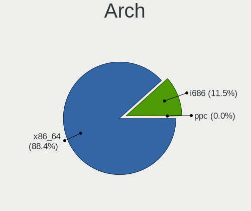
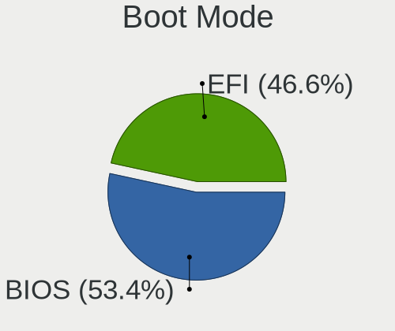
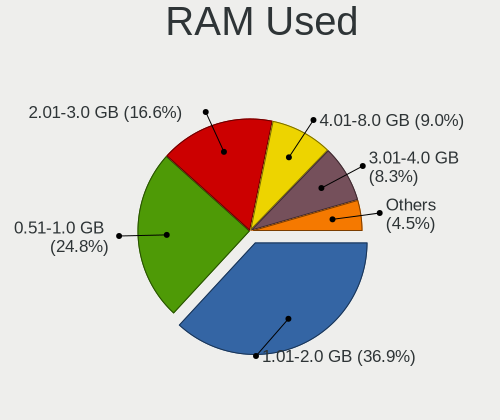

Linux in Russia - Tested Hardware & Statistics (Notebooks)
----------------------------------------------------------

A project to collect tested hardware configurations for Linux in Russia.

Anyone can contribute to this report by the [hw-probe](https://github.com/linuxhw/hw-probe) tool:

    sudo -E hw-probe -all -upload

Please contribute! Especially if your hardware is rare.

Contents
--------

* [ Test Cases ](#test-cases)

* [ System ](#system)
  - [ OS                       ](#os)
  - [ OS Family                ](#os-family)
  - [ Kernel                   ](#kernel)
  - [ Kernel Family            ](#kernel-family)
  - [ Kernel Major Ver.        ](#kernel-major-ver)
  - [ Arch                     ](#arch)
  - [ DE                       ](#de)
  - [ Display Server           ](#display-server)
  - [ Display Manager          ](#display-manager)
  - [ OS Lang                  ](#os-lang)
  - [ Boot Mode                ](#boot-mode)
  - [ Filesystem               ](#filesystem)
  - [ Part. scheme             ](#part-scheme)
  - [ Dual Boot with Linux/BSD ](#dual-boot-with-linuxbsd)
  - [ Dual Boot (Win)          ](#dual-boot-win)

* [ Board ](#board)
  - [ Vendor                   ](#vendor)
  - [ Model                    ](#model)
  - [ Model Family             ](#model-family)
  - [ MFG Year                 ](#mfg-year)
  - [ Form Factor              ](#form-factor)
  - [ Secure Boot              ](#secure-boot)
  - [ Coreboot                 ](#coreboot)
  - [ RAM Size                 ](#ram-size)
  - [ RAM Used                 ](#ram-used)
  - [ Total Drives             ](#total-drives)
  - [ Has CD-ROM               ](#has-cd-rom)
  - [ Has Ethernet             ](#has-ethernet)
  - [ Has WiFi                 ](#has-wifi)
  - [ Has Bluetooth            ](#has-bluetooth)

* [ Location ](#location)
  - [ Country                  ](#country)
  - [ City                     ](#city)

* [ Drives ](#drives)
  - [ Drive Vendor             ](#drive-vendor)
  - [ Drive Model              ](#drive-model)
  - [ HDD Vendor               ](#hdd-vendor)
  - [ SSD Vendor               ](#ssd-vendor)
  - [ Drive Kind               ](#drive-kind)
  - [ Drive Connector          ](#drive-connector)
  - [ Drive Size               ](#drive-size)
  - [ Space Total              ](#space-total)
  - [ Space Used               ](#space-used)
  - [ Malfunc. Drives          ](#malfunc-drives)
  - [ Malfunc. Drive Vendor    ](#malfunc-drive-vendor)
  - [ Malfunc. HDD Vendor      ](#malfunc-hdd-vendor)
  - [ Malfunc. Drive Kind      ](#malfunc-drive-kind)
  - [ Failed Drives            ](#failed-drives)
  - [ Failed Drive Vendor      ](#failed-drive-vendor)
  - [ Drive Status             ](#drive-status)

* [ Storage controller ](#storage-controller)
  - [ Storage Vendor           ](#storage-vendor)
  - [ Storage Model            ](#storage-model)
  - [ Storage Kind             ](#storage-kind)

* [ Processor ](#processor)
  - [ CPU Vendor               ](#cpu-vendor)
  - [ CPU Model                ](#cpu-model)
  - [ CPU Model Family         ](#cpu-model-family)
  - [ CPU Cores                ](#cpu-cores)
  - [ CPU Sockets              ](#cpu-sockets)
  - [ CPU Threads              ](#cpu-threads)
  - [ CPU Op-Modes             ](#cpu-op-modes)
  - [ CPU Microcode            ](#cpu-microcode)
  - [ CPU Microarch            ](#cpu-microarch)

* [ Graphics ](#graphics)
  - [ GPU Vendor               ](#gpu-vendor)
  - [ GPU Model                ](#gpu-model)
  - [ GPU Combo                ](#gpu-combo)
  - [ GPU Driver               ](#gpu-driver)
  - [ GPU Memory               ](#gpu-memory)

* [ Monitor ](#monitor)
  - [ Monitor Vendor           ](#monitor-vendor)
  - [ Monitor Model            ](#monitor-model)
  - [ Monitor Resolution       ](#monitor-resolution)
  - [ Monitor Diagonal         ](#monitor-diagonal)
  - [ Monitor Width            ](#monitor-width)
  - [ Aspect Ratio             ](#aspect-ratio)
  - [ Monitor Area             ](#monitor-area)
  - [ Pixel Density            ](#pixel-density)
  - [ Multiple Monitors        ](#multiple-monitors)

* [ Network ](#network)
  - [ Net Controller Vendor    ](#net-controller-vendor)
  - [ Net Controller Model     ](#net-controller-model)
  - [ Wireless Vendor          ](#wireless-vendor)
  - [ Wireless Model           ](#wireless-model)
  - [ Ethernet Vendor          ](#ethernet-vendor)
  - [ Ethernet Model           ](#ethernet-model)
  - [ Net Controller Kind      ](#net-controller-kind)
  - [ Used Controller          ](#used-controller)
  - [ NICs                     ](#nics)
  - [ IPv6                     ](#ipv6)

* [ Bluetooth ](#bluetooth)
  - [ Bluetooth Vendor         ](#bluetooth-vendor)
  - [ Bluetooth Model          ](#bluetooth-model)

* [ Sound ](#sound)
  - [ Sound Vendor             ](#sound-vendor)
  - [ Sound Model              ](#sound-model)

* [ Memory ](#memory)
  - [ Memory Vendor            ](#memory-vendor)
  - [ Memory Model             ](#memory-model)
  - [ Memory Kind              ](#memory-kind)
  - [ Memory Form Factor       ](#memory-form-factor)
  - [ Memory Size              ](#memory-size)
  - [ Memory Speed             ](#memory-speed)

* [ Printers & scanners ](#printers--scanners)
  - [ Printer Vendor           ](#printer-vendor)
  - [ Printer Model            ](#printer-model)
  - [ Scanner Vendor           ](#scanner-vendor)
  - [ Scanner Model            ](#scanner-model)

* [ Camera ](#camera)
  - [ Camera Vendor            ](#camera-vendor)
  - [ Camera Model             ](#camera-model)

* [ Security ](#security)
  - [ Fingerprint Vendor       ](#fingerprint-vendor)
  - [ Fingerprint Model        ](#fingerprint-model)
  - [ Chipcard Vendor          ](#chipcard-vendor)
  - [ Chipcard Model           ](#chipcard-model)

* [ Unsupported ](#unsupported)
  - [ Unsupported Devices      ](#unsupported-devices)
  - [ Unsupported Device Types ](#unsupported-device-types)

Test Cases
----------

Total: 16194

| Vendor        | Model                       | Probe                                                      | Date         |
|---------------|-----------------------------|------------------------------------------------------------|--------------|
| HP            | ENVY m6                     | [9043724da5](https://linux-hardware.org/?probe=9043724da5) | Nov 02, 2022 |
| ASUSTek       | VivoBook_ASUSLaptop X570... | [28d7daff10](https://linux-hardware.org/?probe=28d7daff10) | Nov 02, 2022 |
| Acer          | Nitro AN515-54              | [710ab678b2](https://linux-hardware.org/?probe=710ab678b2) | Nov 02, 2022 |
| Acer          | Aspire A515-54G             | [519fa92199](https://linux-hardware.org/?probe=519fa92199) | Nov 02, 2022 |
| ASUSTek       | 1215B                       | [21694405a9](https://linux-hardware.org/?probe=21694405a9) | Nov 02, 2022 |
| Digma         | EVE 11 C422 ES1068EW        | [f5177de131](https://linux-hardware.org/?probe=f5177de131) | Nov 02, 2022 |
| ASUSTek       | VivoBook_ASUSLaptop X570... | [6f89789444](https://linux-hardware.org/?probe=6f89789444) | Nov 02, 2022 |
| ASUSTek       | N53Jg                       | [8e4782c668](https://linux-hardware.org/?probe=8e4782c668) | Nov 01, 2022 |
| Toshiba       | Satellite C660              | [44c6e56cd9](https://linux-hardware.org/?probe=44c6e56cd9) | Nov 01, 2022 |
| Toshiba       | Satellite L755              | [dc3d60731e](https://linux-hardware.org/?probe=dc3d60731e) | Nov 01, 2022 |
| HP            | Laptop 14s-fq0xxx           | [fe23529093](https://linux-hardware.org/?probe=fe23529093) | Nov 01, 2022 |
| Lenovo        | ThinkBook 15 G2 ITL 20VE    | [7603f28400](https://linux-hardware.org/?probe=7603f28400) | Nov 01, 2022 |
| Lenovo        | V14-ADA 82C6                | [a54d6876b6](https://linux-hardware.org/?probe=a54d6876b6) | Nov 01, 2022 |
| Lenovo        | V15 G2 ALC 82KD             | [406aae2f66](https://linux-hardware.org/?probe=406aae2f66) | Nov 01, 2022 |
| Apple         | MacBookPro8,1               | [da912b99f4](https://linux-hardware.org/?probe=da912b99f4) | Nov 01, 2022 |
| Samsung       | RV410/RV510/S3510/E3510     | [566d83485b](https://linux-hardware.org/?probe=566d83485b) | Oct 31, 2022 |
| HUAWEI        | BOHB-WAX9                   | [274a3383db](https://linux-hardware.org/?probe=274a3383db) | Oct 31, 2022 |
| Acer          | Aspire 5733                 | [bcc1836178](https://linux-hardware.org/?probe=bcc1836178) | Oct 31, 2022 |
| ASUSTek       | K43SJ                       | [778e6caf06](https://linux-hardware.org/?probe=778e6caf06) | Oct 31, 2022 |
| ASUSTek       | X541UVK                     | [15bdbbf952](https://linux-hardware.org/?probe=15bdbbf952) | Oct 31, 2022 |
| Sony          | VGN-AR71MR                  | [4ecd695b12](https://linux-hardware.org/?probe=4ecd695b12) | Oct 31, 2022 |
| ASUSTek       | T100TAM                     | [a2a70b919d](https://linux-hardware.org/?probe=a2a70b919d) | Oct 31, 2022 |
| Aquarius      | NS585                       | [e4b4e0456d](https://linux-hardware.org/?probe=e4b4e0456d) | Oct 31, 2022 |
| Samsung       | RV410/RV510/S3510/E3510     | [073ba962ff](https://linux-hardware.org/?probe=073ba962ff) | Oct 31, 2022 |
| HP            | Laptop 14s-dq3xxx           | [674ced10f2](https://linux-hardware.org/?probe=674ced10f2) | Oct 31, 2022 |
| HUAWEI        | NBLB-WAX9N                  | [a872c9888a](https://linux-hardware.org/?probe=a872c9888a) | Oct 30, 2022 |
| HUAWEI        | NBLB-WAX9N                  | [45f670d99f](https://linux-hardware.org/?probe=45f670d99f) | Oct 30, 2022 |
| MSI           | Sword 15 A11UE              | [c039d4321b](https://linux-hardware.org/?probe=c039d4321b) | Oct 30, 2022 |
| MSI           | Stealth GS77 12UHS          | [8a1d96274e](https://linux-hardware.org/?probe=8a1d96274e) | Oct 30, 2022 |
| HP            | EliteBook 855 G8 Noteboo... | [f60d156dd3](https://linux-hardware.org/?probe=f60d156dd3) | Oct 30, 2022 |
| Chuwi         | LarkBook                    | [3ff2ff69ce](https://linux-hardware.org/?probe=3ff2ff69ce) | Oct 30, 2022 |
| HUAWEI        | HLY-WX9XX                   | [4208d513b4](https://linux-hardware.org/?probe=4208d513b4) | Oct 30, 2022 |
| Prestigio     | PSB133S01ZFP                | [e10becbd35](https://linux-hardware.org/?probe=e10becbd35) | Oct 30, 2022 |
| HP            | Pavilion g6                 | [666a829545](https://linux-hardware.org/?probe=666a829545) | Oct 30, 2022 |
| Aquarius      | Cmp NS765                   | [5e519edbee](https://linux-hardware.org/?probe=5e519edbee) | Oct 30, 2022 |
| HIPER         | WORKBOOK                    | [0a3eb12b15](https://linux-hardware.org/?probe=0a3eb12b15) | Oct 30, 2022 |
| Acer          | Nitro AN515-42              | [763e5e0492](https://linux-hardware.org/?probe=763e5e0492) | Oct 29, 2022 |
| Dell          | Vostro 5490                 | [057163f0e4](https://linux-hardware.org/?probe=057163f0e4) | Oct 29, 2022 |
| HP            | Laptop 15-dw3xxx            | [0c281b6b5e](https://linux-hardware.org/?probe=0c281b6b5e) | Oct 29, 2022 |
| ASUSTek       | ZenBook 13 UX310UFR         | [11b52c3e1f](https://linux-hardware.org/?probe=11b52c3e1f) | Oct 29, 2022 |
| Acer          | Nitro AN515-52              | [38570237ac](https://linux-hardware.org/?probe=38570237ac) | Oct 29, 2022 |
| Acer          | Nitro AN515-52              | [5551d222b2](https://linux-hardware.org/?probe=5551d222b2) | Oct 29, 2022 |
| HP            | Laptop 15s-eq2xxx           | [dbd930e552](https://linux-hardware.org/?probe=dbd930e552) | Oct 29, 2022 |
| Lenovo        | IdeaPad 3 15IIL05 81WE      | [d152b0a56c](https://linux-hardware.org/?probe=d152b0a56c) | Oct 29, 2022 |
| HP            | Pavilion dv6                | [6618a8e6ed](https://linux-hardware.org/?probe=6618a8e6ed) | Oct 29, 2022 |
| ASUSTek       | X550DP                      | [b0a52fe296](https://linux-hardware.org/?probe=b0a52fe296) | Oct 29, 2022 |
| Samsung       | 300V3A/300V4A/300V5A        | [4acb2d0863](https://linux-hardware.org/?probe=4acb2d0863) | Oct 29, 2022 |
| ASUSTek       | K50C                        | [af80714f09](https://linux-hardware.org/?probe=af80714f09) | Oct 29, 2022 |
| Samsung       | 350V5C/351V5C/3540VC/344... | [0a24d1491a](https://linux-hardware.org/?probe=0a24d1491a) | Oct 29, 2022 |
| ASUSTek       | X541UV                      | [cef88d9d62](https://linux-hardware.org/?probe=cef88d9d62) | Oct 29, 2022 |
| ASUSTek       | K50C                        | [ca606469d8](https://linux-hardware.org/?probe=ca606469d8) | Oct 29, 2022 |
| Toshiba       | Satellite L755              | [0fa70f29d4](https://linux-hardware.org/?probe=0fa70f29d4) | Oct 28, 2022 |
| Prestigio     | PSB141S01                   | [646d3fd287](https://linux-hardware.org/?probe=646d3fd287) | Oct 28, 2022 |
| Lenovo        | B560                        | [f8676b0e49](https://linux-hardware.org/?probe=f8676b0e49) | Oct 28, 2022 |
| Lenovo        | IdeaPad L340-15API 81LW     | [d653658a53](https://linux-hardware.org/?probe=d653658a53) | Oct 28, 2022 |
| ASUSTek       | F3Ka                        | [06235844a1](https://linux-hardware.org/?probe=06235844a1) | Oct 28, 2022 |
| HUAWEI        | BOM-WXX9                    | [203ac0880d](https://linux-hardware.org/?probe=203ac0880d) | Oct 28, 2022 |
| Lenovo        | IdeaPad L340-15API 81LW     | [b9ab6b9cf2](https://linux-hardware.org/?probe=b9ab6b9cf2) | Oct 28, 2022 |
| Dell          | Inspiron 3542               | [a3a24a81fa](https://linux-hardware.org/?probe=a3a24a81fa) | Oct 28, 2022 |
| Lenovo        | IdeaPad 5 Pro 14ACN6 82L... | [6b57390808](https://linux-hardware.org/?probe=6b57390808) | Oct 28, 2022 |
| Lenovo        | IdeaPad 110-15IBR 80T7      | [26311f56d7](https://linux-hardware.org/?probe=26311f56d7) | Oct 28, 2022 |
| Acer          | Aspire A715-75G             | [78b0c55e62](https://linux-hardware.org/?probe=78b0c55e62) | Oct 28, 2022 |
| MSI           | GP66 Leopard 11UG           | [aec6edc8a0](https://linux-hardware.org/?probe=aec6edc8a0) | Oct 28, 2022 |
| Lenovo        | B560                        | [73a6da1bdc](https://linux-hardware.org/?probe=73a6da1bdc) | Oct 28, 2022 |
| Sony          | VPCCB3S1R                   | [ee5b1465a1](https://linux-hardware.org/?probe=ee5b1465a1) | Oct 28, 2022 |
| Unknown       | Unknown                     | [c867c45a75](https://linux-hardware.org/?probe=c867c45a75) | Oct 28, 2022 |
| Unknown       | Unknown                     | [967c2c956d](https://linux-hardware.org/?probe=967c2c956d) | Oct 27, 2022 |
| Dell          | Vostro 5490                 | [ac6587adbb](https://linux-hardware.org/?probe=ac6587adbb) | Oct 27, 2022 |
| Acer          | Aspire E5-573G              | [6f926eed65](https://linux-hardware.org/?probe=6f926eed65) | Oct 27, 2022 |
| HUAWEI        | NBLK-WAX9X                  | [a44f774778](https://linux-hardware.org/?probe=a44f774778) | Oct 27, 2022 |
| HP            | Laptop 14s-fq0xxx           | [377893cdc6](https://linux-hardware.org/?probe=377893cdc6) | Oct 27, 2022 |
| HP            | EliteBook 855 G8 Noteboo... | [b9c616b406](https://linux-hardware.org/?probe=b9c616b406) | Oct 27, 2022 |
| ASUSTek       | N56VZ                       | [399d92f9e0](https://linux-hardware.org/?probe=399d92f9e0) | Oct 27, 2022 |
| Lenovo        | Legion 5 15IMH05H 81Y6      | [9bb0c7d3b0](https://linux-hardware.org/?probe=9bb0c7d3b0) | Oct 26, 2022 |
| Acer          | Nitro AN515-54              | [89180ba46b](https://linux-hardware.org/?probe=89180ba46b) | Oct 26, 2022 |
| HUAWEI        | CREM-WXX9                   | [1c1356d6d5](https://linux-hardware.org/?probe=1c1356d6d5) | Oct 26, 2022 |
| Samsung       | 300V3A/300V4A/300V5A/200... | [70ea39404e](https://linux-hardware.org/?probe=70ea39404e) | Oct 26, 2022 |
| HP            | EliteBook 840 G4            | [73ee5ace17](https://linux-hardware.org/?probe=73ee5ace17) | Oct 26, 2022 |
| HP            | EliteBook 855 G8 Noteboo... | [ffa2d93859](https://linux-hardware.org/?probe=ffa2d93859) | Oct 26, 2022 |
| HP            | EliteBook 855 G8 Noteboo... | [642cfbc2d7](https://linux-hardware.org/?probe=642cfbc2d7) | Oct 26, 2022 |
| HP            | Laptop 15s-fq2xxx           | [a7a7e4b82c](https://linux-hardware.org/?probe=a7a7e4b82c) | Oct 26, 2022 |
| HP            | Pavilion dv7                | [1b53255010](https://linux-hardware.org/?probe=1b53255010) | Oct 25, 2022 |
| HP            | Laptop 14s-dq2xxx           | [6af4891e58](https://linux-hardware.org/?probe=6af4891e58) | Oct 25, 2022 |
| ASUSTek       | VivoBook_ASUSLaptop X570... | [09eec214ae](https://linux-hardware.org/?probe=09eec214ae) | Oct 25, 2022 |
| Lenovo        | ThinkPad T490 20N2001YUS    | [61b5a3092b](https://linux-hardware.org/?probe=61b5a3092b) | Oct 25, 2022 |
| Apple         | MacBookPro11,4              | [29dd6b053b](https://linux-hardware.org/?probe=29dd6b053b) | Oct 25, 2022 |
| Acer          | Aspire A517-52              | [1ee47a3ab6](https://linux-hardware.org/?probe=1ee47a3ab6) | Oct 25, 2022 |
| Toshiba       | Satellite C660              | [b9d0cd845c](https://linux-hardware.org/?probe=b9d0cd845c) | Oct 25, 2022 |
| Toshiba       | Satellite C660              | [36faa336cf](https://linux-hardware.org/?probe=36faa336cf) | Oct 25, 2022 |
| HP            | Laptop 17-ak0xx             | [09e77bbc9a](https://linux-hardware.org/?probe=09e77bbc9a) | Oct 25, 2022 |
| HUAWEI        | HVY-WXX9                    | [60c3fde90a](https://linux-hardware.org/?probe=60c3fde90a) | Oct 25, 2022 |
| Lenovo        | B560                        | [82125c56a3](https://linux-hardware.org/?probe=82125c56a3) | Oct 24, 2022 |
| HP            | Laptop 17-ak0xx             | [88796bbb2b](https://linux-hardware.org/?probe=88796bbb2b) | Oct 24, 2022 |
| ASUSTek       | ROG Strix G513QY_G513QY     | [9115752bd4](https://linux-hardware.org/?probe=9115752bd4) | Oct 24, 2022 |
| Lenovo        | IdeaPad L340-15IRH Gamin... | [f426a7b690](https://linux-hardware.org/?probe=f426a7b690) | Oct 24, 2022 |
| ASUSTek       | A7U                         | [867f26dde1](https://linux-hardware.org/?probe=867f26dde1) | Oct 24, 2022 |
| HONOR         | BBR-WAX9                    | [bc30c6555a](https://linux-hardware.org/?probe=bc30c6555a) | Oct 24, 2022 |
| HONOR         | BBR-WAX9                    | [667d235a8f](https://linux-hardware.org/?probe=667d235a8f) | Oct 24, 2022 |
| HP            | Laptop 15-bw0xx             | [cdd4d21000](https://linux-hardware.org/?probe=cdd4d21000) | Oct 24, 2022 |
| Dell          | XPS L412Z                   | [92d8a4b47a](https://linux-hardware.org/?probe=92d8a4b47a) | Oct 24, 2022 |
| Lenovo        | IdeaPad 5 Pro 14ACN6 82L... | [14537f243b](https://linux-hardware.org/?probe=14537f243b) | Oct 24, 2022 |
| MSI           | GE60 2PC                    | [e4378edb2b](https://linux-hardware.org/?probe=e4378edb2b) | Oct 24, 2022 |
| Sony          | SVE1513U1RW                 | [019c35087a](https://linux-hardware.org/?probe=019c35087a) | Oct 24, 2022 |
| MSI           | GE60 2PC                    | [930a153301](https://linux-hardware.org/?probe=930a153301) | Oct 24, 2022 |
| ASUSTek       | N56DY                       | [2d308224ee](https://linux-hardware.org/?probe=2d308224ee) | Oct 23, 2022 |
| ASUSTek       | N56DY                       | [d0caa49d24](https://linux-hardware.org/?probe=d0caa49d24) | Oct 23, 2022 |
| Lenovo        | IdeaPad 330-15ARR 81D2      | [d690b09eab](https://linux-hardware.org/?probe=d690b09eab) | Oct 23, 2022 |
| HUAWEI        | NBD-WXX9                    | [c6c2d4cab0](https://linux-hardware.org/?probe=c6c2d4cab0) | Oct 23, 2022 |
| HP            | Pavilion g6                 | [1c355f37b9](https://linux-hardware.org/?probe=1c355f37b9) | Oct 23, 2022 |
| THUNDEROBO... | 911AirD                     | [f471a1c9db](https://linux-hardware.org/?probe=f471a1c9db) | Oct 23, 2022 |
| ASUSTek       | ASUS TUF Gaming A17 FA70... | [38c71fbd5e](https://linux-hardware.org/?probe=38c71fbd5e) | Oct 23, 2022 |
| ASUSTek       | VivoBook_ASUSLaptop X512... | [cda3087aaf](https://linux-hardware.org/?probe=cda3087aaf) | Oct 23, 2022 |
| Chuwi         | CoreBook X                  | [bc31018b26](https://linux-hardware.org/?probe=bc31018b26) | Oct 23, 2022 |
| Lenovo        | IdeaPad 110-15ACL 80TJ      | [e2e9f1a6e7](https://linux-hardware.org/?probe=e2e9f1a6e7) | Oct 23, 2022 |
| ASUSTek       | W7S                         | [5797f4be95](https://linux-hardware.org/?probe=5797f4be95) | Oct 23, 2022 |
| HP            | Pavilion dv7                | [acaa8b9309](https://linux-hardware.org/?probe=acaa8b9309) | Oct 23, 2022 |
| Lenovo        | G505s 20255                 | [cff2326042](https://linux-hardware.org/?probe=cff2326042) | Oct 23, 2022 |
| Lenovo        | IdeaPad 330-14AST 81D5      | [e0face3bcb](https://linux-hardware.org/?probe=e0face3bcb) | Oct 22, 2022 |
| Lenovo        | Legion Y730-17ICH 81HG      | [c9a85159dd](https://linux-hardware.org/?probe=c9a85159dd) | Oct 22, 2022 |
| ASUSTek       | ASUS TUF Gaming A17 FA70... | [bfb6c03047](https://linux-hardware.org/?probe=bfb6c03047) | Oct 22, 2022 |
| HP            | Pavilion dv7                | [ede1ff6d62](https://linux-hardware.org/?probe=ede1ff6d62) | Oct 22, 2022 |
| Lenovo        | Legion Y730-17ICH 81HG      | [15a66ac64c](https://linux-hardware.org/?probe=15a66ac64c) | Oct 22, 2022 |
| Samsung       | 300V3A/300V4A/300V5A/200... | [eb7a276b51](https://linux-hardware.org/?probe=eb7a276b51) | Oct 22, 2022 |
| Shanghai Z... | ZXE CRB                     | [166b646956](https://linux-hardware.org/?probe=166b646956) | Oct 22, 2022 |
| Acer          | Aspire E1-571G              | [3440b5765d](https://linux-hardware.org/?probe=3440b5765d) | Oct 21, 2022 |
| 3Logic Gro... | APM Graviton                | [0dd152f1d6](https://linux-hardware.org/?probe=0dd152f1d6) | Oct 21, 2022 |
| Lenovo        | ThinkBook 15 G3 ACL 21A4    | [a8c892608e](https://linux-hardware.org/?probe=a8c892608e) | Oct 21, 2022 |
| Acer          | Aspire A715-41G             | [afb2836a23](https://linux-hardware.org/?probe=afb2836a23) | Oct 21, 2022 |
| Samsung       | RV411/RV511/E3511/S3511/... | [6c8562fa45](https://linux-hardware.org/?probe=6c8562fa45) | Oct 21, 2022 |
| HP            | Pavilion Notebook           | [2900a3fd5d](https://linux-hardware.org/?probe=2900a3fd5d) | Oct 21, 2022 |
| Sony          | VPCEB1S1R                   | [1e64f5427a](https://linux-hardware.org/?probe=1e64f5427a) | Oct 21, 2022 |
| Lenovo        | Legion 5 Pro 16ACH6H 82J... | [3b8452c3c6](https://linux-hardware.org/?probe=3b8452c3c6) | Oct 21, 2022 |
| Lenovo        | IdeaPad 330-15AST 81D6      | [123b6fc51a](https://linux-hardware.org/?probe=123b6fc51a) | Oct 21, 2022 |
| Aquarius      | NS585                       | [c953c5090c](https://linux-hardware.org/?probe=c953c5090c) | Oct 21, 2022 |
| Acer          | Aspire A517-52              | [7515d53b5d](https://linux-hardware.org/?probe=7515d53b5d) | Oct 21, 2022 |
| Lenovo        | IdeaPad 320-15IKB 80XL      | [a5d65724fa](https://linux-hardware.org/?probe=a5d65724fa) | Oct 21, 2022 |
| Lenovo        | B560                        | [3a61700f49](https://linux-hardware.org/?probe=3a61700f49) | Oct 20, 2022 |
| Aquarius      | NS585                       | [a134ed693c](https://linux-hardware.org/?probe=a134ed693c) | Oct 20, 2022 |
| Sony          | VPCEL3S1R                   | [5c37559c2d](https://linux-hardware.org/?probe=5c37559c2d) | Oct 20, 2022 |
| Lenovo        | IdeaPad L340-15API 81LW     | [3fc175d4a0](https://linux-hardware.org/?probe=3fc175d4a0) | Oct 20, 2022 |
| ASUSTek       | K43SJ                       | [4c27c4945c](https://linux-hardware.org/?probe=4c27c4945c) | Oct 20, 2022 |
| Acer          | Aspire E5-575G              | [66cfe85e96](https://linux-hardware.org/?probe=66cfe85e96) | Oct 20, 2022 |
| Dell          | Inspiron 5584               | [79ec522ef8](https://linux-hardware.org/?probe=79ec522ef8) | Oct 20, 2022 |
| HP            | Pavilion dm4                | [d96f382cc2](https://linux-hardware.org/?probe=d96f382cc2) | Oct 19, 2022 |
| HP            | Pavilion dm4                | [171745a6e8](https://linux-hardware.org/?probe=171745a6e8) | Oct 19, 2022 |
| Dell          | Inspiron 5584               | [4dac48ea7f](https://linux-hardware.org/?probe=4dac48ea7f) | Oct 19, 2022 |
| Toshiba       | Satellite A300              | [ce897bc567](https://linux-hardware.org/?probe=ce897bc567) | Oct 19, 2022 |
| ASUSTek       | X555LF                      | [76a0525b50](https://linux-hardware.org/?probe=76a0525b50) | Oct 19, 2022 |
| HP            | Pavilion g6                 | [8744b669fe](https://linux-hardware.org/?probe=8744b669fe) | Oct 19, 2022 |
| Dell          | Precision 7760              | [a5ab2793ae](https://linux-hardware.org/?probe=a5ab2793ae) | Oct 19, 2022 |
| HP            | ENVY Sleekbook 6            | [a197375e26](https://linux-hardware.org/?probe=a197375e26) | Oct 19, 2022 |
| Pegatron      | A17                         | [14f7d2a90d](https://linux-hardware.org/?probe=14f7d2a90d) | Oct 19, 2022 |
| Lenovo        | ThinkBook 15 G3 ACL 21A4    | [fe184c8f5b](https://linux-hardware.org/?probe=fe184c8f5b) | Oct 19, 2022 |
| HUAWEI        | NDZ-WXX9                    | [85574757af](https://linux-hardware.org/?probe=85574757af) | Oct 19, 2022 |
| Lenovo        | ThinkBook 15 G3 ACL 21A4    | [0db79bc085](https://linux-hardware.org/?probe=0db79bc085) | Oct 19, 2022 |
| Lenovo        | IdeaPad 3 15ADA05 81W1      | [d6d2256d26](https://linux-hardware.org/?probe=d6d2256d26) | Oct 19, 2022 |
| Dell          | XPS L412Z                   | [eb1b1f7950](https://linux-hardware.org/?probe=eb1b1f7950) | Oct 19, 2022 |
| Haier         | A1420EM                     | [62ce3535b2](https://linux-hardware.org/?probe=62ce3535b2) | Oct 19, 2022 |
| Haier         | A1420EM                     | [a50bc27e31](https://linux-hardware.org/?probe=a50bc27e31) | Oct 19, 2022 |
| ASUSTek       | VivoBook_ASUSLaptop X570... | [3c2bd41b69](https://linux-hardware.org/?probe=3c2bd41b69) | Oct 19, 2022 |
| HP            | Pavilion Notebook           | [0d145a7293](https://linux-hardware.org/?probe=0d145a7293) | Oct 19, 2022 |
| HUAWEI        | NBM-WXX9                    | [fec0dd03d5](https://linux-hardware.org/?probe=fec0dd03d5) | Oct 18, 2022 |
| Dell          | Vostro 15 5510              | [b397c3fd26](https://linux-hardware.org/?probe=b397c3fd26) | Oct 18, 2022 |
| eMachines     | E525                        | [6b500273c6](https://linux-hardware.org/?probe=6b500273c6) | Oct 18, 2022 |
| Lenovo        | G565 20071                  | [52758e9b4b](https://linux-hardware.org/?probe=52758e9b4b) | Oct 18, 2022 |
| Lenovo        | B570e HuronRiver Platfor... | [b8a2cca654](https://linux-hardware.org/?probe=b8a2cca654) | Oct 18, 2022 |
| Lenovo        | IdeaPad 5 15ARE05 81YQ      | [aaa41de825](https://linux-hardware.org/?probe=aaa41de825) | Oct 18, 2022 |
| Maibenben     | ZiMai Z5                    | [96d25004be](https://linux-hardware.org/?probe=96d25004be) | Oct 18, 2022 |
| ASUSTek       | VivoBook_ASUSLaptop X512... | [484cb84d6b](https://linux-hardware.org/?probe=484cb84d6b) | Oct 18, 2022 |
| Lenovo        | V310-15IKB 80T3             | [c56ac0436c](https://linux-hardware.org/?probe=c56ac0436c) | Oct 18, 2022 |
| Lenovo        | B560                        | [717af973da](https://linux-hardware.org/?probe=717af973da) | Oct 18, 2022 |
| DEPO Compu... | DPC156                      | [4820b94a4a](https://linux-hardware.org/?probe=4820b94a4a) | Oct 18, 2022 |
| Lenovo        | IdeaPad 110-15ACL 80TJ      | [469118097a](https://linux-hardware.org/?probe=469118097a) | Oct 18, 2022 |
| Acer          | Aspire E5-573               | [baf225a894](https://linux-hardware.org/?probe=baf225a894) | Oct 17, 2022 |
| Lenovo        | G480                        | [55e0ad0e82](https://linux-hardware.org/?probe=55e0ad0e82) | Oct 17, 2022 |
| Dell          | 500                         | [91b78b800a](https://linux-hardware.org/?probe=91b78b800a) | Oct 17, 2022 |
| HP            | EliteBook 845 G7 Noteboo... | [0a8148f3b5](https://linux-hardware.org/?probe=0a8148f3b5) | Oct 17, 2022 |
| ASUSTek       | ASUS TUF Gaming A15 FA50... | [7f9219a85f](https://linux-hardware.org/?probe=7f9219a85f) | Oct 17, 2022 |
| Acer          | Aspire 5740                 | [83bb80a8d4](https://linux-hardware.org/?probe=83bb80a8d4) | Oct 17, 2022 |
| Lenovo        | ThinkBook 15 G2 ITL 20VE    | [73145a883c](https://linux-hardware.org/?probe=73145a883c) | Oct 17, 2022 |
| HUAWEI        | NBLB-WAX9N                  | [678415db20](https://linux-hardware.org/?probe=678415db20) | Oct 17, 2022 |
| Maibenben     | MaiBook M                   | [ca20ade584](https://linux-hardware.org/?probe=ca20ade584) | Oct 16, 2022 |
| HONOR         | NBR-WAX9                    | [3862d6fc41](https://linux-hardware.org/?probe=3862d6fc41) | Oct 16, 2022 |
| Lenovo        | B580 20144                  | [3de13d5e45](https://linux-hardware.org/?probe=3de13d5e45) | Oct 16, 2022 |
| HP            | Notebook                    | [f88b853298](https://linux-hardware.org/?probe=f88b853298) | Oct 16, 2022 |
| Samsung       | RV413/RV513                 | [22d5794b5d](https://linux-hardware.org/?probe=22d5794b5d) | Oct 16, 2022 |
| Sony          | SVE1512H1RW                 | [bdc28748b2](https://linux-hardware.org/?probe=bdc28748b2) | Oct 16, 2022 |
| ASUSTek       | VivoBook_ASUSLaptop X403... | [7782926601](https://linux-hardware.org/?probe=7782926601) | Oct 16, 2022 |
| Valve         | Jupiter                     | [dde3144879](https://linux-hardware.org/?probe=dde3144879) | Oct 16, 2022 |
| Thomson       | NEO14A-4WH128               | [daa7836c39](https://linux-hardware.org/?probe=daa7836c39) | Oct 16, 2022 |
| MSI           | Sword 15 A11UE              | [514b1ab74d](https://linux-hardware.org/?probe=514b1ab74d) | Oct 16, 2022 |
| Pegatron      | A15                         | [25bf0fe850](https://linux-hardware.org/?probe=25bf0fe850) | Oct 15, 2022 |
| Lenovo        | ThinkPad T14 Gen 2i 20W0... | [e1bc46388d](https://linux-hardware.org/?probe=e1bc46388d) | Oct 14, 2022 |
| Lenovo        | IdeaPad 330-15IGM 81D1      | [f7b75c7dff](https://linux-hardware.org/?probe=f7b75c7dff) | Oct 14, 2022 |
| Acer          | Aspire E5-511               | [823f951e7a](https://linux-hardware.org/?probe=823f951e7a) | Oct 14, 2022 |
| ASUSTek       | ROG Zephyrus M16 GU603HE... | [2356263af1](https://linux-hardware.org/?probe=2356263af1) | Oct 14, 2022 |
| Lenovo        | IdeaPad 330-15AST 81D6      | [abbb3295c8](https://linux-hardware.org/?probe=abbb3295c8) | Oct 14, 2022 |
| Lenovo        | IdeaPad 330-15AST 81D6      | [f19e981e03](https://linux-hardware.org/?probe=f19e981e03) | Oct 14, 2022 |
| HUAWEI        | NBLK-WAX9X                  | [9f4368b685](https://linux-hardware.org/?probe=9f4368b685) | Oct 14, 2022 |
| eMachines     | E525                        | [a2c8a5cadb](https://linux-hardware.org/?probe=a2c8a5cadb) | Oct 14, 2022 |
| ASUSTek       | ZenBook UX431DA_UM431DA     | [dbd2328d0f](https://linux-hardware.org/?probe=dbd2328d0f) | Oct 14, 2022 |
| ASUSTek       | ZenBook UX431DA_UM431DA     | [3a8bdfb3f5](https://linux-hardware.org/?probe=3a8bdfb3f5) | Oct 14, 2022 |
| ASUSTek       | X502CA                      | [1243c07d09](https://linux-hardware.org/?probe=1243c07d09) | Oct 13, 2022 |
| ASUSTek       | X502CA                      | [064718ff22](https://linux-hardware.org/?probe=064718ff22) | Oct 13, 2022 |
| ASUSTek       | VivoBook_ASUSLaptop X340... | [144c6cf207](https://linux-hardware.org/?probe=144c6cf207) | Oct 13, 2022 |
| HP            | Laptop 15s-eq2xxx           | [9e4ddfc113](https://linux-hardware.org/?probe=9e4ddfc113) | Oct 13, 2022 |
| ASUSTek       | VivoBook_ASUSLaptop X340... | [61c8063781](https://linux-hardware.org/?probe=61c8063781) | Oct 13, 2022 |
| ASUSTek       | VivoBook_ASUSLaptop X513... | [9b0a923899](https://linux-hardware.org/?probe=9b0a923899) | Oct 13, 2022 |
| Lenovo        | IdeaPad L340-15API 81LW     | [1cdde90662](https://linux-hardware.org/?probe=1cdde90662) | Oct 13, 2022 |
| ASUSTek       | K55N                        | [8a7b8b14f3](https://linux-hardware.org/?probe=8a7b8b14f3) | Oct 13, 2022 |
| Acer          | Aspire E1-571G              | [75b10196e0](https://linux-hardware.org/?probe=75b10196e0) | Oct 13, 2022 |
| Dell          | Latitude 5300               | [30d4b7fb75](https://linux-hardware.org/?probe=30d4b7fb75) | Oct 13, 2022 |
| Acer          | Aspire 5742G                | [b9da06eb9c](https://linux-hardware.org/?probe=b9da06eb9c) | Oct 13, 2022 |
| Irbis         | NB121                       | [04f312f46b](https://linux-hardware.org/?probe=04f312f46b) | Oct 13, 2022 |
| Irbis         | NB121                       | [ff99468633](https://linux-hardware.org/?probe=ff99468633) | Oct 13, 2022 |
| Lenovo        | G50-30 80G0                 | [f3bdfee67a](https://linux-hardware.org/?probe=f3bdfee67a) | Oct 13, 2022 |
| ASUSTek       | VivoBook_ASUSLaptop X509... | [adfbedf6ef](https://linux-hardware.org/?probe=adfbedf6ef) | Oct 12, 2022 |
| Acer          | Aspire A715-71G             | [2b0752150c](https://linux-hardware.org/?probe=2b0752150c) | Oct 12, 2022 |
| Apple         | MacBookAir7,2               | [8b4c66e10a](https://linux-hardware.org/?probe=8b4c66e10a) | Oct 11, 2022 |
| HP            | Pavilion Gaming Laptop 1... | [fd73da4fee](https://linux-hardware.org/?probe=fd73da4fee) | Oct 11, 2022 |
| Lenovo        | ThinkPad S1 Yoga 20CDA00... | [7bc7561ab1](https://linux-hardware.org/?probe=7bc7561ab1) | Oct 11, 2022 |
| HUAWEI        | HVY-WXX9                    | [10ab944320](https://linux-hardware.org/?probe=10ab944320) | Oct 11, 2022 |
| Lenovo        | IdeaPad 5 15ARE05 81YQ      | [5caff1861e](https://linux-hardware.org/?probe=5caff1861e) | Oct 10, 2022 |
| Aquarius      | NS685U R11                  | [ce27c5e6f7](https://linux-hardware.org/?probe=ce27c5e6f7) | Oct 10, 2022 |
| Lenovo        | IdeaPad S340-14API 81NB     | [efabc0c1ba](https://linux-hardware.org/?probe=efabc0c1ba) | Oct 09, 2022 |
| Dell          | Inspiron 3520               | [12650c819a](https://linux-hardware.org/?probe=12650c819a) | Oct 09, 2022 |
| Lenovo        | G50-70 20351                | [300cc7d78f](https://linux-hardware.org/?probe=300cc7d78f) | Oct 09, 2022 |
| MSI           | GF63 Thin 9RCX              | [b8e1d8da2a](https://linux-hardware.org/?probe=b8e1d8da2a) | Oct 09, 2022 |
| Acer          | Aspire 5742G                | [d7c3182832](https://linux-hardware.org/?probe=d7c3182832) | Oct 08, 2022 |
| MSI           | GF63 Thin 9RCX              | [64bcf40d38](https://linux-hardware.org/?probe=64bcf40d38) | Oct 08, 2022 |
| HP            | Pavilion g6                 | [1c2fd7400d](https://linux-hardware.org/?probe=1c2fd7400d) | Oct 08, 2022 |
| HP            | EliteBook 6930p             | [6f175167b8](https://linux-hardware.org/?probe=6f175167b8) | Oct 08, 2022 |
| ASUSTek       | X550CL                      | [4afa1df235](https://linux-hardware.org/?probe=4afa1df235) | Oct 08, 2022 |
| Acer          | Aspire 2920                 | [c588bacc95](https://linux-hardware.org/?probe=c588bacc95) | Oct 08, 2022 |
| Acer          | Aspire 2920                 | [34b41a4e67](https://linux-hardware.org/?probe=34b41a4e67) | Oct 08, 2022 |
| ASUSTek       | X550CL                      | [d0584d3672](https://linux-hardware.org/?probe=d0584d3672) | Oct 08, 2022 |
| HONOR         | NBR-WAX9                    | [2f0c3ba507](https://linux-hardware.org/?probe=2f0c3ba507) | Oct 08, 2022 |
| Acer          | Nitro AN515-54              | [dc5782e5a2](https://linux-hardware.org/?probe=dc5782e5a2) | Oct 08, 2022 |
| Dell          | Vostro 15 7510              | [b9ab199135](https://linux-hardware.org/?probe=b9ab199135) | Oct 07, 2022 |
| ASUSTek       | X540NV                      | [31e4464fea](https://linux-hardware.org/?probe=31e4464fea) | Oct 07, 2022 |
| Clevo         | W210CUQ                     | [d698b7fe27](https://linux-hardware.org/?probe=d698b7fe27) | Oct 07, 2022 |
| MSI           | CX62 6QD                    | [cf52082ecb](https://linux-hardware.org/?probe=cf52082ecb) | Oct 07, 2022 |
| HP            | ProBook 450 G6              | [646d9b09b3](https://linux-hardware.org/?probe=646d9b09b3) | Oct 07, 2022 |
| System76      | Galago Pro                  | [5922699347](https://linux-hardware.org/?probe=5922699347) | Oct 07, 2022 |
| HUAWEI        | HLY-WX9XX                   | [af5d214080](https://linux-hardware.org/?probe=af5d214080) | Oct 06, 2022 |
| Sony          | VPCSB1V9R                   | [c19abb47cc](https://linux-hardware.org/?probe=c19abb47cc) | Oct 06, 2022 |
| HP            | Pavilion dv7                | [13e60be2de](https://linux-hardware.org/?probe=13e60be2de) | Oct 06, 2022 |
| HP            | Pavilion Laptop 14-ec0xx... | [f7bb87986f](https://linux-hardware.org/?probe=f7bb87986f) | Oct 06, 2022 |
| Acer          | Extensa 4220                | [10e3973e91](https://linux-hardware.org/?probe=10e3973e91) | Oct 06, 2022 |
| HP            | ProBook 4310s               | [ac57665927](https://linux-hardware.org/?probe=ac57665927) | Oct 06, 2022 |
| Lenovo        | IdeaPad L340-15API 81LW     | [7f8e650618](https://linux-hardware.org/?probe=7f8e650618) | Oct 06, 2022 |
| HP            | Notebook                    | [49ab3eec39](https://linux-hardware.org/?probe=49ab3eec39) | Oct 06, 2022 |
| ASUSTek       | ASUS TUF Gaming A15 FA50... | [75a7a7f691](https://linux-hardware.org/?probe=75a7a7f691) | Oct 05, 2022 |
| Acer          | Aspire 2920                 | [538f7a6e26](https://linux-hardware.org/?probe=538f7a6e26) | Oct 05, 2022 |
| MSI           | Modern 15 A5M               | [035a9bb7fa](https://linux-hardware.org/?probe=035a9bb7fa) | Oct 05, 2022 |
| HUAWEI        | NBD-WXX9                    | [2513dfd51e](https://linux-hardware.org/?probe=2513dfd51e) | Oct 05, 2022 |
| HP            | OMEN by Laptop              | [0a8238a876](https://linux-hardware.org/?probe=0a8238a876) | Oct 05, 2022 |
| Samsung       | NC110P/NC108P/NC111P        | [33b573e4a1](https://linux-hardware.org/?probe=33b573e4a1) | Oct 04, 2022 |
| HUAWEI        | NBLK-WAX9X                  | [cc9d8d4d30](https://linux-hardware.org/?probe=cc9d8d4d30) | Oct 04, 2022 |
| ASUSTek       | X101CH                      | [c90b38a699](https://linux-hardware.org/?probe=c90b38a699) | Oct 04, 2022 |
| Clevo         | P150HMx                     | [48c8941ee9](https://linux-hardware.org/?probe=48c8941ee9) | Oct 04, 2022 |
| HP            | Pavilion Laptop 13-an1xx... | [9d9b963cd4](https://linux-hardware.org/?probe=9d9b963cd4) | Oct 04, 2022 |
| HP            | Pavilion Laptop 14-ec0xx... | [ed4fe6487a](https://linux-hardware.org/?probe=ed4fe6487a) | Oct 04, 2022 |
| Valve         | Jupiter                     | [70f65d68fc](https://linux-hardware.org/?probe=70f65d68fc) | Oct 04, 2022 |
| HP            | ProBook 4530s               | [8be2220d0f](https://linux-hardware.org/?probe=8be2220d0f) | Oct 04, 2022 |
| Lenovo        | IdeaPad 330-15IKB 81DE      | [a174e09687](https://linux-hardware.org/?probe=a174e09687) | Oct 04, 2022 |
| Samsung       | 355V4C/356V4C/3445VC/354... | [e31e511d7b](https://linux-hardware.org/?probe=e31e511d7b) | Oct 04, 2022 |
| Lenovo        | Legion Y-540-17IRH-PG0 8... | [3dbbfc44f6](https://linux-hardware.org/?probe=3dbbfc44f6) | Oct 04, 2022 |
| Dell          | Inspiron 3521               | [50615f4621](https://linux-hardware.org/?probe=50615f4621) | Oct 04, 2022 |
| ASUSTek       | K43SJ                       | [826d1c0dc8](https://linux-hardware.org/?probe=826d1c0dc8) | Oct 04, 2022 |
| Samsung       | R530/R730/R540              | [82629aeacd](https://linux-hardware.org/?probe=82629aeacd) | Oct 04, 2022 |
| Lenovo        | ThinkPad T420 4236WS7       | [e42a5888c7](https://linux-hardware.org/?probe=e42a5888c7) | Oct 04, 2022 |
| Acer          | Nitro AN515-52              | [9a69b6dc4a](https://linux-hardware.org/?probe=9a69b6dc4a) | Oct 03, 2022 |
| Sony          | VPCF12Z1R                   | [6d7cd0d51d](https://linux-hardware.org/?probe=6d7cd0d51d) | Oct 03, 2022 |
| THUNDEROBO... | 911AirD                     | [69a9650652](https://linux-hardware.org/?probe=69a9650652) | Oct 03, 2022 |
| ASUSTek       | ASUS TUF Gaming F15 FX50... | [f8224dfb59](https://linux-hardware.org/?probe=f8224dfb59) | Oct 03, 2022 |
| Lenovo        | IdeaPad L340-15API 81LW     | [89b48cd98e](https://linux-hardware.org/?probe=89b48cd98e) | Oct 03, 2022 |
| Lenovo        | ThinkPad T490s 20NYS4HL1... | [7f5e71e099](https://linux-hardware.org/?probe=7f5e71e099) | Oct 02, 2022 |
| Lenovo        | ThinkPad T490s 20NYS4HL1... | [8b81fb7c67](https://linux-hardware.org/?probe=8b81fb7c67) | Oct 02, 2022 |
| HP            | Pavilion dv7                | [219524e854](https://linux-hardware.org/?probe=219524e854) | Oct 02, 2022 |
| Dell          | XPS 15 9500                 | [001bcba320](https://linux-hardware.org/?probe=001bcba320) | Oct 02, 2022 |
| BenQ          | Joybook S32                 | [ba2b78c3e4](https://linux-hardware.org/?probe=ba2b78c3e4) | Oct 02, 2022 |
| HP            | Pavilion g7                 | [458c7b0f65](https://linux-hardware.org/?probe=458c7b0f65) | Oct 02, 2022 |
| Acer          | Aspire A315-42G             | [84345ea89c](https://linux-hardware.org/?probe=84345ea89c) | Oct 02, 2022 |
| Lenovo        | G550 20023                  | [68961f954b](https://linux-hardware.org/?probe=68961f954b) | Oct 02, 2022 |
| HUAWEI        | BOM-WXX9                    | [e6e51bcb84](https://linux-hardware.org/?probe=e6e51bcb84) | Oct 02, 2022 |
| ASUSTek       | K53SM                       | [49967682a7](https://linux-hardware.org/?probe=49967682a7) | Oct 02, 2022 |
| Dell          | Inspiron 3520               | [5fdeec4922](https://linux-hardware.org/?probe=5fdeec4922) | Oct 02, 2022 |
| ASUSTek       | ROG Zephyrus M16 GU603HE... | [c086a688f1](https://linux-hardware.org/?probe=c086a688f1) | Oct 02, 2022 |
| Quanta        | TWC                         | [423f504621](https://linux-hardware.org/?probe=423f504621) | Oct 02, 2022 |
| Acer          | AOA150                      | [b8780da9ef](https://linux-hardware.org/?probe=b8780da9ef) | Oct 02, 2022 |
| Dell          | 500                         | [83c01aa11f](https://linux-hardware.org/?probe=83c01aa11f) | Oct 01, 2022 |
| Acer          | Aspire A715-41G             | [1a473e9809](https://linux-hardware.org/?probe=1a473e9809) | Oct 01, 2022 |
| HUAWEI        | HN-WX9X                     | [4168f641b5](https://linux-hardware.org/?probe=4168f641b5) | Oct 01, 2022 |
| HP            | 650                         | [162893e9ad](https://linux-hardware.org/?probe=162893e9ad) | Oct 01, 2022 |
| Lenovo        | G770 20089                  | [e06e588d62](https://linux-hardware.org/?probe=e06e588d62) | Oct 01, 2022 |
| ASUSTek       | F5V                         | [463cd15493](https://linux-hardware.org/?probe=463cd15493) | Oct 01, 2022 |
| Dell          | Inspiron 5737               | [14113affa1](https://linux-hardware.org/?probe=14113affa1) | Oct 01, 2022 |
| Dell          | Inspiron 5737               | [6893292144](https://linux-hardware.org/?probe=6893292144) | Oct 01, 2022 |
| Acer          | Aspire 5750G                | [8e87575f75](https://linux-hardware.org/?probe=8e87575f75) | Oct 01, 2022 |
| Acer          | Aspire A315-55G             | [77605e313d](https://linux-hardware.org/?probe=77605e313d) | Oct 01, 2022 |
| ASUSTek       | VivoBook_ASUSLaptop X340... | [d5407763a0](https://linux-hardware.org/?probe=d5407763a0) | Sep 30, 2022 |
| GPD           | G1621-02                    | [6ae9fc596e](https://linux-hardware.org/?probe=6ae9fc596e) | Sep 30, 2022 |
| Irbis         | NB121                       | [a2eb8c8af1](https://linux-hardware.org/?probe=a2eb8c8af1) | Sep 30, 2022 |
| Acer          | Extensa 4220                | [c35a0a579a](https://linux-hardware.org/?probe=c35a0a579a) | Sep 30, 2022 |
| Irbis         | NB121                       | [90a0ae1cf9](https://linux-hardware.org/?probe=90a0ae1cf9) | Sep 30, 2022 |
| Lenovo        | G460 20041                  | [130c0489f9](https://linux-hardware.org/?probe=130c0489f9) | Sep 30, 2022 |
| Digma         | EVE 11 C408                 | [b5c7ac8ed3](https://linux-hardware.org/?probe=b5c7ac8ed3) | Sep 30, 2022 |
| HP            | Pavilion dv7                | [4d54db9389](https://linux-hardware.org/?probe=4d54db9389) | Sep 30, 2022 |
| Acer          | Aspire A514-54              | [b8b0da1194](https://linux-hardware.org/?probe=b8b0da1194) | Sep 30, 2022 |
| Lenovo        | IdeaPad S145-15API 81UT     | [9ccd242ca4](https://linux-hardware.org/?probe=9ccd242ca4) | Sep 30, 2022 |
| Lenovo        | G580 20150                  | [d057161e9d](https://linux-hardware.org/?probe=d057161e9d) | Sep 30, 2022 |
| Lenovo        | ThinkPad L380 20M5SSIN11    | [0cad79b1f7](https://linux-hardware.org/?probe=0cad79b1f7) | Sep 30, 2022 |
| Irbis         | NB61 WS001                  | [3fda78e356](https://linux-hardware.org/?probe=3fda78e356) | Sep 29, 2022 |
| THUNDEROBO... | 911AirD                     | [99f1b7e253](https://linux-hardware.org/?probe=99f1b7e253) | Sep 29, 2022 |
| Acer          | Aspire 5741G                | [837c4599cc](https://linux-hardware.org/?probe=837c4599cc) | Sep 29, 2022 |
| Dell          | Latitude 3410               | [0f7ad40255](https://linux-hardware.org/?probe=0f7ad40255) | Sep 29, 2022 |
| Lenovo        | Legion 5 17ACH6 82K0        | [18afdc2116](https://linux-hardware.org/?probe=18afdc2116) | Sep 29, 2022 |
| Lenovo        | IdeaPad L340-17IRH Gamin... | [f2f9ccf12b](https://linux-hardware.org/?probe=f2f9ccf12b) | Sep 29, 2022 |
| HP            | Laptop 15-db0xxx            | [8f42666f03](https://linux-hardware.org/?probe=8f42666f03) | Sep 29, 2022 |
| Acer          | AOD257                      | [87b7501836](https://linux-hardware.org/?probe=87b7501836) | Sep 29, 2022 |
| Fujitsu       | LIFEBOOK P771               | [7325511d27](https://linux-hardware.org/?probe=7325511d27) | Sep 29, 2022 |
| ASUSTek       | N53SV                       | [6652e85ddd](https://linux-hardware.org/?probe=6652e85ddd) | Sep 29, 2022 |
| HUAWEI        | KLVD-WXX9                   | [72d80e02c9](https://linux-hardware.org/?probe=72d80e02c9) | Sep 29, 2022 |
| HUAWEI        | KLVD-WXX9                   | [47b22afda2](https://linux-hardware.org/?probe=47b22afda2) | Sep 29, 2022 |
| ASUSTek       | TUF Gaming FX504GE_FX80G... | [4a8bc2a5e5](https://linux-hardware.org/?probe=4a8bc2a5e5) | Sep 28, 2022 |
| Acer          | Aspire A715-42G             | [44d8521e1d](https://linux-hardware.org/?probe=44d8521e1d) | Sep 28, 2022 |
| Acer          | Aspire A715-42G             | [ecbc8d9288](https://linux-hardware.org/?probe=ecbc8d9288) | Sep 28, 2022 |
| 3Logic Gro... | Graviton N15i-K2            | [6ce327114c](https://linux-hardware.org/?probe=6ce327114c) | Sep 28, 2022 |
| Lenovo        | ThinkPad T420 4236WS7       | [ca9c7bf57b](https://linux-hardware.org/?probe=ca9c7bf57b) | Sep 28, 2022 |
| HUAWEI        | NBLK-WAX9X                  | [f501591d1b](https://linux-hardware.org/?probe=f501591d1b) | Sep 27, 2022 |
| HUAWEI        | NBD-WXX9                    | [c1c976ba69](https://linux-hardware.org/?probe=c1c976ba69) | Sep 27, 2022 |
| HONOR         | HGE-WX6                     | [5c61df4d20](https://linux-hardware.org/?probe=5c61df4d20) | Sep 27, 2022 |
| Sony          | VPCEH1S1R                   | [5214bb023f](https://linux-hardware.org/?probe=5214bb023f) | Sep 27, 2022 |
| Unknown       | Apple MacBook Air (M1, 2... | [02c65b393f](https://linux-hardware.org/?probe=02c65b393f) | Sep 27, 2022 |
| Lenovo        | IdeaPad 310-15IAP 80TT      | [65f896ddab](https://linux-hardware.org/?probe=65f896ddab) | Sep 27, 2022 |
| Acer          | Aspire A515-45G             | [0e8bdd2e37](https://linux-hardware.org/?probe=0e8bdd2e37) | Sep 27, 2022 |
| Samsung       | R530/R730                   | [e6168a9f1a](https://linux-hardware.org/?probe=e6168a9f1a) | Sep 27, 2022 |
| ASUSTek       | ASUSPRO P3540FA_P3540FA     | [bb1530a50e](https://linux-hardware.org/?probe=bb1530a50e) | Sep 27, 2022 |
| Lenovo        | IdeaPad 5 15ARE05 81YQ      | [3d86bcf1b7](https://linux-hardware.org/?probe=3d86bcf1b7) | Sep 27, 2022 |
| Lenovo        | IdeaPad Z580                | [a33ab40c8b](https://linux-hardware.org/?probe=a33ab40c8b) | Sep 27, 2022 |
| Lenovo        | IdeaPad S340-15IML 81NA     | [03d36518de](https://linux-hardware.org/?probe=03d36518de) | Sep 27, 2022 |
| HUAWEI        | NBLB-WAX9N                  | [3acb168799](https://linux-hardware.org/?probe=3acb168799) | Sep 26, 2022 |
| HUAWEI        | NBLB-WAX9N                  | [fd7e096a4b](https://linux-hardware.org/?probe=fd7e096a4b) | Sep 26, 2022 |
| HP            | Unknown                     | [e8906c977c](https://linux-hardware.org/?probe=e8906c977c) | Sep 26, 2022 |
| Lenovo        | IdeaPad 330-15IKB 81DC      | [95c0fd6047](https://linux-hardware.org/?probe=95c0fd6047) | Sep 26, 2022 |
| Lenovo        | ThinkPad T14 Gen 3 21AHA... | [bddfd15906](https://linux-hardware.org/?probe=bddfd15906) | Sep 26, 2022 |
| HP            | Laptop 17-cp0xxx            | [fa6a915235](https://linux-hardware.org/?probe=fa6a915235) | Sep 26, 2022 |
| Lenovo        | ThinkBook 16p Gen 2 20YM    | [efcbc52fcd](https://linux-hardware.org/?probe=efcbc52fcd) | Sep 25, 2022 |
| MSI           | GL65 Leopard 10SCSR         | [d1b60d3f52](https://linux-hardware.org/?probe=d1b60d3f52) | Sep 25, 2022 |
| Lenovo        | Legion Y-540-17IRH-PG0 8... | [29c967b4ec](https://linux-hardware.org/?probe=29c967b4ec) | Sep 25, 2022 |
| ASUSTek       | N45SF                       | [7461bd2562](https://linux-hardware.org/?probe=7461bd2562) | Sep 25, 2022 |
| MSI           | GL65 Leopard 10SCSR         | [1487715bc7](https://linux-hardware.org/?probe=1487715bc7) | Sep 25, 2022 |
| Lenovo        | IdeaPad Y700-15ACZ 80NY     | [b47b842550](https://linux-hardware.org/?probe=b47b842550) | Sep 25, 2022 |
| Unknown       | Unknown                     | [d5d8bdbf34](https://linux-hardware.org/?probe=d5d8bdbf34) | Sep 25, 2022 |
| Acer          | AO722                       | [f2c6378873](https://linux-hardware.org/?probe=f2c6378873) | Sep 25, 2022 |
| ASUSTek       | ZenBook UX325EA_UX325EA     | [2854d30785](https://linux-hardware.org/?probe=2854d30785) | Sep 25, 2022 |
| HP            | Pavilion g6                 | [915b5a320a](https://linux-hardware.org/?probe=915b5a320a) | Sep 25, 2022 |
| Lenovo        | ThinkBook 16p Gen 2 20YM    | [436bfa4c50](https://linux-hardware.org/?probe=436bfa4c50) | Sep 25, 2022 |
| HP            | 250 G5 Notebook PC          | [6c6ae30eba](https://linux-hardware.org/?probe=6c6ae30eba) | Sep 24, 2022 |
| HP            | Pavilion g6                 | [2c685dca1c](https://linux-hardware.org/?probe=2c685dca1c) | Sep 24, 2022 |
| Lenovo        | ThinkPad T420 4236WS7       | [23f425e425](https://linux-hardware.org/?probe=23f425e425) | Sep 24, 2022 |
| Lenovo        | ThinkPad T420 4236WS7       | [f3527878e5](https://linux-hardware.org/?probe=f3527878e5) | Sep 24, 2022 |
| Toshiba       | Satellite A300              | [3f6203e550](https://linux-hardware.org/?probe=3f6203e550) | Sep 24, 2022 |
| Matsushita... | CF-29LTQGZBM                | [29f52f862c](https://linux-hardware.org/?probe=29f52f862c) | Sep 24, 2022 |
| Samsung       | R540/R580/R780/SA41/E452    | [fe4a71500c](https://linux-hardware.org/?probe=fe4a71500c) | Sep 24, 2022 |
| Lenovo        | ThinkBook 16p Gen 2 20YM    | [bf6e11dcf3](https://linux-hardware.org/?probe=bf6e11dcf3) | Sep 24, 2022 |
| HP            | Laptop 15-bw0xx             | [ea756ff16b](https://linux-hardware.org/?probe=ea756ff16b) | Sep 24, 2022 |
| HP            | Laptop 15s-eq1xxx           | [2bc6e102ef](https://linux-hardware.org/?probe=2bc6e102ef) | Sep 24, 2022 |
| ASUSTek       | X541NC                      | [226d4d741d](https://linux-hardware.org/?probe=226d4d741d) | Sep 24, 2022 |
| Acer          | Aspire 5253G                | [098f7ee3ed](https://linux-hardware.org/?probe=098f7ee3ed) | Sep 24, 2022 |
| Toshiba       | Satellite C660              | [2ab739cddb](https://linux-hardware.org/?probe=2ab739cddb) | Sep 23, 2022 |
| MECHREVO      | Jiaolong Series GM5ZG0O     | [077c05c78d](https://linux-hardware.org/?probe=077c05c78d) | Sep 23, 2022 |
| Lenovo        | ThinkPad P52s 20LCS03L38    | [5d9c8cd268](https://linux-hardware.org/?probe=5d9c8cd268) | Sep 23, 2022 |
| ICL           | NLx0MU                      | [d8e7f39201](https://linux-hardware.org/?probe=d8e7f39201) | Sep 23, 2022 |
| Clevo         | NL41MU2                     | [226bbaa11e](https://linux-hardware.org/?probe=226bbaa11e) | Sep 23, 2022 |
| MECHREVO      | Jiaolong Series GM5ZG0O     | [d0dacface7](https://linux-hardware.org/?probe=d0dacface7) | Sep 23, 2022 |
| HONOR         | HGE-WX6                     | [337c1097ef](https://linux-hardware.org/?probe=337c1097ef) | Sep 23, 2022 |
| Acer          | Aspire 5733Z                | [c22d27a781](https://linux-hardware.org/?probe=c22d27a781) | Sep 23, 2022 |
| ASUSTek       | X550EA                      | [256620a993](https://linux-hardware.org/?probe=256620a993) | Sep 23, 2022 |
| Lenovo        | ThinkPad T420 4236WS7       | [c9457ee571](https://linux-hardware.org/?probe=c9457ee571) | Sep 23, 2022 |
| ASUSTek       | VivoBook_ASUSLaptop X512... | [6a0c80f635](https://linux-hardware.org/?probe=6a0c80f635) | Sep 22, 2022 |
| Lenovo        | ThinkPad T420 4236WS7       | [412296c83f](https://linux-hardware.org/?probe=412296c83f) | Sep 22, 2022 |
| Lenovo        | IdeaPad 3 14ALC6 82KT       | [2b37d81d4c](https://linux-hardware.org/?probe=2b37d81d4c) | Sep 22, 2022 |
| Lenovo        | ThinkPad T420 4236WS7       | [21ba0d8f46](https://linux-hardware.org/?probe=21ba0d8f46) | Sep 22, 2022 |
| Lenovo        | ThinkPad X220 4291G26       | [33654dfbfa](https://linux-hardware.org/?probe=33654dfbfa) | Sep 22, 2022 |
| Lenovo        | ThinkPad T420 4236WS7       | [0c4627555a](https://linux-hardware.org/?probe=0c4627555a) | Sep 22, 2022 |
| Haier         | GG1560XT                    | [fbdbeb0e82](https://linux-hardware.org/?probe=fbdbeb0e82) | Sep 22, 2022 |
| Acer          | Aspire A315-51              | [29e3f57ef9](https://linux-hardware.org/?probe=29e3f57ef9) | Sep 22, 2022 |
| Acer          | Nitro AN515-31              | [9b451feb14](https://linux-hardware.org/?probe=9b451feb14) | Sep 22, 2022 |
| Dell          | Inspiron 5547               | [e3a9b82c15](https://linux-hardware.org/?probe=e3a9b82c15) | Sep 22, 2022 |
| ASUSTek       | X550LC                      | [03f4677430](https://linux-hardware.org/?probe=03f4677430) | Sep 22, 2022 |
| ASUSTek       | K50IJ                       | [a0d9805cbb](https://linux-hardware.org/?probe=a0d9805cbb) | Sep 22, 2022 |
| Unknown       | Unknown                     | [a3dbfe1076](https://linux-hardware.org/?probe=a3dbfe1076) | Sep 22, 2022 |
| Lenovo        | ThinkPad L13 20R3000CRT     | [cec261f5e2](https://linux-hardware.org/?probe=cec261f5e2) | Sep 22, 2022 |
| ASUSTek       | K53E                        | [dc270d21ac](https://linux-hardware.org/?probe=dc270d21ac) | Sep 22, 2022 |
| ASUSTek       | K70AD                       | [49dff3ffb5](https://linux-hardware.org/?probe=49dff3ffb5) | Sep 22, 2022 |
| MSI           | Katana GF66 11UE            | [b418d015a6](https://linux-hardware.org/?probe=b418d015a6) | Sep 22, 2022 |
| HONOR         | HLYL-WXX9                   | [1da06fd0ba](https://linux-hardware.org/?probe=1da06fd0ba) | Sep 21, 2022 |
| HP            | 255 G8 Notebook PC          | [20691b389b](https://linux-hardware.org/?probe=20691b389b) | Sep 21, 2022 |
| DEXP          | Notebook                    | [2caa8c0be4](https://linux-hardware.org/?probe=2caa8c0be4) | Sep 21, 2022 |
| Lenovo        | ThinkPad E14 Gen 3 20Y70... | [52bb32a60c](https://linux-hardware.org/?probe=52bb32a60c) | Sep 21, 2022 |
| Acer          | Aspire A315-23              | [204980d2bd](https://linux-hardware.org/?probe=204980d2bd) | Sep 21, 2022 |
| ASUSTek       | X550LC                      | [018ca85503](https://linux-hardware.org/?probe=018ca85503) | Sep 21, 2022 |
| ICL           | RAYbook Si1512              | [0b610b66a9](https://linux-hardware.org/?probe=0b610b66a9) | Sep 20, 2022 |
| Lenovo        | ThinkBook 15-IIL 20SM       | [824c786d4b](https://linux-hardware.org/?probe=824c786d4b) | Sep 20, 2022 |
| ASUSTek       | K50IJ                       | [3662255ac7](https://linux-hardware.org/?probe=3662255ac7) | Sep 20, 2022 |
| ASUSTek       | BU401LG                     | [12d87b6cad](https://linux-hardware.org/?probe=12d87b6cad) | Sep 20, 2022 |
| Lenovo        | IdeaPad 110-15ACL 80TJ      | [1db8da5821](https://linux-hardware.org/?probe=1db8da5821) | Sep 20, 2022 |
| HP            | Pavilion g6                 | [930de8d94d](https://linux-hardware.org/?probe=930de8d94d) | Sep 20, 2022 |
| ASUSTek       | X550LC                      | [3683e3fd1b](https://linux-hardware.org/?probe=3683e3fd1b) | Sep 20, 2022 |
| HP            | EliteBook 830 G5            | [5d6c1cd007](https://linux-hardware.org/?probe=5d6c1cd007) | Sep 20, 2022 |
| Dell          | Inspiron 3542               | [7f7ef47d4b](https://linux-hardware.org/?probe=7f7ef47d4b) | Sep 20, 2022 |
| Intel         | ChiefRiver Platform         | [87cff551c8](https://linux-hardware.org/?probe=87cff551c8) | Sep 20, 2022 |
| Intel         | ChiefRiver Platform         | [ffaa34d0c1](https://linux-hardware.org/?probe=ffaa34d0c1) | Sep 20, 2022 |
| Lenovo        | IdeaPad 5 15ARE05 81YQ      | [21617c5cff](https://linux-hardware.org/?probe=21617c5cff) | Sep 20, 2022 |
| Lenovo        | IdeaPad 5 15ARE05 81YQ      | [9d85bdedd3](https://linux-hardware.org/?probe=9d85bdedd3) | Sep 20, 2022 |
| Durabook      | R11AH                       | [73847e89cd](https://linux-hardware.org/?probe=73847e89cd) | Sep 20, 2022 |
| Lenovo        | ThinkPad T420 4180PBG       | [857b2acef0](https://linux-hardware.org/?probe=857b2acef0) | Sep 20, 2022 |
| HP            | ProBook 5330m               | [659bc725a3](https://linux-hardware.org/?probe=659bc725a3) | Sep 19, 2022 |
| HP            | EliteBook 840 G4            | [32b16880e2](https://linux-hardware.org/?probe=32b16880e2) | Sep 19, 2022 |
| ASUSTek       | X550MJ                      | [8b3130c363](https://linux-hardware.org/?probe=8b3130c363) | Sep 19, 2022 |
| Lenovo        | Legion 5 Pro 16ITH6H 82J... | [bed329dab4](https://linux-hardware.org/?probe=bed329dab4) | Sep 19, 2022 |
| ASUSTek       | T100TAM                     | [65a37e4802](https://linux-hardware.org/?probe=65a37e4802) | Sep 19, 2022 |
| Acer          | Nitro AN515-31              | [33e582251a](https://linux-hardware.org/?probe=33e582251a) | Sep 19, 2022 |
| HONOR         | HLYL-WXX9                   | [1f91c596f5](https://linux-hardware.org/?probe=1f91c596f5) | Sep 19, 2022 |
| HUAWEI        | NBLB-WAX9N                  | [0f049ae5d6](https://linux-hardware.org/?probe=0f049ae5d6) | Sep 19, 2022 |
| Acer          | Nitro AN515-42              | [97e2956728](https://linux-hardware.org/?probe=97e2956728) | Sep 19, 2022 |
| Timi          | Redmi Book Pro 15 2022      | [1cbec0f70e](https://linux-hardware.org/?probe=1cbec0f70e) | Sep 19, 2022 |
| Dell          | Inspiron 7577               | [fe5d00b2c8](https://linux-hardware.org/?probe=fe5d00b2c8) | Sep 19, 2022 |
| Aquarius      | NS685U R11                  | [f1f88e57c5](https://linux-hardware.org/?probe=f1f88e57c5) | Sep 19, 2022 |
| Lenovo        | Yoga Slim 7 Pro 14ACH5 8... | [3862ccf53f](https://linux-hardware.org/?probe=3862ccf53f) | Sep 19, 2022 |
| Samsung       | R530/R730/R540              | [3062da6263](https://linux-hardware.org/?probe=3062da6263) | Sep 19, 2022 |
| HP            | Pavilion g6                 | [4d623b8260](https://linux-hardware.org/?probe=4d623b8260) | Sep 19, 2022 |
| HP            | Laptop 15-bw0xx             | [94baca564e](https://linux-hardware.org/?probe=94baca564e) | Sep 19, 2022 |
| HP            | Notebook                    | [91f7c83215](https://linux-hardware.org/?probe=91f7c83215) | Sep 18, 2022 |
| ASUSTek       | F3Sa                        | [0950d9df40](https://linux-hardware.org/?probe=0950d9df40) | Sep 18, 2022 |
| HUAWEI        | KLVL-WXXW                   | [37b4da9922](https://linux-hardware.org/?probe=37b4da9922) | Sep 18, 2022 |
| ASUSTek       | VivoBook_ASUS Laptop E41... | [13b23fabb7](https://linux-hardware.org/?probe=13b23fabb7) | Sep 18, 2022 |
| HUAWEI        | KLVL-WXXW                   | [e0e49d51d0](https://linux-hardware.org/?probe=e0e49d51d0) | Sep 18, 2022 |
| Samsung       | R430/P430                   | [50cf13ed55](https://linux-hardware.org/?probe=50cf13ed55) | Sep 18, 2022 |
| Acer          | Ferrari 3200                | [ca5401c49c](https://linux-hardware.org/?probe=ca5401c49c) | Sep 18, 2022 |
| Samsung       | N150P/N210P/N220P           | [0dc99cefb4](https://linux-hardware.org/?probe=0dc99cefb4) | Sep 18, 2022 |
| Lenovo        | ThinkPad T580 20L9001YRT    | [7ac55602e6](https://linux-hardware.org/?probe=7ac55602e6) | Sep 18, 2022 |
| HUAWEI        | KLVL-WXXW                   | [812ea842dc](https://linux-hardware.org/?probe=812ea842dc) | Sep 18, 2022 |
| ASUSTek       | 1011CX                      | [4ce8b4c2fe](https://linux-hardware.org/?probe=4ce8b4c2fe) | Sep 18, 2022 |
| Acer          | Aspire S3-391               | [5aadfd37c5](https://linux-hardware.org/?probe=5aadfd37c5) | Sep 17, 2022 |
| Samsung       | 355V4C/356V4C/3445VC/354... | [bf101b4985](https://linux-hardware.org/?probe=bf101b4985) | Sep 17, 2022 |
| Lenovo        | B50-45 20388                | [d55d9fad24](https://linux-hardware.org/?probe=d55d9fad24) | Sep 17, 2022 |
| Acer          | Aspire ES1-523              | [cf05d4169b](https://linux-hardware.org/?probe=cf05d4169b) | Sep 17, 2022 |
| Acer          | Aspire S3-391               | [82a1f45915](https://linux-hardware.org/?probe=82a1f45915) | Sep 17, 2022 |
| ASUSTek       | ROG Zephyrus G14 GA401IU... | [3b0169723f](https://linux-hardware.org/?probe=3b0169723f) | Sep 17, 2022 |
| Irbis         | NB264                       | [e9361bf1c8](https://linux-hardware.org/?probe=e9361bf1c8) | Sep 17, 2022 |
| Irbis         | NB264                       | [103ca2d20b](https://linux-hardware.org/?probe=103ca2d20b) | Sep 16, 2022 |
| HP            | Pavilion g6                 | [ba360b5712](https://linux-hardware.org/?probe=ba360b5712) | Sep 16, 2022 |
| Dell          | G3 3779                     | [5c24653999](https://linux-hardware.org/?probe=5c24653999) | Sep 16, 2022 |
| HP            | Laptop 15-bs1xx             | [5529c09c5e](https://linux-hardware.org/?probe=5529c09c5e) | Sep 16, 2022 |
| Aquarius      | NS585                       | [84054aaa40](https://linux-hardware.org/?probe=84054aaa40) | Sep 16, 2022 |
| ASUSTek       | ZenBook UX481FLY_UX481FL    | [0d2d8ca471](https://linux-hardware.org/?probe=0d2d8ca471) | Sep 16, 2022 |
| Aquarius      | NS685U R11                  | [3b687d6944](https://linux-hardware.org/?probe=3b687d6944) | Sep 16, 2022 |
| Lenovo        | G505s 20255                 | [a9e525c695](https://linux-hardware.org/?probe=a9e525c695) | Sep 16, 2022 |
| Lenovo        | ThinkPad T15 Gen 2i 20W4... | [b0e6601fbf](https://linux-hardware.org/?probe=b0e6601fbf) | Sep 16, 2022 |
| Aquarius      | NS685U R11                  | [9e626224d3](https://linux-hardware.org/?probe=9e626224d3) | Sep 16, 2022 |
| Aquarius      | NS585                       | [c4ad74720a](https://linux-hardware.org/?probe=c4ad74720a) | Sep 16, 2022 |
| Aquarius      | NS585                       | [400485718e](https://linux-hardware.org/?probe=400485718e) | Sep 16, 2022 |
| MSI           | GS66 Stealth 10SE           | [de4d4f5b61](https://linux-hardware.org/?probe=de4d4f5b61) | Sep 16, 2022 |
| Aquarius      | NS585                       | [249e3f9a7c](https://linux-hardware.org/?probe=249e3f9a7c) | Sep 16, 2022 |
| Lenovo        | G505s 20255                 | [098440c05e](https://linux-hardware.org/?probe=098440c05e) | Sep 15, 2022 |
| Acer          | Aspire A717-72G             | [b0f989d584](https://linux-hardware.org/?probe=b0f989d584) | Sep 15, 2022 |
| HP            | Laptop 15s-fq1xxx           | [dc870b4e8a](https://linux-hardware.org/?probe=dc870b4e8a) | Sep 15, 2022 |
| Lenovo        | IdeaPad Gaming 3 15IMH05... | [e965de4ced](https://linux-hardware.org/?probe=e965de4ced) | Sep 15, 2022 |
| Samsung       | 350V5C/351V5C/3540VC/344... | [a49e02ebe7](https://linux-hardware.org/?probe=a49e02ebe7) | Sep 15, 2022 |
| Aquarius      | NS585                       | [e86929e9a3](https://linux-hardware.org/?probe=e86929e9a3) | Sep 15, 2022 |
| Aquarius      | NS585                       | [a1568949cd](https://linux-hardware.org/?probe=a1568949cd) | Sep 15, 2022 |
| Aquarius      | NS585                       | [feedc8a0ba](https://linux-hardware.org/?probe=feedc8a0ba) | Sep 15, 2022 |
| Aquarius      | NS585                       | [eb2906fdc5](https://linux-hardware.org/?probe=eb2906fdc5) | Sep 15, 2022 |
| Lenovo        | IdeaPad 5 Pro 16ACH6 82L... | [f632794c70](https://linux-hardware.org/?probe=f632794c70) | Sep 15, 2022 |
| Lenovo        | IdeaPad 5 Pro 16ACH6 82L... | [d99530ffd0](https://linux-hardware.org/?probe=d99530ffd0) | Sep 15, 2022 |
| Lenovo        | ThinkPad X1 Carbon 3rd 2... | [3bf32bc004](https://linux-hardware.org/?probe=3bf32bc004) | Sep 15, 2022 |
| Aquarius      | NS685U R11                  | [37cfe22203](https://linux-hardware.org/?probe=37cfe22203) | Sep 15, 2022 |
| Aquarius      | NS685U R11                  | [e8ba91b867](https://linux-hardware.org/?probe=e8ba91b867) | Sep 15, 2022 |
| Lenovo        | IdeaPad 320-15IKB 80XL      | [b731b95d0f](https://linux-hardware.org/?probe=b731b95d0f) | Sep 15, 2022 |
| HP            | Notebook                    | [65621e9bea](https://linux-hardware.org/?probe=65621e9bea) | Sep 14, 2022 |
| HUAWEI        | CREM-WXX9                   | [3b8f2c7c86](https://linux-hardware.org/?probe=3b8f2c7c86) | Sep 14, 2022 |
| HP            | G72                         | [d00cd9a9bd](https://linux-hardware.org/?probe=d00cd9a9bd) | Sep 14, 2022 |
| Lenovo        | ThinkPad X1 Nano Gen 1 2... | [930ee68921](https://linux-hardware.org/?probe=930ee68921) | Sep 14, 2022 |
| Aquarius      | NS585                       | [8fb883495e](https://linux-hardware.org/?probe=8fb883495e) | Sep 14, 2022 |
| Aquarius      | NS585                       | [2c51e9e9c2](https://linux-hardware.org/?probe=2c51e9e9c2) | Sep 14, 2022 |
| Aquarius      | NS585                       | [54a3f9eec9](https://linux-hardware.org/?probe=54a3f9eec9) | Sep 14, 2022 |
| Aquarius      | NS585                       | [3760a35f01](https://linux-hardware.org/?probe=3760a35f01) | Sep 14, 2022 |
| Aquarius      | NS585                       | [7927c44ef0](https://linux-hardware.org/?probe=7927c44ef0) | Sep 14, 2022 |
| Aquarius      | NS585                       | [eaa0e46c9f](https://linux-hardware.org/?probe=eaa0e46c9f) | Sep 14, 2022 |
| Aquarius      | NS585                       | [a904acc9e9](https://linux-hardware.org/?probe=a904acc9e9) | Sep 14, 2022 |
| Aquarius      | NS585                       | [7f883700cf](https://linux-hardware.org/?probe=7f883700cf) | Sep 14, 2022 |
| Aquarius      | NS585                       | [8ef03a6208](https://linux-hardware.org/?probe=8ef03a6208) | Sep 14, 2022 |
| Aquarius      | NS585                       | [c3f844b853](https://linux-hardware.org/?probe=c3f844b853) | Sep 14, 2022 |
| Aquarius      | NS585                       | [0a77a87395](https://linux-hardware.org/?probe=0a77a87395) | Sep 14, 2022 |
| Aquarius      | NS585                       | [344bf802ef](https://linux-hardware.org/?probe=344bf802ef) | Sep 14, 2022 |
| ASUSTek       | K54HR                       | [6be4965b4d](https://linux-hardware.org/?probe=6be4965b4d) | Sep 14, 2022 |
| Aquarius      | NS585                       | [f627c1d051](https://linux-hardware.org/?probe=f627c1d051) | Sep 14, 2022 |
| Aquarius      | NS585                       | [67eca2e394](https://linux-hardware.org/?probe=67eca2e394) | Sep 14, 2022 |
| Aquarius      | NS585                       | [8c8644f284](https://linux-hardware.org/?probe=8c8644f284) | Sep 14, 2022 |
| Aquarius      | NS585                       | [09ca233ab5](https://linux-hardware.org/?probe=09ca233ab5) | Sep 14, 2022 |
| Aquarius      | NS585                       | [df1a5c5ca1](https://linux-hardware.org/?probe=df1a5c5ca1) | Sep 14, 2022 |
| Acer          | Extensa 215-52              | [cb38a4efeb](https://linux-hardware.org/?probe=cb38a4efeb) | Sep 14, 2022 |
| Timi          | TM1612                      | [536fc04dcb](https://linux-hardware.org/?probe=536fc04dcb) | Sep 14, 2022 |
| Acer          | Extensa 215-32              | [b8665b7aed](https://linux-hardware.org/?probe=b8665b7aed) | Sep 14, 2022 |
| ASUSTek       | K54HR                       | [e65b9d439e](https://linux-hardware.org/?probe=e65b9d439e) | Sep 14, 2022 |
| HP            | Laptop 17-cp0xxx            | [8d189da7a7](https://linux-hardware.org/?probe=8d189da7a7) | Sep 14, 2022 |
| Acer          | Extensa 215-32              | [22c2adf69b](https://linux-hardware.org/?probe=22c2adf69b) | Sep 14, 2022 |
| ASUSTek       | X555LN                      | [64b85307ec](https://linux-hardware.org/?probe=64b85307ec) | Sep 14, 2022 |
| Acer          | Aspire 5742G                | [051893f147](https://linux-hardware.org/?probe=051893f147) | Sep 13, 2022 |
| Lenovo        | Legion 5 15ACH6 82JW        | [c9df1f2514](https://linux-hardware.org/?probe=c9df1f2514) | Sep 13, 2022 |
| Lenovo        | Legion 5 15ACH6 82JW        | [b62bd233c2](https://linux-hardware.org/?probe=b62bd233c2) | Sep 13, 2022 |
| Aquarius      | NS585                       | [f76497447f](https://linux-hardware.org/?probe=f76497447f) | Sep 13, 2022 |
| Aquarius      | NS585                       | [042a81998b](https://linux-hardware.org/?probe=042a81998b) | Sep 13, 2022 |
| Aquarius      | NS585                       | [e5078cd5f4](https://linux-hardware.org/?probe=e5078cd5f4) | Sep 13, 2022 |
| Chuwi         | HeroBook Pro                | [aa99b0558b](https://linux-hardware.org/?probe=aa99b0558b) | Sep 13, 2022 |
| ASUSTek       | X550CC                      | [cb36241a3b](https://linux-hardware.org/?probe=cb36241a3b) | Sep 13, 2022 |
| Acer          | Nitro AN515-54              | [552b310540](https://linux-hardware.org/?probe=552b310540) | Sep 13, 2022 |
| HP            | Laptop 17-cp0xxx            | [78068a1338](https://linux-hardware.org/?probe=78068a1338) | Sep 12, 2022 |
| Lenovo        | ThinkPad P1 20MD0014RT      | [4935debbce](https://linux-hardware.org/?probe=4935debbce) | Sep 12, 2022 |
| ASUSTek       | 1005HA                      | [93ee340172](https://linux-hardware.org/?probe=93ee340172) | Sep 12, 2022 |
| Aquarius      | win10 HOME rs10             | [988e1b3035](https://linux-hardware.org/?probe=988e1b3035) | Sep 12, 2022 |
| Lenovo        | IdeaPad 100-14IBY 80MH      | [0d14398a88](https://linux-hardware.org/?probe=0d14398a88) | Sep 12, 2022 |
| ASUSTek       | F5N                         | [343f77754d](https://linux-hardware.org/?probe=343f77754d) | Sep 12, 2022 |
| HP            | Laptop 17-cp0xxx            | [4005fc56a4](https://linux-hardware.org/?probe=4005fc56a4) | Sep 12, 2022 |
| Chuwi         | HeroBook Air                | [f944581a0f](https://linux-hardware.org/?probe=f944581a0f) | Sep 12, 2022 |
| Unknown       | Unknown                     | [b686d4f2b7](https://linux-hardware.org/?probe=b686d4f2b7) | Sep 12, 2022 |
| HP            | ProBook 4540s               | [1f46e342f0](https://linux-hardware.org/?probe=1f46e342f0) | Sep 12, 2022 |
| ASUSTek       | X550LC                      | [124bce938e](https://linux-hardware.org/?probe=124bce938e) | Sep 12, 2022 |
| ASUSTek       | Zenbook UX535QE_UM535QE     | [c18f89b2bb](https://linux-hardware.org/?probe=c18f89b2bb) | Sep 11, 2022 |
| Lenovo        | IdeaPad S145-15AST 81N3     | [017c9c9f8f](https://linux-hardware.org/?probe=017c9c9f8f) | Sep 11, 2022 |
| ASUSTek       | N56VJ                       | [a67b781113](https://linux-hardware.org/?probe=a67b781113) | Sep 11, 2022 |
| ASUSTek       | Zenbook UX535QE_UM535QE     | [cd49377ddf](https://linux-hardware.org/?probe=cd49377ddf) | Sep 11, 2022 |
| ASUSTek       | N56VJ                       | [c384cac71a](https://linux-hardware.org/?probe=c384cac71a) | Sep 11, 2022 |
| Gigabyte      | AORUS 17 KE4                | [d22756fbc1](https://linux-hardware.org/?probe=d22756fbc1) | Sep 11, 2022 |
| HP            | Pavilion g6                 | [15a646b1af](https://linux-hardware.org/?probe=15a646b1af) | Sep 11, 2022 |
| Lenovo        | Legion Y540-17IRH 81UJ      | [404a01ee53](https://linux-hardware.org/?probe=404a01ee53) | Sep 11, 2022 |
| HP            | Pavilion g6                 | [abeefb9863](https://linux-hardware.org/?probe=abeefb9863) | Sep 11, 2022 |
| Lenovo        | IdeaPad Y510                | [460d140033](https://linux-hardware.org/?probe=460d140033) | Sep 11, 2022 |
| HP            | Laptop 15s-eq1xxx           | [f8de7730b6](https://linux-hardware.org/?probe=f8de7730b6) | Sep 11, 2022 |
| Lenovo        | IdeaPad S12 20021,2959      | [d26f8478cf](https://linux-hardware.org/?probe=d26f8478cf) | Sep 10, 2022 |
| ASUSTek       | X705UQ                      | [8afcde5edb](https://linux-hardware.org/?probe=8afcde5edb) | Sep 10, 2022 |
| HP            | Presario CQ56               | [9ab1ac3d7d](https://linux-hardware.org/?probe=9ab1ac3d7d) | Sep 10, 2022 |
| ASUSTek       | VivoBook_ASUSLaptop X513... | [894e7133b8](https://linux-hardware.org/?probe=894e7133b8) | Sep 10, 2022 |
| ASUSTek       | VivoBook_ASUSLaptop X509... | [7d63a02b7a](https://linux-hardware.org/?probe=7d63a02b7a) | Sep 09, 2022 |
| ASUSTek       | X401A1                      | [8da7efe143](https://linux-hardware.org/?probe=8da7efe143) | Sep 09, 2022 |
| Lenovo        | G50-70 20351                | [633c0eae94](https://linux-hardware.org/?probe=633c0eae94) | Sep 09, 2022 |
| ASUSTek       | X55A                        | [3164e4194b](https://linux-hardware.org/?probe=3164e4194b) | Sep 09, 2022 |
| ASUSTek       | K53U                        | [cea2c047b6](https://linux-hardware.org/?probe=cea2c047b6) | Sep 09, 2022 |
| Acer          | TravelMate P449-G3-MG       | [25d82e82b7](https://linux-hardware.org/?probe=25d82e82b7) | Sep 09, 2022 |
| ASUSTek       | ASUS TUF Gaming A15 FA50... | [4d3543d03f](https://linux-hardware.org/?probe=4d3543d03f) | Sep 09, 2022 |
| Lenovo        | IdeaPad L340-15API 81LW     | [713797403a](https://linux-hardware.org/?probe=713797403a) | Sep 09, 2022 |
| Apple         | MacBookPro9,2               | [9f2534b22e](https://linux-hardware.org/?probe=9f2534b22e) | Sep 09, 2022 |
| HP            | ProBook 445 G7              | [0bff612c28](https://linux-hardware.org/?probe=0bff612c28) | Sep 09, 2022 |
| Dell          | Inspiron N5110              | [6743b005a2](https://linux-hardware.org/?probe=6743b005a2) | Sep 09, 2022 |
| Acer          | Aspire 5742G                | [64789ba939](https://linux-hardware.org/?probe=64789ba939) | Sep 08, 2022 |
| HP            | OMEN Laptop 15-en1xxx       | [02df23c9c4](https://linux-hardware.org/?probe=02df23c9c4) | Sep 08, 2022 |
| Lenovo        | ThinkBook 15 G3 ACL 21A4    | [8242cc3cab](https://linux-hardware.org/?probe=8242cc3cab) | Sep 08, 2022 |
| Lenovo        | IdeaPad 320-15IKB 80XL      | [65ef8d235d](https://linux-hardware.org/?probe=65ef8d235d) | Sep 08, 2022 |
| Acer          | Aspire 7530G                | [c60f3942b7](https://linux-hardware.org/?probe=c60f3942b7) | Sep 08, 2022 |
| Dell          | Inspiron 3521               | [684eb65731](https://linux-hardware.org/?probe=684eb65731) | Sep 08, 2022 |
| Aquarius      | win10 HOME rs10             | [6d31915653](https://linux-hardware.org/?probe=6d31915653) | Sep 08, 2022 |
| Lenovo        | ThinkPad E14 Gen 3 20Y70... | [a5fdc97073](https://linux-hardware.org/?probe=a5fdc97073) | Sep 07, 2022 |
| Apple         | MacBook4,1                  | [dcc65ebdf1](https://linux-hardware.org/?probe=dcc65ebdf1) | Sep 07, 2022 |
| ASUSTek       | VivoBook 15_ASUS Laptop ... | [c22457dc35](https://linux-hardware.org/?probe=c22457dc35) | Sep 07, 2022 |
| Dell          | Latitude E6420              | [8885f409d8](https://linux-hardware.org/?probe=8885f409d8) | Sep 07, 2022 |
| HUAWEI        | KLVL-WXXW                   | [a90b385c8e](https://linux-hardware.org/?probe=a90b385c8e) | Sep 07, 2022 |
| HUAWEI        | KLVL-WXXW                   | [7a3494a230](https://linux-hardware.org/?probe=7a3494a230) | Sep 07, 2022 |
| Samsung       | 3570R/370R/470R/450R/510... | [cf398ae303](https://linux-hardware.org/?probe=cf398ae303) | Sep 07, 2022 |
| HP            | ProBook 430 G1              | [cca59cbb3c](https://linux-hardware.org/?probe=cca59cbb3c) | Sep 07, 2022 |
| Toshiba       | Satellite Pro L630          | [9f20969845](https://linux-hardware.org/?probe=9f20969845) | Sep 06, 2022 |
| HP            | ProBook 430 G3              | [f1b171fc10](https://linux-hardware.org/?probe=f1b171fc10) | Sep 06, 2022 |
| Acer          | TravelMate B118-M           | [614d44ff70](https://linux-hardware.org/?probe=614d44ff70) | Sep 06, 2022 |
| IP3 Techno... | ACN30                       | [af9694cea8](https://linux-hardware.org/?probe=af9694cea8) | Sep 06, 2022 |
| ASUSTek       | K53U                        | [14ba87da73](https://linux-hardware.org/?probe=14ba87da73) | Sep 06, 2022 |
| Aquarius      | NS585                       | [74e50c07d8](https://linux-hardware.org/?probe=74e50c07d8) | Sep 06, 2022 |
| ASUSTek       | X550CC                      | [ef103b9abb](https://linux-hardware.org/?probe=ef103b9abb) | Sep 06, 2022 |
| Lenovo        | ThinkPad P51s 20HB000URT    | [8214e1ba30](https://linux-hardware.org/?probe=8214e1ba30) | Sep 06, 2022 |
| ASUSTek       | X550CC                      | [264006f609](https://linux-hardware.org/?probe=264006f609) | Sep 06, 2022 |
| Samsung       | 350V5C/351V5C/3540VC/344... | [c0933e083b](https://linux-hardware.org/?probe=c0933e083b) | Sep 06, 2022 |
| HP            | Pavilion g6                 | [fe038c57a9](https://linux-hardware.org/?probe=fe038c57a9) | Sep 06, 2022 |
| Aquarius      | NS685U R11                  | [e4b0733994](https://linux-hardware.org/?probe=e4b0733994) | Sep 06, 2022 |
| Lenovo        | IdeaPad 330-15AST 81D6      | [edd9555b23](https://linux-hardware.org/?probe=edd9555b23) | Sep 06, 2022 |
| Lenovo        | B50-10 80QR                 | [983c62f244](https://linux-hardware.org/?probe=983c62f244) | Sep 05, 2022 |
| HUAWEI        | KLVL-WXXW                   | [6c104bd56f](https://linux-hardware.org/?probe=6c104bd56f) | Sep 05, 2022 |
| ASUSTek       | Zenbook UX535QE_UM535QE     | [6bd37547d3](https://linux-hardware.org/?probe=6bd37547d3) | Sep 05, 2022 |
| ASUSTek       | ZenBook UX325EA_UX325EA     | [3969240177](https://linux-hardware.org/?probe=3969240177) | Sep 05, 2022 |
| HP            | ProBook 650 G8 Notebook ... | [4c68e17f1a](https://linux-hardware.org/?probe=4c68e17f1a) | Sep 05, 2022 |
| ASUSTek       | K53BY                       | [efbc2be1a7](https://linux-hardware.org/?probe=efbc2be1a7) | Sep 05, 2022 |
| HUAWEI        | BOD-WXX9                    | [8391d18411](https://linux-hardware.org/?probe=8391d18411) | Sep 05, 2022 |
| HUAWEI        | KLVL-WXXW                   | [093ecc4108](https://linux-hardware.org/?probe=093ecc4108) | Sep 05, 2022 |
| HUAWEI        | BOD-WXX9                    | [aee6f1bdbb](https://linux-hardware.org/?probe=aee6f1bdbb) | Sep 05, 2022 |
| IP3 Techno... | ACN30                       | [03f14a115d](https://linux-hardware.org/?probe=03f14a115d) | Sep 05, 2022 |
| Dell          | Inspiron N4050              | [343b6df180](https://linux-hardware.org/?probe=343b6df180) | Sep 05, 2022 |
| MSI           | GP60 2OD                    | [edfcc5eb89](https://linux-hardware.org/?probe=edfcc5eb89) | Sep 05, 2022 |
| Lenovo        | ThinkPad X1 Carbon 34601... | [00e7f83f25](https://linux-hardware.org/?probe=00e7f83f25) | Sep 05, 2022 |
| Lenovo        | IdeaPad 320-15IKB 80XL      | [90f0d2a48d](https://linux-hardware.org/?probe=90f0d2a48d) | Sep 04, 2022 |
| Lenovo        | IdeaPad 330-15AST 81D6      | [b6fb5f7cf3](https://linux-hardware.org/?probe=b6fb5f7cf3) | Sep 04, 2022 |
| HP            | ProBook 455 G5              | [c8e73af546](https://linux-hardware.org/?probe=c8e73af546) | Sep 04, 2022 |
| Lenovo        | G710 20252                  | [f43077f02f](https://linux-hardware.org/?probe=f43077f02f) | Sep 04, 2022 |
| ASUSTek       | ZenBook UX325EA_UX325EA     | [c4db289b99](https://linux-hardware.org/?probe=c4db289b99) | Sep 04, 2022 |
| HP            | Presario CQ61               | [5ef0184c8e](https://linux-hardware.org/?probe=5ef0184c8e) | Sep 04, 2022 |
| Lenovo        | ThinkPad X200T 7449G6G      | [2667cd1609](https://linux-hardware.org/?probe=2667cd1609) | Sep 03, 2022 |
| MSI           | MS-N051                     | [a7ae139021](https://linux-hardware.org/?probe=a7ae139021) | Sep 03, 2022 |
| Dell          | Inspiron N5110              | [5201cd643e](https://linux-hardware.org/?probe=5201cd643e) | Sep 03, 2022 |
| MSI           | FX610                       | [a822818a58](https://linux-hardware.org/?probe=a822818a58) | Sep 03, 2022 |
| ASUSTek       | U24E                        | [2b872b7fa8](https://linux-hardware.org/?probe=2b872b7fa8) | Sep 03, 2022 |
| HP            | ProBook 455 G5              | [bb8be69e14](https://linux-hardware.org/?probe=bb8be69e14) | Sep 03, 2022 |
| ASUSTek       | K50IJ                       | [8fd7454abf](https://linux-hardware.org/?probe=8fd7454abf) | Sep 03, 2022 |
| HP            | Compaq nx7300 (RU373ES#A... | [e32e503c04](https://linux-hardware.org/?probe=e32e503c04) | Sep 03, 2022 |
| Chuwi         | LarkBook                    | [351478ee65](https://linux-hardware.org/?probe=351478ee65) | Sep 03, 2022 |
| ASUSTek       | VivoBook_ASUSLaptop X415... | [6a91fe77a0](https://linux-hardware.org/?probe=6a91fe77a0) | Sep 03, 2022 |
| Aquarius      | NS585                       | [b11a34556d](https://linux-hardware.org/?probe=b11a34556d) | Sep 03, 2022 |
| Acer          | Nitro AN515-42              | [74cdbd53f7](https://linux-hardware.org/?probe=74cdbd53f7) | Sep 03, 2022 |
| Lenovo        | G780 20138                  | [4a452f0874](https://linux-hardware.org/?probe=4a452f0874) | Sep 03, 2022 |
| Lenovo        | IdeaPad 510-15ISK 80SR      | [006c26eaa0](https://linux-hardware.org/?probe=006c26eaa0) | Sep 02, 2022 |
| HUAWEI        | KLVD-WXX9                   | [ede97805ec](https://linux-hardware.org/?probe=ede97805ec) | Sep 02, 2022 |
| Getac         | B300-X                      | [927b99c2e0](https://linux-hardware.org/?probe=927b99c2e0) | Sep 02, 2022 |
| Dell          | Inspiron 3531               | [929b1f8bf4](https://linux-hardware.org/?probe=929b1f8bf4) | Sep 02, 2022 |
| Acer          | Aspire A315-34              | [35cbd90c30](https://linux-hardware.org/?probe=35cbd90c30) | Sep 02, 2022 |
| Dell          | Inspiron 5558               | [203baa4d7f](https://linux-hardware.org/?probe=203baa4d7f) | Sep 02, 2022 |
| Aquarius      | NS585                       | [86de3c4954](https://linux-hardware.org/?probe=86de3c4954) | Sep 02, 2022 |
| HP            | Pavilion Gaming Laptop 1... | [cbab6ab08c](https://linux-hardware.org/?probe=cbab6ab08c) | Sep 02, 2022 |
| Chuwi         | HeroBook Air                | [1ac18273da](https://linux-hardware.org/?probe=1ac18273da) | Sep 02, 2022 |
| Packard Be... | DOT S                       | [b5b03f1cf7](https://linux-hardware.org/?probe=b5b03f1cf7) | Sep 01, 2022 |
| Lenovo        | B570e HuronRiver Platfor... | [23e052db95](https://linux-hardware.org/?probe=23e052db95) | Sep 01, 2022 |
| HP            | Pavilion dv6                | [25e9e892e7](https://linux-hardware.org/?probe=25e9e892e7) | Sep 01, 2022 |
| Notebook      | W65_67SB                    | [38393a5559](https://linux-hardware.org/?probe=38393a5559) | Sep 01, 2022 |
| Lenovo        | IdeaPad 320-15IAP 80XR      | [6aba706c0c](https://linux-hardware.org/?probe=6aba706c0c) | Aug 31, 2022 |
| Lenovo        | G710 20252                  | [37b1f6e81c](https://linux-hardware.org/?probe=37b1f6e81c) | Aug 31, 2022 |
| ASUSTek       | K46CM                       | [742d7047ea](https://linux-hardware.org/?probe=742d7047ea) | Aug 31, 2022 |
| ASUSTek       | VivoBook_ASUS Laptop E51... | [b895a2ae7c](https://linux-hardware.org/?probe=b895a2ae7c) | Aug 31, 2022 |
| Lenovo        | ThinkPad X1 Carbon Gen 8... | [646afc5f72](https://linux-hardware.org/?probe=646afc5f72) | Aug 31, 2022 |
| ASUSTek       | VivoBook_ASUSLaptop X512... | [3d7c0ee13d](https://linux-hardware.org/?probe=3d7c0ee13d) | Aug 30, 2022 |
| ASUSTek       | VivoBook 15_ASUS Laptop ... | [9da97f5dea](https://linux-hardware.org/?probe=9da97f5dea) | Aug 30, 2022 |
| Lenovo        | Y520-15IKBN 80WK            | [8036c3df64](https://linux-hardware.org/?probe=8036c3df64) | Aug 30, 2022 |
| HP            | Laptop 17-cp0xxx            | [62c06b8d9c](https://linux-hardware.org/?probe=62c06b8d9c) | Aug 30, 2022 |
| Dell          | G3 3579                     | [fd78a1cf65](https://linux-hardware.org/?probe=fd78a1cf65) | Aug 30, 2022 |
| Packard Be... | EasyNote LM85               | [4294f9bdaf](https://linux-hardware.org/?probe=4294f9bdaf) | Aug 30, 2022 |
| HUAWEI        | NBD-WXX9                    | [899d0fc360](https://linux-hardware.org/?probe=899d0fc360) | Aug 30, 2022 |
| ASUSTek       | VivoBook_ASUS Laptop E51... | [a2940c76f5](https://linux-hardware.org/?probe=a2940c76f5) | Aug 30, 2022 |
| Lenovo        | IdeaPad 330-15IKB 81DE      | [339b12ba13](https://linux-hardware.org/?probe=339b12ba13) | Aug 30, 2022 |
| HP            | 250 G7 Notebook PC          | [96a56c7cb9](https://linux-hardware.org/?probe=96a56c7cb9) | Aug 30, 2022 |
| Lenovo        | IdeaPad 330-15AST 81D6      | [3236ef3b00](https://linux-hardware.org/?probe=3236ef3b00) | Aug 30, 2022 |
| Acer          | Aspire V3-731               | [19d7285e0f](https://linux-hardware.org/?probe=19d7285e0f) | Aug 30, 2022 |
| Google        | Rammus                      | [cd31fc11aa](https://linux-hardware.org/?probe=cd31fc11aa) | Aug 29, 2022 |
| Sony          | VPCSB1V9R                   | [b54e74887f](https://linux-hardware.org/?probe=b54e74887f) | Aug 29, 2022 |
| HP            | Pavilion g6                 | [d127560ff3](https://linux-hardware.org/?probe=d127560ff3) | Aug 29, 2022 |
| ASUSTek       | Zenbook UX535QE_UM535QE     | [ddc175428b](https://linux-hardware.org/?probe=ddc175428b) | Aug 29, 2022 |
| Dell          | Latitude E5440              | [b0d92d186f](https://linux-hardware.org/?probe=b0d92d186f) | Aug 29, 2022 |
| ASUSTek       | X550LC                      | [3507f6f2ba](https://linux-hardware.org/?probe=3507f6f2ba) | Aug 29, 2022 |
| Dell          | Vostro 1014                 | [bf43d87a11](https://linux-hardware.org/?probe=bf43d87a11) | Aug 29, 2022 |
| ASUSTek       | X542UA                      | [0bf776cdc1](https://linux-hardware.org/?probe=0bf776cdc1) | Aug 28, 2022 |
| Samsung       | R580/R590                   | [cb30537ee4](https://linux-hardware.org/?probe=cb30537ee4) | Aug 28, 2022 |
| Acer          | Nitro AN515-42              | [a82d7c03b0](https://linux-hardware.org/?probe=a82d7c03b0) | Aug 28, 2022 |
| Lenovo        | Legion 5 Pro 16ACH6H 82J... | [6cd83991d9](https://linux-hardware.org/?probe=6cd83991d9) | Aug 28, 2022 |
| HP            | Pavilion g6                 | [709d3e19e8](https://linux-hardware.org/?probe=709d3e19e8) | Aug 28, 2022 |
| HP            | Pavilion Laptop 14-ec0xx... | [04aec7a28a](https://linux-hardware.org/?probe=04aec7a28a) | Aug 28, 2022 |
| Acer          | Aspire E5-573G              | [70ea653c9c](https://linux-hardware.org/?probe=70ea653c9c) | Aug 28, 2022 |
| Lenovo        | ThinkBook 13s-IWL 20R9      | [98bb5817f6](https://linux-hardware.org/?probe=98bb5817f6) | Aug 27, 2022 |
| HP            | Laptop 15-bw0xx             | [90fa9c15ec](https://linux-hardware.org/?probe=90fa9c15ec) | Aug 27, 2022 |
| Lenovo        | V14-ADA 82C6                | [1d3dfbba56](https://linux-hardware.org/?probe=1d3dfbba56) | Aug 27, 2022 |
| Acer          | Aspire V3-571G              | [e584bee2db](https://linux-hardware.org/?probe=e584bee2db) | Aug 27, 2022 |
| Lenovo        | V14-ADA 82C6                | [46741f4613](https://linux-hardware.org/?probe=46741f4613) | Aug 27, 2022 |
| Lenovo        | G50-45 80E3                 | [be9921e0e0](https://linux-hardware.org/?probe=be9921e0e0) | Aug 27, 2022 |
| Acer          | Nitro AN515-42              | [063eca4290](https://linux-hardware.org/?probe=063eca4290) | Aug 26, 2022 |
| Acer          | Nitro AN517-52              | [8732c0caef](https://linux-hardware.org/?probe=8732c0caef) | Aug 26, 2022 |
| DEPO Compu... | DPC156                      | [7c97a519fe](https://linux-hardware.org/?probe=7c97a519fe) | Aug 26, 2022 |
| ASUSTek       | K52Dr                       | [aa74e72258](https://linux-hardware.org/?probe=aa74e72258) | Aug 26, 2022 |
| Lenovo        | IdeaPad 330-15IKB 81DE      | [619be9ede9](https://linux-hardware.org/?probe=619be9ede9) | Aug 26, 2022 |
| HP            | ENVY m7                     | [cf21038fd7](https://linux-hardware.org/?probe=cf21038fd7) | Aug 26, 2022 |
| ASUSTek       | X540LJ                      | [edac754e93](https://linux-hardware.org/?probe=edac754e93) | Aug 25, 2022 |
| Google        | Kip                         | [1283f3d283](https://linux-hardware.org/?probe=1283f3d283) | Aug 25, 2022 |
| HUAWEI        | BOM-WXX9                    | [06ba6b75b4](https://linux-hardware.org/?probe=06ba6b75b4) | Aug 25, 2022 |
| Unknown       | Unknown                     | [b9616ab32f](https://linux-hardware.org/?probe=b9616ab32f) | Aug 25, 2022 |
| Unknown       | Unknown                     | [3c18cd9208](https://linux-hardware.org/?probe=3c18cd9208) | Aug 25, 2022 |
| Lenovo        | G460 20041                  | [ac9bf296d8](https://linux-hardware.org/?probe=ac9bf296d8) | Aug 25, 2022 |
| Acer          | AO533                       | [5150a8b326](https://linux-hardware.org/?probe=5150a8b326) | Aug 25, 2022 |
| HP            | Victus by Laptop 16-e0xx... | [2b52864870](https://linux-hardware.org/?probe=2b52864870) | Aug 25, 2022 |
| HP            | Pavilion 17                 | [e252f6b16e](https://linux-hardware.org/?probe=e252f6b16e) | Aug 25, 2022 |
| HP            | Pavilion dv6                | [7fd7791035](https://linux-hardware.org/?probe=7fd7791035) | Aug 24, 2022 |
| ASUSTek       | ROG Strix G513QY_G513QY     | [9e3b6f2140](https://linux-hardware.org/?probe=9e3b6f2140) | Aug 24, 2022 |
| ASUSTek       | ROG Strix G513QY_G513QY     | [15960dc164](https://linux-hardware.org/?probe=15960dc164) | Aug 24, 2022 |
| 3Logic Gro... | APM Graviton                | [03fd96a27c](https://linux-hardware.org/?probe=03fd96a27c) | Aug 24, 2022 |
| HP            | Pavilion g6                 | [4c027aa104](https://linux-hardware.org/?probe=4c027aa104) | Aug 24, 2022 |
| ASUSTek       | ROG Flow X13 GV301QE_GV3... | [b008775e13](https://linux-hardware.org/?probe=b008775e13) | Aug 24, 2022 |
| IP3 Tech      | TGLUP3                      | [a4f803f8a1](https://linux-hardware.org/?probe=a4f803f8a1) | Aug 24, 2022 |
| Samsung       | NC210/NC110                 | [8063d3ecff](https://linux-hardware.org/?probe=8063d3ecff) | Aug 24, 2022 |
| Lenovo        | IdeaPad Gaming 3 15IMH05... | [37c239f9d1](https://linux-hardware.org/?probe=37c239f9d1) | Aug 24, 2022 |
| HUAWEI        | BOD-WXX9                    | [fd6ff49314](https://linux-hardware.org/?probe=fd6ff49314) | Aug 24, 2022 |
| HP            | Laptop 15s-eq1xxx           | [a37633e1e2](https://linux-hardware.org/?probe=a37633e1e2) | Aug 24, 2022 |
| HP            | Pavilion g6                 | [96672b6762](https://linux-hardware.org/?probe=96672b6762) | Aug 24, 2022 |
| HP            | Laptop 15s-fq2xxx           | [3c37e04cf3](https://linux-hardware.org/?probe=3c37e04cf3) | Aug 24, 2022 |
| HUAWEI        | KLVD-WXX9                   | [b5dea99797](https://linux-hardware.org/?probe=b5dea99797) | Aug 24, 2022 |
| HP            | Laptop 15s-fq2xxx           | [f8213e35a4](https://linux-hardware.org/?probe=f8213e35a4) | Aug 24, 2022 |
| Lenovo        | IdeaPad 5 Pro 14ACN6 82L... | [eed44ba087](https://linux-hardware.org/?probe=eed44ba087) | Aug 24, 2022 |
| ASUSTek       | X751LD                      | [7ce95dab0a](https://linux-hardware.org/?probe=7ce95dab0a) | Aug 24, 2022 |
| Lenovo        | B570e HuronRiver Platfor... | [0c5ed030a3](https://linux-hardware.org/?probe=0c5ed030a3) | Aug 23, 2022 |
| HP            | EliteBook 820 G3            | [5cb6011138](https://linux-hardware.org/?probe=5cb6011138) | Aug 23, 2022 |
| HUAWEI        | BOHK-WAX9X                  | [c2f58df994](https://linux-hardware.org/?probe=c2f58df994) | Aug 22, 2022 |
| Dell          | Latitude 7390               | [0d626db6e1](https://linux-hardware.org/?probe=0d626db6e1) | Aug 22, 2022 |
| Unknown       | Unknown                     | [40c763302e](https://linux-hardware.org/?probe=40c763302e) | Aug 22, 2022 |
| ASUSTek       | VivoBook_ASUSLaptop X760... | [f1fa32b507](https://linux-hardware.org/?probe=f1fa32b507) | Aug 22, 2022 |
| Aquarius      | Cmp NS765                   | [991487a61b](https://linux-hardware.org/?probe=991487a61b) | Aug 22, 2022 |
| HP            | Laptop 17-ca0xxx            | [c956ba84ed](https://linux-hardware.org/?probe=c956ba84ed) | Aug 22, 2022 |
| Acer          | Aspire 5742G                | [546164ada0](https://linux-hardware.org/?probe=546164ada0) | Aug 22, 2022 |
| ASUSTek       | K55DR                       | [3620d3d416](https://linux-hardware.org/?probe=3620d3d416) | Aug 21, 2022 |
| Lenovo        | IdeaPad Gaming 3 15IMH05... | [0d73b91195](https://linux-hardware.org/?probe=0d73b91195) | Aug 21, 2022 |
| Lenovo        | IdeaPad 5 14ARE05 81YM      | [ada7663387](https://linux-hardware.org/?probe=ada7663387) | Aug 21, 2022 |
| HP            | Pavilion g6                 | [7e345d980f](https://linux-hardware.org/?probe=7e345d980f) | Aug 21, 2022 |
| Acer          | Aspire E1-572G              | [d3d75b83d2](https://linux-hardware.org/?probe=d3d75b83d2) | Aug 21, 2022 |
| Unknown       | Unknown                     | [57d5700736](https://linux-hardware.org/?probe=57d5700736) | Aug 21, 2022 |
| HP            | Pavilion m6                 | [54fcf9b1b4](https://linux-hardware.org/?probe=54fcf9b1b4) | Aug 21, 2022 |
| HUAWEI        | HLY-WX9XX                   | [287788013b](https://linux-hardware.org/?probe=287788013b) | Aug 21, 2022 |
| Dell          | G5 5587                     | [327f035c11](https://linux-hardware.org/?probe=327f035c11) | Aug 21, 2022 |
| Lenovo        | IdeaPad 320-15IKB 80XL      | [8ab10bdcff](https://linux-hardware.org/?probe=8ab10bdcff) | Aug 21, 2022 |
| Lenovo        | Legion Y540-15IRH 81SX      | [08d6e2e6e8](https://linux-hardware.org/?probe=08d6e2e6e8) | Aug 21, 2022 |
| HUAWEI        | BOM-WXX9                    | [53f5ad0f1e](https://linux-hardware.org/?probe=53f5ad0f1e) | Aug 20, 2022 |
| HONOR         | NBD-WXX9                    | [1fdf41de8b](https://linux-hardware.org/?probe=1fdf41de8b) | Aug 20, 2022 |
| Acer          | Aspire A315-23              | [cedbeec8c7](https://linux-hardware.org/?probe=cedbeec8c7) | Aug 20, 2022 |
| HP            | ProBook 445 G7              | [898a635cdd](https://linux-hardware.org/?probe=898a635cdd) | Aug 20, 2022 |
| HP            | Pavilion g6                 | [8d5375bd39](https://linux-hardware.org/?probe=8d5375bd39) | Aug 20, 2022 |
| HP            | ProBook 445 G7              | [28e67ea5a7](https://linux-hardware.org/?probe=28e67ea5a7) | Aug 20, 2022 |
| Samsung       | 300E4A/300E5A/300E7A        | [c460e1207e](https://linux-hardware.org/?probe=c460e1207e) | Aug 20, 2022 |
| Acer          | Aspire A517-51              | [0cff943f6b](https://linux-hardware.org/?probe=0cff943f6b) | Aug 20, 2022 |
| Lenovo        | IdeaPad Gaming 3 15IMH05... | [0008792e11](https://linux-hardware.org/?probe=0008792e11) | Aug 19, 2022 |
| ASUSTek       | GL703VD                     | [54f9d46a7d](https://linux-hardware.org/?probe=54f9d46a7d) | Aug 19, 2022 |
| ICL           | N7x0WU                      | [7b9c4ad6b1](https://linux-hardware.org/?probe=7b9c4ad6b1) | Aug 19, 2022 |
| ASUSTek       | VivoBook_ASUSLaptop M350... | [8fd948229f](https://linux-hardware.org/?probe=8fd948229f) | Aug 19, 2022 |
| Fujitsu       | LIFEBOOK UH552              | [ad8ec93f74](https://linux-hardware.org/?probe=ad8ec93f74) | Aug 19, 2022 |
| Acer          | Nitro AN517-52              | [8a1b401faa](https://linux-hardware.org/?probe=8a1b401faa) | Aug 19, 2022 |
| Samsung       | RV411/RV511/E3511/S3511/... | [b1602685e4](https://linux-hardware.org/?probe=b1602685e4) | Aug 19, 2022 |
| MSI           | GF75 Thin 10SCXR            | [b75c38c8a5](https://linux-hardware.org/?probe=b75c38c8a5) | Aug 19, 2022 |
| eMachines     | E525                        | [90d5ce71fa](https://linux-hardware.org/?probe=90d5ce71fa) | Aug 19, 2022 |
| Lenovo        | ThinkPad E14 Gen 3 20Y70... | [81be616c6b](https://linux-hardware.org/?probe=81be616c6b) | Aug 19, 2022 |
| Acer          | TravelMate B118-M           | [e35887bbe0](https://linux-hardware.org/?probe=e35887bbe0) | Aug 18, 2022 |
| Prestigio     | PSB141C01BFH                | [37e5052027](https://linux-hardware.org/?probe=37e5052027) | Aug 18, 2022 |
| IP3 Techno... | ACN30                       | [e25ed534c0](https://linux-hardware.org/?probe=e25ed534c0) | Aug 18, 2022 |
| Lenovo        | ACLUAB                      | [3dcd5fa41c](https://linux-hardware.org/?probe=3dcd5fa41c) | Aug 18, 2022 |
| ASUSTek       | X551MA                      | [7baf2d8841](https://linux-hardware.org/?probe=7baf2d8841) | Aug 18, 2022 |
| Dell          | Latitude 7390               | [d726450b55](https://linux-hardware.org/?probe=d726450b55) | Aug 18, 2022 |
| 3Logic Gro... | Graviton N15i               | [cfa6cef53d](https://linux-hardware.org/?probe=cfa6cef53d) | Aug 18, 2022 |
| HUAWEI        | MACHC-WAX9                  | [95a5dd6af3](https://linux-hardware.org/?probe=95a5dd6af3) | Aug 18, 2022 |
| HUAWEI        | MACHC-WAX9                  | [0a9d130f45](https://linux-hardware.org/?probe=0a9d130f45) | Aug 18, 2022 |
| 3Logic Gro... | Graviton N15i               | [840fa733f4](https://linux-hardware.org/?probe=840fa733f4) | Aug 18, 2022 |
| Gigabyte      | G5 GD                       | [ddea7f9305](https://linux-hardware.org/?probe=ddea7f9305) | Aug 18, 2022 |
| Lenovo        | G570 20079                  | [1dda2df118](https://linux-hardware.org/?probe=1dda2df118) | Aug 18, 2022 |
| Lenovo        | G570 20079                  | [59e3f96082](https://linux-hardware.org/?probe=59e3f96082) | Aug 18, 2022 |
| Lenovo        | B590 20206                  | [d2d8a01f80](https://linux-hardware.org/?probe=d2d8a01f80) | Aug 18, 2022 |
| HP            | ProBook 440 G4              | [7bdaf1eeed](https://linux-hardware.org/?probe=7bdaf1eeed) | Aug 18, 2022 |
| HUAWEI        | NBD-WXX9                    | [fa32705b39](https://linux-hardware.org/?probe=fa32705b39) | Aug 18, 2022 |
| Lenovo        | ThinkPad X240 20ALA0AHRT    | [cfc3d5853c](https://linux-hardware.org/?probe=cfc3d5853c) | Aug 17, 2022 |
| Lenovo        | IdeaPad 320-15IAP 80XR      | [7e5604ed7a](https://linux-hardware.org/?probe=7e5604ed7a) | Aug 17, 2022 |
| ASUSTek       | UX32A                       | [99bb55bc78](https://linux-hardware.org/?probe=99bb55bc78) | Aug 17, 2022 |
| Lenovo        | ThinkPad T440p 20AWS0VB0... | [0c8e0377e6](https://linux-hardware.org/?probe=0c8e0377e6) | Aug 17, 2022 |
| Acer          | Nitro AN515-31              | [471659ffff](https://linux-hardware.org/?probe=471659ffff) | Aug 17, 2022 |
| Apple         | MacBookAir7,2               | [1bbad39284](https://linux-hardware.org/?probe=1bbad39284) | Aug 17, 2022 |
| Lenovo        | G505 20240                  | [fa8889478b](https://linux-hardware.org/?probe=fa8889478b) | Aug 17, 2022 |
| Aquarius      | NS585                       | [db9cbd5688](https://linux-hardware.org/?probe=db9cbd5688) | Aug 17, 2022 |
| ASUSTek       | X550ZE                      | [3a9d682c2f](https://linux-hardware.org/?probe=3a9d682c2f) | Aug 16, 2022 |
| HP            | 255 G5 Notebook PC          | [fdeea5b020](https://linux-hardware.org/?probe=fdeea5b020) | Aug 16, 2022 |
| Acer          | AOD260                      | [f9256627d2](https://linux-hardware.org/?probe=f9256627d2) | Aug 16, 2022 |
| ASUSTek       | VivoBook_ASUSLaptop M350... | [8057f74fa1](https://linux-hardware.org/?probe=8057f74fa1) | Aug 16, 2022 |
| Pegatron      | A17                         | [18101d1b69](https://linux-hardware.org/?probe=18101d1b69) | Aug 16, 2022 |
| HP            | ProBook 440 G5              | [8a20434f89](https://linux-hardware.org/?probe=8a20434f89) | Aug 16, 2022 |
| HP            | ProBook 440 G5              | [35e10df469](https://linux-hardware.org/?probe=35e10df469) | Aug 16, 2022 |
| Acer          | Aspire R5-471T              | [6c43959b06](https://linux-hardware.org/?probe=6c43959b06) | Aug 16, 2022 |
| Acer          | Aspire R5-471T              | [0132f947db](https://linux-hardware.org/?probe=0132f947db) | Aug 16, 2022 |
| Pegatron      | A17                         | [a845e63b56](https://linux-hardware.org/?probe=a845e63b56) | Aug 16, 2022 |
| Acer          | Aspire A715-42G             | [fbeff3bff5](https://linux-hardware.org/?probe=fbeff3bff5) | Aug 16, 2022 |
| ASUSTek       | VivoBook_ASUSLaptop X415... | [b9e32d8f94](https://linux-hardware.org/?probe=b9e32d8f94) | Aug 16, 2022 |
| Sony          | VPCSB1V9R                   | [6c72559c96](https://linux-hardware.org/?probe=6c72559c96) | Aug 16, 2022 |
| Lenovo        | B570e HuronRiver Platfor... | [51cb006bb3](https://linux-hardware.org/?probe=51cb006bb3) | Aug 16, 2022 |
| Sony          | VPCSB1V9R                   | [6aee1e8e96](https://linux-hardware.org/?probe=6aee1e8e96) | Aug 15, 2022 |
| Acer          | AOD260                      | [ba32775bba](https://linux-hardware.org/?probe=ba32775bba) | Aug 15, 2022 |
| Acer          | Celadon-RN                  | [043b0c9fd7](https://linux-hardware.org/?probe=043b0c9fd7) | Aug 15, 2022 |
| Lenovo        | IdeaPad 320-15IKB 80XL      | [44af3a6839](https://linux-hardware.org/?probe=44af3a6839) | Aug 15, 2022 |
| ASUSTek       | ROG Zephyrus G14 GA401II... | [6c757dee54](https://linux-hardware.org/?probe=6c757dee54) | Aug 15, 2022 |
| Lenovo        | ThinkPad X220 4291B66       | [4e32cfa8bb](https://linux-hardware.org/?probe=4e32cfa8bb) | Aug 15, 2022 |
| HP            | Pavilion Laptop 15-eh1xx... | [4b1440875b](https://linux-hardware.org/?probe=4b1440875b) | Aug 14, 2022 |
| Lenovo        | Legion 5 17IMH05H 81Y8      | [f2e01b5017](https://linux-hardware.org/?probe=f2e01b5017) | Aug 14, 2022 |
| Timi          | TM1701                      | [f54a2ca3bc](https://linux-hardware.org/?probe=f54a2ca3bc) | Aug 14, 2022 |
| HP            | 550                         | [620939b295](https://linux-hardware.org/?probe=620939b295) | Aug 14, 2022 |
| Dell          | Inspiron 3537               | [bcd6162709](https://linux-hardware.org/?probe=bcd6162709) | Aug 14, 2022 |
| Acer          | Aspire 5680                 | [20c2c97a69](https://linux-hardware.org/?probe=20c2c97a69) | Aug 14, 2022 |
| ASUSTek       | 1215N                       | [40d99f3703](https://linux-hardware.org/?probe=40d99f3703) | Aug 14, 2022 |
| Lenovo        | ThinkBook 15 G2 ITL 20VE    | [852395ae7a](https://linux-hardware.org/?probe=852395ae7a) | Aug 14, 2022 |
| HP            | Laptop 14s-dq2xxx           | [0260df8c36](https://linux-hardware.org/?probe=0260df8c36) | Aug 14, 2022 |
| Samsung       | 355V4C/355V4X/355V5C/355... | [03089b1469](https://linux-hardware.org/?probe=03089b1469) | Aug 13, 2022 |
| Dell          | Inspiron 5520               | [6b03bfc62e](https://linux-hardware.org/?probe=6b03bfc62e) | Aug 13, 2022 |
| HUAWEI        | BOHK-WAX9X                  | [e7783dda18](https://linux-hardware.org/?probe=e7783dda18) | Aug 13, 2022 |
| Dell          | Vostro 15 3515              | [442f64dba9](https://linux-hardware.org/?probe=442f64dba9) | Aug 13, 2022 |
| Lenovo        | IdeaPad Gaming 3 15ARH05... | [4602665059](https://linux-hardware.org/?probe=4602665059) | Aug 13, 2022 |
| Dell          | Inspiron 7720               | [0435e973e0](https://linux-hardware.org/?probe=0435e973e0) | Aug 13, 2022 |
| Dell          | Precision M6600             | [7fcd14ca35](https://linux-hardware.org/?probe=7fcd14ca35) | Aug 13, 2022 |
| Alienware     | 15 R4                       | [cebfa66ddf](https://linux-hardware.org/?probe=cebfa66ddf) | Aug 13, 2022 |
| ASUSTek       | ASUSPRO P1440FAC_P1440FA    | [9351f31042](https://linux-hardware.org/?probe=9351f31042) | Aug 13, 2022 |
| HUAWEI        | HVY-WXX9                    | [1caa3886f8](https://linux-hardware.org/?probe=1caa3886f8) | Aug 12, 2022 |
| Dell          | Precision M6600             | [9c860085a8](https://linux-hardware.org/?probe=9c860085a8) | Aug 12, 2022 |
| Unknown       | Unknown                     | [84771d9750](https://linux-hardware.org/?probe=84771d9750) | Aug 12, 2022 |
| Acer          | Extensa 215-32              | [1a14e5a16b](https://linux-hardware.org/?probe=1a14e5a16b) | Aug 12, 2022 |
| Lenovo        | ThinkPad SL500 2746AA3      | [c4535a80a1](https://linux-hardware.org/?probe=c4535a80a1) | Aug 12, 2022 |
| ASUSTek       | K52Dr                       | [df4d29153d](https://linux-hardware.org/?probe=df4d29153d) | Aug 12, 2022 |
| HP            | 240 G8 Notebook PC          | [65080f426a](https://linux-hardware.org/?probe=65080f426a) | Aug 12, 2022 |
| Apple         | MacBookAir7,2               | [c38e80ade4](https://linux-hardware.org/?probe=c38e80ade4) | Aug 11, 2022 |
| HUAWEI        | CREM-WXX9                   | [dbdcafa667](https://linux-hardware.org/?probe=dbdcafa667) | Aug 11, 2022 |
| Acer          | Aspire 3820                 | [3b01398aeb](https://linux-hardware.org/?probe=3b01398aeb) | Aug 11, 2022 |
| ASUSTek       | F5N                         | [27348ad31d](https://linux-hardware.org/?probe=27348ad31d) | Aug 11, 2022 |
| Acer          | Unknown                     | [da56362a7e](https://linux-hardware.org/?probe=da56362a7e) | Aug 11, 2022 |
| MSI           | FX610                       | [60d49d467b](https://linux-hardware.org/?probe=60d49d467b) | Aug 11, 2022 |
| Dell          | Latitude 5511               | [69ebaebf95](https://linux-hardware.org/?probe=69ebaebf95) | Aug 11, 2022 |
| ASUSTek       | VivoBook_ASUSLaptop X421... | [d61320f9c5](https://linux-hardware.org/?probe=d61320f9c5) | Aug 11, 2022 |
| eMachines     | eME728                      | [951d4614b6](https://linux-hardware.org/?probe=951d4614b6) | Aug 11, 2022 |
| Acer          | Aspire 5730                 | [34e252c0e0](https://linux-hardware.org/?probe=34e252c0e0) | Aug 11, 2022 |
| Lenovo        | ThinkPad X240 20AL00BNRT    | [72139648d3](https://linux-hardware.org/?probe=72139648d3) | Aug 10, 2022 |
| Acer          | AOHAPPY2                    | [dbed059d31](https://linux-hardware.org/?probe=dbed059d31) | Aug 10, 2022 |
| Toshiba       | Satellite L300              | [b5eb0f557d](https://linux-hardware.org/?probe=b5eb0f557d) | Aug 10, 2022 |
| Acer          | Extensa 2519                | [674500aced](https://linux-hardware.org/?probe=674500aced) | Aug 10, 2022 |
| Lenovo        | IdeaPad Gaming 3 15ACH6 ... | [4f4d3ac481](https://linux-hardware.org/?probe=4f4d3ac481) | Aug 10, 2022 |
| HUAWEI        | BDZ-WXX9                    | [d3d3023a41](https://linux-hardware.org/?probe=d3d3023a41) | Aug 10, 2022 |
| Fujitsu       | LIFEBOOK UH552              | [cbcfa4fc6e](https://linux-hardware.org/?probe=cbcfa4fc6e) | Aug 10, 2022 |
| Lenovo        | IdeaPad 5 Pro 14ITL6 82L... | [f8c3a3a610](https://linux-hardware.org/?probe=f8c3a3a610) | Aug 10, 2022 |
| MSI           | Creator 15 A11UE            | [9685c95f42](https://linux-hardware.org/?probe=9685c95f42) | Aug 09, 2022 |
| Haier         | GG1560XT                    | [5b42159441](https://linux-hardware.org/?probe=5b42159441) | Aug 09, 2022 |
| ASUSTek       | ASUS TUF Gaming A15 FA50... | [d37a512899](https://linux-hardware.org/?probe=d37a512899) | Aug 09, 2022 |
| ICL           | RAYbook Si1512              | [a42c4dc65a](https://linux-hardware.org/?probe=a42c4dc65a) | Aug 09, 2022 |
| Lenovo        | ThinkPad X220 4291B66       | [e3362a3a9f](https://linux-hardware.org/?probe=e3362a3a9f) | Aug 09, 2022 |
| Lenovo        | IdeaPad S340-14API 81NB     | [8a7ce6e755](https://linux-hardware.org/?probe=8a7ce6e755) | Aug 09, 2022 |
| Acer          | Aspire ES1-522              | [bcde4c3494](https://linux-hardware.org/?probe=bcde4c3494) | Aug 08, 2022 |
| MSI           | Creator 15 A11UE            | [45702835fc](https://linux-hardware.org/?probe=45702835fc) | Aug 08, 2022 |
| HP            | Pavilion g7                 | [93adb73648](https://linux-hardware.org/?probe=93adb73648) | Aug 08, 2022 |
| Lenovo        | ThinkPad 13 2nd Gen 20J1... | [06d7313a34](https://linux-hardware.org/?probe=06d7313a34) | Aug 08, 2022 |
| HP            | 250 G8 Notebook PC          | [c4a93d7701](https://linux-hardware.org/?probe=c4a93d7701) | Aug 08, 2022 |
| Acer          | Nitro AN515-31              | [0dbab56588](https://linux-hardware.org/?probe=0dbab56588) | Aug 08, 2022 |
| ASUSTek       | X101CH                      | [07505fcd44](https://linux-hardware.org/?probe=07505fcd44) | Aug 07, 2022 |
| HP            | ProBook 440 G8 Notebook ... | [dff2dcd497](https://linux-hardware.org/?probe=dff2dcd497) | Aug 07, 2022 |
| Lenovo        | ThinkBook 14 G3 ACL 21A2    | [0aada24b1e](https://linux-hardware.org/?probe=0aada24b1e) | Aug 07, 2022 |
| HUAWEI        | CREM-WXX9                   | [409cc97b53](https://linux-hardware.org/?probe=409cc97b53) | Aug 07, 2022 |
| MSI           | Vector GP66 12UH            | [561191fa0e](https://linux-hardware.org/?probe=561191fa0e) | Aug 07, 2022 |
| Lenovo        | B570e HuronRiver Platfor... | [091037a7fb](https://linux-hardware.org/?probe=091037a7fb) | Aug 07, 2022 |
| Timi          | RedmiBook Pro 15S           | [4e36acba35](https://linux-hardware.org/?probe=4e36acba35) | Aug 07, 2022 |
| Acer          | Swift SF114-34              | [12de778ffd](https://linux-hardware.org/?probe=12de778ffd) | Aug 07, 2022 |
| Unknown       | Unknown                     | [fd8393bd6d](https://linux-hardware.org/?probe=fd8393bd6d) | Aug 07, 2022 |
| eMachines     | eM350                       | [a5e028917e](https://linux-hardware.org/?probe=a5e028917e) | Aug 06, 2022 |
| ASUSTek       | F5N                         | [82b1172101](https://linux-hardware.org/?probe=82b1172101) | Aug 06, 2022 |
| Dell          | Inspiron 7577               | [5e097e67b3](https://linux-hardware.org/?probe=5e097e67b3) | Aug 06, 2022 |
| eMachines     | eME728                      | [4000a32585](https://linux-hardware.org/?probe=4000a32585) | Aug 06, 2022 |
| Unknown       | Unknown                     | [904bd1db44](https://linux-hardware.org/?probe=904bd1db44) | Aug 06, 2022 |
| Lenovo        | IdeaPad Y580 20132          | [f801b501ae](https://linux-hardware.org/?probe=f801b501ae) | Aug 06, 2022 |
| HP            | ProBook 440 G8 Notebook ... | [9c77d1a0d5](https://linux-hardware.org/?probe=9c77d1a0d5) | Aug 06, 2022 |
| HP            | ProBook 440 G8 Notebook ... | [ea189dab70](https://linux-hardware.org/?probe=ea189dab70) | Aug 06, 2022 |
| ASUSTek       | TUF Gaming FX505DY_FX505... | [2eb53b5701](https://linux-hardware.org/?probe=2eb53b5701) | Aug 06, 2022 |
| Lenovo        | ThinkPad T61 6457VE6        | [a6a1de13e4](https://linux-hardware.org/?probe=a6a1de13e4) | Aug 05, 2022 |
| Lenovo        | ThinkBook 15 G3 ACL 21A4    | [a449c3a1b5](https://linux-hardware.org/?probe=a449c3a1b5) | Aug 05, 2022 |
| Lenovo        | IdeaPad S145-15API 81UT     | [36d7a0a9bd](https://linux-hardware.org/?probe=36d7a0a9bd) | Aug 05, 2022 |
| MSI           | Creator 15 A10SET           | [45d9d06fb8](https://linux-hardware.org/?probe=45d9d06fb8) | Aug 05, 2022 |
| Dell          | Latitude E5550              | [cecf472493](https://linux-hardware.org/?probe=cecf472493) | Aug 05, 2022 |
| ASUSTek       | VivoBook_ASUSLaptop X415... | [d5786b75a3](https://linux-hardware.org/?probe=d5786b75a3) | Aug 05, 2022 |
| HP            | Victus by Laptop 16-e0xx... | [bc55b54b44](https://linux-hardware.org/?probe=bc55b54b44) | Aug 05, 2022 |
| Lenovo        | ThinkBook 15 G3 ACL 21A4    | [e6c4370f10](https://linux-hardware.org/?probe=e6c4370f10) | Aug 05, 2022 |
| Valve         | Jupiter                     | [d15c62e29a](https://linux-hardware.org/?probe=d15c62e29a) | Aug 05, 2022 |
| Lenovo        | IdeaPad 310-15IKB 80TV      | [d12e654f35](https://linux-hardware.org/?probe=d12e654f35) | Aug 05, 2022 |
| Acer          | Extensa 2509                | [5093176e6c](https://linux-hardware.org/?probe=5093176e6c) | Aug 05, 2022 |
| HP            | EliteBook 845 G7 Noteboo... | [32172c2866](https://linux-hardware.org/?probe=32172c2866) | Aug 05, 2022 |
| Acer          | Extensa 5220                | [d9bdf6e628](https://linux-hardware.org/?probe=d9bdf6e628) | Aug 05, 2022 |
| ASUSTek       | X550CC                      | [9d032c38b4](https://linux-hardware.org/?probe=9d032c38b4) | Aug 05, 2022 |
| ASUSTek       | X550CC                      | [433126127b](https://linux-hardware.org/?probe=433126127b) | Aug 05, 2022 |
| HUAWEI        | HVY-WXX9                    | [019849a487](https://linux-hardware.org/?probe=019849a487) | Aug 04, 2022 |
| Dell          | Studio 1558                 | [edbc28c477](https://linux-hardware.org/?probe=edbc28c477) | Aug 04, 2022 |
| Lenovo        | IdeaPad S20-30              | [f845cb2e0e](https://linux-hardware.org/?probe=f845cb2e0e) | Aug 04, 2022 |
| Samsung       | R528/R728                   | [8681847134](https://linux-hardware.org/?probe=8681847134) | Aug 04, 2022 |
| Pegatron      | A17                         | [15db0a3ade](https://linux-hardware.org/?probe=15db0a3ade) | Aug 04, 2022 |
| Acer          | AO532h                      | [9a35f25fba](https://linux-hardware.org/?probe=9a35f25fba) | Aug 04, 2022 |
| Acer          | Aspire V3-551G              | [8b0237ee5e](https://linux-hardware.org/?probe=8b0237ee5e) | Aug 03, 2022 |
| Lenovo        | B550 20053                  | [e42ac0b420](https://linux-hardware.org/?probe=e42ac0b420) | Aug 03, 2022 |
| ASUSTek       | Zenbook UM3402YA_UM3402Y... | [277b793b7c](https://linux-hardware.org/?probe=277b793b7c) | Aug 03, 2022 |
| Acer          | Aspire 3820                 | [5c3cec3fb9](https://linux-hardware.org/?probe=5c3cec3fb9) | Aug 03, 2022 |
| eMachines     | E725                        | [12668c1e21](https://linux-hardware.org/?probe=12668c1e21) | Aug 03, 2022 |
| Acer          | Aspire 3820                 | [07f925d91c](https://linux-hardware.org/?probe=07f925d91c) | Aug 03, 2022 |
| ASUSTek       | N56VV                       | [cc6eac0001](https://linux-hardware.org/?probe=cc6eac0001) | Aug 03, 2022 |
| eMachines     | E725                        | [3d751e0afa](https://linux-hardware.org/?probe=3d751e0afa) | Aug 03, 2022 |
| Acer          | Aspire V3-551G              | [4b8ed45c90](https://linux-hardware.org/?probe=4b8ed45c90) | Aug 03, 2022 |
| Dell          | Latitude 7490               | [0df5a838bf](https://linux-hardware.org/?probe=0df5a838bf) | Aug 03, 2022 |
| HUAWEI        | KLVD-WXX9                   | [ff755cd9fd](https://linux-hardware.org/?probe=ff755cd9fd) | Aug 02, 2022 |
| HP            | Pavilion Laptop 14-dv0xx... | [8aa899fe67](https://linux-hardware.org/?probe=8aa899fe67) | Aug 02, 2022 |
| Lenovo        | ThinkPad X220 4290KJ6       | [ef5ee2a01e](https://linux-hardware.org/?probe=ef5ee2a01e) | Aug 02, 2022 |
| HP            | Pavilion dv7                | [895d651847](https://linux-hardware.org/?probe=895d651847) | Aug 02, 2022 |
| ASUSTek       | X550LC                      | [e430c69fbc](https://linux-hardware.org/?probe=e430c69fbc) | Aug 02, 2022 |
| Lenovo        | ThinkPad Edge E545 20B2A... | [51fe5d6f47](https://linux-hardware.org/?probe=51fe5d6f47) | Aug 02, 2022 |
| BBEN          | MN9                         | [d6ce556349](https://linux-hardware.org/?probe=d6ce556349) | Aug 02, 2022 |
| HP            | Pavilion dv6                | [28cf5336ab](https://linux-hardware.org/?probe=28cf5336ab) | Aug 02, 2022 |
| HP            | ProBook 4540s               | [c96c493e64](https://linux-hardware.org/?probe=c96c493e64) | Aug 02, 2022 |
| Dell          | Latitude 3490               | [3cd8f6d390](https://linux-hardware.org/?probe=3cd8f6d390) | Aug 02, 2022 |
| Lenovo        | B560                        | [010fb7ada1](https://linux-hardware.org/?probe=010fb7ada1) | Aug 01, 2022 |
| Shenzhen B... | XN1A                        | [6b1dd20a55](https://linux-hardware.org/?probe=6b1dd20a55) | Aug 01, 2022 |
| Intel         | Unknown                     | [9fce3597b9](https://linux-hardware.org/?probe=9fce3597b9) | Aug 01, 2022 |
| Samsung       | R530/R730/R540              | [73f8fb9528](https://linux-hardware.org/?probe=73f8fb9528) | Aug 01, 2022 |
| ASUSTek       | 1011PX                      | [c95aa572a4](https://linux-hardware.org/?probe=c95aa572a4) | Aug 01, 2022 |
| Digma         | EVE 15 C407 ES5054EW        | [7b597ebcc8](https://linux-hardware.org/?probe=7b597ebcc8) | Aug 01, 2022 |
| Acer          | Aspire 5830TG               | [7eb001e6b4](https://linux-hardware.org/?probe=7eb001e6b4) | Jul 31, 2022 |
| Acer          | TravelMate B118-M           | [490edd75cf](https://linux-hardware.org/?probe=490edd75cf) | Jul 31, 2022 |
| Aquarius      | Pro, Std, Elt Series        | [3f08a29e9a](https://linux-hardware.org/?probe=3f08a29e9a) | Jul 31, 2022 |
| Timi          | Mi Laptop Pro 15 2020       | [d27e88a924](https://linux-hardware.org/?probe=d27e88a924) | Jul 31, 2022 |
| ASUSTek       | X550LC                      | [841508c072](https://linux-hardware.org/?probe=841508c072) | Jul 31, 2022 |
| Lenovo        | G580 20157                  | [a2270894c7](https://linux-hardware.org/?probe=a2270894c7) | Jul 31, 2022 |
| MSI           | GL65 Leopard 10SCSR         | [2cbf6d3aae](https://linux-hardware.org/?probe=2cbf6d3aae) | Jul 31, 2022 |
| Dell          | G3 3579                     | [75dd5203c6](https://linux-hardware.org/?probe=75dd5203c6) | Jul 31, 2022 |
| Acer          | Aspire 3610                 | [d56c48ade2](https://linux-hardware.org/?probe=d56c48ade2) | Jul 31, 2022 |
| Acer          | Unknown                     | [99992e8b67](https://linux-hardware.org/?probe=99992e8b67) | Jul 30, 2022 |
| Sony          | VPCEH2E1R                   | [24d621e667](https://linux-hardware.org/?probe=24d621e667) | Jul 30, 2022 |
| HP            | Laptop 15-db1xxx            | [dcbb6ec79b](https://linux-hardware.org/?probe=dcbb6ec79b) | Jul 30, 2022 |
| Lenovo        | IdeaPad 5 14ALC05 82LM      | [0359549c36](https://linux-hardware.org/?probe=0359549c36) | Jul 30, 2022 |
| HP            | OMEN by Laptop 16-c0xxx     | [8ad22205d4](https://linux-hardware.org/?probe=8ad22205d4) | Jul 30, 2022 |
| Acer          | Nitro AN515-55              | [b279b1558f](https://linux-hardware.org/?probe=b279b1558f) | Jul 30, 2022 |
| Lenovo        | ThinkPad T14 Gen 2i 20W0... | [a2f1dbe3f7](https://linux-hardware.org/?probe=a2f1dbe3f7) | Jul 30, 2022 |
| Lenovo        | ThinkPad E480 20KN001QRT    | [e0e0792a71](https://linux-hardware.org/?probe=e0e0792a71) | Jul 30, 2022 |
| Lenovo        | G570 20079                  | [982a6e3241](https://linux-hardware.org/?probe=982a6e3241) | Jul 30, 2022 |
| ASUSTek       | K50ID                       | [2c1dddeaea](https://linux-hardware.org/?probe=2c1dddeaea) | Jul 29, 2022 |
| HP            | Pavilion g6                 | [ea628a71ee](https://linux-hardware.org/?probe=ea628a71ee) | Jul 29, 2022 |
| Acer          | Swift SF314-52              | [e9f0b2fcb7](https://linux-hardware.org/?probe=e9f0b2fcb7) | Jul 29, 2022 |
| HP            | ProBook 6570b               | [231ebd2edc](https://linux-hardware.org/?probe=231ebd2edc) | Jul 29, 2022 |
| ASUSTek       | P50IJ                       | [b11ce03a3b](https://linux-hardware.org/?probe=b11ce03a3b) | Jul 29, 2022 |
| Kraftway      | ACCORD                      | [1d694d32ba](https://linux-hardware.org/?probe=1d694d32ba) | Jul 29, 2022 |
| Lenovo        | ThinkPad X270 W10DG 20K5... | [8abcb43cb6](https://linux-hardware.org/?probe=8abcb43cb6) | Jul 29, 2022 |
| MSI           | FX610                       | [9e545d6a24](https://linux-hardware.org/?probe=9e545d6a24) | Jul 29, 2022 |
| Packard Be... | EasyNote LJ75               | [a883180728](https://linux-hardware.org/?probe=a883180728) | Jul 29, 2022 |
| Gigabyte      | GB-BSi7A-6500               | [048b38a923](https://linux-hardware.org/?probe=048b38a923) | Jul 29, 2022 |
| Acer          | Aspire A315-21              | [a9dc2d17eb](https://linux-hardware.org/?probe=a9dc2d17eb) | Jul 29, 2022 |
| Lenovo        | G50-45 80E3                 | [61a6277614](https://linux-hardware.org/?probe=61a6277614) | Jul 28, 2022 |
| HP            | Laptop 15-bw0xx             | [1c661d6eea](https://linux-hardware.org/?probe=1c661d6eea) | Jul 28, 2022 |
| Lenovo        | V14-IIL 82C4                | [9be688b59e](https://linux-hardware.org/?probe=9be688b59e) | Jul 28, 2022 |
| Dell          | XPS 15 9570                 | [3b312ebf00](https://linux-hardware.org/?probe=3b312ebf00) | Jul 28, 2022 |
| ASUSTek       | VivoBook 15_ASUS Laptop ... | [4947baccf9](https://linux-hardware.org/?probe=4947baccf9) | Jul 28, 2022 |
| Sony          | VGN-TT31MR_N                | [b1a4f2a68c](https://linux-hardware.org/?probe=b1a4f2a68c) | Jul 27, 2022 |
| Alienware     | 17                          | [6a4212d19d](https://linux-hardware.org/?probe=6a4212d19d) | Jul 27, 2022 |
| Lenovo        | IdeaPad 5 14ARE05 81YM      | [c68abe4e1a](https://linux-hardware.org/?probe=c68abe4e1a) | Jul 27, 2022 |
| Lenovo        | IdeaPad S145-15API 81UT     | [17f64584bb](https://linux-hardware.org/?probe=17f64584bb) | Jul 27, 2022 |
| Acer          | Aspire 5741G                | [bb63a4917e](https://linux-hardware.org/?probe=bb63a4917e) | Jul 27, 2022 |
| Digma         | EVE 15 P417 ES5063EW        | [a584c678b5](https://linux-hardware.org/?probe=a584c678b5) | Jul 27, 2022 |
| Lenovo        | IdeaPad Gaming 3 15ARH05... | [7d9d58c2da](https://linux-hardware.org/?probe=7d9d58c2da) | Jul 27, 2022 |
| Digma         | EVE 15 C407 ES5054EW        | [4fd01756b2](https://linux-hardware.org/?probe=4fd01756b2) | Jul 27, 2022 |
| Samsung       | N150/N210/N220              | [7307c1d2f7](https://linux-hardware.org/?probe=7307c1d2f7) | Jul 26, 2022 |
| Lenovo        | V15-IIL 82C5                | [9b8834dba0](https://linux-hardware.org/?probe=9b8834dba0) | Jul 26, 2022 |
| Acer          | Aspire 5742G                | [5f287317e6](https://linux-hardware.org/?probe=5f287317e6) | Jul 26, 2022 |
| HONOR         | BBR-WAX9                    | [afe7a4d56a](https://linux-hardware.org/?probe=afe7a4d56a) | Jul 26, 2022 |
| ASUSTek       | X55A                        | [61d57c4e59](https://linux-hardware.org/?probe=61d57c4e59) | Jul 26, 2022 |
| Lenovo        | G570 20079                  | [50bab54f21](https://linux-hardware.org/?probe=50bab54f21) | Jul 26, 2022 |
| ASUSTek       | X550LC                      | [e38c3e6cb5](https://linux-hardware.org/?probe=e38c3e6cb5) | Jul 26, 2022 |
| Acer          | Aspire 4720Z                | [0233e1c451](https://linux-hardware.org/?probe=0233e1c451) | Jul 26, 2022 |
| Digma         | EVE 15 C407 ES5054EW        | [008b02cc92](https://linux-hardware.org/?probe=008b02cc92) | Jul 26, 2022 |
| HP            | ENVY dv6                    | [7f8e688cc4](https://linux-hardware.org/?probe=7f8e688cc4) | Jul 26, 2022 |
| Lenovo        | ThinkPad P1 Gen 4i 20Y30... | [75c2236b06](https://linux-hardware.org/?probe=75c2236b06) | Jul 26, 2022 |
| Lenovo        | ThinkPad P1 Gen 4i 20Y30... | [6577d30f3e](https://linux-hardware.org/?probe=6577d30f3e) | Jul 26, 2022 |
| HUAWEI        | HLYL-WXX9                   | [338fa23f66](https://linux-hardware.org/?probe=338fa23f66) | Jul 25, 2022 |
| Lenovo        | Legion Y-540-17IRH-PG0 8... | [22ded313b5](https://linux-hardware.org/?probe=22ded313b5) | Jul 25, 2022 |
| HP            | ENVY dv6                    | [97d752c934](https://linux-hardware.org/?probe=97d752c934) | Jul 25, 2022 |
| Lenovo        | IdeaPad 5 Pro 14ACN6 82L... | [413949a727](https://linux-hardware.org/?probe=413949a727) | Jul 25, 2022 |
| HP            | EliteBook 855 G8 Noteboo... | [d93f50bcf7](https://linux-hardware.org/?probe=d93f50bcf7) | Jul 25, 2022 |
| Acer          | Aspire A315-51              | [b9d14045a3](https://linux-hardware.org/?probe=b9d14045a3) | Jul 25, 2022 |
| HP            | OMEN by Laptop 16-c0xxx     | [8f46b7dcca](https://linux-hardware.org/?probe=8f46b7dcca) | Jul 25, 2022 |
| HP            | Notebook                    | [fdc7478b06](https://linux-hardware.org/?probe=fdc7478b06) | Jul 25, 2022 |
| ICL           | NLx0MU                      | [af0922946a](https://linux-hardware.org/?probe=af0922946a) | Jul 25, 2022 |
| Fujitsu Si... | AMILO Pi 3540               | [3a17370c3f](https://linux-hardware.org/?probe=3a17370c3f) | Jul 25, 2022 |
| Acer          | Aspire E5-573G              | [7fbe649805](https://linux-hardware.org/?probe=7fbe649805) | Jul 25, 2022 |
| Acer          | Aspire E5-551G              | [8c94f9bae3](https://linux-hardware.org/?probe=8c94f9bae3) | Jul 25, 2022 |
| Lenovo        | ThinkBook 15 G2 ITL 20VE    | [2db0d89beb](https://linux-hardware.org/?probe=2db0d89beb) | Jul 25, 2022 |
| HP            | EliteBook 855 G8 Noteboo... | [600f37786e](https://linux-hardware.org/?probe=600f37786e) | Jul 25, 2022 |
| Lenovo        | Y520-15IKBN 80WK            | [80334990e7](https://linux-hardware.org/?probe=80334990e7) | Jul 25, 2022 |
| ASUSTek       | T200TAC                     | [a8314ae281](https://linux-hardware.org/?probe=a8314ae281) | Jul 24, 2022 |
| Aquarius      | Cmp NS765                   | [9c9200701e](https://linux-hardware.org/?probe=9c9200701e) | Jul 24, 2022 |
| HP            | Pavilion dv6                | [0a3ef4b5dd](https://linux-hardware.org/?probe=0a3ef4b5dd) | Jul 24, 2022 |
| ASUSTek       | ROG Zephyrus G15 GA503QM... | [e902922ed5](https://linux-hardware.org/?probe=e902922ed5) | Jul 24, 2022 |
| ASUSTek       | S300CA                      | [08b3fe2c70](https://linux-hardware.org/?probe=08b3fe2c70) | Jul 24, 2022 |
| ASUSTek       | K53SJ                       | [d8eb4baf45](https://linux-hardware.org/?probe=d8eb4baf45) | Jul 24, 2022 |
| ASUSTek       | K53SJ                       | [5d5189c2d1](https://linux-hardware.org/?probe=5d5189c2d1) | Jul 24, 2022 |
| Acer          | Aspire V3-551G              | [970f226406](https://linux-hardware.org/?probe=970f226406) | Jul 24, 2022 |
| Timi          | RedmiBook 14 II             | [cd8d5a1ee6](https://linux-hardware.org/?probe=cd8d5a1ee6) | Jul 24, 2022 |
| Lenovo        | B590 20208                  | [35decc70d1](https://linux-hardware.org/?probe=35decc70d1) | Jul 23, 2022 |
| Acer          | Aspire E5-573G              | [2e10f53e9d](https://linux-hardware.org/?probe=2e10f53e9d) | Jul 23, 2022 |
| Timi          | Redmi Book Pro 15 2022      | [147556bf0a](https://linux-hardware.org/?probe=147556bf0a) | Jul 23, 2022 |
| Timi          | TM1701                      | [387e7a36d8](https://linux-hardware.org/?probe=387e7a36d8) | Jul 23, 2022 |
| Lenovo        | IdeaPad 3 15IML05 81WB      | [3181f43aef](https://linux-hardware.org/?probe=3181f43aef) | Jul 23, 2022 |
| HP            | ProBook 4540s               | [d70dbfeecb](https://linux-hardware.org/?probe=d70dbfeecb) | Jul 22, 2022 |
| ASUSTek       | 1215N                       | [5ef0576222](https://linux-hardware.org/?probe=5ef0576222) | Jul 22, 2022 |
| ASUSTek       | ROG Zephyrus M16 GU603HE... | [dd0034072b](https://linux-hardware.org/?probe=dd0034072b) | Jul 22, 2022 |
| ASUSTek       | F5N                         | [5dc4f489d9](https://linux-hardware.org/?probe=5dc4f489d9) | Jul 22, 2022 |
| Lenovo        | V15-IWL 81YE                | [3bfcedd5c8](https://linux-hardware.org/?probe=3bfcedd5c8) | Jul 22, 2022 |
| Lenovo        | V15-IWL 81YE                | [c49282206c](https://linux-hardware.org/?probe=c49282206c) | Jul 22, 2022 |
| Lenovo        | V15-IWL 81YE                | [d598c4587d](https://linux-hardware.org/?probe=d598c4587d) | Jul 22, 2022 |
| Lenovo        | V15-IWL 81YE                | [5b1e962751](https://linux-hardware.org/?probe=5b1e962751) | Jul 22, 2022 |
| Lenovo        | V15-IWL 81YE                | [4e120b3b63](https://linux-hardware.org/?probe=4e120b3b63) | Jul 22, 2022 |
| Lenovo        | V15-IWL 81YE                | [2d5bedf224](https://linux-hardware.org/?probe=2d5bedf224) | Jul 22, 2022 |
| Lenovo        | V15-IWL 81YE                | [297ce5144e](https://linux-hardware.org/?probe=297ce5144e) | Jul 22, 2022 |
| Lenovo        | V15-IWL 81YE                | [84b7cd1115](https://linux-hardware.org/?probe=84b7cd1115) | Jul 22, 2022 |
| Lenovo        | V15-IWL 81YE                | [a92b6c5d73](https://linux-hardware.org/?probe=a92b6c5d73) | Jul 22, 2022 |
| Lenovo        | V15-IWL 81YE                | [51ebd271c8](https://linux-hardware.org/?probe=51ebd271c8) | Jul 22, 2022 |
| Lenovo        | V15-IWL 81YE                | [44ad7f7d47](https://linux-hardware.org/?probe=44ad7f7d47) | Jul 22, 2022 |
| Lenovo        | V15-IWL 81YE                | [49068a26b5](https://linux-hardware.org/?probe=49068a26b5) | Jul 22, 2022 |
| Lenovo        | V15-IWL 81YE                | [62ce596bf3](https://linux-hardware.org/?probe=62ce596bf3) | Jul 22, 2022 |

...

See full list of test cases in the file [Test_Cases.md](</Location/Russia/Notebook/Test_Cases.md>).

System
------

OS
--

Installed operating systems

| Name             | Notebooks | Percent |
|------------------|-----------|---------|
| ROSA R10         | 1493      | 12.44%  |
| ROSA R11         | 1440      | 12%     |
| ROSA R8.1        | 1042      | 8.68%   |
| ROSA R8          | 919       | 7.66%   |
| ROSA R9          | 845       | 7.04%   |
| ROSA R11.1       | 755       | 6.29%   |
| ROSA 12.2        | 749       | 6.24%   |
| Ubuntu 20.04     | 462       | 3.85%   |
| Ubuntu 18.04     | 254       | 2.12%   |
| Debian 11        | 216       | 1.8%    |
| OpenMandriva 4.2 | 156       | 1.3%    |
| ROSA 12.1        | 107       | 0.89%   |
| KDE neon 20.04   | 104       | 0.87%   |
| Arch             | 98        | 0.82%   |
| Ubuntu 22.04     | 89        | 0.74%   |
| Fedora 36        | 87        | 0.73%   |
| Linux Mint 19.3  | 83        | 0.69%   |
| Manjaro          | 71        | 0.59%   |
| OpenMandriva 4.3 | 70        | 0.58%   |
| Arch Rolling     | 70        | 0.58%   |
| Fedora 35        | 69        | 0.58%   |
| Linux Mint 20.1  | 68        | 0.57%   |
| Linux Mint 20.3  | 65        | 0.54%   |
| Debian 10        | 60        | 0.5%    |
| Linux Mint 19.1  | 59        | 0.49%   |
| Linux Mint 18.3  | 59        | 0.49%   |
| Kubuntu 20.04    | 58        | 0.48%   |
| Fedora 34        | 56        | 0.47%   |
| Linux Mint 20    | 55        | 0.46%   |
| Linux Mint 19.2  | 55        | 0.46%   |
| Kometa P10       | 54        | 0.45%   |
| Ubuntu 21.10     | 52        | 0.43%   |
| Linux Mint 20.2  | 48        | 0.4%    |
| Xubuntu 18.04    | 46        | 0.38%   |
| Ubuntu 19.10     | 46        | 0.38%   |
| Linux Mint 19    | 43        | 0.36%   |
| ROSA 12          | 42        | 0.35%   |
| Xubuntu 20.04    | 41        | 0.34%   |
| Red OS 7.3.1     | 40        | 0.33%   |
| Ubuntu 21.04     | 39        | 0.33%   |

OS Family
---------

OS without a version

| Name          | Notebooks | Percent |
|---------------|-----------|---------|
| ROSA          | 6428      | 59.92%  |
| Ubuntu        | 1025      | 9.56%   |
| Linux Mint    | 544       | 5.07%   |
| Debian        | 310       | 2.89%   |
| Fedora        | 300       | 2.8%    |
| Manjaro       | 298       | 2.78%   |
| OpenMandriva  | 245       | 2.28%   |
| Endless       | 208       | 1.94%   |
| Arch          | 162       | 1.51%   |
| ALT Linux     | 145       | 1.35%   |
| Kubuntu       | 128       | 1.19%   |
| KDE neon      | 120       | 1.12%   |
| Xubuntu       | 108       | 1.01%   |
| Pop!_OS       | 76        | 0.71%   |
| Red OS        | 56        | 0.52%   |
| Gentoo        | 47        | 0.44%   |
| RED           | 46        | 0.43%   |
| Elementary    | 46        | 0.43%   |
| Kali          | 43        | 0.4%    |
| openSUSE      | 39        | 0.36%   |
| Lubuntu       | 33        | 0.31%   |
| Clear Linux   | 30        | 0.28%   |
| Zorin         | 29        | 0.27%   |
| LMDE          | 29        | 0.27%   |
| Ubuntu MATE   | 27        | 0.25%   |
| Ubuntu Unity  | 21        | 0.2%    |
| ArcoLinux     | 16        | 0.15%   |
| Ubuntu Budgie | 12        | 0.11%   |
| CentOS        | 12        | 0.11%   |
| RELS          | 10        | 0.09%   |
| Astra Linux   | 10        | 0.09%   |
| Parrot        | 9         | 0.08%   |
| Artix         | 9         | 0.08%   |
| MX            | 8         | 0.07%   |
| Calculate     | 8         | 0.07%   |
| EndeavourOS   | 7         | 0.07%   |
| Void Linux    | 6         | 0.06%   |
| BlackPanther  | 6         | 0.06%   |
| Devuan        | 5         | 0.05%   |
| Reborn OS     | 4         | 0.04%   |

Kernel
------

Version of the Linux kernel

| Version                             | Notebooks | Percent |
|-------------------------------------|-----------|---------|
| 5.10.74-generic-2rosa2021.1-x86_64  | 628       | 4.86%   |
| 4.9.60-nrj-desktop-1rosa-x86_64     | 620       | 4.8%    |
| 4.15.0-desktop-45.1rosa-x86_64      | 619       | 4.79%   |
| 4.9.20-nrj-desktop-1rosa-x86_64     | 585       | 4.53%   |
| 4.1.34-nrj-desktop-2rosa-x86_64     | 349       | 2.7%    |
| 4.9.9-nrj-desktop-1rosa-x86_64      | 278       | 2.15%   |
| 4.9.124-nrj-desktop-1rosa-x86_64    | 275       | 2.13%   |
| 4.1.25-nrj-desktop-1rosa-x86_64     | 236       | 1.83%   |
| 4.1.38-nrj-desktop-2rosa-x86_64     | 218       | 1.69%   |
| 4.9.60-nrj-desktop-1rosa-i586       | 200       | 1.55%   |
| 4.9.76-nrj-desktop-1rosa-x86_64     | 175       | 1.36%   |
| 4.9.41-nrj-desktop-1rosa-x86_64     | 175       | 1.36%   |
| 4.9.20-nrj-desktop-1rosa-i586       | 174       | 1.35%   |
| 4.15.0-desktop-45.1rosa-i586        | 171       | 1.32%   |
| 4.15.0-desktop-68.5rosa-x86_64      | 169       | 1.31%   |
| 5.10.14-desktop-1omv4002            | 152       | 1.18%   |
| 4.1.34-nrj-desktop-2rosa-i586       | 146       | 1.13%   |
| 4.9.155-nrj-desktop-1rosa-x86_64    | 145       | 1.12%   |
| 5.4.32-generic-2rosa-x86_64         | 142       | 1.1%    |
| 5.10.118-generic-2rosa2021.1-x86_64 | 139       | 1.08%   |
| 4.15.0-desktop-47.2rosa-x86_64      | 138       | 1.07%   |
| 4.15.0-desktop-122.124.1rosa-x86_64 | 133       | 1.03%   |
| 5.4.83-generic-2rosa-x86_64         | 127       | 0.98%   |
| 4.15.0-desktop-94.1rosa-x86_64      | 107       | 0.83%   |
| 5.10.0-7-amd64                      | 106       | 0.82%   |
| 4.1.38-nrj-desktop-2rosa-i586       | 106       | 0.82%   |
| 4.9.95-nrj-desktop-2rosa-x86_64     | 96        | 0.74%   |
| 4.9.9-nrj-desktop-1rosa-i586        | 96        | 0.74%   |
| 4.1.25-nrj-desktop-1rosa-i586       | 90        | 0.7%    |
| 4.9.124-nrj-desktop-1rosa-i586      | 78        | 0.6%    |
| 5.4.0-42-generic                    | 71        | 0.55%   |
| 4.15.0-desktop-60.7rosa-x86_64      | 69        | 0.53%   |
| 5.16.7-desktop-1omv4003             | 64        | 0.5%    |
| 4.9.111-nrj-desktop-2rosa-x86_64    | 59        | 0.46%   |
| 5.4.32-generic-2rosa-i586           | 58        | 0.45%   |
| 4.9.41-nrj-desktop-1rosa-i586       | 58        | 0.45%   |
| 4.1.38-nrj-desktop-1rosa-x86_64     | 56        | 0.43%   |
| 4.9.155-nrj-desktop-1rosa-i586      | 54        | 0.42%   |
| 4.9.76-nrj-desktop-1rosa-i586       | 52        | 0.4%    |
| 5.3.0-28-generic                    | 47        | 0.36%   |

Kernel Family
-------------

Linux kernel without a distro release

| Version  | Notebooks | Percent |
|----------|-----------|---------|
| 4.15.0   | 1879      | 15.05%  |
| 4.9.60   | 820       | 6.57%   |
| 4.9.20   | 762       | 6.1%    |
| 5.4.0    | 698       | 5.59%   |
| 5.10.74  | 658       | 5.27%   |
| 4.1.34   | 497       | 3.98%   |
| 4.1.38   | 394       | 3.16%   |
| 4.9.9    | 374       | 3%      |
| 4.9.124  | 357       | 2.86%   |
| 4.1.25   | 327       | 2.62%   |
| 5.10.0   | 257       | 2.06%   |
| 5.3.0    | 251       | 2.01%   |
| 4.9.41   | 235       | 1.88%   |
| 4.9.76   | 230       | 1.84%   |
| 4.9.155  | 205       | 1.64%   |
| 5.11.0   | 203       | 1.63%   |
| 5.8.0    | 201       | 1.61%   |
| 5.4.32   | 200       | 1.6%    |
| 5.15.0   | 188       | 1.51%   |
| 5.13.0   | 179       | 1.43%   |
| 5.0.0    | 170       | 1.36%   |
| 5.4.83   | 168       | 1.35%   |
| 5.10.14  | 155       | 1.24%   |
| 5.10.118 | 146       | 1.17%   |
| 4.9.95   | 124       | 0.99%   |
| 4.18.0   | 95        | 0.76%   |
| 4.13.0   | 93        | 0.75%   |
| 4.9.111  | 81        | 0.65%   |
| 4.19.0   | 72        | 0.58%   |
| 5.16.7   | 66        | 0.53%   |
| 4.9.87   | 58        | 0.46%   |
| 4.9.14   | 44        | 0.35%   |
| 5.10.71  | 41        | 0.33%   |
| 4.1.15   | 37        | 0.3%    |
| 5.10.102 | 35        | 0.28%   |
| 5.15.32  | 33        | 0.26%   |
| 5.4.40   | 30        | 0.24%   |
| 5.17.11  | 30        | 0.24%   |
| 4.4.0    | 30        | 0.24%   |
| 5.15.10  | 28        | 0.22%   |

Kernel Major Ver.
-----------------

Linux kernel major version

| Version | Notebooks | Percent |
|---------|-----------|---------|
| 4.9     | 2893      | 24.63%  |
| 4.15    | 1894      | 16.12%  |
| 5.10    | 1422      | 12.1%   |
| 4.1     | 1200      | 10.21%  |
| 5.4     | 1197      | 10.19%  |
| 5.15    | 421       | 3.58%   |
| 5.3     | 291       | 2.48%   |
| 5.11    | 268       | 2.28%   |
| 5.8     | 261       | 2.22%   |
| 5.13    | 239       | 2.03%   |
| 5.0     | 178       | 1.52%   |
| 5.16    | 134       | 1.14%   |
| 5.18    | 113       | 0.96%   |
| 5.17    | 111       | 0.94%   |
| 4.19    | 111       | 0.94%   |
| 4.18    | 110       | 0.94%   |
| 4.13    | 109       | 0.93%   |
| 5.6     | 87        | 0.74%   |
| 5.14    | 86        | 0.73%   |
| 5.19    | 71        | 0.6%    |
| 5.9     | 69        | 0.59%   |
| 4.16    | 50        | 0.43%   |
| 5.7     | 48        | 0.41%   |
| 5.12    | 48        | 0.41%   |
| 4.4     | 48        | 0.41%   |
| 5.5     | 41        | 0.35%   |
| 4.8     | 37        | 0.31%   |
| 4.10    | 35        | 0.3%    |
| 3.14    | 20        | 0.17%   |
| 4.14    | 19        | 0.16%   |
| 5.2     | 18        | 0.15%   |
| 6.0     | 17        | 0.14%   |
| 4.17    | 14        | 0.12%   |
| 3.10    | 14        | 0.12%   |
| 4.12    | 13        | 0.11%   |
| 5.1     | 12        | 0.1%    |
| 4.11    | 12        | 0.1%    |
| 4.7     | 9         | 0.08%   |
| 3.16    | 7         | 0.06%   |
| 4.5     | 6         | 0.05%   |

Arch
----

OS architecture (x86_64, i586, etc.)

| Name    | Notebooks | Percent |
|---------|-----------|---------|
| x86_64  | 8985      | 84.71%  |
| i686    | 1619      | 15.26%  |
| armv7l  | 2         | 0.02%   |
| aarch64 | 1         | 0.01%   |

DE
--

Desktop Environment

| Name               | Notebooks | Percent |
|--------------------|-----------|---------|
| KDE4               | 4133      | 36.89%  |
| KDE5               | 2711      | 24.19%  |
| GNOME              | 1870      | 16.69%  |
| Unknown            | 654       | 5.84%   |
| XFCE               | 423       | 3.78%   |
| LXQt               | 340       | 3.03%   |
| MATE               | 273       | 2.44%   |
| Cinnamon           | 243       | 2.17%   |
| X-Cinnamon         | 196       | 1.75%   |
| KDE                | 164       | 1.46%   |
| Pantheon           | 43        | 0.38%   |
| i3                 | 32        | 0.29%   |
| LXDE               | 25        | 0.22%   |
| Unity              | 21        | 0.19%   |
| Budgie             | 20        | 0.18%   |
| GNOME Flashback    | 15        | 0.13%   |
| sway               | 9         | 0.08%   |
| fly                | 7         | 0.06%   |
| Deepin             | 4         | 0.04%   |
| Openbox            | 3         | 0.03%   |
| awesome            | 3         | 0.03%   |
| icewm              | 2         | 0.02%   |
| GNOME Classic      | 2         | 0.02%   |
| fluxbox            | 2         | 0.02%   |
| DWM                | 2         | 0.02%   |
| xmonad             | 1         | 0.01%   |
| pantheon-non-gnome | 1         | 0.01%   |
| none+i3            | 1         | 0.01%   |
| Lumina             | 1         | 0.01%   |
| Lubuntu            | 1         | 0.01%   |
| lightdm-xsession   | 1         | 0.01%   |
| Enlightenment      | 1         | 0.01%   |
| bspwm              | 1         | 0.01%   |

Display Server
--------------

X11 or Wayland

| Name    | Notebooks | Percent |
|---------|-----------|---------|
| X11     | 9000      | 83.97%  |
| Wayland | 1277      | 11.91%  |
| Unknown | 375       | 3.5%    |
| Tty     | 65        | 0.61%   |
| Web     | 1         | 0.01%   |

Display Manager
---------------

SDDM, LightDM, etc.

| Name    | Notebooks | Percent |
|---------|-----------|---------|
| KDM     | 4152      | 37.22%  |
| SDDM    | 2855      | 25.59%  |
| Unknown | 1852      | 16.6%   |
| GDM     | 1168      | 10.47%  |
| LightDM | 445       | 3.99%   |
| TDM     | 430       | 3.85%   |
| GDM3    | 201       | 1.8%    |
| MDM     | 21        | 0.19%   |
| XDM     | 14        | 0.13%   |
| SLiM    | 7         | 0.06%   |
| NODM    | 3         | 0.03%   |
| FLY-DM  | 3         | 0.03%   |
| Ly      | 2         | 0.02%   |
| LXDM    | 1         | 0.01%   |
| GREETD  | 1         | 0.01%   |

OS Lang
-------

Language

| Lang        | Notebooks | Percent |
|-------------|-----------|---------|
| Unknown     | 5775      | 53.01%  |
| ru_RU       | 3971      | 36.45%  |
| en_US       | 984       | 9.03%   |
| C           | 58        | 0.53%   |
| en_GB       | 45        | 0.41%   |
| ru_RU.UTF_8 | 17        | 0.16%   |
| ru_UA       | 8         | 0.07%   |
| zh_CN       | 3         | 0.03%   |
| POSIX       | 3         | 0.03%   |
| en_CA       | 3         | 0.03%   |
| en_AG       | 3         | 0.03%   |
| C.UTF8      | 3         | 0.03%   |
| uk_UA       | 2         | 0.02%   |
| tr_TR       | 2         | 0.02%   |
| de_DE       | 2         | 0.02%   |
| cv_RU       | 2         | 0.02%   |
| ba_RU       | 2         | 0.02%   |
| tt_RU       | 1         | 0.01%   |
| ru_RU.UTF8  | 1         | 0.01%   |
| pt_BR       | 1         | 0.01%   |
| myv_RU      | 1         | 0.01%   |
| ja_JP       | 1         | 0.01%   |
| fr_FR       | 1         | 0.01%   |
| es_ES       | 1         | 0.01%   |
| en_NZ       | 1         | 0.01%   |
| en_GB.utf-8 | 1         | 0.01%   |
| en_AU       | 1         | 0.01%   |
| en-US       | 1         | 0.01%   |

Boot Mode
---------

EFI or BIOS

| Mode | Notebooks | Percent |
|------|-----------|---------|
| BIOS | 6361      | 59.56%  |
| EFI  | 4319      | 40.44%  |

Filesystem
----------

Type of filesystem

| Type     | Notebooks | Percent |
|----------|-----------|---------|
| Ext4     | 6423      | 57.93%  |
| Unknown  | 3577      | 32.26%  |
| Btrfs    | 519       | 4.68%   |
| Overlay  | 421       | 3.8%    |
| Xfs      | 49        | 0.44%   |
| Ext3     | 21        | 0.19%   |
| Zfs      | 20        | 0.18%   |
| Ext2     | 20        | 0.18%   |
| Aufs     | 16        | 0.14%   |
| F2fs     | 9         | 0.08%   |
| Tmpfs    | 3         | 0.03%   |
| Rootfs   | 3         | 0.03%   |
| Reiserfs | 3         | 0.03%   |
| XXXXXXX  | 1         | 0.01%   |
| XXXXX    | 1         | 0.01%   |
| Ufs      | 1         | 0.01%   |
| Jfs      | 1         | 0.01%   |

Part. scheme
------------

Scheme of partitioning

| Type    | Notebooks | Percent |
|---------|-----------|---------|
| MBR     | 4284      | 38.74%  |
| GPT     | 3465      | 31.34%  |
| Unknown | 3308      | 29.92%  |

Dual Boot with Linux/BSD
------------------------

Hosting more than one Linux/BSD

| Dual boot | Notebooks | Percent |
|-----------|-----------|---------|
| No        | 9620      | 89.4%   |
| Yes       | 1141      | 10.6%   |

Dual Boot (Win)
---------------

Hosting Linux and Windows

| Dual boot | Notebooks | Percent |
|-----------|-----------|---------|
| No        | 7933      | 72.89%  |
| Yes       | 2951      | 27.11%  |

Board
-----

Vendor
------

Motherboard manufacturer

| Name                | Notebooks | Percent |
|---------------------|-----------|---------|
| Lenovo              | 1927      | 18.39%  |
| ASUSTek Computer    | 1889      | 18.02%  |
| Hewlett-Packard     | 1563      | 14.91%  |
| Acer                | 1488      | 14.2%   |
| Dell                | 766       | 7.31%   |
| Samsung Electronics | 617       | 5.89%   |
| Toshiba             | 272       | 2.6%    |
| MSI                 | 250       | 2.39%   |
| Sony                | 245       | 2.34%   |
| Packard Bell        | 168       | 1.6%    |
| HUAWEI              | 137       | 1.31%   |
| eMachines           | 107       | 1.02%   |
| Apple               | 77        | 0.73%   |
| Unknown             | 69        | 0.66%   |
| Notebook            | 68        | 0.65%   |
| Aquarius            | 66        | 0.63%   |
| Clevo               | 65        | 0.62%   |
| Timi                | 60        | 0.57%   |
| Pegatron            | 54        | 0.52%   |
| Fujitsu Siemens     | 41        | 0.39%   |
| DNS                 | 37        | 0.35%   |
| Digma               | 35        | 0.33%   |
| Fujitsu             | 34        | 0.32%   |
| Intel               | 32        | 0.31%   |
| DEXP                | 28        | 0.27%   |
| Irbis               | 27        | 0.26%   |
| Quanta              | 26        | 0.25%   |
| Prestigio           | 24        | 0.23%   |
| HONOR               | 21        | 0.2%    |
| ICL                 | 19        | 0.18%   |
| Maibenben           | 14        | 0.13%   |
| Chuwi               | 14        | 0.13%   |
| Insyde              | 12        | 0.11%   |
| Gigabyte Technology | 12        | 0.11%   |
| Infomash            | 10        | 0.1%    |
| Panasonic           | 9         | 0.09%   |
| LG Electronics      | 9         | 0.09%   |
| Haier               | 9         | 0.09%   |
| 3Logic Group        | 9         | 0.09%   |
| Compal              | 8         | 0.08%   |

Model
-----

Motherboard model

| Name                                       | Notebooks | Percent |
|--------------------------------------------|-----------|---------|
| Unknown                                    | 136       | 1.3%    |
| HP Pavilion g6                             | 120       | 1.14%   |
| HP Pavilion dv6                            | 74        | 0.71%   |
| HP Notebook                                | 74        | 0.71%   |
| HP Laptop 15-bw0xx                         | 72        | 0.69%   |
| Acer Aspire V3-571G                        | 56        | 0.53%   |
| Lenovo G570 20079                          | 52        | 0.5%    |
| Aquarius NS585                             | 46        | 0.44%   |
| Lenovo B570e HuronRiver Platform           | 42        | 0.4%    |
| HP Pavilion dv7                            | 40        | 0.38%   |
| Packard Bell EasyNote TE11HC               | 38        | 0.36%   |
| Lenovo G50-45 80E3                         | 36        | 0.34%   |
| Lenovo B590 20206                          | 36        | 0.34%   |
| HP Pavilion 15                             | 36        | 0.34%   |
| HUAWEI NBLK-WAX9X                          | 33        | 0.31%   |
| Lenovo G500 20236                          | 32        | 0.31%   |
| Lenovo B590 20208                          | 32        | 0.31%   |
| Samsung 300V3A/300V4A/300V5A/200A4B/200A5B | 31        | 0.3%    |
| Lenovo G50-30 80G0                         | 31        | 0.3%    |
| HP Pavilion g7                             | 31        | 0.3%    |
| ASUS VivoBook 15_ASUS Laptop X540BA        | 31        | 0.3%    |
| Toshiba Satellite C660                     | 30        | 0.29%   |
| Lenovo G580 20150                          | 29        | 0.28%   |
| Lenovo B560                                | 29        | 0.28%   |
| Dell Inspiron N5110                        | 29        | 0.28%   |
| Acer Aspire 5750G                          | 29        | 0.28%   |
| Acer Aspire E1-571G                        | 28        | 0.27%   |
| Samsung 355V4C/356V4C/3445VC/3545VC        | 27        | 0.26%   |
| Lenovo G580 20157                          | 27        | 0.26%   |
| ASUS K50IJ                                 | 27        | 0.26%   |
| Acer Aspire 5742G                          | 27        | 0.26%   |
| Samsung 300E4C/300E5C/300E7C               | 24        | 0.23%   |
| Lenovo IdeaPad 110-15ACL 80TJ              | 24        | 0.23%   |
| Dell Inspiron 3521                         | 24        | 0.23%   |
| ASUS X101CH                                | 24        | 0.23%   |
| HP 15                                      | 23        | 0.22%   |
| Dell Inspiron 3542                         | 23        | 0.22%   |
| Acer Extensa 2519                          | 23        | 0.22%   |
| Lenovo G505s 20255                         | 22        | 0.21%   |
| HP Pavilion Notebook                       | 22        | 0.21%   |

Model Family
------------

Motherboard model prefix

| Name                  | Notebooks | Percent |
|-----------------------|-----------|---------|
| Acer Aspire           | 1013      | 9.67%   |
| Lenovo IdeaPad        | 568       | 5.42%   |
| HP Pavilion           | 468       | 4.47%   |
| Lenovo ThinkPad       | 396       | 3.78%   |
| Dell Inspiron         | 381       | 3.64%   |
| HP Laptop             | 266       | 2.54%   |
| ASUS VivoBook         | 262       | 2.5%    |
| Toshiba Satellite     | 252       | 2.4%    |
| HP ProBook            | 226       | 2.16%   |
| Dell Latitude         | 154       | 1.47%   |
| Packard Bell EasyNote | 148       | 1.41%   |
| Acer Extensa          | 141       | 1.35%   |
| Unknown               | 136       | 1.3%    |
| Dell Vostro           | 103       | 0.98%   |
| HP Compaq             | 93        | 0.89%   |
| Acer TravelMate       | 83        | 0.79%   |
| Lenovo G580           | 75        | 0.72%   |
| HP Notebook           | 75        | 0.72%   |
| HP EliteBook          | 74        | 0.71%   |
| Lenovo B590           | 68        | 0.65%   |
| Lenovo ThinkBook      | 53        | 0.51%   |
| Lenovo G570           | 53        | 0.51%   |
| HP 250                | 52        | 0.5%    |
| Acer Nitro            | 47        | 0.45%   |
| Aquarius NS585        | 46        | 0.44%   |
| Acer Swift            | 46        | 0.44%   |
| HP ENVY               | 43        | 0.41%   |
| Samsung 355V4C        | 42        | 0.4%    |
| Lenovo B570e          | 42        | 0.4%    |
| Samsung 300V3A        | 41        | 0.39%   |
| Dell XPS              | 41        | 0.39%   |
| Lenovo G50-45         | 38        | 0.36%   |
| Notebook W65          | 37        | 0.35%   |
| Lenovo Legion         | 37        | 0.35%   |
| ASUS ZenBook          | 34        | 0.32%   |
| HUAWEI NBLK-WAX9X     | 33        | 0.31%   |
| Fujitsu LIFEBOOK      | 33        | 0.31%   |
| Lenovo G500           | 32        | 0.31%   |
| HP Mini               | 32        | 0.31%   |
| Lenovo G50-30         | 31        | 0.3%    |

MFG Year
--------

Motherboard manufacture year

| Year    | Notebooks | Percent |
|---------|-----------|---------|
| 2011    | 1384      | 13.2%   |
| 2012    | 1271      | 12.13%  |
| 2010    | 934       | 8.91%   |
| 2013    | 781       | 7.45%   |
| 2019    | 682       | 6.51%   |
| 2018    | 622       | 5.93%   |
| 2017    | 598       | 5.71%   |
| 2009    | 577       | 5.51%   |
| 2008    | 568       | 5.42%   |
| 2014    | 523       | 4.99%   |
| 2020    | 517       | 4.93%   |
| 2016    | 469       | 4.47%   |
| 2015    | 461       | 4.4%    |
| 2007    | 416       | 3.97%   |
| 2021    | 376       | 3.59%   |
| 2006    | 183       | 1.75%   |
| 2022    | 51        | 0.49%   |
| 2005    | 48        | 0.46%   |
| Unknown | 10        | 0.1%    |
| 2004    | 8         | 0.08%   |
| 2003    | 1         | 0.01%   |
| 2001    | 1         | 0.01%   |

Form Factor
-----------

Physical design of the computer

| Name     | Notebooks | Percent |
|----------|-----------|---------|
| Notebook | 10481     | 100%    |

Secure Boot
-----------

Enabled or disabled

| State    | Notebooks | Percent |
|----------|-----------|---------|
| Disabled | 10103     | 95.89%  |
| Enabled  | 433       | 4.11%   |

Coreboot
--------

Have coreboot on board

| Used | Notebooks | Percent |
|------|-----------|---------|
| No   | 10465     | 99.85%  |
| Yes  | 16        | 0.15%   |

RAM Size
--------

Total RAM memory

| Size in GB  | Notebooks | Percent |
|-------------|-----------|---------|
| 3.01-4.0    | 3204      | 29.76%  |
| 4.01-8.0    | 2877      | 26.72%  |
| 8.01-16.0   | 1392      | 12.93%  |
| 1.01-2.0    | 1367      | 12.7%   |
| 2.01-3.0    | 750       | 6.97%   |
| 16.01-24.0  | 702       | 6.52%   |
| 0.51-1.0    | 249       | 2.31%   |
| 32.01-64.0  | 160       | 1.49%   |
| 24.01-32.0  | 39        | 0.36%   |
| 64.01-256.0 | 13        | 0.12%   |
| 0.01-0.5    | 10        | 0.09%   |
| Unknown     | 3         | 0.03%   |

RAM Used
--------

Used RAM memory

| Used GB    | Notebooks | Percent |
|------------|-----------|---------|
| 1.01-2.0   | 4603      | 38.99%  |
| 0.51-1.0   | 3776      | 31.98%  |
| 2.01-3.0   | 1621      | 13.73%  |
| 3.01-4.0   | 713       | 6.04%   |
| 4.01-8.0   | 654       | 5.54%   |
| 0.01-0.5   | 268       | 2.27%   |
| 8.01-16.0  | 143       | 1.21%   |
| 16.01-24.0 | 12        | 0.1%    |
| Unknown    | 8         | 0.07%   |
| 24.01-32.0 | 7         | 0.06%   |
| 32.01-64.0 | 1         | 0.01%   |

Total Drives
------------

Number of drives on board

| Drives  | Notebooks | Percent |
|---------|-----------|---------|
| 1       | 8344      | 77.4%   |
| 2       | 2120      | 19.66%  |
| 3       | 223       | 2.07%   |
| 0       | 78        | 0.72%   |
| 4       | 10        | 0.09%   |
| 5       | 5         | 0.05%   |
| Unknown | 1         | 0.01%   |

Has CD-ROM
----------

Has CD-ROM on board

| Presented | Notebooks | Percent |
|-----------|-----------|---------|
| No        | 5434      | 51.17%  |
| Yes       | 5186      | 48.83%  |

Has Ethernet
------------

Has Ethernet on board

| Presented | Notebooks | Percent |
|-----------|-----------|---------|
| Yes       | 9199      | 87.63%  |
| No        | 1299      | 12.37%  |

Has WiFi
--------

Has WiFi module

| Presented | Notebooks | Percent |
|-----------|-----------|---------|
| Yes       | 10281     | 97.97%  |
| No        | 213       | 2.03%   |

Has Bluetooth
-------------

Has Bluetooth module

| Presented | Notebooks | Percent |
|-----------|-----------|---------|
| Yes       | 7325      | 68.86%  |
| No        | 3312      | 31.14%  |

Location
--------

Country
-------

Geographic location (country)

| Country | Notebooks | Percent |
|---------|-----------|---------|
| Russia  | 10481     | 100%    |

City
----

Geographic location (city)

| City             | Notebooks | Percent |
|------------------|-----------|---------|
| Moscow           | 2244      | 19.9%   |
| St Petersburg    | 989       | 8.77%   |
| Novosibirsk      | 340       | 3.01%   |
| Pecherskoye      | 337       | 2.99%   |
| Krasnodar        | 336       | 2.98%   |
| Yekaterinburg    | 306       | 2.71%   |
| Voronezh         | 299       | 2.65%   |
| Nizhniy Novgorod | 216       | 1.92%   |
| Samara           | 207       | 1.84%   |
| Perm             | 187       | 1.66%   |
| Chelyabinsk      | 184       | 1.63%   |
| Rostov-on-Don    | 174       | 1.54%   |
| Kazan         | 141       | 1.25%   |
| Krasnoyarsk      | 136       | 1.21%   |
| Saratov          | 126       | 1.12%   |
| Ufa              | 118       | 1.05%   |
| Omsk             | 102       | 0.9%    |
| Khabarovsk       | 100       | 0.89%   |
| Tyumen           | 94        | 0.83%   |
| Barnaul          | 94        | 0.83%   |
| Volgograd        | 87        | 0.77%   |
| Vladivostok      | 86        | 0.76%   |
| Irkutsk          | 81        | 0.72%   |
| Kaliningrad      | 80        | 0.71%   |
| Yaroslavl        | 79        | 0.7%    |
| Stavropol        | 74        | 0.66%   |
| Kirov            | 71        | 0.63%   |
| Tula             | 66        | 0.59%   |
| Kemerovo         | 64        | 0.57%   |
| Ryazan           | 62        | 0.55%   |
| Belgorod         | 61        | 0.54%   |
| Tver             | 60        | 0.53%   |
| Surgut           | 60        | 0.53%   |
| Ulyanovsk        | 58        | 0.51%   |
| Tomsk            | 57        | 0.51%   |
| Ivanovo          | 54        | 0.48%   |
| Penza            | 53        | 0.47%   |
| Novokuznetsk     | 51        | 0.45%   |
| Izhevsk          | 50        | 0.44%   |
| Bryansk          | 46        | 0.41%   |

Drives
------

Drive Vendor
------------

Hard drive vendors

| Vendor              | Notebooks | Drives | Percent |
|---------------------|-----------|--------|---------|
| WDC                 | 2423      | 3221   | 18.96%  |
| Seagate             | 2079      | 2712   | 16.27%  |
| Toshiba             | 1316      | 1671   | 10.3%   |
| Samsung Electronics | 1139      | 1524   | 8.91%   |
| Hitachi             | 905       | 1173   | 7.08%   |
| Kingston            | 630       | 770    | 4.93%   |
| Unknown             | 520       | 657    | 4.07%   |
| HGST                | 520       | 720    | 4.07%   |
| SanDisk             | 383       | 491    | 3%      |
| SK hynix            | 308       | 388    | 2.41%   |
| Intel               | 268       | 340    | 2.1%    |
| A-DATA Technology   | 220       | 336    | 1.72%   |
| China               | 177       | 227    | 1.39%   |
| Fujitsu             | 129       | 156    | 1.01%   |
| Micron Technology   | 126       | 159    | 0.99%   |
| SPCC                | 102       | 140    | 0.8%    |
| Crucial             | 95        | 118    | 0.74%   |
| OCZ                 | 84        | 100    | 0.66%   |
| Smartbuy            | 81        | 93     | 0.63%   |
| Plextor             | 76        | 98     | 0.59%   |
| Transcend           | 73        | 96     | 0.57%   |
| KingSpec            | 73        | 89     | 0.57%   |
| Apacer              | 71        | 80     | 0.56%   |
| HUAWEI              | 69        | 77     | 0.54%   |
| KIOXIA              | 67        | 79     | 0.52%   |
| Phison              | 42        | 47     | 0.33%   |
| Apple               | 37        | 48     | 0.29%   |
| AMD                 | 37        | 42     | 0.29%   |
| Patriot             | 35        | 40     | 0.27%   |
| KingDian            | 31        | 43     | 0.24%   |
| GOODRAM             | 31        | 34     | 0.24%   |
| Corsair             | 30        | 37     | 0.23%   |
| Netac               | 27        | 35     | 0.21%   |
| LITEON              | 24        | 29     | 0.19%   |
| JMicron Technology  | 24        | 25     | 0.19%   |
| Gigabyte Technology | 23        | 27     | 0.18%   |
| Silicon Motion      | 22        | 29     | 0.17%   |
| LITEONIT            | 20        | 33     | 0.16%   |
| TF CARD             | 19        | 30     | 0.15%   |
| Foxline             | 18        | 18     | 0.14%   |

Drive Model
-----------

Hard drive models

| Model                                  | Notebooks | Percent |
|----------------------------------------|-----------|---------|
| Toshiba MQ01ABF050 500GB               | 240       | 1.84%   |
| Seagate ST500LT012-1DG142 500GB        | 239       | 1.83%   |
| Seagate ST1000LM024 HN-M101MBB 1TB     | 235       | 1.8%    |
| Seagate ST9500325AS 500GB              | 199       | 1.52%   |
| Seagate ST1000LM035-1RK172 1TB         | 155       | 1.19%   |
| Seagate ST9320325AS 320GB              | 152       | 1.16%   |
| HGST HTS545050A7E680 500GB             | 142       | 1.09%   |
| Toshiba MQ01ABD100 1TB                 | 121       | 0.93%   |
| Toshiba MQ04ABF100 1TB                 | 102       | 0.78%   |
| Hitachi HTS543232A7A384 320GB          | 100       | 0.76%   |
| Seagate ST500LT012-9WS142 500GB        | 93        | 0.71%   |
| Seagate ST9250315AS 250GB              | 88        | 0.67%   |
| Seagate ST500LM012 HN-M500MBB 500GB    | 87        | 0.67%   |
| Seagate ST320LT020-9YG142 320GB        | 86        | 0.66%   |
| WDC WD5000LPVX-22V0TT0 500GB           | 84        | 0.64%   |
| HGST HTS545050A7E380 500GB             | 84        | 0.64%   |
| Kingston SA400S37120G 120GB SSD        | 81        | 0.62%   |
| Hitachi HTS547550A9E384 500GB          | 81        | 0.62%   |
| Hitachi HTS545025B9A300 250GB          | 80        | 0.61%   |
| HGST HTS541010A9E680 1TB               | 78        | 0.6%    |
| WDC WD3200BPVT-22JJ5T0 320GB           | 76        | 0.58%   |
| Kingston SA400S37240G 240GB SSD        | 75        | 0.57%   |
| HGST HTS721010A9E630 1TB               | 74        | 0.57%   |
| Hitachi HTS547575A9E384 752GB          | 72        | 0.55%   |
| WDC WD10JPVX-22JC3T0 1TB               | 70        | 0.54%   |
| Kingston SV300S37A120G 120GB SSD       | 67        | 0.51%   |
| WDC WD5000LPCX-21VHAT0 500GB           | 66        | 0.5%    |
| WDC WDS240G2G0A-00JH30 240GB SSD       | 64        | 0.49%   |
| WDC WD5000LPCX-24VHAT0 500GB           | 63        | 0.48%   |
| Toshiba MQ01ABD075 752GB               | 58        | 0.44%   |
| Samsung SM963 2.5" NVMe PCIe SSD 256GB | 55        | 0.42%   |
| Toshiba MQ01ABD050 500GB               | 54        | 0.41%   |
| Samsung HM321HI 320GB                  | 54        | 0.41%   |
| WDC WD1600BEVT-22ZCT0 160GB            | 52        | 0.4%    |
| WDC WDS120G2G0A-00JH30 120GB SSD       | 51        | 0.39%   |
| Hitachi HTS545050A7E380 500GB          | 50        | 0.38%   |
| Samsung NVMe SSD Drive 512GB           | 49        | 0.37%   |
| HGST HTS725050A7E630 500GB             | 49        | 0.37%   |
| A-DATA SU800 512GB SSD                 | 49        | 0.37%   |
| Hitachi HTS545032B9A300 320GB          | 47        | 0.36%   |

HDD Vendor
----------

Hard disk drive vendors

| Vendor              | Notebooks | Drives | Percent |
|---------------------|-----------|--------|---------|
| Seagate             | 2070      | 2698   | 29.17%  |
| WDC                 | 2047      | 2741   | 28.85%  |
| Toshiba             | 1164      | 1480   | 16.4%   |
| Hitachi             | 905       | 1173   | 12.75%  |
| HGST                | 520       | 720    | 7.33%   |
| Samsung Electronics | 222       | 268    | 3.13%   |
| Fujitsu             | 128       | 155    | 1.8%    |
| Unknown             | 18        | 24     | 0.25%   |
| IBM/Hitachi         | 5         | 5      | 0.07%   |
| Apple               | 3         | 3      | 0.04%   |
| KESU                | 2         | 2      | 0.03%   |
| HGST HTS            | 2         | 2      | 0.03%   |
| ZALMAN              | 1         | 1      | 0.01%   |
| WD MediaMax         | 1         | 2      | 0.01%   |
| SILICONMOTION       | 1         | 1      | 0.01%   |
| QNAP                | 1         | 2      | 0.01%   |
| PHD 3.0             | 1         | 1      | 0.01%   |
| OEM                 | 1         | 2      | 0.01%   |
| MARSHAL             | 1         | 1      | 0.01%   |
| IBM                 | 1         | 1      | 0.01%   |
| CLOVER              | 1         | 1      | 0.01%   |
| Unknown             | 1         | 1      | 0.01%   |

SSD Vendor
----------

Solid state drive vendors

| Vendor              | Notebooks | Drives | Percent |
|---------------------|-----------|--------|---------|
| Kingston            | 507       | 622    | 15.41%  |
| Samsung Electronics | 496       | 664    | 15.08%  |
| SanDisk             | 249       | 329    | 7.57%   |
| WDC                 | 233       | 268    | 7.08%   |
| A-DATA Technology   | 192       | 302    | 5.84%   |
| China               | 177       | 227    | 5.38%   |
| Intel               | 101       | 130    | 3.07%   |
| SPCC                | 100       | 138    | 3.04%   |
| Crucial             | 92        | 115    | 2.8%    |
| OCZ                 | 84        | 100    | 2.55%   |
| Smartbuy            | 79        | 91     | 2.4%    |
| Plextor             | 76        | 98     | 2.31%   |
| SK hynix            | 74        | 92     | 2.25%   |
| KingSpec            | 73        | 89     | 2.22%   |
| Transcend           | 70        | 91     | 2.13%   |
| Toshiba             | 65        | 81     | 1.98%   |
| Apacer              | 64        | 73     | 1.95%   |
| Micron Technology   | 54        | 79     | 1.64%   |
| Patriot             | 35        | 40     | 1.06%   |
| AMD                 | 35        | 39     | 1.06%   |
| Goodram             | 31        | 34     | 0.94%   |
| KingDian            | 30        | 42     | 0.91%   |
| Corsair             | 28        | 35     | 0.85%   |
| Apple               | 28        | 34     | 0.85%   |
| Netac               | 24        | 31     | 0.73%   |
| LITEONIT            | 20        | 33     | 0.61%   |
| LITEON              | 20        | 25     | 0.61%   |
| Londisk             | 13        | 16     | 0.4%    |
| Kingmax             | 12        | 23     | 0.36%   |
| Gigabyte Technology | 10        | 12     | 0.3%    |
| KingFast            | 9         | 11     | 0.27%   |
| Zheino              | 8         | 10     | 0.24%   |
| XrayDisk            | 8         | 11     | 0.24%   |
| TO Exter            | 8         | 8      | 0.24%   |
| Hewlett-Packard     | 8         | 12     | 0.24%   |
| Foxline             | 6         | 6      | 0.18%   |
| FORESEE             | 6         | 6      | 0.18%   |
| Unknown             | 6         | 7      | 0.18%   |
| Seagate             | 5         | 6      | 0.15%   |
| Palit               | 5         | 5      | 0.15%   |

Drive Kind
----------

HDD or SSD

| Kind    | Notebooks | Drives | Percent |
|---------|-----------|--------|---------|
| HDD     | 6834      | 9284   | 55.7%   |
| SSD     | 3095      | 4222   | 25.22%  |
| NVMe    | 1651      | 2176   | 13.46%  |
| MMC     | 527       | 680    | 4.3%    |
| Unknown | 163       | 177    | 1.33%   |

Drive Connector
---------------

SATA, SAS, NVMe, etc.

| Type | Notebooks | Drives | Percent |
|------|-----------|--------|---------|
| SATA | 8881      | 13377  | 78.42%  |
| NVMe | 1634      | 2147   | 14.43%  |
| MMC  | 527       | 680    | 4.65%   |
| SAS  | 283       | 335    | 2.5%    |

Drive Size
----------

Size of hard drive

| Size in TB | Notebooks | Drives | Percent |
|------------|-----------|--------|---------|
| 0.01-0.5   | 7352      | 10497  | 77.38%  |
| 0.51-1.0   | 2051      | 2873   | 21.59%  |
| 1.01-2.0   | 86        | 116    | 0.91%   |
| 4.01-10.0  | 5         | 5      | 0.05%   |
| 3.01-4.0   | 4         | 11     | 0.04%   |
| 20.01-50.0 | 1         | 2      | 0.01%   |
| 2.01-3.0   | 1         | 1      | 0.01%   |
| 0          | 1         | 1      | 0.01%   |

Space Total
-----------

Amount of disk space available on the file system

| Size in GB     | Notebooks | Percent |
|----------------|-----------|---------|
| 101-250        | 3370      | 29.45%  |
| 251-500        | 3005      | 26.26%  |
| 1-20           | 1285      | 11.23%  |
| 501-1000       | 1202      | 10.5%   |
| 51-100         | 1058      | 9.24%   |
| 21-50          | 850       | 7.43%   |
| 1001-2000      | 348       | 3.04%   |
| Unknown        | 229       | 2%      |
| 2001-3000      | 71        | 0.62%   |
| More than 3000 | 27        | 0.24%   |

Space Used
----------

Amount of used disk space

| Used GB        | Notebooks | Percent |
|----------------|-----------|---------|
| 1-20           | 6791      | 57.98%  |
| 21-50          | 1549      | 13.23%  |
| 101-250        | 1122      | 9.58%   |
| 51-100         | 1051      | 8.97%   |
| 251-500        | 608       | 5.19%   |
| 501-1000       | 267       | 2.28%   |
| Unknown        | 229       | 1.96%   |
| 1001-2000      | 75        | 0.64%   |
| 2001-3000      | 11        | 0.09%   |
| More than 3000 | 8         | 0.07%   |
| 0              | 1         | 0.01%   |

Malfunc. Drives
---------------

Drive models with a malfunction

| Model                               | Notebooks | Drives | Percent |
|-------------------------------------|-----------|--------|---------|
| Seagate ST9500325AS 500GB           | 134       | 184    | 4.77%   |
| Seagate ST500LT012-9WS142 500GB     | 85        | 103    | 3.03%   |
| Seagate ST9320325AS 320GB           | 84        | 107    | 2.99%   |
| HGST HTS545050A7E680 500GB          | 70        | 103    | 2.49%   |
| Seagate ST1000LM024 HN-M101MBB 1TB  | 67        | 81     | 2.39%   |
| Seagate ST9250315AS 250GB           | 61        | 77     | 2.17%   |
| Seagate ST500LT012-1DG142 500GB     | 61        | 74     | 2.17%   |
| Seagate ST320LT020-9YG142 320GB     | 52        | 77     | 1.85%   |
| HGST HTS545050A7E380 500GB          | 44        | 70     | 1.57%   |
| Hitachi HTS545025B9A300 250GB       | 42        | 50     | 1.5%    |
| Hitachi HTS543232A7A384 320GB       | 39        | 45     | 1.39%   |
| Seagate ST320LT012-9WS14C 320GB     | 37        | 47     | 1.32%   |
| Hitachi HTS547550A9E384 500GB       | 34        | 46     | 1.21%   |
| Hitachi HTS547575A9E384 752GB       | 32        | 45     | 1.14%   |
| Toshiba MQ01ABD050 500GB            | 28        | 35     | 1%      |
| Hitachi HTS541612J9SA00 120GB       | 28        | 37     | 1%      |
| Toshiba MQ01ABF050 500GB            | 27        | 32     | 0.96%   |
| Toshiba MK3265GSX 320GB             | 24        | 30     | 0.85%   |
| Seagate ST9500420AS 500GB           | 23        | 36     | 0.82%   |
| Seagate ST500LM012 HN-M500MBB 500GB | 22        | 26     | 0.78%   |
| Samsung Electronics HM160HI 160GB   | 22        | 24     | 0.78%   |
| Hitachi HTS541680J9SA00 80GB        | 22        | 26     | 0.78%   |
| Hitachi HTS545050A7E380 500GB       | 21        | 31     | 0.75%   |
| HGST HTS541010A9E680 1TB            | 21        | 34     | 0.75%   |
| Hitachi HTS545032B9A300 320GB       | 20        | 26     | 0.71%   |
| Hitachi HTS545050B9A300 500GB       | 19        | 25     | 0.68%   |
| Toshiba MQ01ABD100 1TB              | 18        | 24     | 0.64%   |
| Hitachi HTS542512K9SA00 120GB       | 18        | 23     | 0.64%   |
| WDC WD5000LPVX-22V0TT0 500GB        | 17        | 18     | 0.61%   |
| WDC WD3200BPVT-22ZEST0 320GB        | 17        | 23     | 0.61%   |
| Samsung Electronics HM321HI 320GB   | 16        | 21     | 0.57%   |
| Hitachi HTS542516K9SA00 160GB       | 16        | 25     | 0.57%   |
| WDC WD3200BPVT-22JJ5T0 320GB        | 15        | 18     | 0.53%   |
| WDC WD2500BEVT-22A23T0 250GB        | 15        | 18     | 0.53%   |
| Toshiba MK3259GSXP 320GB            | 15        | 25     | 0.53%   |
| Seagate ST9160821AS 160GB           | 15        | 17     | 0.53%   |
| Samsung Electronics HM250HI 250GB   | 15        | 17     | 0.53%   |
| Hitachi HTS542525K9SA00 250GB       | 15        | 20     | 0.53%   |
| Toshiba MQ01ABD075 752GB            | 14        | 19     | 0.5%    |
| SanDisk SD9SN8W-128G-1006 128GB SSD | 14        | 15     | 0.5%    |

Malfunc. Drive Vendor
---------------------

Vendors of faulty drives

| Vendor              | Notebooks | Drives | Percent |
|---------------------|-----------|--------|---------|
| Seagate             | 853       | 1090   | 30.52%  |
| Hitachi             | 492       | 622    | 17.6%   |
| WDC                 | 447       | 588    | 15.99%  |
| Toshiba             | 402       | 515    | 14.38%  |
| HGST                | 173       | 259    | 6.19%   |
| Samsung Electronics | 111       | 131    | 3.97%   |
| Kingston            | 41        | 51     | 1.47%   |
| SanDisk             | 40        | 48     | 1.43%   |
| Fujitsu             | 39        | 54     | 1.4%    |
| SK hynix            | 21        | 28     | 0.75%   |
| A-DATA Technology   | 18        | 24     | 0.64%   |
| Intel               | 17        | 28     | 0.61%   |
| OCZ                 | 14        | 14     | 0.5%    |
| China               | 12        | 16     | 0.43%   |
| KingSpec            | 11        | 12     | 0.39%   |
| SPCC                | 10        | 11     | 0.36%   |
| Crucial             | 10        | 13     | 0.36%   |
| LITEON              | 9         | 10     | 0.32%   |
| Micron Technology   | 8         | 14     | 0.29%   |
| Corsair             | 8         | 8      | 0.29%   |
| Plextor             | 6         | 8      | 0.21%   |
| LITEONIT            | 6         | 11     | 0.21%   |
| IBM/Hitachi         | 5         | 5      | 0.18%   |
| AMD                 | 4         | 6      | 0.14%   |
| Smartbuy            | 3         | 3      | 0.11%   |
| Kingmax             | 3         | 3      | 0.11%   |
| KingDian            | 3         | 6      | 0.11%   |
| Apple               | 3         | 3      | 0.11%   |
| Transcend           | 2         | 2      | 0.07%   |
| SSSTC               | 2         | 2      | 0.07%   |
| OCZ-VERTEX3         | 2         | 2      | 0.07%   |
| Mushkin             | 2         | 2      | 0.07%   |
| Zheino              | 1         | 1      | 0.04%   |
| Unknown             | 1         | 1      | 0.04%   |
| Team                | 1         | 1      | 0.04%   |
| SemsoTai            | 1         | 1      | 0.04%   |
| SandForce           | 1         | 1      | 0.04%   |
| Netac               | 1         | 2      | 0.04%   |
| MD300               | 1         | 1      | 0.04%   |
| MARSHAL             | 1         | 1      | 0.04%   |

Malfunc. HDD Vendor
-------------------

Vendors of faulty HDD drives

| Vendor              | Notebooks | Drives | Percent |
|---------------------|-----------|--------|---------|
| Seagate             | 853       | 1090   | 34.24%  |
| Hitachi             | 492       | 622    | 19.75%  |
| WDC                 | 430       | 571    | 17.26%  |
| Toshiba             | 399       | 512    | 16.02%  |
| HGST                | 173       | 259    | 6.95%   |
| Samsung Electronics | 98        | 118    | 3.93%   |
| Fujitsu             | 39        | 54     | 1.57%   |
| IBM/Hitachi         | 5         | 5      | 0.2%    |
| MARSHAL             | 1         | 1      | 0.04%   |
| HGST HTS            | 1         | 1      | 0.04%   |

Malfunc. Drive Kind
-------------------

Kinds of faulty drives

| Kind | Notebooks | Drives | Percent |
|------|-----------|--------|---------|
| HDD  | 2461      | 3233   | 89.04%  |
| SSD  | 292       | 365    | 10.56%  |
| NVMe | 11        | 13     | 0.4%    |

Failed Drives
-------------

Failed drive models

| Model                              | Notebooks | Drives | Percent |
|------------------------------------|-----------|--------|---------|
| WDC WD1600BEVT-22ZCT0 160GB        | 4         | 5      | 4.55%   |
| Seagate ST9500325AS 500GB          | 4         | 4      | 4.55%   |
| Samsung Electronics HM321HI 320GB  | 4         | 5      | 4.55%   |
| HGST HTS721010A9E630 1TB           | 4         | 5      | 4.55%   |
| Toshiba MK3265GSX 320GB            | 3         | 3      | 3.41%   |
| Seagate ST9320325AS 320GB          | 3         | 3      | 3.41%   |
| HGST HTS545050A7E680 500GB         | 3         | 3      | 3.41%   |
| WDC WD3200BEVT-22ZCT0 320GB        | 2         | 2      | 2.27%   |
| WDC WD1600BEVS-22RST0 160GB        | 2         | 2      | 2.27%   |
| Toshiba MQ01ABD050 500GB           | 2         | 2      | 2.27%   |
| Toshiba MK6465GSX 640GB            | 2         | 2      | 2.27%   |
| Toshiba MK3259GSXP 320GB           | 2         | 2      | 2.27%   |
| Seagate ST500LT012-1DG142 500GB    | 2         | 2      | 2.27%   |
| Seagate ST1000LM024 HN-M101MBB 1TB | 2         | 2      | 2.27%   |
| Samsung Electronics HM160HI 160GB  | 2         | 2      | 2.27%   |
| Hitachi HTS547550A9E384 500GB      | 2         | 2      | 2.27%   |
| Hitachi HTS543225A7A384 250GB      | 2         | 3      | 2.27%   |
| HGST HTS541010A9E680 1TB           | 2         | 2      | 2.27%   |
| WDC WD800BEVS-22RST0 80GB          | 1         | 1      | 1.14%   |
| WDC WD7500BPVT-22HXZT3 752GB       | 1         | 1      | 1.14%   |
| WDC WD7500BPVT-22HXZT1 752GB       | 1         | 1      | 1.14%   |
| WDC WD5000M22K-24Z1LT0-SSHD-16GB   | 1         | 1      | 1.14%   |
| WDC WD5000LPCX-24VHAT0 500GB       | 1         | 1      | 1.14%   |
| WDC WD5000BPVT-80HXZT1 500GB       | 1         | 1      | 1.14%   |
| WDC WD5000BPVT-24HXZT3 500GB       | 1         | 1      | 1.14%   |
| WDC WD5000BEVT-22A0RT0 500GB       | 1         | 1      | 1.14%   |
| WDC WD3200BPVT-80ZEST0 320GB       | 1         | 1      | 1.14%   |
| WDC WD3200BPVT-22JJ5T0 320GB       | 1         | 1      | 1.14%   |
| WDC WD3200BEVS-0 320GB             | 1         | 1      | 1.14%   |
| WDC WD2500LPCX-24C6HT0 250GB       | 1         | 1      | 1.14%   |
| WDC WD2500BEVT-24A23T0 250GB       | 1         | 1      | 1.14%   |
| WDC WD2500BEVT-22ZCT0 250GB        | 1         | 1      | 1.14%   |
| WDC WD1600BEVT-75ZCT2 160GB        | 1         | 1      | 1.14%   |
| WDC WD1200BEVS-07LAT0 120GB        | 1         | 1      | 1.14%   |
| WDC WD10JPVX-22JC3T0 1TB           | 1         | 1      | 1.14%   |
| Toshiba MK8037GSX 80GB             | 1         | 1      | 1.14%   |
| Toshiba MK8025GAL 80GB             | 1         | 1      | 1.14%   |
| Toshiba MK7575GSX 752GB            | 1         | 2      | 1.14%   |
| Toshiba MK5065GSXN 500GB           | 1         | 1      | 1.14%   |
| Toshiba MK3275GSX 320GB            | 1         | 1      | 1.14%   |

Failed Drive Vendor
-------------------

Failed drive vendors

| Vendor              | Notebooks | Drives | Percent |
|---------------------|-----------|--------|---------|
| WDC                 | 25        | 26     | 28.41%  |
| Toshiba             | 16        | 17     | 18.18%  |
| Seagate             | 16        | 18     | 18.18%  |
| Samsung Electronics | 11        | 12     | 12.5%   |
| HGST                | 11        | 13     | 12.5%   |
| Hitachi             | 7         | 8      | 7.95%   |
| Fujitsu             | 1         | 1      | 1.14%   |
| Apple               | 1         | 2      | 1.14%   |

Drive Status
------------

Number of failed and malfunc. drives

| Status   | Notebooks | Drives | Percent |
|----------|-----------|--------|---------|
| Works    | 6195      | 9226   | 53.74%  |
| Malfunc  | 2728      | 3611   | 23.67%  |
| Detected | 2515      | 3604   | 21.82%  |
| Failed   | 88        | 97     | 0.76%   |
| Limited  | 1         | 1      | 0.01%   |

Storage controller
------------------

Storage Vendor
--------------

Storage controller vendors

| Vendor                           | Notebooks | Percent |
|----------------------------------|-----------|---------|
| Intel                            | 7609      | 66.87%  |
| AMD                              | 1956      | 17.19%  |
| Samsung Electronics              | 465       | 4.09%   |
| SanDisk                          | 257       | 2.26%   |
| SK hynix                         | 221       | 1.94%   |
| Kingston Technology Company      | 126       | 1.11%   |
| Nvidia                           | 111       | 0.98%   |
| Toshiba America Info Systems     | 92        | 0.81%   |
| KIOXIA                           | 77        | 0.68%   |
| Silicon Integrated Systems [SiS] | 73        | 0.64%   |
| Phison Electronics               | 73        | 0.64%   |
| Micron Technology                | 72        | 0.63%   |
| Union Memory (Shenzhen)          | 52        | 0.46%   |
| Silicon Motion                   | 33        | 0.29%   |
| JMicron Technology               | 32        | 0.28%   |
| ADATA Technology                 | 26        | 0.23%   |
| Solid State Storage Technology   | 23        | 0.2%    |
| Realtek Semiconductor            | 20        | 0.18%   |
| VIA Technologies                 | 12        | 0.11%   |
| Lite-On Technology               | 7         | 0.06%   |
| Shenzhen Longsys Electronics     | 6         | 0.05%   |
| Micron/Crucial Technology        | 5         | 0.04%   |
| Lenovo                           | 5         | 0.04%   |
| ASMedia Technology               | 5         | 0.04%   |
| Apple                            | 5         | 0.04%   |
| Yangtze Memory Technologies      | 4         | 0.04%   |
| Unknown                          | 2         | 0.02%   |
| Silicon Image                    | 2         | 0.02%   |
| Marvell Technology Group         | 2         | 0.02%   |
| Unknown                          | 2         | 0.02%   |
| Zhaoxin                          | 1         | 0.01%   |
| ULi Electronics                  | 1         | 0.01%   |
| Transcend                        | 1         | 0.01%   |
| MAXIO Technology (Hangzhou)      | 1         | 0.01%   |

Storage Model
-------------

Storage controller models

| Model                                                                            | Notebooks | Percent |
|----------------------------------------------------------------------------------|-----------|---------|
| AMD FCH SATA Controller [AHCI mode]                                              | 1318      | 10.44%  |
| Intel 7 Series Chipset Family 6-port SATA Controller [AHCI mode]                 | 1241      | 9.83%   |
| Intel 6 Series/C200 Series Chipset Family 6 port Mobile SATA AHCI Controller     | 861       | 6.82%   |
| Intel Sunrise Point-LP SATA Controller [AHCI mode]                               | 609       | 4.83%   |
| Intel 82801IBM/IEM (ICH9M/ICH9M-E) 4 port SATA Controller [AHCI mode]            | 494       | 3.91%   |
| Intel 5 Series/3400 Series Chipset 4 port SATA AHCI Controller                   | 480       | 3.8%    |
| AMD SB7x0/SB8x0/SB9x0 SATA Controller [AHCI mode]                                | 406       | 3.22%   |
| Intel NM10/ICH7 Family SATA Controller [AHCI mode]                               | 380       | 3.01%   |
| Intel 82801HM/HEM (ICH8M/ICH8M-E) IDE Controller                                 | 348       | 2.76%   |
| Intel 82801 Mobile SATA Controller [RAID mode]                                   | 294       | 2.33%   |
| Intel 8 Series SATA Controller 1 [AHCI mode]                                     | 292       | 2.31%   |
| Intel 82801HM/HEM (ICH8M/ICH8M-E) SATA Controller [AHCI mode]                    | 279       | 2.21%   |
| Intel Atom Processor E3800 Series SATA AHCI Controller                           | 226       | 1.79%   |
| Intel 8 Series/C220 Series Chipset Family 6-port SATA Controller 1 [AHCI mode]   | 226       | 1.79%   |
| Samsung NVMe SSD Controller SM981/PM981/PM983                                    | 216       | 1.71%   |
| Intel Atom/Celeron/Pentium Processor x5-E8000/J3xxx/N3xxx Series SATA Controller | 188       | 1.49%   |
| Samsung NVMe SSD Controller 980                                                  | 173       | 1.37%   |
| Intel Cannon Lake Mobile PCH SATA AHCI Controller                                | 163       | 1.29%   |
| Intel 82801GBM/GHM (ICH7-M Family) SATA Controller [IDE mode]                    | 161       | 1.28%   |
| Intel Wildcat Point-LP SATA Controller [AHCI Mode]                               | 159       | 1.26%   |
| Intel Celeron/Pentium Silver Processor SATA Controller                           | 129       | 1.02%   |
| Intel Cannon Point-LP SATA Controller [AHCI Mode]                                | 123       | 0.97%   |
| Intel 82801HM/HEM (ICH8M/ICH8M-E) SATA Controller [IDE mode]                     | 115       | 0.91%   |
| Intel 82801G (ICH7 Family) IDE Controller                                        | 109       | 0.86%   |
| AMD SB600 Non-Raid-5 SATA                                                        | 108       | 0.86%   |
| AMD SB600 IDE                                                                    | 105       | 0.83%   |
| Intel Celeron N3350/Pentium N4200/Atom E3900 Series SATA AHCI Controller         | 104       | 0.82%   |
| Intel Comet Lake SATA AHCI Controller                                            | 101       | 0.8%    |
| AMD SB7x0/SB8x0/SB9x0 IDE Controller                                             | 100       | 0.79%   |
| Intel 5 Series/3400 Series Chipset 6 port SATA AHCI Controller                   | 98        | 0.78%   |
| Intel HM170/QM170 Chipset SATA Controller [AHCI Mode]                            | 95        | 0.75%   |
| Intel Volume Management Device NVMe RAID Controller                              | 85        | 0.67%   |
| SK hynix BC501 NVMe Solid State Drive                                            | 84        | 0.67%   |
| Intel 7 Series Chipset Family 4-port SATA Controller [IDE mode]                  | 84        | 0.67%   |
| Intel 7 Series Chipset Family 2-port SATA Controller [IDE mode]                  | 84        | 0.67%   |
| Intel SSD 660P Series                                                            | 82        | 0.65%   |
| Intel 82801GBM/GHM (ICH7-M Family) SATA Controller [AHCI mode]                   | 82        | 0.65%   |
| SanDisk WD Black SN750 / PC SN730 NVMe SSD                                       | 76        | 0.6%    |
| KIOXIA NVMe SSD Controller BG4                                                   | 75        | 0.59%   |
| Micron Non-Volatile memory controller                                            | 72        | 0.57%   |

Storage Kind
------------

Kind of storage controller (IDE, SATA, NVMe, SAS, ...)

| Kind | Notebooks | Percent |
|------|-----------|---------|
| SATA | 8553      | 70.85%  |
| NVMe | 1656      | 13.72%  |
| IDE  | 1476      | 12.23%  |
| RAID | 387       | 3.21%   |

Processor
---------

CPU Vendor
----------

Processor vendors

| Vendor       | Notebooks | Percent |
|--------------|-----------|---------|
| Intel        | 8228      | 78.49%  |
| AMD          | 2247      | 21.43%  |
| CentaurHauls | 4         | 0.04%   |
| ARM          | 2         | 0.02%   |
| Unknown      | 2         | 0.02%   |

CPU Model
---------

Processor models

| Model                                         | Notebooks | Percent |
|-----------------------------------------------|-----------|---------|
| Intel Core i5-3210M CPU @ 2.50GHz             | 145       | 1.38%   |
| Intel Core i5-3230M CPU @ 2.60GHz             | 135       | 1.28%   |
| AMD Ryzen 5 3500U with Radeon Vega Mobile Gfx | 134       | 1.27%   |
| Intel Core i5-8250U CPU @ 1.60GHz             | 133       | 1.26%   |
| Intel Core i5-8265U CPU @ 1.60GHz             | 120       | 1.14%   |
| Intel Core i5-2410M CPU @ 2.30GHz             | 119       | 1.13%   |
| Intel Pentium CPU B960 @ 2.20GHz              | 118       | 1.12%   |
| Intel Atom CPU N450 @ 1.66GHz                 | 109       | 1.04%   |
| Intel Core i5-2450M CPU @ 2.50GHz             | 103       | 0.98%   |
| Intel Core i3-2350M CPU @ 2.30GHz             | 101       | 0.96%   |
| Intel Core i3-6006U CPU @ 2.00GHz             | 97        | 0.92%   |
| Intel Celeron CPU N2840 @ 2.16GHz             | 96        | 0.91%   |
| Intel Core i5-7200U CPU @ 2.50GHz             | 93        | 0.88%   |
| Intel Core i3-2310M CPU @ 2.10GHz             | 92        | 0.87%   |
| Intel Core i5-2430M CPU @ 2.40GHz             | 91        | 0.87%   |
| Intel Core i3 CPU M 370 @ 2.40GHz             | 90        | 0.86%   |
| Intel Core i3-3110M CPU @ 2.40GHz             | 88        | 0.84%   |
| Intel Atom CPU N270 @ 1.60GHz                 | 85        | 0.81%   |
| Intel Core i5-10210U CPU @ 1.60GHz            | 84        | 0.8%    |
| AMD E-450 APU with Radeon HD Graphics         | 84        | 0.8%    |
| Intel Core i3 CPU M 380 @ 2.53GHz             | 83        | 0.79%   |
| Intel Atom CPU N455 @ 1.66GHz                 | 79        | 0.75%   |
| Intel Atom CPU N2600 @ 1.60GHz                | 78        | 0.74%   |
| Intel Core i3-5005U CPU @ 2.00GHz             | 74        | 0.7%    |
| Intel Core i7-3630QM CPU @ 2.40GHz            | 73        | 0.69%   |
| Intel Core i5-4210U CPU @ 1.70GHz             | 72        | 0.68%   |
| Intel 11th Gen Core i5-1135G7 @ 2.40GHz       | 71        | 0.68%   |
| Intel Pentium CPU 2020M @ 2.40GHz             | 70        | 0.67%   |
| Intel Core i3-3120M CPU @ 2.50GHz             | 68        | 0.65%   |
| AMD A10-4600M APU with Radeon HD Graphics     | 66        | 0.63%   |
| Intel Celeron CPU N3060 @ 1.60GHz             | 65        | 0.62%   |
| Intel Core i7-8750H CPU @ 2.20GHz             | 61        | 0.58%   |
| Intel Core i7-2670QM CPU @ 2.20GHz            | 61        | 0.58%   |
| AMD Ryzen 5 5500U with Radeon Graphics        | 61        | 0.58%   |
| Intel Core i5-8300H CPU @ 2.30GHz             | 60        | 0.57%   |
| Intel Pentium Dual-Core CPU T4500 @ 2.30GHz   | 58        | 0.55%   |
| Intel Atom x5-Z8350 CPU @ 1.44GHz             | 58        | 0.55%   |
| Intel Atom CPU N570 @ 1.66GHz                 | 58        | 0.55%   |
| Intel Core i5-6200U CPU @ 2.30GHz             | 57        | 0.54%   |
| Intel Core i3 CPU M 350 @ 2.27GHz             | 57        | 0.54%   |

CPU Model Family
----------------

Processor model prefix

| Model                          | Notebooks | Percent |
|--------------------------------|-----------|---------|
| Intel Core i5                  | 1993      | 18.96%  |
| Intel Core i3                  | 1399      | 13.31%  |
| Intel Core i7                  | 1037      | 9.87%   |
| Intel Celeron                  | 797       | 7.58%   |
| Intel Pentium                  | 771       | 7.34%   |
| Intel Atom                     | 673       | 6.4%    |
| Intel Core 2 Duo               | 584       | 5.56%   |
| AMD Ryzen 5                    | 358       | 3.41%   |
| Other                          | 254       | 2.42%   |
| AMD A6                         | 233       | 2.22%   |
| Intel Pentium Dual-Core        | 190       | 1.81%   |
| AMD A8                         | 160       | 1.52%   |
| AMD Ryzen 7                    | 156       | 1.48%   |
| AMD A4                         | 153       | 1.46%   |
| AMD E                          | 144       | 1.37%   |
| AMD A10                        | 144       | 1.37%   |
| AMD E1                         | 110       | 1.05%   |
| AMD Ryzen 3                    | 101       | 0.96%   |
| Intel Genuine                  | 97        | 0.92%   |
| Intel Pentium Dual             | 95        | 0.9%    |
| Intel Core 2                   | 92        | 0.88%   |
| AMD E2                         | 90        | 0.86%   |
| Intel Celeron M                | 70        | 0.67%   |
| AMD Phenom II                  | 68        | 0.65%   |
| Intel Celeron Dual-Core        | 67        | 0.64%   |
| AMD Turion 64 X2 Mobile        | 67        | 0.64%   |
| Intel Pentium Silver           | 59        | 0.56%   |
| Intel Pentium M                | 50        | 0.48%   |
| AMD Athlon                     | 39        | 0.37%   |
| AMD C-60                       | 36        | 0.34%   |
| AMD Athlon II                  | 32        | 0.3%    |
| AMD Turion II Dual-Core        | 25        | 0.24%   |
| AMD Athlon X2                  | 24        | 0.23%   |
| AMD Athlon 64 X2               | 24        | 0.23%   |
| AMD Turion X2 Dual-Core Mobile | 22        | 0.21%   |
| AMD C-50                       | 20        | 0.19%   |
| Intel Core Duo                 | 19        | 0.18%   |
| AMD Athlon II Dual-Core        | 18        | 0.17%   |
| AMD Ryzen 7 PRO                | 17        | 0.16%   |
| AMD Turion II                  | 16        | 0.15%   |

CPU Cores
---------

Number of processor cores

| Number  | Notebooks | Percent |
|---------|-----------|---------|
| 2       | 6572      | 62.27%  |
| 4       | 2499      | 23.68%  |
| 1       | 659       | 6.24%   |
| 6       | 330       | 3.13%   |
| Unknown | 287       | 2.72%   |
| 8       | 178       | 1.69%   |
| 3       | 24        | 0.23%   |
| 14      | 3         | 0.03%   |
| 192     | 1         | 0.01%   |
| 12      | 1         | 0.01%   |

CPU Sockets
-----------

Number of sockets

| Number  | Notebooks | Percent |
|---------|-----------|---------|
| 1       | 10467     | 99.8%   |
| Unknown | 15        | 0.14%   |
| 2       | 4         | 0.04%   |
| 4       | 2         | 0.02%   |

CPU Threads
-----------

Threads per core (Hyper-Threading)

| Number  | Notebooks | Percent |
|---------|-----------|---------|
| 2       | 5869      | 55.5%   |
| 1       | 4419      | 41.79%  |
| Unknown | 287       | 2.71%   |

CPU Op-Modes
------------

CPU Operation Modes (32-bit, 64-bit)

| Op mode        | Notebooks | Percent |
|----------------|-----------|---------|
| 32-bit, 64-bit | 10016     | 95.4%   |
| 32-bit         | 356       | 3.39%   |
| Unknown        | 125       | 1.19%   |
| 64-bit         | 2         | 0.02%   |

CPU Microcode
-------------

Microcode number

| Number     | Notebooks | Percent |
|------------|-----------|---------|
| 0x206a7    | 1219      | 11.41%  |
| 0x306a9    | 985       | 9.22%   |
| Unknown    | 892       | 8.35%   |
| 0x1067a    | 445       | 4.16%   |
| 0x20655    | 431       | 4.03%   |
| 0x6fd      | 323       | 3.02%   |
| 0x106ca    | 291       | 2.72%   |
| 0x40651    | 284       | 2.66%   |
| 0x806ec    | 263       | 2.46%   |
| 0x30678    | 261       | 2.44%   |
| 0x806ea    | 249       | 2.33%   |
| 0x306c3    | 224       | 2.1%    |
| 0x406e3    | 223       | 2.09%   |
| 0x806e9    | 205       | 1.92%   |
| 0x906ea    | 177       | 1.66%   |
| 0x06001119 | 172       | 1.61%   |
| 0x05000119 | 167       | 1.56%   |
| 0x406c4    | 164       | 1.53%   |
| 0x306d4    | 162       | 1.52%   |
| 0x08108109 | 149       | 1.39%   |
| 0x10676    | 147       | 1.38%   |
| 0x07030105 | 147       | 1.38%   |
| 0x806c1    | 144       | 1.35%   |
| 0x03000027 | 139       | 1.3%    |
| 0x20652    | 137       | 1.28%   |
| 0x06006705 | 132       | 1.24%   |
| 0x010000c8 | 127       | 1.19%   |
| 0x30661    | 120       | 1.12%   |
| 0x08108102 | 112       | 1.05%   |
| 0x106c2    | 111       | 1.04%   |
| 0x406c3    | 102       | 0.95%   |
| 0x10661    | 99        | 0.93%   |
| 0x506c9    | 90        | 0.84%   |
| 0x706a1    | 78        | 0.73%   |
| 0x6e8      | 75        | 0.7%    |
| 0x6f6      | 74        | 0.69%   |
| 0x906e9    | 73        | 0.68%   |
| 0x08600106 | 73        | 0.68%   |
| 0x706e5    | 72        | 0.67%   |
| 0x06006704 | 66        | 0.62%   |

CPU Microarch
-------------

Microarchitecture

| Name             | Notebooks | Percent |
|------------------|-----------|---------|
| SandyBridge      | 1269      | 12.08%  |
| KabyLake         | 1208      | 11.5%   |
| IvyBridge        | 1032      | 9.82%   |
| Penryn           | 603       | 5.74%   |
| Core             | 603       | 5.74%   |
| Westmere         | 589       | 5.61%   |
| Silvermont       | 577       | 5.49%   |
| Haswell          | 551       | 5.24%   |
| Bonnell          | 503       | 4.79%   |
| Skylake          | 286       | 2.72%   |
| Zen+             | 273       | 2.6%    |
| Excavator        | 252       | 2.4%    |
| Bobcat           | 245       | 2.33%   |
| Unknown          | 206       | 1.96%   |
| Piledriver       | 195       | 1.86%   |
| Puma             | 190       | 1.81%   |
| K10              | 184       | 1.75%   |
| Zen 2            | 177       | 1.68%   |
| Broadwell        | 175       | 1.67%   |
| TigerLake        | 169       | 1.61%   |
| P6               | 168       | 1.6%    |
| K10 Llano        | 155       | 1.48%   |
| K8 Hammer        | 142       | 1.35%   |
| Goldmont plus    | 131       | 1.25%   |
| Goldmont         | 104       | 0.99%   |
| IceLake          | 100       | 0.95%   |
| Jaguar           | 86        | 0.82%   |
| Zen 3            | 81        | 0.77%   |
| CometLake        | 70        | 0.67%   |
| K8 & K10 hybrid  | 64        | 0.61%   |
| Zen              | 63        | 0.6%    |
| Nehalem          | 22        | 0.21%   |
| Steamroller      | 15        | 0.14%   |
| Tremont          | 10        | 0.1%    |
| NetBurst         | 5         | 0.05%   |
| Alderlake Hybrid | 3         | 0.03%   |

Graphics
--------

GPU Vendor
----------

Vendors of graphics cards

| Vendor                           | Notebooks | Percent |
|----------------------------------|-----------|---------|
| Intel                            | 7039      | 52.07%  |
| AMD                              | 3335      | 24.67%  |
| Nvidia                           | 3099      | 22.92%  |
| Silicon Integrated Systems [SiS] | 33        | 0.24%   |
| VIA Technologies                 | 9         | 0.07%   |
| ATI Technologies                 | 2         | 0.01%   |
| Zhaoxin                          | 1         | 0.01%   |

GPU Model
---------

Graphics card models

| Model                                                                                    | Notebooks | Percent |
|------------------------------------------------------------------------------------------|-----------|---------|
| Intel 2nd Generation Core Processor Family Integrated Graphics Controller                | 1138      | 7.84%   |
| Intel 3rd Gen Core processor Graphics Controller                                         | 1002      | 6.9%    |
| Intel Core Processor Integrated Graphics Controller                                      | 322       | 2.22%   |
| Nvidia GF117M [GeForce 610M/710M/810M/820M / GT 620M/625M/630M/720M]                     | 317       | 2.18%   |
| Intel Mobile 4 Series Chipset Integrated Graphics Controller                             | 306       | 2.11%   |
| Intel Haswell-ULT Integrated Graphics Controller                                         | 304       | 2.09%   |
| Intel Atom Processor Z36xxx/Z37xxx Series Graphics & Display                             | 295       | 2.03%   |
| Intel Atom Processor D4xx/D5xx/N4xx/N5xx Integrated Graphics Controller                  | 291       | 2.01%   |
| Intel Atom/Celeron/Pentium Processor x5-E8000/J3xxx/N3xxx Integrated Graphics Controller | 282       | 1.94%   |
| AMD Picasso/Raven 2 [Radeon Vega Series / Radeon Vega Mobile Series]                     | 281       | 1.94%   |
| Intel 4th Gen Core Processor Integrated Graphics Controller                              | 228       | 1.57%   |
| Intel UHD Graphics 620                                                                   | 222       | 1.53%   |
| Intel Mobile GM965/GL960 Integrated Graphics Controller (secondary)                      | 220       | 1.52%   |
| Intel Mobile GM965/GL960 Integrated Graphics Controller (primary)                        | 220       | 1.52%   |
| AMD Stoney [Radeon R2/R3/R4/R5 Graphics]                                                 | 206       | 1.42%   |
| Intel Skylake GT2 [HD Graphics 520]                                                      | 204       | 1.41%   |
| Intel HD Graphics 620                                                                    | 201       | 1.39%   |
| Intel Mobile 945GM/GMS/GME, 943/940GML Express Integrated Graphics Controller            | 198       | 1.36%   |
| Intel CoffeeLake-H GT2 [UHD Graphics 630]                                                | 196       | 1.35%   |
| AMD Seymour [Radeon HD 6400M/7400M Series]                                               | 196       | 1.35%   |
| Intel WhiskeyLake-U GT2 [UHD Graphics 620]                                               | 189       | 1.3%    |
| AMD Thames [Radeon HD 7500M/7600M Series]                                                | 182       | 1.25%   |
| AMD Renoir                                                                               | 176       | 1.21%   |
| Intel CometLake-U GT2 [UHD Graphics]                                                     | 149       | 1.03%   |
| AMD Park [Mobility Radeon HD 5430/5450/5470]                                             | 148       | 1.02%   |
| Intel HD Graphics 5500                                                                   | 146       | 1.01%   |
| AMD Sun XT [Radeon HD 8670A/8670M/8690M / R5 M330 / M430 / Radeon 520 Mobile]            | 145       | 1%      |
| Intel TigerLake-LP GT2 [Iris Xe Graphics]                                                | 132       | 0.91%   |
| AMD Topaz XT [Radeon R7 M260/M265 / M340/M360 / M440/M445 / 530/535 / 620/625 Mobile]    | 130       | 0.9%    |
| Intel Atom Processor D2xxx/N2xxx Integrated Graphics Controller                          | 120       | 0.83%   |
| Nvidia GF108M [GeForce GT 540M]                                                          | 115       | 0.79%   |
| Intel Mobile 945GM/GMS, 943/940GML Express Integrated Graphics Controller                | 107       | 0.74%   |
| AMD Mullins [Radeon R4/R5 Graphics]                                                      | 104       | 0.72%   |
| Nvidia GF108M [GeForce GT 620M/630M/635M/640M LE]                                        | 103       | 0.71%   |
| Nvidia GP107M [GeForce GTX 1050 Mobile]                                                  | 100       | 0.69%   |
| AMD RV710/M92 [Mobility Radeon HD 4530/4570/545v]                                        | 99        | 0.68%   |
| Nvidia GM108M [GeForce 840M]                                                             | 98        | 0.68%   |
| Nvidia GT218M [GeForce 310M]                                                             | 95        | 0.65%   |
| AMD Lucienne                                                                             | 93        | 0.64%   |
| Intel Mobile 945GSE Express Integrated Graphics Controller                               | 91        | 0.63%   |

GPU Combo
---------

Combinations of graphics cards

| Name               | Notebooks | Percent |
|--------------------|-----------|---------|
| 1 x Intel          | 4140      | 39.37%  |
| Intel + Nvidia     | 2376      | 22.59%  |
| 1 x AMD            | 2117      | 20.13%  |
| 1 x Nvidia         | 601       | 5.72%   |
| 2 x AMD            | 562       | 5.34%   |
| Intel + AMD        | 538       | 5.12%   |
| AMD + Nvidia       | 124       | 1.18%   |
| 1 x SiS            | 33        | 0.31%   |
| Other              | 10        | 0.1%    |
| 1 x VIA            | 9         | 0.09%   |
| 2 x Nvidia         | 3         | 0.03%   |
| 2 x Intel          | 1         | 0.01%   |
| 1 x Zhaoxin        | 1         | 0.01%   |
| Intel + 2 x Nvidia | 1         | 0.01%   |

GPU Driver
----------

Free vs proprietary

| Driver      | Notebooks | Percent |
|-------------|-----------|---------|
| Free        | 9295      | 86.76%  |
| Proprietary | 899       | 8.39%   |
| Unknown     | 519       | 4.84%   |

GPU Memory
----------

Total video memory

| Size in GB | Notebooks | Percent |
|------------|-----------|---------|
| Unknown    | 3452      | 31.61%  |
| 1.01-2.0   | 3197      | 29.27%  |
| 0.01-0.5   | 2681      | 24.55%  |
| 0.51-1.0   | 846       | 7.75%   |
| 3.01-4.0   | 655       | 6%      |
| 5.01-6.0   | 54        | 0.49%   |
| 2.01-3.0   | 18        | 0.16%   |
| 7.01-8.0   | 16        | 0.15%   |
| 8.01-16.0  | 2         | 0.02%   |

Monitor
-------

Monitor Vendor
--------------

Monitor vendors

| Vendor                  | Notebooks | Percent |
|-------------------------|-----------|---------|
| AU Optronics            | 2325      | 21.83%  |
| LG Display              | 1685      | 15.82%  |
| Samsung Electronics     | 1478      | 13.88%  |
| Chimei Innolux          | 1210      | 11.36%  |
| BOE                     | 1153      | 10.82%  |
| Chi Mei Optoelectronics | 751       | 7.05%   |
| LG Philips              | 212       | 1.99%   |
| Lenovo                  | 181       | 1.7%    |
| HannStar                | 167       | 1.57%   |
| PANDA                   | 117       | 1.1%    |
| CPT                     | 112       | 1.05%   |
| Goldstar                | 110       | 1.03%   |
| InfoVision              | 107       | 1%      |
| Dell                    | 107       | 1%      |
| BenQ                    | 90        | 0.84%   |
| Sharp                   | 86        | 0.81%   |
| Apple                   | 82        | 0.77%   |
| Acer                    | 75        | 0.7%    |
| Philips                 | 61        | 0.57%   |
| Sony                    | 53        | 0.5%    |
| AOC                     | 53        | 0.5%    |
| Ancor Communications    | 42        | 0.39%   |
| ViewSonic               | 38        | 0.36%   |
| Hewlett-Packard         | 37        | 0.35%   |
| InnoLux Display         | 30        | 0.28%   |
| Iiyama                  | 28        | 0.26%   |
| Quanta Display          | 26        | 0.24%   |
| NEC Computers           | 23        | 0.22%   |
| Toshiba                 | 20        | 0.19%   |
| CSO                     | 18        | 0.17%   |
| Nvidia                  | 11        | 0.1%    |
| Unknown                 | 10        | 0.09%   |
| TMX                     | 10        | 0.09%   |
| Panasonic               | 10        | 0.09%   |
| S2-Tek                  | 8         | 0.08%   |
| MiTAC                   | 7         | 0.07%   |
| ASUSTek Computer        | 6         | 0.06%   |
| JDI                     | 5         | 0.05%   |
| GDH                     | 5         | 0.05%   |
| Tianma XM               | 4         | 0.04%   |

Monitor Model
-------------

Monitor models

| Model                                                                     | Notebooks | Percent |
|---------------------------------------------------------------------------|-----------|---------|
| LG Display LCD Monitor LGD02DC 1366x768 344x194mm 15.5-inch               | 222       | 2.07%   |
| AU Optronics LCD Monitor AUO22EC 1366x768 344x193mm 15.5-inch             | 188       | 1.75%   |
| Chi Mei Optoelectronics LCD Monitor CMO15A7 1366x768 344x193mm 15.5-inch  | 158       | 1.47%   |
| AU Optronics LCD Monitor AUO26EC 1366x768 344x193mm 15.5-inch             | 150       | 1.4%    |
| AU Optronics LCD Monitor AUO38ED 1920x1080 344x193mm 15.5-inch            | 143       | 1.33%   |
| Chimei Innolux LCD Monitor CMN15DB 1366x768 344x193mm 15.5-inch           | 101       | 0.94%   |
| Samsung Electronics LCD Monitor SEC3245 1366x768 344x194mm 15.5-inch      | 96        | 0.9%    |
| AU Optronics LCD Monitor AUO21ED 1920x1080 344x193mm 15.5-inch            | 92        | 0.86%   |
| AU Optronics LCD Monitor AUO21EC 1366x768 344x193mm 15.5-inch             | 90        | 0.84%   |
| LG Display LCD Monitor LGD033A 1366x768 344x194mm 15.5-inch               | 85        | 0.79%   |
| BOE LCD Monitor BOE06A5 1366x768 344x194mm 15.5-inch                      | 85        | 0.79%   |
| Samsung Electronics LCD Monitor SEC5441 1366x768 344x194mm 15.5-inch      | 80        | 0.75%   |
| HannStar LCD Monitor HSD03E9 1024x600 220x129mm 10.0-inch                 | 73        | 0.68%   |
| Chi Mei Optoelectronics LCD Monitor CMO1592 1366x768 344x193mm 15.5-inch  | 69        | 0.64%   |
| AU Optronics LCD Monitor AUO61D2 1024x600 222x125mm 10.0-inch             | 69        | 0.64%   |
| AU Optronics LCD Monitor AUO20EC 1366x768 344x193mm 15.5-inch             | 69        | 0.64%   |
| Samsung Electronics LCD Monitor SEC324A 1366x768 344x194mm 15.5-inch      | 65        | 0.61%   |
| LG Display LCD Monitor LGD038E 1366x768 344x194mm 15.5-inch               | 65        | 0.61%   |
| Chimei Innolux LCD Monitor CMN15D5 1920x1080 344x193mm 15.5-inch          | 62        | 0.58%   |
| AU Optronics LCD Monitor AUO61ED 1920x1080 344x194mm 15.5-inch            | 62        | 0.58%   |
| Lenovo LCD Monitor LEN40B0 1366x768 344x194mm 15.5-inch                   | 61        | 0.57%   |
| AU Optronics LCD Monitor AUO45EC 1366x768 344x193mm 15.5-inch             | 61        | 0.57%   |
| Chimei Innolux LCD Monitor CMN14D4 1920x1080 309x173mm 13.9-inch          | 59        | 0.55%   |
| AU Optronics LCD Monitor AUO71EC 1366x768 344x193mm 15.5-inch             | 58        | 0.54%   |
| BOE LCD Monitor BOE0687 1920x1080 344x193mm 15.5-inch                     | 54        | 0.5%    |
| Chimei Innolux LCD Monitor CMN15F5 1920x1080 344x193mm 15.5-inch          | 53        | 0.49%   |
| BOE LCD Monitor BOE069C 1920x1080 344x193mm 15.5-inch                     | 52        | 0.48%   |
| LG Display LCD Monitor LGD02F2 1366x768 344x194mm 15.5-inch               | 48        | 0.45%   |
| InfoVision LCD Monitor IVO03F4 1920x1080 309x173mm 13.9-inch              | 48        | 0.45%   |
| AU Optronics LCD Monitor AUO8174 1280x800 331x207mm 15.4-inch             | 48        | 0.45%   |
| AU Optronics LCD Monitor AUO46EC 1366x768 344x193mm 15.5-inch             | 48        | 0.45%   |
| Chimei Innolux LCD Monitor CMN1728 1600x900 382x215mm 17.3-inch           | 47        | 0.44%   |
| Chi Mei Optoelectronics LCD Monitor CMO15A3 1366x768 344x193mm 15.5-inch  | 47        | 0.44%   |
| Chimei Innolux LCD Monitor CMN15C9 1366x768 344x193mm 15.5-inch           | 46        | 0.43%   |
| Chi Mei Optoelectronics LCD Monitor CMO1720 1920x1080 382x215mm 17.3-inch | 42        | 0.39%   |
| LG Display LCD Monitor LGD01E8 1366x768 344x194mm 15.5-inch               | 41        | 0.38%   |
| BOE LCD Monitor BOE0812 1920x1080 344x194mm 15.5-inch                     | 41        | 0.38%   |
| LG Display LCD Monitor LGD039F 1366x768 345x194mm 15.6-inch               | 40        | 0.37%   |
| AU Optronics LCD Monitor AUO139E 1600x900 382x214mm 17.2-inch             | 40        | 0.37%   |
| Chi Mei Optoelectronics LCD Monitor CMO15A2 1366x768 344x193mm 15.5-inch  | 39        | 0.36%   |

Monitor Resolution
------------------

Monitor screen resolution

| Resolution         | Notebooks | Percent |
|--------------------|-----------|---------|
| 1366x768 (WXGA)    | 4556      | 43.85%  |
| 1920x1080 (FHD)    | 3032      | 29.18%  |
| 1280x800 (WXGA)    | 722       | 6.95%   |
| 1600x900 (HD+)     | 720       | 6.93%   |
| 1024x600           | 367       | 3.53%   |
| 1440x900 (WXGA+)   | 166       | 1.6%    |
| 3840x2160 (4K)     | 139       | 1.34%   |
| 1280x1024 (SXGA)   | 112       | 1.08%   |
| 1920x1200 (WUXGA)  | 105       | 1.01%   |
| 2560x1440 (QHD)    | 85        | 0.82%   |
| 1680x1050 (WSXGA+) | 82        | 0.79%   |
| 2160x1440          | 35        | 0.34%   |
| 1024x768 (XGA)     | 33        | 0.32%   |
| 2560x1600          | 28        | 0.27%   |
| 2880x1800          | 20        | 0.19%   |
| 2560x1080          | 16        | 0.15%   |
| 1360x768           | 16        | 0.15%   |
| 1280x720 (HD)      | 16        | 0.15%   |
| 2288x1287          | 15        | 0.14%   |
| 1680x945           | 14        | 0.13%   |
| 3440x1440          | 11        | 0.11%   |
| 3000x2000          | 9         | 0.09%   |
| 1400x1050          | 9         | 0.09%   |
| 3200x1800 (QHD+)   | 7         | 0.07%   |
| 2520x1680          | 7         | 0.07%   |
| 3840x2400          | 6         | 0.06%   |
| 3200x2000          | 6         | 0.06%   |
| 1600x1200          | 6         | 0.06%   |
| Unknown            | 6         | 0.06%   |
| 2240x1400          | 5         | 0.05%   |
| 1920x540           | 5         | 0.05%   |
| 3456x2160          | 4         | 0.04%   |
| 2256x1504          | 4         | 0.04%   |
| 1024x576           | 4         | 0.04%   |
| 800x1280           | 3         | 0.03%   |
| 2736x1824          | 3         | 0.03%   |
| 1280x768           | 2         | 0.02%   |
| 1152x864           | 2         | 0.02%   |
| 7040x1440          | 1         | 0.01%   |
| 4480x1440          | 1         | 0.01%   |

Monitor Diagonal
----------------

Diagonal size in inches

| Inches  | Notebooks | Percent |
|---------|-----------|---------|
| 15      | 6160      | 57.87%  |
| 17      | 970       | 9.11%   |
| 13      | 848       | 7.97%   |
| 14      | 780       | 7.33%   |
| 10      | 370       | 3.48%   |
| 11      | 223       | 2.1%    |
| 12      | 187       | 1.76%   |
| 24      | 170       | 1.6%    |
| 23      | 147       | 1.38%   |
| 21      | 130       | 1.22%   |
| 27      | 115       | 1.08%   |
| 19      | 88        | 0.83%   |
| 18      | 78        | 0.73%   |
| 16      | 69        | 0.65%   |
| Unknown | 45        | 0.42%   |
| 20      | 32        | 0.3%    |
| 22      | 30        | 0.28%   |
| 34      | 27        | 0.25%   |
| 31      | 26        | 0.24%   |
| 8       | 23        | 0.22%   |
| 32      | 18        | 0.17%   |
| 54      | 14        | 0.13%   |
| 52      | 13        | 0.12%   |
| 26      | 11        | 0.1%    |
| 42      | 9         | 0.08%   |
| 84      | 7         | 0.07%   |
| 72      | 7         | 0.07%   |
| 142     | 6         | 0.06%   |
| 48      | 4         | 0.04%   |
| 46      | 4         | 0.04%   |
| 40      | 4         | 0.04%   |
| 25      | 4         | 0.04%   |
| 28      | 3         | 0.03%   |
| 9       | 3         | 0.03%   |
| 65      | 2         | 0.02%   |
| 50      | 2         | 0.02%   |
| 37      | 2         | 0.02%   |
| 36      | 2         | 0.02%   |
| 29      | 2         | 0.02%   |
| 115     | 1         | 0.01%   |

Monitor Width
-------------

Physical width

| Width in mm    | Notebooks | Percent |
|----------------|-----------|---------|
| 301-350        | 7223      | 68.22%  |
| 201-300        | 1251      | 11.82%  |
| 351-400        | 1157      | 10.93%  |
| 501-600        | 429       | 4.05%   |
| 401-500        | 295       | 2.79%   |
| 701-800        | 48        | 0.45%   |
| Unknown        | 45        | 0.43%   |
| 1001-1500      | 42        | 0.4%    |
| 601-700        | 35        | 0.33%   |
| 101-200        | 23        | 0.22%   |
| 1501-2000      | 15        | 0.14%   |
| 901-1000       | 10        | 0.09%   |
| 801-900        | 8         | 0.08%   |
| More than 2000 | 7         | 0.07%   |

Aspect Ratio
------------

Proportional relationship between the width and the height

| Ratio   | Notebooks | Percent |
|---------|-----------|---------|
| 16/9    | 8611      | 85.57%  |
| 16/10   | 1145      | 11.38%  |
| 5/4     | 97        | 0.96%   |
| 3/2     | 80        | 0.79%   |
| 4/3     | 65        | 0.65%   |
| 21/9    | 29        | 0.29%   |
| Unknown | 20        | 0.2%    |
| 1.00    | 6         | 0.06%   |
| 6/5     | 5         | 0.05%   |
| 0.62    | 3         | 0.03%   |
| 3.73    | 1         | 0.01%   |
| 1.96    | 1         | 0.01%   |

Monitor Area
------------

Area in inch

| Area in inch | Notebooks | Percent |
|----------------|-----------|---------|
| 101-110        | 6147      | 57.76%  |
| 81-90          | 1231      | 11.57%  |
| 121-130        | 747       | 7.02%   |
| 201-250        | 400       | 3.76%   |
| 71-80          | 387       | 3.64%   |
| 41-50          | 373       | 3.5%    |
| 51-60          | 223       | 2.1%    |
| 131-140        | 182       | 1.71%   |
| 61-70          | 173       | 1.63%   |
| 151-200        | 154       | 1.45%   |
| 301-350        | 122       | 1.15%   |
| 141-150        | 113       | 1.06%   |
| 91-100         | 81        | 0.76%   |
| 351-500        | 77        | 0.72%   |
| More than 1000 | 59        | 0.55%   |
| 251-300        | 51        | 0.48%   |
| Unknown        | 45        | 0.42%   |
| 111-120        | 31        | 0.29%   |
| 1-40           | 23        | 0.22%   |
| 501-1000       | 23        | 0.22%   |

Pixel Density
-------------

Pixels per inch

| Density       | Notebooks | Percent |
|---------------|-----------|---------|
| 101-120       | 4959      | 47.18%  |
| 121-160       | 3045      | 28.97%  |
| 51-100        | 1981      | 18.85%  |
| 161-240       | 318       | 3.03%   |
| More than 240 | 98        | 0.93%   |
| 1-50          | 65        | 0.62%   |
| Unknown       | 45        | 0.43%   |

Multiple Monitors
-----------------

Total monitors connected

| Total | Notebooks | Percent |
|-------|-----------|---------|
| 1     | 9509      | 89.19%  |
| 2     | 823       | 7.72%   |
| 0     | 294       | 2.76%   |
| 3     | 36        | 0.34%   |

Network
-------

Net Controller Vendor
---------------------

Controller vendors

| Vendor                                 | Notebooks | Percent |
|----------------------------------------|-----------|---------|
| Realtek Semiconductor                  | 6125      | 34.47%  |
| Qualcomm Atheros                       | 4429      | 24.93%  |
| Intel                                  | 3000      | 16.88%  |
| Broadcom                               | 1715      | 9.65%   |
| Marvell Technology Group               | 447       | 2.52%   |
| Broadcom Limited                       | 414       | 2.33%   |
| Ralink                                 | 330       | 1.86%   |
| Huawei Technologies                    | 206       | 1.16%   |
| MediaTek                               | 136       | 0.77%   |
| JMicron Technology                     | 105       | 0.59%   |
| Attansic Technology                    | 105       | 0.59%   |
| TP-Link                                | 68        | 0.38%   |
| Ralink Technology                      | 68        | 0.38%   |
| Nvidia                                 | 62        | 0.35%   |
| Xiaomi                                 | 58        | 0.33%   |
| Silicon Integrated Systems [SiS]       | 47        | 0.26%   |
| Samsung Electronics                    | 38        | 0.21%   |
| ZTE WCDMA Technologies MSM             | 33        | 0.19%   |
| D-Link                                 | 30        | 0.17%   |
| ASUSTek Computer                       | 26        | 0.15%   |
| Qualcomm                               | 23        | 0.13%   |
| Ericsson Business Mobile Networks      | 23        | 0.13%   |
| Hewlett-Packard                        | 21        | 0.12%   |
| Gemtek                                 | 20        | 0.11%   |
| Qualcomm Atheros Communications        | 19        | 0.11%   |
| Sierra Wireless                        | 18        | 0.1%    |
| ASIX Electronics                       | 17        | 0.1%    |
| Dell                                   | 16        | 0.09%   |
| Vimtron Electronics                    | 12        | 0.07%   |
| Lenovo                                 | 12        | 0.07%   |
| FIBOCOM                                | 12        | 0.07%   |
| VIA Technologies                       | 8         | 0.05%   |
| HTC (High Tech Computer)               | 7         | 0.04%   |
| HMD Global                             | 7         | 0.04%   |
| T & A Mobile Phones                    | 6         | 0.03%   |
| Sony Ericsson Mobile Communications AB | 6         | 0.03%   |
| D-Link System                          | 6         | 0.03%   |
| NTmore                                 | 5         | 0.03%   |
| Apple                                  | 5         | 0.03%   |
| ICS Advent                             | 4         | 0.02%   |

Net Controller Model
--------------------

Controller models

| Model                                                                   | Notebooks | Percent |
|-------------------------------------------------------------------------|-----------|---------|
| Realtek RTL8111/8168/8411 PCI Express Gigabit Ethernet Controller       | 3678      | 17.96%  |
| Realtek RTL810xE PCI Express Fast Ethernet controller                   | 1548      | 7.56%   |
| Qualcomm Atheros AR9285 Wireless Network Adapter (PCI-Express)          | 1298      | 6.34%   |
| Qualcomm Atheros AR9485 Wireless Network Adapter                        | 723       | 3.53%   |
| Qualcomm Atheros QCA9565 / AR9565 Wireless Network Adapter              | 565       | 2.76%   |
| Broadcom BCM4313 802.11bgn Wireless Network Adapter                     | 539       | 2.63%   |
| Qualcomm Atheros QCA9377 802.11ac Wireless Network Adapter              | 450       | 2.2%    |
| Realtek RTL8723BE PCIe Wireless Network Adapter                         | 380       | 1.86%   |
| Qualcomm Atheros AR242x / AR542x Wireless Network Adapter (PCI-Express) | 324       | 1.58%   |
| Realtek RTL8821CE 802.11ac PCIe Wireless Network Adapter                | 288       | 1.41%   |
| Broadcom BCM43142 802.11b/g/n                                           | 283       | 1.38%   |
| Intel PRO/Wireless 3945ABG [Golan] Network Connection                   | 253       | 1.24%   |
| Qualcomm Atheros AR8151 v2.0 Gigabit Ethernet                           | 246       | 1.2%    |
| Realtek RTL8822CE 802.11ac PCIe Wireless Network Adapter                | 244       | 1.19%   |
| Broadcom NetLink BCM57785 Gigabit Ethernet PCIe                         | 228       | 1.11%   |
| Qualcomm Atheros AR9462 Wireless Network Adapter                        | 191       | 0.93%   |
| Intel Wireless 8265 / 8275                                              | 190       | 0.93%   |
| Marvell Group 88E8040 PCI-E Fast Ethernet Controller                    | 185       | 0.9%    |
| Ralink RT3290 Wireless 802.11n 1T/1R PCIe                               | 179       | 0.87%   |
| Realtek RTL8723DE Wireless Network Adapter                              | 176       | 0.86%   |
| Intel Cannon Lake PCH CNVi WiFi                                         | 162       | 0.79%   |
| Intel Wi-Fi 6 AX200                                                     | 160       | 0.78%   |
| Qualcomm Atheros AR8132 Fast Ethernet                                   | 153       | 0.75%   |
| Intel Wireless 7265                                                     | 150       | 0.73%   |
| Intel WiFi Link 5100                                                    | 141       | 0.69%   |
| Qualcomm Atheros AR8152 v2.0 Fast Ethernet                              | 137       | 0.67%   |
| Broadcom BCM4312 802.11b/g LP-PHY                                       | 133       | 0.65%   |
| Intel Comet Lake PCH-LP CNVi WiFi                                       | 127       | 0.62%   |
| Intel 82579LM Gigabit Network Connection (Lewisville)                   | 127       | 0.62%   |
| Qualcomm Atheros AR8131 Gigabit Ethernet                                | 126       | 0.62%   |
| Realtek RTL8723AE PCIe Wireless Network Adapter                         | 125       | 0.61%   |
| Intel Wi-Fi 6 AX201                                                     | 125       | 0.61%   |
| Realtek RTL-8100/8101L/8139 PCI Fast Ethernet Adapter                   | 120       | 0.59%   |
| Intel Wireless 3165                                                     | 118       | 0.58%   |
| Intel Centrino Wireless-N 130                                           | 117       | 0.57%   |
| Realtek RTL8188CE 802.11b/g/n WiFi Adapter                              | 115       | 0.56%   |
| Qualcomm Atheros QCA8172 Fast Ethernet                                  | 115       | 0.56%   |
| Intel Cannon Point-LP CNVi [Wireless-AC]                                | 113       | 0.55%   |
| Qualcomm Atheros AR8162 Fast Ethernet                                   | 110       | 0.54%   |
| Intel Wireless 7260                                                     | 109       | 0.53%   |

Wireless Vendor
---------------

Wireless vendors

| Vendor                          | Notebooks | Percent |
|---------------------------------|-----------|---------|
| Qualcomm Atheros                | 3814      | 36.06%  |
| Intel                           | 2885      | 27.28%  |
| Realtek Semiconductor           | 1754      | 16.58%  |
| Broadcom                        | 1229      | 11.62%  |
| Ralink                          | 330       | 3.12%   |
| Broadcom Limited                | 220       | 2.08%   |
| MediaTek                        | 101       | 0.95%   |
| Ralink Technology               | 68        | 0.64%   |
| TP-Link                         | 44        | 0.42%   |
| ASUSTek Computer                | 24        | 0.23%   |
| Qualcomm Atheros Communications | 19        | 0.18%   |
| Sierra Wireless                 | 18        | 0.17%   |
| D-Link                          | 15        | 0.14%   |
| FIBOCOM                         | 12        | 0.11%   |
| Dell                            | 9         | 0.09%   |
| D-Link System                   | 6         | 0.06%   |
| Micro Star International        | 3         | 0.03%   |
| Mercucys                        | 3         | 0.03%   |
| Hewlett-Packard                 | 3         | 0.03%   |
| Edimax Technology               | 3         | 0.03%   |
| Xiaomi                          | 2         | 0.02%   |
| Tenda                           | 2         | 0.02%   |
| Qualcomm                        | 2         | 0.02%   |
| Fujitsu Siemens Computers       | 2         | 0.02%   |
| ZyXEL Communications            | 1         | 0.01%   |
| Wacom                           | 1         | 0.01%   |
| Quectel Wireless Solutions      | 1         | 0.01%   |
| Qcom                            | 1         | 0.01%   |
| NetGear                         | 1         | 0.01%   |
| Microsoft                       | 1         | 0.01%   |
| Linksys                         | 1         | 0.01%   |
| ASUSTek Computer (wrong ID)     | 1         | 0.01%   |
| Askey Computer                  | 1         | 0.01%   |

Wireless Model
--------------

Wireless models

| Model                                                                   | Notebooks | Percent |
|-------------------------------------------------------------------------|-----------|---------|
| Qualcomm Atheros AR9285 Wireless Network Adapter (PCI-Express)          | 1298      | 12.23%  |
| Qualcomm Atheros AR9485 Wireless Network Adapter                        | 723       | 6.81%   |
| Qualcomm Atheros QCA9565 / AR9565 Wireless Network Adapter              | 565       | 5.32%   |
| Broadcom BCM4313 802.11bgn Wireless Network Adapter                     | 539       | 5.08%   |
| Qualcomm Atheros QCA9377 802.11ac Wireless Network Adapter              | 450       | 4.24%   |
| Realtek RTL8723BE PCIe Wireless Network Adapter                         | 380       | 3.58%   |
| Qualcomm Atheros AR242x / AR542x Wireless Network Adapter (PCI-Express) | 324       | 3.05%   |
| Realtek RTL8821CE 802.11ac PCIe Wireless Network Adapter                | 288       | 2.71%   |
| Broadcom BCM43142 802.11b/g/n                                           | 283       | 2.67%   |
| Intel PRO/Wireless 3945ABG [Golan] Network Connection                   | 253       | 2.38%   |
| Realtek RTL8822CE 802.11ac PCIe Wireless Network Adapter                | 244       | 2.3%    |
| Qualcomm Atheros AR9462 Wireless Network Adapter                        | 191       | 1.8%    |
| Intel Wireless 8265 / 8275                                              | 190       | 1.79%   |
| Ralink RT3290 Wireless 802.11n 1T/1R PCIe                               | 179       | 1.69%   |
| Realtek RTL8723DE Wireless Network Adapter                              | 176       | 1.66%   |
| Intel Cannon Lake PCH CNVi WiFi                                         | 162       | 1.53%   |
| Intel Wi-Fi 6 AX200                                                     | 160       | 1.51%   |
| Intel Wireless 7265                                                     | 150       | 1.41%   |
| Intel WiFi Link 5100                                                    | 141       | 1.33%   |
| Broadcom BCM4312 802.11b/g LP-PHY                                       | 133       | 1.25%   |
| Intel Comet Lake PCH-LP CNVi WiFi                                       | 127       | 1.2%    |
| Realtek RTL8723AE PCIe Wireless Network Adapter                         | 125       | 1.18%   |
| Intel Wi-Fi 6 AX201                                                     | 125       | 1.18%   |
| Intel Wireless 3165                                                     | 118       | 1.11%   |
| Intel Centrino Wireless-N 130                                           | 117       | 1.1%    |
| Realtek RTL8188CE 802.11b/g/n WiFi Adapter                              | 115       | 1.08%   |
| Intel Cannon Point-LP CNVi [Wireless-AC]                                | 113       | 1.06%   |
| Intel Wireless 7260                                                     | 109       | 1.03%   |
| Ralink RT3090 Wireless 802.11n 1T/1R PCIe                               | 95        | 0.89%   |
| Intel Dual Band Wireless-AC 3168NGW [Stone Peak]                        | 95        | 0.89%   |
| Qualcomm Atheros QCA6174 802.11ac Wireless Network Adapter              | 91        | 0.86%   |
| Intel Centrino Advanced-N 6205 [Taylor Peak]                            | 86        | 0.81%   |
| Intel PRO/Wireless 4965 AG or AGN [Kedron] Network Connection           | 82        | 0.77%   |
| Qualcomm Atheros AR9287 Wireless Network Adapter (PCI-Express)          | 81        | 0.76%   |
| Intel Centrino Wireless-N 2230                                          | 81        | 0.76%   |
| Realtek RTL8822BE 802.11a/b/g/n/ac WiFi adapter                         | 76        | 0.72%   |
| Intel WiMAX/WiFi Link 5150                                              | 76        | 0.72%   |
| Broadcom Limited BCM4312 802.11b/g LP-PHY                               | 72        | 0.68%   |
| Broadcom BCM4311 802.11b/g WLAN                                         | 72        | 0.68%   |
| Intel Centrino Advanced-N 6235                                          | 60        | 0.57%   |

Ethernet Vendor
---------------

Ethernet vendors

| Vendor                                 | Notebooks | Percent |
|----------------------------------------|-----------|---------|
| Realtek Semiconductor                  | 5486      | 57.33%  |
| Qualcomm Atheros                       | 1300      | 13.59%  |
| Intel                                  | 739       | 7.72%   |
| Broadcom                               | 647       | 6.76%   |
| Marvell Technology Group               | 447       | 4.67%   |
| Broadcom Limited                       | 203       | 2.12%   |
| JMicron Technology                     | 105       | 1.1%    |
| Attansic Technology                    | 105       | 1.1%    |
| Huawei Technologies                    | 62        | 0.65%   |
| Nvidia                                 | 61        | 0.64%   |
| Xiaomi                                 | 56        | 0.59%   |
| Silicon Integrated Systems [SiS]       | 46        | 0.48%   |
| Samsung Electronics                    | 38        | 0.4%    |
| ZTE WCDMA Technologies MSM             | 33        | 0.34%   |
| MediaTek                               | 33        | 0.34%   |
| TP-Link                                | 24        | 0.25%   |
| Qualcomm                               | 21        | 0.22%   |
| Gemtek                                 | 20        | 0.21%   |
| ASIX Electronics                       | 17        | 0.18%   |
| D-Link                                 | 15        | 0.16%   |
| Vimtron Electronics                    | 12        | 0.13%   |
| Lenovo                                 | 12        | 0.13%   |
| VIA Technologies                       | 8         | 0.08%   |
| HTC (High Tech Computer)               | 7         | 0.07%   |
| HMD Global                             | 7         | 0.07%   |
| Hewlett-Packard                        | 6         | 0.06%   |
| Sony Ericsson Mobile Communications AB | 5         | 0.05%   |
| NTmore                                 | 5         | 0.05%   |
| Apple                                  | 5         | 0.05%   |
| T & A Mobile Phones                    | 4         | 0.04%   |
| ICS Advent                             | 4         | 0.04%   |
| GCT Semiconductor                      | 4         | 0.04%   |
| DisplayLink                            | 4         | 0.04%   |
| Android                                | 4         | 0.04%   |
| LG Electronics                         | 3         | 0.03%   |
| ASUSTek Computer                       | 3         | 0.03%   |
| Spreadtrum Communications              | 2         | 0.02%   |
| OPPO Electronics                       | 2         | 0.02%   |
| Motorola PCS                           | 2         | 0.02%   |
| Google                                 | 2         | 0.02%   |

Ethernet Model
--------------

Ethernet models

| Model                                                                          | Notebooks | Percent |
|--------------------------------------------------------------------------------|-----------|---------|
| Realtek RTL8111/8168/8411 PCI Express Gigabit Ethernet Controller              | 3678      | 38.31%  |
| Realtek RTL810xE PCI Express Fast Ethernet controller                          | 1548      | 16.13%  |
| Qualcomm Atheros AR8151 v2.0 Gigabit Ethernet                                  | 246       | 2.56%   |
| Broadcom NetLink BCM57785 Gigabit Ethernet PCIe                                | 228       | 2.38%   |
| Marvell Group 88E8040 PCI-E Fast Ethernet Controller                           | 185       | 1.93%   |
| Qualcomm Atheros AR8132 Fast Ethernet                                          | 153       | 1.59%   |
| Qualcomm Atheros AR8152 v2.0 Fast Ethernet                                     | 137       | 1.43%   |
| Intel 82579LM Gigabit Network Connection (Lewisville)                          | 127       | 1.32%   |
| Qualcomm Atheros AR8131 Gigabit Ethernet                                       | 126       | 1.31%   |
| Realtek RTL-8100/8101L/8139 PCI Fast Ethernet Adapter                          | 120       | 1.25%   |
| Qualcomm Atheros QCA8172 Fast Ethernet                                         | 115       | 1.2%    |
| Qualcomm Atheros AR8162 Fast Ethernet                                          | 110       | 1.15%   |
| Attansic AR8152 v2.0 Fast Ethernet                                             | 105       | 1.09%   |
| Qualcomm Atheros AR8161 Gigabit Ethernet                                       | 102       | 1.06%   |
| Broadcom NetLink BCM57780 Gigabit Ethernet PCIe                                | 99        | 1.03%   |
| Intel WiMAX Connection 2400m                                                   | 89        | 0.93%   |
| JMicron JMC250 PCI Express Gigabit Ethernet Controller                         | 88        | 0.92%   |
| Realtek RTL8153 Gigabit Ethernet Adapter                                       | 74        | 0.77%   |
| Marvell Group 88E8055 PCI-E Gigabit Ethernet Controller                        | 73        | 0.76%   |
| Qualcomm Atheros AR8121/AR8113/AR8114 Gigabit or Fast Ethernet                 | 72        | 0.75%   |
| Broadcom NetLink BCM5787M Gigabit Ethernet PCI Express                         | 71        | 0.74%   |
| Broadcom Limited NetLink BCM57780 Gigabit Ethernet PCIe                        | 65        | 0.68%   |
| Broadcom BCM4401-B0 100Base-TX                                                 | 58        | 0.6%    |
| Broadcom NetLink BCM5906M Fast Ethernet PCI Express                            | 53        | 0.55%   |
| Qualcomm Atheros QCA8171 Gigabit Ethernet                                      | 52        | 0.54%   |
| Marvell Group Yukon Optima 88E8059 [PCIe Gigabit Ethernet Controller with AVB] | 46        | 0.48%   |
| Intel Ethernet Connection (6) I219-V                                           | 46        | 0.48%   |
| Intel 82577LM Gigabit Network Connection                                       | 46        | 0.48%   |
| Qualcomm Atheros AR8152 v1.1 Fast Ethernet                                     | 45        | 0.47%   |
| Silicon Integrated Systems [SiS] 191 Gigabit Ethernet Adapter                  | 44        | 0.46%   |
| Xiaomi Mi/Redmi series (RNDIS)                                                 | 42        | 0.44%   |
| Qualcomm Atheros Killer E220x Gigabit Ethernet Controller                      | 41        | 0.43%   |
| Realtek RTL8152 Fast Ethernet Adapter                                          | 40        | 0.42%   |
| Qualcomm Atheros AR8151 v1.0 Gigabit Ethernet                                  | 39        | 0.41%   |
| Intel Ethernet Connection (4) I219-V                                           | 38        | 0.4%    |
| Broadcom NetLink BCM5784M Gigabit Ethernet PCIe                                | 35        | 0.36%   |
| Marvell Group 88E8057 PCI-E Gigabit Ethernet Controller                        | 34        | 0.35%   |
| Samsung Galaxy series, misc. (tethering mode)                                  | 33        | 0.34%   |
| Broadcom NetXtreme BCM57786 Gigabit Ethernet PCIe                              | 30        | 0.31%   |
| ZTE WCDMA MSM ZTE MSM                                                          | 29        | 0.3%    |

Net Controller Kind
-------------------

Ethernet, WiFi or modem

| Kind     | Notebooks | Percent |
|----------|-----------|---------|
| WiFi     | 10276     | 52.14%  |
| Ethernet | 9172      | 46.54%  |
| Modem    | 251       | 1.27%   |
| Unknown  | 10        | 0.05%   |

Used Controller
---------------

Currently used network controller

| Kind     | Notebooks | Percent |
|----------|-----------|---------|
| WiFi     | 8416      | 77.66%  |
| Ethernet | 2417      | 22.3%   |
| Modem    | 4         | 0.04%   |

NICs
----

Total network controllers on board

| Total | Notebooks | Percent |
|-------|-----------|---------|
| 2     | 8794      | 83.75%  |
| 1     | 1490      | 14.19%  |
| 0     | 200       | 1.9%    |
| 3     | 16        | 0.15%   |

IPv6
----

IPv6 vs IPv4

| Used | Notebooks | Percent |
|------|-----------|---------|
| No   | 10364     | 98.55%  |
| Yes  | 153       | 1.45%   |

Bluetooth
---------

Bluetooth Vendor
----------------

Controller vendors

| Vendor                          | Notebooks | Percent |
|---------------------------------|-----------|---------|
| Intel                           | 1858      | 25.11%  |
| Qualcomm Atheros Communications | 1101      | 14.88%  |
| Realtek Semiconductor           | 955       | 12.91%  |
| IMC Networks                    | 592       | 8%      |
| Broadcom                        | 573       | 7.74%   |
| Lite-On Technology              | 554       | 7.49%   |
| Foxconn / Hon Hai               | 460       | 6.22%   |
| Ralink                          | 179       | 2.42%   |
| ASUSTek Computer                | 171       | 2.31%   |
| Foxconn International           | 140       | 1.89%   |
| Toshiba                         | 137       | 1.85%   |
| Hewlett-Packard                 | 111       | 1.5%    |
| Cambridge Silicon Radio         | 110       | 1.49%   |
| Realtek                         | 106       | 1.43%   |
| Dell                            | 106       | 1.43%   |
| Apple                           | 71        | 0.96%   |
| Alps Electric                   | 60        | 0.81%   |
| Ralink Technology               | 37        | 0.5%    |
| Chicony Electronics             | 23        | 0.31%   |
| MediaTek                        | 18        | 0.24%   |
| Micro Star International        | 10        | 0.14%   |
| Askey Computer                  | 7         | 0.09%   |
| USI                             | 5         | 0.07%   |
| Taiyo Yuden                     | 4         | 0.05%   |
| Integrated System Solution      | 3         | 0.04%   |
| Samsung Electronics             | 2         | 0.03%   |
| Qcom                            | 2         | 0.03%   |
| Opticis                         | 2         | 0.03%   |
| Syntek                          | 1         | 0.01%   |
| Fujitsu                         | 1         | 0.01%   |

Bluetooth Model
---------------

Controller models

| Model                                                                               | Notebooks | Percent |
|-------------------------------------------------------------------------------------|-----------|---------|
| Intel Bluetooth wireless interface                                                  | 655       | 8.85%   |
| Realtek Bluetooth Radio                                                             | 495       | 6.69%   |
| Intel Bluetooth 9460/9560 Jefferson Peak (JfP)                                      | 376       | 5.08%   |
| Qualcomm Atheros AR3011 Bluetooth                                                   | 336       | 4.54%   |
| Qualcomm Atheros  Bluetooth Device                                                  | 321       | 4.34%   |
| Intel AX201 Bluetooth                                                               | 253       | 3.42%   |
| Realtek  Bluetooth 4.2 Adapter                                                      | 251       | 3.39%   |
| Qualcomm Atheros AR3012 Bluetooth 4.0                                               | 234       | 3.16%   |
| Ralink RT3290 Bluetooth                                                             | 179       | 2.42%   |
| IMC Networks Bluetooth Radio                                                        | 172       | 2.32%   |
| Intel AX200 Bluetooth                                                               | 160       | 2.16%   |
| IMC Networks Bluetooth Device                                                       | 154       | 2.08%   |
| Foxconn / Hon Hai Bluetooth Device                                                  | 150       | 2.03%   |
| Lite-On Atheros AR3012 Bluetooth                                                    | 144       | 1.95%   |
| Lite-On Qualcomm Atheros QCA9377 Bluetooth                                          | 143       | 1.93%   |
| Intel Centrino Advanced-N 6230 Bluetooth adapter                                    | 140       | 1.89%   |
| Intel Centrino Bluetooth Wireless Transceiver                                       | 138       | 1.86%   |
| Foxconn International BCM43142A0 Bluetooth module                                   | 138       | 1.86%   |
| Lite-On Bluetooth Device                                                            | 129       | 1.74%   |
| IMC Networks Atheros AR3012 Bluetooth 4.0 Adapter                                   | 119       | 1.61%   |
| Cambridge Silicon Radio Bluetooth Dongle (HCI mode)                                 | 110       | 1.49%   |
| Realtek Bluetooth Radio                                                             | 106       | 1.43%   |
| Broadcom BCM2070 Bluetooth Device                                                   | 103       | 1.39%   |
| Realtek RTL8723B Bluetooth                                                          | 99        | 1.34%   |
| Broadcom BCM2070 Bluetooth 2.1 + EDR                                                | 97        | 1.31%   |
| Intel Wireless-AC 3168 Bluetooth                                                    | 91        | 1.23%   |
| Broadcom BCM2045 Bluetooth                                                          | 72        | 0.97%   |
| Qualcomm Atheros Bluetooth                                                          | 71        | 0.96%   |
| Foxconn / Hon Hai Broadcom Bluetooth 2.1 Device                                     | 64        | 0.86%   |
| HP Bluetooth 2.0 Interface [Broadcom BCM2045]                                       | 60        | 0.81%   |
| Broadcom HP Portable Valentine                                                      | 59        | 0.8%    |
| ASUS BT-183 Bluetooth 2.0+EDR adapter                                               | 57        | 0.77%   |
| Lite-On Broadcom BCM43142A0 Bluetooth Device                                        | 52        | 0.7%    |
| Broadcom BCM2045B (BDC-2.1)                                                         | 51        | 0.69%   |
| ASUS BT-253 Bluetooth Adapter                                                       | 51        | 0.69%   |
| Foxconn / Hon Hai Foxconn T77H114 BCM2070 [Single-Chip Bluetooth 2.1 + EDR Adapter] | 50        | 0.68%   |
| Foxconn / Hon Hai Bluetooth USB Host Controller                                     | 50        | 0.68%   |
| Toshiba Integrated Bluetooth HCI                                                    | 49        | 0.66%   |
| ASUS BT-270 Bluetooth Adapter                                                       | 48        | 0.65%   |
| Realtek RTL8723A Bluetooth                                                          | 46        | 0.62%   |

Sound
-----

Sound Vendor
------------

Sound card vendors

| Vendor                                       | Notebooks | Percent |
|----------------------------------------------|-----------|---------|
| Intel                                        | 7877      | 66.49%  |
| AMD                                          | 2692      | 22.72%  |
| Nvidia                                       | 943       | 7.96%   |
| Silicon Integrated Systems [SiS]             | 73        | 0.62%   |
| C-Media Electronics                          | 46        | 0.39%   |
| Logitech                                     | 18        | 0.15%   |
| Creative Technology                          | 18        | 0.15%   |
| Realtek Semiconductor                        | 15        | 0.13%   |
| JMTek                                        | 13        | 0.11%   |
| VIA Technologies                             | 12        | 0.1%    |
| Plantronics                                  | 10        | 0.08%   |
| Texas Instruments                            | 9         | 0.08%   |
| Lenovo                                       | 8         | 0.07%   |
| Samson Technologies                          | 6         | 0.05%   |
| Generalplus Technology                       | 6         | 0.05%   |
| SteelSeries ApS                              | 5         | 0.04%   |
| GN Netcom                                    | 5         | 0.04%   |
| A4Tech                                       | 5         | 0.04%   |
| Yamaha                                       | 4         | 0.03%   |
| Thesycon Systemsoftware & Consulting         | 4         | 0.03%   |
| Focusrite-Novation                           | 4         | 0.03%   |
| Sennheiser Communications                    | 3         | 0.03%   |
| Razer USA                                    | 3         | 0.03%   |
| ASUSTek Computer                             | 3         | 0.03%   |
| XMOS                                         | 2         | 0.02%   |
| SAVITECH                                     | 2         | 0.02%   |
| Samsung Electronics                          | 2         | 0.02%   |
| Roland                                       | 2         | 0.02%   |
| Microsoft                                    | 2         | 0.02%   |
| Kingston Technology                          | 2         | 0.02%   |
| Hewlett-Packard                              | 2         | 0.02%   |
| Harman                                       | 2         | 0.02%   |
| GYROCOM C&C                                  | 2         | 0.02%   |
| ESI Audiotechnik                             | 2         | 0.02%   |
| Elite Silicon                                | 2         | 0.02%   |
| DigiTech                                     | 2         | 0.02%   |
| Conexant Systems                             | 2         | 0.02%   |
| Cambridge Silicon Radio                      | 2         | 0.02%   |
| Apple                                        | 2         | 0.02%   |
| Zoran Co. Personal Media Division (Nogatech) | 1         | 0.01%   |

Sound Model
-----------

Sound card models

| Model                                                                                             | Notebooks | Percent |
|---------------------------------------------------------------------------------------------------|-----------|---------|
| Intel 7 Series/C216 Chipset Family High Definition Audio Controller                               | 1366      | 9.41%   |
| Intel 6 Series/C200 Series Chipset Family High Definition Audio Controller                        | 929       | 6.4%    |
| Intel Sunrise Point-LP HD Audio                                                                   | 745       | 5.13%   |
| AMD FCH Azalia Controller                                                                         | 706       | 4.86%   |
| Intel NM10/ICH7 Family High Definition Audio Controller                                           | 685       | 4.72%   |
| AMD Family 17h/19h HD Audio Controller                                                            | 657       | 4.53%   |
| Intel 5 Series/3400 Series Chipset High Definition Audio                                          | 609       | 4.2%    |
| AMD SBx00 Azalia (Intel HDA)                                                                      | 559       | 3.85%   |
| Intel 82801I (ICH9 Family) HD Audio Controller                                                    | 552       | 3.8%    |
| Intel 82801H (ICH8 Family) HD Audio Controller                                                    | 395       | 2.72%   |
| AMD Kabini HDMI/DP Audio                                                                          | 333       | 2.29%   |
| AMD Raven/Raven2/Fenghuang HDMI/DP Audio Controller                                               | 317       | 2.18%   |
| Intel Haswell-ULT HD Audio Controller                                                             | 305       | 2.1%    |
| Intel 8 Series HD Audio Controller                                                                | 305       | 2.1%    |
| AMD Renoir Radeon High Definition Audio Controller                                                | 297       | 2.05%   |
| AMD Family 15h (Models 60h-6fh) Audio Controller                                                  | 254       | 1.75%   |
| Intel Cannon Lake PCH cAVS                                                                        | 253       | 1.74%   |
| Intel 8 Series/C220 Series Chipset High Definition Audio Controller                               | 247       | 1.7%    |
| Intel Atom Processor Z36xxx/Z37xxx Series High Definition Audio Controller                        | 238       | 1.64%   |
| Intel Xeon E3-1200 v3/4th Gen Core Processor HD Audio Controller                                  | 232       | 1.6%    |
| Intel Cannon Point-LP High Definition Audio Controller                                            | 221       | 1.52%   |
| AMD Wrestler HDMI Audio                                                                           | 210       | 1.45%   |
| AMD High Definition Audio Controller                                                              | 206       | 1.42%   |
| Intel Atom/Celeron/Pentium Processor x5-E8000/J3xxx/N3xxx Series High Definition Audio Controller | 202       | 1.39%   |
| AMD Trinity HDMI Audio Controller                                                                 | 197       | 1.36%   |
| Nvidia GF108 High Definition Audio Controller                                                     | 182       | 1.25%   |
| Intel Broadwell-U Audio Controller                                                                | 175       | 1.21%   |
| Intel Wildcat Point-LP High Definition Audio Controller                                           | 173       | 1.19%   |
| Intel Tiger Lake-LP Smart Sound Technology Audio Controller                                       | 169       | 1.16%   |
| Intel Comet Lake PCH-LP cAVS                                                                      | 166       | 1.14%   |
| AMD Cedar HDMI Audio [Radeon HD 5400/6300/7300 Series]                                            | 159       | 1.1%    |
| AMD BeaverCreek HDMI Audio [Radeon HD 6500D and 6400G-6600G series]                               | 155       | 1.07%   |
| Intel Celeron/Pentium Silver Processor High Definition Audio                                      | 130       | 0.9%    |
| AMD RV710/730 HDMI Audio [Radeon HD 4000 series]                                                  | 128       | 0.88%   |
| Nvidia High Definition Audio Controller                                                           | 123       | 0.85%   |
| Intel Celeron N3350/Pentium N4200/Atom E3900 Series Audio Cluster                                 | 104       | 0.72%   |
| Nvidia TU107 GeForce GTX 1650 High Definition Audio Controller                                    | 93        | 0.64%   |
| Nvidia GP107GL High Definition Audio Controller                                                   | 84        | 0.58%   |
| Intel CM238 HD Audio Controller                                                                   | 84        | 0.58%   |
| AMD Redwood HDMI Audio [Radeon HD 5000 Series]                                                    | 79        | 0.54%   |

Memory
------

Memory Vendor
-------------

Memory module vendors

| Vendor                                           | Notebooks | Percent |
|--------------------------------------------------|-----------|---------|
| Samsung Electronics                              | 2463      | 23.17%  |
| SK hynix                                         | 2063      | 19.41%  |
| Unknown                                          | 1384      | 13.02%  |
| Kingston                                         | 1200      | 11.29%  |
| Micron Technology                                | 846       | 7.96%   |
| Elpida                                           | 427       | 4.02%   |
| Nanya Technology                                 | 361       | 3.4%    |
| Ramaxel Technology                               | 326       | 3.07%   |
| A-DATA Technology                                | 290       | 2.73%   |
| Crucial                                          | 280       | 2.63%   |
| ASint Technology                                 | 118       | 1.11%   |
| AMD                                              | 113       | 1.06%   |
| Corsair                                          | 84        | 0.79%   |
| Patriot                                          | 79        | 0.74%   |
| 48spaces                                         | 74        | 0.7%    |
| Goldkey                                          | 73        | 0.69%   |
| Unknown (ABCD)                                   | 62        | 0.58%   |
| SHARETRONIC                                      | 48        | 0.45%   |
| Transcend                                        | 34        | 0.32%   |
| Qimonda                                          | 28        | 0.26%   |
| GOODRAM                                          | 28        | 0.26%   |
| Foxline                                          | 27        | 0.25%   |
| Unifosa                                          | 23        | 0.22%   |
| Apacer                                           | 22        | 0.21%   |
| Kllisre                                          | 21        | 0.2%    |
| Qumo                                             | 17        | 0.16%   |
| Toshiba                                          | 15        | 0.14%   |
| Unknown                                          | 14        | 0.13%   |
| Silicon Power                                    | 11        | 0.1%    |
| Kingmax Semiconductor                            | 7         | 0.07%   |
| Kingmax                                          | 6         | 0.06%   |
| Unknown (08AE)                                   | 3         | 0.03%   |
| SGS/Thomson                                      | 3         | 0.03%   |
| MLLSE                                            | 3         | 0.03%   |
| Infineon                                         | 3         | 0.03%   |
| Hexon                                            | 3         | 0.03%   |
| ChangXin Memory                                  | 3         | 0.03%   |
| ZIFEI                                            | 2         | 0.02%   |
| Veineda                                          | 2         | 0.02%   |
| Unknown (0x4D342037305435363633515A332D43463720) | 2         | 0.02%   |

Memory Model
------------

Memory module models

| Model                                                                     | Notebooks | Percent |
|---------------------------------------------------------------------------|-----------|---------|
| Samsung RAM M471B5273DH0-CH9 4GB SODIMM DDR3 1334MT/s                     | 211       | 1.83%   |
| SK hynix RAM HMT351S6CFR8C-PB 4GB SODIMM DDR3 1600MT/s                    | 143       | 1.24%   |
| Samsung RAM M471B5773CHS-CH9 2GB SODIMM DDR3 4199MT/s                     | 139       | 1.21%   |
| Samsung RAM M471B5773DH0-CH9 2GB SODIMM DDR3 1600MT/s                     | 128       | 1.11%   |
| Samsung RAM M471A5244CB0-CTD 4GB SODIMM DDR4 3266MT/s                     | 124       | 1.08%   |
| Samsung RAM M471B5273CH0-CH9 4GB SODIMM DDR3 1334MT/s                     | 123       | 1.07%   |
| Unknown RAM Module 2048MB SODIMM DDR2 667MT/s                             | 119       | 1.03%   |
| Samsung RAM M471B5273DH0-CK0 4GB SODIMM DDR3 1600MT/s                     | 117       | 1.02%   |
| Samsung RAM M471B5173DB0-YK0 4GB SODIMM DDR3 1600MT/s                     | 117       | 1.02%   |
| Unknown RAM Module 2048MB SODIMM DDR2                                     | 109       | 0.95%   |
| Samsung RAM M471B5173QH0-YK0 4GB SODIMM DDR3 1600MT/s                     | 97        | 0.84%   |
| Samsung RAM M471B5173EB0-YK0 4GB SODIMM DDR3 1600MT/s                     | 96        | 0.83%   |
| Unknown RAM Module 1024MB SODIMM DDR2                                     | 94        | 0.82%   |
| Unknown RAM Module 1024MB SODIMM DDR2 667MT/s                             | 87        | 0.75%   |
| Elpida RAM EBJ41UF8BCS0-DJ-F 4GB SODIMM DDR3 1334MT/s                     | 83        | 0.72%   |
| Samsung RAM M471A5244CB0-CRC 4GB SODIMM DDR4 2667MT/s                     | 82        | 0.71%   |
| Samsung RAM M471B5673FH0-CH9 2GB SODIMM DDR3 1334MT/s                     | 76        | 0.66%   |
| A-DATA RAM AD73I1C1674EV 4GB SODIMM DDR3 1334MT/s                         | 76        | 0.66%   |
| 48spaces RAM 012345678901234567890123456789012345 2GB SODIMM DDR2 667MT/s | 73        | 0.63%   |
| Unknown RAM Module 4096MB SODIMM DDR3                                     | 71        | 0.62%   |
| SK hynix RAM HMT325S6CFR8C-PB 2GB SODIMM DDR3 1600MT/s                    | 67        | 0.58%   |
| SK hynix RAM HMA81GS6AFR8N-UH 8GB SODIMM DDR4 2667MT/s                    | 65        | 0.56%   |
| Nanya RAM NT2GC64B88B0NS-CG 2048MB SODIMM DDR3 1334MT/s                   | 61        | 0.53%   |
| Samsung RAM M471A1K43DB1-CTD 8GB SODIMM DDR4 2667MT/s                     | 60        | 0.52%   |
| SK hynix RAM HMT451S6BFR8A-PB 4GB SODIMM DDR3 1600MT/s                    | 59        | 0.51%   |
| SK hynix RAM HMT451S6AFR8A-PB 4GB SODIMM DDR3 1600MT/s                    | 59        | 0.51%   |
| Samsung RAM M471B5773DH0-CK0 2048MB SODIMM DDR3 1600MT/s                  | 59        | 0.51%   |
| Unknown RAM Module 2048MB SODIMM DDR2 800MT/s                             | 58        | 0.5%    |
| SK hynix RAM HMT451S6MFR8C-PB 4GB SODIMM DDR3 1600MT/s                    | 55        | 0.48%   |
| Unknown (ABCD) RAM 123456789012345678 2GB SODIMM LPDDR4 2400MT/s          | 54        | 0.47%   |
| SK hynix RAM HMA851S6AFR6N-UH 4GB SODIMM DDR4 2667MT/s                    | 54        | 0.47%   |
| Micron RAM 4ATF51264HZ-2G6E1 4GB SODIMM DDR4 2667MT/s                     | 54        | 0.47%   |
| Unknown RAM Module 2048MB SODIMM SDRAM                                    | 53        | 0.46%   |
| SK hynix RAM HMT425S6AFR6A-PB 2GB SODIMM DDR3 3200MT/s                    | 52        | 0.45%   |
| SK hynix RAM HMT351S6BFR8C-H9 4GB SODIMM DDR3 1333MT/s                    | 51        | 0.44%   |
| Samsung RAM M471B2873FHS-CH9 1GB SODIMM DDR3 1334MT/s                     | 51        | 0.44%   |
| Elpida RAM EBJ40UG8BBU0-GN-F 4GB SODIMM DDR3 1600MT/s                     | 50        | 0.43%   |
| SK hynix RAM HMT425S6AFR6A-PB 2GB SODIMM DDR3 1600MT/s                    | 49        | 0.43%   |
| SK hynix RAM HMT351S6CFR8C-H9 4GB SODIMM DDR3 1334MT/s                    | 49        | 0.43%   |
| Micron RAM 4ATF51264HZ-3G2J1 4GB SODIMM DDR4 3200MT/s                     | 48        | 0.42%   |

Memory Kind
-----------

Memory module kinds

| Kind    | Notebooks | Percent |
|---------|-----------|---------|
| DDR3    | 4840      | 54.36%  |
| DDR4    | 1991      | 22.36%  |
| DDR2    | 1030      | 11.57%  |
| SDRAM   | 458       | 5.14%   |
| LPDDR4  | 172       | 1.93%   |
| Unknown | 123       | 1.38%   |
| DDR     | 117       | 1.31%   |
| DRAM    | 93        | 1.04%   |
| LPDDR3  | 75        | 0.84%   |
| LPDDR5  | 2         | 0.02%   |
| SRAM    | 1         | 0.01%   |
| DDR5    | 1         | 0.01%   |

Memory Form Factor
------------------

Physical design of the memory module

| Name         | Notebooks | Percent |
|--------------|-----------|---------|
| SODIMM       | 8331      | 95.66%  |
| Row Of Chips | 273       | 3.13%   |
| DIMM         | 77        | 0.88%   |
| Chip         | 20        | 0.23%   |
| Unknown      | 8         | 0.09%   |

Memory Size
-----------

Memory module size

| Size    | Notebooks | Percent |
|---------|-----------|---------|
| 4096    | 4132      | 40.42%  |
| 2048    | 2927      | 28.63%  |
| 8192    | 1732      | 16.94%  |
| 1024    | 962       | 9.41%   |
| 16384   | 299       | 2.93%   |
| 512     | 124       | 1.21%   |
| 32768   | 25        | 0.24%   |
| 256     | 14        | 0.14%   |
| Unknown | 5         | 0.05%   |
| 1536    | 2         | 0.02%   |

Memory Speed
------------

Memory module speed

| Speed   | Notebooks | Percent |
|---------|-----------|---------|
| 1600    | 2868      | 28.87%  |
| 1334    | 1250      | 12.58%  |
| 2667    | 1060      | 10.67%  |
| 1333    | 792       | 7.97%   |
| 667     | 627       | 6.31%   |
| Unknown | 599       | 6.03%   |
| 3200    | 579       | 5.83%   |
| 2400    | 455       | 4.58%   |
| 1067    | 250       | 2.52%   |
| 4199    | 243       | 2.45%   |
| 800     | 239       | 2.41%   |
| 2133    | 220       | 2.21%   |
| 533     | 140       | 1.41%   |
| 3266    | 124       | 1.25%   |
| 2048    | 95        | 0.96%   |
| 1066    | 95        | 0.96%   |
| 975     | 60        | 0.6%    |
| 1867    | 52        | 0.52%   |
| 333     | 39        | 0.39%   |
| 400     | 26        | 0.26%   |
| 1639    | 20        | 0.2%    |
| 4267    | 18        | 0.18%   |
| 1866    | 17        | 0.17%   |
| 8400    | 14        | 0.14%   |
| 4266    | 10        | 0.1%    |
| 3733    | 8         | 0.08%   |
| 65535   | 3         | 0.03%   |
| 4800    | 3         | 0.03%   |
| 2933    | 3         | 0.03%   |
| 1776    | 3         | 0.03%   |
| 266     | 3         | 0.03%   |
| 200     | 3         | 0.03%   |
| 1       | 3         | 0.03%   |
| 6400    | 2         | 0.02%   |
| 2800    | 2         | 0.02%   |
| 2666    | 2         | 0.02%   |
| 2267    | 2         | 0.02%   |
| 100     | 2         | 0.02%   |
| 888     | 1         | 0.01%   |
| 166     | 1         | 0.01%   |

Printers & scanners
-------------------

Printer Vendor
--------------

Printer device vendors

| Vendor                 | Notebooks | Percent |
|------------------------|-----------|---------|
| Hewlett-Packard        | 55        | 27.64%  |
| Canon                  | 38        | 19.1%   |
| Samsung Electronics    | 33        | 16.58%  |
| Seiko Epson            | 20        | 10.05%  |
| Brother Industries     | 16        | 8.04%   |
| Panasonic (Matsushita) | 11        | 5.53%   |
| Xerox                  | 9         | 4.52%   |
| Ricoh                  | 6         | 3.02%   |
| Pantum                 | 5         | 2.51%   |
| Kyocera                | 2         | 1.01%   |
| Xiaomi                 | 1         | 0.5%    |
| Prolific Technology    | 1         | 0.5%    |
| NXP Semiconductors     | 1         | 0.5%    |
| Lexmark International  | 1         | 0.5%    |

Printer Model
-------------

Printer device models

| Model                                                        | Notebooks | Percent |
|--------------------------------------------------------------|-----------|---------|
| HP LaserJet 1020                                             | 9         | 4.5%    |
| Samsung SCX-4200 series                                      | 6         | 3%      |
| Panasonic (Matsushita) KX-MB1520G                            | 6         | 3%      |
| Samsung SCX-3200 Series                                      | 5         | 2.5%    |
| Panasonic (Matsushita) KX-MB2030 Multifunction Laser Printer | 5         | 2.5%    |
| Xerox B205                                                   | 4         | 2%      |
| Samsung SCX-3400 Series                                      | 4         | 2%      |
| Samsung ML-1210 Printer                                      | 4         | 2%      |
| Samsung M2020 Series                                         | 4         | 2%      |
| HP LaserJet P1102                                            | 4         | 2%      |
| HP LaserJet 1200                                             | 4         | 2%      |
| Canon PIXMA MG2500 Series                                    | 4         | 2%      |
| Brother HL-1110 series                                       | 4         | 2%      |
| Seiko Epson L210 Series                                      | 3         | 1.5%    |
| Seiko Epson L200 Series                                      | 3         | 1.5%    |
| HP LaserJet 1018                                             | 3         | 1.5%    |
| Canon MF4010 series                                          | 3         | 1.5%    |
| Canon LBP7010C/7018C                                         | 3         | 1.5%    |
| Canon LBP3010/LBP3018/LBP3050                                | 3         | 1.5%    |
| Canon LaserShot LBP-1120 Printer                             | 3         | 1.5%    |
| Canon G1000 series                                           | 3         | 1.5%    |
| Xerox Phaser 3020                                            | 2         | 1%      |
| Seiko Epson USB2.0 Printer (Hi-speed)                        | 2         | 1%      |
| Seiko Epson Printer                                          | 2         | 1%      |
| Seiko Epson L120 Series                                      | 2         | 1%      |
| Samsung ML-1865                                              | 2         | 1%      |
| Samsung ML-1640 Series Laser Printer                         | 2         | 1%      |
| Samsung M2070 Series                                         | 2         | 1%      |
| Ricoh SP 150SUw                                              | 2         | 1%      |
| Pantum M6500 series                                          | 2         | 1%      |
| HP LaserJet Professional P1102w                              | 2         | 1%      |
| HP LaserJet 1320                                             | 2         | 1%      |
| HP DeskJet 5440                                              | 2         | 1%      |
| HP DeskJet 4530 series                                       | 2         | 1%      |
| HP DeskJet 2300 series                                       | 2         | 1%      |
| HP DeskJet 2130 series                                       | 2         | 1%      |
| Canon LBP6020                                                | 2         | 1%      |
| Canon LBP6000                                                | 2         | 1%      |
| Canon iP2700 series                                          | 2         | 1%      |
| Canon iP1900 series                                          | 2         | 1%      |

Scanner Vendor
--------------

Scanner device vendors

| Vendor                      | Notebooks | Percent |
|-----------------------------|-----------|---------|
| Seiko Epson                 | 14        | 35%     |
| Canon                       | 10        | 25%     |
| Hewlett-Packard             | 6         | 15%     |
| Mustek Systems              | 4         | 10%     |
| Ultima Electronics          | 2         | 5%      |
| KYE Systems (Mouse Systems) | 2         | 5%      |
| Acer Peripherals (now BenQ) | 2         | 5%      |

Scanner Model
-------------

Scanner device models

| Model                                                                                 | Notebooks | Percent |
|---------------------------------------------------------------------------------------|-----------|---------|
| Seiko Epson GT-F650 [GT-S600/Perfection V10/V100]                                     | 5         | 12.5%   |
| Ultima Artec Ultima 2000 (GT6801 based)/Lifetec LT9385/ScanMagic 1200 UB Plus Scanner | 2         | 5%      |
| Seiko Epson GT-F670 [Perfection V200 Photo]                                           | 2         | 5%      |
| Seiko Epson GT-F500/GT-F550 [Perfection 2480/2580 PHOTO]                              | 2         | 5%      |
| Mustek Systems BearPaw 1200 TA/CS                                                     | 2         | 5%      |
| HP ScanJet 3770                                                                       | 2         | 5%      |
| HP Scanjet 200                                                                        | 2         | 5%      |
| Canon CanoScan LIDE 25                                                                | 2         | 5%      |
| Canon CanoScan LiDE 120                                                               | 2         | 5%      |
| Canon CanoScan LiDE 110                                                               | 2         | 5%      |
| Seiko Epson GT-X800 [Perfection 4990 PHOTO]                                           | 1         | 2.5%    |
| Seiko Epson GT-X770 [Perfection V500]                                                 | 1         | 2.5%    |
| Seiko Epson GT-F730 [GT-S630/Perfection V33/V330 Photo]                               | 1         | 2.5%    |
| Seiko Epson GT-F520/GT-F570 [Perfection 3590 PHOTO]                                   | 1         | 2.5%    |
| Seiko Epson GT-7400U [Perfection 1270]                                                | 1         | 2.5%    |
| Mustek Systems BearPaw 2448 CU Pro                                                    | 1         | 2.5%    |
| Mustek Systems BearPaw 2400 TA Plus                                                   | 1         | 2.5%    |
| KYE Systems (Mouse Systems) ColorPage-Vivid4                                          | 1         | 2.5%    |
| KYE Systems (Mouse Systems) ColorPage-Vivid 1200 XE                                   | 1         | 2.5%    |
| HP ScanJet G4010                                                                      | 1         | 2.5%    |
| HP ScanJet 2400c                                                                      | 1         | 2.5%    |
| Canon CanoScan N670U/N676U/LiDE 20                                                    | 1         | 2.5%    |
| Canon CanoScan LiDE 70                                                                | 1         | 2.5%    |
| Canon CanoScan LiDE 220                                                               | 1         | 2.5%    |
| Canon CanoScan 4400F                                                                  | 1         | 2.5%    |
| Acer Peripherals (now BenQ) Benq 5150/5250                                            | 1         | 2.5%    |
| Acer Peripherals (now BenQ) Benq 5000                                                 | 1         | 2.5%    |

Camera
------

Camera Vendor
-------------

Camera device vendors

| Vendor                                 | Notebooks | Percent |
|----------------------------------------|-----------|---------|
| Chicony Electronics                    | 2392      | 25.99%  |
| IMC Networks                           | 1102      | 11.97%  |
| Acer                                   | 868       | 9.43%   |
| Realtek Semiconductor                  | 652       | 7.08%   |
| Suyin                                  | 587       | 6.38%   |
| Microdia                               | 479       | 5.2%    |
| Sunplus Innovation Technology          | 416       | 4.52%   |
| Silicon Motion                         | 382       | 4.15%   |
| Cheng Uei Precision Industry (Foxlink) | 347       | 3.77%   |
| Quanta                                 | 344       | 3.74%   |
| Syntek                                 | 286       | 3.11%   |
| Alcor Micro                            | 265       | 2.88%   |
| Z-Star Microelectronics                | 150       | 1.63%   |
| Ricoh                                  | 110       | 1.2%    |
| Lite-On Technology                     | 108       | 1.17%   |
| ALi                                    | 97        | 1.05%   |
| Apple                                  | 91        | 0.99%   |
| DigiTech                               | 81        | 0.88%   |
| Luxvisions Innotech Limited            | 71        | 0.77%   |
| Logitech                               | 56        | 0.61%   |
| Lenovo                                 | 38        | 0.41%   |
| Samsung Electronics                    | 33        | 0.36%   |
| Primax Electronics                     | 31        | 0.34%   |
| Importek                               | 20        | 0.22%   |
| Sunplus Technology                     | 17        | 0.18%   |
| Sonix Technology                       | 16        | 0.17%   |
| OmniVision Technologies                | 14        | 0.15%   |
| GEMBIRD                                | 12        | 0.13%   |
| Unknown                                | 12        | 0.13%   |
| icSpring                               | 10        | 0.11%   |
| Y Media                                | 8         | 0.09%   |
| Image Processor                        | 8         | 0.09%   |
| Genesys Logic                          | 8         | 0.09%   |
| USB Camera CS                          | 7         | 0.08%   |
| Pixart Imaging                         | 7         | 0.08%   |
| SunplusIT                              | 6         | 0.07%   |
| Nebraska Furniture Mart                | 6         | 0.07%   |
| Microsoft                              | 5         | 0.05%   |
| KYE Systems (Mouse Systems)            | 5         | 0.05%   |
| Nokia Mobile Phones                    | 4         | 0.04%   |

Camera Model
------------

Camera device models

| Model                                            | Notebooks | Percent |
|--------------------------------------------------|-----------|---------|
| Chicony HD WebCam                                | 267       | 2.9%    |
| IMC Networks USB2.0 VGA UVC WebCam               | 224       | 2.43%   |
| Chicony Lenovo EasyCamera                        | 211       | 2.29%   |
| Chicony Integrated Camera                        | 207       | 2.25%   |
| Acer Lenovo Integrated Webcam                    | 189       | 2.05%   |
| IMC Networks USB2.0 HD UVC WebCam                | 151       | 1.64%   |
| Acer BisonCam, NB Pro                            | 150       | 1.63%   |
| Sunplus HD WebCam                                | 140       | 1.52%   |
| Microdia Integrated_Webcam_HD                    | 136       | 1.48%   |
| IMC Networks UVC VGA Webcam                      | 134       | 1.45%   |
| Acer Lenovo EasyCamera                           | 134       | 1.45%   |
| IMC Networks Integrated Camera                   | 123       | 1.33%   |
| Chicony USB2.0 HD UVC WebCam                     | 120       | 1.3%    |
| Chicony USB 2.0 Camera                           | 109       | 1.18%   |
| Realtek Integrated_Webcam_HD                     | 99        | 1.07%   |
| Chicony HP Webcam                                | 98        | 1.06%   |
| Realtek Lenovo EasyCamera                        | 93        | 1.01%   |
| Acer Integrated Camera                           | 92        | 1%      |
| Chicony VGA WebCam                               | 89        | 0.97%   |
| Quanta VGA WebCam                                | 85        | 0.92%   |
| Chicony USB2.0 VGA UVC WebCam                    | 83        | 0.9%    |
| Silicon Motion WebCam SC-0311139N                | 81        | 0.88%   |
| Alcor Micro Asus Integrated Webcam               | 80        | 0.87%   |
| Syntek Lenovo EasyCamera                         | 74        | 0.8%    |
| Suyin Acer/HP Integrated Webcam [CN0314]         | 74        | 0.8%    |
| IMC Networks Integrated Webcam                   | 74        | 0.8%    |
| Syntek Integrated Camera                         | 73        | 0.79%   |
| DigiTech USB 2.0 PC Camera                       | 73        | 0.79%   |
| Realtek USB Camera                               | 72        | 0.78%   |
| Chicony 2.0M UVC Webcam / CNF7129                | 72        | 0.78%   |
| Chicony HP TrueVision HD                         | 68        | 0.74%   |
| ALi Gateway Webcam                               | 67        | 0.73%   |
| IMC Networks HD Camera                           | 64        | 0.69%   |
| Alcor Micro USB 2.0 WebCamera                    | 62        | 0.67%   |
| Cheng Uei Precision Industry (Foxlink) HP Webcam | 61        | 0.66%   |
| Sunplus Integrated_Webcam_HD                     | 60        | 0.65%   |
| Chicony EasyCamera                               | 60        | 0.65%   |
| Acer EasyCamera                                  | 58        | 0.63%   |
| Suyin 1.3M HD WebCam                             | 57        | 0.62%   |
| Silicon Motion WebCam SCB-1100N                  | 57        | 0.62%   |

Security
--------

Fingerprint Vendor
------------------

Fingerprint sensor vendors

| Vendor                     | Notebooks | Percent |
|----------------------------|-----------|---------|
| Validity Sensors           | 400       | 34.51%  |
| Shenzhen Goodix Technology | 178       | 15.36%  |
| Synaptics                  | 159       | 13.72%  |
| AuthenTec                  | 126       | 10.87%  |
| Upek                       | 102       | 8.8%    |
| LighTuning Technology      | 83        | 7.16%   |
| Elan Microelectronics      | 73        | 6.3%    |
| STMicroelectronics         | 32        | 2.76%   |
| Focal-systems.Corp         | 5         | 0.43%   |
| Samsung Electronics        | 1         | 0.09%   |

Fingerprint Model
-----------------

Fingerprint sensor models

| Model                                                                      | Notebooks | Percent |
|----------------------------------------------------------------------------|-----------|---------|
| Shenzhen Goodix  Fingerprint Device                                        | 137       | 11.82%  |
| Validity Sensors Fingerprint scanner                                       | 95        | 8.2%    |
| Upek Biometric Touchchip/Touchstrip Fingerprint Sensor                     | 86        | 7.42%   |
| Validity Sensors VFS5011 Fingerprint Reader                                | 83        | 7.16%   |
| Validity Sensors VFS495 Fingerprint Reader                                 | 68        | 5.87%   |
| Synaptics Prometheus MIS Touch Fingerprint Reader                          | 51        | 4.4%    |
| Elan ELAN:Fingerprint                                                      | 50        | 4.31%   |
| AuthenTec AES1600                                                          | 38        | 3.28%   |
| LighTuning Fingerprint Reader                                              | 37        | 3.19%   |
| Shenzhen Goodix Fingerprint Reader                                         | 36        | 3.11%   |
| STMicroelectronics Fingerprint Reader                                      | 32        | 2.76%   |
| AuthenTec AES2501 Fingerprint Sensor                                       | 31        | 2.67%   |
| LighTuning EgisTec Touch Fingerprint Sensor                                | 29        | 2.5%    |
| Synaptics Metallica MOH Touch Fingerprint Reader                           | 28        | 2.42%   |
| AuthenTec AES2810                                                          | 27        | 2.33%   |
| Validity Sensors VFS491                                                    | 25        | 2.16%   |
| Unknown                                                                    | 24        | 2.07%   |
| Elan ELAN:ARM-M4                                                           | 21        | 1.81%   |
| Validity Sensors VFS471 Fingerprint Reader                                 | 20        | 1.73%   |
| Validity Sensors VFS451 Fingerprint Reader                                 | 19        | 1.64%   |
| Validity Sensors VFS301 Fingerprint Reader                                 | 19        | 1.64%   |
| Validity Sensors VFS 5011 fingerprint sensor                               | 19        | 1.64%   |
| Synaptics Metallica MIS Touch Fingerprint Reader                           | 18        | 1.55%   |
| LighTuning EgisTec_ES603                                                   | 17        | 1.47%   |
| AuthenTec AES1660 Fingerprint Sensor                                       | 17        | 1.47%   |
| Upek TCS5B Fingerprint sensor                                              | 16        | 1.38%   |
| Synaptics  VFS7552 Touch Fingerprint Sensor with PurePrint                 | 14        | 1.21%   |
| Synaptics  FS7604 Touch Fingerprint Sensor with PurePrint                  | 14        | 1.21%   |
| Validity Sensors VFS101 Fingerprint Reader                                 | 12        | 1.04%   |
| Validity Sensors Synaptics WBDI                                            | 12        | 1.04%   |
| Synaptics  WBDI                                                            | 10        | 0.86%   |
| Validity Sensors Synaptics VFS7552 Touch Fingerprint Sensor with PurePrint | 8         | 0.69%   |
| AuthenTec AES2550 Fingerprint Sensor                                       | 8         | 0.69%   |
| Validity Sensors VFS7500 Touch Fingerprint Sensor                          | 7         | 0.6%    |
| Validity Sensors Swipe Fingerprint Sensor                                  | 6         | 0.52%   |
| Shenzhen Goodix FingerPrint                                                | 5         | 0.43%   |
| Focal-systems.Corp FT9201Fingerprint.                                      | 5         | 0.43%   |
| AuthenTec Fingerprint Sensor                                               | 5         | 0.43%   |
| Validity Sensors VFS Fingerprint sensor                                    | 4         | 0.35%   |
| Validity Sensors VFS300 Fingerprint Reader                                 | 3         | 0.26%   |

Chipcard Vendor
---------------

Chipcard module vendors

| Vendor                    | Notebooks | Percent |
|---------------------------|-----------|---------|
| Alcor Micro               | 86        | 36.44%  |
| Broadcom                  | 77        | 32.63%  |
| Upek                      | 22        | 9.32%   |
| O2 Micro                  | 21        | 8.9%    |
| Lenovo                    | 15        | 6.36%   |
| Gemalto (was Gemplus)     | 4         | 1.69%   |
| Yubico.com                | 3         | 1.27%   |
| Aladdin Knowledge Systems | 3         | 1.27%   |
| Aktiv                     | 3         | 1.27%   |
| Microchip Technology      | 1         | 0.42%   |
| Aladdin R.D.              | 1         | 0.42%   |

Chipcard Model
--------------

Chipcard module models

| Model                                                                        | Notebooks | Percent |
|------------------------------------------------------------------------------|-----------|---------|
| Alcor Micro AU9540 Smartcard Reader                                          | 84        | 35.59%  |
| Broadcom BCM5880 Secure Applications Processor                               | 33        | 13.98%  |
| Upek TouchChip Fingerprint Coprocessor (WBF advanced mode)                   | 22        | 9.32%   |
| O2 Micro OZ776 CCID Smartcard Reader                                         | 18        | 7.63%   |
| Broadcom 5880                                                                | 17        | 7.2%    |
| Lenovo Integrated Smart Card Reader                                          | 15        | 6.36%   |
| Broadcom BCM5880 Secure Applications Processor with fingerprint swipe sensor | 14        | 5.93%   |
| Broadcom 58200                                                               | 13        | 5.51%   |
| Yubico.com Yubikey 4/5 U2F+CCID                                              | 3         | 1.27%   |
| O2 Micro Oz776 SmartCard Reader                                              | 3         | 1.27%   |
| Gemalto (was Gemplus) Compact Smart Card Reader Writer                       | 3         | 1.27%   |
| Aladdin Knowledge Systems Token JC                                           | 3         | 1.27%   |
| Aktiv Rutoken lite                                                           | 3         | 1.27%   |
| Microchip Technology SMSC USX101x Reader                                     | 1         | 0.42%   |
| Gemalto (was Gemplus) GemPC Key SmartCard Reader                             | 1         | 0.42%   |
| Alcor Micro Watchdata W 1981                                                 | 1         | 0.42%   |
| Alcor Micro EMV Smartcard Reader                                             | 1         | 0.42%   |
| Aladdin R.D. JaCarta                                                         | 1         | 0.42%   |

Unsupported
-----------

Unsupported Devices
-------------------

Total unsupported devices on board

| Total | Notebooks | Percent |
|-------|-----------|---------|
| 0     | 7367      | 67.58%  |
| 1     | 2812      | 25.8%   |
| 2     | 610       | 5.6%    |
| 3     | 92        | 0.84%   |
| 4     | 15        | 0.14%   |
| 5     | 3         | 0.03%   |
| 6     | 2         | 0.02%   |

Unsupported Device Types
------------------------

Types of unsupported devices

| Type                     | Notebooks | Percent |
|--------------------------|-----------|---------|
| Graphics card            | 1480      | 36.73%  |
| Fingerprint reader       | 1154      | 28.64%  |
| Net/wireless             | 384       | 9.53%   |
| Bluetooth                | 237       | 5.88%   |
| Chipcard                 | 213       | 5.29%   |
| Multimedia controller    | 194       | 4.82%   |
| Camera                   | 96        | 2.38%   |
| Communication controller | 70        | 1.74%   |
| Flash memory             | 58        | 1.44%   |
| Storage                  | 57        | 1.41%   |
| Card reader              | 26        | 0.65%   |
| Sound                    | 16        | 0.4%    |
| Net/ethernet             | 14        | 0.35%   |
| Modem                    | 13        | 0.32%   |
| Dvb card                 | 5         | 0.12%   |
| Network                  | 4         | 0.1%    |
| Storage/ide              | 3         | 0.07%   |
| Firewire controller      | 2         | 0.05%   |
| Wireless                 | 1         | 0.02%   |
| Unclassified device      | 1         | 0.02%   |
| Storage/raid             | 1         | 0.02%   |

