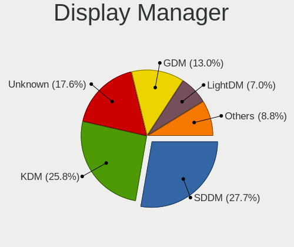
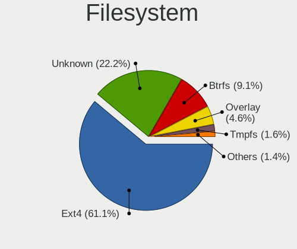
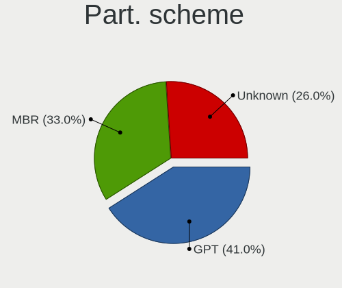
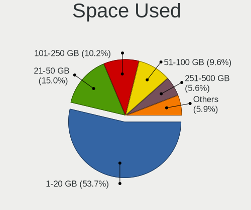
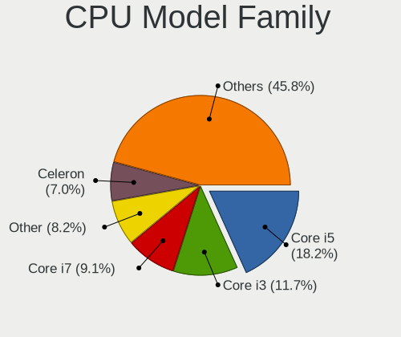
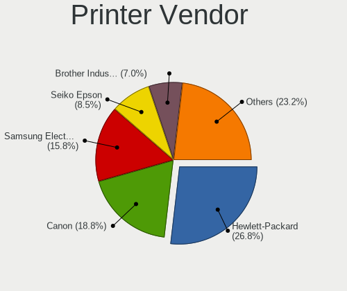
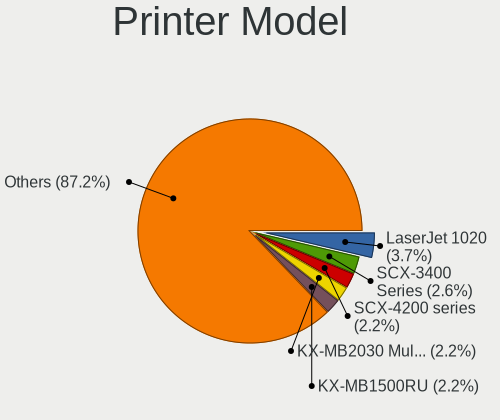
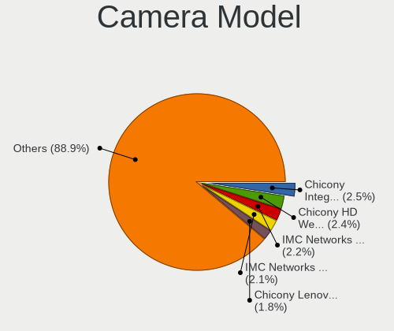

Linux in Russia - Tested Hardware & Statistics (Notebooks)
----------------------------------------------------------

A project to collect tested hardware configurations for Linux in Russia.

Anyone can contribute to this report by the [hw-probe](https://github.com/linuxhw/hw-probe) tool:

    sudo -E hw-probe -all -upload

Please contribute! Especially if your hardware is rare.

Contents
--------

* [ Test Cases ](#test-cases)

* [ System ](#system)
  - [ OS                       ](#os)
  - [ OS Family                ](#os-family)
  - [ Kernel                   ](#kernel)
  - [ Kernel Family            ](#kernel-family)
  - [ Kernel Major Ver.        ](#kernel-major-ver)
  - [ Arch                     ](#arch)
  - [ DE                       ](#de)
  - [ Display Server           ](#display-server)
  - [ Display Manager          ](#display-manager)
  - [ OS Lang                  ](#os-lang)
  - [ Boot Mode                ](#boot-mode)
  - [ Filesystem               ](#filesystem)
  - [ Part. scheme             ](#part-scheme)
  - [ Dual Boot with Linux/BSD ](#dual-boot-with-linuxbsd)
  - [ Dual Boot (Win)          ](#dual-boot-win)

* [ Board ](#board)
  - [ Vendor                   ](#vendor)
  - [ Model                    ](#model)
  - [ Model Family             ](#model-family)
  - [ MFG Year                 ](#mfg-year)
  - [ Form Factor              ](#form-factor)
  - [ Secure Boot              ](#secure-boot)
  - [ Coreboot                 ](#coreboot)
  - [ RAM Size                 ](#ram-size)
  - [ RAM Used                 ](#ram-used)
  - [ Total Drives             ](#total-drives)
  - [ Has CD-ROM               ](#has-cd-rom)
  - [ Has Ethernet             ](#has-ethernet)
  - [ Has WiFi                 ](#has-wifi)
  - [ Has Bluetooth            ](#has-bluetooth)

* [ Location ](#location)
  - [ Country                  ](#country)
  - [ City                     ](#city)

* [ Drives ](#drives)
  - [ Drive Vendor             ](#drive-vendor)
  - [ Drive Model              ](#drive-model)
  - [ HDD Vendor               ](#hdd-vendor)
  - [ SSD Vendor               ](#ssd-vendor)
  - [ Drive Kind               ](#drive-kind)
  - [ Drive Connector          ](#drive-connector)
  - [ Drive Size               ](#drive-size)
  - [ Space Total              ](#space-total)
  - [ Space Used               ](#space-used)
  - [ Malfunc. Drives          ](#malfunc-drives)
  - [ Malfunc. Drive Vendor    ](#malfunc-drive-vendor)
  - [ Malfunc. HDD Vendor      ](#malfunc-hdd-vendor)
  - [ Malfunc. Drive Kind      ](#malfunc-drive-kind)
  - [ Failed Drives            ](#failed-drives)
  - [ Failed Drive Vendor      ](#failed-drive-vendor)
  - [ Drive Status             ](#drive-status)

* [ Storage controller ](#storage-controller)
  - [ Storage Vendor           ](#storage-vendor)
  - [ Storage Model            ](#storage-model)
  - [ Storage Kind             ](#storage-kind)

* [ Processor ](#processor)
  - [ CPU Vendor               ](#cpu-vendor)
  - [ CPU Model                ](#cpu-model)
  - [ CPU Model Family         ](#cpu-model-family)
  - [ CPU Cores                ](#cpu-cores)
  - [ CPU Sockets              ](#cpu-sockets)
  - [ CPU Threads              ](#cpu-threads)
  - [ CPU Op-Modes             ](#cpu-op-modes)
  - [ CPU Microcode            ](#cpu-microcode)
  - [ CPU Microarch            ](#cpu-microarch)

* [ Graphics ](#graphics)
  - [ GPU Vendor               ](#gpu-vendor)
  - [ GPU Model                ](#gpu-model)
  - [ GPU Combo                ](#gpu-combo)
  - [ GPU Driver               ](#gpu-driver)
  - [ GPU Memory               ](#gpu-memory)

* [ Monitor ](#monitor)
  - [ Monitor Vendor           ](#monitor-vendor)
  - [ Monitor Model            ](#monitor-model)
  - [ Monitor Resolution       ](#monitor-resolution)
  - [ Monitor Diagonal         ](#monitor-diagonal)
  - [ Monitor Width            ](#monitor-width)
  - [ Aspect Ratio             ](#aspect-ratio)
  - [ Monitor Area             ](#monitor-area)
  - [ Pixel Density            ](#pixel-density)
  - [ Multiple Monitors        ](#multiple-monitors)

* [ Network ](#network)
  - [ Net Controller Vendor    ](#net-controller-vendor)
  - [ Net Controller Model     ](#net-controller-model)
  - [ Wireless Vendor          ](#wireless-vendor)
  - [ Wireless Model           ](#wireless-model)
  - [ Ethernet Vendor          ](#ethernet-vendor)
  - [ Ethernet Model           ](#ethernet-model)
  - [ Net Controller Kind      ](#net-controller-kind)
  - [ Used Controller          ](#used-controller)
  - [ NICs                     ](#nics)
  - [ IPv6                     ](#ipv6)

* [ Bluetooth ](#bluetooth)
  - [ Bluetooth Vendor         ](#bluetooth-vendor)
  - [ Bluetooth Model          ](#bluetooth-model)

* [ Sound ](#sound)
  - [ Sound Vendor             ](#sound-vendor)
  - [ Sound Model              ](#sound-model)

* [ Memory ](#memory)
  - [ Memory Vendor            ](#memory-vendor)
  - [ Memory Model             ](#memory-model)
  - [ Memory Kind              ](#memory-kind)
  - [ Memory Form Factor       ](#memory-form-factor)
  - [ Memory Size              ](#memory-size)
  - [ Memory Speed             ](#memory-speed)

* [ Printers & scanners ](#printers--scanners)
  - [ Printer Vendor           ](#printer-vendor)
  - [ Printer Model            ](#printer-model)
  - [ Scanner Vendor           ](#scanner-vendor)
  - [ Scanner Model            ](#scanner-model)

* [ Camera ](#camera)
  - [ Camera Vendor            ](#camera-vendor)
  - [ Camera Model             ](#camera-model)

* [ Security ](#security)
  - [ Fingerprint Vendor       ](#fingerprint-vendor)
  - [ Fingerprint Model        ](#fingerprint-model)
  - [ Chipcard Vendor          ](#chipcard-vendor)
  - [ Chipcard Model           ](#chipcard-model)

* [ Unsupported ](#unsupported)
  - [ Unsupported Devices      ](#unsupported-devices)
  - [ Unsupported Device Types ](#unsupported-device-types)

Test Cases
----------

Total: 15339

| Vendor        | Model                       | Probe                                                      | Date         |
|---------------|-----------------------------|------------------------------------------------------------|--------------|
| Lenovo        | B560                        | [010fb7ada1](https://linux-hardware.org/?probe=010fb7ada1) | Aug 01, 2022 |
| Shenzhen B... | XN1A                        | [6b1dd20a55](https://linux-hardware.org/?probe=6b1dd20a55) | Aug 01, 2022 |
| Intel         | Unknown                     | [9fce3597b9](https://linux-hardware.org/?probe=9fce3597b9) | Aug 01, 2022 |
| Samsung       | R530/R730/R540              | [73f8fb9528](https://linux-hardware.org/?probe=73f8fb9528) | Aug 01, 2022 |
| ASUSTek       | 1011PX                      | [c95aa572a4](https://linux-hardware.org/?probe=c95aa572a4) | Aug 01, 2022 |
| Digma         | EVE 15 C407 ES5054EW        | [7b597ebcc8](https://linux-hardware.org/?probe=7b597ebcc8) | Aug 01, 2022 |
| Acer          | Aspire 5830TG               | [7eb001e6b4](https://linux-hardware.org/?probe=7eb001e6b4) | Jul 31, 2022 |
| Acer          | TravelMate B118-M           | [490edd75cf](https://linux-hardware.org/?probe=490edd75cf) | Jul 31, 2022 |
| Aquarius      | Pro, Std, Elt Series        | [3f08a29e9a](https://linux-hardware.org/?probe=3f08a29e9a) | Jul 31, 2022 |
| Timi          | Mi Laptop Pro 15 2020       | [d27e88a924](https://linux-hardware.org/?probe=d27e88a924) | Jul 31, 2022 |
| ASUSTek       | X550LC                      | [841508c072](https://linux-hardware.org/?probe=841508c072) | Jul 31, 2022 |
| Lenovo        | G580 20157                  | [a2270894c7](https://linux-hardware.org/?probe=a2270894c7) | Jul 31, 2022 |
| MSI           | GL65 Leopard 10SCSR         | [2cbf6d3aae](https://linux-hardware.org/?probe=2cbf6d3aae) | Jul 31, 2022 |
| Dell          | G3 3579                     | [75dd5203c6](https://linux-hardware.org/?probe=75dd5203c6) | Jul 31, 2022 |
| Acer          | Aspire 3610                 | [d56c48ade2](https://linux-hardware.org/?probe=d56c48ade2) | Jul 31, 2022 |
| Acer          | Unknown                     | [99992e8b67](https://linux-hardware.org/?probe=99992e8b67) | Jul 30, 2022 |
| Sony          | VPCEH2E1R                   | [24d621e667](https://linux-hardware.org/?probe=24d621e667) | Jul 30, 2022 |
| HP            | Laptop 15-db1xxx            | [dcbb6ec79b](https://linux-hardware.org/?probe=dcbb6ec79b) | Jul 30, 2022 |
| Lenovo        | IdeaPad 5 14ALC05 82LM      | [0359549c36](https://linux-hardware.org/?probe=0359549c36) | Jul 30, 2022 |
| HP            | OMEN by Laptop 16-c0xxx     | [8ad22205d4](https://linux-hardware.org/?probe=8ad22205d4) | Jul 30, 2022 |
| Acer          | Nitro AN515-55              | [b279b1558f](https://linux-hardware.org/?probe=b279b1558f) | Jul 30, 2022 |
| Lenovo        | ThinkPad T14 Gen 2i 20W0... | [a2f1dbe3f7](https://linux-hardware.org/?probe=a2f1dbe3f7) | Jul 30, 2022 |
| Lenovo        | ThinkPad E480 20KN001QRT    | [e0e0792a71](https://linux-hardware.org/?probe=e0e0792a71) | Jul 30, 2022 |
| Lenovo        | G570 20079                  | [982a6e3241](https://linux-hardware.org/?probe=982a6e3241) | Jul 30, 2022 |
| ASUSTek       | K50ID                       | [2c1dddeaea](https://linux-hardware.org/?probe=2c1dddeaea) | Jul 29, 2022 |
| HP            | Pavilion g6                 | [ea628a71ee](https://linux-hardware.org/?probe=ea628a71ee) | Jul 29, 2022 |
| Acer          | Swift SF314-52              | [e9f0b2fcb7](https://linux-hardware.org/?probe=e9f0b2fcb7) | Jul 29, 2022 |
| HP            | ProBook 6570b               | [231ebd2edc](https://linux-hardware.org/?probe=231ebd2edc) | Jul 29, 2022 |
| ASUSTek       | P50IJ                       | [b11ce03a3b](https://linux-hardware.org/?probe=b11ce03a3b) | Jul 29, 2022 |
| Kraftway      | ACCORD                      | [1d694d32ba](https://linux-hardware.org/?probe=1d694d32ba) | Jul 29, 2022 |
| Lenovo        | ThinkPad X270 W10DG 20K5... | [8abcb43cb6](https://linux-hardware.org/?probe=8abcb43cb6) | Jul 29, 2022 |
| MSI           | FX610                       | [9e545d6a24](https://linux-hardware.org/?probe=9e545d6a24) | Jul 29, 2022 |
| Packard Be... | EasyNote LJ75               | [a883180728](https://linux-hardware.org/?probe=a883180728) | Jul 29, 2022 |
| Gigabyte      | GB-BSi7A-6500               | [048b38a923](https://linux-hardware.org/?probe=048b38a923) | Jul 29, 2022 |
| HP            | Pavilion dv7                | [b22a2df288](https://linux-hardware.org/?probe=b22a2df288) | Jul 29, 2022 |
| HP            | Pavilion dv7                | [f7daa0e3e3](https://linux-hardware.org/?probe=f7daa0e3e3) | Jul 29, 2022 |
| Acer          | Aspire A315-21              | [a9dc2d17eb](https://linux-hardware.org/?probe=a9dc2d17eb) | Jul 29, 2022 |
| Lenovo        | G50-45 80E3                 | [61a6277614](https://linux-hardware.org/?probe=61a6277614) | Jul 28, 2022 |
| HP            | Laptop 15-bw0xx             | [1c661d6eea](https://linux-hardware.org/?probe=1c661d6eea) | Jul 28, 2022 |
| HP            | Pavilion dv7                | [649a117385](https://linux-hardware.org/?probe=649a117385) | Jul 28, 2022 |
| Lenovo        | V14-IIL 82C4                | [9be688b59e](https://linux-hardware.org/?probe=9be688b59e) | Jul 28, 2022 |
| Dell          | XPS 15 9570                 | [3b312ebf00](https://linux-hardware.org/?probe=3b312ebf00) | Jul 28, 2022 |
| ASUSTek       | VivoBook 15_ASUS Laptop ... | [4947baccf9](https://linux-hardware.org/?probe=4947baccf9) | Jul 28, 2022 |
| Sony          | VGN-TT31MR_N                | [b1a4f2a68c](https://linux-hardware.org/?probe=b1a4f2a68c) | Jul 27, 2022 |
| Alienware     | 17                          | [6a4212d19d](https://linux-hardware.org/?probe=6a4212d19d) | Jul 27, 2022 |
| Lenovo        | IdeaPad 5 14ARE05 81YM      | [c68abe4e1a](https://linux-hardware.org/?probe=c68abe4e1a) | Jul 27, 2022 |
| Lenovo        | IdeaPad S145-15API 81UT     | [17f64584bb](https://linux-hardware.org/?probe=17f64584bb) | Jul 27, 2022 |
| Acer          | Aspire 5741G                | [bb63a4917e](https://linux-hardware.org/?probe=bb63a4917e) | Jul 27, 2022 |
| Digma         | EVE 15 P417 ES5063EW        | [a584c678b5](https://linux-hardware.org/?probe=a584c678b5) | Jul 27, 2022 |
| Lenovo        | IdeaPad Gaming 3 15ARH05... | [7d9d58c2da](https://linux-hardware.org/?probe=7d9d58c2da) | Jul 27, 2022 |
| Digma         | EVE 15 C407 ES5054EW        | [4fd01756b2](https://linux-hardware.org/?probe=4fd01756b2) | Jul 27, 2022 |
| Samsung       | N150/N210/N220              | [7307c1d2f7](https://linux-hardware.org/?probe=7307c1d2f7) | Jul 26, 2022 |
| Lenovo        | V15-IIL 82C5                | [9b8834dba0](https://linux-hardware.org/?probe=9b8834dba0) | Jul 26, 2022 |
| Acer          | Aspire 5742G                | [5f287317e6](https://linux-hardware.org/?probe=5f287317e6) | Jul 26, 2022 |
| HONOR         | BBR-WAX9                    | [afe7a4d56a](https://linux-hardware.org/?probe=afe7a4d56a) | Jul 26, 2022 |
| ASUSTek       | X55A                        | [61d57c4e59](https://linux-hardware.org/?probe=61d57c4e59) | Jul 26, 2022 |
| Lenovo        | G570 20079                  | [50bab54f21](https://linux-hardware.org/?probe=50bab54f21) | Jul 26, 2022 |
| ASUSTek       | X550LC                      | [e38c3e6cb5](https://linux-hardware.org/?probe=e38c3e6cb5) | Jul 26, 2022 |
| Acer          | Aspire 4720Z                | [0233e1c451](https://linux-hardware.org/?probe=0233e1c451) | Jul 26, 2022 |
| Digma         | EVE 15 C407 ES5054EW        | [008b02cc92](https://linux-hardware.org/?probe=008b02cc92) | Jul 26, 2022 |
| HP            | ENVY dv6                    | [7f8e688cc4](https://linux-hardware.org/?probe=7f8e688cc4) | Jul 26, 2022 |
| Lenovo        | ThinkPad P1 Gen 4i 20Y30... | [75c2236b06](https://linux-hardware.org/?probe=75c2236b06) | Jul 26, 2022 |
| Lenovo        | ThinkPad P1 Gen 4i 20Y30... | [6577d30f3e](https://linux-hardware.org/?probe=6577d30f3e) | Jul 26, 2022 |
| HUAWEI        | HLYL-WXX9                   | [338fa23f66](https://linux-hardware.org/?probe=338fa23f66) | Jul 25, 2022 |
| Lenovo        | LegionY540-17IRH-PG0 81T... | [22ded313b5](https://linux-hardware.org/?probe=22ded313b5) | Jul 25, 2022 |
| HP            | ENVY dv6                    | [97d752c934](https://linux-hardware.org/?probe=97d752c934) | Jul 25, 2022 |
| Lenovo        | IdeaPad 5 Pro 14ACN6 82L... | [413949a727](https://linux-hardware.org/?probe=413949a727) | Jul 25, 2022 |
| HP            | EliteBook 855 G8 Noteboo... | [d93f50bcf7](https://linux-hardware.org/?probe=d93f50bcf7) | Jul 25, 2022 |
| Acer          | Aspire A315-51              | [b9d14045a3](https://linux-hardware.org/?probe=b9d14045a3) | Jul 25, 2022 |
| HP            | OMEN by Laptop 16-c0xxx     | [8f46b7dcca](https://linux-hardware.org/?probe=8f46b7dcca) | Jul 25, 2022 |
| HP            | Notebook                    | [fdc7478b06](https://linux-hardware.org/?probe=fdc7478b06) | Jul 25, 2022 |
| ICL           | NLx0MU                      | [af0922946a](https://linux-hardware.org/?probe=af0922946a) | Jul 25, 2022 |
| Fujitsu Si... | AMILO Pi 3540               | [3a17370c3f](https://linux-hardware.org/?probe=3a17370c3f) | Jul 25, 2022 |
| Acer          | Aspire E5-573G              | [7fbe649805](https://linux-hardware.org/?probe=7fbe649805) | Jul 25, 2022 |
| Acer          | Aspire E5-551G              | [8c94f9bae3](https://linux-hardware.org/?probe=8c94f9bae3) | Jul 25, 2022 |
| Lenovo        | ThinkBook 15 G2 ITL 20VE    | [2db0d89beb](https://linux-hardware.org/?probe=2db0d89beb) | Jul 25, 2022 |
| HP            | EliteBook 855 G8 Noteboo... | [600f37786e](https://linux-hardware.org/?probe=600f37786e) | Jul 25, 2022 |
| Lenovo        | Y520-15IKBN 80WK            | [80334990e7](https://linux-hardware.org/?probe=80334990e7) | Jul 25, 2022 |
| ASUSTek       | T200TAC                     | [a8314ae281](https://linux-hardware.org/?probe=a8314ae281) | Jul 24, 2022 |
| Aquarius      | Cmp NS765                   | [9c9200701e](https://linux-hardware.org/?probe=9c9200701e) | Jul 24, 2022 |
| HP            | Pavilion dv6                | [0a3ef4b5dd](https://linux-hardware.org/?probe=0a3ef4b5dd) | Jul 24, 2022 |
| ASUSTek       | ROG Zephyrus G15 GA503QM... | [e902922ed5](https://linux-hardware.org/?probe=e902922ed5) | Jul 24, 2022 |
| ASUSTek       | S300CA                      | [08b3fe2c70](https://linux-hardware.org/?probe=08b3fe2c70) | Jul 24, 2022 |
| ASUSTek       | K53SJ                       | [d8eb4baf45](https://linux-hardware.org/?probe=d8eb4baf45) | Jul 24, 2022 |
| ASUSTek       | K53SJ                       | [5d5189c2d1](https://linux-hardware.org/?probe=5d5189c2d1) | Jul 24, 2022 |
| Acer          | Aspire V3-551G              | [970f226406](https://linux-hardware.org/?probe=970f226406) | Jul 24, 2022 |
| Timi          | RedmiBook 14 II             | [cd8d5a1ee6](https://linux-hardware.org/?probe=cd8d5a1ee6) | Jul 24, 2022 |
| Lenovo        | B590 20208                  | [35decc70d1](https://linux-hardware.org/?probe=35decc70d1) | Jul 23, 2022 |
| Acer          | Aspire E5-573G              | [2e10f53e9d](https://linux-hardware.org/?probe=2e10f53e9d) | Jul 23, 2022 |
| Timi          | Redmi Book Pro 15 2022      | [147556bf0a](https://linux-hardware.org/?probe=147556bf0a) | Jul 23, 2022 |
| Timi          | TM1701                      | [387e7a36d8](https://linux-hardware.org/?probe=387e7a36d8) | Jul 23, 2022 |
| Lenovo        | IdeaPad 3 15IML05 81WB      | [3181f43aef](https://linux-hardware.org/?probe=3181f43aef) | Jul 23, 2022 |
| HP            | ProBook 4540s               | [d70dbfeecb](https://linux-hardware.org/?probe=d70dbfeecb) | Jul 22, 2022 |
| ASUSTek       | 1215N                       | [5ef0576222](https://linux-hardware.org/?probe=5ef0576222) | Jul 22, 2022 |
| ASUSTek       | ROG Zephyrus M16 GU603HE... | [dd0034072b](https://linux-hardware.org/?probe=dd0034072b) | Jul 22, 2022 |
| Lenovo        | IdeaPad L340-15API 81LW     | [2ea5a4f753](https://linux-hardware.org/?probe=2ea5a4f753) | Jul 22, 2022 |
| ASUSTek       | F5N                         | [5dc4f489d9](https://linux-hardware.org/?probe=5dc4f489d9) | Jul 22, 2022 |
| Lenovo        | V15-IWL 81YE                | [3bfcedd5c8](https://linux-hardware.org/?probe=3bfcedd5c8) | Jul 22, 2022 |
| Lenovo        | V15-IWL 81YE                | [c49282206c](https://linux-hardware.org/?probe=c49282206c) | Jul 22, 2022 |
| Lenovo        | V15-IWL 81YE                | [d598c4587d](https://linux-hardware.org/?probe=d598c4587d) | Jul 22, 2022 |
| Lenovo        | V15-IWL 81YE                | [5b1e962751](https://linux-hardware.org/?probe=5b1e962751) | Jul 22, 2022 |
| Lenovo        | V15-IWL 81YE                | [4e120b3b63](https://linux-hardware.org/?probe=4e120b3b63) | Jul 22, 2022 |
| Lenovo        | V15-IWL 81YE                | [2d5bedf224](https://linux-hardware.org/?probe=2d5bedf224) | Jul 22, 2022 |
| Lenovo        | V15-IWL 81YE                | [297ce5144e](https://linux-hardware.org/?probe=297ce5144e) | Jul 22, 2022 |
| Lenovo        | V15-IWL 81YE                | [84b7cd1115](https://linux-hardware.org/?probe=84b7cd1115) | Jul 22, 2022 |
| Lenovo        | V15-IWL 81YE                | [a92b6c5d73](https://linux-hardware.org/?probe=a92b6c5d73) | Jul 22, 2022 |
| Lenovo        | V15-IWL 81YE                | [51ebd271c8](https://linux-hardware.org/?probe=51ebd271c8) | Jul 22, 2022 |
| Lenovo        | V15-IWL 81YE                | [44ad7f7d47](https://linux-hardware.org/?probe=44ad7f7d47) | Jul 22, 2022 |
| Lenovo        | V15-IWL 81YE                | [49068a26b5](https://linux-hardware.org/?probe=49068a26b5) | Jul 22, 2022 |
| Lenovo        | V15-IWL 81YE                | [62ce596bf3](https://linux-hardware.org/?probe=62ce596bf3) | Jul 22, 2022 |
| Lenovo        | V15-IWL 81YE                | [812db8ad6f](https://linux-hardware.org/?probe=812db8ad6f) | Jul 22, 2022 |
| Lenovo        | V15-IWL 81YE                | [d4c2b5ffad](https://linux-hardware.org/?probe=d4c2b5ffad) | Jul 22, 2022 |
| Lenovo        | V15-IWL 81YE                | [4c0179b60e](https://linux-hardware.org/?probe=4c0179b60e) | Jul 22, 2022 |
| Lenovo        | IdeaPad L340-15API 81LW     | [8601888983](https://linux-hardware.org/?probe=8601888983) | Jul 22, 2022 |
| Lenovo        | V15-IWL 81YE                | [1d505390d6](https://linux-hardware.org/?probe=1d505390d6) | Jul 22, 2022 |
| Unknown       | Unknown                     | [fdd0edb248](https://linux-hardware.org/?probe=fdd0edb248) | Jul 22, 2022 |
| ASUSTek       | 1005HA                      | [5fca7b8752](https://linux-hardware.org/?probe=5fca7b8752) | Jul 21, 2022 |
| Lenovo        | IdeaPad Yoga 13 20175       | [b7d05f361c](https://linux-hardware.org/?probe=b7d05f361c) | Jul 21, 2022 |
| Lenovo        | IdeaPad 320-15ISK 80XH      | [33f5176a6c](https://linux-hardware.org/?probe=33f5176a6c) | Jul 21, 2022 |
| Lenovo        | IdeaPad L340-15API 81LW     | [d481776a74](https://linux-hardware.org/?probe=d481776a74) | Jul 21, 2022 |
| HP            | Pavilion dv7                | [8975495225](https://linux-hardware.org/?probe=8975495225) | Jul 21, 2022 |
| ASUSTek       | X541UVK                     | [fb1513d31e](https://linux-hardware.org/?probe=fb1513d31e) | Jul 21, 2022 |
| Dell          | XPS 13 9360                 | [f870753f2f](https://linux-hardware.org/?probe=f870753f2f) | Jul 21, 2022 |
| Lenovo        | IdeaPad S340-15IML 81NA     | [bff95aa218](https://linux-hardware.org/?probe=bff95aa218) | Jul 21, 2022 |
| Lenovo        | ThinkPad L15 Gen 2 20X30... | [5a6d4e8ba4](https://linux-hardware.org/?probe=5a6d4e8ba4) | Jul 21, 2022 |
| HP            | Laptop 17-cp0xxx            | [30229a5c84](https://linux-hardware.org/?probe=30229a5c84) | Jul 21, 2022 |
| Dell          | Vostro 15 3515              | [722f543885](https://linux-hardware.org/?probe=722f543885) | Jul 21, 2022 |
| Samsung       | 350V5C/351V5C/3540VC/344... | [81020ca308](https://linux-hardware.org/?probe=81020ca308) | Jul 21, 2022 |
| ASUSTek       | ASUSPRO P1440FAC_P1440FA    | [914c4b3782](https://linux-hardware.org/?probe=914c4b3782) | Jul 21, 2022 |
| ASUSTek       | X75VC                       | [b15ee89a5a](https://linux-hardware.org/?probe=b15ee89a5a) | Jul 21, 2022 |
| Lenovo        | ThinkPad T470 20HES0MV00    | [15d59d77ec](https://linux-hardware.org/?probe=15d59d77ec) | Jul 21, 2022 |
| ASUSTek       | X541UVK                     | [a34ee52169](https://linux-hardware.org/?probe=a34ee52169) | Jul 21, 2022 |
| Dell          | Inspiron N5110              | [30a3da64bf](https://linux-hardware.org/?probe=30a3da64bf) | Jul 20, 2022 |
| Lenovo        | IdeaPad L340-15API 81LW     | [ef738973d3](https://linux-hardware.org/?probe=ef738973d3) | Jul 20, 2022 |
| Dell          | Latitude 3500               | [9f3c591e61](https://linux-hardware.org/?probe=9f3c591e61) | Jul 20, 2022 |
| Acer          | Acadia V1.45                | [73f544e6cb](https://linux-hardware.org/?probe=73f544e6cb) | Jul 20, 2022 |
| HUAWEI        | KLVL-WXXW                   | [42a2639fcf](https://linux-hardware.org/?probe=42a2639fcf) | Jul 20, 2022 |
| ASUSTek       | 1011PX                      | [fd9099b538](https://linux-hardware.org/?probe=fd9099b538) | Jul 20, 2022 |
| HONOR         | NBR-WAX9                    | [5b3340311a](https://linux-hardware.org/?probe=5b3340311a) | Jul 20, 2022 |
| Acer          | Aspire V3-551G              | [f5675c45dc](https://linux-hardware.org/?probe=f5675c45dc) | Jul 20, 2022 |
| Lenovo        | V570 HuronRiver Platform    | [7e317412e0](https://linux-hardware.org/?probe=7e317412e0) | Jul 20, 2022 |
| Gigabyte      | AERO 15 XD                  | [771779a0fb](https://linux-hardware.org/?probe=771779a0fb) | Jul 20, 2022 |
| Lenovo        | IdeaPad S145-15IWL 81MV     | [1c9f2b1e0e](https://linux-hardware.org/?probe=1c9f2b1e0e) | Jul 20, 2022 |
| Lenovo        | ThinkBook 15 G3 ACL 21A4    | [1c39715e4d](https://linux-hardware.org/?probe=1c39715e4d) | Jul 20, 2022 |
| Lenovo        | ThinkBook 15 G3 ACL 21A4    | [a85dfe6cdd](https://linux-hardware.org/?probe=a85dfe6cdd) | Jul 20, 2022 |
| Lenovo        | IdeaPad S540-14API 81NH     | [810b379dac](https://linux-hardware.org/?probe=810b379dac) | Jul 19, 2022 |
| HP            | Pavilion 17                 | [95a312c2f8](https://linux-hardware.org/?probe=95a312c2f8) | Jul 19, 2022 |
| Acer          | Aspire 5742G                | [832c41d36c](https://linux-hardware.org/?probe=832c41d36c) | Jul 19, 2022 |
| Fujitsu Si... | AMILO Pi 3540               | [47c0c1f4eb](https://linux-hardware.org/?probe=47c0c1f4eb) | Jul 19, 2022 |
| ASUSTek       | TUF Gaming FX504GE_FX80G... | [4e1321f550](https://linux-hardware.org/?probe=4e1321f550) | Jul 19, 2022 |
| HUAWEI        | HVY-WXX9                    | [b3073d8188](https://linux-hardware.org/?probe=b3073d8188) | Jul 19, 2022 |
| Lenovo        | IdeaPad L340-15API 81LW     | [154c254eac](https://linux-hardware.org/?probe=154c254eac) | Jul 19, 2022 |
| Gigabyte      | G5 GD                       | [60921a7ff6](https://linux-hardware.org/?probe=60921a7ff6) | Jul 19, 2022 |
| HUAWEI        | HLYL-WXX9                   | [3831dd717e](https://linux-hardware.org/?probe=3831dd717e) | Jul 19, 2022 |
| Fujitsu Si... | AMILO Pi 3540               | [4efd4113d7](https://linux-hardware.org/?probe=4efd4113d7) | Jul 19, 2022 |
| Lenovo        | IdeaPad S145-15IGM 81MX     | [6dbaa4c42a](https://linux-hardware.org/?probe=6dbaa4c42a) | Jul 19, 2022 |
| Digma         | EVE 14 C411                 | [73153be7cd](https://linux-hardware.org/?probe=73153be7cd) | Jul 19, 2022 |
| Lenovo        | B560                        | [c21d90f29d](https://linux-hardware.org/?probe=c21d90f29d) | Jul 19, 2022 |
| Gigabyte      | G5 GD                       | [c24f8b4ba6](https://linux-hardware.org/?probe=c24f8b4ba6) | Jul 19, 2022 |
| Acer          | Aspire 5730                 | [27c09757d3](https://linux-hardware.org/?probe=27c09757d3) | Jul 19, 2022 |
| Lenovo        | B590 20206                  | [bdd7a06914](https://linux-hardware.org/?probe=bdd7a06914) | Jul 18, 2022 |
| Packard Be... | EasyNote TJ71               | [9a533d59ac](https://linux-hardware.org/?probe=9a533d59ac) | Jul 18, 2022 |
| HUAWEI        | KLVL-WXXW                   | [337e6e0efa](https://linux-hardware.org/?probe=337e6e0efa) | Jul 18, 2022 |
| HP            | Notebook                    | [d917f9c8a4](https://linux-hardware.org/?probe=d917f9c8a4) | Jul 18, 2022 |
| Dell          | Vostro 3500                 | [a0599c411c](https://linux-hardware.org/?probe=a0599c411c) | Jul 18, 2022 |
| Acer          | Aspire V3-551G              | [2baa51bbc9](https://linux-hardware.org/?probe=2baa51bbc9) | Jul 18, 2022 |
| ASUSTek       | ASUS TUF Dash F15 FX516P... | [ce5ca74472](https://linux-hardware.org/?probe=ce5ca74472) | Jul 17, 2022 |
| Fujitsu       | LIFEBOOK A512               | [10d55703f6](https://linux-hardware.org/?probe=10d55703f6) | Jul 17, 2022 |
| Dell          | Latitude 7490               | [bed5644964](https://linux-hardware.org/?probe=bed5644964) | Jul 17, 2022 |
| Acer          | Aspire 5715Z                | [ee2710b5c5](https://linux-hardware.org/?probe=ee2710b5c5) | Jul 17, 2022 |
| Irbis         | NB660                       | [ca5b5a40a8](https://linux-hardware.org/?probe=ca5b5a40a8) | Jul 17, 2022 |
| HUAWEI        | HVY-WXX9                    | [5bf07dadc2](https://linux-hardware.org/?probe=5bf07dadc2) | Jul 17, 2022 |
| Lenovo        | ThinkPad P51s 20HB000URT    | [7f9c1a586d](https://linux-hardware.org/?probe=7f9c1a586d) | Jul 17, 2022 |
| HP            | Laptop 15-bw0xx             | [9acefdf3c8](https://linux-hardware.org/?probe=9acefdf3c8) | Jul 17, 2022 |
| Lenovo        | ThinkBook 15-IIL 20SM       | [662b422bcd](https://linux-hardware.org/?probe=662b422bcd) | Jul 17, 2022 |
| ASUSTek       | VivoBook_ASUSLaptop X540... | [14d23344e2](https://linux-hardware.org/?probe=14d23344e2) | Jul 17, 2022 |
| ASUSTek       | X55VD                       | [7748a75672](https://linux-hardware.org/?probe=7748a75672) | Jul 17, 2022 |
| Lenovo        | G580 20157                  | [20e895d9f0](https://linux-hardware.org/?probe=20e895d9f0) | Jul 17, 2022 |
| ASUSTek       | N751JK                      | [4a614fcc98](https://linux-hardware.org/?probe=4a614fcc98) | Jul 17, 2022 |
| Acer          | Aspire 5100                 | [9c493e29aa](https://linux-hardware.org/?probe=9c493e29aa) | Jul 17, 2022 |
| Acer          | Aspire 5100                 | [b84af59235](https://linux-hardware.org/?probe=b84af59235) | Jul 17, 2022 |
| Lenovo        | B590 20206                  | [e072d299e3](https://linux-hardware.org/?probe=e072d299e3) | Jul 16, 2022 |
| HP            | 250 G5                      | [979d1aea6f](https://linux-hardware.org/?probe=979d1aea6f) | Jul 16, 2022 |
| HUAWEI        | CREM-WXX9                   | [01c6a390fe](https://linux-hardware.org/?probe=01c6a390fe) | Jul 16, 2022 |
| 3Logic Gro... | APM Graviton A15i-K2        | [01bb777843](https://linux-hardware.org/?probe=01bb777843) | Jul 16, 2022 |
| eMachines     | E525                        | [da97665159](https://linux-hardware.org/?probe=da97665159) | Jul 16, 2022 |
| ASUSTek       | X75VC                       | [6c3d8483e1](https://linux-hardware.org/?probe=6c3d8483e1) | Jul 16, 2022 |
| ASUSTek       | X555LN                      | [0d6d6728ba](https://linux-hardware.org/?probe=0d6d6728ba) | Jul 15, 2022 |
| HP            | Pavilion g6                 | [3549fb92f1](https://linux-hardware.org/?probe=3549fb92f1) | Jul 15, 2022 |
| HP            | ZBook Power 15.6 inch G8... | [e442e954fb](https://linux-hardware.org/?probe=e442e954fb) | Jul 15, 2022 |
| ASUSTek       | X550LC                      | [5ff99910a2](https://linux-hardware.org/?probe=5ff99910a2) | Jul 15, 2022 |
| ASUSTek       | A9T                         | [402b5e43d1](https://linux-hardware.org/?probe=402b5e43d1) | Jul 15, 2022 |
| Acer          | Aspire A315-51              | [0ececc803e](https://linux-hardware.org/?probe=0ececc803e) | Jul 15, 2022 |
| HP            | ProBook 430 G5              | [cf3b0313ea](https://linux-hardware.org/?probe=cf3b0313ea) | Jul 15, 2022 |
| Acer          | Aspire ES1-524              | [686edf54b2](https://linux-hardware.org/?probe=686edf54b2) | Jul 15, 2022 |
| Packard Be... | EasyNote TJ71               | [b8e077b663](https://linux-hardware.org/?probe=b8e077b663) | Jul 15, 2022 |
| Lenovo        | IdeaPad L340-15API 81LW     | [a9d9f33f2b](https://linux-hardware.org/?probe=a9d9f33f2b) | Jul 15, 2022 |
| Lenovo        | IdeaPad L340-15API 81LW     | [b9246d8189](https://linux-hardware.org/?probe=b9246d8189) | Jul 15, 2022 |
| Unknown       | Unknown                     | [a7de2e1421](https://linux-hardware.org/?probe=a7de2e1421) | Jul 14, 2022 |
| Acer          | Aspire A315-55KG            | [3587f30c4a](https://linux-hardware.org/?probe=3587f30c4a) | Jul 14, 2022 |
| Dell          | 500                         | [9c1b1d5349](https://linux-hardware.org/?probe=9c1b1d5349) | Jul 14, 2022 |
| Acer          | Aspire 7741                 | [c243e256b8](https://linux-hardware.org/?probe=c243e256b8) | Jul 14, 2022 |
| Acer          | Aspire 7741                 | [0578837b28](https://linux-hardware.org/?probe=0578837b28) | Jul 14, 2022 |
| Intel         | V14                         | [ae556446b0](https://linux-hardware.org/?probe=ae556446b0) | Jul 14, 2022 |
| ASUSTek       | K43SJ                       | [41d331904e](https://linux-hardware.org/?probe=41d331904e) | Jul 14, 2022 |
| ASUSTek       | A9T                         | [5132e70756](https://linux-hardware.org/?probe=5132e70756) | Jul 14, 2022 |
| Lenovo        | IdeaPad 330S-14IKB 81F4     | [cf23beb6c1](https://linux-hardware.org/?probe=cf23beb6c1) | Jul 13, 2022 |
| 3Logic Gro... | Graviton N15i               | [5df194f626](https://linux-hardware.org/?probe=5df194f626) | Jul 13, 2022 |
| ASUSTek       | X550LC                      | [059c605792](https://linux-hardware.org/?probe=059c605792) | Jul 13, 2022 |
| Lenovo        | Legion Y540-17IRH 81UJ      | [b70dfefc75](https://linux-hardware.org/?probe=b70dfefc75) | Jul 13, 2022 |
| Lenovo        | Legion Y540-17IRH 81UJ      | [eb06d804a9](https://linux-hardware.org/?probe=eb06d804a9) | Jul 13, 2022 |
| Dell          | Latitude 5310               | [bc161b95e9](https://linux-hardware.org/?probe=bc161b95e9) | Jul 13, 2022 |
| HUAWEI        | CREM-WXX9                   | [f764827707](https://linux-hardware.org/?probe=f764827707) | Jul 13, 2022 |
| HUAWEI        | KLVL-WXXW                   | [ded0cc5604](https://linux-hardware.org/?probe=ded0cc5604) | Jul 12, 2022 |
| ASUSTek       | K43SJ                       | [26529ab8e3](https://linux-hardware.org/?probe=26529ab8e3) | Jul 12, 2022 |
| Lenovo        | B570e HuronRiver Platfor... | [1b0aa246aa](https://linux-hardware.org/?probe=1b0aa246aa) | Jul 12, 2022 |
| Lenovo        | IdeaPad 3 15ADA6 82KR       | [8604a047fc](https://linux-hardware.org/?probe=8604a047fc) | Jul 12, 2022 |
| Dell          | Vostro 14 5410              | [2faa8bf726](https://linux-hardware.org/?probe=2faa8bf726) | Jul 12, 2022 |
| Dell          | Latitude 5501               | [176fdb0767](https://linux-hardware.org/?probe=176fdb0767) | Jul 12, 2022 |
| Lenovo        | Legion 5 15IMH05H 81Y6      | [7af17249cf](https://linux-hardware.org/?probe=7af17249cf) | Jul 11, 2022 |
| Lenovo        | 3000 G430 4153/200          | [b262119cef](https://linux-hardware.org/?probe=b262119cef) | Jul 11, 2022 |
| Unknown       | Unknown                     | [1b418731e4](https://linux-hardware.org/?probe=1b418731e4) | Jul 11, 2022 |
| Unknown       | Unknown                     | [40a3dfbb11](https://linux-hardware.org/?probe=40a3dfbb11) | Jul 11, 2022 |
| HP            | Laptop 15-db1xxx            | [5c94e19aab](https://linux-hardware.org/?probe=5c94e19aab) | Jul 11, 2022 |
| HP            | Laptop 15-db1xxx            | [f843bd9b84](https://linux-hardware.org/?probe=f843bd9b84) | Jul 11, 2022 |
| Irbis         | NB20                        | [8dc53febc0](https://linux-hardware.org/?probe=8dc53febc0) | Jul 11, 2022 |
| ASUSTek       | X51RL                       | [3da6910e57](https://linux-hardware.org/?probe=3da6910e57) | Jul 10, 2022 |
| Lenovo        | ThinkPad L13 Gen 2 20VH0... | [b0f6891a0b](https://linux-hardware.org/?probe=b0f6891a0b) | Jul 10, 2022 |
| Lenovo        | ThinkPad L13 Gen 2 20VH0... | [5d31b181fd](https://linux-hardware.org/?probe=5d31b181fd) | Jul 10, 2022 |
| ASUSTek       | N750JK                      | [efede6fbcd](https://linux-hardware.org/?probe=efede6fbcd) | Jul 10, 2022 |
| Lenovo        | ThinkPad L390 20NR0013RK    | [57447f37e2](https://linux-hardware.org/?probe=57447f37e2) | Jul 10, 2022 |
| Dell          | Precision M4800             | [d28fa75d0e](https://linux-hardware.org/?probe=d28fa75d0e) | Jul 10, 2022 |
| Timi          | TM1701                      | [8786fe1e91](https://linux-hardware.org/?probe=8786fe1e91) | Jul 10, 2022 |
| ASUSTek       | VivoBook_ASUSLaptop X513... | [ab7a7b0d04](https://linux-hardware.org/?probe=ab7a7b0d04) | Jul 10, 2022 |
| HP            | Pavilion g6                 | [19081f813f](https://linux-hardware.org/?probe=19081f813f) | Jul 10, 2022 |
| Dell          | G15 5511                    | [78d96f0cd9](https://linux-hardware.org/?probe=78d96f0cd9) | Jul 10, 2022 |
| Lenovo        | E31-70 80KX                 | [ba73d295c1](https://linux-hardware.org/?probe=ba73d295c1) | Jul 10, 2022 |
| Acer          | Extensa 2509                | [b6374137c9](https://linux-hardware.org/?probe=b6374137c9) | Jul 09, 2022 |
| HP            | ProBook 4710s               | [4fe41da4e8](https://linux-hardware.org/?probe=4fe41da4e8) | Jul 09, 2022 |
| HP            | ProBook 4710s               | [932822fdc7](https://linux-hardware.org/?probe=932822fdc7) | Jul 09, 2022 |
| Acer          | Swift SF114-34              | [cf0d8e217c](https://linux-hardware.org/?probe=cf0d8e217c) | Jul 09, 2022 |
| Dell          | Inspiron N5110              | [8c9cb805af](https://linux-hardware.org/?probe=8c9cb805af) | Jul 09, 2022 |
| Samsung       | QX310/QX410/QX510/SF310/... | [318bcea56d](https://linux-hardware.org/?probe=318bcea56d) | Jul 09, 2022 |
| Sony          | VGN-FS515BR                 | [d8f67da4b1](https://linux-hardware.org/?probe=d8f67da4b1) | Jul 09, 2022 |
| Toshiba       | Satellite A300              | [0cdf2eabc3](https://linux-hardware.org/?probe=0cdf2eabc3) | Jul 09, 2022 |
| Packard Be... | EasyNote TE11HC             | [5b42305918](https://linux-hardware.org/?probe=5b42305918) | Jul 09, 2022 |
| Dell          | Inspiron N5110              | [efd3d0395b](https://linux-hardware.org/?probe=efd3d0395b) | Jul 09, 2022 |
| Toshiba       | TECRA R850                  | [b72495f75b](https://linux-hardware.org/?probe=b72495f75b) | Jul 09, 2022 |
| Lenovo        | ThinkBook 14-IIL 20SL       | [54187f60f4](https://linux-hardware.org/?probe=54187f60f4) | Jul 09, 2022 |
| THD           | PX1 01                      | [5da95870c5](https://linux-hardware.org/?probe=5da95870c5) | Jul 09, 2022 |
| Acer          | Swift SF114-34              | [469f6147b8](https://linux-hardware.org/?probe=469f6147b8) | Jul 08, 2022 |
| ASUSTek       | ASUS TUF Gaming A15 FA50... | [499be72aa8](https://linux-hardware.org/?probe=499be72aa8) | Jul 08, 2022 |
| Lenovo        | ThinkBook 15 G2 ARE 20VG    | [8a96de43eb](https://linux-hardware.org/?probe=8a96de43eb) | Jul 08, 2022 |
| ASUSTek       | N56VZ                       | [be74c56d76](https://linux-hardware.org/?probe=be74c56d76) | Jul 08, 2022 |
| Acer          | Aspire A315-51              | [6e44a5f157](https://linux-hardware.org/?probe=6e44a5f157) | Jul 08, 2022 |
| HONOR         | NBR-WAX9                    | [fe971bb8c3](https://linux-hardware.org/?probe=fe971bb8c3) | Jul 08, 2022 |
| HP            | Pavilion g6                 | [30085f92b1](https://linux-hardware.org/?probe=30085f92b1) | Jul 08, 2022 |
| Aquarius      | NS685U R11                  | [ad52e2f253](https://linux-hardware.org/?probe=ad52e2f253) | Jul 08, 2022 |
| ASUSTek       | VivoBook 15_ASUS Laptop ... | [a5c61fc1cf](https://linux-hardware.org/?probe=a5c61fc1cf) | Jul 08, 2022 |
| ASUSTek       | VivoBook 15_ASUS Laptop ... | [41840a0102](https://linux-hardware.org/?probe=41840a0102) | Jul 08, 2022 |
| ASUSTek       | GL702VSK                    | [4fe32d25e5](https://linux-hardware.org/?probe=4fe32d25e5) | Jul 08, 2022 |
| Sony          | SVE1512H1RW                 | [6aa6a13a40](https://linux-hardware.org/?probe=6aa6a13a40) | Jul 07, 2022 |
| Chuwi         | GemiBook Pro                | [f2151c1737](https://linux-hardware.org/?probe=f2151c1737) | Jul 07, 2022 |
| Notebook      | W250EGQ / W270EGQ           | [189e78b17c](https://linux-hardware.org/?probe=189e78b17c) | Jul 07, 2022 |
| ASUSTek       | X550LC                      | [d9ce56c2f6](https://linux-hardware.org/?probe=d9ce56c2f6) | Jul 07, 2022 |
| ASUSTek       | S551LN                      | [019c2b1194](https://linux-hardware.org/?probe=019c2b1194) | Jul 07, 2022 |
| Acer          | Aspire E5-573G              | [cda7a71bd9](https://linux-hardware.org/?probe=cda7a71bd9) | Jul 07, 2022 |
| Lenovo        | IdeaPad 3 15ITL05 81X8      | [2835672840](https://linux-hardware.org/?probe=2835672840) | Jul 07, 2022 |
| Lenovo        | IdeaPad 3 15ITL05 81X8      | [74ed9232f8](https://linux-hardware.org/?probe=74ed9232f8) | Jul 07, 2022 |
| Samsung       | Q430/Q530                   | [a3b8c95131](https://linux-hardware.org/?probe=a3b8c95131) | Jul 07, 2022 |
| Acer          | Aspire A315-51              | [4fbcdebde9](https://linux-hardware.org/?probe=4fbcdebde9) | Jul 07, 2022 |
| HP            | Laptop 15-bw0xx             | [c5cc2b52bb](https://linux-hardware.org/?probe=c5cc2b52bb) | Jul 07, 2022 |
| HUAWEI        | KLVL-WXXW                   | [5d2d940ec2](https://linux-hardware.org/?probe=5d2d940ec2) | Jul 07, 2022 |
| Samsung       | 350V5C/351V5C/3540VC/344... | [e5bf9b72d0](https://linux-hardware.org/?probe=e5bf9b72d0) | Jul 07, 2022 |
| Insyde        | CherryTrail                 | [6e2e30eb92](https://linux-hardware.org/?probe=6e2e30eb92) | Jul 07, 2022 |
| Dell          | Vostro 15 3515              | [f23b893f56](https://linux-hardware.org/?probe=f23b893f56) | Jul 06, 2022 |
| Insyde        | CherryTrail                 | [4e8ddb465a](https://linux-hardware.org/?probe=4e8ddb465a) | Jul 06, 2022 |
| Dell          | Vostro 15 3515              | [b88a240504](https://linux-hardware.org/?probe=b88a240504) | Jul 06, 2022 |
| ASUSTek       | S551LN                      | [1f47ada680](https://linux-hardware.org/?probe=1f47ada680) | Jul 06, 2022 |
| Acer          | Aspire V5-571G              | [8476e2e1c3](https://linux-hardware.org/?probe=8476e2e1c3) | Jul 06, 2022 |
| HP            | ProBook 450 G2              | [aeb16eb1eb](https://linux-hardware.org/?probe=aeb16eb1eb) | Jul 06, 2022 |
| Lenovo        | IdeaPad 5 15ARE05 81YQ      | [6b007e333a](https://linux-hardware.org/?probe=6b007e333a) | Jul 06, 2022 |
| Lenovo        | IdeaPad 5 15ARE05 81YQ      | [f09a1deecc](https://linux-hardware.org/?probe=f09a1deecc) | Jul 06, 2022 |
| HUAWEI        | NBLK-WAX9X                  | [c983c66fca](https://linux-hardware.org/?probe=c983c66fca) | Jul 06, 2022 |
| Toshiba       | Satellite A100              | [460363ac20](https://linux-hardware.org/?probe=460363ac20) | Jul 06, 2022 |
| Lenovo        | B50-45 20388                | [0012892dd7](https://linux-hardware.org/?probe=0012892dd7) | Jul 06, 2022 |
| HP            | Laptop 15-bw0xx             | [8639a1e63e](https://linux-hardware.org/?probe=8639a1e63e) | Jul 06, 2022 |
| Lenovo        | ACLUAB                      | [2ce2997754](https://linux-hardware.org/?probe=2ce2997754) | Jul 06, 2022 |
| Samsung       | 300E4C/300E5C/300E7C        | [0050f243df](https://linux-hardware.org/?probe=0050f243df) | Jul 06, 2022 |
| Acer          | Aspire E5-573G              | [15a8d7d8f1](https://linux-hardware.org/?probe=15a8d7d8f1) | Jul 06, 2022 |
| ASUSTek       | N56VZ                       | [2251ef0947](https://linux-hardware.org/?probe=2251ef0947) | Jul 05, 2022 |
| Acer          | Aspire V5-571G              | [add34d1f6a](https://linux-hardware.org/?probe=add34d1f6a) | Jul 05, 2022 |
| HP            | Pavilion Aero Laptop 13-... | [9ad51a3a2c](https://linux-hardware.org/?probe=9ad51a3a2c) | Jul 05, 2022 |
| Acer          | Aspire E5-771G              | [b6ed168d04](https://linux-hardware.org/?probe=b6ed168d04) | Jul 05, 2022 |
| Acer          | Aspire E5-771G              | [22bcdc67e5](https://linux-hardware.org/?probe=22bcdc67e5) | Jul 05, 2022 |
| Toshiba       | Satellite A100              | [2b25713a3d](https://linux-hardware.org/?probe=2b25713a3d) | Jul 05, 2022 |
| Toshiba       | Satellite A300              | [dd80f74e85](https://linux-hardware.org/?probe=dd80f74e85) | Jul 05, 2022 |
| Toshiba       | Satellite A300              | [69e4341e99](https://linux-hardware.org/?probe=69e4341e99) | Jul 05, 2022 |
| HP            | Notebook                    | [926fa01485](https://linux-hardware.org/?probe=926fa01485) | Jul 05, 2022 |
| Lenovo        | B50-45 20388                | [94bf23b60a](https://linux-hardware.org/?probe=94bf23b60a) | Jul 05, 2022 |
| Acer          | Extensa 215-22              | [4a13395136](https://linux-hardware.org/?probe=4a13395136) | Jul 05, 2022 |
| HUAWEI        | NBLB-WAX9N                  | [a8888a6627](https://linux-hardware.org/?probe=a8888a6627) | Jul 05, 2022 |
| HUAWEI        | NBLB-WAX9N                  | [b3da1e4cdb](https://linux-hardware.org/?probe=b3da1e4cdb) | Jul 05, 2022 |
| Samsung       | 350V5C/351V5C/3540VC/344... | [cb45b5021c](https://linux-hardware.org/?probe=cb45b5021c) | Jul 05, 2022 |
| ASUSTek       | X550LC                      | [e8a4f0a550](https://linux-hardware.org/?probe=e8a4f0a550) | Jul 05, 2022 |
| MSI           | GP66 Leopard 11UG           | [bc37067029](https://linux-hardware.org/?probe=bc37067029) | Jul 05, 2022 |
| Lenovo        | ThinkBook 14-IIL 20SL       | [ff169d8f9d](https://linux-hardware.org/?probe=ff169d8f9d) | Jul 05, 2022 |
| Acer          | Aspire E5-576G              | [74f6e010da](https://linux-hardware.org/?probe=74f6e010da) | Jul 04, 2022 |
| Acer          | Aspire E1-571G              | [ecdd15dca9](https://linux-hardware.org/?probe=ecdd15dca9) | Jul 04, 2022 |
| Sony          | VPCEL3S1R                   | [e1b8e390a3](https://linux-hardware.org/?probe=e1b8e390a3) | Jul 04, 2022 |
| ASUSTek       | ASUS TUF Gaming A17 FA70... | [7d1eafc534](https://linux-hardware.org/?probe=7d1eafc534) | Jul 04, 2022 |
| ASUSTek       | VivoBook_ASUSLaptop X415... | [5e89bab635](https://linux-hardware.org/?probe=5e89bab635) | Jul 04, 2022 |
| ASUSTek       | ASUS TUF Gaming A17 FA70... | [341512bec5](https://linux-hardware.org/?probe=341512bec5) | Jul 04, 2022 |
| HUAWEI        | KLVL-WXXW                   | [59a1c1c8b1](https://linux-hardware.org/?probe=59a1c1c8b1) | Jul 04, 2022 |
| HUAWEI        | HLY-WX9XX                   | [d9d2579ae7](https://linux-hardware.org/?probe=d9d2579ae7) | Jul 04, 2022 |
| HUAWEI        | HLY-WX9XX                   | [c23629d8d9](https://linux-hardware.org/?probe=c23629d8d9) | Jul 04, 2022 |
| Chuwi         | CoreBook X                  | [a23d0fe53d](https://linux-hardware.org/?probe=a23d0fe53d) | Jul 04, 2022 |
| Lenovo        | B50-10 80QR                 | [6f7fded495](https://linux-hardware.org/?probe=6f7fded495) | Jul 04, 2022 |
| Acer          | Aspire E1-572G              | [6f24a453bf](https://linux-hardware.org/?probe=6f24a453bf) | Jul 04, 2022 |
| ASUSTek       | TUF Gaming FX505DT_FX505... | [dde637ca4d](https://linux-hardware.org/?probe=dde637ca4d) | Jul 03, 2022 |
| Toshiba       | Satellite A200              | [e3faf1f7af](https://linux-hardware.org/?probe=e3faf1f7af) | Jul 03, 2022 |
| ASUSTek       | TUF Gaming FX505DT_FX505... | [c952fb4747](https://linux-hardware.org/?probe=c952fb4747) | Jul 03, 2022 |
| Chuwi         | CoreBook X                  | [a8d8dfc814](https://linux-hardware.org/?probe=a8d8dfc814) | Jul 03, 2022 |
| ASUSTek       | K43SJ                       | [5ce2543cfd](https://linux-hardware.org/?probe=5ce2543cfd) | Jul 03, 2022 |
| Maibenben     | ZiMai Z5                    | [5ce306f1ef](https://linux-hardware.org/?probe=5ce306f1ef) | Jul 03, 2022 |
| Lenovo        | IdeaPad Gaming 3 15ARH05... | [d0e94cff94](https://linux-hardware.org/?probe=d0e94cff94) | Jul 03, 2022 |
| Insyde        | CherryTrail                 | [d44a4a4b3e](https://linux-hardware.org/?probe=d44a4a4b3e) | Jul 02, 2022 |
| AMI           | T3 MRD                      | [bf634565fd](https://linux-hardware.org/?probe=bf634565fd) | Jul 02, 2022 |
| Lenovo        | IdeaPad Gaming 3 15ARH05... | [3a5a525bd9](https://linux-hardware.org/?probe=3a5a525bd9) | Jul 02, 2022 |
| ASUSTek       | N56VB                       | [88d34c06f3](https://linux-hardware.org/?probe=88d34c06f3) | Jul 02, 2022 |
| ASUSTek       | VivoBook_ASUSLaptop X509... | [f627896a13](https://linux-hardware.org/?probe=f627896a13) | Jul 02, 2022 |
| Samsung       | R530/R730/R540              | [b72926eed2](https://linux-hardware.org/?probe=b72926eed2) | Jul 02, 2022 |
| Acer          | Aspire ES1-731              | [47f63a551b](https://linux-hardware.org/?probe=47f63a551b) | Jul 02, 2022 |
| HP            | Pavilion Notebook           | [d20698dfea](https://linux-hardware.org/?probe=d20698dfea) | Jul 02, 2022 |
| Sony          | SVE1511B1RW                 | [28f74e1ad4](https://linux-hardware.org/?probe=28f74e1ad4) | Jul 02, 2022 |
| ASUSTek       | X550CL                      | [e1d90279b4](https://linux-hardware.org/?probe=e1d90279b4) | Jul 02, 2022 |
| HP            | Laptop 14s-fq1xxx           | [fb867b18e2](https://linux-hardware.org/?probe=fb867b18e2) | Jul 02, 2022 |
| Sony          | SVE1512G1RW                 | [cf5ff8285e](https://linux-hardware.org/?probe=cf5ff8285e) | Jul 02, 2022 |
| Lenovo        | IdeaPad Gaming 3 15ARH05... | [665117ea47](https://linux-hardware.org/?probe=665117ea47) | Jul 01, 2022 |
| Acer          | Aspire A315-51              | [8febe62da6](https://linux-hardware.org/?probe=8febe62da6) | Jul 01, 2022 |
| Acer          | Aspire 5536                 | [67bb645804](https://linux-hardware.org/?probe=67bb645804) | Jul 01, 2022 |
| HP            | ProBook 4545s               | [d743bf83fe](https://linux-hardware.org/?probe=d743bf83fe) | Jul 01, 2022 |
| Dell          | Latitude 3420               | [1e31a0ce68](https://linux-hardware.org/?probe=1e31a0ce68) | Jul 01, 2022 |
| Aquarius      | NS685U R11                  | [1b9ecf0aba](https://linux-hardware.org/?probe=1b9ecf0aba) | Jul 01, 2022 |
| HP            | ProBook 450 G5              | [5a27519612](https://linux-hardware.org/?probe=5a27519612) | Jul 01, 2022 |
| ASUSTek       | VivoBook_ASUSLaptop X512... | [c9d0d64896](https://linux-hardware.org/?probe=c9d0d64896) | Jul 01, 2022 |
| Aquarius      | NS685U R11                  | [3ec207409f](https://linux-hardware.org/?probe=3ec207409f) | Jul 01, 2022 |
| Lenovo        | IdeaPad 3 15IML05 81WB      | [93d3e2daba](https://linux-hardware.org/?probe=93d3e2daba) | Jul 01, 2022 |
| Dell          | 500                         | [040e3cb12c](https://linux-hardware.org/?probe=040e3cb12c) | Jun 30, 2022 |
| HONOR         | BOHK-WAX9X                  | [1647402099](https://linux-hardware.org/?probe=1647402099) | Jun 30, 2022 |
| ASUSTek       | VivoBook E14 E402WA         | [1ba6fe4840](https://linux-hardware.org/?probe=1ba6fe4840) | Jun 30, 2022 |
| Lenovo        | V14-IIL 82C4                | [3bfb8980e3](https://linux-hardware.org/?probe=3bfb8980e3) | Jun 30, 2022 |
| Toshiba       | Satellite R630              | [1caa1a1d65](https://linux-hardware.org/?probe=1caa1a1d65) | Jun 30, 2022 |
| Apple         | MacBookPro8,1               | [88e0a63fab](https://linux-hardware.org/?probe=88e0a63fab) | Jun 30, 2022 |
| Acer          | Aspire V3-571G              | [e5283c0142](https://linux-hardware.org/?probe=e5283c0142) | Jun 30, 2022 |
| Acer          | Aspire V3-571G              | [5e795f7aa1](https://linux-hardware.org/?probe=5e795f7aa1) | Jun 30, 2022 |
| Lenovo        | ThinkBook 15 G2 ARE 20VG    | [18646c06d9](https://linux-hardware.org/?probe=18646c06d9) | Jun 30, 2022 |
| Aquarius      | NS685U R11                  | [339dc3db60](https://linux-hardware.org/?probe=339dc3db60) | Jun 30, 2022 |
| Jumper        | EZpad                       | [5d5f3980e1](https://linux-hardware.org/?probe=5d5f3980e1) | Jun 30, 2022 |
| Jumper        | EZpad                       | [66b40738ff](https://linux-hardware.org/?probe=66b40738ff) | Jun 30, 2022 |
| Fujitsu       | LIFEBOOK S760               | [f17241857a](https://linux-hardware.org/?probe=f17241857a) | Jun 30, 2022 |
| Timi          | RedmiBook 13                | [fb3b3f37d5](https://linux-hardware.org/?probe=fb3b3f37d5) | Jun 30, 2022 |
| Acer          | Swift SF314-43              | [14f9c7d4c5](https://linux-hardware.org/?probe=14f9c7d4c5) | Jun 29, 2022 |
| Jumper        | EZpad                       | [3ea5b3080d](https://linux-hardware.org/?probe=3ea5b3080d) | Jun 29, 2022 |
| Acer          | Swift SF314-43              | [de32150701](https://linux-hardware.org/?probe=de32150701) | Jun 29, 2022 |
| Lenovo        | B590 20208                  | [9ca2d03c70](https://linux-hardware.org/?probe=9ca2d03c70) | Jun 29, 2022 |
| HP            | OMEN Laptop 15-en0xxx       | [53842b1b7d](https://linux-hardware.org/?probe=53842b1b7d) | Jun 29, 2022 |
| Dell          | Vostro 3500                 | [3cc5f6458d](https://linux-hardware.org/?probe=3cc5f6458d) | Jun 29, 2022 |
| ASUSTek       | VivoBook_ASUSLaptop X509... | [dbc366f6a0](https://linux-hardware.org/?probe=dbc366f6a0) | Jun 29, 2022 |
| Acer          | Aspire 5750G                | [da7d8da0cd](https://linux-hardware.org/?probe=da7d8da0cd) | Jun 28, 2022 |
| Lenovo        | IdeaPad S145-15IWL 81MV     | [c8b32a6fb0](https://linux-hardware.org/?probe=c8b32a6fb0) | Jun 28, 2022 |
| Samsung       | N150P/N210P/N220P           | [5174eabd5a](https://linux-hardware.org/?probe=5174eabd5a) | Jun 28, 2022 |
| Lenovo        | Y720-15IKB 80VR             | [ccc6ab3c14](https://linux-hardware.org/?probe=ccc6ab3c14) | Jun 28, 2022 |
| Lenovo        | IdeaPad S340-14API 81NB     | [2e863ded46](https://linux-hardware.org/?probe=2e863ded46) | Jun 28, 2022 |
| Acer          | Aspire V3-551G              | [ab6075e45b](https://linux-hardware.org/?probe=ab6075e45b) | Jun 28, 2022 |
| Haier         | A1420EM                     | [3690a94424](https://linux-hardware.org/?probe=3690a94424) | Jun 28, 2022 |
| Aquarius      | NS685U R11                  | [c8318bcb67](https://linux-hardware.org/?probe=c8318bcb67) | Jun 28, 2022 |
| Aquarius      | NS685U R11                  | [43b69d89b7](https://linux-hardware.org/?probe=43b69d89b7) | Jun 28, 2022 |
| Acer          | TravelMate P214-52          | [54b175aa82](https://linux-hardware.org/?probe=54b175aa82) | Jun 28, 2022 |
| Acer          | Aspire A315-42G             | [c45842ef33](https://linux-hardware.org/?probe=c45842ef33) | Jun 28, 2022 |
| HP            | 650                         | [589a719075](https://linux-hardware.org/?probe=589a719075) | Jun 28, 2022 |
| HP            | Laptop 14s-fq0xxx           | [c442dd3af1](https://linux-hardware.org/?probe=c442dd3af1) | Jun 28, 2022 |
| Samsung       | R519/R719                   | [bc5bf3743f](https://linux-hardware.org/?probe=bc5bf3743f) | Jun 27, 2022 |
| Lenovo        | IdeaPad 510S-13IKB 80V0     | [38cab35ece](https://linux-hardware.org/?probe=38cab35ece) | Jun 27, 2022 |
| Lenovo        | B50-30 20382                | [dad63dd3da](https://linux-hardware.org/?probe=dad63dd3da) | Jun 27, 2022 |
| ASUSTek       | X551MA                      | [9800cbde2d](https://linux-hardware.org/?probe=9800cbde2d) | Jun 27, 2022 |
| Notebook      | W35xSS_370SS                | [eede186ef3](https://linux-hardware.org/?probe=eede186ef3) | Jun 27, 2022 |
| Lenovo        | IdeaPad 3 14ITL05 81X7      | [326fe14258](https://linux-hardware.org/?probe=326fe14258) | Jun 27, 2022 |
| HP            | EliteBook 840 G4            | [e5a87b27d0](https://linux-hardware.org/?probe=e5a87b27d0) | Jun 27, 2022 |
| Fujitsu       | LIFEBOOK A512               | [8fb8607282](https://linux-hardware.org/?probe=8fb8607282) | Jun 27, 2022 |
| ASUSTek       | VivoBook_ASUSLaptop X415... | [409bdabffc](https://linux-hardware.org/?probe=409bdabffc) | Jun 27, 2022 |
| Samsung       | 350V5C/351V5C/3540VC/344... | [fefda691b3](https://linux-hardware.org/?probe=fefda691b3) | Jun 27, 2022 |
| Aquarius      | NS585                       | [fd6aad4d1b](https://linux-hardware.org/?probe=fd6aad4d1b) | Jun 27, 2022 |
| Aquarius      | NS585                       | [107a5ae472](https://linux-hardware.org/?probe=107a5ae472) | Jun 27, 2022 |
| Acer          | Aspire V3-571G              | [c1db22f033](https://linux-hardware.org/?probe=c1db22f033) | Jun 27, 2022 |
| ASUSTek       | ZenBook UX431DA_UM431DA     | [e7f9c90280](https://linux-hardware.org/?probe=e7f9c90280) | Jun 27, 2022 |
| Aquarius      | NS685U R11                  | [723c063c03](https://linux-hardware.org/?probe=723c063c03) | Jun 27, 2022 |
| Kraftway      | ACCORD                      | [24e49bc011](https://linux-hardware.org/?probe=24e49bc011) | Jun 27, 2022 |
| Kraftway      | ACCORD                      | [39e3c55e89](https://linux-hardware.org/?probe=39e3c55e89) | Jun 27, 2022 |
| Samsung       | R710                        | [621908f2d7](https://linux-hardware.org/?probe=621908f2d7) | Jun 27, 2022 |
| ASUSTek       | X551MA                      | [29e4ae4b60](https://linux-hardware.org/?probe=29e4ae4b60) | Jun 26, 2022 |
| Dell          | Inspiron 5370               | [e848f3258c](https://linux-hardware.org/?probe=e848f3258c) | Jun 26, 2022 |
| Unknown       | Unknown                     | [a8b7e4a9fe](https://linux-hardware.org/?probe=a8b7e4a9fe) | Jun 26, 2022 |
| Timi          | A35S                        | [606e376264](https://linux-hardware.org/?probe=606e376264) | Jun 26, 2022 |
| Samsung       | R530/R730/R540              | [d0f7e87445](https://linux-hardware.org/?probe=d0f7e87445) | Jun 26, 2022 |
| MSI           | Alpha 15 B5EEK              | [c1115c4710](https://linux-hardware.org/?probe=c1115c4710) | Jun 26, 2022 |
| HP            | Compaq 6830s                | [7a323c5f1e](https://linux-hardware.org/?probe=7a323c5f1e) | Jun 25, 2022 |
| HP            | Compaq CQ58                 | [5948b56a82](https://linux-hardware.org/?probe=5948b56a82) | Jun 25, 2022 |
| Acer          | Aspire V5-471PG             | [c256b0463a](https://linux-hardware.org/?probe=c256b0463a) | Jun 25, 2022 |
| eMachines     | E525                        | [a0e6d57ea8](https://linux-hardware.org/?probe=a0e6d57ea8) | Jun 25, 2022 |
| Acer          | Aspire 5349                 | [91d7b9ccba](https://linux-hardware.org/?probe=91d7b9ccba) | Jun 25, 2022 |
| Acer          | Aspire 5349                 | [004766f468](https://linux-hardware.org/?probe=004766f468) | Jun 25, 2022 |
| eMachines     | E525                        | [b98232f6f3](https://linux-hardware.org/?probe=b98232f6f3) | Jun 24, 2022 |
| Haier         | A1410ED                     | [20d950b152](https://linux-hardware.org/?probe=20d950b152) | Jun 24, 2022 |
| Samsung       | RV411/RV511/E3511/S3511/... | [4e82139350](https://linux-hardware.org/?probe=4e82139350) | Jun 24, 2022 |
| Acer          | Aspire 5734Z                | [e038e7c37a](https://linux-hardware.org/?probe=e038e7c37a) | Jun 24, 2022 |
| Lenovo        | IdeaPad 5 14ARE05 81YM      | [2c0b9c6402](https://linux-hardware.org/?probe=2c0b9c6402) | Jun 24, 2022 |
| Dell          | Inspiron 1520               | [91f73d22d2](https://linux-hardware.org/?probe=91f73d22d2) | Jun 24, 2022 |
| HP            | 250 G2                      | [ed31c94ab8](https://linux-hardware.org/?probe=ed31c94ab8) | Jun 24, 2022 |
| Samsung       | 530U3C/530U4C               | [700079e455](https://linux-hardware.org/?probe=700079e455) | Jun 23, 2022 |
| Lenovo        | B590 20206                  | [81212258ee](https://linux-hardware.org/?probe=81212258ee) | Jun 23, 2022 |
| Dell          | Inspiron 5575               | [100eb0939f](https://linux-hardware.org/?probe=100eb0939f) | Jun 23, 2022 |
| Lenovo        | B590 20206                  | [209f6078dd](https://linux-hardware.org/?probe=209f6078dd) | Jun 23, 2022 |
| Acer          | Aspire 5920G                | [fd11e393df](https://linux-hardware.org/?probe=fd11e393df) | Jun 23, 2022 |
| Acer          | AOHAPPY2                    | [e88637c901](https://linux-hardware.org/?probe=e88637c901) | Jun 23, 2022 |
| Lenovo        | V580 20147                  | [7d0c9814e9](https://linux-hardware.org/?probe=7d0c9814e9) | Jun 23, 2022 |
| Samsung       | 305V4A/305V5A/3415VA        | [9d37021c42](https://linux-hardware.org/?probe=9d37021c42) | Jun 23, 2022 |
| ASUSTek       | X200MA                      | [129875660c](https://linux-hardware.org/?probe=129875660c) | Jun 23, 2022 |
| HP            | ENVY m6                     | [f81957bc82](https://linux-hardware.org/?probe=f81957bc82) | Jun 23, 2022 |
| Acer          | Aspire 5920G                | [6a7ca052b8](https://linux-hardware.org/?probe=6a7ca052b8) | Jun 23, 2022 |
| Aquarius      | NS585                       | [1e0b20db82](https://linux-hardware.org/?probe=1e0b20db82) | Jun 23, 2022 |
| Acer          | Aspire E1-571G              | [852f6ab490](https://linux-hardware.org/?probe=852f6ab490) | Jun 23, 2022 |
| HP            | 250 G7 Notebook PC          | [6ec1b55ac0](https://linux-hardware.org/?probe=6ec1b55ac0) | Jun 23, 2022 |
| 3Logic Gro... | Graviton N15i-K2            | [7d2a3c0a5c](https://linux-hardware.org/?probe=7d2a3c0a5c) | Jun 23, 2022 |
| Acer          | Aspire E1-571G              | [26145bf603](https://linux-hardware.org/?probe=26145bf603) | Jun 23, 2022 |
| HP            | 255 G7 Notebook PC          | [30ef749cae](https://linux-hardware.org/?probe=30ef749cae) | Jun 23, 2022 |
| Lenovo        | Y720-15IKB 80VR             | [2a4f688e8f](https://linux-hardware.org/?probe=2a4f688e8f) | Jun 23, 2022 |
| Dell          | Inspiron N5050              | [64750b947a](https://linux-hardware.org/?probe=64750b947a) | Jun 22, 2022 |
| Acer          | Aspire V3-571G              | [67a57849ee](https://linux-hardware.org/?probe=67a57849ee) | Jun 22, 2022 |
| Dell          | Vostro 15 3515              | [f8a037663f](https://linux-hardware.org/?probe=f8a037663f) | Jun 22, 2022 |
| Dell          | Vostro 3400                 | [c3d590bd27](https://linux-hardware.org/?probe=c3d590bd27) | Jun 21, 2022 |
| HP            | ENVY dv7                    | [7a80e9049e](https://linux-hardware.org/?probe=7a80e9049e) | Jun 21, 2022 |
| ASUSTek       | ROG Strix G513IE_G513IE     | [6249fe17fd](https://linux-hardware.org/?probe=6249fe17fd) | Jun 21, 2022 |
| 3Logic Gro... | Graviton N15i-K2            | [3a07a4c8db](https://linux-hardware.org/?probe=3a07a4c8db) | Jun 21, 2022 |
| Acer          | Aspire E1-531               | [204d8fb3ca](https://linux-hardware.org/?probe=204d8fb3ca) | Jun 21, 2022 |
| Acer          | Aspire A315-51              | [b5723d34ff](https://linux-hardware.org/?probe=b5723d34ff) | Jun 21, 2022 |
| HUAWEI        | KLVL-WXXW                   | [4539c26ede](https://linux-hardware.org/?probe=4539c26ede) | Jun 21, 2022 |
| HUAWEI        | KLVL-WXXW                   | [cf80e45435](https://linux-hardware.org/?probe=cf80e45435) | Jun 21, 2022 |
| Toshiba       | Satellite L850-B5K          | [05fac5d561](https://linux-hardware.org/?probe=05fac5d561) | Jun 20, 2022 |
| Lenovo        | ThinkPad X260 VB6R77903H    | [bd4de35624](https://linux-hardware.org/?probe=bd4de35624) | Jun 20, 2022 |
| Lenovo        | ThinkPad X260 VB6R77903H    | [9dd9dbdaa4](https://linux-hardware.org/?probe=9dd9dbdaa4) | Jun 20, 2022 |
| Lenovo        | ThinkPad X260 VB6R77903H    | [0483d0dd9e](https://linux-hardware.org/?probe=0483d0dd9e) | Jun 20, 2022 |
| HUAWEI        | HVY-WXX9                    | [171b0a5437](https://linux-hardware.org/?probe=171b0a5437) | Jun 20, 2022 |
| ASUSTek       | G1Sn                        | [284239158a](https://linux-hardware.org/?probe=284239158a) | Jun 20, 2022 |
| HONOR         | HYM-WXX                     | [9eb7129a46](https://linux-hardware.org/?probe=9eb7129a46) | Jun 20, 2022 |
| Acer          | Extensa 5635ZG              | [d1c48399ae](https://linux-hardware.org/?probe=d1c48399ae) | Jun 20, 2022 |
| Aquarius      | NS585                       | [b08de59180](https://linux-hardware.org/?probe=b08de59180) | Jun 20, 2022 |
| Aquarius      | NS585                       | [28e0ced692](https://linux-hardware.org/?probe=28e0ced692) | Jun 20, 2022 |
| Aquarius      | NS585                       | [446cb710dc](https://linux-hardware.org/?probe=446cb710dc) | Jun 20, 2022 |
| Lenovo        | IdeaPad 120S-14IAP 81A5     | [9f6660d3fc](https://linux-hardware.org/?probe=9f6660d3fc) | Jun 20, 2022 |
| MSI           | U180                        | [7aa374e07e](https://linux-hardware.org/?probe=7aa374e07e) | Jun 20, 2022 |
| HP            | 625                         | [11b46ad2b3](https://linux-hardware.org/?probe=11b46ad2b3) | Jun 19, 2022 |
| Lenovo        | E31-70 80KX                 | [bb7a3db2e4](https://linux-hardware.org/?probe=bb7a3db2e4) | Jun 19, 2022 |
| ASUSTek       | ROG Strix G513IE_G513IE     | [06331aceb5](https://linux-hardware.org/?probe=06331aceb5) | Jun 19, 2022 |
| Chuwi         | LarkBook                    | [881773273b](https://linux-hardware.org/?probe=881773273b) | Jun 19, 2022 |
| HP            | Pavilion dv6                | [8c7537ccea](https://linux-hardware.org/?probe=8c7537ccea) | Jun 19, 2022 |
| Lenovo        | B590 20208                  | [dbcc6b988f](https://linux-hardware.org/?probe=dbcc6b988f) | Jun 19, 2022 |
| HP            | EliteBook 855 G8 Noteboo... | [3633097ca7](https://linux-hardware.org/?probe=3633097ca7) | Jun 19, 2022 |
| HP            | Pavilion dv6                | [1a2d23f03e](https://linux-hardware.org/?probe=1a2d23f03e) | Jun 18, 2022 |
| Samsung       | R59P/R60P/R61P              | [2cb85fc1c3](https://linux-hardware.org/?probe=2cb85fc1c3) | Jun 18, 2022 |
| HUAWEI        | CREM-WXX9                   | [da5eba7c85](https://linux-hardware.org/?probe=da5eba7c85) | Jun 18, 2022 |
| HP            | EliteBook 855 G8 Noteboo... | [18ab49a0b4](https://linux-hardware.org/?probe=18ab49a0b4) | Jun 18, 2022 |
| Acer          | TravelMate P259-MG          | [1609af3673](https://linux-hardware.org/?probe=1609af3673) | Jun 18, 2022 |
| Samsung       | R710                        | [27a4304395](https://linux-hardware.org/?probe=27a4304395) | Jun 18, 2022 |
| ASUSTek       | VivoBook_ASUSLaptop X415... | [ed83fdd673](https://linux-hardware.org/?probe=ed83fdd673) | Jun 18, 2022 |
| Acer          | Swift SF314-43              | [a6116d2e8c](https://linux-hardware.org/?probe=a6116d2e8c) | Jun 18, 2022 |
| HP            | ProBook 430 G5              | [1689773788](https://linux-hardware.org/?probe=1689773788) | Jun 18, 2022 |
| HP            | ProBook 4540s               | [ef091179ce](https://linux-hardware.org/?probe=ef091179ce) | Jun 17, 2022 |
| ASUSTek       | VivoBook_ASUSLaptop X340... | [5fb74a78d8](https://linux-hardware.org/?probe=5fb74a78d8) | Jun 17, 2022 |
| Acer          | Swift SF314-43              | [674addd96b](https://linux-hardware.org/?probe=674addd96b) | Jun 17, 2022 |
| Dell          | Latitude E7440              | [4faafe71fa](https://linux-hardware.org/?probe=4faafe71fa) | Jun 17, 2022 |
| MSI           | GE70 2OC\2OD\2OE            | [bfa60b33dc](https://linux-hardware.org/?probe=bfa60b33dc) | Jun 17, 2022 |
| Samsung       | R430/P430/R480              | [8156495900](https://linux-hardware.org/?probe=8156495900) | Jun 17, 2022 |
| HUAWEI        | CREM-WXX9                   | [e1bada171a](https://linux-hardware.org/?probe=e1bada171a) | Jun 17, 2022 |
| Lenovo        | G560 20042                  | [47e1bd42d7](https://linux-hardware.org/?probe=47e1bd42d7) | Jun 17, 2022 |
| HUAWEI        | CREM-WXX9                   | [14e28bc7f9](https://linux-hardware.org/?probe=14e28bc7f9) | Jun 17, 2022 |
| Sony          | VPCF12Z1R                   | [9a9acd5415](https://linux-hardware.org/?probe=9a9acd5415) | Jun 16, 2022 |
| Lenovo        | ThinkBook 15 G3 ACL 21A4    | [7331d28044](https://linux-hardware.org/?probe=7331d28044) | Jun 16, 2022 |
| HONOR         | BMH-WCX9                    | [0ddbf275c2](https://linux-hardware.org/?probe=0ddbf275c2) | Jun 16, 2022 |
| Jumper        | EZpad                       | [b1a0e53c08](https://linux-hardware.org/?probe=b1a0e53c08) | Jun 16, 2022 |
| Aquarius      | NS585                       | [e569242ae1](https://linux-hardware.org/?probe=e569242ae1) | Jun 16, 2022 |
| MSI           | GP66 Leopard 11UG           | [ffcca1ccac](https://linux-hardware.org/?probe=ffcca1ccac) | Jun 16, 2022 |
| Aquarius      | NS585                       | [955b8f0fb2](https://linux-hardware.org/?probe=955b8f0fb2) | Jun 16, 2022 |
| Aquarius      | NS585                       | [815d2fd86a](https://linux-hardware.org/?probe=815d2fd86a) | Jun 16, 2022 |
| Aquarius      | NS585                       | [95b4800d70](https://linux-hardware.org/?probe=95b4800d70) | Jun 16, 2022 |
| Aquarius      | NS585                       | [944dcbf099](https://linux-hardware.org/?probe=944dcbf099) | Jun 16, 2022 |
| Google        | Kled                        | [5f47e6d3e3](https://linux-hardware.org/?probe=5f47e6d3e3) | Jun 16, 2022 |
| Google        | Kled                        | [6a566134c4](https://linux-hardware.org/?probe=6a566134c4) | Jun 16, 2022 |
| Dell          | Vostro 3400                 | [4e86c697fe](https://linux-hardware.org/?probe=4e86c697fe) | Jun 15, 2022 |
| ASUSTek       | VivoBook_ASUSLaptop M350... | [0e5041320e](https://linux-hardware.org/?probe=0e5041320e) | Jun 15, 2022 |
| Timi          | RedmiBook 14 II             | [a4b535cdee](https://linux-hardware.org/?probe=a4b535cdee) | Jun 15, 2022 |
| ASUSTek       | VivoBook 15_ASUS Laptop ... | [388285efe8](https://linux-hardware.org/?probe=388285efe8) | Jun 15, 2022 |
| ASUSTek       | VivoBook_ASUSLaptop X580... | [4ed102b3fa](https://linux-hardware.org/?probe=4ed102b3fa) | Jun 15, 2022 |
| mtech         | MTL1578                     | [7a3f2f0890](https://linux-hardware.org/?probe=7a3f2f0890) | Jun 15, 2022 |
| Aquarius      | NS585                       | [bf740af11c](https://linux-hardware.org/?probe=bf740af11c) | Jun 15, 2022 |
| Aquarius      | NS585                       | [e2906f745c](https://linux-hardware.org/?probe=e2906f745c) | Jun 15, 2022 |
| Aquarius      | NS585                       | [ced17caa07](https://linux-hardware.org/?probe=ced17caa07) | Jun 15, 2022 |
| Aquarius      | NS585                       | [08614740a5](https://linux-hardware.org/?probe=08614740a5) | Jun 15, 2022 |
| Aquarius      | NS585                       | [ba7a3660fb](https://linux-hardware.org/?probe=ba7a3660fb) | Jun 15, 2022 |
| Aquarius      | NS585                       | [a2cfae14e3](https://linux-hardware.org/?probe=a2cfae14e3) | Jun 15, 2022 |
| Aquarius      | NS585                       | [ea1cdaa121](https://linux-hardware.org/?probe=ea1cdaa121) | Jun 15, 2022 |
| Aquarius      | NS585                       | [358e315ac6](https://linux-hardware.org/?probe=358e315ac6) | Jun 15, 2022 |
| Aquarius      | NS585                       | [906c1b911b](https://linux-hardware.org/?probe=906c1b911b) | Jun 15, 2022 |
| ASUSTek       | UX310UQK                    | [2dd7f9c906](https://linux-hardware.org/?probe=2dd7f9c906) | Jun 15, 2022 |
| ASUSTek       | VivoBook_ASUSLaptop X340... | [32adc7acf9](https://linux-hardware.org/?probe=32adc7acf9) | Jun 15, 2022 |
| HP            | Laptop 17-cp0xxx            | [6b73227c17](https://linux-hardware.org/?probe=6b73227c17) | Jun 15, 2022 |
| ASUSTek       | 1011PX                      | [0d6fcb60fc](https://linux-hardware.org/?probe=0d6fcb60fc) | Jun 15, 2022 |
| HP            | Laptop 17-cp0xxx            | [6f25a1e394](https://linux-hardware.org/?probe=6f25a1e394) | Jun 15, 2022 |
| Packard Be... | EasyNote MH36               | [4e44e76243](https://linux-hardware.org/?probe=4e44e76243) | Jun 14, 2022 |
| ASUSTek       | VivoBook_ASUSLaptop M350... | [2b2eaf5172](https://linux-hardware.org/?probe=2b2eaf5172) | Jun 14, 2022 |
| HP            | EliteBook 855 G8 Noteboo... | [059eac5ffb](https://linux-hardware.org/?probe=059eac5ffb) | Jun 14, 2022 |
| Acer          | Aspire V3-571G              | [ec8fb6ad13](https://linux-hardware.org/?probe=ec8fb6ad13) | Jun 14, 2022 |
| Acer          | Aspire 5680                 | [4bd016b9f7](https://linux-hardware.org/?probe=4bd016b9f7) | Jun 14, 2022 |
| Lenovo        | G500 20236                  | [e4c2728653](https://linux-hardware.org/?probe=e4c2728653) | Jun 14, 2022 |
| Sony          | VPCSB1V9R                   | [c1490b2a1c](https://linux-hardware.org/?probe=c1490b2a1c) | Jun 14, 2022 |
| Lenovo        | IdeaPad 330-15IKB 81DE      | [9fb99a6e14](https://linux-hardware.org/?probe=9fb99a6e14) | Jun 14, 2022 |
| HONOR         | HYM-WXX                     | [0f745d7bc7](https://linux-hardware.org/?probe=0f745d7bc7) | Jun 13, 2022 |
| HP            | Pavilion g6                 | [20bd05081e](https://linux-hardware.org/?probe=20bd05081e) | Jun 13, 2022 |
| HP            | Pavilion g6                 | [d147676849](https://linux-hardware.org/?probe=d147676849) | Jun 13, 2022 |
| Dell          | Inspiron 1501               | [9e919b7385](https://linux-hardware.org/?probe=9e919b7385) | Jun 13, 2022 |
| ASUSTek       | N53SV                       | [fa9f250b51](https://linux-hardware.org/?probe=fa9f250b51) | Jun 13, 2022 |
| Jumper        | EZpad                       | [3a5e6bc998](https://linux-hardware.org/?probe=3a5e6bc998) | Jun 13, 2022 |
| Acer          | Swift SF315-52G             | [f21482cb7c](https://linux-hardware.org/?probe=f21482cb7c) | Jun 13, 2022 |
| Acer          | Swift SF315-52G             | [3505bfdb60](https://linux-hardware.org/?probe=3505bfdb60) | Jun 13, 2022 |
| HP            | OMEN Notebook PC 15         | [63e26e87be](https://linux-hardware.org/?probe=63e26e87be) | Jun 13, 2022 |
| ASUSTek       | ASUS TUF Gaming A15 FA50... | [17d6efccfa](https://linux-hardware.org/?probe=17d6efccfa) | Jun 12, 2022 |
| ASUSTek       | K501LX                      | [7d93bbc1da](https://linux-hardware.org/?probe=7d93bbc1da) | Jun 12, 2022 |
| Lenovo        | B570e HuronRiver Platfor... | [36d14e049c](https://linux-hardware.org/?probe=36d14e049c) | Jun 12, 2022 |
| HP            | Laptop 17-ca0xxx            | [a1069bbb9d](https://linux-hardware.org/?probe=a1069bbb9d) | Jun 12, 2022 |
| Toshiba       | Satellite A300              | [3bfbcd1181](https://linux-hardware.org/?probe=3bfbcd1181) | Jun 12, 2022 |
| Acer          | Acadia V1.45                | [6e6fbafec9](https://linux-hardware.org/?probe=6e6fbafec9) | Jun 12, 2022 |
| HP            | Pavilion g6                 | [bd8a6d4061](https://linux-hardware.org/?probe=bd8a6d4061) | Jun 12, 2022 |
| HP            | Pavilion dv6                | [032ec21bdc](https://linux-hardware.org/?probe=032ec21bdc) | Jun 11, 2022 |
| HP            | Pavilion g6                 | [6b908f6a76](https://linux-hardware.org/?probe=6b908f6a76) | Jun 11, 2022 |
| Acer          | Aspire 7220                 | [96d9953572](https://linux-hardware.org/?probe=96d9953572) | Jun 11, 2022 |
| HP            | ProBook 650 G1              | [8f468e1fc9](https://linux-hardware.org/?probe=8f468e1fc9) | Jun 11, 2022 |
| HP            | 250 G1                      | [9d2c5546d4](https://linux-hardware.org/?probe=9d2c5546d4) | Jun 11, 2022 |
| Lenovo        | G505 20240                  | [7bea2eae2b](https://linux-hardware.org/?probe=7bea2eae2b) | Jun 11, 2022 |
| Dell          | Inspiron 15-3567            | [fbb6c8fdcf](https://linux-hardware.org/?probe=fbb6c8fdcf) | Jun 11, 2022 |
| Lenovo        | ThinkBook 16p Gen 2 20YM    | [3c8959c8dc](https://linux-hardware.org/?probe=3c8959c8dc) | Jun 11, 2022 |
| ASUSTek       | ROG Zephyrus G14 GA401IH... | [0ec841e188](https://linux-hardware.org/?probe=0ec841e188) | Jun 11, 2022 |
| ASUSTek       | ROG Zephyrus G14 GA401IH... | [5768dfe23f](https://linux-hardware.org/?probe=5768dfe23f) | Jun 11, 2022 |
| Acer          | Aspire 5740                 | [bb074dc5f2](https://linux-hardware.org/?probe=bb074dc5f2) | Jun 10, 2022 |
| ASUSTek       | N550JK                      | [2c4116c1eb](https://linux-hardware.org/?probe=2c4116c1eb) | Jun 10, 2022 |
| Acer          | Swift SF314-43              | [56258106c4](https://linux-hardware.org/?probe=56258106c4) | Jun 10, 2022 |
| Aquarius      | NS585                       | [bec14fe850](https://linux-hardware.org/?probe=bec14fe850) | Jun 10, 2022 |
| HP            | EliteBook 855 G8 Noteboo... | [2a86d37b59](https://linux-hardware.org/?probe=2a86d37b59) | Jun 10, 2022 |
| HP            | EliteBook 855 G8 Noteboo... | [828711b260](https://linux-hardware.org/?probe=828711b260) | Jun 10, 2022 |
| Lenovo        | G700 20251                  | [6ea834ef43](https://linux-hardware.org/?probe=6ea834ef43) | Jun 10, 2022 |
| Lenovo        | G505s 20255                 | [b9128cc049](https://linux-hardware.org/?probe=b9128cc049) | Jun 10, 2022 |
| Acer          | Aspire A715-72G             | [e1b95e1466](https://linux-hardware.org/?probe=e1b95e1466) | Jun 09, 2022 |
| HP            | OMEN Notebook PC 15         | [52c72a47d9](https://linux-hardware.org/?probe=52c72a47d9) | Jun 09, 2022 |
| HP            | 470 G8 Notebook PC          | [95e9e13957](https://linux-hardware.org/?probe=95e9e13957) | Jun 09, 2022 |
| HP            | Pavilion dv6                | [88a92966a3](https://linux-hardware.org/?probe=88a92966a3) | Jun 09, 2022 |
| Acer          | Aspire E5-511               | [5d777eeb71](https://linux-hardware.org/?probe=5d777eeb71) | Jun 09, 2022 |
| Unknown       | Unknown                     | [1168cffe7b](https://linux-hardware.org/?probe=1168cffe7b) | Jun 09, 2022 |
| Aquarius      | NS585                       | [43bdbb4f7c](https://linux-hardware.org/?probe=43bdbb4f7c) | Jun 09, 2022 |
| ASUSTek       | ROG Zephyrus M16 GU603HE... | [80be12d19f](https://linux-hardware.org/?probe=80be12d19f) | Jun 09, 2022 |
| HP            | Laptop 15-bw0xx             | [61f440fc00](https://linux-hardware.org/?probe=61f440fc00) | Jun 08, 2022 |
| HP            | 8460p                       | [618d6e6780](https://linux-hardware.org/?probe=618d6e6780) | Jun 08, 2022 |
| ASUSTek       | VivoBook_ASUSLaptop M350... | [942439b935](https://linux-hardware.org/?probe=942439b935) | Jun 08, 2022 |
| HP            | Pavilion dv6                | [ad1d8befb8](https://linux-hardware.org/?probe=ad1d8befb8) | Jun 08, 2022 |
| HP            | EliteBook 8560p             | [9bfdb902ce](https://linux-hardware.org/?probe=9bfdb902ce) | Jun 08, 2022 |
| Aquarius      | NS585                       | [5b578cce47](https://linux-hardware.org/?probe=5b578cce47) | Jun 08, 2022 |
| Aquarius      | NS585                       | [c621cccd03](https://linux-hardware.org/?probe=c621cccd03) | Jun 08, 2022 |
| Aquarius      | NS585                       | [901fd6aaa4](https://linux-hardware.org/?probe=901fd6aaa4) | Jun 08, 2022 |
| HP            | EliteBook 850 G1            | [7a86a2071b](https://linux-hardware.org/?probe=7a86a2071b) | Jun 08, 2022 |
| HP            | Pavilion 15                 | [08a042a74a](https://linux-hardware.org/?probe=08a042a74a) | Jun 08, 2022 |
| HP            | EliteBook 850 G1            | [04ba105e6a](https://linux-hardware.org/?probe=04ba105e6a) | Jun 08, 2022 |
| Aquarius      | NS685U                      | [ecedc7cbb6](https://linux-hardware.org/?probe=ecedc7cbb6) | Jun 08, 2022 |
| Lenovo        | Legion 5 15ACH6 82JW        | [5c2fedfca8](https://linux-hardware.org/?probe=5c2fedfca8) | Jun 08, 2022 |
| ASUSTek       | X550LC                      | [159be6208f](https://linux-hardware.org/?probe=159be6208f) | Jun 07, 2022 |
| ASUSTek       | ASUS EXPERTBOOK B9400CEA... | [73823d7212](https://linux-hardware.org/?probe=73823d7212) | Jun 07, 2022 |
| HP            | 250 G7 Notebook PC          | [c45207e9ed](https://linux-hardware.org/?probe=c45207e9ed) | Jun 07, 2022 |
| Acer          | Aspire A315-53              | [5e073fcdf7](https://linux-hardware.org/?probe=5e073fcdf7) | Jun 07, 2022 |
| Acer          | Aspire A315-53              | [0940f4a80e](https://linux-hardware.org/?probe=0940f4a80e) | Jun 07, 2022 |
| HP            | 250 G7 Notebook PC          | [fa7cd44609](https://linux-hardware.org/?probe=fa7cd44609) | Jun 07, 2022 |
| ICL           | Unknown                     | [4dc89fc689](https://linux-hardware.org/?probe=4dc89fc689) | Jun 07, 2022 |
| Lenovo        | Z50-70 20354                | [c397479885](https://linux-hardware.org/?probe=c397479885) | Jun 07, 2022 |
| Lenovo        | ThinkBook 15 G3 ACL 21A4    | [3160d1890a](https://linux-hardware.org/?probe=3160d1890a) | Jun 07, 2022 |
| Lenovo        | ThinkPad E14 20RA0011RT     | [3a26a66b9b](https://linux-hardware.org/?probe=3a26a66b9b) | Jun 07, 2022 |
| Unknown       | Unknown                     | [6c562bbebb](https://linux-hardware.org/?probe=6c562bbebb) | Jun 06, 2022 |
| Lenovo        | IdeaPad 330-17IKB 81DM      | [5f55cd1869](https://linux-hardware.org/?probe=5f55cd1869) | Jun 06, 2022 |
| ASUSTek       | VivoBook_ASUSLaptop X403... | [9d15b74c5c](https://linux-hardware.org/?probe=9d15b74c5c) | Jun 06, 2022 |
| Digma         | EVE 15 C413 ES5059EW        | [26eb7d39e1](https://linux-hardware.org/?probe=26eb7d39e1) | Jun 06, 2022 |
| Samsung       | QX310/QX410/QX510/SF310/... | [ef9bba37b4](https://linux-hardware.org/?probe=ef9bba37b4) | Jun 06, 2022 |
| Acer          | Aspire V3-571G              | [0378d12eb6](https://linux-hardware.org/?probe=0378d12eb6) | Jun 06, 2022 |
| DNS           | MB50II1                     | [b4882bff99](https://linux-hardware.org/?probe=b4882bff99) | Jun 06, 2022 |
| HP            | 250 G5                      | [1cbf1a1c53](https://linux-hardware.org/?probe=1cbf1a1c53) | Jun 06, 2022 |
| ASUSTek       | VivoBook_ASUSLaptop M350... | [7451ec17f4](https://linux-hardware.org/?probe=7451ec17f4) | Jun 06, 2022 |
| ASUSTek       | X550LC                      | [a0bbe7d854](https://linux-hardware.org/?probe=a0bbe7d854) | Jun 06, 2022 |
| Aquarius      | NS585                       | [7325c6d9c0](https://linux-hardware.org/?probe=7325c6d9c0) | Jun 06, 2022 |
| ASUSTek       | VivoBook_ASUSLaptop X512... | [bb45ea0490](https://linux-hardware.org/?probe=bb45ea0490) | Jun 06, 2022 |
| Aquarius      | NS585                       | [b2905bee15](https://linux-hardware.org/?probe=b2905bee15) | Jun 06, 2022 |
| HP            | 250 G5                      | [7cbd2a6796](https://linux-hardware.org/?probe=7cbd2a6796) | Jun 06, 2022 |
| HP            | 250 G5                      | [6668b9ad94](https://linux-hardware.org/?probe=6668b9ad94) | Jun 06, 2022 |
| ASUSTek       | X550LC                      | [21ef2421ba](https://linux-hardware.org/?probe=21ef2421ba) | Jun 06, 2022 |
| ASUSTek       | X550LC                      | [2a030df2db](https://linux-hardware.org/?probe=2a030df2db) | Jun 05, 2022 |
| Lenovo        | Z50-70 20354                | [63e15ced1e](https://linux-hardware.org/?probe=63e15ced1e) | Jun 05, 2022 |
| Unknown       | Unknown                     | [a6ac5e74e9](https://linux-hardware.org/?probe=a6ac5e74e9) | Jun 05, 2022 |
| HUAWEI        | NBLK-WAX9X                  | [8ed2e0756c](https://linux-hardware.org/?probe=8ed2e0756c) | Jun 05, 2022 |
| ASUSTek       | VivoBook_ASUSLaptop X512... | [7084316e82](https://linux-hardware.org/?probe=7084316e82) | Jun 05, 2022 |
| Pegatron      | A15W8                       | [251e5009f4](https://linux-hardware.org/?probe=251e5009f4) | Jun 05, 2022 |
| ASUSTek       | K53TK                       | [3d9406cb79](https://linux-hardware.org/?probe=3d9406cb79) | Jun 05, 2022 |
| Packard Be... | EasyNote TE11HC             | [e05de3ca90](https://linux-hardware.org/?probe=e05de3ca90) | Jun 05, 2022 |
| Intel         | Unknown                     | [59c013da2a](https://linux-hardware.org/?probe=59c013da2a) | Jun 04, 2022 |
| HP            | Pavilion dv7                | [19be007666](https://linux-hardware.org/?probe=19be007666) | Jun 04, 2022 |
| HP            | 250 G7 Notebook PC          | [ab5f939022](https://linux-hardware.org/?probe=ab5f939022) | Jun 04, 2022 |
| HP            | 250 G7 Notebook PC          | [f2ad368041](https://linux-hardware.org/?probe=f2ad368041) | Jun 04, 2022 |
| HP            | 250 G7 Notebook PC          | [1053e6f6d2](https://linux-hardware.org/?probe=1053e6f6d2) | Jun 04, 2022 |
| HP            | OMEN by Laptop 15-dh0xxx    | [843bf80512](https://linux-hardware.org/?probe=843bf80512) | Jun 04, 2022 |
| Lenovo        | G505s 20255                 | [bb717ce01e](https://linux-hardware.org/?probe=bb717ce01e) | Jun 04, 2022 |
| HP            | ProBook 650 G1              | [be6fcc008b](https://linux-hardware.org/?probe=be6fcc008b) | Jun 04, 2022 |
| Acer          | Aspire V3-731               | [42533f3a73](https://linux-hardware.org/?probe=42533f3a73) | Jun 04, 2022 |
| Dell          | Precision M4800             | [23f6c97301](https://linux-hardware.org/?probe=23f6c97301) | Jun 04, 2022 |
| Acer          | Aspire V3-731               | [fbbcc29b05](https://linux-hardware.org/?probe=fbbcc29b05) | Jun 04, 2022 |
| Lenovo        | IdeaPad Z500 20202          | [a6b13cfb1d](https://linux-hardware.org/?probe=a6b13cfb1d) | Jun 04, 2022 |
| MSI           | GE70 2OC\2OD\2OE            | [742e021a09](https://linux-hardware.org/?probe=742e021a09) | Jun 04, 2022 |
| eMachines     | E525                        | [29ad47d982](https://linux-hardware.org/?probe=29ad47d982) | Jun 04, 2022 |
| HP            | Pavilion Laptop 15-eh1xx... | [11ec221a7e](https://linux-hardware.org/?probe=11ec221a7e) | Jun 04, 2022 |
| Acer          | AO756                       | [cdb1685f46](https://linux-hardware.org/?probe=cdb1685f46) | Jun 04, 2022 |
| Dell          | Vostro 1000                 | [6f9968b80c](https://linux-hardware.org/?probe=6f9968b80c) | Jun 03, 2022 |
| Lenovo        | ThinkBook 15 G3 ACL 21A4    | [6cfad6bf9b](https://linux-hardware.org/?probe=6cfad6bf9b) | Jun 03, 2022 |
| HP            | ENVY m6                     | [bb514b64c2](https://linux-hardware.org/?probe=bb514b64c2) | Jun 03, 2022 |
| ASUSTek       | VivoBook_ASUSLaptop M350... | [cb0b4fcb93](https://linux-hardware.org/?probe=cb0b4fcb93) | Jun 03, 2022 |
| ICL           | RAYbook Si1514              | [55e1a899eb](https://linux-hardware.org/?probe=55e1a899eb) | Jun 03, 2022 |
| Jumper        | EZpad                       | [60f1126e6b](https://linux-hardware.org/?probe=60f1126e6b) | Jun 03, 2022 |
| Acer          | Nitro AN517-52              | [fff36b3fae](https://linux-hardware.org/?probe=fff36b3fae) | Jun 03, 2022 |
| Acer          | Aspire A315-51              | [b0af67de88](https://linux-hardware.org/?probe=b0af67de88) | Jun 03, 2022 |
| HP            | 250 G7 Notebook PC          | [e6fc1445a0](https://linux-hardware.org/?probe=e6fc1445a0) | Jun 03, 2022 |
| Aquarius      | NS585                       | [1747344540](https://linux-hardware.org/?probe=1747344540) | Jun 03, 2022 |
| Aquarius      | NS585                       | [1cf86cb83b](https://linux-hardware.org/?probe=1cf86cb83b) | Jun 03, 2022 |
| Aquarius      | NS585                       | [27744ecba9](https://linux-hardware.org/?probe=27744ecba9) | Jun 03, 2022 |
| Lenovo        | B50-70 20384                | [6cc14ea394](https://linux-hardware.org/?probe=6cc14ea394) | Jun 03, 2022 |
| Samsung       | R40/R41                     | [f9140ae1d5](https://linux-hardware.org/?probe=f9140ae1d5) | Jun 02, 2022 |
| Lenovo        | IdeaPad 5 15ITL05 82FG      | [8ae3d27771](https://linux-hardware.org/?probe=8ae3d27771) | Jun 02, 2022 |
| ASUSTek       | N82JV                       | [623436f0c3](https://linux-hardware.org/?probe=623436f0c3) | Jun 02, 2022 |
| Toshiba       | Satellite L755D             | [f8a7342871](https://linux-hardware.org/?probe=f8a7342871) | Jun 02, 2022 |
| MSI           | GP72 2QE                    | [0584648cad](https://linux-hardware.org/?probe=0584648cad) | Jun 01, 2022 |
| ASUSTek       | VivoBook 15_ASUS Laptop ... | [77997723a4](https://linux-hardware.org/?probe=77997723a4) | Jun 01, 2022 |
| Samsung       | 355V4C/356V4C/3445VC/354... | [ed4b2cf0c3](https://linux-hardware.org/?probe=ed4b2cf0c3) | Jun 01, 2022 |
| HP            | Laptop 14s-fq0xxx           | [ab444cb5f3](https://linux-hardware.org/?probe=ab444cb5f3) | Jun 01, 2022 |
| Lenovo        | ThinkPad X200T 7449G6G      | [fd7f5dd506](https://linux-hardware.org/?probe=fd7f5dd506) | Jun 01, 2022 |
| ASUSTek       | ROG Zephyrus M16 GU603HE... | [7ea50ffaa9](https://linux-hardware.org/?probe=7ea50ffaa9) | Jun 01, 2022 |
| ASUSTek       | ROG Zephyrus M16 GU603HE... | [91aa5f8d3a](https://linux-hardware.org/?probe=91aa5f8d3a) | Jun 01, 2022 |
| Acer          | Aspire ES1-522              | [60eba56233](https://linux-hardware.org/?probe=60eba56233) | Jun 01, 2022 |
| Acer          | AO756                       | [dd33104b58](https://linux-hardware.org/?probe=dd33104b58) | May 31, 2022 |
| Maibenben     | XiaoMai5                    | [db343bc7eb](https://linux-hardware.org/?probe=db343bc7eb) | May 31, 2022 |
| Acer          | TravelMate 5760             | [6d4b89571e](https://linux-hardware.org/?probe=6d4b89571e) | May 31, 2022 |
| Lenovo        | Z50-75 80EC                 | [11f3206539](https://linux-hardware.org/?probe=11f3206539) | May 31, 2022 |
| Dell          | Inspiron 3180               | [ee18866cf0](https://linux-hardware.org/?probe=ee18866cf0) | May 31, 2022 |
| Aquarius      | NS585                       | [44bd30c95d](https://linux-hardware.org/?probe=44bd30c95d) | May 31, 2022 |
| Aquarius      | NS585                       | [2a7545f0f9](https://linux-hardware.org/?probe=2a7545f0f9) | May 31, 2022 |
| Aquarius      | NS585                       | [12e45f7665](https://linux-hardware.org/?probe=12e45f7665) | May 31, 2022 |
| ASUSTek       | VivoBook_ASUSLaptop M350... | [ec1c8e7378](https://linux-hardware.org/?probe=ec1c8e7378) | May 31, 2022 |
| Aquarius      | NS585                       | [c420e4cafb](https://linux-hardware.org/?probe=c420e4cafb) | May 31, 2022 |
| Aquarius      | NS585                       | [e562931a35](https://linux-hardware.org/?probe=e562931a35) | May 31, 2022 |
| Aquarius      | NS585                       | [26a3362040](https://linux-hardware.org/?probe=26a3362040) | May 31, 2022 |
| Aquarius      | NS585                       | [51595712dd](https://linux-hardware.org/?probe=51595712dd) | May 31, 2022 |
| Acer          | Aspire 5738                 | [ce5695fd2a](https://linux-hardware.org/?probe=ce5695fd2a) | May 31, 2022 |
| Aquarius      | NS585                       | [0d31fa737e](https://linux-hardware.org/?probe=0d31fa737e) | May 31, 2022 |
| Aquarius      | NS585                       | [6e5a613444](https://linux-hardware.org/?probe=6e5a613444) | May 31, 2022 |
| Aquarius      | NS585                       | [7744e6a785](https://linux-hardware.org/?probe=7744e6a785) | May 31, 2022 |
| Aquarius      | NS585                       | [828c791c7c](https://linux-hardware.org/?probe=828c791c7c) | May 31, 2022 |
| Kraftway      | ACCORD                      | [bc4e085e40](https://linux-hardware.org/?probe=bc4e085e40) | May 31, 2022 |
| Aquarius      | NS585                       | [ff8ca3e68b](https://linux-hardware.org/?probe=ff8ca3e68b) | May 31, 2022 |
| Aquarius      | NS585                       | [dbbe2e1b71](https://linux-hardware.org/?probe=dbbe2e1b71) | May 31, 2022 |
| Aquarius      | NS585                       | [099918e5b2](https://linux-hardware.org/?probe=099918e5b2) | May 31, 2022 |
| Aquarius      | NS585                       | [bdcf61dc44](https://linux-hardware.org/?probe=bdcf61dc44) | May 31, 2022 |
| Aquarius      | NS585                       | [3693e77fee](https://linux-hardware.org/?probe=3693e77fee) | May 31, 2022 |
| Aquarius      | NS585                       | [e41a23ba31](https://linux-hardware.org/?probe=e41a23ba31) | May 31, 2022 |
| Aquarius      | NS585                       | [a8aa698844](https://linux-hardware.org/?probe=a8aa698844) | May 31, 2022 |
| Aquarius      | NS585                       | [f0c6dbeb87](https://linux-hardware.org/?probe=f0c6dbeb87) | May 31, 2022 |
| Aquarius      | NS585                       | [ff453a32b6](https://linux-hardware.org/?probe=ff453a32b6) | May 31, 2022 |
| Aquarius      | NS585                       | [1ed72b7951](https://linux-hardware.org/?probe=1ed72b7951) | May 31, 2022 |
| Acer          | Aspire AV15-51              | [a9183103ee](https://linux-hardware.org/?probe=a9183103ee) | May 31, 2022 |
| Aquarius      | NS585                       | [222ff0011e](https://linux-hardware.org/?probe=222ff0011e) | May 31, 2022 |
| Acer          | Aspire V5-571G              | [b1c8a97e57](https://linux-hardware.org/?probe=b1c8a97e57) | May 31, 2022 |
| Lenovo        | ThinkBook 15p 20V3          | [e63df7d890](https://linux-hardware.org/?probe=e63df7d890) | May 30, 2022 |
| Lenovo        | Legion Y540-15IRH 81SX      | [ed0b412ea1](https://linux-hardware.org/?probe=ed0b412ea1) | May 30, 2022 |
| ASUSTek       | VivoBook_ASUSLaptop M350... | [217b497fa9](https://linux-hardware.org/?probe=217b497fa9) | May 30, 2022 |
| Acer          | Aspire A315-51              | [6a48092da4](https://linux-hardware.org/?probe=6a48092da4) | May 30, 2022 |
| Samsung       | 300E4A/300E5A/300E7A/343... | [cc7ddb2cbc](https://linux-hardware.org/?probe=cc7ddb2cbc) | May 30, 2022 |
| Lenovo        | IdeaPad 330-15IKB 81DE      | [7b22d97da7](https://linux-hardware.org/?probe=7b22d97da7) | May 30, 2022 |
| Toshiba       | Satellite U400              | [cbcfeeeb48](https://linux-hardware.org/?probe=cbcfeeeb48) | May 30, 2022 |
| HP            | Laptop 15-ra0xx             | [dab3ef3dee](https://linux-hardware.org/?probe=dab3ef3dee) | May 30, 2022 |
| Dell          | Vostro 5468                 | [551400dba1](https://linux-hardware.org/?probe=551400dba1) | May 29, 2022 |
| ASUSTek       | UX51VZA                     | [c7c6e27cae](https://linux-hardware.org/?probe=c7c6e27cae) | May 29, 2022 |
| HP            | 250 G6 Notebook PC          | [5d2f3565ff](https://linux-hardware.org/?probe=5d2f3565ff) | May 29, 2022 |
| HP            | Laptop 15-da2xxx            | [b261adaa93](https://linux-hardware.org/?probe=b261adaa93) | May 29, 2022 |
| Chuwi         | LarkBook                    | [46e805f477](https://linux-hardware.org/?probe=46e805f477) | May 29, 2022 |
| HUAWEI        | HLYL-WXX9                   | [b1670ac481](https://linux-hardware.org/?probe=b1670ac481) | May 29, 2022 |
| HUAWEI        | HLYL-WXX9                   | [4fec6454b4](https://linux-hardware.org/?probe=4fec6454b4) | May 29, 2022 |
| HP            | Pavilion g6                 | [49471ad092](https://linux-hardware.org/?probe=49471ad092) | May 29, 2022 |
| Acer          | Acadia V1.45                | [3734fbcb7d](https://linux-hardware.org/?probe=3734fbcb7d) | May 29, 2022 |
| HP            | ProBook 4540s               | [bb0ac4bfa9](https://linux-hardware.org/?probe=bb0ac4bfa9) | May 28, 2022 |
| Notebook      | W65_67SF                    | [c8ba646143](https://linux-hardware.org/?probe=c8ba646143) | May 28, 2022 |
| Acer          | Swift SF314-43              | [44b220163b](https://linux-hardware.org/?probe=44b220163b) | May 28, 2022 |
| Dell          | Vostro 5468                 | [2784f8c927](https://linux-hardware.org/?probe=2784f8c927) | May 28, 2022 |
| ASUSTek       | K56CB                       | [b42b75bb92](https://linux-hardware.org/?probe=b42b75bb92) | May 28, 2022 |
| Lenovo        | 3000 G410                   | [e745b05a55](https://linux-hardware.org/?probe=e745b05a55) | May 28, 2022 |
| ASUSTek       | X541UVK                     | [af4a83b898](https://linux-hardware.org/?probe=af4a83b898) | May 28, 2022 |
| Lenovo        | IdeaPad 530S-14IKB 81EU     | [df2d7a274d](https://linux-hardware.org/?probe=df2d7a274d) | May 28, 2022 |
| ASUSTek       | 1001PX                      | [f276d6c00a](https://linux-hardware.org/?probe=f276d6c00a) | May 28, 2022 |
| Acer          | Aspire A715-75G             | [30fc2ddbf0](https://linux-hardware.org/?probe=30fc2ddbf0) | May 28, 2022 |
| Toshiba       | Satellite U300              | [1635f05f8d](https://linux-hardware.org/?probe=1635f05f8d) | May 28, 2022 |
| Acer          | Nitro AN515-42              | [a2f2dc2eee](https://linux-hardware.org/?probe=a2f2dc2eee) | May 27, 2022 |
| ASUSTek       | 1001PX                      | [8cdbd043a4](https://linux-hardware.org/?probe=8cdbd043a4) | May 27, 2022 |
| Lenovo        | ThinkPad L460 20FVS14V00    | [63b7b8022c](https://linux-hardware.org/?probe=63b7b8022c) | May 27, 2022 |
| Panasonic     | CF-20-1                     | [a0a97f2bd1](https://linux-hardware.org/?probe=a0a97f2bd1) | May 27, 2022 |
| Lenovo        | G575 20081                  | [14e84df65f](https://linux-hardware.org/?probe=14e84df65f) | May 27, 2022 |
| Acer          | Aspire A315-55G             | [c6088aecb4](https://linux-hardware.org/?probe=c6088aecb4) | May 27, 2022 |
| Lenovo        | IdeaPad 330-15IKB 81DE      | [4728993173](https://linux-hardware.org/?probe=4728993173) | May 27, 2022 |
| ONDA          | OBOOK 20 PLUS               | [c0152b04cb](https://linux-hardware.org/?probe=c0152b04cb) | May 27, 2022 |
| HUAWEI        | NBM-WXX9                    | [d7adff5a41](https://linux-hardware.org/?probe=d7adff5a41) | May 27, 2022 |
| ASUSTek       | UX51VZA                     | [5507c9109e](https://linux-hardware.org/?probe=5507c9109e) | May 27, 2022 |
| HP            | Pavilion g6                 | [0e98027e39](https://linux-hardware.org/?probe=0e98027e39) | May 26, 2022 |
| ASUSTek       | K43E                        | [968007a0a9](https://linux-hardware.org/?probe=968007a0a9) | May 26, 2022 |
| Acer          | AOD257                      | [149baf3a7b](https://linux-hardware.org/?probe=149baf3a7b) | May 26, 2022 |
| Lenovo        | 3000 G410                   | [3ebbe29445](https://linux-hardware.org/?probe=3ebbe29445) | May 26, 2022 |
| Samsung       | 300V3A/300V4A/300V5A/200... | [36d7baa56d](https://linux-hardware.org/?probe=36d7baa56d) | May 26, 2022 |
| Dell          | Latitude E6430              | [5a914a9c89](https://linux-hardware.org/?probe=5a914a9c89) | May 26, 2022 |
| HUAWEI        | BOHK-WAX9X                  | [3a8329a411](https://linux-hardware.org/?probe=3a8329a411) | May 26, 2022 |
| Dell          | Inspiron 5770               | [8bacf91a6b](https://linux-hardware.org/?probe=8bacf91a6b) | May 25, 2022 |
| Acer          | Extensa 5630                | [9728bad307](https://linux-hardware.org/?probe=9728bad307) | May 25, 2022 |
| HP            | Pavilion Gaming Laptop 1... | [74796bddc6](https://linux-hardware.org/?probe=74796bddc6) | May 25, 2022 |
| IP3 Techno... | APN23                       | [4395a91f24](https://linux-hardware.org/?probe=4395a91f24) | May 25, 2022 |
| ASUSTek       | VivoBook_ASUSLaptop M350... | [30207c3cdc](https://linux-hardware.org/?probe=30207c3cdc) | May 25, 2022 |
| IP3 Techno... | APN23                       | [281f1263dc](https://linux-hardware.org/?probe=281f1263dc) | May 25, 2022 |
| HONOR         | NMH-WCX9                    | [afdda4edc0](https://linux-hardware.org/?probe=afdda4edc0) | May 25, 2022 |
| HONOR         | NMH-WCX9                    | [222e1d3dd4](https://linux-hardware.org/?probe=222e1d3dd4) | May 25, 2022 |
| HP            | Notebook                    | [05e785c8c2](https://linux-hardware.org/?probe=05e785c8c2) | May 25, 2022 |
| HP            | Notebook                    | [17ca21b3a4](https://linux-hardware.org/?probe=17ca21b3a4) | May 25, 2022 |
| Acer          | Aspire A315-23              | [dd46d19f05](https://linux-hardware.org/?probe=dd46d19f05) | May 25, 2022 |
| Lenovo        | IdeaPad 5 15ARE05 81YQ      | [dcbaf5defc](https://linux-hardware.org/?probe=dcbaf5defc) | May 25, 2022 |
| Samsung       | 530U3C/530U4C               | [a52fc8f40a](https://linux-hardware.org/?probe=a52fc8f40a) | May 25, 2022 |
| HUAWEI        | CREM-WXX9                   | [5410acf8ab](https://linux-hardware.org/?probe=5410acf8ab) | May 25, 2022 |
| HP            | ENVY Sleekbook 6 PC         | [28b7e84c50](https://linux-hardware.org/?probe=28b7e84c50) | May 24, 2022 |
| HP            | ENVY Sleekbook 6 PC         | [5d78835d90](https://linux-hardware.org/?probe=5d78835d90) | May 24, 2022 |
| Lenovo        | ThinkPad E15 Gen 3 20YG0... | [c8051b3bfc](https://linux-hardware.org/?probe=c8051b3bfc) | May 24, 2022 |
| HP            | Pavilion Gaming Laptop 1... | [692cdfaf7e](https://linux-hardware.org/?probe=692cdfaf7e) | May 24, 2022 |
| Lenovo        | IdeaPad 330S-14IKB 81F4     | [7e4dbd239c](https://linux-hardware.org/?probe=7e4dbd239c) | May 24, 2022 |
| ICL           | Unknown                     | [07ff87175d](https://linux-hardware.org/?probe=07ff87175d) | May 24, 2022 |
| Acer          | Acadia V1.45                | [f99b47321c](https://linux-hardware.org/?probe=f99b47321c) | May 24, 2022 |
| Acer          | Aspire A715-42G             | [2979dfecb7](https://linux-hardware.org/?probe=2979dfecb7) | May 24, 2022 |
| Lenovo        | IdeaPad 5 Pro 16IHU6 82L... | [322f05198a](https://linux-hardware.org/?probe=322f05198a) | May 24, 2022 |
| HP            | Notebook                    | [3e5ee0fcbb](https://linux-hardware.org/?probe=3e5ee0fcbb) | May 23, 2022 |
| Dell          | Vostro 5490                 | [413a708e81](https://linux-hardware.org/?probe=413a708e81) | May 23, 2022 |
| Lenovo        | Legion 5 15ACH6H 82JU       | [5c74b9f6e4](https://linux-hardware.org/?probe=5c74b9f6e4) | May 23, 2022 |
| ASUSTek       | VivoBook_ASUSLaptop X509... | [68b7552bfa](https://linux-hardware.org/?probe=68b7552bfa) | May 23, 2022 |
| Samsung       | SR70S/SR71S                 | [53642077bd](https://linux-hardware.org/?probe=53642077bd) | May 23, 2022 |
| ASUSTek       | VivoBook_ASUSLaptop X415... | [be23737ca8](https://linux-hardware.org/?probe=be23737ca8) | May 22, 2022 |
| Dell          | Vostro 3400                 | [bee7a3bfc6](https://linux-hardware.org/?probe=bee7a3bfc6) | May 22, 2022 |
| Lenovo        | ThinkBook 15 G2 ITL 20VE    | [5ab3662d65](https://linux-hardware.org/?probe=5ab3662d65) | May 22, 2022 |
| Acer          | TravelMate P2510-G2-MG      | [d736bb9da8](https://linux-hardware.org/?probe=d736bb9da8) | May 22, 2022 |
| Sony          | VPCSA2Z9R                   | [5697622de7](https://linux-hardware.org/?probe=5697622de7) | May 22, 2022 |
| Apple         | MacBookPro8,1               | [1af89e5ffb](https://linux-hardware.org/?probe=1af89e5ffb) | May 22, 2022 |
| ASUSTek       | VivoBook_ASUSLaptop X513... | [c986b274be](https://linux-hardware.org/?probe=c986b274be) | May 22, 2022 |
| HP            | 15-dc1018ur                 | [aceb1a1011](https://linux-hardware.org/?probe=aceb1a1011) | May 22, 2022 |
| ASUSTek       | N53Jq                       | [f8e79d7221](https://linux-hardware.org/?probe=f8e79d7221) | May 22, 2022 |
| Acer          | Aspire 5734Z                | [6c47938031](https://linux-hardware.org/?probe=6c47938031) | May 22, 2022 |
| ASUSTek       | N61Da                       | [e96feda0f9](https://linux-hardware.org/?probe=e96feda0f9) | May 22, 2022 |
| Samsung       | 530U3C/530U4C               | [cd12ece868](https://linux-hardware.org/?probe=cd12ece868) | May 22, 2022 |
| ASUSTek       | N61Da                       | [406255b638](https://linux-hardware.org/?probe=406255b638) | May 22, 2022 |
| Intel         | Unknown                     | [9f704ad203](https://linux-hardware.org/?probe=9f704ad203) | May 22, 2022 |
| Dell          | Vostro 3400                 | [27be8e7d2f](https://linux-hardware.org/?probe=27be8e7d2f) | May 21, 2022 |
| Lenovo        | IdeaPad 5 Pro 14ITL6 82L... | [aaf4857517](https://linux-hardware.org/?probe=aaf4857517) | May 21, 2022 |
| Clevo         | W251EFQ/W270EFQ             | [bd3a571c95](https://linux-hardware.org/?probe=bd3a571c95) | May 21, 2022 |
| Lenovo        | IdeaPad 100-14IBY 80MH      | [1c63e5e513](https://linux-hardware.org/?probe=1c63e5e513) | May 21, 2022 |
| Lenovo        | B590 20206                  | [77ba979b27](https://linux-hardware.org/?probe=77ba979b27) | May 21, 2022 |
| ASUSTek       | N53Jq                       | [a0d24cad99](https://linux-hardware.org/?probe=a0d24cad99) | May 21, 2022 |
| Lenovo        | Z710 20250                  | [ce719211e5](https://linux-hardware.org/?probe=ce719211e5) | May 21, 2022 |
| Samsung       | R59P/R60P/R61P              | [12aa7cac29](https://linux-hardware.org/?probe=12aa7cac29) | May 21, 2022 |
| Lenovo        | V130-15IKB 81HN             | [9fbbff1973](https://linux-hardware.org/?probe=9fbbff1973) | May 21, 2022 |
| HP            | Pavilion Power Laptop 15... | [91fe66d159](https://linux-hardware.org/?probe=91fe66d159) | May 20, 2022 |
| Dell          | Inspiron 15-3567            | [327da044de](https://linux-hardware.org/?probe=327da044de) | May 20, 2022 |
| Acer          | Aspire 8940G                | [f6f8622b30](https://linux-hardware.org/?probe=f6f8622b30) | May 20, 2022 |
| HP            | Laptop 15-bs1xx             | [e2a3654000](https://linux-hardware.org/?probe=e2a3654000) | May 20, 2022 |
| Apple         | MacBook7,1                  | [de4e9f2e03](https://linux-hardware.org/?probe=de4e9f2e03) | May 20, 2022 |
| Acer          | Unknown                     | [c8e97c31be](https://linux-hardware.org/?probe=c8e97c31be) | May 20, 2022 |
| Lenovo        | Legion 5 17IMH05H 81Y8      | [88882c2c94](https://linux-hardware.org/?probe=88882c2c94) | May 19, 2022 |
| Lenovo        | Legion 5 17IMH05H 81Y8      | [08638290ff](https://linux-hardware.org/?probe=08638290ff) | May 19, 2022 |
| HP            | Pavilion dv6                | [b83a85cdbb](https://linux-hardware.org/?probe=b83a85cdbb) | May 19, 2022 |
| Dell          | Inspiron 5770               | [f87ba7a410](https://linux-hardware.org/?probe=f87ba7a410) | May 19, 2022 |
| ASUSTek       | ZenBook UX333FA_UX333FA     | [9f4f14ebd1](https://linux-hardware.org/?probe=9f4f14ebd1) | May 19, 2022 |
| Lenovo        | B590 20208                  | [04c26fdb1b](https://linux-hardware.org/?probe=04c26fdb1b) | May 19, 2022 |
| Lenovo        | G570 20079                  | [db9d229530](https://linux-hardware.org/?probe=db9d229530) | May 19, 2022 |
| HP            | ProBook 430 G5              | [be383d0db4](https://linux-hardware.org/?probe=be383d0db4) | May 19, 2022 |
| Lenovo        | G585 20137                  | [5eae6b5a34](https://linux-hardware.org/?probe=5eae6b5a34) | May 19, 2022 |
| ASUSTek       | F5RL                        | [30e7f880d5](https://linux-hardware.org/?probe=30e7f880d5) | May 19, 2022 |
| HP            | Pavilion dv6                | [50fc292dd2](https://linux-hardware.org/?probe=50fc292dd2) | May 19, 2022 |
| ASUSTek       | VivoBook_ASUSLaptop M350... | [d61129ec0f](https://linux-hardware.org/?probe=d61129ec0f) | May 19, 2022 |
| Sony          | SVE1512H1RB                 | [3894ca4fe2](https://linux-hardware.org/?probe=3894ca4fe2) | May 19, 2022 |
| Lenovo        | ThinkPad X1 Carbon 5th 2... | [0e0fc0905a](https://linux-hardware.org/?probe=0e0fc0905a) | May 19, 2022 |
| Apple         | MacBookPro8,1               | [94d2bd3233](https://linux-hardware.org/?probe=94d2bd3233) | May 19, 2022 |
| Lenovo        | B590 20206                  | [d5649e5a3a](https://linux-hardware.org/?probe=d5649e5a3a) | May 19, 2022 |
| ASUSTek       | N53Jq                       | [b8c3bdc3de](https://linux-hardware.org/?probe=b8c3bdc3de) | May 19, 2022 |
| Apple         | MacBookPro8,1               | [7a6f957def](https://linux-hardware.org/?probe=7a6f957def) | May 18, 2022 |
| Lenovo        | ThinkPad L520 5017BK4       | [087884b808](https://linux-hardware.org/?probe=087884b808) | May 18, 2022 |
| Lenovo        | G780 20138                  | [ee6e90c751](https://linux-hardware.org/?probe=ee6e90c751) | May 17, 2022 |
| ASUSTek       | X550CC                      | [1f15f778fd](https://linux-hardware.org/?probe=1f15f778fd) | May 17, 2022 |
| ASUSTek       | GL703VD                     | [4e6962ed18](https://linux-hardware.org/?probe=4e6962ed18) | May 17, 2022 |
| HP            | Pavilion g6                 | [9a7ac94310](https://linux-hardware.org/?probe=9a7ac94310) | May 17, 2022 |
| HP            | ProBook 450 G7              | [0d1a3da50a](https://linux-hardware.org/?probe=0d1a3da50a) | May 17, 2022 |
| ICL           | NJ50_70CU                   | [c16ccbe95b](https://linux-hardware.org/?probe=c16ccbe95b) | May 17, 2022 |
| Lenovo        | IdeaPad Gaming 3 15IMH05... | [153dab147a](https://linux-hardware.org/?probe=153dab147a) | May 17, 2022 |
| Fujitsu       | LIFEBOOK S760               | [63fd31813f](https://linux-hardware.org/?probe=63fd31813f) | May 17, 2022 |
| Packard Be... | EasyNote TV44HC             | [5186d57b24](https://linux-hardware.org/?probe=5186d57b24) | May 17, 2022 |
| ASUSTek       | VivoBook_ASUS Laptop E41... | [909b5d9be4](https://linux-hardware.org/?probe=909b5d9be4) | May 16, 2022 |
| ASUSTek       | VivoBook_ASUSLaptop X521... | [4487dba8aa](https://linux-hardware.org/?probe=4487dba8aa) | May 16, 2022 |
| MSI           | GL62M 7REX                  | [767733bb1e](https://linux-hardware.org/?probe=767733bb1e) | May 16, 2022 |
| Lenovo        | V145-15AST 81MT             | [486b786e45](https://linux-hardware.org/?probe=486b786e45) | May 16, 2022 |
| Sony          | VPCSB1V9R                   | [e3b15e462d](https://linux-hardware.org/?probe=e3b15e462d) | May 16, 2022 |
| Sony          | VPCSB1V9R                   | [9dfafea956](https://linux-hardware.org/?probe=9dfafea956) | May 16, 2022 |
| HUAWEI        | HVY-WXX9                    | [0de514cd0b](https://linux-hardware.org/?probe=0de514cd0b) | May 16, 2022 |
| ASUSTek       | ROG Strix G713QM_G713QM     | [cad77c8a2c](https://linux-hardware.org/?probe=cad77c8a2c) | May 16, 2022 |
| Acer          | Extensa 2519                | [e07a5704a8](https://linux-hardware.org/?probe=e07a5704a8) | May 16, 2022 |
| ASUSTek       | 1011PX                      | [fb414ad293](https://linux-hardware.org/?probe=fb414ad293) | May 16, 2022 |
| ASUSTek       | VivoBook_ASUSLaptop M350... | [633d4d525b](https://linux-hardware.org/?probe=633d4d525b) | May 16, 2022 |
| Lenovo        | IdeaPad 330S-14IKB 81F4     | [e99a8117ba](https://linux-hardware.org/?probe=e99a8117ba) | May 16, 2022 |
| ASUSTek       | K52JT                       | [66067f39a0](https://linux-hardware.org/?probe=66067f39a0) | May 16, 2022 |
| ASUSTek       | K52JT                       | [68862e338e](https://linux-hardware.org/?probe=68862e338e) | May 16, 2022 |
| Sony          | SVE1512H1RW                 | [0a75cef1f7](https://linux-hardware.org/?probe=0a75cef1f7) | May 16, 2022 |
| Apple         | MacBookAir7,1               | [fb9fa22053](https://linux-hardware.org/?probe=fb9fa22053) | May 16, 2022 |
| HUAWEI        | NBLK-WAX9X                  | [f64f274146](https://linux-hardware.org/?probe=f64f274146) | May 16, 2022 |
| MSI           | GL62M 7REX                  | [79f61f478d](https://linux-hardware.org/?probe=79f61f478d) | May 16, 2022 |
| HP            | EliteBook 830 G5            | [1cabcd1318](https://linux-hardware.org/?probe=1cabcd1318) | May 16, 2022 |
| HP            | ZBook 17 G5                 | [6767fef6cf](https://linux-hardware.org/?probe=6767fef6cf) | May 16, 2022 |
| HP            | ZBook 17 G5                 | [28c62dd04c](https://linux-hardware.org/?probe=28c62dd04c) | May 16, 2022 |
| HP            | ZBook 17 G5                 | [f37b79c82d](https://linux-hardware.org/?probe=f37b79c82d) | May 16, 2022 |
| HP            | ZBook 17 G5                 | [086e18d971](https://linux-hardware.org/?probe=086e18d971) | May 16, 2022 |
| HP            | ZBook 17 G5                 | [75dc798956](https://linux-hardware.org/?probe=75dc798956) | May 16, 2022 |
| HP            | ZBook 17 G5                 | [6881a4923e](https://linux-hardware.org/?probe=6881a4923e) | May 16, 2022 |
| ASUSTek       | VivoBook_ASUSLaptop X521... | [040dc0a951](https://linux-hardware.org/?probe=040dc0a951) | May 16, 2022 |
| Sony          | SVE1512H1RB                 | [60dba4994d](https://linux-hardware.org/?probe=60dba4994d) | May 16, 2022 |
| Acer          | Aspire V3-571G              | [91700e1cb8](https://linux-hardware.org/?probe=91700e1cb8) | May 16, 2022 |
| HP            | ProBook 6470b               | [9cdf33bcc1](https://linux-hardware.org/?probe=9cdf33bcc1) | May 16, 2022 |
| Acer          | Aspire A715-75G             | [ea483c055f](https://linux-hardware.org/?probe=ea483c055f) | May 16, 2022 |
| ASUSTek       | ROG Zephyrus G14 GA401IH... | [a15788c695](https://linux-hardware.org/?probe=a15788c695) | May 15, 2022 |
| HP            | Compaq 6830s                | [edca070359](https://linux-hardware.org/?probe=edca070359) | May 15, 2022 |
| Packard Be... | EasyNote TS11HR             | [a777a043ac](https://linux-hardware.org/?probe=a777a043ac) | May 15, 2022 |
| Acer          | Acadia V1.45                | [778c730721](https://linux-hardware.org/?probe=778c730721) | May 15, 2022 |
| Samsung       | SQ45S70S                    | [fd62971ba0](https://linux-hardware.org/?probe=fd62971ba0) | May 15, 2022 |
| HP            | 250 G5 Notebook PC          | [0e5792fc9f](https://linux-hardware.org/?probe=0e5792fc9f) | May 15, 2022 |
| ASUSTek       | ASUS TUF Gaming A17 FA70... | [ce128aaf56](https://linux-hardware.org/?probe=ce128aaf56) | May 15, 2022 |
| Acer          | AO532h                      | [6055013560](https://linux-hardware.org/?probe=6055013560) | May 15, 2022 |
| ASUSTek       | X550CC                      | [59b99933d2](https://linux-hardware.org/?probe=59b99933d2) | May 14, 2022 |
| HP            | Pavilion g6                 | [6106cdb29d](https://linux-hardware.org/?probe=6106cdb29d) | May 14, 2022 |
| ASUSTek       | X550CL                      | [b202236bb9](https://linux-hardware.org/?probe=b202236bb9) | May 14, 2022 |
| Lenovo        | IdeaPad L340-15API 81LW     | [5a53456915](https://linux-hardware.org/?probe=5a53456915) | May 14, 2022 |
| Unknown       | Unknown                     | [2cb841c94e](https://linux-hardware.org/?probe=2cb841c94e) | May 14, 2022 |
| ASUSTek       | N53SV                       | [1e48c58c4d](https://linux-hardware.org/?probe=1e48c58c4d) | May 14, 2022 |
| ASUSTek       | N73SV                       | [062b80185f](https://linux-hardware.org/?probe=062b80185f) | May 14, 2022 |
| ASUSTek       | N53SM                       | [7781811703](https://linux-hardware.org/?probe=7781811703) | May 14, 2022 |
| Acer          | Aspire 5349                 | [17c18c2202](https://linux-hardware.org/?probe=17c18c2202) | May 14, 2022 |
| ASUSTek       | N53SM                       | [6846e2d548](https://linux-hardware.org/?probe=6846e2d548) | May 14, 2022 |
| Samsung       | RC530/RC730                 | [c4a3491741](https://linux-hardware.org/?probe=c4a3491741) | May 14, 2022 |
| Samsung       | RC530/RC730                 | [abbad40394](https://linux-hardware.org/?probe=abbad40394) | May 14, 2022 |
| Lenovo        | Z50-70 20354                | [9fece02922](https://linux-hardware.org/?probe=9fece02922) | May 14, 2022 |
| HUAWEI        | KLVL-WXXW                   | [607d5b3c79](https://linux-hardware.org/?probe=607d5b3c79) | May 14, 2022 |
| Toshiba       | Satellite C850-D1W          | [7d7d976bad](https://linux-hardware.org/?probe=7d7d976bad) | May 13, 2022 |
| Lenovo        | ThinkPad X200 7455FPG       | [9c403ef686](https://linux-hardware.org/?probe=9c403ef686) | May 13, 2022 |
| Pegatron      | H36ST                       | [7795d9059b](https://linux-hardware.org/?probe=7795d9059b) | May 13, 2022 |
| Dell          | Inspiron 3521               | [4aeb51ba34](https://linux-hardware.org/?probe=4aeb51ba34) | May 13, 2022 |
| Acer          | Aspire ES1-511              | [0b5faf442b](https://linux-hardware.org/?probe=0b5faf442b) | May 13, 2022 |
| eMachines     | eME732ZG                    | [459bdc2a9c](https://linux-hardware.org/?probe=459bdc2a9c) | May 13, 2022 |
| ASUSTek       | ASUS TUF Gaming F15 FX50... | [5ea934bd19](https://linux-hardware.org/?probe=5ea934bd19) | May 12, 2022 |
| Apple         | MacBookPro16,2              | [b1ef2f3b4f](https://linux-hardware.org/?probe=b1ef2f3b4f) | May 12, 2022 |
| eMachines     | eME732ZG                    | [6304ba86ef](https://linux-hardware.org/?probe=6304ba86ef) | May 12, 2022 |
| ASUSTek       | X550LC                      | [e50b53ba02](https://linux-hardware.org/?probe=e50b53ba02) | May 12, 2022 |
| ASUSTek       | ASUS TUF Gaming A17 FA70... | [53aed63d64](https://linux-hardware.org/?probe=53aed63d64) | May 12, 2022 |
| ICL           | Unknown                     | [cfb2a7c82f](https://linux-hardware.org/?probe=cfb2a7c82f) | May 12, 2022 |
| ICL           | Unknown                     | [858558d9fe](https://linux-hardware.org/?probe=858558d9fe) | May 12, 2022 |
| ASUSTek       | GL503VD                     | [c0b6c60fb0](https://linux-hardware.org/?probe=c0b6c60fb0) | May 12, 2022 |
| HUAWEI        | KLVL-WXXW                   | [367b6b7bcb](https://linux-hardware.org/?probe=367b6b7bcb) | May 12, 2022 |
| HUAWEI        | NBLB-WAX9N                  | [9baa4a9f57](https://linux-hardware.org/?probe=9baa4a9f57) | May 12, 2022 |
| Samsung       | 355V4C/356V4C/3445VC/354... | [4cd5815707](https://linux-hardware.org/?probe=4cd5815707) | May 12, 2022 |
| Dell          | G3 3590                     | [4dbfe959b2](https://linux-hardware.org/?probe=4dbfe959b2) | May 11, 2022 |
| ASUSTek       | VivoBook_ASUSLaptop X321... | [7360a98fae](https://linux-hardware.org/?probe=7360a98fae) | May 11, 2022 |
| Acer          | Nitro AN515-52              | [c37decd47b](https://linux-hardware.org/?probe=c37decd47b) | May 11, 2022 |
| Unknown       | Unknown                     | [c01cff4387](https://linux-hardware.org/?probe=c01cff4387) | May 11, 2022 |
| ASUSTek       | K54LY                       | [9e60c12b38](https://linux-hardware.org/?probe=9e60c12b38) | May 11, 2022 |
| ASUSTek       | GL503VD                     | [819ca99934](https://linux-hardware.org/?probe=819ca99934) | May 11, 2022 |
| mtech         | MTL1578                     | [bf25c26ea0](https://linux-hardware.org/?probe=bf25c26ea0) | May 11, 2022 |
| ASUSTek       | X540SAA                     | [610c48d5c2](https://linux-hardware.org/?probe=610c48d5c2) | May 11, 2022 |
| Acer          | Aspire A315-51              | [67db373009](https://linux-hardware.org/?probe=67db373009) | May 11, 2022 |
| ASUSTek       | UX310UQK                    | [1af1efeb46](https://linux-hardware.org/?probe=1af1efeb46) | May 11, 2022 |
| Samsung       | R519/R719                   | [8deee99c2d](https://linux-hardware.org/?probe=8deee99c2d) | May 11, 2022 |
| ASUSTek       | ASUS TUF Gaming F15 FX50... | [04df39ea84](https://linux-hardware.org/?probe=04df39ea84) | May 11, 2022 |
| HUAWEI        | CREM-WXX9                   | [dba988f81d](https://linux-hardware.org/?probe=dba988f81d) | May 10, 2022 |
| HP            | ENVY dv6                    | [81f03e297f](https://linux-hardware.org/?probe=81f03e297f) | May 10, 2022 |
| HP            | ProBook 440 G4              | [0b131ecdc3](https://linux-hardware.org/?probe=0b131ecdc3) | May 10, 2022 |
| Lenovo        | IdeaPad 5 15ARE05 81YQ      | [03fc6852e2](https://linux-hardware.org/?probe=03fc6852e2) | May 10, 2022 |
| Lenovo        | ThinkBook 15-IIL 20SM       | [4932c3cd73](https://linux-hardware.org/?probe=4932c3cd73) | May 10, 2022 |
| Acer          | Nitro AN515-56              | [897ae85fd2](https://linux-hardware.org/?probe=897ae85fd2) | May 10, 2022 |
| HP            | Pavilion g6                 | [7b42128ef0](https://linux-hardware.org/?probe=7b42128ef0) | May 10, 2022 |
| Lenovo        | ThinkBook 14-IIL 20SL       | [81cd3de099](https://linux-hardware.org/?probe=81cd3de099) | May 09, 2022 |
| Lenovo        | ThinkBook 14-IIL 20SL       | [a5deca63d5](https://linux-hardware.org/?probe=a5deca63d5) | May 09, 2022 |
| Lenovo        | IdeaPad 5 14ALC05 82LM      | [0d64940271](https://linux-hardware.org/?probe=0d64940271) | May 09, 2022 |
| ASUSTek       | ASUS TUF Dash F15 FX516P... | [86acc529d3](https://linux-hardware.org/?probe=86acc529d3) | May 09, 2022 |
| HP            | Pavilion Gaming Laptop 1... | [c3da40525e](https://linux-hardware.org/?probe=c3da40525e) | May 09, 2022 |
| HP            | Laptop 14s-fq0xxx           | [5fbac11232](https://linux-hardware.org/?probe=5fbac11232) | May 09, 2022 |
| Dell          | Inspiron 3521               | [48a7e74662](https://linux-hardware.org/?probe=48a7e74662) | May 09, 2022 |
| Dell          | Latitude 7400               | [a0600c38f3](https://linux-hardware.org/?probe=a0600c38f3) | May 09, 2022 |
| Timi          | TM1607                      | [3cdd16d975](https://linux-hardware.org/?probe=3cdd16d975) | May 09, 2022 |
| ASUSTek       | ASUS TUF Dash F15 FX516P... | [11cb46c902](https://linux-hardware.org/?probe=11cb46c902) | May 08, 2022 |
| Unknown       | Unknown                     | [ff7a5266e3](https://linux-hardware.org/?probe=ff7a5266e3) | May 08, 2022 |
| Lenovo        | IdeaPad S340-14IWL 81N7     | [98439b17f3](https://linux-hardware.org/?probe=98439b17f3) | May 08, 2022 |
| HP            | Notebook                    | [3e346da5bf](https://linux-hardware.org/?probe=3e346da5bf) | May 08, 2022 |
| Lenovo        | G580 20150                  | [05b35ee0cc](https://linux-hardware.org/?probe=05b35ee0cc) | May 08, 2022 |
| Dell          | Inspiron N5050              | [61776a02d4](https://linux-hardware.org/?probe=61776a02d4) | May 07, 2022 |
| K-Systems     | Crestline+ICH8M             | [e94aa3f1ff](https://linux-hardware.org/?probe=e94aa3f1ff) | May 07, 2022 |
| Lenovo        | Legion 5 15ACH6A 82NW       | [2effde38b7](https://linux-hardware.org/?probe=2effde38b7) | May 07, 2022 |
| Lenovo        | G565 20071                  | [ef5983ea64](https://linux-hardware.org/?probe=ef5983ea64) | May 07, 2022 |
| MSI           | Modern 14 B10MW             | [0f0a3c0728](https://linux-hardware.org/?probe=0f0a3c0728) | May 07, 2022 |
| Lenovo        | G510 20238                  | [7f0c87b783](https://linux-hardware.org/?probe=7f0c87b783) | May 07, 2022 |
| ASUSTek       | VivoBook_ASUSLaptop X515... | [835b5af3c7](https://linux-hardware.org/?probe=835b5af3c7) | May 07, 2022 |
| Lenovo        | G510 20238                  | [c1143872e6](https://linux-hardware.org/?probe=c1143872e6) | May 07, 2022 |
| Notebook      | NLx0MU                      | [addef0004e](https://linux-hardware.org/?probe=addef0004e) | May 06, 2022 |
| Lenovo        | 3000 G410                   | [1865fb9b1c](https://linux-hardware.org/?probe=1865fb9b1c) | May 06, 2022 |
| HUAWEI        | BOHK-WAX9X                  | [ec38b16f17](https://linux-hardware.org/?probe=ec38b16f17) | May 06, 2022 |
| Acer          | Extensa 2519                | [86f643f1bb](https://linux-hardware.org/?probe=86f643f1bb) | May 06, 2022 |
| Notebook      | NLx0MU                      | [eb70f159f4](https://linux-hardware.org/?probe=eb70f159f4) | May 06, 2022 |
| ASUSTek       | Strix GL504GM_GL504GM       | [cf1b0002d6](https://linux-hardware.org/?probe=cf1b0002d6) | May 06, 2022 |
| Google        | Peppy                       | [03dc670128](https://linux-hardware.org/?probe=03dc670128) | May 06, 2022 |
| MSI           | GF63 Thin 10SCSR            | [ad8ee15b6d](https://linux-hardware.org/?probe=ad8ee15b6d) | May 06, 2022 |
| ASUSTek       | VivoBook S15 X530UF         | [3d6fe0b407](https://linux-hardware.org/?probe=3d6fe0b407) | May 06, 2022 |
| Lenovo        | B50-70 20384                | [a395b8eda0](https://linux-hardware.org/?probe=a395b8eda0) | May 06, 2022 |
| Acer          | Aspire A715-75G             | [d0e53387f7](https://linux-hardware.org/?probe=d0e53387f7) | May 05, 2022 |
| Lenovo        | IdeaPad L340-17IRH Gamin... | [24e9a90d68](https://linux-hardware.org/?probe=24e9a90d68) | May 05, 2022 |
| ASUSTek       | X551MA                      | [4a12d6b5d9](https://linux-hardware.org/?probe=4a12d6b5d9) | May 05, 2022 |
| Acer          | Swift SF314-57              | [e533455f48](https://linux-hardware.org/?probe=e533455f48) | May 05, 2022 |
| Lenovo        | IdeaPad 100-15IBY 80MJ      | [0bbc6c64c2](https://linux-hardware.org/?probe=0bbc6c64c2) | May 05, 2022 |
| HP            | Pavilion Laptop 14-ce1xx... | [5c730dc365](https://linux-hardware.org/?probe=5c730dc365) | May 05, 2022 |
| ASUSTek       | 1005P                       | [ef0e05c7aa](https://linux-hardware.org/?probe=ef0e05c7aa) | May 05, 2022 |
| HP            | Pavilion Laptop 14-ce1xx... | [cc78e4f439](https://linux-hardware.org/?probe=cc78e4f439) | May 05, 2022 |
| ASUSTek       | X550LC                      | [61c02ee0e9](https://linux-hardware.org/?probe=61c02ee0e9) | May 04, 2022 |
| HP            | ProBook 430 G1              | [280a764142](https://linux-hardware.org/?probe=280a764142) | May 04, 2022 |
| Panasonic     | CF-19THRAXF9                | [3e2d64f517](https://linux-hardware.org/?probe=3e2d64f517) | May 04, 2022 |
| HP            | Laptop 17-ca0xxx            | [899a0e8999](https://linux-hardware.org/?probe=899a0e8999) | May 04, 2022 |
| ASUSTek       | X75A1                       | [78e4325ae6](https://linux-hardware.org/?probe=78e4325ae6) | May 04, 2022 |
| Acer          | Aspire E1-532               | [c89b45b9ad](https://linux-hardware.org/?probe=c89b45b9ad) | May 04, 2022 |
| Lenovo        | ThinkPad T480 20L5000ART    | [f4cd0ce06c](https://linux-hardware.org/?probe=f4cd0ce06c) | May 03, 2022 |
| Lenovo        | ThinkPad T480 20L5000ART    | [4360d63d4a](https://linux-hardware.org/?probe=4360d63d4a) | May 03, 2022 |
| Acer          | Aspire V5-552G              | [caa6467c0e](https://linux-hardware.org/?probe=caa6467c0e) | May 03, 2022 |
| Acer          | Aspire V5-552G              | [c3255ca484](https://linux-hardware.org/?probe=c3255ca484) | May 03, 2022 |
| Irbis         | TW39                        | [38844a7f5e](https://linux-hardware.org/?probe=38844a7f5e) | May 03, 2022 |
| Lenovo        | G500 20236                  | [ee0d654e52](https://linux-hardware.org/?probe=ee0d654e52) | May 03, 2022 |
| MSI           | Katana GF66 11UE            | [ca68b014a7](https://linux-hardware.org/?probe=ca68b014a7) | May 03, 2022 |
| Acer          | Aspire A517-51G             | [1dc71986aa](https://linux-hardware.org/?probe=1dc71986aa) | May 03, 2022 |
| Acer          | Aspire A517-51G             | [d0ad1ff2fe](https://linux-hardware.org/?probe=d0ad1ff2fe) | May 03, 2022 |
| ASUSTek       | VivoBook_ASUSLaptop X512... | [58ff4a1984](https://linux-hardware.org/?probe=58ff4a1984) | May 02, 2022 |
| ASUSTek       | X551CAP                     | [c4f8ae2abf](https://linux-hardware.org/?probe=c4f8ae2abf) | May 02, 2022 |
| HUAWEI        | CREM-WXX9                   | [4e6ed2eaa3](https://linux-hardware.org/?probe=4e6ed2eaa3) | May 02, 2022 |
| ASUSTek       | TUF Gaming FX504GE_FX80G... | [ab4b021f1b](https://linux-hardware.org/?probe=ab4b021f1b) | May 02, 2022 |
| Samsung       | 300E4C/300E5C/300E7C        | [d9878767eb](https://linux-hardware.org/?probe=d9878767eb) | May 02, 2022 |
| Dell          | Vostro A860                 | [c314c4b269](https://linux-hardware.org/?probe=c314c4b269) | May 02, 2022 |
| Acer          | Aspire E5-573G              | [ccabd73c80](https://linux-hardware.org/?probe=ccabd73c80) | May 02, 2022 |
| Lenovo        | B71-80 80RJ                 | [e6a2ee3ec5](https://linux-hardware.org/?probe=e6a2ee3ec5) | May 02, 2022 |
| Lenovo        | ThinkPad T480 20L50000RT    | [b636694d0c](https://linux-hardware.org/?probe=b636694d0c) | May 02, 2022 |
| Lenovo        | ThinkPad T480 20L50000RT    | [142fb350da](https://linux-hardware.org/?probe=142fb350da) | May 02, 2022 |
| ASUSTek       | K53SM                       | [69ea783c88](https://linux-hardware.org/?probe=69ea783c88) | May 01, 2022 |
| Lenovo        | IdeaPad 5 14ARE05 81YM      | [59e65b422b](https://linux-hardware.org/?probe=59e65b422b) | May 01, 2022 |
| Intel         | Unknown                     | [8353c6d487](https://linux-hardware.org/?probe=8353c6d487) | May 01, 2022 |
| ASUSTek       | TUF Gaming FX504GE_FX80G... | [67404fab24](https://linux-hardware.org/?probe=67404fab24) | May 01, 2022 |
| HP            | Pavilion Gaming Laptop 1... | [467c181d49](https://linux-hardware.org/?probe=467c181d49) | May 01, 2022 |
| Dell          | Vostro 3400                 | [da9df39f8c](https://linux-hardware.org/?probe=da9df39f8c) | Apr 30, 2022 |
| Dell          | Vostro 3400                 | [72ea7f5155](https://linux-hardware.org/?probe=72ea7f5155) | Apr 30, 2022 |
| HP            | ProBook 440 G8 Notebook ... | [a4adaba544](https://linux-hardware.org/?probe=a4adaba544) | Apr 30, 2022 |
| Dell          | Vostro 5581                 | [cdcb310766](https://linux-hardware.org/?probe=cdcb310766) | Apr 30, 2022 |
| Lenovo        | Z50-70 20354                | [f253fe8221](https://linux-hardware.org/?probe=f253fe8221) | Apr 30, 2022 |
| Dell          | G7 7700                     | [462862ed56](https://linux-hardware.org/?probe=462862ed56) | Apr 30, 2022 |
| SLIMBOOK      | PROX15-AMD                  | [c934f2e590](https://linux-hardware.org/?probe=c934f2e590) | Apr 30, 2022 |
| MSI           | GP65 Leopard 10SFK          | [4523d433d4](https://linux-hardware.org/?probe=4523d433d4) | Apr 30, 2022 |
| MSI           | GP65 Leopard 10SFK          | [a30f4b3e9f](https://linux-hardware.org/?probe=a30f4b3e9f) | Apr 30, 2022 |
| Acer          | Aspire A517-51G             | [a7e637b1af](https://linux-hardware.org/?probe=a7e637b1af) | Apr 30, 2022 |
| MSI           | PS63 Modern 8M              | [06f3f7a100](https://linux-hardware.org/?probe=06f3f7a100) | Apr 30, 2022 |
| Acer          | Aspire A315-53              | [24faa6d3b2](https://linux-hardware.org/?probe=24faa6d3b2) | Apr 30, 2022 |
| Timi          | TM1701                      | [f81bb7efbe](https://linux-hardware.org/?probe=f81bb7efbe) | Apr 30, 2022 |
| HP            | ProBook 440 G7              | [6bba4f2274](https://linux-hardware.org/?probe=6bba4f2274) | Apr 30, 2022 |
| ASUSTek       | X553MA                      | [3d56136487](https://linux-hardware.org/?probe=3d56136487) | Apr 30, 2022 |
| Lenovo        | ThinkPad L15 Gen 1 20U4S... | [55e76f131d](https://linux-hardware.org/?probe=55e76f131d) | Apr 30, 2022 |
| Acer          | Aspire A315-42G             | [56fabb8cec](https://linux-hardware.org/?probe=56fabb8cec) | Apr 29, 2022 |
| Acer          | Aspire A715-71G             | [ec6c90818c](https://linux-hardware.org/?probe=ec6c90818c) | Apr 29, 2022 |
| HP            | Laptop 15-db1xxx            | [442670a18f](https://linux-hardware.org/?probe=442670a18f) | Apr 29, 2022 |
| ASUSTek       | K52N                        | [29f3f98ad0](https://linux-hardware.org/?probe=29f3f98ad0) | Apr 29, 2022 |
| ASUSTek       | X553MA                      | [2c284d0f8c](https://linux-hardware.org/?probe=2c284d0f8c) | Apr 29, 2022 |
| HP            | Pavilion Gaming Laptop 1... | [f842336794](https://linux-hardware.org/?probe=f842336794) | Apr 29, 2022 |
| HP            | ENVY dv7                    | [dbd8feaee0](https://linux-hardware.org/?probe=dbd8feaee0) | Apr 29, 2022 |
| Lenovo        | IdeaPad L340-15API 81LW     | [2614591cf9](https://linux-hardware.org/?probe=2614591cf9) | Apr 29, 2022 |
| MSI           | Katana GF76 11SC            | [15dcec28fc](https://linux-hardware.org/?probe=15dcec28fc) | Apr 29, 2022 |
| ASUSTek       | TUF Gaming FX504GE_FX80G... | [d5828a8f9f](https://linux-hardware.org/?probe=d5828a8f9f) | Apr 29, 2022 |
| Dell          | Latitude 3420               | [d1239521b9](https://linux-hardware.org/?probe=d1239521b9) | Apr 29, 2022 |
| Acer          | Aspire ES1-311              | [aa4612575b](https://linux-hardware.org/?probe=aa4612575b) | Apr 29, 2022 |
| MSI           | GE66 Raider 11UH            | [9bdf866ebc](https://linux-hardware.org/?probe=9bdf866ebc) | Apr 29, 2022 |
| Toshiba       | Satellite P200              | [9b29aa0e0e](https://linux-hardware.org/?probe=9b29aa0e0e) | Apr 29, 2022 |
| Acer          | Aspire A315-42G             | [03c0f64a6e](https://linux-hardware.org/?probe=03c0f64a6e) | Apr 28, 2022 |
| ASUSTek       | X550LC                      | [22369d04ff](https://linux-hardware.org/?probe=22369d04ff) | Apr 28, 2022 |
| Lenovo        | IdeaPad 330-15AST 81D6      | [f98b9b686e](https://linux-hardware.org/?probe=f98b9b686e) | Apr 28, 2022 |
| Lenovo        | IdeaPad 330-15AST 81D6      | [674c8c1bf3](https://linux-hardware.org/?probe=674c8c1bf3) | Apr 28, 2022 |
| Lenovo        | G570 20079                  | [9bf9254f54](https://linux-hardware.org/?probe=9bf9254f54) | Apr 28, 2022 |
| HP            | Laptop 15-db1xxx            | [7050d2a05f](https://linux-hardware.org/?probe=7050d2a05f) | Apr 28, 2022 |
| Sony          | VPCEH3F1R                   | [2d78f4b2b5](https://linux-hardware.org/?probe=2d78f4b2b5) | Apr 28, 2022 |
| Dell          | Latitude 5310               | [1bfa3e6f27](https://linux-hardware.org/?probe=1bfa3e6f27) | Apr 27, 2022 |
| Lenovo        | G700 20251                  | [4dd8fa1d2f](https://linux-hardware.org/?probe=4dd8fa1d2f) | Apr 27, 2022 |
| ASUSTek       | X550LC                      | [c5f3191403](https://linux-hardware.org/?probe=c5f3191403) | Apr 27, 2022 |
| Acer          | Aspire 6930G                | [f0c8ad777d](https://linux-hardware.org/?probe=f0c8ad777d) | Apr 27, 2022 |
| HP            | Laptop 15-da0xxx            | [8332dfca0b](https://linux-hardware.org/?probe=8332dfca0b) | Apr 27, 2022 |
| Acer          | Aspire 5625G                | [654e51fb7c](https://linux-hardware.org/?probe=654e51fb7c) | Apr 27, 2022 |
| HP            | 2000                        | [65891d90cc](https://linux-hardware.org/?probe=65891d90cc) | Apr 27, 2022 |
| ASUSTek       | K50IE                       | [5d8cdec08c](https://linux-hardware.org/?probe=5d8cdec08c) | Apr 27, 2022 |
| Lenovo        | G570 20079                  | [8bca69a0a8](https://linux-hardware.org/?probe=8bca69a0a8) | Apr 27, 2022 |
| HP            | ProBook 470 G0              | [d0c294728b](https://linux-hardware.org/?probe=d0c294728b) | Apr 27, 2022 |
| HP            | ZBook 17 G5                 | [6c1227313d](https://linux-hardware.org/?probe=6c1227313d) | Apr 27, 2022 |
| HP            | ZBook 17 G5                 | [4f49f3d6c2](https://linux-hardware.org/?probe=4f49f3d6c2) | Apr 27, 2022 |
| ASUSTek       | X505BA                      | [30972759d1](https://linux-hardware.org/?probe=30972759d1) | Apr 27, 2022 |
| Acer          | Aspire 5625G                | [6dfe24b002](https://linux-hardware.org/?probe=6dfe24b002) | Apr 26, 2022 |
| Acer          | Aspire V3-571               | [65d778f931](https://linux-hardware.org/?probe=65d778f931) | Apr 26, 2022 |
| Lenovo        | G700 20251                  | [fc283a78af](https://linux-hardware.org/?probe=fc283a78af) | Apr 26, 2022 |
| Lenovo        | B450 1S16800336100RT        | [ddaca02cbd](https://linux-hardware.org/?probe=ddaca02cbd) | Apr 26, 2022 |
| Lenovo        | G700 20251                  | [bbb54a4f60](https://linux-hardware.org/?probe=bbb54a4f60) | Apr 26, 2022 |
| Acer          | Aspire 7736                 | [a0b8522191](https://linux-hardware.org/?probe=a0b8522191) | Apr 26, 2022 |
| ASUSTek       | ZenBook UX434FQ_UX434FQ     | [9f8c80ed7d](https://linux-hardware.org/?probe=9f8c80ed7d) | Apr 26, 2022 |
| HP            | Notebook                    | [975bc190a2](https://linux-hardware.org/?probe=975bc190a2) | Apr 26, 2022 |
| ASUSTek       | K50ID                       | [7d7776358b](https://linux-hardware.org/?probe=7d7776358b) | Apr 26, 2022 |
| Acer          | Aspire E5-575G              | [b48dc21646](https://linux-hardware.org/?probe=b48dc21646) | Apr 26, 2022 |
| ASUSTek       | ROG Strix G733QR_G733QR     | [e4c1fa069d](https://linux-hardware.org/?probe=e4c1fa069d) | Apr 26, 2022 |
| Sony          | SVE1712V1RB                 | [e63891da73](https://linux-hardware.org/?probe=e63891da73) | Apr 25, 2022 |
| iRU           | LPGR.469559.001             | [3758808bc5](https://linux-hardware.org/?probe=3758808bc5) | Apr 25, 2022 |
| ASUSTek       | UX303LN                     | [13a99f1912](https://linux-hardware.org/?probe=13a99f1912) | Apr 25, 2022 |
| HP            | EliteBook 840 G4            | [a1b9c91836](https://linux-hardware.org/?probe=a1b9c91836) | Apr 25, 2022 |
| HP            | EliteBook 845 G7 Noteboo... | [1b1bf8dddf](https://linux-hardware.org/?probe=1b1bf8dddf) | Apr 25, 2022 |
| Toshiba       | Satellite U300              | [1fa01f4156](https://linux-hardware.org/?probe=1fa01f4156) | Apr 25, 2022 |
| Dell          | G15 5510                    | [8cf81514fa](https://linux-hardware.org/?probe=8cf81514fa) | Apr 25, 2022 |
| Lenovo        | IdeaPad 100-15IBY 80MJ      | [bd286b124a](https://linux-hardware.org/?probe=bd286b124a) | Apr 25, 2022 |
| HP            | Pavilion dv6000             | [f41a09331b](https://linux-hardware.org/?probe=f41a09331b) | Apr 24, 2022 |
| ASUSTek       | S400CA                      | [b9b3e314e5](https://linux-hardware.org/?probe=b9b3e314e5) | Apr 24, 2022 |
| Notebook      | W65_67SF                    | [37712c1d2b](https://linux-hardware.org/?probe=37712c1d2b) | Apr 24, 2022 |
| Lenovo        | ThinkPad W520 4284BL9       | [a7dd5a566e](https://linux-hardware.org/?probe=a7dd5a566e) | Apr 24, 2022 |
| ASUSTek       | VivoBook_ASUSLaptop M350... | [de4fb8782a](https://linux-hardware.org/?probe=de4fb8782a) | Apr 24, 2022 |
| HP            | Pavilion dv6000 (RE386EA... | [9d00048a2d](https://linux-hardware.org/?probe=9d00048a2d) | Apr 24, 2022 |
| ASUSTek       | UX32A                       | [0cbf3a6f80](https://linux-hardware.org/?probe=0cbf3a6f80) | Apr 24, 2022 |
| Toshiba       | Satellite L655              | [a4c9b28b0f](https://linux-hardware.org/?probe=a4c9b28b0f) | Apr 24, 2022 |
| Acer          | Aspire V3-571G              | [6dad6af75e](https://linux-hardware.org/?probe=6dad6af75e) | Apr 24, 2022 |
| HUAWEI        | MACHC-WAX9                  | [9cda67e701](https://linux-hardware.org/?probe=9cda67e701) | Apr 24, 2022 |
| HP            | ProBook 430 G1              | [52259207bb](https://linux-hardware.org/?probe=52259207bb) | Apr 24, 2022 |
| Dell          | Latitude 7280               | [7ad22b030d](https://linux-hardware.org/?probe=7ad22b030d) | Apr 24, 2022 |
| Apple         | MacBookAir6,1               | [6c717bc636](https://linux-hardware.org/?probe=6c717bc636) | Apr 24, 2022 |
| MSI           | GF63 Thin 9SC               | [c3e874826b](https://linux-hardware.org/?probe=c3e874826b) | Apr 24, 2022 |
| Acer          | Aspire ES1-521              | [0d1857219f](https://linux-hardware.org/?probe=0d1857219f) | Apr 24, 2022 |
| Haier         | U1520SD                     | [a546af91bb](https://linux-hardware.org/?probe=a546af91bb) | Apr 24, 2022 |
| Acer          | AOD270                      | [50198f1c2f](https://linux-hardware.org/?probe=50198f1c2f) | Apr 24, 2022 |
| Haier         | S424                        | [9dcf76fcf7](https://linux-hardware.org/?probe=9dcf76fcf7) | Apr 24, 2022 |
| HP            | ProBook 430 G5              | [9c45d7cb78](https://linux-hardware.org/?probe=9c45d7cb78) | Apr 23, 2022 |
| Sony          | SVE1512H1RW                 | [0fc6ea9996](https://linux-hardware.org/?probe=0fc6ea9996) | Apr 23, 2022 |
| ASUSTek       | N550JV                      | [acbc0ffb3b](https://linux-hardware.org/?probe=acbc0ffb3b) | Apr 23, 2022 |
| Samsung       | 355V4C/355V4X/355V5C/355... | [5d81eb4631](https://linux-hardware.org/?probe=5d81eb4631) | Apr 23, 2022 |
| Acer          | TravelMate P259-MG          | [debe4697b9](https://linux-hardware.org/?probe=debe4697b9) | Apr 23, 2022 |
| Acer          | AOD270                      | [b53cedd40c](https://linux-hardware.org/?probe=b53cedd40c) | Apr 23, 2022 |
| ASUSTek       | X401A1                      | [883c933519](https://linux-hardware.org/?probe=883c933519) | Apr 23, 2022 |
| Toshiba       | Satellite U300              | [9db41e52eb](https://linux-hardware.org/?probe=9db41e52eb) | Apr 23, 2022 |
| ASUSTek       | X401A1                      | [9b960298ef](https://linux-hardware.org/?probe=9b960298ef) | Apr 23, 2022 |
| Lenovo        | IdeaPad Z470                | [0033f5692b](https://linux-hardware.org/?probe=0033f5692b) | Apr 23, 2022 |
| Acer          | TravelMate P215-41-G2       | [dcfad64d9d](https://linux-hardware.org/?probe=dcfad64d9d) | Apr 23, 2022 |
| Acer          | Swift SF314-43              | [9ba9e35d88](https://linux-hardware.org/?probe=9ba9e35d88) | Apr 23, 2022 |
| Acer          | Aspire 7110                 | [6e46dbc582](https://linux-hardware.org/?probe=6e46dbc582) | Apr 22, 2022 |
| Lenovo        | ThinkPad X230 2325I63       | [22522f125f](https://linux-hardware.org/?probe=22522f125f) | Apr 22, 2022 |
| ASUSTek       | K54HR                       | [9d42053630](https://linux-hardware.org/?probe=9d42053630) | Apr 22, 2022 |
| HONOR         | NBD-WXX9                    | [135c98b96d](https://linux-hardware.org/?probe=135c98b96d) | Apr 22, 2022 |
| Pegatron      | A15W8                       | [93ddbc3b82](https://linux-hardware.org/?probe=93ddbc3b82) | Apr 22, 2022 |
| Pegatron      | A15W8                       | [c02c5b8796](https://linux-hardware.org/?probe=c02c5b8796) | Apr 22, 2022 |
| Gigabyte      | U2152                       | [0226fcddee](https://linux-hardware.org/?probe=0226fcddee) | Apr 22, 2022 |
| Acer          | Aspire 7540                 | [0700a2eb31](https://linux-hardware.org/?probe=0700a2eb31) | Apr 21, 2022 |
| Samsung       | 300V3A/300V4A/300V5A/200... | [7ab5ec522c](https://linux-hardware.org/?probe=7ab5ec522c) | Apr 21, 2022 |
| HP            | Laptop 15-db1xxx            | [725dad09bf](https://linux-hardware.org/?probe=725dad09bf) | Apr 21, 2022 |
| HP            | Laptop 15s-fq2xxx           | [cba42e1765](https://linux-hardware.org/?probe=cba42e1765) | Apr 21, 2022 |
| HP            | Laptop 15-bw0xx             | [bf030ccfa0](https://linux-hardware.org/?probe=bf030ccfa0) | Apr 21, 2022 |
| ASUSTek       | F5SL                        | [a5cf2fd4ca](https://linux-hardware.org/?probe=a5cf2fd4ca) | Apr 21, 2022 |
| MSI           | Sword 15 A11UE              | [c9316aedb8](https://linux-hardware.org/?probe=c9316aedb8) | Apr 21, 2022 |
| HUAWEI        | KLVL-WXXW                   | [aa8173a46a](https://linux-hardware.org/?probe=aa8173a46a) | Apr 20, 2022 |
| ASUSTek       | U35JC                       | [d5ba4e2fdf](https://linux-hardware.org/?probe=d5ba4e2fdf) | Apr 20, 2022 |
| Dell          | Precision M2300             | [05928bee5f](https://linux-hardware.org/?probe=05928bee5f) | Apr 20, 2022 |
| Samsung       | 530U3BI/530U4BI/530U4BH     | [1d8b7fa1f2](https://linux-hardware.org/?probe=1d8b7fa1f2) | Apr 20, 2022 |
| HP            | 250 G7 Notebook PC          | [a58503065e](https://linux-hardware.org/?probe=a58503065e) | Apr 20, 2022 |
| HP            | 250 G7 Notebook PC          | [c9f37aca9b](https://linux-hardware.org/?probe=c9f37aca9b) | Apr 20, 2022 |
| HP            | 250 G7 Notebook PC          | [4505d43267](https://linux-hardware.org/?probe=4505d43267) | Apr 20, 2022 |
| HP            | 250 G7 Notebook PC          | [bc8b33e0d2](https://linux-hardware.org/?probe=bc8b33e0d2) | Apr 20, 2022 |
| HP            | Laptop 15-bw0xx             | [790b162fa0](https://linux-hardware.org/?probe=790b162fa0) | Apr 20, 2022 |
| HP            | Laptop 14s-fq0xxx           | [8794debb03](https://linux-hardware.org/?probe=8794debb03) | Apr 20, 2022 |
| ASUSTek       | X301A1                      | [b935ecb34c](https://linux-hardware.org/?probe=b935ecb34c) | Apr 19, 2022 |
| HP            | Laptop 15s-eq1xxx           | [b1eb98dd6a](https://linux-hardware.org/?probe=b1eb98dd6a) | Apr 19, 2022 |
| Acer          | Swift SF314-42              | [6838edcb15](https://linux-hardware.org/?probe=6838edcb15) | Apr 19, 2022 |
| HP            | 250 G7 Notebook PC          | [fa53bb24d9](https://linux-hardware.org/?probe=fa53bb24d9) | Apr 19, 2022 |
| HP            | 250 G7 Notebook PC          | [9590ee5812](https://linux-hardware.org/?probe=9590ee5812) | Apr 19, 2022 |
| ASUSTek       | 1011PX                      | [264d31f34e](https://linux-hardware.org/?probe=264d31f34e) | Apr 19, 2022 |
| ICL           | RAYbook Si1512              | [ccf6fb39e5](https://linux-hardware.org/?probe=ccf6fb39e5) | Apr 19, 2022 |
| ICL           | RAYbook Si1512              | [ca58a7218c](https://linux-hardware.org/?probe=ca58a7218c) | Apr 19, 2022 |
| Lenovo        | IdeaPad Gaming 3 15ARH05... | [b405ce3a31](https://linux-hardware.org/?probe=b405ce3a31) | Apr 19, 2022 |
| Acer          | Aspire A315-41G             | [a5ca05763e](https://linux-hardware.org/?probe=a5ca05763e) | Apr 19, 2022 |
| ICL           | RAYbook Si1512              | [2da4cb3427](https://linux-hardware.org/?probe=2da4cb3427) | Apr 19, 2022 |
| ICL           | RAYbook Si1512              | [77b103e672](https://linux-hardware.org/?probe=77b103e672) | Apr 19, 2022 |
| ICL           | RAYbook Si1512              | [25b490f8a8](https://linux-hardware.org/?probe=25b490f8a8) | Apr 19, 2022 |
| HP            | ProBook 450 G3              | [f31bad1291](https://linux-hardware.org/?probe=f31bad1291) | Apr 19, 2022 |
| ICL           | RAYbook Si1512              | [1f7e277528](https://linux-hardware.org/?probe=1f7e277528) | Apr 19, 2022 |
| HP            | 250 G7 Notebook PC          | [e03dec259a](https://linux-hardware.org/?probe=e03dec259a) | Apr 19, 2022 |
| Lenovo        | IdeaPad L340-17IRH Gamin... | [26c006e6e3](https://linux-hardware.org/?probe=26c006e6e3) | Apr 19, 2022 |
| Samsung       | 700T                        | [089fd14dad](https://linux-hardware.org/?probe=089fd14dad) | Apr 19, 2022 |
| Samsung       | 700T                        | [64407fe818](https://linux-hardware.org/?probe=64407fe818) | Apr 18, 2022 |
| Lenovo        | G780 20138                  | [ec0d75d365](https://linux-hardware.org/?probe=ec0d75d365) | Apr 18, 2022 |
| HP            | Laptop 15-dw1xxx            | [f3b566f07e](https://linux-hardware.org/?probe=f3b566f07e) | Apr 18, 2022 |
| Lenovo        | ThinkBook 15 G2 ITL 20VE    | [8070a851f2](https://linux-hardware.org/?probe=8070a851f2) | Apr 18, 2022 |
| HP            | Laptop 15-dw1xxx            | [f94fb1535f](https://linux-hardware.org/?probe=f94fb1535f) | Apr 18, 2022 |
| MSI           | Modern 14 B10MW             | [3ad8717f9a](https://linux-hardware.org/?probe=3ad8717f9a) | Apr 18, 2022 |
| Acer          | P7YE0                       | [5e81ff3f2e](https://linux-hardware.org/?probe=5e81ff3f2e) | Apr 18, 2022 |
| HP            | EliteBook 840 G4            | [8d13032194](https://linux-hardware.org/?probe=8d13032194) | Apr 18, 2022 |
| ASUSTek       | ROG Zephyrus M16 GU603HE... | [f8696ef7df](https://linux-hardware.org/?probe=f8696ef7df) | Apr 18, 2022 |
| ASUSTek       | N56VV                       | [2e4a4c394e](https://linux-hardware.org/?probe=2e4a4c394e) | Apr 18, 2022 |
| ASUSTek       | ZenBook UX425EA_UX425EA     | [2369e789c7](https://linux-hardware.org/?probe=2369e789c7) | Apr 18, 2022 |
| ASUSTek       | N56VV                       | [2ad328ebc8](https://linux-hardware.org/?probe=2ad328ebc8) | Apr 18, 2022 |
| HP            | ProBook 440 G5              | [39189517e8](https://linux-hardware.org/?probe=39189517e8) | Apr 18, 2022 |
| HP            | 250 G7 Notebook PC          | [d0a06db2b3](https://linux-hardware.org/?probe=d0a06db2b3) | Apr 18, 2022 |
| HP            | 250 G7 Notebook PC          | [33a738be3b](https://linux-hardware.org/?probe=33a738be3b) | Apr 18, 2022 |
| HP            | 250 G6 Notebook PC          | [a5bb696691](https://linux-hardware.org/?probe=a5bb696691) | Apr 18, 2022 |
| HP            | 250 G7 Notebook PC          | [a6631d6c9a](https://linux-hardware.org/?probe=a6631d6c9a) | Apr 18, 2022 |
| HP            | 250 G7 Notebook PC          | [7b60ea8e45](https://linux-hardware.org/?probe=7b60ea8e45) | Apr 18, 2022 |
| HP            | ProBook 440 G5              | [d78747839a](https://linux-hardware.org/?probe=d78747839a) | Apr 18, 2022 |
| HP            | Pavilion Gaming Laptop 1... | [65fa83d729](https://linux-hardware.org/?probe=65fa83d729) | Apr 18, 2022 |
| ICL           | RAYbook Si1512              | [aa2de26f4f](https://linux-hardware.org/?probe=aa2de26f4f) | Apr 18, 2022 |
| HP            | Pavilion Gaming Laptop 1... | [41a7060cbe](https://linux-hardware.org/?probe=41a7060cbe) | Apr 18, 2022 |
| HP            | 250 G7 Notebook PC          | [6225568c92](https://linux-hardware.org/?probe=6225568c92) | Apr 18, 2022 |
| HP            | ProBook 440 G5              | [be57c6ecd1](https://linux-hardware.org/?probe=be57c6ecd1) | Apr 18, 2022 |
| HP            | ProBook 440 G5              | [9202f2e9ef](https://linux-hardware.org/?probe=9202f2e9ef) | Apr 18, 2022 |
| HP            | ProBook 440 G5              | [f51e697243](https://linux-hardware.org/?probe=f51e697243) | Apr 18, 2022 |
| HP            | ZBook 17 G5                 | [7e24715646](https://linux-hardware.org/?probe=7e24715646) | Apr 18, 2022 |
| HP            | ProBook 440 G5              | [a739d61b7b](https://linux-hardware.org/?probe=a739d61b7b) | Apr 18, 2022 |
| HP            | ProBook 440 G5              | [86a59150d4](https://linux-hardware.org/?probe=86a59150d4) | Apr 18, 2022 |
| HP            | ZBook 17 G5                 | [e83eeef31e](https://linux-hardware.org/?probe=e83eeef31e) | Apr 18, 2022 |
| HP            | ProBook 440 G5              | [a0246c4b50](https://linux-hardware.org/?probe=a0246c4b50) | Apr 18, 2022 |
| Toshiba       | Satellite Pro L300          | [6b08a26a10](https://linux-hardware.org/?probe=6b08a26a10) | Apr 18, 2022 |
| HP            | Laptop 14s-fq0xxx           | [0e97aa77b4](https://linux-hardware.org/?probe=0e97aa77b4) | Apr 17, 2022 |
| Packard Be... | EasyNote TS11HR             | [28836e512c](https://linux-hardware.org/?probe=28836e512c) | Apr 17, 2022 |
| HP            | Laptop 17-ca3xxx            | [3fa04a4195](https://linux-hardware.org/?probe=3fa04a4195) | Apr 17, 2022 |
| ASUSTek       | X550EP                      | [fbc44882a3](https://linux-hardware.org/?probe=fbc44882a3) | Apr 17, 2022 |
| HP            | Laptop 15-db1xxx            | [b3dd50d275](https://linux-hardware.org/?probe=b3dd50d275) | Apr 17, 2022 |
| Samsung       | R425D/R525D                 | [84fdb88779](https://linux-hardware.org/?probe=84fdb88779) | Apr 17, 2022 |
| HP            | EliteBook 8560w             | [1c7ab231f3](https://linux-hardware.org/?probe=1c7ab231f3) | Apr 17, 2022 |
| Acer          | Aspire F5-571G              | [16518ad895](https://linux-hardware.org/?probe=16518ad895) | Apr 17, 2022 |
| Acer          | Aspire 5720Z                | [e8155eac20](https://linux-hardware.org/?probe=e8155eac20) | Apr 16, 2022 |
| HP            | Laptop 15-bw0xx             | [4c505489d5](https://linux-hardware.org/?probe=4c505489d5) | Apr 16, 2022 |
| Lenovo        | IdeaPad Z565 20066          | [258c94f58b](https://linux-hardware.org/?probe=258c94f58b) | Apr 16, 2022 |
| DNS           | W510LU                      | [b3f74317f2](https://linux-hardware.org/?probe=b3f74317f2) | Apr 16, 2022 |
| Dell          | Precision M6800             | [a632e8de16](https://linux-hardware.org/?probe=a632e8de16) | Apr 16, 2022 |
| Samsung       | NB30P                       | [a64bf01edf](https://linux-hardware.org/?probe=a64bf01edf) | Apr 16, 2022 |
| ASUSTek       | K53SD                       | [559213734d](https://linux-hardware.org/?probe=559213734d) | Apr 16, 2022 |
| Fujitsu       | LIFEBOOK P771               | [f9d5ba9c1c](https://linux-hardware.org/?probe=f9d5ba9c1c) | Apr 16, 2022 |
| Fujitsu       | LIFEBOOK P771               | [a6580631d1](https://linux-hardware.org/?probe=a6580631d1) | Apr 16, 2022 |
| Lenovo        | G780 20138                  | [c20f1de565](https://linux-hardware.org/?probe=c20f1de565) | Apr 16, 2022 |
| HP            | ProBook 455 G8 Notebook ... | [5bff5642ba](https://linux-hardware.org/?probe=5bff5642ba) | Apr 15, 2022 |
| Dell          | Precision 5760              | [ba2ce021d0](https://linux-hardware.org/?probe=ba2ce021d0) | Apr 15, 2022 |
| Timi          | TM1701                      | [1eb7df8700](https://linux-hardware.org/?probe=1eb7df8700) | Apr 15, 2022 |
| Lenovo        | IdeaPad 330-15IKB 81DE      | [cc6e57929e](https://linux-hardware.org/?probe=cc6e57929e) | Apr 15, 2022 |
| HUAWEI        | BOD-WXX9                    | [e2e025dd4f](https://linux-hardware.org/?probe=e2e025dd4f) | Apr 15, 2022 |
| Insignia      | NS-P89W6100 V1.0            | [dabc8a93a8](https://linux-hardware.org/?probe=dabc8a93a8) | Apr 15, 2022 |
| Dell          | Inspiron 5567               | [a9e2d5e0ef](https://linux-hardware.org/?probe=a9e2d5e0ef) | Apr 15, 2022 |
| Dell          | XPS 15 9550                 | [8b4c83d150](https://linux-hardware.org/?probe=8b4c83d150) | Apr 15, 2022 |
| HP            | ProBook 440 G5              | [f9202afa63](https://linux-hardware.org/?probe=f9202afa63) | Apr 15, 2022 |
| HP            | ProBook 440 G5              | [c5048041ee](https://linux-hardware.org/?probe=c5048041ee) | Apr 15, 2022 |
| HP            | Compaq 8710w                | [cd5964d073](https://linux-hardware.org/?probe=cd5964d073) | Apr 14, 2022 |
| HP            | ENVY 6                      | [deb09d7d7c](https://linux-hardware.org/?probe=deb09d7d7c) | Apr 14, 2022 |
| HP            | ENVY 6                      | [6cde3d35d8](https://linux-hardware.org/?probe=6cde3d35d8) | Apr 14, 2022 |
| ASUSTek       | VivoBook_ASUSLaptop X321... | [62c216e798](https://linux-hardware.org/?probe=62c216e798) | Apr 14, 2022 |
| HP            | EliteBook 840 G4            | [ee523553f4](https://linux-hardware.org/?probe=ee523553f4) | Apr 14, 2022 |
| Toshiba       | Satellite L655              | [3a04e2b5f2](https://linux-hardware.org/?probe=3a04e2b5f2) | Apr 14, 2022 |
| HP            | ProBook 440 G5              | [efa4160e79](https://linux-hardware.org/?probe=efa4160e79) | Apr 14, 2022 |
| HP            | ProBook 440 G5              | [d2c072abdf](https://linux-hardware.org/?probe=d2c072abdf) | Apr 14, 2022 |
| HP            | 250 G6 Notebook PC          | [3cde2f0fd5](https://linux-hardware.org/?probe=3cde2f0fd5) | Apr 14, 2022 |
| Acer          | TravelMate P215-53          | [124fdb3b64](https://linux-hardware.org/?probe=124fdb3b64) | Apr 14, 2022 |
| HP            | ProBook 440 G5              | [86164212e5](https://linux-hardware.org/?probe=86164212e5) | Apr 14, 2022 |
| HP            | ProBook 440 G5              | [37ebd7e15e](https://linux-hardware.org/?probe=37ebd7e15e) | Apr 14, 2022 |
| Samsung       | 350V5C/351V5C/3540VC/344... | [14eacf8520](https://linux-hardware.org/?probe=14eacf8520) | Apr 14, 2022 |
| Samsung       | R425D/R525D                 | [bd5a2f5943](https://linux-hardware.org/?probe=bd5a2f5943) | Apr 14, 2022 |
| ASUSTek       | ASUS TUF Gaming A17 FA70... | [a4da99355b](https://linux-hardware.org/?probe=a4da99355b) | Apr 14, 2022 |
| HP            | Pavilion m6                 | [2886b9d0c1](https://linux-hardware.org/?probe=2886b9d0c1) | Apr 13, 2022 |
| Acer          | Extensa 5620                | [b19ed102e0](https://linux-hardware.org/?probe=b19ed102e0) | Apr 13, 2022 |
| ASUSTek       | ASUS TUF Gaming A17 FA70... | [080a434f1e](https://linux-hardware.org/?probe=080a434f1e) | Apr 13, 2022 |
| Acer          | AOA110                      | [cba10fc182](https://linux-hardware.org/?probe=cba10fc182) | Apr 13, 2022 |
| Dell          | Latitude 3420               | [f3278afeb0](https://linux-hardware.org/?probe=f3278afeb0) | Apr 13, 2022 |
| Acer          | Nitro AN515-44              | [dd7e61aef2](https://linux-hardware.org/?probe=dd7e61aef2) | Apr 13, 2022 |
| Dell          | Latitude 3420               | [2388ba39b8](https://linux-hardware.org/?probe=2388ba39b8) | Apr 13, 2022 |
| ONDA          | OBOOK 20 PLUS               | [f4f58931b7](https://linux-hardware.org/?probe=f4f58931b7) | Apr 13, 2022 |
| HP            | EliteBook 840 G4            | [87deb321d4](https://linux-hardware.org/?probe=87deb321d4) | Apr 13, 2022 |
| HP            | 250 G6 Notebook PC          | [2b8e6fdd29](https://linux-hardware.org/?probe=2b8e6fdd29) | Apr 13, 2022 |
| HP            | ProBook 440 G7              | [7c6efad935](https://linux-hardware.org/?probe=7c6efad935) | Apr 13, 2022 |
| Lenovo        | ThinkPad E480 20KN001VRT    | [43b93d84fd](https://linux-hardware.org/?probe=43b93d84fd) | Apr 13, 2022 |
| ASUSTek       | ZenBook UX431DA_UM431DA     | [c2e18d9346](https://linux-hardware.org/?probe=c2e18d9346) | Apr 13, 2022 |
| ASUSTek       | ZenBook UX431DA_UM431DA     | [0e2380e59d](https://linux-hardware.org/?probe=0e2380e59d) | Apr 13, 2022 |
| HP            | Notebook                    | [e15febc7e4](https://linux-hardware.org/?probe=e15febc7e4) | Apr 13, 2022 |
| Haier         | S424                        | [c0b23cd835](https://linux-hardware.org/?probe=c0b23cd835) | Apr 13, 2022 |
| Lenovo        | ThinkPad T440p              | [45a1ee6fbf](https://linux-hardware.org/?probe=45a1ee6fbf) | Apr 12, 2022 |
| Dell          | Latitude E6530              | [597013072b](https://linux-hardware.org/?probe=597013072b) | Apr 12, 2022 |
| ASUSTek       | N56VJ                       | [02581c1388](https://linux-hardware.org/?probe=02581c1388) | Apr 12, 2022 |
| Gigabyte      | U2152                       | [f668079691](https://linux-hardware.org/?probe=f668079691) | Apr 12, 2022 |
| Dell          | Vostro 14-5459              | [89d65f0a36](https://linux-hardware.org/?probe=89d65f0a36) | Apr 12, 2022 |
| HP            | 250 G6 Notebook PC          | [deda69fa6d](https://linux-hardware.org/?probe=deda69fa6d) | Apr 12, 2022 |
| Dell          | Latitude 3420               | [ecdf7b8de0](https://linux-hardware.org/?probe=ecdf7b8de0) | Apr 12, 2022 |
| Lenovo        | M5400 20281                 | [dd1a23fe3f](https://linux-hardware.org/?probe=dd1a23fe3f) | Apr 12, 2022 |
| Dell          | Latitude 3420               | [4361233072](https://linux-hardware.org/?probe=4361233072) | Apr 12, 2022 |
| Lenovo        | ThinkPad Z61m 94528QG       | [0da32925f1](https://linux-hardware.org/?probe=0da32925f1) | Apr 12, 2022 |
| ASUSTek       | VivoBook_ASUSLaptop M350... | [e41a749271](https://linux-hardware.org/?probe=e41a749271) | Apr 12, 2022 |
| ICL           | RAYbook Si1512              | [19f3a71bf4](https://linux-hardware.org/?probe=19f3a71bf4) | Apr 12, 2022 |
| HP            | 250 G7 Notebook PC          | [0860ee5a64](https://linux-hardware.org/?probe=0860ee5a64) | Apr 12, 2022 |
| ICL           | RAYbook Si1512              | [4f1aa9470b](https://linux-hardware.org/?probe=4f1aa9470b) | Apr 12, 2022 |
| ICL           | RAYbook Si1512              | [7537241f1d](https://linux-hardware.org/?probe=7537241f1d) | Apr 12, 2022 |
| ICL           | RAYbook Si1512              | [d6792fe869](https://linux-hardware.org/?probe=d6792fe869) | Apr 12, 2022 |
| ICL           | RAYbook Si1512              | [e3236de077](https://linux-hardware.org/?probe=e3236de077) | Apr 12, 2022 |
| Lenovo        | ThinkPad E570 20H500BWRT    | [4a77c37654](https://linux-hardware.org/?probe=4a77c37654) | Apr 12, 2022 |
| Lenovo        | V570c HuronRiver Platfor... | [0858e6ff56](https://linux-hardware.org/?probe=0858e6ff56) | Apr 12, 2022 |
| HP            | ZBook 17 G5                 | [2d62dd7b61](https://linux-hardware.org/?probe=2d62dd7b61) | Apr 12, 2022 |
| HP            | ZBook 17 G5                 | [0eae0dfd04](https://linux-hardware.org/?probe=0eae0dfd04) | Apr 12, 2022 |
| HP            | ProBook 440 G5              | [65b8e561ab](https://linux-hardware.org/?probe=65b8e561ab) | Apr 12, 2022 |
| HP            | ProBook 440 G5              | [b95e628a8f](https://linux-hardware.org/?probe=b95e628a8f) | Apr 12, 2022 |
| HP            | ZBook 17 G5                 | [d05023771a](https://linux-hardware.org/?probe=d05023771a) | Apr 12, 2022 |
| HP            | ZBook 17 G5                 | [655584ea45](https://linux-hardware.org/?probe=655584ea45) | Apr 12, 2022 |
| HP            | ZBook 17 G5                 | [a6527519c6](https://linux-hardware.org/?probe=a6527519c6) | Apr 12, 2022 |
| Acer          | TravelMate 5760             | [b6f41e002d](https://linux-hardware.org/?probe=b6f41e002d) | Apr 12, 2022 |
| HP            | ZBook 17 G5                 | [f8931a9e1e](https://linux-hardware.org/?probe=f8931a9e1e) | Apr 12, 2022 |
| MSI           | GS60 2QE                    | [e4d200b4fe](https://linux-hardware.org/?probe=e4d200b4fe) | Apr 12, 2022 |
| eMachines     | E725                        | [cd03638757](https://linux-hardware.org/?probe=cd03638757) | Apr 11, 2022 |
| Acer          | Aspire 5734Z                | [982dccf136](https://linux-hardware.org/?probe=982dccf136) | Apr 11, 2022 |
| Lenovo        | IdeaPad Z570 HuronRiver ... | [3b949d56a9](https://linux-hardware.org/?probe=3b949d56a9) | Apr 11, 2022 |
| Acer          | Aspire A514-52K             | [085e03c893](https://linux-hardware.org/?probe=085e03c893) | Apr 11, 2022 |
| Acer          | Aspire A514-52K             | [0157eea2f6](https://linux-hardware.org/?probe=0157eea2f6) | Apr 11, 2022 |
| HP            | Laptop 15-bw0xx             | [1c15e67e64](https://linux-hardware.org/?probe=1c15e67e64) | Apr 11, 2022 |
| HP            | Laptop 15-bw0xx             | [c2de5fcfd5](https://linux-hardware.org/?probe=c2de5fcfd5) | Apr 11, 2022 |
| HP            | ZBook 17 G5                 | [7289268e39](https://linux-hardware.org/?probe=7289268e39) | Apr 11, 2022 |
| Dell          | Latitude 3420               | [d436f78355](https://linux-hardware.org/?probe=d436f78355) | Apr 11, 2022 |
| Acer          | TravelMate 5760             | [958de67015](https://linux-hardware.org/?probe=958de67015) | Apr 11, 2022 |
| Lenovo        | B590 20206                  | [e027a7672d](https://linux-hardware.org/?probe=e027a7672d) | Apr 11, 2022 |
| HP            | ZBook 17 G5                 | [5f90eb0f80](https://linux-hardware.org/?probe=5f90eb0f80) | Apr 11, 2022 |
| Dell          | Latitude 3420               | [5dbdb89f95](https://linux-hardware.org/?probe=5dbdb89f95) | Apr 11, 2022 |
| HP            | Pavilion 15                 | [c913cb5a4a](https://linux-hardware.org/?probe=c913cb5a4a) | Apr 11, 2022 |
| ASUSTek       | ZenBook UX425EA_UX425EA     | [379db407c7](https://linux-hardware.org/?probe=379db407c7) | Apr 10, 2022 |
| Dell          | Inspiron 5759               | [315fcfc017](https://linux-hardware.org/?probe=315fcfc017) | Apr 10, 2022 |
| Apple         | MacBookPro4,1               | [40dd641006](https://linux-hardware.org/?probe=40dd641006) | Apr 10, 2022 |
| Apple         | MacBookPro4,1               | [2e80786e39](https://linux-hardware.org/?probe=2e80786e39) | Apr 10, 2022 |
| HP            | 15                          | [43254accc2](https://linux-hardware.org/?probe=43254accc2) | Apr 10, 2022 |
| HP            | Pavilion 15                 | [f69f54968e](https://linux-hardware.org/?probe=f69f54968e) | Apr 10, 2022 |
| HONOR         | BMH-WCX9                    | [7bc4dfd917](https://linux-hardware.org/?probe=7bc4dfd917) | Apr 10, 2022 |
| Samsung       | NC210/NC110                 | [a71131cba6](https://linux-hardware.org/?probe=a71131cba6) | Apr 10, 2022 |
| Lenovo        | Legion Y540-17IRH 81UJ      | [d29d125641](https://linux-hardware.org/?probe=d29d125641) | Apr 10, 2022 |
| ASUSTek       | F5RL                        | [c4f44cce57](https://linux-hardware.org/?probe=c4f44cce57) | Apr 10, 2022 |
| Lenovo        | G505 20240                  | [dd55fda409](https://linux-hardware.org/?probe=dd55fda409) | Apr 10, 2022 |
| ASUSTek       | K50IN                       | [97e92ead43](https://linux-hardware.org/?probe=97e92ead43) | Apr 10, 2022 |
| Sony          | VGN-TT31MR_N                | [d8eb5d22da](https://linux-hardware.org/?probe=d8eb5d22da) | Apr 10, 2022 |
| Acer          | Aspire 5742G                | [cff76ec96f](https://linux-hardware.org/?probe=cff76ec96f) | Apr 10, 2022 |
| Acer          | Aspire 5742G                | [d61b8a12b8](https://linux-hardware.org/?probe=d61b8a12b8) | Apr 10, 2022 |
| Lenovo        | B560                        | [276b375e4a](https://linux-hardware.org/?probe=276b375e4a) | Apr 09, 2022 |
| eMachines     | G525                        | [6ba45c519c](https://linux-hardware.org/?probe=6ba45c519c) | Apr 09, 2022 |
| Irbis         | NB211                       | [75ad10cc68](https://linux-hardware.org/?probe=75ad10cc68) | Apr 09, 2022 |
| Dell          | Latitude 7275               | [fe36710853](https://linux-hardware.org/?probe=fe36710853) | Apr 09, 2022 |
| Dell          | Latitude 7275               | [e6bc45d8d9](https://linux-hardware.org/?probe=e6bc45d8d9) | Apr 09, 2022 |
| HP            | Laptop 17-ca0xxx            | [00d95f7a3a](https://linux-hardware.org/?probe=00d95f7a3a) | Apr 09, 2022 |
| Dell          | XPS 13 9350                 | [f728cf4c2c](https://linux-hardware.org/?probe=f728cf4c2c) | Apr 09, 2022 |
| Acer          | Aspire E5-532               | [d2135748fe](https://linux-hardware.org/?probe=d2135748fe) | Apr 09, 2022 |
| Sony          | VGN-NR31ZR_S                | [aa9e4ae485](https://linux-hardware.org/?probe=aa9e4ae485) | Apr 09, 2022 |
| Unknown       | Unknown                     | [81955f7534](https://linux-hardware.org/?probe=81955f7534) | Apr 09, 2022 |
| Lenovo        | B590 20206                  | [01bc8ef97c](https://linux-hardware.org/?probe=01bc8ef97c) | Apr 09, 2022 |
| Dell          | Vostro 15-3568              | [6f7d1fdcbf](https://linux-hardware.org/?probe=6f7d1fdcbf) | Apr 09, 2022 |
| Acer          | Nitro AN515-56              | [c46bf4b738](https://linux-hardware.org/?probe=c46bf4b738) | Apr 09, 2022 |
| Acer          | Nitro AN515-56              | [3c444ad400](https://linux-hardware.org/?probe=3c444ad400) | Apr 09, 2022 |
| DNS           | Unknown                     | [ce4a6e5c43](https://linux-hardware.org/?probe=ce4a6e5c43) | Apr 09, 2022 |
| Acer          | Aspire 5740                 | [f5ee5fd187](https://linux-hardware.org/?probe=f5ee5fd187) | Apr 09, 2022 |
| Acer          | Swift SF314-42              | [10c3b376de](https://linux-hardware.org/?probe=10c3b376de) | Apr 09, 2022 |
| Acer          | Aspire A317-32              | [208930d29c](https://linux-hardware.org/?probe=208930d29c) | Apr 09, 2022 |
| ASUSTek       | ZenBook UX534FTC_UX534FT    | [b40816245c](https://linux-hardware.org/?probe=b40816245c) | Apr 09, 2022 |
| ASUSTek       | 1011PX                      | [3d06c8719d](https://linux-hardware.org/?probe=3d06c8719d) | Apr 08, 2022 |
| Lenovo        | IdeaPad Z570 HuronRiver ... | [74c07daf2f](https://linux-hardware.org/?probe=74c07daf2f) | Apr 08, 2022 |
| Acer          | Aspire 1830T                | [b5348b2c70](https://linux-hardware.org/?probe=b5348b2c70) | Apr 08, 2022 |
| Acer          | Aspire A315-42              | [ac9ab2383f](https://linux-hardware.org/?probe=ac9ab2383f) | Apr 08, 2022 |
| HP            | Laptop 17-ca0xxx            | [9a2939bd71](https://linux-hardware.org/?probe=9a2939bd71) | Apr 08, 2022 |
| Packard Be... | EasyNote LM85               | [56cf496cf2](https://linux-hardware.org/?probe=56cf496cf2) | Apr 08, 2022 |
| HP            | Pavilion 13 x360 PC         | [5da93676f7](https://linux-hardware.org/?probe=5da93676f7) | Apr 08, 2022 |
| Packard Be... | EasyNote LM85               | [32140f5b90](https://linux-hardware.org/?probe=32140f5b90) | Apr 08, 2022 |
| ASUSTek       | ROG Zephyrus M16 GU603HE... | [bce81d50a8](https://linux-hardware.org/?probe=bce81d50a8) | Apr 08, 2022 |
| HUAWEI        | CREM-WXX9                   | [b7b2d796d9](https://linux-hardware.org/?probe=b7b2d796d9) | Apr 08, 2022 |
| Dell          | Latitude E7470              | [bf1da3bb88](https://linux-hardware.org/?probe=bf1da3bb88) | Apr 08, 2022 |
| eMachines     | eM355                       | [76ddd795cc](https://linux-hardware.org/?probe=76ddd795cc) | Apr 08, 2022 |
| Apple         | MacBook7,1                  | [304330a609](https://linux-hardware.org/?probe=304330a609) | Apr 08, 2022 |
| Acer          | AOD255                      | [f1a5682c95](https://linux-hardware.org/?probe=f1a5682c95) | Apr 08, 2022 |
| Lenovo        | Legion 5 15ARH05 82B5       | [7e98fd7db9](https://linux-hardware.org/?probe=7e98fd7db9) | Apr 08, 2022 |
| HP            | Laptop 15s-fq2xxx           | [b073554afc](https://linux-hardware.org/?probe=b073554afc) | Apr 08, 2022 |
| ASUSTek       | ZenBook UX534FTC_UX534FT    | [043d63cc06](https://linux-hardware.org/?probe=043d63cc06) | Apr 08, 2022 |
| Dell          | Latitude 7300               | [239c1feb38](https://linux-hardware.org/?probe=239c1feb38) | Apr 08, 2022 |
| ASUSTek       | N551JB                      | [edbf102771](https://linux-hardware.org/?probe=edbf102771) | Apr 08, 2022 |
| HUAWEI        | NBLK-WAX9X                  | [1ffbc3333e](https://linux-hardware.org/?probe=1ffbc3333e) | Apr 07, 2022 |
| ASUSTek       | ASUS TUF Gaming F15 FX50... | [bc8934f133](https://linux-hardware.org/?probe=bc8934f133) | Apr 07, 2022 |
| HP            | 250 G6 Notebook PC          | [7b41cf9275](https://linux-hardware.org/?probe=7b41cf9275) | Apr 07, 2022 |
| Digma         | EVE 10 C301 ES1050EW        | [7db1a321e8](https://linux-hardware.org/?probe=7db1a321e8) | Apr 07, 2022 |
| ASUSTek       | ASUS TUF Gaming A15 FA50... | [2dce0bfd4f](https://linux-hardware.org/?probe=2dce0bfd4f) | Apr 07, 2022 |
| Acer          | Aspire 5560                 | [0e302a5bc7](https://linux-hardware.org/?probe=0e302a5bc7) | Apr 07, 2022 |
| Acer          | Swift SF314-43              | [0b8ce7d654](https://linux-hardware.org/?probe=0b8ce7d654) | Apr 07, 2022 |
| Lenovo        | IdeaPad 330-15IKB 81DC      | [0579a9b7d8](https://linux-hardware.org/?probe=0579a9b7d8) | Apr 07, 2022 |
| ASUSTek       | 1015B                       | [e271b0d0f3](https://linux-hardware.org/?probe=e271b0d0f3) | Apr 07, 2022 |
| Dell          | Inspiron 1525               | [9e7f22efa7](https://linux-hardware.org/?probe=9e7f22efa7) | Apr 07, 2022 |
| Maibenben     | DaMai E series              | [3a37c71f1e](https://linux-hardware.org/?probe=3a37c71f1e) | Apr 07, 2022 |
| HP            | ProBook 440 G4              | [49c1cb4d2b](https://linux-hardware.org/?probe=49c1cb4d2b) | Apr 07, 2022 |
| HP            | 550                         | [5b302acef8](https://linux-hardware.org/?probe=5b302acef8) | Apr 07, 2022 |
| ASUSTek       | VivoBook_ASUSLaptop M350... | [6e12ed717c](https://linux-hardware.org/?probe=6e12ed717c) | Apr 07, 2022 |
| HP            | ProBook 4520s               | [938de7402b](https://linux-hardware.org/?probe=938de7402b) | Apr 07, 2022 |
| Samsung       | N150/N210/N220              | [d431ef7f66](https://linux-hardware.org/?probe=d431ef7f66) | Apr 07, 2022 |
| ASUSTek       | TUF Gaming FX505DY_FX505... | [1097c7afa9](https://linux-hardware.org/?probe=1097c7afa9) | Apr 07, 2022 |
| Samsung       | R519/R719                   | [4bc0e89e19](https://linux-hardware.org/?probe=4bc0e89e19) | Apr 07, 2022 |
| Acer          | TravelMate 5620             | [fe6508476e](https://linux-hardware.org/?probe=fe6508476e) | Apr 07, 2022 |
| Lenovo        | ThinkPad W540 20BHS07808    | [3c88ca7afd](https://linux-hardware.org/?probe=3c88ca7afd) | Apr 07, 2022 |
| HP            | 250 G6 Notebook PC          | [b30a3c00f9](https://linux-hardware.org/?probe=b30a3c00f9) | Apr 07, 2022 |
| Lenovo        | IdeaPad 300-15ISK 80Q7      | [632f031e00](https://linux-hardware.org/?probe=632f031e00) | Apr 07, 2022 |
| Packard Be... | EasyNote TE69KB             | [db01c6669b](https://linux-hardware.org/?probe=db01c6669b) | Apr 07, 2022 |
| ASUSTek       | N551JB                      | [e1f0b15197](https://linux-hardware.org/?probe=e1f0b15197) | Apr 07, 2022 |
| HP            | Pavilion Gaming Laptop 1... | [b8b32cb958](https://linux-hardware.org/?probe=b8b32cb958) | Apr 07, 2022 |
| ASUSTek       | ROG Zephyrus M16 GU603HE... | [ba0958caab](https://linux-hardware.org/?probe=ba0958caab) | Apr 07, 2022 |
| Acer          | AOD255                      | [20bbc537d6](https://linux-hardware.org/?probe=20bbc537d6) | Apr 07, 2022 |
| Acer          | Aspire 1830T                | [5517b27bee](https://linux-hardware.org/?probe=5517b27bee) | Apr 07, 2022 |
| Toshiba       | QOSMIO F60                  | [225135dedb](https://linux-hardware.org/?probe=225135dedb) | Apr 07, 2022 |
| Acer          | Aspire A315-51              | [f488ae3a24](https://linux-hardware.org/?probe=f488ae3a24) | Apr 07, 2022 |
| Acer          | Aspire E5-573G              | [aa5806bcd5](https://linux-hardware.org/?probe=aa5806bcd5) | Apr 07, 2022 |
| Lenovo        | V570c HuronRiver Platfor... | [b39c0569bb](https://linux-hardware.org/?probe=b39c0569bb) | Apr 07, 2022 |
| Lenovo        | IdeaPad L340-15IRH Gamin... | [ba5fa5ac1d](https://linux-hardware.org/?probe=ba5fa5ac1d) | Apr 07, 2022 |
| Dell          | Inspiron 5565               | [265b99f9a2](https://linux-hardware.org/?probe=265b99f9a2) | Apr 07, 2022 |
| Lenovo        | ThinkBook 14p Gen 2 20YN    | [1724b1c64e](https://linux-hardware.org/?probe=1724b1c64e) | Apr 07, 2022 |
| Lenovo        | IdeaPad 330-14IGM 81D0      | [d61b85b58c](https://linux-hardware.org/?probe=d61b85b58c) | Apr 07, 2022 |
| Clevo         | M1110M                      | [6094ad097f](https://linux-hardware.org/?probe=6094ad097f) | Apr 07, 2022 |
| Acer          | Nitro AN515-42              | [8cf7fd2319](https://linux-hardware.org/?probe=8cf7fd2319) | Apr 07, 2022 |
| Dell          | Latitude 7480               | [b088dbb113](https://linux-hardware.org/?probe=b088dbb113) | Apr 06, 2022 |
| ASUSTek       | M51Vr                       | [8c372dbb91](https://linux-hardware.org/?probe=8c372dbb91) | Apr 06, 2022 |
| MSI           | MS-N0E1 Ver                 | [95f1378c78](https://linux-hardware.org/?probe=95f1378c78) | Apr 06, 2022 |
| ASUSTek       | M51Vr                       | [c59285fd20](https://linux-hardware.org/?probe=c59285fd20) | Apr 06, 2022 |
| Lenovo        | IdeaPad Z580                | [f26f24743f](https://linux-hardware.org/?probe=f26f24743f) | Apr 06, 2022 |
| HUAWEI        | CREM-WXX9                   | [2803fbf2ab](https://linux-hardware.org/?probe=2803fbf2ab) | Apr 06, 2022 |
| HP            | Pavilion g6                 | [24ebf3af72](https://linux-hardware.org/?probe=24ebf3af72) | Apr 06, 2022 |
| HP            | ProBook 440 G4              | [91224772eb](https://linux-hardware.org/?probe=91224772eb) | Apr 06, 2022 |
| ASUSTek       | ROG Zephyrus M16 GU603HE... | [0107774596](https://linux-hardware.org/?probe=0107774596) | Apr 06, 2022 |
| Samsung       | R19/R20/R21                 | [77b19cd7c5](https://linux-hardware.org/?probe=77b19cd7c5) | Apr 06, 2022 |
| ASUSTek       | X540YA                      | [f25aa95e78](https://linux-hardware.org/?probe=f25aa95e78) | Apr 06, 2022 |
| MSI           | CX61 0OC/CX61 0OD/CX61 0... | [4aaa2a3959](https://linux-hardware.org/?probe=4aaa2a3959) | Apr 06, 2022 |
| ASUSTek       | F5SL                        | [76272ce111](https://linux-hardware.org/?probe=76272ce111) | Apr 06, 2022 |
| Dell          | Vostro A860                 | [72c05fd9ee](https://linux-hardware.org/?probe=72c05fd9ee) | Apr 06, 2022 |
| ASUSTek       | 1011CX                      | [39035efe16](https://linux-hardware.org/?probe=39035efe16) | Apr 05, 2022 |
| Maibenben     | MaiBook M                   | [0c0daddfa1](https://linux-hardware.org/?probe=0c0daddfa1) | Apr 05, 2022 |
| ASUSTek       | VivoBook 15_ASUS Laptop ... | [011cc4e8f8](https://linux-hardware.org/?probe=011cc4e8f8) | Apr 05, 2022 |
| ASUSTek       | ASUS TUF Gaming F15 FX50... | [3403cf3b8a](https://linux-hardware.org/?probe=3403cf3b8a) | Apr 05, 2022 |
| ASUSTek       | ASUS TUF Gaming F15 FX50... | [4c7231b52a](https://linux-hardware.org/?probe=4c7231b52a) | Apr 05, 2022 |
| HP            | ENVY 17                     | [060904cd87](https://linux-hardware.org/?probe=060904cd87) | Apr 05, 2022 |
| Lenovo        | V145-15AST 81MT             | [ee0a7bc711](https://linux-hardware.org/?probe=ee0a7bc711) | Apr 05, 2022 |
| Lenovo        | ThinkBook 14-IIL 20SL       | [be41efbec8](https://linux-hardware.org/?probe=be41efbec8) | Apr 05, 2022 |
| ONDA          | OBOOK 20 PLUS               | [1b39269806](https://linux-hardware.org/?probe=1b39269806) | Apr 05, 2022 |
| ONDA          | OBOOK 20 PLUS               | [279c2a3de8](https://linux-hardware.org/?probe=279c2a3de8) | Apr 05, 2022 |
| Acer          | Aspire 5734Z                | [12ff3844f5](https://linux-hardware.org/?probe=12ff3844f5) | Apr 05, 2022 |
| Packard Be... | EasyNote TJ71               | [9afad803e0](https://linux-hardware.org/?probe=9afad803e0) | Apr 05, 2022 |
| Dell          | Inspiron 5565               | [ec32d093d4](https://linux-hardware.org/?probe=ec32d093d4) | Apr 05, 2022 |
| HP            | Pavilion 15                 | [470ca0bc41](https://linux-hardware.org/?probe=470ca0bc41) | Apr 05, 2022 |
| Lenovo        | IdeaPad 110S-11IBR 80WG     | [75da1802c3](https://linux-hardware.org/?probe=75da1802c3) | Apr 05, 2022 |
| Acer          | Aspire 5732Z                | [c474b8d1a2](https://linux-hardware.org/?probe=c474b8d1a2) | Apr 04, 2022 |
| Dell          | Inspiron 5567               | [0134ef08d6](https://linux-hardware.org/?probe=0134ef08d6) | Apr 04, 2022 |
| Lenovo        | ThinkPad P51s 20HB000URT    | [0f3902ac09](https://linux-hardware.org/?probe=0f3902ac09) | Apr 04, 2022 |
| Dell          | Precision M6800             | [d3510b5479](https://linux-hardware.org/?probe=d3510b5479) | Apr 04, 2022 |
| Acer          | AO725                       | [2dbcfcbab4](https://linux-hardware.org/?probe=2dbcfcbab4) | Apr 04, 2022 |
| Apple         | MacBookPro10,1              | [7910aaf4cb](https://linux-hardware.org/?probe=7910aaf4cb) | Apr 04, 2022 |
| Acer          | Aspire A317-32              | [8980c8b316](https://linux-hardware.org/?probe=8980c8b316) | Apr 04, 2022 |
| HP            | ProBook 4535s               | [89adb58230](https://linux-hardware.org/?probe=89adb58230) | Apr 04, 2022 |
| MSI           | Sword 15 A11UE              | [dfc5aa7490](https://linux-hardware.org/?probe=dfc5aa7490) | Apr 04, 2022 |
| Lenovo        | IdeaPad S145-15API 81UT     | [2904ae2343](https://linux-hardware.org/?probe=2904ae2343) | Apr 03, 2022 |
| Acer          | Aspire 7110                 | [eb141ad92d](https://linux-hardware.org/?probe=eb141ad92d) | Apr 03, 2022 |
| Acer          | Aspire 5739G                | [60bc55e587](https://linux-hardware.org/?probe=60bc55e587) | Apr 03, 2022 |
| Samsung       | RV411/RV511/E3511/S3511/... | [68793d8d5a](https://linux-hardware.org/?probe=68793d8d5a) | Apr 03, 2022 |
| Apple         | MacBook5,2                  | [03bf711ab6](https://linux-hardware.org/?probe=03bf711ab6) | Apr 03, 2022 |
| Jumper        | EZpad                       | [4ebe3328db](https://linux-hardware.org/?probe=4ebe3328db) | Apr 03, 2022 |
| Lenovo        | IdeaPad 5 Pro 14ACN6 82L... | [bdb683ff40](https://linux-hardware.org/?probe=bdb683ff40) | Apr 03, 2022 |
| Digma         | EVE 10 C301 ES1050EW        | [21b48c0c97](https://linux-hardware.org/?probe=21b48c0c97) | Apr 02, 2022 |
| Acer          | Swift SF314-43              | [49aec76409](https://linux-hardware.org/?probe=49aec76409) | Apr 02, 2022 |
| MSI           | GX70 3CC                    | [0b706f83d3](https://linux-hardware.org/?probe=0b706f83d3) | Apr 02, 2022 |
| HP            | ProBook 445 G8 Notebook ... | [736e44b59d](https://linux-hardware.org/?probe=736e44b59d) | Apr 02, 2022 |
| Dell          | Inspiron N5050              | [273eefb222](https://linux-hardware.org/?probe=273eefb222) | Apr 02, 2022 |
| Lenovo        | G580 20157                  | [2b0ff22151](https://linux-hardware.org/?probe=2b0ff22151) | Apr 02, 2022 |
| eMachines     | E625                        | [d2e61292e0](https://linux-hardware.org/?probe=d2e61292e0) | Apr 02, 2022 |
| Acer          | Aspire 3820                 | [c7cc0b8ae7](https://linux-hardware.org/?probe=c7cc0b8ae7) | Apr 02, 2022 |
| HP            | Laptop 15s-fq2xxx           | [c3dcb61dd5](https://linux-hardware.org/?probe=c3dcb61dd5) | Apr 02, 2022 |
| Unknown       | Unknown                     | [110d7ffd9f](https://linux-hardware.org/?probe=110d7ffd9f) | Apr 02, 2022 |
| Dell          | Inspiron N5050              | [73d3ef24bb](https://linux-hardware.org/?probe=73d3ef24bb) | Apr 02, 2022 |
| Sony          | VGN-P688E                   | [bd0b916fe7](https://linux-hardware.org/?probe=bd0b916fe7) | Apr 02, 2022 |
| Lenovo        | IdeaPad 330S-15ARR 81FB     | [044dde3226](https://linux-hardware.org/?probe=044dde3226) | Apr 02, 2022 |
| eMachines     | Unknown                     | [177156159a](https://linux-hardware.org/?probe=177156159a) | Apr 02, 2022 |
| Lenovo        | ThinkPad X1 Carbon 4th 2... | [db66abcb6a](https://linux-hardware.org/?probe=db66abcb6a) | Apr 02, 2022 |
| ASUSTek       | 1005P                       | [df93928fb7](https://linux-hardware.org/?probe=df93928fb7) | Apr 02, 2022 |
| ASUSTek       | K40IJ                       | [f05cdebfd9](https://linux-hardware.org/?probe=f05cdebfd9) | Apr 02, 2022 |
| Samsung       | 350V5C/351V5C/3540VC/344... | [8ed3394de0](https://linux-hardware.org/?probe=8ed3394de0) | Apr 02, 2022 |
| HP            | Laptop 15s-eq1xxx           | [cd49e5d099](https://linux-hardware.org/?probe=cd49e5d099) | Apr 02, 2022 |
| ASUSTek       | N551ZU                      | [30a4ec4504](https://linux-hardware.org/?probe=30a4ec4504) | Apr 01, 2022 |
| HP            | Notebook                    | [81df1f83df](https://linux-hardware.org/?probe=81df1f83df) | Apr 01, 2022 |
| Dell          | Inspiron 1521               | [ddd74ed487](https://linux-hardware.org/?probe=ddd74ed487) | Apr 01, 2022 |
| HUAWEI        | KLVL-WXXW                   | [4246affe99](https://linux-hardware.org/?probe=4246affe99) | Apr 01, 2022 |
| HP            | Notebook                    | [dd28d6de9b](https://linux-hardware.org/?probe=dd28d6de9b) | Apr 01, 2022 |
| Lenovo        | V510-15IKB 80WQ             | [dfdb44695a](https://linux-hardware.org/?probe=dfdb44695a) | Apr 01, 2022 |
| Packard Be... | EasyNote TE11HC             | [ce851fba8f](https://linux-hardware.org/?probe=ce851fba8f) | Apr 01, 2022 |
| ASUSTek       | VivoBook_ASUSLaptop X712... | [bd224d9eb3](https://linux-hardware.org/?probe=bd224d9eb3) | Apr 01, 2022 |
| Samsung       | 3570R/370R/470R/450R/510... | [27836be76e](https://linux-hardware.org/?probe=27836be76e) | Apr 01, 2022 |
| Samsung       | 300V3A/300V4A/300V5A        | [0b475b4bac](https://linux-hardware.org/?probe=0b475b4bac) | Apr 01, 2022 |
| Dell          | Inspiron N5050              | [0eb7c0d9b2](https://linux-hardware.org/?probe=0eb7c0d9b2) | Apr 01, 2022 |
| ASUSTek       | K42F                        | [29766a27d6](https://linux-hardware.org/?probe=29766a27d6) | Apr 01, 2022 |
| ASUSTek       | X55VD                       | [36e2e9943a](https://linux-hardware.org/?probe=36e2e9943a) | Mar 31, 2022 |
| Chuwi         | GemiBook Pro                | [d8f7bd6e5d](https://linux-hardware.org/?probe=d8f7bd6e5d) | Mar 31, 2022 |
| ASUSTek       | K53SD                       | [391a692100](https://linux-hardware.org/?probe=391a692100) | Mar 31, 2022 |
| Intel         | ChiefRiver                  | [619464014d](https://linux-hardware.org/?probe=619464014d) | Mar 31, 2022 |
| HP            | 250 G6 Notebook PC          | [e4059f2c1d](https://linux-hardware.org/?probe=e4059f2c1d) | Mar 31, 2022 |
| MSI           | GT72 2QE                    | [ff49dc0593](https://linux-hardware.org/?probe=ff49dc0593) | Mar 31, 2022 |
| Lenovo        | IdeaPad S110 20126          | [9113320f2f](https://linux-hardware.org/?probe=9113320f2f) | Mar 31, 2022 |
| Dell          | Latitude E6430              | [a045dc014b](https://linux-hardware.org/?probe=a045dc014b) | Mar 31, 2022 |
| Lenovo        | ThinkPad T540p 20BEA00FR... | [c9323a9c40](https://linux-hardware.org/?probe=c9323a9c40) | Mar 31, 2022 |
| HP            | Pavilion g6                 | [a9a0826520](https://linux-hardware.org/?probe=a9a0826520) | Mar 31, 2022 |
| Packard Be... | EasyNote TE11HC             | [1f74cc9211](https://linux-hardware.org/?probe=1f74cc9211) | Mar 31, 2022 |
| Lenovo        | E43                         | [356aa25045](https://linux-hardware.org/?probe=356aa25045) | Mar 30, 2022 |
| Lenovo        | G700 20251                  | [790d42fec8](https://linux-hardware.org/?probe=790d42fec8) | Mar 30, 2022 |
| Lenovo        | G700 20251                  | [d8166d09e9](https://linux-hardware.org/?probe=d8166d09e9) | Mar 30, 2022 |
| Acer          | Aspire E5-573G              | [e9508b7cce](https://linux-hardware.org/?probe=e9508b7cce) | Mar 30, 2022 |
| HP            | Pavilion dv6                | [b456c7a1a3](https://linux-hardware.org/?probe=b456c7a1a3) | Mar 30, 2022 |
| Acer          | Aspire A715-42G             | [9359d0549c](https://linux-hardware.org/?probe=9359d0549c) | Mar 30, 2022 |
| Lenovo        | IdeaPad S110 20126          | [d02cab0935](https://linux-hardware.org/?probe=d02cab0935) | Mar 30, 2022 |
| HONOR         | NBD-WXX9                    | [dd51589f73](https://linux-hardware.org/?probe=dd51589f73) | Mar 30, 2022 |
| HP            | EliteBook 840 G4            | [03f276b46f](https://linux-hardware.org/?probe=03f276b46f) | Mar 30, 2022 |
| MSI           | Sword 15 A11UE              | [8c5b2e9648](https://linux-hardware.org/?probe=8c5b2e9648) | Mar 30, 2022 |
| Fujitsu Si... | AMILO Pi 2550               | [2ab7c6e8e9](https://linux-hardware.org/?probe=2ab7c6e8e9) | Mar 30, 2022 |
| eMachines     | E725                        | [b9538ae9f6](https://linux-hardware.org/?probe=b9538ae9f6) | Mar 30, 2022 |
| HP            | Pavilion dv6700             | [a1f8e27996](https://linux-hardware.org/?probe=a1f8e27996) | Mar 30, 2022 |
| eMachines     | E725                        | [df552113fb](https://linux-hardware.org/?probe=df552113fb) | Mar 30, 2022 |
| Toshiba       | Satellite Pro L300          | [ee5a484f5e](https://linux-hardware.org/?probe=ee5a484f5e) | Mar 30, 2022 |
| Samsung       | R519/R719                   | [2d46b53c07](https://linux-hardware.org/?probe=2d46b53c07) | Mar 29, 2022 |
| ASUSTek       | X550CL                      | [a015b46fec](https://linux-hardware.org/?probe=a015b46fec) | Mar 29, 2022 |
| Packard Be... | EasyNote TS11HR             | [c29c76ec93](https://linux-hardware.org/?probe=c29c76ec93) | Mar 29, 2022 |
| eMachines     | E725                        | [b248c29df3](https://linux-hardware.org/?probe=b248c29df3) | Mar 29, 2022 |
| Lenovo        | B50-30 20382                | [3c24d3510d](https://linux-hardware.org/?probe=3c24d3510d) | Mar 29, 2022 |
| ASUSTek       | TUF Gaming FX505DT_FX505... | [16e1a01da4](https://linux-hardware.org/?probe=16e1a01da4) | Mar 29, 2022 |
| Dell          | Inspiron 3558               | [66daa065a8](https://linux-hardware.org/?probe=66daa065a8) | Mar 29, 2022 |
| Hampoo        | C1W6_AP123C_6GB Reserved    | [ff622b910d](https://linux-hardware.org/?probe=ff622b910d) | Mar 29, 2022 |
| HP            | Laptop 15-bw0xx             | [6d4270f045](https://linux-hardware.org/?probe=6d4270f045) | Mar 28, 2022 |
| Dell          | 500                         | [885884468f](https://linux-hardware.org/?probe=885884468f) | Mar 28, 2022 |
| Dell          | Vostro 3590                 | [30c6e7abd0](https://linux-hardware.org/?probe=30c6e7abd0) | Mar 28, 2022 |
| HONOR         | HGE-WX6                     | [d59a8be353](https://linux-hardware.org/?probe=d59a8be353) | Mar 28, 2022 |
| HUAWEI        | CREM-WXX9                   | [dbdd71e8b8](https://linux-hardware.org/?probe=dbdd71e8b8) | Mar 28, 2022 |
| ASUSTek       | X751LD                      | [6741a3f9dc](https://linux-hardware.org/?probe=6741a3f9dc) | Mar 28, 2022 |
| Lenovo        | ThinkBook 15 G2 ITL 20VE    | [59daa69177](https://linux-hardware.org/?probe=59daa69177) | Mar 28, 2022 |
| HP            | Laptop 15-bw0xx             | [c2ae1d8052](https://linux-hardware.org/?probe=c2ae1d8052) | Mar 28, 2022 |
| Lenovo        | ThinkBook 15 G2 ITL 20VE    | [cc14ce52f7](https://linux-hardware.org/?probe=cc14ce52f7) | Mar 28, 2022 |
| Acer          | Aspire ES1-531              | [915761391f](https://linux-hardware.org/?probe=915761391f) | Mar 28, 2022 |
| Acer          | Aspire 5560                 | [6c3b8c6e6c](https://linux-hardware.org/?probe=6c3b8c6e6c) | Mar 28, 2022 |
| Packard Be... | EasyNote TE69KB             | [c9368e5a4a](https://linux-hardware.org/?probe=c9368e5a4a) | Mar 28, 2022 |
| HONOR         | NMH-WCX9                    | [b8f4b2750d](https://linux-hardware.org/?probe=b8f4b2750d) | Mar 27, 2022 |
| HP            | 250 G5 Notebook PC          | [a9ce7cfa0b](https://linux-hardware.org/?probe=a9ce7cfa0b) | Mar 27, 2022 |
| ASUSTek       | K52F                        | [37baf143fa](https://linux-hardware.org/?probe=37baf143fa) | Mar 27, 2022 |
| Lenovo        | Legion 5 15ARH05 82B5       | [450dae5049](https://linux-hardware.org/?probe=450dae5049) | Mar 27, 2022 |
| ASUSTek       | N56VJ                       | [e5a80caf47](https://linux-hardware.org/?probe=e5a80caf47) | Mar 27, 2022 |
| Dell          | Inspiron 3537               | [bbb38ea950](https://linux-hardware.org/?probe=bbb38ea950) | Mar 27, 2022 |
| HP            | Laptop 15-da0xxx            | [ddd1434a1d](https://linux-hardware.org/?probe=ddd1434a1d) | Mar 27, 2022 |
| Acer          | Aspire V3-571G              | [2e240346e4](https://linux-hardware.org/?probe=2e240346e4) | Mar 27, 2022 |
| Dell          | Latitude D630               | [1aef88fee8](https://linux-hardware.org/?probe=1aef88fee8) | Mar 27, 2022 |
| ASUSTek       | ZenBook UX333FA_UX333FA     | [5b484e3ef3](https://linux-hardware.org/?probe=5b484e3ef3) | Mar 26, 2022 |
| Acer          | Aspire 5930                 | [0cfc174313](https://linux-hardware.org/?probe=0cfc174313) | Mar 26, 2022 |
| Acer          | Aspire 5930                 | [792fcd62f8](https://linux-hardware.org/?probe=792fcd62f8) | Mar 26, 2022 |
| Acer          | Aspire E5-575G              | [b47822d246](https://linux-hardware.org/?probe=b47822d246) | Mar 26, 2022 |
| Haier         | U144S                       | [9a4827b852](https://linux-hardware.org/?probe=9a4827b852) | Mar 26, 2022 |
| HP            | Pavilion Gaming Laptop 1... | [01a39ed63c](https://linux-hardware.org/?probe=01a39ed63c) | Mar 26, 2022 |
| ASUSTek       | K54C                        | [07db23bedc](https://linux-hardware.org/?probe=07db23bedc) | Mar 26, 2022 |
| HP            | ProBook 430 G4              | [e37db9015b](https://linux-hardware.org/?probe=e37db9015b) | Mar 26, 2022 |
| Lenovo        | G50-30 80G0                 | [733309bfe7](https://linux-hardware.org/?probe=733309bfe7) | Mar 26, 2022 |
| ASUSTek       | GL553VE                     | [819be626ab](https://linux-hardware.org/?probe=819be626ab) | Mar 26, 2022 |
| Lenovo        | IdeaPad 5 Pro 14ACN6 82L... | [4fb374e78b](https://linux-hardware.org/?probe=4fb374e78b) | Mar 25, 2022 |
| ASUSTek       | VivoBook_ASUSLaptop X540... | [fa8d5965d7](https://linux-hardware.org/?probe=fa8d5965d7) | Mar 25, 2022 |
| Lenovo        | B590 20208                  | [419c6047da](https://linux-hardware.org/?probe=419c6047da) | Mar 25, 2022 |
| Infomash      | MS-163A                     | [90c92e916b](https://linux-hardware.org/?probe=90c92e916b) | Mar 25, 2022 |
| Lenovo        | B590 20208                  | [a955ba8b71](https://linux-hardware.org/?probe=a955ba8b71) | Mar 25, 2022 |
| ASUSTek       | ROG Zephyrus G15 GA503QM... | [1d0229f697](https://linux-hardware.org/?probe=1d0229f697) | Mar 25, 2022 |
| Dell          | Inspiron 3558               | [b7b20fc2d5](https://linux-hardware.org/?probe=b7b20fc2d5) | Mar 25, 2022 |
| Haier         | U1520EM                     | [5fde1c39e9](https://linux-hardware.org/?probe=5fde1c39e9) | Mar 25, 2022 |
| Lenovo        | IdeaPad 330-15IKB 81DC      | [811ccad24d](https://linux-hardware.org/?probe=811ccad24d) | Mar 25, 2022 |
| Acer          | Aspire E5-573G              | [3ff575d2e1](https://linux-hardware.org/?probe=3ff575d2e1) | Mar 25, 2022 |
| Acer          | Extensa 2540                | [15f6f446ee](https://linux-hardware.org/?probe=15f6f446ee) | Mar 25, 2022 |
| Infomash      | MS-163A                     | [d620350f18](https://linux-hardware.org/?probe=d620350f18) | Mar 25, 2022 |
| Apple         | MacBookPro14,1              | [a2db3c2cab](https://linux-hardware.org/?probe=a2db3c2cab) | Mar 24, 2022 |
| ASUSTek       | VivoBook 15_ASUS Laptop ... | [150e438d6e](https://linux-hardware.org/?probe=150e438d6e) | Mar 24, 2022 |
| ASUSTek       | K53U                        | [71a6293088](https://linux-hardware.org/?probe=71a6293088) | Mar 24, 2022 |
| Irbis         | NB656                       | [b151b2e16e](https://linux-hardware.org/?probe=b151b2e16e) | Mar 24, 2022 |
| ASUSTek       | K53SM                       | [4e1401bc98](https://linux-hardware.org/?probe=4e1401bc98) | Mar 24, 2022 |
| Sony          | VPCF13E1R                   | [361546db94](https://linux-hardware.org/?probe=361546db94) | Mar 24, 2022 |
| ASUSTek       | VivoBook_ASUS Laptop E41... | [ebd44c18a4](https://linux-hardware.org/?probe=ebd44c18a4) | Mar 23, 2022 |
| Acer          | TravelMate B118-M           | [30b2718a46](https://linux-hardware.org/?probe=30b2718a46) | Mar 23, 2022 |
| Dell          | G3 3590                     | [2181ac62a9](https://linux-hardware.org/?probe=2181ac62a9) | Mar 23, 2022 |
| ASUSTek       | UX310UQ                     | [275534757b](https://linux-hardware.org/?probe=275534757b) | Mar 23, 2022 |
| Dell          | G3 3590                     | [8081671504](https://linux-hardware.org/?probe=8081671504) | Mar 23, 2022 |
| Acer          | Aspire A315-51              | [8f801104d1](https://linux-hardware.org/?probe=8f801104d1) | Mar 23, 2022 |
| ASUSTek       | K84L                        | [4c12e53ed1](https://linux-hardware.org/?probe=4c12e53ed1) | Mar 23, 2022 |
| Sony          | SVE1711G1RB                 | [f6c732711b](https://linux-hardware.org/?probe=f6c732711b) | Mar 23, 2022 |
| HP            | EliteBook 840 G4            | [cc1efbead4](https://linux-hardware.org/?probe=cc1efbead4) | Mar 23, 2022 |
| Lenovo        | ThinkPad L450 20DT0013RT    | [3feee1f95c](https://linux-hardware.org/?probe=3feee1f95c) | Mar 23, 2022 |
| Lenovo        | IdeaPad 330-15IKB 81DC      | [42e6c66cbd](https://linux-hardware.org/?probe=42e6c66cbd) | Mar 23, 2022 |
| HP            | EliteBook 845 G7 Noteboo... | [57c001c06e](https://linux-hardware.org/?probe=57c001c06e) | Mar 23, 2022 |
| Dell          | Studio 1558                 | [7004b83ddf](https://linux-hardware.org/?probe=7004b83ddf) | Mar 23, 2022 |
| Unknown       | Unknown                     | [e0dc423b2a](https://linux-hardware.org/?probe=e0dc423b2a) | Mar 23, 2022 |
| Lenovo        | IdeaPad Gaming 3 15ARH05... | [0ac448a13f](https://linux-hardware.org/?probe=0ac448a13f) | Mar 23, 2022 |
| Samsung       | 530U3BI/530U4BI/530U4BH     | [d9fc74e94c](https://linux-hardware.org/?probe=d9fc74e94c) | Mar 23, 2022 |
| Lenovo        | 3000 G430 4153/200          | [19a8b8118b](https://linux-hardware.org/?probe=19a8b8118b) | Mar 23, 2022 |
| Lenovo        | IdeaPad L340-15IWL 81LG     | [6ae3b7ae99](https://linux-hardware.org/?probe=6ae3b7ae99) | Mar 23, 2022 |
| HP            | Laptop 15-bs1xx             | [1564427e82](https://linux-hardware.org/?probe=1564427e82) | Mar 23, 2022 |
| ICL           | NJ50_70CU                   | [247859eb78](https://linux-hardware.org/?probe=247859eb78) | Mar 22, 2022 |
| ICL           | NJ50_70CU                   | [b9e82b8490](https://linux-hardware.org/?probe=b9e82b8490) | Mar 22, 2022 |
| Lenovo        | IdeaPad L340-15IWL 81LG     | [56f9ebba91](https://linux-hardware.org/?probe=56f9ebba91) | Mar 22, 2022 |
| HP            | Pavilion Laptop 14-ce0xx... | [59daba0b8a](https://linux-hardware.org/?probe=59daba0b8a) | Mar 22, 2022 |
| HUAWEI        | HN-WX9X                     | [fbf5a85733](https://linux-hardware.org/?probe=fbf5a85733) | Mar 22, 2022 |
| Aquarius      | NS585                       | [2cc901ad54](https://linux-hardware.org/?probe=2cc901ad54) | Mar 22, 2022 |
| HP            | ProBook 430 G1              | [0a9892ebf9](https://linux-hardware.org/?probe=0a9892ebf9) | Mar 22, 2022 |
| Lenovo        | B5400 20278                 | [ef29445841](https://linux-hardware.org/?probe=ef29445841) | Mar 22, 2022 |
| HP            | Laptop 15s-eq1xxx           | [416808d28d](https://linux-hardware.org/?probe=416808d28d) | Mar 22, 2022 |
| HP            | Laptop 15s-eq1xxx           | [8d1459408f](https://linux-hardware.org/?probe=8d1459408f) | Mar 22, 2022 |
| Acer          | Iconia W700                 | [e4ed6bd52d](https://linux-hardware.org/?probe=e4ed6bd52d) | Mar 22, 2022 |
| ASUSTek       | K40AD                       | [fb42294eb8](https://linux-hardware.org/?probe=fb42294eb8) | Mar 21, 2022 |
| Apple         | MacBookAir7,2               | [6f9fd785de](https://linux-hardware.org/?probe=6f9fd785de) | Mar 21, 2022 |
| Toshiba       | Satellite L40               | [273b204272](https://linux-hardware.org/?probe=273b204272) | Mar 21, 2022 |
| Lenovo        | ThinkBook 15 G3 ACL 21A4    | [e18b80073c](https://linux-hardware.org/?probe=e18b80073c) | Mar 21, 2022 |
| Samsung       | 530U4E/540U4E               | [2a013dea90](https://linux-hardware.org/?probe=2a013dea90) | Mar 21, 2022 |
| HP            | ProBook 430 G1              | [a9acd08c72](https://linux-hardware.org/?probe=a9acd08c72) | Mar 21, 2022 |
| Acer          | Aspire ES1-521              | [7c8de8440e](https://linux-hardware.org/?probe=7c8de8440e) | Mar 21, 2022 |
| Aquarius      | NS585                       | [c0f64e7b67](https://linux-hardware.org/?probe=c0f64e7b67) | Mar 21, 2022 |
| Aquarius      | NS585                       | [2bd62b79af](https://linux-hardware.org/?probe=2bd62b79af) | Mar 21, 2022 |
| Lenovo        | IdeaPad 520-15IKB 81BF      | [26545ed686](https://linux-hardware.org/?probe=26545ed686) | Mar 21, 2022 |
| Aquarius      | NS585                       | [77fe07b69f](https://linux-hardware.org/?probe=77fe07b69f) | Mar 21, 2022 |
| Samsung       | 530U4E/540U4E               | [95b1b45b99](https://linux-hardware.org/?probe=95b1b45b99) | Mar 21, 2022 |
| Lenovo        | ThinkPad P51s 20HB000URT    | [595bf8f0af](https://linux-hardware.org/?probe=595bf8f0af) | Mar 21, 2022 |
| Lenovo        | ThinkPad X220 4291G26       | [c2f45496d1](https://linux-hardware.org/?probe=c2f45496d1) | Mar 21, 2022 |
| MSI           | Sword 15 A11UE              | [c9d9ef0d26](https://linux-hardware.org/?probe=c9d9ef0d26) | Mar 21, 2022 |
| HP            | Pavilion 17                 | [d09f6d15a2](https://linux-hardware.org/?probe=d09f6d15a2) | Mar 21, 2022 |
| ASUSTek       | X542UA                      | [37f9251b2d](https://linux-hardware.org/?probe=37f9251b2d) | Mar 20, 2022 |
| eMachines     | E525                        | [269a5e5794](https://linux-hardware.org/?probe=269a5e5794) | Mar 20, 2022 |
| Pegatron      | A15                         | [624909f9a0](https://linux-hardware.org/?probe=624909f9a0) | Mar 20, 2022 |
| Acer          | Swift SF314-43              | [b632c4a0c5](https://linux-hardware.org/?probe=b632c4a0c5) | Mar 20, 2022 |
| HP            | Pavilion 15                 | [dc84500611](https://linux-hardware.org/?probe=dc84500611) | Mar 20, 2022 |
| Lenovo        | B590 20206                  | [d54a831153](https://linux-hardware.org/?probe=d54a831153) | Mar 20, 2022 |
| HP            | Notebook                    | [e15e8a7e88](https://linux-hardware.org/?probe=e15e8a7e88) | Mar 20, 2022 |
| Acer          | Aspire E5-575G              | [739ed6ff81](https://linux-hardware.org/?probe=739ed6ff81) | Mar 20, 2022 |
| Lenovo        | V570c HuronRiver Platfor... | [bcbde01649](https://linux-hardware.org/?probe=bcbde01649) | Mar 20, 2022 |
| Dell          | Inspiron 7720               | [eed3c9f6e5](https://linux-hardware.org/?probe=eed3c9f6e5) | Mar 20, 2022 |
| HP            | Pavilion Laptop 14-ce0xx... | [7247904393](https://linux-hardware.org/?probe=7247904393) | Mar 20, 2022 |
| HP            | Laptop 15s-fq2xxx           | [bee5c791e6](https://linux-hardware.org/?probe=bee5c791e6) | Mar 20, 2022 |
| Prestigio     | PSB133S01ZFH                | [c1e54c7eab](https://linux-hardware.org/?probe=c1e54c7eab) | Mar 20, 2022 |
| HP            | Laptop 15s-fq2xxx           | [e6e5a08814](https://linux-hardware.org/?probe=e6e5a08814) | Mar 20, 2022 |
| Lenovo        | B50-45 20388                | [ca3ab5bf1d](https://linux-hardware.org/?probe=ca3ab5bf1d) | Mar 20, 2022 |
| Lenovo        | B50-45 20388                | [5269284471](https://linux-hardware.org/?probe=5269284471) | Mar 20, 2022 |
| ASUSTek       | K53SC                       | [7f0fe8a60c](https://linux-hardware.org/?probe=7f0fe8a60c) | Mar 20, 2022 |
| Dell          | XPS 12-9Q33                 | [f4829632f8](https://linux-hardware.org/?probe=f4829632f8) | Mar 20, 2022 |
| Acer          | Nitro AN515-43              | [779e8733bd](https://linux-hardware.org/?probe=779e8733bd) | Mar 20, 2022 |
| ASUSTek       | 1015BX                      | [e0b95ee4e6](https://linux-hardware.org/?probe=e0b95ee4e6) | Mar 19, 2022 |
| Lenovo        | ThinkPad X250 20CLS2JX00    | [c70a6de9d2](https://linux-hardware.org/?probe=c70a6de9d2) | Mar 19, 2022 |
| Samsung       | R528/R728                   | [0c8e6339bc](https://linux-hardware.org/?probe=0c8e6339bc) | Mar 19, 2022 |
| HP            | OMEN by Laptop 16-c0xxx     | [2b2b775570](https://linux-hardware.org/?probe=2b2b775570) | Mar 19, 2022 |
| Acer          | Aspire A715-42G             | [29e36c8581](https://linux-hardware.org/?probe=29e36c8581) | Mar 19, 2022 |
| Dell          | Vostro 5481                 | [0b4c6544c1](https://linux-hardware.org/?probe=0b4c6544c1) | Mar 19, 2022 |
| Acer          | Aspire A315-42G             | [3ca3cc710d](https://linux-hardware.org/?probe=3ca3cc710d) | Mar 19, 2022 |
| Acer          | Swift SF314-42              | [3e78d0dff1](https://linux-hardware.org/?probe=3e78d0dff1) | Mar 19, 2022 |
| Lenovo        | G50-45 80E3                 | [db1d7d479d](https://linux-hardware.org/?probe=db1d7d479d) | Mar 19, 2022 |
| ASUSTek       | X551CAP                     | [c0a4d8f9b3](https://linux-hardware.org/?probe=c0a4d8f9b3) | Mar 19, 2022 |
| Acer          | Aspire V5-572PG             | [71bde2a34c](https://linux-hardware.org/?probe=71bde2a34c) | Mar 19, 2022 |
| Lenovo        | 3000 G410                   | [4ed6a8bd15](https://linux-hardware.org/?probe=4ed6a8bd15) | Mar 19, 2022 |
| HP            | ZBook Fury 15.6 inch G8 ... | [85a667aa69](https://linux-hardware.org/?probe=85a667aa69) | Mar 19, 2022 |
| Acer          | Aspire A517-52              | [29db8ae2f8](https://linux-hardware.org/?probe=29db8ae2f8) | Mar 18, 2022 |
| ASUSTek       | X751MD                      | [28ea617ca1](https://linux-hardware.org/?probe=28ea617ca1) | Mar 18, 2022 |
| HP            | Laptop 15s-fq0xxx           | [520707aa61](https://linux-hardware.org/?probe=520707aa61) | Mar 18, 2022 |
| Lenovo        | IdeaPad 330-15IGM 81D1      | [e9e34594e8](https://linux-hardware.org/?probe=e9e34594e8) | Mar 18, 2022 |
| ASUSTek       | P50IJ                       | [1c1bbe3dad](https://linux-hardware.org/?probe=1c1bbe3dad) | Mar 18, 2022 |
| Dell          | G5 5590                     | [459123608b](https://linux-hardware.org/?probe=459123608b) | Mar 18, 2022 |
| Lenovo        | ThinkPad E470 20H2S17C00    | [10ad5ccfbe](https://linux-hardware.org/?probe=10ad5ccfbe) | Mar 18, 2022 |
| ASUSTek       | TUF Gaming FX705DT_FX705... | [0833c34819](https://linux-hardware.org/?probe=0833c34819) | Mar 18, 2022 |
| Lenovo        | IdeaPad 5 Pro 14ACN6 82L... | [dc42360c90](https://linux-hardware.org/?probe=dc42360c90) | Mar 18, 2022 |
| Samsung       | 300V3A/300V4A/300V5A/200... | [9f2b618c06](https://linux-hardware.org/?probe=9f2b618c06) | Mar 17, 2022 |
| ASUSTek       | TUF Gaming FX705DY_FX705... | [6848ceabc3](https://linux-hardware.org/?probe=6848ceabc3) | Mar 17, 2022 |
| Dell          | Precision 7510              | [b245b3fbbe](https://linux-hardware.org/?probe=b245b3fbbe) | Mar 17, 2022 |
| Acer          | TravelMate P259-MG          | [cff272c0eb](https://linux-hardware.org/?probe=cff272c0eb) | Mar 17, 2022 |
| Lenovo        | IdeaPad 330-15AST 81D6      | [c9c40c34bd](https://linux-hardware.org/?probe=c9c40c34bd) | Mar 17, 2022 |
| Acer          | Aspire A315-23              | [45a830000a](https://linux-hardware.org/?probe=45a830000a) | Mar 17, 2022 |
| HUAWEI        | HBB-WX9                     | [2bc705b7f0](https://linux-hardware.org/?probe=2bc705b7f0) | Mar 17, 2022 |
| ASUSTek       | ASUS EXPERTBOOK B1500CEA... | [58fdf49095](https://linux-hardware.org/?probe=58fdf49095) | Mar 17, 2022 |
| Lenovo        | IdeaPad 330-15IGM 81D1      | [d011070d04](https://linux-hardware.org/?probe=d011070d04) | Mar 17, 2022 |
| Lenovo        | ThinkBook 15 G2 ARE 20VG    | [b289d3d5b9](https://linux-hardware.org/?probe=b289d3d5b9) | Mar 17, 2022 |
| Apple         | MacBookAir7,2               | [fdc892fa82](https://linux-hardware.org/?probe=fdc892fa82) | Mar 16, 2022 |
| Lenovo        | ThinkPad T495 20NJ000XRT    | [54a5b7d556](https://linux-hardware.org/?probe=54a5b7d556) | Mar 16, 2022 |
| Toshiba       | Satellite A300              | [43a66e755d](https://linux-hardware.org/?probe=43a66e755d) | Mar 16, 2022 |
| Lenovo        | Legion Y730-17ICH 81HG      | [f351aaa28f](https://linux-hardware.org/?probe=f351aaa28f) | Mar 16, 2022 |
| HUAWEI        | MACH-WX9                    | [a62b3060e7](https://linux-hardware.org/?probe=a62b3060e7) | Mar 16, 2022 |
| Acer          | AOD260                      | [a2c202021a](https://linux-hardware.org/?probe=a2c202021a) | Mar 16, 2022 |
| ASUSTek       | K53SM                       | [8b4b50fef2](https://linux-hardware.org/?probe=8b4b50fef2) | Mar 16, 2022 |
| Acer          | AOD260                      | [ad3082d89c](https://linux-hardware.org/?probe=ad3082d89c) | Mar 16, 2022 |
| Dell          | Latitude E6330              | [860a9593af](https://linux-hardware.org/?probe=860a9593af) | Mar 16, 2022 |
| Samsung       | N150P/N210P/N220P           | [1d88facac1](https://linux-hardware.org/?probe=1d88facac1) | Mar 16, 2022 |
| HP            | Pavilion g7                 | [7b01e72658](https://linux-hardware.org/?probe=7b01e72658) | Mar 16, 2022 |
| ASUSTek       | X75VD                       | [e4e91f90ab](https://linux-hardware.org/?probe=e4e91f90ab) | Mar 15, 2022 |
| Lenovo        | IdeaPad 5 Pro 16ACH6 82L... | [116bb6c003](https://linux-hardware.org/?probe=116bb6c003) | Mar 15, 2022 |
| Lenovo        | IdeaPad Gaming 3 15ARH05... | [6fb5a4b51e](https://linux-hardware.org/?probe=6fb5a4b51e) | Mar 15, 2022 |
| Lenovo        | B50-70 20384                | [0d18f0227e](https://linux-hardware.org/?probe=0d18f0227e) | Mar 15, 2022 |
| HP            | Notebook                    | [2a54a0b644](https://linux-hardware.org/?probe=2a54a0b644) | Mar 15, 2022 |
| Lenovo        | G505 20240                  | [16371f42e1](https://linux-hardware.org/?probe=16371f42e1) | Mar 15, 2022 |
| Lenovo        | IdeaPad L3 15ITL6 82HL      | [c4ce1fa83f](https://linux-hardware.org/?probe=c4ce1fa83f) | Mar 15, 2022 |
| Samsung       | 300V3A/300V4A/300V5A        | [c0fcc559b7](https://linux-hardware.org/?probe=c0fcc559b7) | Mar 15, 2022 |
| ASUSTek       | K53U                        | [e2c08bf0fd](https://linux-hardware.org/?probe=e2c08bf0fd) | Mar 15, 2022 |
| ASUSTek       | VivoBook_ASUS Laptop E41... | [a10cf12536](https://linux-hardware.org/?probe=a10cf12536) | Mar 15, 2022 |
| ASUSTek       | X551CA                      | [9f824eb133](https://linux-hardware.org/?probe=9f824eb133) | Mar 15, 2022 |
| Lenovo        | ThinkBook 15 G2 ITL 20VE    | [b0f276ec2e](https://linux-hardware.org/?probe=b0f276ec2e) | Mar 15, 2022 |
| Lenovo        | ThinkBook 15 G2 ITL 20VE    | [08329ea1a9](https://linux-hardware.org/?probe=08329ea1a9) | Mar 15, 2022 |
| Fujitsu       | LIFEBOOK A512               | [b7592d46e1](https://linux-hardware.org/?probe=b7592d46e1) | Mar 14, 2022 |
| ASUSTek       | ASUS EXPERTBOOK B1500CEA... | [eaa9fb6aad](https://linux-hardware.org/?probe=eaa9fb6aad) | Mar 14, 2022 |
| Samsung       | 300V3A/300V4A/300V5A        | [a503416ccd](https://linux-hardware.org/?probe=a503416ccd) | Mar 14, 2022 |
| Acer          | Calpella                    | [038e7b15ee](https://linux-hardware.org/?probe=038e7b15ee) | Mar 14, 2022 |
| 3Logic Gro... | Graviton N15i-K2            | [72eefd2811](https://linux-hardware.org/?probe=72eefd2811) | Mar 14, 2022 |
| ASUSTek       | VivoBook_ASUSLaptop M350... | [9ec78dcd40](https://linux-hardware.org/?probe=9ec78dcd40) | Mar 14, 2022 |
| Sony          | VPCEJ3L1R                   | [dbe66e9e9c](https://linux-hardware.org/?probe=dbe66e9e9c) | Mar 14, 2022 |
| ASUSTek       | X542UA                      | [60343e7f21](https://linux-hardware.org/?probe=60343e7f21) | Mar 13, 2022 |
| Acer          | Swift SF113-31              | [52d4aeefe6](https://linux-hardware.org/?probe=52d4aeefe6) | Mar 13, 2022 |
| ASUSTek       | S551LN                      | [801998f12b](https://linux-hardware.org/?probe=801998f12b) | Mar 13, 2022 |
| Dell          | Inspiron N4050              | [f4746b80f4](https://linux-hardware.org/?probe=f4746b80f4) | Mar 13, 2022 |
| Lenovo        | IdeaPad 520-15IKB 81BF      | [739b74effe](https://linux-hardware.org/?probe=739b74effe) | Mar 13, 2022 |
| ASUSTek       | ASUSPRO P1440FAC_P1440FA    | [5ee92a3245](https://linux-hardware.org/?probe=5ee92a3245) | Mar 13, 2022 |
| HUAWEI        | NBLK-WAX9X                  | [35a45d8ad1](https://linux-hardware.org/?probe=35a45d8ad1) | Mar 13, 2022 |
| ASUSTek       | K43SJ                       | [e761c99715](https://linux-hardware.org/?probe=e761c99715) | Mar 13, 2022 |
| Dell          | Latitude 3490               | [1dba55d488](https://linux-hardware.org/?probe=1dba55d488) | Mar 13, 2022 |
| ASUSTek       | X542UQ                      | [420374cb35](https://linux-hardware.org/?probe=420374cb35) | Mar 13, 2022 |
| Lenovo        | IdeaPad 520-15IKB 81BF      | [8ab5133b14](https://linux-hardware.org/?probe=8ab5133b14) | Mar 13, 2022 |
| HP            | Pavilion Laptop 14-ec0xx... | [207cbc96ad](https://linux-hardware.org/?probe=207cbc96ad) | Mar 13, 2022 |
| Unknown       | Unknown                     | [65301eac1a](https://linux-hardware.org/?probe=65301eac1a) | Mar 13, 2022 |
| Dell          | Latitude 5511               | [ec15afa8e7](https://linux-hardware.org/?probe=ec15afa8e7) | Mar 12, 2022 |
| Sony          | VPCSA3Z9R                   | [3a61548567](https://linux-hardware.org/?probe=3a61548567) | Mar 12, 2022 |
| HP            | Pavilion Laptop 14-ec0xx... | [8bef130be1](https://linux-hardware.org/?probe=8bef130be1) | Mar 12, 2022 |
| HP            | EliteBook 2170p             | [7e8c13d66a](https://linux-hardware.org/?probe=7e8c13d66a) | Mar 12, 2022 |
| HP            | Pavilion Power Laptop 15... | [0198690333](https://linux-hardware.org/?probe=0198690333) | Mar 12, 2022 |
| Acer          | Swift SF314-42              | [9bb5bb3bd4](https://linux-hardware.org/?probe=9bb5bb3bd4) | Mar 12, 2022 |
| Lenovo        | ThinkPad W530 24472SU       | [caac8b7b3d](https://linux-hardware.org/?probe=caac8b7b3d) | Mar 12, 2022 |
| Sony          | VPCEB2M1R                   | [aa365b6983](https://linux-hardware.org/?probe=aa365b6983) | Mar 12, 2022 |
| ASUSTek       | X551CA                      | [6822444b1c](https://linux-hardware.org/?probe=6822444b1c) | Mar 12, 2022 |
| Dell          | Inspiron 3521               | [01c90d7554](https://linux-hardware.org/?probe=01c90d7554) | Mar 12, 2022 |
| Dell          | Inspiron M5040              | [d765287ece](https://linux-hardware.org/?probe=d765287ece) | Mar 12, 2022 |
| ASUSTek       | K50IJ                       | [c378755487](https://linux-hardware.org/?probe=c378755487) | Mar 12, 2022 |
| Lenovo        | ThinkPad E580 20KS004GRT    | [4b3ecbe68e](https://linux-hardware.org/?probe=4b3ecbe68e) | Mar 11, 2022 |
| Acer          | Aspire A315-42G             | [5a356066ca](https://linux-hardware.org/?probe=5a356066ca) | Mar 11, 2022 |
| ASUSTek       | X551MA                      | [ba5f39003e](https://linux-hardware.org/?probe=ba5f39003e) | Mar 11, 2022 |
| Lenovo        | 20208                       | [533a09b178](https://linux-hardware.org/?probe=533a09b178) | Mar 11, 2022 |
| Acer          | Aspire V5-571G              | [10a01b6a76](https://linux-hardware.org/?probe=10a01b6a76) | Mar 11, 2022 |
| Clevo         | M770SUA                     | [25b6849aa9](https://linux-hardware.org/?probe=25b6849aa9) | Mar 11, 2022 |
| MSI           | GP60 2OD                    | [14ec7ffbca](https://linux-hardware.org/?probe=14ec7ffbca) | Mar 11, 2022 |
| Toshiba       | Satellite C660              | [725cbb4998](https://linux-hardware.org/?probe=725cbb4998) | Mar 11, 2022 |
| Toshiba       | Satellite C660              | [f6068483ce](https://linux-hardware.org/?probe=f6068483ce) | Mar 11, 2022 |
| HP            | Laptop 15s-fq0xxx           | [5c45b0b08a](https://linux-hardware.org/?probe=5c45b0b08a) | Mar 11, 2022 |
| Acer          | Aspire V5-571G              | [e909e31559](https://linux-hardware.org/?probe=e909e31559) | Mar 11, 2022 |
| HP            | Laptop 15-da2xxx            | [d82602f02f](https://linux-hardware.org/?probe=d82602f02f) | Mar 11, 2022 |
| HUAWEI        | BOD-WXX9                    | [cbfe261386](https://linux-hardware.org/?probe=cbfe261386) | Mar 11, 2022 |
| HP            | Notebook                    | [de3091d5d4](https://linux-hardware.org/?probe=de3091d5d4) | Mar 11, 2022 |
| ASUSTek       | N56VJ                       | [a1d8d94b5f](https://linux-hardware.org/?probe=a1d8d94b5f) | Mar 11, 2022 |
| Apple         | MacBookPro9,2               | [2ab16bfcee](https://linux-hardware.org/?probe=2ab16bfcee) | Mar 10, 2022 |
| ASUSTek       | X550CC                      | [0a1f5e9bed](https://linux-hardware.org/?probe=0a1f5e9bed) | Mar 10, 2022 |
| ASUSTek       | X200CA                      | [85c103c654](https://linux-hardware.org/?probe=85c103c654) | Mar 10, 2022 |
| ASUSTek       | X200CA                      | [25518274da](https://linux-hardware.org/?probe=25518274da) | Mar 10, 2022 |
| Lenovo        | IdeaPad Z580                | [e8e38c1cf0](https://linux-hardware.org/?probe=e8e38c1cf0) | Mar 10, 2022 |
| HP            | Presario CQ58               | [2d71998513](https://linux-hardware.org/?probe=2d71998513) | Mar 10, 2022 |
| MSI           | Modern 14 B4MW              | [698af00b9c](https://linux-hardware.org/?probe=698af00b9c) | Mar 10, 2022 |
| ASUSTek       | X541UA                      | [629d92121b](https://linux-hardware.org/?probe=629d92121b) | Mar 10, 2022 |
| Lenovo        | ThinkPad T15 Gen 2i 20W4... | [9bb17a1c87](https://linux-hardware.org/?probe=9bb17a1c87) | Mar 10, 2022 |
| ASUSTek       | K53U                        | [262bd2b6b5](https://linux-hardware.org/?probe=262bd2b6b5) | Mar 10, 2022 |
| Samsung       | 350V5C/350V5X/350V4C/350... | [57531c7393](https://linux-hardware.org/?probe=57531c7393) | Mar 10, 2022 |
| ASUSTek       | 1005P                       | [e138dde726](https://linux-hardware.org/?probe=e138dde726) | Mar 09, 2022 |
| Lenovo        | IdeaPad S340-15API 81NC     | [83dc415e28](https://linux-hardware.org/?probe=83dc415e28) | Mar 09, 2022 |
| Dell          | Latitude E5550              | [38404c5760](https://linux-hardware.org/?probe=38404c5760) | Mar 09, 2022 |
| Toshiba       | Satellite A660              | [d52ba5f273](https://linux-hardware.org/?probe=d52ba5f273) | Mar 09, 2022 |
| Lenovo        | IdeaPad 5 Pro 14ACN6 82L... | [e168d8e955](https://linux-hardware.org/?probe=e168d8e955) | Mar 09, 2022 |
| Lenovo        | ThinkPad T410 2537VGY       | [4601c3aa77](https://linux-hardware.org/?probe=4601c3aa77) | Mar 09, 2022 |
| HONOR         | BMH-WCX9                    | [d3ad998dfa](https://linux-hardware.org/?probe=d3ad998dfa) | Mar 09, 2022 |
| Dell          | Latitude E6430s             | [2af2bba8da](https://linux-hardware.org/?probe=2af2bba8da) | Mar 09, 2022 |
| 3Logic Gro... | APM Graviton A15i-K2        | [e93bcf2f42](https://linux-hardware.org/?probe=e93bcf2f42) | Mar 09, 2022 |
| Acer          | Swift SF314-42              | [e323bc4a41](https://linux-hardware.org/?probe=e323bc4a41) | Mar 09, 2022 |
| HONOR         | NMH-WCX9                    | [fab21c122b](https://linux-hardware.org/?probe=fab21c122b) | Mar 09, 2022 |
| MSI           | GP66 Leopard 11UG           | [ccbd207ebd](https://linux-hardware.org/?probe=ccbd207ebd) | Mar 09, 2022 |
| Dell          | Inspiron 15-3567            | [fc064cce68](https://linux-hardware.org/?probe=fc064cce68) | Mar 09, 2022 |
| Samsung       | R425D/R525D                 | [7e3a87a955](https://linux-hardware.org/?probe=7e3a87a955) | Mar 09, 2022 |
| Apple         | MacBookAir7,2               | [2f29bf2f45](https://linux-hardware.org/?probe=2f29bf2f45) | Mar 09, 2022 |
| Apple         | MacBookAir7,2               | [6f9fd5c747](https://linux-hardware.org/?probe=6f9fd5c747) | Mar 09, 2022 |
| HONOR         | NMH-WCX9                    | [9bd4914d8e](https://linux-hardware.org/?probe=9bd4914d8e) | Mar 08, 2022 |
| Acer          | Swift SF314-42              | [321af0eb17](https://linux-hardware.org/?probe=321af0eb17) | Mar 08, 2022 |
| Dell          | Latitude 5520               | [2b53b85cd9](https://linux-hardware.org/?probe=2b53b85cd9) | Mar 08, 2022 |
| Lenovo        | G580                        | [b9824d8702](https://linux-hardware.org/?probe=b9824d8702) | Mar 08, 2022 |
| Dell          | Vostro 5391                 | [2dddd7b8df](https://linux-hardware.org/?probe=2dddd7b8df) | Mar 08, 2022 |
| Dell          | Latitude 7400               | [85fb049c80](https://linux-hardware.org/?probe=85fb049c80) | Mar 08, 2022 |
| Intel         | Unknown                     | [9390bef13c](https://linux-hardware.org/?probe=9390bef13c) | Mar 08, 2022 |
| Lenovo        | V15-ADA 82C7                | [ad52f27969](https://linux-hardware.org/?probe=ad52f27969) | Mar 07, 2022 |
| Toshiba       | Satellite L875              | [ad99a6a57b](https://linux-hardware.org/?probe=ad99a6a57b) | Mar 07, 2022 |
| HUAWEI        | NBLK-WAX9X                  | [6add82ce5c](https://linux-hardware.org/?probe=6add82ce5c) | Mar 07, 2022 |
| Lenovo        | G505 20240                  | [c42d057b96](https://linux-hardware.org/?probe=c42d057b96) | Mar 07, 2022 |
| Lenovo        | IdeaPad 100-15IBD 80QQ      | [7d4fb351f4](https://linux-hardware.org/?probe=7d4fb351f4) | Mar 07, 2022 |
| Toshiba       | Satellite L875              | [a5487c84f8](https://linux-hardware.org/?probe=a5487c84f8) | Mar 07, 2022 |
| Acer          | Aspire 3650                 | [29dcfad748](https://linux-hardware.org/?probe=29dcfad748) | Mar 07, 2022 |
| GTZS          | Unknown                     | [7fe0316acf](https://linux-hardware.org/?probe=7fe0316acf) | Mar 07, 2022 |
| ASUSTek       | VivoBook_ASUSLaptop X515... | [07d3e9d934](https://linux-hardware.org/?probe=07d3e9d934) | Mar 06, 2022 |
| Packard Be... | EasyNote TE11HC             | [7535a8d317](https://linux-hardware.org/?probe=7535a8d317) | Mar 06, 2022 |
| Gigabyte      | U2442                       | [24abf055f8](https://linux-hardware.org/?probe=24abf055f8) | Mar 06, 2022 |
| HP            | ProBook 445 G7              | [dff557f92e](https://linux-hardware.org/?probe=dff557f92e) | Mar 06, 2022 |
| DNS           | MB40IA1                     | [e2df5b5d37](https://linux-hardware.org/?probe=e2df5b5d37) | Mar 06, 2022 |
| GTZS          | Unknown                     | [c6cfedc194](https://linux-hardware.org/?probe=c6cfedc194) | Mar 06, 2022 |
| MSI           | GF63 Thin 9SCXR             | [b371240959](https://linux-hardware.org/?probe=b371240959) | Mar 06, 2022 |
| HP            | Laptop 15s-fq0xxx           | [80b844d396](https://linux-hardware.org/?probe=80b844d396) | Mar 06, 2022 |
| HP            | Notebook                    | [57ce8d33b8](https://linux-hardware.org/?probe=57ce8d33b8) | Mar 06, 2022 |
| Dell          | Vostro 3400                 | [3210667e8d](https://linux-hardware.org/?probe=3210667e8d) | Mar 06, 2022 |
| Dell          | G5 5590                     | [9b95f2ae1d](https://linux-hardware.org/?probe=9b95f2ae1d) | Mar 06, 2022 |
| HP            | Laptop 15-bs0xx             | [bc59a5a32b](https://linux-hardware.org/?probe=bc59a5a32b) | Mar 06, 2022 |
| DNS           | MB40IA1                     | [b7e3afe5b7](https://linux-hardware.org/?probe=b7e3afe5b7) | Mar 06, 2022 |
| HP            | 650                         | [7b018f66df](https://linux-hardware.org/?probe=7b018f66df) | Mar 06, 2022 |
| Dell          | Inspiron 3537               | [9a0f2a2848](https://linux-hardware.org/?probe=9a0f2a2848) | Mar 06, 2022 |
| Sony          | SVS1512U1RW                 | [a8c9c44e7d](https://linux-hardware.org/?probe=a8c9c44e7d) | Mar 06, 2022 |
| Lenovo        | IdeaPad S20-30              | [d1282ebbca](https://linux-hardware.org/?probe=d1282ebbca) | Mar 05, 2022 |
| Acer          | Swift SF314-42              | [31f37e7748](https://linux-hardware.org/?probe=31f37e7748) | Mar 05, 2022 |
| Sony          | SVS1512U1RW                 | [007a73bc6e](https://linux-hardware.org/?probe=007a73bc6e) | Mar 05, 2022 |
| Lenovo        | G50-70 20351                | [eeb665e3dc](https://linux-hardware.org/?probe=eeb665e3dc) | Mar 05, 2022 |
| MSI           | Modern 14 B4MW              | [b52536f8a4](https://linux-hardware.org/?probe=b52536f8a4) | Mar 05, 2022 |
| HP            | EliteBook 845 G7 Noteboo... | [034f4d4131](https://linux-hardware.org/?probe=034f4d4131) | Mar 05, 2022 |
| ASUSTek       | 1201T                       | [0c5ab272e7](https://linux-hardware.org/?probe=0c5ab272e7) | Mar 04, 2022 |
| Timi          | Mi Laptop Pro 15            | [5886b2f027](https://linux-hardware.org/?probe=5886b2f027) | Mar 04, 2022 |
| Samsung       | 300E4C/300E5C/300E7C        | [a93cb7c85e](https://linux-hardware.org/?probe=a93cb7c85e) | Mar 04, 2022 |
| Apple         | MacBookAir7,2               | [eb84a61b0d](https://linux-hardware.org/?probe=eb84a61b0d) | Mar 03, 2022 |
| MSI           | GF63 Thin 9SCXR             | [1dd9830ab5](https://linux-hardware.org/?probe=1dd9830ab5) | Mar 03, 2022 |
| Apple         | MacBookPro9,2               | [957c478b74](https://linux-hardware.org/?probe=957c478b74) | Mar 03, 2022 |
| ASUSTek       | G752VSK                     | [f4e226bea7](https://linux-hardware.org/?probe=f4e226bea7) | Mar 03, 2022 |
| Lenovo        | G505s 20255                 | [36cd8309bc](https://linux-hardware.org/?probe=36cd8309bc) | Mar 03, 2022 |
| Timi          | Mi Laptop Pro 15            | [43e046672b](https://linux-hardware.org/?probe=43e046672b) | Mar 03, 2022 |
| HP            | Laptop 15-bs0xx             | [fd7ea23a2a](https://linux-hardware.org/?probe=fd7ea23a2a) | Mar 03, 2022 |
| Lenovo        | B590 20208                  | [4a4fd37e32](https://linux-hardware.org/?probe=4a4fd37e32) | Mar 02, 2022 |
| HP            | ENVY 6                      | [23f60a7428](https://linux-hardware.org/?probe=23f60a7428) | Mar 02, 2022 |
| Lenovo        | HuronRiver Platform         | [a34efebccf](https://linux-hardware.org/?probe=a34efebccf) | Mar 02, 2022 |
| Lenovo        | ThinkPad T15 Gen 1 20S7S... | [2861edc794](https://linux-hardware.org/?probe=2861edc794) | Mar 02, 2022 |
| ASUSTek       | VivoBook_ASUSLaptop X512... | [95296f29bb](https://linux-hardware.org/?probe=95296f29bb) | Mar 02, 2022 |
| Lenovo        | IdeaPad S340-15API 81NC     | [4fc1001606](https://linux-hardware.org/?probe=4fc1001606) | Mar 02, 2022 |
| Acer          | Acadia V1.45                | [3ff1cac0c2](https://linux-hardware.org/?probe=3ff1cac0c2) | Mar 02, 2022 |
| HP            | G62                         | [5cb594a70d](https://linux-hardware.org/?probe=5cb594a70d) | Mar 02, 2022 |
| Lenovo        | ThinkPad W530 243857U       | [21c4433bf2](https://linux-hardware.org/?probe=21c4433bf2) | Mar 02, 2022 |
| HP            | ProBook 650 G1              | [89e589ec6b](https://linux-hardware.org/?probe=89e589ec6b) | Mar 02, 2022 |
| HP            | Notebook PC                 | [2297e2813f](https://linux-hardware.org/?probe=2297e2813f) | Mar 02, 2022 |
| Apple         | MacBookAir7,2               | [c272aff72c](https://linux-hardware.org/?probe=c272aff72c) | Mar 02, 2022 |
| Acer          | P5WE0                       | [c79056479e](https://linux-hardware.org/?probe=c79056479e) | Mar 01, 2022 |
| Acer          | Extensa 5635ZG              | [f26f40aa50](https://linux-hardware.org/?probe=f26f40aa50) | Mar 01, 2022 |
| ASUSTek       | VivoBook_ASUSLaptop E210... | [4fe25f775d](https://linux-hardware.org/?probe=4fe25f775d) | Mar 01, 2022 |
| ASUSTek       | F5SL                        | [f9f7087cdf](https://linux-hardware.org/?probe=f9f7087cdf) | Mar 01, 2022 |
| Acer          | Aspire V3-771               | [6d5acc6be7](https://linux-hardware.org/?probe=6d5acc6be7) | Mar 01, 2022 |
| Samsung       | 350V5C/350V5X/350V4C/350... | [693e94bdb6](https://linux-hardware.org/?probe=693e94bdb6) | Mar 01, 2022 |
| ASUSTek       | VivoBook 15_ASUS Laptop ... | [7b08a801d1](https://linux-hardware.org/?probe=7b08a801d1) | Mar 01, 2022 |
| Lenovo        | ThinkPad X270 20HNS0LW00    | [c781fc668f](https://linux-hardware.org/?probe=c781fc668f) | Mar 01, 2022 |
| Lenovo        | IdeaPad Gaming 3 15IMH05... | [87e1eb605a](https://linux-hardware.org/?probe=87e1eb605a) | Feb 28, 2022 |
| Lenovo        | B560                        | [a860ecebe5](https://linux-hardware.org/?probe=a860ecebe5) | Feb 28, 2022 |
| ASUSTek       | F5SL                        | [01accf63ad](https://linux-hardware.org/?probe=01accf63ad) | Feb 28, 2022 |
| HP            | ProBook 450 G7              | [a73f7ae919](https://linux-hardware.org/?probe=a73f7ae919) | Feb 28, 2022 |
| Acer          | Swift SF314-41              | [23c2a93047](https://linux-hardware.org/?probe=23c2a93047) | Feb 28, 2022 |
| Lenovo        | IdeaPad S145-15AST 81N3     | [4d274afb4a](https://linux-hardware.org/?probe=4d274afb4a) | Feb 28, 2022 |
| Dell          | Inspiron 3558               | [e6b604b9dc](https://linux-hardware.org/?probe=e6b604b9dc) | Feb 28, 2022 |
| ASUSTek       | X751LD                      | [c2d198ab83](https://linux-hardware.org/?probe=c2d198ab83) | Feb 28, 2022 |
| Acer          | TravelMate P215-41-G2       | [5485738b5a](https://linux-hardware.org/?probe=5485738b5a) | Feb 28, 2022 |
| MSI           | Modern 14 B10MW             | [d4d9841cbe](https://linux-hardware.org/?probe=d4d9841cbe) | Feb 28, 2022 |
| Lenovo        | ThinkPad L420 7829W8S       | [beb58a9384](https://linux-hardware.org/?probe=beb58a9384) | Feb 28, 2022 |
| Samsung       | Q310                        | [88aa731039](https://linux-hardware.org/?probe=88aa731039) | Feb 28, 2022 |
| Acer          | Aspire A114-33              | [cf0275bc41](https://linux-hardware.org/?probe=cf0275bc41) | Feb 28, 2022 |
| ASUSTek       | ROG Zephyrus G14 GA401II... | [ee935ed8be](https://linux-hardware.org/?probe=ee935ed8be) | Feb 28, 2022 |
| Dell          | XPS 15 9550                 | [f4a068f57c](https://linux-hardware.org/?probe=f4a068f57c) | Feb 27, 2022 |
| Dell          | Latitude E6540              | [cb7e492cd9](https://linux-hardware.org/?probe=cb7e492cd9) | Feb 27, 2022 |
| Toshiba       | QOSMIO F60                  | [71e17539c9](https://linux-hardware.org/?probe=71e17539c9) | Feb 27, 2022 |
| ASUSTek       | X540SA                      | [b73a01ebca](https://linux-hardware.org/?probe=b73a01ebca) | Feb 27, 2022 |
| Lenovo        | ThinkPad T14 Gen 2i 20W0... | [abed4a5863](https://linux-hardware.org/?probe=abed4a5863) | Feb 27, 2022 |
| Fujitsu Si... | LIFEBOOK S7020              | [4bd308dadf](https://linux-hardware.org/?probe=4bd308dadf) | Feb 26, 2022 |
| Unknown       | Unknown                     | [ed1b593603](https://linux-hardware.org/?probe=ed1b593603) | Feb 26, 2022 |
| Samsung       | NC110P/NC108P/NC111P        | [fd3aa1b379](https://linux-hardware.org/?probe=fd3aa1b379) | Feb 26, 2022 |
| Fujitsu Si... | LIFEBOOK S7020              | [ec2491adc1](https://linux-hardware.org/?probe=ec2491adc1) | Feb 26, 2022 |
| HP            | Pavilion dv6                | [073fabe370](https://linux-hardware.org/?probe=073fabe370) | Feb 26, 2022 |
| Lenovo        | G50-70 20351                | [4722b6373e](https://linux-hardware.org/?probe=4722b6373e) | Feb 26, 2022 |
| ASUSTek       | N53SV                       | [d7b0ae17c0](https://linux-hardware.org/?probe=d7b0ae17c0) | Feb 26, 2022 |
| HUAWEI        | HVY-WXX9                    | [fb4c469104](https://linux-hardware.org/?probe=fb4c469104) | Feb 26, 2022 |
| ASUSTek       | ASUS TUF Gaming A17 FA70... | [ef592cb1a7](https://linux-hardware.org/?probe=ef592cb1a7) | Feb 26, 2022 |
| HUAWEI        | HVY-WXX9                    | [9013eb37ee](https://linux-hardware.org/?probe=9013eb37ee) | Feb 25, 2022 |
| Lenovo        | IdeaPad 5 15ARE05 81YQ      | [261cea53b5](https://linux-hardware.org/?probe=261cea53b5) | Feb 25, 2022 |
| Lenovo        | B50-80 80LT                 | [b5dd44876a](https://linux-hardware.org/?probe=b5dd44876a) | Feb 25, 2022 |
| Lenovo        | B50-80 80LT                 | [d4775df51b](https://linux-hardware.org/?probe=d4775df51b) | Feb 25, 2022 |
| ASUSTek       | 1005PXD                     | [600a38a244](https://linux-hardware.org/?probe=600a38a244) | Feb 25, 2022 |
| HP            | ENVY 6                      | [988417aaa7](https://linux-hardware.org/?probe=988417aaa7) | Feb 25, 2022 |
| Lenovo        | IdeaPad S145-15AST 81N3     | [c3347258f5](https://linux-hardware.org/?probe=c3347258f5) | Feb 24, 2022 |
| Lenovo        | IdeaPad S206 20154          | [8c712aa419](https://linux-hardware.org/?probe=8c712aa419) | Feb 24, 2022 |
| HP            | Laptop 15s-eq2xxx           | [5710ee5e2e](https://linux-hardware.org/?probe=5710ee5e2e) | Feb 23, 2022 |
| HP            | Laptop 15s-eq2xxx           | [d271d58ebd](https://linux-hardware.org/?probe=d271d58ebd) | Feb 23, 2022 |
| Acer          | Extensa 5620                | [d814497f9a](https://linux-hardware.org/?probe=d814497f9a) | Feb 23, 2022 |
| HP            | 15                          | [fa8d20b53f](https://linux-hardware.org/?probe=fa8d20b53f) | Feb 23, 2022 |
| Lenovo        | IdeaPad S10-2 20027         | [35ffcaed33](https://linux-hardware.org/?probe=35ffcaed33) | Feb 23, 2022 |
| Apple         | MacBookAir2,1               | [70a8d35e9e](https://linux-hardware.org/?probe=70a8d35e9e) | Feb 23, 2022 |
| ASUSTek       | VivoBook_ASUSLaptop X421... | [f09566c9ee](https://linux-hardware.org/?probe=f09566c9ee) | Feb 23, 2022 |
| Packard Be... | DOT S                       | [337bbf93b3](https://linux-hardware.org/?probe=337bbf93b3) | Feb 23, 2022 |
| HP            | Laptop 15-bw0xx             | [30a18704d2](https://linux-hardware.org/?probe=30a18704d2) | Feb 23, 2022 |
| ASUSTek       | X55A                        | [2549eae4a5](https://linux-hardware.org/?probe=2549eae4a5) | Feb 23, 2022 |
| Lenovo        | IdeaPad Z580                | [c6aaa68e9c](https://linux-hardware.org/?probe=c6aaa68e9c) | Feb 23, 2022 |
| eMachines     | E725                        | [312a83e700](https://linux-hardware.org/?probe=312a83e700) | Feb 23, 2022 |
| Sony          | SVE1412E1RW                 | [3e0ba8aacd](https://linux-hardware.org/?probe=3e0ba8aacd) | Feb 23, 2022 |
| HP            | ProBook 4520s               | [c60e1c19e1](https://linux-hardware.org/?probe=c60e1c19e1) | Feb 23, 2022 |
| ASUSTek       | VivoBook 15_ASUS Laptop ... | [2dc15462eb](https://linux-hardware.org/?probe=2dc15462eb) | Feb 23, 2022 |
| Samsung       | N150/N210/N220              | [c0ce4da770](https://linux-hardware.org/?probe=c0ce4da770) | Feb 22, 2022 |
| Intel         | HuronRiver Platform         | [a2763becf2](https://linux-hardware.org/?probe=a2763becf2) | Feb 22, 2022 |
| eMachines     | eM250                       | [ebd724598b](https://linux-hardware.org/?probe=ebd724598b) | Feb 21, 2022 |
| HP            | Laptop 15-bw0xx             | [c0e22044ea](https://linux-hardware.org/?probe=c0e22044ea) | Feb 21, 2022 |
| Acer          | Aspire V3-571G              | [035b0766cc](https://linux-hardware.org/?probe=035b0766cc) | Feb 21, 2022 |
| Lenovo        | ThinkPad P51s W10DG 20JY... | [9cb3e0a667](https://linux-hardware.org/?probe=9cb3e0a667) | Feb 21, 2022 |
| ASUSTek       | X555LD                      | [6921a2b793](https://linux-hardware.org/?probe=6921a2b793) | Feb 21, 2022 |
| Insyde        | N116                        | [a6dd43dfb4](https://linux-hardware.org/?probe=a6dd43dfb4) | Feb 21, 2022 |
| Acer          | Extensa 2530                | [208565c7ea](https://linux-hardware.org/?probe=208565c7ea) | Feb 21, 2022 |
| ASUSTek       | U24E                        | [c11b6b6a56](https://linux-hardware.org/?probe=c11b6b6a56) | Feb 20, 2022 |
| DEXP          | NH5BT15                     | [c6ef26c1ae](https://linux-hardware.org/?probe=c6ef26c1ae) | Feb 20, 2022 |
| Timi          | TM1701                      | [587e166278](https://linux-hardware.org/?probe=587e166278) | Feb 20, 2022 |
| Lenovo        | E43                         | [4af9ba3590](https://linux-hardware.org/?probe=4af9ba3590) | Feb 20, 2022 |
| ASUSTek       | 1015BX                      | [9b3fb4a52b](https://linux-hardware.org/?probe=9b3fb4a52b) | Feb 20, 2022 |
| Acer          | Aspire ES1-522              | [51b531d8e7](https://linux-hardware.org/?probe=51b531d8e7) | Feb 20, 2022 |
| Notebook      | W65_W670SR                  | [53c885fa6e](https://linux-hardware.org/?probe=53c885fa6e) | Feb 20, 2022 |
| ASUSTek       | K50IJ                       | [f20c485a7b](https://linux-hardware.org/?probe=f20c485a7b) | Feb 20, 2022 |
| Samsung       | R720                        | [c8a1e45c7f](https://linux-hardware.org/?probe=c8a1e45c7f) | Feb 20, 2022 |
| ASUSTek       | K50IJ                       | [4482b4bb18](https://linux-hardware.org/?probe=4482b4bb18) | Feb 20, 2022 |
| Acer          | Aspire 3820                 | [e12ba75c05](https://linux-hardware.org/?probe=e12ba75c05) | Feb 19, 2022 |
| Lenovo        | Legion 5 15ARH05 82B5       | [f41ff1607c](https://linux-hardware.org/?probe=f41ff1607c) | Feb 19, 2022 |
| Lenovo        | V330-15IKB 81AX             | [3bc582ad91](https://linux-hardware.org/?probe=3bc582ad91) | Feb 19, 2022 |
| Lenovo        | ThinkPad P14s Gen 1 20Y1... | [bcb0d0c077](https://linux-hardware.org/?probe=bcb0d0c077) | Feb 19, 2022 |
| HP            | Pavilion dv6                | [5c76391813](https://linux-hardware.org/?probe=5c76391813) | Feb 19, 2022 |
| Lenovo        | IdeaPad Z580                | [124b030ac3](https://linux-hardware.org/?probe=124b030ac3) | Feb 19, 2022 |
| Digma         | CITI E401 ET4007EW          | [a4a57f2b26](https://linux-hardware.org/?probe=a4a57f2b26) | Feb 19, 2022 |
| Acer          | Aspire E5-575G              | [4cbc6b81bf](https://linux-hardware.org/?probe=4cbc6b81bf) | Feb 18, 2022 |
| Lenovo        | IdeaPad 3 14ITL05 81X7      | [0c75e0962a](https://linux-hardware.org/?probe=0c75e0962a) | Feb 18, 2022 |
| Acer          | Nitro AN517-41              | [14f6daa0b9](https://linux-hardware.org/?probe=14f6daa0b9) | Feb 18, 2022 |
| Packard Be... | EasyNote TE69KB             | [ac7c6763e3](https://linux-hardware.org/?probe=ac7c6763e3) | Feb 17, 2022 |
| Samsung       | 300E4A/300E5A/300E7A/343... | [dc90cd578a](https://linux-hardware.org/?probe=dc90cd578a) | Feb 17, 2022 |
| HP            | 255 G4                      | [52e97dffc1](https://linux-hardware.org/?probe=52e97dffc1) | Feb 17, 2022 |
| ASUSTek       | ZenBook UX334FL_UX334FL     | [89c2a0f939](https://linux-hardware.org/?probe=89c2a0f939) | Feb 17, 2022 |
| Timi          | RedmiBook 14 II             | [9fdad76c68](https://linux-hardware.org/?probe=9fdad76c68) | Feb 16, 2022 |
| Lenovo        | IdeaPad 320-15IAP 80XR      | [b9aeffa5f3](https://linux-hardware.org/?probe=b9aeffa5f3) | Feb 16, 2022 |
| Notebook      | W54_W94_W955TU,-T,-C        | [6228810562](https://linux-hardware.org/?probe=6228810562) | Feb 16, 2022 |
| Lenovo        | G580 20157                  | [0938ea75fa](https://linux-hardware.org/?probe=0938ea75fa) | Feb 16, 2022 |
| ASUSTek       | 1005PXD                     | [b454702c84](https://linux-hardware.org/?probe=b454702c84) | Feb 16, 2022 |
| HP            | ENVY dv7                    | [64d7869867](https://linux-hardware.org/?probe=64d7869867) | Feb 16, 2022 |
| Lenovo        | V580c 20160                 | [94bc64002a](https://linux-hardware.org/?probe=94bc64002a) | Feb 16, 2022 |
| HP            | Laptop 14s-dq3xxx           | [357bc81fab](https://linux-hardware.org/?probe=357bc81fab) | Feb 16, 2022 |
| HP            | Laptop 14s-dq3xxx           | [81c6849a8d](https://linux-hardware.org/?probe=81c6849a8d) | Feb 15, 2022 |
| Lenovo        | ThinkPad X200T 7449G6G      | [9a9f646438](https://linux-hardware.org/?probe=9a9f646438) | Feb 15, 2022 |
| ASUSTek       | TUF Gaming FX705DT_FX705... | [227a2658d0](https://linux-hardware.org/?probe=227a2658d0) | Feb 15, 2022 |
| Acer          | E1-510                      | [0120aaf250](https://linux-hardware.org/?probe=0120aaf250) | Feb 15, 2022 |
| Acer          | E1-510                      | [7a3678f7d1](https://linux-hardware.org/?probe=7a3678f7d1) | Feb 15, 2022 |
| Acer          | Aspire A315-35              | [9986615814](https://linux-hardware.org/?probe=9986615814) | Feb 15, 2022 |
| ASUSTek       | ASUS TUF Gaming A15 FA50... | [3986a62bca](https://linux-hardware.org/?probe=3986a62bca) | Feb 15, 2022 |
| ASUSTek       | ASUS TUF Gaming A15 FA50... | [e8455d8225](https://linux-hardware.org/?probe=e8455d8225) | Feb 15, 2022 |
| HUAWEI        | KLVL-WXXW                   | [3a32b98a30](https://linux-hardware.org/?probe=3a32b98a30) | Feb 15, 2022 |
| MSI           | GP72M 7RDX                  | [2a55fc3b23](https://linux-hardware.org/?probe=2a55fc3b23) | Feb 15, 2022 |
| Fujitsu Si... | LIFEBOOK S7110              | [e9fdc5bbc4](https://linux-hardware.org/?probe=e9fdc5bbc4) | Feb 14, 2022 |
| HUAWEI        | NBM-WXX9                    | [6c1363e7b7](https://linux-hardware.org/?probe=6c1363e7b7) | Feb 14, 2022 |
| Dell          | Inspiron 3558               | [9a70b72ce5](https://linux-hardware.org/?probe=9a70b72ce5) | Feb 13, 2022 |
| ASUSTek       | X540SA                      | [eba09c169c](https://linux-hardware.org/?probe=eba09c169c) | Feb 13, 2022 |
| ASUSTek       | 1011PX                      | [81437151b6](https://linux-hardware.org/?probe=81437151b6) | Feb 13, 2022 |
| Acer          | Aspire 7250G                | [92eab3e301](https://linux-hardware.org/?probe=92eab3e301) | Feb 13, 2022 |
| HP            | G7000                       | [77d8f165c0](https://linux-hardware.org/?probe=77d8f165c0) | Feb 13, 2022 |
| Lenovo        | IdeaPad 730S-13IWL 81JB     | [98d7355c52](https://linux-hardware.org/?probe=98d7355c52) | Feb 13, 2022 |
| Samsung       | 355V4C/355V4X/355V5C/355... | [ab412a55d6](https://linux-hardware.org/?probe=ab412a55d6) | Feb 13, 2022 |
| Lenovo        | ThinkPad P50 20EQS0VV02     | [7a7b9fa959](https://linux-hardware.org/?probe=7a7b9fa959) | Feb 13, 2022 |
| HP            | ProBook 4535s               | [0d0cd13f8b](https://linux-hardware.org/?probe=0d0cd13f8b) | Feb 12, 2022 |
| HP            | Pavilion 15                 | [01960d4a72](https://linux-hardware.org/?probe=01960d4a72) | Feb 12, 2022 |
| Dell          | Vostro 5490                 | [39e19c2b14](https://linux-hardware.org/?probe=39e19c2b14) | Feb 12, 2022 |
| ASUSTek       | N751JK                      | [aed08889fc](https://linux-hardware.org/?probe=aed08889fc) | Feb 12, 2022 |
| ASUSTek       | K52F                        | [46e3780be8](https://linux-hardware.org/?probe=46e3780be8) | Feb 12, 2022 |
| ASUSTek       | N550JV                      | [e31651076d](https://linux-hardware.org/?probe=e31651076d) | Feb 12, 2022 |
| Lenovo        | G50-70 20351                | [5795d9b341](https://linux-hardware.org/?probe=5795d9b341) | Feb 12, 2022 |
| Acer          | Extensa 2511G               | [c1cd812a42](https://linux-hardware.org/?probe=c1cd812a42) | Feb 12, 2022 |
| HP            | 255 G4                      | [9ee2c88cb4](https://linux-hardware.org/?probe=9ee2c88cb4) | Feb 12, 2022 |
| Dell          | Vostro 5490                 | [d601a2b4ee](https://linux-hardware.org/?probe=d601a2b4ee) | Feb 12, 2022 |
| Acer          | Aspire E5-571G              | [2c41d85640](https://linux-hardware.org/?probe=2c41d85640) | Feb 12, 2022 |
| ASUSTek       | X200MA                      | [b2f1d59884](https://linux-hardware.org/?probe=b2f1d59884) | Feb 12, 2022 |
| HUAWEI        | HLY-WX9XX                   | [4e250e6a7e](https://linux-hardware.org/?probe=4e250e6a7e) | Feb 11, 2022 |
| Samsung       | 300E4A/300E5A/300E7A/343... | [9b7b4aa697](https://linux-hardware.org/?probe=9b7b4aa697) | Feb 11, 2022 |
| Dell          | Vostro 5490                 | [a8d3ef29f1](https://linux-hardware.org/?probe=a8d3ef29f1) | Feb 11, 2022 |
| Lenovo        | ThinkPad SL410 2842RN9      | [c0180c17d9](https://linux-hardware.org/?probe=c0180c17d9) | Feb 11, 2022 |
| ASUSTek       | N61Vn                       | [a933b77b15](https://linux-hardware.org/?probe=a933b77b15) | Feb 11, 2022 |
| Lenovo        | ThinkPad X230 2325V4D       | [a6d2aed78b](https://linux-hardware.org/?probe=a6d2aed78b) | Feb 11, 2022 |
| Lenovo        | ThinkPad X230 2325V4D       | [48f266c11e](https://linux-hardware.org/?probe=48f266c11e) | Feb 11, 2022 |
| HP            | ProBook 450 G5              | [4c500fd383](https://linux-hardware.org/?probe=4c500fd383) | Feb 11, 2022 |
| Lenovo        | IdeaPad 320-17IKB 80XM      | [8b6707f9c9](https://linux-hardware.org/?probe=8b6707f9c9) | Feb 11, 2022 |
| MSI           | GP60 2OD                    | [dce2436e3a](https://linux-hardware.org/?probe=dce2436e3a) | Feb 11, 2022 |
| Samsung       | 350V5C/351V5C/3540VC/344... | [3055523150](https://linux-hardware.org/?probe=3055523150) | Feb 11, 2022 |
| MSI           | GP66 Leopard 11UG           | [3ac8f883ab](https://linux-hardware.org/?probe=3ac8f883ab) | Feb 11, 2022 |
| HONOR         | HLYL-WXX9                   | [56b8d26422](https://linux-hardware.org/?probe=56b8d26422) | Feb 11, 2022 |
| ASUSTek       | VivoBook_ASUSLaptop X421... | [046ea2d5dc](https://linux-hardware.org/?probe=046ea2d5dc) | Feb 10, 2022 |
| ASUSTek       | X555LA                      | [14ba525422](https://linux-hardware.org/?probe=14ba525422) | Feb 10, 2022 |
| ASUSTek       | VivoBook_ASUS Laptop E51... | [3fe8db326e](https://linux-hardware.org/?probe=3fe8db326e) | Feb 10, 2022 |
| ASUSTek       | VivoBook_ASUS Laptop E51... | [b6494cc86c](https://linux-hardware.org/?probe=b6494cc86c) | Feb 10, 2022 |
| Timi          | RedmiBook 14 II             | [3c1248a9d9](https://linux-hardware.org/?probe=3c1248a9d9) | Feb 10, 2022 |
| Samsung       | 355V4C/355V4X/355V5C/355... | [6edb773462](https://linux-hardware.org/?probe=6edb773462) | Feb 10, 2022 |
| Acer          | Extensa 2540                | [f4d594d720](https://linux-hardware.org/?probe=f4d594d720) | Feb 09, 2022 |
| HONOR         | NBD-WXX9                    | [83ab33660d](https://linux-hardware.org/?probe=83ab33660d) | Feb 09, 2022 |
| HONOR         | NBD-WXX9                    | [52bec77385](https://linux-hardware.org/?probe=52bec77385) | Feb 09, 2022 |
| ASUSTek       | VivoBook 15_ASUS Laptop ... | [d31f5e23d5](https://linux-hardware.org/?probe=d31f5e23d5) | Feb 09, 2022 |
| HONOR         | BMH-WCX9                    | [ee510b7924](https://linux-hardware.org/?probe=ee510b7924) | Feb 09, 2022 |
| eMachines     | eME728                      | [345b9ef3cd](https://linux-hardware.org/?probe=345b9ef3cd) | Feb 09, 2022 |
| HONOR         | NMH-WCX9                    | [854a761f9f](https://linux-hardware.org/?probe=854a761f9f) | Feb 09, 2022 |
| Prestigio     | Multipad Visconte V         | [2c20ec8149](https://linux-hardware.org/?probe=2c20ec8149) | Feb 09, 2022 |
| eMachines     | D620                        | [db4b538b87](https://linux-hardware.org/?probe=db4b538b87) | Feb 09, 2022 |
| Acer          | Aspire E5-573G              | [40808dc413](https://linux-hardware.org/?probe=40808dc413) | Feb 08, 2022 |
| ASUSTek       | X75VC                       | [55fda8de04](https://linux-hardware.org/?probe=55fda8de04) | Feb 08, 2022 |
| Acer          | Nitro AN515-54              | [2656f9019e](https://linux-hardware.org/?probe=2656f9019e) | Feb 08, 2022 |
| Lenovo        | IdeaPad Gaming 3 15ARH05... | [bf3e4dae03](https://linux-hardware.org/?probe=bf3e4dae03) | Feb 08, 2022 |
| Acer          | Aspire V5-121               | [d0e38ff5e5](https://linux-hardware.org/?probe=d0e38ff5e5) | Feb 08, 2022 |
| HUAWEI        | NBLK-WAX9X                  | [49cf4eba76](https://linux-hardware.org/?probe=49cf4eba76) | Feb 08, 2022 |
| ASUSTek       | VivoBook_ASUSLaptop X540... | [fc5afec8d7](https://linux-hardware.org/?probe=fc5afec8d7) | Feb 08, 2022 |
| HP            | Pavilion g6                 | [ea7fe617bc](https://linux-hardware.org/?probe=ea7fe617bc) | Feb 08, 2022 |
| Acer          | Aspire E1-571G              | [6db3ca9f6d](https://linux-hardware.org/?probe=6db3ca9f6d) | Feb 08, 2022 |
| HP            | ProBook 4520s               | [76f916dd4d](https://linux-hardware.org/?probe=76f916dd4d) | Feb 08, 2022 |
| eMachines     | eME728                      | [c04471203f](https://linux-hardware.org/?probe=c04471203f) | Feb 08, 2022 |
| Lenovo        | G580 20157                  | [e159605a22](https://linux-hardware.org/?probe=e159605a22) | Feb 08, 2022 |
| Acer          | Aspire A515-52G             | [01b863976d](https://linux-hardware.org/?probe=01b863976d) | Feb 08, 2022 |
| HP            | Laptop 15-db1xxx            | [5b8ad7499b](https://linux-hardware.org/?probe=5b8ad7499b) | Feb 07, 2022 |
| HP            | Pavilion Gaming Laptop 1... | [3ce22a5559](https://linux-hardware.org/?probe=3ce22a5559) | Feb 07, 2022 |
| Dell          | Inspiron 17-7778            | [5713c1770f](https://linux-hardware.org/?probe=5713c1770f) | Feb 07, 2022 |
| Lenovo        | G580 20157                  | [c0ddaf9205](https://linux-hardware.org/?probe=c0ddaf9205) | Feb 07, 2022 |
| HP            | Pavilion Gaming Laptop 1... | [05e8132fd3](https://linux-hardware.org/?probe=05e8132fd3) | Feb 07, 2022 |
| Lenovo        | IdeaPad 330-15IGM 81D1      | [2e1512ed5d](https://linux-hardware.org/?probe=2e1512ed5d) | Feb 07, 2022 |
| ASUSTek       | 1225C                       | [b780589dd0](https://linux-hardware.org/?probe=b780589dd0) | Feb 07, 2022 |
| Notebook      | WA50SRQ                     | [d7188c65fe](https://linux-hardware.org/?probe=d7188c65fe) | Feb 07, 2022 |
| HP            | ProBook 4520s               | [4d0ca52180](https://linux-hardware.org/?probe=4d0ca52180) | Feb 06, 2022 |
| Samsung       | R59P/R60P/R61P              | [546b3e4c0b](https://linux-hardware.org/?probe=546b3e4c0b) | Feb 06, 2022 |
| HP            | ProBook 430 G5              | [88146657b7](https://linux-hardware.org/?probe=88146657b7) | Feb 06, 2022 |
| Lenovo        | Legion 5 15ARH05 82B5       | [87c57369ab](https://linux-hardware.org/?probe=87c57369ab) | Feb 06, 2022 |
| HP            | Laptop 15-bw0xx             | [dcdaeb15ce](https://linux-hardware.org/?probe=dcdaeb15ce) | Feb 06, 2022 |
| Unknown       | Unknown                     | [fcff45ddb4](https://linux-hardware.org/?probe=fcff45ddb4) | Feb 06, 2022 |
| Unknown       | Unknown                     | [b75541868b](https://linux-hardware.org/?probe=b75541868b) | Feb 06, 2022 |
| Lenovo        | B590 20206                  | [6d6a3d2ac4](https://linux-hardware.org/?probe=6d6a3d2ac4) | Feb 06, 2022 |
| Samsung       | 300E4Z/300E5Z/300E7Z        | [b9e58087b7](https://linux-hardware.org/?probe=b9e58087b7) | Feb 05, 2022 |
| Lenovo        | IdeaPad 3 17ALC6 82KV       | [cced3f9eec](https://linux-hardware.org/?probe=cced3f9eec) | Feb 05, 2022 |
| HP            | Pavilion dv6                | [9d6680df17](https://linux-hardware.org/?probe=9d6680df17) | Feb 05, 2022 |
| Acer          | Extensa 2519                | [6ac9948350](https://linux-hardware.org/?probe=6ac9948350) | Feb 05, 2022 |
| Timi          | TM1701                      | [4edeb14964](https://linux-hardware.org/?probe=4edeb14964) | Feb 05, 2022 |
| HUAWEI        | NBM-WXX9                    | [5256293dec](https://linux-hardware.org/?probe=5256293dec) | Feb 05, 2022 |
| Acer          | Aspire 5610                 | [fb5b6d4c90](https://linux-hardware.org/?probe=fb5b6d4c90) | Feb 05, 2022 |
| HP            | Mini 110-3500               | [c64c9ca5ce](https://linux-hardware.org/?probe=c64c9ca5ce) | Feb 04, 2022 |
| HUAWEI        | NBLK-WAX9X                  | [25fa8ea018](https://linux-hardware.org/?probe=25fa8ea018) | Feb 04, 2022 |
| Samsung       | R40/R41                     | [b53c8e5ef4](https://linux-hardware.org/?probe=b53c8e5ef4) | Feb 04, 2022 |
| Dell          | Inspiron 5521               | [8d4968c10a](https://linux-hardware.org/?probe=8d4968c10a) | Feb 04, 2022 |
| ASUSTek       | K53E                        | [7e4a0fcc49](https://linux-hardware.org/?probe=7e4a0fcc49) | Feb 04, 2022 |
| Apple         | MacBookPro5,5               | [6214ebbf3e](https://linux-hardware.org/?probe=6214ebbf3e) | Feb 04, 2022 |
| Samsung       | QX310/QX410/QX510/SF310/... | [adb5d9b8b9](https://linux-hardware.org/?probe=adb5d9b8b9) | Feb 04, 2022 |
| Dell          | Latitude E4310              | [d4816ebcdc](https://linux-hardware.org/?probe=d4816ebcdc) | Feb 03, 2022 |
| ASUSTek       | VivoBook_ASUSLaptop X509... | [eed6d95df2](https://linux-hardware.org/?probe=eed6d95df2) | Feb 03, 2022 |
| Dell          | G7 7700                     | [1edff1ad2b](https://linux-hardware.org/?probe=1edff1ad2b) | Feb 03, 2022 |
| DEPO Compu... | DPC156                      | [4fb49336e5](https://linux-hardware.org/?probe=4fb49336e5) | Feb 03, 2022 |
| Dell          | G7 7700                     | [4b9b8ca3cf](https://linux-hardware.org/?probe=4b9b8ca3cf) | Feb 02, 2022 |
| Fujitsu       | LIFEBOOK T734               | [652d71c771](https://linux-hardware.org/?probe=652d71c771) | Feb 02, 2022 |
| Lenovo        | IdeaPad L340-15API 81LW     | [7808ed67c3](https://linux-hardware.org/?probe=7808ed67c3) | Feb 02, 2022 |
| Lenovo        | ThinkBook 15p 20V3          | [dace307da3](https://linux-hardware.org/?probe=dace307da3) | Feb 02, 2022 |
| HP            | Pavilion g7                 | [520f4ed91f](https://linux-hardware.org/?probe=520f4ed91f) | Feb 02, 2022 |
| HP            | Pavilion g7                 | [7ff4adf123](https://linux-hardware.org/?probe=7ff4adf123) | Feb 02, 2022 |
| HP            | Victus by Laptop 16-e0xx... | [f267f7d8d6](https://linux-hardware.org/?probe=f267f7d8d6) | Feb 02, 2022 |
| Toshiba       | Satellite L850D-BJS         | [d3897cf605](https://linux-hardware.org/?probe=d3897cf605) | Feb 02, 2022 |
| Toshiba       | Satellite C850-C3K          | [9b7c25ddbc](https://linux-hardware.org/?probe=9b7c25ddbc) | Feb 02, 2022 |
| Lenovo        | IdeaPad Z470                | [63443cfe31](https://linux-hardware.org/?probe=63443cfe31) | Feb 01, 2022 |
| ASUSTek       | N82JV                       | [8a93115cc9](https://linux-hardware.org/?probe=8a93115cc9) | Feb 01, 2022 |
| ASUSTek       | N82JV                       | [1c29e0d77e](https://linux-hardware.org/?probe=1c29e0d77e) | Feb 01, 2022 |
| HP            | Victus by Laptop 16-e0xx... | [8c04fd970f](https://linux-hardware.org/?probe=8c04fd970f) | Feb 01, 2022 |
| ASUSTek       | N60Dp                       | [2ddb4635f8](https://linux-hardware.org/?probe=2ddb4635f8) | Jan 31, 2022 |
| Lenovo        | ThinkPad T430s 2356A89      | [98dc82b4af](https://linux-hardware.org/?probe=98dc82b4af) | Jan 31, 2022 |
| Lenovo        | ThinkBook 13s-IML 20RR      | [b7796bb104](https://linux-hardware.org/?probe=b7796bb104) | Jan 31, 2022 |
| Lenovo        | IdeaPad 5 Pro 14ITL6 82L... | [8efcb72970](https://linux-hardware.org/?probe=8efcb72970) | Jan 31, 2022 |
| HP            | ProBook 450 G7              | [1e1667b837](https://linux-hardware.org/?probe=1e1667b837) | Jan 31, 2022 |
| ASUSTek       | VivoBook_ASUSLaptop X509... | [662c007223](https://linux-hardware.org/?probe=662c007223) | Jan 31, 2022 |
| Lenovo        | IdeaPad 5 Pro 14ITL6 82L... | [f9e76db452](https://linux-hardware.org/?probe=f9e76db452) | Jan 31, 2022 |
| Prestigio     | PSB141C01BFH                | [5adcd620f6](https://linux-hardware.org/?probe=5adcd620f6) | Jan 30, 2022 |
| Clevo         | W240EL/W250ELQ/W270ELQ      | [8ca99b238c](https://linux-hardware.org/?probe=8ca99b238c) | Jan 30, 2022 |
| HP            | Laptop 17-ca0xxx            | [373b062fd0](https://linux-hardware.org/?probe=373b062fd0) | Jan 30, 2022 |
| ASUSTek       | K54C                        | [aeaf750011](https://linux-hardware.org/?probe=aeaf750011) | Jan 30, 2022 |
| YJKC          | vBOOK Plus RVP7             | [5d3328d8a8](https://linux-hardware.org/?probe=5d3328d8a8) | Jan 30, 2022 |
| HUAWEI        | NBLK-WAX9X                  | [2f36ebcc7e](https://linux-hardware.org/?probe=2f36ebcc7e) | Jan 30, 2022 |
| HP            | Pavilion dv6                | [fbffc66434](https://linux-hardware.org/?probe=fbffc66434) | Jan 30, 2022 |
| Acer          | Aspire 7741                 | [900ca238e9](https://linux-hardware.org/?probe=900ca238e9) | Jan 29, 2022 |
| Fujitsu       | LIFEBOOK T734               | [5a48d13c2d](https://linux-hardware.org/?probe=5a48d13c2d) | Jan 29, 2022 |
| HP            | Notebook                    | [f0fa0c4619](https://linux-hardware.org/?probe=f0fa0c4619) | Jan 29, 2022 |
| Dell          | Latitude 5511               | [94f621a74b](https://linux-hardware.org/?probe=94f621a74b) | Jan 29, 2022 |
| Lenovo        | ThinkPad SL500 27463ZG      | [b746a25ff1](https://linux-hardware.org/?probe=b746a25ff1) | Jan 28, 2022 |
| Lenovo        | IdeaPad 5 Pro 16ACH6 82L... | [a73b683284](https://linux-hardware.org/?probe=a73b683284) | Jan 28, 2022 |
| HP            | Pavilion 15                 | [952dbe0fcf](https://linux-hardware.org/?probe=952dbe0fcf) | Jan 28, 2022 |
| HUAWEI        | NBLK-WAX9X                  | [61d5b0014e](https://linux-hardware.org/?probe=61d5b0014e) | Jan 28, 2022 |
| Lenovo        | ThinkBook 15 G2 ITL 20VE    | [a08b9de6fa](https://linux-hardware.org/?probe=a08b9de6fa) | Jan 28, 2022 |
| Lenovo        | ThinkPad E14 Gen 3 20Y70... | [bab2021d07](https://linux-hardware.org/?probe=bab2021d07) | Jan 28, 2022 |
| Lenovo        | ThinkBook 15p 20V3          | [04a57a90f9](https://linux-hardware.org/?probe=04a57a90f9) | Jan 28, 2022 |
| Acer          | TravelMate B118-M           | [649bc8e7c0](https://linux-hardware.org/?probe=649bc8e7c0) | Jan 28, 2022 |
| Lenovo        | ThinkPad P50 20EQS0VV02     | [96577868b7](https://linux-hardware.org/?probe=96577868b7) | Jan 28, 2022 |
| Lenovo        | IdeaPad 5 Pro 14ITL6 82L... | [74533ff76f](https://linux-hardware.org/?probe=74533ff76f) | Jan 28, 2022 |
| Google        | Peppy                       | [15cd563f21](https://linux-hardware.org/?probe=15cd563f21) | Jan 27, 2022 |
| ASUSTek       | F5SL                        | [5c64f7d8d6](https://linux-hardware.org/?probe=5c64f7d8d6) | Jan 27, 2022 |
| Acer          | Extensa 215-32              | [7eae690bd4](https://linux-hardware.org/?probe=7eae690bd4) | Jan 27, 2022 |
| Mediacom      | GTZS                        | [10a0d977b0](https://linux-hardware.org/?probe=10a0d977b0) | Jan 27, 2022 |
| Lenovo        | IdeaPad 100-15IBD 80QQ      | [742b413a15](https://linux-hardware.org/?probe=742b413a15) | Jan 27, 2022 |
| Timi          | RedmiBook 13                | [e20538f56a](https://linux-hardware.org/?probe=e20538f56a) | Jan 26, 2022 |
| HP            | Pavilion g6                 | [0030f5a26d](https://linux-hardware.org/?probe=0030f5a26d) | Jan 26, 2022 |
| HP            | EliteBook 745 G2            | [90543005e2](https://linux-hardware.org/?probe=90543005e2) | Jan 26, 2022 |
| ASUSTek       | ROG Zephyrus G14 GA401IV... | [738074142b](https://linux-hardware.org/?probe=738074142b) | Jan 26, 2022 |
| Dell          | Latitude 5511               | [b65a06f5f8](https://linux-hardware.org/?probe=b65a06f5f8) | Jan 25, 2022 |
| Timi          | TM1801                      | [349fdb5215](https://linux-hardware.org/?probe=349fdb5215) | Jan 25, 2022 |
| Acer          | Aspire A515-56              | [718b441098](https://linux-hardware.org/?probe=718b441098) | Jan 25, 2022 |
| Sony          | VPCF13Z1R                   | [7aff0d5c29](https://linux-hardware.org/?probe=7aff0d5c29) | Jan 25, 2022 |
| Lenovo        | B475 Sabine                 | [2093f6f299](https://linux-hardware.org/?probe=2093f6f299) | Jan 25, 2022 |
| ASUSTek       | N61Vn                       | [7cffc1095f](https://linux-hardware.org/?probe=7cffc1095f) | Jan 25, 2022 |
| Lenovo        | V15 G2 ALC 82KD             | [245774979e](https://linux-hardware.org/?probe=245774979e) | Jan 25, 2022 |
| Acer          | Aspire A515-56              | [bda0e1f7eb](https://linux-hardware.org/?probe=bda0e1f7eb) | Jan 24, 2022 |
| HONOR         | NMH-WCX9                    | [09346f1d27](https://linux-hardware.org/?probe=09346f1d27) | Jan 24, 2022 |
| HP            | Laptop 14s-dq0xxx           | [095fa0909e](https://linux-hardware.org/?probe=095fa0909e) | Jan 24, 2022 |
| Lenovo        | V110-15ISK 80TL             | [826facb133](https://linux-hardware.org/?probe=826facb133) | Jan 24, 2022 |
| Lenovo        | IdeaPad S145-15IWL 81MV     | [c07dc3a8ee](https://linux-hardware.org/?probe=c07dc3a8ee) | Jan 24, 2022 |
| ASUSTek       | P50IJ                       | [154348ae3a](https://linux-hardware.org/?probe=154348ae3a) | Jan 24, 2022 |
| ASUSTek       | ROG Strix G713QM_G713QM     | [9b0a73843e](https://linux-hardware.org/?probe=9b0a73843e) | Jan 24, 2022 |
| Lenovo        | ThinkPad T520 4242NS9       | [100812fcd9](https://linux-hardware.org/?probe=100812fcd9) | Jan 24, 2022 |
| Unknown       | Unknown                     | [0010cd2ec4](https://linux-hardware.org/?probe=0010cd2ec4) | Jan 23, 2022 |
| HP            | EliteBook Folio 1040 G2     | [4e3ef7a5a7](https://linux-hardware.org/?probe=4e3ef7a5a7) | Jan 23, 2022 |
| Unknown       | Unknown                     | [fa05e0f3ef](https://linux-hardware.org/?probe=fa05e0f3ef) | Jan 23, 2022 |
| Lenovo        | ThinkPad E15 Gen 2 20TD0... | [4a6810d5a7](https://linux-hardware.org/?probe=4a6810d5a7) | Jan 23, 2022 |
| Irbis         | NB248                       | [3dce59fcf8](https://linux-hardware.org/?probe=3dce59fcf8) | Jan 23, 2022 |
| Lenovo        | ThinkPad E15 Gen 2 20TD0... | [ca09a3fe8f](https://linux-hardware.org/?probe=ca09a3fe8f) | Jan 23, 2022 |
| Lenovo        | G700 20251                  | [41f8a4a3fb](https://linux-hardware.org/?probe=41f8a4a3fb) | Jan 23, 2022 |
| ASUSTek       | VivoBook 15_ASUS Laptop ... | [e4b1312fe9](https://linux-hardware.org/?probe=e4b1312fe9) | Jan 23, 2022 |
| HUAWEI        | NBLK-WAX9X                  | [7e7edbe447](https://linux-hardware.org/?probe=7e7edbe447) | Jan 23, 2022 |
| HUAWEI        | HVY-WXX9                    | [3c430f09c4](https://linux-hardware.org/?probe=3c430f09c4) | Jan 23, 2022 |
| Timi          | TM1701                      | [009607599c](https://linux-hardware.org/?probe=009607599c) | Jan 23, 2022 |
| Timi          | TM1701                      | [970d4699a6](https://linux-hardware.org/?probe=970d4699a6) | Jan 23, 2022 |
| HP            | Pavilion dv6                | [6ff7329a99](https://linux-hardware.org/?probe=6ff7329a99) | Jan 22, 2022 |
| ASUSTek       | K42Jc                       | [a6a5772c7f](https://linux-hardware.org/?probe=a6a5772c7f) | Jan 22, 2022 |
| Lenovo        | ThinkPad E15 Gen 3 20YG0... | [fa90e37c2d](https://linux-hardware.org/?probe=fa90e37c2d) | Jan 22, 2022 |
| MSI           | GE73 Raider RGB 8RF         | [a5a825a072](https://linux-hardware.org/?probe=a5a825a072) | Jan 22, 2022 |
| Lenovo        | V370 HuronRiver Platform    | [4667fddae6](https://linux-hardware.org/?probe=4667fddae6) | Jan 21, 2022 |
| Lenovo        | V370 HuronRiver Platform    | [92822445bb](https://linux-hardware.org/?probe=92822445bb) | Jan 21, 2022 |
| Acer          | AOD260                      | [f6f4250ae1](https://linux-hardware.org/?probe=f6f4250ae1) | Jan 21, 2022 |
| Acer          | Aspire 3820                 | [ba082175be](https://linux-hardware.org/?probe=ba082175be) | Jan 21, 2022 |
| Lenovo        | IdeaPad S145-15IWL 81MV     | [d195d57aa4](https://linux-hardware.org/?probe=d195d57aa4) | Jan 21, 2022 |
| HP            | G72                         | [c0a0b7ffd6](https://linux-hardware.org/?probe=c0a0b7ffd6) | Jan 20, 2022 |
| HP            | G72                         | [733121ba38](https://linux-hardware.org/?probe=733121ba38) | Jan 20, 2022 |
| Lenovo        | IdeaPad Z580                | [ed04c0200e](https://linux-hardware.org/?probe=ed04c0200e) | Jan 20, 2022 |
| eMachines     | Rhine V1.44                 | [e786e6b325](https://linux-hardware.org/?probe=e786e6b325) | Jan 20, 2022 |
| Dell          | Inspiron 3542               | [d787ff9850](https://linux-hardware.org/?probe=d787ff9850) | Jan 20, 2022 |
| ASUSTek       | U31SD                       | [f0c1dbbf81](https://linux-hardware.org/?probe=f0c1dbbf81) | Jan 20, 2022 |
| ASUSTek       | U31SD                       | [40dfca6e1b](https://linux-hardware.org/?probe=40dfca6e1b) | Jan 20, 2022 |
| Samsung       | 350V5C/351V5C/3540VC/344... | [d63cfb2c70](https://linux-hardware.org/?probe=d63cfb2c70) | Jan 20, 2022 |
| ASUSTek       | X201EP                      | [5bac2a4ba7](https://linux-hardware.org/?probe=5bac2a4ba7) | Jan 20, 2022 |
| HP            | Pavilion dv6                | [c4aa8264e3](https://linux-hardware.org/?probe=c4aa8264e3) | Jan 19, 2022 |
| ASUSTek       | F5Z                         | [a329bd2dfc](https://linux-hardware.org/?probe=a329bd2dfc) | Jan 19, 2022 |
| Acer          | eMachine V1.45              | [3ac730a19e](https://linux-hardware.org/?probe=3ac730a19e) | Jan 19, 2022 |
| HP            | ProBook 430 G8 Notebook ... | [ca34cbdf64](https://linux-hardware.org/?probe=ca34cbdf64) | Jan 19, 2022 |
| HP            | Pavilion g6                 | [2acc56ff71](https://linux-hardware.org/?probe=2acc56ff71) | Jan 19, 2022 |
| MSI           | GF63 Thin 9RCX              | [c00b17efdc](https://linux-hardware.org/?probe=c00b17efdc) | Jan 19, 2022 |
| Lenovo        | Legion Y540-17IRH 81Q4      | [3dc8b324bd](https://linux-hardware.org/?probe=3dc8b324bd) | Jan 18, 2022 |
| Dell          | Latitude 3590               | [e2a6ef3266](https://linux-hardware.org/?probe=e2a6ef3266) | Jan 18, 2022 |
| Lenovo        | B475 Sabine                 | [68b04eef9d](https://linux-hardware.org/?probe=68b04eef9d) | Jan 18, 2022 |
| Lenovo        | G580                        | [b575a14a10](https://linux-hardware.org/?probe=b575a14a10) | Jan 18, 2022 |
| Dell          | Latitude 7420               | [8cbb2600f9](https://linux-hardware.org/?probe=8cbb2600f9) | Jan 18, 2022 |
| Samsung       | R410P                       | [7837bc7c5f](https://linux-hardware.org/?probe=7837bc7c5f) | Jan 17, 2022 |
| Lenovo        | IdeaPad 3 15IIL05 81WE      | [ff8f10a4f3](https://linux-hardware.org/?probe=ff8f10a4f3) | Jan 17, 2022 |
| Lenovo        | ThinkPad X1 Carbon Gen 9... | [84689bb51a](https://linux-hardware.org/?probe=84689bb51a) | Jan 17, 2022 |
| Lenovo        | G580                        | [554ee0ef82](https://linux-hardware.org/?probe=554ee0ef82) | Jan 17, 2022 |
| ASUSTek       | X555LJ                      | [9fbdf4dfc2](https://linux-hardware.org/?probe=9fbdf4dfc2) | Jan 17, 2022 |
| HP            | ProBook 650 G1              | [8d78cc6770](https://linux-hardware.org/?probe=8d78cc6770) | Jan 16, 2022 |
| ASUSTek       | VivoBook_ASUSLaptop X509... | [2e60d849ec](https://linux-hardware.org/?probe=2e60d849ec) | Jan 16, 2022 |
| Lenovo        | B570e HuronRiver Platfor... | [fd321a896a](https://linux-hardware.org/?probe=fd321a896a) | Jan 16, 2022 |
| ASUSTek       | K53U                        | [7e754deb91](https://linux-hardware.org/?probe=7e754deb91) | Jan 16, 2022 |
| Lenovo        | ThinkPad T420 4236LP7       | [92673f1d6e](https://linux-hardware.org/?probe=92673f1d6e) | Jan 16, 2022 |
| Lenovo        | B50-70 20384                | [5d6c02a6e1](https://linux-hardware.org/?probe=5d6c02a6e1) | Jan 16, 2022 |
| Lenovo        | B50-70 20384                | [a72e344e07](https://linux-hardware.org/?probe=a72e344e07) | Jan 16, 2022 |
| ASUSTek       | X541NA                      | [89459685e9](https://linux-hardware.org/?probe=89459685e9) | Jan 16, 2022 |
| Lenovo        | B590 20208                  | [44e656894a](https://linux-hardware.org/?probe=44e656894a) | Jan 16, 2022 |
| Toshiba       | Satellite A300              | [c3f3665555](https://linux-hardware.org/?probe=c3f3665555) | Jan 16, 2022 |
| Lenovo        | B590 20208                  | [649e14be7d](https://linux-hardware.org/?probe=649e14be7d) | Jan 16, 2022 |
| HP            | ProBook 650 G1              | [829a2b8221](https://linux-hardware.org/?probe=829a2b8221) | Jan 15, 2022 |
| Acer          | TravelMate B118-M           | [49fb79c000](https://linux-hardware.org/?probe=49fb79c000) | Jan 15, 2022 |
| HP            | 255 G8 Notebook PC          | [4981efd820](https://linux-hardware.org/?probe=4981efd820) | Jan 15, 2022 |
| Lenovo        | IdeaPad S145-15IWL 81MV     | [7edf924514](https://linux-hardware.org/?probe=7edf924514) | Jan 15, 2022 |
| Fujitsu       | LIFEBOOK UH572              | [b6e46bc4f5](https://linux-hardware.org/?probe=b6e46bc4f5) | Jan 15, 2022 |
| Fujitsu       | LIFEBOOK UH572              | [e82910b9d3](https://linux-hardware.org/?probe=e82910b9d3) | Jan 15, 2022 |
| HP            | 255 G8 Notebook PC          | [0c8c377e5c](https://linux-hardware.org/?probe=0c8c377e5c) | Jan 14, 2022 |
| Acer          | Aspire V3-772               | [79e884f81e](https://linux-hardware.org/?probe=79e884f81e) | Jan 14, 2022 |
| Lex BayTra... | 3I380A                      | [7f59432801](https://linux-hardware.org/?probe=7f59432801) | Jan 14, 2022 |
| Lenovo        | B50-45 20388                | [ccee69eba1](https://linux-hardware.org/?probe=ccee69eba1) | Jan 14, 2022 |
| eMachines     | E625                        | [7ff6bcac68](https://linux-hardware.org/?probe=7ff6bcac68) | Jan 13, 2022 |
| Lenovo        | IdeaPad Y580                | [327b6c6601](https://linux-hardware.org/?probe=327b6c6601) | Jan 13, 2022 |
| HP            | Pavilion Laptop 15-cs2xx... | [b0fa30c056](https://linux-hardware.org/?probe=b0fa30c056) | Jan 13, 2022 |
| HP            | ProBook 445 G7              | [5672130e4e](https://linux-hardware.org/?probe=5672130e4e) | Jan 13, 2022 |
| Sony          | SVF13N2J4RS                 | [e0501f4bf8](https://linux-hardware.org/?probe=e0501f4bf8) | Jan 12, 2022 |
| Acer          | TravelMate B118-M           | [950b54f965](https://linux-hardware.org/?probe=950b54f965) | Jan 12, 2022 |
| Samsung       | 535U3C                      | [c18e5d660d](https://linux-hardware.org/?probe=c18e5d660d) | Jan 12, 2022 |
| Acer          | Aspire 5742G                | [b52aa0b2f9](https://linux-hardware.org/?probe=b52aa0b2f9) | Jan 12, 2022 |
| Acer          | Aspire 5742G                | [a3ae9a4799](https://linux-hardware.org/?probe=a3ae9a4799) | Jan 12, 2022 |
| Lenovo        | IdeaPad Y470 20090          | [29ff376953](https://linux-hardware.org/?probe=29ff376953) | Jan 11, 2022 |
| Dell          | Latitude E6530              | [80cfbed225](https://linux-hardware.org/?probe=80cfbed225) | Jan 11, 2022 |
| HP            | EliteBook 745 G2            | [c6fcec0f71](https://linux-hardware.org/?probe=c6fcec0f71) | Jan 11, 2022 |
| Aquarius      | NS585                       | [05fa3aee01](https://linux-hardware.org/?probe=05fa3aee01) | Jan 11, 2022 |
| Aquarius      | NS585                       | [00bdbd3175](https://linux-hardware.org/?probe=00bdbd3175) | Jan 11, 2022 |
| Aquarius      | NS585                       | [ff9e56cc49](https://linux-hardware.org/?probe=ff9e56cc49) | Jan 11, 2022 |
| Aquarius      | NS585                       | [4225f64fae](https://linux-hardware.org/?probe=4225f64fae) | Jan 11, 2022 |
| Aquarius      | NS585                       | [fc09ae03e2](https://linux-hardware.org/?probe=fc09ae03e2) | Jan 11, 2022 |
| Toshiba       | Satellite C660D             | [99758d2a73](https://linux-hardware.org/?probe=99758d2a73) | Jan 11, 2022 |
| Aquarius      | NS585                       | [e892be3b29](https://linux-hardware.org/?probe=e892be3b29) | Jan 11, 2022 |
| Acer          | Aspire A717-71G             | [bccec75aff](https://linux-hardware.org/?probe=bccec75aff) | Jan 11, 2022 |
| Dell          | Inspiron M5110              | [6134209ad8](https://linux-hardware.org/?probe=6134209ad8) | Jan 11, 2022 |
| HUAWEI        | HVY-WXX9                    | [f6376ab7d5](https://linux-hardware.org/?probe=f6376ab7d5) | Jan 10, 2022 |
| Acer          | Aspire V5-572G              | [9257745e1c](https://linux-hardware.org/?probe=9257745e1c) | Jan 10, 2022 |
| ASUSTek       | ZenBook UX325EA_UX325EA     | [13f90b99ef](https://linux-hardware.org/?probe=13f90b99ef) | Jan 09, 2022 |
| Samsung       | R540/R580/R780/SA41/E452... | [e5c6656e15](https://linux-hardware.org/?probe=e5c6656e15) | Jan 09, 2022 |
| Acer          | Ferrari5                    | [7381cf9c0f](https://linux-hardware.org/?probe=7381cf9c0f) | Jan 09, 2022 |
| Acer          | AOD260                      | [fbd7c92891](https://linux-hardware.org/?probe=fbd7c92891) | Jan 09, 2022 |
| Acer          | Aspire V3-571G              | [1d54af3923](https://linux-hardware.org/?probe=1d54af3923) | Jan 09, 2022 |
| Dell          | Inspiron 5720               | [8c04c2517c](https://linux-hardware.org/?probe=8c04c2517c) | Jan 09, 2022 |
| HP            | Pavilion Gaming Laptop 1... | [878bcd8595](https://linux-hardware.org/?probe=878bcd8595) | Jan 08, 2022 |
| HP            | Pavilion Gaming Laptop 1... | [c67e278bcc](https://linux-hardware.org/?probe=c67e278bcc) | Jan 08, 2022 |
| ASUSTek       | 1001PQD                     | [f820362ec8](https://linux-hardware.org/?probe=f820362ec8) | Jan 08, 2022 |
| Lenovo        | IdeaPad 110-15ACL 80TJ      | [a338d9f2d1](https://linux-hardware.org/?probe=a338d9f2d1) | Jan 08, 2022 |
| Unknown       | Unknown                     | [b75e231fb3](https://linux-hardware.org/?probe=b75e231fb3) | Jan 08, 2022 |
| Dell          | Latitude E6230              | [a46f46da47](https://linux-hardware.org/?probe=a46f46da47) | Jan 08, 2022 |
| ASUSTek       | X201EP                      | [c7c03f84b3](https://linux-hardware.org/?probe=c7c03f84b3) | Jan 08, 2022 |
| ASUSTek       | K50IJ                       | [5121cfd7d6](https://linux-hardware.org/?probe=5121cfd7d6) | Jan 07, 2022 |
| Lenovo        | IdeaPad 3 15IIL05 81WE      | [656596c5c0](https://linux-hardware.org/?probe=656596c5c0) | Jan 07, 2022 |
| Samsung       | NC210/NC110                 | [4f250b5f81](https://linux-hardware.org/?probe=4f250b5f81) | Jan 07, 2022 |
| ASUSTek       | ROG Strix G733QM_G733QM     | [232b0ed628](https://linux-hardware.org/?probe=232b0ed628) | Jan 07, 2022 |
| HP            | Pavilion dv5                | [5934fe650f](https://linux-hardware.org/?probe=5934fe650f) | Jan 06, 2022 |
| Acer          | Aspire A315-51              | [4f31432ca6](https://linux-hardware.org/?probe=4f31432ca6) | Jan 06, 2022 |
| Packard Be... | EasyNote TE11HC             | [75d88ef705](https://linux-hardware.org/?probe=75d88ef705) | Jan 06, 2022 |
| Notebook      | W65_67SJ                    | [606e2587dd](https://linux-hardware.org/?probe=606e2587dd) | Jan 06, 2022 |
| ASUSTek       | VivoBook_ASUSLaptop X510... | [cf754c071b](https://linux-hardware.org/?probe=cf754c071b) | Jan 05, 2022 |
| ASUSTek       | VivoBook_ASUSLaptop X510... | [67487c4d3d](https://linux-hardware.org/?probe=67487c4d3d) | Jan 05, 2022 |
| Chuwi         | GemiBook Pro                | [fa21fce2a1](https://linux-hardware.org/?probe=fa21fce2a1) | Jan 05, 2022 |
| Lenovo        | IdeaPad 110-15ACL 80TJ      | [0e61f69494](https://linux-hardware.org/?probe=0e61f69494) | Jan 05, 2022 |
| Sony          | VGN-SZ3XRP_C                | [2a2e07dcb4](https://linux-hardware.org/?probe=2a2e07dcb4) | Jan 05, 2022 |
| Dell          | System Inspiron N7110       | [41e93113b5](https://linux-hardware.org/?probe=41e93113b5) | Jan 05, 2022 |
| Dell          | System Inspiron N7110       | [c977f6d6af](https://linux-hardware.org/?probe=c977f6d6af) | Jan 05, 2022 |
| Acer          | E1-510                      | [f5a0998e25](https://linux-hardware.org/?probe=f5a0998e25) | Jan 05, 2022 |
| Lenovo        | ThinkBook 14 G3 ACL 21A2    | [8d492fa1d4](https://linux-hardware.org/?probe=8d492fa1d4) | Jan 05, 2022 |
| Acer          | Aspire V3-551G              | [ec9cd18ee2](https://linux-hardware.org/?probe=ec9cd18ee2) | Jan 04, 2022 |
| ASUSTek       | M50Vc                       | [4d89c46c4f](https://linux-hardware.org/?probe=4d89c46c4f) | Jan 04, 2022 |
| HP            | ProBook 430 G2              | [513ea3a232](https://linux-hardware.org/?probe=513ea3a232) | Jan 04, 2022 |
| ASUSTek       | N550JV                      | [aefb321446](https://linux-hardware.org/?probe=aefb321446) | Jan 04, 2022 |
| Timi          | A35S                        | [2dafd53d09](https://linux-hardware.org/?probe=2dafd53d09) | Jan 04, 2022 |
| HUAWEI        | NBLK-WAX9X                  | [9f6ca62b59](https://linux-hardware.org/?probe=9f6ca62b59) | Jan 04, 2022 |
| Maibenben     | XiaoMai6 Plus               | [55b0468f11](https://linux-hardware.org/?probe=55b0468f11) | Jan 03, 2022 |
| Lenovo        | IdeaPad 3 14ALC6 82KT       | [8cd52a2f8f](https://linux-hardware.org/?probe=8cd52a2f8f) | Jan 03, 2022 |
| Dell          | Latitude E5550              | [ad5349f18a](https://linux-hardware.org/?probe=ad5349f18a) | Jan 03, 2022 |
| Sony          | VGN-NW2SRF_S                | [e1e99e3e88](https://linux-hardware.org/?probe=e1e99e3e88) | Jan 03, 2022 |
| HONOR         | BMH-WCX9                    | [7c5499f8b4](https://linux-hardware.org/?probe=7c5499f8b4) | Jan 03, 2022 |
| Apple         | MacBookAir2,1               | [225c657246](https://linux-hardware.org/?probe=225c657246) | Jan 03, 2022 |
| Dell          | Vostro 3500                 | [da4d6def3d](https://linux-hardware.org/?probe=da4d6def3d) | Jan 03, 2022 |
| Lenovo        | Yoga Slim 7 14ITL05 82A3    | [896b348390](https://linux-hardware.org/?probe=896b348390) | Jan 03, 2022 |
| ASUSTek       | VivoBook_ASUSLaptop X513... | [e87dc26de6](https://linux-hardware.org/?probe=e87dc26de6) | Jan 02, 2022 |
| HP            | Pavilion Gaming Laptop 1... | [f6c8e7bdf4](https://linux-hardware.org/?probe=f6c8e7bdf4) | Jan 02, 2022 |
| HONOR         | BMH-WCX9                    | [e99913f33f](https://linux-hardware.org/?probe=e99913f33f) | Jan 02, 2022 |
| HP            | Laptop 15s-eq1xxx           | [393b7857f2](https://linux-hardware.org/?probe=393b7857f2) | Jan 02, 2022 |
| Timi          | RedmiBook 13                | [528d0d32b4](https://linux-hardware.org/?probe=528d0d32b4) | Jan 01, 2022 |
| ASUSTek       | VivoBook 15_ASUS Laptop ... | [188b0e95e0](https://linux-hardware.org/?probe=188b0e95e0) | Jan 01, 2022 |
| Irbis         | NB120                       | [82fdabd91d](https://linux-hardware.org/?probe=82fdabd91d) | Jan 01, 2022 |
| HP            | Pavilion dv6                | [98ca2a9e3a](https://linux-hardware.org/?probe=98ca2a9e3a) | Jan 01, 2022 |
| HP            | OMEN Laptop 15-en0xxx       | [206e0d977a](https://linux-hardware.org/?probe=206e0d977a) | Dec 31, 2021 |
| MSI           | GS63 7RD                    | [1566fa00e5](https://linux-hardware.org/?probe=1566fa00e5) | Dec 31, 2021 |
| ASUSTek       | X541SA                      | [26f2eeeefc](https://linux-hardware.org/?probe=26f2eeeefc) | Dec 31, 2021 |
| HP            | Laptop 15-bw0xx             | [39f8879e40](https://linux-hardware.org/?probe=39f8879e40) | Dec 30, 2021 |
| Samsung       | R540/SA41/E452              | [5e1fcfa3a5](https://linux-hardware.org/?probe=5e1fcfa3a5) | Dec 30, 2021 |
| Lenovo        | IdeaPad 3 15ARE05 81W4      | [c5384c403d](https://linux-hardware.org/?probe=c5384c403d) | Dec 30, 2021 |
| Lenovo        | ZIWB2                       | [508a010438](https://linux-hardware.org/?probe=508a010438) | Dec 30, 2021 |
| Samsung       | NC210/NC110                 | [07cc3676cf](https://linux-hardware.org/?probe=07cc3676cf) | Dec 30, 2021 |
| Lenovo        | IdeaPad 5 14ARE05 81YM      | [bfd79da0e0](https://linux-hardware.org/?probe=bfd79da0e0) | Dec 30, 2021 |
| ASUSTek       | VivoBook_ASUSLaptop X521... | [c14a0f6bed](https://linux-hardware.org/?probe=c14a0f6bed) | Dec 30, 2021 |
| Lenovo        | G580 20157                  | [881f6198e2](https://linux-hardware.org/?probe=881f6198e2) | Dec 30, 2021 |
| Lenovo        | B590 20208                  | [da7dd95049](https://linux-hardware.org/?probe=da7dd95049) | Dec 29, 2021 |
| HP            | Notebook                    | [398d69b2ac](https://linux-hardware.org/?probe=398d69b2ac) | Dec 29, 2021 |
| Dell          | XPS 13 7390                 | [92b5d38e98](https://linux-hardware.org/?probe=92b5d38e98) | Dec 28, 2021 |
| Hampoo        | C3W6_AP108_4GB Reserved     | [433a512192](https://linux-hardware.org/?probe=433a512192) | Dec 28, 2021 |
| Lenovo        | V310-15ISK 80SY             | [16855d1282](https://linux-hardware.org/?probe=16855d1282) | Dec 27, 2021 |
| HP            | OMEN by Laptop              | [e5cba99b29](https://linux-hardware.org/?probe=e5cba99b29) | Dec 27, 2021 |
| Intel         | Unknown                     | [8bcebe35ef](https://linux-hardware.org/?probe=8bcebe35ef) | Dec 27, 2021 |
| Acer          | Aspire ES1-132              | [bb6f2edc27](https://linux-hardware.org/?probe=bb6f2edc27) | Dec 27, 2021 |
| HP            | Laptop 15s-eq0xxx           | [f255947b6f](https://linux-hardware.org/?probe=f255947b6f) | Dec 27, 2021 |
| OEM           | Cherry Trail CR             | [261c6c90b8](https://linux-hardware.org/?probe=261c6c90b8) | Dec 27, 2021 |
| Acer          | Acadia V1.45                | [ae887647e0](https://linux-hardware.org/?probe=ae887647e0) | Dec 26, 2021 |
| MSI           | Alpha 15 B5EEK              | [e076af5bf8](https://linux-hardware.org/?probe=e076af5bf8) | Dec 26, 2021 |
| Lenovo        | ThinkPad T480s 20L7001MR... | [199482a1fe](https://linux-hardware.org/?probe=199482a1fe) | Dec 26, 2021 |
| Dell          | Inspiron 1501               | [69ea9bcec2](https://linux-hardware.org/?probe=69ea9bcec2) | Dec 25, 2021 |
| Lenovo        | IdeaPad L340-15API 81LW     | [15cd749c6e](https://linux-hardware.org/?probe=15cd749c6e) | Dec 25, 2021 |
| HP            | EliteBook 840 G4            | [8dda1bd936](https://linux-hardware.org/?probe=8dda1bd936) | Dec 24, 2021 |
| Acer          | Aspire A514-54              | [7df5a0df41](https://linux-hardware.org/?probe=7df5a0df41) | Dec 24, 2021 |
| Lenovo        | V580c 20160                 | [2d0515774b](https://linux-hardware.org/?probe=2d0515774b) | Dec 24, 2021 |
| Lenovo        | V580c 20160                 | [3a81e2d9da](https://linux-hardware.org/?probe=3a81e2d9da) | Dec 24, 2021 |
| HP            | ProBook 440 G6              | [879332e61e](https://linux-hardware.org/?probe=879332e61e) | Dec 24, 2021 |
| Acer          | Aspire A514-54              | [e417320f51](https://linux-hardware.org/?probe=e417320f51) | Dec 24, 2021 |
| ASUSTek       | X550CC                      | [b0cde813b9](https://linux-hardware.org/?probe=b0cde813b9) | Dec 23, 2021 |
| Lenovo        | ThinkPad E14 Gen 3 20Y70... | [1962ddfdb4](https://linux-hardware.org/?probe=1962ddfdb4) | Dec 23, 2021 |
| Sony          | SVE1412E1RW                 | [0a5b673fb5](https://linux-hardware.org/?probe=0a5b673fb5) | Dec 22, 2021 |
| Acer          | Aspire 7220                 | [7eb278623d](https://linux-hardware.org/?probe=7eb278623d) | Dec 22, 2021 |
| Lenovo        | M30-70 20446                | [127f503834](https://linux-hardware.org/?probe=127f503834) | Dec 22, 2021 |
| HUAWEI        | KLVL-WXXW                   | [31cacceaa3](https://linux-hardware.org/?probe=31cacceaa3) | Dec 22, 2021 |
| Samsung       | 750XDA                      | [8fe8612ccb](https://linux-hardware.org/?probe=8fe8612ccb) | Dec 21, 2021 |
| Lenovo        | IdeaPad 5 Pro 16ACH6 82L... | [7fc27f5255](https://linux-hardware.org/?probe=7fc27f5255) | Dec 21, 2021 |
| Lenovo        | ThinkPad E480 20KN001QRT    | [85fbd45c1f](https://linux-hardware.org/?probe=85fbd45c1f) | Dec 21, 2021 |
| Lenovo        | G500 20236                  | [c68dcd127d](https://linux-hardware.org/?probe=c68dcd127d) | Dec 21, 2021 |
| HUAWEI        | KLVL-WXXW                   | [65e32646de](https://linux-hardware.org/?probe=65e32646de) | Dec 21, 2021 |
| Acer          | Aspire V5-531               | [0a0ee7ecaf](https://linux-hardware.org/?probe=0a0ee7ecaf) | Dec 20, 2021 |
| Lenovo        | V310-15ISK 80SY             | [dae8ceb381](https://linux-hardware.org/?probe=dae8ceb381) | Dec 20, 2021 |
| Acer          | TravelMate P259-MG          | [e589fbcecc](https://linux-hardware.org/?probe=e589fbcecc) | Dec 20, 2021 |
| HP            | EliteBook Folio 9470m       | [fe425f8432](https://linux-hardware.org/?probe=fe425f8432) | Dec 20, 2021 |
| Samsung       | Q35/Q36                     | [9e522c605c](https://linux-hardware.org/?probe=9e522c605c) | Dec 20, 2021 |
| HP            | Laptop 15s-eq1xxx           | [7ed7e139d8](https://linux-hardware.org/?probe=7ed7e139d8) | Dec 20, 2021 |
| HP            | Laptop 15s-eq1xxx           | [55ab1c9ab8](https://linux-hardware.org/?probe=55ab1c9ab8) | Dec 20, 2021 |
| Samsung       | 300E4A/300E5A/300E7A/343... | [3a2ef6b552](https://linux-hardware.org/?probe=3a2ef6b552) | Dec 20, 2021 |
| Chuwi         | HeroBook Air                | [e72bdf24a0](https://linux-hardware.org/?probe=e72bdf24a0) | Dec 19, 2021 |
| ASUSTek       | K53SD                       | [3a78778c18](https://linux-hardware.org/?probe=3a78778c18) | Dec 19, 2021 |
| Lenovo        | IdeaPad 330-15AST 81D6      | [79165f1ffe](https://linux-hardware.org/?probe=79165f1ffe) | Dec 19, 2021 |
| Lenovo        | ThinkPad E15 Gen 2 20TD0... | [4fb320328c](https://linux-hardware.org/?probe=4fb320328c) | Dec 19, 2021 |
| HP            | EliteBook Folio 9470m       | [9ab82ba1e9](https://linux-hardware.org/?probe=9ab82ba1e9) | Dec 19, 2021 |
| HP            | Mini 110-3000               | [ce45dd9a4d](https://linux-hardware.org/?probe=ce45dd9a4d) | Dec 19, 2021 |
| Apple         | MacBookAir2,1               | [30dd1b6e63](https://linux-hardware.org/?probe=30dd1b6e63) | Dec 19, 2021 |
| Samsung       | R430/P430/R480              | [a45bad76ae](https://linux-hardware.org/?probe=a45bad76ae) | Dec 19, 2021 |
| Apple         | MacBookAir2,1               | [cdfa4e4182](https://linux-hardware.org/?probe=cdfa4e4182) | Dec 18, 2021 |
| Acer          | Swift SF314-42              | [0a02250a48](https://linux-hardware.org/?probe=0a02250a48) | Dec 18, 2021 |
| Acer          | Aspire 5750G                | [58cdbcf87e](https://linux-hardware.org/?probe=58cdbcf87e) | Dec 18, 2021 |
| HP            | Pavilion Gaming Laptop 1... | [2268e18a25](https://linux-hardware.org/?probe=2268e18a25) | Dec 18, 2021 |
| Lenovo        | G500 20236                  | [8b09933176](https://linux-hardware.org/?probe=8b09933176) | Dec 18, 2021 |
| Dell          | 500                         | [b0e7e6d913](https://linux-hardware.org/?probe=b0e7e6d913) | Dec 17, 2021 |
| Lenovo        | IdeaPad L340-15IRH Gamin... | [8641a3f536](https://linux-hardware.org/?probe=8641a3f536) | Dec 17, 2021 |
| ASUSTek       | X555LJ                      | [25a567546a](https://linux-hardware.org/?probe=25a567546a) | Dec 17, 2021 |
| Lenovo        | IdeaPad 330-15AST 81D6      | [3f89172d4b](https://linux-hardware.org/?probe=3f89172d4b) | Dec 17, 2021 |
| Acer          | Aspire V3-551G              | [8d712af9e8](https://linux-hardware.org/?probe=8d712af9e8) | Dec 17, 2021 |
| Acer          | Swift SF314-42              | [425ec426c3](https://linux-hardware.org/?probe=425ec426c3) | Dec 17, 2021 |
| ASUSTek       | VivoBook_ASUSLaptop X512... | [ba8814b84b](https://linux-hardware.org/?probe=ba8814b84b) | Dec 17, 2021 |
| Lenovo        | ThinkPad E14 Gen 3 20Y70... | [e985e04d6d](https://linux-hardware.org/?probe=e985e04d6d) | Dec 17, 2021 |
| Lenovo        | B570e HuronRiver Platfor... | [ede17eb3c9](https://linux-hardware.org/?probe=ede17eb3c9) | Dec 17, 2021 |
| Lenovo        | B570e HuronRiver Platfor... | [a6c63e1079](https://linux-hardware.org/?probe=a6c63e1079) | Dec 17, 2021 |
| HP            | Pavilion dm1                | [5e63d24312](https://linux-hardware.org/?probe=5e63d24312) | Dec 17, 2021 |
| HP            | Pavilion g6                 | [3025ba897d](https://linux-hardware.org/?probe=3025ba897d) | Dec 17, 2021 |
| Lenovo        | B50-30 20382                | [7c3c9b5cdd](https://linux-hardware.org/?probe=7c3c9b5cdd) | Dec 17, 2021 |
| Packard Be... | EN Butterfly m              | [9c2bffdd98](https://linux-hardware.org/?probe=9c2bffdd98) | Dec 16, 2021 |
| ASUSTek       | VivoBook 15_ASUS Laptop ... | [75183b17a9](https://linux-hardware.org/?probe=75183b17a9) | Dec 16, 2021 |
| Acer          | Nitro AN515-54              | [cda96a5417](https://linux-hardware.org/?probe=cda96a5417) | Dec 16, 2021 |
| Lenovo        | B590 20206                  | [d80c9d4f20](https://linux-hardware.org/?probe=d80c9d4f20) | Dec 16, 2021 |
| ASUSTek       | K52F                        | [095e731446](https://linux-hardware.org/?probe=095e731446) | Dec 16, 2021 |
| Lenovo        | B590 20206                  | [63051e4ef5](https://linux-hardware.org/?probe=63051e4ef5) | Dec 16, 2021 |
| Maibenben     | E5100                       | [862244e859](https://linux-hardware.org/?probe=862244e859) | Dec 16, 2021 |
| Maibenben     | E5100                       | [cb5e47da58](https://linux-hardware.org/?probe=cb5e47da58) | Dec 16, 2021 |
| Apple         | MacBookPro11,2              | [9cb226408e](https://linux-hardware.org/?probe=9cb226408e) | Dec 15, 2021 |
| Samsung       | N150P/N210P/N220P           | [bd40ed7f17](https://linux-hardware.org/?probe=bd40ed7f17) | Dec 15, 2021 |
| Acer          | Swift SF314-43              | [2cabe8184b](https://linux-hardware.org/?probe=2cabe8184b) | Dec 15, 2021 |
| Samsung       | 300E4C/300E5C/300E7C        | [382ba35de6](https://linux-hardware.org/?probe=382ba35de6) | Dec 14, 2021 |
| ASUSTek       | VivoBook_ASUSLaptop X521... | [79f16e6fec](https://linux-hardware.org/?probe=79f16e6fec) | Dec 14, 2021 |
| ASUSTek       | X756UQ                      | [04d25be08d](https://linux-hardware.org/?probe=04d25be08d) | Dec 13, 2021 |
| ASUSTek       | X756UQ                      | [21aac3ed33](https://linux-hardware.org/?probe=21aac3ed33) | Dec 13, 2021 |
| HUAWEI        | BOHK-WAX9X                  | [e16cc0b92e](https://linux-hardware.org/?probe=e16cc0b92e) | Dec 13, 2021 |
| HUAWEI        | NBLK-WAX9X                  | [5bb21d6bf6](https://linux-hardware.org/?probe=5bb21d6bf6) | Dec 13, 2021 |
| Lenovo        | B570e HuronRiver Platfor... | [9368c49b52](https://linux-hardware.org/?probe=9368c49b52) | Dec 13, 2021 |
| Lenovo        | V310-15ISK 80SY             | [93cd4cb281](https://linux-hardware.org/?probe=93cd4cb281) | Dec 12, 2021 |
| Acer          | Aspire 5742G                | [950da990e7](https://linux-hardware.org/?probe=950da990e7) | Dec 12, 2021 |
| ASUSTek       | K50ID                       | [35c03c8e31](https://linux-hardware.org/?probe=35c03c8e31) | Dec 12, 2021 |
| HP            | Pavilion g7                 | [c158dbcdcf](https://linux-hardware.org/?probe=c158dbcdcf) | Dec 12, 2021 |
| ASUSTek       | 1015BXO                     | [f9eb963d74](https://linux-hardware.org/?probe=f9eb963d74) | Dec 12, 2021 |
| Dell          | Inspiron 3782               | [d9e1452962](https://linux-hardware.org/?probe=d9e1452962) | Dec 12, 2021 |
| HASEE Comp... | W65KJ1_KK1                  | [acc8611de6](https://linux-hardware.org/?probe=acc8611de6) | Dec 12, 2021 |
| Fujitsu       | STYLISTIC Q550              | [e5d7b73e7f](https://linux-hardware.org/?probe=e5d7b73e7f) | Dec 12, 2021 |
| Dell          | Vostro 3480                 | [f00fec2bf7](https://linux-hardware.org/?probe=f00fec2bf7) | Dec 12, 2021 |
| Fujitsu       | STYLISTIC Q550              | [8138236f20](https://linux-hardware.org/?probe=8138236f20) | Dec 12, 2021 |
| ASUSTek       | F7Z                         | [ecfa43fe3b](https://linux-hardware.org/?probe=ecfa43fe3b) | Dec 11, 2021 |
| Apple         | MacBookPro11,2              | [debd9b86e1](https://linux-hardware.org/?probe=debd9b86e1) | Dec 11, 2021 |
| Samsung       | R528/R728                   | [2c553ccbfd](https://linux-hardware.org/?probe=2c553ccbfd) | Dec 11, 2021 |
| Acer          | Aspire 5750G                | [bba01dfbb6](https://linux-hardware.org/?probe=bba01dfbb6) | Dec 11, 2021 |
| MSI           | Pulse GL76 11UEK            | [e9ea02a9ca](https://linux-hardware.org/?probe=e9ea02a9ca) | Dec 10, 2021 |
| Dell          | Inspiron 3521               | [2ffd4b930a](https://linux-hardware.org/?probe=2ffd4b930a) | Dec 10, 2021 |
| Dell          | Vostro 3400                 | [bcb885e52b](https://linux-hardware.org/?probe=bcb885e52b) | Dec 10, 2021 |
| Lenovo        | ThinkPad P51s 20HB000URT    | [e4f3353735](https://linux-hardware.org/?probe=e4f3353735) | Dec 10, 2021 |
| Lenovo        | ThinkPad T15 Gen 2i 20W4... | [da984826eb](https://linux-hardware.org/?probe=da984826eb) | Dec 10, 2021 |
| Packard Be... | EasyNote TM85               | [6a064fb13c](https://linux-hardware.org/?probe=6a064fb13c) | Dec 10, 2021 |
| HP            | OMEN Laptop 15-en0xxx       | [4ba265c070](https://linux-hardware.org/?probe=4ba265c070) | Dec 10, 2021 |
| Lenovo        | G570 20079                  | [439a97ec9b](https://linux-hardware.org/?probe=439a97ec9b) | Dec 09, 2021 |
| HP            | Pavilion Gaming Laptop 1... | [27e8bdccce](https://linux-hardware.org/?probe=27e8bdccce) | Dec 09, 2021 |
| Samsung       | R528/R728                   | [e0c29683e8](https://linux-hardware.org/?probe=e0c29683e8) | Dec 09, 2021 |
| Acer          | Acadia V1.14                | [83720787eb](https://linux-hardware.org/?probe=83720787eb) | Dec 09, 2021 |
| ASUSTek       | UX32VD                      | [76a784ac9e](https://linux-hardware.org/?probe=76a784ac9e) | Dec 09, 2021 |
| eMachines     | D520 V1.04                  | [932e776d87](https://linux-hardware.org/?probe=932e776d87) | Dec 08, 2021 |
| Lenovo        | IdeaPad S145-15AST 81N3     | [e3be4cf88c](https://linux-hardware.org/?probe=e3be4cf88c) | Dec 08, 2021 |
| Lenovo        | IdeaPad S145-15IIL 81W8     | [9df7c17faf](https://linux-hardware.org/?probe=9df7c17faf) | Dec 08, 2021 |
| Sony          | SVE1711Z1RB                 | [adb25167ea](https://linux-hardware.org/?probe=adb25167ea) | Dec 07, 2021 |
| HP            | Pavilion g6                 | [f5eef58820](https://linux-hardware.org/?probe=f5eef58820) | Dec 07, 2021 |
| Dell          | Inspiron 3558               | [4b383d9b07](https://linux-hardware.org/?probe=4b383d9b07) | Dec 07, 2021 |
| Sony          | SVE1512G1RB                 | [e4ce73b2a4](https://linux-hardware.org/?probe=e4ce73b2a4) | Dec 07, 2021 |
| Samsung       | R530/R730                   | [164d49aa5a](https://linux-hardware.org/?probe=164d49aa5a) | Dec 07, 2021 |
| DNS           | W510LU                      | [0c8c5f2fd0](https://linux-hardware.org/?probe=0c8c5f2fd0) | Dec 07, 2021 |
| Samsung       | NC210/NC110                 | [38912e55d8](https://linux-hardware.org/?probe=38912e55d8) | Dec 07, 2021 |
| eMachines     | E525                        | [eb1ee3fb6c](https://linux-hardware.org/?probe=eb1ee3fb6c) | Dec 07, 2021 |
| ASUSTek       | X71SL                       | [42e7b57eb8](https://linux-hardware.org/?probe=42e7b57eb8) | Dec 07, 2021 |
| Lenovo        | G570 20079                  | [a6722f2ff3](https://linux-hardware.org/?probe=a6722f2ff3) | Dec 07, 2021 |
| Sony          | SVE1713S1RW                 | [41775b7503](https://linux-hardware.org/?probe=41775b7503) | Dec 07, 2021 |
| Lenovo        | ThinkPad T490s 20NX000DR... | [b5a282abf6](https://linux-hardware.org/?probe=b5a282abf6) | Dec 06, 2021 |
| Acer          | SF314-56-30PY               | [cb3688489d](https://linux-hardware.org/?probe=cb3688489d) | Dec 06, 2021 |
| ASUSTek       | A3L                         | [32489f1764](https://linux-hardware.org/?probe=32489f1764) | Dec 06, 2021 |
| ASUSTek       | A3L                         | [2b01c636c2](https://linux-hardware.org/?probe=2b01c636c2) | Dec 06, 2021 |
| Sony          | VGN-CR41SR_P                | [88e3989cbd](https://linux-hardware.org/?probe=88e3989cbd) | Dec 06, 2021 |
| Sony          | VGN-CR41SR_P                | [04a6d1520b](https://linux-hardware.org/?probe=04a6d1520b) | Dec 06, 2021 |
| ASUSTek       | K43E                        | [bb13b10409](https://linux-hardware.org/?probe=bb13b10409) | Dec 05, 2021 |
| Toshiba       | Satellite L850-CJK          | [0dc076ad15](https://linux-hardware.org/?probe=0dc076ad15) | Dec 05, 2021 |
| Lenovo        | B570e HuronRiver Platfor... | [5de0162643](https://linux-hardware.org/?probe=5de0162643) | Dec 05, 2021 |
| Lenovo        | B570e HuronRiver Platfor... | [0ae4b59a10](https://linux-hardware.org/?probe=0ae4b59a10) | Dec 05, 2021 |
| Acer          | Aspire ES1-522              | [f7bb1e4f3a](https://linux-hardware.org/?probe=f7bb1e4f3a) | Dec 05, 2021 |
| Chuwi         | LarkBook                    | [d79825f0e0](https://linux-hardware.org/?probe=d79825f0e0) | Dec 05, 2021 |
| ASUSTek       | X401A1                      | [cf9f6e6049](https://linux-hardware.org/?probe=cf9f6e6049) | Dec 05, 2021 |
| Acer          | Aspire 5920G                | [2f3f4753d3](https://linux-hardware.org/?probe=2f3f4753d3) | Dec 05, 2021 |
| ASUSTek       | ROG Strix G513IH_G513IH     | [4c029ba249](https://linux-hardware.org/?probe=4c029ba249) | Dec 05, 2021 |
| ASUSTek       | VivoBook_ASUSLaptop X740... | [9bbc3af34c](https://linux-hardware.org/?probe=9bbc3af34c) | Dec 05, 2021 |
| Toshiba       | Satellite L30               | [c27dfb9787](https://linux-hardware.org/?probe=c27dfb9787) | Dec 04, 2021 |
| Dell          | Latitude E6530              | [de5ad42b2f](https://linux-hardware.org/?probe=de5ad42b2f) | Dec 04, 2021 |
| Lenovo        | ThinkPad T490s 20NX000DR... | [15e8e28073](https://linux-hardware.org/?probe=15e8e28073) | Dec 04, 2021 |
| HP            | Pavilion g6                 | [b401047908](https://linux-hardware.org/?probe=b401047908) | Dec 04, 2021 |
| Lenovo        | V15 G2 ALC 82KD             | [f9ceff4572](https://linux-hardware.org/?probe=f9ceff4572) | Dec 04, 2021 |
| Lenovo        | V15 G2 ALC 82KD             | [3e9bd01c9e](https://linux-hardware.org/?probe=3e9bd01c9e) | Dec 04, 2021 |
| Acer          | Aspire R5-471T              | [a82aba35d0](https://linux-hardware.org/?probe=a82aba35d0) | Dec 04, 2021 |
| ASUSTek       | X505BA                      | [ed64395695](https://linux-hardware.org/?probe=ed64395695) | Dec 04, 2021 |
| Lenovo        | ThinkBook 15-IIL 20SM       | [126b0a6c4c](https://linux-hardware.org/?probe=126b0a6c4c) | Dec 04, 2021 |
| HP            | ENVY m7                     | [d8af6215d0](https://linux-hardware.org/?probe=d8af6215d0) | Dec 04, 2021 |
| Lenovo        | IdeaPad S145-15AST 81N3     | [d13f0450b4](https://linux-hardware.org/?probe=d13f0450b4) | Dec 03, 2021 |
| Toshiba       | Satellite C70-A-K2W         | [8e46f67032](https://linux-hardware.org/?probe=8e46f67032) | Dec 03, 2021 |
| Lenovo        | B590 20206                  | [dca5dcaeaf](https://linux-hardware.org/?probe=dca5dcaeaf) | Dec 02, 2021 |
| HP            | Pavilion 15                 | [495bcb1b46](https://linux-hardware.org/?probe=495bcb1b46) | Dec 02, 2021 |
| Timi          | RedmiBook Pro 15            | [501235754e](https://linux-hardware.org/?probe=501235754e) | Dec 02, 2021 |
| Timi          | RedmiBook Pro 15            | [ce5fda447e](https://linux-hardware.org/?probe=ce5fda447e) | Dec 02, 2021 |
| Packard Be... | EasyNote LJ75               | [df13a85c43](https://linux-hardware.org/?probe=df13a85c43) | Dec 02, 2021 |
| HP            | Laptop 15s-eq1xxx           | [c92a6d331c](https://linux-hardware.org/?probe=c92a6d331c) | Dec 01, 2021 |
| Sony          | SVS1312S9RB                 | [c01893e785](https://linux-hardware.org/?probe=c01893e785) | Dec 01, 2021 |
| Lenovo        | IdeaPad 320-15AST 80XV      | [e04a7b1f0f](https://linux-hardware.org/?probe=e04a7b1f0f) | Dec 01, 2021 |
| HP            | Compaq Presario CQ60        | [ca488bbc88](https://linux-hardware.org/?probe=ca488bbc88) | Dec 01, 2021 |
| HP            | 250 G7 Notebook PC          | [9d78e99776](https://linux-hardware.org/?probe=9d78e99776) | Dec 01, 2021 |
| Dell          | Inspiron 5770               | [207ec37d70](https://linux-hardware.org/?probe=207ec37d70) | Dec 01, 2021 |
| HUAWEI        | HVY-WXX9                    | [8c3ff9069a](https://linux-hardware.org/?probe=8c3ff9069a) | Dec 01, 2021 |
| HUAWEI        | HVY-WXX9                    | [44d0b1aab7](https://linux-hardware.org/?probe=44d0b1aab7) | Dec 01, 2021 |
| Acer          | Aspire 4820TG               | [54552441b7](https://linux-hardware.org/?probe=54552441b7) | Dec 01, 2021 |
| Lenovo        | ThinkPad T430 2349S1N       | [7667b857cc](https://linux-hardware.org/?probe=7667b857cc) | Nov 30, 2021 |
| ASUSTek       | ASUS Gaming FX570UD         | [bf860936aa](https://linux-hardware.org/?probe=bf860936aa) | Nov 30, 2021 |
| HP            | ProBook 440 G6              | [c819afbd7a](https://linux-hardware.org/?probe=c819afbd7a) | Nov 30, 2021 |
| HP            | ProBook 440 G6              | [a30cacf7ad](https://linux-hardware.org/?probe=a30cacf7ad) | Nov 30, 2021 |
| HP            | Laptop 15s-eq0xxx           | [86f5c0bc34](https://linux-hardware.org/?probe=86f5c0bc34) | Nov 30, 2021 |
| HP            | Pavilion g6                 | [c6bdce68cc](https://linux-hardware.org/?probe=c6bdce68cc) | Nov 30, 2021 |
| Lenovo        | IdeaPad S12 20021,2959      | [aa7bf24fd4](https://linux-hardware.org/?probe=aa7bf24fd4) | Nov 30, 2021 |
| Fujitsu Si... | LIFEBOOK E8310              | [09fd8a63b7](https://linux-hardware.org/?probe=09fd8a63b7) | Nov 30, 2021 |
| Packard Be... | EasyNote TE11HC             | [a7db584bd5](https://linux-hardware.org/?probe=a7db584bd5) | Nov 29, 2021 |
| Lenovo        | IdeaPad 320-15AST 80XV      | [d8baefc30d](https://linux-hardware.org/?probe=d8baefc30d) | Nov 29, 2021 |
| ASUSTek       | K53SC                       | [c935a13f9f](https://linux-hardware.org/?probe=c935a13f9f) | Nov 29, 2021 |
| Lenovo        | IdeaPad 5 Pro 16ACH6 82L... | [ad15be0510](https://linux-hardware.org/?probe=ad15be0510) | Nov 29, 2021 |
| Acer          | Aspire A315-51              | [bea60488c2](https://linux-hardware.org/?probe=bea60488c2) | Nov 29, 2021 |
| Sony          | VPCEB1E9R                   | [28655d3e4d](https://linux-hardware.org/?probe=28655d3e4d) | Nov 29, 2021 |
| ASUSTek       | F5N                         | [fbfb7655ac](https://linux-hardware.org/?probe=fbfb7655ac) | Nov 28, 2021 |
| Sony          | VPCZ12V9R                   | [19d2baf5bf](https://linux-hardware.org/?probe=19d2baf5bf) | Nov 28, 2021 |
| ASUSTek       | X540YA                      | [833019e25c](https://linux-hardware.org/?probe=833019e25c) | Nov 28, 2021 |
| DNS           | W510LU                      | [0716ee5d69](https://linux-hardware.org/?probe=0716ee5d69) | Nov 28, 2021 |
| ASUSTek       | X551MA                      | [e497d43da5](https://linux-hardware.org/?probe=e497d43da5) | Nov 28, 2021 |
| Dell          | Latitude 5480               | [63d938e82b](https://linux-hardware.org/?probe=63d938e82b) | Nov 28, 2021 |
| Maibenben     | XiaoMai6 Plus               | [0a3abf2703](https://linux-hardware.org/?probe=0a3abf2703) | Nov 27, 2021 |
| HP            | Notebook                    | [f7455d1de6](https://linux-hardware.org/?probe=f7455d1de6) | Nov 27, 2021 |
| HP            | Pavilion dv6                | [e81d5a7298](https://linux-hardware.org/?probe=e81d5a7298) | Nov 27, 2021 |
| HP            | Pavilion dv6                | [02376f3101](https://linux-hardware.org/?probe=02376f3101) | Nov 27, 2021 |
| Lenovo        | IdeaPad 110-15ACL 80TJ      | [0a5275c755](https://linux-hardware.org/?probe=0a5275c755) | Nov 27, 2021 |
| Toshiba       | Satellite A300              | [c71cc581b6](https://linux-hardware.org/?probe=c71cc581b6) | Nov 27, 2021 |
| HP            | Laptop 15s-fq0xxx           | [46f8d7be21](https://linux-hardware.org/?probe=46f8d7be21) | Nov 27, 2021 |
| Dell          | Latitude E6420              | [e06c2e635f](https://linux-hardware.org/?probe=e06c2e635f) | Nov 26, 2021 |
| Timi          | TM1701                      | [f1b4a72142](https://linux-hardware.org/?probe=f1b4a72142) | Nov 26, 2021 |
| Timi          | TM1701                      | [4bae0d922b](https://linux-hardware.org/?probe=4bae0d922b) | Nov 26, 2021 |
| HP            | Pavilion Notebook           | [78bddf398e](https://linux-hardware.org/?probe=78bddf398e) | Nov 25, 2021 |
| HASEE Comp... | W65KJ1_KK1                  | [714fab132e](https://linux-hardware.org/?probe=714fab132e) | Nov 25, 2021 |
| HUAWEI        | KLVL-WXXW                   | [beff046f56](https://linux-hardware.org/?probe=beff046f56) | Nov 25, 2021 |
| MSI           | GP66 Leopard 10UG           | [abcb0a70cd](https://linux-hardware.org/?probe=abcb0a70cd) | Nov 25, 2021 |
| Lenovo        | ThinkPad T14 Gen 1 20S00... | [432a7b645a](https://linux-hardware.org/?probe=432a7b645a) | Nov 25, 2021 |
| MSI           | GP66 Leopard 10UG           | [6443905b94](https://linux-hardware.org/?probe=6443905b94) | Nov 25, 2021 |
| HP            | Pavilion m6                 | [e0946dd051](https://linux-hardware.org/?probe=e0946dd051) | Nov 25, 2021 |
| HUAWEI        | KLVL-WXXW                   | [806d1fa87a](https://linux-hardware.org/?probe=806d1fa87a) | Nov 25, 2021 |
| HP            | Pavilion dv7                | [073367afb1](https://linux-hardware.org/?probe=073367afb1) | Nov 25, 2021 |
| HUAWEI        | KLVL-WXXW                   | [2a96a2a7af](https://linux-hardware.org/?probe=2a96a2a7af) | Nov 25, 2021 |
| Timi          | RedmiBook 14 II             | [3e700c917e](https://linux-hardware.org/?probe=3e700c917e) | Nov 25, 2021 |
| Acer          | Aspire 3610                 | [8e86e03a2e](https://linux-hardware.org/?probe=8e86e03a2e) | Nov 24, 2021 |
| Lenovo        | ThinkPad E15 Gen 2 20TD0... | [485f0b0858](https://linux-hardware.org/?probe=485f0b0858) | Nov 24, 2021 |
| Dell          | Latitude 5421               | [4f39514ffc](https://linux-hardware.org/?probe=4f39514ffc) | Nov 24, 2021 |
| ASUSTek       | K501UQ                      | [76331f4802](https://linux-hardware.org/?probe=76331f4802) | Nov 24, 2021 |
| Dell          | System Inspiron N7110       | [fe6a145b19](https://linux-hardware.org/?probe=fe6a145b19) | Nov 24, 2021 |
| Lenovo        | ThinkPad T440s 20AQ004UR... | [06d4eedaae](https://linux-hardware.org/?probe=06d4eedaae) | Nov 23, 2021 |
| Acer          | Nitro AN515-54              | [b58b567113](https://linux-hardware.org/?probe=b58b567113) | Nov 22, 2021 |
| Lenovo        | B590 20206                  | [42e20a3566](https://linux-hardware.org/?probe=42e20a3566) | Nov 22, 2021 |
| HP            | Pavilion g6                 | [9f2968c92d](https://linux-hardware.org/?probe=9f2968c92d) | Nov 21, 2021 |
| HP            | Pavilion g6                 | [629853d948](https://linux-hardware.org/?probe=629853d948) | Nov 21, 2021 |
| Dell          | Latitude 5520               | [f21cd3ca10](https://linux-hardware.org/?probe=f21cd3ca10) | Nov 21, 2021 |
| Dell          | Latitude 5520               | [2315b1f163](https://linux-hardware.org/?probe=2315b1f163) | Nov 21, 2021 |
| Dell          | Latitude E5550              | [8bdee49fb5](https://linux-hardware.org/?probe=8bdee49fb5) | Nov 21, 2021 |
| Acer          | Aspire 5733                 | [a87c6cfa14](https://linux-hardware.org/?probe=a87c6cfa14) | Nov 21, 2021 |
| Samsung       | 300E4C/300E5C/300E7C        | [f0283a4061](https://linux-hardware.org/?probe=f0283a4061) | Nov 21, 2021 |
| ASUSTek       | VivoBook 15_ASUS Laptop ... | [d5a663555f](https://linux-hardware.org/?probe=d5a663555f) | Nov 21, 2021 |
| ASUSTek       | VivoBook 15_ASUS Laptop ... | [2b69fd787e](https://linux-hardware.org/?probe=2b69fd787e) | Nov 21, 2021 |
| HP            | Pavilion 17                 | [2d69072cdf](https://linux-hardware.org/?probe=2d69072cdf) | Nov 20, 2021 |
| ASUSTek       | N751JK                      | [f64a3f1fc2](https://linux-hardware.org/?probe=f64a3f1fc2) | Nov 20, 2021 |
| Dell          | Inspiron 5570               | [86d0614397](https://linux-hardware.org/?probe=86d0614397) | Nov 20, 2021 |
| ASUSTek       | K52JB                       | [a29b8340b0](https://linux-hardware.org/?probe=a29b8340b0) | Nov 20, 2021 |
| Lenovo        | ThinkPad T14 Gen 2i 20W0... | [0f2e59e45b](https://linux-hardware.org/?probe=0f2e59e45b) | Nov 20, 2021 |
| ASUSTek       | X541SA                      | [4c170f3e67](https://linux-hardware.org/?probe=4c170f3e67) | Nov 20, 2021 |
| ASUSTek       | X550CL                      | [746f2f97d8](https://linux-hardware.org/?probe=746f2f97d8) | Nov 20, 2021 |
| ASUSTek       | X555LJ                      | [3aa8299eba](https://linux-hardware.org/?probe=3aa8299eba) | Nov 20, 2021 |
| HUAWEI        | MACHC-WAX9                  | [9a2203b68a](https://linux-hardware.org/?probe=9a2203b68a) | Nov 20, 2021 |
| Dell          | Inspiron 15-3552            | [50311c71ac](https://linux-hardware.org/?probe=50311c71ac) | Nov 20, 2021 |
| Dell          | XPS 15 9500                 | [a73d04c7ba](https://linux-hardware.org/?probe=a73d04c7ba) | Nov 20, 2021 |
| Samsung       | R519/R719                   | [cd5ea0ec09](https://linux-hardware.org/?probe=cd5ea0ec09) | Nov 19, 2021 |
| Acer          | TravelMate 4220             | [154009efd2](https://linux-hardware.org/?probe=154009efd2) | Nov 19, 2021 |
| Acer          | TravelMate 4220             | [b437a6cdee](https://linux-hardware.org/?probe=b437a6cdee) | Nov 19, 2021 |
| HUAWEI        | HVY-WXX9                    | [5825bb233c](https://linux-hardware.org/?probe=5825bb233c) | Nov 19, 2021 |
| ASUSTek       | F5V                         | [77029e9a4c](https://linux-hardware.org/?probe=77029e9a4c) | Nov 19, 2021 |
| ASUSTek       | 1018P                       | [2fafc42636](https://linux-hardware.org/?probe=2fafc42636) | Nov 19, 2021 |
| HP            | Laptop 14s-fq0xxx           | [f9b7bdfef8](https://linux-hardware.org/?probe=f9b7bdfef8) | Nov 19, 2021 |
| HP            | Notebook                    | [b93914e090](https://linux-hardware.org/?probe=b93914e090) | Nov 18, 2021 |
| Lenovo        | ThinkPad X1 Nano Gen 1 2... | [dc150f9fba](https://linux-hardware.org/?probe=dc150f9fba) | Nov 18, 2021 |
| HP            | Laptop 14s-fq0xxx           | [115a65112c](https://linux-hardware.org/?probe=115a65112c) | Nov 18, 2021 |
| HP            | ProBook 430 G5              | [634b7c7102](https://linux-hardware.org/?probe=634b7c7102) | Nov 18, 2021 |
| MSI           | GL72M 7RDX                  | [c719af80b9](https://linux-hardware.org/?probe=c719af80b9) | Nov 17, 2021 |
| Sony          | SVE1712E1RB                 | [4be9dde00d](https://linux-hardware.org/?probe=4be9dde00d) | Nov 17, 2021 |
| Sony          | SVE1712E1RB                 | [2416868324](https://linux-hardware.org/?probe=2416868324) | Nov 17, 2021 |
| Toshiba       | Satellite M100              | [b430b2f9ab](https://linux-hardware.org/?probe=b430b2f9ab) | Nov 17, 2021 |
| Dell          | Latitude E7270              | [70a4c30534](https://linux-hardware.org/?probe=70a4c30534) | Nov 17, 2021 |
| Lenovo        | B580 20144                  | [aa0d754df0](https://linux-hardware.org/?probe=aa0d754df0) | Nov 17, 2021 |
| Lenovo        | ThinkPad E580 20KS006HRT    | [b8abd9b2bd](https://linux-hardware.org/?probe=b8abd9b2bd) | Nov 17, 2021 |
| ASUSTek       | 1015PE                      | [9735619dd6](https://linux-hardware.org/?probe=9735619dd6) | Nov 17, 2021 |
| HP            | ENVY m7                     | [35f66241c5](https://linux-hardware.org/?probe=35f66241c5) | Nov 16, 2021 |
| HP            | ENVY m7                     | [98b94e99cc](https://linux-hardware.org/?probe=98b94e99cc) | Nov 16, 2021 |
| Acer          | Swift SF314-43              | [db85b885ae](https://linux-hardware.org/?probe=db85b885ae) | Nov 16, 2021 |
| Lenovo        | ThinkPad E14 Gen 3 20Y70... | [6b1f5ce8b7](https://linux-hardware.org/?probe=6b1f5ce8b7) | Nov 16, 2021 |
| HP            | Laptop 14-bp0xx             | [5304c07cec](https://linux-hardware.org/?probe=5304c07cec) | Nov 16, 2021 |
| HP            | Notebook                    | [b4472b4f06](https://linux-hardware.org/?probe=b4472b4f06) | Nov 16, 2021 |
| Dell          | Vostro 7500                 | [773174f5d1](https://linux-hardware.org/?probe=773174f5d1) | Nov 16, 2021 |
| Lenovo        | G500 20236                  | [f8a555b358](https://linux-hardware.org/?probe=f8a555b358) | Nov 16, 2021 |
| Acer          | Aspire ES1-571              | [60fef7922d](https://linux-hardware.org/?probe=60fef7922d) | Nov 16, 2021 |
| Acer          | AOA110                      | [0a0f33d176](https://linux-hardware.org/?probe=0a0f33d176) | Nov 16, 2021 |
| MSI           | GE60 2PL                    | [7287f7a1ae](https://linux-hardware.org/?probe=7287f7a1ae) | Nov 15, 2021 |
| Dell          | XPS 13 9305                 | [efa5ec3ed4](https://linux-hardware.org/?probe=efa5ec3ed4) | Nov 15, 2021 |
| Acer          | Aspire A517-51G             | [a580b8a73f](https://linux-hardware.org/?probe=a580b8a73f) | Nov 15, 2021 |
| Lenovo        | IdeaPad 3 17ALC6 82KV       | [c0ae7fdea3](https://linux-hardware.org/?probe=c0ae7fdea3) | Nov 14, 2021 |
| HP            | EliteBook 835 G8 Noteboo... | [2b9e3a56a5](https://linux-hardware.org/?probe=2b9e3a56a5) | Nov 14, 2021 |
| ASUSTek       | ZenBook UX433FA_UX433FA     | [54bb479f64](https://linux-hardware.org/?probe=54bb479f64) | Nov 14, 2021 |
| HP            | EliteBook 835 G8 Noteboo... | [26d45ab500](https://linux-hardware.org/?probe=26d45ab500) | Nov 13, 2021 |
| ASUSTek       | ASUS TUF Gaming A15 FA50... | [03a705eace](https://linux-hardware.org/?probe=03a705eace) | Nov 13, 2021 |
| HP            | ProBook 430 G1              | [68633b9bf5](https://linux-hardware.org/?probe=68633b9bf5) | Nov 13, 2021 |
| HP            | Pavilion g6                 | [52636906d8](https://linux-hardware.org/?probe=52636906d8) | Nov 13, 2021 |
| Lenovo        | V580c 20160                 | [43a155153a](https://linux-hardware.org/?probe=43a155153a) | Nov 13, 2021 |
| Lenovo        | ThinkBook 15-IML 20RW       | [5a8a470ea3](https://linux-hardware.org/?probe=5a8a470ea3) | Nov 13, 2021 |
| Toshiba       | Satellite L650D             | [88a5830818](https://linux-hardware.org/?probe=88a5830818) | Nov 13, 2021 |
| Lenovo        | ThinkPad X240 20AMA40E00    | [5af180dd86](https://linux-hardware.org/?probe=5af180dd86) | Nov 13, 2021 |
| Lenovo        | ThinkPad X240 20AMA40E00    | [58b19517ef](https://linux-hardware.org/?probe=58b19517ef) | Nov 13, 2021 |
| Dell          | Inspiron N5110              | [1eb66f9b96](https://linux-hardware.org/?probe=1eb66f9b96) | Nov 13, 2021 |
| HP            | Pavilion Laptop 13-an0xx... | [16365fd2a8](https://linux-hardware.org/?probe=16365fd2a8) | Nov 13, 2021 |
| HP            | 620                         | [5ac140224b](https://linux-hardware.org/?probe=5ac140224b) | Nov 12, 2021 |
| Lenovo        | IdeaPad 5 15ITL05 82FG      | [9ba065b607](https://linux-hardware.org/?probe=9ba065b607) | Nov 12, 2021 |
| ASUSTek       | X540NA                      | [86bce5bb0d](https://linux-hardware.org/?probe=86bce5bb0d) | Nov 12, 2021 |
| Samsung       | RC410/RC510/RC710           | [94f8e88090](https://linux-hardware.org/?probe=94f8e88090) | Nov 12, 2021 |
| HP            | Pavilion g7                 | [a9179e23c1](https://linux-hardware.org/?probe=a9179e23c1) | Nov 11, 2021 |
| Maibenben     | E5100                       | [26a4ff554a](https://linux-hardware.org/?probe=26a4ff554a) | Nov 11, 2021 |
| ASUSTek       | S451LB                      | [996eef15cb](https://linux-hardware.org/?probe=996eef15cb) | Nov 11, 2021 |
| Acer          | Aspire 5820TG               | [b178d97dc6](https://linux-hardware.org/?probe=b178d97dc6) | Nov 10, 2021 |
| Samsung       | 905S3G/906S3G/915S3G/930... | [b7306537cc](https://linux-hardware.org/?probe=b7306537cc) | Nov 10, 2021 |
| HP            | Pavilion Laptop 13-an1xx... | [a0ae4cffd8](https://linux-hardware.org/?probe=a0ae4cffd8) | Nov 10, 2021 |
| Lenovo        | E10-30 20424                | [ceed2ce093](https://linux-hardware.org/?probe=ceed2ce093) | Nov 10, 2021 |
| HP            | ProBook x360 11 G5 EE       | [ec64c11055](https://linux-hardware.org/?probe=ec64c11055) | Nov 10, 2021 |
| HP            | ProBook 430 G1              | [99ece77400](https://linux-hardware.org/?probe=99ece77400) | Nov 10, 2021 |
| ASUSTek       | ROG Strix G513IH_G513IH     | [90f3099b58](https://linux-hardware.org/?probe=90f3099b58) | Nov 10, 2021 |
| ASUSTek       | K53SD                       | [3cd35960f1](https://linux-hardware.org/?probe=3cd35960f1) | Nov 10, 2021 |
| HP            | Laptop 17-by3xxx            | [beba4da01c](https://linux-hardware.org/?probe=beba4da01c) | Nov 09, 2021 |
| MSI           | GS65 Stealth 9SE            | [bef876576b](https://linux-hardware.org/?probe=bef876576b) | Nov 09, 2021 |
| Lenovo        | ThinkPad T410 2537MT3       | [76965c829b](https://linux-hardware.org/?probe=76965c829b) | Nov 09, 2021 |
| Notebook      | W65_W670SR                  | [ac4a0b408f](https://linux-hardware.org/?probe=ac4a0b408f) | Nov 09, 2021 |
| HP            | Laptop 15-bs0xx             | [1c8aa481f0](https://linux-hardware.org/?probe=1c8aa481f0) | Nov 09, 2021 |
| Lenovo        | IdeaPad Gaming 3 15ARH05... | [be3123eae1](https://linux-hardware.org/?probe=be3123eae1) | Nov 09, 2021 |
| ASUSTek       | ASUS TUF Dash F15 FX516P... | [6821f374f3](https://linux-hardware.org/?probe=6821f374f3) | Nov 09, 2021 |
| Lenovo        | IdeaPad Gaming 3 15ARH05... | [cf717529eb](https://linux-hardware.org/?probe=cf717529eb) | Nov 09, 2021 |
| Acer          | Extensa 5220                | [f2a3d26a93](https://linux-hardware.org/?probe=f2a3d26a93) | Nov 08, 2021 |
| Lenovo        | ThinkPad X201 3680LB6       | [c52c2e56bd](https://linux-hardware.org/?probe=c52c2e56bd) | Nov 08, 2021 |
| Lenovo        | IdeaPad 330-15IKB 81DC      | [9a632ea5d1](https://linux-hardware.org/?probe=9a632ea5d1) | Nov 08, 2021 |
| Digma         | EVE 10 C301 ES1050EW        | [89cca4144e](https://linux-hardware.org/?probe=89cca4144e) | Nov 08, 2021 |
| HP            | EliteBook 845 G7 Noteboo... | [76de163bc3](https://linux-hardware.org/?probe=76de163bc3) | Nov 08, 2021 |
| HP            | 255 G8 Notebook PC          | [8b35cac0f6](https://linux-hardware.org/?probe=8b35cac0f6) | Nov 07, 2021 |
| HP            | 255 G8 Notebook PC          | [fd582fb82b](https://linux-hardware.org/?probe=fd582fb82b) | Nov 07, 2021 |
| BenQ          | Joybook P41                 | [380b155fb4](https://linux-hardware.org/?probe=380b155fb4) | Nov 07, 2021 |
| HP            | Pavilion Notebook           | [a55cdb7c83](https://linux-hardware.org/?probe=a55cdb7c83) | Nov 07, 2021 |
| Acer          | Swift SF314-43              | [8540ada375](https://linux-hardware.org/?probe=8540ada375) | Nov 07, 2021 |
| Lenovo        | G470 20078                  | [bfd94295cc](https://linux-hardware.org/?probe=bfd94295cc) | Nov 07, 2021 |
| Acer          | Extensa 5220                | [c7c798e2bd](https://linux-hardware.org/?probe=c7c798e2bd) | Nov 06, 2021 |
| ASUSTek       | X750JB                      | [462cceab3c](https://linux-hardware.org/?probe=462cceab3c) | Nov 06, 2021 |
| ASUSTek       | ASUS TUF Gaming A15 FA50... | [aa927a00f4](https://linux-hardware.org/?probe=aa927a00f4) | Nov 06, 2021 |
| Lenovo        | IdeaPad 3 17ADA05 81W2      | [4ed7dbe5c8](https://linux-hardware.org/?probe=4ed7dbe5c8) | Nov 06, 2021 |
| Lenovo        | ThinkBook 15 G2 ITL 20VE    | [999eb9102a](https://linux-hardware.org/?probe=999eb9102a) | Nov 06, 2021 |
| HUAWEI        | MACHC-WAX9                  | [668305103f](https://linux-hardware.org/?probe=668305103f) | Nov 06, 2021 |
| SIEMENS       | SIMATIC Field PG M5         | [8ef86a348c](https://linux-hardware.org/?probe=8ef86a348c) | Nov 06, 2021 |
| HP            | Pavilion 15                 | [2bbdcfda3b](https://linux-hardware.org/?probe=2bbdcfda3b) | Nov 05, 2021 |
| ASUSTek       | VivoBook 15_ASUS Laptop ... | [81d7a98b1a](https://linux-hardware.org/?probe=81d7a98b1a) | Nov 05, 2021 |
| Dell          | Inspiron 1545               | [67b99ebd43](https://linux-hardware.org/?probe=67b99ebd43) | Nov 05, 2021 |
| Lenovo        | Yoga Slim 7 15IMH05 82AB    | [dcec56ad3e](https://linux-hardware.org/?probe=dcec56ad3e) | Nov 05, 2021 |
| HONOR         | NBD-WXX9                    | [1030fbbff6](https://linux-hardware.org/?probe=1030fbbff6) | Nov 05, 2021 |
| ASUSTek       | X51R                        | [c49e03715c](https://linux-hardware.org/?probe=c49e03715c) | Nov 05, 2021 |
| ASUSTek       | ROG Strix G513IH_G513IH     | [9bd2111373](https://linux-hardware.org/?probe=9bd2111373) | Nov 05, 2021 |
| Lenovo        | IdeaPad 320-15ISK 80XH      | [5e605d7e09](https://linux-hardware.org/?probe=5e605d7e09) | Nov 05, 2021 |
| ASUSTek       | VivoBook_ASUSLaptop X515... | [31f91364c1](https://linux-hardware.org/?probe=31f91364c1) | Nov 04, 2021 |
| Unknown       | Unknown                     | [64a170e367](https://linux-hardware.org/?probe=64a170e367) | Nov 04, 2021 |
| HP            | Laptop 15-dw1xxx            | [07b1660d10](https://linux-hardware.org/?probe=07b1660d10) | Nov 04, 2021 |
| Acer          | Extensa 5230                | [ffaedf3579](https://linux-hardware.org/?probe=ffaedf3579) | Nov 04, 2021 |
| Aquarius      | NS585                       | [8d7faba1cb](https://linux-hardware.org/?probe=8d7faba1cb) | Nov 04, 2021 |
| Dell          | Vostro 7500                 | [a88f29a75c](https://linux-hardware.org/?probe=a88f29a75c) | Nov 04, 2021 |
| Lenovo        | ThinkPad T14 Gen 1 20S00... | [180651af3b](https://linux-hardware.org/?probe=180651af3b) | Nov 04, 2021 |
| HP            | ProBook 430 G5              | [f29c3d7003](https://linux-hardware.org/?probe=f29c3d7003) | Nov 04, 2021 |
| HP            | ProBook 430 G5              | [a795236afd](https://linux-hardware.org/?probe=a795236afd) | Nov 04, 2021 |
| Samsung       | 350V5C/351V5C/3540VC/344... | [f338aaec9f](https://linux-hardware.org/?probe=f338aaec9f) | Nov 04, 2021 |
| MSI           | GP66 Leopard 11UG           | [aea87680f8](https://linux-hardware.org/?probe=aea87680f8) | Nov 04, 2021 |
| Timi          | TM1701                      | [40dc454159](https://linux-hardware.org/?probe=40dc454159) | Nov 03, 2021 |
| ASUSTek       | N60Dp                       | [011d08ddf4](https://linux-hardware.org/?probe=011d08ddf4) | Nov 03, 2021 |
| HP            | Pavilion dv7                | [991d13b12e](https://linux-hardware.org/?probe=991d13b12e) | Nov 03, 2021 |
| ASUSTek       | K501UQ                      | [a7f263d63f](https://linux-hardware.org/?probe=a7f263d63f) | Nov 03, 2021 |
| MSI           | GP66 Leopard 11UG           | [8fb2fb886c](https://linux-hardware.org/?probe=8fb2fb886c) | Nov 03, 2021 |
| ASUSTek       | K501UQ                      | [0dbd32fa8b](https://linux-hardware.org/?probe=0dbd32fa8b) | Nov 03, 2021 |
| Timi          | TM1701                      | [350200ef11](https://linux-hardware.org/?probe=350200ef11) | Nov 03, 2021 |
| Timi          | RedmiBook 14 II             | [038c0ad664](https://linux-hardware.org/?probe=038c0ad664) | Nov 03, 2021 |
| Dell          | Vostro 3500                 | [6eb01124a7](https://linux-hardware.org/?probe=6eb01124a7) | Nov 02, 2021 |
| Timi          | RedmiBook 14 II             | [d8ae8a047c](https://linux-hardware.org/?probe=d8ae8a047c) | Nov 02, 2021 |
| Dell          | Precision 7530              | [45b56ae339](https://linux-hardware.org/?probe=45b56ae339) | Nov 02, 2021 |
| HP            | ProBook 430 G5              | [a9a3523521](https://linux-hardware.org/?probe=a9a3523521) | Nov 01, 2021 |
| HP            | ProBook 440 G4              | [695b9a4e0c](https://linux-hardware.org/?probe=695b9a4e0c) | Nov 01, 2021 |
| HP            | ProBook 440 G4              | [4bba4734e8](https://linux-hardware.org/?probe=4bba4734e8) | Nov 01, 2021 |
| ASUSTek       | VivoBook_ASUSLaptop X515... | [8b2a91de37](https://linux-hardware.org/?probe=8b2a91de37) | Nov 01, 2021 |
| ASUSTek       | X555LD                      | [5de4d7d11a](https://linux-hardware.org/?probe=5de4d7d11a) | Nov 01, 2021 |
| ASUSTek       | 1015PE                      | [c61a8ce57c](https://linux-hardware.org/?probe=c61a8ce57c) | Nov 01, 2021 |
| ASUSTek       | ASUS TUF Gaming F15 FX50... | [3040be6e81](https://linux-hardware.org/?probe=3040be6e81) | Nov 01, 2021 |
| Intel         | powered classmate PC        | [dc59479961](https://linux-hardware.org/?probe=dc59479961) | Nov 01, 2021 |
| Lenovo        | ThinkPad E480 20KN005CRT    | [25d4ba3b4f](https://linux-hardware.org/?probe=25d4ba3b4f) | Nov 01, 2021 |
| Samsung       | R425/R525                   | [cf2bc09886](https://linux-hardware.org/?probe=cf2bc09886) | Nov 01, 2021 |
| Samsung       | R425/R525                   | [6bb3a162b5](https://linux-hardware.org/?probe=6bb3a162b5) | Oct 31, 2021 |
| Acer          | Swift SF314-43              | [be8229729b](https://linux-hardware.org/?probe=be8229729b) | Oct 31, 2021 |
| Lenovo        | ThinkPad Edge 0578A21       | [570863fd8c](https://linux-hardware.org/?probe=570863fd8c) | Oct 31, 2021 |
| Fujitsu Si... | LIFEBOOK E8310              | [5f0bcd4c39](https://linux-hardware.org/?probe=5f0bcd4c39) | Oct 30, 2021 |
| ASUSTek       | N751JK                      | [739623468a](https://linux-hardware.org/?probe=739623468a) | Oct 30, 2021 |
| HP            | ProBook 450 G5              | [9347a8d008](https://linux-hardware.org/?probe=9347a8d008) | Oct 30, 2021 |
| ASUSTek       | VivoBook 15_ASUS Laptop ... | [34f2870a95](https://linux-hardware.org/?probe=34f2870a95) | Oct 30, 2021 |
| ASUSTek       | UL30A                       | [84f6267ad8](https://linux-hardware.org/?probe=84f6267ad8) | Oct 30, 2021 |
| HP            | Mini 110-3500               | [f696958f46](https://linux-hardware.org/?probe=f696958f46) | Oct 30, 2021 |
| Acer          | Aspire 7741                 | [1cd84ea563](https://linux-hardware.org/?probe=1cd84ea563) | Oct 30, 2021 |
| Acer          | TravelMate P259-MG          | [aa4e0fdcd6](https://linux-hardware.org/?probe=aa4e0fdcd6) | Oct 30, 2021 |
| Dell          | Vostro A860                 | [55832dd912](https://linux-hardware.org/?probe=55832dd912) | Oct 30, 2021 |
| Fujitsu       | LIFEBOOK E746               | [767eb7c6d3](https://linux-hardware.org/?probe=767eb7c6d3) | Oct 30, 2021 |
| ASUSTek       | UL30A                       | [283af13e5e](https://linux-hardware.org/?probe=283af13e5e) | Oct 30, 2021 |
| AKL           | C16A                        | [153e9a44d1](https://linux-hardware.org/?probe=153e9a44d1) | Oct 29, 2021 |
| MSI           | CR61 2M/CX61 2OC/CX61 2O... | [532fd196d0](https://linux-hardware.org/?probe=532fd196d0) | Oct 29, 2021 |
| Acer          | Aspire F5-573G              | [9b5832381a](https://linux-hardware.org/?probe=9b5832381a) | Oct 29, 2021 |
| HP            | Laptop 14s-dq2xxx           | [d84ae73b9f](https://linux-hardware.org/?probe=d84ae73b9f) | Oct 29, 2021 |
| Acer          | Aspire 7750G                | [7eaeae034c](https://linux-hardware.org/?probe=7eaeae034c) | Oct 29, 2021 |
| Lenovo        | IdeaPad 530S-15IKB 81EV     | [8272a05168](https://linux-hardware.org/?probe=8272a05168) | Oct 29, 2021 |
| HP            | Laptop 14s-fq0xxx           | [b754c74b11](https://linux-hardware.org/?probe=b754c74b11) | Oct 29, 2021 |
| ASUSTek       | N53SV                       | [b96d5d5fdc](https://linux-hardware.org/?probe=b96d5d5fdc) | Oct 28, 2021 |
| Dell          | Latitude E6530              | [fd1375d5f1](https://linux-hardware.org/?probe=fd1375d5f1) | Oct 28, 2021 |
| Dell          | Latitude E6530              | [f37394899f](https://linux-hardware.org/?probe=f37394899f) | Oct 28, 2021 |
| MSI           | Prestige 15 A11SCX          | [c3581d7f8f](https://linux-hardware.org/?probe=c3581d7f8f) | Oct 28, 2021 |
| Dell          | Inspiron 3520               | [60a030aed3](https://linux-hardware.org/?probe=60a030aed3) | Oct 28, 2021 |
| ASUSTek       | ROG Strix G513IH_G513IH     | [3f7a147424](https://linux-hardware.org/?probe=3f7a147424) | Oct 28, 2021 |
| HP            | ProBook 430 G1              | [85a8dff4da](https://linux-hardware.org/?probe=85a8dff4da) | Oct 28, 2021 |
| HP            | ProBook 430 G1              | [3432e77d5e](https://linux-hardware.org/?probe=3432e77d5e) | Oct 27, 2021 |
| Samsung       | NC110P/NC108P/NC111P        | [a83e302aba](https://linux-hardware.org/?probe=a83e302aba) | Oct 27, 2021 |
| HP            | Mini 110-3700               | [c9d1b330a2](https://linux-hardware.org/?probe=c9d1b330a2) | Oct 27, 2021 |
| Lenovo        | ThinkPad X220 4289A92       | [0a8e84dfad](https://linux-hardware.org/?probe=0a8e84dfad) | Oct 27, 2021 |
| HP            | Pavilion dv7                | [045b2cd511](https://linux-hardware.org/?probe=045b2cd511) | Oct 27, 2021 |
| Lenovo        | ThinkPad E490 20N80010RT    | [3fc424b8c6](https://linux-hardware.org/?probe=3fc424b8c6) | Oct 27, 2021 |
| Samsung       | R530/R730                   | [e872cab6ac](https://linux-hardware.org/?probe=e872cab6ac) | Oct 27, 2021 |
| HP            | OMEN by Laptop 15-ce0xx     | [d0ae421827](https://linux-hardware.org/?probe=d0ae421827) | Oct 27, 2021 |
| Samsung       | R530/R730                   | [c8f8adc564](https://linux-hardware.org/?probe=c8f8adc564) | Oct 27, 2021 |
| Lenovo        | B590 20206                  | [0b6699ecd2](https://linux-hardware.org/?probe=0b6699ecd2) | Oct 27, 2021 |
| MSI           | GV72 7RD                    | [cf85648f3a](https://linux-hardware.org/?probe=cf85648f3a) | Oct 27, 2021 |
| Acer          | TravelMate 5320             | [8592f1650f](https://linux-hardware.org/?probe=8592f1650f) | Oct 27, 2021 |
| Acer          | TravelMate 5320             | [a9113c440d](https://linux-hardware.org/?probe=a9113c440d) | Oct 27, 2021 |
| Packard Be... | EasyNote TJ71               | [85c9dd8233](https://linux-hardware.org/?probe=85c9dd8233) | Oct 26, 2021 |
| ASUSTek       | ASUS TUF Gaming A15 FA50... | [1663dc4946](https://linux-hardware.org/?probe=1663dc4946) | Oct 26, 2021 |
| ASUSTek       | N53SM                       | [c9d463149f](https://linux-hardware.org/?probe=c9d463149f) | Oct 26, 2021 |
| Dell          | XPS 15 9570                 | [0fa8c3ed0c](https://linux-hardware.org/?probe=0fa8c3ed0c) | Oct 26, 2021 |
| Acer          | Swift SF314-43              | [4c750c8b99](https://linux-hardware.org/?probe=4c750c8b99) | Oct 26, 2021 |
| Lenovo        | V15 G2 ALC 82KD             | [c5a4238477](https://linux-hardware.org/?probe=c5a4238477) | Oct 25, 2021 |
| ASUSTek       | X540LJ                      | [a5f750922a](https://linux-hardware.org/?probe=a5f750922a) | Oct 25, 2021 |
| Lenovo        | IdeaPad S145-15AST 81N3     | [567f0f4a13](https://linux-hardware.org/?probe=567f0f4a13) | Oct 25, 2021 |
| Lenovo        | ThinkPad E580 20KS006HRT    | [2a70ed5588](https://linux-hardware.org/?probe=2a70ed5588) | Oct 24, 2021 |
| HONOR         | HLYL-WXX9                   | [bbf16a7212](https://linux-hardware.org/?probe=bbf16a7212) | Oct 24, 2021 |
| Sony          | VGN-Z11VRN_B                | [87bd2c1cbf](https://linux-hardware.org/?probe=87bd2c1cbf) | Oct 24, 2021 |
| Samsung       | 530U3C/530U4C               | [07df07de7d](https://linux-hardware.org/?probe=07df07de7d) | Oct 24, 2021 |
| HP            | Pavilion 15                 | [e8585dc0d7](https://linux-hardware.org/?probe=e8585dc0d7) | Oct 24, 2021 |
| Acer          | Swift SF314-57              | [b416f8b251](https://linux-hardware.org/?probe=b416f8b251) | Oct 24, 2021 |
| Acer          | Swift SF314-57              | [5cfaf3df18](https://linux-hardware.org/?probe=5cfaf3df18) | Oct 24, 2021 |
| Lenovo        | G500 20236                  | [1587d2dbaf](https://linux-hardware.org/?probe=1587d2dbaf) | Oct 23, 2021 |
| Acer          | Swift SF314-43              | [8d0af565c3](https://linux-hardware.org/?probe=8d0af565c3) | Oct 23, 2021 |
| Lenovo        | ThinkPad L13 20R30003RT     | [3dc2193aeb](https://linux-hardware.org/?probe=3dc2193aeb) | Oct 23, 2021 |
| Dell          | Inspiron 11 - 3147          | [7354eacfc5](https://linux-hardware.org/?probe=7354eacfc5) | Oct 23, 2021 |
| Lenovo        | B50-30 20382                | [23cdc0f5ac](https://linux-hardware.org/?probe=23cdc0f5ac) | Oct 23, 2021 |
| HP            | Pavilion dv6                | [0041665a09](https://linux-hardware.org/?probe=0041665a09) | Oct 23, 2021 |
| HP            | G7000                       | [335cd848bb](https://linux-hardware.org/?probe=335cd848bb) | Oct 22, 2021 |
| Lenovo        | G50-30 80G0                 | [d89079f54b](https://linux-hardware.org/?probe=d89079f54b) | Oct 22, 2021 |
| Lenovo        | G50-30 80G0                 | [1db82d12bd](https://linux-hardware.org/?probe=1db82d12bd) | Oct 22, 2021 |
| HP            | Pavilion 15                 | [c7923a133f](https://linux-hardware.org/?probe=c7923a133f) | Oct 22, 2021 |
| Lenovo        | B70-80 80MR                 | [fbc505d1bf](https://linux-hardware.org/?probe=fbc505d1bf) | Oct 22, 2021 |
| HP            | ProBook 5320m               | [c3f92d48e5](https://linux-hardware.org/?probe=c3f92d48e5) | Oct 21, 2021 |
| Lenovo        | G580 20157                  | [91787044c1](https://linux-hardware.org/?probe=91787044c1) | Oct 21, 2021 |
| AMI           | Cherry Trail CR             | [3ad0377a73](https://linux-hardware.org/?probe=3ad0377a73) | Oct 21, 2021 |
| HP            | Presario CQ61               | [ce99148b7c](https://linux-hardware.org/?probe=ce99148b7c) | Oct 21, 2021 |
| Lenovo        | IdeaPad S12 20021,2959      | [d408de645f](https://linux-hardware.org/?probe=d408de645f) | Oct 21, 2021 |
| Samsung       | NC210/NC110                 | [bbabc93b07](https://linux-hardware.org/?probe=bbabc93b07) | Oct 21, 2021 |
| Lenovo        | ThinkPad E480 20KN0069RT    | [a3c4c76fa5](https://linux-hardware.org/?probe=a3c4c76fa5) | Oct 21, 2021 |
| ASUSTek       | M51Vr                       | [843c7a8519](https://linux-hardware.org/?probe=843c7a8519) | Oct 20, 2021 |
| Acer          | Aspire E5-573G              | [8ac4ec44b1](https://linux-hardware.org/?probe=8ac4ec44b1) | Oct 20, 2021 |
| HP            | Pavilion dv6                | [603a200096](https://linux-hardware.org/?probe=603a200096) | Oct 20, 2021 |
| Dell          | Inspiron 11 - 3147          | [7039c3e31f](https://linux-hardware.org/?probe=7039c3e31f) | Oct 20, 2021 |
| Acer          | Aspire A315-23              | [e8b00fa29b](https://linux-hardware.org/?probe=e8b00fa29b) | Oct 20, 2021 |
| Lenovo        | ThinkPad P14s Gen 1 20Y1... | [273a5ff27d](https://linux-hardware.org/?probe=273a5ff27d) | Oct 20, 2021 |
| HP            | ENVY 6                      | [94471889b0](https://linux-hardware.org/?probe=94471889b0) | Oct 20, 2021 |
| Acer          | Aspire A315-33              | [ae05301ddc](https://linux-hardware.org/?probe=ae05301ddc) | Oct 19, 2021 |
| ASUSTek       | K53SV                       | [fc712846d9](https://linux-hardware.org/?probe=fc712846d9) | Oct 19, 2021 |
| ASUSTek       | ASUS TUF Gaming A15 FA50... | [4aa0bd8b9f](https://linux-hardware.org/?probe=4aa0bd8b9f) | Oct 19, 2021 |
| Samsung       | R528/R728                   | [810ae66791](https://linux-hardware.org/?probe=810ae66791) | Oct 19, 2021 |
| Lenovo        | IdeaPad 110-15ACL 80TJ      | [a34f4e81c4](https://linux-hardware.org/?probe=a34f4e81c4) | Oct 19, 2021 |
| Lenovo        | IdeaPad S340-14API 81NB     | [961f066acf](https://linux-hardware.org/?probe=961f066acf) | Oct 19, 2021 |
| Dell          | Inspiron 5748               | [989d9e52f7](https://linux-hardware.org/?probe=989d9e52f7) | Oct 19, 2021 |
| ASUSTek       | VivoBook_ASUSLaptop X509... | [d6e67470ff](https://linux-hardware.org/?probe=d6e67470ff) | Oct 19, 2021 |
| Lenovo        | G505 20240                  | [a878fe1079](https://linux-hardware.org/?probe=a878fe1079) | Oct 19, 2021 |
| Lenovo        | G505 20240                  | [4c254474e3](https://linux-hardware.org/?probe=4c254474e3) | Oct 19, 2021 |
| ASUSTek       | X550CL                      | [3498166fa2](https://linux-hardware.org/?probe=3498166fa2) | Oct 19, 2021 |
| ASUSTek       | X555LJ                      | [ed5599f795](https://linux-hardware.org/?probe=ed5599f795) | Oct 19, 2021 |
| Lenovo        | B50-30 20382                | [235b6e8d1a](https://linux-hardware.org/?probe=235b6e8d1a) | Oct 18, 2021 |
| Lenovo        | IdeaPad S540-14API 81NH     | [1a4aebd85f](https://linux-hardware.org/?probe=1a4aebd85f) | Oct 18, 2021 |
| HP            | Laptop 15-bw0xx             | [57ee9bd872](https://linux-hardware.org/?probe=57ee9bd872) | Oct 18, 2021 |
| Aquarius      | NS585                       | [ea22908ff7](https://linux-hardware.org/?probe=ea22908ff7) | Oct 18, 2021 |
| Aquarius      | NS585                       | [daf0f8d357](https://linux-hardware.org/?probe=daf0f8d357) | Oct 18, 2021 |
| Aquarius      | NS585                       | [0f5ea2eb9a](https://linux-hardware.org/?probe=0f5ea2eb9a) | Oct 18, 2021 |
| Aquarius      | NS585                       | [08f117fdcb](https://linux-hardware.org/?probe=08f117fdcb) | Oct 18, 2021 |
| Aquarius      | NS585                       | [3921dda159](https://linux-hardware.org/?probe=3921dda159) | Oct 18, 2021 |
| Aquarius      | NS585                       | [22c808750d](https://linux-hardware.org/?probe=22c808750d) | Oct 18, 2021 |
| Lenovo        | B590 20206                  | [7ed2650105](https://linux-hardware.org/?probe=7ed2650105) | Oct 18, 2021 |
| Acer          | TravelMate 5760             | [cfa532ddf3](https://linux-hardware.org/?probe=cfa532ddf3) | Oct 18, 2021 |
| Acer          | Aspire 7741                 | [7eeec5c322](https://linux-hardware.org/?probe=7eeec5c322) | Oct 17, 2021 |
| HP            | ProBook 4535s               | [dd6d33e973](https://linux-hardware.org/?probe=dd6d33e973) | Oct 17, 2021 |
| MSI           | GL65 9SEK                   | [fda8529760](https://linux-hardware.org/?probe=fda8529760) | Oct 17, 2021 |
| HP            | Laptop 15-bw0xx             | [99fc59557a](https://linux-hardware.org/?probe=99fc59557a) | Oct 17, 2021 |
| Timi          | A35                         | [318b31ee5d](https://linux-hardware.org/?probe=318b31ee5d) | Oct 17, 2021 |
| Lenovo        | B590 20206                  | [04f3e18b31](https://linux-hardware.org/?probe=04f3e18b31) | Oct 17, 2021 |
| ASUSTek       | X540NV                      | [9b9d65fa43](https://linux-hardware.org/?probe=9b9d65fa43) | Oct 17, 2021 |
| ASUSTek       | X540NV                      | [e6c44be17a](https://linux-hardware.org/?probe=e6c44be17a) | Oct 17, 2021 |
| ASUSTek       | ASUS TUF Gaming A15 FA50... | [3cd54cd42d](https://linux-hardware.org/?probe=3cd54cd42d) | Oct 16, 2021 |
| Acer          | Nitro AN515-54              | [4e8f164e16](https://linux-hardware.org/?probe=4e8f164e16) | Oct 16, 2021 |
| Lenovo        | IdeaPad S205 Brazos         | [71753d9a10](https://linux-hardware.org/?probe=71753d9a10) | Oct 16, 2021 |
| Lenovo        | V110-15IAP 80TG             | [ec77ed1da7](https://linux-hardware.org/?probe=ec77ed1da7) | Oct 16, 2021 |
| Lenovo        | IdeaPad 3 17ADA05 81W2      | [1003b2549b](https://linux-hardware.org/?probe=1003b2549b) | Oct 15, 2021 |
| Lenovo        | B570e HuronRiver Platfor... | [2bc2b5c1d6](https://linux-hardware.org/?probe=2bc2b5c1d6) | Oct 15, 2021 |
| HP            | Pavilion dv6                | [2992dd1df0](https://linux-hardware.org/?probe=2992dd1df0) | Oct 15, 2021 |
| MSI           | CR610                       | [e623706ed2](https://linux-hardware.org/?probe=e623706ed2) | Oct 15, 2021 |
| ASUSTek       | VivoBook_ASUS Laptop X51... | [eed2a8b965](https://linux-hardware.org/?probe=eed2a8b965) | Oct 15, 2021 |
| Intel         | Unknown                     | [6173409d40](https://linux-hardware.org/?probe=6173409d40) | Oct 15, 2021 |
| Lenovo        | ThinkPad P51 20HH000TUS     | [ae9be8f492](https://linux-hardware.org/?probe=ae9be8f492) | Oct 15, 2021 |
| Dell          | Inspiron N5110              | [bf03c8601d](https://linux-hardware.org/?probe=bf03c8601d) | Oct 14, 2021 |
| Dell          | G5 5590                     | [556c4afa17](https://linux-hardware.org/?probe=556c4afa17) | Oct 14, 2021 |
| Aquarius      | NS585                       | [7345eddec4](https://linux-hardware.org/?probe=7345eddec4) | Oct 14, 2021 |
| Aquarius      | NS585                       | [d42e0a77d4](https://linux-hardware.org/?probe=d42e0a77d4) | Oct 14, 2021 |
| Aquarius      | NS585                       | [7b0dd9fe28](https://linux-hardware.org/?probe=7b0dd9fe28) | Oct 14, 2021 |
| Aquarius      | NS585                       | [ea53e809fd](https://linux-hardware.org/?probe=ea53e809fd) | Oct 14, 2021 |
| Aquarius      | NS585                       | [aaca557699](https://linux-hardware.org/?probe=aaca557699) | Oct 14, 2021 |
| Samsung       | 350V5C/351V5C/3540VC/344... | [a8699be8c7](https://linux-hardware.org/?probe=a8699be8c7) | Oct 14, 2021 |
| Dell          | Inspiron N5110              | [498e89971e](https://linux-hardware.org/?probe=498e89971e) | Oct 13, 2021 |
| ASUSTek       | K52JT                       | [b2aaf53acc](https://linux-hardware.org/?probe=b2aaf53acc) | Oct 13, 2021 |
| ASUSTek       | K52JT                       | [1013f2f693](https://linux-hardware.org/?probe=1013f2f693) | Oct 13, 2021 |
| ASUSTek       | X555LJ                      | [07e3892a07](https://linux-hardware.org/?probe=07e3892a07) | Oct 13, 2021 |
| Acer          | Aspire A315-51              | [bfb1e33411](https://linux-hardware.org/?probe=bfb1e33411) | Oct 13, 2021 |
| Samsung       | 350V5C/350V5X/350V4C/350... | [923479d039](https://linux-hardware.org/?probe=923479d039) | Oct 13, 2021 |
| Lenovo        | IdeaPad 330-15AST 81D6      | [d9d0dd7c3c](https://linux-hardware.org/?probe=d9d0dd7c3c) | Oct 13, 2021 |
| Acer          | AOHAPPY                     | [e12c8838c3](https://linux-hardware.org/?probe=e12c8838c3) | Oct 13, 2021 |
| HP            | Pavilion Gaming Laptop 1... | [488dae59a1](https://linux-hardware.org/?probe=488dae59a1) | Oct 12, 2021 |
| HP            | 625                         | [adfe19c61c](https://linux-hardware.org/?probe=adfe19c61c) | Oct 12, 2021 |
| Lenovo        | Unknown                     | [fa36f5b5c0](https://linux-hardware.org/?probe=fa36f5b5c0) | Oct 12, 2021 |
| Samsung       | 300E4Z/300E5Z/300E7Z        | [b01543c6b8](https://linux-hardware.org/?probe=b01543c6b8) | Oct 12, 2021 |
| ASUSTek       | VivoBook 15_ASUS Laptop ... | [2b60aaa2b6](https://linux-hardware.org/?probe=2b60aaa2b6) | Oct 12, 2021 |
| Dell          | Vostro 3500                 | [4e86b85a4d](https://linux-hardware.org/?probe=4e86b85a4d) | Oct 12, 2021 |
| Acer          | Aspire A317-32              | [93e9e33afc](https://linux-hardware.org/?probe=93e9e33afc) | Oct 12, 2021 |
| ASUSTek       | 1015BX                      | [95653b7969](https://linux-hardware.org/?probe=95653b7969) | Oct 12, 2021 |
| Lenovo        | Legion 5 15ARH05H 82B1      | [4bb5ac9410](https://linux-hardware.org/?probe=4bb5ac9410) | Oct 12, 2021 |
| Acer          | Unknown                     | [b0b64ccb39](https://linux-hardware.org/?probe=b0b64ccb39) | Oct 11, 2021 |
| Samsung       | 530U3C/530U4C               | [d69cf449e7](https://linux-hardware.org/?probe=d69cf449e7) | Oct 11, 2021 |
| ASUSTek       | 1003HAG                     | [ffb279a366](https://linux-hardware.org/?probe=ffb279a366) | Oct 11, 2021 |
| Acer          | Unknown                     | [0482a7e2cd](https://linux-hardware.org/?probe=0482a7e2cd) | Oct 11, 2021 |
| Samsung       | 530U3C/530U4C               | [338de4eeca](https://linux-hardware.org/?probe=338de4eeca) | Oct 11, 2021 |
| ASUSTek       | N46VZ                       | [aaf9eff6bd](https://linux-hardware.org/?probe=aaf9eff6bd) | Oct 11, 2021 |
| Lenovo        | ThinkBook 15 G2 ITL 20VE    | [79b8ef0bf5](https://linux-hardware.org/?probe=79b8ef0bf5) | Oct 11, 2021 |
| Lenovo        | ThinkBook 15 G2 ITL 20VE    | [6e46c6efad](https://linux-hardware.org/?probe=6e46c6efad) | Oct 11, 2021 |
| HP            | Pavilion Laptop 15-cw1xx... | [cd09e9e609](https://linux-hardware.org/?probe=cd09e9e609) | Oct 11, 2021 |
| HP            | Pavilion Laptop 15-cw1xx... | [1e34f03666](https://linux-hardware.org/?probe=1e34f03666) | Oct 11, 2021 |
| ASUSTek       | VivoBook_ASUSLaptop X415... | [d62f30113c](https://linux-hardware.org/?probe=d62f30113c) | Oct 10, 2021 |
| Apple         | MacBookAir4,2               | [a4f5d74cbf](https://linux-hardware.org/?probe=a4f5d74cbf) | Oct 10, 2021 |
| ASUSTek       | 901                         | [b8c2df18db](https://linux-hardware.org/?probe=b8c2df18db) | Oct 10, 2021 |
| Lenovo        | V580c 20160                 | [4425b80e85](https://linux-hardware.org/?probe=4425b80e85) | Oct 10, 2021 |
| HUAWEI        | BOHK-WAX9X                  | [63c0d81826](https://linux-hardware.org/?probe=63c0d81826) | Oct 09, 2021 |
| Lenovo        | G580 20157                  | [36877dbfbd](https://linux-hardware.org/?probe=36877dbfbd) | Oct 09, 2021 |
| Packard Be... | EasyNote TE11HC             | [d2a5ca4aca](https://linux-hardware.org/?probe=d2a5ca4aca) | Oct 09, 2021 |
| ASUSTek       | 1001PXD                     | [a46a0e94cf](https://linux-hardware.org/?probe=a46a0e94cf) | Oct 09, 2021 |
| HP            | Laptop 15s-fq2xxx           | [e5056b55dd](https://linux-hardware.org/?probe=e5056b55dd) | Oct 09, 2021 |
| ASUSTek       | VivoBook_ASUSLaptop X421... | [2839eb3d12](https://linux-hardware.org/?probe=2839eb3d12) | Oct 09, 2021 |
| HP            | Laptop 15s-eq1xxx           | [d39be3edba](https://linux-hardware.org/?probe=d39be3edba) | Oct 09, 2021 |
| Lenovo        | B590 20208                  | [610aac8c66](https://linux-hardware.org/?probe=610aac8c66) | Oct 08, 2021 |
| ASUSTek       | X540SA                      | [3441c3497f](https://linux-hardware.org/?probe=3441c3497f) | Oct 08, 2021 |
| HONOR         | NBD-WXX9                    | [32b46ba561](https://linux-hardware.org/?probe=32b46ba561) | Oct 08, 2021 |
| Toshiba       | Satellite U300              | [a8f19ba877](https://linux-hardware.org/?probe=a8f19ba877) | Oct 08, 2021 |
| Lenovo        | ThinkBook 14 G2 ITL 20VD    | [8863a311a0](https://linux-hardware.org/?probe=8863a311a0) | Oct 08, 2021 |
| Lenovo        | IdeaPad 330-15AST 81D6      | [d521223809](https://linux-hardware.org/?probe=d521223809) | Oct 08, 2021 |
| MSI           | Modern 14 B10MW             | [3f23aa5dc4](https://linux-hardware.org/?probe=3f23aa5dc4) | Oct 07, 2021 |
| Acer          | TravelMate P259-MG          | [c62543cf86](https://linux-hardware.org/?probe=c62543cf86) | Oct 07, 2021 |
| HONOR         | NBR-WAX9                    | [3630cdf572](https://linux-hardware.org/?probe=3630cdf572) | Oct 07, 2021 |
| HUAWEI        | NBLK-WAX9X                  | [eb4d7c93c0](https://linux-hardware.org/?probe=eb4d7c93c0) | Oct 07, 2021 |
| Acer          | Aspire ES1-571              | [49f043055e](https://linux-hardware.org/?probe=49f043055e) | Oct 07, 2021 |
| Lenovo        | IdeaPad Gaming 3 15ARH05... | [1ed78b82a3](https://linux-hardware.org/?probe=1ed78b82a3) | Oct 07, 2021 |
| MSI           | Modern 14 B10MW             | [cef5dd6d30](https://linux-hardware.org/?probe=cef5dd6d30) | Oct 07, 2021 |
| Acer          | AOD255                      | [a2032bb3cd](https://linux-hardware.org/?probe=a2032bb3cd) | Oct 07, 2021 |
| Sony          | SVE1512G1RB                 | [5c87601314](https://linux-hardware.org/?probe=5c87601314) | Oct 07, 2021 |
| Dell          | Inspiron 5520               | [bc44782624](https://linux-hardware.org/?probe=bc44782624) | Oct 07, 2021 |
| Quanta        | TWH                         | [b0e1ee9fdf](https://linux-hardware.org/?probe=b0e1ee9fdf) | Oct 06, 2021 |
| ASUSTek       | VivoBook_ASUSLaptop X415... | [93987da62e](https://linux-hardware.org/?probe=93987da62e) | Oct 06, 2021 |
| Lenovo        | ThinkPad P51 20HH000TUS     | [c6b9f35202](https://linux-hardware.org/?probe=c6b9f35202) | Oct 06, 2021 |
| Dell          | Inspiron 5567               | [1f6982c7e0](https://linux-hardware.org/?probe=1f6982c7e0) | Oct 06, 2021 |
| Lenovo        | E43                         | [b9d6ce69b0](https://linux-hardware.org/?probe=b9d6ce69b0) | Oct 06, 2021 |
| ASUSTek       | VivoBook S15 X530UA         | [146866c629](https://linux-hardware.org/?probe=146866c629) | Oct 06, 2021 |
| ASUSTek       | 1015PE                      | [1a2d7bc306](https://linux-hardware.org/?probe=1a2d7bc306) | Oct 06, 2021 |
| Lenovo        | ThinkBook 14 G2 ITL 20VD    | [399430cdbe](https://linux-hardware.org/?probe=399430cdbe) | Oct 06, 2021 |
| Fujitsu       | LIFEBOOK AH552/SL           | [d7e853a51c](https://linux-hardware.org/?probe=d7e853a51c) | Oct 06, 2021 |
| Toshiba       | Satellite U300              | [0354a4dbc4](https://linux-hardware.org/?probe=0354a4dbc4) | Oct 06, 2021 |
| Lenovo        | ThinkPad E14 20RA0016RT     | [d09fddd2b5](https://linux-hardware.org/?probe=d09fddd2b5) | Oct 06, 2021 |
| eMachines     | E525                        | [c42d20565c](https://linux-hardware.org/?probe=c42d20565c) | Oct 06, 2021 |
| ASUSTek       | X555LJ                      | [6a714e7513](https://linux-hardware.org/?probe=6a714e7513) | Oct 06, 2021 |
| Lenovo        | B590 20208                  | [d571076b6b](https://linux-hardware.org/?probe=d571076b6b) | Oct 05, 2021 |
| Samsung       | NC10                        | [341f7c60ed](https://linux-hardware.org/?probe=341f7c60ed) | Oct 05, 2021 |
| HP            | Pavilion Laptop 14-dv0xx... | [3146ba7f1a](https://linux-hardware.org/?probe=3146ba7f1a) | Oct 05, 2021 |
| Toshiba       | Satellite U300              | [8536fdd650](https://linux-hardware.org/?probe=8536fdd650) | Oct 05, 2021 |
| Acer          | Aspire ES1-520              | [b9968db322](https://linux-hardware.org/?probe=b9968db322) | Oct 05, 2021 |
| Sony          | VPCSB1V9R                   | [2d0b219a36](https://linux-hardware.org/?probe=2d0b219a36) | Oct 05, 2021 |
| HP            | Pavilion g7                 | [31a556cbe5](https://linux-hardware.org/?probe=31a556cbe5) | Oct 05, 2021 |
| HUAWEI        | NBLK-WAX9X                  | [f6768265bf](https://linux-hardware.org/?probe=f6768265bf) | Oct 05, 2021 |
| MSI           | GP66 Leopard 11UG           | [f72ab1b3eb](https://linux-hardware.org/?probe=f72ab1b3eb) | Oct 05, 2021 |
| HP            | ProBook 5320m               | [8ca90ebadb](https://linux-hardware.org/?probe=8ca90ebadb) | Oct 04, 2021 |
| ASUSTek       | K70ID                       | [ae8948a236](https://linux-hardware.org/?probe=ae8948a236) | Oct 04, 2021 |
| ASUSTek       | X555LD                      | [c3bbad62c6](https://linux-hardware.org/?probe=c3bbad62c6) | Oct 04, 2021 |
| HP            | ProBook 430 G1              | [404c8a8adf](https://linux-hardware.org/?probe=404c8a8adf) | Oct 04, 2021 |
| HP            | Laptop 15-bs0xx             | [5b9d2833cc](https://linux-hardware.org/?probe=5b9d2833cc) | Oct 04, 2021 |
| HP            | ProBook 6570b               | [0bfbd31ba0](https://linux-hardware.org/?probe=0bfbd31ba0) | Oct 04, 2021 |
| HP            | ProBook 450 G5              | [49aa400f72](https://linux-hardware.org/?probe=49aa400f72) | Oct 04, 2021 |
| Samsung       | NC210/NC110                 | [d66ebd7a47](https://linux-hardware.org/?probe=d66ebd7a47) | Oct 04, 2021 |
| HP            | Pavilion Gaming Notebook    | [747db28e63](https://linux-hardware.org/?probe=747db28e63) | Oct 03, 2021 |
| HP            | ProBook 450 G7              | [757466dbff](https://linux-hardware.org/?probe=757466dbff) | Oct 03, 2021 |
| Apple         | MacBookPro5,5               | [db435ab99c](https://linux-hardware.org/?probe=db435ab99c) | Oct 03, 2021 |
| Lenovo        | G580 20150                  | [08adba2c54](https://linux-hardware.org/?probe=08adba2c54) | Oct 02, 2021 |
| HP            | Laptop 15-ra0xx             | [f053eed9e5](https://linux-hardware.org/?probe=f053eed9e5) | Oct 02, 2021 |
| HP            | ProBook 430 G1              | [3820fbe450](https://linux-hardware.org/?probe=3820fbe450) | Oct 02, 2021 |
| HP            | Pavilion g6                 | [ca85ba36e3](https://linux-hardware.org/?probe=ca85ba36e3) | Oct 01, 2021 |
| ASUSTek       | F5RL                        | [e110aa6fe2](https://linux-hardware.org/?probe=e110aa6fe2) | Oct 01, 2021 |
| Lenovo        | B50-30 20382                | [85242c59b6](https://linux-hardware.org/?probe=85242c59b6) | Oct 01, 2021 |
| ASUSTek       | ASUS TUF Gaming A15 FA50... | [cf88d8edf1](https://linux-hardware.org/?probe=cf88d8edf1) | Oct 01, 2021 |
| HUAWEI        | HVY-WXX9                    | [4175cf7b25](https://linux-hardware.org/?probe=4175cf7b25) | Oct 01, 2021 |
| Acer          | TravelMate P243             | [6ef5fcfb44](https://linux-hardware.org/?probe=6ef5fcfb44) | Oct 01, 2021 |
| Lenovo        | G580 20150                  | [1dbb7762f6](https://linux-hardware.org/?probe=1dbb7762f6) | Oct 01, 2021 |
| Lenovo        | B570e HuronRiver Platfor... | [6caab74a48](https://linux-hardware.org/?probe=6caab74a48) | Oct 01, 2021 |
| Dell          | XPS 15 9500                 | [ca9966968c](https://linux-hardware.org/?probe=ca9966968c) | Oct 01, 2021 |
| HP            | ProBook 4540s               | [ecb2e5be95](https://linux-hardware.org/?probe=ecb2e5be95) | Sep 30, 2021 |
| Dell          | Latitude E6500              | [2994c9526e](https://linux-hardware.org/?probe=2994c9526e) | Sep 30, 2021 |
| HP            | Laptop 14s-dq0xxx           | [9aafd5b0ae](https://linux-hardware.org/?probe=9aafd5b0ae) | Sep 30, 2021 |
| HP            | ProBook 430 G1              | [5570fae365](https://linux-hardware.org/?probe=5570fae365) | Sep 30, 2021 |
| HP            | ProBook 430 G5              | [6ee2943500](https://linux-hardware.org/?probe=6ee2943500) | Sep 30, 2021 |
| Lenovo        | IdeaPad S340-14API 81NB     | [3befe3f6e3](https://linux-hardware.org/?probe=3befe3f6e3) | Sep 29, 2021 |
| Toshiba       | TECRA A9                    | [35e362031c](https://linux-hardware.org/?probe=35e362031c) | Sep 29, 2021 |
| ASUSTek       | K50IP                       | [75903baeac](https://linux-hardware.org/?probe=75903baeac) | Sep 29, 2021 |
| Dell          | XPS 15 9570                 | [cb6b5c443a](https://linux-hardware.org/?probe=cb6b5c443a) | Sep 29, 2021 |
| HP            | Mini 110-3700               | [0e84e432d9](https://linux-hardware.org/?probe=0e84e432d9) | Sep 29, 2021 |
| Alienware     | 15 R4                       | [17959a841f](https://linux-hardware.org/?probe=17959a841f) | Sep 28, 2021 |
| Acer          | Aspire 7736                 | [24d3e1d1c0](https://linux-hardware.org/?probe=24d3e1d1c0) | Sep 28, 2021 |
| Acer          | TravelMate 5760             | [cff8a7824e](https://linux-hardware.org/?probe=cff8a7824e) | Sep 28, 2021 |
| HP            | ProBook 430 G4              | [fb90b5261c](https://linux-hardware.org/?probe=fb90b5261c) | Sep 28, 2021 |
| HP            | 15                          | [a976f1d357](https://linux-hardware.org/?probe=a976f1d357) | Sep 28, 2021 |
| HP            | 250 G6 Notebook PC          | [03981fc11c](https://linux-hardware.org/?probe=03981fc11c) | Sep 28, 2021 |
| ASUSTek       | X555LD                      | [2560d8b5a0](https://linux-hardware.org/?probe=2560d8b5a0) | Sep 27, 2021 |
| ASUSTek       | F9E                         | [b53c1fc258](https://linux-hardware.org/?probe=b53c1fc258) | Sep 27, 2021 |
| Lenovo        | IdeaPad 5 Pro 16ACH6 82L... | [37aeabe587](https://linux-hardware.org/?probe=37aeabe587) | Sep 27, 2021 |
| HP            | ProBook 430 G4              | [a582479ed0](https://linux-hardware.org/?probe=a582479ed0) | Sep 27, 2021 |
| Acer          | Aspire 8930                 | [f6633135a3](https://linux-hardware.org/?probe=f6633135a3) | Sep 27, 2021 |
| Toshiba       | TECRA A9                    | [de1c4594a3](https://linux-hardware.org/?probe=de1c4594a3) | Sep 26, 2021 |
| Acer          | AOD260                      | [4aa905f3b3](https://linux-hardware.org/?probe=4aa905f3b3) | Sep 26, 2021 |
| Lenovo        | G50-45 80E3                 | [59224ec754](https://linux-hardware.org/?probe=59224ec754) | Sep 26, 2021 |
| Toshiba       | TECRA A9                    | [3ffd9f2e75](https://linux-hardware.org/?probe=3ffd9f2e75) | Sep 26, 2021 |
| Lenovo        | IdeaPad 3 14ITL6 82H7       | [2ae9eaaa44](https://linux-hardware.org/?probe=2ae9eaaa44) | Sep 25, 2021 |
| ASUSTek       | X510UN                      | [438b06795d](https://linux-hardware.org/?probe=438b06795d) | Sep 25, 2021 |
| ASUSTek       | ROG Zephyrus G14 GA401II... | [8b939aae88](https://linux-hardware.org/?probe=8b939aae88) | Sep 25, 2021 |
| Apple         | MacBookPro5,1               | [7ce7ee8a13](https://linux-hardware.org/?probe=7ce7ee8a13) | Sep 25, 2021 |
| Lenovo        | IdeaPad Gaming 3 15ARH05... | [fe24c7bac1](https://linux-hardware.org/?probe=fe24c7bac1) | Sep 25, 2021 |
| Lenovo        | IdeaPad Gaming 3 15ARH05... | [24edfcf0ef](https://linux-hardware.org/?probe=24edfcf0ef) | Sep 25, 2021 |
| ASUSTek       | K53SD                       | [8bd68017a2](https://linux-hardware.org/?probe=8bd68017a2) | Sep 24, 2021 |
| Acer          | TravelMate P273             | [125707a56f](https://linux-hardware.org/?probe=125707a56f) | Sep 24, 2021 |
| ASUSTek       | VivoBook_ASUSLaptop X515... | [e4c16022ab](https://linux-hardware.org/?probe=e4c16022ab) | Sep 24, 2021 |
| ASUSTek       | A6Je                        | [4192e41344](https://linux-hardware.org/?probe=4192e41344) | Sep 24, 2021 |
| Acer          | Aspire A114-31              | [c36e4dcb54](https://linux-hardware.org/?probe=c36e4dcb54) | Sep 24, 2021 |
| Acer          | Aspire 5560                 | [336fedc7f4](https://linux-hardware.org/?probe=336fedc7f4) | Sep 24, 2021 |
| ASUSTek       | K50C                        | [5baf599f6f](https://linux-hardware.org/?probe=5baf599f6f) | Sep 23, 2021 |
| Acer          | Aspire A114-31              | [61a139df2a](https://linux-hardware.org/?probe=61a139df2a) | Sep 23, 2021 |
| Lenovo        | IdeaPad 3 14ITL6 82H7       | [d9d5a32bc0](https://linux-hardware.org/?probe=d9d5a32bc0) | Sep 23, 2021 |
| ASUSTek       | N56VJ                       | [1812fc75bc](https://linux-hardware.org/?probe=1812fc75bc) | Sep 23, 2021 |
| Lenovo        | ThinkPad T580 20L90026RT    | [227465cf98](https://linux-hardware.org/?probe=227465cf98) | Sep 23, 2021 |
| HP            | Laptop 15s-fq0xxx           | [516882d907](https://linux-hardware.org/?probe=516882d907) | Sep 23, 2021 |
| Samsung       | 3570R/370R/470R/450R/510... | [b35887f7c3](https://linux-hardware.org/?probe=b35887f7c3) | Sep 23, 2021 |
| Lenovo        | IdeaPad S145-15AST 81N3     | [c1b8f22fa6](https://linux-hardware.org/?probe=c1b8f22fa6) | Sep 22, 2021 |
| ASUSTek       | A6Je                        | [452e94323b](https://linux-hardware.org/?probe=452e94323b) | Sep 22, 2021 |
| HP            | Laptop 15s-eq2xxx           | [b08cd2f11d](https://linux-hardware.org/?probe=b08cd2f11d) | Sep 22, 2021 |
| Samsung       | R540/R580/R780/SA41/E452... | [a2ebb6a9f9](https://linux-hardware.org/?probe=a2ebb6a9f9) | Sep 22, 2021 |
| Notebook      | W35xSS_370SS                | [db30d4a4d6](https://linux-hardware.org/?probe=db30d4a4d6) | Sep 22, 2021 |
| Acer          | Aspire V3-571G              | [bf1f731b30](https://linux-hardware.org/?probe=bf1f731b30) | Sep 22, 2021 |
| Acer          | Aspire V3-571G              | [b2fc30d77f](https://linux-hardware.org/?probe=b2fc30d77f) | Sep 22, 2021 |
| Acer          | Aspire A315-21              | [6840d01b98](https://linux-hardware.org/?probe=6840d01b98) | Sep 21, 2021 |
| ASUSTek       | K55VD                       | [0860cc542c](https://linux-hardware.org/?probe=0860cc542c) | Sep 21, 2021 |
| Dell          | Vostro 5471                 | [4ce9cddd8f](https://linux-hardware.org/?probe=4ce9cddd8f) | Sep 21, 2021 |
| Dell          | Inspiron 3593               | [d05063f7db](https://linux-hardware.org/?probe=d05063f7db) | Sep 21, 2021 |
| Acer          | Aspire 5750G                | [237ad3b201](https://linux-hardware.org/?probe=237ad3b201) | Sep 20, 2021 |
| HP            | EliteBook 845 G7 Noteboo... | [2c572be81f](https://linux-hardware.org/?probe=2c572be81f) | Sep 20, 2021 |
| MSI           | Modern 14 B4MW              | [c1b1b6661d](https://linux-hardware.org/?probe=c1b1b6661d) | Sep 20, 2021 |
| HP            | Pavilion g6                 | [d7ce22ebcb](https://linux-hardware.org/?probe=d7ce22ebcb) | Sep 20, 2021 |
| HP            | Pavilion g6                 | [3c060f3910](https://linux-hardware.org/?probe=3c060f3910) | Sep 20, 2021 |
| HP            | 15                          | [d44c57c33b](https://linux-hardware.org/?probe=d44c57c33b) | Sep 20, 2021 |
| Lenovo        | ThinkPad T460s 20FAS2J70... | [e902d6e1e3](https://linux-hardware.org/?probe=e902d6e1e3) | Sep 20, 2021 |
| Lenovo        | ThinkPad X1 Carbon 3448B... | [2bec640695](https://linux-hardware.org/?probe=2bec640695) | Sep 20, 2021 |
| Samsung       | R460                        | [e5e235ff54](https://linux-hardware.org/?probe=e5e235ff54) | Sep 19, 2021 |
| Toshiba       | PORTEGE R500                | [6f67780462](https://linux-hardware.org/?probe=6f67780462) | Sep 19, 2021 |
| ASUSTek       | X540LA                      | [6e80efd4f4](https://linux-hardware.org/?probe=6e80efd4f4) | Sep 19, 2021 |
| Lenovo        | IdeaPad 3 14ITL6 82H7       | [e624a1c725](https://linux-hardware.org/?probe=e624a1c725) | Sep 18, 2021 |
| Lenovo        | IdeaPad 3 14ITL6 82H7       | [2149dc459f](https://linux-hardware.org/?probe=2149dc459f) | Sep 18, 2021 |
| Lenovo        | IdeaPad 5 Pro 16ACH6 82L... | [a26722252e](https://linux-hardware.org/?probe=a26722252e) | Sep 18, 2021 |
| eMachines     | E620                        | [b470708f29](https://linux-hardware.org/?probe=b470708f29) | Sep 18, 2021 |
| ASUSTek       | A6JC                        | [71da82e880](https://linux-hardware.org/?probe=71da82e880) | Sep 18, 2021 |
| Lenovo        | ThinkPad T460s 20FAS2J70... | [e45c338f6b](https://linux-hardware.org/?probe=e45c338f6b) | Sep 17, 2021 |
| HP            | Pavilion m6                 | [c6f24d0ba4](https://linux-hardware.org/?probe=c6f24d0ba4) | Sep 17, 2021 |
| Acer          | Aspire A315-21              | [4260037285](https://linux-hardware.org/?probe=4260037285) | Sep 17, 2021 |
| HP            | Laptop 15-ra0xx             | [663afde26f](https://linux-hardware.org/?probe=663afde26f) | Sep 17, 2021 |
| Samsung       | 305V4A/305V5A               | [a29bb4e284](https://linux-hardware.org/?probe=a29bb4e284) | Sep 17, 2021 |
| Timi          | RedmiBook 14                | [ff2803fc31](https://linux-hardware.org/?probe=ff2803fc31) | Sep 17, 2021 |
| Acer          | Aspire 5530                 | [0326de1fc0](https://linux-hardware.org/?probe=0326de1fc0) | Sep 17, 2021 |
| Acer          | Aspire V3-571G              | [0aecae4ac3](https://linux-hardware.org/?probe=0aecae4ac3) | Sep 17, 2021 |
| Lenovo        | Unknown                     | [c344d683b4](https://linux-hardware.org/?probe=c344d683b4) | Sep 17, 2021 |
| Sony          | VPCF11S1R                   | [ffae60b13a](https://linux-hardware.org/?probe=ffae60b13a) | Sep 17, 2021 |
| Acer          | Aspire E1-571G              | [5dbfcf37a5](https://linux-hardware.org/?probe=5dbfcf37a5) | Sep 16, 2021 |
| Timi          | TM1701                      | [b13b26d7ca](https://linux-hardware.org/?probe=b13b26d7ca) | Sep 16, 2021 |
| ASUSTek       | ROG Zephyrus G15 GA503QR... | [8dfad66767](https://linux-hardware.org/?probe=8dfad66767) | Sep 16, 2021 |
| Dell          | Vostro 5471                 | [d2d796ebc7](https://linux-hardware.org/?probe=d2d796ebc7) | Sep 15, 2021 |
| Lenovo        | G580 20150                  | [8dd420ee26](https://linux-hardware.org/?probe=8dd420ee26) | Sep 15, 2021 |
| Acer          | Aspire V5-121               | [6e28d60f83](https://linux-hardware.org/?probe=6e28d60f83) | Sep 15, 2021 |
| Acer          | Aspire V5-121               | [f086d2f79f](https://linux-hardware.org/?probe=f086d2f79f) | Sep 15, 2021 |
| Sony          | SVE1512H1RW                 | [728c8bd8bb](https://linux-hardware.org/?probe=728c8bd8bb) | Sep 15, 2021 |
| Lenovo        | IdeaPad 5 14ARE05 81YM      | [38d5ca16e8](https://linux-hardware.org/?probe=38d5ca16e8) | Sep 15, 2021 |
| ASUSTek       | X555LD                      | [576b90b734](https://linux-hardware.org/?probe=576b90b734) | Sep 15, 2021 |
| ASUSTek       | X555LD                      | [e9c177240a](https://linux-hardware.org/?probe=e9c177240a) | Sep 15, 2021 |
| Lenovo        | B50-30 20382                | [6fd7c0f09f](https://linux-hardware.org/?probe=6fd7c0f09f) | Sep 15, 2021 |
| Lenovo        | ThinkPad X240 20AMA40E00    | [691e9791ac](https://linux-hardware.org/?probe=691e9791ac) | Sep 15, 2021 |
| ASUSTek       | F5VL                        | [cd0276a1e8](https://linux-hardware.org/?probe=cd0276a1e8) | Sep 14, 2021 |
| Aquarius      | NS585                       | [7f88a77812](https://linux-hardware.org/?probe=7f88a77812) | Sep 14, 2021 |
| Aquarius      | NS585                       | [f2363c7d5e](https://linux-hardware.org/?probe=f2363c7d5e) | Sep 14, 2021 |
| Lenovo        | Yoga Slim 7 Pro 14IHU5 8... | [0196b7df4b](https://linux-hardware.org/?probe=0196b7df4b) | Sep 14, 2021 |
| MSI           | Modern 14 B4MW              | [3995eed3f4](https://linux-hardware.org/?probe=3995eed3f4) | Sep 14, 2021 |
| Samsung       | 355V4C/355V4X/355V5C/355... | [5d7ab37245](https://linux-hardware.org/?probe=5d7ab37245) | Sep 13, 2021 |
| ICL           | RAYbook Si1514              | [9ddc61deba](https://linux-hardware.org/?probe=9ddc61deba) | Sep 13, 2021 |
| Acer          | Aspire A315-23              | [01008b3cfd](https://linux-hardware.org/?probe=01008b3cfd) | Sep 13, 2021 |
| HP            | Pavilion Gaming Laptop 1... | [eb55a1f000](https://linux-hardware.org/?probe=eb55a1f000) | Sep 13, 2021 |
| Samsung       | R530/R730                   | [69fb51f097](https://linux-hardware.org/?probe=69fb51f097) | Sep 13, 2021 |
| ASUSTek       | ASUS TUF Gaming A15 FA50... | [925dc425ce](https://linux-hardware.org/?probe=925dc425ce) | Sep 12, 2021 |
| ASUSTek       | ASUS TUF Gaming A15 FA50... | [cbfc1612df](https://linux-hardware.org/?probe=cbfc1612df) | Sep 12, 2021 |
| Toshiba       | Satellite L850-D7W          | [e79a9bb4b6](https://linux-hardware.org/?probe=e79a9bb4b6) | Sep 12, 2021 |
| MSI           | PS42 Modern 8MO             | [f1d510055d](https://linux-hardware.org/?probe=f1d510055d) | Sep 12, 2021 |
| Lenovo        | IdeaPad 3 14ITL6 82H7       | [5a3dd09759](https://linux-hardware.org/?probe=5a3dd09759) | Sep 12, 2021 |
| ASUSTek       | TUF Gaming FX505DT          | [e6b4924676](https://linux-hardware.org/?probe=e6b4924676) | Sep 12, 2021 |
| ASUSTek       | N46VZ                       | [40c97b439e](https://linux-hardware.org/?probe=40c97b439e) | Sep 12, 2021 |
| Dell          | Latitude E6220              | [84556dee36](https://linux-hardware.org/?probe=84556dee36) | Sep 11, 2021 |
| Lenovo        | B590 20208                  | [76a9293adc](https://linux-hardware.org/?probe=76a9293adc) | Sep 11, 2021 |
| ASUSTek       | K53SD                       | [3714e570af](https://linux-hardware.org/?probe=3714e570af) | Sep 11, 2021 |
| HP            | 250 G5 Notebook PC          | [da06b17f00](https://linux-hardware.org/?probe=da06b17f00) | Sep 11, 2021 |
| Dell          | Inspiron 5565               | [dc0902dac2](https://linux-hardware.org/?probe=dc0902dac2) | Sep 11, 2021 |
| ASUSTek       | TUF Gaming FX705DT_FX705... | [4f59992d0f](https://linux-hardware.org/?probe=4f59992d0f) | Sep 11, 2021 |
| Dell          | System XPS 15Z              | [90efe56ed4](https://linux-hardware.org/?probe=90efe56ed4) | Sep 11, 2021 |
| Dell          | Inspiron 3542               | [7d21484da0](https://linux-hardware.org/?probe=7d21484da0) | Sep 11, 2021 |
| HP            | Pavilion Gaming Laptop 1... | [6f8b188411](https://linux-hardware.org/?probe=6f8b188411) | Sep 11, 2021 |
| HP            | Pavilion Gaming Laptop 1... | [0075f29194](https://linux-hardware.org/?probe=0075f29194) | Sep 11, 2021 |
| HP            | Pavilion g6                 | [261221a1da](https://linux-hardware.org/?probe=261221a1da) | Sep 10, 2021 |
| HP            | ProBook 640 G5              | [8ecd82ac84](https://linux-hardware.org/?probe=8ecd82ac84) | Sep 10, 2021 |
| ASUSTek       | K53SD                       | [584c0b3409](https://linux-hardware.org/?probe=584c0b3409) | Sep 10, 2021 |
| Lenovo        | V580c 20160                 | [773cd5b007](https://linux-hardware.org/?probe=773cd5b007) | Sep 10, 2021 |
| Dell          | Vostro 5402                 | [ea7cb94a03](https://linux-hardware.org/?probe=ea7cb94a03) | Sep 10, 2021 |
| Lenovo        | IdeaPad 330-15ARR 81D2      | [b95c1b013e](https://linux-hardware.org/?probe=b95c1b013e) | Sep 10, 2021 |
| ASUSTek       | X540NA                      | [f14257cc20](https://linux-hardware.org/?probe=f14257cc20) | Sep 09, 2021 |
| HP            | Presario CQ58               | [2dd1d8f99b](https://linux-hardware.org/?probe=2dd1d8f99b) | Sep 09, 2021 |
| Lenovo        | IdeaPad L340-15API 81LW     | [8433dfbbb9](https://linux-hardware.org/?probe=8433dfbbb9) | Sep 09, 2021 |
| HONOR         | NBR-WAX9                    | [292a34bb00](https://linux-hardware.org/?probe=292a34bb00) | Sep 09, 2021 |
| Acer          | Aspire A317-32              | [09342414f3](https://linux-hardware.org/?probe=09342414f3) | Sep 09, 2021 |
| Samsung       | R428/P428/R478              | [77a0a88cfc](https://linux-hardware.org/?probe=77a0a88cfc) | Sep 09, 2021 |
| Acer          | Aspire A315-51              | [7f53bd876f](https://linux-hardware.org/?probe=7f53bd876f) | Sep 08, 2021 |
| Clevo         | W251EFQ/W270EFQ             | [f195e85baa](https://linux-hardware.org/?probe=f195e85baa) | Sep 08, 2021 |
| Lenovo        | IdeaPad 3 15IGL05 81WQ      | [6648ff785e](https://linux-hardware.org/?probe=6648ff785e) | Sep 08, 2021 |
| Lenovo        | G500 20236                  | [5d5154f543](https://linux-hardware.org/?probe=5d5154f543) | Sep 08, 2021 |
| Lenovo        | ThinkPad T500 20825BG       | [80e44f2cf2](https://linux-hardware.org/?probe=80e44f2cf2) | Sep 07, 2021 |
| Apple         | MacBookPro12,1              | [d73ae2c662](https://linux-hardware.org/?probe=d73ae2c662) | Sep 07, 2021 |
| ASUSTek       | VivoBook_ASUSLaptop X515... | [99898b4c58](https://linux-hardware.org/?probe=99898b4c58) | Sep 07, 2021 |
| ASUSTek       | K52F                        | [b1f04036d8](https://linux-hardware.org/?probe=b1f04036d8) | Sep 07, 2021 |
| ASUSTek       | K52F                        | [0d72cf73ac](https://linux-hardware.org/?probe=0d72cf73ac) | Sep 07, 2021 |
| ASUSTek       | VivoBook_ASUS Laptop E51... | [99fd24a032](https://linux-hardware.org/?probe=99fd24a032) | Sep 07, 2021 |
| Acer          | Nitro AN515-44              | [fa3b949944](https://linux-hardware.org/?probe=fa3b949944) | Sep 07, 2021 |
| HONOR         | BOHK-WAX9X                  | [ac449a1440](https://linux-hardware.org/?probe=ac449a1440) | Sep 07, 2021 |
| Acer          | Aspire A315-23              | [7f6c0d6337](https://linux-hardware.org/?probe=7f6c0d6337) | Sep 06, 2021 |
| Acer          | Aspire A315-23              | [e6ea97df06](https://linux-hardware.org/?probe=e6ea97df06) | Sep 06, 2021 |
| Acer          | Aspire A315-23              | [3aedb68952](https://linux-hardware.org/?probe=3aedb68952) | Sep 06, 2021 |
| ASUSTek       | ROG Zephyrus G14 GA401IU... | [18ac8d8acd](https://linux-hardware.org/?probe=18ac8d8acd) | Sep 06, 2021 |
| ASUSTek       | VivoBook_ASUSLaptop X515... | [27e1427f28](https://linux-hardware.org/?probe=27e1427f28) | Sep 06, 2021 |
| Lenovo        | ThinkPad E14 Gen 2 20T60... | [e42726b566](https://linux-hardware.org/?probe=e42726b566) | Sep 06, 2021 |
| Acer          | AOD270                      | [10ac46eefd](https://linux-hardware.org/?probe=10ac46eefd) | Sep 05, 2021 |
| Lenovo        | IdeaPad 520-15IKB 81BF      | [583fbc0a72](https://linux-hardware.org/?probe=583fbc0a72) | Sep 05, 2021 |
| HP            | Pavilion 15                 | [9185255b98](https://linux-hardware.org/?probe=9185255b98) | Sep 05, 2021 |
| Lenovo        | B570e HuronRiver Platfor... | [f941092135](https://linux-hardware.org/?probe=f941092135) | Sep 05, 2021 |
| Timi          | RedmiBook Pro 15S           | [9e63bc0888](https://linux-hardware.org/?probe=9e63bc0888) | Sep 04, 2021 |
| MSI           | GL72M 7REX                  | [6ddcc375f1](https://linux-hardware.org/?probe=6ddcc375f1) | Sep 04, 2021 |
| MSI           | GL72M 7REX                  | [4415e0e739](https://linux-hardware.org/?probe=4415e0e739) | Sep 04, 2021 |
| Dell          | Latitude D610               | [94c017baca](https://linux-hardware.org/?probe=94c017baca) | Sep 04, 2021 |
| Acer          | Aspire A315-23              | [fafd031d1f](https://linux-hardware.org/?probe=fafd031d1f) | Sep 03, 2021 |
| Acer          | Aspire A715-75G             | [cb03b9cbce](https://linux-hardware.org/?probe=cb03b9cbce) | Sep 03, 2021 |
| Samsung       | 450R4E/450R5E/450R4V/450... | [7a645d8ab0](https://linux-hardware.org/?probe=7a645d8ab0) | Sep 02, 2021 |
| ASUSTek       | X550ZA                      | [0d41969b6b](https://linux-hardware.org/?probe=0d41969b6b) | Sep 02, 2021 |
| Acer          | Aspire A315-23              | [1d9e3a7503](https://linux-hardware.org/?probe=1d9e3a7503) | Sep 02, 2021 |
| ASUSTek       | N75SF                       | [aa1e20431c](https://linux-hardware.org/?probe=aa1e20431c) | Sep 02, 2021 |
| Acer          | Aspire A315-23              | [97c9e2dc1f](https://linux-hardware.org/?probe=97c9e2dc1f) | Sep 02, 2021 |
| ASUSTek       | ROG Strix G513IH_G513IH     | [4b9bcda44d](https://linux-hardware.org/?probe=4b9bcda44d) | Sep 02, 2021 |
| HP            | ENVY m6                     | [98bd9c28a5](https://linux-hardware.org/?probe=98bd9c28a5) | Sep 01, 2021 |
| HP            | EliteBook 2740p             | [0beccde57d](https://linux-hardware.org/?probe=0beccde57d) | Sep 01, 2021 |
| Lenovo        | IdeaPad 110-15ACL 80TJ      | [a0f5403419](https://linux-hardware.org/?probe=a0f5403419) | Sep 01, 2021 |
| Lenovo        | B580 20144                  | [2fe0e69c47](https://linux-hardware.org/?probe=2fe0e69c47) | Sep 01, 2021 |
| Lenovo        | IdeaPad 110-15ACL 80TJ      | [1247b30f09](https://linux-hardware.org/?probe=1247b30f09) | Sep 01, 2021 |
| Dell          | Latitude E6410              | [27c0adccf7](https://linux-hardware.org/?probe=27c0adccf7) | Sep 01, 2021 |
| Acer          | Aspire A315-23              | [12a5a0f9c5](https://linux-hardware.org/?probe=12a5a0f9c5) | Sep 01, 2021 |
| ASUSTek       | VivoBook_ASUSLaptop X515... | [7456ab8ada](https://linux-hardware.org/?probe=7456ab8ada) | Sep 01, 2021 |
| HP            | Laptop 15s-eq1xxx           | [783955d696](https://linux-hardware.org/?probe=783955d696) | Aug 31, 2021 |
| Lenovo        | G700 20251                  | [70c2ac261a](https://linux-hardware.org/?probe=70c2ac261a) | Aug 31, 2021 |
| Samsung       | 530U3BI/530U4BI/530U4BH     | [2c57f8fa2f](https://linux-hardware.org/?probe=2c57f8fa2f) | Aug 31, 2021 |
| HP            | Pavilion g6                 | [7dba3c201c](https://linux-hardware.org/?probe=7dba3c201c) | Aug 31, 2021 |
| Lenovo        | G700 20251                  | [c407de300a](https://linux-hardware.org/?probe=c407de300a) | Aug 31, 2021 |
| Samsung       | 300E4C/300E5C/300E7C        | [13a2f4c840](https://linux-hardware.org/?probe=13a2f4c840) | Aug 31, 2021 |
| Acer          | Extensa 5620                | [76628e61cc](https://linux-hardware.org/?probe=76628e61cc) | Aug 30, 2021 |
| Acer          | Aspire A715-71G             | [0b8018e28d](https://linux-hardware.org/?probe=0b8018e28d) | Aug 30, 2021 |
| MSI           | GS73 Stealth 8RE            | [0a5f2d49f9](https://linux-hardware.org/?probe=0a5f2d49f9) | Aug 30, 2021 |
| EUROCOM       | Nightsky RX15               | [0f1902effc](https://linux-hardware.org/?probe=0f1902effc) | Aug 30, 2021 |
| HP            | Laptop 15s-eq1xxx           | [ede284a3a3](https://linux-hardware.org/?probe=ede284a3a3) | Aug 30, 2021 |
| HP            | Pavilion Gaming Laptop 1... | [7097749e7d](https://linux-hardware.org/?probe=7097749e7d) | Aug 30, 2021 |
| ASUSTek       | K52JU                       | [df8b34c73d](https://linux-hardware.org/?probe=df8b34c73d) | Aug 29, 2021 |
| Chuwi         | AeroBook                    | [b70d093b2f](https://linux-hardware.org/?probe=b70d093b2f) | Aug 29, 2021 |
| ASUSTek       | K54HR                       | [b03089591a](https://linux-hardware.org/?probe=b03089591a) | Aug 29, 2021 |
| Lenovo        | IdeaPad 330-15ICH 81FK      | [6fcfbde79d](https://linux-hardware.org/?probe=6fcfbde79d) | Aug 29, 2021 |
| Packard Be... | EasyNote TN65               | [f4c458342d](https://linux-hardware.org/?probe=f4c458342d) | Aug 28, 2021 |
| ASUSTek       | A7Sn                        | [08ef956a26](https://linux-hardware.org/?probe=08ef956a26) | Aug 28, 2021 |
| Toshiba       | Satellite L850-B4S          | [f4f5b3c9aa](https://linux-hardware.org/?probe=f4f5b3c9aa) | Aug 28, 2021 |
| ASUSTek       | A6Je                        | [c753f9d2cb](https://linux-hardware.org/?probe=c753f9d2cb) | Aug 28, 2021 |
| Lenovo        | ThinkPad P51 20HH000TUS     | [b632928916](https://linux-hardware.org/?probe=b632928916) | Aug 28, 2021 |
| Lenovo        | G510 20238                  | [dc8b19978f](https://linux-hardware.org/?probe=dc8b19978f) | Aug 27, 2021 |
| Acer          | Aspire 5100                 | [02bfe697f2](https://linux-hardware.org/?probe=02bfe697f2) | Aug 27, 2021 |
| Acer          | Aspire 5733Z                | [79228e4c67](https://linux-hardware.org/?probe=79228e4c67) | Aug 27, 2021 |
| MSI           | GF75 Thin 10SCXR            | [d235a337fa](https://linux-hardware.org/?probe=d235a337fa) | Aug 27, 2021 |
| ASUSTek       | 1015B                       | [86fa6d91a6](https://linux-hardware.org/?probe=86fa6d91a6) | Aug 26, 2021 |
| HP            | Stream Laptop 11-aj0xxx     | [f114f7df07](https://linux-hardware.org/?probe=f114f7df07) | Aug 26, 2021 |
| Lenovo        | ThinkBook 14-IIL 20SL       | [5739b020df](https://linux-hardware.org/?probe=5739b020df) | Aug 26, 2021 |
| ASUSTek       | ROG Strix G533QR_G533QR     | [62ba09ac38](https://linux-hardware.org/?probe=62ba09ac38) | Aug 26, 2021 |
| Lenovo        | B590 20208                  | [231e5afd60](https://linux-hardware.org/?probe=231e5afd60) | Aug 26, 2021 |
| Maibenben     | S431                        | [6950bbec9b](https://linux-hardware.org/?probe=6950bbec9b) | Aug 26, 2021 |
| Acer          | AO751h                      | [ffa9b96a9a](https://linux-hardware.org/?probe=ffa9b96a9a) | Aug 26, 2021 |
| Lenovo        | IdeaPad 520-15IKB 81BF      | [5c68965e83](https://linux-hardware.org/?probe=5c68965e83) | Aug 25, 2021 |
| Dell          | Inspiron N5110              | [972245ac13](https://linux-hardware.org/?probe=972245ac13) | Aug 25, 2021 |
| ASUSTek       | M51Vr                       | [a1793e4cba](https://linux-hardware.org/?probe=a1793e4cba) | Aug 25, 2021 |
| HP            | Laptop 17-by3xxx            | [84aa134848](https://linux-hardware.org/?probe=84aa134848) | Aug 25, 2021 |
| HP            | Pavilion 15                 | [99f2fbc2fe](https://linux-hardware.org/?probe=99f2fbc2fe) | Aug 25, 2021 |
| Dell          | Inspiron 15 7000 Gaming     | [3da8591ac6](https://linux-hardware.org/?probe=3da8591ac6) | Aug 25, 2021 |
| Lenovo        | ThinkPad W520 427637U       | [56d031328b](https://linux-hardware.org/?probe=56d031328b) | Aug 25, 2021 |
| ASUSTek       | A6Je                        | [5875fd41c9](https://linux-hardware.org/?probe=5875fd41c9) | Aug 25, 2021 |
| ASUSTek       | M51Vr                       | [11a3e4219e](https://linux-hardware.org/?probe=11a3e4219e) | Aug 25, 2021 |
| HP            | Pavilion g6                 | [5ae6647c3e](https://linux-hardware.org/?probe=5ae6647c3e) | Aug 24, 2021 |
| Toshiba       | Satellite C650              | [80aa88bb5f](https://linux-hardware.org/?probe=80aa88bb5f) | Aug 24, 2021 |
| ASUSTek       | 1000HE                      | [523f51e980](https://linux-hardware.org/?probe=523f51e980) | Aug 24, 2021 |
| HP            | Laptop 15-bw0xx             | [e6c79ed475](https://linux-hardware.org/?probe=e6c79ed475) | Aug 24, 2021 |
| ASUSTek       | VivoBook_ASUSLaptop X580... | [2399a3bafc](https://linux-hardware.org/?probe=2399a3bafc) | Aug 24, 2021 |
| HP            | Pavilion Gaming Laptop 1... | [e5f2d0e3db](https://linux-hardware.org/?probe=e5f2d0e3db) | Aug 24, 2021 |
| Lenovo        | Legion 5 15ARH05H 82B1      | [1ab639abb8](https://linux-hardware.org/?probe=1ab639abb8) | Aug 24, 2021 |
| HP            | Pavilion Gaming Laptop 1... | [13c65ae775](https://linux-hardware.org/?probe=13c65ae775) | Aug 24, 2021 |
| Dell          | Inspiron 15 7000 Gaming     | [102aea0211](https://linux-hardware.org/?probe=102aea0211) | Aug 24, 2021 |
| Acer          | Aspire ES1-711G             | [5f4d9ce68b](https://linux-hardware.org/?probe=5f4d9ce68b) | Aug 24, 2021 |
| Toshiba       | Satellite L850-B4S          | [c6554594e6](https://linux-hardware.org/?probe=c6554594e6) | Aug 23, 2021 |
| HP            | Laptop 15s-eq2xxx           | [1c9d3bb8b4](https://linux-hardware.org/?probe=1c9d3bb8b4) | Aug 23, 2021 |
| HP            | Laptop 15s-eq2xxx           | [a7d4ba55d0](https://linux-hardware.org/?probe=a7d4ba55d0) | Aug 23, 2021 |

...

See full list of test cases in the file [Test_Cases.md](</Location/Russia/Notebook/Test_Cases.md>).

System
------

OS
--

Installed operating systems

| Name                         | Notebooks | Percent |
|------------------------------|-----------|---------|
| ROSA R10                     | 1493      | 13.1%   |
| ROSA R11                     | 1440      | 12.64%  |
| ROSA R8.1                    | 1042      | 9.14%   |
| ROSA R8                      | 919       | 8.06%   |
| ROSA R9                      | 845       | 7.41%   |
| ROSA R11.1                   | 731       | 6.41%   |
| ROSA 12.2                    | 546       | 4.79%   |
| Ubuntu 20.04                 | 451       | 3.96%   |
| Ubuntu 18.04                 | 255       | 2.24%   |
| Debian 11                    | 191       | 1.68%   |
| OpenMandriva 4.2             | 154       | 1.35%   |
| ROSA 12.1                    | 102       | 0.9%    |
| KDE neon 20.04               | 99        | 0.87%   |
| Arch                         | 88        | 0.77%   |
| Linux Mint 19.3              | 83        | 0.73%   |
| Fedora 35                    | 68        | 0.6%    |
| Linux Mint 20.1              | 67        | 0.59%   |
| Manjaro                      | 65        | 0.57%   |
| Arch Rolling                 | 64        | 0.56%   |
| Debian 10                    | 60        | 0.53%   |
| Linux Mint 19.1              | 59        | 0.52%   |
| Linux Mint 18.3              | 59        | 0.52%   |
| Kubuntu 20.04                | 58        | 0.51%   |
| Linux Mint 20.3              | 56        | 0.49%   |
| Fedora 34                    | 56        | 0.49%   |
| Linux Mint 19.2              | 55        | 0.48%   |
| Kometa P10                   | 54        | 0.47%   |
| Linux Mint 20                | 53        | 0.47%   |
| Ubuntu 21.10                 | 52        | 0.46%   |
| OpenMandriva 4.3             | 48        | 0.42%   |
| Fedora 36                    | 48        | 0.42%   |
| Linux Mint 20.2              | 47        | 0.41%   |
| Xubuntu 18.04                | 46        | 0.4%    |
| Ubuntu 19.10                 | 46        | 0.4%    |
| Ubuntu 22.04                 | 44        | 0.39%   |
| Linux Mint 19                | 43        | 0.38%   |
| ROSA 12                      | 41        | 0.36%   |
| Xubuntu 20.04                | 39        | 0.34%   |
| Ubuntu 21.04                 | 39        | 0.34%   |
| Ubuntu 20.10                 | 37        | 0.32%   |
| ROSA R7                      | 37        | 0.32%   |
| Fedora 33                    | 35        | 0.31%   |
| Fedora 32                    | 33        | 0.29%   |
| Ubuntu 16.04                 | 32        | 0.28%   |
| Ubuntu 19.04                 | 31        | 0.27%   |
| Red OS 7.3.1                 | 29        | 0.25%   |
| RED X3                       | 27        | 0.24%   |
| Manjaro 20.2.1               | 27        | 0.24%   |
| Gentoo 2.7                   | 25        | 0.22%   |
| openSUSE Tumbleweed-XXXXXXXX | 24        | 0.21%   |
| Debian Testing               | 22        | 0.19%   |
| ALT Linux 9.1                | 22        | 0.19%   |
| ROSA R12                     | 20        | 0.18%   |
| Ubuntu 18.10                 | 19        | 0.17%   |
| Manjaro 20.0                 | 19        | 0.17%   |
| Fedora 31                    | 19        | 0.17%   |
| Elementary 6.1               | 19        | 0.17%   |
| ROSA R6                      | 18        | 0.16%   |
| Endless 3.3.19               | 18        | 0.16%   |
| ALT Linux 10.0               | 18        | 0.16%   |

OS Family
---------

OS without a version

| Name              | Notebooks | Percent |
|-------------------|-----------|---------|
| ROSA              | 6224      | 61.12%  |
| Ubuntu            | 981       | 9.63%   |
| Linux Mint        | 514       | 5.05%   |
| Debian            | 284       | 2.79%   |
| Manjaro           | 281       | 2.76%   |
| Fedora            | 255       | 2.5%    |
| OpenMandriva      | 217       | 2.13%   |
| Endless           | 207       | 2.03%   |
| Arch              | 148       | 1.45%   |
| ALT Linux         | 128       | 1.26%   |
| Kubuntu           | 120       | 1.18%   |
| KDE neon          | 113       | 1.11%   |
| Xubuntu           | 103       | 1.01%   |
| Pop!_OS           | 67        | 0.66%   |
| RED               | 45        | 0.44%   |
| Red OS            | 44        | 0.43%   |
| Gentoo            | 44        | 0.43%   |
| Elementary        | 39        | 0.38%   |
| Kali              | 38        | 0.37%   |
| openSUSE          | 34        | 0.33%   |
| Lubuntu           | 31        | 0.3%    |
| Clear Linux       | 28        | 0.27%   |
| Zorin             | 26        | 0.26%   |
| Ubuntu MATE       | 25        | 0.25%   |
| LMDE              | 23        | 0.23%   |
| ArcoLinux         | 14        | 0.14%   |
| CentOS            | 12        | 0.12%   |
| Ubuntu Budgie     | 11        | 0.11%   |
| RELS              | 10        | 0.1%    |
| Astra Linux       | 9         | 0.09%   |
| Parrot            | 8         | 0.08%   |
| MX                | 8         | 0.08%   |
| Calculate         | 8         | 0.08%   |
| Artix             | 7         | 0.07%   |
| EndeavourOS       | 6         | 0.06%   |
| BlackPanther      | 6         | 0.06%   |
| Void Linux        | 5         | 0.05%   |
| Devuan            | 5         | 0.05%   |
| Reborn OS         | 4         | 0.04%   |
| Peppermint        | 4         | 0.04%   |
| Alpine            | 4         | 0.04%   |
| Ubuntu Studio     | 3         | 0.03%   |
| Linux Lite        | 3         | 0.03%   |
| Garuda Linux      | 3         | 0.03%   |
| Deepin            | 3         | 0.03%   |
| antiX             | 3         | 0.03%   |
| antergos          | 3         | 0.03%   |
| Solus             | 2         | 0.02%   |
| NixOS             | 2         | 0.02%   |
| Chrome OS         | 2         | 0.02%   |
| Virtuozzo         | 1         | 0.01%   |
| Ultramarine Linux | 1         | 0.01%   |
| Trisquel          | 1         | 0.01%   |
| SLES              | 1         | 0.01%   |
| Slackware         | 1         | 0.01%   |
| Rocky Linux       | 1         | 0.01%   |
| RHEL              | 1         | 0.01%   |
| RELD              | 1         | 0.01%   |
| Q4OS              | 1         | 0.01%   |
| PureOS            | 1         | 0.01%   |

Kernel
------

Version of the Linux kernel

| Version                             | Notebooks | Percent |
|-------------------------------------|-----------|---------|
| 4.9.60-nrj-desktop-1rosa-x86_64     | 620       | 5.07%   |
| 4.15.0-desktop-45.1rosa-x86_64      | 619       | 5.06%   |
| 4.9.20-nrj-desktop-1rosa-x86_64     | 585       | 4.78%   |
| 5.10.74-generic-2rosa2021.1-x86_64  | 522       | 4.27%   |
| 4.1.34-nrj-desktop-2rosa-x86_64     | 349       | 2.85%   |
| 4.9.9-nrj-desktop-1rosa-x86_64      | 278       | 2.27%   |
| 4.9.124-nrj-desktop-1rosa-x86_64    | 275       | 2.25%   |
| 4.1.25-nrj-desktop-1rosa-x86_64     | 236       | 1.93%   |
| 4.1.38-nrj-desktop-2rosa-x86_64     | 218       | 1.78%   |
| 4.9.60-nrj-desktop-1rosa-i586       | 200       | 1.64%   |
| 4.9.76-nrj-desktop-1rosa-x86_64     | 175       | 1.43%   |
| 4.9.41-nrj-desktop-1rosa-x86_64     | 175       | 1.43%   |
| 4.9.20-nrj-desktop-1rosa-i586       | 174       | 1.42%   |
| 4.15.0-desktop-45.1rosa-i586        | 171       | 1.4%    |
| 4.15.0-desktop-68.5rosa-x86_64      | 169       | 1.38%   |
| 5.10.14-desktop-1omv4002            | 150       | 1.23%   |
| 4.1.34-nrj-desktop-2rosa-i586       | 146       | 1.19%   |
| 4.9.155-nrj-desktop-1rosa-x86_64    | 142       | 1.16%   |
| 4.15.0-desktop-47.2rosa-x86_64      | 138       | 1.13%   |
| 5.4.32-generic-2rosa-x86_64         | 136       | 1.11%   |
| 4.15.0-desktop-122.124.1rosa-x86_64 | 129       | 1.05%   |
| 5.4.83-generic-2rosa-x86_64         | 121       | 0.99%   |
| 4.15.0-desktop-94.1rosa-x86_64      | 107       | 0.87%   |
| 4.1.38-nrj-desktop-2rosa-i586       | 106       | 0.87%   |
| 5.10.0-7-amd64                      | 98        | 0.8%    |
| 4.9.95-nrj-desktop-2rosa-x86_64     | 96        | 0.78%   |
| 4.9.9-nrj-desktop-1rosa-i586        | 96        | 0.78%   |
| 4.1.25-nrj-desktop-1rosa-i586       | 90        | 0.74%   |
| 4.9.124-nrj-desktop-1rosa-i586      | 78        | 0.64%   |
| 5.4.0-42-generic                    | 72        | 0.59%   |
| 4.15.0-desktop-60.7rosa-x86_64      | 69        | 0.56%   |
| 4.9.111-nrj-desktop-2rosa-x86_64    | 59        | 0.48%   |
| 5.10.118-generic-2rosa2021.1-x86_64 | 58        | 0.47%   |
| 4.9.41-nrj-desktop-1rosa-i586       | 58        | 0.47%   |
| 4.1.38-nrj-desktop-1rosa-x86_64     | 56        | 0.46%   |
| 5.4.32-generic-2rosa-i586           | 55        | 0.45%   |
| 4.9.155-nrj-desktop-1rosa-i586      | 54        | 0.44%   |
| 4.9.76-nrj-desktop-1rosa-i586       | 52        | 0.43%   |
| 5.3.0-28-generic                    | 47        | 0.38%   |
| 5.16.7-desktop-1omv4003             | 45        | 0.37%   |
| 4.15.0-desktop-51.4rosa-x86_64      | 45        | 0.37%   |
| 4.15.0-desktop-68.5rosa-i586        | 44        | 0.36%   |
| 4.9.87-nrj-desktop-2rosa-x86_64     | 43        | 0.35%   |
| 5.4.0-58-generic                    | 40        | 0.33%   |
| 5.10.71-generic-1rosa2021.1-x86_64  | 40        | 0.33%   |
| 4.15.0-desktop-54.1rosa-x86_64      | 40        | 0.33%   |
| 5.4.83-generic-2rosa-i586           | 38        | 0.31%   |
| 5.4.0-52-generic                    | 37        | 0.3%    |
| 5.10.102-std-def-alt1               | 35        | 0.29%   |
| 5.3.0-46-generic                    | 33        | 0.27%   |
| 5.3.0-40-generic                    | 32        | 0.26%   |
| 4.15.0-desktop-122.124.1rosa-i586   | 32        | 0.26%   |
| 4.13.0-32-generic                   | 32        | 0.26%   |
| 4.15.0-desktop-47.2rosa-i586        | 31        | 0.25%   |
| 4.9.14-nrj-desktop-2rosa-x86_64     | 29        | 0.24%   |
| 5.4.0-65-generic                    | 28        | 0.23%   |
| 5.4.0-48-generic                    | 28        | 0.23%   |
| 5.11.0-37-generic                   | 28        | 0.23%   |
| 4.13.0-tablet-16.2rosa-x86_64       | 28        | 0.23%   |
| 4.1.15-nrj-desktop-1rosa-x86_64     | 28        | 0.23%   |

Kernel Family
-------------

Linux kernel without a distro release

| Version  | Notebooks | Percent |
|----------|-----------|---------|
| 4.15.0   | 1870      | 15.83%  |
| 4.9.60   | 820       | 6.94%   |
| 4.9.20   | 762       | 6.45%   |
| 5.4.0    | 687       | 5.81%   |
| 5.10.74  | 545       | 4.61%   |
| 4.1.34   | 497       | 4.21%   |
| 4.1.38   | 394       | 3.33%   |
| 4.9.9    | 374       | 3.17%   |
| 4.9.124  | 357       | 3.02%   |
| 4.1.25   | 327       | 2.77%   |
| 5.3.0    | 251       | 2.12%   |
| 4.9.41   | 235       | 1.99%   |
| 4.9.76   | 230       | 1.95%   |
| 5.10.0   | 228       | 1.93%   |
| 4.9.155  | 202       | 1.71%   |
| 5.8.0    | 200       | 1.69%   |
| 5.11.0   | 197       | 1.67%   |
| 5.4.32   | 191       | 1.62%   |
| 5.13.0   | 171       | 1.45%   |
| 5.0.0    | 170       | 1.44%   |
| 5.4.83   | 160       | 1.35%   |
| 5.10.14  | 153       | 1.29%   |
| 4.9.95   | 124       | 1.05%   |
| 4.18.0   | 95        | 0.8%    |
| 4.13.0   | 93        | 0.79%   |
| 5.15.0   | 81        | 0.69%   |
| 4.9.111  | 81        | 0.69%   |
| 4.19.0   | 72        | 0.61%   |
| 5.10.118 | 63        | 0.53%   |
| 4.9.87   | 58        | 0.49%   |
| 5.16.7   | 47        | 0.4%    |
| 4.9.14   | 44        | 0.37%   |
| 5.10.71  | 40        | 0.34%   |
| 4.1.15   | 37        | 0.31%   |
| 5.10.102 | 35        | 0.3%    |
| 5.15.32  | 33        | 0.28%   |
| 5.4.40   | 30        | 0.25%   |
| 4.9.34   | 28        | 0.24%   |
| 4.4.0    | 28        | 0.24%   |
| 4.10.0   | 27        | 0.23%   |
| 4.16.0   | 25        | 0.21%   |
| 5.15.10  | 20        | 0.17%   |
| 5.14.0   | 20        | 0.17%   |
| 5.10.109 | 20        | 0.17%   |
| 3.14.44  | 17        | 0.14%   |
| 5.14.10  | 15        | 0.13%   |
| 5.13.19  | 15        | 0.13%   |
| 5.6.0    | 14        | 0.12%   |
| 5.16.0   | 14        | 0.12%   |
| 5.9.16   | 13        | 0.11%   |
| 5.4.72   | 13        | 0.11%   |
| 5.17.5   | 13        | 0.11%   |
| 5.11.12  | 13        | 0.11%   |
| 4.9.0    | 13        | 0.11%   |
| 4.16.18  | 13        | 0.11%   |
| 3.10.0   | 13        | 0.11%   |
| 5.9.0    | 12        | 0.1%    |
| 5.7.0    | 12        | 0.1%    |
| 5.17.11  | 12        | 0.1%    |
| 5.15.35  | 12        | 0.1%    |

Kernel Major Ver.
-----------------

Linux kernel major version

| Version | Notebooks | Percent |
|---------|-----------|---------|
| 4.9     | 2892      | 25.99%  |
| 4.15    | 1885      | 16.94%  |
| 5.10    | 1207      | 10.85%  |
| 4.1     | 1200      | 10.78%  |
| 5.4     | 1169      | 10.51%  |
| 5.3     | 291       | 2.62%   |
| 5.11    | 262       | 2.35%   |
| 5.8     | 260       | 2.34%   |
| 5.15    | 259       | 2.33%   |
| 5.13    | 230       | 2.07%   |
| 5.0     | 178       | 1.6%    |
| 5.16    | 114       | 1.02%   |
| 4.19    | 111       | 1%      |
| 4.18    | 110       | 0.99%   |
| 4.13    | 109       | 0.98%   |
| 5.6     | 87        | 0.78%   |
| 5.17    | 83        | 0.75%   |
| 5.14    | 82        | 0.74%   |
| 5.9     | 69        | 0.62%   |
| 5.18    | 66        | 0.59%   |
| 4.16    | 50        | 0.45%   |
| 5.7     | 48        | 0.43%   |
| 5.12    | 48        | 0.43%   |
| 4.4     | 46        | 0.41%   |
| 5.5     | 40        | 0.36%   |
| 4.8     | 37        | 0.33%   |
| 4.10    | 35        | 0.31%   |
| 3.14    | 20        | 0.18%   |
| 4.14    | 19        | 0.17%   |
| 5.2     | 18        | 0.16%   |
| 4.17    | 14        | 0.13%   |
| 3.10    | 14        | 0.13%   |
| 4.12    | 13        | 0.12%   |
| 5.1     | 12        | 0.11%   |
| 4.11    | 12        | 0.11%   |
| 4.7     | 9         | 0.08%   |
| 3.16    | 7         | 0.06%   |
| 4.5     | 6         | 0.05%   |
| 4.6     | 3         | 0.03%   |
| 4.3     | 3         | 0.03%   |
| 4.20    | 3         | 0.03%   |
| 3.13    | 2         | 0.02%   |
| 5.19    | 1         | 0.01%   |
| 3.2     | 1         | 0.01%   |
| 3.18    | 1         | 0.01%   |
| 3.17    | 1         | 0.01%   |
| 3.0     | 1         | 0.01%   |

Arch
----

OS architecture (x86_64, i586, etc.)

| Name   | Notebooks | Percent |
|--------|-----------|---------|
| x86_64 | 8485      | 84.12%  |
| i686   | 1600      | 15.86%  |
| armv7l | 2         | 0.02%   |

DE
--

Desktop Environment

| Name             | Notebooks | Percent |
|------------------|-----------|---------|
| KDE4             | 4118      | 38.73%  |
| KDE5             | 2520      | 23.7%   |
| GNOME            | 1659      | 15.6%   |
| Unknown          | 630       | 5.92%   |
| XFCE             | 392       | 3.69%   |
| LXQt             | 302       | 2.84%   |
| MATE             | 258       | 2.43%   |
| Cinnamon         | 236       | 2.22%   |
| X-Cinnamon       | 170       | 1.6%    |
| KDE              | 164       | 1.54%   |
| Pantheon         | 36        | 0.34%   |
| i3               | 30        | 0.28%   |
| LXDE             | 24        | 0.23%   |
| Unity            | 21        | 0.2%    |
| Budgie           | 19        | 0.18%   |
| GNOME Flashback  | 14        | 0.13%   |
| Sway             | 9         | 0.08%   |
| fly              | 7         | 0.07%   |
| Deepin           | 4         | 0.04%   |
| Openbox          | 3         | 0.03%   |
| awesome          | 3         | 0.03%   |
| icewm            | 2         | 0.02%   |
| GNOME Classic    | 2         | 0.02%   |
| DWM              | 2         | 0.02%   |
| xmonad           | 1         | 0.01%   |
| none+i3          | 1         | 0.01%   |
| Lumina           | 1         | 0.01%   |
| Lubuntu          | 1         | 0.01%   |
| lightdm-xsession | 1         | 0.01%   |
| fluxbox          | 1         | 0.01%   |
| Enlightenment    | 1         | 0.01%   |
| bspwm            | 1         | 0.01%   |

Display Server
--------------

X11 or Wayland

| Name    | Notebooks | Percent |
|---------|-----------|---------|
| X11     | 8740      | 86.02%  |
| Wayland | 1004      | 9.88%   |
| Unknown | 360       | 3.54%   |
| Tty     | 56        | 0.55%   |
| Web     | 1         | 0.01%   |

Display Manager
---------------

SDDM, LightDM, etc.

| Name    | Notebooks | Percent |
|---------|-----------|---------|
| KDM     | 4137      | 39.11%  |
| SDDM    | 2685      | 25.38%  |
| Unknown | 1739      | 16.44%  |
| GDM     | 1004      | 9.49%   |
| TDM     | 431       | 4.07%   |
| LightDM | 385       | 3.64%   |
| GDM3    | 147       | 1.39%   |
| MDM     | 21        | 0.2%    |
| XDM     | 14        | 0.13%   |
| SLiM    | 6         | 0.06%   |
| NODM    | 3         | 0.03%   |
| FLY-DM  | 3         | 0.03%   |
| Ly      | 2         | 0.02%   |
| GREETD  | 1         | 0.01%   |

OS Lang
-------

Language

| Lang        | Notebooks | Percent |
|-------------|-----------|---------|
| Unknown     | 5758      | 55.63%  |
| ru_RU       | 3561      | 34.41%  |
| en_US       | 884       | 8.54%   |
| C           | 50        | 0.48%   |
| en_GB       | 43        | 0.42%   |
| ru_RU.UTF_8 | 17        | 0.16%   |
| ru_UA       | 8         | 0.08%   |
| zh_CN       | 3         | 0.03%   |
| POSIX       | 3         | 0.03%   |
| en_CA       | 3         | 0.03%   |
| C.UTF8      | 3         | 0.03%   |
| uk_UA       | 2         | 0.02%   |
| tr_TR       | 2         | 0.02%   |
| cv_RU       | 2         | 0.02%   |
| tt_RU       | 1         | 0.01%   |
| ru_RU.UTF8  | 1         | 0.01%   |
| myv_RU      | 1         | 0.01%   |
| ja_JP       | 1         | 0.01%   |
| fr_FR       | 1         | 0.01%   |
| es_ES       | 1         | 0.01%   |
| en_NZ       | 1         | 0.01%   |
| en_GB.utf-8 | 1         | 0.01%   |
| en-US       | 1         | 0.01%   |
| de_DE       | 1         | 0.01%   |
| ba_RU       | 1         | 0.01%   |

Boot Mode
---------

EFI or BIOS

| Mode | Notebooks | Percent |
|------|-----------|---------|
| BIOS | 6154      | 60.63%  |
| EFI  | 3996      | 39.37%  |

Filesystem
----------

Type of filesystem

| Type     | Notebooks | Percent |
|----------|-----------|---------|
| Ext4     | 5999      | 56.87%  |
| Unknown  | 3577      | 33.91%  |
| Btrfs    | 447       | 4.24%   |
| Overlay  | 384       | 3.64%   |
| Xfs      | 45        | 0.43%   |
| Zfs      | 20        | 0.19%   |
| Ext3     | 20        | 0.19%   |
| Ext2     | 20        | 0.19%   |
| Aufs     | 16        | 0.15%   |
| F2fs     | 8         | 0.08%   |
| Tmpfs    | 3         | 0.03%   |
| Rootfs   | 3         | 0.03%   |
| Reiserfs | 3         | 0.03%   |
| XXXXXXX  | 1         | 0.01%   |
| XXXXX    | 1         | 0.01%   |
| Ufs      | 1         | 0.01%   |
| Jfs      | 1         | 0.01%   |

Part. scheme
------------

Scheme of partitioning

| Type    | Notebooks | Percent |
|---------|-----------|---------|
| MBR     | 4171      | 39.69%  |
| Unknown | 3195      | 30.4%   |
| GPT     | 3144      | 29.91%  |

Dual Boot with Linux/BSD
------------------------

Hosting more than one Linux/BSD

| Dual boot | Notebooks | Percent |
|-----------|-----------|---------|
| No        | 9160      | 89.72%  |
| Yes       | 1050      | 10.28%  |

Dual Boot (Win)
---------------

Hosting Linux and Windows

| Dual boot | Notebooks | Percent |
|-----------|-----------|---------|
| No        | 7578      | 73.22%  |
| Yes       | 2771      | 26.78%  |

Board
-----

Vendor
------

Motherboard manufacturer

| Name                           | Notebooks | Percent |
|--------------------------------|-----------|---------|
| Lenovo                         | 1821      | 18.28%  |
| ASUSTek Computer               | 1808      | 18.15%  |
| Hewlett-Packard                | 1490      | 14.96%  |
| Acer                           | 1424      | 14.29%  |
| Dell                           | 734       | 7.37%   |
| Samsung Electronics            | 602       | 6.04%   |
| Toshiba                        | 266       | 2.67%   |
| Sony                           | 238       | 2.39%   |
| MSI                            | 237       | 2.38%   |
| Packard Bell                   | 167       | 1.68%   |
| HUAWEI                         | 105       | 1.05%   |
| eMachines                      | 104       | 1.04%   |
| Apple                          | 71        | 0.71%   |
| Notebook                       | 67        | 0.67%   |
| Clevo                          | 62        | 0.62%   |
| Unknown                        | 59        | 0.59%   |
| Aquarius                       | 57        | 0.57%   |
| Timi                           | 56        | 0.56%   |
| Pegatron                       | 53        | 0.53%   |
| Fujitsu Siemens                | 41        | 0.41%   |
| DNS                            | 37        | 0.37%   |
| Fujitsu                        | 33        | 0.33%   |
| Digma                          | 33        | 0.33%   |
| Intel                          | 31        | 0.31%   |
| DEXP                           | 27        | 0.27%   |
| Quanta                         | 25        | 0.25%   |
| Irbis                          | 24        | 0.24%   |
| Prestigio                      | 21        | 0.21%   |
| HONOR                          | 17        | 0.17%   |
| ICL                            | 16        | 0.16%   |
| Maibenben                      | 13        | 0.13%   |
| Insyde                         | 12        | 0.12%   |
| Infomash                       | 10        | 0.1%    |
| Gigabyte Technology            | 10        | 0.1%    |
| Chuwi                          | 10        | 0.1%    |
| Panasonic                      | 9         | 0.09%   |
| LG Electronics                 | 9         | 0.09%   |
| Compal                         | 8         | 0.08%   |
| Haier                          | 7         | 0.07%   |
| BenQ                           | 7         | 0.07%   |
| Alienware                      | 7         | 0.07%   |
| Jumper                         | 6         | 0.06%   |
| Hampoo                         | 6         | 0.06%   |
| 3Logic Group                   | 6         | 0.06%   |
| ilife                          | 5         | 0.05%   |
| IBM                            | 5         | 0.05%   |
| DEPO Computers                 | 5         | 0.05%   |
| AMI                            | 5         | 0.05%   |
| ONDA                           | 4         | 0.04%   |
| MouseComputer                  | 4         | 0.04%   |
| Matsushita Electric Industrial | 4         | 0.04%   |
| Kraftway                       | 4         | 0.04%   |
| ViewSonic                      | 3         | 0.03%   |
| Standard                       | 3         | 0.03%   |
| Shenzhen Da&Fong Electronics   | 3         | 0.03%   |
| Purism                         | 3         | 0.03%   |
| iRU                            | 3         | 0.03%   |
| Google                         | 3         | 0.03%   |
| Cube                           | 3         | 0.03%   |
| TR                             | 2         | 0.02%   |

Model
-----

Motherboard model

| Name                                       | Notebooks | Percent |
|--------------------------------------------|-----------|---------|
| Unknown                                    | 125       | 1.25%   |
| HP Pavilion g6                             | 116       | 1.16%   |
| HP Notebook                                | 73        | 0.73%   |
| HP Pavilion dv6                            | 71        | 0.71%   |
| HP Laptop 15-bw0xx                         | 70        | 0.7%    |
| Acer Aspire V3-571G                        | 55        | 0.55%   |
| Lenovo G570 20079                          | 51        | 0.51%   |
| Aquarius NS585                             | 43        | 0.43%   |
| Packard Bell EasyNote TE11HC               | 38        | 0.38%   |
| Lenovo B570e HuronRiver Platform           | 38        | 0.38%   |
| HP Pavilion dv7                            | 37        | 0.37%   |
| Lenovo B590 20206                          | 36        | 0.36%   |
| HP Pavilion 15                             | 36        | 0.36%   |
| Lenovo G50-45 80E3                         | 35        | 0.35%   |
| Lenovo G500 20236                          | 32        | 0.32%   |
| Lenovo B590 20208                          | 32        | 0.32%   |
| HUAWEI NBLK-WAX9X                          | 32        | 0.32%   |
| ASUS VivoBook 15_ASUS Laptop X540BA        | 31        | 0.31%   |
| Samsung 300V3A/300V4A/300V5A/200A4B/200A5B | 30        | 0.3%    |
| Lenovo G50-30 80G0                         | 30        | 0.3%    |
| HP Pavilion g7                             | 30        | 0.3%    |
| Acer Aspire 5750G                          | 29        | 0.29%   |
| Toshiba Satellite C660                     | 28        | 0.28%   |
| Lenovo G580 20150                          | 28        | 0.28%   |
| Lenovo B560                                | 28        | 0.28%   |
| Dell Inspiron N5110                        | 28        | 0.28%   |
| Lenovo G580 20157                          | 27        | 0.27%   |
| Acer Aspire E1-571G                        | 26        | 0.26%   |
| Acer Aspire 5742G                          | 26        | 0.26%   |
| Samsung 355V4C/356V4C/3445VC/3545VC        | 25        | 0.25%   |
| Samsung 300E4C/300E5C/300E7C               | 24        | 0.24%   |
| ASUS K50IJ                                 | 24        | 0.24%   |
| HP 15                                      | 23        | 0.23%   |
| Dell Inspiron 3521                         | 23        | 0.23%   |
| ASUS X101CH                                | 23        | 0.23%   |
| Acer Extensa 2519                          | 23        | 0.23%   |
| Samsung 300E4A/300E5A/300E7A/3430EA/3530EA | 21        | 0.21%   |
| Lenovo IdeaPad 110-15ACL 80TJ              | 21        | 0.21%   |
| Lenovo G505s 20255                         | 21        | 0.21%   |
| HP 250 G7 Notebook PC                      | 21        | 0.21%   |
| Dell Inspiron 3542                         | 21        | 0.21%   |
| ASUS X550CL                                | 21        | 0.21%   |
| Acer Aspire V3-771                         | 21        | 0.21%   |
| Lenovo V580c 20160                         | 20        | 0.2%    |
| Lenovo IdeaPad 100-15IBY 80MJ              | 20        | 0.2%    |
| Lenovo G700 20251                          | 20        | 0.2%    |
| Lenovo B50-30 20382                        | 20        | 0.2%    |
| HP Pavilion Notebook                       | 20        | 0.2%    |
| ASUS X550CC                                | 20        | 0.2%    |
| ASUS K53U                                  | 20        | 0.2%    |
| Acer Extensa 5620                          | 20        | 0.2%    |
| Acer Aspire E5-575G                        | 20        | 0.2%    |
| Samsung R540/R580/R780/SA41/E452/E852      | 19        | 0.19%   |
| Lenovo G580                                | 19        | 0.19%   |
| Lenovo G560 20042                          | 19        | 0.19%   |
| Acer Extensa 2540                          | 19        | 0.19%   |
| Lenovo IdeaPad 330-15IKB 81DE              | 18        | 0.18%   |
| Lenovo IdeaPad 330-15AST 81D6              | 18        | 0.18%   |
| Lenovo B50-45 20388                        | 18        | 0.18%   |
| HP Laptop 15-bs1xx                         | 18        | 0.18%   |

Model Family
------------

Motherboard model prefix

| Name                  | Notebooks | Percent |
|-----------------------|-----------|---------|
| Acer Aspire           | 978       | 9.82%   |
| Lenovo IdeaPad        | 528       | 5.3%    |
| HP Pavilion           | 448       | 4.5%    |
| Lenovo ThinkPad       | 371       | 3.72%   |
| Dell Inspiron         | 366       | 3.67%   |
| ASUS VivoBook         | 248       | 2.49%   |
| HP Laptop             | 247       | 2.48%   |
| Toshiba Satellite     | 246       | 2.47%   |
| HP ProBook            | 214       | 2.15%   |
| Dell Latitude         | 149       | 1.5%    |
| Packard Bell EasyNote | 148       | 1.49%   |
| Acer Extensa          | 135       | 1.36%   |
| Unknown               | 125       | 1.25%   |
| Dell Vostro           | 99        | 0.99%   |
| HP Compaq             | 92        | 0.92%   |
| Acer TravelMate       | 80        | 0.8%    |
| Lenovo G580           | 74        | 0.74%   |
| HP Notebook           | 74        | 0.74%   |
| HP EliteBook          | 69        | 0.69%   |
| Lenovo B590           | 68        | 0.68%   |
| Lenovo G570           | 52        | 0.52%   |
| HP 250                | 50        | 0.5%    |
| Acer Swift            | 45        | 0.45%   |
| Lenovo ThinkBook      | 44        | 0.44%   |
| Aquarius NS585        | 43        | 0.43%   |
| HP ENVY               | 41        | 0.41%   |
| Samsung 355V4C        | 40        | 0.4%    |
| Samsung 300V3A        | 39        | 0.39%   |
| Dell XPS              | 39        | 0.39%   |
| Lenovo B570e          | 38        | 0.38%   |
| Lenovo G50-45         | 37        | 0.37%   |
| Notebook W65          | 36        | 0.36%   |
| Acer Nitro            | 36        | 0.36%   |
| Lenovo G500           | 32        | 0.32%   |
| HUAWEI NBLK-WAX9X     | 32        | 0.32%   |
| HP Mini               | 32        | 0.32%   |
| Fujitsu LIFEBOOK      | 32        | 0.32%   |
| Lenovo G50-30         | 30        | 0.3%    |
| Samsung 300E4A        | 29        | 0.29%   |
| Lenovo Legion         | 29        | 0.29%   |
| HP 255                | 29        | 0.29%   |
| ASUS TUF              | 29        | 0.29%   |
| Samsung R540          | 28        | 0.28%   |
| Lenovo B560           | 28        | 0.28%   |
| HP Presario           | 27        | 0.27%   |
| ASUS ZenBook          | 27        | 0.27%   |
| ASUS ROG              | 25        | 0.25%   |
| Samsung 300E4C        | 24        | 0.24%   |
| ASUS K50IJ            | 24        | 0.24%   |
| Samsung R530          | 23        | 0.23%   |
| Samsung 350V5C        | 23        | 0.23%   |
| HP 15                 | 23        | 0.23%   |
| ASUS X101CH           | 23        | 0.23%   |
| Lenovo G505s          | 21        | 0.21%   |
| HP ZBook              | 21        | 0.21%   |
| ASUS X550CL           | 21        | 0.21%   |
| Lenovo V580c          | 20        | 0.2%    |
| Lenovo G700           | 20        | 0.2%    |
| Lenovo B50-30         | 20        | 0.2%    |
| Fujitsu Siemens AMILO | 20        | 0.2%    |

MFG Year
--------

Motherboard manufacture year

| Year    | Notebooks | Percent |
|---------|-----------|---------|
| 2011    | 1345      | 13.5%   |
| 2012    | 1240      | 12.45%  |
| 2010    | 899       | 9.02%   |
| 2013    | 753       | 7.56%   |
| 2019    | 601       | 6.03%   |
| 2018    | 591       | 5.93%   |
| 2017    | 572       | 5.74%   |
| 2009    | 562       | 5.64%   |
| 2008    | 553       | 5.55%   |
| 2014    | 513       | 5.15%   |
| 2020    | 492       | 4.94%   |
| 2016    | 452       | 4.54%   |
| 2015    | 447       | 4.49%   |
| 2007    | 410       | 4.12%   |
| 2021    | 269       | 2.7%    |
| 2006    | 180       | 1.81%   |
| 2005    | 48        | 0.48%   |
| 2022    | 19        | 0.19%   |
| Unknown | 8         | 0.08%   |
| 2004    | 7         | 0.07%   |
| 2003    | 1         | 0.01%   |
| 2001    | 1         | 0.01%   |

Form Factor
-----------

Physical design of the computer

| Name     | Notebooks | Percent |
|----------|-----------|---------|
| Notebook | 9963      | 100%    |

Secure Boot
-----------

Enabled or disabled

| State    | Notebooks | Percent |
|----------|-----------|---------|
| Disabled | 9617      | 96.05%  |
| Enabled  | 396       | 3.95%   |

Coreboot
--------

Have coreboot on board

| Used | Notebooks | Percent |
|------|-----------|---------|
| No   | 9950      | 99.87%  |
| Yes  | 13        | 0.13%   |

RAM Size
--------

Total RAM memory

| Size in GB  | Notebooks | Percent |
|-------------|-----------|---------|
| 3.01-4.0    | 3110      | 30.4%   |
| 4.01-8.0    | 2688      | 26.27%  |
| 1.01-2.0    | 1340      | 13.1%   |
| 8.01-16.0   | 1286      | 12.57%  |
| 2.01-3.0    | 732       | 7.15%   |
| 16.01-24.0  | 636       | 6.22%   |
| 0.51-1.0    | 242       | 2.37%   |
| 32.01-64.0  | 136       | 1.33%   |
| 24.01-32.0  | 37        | 0.36%   |
| 64.01-256.0 | 11        | 0.11%   |
| 0.01-0.5    | 10        | 0.1%    |
| Unknown     | 3         | 0.03%   |

RAM Used
--------

Used RAM memory

| Used GB    | Notebooks | Percent |
|------------|-----------|---------|
| 1.01-2.0   | 4383      | 39.11%  |
| 0.51-1.0   | 3687      | 32.9%   |
| 2.01-3.0   | 1487      | 13.27%  |
| 3.01-4.0   | 643       | 5.74%   |
| 4.01-8.0   | 593       | 5.29%   |
| 0.01-0.5   | 258       | 2.3%    |
| 8.01-16.0  | 128       | 1.14%   |
| 16.01-24.0 | 11        | 0.1%    |
| Unknown    | 8         | 0.07%   |
| 24.01-32.0 | 7         | 0.06%   |
| 32.01-64.0 | 1         | 0.01%   |

Total Drives
------------

Number of drives on board

| Drives  | Notebooks | Percent |
|---------|-----------|---------|
| 1       | 7950      | 77.58%  |
| 2       | 1996      | 19.48%  |
| 3       | 209       | 2.04%   |
| 0       | 77        | 0.75%   |
| 4       | 10        | 0.1%    |
| 5       | 5         | 0.05%   |
| Unknown | 1         | 0.01%   |

Has CD-ROM
----------

Has CD-ROM on board

| Presented | Notebooks | Percent |
|-----------|-----------|---------|
| Yes       | 5053      | 50.07%  |
| No        | 5038      | 49.93%  |

Has Ethernet
------------

Has Ethernet on board

| Presented | Notebooks | Percent |
|-----------|-----------|---------|
| Yes       | 8804      | 88.23%  |
| No        | 1175      | 11.77%  |

Has WiFi
--------

Has WiFi module

| Presented | Notebooks | Percent |
|-----------|-----------|---------|
| Yes       | 9770      | 97.95%  |
| No        | 204       | 2.05%   |

Has Bluetooth
-------------

Has Bluetooth module

| Presented | Notebooks | Percent |
|-----------|-----------|---------|
| Yes       | 6899      | 68.23%  |
| No        | 3212      | 31.77%  |

Location
--------

Country
-------

Geographic location (country)

| Country | Notebooks | Percent |
|---------|-----------|---------|
| Russia  | 9963      | 100%    |

City
----

Geographic location (city)

| City             | Notebooks | Percent |
|------------------|-----------|---------|
| Moscow           | 2090      | 19.51%  |
| St Petersburg    | 938       | 8.75%   |
| Pecherskoye      | 337       | 3.15%   |
| Novosibirsk      | 328       | 3.06%   |
| Krasnodar        | 315       | 2.94%   |
| Yekaterinburg    | 289       | 2.7%    |
| Voronezh         | 283       | 2.64%   |
| Nizhniy Novgorod | 203       | 1.89%   |
| Samara           | 200       | 1.87%   |
| Perm             | 178       | 1.66%   |
| Chelyabinsk      | 176       | 1.64%   |
| Rostov-on-Don    | 162       | 1.51%   |
| Kazan         | 132       | 1.23%   |
| Krasnoyarsk      | 128       | 1.19%   |
| Saratov          | 118       | 1.1%    |
| Ufa              | 113       | 1.05%   |
| Omsk             | 100       | 0.93%   |
| Khabarovsk       | 98        | 0.91%   |
| Tyumen           | 93        | 0.87%   |
| Barnaul          | 91        | 0.85%   |
| Volgograd        | 85        | 0.79%   |
| Vladivostok      | 82        | 0.77%   |
| Irkutsk          | 79        | 0.74%   |
| Yaroslavl        | 75        | 0.7%    |
| Kaliningrad      | 75        | 0.7%    |
| Stavropol        | 70        | 0.65%   |
| Kirov            | 67        | 0.63%   |
| Tula             | 63        | 0.59%   |
| Kemerovo         | 61        | 0.57%   |
| Surgut           | 59        | 0.55%   |
| Belgorod         | 59        | 0.55%   |
| Ryazan           | 58        | 0.54%   |
| Ulyanovsk        | 56        | 0.52%   |
| Tver             | 55        | 0.51%   |
| Ivanovo          | 54        | 0.5%    |
| Penza            | 52        | 0.49%   |
| Tomsk            | 51        | 0.48%   |
| Novokuznetsk     | 50        | 0.47%   |
| Izhevsk          | 49        | 0.46%   |
| Bryansk          | 46        | 0.43%   |
| Astrakhan        | 45        | 0.42%   |
| Smolensk         | 43        | 0.4%    |
| Petrozavodsk     | 41        | 0.38%   |
| Orenburg         | 41        | 0.38%   |
| Murmansk         | 41        | 0.38%   |
| Lipetsk          | 41        | 0.38%   |
| Arkhangelsk      | 40        | 0.37%   |
| Tolyatti         | 39        | 0.36%   |
| Korolyov         | 39        | 0.36%   |
| Kaluga           | 39        | 0.36%   |
| Vladimir         | 36        | 0.34%   |
| Pskov            | 36        | 0.34%   |
| Cheboksary       | 35        | 0.33%   |
| Oryol            | 34        | 0.32%   |
| Sochi            | 33        | 0.31%   |
| Kostroma         | 33        | 0.31%   |
| Khimki           | 33        | 0.31%   |
| Lyubertsy        | 31        | 0.29%   |
| Chita            | 31        | 0.29%   |
| Kursk            | 30        | 0.28%   |

Drives
------

Drive Vendor
------------

Hard drive vendors

| Vendor                  | Notebooks | Drives  | Percent |
|-------------------------|-----------|---------|---------|
| WDC                     | 2321      | 3085    | 19.16%  |
| Seagate                 | 2024      | 2630    | 16.71%  |
| Toshiba                 | 1282      | 1621    | 10.58%  |
| Samsung Electronics     | 1055      | 1401    | 8.71%   |
| Hitachi                 | 875       | 1129    | 7.22%   |
| Kingston                | 602       | 734     | 4.97%   |
| HGST                    | 511       | 706     | 4.22%   |
| Unknown                 | 491       | 619     | 4.05%   |
| SanDisk                 | 359       | 458     | 2.96%   |
| SK hynix                | 274       | 339     | 2.26%   |
| Intel                   | 246       | 315     | 2.03%   |
| A-DATA Technology       | 198       | 288     | 1.63%   |
| China                   | 163       | 203     | 1.35%   |
| Fujitsu                 | 128       | 154     | 1.06%   |
| Micron Technology       | 111       | 138     | 0.92%   |
| SPCC                    | 98        | 129     | 0.81%   |
| Crucial                 | 88        | 108     | 0.73%   |
| OCZ                     | 82        | 98      | 0.68%   |
| Smartbuy                | 79        | 91      | 0.65%   |
| Plextor                 | 74        | 95      | 0.61%   |
| HUAWEI                  | 69        | 77      | 0.57%   |
| KingSpec                | 68        | 82      | 0.56%   |
| Transcend               | 67        | 89      | 0.55%   |
| Apacer                  | 62        | 70      | 0.51%   |
| KIOXIA                  | 52        | 61      | 0.43%   |
| Apple                   | 35        | 43      | 0.29%   |
| AMD                     | 33        | 38      | 0.27%   |
| Phison                  | 32        | 35      | 0.26%   |
| Patriot                 | 31        | 36      | 0.26%   |
| KingDian                | 31        | 41      | 0.26%   |
| Corsair                 | 30        | 37      | 0.25%   |
| GOODRAM                 | 27        | 29      | 0.22%   |
| Netac                   | 22        | 27      | 0.18%   |
| LITEON                  | 22        | 27      | 0.18%   |
| JMicron Technology      | 22        | 22      | 0.18%   |
| Gigabyte Technology     | 20        | 23      | 0.17%   |
| TF CARD                 | 19        | 30      | 0.16%   |
| LITEONIT                | 19        | 32      | 0.16%   |
| UMIS                    | 15        | 19      | 0.12%   |
| Foxline                 | 15        | 15      | 0.12%   |
| Silicon Motion          | 14        | 20      | 0.12%   |
| Mass                    | 14        | Unknown | 0.12%   |
| Londisk                 | 13        | 16      | 0.11%   |
| XrayDisk                | 12        | 15      | 0.1%    |
| XPG                     | 12        | 16      | 0.1%    |
| SSSTC                   | 12        | 12      | 0.1%    |
| KingFast                | 12        | 15      | 0.1%    |
| Union Memory            | 11        | 13      | 0.09%   |
| Kingmax                 | 11        | 21      | 0.09%   |
| Unknown                 | 10        | 10      | 0.08%   |
| Lenovo                  | 9         | 11      | 0.07%   |
| Zheino                  | 8         | 10      | 0.07%   |
| Solid State Storage     | 8         | 9       | 0.07%   |
| FORESEE                 | 8         | 8       | 0.07%   |
| ZTE                     | 7         | 7       | 0.06%   |
| TO Exter                | 7         | 7       | 0.06%   |
| Hewlett-Packard         | 6         | 10      | 0.05%   |
| Union Memory (Shenzhen) | 5         | 5       | 0.04%   |
| Realtek Semiconductor   | 5         | 5       | 0.04%   |
| IBM/Hitachi             | 5         | 5       | 0.04%   |

Drive Model
-----------

Hard drive models

| Model                               | Notebooks | Percent |
|-------------------------------------|-----------|---------|
| Toshiba MQ01ABF050 500GB            | 234       | 1.89%   |
| Seagate ST500LT012-1DG142 500GB     | 230       | 1.86%   |
| Seagate ST1000LM024 HN-M101MBB 1TB  | 226       | 1.82%   |
| Seagate ST9500325AS 500GB           | 195       | 1.57%   |
| Seagate ST9320325AS 320GB           | 150       | 1.21%   |
| Seagate ST1000LM035-1RK172 1TB      | 150       | 1.21%   |
| HGST HTS545050A7E680 500GB          | 141       | 1.14%   |
| Toshiba MQ01ABD100 1TB              | 121       | 0.98%   |
| Hitachi HTS543232A7A384 320GB       | 98        | 0.79%   |
| Toshiba MQ04ABF100 1TB              | 97        | 0.78%   |
| Seagate ST500LT012-9WS142 500GB     | 92        | 0.74%   |
| Seagate ST9250315AS 250GB           | 86        | 0.69%   |
| Seagate ST500LM012 HN-M500MBB 500GB | 86        | 0.69%   |
| WDC WD5000LPVX-22V0TT0 500GB        | 84        | 0.68%   |
| Seagate ST320LT020-9YG142 320GB     | 83        | 0.67%   |
| HGST HTS545050A7E380 500GB          | 83        | 0.67%   |
| Kingston SA400S37120G 120GB SSD     | 81        | 0.65%   |
| Hitachi HTS547550A9E384 500GB       | 77        | 0.62%   |
| HGST HTS541010A9E680 1TB            | 76        | 0.61%   |
| Hitachi HTS545025B9A300 250GB       | 75        | 0.61%   |
| WDC WD3200BPVT-22JJ5T0 320GB        | 74        | 0.6%    |
| HGST HTS721010A9E630 1TB            | 73        | 0.59%   |
| Hitachi HTS547575A9E384 752GB       | 71        | 0.57%   |
| WDC WD10JPVX-22JC3T0 1TB            | 70        | 0.57%   |
| Kingston SA400S37240G 240GB SSD     | 68        | 0.55%   |
| WDC WD5000LPCX-21VHAT0 500GB        | 66        | 0.53%   |
| Kingston SV300S37A120G 120GB SSD    | 65        | 0.52%   |
| WDC WD5000LPCX-24VHAT0 500GB        | 58        | 0.47%   |
| Toshiba MQ01ABD075 752GB            | 58        | 0.47%   |
| WDC WDS240G2G0A-00JH30 240GB SSD    | 57        | 0.46%   |
| Toshiba MQ01ABD050 500GB            | 53        | 0.43%   |
| Samsung NVMe SSD Drive 256GB        | 53        | 0.43%   |
| Samsung HM321HI 320GB               | 53        | 0.43%   |
| WDC WD1600BEVT-22ZCT0 160GB         | 52        | 0.42%   |
| Hitachi HTS545050A7E380 500GB       | 49        | 0.4%    |
| WDC WDS120G2G0A-00JH30 120GB SSD    | 48        | 0.39%   |
| HGST HTS725050A7E630 500GB          | 48        | 0.39%   |
| Samsung NVMe SSD Drive 512GB        | 47        | 0.38%   |
| A-DATA SU800 512GB SSD              | 47        | 0.38%   |
| Seagate ST750LM022 HN-M750MBB 752GB | 46        | 0.37%   |
| Hitachi HTS545032B9A300 320GB       | 46        | 0.37%   |
| Seagate ST1000LM048-2E7172 1TB      | 45        | 0.36%   |
| Unknown NCard  32GB                 | 42        | 0.34%   |
| Toshiba MQ01ABD032 320GB            | 42        | 0.34%   |
| Samsung SSD 860 EVO 500GB           | 40        | 0.32%   |
| Samsung SSD 860 EVO 250GB           | 40        | 0.32%   |
| HUAWEI TF CARD Storage 16GB         | 40        | 0.32%   |
| Hitachi HTS545050B9A300 500GB       | 40        | 0.32%   |
| Smartbuy SSD 120GB                  | 39        | 0.31%   |
| Samsung HM250HI 250GB               | 39        | 0.31%   |
| WDC WD3200BPVT-22ZEST0 320GB        | 37        | 0.3%    |
| WDC WD10SPZX-21Z10T0 1TB            | 37        | 0.3%    |
| Seagate ST320LT012-9WS14C 320GB     | 37        | 0.3%    |
| SanDisk DF4032  32GB                | 37        | 0.3%    |
| WDC WD3200BPVT-80JJ5T0 320GB        | 36        | 0.29%   |
| WDC WD3200BPVT-24JJ5T0 320GB        | 36        | 0.29%   |
| Samsung MZALQ256HAJD-000L2 256GB    | 36        | 0.29%   |
| WDC WD5000LPLX-00ZNTT0 500GB        | 35        | 0.28%   |
| Toshiba MK3259GSXP 320GB            | 35        | 0.28%   |
| Seagate ST1000LM049-2GH172 1TB      | 35        | 0.28%   |

HDD Vendor
----------

Hard disk drive vendors

| Vendor              | Notebooks | Drives | Percent |
|---------------------|-----------|--------|---------|
| Seagate             | 2015      | 2616   | 29.12%  |
| WDC                 | 1994      | 2665   | 28.82%  |
| Toshiba             | 1143      | 1446   | 16.52%  |
| Hitachi             | 875       | 1129   | 12.64%  |
| HGST                | 511       | 706    | 7.38%   |
| Samsung Electronics | 216       | 261    | 3.12%   |
| Fujitsu             | 127       | 153    | 1.84%   |
| Unknown             | 18        | 24     | 0.26%   |
| IBM/Hitachi         | 5         | 5      | 0.07%   |
| Apple               | 3         | 3      | 0.04%   |
| KESU                | 2         | 2      | 0.03%   |
| HGST HTS            | 2         | 2      | 0.03%   |
| ZALMAN              | 1         | 1      | 0.01%   |
| WD MediaMax         | 1         | 2      | 0.01%   |
| SILICONMOTION       | 1         | 1      | 0.01%   |
| QNAP                | 1         | 2      | 0.01%   |
| PHD 3.0             | 1         | 1      | 0.01%   |
| OEM                 | 1         | 2      | 0.01%   |
| MARSHAL             | 1         | 1      | 0.01%   |
| IBM                 | 1         | 1      | 0.01%   |
| CLOVER              | 1         | 1      | 0.01%   |

SSD Vendor
----------

Solid state drive vendors

| Vendor              | Notebooks | Drives | Percent |
|---------------------|-----------|--------|---------|
| Kingston            | 488       | 596    | 15.83%  |
| Samsung Electronics | 464       | 624    | 15.05%  |
| SanDisk             | 240       | 316    | 7.78%   |
| WDC                 | 209       | 240    | 6.78%   |
| A-DATA Technology   | 178       | 262    | 5.77%   |
| China               | 163       | 203    | 5.29%   |
| Intel               | 98        | 127    | 3.18%   |
| SPCC                | 96        | 127    | 3.11%   |
| Crucial             | 86        | 106    | 2.79%   |
| OCZ                 | 82        | 98     | 2.66%   |
| Smartbuy            | 78        | 90     | 2.53%   |
| Plextor             | 74        | 95     | 2.4%    |
| SK hynix            | 70        | 85     | 2.27%   |
| KingSpec            | 68        | 82     | 2.21%   |
| Transcend           | 64        | 84     | 2.08%   |
| Toshiba             | 61        | 77     | 1.98%   |
| Apacer              | 57        | 65     | 1.85%   |
| Micron Technology   | 51        | 73     | 1.65%   |
| Patriot             | 31        | 36     | 1.01%   |
| AMD                 | 31        | 35     | 1.01%   |
| KingDian            | 30        | 40     | 0.97%   |
| Corsair             | 28        | 35     | 0.91%   |
| Goodram             | 27        | 29     | 0.88%   |
| Apple               | 27        | 32     | 0.88%   |
| Netac               | 19        | 23     | 0.62%   |
| LITEONIT            | 19        | 32     | 0.62%   |
| LITEON              | 18        | 23     | 0.58%   |
| Londisk             | 13        | 16     | 0.42%   |
| Kingmax             | 11        | 21     | 0.36%   |
| KingFast            | 9         | 11     | 0.29%   |
| Gigabyte Technology | 9         | 11     | 0.29%   |
| Zheino              | 8         | 10     | 0.26%   |
| XrayDisk            | 8         | 10     | 0.26%   |
| TO Exter            | 7         | 7      | 0.23%   |
| Hewlett-Packard     | 6         | 10     | 0.19%   |
| Foxline             | 6         | 6      | 0.19%   |
| FORESEE             | 6         | 6      | 0.19%   |
| Seagate             | 5         | 6      | 0.16%   |
| Dell                | 5         | 7      | 0.16%   |
| ASUS-PHISON         | 5         | 12     | 0.16%   |
| Union Memory        | 4         | 4      | 0.13%   |
| Palit               | 4         | 4      | 0.13%   |
| Lenovo              | 4         | 4      | 0.13%   |
| Unknown             | 4         | 4      | 0.13%   |
| Vaseky              | 3         | 4      | 0.1%    |
| Teclast             | 3         | 4      | 0.1%    |
| Team                | 3         | 5      | 0.1%    |
| PNY                 | 3         | 3      | 0.1%    |
| Faspeed             | 3         | 3      | 0.1%    |
| BR                  | 3         | 4      | 0.1%    |
| BIWIN               | 3         | 3      | 0.1%    |
| AEGO                | 3         | 6      | 0.1%    |
| Unknown             | 2         | 2      | 0.06%   |
| SSSTC               | 2         | 2      | 0.06%   |
| ShiJi               | 2         | 2      | 0.06%   |
| RDM-II              | 2         | 2      | 0.06%   |
| Phison              | 2         | 2      | 0.06%   |
| OYUNKEY             | 2         | 2      | 0.06%   |
| OCZ-VERTEX3         | 2         | 2      | 0.06%   |
| Mushkin             | 2         | 2      | 0.06%   |

Drive Kind
----------

HDD or SSD

| Kind    | Notebooks | Drives | Percent |
|---------|-----------|--------|---------|
| HDD     | 6666      | 9024   | 57.26%  |
| SSD     | 2899      | 3921   | 24.9%   |
| NVMe    | 1426      | 1857   | 12.25%  |
| MMC     | 493       | 635    | 4.23%   |
| Unknown | 158       | 171    | 1.36%   |

Drive Connector
---------------

SATA, SAS, NVMe, etc.

| Type | Notebooks | Drives | Percent |
|------|-----------|--------|---------|
| SATA | 8571      | 12823  | 79.77%  |
| NVMe | 1412      | 1832   | 13.14%  |
| MMC  | 493       | 635    | 4.59%   |
| SAS  | 268       | 318    | 2.49%   |

Drive Size
----------

Size of hard drive

| Size in TB | Notebooks | Drives | Percent |
|------------|-----------|--------|---------|
| 0.01-0.5   | 7098      | 10108  | 77.62%  |
| 0.51-1.0   | 1984      | 2751   | 21.7%   |
| 1.01-2.0   | 52        | 68     | 0.57%   |
| 3.01-4.0   | 7         | 15     | 0.08%   |
| 2.01-3.0   | 1         | 1      | 0.01%   |
| 4.01-10.0  | 1         | 1      | 0.01%   |
| 0          | 1         | 1      | 0.01%   |

Space Total
-----------

Amount of disk space available on the file system

| Size in GB     | Notebooks | Percent |
|----------------|-----------|---------|
| 101-250        | 3173      | 29.2%   |
| 251-500        | 2859      | 26.31%  |
| 1-20           | 1226      | 11.28%  |
| 501-1000       | 1137      | 10.46%  |
| 51-100         | 1010      | 9.3%    |
| 21-50          | 833       | 7.67%   |
| 1001-2000      | 323       | 2.97%   |
| Unknown        | 214       | 1.97%   |
| 2001-3000      | 64        | 0.59%   |
| More than 3000 | 26        | 0.24%   |

Space Used
----------

Amount of used disk space

| Used GB        | Notebooks | Percent |
|----------------|-----------|---------|
| 1-20           | 6482      | 58.28%  |
| 21-50          | 1450      | 13.04%  |
| 101-250        | 1072      | 9.64%   |
| 51-100         | 995       | 8.95%   |
| 251-500        | 569       | 5.12%   |
| 501-1000       | 252       | 2.27%   |
| Unknown        | 214       | 1.92%   |
| 1001-2000      | 70        | 0.63%   |
| 2001-3000      | 11        | 0.1%    |
| More than 3000 | 7         | 0.06%   |
| 0              | 1         | 0.01%   |

Malfunc. Drives
---------------

Drive models with a malfunction

| Model                                | Notebooks | Drives | Percent |
|--------------------------------------|-----------|--------|---------|
| Seagate ST9500325AS 500GB            | 132       | 182    | 4.85%   |
| Seagate ST500LT012-9WS142 500GB      | 84        | 102    | 3.08%   |
| Seagate ST9320325AS 320GB            | 83        | 106    | 3.05%   |
| HGST HTS545050A7E680 500GB           | 70        | 103    | 2.57%   |
| Seagate ST1000LM024 HN-M101MBB 1TB   | 64        | 78     | 2.35%   |
| Seagate ST9250315AS 250GB            | 60        | 76     | 2.2%    |
| Seagate ST500LT012-1DG142 500GB      | 57        | 69     | 2.09%   |
| Seagate ST320LT020-9YG142 320GB      | 51        | 76     | 1.87%   |
| HGST HTS545050A7E380 500GB           | 44        | 70     | 1.62%   |
| Hitachi HTS545025B9A300 250GB        | 38        | 45     | 1.4%    |
| Hitachi HTS543232A7A384 320GB        | 38        | 44     | 1.4%    |
| Seagate ST320LT012-9WS14C 320GB      | 37        | 46     | 1.36%   |
| Hitachi HTS547550A9E384 500GB        | 34        | 44     | 1.25%   |
| Hitachi HTS547575A9E384 752GB        | 31        | 44     | 1.14%   |
| Hitachi HTS541612J9SA00 120GB        | 27        | 36     | 0.99%   |
| Toshiba MQ01ABD050 500GB             | 26        | 33     | 0.95%   |
| Toshiba MQ01ABF050 500GB             | 25        | 28     | 0.92%   |
| Toshiba MK3265GSX 320GB              | 23        | 29     | 0.84%   |
| Seagate ST500LM012 HN-M500MBB 500GB  | 22        | 26     | 0.81%   |
| Samsung Electronics HM160HI 160GB    | 22        | 24     | 0.81%   |
| Hitachi HTS541680J9SA00 80GB         | 22        | 26     | 0.81%   |
| Seagate ST9500420AS 500GB            | 21        | 33     | 0.77%   |
| Hitachi HTS545050A7E380 500GB        | 21        | 31     | 0.77%   |
| HGST HTS541010A9E680 1TB             | 21        | 34     | 0.77%   |
| Hitachi HTS545032B9A300 320GB        | 19        | 25     | 0.7%    |
| Toshiba MQ01ABD100 1TB               | 18        | 24     | 0.66%   |
| Hitachi HTS542512K9SA00 120GB        | 18        | 23     | 0.66%   |
| WDC WD5000LPVX-22V0TT0 500GB         | 17        | 18     | 0.62%   |
| Hitachi HTS545050B9A300 500GB        | 17        | 22     | 0.62%   |
| WDC WD3200BPVT-22ZEST0 320GB         | 16        | 22     | 0.59%   |
| Hitachi HTS542516K9SA00 160GB        | 16        | 21     | 0.59%   |
| Toshiba MK3259GSXP 320GB             | 15        | 25     | 0.55%   |
| Seagate ST9160821AS 160GB            | 15        | 17     | 0.55%   |
| Samsung Electronics HM321HI 320GB    | 15        | 19     | 0.55%   |
| Samsung Electronics HM250HI 250GB    | 15        | 17     | 0.55%   |
| Hitachi HTS542525K9SA00 250GB        | 15        | 20     | 0.55%   |
| WDC WD3200BPVT-22JJ5T0 320GB         | 14        | 17     | 0.51%   |
| WDC WD2500BEVT-22A23T0 250GB         | 14        | 17     | 0.51%   |
| Toshiba MQ01ABD075 752GB             | 14        | 19     | 0.51%   |
| SanDisk SD9SN8W-128G-1006 128GB SSD  | 14        | 15     | 0.51%   |
| Hitachi HTS543216L9A300 160GB        | 13        | 13     | 0.48%   |
| Toshiba MK5059GSXP 500GB             | 12        | 14     | 0.44%   |
| Seagate ST9250827AS 250GB            | 11        | 13     | 0.4%    |
| Seagate ST9160827AS 160GB            | 11        | 15     | 0.4%    |
| SanDisk SD8SN8U-128G-1006 128GB SSD  | 11        | 17     | 0.4%    |
| WDC WD3200BEVT-80A0RT0 320GB         | 10        | 16     | 0.37%   |
| WDC WD1600BEVT-22ZCT0 160GB          | 10        | 13     | 0.37%   |
| Toshiba MK3276GSX 320GB              | 10        | 14     | 0.37%   |
| Toshiba MK2555GSX 250GB              | 10        | 10     | 0.37%   |
| Toshiba MK1637GSX 160GB              | 10        | 12     | 0.37%   |
| Seagate ST1000LM014-1EJ164 1TB       | 10        | 11     | 0.37%   |
| Samsung Electronics HN-M500MBB 500GB | 10        | 10     | 0.37%   |
| Kingston SHFS37A120G 120GB SSD       | 10        | 13     | 0.37%   |
| Hitachi HTS541616J9SA00 160GB        | 10        | 12     | 0.37%   |
| HGST HTS725050A7E630 500GB           | 10        | 14     | 0.37%   |
| Toshiba MQ01ABD032 320GB             | 9         | 9      | 0.33%   |
| Toshiba MK6475GSX 640GB              | 9         | 10     | 0.33%   |
| Seagate ST9750420AS 752GB            | 9         | 10     | 0.33%   |
| Seagate ST9160310AS 160GB            | 9         | 11     | 0.33%   |
| Seagate ST750LM022 HN-M750MBB 752GB  | 9         | 10     | 0.33%   |

Malfunc. Drive Vendor
---------------------

Vendors of faulty drives

| Vendor              | Notebooks | Drives | Percent |
|---------------------|-----------|--------|---------|
| Seagate             | 833       | 1064   | 30.73%  |
| Hitachi             | 474       | 596    | 17.48%  |
| WDC                 | 432       | 568    | 15.94%  |
| Toshiba             | 392       | 501    | 14.46%  |
| HGST                | 172       | 258    | 6.34%   |
| Samsung Electronics | 106       | 125    | 3.91%   |
| SanDisk             | 40        | 48     | 1.48%   |
| Kingston            | 39        | 49     | 1.44%   |
| Fujitsu             | 39        | 53     | 1.44%   |
| SK hynix            | 18        | 24     | 0.66%   |
| Intel               | 17        | 28     | 0.63%   |
| A-DATA Technology   | 16        | 22     | 0.59%   |
| OCZ                 | 14        | 14     | 0.52%   |
| China               | 11        | 13     | 0.41%   |
| SPCC                | 10        | 11     | 0.37%   |
| KingSpec            | 10        | 10     | 0.37%   |
| Crucial             | 10        | 12     | 0.37%   |
| LITEON              | 8         | 9      | 0.3%    |
| Corsair             | 8         | 8      | 0.3%    |
| Micron Technology   | 7         | 12     | 0.26%   |
| LITEONIT            | 6         | 11     | 0.22%   |
| Plextor             | 5         | 7      | 0.18%   |
| IBM/Hitachi         | 5         | 5      | 0.18%   |
| AMD                 | 4         | 6      | 0.15%   |
| Smartbuy            | 3         | 3      | 0.11%   |
| Kingmax             | 3         | 3      | 0.11%   |
| KingDian            | 3         | 6      | 0.11%   |
| Apple               | 3         | 3      | 0.11%   |
| SSSTC               | 2         | 2      | 0.07%   |
| OCZ-VERTEX3         | 2         | 2      | 0.07%   |
| Mushkin             | 2         | 2      | 0.07%   |
| Zheino              | 1         | 1      | 0.04%   |
| Unknown             | 1         | 1      | 0.04%   |
| Transcend           | 1         | 1      | 0.04%   |
| Team                | 1         | 1      | 0.04%   |
| SandForce           | 1         | 1      | 0.04%   |
| Netac               | 1         | 1      | 0.04%   |
| MD300               | 1         | 1      | 0.04%   |
| MARSHAL             | 1         | 1      | 0.04%   |
| KingFast            | 1         | 1      | 0.04%   |
| HGST HTS            | 1         | 1      | 0.04%   |
| GOWE                | 1         | 1      | 0.04%   |
| Goldenfir           | 1         | 2      | 0.04%   |
| External            | 1         | 1      | 0.04%   |
| Espada              | 1         | 1      | 0.04%   |
| Colorful            | 1         | 2      | 0.04%   |
| AEGO                | 1         | 1      | 0.04%   |
| Unknown             | 1         | 1      | 0.04%   |

Malfunc. HDD Vendor
-------------------

Vendors of faulty HDD drives

| Vendor              | Notebooks | Drives | Percent |
|---------------------|-----------|--------|---------|
| Seagate             | 833       | 1064   | 34.34%  |
| Hitachi             | 474       | 596    | 19.54%  |
| WDC                 | 417       | 553    | 17.19%  |
| Toshiba             | 389       | 498    | 16.03%  |
| HGST                | 172       | 258    | 7.09%   |
| Samsung Electronics | 95        | 114    | 3.92%   |
| Fujitsu             | 39        | 53     | 1.61%   |
| IBM/Hitachi         | 5         | 5      | 0.21%   |
| MARSHAL             | 1         | 1      | 0.04%   |
| HGST HTS            | 1         | 1      | 0.04%   |

Malfunc. Drive Kind
-------------------

Kinds of faulty drives

| Kind | Notebooks | Drives | Percent |
|------|-----------|--------|---------|
| HDD  | 2398      | 3143   | 89.41%  |
| SSD  | 276       | 342    | 10.29%  |
| NVMe | 8         | 9      | 0.3%    |

Failed Drives
-------------

Failed drive models

| Model                                            | Notebooks | Drives | Percent |
|--------------------------------------------------|-----------|--------|---------|
| WDC WD1600BEVT-22ZCT0 160GB                      | 4         | 5      | 4.55%   |
| Seagate ST9500325AS 500GB                        | 4         | 4      | 4.55%   |
| Samsung Electronics HM321HI 320GB                | 4         | 5      | 4.55%   |
| HGST HTS721010A9E630 1TB                         | 4         | 5      | 4.55%   |
| Toshiba MK3265GSX 320GB                          | 3         | 3      | 3.41%   |
| Seagate ST9320325AS 320GB                        | 3         | 3      | 3.41%   |
| HGST HTS545050A7E680 500GB                       | 3         | 3      | 3.41%   |
| WDC WD3200BEVT-22ZCT0 320GB                      | 2         | 2      | 2.27%   |
| WDC WD1600BEVS-22RST0 160GB                      | 2         | 2      | 2.27%   |
| Toshiba MQ01ABD050 500GB                         | 2         | 2      | 2.27%   |
| Toshiba MK6465GSX 640GB                          | 2         | 2      | 2.27%   |
| Toshiba MK3259GSXP 320GB                         | 2         | 2      | 2.27%   |
| Seagate ST500LT012-1DG142 500GB                  | 2         | 2      | 2.27%   |
| Seagate ST1000LM024 HN-M101MBB 1TB               | 2         | 2      | 2.27%   |
| Samsung Electronics HM160HI 160GB                | 2         | 2      | 2.27%   |
| Hitachi HTS547550A9E384 500GB                    | 2         | 2      | 2.27%   |
| Hitachi HTS543225A7A384 250GB                    | 2         | 3      | 2.27%   |
| HGST HTS541010A9E680 1TB                         | 2         | 2      | 2.27%   |
| WDC WD800BEVS-22RST0 80GB                        | 1         | 1      | 1.14%   |
| WDC WD7500BPVT-22HXZT3 752GB                     | 1         | 1      | 1.14%   |
| WDC WD7500BPVT-22HXZT1 752GB                     | 1         | 1      | 1.14%   |
| WDC WD5000M22K-24Z1LT0-SSHD-16GB                 | 1         | 1      | 1.14%   |
| WDC WD5000LPCX-24VHAT0 500GB                     | 1         | 1      | 1.14%   |
| WDC WD5000BPVT-80HXZT1 500GB                     | 1         | 1      | 1.14%   |
| WDC WD5000BPVT-24HXZT3 500GB                     | 1         | 1      | 1.14%   |
| WDC WD5000BEVT-22A0RT0 500GB                     | 1         | 1      | 1.14%   |
| WDC WD3200BPVT-80ZEST0 320GB                     | 1         | 1      | 1.14%   |
| WDC WD3200BPVT-22JJ5T0 320GB                     | 1         | 1      | 1.14%   |
| WDC WD3200BEVS-0 320GB                           | 1         | 1      | 1.14%   |
| WDC WD2500LPCX-24C6HT0 250GB                     | 1         | 1      | 1.14%   |
| WDC WD2500BEVT-24A23T0 250GB                     | 1         | 1      | 1.14%   |
| WDC WD2500BEVT-22ZCT0 250GB                      | 1         | 1      | 1.14%   |
| WDC WD1600BEVT-75ZCT2 160GB                      | 1         | 1      | 1.14%   |
| WDC WD1200BEVS-07LAT0 120GB                      | 1         | 1      | 1.14%   |
| WDC WD10JPVX-22JC3T0 1TB                         | 1         | 1      | 1.14%   |
| Toshiba MK8037GSX 80GB                           | 1         | 1      | 1.14%   |
| Toshiba MK8025GAL 80GB                           | 1         | 1      | 1.14%   |
| Toshiba MK7575GSX 752GB                          | 1         | 2      | 1.14%   |
| Toshiba MK5065GSXN 500GB                         | 1         | 1      | 1.14%   |
| Toshiba MK3275GSX 320GB                          | 1         | 1      | 1.14%   |
| Toshiba MK2565GSX 250GB                          | 1         | 1      | 1.14%   |
| Toshiba MK2555GSX 250GB                          | 1         | 1      | 1.14%   |
| Seagate ST9320423AS 320GB                        | 1         | 2      | 1.14%   |
| Seagate ST9160821AS 160GB                        | 1         | 2      | 1.14%   |
| Seagate ST640LM001 HN-M640MBB 640GB              | 1         | 1      | 1.14%   |
| Seagate ST500LM012 HN-M500MBB 500GB              | 1         | 1      | 1.14%   |
| Seagate ST320LT007-9ZV142 320GB                  | 1         | 1      | 1.14%   |
| Samsung Electronics SSD 980 500GB                | 1         | 1      | 1.14%   |
| Samsung Electronics MZNTY128HDHP-000L1 128GB SSD | 1         | 1      | 1.14%   |
| Samsung Electronics MZMPA128HMFU-000H1 128GB SSD | 1         | 1      | 1.14%   |
| Samsung Electronics HM501II 500GB                | 1         | 1      | 1.14%   |
| Samsung Electronics HM250JI 250GB                | 1         | 1      | 1.14%   |
| Hitachi HTS547575A9E384 752GB                    | 1         | 1      | 1.14%   |
| Hitachi HTS547564A9E384 640GB                    | 1         | 1      | 1.14%   |
| Hitachi HTS545050A7E380 500GB                    | 1         | 1      | 1.14%   |
| HGST HTS725050A7E630 500GB                       | 1         | 2      | 1.14%   |
| HGST HTS545050A7E380 500GB                       | 1         | 1      | 1.14%   |
| Fujitsu MHY2120BH 120GB                          | 1         | 1      | 1.14%   |
| Apple SSD TS064C 64GB                            | 1         | 2      | 1.14%   |

Failed Drive Vendor
-------------------

Failed drive vendors

| Vendor              | Notebooks | Drives | Percent |
|---------------------|-----------|--------|---------|
| WDC                 | 25        | 26     | 28.41%  |
| Toshiba             | 16        | 17     | 18.18%  |
| Seagate             | 16        | 18     | 18.18%  |
| Samsung Electronics | 11        | 12     | 12.5%   |
| HGST                | 11        | 13     | 12.5%   |
| Hitachi             | 7         | 8      | 7.95%   |
| Fujitsu             | 1         | 1      | 1.14%   |
| Apple               | 1         | 2      | 1.14%   |

Drive Status
------------

Number of failed and malfunc. drives

| Status   | Notebooks | Drives | Percent |
|----------|-----------|--------|---------|
| Works    | 5856      | 8659   | 53.49%  |
| Malfunc  | 2648      | 3494   | 24.19%  |
| Detected | 2355      | 3357   | 21.51%  |
| Failed   | 88        | 97     | 0.8%    |
| Limited  | 1         | 1      | 0.01%   |

Storage controller
------------------

Storage Vendor
--------------

Storage controller vendors

| Vendor                           | Notebooks | Percent |
|----------------------------------|-----------|---------|
| Intel                            | 7286      | 67.86%  |
| AMD                              | 1865      | 17.37%  |
| Samsung Electronics              | 414       | 3.86%   |
| SanDisk                          | 219       | 2.04%   |
| SK hynix                         | 191       | 1.78%   |
| Kingston Technology Company      | 115       | 1.07%   |
| Nvidia                           | 109       | 1.02%   |
| Toshiba America Info Systems     | 83        | 0.77%   |
| Silicon Integrated Systems [SiS] | 72        | 0.67%   |
| KIOXIA                           | 61        | 0.57%   |
| Micron Technology                | 60        | 0.56%   |
| Phison Electronics               | 53        | 0.49%   |
| Union Memory (Shenzhen)          | 48        | 0.45%   |
| JMicron Technology               | 30        | 0.28%   |
| Silicon Motion                   | 23        | 0.21%   |
| Solid State Storage Technology   | 19        | 0.18%   |
| ADATA Technology                 | 19        | 0.18%   |
| Realtek Semiconductor            | 16        | 0.15%   |
| VIA Technologies                 | 11        | 0.1%    |
| Lite-On Technology               | 7         | 0.07%   |
| Shenzhen Longsys Electronics     | 6         | 0.06%   |
| Lenovo                           | 5         | 0.05%   |
| ASMedia Technology               | 5         | 0.05%   |
| Apple                            | 5         | 0.05%   |
| Yangtze Memory Technologies      | 4         | 0.04%   |
| Micron/Crucial Technology        | 4         | 0.04%   |
| Unknown                          | 2         | 0.02%   |
| Silicon Image                    | 2         | 0.02%   |
| Marvell Technology Group         | 2         | 0.02%   |
| ULi Electronics                  | 1         | 0.01%   |

Storage Model
-------------

Storage controller models

| Model                                                                                  | Notebooks | Percent |
|----------------------------------------------------------------------------------------|-----------|---------|
| AMD FCH SATA Controller [AHCI mode]                                                    | 1241      | 10.4%   |
| Intel 7 Series Chipset Family 6-port SATA Controller [AHCI mode]                       | 1211      | 10.15%  |
| Intel 6 Series/C200 Series Chipset Family 6 port Mobile SATA AHCI Controller           | 830       | 6.95%   |
| Intel Sunrise Point-LP SATA Controller [AHCI mode]                                     | 584       | 4.89%   |
| Intel 82801IBM/IEM (ICH9M/ICH9M-E) 4 port SATA Controller [AHCI mode]                  | 478       | 4%      |
| Intel 5 Series/3400 Series Chipset 4 port SATA AHCI Controller                         | 462       | 3.87%   |
| AMD SB7x0/SB8x0/SB9x0 SATA Controller [AHCI mode]                                      | 395       | 3.31%   |
| Intel NM10/ICH7 Family SATA Controller [AHCI mode]                                     | 368       | 3.08%   |
| Intel 82801HM/HEM (ICH8M/ICH8M-E) IDE Controller                                       | 338       | 2.83%   |
| Intel 8 Series SATA Controller 1 [AHCI mode]                                           | 280       | 2.35%   |
| Intel 82801 Mobile SATA Controller [RAID mode]                                         | 279       | 2.34%   |
| Intel 82801HM/HEM (ICH8M/ICH8M-E) SATA Controller [AHCI mode]                          | 269       | 2.25%   |
| Intel Atom Processor E3800 Series SATA AHCI Controller                                 | 221       | 1.85%   |
| Intel 8 Series/C220 Series Chipset Family 6-port SATA Controller 1 [AHCI mode]         | 221       | 1.85%   |
| Samsung NVMe SSD Controller SM981/PM981/PM983                                          | 191       | 1.6%    |
| Intel Atom/Celeron/Pentium Processor x5-E8000/J3xxx/N3xxx Series SATA Controller       | 186       | 1.56%   |
| Intel 82801GBM/GHM (ICH7-M Family) SATA Controller [IDE mode]                          | 158       | 1.32%   |
| Intel Wildcat Point-LP SATA Controller [AHCI Mode]                                     | 153       | 1.28%   |
| Samsung NVMe SSD Controller 980                                                        | 152       | 1.27%   |
| Intel Cannon Lake Mobile PCH SATA AHCI Controller                                      | 150       | 1.26%   |
| Intel 82801HM/HEM (ICH8M/ICH8M-E) SATA Controller [IDE mode]                           | 114       | 0.96%   |
| Intel Cannon Point-LP SATA Controller [AHCI Mode]                                      | 113       | 0.95%   |
| Intel Celeron/Pentium Silver Processor SATA Controller                                 | 111       | 0.93%   |
| Intel 82801G (ICH7 Family) IDE Controller                                              | 109       | 0.91%   |
| AMD SB600 Non-Raid-5 SATA                                                              | 107       | 0.9%    |
| AMD SB600 IDE                                                                          | 104       | 0.87%   |
| Intel 5 Series/3400 Series Chipset 6 port SATA AHCI Controller                         | 96        | 0.8%    |
| AMD SB7x0/SB8x0/SB9x0 IDE Controller                                                   | 96        | 0.8%    |
| Intel Celeron N3350/Pentium N4200/Atom E3900 Series SATA AHCI Controller               | 95        | 0.8%    |
| Intel HM170/QM170 Chipset SATA Controller [AHCI Mode]                                  | 89        | 0.75%   |
| Intel 7 Series Chipset Family 4-port SATA Controller [IDE mode]                        | 83        | 0.7%    |
| Intel 7 Series Chipset Family 2-port SATA Controller [IDE mode]                        | 83        | 0.7%    |
| Intel 82801GBM/GHM (ICH7-M Family) SATA Controller [AHCI mode]                         | 82        | 0.69%   |
| Intel Comet Lake SATA AHCI Controller                                                  | 80        | 0.67%   |
| SK hynix BC501 NVMe Solid State Drive                                                  | 76        | 0.64%   |
| Intel SSD 660P Series                                                                  | 72        | 0.6%    |
| Silicon Integrated Systems [SiS] SATA Controller / IDE mode                            | 68        | 0.57%   |
| SanDisk WD Black SN750 / PC SN730 NVMe SSD                                             | 66        | 0.55%   |
| Intel Volume Management Device NVMe RAID Controller                                    | 64        | 0.54%   |
| Silicon Integrated Systems [SiS] 5513 IDE Controller                                   | 62        | 0.52%   |
| Kingston Company U-SNS8154P3 NVMe SSD                                                  | 62        | 0.52%   |
| AMD FCH IDE Controller                                                                 | 62        | 0.52%   |
| KIOXIA NVMe SSD Controller BG4                                                         | 61        | 0.51%   |
| Micron Non-Volatile memory controller                                                  | 60        | 0.5%    |
| Intel Tiger Lake-LP SATA Controller                                                    | 58        | 0.49%   |
| Intel 82801IBM/IEM (ICH9M/ICH9M-E) 2 port SATA Controller [IDE mode]                   | 58        | 0.49%   |
| SK hynix BC511                                                                         | 56        | 0.47%   |
| Intel 6 Series/C200 Series Chipset Family Mobile SATA Controller (IDE mode, ports 4-5) | 53        | 0.44%   |
| Intel 6 Series/C200 Series Chipset Family Mobile SATA Controller (IDE mode, ports 0-3) | 53        | 0.44%   |
| Nvidia MCP79 AHCI Controller                                                           | 49        | 0.41%   |
| SanDisk WD Blue SN500 / PC SN520 NVMe SSD                                              | 48        | 0.4%    |
| AMD SB7x0/SB8x0/SB9x0 SATA Controller [IDE mode]                                       | 48        | 0.4%    |
| Union Memory (Shenzhen) Non-Volatile memory controller                                 | 47        | 0.39%   |
| Intel NM10/ICH7 Family SATA Controller [IDE mode]                                      | 46        | 0.39%   |
| AMD IXP SB4x0 IDE Controller                                                           | 46        | 0.39%   |
| Intel Cannon Lake PCH SATA AHCI Controller                                             | 45        | 0.38%   |
| SanDisk WD Blue SN550 NVMe SSD                                                         | 43        | 0.36%   |
| Samsung NVMe SSD Controller SM961/PM961/SM963                                          | 41        | 0.34%   |
| Phison PS5013 E13 NVMe Controller                                                      | 40        | 0.34%   |
| Intel 82801FB/FBM/FR/FW/FRW (ICH6 Family) IDE Controller                               | 40        | 0.34%   |

Storage Kind
------------

Kind of storage controller (IDE, SATA, NVMe, SAS, ...)

| Kind | Notebooks | Percent |
|------|-----------|---------|
| SATA | 8181      | 71.66%  |
| IDE  | 1450      | 12.7%   |
| NVMe | 1435      | 12.57%  |
| RAID | 350       | 3.07%   |

Processor
---------

CPU Vendor
----------

Processor vendors

| Vendor       | Notebooks | Percent |
|--------------|-----------|---------|
| Intel        | 7860      | 78.88%  |
| AMD          | 2099      | 21.06%  |
| CentaurHauls | 3         | 0.03%   |
| ARM          | 2         | 0.02%   |
| Unknown      | 1         | 0.01%   |

CPU Model
---------

Processor models

| Model                                         | Notebooks | Percent |
|-----------------------------------------------|-----------|---------|
| Intel Core i5-3210M CPU @ 2.50GHz             | 140       | 1.4%    |
| Intel Core i5-3230M CPU @ 2.60GHz             | 132       | 1.32%   |
| AMD Ryzen 5 3500U with Radeon Vega Mobile Gfx | 127       | 1.27%   |
| Intel Core i5-8250U CPU @ 1.60GHz             | 123       | 1.23%   |
| Intel Core i5-8265U CPU @ 1.60GHz             | 115       | 1.15%   |
| Intel Pentium CPU B960 @ 2.20GHz              | 114       | 1.14%   |
| Intel Core i5-2410M CPU @ 2.30GHz             | 109       | 1.09%   |
| Intel Atom CPU N450 @ 1.66GHz                 | 104       | 1.04%   |
| Intel Core i5-2450M CPU @ 2.50GHz             | 102       | 1.02%   |
| Intel Core i3-2350M CPU @ 2.30GHz             | 100       | 1%      |
| Intel Core i3-6006U CPU @ 2.00GHz             | 97        | 0.97%   |
| Intel Celeron CPU N2840 @ 2.16GHz             | 95        | 0.95%   |
| Intel Core i5-7200U CPU @ 2.50GHz             | 89        | 0.89%   |
| Intel Core i3-2310M CPU @ 2.10GHz             | 89        | 0.89%   |
| Intel Core i3 CPU M 370 @ 2.40GHz             | 87        | 0.87%   |
| Intel Core i5-2430M CPU @ 2.40GHz             | 86        | 0.86%   |
| Intel Core i3-3110M CPU @ 2.40GHz             | 86        | 0.86%   |
| Intel Atom CPU N270 @ 1.60GHz                 | 83        | 0.83%   |
| AMD E-450 APU with Radeon HD Graphics         | 81        | 0.81%   |
| Intel Core i3 CPU M 380 @ 2.53GHz             | 80        | 0.8%    |
| Intel Atom CPU N455 @ 1.66GHz                 | 77        | 0.77%   |
| Intel Atom CPU N2600 @ 1.60GHz                | 75        | 0.75%   |
| Intel Core i7-3630QM CPU @ 2.40GHz            | 72        | 0.72%   |
| Intel Core i3-5005U CPU @ 2.00GHz             | 72        | 0.72%   |
| Intel Core i5-4210U CPU @ 1.70GHz             | 71        | 0.71%   |
| Intel Pentium CPU 2020M @ 2.40GHz             | 69        | 0.69%   |
| Intel Core i5-10210U CPU @ 1.60GHz            | 68        | 0.68%   |
| Intel Core i3-3120M CPU @ 2.50GHz             | 68        | 0.68%   |
| Intel Celeron CPU N3060 @ 1.60GHz             | 63        | 0.63%   |
| AMD A10-4600M APU with Radeon HD Graphics     | 62        | 0.62%   |
| Intel Atom CPU N570 @ 1.66GHz                 | 58        | 0.58%   |
| Intel Core i7-2670QM CPU @ 2.20GHz            | 57        | 0.57%   |
| Intel Core i7-8750H CPU @ 2.20GHz             | 56        | 0.56%   |
| Intel Core i3 CPU M 350 @ 2.27GHz             | 56        | 0.56%   |
| Intel Core i5-6200U CPU @ 2.30GHz             | 55        | 0.55%   |
| Intel Core i3-2330M CPU @ 2.20GHz             | 55        | 0.55%   |
| Intel Atom x5-Z8350 CPU @ 1.44GHz             | 55        | 0.55%   |
| Intel Pentium Dual-Core CPU T4500 @ 2.30GHz   | 53        | 0.53%   |
| Intel Pentium CPU P6200 @ 2.13GHz             | 53        | 0.53%   |
| Intel Celeron CPU N3050 @ 1.60GHz             | 53        | 0.53%   |
| Intel 11th Gen Core i5-1135G7 @ 2.40GHz       | 53        | 0.53%   |
| Intel Pentium Dual-Core CPU T4300 @ 2.10GHz   | 52        | 0.52%   |
| Intel Core i7-8550U CPU @ 1.80GHz             | 52        | 0.52%   |
| Intel Core i5 CPU M 460 @ 2.53GHz             | 52        | 0.52%   |
| Intel Core i5-8300H CPU @ 2.30GHz             | 51        | 0.51%   |
| Intel Core i3-3217U CPU @ 1.80GHz             | 51        | 0.51%   |
| Intel Pentium CPU N3710 @ 1.60GHz             | 48        | 0.48%   |
| Intel Core i5-2520M CPU @ 2.50GHz             | 48        | 0.48%   |
| Intel Celeron CPU N3350 @ 1.10GHz             | 47        | 0.47%   |
| AMD A6-9225 RADEON R4, 5 COMPUTE CORES 2C+3G  | 47        | 0.47%   |
| AMD Ryzen 5 5500U with Radeon Graphics        | 45        | 0.45%   |
| Intel Pentium Silver N5000 CPU @ 1.10GHz      | 43        | 0.43%   |
| Intel Pentium Dual-Core CPU T4400 @ 2.20GHz   | 43        | 0.43%   |
| Intel Core i7-3610QM CPU @ 2.30GHz            | 43        | 0.43%   |
| Intel Pentium CPU N3540 @ 2.16GHz             | 42        | 0.42%   |
| Intel Core i7-10510U CPU @ 1.80GHz            | 42        | 0.42%   |
| Intel Core i3-9100 CPU @ 3.60GHz              | 42        | 0.42%   |
| AMD Ryzen 3 3200U with Radeon Vega Mobile Gfx | 42        | 0.42%   |
| Intel Core i7-9750H CPU @ 2.60GHz             | 41        | 0.41%   |
| Intel Core i7-7700HQ CPU @ 2.80GHz            | 41        | 0.41%   |

CPU Model Family
----------------

Processor model prefix

| Model                                | Notebooks | Percent |
|--------------------------------------|-----------|---------|
| Intel Core i5                        | 1876      | 18.78%  |
| Intel Core i3                        | 1353      | 13.54%  |
| Intel Core i7                        | 992       | 9.93%   |
| Intel Celeron                        | 763       | 7.64%   |
| Intel Pentium                        | 752       | 7.53%   |
| Intel Atom                           | 654       | 6.55%   |
| Intel Core 2 Duo                     | 572       | 5.73%   |
| AMD Ryzen 5                          | 311       | 3.11%   |
| AMD A6                               | 230       | 2.3%    |
| Other                                | 192       | 1.92%   |
| Intel Pentium Dual-Core              | 181       | 1.81%   |
| AMD A8                               | 152       | 1.52%   |
| AMD A4                               | 150       | 1.5%    |
| AMD E                                | 138       | 1.38%   |
| AMD A10                              | 136       | 1.36%   |
| AMD Ryzen 7                          | 133       | 1.33%   |
| AMD E1                               | 108       | 1.08%   |
| Intel Genuine                        | 97        | 0.97%   |
| Intel Pentium Dual                   | 94        | 0.94%   |
| Intel Core 2                         | 91        | 0.91%   |
| AMD Ryzen 3                          | 89        | 0.89%   |
| AMD E2                               | 88        | 0.88%   |
| Intel Celeron M                      | 69        | 0.69%   |
| AMD Turion 64 X2 Mobile              | 66        | 0.66%   |
| AMD Phenom II                        | 66        | 0.66%   |
| Intel Celeron Dual-Core              | 64        | 0.64%   |
| Intel Pentium Silver                 | 53        | 0.53%   |
| Intel Pentium M                      | 49        | 0.49%   |
| AMD C-60                             | 35        | 0.35%   |
| AMD Athlon II                        | 32        | 0.32%   |
| AMD Athlon                           | 32        | 0.32%   |
| AMD Turion II Dual-Core              | 24        | 0.24%   |
| AMD Athlon X2                        | 24        | 0.24%   |
| AMD Athlon 64 X2                     | 23        | 0.23%   |
| AMD Turion X2 Dual-Core Mobile       | 20        | 0.2%    |
| AMD C-50                             | 20        | 0.2%    |
| Intel Core Duo                       | 19        | 0.19%   |
| AMD Athlon II Dual-Core              | 17        | 0.17%   |
| AMD Turion II                        | 16        | 0.16%   |
| AMD Turion 64 Mobile                 | 16        | 0.16%   |
| Intel Celeron D                      | 15        | 0.15%   |
| AMD Ryzen 7 PRO                      | 15        | 0.15%   |
| Intel Core m3                        | 12        | 0.12%   |
| AMD Athlon Neo                       | 12        | 0.12%   |
| AMD Turion X2 Ultra Dual-Core Mobile | 10        | 0.1%    |
| AMD Ryzen 9                          | 10        | 0.1%    |
| AMD Sempron                          | 9         | 0.09%   |
| AMD Mobile Sempron                   | 9         | 0.09%   |
| AMD A12                              | 9         | 0.09%   |
| Intel Pentium Gold                   | 8         | 0.08%   |
| AMD V140                             | 7         | 0.07%   |
| AMD C-30                             | 6         | 0.06%   |
| Intel Core i9                        | 5         | 0.05%   |
| AMD V120                             | 5         | 0.05%   |
| AMD Ryzen 5 PRO                      | 5         | 0.05%   |
| AMD Athlon II Neo                    | 5         | 0.05%   |
| Intel Core 2 Solo                    | 4         | 0.04%   |
| AMD C-70                             | 4         | 0.04%   |
| Intel Core m5                        | 3         | 0.03%   |
| Intel Core M                         | 3         | 0.03%   |

CPU Cores
---------

Number of processor cores

| Number  | Notebooks | Percent |
|---------|-----------|---------|
| 2       | 6337      | 63.16%  |
| 4       | 2320      | 23.12%  |
| 1       | 643       | 6.41%   |
| Unknown | 287       | 2.86%   |
| 6       | 279       | 2.78%   |
| 8       | 144       | 1.44%   |
| 3       | 23        | 0.23%   |
| 192     | 1         | 0.01%   |

CPU Sockets
-----------

Number of sockets

| Number  | Notebooks | Percent |
|---------|-----------|---------|
| 1       | 9949      | 99.78%  |
| Unknown | 15        | 0.15%   |
| 2       | 5         | 0.05%   |
| 4       | 2         | 0.02%   |

CPU Threads
-----------

Threads per core (Hyper-Threading)

| Number  | Notebooks | Percent |
|---------|-----------|---------|
| 2       | 5498      | 54.67%  |
| 1       | 4271      | 42.47%  |
| Unknown | 287       | 2.85%   |

CPU Op-Modes
------------

CPU Operation Modes (32-bit, 64-bit)

| Op mode        | Notebooks | Percent |
|----------------|-----------|---------|
| 32-bit, 64-bit | 9505      | 95.23%  |
| 32-bit         | 350       | 3.51%   |
| Unknown        | 125       | 1.25%   |
| 64-bit         | 1         | 0.01%   |

CPU Microcode
-------------

Microcode number

| Number     | Notebooks | Percent |
|------------|-----------|---------|
| 0x206a7    | 1183      | 11.65%  |
| 0x306a9    | 964       | 9.49%   |
| Unknown    | 804       | 7.92%   |
| 0x1067a    | 431       | 4.24%   |
| 0x20655    | 421       | 4.15%   |
| 0x6fd      | 319       | 3.14%   |
| 0x106ca    | 283       | 2.79%   |
| 0x40651    | 274       | 2.7%    |
| 0x30678    | 255       | 2.51%   |
| 0x806ec    | 237       | 2.33%   |
| 0x806ea    | 231       | 2.27%   |
| 0x406e3    | 220       | 2.17%   |
| 0x306c3    | 219       | 2.16%   |
| 0x806e9    | 197       | 1.94%   |
| 0x06001119 | 166       | 1.63%   |
| 0x05000119 | 165       | 1.62%   |
| 0x906ea    | 160       | 1.58%   |
| 0x406c4    | 160       | 1.58%   |
| 0x306d4    | 154       | 1.52%   |
| 0x10676    | 143       | 1.41%   |
| 0x07030105 | 141       | 1.39%   |
| 0x03000027 | 137       | 1.35%   |
| 0x08108109 | 133       | 1.31%   |
| 0x20652    | 131       | 1.29%   |
| 0x06006705 | 127       | 1.25%   |
| 0x010000c8 | 125       | 1.23%   |
| 0x30661    | 115       | 1.13%   |
| 0x806c1    | 114       | 1.12%   |
| 0x106c2    | 109       | 1.07%   |
| 0x08108102 | 106       | 1.04%   |
| 0x406c3    | 102       | 1%      |
| 0x10661    | 96        | 0.95%   |
| 0x506c9    | 82        | 0.81%   |
| 0x706a1    | 74        | 0.73%   |
| 0x6e8      | 74        | 0.73%   |
| 0x6f6      | 73        | 0.72%   |
| 0x906e9    | 69        | 0.68%   |
| 0x706e5    | 69        | 0.68%   |
| 0x08600106 | 68        | 0.67%   |
| 0x06006704 | 64        | 0.63%   |
| 0x0700010f | 63        | 0.62%   |
| 0x6d8      | 59        | 0.58%   |
| 0x05000029 | 54        | 0.53%   |
| 0x806eb    | 53        | 0.52%   |
| 0x08600104 | 46        | 0.45%   |
| 0xa0652    | 45        | 0.44%   |
| 0x0a50000c | 45        | 0.44%   |
| 0x906eb    | 42        | 0.41%   |
| 0x6fb      | 40        | 0.39%   |
| 0x6ec      | 39        | 0.38%   |
| 0x0810100b | 38        | 0.37%   |
| 0x706a8    | 35        | 0.34%   |
| 0x6fa      | 32        | 0.32%   |
| 0x02000032 | 31        | 0.31%   |
| 0x08608102 | 29        | 0.29%   |
| 0x506e3    | 28        | 0.28%   |
| 0x30673    | 28        | 0.28%   |
| 0x08608103 | 28        | 0.28%   |
| 0x02000057 | 28        | 0.28%   |
| 0x07030106 | 24        | 0.24%   |

CPU Microarch
-------------

Microarchitecture

| Name            | Notebooks | Percent |
|-----------------|-----------|---------|
| SandyBridge     | 1228      | 12.3%   |
| KabyLake        | 1116      | 11.17%  |
| IvyBridge       | 1006      | 10.07%  |
| Core            | 592       | 5.93%   |
| Penryn          | 585       | 5.86%   |
| Westmere        | 571       | 5.72%   |
| Silvermont      | 565       | 5.66%   |
| Haswell         | 532       | 5.33%   |
| Bonnell         | 488       | 4.89%   |
| Skylake         | 279       | 2.79%   |
| Zen+            | 248       | 2.48%   |
| Excavator       | 241       | 2.41%   |
| Bobcat          | 238       | 2.38%   |
| Piledriver      | 186       | 1.86%   |
| Puma            | 183       | 1.83%   |
| K10             | 180       | 1.8%    |
| Unknown         | 171       | 1.71%   |
| Broadwell       | 167       | 1.67%   |
| P6              | 166       | 1.66%   |
| Zen 2           | 160       | 1.6%    |
| K10 Llano       | 153       | 1.53%   |
| K8 Hammer       | 140       | 1.4%    |
| TigerLake       | 132       | 1.32%   |
| Goldmont plus   | 113       | 1.13%   |
| Goldmont        | 95        | 0.95%   |
| IceLake         | 87        | 0.87%   |
| Jaguar          | 84        | 0.84%   |
| K8 & K10 hybrid | 62        | 0.62%   |
| CometLake       | 62        | 0.62%   |
| Zen             | 57        | 0.57%   |
| Zen 3           | 55        | 0.55%   |
| Nehalem         | 20        | 0.2%    |
| Steamroller     | 14        | 0.14%   |
| Tremont         | 6         | 0.06%   |
| NetBurst        | 5         | 0.05%   |

Graphics
--------

GPU Vendor
----------

Vendors of graphics cards

| Vendor                           | Notebooks | Percent |
|----------------------------------|-----------|---------|
| Intel                            | 6701      | 52.16%  |
| AMD                              | 3156      | 24.57%  |
| Nvidia                           | 2946      | 22.93%  |
| Silicon Integrated Systems [SiS] | 32        | 0.25%   |
| VIA Technologies                 | 9         | 0.07%   |
| ATI Technologies                 | 2         | 0.02%   |

GPU Model
---------

Graphics card models

| Model                                                                                    | Notebooks | Percent |
|------------------------------------------------------------------------------------------|-----------|---------|
| Intel 2nd Generation Core Processor Family Integrated Graphics Controller                | 1105      | 8%      |
| Intel 3rd Gen Core processor Graphics Controller                                         | 977       | 7.08%   |
| Nvidia GF117M [GeForce 610M/710M/810M/820M / GT 620M/625M/630M/720M]                     | 311       | 2.25%   |
| Intel Core Processor Integrated Graphics Controller                                      | 310       | 2.25%   |
| Intel Mobile 4 Series Chipset Integrated Graphics Controller                             | 295       | 2.14%   |
| Intel Haswell-ULT Integrated Graphics Controller                                         | 291       | 2.11%   |
| Intel Atom Processor Z36xxx/Z37xxx Series Graphics & Display                             | 288       | 2.09%   |
| Intel Atom Processor D4xx/D5xx/N4xx/N5xx Integrated Graphics Controller                  | 283       | 2.05%   |
| Intel Atom/Celeron/Pentium Processor x5-E8000/J3xxx/N3xxx Integrated Graphics Controller | 277       | 2.01%   |
| AMD Picasso/Raven 2 [Radeon Vega Series / Radeon Vega Mobile Series]                     | 254       | 1.84%   |
| Intel 4th Gen Core Processor Integrated Graphics Controller                              | 223       | 1.62%   |
| Intel Mobile GM965/GL960 Integrated Graphics Controller (secondary)                      | 214       | 1.55%   |
| Intel Mobile GM965/GL960 Integrated Graphics Controller (primary)                        | 214       | 1.55%   |
| Intel UHD Graphics 620                                                                   | 208       | 1.51%   |
| Intel Skylake GT2 [HD Graphics 520]                                                      | 200       | 1.45%   |
| AMD Stoney [Radeon R2/R3/R4/R5 Graphics]                                                 | 197       | 1.43%   |
| Intel Mobile 945GM/GMS/GME, 943/940GML Express Integrated Graphics Controller            | 196       | 1.42%   |
| Intel HD Graphics 620                                                                    | 191       | 1.38%   |
| AMD Seymour [Radeon HD 6400M/7400M Series]                                               | 188       | 1.36%   |
| Intel WhiskeyLake-U GT2 [UHD Graphics 620]                                               | 180       | 1.3%    |
| Intel CoffeeLake-H GT2 [UHD Graphics 630]                                                | 178       | 1.29%   |
| AMD Thames [Radeon HD 7500M/7600M Series]                                                | 178       | 1.29%   |
| AMD Renoir                                                                               | 159       | 1.15%   |
| AMD Park [Mobility Radeon HD 5430/5450/5470]                                             | 141       | 1.02%   |
| Intel HD Graphics 5500                                                                   | 140       | 1.01%   |
| AMD Sun XT [Radeon HD 8670A/8670M/8690M / R5 M330 / M430 / Radeon 520 Mobile]            | 138       | 1%      |
| Intel CometLake-U GT2 [UHD Graphics]                                                     | 124       | 0.9%    |
| AMD Topaz XT [Radeon R7 M260/M265 / M340/M360 / M440/M445 / 530/535 / 620/625 Mobile]    | 123       | 0.89%   |
| Intel Atom Processor D2xxx/N2xxx Integrated Graphics Controller                          | 115       | 0.83%   |
| Nvidia GF108M [GeForce GT 540M]                                                          | 113       | 0.82%   |
| Intel Mobile 945GM/GMS, 943/940GML Express Integrated Graphics Controller                | 106       | 0.77%   |
| Intel TigerLake-LP GT2 [Iris Xe Graphics]                                                | 104       | 0.75%   |
| Nvidia GF108M [GeForce GT 620M/630M/635M/640M LE]                                        | 100       | 0.72%   |
| AMD Mullins [Radeon R4/R5 Graphics]                                                      | 98        | 0.71%   |
| Nvidia GM108M [GeForce 840M]                                                             | 97        | 0.7%    |
| AMD RV710/M92 [Mobility Radeon HD 4530/4570/545v]                                        | 96        | 0.7%    |
| Nvidia GT218M [GeForce 310M]                                                             | 91        | 0.66%   |
| Nvidia GP107M [GeForce GTX 1050 Mobile]                                                  | 90        | 0.65%   |
| Intel Mobile 945GSE Express Integrated Graphics Controller                               | 90        | 0.65%   |
| AMD RS880M [Mobility Radeon HD 4225/4250]                                                | 89        | 0.64%   |
| AMD Whistler [Radeon HD 6630M/6650M/6750M/7670M/7690M]                                   | 88        | 0.64%   |
| Intel HD Graphics 630                                                                    | 76        | 0.55%   |
| AMD Wrestler [Radeon HD 6320]                                                            | 74        | 0.54%   |
| Nvidia GK208M [GeForce GT 740M]                                                          | 72        | 0.52%   |
| Nvidia GF119M [GeForce GT 520MX]                                                         | 71        | 0.51%   |
| AMD RV620/M82 [Mobility Radeon HD 3450/3470]                                             | 69        | 0.5%    |
| AMD Lucienne                                                                             | 69        | 0.5%    |
| AMD Madison [Mobility Radeon HD 5650/5750 / 6530M/6550M]                                 | 67        | 0.49%   |
| AMD Robson CE [Radeon HD 6370M/7370M]                                                    | 66        | 0.48%   |
| Nvidia GP108M [GeForce MX150]                                                            | 65        | 0.47%   |
| Intel HD Graphics 500                                                                    | 65        | 0.47%   |
| Intel GeminiLake [UHD Graphics 600]                                                      | 63        | 0.46%   |
| AMD Trinity [Radeon HD 7660G]                                                            | 62        | 0.45%   |
| AMD Sumo [Radeon HD 6520G]                                                               | 61        | 0.44%   |
| Nvidia GF119M [GeForce 610M]                                                             | 60        | 0.43%   |
| AMD Mullins [Radeon R2 Graphics]                                                         | 60        | 0.43%   |
| Nvidia GK208BM [GeForce 920M]                                                            | 58        | 0.42%   |
| Nvidia GM108M [GeForce 940MX]                                                            | 57        | 0.41%   |
| Intel Iris Plus Graphics G1 (Ice Lake)                                                   | 57        | 0.41%   |
| Nvidia GK107M [GeForce GT 640M]                                                          | 56        | 0.41%   |

GPU Combo
---------

Combinations of graphics cards

| Name               | Notebooks | Percent |
|--------------------|-----------|---------|
| 1 x Intel          | 3932      | 39.34%  |
| Intel + Nvidia     | 2268      | 22.69%  |
| 1 x AMD            | 2011      | 20.12%  |
| 1 x Nvidia         | 581       | 5.81%   |
| 2 x AMD            | 535       | 5.35%   |
| Intel + AMD        | 516       | 5.16%   |
| AMD + Nvidia       | 99        | 0.99%   |
| 1 x SiS            | 32        | 0.32%   |
| Other              | 9         | 0.09%   |
| 1 x VIA            | 9         | 0.09%   |
| 2 x Nvidia         | 2         | 0.02%   |
| Intel + 2 x Nvidia | 1         | 0.01%   |

GPU Driver
----------

Free vs proprietary

| Driver      | Notebooks | Percent |
|-------------|-----------|---------|
| Free        | 8841      | 86.86%  |
| Proprietary | 845       | 8.3%    |
| Unknown     | 493       | 4.84%   |

GPU Memory
----------

Total video memory

| Size in GB | Notebooks | Percent |
|------------|-----------|---------|
| 1.01-2.0   | 3138      | 30.25%  |
| Unknown    | 3131      | 30.18%  |
| 0.01-0.5   | 2589      | 24.96%  |
| 0.51-1.0   | 804       | 7.75%   |
| 3.01-4.0   | 631       | 6.08%   |
| 5.01-6.0   | 49        | 0.47%   |
| 7.01-8.0   | 16        | 0.15%   |
| 2.01-3.0   | 15        | 0.14%   |

Monitor
-------

Monitor Vendor
--------------

Monitor vendors

| Vendor                  | Notebooks | Percent |
|-------------------------|-----------|---------|
| AU Optronics            | 2229      | 22.03%  |
| LG Display              | 1611      | 15.92%  |
| Samsung Electronics     | 1423      | 14.07%  |
| Chimei Innolux          | 1135      | 11.22%  |
| BOE                     | 1047      | 10.35%  |
| Chi Mei Optoelectronics | 737       | 7.28%   |
| LG Philips              | 210       | 2.08%   |
| Lenovo                  | 179       | 1.77%   |
| HannStar                | 164       | 1.62%   |
| CPT                     | 112       | 1.11%   |
| Goldstar                | 107       | 1.06%   |
| PANDA                   | 104       | 1.03%   |
| Dell                    | 103       | 1.02%   |
| InfoVision              | 100       | 0.99%   |
| BenQ                    | 85        | 0.84%   |
| Sharp                   | 80        | 0.79%   |
| Apple                   | 76        | 0.75%   |
| Acer                    | 68        | 0.67%   |
| Philips                 | 57        | 0.56%   |
| Sony                    | 52        | 0.51%   |
| AOC                     | 48        | 0.47%   |
| Ancor Communications    | 39        | 0.39%   |
| ViewSonic               | 34        | 0.34%   |
| InnoLux Display         | 30        | 0.3%    |
| Hewlett-Packard         | 29        | 0.29%   |
| Iiyama                  | 27        | 0.27%   |
| Quanta Display          | 26        | 0.26%   |
| NEC Computers           | 23        | 0.23%   |
| Toshiba                 | 19        | 0.19%   |
| CSO                     | 12        | 0.12%   |
| Nvidia                  | 11        | 0.11%   |
| Panasonic               | 10        | 0.1%    |
| Unknown                 | 9         | 0.09%   |
| S2-Tek                  | 8         | 0.08%   |
| MiTAC                   | 7         | 0.07%   |
| TMX                     | 6         | 0.06%   |
| GDH                     | 5         | 0.05%   |
| ASUSTek Computer        | 5         | 0.05%   |
| Seiko/Epson             | 4         | 0.04%   |
| MStar                   | 4         | 0.04%   |
| LGD                     | 4         | 0.04%   |
| ___                     | 3         | 0.03%   |
| Tianma XM               | 3         | 0.03%   |
| Packard Bell            | 3         | 0.03%   |
| MSI                     | 3         | 0.03%   |
| Mi                      | 3         | 0.03%   |
| JDI                     | 3         | 0.03%   |
| IBM                     | 3         | 0.03%   |
| CVT                     | 3         | 0.03%   |
| Toppoly                 | 2         | 0.02%   |
| SLD                     | 2         | 0.02%   |
| Rubin                   | 2         | 0.02%   |
| Plain Tree Systems      | 2         | 0.02%   |
| LPL                     | 2         | 0.02%   |
| Konka                   | 2         | 0.02%   |
| KDC                     | 2         | 0.02%   |
| JRY                     | 2         | 0.02%   |
| HUAWEI                  | 2         | 0.02%   |
| Hitachi                 | 2         | 0.02%   |
| CHD                     | 2         | 0.02%   |

Monitor Model
-------------

Monitor models

| Model                                                                     | Notebooks | Percent |
|---------------------------------------------------------------------------|-----------|---------|
| LG Display LCD Monitor LGD02DC 1366x768 344x194mm 15.5-inch               | 217       | 2.13%   |
| AU Optronics LCD Monitor AUO22EC 1366x768 344x193mm 15.5-inch             | 181       | 1.78%   |
| Chi Mei Optoelectronics LCD Monitor CMO15A7 1366x768 344x193mm 15.5-inch  | 152       | 1.49%   |
| AU Optronics LCD Monitor AUO26EC 1366x768 344x193mm 15.5-inch             | 148       | 1.45%   |
| AU Optronics LCD Monitor AUO38ED 1920x1080 344x193mm 15.5-inch            | 141       | 1.38%   |
| Chimei Innolux LCD Monitor CMN15DB 1366x768 344x193mm 15.5-inch           | 95        | 0.93%   |
| Samsung Electronics LCD Monitor SEC3245 1280x800 331x207mm 15.4-inch      | 89        | 0.87%   |
| AU Optronics LCD Monitor AUO21EC 1366x768 344x193mm 15.5-inch             | 88        | 0.86%   |
| AU Optronics LCD Monitor AUO21ED 1920x1080 344x194mm 15.5-inch            | 83        | 0.81%   |
| BOE LCD Monitor BOE06A5 1366x768 344x194mm 15.5-inch                      | 82        | 0.81%   |
| LG Display LCD Monitor LGD033A 1366x768 344x194mm 15.5-inch               | 81        | 0.8%    |
| Samsung Electronics LCD Monitor SEC5441 1366x768 344x194mm 15.5-inch      | 78        | 0.77%   |
| HannStar HSD101PFW2 HSD03E9 1024x600 222x125mm 10.0-inch                  | 73        | 0.72%   |
| Chi Mei Optoelectronics LCD Monitor CMO1592 1366x768 344x193mm 15.5-inch  | 68        | 0.67%   |
| AU Optronics LCD Monitor AUO61D2 1024x600 222x125mm 10.0-inch             | 66        | 0.65%   |
| AU Optronics LCD Monitor AUO20EC 1366x768 344x193mm 15.5-inch             | 66        | 0.65%   |
| LG Display LCD Monitor LGD038E 1366x768 344x194mm 15.5-inch               | 65        | 0.64%   |
| Samsung Electronics LCD Monitor SEC324A 1366x768 344x194mm 15.5-inch      | 63        | 0.62%   |
| AU Optronics LCD Monitor AUO45EC 1366x768 344x193mm 15.5-inch             | 61        | 0.6%    |
| Lenovo LCD Monitor LEN40B0 1366x768 344x194mm 15.5-inch                   | 60        | 0.59%   |
| AU Optronics LCD Monitor AUO61ED 1920x1080 344x193mm 15.5-inch            | 60        | 0.59%   |
| Chimei Innolux LCD Monitor CMN15D5 1920x1080 344x193mm 15.5-inch          | 59        | 0.58%   |
| Chimei Innolux LCD Monitor CMN14D4 1920x1080 309x173mm 13.9-inch          | 57        | 0.56%   |
| AU Optronics LCD Monitor AUO71EC 1366x768 344x193mm 15.5-inch             | 56        | 0.55%   |
| BOE LCD Monitor BOE0687 1920x1080 344x193mm 15.5-inch                     | 53        | 0.52%   |
| BOE LCD Monitor BOE069C 1920x1080 344x193mm 15.5-inch                     | 51        | 0.5%    |
| AU Optronics LCD Monitor AUO8174 1280x800 331x207mm 15.4-inch             | 47        | 0.46%   |
| InfoVision LCD Monitor IVO03F4 1024x600 223x125mm 10.1-inch               | 46        | 0.45%   |
| Chimei Innolux LCD Monitor CMN1728 1600x900 382x215mm 17.3-inch           | 46        | 0.45%   |
| Chimei Innolux LCD Monitor CMN15F5 1920x1080 344x193mm 15.5-inch          | 46        | 0.45%   |
| Chimei Innolux LCD Monitor CMN15C9 1366x768 344x193mm 15.5-inch           | 46        | 0.45%   |
| Chi Mei Optoelectronics LCD Monitor CMO15A3 1366x768 344x194mm 15.5-inch  | 46        | 0.45%   |
| AU Optronics LCD Monitor AUO46EC 1366x768 344x193mm 15.5-inch             | 46        | 0.45%   |
| LG Display LCD Monitor LGD02F2 1366x768 344x194mm 15.5-inch               | 45        | 0.44%   |
| Chi Mei Optoelectronics LCD Monitor CMO1720 1920x1080 382x215mm 17.3-inch | 42        | 0.41%   |
| LG Display LCD Monitor LGD039F 1366x768 345x194mm 15.6-inch               | 40        | 0.39%   |
| LG Display LCD Monitor LGD01E8 1366x768 344x194mm 15.5-inch               | 40        | 0.39%   |
| BOE LCD Monitor BOE0812 1920x1080 344x194mm 15.5-inch                     | 40        | 0.39%   |
| Chi Mei Optoelectronics LCD Monitor CMO1526 1280x800 331x207mm 15.4-inch  | 39        | 0.38%   |
| AU Optronics LCD Monitor AUO139E 1600x900 382x214mm 17.2-inch             | 39        | 0.38%   |
| Samsung Electronics LCD Monitor SEC4252 1366x768 344x194mm 15.5-inch      | 38        | 0.37%   |
| Chi Mei Optoelectronics LCD Monitor CMO15A2 1366x768 344x193mm 15.5-inch  | 37        | 0.36%   |
| Chimei Innolux LCD Monitor CMN15C4 1920x1080 344x193mm 15.5-inch          | 35        | 0.34%   |
| Samsung Electronics LCD Monitor SEC4542 1366x768 309x174mm 14.0-inch      | 34        | 0.33%   |
| Samsung Electronics LCD Monitor SEC4251 1366x768 344x194mm 15.5-inch      | 34        | 0.33%   |
| Samsung Electronics LCD Monitor SEC3945 1280x800 331x207mm 15.4-inch      | 34        | 0.33%   |
| Chimei Innolux LCD Monitor CMN1735 1920x1080 381x214mm 17.2-inch          | 34        | 0.33%   |
| HannStar HSD121PHW1 HSD04B6 1366x768 270x150mm 12.2-inch                  | 33        | 0.32%   |
| AU Optronics LCD Monitor AUO2174 1280x800 331x207mm 15.4-inch             | 33        | 0.32%   |
| Samsung Electronics LCD Monitor SEC3152 1366x768 344x194mm 15.5-inch      | 32        | 0.31%   |
| Chimei Innolux LCD Monitor CMN15AB 1366x768 344x193mm 15.5-inch           | 32        | 0.31%   |
| Samsung Electronics LCD Monitor SEC3046 1366x768 340x190mm 15.3-inch      | 31        | 0.3%    |
| Chimei Innolux LCD Monitor CMN15CA 1366x768 344x193mm 15.5-inch           | 31        | 0.3%    |
| Chimei Innolux LCD Monitor CMN15BE 1366x768 344x193mm 15.5-inch           | 31        | 0.3%    |
| AU Optronics LCD Monitor AUO47EC 1366x768 344x193mm 15.5-inch             | 31        | 0.3%    |
| Samsung Electronics LCD Monitor SDC4852 1366x768 344x194mm 15.5-inch      | 30        | 0.29%   |
| LG Display LP156WH2-TLAA LGD0230 1366x768 344x194mm 15.5-inch             | 30        | 0.29%   |
| BOE LCD Monitor BOE06BA 1920x1080 344x193mm 15.5-inch                     | 29        | 0.28%   |
| BOE LCD Monitor BOE0675 1366x768 344x194mm 15.5-inch                      | 29        | 0.28%   |
| Samsung Electronics LCD Monitor SEC544B 1600x900 310x174mm 14.0-inch      | 28        | 0.27%   |

Monitor Resolution
------------------

Monitor screen resolution

| Resolution         | Notebooks | Percent |
|--------------------|-----------|---------|
| 1366x768 (WXGA)    | 4413      | 44.64%  |
| 1920x1080 (FHD)    | 2789      | 28.21%  |
| 1280x800 (WXGA)    | 711       | 7.19%   |
| 1600x900 (HD+)     | 697       | 7.05%   |
| 1024x600           | 357       | 3.61%   |
| 1440x900 (WXGA+)   | 157       | 1.59%   |
| 3840x2160 (4K)     | 128       | 1.29%   |
| 1280x1024 (SXGA)   | 104       | 1.05%   |
| 1920x1200 (WUXGA)  | 100       | 1.01%   |
| 2560x1440 (QHD)    | 85        | 0.86%   |
| 1680x1050 (WSXGA+) | 77        | 0.78%   |
| 1024x768 (XGA)     | 33        | 0.33%   |
| 2160x1440          | 27        | 0.27%   |
| 2560x1600          | 20        | 0.2%    |
| 2880x1800          | 16        | 0.16%   |
| 2560x1080          | 16        | 0.16%   |
| 1360x768           | 16        | 0.16%   |
| 1280x720 (HD)      | 16        | 0.16%   |
| 2288x1287          | 14        | 0.14%   |
| 1680x945           | 14        | 0.14%   |
| 1400x1050          | 9         | 0.09%   |
| 3440x1440          | 8         | 0.08%   |
| 3200x1800 (QHD+)   | 7         | 0.07%   |
| 3000x2000          | 6         | 0.06%   |
| Unknown            | 6         | 0.06%   |
| 3840x2400          | 5         | 0.05%   |
| 2520x1680          | 5         | 0.05%   |
| 1920x540           | 5         | 0.05%   |
| 1600x1200          | 5         | 0.05%   |
| 3456x2160          | 4         | 0.04%   |
| 2256x1504          | 4         | 0.04%   |
| 2240x1400          | 4         | 0.04%   |
| 1024x576           | 4         | 0.04%   |
| 3200x2000          | 3         | 0.03%   |
| 2736x1824          | 3         | 0.03%   |
| 1280x768           | 2         | 0.02%   |
| 1152x864           | 2         | 0.02%   |
| 7040x1440          | 1         | 0.01%   |
| 4480x1440          | 1         | 0.01%   |
| 3840x1600          | 1         | 0.01%   |
| 3840x1080          | 1         | 0.01%   |
| 3200x1080          | 1         | 0.01%   |
| 2880x1920          | 1         | 0.01%   |
| 2390x768           | 1         | 0.01%   |
| 2304x800           | 1         | 0.01%   |
| 2160x1350          | 1         | 0.01%   |
| 2048x1536          | 1         | 0.01%   |
| 2048x1152          | 1         | 0.01%   |
| 1920x1280          | 1         | 0.01%   |
| 1600x2560          | 1         | 0.01%   |

Monitor Diagonal
----------------

Diagonal size in inches

| Inches  | Notebooks | Percent |
|---------|-----------|---------|
| 15      | 5873      | 58.09%  |
| 17      | 936       | 9.26%   |
| 13      | 787       | 7.78%   |
| 14      | 727       | 7.19%   |
| 10      | 361       | 3.57%   |
| 11      | 223       | 2.21%   |
| 12      | 178       | 1.76%   |
| 24      | 161       | 1.59%   |
| 23      | 131       | 1.3%    |
| 21      | 123       | 1.22%   |
| 27      | 105       | 1.04%   |
| 19      | 81        | 0.8%    |
| 18      | 77        | 0.76%   |
| 16      | 57        | 0.56%   |
| Unknown | 39        | 0.39%   |
| 20      | 31        | 0.31%   |
| 22      | 27        | 0.27%   |
| 31      | 26        | 0.26%   |
| 34      | 24        | 0.24%   |
| 8       | 22        | 0.22%   |
| 32      | 17        | 0.17%   |
| 54      | 14        | 0.14%   |
| 52      | 13        | 0.13%   |
| 26      | 10        | 0.1%    |
| 42      | 9         | 0.09%   |
| 84      | 7         | 0.07%   |
| 72      | 7         | 0.07%   |
| 142     | 5         | 0.05%   |
| 48      | 4         | 0.04%   |
| 40      | 4         | 0.04%   |
| 25      | 4         | 0.04%   |
| 46      | 3         | 0.03%   |
| 28      | 3         | 0.03%   |
| 9       | 3         | 0.03%   |
| 65      | 2         | 0.02%   |
| 50      | 2         | 0.02%   |
| 37      | 2         | 0.02%   |
| 36      | 2         | 0.02%   |
| 29      | 2         | 0.02%   |
| 115     | 1         | 0.01%   |
| 75      | 1         | 0.01%   |
| 60      | 1         | 0.01%   |
| 59      | 1         | 0.01%   |
| 57      | 1         | 0.01%   |
| 55      | 1         | 0.01%   |
| 39      | 1         | 0.01%   |
| 35      | 1         | 0.01%   |
| 33      | 1         | 0.01%   |

Monitor Width
-------------

Physical width

| Width in mm    | Notebooks | Percent |
|----------------|-----------|---------|
| 301-350        | 6848      | 68.08%  |
| 201-300        | 1200      | 11.93%  |
| 351-400        | 1117      | 11.1%   |
| 501-600        | 395       | 3.93%   |
| 401-500        | 279       | 2.77%   |
| 701-800        | 44        | 0.44%   |
| 1001-1500      | 41        | 0.41%   |
| Unknown        | 39        | 0.39%   |
| 601-700        | 35        | 0.35%   |
| 101-200        | 22        | 0.22%   |
| 1501-2000      | 15        | 0.15%   |
| 901-1000       | 10        | 0.1%    |
| 801-900        | 8         | 0.08%   |
| More than 2000 | 6         | 0.06%   |

Aspect Ratio
------------

Proportional relationship between the width and the height

| Ratio   | Notebooks | Percent |
|---------|-----------|---------|
| 16/9    | 8194      | 85.67%  |
| 16/10   | 1094      | 11.44%  |
| 5/4     | 89        | 0.93%   |
| 3/2     | 67        | 0.7%    |
| 4/3     | 64        | 0.67%   |
| 21/9    | 26        | 0.27%   |
| Unknown | 20        | 0.21%   |
| 6/5     | 5         | 0.05%   |
| 1.00    | 5         | 0.05%   |
| 1.96    | 1         | 0.01%   |

Monitor Area
------------

Area in inch

| Area in inch | Notebooks | Percent |
|----------------|-----------|---------|
| 101-110        | 5855      | 57.92%  |
| 81-90          | 1136      | 11.24%  |
| 121-130        | 722       | 7.14%   |
| 201-250        | 370       | 3.66%   |
| 71-80          | 368       | 3.64%   |
| 41-50          | 364       | 3.6%    |
| 51-60          | 223       | 2.21%   |
| 131-140        | 177       | 1.75%   |
| 61-70          | 165       | 1.63%   |
| 151-200        | 143       | 1.41%   |
| 301-350        | 112       | 1.11%   |
| 141-150        | 109       | 1.08%   |
| 91-100         | 79        | 0.78%   |
| 351-500        | 73        | 0.72%   |
| More than 1000 | 58        | 0.57%   |
| 251-300        | 47        | 0.46%   |
| Unknown        | 39        | 0.39%   |
| 111-120        | 25        | 0.25%   |
| 1-40           | 22        | 0.22%   |
| 501-1000       | 22        | 0.22%   |

Pixel Density
-------------

Pixels per inch

| Density       | Notebooks | Percent |
|---------------|-----------|---------|
| 101-120       | 4788      | 47.96%  |
| 121-160       | 2818      | 28.23%  |
| 51-100        | 1908      | 19.11%  |
| 161-240       | 280       | 2.8%    |
| More than 240 | 88        | 0.88%   |
| 1-50          | 63        | 0.63%   |
| Unknown       | 39        | 0.39%   |

Multiple Monitors
-----------------

Total monitors connected

| Total | Notebooks | Percent |
|-------|-----------|---------|
| 1     | 9058      | 89.42%  |
| 2     | 773       | 7.63%   |
| 0     | 263       | 2.6%    |
| 3     | 36        | 0.36%   |

Network
-------

Net Controller Vendor
---------------------

Controller vendors

| Vendor                                 | Notebooks | Percent |
|----------------------------------------|-----------|---------|
| Realtek Semiconductor                  | 5798      | 34.23%  |
| Qualcomm Atheros                       | 4279      | 25.26%  |
| Intel                                  | 2806      | 16.57%  |
| Broadcom                               | 1669      | 9.85%   |
| Marvell Technology Group               | 435       | 2.57%   |
| Broadcom Limited                       | 404       | 2.39%   |
| Ralink                                 | 321       | 1.9%    |
| Huawei Technologies                    | 203       | 1.2%    |
| MediaTek                               | 112       | 0.66%   |
| JMicron Technology                     | 102       | 0.6%    |
| Attansic Technology                    | 102       | 0.6%    |
| Ralink Technology                      | 66        | 0.39%   |
| Nvidia                                 | 62        | 0.37%   |
| TP-Link                                | 59        | 0.35%   |
| Xiaomi                                 | 51        | 0.3%    |
| Silicon Integrated Systems [SiS]       | 47        | 0.28%   |
| Samsung Electronics                    | 34        | 0.2%    |
| ZTE WCDMA Technologies MSM             | 33        | 0.19%   |
| D-Link                                 | 29        | 0.17%   |
| ASUSTek Computer                       | 24        | 0.14%   |
| Ericsson Business Mobile Networks      | 22        | 0.13%   |
| Hewlett-Packard                        | 20        | 0.12%   |
| Gemtek                                 | 20        | 0.12%   |
| Qualcomm Atheros Communications        | 18        | 0.11%   |
| Qualcomm                               | 18        | 0.11%   |
| Sierra Wireless                        | 16        | 0.09%   |
| Dell                                   | 14        | 0.08%   |
| Lenovo                                 | 12        | 0.07%   |
| Fibocom                                | 12        | 0.07%   |
| ASIX Electronics                       | 12        | 0.07%   |
| Vimtron Electronics                    | 11        | 0.06%   |
| VIA Technologies                       | 8         | 0.05%   |
| HTC (High Tech Computer)               | 7         | 0.04%   |
| HMD Global                             | 7         | 0.04%   |
| T & A Mobile Phones                    | 6         | 0.04%   |
| Sony Ericsson Mobile Communications AB | 5         | 0.03%   |
| NTmore                                 | 5         | 0.03%   |
| D-Link System                          | 5         | 0.03%   |
| Apple                                  | 5         | 0.03%   |
| ICS Advent                             | 4         | 0.02%   |
| GCT Semiconductor                      | 4         | 0.02%   |
| Android                                | 4         | 0.02%   |
| AMD                                    | 4         | 0.02%   |
| Nokia Mobile Phones                    | 3         | 0.02%   |
| Micro Star International               | 3         | 0.02%   |
| Mercucys                               | 3         | 0.02%   |
| LG Electronics                         | 3         | 0.02%   |
| Edimax Technology                      | 3         | 0.02%   |
| DisplayLink                            | 3         | 0.02%   |
| Arduino SA                             | 3         | 0.02%   |
| vivo                                   | 2         | 0.01%   |
| STMicroelectronics                     | 2         | 0.01%   |
| Spreadtrum Communications              | 2         | 0.01%   |
| Realtek                                | 2         | 0.01%   |
| OnePlus Technology (Shenzhen)          | 2         | 0.01%   |
| Motorola PCS                           | 2         | 0.01%   |
| Fujitsu Siemens Computers              | 2         | 0.01%   |
| Comneon                                | 2         | 0.01%   |
| 3Com                                   | 2         | 0.01%   |
| ZyXEL Communications                   | 1         | 0.01%   |

Net Controller Model
--------------------

Controller models

| Model                                                                   | Notebooks | Percent |
|-------------------------------------------------------------------------|-----------|---------|
| Realtek RTL8111/8168/8411 PCI Express Gigabit Ethernet Controller       | 3484      | 17.85%  |
| Realtek RTL810xE PCI Express Fast Ethernet controller                   | 1501      | 7.69%   |
| Qualcomm Atheros AR9285 Wireless Network Adapter (PCI-Express)          | 1257      | 6.44%   |
| Qualcomm Atheros AR9485 Wireless Network Adapter                        | 700       | 3.59%   |
| Qualcomm Atheros QCA9565 / AR9565 Wireless Network Adapter              | 545       | 2.79%   |
| Broadcom BCM4313 802.11bgn Wireless Network Adapter                     | 521       | 2.67%   |
| Qualcomm Atheros QCA9377 802.11ac Wireless Network Adapter              | 427       | 2.19%   |
| Realtek RTL8723BE PCIe Wireless Network Adapter                         | 372       | 1.91%   |
| Qualcomm Atheros AR242x / AR542x Wireless Network Adapter (PCI-Express) | 322       | 1.65%   |
| Broadcom BCM43142 802.11b/g/n                                           | 280       | 1.43%   |
| Realtek RTL8821CE 802.11ac PCIe Wireless Network Adapter                | 258       | 1.32%   |
| Intel PRO/Wireless 3945ABG [Golan] Network Connection                   | 250       | 1.28%   |
| Qualcomm Atheros AR8151 v2.0 Gigabit Ethernet                           | 238       | 1.22%   |
| Broadcom NetLink BCM57785 Gigabit Ethernet PCIe                         | 225       | 1.15%   |
| Realtek RTL8822CE 802.11ac PCIe Wireless Network Adapter                | 209       | 1.07%   |
| Qualcomm Atheros AR9462 Wireless Network Adapter                        | 187       | 0.96%   |
| Marvell Group 88E8040 PCI-E Fast Ethernet Controller                    | 179       | 0.92%   |
| Intel Wireless 8265 / 8275                                              | 176       | 0.9%    |
| Ralink RT3290 Wireless 802.11n 1T/1R PCIe                               | 175       | 0.9%    |
| Realtek RTL8723DE Wireless Network Adapter                              | 171       | 0.88%   |
| Intel Cannon Lake PCH CNVi WiFi                                         | 151       | 0.77%   |
| Qualcomm Atheros AR8132 Fast Ethernet                                   | 149       | 0.76%   |
| Intel Wi-Fi 6 AX200                                                     | 145       | 0.74%   |
| Intel WiFi Link 5100                                                    | 139       | 0.71%   |
| Qualcomm Atheros AR8152 v2.0 Fast Ethernet                              | 135       | 0.69%   |
| Intel Wireless 7265                                                     | 134       | 0.69%   |
| Broadcom BCM4312 802.11b/g LP-PHY                                       | 128       | 0.66%   |
| Realtek RTL8723AE PCIe Wireless Network Adapter                         | 125       | 0.64%   |
| Qualcomm Atheros AR8131 Gigabit Ethernet                                | 123       | 0.63%   |
| Intel 82579LM Gigabit Network Connection (Lewisville)                   | 122       | 0.62%   |
| Realtek RTL-8100/8101L/8139 PCI Fast Ethernet Adapter                   | 120       | 0.61%   |
| Intel Centrino Wireless-N 130                                           | 113       | 0.58%   |
| Qualcomm Atheros QCA8172 Fast Ethernet                                  | 112       | 0.57%   |
| Intel Wireless 3165                                                     | 112       | 0.57%   |
| Intel Comet Lake PCH-LP CNVi WiFi                                       | 112       | 0.57%   |
| Realtek RTL8188CE 802.11b/g/n WiFi Adapter                              | 110       | 0.56%   |
| Qualcomm Atheros AR8162 Fast Ethernet                                   | 108       | 0.55%   |
| Intel Cannon Point-LP CNVi [Wireless-AC]                                | 106       | 0.54%   |
| Intel Wi-Fi 6 AX201                                                     | 102       | 0.52%   |
| Attansic AR8152 v2.0 Fast Ethernet                                      | 102       | 0.52%   |
| Huawei Modem/Networkcard                                                | 101       | 0.52%   |
| Intel Wireless 7260                                                     | 99        | 0.51%   |
| Qualcomm Atheros AR8161 Gigabit Ethernet                                | 98        | 0.5%    |
| Broadcom NetLink BCM57780 Gigabit Ethernet PCIe                         | 96        | 0.49%   |
| Ralink RT3090 Wireless 802.11n 1T/1R PCIe                               | 93        | 0.48%   |
| Intel Dual Band Wireless-AC 3168NGW [Stone Peak]                        | 89        | 0.46%   |
| JMicron JMC250 PCI Express Gigabit Ethernet Controller                  | 86        | 0.44%   |
| Intel WiMAX Connection 2400m                                            | 86        | 0.44%   |
| Intel Centrino Advanced-N 6205 [Taylor Peak]                            | 82        | 0.42%   |
| Qualcomm Atheros AR9287 Wireless Network Adapter (PCI-Express)          | 81        | 0.41%   |
| Intel PRO/Wireless 4965 AG or AGN [Kedron] Network Connection           | 80        | 0.41%   |
| Intel Centrino Wireless-N 2230                                          | 78        | 0.4%    |
| Qualcomm Atheros QCA6174 802.11ac Wireless Network Adapter              | 76        | 0.39%   |
| Intel WiMAX/WiFi Link 5150                                              | 74        | 0.38%   |
| Marvell Group 88E8055 PCI-E Gigabit Ethernet Controller                 | 72        | 0.37%   |
| Realtek RTL8153 Gigabit Ethernet Adapter                                | 71        | 0.36%   |
| Realtek RTL8822BE 802.11a/b/g/n/ac WiFi adapter                         | 70        | 0.36%   |
| Broadcom Limited BCM4312 802.11b/g LP-PHY                               | 70        | 0.36%   |
| Broadcom BCM4311 802.11b/g WLAN                                         | 69        | 0.35%   |
| Qualcomm Atheros AR8121/AR8113/AR8114 Gigabit or Fast Ethernet          | 68        | 0.35%   |

Wireless Vendor
---------------

Wireless vendors

| Vendor                          | Notebooks | Percent |
|---------------------------------|-----------|---------|
| Qualcomm Atheros                | 3685      | 36.69%  |
| Intel                           | 2696      | 26.84%  |
| Realtek Semiconductor           | 1628      | 16.21%  |
| Broadcom                        | 1194      | 11.89%  |
| Ralink                          | 321       | 3.2%    |
| Broadcom Limited                | 213       | 2.12%   |
| MediaTek                        | 79        | 0.79%   |
| Ralink Technology               | 66        | 0.66%   |
| TP-Link                         | 38        | 0.38%   |
| ASUSTek Computer                | 22        | 0.22%   |
| Qualcomm Atheros Communications | 18        | 0.18%   |
| Sierra Wireless                 | 16        | 0.16%   |
| D-Link                          | 15        | 0.15%   |
| Fibocom                         | 12        | 0.12%   |
| Dell                            | 8         | 0.08%   |
| D-Link System                   | 5         | 0.05%   |
| Micro Star International        | 3         | 0.03%   |
| Mercucys                        | 3         | 0.03%   |
| Hewlett-Packard                 | 3         | 0.03%   |
| Edimax Technology               | 3         | 0.03%   |
| Xiaomi                          | 2         | 0.02%   |
| Realtek                         | 2         | 0.02%   |
| Qualcomm                        | 2         | 0.02%   |
| Fujitsu Siemens Computers       | 2         | 0.02%   |
| ZyXEL Communications            | 1         | 0.01%   |
| Wacom                           | 1         | 0.01%   |
| Qcom                            | 1         | 0.01%   |
| NetGear                         | 1         | 0.01%   |
| Linksys                         | 1         | 0.01%   |
| ASUSTek Computer (wrong ID)     | 1         | 0.01%   |
| Askey Computer                  | 1         | 0.01%   |

Wireless Model
--------------

Wireless models

| Model                                                                         | Notebooks | Percent |
|-------------------------------------------------------------------------------|-----------|---------|
| Qualcomm Atheros AR9285 Wireless Network Adapter (PCI-Express)                | 1257      | 12.47%  |
| Qualcomm Atheros AR9485 Wireless Network Adapter                              | 700       | 6.95%   |
| Qualcomm Atheros QCA9565 / AR9565 Wireless Network Adapter                    | 545       | 5.41%   |
| Broadcom BCM4313 802.11bgn Wireless Network Adapter                           | 521       | 5.17%   |
| Qualcomm Atheros QCA9377 802.11ac Wireless Network Adapter                    | 427       | 4.24%   |
| Realtek RTL8723BE PCIe Wireless Network Adapter                               | 372       | 3.69%   |
| Qualcomm Atheros AR242x / AR542x Wireless Network Adapter (PCI-Express)       | 322       | 3.19%   |
| Broadcom BCM43142 802.11b/g/n                                                 | 280       | 2.78%   |
| Realtek RTL8821CE 802.11ac PCIe Wireless Network Adapter                      | 258       | 2.56%   |
| Intel PRO/Wireless 3945ABG [Golan] Network Connection                         | 250       | 2.48%   |
| Realtek RTL8822CE 802.11ac PCIe Wireless Network Adapter                      | 209       | 2.07%   |
| Qualcomm Atheros AR9462 Wireless Network Adapter                              | 187       | 1.86%   |
| Intel Wireless 8265 / 8275                                                    | 176       | 1.75%   |
| Ralink RT3290 Wireless 802.11n 1T/1R PCIe                                     | 175       | 1.74%   |
| Realtek RTL8723DE Wireless Network Adapter                                    | 171       | 1.7%    |
| Intel Cannon Lake PCH CNVi WiFi                                               | 151       | 1.5%    |
| Intel Wi-Fi 6 AX200                                                           | 145       | 1.44%   |
| Intel WiFi Link 5100                                                          | 139       | 1.38%   |
| Intel Wireless 7265                                                           | 134       | 1.33%   |
| Broadcom BCM4312 802.11b/g LP-PHY                                             | 128       | 1.27%   |
| Realtek RTL8723AE PCIe Wireless Network Adapter                               | 125       | 1.24%   |
| Intel Centrino Wireless-N 130                                                 | 113       | 1.12%   |
| Intel Wireless 3165                                                           | 112       | 1.11%   |
| Intel Comet Lake PCH-LP CNVi WiFi                                             | 112       | 1.11%   |
| Realtek RTL8188CE 802.11b/g/n WiFi Adapter                                    | 110       | 1.09%   |
| Intel Cannon Point-LP CNVi [Wireless-AC]                                      | 106       | 1.05%   |
| Intel Wi-Fi 6 AX201                                                           | 102       | 1.01%   |
| Intel Wireless 7260                                                           | 99        | 0.98%   |
| Ralink RT3090 Wireless 802.11n 1T/1R PCIe                                     | 93        | 0.92%   |
| Intel Dual Band Wireless-AC 3168NGW [Stone Peak]                              | 89        | 0.88%   |
| Intel Centrino Advanced-N 6205 [Taylor Peak]                                  | 82        | 0.81%   |
| Qualcomm Atheros AR9287 Wireless Network Adapter (PCI-Express)                | 81        | 0.8%    |
| Intel PRO/Wireless 4965 AG or AGN [Kedron] Network Connection                 | 80        | 0.79%   |
| Intel Centrino Wireless-N 2230                                                | 78        | 0.77%   |
| Qualcomm Atheros QCA6174 802.11ac Wireless Network Adapter                    | 76        | 0.75%   |
| Intel WiMAX/WiFi Link 5150                                                    | 74        | 0.73%   |
| Realtek RTL8822BE 802.11a/b/g/n/ac WiFi adapter                               | 70        | 0.69%   |
| Broadcom Limited BCM4312 802.11b/g LP-PHY                                     | 70        | 0.69%   |
| Broadcom BCM4311 802.11b/g WLAN                                               | 69        | 0.68%   |
| Intel Centrino Wireless-N 100                                                 | 59        | 0.59%   |
| Intel Centrino Advanced-N 6235                                                | 57        | 0.57%   |
| Intel Dual Band Wireless-AC 3165 Plus Bluetooth                               | 56        | 0.56%   |
| Intel Wireless 8260                                                           | 55        | 0.55%   |
| Broadcom Limited BCM4313 802.11bgn Wireless Network Adapter                   | 54        | 0.54%   |
| Realtek RTL8188EE Wireless Network Adapter                                    | 51        | 0.51%   |
| Intel Comet Lake PCH CNVi WiFi                                                | 46        | 0.46%   |
| Broadcom BCM43228 802.11a/b/g/n                                               | 45        | 0.45%   |
| MediaTek MT7921 802.11ax PCI Express Wireless Network Adapter                 | 43        | 0.43%   |
| Broadcom BCM43227 802.11b/g/n                                                 | 43        | 0.43%   |
| Ralink MT7601U Wireless Adapter                                               | 42        | 0.42%   |
| Realtek RTL8821AE 802.11ac PCIe Wireless Network Adapter                      | 39        | 0.39%   |
| Intel Centrino Wireless-N 1000 [Condor Peak]                                  | 39        | 0.39%   |
| Qualcomm Atheros AR928X Wireless Network Adapter (PCI-Express)                | 37        | 0.37%   |
| Intel PRO/Wireless 2200BG [Calexico2] Network Connection                      | 37        | 0.37%   |
| Realtek RTL8188EUS 802.11n Wireless Network Adapter                           | 36        | 0.36%   |
| Intel Ice Lake-LP PCH CNVi WiFi                                               | 36        | 0.36%   |
| MediaTek MT7630e 802.11bgn Wireless Network Adapter                           | 33        | 0.33%   |
| Realtek RTL8191SEvB Wireless LAN Controller                                   | 32        | 0.32%   |
| Qualcomm Atheros AR2413/AR2414 Wireless Network Adapter [AR5005G(S) 802.11bg] | 31        | 0.31%   |
| Intel Centrino Advanced-N 6200                                                | 31        | 0.31%   |

Ethernet Vendor
---------------

Ethernet vendors

| Vendor                                 | Notebooks | Percent |
|----------------------------------------|-----------|---------|
| Realtek Semiconductor                  | 5232      | 57.14%  |
| Qualcomm Atheros                       | 1262      | 13.78%  |
| Intel                                  | 691       | 7.55%   |
| Broadcom                               | 630       | 6.88%   |
| Marvell Technology Group               | 435       | 4.75%   |
| Broadcom Limited                       | 200       | 2.18%   |
| JMicron Technology                     | 102       | 1.11%   |
| Attansic Technology                    | 102       | 1.11%   |
| Nvidia                                 | 61        | 0.67%   |
| Huawei Technologies                    | 59        | 0.64%   |
| Xiaomi                                 | 49        | 0.54%   |
| Silicon Integrated Systems [SiS]       | 46        | 0.5%    |
| Samsung Electronics                    | 34        | 0.37%   |
| ZTE WCDMA Technologies MSM             | 33        | 0.36%   |
| MediaTek                               | 32        | 0.35%   |
| TP-Link                                | 21        | 0.23%   |
| Gemtek                                 | 20        | 0.22%   |
| Qualcomm                               | 16        | 0.17%   |
| D-Link                                 | 14        | 0.15%   |
| Lenovo                                 | 12        | 0.13%   |
| ASIX Electronics                       | 12        | 0.13%   |
| Vimtron Electronics                    | 11        | 0.12%   |
| VIA Technologies                       | 8         | 0.09%   |
| HTC (High Tech Computer)               | 7         | 0.08%   |
| HMD Global                             | 7         | 0.08%   |
| Sony Ericsson Mobile Communications AB | 5         | 0.05%   |
| NTmore                                 | 5         | 0.05%   |
| Hewlett-Packard                        | 5         | 0.05%   |
| Apple                                  | 5         | 0.05%   |
| T & A Mobile Phones                    | 4         | 0.04%   |
| ICS Advent                             | 4         | 0.04%   |
| GCT Semiconductor                      | 4         | 0.04%   |
| Android                                | 4         | 0.04%   |
| LG Electronics                         | 3         | 0.03%   |
| DisplayLink                            | 3         | 0.03%   |
| ASUSTek Computer                       | 3         | 0.03%   |
| Spreadtrum Communications              | 2         | 0.02%   |
| Motorola PCS                           | 2         | 0.02%   |
| 3Com                                   | 2         | 0.02%   |
| vivo                                   | 1         | 0.01%   |
| Research In Motion                     | 1         | 0.01%   |
| OPPO Electronics                       | 1         | 0.01%   |
| National Semiconductor                 | 1         | 0.01%   |
| LSI                                    | 1         | 0.01%   |
| Intersil                               | 1         | 0.01%   |
| Google                                 | 1         | 0.01%   |
| FS406                                  | 1         | 0.01%   |
| Digitech Systems                       | 1         | 0.01%   |
| Davicom Semiconductor                  | 1         | 0.01%   |

Ethernet Model
--------------

Ethernet models

| Model                                                                          | Notebooks | Percent |
|--------------------------------------------------------------------------------|-----------|---------|
| Realtek RTL8111/8168/8411 PCI Express Gigabit Ethernet Controller              | 3484      | 37.93%  |
| Realtek RTL810xE PCI Express Fast Ethernet controller                          | 1501      | 16.34%  |
| Qualcomm Atheros AR8151 v2.0 Gigabit Ethernet                                  | 238       | 2.59%   |
| Broadcom NetLink BCM57785 Gigabit Ethernet PCIe                                | 225       | 2.45%   |
| Marvell Group 88E8040 PCI-E Fast Ethernet Controller                           | 179       | 1.95%   |
| Qualcomm Atheros AR8132 Fast Ethernet                                          | 149       | 1.62%   |
| Qualcomm Atheros AR8152 v2.0 Fast Ethernet                                     | 135       | 1.47%   |
| Qualcomm Atheros AR8131 Gigabit Ethernet                                       | 123       | 1.34%   |
| Intel 82579LM Gigabit Network Connection (Lewisville)                          | 122       | 1.33%   |
| Realtek RTL-8100/8101L/8139 PCI Fast Ethernet Adapter                          | 120       | 1.31%   |
| Qualcomm Atheros QCA8172 Fast Ethernet                                         | 112       | 1.22%   |
| Qualcomm Atheros AR8162 Fast Ethernet                                          | 108       | 1.18%   |
| Attansic AR8152 v2.0 Fast Ethernet                                             | 102       | 1.11%   |
| Qualcomm Atheros AR8161 Gigabit Ethernet                                       | 98        | 1.07%   |
| Broadcom NetLink BCM57780 Gigabit Ethernet PCIe                                | 96        | 1.05%   |
| JMicron JMC250 PCI Express Gigabit Ethernet Controller                         | 86        | 0.94%   |
| Intel WiMAX Connection 2400m                                                   | 86        | 0.94%   |
| Marvell Group 88E8055 PCI-E Gigabit Ethernet Controller                        | 72        | 0.78%   |
| Realtek RTL8153 Gigabit Ethernet Adapter                                       | 71        | 0.77%   |
| Qualcomm Atheros AR8121/AR8113/AR8114 Gigabit or Fast Ethernet                 | 68        | 0.74%   |
| Broadcom NetLink BCM5787M Gigabit Ethernet PCI Express                         | 68        | 0.74%   |
| Broadcom Limited NetLink BCM57780 Gigabit Ethernet PCIe                        | 64        | 0.7%    |
| Broadcom BCM4401-B0 100Base-TX                                                 | 57        | 0.62%   |
| Broadcom NetLink BCM5906M Fast Ethernet PCI Express                            | 52        | 0.57%   |
| Qualcomm Atheros QCA8171 Gigabit Ethernet                                      | 51        | 0.56%   |
| Silicon Integrated Systems [SiS] 191 Gigabit Ethernet Adapter                  | 44        | 0.48%   |
| Marvell Group Yukon Optima 88E8059 [PCIe Gigabit Ethernet Controller with AVB] | 44        | 0.48%   |
| Intel 82577LM Gigabit Network Connection                                       | 44        | 0.48%   |
| Qualcomm Atheros AR8152 v1.1 Fast Ethernet                                     | 43        | 0.47%   |
| Qualcomm Atheros Killer E220x Gigabit Ethernet Controller                      | 40        | 0.44%   |
| Realtek RTL8152 Fast Ethernet Adapter                                          | 39        | 0.42%   |
| Intel Ethernet Connection (6) I219-V                                           | 39        | 0.42%   |
| Xiaomi Mi/Redmi series (RNDIS)                                                 | 38        | 0.41%   |
| Qualcomm Atheros AR8151 v1.0 Gigabit Ethernet                                  | 37        | 0.4%    |
| Intel Ethernet Connection (4) I219-V                                           | 36        | 0.39%   |
| Broadcom NetLink BCM5784M Gigabit Ethernet PCIe                                | 35        | 0.38%   |
| Marvell Group 88E8057 PCI-E Gigabit Ethernet Controller                        | 34        | 0.37%   |
| Broadcom NetXtreme BCM57786 Gigabit Ethernet PCIe                              | 30        | 0.33%   |
| ZTE WCDMA MSM ZTE MSM                                                          | 29        | 0.32%   |
| Samsung Galaxy series, misc. (tethering mode)                                  | 28        | 0.3%    |
| Huawei LYA-L09                                                                 | 28        | 0.3%    |
| Intel Ethernet Connection (10) I219-V                                          | 27        | 0.29%   |
| Huawei E353/E3131                                                              | 27        | 0.29%   |
| Intel 82567LM Gigabit Network Connection                                       | 26        | 0.28%   |
| Broadcom Limited NetLink BCM5787M Gigabit Ethernet PCI Express                 | 26        | 0.28%   |
| MediaTek moto e(6) plus                                                        | 24        | 0.26%   |
| Intel Ethernet Connection I219-LM                                              | 23        | 0.25%   |
| Broadcom NetXtreme BCM5764M Gigabit Ethernet PCIe                              | 23        | 0.25%   |
| Broadcom Limited BCM4401-B0 100Base-TX                                         | 23        | 0.25%   |
| Intel Ethernet Connection (7) I219-LM                                          | 22        | 0.24%   |
| Intel 82579V Gigabit Network Connection                                        | 22        | 0.24%   |
| Intel Ethernet Connection (4) I219-LM                                          | 21        | 0.23%   |
| Marvell Group 88E8072 PCI-E Gigabit Ethernet Controller                        | 20        | 0.22%   |
| Marvell Group 88E8039 PCI-E Fast Ethernet Controller                           | 20        | 0.22%   |
| Intel Ethernet Connection (13) I219-V                                          | 20        | 0.22%   |
| Qualcomm Atheros Killer E2400 Gigabit Ethernet Controller                      | 19        | 0.21%   |
| Nvidia MCP67 Ethernet                                                          | 19        | 0.21%   |
| Intel Ethernet Connection I218-LM                                              | 19        | 0.21%   |
| Intel 82566MM Gigabit Network Connection                                       | 19        | 0.21%   |
| Broadcom Limited NetLink BCM5906M Fast Ethernet PCI Express                    | 19        | 0.21%   |

Net Controller Kind
-------------------

Ethernet, WiFi or modem

| Kind     | Notebooks | Percent |
|----------|-----------|---------|
| WiFi     | 9765      | 51.95%  |
| Ethernet | 8778      | 46.7%   |
| Modem    | 246       | 1.31%   |
| Unknown  | 8         | 0.04%   |

Used Controller
---------------

Currently used network controller

| Kind     | Notebooks | Percent |
|----------|-----------|---------|
| WiFi     | 8009      | 77.76%  |
| Ethernet | 2287      | 22.2%   |
| Modem    | 4         | 0.04%   |

NICs
----

Total network controllers on board

| Total | Notebooks | Percent |
|-------|-----------|---------|
| 2     | 8426      | 84.42%  |
| 1     | 1357      | 13.6%   |
| 0     | 182       | 1.82%   |
| 3     | 16        | 0.16%   |

IPv6
----

IPv6 vs IPv4

| Used | Notebooks | Percent |
|------|-----------|---------|
| No   | 9871      | 98.79%  |
| Yes  | 121       | 1.21%   |

Bluetooth
---------

Bluetooth Vendor
----------------

Controller vendors

| Vendor                          | Notebooks | Percent |
|---------------------------------|-----------|---------|
| Intel                           | 1691      | 24.25%  |
| Qualcomm Atheros Communications | 1050      | 15.06%  |
| Realtek Semiconductor           | 886       | 12.71%  |
| IMC Networks                    | 563       | 8.08%   |
| Broadcom                        | 559       | 8.02%   |
| Lite-On Technology              | 526       | 7.54%   |
| Foxconn / Hon Hai               | 445       | 6.38%   |
| Ralink                          | 175       | 2.51%   |
| ASUSTek Computer                | 169       | 2.42%   |
| Foxconn International           | 137       | 1.97%   |
| Toshiba                         | 132       | 1.89%   |
| Hewlett-Packard                 | 107       | 1.53%   |
| Cambridge Silicon Radio         | 105       | 1.51%   |
| Dell                            | 103       | 1.48%   |
| Realtek                         | 91        | 1.31%   |
| Apple                           | 66        | 0.95%   |
| Alps Electric                   | 59        | 0.85%   |
| Ralink Technology               | 36        | 0.52%   |
| Chicony Electronics             | 22        | 0.32%   |
| MediaTek                        | 16        | 0.23%   |
| Micro Star International        | 10        | 0.14%   |
| Askey Computer                  | 7         | 0.1%    |
| Taiyo Yuden                     | 4         | 0.06%   |
| USI                             | 3         | 0.04%   |
| Integrated System Solution      | 3         | 0.04%   |
| Samsung Electronics             | 2         | 0.03%   |
| Qcom                            | 2         | 0.03%   |
| Syntek                          | 1         | 0.01%   |
| Opticis                         | 1         | 0.01%   |
| Fujitsu                         | 1         | 0.01%   |

Bluetooth Model
---------------

Controller models

| Model                                                                               | Notebooks | Percent |
|-------------------------------------------------------------------------------------|-----------|---------|
| Intel Bluetooth wireless interface                                                  | 607       | 8.7%    |
| Realtek Bluetooth Radio                                                             | 447       | 6.41%   |
| Qualcomm Atheros  Bluetooth Device                                                  | 341       | 4.89%   |
| Intel Bluetooth 9460/9560 Jefferson Peak (JfP)                                      | 341       | 4.89%   |
| Qualcomm Atheros AR3011 Bluetooth                                                   | 324       | 4.64%   |
| Realtek  Bluetooth 4.2 Adapter                                                      | 236       | 3.38%   |
| Qualcomm Atheros AR3012 Bluetooth 4.0                                               | 228       | 3.27%   |
| Intel AX201 Bluetooth                                                               | 213       | 3.05%   |
| Ralink RT3290 Bluetooth                                                             | 175       | 2.51%   |
| Intel Bluetooth Device                                                              | 161       | 2.31%   |
| IMC Networks Bluetooth Radio                                                        | 160       | 2.29%   |
| IMC Networks Bluetooth Device                                                       | 148       | 2.12%   |
| Foxconn / Hon Hai Bluetooth Device                                                  | 147       | 2.11%   |
| Intel AX200 Bluetooth                                                               | 145       | 2.08%   |
| Lite-On Atheros AR3012 Bluetooth                                                    | 142       | 2.04%   |
| Lite-On Qualcomm Atheros QCA9377 Bluetooth                                          | 137       | 1.96%   |
| Foxconn International BCM43142A0 Bluetooth module                                   | 135       | 1.94%   |
| Intel Centrino Bluetooth Wireless Transceiver                                       | 132       | 1.89%   |
| Lite-On Bluetooth Device                                                            | 118       | 1.69%   |
| IMC Networks Atheros AR3012 Bluetooth 4.0 Adapter                                   | 116       | 1.66%   |
| Cambridge Silicon Radio Bluetooth Dongle (HCI mode)                                 | 105       | 1.51%   |
| Realtek RTL8723B Bluetooth                                                          | 99        | 1.42%   |
| Broadcom BCM2070 Bluetooth Device                                                   | 99        | 1.42%   |
| Broadcom BCM2070 Bluetooth 2.1 + EDR                                                | 93        | 1.33%   |
| Realtek Bluetooth Radio                                                             | 91        | 1.3%    |
| Intel Wireless-AC 3168 Bluetooth                                                    | 85        | 1.22%   |
| Broadcom BCM2045 Bluetooth                                                          | 70        | 1%      |
| Qualcomm Atheros Bluetooth                                                          | 67        | 0.96%   |
| Foxconn / Hon Hai Broadcom Bluetooth 2.1 Device                                     | 62        | 0.89%   |
| HP Bluetooth 2.0 Interface [Broadcom BCM2045]                                       | 59        | 0.85%   |
| Broadcom HP Portable Valentine                                                      | 59        | 0.85%   |
| ASUS BT-183 Bluetooth 2.0+EDR adapter                                               | 56        | 0.8%    |
| Lite-On Broadcom BCM43142A0 Bluetooth Device                                        | 51        | 0.73%   |
| ASUS BT-253 Bluetooth Adapter                                                       | 51        | 0.73%   |
| Toshiba Integrated Bluetooth HCI                                                    | 49        | 0.7%    |
| Foxconn / Hon Hai Foxconn T77H114 BCM2070 [Single-Chip Bluetooth 2.1 + EDR Adapter] | 49        | 0.7%    |
| Foxconn / Hon Hai Bluetooth USB Host Controller                                     | 49        | 0.7%    |
| Broadcom BCM2045B (BDC-2.1)                                                         | 49        | 0.7%    |
| ASUS BT-270 Bluetooth Adapter                                                       | 47        | 0.67%   |
| Realtek RTL8723A Bluetooth                                                          | 46        | 0.66%   |
| IMC Networks Bluetooth module                                                       | 42        | 0.6%    |
| HP Broadcom 2070 Bluetooth Combo                                                    | 42        | 0.6%    |
| Realtek RTL8821A Bluetooth                                                          | 36        | 0.52%   |
| Qualcomm Atheros AR9462 Bluetooth                                                   | 36        | 0.52%   |
| Broadcom BCM43142A0 Bluetooth 4.0                                                   | 31        | 0.44%   |
| Apple Bluetooth Host Controller                                                     | 31        | 0.44%   |
| Foxconn / Hon Hai BCM20702A0                                                        | 29        | 0.42%   |
| Toshiba RT Bluetooth Radio                                                          | 28        | 0.4%    |
| IMC Networks Bluetooth USB Host Controller                                          | 27        | 0.39%   |
| IMC Networks Bluetooth                                                              | 27        | 0.39%   |
| Dell Wireless 355 Bluetooth                                                         | 27        | 0.39%   |
| Ralink Motorola BC4 Bluetooth 3.0+HS Adapter                                        | 26        | 0.37%   |
| Foxconn / Hon Hai Broadcom BCM20702 Bluetooth                                       | 26        | 0.37%   |
| Alps Electric BCM2046 Bluetooth Device                                              | 26        | 0.37%   |
| Dell Wireless 360 Bluetooth                                                         | 25        | 0.36%   |
| Foxconn / Hon Hai BT                                                                | 24        | 0.34%   |
| Broadcom BCM20702 Bluetooth 4.0 [ThinkPad]                                          | 23        | 0.33%   |
| Toshiba Askey Bluetooth Module                                                      | 22        | 0.32%   |
| Dell DW375 Bluetooth Module                                                         | 22        | 0.32%   |
| Apple Bluetooth USB Host Controller                                                 | 22        | 0.32%   |

Sound
-----

Sound Vendor
------------

Sound card vendors

| Vendor                                          | Notebooks | Percent |
|-------------------------------------------------|-----------|---------|
| Intel                                           | 7515      | 66.97%  |
| AMD                                             | 2533      | 22.57%  |
| Nvidia                                          | 857       | 7.64%   |
| Silicon Integrated Systems [SiS]                | 72        | 0.64%   |
| C-Media Electronics                             | 42        | 0.37%   |
| Logitech                                        | 17        | 0.15%   |
| Creative Technology                             | 17        | 0.15%   |
| Realtek Semiconductor                           | 15        | 0.13%   |
| VIA Technologies                                | 11        | 0.1%    |
| Plantronics                                     | 10        | 0.09%   |
| JMTek                                           | 10        | 0.09%   |
| Texas Instruments                               | 9         | 0.08%   |
| Lenovo                                          | 8         | 0.07%   |
| Samson Technologies                             | 6         | 0.05%   |
| SteelSeries ApS                                 | 5         | 0.04%   |
| GN Netcom                                       | 5         | 0.04%   |
| Generalplus Technology                          | 5         | 0.04%   |
| A4Tech                                          | 5         | 0.04%   |
| Thesycon Systemsoftware & Consulting            | 4         | 0.04%   |
| Focusrite-Novation                              | 4         | 0.04%   |
| Yamaha                                          | 3         | 0.03%   |
| Sennheiser Communications                       | 3         | 0.03%   |
| Razer USA                                       | 3         | 0.03%   |
| ASUSTek Computer                                | 3         | 0.03%   |
| XMOS                                            | 2         | 0.02%   |
| SAVITECH                                        | 2         | 0.02%   |
| Samsung Electronics                             | 2         | 0.02%   |
| Roland                                          | 2         | 0.02%   |
| Kingston Technology                             | 2         | 0.02%   |
| Hewlett-Packard                                 | 2         | 0.02%   |
| Harman                                          | 2         | 0.02%   |
| GYROCOM C&C                                     | 2         | 0.02%   |
| ESI Audiotechnik                                | 2         | 0.02%   |
| Elite Silicon                                   | 2         | 0.02%   |
| Conexant Systems                                | 2         | 0.02%   |
| Cambridge Silicon Radio                         | 2         | 0.02%   |
| Apple                                           | 2         | 0.02%   |
| Zoran Co. Personal Media Division (Nogatech)    | 1         | 0.01%   |
| USB MICROPHONE                                  | 1         | 0.01%   |
| ULi Electronics                                 | 1         | 0.01%   |
| TEAC                                            | 1         | 0.01%   |
| Sony Ericsson Mobile Communications AB          | 1         | 0.01%   |
| Sony                                            | 1         | 0.01%   |
| RODE Microphones                                | 1         | 0.01%   |
| PreSonus Audio Electronics                      | 1         | 0.01%   |
| Pixart Imaging                                  | 1         | 0.01%   |
| OPPO Electronics                                | 1         | 0.01%   |
| Nektar                                          | 1         | 0.01%   |
| Native Instruments                              | 1         | 0.01%   |
| MosArt Semiconductor                            | 1         | 0.01%   |
| Microsoft                                       | 1         | 0.01%   |
| M-Audio                                         | 1         | 0.01%   |
| Licensed by Sony Computer Entertainment America | 1         | 0.01%   |
| KC Technology                                   | 1         | 0.01%   |
| Huawei Technologies                             | 1         | 0.01%   |
| Guillemot                                       | 1         | 0.01%   |
| Google                                          | 1         | 0.01%   |
| FiiO                                            | 1         | 0.01%   |
| Emotiva TA-100                                  | 1         | 0.01%   |
| ELMCU                                           | 1         | 0.01%   |

Sound Model
-----------

Sound card models

| Model                                                                                             | Notebooks | Percent |
|---------------------------------------------------------------------------------------------------|-----------|---------|
| Intel 7 Series/C216 Chipset Family High Definition Audio Controller                               | 1333      | 9.7%    |
| Intel 6 Series/C200 Series Chipset Family High Definition Audio Controller                        | 895       | 6.52%   |
| Intel Sunrise Point-LP HD Audio                                                                   | 714       | 5.2%    |
| AMD FCH Azalia Controller                                                                         | 685       | 4.99%   |
| Intel NM10/ICH7 Family High Definition Audio Controller                                           | 669       | 4.87%   |
| Intel 5 Series/3400 Series Chipset High Definition Audio                                          | 589       | 4.29%   |
| AMD Family 17h/19h HD Audio Controller                                                            | 567       | 4.13%   |
| AMD SBx00 Azalia (Intel HDA)                                                                      | 546       | 3.97%   |
| Intel 82801I (ICH9 Family) HD Audio Controller                                                    | 536       | 3.9%    |
| Intel 82801H (ICH8 Family) HD Audio Controller                                                    | 384       | 2.8%    |
| AMD Kabini HDMI/DP Audio                                                                          | 322       | 2.34%   |
| Intel Haswell-ULT HD Audio Controller                                                             | 292       | 2.13%   |
| Intel 8 Series HD Audio Controller                                                                | 292       | 2.13%   |
| AMD Raven/Raven2/Fenghuang HDMI/DP Audio Controller                                               | 286       | 2.08%   |
| AMD Family 15h (Models 60h-6fh) Audio Controller                                                  | 243       | 1.77%   |
| Intel 8 Series/C220 Series Chipset High Definition Audio Controller                               | 241       | 1.75%   |
| AMD Renoir Radeon High Definition Audio Controller                                                | 240       | 1.75%   |
| Intel Atom Processor Z36xxx/Z37xxx Series High Definition Audio Controller                        | 232       | 1.69%   |
| Intel Cannon Lake PCH cAVS                                                                        | 231       | 1.68%   |
| Intel Xeon E3-1200 v3/4th Gen Core Processor HD Audio Controller                                  | 227       | 1.65%   |
| Intel Cannon Point-LP High Definition Audio Controller                                            | 206       | 1.5%    |
| AMD Wrestler HDMI Audio                                                                           | 203       | 1.48%   |
| Intel Atom/Celeron/Pentium Processor x5-E8000/J3xxx/N3xxx Series High Definition Audio Controller | 200       | 1.46%   |
| AMD High Definition Audio Controller                                                              | 197       | 1.43%   |
| AMD Trinity HDMI Audio Controller                                                                 | 188       | 1.37%   |
| Nvidia GF108 High Definition Audio Controller                                                     | 172       | 1.25%   |
| Intel Broadwell-U Audio Controller                                                                | 167       | 1.22%   |
| Intel Wildcat Point-LP High Definition Audio Controller                                           | 165       | 1.2%    |
| AMD Cedar HDMI Audio [Radeon HD 5400/6300/7300 Series]                                            | 153       | 1.11%   |
| AMD BeaverCreek HDMI Audio [Radeon HD 6500D and 6400G-6600G series]                               | 153       | 1.11%   |
| Intel Comet Lake PCH-LP cAVS                                                                      | 141       | 1.03%   |
| Intel Tiger Lake-LP Smart Sound Technology Audio Controller                                       | 132       | 0.96%   |
| AMD RV710/730 HDMI Audio [Radeon HD 4000 series]                                                  | 124       | 0.9%    |
| Nvidia High Definition Audio Controller                                                           | 118       | 0.86%   |
| Intel Celeron/Pentium Silver Processor High Definition Audio                                      | 112       | 0.82%   |
| Intel Celeron N3350/Pentium N4200/Atom E3900 Series Audio Cluster                                 | 95        | 0.69%   |
| Nvidia TU107 GeForce GTX 1650 High Definition Audio Controller                                    | 83        | 0.6%    |
| Intel CM238 HD Audio Controller                                                                   | 79        | 0.58%   |
| AMD Redwood HDMI Audio [Radeon HD 5000 Series]                                                    | 76        | 0.55%   |
| Intel Ice Lake-LP Smart Sound Technology Audio Controller                                         | 73        | 0.53%   |
| Silicon Integrated Systems [SiS] Azalia Audio Controller                                          | 69        | 0.5%    |
| Nvidia GP107GL High Definition Audio Controller                                                   | 69        | 0.5%    |
| AMD RS880 HDMI Audio [Radeon HD 4200 Series]                                                      | 65        | 0.47%   |
| Nvidia MCP79 High Definition Audio                                                                | 58        | 0.42%   |
| AMD Turks HDMI Audio [Radeon HD 6500/6600 / 6700M Series]                                         | 58        | 0.42%   |
| Nvidia GT216 HDMI Audio Controller                                                                | 57        | 0.41%   |
| Intel Comet Lake PCH cAVS                                                                         | 51        | 0.37%   |
| AMD Caicos HDMI Audio [Radeon HD 6450 / 7450/8450/8490 OEM / R5 230/235/235X OEM]                 | 48        | 0.35%   |
| AMD IXP SB4x0 High Definition Audio Controller                                                    | 43        | 0.31%   |
| AMD RV620 HDMI Audio [Radeon HD 3450/3470/3550/3570]                                              | 42        | 0.31%   |
| Nvidia GF119 HDMI Audio Controller                                                                | 36        | 0.26%   |
| Nvidia GK107 HDMI Audio Controller                                                                | 34        | 0.25%   |
| Intel 100 Series/C230 Series Chipset Family HD Audio Controller                                   | 32        | 0.23%   |
| Nvidia TU116 High Definition Audio Controller                                                     | 31        | 0.23%   |
| Nvidia TU106 High Definition Audio Controller                                                     | 31        | 0.23%   |
| Nvidia GK208 HDMI/DP Audio Controller                                                             | 30        | 0.22%   |
| Intel 82801FB/FBM/FR/FW/FRW (ICH6 Family) High Definition Audio Controller                        | 27        | 0.2%    |
| Intel 82801FB/FBM/FR/FW/FRW (ICH6 Family) AC'97 Audio Controller                                  | 26        | 0.19%   |
| Nvidia MCP67 High Definition Audio                                                                | 19        | 0.14%   |
| Nvidia GM107 High Definition Audio Controller [GeForce 940MX]                                     | 18        | 0.13%   |

Memory
------

Memory Vendor
-------------

Memory module vendors

| Vendor                                           | Notebooks | Percent |
|--------------------------------------------------|-----------|---------|
| Samsung Electronics                              | 2347      | 23.19%  |
| SK hynix                                         | 1974      | 19.51%  |
| Unknown                                          | 1348      | 13.32%  |
| Kingston                                         | 1139      | 11.26%  |
| Micron Technology                                | 784       | 7.75%   |
| Elpida                                           | 414       | 4.09%   |
| Nanya Technology                                 | 353       | 3.49%   |
| Ramaxel Technology                               | 307       | 3.03%   |
| A-DATA Technology                                | 282       | 2.79%   |
| Crucial                                          | 262       | 2.59%   |
| ASint Technology                                 | 118       | 1.17%   |
| AMD                                              | 98        | 0.97%   |
| Corsair                                          | 79        | 0.78%   |
| Goldkey                                          | 73        | 0.72%   |
| 48spaces                                         | 73        | 0.72%   |
| Patriot                                          | 67        | 0.66%   |
| Unknown (ABCD)                                   | 50        | 0.49%   |
| SHARETRONIC                                      | 48        | 0.47%   |
| Transcend                                        | 31        | 0.31%   |
| Qimonda                                          | 28        | 0.28%   |
| Goodram                                          | 27        | 0.27%   |
| Unifosa                                          | 22        | 0.22%   |
| Kllisre                                          | 21        | 0.21%   |
| Apacer                                           | 21        | 0.21%   |
| Foxline                                          | 17        | 0.17%   |
| Qumo                                             | 16        | 0.16%   |
| Toshiba                                          | 15        | 0.15%   |
| Silicon Power                                    | 11        | 0.11%   |
| Unknown                                          | 10        | 0.1%    |
| Kingmax Semiconductor                            | 7         | 0.07%   |
| Kingmax                                          | 6         | 0.06%   |
| Unknown (08AE)                                   | 3         | 0.03%   |
| SGS/Thomson                                      | 3         | 0.03%   |
| MLLSE                                            | 3         | 0.03%   |
| Infineon                                         | 3         | 0.03%   |
| ZIFEI                                            | 2         | 0.02%   |
| Veineda                                          | 2         | 0.02%   |
| Unknown (0x4D342037305435363633515A332D43463720) | 2         | 0.02%   |
| Unknown (094A)                                   | 2         | 0.02%   |
| Reboto                                           | 2         | 0.02%   |
| PSC                                              | 2         | 0.02%   |
| KingTiger                                        | 2         | 0.02%   |
| Kembona                                          | 2         | 0.02%   |
| Hexon                                            | 2         | 0.02%   |
| GeIL                                             | 2         | 0.02%   |
| G.Skill                                          | 2         | 0.02%   |
| Ankowall                                         | 2         | 0.02%   |
| Uroad                                            | 1         | 0.01%   |
| Unknown (8A02)                                   | 1         | 0.01%   |
| Unknown (0xC209)                                 | 1         | 0.01%   |
| Unknown (0x7F7F7F7F7F7F7F07)                     | 1         | 0.01%   |
| Unknown (0x4D3420373054353636334642332D43463720) | 1         | 0.01%   |
| Unknown (0x4D342037305432383634515A332D43463720) | 1         | 0.01%   |
| Unknown (0x4D342037305432383634415A332D43443520) | 1         | 0.01%   |
| Unknown (0x393955353239352D3032322E4130304C4620) | 1         | 0.01%   |
| Unigen                                           | 1         | 0.01%   |
| Team                                             | 1         | 0.01%   |
| TakeMS                                           | 1         | 0.01%   |
| Spectek                                          | 1         | 0.01%   |
| Shenzhen Zhongteng                               | 1         | 0.01%   |

Memory Model
------------

Memory module models

| Model                                                                        | Notebooks | Percent |
|------------------------------------------------------------------------------|-----------|---------|
| Samsung RAM M471B5273DH0-CH9 4GB SODIMM DDR3 1334MT/s                        | 210       | 1.91%   |
| SK hynix RAM HMT351S6CFR8C-PB 4GB SODIMM DDR3 1600MT/s                       | 138       | 1.26%   |
| Samsung RAM M471B5773CHS-CH9 2GB SODIMM DDR3 4199MT/s                        | 134       | 1.22%   |
| Samsung RAM M471B5773DH0-CH9 2GB SODIMM DDR3 1600MT/s                        | 124       | 1.13%   |
| Unknown RAM Module 2048MB SODIMM DDR2 667MT/s                                | 118       | 1.07%   |
| Samsung RAM M471B5273CH0-CH9 4GB SODIMM DDR3 1334MT/s                        | 118       | 1.07%   |
| Samsung RAM M471B5173DB0-YK0 4GB SODIMM DDR3 1600MT/s                        | 116       | 1.06%   |
| Samsung RAM M471A5244CB0-CTD 4096MB SODIMM DDR4 3266MT/s                     | 116       | 1.06%   |
| Samsung RAM M471B5273DH0-CK0 4GB SODIMM DDR3 1600MT/s                        | 112       | 1.02%   |
| Unknown RAM Module 2048MB SODIMM DDR2                                        | 109       | 0.99%   |
| SK hynix RAM HMT425S6AFR6A-PB 2GB SODIMM DDR3 1600MT/s                       | 97        | 0.88%   |
| Samsung RAM M471B5173QH0-YK0 4GB SODIMM DDR3 1600MT/s                        | 97        | 0.88%   |
| Unknown RAM Module 1024MB SODIMM DDR2                                        | 94        | 0.86%   |
| Samsung RAM M471B5173EB0-YK0 4GB SODIMM DDR3 1600MT/s                        | 92        | 0.84%   |
| SK hynix RAM HMT451S6BFR8A-PB 4GB SODIMM DDR3 1600MT/s                       | 88        | 0.8%    |
| Unknown RAM Module 1024MB SODIMM DDR2 667MT/s                                | 87        | 0.79%   |
| Elpida RAM EBJ41UF8BCS0-DJ-F 4GB SODIMM DDR3 1334MT/s                        | 83        | 0.76%   |
| Samsung RAM M471A5244CB0-CRC 4GB SODIMM DDR4 2667MT/s                        | 80        | 0.73%   |
| Samsung RAM M471B5673FH0-CH9 2GB SODIMM DDR3 1334MT/s                        | 76        | 0.69%   |
| A-DATA RAM AD73I1C1674EV 4GB SODIMM DDR3 1334MT/s                            | 76        | 0.69%   |
| 48spaces RAM 012345678901234567890123456789012345 2048MB SODIMM DDR2 667MT/s | 72        | 0.66%   |
| Unknown RAM Module 4096MB SODIMM DDR3                                        | 71        | 0.65%   |
| SK hynix RAM HMA81GS6AFR8N-UH 8GB SODIMM DDR4 2667MT/s                       | 63        | 0.57%   |
| SK hynix RAM HMT325S6CFR8C-PB 2048MB SODIMM DDR3 1600MT/s                    | 62        | 0.56%   |
| Samsung RAM M471B5773DH0-CK0 2GB SODIMM DDR3 1600MT/s                        | 59        | 0.54%   |
| Nanya RAM NT2GC64B88B0NS-CG 2GB SODIMM DDR3 1334MT/s                         | 59        | 0.54%   |
| Unknown RAM Module 2048MB SODIMM DDR2 800MT/s                                | 58        | 0.53%   |
| Samsung RAM M471A1K43DB1-CTD 8192MB SODIMM DDR4 2667MT/s                     | 55        | 0.5%    |
| Unknown RAM Module 2048MB SODIMM SDRAM                                       | 53        | 0.48%   |
| SK hynix RAM HMA851S6AFR6N-UH 4GB SODIMM DDR4 2667MT/s                       | 51        | 0.46%   |
| Micron RAM 4ATF51264HZ-2G6E1 4GB SODIMM DDR4 2667MT/s                        | 50        | 0.46%   |
| SK hynix RAM HMT351S6CFR8C-H9 4096MB SODIMM DDR3 1334MT/s                    | 49        | 0.45%   |
| Samsung RAM M471B2873FHS-CH9 1024MB SODIMM DDR3 1334MT/s                     | 49        | 0.45%   |
| Elpida RAM EBJ40UG8BBU0-GN-F 4096MB SODIMM DDR3 1600MT/s                     | 47        | 0.43%   |
| Elpida RAM EBJ21UE8BFU0-DJ-F 2GB SODIMM DDR3 1334MT/s                        | 47        | 0.43%   |
| SK hynix RAM HMT451S6AFR8A-PB 4096MB SODIMM DDR3 1600MT/s                    | 46        | 0.42%   |
| Nanya RAM NT4GC64B8HB0NS-CG 4096MB SODIMM DDR3 1334MT/s                      | 46        | 0.42%   |
| Unknown RAM Module 1024MB SODIMM DRAM                                        | 45        | 0.41%   |
| Unknown RAM Module 1024MB SODIMM SDRAM                                       | 44        | 0.4%    |
| Samsung RAM M471B5673FH0-CF8 2GB SODIMM DDR3 1067MT/s                        | 44        | 0.4%    |
| Nanya RAM NT4GC64B8HG0NS-CG 4GB SODIMM DDR3 1334MT/s                         | 44        | 0.4%    |
| Crucial RAM CT8G4SFRA266.C8FD1 8GB SODIMM DDR4 2667MT/s                      | 44        | 0.4%    |
| Unknown RAM Module 2048MB SODIMM DDR3 1333MT/s                               | 43        | 0.39%   |
| Unknown (ABCD) RAM 123456789012345678 4GB SODIMM LPDDR4 2400MT/s             | 43        | 0.39%   |
| SK hynix RAM HMT351S6EFR8A-PB 4GB SODIMM DDR3 1600MT/s                       | 43        | 0.39%   |
| SK hynix RAM HMA81GS6JJR8N-VK 8GB SODIMM DDR4 2667MT/s                       | 43        | 0.39%   |
| Micron RAM 4ATF51264HZ-3G2J1 4GB SODIMM DDR4 3200MT/s                        | 43        | 0.39%   |
| Micron RAM 4ATF51264HZ-2G3B1 4GB SODIMM DDR4 2400MT/s                        | 43        | 0.39%   |
| Kingston RAM ACR16D3LFS1KBG/2G 2GB SODIMM DDR3 1600MT/s                      | 43        | 0.39%   |
| Unknown RAM Module 1024MB SODIMM DDR                                         | 42        | 0.38%   |
| Kingston RAM ACR256X64D3S1333C9 2048MB SODIMM DDR3 1334MT/s                  | 41        | 0.37%   |
| Unknown RAM Module 2048MB SODIMM DDR3                                        | 40        | 0.36%   |
| Samsung RAM M471B5674QH0-YK0 2GB SODIMM DDR3 1600MT/s                        | 40        | 0.36%   |
| Nanya RAM NT2GC64B88G0NS-CG 2GB SODIMM DDR3 1600MT/s                         | 39        | 0.36%   |
| SK hynix RAM HMT325S6BFR8C-H9 2GB SODIMM DDR3 1600MT/s                       | 38        | 0.35%   |
| SK hynix RAM HMA851S6CJR6N-VK 4GB SODIMM DDR4 2667MT/s                       | 38        | 0.35%   |
| Samsung RAM M471A1G44AB0-CWE 8192MB SODIMM DDR4 3200MT/s                     | 38        | 0.35%   |
| Micron RAM 16KTF51264HZ-1G6M1 4GB SODIMM DDR3 1600MT/s                       | 38        | 0.35%   |
| Unknown RAM Module 2048MB SODIMM 667MT/s                                     | 37        | 0.34%   |
| SK hynix RAM HMT451S6MFR8C-PB 4GB SODIMM DDR3 1600MT/s                       | 37        | 0.34%   |

Memory Kind
-----------

Memory module kinds

| Kind    | Notebooks | Percent |
|---------|-----------|---------|
| DDR3    | 4709      | 55.5%   |
| DDR4    | 1782      | 21%     |
| DDR2    | 998       | 11.76%  |
| SDRAM   | 449       | 5.29%   |
| LPDDR4  | 148       | 1.74%   |
| Unknown | 118       | 1.39%   |
| DDR     | 117       | 1.38%   |
| DRAM    | 92        | 1.08%   |
| LPDDR3  | 69        | 0.81%   |
| SRAM    | 1         | 0.01%   |
| LPDDR5  | 1         | 0.01%   |

Memory Form Factor
------------------

Physical design of the memory module

| Name         | Notebooks | Percent |
|--------------|-----------|---------|
| SODIMM       | 7963      | 96.03%  |
| Row Of Chips | 231       | 2.79%   |
| DIMM         | 74        | 0.89%   |
| Chip         | 17        | 0.21%   |
| Unknown      | 7         | 0.08%   |

Memory Size
-----------

Memory module size

| Size    | Notebooks | Percent |
|---------|-----------|---------|
| 4096    | 3930      | 40.25%  |
| 2048    | 2943      | 30.14%  |
| 8192    | 1547      | 15.85%  |
| 1024    | 937       | 9.6%    |
| 16384   | 248       | 2.54%   |
| 512     | 118       | 1.21%   |
| 32768   | 21        | 0.22%   |
| 256     | 13        | 0.13%   |
| Unknown | 5         | 0.05%   |
| 1536    | 1         | 0.01%   |

Memory Speed
------------

Memory module speed

| Speed   | Notebooks | Percent |
|---------|-----------|---------|
| 1600    | 2783      | 29.53%  |
| 1334    | 1224      | 12.99%  |
| 2667    | 971       | 10.3%   |
| 1333    | 780       | 8.28%   |
| 667     | 607       | 6.44%   |
| Unknown | 589       | 6.25%   |
| 3200    | 429       | 4.55%   |
| 2400    | 412       | 4.37%   |
| 1067    | 241       | 2.56%   |
| 4199    | 235       | 2.49%   |
| 800     | 233       | 2.47%   |
| 2133    | 212       | 2.25%   |
| 533     | 135       | 1.43%   |
| 3266    | 116       | 1.23%   |
| 2048    | 94        | 1%      |
| 1066    | 92        | 0.98%   |
| 975     | 58        | 0.62%   |
| 1867    | 50        | 0.53%   |
| 333     | 36        | 0.38%   |
| 400     | 26        | 0.28%   |
| 1639    | 20        | 0.21%   |
| 4267    | 15        | 0.16%   |
| 1866    | 15        | 0.16%   |
| 8400    | 12        | 0.13%   |
| 4266    | 7         | 0.07%   |
| 3733    | 5         | 0.05%   |
| 65535   | 3         | 0.03%   |
| 2933    | 3         | 0.03%   |
| 266     | 3         | 0.03%   |
| 200     | 3         | 0.03%   |
| 1       | 3         | 0.03%   |
| 4800    | 2         | 0.02%   |
| 2267    | 2         | 0.02%   |
| 1776    | 2         | 0.02%   |
| 100     | 2         | 0.02%   |
| 6400    | 1         | 0.01%   |
| 2800    | 1         | 0.01%   |
| 2666    | 1         | 0.01%   |
| 888     | 1         | 0.01%   |
| 166     | 1         | 0.01%   |

Printers & scanners
-------------------

Printer Vendor
--------------

Printer device vendors

| Vendor                 | Notebooks | Percent |
|------------------------|-----------|---------|
| Hewlett-Packard        | 54        | 28.42%  |
| Canon                  | 37        | 19.47%  |
| Samsung Electronics    | 33        | 17.37%  |
| Seiko Epson            | 18        | 9.47%   |
| Brother Industries     | 15        | 7.89%   |
| Panasonic (Matsushita) | 10        | 5.26%   |
| Xerox                  | 9         | 4.74%   |
| Ricoh                  | 6         | 3.16%   |
| Pantum                 | 4         | 2.11%   |
| Kyocera                | 2         | 1.05%   |
| Xiaomi                 | 1         | 0.53%   |
| Lexmark International  | 1         | 0.53%   |

Printer Model
-------------

Printer device models

| Model                                                        | Notebooks | Percent |
|--------------------------------------------------------------|-----------|---------|
| HP LaserJet 1020                                             | 8         | 4.19%   |
| Samsung SCX-4200 series                                      | 6         | 3.14%   |
| Samsung SCX-3200 Series                                      | 5         | 2.62%   |
| Panasonic (Matsushita) KX-MB2030 Multifunction Laser Printer | 5         | 2.62%   |
| Panasonic (Matsushita) KX-MB1500RU                           | 5         | 2.62%   |
| Xerox B205                                                   | 4         | 2.09%   |
| Samsung SCX-3400 Series                                      | 4         | 2.09%   |
| Samsung ML-1210 Printer                                      | 4         | 2.09%   |
| Samsung M2020 Series                                         | 4         | 2.09%   |
| HP LaserJet P1102                                            | 4         | 2.09%   |
| HP LaserJet 1200                                             | 4         | 2.09%   |
| Brother HL-1110 series                                       | 4         | 2.09%   |
| Seiko Epson L210 Series                                      | 3         | 1.57%   |
| Seiko Epson L200 Series                                      | 3         | 1.57%   |
| HP LaserJet 1018                                             | 3         | 1.57%   |
| Canon PIXMA MG2500 Series                                    | 3         | 1.57%   |
| Canon MF4010 series                                          | 3         | 1.57%   |
| Canon LBP7010C/7018C                                         | 3         | 1.57%   |
| Canon LBP3010/LBP3018/LBP3050                                | 3         | 1.57%   |
| Canon LaserShot LBP-1120 Printer                             | 3         | 1.57%   |
| Canon G1000 series                                           | 3         | 1.57%   |
| Xerox Phaser 3020                                            | 2         | 1.05%   |
| Seiko Epson USB2.0 Printer (Hi-speed)                        | 2         | 1.05%   |
| Seiko Epson Printer                                          | 2         | 1.05%   |
| Samsung ML-1865                                              | 2         | 1.05%   |
| Samsung ML-1640 Series Laser Printer                         | 2         | 1.05%   |
| Samsung M2070 Series                                         | 2         | 1.05%   |
| Ricoh SP 150SUw                                              | 2         | 1.05%   |
| Pantum M6500 series                                          | 2         | 1.05%   |
| HP LaserJet Professional P1102w                              | 2         | 1.05%   |
| HP LaserJet 1320                                             | 2         | 1.05%   |
| HP DeskJet 5440                                              | 2         | 1.05%   |
| HP DeskJet 4530 series                                       | 2         | 1.05%   |
| HP DeskJet 2300 series                                       | 2         | 1.05%   |
| HP DeskJet 2130 series                                       | 2         | 1.05%   |
| Canon LBP6020                                                | 2         | 1.05%   |
| Canon LBP6000                                                | 2         | 1.05%   |
| Canon iP2700 series                                          | 2         | 1.05%   |
| Canon iP1900 series                                          | 2         | 1.05%   |
| Brother HL-L2300D series                                     | 2         | 1.05%   |
| Brother HL-2030 Laser Printer                                | 2         | 1.05%   |
| Brother DCP-7030                                             | 2         | 1.05%   |
| Xiaomi MiMouse 2                                             | 1         | 0.52%   |
| Xerox WorkCentre 3119 Series                                 | 1         | 0.52%   |
| Xerox Phaser 6000B                                           | 1         | 0.52%   |
| Xerox Phaser 3010                                            | 1         | 0.52%   |
| Seiko Epson ME Office 600F/Stylus Office BX300F/TX300F       | 1         | 0.52%   |
| Seiko Epson ME 340 Series/Stylus NX130 Series                | 1         | 0.52%   |
| Seiko Epson L805 Series                                      | 1         | 0.52%   |
| Seiko Epson L395 Series                                      | 1         | 0.52%   |
| Seiko Epson L365 Series                                      | 1         | 0.52%   |
| Seiko Epson L120 Series                                      | 1         | 0.52%   |
| Seiko Epson L110 Series                                      | 1         | 0.52%   |
| Seiko Epson L100 Series                                      | 1         | 0.52%   |
| Samsung Xerox Phaser 3117 Laser Printer                      | 1         | 0.52%   |
| Samsung SCX-4623 Series                                      | 1         | 0.52%   |
| Samsung ML-3050/ML-3051 Laser Printer                        | 1         | 0.52%   |
| Samsung ML-2010P Mono Laser Printer                          | 1         | 0.52%   |
| Ricoh SP 150SU                                               | 1         | 0.52%   |
| Ricoh SP 111SF                                               | 1         | 0.52%   |

Scanner Vendor
--------------

Scanner device vendors

| Vendor                      | Notebooks | Percent |
|-----------------------------|-----------|---------|
| Seiko Epson                 | 13        | 34.21%  |
| Canon                       | 9         | 23.68%  |
| Hewlett-Packard             | 6         | 15.79%  |
| Mustek Systems              | 4         | 10.53%  |
| Ultima Electronics          | 2         | 5.26%   |
| KYE Systems (Mouse Systems) | 2         | 5.26%   |
| Acer Peripherals (now BenQ) | 2         | 5.26%   |

Scanner Model
-------------

Scanner device models

| Model                                                                                 | Notebooks | Percent |
|---------------------------------------------------------------------------------------|-----------|---------|
| Seiko Epson GT-F650 [GT-S600/Perfection V10/V100]                                     | 4         | 10.53%  |
| Ultima Artec Ultima 2000 (GT6801 based)/Lifetec LT9385/ScanMagic 1200 UB Plus Scanner | 2         | 5.26%   |
| Seiko Epson GT-F670 [Perfection V200 Photo]                                           | 2         | 5.26%   |
| Seiko Epson GT-F500/GT-F550 [Perfection 2480/2580 PHOTO]                              | 2         | 5.26%   |
| Mustek Systems BearPaw 1200 TA/CS                                                     | 2         | 5.26%   |
| HP ScanJet 3770                                                                       | 2         | 5.26%   |
| HP Scanjet 200                                                                        | 2         | 5.26%   |
| Canon CanoScan LIDE 25                                                                | 2         | 5.26%   |
| Canon CanoScan LiDE 110                                                               | 2         | 5.26%   |
| Seiko Epson GT-X800 [Perfection 4990 PHOTO]                                           | 1         | 2.63%   |
| Seiko Epson GT-X770 [Perfection V500]                                                 | 1         | 2.63%   |
| Seiko Epson GT-F730 [GT-S630/Perfection V33/V330 Photo]                               | 1         | 2.63%   |
| Seiko Epson GT-F520/GT-F570 [Perfection 3590 PHOTO]                                   | 1         | 2.63%   |
| Seiko Epson GT-7400U [Perfection 1270]                                                | 1         | 2.63%   |
| Mustek Systems BearPaw 2448 CU Pro                                                    | 1         | 2.63%   |
| Mustek Systems BearPaw 2400 TA Plus                                                   | 1         | 2.63%   |
| KYE Systems (Mouse Systems) ColorPage-Vivid4                                          | 1         | 2.63%   |
| KYE Systems (Mouse Systems) ColorPage-Vivid 1200 XE                                   | 1         | 2.63%   |
| HP ScanJet G4010                                                                      | 1         | 2.63%   |
| HP ScanJet 2400c                                                                      | 1         | 2.63%   |
| Canon CanoScan N670U/N676U/LiDE 20                                                    | 1         | 2.63%   |
| Canon CanoScan LiDE 70                                                                | 1         | 2.63%   |
| Canon CanoScan LiDE 220                                                               | 1         | 2.63%   |
| Canon CanoScan LiDE 120                                                               | 1         | 2.63%   |
| Canon CanoScan 4400F                                                                  | 1         | 2.63%   |
| Acer Peripherals (now BenQ) Benq 5150/5250                                            | 1         | 2.63%   |
| Acer Peripherals (now BenQ) Benq 5000                                                 | 1         | 2.63%   |

Camera
------

Camera Vendor
-------------

Camera device vendors

| Vendor                                 | Notebooks | Percent |
|----------------------------------------|-----------|---------|
| Chicony Electronics                    | 2279      | 26.1%   |
| IMC Networks                           | 1032      | 11.82%  |
| Acer                                   | 829       | 9.49%   |
| Realtek Semiconductor                  | 630       | 7.22%   |
| Suyin                                  | 571       | 6.54%   |
| Microdia                               | 456       | 5.22%   |
| Sunplus Innovation Technology          | 404       | 4.63%   |
| Silicon Motion                         | 374       | 4.28%   |
| Cheng Uei Precision Industry (Foxlink) | 332       | 3.8%    |
| Quanta                                 | 298       | 3.41%   |
| Syntek                                 | 270       | 3.09%   |
| Alcor Micro                            | 252       | 2.89%   |
| Z-Star Microelectronics                | 145       | 1.66%   |
| Ricoh                                  | 106       | 1.21%   |
| Lite-On Technology                     | 103       | 1.18%   |
| ALi                                    | 93        | 1.07%   |
| Apple                                  | 86        | 0.98%   |
| DigiTech                               | 78        | 0.89%   |
| Luxvisions Innotech Limited            | 54        | 0.62%   |
| Logitech                               | 54        | 0.62%   |
| Lenovo                                 | 37        | 0.42%   |
| Samsung Electronics                    | 32        | 0.37%   |
| Primax Electronics                     | 31        | 0.36%   |
| Importek                               | 18        | 0.21%   |
| Sunplus Technology                     | 17        | 0.19%   |
| OmniVision Technologies                | 14        | 0.16%   |
| GEMBIRD                                | 12        | 0.14%   |
| Sonix Technology                       | 11        | 0.13%   |
| Genesys Logic                          | 8         | 0.09%   |
| Pixart Imaging                         | 7         | 0.08%   |
| Image Processor                        | 7         | 0.08%   |
| icSpring                               | 6         | 0.07%   |
| USB Camera CS                          | 5         | 0.06%   |
| Nebraska Furniture Mart                | 5         | 0.06%   |
| Microsoft                              | 5         | 0.06%   |
| KYE Systems (Mouse Systems)            | 5         | 0.06%   |
| Unknown                                | 5         | 0.06%   |
| Y Media                                | 4         | 0.05%   |
| SunplusIT                              | 4         | 0.05%   |
| Nokia Mobile Phones                    | 4         | 0.05%   |
| Foxconn / Hon Hai                      | 4         | 0.05%   |
| O2 Micro                               | 3         | 0.03%   |
| MacroSilicon                           | 3         | 0.03%   |
| Denron                                 | 3         | 0.03%   |
| Unknown                                | 2         | 0.02%   |
| ShineTech                              | 2         | 0.02%   |
| LG Electronics                         | 2         | 0.02%   |
| kingcome                               | 2         | 0.02%   |
| Generalplus Technology                 | 2         | 0.02%   |
| Fitipower Integrated Technology        | 2         | 0.02%   |
| eMPIA Technology                       | 2         | 0.02%   |
| Cubeternet                             | 2         | 0.02%   |
| Aveo Technology                        | 2         | 0.02%   |
| Anchor Chips                           | 2         | 0.02%   |
| Xiaomi                                 | 1         | 0.01%   |
| Nikon                                  | 1         | 0.01%   |
| Mustek Systems                         | 1         | 0.01%   |
| MediaTek                               | 1         | 0.01%   |
| lihappe8                               | 1         | 0.01%   |
| JMicron Technology                     | 1         | 0.01%   |

Camera Model
------------

Camera device models

| Model                                                       | Notebooks | Percent |
|-------------------------------------------------------------|-----------|---------|
| Chicony HD WebCam                                           | 260       | 2.97%   |
| IMC Networks USB2.0 VGA UVC WebCam                          | 214       | 2.45%   |
| Chicony Lenovo EasyCamera                                   | 203       | 2.32%   |
| Acer Lenovo Integrated Webcam                               | 186       | 2.13%   |
| Chicony Integrated Camera                                   | 182       | 2.08%   |
| Acer BisonCam, NB Pro                                       | 144       | 1.65%   |
| Sunplus HD WebCam                                           | 138       | 1.58%   |
| IMC Networks UVC VGA Webcam                                 | 132       | 1.51%   |
| IMC Networks USB2.0 HD UVC WebCam                           | 132       | 1.51%   |
| Acer Lenovo EasyCamera                                      | 131       | 1.5%    |
| Microdia Integrated_Webcam_HD                               | 129       | 1.47%   |
| Chicony USB2.0 HD UVC WebCam                                | 115       | 1.31%   |
| IMC Networks Integrated Camera                              | 113       | 1.29%   |
| Chicony USB 2.0 Camera                                      | 107       | 1.22%   |
| Realtek Integrated_Webcam_HD                                | 95        | 1.09%   |
| Chicony HP Webcam                                           | 95        | 1.09%   |
| Realtek Lenovo EasyCamera                                   | 91        | 1.04%   |
| Chicony VGA Webcam                                          | 87        | 0.99%   |
| Acer Integrated Camera                                      | 84        | 0.96%   |
| Chicony USB2.0 VGA UVC WebCam                               | 80        | 0.91%   |
| Silicon Motion WebCam SC-0311139N                           | 79        | 0.9%    |
| Quanta VGA WebCam                                           | 77        | 0.88%   |
| Alcor Micro Asus Integrated Webcam                          | 76        | 0.87%   |
| IMC Networks Integrated Webcam                              | 74        | 0.85%   |
| Suyin Acer/HP Integrated Webcam [CN0314]                    | 73        | 0.83%   |
| Chicony 2.0M UVC Webcam / CNF7129                           | 71        | 0.81%   |
| Syntek Lenovo EasyCamera                                    | 70        | 0.8%    |
| DigiTech USB 2.0 PC Camera                                  | 70        | 0.8%    |
| Syntek Integrated Camera                                    | 68        | 0.78%   |
| Realtek USB Camera                                          | 68        | 0.78%   |
| Chicony HP Truevision HD                                    | 67        | 0.77%   |
| ALi Gateway Webcam                                          | 65        | 0.74%   |
| Sunplus Integrated_Webcam_HD                                | 60        | 0.69%   |
| Cheng Uei Precision Industry (Foxlink) HP Webcam            | 59        | 0.67%   |
| Alcor Micro USB 2.0 PC cam                                  | 57        | 0.65%   |
| Silicon Motion WebCam SCB-1100N                             | 56        | 0.64%   |
| Realtek Acer 640 x 480 laptop camera                        | 56        | 0.64%   |
| Suyin 1.3M HD WebCam                                        | 55        | 0.63%   |
| Chicony EasyCamera                                          | 55        | 0.63%   |
| Acer EasyCamera                                             | 55        | 0.63%   |
| Suyin HP Truevision HD                                      | 53        | 0.61%   |
| Chicony USB2.0 0.3M UVC WebCam                              | 52        | 0.59%   |
| Chicony 1.3M Webcam                                         | 52        | 0.59%   |
| Quanta HP Webcam                                            | 51        | 0.58%   |
| IMC Networks USB 2.0 UVC VGA WebCam                         | 49        | 0.56%   |
| Microdia Sonix USB 2.0 Camera                               | 46        | 0.53%   |
| Chicony WebCam                                              | 46        | 0.53%   |
| Sunplus ASUS USB2.0 Webcam                                  | 45        | 0.51%   |
| Silicon Motion WebCam SCB-0355N                             | 45        | 0.51%   |
| IMC Networks USB2.0 UVC HD Webcam                           | 45        | 0.51%   |
| IMC Networks ov9734_azurewave_camera                        | 45        | 0.51%   |
| Chicony HP HD Camera                                        | 45        | 0.51%   |
| Syntek EasyCamera                                           | 44        | 0.5%    |
| Suyin 1.3M WebCam (notebook emachines E730, Acer sub-brand) | 44        | 0.5%    |
| Microdia Lenovo EasyCamera                                  | 44        | 0.5%    |
| Suyin HD WebCam                                             | 43        | 0.49%   |
| Cheng Uei Precision Industry (Foxlink) HP Webcam-101        | 43        | 0.49%   |
| Z-Star Webcam                                               | 42        | 0.48%   |
| Silicon Motion WebCam SC-13HDL11939N                        | 42        | 0.48%   |
| Suyin Acer CrystalEye Webcam                                | 41        | 0.47%   |

Security
--------

Fingerprint Vendor
------------------

Fingerprint sensor vendors

| Vendor                     | Notebooks | Percent |
|----------------------------|-----------|---------|
| Validity Sensors           | 381       | 35.47%  |
| Synaptics                  | 144       | 13.41%  |
| Shenzhen Goodix Technology | 144       | 13.41%  |
| AuthenTec                  | 123       | 11.45%  |
| Upek                       | 99        | 9.22%   |
| LighTuning Technology      | 81        | 7.54%   |
| Elan Microelectronics      | 65        | 6.05%   |
| STMicroelectronics         | 31        | 2.89%   |
| Focal-systems.Corp         | 5         | 0.47%   |
| Samsung Electronics        | 1         | 0.09%   |

Fingerprint Model
-----------------

Fingerprint sensor models

| Model                                                                      | Notebooks | Percent |
|----------------------------------------------------------------------------|-----------|---------|
| Shenzhen Goodix  FingerPrint Device                                        | 107       | 9.96%   |
| Validity Sensors Fingerprint scanner                                       | 91        | 8.47%   |
| Upek Biometric Touchchip/Touchstrip Fingerprint Sensor                     | 84        | 7.82%   |
| Validity Sensors VFS5011 Fingerprint Reader                                | 81        | 7.54%   |
| Validity Sensors VFS495 Fingerprint Reader                                 | 64        | 5.96%   |
| Elan ELAN:Fingerprint                                                      | 48        | 4.47%   |
| Synaptics Prometheus MIS Touch Fingerprint Reader                          | 47        | 4.38%   |
| AuthenTec AES1600                                                          | 38        | 3.54%   |
| LighTuning Fingerprint Reader                                              | 36        | 3.35%   |
| Shenzhen Goodix Fingerprint Reader                                         | 32        | 2.98%   |
| STMicroelectronics Fingerprint Reader                                      | 31        | 2.89%   |
| AuthenTec AES2501 Fingerprint Sensor                                       | 31        | 2.89%   |
| LighTuning EgisTec Touch Fingerprint Sensor                                | 28        | 2.61%   |
| Synaptics Metallica MOH Touch Fingerprint Reader                           | 27        | 2.51%   |
| AuthenTec AES2810                                                          | 26        | 2.42%   |
| Validity Sensors VFS491                                                    | 24        | 2.23%   |
| Validity Sensors VFS471 Fingerprint Reader                                 | 19        | 1.77%   |
| Unknown                                                                    | 19        | 1.77%   |
| Validity Sensors VFS451 Fingerprint Reader                                 | 18        | 1.68%   |
| Validity Sensors VFS301 Fingerprint Reader                                 | 17        | 1.58%   |
| LighTuning ES603 Swipe Fingerprint Sensor                                  | 17        | 1.58%   |
| Elan ELAN:ARM-M4                                                           | 17        | 1.58%   |
| Validity Sensors VFS 5011 fingerprint sensor                               | 16        | 1.49%   |
| AuthenTec AES1660 Fingerprint Sensor                                       | 16        | 1.49%   |
| Upek TCS5B Fingerprint sensor                                              | 15        | 1.4%    |
| Synaptics Metallica MIS Touch Fingerprint Reader                           | 15        | 1.4%    |
| Synaptics  VFS7552 Touch Fingerprint Sensor with PurePrint                 | 13        | 1.21%   |
| Synaptics  FS7604 Touch Fingerprint Sensor with PurePrint                  | 13        | 1.21%   |
| Validity Sensors VFS101 Fingerprint Reader                                 | 12        | 1.12%   |
| Validity Sensors Synaptics WBDI                                            | 12        | 1.12%   |
| Synaptics  WBDI                                                            | 10        | 0.93%   |
| Validity Sensors Synaptics VFS7552 Touch Fingerprint Sensor with PurePrint | 8         | 0.74%   |
| Validity Sensors VFS7500 Touch Fingerprint Sensor                          | 7         | 0.65%   |
| AuthenTec AES2550 Fingerprint Sensor                                       | 7         | 0.65%   |
| Validity Sensors Swipe Fingerprint Sensor                                  | 6         | 0.56%   |
| Shenzhen Goodix FingerPrint                                                | 5         | 0.47%   |
| Focal-systems.Corp FT9201Fingerprint.                                      | 5         | 0.47%   |
| AuthenTec Fingerprint Sensor                                               | 5         | 0.47%   |
| Validity Sensors VFS300 Fingerprint Reader                                 | 3         | 0.28%   |
| Validity Sensors VFS Fingerprint sensor                                    | 3         | 0.28%   |
| Samsung Fingerprint Sensor Device - 730B                                   | 1         | 0.09%   |

Chipcard Vendor
---------------

Chipcard module vendors

| Vendor                    | Notebooks | Percent |
|---------------------------|-----------|---------|
| Alcor Micro               | 79        | 36.07%  |
| Broadcom                  | 72        | 32.88%  |
| Upek                      | 21        | 9.59%   |
| O2 Micro                  | 21        | 9.59%   |
| Lenovo                    | 14        | 6.39%   |
| Gemalto (was Gemplus)     | 4         | 1.83%   |
| Aladdin Knowledge Systems | 3         | 1.37%   |
| Yubico.com                | 2         | 0.91%   |
| Microchip Technology      | 1         | 0.46%   |
| Aladdin R.D.              | 1         | 0.46%   |
| Aktiv                     | 1         | 0.46%   |

Chipcard Model
--------------

Chipcard module models

| Model                                                                        | Notebooks | Percent |
|------------------------------------------------------------------------------|-----------|---------|
| Alcor Micro AU9540 Smartcard Reader                                          | 78        | 35.62%  |
| Broadcom BCM5880 Secure Applications Processor                               | 32        | 14.61%  |
| Upek TouchChip Fingerprint Coprocessor (WBF advanced mode)                   | 21        | 9.59%   |
| O2 Micro OZ776 CCID Smartcard Reader                                         | 18        | 8.22%   |
| Broadcom 5880                                                                | 16        | 7.31%   |
| Lenovo Integrated Smart Card Reader                                          | 14        | 6.39%   |
| Broadcom BCM5880 Secure Applications Processor with fingerprint swipe sensor | 13        | 5.94%   |
| Broadcom 58200                                                               | 11        | 5.02%   |
| O2 Micro Oz776 SmartCard Reader                                              | 3         | 1.37%   |
| Gemalto (was Gemplus) Compact Smart Card Reader Writer                       | 3         | 1.37%   |
| Aladdin Knowledge Systems Token JC                                           | 3         | 1.37%   |
| Yubico.com Yubikey 4/5 U2F+CCID                                              | 2         | 0.91%   |
| Microchip Technology SMSC USX101x Reader                                     | 1         | 0.46%   |
| Gemalto (was Gemplus) GemPC Key SmartCard Reader                             | 1         | 0.46%   |
| Alcor Micro Watchdata W 1981                                                 | 1         | 0.46%   |
| Aladdin R.D. JaCarta                                                         | 1         | 0.46%   |
| Aktiv Rutoken lite                                                           | 1         | 0.46%   |

Unsupported
-----------

Unsupported Devices
-------------------

Total unsupported devices on board

| Total | Notebooks | Percent |
|-------|-----------|---------|
| 0     | 7085      | 68.43%  |
| 1     | 2599      | 25.1%   |
| 2     | 564       | 5.45%   |
| 3     | 88        | 0.85%   |
| 4     | 13        | 0.13%   |
| 5     | 3         | 0.03%   |
| 6     | 2         | 0.02%   |

Unsupported Device Types
------------------------

Types of unsupported devices

| Type                     | Notebooks | Percent |
|--------------------------|-----------|---------|
| Graphics card            | 1352      | 36.19%  |
| Fingerprint reader       | 1069      | 28.61%  |
| Net/wireless             | 362       | 9.69%   |
| Bluetooth                | 226       | 6.05%   |
| Chipcard                 | 203       | 5.43%   |
| Multimedia controller    | 179       | 4.79%   |
| Camera                   | 82        | 2.19%   |
| Communication controller | 67        | 1.79%   |
| Flash memory             | 57        | 1.53%   |
| Storage                  | 56        | 1.5%    |
| Card reader              | 26        | 0.7%    |
| Sound                    | 14        | 0.37%   |
| Net/ethernet             | 14        | 0.37%   |
| Modem                    | 13        | 0.35%   |
| Dvb card                 | 5         | 0.13%   |
| Storage/ide              | 3         | 0.08%   |
| Network                  | 3         | 0.08%   |
| Firewire controller      | 2         | 0.05%   |
| Wireless                 | 1         | 0.03%   |
| Unclassified device      | 1         | 0.03%   |
| Storage/raid             | 1         | 0.03%   |

