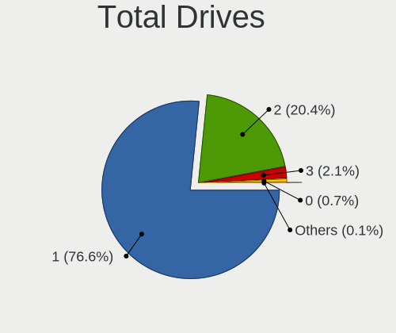
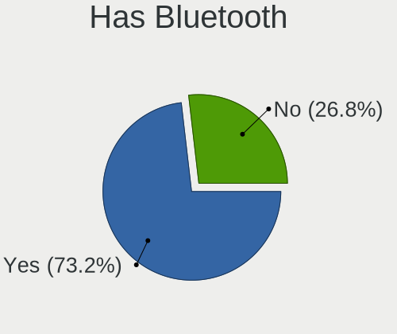
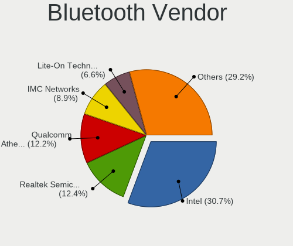

Linux in Russia - Tested Hardware & Statistics (Notebooks)
----------------------------------------------------------

A project to collect tested hardware configurations for Linux in Russia.

Anyone can contribute to this report by the [hw-probe](https://github.com/linuxhw/hw-probe) tool:

    sudo -E hw-probe -all -upload

Please contribute! Especially if your hardware is rare.

Contents
--------

* [ Test Cases ](#test-cases)

* [ System ](#system)
  - [ OS                       ](#os)
  - [ OS Family                ](#os-family)
  - [ Kernel                   ](#kernel)
  - [ Kernel Family            ](#kernel-family)
  - [ Kernel Major Ver.        ](#kernel-major-ver)
  - [ Arch                     ](#arch)
  - [ DE                       ](#de)
  - [ Display Server           ](#display-server)
  - [ Display Manager          ](#display-manager)
  - [ OS Lang                  ](#os-lang)
  - [ Boot Mode                ](#boot-mode)
  - [ Filesystem               ](#filesystem)
  - [ Part. scheme             ](#part-scheme)
  - [ Dual Boot with Linux/BSD ](#dual-boot-with-linuxbsd)
  - [ Dual Boot (Win)          ](#dual-boot-win)

* [ Board ](#board)
  - [ Vendor                   ](#vendor)
  - [ Model                    ](#model)
  - [ Model Family             ](#model-family)
  - [ MFG Year                 ](#mfg-year)
  - [ Form Factor              ](#form-factor)
  - [ Secure Boot              ](#secure-boot)
  - [ Coreboot                 ](#coreboot)
  - [ RAM Size                 ](#ram-size)
  - [ RAM Used                 ](#ram-used)
  - [ Total Drives             ](#total-drives)
  - [ Has CD-ROM               ](#has-cd-rom)
  - [ Has Ethernet             ](#has-ethernet)
  - [ Has WiFi                 ](#has-wifi)
  - [ Has Bluetooth            ](#has-bluetooth)

* [ Location ](#location)
  - [ Country                  ](#country)
  - [ City                     ](#city)

* [ Drives ](#drives)
  - [ Drive Vendor             ](#drive-vendor)
  - [ Drive Model              ](#drive-model)
  - [ HDD Vendor               ](#hdd-vendor)
  - [ SSD Vendor               ](#ssd-vendor)
  - [ Drive Kind               ](#drive-kind)
  - [ Drive Connector          ](#drive-connector)
  - [ Drive Size               ](#drive-size)
  - [ Space Total              ](#space-total)
  - [ Space Used               ](#space-used)
  - [ Malfunc. Drives          ](#malfunc-drives)
  - [ Malfunc. Drive Vendor    ](#malfunc-drive-vendor)
  - [ Malfunc. HDD Vendor      ](#malfunc-hdd-vendor)
  - [ Malfunc. Drive Kind      ](#malfunc-drive-kind)
  - [ Failed Drives            ](#failed-drives)
  - [ Failed Drive Vendor      ](#failed-drive-vendor)
  - [ Drive Status             ](#drive-status)

* [ Storage controller ](#storage-controller)
  - [ Storage Vendor           ](#storage-vendor)
  - [ Storage Model            ](#storage-model)
  - [ Storage Kind             ](#storage-kind)

* [ Processor ](#processor)
  - [ CPU Vendor               ](#cpu-vendor)
  - [ CPU Model                ](#cpu-model)
  - [ CPU Model Family         ](#cpu-model-family)
  - [ CPU Cores                ](#cpu-cores)
  - [ CPU Sockets              ](#cpu-sockets)
  - [ CPU Threads              ](#cpu-threads)
  - [ CPU Op-Modes             ](#cpu-op-modes)
  - [ CPU Microcode            ](#cpu-microcode)
  - [ CPU Microarch            ](#cpu-microarch)

* [ Graphics ](#graphics)
  - [ GPU Vendor               ](#gpu-vendor)
  - [ GPU Model                ](#gpu-model)
  - [ GPU Combo                ](#gpu-combo)
  - [ GPU Driver               ](#gpu-driver)
  - [ GPU Memory               ](#gpu-memory)

* [ Monitor ](#monitor)
  - [ Monitor Vendor           ](#monitor-vendor)
  - [ Monitor Model            ](#monitor-model)
  - [ Monitor Resolution       ](#monitor-resolution)
  - [ Monitor Diagonal         ](#monitor-diagonal)
  - [ Monitor Width            ](#monitor-width)
  - [ Aspect Ratio             ](#aspect-ratio)
  - [ Monitor Area             ](#monitor-area)
  - [ Pixel Density            ](#pixel-density)
  - [ Multiple Monitors        ](#multiple-monitors)

* [ Network ](#network)
  - [ Net Controller Vendor    ](#net-controller-vendor)
  - [ Net Controller Model     ](#net-controller-model)
  - [ Wireless Vendor          ](#wireless-vendor)
  - [ Wireless Model           ](#wireless-model)
  - [ Ethernet Vendor          ](#ethernet-vendor)
  - [ Ethernet Model           ](#ethernet-model)
  - [ Net Controller Kind      ](#net-controller-kind)
  - [ Used Controller          ](#used-controller)
  - [ NICs                     ](#nics)
  - [ IPv6                     ](#ipv6)

* [ Bluetooth ](#bluetooth)
  - [ Bluetooth Vendor         ](#bluetooth-vendor)
  - [ Bluetooth Model          ](#bluetooth-model)

* [ Sound ](#sound)
  - [ Sound Vendor             ](#sound-vendor)
  - [ Sound Model              ](#sound-model)

* [ Memory ](#memory)
  - [ Memory Vendor            ](#memory-vendor)
  - [ Memory Model             ](#memory-model)
  - [ Memory Kind              ](#memory-kind)
  - [ Memory Form Factor       ](#memory-form-factor)
  - [ Memory Size              ](#memory-size)
  - [ Memory Speed             ](#memory-speed)

* [ Printers & scanners ](#printers--scanners)
  - [ Printer Vendor           ](#printer-vendor)
  - [ Printer Model            ](#printer-model)
  - [ Scanner Vendor           ](#scanner-vendor)
  - [ Scanner Model            ](#scanner-model)

* [ Camera ](#camera)
  - [ Camera Vendor            ](#camera-vendor)
  - [ Camera Model             ](#camera-model)

* [ Security ](#security)
  - [ Fingerprint Vendor       ](#fingerprint-vendor)
  - [ Fingerprint Model        ](#fingerprint-model)
  - [ Chipcard Vendor          ](#chipcard-vendor)
  - [ Chipcard Model           ](#chipcard-model)

* [ Unsupported ](#unsupported)
  - [ Unsupported Devices      ](#unsupported-devices)
  - [ Unsupported Device Types ](#unsupported-device-types)

Test Cases
----------

Total: 23972

| Vendor        | Model                       | Probe                                                      | Date         |
|---------------|-----------------------------|------------------------------------------------------------|--------------|
| Intel Clie... | LAPBC710                    | [27e1a6b6c4](https://linux-hardware.org/?probe=27e1a6b6c4) | Jan 06, 2025 |
| eMachines     | E625                        | [e4674eed04](https://linux-hardware.org/?probe=e4674eed04) | Jan 06, 2025 |
| Samsung       | RV409/RV509/RV709           | [0c7619aac5](https://linux-hardware.org/?probe=0c7619aac5) | Jan 06, 2025 |
| ASUSTek       | X51RL                       | [526c93f776](https://linux-hardware.org/?probe=526c93f776) | Jan 06, 2025 |
| MSI           | Katana 17 B12UCR            | [9a04090ded](https://linux-hardware.org/?probe=9a04090ded) | Jan 06, 2025 |
| HP            | Compaq nw8440 (RN043AW#A... | [1a3426f4b6](https://linux-hardware.org/?probe=1a3426f4b6) | Jan 06, 2025 |
| Lenovo        | ThinkPad T14 Gen 3 21AH0... | [d195e02226](https://linux-hardware.org/?probe=d195e02226) | Jan 06, 2025 |
| Lenovo        | Legion 5 15ARH05 82B5       | [572f922d7c](https://linux-hardware.org/?probe=572f922d7c) | Jan 06, 2025 |
| Lenovo        | ThinkPad T14 Gen 3 21AH0... | [58b338f268](https://linux-hardware.org/?probe=58b338f268) | Jan 06, 2025 |
| ASUSTek       | VivoBook_ASUSLaptop M370... | [3a6262bc2c](https://linux-hardware.org/?probe=3a6262bc2c) | Jan 05, 2025 |
| Lenovo        | ThinkPad X13 Gen 3 21BQA... | [ec40ca9885](https://linux-hardware.org/?probe=ec40ca9885) | Jan 05, 2025 |
| Lenovo        | ThinkPad X220 4290RV1       | [8873dfc3ac](https://linux-hardware.org/?probe=8873dfc3ac) | Jan 05, 2025 |
| Lenovo        | ThinkPad T14 Gen 3 21AH0... | [8e4aafe314](https://linux-hardware.org/?probe=8e4aafe314) | Jan 05, 2025 |
| Infinix       | YL51A5                      | [17846f874a](https://linux-hardware.org/?probe=17846f874a) | Jan 05, 2025 |
| Lenovo        | G505 20240                  | [b6181c89ff](https://linux-hardware.org/?probe=b6181c89ff) | Jan 05, 2025 |
| Apple         | MacBookPro16,1              | [ba278c0390](https://linux-hardware.org/?probe=ba278c0390) | Jan 04, 2025 |
| ASUSTek       | Vivobook Go E1504FA_E150... | [832d6f219e](https://linux-hardware.org/?probe=832d6f219e) | Jan 04, 2025 |
| Apple         | MacBookPro16,1              | [d49932671f](https://linux-hardware.org/?probe=d49932671f) | Jan 04, 2025 |
| Lenovo        | IdeaPad S145-15IIL 81W8     | [96316f7cee](https://linux-hardware.org/?probe=96316f7cee) | Jan 04, 2025 |
| ASUSTek       | K53TA                       | [26c9d957fc](https://linux-hardware.org/?probe=26c9d957fc) | Jan 04, 2025 |
| ASUSTek       | K50IJ                       | [9c75aa0285](https://linux-hardware.org/?probe=9c75aa0285) | Jan 04, 2025 |
| HUAWEI        | CREFG-XX                    | [c781ee9905](https://linux-hardware.org/?probe=c781ee9905) | Jan 03, 2025 |
| Chuwi         | MiniBook X                  | [77278dd73d](https://linux-hardware.org/?probe=77278dd73d) | Jan 03, 2025 |
| Lenovo        | ThinkBook 14 G4+ IAP 21C... | [0d48464f98](https://linux-hardware.org/?probe=0d48464f98) | Jan 03, 2025 |
| ASUSTek       | VivoBook_ASUSLaptop X509... | [08c2c8d3a6](https://linux-hardware.org/?probe=08c2c8d3a6) | Jan 03, 2025 |
| Toshiba       | NB100                       | [df34e9793f](https://linux-hardware.org/?probe=df34e9793f) | Jan 02, 2025 |
| MSI           | Katana 17 B12VFK            | [5bffc2a657](https://linux-hardware.org/?probe=5bffc2a657) | Jan 02, 2025 |
| Lenovo        | ThinkBook 16 G6 IRL 21KH    | [77722af02e](https://linux-hardware.org/?probe=77722af02e) | Jan 02, 2025 |
| HP            | 255 G8 Notebook PC          | [c48045073f](https://linux-hardware.org/?probe=c48045073f) | Jan 02, 2025 |
| Unknown       | Unknown                     | [267152ac45](https://linux-hardware.org/?probe=267152ac45) | Jan 02, 2025 |
| HUAWEI        | BOD-WXX9                    | [305f6e1f4d](https://linux-hardware.org/?probe=305f6e1f4d) | Jan 02, 2025 |
| Valve         | Jupiter                     | [699dafa117](https://linux-hardware.org/?probe=699dafa117) | Jan 02, 2025 |
| Lenovo        | IdeaPad 100-15IBY 80MJ      | [eaa8dd18d4](https://linux-hardware.org/?probe=eaa8dd18d4) | Jan 02, 2025 |
| Infinix       | YL51A5                      | [431b98dee0](https://linux-hardware.org/?probe=431b98dee0) | Jan 01, 2025 |
| Acer          | Swift SF314-52G             | [77f207d738](https://linux-hardware.org/?probe=77f207d738) | Jan 01, 2025 |
| Acer          | Aspire 3610                 | [eff3c1a864](https://linux-hardware.org/?probe=eff3c1a864) | Jan 01, 2025 |
| HUAWEI        | RLEF-XX                     | [51f8d1b6dc](https://linux-hardware.org/?probe=51f8d1b6dc) | Jan 01, 2025 |
| Lenovo        | ThinkBook 14 G7+ ASP 21Q... | [20a618d664](https://linux-hardware.org/?probe=20a618d664) | Jan 01, 2025 |
| HUAWEI        | BOD-WXX9                    | [e28bd300ec](https://linux-hardware.org/?probe=e28bd300ec) | Jan 01, 2025 |
| HUAWEI        | BoDE-WXX9                   | [b88f684622](https://linux-hardware.org/?probe=b88f684622) | Dec 31, 2024 |
| DNS           | W510LU                      | [24e7ee2939](https://linux-hardware.org/?probe=24e7ee2939) | Dec 31, 2024 |
| Acer          | Acadia V1.34                | [10f43a8f8c](https://linux-hardware.org/?probe=10f43a8f8c) | Dec 31, 2024 |
| Valve         | Galileo                     | [e1cfe6798d](https://linux-hardware.org/?probe=e1cfe6798d) | Dec 31, 2024 |
| Fujitsu Si... | LIFEBOOK S7020              | [7d29f5fd35](https://linux-hardware.org/?probe=7d29f5fd35) | Dec 30, 2024 |
| Maibenben     | Perfectum Series            | [db84ebbd71](https://linux-hardware.org/?probe=db84ebbd71) | Dec 30, 2024 |
| Clevo         | W240BL_W250BZ_W270BZQ       | [7da1abb74d](https://linux-hardware.org/?probe=7da1abb74d) | Dec 30, 2024 |
| HP            | ENVY dv6                    | [592cab3725](https://linux-hardware.org/?probe=592cab3725) | Dec 30, 2024 |
| eMachines     | eM355                       | [cd8623ca62](https://linux-hardware.org/?probe=cd8623ca62) | Dec 30, 2024 |
| XIAOMI        | Redmi Book Pro 15 2023      | [cc175b8319](https://linux-hardware.org/?probe=cc175b8319) | Dec 30, 2024 |
| Lenovo        | IdeaPad L340-15IWL 81LG     | [5baef27a2a](https://linux-hardware.org/?probe=5baef27a2a) | Dec 30, 2024 |
| DEXP          | C14-ICW300                  | [f711f4ff49](https://linux-hardware.org/?probe=f711f4ff49) | Dec 30, 2024 |
| DEXP          | C14-ICW300                  | [4a1b8628e0](https://linux-hardware.org/?probe=4a1b8628e0) | Dec 30, 2024 |
| Fujitsu Si... | LIFEBOOK S7020              | [127407fc25](https://linux-hardware.org/?probe=127407fc25) | Dec 30, 2024 |
| Infinix       | Y3 Plus                     | [a5d0c097a5](https://linux-hardware.org/?probe=a5d0c097a5) | Dec 30, 2024 |
| Acer          | Aspire 5742G                | [79525e56eb](https://linux-hardware.org/?probe=79525e56eb) | Dec 30, 2024 |
| Acer          | Aspire E1-531G              | [222752a541](https://linux-hardware.org/?probe=222752a541) | Dec 29, 2024 |
| Valve         | Jupiter                     | [4eb06472bd](https://linux-hardware.org/?probe=4eb06472bd) | Dec 29, 2024 |
| Valve         | Jupiter                     | [0f665464e0](https://linux-hardware.org/?probe=0f665464e0) | Dec 29, 2024 |
| ASUSTek       | VivoBook_ASUSLaptop M160... | [dc70a933c3](https://linux-hardware.org/?probe=dc70a933c3) | Dec 29, 2024 |
| ASUSTek       | VivoBook_ASUSLaptop X160... | [8343da96e4](https://linux-hardware.org/?probe=8343da96e4) | Dec 29, 2024 |
| Fujitsu Si... | AMILO Pro Edition V3405     | [d4622b1451](https://linux-hardware.org/?probe=d4622b1451) | Dec 29, 2024 |
| Lenovo        | ThinkBook 16 G6+ IMH 21L... | [c80dde07d0](https://linux-hardware.org/?probe=c80dde07d0) | Dec 29, 2024 |
| Maibenben     | Typhoon Series              | [6b1a0a45d2](https://linux-hardware.org/?probe=6b1a0a45d2) | Dec 29, 2024 |
| Lenovo        | S20-30 20421                | [7e1a5a670a](https://linux-hardware.org/?probe=7e1a5a670a) | Dec 29, 2024 |
| Lenovo        | ThinkPad L412 0585AY7       | [5b7ad96e97](https://linux-hardware.org/?probe=5b7ad96e97) | Dec 29, 2024 |
| HUAWEI        | VGHH-XX                     | [7ef14dba16](https://linux-hardware.org/?probe=7ef14dba16) | Dec 28, 2024 |
| Lenovo        | G500 20236                  | [44c24fa0ee](https://linux-hardware.org/?probe=44c24fa0ee) | Dec 28, 2024 |
| Acer          | Unknown                     | [fa5b28121c](https://linux-hardware.org/?probe=fa5b28121c) | Dec 28, 2024 |
| Dell          | Vostro 1014                 | [89dcde03d0](https://linux-hardware.org/?probe=89dcde03d0) | Dec 28, 2024 |
| Acer          | Aspire 5742Z                | [0cda57368f](https://linux-hardware.org/?probe=0cda57368f) | Dec 28, 2024 |
| ASUSTek       | VivoBook_ASUSLaptop X160... | [ed184eaff9](https://linux-hardware.org/?probe=ed184eaff9) | Dec 28, 2024 |
| Sony          | VPCSB3V9R                   | [c0950c9d66](https://linux-hardware.org/?probe=c0950c9d66) | Dec 27, 2024 |
| Lenovo        | IdeaPad Y460                | [3c6931e293](https://linux-hardware.org/?probe=3c6931e293) | Dec 27, 2024 |
| HUAWEI        | KLVF-XX                     | [647fb3b2cf](https://linux-hardware.org/?probe=647fb3b2cf) | Dec 27, 2024 |
| Acer          | Aspire A315-34              | [c8bcfc6c53](https://linux-hardware.org/?probe=c8bcfc6c53) | Dec 27, 2024 |
| ASUSTek       | X502CA                      | [6b816ff7ef](https://linux-hardware.org/?probe=6b816ff7ef) | Dec 27, 2024 |
| Acer          | Extensa 215-23              | [97337ddb76](https://linux-hardware.org/?probe=97337ddb76) | Dec 26, 2024 |
| eMachines     | eME732                      | [7f36d968e4](https://linux-hardware.org/?probe=7f36d968e4) | Dec 26, 2024 |
| Acer          | Aspire 5349                 | [4538d32a3d](https://linux-hardware.org/?probe=4538d32a3d) | Dec 26, 2024 |
| Pegatron      | A15                         | [2649401416](https://linux-hardware.org/?probe=2649401416) | Dec 26, 2024 |
| Lenovo        | G500 20236                  | [8dbe192f7f](https://linux-hardware.org/?probe=8dbe192f7f) | Dec 26, 2024 |
| Lenovo        | G500 20236                  | [717bada61c](https://linux-hardware.org/?probe=717bada61c) | Dec 26, 2024 |
| Lenovo        | ThinkBook 14 G6 ABP 21KJ    | [7657538670](https://linux-hardware.org/?probe=7657538670) | Dec 26, 2024 |
| Lenovo        | B590 20206                  | [c118a5bc12](https://linux-hardware.org/?probe=c118a5bc12) | Dec 26, 2024 |
| Lenovo        | B590 20206                  | [04580fdd68](https://linux-hardware.org/?probe=04580fdd68) | Dec 26, 2024 |
| MSI           | GL62M 7RDX                  | [83b16ab268](https://linux-hardware.org/?probe=83b16ab268) | Dec 26, 2024 |
| Lenovo        | V580c 20160                 | [0cdb0ca83b](https://linux-hardware.org/?probe=0cdb0ca83b) | Dec 26, 2024 |
| ASRock        | Z390 Phantom Gaming 4S      | [d134a178b2](https://linux-hardware.org/?probe=d134a178b2) | Dec 26, 2024 |
| HP            | EtiteBook 840 G5            | [5ed7fbc42d](https://linux-hardware.org/?probe=5ed7fbc42d) | Dec 25, 2024 |
| TECNO Mobi... | MEGABOOK K16SDA             | [99d3b277a9](https://linux-hardware.org/?probe=99d3b277a9) | Dec 25, 2024 |
| Lenovo        | ThinkBook 14 G6 IRL 21KG    | [bc6c76d79b](https://linux-hardware.org/?probe=bc6c76d79b) | Dec 25, 2024 |
| HUAWEI        | BOM-WXX9                    | [030b263131](https://linux-hardware.org/?probe=030b263131) | Dec 25, 2024 |
| Infinix       | YL51A5                      | [661efe13d8](https://linux-hardware.org/?probe=661efe13d8) | Dec 25, 2024 |
| Acer          | Aspire A317-52              | [3d85a6b6d7](https://linux-hardware.org/?probe=3d85a6b6d7) | Dec 25, 2024 |
| MSI           | Stealth GS66 12UHS          | [4634dcf259](https://linux-hardware.org/?probe=4634dcf259) | Dec 25, 2024 |
| Valve         | Jupiter                     | [fb4323604f](https://linux-hardware.org/?probe=fb4323604f) | Dec 25, 2024 |
| Lenovo        | ThinkPad X250 20CM003CRT    | [8131530228](https://linux-hardware.org/?probe=8131530228) | Dec 24, 2024 |
| Lenovo        | IdeaPad Gaming 3 16ARH7 ... | [8a07ac474c](https://linux-hardware.org/?probe=8a07ac474c) | Dec 24, 2024 |
| Apple         | MacBookAir8,1               | [70ac7767c5](https://linux-hardware.org/?probe=70ac7767c5) | Dec 24, 2024 |
| Lenovo        | ThinkPad E460 20ETS00900    | [b4c09901bb](https://linux-hardware.org/?probe=b4c09901bb) | Dec 24, 2024 |
| Acer          | Aspire E1-531               | [2d5eef0754](https://linux-hardware.org/?probe=2d5eef0754) | Dec 24, 2024 |
| Lenovo        | IdeaPad L340-15API 81LW     | [d2b53b04f1](https://linux-hardware.org/?probe=d2b53b04f1) | Dec 24, 2024 |
| Acer          | Aspire A515-57              | [7ca1bf2b15](https://linux-hardware.org/?probe=7ca1bf2b15) | Dec 24, 2024 |
| HONOR         | FRI-FXX                     | [36c0ad82b3](https://linux-hardware.org/?probe=36c0ad82b3) | Dec 24, 2024 |
| Lenovo        | ThinkPad E14 Gen 5 21JSS... | [5308ff08f7](https://linux-hardware.org/?probe=5308ff08f7) | Dec 24, 2024 |
| ASUSTek       | 1225B                       | [20e4fd20fa](https://linux-hardware.org/?probe=20e4fd20fa) | Dec 23, 2024 |
| Intel         | HM87                        | [06e9957440](https://linux-hardware.org/?probe=06e9957440) | Dec 23, 2024 |
| Infinix       | YL51A5                      | [f57db5b2dd](https://linux-hardware.org/?probe=f57db5b2dd) | Dec 23, 2024 |
| Acer          | Swift SF314-58              | [35ca0e4138](https://linux-hardware.org/?probe=35ca0e4138) | Dec 23, 2024 |
| ASUSTek       | K55DR                       | [52c3ba1b47](https://linux-hardware.org/?probe=52c3ba1b47) | Dec 23, 2024 |
| Dell          | Vostro 1014                 | [3a0229ef1c](https://linux-hardware.org/?probe=3a0229ef1c) | Dec 23, 2024 |
| Apple         | MacBookPro14,1              | [62ce6ad6d0](https://linux-hardware.org/?probe=62ce6ad6d0) | Dec 23, 2024 |
| Lenovo        | ThinkPad T460s 20FAS09L0... | [e7eac1f625](https://linux-hardware.org/?probe=e7eac1f625) | Dec 23, 2024 |
| ASUSTek       | X55VD                       | [eb1866b0f2](https://linux-hardware.org/?probe=eb1866b0f2) | Dec 23, 2024 |
| ASUSTek       | ASUSLaptop_Q530VJ           | [701d015fd1](https://linux-hardware.org/?probe=701d015fd1) | Dec 22, 2024 |
| HONOR         | BRI-XX                      | [ae2d835788](https://linux-hardware.org/?probe=ae2d835788) | Dec 22, 2024 |
| HP            | Pavilion dv6                | [2ebb2925a2](https://linux-hardware.org/?probe=2ebb2925a2) | Dec 22, 2024 |
| Acer          | AO531h                      | [ae863646cd](https://linux-hardware.org/?probe=ae863646cd) | Dec 22, 2024 |
| Lunnen        | LL5FAW                      | [7b0a53a2fe](https://linux-hardware.org/?probe=7b0a53a2fe) | Dec 22, 2024 |
| Lenovo        | ThinkBook 14 G6 ABP 21KJ    | [fc617a056e](https://linux-hardware.org/?probe=fc617a056e) | Dec 21, 2024 |
| HP            | Pavilion g6                 | [32463a80cb](https://linux-hardware.org/?probe=32463a80cb) | Dec 21, 2024 |
| Lenovo        | ThinkPad P17 Gen 1 20SN0... | [472acf3ec6](https://linux-hardware.org/?probe=472acf3ec6) | Dec 21, 2024 |
| Infinix       | INBOOK Y4H Max              | [e5a91667f9](https://linux-hardware.org/?probe=e5a91667f9) | Dec 21, 2024 |
| Lenovo        | ThinkPad P17 Gen 1 20SN0... | [71553abdd8](https://linux-hardware.org/?probe=71553abdd8) | Dec 21, 2024 |
| MSI           | Modern 14 B5M               | [3cd6bb8b87](https://linux-hardware.org/?probe=3cd6bb8b87) | Dec 21, 2024 |
| Lenovo        | G565 20071                  | [693717f620](https://linux-hardware.org/?probe=693717f620) | Dec 21, 2024 |
| ASUSTek       | VivoBook_ASUSLaptop M650... | [5d90b386a8](https://linux-hardware.org/?probe=5d90b386a8) | Dec 21, 2024 |
| Maibenben     | MaiBook M                   | [5cb09d638e](https://linux-hardware.org/?probe=5cb09d638e) | Dec 21, 2024 |
| ASUSTek       | X555QA                      | [44b32a3f7b](https://linux-hardware.org/?probe=44b32a3f7b) | Dec 21, 2024 |
| Valve         | Galileo                     | [ec69f4be51](https://linux-hardware.org/?probe=ec69f4be51) | Dec 21, 2024 |
| Apple         | MacBookPro12,1              | [4d62c515e1](https://linux-hardware.org/?probe=4d62c515e1) | Dec 21, 2024 |
| Apple         | MacBookPro12,1              | [5c583a4baf](https://linux-hardware.org/?probe=5c583a4baf) | Dec 21, 2024 |
| Dell          | G5 5590                     | [798f7076ab](https://linux-hardware.org/?probe=798f7076ab) | Dec 20, 2024 |
| MSI           | Modern 14 C5M               | [e986a9bd5b](https://linux-hardware.org/?probe=e986a9bd5b) | Dec 20, 2024 |
| LTD Delovo... | 15CLG2                      | [39a5c39de0](https://linux-hardware.org/?probe=39a5c39de0) | Dec 20, 2024 |
| Lenovo        | ThinkPad T14 Gen 1 20S1S... | [540a0a503c](https://linux-hardware.org/?probe=540a0a503c) | Dec 20, 2024 |
| Lenovo        | ThinkPad P43s 20RHS00100    | [2b6e5dda32](https://linux-hardware.org/?probe=2b6e5dda32) | Dec 20, 2024 |
| Lenovo        | ThinkPad T14 Gen 3 21AH0... | [8145f1c8c7](https://linux-hardware.org/?probe=8145f1c8c7) | Dec 20, 2024 |
| Notebook      | W65_67SH                    | [a04f4e7b2a](https://linux-hardware.org/?probe=a04f4e7b2a) | Dec 20, 2024 |
| Chuwi         | MiniBook X                  | [3d7be23d49](https://linux-hardware.org/?probe=3d7be23d49) | Dec 19, 2024 |
| Valve         | Jupiter                     | [9b99dd7185](https://linux-hardware.org/?probe=9b99dd7185) | Dec 19, 2024 |
| Digma         | EVE 15 P418 NCN154BXW01     | [1f788db073](https://linux-hardware.org/?probe=1f788db073) | Dec 19, 2024 |
| ASUSTek       | ASUS EXPERTBOOK B1402CBA... | [fff8bed544](https://linux-hardware.org/?probe=fff8bed544) | Dec 19, 2024 |
| ASUSTek       | ASUS EXPERTBOOK B1402CBA... | [02f1237767](https://linux-hardware.org/?probe=02f1237767) | Dec 19, 2024 |
| HP            | EliteBook 840 G8 Noteboo... | [9f0fc66e58](https://linux-hardware.org/?probe=9f0fc66e58) | Dec 19, 2024 |
| Acer          | Aspire A315-53              | [f25c3e31af](https://linux-hardware.org/?probe=f25c3e31af) | Dec 19, 2024 |
| KVADRA        | NAU LE14U                   | [bca4537cc8](https://linux-hardware.org/?probe=bca4537cc8) | Dec 19, 2024 |
| HP            | Pavilion dv6                | [d532497c6d](https://linux-hardware.org/?probe=d532497c6d) | Dec 19, 2024 |
| HUAWEI        | NBD-WXX9                    | [0d321b083c](https://linux-hardware.org/?probe=0d321b083c) | Dec 19, 2024 |
| Lenovo        | ThinkPad T14 Gen 3 21AH0... | [c10492aedf](https://linux-hardware.org/?probe=c10492aedf) | Dec 19, 2024 |
| Clevo         | W240EL/W250ELQ/W270ELQ      | [ff394d758b](https://linux-hardware.org/?probe=ff394d758b) | Dec 18, 2024 |
| LTD Delovo... | 15TLI                       | [b0481ea420](https://linux-hardware.org/?probe=b0481ea420) | Dec 18, 2024 |
| ASUSTek       | ROG Zephyrus G16 GA605WI... | [0b5149cbce](https://linux-hardware.org/?probe=0b5149cbce) | Dec 18, 2024 |
| Acer          | Extensa 215-23              | [9ed4841427](https://linux-hardware.org/?probe=9ed4841427) | Dec 18, 2024 |
| HP            | ProBook 4540s               | [4f31cb1609](https://linux-hardware.org/?probe=4f31cb1609) | Dec 18, 2024 |
| HUAWEI        | BoDE-WXX9                   | [e172af52db](https://linux-hardware.org/?probe=e172af52db) | Dec 18, 2024 |
| HP            | Laptop 15-dw3xxx            | [0fb8125031](https://linux-hardware.org/?probe=0fb8125031) | Dec 18, 2024 |
| Lenovo        | G500 20236                  | [e99102e968](https://linux-hardware.org/?probe=e99102e968) | Dec 17, 2024 |
| HP            | OMEN by Laptop              | [1990440c77](https://linux-hardware.org/?probe=1990440c77) | Dec 17, 2024 |
| HUAWEI        | BOM-WXX9                    | [bdfe4e0a02](https://linux-hardware.org/?probe=bdfe4e0a02) | Dec 17, 2024 |
| Apple         | MacBookPro8,2               | [e2f957298c](https://linux-hardware.org/?probe=e2f957298c) | Dec 17, 2024 |
| Apple         | MacBookPro8,2               | [504b00b57d](https://linux-hardware.org/?probe=504b00b57d) | Dec 17, 2024 |
| HP            | Laptop 17-by3xxx            | [cb8341eaca](https://linux-hardware.org/?probe=cb8341eaca) | Dec 17, 2024 |
| HP            | Pavilion Gaming Laptop 1... | [d3c1363556](https://linux-hardware.org/?probe=d3c1363556) | Dec 17, 2024 |
| HUAWEI        | NBM-WXX9                    | [bc96f08cc4](https://linux-hardware.org/?probe=bc96f08cc4) | Dec 16, 2024 |
| ASUSTek       | 1225B                       | [282c903413](https://linux-hardware.org/?probe=282c903413) | Dec 16, 2024 |
| Pegatron      | A15                         | [266dd27eba](https://linux-hardware.org/?probe=266dd27eba) | Dec 16, 2024 |
| HP            | Laptop 14-cf0xxx            | [4aadd987b3](https://linux-hardware.org/?probe=4aadd987b3) | Dec 16, 2024 |
| HP            | OMEN by Laptop              | [655aeac73d](https://linux-hardware.org/?probe=655aeac73d) | Dec 16, 2024 |
| ASUSTek       | X401A1                      | [c8daab5ddd](https://linux-hardware.org/?probe=c8daab5ddd) | Dec 16, 2024 |
| ASUSTek       | X401A1                      | [68dca00960](https://linux-hardware.org/?probe=68dca00960) | Dec 16, 2024 |
| Dell          | Inspiron N5010              | [2642d419b6](https://linux-hardware.org/?probe=2642d419b6) | Dec 16, 2024 |
| Apple         | MacBookPro11,1              | [a1a1361aa6](https://linux-hardware.org/?probe=a1a1361aa6) | Dec 16, 2024 |
| ASUSTek       | ASUS TUF Gaming A15 FA50... | [a1a92c896a](https://linux-hardware.org/?probe=a1a92c896a) | Dec 16, 2024 |
| Samsung       | 305V4A/305V5A               | [579117e933](https://linux-hardware.org/?probe=579117e933) | Dec 16, 2024 |
| Lenovo        | Yoga Slim 7 Carbon 14ACN... | [74d0e3347f](https://linux-hardware.org/?probe=74d0e3347f) | Dec 16, 2024 |
| Acer          | Nitro AN517-51              | [cfc1632018](https://linux-hardware.org/?probe=cfc1632018) | Dec 15, 2024 |
| Lenovo        | ThinkPad L412 0585AY7       | [57d97282aa](https://linux-hardware.org/?probe=57d97282aa) | Dec 15, 2024 |
| HONOR         | HGE-WX6                     | [3db59feef3](https://linux-hardware.org/?probe=3db59feef3) | Dec 15, 2024 |
| HP            | Presario V3700              | [d66d7edcc9](https://linux-hardware.org/?probe=d66d7edcc9) | Dec 15, 2024 |
| ASUSTek       | X550VB                      | [b739f6848e](https://linux-hardware.org/?probe=b739f6848e) | Dec 15, 2024 |
| Dell          | Inspiron N5040              | [505ab582ed](https://linux-hardware.org/?probe=505ab582ed) | Dec 15, 2024 |
| Unknown       | Unknown                     | [67fdb1458c](https://linux-hardware.org/?probe=67fdb1458c) | Dec 15, 2024 |
| Dell          | Inspiron N5040              | [1095593128](https://linux-hardware.org/?probe=1095593128) | Dec 14, 2024 |
| ASUSTek       | K52F                        | [d91478f3d5](https://linux-hardware.org/?probe=d91478f3d5) | Dec 14, 2024 |
| Maibenben     | Perfectum Series            | [560f2b3cf0](https://linux-hardware.org/?probe=560f2b3cf0) | Dec 14, 2024 |
| MSI           | Creator Z17 A12UGST         | [c6a09edf29](https://linux-hardware.org/?probe=c6a09edf29) | Dec 14, 2024 |
| MSI           | Creator Z17 A12UGST         | [ca137f5639](https://linux-hardware.org/?probe=ca137f5639) | Dec 14, 2024 |
| HP            | Pavilion dv7                | [72e503e392](https://linux-hardware.org/?probe=72e503e392) | Dec 14, 2024 |
| Lenovo        | IdeaPad 100-15IBY 80MJ      | [628c040ec8](https://linux-hardware.org/?probe=628c040ec8) | Dec 14, 2024 |
| Acer          | Predator PH317-52           | [dbfb480a1a](https://linux-hardware.org/?probe=dbfb480a1a) | Dec 13, 2024 |
| HUAWEI        | KLVF-XX                     | [9ff1a2c47a](https://linux-hardware.org/?probe=9ff1a2c47a) | Dec 13, 2024 |
| Aquarius      | NS685U R11                  | [8a02adbd30](https://linux-hardware.org/?probe=8a02adbd30) | Dec 13, 2024 |
| Lenovo        | Legion 5 17ACH6 82K0        | [2c776f0fbc](https://linux-hardware.org/?probe=2c776f0fbc) | Dec 13, 2024 |
| XIAOMI        | Redmi Book Pro 15 2023      | [36fa9187cd](https://linux-hardware.org/?probe=36fa9187cd) | Dec 13, 2024 |
| HUAWEI        | HVY-WXX9                    | [5b9314f900](https://linux-hardware.org/?probe=5b9314f900) | Dec 12, 2024 |
| Haier         | A1400EM                     | [6a70bab189](https://linux-hardware.org/?probe=6a70bab189) | Dec 12, 2024 |
| Notebook      | W250EGQ / W270EGQ           | [0f794c4db7](https://linux-hardware.org/?probe=0f794c4db7) | Dec 12, 2024 |
| Sony          | SVS1313V9RB                 | [52421e92ce](https://linux-hardware.org/?probe=52421e92ce) | Dec 12, 2024 |
| LTD Delovo... | 14TLH                       | [8c4728d52e](https://linux-hardware.org/?probe=8c4728d52e) | Dec 12, 2024 |
| Sony          | SVS1313V9RB                 | [53c77f8751](https://linux-hardware.org/?probe=53c77f8751) | Dec 12, 2024 |
| HUAWEI        | NBM-WXX9                    | [06ed8ceba0](https://linux-hardware.org/?probe=06ed8ceba0) | Dec 12, 2024 |
| ASUSTek       | VivoBook 15_ASUS Laptop ... | [5ddceb0bc0](https://linux-hardware.org/?probe=5ddceb0bc0) | Dec 12, 2024 |
| Dell          | XPS 15 9570                 | [f038e32b08](https://linux-hardware.org/?probe=f038e32b08) | Dec 12, 2024 |
| Haier         | A1400EM                     | [ec694f3d2b](https://linux-hardware.org/?probe=ec694f3d2b) | Dec 12, 2024 |
| Dell          | Latitude E5520              | [ae424c49a4](https://linux-hardware.org/?probe=ae424c49a4) | Dec 12, 2024 |
| Acer          | Aspire E5-573               | [202745daec](https://linux-hardware.org/?probe=202745daec) | Dec 11, 2024 |
| Acer          | Aspire 5742G                | [68197dc5f1](https://linux-hardware.org/?probe=68197dc5f1) | Dec 11, 2024 |
| Lenovo        | ThinkPad X260 VB6R77903H    | [90c5c9954f](https://linux-hardware.org/?probe=90c5c9954f) | Dec 11, 2024 |
| MSI           | VR610                       | [2cb0f5cee5](https://linux-hardware.org/?probe=2cb0f5cee5) | Dec 11, 2024 |
| Aquarius      | CMP NS685U_4                | [1625c80cdc](https://linux-hardware.org/?probe=1625c80cdc) | Dec 11, 2024 |
| ASUSTek       | X556UA                      | [12e9edd8a6](https://linux-hardware.org/?probe=12e9edd8a6) | Dec 11, 2024 |
| HP            | EliteBook 840 G4            | [43588f84f7](https://linux-hardware.org/?probe=43588f84f7) | Dec 11, 2024 |
| Lenovo        | G700 20251                  | [8c886cba43](https://linux-hardware.org/?probe=8c886cba43) | Dec 11, 2024 |
| HP            | ProBook 440 G4              | [cc572d1c5d](https://linux-hardware.org/?probe=cc572d1c5d) | Dec 11, 2024 |
| Dell          | Precision M4700             | [291ffb667e](https://linux-hardware.org/?probe=291ffb667e) | Dec 11, 2024 |
| Acer          | Aspire F5-573G              | [7c74b0fcc3](https://linux-hardware.org/?probe=7c74b0fcc3) | Dec 11, 2024 |
| HP            | Laptop 15-gw0xxx            | [cbf590d898](https://linux-hardware.org/?probe=cbf590d898) | Dec 11, 2024 |
| HP            | Laptop 15-gw0xxx            | [fc18ca43fa](https://linux-hardware.org/?probe=fc18ca43fa) | Dec 11, 2024 |
| Google        | Terra                       | [35133a4a83](https://linux-hardware.org/?probe=35133a4a83) | Dec 10, 2024 |
| HONOR         | FRI-HXX                     | [c1ace97f1b](https://linux-hardware.org/?probe=c1ace97f1b) | Dec 10, 2024 |
| ASUSTek       | X205TA                      | [5bd8e61a56](https://linux-hardware.org/?probe=5bd8e61a56) | Dec 10, 2024 |
| Acer          | Aspire One 721              | [2bcae04153](https://linux-hardware.org/?probe=2bcae04153) | Dec 10, 2024 |
| Acer          | Aspire 5720                 | [7673fe735d](https://linux-hardware.org/?probe=7673fe735d) | Dec 10, 2024 |
| ASUSTek       | VivoBook_ASUSLaptop X160... | [5f0ca4ab5c](https://linux-hardware.org/?probe=5f0ca4ab5c) | Dec 10, 2024 |
| HP            | EliteBook 855 G8 Noteboo... | [bcfc822291](https://linux-hardware.org/?probe=bcfc822291) | Dec 10, 2024 |
| HP            | Laptop 15s-eq1xxx           | [a07076b780](https://linux-hardware.org/?probe=a07076b780) | Dec 10, 2024 |
| Acer          | Aspire E1-570G              | [4789e987c9](https://linux-hardware.org/?probe=4789e987c9) | Dec 10, 2024 |
| Acer          | Aspire E5-573G              | [90ff703a16](https://linux-hardware.org/?probe=90ff703a16) | Dec 09, 2024 |
| HONOR         | MRA-XXX                     | [2003a8387f](https://linux-hardware.org/?probe=2003a8387f) | Dec 09, 2024 |
| Acer          | Aspire A315-24P             | [a632326872](https://linux-hardware.org/?probe=a632326872) | Dec 09, 2024 |
| Acer          | Nitro AN517-51              | [bcd4ba760b](https://linux-hardware.org/?probe=bcd4ba760b) | Dec 09, 2024 |
| Infinix       | INBOOK X3 Plus              | [bcb0b23532](https://linux-hardware.org/?probe=bcb0b23532) | Dec 09, 2024 |
| ASUSTek       | ASUS Zenbook 14 UX3405MA... | [39eb234a0f](https://linux-hardware.org/?probe=39eb234a0f) | Dec 09, 2024 |
| Samsung       | 355V4C/355V4X/355V5C/355... | [5b43ecc284](https://linux-hardware.org/?probe=5b43ecc284) | Dec 08, 2024 |
| Lenovo        | ThinkPad T480 20L5000ART    | [e1c0b393c6](https://linux-hardware.org/?probe=e1c0b393c6) | Dec 08, 2024 |
| MSI           | Katana GF66 12UE            | [f4e70930ed](https://linux-hardware.org/?probe=f4e70930ed) | Dec 08, 2024 |
| Samsung       | R530/R730                   | [76e645e1f5](https://linux-hardware.org/?probe=76e645e1f5) | Dec 08, 2024 |
| HUAWEI        | HKF-WXX                     | [59cd028fb6](https://linux-hardware.org/?probe=59cd028fb6) | Dec 08, 2024 |
| HP            | ProBook 440 G5              | [af0c5e2ba8](https://linux-hardware.org/?probe=af0c5e2ba8) | Dec 08, 2024 |
| HP            | ProBook 440 G5              | [bd256920c1](https://linux-hardware.org/?probe=bd256920c1) | Dec 08, 2024 |
| ASUSTek       | Zenbook UX5401ZA_UX5401Z... | [54fbaf65c6](https://linux-hardware.org/?probe=54fbaf65c6) | Dec 08, 2024 |
| Toshiba       | Satellite U300              | [44bfb599a1](https://linux-hardware.org/?probe=44bfb599a1) | Dec 07, 2024 |
| ASUSTek       | X751MD                      | [5d526a41a5](https://linux-hardware.org/?probe=5d526a41a5) | Dec 07, 2024 |
| Lenovo        | G500 20236                  | [c5df9aa471](https://linux-hardware.org/?probe=c5df9aa471) | Dec 07, 2024 |
| ICL           | P1711 G1                    | [779d7fc292](https://linux-hardware.org/?probe=779d7fc292) | Dec 07, 2024 |
| Haier         | A1400SD                     | [6c163e8082](https://linux-hardware.org/?probe=6c163e8082) | Dec 07, 2024 |
| Lenovo        | IdeaPad Z500 20202          | [263eac9279](https://linux-hardware.org/?probe=263eac9279) | Dec 07, 2024 |
| Notebook      | W250EGQ / W270EGQ           | [34572ad8d6](https://linux-hardware.org/?probe=34572ad8d6) | Dec 07, 2024 |
| HP            | ProBook 430 G5              | [d6fbd54c05](https://linux-hardware.org/?probe=d6fbd54c05) | Dec 07, 2024 |
| ASUSTek       | K42Jc                       | [b7afb0a6f2](https://linux-hardware.org/?probe=b7afb0a6f2) | Dec 07, 2024 |
| Samsung       | R510/P510                   | [5f6596d687](https://linux-hardware.org/?probe=5f6596d687) | Dec 07, 2024 |
| HP            | Pavilion 17                 | [755fd13cd8](https://linux-hardware.org/?probe=755fd13cd8) | Dec 06, 2024 |
| ASUSTek       | Vivobook Go E1504FA_E150... | [56c3ba74f7](https://linux-hardware.org/?probe=56c3ba74f7) | Dec 06, 2024 |
| HP            | Pavilion dv6500             | [b5885a14db](https://linux-hardware.org/?probe=b5885a14db) | Dec 06, 2024 |
| Lenovo        | ThinkBook 16 G6 ABP 21KK    | [5a22a76102](https://linux-hardware.org/?probe=5a22a76102) | Dec 06, 2024 |
| ICL           | NLx0MU                      | [6c372ca44a](https://linux-hardware.org/?probe=6c372ca44a) | Dec 06, 2024 |
| HP            | 625                         | [a5d254f381](https://linux-hardware.org/?probe=a5d254f381) | Dec 06, 2024 |
| ASUSTek       | K52F                        | [80a163229c](https://linux-hardware.org/?probe=80a163229c) | Dec 05, 2024 |
| Lenovo        | G500 20236                  | [4fad953dd2](https://linux-hardware.org/?probe=4fad953dd2) | Dec 05, 2024 |
| HP            | ProBook 455R G6             | [49edf98bbc](https://linux-hardware.org/?probe=49edf98bbc) | Dec 05, 2024 |
| Packard Be... | EasyNote TE11HC             | [323d54f24b](https://linux-hardware.org/?probe=323d54f24b) | Dec 05, 2024 |
| XIAOMI        | Redmi Book Pro 15 2023      | [064554e6d5](https://linux-hardware.org/?probe=064554e6d5) | Dec 05, 2024 |
| KVADRA        | NAU LE14U                   | [46457138df](https://linux-hardware.org/?probe=46457138df) | Dec 05, 2024 |
| Acer          | Nitro AN515-52              | [9fd3688418](https://linux-hardware.org/?probe=9fd3688418) | Dec 04, 2024 |
| Acer          | Nitro AN515-52              | [35f03ceef6](https://linux-hardware.org/?probe=35f03ceef6) | Dec 04, 2024 |
| Lenovo        | G580 20157                  | [d5c6a524fe](https://linux-hardware.org/?probe=d5c6a524fe) | Dec 04, 2024 |
| Dell          | Inspiron 3521               | [6f38eaee0a](https://linux-hardware.org/?probe=6f38eaee0a) | Dec 04, 2024 |
| iRU           | 17TLI                       | [5cde8d1248](https://linux-hardware.org/?probe=5cde8d1248) | Dec 04, 2024 |
| Lenovo        | ThinkPad X1 Carbon 2nd 2... | [e494fd0d75](https://linux-hardware.org/?probe=e494fd0d75) | Dec 04, 2024 |
| Lenovo        | B590 20208                  | [493ce963ab](https://linux-hardware.org/?probe=493ce963ab) | Dec 04, 2024 |
| ASUSTek       | ROG Zephyrus G16 GU605MY... | [7de0648074](https://linux-hardware.org/?probe=7de0648074) | Dec 04, 2024 |
| Dell          | Inspiron 3521               | [6bdcd2c2fc](https://linux-hardware.org/?probe=6bdcd2c2fc) | Dec 04, 2024 |
| ASUSTek       | VivoBook_ASUSLaptop X409... | [42a684379c](https://linux-hardware.org/?probe=42a684379c) | Dec 04, 2024 |
| Acer          | Extensa 215-23              | [63d7bb319f](https://linux-hardware.org/?probe=63d7bb319f) | Dec 04, 2024 |
| ASUSTek       | Vivobook Go E1404FA_E140... | [d3a555be19](https://linux-hardware.org/?probe=d3a555be19) | Dec 04, 2024 |
| Lenovo        | G700 20251                  | [beacb57450](https://linux-hardware.org/?probe=beacb57450) | Dec 04, 2024 |
| ASUSTek       | T200TA                      | [d3f1856296](https://linux-hardware.org/?probe=d3f1856296) | Dec 03, 2024 |
| Dell          | Latitude 5421               | [7b0e864d00](https://linux-hardware.org/?probe=7b0e864d00) | Dec 03, 2024 |
| MSI           | Modern 14 C5M               | [029d800852](https://linux-hardware.org/?probe=029d800852) | Dec 03, 2024 |
| TECNO Mobi... | MEGABOOK T16RA              | [82bfe65a07](https://linux-hardware.org/?probe=82bfe65a07) | Dec 03, 2024 |
| HP            | EliteBook 840 G4            | [c7eb4e7297](https://linux-hardware.org/?probe=c7eb4e7297) | Dec 03, 2024 |
| HP            | EliteBook 835 13 inch G9... | [bb0d4e7b0e](https://linux-hardware.org/?probe=bb0d4e7b0e) | Dec 03, 2024 |
| Lenovo        | ThinkBook 14-IIL 20SL       | [c6443bd0c5](https://linux-hardware.org/?probe=c6443bd0c5) | Dec 03, 2024 |
| MSI           | Katana 17 B13UCX            | [8a44e2bbba](https://linux-hardware.org/?probe=8a44e2bbba) | Dec 02, 2024 |
| MSI           | Katana GF66 11UE            | [7c65d6d109](https://linux-hardware.org/?probe=7c65d6d109) | Dec 02, 2024 |
| Lenovo        | K14 Gen 1 21CSS16E00        | [7b6b2e8b6c](https://linux-hardware.org/?probe=7b6b2e8b6c) | Dec 02, 2024 |
| HONOR         | FRI-FXX                     | [d5c89a650a](https://linux-hardware.org/?probe=d5c89a650a) | Dec 02, 2024 |
| Lenovo        | ThinkPad X230 23252EG       | [25092e7391](https://linux-hardware.org/?probe=25092e7391) | Dec 02, 2024 |
| Gigabyte      | G5 MD                       | [2e918500f4](https://linux-hardware.org/?probe=2e918500f4) | Dec 01, 2024 |
| Valve         | Galileo                     | [93e70f8f51](https://linux-hardware.org/?probe=93e70f8f51) | Dec 01, 2024 |
| ASUSTek       | K53Z                        | [a562977b03](https://linux-hardware.org/?probe=a562977b03) | Dec 01, 2024 |
| ASUSTek       | X55A                        | [991edf32b4](https://linux-hardware.org/?probe=991edf32b4) | Dec 01, 2024 |
| Dell          | Inspiron 15-3552            | [efc49c880e](https://linux-hardware.org/?probe=efc49c880e) | Dec 01, 2024 |
| ASUSTek       | N56VV                       | [16936315ba](https://linux-hardware.org/?probe=16936315ba) | Dec 01, 2024 |
| ASUSTek       | X751MD                      | [c659c9a57c](https://linux-hardware.org/?probe=c659c9a57c) | Dec 01, 2024 |
| Clevo         | W24/250CU                   | [e4e103fbcb](https://linux-hardware.org/?probe=e4e103fbcb) | Dec 01, 2024 |
| ASUSTek       | VivoBook 15_ASUS Laptop ... | [7d876055af](https://linux-hardware.org/?probe=7d876055af) | Dec 01, 2024 |
| Lenovo        | B590 20208                  | [9d055886e1](https://linux-hardware.org/?probe=9d055886e1) | Dec 01, 2024 |
| ASUSTek       | K42F                        | [1f69b601e7](https://linux-hardware.org/?probe=1f69b601e7) | Dec 01, 2024 |
| Maibenben     | Perfectum Series            | [778e90ae95](https://linux-hardware.org/?probe=778e90ae95) | Dec 01, 2024 |
| HUAWEI        | VGHH-XX                     | [3bee5be2fa](https://linux-hardware.org/?probe=3bee5be2fa) | Dec 01, 2024 |
| HP            | EliteBook 8470p             | [4f59dc1883](https://linux-hardware.org/?probe=4f59dc1883) | Nov 30, 2024 |
| Lenovo        | ThinkPad W530 2447L96       | [1259802e27](https://linux-hardware.org/?probe=1259802e27) | Nov 30, 2024 |
| Acer          | AOD270                      | [99379deccc](https://linux-hardware.org/?probe=99379deccc) | Nov 30, 2024 |
| HP            | Pavilion Power Laptop 15... | [48bf512469](https://linux-hardware.org/?probe=48bf512469) | Nov 30, 2024 |
| Samsung       | R518                        | [e72c627236](https://linux-hardware.org/?probe=e72c627236) | Nov 30, 2024 |
| ASUSTek       | ROG Zephyrus G15 GA503RM... | [48e6078d2d](https://linux-hardware.org/?probe=48e6078d2d) | Nov 30, 2024 |
| Lenovo        | IdeaPad 110-15ACL 80TJ      | [0bd82aa6e6](https://linux-hardware.org/?probe=0bd82aa6e6) | Nov 30, 2024 |
| MSI           | Modern 14 B11MOU            | [2a16433223](https://linux-hardware.org/?probe=2a16433223) | Nov 30, 2024 |
| Lenovo        | 3000 G770 PIWG1             | [85efb0763d](https://linux-hardware.org/?probe=85efb0763d) | Nov 29, 2024 |
| ASUSTek       | K50IJ                       | [707b1552b4](https://linux-hardware.org/?probe=707b1552b4) | Nov 29, 2024 |
| Lenovo        | ThinkBook 14 G7 IML 21MR    | [301419675c](https://linux-hardware.org/?probe=301419675c) | Nov 29, 2024 |
| Lenovo        | ThinkPad E14 Gen 4 21E4S... | [de1eb3e60f](https://linux-hardware.org/?probe=de1eb3e60f) | Nov 29, 2024 |
| Lenovo        | B50-10 80QR                 | [e594c20739](https://linux-hardware.org/?probe=e594c20739) | Nov 29, 2024 |
| Maibenben     | Perfectum Series            | [02a7c3fca7](https://linux-hardware.org/?probe=02a7c3fca7) | Nov 29, 2024 |
| Dell          | Inspiron 5520               | [08941d1cfb](https://linux-hardware.org/?probe=08941d1cfb) | Nov 29, 2024 |
| HP            | ProBook 645 G1              | [111e54d3ef](https://linux-hardware.org/?probe=111e54d3ef) | Nov 28, 2024 |
| HIPER         | SLIM                        | [e66244cce7](https://linux-hardware.org/?probe=e66244cce7) | Nov 28, 2024 |
| HP            | Compaq 515                  | [898c82b9d2](https://linux-hardware.org/?probe=898c82b9d2) | Nov 28, 2024 |
| HP            | Pavilion dv7                | [64426589ec](https://linux-hardware.org/?probe=64426589ec) | Nov 28, 2024 |
| Acer          | AO531h                      | [31f919c235](https://linux-hardware.org/?probe=31f919c235) | Nov 28, 2024 |
| Maibenben     | Perfectum Series            | [eb0de561cc](https://linux-hardware.org/?probe=eb0de561cc) | Nov 28, 2024 |
| HUAWEI        | NBLL-WXX9                   | [591fe94a4e](https://linux-hardware.org/?probe=591fe94a4e) | Nov 28, 2024 |
| HUAWEI        | BOM-WXX9                    | [8c2e6b9292](https://linux-hardware.org/?probe=8c2e6b9292) | Nov 28, 2024 |
| KVADRA        | NAU LE14U                   | [ca3a711a9a](https://linux-hardware.org/?probe=ca3a711a9a) | Nov 28, 2024 |
| Lenovo        | Legion Y9000P IAH7H 82RF    | [b356b66672](https://linux-hardware.org/?probe=b356b66672) | Nov 27, 2024 |
| ASUSTek       | N56DY                       | [7476c72b70](https://linux-hardware.org/?probe=7476c72b70) | Nov 27, 2024 |
| HONOR         | HYM-WXX                     | [85994b8096](https://linux-hardware.org/?probe=85994b8096) | Nov 27, 2024 |
| Acer          | Aspire E5-571G              | [798f487b15](https://linux-hardware.org/?probe=798f487b15) | Nov 27, 2024 |
| HUAWEI        | VGHH-XX                     | [8e99440e77](https://linux-hardware.org/?probe=8e99440e77) | Nov 27, 2024 |
| GTZS          | Unknown                     | [4d0aa1fbf2](https://linux-hardware.org/?probe=4d0aa1fbf2) | Nov 27, 2024 |
| Lenovo        | ThinkPad neo 14 21DN0009... | [63a0ee38c2](https://linux-hardware.org/?probe=63a0ee38c2) | Nov 27, 2024 |
| Acer          | Aspire A315-24P             | [8903ffb3fa](https://linux-hardware.org/?probe=8903ffb3fa) | Nov 27, 2024 |
| GTZS          | Unknown                     | [149906ed64](https://linux-hardware.org/?probe=149906ed64) | Nov 27, 2024 |
| HP            | 250 G8 Notebook PC          | [f97ac5efbf](https://linux-hardware.org/?probe=f97ac5efbf) | Nov 27, 2024 |
| Dell          | Precision M4700             | [554f31582e](https://linux-hardware.org/?probe=554f31582e) | Nov 27, 2024 |
| Echips Imp... | NX140A-S                    | [b06fe2686e](https://linux-hardware.org/?probe=b06fe2686e) | Nov 27, 2024 |
| Acer          | Aspire A315-24P             | [451a22cd9c](https://linux-hardware.org/?probe=451a22cd9c) | Nov 27, 2024 |
| ASUSTek       | K50IJ                       | [7122caeb44](https://linux-hardware.org/?probe=7122caeb44) | Nov 27, 2024 |
| MSI           | MS-1738                     | [c78d18847a](https://linux-hardware.org/?probe=c78d18847a) | Nov 26, 2024 |
| Dell          | G15 5510                    | [afb04ad337](https://linux-hardware.org/?probe=afb04ad337) | Nov 26, 2024 |
| ASUSTek       | VivoBook 15_ASUS Laptop ... | [ead7164820](https://linux-hardware.org/?probe=ead7164820) | Nov 26, 2024 |
| Lenovo        | ThinkPad T480 20L5000UUS    | [e0cf37ba04](https://linux-hardware.org/?probe=e0cf37ba04) | Nov 26, 2024 |
| HONOR         | BRI-XX                      | [2c9acc0634](https://linux-hardware.org/?probe=2c9acc0634) | Nov 26, 2024 |
| ASUSTek       | Vivobook Go E1504FA_E150... | [305862420b](https://linux-hardware.org/?probe=305862420b) | Nov 26, 2024 |
| Acer          | Aspire A515-57              | [188c6dd437](https://linux-hardware.org/?probe=188c6dd437) | Nov 26, 2024 |
| Valve         | Galileo                     | [1d7f88265d](https://linux-hardware.org/?probe=1d7f88265d) | Nov 26, 2024 |
| Lenovo        | G500 20236                  | [f1b004483c](https://linux-hardware.org/?probe=f1b004483c) | Nov 26, 2024 |
| Lenovo        | G570 20079                  | [46c212744a](https://linux-hardware.org/?probe=46c212744a) | Nov 26, 2024 |
| MSI           | Modern 14 B11MOU            | [7eb7ffe050](https://linux-hardware.org/?probe=7eb7ffe050) | Nov 26, 2024 |
| Dell          | Inspiron 3521               | [07eabca4a3](https://linux-hardware.org/?probe=07eabca4a3) | Nov 26, 2024 |
| ASUSTek       | VivoBook_ASUSLaptop X409... | [befa325038](https://linux-hardware.org/?probe=befa325038) | Nov 26, 2024 |
| ASUSTek       | TUF Gaming FX505GE          | [738098b090](https://linux-hardware.org/?probe=738098b090) | Nov 26, 2024 |
| Acer          | Extensa 215-23              | [6a678ffd29](https://linux-hardware.org/?probe=6a678ffd29) | Nov 26, 2024 |
| Dell          | XPS 9320                    | [1b38c8ce81](https://linux-hardware.org/?probe=1b38c8ce81) | Nov 26, 2024 |
| Acer          | Extensa 215-23              | [4a667997c4](https://linux-hardware.org/?probe=4a667997c4) | Nov 26, 2024 |
| HP            | ProBook 450 G2              | [46bffb65f4](https://linux-hardware.org/?probe=46bffb65f4) | Nov 26, 2024 |
| ASUSTek       | ASUS TUF Gaming A15 FA50... | [ca20ac12d1](https://linux-hardware.org/?probe=ca20ac12d1) | Nov 26, 2024 |
| Valve         | Galileo                     | [d91eb8bcf7](https://linux-hardware.org/?probe=d91eb8bcf7) | Nov 26, 2024 |
| ASRock        | Z390 Phantom Gaming 4S      | [628f4e5d70](https://linux-hardware.org/?probe=628f4e5d70) | Nov 26, 2024 |
| Chuwi         | MiniBook X                  | [7e04b3761f](https://linux-hardware.org/?probe=7e04b3761f) | Nov 25, 2024 |
| Samsung       | R528/R728                   | [2124c15032](https://linux-hardware.org/?probe=2124c15032) | Nov 25, 2024 |
| Unknown       | Unknown                     | [24682654f1](https://linux-hardware.org/?probe=24682654f1) | Nov 25, 2024 |
| MSI           | Modern 15 A5M               | [2b759dd76e](https://linux-hardware.org/?probe=2b759dd76e) | Nov 25, 2024 |
| Samsung       | R530/R730                   | [8d57e47bb7](https://linux-hardware.org/?probe=8d57e47bb7) | Nov 25, 2024 |
| Acer          | Swift SFG14-41              | [60a881fd19](https://linux-hardware.org/?probe=60a881fd19) | Nov 25, 2024 |
| Samsung       | R530/R730                   | [924a6a8572](https://linux-hardware.org/?probe=924a6a8572) | Nov 25, 2024 |
| ARDOR GAMI... | V15x_V17xRNx                | [274ac9f483](https://linux-hardware.org/?probe=274ac9f483) | Nov 25, 2024 |
| Lenovo        | ThinkPad T440p 20AWA0N5R... | [af6d253f42](https://linux-hardware.org/?probe=af6d253f42) | Nov 25, 2024 |
| HP            | ProBook 450 G2              | [0e1b332ae9](https://linux-hardware.org/?probe=0e1b332ae9) | Nov 25, 2024 |
| Apple         | MacBookPro5,5               | [152f3f6d04](https://linux-hardware.org/?probe=152f3f6d04) | Nov 25, 2024 |
| Apple         | MacBookPro9,2               | [5b7f540652](https://linux-hardware.org/?probe=5b7f540652) | Nov 24, 2024 |
| ASUSTek       | N61Vg                       | [b89a288757](https://linux-hardware.org/?probe=b89a288757) | Nov 24, 2024 |
| ASUSTek       | X550EP                      | [9dca4e280c](https://linux-hardware.org/?probe=9dca4e280c) | Nov 24, 2024 |
| Samsung       | 355V4C/355V4X/355V5C/355... | [ab329aa759](https://linux-hardware.org/?probe=ab329aa759) | Nov 24, 2024 |
| ASUSTek       | X550VB                      | [df0a5d71b3](https://linux-hardware.org/?probe=df0a5d71b3) | Nov 24, 2024 |
| Valve         | Jupiter                     | [202fad7ad9](https://linux-hardware.org/?probe=202fad7ad9) | Nov 24, 2024 |
| HONOR         | NMH-WDX9                    | [28cfd23293](https://linux-hardware.org/?probe=28cfd23293) | Nov 24, 2024 |
| Acer          | Aspire 7551                 | [f3fcee96ea](https://linux-hardware.org/?probe=f3fcee96ea) | Nov 23, 2024 |
| Lenovo        | IdeaPad S400 20195          | [fd711a4501](https://linux-hardware.org/?probe=fd711a4501) | Nov 23, 2024 |
| Dell          | Inspiron 3721               | [49752c3003](https://linux-hardware.org/?probe=49752c3003) | Nov 23, 2024 |
| ASUSTek       | N53Jf                       | [63665775e0](https://linux-hardware.org/?probe=63665775e0) | Nov 23, 2024 |
| HUAWEI        | MDF-XX                      | [5345ae504f](https://linux-hardware.org/?probe=5345ae504f) | Nov 23, 2024 |
| HP            | Laptop 15-dw1xxx            | [ece4a1b062](https://linux-hardware.org/?probe=ece4a1b062) | Nov 23, 2024 |
| ASUSTek       | M50SA                       | [132bb63eb4](https://linux-hardware.org/?probe=132bb63eb4) | Nov 23, 2024 |
| ASUSTek       | X75VC                       | [806fb829db](https://linux-hardware.org/?probe=806fb829db) | Nov 23, 2024 |
| Clevo         | W240EL/W250ELQ/W270ELQ      | [d6a2cc4e3b](https://linux-hardware.org/?probe=d6a2cc4e3b) | Nov 23, 2024 |
| ASUSTek       | E502SA                      | [f47f531c1d](https://linux-hardware.org/?probe=f47f531c1d) | Nov 23, 2024 |
| Digma         | Pro Magnus M DN16R9-ADXW... | [4084fffbdf](https://linux-hardware.org/?probe=4084fffbdf) | Nov 23, 2024 |
| eMachines     | E525                        | [73978a2a81](https://linux-hardware.org/?probe=73978a2a81) | Nov 22, 2024 |
| HP            | Pavilion Gaming Laptop 1... | [e8943b173d](https://linux-hardware.org/?probe=e8943b173d) | Nov 22, 2024 |
| MSI           | Katana 17 B13VFK            | [c4122d3c4b](https://linux-hardware.org/?probe=c4122d3c4b) | Nov 22, 2024 |
| Timi          | RedmiBook Pro 15            | [eaa61f5f22](https://linux-hardware.org/?probe=eaa61f5f22) | Nov 22, 2024 |
| Graviton      | N17i-T                      | [2ffcc5a831](https://linux-hardware.org/?probe=2ffcc5a831) | Nov 22, 2024 |
| LTD Delovo... | 15CLG2                      | [e0e1247871](https://linux-hardware.org/?probe=e0e1247871) | Nov 22, 2024 |
| Chuwi         | MiniBook X                  | [519e83ec7f](https://linux-hardware.org/?probe=519e83ec7f) | Nov 22, 2024 |
| ASUSTek       | T200TAC                     | [7956252db7](https://linux-hardware.org/?probe=7956252db7) | Nov 22, 2024 |
| Lenovo        | IdeaPad Slim 3 16IAH8 83... | [cd715e15f9](https://linux-hardware.org/?probe=cd715e15f9) | Nov 22, 2024 |
| Clevo         | W251EFQ/W270EFQ             | [14cef10c67](https://linux-hardware.org/?probe=14cef10c67) | Nov 22, 2024 |
| HP            | ProBook 450 G2              | [db7205adc1](https://linux-hardware.org/?probe=db7205adc1) | Nov 22, 2024 |
| HP            | Laptop 15s-fq2xxx           | [106d224431](https://linux-hardware.org/?probe=106d224431) | Nov 21, 2024 |
| ASUSTek       | X541SA                      | [7e938516bd](https://linux-hardware.org/?probe=7e938516bd) | Nov 21, 2024 |
| Lenovo        | ThinkBook 15 G3 ACL 21A4    | [f62f0c9233](https://linux-hardware.org/?probe=f62f0c9233) | Nov 21, 2024 |
| Lenovo        | ThinkPad T590 20N5S0ST00    | [3198465e3d](https://linux-hardware.org/?probe=3198465e3d) | Nov 21, 2024 |
| Digma         | Pro Fortis M DN15R3-8CXN... | [625f092cc0](https://linux-hardware.org/?probe=625f092cc0) | Nov 21, 2024 |
| Digma         | Pro Fortis M DN15R3-8CXN... | [e117a49e2d](https://linux-hardware.org/?probe=e117a49e2d) | Nov 21, 2024 |
| HP            | Pavilion Sleekbook 15 PC    | [c785c1f7dd](https://linux-hardware.org/?probe=c785c1f7dd) | Nov 21, 2024 |
| Graviton      | N17i-T                      | [a84d0abae6](https://linux-hardware.org/?probe=a84d0abae6) | Nov 21, 2024 |
| ASUSTek       | X205TA                      | [6d88dc8bcf](https://linux-hardware.org/?probe=6d88dc8bcf) | Nov 21, 2024 |
| Lenovo        | ThinkPad T14 Gen 1 20UD0... | [09a5bcfa76](https://linux-hardware.org/?probe=09a5bcfa76) | Nov 21, 2024 |
| Lenovo        | Legion R9000P ARX8 82WM     | [1a57d5d8e3](https://linux-hardware.org/?probe=1a57d5d8e3) | Nov 21, 2024 |
| Samsung       | RV413/RV513                 | [fc599fadf9](https://linux-hardware.org/?probe=fc599fadf9) | Nov 21, 2024 |
| Samsung       | RV413/RV513                 | [5df100f2d2](https://linux-hardware.org/?probe=5df100f2d2) | Nov 21, 2024 |
| Toshiba       | Satellite L850D-C6W         | [4324798f7b](https://linux-hardware.org/?probe=4324798f7b) | Nov 21, 2024 |
| Lenovo        | ThinkBook 14 G7+ ASP 21Q... | [8d8f8b47bc](https://linux-hardware.org/?probe=8d8f8b47bc) | Nov 20, 2024 |
| HP            | ProBook 650 G8 Notebook ... | [43cc1e95be](https://linux-hardware.org/?probe=43cc1e95be) | Nov 20, 2024 |
| Dell          | Inspiron N5110              | [5b6ce07363](https://linux-hardware.org/?probe=5b6ce07363) | Nov 20, 2024 |
| Acer          | AO521                       | [78dc6670e6](https://linux-hardware.org/?probe=78dc6670e6) | Nov 20, 2024 |
| Samsung       | 350V5C/351V5C/3540VC/344... | [a92c419547](https://linux-hardware.org/?probe=a92c419547) | Nov 20, 2024 |
| Dell          | Inspiron 3521               | [8ca685357f](https://linux-hardware.org/?probe=8ca685357f) | Nov 20, 2024 |
| ASUSTek       | VivoBook_ASUSLaptop X409... | [b1c0dfd069](https://linux-hardware.org/?probe=b1c0dfd069) | Nov 20, 2024 |
| Acer          | Extensa 215-23              | [48a24854ff](https://linux-hardware.org/?probe=48a24854ff) | Nov 20, 2024 |
| Acer          | AO531h                      | [9a19727fc7](https://linux-hardware.org/?probe=9a19727fc7) | Nov 20, 2024 |
| Dell          | Inspiron 3781               | [12afe0b84d](https://linux-hardware.org/?probe=12afe0b84d) | Nov 20, 2024 |
| Acer          | Aspire ES1-731              | [1679b3abd5](https://linux-hardware.org/?probe=1679b3abd5) | Nov 20, 2024 |
| Lenovo        | ThinkPad Z61m 94529JG       | [2b158c1a28](https://linux-hardware.org/?probe=2b158c1a28) | Nov 19, 2024 |
| HUAWEI        | VGHH-XX                     | [88776c640e](https://linux-hardware.org/?probe=88776c640e) | Nov 19, 2024 |
| Gigabyte      | AORUS 15G XC                | [8c74e5e5a5](https://linux-hardware.org/?probe=8c74e5e5a5) | Nov 19, 2024 |
| Lenovo        | ThinkPad X61 7675CTO        | [772ab308c2](https://linux-hardware.org/?probe=772ab308c2) | Nov 19, 2024 |
| Acer          | TravelMate P253             | [ccb266e3dc](https://linux-hardware.org/?probe=ccb266e3dc) | Nov 19, 2024 |
| Acer          | Aspire A315-44P             | [062a1972b9](https://linux-hardware.org/?probe=062a1972b9) | Nov 19, 2024 |
| ASUSTek       | VivoBook_ASUSLaptop M370... | [2d554f87d0](https://linux-hardware.org/?probe=2d554f87d0) | Nov 19, 2024 |
| Unknown       | Unknown                     | [1e716f4059](https://linux-hardware.org/?probe=1e716f4059) | Nov 19, 2024 |
| HP            | EliteBook 840 G5            | [2f1b1349c9](https://linux-hardware.org/?probe=2f1b1349c9) | Nov 18, 2024 |
| HUAWEI        | BoDE-WXX9                   | [245b79e2e3](https://linux-hardware.org/?probe=245b79e2e3) | Nov 18, 2024 |
| Acer          | Swift SF114-34              | [55147661fe](https://linux-hardware.org/?probe=55147661fe) | Nov 18, 2024 |
| Samsung       | Q310                        | [8147199cf5](https://linux-hardware.org/?probe=8147199cf5) | Nov 18, 2024 |
| HP            | ProBook 430 G5              | [1dd8b2a540](https://linux-hardware.org/?probe=1dd8b2a540) | Nov 18, 2024 |
| Lenovo        | ThinkPad T400 2765N6G       | [af8ac8f95f](https://linux-hardware.org/?probe=af8ac8f95f) | Nov 18, 2024 |
| Lenovo        | ThinkBook X IMH 21NW        | [29f59dbb9e](https://linux-hardware.org/?probe=29f59dbb9e) | Nov 18, 2024 |
| Lenovo        | G700 20251                  | [334bde37bf](https://linux-hardware.org/?probe=334bde37bf) | Nov 17, 2024 |
| Acer          | Aspire A515-57              | [4d419f2834](https://linux-hardware.org/?probe=4d419f2834) | Nov 17, 2024 |
| HP            | ProBook 440 G4              | [d025358c3c](https://linux-hardware.org/?probe=d025358c3c) | Nov 17, 2024 |
| MSI           | VR610                       | [8aacbdbd5b](https://linux-hardware.org/?probe=8aacbdbd5b) | Nov 17, 2024 |
| ASUSTek       | Zenbook 15 UM3504DA_UM35... | [b4d02d8867](https://linux-hardware.org/?probe=b4d02d8867) | Nov 17, 2024 |
| ASUSTek       | Zenbook 15 UM3504DA_UM35... | [0dc3f104a4](https://linux-hardware.org/?probe=0dc3f104a4) | Nov 17, 2024 |
| HP            | ProBook 450 G7              | [94c1de07dd](https://linux-hardware.org/?probe=94c1de07dd) | Nov 17, 2024 |
| HONOR         | NBR-WAX9                    | [3eaa1ba85e](https://linux-hardware.org/?probe=3eaa1ba85e) | Nov 17, 2024 |
| HONOR         | NBR-WAX9                    | [c5de0040eb](https://linux-hardware.org/?probe=c5de0040eb) | Nov 17, 2024 |
| Unknown       | X133                        | [46d4bd33d2](https://linux-hardware.org/?probe=46d4bd33d2) | Nov 17, 2024 |
| Dell          | Inspiron N5030              | [acf692231b](https://linux-hardware.org/?probe=acf692231b) | Nov 17, 2024 |
| ASUSTek       | VivoBook_ASUSLaptop X160... | [8859e2ff8e](https://linux-hardware.org/?probe=8859e2ff8e) | Nov 17, 2024 |
| Unknown       | Unknown                     | [276273e5a4](https://linux-hardware.org/?probe=276273e5a4) | Nov 16, 2024 |
| HP            | Pavilion dv6                | [a2e1659988](https://linux-hardware.org/?probe=a2e1659988) | Nov 16, 2024 |
| Acer          | Aspire ES1-111              | [875da983e7](https://linux-hardware.org/?probe=875da983e7) | Nov 16, 2024 |
| MSI           | GE70 2OC\2OD\2OE            | [c97af8048e](https://linux-hardware.org/?probe=c97af8048e) | Nov 16, 2024 |
| Acer          | Aspire 3820                 | [166c3be5a7](https://linux-hardware.org/?probe=166c3be5a7) | Nov 16, 2024 |
| Lenovo        | B590 20208                  | [e910b01809](https://linux-hardware.org/?probe=e910b01809) | Nov 16, 2024 |
| Lenovo        | ThinkPad L420 7854RP1       | [8465986e87](https://linux-hardware.org/?probe=8465986e87) | Nov 15, 2024 |
| HONOR         | BRN-HXX                     | [076d979f1f](https://linux-hardware.org/?probe=076d979f1f) | Nov 15, 2024 |
| Apple         | MacBookPro8,2               | [0259216292](https://linux-hardware.org/?probe=0259216292) | Nov 15, 2024 |
| MSI           | U-100 Ver.001               | [24522fda07](https://linux-hardware.org/?probe=24522fda07) | Nov 15, 2024 |
| HP            | Pavilion Laptop 14-ec0xx... | [ee7c0927af](https://linux-hardware.org/?probe=ee7c0927af) | Nov 15, 2024 |
| HP            | ProBook 440 G5              | [14d900eecc](https://linux-hardware.org/?probe=14d900eecc) | Nov 15, 2024 |
| HP            | Laptop 15s-eq1xxx           | [220e4c1b48](https://linux-hardware.org/?probe=220e4c1b48) | Nov 15, 2024 |
| ASUSTek       | TUF Gaming FX505DY_FX505... | [c20991c55f](https://linux-hardware.org/?probe=c20991c55f) | Nov 15, 2024 |
| Lenovo        | ThinkPad T400 2765N6G       | [8fc7882931](https://linux-hardware.org/?probe=8fc7882931) | Nov 14, 2024 |
| ASUSTek       | X550WA                      | [efafa3fd50](https://linux-hardware.org/?probe=efafa3fd50) | Nov 14, 2024 |
| ASUSTek       | ASUS Zenbook S 16 UM5606... | [f860e8b036](https://linux-hardware.org/?probe=f860e8b036) | Nov 14, 2024 |
| Dell          | Latitude 5421               | [6f00606d22](https://linux-hardware.org/?probe=6f00606d22) | Nov 14, 2024 |
| Lenovo        | K14 Gen 1 21CSS16E00        | [ed31cd2641](https://linux-hardware.org/?probe=ed31cd2641) | Nov 14, 2024 |
| Lenovo        | ThinkPad E14 Gen 4 21E4S... | [6ebe0c5bf2](https://linux-hardware.org/?probe=6ebe0c5bf2) | Nov 14, 2024 |
| XIAOMI        | Redmi Book 14 2024          | [2d40f1d4b0](https://linux-hardware.org/?probe=2d40f1d4b0) | Nov 14, 2024 |
| Apple         | MacBookPro8,1               | [c1d5fd5253](https://linux-hardware.org/?probe=c1d5fd5253) | Nov 14, 2024 |
| HP            | Pavilion dv7                | [58d4fcba02](https://linux-hardware.org/?probe=58d4fcba02) | Nov 13, 2024 |
| Lenovo        | IdeaPad 320-15IAP 80XR      | [f0ce419267](https://linux-hardware.org/?probe=f0ce419267) | Nov 13, 2024 |
| Lenovo        | XiaoXinPro 16 APH8 83AR     | [2182b6ab58](https://linux-hardware.org/?probe=2182b6ab58) | Nov 13, 2024 |
| ASUSTek       | N71Jv                       | [a90dba3fbf](https://linux-hardware.org/?probe=a90dba3fbf) | Nov 13, 2024 |
| iRU           | 17TLI                       | [f8d132685d](https://linux-hardware.org/?probe=f8d132685d) | Nov 13, 2024 |
| Samsung       | R710                        | [981d2ccf1d](https://linux-hardware.org/?probe=981d2ccf1d) | Nov 13, 2024 |
| ASUSTek       | VivoBook_ASUSLaptop M360... | [a846262c0d](https://linux-hardware.org/?probe=a846262c0d) | Nov 13, 2024 |
| Valve         | Galileo                     | [59e09fa093](https://linux-hardware.org/?probe=59e09fa093) | Nov 13, 2024 |
| Lenovo        | ThinkBook 14 G3 ACL 21A2    | [620be609f8](https://linux-hardware.org/?probe=620be609f8) | Nov 13, 2024 |
| HP            | Laptop 15-dw1xxx            | [427df269c1](https://linux-hardware.org/?probe=427df269c1) | Nov 12, 2024 |
| HUAWEI        | BOM-WXX9                    | [0331c59ba2](https://linux-hardware.org/?probe=0331c59ba2) | Nov 12, 2024 |
| MSI           | GE70 2OC\2OD\2OE            | [6456234145](https://linux-hardware.org/?probe=6456234145) | Nov 12, 2024 |
| Samsung       | 300V3A/300V4A/300V5A/200... | [bbcd8bf4b7](https://linux-hardware.org/?probe=bbcd8bf4b7) | Nov 12, 2024 |
| Apple         | MacBookPro5,5               | [8b8008ba68](https://linux-hardware.org/?probe=8b8008ba68) | Nov 11, 2024 |
| Maibenben     | Perfectum Series            | [941b154c77](https://linux-hardware.org/?probe=941b154c77) | Nov 11, 2024 |
| Toshiba       | Satellite L40               | [a14f6c91f1](https://linux-hardware.org/?probe=a14f6c91f1) | Nov 11, 2024 |
| Apple         | MacBookPro8,1               | [522e797c1a](https://linux-hardware.org/?probe=522e797c1a) | Nov 11, 2024 |
| Apple         | MacBookPro8,1               | [ffb117f7dc](https://linux-hardware.org/?probe=ffb117f7dc) | Nov 11, 2024 |
| Lenovo        | ThinkPad T480s 20L8S7232... | [3a310b25cc](https://linux-hardware.org/?probe=3a310b25cc) | Nov 11, 2024 |
| Intel         | powered classmate PC        | [1fe6d231a4](https://linux-hardware.org/?probe=1fe6d231a4) | Nov 11, 2024 |
| Dell          | Inspiron 3521               | [3b29e0e23d](https://linux-hardware.org/?probe=3b29e0e23d) | Nov 11, 2024 |
| HP            | G62                         | [75175bc9ae](https://linux-hardware.org/?probe=75175bc9ae) | Nov 11, 2024 |
| Timi          | TM1613                      | [13e6970f47](https://linux-hardware.org/?probe=13e6970f47) | Nov 11, 2024 |
| Timi          | TM1613                      | [42b2674495](https://linux-hardware.org/?probe=42b2674495) | Nov 11, 2024 |
| Lenovo        | ThinkPad X13 Gen 4 MFG_... | [9776c3f272](https://linux-hardware.org/?probe=9776c3f272) | Nov 11, 2024 |
| Dell          | XPS 15 9500                 | [aedb10833c](https://linux-hardware.org/?probe=aedb10833c) | Nov 11, 2024 |
| HP            | G62                         | [081a3816d4](https://linux-hardware.org/?probe=081a3816d4) | Nov 10, 2024 |
| Lenovo        | Legion R9000P ARX8 82WM     | [82433e9276](https://linux-hardware.org/?probe=82433e9276) | Nov 10, 2024 |
| ASUSTek       | VivoBook 15_ASUS Laptop ... | [7bf2ac5d2f](https://linux-hardware.org/?probe=7bf2ac5d2f) | Nov 10, 2024 |
| HP            | ProBook 440 G4              | [c6a40528cd](https://linux-hardware.org/?probe=c6a40528cd) | Nov 10, 2024 |
| ASUSTek       | ASUS Zenbook S 16 UM5606... | [fe209b133e](https://linux-hardware.org/?probe=fe209b133e) | Nov 10, 2024 |
| Lenovo        | G570 20079                  | [b50404b8c8](https://linux-hardware.org/?probe=b50404b8c8) | Nov 10, 2024 |
| Acer          | Aspire S7-191               | [b921a3f56e](https://linux-hardware.org/?probe=b921a3f56e) | Nov 10, 2024 |
| Lenovo        | IdeaPad Z585 20152          | [03dcbb7629](https://linux-hardware.org/?probe=03dcbb7629) | Nov 10, 2024 |
| HP            | ENVY dv7                    | [a8c70cfd15](https://linux-hardware.org/?probe=a8c70cfd15) | Nov 09, 2024 |
| HP            | ENVY dv7                    | [b7621c1a53](https://linux-hardware.org/?probe=b7621c1a53) | Nov 09, 2024 |
| Acer          | Aspire E1-571G              | [b2eba6e770](https://linux-hardware.org/?probe=b2eba6e770) | Nov 09, 2024 |
| MSI           | Katana 17 B11UCX            | [ff1504a1dc](https://linux-hardware.org/?probe=ff1504a1dc) | Nov 09, 2024 |
| Dell          | XPS 15 9500                 | [df0be5e06f](https://linux-hardware.org/?probe=df0be5e06f) | Nov 09, 2024 |
| Dell          | XPS 15 9500                 | [1012d1a107](https://linux-hardware.org/?probe=1012d1a107) | Nov 09, 2024 |
| Acer          | Swift SF314-512             | [78edb25f37](https://linux-hardware.org/?probe=78edb25f37) | Nov 09, 2024 |
| Samsung       | NC110P/NC108P/NC111P        | [5c2fcfc55d](https://linux-hardware.org/?probe=5c2fcfc55d) | Nov 09, 2024 |
| ASUSTek       | VivoBook_ASUSLaptop X160... | [65814c0eac](https://linux-hardware.org/?probe=65814c0eac) | Nov 09, 2024 |
| Chuwi         | MiniBook X                  | [83c15d85ae](https://linux-hardware.org/?probe=83c15d85ae) | Nov 09, 2024 |
| Acer          | Aspire 5720                 | [27343f13db](https://linux-hardware.org/?probe=27343f13db) | Nov 08, 2024 |
| Lenovo        | ThinkBook 15 G3 ITL 21A5    | [6fe15c72ff](https://linux-hardware.org/?probe=6fe15c72ff) | Nov 08, 2024 |
| INFERIT       | Compact                     | [1981c53053](https://linux-hardware.org/?probe=1981c53053) | Nov 08, 2024 |
| HP            | Pavilion dv6                | [6f20ecab9a](https://linux-hardware.org/?probe=6f20ecab9a) | Nov 08, 2024 |
| Sony          | VPCEB27FX                   | [3364074da7](https://linux-hardware.org/?probe=3364074da7) | Nov 08, 2024 |
| ASUSTek       | K56CB                       | [3a55093d8e](https://linux-hardware.org/?probe=3a55093d8e) | Nov 08, 2024 |
| ICL           | Si1512                      | [01c017b937](https://linux-hardware.org/?probe=01c017b937) | Nov 08, 2024 |
| Lenovo        | ThinkPad X1 Carbon 2nd 2... | [5b90e94be7](https://linux-hardware.org/?probe=5b90e94be7) | Nov 08, 2024 |
| ASUSTek       | ProArt P16 H7606WI_H7606... | [9a3252a9ea](https://linux-hardware.org/?probe=9a3252a9ea) | Nov 08, 2024 |
| HUAWEI        | MDF-XX                      | [a7c6acb850](https://linux-hardware.org/?probe=a7c6acb850) | Nov 08, 2024 |
| MSI           | Modern 14 B11MO             | [392e7d82ed](https://linux-hardware.org/?probe=392e7d82ed) | Nov 08, 2024 |
| Toshiba       | Satellite L40               | [7befebd04b](https://linux-hardware.org/?probe=7befebd04b) | Nov 07, 2024 |
| MH            | X133-Plus                   | [4ebb754cb5](https://linux-hardware.org/?probe=4ebb754cb5) | Nov 07, 2024 |
| Lenovo        | ThinkPad T14 Gen 4 21HES... | [15fc815400](https://linux-hardware.org/?probe=15fc815400) | Nov 07, 2024 |
| HP            | ProBook 6470b               | [b3f4b377d6](https://linux-hardware.org/?probe=b3f4b377d6) | Nov 07, 2024 |
| Lenovo        | V330-15IKB 81AX             | [b5076a4865](https://linux-hardware.org/?probe=b5076a4865) | Nov 07, 2024 |
| Dell          | Vostro 5502                 | [583457132e](https://linux-hardware.org/?probe=583457132e) | Nov 06, 2024 |
| Dell          | Latitude 7370               | [fd6f7129ed](https://linux-hardware.org/?probe=fd6f7129ed) | Nov 06, 2024 |
| Lenovo        | ThinkBook 13s-IML 20RR      | [bb20c1474d](https://linux-hardware.org/?probe=bb20c1474d) | Nov 06, 2024 |
| HUAWEI        | BoDE-WXX9                   | [f840e8b969](https://linux-hardware.org/?probe=f840e8b969) | Nov 06, 2024 |
| HP            | Laptop 15-bw0xx             | [c385cec7ca](https://linux-hardware.org/?probe=c385cec7ca) | Nov 06, 2024 |
| ASUSTek       | N750JK                      | [ae863bd2e2](https://linux-hardware.org/?probe=ae863bd2e2) | Nov 06, 2024 |
| Graviton      | 23-156P                     | [3b593a068c](https://linux-hardware.org/?probe=3b593a068c) | Nov 05, 2024 |
| Dell          | Inspiron 5770               | [ed13db6ca0](https://linux-hardware.org/?probe=ed13db6ca0) | Nov 05, 2024 |
| Graviton      | 23-156P                     | [2c150d69e6](https://linux-hardware.org/?probe=2c150d69e6) | Nov 05, 2024 |
| HP            | ENVY Laptop 13-ba1xxx       | [10198e32d4](https://linux-hardware.org/?probe=10198e32d4) | Nov 05, 2024 |
| Lenovo        | B590 20208                  | [8e1785618e](https://linux-hardware.org/?probe=8e1785618e) | Nov 05, 2024 |
| iRU           | 15TLI                       | [2e56bebebe](https://linux-hardware.org/?probe=2e56bebebe) | Nov 04, 2024 |
| Samsung       | NC10/N110                   | [655da49a9d](https://linux-hardware.org/?probe=655da49a9d) | Nov 04, 2024 |
| HUAWEI        | MDF-XX                      | [9f0d1d9bb2](https://linux-hardware.org/?probe=9f0d1d9bb2) | Nov 04, 2024 |
| LTD Delovo... | 15Y                         | [5553e46796](https://linux-hardware.org/?probe=5553e46796) | Nov 04, 2024 |
| LTD Delovo... | 15Y                         | [0187f0b5ab](https://linux-hardware.org/?probe=0187f0b5ab) | Nov 04, 2024 |
| HP            | Pavilion Notebook           | [3ff032130b](https://linux-hardware.org/?probe=3ff032130b) | Nov 04, 2024 |
| Maibenben     | MaiBook M                   | [f94fcebaf2](https://linux-hardware.org/?probe=f94fcebaf2) | Nov 04, 2024 |
| Gigabyte      | G5 MF                       | [56f19b991f](https://linux-hardware.org/?probe=56f19b991f) | Nov 04, 2024 |
| TANSHI        | Gaming series               | [2f97c63ff7](https://linux-hardware.org/?probe=2f97c63ff7) | Nov 04, 2024 |
| HUAWEI        | BOD-WXX9                    | [a68ce1cd19](https://linux-hardware.org/?probe=a68ce1cd19) | Nov 04, 2024 |
| Lenovo        | IdeaPad Z500 20202          | [e49703ab8b](https://linux-hardware.org/?probe=e49703ab8b) | Nov 04, 2024 |
| HUAWEI        | BOD-WXX9                    | [ac7db3e8b3](https://linux-hardware.org/?probe=ac7db3e8b3) | Nov 04, 2024 |
| Acer          | Extensa 4220                | [2ae17abd07](https://linux-hardware.org/?probe=2ae17abd07) | Nov 03, 2024 |
| ASUSTek       | Vivobook Go E1504GA_E150... | [c317696eb7](https://linux-hardware.org/?probe=c317696eb7) | Nov 03, 2024 |
| ASUSTek       | VivoBook_ASUSLaptop K360... | [c1a49332b5](https://linux-hardware.org/?probe=c1a49332b5) | Nov 03, 2024 |
| Chuwi         | CoreBook X                  | [a4617674ac](https://linux-hardware.org/?probe=a4617674ac) | Nov 03, 2024 |
| Samsung       | RV413/RV513                 | [2923b6071e](https://linux-hardware.org/?probe=2923b6071e) | Nov 03, 2024 |
| HP            | Laptop 14-ck0xxx            | [bce9c976b7](https://linux-hardware.org/?probe=bce9c976b7) | Nov 03, 2024 |
| HP            | Pavilion Notebook           | [70e9b1322c](https://linux-hardware.org/?probe=70e9b1322c) | Nov 03, 2024 |
| Lenovo        | ThinkPad X395 20NMS0YG00    | [fa349693cc](https://linux-hardware.org/?probe=fa349693cc) | Nov 02, 2024 |
| Dell          | Inspiron 3531               | [3575d1ecc0](https://linux-hardware.org/?probe=3575d1ecc0) | Nov 02, 2024 |
| Lenovo        | G570 20079                  | [5e6d8de626](https://linux-hardware.org/?probe=5e6d8de626) | Nov 02, 2024 |
| ASUSTek       | A8SR                        | [98ed7ffb30](https://linux-hardware.org/?probe=98ed7ffb30) | Nov 02, 2024 |
| Acer          | Aspire 5733Z                | [34ba67f687](https://linux-hardware.org/?probe=34ba67f687) | Nov 02, 2024 |
| HUAWEI        | MCLF-XX                     | [282a802337](https://linux-hardware.org/?probe=282a802337) | Nov 01, 2024 |
| ASUSTek       | K52JB                       | [c2440d6c62](https://linux-hardware.org/?probe=c2440d6c62) | Nov 01, 2024 |
| Lenovo        | ThinkPad X395 20NMS0YG00    | [0d8a4bb988](https://linux-hardware.org/?probe=0d8a4bb988) | Nov 01, 2024 |
| Lenovo        | Z50-70 20354                | [425a33aa88](https://linux-hardware.org/?probe=425a33aa88) | Nov 01, 2024 |
| MSI           | Katana 17 B12VFK            | [ea868433bd](https://linux-hardware.org/?probe=ea868433bd) | Nov 01, 2024 |
| HP            | ProBook 440 G5              | [7fa29e998a](https://linux-hardware.org/?probe=7fa29e998a) | Nov 01, 2024 |
| Lenovo        | Z50-70 20354                | [631a035428](https://linux-hardware.org/?probe=631a035428) | Nov 01, 2024 |
| HP            | ProBook 440 G5              | [f334a6b35e](https://linux-hardware.org/?probe=f334a6b35e) | Nov 01, 2024 |
| HUAWEI        | BoDE-WXX9                   | [6218e46769](https://linux-hardware.org/?probe=6218e46769) | Nov 01, 2024 |
| HP            | ProBook 440 G5              | [4bdc233688](https://linux-hardware.org/?probe=4bdc233688) | Nov 01, 2024 |
| MSI           | Katana 17 B12VFK            | [923584a06b](https://linux-hardware.org/?probe=923584a06b) | Nov 01, 2024 |
| HIPER         | DZEN                        | [a6b9e2f49c](https://linux-hardware.org/?probe=a6b9e2f49c) | Nov 01, 2024 |
| Acer          | Swift SF314-43              | [4410341287](https://linux-hardware.org/?probe=4410341287) | Nov 01, 2024 |
| Lenovo        | K14 Gen 1 21CSS16E00        | [38ff3c6d59](https://linux-hardware.org/?probe=38ff3c6d59) | Nov 01, 2024 |
| Lenovo        | K14 Gen 1 21CSS16E00        | [1bba6766b9](https://linux-hardware.org/?probe=1bba6766b9) | Nov 01, 2024 |
| XIAOMI        | Redmi Book 14 2024          | [b7257bea7f](https://linux-hardware.org/?probe=b7257bea7f) | Nov 01, 2024 |
| Chuwi         | CoreBook X                  | [c74c010e03](https://linux-hardware.org/?probe=c74c010e03) | Nov 01, 2024 |
| Chuwi         | CoreBook X                  | [28379f9762](https://linux-hardware.org/?probe=28379f9762) | Nov 01, 2024 |
| ASUSTek       | VivoBook_ASUSLaptop M160... | [54bedc23d6](https://linux-hardware.org/?probe=54bedc23d6) | Oct 31, 2024 |
| Valve         | Jupiter                     | [8a5b502e6a](https://linux-hardware.org/?probe=8a5b502e6a) | Oct 31, 2024 |
| Dell          | G5 5587                     | [0b3033fff7](https://linux-hardware.org/?probe=0b3033fff7) | Oct 31, 2024 |
| Toshiba       | Satellite P200              | [b36b178807](https://linux-hardware.org/?probe=b36b178807) | Oct 31, 2024 |
| TECNO Mobi... | MEGABOOK T15DA              | [b3c26d52a8](https://linux-hardware.org/?probe=b3c26d52a8) | Oct 31, 2024 |
| ASUSTek       | 1008P                       | [6484520857](https://linux-hardware.org/?probe=6484520857) | Oct 31, 2024 |
| HUAWEI        | MACHD-WXX9                  | [401802d13a](https://linux-hardware.org/?probe=401802d13a) | Oct 31, 2024 |
| Pegatron      | A35                         | [032745e6ab](https://linux-hardware.org/?probe=032745e6ab) | Oct 31, 2024 |
| Acer          | Aspire 5750G                | [1da69a4e80](https://linux-hardware.org/?probe=1da69a4e80) | Oct 31, 2024 |
| Unknown       | E142                        | [e652a7e6d8](https://linux-hardware.org/?probe=e652a7e6d8) | Oct 31, 2024 |
| HUAWEI        | MCLG-XX                     | [30dedba666](https://linux-hardware.org/?probe=30dedba666) | Oct 30, 2024 |
| ASUSTek       | VivoBook_ASUSLaptop M150... | [045b0cce4d](https://linux-hardware.org/?probe=045b0cce4d) | Oct 30, 2024 |
| HUAWEI        | BoDE-WXX9                   | [2a875e6cb6](https://linux-hardware.org/?probe=2a875e6cb6) | Oct 30, 2024 |
| Lenovo        | IdeaPad 330-15AST 81D6      | [ad5c6e23f9](https://linux-hardware.org/?probe=ad5c6e23f9) | Oct 30, 2024 |
| HONOR         | HYM-WXX                     | [e0d6fadd57](https://linux-hardware.org/?probe=e0d6fadd57) | Oct 30, 2024 |
| HP            | ProBook 440 G5              | [ddc2a7daec](https://linux-hardware.org/?probe=ddc2a7daec) | Oct 30, 2024 |
| HP            | ProBook 440 G5              | [791c751a1b](https://linux-hardware.org/?probe=791c751a1b) | Oct 30, 2024 |
| Lenovo        | ThinkBook 14 G5+ ARP 21H... | [0ac4e2ac76](https://linux-hardware.org/?probe=0ac4e2ac76) | Oct 30, 2024 |
| Lenovo        | ThinkPad E14 Gen 5 21JK0... | [e6e3c615dc](https://linux-hardware.org/?probe=e6e3c615dc) | Oct 29, 2024 |
| Lenovo        | ThinkPad P16s Gen 1 21CK... | [0c9aca534f](https://linux-hardware.org/?probe=0c9aca534f) | Oct 29, 2024 |
| Lenovo        | Unknown                     | [0ec203fdb6](https://linux-hardware.org/?probe=0ec203fdb6) | Oct 29, 2024 |
| ASUSTek       | VivoBook_ASUSLaptop X160... | [d964408f00](https://linux-hardware.org/?probe=d964408f00) | Oct 29, 2024 |
| MSI           | ER710                       | [d2517220fb](https://linux-hardware.org/?probe=d2517220fb) | Oct 29, 2024 |
| Maibenben     | Medio                       | [47a5701a2b](https://linux-hardware.org/?probe=47a5701a2b) | Oct 29, 2024 |
| HUAWEI        | BDZ-WXX9                    | [a775cc4234](https://linux-hardware.org/?probe=a775cc4234) | Oct 29, 2024 |
| ASUSTek       | N61Vg                       | [2ef180eb05](https://linux-hardware.org/?probe=2ef180eb05) | Oct 29, 2024 |
| ASUSTek       | VivoBook_ASUSLaptop M360... | [a8f6e54a85](https://linux-hardware.org/?probe=a8f6e54a85) | Oct 29, 2024 |
| Dell          | Precision M4700             | [62d0c61c5b](https://linux-hardware.org/?probe=62d0c61c5b) | Oct 29, 2024 |
| TECNO Mobi... | MEGABOOK K16SDA             | [70986a82fc](https://linux-hardware.org/?probe=70986a82fc) | Oct 29, 2024 |
| Lenovo        | G710 20252                  | [498952039e](https://linux-hardware.org/?probe=498952039e) | Oct 29, 2024 |
| Acer          | Aspire 5720                 | [7209be3671](https://linux-hardware.org/?probe=7209be3671) | Oct 28, 2024 |
| Unknown       | X133                        | [4db82cec58](https://linux-hardware.org/?probe=4db82cec58) | Oct 28, 2024 |
| Unknown       | X133                        | [254e65834e](https://linux-hardware.org/?probe=254e65834e) | Oct 28, 2024 |
| Pegatron      | H36QR                       | [8a9cbc30bc](https://linux-hardware.org/?probe=8a9cbc30bc) | Oct 28, 2024 |
| GPD           | P3 MAX                      | [297976a298](https://linux-hardware.org/?probe=297976a298) | Oct 28, 2024 |
| Pegatron      | A35                         | [b70bae39a9](https://linux-hardware.org/?probe=b70bae39a9) | Oct 28, 2024 |
| MSI           | Katana GF76 12UD            | [ba0654b6ca](https://linux-hardware.org/?probe=ba0654b6ca) | Oct 27, 2024 |
| MSI           | Katana GF76 12UD            | [99fb3e540f](https://linux-hardware.org/?probe=99fb3e540f) | Oct 27, 2024 |
| HONOR         | HYM-WXX                     | [d49e2344b2](https://linux-hardware.org/?probe=d49e2344b2) | Oct 27, 2024 |
| iRU           | 15TLI                       | [36df435cd2](https://linux-hardware.org/?probe=36df435cd2) | Oct 27, 2024 |
| MSI           | Modern 14 B10MW             | [3cdac56403](https://linux-hardware.org/?probe=3cdac56403) | Oct 27, 2024 |
| Dell          | Vostro 5490                 | [7b4cd0390d](https://linux-hardware.org/?probe=7b4cd0390d) | Oct 27, 2024 |
| THUNDEROBO... | 911AirD                     | [d14d084c2a](https://linux-hardware.org/?probe=d14d084c2a) | Oct 27, 2024 |
| Lenovo        | ThinkBook 14 G6 ABP 21KJ    | [096528a92b](https://linux-hardware.org/?probe=096528a92b) | Oct 27, 2024 |
| SHENZHEN Y... | LAITNIN G5                  | [48ddc95621](https://linux-hardware.org/?probe=48ddc95621) | Oct 27, 2024 |
| Lenovo        | ThinkPad X230 23205LG       | [4b9a855d1b](https://linux-hardware.org/?probe=4b9a855d1b) | Oct 27, 2024 |
| Samsung       | RV415/RV515/E3415           | [b33f890f2e](https://linux-hardware.org/?probe=b33f890f2e) | Oct 27, 2024 |
| Samsung       | RV415/RV515/E3415           | [6ad2071f2e](https://linux-hardware.org/?probe=6ad2071f2e) | Oct 27, 2024 |
| Acer          | Nitro AN515-44              | [7d770e159c](https://linux-hardware.org/?probe=7d770e159c) | Oct 27, 2024 |
| ARDOR GAMI... | V15x_V17xRNx                | [c932534c87](https://linux-hardware.org/?probe=c932534c87) | Oct 26, 2024 |
| ARDOR GAMI... | V15x_V17xRNx                | [3dfb324d8b](https://linux-hardware.org/?probe=3dfb324d8b) | Oct 26, 2024 |
| Lenovo        | IdeaPad S145-15IIL 81W8     | [4e7338f295](https://linux-hardware.org/?probe=4e7338f295) | Oct 26, 2024 |
| ASUSTek       | X555LJ                      | [08cc19db8a](https://linux-hardware.org/?probe=08cc19db8a) | Oct 26, 2024 |
| Toshiba       | Satellite L300              | [af78ead69d](https://linux-hardware.org/?probe=af78ead69d) | Oct 26, 2024 |
| ASUSTek       | X540SA                      | [5394d57322](https://linux-hardware.org/?probe=5394d57322) | Oct 26, 2024 |
| Lenovo        | IdeaPad S145-15IIL 81W8     | [ea77dff7a6](https://linux-hardware.org/?probe=ea77dff7a6) | Oct 26, 2024 |
| Acer          | Aspire E1-570G              | [0145f7e5f6](https://linux-hardware.org/?probe=0145f7e5f6) | Oct 26, 2024 |
| Lenovo        | ThinkPad T450 20BUS4GW0R    | [13c6d4def6](https://linux-hardware.org/?probe=13c6d4def6) | Oct 26, 2024 |
| Lenovo        | G580 20157                  | [71f3adcb0b](https://linux-hardware.org/?probe=71f3adcb0b) | Oct 26, 2024 |
| Lenovo        | 3 15ADA05 81W1              | [909b98bfa8](https://linux-hardware.org/?probe=909b98bfa8) | Oct 26, 2024 |
| ASUSTek       | A6Rp                        | [823b17b704](https://linux-hardware.org/?probe=823b17b704) | Oct 26, 2024 |
| Dell          | Inspiron 3521               | [8a2dda78d4](https://linux-hardware.org/?probe=8a2dda78d4) | Oct 26, 2024 |
| ASUSTek       | VivoBook_ASUSLaptop X409... | [7dfe2a084e](https://linux-hardware.org/?probe=7dfe2a084e) | Oct 26, 2024 |
| Acer          | Extensa 215-23              | [4aec4596a3](https://linux-hardware.org/?probe=4aec4596a3) | Oct 26, 2024 |
| HONOR         | FRI-HXX                     | [6aa30c6282](https://linux-hardware.org/?probe=6aa30c6282) | Oct 25, 2024 |
| realme        | CloudProXXXX                | [7d8fc325ae](https://linux-hardware.org/?probe=7d8fc325ae) | Oct 25, 2024 |
| Sony          | VPCS13X9R                   | [912a079903](https://linux-hardware.org/?probe=912a079903) | Oct 25, 2024 |
| ASUSTek       | VivoBook_ASUSLaptop M360... | [c08c52089c](https://linux-hardware.org/?probe=c08c52089c) | Oct 25, 2024 |
| HP            | ProBook 4540s               | [50cb7fddd1](https://linux-hardware.org/?probe=50cb7fddd1) | Oct 25, 2024 |
| ASUSTek       | VivoBook_ASUSLaptop X509... | [03b895e26c](https://linux-hardware.org/?probe=03b895e26c) | Oct 25, 2024 |
| Acer          | AO531h                      | [2268b9363d](https://linux-hardware.org/?probe=2268b9363d) | Oct 25, 2024 |
| HONOR         | NMH-WCX9                    | [662e0fbb83](https://linux-hardware.org/?probe=662e0fbb83) | Oct 25, 2024 |
| HONOR         | NMH-WCX9                    | [235f3f7ce3](https://linux-hardware.org/?probe=235f3f7ce3) | Oct 24, 2024 |
| Dell          | Inspiron 3737               | [68ed692d9c](https://linux-hardware.org/?probe=68ed692d9c) | Oct 24, 2024 |
| Lenovo        | ThinkPad X230 23205LG       | [204d404540](https://linux-hardware.org/?probe=204d404540) | Oct 24, 2024 |
| Digma         | Pro Fortis M DN15P7-ADXW... | [5d9c288d19](https://linux-hardware.org/?probe=5d9c288d19) | Oct 24, 2024 |
| ASUSTek       | ASUS TUF Gaming A16 FA61... | [0fc1305fc4](https://linux-hardware.org/?probe=0fc1305fc4) | Oct 24, 2024 |
| ASUSTek       | Zenbook UX3402VA_UX3402V... | [6ca982f426](https://linux-hardware.org/?probe=6ca982f426) | Oct 24, 2024 |
| HP            | EliteBook 840 G4            | [cc2be81549](https://linux-hardware.org/?probe=cc2be81549) | Oct 24, 2024 |
| XIAOMI        | Redmi Book Pro 14 2024      | [b18bcaafa6](https://linux-hardware.org/?probe=b18bcaafa6) | Oct 23, 2024 |
| Clevo         | W210CUQ                     | [d8eaef9cd0](https://linux-hardware.org/?probe=d8eaef9cd0) | Oct 23, 2024 |
| Samsung       | RV415/RV515/E3415           | [ae80866e25](https://linux-hardware.org/?probe=ae80866e25) | Oct 23, 2024 |
| XIAOMI        | Redmi Book Pro 14 2024      | [86e977e971](https://linux-hardware.org/?probe=86e977e971) | Oct 23, 2024 |
| HUAWEI        | BoDE-WXX9                   | [ee1fd27b1a](https://linux-hardware.org/?probe=ee1fd27b1a) | Oct 23, 2024 |
| Clevo         | NL41MU2                     | [996eb1f43d](https://linux-hardware.org/?probe=996eb1f43d) | Oct 23, 2024 |
| Acer          | Extensa 215-55              | [97036f4c91](https://linux-hardware.org/?probe=97036f4c91) | Oct 22, 2024 |
| Dell          | Inspiron 1501               | [5ac3420a2b](https://linux-hardware.org/?probe=5ac3420a2b) | Oct 22, 2024 |
| Lenovo        | Z50-70 20354                | [fccb90345c](https://linux-hardware.org/?probe=fccb90345c) | Oct 22, 2024 |
| Lenovo        | ThinkPad X61s 766929G       | [c1214c8fa7](https://linux-hardware.org/?probe=c1214c8fa7) | Oct 22, 2024 |
| Lenovo        | IdeaPad Pro 5 14IMH9 83D... | [45055f8225](https://linux-hardware.org/?probe=45055f8225) | Oct 22, 2024 |
| Chuwi         | GemiBook Plus               | [e51d757c37](https://linux-hardware.org/?probe=e51d757c37) | Oct 22, 2024 |
| Insyde        | KX210                       | [12b2392210](https://linux-hardware.org/?probe=12b2392210) | Oct 22, 2024 |
| HP            | Laptop 15s-eq2xxx           | [b38a73732e](https://linux-hardware.org/?probe=b38a73732e) | Oct 22, 2024 |
| HP            | Laptop 15s-eq2xxx           | [2e73880d40](https://linux-hardware.org/?probe=2e73880d40) | Oct 22, 2024 |
| Lenovo        | IdeaPad 1 15ALC7 82R4       | [9efea096e9](https://linux-hardware.org/?probe=9efea096e9) | Oct 22, 2024 |
| Lenovo        | Legion 5 15ACH6H 82JU       | [e393f78b8d](https://linux-hardware.org/?probe=e393f78b8d) | Oct 22, 2024 |
| HUAWEI        | BoDE-WXX9                   | [2f61452b4f](https://linux-hardware.org/?probe=2f61452b4f) | Oct 22, 2024 |
| ASUSTek       | VivoBook 15_ASUS Laptop ... | [de68c286d0](https://linux-hardware.org/?probe=de68c286d0) | Oct 22, 2024 |
| Unknown       | Unknown                     | [47807bb6e3](https://linux-hardware.org/?probe=47807bb6e3) | Oct 22, 2024 |
| HP            | Pavilion Gaming Laptop 1... | [1ff453633c](https://linux-hardware.org/?probe=1ff453633c) | Oct 22, 2024 |
| Acer          | Aspire A315-24P             | [be1f146ffb](https://linux-hardware.org/?probe=be1f146ffb) | Oct 22, 2024 |
| HONOR         | HYM-WXX                     | [aa0f5a62ea](https://linux-hardware.org/?probe=aa0f5a62ea) | Oct 22, 2024 |
| TECNO Mobi... | MEGABOOK T15AA              | [9a28f9ea8b](https://linux-hardware.org/?probe=9a28f9ea8b) | Oct 22, 2024 |
| Valve         | Jupiter                     | [5ad2363702](https://linux-hardware.org/?probe=5ad2363702) | Oct 22, 2024 |
| Valve         | Jupiter                     | [4c527e81c9](https://linux-hardware.org/?probe=4c527e81c9) | Oct 22, 2024 |
| Valve         | Jupiter                     | [b6f3c1b874](https://linux-hardware.org/?probe=b6f3c1b874) | Oct 21, 2024 |
| Dell          | Inspiron 1501               | [425478b36c](https://linux-hardware.org/?probe=425478b36c) | Oct 21, 2024 |
| Acer          | Aspire V5-571G              | [2beefb3247](https://linux-hardware.org/?probe=2beefb3247) | Oct 21, 2024 |
| HUAWEI        | BOM-WXX9                    | [0a8ba0ea9c](https://linux-hardware.org/?probe=0a8ba0ea9c) | Oct 21, 2024 |
| Dell          | Inspiron 1525               | [78617e1398](https://linux-hardware.org/?probe=78617e1398) | Oct 21, 2024 |
| Lenovo        | ThinkBook 16 G4+ ARA 21D... | [5f025e9bcb](https://linux-hardware.org/?probe=5f025e9bcb) | Oct 21, 2024 |
| Acer          | Aspire 5733Z                | [b70a7e4fea](https://linux-hardware.org/?probe=b70a7e4fea) | Oct 20, 2024 |
| Dell          | Latitude 5490               | [4517bae9c6](https://linux-hardware.org/?probe=4517bae9c6) | Oct 20, 2024 |
| ASUSTek       | K53TK                       | [f76cb65482](https://linux-hardware.org/?probe=f76cb65482) | Oct 20, 2024 |
| ASUSTek       | K53TA                       | [654c4f1c4d](https://linux-hardware.org/?probe=654c4f1c4d) | Oct 20, 2024 |
| HP            | Pavilion 17                 | [e9fa4efce7](https://linux-hardware.org/?probe=e9fa4efce7) | Oct 20, 2024 |
| Chuwi         | HeroBook Pro                | [39c9b6b4e3](https://linux-hardware.org/?probe=39c9b6b4e3) | Oct 20, 2024 |
| Dell          | Inspiron 15-3552            | [b63a61d4a3](https://linux-hardware.org/?probe=b63a61d4a3) | Oct 20, 2024 |
| ASUSTek       | UX310UA                     | [104830f2b8](https://linux-hardware.org/?probe=104830f2b8) | Oct 20, 2024 |
| HP            | 255 G8 Notebook PC          | [7df1e94d26](https://linux-hardware.org/?probe=7df1e94d26) | Oct 20, 2024 |
| Maibenben     | Perfectum Series            | [b688fd189d](https://linux-hardware.org/?probe=b688fd189d) | Oct 20, 2024 |
| Valve         | Jupiter                     | [920099bf75](https://linux-hardware.org/?probe=920099bf75) | Oct 20, 2024 |
| XIAOMI        | Redmi Book Pro 14 2024      | [8b03dd3ef4](https://linux-hardware.org/?probe=8b03dd3ef4) | Oct 19, 2024 |
| Lenovo        | IdeaPad 330-15AST 81D6      | [62bb51fb46](https://linux-hardware.org/?probe=62bb51fb46) | Oct 19, 2024 |
| Lenovo        | ThinkBook 14 G6 ABP 21KJ    | [68925009cb](https://linux-hardware.org/?probe=68925009cb) | Oct 19, 2024 |
| Acer          | Aspire ES1-332              | [b9ee094d7e](https://linux-hardware.org/?probe=b9ee094d7e) | Oct 19, 2024 |
| Acer          | Aspire ES1-332              | [9f198287e7](https://linux-hardware.org/?probe=9f198287e7) | Oct 19, 2024 |
| HP            | ProBook 430 G5              | [8b95a0c7ec](https://linux-hardware.org/?probe=8b95a0c7ec) | Oct 19, 2024 |
| ASUSTek       | VivoBook_ASUSLaptop M360... | [71f101364f](https://linux-hardware.org/?probe=71f101364f) | Oct 19, 2024 |
| HP            | EliteBook 840 G5            | [8b6543d721](https://linux-hardware.org/?probe=8b6543d721) | Oct 19, 2024 |
| Acer          | AOD270                      | [01c9a30864](https://linux-hardware.org/?probe=01c9a30864) | Oct 19, 2024 |
| Samsung       | 350V5C/351V5C/3540VC/344... | [156385d7b8](https://linux-hardware.org/?probe=156385d7b8) | Oct 19, 2024 |
| Unknown       | E142                        | [b7975fd2f5](https://linux-hardware.org/?probe=b7975fd2f5) | Oct 19, 2024 |
| Acer          | AOD270                      | [484fb4dbb2](https://linux-hardware.org/?probe=484fb4dbb2) | Oct 19, 2024 |
| HP            | EliteBook 2560p             | [785258db32](https://linux-hardware.org/?probe=785258db32) | Oct 19, 2024 |
| MSI           | Modern 14 A10M              | [90642cf1fa](https://linux-hardware.org/?probe=90642cf1fa) | Oct 19, 2024 |
| XIAOMI        | Redmi Book Pro 14 2024      | [4dedbb0e2d](https://linux-hardware.org/?probe=4dedbb0e2d) | Oct 19, 2024 |
| XIAOMI        | Redmi Book 16 2024 (Gen1... | [020b3d9e72](https://linux-hardware.org/?probe=020b3d9e72) | Oct 19, 2024 |
| TECNO Mobi... | MEGABOOK K16SDA             | [1f076465cb](https://linux-hardware.org/?probe=1f076465cb) | Oct 18, 2024 |
| ASUSTek       | VivoBook_ASUSLaptop M350... | [36563b4072](https://linux-hardware.org/?probe=36563b4072) | Oct 18, 2024 |
| ASUSTek       | UX32VD                      | [6545c1b857](https://linux-hardware.org/?probe=6545c1b857) | Oct 18, 2024 |
| Samsung       | 355V4C/355V4X/355V5C/355... | [8e6ad7a9bc](https://linux-hardware.org/?probe=8e6ad7a9bc) | Oct 17, 2024 |
| ASUSTek       | X550VB                      | [617b32d5f9](https://linux-hardware.org/?probe=617b32d5f9) | Oct 17, 2024 |
| HP            | Laptop 17-ca3xxx            | [3d99681ba3](https://linux-hardware.org/?probe=3d99681ba3) | Oct 17, 2024 |
| Dell          | Precision M4700             | [4ba30ec7dc](https://linux-hardware.org/?probe=4ba30ec7dc) | Oct 17, 2024 |
| HUAWEI        | NBD-WXX9                    | [0f8a2fa7a4](https://linux-hardware.org/?probe=0f8a2fa7a4) | Oct 17, 2024 |
| HP            | Pavilion g7                 | [8bda753c4f](https://linux-hardware.org/?probe=8bda753c4f) | Oct 17, 2024 |
| Apple         | MacBookPro10,1              | [df2b41f937](https://linux-hardware.org/?probe=df2b41f937) | Oct 17, 2024 |
| HP            | Pavilion Notebook           | [0422e4f850](https://linux-hardware.org/?probe=0422e4f850) | Oct 17, 2024 |
| Lenovo        | ThinkPad X240 20AMS3AE04    | [fcb1f007a5](https://linux-hardware.org/?probe=fcb1f007a5) | Oct 16, 2024 |
| HP            | Pavilion g7                 | [8c30f86bd7](https://linux-hardware.org/?probe=8c30f86bd7) | Oct 16, 2024 |
| Acer          | Aspire 5755G                | [ecb5aa9989](https://linux-hardware.org/?probe=ecb5aa9989) | Oct 16, 2024 |
| Samsung       | 355V4C/356V4C/3445VC/354... | [85eb1e28ec](https://linux-hardware.org/?probe=85eb1e28ec) | Oct 16, 2024 |
| Lenovo        | G50-45 80E3                 | [452cab9c21](https://linux-hardware.org/?probe=452cab9c21) | Oct 16, 2024 |
| Acer          | Aspire E5-573G              | [47c8fdec6e](https://linux-hardware.org/?probe=47c8fdec6e) | Oct 16, 2024 |
| iRU           | 17TLI                       | [e1122b396c](https://linux-hardware.org/?probe=e1122b396c) | Oct 16, 2024 |
| HUAWEI        | MRGFG-XX                    | [5e9a1bc7d8](https://linux-hardware.org/?probe=5e9a1bc7d8) | Oct 16, 2024 |
| Samsung       | 355V4C/356V4C/3445VC/354... | [c398181c14](https://linux-hardware.org/?probe=c398181c14) | Oct 16, 2024 |
| eMachines     | D620                        | [8ea67bf171](https://linux-hardware.org/?probe=8ea67bf171) | Oct 16, 2024 |
| Lenovo        | ThinkBook 16 G6+ IMH 21L... | [76502ce8d4](https://linux-hardware.org/?probe=76502ce8d4) | Oct 16, 2024 |
| ASUSTek       | VivoBook_ASUSLaptop M350... | [01049738d1](https://linux-hardware.org/?probe=01049738d1) | Oct 15, 2024 |
| HP            | 250 G1                      | [0363e7e53b](https://linux-hardware.org/?probe=0363e7e53b) | Oct 15, 2024 |
| Acer          | Aspire 5755G                | [d87d40966a](https://linux-hardware.org/?probe=d87d40966a) | Oct 15, 2024 |
| Dell          | Inspiron 5575               | [e968ef96e6](https://linux-hardware.org/?probe=e968ef96e6) | Oct 15, 2024 |
| ASUSTek       | TUF Gaming FX505DT_FX505... | [d3ba1f7914](https://linux-hardware.org/?probe=d3ba1f7914) | Oct 15, 2024 |
| MSI           | Prestige 14Evo A12M         | [5ba61ee4c0](https://linux-hardware.org/?probe=5ba61ee4c0) | Oct 15, 2024 |
| Toshiba       | PLCSF                       | [3754fcc487](https://linux-hardware.org/?probe=3754fcc487) | Oct 15, 2024 |
| Pegatron      | H36QR                       | [4633220601](https://linux-hardware.org/?probe=4633220601) | Oct 15, 2024 |
| Lenovo        | ThinkBook 16 G6+ IMH 21L... | [209cffc8c6](https://linux-hardware.org/?probe=209cffc8c6) | Oct 15, 2024 |
| ASUSTek       | Vivobook Go E1504FA_E150... | [bcaaa0a8d8](https://linux-hardware.org/?probe=bcaaa0a8d8) | Oct 15, 2024 |
| XIAOMI        | Redmi Book Pro 14 2024      | [f371a56300](https://linux-hardware.org/?probe=f371a56300) | Oct 14, 2024 |
| HUAWEI        | BoDE-WXX9                   | [6605e3b30c](https://linux-hardware.org/?probe=6605e3b30c) | Oct 14, 2024 |
| HUAWEI        | BOM-WXX9                    | [d0ed639a4e](https://linux-hardware.org/?probe=d0ed639a4e) | Oct 14, 2024 |
| ASUSTek       | B53S                        | [f124826dda](https://linux-hardware.org/?probe=f124826dda) | Oct 14, 2024 |
| ASUSTek       | B53S                        | [45e78959af](https://linux-hardware.org/?probe=45e78959af) | Oct 14, 2024 |
| ANCOMP        | Learnmate A15-501           | [152540ae98](https://linux-hardware.org/?probe=152540ae98) | Oct 14, 2024 |
| Lenovo        | IdeaPad Slim 5 16IMH9 83... | [c13d606d8d](https://linux-hardware.org/?probe=c13d606d8d) | Oct 14, 2024 |
| Lenovo        | IdeaPad Slim 5 16IMH9 83... | [7c056fd094](https://linux-hardware.org/?probe=7c056fd094) | Oct 14, 2024 |
| HP            | ProBook 440 G5              | [036b42e8f7](https://linux-hardware.org/?probe=036b42e8f7) | Oct 14, 2024 |
| HUAWEI        | NBLK-WAX9X                  | [7ec1a7aaf7](https://linux-hardware.org/?probe=7ec1a7aaf7) | Oct 14, 2024 |
| Maibenben     | MaiBook M Series            | [1c33528243](https://linux-hardware.org/?probe=1c33528243) | Oct 14, 2024 |
| Digma Pro     | Pro Breve DN15R7-ADXW02     | [fe8b51c017](https://linux-hardware.org/?probe=fe8b51c017) | Oct 14, 2024 |
| Digma Pro     | Pro Breve DN15R7-ADXW02     | [34163783f1](https://linux-hardware.org/?probe=34163783f1) | Oct 14, 2024 |
| Unknown       | Unknown                     | [af5eaabfc2](https://linux-hardware.org/?probe=af5eaabfc2) | Oct 14, 2024 |
| HP            | Laptop 15s-eq2xxx           | [fd4903c666](https://linux-hardware.org/?probe=fd4903c666) | Oct 13, 2024 |
| Lenovo        | ThinkPad T14 Gen 3 21AH0... | [f773930c3a](https://linux-hardware.org/?probe=f773930c3a) | Oct 13, 2024 |
| Samsung       | 305V4A/305V5A               | [75ad76a7fb](https://linux-hardware.org/?probe=75ad76a7fb) | Oct 13, 2024 |
| Acer          | Aspire V5-123               | [5566103993](https://linux-hardware.org/?probe=5566103993) | Oct 13, 2024 |
| Apple         | MacBookPro12,1              | [dfdfb98867](https://linux-hardware.org/?probe=dfdfb98867) | Oct 12, 2024 |
| Apple         | MacBookAir7,1               | [dfc7e64972](https://linux-hardware.org/?probe=dfc7e64972) | Oct 12, 2024 |
| ASUSTek       | X550VB                      | [f9e552e59e](https://linux-hardware.org/?probe=f9e552e59e) | Oct 12, 2024 |
| Lenovo        | ThinkPad T450 20BUS4GW0R    | [845d437849](https://linux-hardware.org/?probe=845d437849) | Oct 12, 2024 |
| Maibenben     | Perfectum Series            | [055b2907a1](https://linux-hardware.org/?probe=055b2907a1) | Oct 12, 2024 |
| Acer          | Aspire A315-23              | [78fb02edaf](https://linux-hardware.org/?probe=78fb02edaf) | Oct 12, 2024 |
| HIPER Tech... | HIPER WORKBOOK              | [1db155a03a](https://linux-hardware.org/?probe=1db155a03a) | Oct 12, 2024 |
| Acer          | Aspire S7-191               | [3127bd9942](https://linux-hardware.org/?probe=3127bd9942) | Oct 12, 2024 |
| ASUSTek       | F5SL                        | [8b5218d324](https://linux-hardware.org/?probe=8b5218d324) | Oct 12, 2024 |
| XIAOMI        | Redmi Book Pro 14 2024      | [b7320420c9](https://linux-hardware.org/?probe=b7320420c9) | Oct 12, 2024 |
| HP            | Pavilion 17                 | [40fec8bd09](https://linux-hardware.org/?probe=40fec8bd09) | Oct 11, 2024 |
| Lenovo        | ThinkPad 20BHS18200         | [c576999dfa](https://linux-hardware.org/?probe=c576999dfa) | Oct 11, 2024 |
| ASUSTek       | Vivobook Go E1504FA_E150... | [5d06bad1c1](https://linux-hardware.org/?probe=5d06bad1c1) | Oct 11, 2024 |
| Gigabyte      | RC14UD                      | [3a10bda24c](https://linux-hardware.org/?probe=3a10bda24c) | Oct 11, 2024 |
| MSI           | Katana GF76 11SC            | [1a01b23b92](https://linux-hardware.org/?probe=1a01b23b92) | Oct 11, 2024 |
| ASUSTek       | N73SV                       | [67f7247878](https://linux-hardware.org/?probe=67f7247878) | Oct 11, 2024 |
| iRU           | Onix15U                     | [4e0423b036](https://linux-hardware.org/?probe=4e0423b036) | Oct 11, 2024 |
| Lenovo        | ThinkPad Edge 03014EG       | [8a11f15251](https://linux-hardware.org/?probe=8a11f15251) | Oct 11, 2024 |
| Digma         | ES6022EW                    | [9962907672](https://linux-hardware.org/?probe=9962907672) | Oct 10, 2024 |
| Acer          | Aspire E5-771G              | [808d8ffd44](https://linux-hardware.org/?probe=808d8ffd44) | Oct 10, 2024 |
| Irbis         | NB656                       | [2bdb435376](https://linux-hardware.org/?probe=2bdb435376) | Oct 10, 2024 |
| Unknown       | Unknown                     | [cc06a0fc67](https://linux-hardware.org/?probe=cc06a0fc67) | Oct 10, 2024 |
| iRU           | 17TLI                       | [b168b8458b](https://linux-hardware.org/?probe=b168b8458b) | Oct 10, 2024 |
| Irbis         | NB656                       | [f54d72ba00](https://linux-hardware.org/?probe=f54d72ba00) | Oct 10, 2024 |
| Chuwi         | Hi10 Go                     | [5acaa9a625](https://linux-hardware.org/?probe=5acaa9a625) | Oct 10, 2024 |
| MSI           | GE70 0NC                    | [96da1edbb5](https://linux-hardware.org/?probe=96da1edbb5) | Oct 10, 2024 |
| Timi          | Xiaomi Book Pro 14 2022     | [c6cc33d55b](https://linux-hardware.org/?probe=c6cc33d55b) | Oct 10, 2024 |
| Getac         | S410G5                      | [98b2b79421](https://linux-hardware.org/?probe=98b2b79421) | Oct 10, 2024 |
| DEXP          | C15-ICW300                  | [ea81a1a2bd](https://linux-hardware.org/?probe=ea81a1a2bd) | Oct 09, 2024 |
| Samsung       | 305V4A/305V5A               | [2b41086555](https://linux-hardware.org/?probe=2b41086555) | Oct 09, 2024 |
| ASUSTek       | K53TA                       | [e7b3aae618](https://linux-hardware.org/?probe=e7b3aae618) | Oct 09, 2024 |
| Acer          | Aspire ES1-520              | [2e805efb31](https://linux-hardware.org/?probe=2e805efb31) | Oct 09, 2024 |
| Acer          | Aspire V3-531G              | [c024a5756f](https://linux-hardware.org/?probe=c024a5756f) | Oct 09, 2024 |
| Lenovo        | B590 20208                  | [222fec2b14](https://linux-hardware.org/?probe=222fec2b14) | Oct 09, 2024 |
| Acer          | Aspire E1-571G              | [de906b612e](https://linux-hardware.org/?probe=de906b612e) | Oct 09, 2024 |
| ASUSTek       | G56JK                       | [bd3d79a4b1](https://linux-hardware.org/?probe=bd3d79a4b1) | Oct 08, 2024 |
| HUAWEI        | BOM-WXX9                    | [9193025d5a](https://linux-hardware.org/?probe=9193025d5a) | Oct 08, 2024 |
| MSI           | GF63 Thin 9RCX              | [86c0301daa](https://linux-hardware.org/?probe=86c0301daa) | Oct 08, 2024 |
| Chuwi         | MiniBook X                  | [f4be875e9c](https://linux-hardware.org/?probe=f4be875e9c) | Oct 08, 2024 |
| HUAWEI        | BOD-WXX9                    | [8d6d48ae28](https://linux-hardware.org/?probe=8d6d48ae28) | Oct 08, 2024 |
| ASUSTek       | X550VB                      | [9e27d77040](https://linux-hardware.org/?probe=9e27d77040) | Oct 08, 2024 |
| MACHENIKE     | F117-7P                     | [e8dee96b53](https://linux-hardware.org/?probe=e8dee96b53) | Oct 08, 2024 |
| Apple         | MacBookPro6,2               | [c2a20c7c26](https://linux-hardware.org/?probe=c2a20c7c26) | Oct 08, 2024 |
| ASUSTek       | VivoBook_ASUSLaptop M150... | [ef06abe952](https://linux-hardware.org/?probe=ef06abe952) | Oct 07, 2024 |
| ASUSTek       | Zenbook UM3402YAR_UM3402... | [440a62c9ca](https://linux-hardware.org/?probe=440a62c9ca) | Oct 07, 2024 |
| Lenovo        | ThinkPad X220 4291B66       | [03d8297ee0](https://linux-hardware.org/?probe=03d8297ee0) | Oct 07, 2024 |
| Acer          | Swift SF314-58              | [16bd2b6907](https://linux-hardware.org/?probe=16bd2b6907) | Oct 07, 2024 |
| ASUSTek       | VivoBook_ASUSLaptop M650... | [a64d1227cd](https://linux-hardware.org/?probe=a64d1227cd) | Oct 07, 2024 |
| Chuwi         | MiniBook X                  | [427789a7d1](https://linux-hardware.org/?probe=427789a7d1) | Oct 07, 2024 |
| Timi          | Redmi Book Pro 15 2022      | [0ae2ac01ba](https://linux-hardware.org/?probe=0ae2ac01ba) | Oct 07, 2024 |
| Samsung       | 300E5EV/300E4EV/270E5EV/... | [afaa828667](https://linux-hardware.org/?probe=afaa828667) | Oct 07, 2024 |
| ASUSTek       | ASUS TUF Gaming A16 FA61... | [83788f745f](https://linux-hardware.org/?probe=83788f745f) | Oct 07, 2024 |
| HP            | ProBook 440 G6              | [e961db2684](https://linux-hardware.org/?probe=e961db2684) | Oct 07, 2024 |
| ASUSTek       | GL753VE                     | [386f8f69d1](https://linux-hardware.org/?probe=386f8f69d1) | Oct 07, 2024 |
| Lenovo        | ThinkPad E14 Gen 2 20T60... | [32cee3880f](https://linux-hardware.org/?probe=32cee3880f) | Oct 07, 2024 |
| Infinix       | INBOOK X3 Plus              | [2ea5f65277](https://linux-hardware.org/?probe=2ea5f65277) | Oct 06, 2024 |
| Lenovo        | IdeaPad L340-15API 81LW     | [22a99a1444](https://linux-hardware.org/?probe=22a99a1444) | Oct 06, 2024 |
| ASUSTek       | K56CB                       | [3208886d82](https://linux-hardware.org/?probe=3208886d82) | Oct 06, 2024 |
| Lenovo        | B590 20208                  | [5074fac8a1](https://linux-hardware.org/?probe=5074fac8a1) | Oct 06, 2024 |
| Chuwi         | CoreBook X                  | [c2905b1bd7](https://linux-hardware.org/?probe=c2905b1bd7) | Oct 06, 2024 |
| Apple         | MacBookPro10,1              | [cea3fc9ffe](https://linux-hardware.org/?probe=cea3fc9ffe) | Oct 05, 2024 |
| Maibenben     | Perfectum Series            | [3ca7c3595a](https://linux-hardware.org/?probe=3ca7c3595a) | Oct 05, 2024 |
| BenQ          | Joybook A52                 | [b321bd8140](https://linux-hardware.org/?probe=b321bd8140) | Oct 05, 2024 |
| HP            | Pavilion Gaming Laptop 1... | [7680b9d567](https://linux-hardware.org/?probe=7680b9d567) | Oct 05, 2024 |
| Dell          | Vostro 3520                 | [3d655882bb](https://linux-hardware.org/?probe=3d655882bb) | Oct 05, 2024 |
| Lenovo        | G505s 20255                 | [25a86e8df8](https://linux-hardware.org/?probe=25a86e8df8) | Oct 05, 2024 |
| Samsung       | R528/R728/P528              | [063f8ae3a1](https://linux-hardware.org/?probe=063f8ae3a1) | Oct 05, 2024 |
| Packard Be... | EasyNote TV11HC             | [4644c36985](https://linux-hardware.org/?probe=4644c36985) | Oct 05, 2024 |
| Dell          | Vostro 3578                 | [5b84db9b4b](https://linux-hardware.org/?probe=5b84db9b4b) | Oct 05, 2024 |
| Lenovo        | IdeaPad 320-15IKB 80XL      | [e15bff83db](https://linux-hardware.org/?probe=e15bff83db) | Oct 05, 2024 |
| HP            | Notebook                    | [c6560da218](https://linux-hardware.org/?probe=c6560da218) | Oct 04, 2024 |
| MH            | X133-Plus                   | [1b670376e6](https://linux-hardware.org/?probe=1b670376e6) | Oct 04, 2024 |
| Lenovo        | IdeaPad 5 Pro 14ITL6 82L... | [b993fe4563](https://linux-hardware.org/?probe=b993fe4563) | Oct 04, 2024 |
| Samsung       | 300V3A/300V4A/300V5A/200... | [11c191c0d7](https://linux-hardware.org/?probe=11c191c0d7) | Oct 04, 2024 |
| Toshiba       | Satellite P300              | [ea79e00bac](https://linux-hardware.org/?probe=ea79e00bac) | Oct 04, 2024 |
| Lenovo        | ThinkBook 13s G2 ITL 20V... | [b6507a92e3](https://linux-hardware.org/?probe=b6507a92e3) | Oct 04, 2024 |
| HP            | Pavilion 15                 | [fdfb5cf338](https://linux-hardware.org/?probe=fdfb5cf338) | Oct 04, 2024 |
| Lenovo        | G555 20045                  | [0a688043df](https://linux-hardware.org/?probe=0a688043df) | Oct 04, 2024 |
| HUAWEI        | BOD-WXX9                    | [291ada7e2f](https://linux-hardware.org/?probe=291ada7e2f) | Oct 04, 2024 |
| HP            | EliteBook 850 G3            | [3f251abadd](https://linux-hardware.org/?probe=3f251abadd) | Oct 04, 2024 |
| ASUSTek       | X751LD                      | [1f94b9bf97](https://linux-hardware.org/?probe=1f94b9bf97) | Oct 04, 2024 |
| Lenovo        | Legion 5 15ARH7H 82RD       | [42ff9f7d76](https://linux-hardware.org/?probe=42ff9f7d76) | Oct 04, 2024 |
| Unknown       | Unknown                     | [3466460795](https://linux-hardware.org/?probe=3466460795) | Oct 03, 2024 |
| Lenovo        | Y520-15IKBN 80WK            | [05f7a6ed10](https://linux-hardware.org/?probe=05f7a6ed10) | Oct 03, 2024 |
| Lenovo        | B590 20208                  | [0e10f3faa9](https://linux-hardware.org/?probe=0e10f3faa9) | Oct 03, 2024 |
| Apple         | MacBookAir8,1               | [ebaeed9860](https://linux-hardware.org/?probe=ebaeed9860) | Oct 03, 2024 |
| Acer          | TravelMate 5760             | [8b50870b43](https://linux-hardware.org/?probe=8b50870b43) | Oct 03, 2024 |
| HP            | ProBook 440 G5              | [51a85b4c71](https://linux-hardware.org/?probe=51a85b4c71) | Oct 03, 2024 |
| HP            | ProBook 440 G5              | [5ee3ebafcc](https://linux-hardware.org/?probe=5ee3ebafcc) | Oct 03, 2024 |
| HP            | ProBook 440 G5              | [b198c8a96e](https://linux-hardware.org/?probe=b198c8a96e) | Oct 03, 2024 |
| Unknown       | Unknown                     | [15b72b3051](https://linux-hardware.org/?probe=15b72b3051) | Oct 03, 2024 |
| Apple         | MacBookAir7,2               | [7d968335d4](https://linux-hardware.org/?probe=7d968335d4) | Oct 03, 2024 |
| ASUSTek       | ASUS TUF Gaming A15 FA50... | [eb4d6382f5](https://linux-hardware.org/?probe=eb4d6382f5) | Oct 03, 2024 |
| HONOR         | BMH-WDX9                    | [5b9921e270](https://linux-hardware.org/?probe=5b9921e270) | Oct 03, 2024 |
| ASUSTek       | VivoBook_ASUSLaptop X580... | [79ee85d376](https://linux-hardware.org/?probe=79ee85d376) | Oct 02, 2024 |
| Maibenben     | MaiBook M                   | [a72a7b08a1](https://linux-hardware.org/?probe=a72a7b08a1) | Oct 02, 2024 |
| ASUSTek       | VivoBook_ASUSLaptop M650... | [f8ec20365c](https://linux-hardware.org/?probe=f8ec20365c) | Oct 02, 2024 |
| HP            | EliteBook 840 G4            | [a8f4e6439c](https://linux-hardware.org/?probe=a8f4e6439c) | Oct 02, 2024 |
| DEPO Compu... | DPC156                      | [0b63afc58a](https://linux-hardware.org/?probe=0b63afc58a) | Oct 02, 2024 |
| Acer          | Extensa 2520G               | [4ea06580b6](https://linux-hardware.org/?probe=4ea06580b6) | Oct 02, 2024 |
| Clevo         | NL41MU2                     | [229405e34d](https://linux-hardware.org/?probe=229405e34d) | Oct 02, 2024 |
| XIAOMI        | Redmi Book Pro 16 2024      | [f10cb62820](https://linux-hardware.org/?probe=f10cb62820) | Oct 02, 2024 |
| HP            | EliteBook 8460p             | [2b916500bc](https://linux-hardware.org/?probe=2b916500bc) | Oct 01, 2024 |
| Lenovo        | ThinkPad T14 Gen 4 21HD0... | [f3c9aa0b81](https://linux-hardware.org/?probe=f3c9aa0b81) | Oct 01, 2024 |
| HONOR         | HGE-WX6                     | [7c2ee7523e](https://linux-hardware.org/?probe=7c2ee7523e) | Oct 01, 2024 |
| HUAWEI        | BOM-WXX9                    | [0a6f694904](https://linux-hardware.org/?probe=0a6f694904) | Oct 01, 2024 |
| Acer          | Aspire A315-57G             | [aec9d8b5a8](https://linux-hardware.org/?probe=aec9d8b5a8) | Oct 01, 2024 |
| ASUSTek       | VivoBook_ASUSLaptop X415... | [8d82ee0cf4](https://linux-hardware.org/?probe=8d82ee0cf4) | Oct 01, 2024 |
| Lenovo        | ThinkBook 16 G6+ IMH 21L... | [651186840d](https://linux-hardware.org/?probe=651186840d) | Sep 30, 2024 |
| Lenovo        | 3000 G770 PIWG1             | [0a371b0c23](https://linux-hardware.org/?probe=0a371b0c23) | Sep 30, 2024 |
| Lenovo        | ThinkPad T15p Gen 3 21DB... | [4dbc9611db](https://linux-hardware.org/?probe=4dbc9611db) | Sep 30, 2024 |
| ASUSTek       | X540NA                      | [a8015e2a51](https://linux-hardware.org/?probe=a8015e2a51) | Sep 30, 2024 |
| Lenovo        | ThinkPad X1 Carbon 7th 2... | [03f6086944](https://linux-hardware.org/?probe=03f6086944) | Sep 30, 2024 |
| ASUSTek       | VivoBook_ASUSLaptop K360... | [9f529a2db2](https://linux-hardware.org/?probe=9f529a2db2) | Sep 30, 2024 |
| HP            | Notebook                    | [72921f7b8f](https://linux-hardware.org/?probe=72921f7b8f) | Sep 30, 2024 |
| TECNO Mobi... | MEGABOOK T15AA              | [2c32243860](https://linux-hardware.org/?probe=2c32243860) | Sep 30, 2024 |
| HUAWEI        | BOM-WXX9                    | [97b6bb6f6e](https://linux-hardware.org/?probe=97b6bb6f6e) | Sep 30, 2024 |
| Samsung       | RV415/RV515                 | [cd5b1b1d18](https://linux-hardware.org/?probe=cd5b1b1d18) | Sep 30, 2024 |
| Intel         | NB07                        | [3fa17ae229](https://linux-hardware.org/?probe=3fa17ae229) | Sep 30, 2024 |
| HP            | 470 G8 Notebook PC          | [a6f9e435bf](https://linux-hardware.org/?probe=a6f9e435bf) | Sep 30, 2024 |
| HP            | 470 G8 Notebook PC          | [b59f1c0102](https://linux-hardware.org/?probe=b59f1c0102) | Sep 30, 2024 |
| HUAWEI        | KLVL-WXXW                   | [615e5910d2](https://linux-hardware.org/?probe=615e5910d2) | Sep 29, 2024 |
| DEXP          | C14-ICW300                  | [17de41cc9b](https://linux-hardware.org/?probe=17de41cc9b) | Sep 29, 2024 |
| Acer          | Swift SF314-43              | [c17aa261c1](https://linux-hardware.org/?probe=c17aa261c1) | Sep 29, 2024 |
| MSI           | MS-N014                     | [28ed79c6ce](https://linux-hardware.org/?probe=28ed79c6ce) | Sep 29, 2024 |
| Packard Be... | EasyNote TE11HC             | [1d743c6864](https://linux-hardware.org/?probe=1d743c6864) | Sep 29, 2024 |
| Samsung       | R425D/R525D                 | [4a7599ab9b](https://linux-hardware.org/?probe=4a7599ab9b) | Sep 29, 2024 |
| Lenovo        | ThinkPad E15 Gen 3 20YG0... | [0c5a3e0352](https://linux-hardware.org/?probe=0c5a3e0352) | Sep 29, 2024 |
| Unknown       | Unknown                     | [cdc226d94d](https://linux-hardware.org/?probe=cdc226d94d) | Sep 29, 2024 |
| Samsung       | RV420/RV520/RV720/E3530/... | [97f0eff943](https://linux-hardware.org/?probe=97f0eff943) | Sep 29, 2024 |
| Unknown       | Unknown                     | [8a4172464a](https://linux-hardware.org/?probe=8a4172464a) | Sep 29, 2024 |
| Clevo         | NL41MU2                     | [3575e8e85b](https://linux-hardware.org/?probe=3575e8e85b) | Sep 29, 2024 |
| Samsung       | 305V4A/305V5A               | [1da0c18a13](https://linux-hardware.org/?probe=1da0c18a13) | Sep 28, 2024 |
| ASUSTek       | VivoBook_ASUSLaptop M160... | [1062107e62](https://linux-hardware.org/?probe=1062107e62) | Sep 28, 2024 |
| HUAWEI        | BOM-WXX9                    | [5cab2e516c](https://linux-hardware.org/?probe=5cab2e516c) | Sep 28, 2024 |
| HUAWEI        | BOM-WXX9                    | [004f265b76](https://linux-hardware.org/?probe=004f265b76) | Sep 28, 2024 |
| ASUSTek       | VivoBook_ASUSLaptop M160... | [1c28596af0](https://linux-hardware.org/?probe=1c28596af0) | Sep 28, 2024 |
| Lenovo        | ThinkBook 14 G5+ APO 21J... | [6fa64ce393](https://linux-hardware.org/?probe=6fa64ce393) | Sep 28, 2024 |
| Lenovo        | B50-45 20388                | [ab563b4eaf](https://linux-hardware.org/?probe=ab563b4eaf) | Sep 28, 2024 |
| Sony          | SVF14N1J2RS                 | [0223ab6ba8](https://linux-hardware.org/?probe=0223ab6ba8) | Sep 28, 2024 |
| Maibenben     | Perfectum Series            | [104eb013f6](https://linux-hardware.org/?probe=104eb013f6) | Sep 28, 2024 |
| Lenovo        | Legion R9000P ARX8 82WM     | [be47c3dc9a](https://linux-hardware.org/?probe=be47c3dc9a) | Sep 28, 2024 |
| TECNO Mobi... | MEGABOOK T14TA              | [f42a3c6797](https://linux-hardware.org/?probe=f42a3c6797) | Sep 28, 2024 |
| Unknown       | Unknown                     | [8eae452ea2](https://linux-hardware.org/?probe=8eae452ea2) | Sep 28, 2024 |
| Samsung       | 700Z3A/700Z4A/700Z5A/700... | [99c1883f50](https://linux-hardware.org/?probe=99c1883f50) | Sep 28, 2024 |
| Acer          | Aspire 5738                 | [fc7cd4ed32](https://linux-hardware.org/?probe=fc7cd4ed32) | Sep 28, 2024 |
| Acer          | Aspire 5738                 | [68cfed653f](https://linux-hardware.org/?probe=68cfed653f) | Sep 28, 2024 |
| Timi          | Redmi Book Pro 14 2022      | [32e8709937](https://linux-hardware.org/?probe=32e8709937) | Sep 27, 2024 |
| Acer          | Aspire 5742G                | [efd33d95c3](https://linux-hardware.org/?probe=efd33d95c3) | Sep 27, 2024 |
| Dell          | Inspiron 5520               | [7674f2b4d4](https://linux-hardware.org/?probe=7674f2b4d4) | Sep 27, 2024 |
| Dell          | Latitude 7480               | [d3d014ada7](https://linux-hardware.org/?probe=d3d014ada7) | Sep 27, 2024 |
| Lenovo        | Unknown                     | [a3b695157a](https://linux-hardware.org/?probe=a3b695157a) | Sep 27, 2024 |
| ASUSTek       | ASUS TUF Gaming A15 FA50... | [3bd8900d6d](https://linux-hardware.org/?probe=3bd8900d6d) | Sep 27, 2024 |
| Lenovo        | IdeaPad Y550P 20035         | [a1daf1f3d8](https://linux-hardware.org/?probe=a1daf1f3d8) | Sep 27, 2024 |
| HUAWEI        | BOD-WXX9                    | [a71385cd02](https://linux-hardware.org/?probe=a71385cd02) | Sep 27, 2024 |
| Apple         | MacBookPro8,2               | [c6dfe3b000](https://linux-hardware.org/?probe=c6dfe3b000) | Sep 27, 2024 |
| HUAWEI        | BOD-WXX9                    | [f6357ec4c7](https://linux-hardware.org/?probe=f6357ec4c7) | Sep 27, 2024 |
| HP            | Laptop 15s-eq2xxx           | [7139de484e](https://linux-hardware.org/?probe=7139de484e) | Sep 27, 2024 |
| HUAWEI        | BOD-WXX9                    | [425487a249](https://linux-hardware.org/?probe=425487a249) | Sep 27, 2024 |
| Chuwi         | GemiBook Plus               | [de869d366c](https://linux-hardware.org/?probe=de869d366c) | Sep 27, 2024 |
| Maibenben     | Perfectum Series            | [afc51a939e](https://linux-hardware.org/?probe=afc51a939e) | Sep 27, 2024 |
| ASUSTek       | VivoBook_ASUSLaptop M150... | [96f03dbe5e](https://linux-hardware.org/?probe=96f03dbe5e) | Sep 27, 2024 |
| Dell          | Latitude 7490               | [4fc1fc2d86](https://linux-hardware.org/?probe=4fc1fc2d86) | Sep 27, 2024 |
| ASUSTek       | VivoBook 15_ASUS Laptop ... | [64eaa1975c](https://linux-hardware.org/?probe=64eaa1975c) | Sep 26, 2024 |
| MSI           | Modern 15 A5M               | [7983ebe0a8](https://linux-hardware.org/?probe=7983ebe0a8) | Sep 26, 2024 |
| HP            | Laptop 15-bw0xx             | [b080df96d5](https://linux-hardware.org/?probe=b080df96d5) | Sep 26, 2024 |
| Acer          | Aspire A315-44P             | [7345591513](https://linux-hardware.org/?probe=7345591513) | Sep 26, 2024 |
| Dell          | Latitude 5521               | [85ca9a0f61](https://linux-hardware.org/?probe=85ca9a0f61) | Sep 26, 2024 |
| Acer          | Aspire A315-44P             | [169fa55862](https://linux-hardware.org/?probe=169fa55862) | Sep 26, 2024 |
| Unknown       | Unknown                     | [966ea1586a](https://linux-hardware.org/?probe=966ea1586a) | Sep 26, 2024 |
| Xiaomi        | Pad 5                       | [10df1d4339](https://linux-hardware.org/?probe=10df1d4339) | Sep 26, 2024 |
| Lenovo        | ThinkPad X250 20CLS02000    | [bb75759114](https://linux-hardware.org/?probe=bb75759114) | Sep 26, 2024 |
| Fujitsu Si... | AMILO Pro Edition V3405     | [f94d6d2a9a](https://linux-hardware.org/?probe=f94d6d2a9a) | Sep 26, 2024 |
| ASUSTek       | X550CA                      | [cdd9b1f36f](https://linux-hardware.org/?probe=cdd9b1f36f) | Sep 25, 2024 |
| HP            | ProBook 430 G6              | [dc00f34773](https://linux-hardware.org/?probe=dc00f34773) | Sep 25, 2024 |
| Dell          | Latitude 5521               | [a7e48ba76b](https://linux-hardware.org/?probe=a7e48ba76b) | Sep 25, 2024 |
| Lenovo        | ThinkPad Edge E530 3259A... | [3504f6a65a](https://linux-hardware.org/?probe=3504f6a65a) | Sep 25, 2024 |
| Acer          | Nitro AN515-46              | [2b5852e0fe](https://linux-hardware.org/?probe=2b5852e0fe) | Sep 25, 2024 |
| HONOR         | BRN-GXXX                    | [b00c12ca60](https://linux-hardware.org/?probe=b00c12ca60) | Sep 25, 2024 |
| Winnovo       | VokBook                     | [2af979ba5a](https://linux-hardware.org/?probe=2af979ba5a) | Sep 25, 2024 |
| Notebook      | W65_67SF                    | [044fc95ae0](https://linux-hardware.org/?probe=044fc95ae0) | Sep 24, 2024 |
| Acer          | Aspire 2920                 | [bf3d0d6e64](https://linux-hardware.org/?probe=bf3d0d6e64) | Sep 24, 2024 |
| Acer          | Aspire S7-191               | [600a03dad9](https://linux-hardware.org/?probe=600a03dad9) | Sep 24, 2024 |
| ASUSTek       | K43TA                       | [ebeb6f18e5](https://linux-hardware.org/?probe=ebeb6f18e5) | Sep 24, 2024 |
| ASUSTek       | K54HR                       | [a597f9226d](https://linux-hardware.org/?probe=a597f9226d) | Sep 24, 2024 |
| ASUSTek       | VX6S                        | [9d7c22dd6d](https://linux-hardware.org/?probe=9d7c22dd6d) | Sep 24, 2024 |
| ASUSTek       | K54HR                       | [a556c7bed0](https://linux-hardware.org/?probe=a556c7bed0) | Sep 24, 2024 |
| ASUSTek       | K53TA                       | [811444b0b3](https://linux-hardware.org/?probe=811444b0b3) | Sep 23, 2024 |
| MSI           | Modern 14 B10MW             | [e88eb9f152](https://linux-hardware.org/?probe=e88eb9f152) | Sep 23, 2024 |
| HP            | 255 G8 Notebook PC          | [47cb7b1da2](https://linux-hardware.org/?probe=47cb7b1da2) | Sep 23, 2024 |
| Lenovo        | B590 20208                  | [30de561c8e](https://linux-hardware.org/?probe=30de561c8e) | Sep 23, 2024 |
| Timi          | Redmi G 2022                | [009256538f](https://linux-hardware.org/?probe=009256538f) | Sep 23, 2024 |
| HUAWEI        | HKD-WXX                     | [e56f38de19](https://linux-hardware.org/?probe=e56f38de19) | Sep 23, 2024 |
| ASUSTek       | N71Jv                       | [6d56709bd4](https://linux-hardware.org/?probe=6d56709bd4) | Sep 23, 2024 |
| Clevo         | W25CEW                      | [41f6601f9b](https://linux-hardware.org/?probe=41f6601f9b) | Sep 22, 2024 |
| Dell          | Vostro 15-3568              | [acf78179a3](https://linux-hardware.org/?probe=acf78179a3) | Sep 22, 2024 |
| Lenovo        | ThinkPad X280 20KF002VJP    | [366eb42227](https://linux-hardware.org/?probe=366eb42227) | Sep 22, 2024 |
| MSI           | CX61 2PC                    | [ed0242620e](https://linux-hardware.org/?probe=ed0242620e) | Sep 22, 2024 |
| ASUSTek       | VivoBook_ASUSLaptop M360... | [ae73de44a9](https://linux-hardware.org/?probe=ae73de44a9) | Sep 22, 2024 |
| Lenovo        | 3000 G770 PIWG1             | [e4e0574c5a](https://linux-hardware.org/?probe=e4e0574c5a) | Sep 22, 2024 |
| eMachines     | eME528                      | [8ea3902e40](https://linux-hardware.org/?probe=8ea3902e40) | Sep 22, 2024 |
| Acer          | Predator PH317-52           | [6fcf756a78](https://linux-hardware.org/?probe=6fcf756a78) | Sep 22, 2024 |
| Lenovo        | ThinkPad T590 20N4S1T200    | [db75b736c8](https://linux-hardware.org/?probe=db75b736c8) | Sep 21, 2024 |
| eMachines     | eME528                      | [a36ecb71ac](https://linux-hardware.org/?probe=a36ecb71ac) | Sep 21, 2024 |
| ASUSTek       | W7S                         | [5c27a4dc3e](https://linux-hardware.org/?probe=5c27a4dc3e) | Sep 21, 2024 |
| Apple         | MacBookPro8,2               | [99932b0afe](https://linux-hardware.org/?probe=99932b0afe) | Sep 21, 2024 |
| Lenovo        | V15 G4 IRU 83A1             | [179751794f](https://linux-hardware.org/?probe=179751794f) | Sep 21, 2024 |
| Unknown       | Unknown                     | [405a8dc538](https://linux-hardware.org/?probe=405a8dc538) | Sep 21, 2024 |
| ASUSTek       | Zenbook 15 UM3504DA_UM35... | [ab1b90b470](https://linux-hardware.org/?probe=ab1b90b470) | Sep 21, 2024 |
| Packard Be... | EasyNote TS11HR             | [975cf5098d](https://linux-hardware.org/?probe=975cf5098d) | Sep 21, 2024 |
| Unknown       | Unknown                     | [a44b2091b9](https://linux-hardware.org/?probe=a44b2091b9) | Sep 21, 2024 |
| Echips Imp... | Echips Arctic [F141UL]      | [eea4cde373](https://linux-hardware.org/?probe=eea4cde373) | Sep 21, 2024 |
| MSI           | CX61 2PC                    | [2b9a8a02df](https://linux-hardware.org/?probe=2b9a8a02df) | Sep 21, 2024 |
| Lenovo        | ThinkBook 16 G6 IRL 21KH    | [f7a6b06ed7](https://linux-hardware.org/?probe=f7a6b06ed7) | Sep 20, 2024 |
| HUAWEI        | BOM-WXX9                    | [57e98389bd](https://linux-hardware.org/?probe=57e98389bd) | Sep 20, 2024 |
| Acer          | Aspire ES1-533              | [238267b887](https://linux-hardware.org/?probe=238267b887) | Sep 20, 2024 |
| Dell          | XPS 15 9520                 | [2739bedf2b](https://linux-hardware.org/?probe=2739bedf2b) | Sep 20, 2024 |
| Lenovo        | ThinkPad L450 20DT0018RT    | [388fe9954d](https://linux-hardware.org/?probe=388fe9954d) | Sep 20, 2024 |
| Lenovo        | ThinkPad T480s 20L7001HR... | [31d8bd3923](https://linux-hardware.org/?probe=31d8bd3923) | Sep 20, 2024 |
| Dell          | Precision M4700             | [ce3cda2d73](https://linux-hardware.org/?probe=ce3cda2d73) | Sep 20, 2024 |
| HUAWEI        | BOD-WXX9                    | [3bc442585a](https://linux-hardware.org/?probe=3bc442585a) | Sep 20, 2024 |
| HUAWEI        | BOD-WXX9                    | [d62388c6c7](https://linux-hardware.org/?probe=d62388c6c7) | Sep 20, 2024 |
| Maibenben     | MaiBook X series            | [c010226fd8](https://linux-hardware.org/?probe=c010226fd8) | Sep 19, 2024 |
| Lenovo        | ThinkPad T480s 20L8S7232... | [17b7e775d5](https://linux-hardware.org/?probe=17b7e775d5) | Sep 19, 2024 |
| Dell          | Vostro 5402                 | [7ee496edf8](https://linux-hardware.org/?probe=7ee496edf8) | Sep 19, 2024 |

...

See full list of test cases in the file [Test_Cases.md](</Location/Russia/Notebook/Test_Cases.md>).

System
------

OS
--

Installed operating systems

| Name               | Notebooks | Percent |
|--------------------|-----------|---------|
| ROSA R10           | 1494      | 8.46%   |
| ROSA R11           | 1447      | 8.19%   |
| ROSA R8.1          | 1043      | 5.9%    |
| ROSA R8            | 917       | 5.19%   |
| ROSA R9            | 848       | 4.8%    |
| ROSA R11.1         | 833       | 4.72%   |
| ROSA 12.2          | 798       | 4.52%   |
| ROSA 12.4          | 644       | 3.65%   |
| Ubuntu 20.04       | 507       | 2.87%   |
| Ubuntu 22.04       | 426       | 2.41%   |
| ROSA 12.5.1        | 411       | 2.33%   |
| ROSA 12.3          | 366       | 2.07%   |
| Debian 11          | 292       | 1.65%   |
| Arch Rolling       | 291       | 1.65%   |
| Ubuntu 18.04       | 258       | 1.46%   |
| Debian 12          | 239       | 1.35%   |
| ROSA 12            | 174       | 0.99%   |
| OpenMandriva 4.2   | 165       | 0.93%   |
| Ubuntu 24.04       | 155       | 0.88%   |
| Manjaro            | 135       | 0.76%   |
| Fedora 39          | 133       | 0.75%   |
| ROSA 12.1          | 124       | 0.7%    |
| ROSA 12.5          | 119       | 0.67%   |
| Fedora 40          | 115       | 0.65%   |
| Fedora 38          | 112       | 0.63%   |
| OpenMandriva 4.3   | 108       | 0.61%   |
| Fedora 37          | 106       | 0.6%    |
| KDE neon 20.04     | 104       | 0.59%   |
| Arch               | 98        | 0.55%   |
| Fedora 36          | 95        | 0.54%   |
| Linux Mint 19.3    | 86        | 0.49%   |
| Linux Mint 20.3    | 79        | 0.45%   |
| Pop!_OS 22.04      | 71        | 0.4%    |
| Fedora 35          | 71        | 0.4%    |
| OpenMandriva 23.08 | 70        | 0.4%    |
| Linux Mint 20.1    | 70        | 0.4%    |
| Kubuntu 20.04      | 65        | 0.37%   |
| Ubuntu 23.10       | 62        | 0.35%   |
| Kubuntu 22.04      | 62        | 0.35%   |
| ALT Linux 10.1     | 62        | 0.35%   |

OS Family
---------

OS without a version

| Name          | Notebooks | Percent |
|---------------|-----------|---------|
| ROSA          | 7893      | 50.26%  |
| Ubuntu        | 1681      | 10.7%   |
| Linux Mint    | 786       | 5.01%   |
| Fedora        | 771       | 4.91%   |
| Debian        | 593       | 3.78%   |
| OpenMandriva  | 540       | 3.44%   |
| Manjaro       | 430       | 2.74%   |
| Arch          | 375       | 2.39%   |
| ALT Linux     | 353       | 2.25%   |
| Kubuntu       | 226       | 1.44%   |
| Endless       | 217       | 1.38%   |
| KDE neon      | 175       | 1.11%   |
| Red OS        | 171       | 1.09%   |
| Xubuntu       | 142       | 0.9%    |
| Pop!_OS       | 130       | 0.83%   |
| SteamOS       | 98        | 0.62%   |
| Elementary    | 94        | 0.6%    |
| Kali          | 89        | 0.57%   |
| Gentoo        | 83        | 0.53%   |
| openSUSE      | 77        | 0.49%   |
| Lubuntu       | 61        | 0.39%   |
| Zorin         | 55        | 0.35%   |
| LMDE          | 51        | 0.32%   |
| ArcoLinux     | 51        | 0.32%   |
| RED           | 46        | 0.29%   |
| Ubuntu MATE   | 42        | 0.27%   |
| EndeavourOS   | 37        | 0.24%   |
| Clear Linux   | 37        | 0.24%   |
| Ubuntu Unity  | 29        | 0.18%   |
| Astra Linux   | 26        | 0.17%   |
| MX            | 24        | 0.15%   |
| NixOS         | 21        | 0.13%   |
| Nobara        | 20        | 0.13%   |
| Void Linux    | 19        | 0.12%   |
| Artix         | 16        | 0.1%    |
| Ubuntu Budgie | 15        | 0.1%    |
| Parrot        | 15        | 0.1%    |
| Devuan        | 14        | 0.09%   |
| CentOS        | 14        | 0.09%   |
| Xero          | 11        | 0.07%   |

Kernel
------

Version of the Linux kernel

| Version                             | Notebooks | Percent |
|-------------------------------------|-----------|---------|
| 5.10.74-generic-2rosa2021.1-x86_64  | 689       | 3.62%   |
| 4.15.0-desktop-45.1rosa-x86_64      | 624       | 3.28%   |
| 4.9.60-nrj-desktop-1rosa-x86_64     | 601       | 3.16%   |
| 4.9.20-nrj-desktop-1rosa-x86_64     | 588       | 3.09%   |
| 4.1.34-nrj-desktop-2rosa-x86_64     | 353       | 1.86%   |
| 6.1.20-generic-2rosa2021.1-x86_64   | 311       | 1.64%   |
| 4.9.124-nrj-desktop-1rosa-x86_64    | 286       | 1.5%    |
| 4.9.9-nrj-desktop-1rosa-x86_64      | 273       | 1.44%   |
| 6.6.27-generic-3rosa2021.1-x86_64   | 262       | 1.38%   |
| 4.1.25-nrj-desktop-1rosa-x86_64     | 230       | 1.21%   |
| 4.1.38-nrj-desktop-2rosa-x86_64     | 216       | 1.14%   |
| 4.9.60-nrj-desktop-1rosa-i586       | 199       | 1.05%   |
| 6.1.58-generic-1rosa2021.1-x86_64   | 182       | 0.96%   |
| 4.9.76-nrj-desktop-1rosa-x86_64     | 178       | 0.94%   |
| 4.9.41-nrj-desktop-1rosa-x86_64     | 176       | 0.93%   |
| 4.15.0-desktop-45.1rosa-i586        | 175       | 0.92%   |
| 4.9.20-nrj-desktop-1rosa-i586       | 174       | 0.92%   |
| 4.15.0-desktop-68.5rosa-x86_64      | 169       | 0.89%   |
| 5.10.14-desktop-1omv4002            | 160       | 0.84%   |
| 6.6.47-generic-1rosa2021.1-x86_64   | 158       | 0.83%   |
| 4.9.155-nrj-desktop-1rosa-x86_64    | 151       | 0.79%   |
| 5.4.32-generic-2rosa-x86_64         | 149       | 0.78%   |
| 5.10.118-generic-2rosa2021.1-x86_64 | 148       | 0.78%   |
| 4.15.0-desktop-122.124.1rosa-x86_64 | 148       | 0.78%   |
| 4.1.34-nrj-desktop-2rosa-i586       | 145       | 0.76%   |
| 5.4.83-generic-2rosa-x86_64         | 143       | 0.75%   |
| 4.15.0-desktop-47.2rosa-x86_64      | 138       | 0.73%   |
| 5.15.75-generic-1rosa2021.1-x86_64  | 124       | 0.65%   |
| 5.10.0-7-amd64                      | 110       | 0.58%   |
| 4.15.0-desktop-94.1rosa-x86_64      | 107       | 0.56%   |
| 4.1.38-nrj-desktop-2rosa-i586       | 106       | 0.56%   |
| 4.9.95-nrj-desktop-2rosa-x86_64     | 104       | 0.55%   |
| 5.15.79-generic-1rosa2021.1-x86_64  | 99        | 0.52%   |
| 5.16.7-desktop-1omv4003             | 97        | 0.51%   |
| 4.9.9-nrj-desktop-1rosa-i586        | 94        | 0.49%   |
| 4.1.25-nrj-desktop-1rosa-i586       | 89        | 0.47%   |
| 6.1.38-generic-1rosa2021.1-x86_64   | 82        | 0.43%   |
| 4.9.124-nrj-desktop-1rosa-i586      | 79        | 0.42%   |
| 6.6.21-generic-8rosa2021.1-x86_64   | 74        | 0.39%   |
| 6.1.0-4-amd64                       | 72        | 0.38%   |

Kernel Family
-------------

Linux kernel without a distro release

| Version  | Notebooks | Percent |
|----------|-----------|---------|
| 4.15.0   | 1909      | 10.34%  |
| 4.9.60   | 800       | 4.33%   |
| 4.9.20   | 764       | 4.14%   |
| 5.4.0    | 736       | 3.99%   |
| 5.10.74  | 722       | 3.91%   |
| 5.15.0   | 532       | 2.88%   |
| 4.1.34   | 500       | 2.71%   |
| 4.1.38   | 395       | 2.14%   |
| 4.9.124  | 368       | 1.99%   |
| 4.9.9    | 367       | 1.99%   |
| 5.10.0   | 341       | 1.85%   |
| 4.1.25   | 320       | 1.73%   |
| 6.1.20   | 319       | 1.73%   |
| 6.1.0    | 283       | 1.53%   |
| 6.8.0    | 279       | 1.51%   |
| 6.6.27   | 270       | 1.46%   |
| 6.5.0    | 265       | 1.44%   |
| 5.3.0    | 251       | 1.36%   |
| 4.9.41   | 237       | 1.28%   |
| 4.9.76   | 232       | 1.26%   |
| 6.2.0    | 221       | 1.2%    |
| 5.13.0   | 221       | 1.2%    |
| 5.4.32   | 218       | 1.18%   |
| 5.11.0   | 211       | 1.14%   |
| 4.9.155  | 211       | 1.14%   |
| 5.8.0    | 205       | 1.11%   |
| 5.4.83   | 198       | 1.07%   |
| 6.1.58   | 187       | 1.01%   |
| 5.0.0    | 170       | 0.92%   |
| 5.19.0   | 167       | 0.9%    |
| 6.6.47   | 163       | 0.88%   |
| 5.10.14  | 163       | 0.88%   |
| 5.15.75  | 157       | 0.85%   |
| 5.10.118 | 155       | 0.84%   |
| 4.9.95   | 134       | 0.73%   |
| 5.15.79  | 103       | 0.56%   |
| 5.16.7   | 99        | 0.54%   |
| 4.18.0   | 95        | 0.51%   |
| 6.1.38   | 94        | 0.51%   |
| 4.13.0   | 93        | 0.5%    |

Kernel Major Ver.
-----------------

Linux kernel major version

| Version | Notebooks | Percent |
|---------|-----------|---------|
| 4.9     | 2904      | 16.69%  |
| 4.15    | 1925      | 11.07%  |
| 5.10    | 1721      | 9.89%   |
| 5.4     | 1284      | 7.38%   |
| 6.1     | 1265      | 7.27%   |
| 5.15    | 1255      | 7.21%   |
| 4.1     | 1197      | 6.88%   |
| 6.6     | 751       | 4.32%   |
| 6.8     | 403       | 2.32%   |
| 6.5     | 395       | 2.27%   |
| 6.2     | 385       | 2.21%   |
| 5.3     | 291       | 1.67%   |
| 5.13    | 282       | 1.62%   |
| 5.11    | 279       | 1.6%    |
| 5.8     | 265       | 1.52%   |
| 5.19    | 227       | 1.3%    |
| 5.0     | 178       | 1.02%   |
| 5.16    | 173       | 0.99%   |
| 6.4     | 172       | 0.99%   |
| 6.0     | 144       | 0.83%   |
| 5.17    | 135       | 0.78%   |
| 5.18    | 121       | 0.7%    |
| 6.11    | 119       | 0.68%   |
| 6.10    | 114       | 0.66%   |
| 4.19    | 113       | 0.65%   |
| 5.14    | 112       | 0.64%   |
| 6.9     | 111       | 0.64%   |
| 4.18    | 110       | 0.63%   |
| 4.13    | 109       | 0.63%   |
| 6.7     | 93        | 0.53%   |
| 5.6     | 88        | 0.51%   |
| 6.3     | 79        | 0.45%   |
| 5.9     | 69        | 0.4%    |
| 4.4     | 51        | 0.29%   |
| 5.7     | 50        | 0.29%   |
| 4.16    | 50        | 0.29%   |
| 5.12    | 49        | 0.28%   |
| 6.12    | 47        | 0.27%   |
| 5.5     | 41        | 0.24%   |
| 4.8     | 38        | 0.22%   |

Arch
----

OS architecture (x86_64, i586, etc.)

| Name    | Notebooks | Percent |
|---------|-----------|---------|
| x86_64  | 13555     | 88.36%  |
| i686    | 1771      | 11.54%  |
| armv7l  | 9         | 0.06%   |
| aarch64 | 5         | 0.03%   |
| ppc     | 1         | 0.01%   |

DE
--

Desktop Environment

| Name               | Notebooks | Percent |
|--------------------|-----------|---------|
| KDE5               | 4399      | 27.01%  |
| KDE4               | 4181      | 25.67%  |
| GNOME              | 3623      | 22.25%  |
| Unknown            | 873       | 5.36%   |
| XFCE               | 673       | 4.13%   |
| LXQt               | 663       | 4.07%   |
| MATE               | 466       | 2.86%   |
| X-Cinnamon         | 427       | 2.62%   |
| Cinnamon           | 270       | 1.66%   |
| KDE                | 175       | 1.07%   |
| KDE6               | 131       | 0.8%    |
| Pantheon           | 91        | 0.56%   |
| i3                 | 58        | 0.36%   |
| LXDE               | 39        | 0.24%   |
| Budgie             | 31        | 0.19%   |
| Unity              | 29        | 0.18%   |
| Hyprland           | 26        | 0.16%   |
| GNOME Flashback    | 23        | 0.14%   |
| sway               | 22        | 0.14%   |
| fly                | 17        | 0.1%    |
| Deepin             | 9         | 0.06%   |
| GNOME Classic      | 7         | 0.04%   |
| Openbox            | 6         | 0.04%   |
| icewm              | 6         | 0.04%   |
| bspwm              | 6         | 0.04%   |
| awesome            | 6         | 0.04%   |
| Trinity            | 5         | 0.03%   |
| DWM                | 5         | 0.03%   |
| fluxbox            | 4         | 0.02%   |
| xmonad             | 2         | 0.01%   |
| lightdm-xsession   | 2         | 0.01%   |
| xinitrc            | 1         | 0.01%   |
| qtile              | 1         | 0.01%   |
| pantheon-non-gnome | 1         | 0.01%   |
| none+i3            | 1         | 0.01%   |
| niri               | 1         | 0.01%   |
| Lumina             | 1         | 0.01%   |
| Lubuntu            | 1         | 0.01%   |
| gtk                | 1         | 0.01%   |
| Enlightenment      | 1         | 0.01%   |

Display Server
--------------

X11 or Wayland

| Name        | Notebooks | Percent |
|-------------|-----------|---------|
| X11         | 11279     | 71.69%  |
| Wayland     | 3830      | 24.35%  |
| Unknown     | 495       | 3.15%   |
| Tty         | 126       | 0.8%    |
| Web         | 1         | 0.01%   |
| Unspecified | 1         | 0.01%   |

Display Manager
---------------

SDDM, LightDM, etc.

| Name    | Notebooks | Percent |
|---------|-----------|---------|
| SDDM    | 4501      | 27.73%  |
| KDM     | 4193      | 25.83%  |
| Unknown | 2861      | 17.62%  |
| GDM     | 2114      | 13.02%  |
| LightDM | 1143      | 7.04%   |
| GDM3    | 898       | 5.53%   |
| TDM     | 434       | 2.67%   |
| MDM     | 22        | 0.14%   |
| XDM     | 18        | 0.11%   |
| SLiM    | 13        | 0.08%   |
| FLY-DM  | 12        | 0.07%   |
| GREETD  | 8         | 0.05%   |
| Ly      | 5         | 0.03%   |
| LXDM    | 4         | 0.02%   |
| NODM    | 3         | 0.02%   |
| LY-DM   | 3         | 0.02%   |
| SLIMSKI | 2         | 0.01%   |

OS Lang
-------

Language

| Lang        | Notebooks | Percent |
|-------------|-----------|---------|
| ru_RU       | 7561      | 47.92%  |
| Unknown     | 5848      | 37.06%  |
| en_US       | 2066      | 13.09%  |
| C           | 131       | 0.83%   |
| en_GB       | 73        | 0.46%   |
| ru_RU.UTF_8 | 19        | 0.12%   |
| POSIX       | 11        | 0.07%   |
| ru_UA       | 10        | 0.06%   |
| zh_CN       | 5         | 0.03%   |
| en_AG       | 5         | 0.03%   |
| C.UTF8      | 5         | 0.03%   |
| en_DK       | 4         | 0.03%   |
| it_IT       | 3         | 0.02%   |
| fr_FR       | 3         | 0.02%   |
| es_ES       | 3         | 0.02%   |
| en_CA       | 3         | 0.02%   |
| de_DE       | 3         | 0.02%   |
| ba_RU       | 3         | 0.02%   |
| uk_UA       | 2         | 0.01%   |
| tr_TR       | 2         | 0.01%   |
| ru          | 2         | 0.01%   |
| pt_BR       | 2         | 0.01%   |
| cv_RU       | 2         | 0.01%   |
| tt_RU       | 1         | 0.01%   |
| ru_RU.UTF8  | 1         | 0.01%   |
| ru_RU.utf-8 | 1         | 0.01%   |
| ru_RU-UTF8  | 1         | 0.01%   |
| myv_RU      | 1         | 0.01%   |
| ja_JP       | 1         | 0.01%   |
| es_US       | 1         | 0.01%   |
| en_NZ       | 1         | 0.01%   |
| en_IL       | 1         | 0.01%   |
| en_GB.utf-8 | 1         | 0.01%   |
| en_AU       | 1         | 0.01%   |
| en-US       | 1         | 0.01%   |
| Default     | 1         | 0.01%   |

Boot Mode
---------

EFI or BIOS

| Mode | Notebooks | Percent |
|------|-----------|---------|
| BIOS | 8300      | 53.4%   |
| EFI  | 7243      | 46.6%   |

Filesystem
----------

Type of filesystem

| Type     | Notebooks | Percent |
|----------|-----------|---------|
| Ext4     | 9783      | 61.09%  |
| Unknown  | 3556      | 22.21%  |
| Btrfs    | 1453      | 9.07%   |
| Overlay  | 735       | 4.59%   |
| Tmpfs    | 259       | 1.62%   |
| Xfs      | 91        | 0.57%   |
| Zfs      | 35        | 0.22%   |
| Ext3     | 25        | 0.16%   |
| F2fs     | 24        | 0.15%   |
| Ext2     | 21        | 0.13%   |
| Aufs     | 19        | 0.12%   |
| XXXXX    | 3         | 0.02%   |
| Rootfs   | 3         | 0.02%   |
| Reiserfs | 3         | 0.02%   |
| XXXXXXX  | 1         | 0.01%   |
| Ufs      | 1         | 0.01%   |
| Jfs      | 1         | 0.01%   |
| Bcachefs | 1         | 0.01%   |

Part. scheme
------------

Scheme of partitioning

| Type    | Notebooks | Percent |
|---------|-----------|---------|
| GPT     | 6540      | 40.98%  |
| MBR     | 5267      | 33%     |
| Unknown | 4153      | 26.02%  |

Dual Boot with Linux/BSD
------------------------

Hosting more than one Linux/BSD

| Dual boot | Notebooks | Percent |
|-----------|-----------|---------|
| No        | 13778     | 87.82%  |
| Yes       | 1911      | 12.18%  |

Dual Boot (Win)
---------------

Hosting Linux and Windows

| Dual boot | Notebooks | Percent |
|-----------|-----------|---------|
| No        | 11231     | 71.26%  |
| Yes       | 4530      | 28.74%  |

Board
-----

Vendor
------

Motherboard manufacturer

| Name                 | Notebooks | Percent |
|----------------------|-----------|---------|
| Lenovo               | 2722      | 17.91%  |
| ASUSTek Computer     | 2638      | 17.36%  |
| Hewlett-Packard      | 2075      | 13.65%  |
| Acer                 | 1933      | 12.72%  |
| Dell                 | 1001      | 6.59%   |
| Samsung Electronics  | 732       | 4.82%   |
| HUAWEI               | 448       | 2.95%   |
| MSI                  | 418       | 2.75%   |
| Toshiba              | 330       | 2.17%   |
| Sony                 | 306       | 2.01%   |
| Packard Bell         | 191       | 1.26%   |
| Unknown              | 181       | 1.19%   |
| Apple                | 159       | 1.05%   |
| Clevo                | 144       | 0.95%   |
| Timi                 | 139       | 0.91%   |
| eMachines            | 138       | 0.91%   |
| HONOR                | 111       | 0.73%   |
| Valve                | 95        | 0.63%   |
| Aquarius             | 92        | 0.61%   |
| Notebook             | 85        | 0.56%   |
| Maibenben            | 80        | 0.53%   |
| Pegatron             | 67        | 0.44%   |
| Digma                | 61        | 0.4%    |
| Fujitsu Siemens      | 55        | 0.36%   |
| Fujitsu              | 46        | 0.3%    |
| DEXP                 | 46        | 0.3%    |
| Irbis                | 44        | 0.29%   |
| Intel                | 44        | 0.29%   |
| Chuwi                | 44        | 0.29%   |
| DNS                  | 42        | 0.28%   |
| ICL                  | 35        | 0.23%   |
| Gigabyte Technology  | 35        | 0.23%   |
| XIAOMI               | 33        | 0.22%   |
| Quanta               | 32        | 0.21%   |
| Prestigio            | 31        | 0.2%    |
| Infinix              | 27        | 0.18%   |
| Haier                | 23        | 0.15%   |
| DEPO Computers       | 20        | 0.13%   |
| TECNO Mobile Limited | 18        | 0.12%   |
| 3Logic Group         | 18        | 0.12%   |

Model
-----

Motherboard model

| Name                                       | Notebooks | Percent |
|--------------------------------------------|-----------|---------|
| Unknown                                    | 272       | 1.79%   |
| HP Pavilion g6                             | 133       | 0.88%   |
| HP Pavilion dv6                            | 94        | 0.62%   |
| HP Notebook                                | 91        | 0.6%    |
| HP Laptop 15-bw0xx                         | 86        | 0.57%   |
| Valve Jupiter                              | 77        | 0.51%   |
| Acer Aspire V3-571G                        | 67        | 0.44%   |
| Clevo NL41MU2                              | 66        | 0.43%   |
| HUAWEI BOM-WXX9                            | 63        | 0.41%   |
| Lenovo G570 20079                          | 60        | 0.39%   |
| Lenovo B590 20206                          | 51        | 0.34%   |
| Aquarius NS585                             | 50        | 0.33%   |
| Lenovo B570e HuronRiver Platform           | 49        | 0.32%   |
| HP Pavilion 15                             | 47        | 0.31%   |
| Lenovo G500 20236                          | 45        | 0.3%    |
| Packard Bell EasyNote TE11HC               | 43        | 0.28%   |
| HP Pavilion dv7                            | 43        | 0.28%   |
| Lenovo B590 20208                          | 42        | 0.28%   |
| Lenovo G50-45 80E3                         | 39        | 0.26%   |
| Lenovo G50-30 80G0                         | 38        | 0.25%   |
| HUAWEI NBLK-WAX9X                          | 38        | 0.25%   |
| ASUS X550CC                                | 38        | 0.25%   |
| Samsung 300V3A/300V4A/300V5A/200A4B/200A5B | 37        | 0.24%   |
| Lenovo B560                                | 36        | 0.24%   |
| HP Pavilion g7                             | 36        | 0.24%   |
| ASUS K50IJ                                 | 35        | 0.23%   |
| Toshiba Satellite C660                     | 34        | 0.22%   |
| HUAWEI KLVL-WXXW                           | 34        | 0.22%   |
| Dell Inspiron N5110                        | 34        | 0.22%   |
| Acer Aspire 5742G                          | 34        | 0.22%   |
| HUAWEI BOD-WXX9                            | 33        | 0.22%   |
| ASUS VivoBook 15_ASUS Laptop X540BA        | 33        | 0.22%   |
| Acer Aspire E1-571G                        | 33        | 0.22%   |
| Lenovo G580 20150                          | 32        | 0.21%   |
| HP Pavilion Notebook                       | 32        | 0.21%   |
| Samsung 355V4C/356V4C/3445VC/3545VC        | 31        | 0.2%    |
| Lenovo G580 20157                          | 31        | 0.2%    |
| Acer Aspire 5750G                          | 31        | 0.2%    |
| Dell Inspiron 3521                         | 30        | 0.2%    |
| HUAWEI NBD-WXX9                            | 29        | 0.19%   |

Model Family
------------

Motherboard model prefix

| Name                  | Notebooks | Percent |
|-----------------------|-----------|---------|
| Acer Aspire           | 1316      | 8.66%   |
| Lenovo IdeaPad        | 783       | 5.15%   |
| Lenovo ThinkPad       | 651       | 4.28%   |
| HP Pavilion           | 576       | 3.79%   |
| Dell Inspiron         | 481       | 3.16%   |
| ASUS VivoBook         | 479       | 3.15%   |
| HP Laptop             | 364       | 2.39%   |
| HP ProBook            | 338       | 2.22%   |
| Toshiba Satellite     | 304       | 2%      |
| Unknown               | 272       | 1.79%   |
| Dell Latitude         | 204       | 1.34%   |
| Acer Extensa          | 176       | 1.16%   |
| Packard Bell EasyNote | 168       | 1.11%   |
| Dell Vostro           | 146       | 0.96%   |
| HP EliteBook          | 124       | 0.82%   |
| Lenovo ThinkBook      | 113       | 0.74%   |
| HP Compaq             | 104       | 0.68%   |
| Acer TravelMate       | 102       | 0.67%   |
| Lenovo B590           | 93        | 0.61%   |
| HP Notebook           | 92        | 0.61%   |
| ASUS ASUS             | 87        | 0.57%   |
| Acer Nitro            | 87        | 0.57%   |
| Lenovo G580           | 84        | 0.55%   |
| Lenovo Legion         | 80        | 0.53%   |
| Valve Jupiter         | 77        | 0.51%   |
| ASUS ZenBook          | 71        | 0.47%   |
| HP 250                | 69        | 0.45%   |
| ASUS ROG              | 67        | 0.44%   |
| Clevo NL41MU2         | 66        | 0.43%   |
| Acer Swift            | 66        | 0.43%   |
| HUAWEI BOM-WXX9       | 63        | 0.41%   |
| Lenovo G570           | 61        | 0.4%    |
| HP ENVY               | 53        | 0.35%   |
| Dell XPS              | 52        | 0.34%   |
| Samsung 355V4C        | 50        | 0.33%   |
| Aquarius NS585        | 50        | 0.33%   |
| Samsung 300V3A        | 49        | 0.32%   |
| Lenovo B570e          | 49        | 0.32%   |
| ASUS TUF              | 49        | 0.32%   |
| MSI Modern            | 45        | 0.3%    |

MFG Year
--------

Motherboard manufacture year

| Year    | Notebooks | Percent |
|---------|-----------|---------|
| 2011    | 1699      | 11.18%  |
| 2012    | 1590      | 10.46%  |
| 2010    | 1149      | 7.56%   |
| 2013    | 985       | 6.48%   |
| 2021    | 982       | 6.46%   |
| 2019    | 977       | 6.43%   |
| 2020    | 840       | 5.53%   |
| 2018    | 791       | 5.2%    |
| 2017    | 777       | 5.11%   |
| 2022    | 743       | 4.89%   |
| 2008    | 698       | 4.59%   |
| 2014    | 691       | 4.55%   |
| 2009    | 685       | 4.51%   |
| 2015    | 588       | 3.87%   |
| 2016    | 561       | 3.69%   |
| 2007    | 515       | 3.39%   |
| 2023    | 499       | 3.28%   |
| 2006    | 225       | 1.48%   |
| 2024    | 114       | 0.75%   |
| 2005    | 57        | 0.38%   |
| Unknown | 20        | 0.13%   |
| 2004    | 11        | 0.07%   |
| 2003    | 2         | 0.01%   |
| 2001    | 1         | 0.01%   |

Form Factor
-----------

Physical design of the computer

| Name     | Notebooks | Percent |
|----------|-----------|---------|
| Notebook | 15200     | 100%    |

Secure Boot
-----------

Enabled or disabled

| State    | Notebooks | Percent |
|----------|-----------|---------|
| Disabled | 14499     | 94.8%   |
| Enabled  | 796       | 5.2%    |

Coreboot
--------

Have coreboot on board

| Used | Notebooks | Percent |
|------|-----------|---------|
| No   | 15177     | 99.85%  |
| Yes  | 23        | 0.15%   |

RAM Size
--------

Total RAM memory

| Size in GB  | Notebooks | Percent |
|-------------|-----------|---------|
| 4.01-8.0    | 4360      | 27.87%  |
| 3.01-4.0    | 3913      | 25.01%  |
| 8.01-16.0   | 2458      | 15.71%  |
| 1.01-2.0    | 1591      | 10.17%  |
| 16.01-24.0  | 1545      | 9.88%   |
| 2.01-3.0    | 860       | 5.5%    |
| 32.01-64.0  | 446       | 2.85%   |
| 0.51-1.0    | 288       | 1.84%   |
| 24.01-32.0  | 118       | 0.75%   |
| 64.01-256.0 | 46        | 0.29%   |
| 0.01-0.5    | 17        | 0.11%   |
| Unknown     | 3         | 0.02%   |

RAM Used
--------

Used RAM memory

| Used GB    | Notebooks | Percent |
|------------|-----------|---------|
| 1.01-2.0   | 6353      | 36.87%  |
| 0.51-1.0   | 4269      | 24.78%  |
| 2.01-3.0   | 2859      | 16.59%  |
| 4.01-8.0   | 1549      | 8.99%   |
| 3.01-4.0   | 1431      | 8.3%    |
| 8.01-16.0  | 370       | 2.15%   |
| 0.01-0.5   | 337       | 1.96%   |
| 16.01-24.0 | 37        | 0.21%   |
| 24.01-32.0 | 13        | 0.08%   |
| Unknown    | 11        | 0.06%   |
| 32.01-64.0 | 2         | 0.01%   |

Total Drives
------------

Number of drives on board

| Drives  | Notebooks | Percent |
|---------|-----------|---------|
| 1       | 11972     | 76.6%   |
| 2       | 3191      | 20.42%  |
| 3       | 334       | 2.14%   |
| 0       | 105       | 0.67%   |
| 4       | 19        | 0.12%   |
| 5       | 7         | 0.04%   |
| 6       | 1         | 0.01%   |
| Unknown | 1         | 0.01%   |

Has CD-ROM
----------

Has CD-ROM on board

| Presented | Notebooks | Percent |
|-----------|-----------|---------|
| No        | 9126      | 59.31%  |
| Yes       | 6261      | 40.69%  |

Has Ethernet
------------

Has Ethernet on board

| Presented | Notebooks | Percent |
|-----------|-----------|---------|
| Yes       | 12556     | 82.39%  |
| No        | 2683      | 17.61%  |

Has WiFi
--------

Has WiFi module

| Presented | Notebooks | Percent |
|-----------|-----------|---------|
| Yes       | 14847     | 97.56%  |
| No        | 371       | 2.44%   |

Has Bluetooth
-------------

Has Bluetooth module

| Presented | Notebooks | Percent |
|-----------|-----------|---------|
| Yes       | 11278     | 73.16%  |
| No        | 4138      | 26.84%  |

Location
--------

Country
-------

Geographic location (country)

| Country | Notebooks | Percent |
|---------|-----------|---------|
| Russia  | 15200     | 100%    |

City
----

Geographic location (city)

| City             | Notebooks | Percent |
|------------------|-----------|---------|
| Moscow           | 3641      | 22.24%  |
| St Petersburg    | 1504      | 9.18%   |
| Novosibirsk      | 487       | 2.97%   |
| Krasnodar        | 468       | 2.86%   |
| Voronezh         | 422       | 2.58%   |
| Yekaterinburg    | 417       | 2.55%   |
| Pecherskoye      | 329       | 2.01%   |
| Nizhniy Novgorod | 302       | 1.84%   |
| Samara           | 291       | 1.78%   |
| Perm             | 273       | 1.67%   |
| Chelyabinsk      | 263       | 1.61%   |
| Rostov-on-Don    | 248       | 1.51%   |
| Kazan         | 205       | 1.25%   |
| Krasnoyarsk      | 183       | 1.12%   |
| Ufa              | 171       | 1.04%   |
| Saratov          | 166       | 1.01%   |
| Omsk             | 135       | 0.82%   |
| Khabarovsk       | 132       | 0.81%   |
| Vladivostok      | 128       | 0.78%   |
| Tyumen           | 128       | 0.78%   |
| Barnaul          | 124       | 0.76%   |
| Volgograd        | 123       | 0.75%   |
| Irkutsk          | 116       | 0.71%   |
| Kaliningrad      | 107       | 0.65%   |
| Yaroslavl        | 106       | 0.65%   |
| Ulyanovsk        | 97        | 0.59%   |
| Tula             | 97        | 0.59%   |
| Stavropol        | 97        | 0.59%   |
| Surgut           | 95        | 0.58%   |
| Kirov            | 91        | 0.56%   |
| Tomsk            | 88        | 0.54%   |
| Belgorod         | 87        | 0.53%   |
| Tver             | 86        | 0.53%   |
| Ryazan           | 83        | 0.51%   |
| Kemerovo         | 83        | 0.51%   |
| Smolensk         | 76        | 0.46%   |
| Orenburg         | 69        | 0.42%   |
| Penza            | 68        | 0.42%   |
| Izhevsk          | 68        | 0.42%   |
| Ivanovo          | 66        | 0.4%    |

Drives
------

Drive Vendor
------------

Hard drive vendors

| Vendor                      | Notebooks | Drives | Percent |
|-----------------------------|-----------|--------|---------|
| WDC                         | 2980      | 4032   | 15.84%  |
| Seagate                     | 2468      | 3246   | 13.12%  |
| Samsung Electronics         | 1855      | 2528   | 9.86%   |
| Toshiba                     | 1601      | 2090   | 8.51%   |
| Hitachi                     | 1056      | 1385   | 5.61%   |
| Kingston                    | 935       | 1181   | 4.97%   |
| Unknown                     | 773       | 991    | 4.11%   |
| Sandisk                     | 687       | 880    | 3.65%   |
| HGST                        | 609       | 860    | 3.24%   |
| SK hynix                    | 539       | 725    | 2.86%   |
| Intel                       | 480       | 629    | 2.55%   |
| A-DATA Technology           | 356       | 579    | 1.89%   |
| Micron Technology           | 327       | 417    | 1.74%   |
| China                       | 326       | 434    | 1.73%   |
| KIOXIA                      | 217       | 271    | 1.15%   |
| Crucial                     | 166       | 210    | 0.88%   |
| SPCC                        | 156       | 236    | 0.83%   |
| Fujitsu                     | 156       | 190    | 0.83%   |
| Apacer                      | 153       | 187    | 0.81%   |
| Silicon Motion              | 138       | 176    | 0.73%   |
| Phison                      | 115       | 131    | 0.61%   |
| Smartbuy                    | 113       | 133    | 0.6%    |
| KingSpec                    | 111       | 141    | 0.59%   |
| Phison Electronics          | 106       | 119    | 0.56%   |
| Transcend                   | 105       | 135    | 0.56%   |
| OCZ                         | 100       | 117    | 0.53%   |
| Netac                       | 97        | 128    | 0.52%   |
| Plextor                     | 90        | 118    | 0.48%   |
| Unknown                     | 88        | 99     | 0.47%   |
| BIWIN                       | 85        | 89     | 0.45%   |
| Apple                       | 83        | 109    | 0.44%   |
| AMD                         | 83        | 96     | 0.44%   |
| Patriot                     | 79        | 96     | 0.42%   |
| HUAWEI                      | 73        | 82     | 0.39%   |
| FORESEE                     | 60        | 74     | 0.32%   |
| JMicron Technology          | 59        | 63     | 0.31%   |
| Gigabyte Technology         | 47        | 54     | 0.25%   |
| GOODRAM                     | 45        | 51     | 0.24%   |
| Kingston Technology Company | 44        | 55     | 0.23%   |
| SSSTC                       | 41        | 47     | 0.22%   |

Drive Model
-----------

Hard drive models

| Model                                               | Notebooks | Percent |
|-----------------------------------------------------|-----------|---------|
| Toshiba MQ01ABF050 500GB                            | 300       | 1.55%   |
| Seagate ST500LT012-1DG142 500GB                     | 279       | 1.44%   |
| Seagate ST1000LM024 HN-M101MBB 1TB                  | 274       | 1.42%   |
| Seagate ST9500325AS 500GB                           | 221       | 1.14%   |
| Seagate ST1000LM035-1RK172 1TB                      | 213       | 1.1%    |
| Seagate ST9320325AS 320GB                           | 172       | 0.89%   |
| HGST HTS545050A7E680 500GB                          | 158       | 0.82%   |
| Toshiba MQ01ABD100 1TB                              | 142       | 0.74%   |
| Toshiba MQ04ABF100 1TB                              | 137       | 0.71%   |
| Kingston SA400S37240G 240GB SSD                     | 126       | 0.65%   |
| Hitachi HTS543232A7A384 320GB                       | 117       | 0.61%   |
| Seagate ST500LT012-9WS142 500GB                     | 111       | 0.57%   |
| Kingston SA400S37120G 120GB SSD                     | 103       | 0.53%   |
| HGST HTS545050A7E380 500GB                          | 103       | 0.53%   |
| Seagate ST9250315AS 250GB                           | 102       | 0.53%   |
| Seagate ST500LM012 HN-M500MBB 500GB                 | 98        | 0.51%   |
| Seagate ST320LT020-9YG142 320GB                     | 97        | 0.5%    |
| Hitachi HTS547550A9E384 500GB                       | 96        | 0.5%    |
| WDC WD5000LPVX-22V0TT0 500GB                        | 95        | 0.49%   |
| Intel SSDPEKNU512GZ 512GB                           | 92        | 0.48%   |
| Hitachi HTS545025B9A300 250GB                       | 92        | 0.48%   |
| HGST HTS721010A9E630 1TB                            | 92        | 0.48%   |
| HGST HTS541010A9E680 1TB                            | 91        | 0.47%   |
| WDC WD3200BPVT-22JJ5T0 320GB                        | 89        | 0.46%   |
| Unknown                                             | 88        | 0.46%   |
| WDC WDS240G2G0A-00JH30 240GB SSD                    | 86        | 0.45%   |
| WDC WD10JPVX-22JC3T0 1TB                            | 82        | 0.42%   |
| Hitachi HTS547575A9E384 752GB                       | 80        | 0.41%   |
| WDC WD5000LPCX-21VHAT0 500GB                        | 79        | 0.41%   |
| WDC WD5000LPCX-24VHAT0 500GB                        | 76        | 0.39%   |
| Kingston SV300S37A120G 120GB SSD                    | 74        | 0.38%   |
| WDC WDS120G2G0A-00JH30 120GB SSD                    | 72        | 0.37%   |
| Toshiba MQ01ABD050 500GB                            | 69        | 0.36%   |
| Samsung SSD 860 EVO 250GB                           | 67        | 0.35%   |
| Samsung NVMe SSD Controller SM981/PM981/PM983 512GB | 67        | 0.35%   |
| Unknown MMC Card  32GB                              | 66        | 0.34%   |
| SanDisk NVMe SSD Drive 512GB                        | 65        | 0.34%   |
| Toshiba MQ01ABD075 752GB                            | 64        | 0.33%   |
| Kingston SA400S37480G 480GB SSD                     | 64        | 0.33%   |
| BIWIN CE480T5D101-256 256GB                         | 63        | 0.33%   |

HDD Vendor
----------

Hard disk drive vendors

| Vendor              | Notebooks | Drives | Percent |
|---------------------|-----------|--------|---------|
| Seagate             | 2452      | 3217   | 28.94%  |
| WDC                 | 2409      | 3267   | 28.43%  |
| Toshiba             | 1402      | 1834   | 16.55%  |
| Hitachi             | 1055      | 1384   | 12.45%  |
| HGST                | 609       | 860    | 7.19%   |
| Samsung Electronics | 249       | 301    | 2.94%   |
| Fujitsu             | 155       | 189    | 1.83%   |
| JMicron Technology  | 43        | 47     | 0.51%   |
| Unknown             | 26        | 34     | 0.31%   |
| TO Exter            | 15        | 20     | 0.18%   |
| External            | 14        | 19     | 0.17%   |
| IBM/Hitachi         | 6         | 6      | 0.07%   |
| USB                 | 5         | 6      | 0.06%   |
| Apple               | 5         | 5      | 0.06%   |
| HGST HTS            | 4         | 4      | 0.05%   |
| Unknown             | 3         | 3      | 0.04%   |
| StoreJet            | 2         | 2      | 0.02%   |
| QNAP                | 2         | 6      | 0.02%   |
| KESU                | 2         | 2      | 0.02%   |
| ZALMAN              | 1         | 1      | 0.01%   |
| XrayDisk            | 1         | 3      | 0.01%   |
| WD MediaMax         | 1         | 2      | 0.01%   |
| SILICONMOTION       | 1         | 1      | 0.01%   |
| Shenzhen            | 1         | 2      | 0.01%   |
| SAGE                | 1         | 1      | 0.01%   |
| OEM                 | 1         | 2      | 0.01%   |
| MARSHAL             | 1         | 1      | 0.01%   |
| Initio              | 1         | 1      | 0.01%   |
| IET                 | 1         | 1      | 0.01%   |
| IBM                 | 1         | 1      | 0.01%   |
| HGST HUS            | 1         | 1      | 0.01%   |
| CLOVER              | 1         | 1      | 0.01%   |
| ACASIS              | 1         | 1      | 0.01%   |

SSD Vendor
----------

Solid state drive vendors

| Vendor              | Notebooks | Drives | Percent |
|---------------------|-----------|--------|---------|
| Kingston            | 719       | 911    | 14.25%  |
| Samsung Electronics | 701       | 965    | 13.9%   |
| China               | 325       | 433    | 6.44%   |
| WDC                 | 324       | 393    | 6.42%   |
| SanDisk             | 307       | 418    | 6.09%   |
| A-DATA Technology   | 289       | 494    | 5.73%   |
| Crucial             | 156       | 194    | 3.09%   |
| SPCC                | 150       | 229    | 2.97%   |
| Intel               | 140       | 186    | 2.78%   |
| Apacer              | 130       | 162    | 2.58%   |
| KingSpec            | 111       | 141    | 2.2%    |
| Smartbuy            | 109       | 129    | 2.16%   |
| SK hynix            | 102       | 130    | 2.02%   |
| OCZ                 | 100       | 117    | 1.98%   |
| Transcend           | 98        | 121    | 1.94%   |
| Plextor             | 89        | 117    | 1.76%   |
| AMD                 | 79        | 90     | 1.57%   |
| Toshiba             | 77        | 99     | 1.53%   |
| Patriot             | 77        | 94     | 1.53%   |
| Netac               | 75        | 97     | 1.49%   |
| Micron Technology   | 72        | 107    | 1.43%   |
| Apple               | 58        | 68     | 1.15%   |
| GOODRAM             | 45        | 51     | 0.89%   |
| Unknown             | 41        | 47     | 0.81%   |
| KingDian            | 34        | 47     | 0.67%   |
| Corsair             | 32        | 41     | 0.63%   |
| XrayDisk            | 29        | 48     | 0.57%   |
| LITEON              | 29        | 35     | 0.57%   |
| LITEONIT            | 25        | 45     | 0.5%    |
| Gigabyte Technology | 25        | 29     | 0.5%    |
| DEXP                | 23        | 27     | 0.46%   |
| Hewlett-Packard     | 21        | 34     | 0.42%   |
| Team                | 18        | 25     | 0.36%   |
| KingFast            | 17        | 19     | 0.34%   |
| ShiJi               | 15        | 17     | 0.3%    |
| Qumo                | 15        | 18     | 0.3%    |
| Londisk             | 15        | 18     | 0.3%    |
| Kingmax             | 14        | 27     | 0.28%   |
| Digma               | 13        | 15     | 0.26%   |
| BIWIN               | 13        | 13     | 0.26%   |

Drive Kind
----------

HDD or SSD

| Kind    | Notebooks | Drives | Percent |
|---------|-----------|--------|---------|
| HDD     | 8129      | 11225  | 45.44%  |
| SSD     | 4694      | 6690   | 26.24%  |
| NVMe    | 4057      | 5560   | 22.68%  |
| MMC     | 766       | 1006   | 4.28%   |
| Unknown | 242       | 268    | 1.35%   |

Drive Connector
---------------

SATA, SAS, NVMe, etc.

| Type | Notebooks | Drives | Percent |
|------|-----------|--------|---------|
| SATA | 11303     | 17627  | 68.11%  |
| NVMe | 4052      | 5541   | 24.42%  |
| MMC  | 766       | 1006   | 4.62%   |
| SAS  | 473       | 575    | 2.85%   |

Drive Size
----------

Size of hard drive

| Size in TB | Notebooks | Drives | Percent |
|------------|-----------|--------|---------|
| 0.01-0.5   | 9373      | 13673  | 76.5%   |
| 0.51-1.0   | 2706      | 4013   | 22.09%  |
| 1.01-2.0   | 146       | 187    | 1.19%   |
| 3.01-4.0   | 14        | 23     | 0.11%   |
| 4.01-10.0  | 8         | 14     | 0.07%   |
| 10.01-20.0 | 2         | 2      | 0.02%   |
| 0          | 2         | 2      | 0.02%   |
| 2.01-3.0   | 1         | 1      | 0.01%   |

Space Total
-----------

Amount of disk space available on the file system

| Size in GB     | Notebooks | Percent |
|----------------|-----------|---------|
| 101-250        | 4847      | 29.15%  |
| 251-500        | 4409      | 26.52%  |
| 501-1000       | 1946      | 11.7%   |
| 1-20           | 1708      | 10.27%  |
| 51-100         | 1426      | 8.58%   |
| 21-50          | 1063      | 6.39%   |
| 1001-2000      | 642       | 3.86%   |
| Unknown        | 367       | 2.21%   |
| 2001-3000      | 129       | 0.78%   |
| More than 3000 | 91        | 0.55%   |

Space Used
----------

Amount of used disk space

| Used GB        | Notebooks | Percent |
|----------------|-----------|---------|
| 1-20           | 9159      | 53.71%  |
| 21-50          | 2556      | 14.99%  |
| 101-250        | 1732      | 10.16%  |
| 51-100         | 1638      | 9.61%   |
| 251-500        | 961       | 5.64%   |
| 501-1000       | 455       | 2.67%   |
| Unknown        | 367       | 2.15%   |
| 1001-2000      | 133       | 0.78%   |
| 2001-3000      | 25        | 0.15%   |
| More than 3000 | 19        | 0.11%   |
| 0              | 7         | 0.04%   |

Malfunc. Drives
---------------

Drive models with a malfunction

| Model                               | Notebooks | Drives | Percent |
|-------------------------------------|-----------|--------|---------|
| Seagate ST9500325AS 500GB           | 149       | 204    | 4.37%   |
| Seagate ST500LT012-9WS142 500GB     | 101       | 121    | 2.96%   |
| Seagate ST9320325AS 320GB           | 93        | 119    | 2.73%   |
| Seagate ST1000LM024 HN-M101MBB 1TB  | 79        | 100    | 2.32%   |
| HGST HTS545050A7E680 500GB          | 77        | 115    | 2.26%   |
| Seagate ST500LT012-1DG142 500GB     | 71        | 87     | 2.08%   |
| Seagate ST9250315AS 250GB           | 70        | 97     | 2.05%   |
| Seagate ST320LT020-9YG142 320GB     | 61        | 86     | 1.79%   |
| HGST HTS545050A7E380 500GB          | 49        | 82     | 1.44%   |
| Hitachi HTS545025B9A300 250GB       | 47        | 56     | 1.38%   |
| Hitachi HTS543232A7A384 320GB       | 47        | 54     | 1.38%   |
| Seagate ST320LT012-9WS14C 320GB     | 43        | 56     | 1.26%   |
| Toshiba MQ01ABF050 500GB            | 42        | 66     | 1.23%   |
| Hitachi HTS547550A9E384 500GB       | 39        | 53     | 1.14%   |
| Hitachi HTS547575A9E384 752GB       | 35        | 48     | 1.03%   |
| Toshiba MQ01ABD050 500GB            | 32        | 40     | 0.94%   |
| Hitachi HTS541612J9SA00 120GB       | 31        | 42     | 0.91%   |
| Toshiba MK3265GSX 320GB             | 27        | 33     | 0.79%   |
| Seagate ST500LM012 HN-M500MBB 500GB | 27        | 31     | 0.79%   |
| Hitachi HTS541680J9SA00 80GB        | 26        | 30     | 0.76%   |
| Seagate ST9500420AS 500GB           | 25        | 38     | 0.73%   |
| Samsung Electronics HM160HI 160GB   | 25        | 29     | 0.73%   |
| Hitachi HTS545050B9A300 500GB       | 25        | 33     | 0.73%   |
| HGST HTS541010A9E680 1TB            | 25        | 43     | 0.73%   |
| Hitachi HTS545032B9A300 320GB       | 24        | 30     | 0.7%    |
| Hitachi HTS545050A7E380 500GB       | 23        | 33     | 0.67%   |
| Hitachi HTS542512K9SA00 120GB       | 22        | 28     | 0.65%   |
| Toshiba MQ01ABD100 1TB              | 21        | 32     | 0.62%   |
| WDC WD5000LPVX-22V0TT0 500GB        | 20        | 26     | 0.59%   |
| WDC WD3200BPVT-22ZEST0 320GB        | 19        | 25     | 0.56%   |
| WDC WD3200BPVT-22JJ5T0 320GB        | 19        | 22     | 0.56%   |
| Hitachi HTS542516K9SA00 160GB       | 19        | 34     | 0.56%   |
| Seagate ST1000LM035-1RK172 1TB      | 18        | 20     | 0.53%   |
| Samsung Electronics HM321HI 320GB   | 18        | 23     | 0.53%   |
| Samsung Electronics HM250HI 250GB   | 17        | 19     | 0.5%    |
| WDC WD2500BEVT-22A23T0 250GB        | 16        | 20     | 0.47%   |
| Toshiba MQ01ABD075 752GB            | 16        | 21     | 0.47%   |
| Toshiba MK3259GSXP 320GB            | 16        | 26     | 0.47%   |
| Seagate ST9250827AS 250GB           | 16        | 18     | 0.47%   |
| Seagate ST9160821AS 160GB           | 16        | 18     | 0.47%   |

Malfunc. Drive Vendor
---------------------

Vendors of faulty drives

| Vendor              | Notebooks | Drives | Percent |
|---------------------|-----------|--------|---------|
| Seagate             | 992       | 1278   | 29.25%  |
| Hitachi             | 565       | 716    | 16.66%  |
| WDC                 | 547       | 723    | 16.13%  |
| Toshiba             | 472       | 633    | 13.92%  |
| HGST                | 202       | 312    | 5.96%   |
| Samsung Electronics | 142       | 167    | 4.19%   |
| Kingston            | 60        | 78     | 1.77%   |
| Fujitsu             | 50        | 70     | 1.47%   |
| SanDisk             | 48        | 58     | 1.42%   |
| SK hynix            | 35        | 46     | 1.03%   |
| Intel               | 29        | 45     | 0.85%   |
| A-DATA Technology   | 26        | 33     | 0.77%   |
| China               | 25        | 34     | 0.74%   |
| OCZ                 | 19        | 20     | 0.56%   |
| KingSpec            | 15        | 18     | 0.44%   |
| SPCC                | 14        | 15     | 0.41%   |
| LITEON              | 13        | 14     | 0.38%   |
| Crucial             | 12        | 16     | 0.35%   |
| Micron Technology   | 10        | 16     | 0.29%   |
| Plextor             | 9         | 12     | 0.27%   |
| Netac               | 8         | 12     | 0.24%   |
| LITEONIT            | 8         | 14     | 0.24%   |
| Corsair             | 8         | 8      | 0.24%   |
| AMD                 | 6         | 8      | 0.18%   |
| Transcend           | 5         | 5      | 0.15%   |
| Kingmax             | 5         | 6      | 0.15%   |
| IBM/Hitachi         | 5         | 5      | 0.15%   |
| SSSTC               | 4         | 7      | 0.12%   |
| Apple               | 4         | 4      | 0.12%   |
| Unknown             | 4         | 5      | 0.12%   |
| Smartbuy            | 3         | 3      | 0.09%   |
| Patriot             | 3         | 3      | 0.09%   |
| KingDian            | 3         | 6      | 0.09%   |
| Team                | 2         | 3      | 0.06%   |
| SandForce           | 2         | 2      | 0.06%   |
| OCZ-VERTEX3         | 2         | 2      | 0.06%   |
| Mushkin             | 2         | 2      | 0.06%   |
| Kimtigo             | 2         | 2      | 0.06%   |
| HGST HTS            | 2         | 2      | 0.06%   |
| Colorful            | 2         | 3      | 0.06%   |

Malfunc. HDD Vendor
-------------------

Vendors of faulty HDD drives

| Vendor              | Notebooks | Drives | Percent |
|---------------------|-----------|--------|---------|
| Seagate             | 992       | 1278   | 34.09%  |
| Hitachi             | 565       | 716    | 19.42%  |
| WDC                 | 513       | 687    | 17.63%  |
| Toshiba             | 467       | 628    | 16.05%  |
| HGST                | 202       | 312    | 6.94%   |
| Samsung Electronics | 112       | 136    | 3.85%   |
| Fujitsu             | 50        | 70     | 1.72%   |
| IBM/Hitachi         | 5         | 5      | 0.17%   |
| HGST HTS            | 2         | 2      | 0.07%   |
| MARSHAL             | 1         | 1      | 0.03%   |
| External            | 1         | 1      | 0.03%   |

Malfunc. Drive Kind
-------------------

Kinds of faulty drives

| Kind | Notebooks | Drives | Percent |
|------|-----------|--------|---------|
| HDD  | 2869      | 3836   | 85.74%  |
| SSD  | 443       | 567    | 13.24%  |
| NVMe | 34        | 38     | 1.02%   |

Failed Drives
-------------

Failed drive models

| Model                              | Notebooks | Drives | Percent |
|------------------------------------|-----------|--------|---------|
| WDC WD1600BEVT-22ZCT0 160GB        | 4         | 5      | 4.17%   |
| Seagate ST9500325AS 500GB          | 4         | 4      | 4.17%   |
| Samsung Electronics HM321HI 320GB  | 4         | 5      | 4.17%   |
| HGST HTS721010A9E630 1TB           | 4         | 5      | 4.17%   |
| Toshiba MK3265GSX 320GB            | 3         | 3      | 3.13%   |
| Seagate ST9320325AS 320GB          | 3         | 3      | 3.13%   |
| Hitachi HTS547550A9E384 500GB      | 3         | 3      | 3.13%   |
| HGST HTS545050A7E680 500GB         | 3         | 3      | 3.13%   |
| WDC WD3200BEVT-22ZCT0 320GB        | 2         | 2      | 2.08%   |
| WDC WD1600BEVS-22RST0 160GB        | 2         | 2      | 2.08%   |
| Toshiba MQ01ABD050 500GB           | 2         | 2      | 2.08%   |
| Toshiba MK6465GSX 640GB            | 2         | 2      | 2.08%   |
| Toshiba MK3259GSXP 320GB           | 2         | 2      | 2.08%   |
| Seagate ST500LT012-1DG142 500GB    | 2         | 2      | 2.08%   |
| Seagate ST1000LM024 HN-M101MBB 1TB | 2         | 2      | 2.08%   |
| Samsung Electronics HM160HI 160GB  | 2         | 2      | 2.08%   |
| Hitachi HTS545050A7E380 500GB      | 2         | 3      | 2.08%   |
| Hitachi HTS543225A7A384 250GB      | 2         | 3      | 2.08%   |
| HGST HTS541010A9E680 1TB           | 2         | 2      | 2.08%   |
| WDC WD800BEVS-22RST0 80GB          | 1         | 1      | 1.04%   |
| WDC WD7500BPVT-22HXZT3 752GB       | 1         | 1      | 1.04%   |
| WDC WD7500BPVT-22HXZT1 752GB       | 1         | 1      | 1.04%   |
| WDC WD5000M22K-24Z1LT0-SSHD-16GB   | 1         | 1      | 1.04%   |
| WDC WD5000LPCX-24VHAT0 500GB       | 1         | 1      | 1.04%   |
| WDC WD5000BPVT-80HXZT1 500GB       | 1         | 1      | 1.04%   |
| WDC WD5000BPVT-24HXZT3 500GB       | 1         | 1      | 1.04%   |
| WDC WD5000BEVT-35ZAT0 500GB        | 1         | 1      | 1.04%   |
| WDC WD5000BEVT-22A0RT0 500GB       | 1         | 1      | 1.04%   |
| WDC WD3200BPVT-80ZEST0 320GB       | 1         | 1      | 1.04%   |
| WDC WD3200BPVT-22JJ5T0 320GB       | 1         | 1      | 1.04%   |
| WDC WD3200BEVS-0 320GB             | 1         | 1      | 1.04%   |
| WDC WD2500LPCX-24C6HT0 250GB       | 1         | 1      | 1.04%   |
| WDC WD2500BEVT-35A23T0 250GB       | 1         | 2      | 1.04%   |
| WDC WD2500BEVT-24A23T0 250GB       | 1         | 1      | 1.04%   |
| WDC WD2500BEVT-22ZCT0 250GB        | 1         | 1      | 1.04%   |
| WDC WD1600BEVT-75ZCT2 160GB        | 1         | 1      | 1.04%   |
| WDC WD1200BEVS-07LAT0 120GB        | 1         | 1      | 1.04%   |
| WDC WD10JPVX-22JC3T0 1TB           | 1         | 1      | 1.04%   |
| Toshiba MK8037GSX 80GB             | 1         | 1      | 1.04%   |
| Toshiba MK8025GAL 80GB             | 1         | 2      | 1.04%   |

Failed Drive Vendor
-------------------

Failed drive vendors

| Vendor              | Notebooks | Drives | Percent |
|---------------------|-----------|--------|---------|
| WDC                 | 27        | 29     | 28.13%  |
| Toshiba             | 17        | 19     | 17.71%  |
| Seagate             | 16        | 18     | 16.67%  |
| Samsung Electronics | 13        | 14     | 13.54%  |
| HGST                | 11        | 13     | 11.46%  |
| Hitachi             | 9         | 11     | 9.38%   |
| Fujitsu             | 1         | 1      | 1.04%   |
| DEXP                | 1         | 1      | 1.04%   |
| Apple               | 1         | 2      | 1.04%   |

Drive Status
------------

Number of failed and malfunc. drives

| Status   | Notebooks | Drives | Percent |
|----------|-----------|--------|---------|
| Works    | 9293      | 14163  | 55.48%  |
| Detected | 4060      | 6035   | 24.24%  |
| Malfunc  | 3300      | 4441   | 19.7%   |
| Failed   | 96        | 108    | 0.57%   |
| Limited  | 2         | 2      | 0.01%   |

Storage controller
------------------

Storage Vendor
--------------

Storage controller vendors

| Vendor                                  | Notebooks | Percent |
|-----------------------------------------|-----------|---------|
| Intel                                   | 10307     | 59.91%  |
| AMD                                     | 2598      | 15.1%   |
| Samsung Electronics                     | 964       | 5.6%    |
| SanDisk                                 | 611       | 3.55%   |
| SK hynix                                | 415       | 2.41%   |
| Phison Electronics                      | 279       | 1.62%   |
| Kingston Technology Company             | 257       | 1.49%   |
| Micron Technology                       | 255       | 1.48%   |
| KIOXIA                                  | 227       | 1.32%   |
| Silicon Motion                          | 171       | 0.99%   |
| Nvidia                                  | 142       | 0.83%   |
| Toshiba America Info Systems            | 128       | 0.74%   |
| Shenzhen Longsys Electronics            | 85        | 0.49%   |
| Silicon Integrated Systems [SiS]        | 82        | 0.48%   |
| ADATA Technology                        | 77        | 0.45%   |
| INNOGRIT                                | 70        | 0.41%   |
| Union Memory (Shenzhen)                 | 68        | 0.4%    |
| Solid State Storage Technology          | 66        | 0.38%   |
| MAXIO Technology (Hangzhou)             | 59        | 0.34%   |
| Yangtze Memory Technologies             | 51        | 0.3%    |
| Realtek Semiconductor                   | 46        | 0.27%   |
| JMicron Technology                      | 41        | 0.24%   |
| Netac Technology                        | 21        | 0.12%   |
| Micron/Crucial Technology               | 19        | 0.11%   |
| Shenzhen Shichuangyi Electronics        | 18        | 0.1%    |
| O2 Micro                                | 17        | 0.1%    |
| Shenzhen Unionmemory Information System | 16        | 0.09%   |
| Apple                                   | 16        | 0.09%   |
| Lite-On Technology                      | 13        | 0.08%   |
| VIA Technologies                        | 12        | 0.07%   |
| Marvell Technology Group                | 10        | 0.06%   |
| Unknown                                 | 10        | 0.06%   |
| Solidigm                                | 9         | 0.05%   |
| Lenovo                                  | 7         | 0.04%   |
| Jiangsu Huacun Elec.                    | 6         | 0.03%   |
| Hosin Global Electronics                | 6         | 0.03%   |
| ASMedia Technology                      | 6         | 0.03%   |
| Transcend                               | 4         | 0.02%   |
| Biwin Storage Technology                | 4         | 0.02%   |
| Zhaoxin                                 | 3         | 0.02%   |

Storage Model
-------------

Storage controller models

| Model                                                                            | Notebooks | Percent |
|----------------------------------------------------------------------------------|-----------|---------|
| AMD FCH SATA Controller [AHCI mode]                                              | 1844      | 9.8%    |
| Intel 7 Series Chipset Family 6-port SATA Controller [AHCI mode]                 | 1558      | 8.28%   |
| Intel 6 Series/C200 Series Chipset Family 6 port Mobile SATA AHCI Controller     | 1090      | 5.79%   |
| Intel Sunrise Point-LP SATA Controller [AHCI mode]                               | 774       | 4.11%   |
| Intel 82801IBM/IEM (ICH9M/ICH9M-E) 4 port SATA Controller [AHCI mode]            | 599       | 3.18%   |
| Intel 5 Series/3400 Series Chipset 4 port SATA AHCI Controller                   | 592       | 3.15%   |
| AMD SB7x0/SB8x0/SB9x0 SATA Controller [AHCI mode]                                | 478       | 2.54%   |
| Intel NM10/ICH7 Family SATA Controller [AHCI mode]                               | 448       | 2.38%   |
| Intel 82801HM/HEM (ICH8M/ICH8M-E) IDE Controller                                 | 434       | 2.31%   |
| Intel 82801 Mobile SATA Controller [RAID mode]                                   | 392       | 2.08%   |
| Intel 8 Series SATA Controller 1 [AHCI mode]                                     | 381       | 2.02%   |
| Samsung NVMe SSD Controller 980 (DRAM-less)                                      | 353       | 1.88%   |
| Intel 82801HM/HEM (ICH8M/ICH8M-E) SATA Controller [AHCI mode]                    | 349       | 1.85%   |
| Samsung NVMe SSD Controller SM981/PM981/PM983                                    | 333       | 1.77%   |
| Intel 8 Series/C220 Series Chipset Family 6-port SATA Controller 1 [AHCI mode]   | 287       | 1.53%   |
| Intel Atom Processor E3800 Series SATA AHCI Controller                           | 271       | 1.44%   |
| Intel Tiger Lake-LP SATA Controller                                              | 253       | 1.34%   |
| Intel Celeron/Pentium Silver Processor SATA Controller                           | 237       | 1.26%   |
| Intel Atom/Celeron/Pentium Processor x5-E8000/J3xxx/N3xxx Series SATA Controller | 227       | 1.21%   |
| Intel Wildcat Point-LP SATA Controller [AHCI Mode]                               | 220       | 1.17%   |
| Intel Volume Management Device NVMe RAID Controller                              | 220       | 1.17%   |
| Intel Cannon Lake Mobile PCH SATA AHCI Controller                                | 215       | 1.14%   |
| Intel Comet Lake SATA AHCI Controller                                            | 205       | 1.09%   |
| Intel Cannon Point-LP SATA Controller [AHCI Mode]                                | 191       | 1.02%   |
| Intel 82801GBM/GHM (ICH7-M Family) SATA Controller [IDE mode]                    | 182       | 0.97%   |
| Phison PS5013-E13 PCIe3 NVMe Controller (DRAM-less)                              | 163       | 0.87%   |
| KIOXIA NVMe SSD Controller BG4 (DRAM-less)                                       | 161       | 0.86%   |
| Intel Celeron N3350/Pentium N4200/Atom E3900 Series SATA AHCI Controller         | 156       | 0.83%   |
| Intel HM170/QM170 Chipset SATA Controller [AHCI Mode]                            | 141       | 0.75%   |
| SK hynix Gold P31/BC711/PC711 NVMe Solid State Drive                             | 140       | 0.74%   |
| SanDisk Extreme Pro / WD Black SN750 / PC SN730 / Red SN700 NVMe SSD             | 137       | 0.73%   |
| Intel 82801G (ICH7 Family) IDE Controller                                        | 136       | 0.72%   |
| Intel 82801HM/HEM (ICH8M/ICH8M-E) SATA Controller [IDE mode]                     | 135       | 0.72%   |
| AMD SB600 Non-Raid-5 SATA                                                        | 131       | 0.7%    |
| SanDisk Ultra 3D / WD PC SN530, IX SN530, Blue SN550 NVMe SSD (DRAM-less)        | 128       | 0.68%   |
| Intel 5 Series/3400 Series Chipset 6 port SATA AHCI Controller                   | 128       | 0.68%   |
| AMD SB600 IDE                                                                    | 128       | 0.68%   |
| Intel SSD 660P Series                                                            | 124       | 0.66%   |
| Intel SSD 670p Series [Keystone Harbor]                                          | 123       | 0.65%   |
| AMD SB7x0/SB8x0/SB9x0 IDE Controller                                             | 119       | 0.63%   |

Storage Kind
------------

Kind of storage controller (IDE, SATA, NVMe, SAS, ...)

| Kind | Notebooks | Percent |
|------|-----------|---------|
| SATA | 11518     | 64%     |
| NVMe | 4070      | 22.61%  |
| IDE  | 1751      | 9.73%   |
| RAID | 658       | 3.66%   |

Processor
---------

CPU Vendor
----------

Processor vendors

| Vendor       | Notebooks | Percent |
|--------------|-----------|---------|
| Intel        | 11560     | 76.03%  |
| AMD          | 3621      | 23.82%  |
| ARM          | 9         | 0.06%   |
| CentaurHauls | 6         | 0.04%   |
| Unknown      | 5         | 0.03%   |
| Qualcomm     | 2         | 0.01%   |
| PowerBook5,6 | 1         | 0.01%   |

CPU Model
---------

Processor models

| Model                                         | Notebooks | Percent |
|-----------------------------------------------|-----------|---------|
| Intel 11th Gen Core i5-1135G7 @ 2.40GHz       | 242       | 1.59%   |
| AMD Ryzen 5 5500U with Radeon Graphics        | 187       | 1.23%   |
| AMD Ryzen 5 3500U with Radeon Vega Mobile Gfx | 183       | 1.2%    |
| Intel Core i5-3210M CPU @ 2.50GHz             | 182       | 1.19%   |
| Intel Core i5-8250U CPU @ 1.60GHz             | 172       | 1.13%   |
| Intel Core i5-3230M CPU @ 2.60GHz             | 167       | 1.1%    |
| Intel Core i5-10210U CPU @ 1.60GHz            | 155       | 1.02%   |
| Intel Core i5-8265U CPU @ 1.60GHz             | 153       | 1%      |
| Intel Core i5-2410M CPU @ 2.30GHz             | 144       | 0.94%   |
| Intel Pentium CPU B960 @ 2.20GHz              | 138       | 0.9%    |
| Intel Core i5-2450M CPU @ 2.50GHz             | 132       | 0.87%   |
| Intel Atom CPU N450 @ 1.66GHz                 | 125       | 0.82%   |
| Intel Core i3-2350M CPU @ 2.30GHz             | 122       | 0.8%    |
| Intel Core i3-2310M CPU @ 2.10GHz             | 117       | 0.77%   |
| Intel Core i5-2430M CPU @ 2.40GHz             | 115       | 0.75%   |
| Intel Core i5-7200U CPU @ 2.50GHz             | 114       | 0.75%   |
| Intel Core i3-6006U CPU @ 2.00GHz             | 112       | 0.73%   |
| Intel Core i3 CPU M 370 @ 2.40GHz             | 109       | 0.71%   |
| Intel Celeron CPU N2840 @ 2.16GHz             | 108       | 0.71%   |
| Intel Core i3-3110M CPU @ 2.40GHz             | 106       | 0.7%    |
| Intel 11th Gen Core i3-1115G4 @ 3.00GHz       | 101       | 0.66%   |
| Intel Core i3 CPU M 380 @ 2.53GHz             | 100       | 0.66%   |
| AMD E-450 APU with Radeon HD Graphics         | 98        | 0.64%   |
| Intel Atom CPU N270 @ 1.60GHz                 | 96        | 0.63%   |
| Intel Core i5-4210U CPU @ 1.70GHz             | 94        | 0.62%   |
| Intel Core i3-5005U CPU @ 2.00GHz             | 93        | 0.61%   |
| Intel Atom CPU N455 @ 1.66GHz                 | 92        | 0.6%    |
| Intel Core i7-3630QM CPU @ 2.40GHz            | 91        | 0.6%    |
| AMD Ryzen 7 5700U with Radeon Graphics        | 91        | 0.6%    |
| AMD Ryzen 7 5800H with Radeon Graphics        | 90        | 0.59%   |
| Intel Atom CPU N2600 @ 1.60GHz                | 88        | 0.58%   |
| Intel Core i5-8300H CPU @ 2.30GHz             | 86        | 0.56%   |
| Intel Pentium CPU 2020M @ 2.40GHz             | 85        | 0.56%   |
| Intel Celeron CPU N3350 @ 1.10GHz             | 85        | 0.56%   |
| AMD Ryzen 5 4600H with Radeon Graphics        | 84        | 0.55%   |
| AMD A10-4600M APU with Radeon HD Graphics     | 83        | 0.54%   |
| Intel Core i3-3120M CPU @ 2.50GHz             | 82        | 0.54%   |
| AMD Custom APU 0405                           | 82        | 0.54%   |
| Intel Core i5-6200U CPU @ 2.30GHz             | 80        | 0.52%   |
| Intel Celeron CPU N3060 @ 1.60GHz             | 77        | 0.5%    |

CPU Model Family
----------------

Processor model prefix

| Model                          | Notebooks | Percent |
|--------------------------------|-----------|---------|
| Intel Core i5                  | 2781      | 18.25%  |
| Intel Core i3                  | 1780      | 11.68%  |
| Intel Core i7                  | 1384      | 9.08%   |
| Other                          | 1248      | 8.19%   |
| Intel Celeron                  | 1068      | 7.01%   |
| Intel Pentium                  | 968       | 6.35%   |
| Intel Atom                     | 797       | 5.23%   |
| AMD Ryzen 5                    | 766       | 5.03%   |
| Intel Core 2 Duo               | 723       | 4.74%   |
| AMD Ryzen 7                    | 523       | 3.43%   |
| AMD A6                         | 285       | 1.87%   |
| Intel Pentium Dual-Core        | 230       | 1.51%   |
| AMD A4                         | 192       | 1.26%   |
| AMD Ryzen 3                    | 190       | 1.25%   |
| AMD A8                         | 181       | 1.19%   |
| AMD A10                        | 174       | 1.14%   |
| AMD E                          | 167       | 1.1%    |
| AMD E1                         | 135       | 0.89%   |
| Intel Genuine                  | 123       | 0.81%   |
| AMD E2                         | 118       | 0.77%   |
| Intel Pentium Dual             | 111       | 0.73%   |
| Intel Core 2                   | 105       | 0.69%   |
| Intel Pentium Silver           | 90        | 0.59%   |
| Intel Celeron Dual-Core        | 84        | 0.55%   |
| Intel Celeron M                | 83        | 0.54%   |
| AMD Turion 64 X2 Mobile        | 82        | 0.54%   |
| AMD Phenom II                  | 77        | 0.51%   |
| Intel Pentium M                | 61        | 0.4%    |
| AMD Ryzen 9                    | 60        | 0.39%   |
| AMD Athlon                     | 55        | 0.36%   |
| Intel Core                     | 42        | 0.28%   |
| AMD Athlon II                  | 42        | 0.28%   |
| AMD C-60                       | 40        | 0.26%   |
| AMD Ryzen 7 PRO                | 34        | 0.22%   |
| AMD Athlon X2                  | 31        | 0.2%    |
| AMD Athlon 64 X2               | 30        | 0.2%    |
| AMD Turion X2 Dual-Core Mobile | 26        | 0.17%   |
| AMD Turion II Dual-Core        | 26        | 0.17%   |
| Intel Core Duo                 | 24        | 0.16%   |
| AMD C-50                       | 23        | 0.15%   |

CPU Cores
---------

Number of processor cores

| Number  | Notebooks | Percent |
|---------|-----------|---------|
| 2       | 8459      | 55.35%  |
| 4       | 3883      | 25.41%  |
| 1       | 790       | 5.17%   |
| 6       | 766       | 5.01%   |
| 8       | 690       | 4.51%   |
| Unknown | 282       | 1.85%   |
| 12      | 133       | 0.87%   |
| 10      | 110       | 0.72%   |
| 14      | 95        | 0.62%   |
| 16      | 42        | 0.27%   |
| 3       | 26        | 0.17%   |
| 24      | 6         | 0.04%   |
| 192     | 1         | 0.01%   |

CPU Sockets
-----------

Number of sockets

| Number  | Notebooks | Percent |
|---------|-----------|---------|
| 1       | 15179     | 99.8%   |
| Unknown | 15        | 0.1%    |
| 2       | 14        | 0.09%   |
| 4       | 2         | 0.01%   |

CPU Threads
-----------

Threads per core (Hyper-Threading)

| Number  | Notebooks | Percent |
|---------|-----------|---------|
| 2       | 9346      | 61.05%  |
| 1       | 5677      | 37.09%  |
| Unknown | 282       | 1.84%   |
| 4       | 2         | 0.01%   |
| 8       | 1         | 0.01%   |

CPU Op-Modes
------------

CPU Operation Modes (32-bit, 64-bit)

| Op mode        | Notebooks | Percent |
|----------------|-----------|---------|
| 32-bit, 64-bit | 14666     | 96.36%  |
| 32-bit         | 412       | 2.71%   |
| Unknown        | 136       | 0.89%   |
| 64-bit         | 6         | 0.04%   |

CPU Microcode
-------------

Microcode number

| Number     | Notebooks | Percent |
|------------|-----------|---------|
| Unknown    | 3360      | 21.37%  |
| 0x206a7    | 1401      | 8.91%   |
| 0x306a9    | 1114      | 7.08%   |
| 0x1067a    | 517       | 3.29%   |
| 0x20655    | 488       | 3.1%    |
| 0x6fd      | 361       | 2.3%    |
| 0x806ec    | 350       | 2.23%   |
| 0x106ca    | 334       | 2.12%   |
| 0x40651    | 330       | 2.1%    |
| 0x806c1    | 325       | 2.07%   |
| 0x806ea    | 315       | 2%      |
| 0x30678    | 291       | 1.85%   |
| 0x406e3    | 257       | 1.63%   |
| 0x306c3    | 255       | 1.62%   |
| 0x806e9    | 226       | 1.44%   |
| 0x08108109 | 213       | 1.35%   |
| 0x906ea    | 207       | 1.32%   |
| 0x306d4    | 199       | 1.27%   |
| 0x06001119 | 187       | 1.19%   |
| 0x406c4    | 183       | 1.16%   |
| 0x05000119 | 176       | 1.12%   |
| 0x10676    | 173       | 1.1%    |
| 0x0a50000c | 171       | 1.09%   |
| 0x07030105 | 168       | 1.07%   |
| 0x08608103 | 165       | 1.05%   |
| 0x06006705 | 165       | 1.05%   |
| 0x20652    | 163       | 1.04%   |
| 0x03000027 | 150       | 0.95%   |
| 0x08108102 | 142       | 0.9%    |
| 0x010000c8 | 141       | 0.9%    |
| 0x30661    | 133       | 0.85%   |
| 0x106c2    | 126       | 0.8%    |
| 0x08600106 | 124       | 0.79%   |
| 0x406c3    | 122       | 0.78%   |
| 0x706e5    | 111       | 0.71%   |
| 0x10661    | 110       | 0.7%    |
| 0x506c9    | 107       | 0.68%   |
| 0x706a1    | 104       | 0.66%   |
| 0x6e8      | 91        | 0.58%   |
| 0x906e9    | 88        | 0.56%   |

CPU Microarch
-------------

Microarchitecture

| Name              | Notebooks | Percent |
|-------------------|-----------|---------|
| KabyLake          | 1714      | 11.24%  |
| SandyBridge       | 1588      | 10.42%  |
| IvyBridge         | 1297      | 8.51%   |
| Unknown           | 873       | 5.73%   |
| Penryn            | 754       | 4.95%   |
| Westmere          | 735       | 4.82%   |
| Haswell           | 723       | 4.74%   |
| Core              | 708       | 4.64%   |
| Silvermont        | 699       | 4.58%   |
| Bonnell           | 591       | 3.88%   |
| TigerLake         | 567       | 3.72%   |
| Zen+              | 397       | 2.6%    |
| Skylake           | 375       | 2.46%   |
| Zen 3             | 339       | 2.22%   |
| Excavator         | 329       | 2.16%   |
| Alderlake Hybrid  | 327       | 2.14%   |
| Zen 2             | 315       | 2.07%   |
| Bobcat            | 281       | 1.84%   |
| Broadwell         | 251       | 1.65%   |
| Goldmont plus     | 240       | 1.57%   |
| Piledriver        | 237       | 1.55%   |
| Puma              | 225       | 1.48%   |
| K10               | 215       | 1.41%   |
| P6                | 208       | 1.36%   |
| Icelake           | 205       | 1.34%   |
| K10 Llano         | 186       | 1.22%   |
| K8 Hammer         | 170       | 1.11%   |
| Goldmont          | 156       | 1.02%   |
| CometLake         | 135       | 0.89%   |
| Jaguar            | 112       | 0.73%   |
| Zen               | 87        | 0.57%   |
| K8 & K10 hybrid   | 76        | 0.5%    |
| Tremont           | 36        | 0.24%   |
| Meteorlake Hybrid | 33        | 0.22%   |
| Nehalem           | 27        | 0.18%   |
| Steamroller       | 16        | 0.1%    |
| Gracemont         | 15        | 0.1%    |
| NetBurst          | 5         | 0.03%   |

Graphics
--------

GPU Vendor
----------

Vendors of graphics cards

| Vendor                           | Notebooks | Percent |
|----------------------------------|-----------|---------|
| Intel                            | 10102     | 52.06%  |
| AMD                              | 4928      | 25.4%   |
| Nvidia                           | 4324      | 22.29%  |
| Silicon Integrated Systems [SiS] | 34        | 0.18%   |
| VIA Technologies                 | 9         | 0.05%   |
| Zhaoxin                          | 3         | 0.02%   |
| ATI Technologies                 | 2         | 0.01%   |
| Silicon Motion                   | 1         | 0.01%   |

GPU Model
---------

Graphics card models

| Model                                                                                    | Notebooks | Percent |
|------------------------------------------------------------------------------------------|-----------|---------|
| Intel 2nd Generation Core Processor Family Integrated Graphics Controller                | 1428      | 6.91%   |
| Intel 3rd Gen Core processor Graphics Controller                                         | 1260      | 6.1%    |
| Intel TigerLake-LP GT2 [Iris Xe Graphics]                                                | 430       | 2.08%   |
| Intel Core Processor Integrated Graphics Controller                                      | 417       | 2.02%   |
| AMD Picasso/Raven 2 [Radeon Vega Series / Radeon Vega Mobile Series]                     | 411       | 1.99%   |
| Intel Haswell-ULT Integrated Graphics Controller                                         | 405       | 1.96%   |
| Nvidia GF117M [GeForce 610M/710M/810M/820M / GT 620M/625M/630M/720M]                     | 400       | 1.94%   |
| Intel Mobile 4 Series Chipset Integrated Graphics Controller                             | 375       | 1.82%   |
| Intel Atom Processor Z36xxx/Z37xxx Series Graphics & Display                             | 361       | 1.75%   |
| Intel Atom Processor D4xx/D5xx/N4xx/N5xx Integrated Graphics Controller                  | 344       | 1.67%   |
| Intel Atom/Celeron/Pentium Processor x5-E8000/J3xxx/N3xxx Integrated Graphics Controller | 338       | 1.64%   |
| AMD Lucienne                                                                             | 320       | 1.55%   |
| AMD Renoir [Radeon Vega Series / Radeon Vega Mobile Series]                              | 311       | 1.51%   |
| Intel UHD Graphics 620                                                                   | 297       | 1.44%   |
| Intel 4th Gen Core Processor Integrated Graphics Controller                              | 292       | 1.41%   |
| Intel Mobile GM965/GL960 Integrated Graphics Controller (secondary)                      | 274       | 1.33%   |
| Intel Mobile GM965/GL960 Integrated Graphics Controller (primary)                        | 274       | 1.33%   |
| Intel CometLake-U GT2 [UHD Graphics]                                                     | 274       | 1.33%   |
| Intel HD Graphics 620                                                                    | 273       | 1.32%   |
| Intel Skylake GT2 [HD Graphics 520]                                                      | 270       | 1.31%   |
| AMD Stoney [Radeon R2/R3/R4/R5 Graphics]                                                 | 269       | 1.3%    |
| Intel CoffeeLake-H GT2 [UHD Graphics 630]                                                | 266       | 1.29%   |
| AMD Cezanne [Radeon Vega Series / Radeon Vega Mobile Series]                             | 266       | 1.29%   |
| Intel WhiskeyLake-U GT2 [UHD Graphics 620]                                               | 246       | 1.19%   |
| Intel Mobile 945GM/GMS/GME, 943/940GML Express Integrated Graphics Controller            | 237       | 1.15%   |
| AMD Seymour [Radeon HD 6400M/7400M Series]                                               | 235       | 1.14%   |
| AMD Thames [Radeon HD 7500M/7600M Series]                                                | 209       | 1.01%   |
| Intel HD Graphics 5500                                                                   | 200       | 0.97%   |
| AMD Sun XT [Radeon HD 8670A/8670M/8690M / R5 M330 / M430 / Radeon 520 Mobile]            | 180       | 0.87%   |
| AMD Topaz XT [Radeon R7 M260/M265 / M340/M360 / M440/M445 / 530/535 / 620/625 Mobile]    | 172       | 0.83%   |
| AMD Park [Mobility Radeon HD 5430/5450/5470]                                             | 172       | 0.83%   |
| Nvidia TU117M [GeForce GTX 1650 Mobile / Max-Q]                                          | 169       | 0.82%   |
| Intel GeminiLake [UHD Graphics 600]                                                      | 166       | 0.8%    |
| Nvidia GF108M [GeForce GT 540M]                                                          | 144       | 0.7%    |
| Nvidia GP107M [GeForce GTX 1050 Mobile]                                                  | 142       | 0.69%   |
| Intel Atom Processor D2xxx/N2xxx Integrated Graphics Controller                          | 139       | 0.67%   |
| Intel Tiger Lake-LP GT2 [UHD Graphics G4]                                                | 136       | 0.66%   |
| Intel Mobile 945GM/GMS, 943/940GML Express Integrated Graphics Controller                | 134       | 0.65%   |
| Intel Alder Lake-P GT2 [Iris Xe Graphics]                                                | 130       | 0.63%   |
| Nvidia GF108M [GeForce GT 620M/630M/635M/640M LE]                                        | 128       | 0.62%   |

GPU Combo
---------

Combinations of graphics cards

| Name                   | Notebooks | Percent |
|------------------------|-----------|---------|
| 1 x Intel              | 6181      | 40.53%  |
| 1 x AMD                | 3254      | 21.33%  |
| Intel + Nvidia         | 3243      | 21.26%  |
| 1 x Nvidia             | 780       | 5.11%   |
| 2 x AMD                | 717       | 4.7%    |
| Intel + AMD            | 663       | 4.35%   |
| AMD + Nvidia           | 300       | 1.97%   |
| 2 x Intel              | 35        | 0.23%   |
| 1 x SiS                | 34        | 0.22%   |
| Other                  | 25        | 0.16%   |
| 1 x VIA                | 9         | 0.06%   |
| 2 x Nvidia             | 5         | 0.03%   |
| 1 x Zhaoxin            | 3         | 0.02%   |
| 2 x Intel + 1 x Nvidia | 1         | 0.01%   |
| 1 x Silicon Motion     | 1         | 0.01%   |
| Intel + 2 x Nvidia     | 1         | 0.01%   |

GPU Driver
----------

Free vs proprietary

| Driver      | Notebooks | Percent |
|-------------|-----------|---------|
| Free        | 13331     | 85.82%  |
| Proprietary | 1393      | 8.97%   |
| Unknown     | 810       | 5.21%   |

GPU Memory
----------

Total video memory

| Size in GB | Notebooks | Percent |
|------------|-----------|---------|
| Unknown    | 6552      | 41.35%  |
| 0.01-0.5   | 3581      | 22.6%   |
| 1.01-2.0   | 3576      | 22.57%  |
| 0.51-1.0   | 1140      | 7.2%    |
| 3.01-4.0   | 809       | 5.11%   |
| 5.01-6.0   | 98        | 0.62%   |
| 7.01-8.0   | 49        | 0.31%   |
| 2.01-3.0   | 28        | 0.18%   |
| 8.01-16.0  | 11        | 0.07%   |

Monitor
-------

Monitor Vendor
--------------

Monitor vendors

| Vendor                  | Notebooks | Percent |
|-------------------------|-----------|---------|
| AU Optronics            | 3047      | 19.38%  |
| BOE                     | 2243      | 14.26%  |
| LG Display              | 2182      | 13.88%  |
| Samsung Electronics     | 1956      | 12.44%  |
| Chimei Innolux          | 1903      | 12.1%   |
| Chi Mei Optoelectronics | 914       | 5.81%   |
| LG Philips              | 254       | 1.62%   |
| PANDA                   | 240       | 1.53%   |
| Lenovo                  | 239       | 1.52%   |
| HannStar                | 199       | 1.27%   |
| Goldstar                | 170       | 1.08%   |
| Apple                   | 167       | 1.06%   |
| Dell                    | 162       | 1.03%   |
| Sharp                   | 139       | 0.88%   |
| InfoVision              | 137       | 0.87%   |
| CPT                     | 130       | 0.83%   |
| BenQ                    | 118       | 0.75%   |
| Acer                    | 118       | 0.75%   |
| Philips                 | 110       | 0.7%    |
| CSO                     | 105       | 0.67%   |
| AOC                     | 101       | 0.64%   |
| Valve                   | 90        | 0.57%   |
| TMX                     | 80        | 0.51%   |
| Sony                    | 75        | 0.48%   |
| Hewlett-Packard         | 74        | 0.47%   |
| Ancor Communications    | 48        | 0.31%   |
| ViewSonic               | 47        | 0.3%    |
| HKC                     | 46        | 0.29%   |
| Iiyama                  | 41        | 0.26%   |
| InnoLux Display         | 39        | 0.25%   |
| Mi                      | 34        | 0.22%   |
| NEC Computers           | 33        | 0.21%   |
| Toshiba                 | 32        | 0.2%    |
| Quanta Display          | 30        | 0.19%   |
| HUAWEI                  | 29        | 0.18%   |
| ASUSTek Computer        | 22        | 0.14%   |
| MSI                     | 20        | 0.13%   |
| Unknown                 | 16        | 0.1%    |
| Panasonic               | 15        | 0.1%    |
| Nvidia                  | 11        | 0.07%   |

Monitor Model
-------------

Monitor models

| Model                                                                    | Notebooks | Percent |
|--------------------------------------------------------------------------|-----------|---------|
| LG Display LCD Monitor LGD02DC 1366x768 344x194mm 15.5-inch              | 254       | 1.6%    |
| AU Optronics LCD Monitor AUO22EC 1366x768 344x193mm 15.5-inch            | 233       | 1.47%   |
| Chi Mei Optoelectronics LCD Monitor CMO15A7 1366x768 344x193mm 15.5-inch | 193       | 1.22%   |
| AU Optronics LCD Monitor AUO26EC 1366x768 344x193mm 15.5-inch            | 182       | 1.15%   |
| AU Optronics LCD Monitor AUO38ED 1920x1080 344x193mm 15.5-inch           | 169       | 1.07%   |
| BOE LCD Monitor BOE0872 1920x1080 344x194mm 15.5-inch                    | 140       | 0.88%   |
| Chimei Innolux LCD Monitor CMN15DB 1366x768 344x193mm 15.5-inch          | 126       | 0.8%    |
| AU Optronics LCD Monitor AUO21ED 1920x1080 344x193mm 15.5-inch           | 125       | 0.79%   |
| Samsung Electronics LCD Monitor SEC3245 1366x768 344x194mm 15.5-inch     | 116       | 0.73%   |
| Chimei Innolux LCD Monitor CMN14D4 1920x1080 309x173mm 13.9-inch         | 112       | 0.71%   |
| AU Optronics LCD Monitor AUO21EC 1366x768 344x193mm 15.5-inch            | 108       | 0.68%   |
| LG Display LCD Monitor LGD033A 1366x768 340x190mm 15.3-inch              | 107       | 0.68%   |
| BOE LCD Monitor BOE06A5 1366x768 344x194mm 15.5-inch                     | 107       | 0.68%   |
| BOE LCD Monitor BOE0877 1920x1080 309x173mm 13.9-inch                    | 98        | 0.62%   |
| Samsung Electronics LCD Monitor SEC5441 1280x800 286x179mm 13.3-inch     | 96        | 0.61%   |
| Samsung Electronics LCD Monitor SEC324A 1366x768 344x194mm 15.5-inch     | 84        | 0.53%   |
| AU Optronics LCD Monitor AUO20EC 1366x768 344x193mm 15.5-inch            | 84        | 0.53%   |
| Chi Mei Optoelectronics LCD Monitor CMO1592 1366x768 350x190mm 15.7-inch | 82        | 0.52%   |
| AU Optronics LCD Monitor AUO61D2 1024x600 222x125mm 10.0-inch            | 82        | 0.52%   |
| HannStar LCD Monitor HSD03E9 1024x600 220x129mm 10.0-inch                | 81        | 0.51%   |
| Chimei Innolux LCD Monitor CMN15D5 1920x1080 344x193mm 15.5-inch         | 81        | 0.51%   |
| Chimei Innolux LCD Monitor CMN15F5 1920x1080 344x193mm 15.5-inch         | 78        | 0.49%   |
| Chimei Innolux LCD Monitor CMN15E7 1920x1080 344x193mm 15.5-inch         | 76        | 0.48%   |
| LG Display LCD Monitor LGD038E 1366x768 344x194mm 15.5-inch              | 73        | 0.46%   |
| AU Optronics LCD Monitor AUO45EC 1366x768 344x193mm 15.5-inch            | 73        | 0.46%   |
| Valve ANX7530 U VLV3001 800x1280 100x150mm 7.1-inch                      | 72        | 0.45%   |
| Lenovo LCD Monitor LEN40B0 1366x768 345x194mm 15.6-inch                  | 72        | 0.45%   |
| Chi Mei Optoelectronics LCD Monitor CMO15A3 1366x768 344x193mm 15.5-inch | 71        | 0.45%   |
| BOE LCD Monitor BOE0687 1920x1080 344x193mm 15.5-inch                    | 69        | 0.44%   |
| AU Optronics LCD Monitor AUO71EC 1366x768 344x193mm 15.5-inch            | 67        | 0.42%   |
| Chimei Innolux LCD Monitor CMN1521 1920x1080 344x193mm 15.5-inch         | 65        | 0.41%   |
| AU Optronics LCD Monitor AUO46EC 1366x768 344x193mm 15.5-inch            | 63        | 0.4%    |
| BOE LCD Monitor BOE069C 1920x1080 344x193mm 15.5-inch                    | 62        | 0.39%   |
| BOE LCD Monitor BOE0893 2160x1440 296x197mm 14.0-inch                    | 61        | 0.39%   |
| BOE LCD Monitor BOE0812 1920x1080 344x194mm 15.5-inch                    | 61        | 0.39%   |
| BOE LCD Monitor BOE0747 1920x1080 344x194mm 15.5-inch                    | 61        | 0.39%   |
| AU Optronics LCD Monitor AUO8174 1280x800 331x207mm 15.4-inch            | 60        | 0.38%   |
| Chimei Innolux LCD Monitor CMN1728 1600x900 382x215mm 17.3-inch          | 59        | 0.37%   |
| Chimei Innolux LCD Monitor CMN15C9 1366x768 344x193mm 15.5-inch          | 59        | 0.37%   |
| AU Optronics LCD Monitor AUO403D 1920x1080 309x174mm 14.0-inch           | 56        | 0.35%   |

Monitor Resolution
------------------

Monitor screen resolution

| Resolution         | Notebooks | Percent |
|--------------------|-----------|---------|
| 1366x768 (WXGA)    | 5654      | 37.06%  |
| 1920x1080 (FHD)    | 5219      | 34.21%  |
| 1600x900 (HD+)     | 911       | 5.97%   |
| 1280x800 (WXGA)    | 880       | 5.77%   |
| 1024x600           | 423       | 2.77%   |
| 1920x1200 (WUXGA)  | 304       | 1.99%   |
| 3840x2160 (4K)     | 266       | 1.74%   |
| 2560x1440 (QHD)    | 225       | 1.47%   |
| 1440x900 (WXGA+)   | 215       | 1.41%   |
| 2560x1600          | 171       | 1.12%   |
| 1280x1024 (SXGA)   | 141       | 0.92%   |
| 2160x1440          | 102       | 0.67%   |
| 1680x1050 (WSXGA+) | 99        | 0.65%   |
| 800x1280           | 94        | 0.62%   |
| 2880x1800          | 82        | 0.54%   |
| 3200x2000          | 45        | 0.29%   |
| 1024x768 (XGA)     | 42        | 0.28%   |
| 2520x1680          | 30        | 0.2%    |
| 2560x1080          | 27        | 0.18%   |
| 3440x1440          | 26        | 0.17%   |
| 1360x768           | 22        | 0.14%   |
| 1280x720 (HD)      | 22        | 0.14%   |
| 3000x2000          | 21        | 0.14%   |
| 2880x1620          | 21        | 0.14%   |
| 2288x1287          | 20        | 0.13%   |
| Unknown            | 20        | 0.13%   |
| 3840x2400          | 17        | 0.11%   |
| 1680x945           | 17        | 0.11%   |
| 2240x1400          | 15        | 0.1%    |
| 3456x2160          | 12        | 0.08%   |
| 3072x1920          | 12        | 0.08%   |
| 3200x1800 (QHD+)   | 10        | 0.07%   |
| 1400x1050          | 10        | 0.07%   |
| 1600x1200          | 9         | 0.06%   |
| 3120x2080          | 8         | 0.05%   |
| 1920x540           | 8         | 0.05%   |
| 2256x1504          | 6         | 0.04%   |
| 1024x576           | 5         | 0.03%   |
| 3840x2560          | 4         | 0.03%   |
| 3840x1080          | 4         | 0.03%   |

Monitor Diagonal
----------------

Diagonal size in inches

| Inches  | Notebooks | Percent |
|---------|-----------|---------|
| 15      | 8447      | 53.81%  |
| 14      | 1408      | 8.97%   |
| 13      | 1343      | 8.55%   |
| 17      | 1300      | 8.28%   |
| 10      | 430       | 2.74%   |
| 16      | 341       | 2.17%   |
| 24      | 314       | 2%      |
| 11      | 299       | 1.9%    |
| 27      | 275       | 1.75%   |
| 12      | 257       | 1.64%   |
| 23      | 226       | 1.44%   |
| 21      | 210       | 1.34%   |
| 19      | 106       | 0.68%   |
| 18      | 91        | 0.58%   |
| 7       | 90        | 0.57%   |
| 31      | 86        | 0.55%   |
| Unknown | 84        | 0.54%   |
| 34      | 64        | 0.41%   |
| 20      | 42        | 0.27%   |
| 22      | 37        | 0.24%   |
| 40      | 27        | 0.17%   |
| 8       | 26        | 0.17%   |
| 32      | 20        | 0.13%   |
| 52      | 19        | 0.12%   |
| 54      | 18        | 0.11%   |
| 72      | 13        | 0.08%   |
| 42      | 11        | 0.07%   |
| 28      | 11        | 0.07%   |
| 142     | 10        | 0.06%   |
| 86      | 10        | 0.06%   |
| 26      | 10        | 0.06%   |
| 84      | 9         | 0.06%   |
| 25      | 9         | 0.06%   |
| 48      | 6         | 0.04%   |
| 46      | 6         | 0.04%   |
| 65      | 4         | 0.03%   |
| 29      | 4         | 0.03%   |
| 3       | 4         | 0.03%   |
| 55      | 3         | 0.02%   |
| 50      | 3         | 0.02%   |

Monitor Width
-------------

Physical width

| Width in mm    | Notebooks | Percent |
|----------------|-----------|---------|
| 301-350        | 10550     | 67.57%  |
| 201-300        | 1736      | 11.12%  |
| 351-400        | 1567      | 10.04%  |
| 501-600        | 787       | 5.04%   |
| 401-500        | 411       | 2.63%   |
| 601-700        | 112       | 0.72%   |
| 1-100          | 94        | 0.6%    |
| 701-800        | 85        | 0.54%   |
| Unknown        | 84        | 0.54%   |
| 1001-1500      | 75        | 0.48%   |
| 801-900        | 34        | 0.22%   |
| 101-200        | 26        | 0.17%   |
| 1501-2000      | 25        | 0.16%   |
| 901-1000       | 16        | 0.1%    |
| More than 2000 | 11        | 0.07%   |

Aspect Ratio
------------

Proportional relationship between the width and the height

| Ratio   | Notebooks | Percent |
|---------|-----------|---------|
| 16/9    | 12211     | 82.93%  |
| 16/10   | 1854      | 12.59%  |
| 3/2     | 201       | 1.37%   |
| 5/4     | 130       | 0.88%   |
| 4/3     | 85        | 0.58%   |
| 0.67    | 72        | 0.49%   |
| 21/9    | 70        | 0.48%   |
| Unknown | 42        | 0.29%   |
| 0.62    | 19        | 0.13%   |
| 0.56    | 11        | 0.07%   |
| 1.00    | 10        | 0.07%   |
| 6/5     | 9         | 0.06%   |
| 32/9    | 5         | 0.03%   |
| 3.73    | 2         | 0.01%   |
| 3.40    | 2         | 0.01%   |
| 3.33    | 1         | 0.01%   |
| 1.96    | 1         | 0.01%   |

Monitor Area
------------

Area in inch

| Area in inch | Notebooks | Percent |
|----------------|-----------|---------|
| 101-110        | 8472      | 53.97%  |
| 81-90          | 2183      | 13.91%  |
| 121-130        | 1019      | 6.49%   |
| 201-250        | 648       | 4.13%   |
| 71-80          | 531       | 3.38%   |
| 41-50          | 433       | 2.76%   |
| 51-60          | 301       | 1.92%   |
| 301-350        | 283       | 1.8%    |
| 131-140        | 246       | 1.57%   |
| 111-120        | 242       | 1.54%   |
| 61-70          | 238       | 1.52%   |
| 151-200        | 193       | 1.23%   |
| 351-500        | 183       | 1.17%   |
| 141-150        | 139       | 0.89%   |
| 91-100         | 123       | 0.78%   |
| 1-40           | 120       | 0.76%   |
| More than 1000 | 101       | 0.64%   |
| 251-300        | 99        | 0.63%   |
| Unknown        | 84        | 0.54%   |
| 501-1000       | 59        | 0.38%   |

Pixel Density
-------------

Pixels per inch

| Density       | Notebooks | Percent |
|---------------|-----------|---------|
| 101-120       | 6233      | 40.2%   |
| 121-160       | 5269      | 33.98%  |
| 51-100        | 2671      | 17.23%  |
| 161-240       | 900       | 5.8%    |
| More than 240 | 239       | 1.54%   |
| 1-50          | 108       | 0.7%    |
| Unknown       | 84        | 0.54%   |

Multiple Monitors
-----------------

Total monitors connected

| Total | Notebooks | Percent |
|-------|-----------|---------|
| 1     | 13521     | 87.24%  |
| 2     | 1404      | 9.06%   |
| 0     | 483       | 3.12%   |
| 3     | 88        | 0.57%   |
| 4     | 2         | 0.01%   |
| 6     | 1         | 0.01%   |

Network
-------

Net Controller Vendor
---------------------

Controller vendors

| Vendor                            | Notebooks | Percent |
|-----------------------------------|-----------|---------|
| Realtek Semiconductor             | 8833      | 35.21%  |
| Qualcomm Atheros                  | 5460      | 21.77%  |
| Intel                             | 4972      | 19.82%  |
| Broadcom                          | 2153      | 8.58%   |
| Marvell Technology Group          | 533       | 2.12%   |
| Broadcom Limited                  | 526       | 2.1%    |
| MediaTek                          | 465       | 1.85%   |
| Ralink                            | 389       | 1.55%   |
| Huawei Technologies               | 230       | 0.92%   |
| Xiaomi                            | 129       | 0.51%   |
| JMicron Technology                | 127       | 0.51%   |
| Qualcomm                          | 120       | 0.48%   |
| Attansic Technology               | 120       | 0.48%   |
| TP-Link                           | 105       | 0.42%   |
| Ralink Technology                 | 99        | 0.39%   |
| Nvidia                            | 78        | 0.31%   |
| Samsung Electronics               | 68        | 0.27%   |
| ASIX Electronics                  | 65        | 0.26%   |
| Silicon Integrated Systems [SiS]  | 54        | 0.22%   |
| ZTE WCDMA Technologies MSM        | 41        | 0.16%   |
| ASUSTek Computer                  | 37        | 0.15%   |
| D-Link                            | 35        | 0.14%   |
| Qualcomm Atheros Communications   | 30        | 0.12%   |
| Hewlett-Packard                   | 28        | 0.11%   |
| Sierra Wireless                   | 27        | 0.11%   |
| Ericsson Business Mobile Networks | 26        | 0.1%    |
| Lenovo                            | 24        | 0.1%    |
| OPPO Electronics                  | 23        | 0.09%   |
| Dell                              | 21        | 0.08%   |
| Gemtek                            | 20        | 0.08%   |
| Vimtron Electronics               | 17        | 0.07%   |
| Fibocom                           | 15        | 0.06%   |
| DisplayLink                       | 12        | 0.05%   |
| D-Link System                     | 11        | 0.04%   |
| Unknown                           | 11        | 0.04%   |
| ICS Advent                        | 9         | 0.04%   |
| Apple                             | 9         | 0.04%   |
| VIA Technologies                  | 8         | 0.03%   |
| HMD Global                        | 8         | 0.03%   |
| Micro Star International          | 7         | 0.03%   |

Net Controller Model
--------------------

Controller models

| Model                                                                   | Notebooks | Percent |
|-------------------------------------------------------------------------|-----------|---------|
| Realtek RTL8111/8168/8211/8411 PCI Express Gigabit Ethernet Controller  | 5237      | 18.11%  |
| Realtek RTL810xE PCI Express Fast Ethernet controller                   | 1868      | 6.46%   |
| Qualcomm Atheros AR9285 Wireless Network Adapter (PCI-Express)          | 1550      | 5.36%   |
| Qualcomm Atheros AR9485 Wireless Network Adapter                        | 869       | 3.01%   |
| Qualcomm Atheros QCA9565 / AR9565 Wireless Network Adapter              | 707       | 2.44%   |
| Broadcom BCM4313 802.11bgn Wireless Network Adapter                     | 647       | 2.24%   |
| Qualcomm Atheros QCA9377 802.11ac Wireless Network Adapter              | 606       | 2.1%    |
| Realtek RTL8822CE 802.11ac PCIe Wireless Network Adapter                | 559       | 1.93%   |
| Realtek RTL8821CE 802.11ac PCIe Wireless Network Adapter                | 508       | 1.76%   |
| Realtek RTL8723BE PCIe Wireless Network Adapter                         | 463       | 1.6%    |
| Intel Wi-Fi 6 AX201                                                     | 444       | 1.54%   |
| Qualcomm Atheros AR242x / AR542x Wireless Network Adapter (PCI-Express) | 386       | 1.33%   |
| Broadcom BCM43142 802.11b/g/n                                           | 365       | 1.26%   |
| Intel PRO/Wireless 3945ABG [Golan] Network Connection                   | 305       | 1.05%   |
| Qualcomm Atheros AR8151 v2.0 Gigabit Ethernet                           | 300       | 1.04%   |
| Intel Wireless 8265 / 8275                                              | 278       | 0.96%   |
| Intel Wireless 7265                                                     | 274       | 0.95%   |
| Broadcom NetLink BCM57785 Gigabit Ethernet PCIe                         | 269       | 0.93%   |
| Intel Wi-Fi 6 AX200                                                     | 268       | 0.93%   |
| Intel Alder Lake-P PCH CNVi WiFi                                        | 258       | 0.89%   |
| Qualcomm Atheros AR9462 Wireless Network Adapter                        | 249       | 0.86%   |
| Intel Comet Lake PCH-LP CNVi WiFi                                       | 225       | 0.78%   |
| Ralink RT3290 Wireless 802.11n 1T/1R PCIe                               | 219       | 0.76%   |
| Marvell Group 88E8040 PCI-E Fast Ethernet Controller                    | 216       | 0.75%   |
| Intel Cannon Lake PCH CNVi WiFi                                         | 213       | 0.74%   |
| Realtek RTL8723DE Wireless Network Adapter                              | 211       | 0.73%   |
| MediaTek MT7921 802.11ax PCI Express Wireless Network Adapter           | 197       | 0.68%   |
| Intel 82579LM Gigabit Network Connection (Lewisville)                   | 184       | 0.64%   |
| Realtek RTL8153 Gigabit Ethernet Adapter                                | 179       | 0.62%   |
| Qualcomm Atheros AR8132 Fast Ethernet                                   | 176       | 0.61%   |
| Broadcom BCM4312 802.11b/g LP-PHY                                       | 165       | 0.57%   |
| Intel Wireless 3165                                                     | 163       | 0.56%   |
| Intel WiFi Link 5100                                                    | 162       | 0.56%   |
| Intel Cannon Point-LP CNVi [Wireless-AC]                                | 160       | 0.55%   |
| Qualcomm Atheros AR8152 v2.0 Fast Ethernet                              | 158       | 0.55%   |
| Qualcomm Atheros AR8131 Gigabit Ethernet                                | 158       | 0.55%   |
| Intel Wireless 7260                                                     | 152       | 0.53%   |
| Realtek RTL8723AE PCIe Wireless Network Adapter                         | 147       | 0.51%   |
| Qualcomm Atheros QCA8172 Fast Ethernet                                  | 146       | 0.5%    |
| Realtek RTL-8100/8101L/8139 PCI Fast Ethernet Adapter                   | 143       | 0.49%   |

Wireless Vendor
---------------

Wireless vendors

| Vendor                          | Notebooks | Percent |
|---------------------------------|-----------|---------|
| Intel                           | 4792      | 31.28%  |
| Qualcomm Atheros                | 4709      | 30.74%  |
| Realtek Semiconductor           | 2751      | 17.96%  |
| Broadcom                        | 1558      | 10.17%  |
| Ralink                          | 389       | 2.54%   |
| MediaTek                        | 377       | 2.46%   |
| Broadcom Limited                | 295       | 1.93%   |
| Ralink Technology               | 99        | 0.65%   |
| Qualcomm                        | 82        | 0.54%   |
| TP-Link                         | 72        | 0.47%   |
| ASUSTek Computer                | 34        | 0.22%   |
| Qualcomm Atheros Communications | 30        | 0.2%    |
| Sierra Wireless                 | 27        | 0.18%   |
| D-Link                          | 18        | 0.12%   |
| Fibocom                         | 15        | 0.1%    |
| Dell                            | 12        | 0.08%   |
| D-Link System                   | 10        | 0.07%   |
| Micro Star International        | 7         | 0.05%   |
| Mercucys                        | 7         | 0.05%   |
| Hewlett-Packard                 | 6         | 0.04%   |
| Tenda                           | 4         | 0.03%   |
| Quectel Wireless Solutions      | 4         | 0.03%   |
| Edimax Technology               | 4         | 0.03%   |
| Xiaomi                          | 3         | 0.02%   |
| ZyXEL Communications            | 2         | 0.01%   |
| ZTopInc                         | 2         | 0.01%   |
| Fujitsu Siemens Computers       | 2         | 0.01%   |
| Wacom                           | 1         | 0.01%   |
| Qcom                            | 1         | 0.01%   |
| NetGear                         | 1         | 0.01%   |
| Microsoft                       | 1         | 0.01%   |
| Marvell Technology Group        | 1         | 0.01%   |
| Linksys                         | 1         | 0.01%   |
| ASUSTek Computer (wrong ID)     | 1         | 0.01%   |
| Askey Computer                  | 1         | 0.01%   |

Wireless Model
--------------

Wireless models

| Model                                                                   | Notebooks | Percent |
|-------------------------------------------------------------------------|-----------|---------|
| Qualcomm Atheros AR9285 Wireless Network Adapter (PCI-Express)          | 1550      | 10.08%  |
| Qualcomm Atheros AR9485 Wireless Network Adapter                        | 869       | 5.65%   |
| Qualcomm Atheros QCA9565 / AR9565 Wireless Network Adapter              | 707       | 4.6%    |
| Broadcom BCM4313 802.11bgn Wireless Network Adapter                     | 647       | 4.21%   |
| Qualcomm Atheros QCA9377 802.11ac Wireless Network Adapter              | 606       | 3.94%   |
| Realtek RTL8822CE 802.11ac PCIe Wireless Network Adapter                | 559       | 3.63%   |
| Realtek RTL8821CE 802.11ac PCIe Wireless Network Adapter                | 508       | 3.3%    |
| Realtek RTL8723BE PCIe Wireless Network Adapter                         | 463       | 3.01%   |
| Intel Wi-Fi 6 AX201                                                     | 444       | 2.89%   |
| Qualcomm Atheros AR242x / AR542x Wireless Network Adapter (PCI-Express) | 386       | 2.51%   |
| Broadcom BCM43142 802.11b/g/n                                           | 365       | 2.37%   |
| Intel PRO/Wireless 3945ABG [Golan] Network Connection                   | 305       | 1.98%   |
| Intel Wireless 8265 / 8275                                              | 278       | 1.81%   |
| Intel Wireless 7265                                                     | 274       | 1.78%   |
| Intel Wi-Fi 6 AX200                                                     | 268       | 1.74%   |
| Intel Alder Lake-P PCH CNVi WiFi                                        | 258       | 1.68%   |
| Qualcomm Atheros AR9462 Wireless Network Adapter                        | 249       | 1.62%   |
| Intel Comet Lake PCH-LP CNVi WiFi                                       | 225       | 1.46%   |
| Ralink RT3290 Wireless 802.11n 1T/1R PCIe                               | 219       | 1.42%   |
| Intel Cannon Lake PCH CNVi WiFi                                         | 213       | 1.39%   |
| Realtek RTL8723DE Wireless Network Adapter                              | 211       | 1.37%   |
| MediaTek MT7921 802.11ax PCI Express Wireless Network Adapter           | 197       | 1.28%   |
| Broadcom BCM4312 802.11b/g LP-PHY                                       | 165       | 1.07%   |
| Intel Wireless 3165                                                     | 163       | 1.06%   |
| Intel WiFi Link 5100                                                    | 162       | 1.05%   |
| Intel Cannon Point-LP CNVi [Wireless-AC]                                | 160       | 1.04%   |
| Intel Wireless 7260                                                     | 152       | 0.99%   |
| Realtek RTL8723AE PCIe Wireless Network Adapter                         | 147       | 0.96%   |
| Realtek RTL8188CE 802.11b/g/n WiFi Adapter                              | 142       | 0.92%   |
| Intel Dual Band Wireless-AC 3168NGW [Stone Peak]                        | 140       | 0.91%   |
| Intel Centrino Wireless-N 130                                           | 137       | 0.89%   |
| Qualcomm Atheros QCA6174 802.11ac Wireless Network Adapter              | 134       | 0.87%   |
| Intel Centrino Advanced-N 6205 [Taylor Peak]                            | 122       | 0.79%   |
| Ralink RT3090 Wireless 802.11n 1T/1R PCIe                               | 106       | 0.69%   |
| Intel Comet Lake PCH CNVi WiFi                                          | 102       | 0.66%   |
| Qualcomm Atheros AR9287 Wireless Network Adapter (PCI-Express)          | 100       | 0.65%   |
| Realtek RTL8822BE 802.11a/b/g/n/ac WiFi adapter                         | 97        | 0.63%   |
| Intel PRO/Wireless 4965 AG or AGN [Kedron] Network Connection           | 96        | 0.62%   |
| Intel Centrino Wireless-N 2230                                          | 95        | 0.62%   |
| Broadcom Limited BCM4312 802.11b/g LP-PHY                               | 95        | 0.62%   |

Ethernet Vendor
---------------

Ethernet vendors

| Vendor                                 | Notebooks | Percent |
|----------------------------------------|-----------|---------|
| Realtek Semiconductor                  | 7617      | 58.11%  |
| Qualcomm Atheros                       | 1592      | 12.14%  |
| Intel                                  | 1217      | 9.28%   |
| Broadcom                               | 806       | 6.15%   |
| Marvell Technology Group               | 532       | 4.06%   |
| Broadcom Limited                       | 241       | 1.84%   |
| JMicron Technology                     | 127       | 0.97%   |
| Xiaomi                                 | 126       | 0.96%   |
| Attansic Technology                    | 120       | 0.92%   |
| MediaTek                               | 86        | 0.66%   |
| Nvidia                                 | 77        | 0.59%   |
| Huawei Technologies                    | 77        | 0.59%   |
| ASIX Electronics                       | 65        | 0.5%    |
| Samsung Electronics                    | 56        | 0.43%   |
| Silicon Integrated Systems [SiS]       | 53        | 0.4%    |
| Qualcomm                               | 38        | 0.29%   |
| TP-Link                                | 33        | 0.25%   |
| OPPO Electronics                       | 23        | 0.18%   |
| Lenovo                                 | 22        | 0.17%   |
| Gemtek                                 | 20        | 0.15%   |
| Vimtron Electronics                    | 17        | 0.13%   |
| D-Link                                 | 17        | 0.13%   |
| DisplayLink                            | 12        | 0.09%   |
| Unknown                                | 11        | 0.08%   |
| ICS Advent                             | 9         | 0.07%   |
| Hewlett-Packard                        | 9         | 0.07%   |
| Apple                                  | 9         | 0.07%   |
| ZTE WCDMA Technologies MSM             | 8         | 0.06%   |
| VIA Technologies                       | 8         | 0.06%   |
| HMD Global                             | 8         | 0.06%   |
| HTC (High Tech Computer)               | 7         | 0.05%   |
| Google                                 | 6         | 0.05%   |
| Spreadtrum Communications              | 5         | 0.04%   |
| Sony Ericsson Mobile Communications AB | 5         | 0.04%   |
| Altair Semiconductor                   | 5         | 0.04%   |
| T & A Mobile Phones                    | 4         | 0.03%   |
| GCT Semiconductor                      | 4         | 0.03%   |
| ASUSTek Computer                       | 4         | 0.03%   |
| vivo                                   | 3         | 0.02%   |
| QinHeng Electronics                    | 3         | 0.02%   |

Ethernet Model
--------------

Ethernet models

| Model                                                                          | Notebooks | Percent |
|--------------------------------------------------------------------------------|-----------|---------|
| Realtek RTL8111/8168/8211/8411 PCI Express Gigabit Ethernet Controller         | 5237      | 39.72%  |
| Realtek RTL810xE PCI Express Fast Ethernet controller                          | 1868      | 14.17%  |
| Qualcomm Atheros AR8151 v2.0 Gigabit Ethernet                                  | 300       | 2.28%   |
| Broadcom NetLink BCM57785 Gigabit Ethernet PCIe                                | 269       | 2.04%   |
| Marvell Group 88E8040 PCI-E Fast Ethernet Controller                           | 216       | 1.64%   |
| Intel 82579LM Gigabit Network Connection (Lewisville)                          | 184       | 1.4%    |
| Realtek RTL8153 Gigabit Ethernet Adapter                                       | 179       | 1.36%   |
| Qualcomm Atheros AR8132 Fast Ethernet                                          | 176       | 1.33%   |
| Qualcomm Atheros AR8152 v2.0 Fast Ethernet                                     | 158       | 1.2%    |
| Qualcomm Atheros AR8131 Gigabit Ethernet                                       | 158       | 1.2%    |
| Qualcomm Atheros QCA8172 Fast Ethernet                                         | 146       | 1.11%   |
| Realtek RTL-8100/8101L/8139 PCI Fast Ethernet Adapter                          | 143       | 1.08%   |
| Qualcomm Atheros AR8162 Fast Ethernet                                          | 130       | 0.99%   |
| Qualcomm Atheros AR8161 Gigabit Ethernet                                       | 129       | 0.98%   |
| Attansic AR8152 v2.0 Fast Ethernet                                             | 120       | 0.91%   |
| Broadcom NetLink BCM57780 Gigabit Ethernet PCIe                                | 118       | 0.89%   |
| Intel Ethernet Connection (13) I219-V                                          | 116       | 0.88%   |
| Intel WiMAX Connection 2400m                                                   | 112       | 0.85%   |
| JMicron JMC250 PCI Express Gigabit Ethernet Controller                         | 105       | 0.8%    |
| Xiaomi Mi/Redmi series (RNDIS)                                                 | 101       | 0.77%   |
| Realtek RTL8152 Fast Ethernet Adapter                                          | 99        | 0.75%   |
| Marvell Group 88E8055 PCI-E Gigabit Ethernet Controller                        | 95        | 0.72%   |
| Broadcom NetLink BCM5787M Gigabit Ethernet PCI Express                         | 92        | 0.7%    |
| Qualcomm Atheros AR8121/AR8113/AR8114 Gigabit or Fast Ethernet                 | 85        | 0.64%   |
| Broadcom Limited NetLink BCM57780 Gigabit Ethernet PCIe                        | 85        | 0.64%   |
| Intel Ethernet Connection (6) I219-V                                           | 78        | 0.59%   |
| Qualcomm Atheros QCA8171 Gigabit Ethernet                                      | 73        | 0.55%   |
| Broadcom BCM4401-B0 100Base-TX                                                 | 71        | 0.54%   |
| Broadcom NetLink BCM5906M Fast Ethernet PCI Express                            | 65        | 0.49%   |
| Intel 82577LM Gigabit Network Connection                                       | 62        | 0.47%   |
| ASIX AX88179 Gigabit Ethernet                                                  | 57        | 0.43%   |
| Samsung Galaxy series, misc. (tethering mode)                                  | 56        | 0.42%   |
| Qualcomm Atheros AR8152 v1.1 Fast Ethernet                                     | 56        | 0.42%   |
| Marvell Group Yukon Optima 88E8059 [PCIe Gigabit Ethernet Controller with AVB] | 55        | 0.42%   |
| Qualcomm Atheros Killer E220x Gigabit Ethernet Controller                      | 53        | 0.4%    |
| Silicon Integrated Systems [SiS] 191 Gigabit Ethernet Adapter                  | 51        | 0.39%   |
| Qualcomm Atheros AR8151 v1.0 Gigabit Ethernet                                  | 49        | 0.37%   |
| Realtek RTL8125 2.5GbE Controller                                              | 47        | 0.36%   |
| Intel Ethernet Connection (4) I219-LM                                          | 47        | 0.36%   |
| Intel Ethernet Connection (4) I219-V                                           | 46        | 0.35%   |

Net Controller Kind
-------------------

Ethernet, WiFi or modem

| Kind     | Notebooks | Percent |
|----------|-----------|---------|
| WiFi     | 14845     | 53.58%  |
| Ethernet | 12516     | 45.17%  |
| Modem    | 335       | 1.21%   |
| Unknown  | 12        | 0.04%   |

Used Controller
---------------

Currently used network controller

| Kind     | Notebooks | Percent |
|----------|-----------|---------|
| WiFi     | 12192     | 77.6%   |
| Ethernet | 3494      | 22.24%  |
| Modem    | 25        | 0.16%   |

NICs
----

Total network controllers on board

| Total | Notebooks | Percent |
|-------|-----------|---------|
| 2     | 11771     | 77.31%  |
| 1     | 3120      | 20.49%  |
| 0     | 305       | 2%      |
| 3     | 29        | 0.19%   |

IPv6
----

IPv6 vs IPv4

| Used | Notebooks | Percent |
|------|-----------|---------|
| No   | 14825     | 96.85%  |
| Yes  | 482       | 3.15%   |

Bluetooth
---------

Bluetooth Vendor
----------------

Controller vendors

| Vendor                          | Notebooks | Percent |
|---------------------------------|-----------|---------|
| Intel                           | 3497      | 30.7%   |
| Realtek Semiconductor           | 1412      | 12.39%  |
| Qualcomm Atheros Communications | 1390      | 12.2%   |
| IMC Networks                    | 1014      | 8.9%    |
| Lite-On Technology              | 751       | 6.59%   |
| Broadcom                        | 726       | 6.37%   |
| Foxconn / Hon Hai               | 714       | 6.27%   |
| Realtek                         | 230       | 2.02%   |
| Ralink                          | 219       | 1.92%   |
| ASUSTek Computer                | 211       | 1.85%   |
| Foxconn International           | 177       | 1.55%   |
| Toshiba                         | 164       | 1.44%   |
| Hewlett-Packard                 | 149       | 1.31%   |
| Cambridge Silicon Radio         | 149       | 1.31%   |
| Apple                           | 143       | 1.26%   |
| Dell                            | 124       | 1.09%   |
| MediaTek                        | 79        | 0.69%   |
| Alps Electric                   | 71        | 0.62%   |
| Opticis                         | 43        | 0.38%   |
| Ralink Technology               | 42        | 0.37%   |
| Chicony Electronics             | 27        | 0.24%   |
| Micro Star International        | 15        | 0.13%   |
| USI                             | 9         | 0.08%   |
| Askey Computer                  | 8         | 0.07%   |
| TP-Link                         | 6         | 0.05%   |
| Taiyo Yuden                     | 6         | 0.05%   |
| Integrated System Solution      | 3         | 0.03%   |
| Fujitsu                         | 3         | 0.03%   |
| Samsung Electronics             | 2         | 0.02%   |
| Qcom                            | 2         | 0.02%   |
| Unknown                         | 2         | 0.02%   |
| Syntek                          | 1         | 0.01%   |
| SiW                             | 1         | 0.01%   |
| Marvell Semiconductor           | 1         | 0.01%   |
| Edimax Technology               | 1         | 0.01%   |

Bluetooth Model
---------------

Controller models

| Model                                                                               | Notebooks | Percent |
|-------------------------------------------------------------------------------------|-----------|---------|
| Intel Bluetooth wireless interface                                                  | 984       | 8.63%   |
| Intel AX201 Bluetooth                                                               | 834       | 7.32%   |
| Realtek Bluetooth Radio                                                             | 756       | 6.63%   |
| Intel Bluetooth 9460/9560 Jefferson Peak (JfP)                                      | 648       | 5.68%   |
| Qualcomm Atheros  Bluetooth Device                                                  | 432       | 3.79%   |
| Qualcomm Atheros AR3011 Bluetooth                                                   | 412       | 3.61%   |
| IMC Networks Bluetooth Radio                                                        | 347       | 3.04%   |
| Realtek  Bluetooth 4.2 Adapter                                                      | 326       | 2.86%   |
| Qualcomm Atheros AR3012 Bluetooth 4.0                                               | 287       | 2.52%   |
| Intel AX200 Bluetooth                                                               | 267       | 2.34%   |
| Foxconn / Hon Hai Bluetooth Device                                                  | 240       | 2.11%   |
| Realtek Bluetooth Radio                                                             | 230       | 2.02%   |
| Ralink RT3290 Bluetooth                                                             | 219       | 1.92%   |
| IMC Networks Bluetooth Device                                                       | 205       | 1.8%    |
| Lite-On Qualcomm Atheros QCA9377 Bluetooth                                          | 187       | 1.64%   |
| Lite-On Atheros AR3012 Bluetooth                                                    | 181       | 1.59%   |
| Intel AX211 Bluetooth                                                               | 175       | 1.54%   |
| Foxconn International BCM43142A0 Bluetooth module                                   | 174       | 1.53%   |
| Intel Centrino Bluetooth Wireless Transceiver                                       | 165       | 1.45%   |
| Intel Centrino Advanced-N 6230 Bluetooth adapter                                    | 165       | 1.45%   |
| Lite-On Bluetooth Device                                                            | 164       | 1.44%   |
| IMC Networks Wireless_Device                                                        | 159       | 1.39%   |
| IMC Networks Atheros AR3012 Bluetooth 4.0 Adapter                                   | 157       | 1.38%   |
| Cambridge Silicon Radio Bluetooth Dongle (HCI mode)                                 | 149       | 1.31%   |
| Intel Wireless-AC 3168 Bluetooth                                                    | 131       | 1.15%   |
| Broadcom BCM2070 Bluetooth Device                                                   | 119       | 1.04%   |
| Broadcom BCM2070 Bluetooth 2.1 + EDR                                                | 118       | 1.04%   |
| Realtek RTL8723B Bluetooth                                                          | 116       | 1.02%   |
| Broadcom BCM2045 Bluetooth                                                          | 87        | 0.76%   |
| Intel AX210 Bluetooth                                                               | 83        | 0.73%   |
| Realtek 802.11ac WLAN Adapter                                                       | 80        | 0.7%    |
| Foxconn / Hon Hai Broadcom Bluetooth 2.1 Device                                     | 79        | 0.69%   |
| Apple Bluetooth Host Controller                                                     | 79        | 0.69%   |
| Qualcomm Atheros Bluetooth                                                          | 77        | 0.68%   |
| Lite-On Broadcom BCM43142A0 Bluetooth Device                                        | 74        | 0.65%   |
| Broadcom BCM2045B (BDC-2.1)                                                         | 73        | 0.64%   |
| HP Broadcom 2070 Bluetooth Combo                                                    | 72        | 0.63%   |
| ASUS BT-183 Bluetooth 2.0+EDR adapter                                               | 71        | 0.62%   |
| HP Bluetooth 2.0 Interface [Broadcom BCM2045]                                       | 70        | 0.61%   |
| Foxconn / Hon Hai Foxconn T77H114 BCM2070 [Single-Chip Bluetooth 2.1 + EDR Adapter] | 66        | 0.58%   |

Sound
-----

Sound Vendor
------------

Sound card vendors

| Vendor                                       | Notebooks | Percent |
|----------------------------------------------|-----------|---------|
| Intel                                        | 11128     | 63.26%  |
| AMD                                          | 4166      | 23.68%  |
| Nvidia                                       | 1623      | 9.23%   |
| C-Media Electronics                          | 148       | 0.84%   |
| Silicon Integrated Systems [SiS]             | 82        | 0.47%   |
| Logitech                                     | 34        | 0.19%   |
| Realtek Semiconductor                        | 29        | 0.16%   |
| Creative Technology                          | 28        | 0.16%   |
| Lenovo                                       | 26        | 0.15%   |
| JMTek                                        | 24        | 0.14%   |
| Generalplus Technology                       | 23        | 0.13%   |
| Texas Instruments                            | 22        | 0.13%   |
| GN Netcom                                    | 19        | 0.11%   |
| Plantronics                                  | 13        | 0.07%   |
| ASUSTek Computer                             | 13        | 0.07%   |
| VIA Technologies                             | 12        | 0.07%   |
| Focusrite-Novation                           | 10        | 0.06%   |
| Promethean Limited                           | 8         | 0.05%   |
| Zoran Co. Personal Media Division (Nogatech) | 7         | 0.04%   |
| SteelSeries ApS                              | 7         | 0.04%   |
| Razer USA                                    | 7         | 0.04%   |
| DSEA A/S                                     | 7         | 0.04%   |
| Apple                                        | 7         | 0.04%   |
| Samson Technologies                          | 6         | 0.03%   |
| Yamaha                                       | 5         | 0.03%   |
| Thesycon Systemsoftware & Consulting         | 5         | 0.03%   |
| Sony                                         | 5         | 0.03%   |
| Huawei Technologies                          | 5         | 0.03%   |
| Hewlett-Packard                              | 5         | 0.03%   |
| fifine Microphones                           | 5         | 0.03%   |
| A4Tech                                       | 5         | 0.03%   |
| SAVITECH                                     | 4         | 0.02%   |
| Nordic Semiconductor ASA                     | 4         | 0.02%   |
| Kingston Technology                          | 4         | 0.02%   |
| BEHRINGER International                      | 4         | 0.02%   |
| Unknown                                      | 4         | 0.02%   |
| Zhaoxin                                      | 3         | 0.02%   |
| XMOS                                         | 3         | 0.02%   |
| Samsung Electronics                          | 3         | 0.02%   |
| M-Audio                                      | 3         | 0.02%   |

Sound Model
-----------

Sound card models

| Model                                                                                             | Notebooks | Percent |
|---------------------------------------------------------------------------------------------------|-----------|---------|
| Intel 7 Series/C216 Chipset Family High Definition Audio Controller                               | 1711      | 7.92%   |
| AMD Family 17h/19h/1ah HD Audio Controller                                                        | 1514      | 7.01%   |
| Intel 6 Series/C200 Series Chipset Family High Definition Audio Controller                        | 1167      | 5.41%   |
| Intel Sunrise Point-LP HD Audio                                                                   | 969       | 4.49%   |
| AMD Renoir Radeon High Definition Audio Controller                                                | 871       | 4.03%   |
| AMD FCH Azalia Controller                                                                         | 847       | 3.92%   |
| Intel NM10/ICH7 Family High Definition Audio Controller                                           | 806       | 3.73%   |
| Intel 5 Series/3400 Series Chipset High Definition Audio                                          | 758       | 3.51%   |
| Intel 82801I (ICH9 Family) HD Audio Controller                                                    | 665       | 3.08%   |
| AMD SBx00 Azalia (Intel HDA)                                                                      | 656       | 3.04%   |
| Intel Tiger Lake-LP Smart Sound Technology Audio Controller                                       | 567       | 2.63%   |
| Intel 82801H (ICH8 Family) HD Audio Controller                                                    | 484       | 2.24%   |
| AMD Raven/Raven2/Fenghuang HDMI/DP Audio Controller                                               | 453       | 2.1%    |
| AMD Kabini HDMI/DP Audio                                                                          | 408       | 1.89%   |
| Intel Haswell-ULT HD Audio Controller                                                             | 406       | 1.88%   |
| Intel 8 Series HD Audio Controller                                                                | 406       | 1.88%   |
| Intel Cannon Lake PCH cAVS                                                                        | 338       | 1.57%   |
| AMD Family 15h (Models 60h-6fh) Audio Controller                                                  | 331       | 1.53%   |
| Intel 8 Series/C220 Series Chipset High Definition Audio Controller                               | 320       | 1.48%   |
| Intel Cannon Point-LP High Definition Audio Controller                                            | 319       | 1.48%   |
| Intel Alder Lake PCH-P High Definition Audio Controller                                           | 308       | 1.43%   |
| Intel Comet Lake PCH-LP cAVS                                                                      | 298       | 1.38%   |
| Intel Xeon E3-1200 v3/4th Gen Core Processor HD Audio Controller                                  | 295       | 1.37%   |
| Intel Atom Processor Z36xxx/Z37xxx Series High Definition Audio Controller                        | 284       | 1.32%   |
| Nvidia GF108 High Definition Audio Controller                                                     | 281       | 1.3%    |
| AMD High Definition Audio Controller                                                              | 269       | 1.25%   |
| AMD Rembrandt Radeon High Definition Audio Controller                                             | 261       | 1.21%   |
| Intel Broadwell-U Audio Controller                                                                | 251       | 1.16%   |
| Intel Wildcat Point-LP High Definition Audio Controller                                           | 248       | 1.15%   |
| Intel Atom/Celeron/Pentium Processor x5-E8000/J3xxx/N3xxx Series High Definition Audio Controller | 243       | 1.13%   |
| AMD Wrestler HDMI Audio                                                                           | 242       | 1.12%   |
| Intel Celeron/Pentium Silver Processor High Definition Audio                                      | 240       | 1.11%   |
| AMD Trinity HDMI Audio Controller                                                                 | 239       | 1.11%   |
| AMD BeaverCreek HDMI Audio [Radeon HD 6500D and 6400G-6600G series]                               | 186       | 0.86%   |
| AMD Cedar HDMI Audio [Radeon HD 5400/6300/7300 Series]                                            | 182       | 0.84%   |
| Nvidia TU107 GeForce GTX 1650 High Definition Audio Controller                                    | 171       | 0.79%   |
| Nvidia High Definition Audio Controller                                                           | 165       | 0.76%   |
| Intel Celeron N3350/Pentium N4200/Atom E3900 Series Audio Cluster                                 | 156       | 0.72%   |
| AMD RV710/730 HDMI Audio [Radeon HD 4000 series]                                                  | 150       | 0.69%   |
| Intel Ice Lake-LP Smart Sound Technology Audio Controller                                         | 148       | 0.69%   |

Memory
------

Memory Vendor
-------------

Memory module vendors

| Vendor                       | Notebooks | Percent |
|------------------------------|-----------|---------|
| Samsung Electronics          | 3614      | 23.91%  |
| SK hynix                     | 2807      | 18.57%  |
| Unknown                      | 1763      | 11.66%  |
| Kingston                     | 1593      | 10.54%  |
| Micron Technology            | 1434      | 9.49%   |
| Elpida                       | 532       | 3.52%   |
| Crucial                      | 431       | 2.85%   |
| Nanya Technology             | 422       | 2.79%   |
| Ramaxel Technology           | 406       | 2.69%   |
| A-DATA Technology            | 383       | 2.53%   |
| AMD                          | 204       | 1.35%   |
| Unknown (ABCD)               | 143       | 0.95%   |
| ASint Technology             | 141       | 0.93%   |
| Unknown                      | 129       | 0.85%   |
| Patriot                      | 127       | 0.84%   |
| Corsair                      | 102       | 0.67%   |
| 48spaces                     | 86        | 0.57%   |
| Goldkey                      | 84        | 0.56%   |
| ACPI Digital                 | 63        | 0.42%   |
| Foxline                      | 60        | 0.4%    |
| SHARETRONIC                  | 59        | 0.39%   |
| Apacer                       | 51        | 0.34%   |
| Transcend                    | 40        | 0.26%   |
| GOODRAM                      | 40        | 0.26%   |
| ChangXin Memory              | 38        | 0.25%   |
| Kllisre                      | 35        | 0.23%   |
| Qimonda                      | 31        | 0.21%   |
| Unifosa                      | 25        | 0.17%   |
| Qumo                         | 21        | 0.14%   |
| Toshiba                      | 17        | 0.11%   |
| Silicon Power                | 16        | 0.11%   |
| Unknown (0x0BEC)             | 12        | 0.08%   |
| Kingmax                      | 10        | 0.07%   |
| Kingmax Semiconductor        | 7         | 0.05%   |
| Ankowall                     | 7         | 0.05%   |
| Unknown (8AD6)               | 6         | 0.04%   |
| MLLSE                        | 6         | 0.04%   |
| Unknown (0x7FFF)             | 5         | 0.03%   |
| PUSKILL                      | 5         | 0.03%   |
| Patriot Memory (PDP Systems) | 5         | 0.03%   |

Memory Model
------------

Memory module models

| Model                                                                     | Notebooks | Percent |
|---------------------------------------------------------------------------|-----------|---------|
| Samsung RAM M471B5273DH0-CH9 4GB SODIMM DDR3 1334MT/s                     | 254       | 1.55%   |
| SK hynix RAM HMT351S6CFR8C-PB 4GB SODIMM DDR3 1600MT/s                    | 174       | 1.06%   |
| Samsung RAM M471A5244CB0-CTD 4GB SODIMM DDR4 3266MT/s                     | 174       | 1.06%   |
| Samsung RAM M471B5773CHS-CH9 2GB SODIMM DDR3 4199MT/s                     | 163       | 1%      |
| Samsung RAM M471B5273CH0-CH9 4GB SODIMM DDR3 1334MT/s                     | 156       | 0.95%   |
| Samsung RAM M471B5773DH0-CH9 2GB SODIMM DDR3 1600MT/s                     | 148       | 0.91%   |
| Samsung RAM M471B5173DB0-YK0 4GB SODIMM DDR3 1600MT/s                     | 146       | 0.89%   |
| Samsung RAM M471B5273DH0-CK0 4GB SODIMM DDR3 2400MT/s                     | 142       | 0.87%   |
| Unknown                                                                   | 129       | 0.79%   |
| Unknown (ABCD) RAM 123456789012345678 2GB SODIMM LPDDR3 2400MT/s          | 128       | 0.78%   |
| Samsung RAM M471B5173EB0-YK0 4GB SODIMM DDR3 1600MT/s                     | 126       | 0.77%   |
| Unknown RAM Module 2048MB SODIMM DDR2 667MT/s                             | 123       | 0.75%   |
| Samsung RAM M471B5173QH0-YK0 4GB SODIMM DDR3 1600MT/s                     | 116       | 0.71%   |
| Unknown RAM Module 2048MB SODIMM DDR2                                     | 113       | 0.69%   |
| Samsung RAM M471A5244CB0-CRC 4GB SODIMM DDR4 2667MT/s                     | 106       | 0.65%   |
| Elpida RAM EBJ41UF8BCS0-DJ-F 4GB SODIMM DDR3 1334MT/s                     | 105       | 0.64%   |
| Samsung RAM M471A1K43EB1-CWE 8GB SODIMM DDR4 3200MT/s                     | 102       | 0.62%   |
| SK hynix RAM HMT451S6AFR8A-PB 4GB SODIMM DDR3 1600MT/s                    | 99        | 0.61%   |
| Unknown RAM Module 1024MB SODIMM DDR2                                     | 97        | 0.59%   |
| Samsung RAM M471B5673FH0-CH9 2GB SODIMM DDR3 1334MT/s                     | 93        | 0.57%   |
| Unknown RAM Module 1024MB SODIMM DDR2 667MT/s                             | 92        | 0.56%   |
| Unknown RAM Module 2GB SODIMM DDR2 667MT/s                                | 86        | 0.53%   |
| 48spaces RAM 012345678901234567890123456789012345 2GB SODIMM DDR2 667MT/s | 85        | 0.52%   |
| A-DATA RAM AD73I1C1674EV 4GB SODIMM DDR3 1334MT/s                         | 81        | 0.5%    |
| SK hynix RAM HMA81GS6AFR8N-UH 8GB SODIMM DDR4 2667MT/s                    | 80        | 0.49%   |
| Micron RAM 4ATF1G64HZ-3G2E1 8GB Row Of Chips DDR4 3200MT/s                | 77        | 0.47%   |
| SK hynix RAM HMT325S6CFR8C-PB 2GB SODIMM DDR3 1600MT/s                    | 76        | 0.46%   |
| Samsung RAM M471B5773DH0-CK0 2GB SODIMM DDR3 1600MT/s                     | 75        | 0.46%   |
| Micron RAM 4ATF51264HZ-2G6E1 4GB SODIMM DDR4 2667MT/s                     | 74        | 0.45%   |
| SK hynix RAM HMA851S6AFR6N-UH 4GB SODIMM DDR4 2667MT/s                    | 73        | 0.45%   |
| Samsung RAM M471A1K43DB1-CTD 8GB SODIMM DDR4 2667MT/s                     | 73        | 0.45%   |
| Samsung RAM M471A1G44AB0-CWE 8GB SODIMM DDR4 3200MT/s                     | 73        | 0.45%   |
| Micron RAM 4ATF51264HZ-3G2J1 4GB SODIMM DDR4 3200MT/s                     | 73        | 0.45%   |
| Unknown RAM Module 4096MB SODIMM DDR3                                     | 72        | 0.44%   |
| Nanya RAM NT2GC64B88B0NS-CG 2GB SODIMM DDR3 1334MT/s                      | 70        | 0.43%   |
| SK hynix RAM HMA851S6CJR6N-VK 4GB SODIMM DDR4 2667MT/s                    | 68        | 0.42%   |
| Samsung RAM M471A1G44AB0-CWE 8GB Row Of Chips DDR4 3200MT/s               | 66        | 0.4%    |
| SK hynix RAM HMT351S6BFR8C-H9 4GB SODIMM DDR3 1333MT/s                    | 65        | 0.4%    |
| ACPI Digital RAM CMB6-DHDA1BAR08D00 16GB SODIMM DDR4 3200MT/s             | 63        | 0.39%   |
| SK hynix RAM HMT451S6MFR8C-PB 4GB SODIMM DDR3 1600MT/s                    | 62        | 0.38%   |

Memory Kind
-----------

Memory module kinds

| Kind    | Notebooks | Percent |
|---------|-----------|---------|
| DDR3    | 5857      | 45.75%  |
| DDR4    | 3780      | 29.53%  |
| DDR2    | 1259      | 9.84%   |
| SDRAM   | 567       | 4.43%   |
| LPDDR4  | 511       | 3.99%   |
| LPDDR5  | 188       | 1.47%   |
| Unknown | 151       | 1.18%   |
| DDR     | 144       | 1.12%   |
| DDR5    | 140       | 1.09%   |
| DRAM    | 106       | 0.83%   |
| LPDDR3  | 97        | 0.76%   |
| SRAM    | 1         | 0.01%   |

Memory Form Factor
------------------

Physical design of the memory module

| Name         | Notebooks | Percent |
|--------------|-----------|---------|
| SODIMM       | 11461     | 91.81%  |
| Row Of Chips | 874       | 7%      |
| DIMM         | 110       | 0.88%   |
| Chip         | 28        | 0.22%   |
| Unknown      | 11        | 0.09%   |

Memory Size
-----------

Memory module size

| Size    | Notebooks | Percent |
|---------|-----------|---------|
| 4096    | 4912      | 33.57%  |
| 8192    | 3795      | 25.93%  |
| 2048    | 3532      | 24.14%  |
| 1024    | 1175      | 8.03%   |
| 16384   | 881       | 6.02%   |
| 32768   | 152       | 1.04%   |
| 512     | 146       | 1%      |
| 256     | 16        | 0.11%   |
| 12288   | 7         | 0.05%   |
| 1536    | 6         | 0.04%   |
| Unknown | 6         | 0.04%   |
| 3072    | 5         | 0.03%   |

Memory Speed
------------

Memory module speed

| Speed   | Notebooks | Percent |
|---------|-----------|---------|
| 1600    | 3477      | 24.57%  |
| 3200    | 1720      | 12.15%  |
| 2667    | 1579      | 11.16%  |
| 1334    | 1483      | 10.48%  |
| 1333    | 945       | 6.68%   |
| 2400    | 805       | 5.69%   |
| 667     | 765       | 5.41%   |
| Unknown | 716       | 5.06%   |
| 4199    | 315       | 2.23%   |
| 800     | 296       | 2.09%   |
| 2133    | 279       | 1.97%   |
| 1067    | 273       | 1.93%   |
| 533     | 180       | 1.27%   |
| 3266    | 174       | 1.23%   |
| 4267    | 151       | 1.07%   |
| 6400    | 129       | 0.91%   |
| 1066    | 117       | 0.83%   |
| 2048    | 115       | 0.81%   |
| 4800    | 102       | 0.72%   |
| 975     | 74        | 0.52%   |
| 1867    | 71        | 0.5%    |
| 3733    | 56        | 0.4%    |
| 333     | 51        | 0.36%   |
| 5600    | 39        | 0.28%   |
| 4266    | 35        | 0.25%   |
| 400     | 29        | 0.2%    |
| 7500    | 28        | 0.2%    |
| 1639    | 27        | 0.19%   |
| 1866    | 22        | 0.16%   |
| 8400    | 18        | 0.13%   |
| 8533    | 16        | 0.11%   |
| 2933    | 13        | 0.09%   |
| 7467    | 10        | 0.07%   |
| 2666    | 5         | 0.04%   |
| 266     | 4         | 0.03%   |
| 200     | 4         | 0.03%   |
| 65535   | 3         | 0.02%   |
| 5500    | 3         | 0.02%   |
| 2267    | 3         | 0.02%   |
| 1776    | 3         | 0.02%   |

Printers & scanners
-------------------

Printer Vendor
--------------

Printer device vendors

| Vendor                 | Notebooks | Percent |
|------------------------|-----------|---------|
| Hewlett-Packard        | 73        | 26.84%  |
| Canon                  | 51        | 18.75%  |
| Samsung Electronics    | 43        | 15.81%  |
| Seiko Epson            | 23        | 8.46%   |
| Brother Industries     | 19        | 6.99%   |
| Xerox                  | 14        | 5.15%   |
| Panasonic (Matsushita) | 13        | 4.78%   |
| Pantum                 | 10        | 3.68%   |
| Ricoh                  | 9         | 3.31%   |
| Kyocera                | 6         | 2.21%   |
| Lexmark International  | 3         | 1.1%    |
| Xiaomi                 | 2         | 0.74%   |
| Prolific Technology    | 1         | 0.37%   |
| Oki Data               | 1         | 0.37%   |
| NXP Semiconductors     | 1         | 0.37%   |
| MiiiW                  | 1         | 0.37%   |
| Index Braille AB       | 1         | 0.37%   |
| iDPRT                  | 1         | 0.37%   |

Printer Model
-------------

Printer device models

| Model                                                        | Notebooks | Percent |
|--------------------------------------------------------------|-----------|---------|
| HP LaserJet 1020                                             | 10        | 3.66%   |
| Samsung SCX-3400 Series                                      | 7         | 2.56%   |
| Samsung SCX-4200 series                                      | 6         | 2.2%    |
| Panasonic (Matsushita) KX-MB2030 Multifunction Laser Printer | 6         | 2.2%    |
| Panasonic (Matsushita) KX-MB1500RU                           | 6         | 2.2%    |
| HP LaserJet P1102                                            | 6         | 2.2%    |
| Samsung SCX-3200 Series                                      | 5         | 1.83%   |
| Xerox B205                                                   | 4         | 1.47%   |
| Samsung ML-1210 Printer                                      | 4         | 1.47%   |
| Samsung M2020 Series                                         | 4         | 1.47%   |
| HP LaserJet 1200                                             | 4         | 1.47%   |
| Canon PIXMA MG2500 Series                                    | 4         | 1.47%   |
| Canon CAPT USB Device                                        | 4         | 1.47%   |
| Brother HL-1110 series                                       | 4         | 1.47%   |
| Seiko Epson L210 Series                                      | 3         | 1.1%    |
| Seiko Epson L200 Series                                      | 3         | 1.1%    |
| Samsung ML-1640 Series Laser Printer                         | 3         | 1.1%    |
| HP LaserJet P1005                                            | 3         | 1.1%    |
| HP LaserJet 1022                                             | 3         | 1.1%    |
| HP LaserJet 1018                                             | 3         | 1.1%    |
| HP DeskJet 2300 series                                       | 3         | 1.1%    |
| Canon MF4010 series                                          | 3         | 1.1%    |
| Canon LBP7010C/7018C                                         | 3         | 1.1%    |
| Canon LBP3010/LBP3018/LBP3050                                | 3         | 1.1%    |
| Canon LaserShot LBP-1120 Printer                             | 3         | 1.1%    |
| Canon iP2700 series                                          | 3         | 1.1%    |
| Canon G1000 series                                           | 3         | 1.1%    |
| Brother HL-L2300D series                                     | 3         | 1.1%    |
| Xiaomi MiMouse 2                                             | 2         | 0.73%   |
| Xerox Phaser 3020                                            | 2         | 0.73%   |
| Seiko Epson USB2.0 Printer                                   | 2         | 0.73%   |
| Seiko Epson Printer                                          | 2         | 0.73%   |
| Seiko Epson L120 Series                                      | 2         | 0.73%   |
| Seiko Epson EPSON L132 Series                                | 2         | 0.73%   |
| Samsung ML-1865                                              | 2         | 0.73%   |
| Samsung M332x 382x 402x Series                               | 2         | 0.73%   |
| Samsung M2070 Series                                         | 2         | 0.73%   |
| Ricoh SP 150SUw                                              | 2         | 0.73%   |
| Pantum P2200 series                                          | 2         | 0.73%   |
| Pantum M6500W series                                         | 2         | 0.73%   |

Scanner Vendor
--------------

Scanner device vendors

| Vendor                      | Notebooks | Percent |
|-----------------------------|-----------|---------|
| Seiko Epson                 | 18        | 33.33%  |
| Canon                       | 13        | 24.07%  |
| Hewlett-Packard             | 11        | 20.37%  |
| Mustek Systems              | 6         | 11.11%  |
| Ultima Electronics          | 2         | 3.7%    |
| KYE Systems (Mouse Systems) | 2         | 3.7%    |
| Acer Peripherals (now BenQ) | 2         | 3.7%    |

Scanner Model
-------------

Scanner device models

| Model                                                                                 | Notebooks | Percent |
|---------------------------------------------------------------------------------------|-----------|---------|
| Seiko Epson GT-F650 [GT-S600/Perfection V10/V100]                                     | 5         | 9.26%   |
| Canon CanoScan LIDE 25                                                                | 4         | 7.41%   |
| HP ScanJet 2400c                                                                      | 3         | 5.56%   |
| HP Scanjet 200                                                                        | 3         | 5.56%   |
| Canon CanoScan LiDE 110                                                               | 3         | 5.56%   |
| Ultima Artec Ultima 2000 (GT6801 based)/Lifetec LT9385/ScanMagic 1200 UB Plus Scanner | 2         | 3.7%    |
| Seiko Epson GT-F670 [Perfection V200 Photo]                                           | 2         | 3.7%    |
| Seiko Epson GT-F500/GT-F550 [Perfection 2480/2580 PHOTO]                              | 2         | 3.7%    |
| Mustek Systems BearPaw 1200 TA/CS                                                     | 2         | 3.7%    |
| HP ScanJet 3770                                                                       | 2         | 3.7%    |
| Canon CanoScan LiDE 120                                                               | 2         | 3.7%    |
| Seiko Epson GT-X900 [Perfection V700/V750 Photo]                                      | 1         | 1.85%   |
| Seiko Epson GT-X800 [Perfection 4990 PHOTO]                                           | 1         | 1.85%   |
| Seiko Epson GT-X770 [Perfection V500]                                                 | 1         | 1.85%   |
| Seiko Epson GT-F730 [GT-S630/Perfection V33/V330 Photo]                               | 1         | 1.85%   |
| Seiko Epson GT-F600 [Perfection 4180]                                                 | 1         | 1.85%   |
| Seiko Epson GT-F520/GT-F570 [Perfection 3590 PHOTO]                                   | 1         | 1.85%   |
| Seiko Epson GT-9700F [Perfection 2450 PHOTO]                                          | 1         | 1.85%   |
| Seiko Epson GT-7400U [Perfection 1270]                                                | 1         | 1.85%   |
| Seiko Epson GT-7300U [Perfection 1260/1260 PHOTO]                                     | 1         | 1.85%   |
| Mustek Systems SNAPSCAN e22                                                           | 1         | 1.85%   |
| Mustek Systems BearPaw 2448 CU Pro                                                    | 1         | 1.85%   |
| Mustek Systems BearPaw 2400 TA Plus                                                   | 1         | 1.85%   |
| Mustek Systems BearPaw 1200 CU Plus                                                   | 1         | 1.85%   |
| KYE Systems (Mouse Systems) ColorPage-Vivid4                                          | 1         | 1.85%   |
| KYE Systems (Mouse Systems) ColorPage-Vivid 1200 XE                                   | 1         | 1.85%   |
| HP ScanJet G4010                                                                      | 1         | 1.85%   |
| HP ScanJet 7400c                                                                      | 1         | 1.85%   |
| HP Scanjet 300                                                                        | 1         | 1.85%   |
| Canon CanoScan N670U/N676U/LiDE 20                                                    | 1         | 1.85%   |
| Canon CanoScan LiDE 70                                                                | 1         | 1.85%   |
| Canon CanoScan LiDE 220                                                               | 1         | 1.85%   |
| Canon CanoScan 4400F                                                                  | 1         | 1.85%   |
| Acer Peripherals (now BenQ) Benq 5150/5250                                            | 1         | 1.85%   |
| Acer Peripherals (now BenQ) Benq 5000                                                 | 1         | 1.85%   |

Camera
------

Camera Vendor
-------------

Camera device vendors

| Vendor                                 | Notebooks | Percent |
|----------------------------------------|-----------|---------|
| Chicony Electronics                    | 3214      | 24.01%  |
| IMC Networks                           | 1651      | 12.33%  |
| Bison Electronics                      | 1025      | 7.66%   |
| Realtek Semiconductor                  | 883       | 6.6%    |
| Quanta                                 | 717       | 5.36%   |
| Suyin                                  | 711       | 5.31%   |
| Sunplus Innovation Technology          | 677       | 5.06%   |
| Microdia                               | 660       | 4.93%   |
| Silicon Motion                         | 467       | 3.49%   |
| Cheng Uei Precision Industry (Foxlink) | 455       | 3.4%    |
| Syntek                                 | 404       | 3.02%   |
| Alcor Micro                            | 332       | 2.48%   |
| Acer                                   | 255       | 1.9%    |
| Luxvisions Innotech Limited            | 185       | 1.38%   |
| Z-Star Microelectronics                | 178       | 1.33%   |
| Apple                                  | 158       | 1.18%   |
| Lite-On Technology                     | 152       | 1.14%   |
| Ricoh                                  | 137       | 1.02%   |
| ALi                                    | 117       | 0.87%   |
| Sonix Technology                       | 114       | 0.85%   |
| SunplusIT                              | 99        | 0.74%   |
| DigiTech                               | 91        | 0.68%   |
| Logitech                               | 77        | 0.58%   |
| icSpring                               | 65        | 0.49%   |
| ShineTech                              | 47        | 0.35%   |
| Lenovo                                 | 47        | 0.35%   |
| Samsung Electronics                    | 42        | 0.31%   |
| Primax Electronics                     | 41        | 0.31%   |
| Y Media                                | 28        | 0.21%   |
| Importek                               | 27        | 0.2%    |
| Unknown                                | 22        | 0.16%   |
| ShineOptics                            | 21        | 0.16%   |
| Sunplus Technology                     | 19        | 0.14%   |
| USB Camera CS                          | 17        | 0.13%   |
| Shine-optics                           | 16        | 0.12%   |
| GEMBIRD                                | 16        | 0.12%   |
| OmniVision Technologies                | 15        | 0.11%   |
| BTF-230906-J                           | 12        | 0.09%   |
| BillionPixels                          | 11        | 0.08%   |
| Qtech                                  | 10        | 0.07%   |

Camera Model
------------

Camera device models

| Model                                    | Notebooks | Percent |
|------------------------------------------|-----------|---------|
| Chicony Integrated Camera                | 333       | 2.48%   |
| Chicony HD WebCam                        | 328       | 2.45%   |
| IMC Networks USB2.0 HD UVC WebCam        | 296       | 2.21%   |
| IMC Networks USB2.0 VGA UVC WebCam       | 288       | 2.15%   |
| Chicony Lenovo EasyCamera                | 244       | 1.82%   |
| Bison Lenovo Integrated Webcam           | 216       | 1.61%   |
| Sunplus HD WebCam                        | 211       | 1.57%   |
| IMC Networks Integrated Camera           | 201       | 1.5%    |
| Microdia Integrated_Webcam_HD            | 194       | 1.45%   |
| IMC Networks UVC VGA Webcam              | 168       | 1.25%   |
| Chicony USB2.0 HD UVC WebCam             | 158       | 1.18%   |
| Syntek Integrated Camera                 | 150       | 1.12%   |
| IMC Networks HD Camera                   | 147       | 1.1%    |
| Bison Lenovo EasyCamera                  | 141       | 1.05%   |
| Realtek Integrated_Webcam_HD             | 134       | 1%      |
| Quanta ov9734_techfront_camera           | 134       | 1%      |
| Bison BisonCam, NB Pro                   | 134       | 1%      |
| Chicony USB 2.0 Camera                   | 131       | 0.98%   |
| Chicony VGA WebCam                       | 125       | 0.93%   |
| Chicony HP Webcam                        | 121       | 0.9%    |
| Realtek Lenovo EasyCamera                | 116       | 0.87%   |
| Bison Integrated Camera                  | 116       | 0.87%   |
| Quanta VGA WebCam                        | 113       | 0.84%   |
| Chicony USB2.0 VGA UVC WebCam            | 106       | 0.79%   |
| Realtek USB Camera                       | 101       | 0.75%   |
| Alcor Micro Asus Integrated Webcam       | 99        | 0.74%   |
| Silicon Motion WebCam SC-0311139N        | 97        | 0.72%   |
| Bison HD Webcam                          | 95        | 0.71%   |
| Sunplus Integrated_Webcam_HD             | 92        | 0.69%   |
| Syntek Lenovo EasyCamera                 | 88        | 0.66%   |
| Chicony 2.0M UVC Webcam / CNF7129        | 86        | 0.64%   |
| Alcor Micro USB 2.0 Camera               | 86        | 0.64%   |
| Chicony HP Truevision HD                 | 85        | 0.63%   |
| IMC Networks Integrated Webcam           | 84        | 0.63%   |
| IMC Networks ov9734_azurewave_camera     | 83        | 0.62%   |
| DigiTech USB 2.0 PC Camera               | 83        | 0.62%   |
| Suyin Acer/HP Integrated Webcam [CN0314] | 82        | 0.61%   |
| ALi Gateway Webcam                       | 81        | 0.6%    |
| Quanta HD User Facing                    | 79        | 0.59%   |
| Chicony HP HD Camera                     | 77        | 0.57%   |

Security
--------

Fingerprint Vendor
------------------

Fingerprint sensor vendors

| Vendor                             | Notebooks | Percent |
|------------------------------------|-----------|---------|
| Validity Sensors                   | 535       | 27.63%  |
| Shenzhen Goodix Technology         | 472       | 24.38%  |
| Synaptics                          | 276       | 14.26%  |
| AuthenTec                          | 152       | 7.85%   |
| Elan Microelectronics              | 136       | 7.02%   |
| Upek                               | 132       | 6.82%   |
| LighTuning Technology              | 106       | 5.48%   |
| STMicroelectronics                 | 39        | 2.01%   |
| FocalTech                          | 27        | 1.39%   |
| Realtek USB2.0 Finger Print Bridge | 26        | 1.34%   |
| Focal-systems.Corp                 | 26        | 1.34%   |
| GDMicroelectronics                 | 7         | 0.36%   |
| Samsung Electronics                | 1         | 0.05%   |
| Next Biometrics                    | 1         | 0.05%   |

Fingerprint Model
-----------------

Fingerprint sensor models

| Model                                                                      | Notebooks | Percent |
|----------------------------------------------------------------------------|-----------|---------|
| Shenzhen Goodix  Fingerprint Device                                        | 410       | 21.18%  |
| Upek Biometric Touchchip/Touchstrip Fingerprint Sensor                     | 112       | 5.79%   |
| Validity Sensors Fingerprint scanner                                       | 111       | 5.73%   |
| Validity Sensors VFS5011 Fingerprint Reader                                | 101       | 5.22%   |
| Validity Sensors VFS495 Fingerprint Reader                                 | 91        | 4.7%    |
| Synaptics Prometheus MIS Touch Fingerprint Reader                          | 85        | 4.39%   |
| Elan ELAN:Fingerprint                                                      | 79        | 4.08%   |
| Shenzhen Goodix Fingerprint Reader                                         | 52        | 2.69%   |
| LighTuning Fingerprint Reader                                              | 50        | 2.58%   |
| AuthenTec AES1600                                                          | 47        | 2.43%   |
| STMicroelectronics Fingerprint Reader                                      | 39        | 2.01%   |
| Elan ELAN:ARM-M4                                                           | 39        | 2.01%   |
| Synaptics Metallica MOH Touch Fingerprint Reader                           | 38        | 1.96%   |
| AuthenTec AES2501 Fingerprint Sensor                                       | 38        | 1.96%   |
| LighTuning EgisTec Touch Fingerprint Sensor                                | 37        | 1.91%   |
| Validity Sensors VFS491                                                    | 35        | 1.81%   |
| Validity Sensors VFS 5011 fingerprint sensor                               | 35        | 1.81%   |
| Validity Sensors VFS451 Fingerprint Reader                                 | 33        | 1.7%    |
| Validity Sensors VFS471 Fingerprint Reader                                 | 29        | 1.5%    |
| AuthenTec AES2810                                                          | 29        | 1.5%    |
| Synaptics Metallica MIS Touch Fingerprint Reader                           | 27        | 1.39%   |
| FocalTech FocalTech Fingerprint Device                                     | 27        | 1.39%   |
| Realtek USB2.0 Finger Print Bridge FocalTech Fingerprint Device            | 26        | 1.34%   |
| Focal-systems.Corp FT9201Fingerprint.                                  | 26        | 1.34%   |
| Synaptics FS7604 Touch Fingerprint Sensor with PurePrint                   | 24        | 1.24%   |
| AuthenTec AES1660 Fingerprint Sensor                                       | 23        | 1.19%   |
| Validity Sensors VFS301 Fingerprint Reader                                 | 22        | 1.14%   |
| Upek TCS5B Fingerprint sensor                                              | 20        | 1.03%   |
| Synaptics  FS7604 Touch Fingerprint Sensor with PurePrint                  | 19        | 0.98%   |
| LighTuning ES603 Swipe Fingerprint Sensor                                  | 19        | 0.98%   |
| Synaptics Fingerprint reader [HP G6]                                       | 18        | 0.93%   |
| Validity Sensors Synaptics WBDI                                            | 17        | 0.88%   |
| Validity Sensors Synaptics VFS7552 Touch Fingerprint Sensor with PurePrint | 17        | 0.88%   |
| Synaptics WBDI Fingerprint Reader USB 086                                  | 17        | 0.88%   |
| Synaptics UWP WBDI Device                                                  | 15        | 0.77%   |
| Synaptics  WBDI                                                            | 15        | 0.77%   |
| Elan WBF Fingerprint Sensor                                                | 15        | 0.77%   |
| Validity Sensors VFS101 Fingerprint Reader                                 | 13        | 0.67%   |
| Validity Sensors VFS7500 Touch Fingerprint Sensor                          | 12        | 0.62%   |
| Validity Sensors Swipe Fingerprint Sensor                                  | 10        | 0.52%   |

Chipcard Vendor
---------------

Chipcard module vendors

| Vendor                    | Notebooks | Percent |
|---------------------------|-----------|---------|
| Alcor Micro               | 121       | 36.34%  |
| Broadcom                  | 103       | 30.93%  |
| Upek                      | 36        | 10.81%  |
| O2 Micro                  | 23        | 6.91%   |
| Lenovo                    | 17        | 5.11%   |
| Yubico.com                | 10        | 3%      |
| Aktiv                     | 7         | 2.1%    |
| Aladdin Knowledge Systems | 6         | 1.8%    |
| Gemalto (was Gemplus)     | 5         | 1.5%    |
| Aladdin R.D.              | 4         | 1.2%    |
| Microchip Technology      | 1         | 0.3%    |

Chipcard Model
--------------

Chipcard module models

| Model                                                                        | Notebooks | Percent |
|------------------------------------------------------------------------------|-----------|---------|
| Alcor Micro AU9540 Smartcard Reader                                          | 119       | 35.74%  |
| Upek TouchChip Fingerprint Coprocessor (WBF advanced mode)                   | 36        | 10.81%  |
| Broadcom BCM5880 Secure Applications Processor                               | 36        | 10.81%  |
| Broadcom 5880                                                                | 26        | 7.81%   |
| Broadcom 58200                                                               | 23        | 6.91%   |
| O2 Micro OZ776 CCID Smartcard Reader                                         | 19        | 5.71%   |
| Broadcom BCM5880 Secure Applications Processor with fingerprint swipe sensor | 18        | 5.41%   |
| Lenovo Integrated Smart Card Reader                                          | 17        | 5.11%   |
| Yubico.com Yubikey 4/5 U2F+CCID                                              | 9         | 2.7%    |
| Aktiv Rutoken lite                                                           | 7         | 2.1%    |
| Aladdin Knowledge Systems Token JC                                           | 6         | 1.8%    |
| O2 Micro Oz776 SmartCard Reader                                              | 4         | 1.2%    |
| Gemalto (was Gemplus) Compact Smart Card Reader Writer                       | 4         | 1.2%    |
| Aladdin R.D. JaCarta                                                         | 4         | 1.2%    |
| Yubico.com Yubikey 4/5 CCID                                                  | 1         | 0.3%    |
| Microchip Technology SMSC USX101x Reader                                     | 1         | 0.3%    |
| Gemalto (was Gemplus) GemPC Key SmartCard Reader                             | 1         | 0.3%    |
| Alcor Micro Watchdata W 1981                                                 | 1         | 0.3%    |
| Alcor Micro EMV Smartcard Reader                                             | 1         | 0.3%    |

Unsupported
-----------

Unsupported Devices
-------------------

Total unsupported devices on board

| Total | Notebooks | Percent |
|-------|-----------|---------|
| 0     | 10383     | 65.8%   |
| 1     | 4306      | 27.29%  |
| 2     | 914       | 5.79%   |
| 3     | 139       | 0.88%   |
| 4     | 26        | 0.16%   |
| 5     | 7         | 0.04%   |
| 6     | 2         | 0.01%   |
| 8     | 1         | 0.01%   |
| 7     | 1         | 0.01%   |

Unsupported Device Types
------------------------

Types of unsupported devices

| Type                     | Notebooks | Percent |
|--------------------------|-----------|---------|
| Graphics card            | 2243      | 36.11%  |
| Fingerprint reader       | 1929      | 31.06%  |
| Net/wireless             | 553       | 8.9%    |
| Multimedia controller    | 351       | 5.65%   |
| Bluetooth                | 308       | 4.96%   |
| Chipcard                 | 279       | 4.49%   |
| Camera                   | 172       | 2.77%   |
| Communication controller | 96        | 1.55%   |
| Flash memory             | 71        | 1.14%   |
| Storage                  | 69        | 1.11%   |
| Card reader              | 36        | 0.58%   |
| Sound                    | 32        | 0.52%   |
| Net/ethernet             | 26        | 0.42%   |
| Modem                    | 14        | 0.23%   |
| Network                  | 11        | 0.18%   |
| Dvb card                 | 6         | 0.1%    |
| Storage/ide              | 4         | 0.06%   |
| Tv card                  | 3         | 0.05%   |
| Firewire controller      | 3         | 0.05%   |
| Wireless                 | 1         | 0.02%   |
| Unclassified device      | 1         | 0.02%   |
| Storage/raid             | 1         | 0.02%   |
| Storage/nvme             | 1         | 0.02%   |
| Storage/ata              | 1         | 0.02%   |

