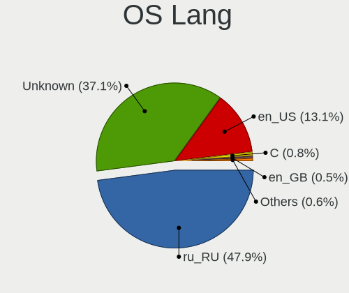
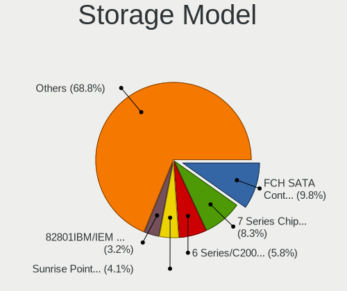
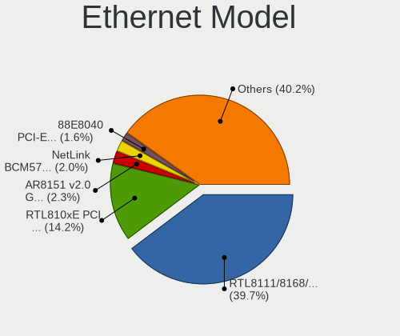
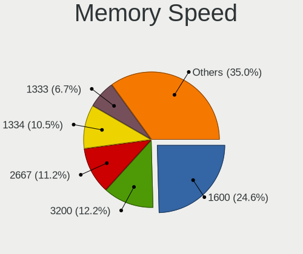

Linux in Russia - Tested Hardware & Statistics (Notebooks)
----------------------------------------------------------

A project to collect tested hardware configurations for Linux in Russia.

Anyone can contribute to this report by the [hw-probe](https://github.com/linuxhw/hw-probe) tool:

    sudo -E hw-probe -all -upload

Please contribute! Especially if your hardware is rare.

Contents
--------

* [ Test Cases ](#test-cases)

* [ System ](#system)
  - [ OS                       ](#os)
  - [ OS Family                ](#os-family)
  - [ Kernel                   ](#kernel)
  - [ Kernel Family            ](#kernel-family)
  - [ Kernel Major Ver.        ](#kernel-major-ver)
  - [ Arch                     ](#arch)
  - [ DE                       ](#de)
  - [ Display Server           ](#display-server)
  - [ Display Manager          ](#display-manager)
  - [ OS Lang                  ](#os-lang)
  - [ Boot Mode                ](#boot-mode)
  - [ Filesystem               ](#filesystem)
  - [ Part. scheme             ](#part-scheme)
  - [ Dual Boot with Linux/BSD ](#dual-boot-with-linuxbsd)
  - [ Dual Boot (Win)          ](#dual-boot-win)

* [ Board ](#board)
  - [ Vendor                   ](#vendor)
  - [ Model                    ](#model)
  - [ Model Family             ](#model-family)
  - [ MFG Year                 ](#mfg-year)
  - [ Form Factor              ](#form-factor)
  - [ Secure Boot              ](#secure-boot)
  - [ Coreboot                 ](#coreboot)
  - [ RAM Size                 ](#ram-size)
  - [ RAM Used                 ](#ram-used)
  - [ Total Drives             ](#total-drives)
  - [ Has CD-ROM               ](#has-cd-rom)
  - [ Has Ethernet             ](#has-ethernet)
  - [ Has WiFi                 ](#has-wifi)
  - [ Has Bluetooth            ](#has-bluetooth)

* [ Location ](#location)
  - [ Country                  ](#country)
  - [ City                     ](#city)

* [ Drives ](#drives)
  - [ Drive Vendor             ](#drive-vendor)
  - [ Drive Model              ](#drive-model)
  - [ HDD Vendor               ](#hdd-vendor)
  - [ SSD Vendor               ](#ssd-vendor)
  - [ Drive Kind               ](#drive-kind)
  - [ Drive Connector          ](#drive-connector)
  - [ Drive Size               ](#drive-size)
  - [ Space Total              ](#space-total)
  - [ Space Used               ](#space-used)
  - [ Malfunc. Drives          ](#malfunc-drives)
  - [ Malfunc. Drive Vendor    ](#malfunc-drive-vendor)
  - [ Malfunc. HDD Vendor      ](#malfunc-hdd-vendor)
  - [ Malfunc. Drive Kind      ](#malfunc-drive-kind)
  - [ Failed Drives            ](#failed-drives)
  - [ Failed Drive Vendor      ](#failed-drive-vendor)
  - [ Drive Status             ](#drive-status)

* [ Storage controller ](#storage-controller)
  - [ Storage Vendor           ](#storage-vendor)
  - [ Storage Model            ](#storage-model)
  - [ Storage Kind             ](#storage-kind)

* [ Processor ](#processor)
  - [ CPU Vendor               ](#cpu-vendor)
  - [ CPU Model                ](#cpu-model)
  - [ CPU Model Family         ](#cpu-model-family)
  - [ CPU Cores                ](#cpu-cores)
  - [ CPU Sockets              ](#cpu-sockets)
  - [ CPU Threads              ](#cpu-threads)
  - [ CPU Op-Modes             ](#cpu-op-modes)
  - [ CPU Microcode            ](#cpu-microcode)
  - [ CPU Microarch            ](#cpu-microarch)

* [ Graphics ](#graphics)
  - [ GPU Vendor               ](#gpu-vendor)
  - [ GPU Model                ](#gpu-model)
  - [ GPU Combo                ](#gpu-combo)
  - [ GPU Driver               ](#gpu-driver)
  - [ GPU Memory               ](#gpu-memory)

* [ Monitor ](#monitor)
  - [ Monitor Vendor           ](#monitor-vendor)
  - [ Monitor Model            ](#monitor-model)
  - [ Monitor Resolution       ](#monitor-resolution)
  - [ Monitor Diagonal         ](#monitor-diagonal)
  - [ Monitor Width            ](#monitor-width)
  - [ Aspect Ratio             ](#aspect-ratio)
  - [ Monitor Area             ](#monitor-area)
  - [ Pixel Density            ](#pixel-density)
  - [ Multiple Monitors        ](#multiple-monitors)

* [ Network ](#network)
  - [ Net Controller Vendor    ](#net-controller-vendor)
  - [ Net Controller Model     ](#net-controller-model)
  - [ Wireless Vendor          ](#wireless-vendor)
  - [ Wireless Model           ](#wireless-model)
  - [ Ethernet Vendor          ](#ethernet-vendor)
  - [ Ethernet Model           ](#ethernet-model)
  - [ Net Controller Kind      ](#net-controller-kind)
  - [ Used Controller          ](#used-controller)
  - [ NICs                     ](#nics)
  - [ IPv6                     ](#ipv6)

* [ Bluetooth ](#bluetooth)
  - [ Bluetooth Vendor         ](#bluetooth-vendor)
  - [ Bluetooth Model          ](#bluetooth-model)

* [ Sound ](#sound)
  - [ Sound Vendor             ](#sound-vendor)
  - [ Sound Model              ](#sound-model)

* [ Memory ](#memory)
  - [ Memory Vendor            ](#memory-vendor)
  - [ Memory Model             ](#memory-model)
  - [ Memory Kind              ](#memory-kind)
  - [ Memory Form Factor       ](#memory-form-factor)
  - [ Memory Size              ](#memory-size)
  - [ Memory Speed             ](#memory-speed)

* [ Printers & scanners ](#printers--scanners)
  - [ Printer Vendor           ](#printer-vendor)
  - [ Printer Model            ](#printer-model)
  - [ Scanner Vendor           ](#scanner-vendor)
  - [ Scanner Model            ](#scanner-model)

* [ Camera ](#camera)
  - [ Camera Vendor            ](#camera-vendor)
  - [ Camera Model             ](#camera-model)

* [ Security ](#security)
  - [ Fingerprint Vendor       ](#fingerprint-vendor)
  - [ Fingerprint Model        ](#fingerprint-model)
  - [ Chipcard Vendor          ](#chipcard-vendor)
  - [ Chipcard Model           ](#chipcard-model)

* [ Unsupported ](#unsupported)
  - [ Unsupported Devices      ](#unsupported-devices)
  - [ Unsupported Device Types ](#unsupported-device-types)

Test Cases
----------

Total: 18558

| Vendor        | Model                       | Probe                                                      | Date         |
|---------------|-----------------------------|------------------------------------------------------------|--------------|
| Acer          | Aspire A517-51              | [01cfb1c93f](https://linux-hardware.org/?probe=01cfb1c93f) | Jun 10, 2023 |
| Samsung       | P29/28/26                   | [6040d56961](https://linux-hardware.org/?probe=6040d56961) | Jun 10, 2023 |
| WeiBu         | OEM                         | [49bd40f956](https://linux-hardware.org/?probe=49bd40f956) | Jun 10, 2023 |
| HUAWEI        | NBD-WXX9                    | [61c1703e67](https://linux-hardware.org/?probe=61c1703e67) | Jun 10, 2023 |
| HUAWEI        | NBD-WXX9                    | [321ad38786](https://linux-hardware.org/?probe=321ad38786) | Jun 10, 2023 |
| MACHENIKE     | F117-7P                     | [78ad896b83](https://linux-hardware.org/?probe=78ad896b83) | Jun 10, 2023 |
| Lenovo        | Legion 5 15ARH05 82B5       | [2b4f40f41b](https://linux-hardware.org/?probe=2b4f40f41b) | Jun 09, 2023 |
| Dell          | Inspiron N5110              | [62d37454d3](https://linux-hardware.org/?probe=62d37454d3) | Jun 09, 2023 |
| Dell          | Latitude 5480               | [5b3fb0b4f8](https://linux-hardware.org/?probe=5b3fb0b4f8) | Jun 09, 2023 |
| Acer          | Aspire 5750G                | [69227c0908](https://linux-hardware.org/?probe=69227c0908) | Jun 09, 2023 |
| HUAWEI        | BOHB-WAX9                   | [aa0b439e8d](https://linux-hardware.org/?probe=aa0b439e8d) | Jun 09, 2023 |
| Lenovo        | IdeaPad 5 14ARE05 81YM      | [e246e70bb6](https://linux-hardware.org/?probe=e246e70bb6) | Jun 09, 2023 |
| Acer          | Aspire A517-53              | [c14dcffa32](https://linux-hardware.org/?probe=c14dcffa32) | Jun 08, 2023 |
| Lenovo        | Unknown                     | [1842b75de0](https://linux-hardware.org/?probe=1842b75de0) | Jun 08, 2023 |
| Dell          | Vostro 1015                 | [dcd4a1ad41](https://linux-hardware.org/?probe=dcd4a1ad41) | Jun 08, 2023 |
| ASUSTek       | ROG Strix G713PI_G713PI     | [13b0e73872](https://linux-hardware.org/?probe=13b0e73872) | Jun 08, 2023 |
| INFERIT       | Silver                      | [f6b3fc6762](https://linux-hardware.org/?probe=f6b3fc6762) | Jun 08, 2023 |
| Dell          | Inspiron 3558               | [87b5fd28c2](https://linux-hardware.org/?probe=87b5fd28c2) | Jun 08, 2023 |
| MSI           | GE60 2PL                    | [e1d118e2d2](https://linux-hardware.org/?probe=e1d118e2d2) | Jun 08, 2023 |
| HP            | G62                         | [fb9522ceac](https://linux-hardware.org/?probe=fb9522ceac) | Jun 08, 2023 |
| Acer          | Aspire 7741                 | [c85cff4000](https://linux-hardware.org/?probe=c85cff4000) | Jun 08, 2023 |
| Lenovo        | IdeaPad 5 Pro 14ACN6 82L... | [292625f2da](https://linux-hardware.org/?probe=292625f2da) | Jun 08, 2023 |
| Sony          | VPCEH2E1R                   | [97e5366810](https://linux-hardware.org/?probe=97e5366810) | Jun 08, 2023 |
| Lenovo        | B590 20208                  | [102b3706f4](https://linux-hardware.org/?probe=102b3706f4) | Jun 08, 2023 |
| Machcreato... | 14                          | [d889b02b13](https://linux-hardware.org/?probe=d889b02b13) | Jun 07, 2023 |
| ASUSTek       | VivoBook_ASUSLaptop M150... | [6d434209eb](https://linux-hardware.org/?probe=6d434209eb) | Jun 07, 2023 |
| Maibenben     | MaiBook X series            | [5ca7ad5fb0](https://linux-hardware.org/?probe=5ca7ad5fb0) | Jun 07, 2023 |
| ASUSTek       | X205TA                      | [4c56663011](https://linux-hardware.org/?probe=4c56663011) | Jun 07, 2023 |
| Samsung       | 355V4C/356V4C/3445VC/354... | [6e2a67c010](https://linux-hardware.org/?probe=6e2a67c010) | Jun 07, 2023 |
| Samsung       | 350V5C/351V5C/3540VC/344... | [2e0b21f8d4](https://linux-hardware.org/?probe=2e0b21f8d4) | Jun 07, 2023 |
| HP            | Laptop 15s-eq1xxx           | [db91b1b71c](https://linux-hardware.org/?probe=db91b1b71c) | Jun 07, 2023 |
| Acer          | AOD257                      | [1b75b86659](https://linux-hardware.org/?probe=1b75b86659) | Jun 06, 2023 |
| HP            | Laptop 15s-eq1xxx           | [d2c05f91c4](https://linux-hardware.org/?probe=d2c05f91c4) | Jun 06, 2023 |
| Packard Be... | EasyNote TE69KB             | [d6f404ae63](https://linux-hardware.org/?probe=d6f404ae63) | Jun 06, 2023 |
| Machcreato... | 14                          | [f0a27a9f97](https://linux-hardware.org/?probe=f0a27a9f97) | Jun 06, 2023 |
| HP            | Pavilion 15                 | [d75a894e8c](https://linux-hardware.org/?probe=d75a894e8c) | Jun 06, 2023 |
| HP            | 250 15.6 inch G9 Noteboo... | [be9987ca28](https://linux-hardware.org/?probe=be9987ca28) | Jun 06, 2023 |
| Dell          | G5 5587                     | [909f234c06](https://linux-hardware.org/?probe=909f234c06) | Jun 06, 2023 |
| Lenovo        | G70-70 80HW                 | [0d46480e90](https://linux-hardware.org/?probe=0d46480e90) | Jun 06, 2023 |
| Acer          | Swift SF314-511             | [60bf4b0442](https://linux-hardware.org/?probe=60bf4b0442) | Jun 05, 2023 |
| MSI           | Delta 15 A5EFK              | [d55fa44834](https://linux-hardware.org/?probe=d55fa44834) | Jun 05, 2023 |
| realme        | CloudProXXXX                | [22cced9066](https://linux-hardware.org/?probe=22cced9066) | Jun 05, 2023 |
| Aquarius      | NS585                       | [b3f11e4a53](https://linux-hardware.org/?probe=b3f11e4a53) | Jun 05, 2023 |
| HP            | EliteBook 2560p             | [3ed00534ed](https://linux-hardware.org/?probe=3ed00534ed) | Jun 05, 2023 |
| Lenovo        | IdeaPad 520-15IKB 81BF      | [2e429d02d1](https://linux-hardware.org/?probe=2e429d02d1) | Jun 05, 2023 |
| HP            | Mini 210-1000               | [96f41af422](https://linux-hardware.org/?probe=96f41af422) | Jun 05, 2023 |
| Samsung       | N102                        | [c3e402b50d](https://linux-hardware.org/?probe=c3e402b50d) | Jun 04, 2023 |
| HP            | Pavilion 15                 | [944c353c44](https://linux-hardware.org/?probe=944c353c44) | Jun 04, 2023 |
| ASUSTek       | VivoBook_ASUSLaptop X571... | [dfb8881ffe](https://linux-hardware.org/?probe=dfb8881ffe) | Jun 04, 2023 |
| Apple         | MacBookPro11,1              | [4192000802](https://linux-hardware.org/?probe=4192000802) | Jun 04, 2023 |
| Samsung       | 305V4A/305V5A/3415VA        | [a0f9cde008](https://linux-hardware.org/?probe=a0f9cde008) | Jun 04, 2023 |
| Apple         | MacBookPro11,1              | [168fa7f541](https://linux-hardware.org/?probe=168fa7f541) | Jun 04, 2023 |
| Lenovo        | V560                        | [b2564e07cc](https://linux-hardware.org/?probe=b2564e07cc) | Jun 03, 2023 |
| Valve         | Jupiter                     | [fdfee4fc99](https://linux-hardware.org/?probe=fdfee4fc99) | Jun 03, 2023 |
| Maibenben     | MaiBook M                   | [b5d7957b55](https://linux-hardware.org/?probe=b5d7957b55) | Jun 03, 2023 |
| Lenovo        | IdeaPad 320-17IKB 80XM      | [5d6b08920f](https://linux-hardware.org/?probe=5d6b08920f) | Jun 03, 2023 |
| Valve         | Jupiter                     | [cf26028872](https://linux-hardware.org/?probe=cf26028872) | Jun 03, 2023 |
| Acer          | Aspire S3                   | [23c1a32b88](https://linux-hardware.org/?probe=23c1a32b88) | Jun 03, 2023 |
| Samsung       | N102                        | [b21ddf3fea](https://linux-hardware.org/?probe=b21ddf3fea) | Jun 03, 2023 |
| ASUSTek       | VivoBook 17_ASUS Laptop ... | [88c3440ff2](https://linux-hardware.org/?probe=88c3440ff2) | Jun 03, 2023 |
| Dell          | Inspiron 1525               | [3160e89723](https://linux-hardware.org/?probe=3160e89723) | Jun 03, 2023 |
| ASUSTek       | X556UQ                      | [088518df2b](https://linux-hardware.org/?probe=088518df2b) | Jun 02, 2023 |
| HUAWEI        | BOD-WXX9                    | [532dea434a](https://linux-hardware.org/?probe=532dea434a) | Jun 02, 2023 |
| HP            | ENVY Notebook               | [e7f4c63499](https://linux-hardware.org/?probe=e7f4c63499) | Jun 02, 2023 |
| DEXP          | Aquilon C15                 | [763c923576](https://linux-hardware.org/?probe=763c923576) | Jun 02, 2023 |
| Aquarius      | NS585                       | [6f93385917](https://linux-hardware.org/?probe=6f93385917) | Jun 02, 2023 |
| ASUSTek       | VivoBook_ASUS Laptop X50... | [6ae18b11ab](https://linux-hardware.org/?probe=6ae18b11ab) | Jun 02, 2023 |
| ASUSTek       | VivoBook_ASUSLaptop N760... | [05a99cf128](https://linux-hardware.org/?probe=05a99cf128) | Jun 02, 2023 |
| ASUSTek       | VivoBook_ASUS Laptop X50... | [963b30ca7f](https://linux-hardware.org/?probe=963b30ca7f) | Jun 02, 2023 |
| Aquarius      | NS585                       | [091267ec3a](https://linux-hardware.org/?probe=091267ec3a) | Jun 02, 2023 |
| Aquarius      | NS585                       | [7534819f94](https://linux-hardware.org/?probe=7534819f94) | Jun 02, 2023 |
| Lenovo        | S40-70 80GQ                 | [9a3fbc7388](https://linux-hardware.org/?probe=9a3fbc7388) | Jun 02, 2023 |
| ASUSTek       | ASUS TUF Gaming F17 FX70... | [23e94c534e](https://linux-hardware.org/?probe=23e94c534e) | Jun 01, 2023 |
| HP            | EliteBook 840 G6            | [81ec1cc134](https://linux-hardware.org/?probe=81ec1cc134) | Jun 01, 2023 |
| Timi          | RedmiBook Pro 15S           | [1708ebae47](https://linux-hardware.org/?probe=1708ebae47) | Jun 01, 2023 |
| Aquarius      | NS585                       | [ffa7425b95](https://linux-hardware.org/?probe=ffa7425b95) | Jun 01, 2023 |
| MSI           | GF63 Thin 11SC              | [8f8afcc010](https://linux-hardware.org/?probe=8f8afcc010) | Jun 01, 2023 |
| Aquarius      | NS585                       | [fafcbbe90e](https://linux-hardware.org/?probe=fafcbbe90e) | Jun 01, 2023 |
| Dell          | Latitude 5490               | [34dde30b90](https://linux-hardware.org/?probe=34dde30b90) | Jun 01, 2023 |
| ASUSTek       | X550CC                      | [d75bfc397f](https://linux-hardware.org/?probe=d75bfc397f) | Jun 01, 2023 |
| Timi          | TM1801                      | [aa1db210df](https://linux-hardware.org/?probe=aa1db210df) | Jun 01, 2023 |
| Lenovo        | K14 Gen 1 21CSS16E00        | [9c95ad4263](https://linux-hardware.org/?probe=9c95ad4263) | May 31, 2023 |
| Acer          | Aspire 4810T                | [3058ac9018](https://linux-hardware.org/?probe=3058ac9018) | May 31, 2023 |
| Apple         | MacBookPro16,1              | [717c7884c8](https://linux-hardware.org/?probe=717c7884c8) | May 31, 2023 |
| Acer          | Aspire ES1-523              | [d68236f41d](https://linux-hardware.org/?probe=d68236f41d) | May 31, 2023 |
| Dell          | Latitude 5411               | [8583aa2091](https://linux-hardware.org/?probe=8583aa2091) | May 31, 2023 |
| HP            | EliteBook 840 G3            | [384ebf87a3](https://linux-hardware.org/?probe=384ebf87a3) | May 31, 2023 |
| HP            | Laptop 15-gw0xxx            | [ebc3d97429](https://linux-hardware.org/?probe=ebc3d97429) | May 30, 2023 |
| HP            | Laptop 15-gw0xxx            | [97382e45f8](https://linux-hardware.org/?probe=97382e45f8) | May 30, 2023 |
| HP            | Laptop 17-ca0xxx            | [3222c41173](https://linux-hardware.org/?probe=3222c41173) | May 30, 2023 |
| Samsung       | RV410/RV510/S3510/E3510     | [d20ebd68c0](https://linux-hardware.org/?probe=d20ebd68c0) | May 30, 2023 |
| Lenovo        | Legion Y530-15ICH 81FV      | [85a2504037](https://linux-hardware.org/?probe=85a2504037) | May 30, 2023 |
| HP            | Laptop 15s-fq2xxx           | [7ab8c72481](https://linux-hardware.org/?probe=7ab8c72481) | May 30, 2023 |
| ICL           | RAYbook Si1407              | [5956bb96ff](https://linux-hardware.org/?probe=5956bb96ff) | May 30, 2023 |
| Acer          | Swift SF114-34              | [3722c76b10](https://linux-hardware.org/?probe=3722c76b10) | May 30, 2023 |
| Lenovo        | G570 20079                  | [4843789a62](https://linux-hardware.org/?probe=4843789a62) | May 30, 2023 |
| HP            | ProBook 440 G7              | [9da720226e](https://linux-hardware.org/?probe=9da720226e) | May 30, 2023 |
| Lenovo        | Legion Y530-15ICH 81FV      | [c0e9edd453](https://linux-hardware.org/?probe=c0e9edd453) | May 30, 2023 |
| MSI           | GE60 2PC                    | [48c124853f](https://linux-hardware.org/?probe=48c124853f) | May 30, 2023 |
| ASUSTek       | X550WA                      | [864236b0c9](https://linux-hardware.org/?probe=864236b0c9) | May 29, 2023 |
| Lenovo        | ThinkPad E14 Gen 3 20Y70... | [3933dfe4f0](https://linux-hardware.org/?probe=3933dfe4f0) | May 29, 2023 |
| Samsung       | RV410/RV510/S3510/E3510     | [a786eb985d](https://linux-hardware.org/?probe=a786eb985d) | May 29, 2023 |
| ASUSTek       | GL553VD                     | [a1f825f4e5](https://linux-hardware.org/?probe=a1f825f4e5) | May 29, 2023 |
| HP            | ProBook 440 G6              | [35d14ed328](https://linux-hardware.org/?probe=35d14ed328) | May 29, 2023 |
| HP            | ProBook 440 G6              | [36a3563566](https://linux-hardware.org/?probe=36a3563566) | May 29, 2023 |
| ICL-KME CS    | RAYbook                     | [9e976ffc1a](https://linux-hardware.org/?probe=9e976ffc1a) | May 29, 2023 |
| HP            | Laptop 17-ca0xxx            | [4b53ed4ede](https://linux-hardware.org/?probe=4b53ed4ede) | May 29, 2023 |
| Acer          | Swift SF114-34              | [b7be0bf5ad](https://linux-hardware.org/?probe=b7be0bf5ad) | May 29, 2023 |
| HONOR         | BBR-WAX9                    | [e57b9850f8](https://linux-hardware.org/?probe=e57b9850f8) | May 28, 2023 |
| Acer          | Aspire V3-571G              | [d3afe375cf](https://linux-hardware.org/?probe=d3afe375cf) | May 28, 2023 |
| Maibenben     | MaiBook M                   | [fa3f4694ba](https://linux-hardware.org/?probe=fa3f4694ba) | May 28, 2023 |
| ASUSTek       | VivoBook_ASUSLaptop X415... | [86876e9715](https://linux-hardware.org/?probe=86876e9715) | May 28, 2023 |
| HIPER Tech... | HIPER WORKBOOK              | [8283b1247f](https://linux-hardware.org/?probe=8283b1247f) | May 28, 2023 |
| LTD Delovo... | EVE 14 C414                 | [d52f6c1303](https://linux-hardware.org/?probe=d52f6c1303) | May 28, 2023 |
| Unknown       | Unknown                     | [b294c91e3a](https://linux-hardware.org/?probe=b294c91e3a) | May 28, 2023 |
| Lenovo        | IdeaPad Z570 1024CPU        | [eb1c70f7af](https://linux-hardware.org/?probe=eb1c70f7af) | May 28, 2023 |
| MSI           | Katana GF76 12UGSO          | [fb534d212e](https://linux-hardware.org/?probe=fb534d212e) | May 28, 2023 |
| MSI           | Katana GF76 12UGSO          | [6b753016ff](https://linux-hardware.org/?probe=6b753016ff) | May 28, 2023 |
| ASUSTek       | ROG Strix G634JY_G634JY     | [026cf06ce5](https://linux-hardware.org/?probe=026cf06ce5) | May 27, 2023 |
| HP            | Laptop 15s-fq5xxx           | [c6309fc374](https://linux-hardware.org/?probe=c6309fc374) | May 27, 2023 |
| Infinix       | INBOOK X2                   | [1f8b536f4f](https://linux-hardware.org/?probe=1f8b536f4f) | May 27, 2023 |
| Acer          | Aspire A517-51G             | [bfc89878ce](https://linux-hardware.org/?probe=bfc89878ce) | May 27, 2023 |
| Aquarius      | NS585                       | [a87c8d46b6](https://linux-hardware.org/?probe=a87c8d46b6) | May 27, 2023 |
| HP            | Pavilion Laptop 14-ec0xx... | [4662e37743](https://linux-hardware.org/?probe=4662e37743) | May 26, 2023 |
| Samsung       | N130                        | [bd37239d10](https://linux-hardware.org/?probe=bd37239d10) | May 26, 2023 |
| Timi          | TM1701                      | [94105aa58f](https://linux-hardware.org/?probe=94105aa58f) | May 26, 2023 |
| eMachines     | eME644G                     | [cde4d7b461](https://linux-hardware.org/?probe=cde4d7b461) | May 26, 2023 |
| eMachines     | E725                        | [a4be8012a8](https://linux-hardware.org/?probe=a4be8012a8) | May 26, 2023 |
| Lenovo        | B570e HuronRiver Platfor... | [d3ac4866d3](https://linux-hardware.org/?probe=d3ac4866d3) | May 26, 2023 |
| Lenovo        | B570e HuronRiver Platfor... | [67b6a5e731](https://linux-hardware.org/?probe=67b6a5e731) | May 26, 2023 |
| ASUSTek       | G50VT                       | [6e4a2588b1](https://linux-hardware.org/?probe=6e4a2588b1) | May 26, 2023 |
| Acer          | Aspire V3-551               | [9d609ccd4a](https://linux-hardware.org/?probe=9d609ccd4a) | May 26, 2023 |
| Infinix       | INBOOK X2                   | [925318e521](https://linux-hardware.org/?probe=925318e521) | May 26, 2023 |
| Intel Clie... | LAPBC710                    | [7ed6d7079c](https://linux-hardware.org/?probe=7ed6d7079c) | May 26, 2023 |
| Unknown       | Unknown                     | [b63a3cbd7b](https://linux-hardware.org/?probe=b63a3cbd7b) | May 25, 2023 |
| Unknown       | Unknown                     | [3db7516231](https://linux-hardware.org/?probe=3db7516231) | May 25, 2023 |
| ASUSTek       | X502CA                      | [7b19816353](https://linux-hardware.org/?probe=7b19816353) | May 25, 2023 |
| HP            | ProBook 4535s               | [bf141ba124](https://linux-hardware.org/?probe=bf141ba124) | May 25, 2023 |
| eMachines     | eME644G                     | [bc740da95e](https://linux-hardware.org/?probe=bc740da95e) | May 25, 2023 |
| Aquarius      | NS685U R11                  | [8e0050a63d](https://linux-hardware.org/?probe=8e0050a63d) | May 25, 2023 |
| Aquarius      | NS685U R11                  | [17191f57d3](https://linux-hardware.org/?probe=17191f57d3) | May 25, 2023 |
| Clevo         | NL41MU2                     | [41f9a8d4b1](https://linux-hardware.org/?probe=41f9a8d4b1) | May 25, 2023 |
| ASUSTek       | GL553VD                     | [51dbf3c463](https://linux-hardware.org/?probe=51dbf3c463) | May 25, 2023 |
| Acer          | Aspire A515-45G             | [99bcbfbb2a](https://linux-hardware.org/?probe=99bcbfbb2a) | May 25, 2023 |
| Aquarius      | NS585                       | [82a0d45251](https://linux-hardware.org/?probe=82a0d45251) | May 25, 2023 |
| HONOR         | HYM-WXX                     | [00a5e48ef4](https://linux-hardware.org/?probe=00a5e48ef4) | May 25, 2023 |
| Acer          | Aspire 7750G                | [589639a63f](https://linux-hardware.org/?probe=589639a63f) | May 25, 2023 |
| Timi          | TM1701                      | [c883337466](https://linux-hardware.org/?probe=c883337466) | May 24, 2023 |
| Acer          | Aspire E5-573G              | [c6cc5e2a20](https://linux-hardware.org/?probe=c6cc5e2a20) | May 24, 2023 |
| HP            | EliteBook 855 G8 Noteboo... | [fb5edbbd6b](https://linux-hardware.org/?probe=fb5edbbd6b) | May 24, 2023 |
| Acer          | Extensa 5630                | [00e8bb4d6a](https://linux-hardware.org/?probe=00e8bb4d6a) | May 24, 2023 |
| HUAWEI        | BOD-WXX9                    | [9486b7ca4f](https://linux-hardware.org/?probe=9486b7ca4f) | May 24, 2023 |
| Samsung       | R710                        | [a2c199b3cd](https://linux-hardware.org/?probe=a2c199b3cd) | May 24, 2023 |
| Packard Be... | DOT S                       | [a49bbc7aa2](https://linux-hardware.org/?probe=a49bbc7aa2) | May 24, 2023 |
| DEXP          | Aquilon C14                 | [357a7caaf8](https://linux-hardware.org/?probe=357a7caaf8) | May 24, 2023 |
| DEXP          | Aquilon C14                 | [cd3dc35687](https://linux-hardware.org/?probe=cd3dc35687) | May 24, 2023 |
| HP            | EliteBook 855 G8 Noteboo... | [a03284052b](https://linux-hardware.org/?probe=a03284052b) | May 24, 2023 |
| ASUSTek       | UL30A                       | [d7ab3b0ed3](https://linux-hardware.org/?probe=d7ab3b0ed3) | May 24, 2023 |
| Lenovo        | Legion Y530-15ICH 81FV      | [dd1104fc5a](https://linux-hardware.org/?probe=dd1104fc5a) | May 23, 2023 |
| Unknown       | Unknown                     | [6680332a54](https://linux-hardware.org/?probe=6680332a54) | May 23, 2023 |
| HUAWEI        | CREF-XX                     | [39ff25bc94](https://linux-hardware.org/?probe=39ff25bc94) | May 23, 2023 |
| ASUSTek       | N53SM                       | [95301f4dea](https://linux-hardware.org/?probe=95301f4dea) | May 23, 2023 |
| Dell          | Inspiron N5110              | [a410c18f8c](https://linux-hardware.org/?probe=a410c18f8c) | May 23, 2023 |
| ASUSTek       | ET2321I                     | [829fe9b078](https://linux-hardware.org/?probe=829fe9b078) | May 23, 2023 |
| ASUSTek       | ROG Zephyrus G15 GA503QS... | [374ccaecd9](https://linux-hardware.org/?probe=374ccaecd9) | May 22, 2023 |
| Acer          | Nitro AN515-46              | [702a597b36](https://linux-hardware.org/?probe=702a597b36) | May 22, 2023 |
| HUAWEI        | KLVL-WXXW                   | [6ca579ee78](https://linux-hardware.org/?probe=6ca579ee78) | May 22, 2023 |
| HP            | EliteBook 8440p             | [3ad250d762](https://linux-hardware.org/?probe=3ad250d762) | May 22, 2023 |
| Acer          | Nitro AN515-45              | [179e48239b](https://linux-hardware.org/?probe=179e48239b) | May 22, 2023 |
| Valve         | Jupiter                     | [0a03a5a40a](https://linux-hardware.org/?probe=0a03a5a40a) | May 22, 2023 |
| ASUSTek       | X550CC                      | [8226c82b49](https://linux-hardware.org/?probe=8226c82b49) | May 21, 2023 |
| ASUSTek       | X550CC                      | [6a8e6201be](https://linux-hardware.org/?probe=6a8e6201be) | May 21, 2023 |
| Lenovo        | Unknown                     | [1288108e10](https://linux-hardware.org/?probe=1288108e10) | May 21, 2023 |
| Unknown       | X133                        | [52cd0be8f5](https://linux-hardware.org/?probe=52cd0be8f5) | May 21, 2023 |
| HP            | Laptop 17-by3xxx            | [7f15c1b9e3](https://linux-hardware.org/?probe=7f15c1b9e3) | May 21, 2023 |
| Dell          | Inspiron N5110              | [279141fa2a](https://linux-hardware.org/?probe=279141fa2a) | May 21, 2023 |
| ASUSTek       | ASUS TUF Gaming A15 FA50... | [47ab72fc6c](https://linux-hardware.org/?probe=47ab72fc6c) | May 20, 2023 |
| HASEE Comp... | V1x0PNPx                    | [ce5f16dcfe](https://linux-hardware.org/?probe=ce5f16dcfe) | May 20, 2023 |
| Dell          | Inspiron 3542               | [166b73ef05](https://linux-hardware.org/?probe=166b73ef05) | May 20, 2023 |
| ASUSTek       | K53SC                       | [d2ddb09cc1](https://linux-hardware.org/?probe=d2ddb09cc1) | May 20, 2023 |
| Apple         | MacBookPro9,2               | [ac3d3ea87c](https://linux-hardware.org/?probe=ac3d3ea87c) | May 19, 2023 |
| ASUSTek       | TUF Gaming FX504GE_FX80G... | [a51baad28a](https://linux-hardware.org/?probe=a51baad28a) | May 19, 2023 |
| ASUSTek       | ASUS EXPERTBOOK B2402CBA... | [13d783ec86](https://linux-hardware.org/?probe=13d783ec86) | May 19, 2023 |
| Valve         | Jupiter                     | [7d600a9c24](https://linux-hardware.org/?probe=7d600a9c24) | May 19, 2023 |
| ASUSTek       | VivoBook_ASUSLaptop M160... | [39fa0ce7e9](https://linux-hardware.org/?probe=39fa0ce7e9) | May 19, 2023 |
| Lenovo        | Legion 5 15ARH05H 82B1      | [d51c5680e8](https://linux-hardware.org/?probe=d51c5680e8) | May 19, 2023 |
| HP            | Laptop 17-ca0xxx            | [c1f8fc5eed](https://linux-hardware.org/?probe=c1f8fc5eed) | May 19, 2023 |
| Lenovo        | Legion 5 15ITH6H 82JH       | [7f35aa414f](https://linux-hardware.org/?probe=7f35aa414f) | May 18, 2023 |
| Samsung       | 355V4C/356V4C/3445VC/354... | [08df098150](https://linux-hardware.org/?probe=08df098150) | May 18, 2023 |
| HP            | Laptop 15-bs1xx             | [0517273b27](https://linux-hardware.org/?probe=0517273b27) | May 18, 2023 |
| Aquarius      | NS585                       | [dc2b351b40](https://linux-hardware.org/?probe=dc2b351b40) | May 18, 2023 |
| Digma         | EVE 15 P417 NP3158CXW01     | [fdb0fb3d9c](https://linux-hardware.org/?probe=fdb0fb3d9c) | May 18, 2023 |
| HONOR         | HLYL-WXX9                   | [01a49c336d](https://linux-hardware.org/?probe=01a49c336d) | May 18, 2023 |
| HP            | Laptop 17-ca0xxx            | [f93ee0d717](https://linux-hardware.org/?probe=f93ee0d717) | May 17, 2023 |
| Aquarius      | NS685U R11                  | [23e33588a8](https://linux-hardware.org/?probe=23e33588a8) | May 17, 2023 |
| Lenovo        | ThinkPad L13 Gen 3 21BAS... | [2df1a28c50](https://linux-hardware.org/?probe=2df1a28c50) | May 17, 2023 |
| Lenovo        | ThinkPad L13 Gen 3 21BAA... | [5e4e802b87](https://linux-hardware.org/?probe=5e4e802b87) | May 17, 2023 |
| Lenovo        | ThinkPad W520 4284W2U       | [429d4451c9](https://linux-hardware.org/?probe=429d4451c9) | May 16, 2023 |
| ASUSTek       | K53TA                       | [9700522405](https://linux-hardware.org/?probe=9700522405) | May 16, 2023 |
| HP            | ENVY dv6                    | [2490803f28](https://linux-hardware.org/?probe=2490803f28) | May 16, 2023 |
| Digma         | EVE 11 C422 ES1068EW        | [21255b70aa](https://linux-hardware.org/?probe=21255b70aa) | May 16, 2023 |
| Acer          | AOD257                      | [421fde4e9b](https://linux-hardware.org/?probe=421fde4e9b) | May 16, 2023 |
| Samsung       | R780                        | [5862ae2996](https://linux-hardware.org/?probe=5862ae2996) | May 16, 2023 |
| Samsung       | R780                        | [1fc01590bb](https://linux-hardware.org/?probe=1fc01590bb) | May 16, 2023 |
| ASUSTek       | X550CC                      | [cce2c46f1e](https://linux-hardware.org/?probe=cce2c46f1e) | May 16, 2023 |
| ASUSTek       | K53TA                       | [57a36429fe](https://linux-hardware.org/?probe=57a36429fe) | May 15, 2023 |
| HUAWEI        | NBLK-WAX9X                  | [2b6c863711](https://linux-hardware.org/?probe=2b6c863711) | May 15, 2023 |
| HP            | Pavilion Gaming Laptop 1... | [2ffc331e90](https://linux-hardware.org/?probe=2ffc331e90) | May 15, 2023 |
| Samsung       | R428/P428                   | [1d93335f58](https://linux-hardware.org/?probe=1d93335f58) | May 15, 2023 |
| Toshiba       | Satellite L755              | [ec59045a15](https://linux-hardware.org/?probe=ec59045a15) | May 15, 2023 |
| Lenovo        | ThinkBook 16 G4+ ARA 21D... | [acd8d0441a](https://linux-hardware.org/?probe=acd8d0441a) | May 15, 2023 |
| ASUSTek       | GL703VD                     | [6de826cbe5](https://linux-hardware.org/?probe=6de826cbe5) | May 15, 2023 |
| Lenovo        | IdeaPad S145-15AST 81N3     | [f8f9a6dc69](https://linux-hardware.org/?probe=f8f9a6dc69) | May 15, 2023 |
| Lenovo        | ThinkPad T61 7661V3L        | [5714171d2a](https://linux-hardware.org/?probe=5714171d2a) | May 14, 2023 |
| Acer          | Aspire V5-552G              | [4384294484](https://linux-hardware.org/?probe=4384294484) | May 14, 2023 |
| HP            | ProBook 6560b               | [e8f24791d1](https://linux-hardware.org/?probe=e8f24791d1) | May 14, 2023 |
| Acer          | TravelMate B113             | [b6a4ef5336](https://linux-hardware.org/?probe=b6a4ef5336) | May 14, 2023 |
| Acer          | TravelMate B113             | [c2e9fe6581](https://linux-hardware.org/?probe=c2e9fe6581) | May 14, 2023 |
| MSI           | GL62 6QF                    | [6ae5c650f3](https://linux-hardware.org/?probe=6ae5c650f3) | May 14, 2023 |
| ASUSTek       | VivoBook_ASUSLaptop M650... | [72eaf980ad](https://linux-hardware.org/?probe=72eaf980ad) | May 14, 2023 |
| Unknown       | Unknown                     | [077df36551](https://linux-hardware.org/?probe=077df36551) | May 14, 2023 |
| HP            | OMEN by Laptop 15-dc1xxx    | [ba47df6545](https://linux-hardware.org/?probe=ba47df6545) | May 14, 2023 |
| HP            | OMEN by Laptop 15-dc1xxx    | [0b6c34eefa](https://linux-hardware.org/?probe=0b6c34eefa) | May 14, 2023 |
| Dell          | Inspiron 3520               | [675fc0ce85](https://linux-hardware.org/?probe=675fc0ce85) | May 14, 2023 |
| Irbis         | NB64                        | [a3dc2d6133](https://linux-hardware.org/?probe=a3dc2d6133) | May 13, 2023 |
| Irbis         | NB64                        | [369617cbf6](https://linux-hardware.org/?probe=369617cbf6) | May 13, 2023 |
| HP            | Laptop 15-bw0xx             | [10ee4f50b6](https://linux-hardware.org/?probe=10ee4f50b6) | May 13, 2023 |
| Digma         | EVE 15 P417 NP3158CXW01     | [7e178a2a32](https://linux-hardware.org/?probe=7e178a2a32) | May 13, 2023 |
| Apple         | MacBookPro8,1               | [cd0c59d678](https://linux-hardware.org/?probe=cd0c59d678) | May 13, 2023 |
| Packard Be... | EasyNote TK85               | [3d4b4e176a](https://linux-hardware.org/?probe=3d4b4e176a) | May 13, 2023 |
| Samsung       | R425/R525                   | [a7719ea5d3](https://linux-hardware.org/?probe=a7719ea5d3) | May 13, 2023 |
| HP            | Pavilion g6                 | [a86469b33f](https://linux-hardware.org/?probe=a86469b33f) | May 12, 2023 |
| HUAWEI        | CREM-WXX9                   | [b1b041ac47](https://linux-hardware.org/?probe=b1b041ac47) | May 12, 2023 |
| Digma         | EVE 15 P417 NP3158CXW01     | [29e584b980](https://linux-hardware.org/?probe=29e584b980) | May 12, 2023 |
| Digma         | EVE 15 P417 NP3158CXW01     | [22673e3f0c](https://linux-hardware.org/?probe=22673e3f0c) | May 12, 2023 |
| ASUSTek       | M51Sn                       | [94a426384a](https://linux-hardware.org/?probe=94a426384a) | May 12, 2023 |
| Digma         | EVE 15 P417 NP3158CXW01     | [2a93dcb797](https://linux-hardware.org/?probe=2a93dcb797) | May 12, 2023 |
| Apple         | MacBookPro11,2              | [ceea346358](https://linux-hardware.org/?probe=ceea346358) | May 12, 2023 |
| realme        | RMNBXXXX                    | [16782746d8](https://linux-hardware.org/?probe=16782746d8) | May 12, 2023 |
| Digma         | Pro Magnus M DN16R7-ADXW... | [4e4a1278e9](https://linux-hardware.org/?probe=4e4a1278e9) | May 12, 2023 |
| HUAWEI        | NbDE-WXX9                   | [77da4c15ba](https://linux-hardware.org/?probe=77da4c15ba) | May 12, 2023 |
| Rombica       | myBook Zenith               | [f7438f1448](https://linux-hardware.org/?probe=f7438f1448) | May 11, 2023 |
| Notebook      | W250EGQ / W270EGQ           | [7259a9f7fb](https://linux-hardware.org/?probe=7259a9f7fb) | May 11, 2023 |
| ASUSTek       | K53SC                       | [68e25fe72f](https://linux-hardware.org/?probe=68e25fe72f) | May 11, 2023 |
| HUAWEI        | CREM-WXX9                   | [847d86e573](https://linux-hardware.org/?probe=847d86e573) | May 11, 2023 |
| HP            | Laptop 15-bw0xx             | [11e89ebe3c](https://linux-hardware.org/?probe=11e89ebe3c) | May 11, 2023 |
| Lenovo        | IdeaPad 520-15IKB 80YL      | [3fb4df889e](https://linux-hardware.org/?probe=3fb4df889e) | May 11, 2023 |
| Clevo         | W210CUQ                     | [73f12c473d](https://linux-hardware.org/?probe=73f12c473d) | May 11, 2023 |
| Clevo         | NL41MU2                     | [3c0893a822](https://linux-hardware.org/?probe=3c0893a822) | May 11, 2023 |
| Unknown       | Unknown                     | [39f23657d8](https://linux-hardware.org/?probe=39f23657d8) | May 11, 2023 |
| Clevo         | NL41MU2                     | [3fee2052a6](https://linux-hardware.org/?probe=3fee2052a6) | May 11, 2023 |
| Lenovo        | B590 20206                  | [b266312b1e](https://linux-hardware.org/?probe=b266312b1e) | May 11, 2023 |
| Digma         | EVE 11 C422 ES1068EW        | [6c6b40d9de](https://linux-hardware.org/?probe=6c6b40d9de) | May 10, 2023 |
| HONOR         | BBR-WAX9                    | [e391a674fa](https://linux-hardware.org/?probe=e391a674fa) | May 10, 2023 |
| HUAWEI        | MACHD-WXX9                  | [7b956abe69](https://linux-hardware.org/?probe=7b956abe69) | May 10, 2023 |
| Irbis         | NB143                       | [b4dd25345a](https://linux-hardware.org/?probe=b4dd25345a) | May 10, 2023 |
| ASUSTek       | VivoBook_ASUSLaptop M160... | [ce24dc022b](https://linux-hardware.org/?probe=ce24dc022b) | May 10, 2023 |
| Valve         | Jupiter                     | [1285d2af93](https://linux-hardware.org/?probe=1285d2af93) | May 10, 2023 |
| MSI           | GP60 2OD                    | [910b0f9647](https://linux-hardware.org/?probe=910b0f9647) | May 10, 2023 |
| HONOR         | HYM-WXX                     | [ab5b69b742](https://linux-hardware.org/?probe=ab5b69b742) | May 10, 2023 |
| Packard Be... | DOT S                       | [1ca8df486d](https://linux-hardware.org/?probe=1ca8df486d) | May 10, 2023 |
| Valve         | Jupiter                     | [21471afcae](https://linux-hardware.org/?probe=21471afcae) | May 09, 2023 |
| Unknown       | Unknown                     | [4a0ccb88d2](https://linux-hardware.org/?probe=4a0ccb88d2) | May 09, 2023 |
| Clevo         | W210CUQ                     | [afd0fd091b](https://linux-hardware.org/?probe=afd0fd091b) | May 09, 2023 |
| HUAWEI        | KLVD-WXX9                   | [3ad22447bb](https://linux-hardware.org/?probe=3ad22447bb) | May 09, 2023 |
| Acer          | Aspire 5100                 | [d12cffdc1d](https://linux-hardware.org/?probe=d12cffdc1d) | May 09, 2023 |
| Valve         | Jupiter                     | [1324443418](https://linux-hardware.org/?probe=1324443418) | May 09, 2023 |
| Lenovo        | G700 20251                  | [de7d5668d5](https://linux-hardware.org/?probe=de7d5668d5) | May 08, 2023 |
| Clevo         | W240EL/W250ELQ/W270ELQ      | [f63a54bf5f](https://linux-hardware.org/?probe=f63a54bf5f) | May 08, 2023 |
| HP            | 255 G8 Notebook PC          | [1d61e5da8b](https://linux-hardware.org/?probe=1d61e5da8b) | May 08, 2023 |
| Acer          | Aspire 5733Z                | [5c8c1872e4](https://linux-hardware.org/?probe=5c8c1872e4) | May 08, 2023 |
| Toshiba       | Satellite L855              | [5e78ff90cc](https://linux-hardware.org/?probe=5e78ff90cc) | May 08, 2023 |
| Acer          | Aspire 5733Z                | [8394909745](https://linux-hardware.org/?probe=8394909745) | May 08, 2023 |
| Acer          | Aspire ES1-132              | [10a13dcd68](https://linux-hardware.org/?probe=10a13dcd68) | May 08, 2023 |
| Samsung       | 350V5C/351V5C/3540VC/344... | [47f5fe62aa](https://linux-hardware.org/?probe=47f5fe62aa) | May 08, 2023 |
| Samsung       | 300V3A/300V4A/300V5A        | [bb84771a09](https://linux-hardware.org/?probe=bb84771a09) | May 08, 2023 |
| Dell          | Inspiron N5050              | [577e5fe375](https://linux-hardware.org/?probe=577e5fe375) | May 08, 2023 |
| Lenovo        | V580c 20160                 | [8efa05ada7](https://linux-hardware.org/?probe=8efa05ada7) | May 07, 2023 |
| Sony          | VPCZ23Q9R                   | [38c78ad6b1](https://linux-hardware.org/?probe=38c78ad6b1) | May 07, 2023 |
| Sony          | VPCZ23Q9R                   | [fe13bc275e](https://linux-hardware.org/?probe=fe13bc275e) | May 07, 2023 |
| Lenovo        | ThinkPad E14 Gen 2 20T60... | [af9591cedc](https://linux-hardware.org/?probe=af9591cedc) | May 07, 2023 |
| HP            | 255 G8 Notebook PC          | [8ec6bd089d](https://linux-hardware.org/?probe=8ec6bd089d) | May 07, 2023 |
| HP            | ProBook 440 G4              | [ec3ee4b9da](https://linux-hardware.org/?probe=ec3ee4b9da) | May 07, 2023 |
| Lenovo        | B590 20208                  | [e505ff2542](https://linux-hardware.org/?probe=e505ff2542) | May 07, 2023 |
| Dell          | Inspiron 3520               | [00ce6a8f5a](https://linux-hardware.org/?probe=00ce6a8f5a) | May 07, 2023 |
| Lenovo        | V580c 20160                 | [8a0af12a27](https://linux-hardware.org/?probe=8a0af12a27) | May 07, 2023 |
| Acer          | Aspire V5-571G              | [e9212685f5](https://linux-hardware.org/?probe=e9212685f5) | May 07, 2023 |
| HONOR         | BMH-WCX9                    | [ea0b55ed61](https://linux-hardware.org/?probe=ea0b55ed61) | May 07, 2023 |
| Acer          | Aspire E5-573G              | [5cff94f71e](https://linux-hardware.org/?probe=5cff94f71e) | May 07, 2023 |
| HONOR         | BMH-WCX9                    | [df06b3c5b3](https://linux-hardware.org/?probe=df06b3c5b3) | May 07, 2023 |
| Lenovo        | ThinkBook 16p Gen 2 20YM    | [30581d3bef](https://linux-hardware.org/?probe=30581d3bef) | May 07, 2023 |
| Unknown       | Unknown                     | [9ed744299a](https://linux-hardware.org/?probe=9ed744299a) | May 06, 2023 |
| Unknown       | Unknown                     | [82281ca3d5](https://linux-hardware.org/?probe=82281ca3d5) | May 06, 2023 |
| ASUSTek       | X202E                       | [f5ea22351c](https://linux-hardware.org/?probe=f5ea22351c) | May 06, 2023 |
| Dell          | Vostro 5391                 | [f5342b41ec](https://linux-hardware.org/?probe=f5342b41ec) | May 06, 2023 |
| Chuwi         | HeroBook Air                | [872196fb37](https://linux-hardware.org/?probe=872196fb37) | May 06, 2023 |
| Unknown       | X133                        | [6ed8dbca4d](https://linux-hardware.org/?probe=6ed8dbca4d) | May 06, 2023 |
| HP            | Laptop 15s-eq0xxx           | [a5252d48f3](https://linux-hardware.org/?probe=a5252d48f3) | May 06, 2023 |
| Dell          | Inspiron 5490               | [6e2a4689b5](https://linux-hardware.org/?probe=6e2a4689b5) | May 06, 2023 |
| Lenovo        | IdeaPad Z570 1024CPU        | [18bcbf2f00](https://linux-hardware.org/?probe=18bcbf2f00) | May 06, 2023 |
| Lenovo        | IdeaPad Z570 1024CPU        | [8e8c638dd7](https://linux-hardware.org/?probe=8e8c638dd7) | May 06, 2023 |
| Quanta        | JW2                         | [eb9ff2a263](https://linux-hardware.org/?probe=eb9ff2a263) | May 06, 2023 |
| Maibenben     | MaiBook M                   | [aaad2fda16](https://linux-hardware.org/?probe=aaad2fda16) | May 06, 2023 |
| HP            | 650                         | [86b80ba835](https://linux-hardware.org/?probe=86b80ba835) | May 05, 2023 |
| Valve         | Jupiter                     | [42abbac529](https://linux-hardware.org/?probe=42abbac529) | May 05, 2023 |
| Maibenben     | MaiBook M                   | [c6b9cf8729](https://linux-hardware.org/?probe=c6b9cf8729) | May 05, 2023 |
| ASUSTek       | X401A1                      | [3fa1a1e9f0](https://linux-hardware.org/?probe=3fa1a1e9f0) | May 05, 2023 |
| HUAWEI        | CREM-WXX9                   | [55e2b9f062](https://linux-hardware.org/?probe=55e2b9f062) | May 05, 2023 |
| HUAWEI        | CREM-WXX9                   | [70f39dc2df](https://linux-hardware.org/?probe=70f39dc2df) | May 05, 2023 |
| Graviton      | N14I-T                      | [e82c8f00d8](https://linux-hardware.org/?probe=e82c8f00d8) | May 05, 2023 |
| Clevo         | NL41MU2                     | [6a80029392](https://linux-hardware.org/?probe=6a80029392) | May 05, 2023 |
| HUAWEI        | NBD-WXX9                    | [207442de78](https://linux-hardware.org/?probe=207442de78) | May 05, 2023 |
| Clevo         | NL41MU2                     | [1d50da2ba5](https://linux-hardware.org/?probe=1d50da2ba5) | May 05, 2023 |
| HP            | 255 G8 Notebook PC          | [49152448eb](https://linux-hardware.org/?probe=49152448eb) | May 05, 2023 |
| HP            | OMEN Laptop 15-en0xxx       | [2f63d091a0](https://linux-hardware.org/?probe=2f63d091a0) | May 04, 2023 |
| MSI           | GP60 2OD                    | [9dc27339b8](https://linux-hardware.org/?probe=9dc27339b8) | May 04, 2023 |
| Lenovo        | ThinkPad E14 Gen 3 20Y70... | [cf49833602](https://linux-hardware.org/?probe=cf49833602) | May 04, 2023 |
| HUAWEI        | BDZ-WXX9                    | [6f864fb399](https://linux-hardware.org/?probe=6f864fb399) | May 04, 2023 |
| Quanta        | UW3 TBD                     | [0c951d032e](https://linux-hardware.org/?probe=0c951d032e) | May 04, 2023 |
| Acer          | Aspire A315-55G             | [1af4545239](https://linux-hardware.org/?probe=1af4545239) | May 04, 2023 |
| Aquarius      | NS585                       | [817d9a6b62](https://linux-hardware.org/?probe=817d9a6b62) | May 04, 2023 |
| HP            | Unknown                     | [311e275897](https://linux-hardware.org/?probe=311e275897) | May 04, 2023 |
| Quanta        | UW3 TBD                     | [c138f57a47](https://linux-hardware.org/?probe=c138f57a47) | May 04, 2023 |
| HP            | ProBook 440 G4              | [7ac58f6955](https://linux-hardware.org/?probe=7ac58f6955) | May 03, 2023 |
| HP            | Laptop 15-db0xxx            | [5b2534c11a](https://linux-hardware.org/?probe=5b2534c11a) | May 03, 2023 |
| ASUSTek       | X750JB                      | [02a5481254](https://linux-hardware.org/?probe=02a5481254) | May 03, 2023 |
| Aquarius      | NS585                       | [c629501448](https://linux-hardware.org/?probe=c629501448) | May 03, 2023 |
| MSI           | Katana GF66 11UE            | [00cae795f4](https://linux-hardware.org/?probe=00cae795f4) | May 03, 2023 |
| LTD Delovo... | 15CLG1                      | [9e3fbfad28](https://linux-hardware.org/?probe=9e3fbfad28) | May 03, 2023 |
| LTD Delovo... | 15CLG1                      | [0a60804fd0](https://linux-hardware.org/?probe=0a60804fd0) | May 03, 2023 |
| Valve         | Jupiter                     | [c2e70cab2c](https://linux-hardware.org/?probe=c2e70cab2c) | May 03, 2023 |
| Samsung       | 305V4A/305V5A               | [a91ba19b0a](https://linux-hardware.org/?probe=a91ba19b0a) | May 03, 2023 |
| MSI           | Katana GF66 12UE            | [799a951714](https://linux-hardware.org/?probe=799a951714) | May 03, 2023 |
| F-PLUS EQU... | FNB-140-P1                  | [f78d6739f5](https://linux-hardware.org/?probe=f78d6739f5) | May 03, 2023 |
| THUNDEROBO... | 911AirXD                    | [a6630cdd1c](https://linux-hardware.org/?probe=a6630cdd1c) | May 03, 2023 |
| HUAWEI        | CREM-WXX9                   | [8ebf347e24](https://linux-hardware.org/?probe=8ebf347e24) | May 03, 2023 |
| Clevo         | NL41MU2                     | [67b2580836](https://linux-hardware.org/?probe=67b2580836) | May 03, 2023 |
| ASUSTek       | VivoBook_ASUSLaptop X571... | [1515ab9d19](https://linux-hardware.org/?probe=1515ab9d19) | May 03, 2023 |
| Acer          | Aspire 5935                 | [1ba45b2b8f](https://linux-hardware.org/?probe=1ba45b2b8f) | May 03, 2023 |
| Acer          | Swift SF314-41              | [520066013b](https://linux-hardware.org/?probe=520066013b) | May 03, 2023 |
| MSI           | Unknown                     | [917d7a7fc9](https://linux-hardware.org/?probe=917d7a7fc9) | May 03, 2023 |
| Lenovo        | E31-80 80MX                 | [90be5f2d6e](https://linux-hardware.org/?probe=90be5f2d6e) | May 03, 2023 |
| HP            | Unknown                     | [122c1783c0](https://linux-hardware.org/?probe=122c1783c0) | May 03, 2023 |
| Dell          | Inspiron 3537               | [92b0fa6435](https://linux-hardware.org/?probe=92b0fa6435) | May 03, 2023 |
| ASUSTek       | VivoBook_ASUSLaptop X571... | [61faf68b9f](https://linux-hardware.org/?probe=61faf68b9f) | May 03, 2023 |
| Aquarius      | NS585                       | [e6922e974c](https://linux-hardware.org/?probe=e6922e974c) | May 02, 2023 |
| Lenovo        | B450 1S16800336100N8        | [34e42f6eaa](https://linux-hardware.org/?probe=34e42f6eaa) | May 02, 2023 |
| Dell          | Inspiron 3537               | [9833999b46](https://linux-hardware.org/?probe=9833999b46) | May 02, 2023 |
| Toshiba       | Satellite L850D-BNK         | [525c048249](https://linux-hardware.org/?probe=525c048249) | May 02, 2023 |
| Acer          | Aspire 5735                 | [00c2a8eb33](https://linux-hardware.org/?probe=00c2a8eb33) | May 02, 2023 |
| Acer          | Aspire 5735                 | [4463d7323a](https://linux-hardware.org/?probe=4463d7323a) | May 02, 2023 |
| Lenovo        | IdeaPad L340-15API 81LW     | [a61a9a88bc](https://linux-hardware.org/?probe=a61a9a88bc) | May 02, 2023 |
| Toshiba       | Satellite X200              | [e1674b1234](https://linux-hardware.org/?probe=e1674b1234) | May 02, 2023 |
| Timi          | Xiaomi Book Pro 14 2022     | [313d9f6e42](https://linux-hardware.org/?probe=313d9f6e42) | May 01, 2023 |
| Timi          | Xiaomi Book Pro 14 2022     | [61ca990255](https://linux-hardware.org/?probe=61ca990255) | May 01, 2023 |
| MSI           | GE620/GE620DX/FX620DX/FX... | [19a4e5d4d4](https://linux-hardware.org/?probe=19a4e5d4d4) | May 01, 2023 |
| Timi          | Xiaomi Book Pro 14 2022     | [e7398c9db0](https://linux-hardware.org/?probe=e7398c9db0) | May 01, 2023 |
| HP            | ProBook 430 G1              | [56542de280](https://linux-hardware.org/?probe=56542de280) | May 01, 2023 |
| Maibenben     | MaiBook M                   | [920228c05f](https://linux-hardware.org/?probe=920228c05f) | May 01, 2023 |
| HP            | 255 G8 Notebook PC          | [b1429990db](https://linux-hardware.org/?probe=b1429990db) | May 01, 2023 |
| HP            | 255 G8 Notebook PC          | [6d1a7c83c5](https://linux-hardware.org/?probe=6d1a7c83c5) | May 01, 2023 |
| Lenovo        | IdeaPad Z570 1024CPU        | [0e948e2cf6](https://linux-hardware.org/?probe=0e948e2cf6) | May 01, 2023 |
| HP            | ProBook 440 G4              | [ebdeafc055](https://linux-hardware.org/?probe=ebdeafc055) | May 01, 2023 |
| Valve         | Jupiter                     | [eab445bfa5](https://linux-hardware.org/?probe=eab445bfa5) | May 01, 2023 |
| Valve         | Jupiter                     | [09f9cbd392](https://linux-hardware.org/?probe=09f9cbd392) | May 01, 2023 |
| Lenovo        | ThinkBook 15 G2 ITL 20VE    | [8f8a912636](https://linux-hardware.org/?probe=8f8a912636) | May 01, 2023 |
| Apple         | MacBookAir7,2               | [1a343a4622](https://linux-hardware.org/?probe=1a343a4622) | Apr 30, 2023 |
| Notebook      | W250EGQ / W270EGQ           | [e523dbbf78](https://linux-hardware.org/?probe=e523dbbf78) | Apr 30, 2023 |
| HP            | Pavilion Gaming Laptop 1... | [43a167afad](https://linux-hardware.org/?probe=43a167afad) | Apr 30, 2023 |
| HP            | Pavilion Gaming Laptop 1... | [0ae3fb5506](https://linux-hardware.org/?probe=0ae3fb5506) | Apr 30, 2023 |
| Thomson       | NEO14A-4WH128               | [be47cb81e5](https://linux-hardware.org/?probe=be47cb81e5) | Apr 30, 2023 |
| ASUSTek       | VivoBook 15_ASUS Laptop ... | [4470195d38](https://linux-hardware.org/?probe=4470195d38) | Apr 30, 2023 |
| Dell          | Inspiron N5110              | [9f932190c4](https://linux-hardware.org/?probe=9f932190c4) | Apr 30, 2023 |
| Maibenben     | MaiBook X series            | [5f97e34b20](https://linux-hardware.org/?probe=5f97e34b20) | Apr 30, 2023 |
| HP            | Pavilion Gaming Laptop 1... | [cc7ea9df99](https://linux-hardware.org/?probe=cc7ea9df99) | Apr 30, 2023 |
| Dell          | Vostro 15 3515              | [8f07407e1a](https://linux-hardware.org/?probe=8f07407e1a) | Apr 29, 2023 |
| HP            | Pavilion g6                 | [6d3e51b808](https://linux-hardware.org/?probe=6d3e51b808) | Apr 29, 2023 |
| ASUSTek       | GL702VMK                    | [a3c0cb6515](https://linux-hardware.org/?probe=a3c0cb6515) | Apr 29, 2023 |
| ASUSTek       | G56JR                       | [b7eb868ec4](https://linux-hardware.org/?probe=b7eb868ec4) | Apr 29, 2023 |
| HONOR         | HYM-WXX                     | [6923c4c1ce](https://linux-hardware.org/?probe=6923c4c1ce) | Apr 29, 2023 |
| Samsung       | 300E4C/300E5C/300E7C        | [e6257e3e50](https://linux-hardware.org/?probe=e6257e3e50) | Apr 29, 2023 |
| Lenovo        | Unknown                     | [33a55a2347](https://linux-hardware.org/?probe=33a55a2347) | Apr 29, 2023 |
| Clevo         | E512xQ/E4129                | [7499c233c9](https://linux-hardware.org/?probe=7499c233c9) | Apr 29, 2023 |
| Dell          | Inspiron N5110              | [04da6f1db9](https://linux-hardware.org/?probe=04da6f1db9) | Apr 29, 2023 |
| HUAWEI        | BOM-WXX9                    | [b09f495645](https://linux-hardware.org/?probe=b09f495645) | Apr 29, 2023 |
| HUAWEI        | BOM-WXX9                    | [a69dab4a99](https://linux-hardware.org/?probe=a69dab4a99) | Apr 29, 2023 |
| Notebook      | W250EGQ / W270EGQ           | [f25ef6f165](https://linux-hardware.org/?probe=f25ef6f165) | Apr 29, 2023 |
| Toshiba       | Satellite C850-D8K          | [a27eb72e94](https://linux-hardware.org/?probe=a27eb72e94) | Apr 29, 2023 |
| Notebook      | W250EGQ / W270EGQ           | [e4ab273aac](https://linux-hardware.org/?probe=e4ab273aac) | Apr 29, 2023 |
| HP            | 250 G7 Notebook PC          | [e5fe9aa407](https://linux-hardware.org/?probe=e5fe9aa407) | Apr 29, 2023 |
| Toshiba       | Satellite C850-D8K          | [f2f50094ba](https://linux-hardware.org/?probe=f2f50094ba) | Apr 28, 2023 |
| Sony          | VPCSB2A7R                   | [f089770d02](https://linux-hardware.org/?probe=f089770d02) | Apr 28, 2023 |
| Sony          | VPCSB2A7R                   | [89f52ca147](https://linux-hardware.org/?probe=89f52ca147) | Apr 28, 2023 |
| Aquarius      | NS585                       | [b23696ca41](https://linux-hardware.org/?probe=b23696ca41) | Apr 28, 2023 |
| ASUSTek       | ASUS TUF Gaming A15 FA50... | [3059eade71](https://linux-hardware.org/?probe=3059eade71) | Apr 28, 2023 |
| Lenovo        | IdeaPad 5 Pro 14ACN6 82L... | [e665e9d318](https://linux-hardware.org/?probe=e665e9d318) | Apr 28, 2023 |
| Valve         | Jupiter                     | [583e105bbf](https://linux-hardware.org/?probe=583e105bbf) | Apr 28, 2023 |
| MSI           | Katana GF66 12UGS           | [3607ee704e](https://linux-hardware.org/?probe=3607ee704e) | Apr 28, 2023 |
| Lenovo        | ThinkPad T14 Gen 3 21AH0... | [e0ef7894af](https://linux-hardware.org/?probe=e0ef7894af) | Apr 28, 2023 |
| Acer          | Aspire 5935                 | [9dfeeff104](https://linux-hardware.org/?probe=9dfeeff104) | Apr 28, 2023 |
| ASUSTek       | GL702VMK                    | [5df53b9f76](https://linux-hardware.org/?probe=5df53b9f76) | Apr 28, 2023 |
| ASUSTek       | X51RL                       | [0d18de9922](https://linux-hardware.org/?probe=0d18de9922) | Apr 28, 2023 |
| F-Plus Mob... | FLAPTOP r                   | [539369db0e](https://linux-hardware.org/?probe=539369db0e) | Apr 28, 2023 |
| Valve         | Jupiter                     | [37534616d7](https://linux-hardware.org/?probe=37534616d7) | Apr 27, 2023 |
| Acer          | Swift SF314-43              | [9ca9aedf16](https://linux-hardware.org/?probe=9ca9aedf16) | Apr 27, 2023 |
| Dell          | Latitude D531               | [a6f2e7170f](https://linux-hardware.org/?probe=a6f2e7170f) | Apr 27, 2023 |
| Dell          | Inspiron N5110              | [2a40d09c1a](https://linux-hardware.org/?probe=2a40d09c1a) | Apr 27, 2023 |
| Lenovo        | B590 20208                  | [912acd510d](https://linux-hardware.org/?probe=912acd510d) | Apr 27, 2023 |
| HP            | Laptop 15-bw0xx             | [387eecc18e](https://linux-hardware.org/?probe=387eecc18e) | Apr 27, 2023 |
| Lenovo        | Legion 5 17ARH05H 82GN      | [e207848340](https://linux-hardware.org/?probe=e207848340) | Apr 27, 2023 |
| Timi          | Redmi Book Pro 14 2022      | [dcc8c22535](https://linux-hardware.org/?probe=dcc8c22535) | Apr 27, 2023 |
| Dell          | Inspiron N5010              | [78b4f0cd2f](https://linux-hardware.org/?probe=78b4f0cd2f) | Apr 27, 2023 |
| Lenovo        | ThinkPad P15 Gen 1 20ST0... | [a6845d78e4](https://linux-hardware.org/?probe=a6845d78e4) | Apr 27, 2023 |
| ASUSTek       | ROG Strix G513QY_G513QY     | [640a71aea3](https://linux-hardware.org/?probe=640a71aea3) | Apr 27, 2023 |
| ARDOR GAMI... | PD5x_7xPNP_PNR_PNN_PNT      | [e61f528ba5](https://linux-hardware.org/?probe=e61f528ba5) | Apr 27, 2023 |
| ASUSTek       | Zenbook UX535QE_UM535QE     | [2093399e21](https://linux-hardware.org/?probe=2093399e21) | Apr 27, 2023 |
| Acer          | Aspire 5720G                | [f566395f99](https://linux-hardware.org/?probe=f566395f99) | Apr 27, 2023 |
| ASUSTek       | ASUS TUF Gaming A15 FA50... | [67288f740c](https://linux-hardware.org/?probe=67288f740c) | Apr 27, 2023 |
| ASUSTek       | N750JV                      | [3ec3c7aa7b](https://linux-hardware.org/?probe=3ec3c7aa7b) | Apr 26, 2023 |
| ASUSTek       | N750JV                      | [53c0f79af9](https://linux-hardware.org/?probe=53c0f79af9) | Apr 26, 2023 |
| ARDOR GAMI... | PD5x_7xPNP_PNR_PNN_PNT      | [cec3a72c8a](https://linux-hardware.org/?probe=cec3a72c8a) | Apr 26, 2023 |
| ASUSTek       | K501UX                      | [3f46fa9a68](https://linux-hardware.org/?probe=3f46fa9a68) | Apr 26, 2023 |
| Timi          | RedmiBook Pro 15S           | [7153e7fbe0](https://linux-hardware.org/?probe=7153e7fbe0) | Apr 26, 2023 |
| Clevo         | NL41MU2                     | [4f2ffb4273](https://linux-hardware.org/?probe=4f2ffb4273) | Apr 26, 2023 |
| Acer          | Aspire 5935                 | [0430d21b33](https://linux-hardware.org/?probe=0430d21b33) | Apr 26, 2023 |
| Fujitsu Si... | AMILO Pro V2085             | [d577e7c1e8](https://linux-hardware.org/?probe=d577e7c1e8) | Apr 26, 2023 |
| Sony          | SVE1512K1RW                 | [521db31dfc](https://linux-hardware.org/?probe=521db31dfc) | Apr 26, 2023 |
| HP            | Pavilion g6                 | [e1b7d44502](https://linux-hardware.org/?probe=e1b7d44502) | Apr 26, 2023 |
| Unknown       | Unknown                     | [208f6823ed](https://linux-hardware.org/?probe=208f6823ed) | Apr 26, 2023 |
| Dell          | Inspiron 5748               | [dd4d50839d](https://linux-hardware.org/?probe=dd4d50839d) | Apr 25, 2023 |
| Lenovo        | IdeaPad S110 20126          | [4defb36760](https://linux-hardware.org/?probe=4defb36760) | Apr 25, 2023 |
| Dell          | XPS 13 9310                 | [b9bc4703a8](https://linux-hardware.org/?probe=b9bc4703a8) | Apr 25, 2023 |
| Aquarius      | NS585                       | [a0983c89d8](https://linux-hardware.org/?probe=a0983c89d8) | Apr 25, 2023 |
| Aquarius      | NS585                       | [5d9edb6ed4](https://linux-hardware.org/?probe=5d9edb6ed4) | Apr 25, 2023 |
| Aquarius      | NS585                       | [972d7f6e4a](https://linux-hardware.org/?probe=972d7f6e4a) | Apr 25, 2023 |
| Aquarius      | NS585                       | [c89bbd8bc0](https://linux-hardware.org/?probe=c89bbd8bc0) | Apr 25, 2023 |
| Aquarius      | NS585                       | [a6e5a5f3d1](https://linux-hardware.org/?probe=a6e5a5f3d1) | Apr 25, 2023 |
| Aquarius      | NS585                       | [b6dac5b058](https://linux-hardware.org/?probe=b6dac5b058) | Apr 25, 2023 |
| Aquarius      | NS585                       | [1563889dac](https://linux-hardware.org/?probe=1563889dac) | Apr 25, 2023 |
| Aquarius      | NS585                       | [9bdbad2ab7](https://linux-hardware.org/?probe=9bdbad2ab7) | Apr 25, 2023 |
| Aquarius      | NS585                       | [e30d7dde7b](https://linux-hardware.org/?probe=e30d7dde7b) | Apr 25, 2023 |
| Aquarius      | NS585                       | [68527a900f](https://linux-hardware.org/?probe=68527a900f) | Apr 25, 2023 |
| Aquarius      | NS585                       | [ce99b27fb4](https://linux-hardware.org/?probe=ce99b27fb4) | Apr 25, 2023 |
| Aquarius      | NS585                       | [fc377acae2](https://linux-hardware.org/?probe=fc377acae2) | Apr 25, 2023 |
| Aquarius      | NS585                       | [ed32f24d6e](https://linux-hardware.org/?probe=ed32f24d6e) | Apr 25, 2023 |
| HUAWEI        | CREM-WXX9                   | [fe2d361db9](https://linux-hardware.org/?probe=fe2d361db9) | Apr 25, 2023 |
| Aquarius      | NS585                       | [ea60267a5b](https://linux-hardware.org/?probe=ea60267a5b) | Apr 25, 2023 |
| Aquarius      | NS585                       | [f71897bf76](https://linux-hardware.org/?probe=f71897bf76) | Apr 25, 2023 |
| Aquarius      | NS585                       | [7aa4561ca5](https://linux-hardware.org/?probe=7aa4561ca5) | Apr 25, 2023 |
| Aquarius      | NS585                       | [385ce8cd93](https://linux-hardware.org/?probe=385ce8cd93) | Apr 25, 2023 |
| Aquarius      | NS585                       | [3fc8926a1a](https://linux-hardware.org/?probe=3fc8926a1a) | Apr 25, 2023 |
| Lenovo        | ThinkPad E14 Gen 2 20T60... | [3a7c24a13f](https://linux-hardware.org/?probe=3a7c24a13f) | Apr 25, 2023 |
| Lenovo        | IdeaPad Z580                | [ad5a6d474b](https://linux-hardware.org/?probe=ad5a6d474b) | Apr 25, 2023 |
| Aquarius      | NS585                       | [58306d0266](https://linux-hardware.org/?probe=58306d0266) | Apr 25, 2023 |
| ICL           | RAYbook Si1512              | [6aa907fd2e](https://linux-hardware.org/?probe=6aa907fd2e) | Apr 25, 2023 |
| Notebook      | W650EH                      | [8e848e589e](https://linux-hardware.org/?probe=8e848e589e) | Apr 25, 2023 |
| ICL           | RAYbook Si1512              | [4e960cbe90](https://linux-hardware.org/?probe=4e960cbe90) | Apr 24, 2023 |
| HP            | ProBook 4520s               | [b680525b61](https://linux-hardware.org/?probe=b680525b61) | Apr 24, 2023 |
| HP            | ProBook 4520s               | [e4ce7aed55](https://linux-hardware.org/?probe=e4ce7aed55) | Apr 24, 2023 |
| Lenovo        | G560 20042                  | [af88bff29f](https://linux-hardware.org/?probe=af88bff29f) | Apr 24, 2023 |
| Lenovo        | IdeaPad 3 15IGL05 81WQ      | [52086c894a](https://linux-hardware.org/?probe=52086c894a) | Apr 24, 2023 |
| Lenovo        | ThinkPad T440s 20ARS16G0... | [b019f5af89](https://linux-hardware.org/?probe=b019f5af89) | Apr 24, 2023 |
| Panasonic     | CF-19RHSC8FN                | [cef5165f9c](https://linux-hardware.org/?probe=cef5165f9c) | Apr 23, 2023 |
| HP            | Pavilion g6                 | [1ca41a3608](https://linux-hardware.org/?probe=1ca41a3608) | Apr 23, 2023 |
| Acer          | Aspire A515-57              | [23f076b6d3](https://linux-hardware.org/?probe=23f076b6d3) | Apr 23, 2023 |
| HUAWEI        | KLVC-WXX9                   | [911f7932cc](https://linux-hardware.org/?probe=911f7932cc) | Apr 23, 2023 |
| Acer          | Aspire A315-56              | [5efcb6cf5d](https://linux-hardware.org/?probe=5efcb6cf5d) | Apr 23, 2023 |
| ASUSTek       | UX310UA                     | [a7b628ab1c](https://linux-hardware.org/?probe=a7b628ab1c) | Apr 23, 2023 |
| ASUSTek       | X550CC                      | [f51db9e4de](https://linux-hardware.org/?probe=f51db9e4de) | Apr 23, 2023 |
| Lenovo        | Legion 5 15ARH05 82B5       | [803d0798f1](https://linux-hardware.org/?probe=803d0798f1) | Apr 22, 2023 |
| ASUSTek       | X551CAP                     | [96dc0b9b7c](https://linux-hardware.org/?probe=96dc0b9b7c) | Apr 22, 2023 |
| Lenovo        | G560 20042                  | [29bfcf59fa](https://linux-hardware.org/?probe=29bfcf59fa) | Apr 22, 2023 |
| MSI           | GP60 2OD                    | [3504850973](https://linux-hardware.org/?probe=3504850973) | Apr 22, 2023 |
| ASUSTek       | ASUS TUF Gaming F15 FX50... | [dae63185d5](https://linux-hardware.org/?probe=dae63185d5) | Apr 21, 2023 |
| HP            | ProBook 440 G8 Notebook ... | [40aaf19667](https://linux-hardware.org/?probe=40aaf19667) | Apr 21, 2023 |
| Valve         | Jupiter                     | [9091e5efc9](https://linux-hardware.org/?probe=9091e5efc9) | Apr 21, 2023 |
| Lenovo        | IdeaPad S510p 20298         | [8a1e6b7f32](https://linux-hardware.org/?probe=8a1e6b7f32) | Apr 21, 2023 |
| Clevo         | NL41MU2                     | [2f1b310ca2](https://linux-hardware.org/?probe=2f1b310ca2) | Apr 21, 2023 |
| Timi          | Redmi Book Pro 15 2022      | [3fd583ee9b](https://linux-hardware.org/?probe=3fd583ee9b) | Apr 21, 2023 |
| HP            | Compaq 6720s                | [b980c3c57d](https://linux-hardware.org/?probe=b980c3c57d) | Apr 21, 2023 |
| Samsung       | 350V5C/351V5C/3540VC/344... | [0658934d69](https://linux-hardware.org/?probe=0658934d69) | Apr 21, 2023 |
| MSI           | Katana GF66 12UE            | [77725a70a4](https://linux-hardware.org/?probe=77725a70a4) | Apr 21, 2023 |
| Infinix       | INBOOK X2 GEN11             | [cac51ecb89](https://linux-hardware.org/?probe=cac51ecb89) | Apr 20, 2023 |
| Lenovo        | IdeaPad Gaming 3 15IMH05... | [ce992e6160](https://linux-hardware.org/?probe=ce992e6160) | Apr 20, 2023 |
| Infinix       | INBOOK X2 GEN11             | [7fea1a73bc](https://linux-hardware.org/?probe=7fea1a73bc) | Apr 20, 2023 |
| Lenovo        | IdeaPad L340-15IRH Gamin... | [832f9d1bcf](https://linux-hardware.org/?probe=832f9d1bcf) | Apr 20, 2023 |
| Acer          | Aspire One 721              | [672386bd50](https://linux-hardware.org/?probe=672386bd50) | Apr 20, 2023 |
| Lenovo        | B570e HuronRiver Platfor... | [9c780361aa](https://linux-hardware.org/?probe=9c780361aa) | Apr 20, 2023 |
| Toshiba       | Satellite X200              | [15035835d0](https://linux-hardware.org/?probe=15035835d0) | Apr 20, 2023 |
| Dell          | Latitude E7470              | [5695d0ab66](https://linux-hardware.org/?probe=5695d0ab66) | Apr 20, 2023 |
| HUAWEI        | NBLK-WAX9X                  | [3d88744f22](https://linux-hardware.org/?probe=3d88744f22) | Apr 20, 2023 |
| HP            | Notebook                    | [7174065ed3](https://linux-hardware.org/?probe=7174065ed3) | Apr 20, 2023 |
| HP            | OMEN Laptop 15-en1xxx       | [30caba94a4](https://linux-hardware.org/?probe=30caba94a4) | Apr 20, 2023 |
| Aquarius      | NS585                       | [753222f54f](https://linux-hardware.org/?probe=753222f54f) | Apr 20, 2023 |
| Aquarius      | NS585                       | [be0bc2be01](https://linux-hardware.org/?probe=be0bc2be01) | Apr 20, 2023 |
| Aquarius      | NS585                       | [f7f0464c39](https://linux-hardware.org/?probe=f7f0464c39) | Apr 20, 2023 |
| Aquarius      | NS585                       | [8393642230](https://linux-hardware.org/?probe=8393642230) | Apr 20, 2023 |
| Aquarius      | NS585                       | [a5b9a09e63](https://linux-hardware.org/?probe=a5b9a09e63) | Apr 20, 2023 |
| Lenovo        | ThinkPad T500 2055WAB       | [4e293261bb](https://linux-hardware.org/?probe=4e293261bb) | Apr 19, 2023 |
| ASUSTek       | A8Le                        | [3e4df24741](https://linux-hardware.org/?probe=3e4df24741) | Apr 19, 2023 |
| Valve         | Jupiter                     | [a1a3404a4d](https://linux-hardware.org/?probe=a1a3404a4d) | Apr 19, 2023 |
| Lenovo        | V15 G2 ALC 82KD             | [017d095061](https://linux-hardware.org/?probe=017d095061) | Apr 19, 2023 |
| ASUSTek       | VivoBook_ASUSLaptop M350... | [d669bcc680](https://linux-hardware.org/?probe=d669bcc680) | Apr 19, 2023 |
| Acer          | Aspire 5930                 | [0bca303d94](https://linux-hardware.org/?probe=0bca303d94) | Apr 19, 2023 |
| Acer          | Aspire 5930                 | [af833465b4](https://linux-hardware.org/?probe=af833465b4) | Apr 19, 2023 |
| ASUSTek       | X75VC                       | [68e8f66056](https://linux-hardware.org/?probe=68e8f66056) | Apr 19, 2023 |
| HUAWEI        | BOM-WXX9                    | [cb5a9be901](https://linux-hardware.org/?probe=cb5a9be901) | Apr 19, 2023 |
| Lenovo        | ThinkPad P70 20ESS0TW00     | [42b45f646d](https://linux-hardware.org/?probe=42b45f646d) | Apr 19, 2023 |
| Lenovo        | ThinkPad X1 Carbon 4th 2... | [cd58803d5c](https://linux-hardware.org/?probe=cd58803d5c) | Apr 19, 2023 |
| Lenovo        | ThinkPad X1 Carbon 4th 2... | [7adb4b2000](https://linux-hardware.org/?probe=7adb4b2000) | Apr 19, 2023 |
| HUAWEI        | NBD-WXX9                    | [a55a03e648](https://linux-hardware.org/?probe=a55a03e648) | Apr 19, 2023 |
| Clevo         | M7x0K                       | [70cb3d8a2a](https://linux-hardware.org/?probe=70cb3d8a2a) | Apr 19, 2023 |
| HP            | 255 G8 Notebook PC          | [699e2a2a80](https://linux-hardware.org/?probe=699e2a2a80) | Apr 18, 2023 |
| Lenovo        | IdeaPad Y570 20091          | [14e15479a1](https://linux-hardware.org/?probe=14e15479a1) | Apr 18, 2023 |
| Acer          | Aspire E5-575G              | [26bce7ac33](https://linux-hardware.org/?probe=26bce7ac33) | Apr 18, 2023 |
| Lenovo        | IdeaPad S510p 20298         | [7f0be1868e](https://linux-hardware.org/?probe=7f0be1868e) | Apr 18, 2023 |
| ASUSTek       | K40AF                       | [f3e1d56dbc](https://linux-hardware.org/?probe=f3e1d56dbc) | Apr 18, 2023 |
| HP            | Pavilion 15                 | [ae147077b1](https://linux-hardware.org/?probe=ae147077b1) | Apr 18, 2023 |
| Lenovo        | B50-30 20382                | [d8995dacdc](https://linux-hardware.org/?probe=d8995dacdc) | Apr 18, 2023 |
| Acer          | Aspire A315-42G             | [aff8d7f5d9](https://linux-hardware.org/?probe=aff8d7f5d9) | Apr 18, 2023 |
| Acer          | Aspire A315-34              | [06332b53b1](https://linux-hardware.org/?probe=06332b53b1) | Apr 18, 2023 |
| ASUSTek       | ROG Zephyrus G15 GA503QM... | [65a5b3f43d](https://linux-hardware.org/?probe=65a5b3f43d) | Apr 17, 2023 |
| Lenovo        | G580                        | [e291c2c0aa](https://linux-hardware.org/?probe=e291c2c0aa) | Apr 17, 2023 |
| HP            | OMEN Laptop 15-en1xxx       | [909a9c8c45](https://linux-hardware.org/?probe=909a9c8c45) | Apr 17, 2023 |
| Lenovo        | ThinkBook 13s G2 ITL 20V... | [5e265fd8e1](https://linux-hardware.org/?probe=5e265fd8e1) | Apr 16, 2023 |
| Acer          | Extensa 4220                | [65c0e4f901](https://linux-hardware.org/?probe=65c0e4f901) | Apr 16, 2023 |
| Digma         | EVE 11 C422 ES1068EW        | [8f62352864](https://linux-hardware.org/?probe=8f62352864) | Apr 16, 2023 |
| Lenovo        | ThinkPad X1 Carbon 5th 2... | [2fcbae14f2](https://linux-hardware.org/?probe=2fcbae14f2) | Apr 16, 2023 |
| Acer          | Nitro AN515-46              | [502263c435](https://linux-hardware.org/?probe=502263c435) | Apr 15, 2023 |
| Lenovo        | IdeaPad 300-15ISK 80Q7      | [a08b6e5824](https://linux-hardware.org/?probe=a08b6e5824) | Apr 15, 2023 |
| Dell          | Inspiron N5110              | [4f65d649d9](https://linux-hardware.org/?probe=4f65d649d9) | Apr 15, 2023 |
| Dell          | Inspiron MM061              | [b825c609a9](https://linux-hardware.org/?probe=b825c609a9) | Apr 15, 2023 |
| Acer          | Aspire A515-57              | [ecc22845f7](https://linux-hardware.org/?probe=ecc22845f7) | Apr 15, 2023 |
| ASUSTek       | VivoBook 15_ASUS Laptop ... | [162ef2f577](https://linux-hardware.org/?probe=162ef2f577) | Apr 15, 2023 |
| HP            | Stream Laptop 11-aj0xxx     | [47521a22ef](https://linux-hardware.org/?probe=47521a22ef) | Apr 15, 2023 |
| 3Logic Gro... | Graviton N15i               | [12b7711444](https://linux-hardware.org/?probe=12b7711444) | Apr 15, 2023 |
| HP            | EliteBook 8470p             | [69cb1a0781](https://linux-hardware.org/?probe=69cb1a0781) | Apr 15, 2023 |
| 3Logic Gro... | Graviton N15i               | [a61925937f](https://linux-hardware.org/?probe=a61925937f) | Apr 15, 2023 |
| Lenovo        | IdeaPad Gaming 3 16ARH7 ... | [6bb9c3439d](https://linux-hardware.org/?probe=6bb9c3439d) | Apr 15, 2023 |
| Lenovo        | IdeaPad 300-15ISK 80Q7      | [510bfe2f94](https://linux-hardware.org/?probe=510bfe2f94) | Apr 15, 2023 |
| F-Plus Mob... | FLAPTOP r                   | [0a63354640](https://linux-hardware.org/?probe=0a63354640) | Apr 15, 2023 |
| ASUSTek       | M51Vr                       | [27d265c73d](https://linux-hardware.org/?probe=27d265c73d) | Apr 15, 2023 |
| F-Plus Mob... | FLAPTOP r                   | [1ed54f4477](https://linux-hardware.org/?probe=1ed54f4477) | Apr 15, 2023 |
| HP            | EliteBook 2540p             | [de07820409](https://linux-hardware.org/?probe=de07820409) | Apr 15, 2023 |
| HONOR         | HYM-WXX                     | [109b28f217](https://linux-hardware.org/?probe=109b28f217) | Apr 15, 2023 |
| ASUSTek       | VivoBook 15_ASUS Laptop ... | [ca241d00f8](https://linux-hardware.org/?probe=ca241d00f8) | Apr 15, 2023 |
| Acer          | Aspire A515-55              | [18414177a2](https://linux-hardware.org/?probe=18414177a2) | Apr 15, 2023 |
| Digma         | EVE 11 C422 ES1068EW        | [a5cce02e71](https://linux-hardware.org/?probe=a5cce02e71) | Apr 14, 2023 |
| Notebook      | W65_67SH                    | [d84563301e](https://linux-hardware.org/?probe=d84563301e) | Apr 14, 2023 |
| Acer          | Swift SF114-34              | [45d963eb7c](https://linux-hardware.org/?probe=45d963eb7c) | Apr 14, 2023 |
| Haier         | U1520HD                     | [3084c84bb6](https://linux-hardware.org/?probe=3084c84bb6) | Apr 14, 2023 |
| HUAWEI        | BOM-WXX9                    | [04eead074d](https://linux-hardware.org/?probe=04eead074d) | Apr 14, 2023 |
| HUAWEI        | HLY-WX9XX                   | [d0742654bb](https://linux-hardware.org/?probe=d0742654bb) | Apr 14, 2023 |
| HP            | ProBook 430 G6              | [9a4bce918e](https://linux-hardware.org/?probe=9a4bce918e) | Apr 14, 2023 |
| Lenovo        | G505 20240                  | [62bdfa97bd](https://linux-hardware.org/?probe=62bdfa97bd) | Apr 14, 2023 |
| Dell          | Latitude E7250              | [a6f30c1df5](https://linux-hardware.org/?probe=a6f30c1df5) | Apr 13, 2023 |
| Unchartevi... | 6540                        | [b2acb1d64c](https://linux-hardware.org/?probe=b2acb1d64c) | Apr 13, 2023 |
| Sony          | VGN-NW24MR                  | [3325bb2781](https://linux-hardware.org/?probe=3325bb2781) | Apr 13, 2023 |
| ASUSTek       | K73TA                       | [34319e673a](https://linux-hardware.org/?probe=34319e673a) | Apr 13, 2023 |
| 3Logic Gro... | Graviton N15i-K2            | [7b75b7b08e](https://linux-hardware.org/?probe=7b75b7b08e) | Apr 13, 2023 |
| HUAWEI        | HN-WX9X                     | [20c6c9b49a](https://linux-hardware.org/?probe=20c6c9b49a) | Apr 13, 2023 |
| ASUSTek       | Zenbook UM5401QAB_UM5401... | [fa8b03b686](https://linux-hardware.org/?probe=fa8b03b686) | Apr 13, 2023 |
| Acer          | Extensa 2519                | [8a555b0d7b](https://linux-hardware.org/?probe=8a555b0d7b) | Apr 13, 2023 |
| Lenovo        | ThinkPad T490 20N2000NRT    | [ea97cd752d](https://linux-hardware.org/?probe=ea97cd752d) | Apr 13, 2023 |
| Acer          | Aspire E5-771G              | [504d600530](https://linux-hardware.org/?probe=504d600530) | Apr 13, 2023 |
| Lenovo        | ThinkPad E14 Gen 2 20T60... | [da97aa7885](https://linux-hardware.org/?probe=da97aa7885) | Apr 13, 2023 |
| HONOR         | HYM-WXX                     | [ab8722ddde](https://linux-hardware.org/?probe=ab8722ddde) | Apr 13, 2023 |
| Lenovo        | ThinkPad X1 Carbon 5th 2... | [5f9d78ce70](https://linux-hardware.org/?probe=5f9d78ce70) | Apr 13, 2023 |
| HUAWEI        | CREM-WXX9                   | [2ecd45a19e](https://linux-hardware.org/?probe=2ecd45a19e) | Apr 13, 2023 |
| Unknown       | Unknown                     | [3637a41ac7](https://linux-hardware.org/?probe=3637a41ac7) | Apr 13, 2023 |
| Acer          | Aspire A515-57G             | [73893f31b6](https://linux-hardware.org/?probe=73893f31b6) | Apr 12, 2023 |
| HUAWEI        | HLYL-WXX9                   | [db51c5a1f3](https://linux-hardware.org/?probe=db51c5a1f3) | Apr 12, 2023 |
| MSI           | Prestige 14Evo B13M         | [8ded60277f](https://linux-hardware.org/?probe=8ded60277f) | Apr 12, 2023 |
| Acer          | Aspire E1-572G              | [6321e44a81](https://linux-hardware.org/?probe=6321e44a81) | Apr 12, 2023 |
| HP            | ProBook 450 15.6 inch G9... | [49101ad22b](https://linux-hardware.org/?probe=49101ad22b) | Apr 12, 2023 |
| Dell          | Inspiron N5110              | [38bace81f3](https://linux-hardware.org/?probe=38bace81f3) | Apr 12, 2023 |
| Toshiba       | Satellite A100              | [064df21bd6](https://linux-hardware.org/?probe=064df21bd6) | Apr 12, 2023 |
| MSI           | Prestige 14Evo B13M         | [f1cafa77dd](https://linux-hardware.org/?probe=f1cafa77dd) | Apr 12, 2023 |
| ASUSTek       | UX31E                       | [ef65b0b616](https://linux-hardware.org/?probe=ef65b0b616) | Apr 12, 2023 |
| Lenovo        | IdeaPad 530S-14IKB 81EU     | [80c85e1b7c](https://linux-hardware.org/?probe=80c85e1b7c) | Apr 11, 2023 |
| Samsung       | R460                        | [9908964d4a](https://linux-hardware.org/?probe=9908964d4a) | Apr 11, 2023 |
| ASUSTek       | X555LJ                      | [a2ac7579a9](https://linux-hardware.org/?probe=a2ac7579a9) | Apr 11, 2023 |
| Lenovo        | ThinkPad T440s 20ARS16G0... | [220a0048d6](https://linux-hardware.org/?probe=220a0048d6) | Apr 11, 2023 |
| HUAWEI        | HVY-WXX9                    | [10da0191c4](https://linux-hardware.org/?probe=10da0191c4) | Apr 11, 2023 |
| HP            | ProBook 6450b               | [dd6ffb8639](https://linux-hardware.org/?probe=dd6ffb8639) | Apr 11, 2023 |
| Lenovo        | IdeaPad Z470                | [2348aee3d4](https://linux-hardware.org/?probe=2348aee3d4) | Apr 11, 2023 |
| ASUSTek       | K50IJ                       | [3d7c179225](https://linux-hardware.org/?probe=3d7c179225) | Apr 11, 2023 |
| Sony          | VPCSB2A7R                   | [1620c38937](https://linux-hardware.org/?probe=1620c38937) | Apr 11, 2023 |
| Dell          | Inspiron ME051              | [ea73cc4553](https://linux-hardware.org/?probe=ea73cc4553) | Apr 11, 2023 |
| ASUSTek       | X51RL                       | [ca3fb7f6d5](https://linux-hardware.org/?probe=ca3fb7f6d5) | Apr 11, 2023 |
| Clevo         | NL41MU2                     | [322f62ae77](https://linux-hardware.org/?probe=322f62ae77) | Apr 11, 2023 |
| Aquarius      | NS585                       | [6f4b987640](https://linux-hardware.org/?probe=6f4b987640) | Apr 11, 2023 |
| MACHENIKE     | S16                         | [29c566f7b3](https://linux-hardware.org/?probe=29c566f7b3) | Apr 11, 2023 |
| Lenovo        | B590 20206                  | [5aad144224](https://linux-hardware.org/?probe=5aad144224) | Apr 11, 2023 |
| Dell          | Latitude 5511               | [fa30633c71](https://linux-hardware.org/?probe=fa30633c71) | Apr 11, 2023 |
| ASUSTek       | 1011PX                      | [77bd102d23](https://linux-hardware.org/?probe=77bd102d23) | Apr 11, 2023 |
| ASUSTek       | ZenBook UX481FL_UX481FL     | [4a7c0965bd](https://linux-hardware.org/?probe=4a7c0965bd) | Apr 11, 2023 |
| Acer          | Aspire V3-571G              | [bd013771db](https://linux-hardware.org/?probe=bd013771db) | Apr 10, 2023 |
| Intel         | Unknown                     | [2f7f544903](https://linux-hardware.org/?probe=2f7f544903) | Apr 10, 2023 |
| Clevo         | NL41MU2                     | [720eed31f6](https://linux-hardware.org/?probe=720eed31f6) | Apr 10, 2023 |
| ASUSTek       | UX303UB                     | [f94b0ee950](https://linux-hardware.org/?probe=f94b0ee950) | Apr 10, 2023 |
| Lenovo        | B590 20206                  | [527adf79f4](https://linux-hardware.org/?probe=527adf79f4) | Apr 10, 2023 |
| Unknown       | Unknown                     | [c959a62e36](https://linux-hardware.org/?probe=c959a62e36) | Apr 10, 2023 |
| HUAWEI        | HVY-WXX9                    | [5875837a8d](https://linux-hardware.org/?probe=5875837a8d) | Apr 10, 2023 |
| Acer          | Extensa 2519                | [cd402c5753](https://linux-hardware.org/?probe=cd402c5753) | Apr 09, 2023 |
| Acer          | Extensa 4220                | [32504ab636](https://linux-hardware.org/?probe=32504ab636) | Apr 09, 2023 |
| ASUSTek       | K50IJ                       | [b829712e0d](https://linux-hardware.org/?probe=b829712e0d) | Apr 09, 2023 |
| Lenovo        | IdeaPad Gaming 3 16ARH7 ... | [3ef5fb8adc](https://linux-hardware.org/?probe=3ef5fb8adc) | Apr 09, 2023 |
| Lenovo        | ThinkPad T440s 20ARS16G0... | [5e9063a3a3](https://linux-hardware.org/?probe=5e9063a3a3) | Apr 09, 2023 |
| DEXP          | Aquilon C15                 | [3f921dc410](https://linux-hardware.org/?probe=3f921dc410) | Apr 09, 2023 |
| Lenovo        | IdeaPad 300-15ISK 80Q7      | [05a8a1a4c7](https://linux-hardware.org/?probe=05a8a1a4c7) | Apr 09, 2023 |
| ASUSTek       | VivoBook_ASUSLaptop X740... | [5a4d307476](https://linux-hardware.org/?probe=5a4d307476) | Apr 09, 2023 |
| Lenovo        | ThinkPad T440s 20ARS16G0... | [50ecb24abc](https://linux-hardware.org/?probe=50ecb24abc) | Apr 08, 2023 |
| Lenovo        | ThinkBook 13s G2 ITL 20V... | [a334fb8e82](https://linux-hardware.org/?probe=a334fb8e82) | Apr 08, 2023 |
| Lenovo        | ThinkBook 13s-IML 20RR      | [c06058447c](https://linux-hardware.org/?probe=c06058447c) | Apr 08, 2023 |
| ASUSTek       | VivoBook 15_ASUS Laptop ... | [47b0256864](https://linux-hardware.org/?probe=47b0256864) | Apr 08, 2023 |
| ASUSTek       | K53TA                       | [94ce67f7d9](https://linux-hardware.org/?probe=94ce67f7d9) | Apr 08, 2023 |
| MSI           | GL65 Leopard 10SCSR         | [3063414a8c](https://linux-hardware.org/?probe=3063414a8c) | Apr 08, 2023 |
| HONOR         | BMH-WCX9                    | [2082d3c772](https://linux-hardware.org/?probe=2082d3c772) | Apr 08, 2023 |
| ICL           | RAYbook Si1512              | [1dd919f7ff](https://linux-hardware.org/?probe=1dd919f7ff) | Apr 08, 2023 |
| HP            | Pavilion dv6                | [5fddb7053d](https://linux-hardware.org/?probe=5fddb7053d) | Apr 07, 2023 |
| ASUSTek       | VivoBook 15_ASUS Laptop ... | [426fcd7ee1](https://linux-hardware.org/?probe=426fcd7ee1) | Apr 07, 2023 |
| ASUSTek       | VivoBook_ASUSLaptop X530... | [0477a89130](https://linux-hardware.org/?probe=0477a89130) | Apr 07, 2023 |
| ASUSTek       | A8Le                        | [c00ff94698](https://linux-hardware.org/?probe=c00ff94698) | Apr 07, 2023 |
| HP            | Pavilion 17                 | [43d7593dd5](https://linux-hardware.org/?probe=43d7593dd5) | Apr 07, 2023 |
| HP            | ProBook 450 G6              | [08eb1670cd](https://linux-hardware.org/?probe=08eb1670cd) | Apr 07, 2023 |
| Timi          | Redmi Book Pro 15 2022      | [8c1127cfab](https://linux-hardware.org/?probe=8c1127cfab) | Apr 07, 2023 |
| Dell          | Vostro 5391                 | [aaa8e31af8](https://linux-hardware.org/?probe=aaa8e31af8) | Apr 07, 2023 |
| Unknown       | Unknown                     | [70ff15284b](https://linux-hardware.org/?probe=70ff15284b) | Apr 07, 2023 |
| Lenovo        | ThinkPad T14 Gen 1 20UD0... | [ce99d19d7c](https://linux-hardware.org/?probe=ce99d19d7c) | Apr 07, 2023 |
| Acer          | Swift SF314-41G             | [9906ab0e8b](https://linux-hardware.org/?probe=9906ab0e8b) | Apr 07, 2023 |
| HP            | ProBook 6450b               | [f3c04ce75f](https://linux-hardware.org/?probe=f3c04ce75f) | Apr 06, 2023 |
| Clevo         | M815P                       | [e5194b9fea](https://linux-hardware.org/?probe=e5194b9fea) | Apr 06, 2023 |
| Unknown       | Unknown                     | [9a068872f6](https://linux-hardware.org/?probe=9a068872f6) | Apr 06, 2023 |
| Lenovo        | IdeaPad Gaming 3 16ARH7 ... | [e9b2a1fa5d](https://linux-hardware.org/?probe=e9b2a1fa5d) | Apr 05, 2023 |
| HP            | Pavilion dv6                | [67615ec9ff](https://linux-hardware.org/?probe=67615ec9ff) | Apr 05, 2023 |
| Acer          | Nitro AN515-46              | [6611343c84](https://linux-hardware.org/?probe=6611343c84) | Apr 05, 2023 |
| Acer          | Nitro AN515-46              | [1dcee27dff](https://linux-hardware.org/?probe=1dcee27dff) | Apr 05, 2023 |
| ASUSTek       | VivoBook_ASUSLaptop X509... | [a02839d653](https://linux-hardware.org/?probe=a02839d653) | Apr 05, 2023 |
| MSI           | Katana GF66 12UE            | [5114a5bd7a](https://linux-hardware.org/?probe=5114a5bd7a) | Apr 05, 2023 |
| eMachines     | eME728                      | [aff08e7f2d](https://linux-hardware.org/?probe=aff08e7f2d) | Apr 05, 2023 |
| HUAWEI        | NDZ-WXX9                    | [707d59612f](https://linux-hardware.org/?probe=707d59612f) | Apr 05, 2023 |
| HUAWEI        | NDZ-WXX9                    | [058290755b](https://linux-hardware.org/?probe=058290755b) | Apr 05, 2023 |
| Lenovo        | Y520-15IKBN 80WK            | [9d621102fd](https://linux-hardware.org/?probe=9d621102fd) | Apr 05, 2023 |
| Acer          | Aspire A114-33              | [ad4bc7aa94](https://linux-hardware.org/?probe=ad4bc7aa94) | Apr 05, 2023 |
| Dell          | Vostro 5481                 | [3754935440](https://linux-hardware.org/?probe=3754935440) | Apr 05, 2023 |
| Acer          | Acadia V1.45                | [8aa933f692](https://linux-hardware.org/?probe=8aa933f692) | Apr 05, 2023 |
| Sony          | VGN-CS31MR_P                | [c97f0353d0](https://linux-hardware.org/?probe=c97f0353d0) | Apr 05, 2023 |
| MSI           | Creator Z16 A12UET          | [240fb67b93](https://linux-hardware.org/?probe=240fb67b93) | Apr 05, 2023 |
| TPS           | C48P                        | [df8a2ac617](https://linux-hardware.org/?probe=df8a2ac617) | Apr 04, 2023 |
| Timi          | TM1701                      | [5fc6e30961](https://linux-hardware.org/?probe=5fc6e30961) | Apr 04, 2023 |
| Acer          | AO756                       | [4e33479949](https://linux-hardware.org/?probe=4e33479949) | Apr 04, 2023 |
| ASUSTek       | VivoBook_ASUS Laptop X50... | [7d54e77534](https://linux-hardware.org/?probe=7d54e77534) | Apr 04, 2023 |
| HP            | ProBook 4525s               | [164d8993b4](https://linux-hardware.org/?probe=164d8993b4) | Apr 04, 2023 |
| HUAWEI        | HVY-WXX9                    | [858597558c](https://linux-hardware.org/?probe=858597558c) | Apr 03, 2023 |
| HUAWEI        | CREM-WXX9                   | [dd3c0ff2e5](https://linux-hardware.org/?probe=dd3c0ff2e5) | Apr 03, 2023 |
| HUAWEI        | HVY-WXX9                    | [7b761dc41f](https://linux-hardware.org/?probe=7b761dc41f) | Apr 03, 2023 |
| HP            | Laptop 15s-eq2xxx           | [28652ebe9b](https://linux-hardware.org/?probe=28652ebe9b) | Apr 03, 2023 |
| MSI           | GE72 6QC                    | [b697e393ac](https://linux-hardware.org/?probe=b697e393ac) | Apr 03, 2023 |
| ASUSTek       | A7U                         | [3828d5841d](https://linux-hardware.org/?probe=3828d5841d) | Apr 03, 2023 |
| Irbis         | NB283                       | [420a997036](https://linux-hardware.org/?probe=420a997036) | Apr 03, 2023 |
| ASUSTek       | ROG Zephyrus G14 GA401QM... | [0f4881cccf](https://linux-hardware.org/?probe=0f4881cccf) | Apr 03, 2023 |
| Lenovo        | B590 20208                  | [b48930da93](https://linux-hardware.org/?probe=b48930da93) | Apr 03, 2023 |
| Prestigio     | PSB133S01ZFH                | [ba6746febf](https://linux-hardware.org/?probe=ba6746febf) | Apr 03, 2023 |
| Lenovo        | ThinkPad Edge 0578A21       | [52a6bcc2f4](https://linux-hardware.org/?probe=52a6bcc2f4) | Apr 03, 2023 |
| Lenovo        | ThinkPad Edge 0578A21       | [26803a939c](https://linux-hardware.org/?probe=26803a939c) | Apr 03, 2023 |
| ASUSTek       | UX303UB                     | [9b46784fd5](https://linux-hardware.org/?probe=9b46784fd5) | Apr 02, 2023 |
| HP            | ProBook 4540s               | [9ace929040](https://linux-hardware.org/?probe=9ace929040) | Apr 02, 2023 |
| HP            | OMEN by Laptop              | [647c427d7b](https://linux-hardware.org/?probe=647c427d7b) | Apr 02, 2023 |
| ASUSTek       | X551CAP                     | [d197f4a99c](https://linux-hardware.org/?probe=d197f4a99c) | Apr 02, 2023 |
| HP            | ProBook 470 G0              | [64e05fac23](https://linux-hardware.org/?probe=64e05fac23) | Apr 01, 2023 |
| HUAWEI        | BOM-WXX9                    | [1113516797](https://linux-hardware.org/?probe=1113516797) | Apr 01, 2023 |
| HUAWEI        | HVY-WXX9                    | [eb7bbd9b91](https://linux-hardware.org/?probe=eb7bbd9b91) | Apr 01, 2023 |
| HUAWEI        | HKD-WXX                     | [c0827316e3](https://linux-hardware.org/?probe=c0827316e3) | Apr 01, 2023 |
| HUAWEI        | HN-WX9X                     | [0769a4d107](https://linux-hardware.org/?probe=0769a4d107) | Apr 01, 2023 |
| MSI           | Sword 15 A12UE              | [3389b32105](https://linux-hardware.org/?probe=3389b32105) | Apr 01, 2023 |
| Haier         | A1410EM                     | [f772f1b9eb](https://linux-hardware.org/?probe=f772f1b9eb) | Apr 01, 2023 |
| Haier         | A1410EM                     | [709a07dd3c](https://linux-hardware.org/?probe=709a07dd3c) | Apr 01, 2023 |
| HP            | ProBook 6475b               | [680348d948](https://linux-hardware.org/?probe=680348d948) | Apr 01, 2023 |
| Acer          | Aspire V5-121               | [d6cc7a67ab](https://linux-hardware.org/?probe=d6cc7a67ab) | Apr 01, 2023 |
| Lenovo        | ThinkPad P1 Gen 4i 20Y30... | [96c53eccb0](https://linux-hardware.org/?probe=96c53eccb0) | Apr 01, 2023 |
| Unknown       | X133                        | [950572f119](https://linux-hardware.org/?probe=950572f119) | Apr 01, 2023 |
| ASUSTek       | F3JP                        | [e561213582](https://linux-hardware.org/?probe=e561213582) | Apr 01, 2023 |
| ASUSTek       | X550LB                      | [3d35ff8b68](https://linux-hardware.org/?probe=3d35ff8b68) | Apr 01, 2023 |
| Toshiba       | Satellite S50-A-K7M         | [af163d8ec3](https://linux-hardware.org/?probe=af163d8ec3) | Apr 01, 2023 |
| Sony          | VPCEH1S1R                   | [12100cdd4b](https://linux-hardware.org/?probe=12100cdd4b) | Apr 01, 2023 |
| Lenovo        | IdeaPad 3 15IIL05 81WE      | [9db0830268](https://linux-hardware.org/?probe=9db0830268) | Apr 01, 2023 |
| HUAWEI        | NBD-WXX9                    | [d4c718bdab](https://linux-hardware.org/?probe=d4c718bdab) | Apr 01, 2023 |
| Lenovo        | ThinkPad X201s 514328U      | [011c475758](https://linux-hardware.org/?probe=011c475758) | Apr 01, 2023 |
| HP            | Pavilion dv7                | [00bbec023a](https://linux-hardware.org/?probe=00bbec023a) | Apr 01, 2023 |
| Dell          | XPS 17 9700                 | [5d0a908832](https://linux-hardware.org/?probe=5d0a908832) | Mar 31, 2023 |
| ASUSTek       | X202E                       | [cdcccb09e7](https://linux-hardware.org/?probe=cdcccb09e7) | Mar 31, 2023 |
| ASUSTek       | X202E                       | [ac12ec53a3](https://linux-hardware.org/?probe=ac12ec53a3) | Mar 31, 2023 |
| Lenovo        | IdeaPad Yoga 13 20175       | [66a1075056](https://linux-hardware.org/?probe=66a1075056) | Mar 31, 2023 |
| Fujitsu       | LIFEBOOK NH532              | [68a8171c0a](https://linux-hardware.org/?probe=68a8171c0a) | Mar 31, 2023 |
| Samsung       | 300V3A/300V4A/300V5A/200... | [ad92e27c90](https://linux-hardware.org/?probe=ad92e27c90) | Mar 31, 2023 |
| ASUSTek       | K53SD                       | [81d03c3707](https://linux-hardware.org/?probe=81d03c3707) | Mar 31, 2023 |
| Chuwi         | CoreBook XPro               | [85ad17d246](https://linux-hardware.org/?probe=85ad17d246) | Mar 31, 2023 |
| HUAWEI        | HN-WX9X                     | [b10ed7894c](https://linux-hardware.org/?probe=b10ed7894c) | Mar 31, 2023 |
| ASUSTek       | GL502VMK                    | [fe7f43d2db](https://linux-hardware.org/?probe=fe7f43d2db) | Mar 31, 2023 |
| Lenovo        | Legion 5 15IMH05 82AU       | [36c0a38885](https://linux-hardware.org/?probe=36c0a38885) | Mar 31, 2023 |
| Dell          | Inspiron N5010              | [4d3e61950f](https://linux-hardware.org/?probe=4d3e61950f) | Mar 31, 2023 |
| ASUSTek       | X751LD                      | [2ef82331de](https://linux-hardware.org/?probe=2ef82331de) | Mar 31, 2023 |
| Lenovo        | IdeaPad 300-15ISK 80Q7      | [54f8c5082d](https://linux-hardware.org/?probe=54f8c5082d) | Mar 31, 2023 |
| Lenovo        | IdeaPad L340-15API 81LW     | [36b3103f3f](https://linux-hardware.org/?probe=36b3103f3f) | Mar 31, 2023 |
| ASUSTek       | VivoBook 15_ASUS Laptop ... | [8228733171](https://linux-hardware.org/?probe=8228733171) | Mar 31, 2023 |
| ASUSTek       | K54C                        | [a2a91e2071](https://linux-hardware.org/?probe=a2a91e2071) | Mar 30, 2023 |
| HP            | Pavilion dv6                | [c91e4d9c5a](https://linux-hardware.org/?probe=c91e4d9c5a) | Mar 30, 2023 |
| ASUSTek       | X101H                       | [a8a30f0050](https://linux-hardware.org/?probe=a8a30f0050) | Mar 30, 2023 |
| HUAWEI        | KLVL-WXXW                   | [ab31f6f63d](https://linux-hardware.org/?probe=ab31f6f63d) | Mar 30, 2023 |
| HP            | Pavilion Notebook           | [3844e429b1](https://linux-hardware.org/?probe=3844e429b1) | Mar 30, 2023 |
| ASUSTek       | K52JB                       | [45162c9123](https://linux-hardware.org/?probe=45162c9123) | Mar 30, 2023 |
| ASUSTek       | K52JB                       | [c19cd604b3](https://linux-hardware.org/?probe=c19cd604b3) | Mar 30, 2023 |
| Lenovo        | Legion 5 15ACH6H 82JU       | [8e7a5551df](https://linux-hardware.org/?probe=8e7a5551df) | Mar 30, 2023 |
| Acer          | Aspire E5-573G              | [d68a126b9b](https://linux-hardware.org/?probe=d68a126b9b) | Mar 30, 2023 |
| Toshiba       | Satellite Pro L300          | [04b9e48603](https://linux-hardware.org/?probe=04b9e48603) | Mar 30, 2023 |
| DEPO Compu... | DPC156                      | [fc942702db](https://linux-hardware.org/?probe=fc942702db) | Mar 30, 2023 |
| DEPO Compu... | DPC156                      | [ab5d4b339b](https://linux-hardware.org/?probe=ab5d4b339b) | Mar 30, 2023 |
| HP            | Pavilion Notebook           | [d3eafe4568](https://linux-hardware.org/?probe=d3eafe4568) | Mar 30, 2023 |
| Dell          | Vostro 5468                 | [4ad7375ed0](https://linux-hardware.org/?probe=4ad7375ed0) | Mar 30, 2023 |
| Valve         | Jupiter                     | [cf4ac240c4](https://linux-hardware.org/?probe=cf4ac240c4) | Mar 30, 2023 |
| ASUSTek       | VivoBook_ASUSLaptop X513... | [d7fedcc338](https://linux-hardware.org/?probe=d7fedcc338) | Mar 29, 2023 |
| Acer          | Aspire 5050                 | [689cd48886](https://linux-hardware.org/?probe=689cd48886) | Mar 29, 2023 |
| Dell          | Latitude 5420               | [aee5c648e7](https://linux-hardware.org/?probe=aee5c648e7) | Mar 29, 2023 |
| Clevo         | NL41MU2                     | [69abc76758](https://linux-hardware.org/?probe=69abc76758) | Mar 29, 2023 |
| Dell          | System Inspiron N7110       | [cc23cb7065](https://linux-hardware.org/?probe=cc23cb7065) | Mar 29, 2023 |
| Lenovo        | ThinkPad X201s 514328U      | [a6dbe138a5](https://linux-hardware.org/?probe=a6dbe138a5) | Mar 29, 2023 |
| Lenovo        | IdeaPad S145-15API 81UT     | [695a074faf](https://linux-hardware.org/?probe=695a074faf) | Mar 29, 2023 |
| Fujitsu Si... | LIFEBOOK S6410              | [607219699e](https://linux-hardware.org/?probe=607219699e) | Mar 29, 2023 |
| Timi          | TM1701                      | [16ca4bcb7f](https://linux-hardware.org/?probe=16ca4bcb7f) | Mar 29, 2023 |
| HONOR         | NBR-WAX9                    | [c0eeee7caf](https://linux-hardware.org/?probe=c0eeee7caf) | Mar 29, 2023 |
| Acer          | Aspire E1-571G              | [574f00dff5](https://linux-hardware.org/?probe=574f00dff5) | Mar 29, 2023 |
| Clevo         | M815P                       | [ac4eae2a0b](https://linux-hardware.org/?probe=ac4eae2a0b) | Mar 29, 2023 |
| Timi          | Redmi Book Pro 14 2022      | [e9b1759970](https://linux-hardware.org/?probe=e9b1759970) | Mar 29, 2023 |
| HUAWEI        | KLVL-WXXW                   | [6c61111706](https://linux-hardware.org/?probe=6c61111706) | Mar 28, 2023 |
| HP            | Pavilion Notebook           | [9cb1834208](https://linux-hardware.org/?probe=9cb1834208) | Mar 28, 2023 |
| Gateway       | LT27                        | [4697cead5f](https://linux-hardware.org/?probe=4697cead5f) | Mar 28, 2023 |
| THUNDEROBO... | 911 Plus                    | [6617ad47b7](https://linux-hardware.org/?probe=6617ad47b7) | Mar 28, 2023 |
| Pegatron      | H36QR                       | [a9f1036ba5](https://linux-hardware.org/?probe=a9f1036ba5) | Mar 28, 2023 |
| Pegatron      | H36QR                       | [c3cf444e89](https://linux-hardware.org/?probe=c3cf444e89) | Mar 28, 2023 |
| HIPER Tech... | HIPER WORKBOOK              | [6e3a79c8b3](https://linux-hardware.org/?probe=6e3a79c8b3) | Mar 28, 2023 |
| MSI           | GE72 6QC                    | [6e593cf965](https://linux-hardware.org/?probe=6e593cf965) | Mar 28, 2023 |
| ASUSTek       | X751LD                      | [61382d0bd8](https://linux-hardware.org/?probe=61382d0bd8) | Mar 28, 2023 |
| ASUSTek       | VivoBook 15_ASUS Laptop ... | [d97a249a99](https://linux-hardware.org/?probe=d97a249a99) | Mar 28, 2023 |
| Aquarius      | NS685U R11                  | [ecd08ca6d1](https://linux-hardware.org/?probe=ecd08ca6d1) | Mar 28, 2023 |
| Samsung       | 350V5C/351V5C/3540VC/344... | [b8a7f41c86](https://linux-hardware.org/?probe=b8a7f41c86) | Mar 28, 2023 |
| HP            | Compaq 6720s                | [9998cb9bfb](https://linux-hardware.org/?probe=9998cb9bfb) | Mar 27, 2023 |
| Acer          | Extensa 2530                | [e39fe56d67](https://linux-hardware.org/?probe=e39fe56d67) | Mar 27, 2023 |
| Acer          | NB-EX2510G-53DE             | [d331242786](https://linux-hardware.org/?probe=d331242786) | Mar 27, 2023 |
| HUAWEI        | NBD-WXX9                    | [e7788fd2a4](https://linux-hardware.org/?probe=e7788fd2a4) | Mar 27, 2023 |
| Haier         | P1510SD                     | [8bba4e9b5f](https://linux-hardware.org/?probe=8bba4e9b5f) | Mar 27, 2023 |
| HUAWEI        | NBD-WXX9                    | [d723ff0fa9](https://linux-hardware.org/?probe=d723ff0fa9) | Mar 27, 2023 |
| Pegatron      | A15                         | [2a0a6bdafc](https://linux-hardware.org/?probe=2a0a6bdafc) | Mar 27, 2023 |
| Dell          | Inspiron 5570               | [696a8c86bf](https://linux-hardware.org/?probe=696a8c86bf) | Mar 27, 2023 |
| MSI           | GE72 6QC                    | [e7c328a9f5](https://linux-hardware.org/?probe=e7c328a9f5) | Mar 27, 2023 |
| Lenovo        | IdeaPad S145-15AST 81N3     | [580e3a1237](https://linux-hardware.org/?probe=580e3a1237) | Mar 27, 2023 |
| Lenovo        | IdeaPad 1 15ALC7 82R4       | [deb6990c19](https://linux-hardware.org/?probe=deb6990c19) | Mar 27, 2023 |
| Acer          | Aspire 5050                 | [8490dcc481](https://linux-hardware.org/?probe=8490dcc481) | Mar 27, 2023 |
| HONOR         | NBR-WAX9                    | [ef91ef3645](https://linux-hardware.org/?probe=ef91ef3645) | Mar 27, 2023 |
| Packard Be... | EasyNote TE11HC             | [dd242e4ae3](https://linux-hardware.org/?probe=dd242e4ae3) | Mar 27, 2023 |
| MSI           | Modern 15 B12M              | [eded7b36b1](https://linux-hardware.org/?probe=eded7b36b1) | Mar 27, 2023 |
| Lenovo        | B570e HuronRiver Platfor... | [f5274197b8](https://linux-hardware.org/?probe=f5274197b8) | Mar 27, 2023 |
| Haier         | S15                         | [a75654fe8a](https://linux-hardware.org/?probe=a75654fe8a) | Mar 27, 2023 |
| Lenovo        | B460e                       | [1c79a13a61](https://linux-hardware.org/?probe=1c79a13a61) | Mar 27, 2023 |
| Clevo         | NL41MU2                     | [60191a33b8](https://linux-hardware.org/?probe=60191a33b8) | Mar 27, 2023 |
| MSI           | Katana GF76 11UE            | [b82e15f498](https://linux-hardware.org/?probe=b82e15f498) | Mar 27, 2023 |
| MSI           | Modern 15 B12M              | [9ee3ca41c8](https://linux-hardware.org/?probe=9ee3ca41c8) | Mar 27, 2023 |
| Sony          | VPCF13E8R                   | [a9c7f1d8bc](https://linux-hardware.org/?probe=a9c7f1d8bc) | Mar 27, 2023 |
| Dell          | Latitude E6430              | [ec464ade9c](https://linux-hardware.org/?probe=ec464ade9c) | Mar 27, 2023 |
| Acer          | Aspire V3-551               | [48409a7222](https://linux-hardware.org/?probe=48409a7222) | Mar 27, 2023 |
| Lenovo        | ThinkPad E14 Gen 3 20Y70... | [85a8b8b452](https://linux-hardware.org/?probe=85a8b8b452) | Mar 26, 2023 |
| Packard Be... | EasyNote TE11HC             | [6c942c5a39](https://linux-hardware.org/?probe=6c942c5a39) | Mar 26, 2023 |
| MSI           | GE72 6QC                    | [83793f19c1](https://linux-hardware.org/?probe=83793f19c1) | Mar 26, 2023 |
| Acer          | Aspire E1-570G              | [9d123ef87d](https://linux-hardware.org/?probe=9d123ef87d) | Mar 26, 2023 |
| Gigabyte      | G5 KF                       | [5275b7d43a](https://linux-hardware.org/?probe=5275b7d43a) | Mar 26, 2023 |
| Dell          | Inspiron 3576               | [18352c181a](https://linux-hardware.org/?probe=18352c181a) | Mar 26, 2023 |
| Gigabyte      | G5 KF                       | [9dd2faffb3](https://linux-hardware.org/?probe=9dd2faffb3) | Mar 26, 2023 |
| HP            | Victus by Laptop 16-e0xx... | [a7ff24abc4](https://linux-hardware.org/?probe=a7ff24abc4) | Mar 26, 2023 |
| HP            | Victus by Laptop 16-e0xx... | [8d5a135264](https://linux-hardware.org/?probe=8d5a135264) | Mar 26, 2023 |
| HUAWEI        | HN-WX9X                     | [cdc4b03fe2](https://linux-hardware.org/?probe=cdc4b03fe2) | Mar 26, 2023 |
| Samsung       | RV408/RV508                 | [5f5efa7edc](https://linux-hardware.org/?probe=5f5efa7edc) | Mar 25, 2023 |
| HP            | ProBook 430 G6              | [cd14b86548](https://linux-hardware.org/?probe=cd14b86548) | Mar 25, 2023 |
| Samsung       | RV408/RV508                 | [cce3fdd054](https://linux-hardware.org/?probe=cce3fdd054) | Mar 25, 2023 |
| Timi          | TM1701                      | [f5dfd4628e](https://linux-hardware.org/?probe=f5dfd4628e) | Mar 25, 2023 |
| HP            | EliteBook 855 G8 Noteboo... | [9c21fe4228](https://linux-hardware.org/?probe=9c21fe4228) | Mar 25, 2023 |
| Timi          | TM1701                      | [17e055a118](https://linux-hardware.org/?probe=17e055a118) | Mar 25, 2023 |
| Toshiba       | Satellite A500              | [cd79c573c6](https://linux-hardware.org/?probe=cd79c573c6) | Mar 25, 2023 |
| Haier         | S15                         | [083feb0355](https://linux-hardware.org/?probe=083feb0355) | Mar 25, 2023 |
| ASUSTek       | ROG Strix G513IH_G513IH     | [f692116967](https://linux-hardware.org/?probe=f692116967) | Mar 25, 2023 |
| Samsung       | NC10                        | [96a0efc869](https://linux-hardware.org/?probe=96a0efc869) | Mar 25, 2023 |
| Samsung       | 300E4A/300E5A/300E7A/343... | [e9d97f4745](https://linux-hardware.org/?probe=e9d97f4745) | Mar 25, 2023 |
| ASUSTek       | N53SN                       | [4150c3835d](https://linux-hardware.org/?probe=4150c3835d) | Mar 24, 2023 |
| ASUSTek       | N550JK                      | [b63ec78860](https://linux-hardware.org/?probe=b63ec78860) | Mar 24, 2023 |
| Lenovo        | QIWG5                       | [3136edbf1d](https://linux-hardware.org/?probe=3136edbf1d) | Mar 24, 2023 |
| Packard Be... | EasyNote TE11HC             | [dbea63ed43](https://linux-hardware.org/?probe=dbea63ed43) | Mar 24, 2023 |
| HP            | Laptop 17-ak0xx             | [872e7f18c5](https://linux-hardware.org/?probe=872e7f18c5) | Mar 24, 2023 |
| Unknown       | Unknown                     | [17cc340907](https://linux-hardware.org/?probe=17cc340907) | Mar 24, 2023 |
| Unknown       | Unknown                     | [359168b631](https://linux-hardware.org/?probe=359168b631) | Mar 24, 2023 |
| Lenovo        | B50-45 20388                | [5bd617a430](https://linux-hardware.org/?probe=5bd617a430) | Mar 24, 2023 |
| ASUSTek       | ZenBook UX433FN_BX433FN     | [d8e67b032e](https://linux-hardware.org/?probe=d8e67b032e) | Mar 24, 2023 |
| ASUSTek       | VivoBook 15_ASUS Laptop ... | [a021e21c5f](https://linux-hardware.org/?probe=a021e21c5f) | Mar 24, 2023 |
| Lenovo        | IdeaPad Y560                | [18071acd7e](https://linux-hardware.org/?probe=18071acd7e) | Mar 24, 2023 |
| Timi          | Redmi Book Pro 15 2022      | [cba22e109f](https://linux-hardware.org/?probe=cba22e109f) | Mar 23, 2023 |
| Packard Be... | EasyNote TS11HR             | [f03dde8b73](https://linux-hardware.org/?probe=f03dde8b73) | Mar 23, 2023 |
| HP            | EliteBook 855 G8 Noteboo... | [750933836b](https://linux-hardware.org/?probe=750933836b) | Mar 23, 2023 |
| ASUSTek       | VivoBook_ASUSLaptop M650... | [2d44e8f5c2](https://linux-hardware.org/?probe=2d44e8f5c2) | Mar 23, 2023 |
| HP            | Pavilion Gaming Laptop 1... | [d956770153](https://linux-hardware.org/?probe=d956770153) | Mar 23, 2023 |
| Clevo         | NL41MU2                     | [b56bf816d5](https://linux-hardware.org/?probe=b56bf816d5) | Mar 23, 2023 |
| Lenovo        | Yoga Slim 7 13ACN5 82CY     | [950e4b69e8](https://linux-hardware.org/?probe=950e4b69e8) | Mar 23, 2023 |
| Clevo         | NL41MU2                     | [88a5d2eb30](https://linux-hardware.org/?probe=88a5d2eb30) | Mar 23, 2023 |
| Lenovo        | Y520-15IKBA 80WY            | [e32f728881](https://linux-hardware.org/?probe=e32f728881) | Mar 23, 2023 |
| ASUSTek       | X556UB                      | [97a85936b2](https://linux-hardware.org/?probe=97a85936b2) | Mar 23, 2023 |
| ASUSTek       | VivoBook_ASUSLaptop X415... | [fe3c64d71e](https://linux-hardware.org/?probe=fe3c64d71e) | Mar 23, 2023 |
| ASUSTek       | K61IC                       | [b16fb0d3c8](https://linux-hardware.org/?probe=b16fb0d3c8) | Mar 23, 2023 |
| Teclast       | F15Plus 2                   | [70a7bfb366](https://linux-hardware.org/?probe=70a7bfb366) | Mar 23, 2023 |
| realme        | CloudProXXXX                | [aaafa41631](https://linux-hardware.org/?probe=aaafa41631) | Mar 23, 2023 |
| Lenovo        | G560 20042                  | [2df8b64f07](https://linux-hardware.org/?probe=2df8b64f07) | Mar 22, 2023 |
| Toshiba       | T20                         | [a0757b47d7](https://linux-hardware.org/?probe=a0757b47d7) | Mar 22, 2023 |
| HP            | 635                         | [fef3dd1785](https://linux-hardware.org/?probe=fef3dd1785) | Mar 22, 2023 |
| Clevo         | NL41MU2                     | [430f11129e](https://linux-hardware.org/?probe=430f11129e) | Mar 22, 2023 |
| ASUSTek       | X550CC                      | [55d3d0217c](https://linux-hardware.org/?probe=55d3d0217c) | Mar 22, 2023 |
| ASUSTek       | Zenbook UX535QE_UM535QE     | [1f5d2a057c](https://linux-hardware.org/?probe=1f5d2a057c) | Mar 22, 2023 |
| Lenovo        | IdeaPad 330S-14AST 81F8     | [f97f90f7ce](https://linux-hardware.org/?probe=f97f90f7ce) | Mar 22, 2023 |
| ASUSTek       | X550CC                      | [957e5f5f8d](https://linux-hardware.org/?probe=957e5f5f8d) | Mar 22, 2023 |
| Dell          | Latitude 5521               | [ff25b78796](https://linux-hardware.org/?probe=ff25b78796) | Mar 21, 2023 |
| HP            | Pavilion g7                 | [9fbef1354b](https://linux-hardware.org/?probe=9fbef1354b) | Mar 21, 2023 |
| HUAWEI        | CREM-WXX9                   | [64a63f42bf](https://linux-hardware.org/?probe=64a63f42bf) | Mar 21, 2023 |
| MSI           | Sword 15 A12UE              | [f4341a491a](https://linux-hardware.org/?probe=f4341a491a) | Mar 21, 2023 |
| HONOR         | HYM-WXX                     | [df318ed208](https://linux-hardware.org/?probe=df318ed208) | Mar 21, 2023 |
| MSI           | Bravo 15 B5DD               | [a320127e2e](https://linux-hardware.org/?probe=a320127e2e) | Mar 21, 2023 |
| New IT Pro... | C156EP-C8RVTH               | [556d5020f8](https://linux-hardware.org/?probe=556d5020f8) | Mar 21, 2023 |
| New IT Pro... | C156EP-C8RVTH               | [96e84a3c49](https://linux-hardware.org/?probe=96e84a3c49) | Mar 21, 2023 |
| Lenovo        | ThinkBook 15 G2 ITL 20VE    | [a526417aaf](https://linux-hardware.org/?probe=a526417aaf) | Mar 21, 2023 |
| ASUSTek       | VivoBook_ASUSLaptop M350... | [e96b4f9ca9](https://linux-hardware.org/?probe=e96b4f9ca9) | Mar 21, 2023 |
| MSI           | Modern 14 A10M              | [7d9620fdd3](https://linux-hardware.org/?probe=7d9620fdd3) | Mar 21, 2023 |
| Acer          | Aspire A515-44              | [923686eb97](https://linux-hardware.org/?probe=923686eb97) | Mar 21, 2023 |
| Acer          | Swift SF315-52G             | [f6042580d0](https://linux-hardware.org/?probe=f6042580d0) | Mar 20, 2023 |
| Lenovo        | ThinkPad T530 2429LT7       | [ebb127610b](https://linux-hardware.org/?probe=ebb127610b) | Mar 20, 2023 |
| Lenovo        | ThinkPad E15 Gen 4 21E60... | [7bc035af43](https://linux-hardware.org/?probe=7bc035af43) | Mar 20, 2023 |
| Acer          | Swift SF114-34              | [0648d2d9c3](https://linux-hardware.org/?probe=0648d2d9c3) | Mar 20, 2023 |
| Acer          | Extensa 2509                | [8e0efd63c5](https://linux-hardware.org/?probe=8e0efd63c5) | Mar 20, 2023 |
| Lenovo        | IdeaPad L340-15API 81LW     | [be9b767d92](https://linux-hardware.org/?probe=be9b767d92) | Mar 20, 2023 |
| ASUSTek       | VivoBook_ASUSLaptop X712... | [5b1bccd269](https://linux-hardware.org/?probe=5b1bccd269) | Mar 20, 2023 |
| ASUSTek       | X751NV                      | [934e232587](https://linux-hardware.org/?probe=934e232587) | Mar 20, 2023 |
| Samsung       | 300E4A/300E5A/300E7A/343... | [470a7a9123](https://linux-hardware.org/?probe=470a7a9123) | Mar 20, 2023 |
| Acer          | TravelMate 5760             | [712e36569d](https://linux-hardware.org/?probe=712e36569d) | Mar 20, 2023 |
| Prestigio     | PSB141C01BFH                | [9190e0a0e7](https://linux-hardware.org/?probe=9190e0a0e7) | Mar 19, 2023 |
| Teclast       | F15Plus 2                   | [17558890e2](https://linux-hardware.org/?probe=17558890e2) | Mar 19, 2023 |
| HP            | Laptop 15-rb0xx             | [d7ed5ce80d](https://linux-hardware.org/?probe=d7ed5ce80d) | Mar 19, 2023 |
| Toshiba       | Satellite Pro L300          | [82e7cb9669](https://linux-hardware.org/?probe=82e7cb9669) | Mar 19, 2023 |
| ASUSTek       | VivoBook_ASUSLaptop M650... | [74b67b2037](https://linux-hardware.org/?probe=74b67b2037) | Mar 19, 2023 |
| HONOR         | GLO-FX6P                    | [0fb3ebc365](https://linux-hardware.org/?probe=0fb3ebc365) | Mar 19, 2023 |
| ASUSTek       | X205TA                      | [9727a94199](https://linux-hardware.org/?probe=9727a94199) | Mar 18, 2023 |
| ASUSTek       | UX301LAA                    | [882d4d095b](https://linux-hardware.org/?probe=882d4d095b) | Mar 18, 2023 |
| Lenovo        | IdeaPad S340-15IIL 81VW     | [90ef6ca2b7](https://linux-hardware.org/?probe=90ef6ca2b7) | Mar 18, 2023 |
| Lenovo        | IdeaPad S340-15IIL 81VW     | [b769745990](https://linux-hardware.org/?probe=b769745990) | Mar 18, 2023 |
| HONOR         | HYM-WXX                     | [bdb5c6a4ee](https://linux-hardware.org/?probe=bdb5c6a4ee) | Mar 18, 2023 |
| MSI           | GP60 2OD                    | [a3ffd8113f](https://linux-hardware.org/?probe=a3ffd8113f) | Mar 18, 2023 |
| HONOR         | NBR-WAX9                    | [19fd2af680](https://linux-hardware.org/?probe=19fd2af680) | Mar 18, 2023 |
| Acer          | Aspire A315-55G             | [badcc52c19](https://linux-hardware.org/?probe=badcc52c19) | Mar 18, 2023 |
| HP            | Laptop 15-db1xxx            | [08df29b00e](https://linux-hardware.org/?probe=08df29b00e) | Mar 18, 2023 |
| Positivo      | N6440                       | [98323051b5](https://linux-hardware.org/?probe=98323051b5) | Mar 18, 2023 |
| HP            | OMEN Laptop 15-en1xxx       | [233610a033](https://linux-hardware.org/?probe=233610a033) | Mar 18, 2023 |
| ASUSTek       | X551CAP                     | [e45da01a7e](https://linux-hardware.org/?probe=e45da01a7e) | Mar 18, 2023 |
| Acer          | Aspire 5310                 | [132691cbda](https://linux-hardware.org/?probe=132691cbda) | Mar 18, 2023 |
| ASUSTek       | VivoBook_ASUSLaptop M650... | [ecc76a5003](https://linux-hardware.org/?probe=ecc76a5003) | Mar 17, 2023 |
| HONOR         | NBR-WAX9                    | [09541b3bdd](https://linux-hardware.org/?probe=09541b3bdd) | Mar 17, 2023 |
| HONOR         | HYM-WXX                     | [279e932275](https://linux-hardware.org/?probe=279e932275) | Mar 17, 2023 |
| Aquarius      | NS585                       | [cd1e92458f](https://linux-hardware.org/?probe=cd1e92458f) | Mar 17, 2023 |
| HP            | EliteBook 840 G4            | [bb6be61738](https://linux-hardware.org/?probe=bb6be61738) | Mar 17, 2023 |
| Lenovo        | B590 20208                  | [e151d5d899](https://linux-hardware.org/?probe=e151d5d899) | Mar 17, 2023 |
| HIPER         | WORKBOOK                    | [ed14fd6e80](https://linux-hardware.org/?probe=ed14fd6e80) | Mar 17, 2023 |
| Unknown       | Unknown                     | [d2af864fbb](https://linux-hardware.org/?probe=d2af864fbb) | Mar 17, 2023 |
| Acer          | Nitro AN515-52              | [6ad4034797](https://linux-hardware.org/?probe=6ad4034797) | Mar 17, 2023 |
| ASUSTek       | X580VD                      | [8c4023bd5d](https://linux-hardware.org/?probe=8c4023bd5d) | Mar 16, 2023 |
| HONOR         | BMH-WCX9                    | [47a9ec2aa1](https://linux-hardware.org/?probe=47a9ec2aa1) | Mar 16, 2023 |
| ASUSTek       | ROG Zephyrus M16 GU603HE... | [421f6945e6](https://linux-hardware.org/?probe=421f6945e6) | Mar 16, 2023 |
| Acer          | Aspire 5820TZG              | [9f08995104](https://linux-hardware.org/?probe=9f08995104) | Mar 16, 2023 |
| ASUSTek       | X75VCP                      | [f154cf28db](https://linux-hardware.org/?probe=f154cf28db) | Mar 16, 2023 |
| ASUSTek       | X55A                        | [5cf7c3643d](https://linux-hardware.org/?probe=5cf7c3643d) | Mar 16, 2023 |
| ASUSTek       | X55A                        | [743d04e5fc](https://linux-hardware.org/?probe=743d04e5fc) | Mar 16, 2023 |
| ASUSTek       | X580VD                      | [26b62abfc9](https://linux-hardware.org/?probe=26b62abfc9) | Mar 16, 2023 |
| HUAWEI        | NDZ-WXX9                    | [82687f32c9](https://linux-hardware.org/?probe=82687f32c9) | Mar 16, 2023 |
| ASUSTek       | VivoBook_ASUSLaptop M150... | [a99c892744](https://linux-hardware.org/?probe=a99c892744) | Mar 16, 2023 |
| HUAWEI        | BOD-WXX9                    | [ef98a330e6](https://linux-hardware.org/?probe=ef98a330e6) | Mar 16, 2023 |
| Dell          | Latitude 7520               | [09c8e699d3](https://linux-hardware.org/?probe=09c8e699d3) | Mar 16, 2023 |
| Lenovo        | ThinkPad X230 23245C8       | [7015f3b169](https://linux-hardware.org/?probe=7015f3b169) | Mar 16, 2023 |
| ASUSTek       | N76VB                       | [20afa1889d](https://linux-hardware.org/?probe=20afa1889d) | Mar 15, 2023 |
| Lenovo        | IdeaPad 320-15IKB 80XL      | [46d1e1d803](https://linux-hardware.org/?probe=46d1e1d803) | Mar 15, 2023 |
| Lenovo        | IdeaPad 320-15IKB 80XL      | [b110af35d5](https://linux-hardware.org/?probe=b110af35d5) | Mar 15, 2023 |
| Fujitsu       | LIFEBOOK E744               | [03e5d43f27](https://linux-hardware.org/?probe=03e5d43f27) | Mar 15, 2023 |
| Fujitsu       | LIFEBOOK E744               | [4c49d73583](https://linux-hardware.org/?probe=4c49d73583) | Mar 15, 2023 |
| Acer          | Aspire A315-42G             | [727c7d3b7b](https://linux-hardware.org/?probe=727c7d3b7b) | Mar 15, 2023 |
| HP            | Laptop 15s-eq1xxx           | [59a304e790](https://linux-hardware.org/?probe=59a304e790) | Mar 15, 2023 |
| Toshiba       | Satellite L850D-BJS         | [95fcbd0967](https://linux-hardware.org/?probe=95fcbd0967) | Mar 15, 2023 |
| HIPER         | WORKBOOK                    | [3d1c928bcb](https://linux-hardware.org/?probe=3d1c928bcb) | Mar 15, 2023 |
| Acer          | Aspire 7720                 | [0f040d8292](https://linux-hardware.org/?probe=0f040d8292) | Mar 15, 2023 |
| Valve         | Jupiter                     | [686a9db96f](https://linux-hardware.org/?probe=686a9db96f) | Mar 15, 2023 |
| HP            | Pavilion g6                 | [ee8ba66ff4](https://linux-hardware.org/?probe=ee8ba66ff4) | Mar 15, 2023 |
| ASUSTek       | VivoBook_ASUSLaptop K650... | [112d979fc6](https://linux-hardware.org/?probe=112d979fc6) | Mar 14, 2023 |
| Acer          | Aspire 7110                 | [ec44273fd3](https://linux-hardware.org/?probe=ec44273fd3) | Mar 14, 2023 |
| ASUSTek       | 1215P                       | [7cfe211e09](https://linux-hardware.org/?probe=7cfe211e09) | Mar 14, 2023 |
| Lenovo        | ThinkPad X230 23245C8       | [5aaf852168](https://linux-hardware.org/?probe=5aaf852168) | Mar 14, 2023 |
| Sony          | VPCZ12V9R                   | [28be5f7f2b](https://linux-hardware.org/?probe=28be5f7f2b) | Mar 14, 2023 |
| HP            | EliteBook 840 G8 Noteboo... | [9f3f315f73](https://linux-hardware.org/?probe=9f3f315f73) | Mar 14, 2023 |
| Lenovo        | V110-15AST 80TD             | [a574807ec1](https://linux-hardware.org/?probe=a574807ec1) | Mar 14, 2023 |
| HP            | EliteBook 840 G8 Noteboo... | [42653f8c2a](https://linux-hardware.org/?probe=42653f8c2a) | Mar 14, 2023 |
| Acer          | Aspire 7739G                | [aeff2df11c](https://linux-hardware.org/?probe=aeff2df11c) | Mar 14, 2023 |
| HP            | Laptop 15-bs1xx             | [3d98403721](https://linux-hardware.org/?probe=3d98403721) | Mar 14, 2023 |
| Acer          | Aspire 7720                 | [b80fa5f7ff](https://linux-hardware.org/?probe=b80fa5f7ff) | Mar 14, 2023 |
| HUAWEI        | KPRC-WX0                    | [580758b277](https://linux-hardware.org/?probe=580758b277) | Mar 14, 2023 |
| HONOR         | BMH-WCX9                    | [d53fa296bf](https://linux-hardware.org/?probe=d53fa296bf) | Mar 14, 2023 |
| Lenovo        | ThinkPad E15 Gen 4 21ED0... | [e6792912bf](https://linux-hardware.org/?probe=e6792912bf) | Mar 14, 2023 |
| Lenovo        | ThinkPad E14 Gen 3 20Y70... | [088325b0d3](https://linux-hardware.org/?probe=088325b0d3) | Mar 14, 2023 |
| eMachines     | eME730G                     | [ef96ec0313](https://linux-hardware.org/?probe=ef96ec0313) | Mar 14, 2023 |
| ASUSTek       | VivoBook_ASUSLaptop X515... | [cc878090ee](https://linux-hardware.org/?probe=cc878090ee) | Mar 13, 2023 |
| ASUSTek       | K53Z                        | [5ec3f96a8e](https://linux-hardware.org/?probe=5ec3f96a8e) | Mar 13, 2023 |
| Acer          | Aspire one                  | [60c75cc14d](https://linux-hardware.org/?probe=60c75cc14d) | Mar 13, 2023 |
| Dell          | Vostro 3400                 | [01bfc3e026](https://linux-hardware.org/?probe=01bfc3e026) | Mar 13, 2023 |
| Acer          | Aspire A315-21G             | [84b199bf8b](https://linux-hardware.org/?probe=84b199bf8b) | Mar 13, 2023 |
| Acer          | Aspire R7-371T              | [b6aef449b6](https://linux-hardware.org/?probe=b6aef449b6) | Mar 13, 2023 |
| Lenovo        | ThinkPad 11e 3rd Gen 20G... | [1e037723cc](https://linux-hardware.org/?probe=1e037723cc) | Mar 12, 2023 |
| TECNO         | MEGABOOK T1                 | [000c3e4761](https://linux-hardware.org/?probe=000c3e4761) | Mar 12, 2023 |
| Acer          | Aspire one                  | [c3d7bc326a](https://linux-hardware.org/?probe=c3d7bc326a) | Mar 12, 2023 |
| HONOR         | HYM-WXX                     | [366d00f0a7](https://linux-hardware.org/?probe=366d00f0a7) | Mar 12, 2023 |
| Lenovo        | ThinkPad Edge 13IAL# 019... | [1d91216d1b](https://linux-hardware.org/?probe=1d91216d1b) | Mar 12, 2023 |
| Pegatron      | C15B                        | [539f4fbf7a](https://linux-hardware.org/?probe=539f4fbf7a) | Mar 12, 2023 |
| ASUSTek       | GL702VM                     | [62a45a1b6d](https://linux-hardware.org/?probe=62a45a1b6d) | Mar 12, 2023 |
| ASUSTek       | GL702VM                     | [ae185a2005](https://linux-hardware.org/?probe=ae185a2005) | Mar 11, 2023 |
| Lenovo        | IdeaPad 320-15AST 80XV      | [062687b226](https://linux-hardware.org/?probe=062687b226) | Mar 11, 2023 |
| Sony          | SVE1713P1RB                 | [efa148ef67](https://linux-hardware.org/?probe=efa148ef67) | Mar 11, 2023 |
| LTD Delovo... | EVE 14 C414 NA9144BXW01     | [f7bda1bf30](https://linux-hardware.org/?probe=f7bda1bf30) | Mar 11, 2023 |
| HONOR         | NMH-WCX9                    | [d8cf10f11d](https://linux-hardware.org/?probe=d8cf10f11d) | Mar 11, 2023 |
| ASUSTek       | N53SV                       | [816307ec8e](https://linux-hardware.org/?probe=816307ec8e) | Mar 11, 2023 |
| ASUSTek       | VivoBook 15_ASUS Laptop ... | [06814e6afa](https://linux-hardware.org/?probe=06814e6afa) | Mar 11, 2023 |
| HP            | Laptop 15-bw0xx             | [d479ffc245](https://linux-hardware.org/?probe=d479ffc245) | Mar 11, 2023 |
| ASUSTek       | K46CM                       | [e0cce23d86](https://linux-hardware.org/?probe=e0cce23d86) | Mar 11, 2023 |
| Gigabyte      | GB-BSi7A-6500               | [b24842e6f1](https://linux-hardware.org/?probe=b24842e6f1) | Mar 11, 2023 |
| Acer          | Aspire E5-771G              | [c9c401bdb5](https://linux-hardware.org/?probe=c9c401bdb5) | Mar 11, 2023 |
| Acer          | Aspire E5-771G              | [849ea0e3dc](https://linux-hardware.org/?probe=849ea0e3dc) | Mar 11, 2023 |
| ASUSTek       | K53SM                       | [aa3efc3683](https://linux-hardware.org/?probe=aa3efc3683) | Mar 11, 2023 |
| Unknown       | Unknown                     | [5d585fb91b](https://linux-hardware.org/?probe=5d585fb91b) | Mar 11, 2023 |
| ASUSTek       | VivoBook_ASUSLaptop X509... | [bd2a89f7c1](https://linux-hardware.org/?probe=bd2a89f7c1) | Mar 11, 2023 |
| Lenovo        | IdeaPad Z480                | [eb63a9a0d3](https://linux-hardware.org/?probe=eb63a9a0d3) | Mar 10, 2023 |
| HP            | Laptop 15s-eq2xxx           | [a6dc5e13d0](https://linux-hardware.org/?probe=a6dc5e13d0) | Mar 10, 2023 |
| Dell          | Vostro 3400                 | [ed7724b921](https://linux-hardware.org/?probe=ed7724b921) | Mar 10, 2023 |
| Lenovo        | ThinkPad T14 Gen 3 21AJS... | [b473b68faf](https://linux-hardware.org/?probe=b473b68faf) | Mar 10, 2023 |
| Dell          | Vostro 3400                 | [6605d9e257](https://linux-hardware.org/?probe=6605d9e257) | Mar 10, 2023 |
| Lenovo        | ThinkPad T14 Gen 3 21AJS... | [4a8589fbdf](https://linux-hardware.org/?probe=4a8589fbdf) | Mar 10, 2023 |
| HP            | Laptop 15s-eq2xxx           | [801cf42ac7](https://linux-hardware.org/?probe=801cf42ac7) | Mar 10, 2023 |
| HP            | ProBook 445 G8 Notebook ... | [a62abba552](https://linux-hardware.org/?probe=a62abba552) | Mar 10, 2023 |
| Acer          | Aspire A715-71G             | [6ef05d9cbb](https://linux-hardware.org/?probe=6ef05d9cbb) | Mar 10, 2023 |
| Acer          | Aspire A715-71G             | [4f916d30c4](https://linux-hardware.org/?probe=4f916d30c4) | Mar 10, 2023 |
| Dell          | Vostro 5581                 | [72b648b75c](https://linux-hardware.org/?probe=72b648b75c) | Mar 10, 2023 |
| ASUSTek       | Zenbook UX535QE_UM535QE     | [87aa621d6a](https://linux-hardware.org/?probe=87aa621d6a) | Mar 10, 2023 |
| Dell          | Vostro 5581                 | [c7a13194c8](https://linux-hardware.org/?probe=c7a13194c8) | Mar 10, 2023 |
| ASUSTek       | 1001PX                      | [b38727d178](https://linux-hardware.org/?probe=b38727d178) | Mar 10, 2023 |
| Lenovo        | IdeaPad 320-15IAP 80XR      | [d64a783d3a](https://linux-hardware.org/?probe=d64a783d3a) | Mar 10, 2023 |
| Lenovo        | IdeaPad 320-15AST 80XV      | [1b0ea7bf68](https://linux-hardware.org/?probe=1b0ea7bf68) | Mar 10, 2023 |
| MSI           | S12T 3M/S12 3M              | [b12ff30d25](https://linux-hardware.org/?probe=b12ff30d25) | Mar 09, 2023 |
| ASUSTek       | X580VD                      | [8cb2ac6f38](https://linux-hardware.org/?probe=8cb2ac6f38) | Mar 09, 2023 |
| Lenovo        | ThinkPad E15 Gen 4 21ED0... | [9e620a10f2](https://linux-hardware.org/?probe=9e620a10f2) | Mar 09, 2023 |
| Lenovo        | B570e HuronRiver Platfor... | [c7519d4c79](https://linux-hardware.org/?probe=c7519d4c79) | Mar 09, 2023 |
| Lenovo        | IdeaPad Z480                | [bc5f204a78](https://linux-hardware.org/?probe=bc5f204a78) | Mar 08, 2023 |
| Acer          | Swift SF114-32              | [6bc8cc9c28](https://linux-hardware.org/?probe=6bc8cc9c28) | Mar 08, 2023 |
| Toshiba       | Satellite A200              | [3b83e42348](https://linux-hardware.org/?probe=3b83e42348) | Mar 08, 2023 |
| HUAWEI        | NBLK-WAX9X                  | [d01b6ad50c](https://linux-hardware.org/?probe=d01b6ad50c) | Mar 08, 2023 |
| HONOR         | BMH-WCX9                    | [9ec3d187fd](https://linux-hardware.org/?probe=9ec3d187fd) | Mar 08, 2023 |
| Maibenben     | JinMai6 series              | [ace44d9872](https://linux-hardware.org/?probe=ace44d9872) | Mar 08, 2023 |
| Dell          | Latitude 5521               | [550860917e](https://linux-hardware.org/?probe=550860917e) | Mar 08, 2023 |
| Valve         | Jupiter                     | [258d1635a3](https://linux-hardware.org/?probe=258d1635a3) | Mar 08, 2023 |
| Infinix       | INBOOK X2 GEN11             | [3d14886d4c](https://linux-hardware.org/?probe=3d14886d4c) | Mar 07, 2023 |
| HP            | ProBook 440 G7              | [7f4678dcf1](https://linux-hardware.org/?probe=7f4678dcf1) | Mar 07, 2023 |
| Infinix       | INBOOK X2 GEN11             | [124b1af920](https://linux-hardware.org/?probe=124b1af920) | Mar 07, 2023 |
| Valve         | Jupiter                     | [00cb6a869a](https://linux-hardware.org/?probe=00cb6a869a) | Mar 07, 2023 |
| ASUSTek       | ROG Strix G513IH_G513IH     | [9ff521edc3](https://linux-hardware.org/?probe=9ff521edc3) | Mar 07, 2023 |
| Lenovo        | B570e HuronRiver Platfor... | [070c644d4f](https://linux-hardware.org/?probe=070c644d4f) | Mar 07, 2023 |
| Lenovo        | ThinkPad P1 Gen 4i 20Y30... | [efe5bcec0b](https://linux-hardware.org/?probe=efe5bcec0b) | Mar 07, 2023 |
| Lenovo        | IdeaPad 5 Pro 14ITL6 82L... | [c6737dc34b](https://linux-hardware.org/?probe=c6737dc34b) | Mar 07, 2023 |
| Lenovo        | ThinkPad P1 Gen 4i 20Y30... | [c517071efd](https://linux-hardware.org/?probe=c517071efd) | Mar 06, 2023 |
| Timi          | Redmi Book Pro 15 2022      | [00b928f630](https://linux-hardware.org/?probe=00b928f630) | Mar 06, 2023 |
| Sony          | SVT1313X9RS                 | [c2766f4ac5](https://linux-hardware.org/?probe=c2766f4ac5) | Mar 06, 2023 |
| Lenovo        | ThinkPad Edge 03014EG       | [e3186561ef](https://linux-hardware.org/?probe=e3186561ef) | Mar 06, 2023 |
| HP            | Pavilion dv6                | [6485870687](https://linux-hardware.org/?probe=6485870687) | Mar 06, 2023 |
| Lenovo        | IdeaPad 520-15IKB 81BF      | [119a07048d](https://linux-hardware.org/?probe=119a07048d) | Mar 06, 2023 |
| Infinix       | INBOOK X2 GEN11             | [6faa586824](https://linux-hardware.org/?probe=6faa586824) | Mar 06, 2023 |
| Samsung       | 300V3A/300V4A/300V5A/200... | [91db409270](https://linux-hardware.org/?probe=91db409270) | Mar 06, 2023 |
| Acer          | Aspire 4253G                | [80228255b2](https://linux-hardware.org/?probe=80228255b2) | Mar 06, 2023 |
| Unknown       | Unknown                     | [8b7f7b9440](https://linux-hardware.org/?probe=8b7f7b9440) | Mar 05, 2023 |
| Toshiba       | Satellite U300              | [6e33105e71](https://linux-hardware.org/?probe=6e33105e71) | Mar 05, 2023 |
| ASUSTek       | X102BA                      | [6c425f0640](https://linux-hardware.org/?probe=6c425f0640) | Mar 05, 2023 |
| ASUSTek       | V6J                         | [10819a91fd](https://linux-hardware.org/?probe=10819a91fd) | Mar 05, 2023 |
| ASUSTek       | M51Tr                       | [3d4d35a9a7](https://linux-hardware.org/?probe=3d4d35a9a7) | Mar 05, 2023 |
| Dell          | G5 5500                     | [7da5494dea](https://linux-hardware.org/?probe=7da5494dea) | Mar 05, 2023 |
| Lenovo        | IdeaPad 330S-15ARR 81FB     | [fe903be37c](https://linux-hardware.org/?probe=fe903be37c) | Mar 04, 2023 |
| Dell          | Inspiron 11-3162            | [243db51836](https://linux-hardware.org/?probe=243db51836) | Mar 04, 2023 |
| Acer          | Aspire V3-551G              | [ae3684f7c7](https://linux-hardware.org/?probe=ae3684f7c7) | Mar 04, 2023 |
| Samsung       | R530/R730                   | [277c940c6b](https://linux-hardware.org/?probe=277c940c6b) | Mar 04, 2023 |
| Sony          | VPCZ12S9R                   | [bbc4c5d9ae](https://linux-hardware.org/?probe=bbc4c5d9ae) | Mar 04, 2023 |
| HUAWEI        | NBLB-WAX9N                  | [737ed0a45d](https://linux-hardware.org/?probe=737ed0a45d) | Mar 04, 2023 |
| ASUSTek       | K53TA                       | [5bfd8132fb](https://linux-hardware.org/?probe=5bfd8132fb) | Mar 04, 2023 |

...

See full list of test cases in the file [Test_Cases.md](</Location/Russia/Notebook/Test_Cases.md>).

System
------

OS
--

Installed operating systems

| Name             | Notebooks | Percent |
|------------------|-----------|---------|
| ROSA R10         | 1494      | 10.92%  |
| ROSA R11         | 1443      | 10.55%  |
| ROSA R8.1        | 1042      | 7.61%   |
| ROSA R8          | 919       | 6.72%   |
| ROSA R9          | 846       | 6.18%   |
| ROSA R11.1       | 781       | 5.71%   |
| ROSA 12.2        | 778       | 5.69%   |
| Ubuntu 20.04     | 483       | 3.53%   |
| ROSA 12.3        | 347       | 2.54%   |
| Debian 11        | 273       | 2%      |
| Ubuntu 18.04     | 256       | 1.87%   |
| Ubuntu 22.04     | 204       | 1.49%   |
| OpenMandriva 4.2 | 160       | 1.17%   |
| ROSA 12.4        | 142       | 1.04%   |
| Arch Rolling     | 120       | 0.88%   |
| ROSA 12.1        | 114       | 0.83%   |
| KDE neon 20.04   | 104       | 0.76%   |
| OpenMandriva 4.3 | 101       | 0.74%   |
| Fedora 37        | 98        | 0.72%   |
| Arch             | 98        | 0.72%   |
| Fedora 36        | 93        | 0.68%   |
| Manjaro          | 86        | 0.63%   |
| Linux Mint 19.3  | 84        | 0.61%   |
| Linux Mint 20.3  | 72        | 0.53%   |
| Fedora 35        | 71        | 0.52%   |
| Linux Mint 20.1  | 69        | 0.5%    |
| Kubuntu 20.04    | 61        | 0.45%   |
| Debian 10        | 60        | 0.44%   |
| Linux Mint 19.1  | 59        | 0.43%   |
| Linux Mint 18.3  | 59        | 0.43%   |
| Linux Mint 20    | 57        | 0.42%   |
| Fedora 34        | 57        | 0.42%   |
| Linux Mint 19.2  | 55        | 0.4%    |
| Kometa P10       | 54        | 0.39%   |
| Ubuntu 21.10     | 52        | 0.38%   |
| ROSA 12          | 49        | 0.36%   |
| Linux Mint 20.2  | 49        | 0.36%   |
| Xubuntu 18.04    | 48        | 0.35%   |
| Linux Mint 21    | 48        | 0.35%   |
| ALT Linux 10.1   | 48        | 0.35%   |

OS Family
---------

OS without a version

| Name          | Notebooks | Percent |
|---------------|-----------|---------|
| ROSA          | 6850      | 56.25%  |
| Ubuntu        | 1205      | 9.89%   |
| Linux Mint    | 615       | 5.05%   |
| Fedora        | 420       | 3.45%   |
| Debian        | 391       | 3.21%   |
| OpenMandriva  | 363       | 2.98%   |
| Manjaro       | 336       | 2.76%   |
| ALT Linux     | 220       | 1.81%   |
| Endless       | 215       | 1.77%   |
| Arch          | 207       | 1.7%    |
| Kubuntu       | 151       | 1.24%   |
| KDE neon      | 139       | 1.14%   |
| Xubuntu       | 124       | 1.02%   |
| Pop!_OS       | 93        | 0.76%   |
| Red OS        | 91        | 0.75%   |
| Kali          | 66        | 0.54%   |
| Gentoo        | 59        | 0.48%   |
| Elementary    | 59        | 0.48%   |
| RED           | 46        | 0.38%   |
| openSUSE      | 46        | 0.38%   |
| Lubuntu       | 43        | 0.35%   |
| LMDE          | 40        | 0.33%   |
| Zorin         | 36        | 0.3%    |
| Clear Linux   | 32        | 0.26%   |
| Ubuntu MATE   | 31        | 0.25%   |
| Ubuntu Unity  | 25        | 0.21%   |
| ArcoLinux     | 24        | 0.2%    |
| SteamOS       | 23        | 0.19%   |
| EndeavourOS   | 14        | 0.11%   |
| Artix         | 14        | 0.11%   |
| Ubuntu Budgie | 13        | 0.11%   |
| MX            | 13        | 0.11%   |
| CentOS        | 13        | 0.11%   |
| Astra Linux   | 13        | 0.11%   |
| RELS          | 11        | 0.09%   |
| Parrot        | 11        | 0.09%   |
| Calculate     | 9         | 0.07%   |
| Void Linux    | 8         | 0.07%   |
| antiX         | 7         | 0.06%   |
| RELD          | 6         | 0.05%   |

Kernel
------

Version of the Linux kernel

| Version                             | Notebooks | Percent |
|-------------------------------------|-----------|---------|
| 5.10.74-generic-2rosa2021.1-x86_64  | 659       | 4.48%   |
| 4.9.60-nrj-desktop-1rosa-x86_64     | 621       | 4.22%   |
| 4.15.0-desktop-45.1rosa-x86_64      | 621       | 4.22%   |
| 4.9.20-nrj-desktop-1rosa-x86_64     | 586       | 3.98%   |
| 4.1.34-nrj-desktop-2rosa-x86_64     | 349       | 2.37%   |
| 4.9.9-nrj-desktop-1rosa-x86_64      | 278       | 1.89%   |
| 4.9.124-nrj-desktop-1rosa-x86_64    | 275       | 1.87%   |
| 4.1.25-nrj-desktop-1rosa-x86_64     | 236       | 1.6%    |
| 4.1.38-nrj-desktop-2rosa-x86_64     | 218       | 1.48%   |
| 4.9.60-nrj-desktop-1rosa-i586       | 200       | 1.36%   |
| 4.9.76-nrj-desktop-1rosa-x86_64     | 175       | 1.19%   |
| 4.9.41-nrj-desktop-1rosa-x86_64     | 175       | 1.19%   |
| 4.9.20-nrj-desktop-1rosa-i586       | 174       | 1.18%   |
| 4.15.0-desktop-45.1rosa-i586        | 173       | 1.18%   |
| 4.15.0-desktop-68.5rosa-x86_64      | 169       | 1.15%   |
| 5.10.14-desktop-1omv4002            | 155       | 1.05%   |
| 5.10.118-generic-2rosa2021.1-x86_64 | 147       | 1%      |
| 4.9.155-nrj-desktop-1rosa-x86_64    | 147       | 1%      |
| 5.4.32-generic-2rosa-x86_64         | 146       | 0.99%   |
| 4.1.34-nrj-desktop-2rosa-i586       | 146       | 0.99%   |
| 4.15.0-desktop-47.2rosa-x86_64      | 138       | 0.94%   |
| 4.15.0-desktop-122.124.1rosa-x86_64 | 138       | 0.94%   |
| 5.4.83-generic-2rosa-x86_64         | 133       | 0.9%    |
| 6.1.20-generic-2rosa2021.1-x86_64   | 119       | 0.81%   |
| 5.15.75-generic-1rosa2021.1-x86_64  | 118       | 0.8%    |
| 5.10.0-7-amd64                      | 110       | 0.75%   |
| 4.15.0-desktop-94.1rosa-x86_64      | 107       | 0.73%   |
| 4.1.38-nrj-desktop-2rosa-i586       | 106       | 0.72%   |
| 5.15.79-generic-1rosa2021.1-x86_64  | 96        | 0.65%   |
| 4.9.95-nrj-desktop-2rosa-x86_64     | 96        | 0.65%   |
| 4.9.9-nrj-desktop-1rosa-i586        | 96        | 0.65%   |
| 5.16.7-desktop-1omv4003             | 90        | 0.61%   |
| 4.1.25-nrj-desktop-1rosa-i586       | 90        | 0.61%   |
| 4.9.124-nrj-desktop-1rosa-i586      | 78        | 0.53%   |
| 5.4.0-42-generic                    | 71        | 0.48%   |
| 4.15.0-desktop-60.7rosa-x86_64      | 69        | 0.47%   |
| 5.4.32-generic-2rosa-i586           | 62        | 0.42%   |
| 4.9.111-nrj-desktop-2rosa-x86_64    | 59        | 0.4%    |
| 4.9.41-nrj-desktop-1rosa-i586       | 58        | 0.39%   |
| 5.15.0-56-generic                   | 56        | 0.38%   |

Kernel Family
-------------

Linux kernel without a distro release

| Version  | Notebooks | Percent |
|----------|-----------|---------|
| 4.15.0   | 1889      | 13.26%  |
| 4.9.60   | 821       | 5.76%   |
| 4.9.20   | 763       | 5.36%   |
| 5.4.0    | 714       | 5.01%   |
| 5.10.74  | 692       | 4.86%   |
| 4.1.34   | 497       | 3.49%   |
| 4.1.38   | 394       | 2.77%   |
| 5.15.0   | 378       | 2.65%   |
| 4.9.9    | 374       | 2.63%   |
| 4.9.124  | 357       | 2.51%   |
| 4.1.25   | 327       | 2.3%    |
| 5.10.0   | 324       | 2.27%   |
| 5.3.0    | 251       | 1.76%   |
| 4.9.41   | 235       | 1.65%   |
| 4.9.76   | 230       | 1.61%   |
| 5.11.0   | 209       | 1.47%   |
| 5.4.32   | 208       | 1.46%   |
| 4.9.155  | 207       | 1.45%   |
| 5.8.0    | 204       | 1.43%   |
| 5.13.0   | 200       | 1.4%    |
| 5.4.83   | 178       | 1.25%   |
| 5.0.0    | 170       | 1.19%   |
| 5.10.14  | 158       | 1.11%   |
| 5.10.118 | 154       | 1.08%   |
| 5.15.75  | 146       | 1.02%   |
| 5.19.0   | 135       | 0.95%   |
| 4.9.95   | 124       | 0.87%   |
| 6.1.20   | 123       | 0.86%   |
| 5.15.79  | 100       | 0.7%    |
| 4.18.0   | 95        | 0.67%   |
| 4.13.0   | 93        | 0.65%   |
| 5.16.7   | 92        | 0.65%   |
| 4.9.111  | 81        | 0.57%   |
| 4.19.0   | 73        | 0.51%   |
| 6.1.0    | 72        | 0.51%   |
| 4.9.87   | 58        | 0.41%   |
| 6.2.6    | 55        | 0.39%   |
| 6.1.1    | 45        | 0.32%   |
| 4.9.14   | 44        | 0.31%   |
| 5.17.11  | 43        | 0.3%    |

Kernel Major Ver.
-----------------

Linux kernel major version

| Version | Notebooks | Percent |
|---------|-----------|---------|
| 4.9     | 2898      | 21.6%   |
| 4.15    | 1904      | 14.19%  |
| 5.10    | 1609      | 11.99%  |
| 5.4     | 1230      | 9.17%   |
| 4.1     | 1200      | 8.94%   |
| 5.15    | 968       | 7.22%   |
| 6.1     | 349       | 2.6%    |
| 5.3     | 291       | 2.17%   |
| 5.11    | 277       | 2.06%   |
| 5.8     | 264       | 1.97%   |
| 5.13    | 260       | 1.94%   |
| 5.19    | 195       | 1.45%   |
| 5.0     | 178       | 1.33%   |
| 5.16    | 167       | 1.24%   |
| 6.2     | 149       | 1.11%   |
| 6.0     | 142       | 1.06%   |
| 5.17    | 130       | 0.97%   |
| 5.18    | 118       | 0.88%   |
| 4.19    | 114       | 0.85%   |
| 4.18    | 110       | 0.82%   |
| 4.13    | 109       | 0.81%   |
| 5.14    | 95        | 0.71%   |
| 5.6     | 88        | 0.66%   |
| 5.9     | 69        | 0.51%   |
| 5.7     | 50        | 0.37%   |
| 4.4     | 50        | 0.37%   |
| 4.16    | 50        | 0.37%   |
| 5.12    | 48        | 0.36%   |
| 5.5     | 41        | 0.31%   |
| 4.8     | 37        | 0.28%   |
| 4.10    | 35        | 0.26%   |
| 6.3     | 28        | 0.21%   |
| 3.14    | 20        | 0.15%   |
| 4.14    | 19        | 0.14%   |
| 5.2     | 18        | 0.13%   |
| 3.10    | 16        | 0.12%   |
| 4.17    | 14        | 0.1%    |
| 4.12    | 13        | 0.1%    |
| 5.1     | 12        | 0.09%   |
| 4.11    | 12        | 0.09%   |

Arch
----

OS architecture (x86_64, i586, etc.)

| Name    | Notebooks | Percent |
|---------|-----------|---------|
| x86_64  | 10328     | 86.02%  |
| i686    | 1673      | 13.93%  |
| armv7l  | 4         | 0.03%   |
| ppc     | 1         | 0.01%   |
| aarch64 | 1         | 0.01%   |

DE
--

Desktop Environment

| Name               | Notebooks | Percent |
|--------------------|-----------|---------|
| KDE4               | 4154      | 32.7%   |
| KDE5               | 3253      | 25.61%  |
| GNOME              | 2385      | 18.77%  |
| Unknown            | 716       | 5.64%   |
| XFCE               | 492       | 3.87%   |
| LXQt               | 433       | 3.41%   |
| MATE               | 335       | 2.64%   |
| X-Cinnamon         | 261       | 2.05%   |
| Cinnamon           | 252       | 1.98%   |
| KDE                | 166       | 1.31%   |
| Pantheon           | 56        | 0.44%   |
| i3                 | 38        | 0.3%    |
| LXDE               | 30        | 0.24%   |
| Unity              | 25        | 0.2%    |
| Budgie             | 23        | 0.18%   |
| GNOME Flashback    | 18        | 0.14%   |
| Sway               | 12        | 0.09%   |
| fly                | 9         | 0.07%   |
| Deepin             | 8         | 0.06%   |
| awesome            | 5         | 0.04%   |
| icewm              | 4         | 0.03%   |
| DWM                | 4         | 0.03%   |
| Trinity            | 3         | 0.02%   |
| openbox            | 3         | 0.02%   |
| GNOME Classic      | 3         | 0.02%   |
| fluxbox            | 3         | 0.02%   |
| bspwm              | 3         | 0.02%   |
| xmonad             | 2         | 0.02%   |
| qtile              | 1         | 0.01%   |
| pantheon-non-gnome | 1         | 0.01%   |
| none+i3            | 1         | 0.01%   |
| Lumina             | 1         | 0.01%   |
| Lubuntu            | 1         | 0.01%   |
| lightdm-xsession   | 1         | 0.01%   |
| Hyprland           | 1         | 0.01%   |
| Enlightenment      | 1         | 0.01%   |

Display Server
--------------

X11 or Wayland

| Name    | Notebooks | Percent |
|---------|-----------|---------|
| X11     | 9768      | 80.12%  |
| Wayland | 1924      | 15.78%  |
| Unknown | 417       | 3.42%   |
| Tty     | 82        | 0.67%   |
| Web     | 1         | 0.01%   |

Display Manager
---------------

SDDM, LightDM, etc.

| Name    | Notebooks | Percent |
|---------|-----------|---------|
| KDM     | 4173      | 32.95%  |
| SDDM    | 3341      | 26.38%  |
| Unknown | 2146      | 16.95%  |
| GDM     | 1490      | 11.77%  |
| LightDM | 646       | 5.1%    |
| TDM     | 433       | 3.42%   |
| GDM3    | 373       | 2.95%   |
| MDM     | 21        | 0.17%   |
| XDM     | 17        | 0.13%   |
| SLiM    | 8         | 0.06%   |
| FLY-DM  | 5         | 0.04%   |
| NODM    | 3         | 0.02%   |
| Ly      | 3         | 0.02%   |
| GREETD  | 3         | 0.02%   |
| LXDM    | 2         | 0.02%   |

OS Lang
-------

Language

| Lang        | Notebooks | Percent |
|-------------|-----------|---------|
| Unknown     | 5807      | 47.08%  |
| ru_RU       | 5035      | 40.82%  |
| en_US       | 1294      | 10.49%  |
| C           | 68        | 0.55%   |
| en_GB       | 53        | 0.43%   |
| ru_RU.UTF_8 | 19        | 0.15%   |
| ru_UA       | 9         | 0.07%   |
| POSIX       | 5         | 0.04%   |
| zh_CN       | 4         | 0.03%   |
| en_AG       | 4         | 0.03%   |
| C.UTF8      | 4         | 0.03%   |
| en_CA       | 3         | 0.02%   |
| de_DE       | 3         | 0.02%   |
| ba_RU       | 3         | 0.02%   |
| uk_UA       | 2         | 0.02%   |
| tr_TR       | 2         | 0.02%   |
| it_IT       | 2         | 0.02%   |
| fr_FR       | 2         | 0.02%   |
| es_ES       | 2         | 0.02%   |
| en_DK       | 2         | 0.02%   |
| cv_RU       | 2         | 0.02%   |
| tt_RU       | 1         | 0.01%   |
| ru_RU.UTF8  | 1         | 0.01%   |
| pt_BR       | 1         | 0.01%   |
| myv_RU      | 1         | 0.01%   |
| ja_JP       | 1         | 0.01%   |
| en_NZ       | 1         | 0.01%   |
| en_IL       | 1         | 0.01%   |
| en_GB.utf-8 | 1         | 0.01%   |
| en_AU       | 1         | 0.01%   |
| en-US       | 1         | 0.01%   |

Boot Mode
---------

EFI or BIOS

| Mode | Notebooks | Percent |
|------|-----------|---------|
| BIOS | 6946      | 57.37%  |
| EFI  | 5162      | 42.63%  |

Filesystem
----------

Type of filesystem

| Type     | Notebooks | Percent |
|----------|-----------|---------|
| Ext4     | 7492      | 59.75%  |
| Unknown  | 3579      | 28.55%  |
| Btrfs    | 739       | 5.89%   |
| Overlay  | 544       | 4.34%   |
| Xfs      | 62        | 0.49%   |
| Zfs      | 26        | 0.21%   |
| Ext3     | 21        | 0.17%   |
| Ext2     | 20        | 0.16%   |
| Tmpfs    | 18        | 0.14%   |
| Aufs     | 17        | 0.14%   |
| F2fs     | 10        | 0.08%   |
| Rootfs   | 3         | 0.02%   |
| Reiserfs | 3         | 0.02%   |
| XXXXXXX  | 1         | 0.01%   |
| XXXXX    | 1         | 0.01%   |
| Ufs      | 1         | 0.01%   |
| Jfs      | 1         | 0.01%   |

Part. scheme
------------

Scheme of partitioning

| Type    | Notebooks | Percent |
|---------|-----------|---------|
| MBR     | 4645      | 37.12%  |
| GPT     | 4312      | 34.46%  |
| Unknown | 3555      | 28.41%  |

Dual Boot with Linux/BSD
------------------------

Hosting more than one Linux/BSD

| Dual boot | Notebooks | Percent |
|-----------|-----------|---------|
| No        | 10819     | 88.58%  |
| Yes       | 1395      | 11.42%  |

Dual Boot (Win)
---------------

Hosting Linux and Windows

| Dual boot | Notebooks | Percent |
|-----------|-----------|---------|
| No        | 8895      | 72.18%  |
| Yes       | 3429      | 27.82%  |

Board
-----

Vendor
------

Motherboard manufacturer

| Name                | Notebooks | Percent |
|---------------------|-----------|---------|
| Lenovo              | 2165      | 18.23%  |
| ASUSTek Computer    | 2098      | 17.66%  |
| Hewlett-Packard     | 1719      | 14.47%  |
| Acer                | 1637      | 13.78%  |
| Dell                | 838       | 7.06%   |
| Samsung Electronics | 659       | 5.55%   |
| MSI                 | 298       | 2.51%   |
| Toshiba             | 294       | 2.48%   |
| Sony                | 268       | 2.26%   |
| HUAWEI              | 207       | 1.74%   |
| Packard Bell        | 175       | 1.47%   |
| eMachines           | 117       | 0.99%   |
| Clevo               | 103       | 0.87%   |
| Unknown             | 101       | 0.85%   |
| Apple               | 93        | 0.78%   |
| Timi                | 87        | 0.73%   |
| Aquarius            | 80        | 0.67%   |
| Notebook            | 75        | 0.63%   |
| Pegatron            | 61        | 0.51%   |
| HONOR               | 48        | 0.4%    |
| Digma               | 45        | 0.38%   |
| Fujitsu Siemens     | 44        | 0.37%   |
| Fujitsu             | 39        | 0.33%   |
| DNS                 | 39        | 0.33%   |
| Intel               | 36        | 0.3%    |
| Irbis               | 33        | 0.28%   |
| DEXP                | 32        | 0.27%   |
| Quanta              | 29        | 0.24%   |
| Prestigio           | 28        | 0.24%   |
| ICL                 | 27        | 0.23%   |
| Valve               | 23        | 0.19%   |
| Maibenben           | 22        | 0.19%   |
| Chuwi               | 21        | 0.18%   |
| Gigabyte Technology | 19        | 0.16%   |
| Haier               | 17        | 0.14%   |
| 3Logic Group        | 15        | 0.13%   |
| Insyde              | 13        | 0.11%   |
| Panasonic           | 11        | 0.09%   |
| Kraftway            | 10        | 0.08%   |
| Infomash            | 10        | 0.08%   |

Model
-----

Motherboard model

| Name                                       | Notebooks | Percent |
|--------------------------------------------|-----------|---------|
| Unknown                                    | 175       | 1.47%   |
| HP Pavilion g6                             | 125       | 1.05%   |
| HP Notebook                                | 80        | 0.67%   |
| HP Pavilion dv6                            | 79        | 0.67%   |
| HP Laptop 15-bw0xx                         | 76        | 0.64%   |
| Acer Aspire V3-571G                        | 59        | 0.5%    |
| Lenovo G570 20079                          | 53        | 0.45%   |
| Aquarius NS585                             | 50        | 0.42%   |
| Lenovo B570e HuronRiver Platform           | 47        | 0.4%    |
| Lenovo B590 20206                          | 43        | 0.36%   |
| HP Pavilion dv7                            | 42        | 0.35%   |
| Packard Bell EasyNote TE11HC               | 39        | 0.33%   |
| HP Pavilion 15                             | 39        | 0.33%   |
| Lenovo B590 20208                          | 38        | 0.32%   |
| Lenovo G50-45 80E3                         | 36        | 0.3%    |
| HUAWEI NBLK-WAX9X                          | 34        | 0.29%   |
| Samsung 300V3A/300V4A/300V5A/200A4B/200A5B | 33        | 0.28%   |
| Lenovo G500 20236                          | 33        | 0.28%   |
| Clevo NL41MU2                              | 33        | 0.28%   |
| Lenovo G50-30 80G0                         | 32        | 0.27%   |
| HP Pavilion g7                             | 32        | 0.27%   |
| Dell Inspiron N5110                        | 32        | 0.27%   |
| Toshiba Satellite C660                     | 31        | 0.26%   |
| Lenovo B560                                | 31        | 0.26%   |
| ASUS VivoBook 15_ASUS Laptop X540BA        | 31        | 0.26%   |
| ASUS X550CC                                | 30        | 0.25%   |
| ASUS K50IJ                                 | 30        | 0.25%   |
| Acer Aspire 5750G                          | 30        | 0.25%   |
| Samsung 355V4C/356V4C/3445VC/3545VC        | 29        | 0.24%   |
| Lenovo G580 20150                          | 29        | 0.24%   |
| Lenovo G580 20157                          | 28        | 0.24%   |
| Acer Aspire E1-571G                        | 28        | 0.24%   |
| Acer Aspire 5742G                          | 28        | 0.24%   |
| Samsung 300E4C/300E5C/300E7C               | 27        | 0.23%   |
| Dell Inspiron 3521                         | 26        | 0.22%   |
| HP Pavilion Notebook                       | 25        | 0.21%   |
| Acer Extensa 2519                          | 25        | 0.21%   |
| Lenovo IdeaPad 110-15ACL 80TJ              | 24        | 0.2%    |
| Dell Inspiron 3542                         | 24        | 0.2%    |
| ASUS X101CH                                | 24        | 0.2%    |

Model Family
------------

Motherboard model prefix

| Name                  | Notebooks | Percent |
|-----------------------|-----------|---------|
| Acer Aspire           | 1122      | 9.45%   |
| Lenovo IdeaPad        | 641       | 5.4%    |
| HP Pavilion           | 500       | 4.21%   |
| Lenovo ThinkPad       | 468       | 3.94%   |
| Dell Inspiron         | 414       | 3.49%   |
| ASUS VivoBook         | 301       | 2.53%   |
| HP Laptop             | 294       | 2.48%   |
| Toshiba Satellite     | 273       | 2.3%    |
| HP ProBook            | 258       | 2.17%   |
| Unknown               | 175       | 1.47%   |
| Dell Latitude         | 169       | 1.42%   |
| Packard Bell EasyNote | 152       | 1.28%   |
| Acer Extensa          | 151       | 1.27%   |
| Dell Vostro           | 113       | 0.95%   |
| HP Compaq             | 99        | 0.83%   |
| Acer TravelMate       | 90        | 0.76%   |
| HP EliteBook          | 88        | 0.74%   |
| Lenovo B590           | 81        | 0.68%   |
| HP Notebook           | 81        | 0.68%   |
| Lenovo G580           | 77        | 0.65%   |
| Lenovo ThinkBook      | 69        | 0.58%   |
| Acer Swift            | 55        | 0.46%   |
| Acer Nitro            | 55        | 0.46%   |
| Lenovo G570           | 54        | 0.45%   |
| HP 250                | 54        | 0.45%   |
| Aquarius NS585        | 50        | 0.42%   |
| Lenovo B570e          | 47        | 0.4%    |
| HP ENVY               | 47        | 0.4%    |
| Lenovo Legion         | 46        | 0.39%   |
| Samsung 355V4C        | 44        | 0.37%   |
| Samsung 300V3A        | 44        | 0.37%   |
| Dell XPS              | 44        | 0.37%   |
| ASUS ROG              | 43        | 0.36%   |
| ASUS ZenBook          | 42        | 0.35%   |
| Notebook W65          | 41        | 0.35%   |
| HP 255                | 39        | 0.33%   |
| Lenovo G50-45         | 38        | 0.32%   |
| Fujitsu LIFEBOOK      | 38        | 0.32%   |
| ASUS ASUS             | 38        | 0.32%   |
| ASUS TUF              | 36        | 0.3%    |

MFG Year
--------

Motherboard manufacture year

| Year    | Notebooks | Percent |
|---------|-----------|---------|
| 2011    | 1494      | 12.58%  |
| 2012    | 1371      | 11.54%  |
| 2010    | 1008      | 8.49%   |
| 2013    | 850       | 7.16%   |
| 2019    | 791       | 6.66%   |
| 2018    | 681       | 5.73%   |
| 2017    | 651       | 5.48%   |
| 2020    | 626       | 5.27%   |
| 2009    | 617       | 5.19%   |
| 2008    | 605       | 5.09%   |
| 2021    | 599       | 5.04%   |
| 2014    | 573       | 4.82%   |
| 2015    | 504       | 4.24%   |
| 2016    | 500       | 4.21%   |
| 2007    | 445       | 3.75%   |
| 2022    | 280       | 2.36%   |
| 2006    | 196       | 1.65%   |
| 2005    | 52        | 0.44%   |
| Unknown | 13        | 0.11%   |
| 2004    | 11        | 0.09%   |
| 2023    | 7         | 0.06%   |
| 2003    | 2         | 0.02%   |
| 2001    | 1         | 0.01%   |

Form Factor
-----------

Physical design of the computer

| Name     | Notebooks | Percent |
|----------|-----------|---------|
| Notebook | 11877     | 100%    |

Secure Boot
-----------

Enabled or disabled

| State    | Notebooks | Percent |
|----------|-----------|---------|
| Disabled | 11384     | 95.34%  |
| Enabled  | 556       | 4.66%   |

Coreboot
--------

Have coreboot on board

| Used | Notebooks | Percent |
|------|-----------|---------|
| No   | 11861     | 99.87%  |
| Yes  | 16        | 0.13%   |

RAM Size
--------

Total RAM memory

| Size in GB  | Notebooks | Percent |
|-------------|-----------|---------|
| 3.01-4.0    | 3464      | 28.4%   |
| 4.01-8.0    | 3312      | 27.15%  |
| 8.01-16.0   | 1677      | 13.75%  |
| 1.01-2.0    | 1450      | 11.89%  |
| 16.01-24.0  | 950       | 7.79%   |
| 2.01-3.0    | 783       | 6.42%   |
| 0.51-1.0    | 264       | 2.16%   |
| 32.01-64.0  | 211       | 1.73%   |
| 24.01-32.0  | 54        | 0.44%   |
| 64.01-256.0 | 19        | 0.16%   |
| 0.01-0.5    | 12        | 0.1%    |
| Unknown     | 3         | 0.02%   |

RAM Used
--------

Used RAM memory

| Used GB    | Notebooks | Percent |
|------------|-----------|---------|
| 1.01-2.0   | 5144      | 38.44%  |
| 0.51-1.0   | 3964      | 29.62%  |
| 2.01-3.0   | 2002      | 14.96%  |
| 3.01-4.0   | 893       | 6.67%   |
| 4.01-8.0   | 852       | 6.37%   |
| 0.01-0.5   | 297       | 2.22%   |
| 8.01-16.0  | 197       | 1.47%   |
| 16.01-24.0 | 14        | 0.1%    |
| Unknown    | 9         | 0.07%   |
| 24.01-32.0 | 8         | 0.06%   |
| 32.01-64.0 | 2         | 0.01%   |

Total Drives
------------

Number of drives on board

| Drives  | Notebooks | Percent |
|---------|-----------|---------|
| 1       | 9398      | 76.94%  |
| 2       | 2457      | 20.11%  |
| 3       | 254       | 2.08%   |
| 0       | 85        | 0.7%    |
| 4       | 15        | 0.12%   |
| 5       | 5         | 0.04%   |
| Unknown | 1         | 0.01%   |

Has CD-ROM
----------

Has CD-ROM on board

| Presented | Notebooks | Percent |
|-----------|-----------|---------|
| No        | 6488      | 53.93%  |
| Yes       | 5543      | 46.07%  |

Has Ethernet
------------

Has Ethernet on board

| Presented | Notebooks | Percent |
|-----------|-----------|---------|
| Yes       | 10237     | 86.03%  |
| No        | 1662      | 13.97%  |

Has WiFi
--------

Has WiFi module

| Presented | Notebooks | Percent |
|-----------|-----------|---------|
| Yes       | 11657     | 98.04%  |
| No        | 233       | 1.96%   |

Has Bluetooth
-------------

Has Bluetooth module

| Presented | Notebooks | Percent |
|-----------|-----------|---------|
| Yes       | 8461      | 70.22%  |
| No        | 3588      | 29.78%  |

Location
--------

Country
-------

Geographic location (country)

| Country | Notebooks | Percent |
|---------|-----------|---------|
| Russia  | 11877     | 100%    |

City
----

Geographic location (city)

| City             | Notebooks | Percent |
|------------------|-----------|---------|
| Moscow           | 2612      | 20.43%  |
| St Petersburg    | 1160      | 9.08%   |
| Novosibirsk      | 386       | 3.02%   |
| Krasnodar        | 383       | 3%      |
| Voronezh         | 348       | 2.72%   |
| Pecherskoye      | 337       | 2.64%   |
| Yekaterinburg    | 332       | 2.6%    |
| Nizhniy Novgorod | 248       | 1.94%   |
| Samara           | 228       | 1.78%   |
| Perm             | 212       | 1.66%   |
| Chelyabinsk      | 205       | 1.6%    |
| Rostov-on-Don    | 195       | 1.53%   |
| Kazan         | 156       | 1.22%   |
| Krasnoyarsk      | 149       | 1.17%   |
| Ufa              | 137       | 1.07%   |
| Saratov          | 137       | 1.07%   |
| Omsk             | 117       | 0.92%   |
| Khabarovsk       | 111       | 0.87%   |
| Tyumen           | 105       | 0.82%   |
| Volgograd        | 101       | 0.79%   |
| Vladivostok      | 100       | 0.78%   |
| Barnaul          | 98        | 0.77%   |
| Yaroslavl        | 91        | 0.71%   |
| Irkutsk          | 91        | 0.71%   |
| Kaliningrad      | 88        | 0.69%   |
| Stavropol        | 81        | 0.63%   |
| Kirov            | 78        | 0.61%   |
| Tula             | 74        | 0.58%   |
| Ryazan           | 71        | 0.56%   |
| Kemerovo         | 69        | 0.54%   |
| Ulyanovsk        | 68        | 0.53%   |
| Surgut           | 67        | 0.52%   |
| Tver             | 66        | 0.52%   |
| Tomsk            | 66        | 0.52%   |
| Belgorod         | 66        | 0.52%   |
| Ivanovo          | 57        | 0.45%   |
| Penza            | 56        | 0.44%   |
| Kaluga           | 55        | 0.43%   |
| Izhevsk          | 55        | 0.43%   |
| Astrakhan        | 55        | 0.43%   |

Drives
------

Drive Vendor
------------

Hard drive vendors

| Vendor              | Notebooks | Drives | Percent |
|---------------------|-----------|--------|---------|
| WDC                 | 2624      | 3505   | 18.01%  |
| Seagate             | 2225      | 2910   | 15.27%  |
| Toshiba             | 1413      | 1807   | 9.7%    |
| Samsung Electronics | 1356      | 1821   | 9.31%   |
| Hitachi             | 961       | 1252   | 6.6%    |
| Kingston            | 743       | 912    | 5.1%    |
| Unknown             | 598       | 762    | 4.11%   |
| HGST                | 551       | 770    | 3.78%   |
| SanDisk             | 455       | 585    | 3.12%   |
| SK hynix            | 381       | 487    | 2.62%   |
| Intel               | 316       | 408    | 2.17%   |
| A-DATA Technology   | 256       | 427    | 1.76%   |
| China               | 223       | 291    | 1.53%   |
| Micron Technology   | 166       | 210    | 1.14%   |
| Fujitsu             | 140       | 168    | 0.96%   |
| SPCC                | 126       | 179    | 0.86%   |
| Crucial             | 123       | 152    | 0.84%   |
| KIOXIA              | 99        | 122    | 0.68%   |
| Smartbuy            | 94        | 108    | 0.65%   |
| Apacer              | 94        | 113    | 0.65%   |
| OCZ                 | 87        | 103    | 0.6%    |
| Transcend           | 85        | 109    | 0.58%   |
| Plextor             | 84        | 106    | 0.58%   |
| KingSpec            | 84        | 104    | 0.58%   |
| HUAWEI              | 70        | 78     | 0.48%   |
| Phison              | 59        | 65     | 0.41%   |
| Netac               | 47        | 60     | 0.32%   |
| Apple               | 45        | 57     | 0.31%   |
| AMD                 | 45        | 51     | 0.31%   |
| Patriot             | 44        | 51     | 0.3%    |
| Unknown             | 43        | 47     | 0.3%    |
| BIWIN               | 42        | 43     | 0.29%   |
| Silicon Motion      | 40        | 50     | 0.27%   |
| Phison Electronics  | 38        | 42     | 0.26%   |
| GOODRAM             | 37        | 41     | 0.25%   |
| JMicron Technology  | 32        | 33     | 0.22%   |
| KingDian            | 31        | 44     | 0.21%   |
| Gigabyte Technology | 31        | 36     | 0.21%   |
| Corsair             | 31        | 39     | 0.21%   |
| LITEON              | 26        | 32     | 0.18%   |

Drive Model
-----------

Hard drive models

| Model                               | Notebooks | Percent |
|-------------------------------------|-----------|---------|
| Toshiba MQ01ABF050 500GB            | 257       | 1.72%   |
| Seagate ST500LT012-1DG142 500GB     | 254       | 1.7%    |
| Seagate ST1000LM024 HN-M101MBB 1TB  | 247       | 1.65%   |
| Seagate ST9500325AS 500GB           | 205       | 1.37%   |
| Seagate ST1000LM035-1RK172 1TB      | 175       | 1.17%   |
| Seagate ST9320325AS 320GB           | 163       | 1.09%   |
| HGST HTS545050A7E680 500GB          | 150       | 1%      |
| Toshiba MQ01ABD100 1TB              | 131       | 0.88%   |
| Toshiba MQ04ABF100 1TB              | 113       | 0.76%   |
| Hitachi HTS543232A7A384 320GB       | 105       | 0.7%    |
| Seagate ST500LT012-9WS142 500GB     | 103       | 0.69%   |
| Seagate ST9250315AS 250GB           | 95        | 0.64%   |
| Seagate ST500LM012 HN-M500MBB 500GB | 93        | 0.62%   |
| Kingston SA400S37240G 240GB SSD     | 91        | 0.61%   |
| WDC WD5000LPVX-22V0TT0 500GB        | 90        | 0.6%    |
| HGST HTS545050A7E380 500GB          | 90        | 0.6%    |
| Seagate ST320LT020-9YG142 320GB     | 89        | 0.6%    |
| Kingston SA400S37120G 120GB SSD     | 89        | 0.6%    |
| Hitachi HTS547550A9E384 500GB       | 86        | 0.58%   |
| Hitachi HTS545025B9A300 250GB       | 86        | 0.58%   |
| HGST HTS541010A9E680 1TB            | 85        | 0.57%   |
| HGST HTS721010A9E630 1TB            | 81        | 0.54%   |
| WDC WD3200BPVT-22JJ5T0 320GB        | 79        | 0.53%   |
| WDC WD10JPVX-22JC3T0 1TB            | 77        | 0.52%   |
| Hitachi HTS547575A9E384 752GB       | 77        | 0.52%   |
| WDC WD5000LPCX-21VHAT0 500GB        | 73        | 0.49%   |
| WDC WDS240G2G0A-00JH30 240GB SSD    | 70        | 0.47%   |
| Kingston SV300S37A120G 120GB SSD    | 70        | 0.47%   |
| WDC WD5000LPCX-24VHAT0 500GB        | 69        | 0.46%   |
| WDC WDS120G2G0A-00JH30 120GB SSD    | 59        | 0.4%    |
| Toshiba MQ01ABD075 752GB            | 59        | 0.4%    |
| Toshiba MQ01ABD050 500GB            | 59        | 0.4%    |
| Samsung HM321HI 320GB               | 56        | 0.38%   |
| Samsung NVMe SSD Drive 256GB        | 55        | 0.37%   |
| A-DATA SU800 512GB SSD              | 54        | 0.36%   |
| Samsung SSD 860 EVO 250GB           | 53        | 0.35%   |
| Hitachi HTS545050A7E380 500GB       | 53        | 0.35%   |
| WDC WD1600BEVT-22ZCT0 160GB         | 52        | 0.35%   |
| Hitachi HTS545032B9A300 320GB       | 52        | 0.35%   |
| Seagate ST1000LM048-2E7172 1TB      | 51        | 0.34%   |

HDD Vendor
----------

Hard disk drive vendors

| Vendor              | Notebooks | Drives | Percent |
|---------------------|-----------|--------|---------|
| Seagate             | 2214      | 2893   | 29.21%  |
| WDC                 | 2178      | 2921   | 28.74%  |
| Toshiba             | 1247      | 1596   | 16.45%  |
| Hitachi             | 961       | 1252   | 12.68%  |
| HGST                | 551       | 770    | 7.27%   |
| Samsung Electronics | 234       | 280    | 3.09%   |
| Fujitsu             | 139       | 167    | 1.83%   |
| Unknown             | 21        | 27     | 0.28%   |
| External            | 9         | 11     | 0.12%   |
| IBM/Hitachi         | 6         | 6      | 0.08%   |
| Apple               | 4         | 4      | 0.05%   |
| HGST HTS            | 3         | 3      | 0.04%   |
| KESU                | 2         | 2      | 0.03%   |
| ZALMAN              | 1         | 1      | 0.01%   |
| WD MediaMax         | 1         | 2      | 0.01%   |
| SILICONMOTION       | 1         | 1      | 0.01%   |
| QNAP                | 1         | 2      | 0.01%   |
| PHD 3.0             | 1         | 1      | 0.01%   |
| OEM                 | 1         | 2      | 0.01%   |
| MARSHAL             | 1         | 1      | 0.01%   |
| IBM                 | 1         | 1      | 0.01%   |
| CLOVER              | 1         | 1      | 0.01%   |
| Unknown             | 1         | 1      | 0.01%   |

SSD Vendor
----------

Solid state drive vendors

| Vendor              | Notebooks | Drives | Percent |
|---------------------|-----------|--------|---------|
| Kingston            | 586       | 720    | 15.19%  |
| Samsung Electronics | 558       | 749    | 14.46%  |
| SanDisk             | 272       | 362    | 7.05%   |
| WDC                 | 262       | 306    | 6.79%   |
| A-DATA Technology   | 224       | 383    | 5.81%   |
| China               | 222       | 290    | 5.75%   |
| SPCC                | 121       | 174    | 3.14%   |
| Crucial             | 117       | 145    | 3.03%   |
| Intel               | 115       | 149    | 2.98%   |
| Smartbuy            | 91        | 105    | 2.36%   |
| OCZ                 | 87        | 103    | 2.26%   |
| Plextor             | 84        | 106    | 2.18%   |
| KingSpec            | 84        | 104    | 2.18%   |
| Transcend           | 82        | 103    | 2.13%   |
| SK hynix            | 82        | 101    | 2.13%   |
| Apacer              | 82        | 99     | 2.13%   |
| Toshiba             | 70        | 90     | 1.81%   |
| Micron Technology   | 60        | 89     | 1.56%   |
| Patriot             | 44        | 51     | 1.14%   |
| AMD                 | 43        | 48     | 1.11%   |
| GOODRAM             | 37        | 41     | 0.96%   |
| Netac               | 36        | 45     | 0.93%   |
| Apple               | 33        | 39     | 0.86%   |
| KingDian            | 30        | 43     | 0.78%   |
| Corsair             | 29        | 37     | 0.75%   |
| LITEON              | 22        | 28     | 0.57%   |
| LITEONIT            | 20        | 34     | 0.52%   |
| JMicron Technology  | 20        | 21     | 0.52%   |
| Unknown             | 18        | 20     | 0.47%   |
| XrayDisk            | 16        | 20     | 0.41%   |
| Gigabyte Technology | 15        | 18     | 0.39%   |
| Londisk             | 13        | 16     | 0.34%   |
| Kingmax             | 12        | 24     | 0.31%   |
| TO Exter            | 11        | 14     | 0.29%   |
| KingFast            | 11        | 13     | 0.29%   |
| Hewlett-Packard     | 10        | 16     | 0.26%   |
| Zheino              | 9         | 11     | 0.23%   |
| Team                | 8         | 10     | 0.21%   |
| ShiJi               | 8         | 9      | 0.21%   |
| FORESEE             | 8         | 8      | 0.21%   |

Drive Kind
----------

HDD or SSD

| Kind    | Notebooks | Drives | Percent |
|---------|-----------|--------|---------|
| HDD     | 7293      | 9945   | 52.28%  |
| SSD     | 3613      | 4997   | 25.9%   |
| NVMe    | 2249      | 3009   | 16.12%  |
| MMC     | 614       | 797    | 4.4%    |
| Unknown | 182       | 198    | 1.3%    |

Drive Connector
---------------

SATA, SAS, NVMe, etc.

| Type | Notebooks | Drives | Percent |
|------|-----------|--------|---------|
| SATA | 9694      | 14762  | 75.29%  |
| NVMe | 2247      | 3003   | 17.45%  |
| MMC  | 614       | 797    | 4.77%   |
| SAS  | 321       | 384    | 2.49%   |

Drive Size
----------

Size of hard drive

| Size in TB | Notebooks | Drives | Percent |
|------------|-----------|--------|---------|
| 0.01-0.5   | 8034      | 11549  | 77.14%  |
| 0.51-1.0   | 2279      | 3254   | 21.88%  |
| 1.01-2.0   | 85        | 113    | 0.82%   |
| 3.01-4.0   | 7         | 8      | 0.07%   |
| 4.01-10.0  | 7         | 14     | 0.07%   |
| 2.01-3.0   | 2         | 3      | 0.02%   |
| 0          | 1         | 1      | 0.01%   |

Space Total
-----------

Amount of disk space available on the file system

| Size in GB     | Notebooks | Percent |
|----------------|-----------|---------|
| 101-250        | 3826      | 29.49%  |
| 251-500        | 3390      | 26.13%  |
| 1-20           | 1448      | 11.16%  |
| 501-1000       | 1392      | 10.73%  |
| 51-100         | 1178      | 9.08%   |
| 21-50          | 910       | 7.01%   |
| 1001-2000      | 429       | 3.31%   |
| Unknown        | 280       | 2.16%   |
| 2001-3000      | 83        | 0.64%   |
| More than 3000 | 40        | 0.31%   |

Space Used
----------

Amount of used disk space

| Used GB        | Notebooks | Percent |
|----------------|-----------|---------|
| 1-20           | 7549      | 56.9%   |
| 21-50          | 1827      | 13.77%  |
| 101-250        | 1274      | 9.6%    |
| 51-100         | 1210      | 9.12%   |
| 251-500        | 698       | 5.26%   |
| 501-1000       | 314       | 2.37%   |
| Unknown        | 280       | 2.11%   |
| 1001-2000      | 88        | 0.66%   |
| 2001-3000      | 15        | 0.11%   |
| More than 3000 | 12        | 0.09%   |
| 0              | 1         | 0.01%   |

Malfunc. Drives
---------------

Drive models with a malfunction

| Model                               | Notebooks | Drives | Percent |
|-------------------------------------|-----------|--------|---------|
| Seagate ST9500325AS 500GB           | 140       | 193    | 4.63%   |
| Seagate ST500LT012-9WS142 500GB     | 93        | 111    | 3.07%   |
| Seagate ST9320325AS 320GB           | 89        | 113    | 2.94%   |
| HGST HTS545050A7E680 500GB          | 73        | 110    | 2.41%   |
| Seagate ST1000LM024 HN-M101MBB 1TB  | 71        | 85     | 2.35%   |
| Seagate ST9250315AS 250GB           | 66        | 82     | 2.18%   |
| Seagate ST500LT012-1DG142 500GB     | 66        | 81     | 2.18%   |
| Seagate ST320LT020-9YG142 320GB     | 54        | 79     | 1.79%   |
| HGST HTS545050A7E380 500GB          | 45        | 72     | 1.49%   |
| Hitachi HTS545025B9A300 250GB       | 43        | 51     | 1.42%   |
| Hitachi HTS543232A7A384 320GB       | 42        | 48     | 1.39%   |
| Seagate ST320LT012-9WS14C 320GB     | 38        | 51     | 1.26%   |
| Hitachi HTS547550A9E384 500GB       | 35        | 48     | 1.16%   |
| Hitachi HTS547575A9E384 752GB       | 34        | 47     | 1.12%   |
| Toshiba MQ01ABD050 500GB            | 30        | 37     | 0.99%   |
| Toshiba MQ01ABF050 500GB            | 29        | 41     | 0.96%   |
| Hitachi HTS541612J9SA00 120GB       | 29        | 39     | 0.96%   |
| Seagate ST500LM012 HN-M500MBB 500GB | 26        | 30     | 0.86%   |
| Hitachi HTS541680J9SA00 80GB        | 26        | 30     | 0.86%   |
| Toshiba MK3265GSX 320GB             | 24        | 30     | 0.79%   |
| Seagate ST9500420AS 500GB           | 23        | 36     | 0.76%   |
| Samsung Electronics HM160HI 160GB   | 23        | 25     | 0.76%   |
| Hitachi HTS545032B9A300 320GB       | 23        | 29     | 0.76%   |
| HGST HTS541010A9E680 1TB            | 23        | 37     | 0.76%   |
| Hitachi HTS545050A7E380 500GB       | 21        | 31     | 0.69%   |
| Toshiba MQ01ABD100 1TB              | 20        | 27     | 0.66%   |
| Hitachi HTS545050B9A300 500GB       | 20        | 27     | 0.66%   |
| WDC WD3200BPVT-22ZEST0 320GB        | 19        | 25     | 0.63%   |
| Hitachi HTS542512K9SA00 120GB       | 19        | 24     | 0.63%   |
| WDC WD5000LPVX-22V0TT0 500GB        | 18        | 21     | 0.6%    |
| Samsung Electronics HM321HI 320GB   | 18        | 23     | 0.6%    |
| WDC WD3200BPVT-22JJ5T0 320GB        | 17        | 20     | 0.56%   |
| Hitachi HTS542516K9SA00 160GB       | 16        | 27     | 0.53%   |
| WDC WD2500BEVT-22A23T0 250GB        | 15        | 18     | 0.5%    |
| Toshiba MQ01ABD075 752GB            | 15        | 20     | 0.5%    |
| Toshiba MK3259GSXP 320GB            | 15        | 25     | 0.5%    |
| Seagate ST9160821AS 160GB           | 15        | 17     | 0.5%    |
| Samsung Electronics HM250HI 250GB   | 15        | 17     | 0.5%    |
| Hitachi HTS542525K9SA00 250GB       | 15        | 21     | 0.5%    |
| SanDisk SD9SN8W-128G-1006 128GB SSD | 14        | 15     | 0.46%   |

Malfunc. Drive Vendor
---------------------

Vendors of faulty drives

| Vendor                       | Notebooks | Drives | Percent |
|------------------------------|-----------|--------|---------|
| Seagate                      | 914       | 1163   | 30.4%   |
| Hitachi                      | 516       | 654    | 17.16%  |
| WDC                          | 478       | 629    | 15.9%   |
| Toshiba                      | 425       | 550    | 14.13%  |
| HGST                         | 183       | 276    | 6.09%   |
| Samsung Electronics          | 125       | 146    | 4.16%   |
| Kingston                     | 47        | 58     | 1.56%   |
| SanDisk                      | 43        | 52     | 1.43%   |
| Fujitsu                      | 43        | 59     | 1.43%   |
| SK hynix                     | 24        | 32     | 0.8%    |
| Intel                        | 24        | 36     | 0.8%    |
| A-DATA Technology            | 20        | 27     | 0.67%   |
| OCZ                          | 15        | 15     | 0.5%    |
| China                        | 14        | 20     | 0.47%   |
| KingSpec                     | 13        | 15     | 0.43%   |
| SPCC                         | 11        | 12     | 0.37%   |
| Crucial                      | 10        | 13     | 0.33%   |
| Plextor                      | 9         | 11     | 0.3%    |
| LITEON                       | 9         | 10     | 0.3%    |
| Micron Technology            | 8         | 14     | 0.27%   |
| Corsair                      | 8         | 8      | 0.27%   |
| LITEONIT                     | 6         | 12     | 0.2%    |
| IBM/Hitachi                  | 5         | 5      | 0.17%   |
| AMD                          | 5         | 7      | 0.17%   |
| Netac                        | 4         | 5      | 0.13%   |
| Transcend                    | 3         | 3      | 0.1%    |
| Smartbuy                     | 3         | 3      | 0.1%    |
| Kingmax                      | 3         | 3      | 0.1%    |
| KingDian                     | 3         | 6      | 0.1%    |
| Apple                        | 3         | 3      | 0.1%    |
| Unknown                      | 3         | 4      | 0.1%    |
| Team                         | 2         | 2      | 0.07%   |
| SSSTC                        | 2         | 2      | 0.07%   |
| OCZ-VERTEX3                  | 2         | 2      | 0.07%   |
| Mushkin                      | 2         | 2      | 0.07%   |
| HGST HTS                     | 2         | 2      | 0.07%   |
| Zheino                       | 1         | 1      | 0.03%   |
| XrayDisk                     | 1         | 1      | 0.03%   |
| Unknown                      | 1         | 1      | 0.03%   |
| Shenzhen Longsys Electronics | 1         | 1      | 0.03%   |

Malfunc. HDD Vendor
-------------------

Vendors of faulty HDD drives

| Vendor              | Notebooks | Drives | Percent |
|---------------------|-----------|--------|---------|
| Seagate             | 914       | 1163   | 34.56%  |
| Hitachi             | 516       | 654    | 19.51%  |
| WDC                 | 455       | 606    | 17.2%   |
| Toshiba             | 421       | 546    | 15.92%  |
| HGST                | 183       | 276    | 6.92%   |
| Samsung Electronics | 104       | 124    | 3.93%   |
| Fujitsu             | 43        | 59     | 1.63%   |
| IBM/Hitachi         | 5         | 5      | 0.19%   |
| HGST HTS            | 2         | 2      | 0.08%   |
| MARSHAL             | 1         | 1      | 0.04%   |
| External            | 1         | 1      | 0.04%   |

Malfunc. Drive Kind
-------------------

Kinds of faulty drives

| Kind | Notebooks | Drives | Percent |
|------|-----------|--------|---------|
| HDD  | 2610      | 3437   | 87.91%  |
| SSD  | 342       | 426    | 11.52%  |
| NVMe | 17        | 20     | 0.57%   |

Failed Drives
-------------

Failed drive models

| Model                              | Notebooks | Drives | Percent |
|------------------------------------|-----------|--------|---------|
| WDC WD1600BEVT-22ZCT0 160GB        | 4         | 5      | 4.26%   |
| Seagate ST9500325AS 500GB          | 4         | 4      | 4.26%   |
| Samsung Electronics HM321HI 320GB  | 4         | 5      | 4.26%   |
| HGST HTS721010A9E630 1TB           | 4         | 5      | 4.26%   |
| Toshiba MK3265GSX 320GB            | 3         | 3      | 3.19%   |
| Seagate ST9320325AS 320GB          | 3         | 3      | 3.19%   |
| HGST HTS545050A7E680 500GB         | 3         | 3      | 3.19%   |
| WDC WD3200BEVT-22ZCT0 320GB        | 2         | 2      | 2.13%   |
| WDC WD1600BEVS-22RST0 160GB        | 2         | 2      | 2.13%   |
| Toshiba MQ01ABD050 500GB           | 2         | 2      | 2.13%   |
| Toshiba MK6465GSX 640GB            | 2         | 2      | 2.13%   |
| Toshiba MK3259GSXP 320GB           | 2         | 2      | 2.13%   |
| Seagate ST500LT012-1DG142 500GB    | 2         | 2      | 2.13%   |
| Seagate ST1000LM024 HN-M101MBB 1TB | 2         | 2      | 2.13%   |
| Samsung Electronics HM160HI 160GB  | 2         | 2      | 2.13%   |
| Hitachi HTS547550A9E384 500GB      | 2         | 2      | 2.13%   |
| Hitachi HTS545050A7E380 500GB      | 2         | 3      | 2.13%   |
| Hitachi HTS543225A7A384 250GB      | 2         | 3      | 2.13%   |
| HGST HTS541010A9E680 1TB           | 2         | 2      | 2.13%   |
| WDC WD800BEVS-22RST0 80GB          | 1         | 1      | 1.06%   |
| WDC WD7500BPVT-22HXZT3 752GB       | 1         | 1      | 1.06%   |
| WDC WD7500BPVT-22HXZT1 752GB       | 1         | 1      | 1.06%   |
| WDC WD5000M22K-24Z1LT0-SSHD-16GB   | 1         | 1      | 1.06%   |
| WDC WD5000LPCX-24VHAT0 500GB       | 1         | 1      | 1.06%   |
| WDC WD5000BPVT-80HXZT1 500GB       | 1         | 1      | 1.06%   |
| WDC WD5000BPVT-24HXZT3 500GB       | 1         | 1      | 1.06%   |
| WDC WD5000BEVT-35ZAT0 500GB        | 1         | 1      | 1.06%   |
| WDC WD5000BEVT-22A0RT0 500GB       | 1         | 1      | 1.06%   |
| WDC WD3200BPVT-80ZEST0 320GB       | 1         | 1      | 1.06%   |
| WDC WD3200BPVT-22JJ5T0 320GB       | 1         | 1      | 1.06%   |
| WDC WD3200BEVS-0 320GB             | 1         | 1      | 1.06%   |
| WDC WD2500LPCX-24C6HT0 250GB       | 1         | 1      | 1.06%   |
| WDC WD2500BEVT-35A23T0 250GB       | 1         | 1      | 1.06%   |
| WDC WD2500BEVT-24A23T0 250GB       | 1         | 1      | 1.06%   |
| WDC WD2500BEVT-22ZCT0 250GB        | 1         | 1      | 1.06%   |
| WDC WD1600BEVT-75ZCT2 160GB        | 1         | 1      | 1.06%   |
| WDC WD1200BEVS-07LAT0 120GB        | 1         | 1      | 1.06%   |
| WDC WD10JPVX-22JC3T0 1TB           | 1         | 1      | 1.06%   |
| Toshiba MK8037GSX 80GB             | 1         | 1      | 1.06%   |
| Toshiba MK8025GAL 80GB             | 1         | 2      | 1.06%   |

Failed Drive Vendor
-------------------

Failed drive vendors

| Vendor              | Notebooks | Drives | Percent |
|---------------------|-----------|--------|---------|
| WDC                 | 27        | 28     | 28.72%  |
| Toshiba             | 16        | 18     | 17.02%  |
| Seagate             | 16        | 18     | 17.02%  |
| Samsung Electronics | 14        | 15     | 14.89%  |
| HGST                | 11        | 13     | 11.7%   |
| Hitachi             | 8         | 10     | 8.51%   |
| Fujitsu             | 1         | 1      | 1.06%   |
| Apple               | 1         | 2      | 1.06%   |

Drive Status
------------

Number of failed and malfunc. drives

| Status   | Notebooks | Drives | Percent |
|----------|-----------|--------|---------|
| Works    | 7122      | 10679  | 54.5%   |
| Malfunc  | 2927      | 3883   | 22.4%   |
| Detected | 2923      | 4278   | 22.37%  |
| Failed   | 94        | 105    | 0.72%   |
| Limited  | 1         | 1      | 0.01%   |

Storage controller
------------------

Storage Vendor
--------------

Storage controller vendors

| Vendor                           | Notebooks | Percent |
|----------------------------------|-----------|---------|
| Intel                            | 8484      | 64.79%  |
| AMD                              | 2155      | 16.46%  |
| Samsung Electronics              | 613       | 4.68%   |
| SanDisk                          | 351       | 2.68%   |
| SK hynix                         | 285       | 2.18%   |
| Kingston Technology Company      | 164       | 1.25%   |
| Phison Electronics               | 136       | 1.04%   |
| Nvidia                           | 120       | 0.92%   |
| KIOXIA                           | 108       | 0.82%   |
| Micron Technology                | 106       | 0.81%   |
| Toshiba America Info Systems     | 103       | 0.79%   |
| Silicon Integrated Systems [SiS] | 76        | 0.58%   |
| Silicon Motion                   | 58        | 0.44%   |
| Union Memory (Shenzhen)          | 57        | 0.44%   |
| Solid State Storage Technology   | 42        | 0.32%   |
| INNOGRIT                         | 35        | 0.27%   |
| JMicron Technology               | 33        | 0.25%   |
| ADATA Technology                 | 33        | 0.25%   |
| Realtek Semiconductor            | 27        | 0.21%   |
| Shenzhen Longsys Electronics     | 22        | 0.17%   |
| VIA Technologies                 | 12        | 0.09%   |
| Yangtze Memory Technologies      | 9         | 0.07%   |
| Netac Technology                 | 8         | 0.06%   |
| Micron/Crucial Technology        | 8         | 0.06%   |
| Lite-On Technology               | 7         | 0.05%   |
| Apple                            | 7         | 0.05%   |
| Lenovo                           | 6         | 0.05%   |
| ASMedia Technology               | 5         | 0.04%   |
| O2 Micro                         | 4         | 0.03%   |
| MAXIO Technology (Hangzhou)      | 4         | 0.03%   |
| Marvell Technology Group         | 3         | 0.02%   |
| Unknown                          | 3         | 0.02%   |
| Zhaoxin                          | 2         | 0.02%   |
| Silicon Image                    | 2         | 0.02%   |
| Shenzhen Shichuangyi Electronics | 2         | 0.02%   |
| Seagate Technology               | 2         | 0.02%   |
| ULi Electronics                  | 1         | 0.01%   |
| Transcend                        | 1         | 0.01%   |
| ShenZhen TIGO Semiconductor      | 1         | 0.01%   |

Storage Model
-------------

Storage controller models

| Model                                                                            | Notebooks | Percent |
|----------------------------------------------------------------------------------|-----------|---------|
| AMD FCH SATA Controller [AHCI mode]                                              | 1479      | 10.24%  |
| Intel 7 Series Chipset Family 6-port SATA Controller [AHCI mode]                 | 1344      | 9.3%    |
| Intel 6 Series/C200 Series Chipset Family 6 port Mobile SATA AHCI Controller     | 936       | 6.48%   |
| Intel Sunrise Point-LP SATA Controller [AHCI mode]                               | 665       | 4.6%    |
| Intel 82801IBM/IEM (ICH9M/ICH9M-E) 4 port SATA Controller [AHCI mode]            | 533       | 3.69%   |
| Intel 5 Series/3400 Series Chipset 4 port SATA AHCI Controller                   | 513       | 3.55%   |
| AMD SB7x0/SB8x0/SB9x0 SATA Controller [AHCI mode]                                | 429       | 2.97%   |
| Intel NM10/ICH7 Family SATA Controller [AHCI mode]                               | 406       | 2.81%   |
| Intel 82801HM/HEM (ICH8M/ICH8M-E) IDE Controller                                 | 379       | 2.62%   |
| Intel 82801 Mobile SATA Controller [RAID mode]                                   | 323       | 2.24%   |
| Intel 8 Series SATA Controller 1 [AHCI mode]                                     | 322       | 2.23%   |
| Intel 82801HM/HEM (ICH8M/ICH8M-E) SATA Controller [AHCI mode]                    | 306       | 2.12%   |
| Samsung NVMe SSD Controller SM981/PM981/PM983                                    | 264       | 1.83%   |
| Intel 8 Series/C220 Series Chipset Family 6-port SATA Controller 1 [AHCI mode]   | 252       | 1.74%   |
| Samsung NVMe SSD Controller 980                                                  | 239       | 1.65%   |
| Intel Atom Processor E3800 Series SATA AHCI Controller                           | 235       | 1.63%   |
| Intel Atom/Celeron/Pentium Processor x5-E8000/J3xxx/N3xxx Series SATA Controller | 198       | 1.37%   |
| Intel Cannon Lake Mobile PCH SATA AHCI Controller                                | 179       | 1.24%   |
| Intel Wildcat Point-LP SATA Controller [AHCI Mode]                               | 177       | 1.23%   |
| Intel Celeron/Pentium Silver Processor SATA Controller                           | 174       | 1.2%    |
| Intel 82801GBM/GHM (ICH7-M Family) SATA Controller [IDE mode]                    | 168       | 1.16%   |
| Intel Cannon Point-LP SATA Controller [AHCI Mode]                                | 156       | 1.08%   |
| Intel Comet Lake SATA AHCI Controller                                            | 139       | 0.96%   |
| Intel Tiger Lake-LP SATA Controller                                              | 129       | 0.89%   |
| Intel Volume Management Device NVMe RAID Controller                              | 120       | 0.83%   |
| Intel 82801HM/HEM (ICH8M/ICH8M-E) SATA Controller [IDE mode]                     | 120       | 0.83%   |
| Intel Celeron N3350/Pentium N4200/Atom E3900 Series SATA AHCI Controller         | 118       | 0.82%   |
| Intel HM170/QM170 Chipset SATA Controller [AHCI Mode]                            | 116       | 0.8%    |
| Intel 82801G (ICH7 Family) IDE Controller                                        | 115       | 0.8%    |
| Intel 5 Series/3400 Series Chipset 6 port SATA AHCI Controller                   | 115       | 0.8%    |
| AMD SB600 Non-Raid-5 SATA                                                        | 115       | 0.8%    |
| AMD SB600 IDE                                                                    | 112       | 0.78%   |
| AMD SB7x0/SB8x0/SB9x0 IDE Controller                                             | 108       | 0.75%   |
| Micron NVMe Storage Controller                                                   | 101       | 0.7%    |
| KIOXIA NVMe SSD Controller BG4                                                   | 100       | 0.69%   |
| SanDisk WD Black SN750 / PC SN730 NVMe SSD                                       | 98        | 0.68%   |
| Phison PS5013 E13 NVMe Controller                                                | 98        | 0.68%   |
| SK hynix BC501 NVMe Solid State Drive                                            | 96        | 0.66%   |
| Intel SSD 660P Series                                                            | 92        | 0.64%   |
| SanDisk WD Blue SN550 NVMe SSD                                                   | 89        | 0.62%   |

Storage Kind
------------

Kind of storage controller (IDE, SATA, NVMe, SAS, ...)

| Kind | Notebooks | Percent |
|------|-----------|---------|
| SATA | 9532      | 68.95%  |
| NVMe | 2269      | 16.41%  |
| IDE  | 1569      | 11.35%  |
| RAID | 455       | 3.29%   |

Processor
---------

CPU Vendor
----------

Processor vendors

| Vendor       | Notebooks | Percent |
|--------------|-----------|---------|
| Intel        | 9254      | 77.9%   |
| AMD          | 2613      | 22%     |
| CentaurHauls | 5         | 0.04%   |
| ARM          | 4         | 0.03%   |
| Unknown      | 2         | 0.02%   |
| PowerBook5,6 | 1         | 0.01%   |

CPU Model
---------

Processor models

| Model                                         | Notebooks | Percent |
|-----------------------------------------------|-----------|---------|
| Intel Core i5-3210M CPU @ 2.50GHz             | 160       | 1.34%   |
| AMD Ryzen 5 3500U with Radeon Vega Mobile Gfx | 149       | 1.25%   |
| Intel Core i5-8250U CPU @ 1.60GHz             | 148       | 1.24%   |
| Intel Core i5-3230M CPU @ 2.60GHz             | 143       | 1.2%    |
| Intel Core i5-8265U CPU @ 1.60GHz             | 136       | 1.14%   |
| Intel 11th Gen Core i5-1135G7 @ 2.40GHz       | 135       | 1.13%   |
| Intel Core i5-2410M CPU @ 2.30GHz             | 130       | 1.09%   |
| Intel Pentium CPU B960 @ 2.20GHz              | 123       | 1.03%   |
| Intel Atom CPU N450 @ 1.66GHz                 | 116       | 0.97%   |
| Intel Core i5-10210U CPU @ 1.60GHz            | 111       | 0.93%   |
| Intel Core i3-2350M CPU @ 2.30GHz             | 111       | 0.93%   |
| Intel Core i5-2450M CPU @ 2.50GHz             | 109       | 0.91%   |
| Intel Core i3-6006U CPU @ 2.00GHz             | 102       | 0.86%   |
| Intel Core i5-7200U CPU @ 2.50GHz             | 100       | 0.84%   |
| Intel Core i5-2430M CPU @ 2.40GHz             | 100       | 0.84%   |
| Intel Core i3-2310M CPU @ 2.10GHz             | 100       | 0.84%   |
| Intel Celeron CPU N2840 @ 2.16GHz             | 98        | 0.82%   |
| AMD Ryzen 5 5500U with Radeon Graphics        | 94        | 0.79%   |
| Intel Core i3 CPU M 370 @ 2.40GHz             | 93        | 0.78%   |
| Intel Core i3-3110M CPU @ 2.40GHz             | 92        | 0.77%   |
| Intel Core i3 CPU M 380 @ 2.53GHz             | 90        | 0.76%   |
| Intel Atom CPU N270 @ 1.60GHz                 | 88        | 0.74%   |
| AMD E-450 APU with Radeon HD Graphics         | 86        | 0.72%   |
| Intel Atom CPU N455 @ 1.66GHz                 | 84        | 0.71%   |
| Intel Core i7-3630QM CPU @ 2.40GHz            | 79        | 0.66%   |
| Intel Atom CPU N2600 @ 1.60GHz                | 79        | 0.66%   |
| Intel Core i5-4210U CPU @ 1.70GHz             | 78        | 0.65%   |
| Intel Core i3-5005U CPU @ 2.00GHz             | 77        | 0.65%   |
| Intel Core i3-3120M CPU @ 2.50GHz             | 73        | 0.61%   |
| AMD A10-4600M APU with Radeon HD Graphics     | 73        | 0.61%   |
| Intel Pentium CPU 2020M @ 2.40GHz             | 72        | 0.6%    |
| Intel Core i5-8300H CPU @ 2.30GHz             | 69        | 0.58%   |
| Intel Celeron CPU N3060 @ 1.60GHz             | 69        | 0.58%   |
| Intel Core i7-2670QM CPU @ 2.20GHz            | 68        | 0.57%   |
| Intel Core i5-6200U CPU @ 2.30GHz             | 66        | 0.55%   |
| Intel Pentium Dual-Core CPU T4500 @ 2.30GHz   | 65        | 0.55%   |
| Intel Core i7-8750H CPU @ 2.20GHz             | 64        | 0.54%   |
| Intel Atom CPU N570 @ 1.66GHz                 | 64        | 0.54%   |
| AMD Ryzen 5 4600H with Radeon Graphics        | 63        | 0.53%   |
| Intel Atom x5-Z8350 CPU @ 1.44GHz             | 62        | 0.52%   |

CPU Model Family
----------------

Processor model prefix

| Model                          | Notebooks | Percent |
|--------------------------------|-----------|---------|
| Intel Core i5                  | 2263      | 19%     |
| Intel Core i3                  | 1525      | 12.81%  |
| Intel Core i7                  | 1148      | 9.64%   |
| Intel Celeron                  | 889       | 7.46%   |
| Intel Pentium                  | 837       | 7.03%   |
| Intel Atom                     | 716       | 6.01%   |
| Intel Core 2 Duo               | 630       | 5.29%   |
| Other                          | 487       | 4.09%   |
| AMD Ryzen 5                    | 466       | 3.91%   |
| AMD A6                         | 248       | 2.08%   |
| AMD Ryzen 7                    | 228       | 1.91%   |
| Intel Pentium Dual-Core        | 207       | 1.74%   |
| AMD A4                         | 172       | 1.44%   |
| AMD A8                         | 166       | 1.39%   |
| AMD A10                        | 156       | 1.31%   |
| AMD E                          | 150       | 1.26%   |
| AMD Ryzen 3                    | 129       | 1.08%   |
| AMD E1                         | 120       | 1.01%   |
| Intel Genuine                  | 106       | 0.89%   |
| Intel Pentium Dual             | 99        | 0.83%   |
| AMD E2                         | 98        | 0.82%   |
| Intel Core 2                   | 96        | 0.81%   |
| Intel Celeron M                | 75        | 0.63%   |
| Intel Celeron Dual-Core        | 74        | 0.62%   |
| AMD Phenom II                  | 72        | 0.6%    |
| Intel Pentium Silver           | 71        | 0.6%    |
| AMD Turion 64 X2 Mobile        | 68        | 0.57%   |
| Intel Pentium M                | 58        | 0.49%   |
| AMD Athlon                     | 42        | 0.35%   |
| AMD C-60                       | 36        | 0.3%    |
| AMD Athlon II                  | 35        | 0.29%   |
| AMD Ryzen 9                    | 32        | 0.27%   |
| AMD Athlon 64 X2               | 28        | 0.24%   |
| AMD Athlon X2                  | 27        | 0.23%   |
| AMD Turion II Dual-Core        | 25        | 0.21%   |
| AMD Turion X2 Dual-Core Mobile | 24        | 0.2%    |
| AMD Ryzen 7 PRO                | 21        | 0.18%   |
| AMD C-50                       | 21        | 0.18%   |
| Intel Core Duo                 | 20        | 0.17%   |
| AMD Athlon II Dual-Core        | 20        | 0.17%   |

CPU Cores
---------

Number of processor cores

| Number  | Notebooks | Percent |
|---------|-----------|---------|
| 2       | 7179      | 60.07%  |
| 4       | 2959      | 24.76%  |
| 1       | 712       | 5.96%   |
| 6       | 445       | 3.72%   |
| Unknown | 287       | 2.4%    |
| 8       | 283       | 2.37%   |
| 14      | 25        | 0.21%   |
| 3       | 25        | 0.21%   |
| 12      | 20        | 0.17%   |
| 10      | 14        | 0.12%   |
| 192     | 1         | 0.01%   |
| 24      | 1         | 0.01%   |

CPU Sockets
-----------

Number of sockets

| Number  | Notebooks | Percent |
|---------|-----------|---------|
| 1       | 11863     | 99.82%  |
| Unknown | 15        | 0.13%   |
| 2       | 4         | 0.03%   |
| 4       | 2         | 0.02%   |

CPU Threads
-----------

Threads per core (Hyper-Threading)

| Number  | Notebooks | Percent |
|---------|-----------|---------|
| 2       | 6849      | 57.2%   |
| 1       | 4836      | 40.39%  |
| Unknown | 287       | 2.4%    |
| 4       | 1         | 0.01%   |

CPU Op-Modes
------------

CPU Operation Modes (32-bit, 64-bit)

| Op mode        | Notebooks | Percent |
|----------------|-----------|---------|
| 32-bit, 64-bit | 11390     | 95.74%  |
| 32-bit         | 376       | 3.16%   |
| Unknown        | 129       | 1.08%   |
| 64-bit         | 2         | 0.02%   |

CPU Microcode
-------------

Microcode number

| Number     | Notebooks | Percent |
|------------|-----------|---------|
| 0x206a7    | 1307      | 10.77%  |
| Unknown    | 1230      | 10.14%  |
| 0x306a9    | 1045      | 8.61%   |
| 0x1067a    | 481       | 3.97%   |
| 0x20655    | 461       | 3.8%    |
| 0x6fd      | 339       | 2.79%   |
| 0x106ca    | 313       | 2.58%   |
| 0x806ec    | 309       | 2.55%   |
| 0x40651    | 305       | 2.51%   |
| 0x806ea    | 285       | 2.35%   |
| 0x30678    | 270       | 2.23%   |
| 0x406e3    | 245       | 2.02%   |
| 0x306c3    | 240       | 1.98%   |
| 0x806c1    | 233       | 1.92%   |
| 0x806e9    | 217       | 1.79%   |
| 0x906ea    | 189       | 1.56%   |
| 0x306d4    | 179       | 1.48%   |
| 0x06001119 | 176       | 1.45%   |
| 0x406c4    | 174       | 1.43%   |
| 0x08108109 | 171       | 1.41%   |
| 0x05000119 | 170       | 1.4%    |
| 0x10676    | 160       | 1.32%   |
| 0x07030105 | 154       | 1.27%   |
| 0x20652    | 150       | 1.24%   |
| 0x06006705 | 145       | 1.2%    |
| 0x03000027 | 143       | 1.18%   |
| 0x010000c8 | 132       | 1.09%   |
| 0x30661    | 122       | 1.01%   |
| 0x0a50000c | 118       | 0.97%   |
| 0x08108102 | 118       | 0.97%   |
| 0x106c2    | 117       | 0.96%   |
| 0x406c3    | 108       | 0.89%   |
| 0x10661    | 104       | 0.86%   |
| 0x506c9    | 98        | 0.81%   |
| 0x706a1    | 96        | 0.79%   |
| 0x08600106 | 94        | 0.77%   |
| 0x706e5    | 88        | 0.73%   |
| 0x08608103 | 83        | 0.68%   |
| 0x906e9    | 80        | 0.66%   |
| 0x6e8      | 79        | 0.65%   |

CPU Microarch
-------------

Microarchitecture

| Name             | Notebooks | Percent |
|------------------|-----------|---------|
| KabyLake         | 1387      | 11.65%  |
| SandyBridge      | 1379      | 11.58%  |
| IvyBridge        | 1111      | 9.33%   |
| Penryn           | 658       | 5.53%   |
| Westmere         | 642       | 5.39%   |
| Core             | 639       | 5.37%   |
| Haswell          | 609       | 5.12%   |
| Silvermont       | 608       | 5.11%   |
| Bonnell          | 535       | 4.49%   |
| Skylake          | 324       | 2.72%   |
| Unknown          | 317       | 2.66%   |
| Zen+             | 307       | 2.58%   |
| TigerLake        | 296       | 2.49%   |
| Excavator        | 279       | 2.34%   |
| Bobcat           | 255       | 2.14%   |
| Zen 2            | 225       | 1.89%   |
| Piledriver       | 211       | 1.77%   |
| Puma             | 200       | 1.68%   |
| Broadwell        | 198       | 1.66%   |
| K10              | 194       | 1.63%   |
| P6               | 183       | 1.54%   |
| Goldmont plus    | 177       | 1.49%   |
| K10 Llano        | 165       | 1.39%   |
| Zen 3            | 164       | 1.38%   |
| K8 Hammer        | 149       | 1.25%   |
| Icelake          | 131       | 1.1%    |
| Goldmont         | 118       | 0.99%   |
| Jaguar           | 97        | 0.81%   |
| CometLake        | 87        | 0.73%   |
| Zen              | 71        | 0.6%    |
| K8 & K10 hybrid  | 70        | 0.59%   |
| Alderlake Hybrid | 54        | 0.45%   |
| Nehalem          | 24        | 0.2%    |
| Tremont          | 21        | 0.18%   |
| Steamroller      | 15        | 0.13%   |
| NetBurst         | 5         | 0.04%   |

Graphics
--------

GPU Vendor
----------

Vendors of graphics cards

| Vendor                           | Notebooks | Percent |
|----------------------------------|-----------|---------|
| Intel                            | 7967      | 52.09%  |
| AMD                              | 3774      | 24.67%  |
| Nvidia                           | 3509      | 22.94%  |
| Silicon Integrated Systems [SiS] | 33        | 0.22%   |
| VIA Technologies                 | 9         | 0.06%   |
| Zhaoxin                          | 2         | 0.01%   |
| ATI Technologies                 | 2         | 0.01%   |

GPU Model
---------

Graphics card models

| Model                                                                                    | Notebooks | Percent |
|------------------------------------------------------------------------------------------|-----------|---------|
| Intel 2nd Generation Core Processor Family Integrated Graphics Controller                | 1238      | 7.56%   |
| Intel 3rd Gen Core processor Graphics Controller                                         | 1078      | 6.58%   |
| Intel Core Processor Integrated Graphics Controller                                      | 354       | 2.16%   |
| Nvidia GF117M [GeForce 610M/710M/810M/820M / GT 620M/625M/630M/720M]                     | 347       | 2.12%   |
| Intel Haswell-ULT Integrated Graphics Controller                                         | 336       | 2.05%   |
| Intel Mobile 4 Series Chipset Integrated Graphics Controller                             | 330       | 2.01%   |
| AMD Picasso/Raven 2 [Radeon Vega Series / Radeon Vega Mobile Series]                     | 317       | 1.94%   |
| Intel Atom Processor D4xx/D5xx/N4xx/N5xx Integrated Graphics Controller                  | 314       | 1.92%   |
| Intel Atom Processor Z36xxx/Z37xxx Series Graphics & Display                             | 309       | 1.89%   |
| Intel Atom/Celeron/Pentium Processor x5-E8000/J3xxx/N3xxx Integrated Graphics Controller | 299       | 1.83%   |
| Intel 4th Gen Core Processor Integrated Graphics Controller                              | 253       | 1.54%   |
| Intel UHD Graphics 620                                                                   | 244       | 1.49%   |
| Intel Mobile GM965/GL960 Integrated Graphics Controller (secondary)                      | 240       | 1.47%   |
| Intel Mobile GM965/GL960 Integrated Graphics Controller (primary)                        | 240       | 1.47%   |
| Intel TigerLake-LP GT2 [Iris Xe Graphics]                                                | 233       | 1.42%   |
| Intel HD Graphics 620                                                                    | 232       | 1.42%   |
| Intel Skylake GT2 [HD Graphics 520]                                                      | 231       | 1.41%   |
| AMD Stoney [Radeon R2/R3/R4/R5 Graphics]                                                 | 228       | 1.39%   |
| AMD Renoir                                                                               | 222       | 1.36%   |
| Intel CoffeeLake-H GT2 [UHD Graphics 630]                                                | 215       | 1.31%   |
| Intel WhiskeyLake-U GT2 [UHD Graphics 620]                                               | 213       | 1.3%    |
| AMD Seymour [Radeon HD 6400M/7400M Series]                                               | 211       | 1.29%   |
| Intel Mobile 945GM/GMS/GME, 943/940GML Express Integrated Graphics Controller            | 207       | 1.26%   |
| Intel CometLake-U GT2 [UHD Graphics]                                                     | 196       | 1.2%    |
| AMD Thames [Radeon HD 7500M/7600M Series]                                                | 192       | 1.17%   |
| Intel HD Graphics 5500                                                                   | 161       | 0.98%   |
| AMD Park [Mobility Radeon HD 5430/5450/5470]                                             | 156       | 0.95%   |
| AMD Sun XT [Radeon HD 8670A/8670M/8690M / R5 M330 / M430 / Radeon 520 Mobile]            | 153       | 0.93%   |
| AMD Cezanne [Radeon Vega Series / Radeon Vega Mobile Series]                             | 147       | 0.9%    |
| AMD Topaz XT [Radeon R7 M260/M265 / M340/M360 / M440/M445 / 530/535 / 620/625 Mobile]    | 143       | 0.87%   |
| AMD Lucienne                                                                             | 142       | 0.87%   |
| Nvidia GF108M [GeForce GT 540M]                                                          | 124       | 0.76%   |
| Intel Atom Processor D2xxx/N2xxx Integrated Graphics Controller                          | 123       | 0.75%   |
| Intel GeminiLake [UHD Graphics 600]                                                      | 116       | 0.71%   |
| Nvidia GF108M [GeForce GT 620M/630M/635M/640M LE]                                        | 113       | 0.69%   |
| Intel Mobile 945GM/GMS, 943/940GML Express Integrated Graphics Controller                | 113       | 0.69%   |
| Nvidia GP107M [GeForce GTX 1050 Mobile]                                                  | 112       | 0.68%   |
| AMD Mullins [Radeon R4/R5 Graphics]                                                      | 106       | 0.65%   |
| Nvidia GM108M [GeForce 840M]                                                             | 105       | 0.64%   |
| AMD RV710/M92 [Mobility Radeon HD 4530/4570/5145/530v/540v/545v]                         | 105       | 0.64%   |

GPU Combo
---------

Combinations of graphics cards

| Name               | Notebooks | Percent |
|--------------------|-----------|---------|
| 1 x Intel          | 4733      | 39.7%   |
| Intel + Nvidia     | 2670      | 22.4%   |
| 1 x AMD            | 2410      | 20.21%  |
| 1 x Nvidia         | 662       | 5.55%   |
| 2 x AMD            | 619       | 5.19%   |
| Intel + AMD        | 574       | 4.81%   |
| AMD + Nvidia       | 178       | 1.49%   |
| 1 x SiS            | 33        | 0.28%   |
| Other              | 16        | 0.13%   |
| 2 x Intel          | 12        | 0.1%    |
| 1 x VIA            | 9         | 0.08%   |
| 2 x Nvidia         | 3         | 0.03%   |
| 1 x Zhaoxin        | 2         | 0.02%   |
| Intel + 2 x Nvidia | 1         | 0.01%   |

GPU Driver
----------

Free vs proprietary

| Driver      | Notebooks | Percent |
|-------------|-----------|---------|
| Free        | 10497     | 86.49%  |
| Proprietary | 1059      | 8.73%   |
| Unknown     | 580       | 4.78%   |

GPU Memory
----------

Total video memory

| Size in GB | Notebooks | Percent |
|------------|-----------|---------|
| Unknown    | 4358      | 35.2%   |
| 1.01-2.0   | 3318      | 26.8%   |
| 0.01-0.5   | 2942      | 23.76%  |
| 0.51-1.0   | 946       | 7.64%   |
| 3.01-4.0   | 695       | 5.61%   |
| 5.01-6.0   | 70        | 0.57%   |
| 7.01-8.0   | 25        | 0.2%    |
| 2.01-3.0   | 21        | 0.17%   |
| 8.01-16.0  | 5         | 0.04%   |

Monitor
-------

Monitor Vendor
--------------

Monitor vendors

| Vendor                  | Notebooks | Percent |
|-------------------------|-----------|---------|
| AU Optronics            | 2497      | 20.67%  |
| LG Display              | 1859      | 15.39%  |
| Samsung Electronics     | 1610      | 13.33%  |
| BOE                     | 1441      | 11.93%  |
| Chimei Innolux          | 1421      | 11.77%  |
| Chi Mei Optoelectronics | 810       | 6.71%   |
| LG Philips              | 226       | 1.87%   |
| Lenovo                  | 201       | 1.66%   |
| HannStar                | 183       | 1.52%   |
| PANDA                   | 152       | 1.26%   |
| Goldstar                | 124       | 1.03%   |
| InfoVision              | 117       | 0.97%   |
| Dell                    | 117       | 0.97%   |
| CPT                     | 117       | 0.97%   |
| Sharp                   | 100       | 0.83%   |
| BenQ                    | 100       | 0.83%   |
| Apple                   | 100       | 0.83%   |
| Acer                    | 88        | 0.73%   |
| Philips                 | 76        | 0.63%   |
| Sony                    | 64        | 0.53%   |
| AOC                     | 62        | 0.51%   |
| Hewlett-Packard         | 51        | 0.42%   |
| Ancor Communications    | 45        | 0.37%   |
| ViewSonic               | 42        | 0.35%   |
| CSO                     | 36        | 0.3%    |
| Iiyama                  | 33        | 0.27%   |
| InnoLux Display         | 32        | 0.26%   |
| TMX                     | 30        | 0.25%   |
| Quanta Display          | 26        | 0.22%   |
| Toshiba                 | 25        | 0.21%   |
| NEC Computers           | 24        | 0.2%    |
| Valve                   | 18        | 0.15%   |
| Unknown                 | 14        | 0.12%   |
| Panasonic               | 12        | 0.1%    |
| Nvidia                  | 11        | 0.09%   |
| ASUSTek Computer        | 11        | 0.09%   |
| HKC                     | 9         | 0.07%   |
| S2-Tek                  | 8         | 0.07%   |
| Mi                      | 8         | 0.07%   |
| JDI                     | 8         | 0.07%   |

Monitor Model
-------------

Monitor models

| Model                                                                     | Notebooks | Percent |
|---------------------------------------------------------------------------|-----------|---------|
| LG Display LCD Monitor LGD02DC 1366x768 344x194mm 15.5-inch               | 231       | 1.9%    |
| AU Optronics LCD Monitor AUO22EC 1366x768 344x193mm 15.5-inch             | 202       | 1.66%   |
| Chi Mei Optoelectronics LCD Monitor CMO15A7 1366x768 344x193mm 15.5-inch  | 173       | 1.42%   |
| AU Optronics LCD Monitor AUO38ED 1920x1080 344x193mm 15.5-inch            | 156       | 1.28%   |
| AU Optronics LCD Monitor AUO26EC 1366x768 344x193mm 15.5-inch             | 155       | 1.28%   |
| Chimei Innolux LCD Monitor CMN15DB 1366x768 344x193mm 15.5-inch           | 108       | 0.89%   |
| Samsung Electronics LCD Monitor SEC3245 1366x768 344x194mm 15.5-inch      | 103       | 0.85%   |
| AU Optronics LCD Monitor AUO21ED 1920x1080 344x194mm 15.5-inch            | 100       | 0.82%   |
| LG Display LCD Monitor LGD033A 1366x768 344x194mm 15.5-inch               | 92        | 0.76%   |
| BOE LCD Monitor BOE06A5 1366x768 344x194mm 15.5-inch                      | 92        | 0.76%   |
| AU Optronics LCD Monitor AUO21EC 1366x768 344x193mm 15.5-inch             | 92        | 0.76%   |
| Samsung Electronics LCD Monitor SEC5441 1280x800 331x207mm 15.4-inch      | 86        | 0.71%   |
| HannStar HSD101PFW2 HSD03E9 1024x600 222x125mm 10.0-inch                  | 77        | 0.63%   |
| Chimei Innolux LCD Monitor CMN14D4 1920x1080 309x173mm 13.9-inch          | 76        | 0.63%   |
| Samsung Electronics LCD Monitor SEC324A 1366x768 344x194mm 15.5-inch      | 74        | 0.61%   |
| AU Optronics LCD Monitor AUO61D2 1024x600 222x125mm 10.0-inch             | 74        | 0.61%   |
| AU Optronics LCD Monitor AUO20EC 1366x768 344x193mm 15.5-inch             | 74        | 0.61%   |
| Chi Mei Optoelectronics LCD Monitor CMO1592 1366x768 344x193mm 15.5-inch  | 73        | 0.6%    |
| LG Display LCD Monitor LGD038E 1366x768 344x194mm 15.5-inch               | 69        | 0.57%   |
| Chimei Innolux LCD Monitor CMN15D5 1920x1080 344x193mm 15.5-inch          | 67        | 0.55%   |
| AU Optronics LCD Monitor AUO45EC 1366x768 344x193mm 15.5-inch             | 65        | 0.53%   |
| Lenovo LCD Monitor LEN40B0 1366x768 345x194mm 15.6-inch                   | 64        | 0.53%   |
| Chimei Innolux LCD Monitor CMN15F5 1920x1080 344x193mm 15.5-inch          | 61        | 0.5%    |
| BOE LCD Monitor BOE0687 1920x1080 344x193mm 15.5-inch                     | 60        | 0.49%   |
| AU Optronics LCD Monitor AUO71EC 1366x768 344x193mm 15.5-inch             | 59        | 0.49%   |
| Chi Mei Optoelectronics LCD Monitor CMO15A3 1366x768 344x193mm 15.5-inch  | 56        | 0.46%   |
| BOE LCD Monitor BOE069C 1920x1080 344x193mm 15.5-inch                     | 56        | 0.46%   |
| AU Optronics LCD Monitor AUO8174 1280x800 331x207mm 15.4-inch             | 53        | 0.44%   |
| AU Optronics LCD Monitor AUO46EC 1366x768 344x193mm 15.5-inch             | 53        | 0.44%   |
| Chimei Innolux LCD Monitor CMN1728 1600x900 382x215mm 17.3-inch           | 50        | 0.41%   |
| Chimei Innolux LCD Monitor CMN15C9 1366x768 344x193mm 15.5-inch           | 50        | 0.41%   |
| LG Display LCD Monitor LGD02F2 1366x768 344x194mm 15.5-inch               | 49        | 0.4%    |
| InfoVision LCD Monitor IVO03F4 1024x600 223x125mm 10.1-inch               | 49        | 0.4%    |
| BOE LCD Monitor BOE0877 1920x1080 309x173mm 13.9-inch                     | 47        | 0.39%   |
| Chi Mei Optoelectronics LCD Monitor CMO1720 1920x1080 382x215mm 17.3-inch | 46        | 0.38%   |
| LG Display LCD Monitor LGD039F 1366x768 345x194mm 15.6-inch               | 44        | 0.36%   |
| BOE LCD Monitor BOE0812 1920x1080 344x194mm 15.5-inch                     | 43        | 0.35%   |
| AU Optronics LCD Monitor AUO139E 1600x900 382x214mm 17.2-inch             | 43        | 0.35%   |
| LG Display LCD Monitor LGD01E8 1366x768 344x194mm 15.5-inch               | 42        | 0.35%   |
| Samsung Electronics LCD Monitor SEC4542 1366x768 309x174mm 14.0-inch      | 40        | 0.33%   |

Monitor Resolution
------------------

Monitor screen resolution

| Resolution         | Notebooks | Percent |
|--------------------|-----------|---------|
| 1366x768 (WXGA)    | 4916      | 41.8%   |
| 1920x1080 (FHD)    | 3639      | 30.94%  |
| 1600x900 (HD+)     | 785       | 6.68%   |
| 1280x800 (WXGA)    | 777       | 6.61%   |
| 1024x600           | 388       | 3.3%    |
| 1440x900 (WXGA+)   | 183       | 1.56%   |
| 3840x2160 (4K)     | 168       | 1.43%   |
| 1280x1024 (SXGA)   | 125       | 1.06%   |
| 2560x1440 (QHD)    | 123       | 1.05%   |
| 1920x1200 (WUXGA)  | 121       | 1.03%   |
| 1680x1050 (WSXGA+) | 85        | 0.72%   |
| 2560x1600          | 61        | 0.52%   |
| 2160x1440          | 57        | 0.48%   |
| 1024x768 (XGA)     | 35        | 0.3%    |
| 2880x1800          | 32        | 0.27%   |
| 800x1280           | 22        | 0.19%   |
| 1360x768           | 20        | 0.17%   |
| 2288x1287          | 19        | 0.16%   |
| 1280x720 (HD)      | 19        | 0.16%   |
| 3440x1440          | 18        | 0.15%   |
| 3200x2000          | 17        | 0.14%   |
| 2560x1080          | 16        | 0.14%   |
| 1680x945           | 14        | 0.12%   |
| 3000x2000          | 12        | 0.1%    |
| 2520x1680          | 12        | 0.1%    |
| 1400x1050          | 10        | 0.09%   |
| 1920x540           | 8         | 0.07%   |
| 3840x2400          | 7         | 0.06%   |
| 3200x1800 (QHD+)   | 7         | 0.06%   |
| 1600x1200          | 7         | 0.06%   |
| Unknown            | 6         | 0.05%   |
| 3456x2160          | 5         | 0.04%   |
| 2240x1400          | 5         | 0.04%   |
| 1024x576           | 5         | 0.04%   |
| 2880x1620          | 4         | 0.03%   |
| 2256x1504          | 4         | 0.03%   |
| 3120x2080          | 3         | 0.03%   |
| 2736x1824          | 3         | 0.03%   |
| 3840x1080          | 2         | 0.02%   |
| 1920x515           | 2         | 0.02%   |

Monitor Diagonal
----------------

Diagonal size in inches

| Inches  | Notebooks | Percent |
|---------|-----------|---------|
| 15      | 6793      | 56.28%  |
| 17      | 1071      | 8.87%   |
| 13      | 1009      | 8.36%   |
| 14      | 963       | 7.98%   |
| 10      | 396       | 3.28%   |
| 11      | 250       | 2.07%   |
| 12      | 211       | 1.75%   |
| 24      | 204       | 1.69%   |
| 23      | 177       | 1.47%   |
| 21      | 157       | 1.3%    |
| 27      | 145       | 1.2%    |
| 16      | 118       | 0.98%   |
| 19      | 93        | 0.77%   |
| 18      | 82        | 0.68%   |
| Unknown | 53        | 0.44%   |
| 31      | 37        | 0.31%   |
| 20      | 35        | 0.29%   |
| 34      | 33        | 0.27%   |
| 22      | 32        | 0.27%   |
| 8       | 23        | 0.19%   |
| 40      | 21        | 0.17%   |
| 32      | 20        | 0.17%   |
| 7       | 18        | 0.15%   |
| 52      | 16        | 0.13%   |
| 54      | 14        | 0.12%   |
| 26      | 13        | 0.11%   |
| 72      | 11        | 0.09%   |
| 142     | 9         | 0.07%   |
| 42      | 9         | 0.07%   |
| 84      | 8         | 0.07%   |
| 25      | 7         | 0.06%   |
| 48      | 4         | 0.03%   |
| 46      | 4         | 0.03%   |
| 28      | 4         | 0.03%   |
| 3       | 4         | 0.03%   |
| 50      | 3         | 0.02%   |
| 36      | 3         | 0.02%   |
| 9       | 3         | 0.02%   |
| 65      | 2         | 0.02%   |
| 37      | 2         | 0.02%   |

Monitor Width
-------------

Physical width

| Width in mm    | Notebooks | Percent |
|----------------|-----------|---------|
| 301-350        | 8130      | 67.72%  |
| 201-300        | 1414      | 11.78%  |
| 351-400        | 1291      | 10.75%  |
| 501-600        | 521       | 4.34%   |
| 401-500        | 332       | 2.77%   |
| 701-800        | 57        | 0.47%   |
| Unknown        | 53        | 0.44%   |
| 601-700        | 50        | 0.42%   |
| 1001-1500      | 46        | 0.38%   |
| 801-900        | 24        | 0.2%    |
| 101-200        | 23        | 0.19%   |
| 1-100          | 22        | 0.18%   |
| 1501-2000      | 21        | 0.17%   |
| 901-1000       | 12        | 0.1%    |
| More than 2000 | 10        | 0.08%   |

Aspect Ratio
------------

Proportional relationship between the width and the height

| Ratio   | Notebooks | Percent |
|---------|-----------|---------|
| 16/9    | 9663      | 85.02%  |
| 16/10   | 1302      | 11.46%  |
| 3/2     | 114       | 1%      |
| 5/4     | 109       | 0.96%   |
| 4/3     | 76        | 0.67%   |
| 21/9    | 38        | 0.33%   |
| Unknown | 24        | 0.21%   |
| 0.67    | 18        | 0.16%   |
| 6/5     | 9         | 0.08%   |
| 1.00    | 9         | 0.08%   |
| 3.73    | 2         | 0.02%   |
| 1.96    | 1         | 0.01%   |

Monitor Area
------------

Area in inch

| Area in inch | Notebooks | Percent |
|----------------|-----------|---------|
| 101-110        | 6798      | 56.33%  |
| 81-90          | 1518      | 12.58%  |
| 121-130        | 831       | 6.89%   |
| 201-250        | 483       | 4%      |
| 71-80          | 443       | 3.67%   |
| 41-50          | 399       | 3.31%   |
| 51-60          | 250       | 2.07%   |
| 131-140        | 196       | 1.62%   |
| 61-70          | 192       | 1.59%   |
| 151-200        | 170       | 1.41%   |
| 301-350        | 154       | 1.28%   |
| 141-150        | 119       | 0.99%   |
| 351-500        | 98        | 0.81%   |
| 91-100         | 90        | 0.75%   |
| More than 1000 | 72        | 0.6%    |
| 111-120        | 59        | 0.49%   |
| 251-300        | 58        | 0.48%   |
| Unknown        | 53        | 0.44%   |
| 1-40           | 45        | 0.37%   |
| 501-1000       | 41        | 0.34%   |

Pixel Density
-------------

Pixels per inch

| Density       | Notebooks | Percent |
|---------------|-----------|---------|
| 101-120       | 5359      | 44.98%  |
| 121-160       | 3640      | 30.55%  |
| 51-100        | 2193      | 18.41%  |
| 161-240       | 453       | 3.8%    |
| More than 240 | 136       | 1.14%   |
| 1-50          | 80        | 0.67%   |
| Unknown       | 53        | 0.44%   |

Multiple Monitors
-----------------

Total monitors connected

| Total | Notebooks | Percent |
|-------|-----------|---------|
| 1     | 10679     | 88.36%  |
| 2     | 996       | 8.24%   |
| 0     | 362       | 3%      |
| 3     | 49        | 0.41%   |

Network
-------

Net Controller Vendor
---------------------

Controller vendors

| Vendor                                 | Notebooks | Percent |
|----------------------------------------|-----------|---------|
| Realtek Semiconductor                  | 6942      | 34.79%  |
| Qualcomm Atheros                       | 4780      | 23.96%  |
| Intel                                  | 3581      | 17.95%  |
| Broadcom                               | 1840      | 9.22%   |
| Marvell Technology Group               | 475       | 2.38%   |
| Broadcom Limited                       | 444       | 2.23%   |
| Ralink                                 | 347       | 1.74%   |
| Huawei Technologies                    | 216       | 1.08%   |
| MediaTek                               | 208       | 1.04%   |
| JMicron Technology                     | 115       | 0.58%   |
| Attansic Technology                    | 108       | 0.54%   |
| TP-Link                                | 86        | 0.43%   |
| Xiaomi                                 | 83        | 0.42%   |
| Ralink Technology                      | 77        | 0.39%   |
| Nvidia                                 | 65        | 0.33%   |
| Silicon Integrated Systems [SiS]       | 49        | 0.25%   |
| Samsung Electronics                    | 47        | 0.24%   |
| Qualcomm                               | 41        | 0.21%   |
| ZTE WCDMA Technologies MSM             | 35        | 0.18%   |
| D-Link                                 | 32        | 0.16%   |
| ASIX Electronics                       | 31        | 0.16%   |
| ASUSTek Computer                       | 28        | 0.14%   |
| Hewlett-Packard                        | 24        | 0.12%   |
| Ericsson Business Mobile Networks      | 24        | 0.12%   |
| Qualcomm Atheros Communications        | 23        | 0.12%   |
| Sierra Wireless                        | 21        | 0.11%   |
| Gemtek                                 | 20        | 0.1%    |
| Lenovo                                 | 17        | 0.09%   |
| Dell                                   | 17        | 0.09%   |
| Vimtron Electronics                    | 14        | 0.07%   |
| Fibocom                                | 12        | 0.06%   |
| VIA Technologies                       | 8         | 0.04%   |
| OPPO Electronics                       | 8         | 0.04%   |
| HTC (High Tech Computer)               | 7         | 0.04%   |
| HMD Global                             | 7         | 0.04%   |
| D-Link System                          | 7         | 0.04%   |
| Apple                                  | 7         | 0.04%   |
| T & A Mobile Phones                    | 6         | 0.03%   |
| Sony Ericsson Mobile Communications AB | 6         | 0.03%   |
| ICS Advent                             | 6         | 0.03%   |

Net Controller Model
--------------------

Controller models

| Model                                                                   | Notebooks | Percent |
|-------------------------------------------------------------------------|-----------|---------|
| Realtek RTL8111/8168/8411 PCI Express Gigabit Ethernet Controller       | 4162      | 18.07%  |
| Realtek RTL810xE PCI Express Fast Ethernet controller                   | 1645      | 7.14%   |
| Qualcomm Atheros AR9285 Wireless Network Adapter (PCI-Express)          | 1392      | 6.04%   |
| Qualcomm Atheros AR9485 Wireless Network Adapter                        | 772       | 3.35%   |
| Qualcomm Atheros QCA9565 / AR9565 Wireless Network Adapter              | 620       | 2.69%   |
| Broadcom BCM4313 802.11bgn Wireless Network Adapter                     | 570       | 2.47%   |
| Qualcomm Atheros QCA9377 802.11ac Wireless Network Adapter              | 493       | 2.14%   |
| Realtek RTL8723BE PCIe Wireless Network Adapter                         | 404       | 1.75%   |
| Realtek RTL8821CE 802.11ac PCIe Wireless Network Adapter                | 343       | 1.49%   |
| Qualcomm Atheros AR242x / AR542x Wireless Network Adapter (PCI-Express) | 343       | 1.49%   |
| Realtek RTL8822CE 802.11ac PCIe Wireless Network Adapter                | 334       | 1.45%   |
| Broadcom BCM43142 802.11b/g/n                                           | 305       | 1.32%   |
| Intel PRO/Wireless 3945ABG [Golan] Network Connection                   | 269       | 1.17%   |
| Qualcomm Atheros AR8151 v2.0 Gigabit Ethernet                           | 268       | 1.16%   |
| Broadcom NetLink BCM57785 Gigabit Ethernet PCIe                         | 238       | 1.03%   |
| Intel Wi-Fi 6 AX201                                                     | 237       | 1.03%   |
| Qualcomm Atheros AR9462 Wireless Network Adapter                        | 214       | 0.93%   |
| Intel Wireless 8265 / 8275                                              | 211       | 0.92%   |
| Marvell Group 88E8040 PCI-E Fast Ethernet Controller                    | 195       | 0.85%   |
| Intel Wi-Fi 6 AX200                                                     | 194       | 0.84%   |
| Intel Wireless 7265                                                     | 191       | 0.83%   |
| Ralink RT3290 Wireless 802.11n 1T/1R PCIe                               | 190       | 0.82%   |
| Realtek RTL8723DE Wireless Network Adapter                              | 186       | 0.81%   |
| Intel Cannon Lake PCH CNVi WiFi                                         | 180       | 0.78%   |
| Qualcomm Atheros AR8132 Fast Ethernet                                   | 161       | 0.7%    |
| Intel Comet Lake PCH-LP CNVi WiFi                                       | 160       | 0.69%   |
| Intel WiFi Link 5100                                                    | 152       | 0.66%   |
| Qualcomm Atheros AR8152 v2.0 Fast Ethernet                              | 142       | 0.62%   |
| Broadcom BCM4312 802.11b/g LP-PHY                                       | 142       | 0.62%   |
| Intel 82579LM Gigabit Network Connection (Lewisville)                   | 138       | 0.6%    |
| Qualcomm Atheros AR8131 Gigabit Ethernet                                | 137       | 0.59%   |
| Realtek RTL8723AE PCIe Wireless Network Adapter                         | 134       | 0.58%   |
| Intel Cannon Point-LP CNVi [Wireless-AC]                                | 134       | 0.58%   |
| Intel Wireless 3165                                                     | 133       | 0.58%   |
| Realtek RTL-8100/8101L/8139 PCI Fast Ethernet Adapter                   | 129       | 0.56%   |
| Intel Wireless 7260                                                     | 125       | 0.54%   |
| Intel Centrino Wireless-N 130                                           | 124       | 0.54%   |
| Realtek RTL8188CE 802.11b/g/n WiFi Adapter                              | 123       | 0.53%   |
| Qualcomm Atheros QCA8172 Fast Ethernet                                  | 121       | 0.53%   |
| Qualcomm Atheros AR8162 Fast Ethernet                                   | 119       | 0.52%   |

Wireless Vendor
---------------

Wireless vendors

| Vendor                          | Notebooks | Percent |
|---------------------------------|-----------|---------|
| Qualcomm Atheros                | 4124      | 34.38%  |
| Intel                           | 3450      | 28.76%  |
| Realtek Semiconductor           | 2058      | 17.16%  |
| Broadcom                        | 1317      | 10.98%  |
| Ralink                          | 347       | 2.89%   |
| Broadcom Limited                | 239       | 1.99%   |
| MediaTek                        | 169       | 1.41%   |
| Ralink Technology               | 77        | 0.64%   |
| TP-Link                         | 52        | 0.43%   |
| ASUSTek Computer                | 26        | 0.22%   |
| Qualcomm Atheros Communications | 23        | 0.19%   |
| Sierra Wireless                 | 21        | 0.18%   |
| Qualcomm                        | 18        | 0.15%   |
| D-Link                          | 16        | 0.13%   |
| Fibocom                         | 12        | 0.1%    |
| Dell                            | 9         | 0.08%   |
| D-Link System                   | 7         | 0.06%   |
| Realtek                         | 3         | 0.03%   |
| Micro Star International        | 3         | 0.03%   |
| Mercucys                        | 3         | 0.03%   |
| Hewlett-Packard                 | 3         | 0.03%   |
| Edimax Technology               | 3         | 0.03%   |
| ZyXEL Communications            | 2         | 0.02%   |
| Xiaomi                          | 2         | 0.02%   |
| Fujitsu Siemens Computers       | 2         | 0.02%   |
| Wacom                           | 1         | 0.01%   |
| Quectel Wireless Solutions      | 1         | 0.01%   |
| Qcom                            | 1         | 0.01%   |
| NetGear                         | 1         | 0.01%   |
| Microsoft                       | 1         | 0.01%   |
| Linksys                         | 1         | 0.01%   |
| ASUSTek Computer (wrong ID)     | 1         | 0.01%   |
| Askey Computer                  | 1         | 0.01%   |

Wireless Model
--------------

Wireless models

| Model                                                                   | Notebooks | Percent |
|-------------------------------------------------------------------------|-----------|---------|
| Qualcomm Atheros AR9285 Wireless Network Adapter (PCI-Express)          | 1392      | 11.52%  |
| Qualcomm Atheros AR9485 Wireless Network Adapter                        | 772       | 6.39%   |
| Qualcomm Atheros QCA9565 / AR9565 Wireless Network Adapter              | 620       | 5.13%   |
| Broadcom BCM4313 802.11bgn Wireless Network Adapter                     | 570       | 4.72%   |
| Qualcomm Atheros QCA9377 802.11ac Wireless Network Adapter              | 493       | 4.08%   |
| Realtek RTL8723BE PCIe Wireless Network Adapter                         | 404       | 3.34%   |
| Realtek RTL8821CE 802.11ac PCIe Wireless Network Adapter                | 343       | 2.84%   |
| Qualcomm Atheros AR242x / AR542x Wireless Network Adapter (PCI-Express) | 343       | 2.84%   |
| Realtek RTL8822CE 802.11ac PCIe Wireless Network Adapter                | 334       | 2.76%   |
| Broadcom BCM43142 802.11b/g/n                                           | 305       | 2.52%   |
| Intel PRO/Wireless 3945ABG [Golan] Network Connection                   | 269       | 2.23%   |
| Intel Wi-Fi 6 AX201                                                     | 237       | 1.96%   |
| Qualcomm Atheros AR9462 Wireless Network Adapter                        | 214       | 1.77%   |
| Intel Wireless 8265 / 8275                                              | 211       | 1.75%   |
| Intel Wi-Fi 6 AX200                                                     | 194       | 1.6%    |
| Intel Wireless 7265                                                     | 191       | 1.58%   |
| Ralink RT3290 Wireless 802.11n 1T/1R PCIe                               | 190       | 1.57%   |
| Realtek RTL8723DE Wireless Network Adapter                              | 186       | 1.54%   |
| Intel Cannon Lake PCH CNVi WiFi                                         | 180       | 1.49%   |
| Intel Comet Lake PCH-LP CNVi WiFi                                       | 160       | 1.32%   |
| Intel WiFi Link 5100                                                    | 152       | 1.26%   |
| Broadcom BCM4312 802.11b/g LP-PHY                                       | 142       | 1.17%   |
| Realtek RTL8723AE PCIe Wireless Network Adapter                         | 134       | 1.11%   |
| Intel Cannon Point-LP CNVi [Wireless-AC]                                | 134       | 1.11%   |
| Intel Wireless 3165                                                     | 133       | 1.1%    |
| Intel Wireless 7260                                                     | 125       | 1.03%   |
| Intel Centrino Wireless-N 130                                           | 124       | 1.03%   |
| Realtek RTL8188CE 802.11b/g/n WiFi Adapter                              | 123       | 1.02%   |
| Qualcomm Atheros QCA6174 802.11ac Wireless Network Adapter              | 106       | 0.88%   |
| Intel Dual Band Wireless-AC 3168NGW [Stone Peak]                        | 106       | 0.88%   |
| MediaTek MT7921 802.11ax PCI Express Wireless Network Adapter           | 105       | 0.87%   |
| Ralink RT3090 Wireless 802.11n 1T/1R PCIe                               | 99        | 0.82%   |
| Intel Centrino Advanced-N 6205 [Taylor Peak]                            | 96        | 0.79%   |
| Qualcomm Atheros AR9287 Wireless Network Adapter (PCI-Express)          | 89        | 0.74%   |
| Intel PRO/Wireless 4965 AG or AGN [Kedron] Network Connection           | 89        | 0.74%   |
| Intel WiMAX/WiFi Link 5150                                              | 83        | 0.69%   |
| Intel Centrino Wireless-N 2230                                          | 83        | 0.69%   |
| Realtek RTL8822BE 802.11a/b/g/n/ac WiFi adapter                         | 81        | 0.67%   |
| Broadcom Limited BCM4312 802.11b/g LP-PHY                               | 78        | 0.65%   |
| Broadcom BCM4311 802.11b/g WLAN                                         | 77        | 0.64%   |

Ethernet Vendor
---------------

Ethernet vendors

| Vendor                                 | Notebooks | Percent |
|----------------------------------------|-----------|---------|
| Realtek Semiconductor                  | 6132      | 57.72%  |
| Qualcomm Atheros                       | 1405      | 13.22%  |
| Intel                                  | 850       | 8%      |
| Broadcom                               | 694       | 6.53%   |
| Marvell Technology Group               | 475       | 4.47%   |
| Broadcom Limited                       | 215       | 2.02%   |
| JMicron Technology                     | 115       | 1.08%   |
| Attansic Technology                    | 108       | 1.02%   |
| Xiaomi                                 | 81        | 0.76%   |
| Huawei Technologies                    | 69        | 0.65%   |
| Nvidia                                 | 64        | 0.6%    |
| Silicon Integrated Systems [SiS]       | 48        | 0.45%   |
| Samsung Electronics                    | 40        | 0.38%   |
| MediaTek                               | 37        | 0.35%   |
| ZTE WCDMA Technologies MSM             | 35        | 0.33%   |
| TP-Link                                | 34        | 0.32%   |
| ASIX Electronics                       | 31        | 0.29%   |
| Qualcomm                               | 23        | 0.22%   |
| Gemtek                                 | 20        | 0.19%   |
| Lenovo                                 | 17        | 0.16%   |
| D-Link                                 | 16        | 0.15%   |
| Vimtron Electronics                    | 14        | 0.13%   |
| VIA Technologies                       | 8         | 0.08%   |
| OPPO Electronics                       | 8         | 0.08%   |
| Hewlett-Packard                        | 8         | 0.08%   |
| HTC (High Tech Computer)               | 7         | 0.07%   |
| HMD Global                             | 7         | 0.07%   |
| Apple                                  | 7         | 0.07%   |
| ICS Advent                             | 6         | 0.06%   |
| Sony Ericsson Mobile Communications AB | 5         | 0.05%   |
| NTmore                                 | 5         | 0.05%   |
| T & A Mobile Phones                    | 4         | 0.04%   |
| GCT Semiconductor                      | 4         | 0.04%   |
| DisplayLink                            | 4         | 0.04%   |
| LG Electronics                         | 3         | 0.03%   |
| ASUSTek Computer                       | 3         | 0.03%   |
| Spreadtrum Communications              | 2         | 0.02%   |
| Motorola PCS                           | 2         | 0.02%   |
| LeEco                                  | 2         | 0.02%   |
| Google                                 | 2         | 0.02%   |

Ethernet Model
--------------

Ethernet models

| Model                                                                          | Notebooks | Percent |
|--------------------------------------------------------------------------------|-----------|---------|
| Realtek RTL8111/8168/8411 PCI Express Gigabit Ethernet Controller              | 4162      | 39.02%  |
| Realtek RTL810xE PCI Express Fast Ethernet controller                          | 1645      | 15.42%  |
| Qualcomm Atheros AR8151 v2.0 Gigabit Ethernet                                  | 268       | 2.51%   |
| Broadcom NetLink BCM57785 Gigabit Ethernet PCIe                                | 238       | 2.23%   |
| Marvell Group 88E8040 PCI-E Fast Ethernet Controller                           | 195       | 1.83%   |
| Qualcomm Atheros AR8132 Fast Ethernet                                          | 161       | 1.51%   |
| Qualcomm Atheros AR8152 v2.0 Fast Ethernet                                     | 142       | 1.33%   |
| Intel 82579LM Gigabit Network Connection (Lewisville)                          | 138       | 1.29%   |
| Qualcomm Atheros AR8131 Gigabit Ethernet                                       | 137       | 1.28%   |
| Realtek RTL-8100/8101L/8139 PCI Fast Ethernet Adapter                          | 129       | 1.21%   |
| Qualcomm Atheros QCA8172 Fast Ethernet                                         | 121       | 1.13%   |
| Qualcomm Atheros AR8162 Fast Ethernet                                          | 119       | 1.12%   |
| Qualcomm Atheros AR8161 Gigabit Ethernet                                       | 113       | 1.06%   |
| Attansic AR8152 v2.0 Fast Ethernet                                             | 108       | 1.01%   |
| Broadcom NetLink BCM57780 Gigabit Ethernet PCIe                                | 106       | 0.99%   |
| Realtek RTL8153 Gigabit Ethernet Adapter                                       | 97        | 0.91%   |
| JMicron JMC250 PCI Express Gigabit Ethernet Controller                         | 95        | 0.89%   |
| Marvell Group 88E8055 PCI-E Gigabit Ethernet Controller                        | 80        | 0.75%   |
| Broadcom NetLink BCM5787M Gigabit Ethernet PCI Express                         | 80        | 0.75%   |
| Qualcomm Atheros AR8121/AR8113/AR8114 Gigabit or Fast Ethernet                 | 78        | 0.73%   |
| Broadcom Limited NetLink BCM57780 Gigabit Ethernet PCIe                        | 69        | 0.65%   |
| Xiaomi Mi/Redmi series (RNDIS)                                                 | 63        | 0.59%   |
| Qualcomm Atheros QCA8171 Gigabit Ethernet                                      | 62        | 0.58%   |
| Intel Ethernet Connection (13) I219-V                                          | 62        | 0.58%   |
| Broadcom BCM4401-B0 100Base-TX                                                 | 62        | 0.58%   |
| Intel Ethernet Connection (6) I219-V                                           | 61        | 0.57%   |
| Broadcom NetLink BCM5906M Fast Ethernet PCI Express                            | 58        | 0.54%   |
| Realtek RTL8152 Fast Ethernet Adapter                                          | 56        | 0.53%   |
| Intel WiMAX Connection 2400m                                                   | 54        | 0.51%   |
| Intel 82577LM Gigabit Network Connection                                       | 54        | 0.51%   |
| Marvell Group Yukon Optima 88E8059 [PCIe Gigabit Ethernet Controller with AVB] | 49        | 0.46%   |
| Qualcomm Atheros AR8152 v1.1 Fast Ethernet                                     | 47        | 0.44%   |
| Silicon Integrated Systems [SiS] 191 Gigabit Ethernet Adapter                  | 46        | 0.43%   |
| Qualcomm Atheros Killer E220x Gigabit Ethernet Controller                      | 45        | 0.42%   |
| Qualcomm Atheros AR8151 v1.0 Gigabit Ethernet                                  | 43        | 0.4%    |
| Samsung Galaxy series, misc. (tethering mode)                                  | 40        | 0.38%   |
| Intel Ethernet Connection (4) I219-V                                           | 38        | 0.36%   |
| Marvell Group 88E8057 PCI-E Gigabit Ethernet Controller                        | 37        | 0.35%   |
| Intel Ethernet Connection (10) I219-V                                          | 36        | 0.34%   |
| Broadcom NetLink BCM5784M Gigabit Ethernet PCIe                                | 36        | 0.34%   |

Net Controller Kind
-------------------

Ethernet, WiFi or modem

| Kind     | Notebooks | Percent |
|----------|-----------|---------|
| WiFi     | 11653     | 52.62%  |
| Ethernet | 10210     | 46.1%   |
| Modem    | 273       | 1.23%   |
| Unknown  | 10        | 0.05%   |

Used Controller
---------------

Currently used network controller

| Kind     | Notebooks | Percent |
|----------|-----------|---------|
| WiFi     | 9513      | 77.56%  |
| Ethernet | 2748      | 22.41%  |
| Modem    | 4         | 0.03%   |

NICs
----

Total network controllers on board

| Total | Notebooks | Percent |
|-------|-----------|---------|
| 2     | 9742      | 81.88%  |
| 1     | 1889      | 15.88%  |
| 0     | 246       | 2.07%   |
| 3     | 21        | 0.18%   |

IPv6
----

IPv6 vs IPv4

| Used | Notebooks | Percent |
|------|-----------|---------|
| No   | 11688     | 97.92%  |
| Yes  | 248       | 2.08%   |

Bluetooth
---------

Bluetooth Vendor
----------------

Controller vendors

| Vendor                          | Notebooks | Percent |
|---------------------------------|-----------|---------|
| Intel                           | 2326      | 27.21%  |
| Qualcomm Atheros Communications | 1191      | 13.93%  |
| Realtek Semiconductor           | 1086      | 12.7%   |
| IMC Networks                    | 704       | 8.24%   |
| Broadcom                        | 623       | 7.29%   |
| Lite-On Technology              | 621       | 7.26%   |
| Foxconn / Hon Hai               | 538       | 6.29%   |
| Ralink                          | 190       | 2.22%   |
| ASUSTek Computer                | 183       | 2.14%   |
| Toshiba                         | 151       | 1.77%   |
| Foxconn International           | 150       | 1.75%   |
| Realtek                         | 136       | 1.59%   |
| Hewlett-Packard                 | 124       | 1.45%   |
| Cambridge Silicon Radio         | 119       | 1.39%   |
| Dell                            | 110       | 1.29%   |
| Apple                           | 86        | 1.01%   |
| Alps Electric                   | 65        | 0.76%   |
| Ralink Technology               | 38        | 0.44%   |
| MediaTek                        | 25        | 0.29%   |
| Chicony Electronics             | 23        | 0.27%   |
| Opticis                         | 19        | 0.22%   |
| Micro Star International        | 10        | 0.12%   |
| Askey Computer                  | 7         | 0.08%   |
| USI                             | 5         | 0.06%   |
| Taiyo Yuden                     | 5         | 0.06%   |
| Integrated System Solution      | 3         | 0.04%   |
| TP-Link                         | 2         | 0.02%   |
| Samsung Electronics             | 2         | 0.02%   |
| Qcom                            | 2         | 0.02%   |
| Syntek                          | 1         | 0.01%   |
| ISSC                            | 1         | 0.01%   |
| Fujitsu                         | 1         | 0.01%   |
| Unknown                         | 1         | 0.01%   |

Bluetooth Model
---------------

Controller models

| Model                                                                               | Notebooks | Percent |
|-------------------------------------------------------------------------------------|-----------|---------|
| Intel Bluetooth wireless interface                                                  | 762       | 8.91%   |
| Realtek Bluetooth Radio                                                             | 591       | 6.91%   |
| Intel Bluetooth 9460/9560 Jefferson Peak (JfP)                                      | 470       | 5.5%    |
| Intel AX201 Bluetooth                                                               | 411       | 4.81%   |
| Qualcomm Atheros AR3011 Bluetooth                                                   | 361       | 4.22%   |
| Qualcomm Atheros  Bluetooth Device                                                  | 352       | 4.12%   |
| Realtek  Bluetooth 4.2 Adapter                                                      | 271       | 3.17%   |
| Qualcomm Atheros AR3012 Bluetooth 4.0                                               | 253       | 2.96%   |
| IMC Networks Bluetooth Radio                                                        | 216       | 2.53%   |
| Intel AX200 Bluetooth                                                               | 194       | 2.27%   |
| Ralink RT3290 Bluetooth                                                             | 190       | 2.22%   |
| Foxconn / Hon Hai Bluetooth Device                                                  | 179       | 2.09%   |
| Intel Bluetooth Device                                                              | 174       | 2.03%   |
| IMC Networks Bluetooth Device                                                       | 169       | 1.98%   |
| Lite-On Atheros AR3012 Bluetooth                                                    | 160       | 1.87%   |
| Lite-On Qualcomm Atheros QCA9377 Bluetooth                                          | 156       | 1.82%   |
| Foxconn International BCM43142A0 Bluetooth module                                   | 148       | 1.73%   |
| Lite-On Bluetooth Device                                                            | 146       | 1.71%   |
| Intel Centrino Bluetooth Wireless Transceiver                                       | 144       | 1.68%   |
| Realtek Bluetooth Radio                                                             | 136       | 1.59%   |
| IMC Networks Atheros AR3012 Bluetooth 4.0 Adapter                                   | 132       | 1.54%   |
| Cambridge Silicon Radio Bluetooth Dongle (HCI mode)                                 | 119       | 1.39%   |
| Broadcom BCM2070 Bluetooth Device                                                   | 107       | 1.25%   |
| Broadcom BCM2070 Bluetooth 2.1 + EDR                                                | 104       | 1.22%   |
| Intel Wireless-AC 3168 Bluetooth                                                    | 103       | 1.2%    |
| Realtek RTL8723B Bluetooth                                                          | 102       | 1.19%   |
| Broadcom BCM2045 Bluetooth                                                          | 81        | 0.95%   |
| Qualcomm Atheros Bluetooth                                                          | 72        | 0.84%   |
| Foxconn / Hon Hai Broadcom Bluetooth 2.1 Device                                     | 70        | 0.82%   |
| HP Bluetooth 2.0 Interface [Broadcom BCM2045]                                       | 63        | 0.74%   |
| Broadcom HP Portable Valentine                                                      | 62        | 0.72%   |
| ASUS BT-183 Bluetooth 2.0+EDR adapter                                               | 62        | 0.72%   |
| Broadcom BCM2045B (BDC-2.1)                                                         | 58        | 0.68%   |
| Toshiba Integrated Bluetooth HCI                                                    | 57        | 0.67%   |
| Foxconn / Hon Hai Foxconn T77H114 BCM2070 [Single-Chip Bluetooth 2.1 + EDR Adapter] | 57        | 0.67%   |
| Lite-On Broadcom BCM43142A0 Bluetooth Device                                        | 55        | 0.64%   |
| HP Broadcom 2070 Bluetooth Combo                                                    | 54        | 0.63%   |
| Foxconn / Hon Hai Bluetooth USB Host Controller                                     | 54        | 0.63%   |
| ASUS BT-253 Bluetooth Adapter                                                       | 54        | 0.63%   |
| IMC Networks Wireless_Device                                                        | 53        | 0.62%   |

Sound
-----

Sound Vendor
------------

Sound card vendors

| Vendor                                       | Notebooks | Percent |
|----------------------------------------------|-----------|---------|
| Intel                                        | 8876      | 65.4%   |
| AMD                                          | 3097      | 22.82%  |
| Nvidia                                       | 1152      | 8.49%   |
| C-Media Electronics                          | 87        | 0.64%   |
| Silicon Integrated Systems [SiS]             | 76        | 0.56%   |
| Logitech                                     | 23        | 0.17%   |
| Creative Technology                          | 22        | 0.16%   |
| Realtek Semiconductor                        | 17        | 0.13%   |
| JMTek                                        | 16        | 0.12%   |
| VIA Technologies                             | 12        | 0.09%   |
| Texas Instruments                            | 12        | 0.09%   |
| Lenovo                                       | 12        | 0.09%   |
| Generalplus Technology                       | 12        | 0.09%   |
| Plantronics                                  | 10        | 0.07%   |
| GN Netcom                                    | 9         | 0.07%   |
| Promethean Limited                           | 7         | 0.05%   |
| ASUSTek Computer                             | 7         | 0.05%   |
| Samson Technologies                          | 6         | 0.04%   |
| Focusrite-Novation                           | 6         | 0.04%   |
| Yamaha                                       | 5         | 0.04%   |
| SteelSeries ApS                              | 5         | 0.04%   |
| DSEA A/S                                     | 5         | 0.04%   |
| A4Tech                                       | 5         | 0.04%   |
| Thesycon Systemsoftware & Consulting         | 4         | 0.03%   |
| Razer USA                                    | 4         | 0.03%   |
| Hewlett-Packard                              | 4         | 0.03%   |
| Zoran Co. Personal Media Division (Nogatech) | 3         | 0.02%   |
| GYROCOM C&C                                  | 3         | 0.02%   |
| Apple                                        | 3         | 0.02%   |
| Zhaoxin                                      | 2         | 0.01%   |
| XMOS                                         | 2         | 0.01%   |
| TTGK Technology                              | 2         | 0.01%   |
| Sony                                         | 2         | 0.01%   |
| SAVITECH                                     | 2         | 0.01%   |
| Samsung Electronics                          | 2         | 0.01%   |
| Roland                                       | 2         | 0.01%   |
| Nordic Semiconductor ASA                     | 2         | 0.01%   |
| Microsoft                                    | 2         | 0.01%   |
| M-Audio                                      | 2         | 0.01%   |
| Kingston Technology                          | 2         | 0.01%   |

Sound Model
-----------

Sound card models

| Model                                                                                             | Notebooks | Percent |
|---------------------------------------------------------------------------------------------------|-----------|---------|
| Intel 7 Series/C216 Chipset Family High Definition Audio Controller                               | 1477      | 8.89%   |
| Intel 6 Series/C200 Series Chipset Family High Definition Audio Controller                        | 1007      | 6.06%   |
| AMD Family 17h/19h HD Audio Controller                                                            | 872       | 5.25%   |
| Intel Sunrise Point-LP HD Audio                                                                   | 817       | 4.92%   |
| AMD FCH Azalia Controller                                                                         | 755       | 4.54%   |
| Intel NM10/ICH7 Family High Definition Audio Controller                                           | 725       | 4.36%   |
| Intel 5 Series/3400 Series Chipset High Definition Audio                                          | 664       | 3.99%   |
| Intel 82801I (ICH9 Family) HD Audio Controller                                                    | 594       | 3.57%   |
| AMD SBx00 Azalia (Intel HDA)                                                                      | 590       | 3.55%   |
| AMD Renoir Radeon High Definition Audio Controller                                                | 458       | 2.76%   |
| Intel 82801H (ICH8 Family) HD Audio Controller                                                    | 426       | 2.56%   |
| AMD Kabini HDMI/DP Audio                                                                          | 359       | 2.16%   |
| AMD Raven/Raven2/Fenghuang HDMI/DP Audio Controller                                               | 352       | 2.12%   |
| Intel Haswell-ULT HD Audio Controller                                                             | 337       | 2.03%   |
| Intel 8 Series HD Audio Controller                                                                | 337       | 2.03%   |
| Intel Tiger Lake-LP Smart Sound Technology Audio Controller                                       | 296       | 1.78%   |
| AMD Family 15h (Models 60h-6fh) Audio Controller                                                  | 281       | 1.69%   |
| Intel Cannon Lake PCH cAVS                                                                        | 280       | 1.68%   |
| Intel 8 Series/C220 Series Chipset High Definition Audio Controller                               | 274       | 1.65%   |
| Intel Cannon Point-LP High Definition Audio Controller                                            | 267       | 1.61%   |
| Intel Xeon E3-1200 v3/4th Gen Core Processor HD Audio Controller                                  | 257       | 1.55%   |
| Intel Atom Processor Z36xxx/Z37xxx Series High Definition Audio Controller                        | 247       | 1.49%   |
| AMD High Definition Audio Controller                                                              | 228       | 1.37%   |
| AMD Wrestler HDMI Audio                                                                           | 220       | 1.32%   |
| Nvidia GF108 High Definition Audio Controller                                                     | 218       | 1.31%   |
| Intel Comet Lake PCH-LP cAVS                                                                      | 213       | 1.28%   |
| Intel Atom/Celeron/Pentium Processor x5-E8000/J3xxx/N3xxx Series High Definition Audio Controller | 213       | 1.28%   |
| AMD Trinity HDMI Audio Controller                                                                 | 213       | 1.28%   |
| Intel Broadwell-U Audio Controller                                                                | 198       | 1.19%   |
| Intel Wildcat Point-LP High Definition Audio Controller                                           | 195       | 1.17%   |
| Intel Celeron/Pentium Silver Processor High Definition Audio                                      | 176       | 1.06%   |
| AMD Cedar HDMI Audio [Radeon HD 5400/6300/7300 Series]                                            | 168       | 1.01%   |
| AMD BeaverCreek HDMI Audio [Radeon HD 6500D and 6400G-6600G series]                               | 165       | 0.99%   |
| AMD RV710/730 HDMI Audio [Radeon HD 4000 series]                                                  | 139       | 0.84%   |
| Nvidia High Definition Audio Controller                                                           | 137       | 0.82%   |
| Nvidia TU107 GeForce GTX 1650 High Definition Audio Controller                                    | 121       | 0.73%   |
| Intel Celeron N3350/Pentium N4200/Atom E3900 Series Audio Cluster                                 | 118       | 0.71%   |
| Intel CM238 HD Audio Controller                                                                   | 99        | 0.6%    |
| Intel Ice Lake-LP Smart Sound Technology Audio Controller                                         | 98        | 0.59%   |
| Nvidia GP107GL High Definition Audio Controller                                                   | 93        | 0.56%   |

Memory
------

Memory Vendor
-------------

Memory module vendors

| Vendor                             | Notebooks | Percent |
|------------------------------------|-----------|---------|
| Samsung Electronics                | 2782      | 23.22%  |
| SK hynix                           | 2289      | 19.11%  |
| Unknown                            | 1507      | 12.58%  |
| Kingston                           | 1340      | 11.19%  |
| Micron Technology                  | 1001      | 8.36%   |
| Elpida                             | 465       | 3.88%   |
| Nanya Technology                   | 381       | 3.18%   |
| Ramaxel Technology                 | 353       | 2.95%   |
| Crucial                            | 321       | 2.68%   |
| A-DATA Technology                  | 321       | 2.68%   |
| AMD                                | 142       | 1.19%   |
| ASint Technology                   | 124       | 1.04%   |
| Unknown (ABCD)                     | 96        | 0.8%    |
| Patriot                            | 96        | 0.8%    |
| Corsair                            | 93        | 0.78%   |
| Goldkey                            | 77        | 0.64%   |
| 48spaces                           | 77        | 0.64%   |
| SHARETRONIC                        | 53        | 0.44%   |
| Foxline                            | 46        | 0.38%   |
| Transcend                          | 35        | 0.29%   |
| GOODRAM                            | 33        | 0.28%   |
| Apacer                             | 33        | 0.28%   |
| ACPI Digital                       | 33        | 0.28%   |
| Qimonda                            | 28        | 0.23%   |
| Unknown                            | 28        | 0.23%   |
| Kllisre                            | 25        | 0.21%   |
| Unifosa                            | 23        | 0.19%   |
| Qumo                               | 18        | 0.15%   |
| Toshiba                            | 16        | 0.13%   |
| Silicon Power                      | 13        | 0.11%   |
| ChangXin Memory                    | 11        | 0.09%   |
| Kingmax                            | 8         | 0.07%   |
| Kingmax Semiconductor              | 7         | 0.06%   |
| Unknown (8AD6)                     | 3         | 0.03%   |
| Unknown (08AE)                     | 3         | 0.03%   |
| SGS/Thomson                        | 3         | 0.03%   |
| Patriot Memory (PDP Systems)       | 3         | 0.03%   |
| MLLSE                              | 3         | 0.03%   |
| KingTiger                          | 3         | 0.03%   |
| Kimtigo Semiconductor (HK) Limited | 3         | 0.03%   |

Memory Model
------------

Memory module models

| Model                                                                        | Notebooks | Percent |
|------------------------------------------------------------------------------|-----------|---------|
| Samsung RAM M471B5273DH0-CH9 4GB SODIMM DDR3 1334MT/s                        | 223       | 1.72%   |
| SK hynix RAM HMT351S6CFR8C-PB 4GB SODIMM DDR3 1600MT/s                       | 151       | 1.16%   |
| Samsung RAM M471B5773CHS-CH9 2GB SODIMM DDR3 4199MT/s                        | 144       | 1.11%   |
| Samsung RAM M471B5773DH0-CH9 2GB SODIMM DDR3 1600MT/s                        | 136       | 1.05%   |
| Samsung RAM M471B5273CH0-CH9 4GB SODIMM DDR3 1334MT/s                        | 134       | 1.03%   |
| Samsung RAM M471A5244CB0-CTD 4GB SODIMM DDR4 3266MT/s                        | 133       | 1.03%   |
| Samsung RAM M471B5273DH0-CK0 4GB SODIMM DDR3 1600MT/s                        | 125       | 0.96%   |
| Samsung RAM M471B5173DB0-YK0 4GB SODIMM DDR3 1600MT/s                        | 123       | 0.95%   |
| Unknown RAM Module 2048MB SODIMM DDR2 667MT/s                                | 121       | 0.93%   |
| Unknown RAM Module 2048MB SODIMM DDR2                                        | 109       | 0.84%   |
| Samsung RAM M471B5173EB0-YK0 4GB SODIMM DDR3 1600MT/s                        | 109       | 0.84%   |
| Samsung RAM M471B5173QH0-YK0 4GB SODIMM DDR3 1600MT/s                        | 103       | 0.79%   |
| SK hynix RAM HMT451S6BFR8A-PB 4GB SODIMM DDR3 1600MT/s                       | 96        | 0.74%   |
| Samsung RAM M471A5244CB0-CRC 4GB SODIMM DDR4 2667MT/s                        | 96        | 0.74%   |
| Unknown RAM Module 1024MB SODIMM DDR2                                        | 95        | 0.73%   |
| SK hynix RAM HMT451S6AFR8A-PB 4GB SODIMM DDR3 1600MT/s                       | 91        | 0.7%    |
| Elpida RAM EBJ41UF8BCS0-DJ-F 4GB SODIMM DDR3 1334MT/s                        | 91        | 0.7%    |
| Unknown RAM Module 1024MB SODIMM DDR2 667MT/s                                | 89        | 0.69%   |
| Unknown (ABCD) RAM 123456789012345678 2GB SODIMM LPDDR4 2400MT/s             | 85        | 0.66%   |
| Samsung RAM M471B5673FH0-CH9 2GB SODIMM DDR3 1334MT/s                        | 81        | 0.62%   |
| A-DATA RAM AD73I1C1674EV 4GB SODIMM DDR3 1334MT/s                            | 77        | 0.59%   |
| 48spaces RAM 012345678901234567890123456789012345 1024MB SODIMM DDR2 667MT/s | 76        | 0.59%   |
| Unknown RAM Module 4096MB SODIMM DDR3                                        | 71        | 0.55%   |
| SK hynix RAM HMA81GS6AFR8N-UH 8GB SODIMM DDR4 2667MT/s                       | 71        | 0.55%   |
| Samsung RAM M471B5773DH0-CK0 2048MB SODIMM DDR3 1600MT/s                     | 68        | 0.52%   |
| Nanya RAM NT2GC64B88B0NS-CG 2GB SODIMM DDR3 1334MT/s                         | 64        | 0.49%   |
| SK hynix RAM HMA851S6AFR6N-UH 4GB SODIMM DDR4 2667MT/s                       | 63        | 0.49%   |
| Samsung RAM M471A1K43DB1-CTD 8GB SODIMM DDR4 2667MT/s                        | 63        | 0.49%   |
| Unknown RAM Module 2048MB SODIMM DDR2 800MT/s                                | 59        | 0.45%   |
| SK hynix RAM HMT451S6MFR8C-PB 4GB SODIMM DDR3 1600MT/s                       | 59        | 0.45%   |
| Micron RAM 4ATF51264HZ-2G6E1 4GB SODIMM DDR4 2667MT/s                        | 58        | 0.45%   |
| SK hynix RAM HMT351S6BFR8C-H9 4GB SODIMM DDR3 1333MT/s                       | 56        | 0.43%   |
| SK hynix RAM HMT425S6AFR6A-PB 2GB SODIMM DDR3 3200MT/s                       | 55        | 0.42%   |
| Unknown RAM Module 2048MB SODIMM SDRAM                                       | 54        | 0.42%   |
| Micron RAM 4ATF51264HZ-3G2J1 4GB SODIMM DDR4 3200MT/s                        | 54        | 0.42%   |
| Elpida RAM EBJ40UG8BBU0-GN-F 4GB SODIMM DDR3 1600MT/s                        | 53        | 0.41%   |
| Crucial RAM CT8G4SFRA266.C8FD1 8GB SODIMM DDR4 2667MT/s                      | 52        | 0.4%    |
| SK hynix RAM HMA851S6CJR6N-VK 4GB SODIMM DDR4 2667MT/s                       | 51        | 0.39%   |
| Samsung RAM M471B2873FHS-CH9 1GB SODIMM DDR3 1334MT/s                        | 51        | 0.39%   |
| Samsung RAM M471A1G44AB0-CWE 8GB SODIMM DDR4 3200MT/s                        | 51        | 0.39%   |

Memory Kind
-----------

Memory module kinds

| Kind    | Notebooks | Percent |
|---------|-----------|---------|
| DDR3    | 5184      | 51.61%  |
| DDR4    | 2489      | 24.78%  |
| DDR2    | 1104      | 10.99%  |
| SDRAM   | 513       | 5.11%   |
| LPDDR4  | 275       | 2.74%   |
| DDR     | 132       | 1.31%   |
| Unknown | 132       | 1.31%   |
| DRAM    | 98        | 0.98%   |
| LPDDR3  | 84        | 0.84%   |
| LPDDR5  | 18        | 0.18%   |
| DDR5    | 15        | 0.15%   |
| SRAM    | 1         | 0.01%   |

Memory Form Factor
------------------

Physical design of the memory module

| Name         | Notebooks | Percent |
|--------------|-----------|---------|
| SODIMM       | 9297      | 94.46%  |
| Row Of Chips | 422       | 4.29%   |
| DIMM         | 92        | 0.93%   |
| Chip         | 23        | 0.23%   |
| Unknown      | 8         | 0.08%   |

Memory Size
-----------

Memory module size

| Size    | Notebooks | Percent |
|---------|-----------|---------|
| 4096    | 4390      | 38.13%  |
| 2048    | 3156      | 27.41%  |
| 8192    | 2285      | 19.85%  |
| 1024    | 1030      | 8.95%   |
| 16384   | 447       | 3.88%   |
| 512     | 137       | 1.19%   |
| 32768   | 44        | 0.38%   |
| 256     | 16        | 0.14%   |
| Unknown | 5         | 0.04%   |
| 1536    | 3         | 0.03%   |

Memory Speed
------------

Memory module speed

| Speed   | Notebooks | Percent |
|---------|-----------|---------|
| 1600    | 3127      | 28%     |
| 1334    | 1320      | 11.82%  |
| 2667    | 1220      | 10.93%  |
| 3200    | 893       | 8%      |
| 1333    | 819       | 7.33%   |
| 667     | 678       | 6.07%   |
| Unknown | 639       | 5.72%   |
| 2400    | 552       | 4.94%   |
| 4199    | 282       | 2.53%   |
| 800     | 259       | 2.32%   |
| 1067    | 250       | 2.24%   |
| 2133    | 236       | 2.11%   |
| 533     | 154       | 1.38%   |
| 3266    | 133       | 1.19%   |
| 2048    | 104       | 0.93%   |
| 1066    | 101       | 0.9%    |
| 975     | 62        | 0.56%   |
| 1867    | 59        | 0.53%   |
| 333     | 46        | 0.41%   |
| 4267    | 40        | 0.36%   |
| 400     | 26        | 0.23%   |
| 3733    | 22        | 0.2%    |
| 1639    | 21        | 0.19%   |
| 6400    | 18        | 0.16%   |
| 4266    | 18        | 0.16%   |
| 1866    | 18        | 0.16%   |
| 4800    | 17        | 0.15%   |
| 8400    | 16        | 0.14%   |
| 2933    | 9         | 0.08%   |
| 200     | 4         | 0.04%   |
| 65535   | 3         | 0.03%   |
| 2666    | 3         | 0.03%   |
| 1776    | 3         | 0.03%   |
| 266     | 3         | 0.03%   |
| 100     | 3         | 0.03%   |
| 1       | 3         | 0.03%   |
| 2800    | 2         | 0.02%   |
| 2267    | 2         | 0.02%   |
| 1596    | 1         | 0.01%   |
| 166     | 1         | 0.01%   |

Printers & scanners
-------------------

Printer Vendor
--------------

Printer device vendors

| Vendor                 | Notebooks | Percent |
|------------------------|-----------|---------|
| Hewlett-Packard        | 62        | 26.96%  |
| Canon                  | 45        | 19.57%  |
| Samsung Electronics    | 37        | 16.09%  |
| Seiko Epson            | 21        | 9.13%   |
| Brother Industries     | 17        | 7.39%   |
| Xerox                  | 13        | 5.65%   |
| Panasonic (Matsushita) | 12        | 5.22%   |
| Ricoh                  | 8         | 3.48%   |
| Pantum                 | 6         | 2.61%   |
| Kyocera                | 3         | 1.3%    |
| Xiaomi                 | 2         | 0.87%   |
| Prolific Technology    | 1         | 0.43%   |
| NXP Semiconductors     | 1         | 0.43%   |
| Lexmark International  | 1         | 0.43%   |
| iDPRT                  | 1         | 0.43%   |

Printer Model
-------------

Printer device models

| Model                                                        | Notebooks | Percent |
|--------------------------------------------------------------|-----------|---------|
| HP LaserJet 1020                                             | 9         | 3.9%    |
| Samsung SCX-4200 series                                      | 6         | 2.6%    |
| Samsung SCX-3400 Series                                      | 6         | 2.6%    |
| Panasonic (Matsushita) KX-MB1500RU                           | 6         | 2.6%    |
| Samsung SCX-3200 Series                                      | 5         | 2.16%   |
| Panasonic (Matsushita) KX-MB2030 Multifunction Laser Printer | 5         | 2.16%   |
| HP LaserJet P1102                                            | 5         | 2.16%   |
| Xerox B205                                                   | 4         | 1.73%   |
| Samsung ML-1210 Printer                                      | 4         | 1.73%   |
| Samsung M2020 Series                                         | 4         | 1.73%   |
| HP LaserJet 1200                                             | 4         | 1.73%   |
| Canon PIXMA MG2500 Series                                    | 4         | 1.73%   |
| Brother HL-1110 series                                       | 4         | 1.73%   |
| Seiko Epson L210 Series                                      | 3         | 1.3%    |
| Seiko Epson L200 Series                                      | 3         | 1.3%    |
| HP LaserJet 1018                                             | 3         | 1.3%    |
| Canon MF4010 series                                          | 3         | 1.3%    |
| Canon LBP7010C/7018C                                         | 3         | 1.3%    |
| Canon LBP6020                                                | 3         | 1.3%    |
| Canon LBP3010/LBP3018/LBP3050                                | 3         | 1.3%    |
| Canon LaserShot LBP-1120 Printer                             | 3         | 1.3%    |
| Canon G1000 series                                           | 3         | 1.3%    |
| Brother HL-L2300D series                                     | 3         | 1.3%    |
| Xiaomi MiMouse 2                                             | 2         | 0.87%   |
| Xerox Phaser 3020                                            | 2         | 0.87%   |
| Seiko Epson USB2.0 Printer (Hi-speed)                        | 2         | 0.87%   |
| Seiko Epson Printer                                          | 2         | 0.87%   |
| Seiko Epson L132 Series                                      | 2         | 0.87%   |
| Seiko Epson L120 Series                                      | 2         | 0.87%   |
| Samsung ML-1865                                              | 2         | 0.87%   |
| Samsung ML-1640 Series Laser Printer                         | 2         | 0.87%   |
| Samsung M2070 Series                                         | 2         | 0.87%   |
| Ricoh SP 150SUw                                              | 2         | 0.87%   |
| Pantum P2200 series                                          | 2         | 0.87%   |
| Pantum M6500 series                                          | 2         | 0.87%   |
| Kyocera FS-1120MFP                                           | 2         | 0.87%   |
| HP LaserJet Professional P1102w                              | 2         | 0.87%   |
| HP LaserJet P1005                                            | 2         | 0.87%   |
| HP LaserJet 1320                                             | 2         | 0.87%   |
| HP LaserJet 1022                                             | 2         | 0.87%   |

Scanner Vendor
--------------

Scanner device vendors

| Vendor                      | Notebooks | Percent |
|-----------------------------|-----------|---------|
| Seiko Epson                 | 14        | 32.56%  |
| Canon                       | 10        | 23.26%  |
| Hewlett-Packard             | 8         | 18.6%   |
| Mustek Systems              | 5         | 11.63%  |
| Ultima Electronics          | 2         | 4.65%   |
| KYE Systems (Mouse Systems) | 2         | 4.65%   |
| Acer Peripherals (now BenQ) | 2         | 4.65%   |

Scanner Model
-------------

Scanner device models

| Model                                                                                 | Notebooks | Percent |
|---------------------------------------------------------------------------------------|-----------|---------|
| Seiko Epson GT-F650 [GT-S600/Perfection V10/V100]                                     | 5         | 11.63%  |
| Ultima Artec Ultima 2000 (GT6801 based)/Lifetec LT9385/ScanMagic 1200 UB Plus Scanner | 2         | 4.65%   |
| Seiko Epson GT-F670 [Perfection V200 Photo]                                           | 2         | 4.65%   |
| Seiko Epson GT-F500/GT-F550 [Perfection 2480/2580 PHOTO]                              | 2         | 4.65%   |
| Mustek Systems BearPaw 1200 TA/CS                                                     | 2         | 4.65%   |
| HP ScanJet 3770                                                                       | 2         | 4.65%   |
| HP ScanJet 2400c                                                                      | 2         | 4.65%   |
| HP Scanjet 200                                                                        | 2         | 4.65%   |
| Canon CanoScan LIDE 25                                                                | 2         | 4.65%   |
| Canon CanoScan LiDE 120                                                               | 2         | 4.65%   |
| Canon CanoScan LiDE 110                                                               | 2         | 4.65%   |
| Seiko Epson GT-X800 [Perfection 4990 PHOTO]                                           | 1         | 2.33%   |
| Seiko Epson GT-X770 [Perfection V500]                                                 | 1         | 2.33%   |
| Seiko Epson GT-F730 [GT-S630/Perfection V33/V330 Photo]                               | 1         | 2.33%   |
| Seiko Epson GT-F520/GT-F570 [Perfection 3590 PHOTO]                                   | 1         | 2.33%   |
| Seiko Epson GT-7400U [Perfection 1270]                                                | 1         | 2.33%   |
| Mustek Systems SNAPSCAN e22                                                           | 1         | 2.33%   |
| Mustek Systems BearPaw 2448 CU Pro                                                    | 1         | 2.33%   |
| Mustek Systems BearPaw 2400 TA Plus                                                   | 1         | 2.33%   |
| KYE Systems (Mouse Systems) ColorPage-Vivid4                                          | 1         | 2.33%   |
| KYE Systems (Mouse Systems) ColorPage-Vivid 1200 XE                                   | 1         | 2.33%   |
| HP ScanJet G4010                                                                      | 1         | 2.33%   |
| HP Scanjet 300                                                                        | 1         | 2.33%   |
| Canon CanoScan N670U/N676U/LiDE 20                                                    | 1         | 2.33%   |
| Canon CanoScan LiDE 70                                                                | 1         | 2.33%   |
| Canon CanoScan LiDE 220                                                               | 1         | 2.33%   |
| Canon CanoScan 4400F                                                                  | 1         | 2.33%   |
| Acer Peripherals (now BenQ) Benq 5150/5250                                            | 1         | 2.33%   |
| Acer Peripherals (now BenQ) Benq 5000                                                 | 1         | 2.33%   |

Camera
------

Camera Vendor
-------------

Camera device vendors

| Vendor                                 | Notebooks | Percent |
|----------------------------------------|-----------|---------|
| Chicony Electronics                    | 2664      | 25.51%  |
| IMC Networks                           | 1271      | 12.17%  |
| Realtek Semiconductor                  | 717       | 6.86%   |
| Suyin                                  | 642       | 6.15%   |
| Microdia                               | 539       | 5.16%   |
| Bison Electronics                      | 534       | 5.11%   |
| Sunplus Innovation Technology          | 488       | 4.67%   |
| Acer                                   | 474       | 4.54%   |
| Quanta                                 | 434       | 4.16%   |
| Silicon Motion                         | 408       | 3.91%   |
| Cheng Uei Precision Industry (Foxlink) | 384       | 3.68%   |
| Syntek                                 | 317       | 3.03%   |
| Alcor Micro                            | 289       | 2.77%   |
| Z-Star Microelectronics                | 163       | 1.56%   |
| Lite-On Technology                     | 121       | 1.16%   |
| Ricoh                                  | 117       | 1.12%   |
| ALi                                    | 107       | 1.02%   |
| Apple                                  | 101       | 0.97%   |
| Luxvisions Innotech Limited            | 100       | 0.96%   |
| DigiTech                               | 82        | 0.79%   |
| Logitech                               | 61        | 0.58%   |
| Lenovo                                 | 40        | 0.38%   |
| Sonix Technology                       | 38        | 0.36%   |
| Samsung Electronics                    | 35        | 0.34%   |
| Primax Electronics                     | 33        | 0.32%   |
| SunplusIT                              | 27        | 0.26%   |
| icSpring                               | 26        | 0.25%   |
| Y Media                                | 22        | 0.21%   |
| Importek                               | 22        | 0.21%   |
| Sunplus Technology                     | 18        | 0.17%   |
| Unknown                                | 17        | 0.16%   |
| OmniVision Technologies                | 14        | 0.13%   |
| GEMBIRD                                | 13        | 0.12%   |
| USB Camera CS                          | 11        | 0.11%   |
| Image Processor                        | 9         | 0.09%   |
| Genesys Logic                          | 8         | 0.08%   |
| Pixart Imaging                         | 7         | 0.07%   |
| Nebraska Furniture Mart                | 6         | 0.06%   |
| Microsoft                              | 5         | 0.05%   |
| KYE Systems (Mouse Systems)            | 5         | 0.05%   |

Camera Model
------------

Camera device models

| Model                                            | Notebooks | Percent |
|--------------------------------------------------|-----------|---------|
| Chicony HD WebCam                                | 292       | 2.79%   |
| Chicony Integrated Camera                        | 255       | 2.44%   |
| IMC Networks USB2.0 VGA UVC WebCam               | 245       | 2.34%   |
| Chicony Lenovo EasyCamera                        | 221       | 2.11%   |
| IMC Networks USB2.0 HD UVC WebCam                | 185       | 1.77%   |
| Microdia Integrated_Webcam_HD                    | 152       | 1.45%   |
| Sunplus HD WebCam                                | 151       | 1.44%   |
| Bison Lenovo Integrated Webcam                   | 150       | 1.43%   |
| IMC Networks Integrated Camera                   | 145       | 1.39%   |
| IMC Networks UVC VGA Webcam                      | 140       | 1.34%   |
| Chicony USB2.0 HD UVC WebCam                     | 138       | 1.32%   |
| Chicony USB 2.0 Camera                           | 120       | 1.15%   |
| Acer BisonCam, NB Pro                            | 114       | 1.09%   |
| Realtek Integrated_Webcam_HD                     | 110       | 1.05%   |
| Quanta VGA WebCam                                | 106       | 1.01%   |
| Chicony HP Webcam                                | 104       | 0.99%   |
| Acer Lenovo EasyCamera                           | 101       | 0.97%   |
| Realtek Lenovo EasyCamera                        | 98        | 0.94%   |
| Chicony VGA Webcam                               | 97        | 0.93%   |
| Chicony USB2.0 VGA UVC WebCam                    | 91        | 0.87%   |
| Realtek USB Camera                               | 89        | 0.85%   |
| Syntek Integrated Camera                         | 88        | 0.84%   |
| Alcor Micro Asus Integrated Webcam               | 87        | 0.83%   |
| Bison Lenovo EasyCamera                          | 86        | 0.82%   |
| Silicon Motion WebCam SC-0311139N                | 85        | 0.81%   |
| IMC Networks HD Camera                           | 83        | 0.79%   |
| Syntek Lenovo EasyCamera                         | 79        | 0.76%   |
| IMC Networks Integrated Webcam                   | 79        | 0.76%   |
| Suyin Acer/HP Integrated Webcam [CN0314]         | 76        | 0.73%   |
| Chicony 2.0M UVC Webcam / CNF7129                | 76        | 0.73%   |
| DigiTech USB 2.0 PC Camera                       | 74        | 0.71%   |
| Chicony HP Truevision HD                         | 74        | 0.71%   |
| Sunplus Integrated_Webcam_HD                     | 72        | 0.69%   |
| ALi Gateway Webcam                               | 72        | 0.69%   |
| Alcor Micro USB 2.0 Camera                       | 70        | 0.67%   |
| Cheng Uei Precision Industry (Foxlink) HP Webcam | 68        | 0.65%   |
| Chicony EasyCamera                               | 65        | 0.62%   |
| Silicon Motion WebCam SCB-1100N                  | 63        | 0.6%    |
| Suyin 1.3M HD WebCam                             | 61        | 0.58%   |
| IMC Networks ov9734_azurewave_camera             | 61        | 0.58%   |

Security
--------

Fingerprint Vendor
------------------

Fingerprint sensor vendors

| Vendor                             | Notebooks | Percent |
|------------------------------------|-----------|---------|
| Validity Sensors                   | 439       | 31.81%  |
| Shenzhen Goodix Technology         | 266       | 19.28%  |
| Synaptics                          | 191       | 13.84%  |
| AuthenTec                          | 135       | 9.78%   |
| Upek                               | 111       | 8.04%   |
| LighTuning Technology              | 96        | 6.96%   |
| Elan Microelectronics              | 90        | 6.52%   |
| STMicroelectronics                 | 35        | 2.54%   |
| Focal-systems.Corp                 | 10        | 0.72%   |
| Realtek USB2.0 Finger Print Bridge | 6         | 0.43%   |
| Samsung Electronics                | 1         | 0.07%   |

Fingerprint Model
-----------------

Fingerprint sensor models

| Model                                                                      | Notebooks | Percent |
|----------------------------------------------------------------------------|-----------|---------|
| Shenzhen Goodix  Fingerprint Device                                        | 212       | 15.36%  |
| Validity Sensors Fingerprint scanner                                       | 100       | 7.25%   |
| Upek Biometric Touchchip/Touchstrip Fingerprint Sensor                     | 93        | 6.74%   |
| Validity Sensors VFS5011 Fingerprint Reader                                | 88        | 6.38%   |
| Validity Sensors VFS495 Fingerprint Reader                                 | 73        | 5.29%   |
| Synaptics Prometheus MIS Touch Fingerprint Reader                          | 60        | 4.35%   |
| Elan ELAN:Fingerprint                                                      | 58        | 4.2%    |
| Shenzhen Goodix Fingerprint Reader                                         | 47        | 3.41%   |
| LighTuning Fingerprint Reader                                              | 45        | 3.26%   |
| AuthenTec AES1600                                                          | 42        | 3.04%   |
| STMicroelectronics Fingerprint Reader                                      | 35        | 2.54%   |
| LighTuning EgisTec Touch Fingerprint Sensor                                | 33        | 2.39%   |
| Synaptics Metallica MOH Touch Fingerprint Reader                           | 32        | 2.32%   |
| AuthenTec AES2501 Fingerprint Sensor                                       | 32        | 2.32%   |
| Elan ELAN:ARM-M4                                                           | 29        | 2.1%    |
| AuthenTec AES2810                                                          | 28        | 2.03%   |
| Validity Sensors VFS491                                                    | 27        | 1.96%   |
| Validity Sensors VFS451 Fingerprint Reader                                 | 26        | 1.88%   |
| Validity Sensors VFS 5011 fingerprint sensor                               | 24        | 1.74%   |
| Validity Sensors VFS471 Fingerprint Reader                                 | 21        | 1.52%   |
| AuthenTec AES1660 Fingerprint Sensor                                       | 20        | 1.45%   |
| Validity Sensors VFS301 Fingerprint Reader                                 | 19        | 1.38%   |
| Synaptics Metallica MIS Touch Fingerprint Reader                           | 19        | 1.38%   |
| Upek TCS5B Fingerprint sensor                                              | 18        | 1.3%    |
| LighTuning ES603 Swipe Fingerprint Sensor                                  | 18        | 1.3%    |
| Synaptics  VFS7552 Touch Fingerprint Sensor with PurePrint                 | 16        | 1.16%   |
| Synaptics  FS7604 Touch Fingerprint Sensor with PurePrint                  | 14        | 1.01%   |
| Validity Sensors Synaptics WBDI                                            | 13        | 0.94%   |
| Synaptics FS7604 Touch Fingerprint Sensor with PurePrint                   | 13        | 0.94%   |
| Validity Sensors VFS101 Fingerprint Reader                                 | 12        | 0.87%   |
| Validity Sensors Synaptics VFS7552 Touch Fingerprint Sensor with PurePrint | 11        | 0.8%    |
| Synaptics WBDI Fingerprint Reader USB 086                                  | 11        | 0.8%    |
| Synaptics  WBDI                                                            | 11        | 0.8%    |
| Focal-systems.Corp FT9201Fingerprint.                                      | 10        | 0.72%   |
| Validity Sensors VFS7500 Touch Fingerprint Sensor                          | 9         | 0.65%   |
| Validity Sensors Swipe Fingerprint Sensor                                  | 9         | 0.65%   |
| Synaptics UWP WBDI Device                                                  | 9         | 0.65%   |
| AuthenTec AES2550 Fingerprint Sensor                                       | 8         | 0.58%   |
| Shenzhen Goodix FingerPrint                                                | 7         | 0.51%   |
| Realtek USB2.0 Finger Print Bridge FocalTech Fingerprint Device            | 6         | 0.43%   |

Chipcard Vendor
---------------

Chipcard module vendors

| Vendor                    | Notebooks | Percent |
|---------------------------|-----------|---------|
| Alcor Micro               | 98        | 36.84%  |
| Broadcom                  | 87        | 32.71%  |
| Upek                      | 26        | 9.77%   |
| O2 Micro                  | 21        | 7.89%   |
| Lenovo                    | 16        | 6.02%   |
| Yubico.com                | 4         | 1.5%    |
| Gemalto (was Gemplus)     | 4         | 1.5%    |
| Aladdin Knowledge Systems | 4         | 1.5%    |
| Aktiv                     | 3         | 1.13%   |
| Aladdin R.D.              | 2         | 0.75%   |
| Microchip Technology      | 1         | 0.38%   |

Chipcard Model
--------------

Chipcard module models

| Model                                                                        | Notebooks | Percent |
|------------------------------------------------------------------------------|-----------|---------|
| Alcor Micro AU9540 Smartcard Reader                                          | 96        | 36.09%  |
| Broadcom BCM5880 Secure Applications Processor                               | 34        | 12.78%  |
| Upek TouchChip Fingerprint Coprocessor (WBF advanced mode)                   | 26        | 9.77%   |
| Broadcom 5880                                                                | 19        | 7.14%   |
| Broadcom 58200                                                               | 19        | 7.14%   |
| O2 Micro OZ776 CCID Smartcard Reader                                         | 18        | 6.77%   |
| Lenovo Integrated Smart Card Reader                                          | 16        | 6.02%   |
| Broadcom BCM5880 Secure Applications Processor with fingerprint swipe sensor | 15        | 5.64%   |
| Yubico.com Yubikey 4/5 U2F+CCID                                              | 4         | 1.5%    |
| Aladdin Knowledge Systems Token JC                                           | 4         | 1.5%    |
| O2 Micro Oz776 SmartCard Reader                                              | 3         | 1.13%   |
| Gemalto (was Gemplus) Compact Smart Card Reader Writer                       | 3         | 1.13%   |
| Aktiv Rutoken lite                                                           | 3         | 1.13%   |
| Aladdin R.D. JaCarta                                                         | 2         | 0.75%   |
| Microchip Technology SMSC USX101x Reader                                     | 1         | 0.38%   |
| Gemalto (was Gemplus) GemPC Key SmartCard Reader                             | 1         | 0.38%   |
| Alcor Micro Watchdata W 1981                                                 | 1         | 0.38%   |
| Alcor Micro EMV Smartcard Reader                                             | 1         | 0.38%   |

Unsupported
-----------

Unsupported Devices
-------------------

Total unsupported devices on board

| Total | Notebooks | Percent |
|-------|-----------|---------|
| 0     | 8328      | 67.48%  |
| 1     | 3178      | 25.75%  |
| 2     | 697       | 5.65%   |
| 3     | 113       | 0.92%   |
| 4     | 18        | 0.15%   |
| 5     | 4         | 0.03%   |
| 6     | 2         | 0.02%   |
| 7     | 1         | 0.01%   |

Unsupported Device Types
------------------------

Types of unsupported devices

| Type                     | Notebooks | Percent |
|--------------------------|-----------|---------|
| Graphics card            | 1655      | 35.9%   |
| Fingerprint reader       | 1375      | 29.83%  |
| Net/wireless             | 437       | 9.48%   |
| Bluetooth                | 259       | 5.62%   |
| Chipcard                 | 233       | 5.05%   |
| Multimedia controller    | 229       | 4.97%   |
| Camera                   | 118       | 2.56%   |
| Communication controller | 80        | 1.74%   |
| Flash memory             | 63        | 1.37%   |
| Storage                  | 62        | 1.34%   |
| Card reader              | 27        | 0.59%   |
| Sound                    | 21        | 0.46%   |
| Net/ethernet             | 16        | 0.35%   |
| Modem                    | 13        | 0.28%   |
| Network                  | 6         | 0.13%   |
| Dvb card                 | 6         | 0.13%   |
| Storage/ide              | 4         | 0.09%   |
| Firewire controller      | 2         | 0.04%   |
| Wireless                 | 1         | 0.02%   |
| Unclassified device      | 1         | 0.02%   |
| Tv card                  | 1         | 0.02%   |
| Storage/raid             | 1         | 0.02%   |

