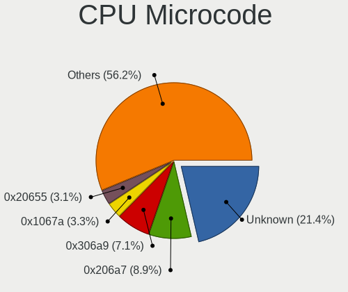
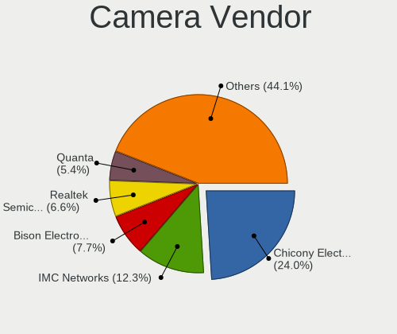

Linux in Russia - Tested Hardware & Statistics (Notebooks)
----------------------------------------------------------

A project to collect tested hardware configurations for Linux in Russia.

Anyone can contribute to this report by the [hw-probe](https://github.com/linuxhw/hw-probe) tool:

    sudo -E hw-probe -all -upload

Please contribute! Especially if your hardware is rare.

Contents
--------

* [ Test Cases ](#test-cases)

* [ System ](#system)
  - [ OS                       ](#os)
  - [ OS Family                ](#os-family)
  - [ Kernel                   ](#kernel)
  - [ Kernel Family            ](#kernel-family)
  - [ Kernel Major Ver.        ](#kernel-major-ver)
  - [ Arch                     ](#arch)
  - [ DE                       ](#de)
  - [ Display Server           ](#display-server)
  - [ Display Manager          ](#display-manager)
  - [ OS Lang                  ](#os-lang)
  - [ Boot Mode                ](#boot-mode)
  - [ Filesystem               ](#filesystem)
  - [ Part. scheme             ](#part-scheme)
  - [ Dual Boot with Linux/BSD ](#dual-boot-with-linuxbsd)
  - [ Dual Boot (Win)          ](#dual-boot-win)

* [ Board ](#board)
  - [ Vendor                   ](#vendor)
  - [ Model                    ](#model)
  - [ Model Family             ](#model-family)
  - [ MFG Year                 ](#mfg-year)
  - [ Form Factor              ](#form-factor)
  - [ Secure Boot              ](#secure-boot)
  - [ Coreboot                 ](#coreboot)
  - [ RAM Size                 ](#ram-size)
  - [ RAM Used                 ](#ram-used)
  - [ Total Drives             ](#total-drives)
  - [ Has CD-ROM               ](#has-cd-rom)
  - [ Has Ethernet             ](#has-ethernet)
  - [ Has WiFi                 ](#has-wifi)
  - [ Has Bluetooth            ](#has-bluetooth)

* [ Location ](#location)
  - [ Country                  ](#country)
  - [ City                     ](#city)

* [ Drives ](#drives)
  - [ Drive Vendor             ](#drive-vendor)
  - [ Drive Model              ](#drive-model)
  - [ HDD Vendor               ](#hdd-vendor)
  - [ SSD Vendor               ](#ssd-vendor)
  - [ Drive Kind               ](#drive-kind)
  - [ Drive Connector          ](#drive-connector)
  - [ Drive Size               ](#drive-size)
  - [ Space Total              ](#space-total)
  - [ Space Used               ](#space-used)
  - [ Malfunc. Drives          ](#malfunc-drives)
  - [ Malfunc. Drive Vendor    ](#malfunc-drive-vendor)
  - [ Malfunc. HDD Vendor      ](#malfunc-hdd-vendor)
  - [ Malfunc. Drive Kind      ](#malfunc-drive-kind)
  - [ Failed Drives            ](#failed-drives)
  - [ Failed Drive Vendor      ](#failed-drive-vendor)
  - [ Drive Status             ](#drive-status)

* [ Storage controller ](#storage-controller)
  - [ Storage Vendor           ](#storage-vendor)
  - [ Storage Model            ](#storage-model)
  - [ Storage Kind             ](#storage-kind)

* [ Processor ](#processor)
  - [ CPU Vendor               ](#cpu-vendor)
  - [ CPU Model                ](#cpu-model)
  - [ CPU Model Family         ](#cpu-model-family)
  - [ CPU Cores                ](#cpu-cores)
  - [ CPU Sockets              ](#cpu-sockets)
  - [ CPU Threads              ](#cpu-threads)
  - [ CPU Op-Modes             ](#cpu-op-modes)
  - [ CPU Microcode            ](#cpu-microcode)
  - [ CPU Microarch            ](#cpu-microarch)

* [ Graphics ](#graphics)
  - [ GPU Vendor               ](#gpu-vendor)
  - [ GPU Model                ](#gpu-model)
  - [ GPU Combo                ](#gpu-combo)
  - [ GPU Driver               ](#gpu-driver)
  - [ GPU Memory               ](#gpu-memory)

* [ Monitor ](#monitor)
  - [ Monitor Vendor           ](#monitor-vendor)
  - [ Monitor Model            ](#monitor-model)
  - [ Monitor Resolution       ](#monitor-resolution)
  - [ Monitor Diagonal         ](#monitor-diagonal)
  - [ Monitor Width            ](#monitor-width)
  - [ Aspect Ratio             ](#aspect-ratio)
  - [ Monitor Area             ](#monitor-area)
  - [ Pixel Density            ](#pixel-density)
  - [ Multiple Monitors        ](#multiple-monitors)

* [ Network ](#network)
  - [ Net Controller Vendor    ](#net-controller-vendor)
  - [ Net Controller Model     ](#net-controller-model)
  - [ Wireless Vendor          ](#wireless-vendor)
  - [ Wireless Model           ](#wireless-model)
  - [ Ethernet Vendor          ](#ethernet-vendor)
  - [ Ethernet Model           ](#ethernet-model)
  - [ Net Controller Kind      ](#net-controller-kind)
  - [ Used Controller          ](#used-controller)
  - [ NICs                     ](#nics)
  - [ IPv6                     ](#ipv6)

* [ Bluetooth ](#bluetooth)
  - [ Bluetooth Vendor         ](#bluetooth-vendor)
  - [ Bluetooth Model          ](#bluetooth-model)

* [ Sound ](#sound)
  - [ Sound Vendor             ](#sound-vendor)
  - [ Sound Model              ](#sound-model)

* [ Memory ](#memory)
  - [ Memory Vendor            ](#memory-vendor)
  - [ Memory Model             ](#memory-model)
  - [ Memory Kind              ](#memory-kind)
  - [ Memory Form Factor       ](#memory-form-factor)
  - [ Memory Size              ](#memory-size)
  - [ Memory Speed             ](#memory-speed)

* [ Printers & scanners ](#printers--scanners)
  - [ Printer Vendor           ](#printer-vendor)
  - [ Printer Model            ](#printer-model)
  - [ Scanner Vendor           ](#scanner-vendor)
  - [ Scanner Model            ](#scanner-model)

* [ Camera ](#camera)
  - [ Camera Vendor            ](#camera-vendor)
  - [ Camera Model             ](#camera-model)

* [ Security ](#security)
  - [ Fingerprint Vendor       ](#fingerprint-vendor)
  - [ Fingerprint Model        ](#fingerprint-model)
  - [ Chipcard Vendor          ](#chipcard-vendor)
  - [ Chipcard Model           ](#chipcard-model)

* [ Unsupported ](#unsupported)
  - [ Unsupported Devices      ](#unsupported-devices)
  - [ Unsupported Device Types ](#unsupported-device-types)

Test Cases
----------

Total: 15971

| Vendor        | Model                       | Probe                                                      | Date         |
|---------------|-----------------------------|------------------------------------------------------------|--------------|
| Dell          | 500                         | [83c01aa11f](https://linux-hardware.org/?probe=83c01aa11f) | Oct 01, 2022 |
| Acer          | Aspire A715-41G             | [1a473e9809](https://linux-hardware.org/?probe=1a473e9809) | Oct 01, 2022 |
| HUAWEI        | HN-WX9X                     | [4168f641b5](https://linux-hardware.org/?probe=4168f641b5) | Oct 01, 2022 |
| HP            | 650                         | [162893e9ad](https://linux-hardware.org/?probe=162893e9ad) | Oct 01, 2022 |
| Lenovo        | G770 20089                  | [e06e588d62](https://linux-hardware.org/?probe=e06e588d62) | Oct 01, 2022 |
| ASUSTek       | F5V                         | [463cd15493](https://linux-hardware.org/?probe=463cd15493) | Oct 01, 2022 |
| Dell          | Inspiron 5737               | [14113affa1](https://linux-hardware.org/?probe=14113affa1) | Oct 01, 2022 |
| Dell          | Inspiron 5737               | [6893292144](https://linux-hardware.org/?probe=6893292144) | Oct 01, 2022 |
| Acer          | Aspire 5750G                | [8e87575f75](https://linux-hardware.org/?probe=8e87575f75) | Oct 01, 2022 |
| Acer          | Aspire A315-55G             | [77605e313d](https://linux-hardware.org/?probe=77605e313d) | Oct 01, 2022 |
| ASUSTek       | VivoBook_ASUSLaptop X340... | [d5407763a0](https://linux-hardware.org/?probe=d5407763a0) | Sep 30, 2022 |
| GPD           | G1621-02                    | [6ae9fc596e](https://linux-hardware.org/?probe=6ae9fc596e) | Sep 30, 2022 |
| Irbis         | NB121                       | [a2eb8c8af1](https://linux-hardware.org/?probe=a2eb8c8af1) | Sep 30, 2022 |
| Acer          | Extensa 4220                | [c35a0a579a](https://linux-hardware.org/?probe=c35a0a579a) | Sep 30, 2022 |
| Irbis         | NB121                       | [90a0ae1cf9](https://linux-hardware.org/?probe=90a0ae1cf9) | Sep 30, 2022 |
| THUNDEROBO... | 911AirD                     | [448f04d201](https://linux-hardware.org/?probe=448f04d201) | Sep 30, 2022 |
| Lenovo        | G460 20041                  | [130c0489f9](https://linux-hardware.org/?probe=130c0489f9) | Sep 30, 2022 |
| Digma         | EVE 11 C408                 | [b5c7ac8ed3](https://linux-hardware.org/?probe=b5c7ac8ed3) | Sep 30, 2022 |
| HP            | Pavilion dv7                | [4d54db9389](https://linux-hardware.org/?probe=4d54db9389) | Sep 30, 2022 |
| Acer          | Aspire A514-54              | [b8b0da1194](https://linux-hardware.org/?probe=b8b0da1194) | Sep 30, 2022 |
| Lenovo        | IdeaPad S145-15API 81UT     | [9ccd242ca4](https://linux-hardware.org/?probe=9ccd242ca4) | Sep 30, 2022 |
| Lenovo        | G580 20150                  | [d057161e9d](https://linux-hardware.org/?probe=d057161e9d) | Sep 30, 2022 |
| Lenovo        | ThinkPad L380 20M5SSIN11    | [0cad79b1f7](https://linux-hardware.org/?probe=0cad79b1f7) | Sep 30, 2022 |
| Irbis         | NB61 WS001                  | [3fda78e356](https://linux-hardware.org/?probe=3fda78e356) | Sep 29, 2022 |
| THUNDEROBO... | 911AirD                     | [99f1b7e253](https://linux-hardware.org/?probe=99f1b7e253) | Sep 29, 2022 |
| Acer          | Aspire 5741G                | [837c4599cc](https://linux-hardware.org/?probe=837c4599cc) | Sep 29, 2022 |
| Dell          | Latitude 3410               | [0f7ad40255](https://linux-hardware.org/?probe=0f7ad40255) | Sep 29, 2022 |
| Lenovo        | Legion 5 17ACH6 82K0        | [18afdc2116](https://linux-hardware.org/?probe=18afdc2116) | Sep 29, 2022 |
| Lenovo        | IdeaPad L340-17IRH Gamin... | [f2f9ccf12b](https://linux-hardware.org/?probe=f2f9ccf12b) | Sep 29, 2022 |
| HP            | Laptop 15-db0xxx            | [8f42666f03](https://linux-hardware.org/?probe=8f42666f03) | Sep 29, 2022 |
| Acer          | AOD257                      | [87b7501836](https://linux-hardware.org/?probe=87b7501836) | Sep 29, 2022 |
| Fujitsu       | LIFEBOOK P771               | [7325511d27](https://linux-hardware.org/?probe=7325511d27) | Sep 29, 2022 |
| ASUSTek       | N53SV                       | [6652e85ddd](https://linux-hardware.org/?probe=6652e85ddd) | Sep 29, 2022 |
| HUAWEI        | KLVD-WXX9                   | [72d80e02c9](https://linux-hardware.org/?probe=72d80e02c9) | Sep 29, 2022 |
| HUAWEI        | KLVD-WXX9                   | [47b22afda2](https://linux-hardware.org/?probe=47b22afda2) | Sep 29, 2022 |
| ASUSTek       | TUF Gaming FX504GE_FX80G... | [4a8bc2a5e5](https://linux-hardware.org/?probe=4a8bc2a5e5) | Sep 28, 2022 |
| Acer          | Aspire A715-42G             | [44d8521e1d](https://linux-hardware.org/?probe=44d8521e1d) | Sep 28, 2022 |
| Acer          | Aspire A715-42G             | [ecbc8d9288](https://linux-hardware.org/?probe=ecbc8d9288) | Sep 28, 2022 |
| 3Logic Gro... | Graviton N15i-K2            | [6ce327114c](https://linux-hardware.org/?probe=6ce327114c) | Sep 28, 2022 |
| Lenovo        | ThinkPad T420 4236WS7       | [ca9c7bf57b](https://linux-hardware.org/?probe=ca9c7bf57b) | Sep 28, 2022 |
| HUAWEI        | NBLK-WAX9X                  | [f501591d1b](https://linux-hardware.org/?probe=f501591d1b) | Sep 27, 2022 |
| HUAWEI        | NBD-WXX9                    | [c1c976ba69](https://linux-hardware.org/?probe=c1c976ba69) | Sep 27, 2022 |
| HONOR         | HGE-WX6                     | [5c61df4d20](https://linux-hardware.org/?probe=5c61df4d20) | Sep 27, 2022 |
| Sony          | VPCEH1S1R                   | [5214bb023f](https://linux-hardware.org/?probe=5214bb023f) | Sep 27, 2022 |
| Unknown       | Apple MacBook Air (M1, 2... | [02c65b393f](https://linux-hardware.org/?probe=02c65b393f) | Sep 27, 2022 |
| Lenovo        | IdeaPad 310-15IAP 80TT      | [65f896ddab](https://linux-hardware.org/?probe=65f896ddab) | Sep 27, 2022 |
| Acer          | Aspire A515-45G             | [0e8bdd2e37](https://linux-hardware.org/?probe=0e8bdd2e37) | Sep 27, 2022 |
| Samsung       | R530/R730                   | [e6168a9f1a](https://linux-hardware.org/?probe=e6168a9f1a) | Sep 27, 2022 |
| ASUSTek       | ASUSPRO P3540FA_P3540FA     | [bb1530a50e](https://linux-hardware.org/?probe=bb1530a50e) | Sep 27, 2022 |
| Lenovo        | IdeaPad 5 15ARE05 81YQ      | [3d86bcf1b7](https://linux-hardware.org/?probe=3d86bcf1b7) | Sep 27, 2022 |
| Lenovo        | IdeaPad Z580                | [a33ab40c8b](https://linux-hardware.org/?probe=a33ab40c8b) | Sep 27, 2022 |
| Lenovo        | IdeaPad S340-15IML 81NA     | [03d36518de](https://linux-hardware.org/?probe=03d36518de) | Sep 27, 2022 |
| HUAWEI        | NBLB-WAX9N                  | [3acb168799](https://linux-hardware.org/?probe=3acb168799) | Sep 26, 2022 |
| HUAWEI        | NBLB-WAX9N                  | [fd7e096a4b](https://linux-hardware.org/?probe=fd7e096a4b) | Sep 26, 2022 |
| HP            | Unknown                     | [e8906c977c](https://linux-hardware.org/?probe=e8906c977c) | Sep 26, 2022 |
| Lenovo        | IdeaPad 330-15IKB 81DC      | [95c0fd6047](https://linux-hardware.org/?probe=95c0fd6047) | Sep 26, 2022 |
| Lenovo        | ThinkPad T14 Gen 3 21AHA... | [bddfd15906](https://linux-hardware.org/?probe=bddfd15906) | Sep 26, 2022 |
| HP            | Laptop 17-cp0xxx            | [fa6a915235](https://linux-hardware.org/?probe=fa6a915235) | Sep 26, 2022 |
| Lenovo        | ThinkBook 16p Gen 2 20YM    | [efcbc52fcd](https://linux-hardware.org/?probe=efcbc52fcd) | Sep 25, 2022 |
| MSI           | GL65 Leopard 10SCSR         | [d1b60d3f52](https://linux-hardware.org/?probe=d1b60d3f52) | Sep 25, 2022 |
| Lenovo        | Legion Y-540-17IRH-PG0 8... | [29c967b4ec](https://linux-hardware.org/?probe=29c967b4ec) | Sep 25, 2022 |
| ASUSTek       | N45SF                       | [7461bd2562](https://linux-hardware.org/?probe=7461bd2562) | Sep 25, 2022 |
| MSI           | GL65 Leopard 10SCSR         | [1487715bc7](https://linux-hardware.org/?probe=1487715bc7) | Sep 25, 2022 |
| Lenovo        | IdeaPad Y700-15ACZ 80NY     | [b47b842550](https://linux-hardware.org/?probe=b47b842550) | Sep 25, 2022 |
| Unknown       | Unknown                     | [d5d8bdbf34](https://linux-hardware.org/?probe=d5d8bdbf34) | Sep 25, 2022 |
| Acer          | AO722                       | [f2c6378873](https://linux-hardware.org/?probe=f2c6378873) | Sep 25, 2022 |
| ASUSTek       | ZenBook UX325EA_UX325EA     | [2854d30785](https://linux-hardware.org/?probe=2854d30785) | Sep 25, 2022 |
| HP            | Pavilion g6                 | [915b5a320a](https://linux-hardware.org/?probe=915b5a320a) | Sep 25, 2022 |
| Lenovo        | ThinkBook 16p Gen 2 20YM    | [436bfa4c50](https://linux-hardware.org/?probe=436bfa4c50) | Sep 25, 2022 |
| HP            | 250 G5 Notebook PC          | [6c6ae30eba](https://linux-hardware.org/?probe=6c6ae30eba) | Sep 24, 2022 |
| HP            | Pavilion g6                 | [2c685dca1c](https://linux-hardware.org/?probe=2c685dca1c) | Sep 24, 2022 |
| Lenovo        | ThinkPad T420 4236WS7       | [23f425e425](https://linux-hardware.org/?probe=23f425e425) | Sep 24, 2022 |
| Lenovo        | ThinkPad T420 4236WS7       | [f3527878e5](https://linux-hardware.org/?probe=f3527878e5) | Sep 24, 2022 |
| Toshiba       | Satellite A300              | [3f6203e550](https://linux-hardware.org/?probe=3f6203e550) | Sep 24, 2022 |
| Matsushita... | CF-29LTQGZBM                | [29f52f862c](https://linux-hardware.org/?probe=29f52f862c) | Sep 24, 2022 |
| Samsung       | R540/R580/R780/SA41/E452    | [fe4a71500c](https://linux-hardware.org/?probe=fe4a71500c) | Sep 24, 2022 |
| Lenovo        | ThinkBook 16p Gen 2 20YM    | [bf6e11dcf3](https://linux-hardware.org/?probe=bf6e11dcf3) | Sep 24, 2022 |
| HP            | Laptop 15-bw0xx             | [ea756ff16b](https://linux-hardware.org/?probe=ea756ff16b) | Sep 24, 2022 |
| HP            | Laptop 15s-eq1xxx           | [2bc6e102ef](https://linux-hardware.org/?probe=2bc6e102ef) | Sep 24, 2022 |
| ASUSTek       | X541NC                      | [226d4d741d](https://linux-hardware.org/?probe=226d4d741d) | Sep 24, 2022 |
| Acer          | Aspire 5253G                | [098f7ee3ed](https://linux-hardware.org/?probe=098f7ee3ed) | Sep 24, 2022 |
| Toshiba       | Satellite C660              | [2ab739cddb](https://linux-hardware.org/?probe=2ab739cddb) | Sep 23, 2022 |
| MECHREVO      | Jiaolong Series GM5ZG0O     | [077c05c78d](https://linux-hardware.org/?probe=077c05c78d) | Sep 23, 2022 |
| Lenovo        | ThinkPad P52s 20LCS03L38    | [5d9c8cd268](https://linux-hardware.org/?probe=5d9c8cd268) | Sep 23, 2022 |
| ICL           | NLx0MU                      | [d8e7f39201](https://linux-hardware.org/?probe=d8e7f39201) | Sep 23, 2022 |
| Clevo         | NL41MU2                     | [226bbaa11e](https://linux-hardware.org/?probe=226bbaa11e) | Sep 23, 2022 |
| MECHREVO      | Jiaolong Series GM5ZG0O     | [d0dacface7](https://linux-hardware.org/?probe=d0dacface7) | Sep 23, 2022 |
| HONOR         | HGE-WX6                     | [337c1097ef](https://linux-hardware.org/?probe=337c1097ef) | Sep 23, 2022 |
| Acer          | Aspire 5733Z                | [c22d27a781](https://linux-hardware.org/?probe=c22d27a781) | Sep 23, 2022 |
| ASUSTek       | X550EA                      | [256620a993](https://linux-hardware.org/?probe=256620a993) | Sep 23, 2022 |
| Lenovo        | ThinkPad T420 4236WS7       | [c9457ee571](https://linux-hardware.org/?probe=c9457ee571) | Sep 23, 2022 |
| ASUSTek       | VivoBook_ASUSLaptop X512... | [6a0c80f635](https://linux-hardware.org/?probe=6a0c80f635) | Sep 22, 2022 |
| Lenovo        | ThinkPad T420 4236WS7       | [412296c83f](https://linux-hardware.org/?probe=412296c83f) | Sep 22, 2022 |
| Lenovo        | IdeaPad 3 14ALC6 82KT       | [2b37d81d4c](https://linux-hardware.org/?probe=2b37d81d4c) | Sep 22, 2022 |
| Lenovo        | ThinkPad T420 4236WS7       | [21ba0d8f46](https://linux-hardware.org/?probe=21ba0d8f46) | Sep 22, 2022 |
| Lenovo        | ThinkPad X220 4291G26       | [33654dfbfa](https://linux-hardware.org/?probe=33654dfbfa) | Sep 22, 2022 |
| Lenovo        | ThinkPad T420 4236WS7       | [0c4627555a](https://linux-hardware.org/?probe=0c4627555a) | Sep 22, 2022 |
| Haier         | GG1560XT                    | [fbdbeb0e82](https://linux-hardware.org/?probe=fbdbeb0e82) | Sep 22, 2022 |
| Acer          | Aspire A315-51              | [29e3f57ef9](https://linux-hardware.org/?probe=29e3f57ef9) | Sep 22, 2022 |
| Acer          | Nitro AN515-31              | [9b451feb14](https://linux-hardware.org/?probe=9b451feb14) | Sep 22, 2022 |
| Dell          | Inspiron 5547               | [e3a9b82c15](https://linux-hardware.org/?probe=e3a9b82c15) | Sep 22, 2022 |
| ASUSTek       | X550LC                      | [03f4677430](https://linux-hardware.org/?probe=03f4677430) | Sep 22, 2022 |
| ASUSTek       | K50IJ                       | [a0d9805cbb](https://linux-hardware.org/?probe=a0d9805cbb) | Sep 22, 2022 |
| Unknown       | Unknown                     | [a3dbfe1076](https://linux-hardware.org/?probe=a3dbfe1076) | Sep 22, 2022 |
| Lenovo        | ThinkPad L13 20R3000CRT     | [cec261f5e2](https://linux-hardware.org/?probe=cec261f5e2) | Sep 22, 2022 |
| ASUSTek       | K53E                        | [dc270d21ac](https://linux-hardware.org/?probe=dc270d21ac) | Sep 22, 2022 |
| ASUSTek       | K70AD                       | [49dff3ffb5](https://linux-hardware.org/?probe=49dff3ffb5) | Sep 22, 2022 |
| MSI           | Katana GF66 11UE            | [b418d015a6](https://linux-hardware.org/?probe=b418d015a6) | Sep 22, 2022 |
| HONOR         | HLYL-WXX9                   | [1da06fd0ba](https://linux-hardware.org/?probe=1da06fd0ba) | Sep 21, 2022 |
| HP            | 255 G8 Notebook PC          | [20691b389b](https://linux-hardware.org/?probe=20691b389b) | Sep 21, 2022 |
| DEXP          | Notebook                    | [2caa8c0be4](https://linux-hardware.org/?probe=2caa8c0be4) | Sep 21, 2022 |
| Haier         | GG1560XT                    | [85cb227779](https://linux-hardware.org/?probe=85cb227779) | Sep 21, 2022 |
| Lenovo        | ThinkPad E14 Gen 3 20Y70... | [52bb32a60c](https://linux-hardware.org/?probe=52bb32a60c) | Sep 21, 2022 |
| Acer          | Aspire A315-23              | [204980d2bd](https://linux-hardware.org/?probe=204980d2bd) | Sep 21, 2022 |
| ASUSTek       | X550LC                      | [018ca85503](https://linux-hardware.org/?probe=018ca85503) | Sep 21, 2022 |
| ICL           | RAYbook Si1512              | [0b610b66a9](https://linux-hardware.org/?probe=0b610b66a9) | Sep 20, 2022 |
| Lenovo        | ThinkBook 15-IIL 20SM       | [824c786d4b](https://linux-hardware.org/?probe=824c786d4b) | Sep 20, 2022 |
| ASUSTek       | K50IJ                       | [3662255ac7](https://linux-hardware.org/?probe=3662255ac7) | Sep 20, 2022 |
| ASUSTek       | BU401LG                     | [12d87b6cad](https://linux-hardware.org/?probe=12d87b6cad) | Sep 20, 2022 |
| Lenovo        | IdeaPad 110-15ACL 80TJ      | [1db8da5821](https://linux-hardware.org/?probe=1db8da5821) | Sep 20, 2022 |
| HP            | Pavilion g6                 | [930de8d94d](https://linux-hardware.org/?probe=930de8d94d) | Sep 20, 2022 |
| ASUSTek       | X550LC                      | [3683e3fd1b](https://linux-hardware.org/?probe=3683e3fd1b) | Sep 20, 2022 |
| HP            | EliteBook 830 G5            | [5d6c1cd007](https://linux-hardware.org/?probe=5d6c1cd007) | Sep 20, 2022 |
| Dell          | Inspiron 3542               | [7f7ef47d4b](https://linux-hardware.org/?probe=7f7ef47d4b) | Sep 20, 2022 |
| Intel         | ChiefRiver Platform         | [87cff551c8](https://linux-hardware.org/?probe=87cff551c8) | Sep 20, 2022 |
| Intel         | ChiefRiver Platform         | [ffaa34d0c1](https://linux-hardware.org/?probe=ffaa34d0c1) | Sep 20, 2022 |
| Lenovo        | IdeaPad 5 15ARE05 81YQ      | [21617c5cff](https://linux-hardware.org/?probe=21617c5cff) | Sep 20, 2022 |
| Lenovo        | IdeaPad 5 15ARE05 81YQ      | [9d85bdedd3](https://linux-hardware.org/?probe=9d85bdedd3) | Sep 20, 2022 |
| Durabook      | R11AH                       | [73847e89cd](https://linux-hardware.org/?probe=73847e89cd) | Sep 20, 2022 |
| Lenovo        | ThinkPad T420 4180PBG       | [857b2acef0](https://linux-hardware.org/?probe=857b2acef0) | Sep 20, 2022 |
| Acer          | Nitro AN515-54              | [d927d512ed](https://linux-hardware.org/?probe=d927d512ed) | Sep 20, 2022 |
| Acer          | Aspire 5750G                | [e32fb86913](https://linux-hardware.org/?probe=e32fb86913) | Sep 19, 2022 |
| HP            | ProBook 5330m               | [659bc725a3](https://linux-hardware.org/?probe=659bc725a3) | Sep 19, 2022 |
| HP            | EliteBook 840 G4            | [32b16880e2](https://linux-hardware.org/?probe=32b16880e2) | Sep 19, 2022 |
| ASUSTek       | X550MJ                      | [8b3130c363](https://linux-hardware.org/?probe=8b3130c363) | Sep 19, 2022 |
| Lenovo        | Legion 5 Pro 16ITH6H 82J... | [bed329dab4](https://linux-hardware.org/?probe=bed329dab4) | Sep 19, 2022 |
| ASUSTek       | T100TAM                     | [65a37e4802](https://linux-hardware.org/?probe=65a37e4802) | Sep 19, 2022 |
| Acer          | Nitro AN515-31              | [33e582251a](https://linux-hardware.org/?probe=33e582251a) | Sep 19, 2022 |
| HONOR         | HLYL-WXX9                   | [1f91c596f5](https://linux-hardware.org/?probe=1f91c596f5) | Sep 19, 2022 |
| HUAWEI        | NBLB-WAX9N                  | [0f049ae5d6](https://linux-hardware.org/?probe=0f049ae5d6) | Sep 19, 2022 |
| Acer          | Nitro AN515-42              | [97e2956728](https://linux-hardware.org/?probe=97e2956728) | Sep 19, 2022 |
| Timi          | Redmi Book Pro 15 2022      | [1cbec0f70e](https://linux-hardware.org/?probe=1cbec0f70e) | Sep 19, 2022 |
| Dell          | Inspiron 7577               | [fe5d00b2c8](https://linux-hardware.org/?probe=fe5d00b2c8) | Sep 19, 2022 |
| Aquarius      | NS685U R11                  | [f1f88e57c5](https://linux-hardware.org/?probe=f1f88e57c5) | Sep 19, 2022 |
| Lenovo        | Yoga Slim 7 Pro 14ACH5 8... | [3862ccf53f](https://linux-hardware.org/?probe=3862ccf53f) | Sep 19, 2022 |
| Samsung       | R530/R730/R540              | [3062da6263](https://linux-hardware.org/?probe=3062da6263) | Sep 19, 2022 |
| HP            | Pavilion g6                 | [4d623b8260](https://linux-hardware.org/?probe=4d623b8260) | Sep 19, 2022 |
| HP            | Laptop 15-bw0xx             | [94baca564e](https://linux-hardware.org/?probe=94baca564e) | Sep 19, 2022 |
| HP            | Notebook                    | [91f7c83215](https://linux-hardware.org/?probe=91f7c83215) | Sep 18, 2022 |
| ASUSTek       | F3Sa                        | [0950d9df40](https://linux-hardware.org/?probe=0950d9df40) | Sep 18, 2022 |
| HUAWEI        | KLVL-WXXW                   | [37b4da9922](https://linux-hardware.org/?probe=37b4da9922) | Sep 18, 2022 |
| ASUSTek       | VivoBook_ASUS Laptop E41... | [13b23fabb7](https://linux-hardware.org/?probe=13b23fabb7) | Sep 18, 2022 |
| HUAWEI        | KLVL-WXXW                   | [e0e49d51d0](https://linux-hardware.org/?probe=e0e49d51d0) | Sep 18, 2022 |
| Samsung       | R430/P430                   | [50cf13ed55](https://linux-hardware.org/?probe=50cf13ed55) | Sep 18, 2022 |
| Acer          | Ferrari 3200                | [ca5401c49c](https://linux-hardware.org/?probe=ca5401c49c) | Sep 18, 2022 |
| Samsung       | N150P/N210P/N220P           | [0dc99cefb4](https://linux-hardware.org/?probe=0dc99cefb4) | Sep 18, 2022 |
| Lenovo        | ThinkPad T580 20L9001YRT    | [7ac55602e6](https://linux-hardware.org/?probe=7ac55602e6) | Sep 18, 2022 |
| HUAWEI        | KLVL-WXXW                   | [f527016efe](https://linux-hardware.org/?probe=f527016efe) | Sep 18, 2022 |
| HUAWEI        | KLVL-WXXW                   | [812ea842dc](https://linux-hardware.org/?probe=812ea842dc) | Sep 18, 2022 |
| ASUSTek       | 1011CX                      | [4ce8b4c2fe](https://linux-hardware.org/?probe=4ce8b4c2fe) | Sep 18, 2022 |
| Acer          | Aspire S3-391               | [5aadfd37c5](https://linux-hardware.org/?probe=5aadfd37c5) | Sep 17, 2022 |
| Samsung       | 355V4C/356V4C/3445VC/354... | [bf101b4985](https://linux-hardware.org/?probe=bf101b4985) | Sep 17, 2022 |
| Lenovo        | B50-45 20388                | [d55d9fad24](https://linux-hardware.org/?probe=d55d9fad24) | Sep 17, 2022 |
| Acer          | Aspire ES1-523              | [cf05d4169b](https://linux-hardware.org/?probe=cf05d4169b) | Sep 17, 2022 |
| Acer          | Aspire S3-391               | [82a1f45915](https://linux-hardware.org/?probe=82a1f45915) | Sep 17, 2022 |
| ASUSTek       | ROG Zephyrus G14 GA401IU... | [3b0169723f](https://linux-hardware.org/?probe=3b0169723f) | Sep 17, 2022 |
| Irbis         | NB264                       | [e9361bf1c8](https://linux-hardware.org/?probe=e9361bf1c8) | Sep 17, 2022 |
| Irbis         | NB264                       | [103ca2d20b](https://linux-hardware.org/?probe=103ca2d20b) | Sep 16, 2022 |
| HP            | Pavilion g6                 | [ba360b5712](https://linux-hardware.org/?probe=ba360b5712) | Sep 16, 2022 |
| Dell          | G3 3779                     | [5c24653999](https://linux-hardware.org/?probe=5c24653999) | Sep 16, 2022 |
| HP            | Laptop 15-bs1xx             | [5529c09c5e](https://linux-hardware.org/?probe=5529c09c5e) | Sep 16, 2022 |
| Aquarius      | NS585                       | [84054aaa40](https://linux-hardware.org/?probe=84054aaa40) | Sep 16, 2022 |
| ASUSTek       | ZenBook UX481FLY_UX481FL    | [0d2d8ca471](https://linux-hardware.org/?probe=0d2d8ca471) | Sep 16, 2022 |
| Aquarius      | NS685U R11                  | [3b687d6944](https://linux-hardware.org/?probe=3b687d6944) | Sep 16, 2022 |
| Lenovo        | G505s 20255                 | [a9e525c695](https://linux-hardware.org/?probe=a9e525c695) | Sep 16, 2022 |
| Lenovo        | ThinkPad T15 Gen 2i 20W4... | [b0e6601fbf](https://linux-hardware.org/?probe=b0e6601fbf) | Sep 16, 2022 |
| Aquarius      | NS685U R11                  | [9e626224d3](https://linux-hardware.org/?probe=9e626224d3) | Sep 16, 2022 |
| Aquarius      | NS585                       | [c4ad74720a](https://linux-hardware.org/?probe=c4ad74720a) | Sep 16, 2022 |
| Aquarius      | NS585                       | [400485718e](https://linux-hardware.org/?probe=400485718e) | Sep 16, 2022 |
| MSI           | GS66 Stealth 10SE           | [de4d4f5b61](https://linux-hardware.org/?probe=de4d4f5b61) | Sep 16, 2022 |
| Aquarius      | NS585                       | [249e3f9a7c](https://linux-hardware.org/?probe=249e3f9a7c) | Sep 16, 2022 |
| Lenovo        | G505s 20255                 | [098440c05e](https://linux-hardware.org/?probe=098440c05e) | Sep 15, 2022 |
| Acer          | Aspire A717-72G             | [b0f989d584](https://linux-hardware.org/?probe=b0f989d584) | Sep 15, 2022 |
| HP            | Laptop 15s-fq1xxx           | [dc870b4e8a](https://linux-hardware.org/?probe=dc870b4e8a) | Sep 15, 2022 |
| Lenovo        | IdeaPad Gaming 3 15IMH05... | [e965de4ced](https://linux-hardware.org/?probe=e965de4ced) | Sep 15, 2022 |
| Samsung       | 350V5C/351V5C/3540VC/344... | [a49e02ebe7](https://linux-hardware.org/?probe=a49e02ebe7) | Sep 15, 2022 |
| Aquarius      | NS585                       | [e86929e9a3](https://linux-hardware.org/?probe=e86929e9a3) | Sep 15, 2022 |
| Aquarius      | NS585                       | [a1568949cd](https://linux-hardware.org/?probe=a1568949cd) | Sep 15, 2022 |
| Aquarius      | NS585                       | [feedc8a0ba](https://linux-hardware.org/?probe=feedc8a0ba) | Sep 15, 2022 |
| Aquarius      | NS585                       | [eb2906fdc5](https://linux-hardware.org/?probe=eb2906fdc5) | Sep 15, 2022 |
| Lenovo        | IdeaPad 5 Pro 16ACH6 82L... | [f632794c70](https://linux-hardware.org/?probe=f632794c70) | Sep 15, 2022 |
| Lenovo        | IdeaPad 5 Pro 16ACH6 82L... | [d99530ffd0](https://linux-hardware.org/?probe=d99530ffd0) | Sep 15, 2022 |
| Lenovo        | ThinkPad X1 Carbon 3rd 2... | [3bf32bc004](https://linux-hardware.org/?probe=3bf32bc004) | Sep 15, 2022 |
| Aquarius      | NS685U R11                  | [37cfe22203](https://linux-hardware.org/?probe=37cfe22203) | Sep 15, 2022 |
| Aquarius      | NS685U R11                  | [e8ba91b867](https://linux-hardware.org/?probe=e8ba91b867) | Sep 15, 2022 |
| Lenovo        | IdeaPad 320-15IKB 80XL      | [b731b95d0f](https://linux-hardware.org/?probe=b731b95d0f) | Sep 15, 2022 |
| HP            | Notebook                    | [65621e9bea](https://linux-hardware.org/?probe=65621e9bea) | Sep 14, 2022 |
| HUAWEI        | CREM-WXX9                   | [3b8f2c7c86](https://linux-hardware.org/?probe=3b8f2c7c86) | Sep 14, 2022 |
| HP            | G72                         | [d00cd9a9bd](https://linux-hardware.org/?probe=d00cd9a9bd) | Sep 14, 2022 |
| Lenovo        | ThinkPad X1 Nano Gen 1 2... | [930ee68921](https://linux-hardware.org/?probe=930ee68921) | Sep 14, 2022 |
| Aquarius      | NS585                       | [8fb883495e](https://linux-hardware.org/?probe=8fb883495e) | Sep 14, 2022 |
| Aquarius      | NS585                       | [2c51e9e9c2](https://linux-hardware.org/?probe=2c51e9e9c2) | Sep 14, 2022 |
| Aquarius      | NS585                       | [54a3f9eec9](https://linux-hardware.org/?probe=54a3f9eec9) | Sep 14, 2022 |
| Aquarius      | NS585                       | [3760a35f01](https://linux-hardware.org/?probe=3760a35f01) | Sep 14, 2022 |
| Aquarius      | NS585                       | [7927c44ef0](https://linux-hardware.org/?probe=7927c44ef0) | Sep 14, 2022 |
| Aquarius      | NS585                       | [eaa0e46c9f](https://linux-hardware.org/?probe=eaa0e46c9f) | Sep 14, 2022 |
| Aquarius      | NS585                       | [a904acc9e9](https://linux-hardware.org/?probe=a904acc9e9) | Sep 14, 2022 |
| Aquarius      | NS585                       | [7f883700cf](https://linux-hardware.org/?probe=7f883700cf) | Sep 14, 2022 |
| Aquarius      | NS585                       | [8ef03a6208](https://linux-hardware.org/?probe=8ef03a6208) | Sep 14, 2022 |
| Aquarius      | NS585                       | [c3f844b853](https://linux-hardware.org/?probe=c3f844b853) | Sep 14, 2022 |
| Aquarius      | NS585                       | [0a77a87395](https://linux-hardware.org/?probe=0a77a87395) | Sep 14, 2022 |
| Aquarius      | NS585                       | [344bf802ef](https://linux-hardware.org/?probe=344bf802ef) | Sep 14, 2022 |
| ASUSTek       | K54HR                       | [6be4965b4d](https://linux-hardware.org/?probe=6be4965b4d) | Sep 14, 2022 |
| Aquarius      | NS585                       | [f627c1d051](https://linux-hardware.org/?probe=f627c1d051) | Sep 14, 2022 |
| Aquarius      | NS585                       | [67eca2e394](https://linux-hardware.org/?probe=67eca2e394) | Sep 14, 2022 |
| Aquarius      | NS585                       | [8c8644f284](https://linux-hardware.org/?probe=8c8644f284) | Sep 14, 2022 |
| Aquarius      | NS585                       | [09ca233ab5](https://linux-hardware.org/?probe=09ca233ab5) | Sep 14, 2022 |
| Aquarius      | NS585                       | [df1a5c5ca1](https://linux-hardware.org/?probe=df1a5c5ca1) | Sep 14, 2022 |
| Acer          | Extensa 215-52              | [cb38a4efeb](https://linux-hardware.org/?probe=cb38a4efeb) | Sep 14, 2022 |
| Timi          | TM1612                      | [536fc04dcb](https://linux-hardware.org/?probe=536fc04dcb) | Sep 14, 2022 |
| Acer          | Extensa 215-32              | [b8665b7aed](https://linux-hardware.org/?probe=b8665b7aed) | Sep 14, 2022 |
| ASUSTek       | K54HR                       | [e65b9d439e](https://linux-hardware.org/?probe=e65b9d439e) | Sep 14, 2022 |
| HP            | Laptop 17-cp0xxx            | [8d189da7a7](https://linux-hardware.org/?probe=8d189da7a7) | Sep 14, 2022 |
| Acer          | Extensa 215-32              | [22c2adf69b](https://linux-hardware.org/?probe=22c2adf69b) | Sep 14, 2022 |
| HP            | Laptop 17-cp0xxx            | [614b601d46](https://linux-hardware.org/?probe=614b601d46) | Sep 14, 2022 |
| ASUSTek       | X555LN                      | [64b85307ec](https://linux-hardware.org/?probe=64b85307ec) | Sep 14, 2022 |
| Acer          | Nitro AN515-54              | [c36c715af7](https://linux-hardware.org/?probe=c36c715af7) | Sep 14, 2022 |
| Acer          | Aspire 5742G                | [051893f147](https://linux-hardware.org/?probe=051893f147) | Sep 13, 2022 |
| Lenovo        | Legion 5 15ACH6 82JW        | [c9df1f2514](https://linux-hardware.org/?probe=c9df1f2514) | Sep 13, 2022 |
| Lenovo        | Legion 5 15ACH6 82JW        | [b62bd233c2](https://linux-hardware.org/?probe=b62bd233c2) | Sep 13, 2022 |
| Aquarius      | NS585                       | [f76497447f](https://linux-hardware.org/?probe=f76497447f) | Sep 13, 2022 |
| Aquarius      | NS585                       | [0adf35b80f](https://linux-hardware.org/?probe=0adf35b80f) | Sep 13, 2022 |
| Aquarius      | NS585                       | [042a81998b](https://linux-hardware.org/?probe=042a81998b) | Sep 13, 2022 |
| Aquarius      | NS585                       | [e5078cd5f4](https://linux-hardware.org/?probe=e5078cd5f4) | Sep 13, 2022 |
| Aquarius      | NS585                       | [adb7dadad9](https://linux-hardware.org/?probe=adb7dadad9) | Sep 13, 2022 |
| Chuwi         | HeroBook Pro                | [aa99b0558b](https://linux-hardware.org/?probe=aa99b0558b) | Sep 13, 2022 |
| ASUSTek       | X550CC                      | [cb36241a3b](https://linux-hardware.org/?probe=cb36241a3b) | Sep 13, 2022 |
| Acer          | Nitro AN515-54              | [552b310540](https://linux-hardware.org/?probe=552b310540) | Sep 13, 2022 |
| HP            | Laptop 17-cp0xxx            | [78068a1338](https://linux-hardware.org/?probe=78068a1338) | Sep 12, 2022 |
| Lenovo        | ThinkPad P1 20MD0014RT      | [4935debbce](https://linux-hardware.org/?probe=4935debbce) | Sep 12, 2022 |
| ASUSTek       | 1005HA                      | [93ee340172](https://linux-hardware.org/?probe=93ee340172) | Sep 12, 2022 |
| Aquarius      | win10 HOME rs10             | [988e1b3035](https://linux-hardware.org/?probe=988e1b3035) | Sep 12, 2022 |
| Lenovo        | IdeaPad 100-14IBY 80MH      | [0d14398a88](https://linux-hardware.org/?probe=0d14398a88) | Sep 12, 2022 |
| ASUSTek       | F5N                         | [343f77754d](https://linux-hardware.org/?probe=343f77754d) | Sep 12, 2022 |
| HP            | Laptop 17-cp0xxx            | [4005fc56a4](https://linux-hardware.org/?probe=4005fc56a4) | Sep 12, 2022 |
| Chuwi         | HeroBook Air                | [f944581a0f](https://linux-hardware.org/?probe=f944581a0f) | Sep 12, 2022 |
| Unknown       | Unknown                     | [b686d4f2b7](https://linux-hardware.org/?probe=b686d4f2b7) | Sep 12, 2022 |
| Unknown       | Unknown                     | [5b6bbb71d1](https://linux-hardware.org/?probe=5b6bbb71d1) | Sep 12, 2022 |
| HP            | ProBook 4540s               | [1f46e342f0](https://linux-hardware.org/?probe=1f46e342f0) | Sep 12, 2022 |
| ASUSTek       | X550LC                      | [124bce938e](https://linux-hardware.org/?probe=124bce938e) | Sep 12, 2022 |
| ASUSTek       | Zenbook UX535QE_UM535QE     | [c18f89b2bb](https://linux-hardware.org/?probe=c18f89b2bb) | Sep 11, 2022 |
| Lenovo        | IdeaPad S145-15AST 81N3     | [017c9c9f8f](https://linux-hardware.org/?probe=017c9c9f8f) | Sep 11, 2022 |
| ASUSTek       | N56VJ                       | [a67b781113](https://linux-hardware.org/?probe=a67b781113) | Sep 11, 2022 |
| ASUSTek       | Zenbook UX535QE_UM535QE     | [cd49377ddf](https://linux-hardware.org/?probe=cd49377ddf) | Sep 11, 2022 |
| ASUSTek       | N56VJ                       | [c384cac71a](https://linux-hardware.org/?probe=c384cac71a) | Sep 11, 2022 |
| Gigabyte      | AORUS 17 KE4                | [d22756fbc1](https://linux-hardware.org/?probe=d22756fbc1) | Sep 11, 2022 |
| HP            | Pavilion g6                 | [15a646b1af](https://linux-hardware.org/?probe=15a646b1af) | Sep 11, 2022 |
| Lenovo        | Legion Y540-17IRH 81UJ      | [404a01ee53](https://linux-hardware.org/?probe=404a01ee53) | Sep 11, 2022 |
| HP            | Pavilion g6                 | [abeefb9863](https://linux-hardware.org/?probe=abeefb9863) | Sep 11, 2022 |
| Lenovo        | IdeaPad Y510                | [460d140033](https://linux-hardware.org/?probe=460d140033) | Sep 11, 2022 |
| HP            | Laptop 15s-eq1xxx           | [f8de7730b6](https://linux-hardware.org/?probe=f8de7730b6) | Sep 11, 2022 |
| Lenovo        | IdeaPad S12 20021,2959      | [d26f8478cf](https://linux-hardware.org/?probe=d26f8478cf) | Sep 10, 2022 |
| ASUSTek       | X705UQ                      | [8afcde5edb](https://linux-hardware.org/?probe=8afcde5edb) | Sep 10, 2022 |
| HP            | Presario CQ56               | [9ab1ac3d7d](https://linux-hardware.org/?probe=9ab1ac3d7d) | Sep 10, 2022 |
| ASUSTek       | VivoBook_ASUSLaptop X513... | [894e7133b8](https://linux-hardware.org/?probe=894e7133b8) | Sep 10, 2022 |
| ASUSTek       | VivoBook_ASUSLaptop X509... | [7d63a02b7a](https://linux-hardware.org/?probe=7d63a02b7a) | Sep 09, 2022 |
| ASUSTek       | X401A1                      | [8da7efe143](https://linux-hardware.org/?probe=8da7efe143) | Sep 09, 2022 |
| Lenovo        | G50-70 20351                | [633c0eae94](https://linux-hardware.org/?probe=633c0eae94) | Sep 09, 2022 |
| ASUSTek       | X55A                        | [3164e4194b](https://linux-hardware.org/?probe=3164e4194b) | Sep 09, 2022 |
| ASUSTek       | K53U                        | [cea2c047b6](https://linux-hardware.org/?probe=cea2c047b6) | Sep 09, 2022 |
| Acer          | TravelMate P449-G3-MG       | [25d82e82b7](https://linux-hardware.org/?probe=25d82e82b7) | Sep 09, 2022 |
| ASUSTek       | ASUS TUF Gaming A15 FA50... | [4d3543d03f](https://linux-hardware.org/?probe=4d3543d03f) | Sep 09, 2022 |
| Lenovo        | IdeaPad L340-15API 81LW     | [713797403a](https://linux-hardware.org/?probe=713797403a) | Sep 09, 2022 |
| Apple         | MacBookPro9,2               | [9f2534b22e](https://linux-hardware.org/?probe=9f2534b22e) | Sep 09, 2022 |
| HP            | ProBook 445 G7              | [0bff612c28](https://linux-hardware.org/?probe=0bff612c28) | Sep 09, 2022 |
| Dell          | Inspiron N5110              | [6743b005a2](https://linux-hardware.org/?probe=6743b005a2) | Sep 09, 2022 |
| Acer          | Aspire 5742G                | [64789ba939](https://linux-hardware.org/?probe=64789ba939) | Sep 08, 2022 |
| HP            | OMEN Laptop 15-en1xxx       | [02df23c9c4](https://linux-hardware.org/?probe=02df23c9c4) | Sep 08, 2022 |
| Lenovo        | ThinkBook 15 G3 ACL 21A4    | [8242cc3cab](https://linux-hardware.org/?probe=8242cc3cab) | Sep 08, 2022 |
| Lenovo        | IdeaPad 320-15IKB 80XL      | [65ef8d235d](https://linux-hardware.org/?probe=65ef8d235d) | Sep 08, 2022 |
| Acer          | Aspire 7530G                | [c60f3942b7](https://linux-hardware.org/?probe=c60f3942b7) | Sep 08, 2022 |
| Dell          | Inspiron 3521               | [684eb65731](https://linux-hardware.org/?probe=684eb65731) | Sep 08, 2022 |
| Aquarius      | win10 HOME rs10             | [6d31915653](https://linux-hardware.org/?probe=6d31915653) | Sep 08, 2022 |
| Lenovo        | IdeaPad 320-15IKB 80XL      | [74be767838](https://linux-hardware.org/?probe=74be767838) | Sep 08, 2022 |
| Lenovo        | ThinkPad E14 Gen 3 20Y70... | [a5fdc97073](https://linux-hardware.org/?probe=a5fdc97073) | Sep 07, 2022 |
| Apple         | MacBook4,1                  | [dcc65ebdf1](https://linux-hardware.org/?probe=dcc65ebdf1) | Sep 07, 2022 |
| ASUSTek       | VivoBook 15_ASUS Laptop ... | [c22457dc35](https://linux-hardware.org/?probe=c22457dc35) | Sep 07, 2022 |
| Dell          | Latitude E6420              | [8885f409d8](https://linux-hardware.org/?probe=8885f409d8) | Sep 07, 2022 |
| HUAWEI        | KLVL-WXXW                   | [a90b385c8e](https://linux-hardware.org/?probe=a90b385c8e) | Sep 07, 2022 |
| HUAWEI        | KLVL-WXXW                   | [7a3494a230](https://linux-hardware.org/?probe=7a3494a230) | Sep 07, 2022 |
| Samsung       | 3570R/370R/470R/450R/510... | [cf398ae303](https://linux-hardware.org/?probe=cf398ae303) | Sep 07, 2022 |
| HP            | ProBook 430 G1              | [cca59cbb3c](https://linux-hardware.org/?probe=cca59cbb3c) | Sep 07, 2022 |
| Toshiba       | Satellite Pro L630          | [9f20969845](https://linux-hardware.org/?probe=9f20969845) | Sep 06, 2022 |
| HP            | ProBook 430 G3              | [f1b171fc10](https://linux-hardware.org/?probe=f1b171fc10) | Sep 06, 2022 |
| Acer          | TravelMate B118-M           | [614d44ff70](https://linux-hardware.org/?probe=614d44ff70) | Sep 06, 2022 |
| IP3 Techno... | ACN30                       | [af9694cea8](https://linux-hardware.org/?probe=af9694cea8) | Sep 06, 2022 |
| ASUSTek       | K53U                        | [14ba87da73](https://linux-hardware.org/?probe=14ba87da73) | Sep 06, 2022 |
| Aquarius      | NS585                       | [74e50c07d8](https://linux-hardware.org/?probe=74e50c07d8) | Sep 06, 2022 |
| ASUSTek       | X550CC                      | [ef103b9abb](https://linux-hardware.org/?probe=ef103b9abb) | Sep 06, 2022 |
| Lenovo        | ThinkPad P51s 20HB000URT    | [8214e1ba30](https://linux-hardware.org/?probe=8214e1ba30) | Sep 06, 2022 |
| ASUSTek       | X550CC                      | [264006f609](https://linux-hardware.org/?probe=264006f609) | Sep 06, 2022 |
| Samsung       | 350V5C/351V5C/3540VC/344... | [c0933e083b](https://linux-hardware.org/?probe=c0933e083b) | Sep 06, 2022 |
| HP            | Pavilion g6                 | [fe038c57a9](https://linux-hardware.org/?probe=fe038c57a9) | Sep 06, 2022 |
| Aquarius      | NS685U R11                  | [e4b0733994](https://linux-hardware.org/?probe=e4b0733994) | Sep 06, 2022 |
| Lenovo        | IdeaPad 330-15AST 81D6      | [edd9555b23](https://linux-hardware.org/?probe=edd9555b23) | Sep 06, 2022 |
| Lenovo        | B50-10 80QR                 | [983c62f244](https://linux-hardware.org/?probe=983c62f244) | Sep 05, 2022 |
| HUAWEI        | KLVL-WXXW                   | [6c104bd56f](https://linux-hardware.org/?probe=6c104bd56f) | Sep 05, 2022 |
| ASUSTek       | Zenbook UX535QE_UM535QE     | [6bd37547d3](https://linux-hardware.org/?probe=6bd37547d3) | Sep 05, 2022 |
| ASUSTek       | Zenbook UX535QE_UM535QE     | [5df6bc21c7](https://linux-hardware.org/?probe=5df6bc21c7) | Sep 05, 2022 |
| ASUSTek       | ZenBook UX325EA_UX325EA     | [3969240177](https://linux-hardware.org/?probe=3969240177) | Sep 05, 2022 |
| HP            | ProBook 650 G8 Notebook ... | [4c68e17f1a](https://linux-hardware.org/?probe=4c68e17f1a) | Sep 05, 2022 |
| ASUSTek       | K53BY                       | [efbc2be1a7](https://linux-hardware.org/?probe=efbc2be1a7) | Sep 05, 2022 |
| HUAWEI        | BOD-WXX9                    | [8391d18411](https://linux-hardware.org/?probe=8391d18411) | Sep 05, 2022 |
| HUAWEI        | KLVL-WXXW                   | [093ecc4108](https://linux-hardware.org/?probe=093ecc4108) | Sep 05, 2022 |
| HUAWEI        | BOD-WXX9                    | [aee6f1bdbb](https://linux-hardware.org/?probe=aee6f1bdbb) | Sep 05, 2022 |
| IP3 Techno... | ACN30                       | [03f14a115d](https://linux-hardware.org/?probe=03f14a115d) | Sep 05, 2022 |
| Dell          | Inspiron N4050              | [343b6df180](https://linux-hardware.org/?probe=343b6df180) | Sep 05, 2022 |
| MSI           | GP60 2OD                    | [edfcc5eb89](https://linux-hardware.org/?probe=edfcc5eb89) | Sep 05, 2022 |
| Lenovo        | ThinkPad X1 Carbon 34601... | [00e7f83f25](https://linux-hardware.org/?probe=00e7f83f25) | Sep 05, 2022 |
| ASUSTek       | Zenbook UX535QE_UM535QE     | [f85aa66b33](https://linux-hardware.org/?probe=f85aa66b33) | Sep 04, 2022 |
| Lenovo        | IdeaPad 320-15IKB 80XL      | [90f0d2a48d](https://linux-hardware.org/?probe=90f0d2a48d) | Sep 04, 2022 |
| Lenovo        | IdeaPad 330-15AST 81D6      | [b6fb5f7cf3](https://linux-hardware.org/?probe=b6fb5f7cf3) | Sep 04, 2022 |
| HP            | ProBook 455 G5              | [c8e73af546](https://linux-hardware.org/?probe=c8e73af546) | Sep 04, 2022 |
| Lenovo        | G710 20252                  | [f43077f02f](https://linux-hardware.org/?probe=f43077f02f) | Sep 04, 2022 |
| ASUSTek       | ZenBook UX325EA_UX325EA     | [c4db289b99](https://linux-hardware.org/?probe=c4db289b99) | Sep 04, 2022 |
| HP            | Presario CQ61               | [5ef0184c8e](https://linux-hardware.org/?probe=5ef0184c8e) | Sep 04, 2022 |
| Lenovo        | ThinkPad X200T 7449G6G      | [2667cd1609](https://linux-hardware.org/?probe=2667cd1609) | Sep 03, 2022 |
| MSI           | MS-N051                     | [a7ae139021](https://linux-hardware.org/?probe=a7ae139021) | Sep 03, 2022 |
| Dell          | Inspiron N5110              | [5201cd643e](https://linux-hardware.org/?probe=5201cd643e) | Sep 03, 2022 |
| MSI           | FX610                       | [a822818a58](https://linux-hardware.org/?probe=a822818a58) | Sep 03, 2022 |
| ASUSTek       | U24E                        | [2b872b7fa8](https://linux-hardware.org/?probe=2b872b7fa8) | Sep 03, 2022 |
| HP            | ProBook 455 G5              | [bb8be69e14](https://linux-hardware.org/?probe=bb8be69e14) | Sep 03, 2022 |
| ASUSTek       | K50IJ                       | [8fd7454abf](https://linux-hardware.org/?probe=8fd7454abf) | Sep 03, 2022 |
| HP            | Compaq nx7300 (RU373ES#A... | [e32e503c04](https://linux-hardware.org/?probe=e32e503c04) | Sep 03, 2022 |
| Chuwi         | LarkBook                    | [351478ee65](https://linux-hardware.org/?probe=351478ee65) | Sep 03, 2022 |
| ASUSTek       | VivoBook_ASUSLaptop X415... | [6a91fe77a0](https://linux-hardware.org/?probe=6a91fe77a0) | Sep 03, 2022 |
| Aquarius      | NS585                       | [b11a34556d](https://linux-hardware.org/?probe=b11a34556d) | Sep 03, 2022 |
| Acer          | Nitro AN515-42              | [74cdbd53f7](https://linux-hardware.org/?probe=74cdbd53f7) | Sep 03, 2022 |
| Lenovo        | G780 20138                  | [4a452f0874](https://linux-hardware.org/?probe=4a452f0874) | Sep 03, 2022 |
| Lenovo        | IdeaPad 510-15ISK 80SR      | [006c26eaa0](https://linux-hardware.org/?probe=006c26eaa0) | Sep 02, 2022 |
| HUAWEI        | KLVD-WXX9                   | [ede97805ec](https://linux-hardware.org/?probe=ede97805ec) | Sep 02, 2022 |
| Getac         | B300-X                      | [927b99c2e0](https://linux-hardware.org/?probe=927b99c2e0) | Sep 02, 2022 |
| Dell          | Inspiron 3531               | [929b1f8bf4](https://linux-hardware.org/?probe=929b1f8bf4) | Sep 02, 2022 |
| Acer          | Aspire A315-34              | [35cbd90c30](https://linux-hardware.org/?probe=35cbd90c30) | Sep 02, 2022 |
| Dell          | Inspiron 5558               | [203baa4d7f](https://linux-hardware.org/?probe=203baa4d7f) | Sep 02, 2022 |
| Aquarius      | NS585                       | [86de3c4954](https://linux-hardware.org/?probe=86de3c4954) | Sep 02, 2022 |
| HP            | Pavilion Gaming Laptop 1... | [cbab6ab08c](https://linux-hardware.org/?probe=cbab6ab08c) | Sep 02, 2022 |
| Chuwi         | HeroBook Air                | [1ac18273da](https://linux-hardware.org/?probe=1ac18273da) | Sep 02, 2022 |
| Packard Be... | DOT S                       | [b5b03f1cf7](https://linux-hardware.org/?probe=b5b03f1cf7) | Sep 01, 2022 |
| Acer          | Aspire 5742G                | [1ed15181cb](https://linux-hardware.org/?probe=1ed15181cb) | Sep 01, 2022 |
| Lenovo        | B570e HuronRiver Platfor... | [23e052db95](https://linux-hardware.org/?probe=23e052db95) | Sep 01, 2022 |
| HP            | Pavilion dv6                | [25e9e892e7](https://linux-hardware.org/?probe=25e9e892e7) | Sep 01, 2022 |
| Notebook      | W65_67SB                    | [38393a5559](https://linux-hardware.org/?probe=38393a5559) | Sep 01, 2022 |
| Lenovo        | IdeaPad 330-15AST 81D6      | [972c4cb608](https://linux-hardware.org/?probe=972c4cb608) | Sep 01, 2022 |
| ASUSTek       | VivoBook 15_ASUS Laptop ... | [57d535de2e](https://linux-hardware.org/?probe=57d535de2e) | Sep 01, 2022 |
| Lenovo        | IdeaPad 320-15IAP 80XR      | [6aba706c0c](https://linux-hardware.org/?probe=6aba706c0c) | Aug 31, 2022 |
| Lenovo        | G710 20252                  | [37b1f6e81c](https://linux-hardware.org/?probe=37b1f6e81c) | Aug 31, 2022 |
| ASUSTek       | K46CM                       | [742d7047ea](https://linux-hardware.org/?probe=742d7047ea) | Aug 31, 2022 |
| ASUSTek       | Zenbook UX535QE_UM535QE     | [0c62d097f0](https://linux-hardware.org/?probe=0c62d097f0) | Aug 31, 2022 |
| ASUSTek       | Zenbook UX535QE_UM535QE     | [7931f65300](https://linux-hardware.org/?probe=7931f65300) | Aug 31, 2022 |
| ASUSTek       | VivoBook_ASUS Laptop E51... | [b895a2ae7c](https://linux-hardware.org/?probe=b895a2ae7c) | Aug 31, 2022 |
| Lenovo        | ThinkPad X1 Carbon Gen 8... | [646afc5f72](https://linux-hardware.org/?probe=646afc5f72) | Aug 31, 2022 |
| Lenovo        | IdeaPad 330-15AST 81D6      | [f3877acbd2](https://linux-hardware.org/?probe=f3877acbd2) | Aug 31, 2022 |
| ASUSTek       | VivoBook_ASUSLaptop X512... | [3d7c0ee13d](https://linux-hardware.org/?probe=3d7c0ee13d) | Aug 30, 2022 |
| ASUSTek       | VivoBook 15_ASUS Laptop ... | [9da97f5dea](https://linux-hardware.org/?probe=9da97f5dea) | Aug 30, 2022 |
| Lenovo        | Y520-15IKBN 80WK            | [8036c3df64](https://linux-hardware.org/?probe=8036c3df64) | Aug 30, 2022 |
| HP            | Laptop 17-cp0xxx            | [62c06b8d9c](https://linux-hardware.org/?probe=62c06b8d9c) | Aug 30, 2022 |
| Dell          | G3 3579                     | [fd78a1cf65](https://linux-hardware.org/?probe=fd78a1cf65) | Aug 30, 2022 |
| Packard Be... | EasyNote LM85               | [4294f9bdaf](https://linux-hardware.org/?probe=4294f9bdaf) | Aug 30, 2022 |
| HUAWEI        | NBD-WXX9                    | [899d0fc360](https://linux-hardware.org/?probe=899d0fc360) | Aug 30, 2022 |
| ASUSTek       | Zenbook UX535QE_UM535QE     | [ca01260ab8](https://linux-hardware.org/?probe=ca01260ab8) | Aug 30, 2022 |
| ASUSTek       | VivoBook_ASUS Laptop E51... | [a2940c76f5](https://linux-hardware.org/?probe=a2940c76f5) | Aug 30, 2022 |
| Lenovo        | IdeaPad 330-15IKB 81DE      | [339b12ba13](https://linux-hardware.org/?probe=339b12ba13) | Aug 30, 2022 |
| HP            | 250 G7 Notebook PC          | [96a56c7cb9](https://linux-hardware.org/?probe=96a56c7cb9) | Aug 30, 2022 |
| Lenovo        | IdeaPad 330-15AST 81D6      | [3236ef3b00](https://linux-hardware.org/?probe=3236ef3b00) | Aug 30, 2022 |
| Acer          | Aspire V3-731               | [19d7285e0f](https://linux-hardware.org/?probe=19d7285e0f) | Aug 30, 2022 |
| Google        | Rammus                      | [cd31fc11aa](https://linux-hardware.org/?probe=cd31fc11aa) | Aug 29, 2022 |
| Sony          | VPCSB1V9R                   | [b54e74887f](https://linux-hardware.org/?probe=b54e74887f) | Aug 29, 2022 |
| HP            | Pavilion g6                 | [d127560ff3](https://linux-hardware.org/?probe=d127560ff3) | Aug 29, 2022 |
| ASUSTek       | Zenbook UX535QE_UM535QE     | [ddc175428b](https://linux-hardware.org/?probe=ddc175428b) | Aug 29, 2022 |
| Dell          | Latitude E5440              | [b0d92d186f](https://linux-hardware.org/?probe=b0d92d186f) | Aug 29, 2022 |
| ASUSTek       | X550LC                      | [3507f6f2ba](https://linux-hardware.org/?probe=3507f6f2ba) | Aug 29, 2022 |
| Dell          | Vostro 1014                 | [bf43d87a11](https://linux-hardware.org/?probe=bf43d87a11) | Aug 29, 2022 |
| ASUSTek       | X542UA                      | [0bf776cdc1](https://linux-hardware.org/?probe=0bf776cdc1) | Aug 28, 2022 |
| Samsung       | R580/R590                   | [cb30537ee4](https://linux-hardware.org/?probe=cb30537ee4) | Aug 28, 2022 |
| Acer          | Nitro AN515-42              | [a82d7c03b0](https://linux-hardware.org/?probe=a82d7c03b0) | Aug 28, 2022 |
| Lenovo        | Legion 5 Pro 16ACH6H 82J... | [6cd83991d9](https://linux-hardware.org/?probe=6cd83991d9) | Aug 28, 2022 |
| HP            | Pavilion g6                 | [709d3e19e8](https://linux-hardware.org/?probe=709d3e19e8) | Aug 28, 2022 |
| HP            | Pavilion Laptop 14-ec0xx... | [04aec7a28a](https://linux-hardware.org/?probe=04aec7a28a) | Aug 28, 2022 |
| Acer          | Aspire E5-573G              | [70ea653c9c](https://linux-hardware.org/?probe=70ea653c9c) | Aug 28, 2022 |
| Lenovo        | ThinkBook 13s-IWL 20R9      | [98bb5817f6](https://linux-hardware.org/?probe=98bb5817f6) | Aug 27, 2022 |
| HP            | Laptop 15-bw0xx             | [90fa9c15ec](https://linux-hardware.org/?probe=90fa9c15ec) | Aug 27, 2022 |
| Lenovo        | V14-ADA 82C6                | [1d3dfbba56](https://linux-hardware.org/?probe=1d3dfbba56) | Aug 27, 2022 |
| Acer          | Aspire V3-571G              | [e584bee2db](https://linux-hardware.org/?probe=e584bee2db) | Aug 27, 2022 |
| Lenovo        | V14-ADA 82C6                | [46741f4613](https://linux-hardware.org/?probe=46741f4613) | Aug 27, 2022 |
| Lenovo        | IdeaPad 330-15IGM 81D1      | [029246a642](https://linux-hardware.org/?probe=029246a642) | Aug 27, 2022 |
| Lenovo        | G50-45 80E3                 | [be9921e0e0](https://linux-hardware.org/?probe=be9921e0e0) | Aug 27, 2022 |
| Acer          | Nitro AN515-42              | [063eca4290](https://linux-hardware.org/?probe=063eca4290) | Aug 26, 2022 |
| Acer          | Nitro AN517-52              | [8732c0caef](https://linux-hardware.org/?probe=8732c0caef) | Aug 26, 2022 |
| DEPO Compu... | DPC156                      | [7c97a519fe](https://linux-hardware.org/?probe=7c97a519fe) | Aug 26, 2022 |
| ASUSTek       | K52Dr                       | [aa74e72258](https://linux-hardware.org/?probe=aa74e72258) | Aug 26, 2022 |
| Lenovo        | IdeaPad 330-15IKB 81DE      | [619be9ede9](https://linux-hardware.org/?probe=619be9ede9) | Aug 26, 2022 |
| HP            | ENVY m7                     | [cf21038fd7](https://linux-hardware.org/?probe=cf21038fd7) | Aug 26, 2022 |
| ASUSTek       | X540LJ                      | [edac754e93](https://linux-hardware.org/?probe=edac754e93) | Aug 25, 2022 |
| Google        | Kip                         | [1283f3d283](https://linux-hardware.org/?probe=1283f3d283) | Aug 25, 2022 |
| HUAWEI        | BOM-WXX9                    | [06ba6b75b4](https://linux-hardware.org/?probe=06ba6b75b4) | Aug 25, 2022 |
| Unknown       | Unknown                     | [b9616ab32f](https://linux-hardware.org/?probe=b9616ab32f) | Aug 25, 2022 |
| Unknown       | Unknown                     | [3c18cd9208](https://linux-hardware.org/?probe=3c18cd9208) | Aug 25, 2022 |
| Lenovo        | G460 20041                  | [ac9bf296d8](https://linux-hardware.org/?probe=ac9bf296d8) | Aug 25, 2022 |
| Acer          | AO533                       | [5150a8b326](https://linux-hardware.org/?probe=5150a8b326) | Aug 25, 2022 |
| HP            | Victus by Laptop 16-e0xx... | [2b52864870](https://linux-hardware.org/?probe=2b52864870) | Aug 25, 2022 |
| HP            | Pavilion 17                 | [e252f6b16e](https://linux-hardware.org/?probe=e252f6b16e) | Aug 25, 2022 |
| HP            | Pavilion dv6                | [7fd7791035](https://linux-hardware.org/?probe=7fd7791035) | Aug 24, 2022 |
| ASUSTek       | ROG Strix G513QY_G513QY     | [9e3b6f2140](https://linux-hardware.org/?probe=9e3b6f2140) | Aug 24, 2022 |
| ASUSTek       | ROG Strix G513QY_G513QY     | [15960dc164](https://linux-hardware.org/?probe=15960dc164) | Aug 24, 2022 |
| 3Logic Gro... | APM Graviton                | [03fd96a27c](https://linux-hardware.org/?probe=03fd96a27c) | Aug 24, 2022 |
| HP            | Pavilion g6                 | [4c027aa104](https://linux-hardware.org/?probe=4c027aa104) | Aug 24, 2022 |
| ASUSTek       | ROG Flow X13 GV301QE_GV3... | [b008775e13](https://linux-hardware.org/?probe=b008775e13) | Aug 24, 2022 |
| IP3 Tech      | TGLUP3                      | [a4f803f8a1](https://linux-hardware.org/?probe=a4f803f8a1) | Aug 24, 2022 |
| Samsung       | NC210/NC110                 | [8063d3ecff](https://linux-hardware.org/?probe=8063d3ecff) | Aug 24, 2022 |
| Lenovo        | IdeaPad Gaming 3 15IMH05... | [37c239f9d1](https://linux-hardware.org/?probe=37c239f9d1) | Aug 24, 2022 |
| HUAWEI        | BOD-WXX9                    | [fd6ff49314](https://linux-hardware.org/?probe=fd6ff49314) | Aug 24, 2022 |
| HP            | Laptop 15s-eq1xxx           | [a37633e1e2](https://linux-hardware.org/?probe=a37633e1e2) | Aug 24, 2022 |
| HP            | Pavilion g6                 | [96672b6762](https://linux-hardware.org/?probe=96672b6762) | Aug 24, 2022 |
| HP            | Laptop 15s-fq2xxx           | [3c37e04cf3](https://linux-hardware.org/?probe=3c37e04cf3) | Aug 24, 2022 |
| HUAWEI        | KLVD-WXX9                   | [b5dea99797](https://linux-hardware.org/?probe=b5dea99797) | Aug 24, 2022 |
| HP            | Laptop 15s-fq2xxx           | [f8213e35a4](https://linux-hardware.org/?probe=f8213e35a4) | Aug 24, 2022 |
| Lenovo        | IdeaPad 5 Pro 14ACN6 82L... | [eed44ba087](https://linux-hardware.org/?probe=eed44ba087) | Aug 24, 2022 |
| ASUSTek       | X751LD                      | [7ce95dab0a](https://linux-hardware.org/?probe=7ce95dab0a) | Aug 24, 2022 |
| Lenovo        | IdeaPad L340-15API 81LW     | [17761aa8e3](https://linux-hardware.org/?probe=17761aa8e3) | Aug 23, 2022 |
| Lenovo        | B570e HuronRiver Platfor... | [0c5ed030a3](https://linux-hardware.org/?probe=0c5ed030a3) | Aug 23, 2022 |
| HP            | EliteBook 820 G3            | [5cb6011138](https://linux-hardware.org/?probe=5cb6011138) | Aug 23, 2022 |
| HUAWEI        | BOHK-WAX9X                  | [c2f58df994](https://linux-hardware.org/?probe=c2f58df994) | Aug 22, 2022 |
| Dell          | Latitude 7390               | [0d626db6e1](https://linux-hardware.org/?probe=0d626db6e1) | Aug 22, 2022 |
| Unknown       | Unknown                     | [40c763302e](https://linux-hardware.org/?probe=40c763302e) | Aug 22, 2022 |
| ASUSTek       | VivoBook_ASUSLaptop X760... | [f1fa32b507](https://linux-hardware.org/?probe=f1fa32b507) | Aug 22, 2022 |
| Aquarius      | Cmp NS765                   | [991487a61b](https://linux-hardware.org/?probe=991487a61b) | Aug 22, 2022 |
| HP            | Laptop 17-ca0xxx            | [c956ba84ed](https://linux-hardware.org/?probe=c956ba84ed) | Aug 22, 2022 |
| Acer          | Aspire 5742G                | [546164ada0](https://linux-hardware.org/?probe=546164ada0) | Aug 22, 2022 |
| ASUSTek       | K55DR                       | [3620d3d416](https://linux-hardware.org/?probe=3620d3d416) | Aug 21, 2022 |
| Lenovo        | IdeaPad Gaming 3 15IMH05... | [0d73b91195](https://linux-hardware.org/?probe=0d73b91195) | Aug 21, 2022 |
| Lenovo        | IdeaPad 5 14ARE05 81YM      | [ada7663387](https://linux-hardware.org/?probe=ada7663387) | Aug 21, 2022 |
| HP            | Pavilion g6                 | [7e345d980f](https://linux-hardware.org/?probe=7e345d980f) | Aug 21, 2022 |
| Acer          | Aspire E1-572G              | [d3d75b83d2](https://linux-hardware.org/?probe=d3d75b83d2) | Aug 21, 2022 |
| Unknown       | Unknown                     | [57d5700736](https://linux-hardware.org/?probe=57d5700736) | Aug 21, 2022 |
| HP            | Pavilion m6                 | [54fcf9b1b4](https://linux-hardware.org/?probe=54fcf9b1b4) | Aug 21, 2022 |
| HUAWEI        | HLY-WX9XX                   | [287788013b](https://linux-hardware.org/?probe=287788013b) | Aug 21, 2022 |
| Dell          | G5 5587                     | [327f035c11](https://linux-hardware.org/?probe=327f035c11) | Aug 21, 2022 |
| Lenovo        | IdeaPad 320-15IKB 80XL      | [8ab10bdcff](https://linux-hardware.org/?probe=8ab10bdcff) | Aug 21, 2022 |
| Lenovo        | Legion Y540-15IRH 81SX      | [08d6e2e6e8](https://linux-hardware.org/?probe=08d6e2e6e8) | Aug 21, 2022 |
| HUAWEI        | BOM-WXX9                    | [53f5ad0f1e](https://linux-hardware.org/?probe=53f5ad0f1e) | Aug 20, 2022 |
| ASUSTek       | VivoBook_ASUSLaptop X415... | [342bd47a5a](https://linux-hardware.org/?probe=342bd47a5a) | Aug 20, 2022 |
| HONOR         | NBD-WXX9                    | [1fdf41de8b](https://linux-hardware.org/?probe=1fdf41de8b) | Aug 20, 2022 |
| Acer          | Aspire A315-23              | [cedbeec8c7](https://linux-hardware.org/?probe=cedbeec8c7) | Aug 20, 2022 |
| HP            | ProBook 445 G7              | [898a635cdd](https://linux-hardware.org/?probe=898a635cdd) | Aug 20, 2022 |
| HP            | Pavilion g6                 | [8d5375bd39](https://linux-hardware.org/?probe=8d5375bd39) | Aug 20, 2022 |
| HP            | ProBook 445 G7              | [28e67ea5a7](https://linux-hardware.org/?probe=28e67ea5a7) | Aug 20, 2022 |
| Samsung       | 300E4A/300E5A/300E7A        | [c460e1207e](https://linux-hardware.org/?probe=c460e1207e) | Aug 20, 2022 |
| Acer          | Aspire A517-51              | [0cff943f6b](https://linux-hardware.org/?probe=0cff943f6b) | Aug 20, 2022 |
| Lenovo        | IdeaPad Gaming 3 15IMH05... | [0008792e11](https://linux-hardware.org/?probe=0008792e11) | Aug 19, 2022 |
| Haier         | GG1560XT                    | [6498de51c5](https://linux-hardware.org/?probe=6498de51c5) | Aug 19, 2022 |
| Haier         | GG1560XT                    | [1918cb9aa0](https://linux-hardware.org/?probe=1918cb9aa0) | Aug 19, 2022 |
| ASUSTek       | GL703VD                     | [54f9d46a7d](https://linux-hardware.org/?probe=54f9d46a7d) | Aug 19, 2022 |
| ICL           | N7x0WU                      | [7b9c4ad6b1](https://linux-hardware.org/?probe=7b9c4ad6b1) | Aug 19, 2022 |
| ASUSTek       | VivoBook_ASUSLaptop M350... | [8fd948229f](https://linux-hardware.org/?probe=8fd948229f) | Aug 19, 2022 |
| Fujitsu       | LIFEBOOK UH552              | [ad8ec93f74](https://linux-hardware.org/?probe=ad8ec93f74) | Aug 19, 2022 |
| Acer          | Nitro AN517-52              | [8a1b401faa](https://linux-hardware.org/?probe=8a1b401faa) | Aug 19, 2022 |
| Samsung       | RV411/RV511/E3511/S3511/... | [b1602685e4](https://linux-hardware.org/?probe=b1602685e4) | Aug 19, 2022 |
| MSI           | GF75 Thin 10SCXR            | [b75c38c8a5](https://linux-hardware.org/?probe=b75c38c8a5) | Aug 19, 2022 |
| eMachines     | E525                        | [90d5ce71fa](https://linux-hardware.org/?probe=90d5ce71fa) | Aug 19, 2022 |
| Lenovo        | ThinkPad E14 Gen 3 20Y70... | [81be616c6b](https://linux-hardware.org/?probe=81be616c6b) | Aug 19, 2022 |
| Acer          | TravelMate B118-M           | [e35887bbe0](https://linux-hardware.org/?probe=e35887bbe0) | Aug 18, 2022 |
| Prestigio     | PSB141C01BFH                | [37e5052027](https://linux-hardware.org/?probe=37e5052027) | Aug 18, 2022 |
| IP3 Techno... | ACN30                       | [e25ed534c0](https://linux-hardware.org/?probe=e25ed534c0) | Aug 18, 2022 |
| Lenovo        | ACLUAB                      | [3dcd5fa41c](https://linux-hardware.org/?probe=3dcd5fa41c) | Aug 18, 2022 |
| ASUSTek       | X551MA                      | [7baf2d8841](https://linux-hardware.org/?probe=7baf2d8841) | Aug 18, 2022 |
| Dell          | Latitude 7390               | [d726450b55](https://linux-hardware.org/?probe=d726450b55) | Aug 18, 2022 |
| 3Logic Gro... | Graviton N15i               | [cfa6cef53d](https://linux-hardware.org/?probe=cfa6cef53d) | Aug 18, 2022 |
| HUAWEI        | MACHC-WAX9                  | [95a5dd6af3](https://linux-hardware.org/?probe=95a5dd6af3) | Aug 18, 2022 |
| HUAWEI        | MACHC-WAX9                  | [0a9d130f45](https://linux-hardware.org/?probe=0a9d130f45) | Aug 18, 2022 |
| 3Logic Gro... | Graviton N15i               | [840fa733f4](https://linux-hardware.org/?probe=840fa733f4) | Aug 18, 2022 |
| Gigabyte      | G5 GD                       | [ddea7f9305](https://linux-hardware.org/?probe=ddea7f9305) | Aug 18, 2022 |
| Lenovo        | G570 20079                  | [1dda2df118](https://linux-hardware.org/?probe=1dda2df118) | Aug 18, 2022 |
| Lenovo        | G570 20079                  | [59e3f96082](https://linux-hardware.org/?probe=59e3f96082) | Aug 18, 2022 |
| Lenovo        | B590 20206                  | [d2d8a01f80](https://linux-hardware.org/?probe=d2d8a01f80) | Aug 18, 2022 |
| HP            | ProBook 440 G4              | [7bdaf1eeed](https://linux-hardware.org/?probe=7bdaf1eeed) | Aug 18, 2022 |
| HUAWEI        | NBD-WXX9                    | [fa32705b39](https://linux-hardware.org/?probe=fa32705b39) | Aug 18, 2022 |
| Lenovo        | ThinkPad X240 20ALA0AHRT    | [cfc3d5853c](https://linux-hardware.org/?probe=cfc3d5853c) | Aug 17, 2022 |
| Lenovo        | IdeaPad 320-15IAP 80XR      | [7e5604ed7a](https://linux-hardware.org/?probe=7e5604ed7a) | Aug 17, 2022 |
| ASUSTek       | UX32A                       | [99bb55bc78](https://linux-hardware.org/?probe=99bb55bc78) | Aug 17, 2022 |
| Lenovo        | ThinkPad T440p 20AWS0VB0... | [0c8e0377e6](https://linux-hardware.org/?probe=0c8e0377e6) | Aug 17, 2022 |
| Acer          | Nitro AN515-31              | [471659ffff](https://linux-hardware.org/?probe=471659ffff) | Aug 17, 2022 |
| Apple         | MacBookAir7,2               | [1bbad39284](https://linux-hardware.org/?probe=1bbad39284) | Aug 17, 2022 |
| Lenovo        | G505 20240                  | [fa8889478b](https://linux-hardware.org/?probe=fa8889478b) | Aug 17, 2022 |
| Aquarius      | NS585                       | [db9cbd5688](https://linux-hardware.org/?probe=db9cbd5688) | Aug 17, 2022 |
| ASUSTek       | X550ZE                      | [3a9d682c2f](https://linux-hardware.org/?probe=3a9d682c2f) | Aug 16, 2022 |
| Lenovo        | Legion 5 15IMH05H 81Y6      | [5ddc6fd9fe](https://linux-hardware.org/?probe=5ddc6fd9fe) | Aug 16, 2022 |
| HP            | 255 G5 Notebook PC          | [fdeea5b020](https://linux-hardware.org/?probe=fdeea5b020) | Aug 16, 2022 |
| Acer          | AOD260                      | [f9256627d2](https://linux-hardware.org/?probe=f9256627d2) | Aug 16, 2022 |
| ASUSTek       | VivoBook_ASUSLaptop M350... | [8057f74fa1](https://linux-hardware.org/?probe=8057f74fa1) | Aug 16, 2022 |
| Pegatron      | A17                         | [18101d1b69](https://linux-hardware.org/?probe=18101d1b69) | Aug 16, 2022 |
| HP            | ProBook 440 G5              | [8a20434f89](https://linux-hardware.org/?probe=8a20434f89) | Aug 16, 2022 |
| HP            | ProBook 440 G5              | [35e10df469](https://linux-hardware.org/?probe=35e10df469) | Aug 16, 2022 |
| Acer          | Aspire R5-471T              | [6c43959b06](https://linux-hardware.org/?probe=6c43959b06) | Aug 16, 2022 |
| Acer          | Aspire R5-471T              | [0132f947db](https://linux-hardware.org/?probe=0132f947db) | Aug 16, 2022 |
| Pegatron      | A17                         | [a845e63b56](https://linux-hardware.org/?probe=a845e63b56) | Aug 16, 2022 |
| Acer          | Aspire A715-42G             | [fbeff3bff5](https://linux-hardware.org/?probe=fbeff3bff5) | Aug 16, 2022 |
| ASUSTek       | VivoBook_ASUSLaptop X415... | [b9e32d8f94](https://linux-hardware.org/?probe=b9e32d8f94) | Aug 16, 2022 |
| Sony          | VPCSB1V9R                   | [6c72559c96](https://linux-hardware.org/?probe=6c72559c96) | Aug 16, 2022 |
| Lenovo        | B570e HuronRiver Platfor... | [51cb006bb3](https://linux-hardware.org/?probe=51cb006bb3) | Aug 16, 2022 |
| Sony          | VPCSB1V9R                   | [6aee1e8e96](https://linux-hardware.org/?probe=6aee1e8e96) | Aug 15, 2022 |
| Acer          | AOD260                      | [ba32775bba](https://linux-hardware.org/?probe=ba32775bba) | Aug 15, 2022 |
| Acer          | Celadon-RN                  | [043b0c9fd7](https://linux-hardware.org/?probe=043b0c9fd7) | Aug 15, 2022 |
| Lenovo        | IdeaPad 320-15IKB 80XL      | [44af3a6839](https://linux-hardware.org/?probe=44af3a6839) | Aug 15, 2022 |
| ASUSTek       | ROG Zephyrus G14 GA401II... | [6c757dee54](https://linux-hardware.org/?probe=6c757dee54) | Aug 15, 2022 |
| Lenovo        | ThinkPad X220 4291B66       | [4e32cfa8bb](https://linux-hardware.org/?probe=4e32cfa8bb) | Aug 15, 2022 |
| HP            | Pavilion Laptop 15-eh1xx... | [4b1440875b](https://linux-hardware.org/?probe=4b1440875b) | Aug 14, 2022 |
| Lenovo        | Legion 5 17IMH05H 81Y8      | [f2e01b5017](https://linux-hardware.org/?probe=f2e01b5017) | Aug 14, 2022 |
| Timi          | TM1701                      | [f54a2ca3bc](https://linux-hardware.org/?probe=f54a2ca3bc) | Aug 14, 2022 |
| HP            | 550                         | [620939b295](https://linux-hardware.org/?probe=620939b295) | Aug 14, 2022 |
| Dell          | Inspiron 3537               | [bcd6162709](https://linux-hardware.org/?probe=bcd6162709) | Aug 14, 2022 |
| Acer          | Aspire 5680                 | [20c2c97a69](https://linux-hardware.org/?probe=20c2c97a69) | Aug 14, 2022 |
| ASUSTek       | 1215N                       | [40d99f3703](https://linux-hardware.org/?probe=40d99f3703) | Aug 14, 2022 |
| Lenovo        | ThinkBook 15 G2 ITL 20VE    | [852395ae7a](https://linux-hardware.org/?probe=852395ae7a) | Aug 14, 2022 |
| HP            | Laptop 14s-dq2xxx           | [0260df8c36](https://linux-hardware.org/?probe=0260df8c36) | Aug 14, 2022 |
| Samsung       | 355V4C/355V4X/355V5C/355... | [03089b1469](https://linux-hardware.org/?probe=03089b1469) | Aug 13, 2022 |
| Dell          | Inspiron 5520               | [6b03bfc62e](https://linux-hardware.org/?probe=6b03bfc62e) | Aug 13, 2022 |
| HUAWEI        | BOHK-WAX9X                  | [e7783dda18](https://linux-hardware.org/?probe=e7783dda18) | Aug 13, 2022 |
| Dell          | Vostro 15 3515              | [442f64dba9](https://linux-hardware.org/?probe=442f64dba9) | Aug 13, 2022 |
| Lenovo        | IdeaPad Gaming 3 15ARH05... | [4602665059](https://linux-hardware.org/?probe=4602665059) | Aug 13, 2022 |
| Dell          | Inspiron 7720               | [0435e973e0](https://linux-hardware.org/?probe=0435e973e0) | Aug 13, 2022 |
| Dell          | Precision M6600             | [7fcd14ca35](https://linux-hardware.org/?probe=7fcd14ca35) | Aug 13, 2022 |
| Alienware     | 15 R4                       | [cebfa66ddf](https://linux-hardware.org/?probe=cebfa66ddf) | Aug 13, 2022 |
| ASUSTek       | ASUSPRO P1440FAC_P1440FA    | [9351f31042](https://linux-hardware.org/?probe=9351f31042) | Aug 13, 2022 |
| HUAWEI        | HVY-WXX9                    | [1caa3886f8](https://linux-hardware.org/?probe=1caa3886f8) | Aug 12, 2022 |
| Dell          | Precision M6600             | [9c860085a8](https://linux-hardware.org/?probe=9c860085a8) | Aug 12, 2022 |
| Unknown       | Unknown                     | [84771d9750](https://linux-hardware.org/?probe=84771d9750) | Aug 12, 2022 |
| Acer          | Extensa 215-32              | [1a14e5a16b](https://linux-hardware.org/?probe=1a14e5a16b) | Aug 12, 2022 |
| Lenovo        | ThinkPad SL500 2746AA3      | [c4535a80a1](https://linux-hardware.org/?probe=c4535a80a1) | Aug 12, 2022 |
| ASUSTek       | K52Dr                       | [df4d29153d](https://linux-hardware.org/?probe=df4d29153d) | Aug 12, 2022 |
| HP            | 240 G8 Notebook PC          | [65080f426a](https://linux-hardware.org/?probe=65080f426a) | Aug 12, 2022 |
| Apple         | MacBookAir7,2               | [c38e80ade4](https://linux-hardware.org/?probe=c38e80ade4) | Aug 11, 2022 |
| HUAWEI        | CREM-WXX9                   | [dbdcafa667](https://linux-hardware.org/?probe=dbdcafa667) | Aug 11, 2022 |
| Acer          | Aspire 3820                 | [3b01398aeb](https://linux-hardware.org/?probe=3b01398aeb) | Aug 11, 2022 |
| Lenovo        | IdeaPad S340-14API 81NB     | [27e9575d4e](https://linux-hardware.org/?probe=27e9575d4e) | Aug 11, 2022 |
| Lenovo        | IdeaPad S340-14API 81NB     | [95349038bf](https://linux-hardware.org/?probe=95349038bf) | Aug 11, 2022 |
| ASUSTek       | F5N                         | [27348ad31d](https://linux-hardware.org/?probe=27348ad31d) | Aug 11, 2022 |
| Acer          | Unknown                     | [da56362a7e](https://linux-hardware.org/?probe=da56362a7e) | Aug 11, 2022 |
| MSI           | FX610                       | [60d49d467b](https://linux-hardware.org/?probe=60d49d467b) | Aug 11, 2022 |
| Dell          | Latitude 5511               | [69ebaebf95](https://linux-hardware.org/?probe=69ebaebf95) | Aug 11, 2022 |
| ASUSTek       | VivoBook_ASUSLaptop X421... | [d61320f9c5](https://linux-hardware.org/?probe=d61320f9c5) | Aug 11, 2022 |
| eMachines     | eME728                      | [951d4614b6](https://linux-hardware.org/?probe=951d4614b6) | Aug 11, 2022 |
| Acer          | Aspire 5730                 | [34e252c0e0](https://linux-hardware.org/?probe=34e252c0e0) | Aug 11, 2022 |
| Lenovo        | ThinkPad X240 20AL00BNRT    | [72139648d3](https://linux-hardware.org/?probe=72139648d3) | Aug 10, 2022 |
| Acer          | AOHAPPY2                    | [dbed059d31](https://linux-hardware.org/?probe=dbed059d31) | Aug 10, 2022 |
| Toshiba       | Satellite L300              | [b5eb0f557d](https://linux-hardware.org/?probe=b5eb0f557d) | Aug 10, 2022 |
| Acer          | Extensa 2519                | [674500aced](https://linux-hardware.org/?probe=674500aced) | Aug 10, 2022 |
| Lenovo        | IdeaPad Gaming 3 15ACH6 ... | [4f4d3ac481](https://linux-hardware.org/?probe=4f4d3ac481) | Aug 10, 2022 |
| HUAWEI        | BDZ-WXX9                    | [d3d3023a41](https://linux-hardware.org/?probe=d3d3023a41) | Aug 10, 2022 |
| Fujitsu       | LIFEBOOK UH552              | [cbcfa4fc6e](https://linux-hardware.org/?probe=cbcfa4fc6e) | Aug 10, 2022 |
| Lenovo        | IdeaPad 5 Pro 14ITL6 82L... | [f8c3a3a610](https://linux-hardware.org/?probe=f8c3a3a610) | Aug 10, 2022 |
| MSI           | Creator 15 A11UE            | [9685c95f42](https://linux-hardware.org/?probe=9685c95f42) | Aug 09, 2022 |
| Haier         | GG1560XT                    | [5b42159441](https://linux-hardware.org/?probe=5b42159441) | Aug 09, 2022 |
| ASUSTek       | ASUS TUF Gaming A15 FA50... | [d37a512899](https://linux-hardware.org/?probe=d37a512899) | Aug 09, 2022 |
| ICL           | RAYbook Si1512              | [a42c4dc65a](https://linux-hardware.org/?probe=a42c4dc65a) | Aug 09, 2022 |
| Lenovo        | ThinkPad X220 4291B66       | [e3362a3a9f](https://linux-hardware.org/?probe=e3362a3a9f) | Aug 09, 2022 |
| Lenovo        | IdeaPad S340-14API 81NB     | [8a7ce6e755](https://linux-hardware.org/?probe=8a7ce6e755) | Aug 09, 2022 |
| Acer          | Aspire ES1-522              | [bcde4c3494](https://linux-hardware.org/?probe=bcde4c3494) | Aug 08, 2022 |
| MSI           | Creator 15 A11UE            | [45702835fc](https://linux-hardware.org/?probe=45702835fc) | Aug 08, 2022 |
| HP            | Pavilion g7                 | [93adb73648](https://linux-hardware.org/?probe=93adb73648) | Aug 08, 2022 |
| Lenovo        | ThinkPad 13 2nd Gen 20J1... | [06d7313a34](https://linux-hardware.org/?probe=06d7313a34) | Aug 08, 2022 |
| HP            | 250 G8 Notebook PC          | [c4a93d7701](https://linux-hardware.org/?probe=c4a93d7701) | Aug 08, 2022 |
| Acer          | Nitro AN515-31              | [0dbab56588](https://linux-hardware.org/?probe=0dbab56588) | Aug 08, 2022 |
| ASUSTek       | X101CH                      | [07505fcd44](https://linux-hardware.org/?probe=07505fcd44) | Aug 07, 2022 |
| HP            | ProBook 440 G8 Notebook ... | [dff2dcd497](https://linux-hardware.org/?probe=dff2dcd497) | Aug 07, 2022 |
| Lenovo        | ThinkBook 14 G3 ACL 21A2    | [0aada24b1e](https://linux-hardware.org/?probe=0aada24b1e) | Aug 07, 2022 |
| HUAWEI        | CREM-WXX9                   | [409cc97b53](https://linux-hardware.org/?probe=409cc97b53) | Aug 07, 2022 |
| MSI           | Vector GP66 12UH            | [561191fa0e](https://linux-hardware.org/?probe=561191fa0e) | Aug 07, 2022 |
| Lenovo        | B570e HuronRiver Platfor... | [091037a7fb](https://linux-hardware.org/?probe=091037a7fb) | Aug 07, 2022 |
| Timi          | RedmiBook Pro 15S           | [4e36acba35](https://linux-hardware.org/?probe=4e36acba35) | Aug 07, 2022 |
| Acer          | Swift SF114-34              | [12de778ffd](https://linux-hardware.org/?probe=12de778ffd) | Aug 07, 2022 |
| Unknown       | Unknown                     | [fd8393bd6d](https://linux-hardware.org/?probe=fd8393bd6d) | Aug 07, 2022 |
| eMachines     | eM350                       | [a5e028917e](https://linux-hardware.org/?probe=a5e028917e) | Aug 06, 2022 |
| ASUSTek       | F5N                         | [82b1172101](https://linux-hardware.org/?probe=82b1172101) | Aug 06, 2022 |
| Dell          | Inspiron 7577               | [5e097e67b3](https://linux-hardware.org/?probe=5e097e67b3) | Aug 06, 2022 |
| eMachines     | eME728                      | [4000a32585](https://linux-hardware.org/?probe=4000a32585) | Aug 06, 2022 |
| Unknown       | Unknown                     | [904bd1db44](https://linux-hardware.org/?probe=904bd1db44) | Aug 06, 2022 |
| Lenovo        | IdeaPad Y580 20132          | [f801b501ae](https://linux-hardware.org/?probe=f801b501ae) | Aug 06, 2022 |
| HP            | ProBook 440 G8 Notebook ... | [9c77d1a0d5](https://linux-hardware.org/?probe=9c77d1a0d5) | Aug 06, 2022 |
| HP            | ProBook 440 G8 Notebook ... | [ea189dab70](https://linux-hardware.org/?probe=ea189dab70) | Aug 06, 2022 |
| ASUSTek       | TUF Gaming FX505DY_FX505... | [2eb53b5701](https://linux-hardware.org/?probe=2eb53b5701) | Aug 06, 2022 |
| Lenovo        | ThinkPad T61 6457VE6        | [a6a1de13e4](https://linux-hardware.org/?probe=a6a1de13e4) | Aug 05, 2022 |
| Lenovo        | ThinkBook 15 G3 ACL 21A4    | [a449c3a1b5](https://linux-hardware.org/?probe=a449c3a1b5) | Aug 05, 2022 |
| Lenovo        | IdeaPad S145-15API 81UT     | [36d7a0a9bd](https://linux-hardware.org/?probe=36d7a0a9bd) | Aug 05, 2022 |
| MSI           | Creator 15 A10SET           | [45d9d06fb8](https://linux-hardware.org/?probe=45d9d06fb8) | Aug 05, 2022 |
| Dell          | Latitude E5550              | [cecf472493](https://linux-hardware.org/?probe=cecf472493) | Aug 05, 2022 |
| ASUSTek       | VivoBook_ASUSLaptop X415... | [d5786b75a3](https://linux-hardware.org/?probe=d5786b75a3) | Aug 05, 2022 |
| HP            | Victus by Laptop 16-e0xx... | [bc55b54b44](https://linux-hardware.org/?probe=bc55b54b44) | Aug 05, 2022 |
| Lenovo        | ThinkBook 15 G3 ACL 21A4    | [e6c4370f10](https://linux-hardware.org/?probe=e6c4370f10) | Aug 05, 2022 |
| Valve         | Jupiter                     | [d15c62e29a](https://linux-hardware.org/?probe=d15c62e29a) | Aug 05, 2022 |
| Lenovo        | IdeaPad 310-15IKB 80TV      | [d12e654f35](https://linux-hardware.org/?probe=d12e654f35) | Aug 05, 2022 |
| Acer          | Extensa 2509                | [5093176e6c](https://linux-hardware.org/?probe=5093176e6c) | Aug 05, 2022 |
| HP            | EliteBook 845 G7 Noteboo... | [32172c2866](https://linux-hardware.org/?probe=32172c2866) | Aug 05, 2022 |
| Acer          | Extensa 5220                | [d9bdf6e628](https://linux-hardware.org/?probe=d9bdf6e628) | Aug 05, 2022 |
| ASUSTek       | X550CC                      | [9d032c38b4](https://linux-hardware.org/?probe=9d032c38b4) | Aug 05, 2022 |
| ASUSTek       | X550CC                      | [433126127b](https://linux-hardware.org/?probe=433126127b) | Aug 05, 2022 |
| HUAWEI        | HVY-WXX9                    | [019849a487](https://linux-hardware.org/?probe=019849a487) | Aug 04, 2022 |
| Dell          | Studio 1558                 | [edbc28c477](https://linux-hardware.org/?probe=edbc28c477) | Aug 04, 2022 |
| Lenovo        | IdeaPad S20-30              | [f845cb2e0e](https://linux-hardware.org/?probe=f845cb2e0e) | Aug 04, 2022 |
| Samsung       | R528/R728                   | [8681847134](https://linux-hardware.org/?probe=8681847134) | Aug 04, 2022 |
| Pegatron      | A17                         | [15db0a3ade](https://linux-hardware.org/?probe=15db0a3ade) | Aug 04, 2022 |
| Acer          | AO532h                      | [9a35f25fba](https://linux-hardware.org/?probe=9a35f25fba) | Aug 04, 2022 |
| Acer          | Aspire V3-551G              | [8b0237ee5e](https://linux-hardware.org/?probe=8b0237ee5e) | Aug 03, 2022 |
| Lenovo        | B550 20053                  | [e42ac0b420](https://linux-hardware.org/?probe=e42ac0b420) | Aug 03, 2022 |
| ASUSTek       | Zenbook UM3402YA_UM3402Y... | [277b793b7c](https://linux-hardware.org/?probe=277b793b7c) | Aug 03, 2022 |
| Acer          | Aspire 3820                 | [5c3cec3fb9](https://linux-hardware.org/?probe=5c3cec3fb9) | Aug 03, 2022 |
| eMachines     | E725                        | [12668c1e21](https://linux-hardware.org/?probe=12668c1e21) | Aug 03, 2022 |
| Acer          | Aspire 3820                 | [07f925d91c](https://linux-hardware.org/?probe=07f925d91c) | Aug 03, 2022 |
| ASUSTek       | N56VV                       | [cc6eac0001](https://linux-hardware.org/?probe=cc6eac0001) | Aug 03, 2022 |
| eMachines     | E725                        | [3d751e0afa](https://linux-hardware.org/?probe=3d751e0afa) | Aug 03, 2022 |
| Acer          | Aspire V3-551G              | [4b8ed45c90](https://linux-hardware.org/?probe=4b8ed45c90) | Aug 03, 2022 |
| Dell          | Latitude 7490               | [0df5a838bf](https://linux-hardware.org/?probe=0df5a838bf) | Aug 03, 2022 |
| HUAWEI        | KLVD-WXX9                   | [ff755cd9fd](https://linux-hardware.org/?probe=ff755cd9fd) | Aug 02, 2022 |
| HP            | Pavilion Laptop 14-dv0xx... | [8aa899fe67](https://linux-hardware.org/?probe=8aa899fe67) | Aug 02, 2022 |
| Lenovo        | ThinkPad X220 4290KJ6       | [ef5ee2a01e](https://linux-hardware.org/?probe=ef5ee2a01e) | Aug 02, 2022 |
| HP            | Pavilion dv7                | [895d651847](https://linux-hardware.org/?probe=895d651847) | Aug 02, 2022 |
| ASUSTek       | X550LC                      | [e430c69fbc](https://linux-hardware.org/?probe=e430c69fbc) | Aug 02, 2022 |
| Lenovo        | ThinkPad Edge E545 20B2A... | [51fe5d6f47](https://linux-hardware.org/?probe=51fe5d6f47) | Aug 02, 2022 |
| BBEN          | MN9                         | [d6ce556349](https://linux-hardware.org/?probe=d6ce556349) | Aug 02, 2022 |
| HP            | Pavilion dv6                | [28cf5336ab](https://linux-hardware.org/?probe=28cf5336ab) | Aug 02, 2022 |
| HP            | ProBook 4540s               | [c96c493e64](https://linux-hardware.org/?probe=c96c493e64) | Aug 02, 2022 |
| Dell          | Latitude 3490               | [3cd8f6d390](https://linux-hardware.org/?probe=3cd8f6d390) | Aug 02, 2022 |
| Lenovo        | B560                        | [010fb7ada1](https://linux-hardware.org/?probe=010fb7ada1) | Aug 01, 2022 |
| Shenzhen B... | XN1A                        | [6b1dd20a55](https://linux-hardware.org/?probe=6b1dd20a55) | Aug 01, 2022 |
| Intel         | Unknown                     | [9fce3597b9](https://linux-hardware.org/?probe=9fce3597b9) | Aug 01, 2022 |
| Samsung       | R530/R730/R540              | [73f8fb9528](https://linux-hardware.org/?probe=73f8fb9528) | Aug 01, 2022 |
| ASUSTek       | 1011PX                      | [c95aa572a4](https://linux-hardware.org/?probe=c95aa572a4) | Aug 01, 2022 |
| Digma         | EVE 15 C407 ES5054EW        | [7b597ebcc8](https://linux-hardware.org/?probe=7b597ebcc8) | Aug 01, 2022 |
| Acer          | Aspire 5830TG               | [7eb001e6b4](https://linux-hardware.org/?probe=7eb001e6b4) | Jul 31, 2022 |
| Acer          | TravelMate B118-M           | [490edd75cf](https://linux-hardware.org/?probe=490edd75cf) | Jul 31, 2022 |
| Aquarius      | Pro, Std, Elt Series        | [3f08a29e9a](https://linux-hardware.org/?probe=3f08a29e9a) | Jul 31, 2022 |
| Timi          | Mi Laptop Pro 15 2020       | [d27e88a924](https://linux-hardware.org/?probe=d27e88a924) | Jul 31, 2022 |
| ASUSTek       | X550LC                      | [841508c072](https://linux-hardware.org/?probe=841508c072) | Jul 31, 2022 |
| Lenovo        | G580 20157                  | [a2270894c7](https://linux-hardware.org/?probe=a2270894c7) | Jul 31, 2022 |
| MSI           | GL65 Leopard 10SCSR         | [2cbf6d3aae](https://linux-hardware.org/?probe=2cbf6d3aae) | Jul 31, 2022 |
| Dell          | G3 3579                     | [75dd5203c6](https://linux-hardware.org/?probe=75dd5203c6) | Jul 31, 2022 |
| Acer          | Aspire 3610                 | [d56c48ade2](https://linux-hardware.org/?probe=d56c48ade2) | Jul 31, 2022 |
| Acer          | Unknown                     | [99992e8b67](https://linux-hardware.org/?probe=99992e8b67) | Jul 30, 2022 |
| Sony          | VPCEH2E1R                   | [24d621e667](https://linux-hardware.org/?probe=24d621e667) | Jul 30, 2022 |
| HP            | Laptop 15-db1xxx            | [dcbb6ec79b](https://linux-hardware.org/?probe=dcbb6ec79b) | Jul 30, 2022 |
| Lenovo        | IdeaPad 5 14ALC05 82LM      | [0359549c36](https://linux-hardware.org/?probe=0359549c36) | Jul 30, 2022 |
| HP            | OMEN by Laptop 16-c0xxx     | [8ad22205d4](https://linux-hardware.org/?probe=8ad22205d4) | Jul 30, 2022 |
| Acer          | Nitro AN515-55              | [b279b1558f](https://linux-hardware.org/?probe=b279b1558f) | Jul 30, 2022 |
| Lenovo        | ThinkPad T14 Gen 2i 20W0... | [a2f1dbe3f7](https://linux-hardware.org/?probe=a2f1dbe3f7) | Jul 30, 2022 |
| Lenovo        | ThinkPad E480 20KN001QRT    | [e0e0792a71](https://linux-hardware.org/?probe=e0e0792a71) | Jul 30, 2022 |
| Lenovo        | G570 20079                  | [982a6e3241](https://linux-hardware.org/?probe=982a6e3241) | Jul 30, 2022 |
| ASUSTek       | K50ID                       | [2c1dddeaea](https://linux-hardware.org/?probe=2c1dddeaea) | Jul 29, 2022 |
| HP            | Pavilion g6                 | [ea628a71ee](https://linux-hardware.org/?probe=ea628a71ee) | Jul 29, 2022 |
| Acer          | Swift SF314-52              | [e9f0b2fcb7](https://linux-hardware.org/?probe=e9f0b2fcb7) | Jul 29, 2022 |
| HP            | ProBook 6570b               | [231ebd2edc](https://linux-hardware.org/?probe=231ebd2edc) | Jul 29, 2022 |
| ASUSTek       | P50IJ                       | [b11ce03a3b](https://linux-hardware.org/?probe=b11ce03a3b) | Jul 29, 2022 |
| Kraftway      | ACCORD                      | [1d694d32ba](https://linux-hardware.org/?probe=1d694d32ba) | Jul 29, 2022 |
| Lenovo        | ThinkPad X270 W10DG 20K5... | [8abcb43cb6](https://linux-hardware.org/?probe=8abcb43cb6) | Jul 29, 2022 |
| MSI           | FX610                       | [9e545d6a24](https://linux-hardware.org/?probe=9e545d6a24) | Jul 29, 2022 |
| Packard Be... | EasyNote LJ75               | [a883180728](https://linux-hardware.org/?probe=a883180728) | Jul 29, 2022 |
| Gigabyte      | GB-BSi7A-6500               | [048b38a923](https://linux-hardware.org/?probe=048b38a923) | Jul 29, 2022 |
| HP            | Pavilion dv7                | [b22a2df288](https://linux-hardware.org/?probe=b22a2df288) | Jul 29, 2022 |
| HP            | Pavilion dv7                | [f7daa0e3e3](https://linux-hardware.org/?probe=f7daa0e3e3) | Jul 29, 2022 |
| Acer          | Aspire A315-21              | [a9dc2d17eb](https://linux-hardware.org/?probe=a9dc2d17eb) | Jul 29, 2022 |
| Lenovo        | G50-45 80E3                 | [61a6277614](https://linux-hardware.org/?probe=61a6277614) | Jul 28, 2022 |
| HP            | Laptop 15-bw0xx             | [1c661d6eea](https://linux-hardware.org/?probe=1c661d6eea) | Jul 28, 2022 |
| HP            | Pavilion dv7                | [649a117385](https://linux-hardware.org/?probe=649a117385) | Jul 28, 2022 |
| Lenovo        | V14-IIL 82C4                | [9be688b59e](https://linux-hardware.org/?probe=9be688b59e) | Jul 28, 2022 |
| Dell          | XPS 15 9570                 | [3b312ebf00](https://linux-hardware.org/?probe=3b312ebf00) | Jul 28, 2022 |
| ASUSTek       | VivoBook 15_ASUS Laptop ... | [4947baccf9](https://linux-hardware.org/?probe=4947baccf9) | Jul 28, 2022 |
| Sony          | VGN-TT31MR_N                | [b1a4f2a68c](https://linux-hardware.org/?probe=b1a4f2a68c) | Jul 27, 2022 |
| Alienware     | 17                          | [6a4212d19d](https://linux-hardware.org/?probe=6a4212d19d) | Jul 27, 2022 |
| Lenovo        | IdeaPad 5 14ARE05 81YM      | [c68abe4e1a](https://linux-hardware.org/?probe=c68abe4e1a) | Jul 27, 2022 |
| Lenovo        | IdeaPad S145-15API 81UT     | [17f64584bb](https://linux-hardware.org/?probe=17f64584bb) | Jul 27, 2022 |
| Acer          | Aspire 5741G                | [bb63a4917e](https://linux-hardware.org/?probe=bb63a4917e) | Jul 27, 2022 |
| Digma         | EVE 15 P417 ES5063EW        | [a584c678b5](https://linux-hardware.org/?probe=a584c678b5) | Jul 27, 2022 |
| Lenovo        | IdeaPad Gaming 3 15ARH05... | [7d9d58c2da](https://linux-hardware.org/?probe=7d9d58c2da) | Jul 27, 2022 |
| Digma         | EVE 15 C407 ES5054EW        | [4fd01756b2](https://linux-hardware.org/?probe=4fd01756b2) | Jul 27, 2022 |
| Samsung       | N150/N210/N220              | [7307c1d2f7](https://linux-hardware.org/?probe=7307c1d2f7) | Jul 26, 2022 |
| Lenovo        | V15-IIL 82C5                | [9b8834dba0](https://linux-hardware.org/?probe=9b8834dba0) | Jul 26, 2022 |
| Acer          | Aspire 5742G                | [5f287317e6](https://linux-hardware.org/?probe=5f287317e6) | Jul 26, 2022 |
| HONOR         | BBR-WAX9                    | [afe7a4d56a](https://linux-hardware.org/?probe=afe7a4d56a) | Jul 26, 2022 |
| ASUSTek       | X55A                        | [61d57c4e59](https://linux-hardware.org/?probe=61d57c4e59) | Jul 26, 2022 |
| Lenovo        | G570 20079                  | [50bab54f21](https://linux-hardware.org/?probe=50bab54f21) | Jul 26, 2022 |
| ASUSTek       | X550LC                      | [e38c3e6cb5](https://linux-hardware.org/?probe=e38c3e6cb5) | Jul 26, 2022 |
| Acer          | Aspire 4720Z                | [0233e1c451](https://linux-hardware.org/?probe=0233e1c451) | Jul 26, 2022 |
| Digma         | EVE 15 C407 ES5054EW        | [008b02cc92](https://linux-hardware.org/?probe=008b02cc92) | Jul 26, 2022 |
| HP            | ENVY dv6                    | [7f8e688cc4](https://linux-hardware.org/?probe=7f8e688cc4) | Jul 26, 2022 |
| Lenovo        | ThinkPad P1 Gen 4i 20Y30... | [75c2236b06](https://linux-hardware.org/?probe=75c2236b06) | Jul 26, 2022 |
| Lenovo        | ThinkPad P1 Gen 4i 20Y30... | [6577d30f3e](https://linux-hardware.org/?probe=6577d30f3e) | Jul 26, 2022 |
| HUAWEI        | HLYL-WXX9                   | [338fa23f66](https://linux-hardware.org/?probe=338fa23f66) | Jul 25, 2022 |
| Lenovo        | Legion Y-540-17IRH-PG0 8... | [22ded313b5](https://linux-hardware.org/?probe=22ded313b5) | Jul 25, 2022 |
| HP            | ENVY dv6                    | [97d752c934](https://linux-hardware.org/?probe=97d752c934) | Jul 25, 2022 |
| Lenovo        | IdeaPad 5 Pro 14ACN6 82L... | [413949a727](https://linux-hardware.org/?probe=413949a727) | Jul 25, 2022 |
| HP            | EliteBook 855 G8 Noteboo... | [d93f50bcf7](https://linux-hardware.org/?probe=d93f50bcf7) | Jul 25, 2022 |
| Acer          | Aspire A315-51              | [b9d14045a3](https://linux-hardware.org/?probe=b9d14045a3) | Jul 25, 2022 |
| HP            | OMEN by Laptop 16-c0xxx     | [8f46b7dcca](https://linux-hardware.org/?probe=8f46b7dcca) | Jul 25, 2022 |
| HP            | Notebook                    | [fdc7478b06](https://linux-hardware.org/?probe=fdc7478b06) | Jul 25, 2022 |
| ICL           | NLx0MU                      | [af0922946a](https://linux-hardware.org/?probe=af0922946a) | Jul 25, 2022 |
| Fujitsu Si... | AMILO Pi 3540               | [3a17370c3f](https://linux-hardware.org/?probe=3a17370c3f) | Jul 25, 2022 |
| Acer          | Aspire E5-573G              | [7fbe649805](https://linux-hardware.org/?probe=7fbe649805) | Jul 25, 2022 |
| Acer          | Aspire E5-551G              | [8c94f9bae3](https://linux-hardware.org/?probe=8c94f9bae3) | Jul 25, 2022 |
| Lenovo        | ThinkBook 15 G2 ITL 20VE    | [2db0d89beb](https://linux-hardware.org/?probe=2db0d89beb) | Jul 25, 2022 |
| HP            | EliteBook 855 G8 Noteboo... | [600f37786e](https://linux-hardware.org/?probe=600f37786e) | Jul 25, 2022 |
| Lenovo        | Y520-15IKBN 80WK            | [80334990e7](https://linux-hardware.org/?probe=80334990e7) | Jul 25, 2022 |
| ASUSTek       | T200TAC                     | [a8314ae281](https://linux-hardware.org/?probe=a8314ae281) | Jul 24, 2022 |
| Aquarius      | Cmp NS765                   | [9c9200701e](https://linux-hardware.org/?probe=9c9200701e) | Jul 24, 2022 |
| HP            | Pavilion dv6                | [0a3ef4b5dd](https://linux-hardware.org/?probe=0a3ef4b5dd) | Jul 24, 2022 |
| ASUSTek       | ROG Zephyrus G15 GA503QM... | [e902922ed5](https://linux-hardware.org/?probe=e902922ed5) | Jul 24, 2022 |
| ASUSTek       | S300CA                      | [08b3fe2c70](https://linux-hardware.org/?probe=08b3fe2c70) | Jul 24, 2022 |
| ASUSTek       | K53SJ                       | [d8eb4baf45](https://linux-hardware.org/?probe=d8eb4baf45) | Jul 24, 2022 |
| ASUSTek       | K53SJ                       | [5d5189c2d1](https://linux-hardware.org/?probe=5d5189c2d1) | Jul 24, 2022 |
| Acer          | Aspire V3-551G              | [970f226406](https://linux-hardware.org/?probe=970f226406) | Jul 24, 2022 |
| Timi          | RedmiBook 14 II             | [cd8d5a1ee6](https://linux-hardware.org/?probe=cd8d5a1ee6) | Jul 24, 2022 |
| Lenovo        | B590 20208                  | [35decc70d1](https://linux-hardware.org/?probe=35decc70d1) | Jul 23, 2022 |
| Acer          | Aspire E5-573G              | [2e10f53e9d](https://linux-hardware.org/?probe=2e10f53e9d) | Jul 23, 2022 |
| Timi          | Redmi Book Pro 15 2022      | [147556bf0a](https://linux-hardware.org/?probe=147556bf0a) | Jul 23, 2022 |
| Timi          | TM1701                      | [387e7a36d8](https://linux-hardware.org/?probe=387e7a36d8) | Jul 23, 2022 |
| Lenovo        | IdeaPad 3 15IML05 81WB      | [3181f43aef](https://linux-hardware.org/?probe=3181f43aef) | Jul 23, 2022 |
| HP            | ProBook 4540s               | [d70dbfeecb](https://linux-hardware.org/?probe=d70dbfeecb) | Jul 22, 2022 |
| ASUSTek       | 1215N                       | [5ef0576222](https://linux-hardware.org/?probe=5ef0576222) | Jul 22, 2022 |
| ASUSTek       | ROG Zephyrus M16 GU603HE... | [dd0034072b](https://linux-hardware.org/?probe=dd0034072b) | Jul 22, 2022 |
| Lenovo        | IdeaPad L340-15API 81LW     | [2ea5a4f753](https://linux-hardware.org/?probe=2ea5a4f753) | Jul 22, 2022 |
| ASUSTek       | F5N                         | [5dc4f489d9](https://linux-hardware.org/?probe=5dc4f489d9) | Jul 22, 2022 |
| Lenovo        | V15-IWL 81YE                | [3bfcedd5c8](https://linux-hardware.org/?probe=3bfcedd5c8) | Jul 22, 2022 |
| Lenovo        | V15-IWL 81YE                | [c49282206c](https://linux-hardware.org/?probe=c49282206c) | Jul 22, 2022 |
| Lenovo        | V15-IWL 81YE                | [d598c4587d](https://linux-hardware.org/?probe=d598c4587d) | Jul 22, 2022 |
| Lenovo        | V15-IWL 81YE                | [5b1e962751](https://linux-hardware.org/?probe=5b1e962751) | Jul 22, 2022 |
| Lenovo        | V15-IWL 81YE                | [4e120b3b63](https://linux-hardware.org/?probe=4e120b3b63) | Jul 22, 2022 |
| Lenovo        | V15-IWL 81YE                | [2d5bedf224](https://linux-hardware.org/?probe=2d5bedf224) | Jul 22, 2022 |
| Lenovo        | V15-IWL 81YE                | [297ce5144e](https://linux-hardware.org/?probe=297ce5144e) | Jul 22, 2022 |
| Lenovo        | V15-IWL 81YE                | [84b7cd1115](https://linux-hardware.org/?probe=84b7cd1115) | Jul 22, 2022 |
| Lenovo        | V15-IWL 81YE                | [a92b6c5d73](https://linux-hardware.org/?probe=a92b6c5d73) | Jul 22, 2022 |
| Lenovo        | V15-IWL 81YE                | [51ebd271c8](https://linux-hardware.org/?probe=51ebd271c8) | Jul 22, 2022 |
| Lenovo        | V15-IWL 81YE                | [44ad7f7d47](https://linux-hardware.org/?probe=44ad7f7d47) | Jul 22, 2022 |
| Lenovo        | V15-IWL 81YE                | [49068a26b5](https://linux-hardware.org/?probe=49068a26b5) | Jul 22, 2022 |
| Lenovo        | V15-IWL 81YE                | [62ce596bf3](https://linux-hardware.org/?probe=62ce596bf3) | Jul 22, 2022 |
| Lenovo        | V15-IWL 81YE                | [812db8ad6f](https://linux-hardware.org/?probe=812db8ad6f) | Jul 22, 2022 |
| Lenovo        | V15-IWL 81YE                | [d4c2b5ffad](https://linux-hardware.org/?probe=d4c2b5ffad) | Jul 22, 2022 |
| Lenovo        | V15-IWL 81YE                | [4c0179b60e](https://linux-hardware.org/?probe=4c0179b60e) | Jul 22, 2022 |
| Lenovo        | IdeaPad L340-15API 81LW     | [8601888983](https://linux-hardware.org/?probe=8601888983) | Jul 22, 2022 |
| Lenovo        | V15-IWL 81YE                | [1d505390d6](https://linux-hardware.org/?probe=1d505390d6) | Jul 22, 2022 |
| Unknown       | Unknown                     | [fdd0edb248](https://linux-hardware.org/?probe=fdd0edb248) | Jul 22, 2022 |
| ASUSTek       | 1005HA                      | [5fca7b8752](https://linux-hardware.org/?probe=5fca7b8752) | Jul 21, 2022 |
| Lenovo        | IdeaPad Yoga 13 20175       | [b7d05f361c](https://linux-hardware.org/?probe=b7d05f361c) | Jul 21, 2022 |
| Lenovo        | IdeaPad 320-15ISK 80XH      | [33f5176a6c](https://linux-hardware.org/?probe=33f5176a6c) | Jul 21, 2022 |
| Lenovo        | IdeaPad L340-15API 81LW     | [d481776a74](https://linux-hardware.org/?probe=d481776a74) | Jul 21, 2022 |
| HP            | Pavilion dv7                | [8975495225](https://linux-hardware.org/?probe=8975495225) | Jul 21, 2022 |
| ASUSTek       | X541UVK                     | [fb1513d31e](https://linux-hardware.org/?probe=fb1513d31e) | Jul 21, 2022 |
| Dell          | XPS 13 9360                 | [f870753f2f](https://linux-hardware.org/?probe=f870753f2f) | Jul 21, 2022 |
| Lenovo        | IdeaPad S340-15IML 81NA     | [bff95aa218](https://linux-hardware.org/?probe=bff95aa218) | Jul 21, 2022 |
| Lenovo        | ThinkPad L15 Gen 2 20X30... | [5a6d4e8ba4](https://linux-hardware.org/?probe=5a6d4e8ba4) | Jul 21, 2022 |
| HP            | Laptop 17-cp0xxx            | [30229a5c84](https://linux-hardware.org/?probe=30229a5c84) | Jul 21, 2022 |
| Dell          | Vostro 15 3515              | [722f543885](https://linux-hardware.org/?probe=722f543885) | Jul 21, 2022 |
| Samsung       | 350V5C/351V5C/3540VC/344... | [81020ca308](https://linux-hardware.org/?probe=81020ca308) | Jul 21, 2022 |
| ASUSTek       | ASUSPRO P1440FAC_P1440FA    | [914c4b3782](https://linux-hardware.org/?probe=914c4b3782) | Jul 21, 2022 |
| ASUSTek       | X75VC                       | [b15ee89a5a](https://linux-hardware.org/?probe=b15ee89a5a) | Jul 21, 2022 |
| Lenovo        | ThinkPad T470 20HES0MV00    | [15d59d77ec](https://linux-hardware.org/?probe=15d59d77ec) | Jul 21, 2022 |
| ASUSTek       | X541UVK                     | [a34ee52169](https://linux-hardware.org/?probe=a34ee52169) | Jul 21, 2022 |
| Dell          | Inspiron N5110              | [30a3da64bf](https://linux-hardware.org/?probe=30a3da64bf) | Jul 20, 2022 |
| Lenovo        | IdeaPad L340-15API 81LW     | [ef738973d3](https://linux-hardware.org/?probe=ef738973d3) | Jul 20, 2022 |
| Dell          | Latitude 3500               | [9f3c591e61](https://linux-hardware.org/?probe=9f3c591e61) | Jul 20, 2022 |
| Acer          | Acadia V1.45                | [73f544e6cb](https://linux-hardware.org/?probe=73f544e6cb) | Jul 20, 2022 |
| HUAWEI        | KLVL-WXXW                   | [42a2639fcf](https://linux-hardware.org/?probe=42a2639fcf) | Jul 20, 2022 |
| ASUSTek       | 1011PX                      | [fd9099b538](https://linux-hardware.org/?probe=fd9099b538) | Jul 20, 2022 |
| HONOR         | NBR-WAX9                    | [5b3340311a](https://linux-hardware.org/?probe=5b3340311a) | Jul 20, 2022 |
| Acer          | Aspire V3-551G              | [f5675c45dc](https://linux-hardware.org/?probe=f5675c45dc) | Jul 20, 2022 |
| Lenovo        | V570 HuronRiver Platform    | [7e317412e0](https://linux-hardware.org/?probe=7e317412e0) | Jul 20, 2022 |
| Gigabyte      | AERO 15 XD                  | [771779a0fb](https://linux-hardware.org/?probe=771779a0fb) | Jul 20, 2022 |
| Lenovo        | IdeaPad S145-15IWL 81MV     | [1c9f2b1e0e](https://linux-hardware.org/?probe=1c9f2b1e0e) | Jul 20, 2022 |
| Lenovo        | ThinkBook 15 G3 ACL 21A4    | [1c39715e4d](https://linux-hardware.org/?probe=1c39715e4d) | Jul 20, 2022 |
| Lenovo        | ThinkBook 15 G3 ACL 21A4    | [a85dfe6cdd](https://linux-hardware.org/?probe=a85dfe6cdd) | Jul 20, 2022 |
| Lenovo        | IdeaPad S540-14API 81NH     | [810b379dac](https://linux-hardware.org/?probe=810b379dac) | Jul 19, 2022 |
| HP            | Pavilion 17                 | [95a312c2f8](https://linux-hardware.org/?probe=95a312c2f8) | Jul 19, 2022 |
| Acer          | Aspire 5742G                | [832c41d36c](https://linux-hardware.org/?probe=832c41d36c) | Jul 19, 2022 |
| Fujitsu Si... | AMILO Pi 3540               | [47c0c1f4eb](https://linux-hardware.org/?probe=47c0c1f4eb) | Jul 19, 2022 |
| ASUSTek       | TUF Gaming FX504GE_FX80G... | [4e1321f550](https://linux-hardware.org/?probe=4e1321f550) | Jul 19, 2022 |
| HUAWEI        | HVY-WXX9                    | [b3073d8188](https://linux-hardware.org/?probe=b3073d8188) | Jul 19, 2022 |
| Lenovo        | IdeaPad L340-15API 81LW     | [154c254eac](https://linux-hardware.org/?probe=154c254eac) | Jul 19, 2022 |
| Gigabyte      | G5 GD                       | [60921a7ff6](https://linux-hardware.org/?probe=60921a7ff6) | Jul 19, 2022 |
| HUAWEI        | HLYL-WXX9                   | [3831dd717e](https://linux-hardware.org/?probe=3831dd717e) | Jul 19, 2022 |
| Fujitsu Si... | AMILO Pi 3540               | [4efd4113d7](https://linux-hardware.org/?probe=4efd4113d7) | Jul 19, 2022 |
| Lenovo        | IdeaPad S145-15IGM 81MX     | [6dbaa4c42a](https://linux-hardware.org/?probe=6dbaa4c42a) | Jul 19, 2022 |
| Digma         | EVE 14 C411                 | [73153be7cd](https://linux-hardware.org/?probe=73153be7cd) | Jul 19, 2022 |
| Lenovo        | B560                        | [c21d90f29d](https://linux-hardware.org/?probe=c21d90f29d) | Jul 19, 2022 |
| Gigabyte      | G5 GD                       | [c24f8b4ba6](https://linux-hardware.org/?probe=c24f8b4ba6) | Jul 19, 2022 |
| Acer          | Aspire 5730                 | [27c09757d3](https://linux-hardware.org/?probe=27c09757d3) | Jul 19, 2022 |
| Lenovo        | B590 20206                  | [bdd7a06914](https://linux-hardware.org/?probe=bdd7a06914) | Jul 18, 2022 |
| Packard Be... | EasyNote TJ71               | [9a533d59ac](https://linux-hardware.org/?probe=9a533d59ac) | Jul 18, 2022 |
| HUAWEI        | KLVL-WXXW                   | [337e6e0efa](https://linux-hardware.org/?probe=337e6e0efa) | Jul 18, 2022 |
| HP            | Notebook                    | [d917f9c8a4](https://linux-hardware.org/?probe=d917f9c8a4) | Jul 18, 2022 |
| Dell          | Vostro 3500                 | [a0599c411c](https://linux-hardware.org/?probe=a0599c411c) | Jul 18, 2022 |
| Acer          | Aspire V3-551G              | [2baa51bbc9](https://linux-hardware.org/?probe=2baa51bbc9) | Jul 18, 2022 |
| ASUSTek       | ASUS TUF Dash F15 FX516P... | [ce5ca74472](https://linux-hardware.org/?probe=ce5ca74472) | Jul 17, 2022 |
| Fujitsu       | LIFEBOOK A512               | [10d55703f6](https://linux-hardware.org/?probe=10d55703f6) | Jul 17, 2022 |
| Dell          | Latitude 7490               | [bed5644964](https://linux-hardware.org/?probe=bed5644964) | Jul 17, 2022 |
| Acer          | Aspire 5715Z                | [ee2710b5c5](https://linux-hardware.org/?probe=ee2710b5c5) | Jul 17, 2022 |
| Irbis         | NB660                       | [ca5b5a40a8](https://linux-hardware.org/?probe=ca5b5a40a8) | Jul 17, 2022 |
| HUAWEI        | HVY-WXX9                    | [5bf07dadc2](https://linux-hardware.org/?probe=5bf07dadc2) | Jul 17, 2022 |
| Lenovo        | ThinkPad P51s 20HB000URT    | [7f9c1a586d](https://linux-hardware.org/?probe=7f9c1a586d) | Jul 17, 2022 |
| HP            | Laptop 15-bw0xx             | [9acefdf3c8](https://linux-hardware.org/?probe=9acefdf3c8) | Jul 17, 2022 |
| Lenovo        | ThinkBook 15-IIL 20SM       | [662b422bcd](https://linux-hardware.org/?probe=662b422bcd) | Jul 17, 2022 |
| ASUSTek       | VivoBook_ASUSLaptop X540... | [14d23344e2](https://linux-hardware.org/?probe=14d23344e2) | Jul 17, 2022 |
| ASUSTek       | X55VD                       | [7748a75672](https://linux-hardware.org/?probe=7748a75672) | Jul 17, 2022 |
| Lenovo        | G580 20157                  | [20e895d9f0](https://linux-hardware.org/?probe=20e895d9f0) | Jul 17, 2022 |
| ASUSTek       | N751JK                      | [4a614fcc98](https://linux-hardware.org/?probe=4a614fcc98) | Jul 17, 2022 |
| Acer          | Aspire 5100                 | [9c493e29aa](https://linux-hardware.org/?probe=9c493e29aa) | Jul 17, 2022 |
| Acer          | Aspire 5100                 | [b84af59235](https://linux-hardware.org/?probe=b84af59235) | Jul 17, 2022 |
| Lenovo        | B590 20206                  | [e072d299e3](https://linux-hardware.org/?probe=e072d299e3) | Jul 16, 2022 |
| HP            | 250 G5                      | [979d1aea6f](https://linux-hardware.org/?probe=979d1aea6f) | Jul 16, 2022 |
| HUAWEI        | CREM-WXX9                   | [01c6a390fe](https://linux-hardware.org/?probe=01c6a390fe) | Jul 16, 2022 |
| 3Logic Gro... | APM Graviton A15i-K2        | [01bb777843](https://linux-hardware.org/?probe=01bb777843) | Jul 16, 2022 |
| eMachines     | E525                        | [da97665159](https://linux-hardware.org/?probe=da97665159) | Jul 16, 2022 |
| ASUSTek       | X75VC                       | [6c3d8483e1](https://linux-hardware.org/?probe=6c3d8483e1) | Jul 16, 2022 |
| ASUSTek       | X555LN                      | [0d6d6728ba](https://linux-hardware.org/?probe=0d6d6728ba) | Jul 15, 2022 |
| HP            | Pavilion g6                 | [3549fb92f1](https://linux-hardware.org/?probe=3549fb92f1) | Jul 15, 2022 |
| HP            | ZBook Power 15.6 inch G8... | [e442e954fb](https://linux-hardware.org/?probe=e442e954fb) | Jul 15, 2022 |
| ASUSTek       | X550LC                      | [5ff99910a2](https://linux-hardware.org/?probe=5ff99910a2) | Jul 15, 2022 |
| ASUSTek       | A9T                         | [402b5e43d1](https://linux-hardware.org/?probe=402b5e43d1) | Jul 15, 2022 |
| Acer          | Aspire A315-51              | [0ececc803e](https://linux-hardware.org/?probe=0ececc803e) | Jul 15, 2022 |
| HP            | ProBook 430 G5              | [cf3b0313ea](https://linux-hardware.org/?probe=cf3b0313ea) | Jul 15, 2022 |
| Acer          | Aspire ES1-524              | [686edf54b2](https://linux-hardware.org/?probe=686edf54b2) | Jul 15, 2022 |
| Packard Be... | EasyNote TJ71               | [b8e077b663](https://linux-hardware.org/?probe=b8e077b663) | Jul 15, 2022 |
| Lenovo        | IdeaPad L340-15API 81LW     | [a9d9f33f2b](https://linux-hardware.org/?probe=a9d9f33f2b) | Jul 15, 2022 |
| Lenovo        | IdeaPad L340-15API 81LW     | [b9246d8189](https://linux-hardware.org/?probe=b9246d8189) | Jul 15, 2022 |
| Unknown       | Unknown                     | [a7de2e1421](https://linux-hardware.org/?probe=a7de2e1421) | Jul 14, 2022 |
| Acer          | Aspire A315-55KG            | [3587f30c4a](https://linux-hardware.org/?probe=3587f30c4a) | Jul 14, 2022 |
| Dell          | 500                         | [9c1b1d5349](https://linux-hardware.org/?probe=9c1b1d5349) | Jul 14, 2022 |
| Acer          | Aspire 7741                 | [c243e256b8](https://linux-hardware.org/?probe=c243e256b8) | Jul 14, 2022 |
| Acer          | Aspire 7741                 | [0578837b28](https://linux-hardware.org/?probe=0578837b28) | Jul 14, 2022 |
| Intel         | V14                         | [ae556446b0](https://linux-hardware.org/?probe=ae556446b0) | Jul 14, 2022 |
| ASUSTek       | K43SJ                       | [41d331904e](https://linux-hardware.org/?probe=41d331904e) | Jul 14, 2022 |
| ASUSTek       | A9T                         | [5132e70756](https://linux-hardware.org/?probe=5132e70756) | Jul 14, 2022 |
| Lenovo        | IdeaPad 330S-14IKB 81F4     | [cf23beb6c1](https://linux-hardware.org/?probe=cf23beb6c1) | Jul 13, 2022 |
| 3Logic Gro... | Graviton N15i               | [5df194f626](https://linux-hardware.org/?probe=5df194f626) | Jul 13, 2022 |
| ASUSTek       | X550LC                      | [059c605792](https://linux-hardware.org/?probe=059c605792) | Jul 13, 2022 |
| Lenovo        | Legion Y540-17IRH 81UJ      | [b70dfefc75](https://linux-hardware.org/?probe=b70dfefc75) | Jul 13, 2022 |
| Lenovo        | Legion Y540-17IRH 81UJ      | [eb06d804a9](https://linux-hardware.org/?probe=eb06d804a9) | Jul 13, 2022 |
| Dell          | Latitude 5310               | [bc161b95e9](https://linux-hardware.org/?probe=bc161b95e9) | Jul 13, 2022 |
| HUAWEI        | CREM-WXX9                   | [f764827707](https://linux-hardware.org/?probe=f764827707) | Jul 13, 2022 |
| HUAWEI        | KLVL-WXXW                   | [ded0cc5604](https://linux-hardware.org/?probe=ded0cc5604) | Jul 12, 2022 |
| ASUSTek       | K43SJ                       | [26529ab8e3](https://linux-hardware.org/?probe=26529ab8e3) | Jul 12, 2022 |
| Lenovo        | B570e HuronRiver Platfor... | [1b0aa246aa](https://linux-hardware.org/?probe=1b0aa246aa) | Jul 12, 2022 |
| Lenovo        | IdeaPad 3 15ADA6 82KR       | [8604a047fc](https://linux-hardware.org/?probe=8604a047fc) | Jul 12, 2022 |
| Dell          | Vostro 14 5410              | [2faa8bf726](https://linux-hardware.org/?probe=2faa8bf726) | Jul 12, 2022 |
| Dell          | Latitude 5501               | [176fdb0767](https://linux-hardware.org/?probe=176fdb0767) | Jul 12, 2022 |
| Lenovo        | Legion 5 15IMH05H 81Y6      | [7af17249cf](https://linux-hardware.org/?probe=7af17249cf) | Jul 11, 2022 |
| Lenovo        | 3000 G430 4153/200          | [b262119cef](https://linux-hardware.org/?probe=b262119cef) | Jul 11, 2022 |
| Unknown       | Unknown                     | [1b418731e4](https://linux-hardware.org/?probe=1b418731e4) | Jul 11, 2022 |
| Unknown       | Unknown                     | [40a3dfbb11](https://linux-hardware.org/?probe=40a3dfbb11) | Jul 11, 2022 |
| HP            | Laptop 15-db1xxx            | [5c94e19aab](https://linux-hardware.org/?probe=5c94e19aab) | Jul 11, 2022 |
| HP            | Laptop 15-db1xxx            | [f843bd9b84](https://linux-hardware.org/?probe=f843bd9b84) | Jul 11, 2022 |
| Irbis         | NB20                        | [8dc53febc0](https://linux-hardware.org/?probe=8dc53febc0) | Jul 11, 2022 |
| ASUSTek       | X51RL                       | [3da6910e57](https://linux-hardware.org/?probe=3da6910e57) | Jul 10, 2022 |
| Lenovo        | ThinkPad L13 Gen 2 20VH0... | [b0f6891a0b](https://linux-hardware.org/?probe=b0f6891a0b) | Jul 10, 2022 |
| Lenovo        | ThinkPad L13 Gen 2 20VH0... | [5d31b181fd](https://linux-hardware.org/?probe=5d31b181fd) | Jul 10, 2022 |
| ASUSTek       | N750JK                      | [efede6fbcd](https://linux-hardware.org/?probe=efede6fbcd) | Jul 10, 2022 |
| Lenovo        | ThinkPad L390 20NR0013RK    | [57447f37e2](https://linux-hardware.org/?probe=57447f37e2) | Jul 10, 2022 |
| Dell          | Precision M4800             | [d28fa75d0e](https://linux-hardware.org/?probe=d28fa75d0e) | Jul 10, 2022 |
| Timi          | TM1701                      | [8786fe1e91](https://linux-hardware.org/?probe=8786fe1e91) | Jul 10, 2022 |
| ASUSTek       | VivoBook_ASUSLaptop X513... | [ab7a7b0d04](https://linux-hardware.org/?probe=ab7a7b0d04) | Jul 10, 2022 |
| HP            | Pavilion g6                 | [19081f813f](https://linux-hardware.org/?probe=19081f813f) | Jul 10, 2022 |
| Dell          | G15 5511                    | [78d96f0cd9](https://linux-hardware.org/?probe=78d96f0cd9) | Jul 10, 2022 |
| Lenovo        | E31-70 80KX                 | [ba73d295c1](https://linux-hardware.org/?probe=ba73d295c1) | Jul 10, 2022 |
| Acer          | Extensa 2509                | [b6374137c9](https://linux-hardware.org/?probe=b6374137c9) | Jul 09, 2022 |
| HP            | ProBook 4710s               | [4fe41da4e8](https://linux-hardware.org/?probe=4fe41da4e8) | Jul 09, 2022 |
| HP            | ProBook 4710s               | [932822fdc7](https://linux-hardware.org/?probe=932822fdc7) | Jul 09, 2022 |
| Acer          | Swift SF114-34              | [cf0d8e217c](https://linux-hardware.org/?probe=cf0d8e217c) | Jul 09, 2022 |
| Dell          | Inspiron N5110              | [8c9cb805af](https://linux-hardware.org/?probe=8c9cb805af) | Jul 09, 2022 |
| Samsung       | QX310/QX410/QX510/SF310/... | [318bcea56d](https://linux-hardware.org/?probe=318bcea56d) | Jul 09, 2022 |
| Sony          | VGN-FS515BR                 | [d8f67da4b1](https://linux-hardware.org/?probe=d8f67da4b1) | Jul 09, 2022 |
| Toshiba       | Satellite A300              | [0cdf2eabc3](https://linux-hardware.org/?probe=0cdf2eabc3) | Jul 09, 2022 |
| Packard Be... | EasyNote TE11HC             | [5b42305918](https://linux-hardware.org/?probe=5b42305918) | Jul 09, 2022 |
| Dell          | Inspiron N5110              | [efd3d0395b](https://linux-hardware.org/?probe=efd3d0395b) | Jul 09, 2022 |
| Toshiba       | TECRA R850                  | [b72495f75b](https://linux-hardware.org/?probe=b72495f75b) | Jul 09, 2022 |
| Lenovo        | ThinkBook 14-IIL 20SL       | [54187f60f4](https://linux-hardware.org/?probe=54187f60f4) | Jul 09, 2022 |
| THD           | PX1 01                      | [5da95870c5](https://linux-hardware.org/?probe=5da95870c5) | Jul 09, 2022 |
| Acer          | Swift SF114-34              | [469f6147b8](https://linux-hardware.org/?probe=469f6147b8) | Jul 08, 2022 |
| ASUSTek       | ASUS TUF Gaming A15 FA50... | [499be72aa8](https://linux-hardware.org/?probe=499be72aa8) | Jul 08, 2022 |
| Lenovo        | ThinkBook 15 G2 ARE 20VG    | [8a96de43eb](https://linux-hardware.org/?probe=8a96de43eb) | Jul 08, 2022 |
| ASUSTek       | N56VZ                       | [be74c56d76](https://linux-hardware.org/?probe=be74c56d76) | Jul 08, 2022 |
| Acer          | Aspire A315-51              | [6e44a5f157](https://linux-hardware.org/?probe=6e44a5f157) | Jul 08, 2022 |
| HONOR         | NBR-WAX9                    | [fe971bb8c3](https://linux-hardware.org/?probe=fe971bb8c3) | Jul 08, 2022 |
| HP            | Pavilion g6                 | [30085f92b1](https://linux-hardware.org/?probe=30085f92b1) | Jul 08, 2022 |
| Aquarius      | NS685U R11                  | [ad52e2f253](https://linux-hardware.org/?probe=ad52e2f253) | Jul 08, 2022 |
| ASUSTek       | VivoBook 15_ASUS Laptop ... | [a5c61fc1cf](https://linux-hardware.org/?probe=a5c61fc1cf) | Jul 08, 2022 |
| ASUSTek       | VivoBook 15_ASUS Laptop ... | [41840a0102](https://linux-hardware.org/?probe=41840a0102) | Jul 08, 2022 |
| ASUSTek       | GL702VSK                    | [4fe32d25e5](https://linux-hardware.org/?probe=4fe32d25e5) | Jul 08, 2022 |
| Sony          | SVE1512H1RW                 | [6aa6a13a40](https://linux-hardware.org/?probe=6aa6a13a40) | Jul 07, 2022 |
| Chuwi         | GemiBook Pro                | [f2151c1737](https://linux-hardware.org/?probe=f2151c1737) | Jul 07, 2022 |
| Notebook      | W250EGQ / W270EGQ           | [189e78b17c](https://linux-hardware.org/?probe=189e78b17c) | Jul 07, 2022 |
| ASUSTek       | X550LC                      | [d9ce56c2f6](https://linux-hardware.org/?probe=d9ce56c2f6) | Jul 07, 2022 |
| ASUSTek       | S551LN                      | [019c2b1194](https://linux-hardware.org/?probe=019c2b1194) | Jul 07, 2022 |
| Acer          | Aspire E5-573G              | [cda7a71bd9](https://linux-hardware.org/?probe=cda7a71bd9) | Jul 07, 2022 |
| Lenovo        | IdeaPad 3 15ITL05 81X8      | [2835672840](https://linux-hardware.org/?probe=2835672840) | Jul 07, 2022 |
| Lenovo        | IdeaPad 3 15ITL05 81X8      | [74ed9232f8](https://linux-hardware.org/?probe=74ed9232f8) | Jul 07, 2022 |
| Samsung       | Q430/Q530                   | [a3b8c95131](https://linux-hardware.org/?probe=a3b8c95131) | Jul 07, 2022 |
| Acer          | Aspire A315-51              | [4fbcdebde9](https://linux-hardware.org/?probe=4fbcdebde9) | Jul 07, 2022 |
| HP            | Laptop 15-bw0xx             | [c5cc2b52bb](https://linux-hardware.org/?probe=c5cc2b52bb) | Jul 07, 2022 |
| HUAWEI        | KLVL-WXXW                   | [5d2d940ec2](https://linux-hardware.org/?probe=5d2d940ec2) | Jul 07, 2022 |
| Samsung       | 350V5C/351V5C/3540VC/344... | [e5bf9b72d0](https://linux-hardware.org/?probe=e5bf9b72d0) | Jul 07, 2022 |
| Insyde        | CherryTrail                 | [6e2e30eb92](https://linux-hardware.org/?probe=6e2e30eb92) | Jul 07, 2022 |
| Dell          | Vostro 15 3515              | [f23b893f56](https://linux-hardware.org/?probe=f23b893f56) | Jul 06, 2022 |
| Insyde        | CherryTrail                 | [4e8ddb465a](https://linux-hardware.org/?probe=4e8ddb465a) | Jul 06, 2022 |
| Dell          | Vostro 15 3515              | [b88a240504](https://linux-hardware.org/?probe=b88a240504) | Jul 06, 2022 |
| ASUSTek       | S551LN                      | [1f47ada680](https://linux-hardware.org/?probe=1f47ada680) | Jul 06, 2022 |
| Acer          | Aspire V5-571G              | [8476e2e1c3](https://linux-hardware.org/?probe=8476e2e1c3) | Jul 06, 2022 |
| HP            | ProBook 450 G2              | [aeb16eb1eb](https://linux-hardware.org/?probe=aeb16eb1eb) | Jul 06, 2022 |
| Lenovo        | IdeaPad 5 15ARE05 81YQ      | [6b007e333a](https://linux-hardware.org/?probe=6b007e333a) | Jul 06, 2022 |
| Lenovo        | IdeaPad 5 15ARE05 81YQ      | [f09a1deecc](https://linux-hardware.org/?probe=f09a1deecc) | Jul 06, 2022 |
| HUAWEI        | NBLK-WAX9X                  | [c983c66fca](https://linux-hardware.org/?probe=c983c66fca) | Jul 06, 2022 |
| Toshiba       | Satellite A100              | [460363ac20](https://linux-hardware.org/?probe=460363ac20) | Jul 06, 2022 |
| Lenovo        | B50-45 20388                | [0012892dd7](https://linux-hardware.org/?probe=0012892dd7) | Jul 06, 2022 |
| HP            | Laptop 15-bw0xx             | [8639a1e63e](https://linux-hardware.org/?probe=8639a1e63e) | Jul 06, 2022 |
| Lenovo        | ACLUAB                      | [2ce2997754](https://linux-hardware.org/?probe=2ce2997754) | Jul 06, 2022 |
| Samsung       | 300E4C/300E5C/300E7C        | [0050f243df](https://linux-hardware.org/?probe=0050f243df) | Jul 06, 2022 |
| Acer          | Aspire E5-573G              | [15a8d7d8f1](https://linux-hardware.org/?probe=15a8d7d8f1) | Jul 06, 2022 |
| ASUSTek       | N56VZ                       | [2251ef0947](https://linux-hardware.org/?probe=2251ef0947) | Jul 05, 2022 |
| Acer          | Aspire V5-571G              | [add34d1f6a](https://linux-hardware.org/?probe=add34d1f6a) | Jul 05, 2022 |
| HP            | Pavilion Aero Laptop 13-... | [9ad51a3a2c](https://linux-hardware.org/?probe=9ad51a3a2c) | Jul 05, 2022 |
| Acer          | Aspire E5-771G              | [b6ed168d04](https://linux-hardware.org/?probe=b6ed168d04) | Jul 05, 2022 |
| Acer          | Aspire E5-771G              | [22bcdc67e5](https://linux-hardware.org/?probe=22bcdc67e5) | Jul 05, 2022 |
| Toshiba       | Satellite A100              | [2b25713a3d](https://linux-hardware.org/?probe=2b25713a3d) | Jul 05, 2022 |
| Toshiba       | Satellite A300              | [dd80f74e85](https://linux-hardware.org/?probe=dd80f74e85) | Jul 05, 2022 |
| Toshiba       | Satellite A300              | [69e4341e99](https://linux-hardware.org/?probe=69e4341e99) | Jul 05, 2022 |
| HP            | Notebook                    | [926fa01485](https://linux-hardware.org/?probe=926fa01485) | Jul 05, 2022 |
| Lenovo        | B50-45 20388                | [94bf23b60a](https://linux-hardware.org/?probe=94bf23b60a) | Jul 05, 2022 |
| Acer          | Extensa 215-22              | [4a13395136](https://linux-hardware.org/?probe=4a13395136) | Jul 05, 2022 |
| HUAWEI        | NBLB-WAX9N                  | [a8888a6627](https://linux-hardware.org/?probe=a8888a6627) | Jul 05, 2022 |
| HUAWEI        | NBLB-WAX9N                  | [b3da1e4cdb](https://linux-hardware.org/?probe=b3da1e4cdb) | Jul 05, 2022 |
| Samsung       | 350V5C/351V5C/3540VC/344... | [cb45b5021c](https://linux-hardware.org/?probe=cb45b5021c) | Jul 05, 2022 |
| ASUSTek       | X550LC                      | [e8a4f0a550](https://linux-hardware.org/?probe=e8a4f0a550) | Jul 05, 2022 |
| MSI           | GP66 Leopard 11UG           | [bc37067029](https://linux-hardware.org/?probe=bc37067029) | Jul 05, 2022 |
| Lenovo        | ThinkBook 14-IIL 20SL       | [ff169d8f9d](https://linux-hardware.org/?probe=ff169d8f9d) | Jul 05, 2022 |
| Acer          | Aspire E5-576G              | [74f6e010da](https://linux-hardware.org/?probe=74f6e010da) | Jul 04, 2022 |
| Acer          | Aspire E1-571G              | [ecdd15dca9](https://linux-hardware.org/?probe=ecdd15dca9) | Jul 04, 2022 |
| Sony          | VPCEL3S1R                   | [e1b8e390a3](https://linux-hardware.org/?probe=e1b8e390a3) | Jul 04, 2022 |
| ASUSTek       | ASUS TUF Gaming A17 FA70... | [7d1eafc534](https://linux-hardware.org/?probe=7d1eafc534) | Jul 04, 2022 |
| ASUSTek       | VivoBook_ASUSLaptop X415... | [5e89bab635](https://linux-hardware.org/?probe=5e89bab635) | Jul 04, 2022 |
| ASUSTek       | ASUS TUF Gaming A17 FA70... | [341512bec5](https://linux-hardware.org/?probe=341512bec5) | Jul 04, 2022 |
| HUAWEI        | KLVL-WXXW                   | [59a1c1c8b1](https://linux-hardware.org/?probe=59a1c1c8b1) | Jul 04, 2022 |
| HUAWEI        | HLY-WX9XX                   | [d9d2579ae7](https://linux-hardware.org/?probe=d9d2579ae7) | Jul 04, 2022 |
| HUAWEI        | HLY-WX9XX                   | [c23629d8d9](https://linux-hardware.org/?probe=c23629d8d9) | Jul 04, 2022 |
| Chuwi         | CoreBook X                  | [a23d0fe53d](https://linux-hardware.org/?probe=a23d0fe53d) | Jul 04, 2022 |
| Lenovo        | B50-10 80QR                 | [6f7fded495](https://linux-hardware.org/?probe=6f7fded495) | Jul 04, 2022 |
| Acer          | Aspire E1-572G              | [6f24a453bf](https://linux-hardware.org/?probe=6f24a453bf) | Jul 04, 2022 |
| ASUSTek       | TUF Gaming FX505DT_FX505... | [dde637ca4d](https://linux-hardware.org/?probe=dde637ca4d) | Jul 03, 2022 |
| Toshiba       | Satellite A200              | [e3faf1f7af](https://linux-hardware.org/?probe=e3faf1f7af) | Jul 03, 2022 |
| ASUSTek       | TUF Gaming FX505DT_FX505... | [c952fb4747](https://linux-hardware.org/?probe=c952fb4747) | Jul 03, 2022 |
| Chuwi         | CoreBook X                  | [a8d8dfc814](https://linux-hardware.org/?probe=a8d8dfc814) | Jul 03, 2022 |
| ASUSTek       | K43SJ                       | [5ce2543cfd](https://linux-hardware.org/?probe=5ce2543cfd) | Jul 03, 2022 |
| Maibenben     | ZiMai Z5                    | [5ce306f1ef](https://linux-hardware.org/?probe=5ce306f1ef) | Jul 03, 2022 |
| Lenovo        | IdeaPad Gaming 3 15ARH05... | [d0e94cff94](https://linux-hardware.org/?probe=d0e94cff94) | Jul 03, 2022 |
| Insyde        | CherryTrail                 | [d44a4a4b3e](https://linux-hardware.org/?probe=d44a4a4b3e) | Jul 02, 2022 |
| AMI           | T3 MRD                      | [bf634565fd](https://linux-hardware.org/?probe=bf634565fd) | Jul 02, 2022 |
| Lenovo        | IdeaPad Gaming 3 15ARH05... | [3a5a525bd9](https://linux-hardware.org/?probe=3a5a525bd9) | Jul 02, 2022 |
| ASUSTek       | N56VB                       | [88d34c06f3](https://linux-hardware.org/?probe=88d34c06f3) | Jul 02, 2022 |
| ASUSTek       | VivoBook_ASUSLaptop X509... | [f627896a13](https://linux-hardware.org/?probe=f627896a13) | Jul 02, 2022 |
| Samsung       | R530/R730/R540              | [b72926eed2](https://linux-hardware.org/?probe=b72926eed2) | Jul 02, 2022 |
| Acer          | Aspire ES1-731              | [47f63a551b](https://linux-hardware.org/?probe=47f63a551b) | Jul 02, 2022 |
| HP            | Pavilion Notebook           | [d20698dfea](https://linux-hardware.org/?probe=d20698dfea) | Jul 02, 2022 |
| Sony          | SVE1511B1RW                 | [28f74e1ad4](https://linux-hardware.org/?probe=28f74e1ad4) | Jul 02, 2022 |
| ASUSTek       | X550CL                      | [e1d90279b4](https://linux-hardware.org/?probe=e1d90279b4) | Jul 02, 2022 |
| HP            | Laptop 14s-fq1xxx           | [fb867b18e2](https://linux-hardware.org/?probe=fb867b18e2) | Jul 02, 2022 |
| Sony          | SVE1512G1RW                 | [cf5ff8285e](https://linux-hardware.org/?probe=cf5ff8285e) | Jul 02, 2022 |
| Lenovo        | IdeaPad Gaming 3 15ARH05... | [665117ea47](https://linux-hardware.org/?probe=665117ea47) | Jul 01, 2022 |
| Acer          | Aspire A315-51              | [8febe62da6](https://linux-hardware.org/?probe=8febe62da6) | Jul 01, 2022 |
| Acer          | Aspire 5536                 | [67bb645804](https://linux-hardware.org/?probe=67bb645804) | Jul 01, 2022 |
| HP            | ProBook 4545s               | [d743bf83fe](https://linux-hardware.org/?probe=d743bf83fe) | Jul 01, 2022 |
| Dell          | Latitude 3420               | [1e31a0ce68](https://linux-hardware.org/?probe=1e31a0ce68) | Jul 01, 2022 |
| Aquarius      | NS685U R11                  | [1b9ecf0aba](https://linux-hardware.org/?probe=1b9ecf0aba) | Jul 01, 2022 |
| HP            | ProBook 450 G5              | [5a27519612](https://linux-hardware.org/?probe=5a27519612) | Jul 01, 2022 |
| ASUSTek       | VivoBook_ASUSLaptop X512... | [c9d0d64896](https://linux-hardware.org/?probe=c9d0d64896) | Jul 01, 2022 |
| Aquarius      | NS685U R11                  | [3ec207409f](https://linux-hardware.org/?probe=3ec207409f) | Jul 01, 2022 |
| Lenovo        | IdeaPad 3 15IML05 81WB      | [93d3e2daba](https://linux-hardware.org/?probe=93d3e2daba) | Jul 01, 2022 |
| Dell          | 500                         | [040e3cb12c](https://linux-hardware.org/?probe=040e3cb12c) | Jun 30, 2022 |
| HONOR         | BOHK-WAX9X                  | [1647402099](https://linux-hardware.org/?probe=1647402099) | Jun 30, 2022 |
| ASUSTek       | VivoBook E14 E402WA         | [1ba6fe4840](https://linux-hardware.org/?probe=1ba6fe4840) | Jun 30, 2022 |
| Lenovo        | V14-IIL 82C4                | [3bfb8980e3](https://linux-hardware.org/?probe=3bfb8980e3) | Jun 30, 2022 |
| Toshiba       | Satellite R630              | [1caa1a1d65](https://linux-hardware.org/?probe=1caa1a1d65) | Jun 30, 2022 |
| Apple         | MacBookPro8,1               | [88e0a63fab](https://linux-hardware.org/?probe=88e0a63fab) | Jun 30, 2022 |
| Acer          | Aspire V3-571G              | [e5283c0142](https://linux-hardware.org/?probe=e5283c0142) | Jun 30, 2022 |
| Acer          | Aspire V3-571G              | [5e795f7aa1](https://linux-hardware.org/?probe=5e795f7aa1) | Jun 30, 2022 |
| Lenovo        | ThinkBook 15 G2 ARE 20VG    | [18646c06d9](https://linux-hardware.org/?probe=18646c06d9) | Jun 30, 2022 |
| Aquarius      | NS685U R11                  | [339dc3db60](https://linux-hardware.org/?probe=339dc3db60) | Jun 30, 2022 |
| Jumper        | EZpad                       | [5d5f3980e1](https://linux-hardware.org/?probe=5d5f3980e1) | Jun 30, 2022 |
| Jumper        | EZpad                       | [66b40738ff](https://linux-hardware.org/?probe=66b40738ff) | Jun 30, 2022 |
| Fujitsu       | LIFEBOOK S760               | [f17241857a](https://linux-hardware.org/?probe=f17241857a) | Jun 30, 2022 |
| Timi          | RedmiBook 13                | [fb3b3f37d5](https://linux-hardware.org/?probe=fb3b3f37d5) | Jun 30, 2022 |
| Acer          | Swift SF314-43              | [14f9c7d4c5](https://linux-hardware.org/?probe=14f9c7d4c5) | Jun 29, 2022 |
| Jumper        | EZpad                       | [3ea5b3080d](https://linux-hardware.org/?probe=3ea5b3080d) | Jun 29, 2022 |
| Acer          | Swift SF314-43              | [de32150701](https://linux-hardware.org/?probe=de32150701) | Jun 29, 2022 |
| Lenovo        | B590 20208                  | [9ca2d03c70](https://linux-hardware.org/?probe=9ca2d03c70) | Jun 29, 2022 |
| HP            | OMEN Laptop 15-en0xxx       | [53842b1b7d](https://linux-hardware.org/?probe=53842b1b7d) | Jun 29, 2022 |
| Dell          | Vostro 3500                 | [3cc5f6458d](https://linux-hardware.org/?probe=3cc5f6458d) | Jun 29, 2022 |
| ASUSTek       | VivoBook_ASUSLaptop X509... | [dbc366f6a0](https://linux-hardware.org/?probe=dbc366f6a0) | Jun 29, 2022 |

...

See full list of test cases in the file [Test_Cases.md](</Location/Russia/Notebook/Test_Cases.md>).

System
------

OS
--

Installed operating systems

| Name             | Notebooks | Percent |
|------------------|-----------|---------|
| ROSA R10         | 1493      | 12.65%  |
| ROSA R11         | 1440      | 12.2%   |
| ROSA R8.1        | 1042      | 8.83%   |
| ROSA R8          | 919       | 7.79%   |
| ROSA R9          | 845       | 7.16%   |
| ROSA R11.1       | 745       | 6.31%   |
| ROSA 12.2        | 681       | 5.77%   |
| Ubuntu 20.04     | 459       | 3.89%   |
| Ubuntu 18.04     | 254       | 2.15%   |
| Debian 11        | 209       | 1.77%   |
| OpenMandriva 4.2 | 155       | 1.31%   |
| ROSA 12.1        | 107       | 0.91%   |
| KDE neon 20.04   | 102       | 0.86%   |
| Arch             | 98        | 0.83%   |
| Linux Mint 19.3  | 83        | 0.7%    |
| Fedora 36        | 78        | 0.66%   |
| Ubuntu 22.04     | 70        | 0.59%   |
| Manjaro          | 70        | 0.59%   |
| Fedora 35        | 69        | 0.58%   |
| Linux Mint 20.1  | 68        | 0.58%   |
| OpenMandriva 4.3 | 65        | 0.55%   |
| Arch Rolling     | 65        | 0.55%   |
| Linux Mint 20.3  | 63        | 0.53%   |
| Debian 10        | 60        | 0.51%   |
| Linux Mint 19.1  | 59        | 0.5%    |
| Linux Mint 18.3  | 59        | 0.5%    |
| Kubuntu 20.04    | 58        | 0.49%   |
| Fedora 34        | 56        | 0.47%   |
| Linux Mint 19.2  | 55        | 0.47%   |
| Linux Mint 20    | 54        | 0.46%   |
| Kometa P10       | 54        | 0.46%   |
| Ubuntu 21.10     | 52        | 0.44%   |
| Linux Mint 20.2  | 47        | 0.4%    |
| Xubuntu 18.04    | 46        | 0.39%   |
| Ubuntu 19.10     | 46        | 0.39%   |
| Linux Mint 19    | 43        | 0.36%   |
| ROSA 12          | 42        | 0.36%   |
| Xubuntu 20.04    | 41        | 0.35%   |
| Ubuntu 21.04     | 39        | 0.33%   |
| Ubuntu 20.10     | 37        | 0.31%   |

OS Family
---------

OS without a version

| Name          | Notebooks | Percent |
|---------------|-----------|---------|
| ROSA          | 6359      | 60.27%  |
| Ubuntu        | 1003      | 9.51%   |
| Linux Mint    | 530       | 5.02%   |
| Debian        | 303       | 2.87%   |
| Manjaro       | 292       | 2.77%   |
| Fedora        | 286       | 2.71%   |
| OpenMandriva  | 239       | 2.27%   |
| Endless       | 208       | 1.97%   |
| Arch          | 158       | 1.5%    |
| ALT Linux     | 142       | 1.35%   |
| Kubuntu       | 125       | 1.18%   |
| KDE neon      | 116       | 1.1%    |
| Xubuntu       | 107       | 1.01%   |
| Pop!_OS       | 76        | 0.72%   |
| Red OS        | 51        | 0.48%   |
| RED           | 46        | 0.44%   |
| Gentoo        | 45        | 0.43%   |
| Elementary    | 44        | 0.42%   |
| Kali          | 40        | 0.38%   |
| openSUSE      | 38        | 0.36%   |
| Lubuntu       | 33        | 0.31%   |
| Clear Linux   | 30        | 0.28%   |
| Zorin         | 29        | 0.27%   |
| Ubuntu MATE   | 26        | 0.25%   |
| LMDE          | 26        | 0.25%   |
| Ubuntu Unity  | 21        | 0.2%    |
| ArcoLinux     | 16        | 0.15%   |
| CentOS        | 12        | 0.11%   |
| Ubuntu Budgie | 11        | 0.1%    |
| RELS          | 10        | 0.09%   |
| Astra Linux   | 10        | 0.09%   |
| Artix         | 9         | 0.09%   |
| Parrot        | 8         | 0.08%   |
| MX            | 8         | 0.08%   |
| Calculate     | 8         | 0.08%   |
| EndeavourOS   | 7         | 0.07%   |
| BlackPanther  | 6         | 0.06%   |
| Void Linux    | 5         | 0.05%   |
| Devuan        | 5         | 0.05%   |
| Reborn OS     | 4         | 0.04%   |

Kernel
------

Version of the Linux kernel

| Version                             | Notebooks | Percent |
|-------------------------------------|-----------|---------|
| 4.9.60-nrj-desktop-1rosa-x86_64     | 620       | 4.89%   |
| 4.15.0-desktop-45.1rosa-x86_64      | 619       | 4.88%   |
| 5.10.74-generic-2rosa2021.1-x86_64  | 598       | 4.71%   |
| 4.9.20-nrj-desktop-1rosa-x86_64     | 585       | 4.61%   |
| 4.1.34-nrj-desktop-2rosa-x86_64     | 349       | 2.75%   |
| 4.9.9-nrj-desktop-1rosa-x86_64      | 278       | 2.19%   |
| 4.9.124-nrj-desktop-1rosa-x86_64    | 275       | 2.17%   |
| 4.1.25-nrj-desktop-1rosa-x86_64     | 236       | 1.86%   |
| 4.1.38-nrj-desktop-2rosa-x86_64     | 218       | 1.72%   |
| 4.9.60-nrj-desktop-1rosa-i586       | 200       | 1.58%   |
| 4.9.76-nrj-desktop-1rosa-x86_64     | 175       | 1.38%   |
| 4.9.41-nrj-desktop-1rosa-x86_64     | 175       | 1.38%   |
| 4.9.20-nrj-desktop-1rosa-i586       | 174       | 1.37%   |
| 4.15.0-desktop-45.1rosa-i586        | 171       | 1.35%   |
| 4.15.0-desktop-68.5rosa-x86_64      | 169       | 1.33%   |
| 5.10.14-desktop-1omv4002            | 151       | 1.19%   |
| 4.1.34-nrj-desktop-2rosa-i586       | 146       | 1.15%   |
| 4.9.155-nrj-desktop-1rosa-x86_64    | 143       | 1.13%   |
| 5.4.32-generic-2rosa-x86_64         | 138       | 1.09%   |
| 4.15.0-desktop-47.2rosa-x86_64      | 138       | 1.09%   |
| 4.15.0-desktop-122.124.1rosa-x86_64 | 133       | 1.05%   |
| 5.4.83-generic-2rosa-x86_64         | 125       | 0.99%   |
| 4.15.0-desktop-94.1rosa-x86_64      | 107       | 0.84%   |
| 4.1.38-nrj-desktop-2rosa-i586       | 106       | 0.84%   |
| 5.10.118-generic-2rosa2021.1-x86_64 | 105       | 0.83%   |
| 5.10.0-7-amd64                      | 104       | 0.82%   |
| 4.9.95-nrj-desktop-2rosa-x86_64     | 96        | 0.76%   |
| 4.9.9-nrj-desktop-1rosa-i586        | 96        | 0.76%   |
| 4.1.25-nrj-desktop-1rosa-i586       | 90        | 0.71%   |
| 4.9.124-nrj-desktop-1rosa-i586      | 78        | 0.61%   |
| 5.4.0-42-generic                    | 71        | 0.56%   |
| 4.15.0-desktop-60.7rosa-x86_64      | 69        | 0.54%   |
| 5.16.7-desktop-1omv4003             | 59        | 0.47%   |
| 4.9.111-nrj-desktop-2rosa-x86_64    | 59        | 0.47%   |
| 4.9.41-nrj-desktop-1rosa-i586       | 58        | 0.46%   |
| 5.4.32-generic-2rosa-i586           | 57        | 0.45%   |
| 4.1.38-nrj-desktop-1rosa-x86_64     | 56        | 0.44%   |
| 4.9.155-nrj-desktop-1rosa-i586      | 54        | 0.43%   |
| 4.9.76-nrj-desktop-1rosa-i586       | 52        | 0.41%   |
| 5.3.0-28-generic                    | 47        | 0.37%   |

Kernel Family
-------------

Linux kernel without a distro release

| Version  | Notebooks | Percent |
|----------|-----------|---------|
| 4.15.0   | 1879      | 15.32%  |
| 4.9.60   | 820       | 6.69%   |
| 4.9.20   | 762       | 6.21%   |
| 5.4.0    | 695       | 5.67%   |
| 5.10.74  | 627       | 5.11%   |
| 4.1.34   | 497       | 4.05%   |
| 4.1.38   | 394       | 3.21%   |
| 4.9.9    | 374       | 3.05%   |
| 4.9.124  | 357       | 2.91%   |
| 4.1.25   | 327       | 2.67%   |
| 5.3.0    | 251       | 2.05%   |
| 5.10.0   | 247       | 2.01%   |
| 4.9.41   | 235       | 1.92%   |
| 4.9.76   | 230       | 1.88%   |
| 4.9.155  | 203       | 1.66%   |
| 5.8.0    | 202       | 1.65%   |
| 5.11.0   | 202       | 1.65%   |
| 5.4.32   | 195       | 1.59%   |
| 5.13.0   | 177       | 1.44%   |
| 5.0.0    | 170       | 1.39%   |
| 5.4.83   | 165       | 1.35%   |
| 5.10.14  | 154       | 1.26%   |
| 5.15.0   | 151       | 1.23%   |
| 4.9.95   | 124       | 1.01%   |
| 5.10.118 | 111       | 0.91%   |
| 4.18.0   | 95        | 0.77%   |
| 4.13.0   | 93        | 0.76%   |
| 4.9.111  | 81        | 0.66%   |
| 4.19.0   | 72        | 0.59%   |
| 5.16.7   | 61        | 0.5%    |
| 4.9.87   | 58        | 0.47%   |
| 4.9.14   | 44        | 0.36%   |
| 5.10.71  | 41        | 0.33%   |
| 4.1.15   | 37        | 0.3%    |
| 5.10.102 | 35        | 0.29%   |
| 5.15.32  | 33        | 0.27%   |
| 5.4.40   | 30        | 0.24%   |
| 4.4.0    | 29        | 0.24%   |
| 4.9.34   | 28        | 0.23%   |
| 4.10.0   | 27        | 0.22%   |

Kernel Major Ver.
-----------------

Linux kernel major version

| Version | Notebooks | Percent |
|---------|-----------|---------|
| 4.9     | 2893      | 25.05%  |
| 4.15    | 1894      | 16.4%   |
| 5.10    | 1348      | 11.67%  |
| 4.1     | 1200      | 10.39%  |
| 5.4     | 1185      | 10.26%  |
| 5.15    | 366       | 3.17%   |
| 5.3     | 291       | 2.52%   |
| 5.11    | 267       | 2.31%   |
| 5.8     | 262       | 2.27%   |
| 5.13    | 237       | 2.05%   |
| 5.0     | 178       | 1.54%   |
| 5.16    | 129       | 1.12%   |
| 4.19    | 111       | 0.96%   |
| 4.18    | 110       | 0.95%   |
| 4.13    | 109       | 0.94%   |
| 5.18    | 107       | 0.93%   |
| 5.17    | 105       | 0.91%   |
| 5.6     | 87        | 0.75%   |
| 5.14    | 85        | 0.74%   |
| 5.9     | 69        | 0.6%    |
| 5.19    | 50        | 0.43%   |
| 4.16    | 50        | 0.43%   |
| 5.7     | 48        | 0.42%   |
| 5.12    | 48        | 0.42%   |
| 4.4     | 47        | 0.41%   |
| 5.5     | 41        | 0.36%   |
| 4.8     | 37        | 0.32%   |
| 4.10    | 35        | 0.3%    |
| 3.14    | 20        | 0.17%   |
| 4.14    | 19        | 0.16%   |
| 5.2     | 18        | 0.16%   |
| 4.17    | 14        | 0.12%   |
| 3.10    | 14        | 0.12%   |
| 4.12    | 13        | 0.11%   |
| 5.1     | 12        | 0.1%    |
| 4.11    | 12        | 0.1%    |
| 4.7     | 9         | 0.08%   |
| 3.16    | 7         | 0.06%   |
| 4.5     | 6         | 0.05%   |
| 4.6     | 3         | 0.03%   |

Arch
----

OS architecture (x86_64, i586, etc.)

| Name    | Notebooks | Percent |
|---------|-----------|---------|
| x86_64  | 8821      | 84.5%   |
| i686    | 1615      | 15.47%  |
| armv7l  | 2         | 0.02%   |
| aarch64 | 1         | 0.01%   |

DE
--

Desktop Environment

| Name               | Notebooks | Percent |
|--------------------|-----------|---------|
| KDE4               | 4128      | 37.46%  |
| KDE5               | 2647      | 24.02%  |
| GNOME              | 1810      | 16.42%  |
| Unknown            | 650       | 5.9%    |
| XFCE               | 410       | 3.72%   |
| LXQt               | 328       | 2.98%   |
| MATE               | 266       | 2.41%   |
| Cinnamon           | 239       | 2.17%   |
| X-Cinnamon         | 185       | 1.68%   |
| KDE                | 164       | 1.49%   |
| Pantheon           | 41        | 0.37%   |
| i3                 | 32        | 0.29%   |
| LXDE               | 24        | 0.22%   |
| Unity              | 21        | 0.19%   |
| Budgie             | 19        | 0.17%   |
| GNOME Flashback    | 15        | 0.14%   |
| Sway               | 9         | 0.08%   |
| fly                | 7         | 0.06%   |
| Deepin             | 4         | 0.04%   |
| Openbox            | 3         | 0.03%   |
| awesome            | 3         | 0.03%   |
| icewm              | 2         | 0.02%   |
| GNOME Classic      | 2         | 0.02%   |
| DWM                | 2         | 0.02%   |
| xmonad             | 1         | 0.01%   |
| pantheon-non-gnome | 1         | 0.01%   |
| none+i3            | 1         | 0.01%   |
| Lumina             | 1         | 0.01%   |
| Lubuntu            | 1         | 0.01%   |
| lightdm-xsession   | 1         | 0.01%   |
| fluxbox            | 1         | 0.01%   |
| Enlightenment      | 1         | 0.01%   |
| bspwm              | 1         | 0.01%   |

Display Server
--------------

X11 or Wayland

| Name    | Notebooks | Percent |
|---------|-----------|---------|
| X11     | 8918      | 84.62%  |
| Wayland | 1185      | 11.24%  |
| Unknown | 373       | 3.54%   |
| Tty     | 62        | 0.59%   |
| Web     | 1         | 0.01%   |

Display Manager
---------------

SDDM, LightDM, etc.

| Name    | Notebooks | Percent |
|---------|-----------|---------|
| KDM     | 4147      | 37.81%  |
| SDDM    | 2799      | 25.52%  |
| Unknown | 1822      | 16.61%  |
| GDM     | 1116      | 10.17%  |
| TDM     | 430       | 3.92%   |
| LightDM | 422       | 3.85%   |
| GDM3    | 182       | 1.66%   |
| MDM     | 21        | 0.19%   |
| XDM     | 14        | 0.13%   |
| SLiM    | 7         | 0.06%   |
| NODM    | 3         | 0.03%   |
| FLY-DM  | 3         | 0.03%   |
| Ly      | 2         | 0.02%   |
| GREETD  | 1         | 0.01%   |

OS Lang
-------

Language

| Lang        | Notebooks | Percent |
|-------------|-----------|---------|
| Unknown     | 5771      | 53.83%  |
| ru_RU       | 3831      | 35.73%  |
| en_US       | 957       | 8.93%   |
| C           | 57        | 0.53%   |
| en_GB       | 45        | 0.42%   |
| ru_RU.UTF_8 | 17        | 0.16%   |
| ru_UA       | 8         | 0.07%   |
| zh_CN       | 3         | 0.03%   |
| POSIX       | 3         | 0.03%   |
| en_CA       | 3         | 0.03%   |
| C.UTF8      | 3         | 0.03%   |
| uk_UA       | 2         | 0.02%   |
| tr_TR       | 2         | 0.02%   |
| en_AG       | 2         | 0.02%   |
| de_DE       | 2         | 0.02%   |
| cv_RU       | 2         | 0.02%   |
| ba_RU       | 2         | 0.02%   |
| tt_RU       | 1         | 0.01%   |
| ru_RU.UTF8  | 1         | 0.01%   |
| pt_BR       | 1         | 0.01%   |
| myv_RU      | 1         | 0.01%   |
| ja_JP       | 1         | 0.01%   |
| fr_FR       | 1         | 0.01%   |
| es_ES       | 1         | 0.01%   |
| en_NZ       | 1         | 0.01%   |
| en_GB.utf-8 | 1         | 0.01%   |
| en_AU       | 1         | 0.01%   |
| en-US       | 1         | 0.01%   |

Boot Mode
---------

EFI or BIOS

| Mode | Notebooks | Percent |
|------|-----------|---------|
| BIOS | 6293      | 59.89%  |
| EFI  | 4215      | 40.11%  |

Filesystem
----------

Type of filesystem

| Type     | Notebooks | Percent |
|----------|-----------|---------|
| Ext4     | 6282      | 57.56%  |
| Unknown  | 3577      | 32.78%  |
| Btrfs    | 496       | 4.55%   |
| Overlay  | 411       | 3.77%   |
| Xfs      | 48        | 0.44%   |
| Ext3     | 21        | 0.19%   |
| Zfs      | 20        | 0.18%   |
| Ext2     | 20        | 0.18%   |
| Aufs     | 16        | 0.15%   |
| F2fs     | 9         | 0.08%   |
| Tmpfs    | 3         | 0.03%   |
| Rootfs   | 3         | 0.03%   |
| Reiserfs | 3         | 0.03%   |
| XXXXXXX  | 1         | 0.01%   |
| XXXXX    | 1         | 0.01%   |
| Ufs      | 1         | 0.01%   |
| Jfs      | 1         | 0.01%   |

Part. scheme
------------

Scheme of partitioning

| Type    | Notebooks | Percent |
|---------|-----------|---------|
| MBR     | 4244      | 39%     |
| GPT     | 3355      | 30.83%  |
| Unknown | 3282      | 30.16%  |

Dual Boot with Linux/BSD
------------------------

Hosting more than one Linux/BSD

| Dual boot | Notebooks | Percent |
|-----------|-----------|---------|
| No        | 9467      | 89.47%  |
| Yes       | 1114      | 10.53%  |

Dual Boot (Win)
---------------

Hosting Linux and Windows

| Dual boot | Notebooks | Percent |
|-----------|-----------|---------|
| No        | 7823      | 73.03%  |
| Yes       | 2889      | 26.97%  |

Board
-----

Vendor
------

Motherboard manufacturer

| Name                | Notebooks | Percent |
|---------------------|-----------|---------|
| Lenovo              | 1897      | 18.39%  |
| ASUSTek Computer    | 1862      | 18.05%  |
| Hewlett-Packard     | 1535      | 14.88%  |
| Acer                | 1470      | 14.25%  |
| Dell                | 756       | 7.33%   |
| Samsung Electronics | 611       | 5.92%   |
| Toshiba             | 268       | 2.6%    |
| MSI                 | 244       | 2.37%   |
| Sony                | 240       | 2.33%   |
| Packard Bell        | 168       | 1.63%   |
| HUAWEI              | 127       | 1.23%   |
| eMachines           | 107       | 1.04%   |
| Apple               | 75        | 0.73%   |
| Notebook            | 68        | 0.66%   |
| Unknown             | 68        | 0.66%   |
| Aquarius            | 64        | 0.62%   |
| Clevo               | 63        | 0.61%   |
| Timi                | 60        | 0.58%   |
| Pegatron            | 53        | 0.51%   |
| Fujitsu Siemens     | 41        | 0.4%    |
| DNS                 | 37        | 0.36%   |
| Fujitsu             | 34        | 0.33%   |
| Digma               | 34        | 0.33%   |
| Intel               | 32        | 0.31%   |
| DEXP                | 28        | 0.27%   |
| Irbis               | 27        | 0.26%   |
| Quanta              | 25        | 0.24%   |
| Prestigio           | 22        | 0.21%   |
| ICL                 | 19        | 0.18%   |
| HONOR               | 19        | 0.18%   |
| Maibenben           | 13        | 0.13%   |
| Chuwi               | 13        | 0.13%   |
| Insyde              | 12        | 0.12%   |
| Gigabyte Technology | 12        | 0.12%   |
| Infomash            | 10        | 0.1%    |
| Panasonic           | 9         | 0.09%   |
| LG Electronics      | 9         | 0.09%   |
| 3Logic Group        | 9         | 0.09%   |
| Haier               | 8         | 0.08%   |
| Compal              | 8         | 0.08%   |

Model
-----

Motherboard model

| Name                                       | Notebooks | Percent |
|--------------------------------------------|-----------|---------|
| Unknown                                    | 135       | 1.31%   |
| HP Pavilion g6                             | 119       | 1.15%   |
| HP Pavilion dv6                            | 73        | 0.71%   |
| HP Notebook                                | 73        | 0.71%   |
| HP Laptop 15-bw0xx                         | 71        | 0.69%   |
| Acer Aspire V3-571G                        | 56        | 0.54%   |
| Lenovo G570 20079                          | 52        | 0.5%    |
| Aquarius NS585                             | 45        | 0.44%   |
| Lenovo B570e HuronRiver Platform           | 41        | 0.4%    |
| Packard Bell EasyNote TE11HC               | 38        | 0.37%   |
| HP Pavilion dv7                            | 38        | 0.37%   |
| Lenovo G50-45 80E3                         | 36        | 0.35%   |
| Lenovo B590 20206                          | 36        | 0.35%   |
| HP Pavilion 15                             | 36        | 0.35%   |
| Lenovo G500 20236                          | 32        | 0.31%   |
| Lenovo B590 20208                          | 32        | 0.31%   |
| HUAWEI NBLK-WAX9X                          | 32        | 0.31%   |
| HP Pavilion g7                             | 31        | 0.3%    |
| ASUS VivoBook 15_ASUS Laptop X540BA        | 31        | 0.3%    |
| Samsung 300V3A/300V4A/300V5A/200A4B/200A5B | 30        | 0.29%   |
| Lenovo G50-30 80G0                         | 30        | 0.29%   |
| Lenovo G580 20150                          | 29        | 0.28%   |
| Dell Inspiron N5110                        | 29        | 0.28%   |
| Acer Aspire 5750G                          | 29        | 0.28%   |
| Toshiba Satellite C660                     | 28        | 0.27%   |
| Lenovo B560                                | 28        | 0.27%   |
| Lenovo G580 20157                          | 27        | 0.26%   |
| ASUS K50IJ                                 | 27        | 0.26%   |
| Samsung 355V4C/356V4C/3445VC/3545VC        | 26        | 0.25%   |
| Acer Aspire E1-571G                        | 26        | 0.25%   |
| Acer Aspire 5742G                          | 26        | 0.25%   |
| Samsung 300E4C/300E5C/300E7C               | 24        | 0.23%   |
| ASUS X101CH                                | 24        | 0.23%   |
| HP 15                                      | 23        | 0.22%   |
| Dell Inspiron 3521                         | 23        | 0.22%   |
| Acer Extensa 2519                          | 23        | 0.22%   |
| Lenovo IdeaPad 110-15ACL 80TJ              | 22        | 0.21%   |
| Dell Inspiron 3542                         | 22        | 0.21%   |
| ASUS X550CC                                | 22        | 0.21%   |
| Samsung 300E4A/300E5A/300E7A/3430EA/3530EA | 21        | 0.2%    |

Model Family
------------

Motherboard model prefix

| Name                  | Notebooks | Percent |
|-----------------------|-----------|---------|
| Acer Aspire           | 1000      | 9.7%    |
| Lenovo IdeaPad        | 557       | 5.4%    |
| HP Pavilion           | 460       | 4.46%   |
| Lenovo ThinkPad       | 392       | 3.8%    |
| Dell Inspiron         | 377       | 3.66%   |
| ASUS VivoBook         | 258       | 2.5%    |
| HP Laptop             | 256       | 2.48%   |
| Toshiba Satellite     | 248       | 2.4%    |
| HP ProBook            | 223       | 2.16%   |
| Dell Latitude         | 153       | 1.48%   |
| Packard Bell EasyNote | 148       | 1.44%   |
| Acer Extensa          | 141       | 1.37%   |
| Unknown               | 135       | 1.31%   |
| Dell Vostro           | 101       | 0.98%   |
| HP Compaq             | 93        | 0.9%    |
| Acer TravelMate       | 83        | 0.8%    |
| Lenovo G580           | 75        | 0.73%   |
| HP Notebook           | 74        | 0.72%   |
| HP EliteBook          | 71        | 0.69%   |
| Lenovo B590           | 68        | 0.66%   |
| Lenovo G570           | 53        | 0.51%   |
| HP 250                | 52        | 0.5%    |
| Lenovo ThinkBook      | 50        | 0.48%   |
| Acer Swift            | 46        | 0.45%   |
| Aquarius NS585        | 45        | 0.44%   |
| Acer Nitro            | 43        | 0.42%   |
| Samsung 355V4C        | 41        | 0.4%    |
| Lenovo B570e          | 41        | 0.4%    |
| HP ENVY               | 41        | 0.4%    |
| Samsung 300V3A        | 39        | 0.38%   |
| Dell XPS              | 39        | 0.38%   |
| Lenovo G50-45         | 38        | 0.37%   |
| Notebook W65          | 37        | 0.36%   |
| Lenovo Legion         | 35        | 0.34%   |
| Fujitsu LIFEBOOK      | 33        | 0.32%   |
| Lenovo G500           | 32        | 0.31%   |
| HUAWEI NBLK-WAX9X     | 32        | 0.31%   |
| HP Mini               | 32        | 0.31%   |
| ASUS ZenBook          | 32        | 0.31%   |
| HP 255                | 31        | 0.3%    |

MFG Year
--------

Motherboard manufacture year

| Year    | Notebooks | Percent |
|---------|-----------|---------|
| 2011    | 1368      | 13.26%  |
| 2012    | 1257      | 12.19%  |
| 2010    | 925       | 8.97%   |
| 2013    | 775       | 7.51%   |
| 2019    | 667       | 6.47%   |
| 2018    | 610       | 5.91%   |
| 2017    | 593       | 5.75%   |
| 2009    | 573       | 5.56%   |
| 2008    | 562       | 5.45%   |
| 2014    | 519       | 5.03%   |
| 2020    | 496       | 4.81%   |
| 2016    | 462       | 4.48%   |
| 2015    | 457       | 4.43%   |
| 2007    | 414       | 4.01%   |
| 2021    | 343       | 3.33%   |
| 2006    | 183       | 1.77%   |
| 2005    | 48        | 0.47%   |
| 2022    | 41        | 0.4%    |
| Unknown | 10        | 0.1%    |
| 2004    | 8         | 0.08%   |
| 2003    | 1         | 0.01%   |
| 2001    | 1         | 0.01%   |

Form Factor
-----------

Physical design of the computer

| Name     | Notebooks | Percent |
|----------|-----------|---------|
| Notebook | 10313     | 100%    |

Secure Boot
-----------

Enabled or disabled

| State    | Notebooks | Percent |
|----------|-----------|---------|
| Disabled | 9944      | 95.93%  |
| Enabled  | 422       | 4.07%   |

Coreboot
--------

Have coreboot on board

| Used | Notebooks | Percent |
|------|-----------|---------|
| No   | 10298     | 99.85%  |
| Yes  | 15        | 0.15%   |

RAM Size
--------

Total RAM memory

| Size in GB  | Notebooks | Percent |
|-------------|-----------|---------|
| 3.01-4.0    | 3176      | 29.98%  |
| 4.01-8.0    | 2819      | 26.61%  |
| 1.01-2.0    | 1360      | 12.84%  |
| 8.01-16.0   | 1353      | 12.77%  |
| 2.01-3.0    | 744       | 7.02%   |
| 16.01-24.0  | 681       | 6.43%   |
| 0.51-1.0    | 248       | 2.34%   |
| 32.01-64.0  | 149       | 1.41%   |
| 24.01-32.0  | 38        | 0.36%   |
| 64.01-256.0 | 11        | 0.1%    |
| 0.01-0.5    | 10        | 0.09%   |
| Unknown     | 3         | 0.03%   |

RAM Used
--------

Used RAM memory

| Used GB    | Notebooks | Percent |
|------------|-----------|---------|
| 1.01-2.0   | 4530      | 39.01%  |
| 0.51-1.0   | 3748      | 32.27%  |
| 2.01-3.0   | 1579      | 13.6%   |
| 3.01-4.0   | 694       | 5.98%   |
| 4.01-8.0   | 631       | 5.43%   |
| 0.01-0.5   | 265       | 2.28%   |
| 8.01-16.0  | 138       | 1.19%   |
| 16.01-24.0 | 12        | 0.1%    |
| Unknown    | 8         | 0.07%   |
| 24.01-32.0 | 7         | 0.06%   |
| 32.01-64.0 | 1         | 0.01%   |

Total Drives
------------

Number of drives on board

| Drives  | Notebooks | Percent |
|---------|-----------|---------|
| 1       | 8219      | 77.49%  |
| 2       | 2076      | 19.57%  |
| 3       | 219       | 2.06%   |
| 0       | 77        | 0.73%   |
| 4       | 10        | 0.09%   |
| 5       | 5         | 0.05%   |
| Unknown | 1         | 0.01%   |

Has CD-ROM
----------

Has CD-ROM on board

| Presented | Notebooks | Percent |
|-----------|-----------|---------|
| No        | 5323      | 50.96%  |
| Yes       | 5123      | 49.04%  |

Has Ethernet
------------

Has Ethernet on board

| Presented | Notebooks | Percent |
|-----------|-----------|---------|
| Yes       | 9072      | 87.82%  |
| No        | 1258      | 12.18%  |

Has WiFi
--------

Has WiFi module

| Presented | Notebooks | Percent |
|-----------|-----------|---------|
| Yes       | 10114     | 97.95%  |
| No        | 212       | 2.05%   |

Has Bluetooth
-------------

Has Bluetooth module

| Presented | Notebooks | Percent |
|-----------|-----------|---------|
| Yes       | 7188      | 68.68%  |
| No        | 3278      | 31.32%  |

Location
--------

Country
-------

Geographic location (country)

| Country | Notebooks | Percent |
|---------|-----------|---------|
| Russia  | 10313     | 100%    |

City
----

Geographic location (city)

| City             | Notebooks | Percent |
|------------------|-----------|---------|
| Moscow           | 2192      | 19.76%  |
| St Petersburg    | 976       | 8.8%    |
| Pecherskoye      | 337       | 3.04%   |
| Novosibirsk      | 337       | 3.04%   |
| Krasnodar        | 333       | 3%      |
| Yekaterinburg    | 300       | 2.7%    |
| Voronezh         | 295       | 2.66%   |
| Nizhniy Novgorod | 210       | 1.89%   |
| Samara           | 206       | 1.86%   |
| Perm             | 184       | 1.66%   |
| Chelyabinsk      | 182       | 1.64%   |
| Rostov-on-Don    | 172       | 1.55%   |
| Kazan         | 137       | 1.23%   |
| Krasnoyarsk      | 135       | 1.22%   |
| Saratov          | 121       | 1.09%   |
| Ufa              | 118       | 1.06%   |
| Omsk             | 101       | 0.91%   |
| Khabarovsk       | 100       | 0.9%    |
| Tyumen           | 93        | 0.84%   |
| Barnaul          | 92        | 0.83%   |
| Volgograd        | 87        | 0.78%   |
| Vladivostok      | 84        | 0.76%   |
| Irkutsk          | 80        | 0.72%   |
| Yaroslavl        | 78        | 0.7%    |
| Kaliningrad      | 78        | 0.7%    |
| Stavropol        | 72        | 0.65%   |
| Kirov            | 71        | 0.64%   |
| Tula             | 63        | 0.57%   |
| Kemerovo         | 63        | 0.57%   |
| Ryazan           | 61        | 0.55%   |
| Belgorod         | 61        | 0.55%   |
| Surgut           | 59        | 0.53%   |
| Tver             | 58        | 0.52%   |
| Ulyanovsk        | 57        | 0.51%   |
| Tomsk            | 57        | 0.51%   |
| Ivanovo          | 54        | 0.49%   |
| Penza            | 53        | 0.48%   |
| Novokuznetsk     | 50        | 0.45%   |
| Izhevsk          | 49        | 0.44%   |
| Bryansk          | 46        | 0.41%   |

Drives
------

Drive Vendor
------------

Hard drive vendors

| Vendor              | Notebooks | Drives | Percent |
|---------------------|-----------|--------|---------|
| WDC                 | 2392      | 3182   | 19.03%  |
| Seagate             | 2062      | 2689   | 16.41%  |
| Toshiba             | 1301      | 1654   | 10.35%  |
| Samsung Electronics | 1117      | 1492   | 8.89%   |
| Hitachi             | 894       | 1158   | 7.11%   |
| Kingston            | 624       | 763    | 4.97%   |
| HGST                | 514       | 711    | 4.09%   |
| Unknown             | 511       | 648    | 4.07%   |
| SanDisk             | 374       | 481    | 2.98%   |
| SK hynix            | 294       | 370    | 2.34%   |
| Intel               | 261       | 330    | 2.08%   |
| A-DATA Technology   | 214       | 336    | 1.7%    |
| China               | 175       | 223    | 1.39%   |
| Fujitsu             | 129       | 156    | 1.03%   |
| Micron Technology   | 123       | 153    | 0.98%   |
| SPCC                | 102       | 137    | 0.81%   |
| Crucial             | 93        | 115    | 0.74%   |
| OCZ                 | 83        | 99     | 0.66%   |
| Smartbuy            | 80        | 92     | 0.64%   |
| Plextor             | 76        | 98     | 0.6%    |
| KingSpec            | 71        | 85     | 0.56%   |
| Transcend           | 70        | 93     | 0.56%   |
| HUAWEI              | 69        | 77     | 0.55%   |
| Apacer              | 69        | 78     | 0.55%   |
| KIOXIA              | 59        | 70     | 0.47%   |
| Phison              | 40        | 44     | 0.32%   |
| Apple               | 36        | 47     | 0.29%   |
| AMD                 | 35        | 40     | 0.28%   |
| Patriot             | 34        | 39     | 0.27%   |
| KingDian            | 31        | 42     | 0.25%   |
| Corsair             | 30        | 37     | 0.24%   |
| GOODRAM             | 29        | 31     | 0.23%   |
| Netac               | 26        | 33     | 0.21%   |
| LITEON              | 24        | 29     | 0.19%   |
| JMicron Technology  | 24        | 25     | 0.19%   |
| Gigabyte Technology | 23        | 26     | 0.18%   |
| Silicon Motion      | 21        | 27     | 0.17%   |
| TF CARD             | 19        | 30     | 0.15%   |
| LITEONIT            | 19        | 32     | 0.15%   |
| UMIS                | 17        | 22     | 0.14%   |

Drive Model
-----------

Hard drive models

| Model                               | Notebooks | Percent |
|-------------------------------------|-----------|---------|
| Toshiba MQ01ABF050 500GB            | 237       | 1.84%   |
| Seagate ST500LT012-1DG142 500GB     | 235       | 1.83%   |
| Seagate ST1000LM024 HN-M101MBB 1TB  | 231       | 1.8%    |
| Seagate ST9500325AS 500GB           | 197       | 1.53%   |
| Seagate ST1000LM035-1RK172 1TB      | 154       | 1.2%    |
| Seagate ST9320325AS 320GB           | 152       | 1.18%   |
| HGST HTS545050A7E680 500GB          | 142       | 1.1%    |
| Toshiba MQ01ABD100 1TB              | 121       | 0.94%   |
| Toshiba MQ04ABF100 1TB              | 99        | 0.77%   |
| Hitachi HTS543232A7A384 320GB       | 99        | 0.77%   |
| Seagate ST500LT012-9WS142 500GB     | 93        | 0.72%   |
| Seagate ST500LM012 HN-M500MBB 500GB | 87        | 0.68%   |
| Seagate ST9250315AS 250GB           | 86        | 0.67%   |
| WDC WD5000LPVX-22V0TT0 500GB        | 84        | 0.65%   |
| Seagate ST320LT020-9YG142 320GB     | 84        | 0.65%   |
| HGST HTS545050A7E380 500GB          | 83        | 0.65%   |
| Kingston SA400S37120G 120GB SSD     | 81        | 0.63%   |
| Hitachi HTS547550A9E384 500GB       | 81        | 0.63%   |
| Hitachi HTS545025B9A300 250GB       | 79        | 0.61%   |
| HGST HTS541010A9E680 1TB            | 77        | 0.6%    |
| WDC WD3200BPVT-22JJ5T0 320GB        | 75        | 0.58%   |
| Kingston SA400S37240G 240GB SSD     | 74        | 0.58%   |
| HGST HTS721010A9E630 1TB            | 73        | 0.57%   |
| Hitachi HTS547575A9E384 752GB       | 72        | 0.56%   |
| WDC WD10JPVX-22JC3T0 1TB            | 70        | 0.54%   |
| Kingston SV300S37A120G 120GB SSD    | 67        | 0.52%   |
| WDC WD5000LPCX-21VHAT0 500GB        | 66        | 0.51%   |
| WDC WDS240G2G0A-00JH30 240GB SSD    | 61        | 0.47%   |
| WDC WD5000LPCX-24VHAT0 500GB        | 60        | 0.47%   |
| Toshiba MQ01ABD075 752GB            | 58        | 0.45%   |
| Samsung NVMe SSD Drive 256GB        | 55        | 0.43%   |
| Samsung HM321HI 320GB               | 54        | 0.42%   |
| Toshiba MQ01ABD050 500GB            | 53        | 0.41%   |
| WDC WD1600BEVT-22ZCT0 160GB         | 52        | 0.4%    |
| WDC WDS120G2G0A-00JH30 120GB SSD    | 50        | 0.39%   |
| Hitachi HTS545050A7E380 500GB       | 50        | 0.39%   |
| Samsung NVMe SSD Drive 512GB        | 49        | 0.38%   |
| HGST HTS725050A7E630 500GB          | 48        | 0.37%   |
| A-DATA SU800 512GB SSD              | 48        | 0.37%   |
| Seagate ST750LM022 HN-M750MBB 752GB | 46        | 0.36%   |

HDD Vendor
----------

Hard disk drive vendors

| Vendor              | Notebooks | Drives | Percent |
|---------------------|-----------|--------|---------|
| Seagate             | 2053      | 2675   | 29.2%   |
| WDC                 | 2030      | 2720   | 28.87%  |
| Toshiba             | 1152      | 1467   | 16.38%  |
| Hitachi             | 894       | 1158   | 12.72%  |
| HGST                | 514       | 711    | 7.31%   |
| Samsung Electronics | 221       | 266    | 3.14%   |
| Fujitsu             | 128       | 155    | 1.82%   |
| Unknown             | 18        | 24     | 0.26%   |
| IBM/Hitachi         | 5         | 5      | 0.07%   |
| Apple               | 3         | 3      | 0.04%   |
| KESU                | 2         | 2      | 0.03%   |
| HGST HTS            | 2         | 2      | 0.03%   |
| ZALMAN              | 1         | 1      | 0.01%   |
| WD MediaMax         | 1         | 2      | 0.01%   |
| SILICONMOTION       | 1         | 1      | 0.01%   |
| QNAP                | 1         | 2      | 0.01%   |
| PHD 3.0             | 1         | 1      | 0.01%   |
| OEM                 | 1         | 2      | 0.01%   |
| MARSHAL             | 1         | 1      | 0.01%   |
| IBM                 | 1         | 1      | 0.01%   |
| CLOVER              | 1         | 1      | 0.01%   |

SSD Vendor
----------

Solid state drive vendors

| Vendor              | Notebooks | Drives | Percent |
|---------------------|-----------|--------|---------|
| Kingston            | 503       | 617    | 15.57%  |
| Samsung Electronics | 488       | 656    | 15.11%  |
| SanDisk             | 245       | 325    | 7.59%   |
| WDC                 | 225       | 259    | 6.97%   |
| A-DATA Technology   | 188       | 304    | 5.82%   |
| China               | 175       | 223    | 5.42%   |
| Intel               | 101       | 130    | 3.13%   |
| SPCC                | 100       | 135    | 3.1%    |
| Crucial             | 91        | 113    | 2.82%   |
| OCZ                 | 83        | 99     | 2.57%   |
| Smartbuy            | 79        | 91     | 2.45%   |
| Plextor             | 76        | 98     | 2.35%   |
| SK hynix            | 74        | 92     | 2.29%   |
| KingSpec            | 71        | 85     | 2.2%    |
| Transcend           | 67        | 88     | 2.07%   |
| Toshiba             | 62        | 78     | 1.92%   |
| Apacer              | 62        | 71     | 1.92%   |
| Micron Technology   | 54        | 79     | 1.67%   |
| Patriot             | 34        | 39     | 1.05%   |
| AMD                 | 33        | 37     | 1.02%   |
| KingDian            | 30        | 41     | 0.93%   |
| GOODRAM             | 29        | 31     | 0.9%    |
| Corsair             | 28        | 35     | 0.87%   |
| Apple               | 27        | 33     | 0.84%   |
| Netac               | 23        | 29     | 0.71%   |
| LITEON              | 20        | 25     | 0.62%   |
| LITEONIT            | 19        | 32     | 0.59%   |
| Londisk             | 13        | 16     | 0.4%    |
| Kingmax             | 12        | 23     | 0.37%   |
| Gigabyte Technology | 10        | 12     | 0.31%   |
| KingFast            | 9         | 11     | 0.28%   |
| Zheino              | 8         | 10     | 0.25%   |
| XrayDisk            | 8         | 11     | 0.25%   |
| TO Exter            | 8         | 8      | 0.25%   |
| Hewlett-Packard     | 7         | 11     | 0.22%   |
| Foxline             | 6         | 6      | 0.19%   |
| FORESEE             | 6         | 6      | 0.19%   |
| Seagate             | 5         | 6      | 0.15%   |
| Palit               | 5         | 5      | 0.15%   |
| Dell                | 5         | 7      | 0.15%   |

Drive Kind
----------

HDD or SSD

| Kind    | Notebooks | Drives | Percent |
|---------|-----------|--------|---------|
| HDD     | 6772      | 9200   | 56.13%  |
| SSD     | 3037      | 4153   | 25.17%  |
| NVMe    | 1578      | 2072   | 13.08%  |
| MMC     | 516       | 668    | 4.28%   |
| Unknown | 162       | 176    | 1.34%   |

Drive Connector
---------------

SATA, SAS, NVMe, etc.

| Type | Notebooks | Drives | Percent |
|------|-----------|--------|---------|
| SATA | 8780      | 13226  | 78.84%  |
| NVMe | 1562      | 2044   | 14.03%  |
| MMC  | 516       | 668    | 4.63%   |
| SAS  | 279       | 331    | 2.51%   |

Drive Size
----------

Size of hard drive

| Size in TB | Notebooks | Drives | Percent |
|------------|-----------|--------|---------|
| 0.01-0.5   | 7275      | 10409  | 77.69%  |
| 0.51-1.0   | 2016      | 2845   | 21.53%  |
| 1.01-2.0   | 66        | 85     | 0.7%    |
| 4.01-10.0  | 4         | 11     | 0.04%   |
| 3.01-4.0   | 1         | 1      | 0.01%   |
| 2.01-3.0   | 1         | 1      | 0.01%   |
| 0          | 1         | 1      | 0.01%   |

Space Total
-----------

Amount of disk space available on the file system

| Size in GB     | Notebooks | Percent |
|----------------|-----------|---------|
| 101-250        | 3300      | 29.32%  |
| 251-500        | 2953      | 26.23%  |
| 1-20           | 1270      | 11.28%  |
| 501-1000       | 1186      | 10.54%  |
| 51-100         | 1047      | 9.3%    |
| 21-50          | 843       | 7.49%   |
| 1001-2000      | 338       | 3%      |
| Unknown        | 226       | 2.01%   |
| 2001-3000      | 68        | 0.6%    |
| More than 3000 | 26        | 0.23%   |

Space Used
----------

Amount of used disk space

| Used GB        | Notebooks | Percent |
|----------------|-----------|---------|
| 1-20           | 6688      | 58.06%  |
| 21-50          | 1518      | 13.18%  |
| 101-250        | 1104      | 9.58%   |
| 51-100         | 1034      | 8.98%   |
| 251-500        | 594       | 5.16%   |
| 501-1000       | 263       | 2.28%   |
| Unknown        | 226       | 1.96%   |
| 1001-2000      | 74        | 0.64%   |
| 2001-3000      | 11        | 0.1%    |
| More than 3000 | 7         | 0.06%   |
| 0              | 1         | 0.01%   |

Malfunc. Drives
---------------

Drive models with a malfunction

| Model                               | Notebooks | Drives | Percent |
|-------------------------------------|-----------|--------|---------|
| Seagate ST9500325AS 500GB           | 134       | 184    | 4.82%   |
| Seagate ST500LT012-9WS142 500GB     | 85        | 103    | 3.06%   |
| Seagate ST9320325AS 320GB           | 84        | 107    | 3.02%   |
| HGST HTS545050A7E680 500GB          | 70        | 103    | 2.52%   |
| Seagate ST1000LM024 HN-M101MBB 1TB  | 66        | 80     | 2.37%   |
| Seagate ST9250315AS 250GB           | 60        | 76     | 2.16%   |
| Seagate ST500LT012-1DG142 500GB     | 58        | 70     | 2.09%   |
| Seagate ST320LT020-9YG142 320GB     | 51        | 76     | 1.84%   |
| HGST HTS545050A7E380 500GB          | 44        | 70     | 1.58%   |
| Hitachi HTS545025B9A300 250GB       | 42        | 50     | 1.51%   |
| Hitachi HTS543232A7A384 320GB       | 38        | 44     | 1.37%   |
| Seagate ST320LT012-9WS14C 320GB     | 37        | 47     | 1.33%   |
| Hitachi HTS547550A9E384 500GB       | 34        | 46     | 1.22%   |
| Hitachi HTS547575A9E384 752GB       | 32        | 45     | 1.15%   |
| Toshiba MQ01ABD050 500GB            | 27        | 34     | 0.97%   |
| Hitachi HTS541612J9SA00 120GB       | 27        | 36     | 0.97%   |
| Toshiba MQ01ABF050 500GB            | 26        | 31     | 0.94%   |
| Toshiba MK3265GSX 320GB             | 23        | 29     | 0.83%   |
| Seagate ST9500420AS 500GB           | 23        | 35     | 0.83%   |
| Seagate ST500LM012 HN-M500MBB 500GB | 22        | 26     | 0.79%   |
| Samsung Electronics HM160HI 160GB   | 22        | 24     | 0.79%   |
| Hitachi HTS541680J9SA00 80GB        | 22        | 26     | 0.79%   |
| Hitachi HTS545050A7E380 500GB       | 21        | 31     | 0.76%   |
| HGST HTS541010A9E680 1TB            | 21        | 34     | 0.76%   |
| Hitachi HTS545032B9A300 320GB       | 19        | 25     | 0.68%   |
| Toshiba MQ01ABD100 1TB              | 18        | 24     | 0.65%   |
| Hitachi HTS545050B9A300 500GB       | 18        | 24     | 0.65%   |
| Hitachi HTS542512K9SA00 120GB       | 18        | 24     | 0.65%   |
| WDC WD5000LPVX-22V0TT0 500GB        | 17        | 18     | 0.61%   |
| WDC WD3200BPVT-22ZEST0 320GB        | 17        | 23     | 0.61%   |
| Samsung Electronics HM321HI 320GB   | 16        | 20     | 0.58%   |
| Hitachi HTS542516K9SA00 160GB       | 16        | 23     | 0.58%   |
| Toshiba MK3259GSXP 320GB            | 15        | 25     | 0.54%   |
| Seagate ST9160821AS 160GB           | 15        | 17     | 0.54%   |
| Samsung Electronics HM250HI 250GB   | 15        | 17     | 0.54%   |
| Hitachi HTS542525K9SA00 250GB       | 15        | 20     | 0.54%   |
| WDC WD3200BPVT-22JJ5T0 320GB        | 14        | 17     | 0.5%    |
| WDC WD2500BEVT-22A23T0 250GB        | 14        | 17     | 0.5%    |
| Toshiba MQ01ABD075 752GB            | 14        | 19     | 0.5%    |
| SanDisk SD9SN8W-128G-1006 128GB SSD | 14        | 15     | 0.5%    |

Malfunc. Drive Vendor
---------------------

Vendors of faulty drives

| Vendor              | Notebooks | Drives | Percent |
|---------------------|-----------|--------|---------|
| Seagate             | 846       | 1080   | 30.6%   |
| Hitachi             | 485       | 614    | 17.54%  |
| WDC                 | 441       | 581    | 15.95%  |
| Toshiba             | 394       | 507    | 14.25%  |
| HGST                | 172       | 258    | 6.22%   |
| Samsung Electronics | 110       | 129    | 3.98%   |
| Kingston            | 41        | 51     | 1.48%   |
| SanDisk             | 40        | 48     | 1.45%   |
| Fujitsu             | 39        | 54     | 1.41%   |
| SK hynix            | 21        | 27     | 0.76%   |
| A-DATA Technology   | 18        | 24     | 0.65%   |
| Intel               | 17        | 28     | 0.61%   |
| OCZ                 | 14        | 14     | 0.51%   |
| China               | 12        | 16     | 0.43%   |
| KingSpec            | 11        | 11     | 0.4%    |
| SPCC                | 10        | 11     | 0.36%   |
| Crucial             | 10        | 13     | 0.36%   |
| LITEON              | 9         | 10     | 0.33%   |
| Micron Technology   | 8         | 14     | 0.29%   |
| Corsair             | 8         | 8      | 0.29%   |
| Plextor             | 6         | 8      | 0.22%   |
| LITEONIT            | 6         | 11     | 0.22%   |
| IBM/Hitachi         | 5         | 5      | 0.18%   |
| AMD                 | 4         | 6      | 0.14%   |
| Smartbuy            | 3         | 3      | 0.11%   |
| Kingmax             | 3         | 3      | 0.11%   |
| KingDian            | 3         | 6      | 0.11%   |
| Apple               | 3         | 3      | 0.11%   |
| Transcend           | 2         | 2      | 0.07%   |
| SSSTC               | 2         | 2      | 0.07%   |
| OCZ-VERTEX3         | 2         | 2      | 0.07%   |
| Mushkin             | 2         | 2      | 0.07%   |
| Zheino              | 1         | 1      | 0.04%   |
| Unknown             | 1         | 1      | 0.04%   |
| Team                | 1         | 1      | 0.04%   |
| SemsoTai            | 1         | 1      | 0.04%   |
| SandForce           | 1         | 1      | 0.04%   |
| Netac               | 1         | 2      | 0.04%   |
| MD300               | 1         | 1      | 0.04%   |
| MARSHAL             | 1         | 1      | 0.04%   |

Malfunc. HDD Vendor
-------------------

Vendors of faulty HDD drives

| Vendor              | Notebooks | Drives | Percent |
|---------------------|-----------|--------|---------|
| Seagate             | 846       | 1080   | 34.36%  |
| Hitachi             | 485       | 614    | 19.7%   |
| WDC                 | 424       | 564    | 17.22%  |
| Toshiba             | 391       | 504    | 15.88%  |
| HGST                | 172       | 258    | 6.99%   |
| Samsung Electronics | 98        | 117    | 3.98%   |
| Fujitsu             | 39        | 54     | 1.58%   |
| IBM/Hitachi         | 5         | 5      | 0.2%    |
| MARSHAL             | 1         | 1      | 0.04%   |
| HGST HTS            | 1         | 1      | 0.04%   |

Malfunc. Drive Kind
-------------------

Kinds of faulty drives

| Kind | Notebooks | Drives | Percent |
|------|-----------|--------|---------|
| HDD  | 2433      | 3198   | 88.96%  |
| SSD  | 291       | 363    | 10.64%  |
| NVMe | 11        | 12     | 0.4%    |

Failed Drives
-------------

Failed drive models

| Model                              | Notebooks | Drives | Percent |
|------------------------------------|-----------|--------|---------|
| WDC WD1600BEVT-22ZCT0 160GB        | 4         | 5      | 4.55%   |
| Seagate ST9500325AS 500GB          | 4         | 4      | 4.55%   |
| Samsung Electronics HM321HI 320GB  | 4         | 5      | 4.55%   |
| HGST HTS721010A9E630 1TB           | 4         | 5      | 4.55%   |
| Toshiba MK3265GSX 320GB            | 3         | 3      | 3.41%   |
| Seagate ST9320325AS 320GB          | 3         | 3      | 3.41%   |
| HGST HTS545050A7E680 500GB         | 3         | 3      | 3.41%   |
| WDC WD3200BEVT-22ZCT0 320GB        | 2         | 2      | 2.27%   |
| WDC WD1600BEVS-22RST0 160GB        | 2         | 2      | 2.27%   |
| Toshiba MQ01ABD050 500GB           | 2         | 2      | 2.27%   |
| Toshiba MK6465GSX 640GB            | 2         | 2      | 2.27%   |
| Toshiba MK3259GSXP 320GB           | 2         | 2      | 2.27%   |
| Seagate ST500LT012-1DG142 500GB    | 2         | 2      | 2.27%   |
| Seagate ST1000LM024 HN-M101MBB 1TB | 2         | 2      | 2.27%   |
| Samsung Electronics HM160HI 160GB  | 2         | 2      | 2.27%   |
| Hitachi HTS547550A9E384 500GB      | 2         | 2      | 2.27%   |
| Hitachi HTS543225A7A384 250GB      | 2         | 3      | 2.27%   |
| HGST HTS541010A9E680 1TB           | 2         | 2      | 2.27%   |
| WDC WD800BEVS-22RST0 80GB          | 1         | 1      | 1.14%   |
| WDC WD7500BPVT-22HXZT3 752GB       | 1         | 1      | 1.14%   |
| WDC WD7500BPVT-22HXZT1 752GB       | 1         | 1      | 1.14%   |
| WDC WD5000M22K-24Z1LT0-SSHD-16GB   | 1         | 1      | 1.14%   |
| WDC WD5000LPCX-24VHAT0 500GB       | 1         | 1      | 1.14%   |
| WDC WD5000BPVT-80HXZT1 500GB       | 1         | 1      | 1.14%   |
| WDC WD5000BPVT-24HXZT3 500GB       | 1         | 1      | 1.14%   |
| WDC WD5000BEVT-22A0RT0 500GB       | 1         | 1      | 1.14%   |
| WDC WD3200BPVT-80ZEST0 320GB       | 1         | 1      | 1.14%   |
| WDC WD3200BPVT-22JJ5T0 320GB       | 1         | 1      | 1.14%   |
| WDC WD3200BEVS-0 320GB             | 1         | 1      | 1.14%   |
| WDC WD2500LPCX-24C6HT0 250GB       | 1         | 1      | 1.14%   |
| WDC WD2500BEVT-24A23T0 250GB       | 1         | 1      | 1.14%   |
| WDC WD2500BEVT-22ZCT0 250GB        | 1         | 1      | 1.14%   |
| WDC WD1600BEVT-75ZCT2 160GB        | 1         | 1      | 1.14%   |
| WDC WD1200BEVS-07LAT0 120GB        | 1         | 1      | 1.14%   |
| WDC WD10JPVX-22JC3T0 1TB           | 1         | 1      | 1.14%   |
| Toshiba MK8037GSX 80GB             | 1         | 1      | 1.14%   |
| Toshiba MK8025GAL 80GB             | 1         | 1      | 1.14%   |
| Toshiba MK7575GSX 752GB            | 1         | 2      | 1.14%   |
| Toshiba MK5065GSXN 500GB           | 1         | 1      | 1.14%   |
| Toshiba MK3275GSX 320GB            | 1         | 1      | 1.14%   |

Failed Drive Vendor
-------------------

Failed drive vendors

| Vendor              | Notebooks | Drives | Percent |
|---------------------|-----------|--------|---------|
| WDC                 | 25        | 26     | 28.41%  |
| Toshiba             | 16        | 17     | 18.18%  |
| Seagate             | 16        | 18     | 18.18%  |
| Samsung Electronics | 11        | 12     | 12.5%   |
| HGST                | 11        | 13     | 12.5%   |
| Hitachi             | 7         | 8      | 7.95%   |
| Fujitsu             | 1         | 1      | 1.14%   |
| Apple               | 1         | 2      | 1.14%   |

Drive Status
------------

Number of failed and malfunc. drives

| Status   | Notebooks | Drives | Percent |
|----------|-----------|--------|---------|
| Works    | 6085      | 9060   | 53.65%  |
| Malfunc  | 2700      | 3573   | 23.8%   |
| Detected | 2469      | 3538   | 21.77%  |
| Failed   | 88        | 97     | 0.78%   |
| Limited  | 1         | 1      | 0.01%   |

Storage controller
------------------

Storage Vendor
--------------

Storage controller vendors

| Vendor                           | Notebooks | Percent |
|----------------------------------|-----------|---------|
| Intel                            | 7505      | 67.18%  |
| AMD                              | 1926      | 17.24%  |
| Samsung Electronics              | 450       | 4.03%   |
| SanDisk                          | 245       | 2.19%   |
| SK hynix                         | 207       | 1.85%   |
| Kingston Technology Company      | 122       | 1.09%   |
| Nvidia                           | 111       | 0.99%   |
| Toshiba America Info Systems     | 92        | 0.82%   |
| Silicon Integrated Systems [SiS] | 72        | 0.64%   |
| Micron Technology                | 69        | 0.62%   |
| KIOXIA                           | 68        | 0.61%   |
| Phison Electronics               | 67        | 0.6%    |
| Union Memory (Shenzhen)          | 52        | 0.47%   |
| Silicon Motion                   | 32        | 0.29%   |
| JMicron Technology               | 31        | 0.28%   |
| ADATA Technology                 | 24        | 0.21%   |
| Solid State Storage Technology   | 21        | 0.19%   |
| Realtek Semiconductor            | 20        | 0.18%   |
| VIA Technologies                 | 12        | 0.11%   |
| Lite-On Technology               | 7         | 0.06%   |
| Shenzhen Longsys Electronics     | 6         | 0.05%   |
| Lenovo                           | 5         | 0.04%   |
| ASMedia Technology               | 5         | 0.04%   |
| Apple                            | 5         | 0.04%   |
| Yangtze Memory Technologies      | 4         | 0.04%   |
| Micron/Crucial Technology        | 4         | 0.04%   |
| Unknown                          | 2         | 0.02%   |
| Silicon Image                    | 2         | 0.02%   |
| Marvell Technology Group         | 2         | 0.02%   |
| ULi Electronics                  | 1         | 0.01%   |
| Transcend                        | 1         | 0.01%   |
| MAXIO Technology (Hangzhou)      | 1         | 0.01%   |
| Unknown                          | 1         | 0.01%   |

Storage Model
-------------

Storage controller models

| Model                                                                            | Notebooks | Percent |
|----------------------------------------------------------------------------------|-----------|---------|
| AMD FCH SATA Controller [AHCI mode]                                              | 1294      | 10.44%  |
| Intel 7 Series Chipset Family 6-port SATA Controller [AHCI mode]                 | 1230      | 9.92%   |
| Intel 6 Series/C200 Series Chipset Family 6 port Mobile SATA AHCI Controller     | 848       | 6.84%   |
| Intel Sunrise Point-LP SATA Controller [AHCI mode]                               | 606       | 4.89%   |
| Intel 82801IBM/IEM (ICH9M/ICH9M-E) 4 port SATA Controller [AHCI mode]            | 489       | 3.94%   |
| Intel 5 Series/3400 Series Chipset 4 port SATA AHCI Controller                   | 472       | 3.81%   |
| AMD SB7x0/SB8x0/SB9x0 SATA Controller [AHCI mode]                                | 402       | 3.24%   |
| Intel NM10/ICH7 Family SATA Controller [AHCI mode]                               | 378       | 3.05%   |
| Intel 82801HM/HEM (ICH8M/ICH8M-E) IDE Controller                                 | 345       | 2.78%   |
| Intel 8 Series SATA Controller 1 [AHCI mode]                                     | 288       | 2.32%   |
| Intel 82801 Mobile SATA Controller [RAID mode]                                   | 287       | 2.31%   |
| Intel 82801HM/HEM (ICH8M/ICH8M-E) SATA Controller [AHCI mode]                    | 276       | 2.23%   |
| Intel Atom Processor E3800 Series SATA AHCI Controller                           | 225       | 1.81%   |
| Intel 8 Series/C220 Series Chipset Family 6-port SATA Controller 1 [AHCI mode]   | 225       | 1.81%   |
| Samsung NVMe SSD Controller SM981/PM981/PM983                                    | 208       | 1.68%   |
| Intel Atom/Celeron/Pentium Processor x5-E8000/J3xxx/N3xxx Series SATA Controller | 186       | 1.5%    |
| Samsung NVMe SSD Controller 980                                                  | 168       | 1.36%   |
| Intel 82801GBM/GHM (ICH7-M Family) SATA Controller [IDE mode]                    | 160       | 1.29%   |
| Intel Cannon Lake Mobile PCH SATA AHCI Controller                                | 159       | 1.28%   |
| Intel Wildcat Point-LP SATA Controller [AHCI Mode]                               | 157       | 1.27%   |
| Intel Celeron/Pentium Silver Processor SATA Controller                           | 126       | 1.02%   |
| Intel Cannon Point-LP SATA Controller [AHCI Mode]                                | 119       | 0.96%   |
| Intel 82801HM/HEM (ICH8M/ICH8M-E) SATA Controller [IDE mode]                     | 115       | 0.93%   |
| Intel 82801G (ICH7 Family) IDE Controller                                        | 109       | 0.88%   |
| AMD SB600 Non-Raid-5 SATA                                                        | 107       | 0.86%   |
| AMD SB600 IDE                                                                    | 104       | 0.84%   |
| Intel Celeron N3350/Pentium N4200/Atom E3900 Series SATA AHCI Controller         | 101       | 0.81%   |
| AMD SB7x0/SB8x0/SB9x0 IDE Controller                                             | 99        | 0.8%    |
| Intel 5 Series/3400 Series Chipset 6 port SATA AHCI Controller                   | 98        | 0.79%   |
| Intel HM170/QM170 Chipset SATA Controller [AHCI Mode]                            | 92        | 0.74%   |
| Intel Comet Lake SATA AHCI Controller                                            | 92        | 0.74%   |
| Intel 7 Series Chipset Family 4-port SATA Controller [IDE mode]                  | 83        | 0.67%   |
| Intel 7 Series Chipset Family 2-port SATA Controller [IDE mode]                  | 83        | 0.67%   |
| Intel 82801GBM/GHM (ICH7-M Family) SATA Controller [AHCI mode]                   | 82        | 0.66%   |
| SK hynix BC501 NVMe Solid State Drive                                            | 78        | 0.63%   |
| Intel SSD 660P Series                                                            | 78        | 0.63%   |
| Intel Volume Management Device NVMe RAID Controller                              | 76        | 0.61%   |
| SanDisk WD Black SN750 / PC SN730 NVMe SSD                                       | 72        | 0.58%   |
| Micron Non-Volatile memory controller                                            | 69        | 0.56%   |
| Silicon Integrated Systems [SiS] SATA Controller / IDE mode                      | 68        | 0.55%   |

Storage Kind
------------

Kind of storage controller (IDE, SATA, NVMe, SAS, ...)

| Kind | Notebooks | Percent |
|------|-----------|---------|
| SATA | 8434      | 71.13%  |
| NVMe | 1584      | 13.36%  |
| IDE  | 1468      | 12.38%  |
| RAID | 371       | 3.13%   |

Processor
---------

CPU Vendor
----------

Processor vendors

| Vendor       | Notebooks | Percent |
|--------------|-----------|---------|
| Intel        | 8111      | 78.63%  |
| AMD          | 2197      | 21.3%   |
| CentaurHauls | 3         | 0.03%   |
| ARM          | 2         | 0.02%   |
| Unknown      | 2         | 0.02%   |

CPU Model
---------

Processor models

| Model                                         | Notebooks | Percent |
|-----------------------------------------------|-----------|---------|
| Intel Core i5-3210M CPU @ 2.50GHz             | 144       | 1.39%   |
| Intel Core i5-3230M CPU @ 2.60GHz             | 134       | 1.3%    |
| Intel Core i5-8250U CPU @ 1.60GHz             | 131       | 1.27%   |
| AMD Ryzen 5 3500U with Radeon Vega Mobile Gfx | 130       | 1.26%   |
| Intel Core i5-8265U CPU @ 1.60GHz             | 117       | 1.13%   |
| Intel Core i5-2410M CPU @ 2.30GHz             | 116       | 1.12%   |
| Intel Pentium CPU B960 @ 2.20GHz              | 115       | 1.11%   |
| Intel Atom CPU N450 @ 1.66GHz                 | 109       | 1.05%   |
| Intel Core i5-2450M CPU @ 2.50GHz             | 103       | 1%      |
| Intel Core i3-2350M CPU @ 2.30GHz             | 100       | 0.97%   |
| Intel Core i3-6006U CPU @ 2.00GHz             | 97        | 0.94%   |
| Intel Celeron CPU N2840 @ 2.16GHz             | 96        | 0.93%   |
| Intel Core i5-7200U CPU @ 2.50GHz             | 93        | 0.9%    |
| Intel Core i3-2310M CPU @ 2.10GHz             | 90        | 0.87%   |
| Intel Core i3 CPU M 370 @ 2.40GHz             | 90        | 0.87%   |
| Intel Core i5-2430M CPU @ 2.40GHz             | 89        | 0.86%   |
| Intel Core i3-3110M CPU @ 2.40GHz             | 87        | 0.84%   |
| Intel Atom CPU N270 @ 1.60GHz                 | 84        | 0.81%   |
| AMD E-450 APU with Radeon HD Graphics         | 82        | 0.79%   |
| Intel Core i3 CPU M 380 @ 2.53GHz             | 81        | 0.78%   |
| Intel Atom CPU N455 @ 1.66GHz                 | 79        | 0.76%   |
| Intel Core i5-10210U CPU @ 1.60GHz            | 78        | 0.75%   |
| Intel Atom CPU N2600 @ 1.60GHz                | 78        | 0.75%   |
| Intel Core i3-5005U CPU @ 2.00GHz             | 74        | 0.72%   |
| Intel Core i7-3630QM CPU @ 2.40GHz            | 73        | 0.71%   |
| Intel Core i5-4210U CPU @ 1.70GHz             | 72        | 0.7%    |
| Intel Pentium CPU 2020M @ 2.40GHz             | 70        | 0.68%   |
| Intel Core i3-3120M CPU @ 2.50GHz             | 68        | 0.66%   |
| Intel 11th Gen Core i5-1135G7 @ 2.40GHz       | 68        | 0.66%   |
| AMD A10-4600M APU with Radeon HD Graphics     | 65        | 0.63%   |
| Intel Celeron CPU N3060 @ 1.60GHz             | 63        | 0.61%   |
| Intel Core i7-8750H CPU @ 2.20GHz             | 60        | 0.58%   |
| Intel Atom CPU N570 @ 1.66GHz                 | 58        | 0.56%   |
| Intel Core i7-2670QM CPU @ 2.20GHz            | 57        | 0.55%   |
| Intel Core i5-6200U CPU @ 2.30GHz             | 57        | 0.55%   |
| Intel Core i3 CPU M 350 @ 2.27GHz             | 57        | 0.55%   |
| Intel Atom x5-Z8350 CPU @ 1.44GHz             | 57        | 0.55%   |
| Intel Pentium Dual-Core CPU T4500 @ 2.30GHz   | 56        | 0.54%   |
| Intel Core i3-2330M CPU @ 2.20GHz             | 56        | 0.54%   |
| Intel Core i5-8300H CPU @ 2.30GHz             | 55        | 0.53%   |

CPU Model Family
----------------

Processor model prefix

| Model                          | Notebooks | Percent |
|--------------------------------|-----------|---------|
| Intel Core i5                  | 1957      | 18.92%  |
| Intel Core i3                  | 1383      | 13.37%  |
| Intel Core i7                  | 1019      | 9.85%   |
| Intel Celeron                  | 787       | 7.61%   |
| Intel Pentium                  | 762       | 7.37%   |
| Intel Atom                     | 669       | 6.47%   |
| Intel Core 2 Duo               | 579       | 5.6%    |
| AMD Ryzen 5                    | 342       | 3.31%   |
| Other                          | 235       | 2.27%   |
| AMD A6                         | 232       | 2.24%   |
| Intel Pentium Dual-Core        | 187       | 1.81%   |
| AMD A8                         | 157       | 1.52%   |
| AMD A4                         | 152       | 1.47%   |
| AMD Ryzen 7                    | 149       | 1.44%   |
| AMD A10                        | 142       | 1.37%   |
| AMD E                          | 141       | 1.36%   |
| AMD E1                         | 110       | 1.06%   |
| AMD Ryzen 3                    | 98        | 0.95%   |
| Intel Genuine                  | 97        | 0.94%   |
| Intel Pentium Dual             | 95        | 0.92%   |
| Intel Core 2                   | 92        | 0.89%   |
| AMD E2                         | 88        | 0.85%   |
| Intel Celeron M                | 70        | 0.68%   |
| Intel Celeron Dual-Core        | 67        | 0.65%   |
| AMD Phenom II                  | 67        | 0.65%   |
| AMD Turion 64 X2 Mobile        | 66        | 0.64%   |
| Intel Pentium Silver           | 58        | 0.56%   |
| Intel Pentium M                | 50        | 0.48%   |
| AMD Athlon                     | 37        | 0.36%   |
| AMD C-60                       | 36        | 0.35%   |
| AMD Athlon II                  | 32        | 0.31%   |
| AMD Turion II Dual-Core        | 25        | 0.24%   |
| AMD Athlon X2                  | 24        | 0.23%   |
| AMD Athlon 64 X2               | 24        | 0.23%   |
| AMD Turion X2 Dual-Core Mobile | 22        | 0.21%   |
| AMD C-50                       | 20        | 0.19%   |
| Intel Core Duo                 | 19        | 0.18%   |
| AMD Athlon II Dual-Core        | 18        | 0.17%   |
| AMD Turion II                  | 16        | 0.15%   |
| AMD Turion 64 Mobile           | 16        | 0.15%   |

CPU Cores
---------

Number of processor cores

| Number  | Notebooks | Percent |
|---------|-----------|---------|
| 2       | 6494      | 62.53%  |
| 4       | 2440      | 23.5%   |
| 1       | 657       | 6.33%   |
| 6       | 312       | 3%      |
| Unknown | 287       | 2.76%   |
| 8       | 167       | 1.61%   |
| 3       | 24        | 0.23%   |
| 14      | 2         | 0.02%   |
| 192     | 1         | 0.01%   |
| 12      | 1         | 0.01%   |

CPU Sockets
-----------

Number of sockets

| Number  | Notebooks | Percent |
|---------|-----------|---------|
| 1       | 10299     | 99.79%  |
| Unknown | 15        | 0.15%   |
| 2       | 5         | 0.05%   |
| 4       | 2         | 0.02%   |

CPU Threads
-----------

Threads per core (Hyper-Threading)

| Number  | Notebooks | Percent |
|---------|-----------|---------|
| 2       | 5751      | 55.27%  |
| 1       | 4368      | 41.98%  |
| Unknown | 287       | 2.76%   |

CPU Op-Modes
------------

CPU Operation Modes (32-bit, 64-bit)

| Op mode        | Notebooks | Percent |
|----------------|-----------|---------|
| 32-bit, 64-bit | 9849      | 95.33%  |
| 32-bit         | 355       | 3.44%   |
| Unknown        | 125       | 1.21%   |
| 64-bit         | 2         | 0.02%   |

CPU Microcode
-------------

Microcode number

| Number     | Notebooks | Percent |
|------------|-----------|---------|
| 0x206a7    | 1201      | 11.42%  |
| 0x306a9    | 978       | 9.3%    |
| Unknown    | 866       | 8.24%   |
| 0x1067a    | 440       | 4.18%   |
| 0x20655    | 425       | 4.04%   |
| 0x6fd      | 322       | 3.06%   |
| 0x106ca    | 291       | 2.77%   |
| 0x40651    | 280       | 2.66%   |
| 0x30678    | 260       | 2.47%   |
| 0x806ec    | 251       | 2.39%   |
| 0x806ea    | 247       | 2.35%   |
| 0x306c3    | 223       | 2.12%   |
| 0x406e3    | 222       | 2.11%   |
| 0x806e9    | 205       | 1.95%   |
| 0x06001119 | 171       | 1.63%   |
| 0x906ea    | 169       | 1.61%   |
| 0x05000119 | 166       | 1.58%   |
| 0x406c4    | 161       | 1.53%   |
| 0x306d4    | 159       | 1.51%   |
| 0x10676    | 147       | 1.4%    |
| 0x07030105 | 146       | 1.39%   |
| 0x08108109 | 143       | 1.36%   |
| 0x03000027 | 138       | 1.31%   |
| 0x806c1    | 137       | 1.3%    |
| 0x20652    | 136       | 1.29%   |
| 0x06006705 | 131       | 1.25%   |
| 0x010000c8 | 126       | 1.2%    |
| 0x30661    | 118       | 1.12%   |
| 0x106c2    | 110       | 1.05%   |
| 0x08108102 | 110       | 1.05%   |
| 0x406c3    | 102       | 0.97%   |
| 0x10661    | 98        | 0.93%   |
| 0x506c9    | 87        | 0.83%   |
| 0x706a1    | 77        | 0.73%   |
| 0x6e8      | 75        | 0.71%   |
| 0x6f6      | 74        | 0.7%    |
| 0x706e5    | 72        | 0.68%   |
| 0x906e9    | 71        | 0.68%   |
| 0x08600106 | 70        | 0.67%   |
| 0x0700010f | 65        | 0.62%   |

CPU Microarch
-------------

Microarchitecture

| Name             | Notebooks | Percent |
|------------------|-----------|---------|
| SandyBridge      | 1251      | 12.1%   |
| KabyLake         | 1178      | 11.4%   |
| IvyBridge        | 1023      | 9.9%    |
| Core             | 599       | 5.79%   |
| Penryn           | 598       | 5.79%   |
| Westmere         | 582       | 5.63%   |
| Silvermont       | 573       | 5.54%   |
| Haswell          | 545       | 5.27%   |
| Bonnell          | 500       | 4.84%   |
| Skylake          | 284       | 2.75%   |
| Zen+             | 264       | 2.55%   |
| Excavator        | 248       | 2.4%    |
| Bobcat           | 242       | 2.34%   |
| Unknown          | 193       | 1.87%   |
| Piledriver       | 192       | 1.86%   |
| Puma             | 188       | 1.82%   |
| K10              | 183       | 1.77%   |
| Broadwell        | 172       | 1.66%   |
| Zen 2            | 169       | 1.63%   |
| P6               | 168       | 1.63%   |
| TigerLake        | 159       | 1.54%   |
| K10 Llano        | 154       | 1.49%   |
| K8 Hammer        | 141       | 1.36%   |
| Goldmont plus    | 128       | 1.24%   |
| Goldmont         | 101       | 0.98%   |
| IceLake          | 95        | 0.92%   |
| Jaguar           | 86        | 0.83%   |
| Zen 3            | 76        | 0.74%   |
| CometLake        | 69        | 0.67%   |
| K8 & K10 hybrid  | 64        | 0.62%   |
| Zen              | 60        | 0.58%   |
| Nehalem          | 21        | 0.2%    |
| Steamroller      | 15        | 0.15%   |
| Tremont          | 9         | 0.09%   |
| NetBurst         | 5         | 0.05%   |
| Alderlake Hybrid | 2         | 0.02%   |

Graphics
--------

GPU Vendor
----------

Vendors of graphics cards

| Vendor                           | Notebooks | Percent |
|----------------------------------|-----------|---------|
| Intel                            | 6937      | 52.19%  |
| AMD                              | 3272      | 24.61%  |
| Nvidia                           | 3041      | 22.88%  |
| Silicon Integrated Systems [SiS] | 32        | 0.24%   |
| VIA Technologies                 | 9         | 0.07%   |
| ATI Technologies                 | 2         | 0.02%   |

GPU Model
---------

Graphics card models

| Model                                                                                    | Notebooks | Percent |
|------------------------------------------------------------------------------------------|-----------|---------|
| Intel 2nd Generation Core Processor Family Integrated Graphics Controller                | 1125      | 7.88%   |
| Intel 3rd Gen Core processor Graphics Controller                                         | 994       | 6.96%   |
| Intel Core Processor Integrated Graphics Controller                                      | 316       | 2.21%   |
| Nvidia GF117M [GeForce 610M/710M/810M/820M / GT 620M/625M/630M/720M]                     | 313       | 2.19%   |
| Intel Mobile 4 Series Chipset Integrated Graphics Controller                             | 305       | 2.14%   |
| Intel Haswell-ULT Integrated Graphics Controller                                         | 300       | 2.1%    |
| Intel Atom Processor Z36xxx/Z37xxx Series Graphics & Display                             | 294       | 2.06%   |
| Intel Atom Processor D4xx/D5xx/N4xx/N5xx Integrated Graphics Controller                  | 291       | 2.04%   |
| Intel Atom/Celeron/Pentium Processor x5-E8000/J3xxx/N3xxx Integrated Graphics Controller | 279       | 1.95%   |
| AMD Picasso/Raven 2 [Radeon Vega Series / Radeon Vega Mobile Series]                     | 271       | 1.9%    |
| Intel 4th Gen Core Processor Integrated Graphics Controller                              | 227       | 1.59%   |
| Intel UHD Graphics 620                                                                   | 220       | 1.54%   |
| Intel Mobile GM965/GL960 Integrated Graphics Controller (secondary)                      | 219       | 1.53%   |
| Intel Mobile GM965/GL960 Integrated Graphics Controller (primary)                        | 219       | 1.53%   |
| Intel Skylake GT2 [HD Graphics 520]                                                      | 204       | 1.43%   |
| AMD Stoney [Radeon R2/R3/R4/R5 Graphics]                                                 | 202       | 1.41%   |
| Intel HD Graphics 620                                                                    | 201       | 1.41%   |
| Intel Mobile 945GM/GMS/GME, 943/940GML Express Integrated Graphics Controller            | 197       | 1.38%   |
| AMD Seymour [Radeon HD 6400M/7400M Series]                                               | 195       | 1.37%   |
| Intel CoffeeLake-H GT2 [UHD Graphics 630]                                                | 187       | 1.31%   |
| Intel WhiskeyLake-U GT2 [UHD Graphics 620]                                               | 183       | 1.28%   |
| AMD Thames [Radeon HD 7500M/7600M Series]                                                | 180       | 1.26%   |
| AMD Renoir                                                                               | 168       | 1.18%   |
| AMD Park [Mobility Radeon HD 5430/5450/5470]                                             | 146       | 1.02%   |
| Intel HD Graphics 5500                                                                   | 144       | 1.01%   |
| AMD Sun XT [Radeon HD 8670A/8670M/8690M / R5 M330 / M430 / Radeon 520 Mobile]            | 142       | 0.99%   |
| Intel CometLake-U GT2 [UHD Graphics]                                                     | 140       | 0.98%   |
| AMD Topaz XT [Radeon R7 M260/M265 / M340/M360 / M440/M445 / 530/535 / 620/625 Mobile]    | 128       | 0.9%    |
| Intel TigerLake-LP GT2 [Iris Xe Graphics]                                                | 126       | 0.88%   |
| Intel Atom Processor D2xxx/N2xxx Integrated Graphics Controller                          | 118       | 0.83%   |
| Nvidia GF108M [GeForce GT 540M]                                                          | 114       | 0.8%    |
| Intel Mobile 945GM/GMS, 943/940GML Express Integrated Graphics Controller                | 107       | 0.75%   |
| Nvidia GF108M [GeForce GT 620M/630M/635M/640M LE]                                        | 102       | 0.71%   |
| AMD Mullins [Radeon R4/R5 Graphics]                                                      | 102       | 0.71%   |
| Nvidia GM108M [GeForce 840M]                                                             | 98        | 0.69%   |
| AMD RV710/M92 [Mobility Radeon HD 4530/4570/545v]                                        | 98        | 0.69%   |
| Nvidia GT218M [GeForce 310M]                                                             | 94        | 0.66%   |
| Nvidia GP107M [GeForce GTX 1050 Mobile]                                                  | 93        | 0.65%   |
| Intel Mobile 945GSE Express Integrated Graphics Controller                               | 90        | 0.63%   |
| AMD RS880M [Mobility Radeon HD 4225/4250]                                                | 89        | 0.62%   |

GPU Combo
---------

Combinations of graphics cards

| Name               | Notebooks | Percent |
|--------------------|-----------|---------|
| 1 x Intel          | 4090      | 39.52%  |
| Intel + Nvidia     | 2332      | 22.54%  |
| 1 x AMD            | 2075      | 20.05%  |
| 1 x Nvidia         | 592       | 5.72%   |
| 2 x AMD            | 554       | 5.35%   |
| Intel + AMD        | 530       | 5.12%   |
| AMD + Nvidia       | 119       | 1.15%   |
| 1 x SiS            | 32        | 0.31%   |
| Other              | 10        | 0.1%    |
| 1 x VIA            | 9         | 0.09%   |
| 2 x Nvidia         | 3         | 0.03%   |
| 2 x Intel          | 1         | 0.01%   |
| Intel + 2 x Nvidia | 1         | 0.01%   |

GPU Driver
----------

Free vs proprietary

| Driver      | Notebooks | Percent |
|-------------|-----------|---------|
| Free        | 9145      | 86.79%  |
| Proprietary | 884       | 8.39%   |
| Unknown     | 508       | 4.82%   |

GPU Memory
----------

Total video memory

| Size in GB | Notebooks | Percent |
|------------|-----------|---------|
| Unknown    | 3359      | 31.26%  |
| 1.01-2.0   | 3174      | 29.54%  |
| 0.01-0.5   | 2653      | 24.69%  |
| 0.51-1.0   | 830       | 7.72%   |
| 3.01-4.0   | 644       | 5.99%   |
| 5.01-6.0   | 53        | 0.49%   |
| 7.01-8.0   | 16        | 0.15%   |
| 2.01-3.0   | 16        | 0.15%   |
| 8.01-16.0  | 1         | 0.01%   |

Monitor
-------

Monitor Vendor
--------------

Monitor vendors

| Vendor                  | Notebooks | Percent |
|-------------------------|-----------|---------|
| AU Optronics            | 2296      | 21.91%  |
| LG Display              | 1663      | 15.87%  |
| Samsung Electronics     | 1455      | 13.89%  |
| Chimei Innolux          | 1187      | 11.33%  |
| BOE                     | 1122      | 10.71%  |
| Chi Mei Optoelectronics | 747       | 7.13%   |
| LG Philips              | 211       | 2.01%   |
| Lenovo                  | 180       | 1.72%   |
| HannStar                | 166       | 1.58%   |
| PANDA                   | 113       | 1.08%   |
| CPT                     | 112       | 1.07%   |
| Goldstar                | 109       | 1.04%   |
| Dell                    | 106       | 1.01%   |
| InfoVision              | 105       | 1%      |
| BenQ                    | 88        | 0.84%   |
| Sharp                   | 84        | 0.8%    |
| Apple                   | 79        | 0.75%   |
| Acer                    | 72        | 0.69%   |
| Philips                 | 59        | 0.56%   |
| Sony                    | 52        | 0.5%    |
| AOC                     | 52        | 0.5%    |
| Ancor Communications    | 42        | 0.4%    |
| ViewSonic               | 35        | 0.33%   |
| Hewlett-Packard         | 35        | 0.33%   |
| InnoLux Display         | 30        | 0.29%   |
| Iiyama                  | 28        | 0.27%   |
| Quanta Display          | 26        | 0.25%   |
| NEC Computers           | 23        | 0.22%   |
| Toshiba                 | 19        | 0.18%   |
| CSO                     | 16        | 0.15%   |
| Nvidia                  | 11        | 0.1%    |
| Unknown                 | 10        | 0.1%    |
| TMX                     | 10        | 0.1%    |
| Panasonic               | 10        | 0.1%    |
| S2-Tek                  | 8         | 0.08%   |
| MiTAC                   | 7         | 0.07%   |
| ASUSTek Computer        | 6         | 0.06%   |
| GDH                     | 5         | 0.05%   |
| Tianma XM               | 4         | 0.04%   |
| Seiko/Epson             | 4         | 0.04%   |

Monitor Model
-------------

Monitor models

| Model                                                                     | Notebooks | Percent |
|---------------------------------------------------------------------------|-----------|---------|
| LG Display LCD Monitor LGD02DC 1366x768 344x194mm 15.5-inch               | 219       | 2.08%   |
| AU Optronics LCD Monitor AUO22EC 1366x768 344x193mm 15.5-inch             | 185       | 1.75%   |
| Chi Mei Optoelectronics LCD Monitor CMO15A7 1366x768 344x193mm 15.5-inch  | 157       | 1.49%   |
| AU Optronics LCD Monitor AUO26EC 1366x768 344x193mm 15.5-inch             | 149       | 1.41%   |
| AU Optronics LCD Monitor AUO38ED 1920x1080 344x193mm 15.5-inch            | 142       | 1.35%   |
| Chimei Innolux LCD Monitor CMN15DB 1366x768 344x193mm 15.5-inch           | 100       | 0.95%   |
| Samsung Electronics LCD Monitor SEC3245 1366x768 344x194mm 15.5-inch      | 94        | 0.89%   |
| AU Optronics LCD Monitor AUO21EC 1366x768 344x193mm 15.5-inch             | 90        | 0.85%   |
| AU Optronics LCD Monitor AUO21ED 1920x1080 344x193mm 15.5-inch            | 89        | 0.84%   |
| LG Display LCD Monitor LGD033A 1366x768 344x194mm 15.5-inch               | 84        | 0.8%    |
| BOE LCD Monitor BOE06A5 1366x768 344x194mm 15.5-inch                      | 84        | 0.8%    |
| Samsung Electronics LCD Monitor SEC5441 1366x768 353x198mm 15.9-inch      | 80        | 0.76%   |
| HannStar LCD Monitor HSD03E9 1024x600 220x129mm 10.0-inch                 | 73        | 0.69%   |
| AU Optronics LCD Monitor AUO61D2 1024x600 222x125mm 10.0-inch             | 69        | 0.65%   |
| Chi Mei Optoelectronics LCD Monitor CMO1592 1366x768 344x193mm 15.5-inch  | 68        | 0.64%   |
| AU Optronics LCD Monitor AUO20EC 1366x768 344x193mm 15.5-inch             | 68        | 0.64%   |
| LG Display LCD Monitor LGD038E 1366x768 344x194mm 15.5-inch               | 65        | 0.62%   |
| Samsung Electronics LCD Monitor SEC324A 1366x768 344x194mm 15.5-inch      | 63        | 0.6%    |
| AU Optronics LCD Monitor AUO61ED 1920x1080 344x194mm 15.5-inch            | 62        | 0.59%   |
| Chimei Innolux LCD Monitor CMN15D5 1920x1080 344x193mm 15.5-inch          | 61        | 0.58%   |
| AU Optronics LCD Monitor AUO45EC 1366x768 344x193mm 15.5-inch             | 61        | 0.58%   |
| Lenovo LCD Monitor LEN40B0 1366x768 344x194mm 15.5-inch                   | 60        | 0.57%   |
| Chimei Innolux LCD Monitor CMN14D4 1920x1080 309x173mm 13.9-inch          | 59        | 0.56%   |
| AU Optronics LCD Monitor AUO71EC 1366x768 344x193mm 15.5-inch             | 57        | 0.54%   |
| BOE LCD Monitor BOE0687 1920x1080 344x193mm 15.5-inch                     | 54        | 0.51%   |
| BOE LCD Monitor BOE069C 1920x1080 344x193mm 15.5-inch                     | 51        | 0.48%   |
| Chimei Innolux LCD Monitor CMN15F5 1920x1080 344x193mm 15.5-inch          | 50        | 0.47%   |
| AU Optronics LCD Monitor AUO8174 1280x800 331x207mm 15.4-inch             | 48        | 0.46%   |
| LG Display LCD Monitor LGD02F2 1366x768 344x194mm 15.5-inch               | 47        | 0.45%   |
| InfoVision LCD Monitor IVO03F4 1024x600 223x125mm 10.1-inch               | 47        | 0.45%   |
| Chimei Innolux LCD Monitor CMN1728 1600x900 382x215mm 17.3-inch           | 47        | 0.45%   |
| Chi Mei Optoelectronics LCD Monitor CMO15A3 1366x768 344x193mm 15.5-inch  | 47        | 0.45%   |
| AU Optronics LCD Monitor AUO46EC 1366x768 344x193mm 15.5-inch             | 47        | 0.45%   |
| Chimei Innolux LCD Monitor CMN15C9 1366x768 344x193mm 15.5-inch           | 46        | 0.44%   |
| Chi Mei Optoelectronics LCD Monitor CMO1720 1920x1080 382x215mm 17.3-inch | 42        | 0.4%    |
| LG Display LCD Monitor LGD01E8 1366x768 344x194mm 15.5-inch               | 41        | 0.39%   |
| BOE LCD Monitor BOE0812 1920x1080 344x194mm 15.5-inch                     | 41        | 0.39%   |
| LG Display LCD Monitor LGD039F 1366x768 345x194mm 15.6-inch               | 40        | 0.38%   |
| AU Optronics LCD Monitor AUO139E 1600x900 382x214mm 17.2-inch             | 40        | 0.38%   |
| Chi Mei Optoelectronics LCD Monitor CMO1526 1280x800 331x207mm 15.4-inch  | 39        | 0.37%   |

Monitor Resolution
------------------

Monitor screen resolution

| Resolution         | Notebooks | Percent |
|--------------------|-----------|---------|
| 1366x768 (WXGA)    | 4502      | 44.03%  |
| 1920x1080 (FHD)    | 2954      | 28.89%  |
| 1280x800 (WXGA)    | 720       | 7.04%   |
| 1600x900 (HD+)     | 715       | 6.99%   |
| 1024x600           | 366       | 3.58%   |
| 1440x900 (WXGA+)   | 162       | 1.58%   |
| 3840x2160 (4K)     | 136       | 1.33%   |
| 1280x1024 (SXGA)   | 109       | 1.07%   |
| 1920x1200 (WUXGA)  | 103       | 1.01%   |
| 2560x1440 (QHD)    | 82        | 0.8%    |
| 1680x1050 (WSXGA+) | 82        | 0.8%    |
| 2160x1440          | 34        | 0.33%   |
| 1024x768 (XGA)     | 33        | 0.32%   |
| 2560x1600          | 25        | 0.24%   |
| 2880x1800          | 18        | 0.18%   |
| 2560x1080          | 16        | 0.16%   |
| 1360x768           | 16        | 0.16%   |
| 1280x720 (HD)      | 16        | 0.16%   |
| 2288x1287          | 15        | 0.15%   |
| 1680x945           | 14        | 0.14%   |
| 3440x1440          | 10        | 0.1%    |
| 1400x1050          | 9         | 0.09%   |
| 3000x2000          | 8         | 0.08%   |
| 3200x1800 (QHD+)   | 7         | 0.07%   |
| 2520x1680          | 7         | 0.07%   |
| 3840x2400          | 6         | 0.06%   |
| 3200x2000          | 6         | 0.06%   |
| Unknown            | 6         | 0.06%   |
| 2240x1400          | 5         | 0.05%   |
| 1920x540           | 5         | 0.05%   |
| 1600x1200          | 5         | 0.05%   |
| 3456x2160          | 4         | 0.04%   |
| 2256x1504          | 4         | 0.04%   |
| 1024x576           | 4         | 0.04%   |
| 2736x1824          | 3         | 0.03%   |
| 1280x768           | 2         | 0.02%   |
| 1152x864           | 2         | 0.02%   |
| 800x1280           | 1         | 0.01%   |
| 7040x1440          | 1         | 0.01%   |
| 4480x1440          | 1         | 0.01%   |

Monitor Diagonal
----------------

Diagonal size in inches

| Inches  | Notebooks | Percent |
|---------|-----------|---------|
| 15      | 6060      | 57.88%  |
| 17      | 962       | 9.19%   |
| 13      | 830       | 7.93%   |
| 14      | 766       | 7.32%   |
| 10      | 370       | 3.53%   |
| 11      | 222       | 2.12%   |
| 12      | 184       | 1.76%   |
| 24      | 165       | 1.58%   |
| 23      | 143       | 1.37%   |
| 21      | 127       | 1.21%   |
| 27      | 112       | 1.07%   |
| 19      | 85        | 0.81%   |
| 18      | 77        | 0.74%   |
| 16      | 65        | 0.62%   |
| Unknown | 41        | 0.39%   |
| 20      | 31        | 0.3%    |
| 22      | 30        | 0.29%   |
| 34      | 26        | 0.25%   |
| 31      | 26        | 0.25%   |
| 8       | 22        | 0.21%   |
| 32      | 18        | 0.17%   |
| 54      | 14        | 0.13%   |
| 52      | 13        | 0.12%   |
| 26      | 11        | 0.11%   |
| 42      | 9         | 0.09%   |
| 84      | 7         | 0.07%   |
| 72      | 7         | 0.07%   |
| 142     | 6         | 0.06%   |
| 48      | 4         | 0.04%   |
| 46      | 4         | 0.04%   |
| 40      | 4         | 0.04%   |
| 25      | 4         | 0.04%   |
| 28      | 3         | 0.03%   |
| 9       | 3         | 0.03%   |
| 65      | 2         | 0.02%   |
| 50      | 2         | 0.02%   |
| 37      | 2         | 0.02%   |
| 36      | 2         | 0.02%   |
| 29      | 2         | 0.02%   |
| 115     | 1         | 0.01%   |

Monitor Width
-------------

Physical width

| Width in mm    | Notebooks | Percent |
|----------------|-----------|---------|
| 301-350        | 7096      | 68.13%  |
| 201-300        | 1241      | 11.91%  |
| 351-400        | 1146      | 11%     |
| 501-600        | 418       | 4.01%   |
| 401-500        | 288       | 2.76%   |
| 701-800        | 47        | 0.45%   |
| 1001-1500      | 42        | 0.4%    |
| Unknown        | 41        | 0.39%   |
| 601-700        | 35        | 0.34%   |
| 101-200        | 22        | 0.21%   |
| 1501-2000      | 15        | 0.14%   |
| 901-1000       | 10        | 0.1%    |
| 801-900        | 8         | 0.08%   |
| More than 2000 | 7         | 0.07%   |

Aspect Ratio
------------

Proportional relationship between the width and the height

| Ratio   | Notebooks | Percent |
|---------|-----------|---------|
| 16/9    | 8473      | 85.57%  |
| 16/10   | 1131      | 11.42%  |
| 5/4     | 94        | 0.95%   |
| 3/2     | 78        | 0.79%   |
| 4/3     | 64        | 0.65%   |
| 21/9    | 28        | 0.28%   |
| Unknown | 20        | 0.2%    |
| 1.00    | 6         | 0.06%   |
| 6/5     | 5         | 0.05%   |
| 3.73    | 1         | 0.01%   |
| 1.96    | 1         | 0.01%   |
| 0.62    | 1         | 0.01%   |

Monitor Area
------------

Area in inch

| Area in inch | Notebooks | Percent |
|----------------|-----------|---------|
| 101-110        | 6046      | 57.76%  |
| 81-90          | 1202      | 11.48%  |
| 121-130        | 742       | 7.09%   |
| 201-250        | 390       | 3.73%   |
| 71-80          | 384       | 3.67%   |
| 41-50          | 373       | 3.56%   |
| 51-60          | 222       | 2.12%   |
| 131-140        | 180       | 1.72%   |
| 61-70          | 170       | 1.62%   |
| 151-200        | 148       | 1.41%   |
| 301-350        | 119       | 1.14%   |
| 141-150        | 112       | 1.07%   |
| 91-100         | 80        | 0.76%   |
| 351-500        | 76        | 0.73%   |
| More than 1000 | 59        | 0.56%   |
| 251-300        | 50        | 0.48%   |
| Unknown        | 41        | 0.39%   |
| 111-120        | 29        | 0.28%   |
| 501-1000       | 23        | 0.22%   |
| 1-40           | 22        | 0.21%   |

Pixel Density
-------------

Pixels per inch

| Density       | Notebooks | Percent |
|---------------|-----------|---------|
| 101-120       | 4903      | 47.4%   |
| 121-160       | 2968      | 28.7%   |
| 51-100        | 1960      | 18.95%  |
| 161-240       | 309       | 2.99%   |
| More than 240 | 97        | 0.94%   |
| 1-50          | 65        | 0.63%   |
| Unknown       | 41        | 0.4%    |

Multiple Monitors
-----------------

Total monitors connected

| Total | Notebooks | Percent |
|-------|-----------|---------|
| 1     | 9366      | 89.29%  |
| 2     | 806       | 7.68%   |
| 0     | 281       | 2.68%   |
| 3     | 36        | 0.34%   |

Network
-------

Net Controller Vendor
---------------------

Controller vendors

| Vendor                                 | Notebooks | Percent |
|----------------------------------------|-----------|---------|
| Realtek Semiconductor                  | 6011      | 34.36%  |
| Qualcomm Atheros                       | 4375      | 25.01%  |
| Intel                                  | 2945      | 16.83%  |
| Broadcom                               | 1699      | 9.71%   |
| Marvell Technology Group               | 443       | 2.53%   |
| Broadcom Limited                       | 412       | 2.35%   |
| Ralink                                 | 327       | 1.87%   |
| Huawei Technologies                    | 205       | 1.17%   |
| MediaTek                               | 126       | 0.72%   |
| Attansic Technology                    | 104       | 0.59%   |
| JMicron Technology                     | 103       | 0.59%   |
| Ralink Technology                      | 68        | 0.39%   |
| TP-Link                                | 67        | 0.38%   |
| Nvidia                                 | 62        | 0.35%   |
| Xiaomi                                 | 58        | 0.33%   |
| Silicon Integrated Systems [SiS]       | 47        | 0.27%   |
| Samsung Electronics                    | 36        | 0.21%   |
| ZTE WCDMA Technologies MSM             | 33        | 0.19%   |
| D-Link                                 | 30        | 0.17%   |
| ASUSTek Computer                       | 24        | 0.14%   |
| Ericsson Business Mobile Networks      | 23        | 0.13%   |
| Qualcomm                               | 22        | 0.13%   |
| Hewlett-Packard                        | 21        | 0.12%   |
| Gemtek                                 | 20        | 0.11%   |
| Qualcomm Atheros Communications        | 19        | 0.11%   |
| Sierra Wireless                        | 18        | 0.1%    |
| Dell                                   | 16        | 0.09%   |
| ASIX Electronics                       | 15        | 0.09%   |
| Lenovo                                 | 12        | 0.07%   |
| FIBOCOM                                | 12        | 0.07%   |
| Vimtron Electronics                    | 11        | 0.06%   |
| VIA Technologies                       | 8         | 0.05%   |
| HTC (High Tech Computer)               | 7         | 0.04%   |
| HMD Global                             | 7         | 0.04%   |
| T & A Mobile Phones                    | 6         | 0.03%   |
| Sony Ericsson Mobile Communications AB | 6         | 0.03%   |
| D-Link System                          | 6         | 0.03%   |
| NTmore                                 | 5         | 0.03%   |
| Apple                                  | 5         | 0.03%   |
| ICS Advent                             | 4         | 0.02%   |

Net Controller Model
--------------------

Controller models

| Model                                                                   | Notebooks | Percent |
|-------------------------------------------------------------------------|-----------|---------|
| Realtek RTL8111/8168/8411 PCI Express Gigabit Ethernet Controller       | 3612      | 17.9%   |
| Realtek RTL810xE PCI Express Fast Ethernet controller                   | 1530      | 7.58%   |
| Qualcomm Atheros AR9285 Wireless Network Adapter (PCI-Express)          | 1285      | 6.37%   |
| Qualcomm Atheros AR9485 Wireless Network Adapter                        | 713       | 3.53%   |
| Qualcomm Atheros QCA9565 / AR9565 Wireless Network Adapter              | 558       | 2.77%   |
| Broadcom BCM4313 802.11bgn Wireless Network Adapter                     | 531       | 2.63%   |
| Qualcomm Atheros QCA9377 802.11ac Wireless Network Adapter              | 443       | 2.2%    |
| Realtek RTL8723BE PCIe Wireless Network Adapter                         | 377       | 1.87%   |
| Qualcomm Atheros AR242x / AR542x Wireless Network Adapter (PCI-Express) | 322       | 1.6%    |
| Broadcom BCM43142 802.11b/g/n                                           | 283       | 1.4%    |
| Realtek RTL8821CE 802.11ac PCIe Wireless Network Adapter                | 279       | 1.38%   |
| Intel PRO/Wireless 3945ABG [Golan] Network Connection                   | 251       | 1.24%   |
| Qualcomm Atheros AR8151 v2.0 Gigabit Ethernet                           | 242       | 1.2%    |
| Realtek RTL8822CE 802.11ac PCIe Wireless Network Adapter                | 230       | 1.14%   |
| Broadcom NetLink BCM57785 Gigabit Ethernet PCIe                         | 226       | 1.12%   |
| Qualcomm Atheros AR9462 Wireless Network Adapter                        | 190       | 0.94%   |
| Intel Wireless 8265 / 8275                                              | 187       | 0.93%   |
| Marvell Group 88E8040 PCI-E Fast Ethernet Controller                    | 184       | 0.91%   |
| Ralink RT3290 Wireless 802.11n 1T/1R PCIe                               | 177       | 0.88%   |
| Realtek RTL8723DE Wireless Network Adapter                              | 174       | 0.86%   |
| Intel Cannon Lake PCH CNVi WiFi                                         | 158       | 0.78%   |
| Intel Wi-Fi 6 AX200                                                     | 155       | 0.77%   |
| Qualcomm Atheros AR8132 Fast Ethernet                                   | 153       | 0.76%   |
| Intel Wireless 7265                                                     | 146       | 0.72%   |
| Intel WiFi Link 5100                                                    | 139       | 0.69%   |
| Qualcomm Atheros AR8152 v2.0 Fast Ethernet                              | 137       | 0.68%   |
| Broadcom BCM4312 802.11b/g LP-PHY                                       | 131       | 0.65%   |
| Intel 82579LM Gigabit Network Connection (Lewisville)                   | 127       | 0.63%   |
| Realtek RTL8723AE PCIe Wireless Network Adapter                         | 125       | 0.62%   |
| Qualcomm Atheros AR8131 Gigabit Ethernet                                | 124       | 0.61%   |
| Intel Wi-Fi 6 AX201                                                     | 122       | 0.6%    |
| Realtek RTL-8100/8101L/8139 PCI Fast Ethernet Adapter                   | 120       | 0.59%   |
| Intel Comet Lake PCH-LP CNVi WiFi                                       | 120       | 0.59%   |
| Intel Wireless 3165                                                     | 116       | 0.57%   |
| Qualcomm Atheros QCA8172 Fast Ethernet                                  | 114       | 0.57%   |
| Intel Centrino Wireless-N 130                                           | 114       | 0.57%   |
| Realtek RTL8188CE 802.11b/g/n WiFi Adapter                              | 112       | 0.56%   |
| Qualcomm Atheros AR8162 Fast Ethernet                                   | 109       | 0.54%   |
| Intel Cannon Point-LP CNVi [Wireless-AC]                                | 108       | 0.54%   |
| Intel Wireless 7260                                                     | 107       | 0.53%   |

Wireless Vendor
---------------

Wireless vendors

| Vendor                            | Notebooks | Percent |
|-----------------------------------|-----------|---------|
| Qualcomm Atheros                  | 3769      | 36.22%  |
| Intel                             | 2830      | 27.19%  |
| Realtek Semiconductor             | 1710      | 16.43%  |
| Broadcom                          | 1218      | 11.7%   |
| Ralink                            | 327       | 3.14%   |
| Broadcom Limited                  | 219       | 2.1%    |
| MediaTek                          | 91        | 0.87%   |
| Ralink Technology                 | 68        | 0.65%   |
| TP-Link                           | 43        | 0.41%   |
| ASUSTek Computer                  | 22        | 0.21%   |
| Qualcomm Atheros Communications   | 19        | 0.18%   |
| Sierra Wireless                   | 18        | 0.17%   |
| D-Link                            | 15        | 0.14%   |
| FIBOCOM                           | 12        | 0.12%   |
| Dell                              | 9         | 0.09%   |
| D-Link System                     | 6         | 0.06%   |
| Micro Star International          | 3         | 0.03%   |
| Mercucys                          | 3         | 0.03%   |
| Hewlett-Packard                   | 3         | 0.03%   |
| Ericsson Business Mobile Networks | 3         | 0.03%   |
| Edimax Technology                 | 3         | 0.03%   |
| Xiaomi                            | 2         | 0.02%   |
| Tenda                             | 2         | 0.02%   |
| Qualcomm                          | 2         | 0.02%   |
| Fujitsu Siemens Computers         | 2         | 0.02%   |
| ZyXEL Communications              | 1         | 0.01%   |
| Wacom                             | 1         | 0.01%   |
| Quectel Wireless Solutions        | 1         | 0.01%   |
| Qcom                              | 1         | 0.01%   |
| NetGear                           | 1         | 0.01%   |
| Linksys                           | 1         | 0.01%   |
| ASUSTek Computer (wrong ID)       | 1         | 0.01%   |
| Askey Computer                    | 1         | 0.01%   |

Wireless Model
--------------

Wireless models

| Model                                                                   | Notebooks | Percent |
|-------------------------------------------------------------------------|-----------|---------|
| Qualcomm Atheros AR9285 Wireless Network Adapter (PCI-Express)          | 1285      | 12.3%   |
| Qualcomm Atheros AR9485 Wireless Network Adapter                        | 713       | 6.83%   |
| Qualcomm Atheros QCA9565 / AR9565 Wireless Network Adapter              | 558       | 5.34%   |
| Broadcom BCM4313 802.11bgn Wireless Network Adapter                     | 531       | 5.08%   |
| Qualcomm Atheros QCA9377 802.11ac Wireless Network Adapter              | 443       | 4.24%   |
| Realtek RTL8723BE PCIe Wireless Network Adapter                         | 377       | 3.61%   |
| Qualcomm Atheros AR242x / AR542x Wireless Network Adapter (PCI-Express) | 322       | 3.08%   |
| Broadcom BCM43142 802.11b/g/n                                           | 283       | 2.71%   |
| Realtek RTL8821CE 802.11ac PCIe Wireless Network Adapter                | 279       | 2.67%   |
| Intel PRO/Wireless 3945ABG [Golan] Network Connection                   | 251       | 2.4%    |
| Realtek RTL8822CE 802.11ac PCIe Wireless Network Adapter                | 230       | 2.2%    |
| Qualcomm Atheros AR9462 Wireless Network Adapter                        | 190       | 1.82%   |
| Intel Wireless 8265 / 8275                                              | 187       | 1.79%   |
| Ralink RT3290 Wireless 802.11n 1T/1R PCIe                               | 177       | 1.69%   |
| Realtek RTL8723DE Wireless Network Adapter                              | 174       | 1.67%   |
| Intel Cannon Lake PCH CNVi WiFi                                         | 158       | 1.51%   |
| Intel Wi-Fi 6 AX200                                                     | 155       | 1.48%   |
| Intel Wireless 7265                                                     | 146       | 1.4%    |
| Intel WiFi Link 5100                                                    | 139       | 1.33%   |
| Broadcom BCM4312 802.11b/g LP-PHY                                       | 131       | 1.25%   |
| Realtek RTL8723AE PCIe Wireless Network Adapter                         | 125       | 1.2%    |
| Intel Wi-Fi 6 AX201                                                     | 122       | 1.17%   |
| Intel Comet Lake PCH-LP CNVi WiFi                                       | 120       | 1.15%   |
| Intel Wireless 3165                                                     | 116       | 1.11%   |
| Intel Centrino Wireless-N 130                                           | 114       | 1.09%   |
| Realtek RTL8188CE 802.11b/g/n WiFi Adapter                              | 112       | 1.07%   |
| Intel Cannon Point-LP CNVi [Wireless-AC]                                | 108       | 1.03%   |
| Intel Wireless 7260                                                     | 107       | 1.02%   |
| Ralink RT3090 Wireless 802.11n 1T/1R PCIe                               | 94        | 0.9%    |
| Intel Dual Band Wireless-AC 3168NGW [Stone Peak]                        | 93        | 0.89%   |
| Qualcomm Atheros QCA6174 802.11ac Wireless Network Adapter              | 86        | 0.82%   |
| Intel Centrino Advanced-N 6205 [Taylor Peak]                            | 86        | 0.82%   |
| Qualcomm Atheros AR9287 Wireless Network Adapter (PCI-Express)          | 81        | 0.78%   |
| Intel PRO/Wireless 4965 AG or AGN [Kedron] Network Connection           | 81        | 0.78%   |
| Intel Centrino Wireless-N 2230                                          | 80        | 0.77%   |
| Intel WiMAX/WiFi Link 5150                                              | 76        | 0.73%   |
| Realtek RTL8822BE 802.11a/b/g/n/ac WiFi adapter                         | 73        | 0.7%    |
| Broadcom Limited BCM4312 802.11b/g LP-PHY                               | 72        | 0.69%   |
| Broadcom BCM4311 802.11b/g WLAN                                         | 72        | 0.69%   |
| Intel Centrino Advanced-N 6235                                          | 60        | 0.57%   |

Ethernet Vendor
---------------

Ethernet vendors

| Vendor                                 | Notebooks | Percent |
|----------------------------------------|-----------|---------|
| Realtek Semiconductor                  | 5398      | 57.18%  |
| Qualcomm Atheros                       | 1286      | 13.62%  |
| Intel                                  | 733       | 7.76%   |
| Broadcom                               | 642       | 6.8%    |
| Marvell Technology Group               | 443       | 4.69%   |
| Broadcom Limited                       | 202       | 2.14%   |
| Attansic Technology                    | 104       | 1.1%    |
| JMicron Technology                     | 103       | 1.09%   |
| Nvidia                                 | 61        | 0.65%   |
| Huawei Technologies                    | 61        | 0.65%   |
| Xiaomi                                 | 56        | 0.59%   |
| Silicon Integrated Systems [SiS]       | 46        | 0.49%   |
| Samsung Electronics                    | 36        | 0.38%   |
| ZTE WCDMA Technologies MSM             | 33        | 0.35%   |
| MediaTek                               | 33        | 0.35%   |
| TP-Link                                | 24        | 0.25%   |
| Qualcomm                               | 20        | 0.21%   |
| Gemtek                                 | 20        | 0.21%   |
| D-Link                                 | 15        | 0.16%   |
| ASIX Electronics                       | 15        | 0.16%   |
| Lenovo                                 | 12        | 0.13%   |
| Vimtron Electronics                    | 11        | 0.12%   |
| VIA Technologies                       | 8         | 0.08%   |
| HTC (High Tech Computer)               | 7         | 0.07%   |
| HMD Global                             | 7         | 0.07%   |
| Hewlett-Packard                        | 6         | 0.06%   |
| Sony Ericsson Mobile Communications AB | 5         | 0.05%   |
| NTmore                                 | 5         | 0.05%   |
| Apple                                  | 5         | 0.05%   |
| T & A Mobile Phones                    | 4         | 0.04%   |
| ICS Advent                             | 4         | 0.04%   |
| GCT Semiconductor                      | 4         | 0.04%   |
| Android                                | 4         | 0.04%   |
| LG Electronics                         | 3         | 0.03%   |
| DisplayLink                            | 3         | 0.03%   |
| ASUSTek Computer                       | 3         | 0.03%   |
| Spreadtrum Communications              | 2         | 0.02%   |
| OPPO Electronics                       | 2         | 0.02%   |
| Motorola PCS                           | 2         | 0.02%   |
| Google                                 | 2         | 0.02%   |

Ethernet Model
--------------

Ethernet models

| Model                                                                          | Notebooks | Percent |
|--------------------------------------------------------------------------------|-----------|---------|
| Realtek RTL8111/8168/8411 PCI Express Gigabit Ethernet Controller              | 3612      | 38.14%  |
| Realtek RTL810xE PCI Express Fast Ethernet controller                          | 1530      | 16.16%  |
| Qualcomm Atheros AR8151 v2.0 Gigabit Ethernet                                  | 242       | 2.56%   |
| Broadcom NetLink BCM57785 Gigabit Ethernet PCIe                                | 226       | 2.39%   |
| Marvell Group 88E8040 PCI-E Fast Ethernet Controller                           | 184       | 1.94%   |
| Qualcomm Atheros AR8132 Fast Ethernet                                          | 153       | 1.62%   |
| Qualcomm Atheros AR8152 v2.0 Fast Ethernet                                     | 137       | 1.45%   |
| Intel 82579LM Gigabit Network Connection (Lewisville)                          | 127       | 1.34%   |
| Qualcomm Atheros AR8131 Gigabit Ethernet                                       | 124       | 1.31%   |
| Realtek RTL-8100/8101L/8139 PCI Fast Ethernet Adapter                          | 120       | 1.27%   |
| Qualcomm Atheros QCA8172 Fast Ethernet                                         | 114       | 1.2%    |
| Qualcomm Atheros AR8162 Fast Ethernet                                          | 109       | 1.15%   |
| Attansic AR8152 v2.0 Fast Ethernet                                             | 104       | 1.1%    |
| Qualcomm Atheros AR8161 Gigabit Ethernet                                       | 99        | 1.05%   |
| Broadcom NetLink BCM57780 Gigabit Ethernet PCIe                                | 98        | 1.03%   |
| Intel WiMAX Connection 2400m                                                   | 89        | 0.94%   |
| JMicron JMC250 PCI Express Gigabit Ethernet Controller                         | 87        | 0.92%   |
| Realtek RTL8153 Gigabit Ethernet Adapter                                       | 73        | 0.77%   |
| Qualcomm Atheros AR8121/AR8113/AR8114 Gigabit or Fast Ethernet                 | 72        | 0.76%   |
| Marvell Group 88E8055 PCI-E Gigabit Ethernet Controller                        | 72        | 0.76%   |
| Broadcom NetLink BCM5787M Gigabit Ethernet PCI Express                         | 70        | 0.74%   |
| Broadcom Limited NetLink BCM57780 Gigabit Ethernet PCIe                        | 64        | 0.68%   |
| Broadcom BCM4401-B0 100Base-TX                                                 | 58        | 0.61%   |
| Broadcom NetLink BCM5906M Fast Ethernet PCI Express                            | 53        | 0.56%   |
| Qualcomm Atheros QCA8171 Gigabit Ethernet                                      | 51        | 0.54%   |
| Intel 82577LM Gigabit Network Connection                                       | 46        | 0.49%   |
| Marvell Group Yukon Optima 88E8059 [PCIe Gigabit Ethernet Controller with AVB] | 45        | 0.48%   |
| Silicon Integrated Systems [SiS] 191 Gigabit Ethernet Adapter                  | 44        | 0.46%   |
| Qualcomm Atheros AR8152 v1.1 Fast Ethernet                                     | 44        | 0.46%   |
| Intel Ethernet Connection (6) I219-V                                           | 44        | 0.46%   |
| Xiaomi Mi/Redmi series (RNDIS)                                                 | 42        | 0.44%   |
| Realtek RTL8152 Fast Ethernet Adapter                                          | 40        | 0.42%   |
| Qualcomm Atheros Killer E220x Gigabit Ethernet Controller                      | 40        | 0.42%   |
| Qualcomm Atheros AR8151 v1.0 Gigabit Ethernet                                  | 39        | 0.41%   |
| Intel Ethernet Connection (4) I219-V                                           | 38        | 0.4%    |
| Broadcom NetLink BCM5784M Gigabit Ethernet PCIe                                | 35        | 0.37%   |
| Marvell Group 88E8057 PCI-E Gigabit Ethernet Controller                        | 34        | 0.36%   |
| Samsung Galaxy series, misc. (tethering mode)                                  | 31        | 0.33%   |
| Broadcom NetXtreme BCM57786 Gigabit Ethernet PCIe                              | 30        | 0.32%   |
| ZTE WCDMA MSM ZTE WCDMA MSM                                                    | 29        | 0.31%   |

Net Controller Kind
-------------------

Ethernet, WiFi or modem

| Kind     | Notebooks | Percent |
|----------|-----------|---------|
| WiFi     | 10109     | 52.08%  |
| Ethernet | 9045      | 46.59%  |
| Modem    | 248       | 1.28%   |
| Unknown  | 10        | 0.05%   |

Used Controller
---------------

Currently used network controller

| Kind     | Notebooks | Percent |
|----------|-----------|---------|
| WiFi     | 8279      | 77.69%  |
| Ethernet | 2373      | 22.27%  |
| Modem    | 4         | 0.04%   |

NICs
----

Total network controllers on board

| Total | Notebooks | Percent |
|-------|-----------|---------|
| 2     | 8673      | 83.94%  |
| 1     | 1449      | 14.02%  |
| 0     | 194       | 1.88%   |
| 3     | 16        | 0.15%   |

IPv6
----

IPv6 vs IPv4

| Used | Notebooks | Percent |
|------|-----------|---------|
| No   | 10207     | 98.65%  |
| Yes  | 140       | 1.35%   |

Bluetooth
---------

Bluetooth Vendor
----------------

Controller vendors

| Vendor                          | Notebooks | Percent |
|---------------------------------|-----------|---------|
| Intel                           | 1810      | 24.92%  |
| Qualcomm Atheros Communications | 1079      | 14.86%  |
| Realtek Semiconductor           | 932       | 12.83%  |
| IMC Networks                    | 581       | 8%      |
| Broadcom                        | 569       | 7.84%   |
| Lite-On Technology              | 548       | 7.55%   |
| Foxconn / Hon Hai               | 455       | 6.27%   |
| Ralink                          | 177       | 2.44%   |
| ASUSTek Computer                | 170       | 2.34%   |
| Foxconn International           | 140       | 1.93%   |
| Toshiba                         | 134       | 1.85%   |
| Hewlett-Packard                 | 109       | 1.5%    |
| Cambridge Silicon Radio         | 109       | 1.5%    |
| Dell                            | 106       | 1.46%   |
| Realtek                         | 102       | 1.4%    |
| Apple                           | 69        | 0.95%   |
| Alps Electric                   | 59        | 0.81%   |
| Ralink Technology               | 37        | 0.51%   |
| Chicony Electronics             | 23        | 0.32%   |
| MediaTek                        | 17        | 0.23%   |
| Micro Star International        | 10        | 0.14%   |
| Askey Computer                  | 7         | 0.1%    |
| USI                             | 4         | 0.06%   |
| Taiyo Yuden                     | 4         | 0.06%   |
| Integrated System Solution      | 3         | 0.04%   |
| Samsung Electronics             | 2         | 0.03%   |
| Qcom                            | 2         | 0.03%   |
| Opticis                         | 2         | 0.03%   |
| Syntek                          | 1         | 0.01%   |
| Fujitsu                         | 1         | 0.01%   |

Bluetooth Model
---------------

Controller models

| Model                                                                               | Notebooks | Percent |
|-------------------------------------------------------------------------------------|-----------|---------|
| Intel Bluetooth wireless interface                                                  | 645       | 8.88%   |
| Realtek Bluetooth Radio                                                             | 519       | 7.14%   |
| Intel Bluetooth 9460/9560 Jefferson Peak (JfP)                                      | 360       | 4.95%   |
| Qualcomm Atheros AR3011 Bluetooth                                                   | 330       | 4.54%   |
| Qualcomm Atheros  Bluetooth Device                                                  | 316       | 4.35%   |
| Intel AX201 Bluetooth                                                               | 247       | 3.4%    |
| Realtek  Bluetooth 4.2 Adapter                                                      | 246       | 3.39%   |
| Qualcomm Atheros AR3012 Bluetooth 4.0                                               | 232       | 3.19%   |
| Ralink RT3290 Bluetooth                                                             | 177       | 2.44%   |
| IMC Networks Bluetooth Radio                                                        | 166       | 2.28%   |
| Intel AX200 Bluetooth                                                               | 155       | 2.13%   |
| IMC Networks Bluetooth Device                                                       | 153       | 2.11%   |
| Foxconn / Hon Hai Bluetooth Device                                                  | 150       | 2.06%   |
| Lite-On Atheros AR3012 Bluetooth                                                    | 144       | 1.98%   |
| Lite-On Qualcomm Atheros QCA9377 Bluetooth                                          | 142       | 1.95%   |
| Foxconn International BCM43142A0 Bluetooth module                                   | 138       | 1.9%    |
| Intel Centrino Bluetooth Wireless Transceiver                                       | 137       | 1.89%   |
| Intel Centrino Advanced-N 6230 Bluetooth adapter                                    | 136       | 1.87%   |
| Lite-On Bluetooth Device                                                            | 126       | 1.73%   |
| IMC Networks Atheros AR3012 Bluetooth 4.0 Adapter                                   | 119       | 1.64%   |
| Cambridge Silicon Radio Bluetooth Dongle (HCI mode)                                 | 109       | 1.5%    |
| Realtek Bluetooth Radio                                                             | 102       | 1.4%    |
| Broadcom BCM2070 Bluetooth Device                                                   | 101       | 1.39%   |
| Realtek RTL8723B Bluetooth                                                          | 99        | 1.36%   |
| Broadcom BCM2070 Bluetooth 2.1 + EDR                                                | 96        | 1.32%   |
| Intel Wireless-AC 3168 Bluetooth                                                    | 89        | 1.22%   |
| Broadcom BCM2045 Bluetooth                                                          | 71        | 0.98%   |
| Qualcomm Atheros Bluetooth                                                          | 69        | 0.95%   |
| Foxconn / Hon Hai Broadcom Bluetooth 2.1 Device                                     | 63        | 0.87%   |
| HP Bluetooth 2.0 Interface [Broadcom BCM2045]                                       | 59        | 0.81%   |
| Broadcom HP Portable Valentine                                                      | 59        | 0.81%   |
| ASUS BT-183 Bluetooth 2.0+EDR adapter                                               | 56        | 0.77%   |
| Lite-On Broadcom BCM43142A0 Bluetooth Device                                        | 52        | 0.72%   |
| Broadcom BCM2045B (BDC-2.1)                                                         | 51        | 0.7%    |
| ASUS BT-253 Bluetooth Adapter                                                       | 51        | 0.7%    |
| Foxconn / Hon Hai Foxconn T77H114 BCM2070 [Single-Chip Bluetooth 2.1 + EDR Adapter] | 50        | 0.69%   |
| Toshiba Integrated Bluetooth HCI                                                    | 49        | 0.67%   |
| Foxconn / Hon Hai Bluetooth USB Host Controller                                     | 49        | 0.67%   |
| ASUS BT-270 Bluetooth Adapter                                                       | 48        | 0.66%   |
| Realtek RTL8723A Bluetooth                                                          | 46        | 0.63%   |

Sound
-----

Sound Vendor
------------

Sound card vendors

| Vendor                                       | Notebooks | Percent |
|----------------------------------------------|-----------|---------|
| Intel                                        | 7762      | 66.69%  |
| AMD                                          | 2636      | 22.65%  |
| Nvidia                                       | 913       | 7.84%   |
| Silicon Integrated Systems [SiS]             | 72        | 0.62%   |
| C-Media Electronics                          | 46        | 0.4%    |
| Logitech                                     | 18        | 0.15%   |
| Creative Technology                          | 18        | 0.15%   |
| Realtek Semiconductor                        | 15        | 0.13%   |
| VIA Technologies                             | 12        | 0.1%    |
| JMTek                                        | 12        | 0.1%    |
| Plantronics                                  | 10        | 0.09%   |
| Texas Instruments                            | 9         | 0.08%   |
| Lenovo                                       | 8         | 0.07%   |
| Samson Technologies                          | 6         | 0.05%   |
| SteelSeries ApS                              | 5         | 0.04%   |
| GN Netcom                                    | 5         | 0.04%   |
| Generalplus Technology                       | 5         | 0.04%   |
| A4Tech                                       | 5         | 0.04%   |
| Thesycon Systemsoftware & Consulting         | 4         | 0.03%   |
| Focusrite-Novation                           | 4         | 0.03%   |
| Yamaha                                       | 3         | 0.03%   |
| Razer USA                                    | 3         | 0.03%   |
| DSEA A/S                                     | 3         | 0.03%   |
| ASUSTek Computer                             | 3         | 0.03%   |
| XMOS                                         | 2         | 0.02%   |
| SAVITECH                                     | 2         | 0.02%   |
| Samsung Electronics                          | 2         | 0.02%   |
| Roland                                       | 2         | 0.02%   |
| Kingston Technology                          | 2         | 0.02%   |
| Hewlett-Packard                              | 2         | 0.02%   |
| Harman                                       | 2         | 0.02%   |
| GYROCOM C&C                                  | 2         | 0.02%   |
| ESI Audiotechnik                             | 2         | 0.02%   |
| Elite Silicon                                | 2         | 0.02%   |
| DigiTech                                     | 2         | 0.02%   |
| Conexant Systems                             | 2         | 0.02%   |
| Cambridge Silicon Radio                      | 2         | 0.02%   |
| Apple                                        | 2         | 0.02%   |
| Zoran Co. Personal Media Division (Nogatech) | 1         | 0.01%   |
| USB MICROPHONE                               | 1         | 0.01%   |

Sound Model
-----------

Sound card models

| Model                                                                                             | Notebooks | Percent |
|---------------------------------------------------------------------------------------------------|-----------|---------|
| Intel 7 Series/C216 Chipset Family High Definition Audio Controller                               | 1352      | 9.48%   |
| Intel 6 Series/C200 Series Chipset Family High Definition Audio Controller                        | 916       | 6.43%   |
| Intel Sunrise Point-LP HD Audio                                                                   | 742       | 5.21%   |
| AMD FCH Azalia Controller                                                                         | 700       | 4.91%   |
| Intel NM10/ICH7 Family High Definition Audio Controller                                           | 682       | 4.78%   |
| AMD Family 17h/19h HD Audio Controller                                                            | 627       | 4.4%    |
| Intel 5 Series/3400 Series Chipset High Definition Audio                                          | 601       | 4.22%   |
| AMD SBx00 Azalia (Intel HDA)                                                                      | 554       | 3.89%   |
| Intel 82801I (ICH9 Family) HD Audio Controller                                                    | 547       | 3.84%   |
| Intel 82801H (ICH8 Family) HD Audio Controller                                                    | 392       | 2.75%   |
| AMD Kabini HDMI/DP Audio                                                                          | 331       | 2.32%   |
| AMD Raven/Raven2/Fenghuang HDMI/DP Audio Controller                                               | 305       | 2.14%   |
| Intel Haswell-ULT HD Audio Controller                                                             | 301       | 2.11%   |
| Intel 8 Series HD Audio Controller                                                                | 301       | 2.11%   |
| AMD Renoir Radeon High Definition Audio Controller                                                | 277       | 1.94%   |
| AMD Family 15h (Models 60h-6fh) Audio Controller                                                  | 250       | 1.75%   |
| Intel 8 Series/C220 Series Chipset High Definition Audio Controller                               | 245       | 1.72%   |
| Intel Cannon Lake PCH cAVS                                                                        | 243       | 1.7%    |
| Intel Atom Processor Z36xxx/Z37xxx Series High Definition Audio Controller                        | 237       | 1.66%   |
| Intel Xeon E3-1200 v3/4th Gen Core Processor HD Audio Controller                                  | 231       | 1.62%   |
| Intel Cannon Point-LP High Definition Audio Controller                                            | 214       | 1.5%    |
| AMD Wrestler HDMI Audio                                                                           | 207       | 1.45%   |
| AMD High Definition Audio Controller                                                              | 202       | 1.42%   |
| Intel Atom/Celeron/Pentium Processor x5-E8000/J3xxx/N3xxx Series High Definition Audio Controller | 200       | 1.4%    |
| AMD Trinity HDMI Audio Controller                                                                 | 194       | 1.36%   |
| Nvidia GF108 High Definition Audio Controller                                                     | 178       | 1.25%   |
| Intel Broadwell-U Audio Controller                                                                | 172       | 1.21%   |
| Intel Wildcat Point-LP High Definition Audio Controller                                           | 170       | 1.19%   |
| Intel Tiger Lake-LP Smart Sound Technology Audio Controller                                       | 159       | 1.12%   |
| AMD Cedar HDMI Audio [Radeon HD 5400/6300/7300 Series]                                            | 158       | 1.11%   |
| Intel Comet Lake PCH-LP cAVS                                                                      | 157       | 1.1%    |
| AMD BeaverCreek HDMI Audio [Radeon HD 6500D and 6400G-6600G series]                               | 154       | 1.08%   |
| Intel Celeron/Pentium Silver Processor High Definition Audio                                      | 127       | 0.89%   |
| AMD RV710/730 HDMI Audio [Radeon HD 4000 series]                                                  | 127       | 0.89%   |
| Nvidia High Definition Audio Controller                                                           | 121       | 0.85%   |
| Intel Celeron N3350/Pentium N4200/Atom E3900 Series Audio Cluster                                 | 101       | 0.71%   |
| Nvidia TU107 GeForce GTX 1650 High Definition Audio Controller                                    | 91        | 0.64%   |
| Intel CM238 HD Audio Controller                                                                   | 82        | 0.58%   |
| Intel Ice Lake-LP Smart Sound Technology Audio Controller                                         | 77        | 0.54%   |
| AMD Redwood HDMI Audio [Radeon HD 5000 Series]                                                    | 77        | 0.54%   |

Memory
------

Memory Vendor
-------------

Memory module vendors

| Vendor                                           | Notebooks | Percent |
|--------------------------------------------------|-----------|---------|
| Samsung Electronics                              | 2418      | 23.13%  |
| SK hynix                                         | 2032      | 19.44%  |
| Unknown                                          | 1376      | 13.16%  |
| Kingston                                         | 1179      | 11.28%  |
| Micron Technology                                | 829       | 7.93%   |
| Elpida                                           | 421       | 4.03%   |
| Nanya Technology                                 | 357       | 3.41%   |
| Ramaxel Technology                               | 318       | 3.04%   |
| A-DATA Technology                                | 288       | 2.75%   |
| Crucial                                          | 273       | 2.61%   |
| ASint Technology                                 | 118       | 1.13%   |
| AMD                                              | 107       | 1.02%   |
| Corsair                                          | 83        | 0.79%   |
| Patriot                                          | 74        | 0.71%   |
| 48spaces                                         | 74        | 0.71%   |
| Goldkey                                          | 73        | 0.7%    |
| Unknown (ABCD)                                   | 58        | 0.55%   |
| SHARETRONIC                                      | 48        | 0.46%   |
| Transcend                                        | 32        | 0.31%   |
| Qimonda                                          | 28        | 0.27%   |
| GOODRAM                                          | 28        | 0.27%   |
| Foxline                                          | 26        | 0.25%   |
| Unifosa                                          | 22        | 0.21%   |
| Apacer                                           | 22        | 0.21%   |
| Kllisre                                          | 21        | 0.2%    |
| Qumo                                             | 16        | 0.15%   |
| Toshiba                                          | 15        | 0.14%   |
| Unknown                                          | 12        | 0.11%   |
| Silicon Power                                    | 11        | 0.11%   |
| Kingmax Semiconductor                            | 7         | 0.07%   |
| Kingmax                                          | 6         | 0.06%   |
| Unknown (08AE)                                   | 3         | 0.03%   |
| SGS/Thomson                                      | 3         | 0.03%   |
| MLLSE                                            | 3         | 0.03%   |
| Infineon                                         | 3         | 0.03%   |
| Hexon                                            | 3         | 0.03%   |
| ChangXin Memory                                  | 3         | 0.03%   |
| ZIFEI                                            | 2         | 0.02%   |
| Veineda                                          | 2         | 0.02%   |
| Unknown (0x4D342037305435363633515A332D43463720) | 2         | 0.02%   |

Memory Model
------------

Memory module models

| Model                                                                     | Notebooks | Percent |
|---------------------------------------------------------------------------|-----------|---------|
| Samsung RAM M471B5273DH0-CH9 4GB SODIMM DDR3 1334MT/s                     | 210       | 1.85%   |
| SK hynix RAM HMT351S6CFR8C-PB 4GB SODIMM DDR3 1600MT/s                    | 141       | 1.24%   |
| Samsung RAM M471B5773CHS-CH9 2GB SODIMM DDR3 4199MT/s                     | 137       | 1.21%   |
| Samsung RAM M471B5773DH0-CH9 2GB SODIMM DDR3 1600MT/s                     | 127       | 1.12%   |
| Samsung RAM M471A5244CB0-CTD 4GB SODIMM DDR4 3266MT/s                     | 121       | 1.07%   |
| Unknown RAM Module 2048MB SODIMM DDR2 667MT/s                             | 118       | 1.04%   |
| Samsung RAM M471B5273CH0-CH9 4GB SODIMM DDR3 1334MT/s                     | 118       | 1.04%   |
| Samsung RAM M471B5173DB0-YK0 4GB SODIMM DDR3 1600MT/s                     | 116       | 1.02%   |
| Samsung RAM M471B5273DH0-CK0 4096MB SODIMM DDR3 1600MT/s                  | 115       | 1.01%   |
| Unknown RAM Module 2048MB SODIMM DDR2                                     | 109       | 0.96%   |
| Samsung RAM M471B5173QH0-YK0 4GB SODIMM DDR3 1600MT/s                     | 97        | 0.86%   |
| Samsung RAM M471B5173EB0-YK0 4GB SODIMM DDR3 1600MT/s                     | 95        | 0.84%   |
| Unknown RAM Module 1024MB SODIMM DDR2                                     | 94        | 0.83%   |
| Unknown RAM Module 1024MB SODIMM DDR2 667MT/s                             | 87        | 0.77%   |
| Elpida RAM EBJ41UF8BCS0-DJ-F 4GB SODIMM DDR3 1334MT/s                     | 83        | 0.73%   |
| Samsung RAM M471A5244CB0-CRC 4GB SODIMM DDR4 2667MT/s                     | 81        | 0.71%   |
| Samsung RAM M471B5673FH0-CH9 2GB SODIMM DDR3 1334MT/s                     | 76        | 0.67%   |
| A-DATA RAM AD73I1C1674EV 4GB SODIMM DDR3 1334MT/s                         | 76        | 0.67%   |
| 48spaces RAM 012345678901234567890123456789012345 2GB SODIMM DDR2 667MT/s | 73        | 0.64%   |
| Unknown RAM Module 4096MB SODIMM DDR3                                     | 71        | 0.63%   |
| SK hynix RAM HMA81GS6AFR8N-UH 8192MB SODIMM DDR4 2667MT/s                 | 64        | 0.56%   |
| Nanya RAM NT2GC64B88B0NS-CG 2GB SODIMM DDR3 1334MT/s                      | 60        | 0.53%   |
| SK hynix RAM HMT451S6AFR8A-PB 4GB SODIMM DDR3 1600MT/s                    | 59        | 0.52%   |
| Samsung RAM M471B5773DH0-CK0 2GB SODIMM DDR3 1600MT/s                     | 59        | 0.52%   |
| Unknown RAM Module 2048MB SODIMM DDR2 800MT/s                             | 58        | 0.51%   |
| Samsung RAM M471A1K43DB1-CTD 8GB SODIMM DDR4 2667MT/s                     | 58        | 0.51%   |
| SK hynix RAM HMT451S6MFR8C-PB 4GB SODIMM DDR3 1600MT/s                    | 54        | 0.48%   |
| Unknown RAM Module 2048MB SODIMM SDRAM                                    | 53        | 0.47%   |
| SK hynix RAM HMA851S6AFR6N-UH 4GB SODIMM DDR4 2667MT/s                    | 53        | 0.47%   |
| Micron RAM 4ATF51264HZ-2G6E1 4GB SODIMM DDR4 2667MT/s                     | 53        | 0.47%   |
| SK hynix RAM HMT425S6AFR6A-PB 2GB SODIMM DDR3 3200MT/s                    | 52        | 0.46%   |
| Samsung RAM M471B2873FHS-CH9 1GB SODIMM DDR3 1334MT/s                     | 51        | 0.45%   |
| Unknown (ABCD) RAM 123456789012345678 1GB SODIMM LPDDR4 2400MT/s          | 50        | 0.44%   |
| SK hynix RAM HMT351S6CFR8C-H9 4GB SODIMM DDR3 1334MT/s                    | 49        | 0.43%   |
| SK hynix RAM HMT425S6AFR6A-PB 2GB SODIMM DDR3 1600MT/s                    | 48        | 0.42%   |
| SK hynix RAM HMT351S6BFR8C-H9 4GB SODIMM DDR3 1333MT/s                    | 48        | 0.42%   |
| Elpida RAM EBJ40UG8BBU0-GN-F 4GB SODIMM DDR3 1600MT/s                     | 48        | 0.42%   |
| Micron RAM 4ATF51264HZ-3G2J1 4GB SODIMM DDR4 3200MT/s                     | 47        | 0.41%   |
| Micron RAM 4ATF51264HZ-2G3B1 4GB SODIMM DDR4 2400MT/s                     | 47        | 0.41%   |
| Elpida RAM EBJ21UE8BFU0-DJ-F 2GB SODIMM DDR3 1334MT/s                     | 47        | 0.41%   |

Memory Kind
-----------

Memory module kinds

| Kind    | Notebooks | Percent |
|---------|-----------|---------|
| DDR3    | 4790      | 54.65%  |
| DDR4    | 1922      | 21.93%  |
| DDR2    | 1023      | 11.67%  |
| SDRAM   | 453       | 5.17%   |
| LPDDR4  | 166       | 1.89%   |
| Unknown | 123       | 1.4%    |
| DDR     | 117       | 1.33%   |
| DRAM    | 93        | 1.06%   |
| LPDDR3  | 75        | 0.86%   |
| LPDDR5  | 2         | 0.02%   |
| SRAM    | 1         | 0.01%   |

Memory Form Factor
------------------

Physical design of the memory module

| Name         | Notebooks | Percent |
|--------------|-----------|---------|
| SODIMM       | 8208      | 95.74%  |
| Row Of Chips | 261       | 3.04%   |
| DIMM         | 77        | 0.9%    |
| Chip         | 19        | 0.22%   |
| Unknown      | 8         | 0.09%   |

Memory Size
-----------

Memory module size

| Size    | Notebooks | Percent |
|---------|-----------|---------|
| 4096    | 4067      | 40.42%  |
| 2048    | 2905      | 28.87%  |
| 8192    | 1682      | 16.72%  |
| 1024    | 957       | 9.51%   |
| 16384   | 286       | 2.84%   |
| 512     | 122       | 1.21%   |
| 32768   | 22        | 0.22%   |
| 256     | 14        | 0.14%   |
| Unknown | 5         | 0.05%   |
| 1536    | 2         | 0.02%   |

Memory Speed
------------

Memory module speed

| Speed   | Notebooks | Percent |
|---------|-----------|---------|
| 1600    | 2834      | 28.99%  |
| 1334    | 1238      | 12.66%  |
| 2667    | 1024      | 10.48%  |
| 1333    | 788       | 8.06%   |
| 667     | 625       | 6.39%   |
| Unknown | 596       | 6.1%    |
| 3200    | 552       | 5.65%   |
| 2400    | 441       | 4.51%   |
| 1067    | 245       | 2.51%   |
| 4199    | 239       | 2.45%   |
| 800     | 237       | 2.42%   |
| 2133    | 220       | 2.25%   |
| 533     | 139       | 1.42%   |
| 3266    | 121       | 1.24%   |
| 2048    | 94        | 0.96%   |
| 1066    | 94        | 0.96%   |
| 975     | 60        | 0.61%   |
| 1867    | 52        | 0.53%   |
| 333     | 38        | 0.39%   |
| 400     | 26        | 0.27%   |
| 1639    | 20        | 0.2%    |
| 4267    | 17        | 0.17%   |
| 1866    | 15        | 0.15%   |
| 8400    | 13        | 0.13%   |
| 4266    | 10        | 0.1%    |
| 3733    | 8         | 0.08%   |
| 65535   | 3         | 0.03%   |
| 2933    | 3         | 0.03%   |
| 266     | 3         | 0.03%   |
| 200     | 3         | 0.03%   |
| 1       | 3         | 0.03%   |
| 6400    | 2         | 0.02%   |
| 4800    | 2         | 0.02%   |
| 2267    | 2         | 0.02%   |
| 1776    | 2         | 0.02%   |
| 100     | 2         | 0.02%   |
| 2800    | 1         | 0.01%   |
| 2666    | 1         | 0.01%   |
| 888     | 1         | 0.01%   |
| 166     | 1         | 0.01%   |

Printers & scanners
-------------------

Printer Vendor
--------------

Printer device vendors

| Vendor                 | Notebooks | Percent |
|------------------------|-----------|---------|
| Hewlett-Packard        | 55        | 27.92%  |
| Canon                  | 37        | 18.78%  |
| Samsung Electronics    | 33        | 16.75%  |
| Seiko Epson            | 20        | 10.15%  |
| Brother Industries     | 16        | 8.12%   |
| Panasonic (Matsushita) | 11        | 5.58%   |
| Xerox                  | 9         | 4.57%   |
| Ricoh                  | 6         | 3.05%   |
| Pantum                 | 4         | 2.03%   |
| Kyocera                | 2         | 1.02%   |
| Xiaomi                 | 1         | 0.51%   |
| Prolific Technology    | 1         | 0.51%   |
| NXP Semiconductors     | 1         | 0.51%   |
| Lexmark International  | 1         | 0.51%   |

Printer Model
-------------

Printer device models

| Model                                                        | Notebooks | Percent |
|--------------------------------------------------------------|-----------|---------|
| HP LaserJet 1020                                             | 9         | 4.55%   |
| Samsung SCX-4200 series                                      | 6         | 3.03%   |
| Panasonic (Matsushita) KX-MB1500RU                           | 6         | 3.03%   |
| Samsung SCX-3200 Series                                      | 5         | 2.53%   |
| Panasonic (Matsushita) KX-MB2030 Multifunction Laser Printer | 5         | 2.53%   |
| Xerox B205                                                   | 4         | 2.02%   |
| Samsung SCX-3400 Series                                      | 4         | 2.02%   |
| Samsung ML-1210 Printer                                      | 4         | 2.02%   |
| Samsung M2020 Series                                         | 4         | 2.02%   |
| HP LaserJet P1102                                            | 4         | 2.02%   |
| HP LaserJet 1200                                             | 4         | 2.02%   |
| Brother HL-1110 series                                       | 4         | 2.02%   |
| Seiko Epson L210 Series                                      | 3         | 1.52%   |
| Seiko Epson L200 Series                                      | 3         | 1.52%   |
| HP LaserJet 1018                                             | 3         | 1.52%   |
| Canon PIXMA MG2500 Series                                    | 3         | 1.52%   |
| Canon MF4010 series                                          | 3         | 1.52%   |
| Canon LBP7010C/7018C                                         | 3         | 1.52%   |
| Canon LBP3010/LBP3018/LBP3050                                | 3         | 1.52%   |
| Canon LaserShot LBP-1120 Printer                             | 3         | 1.52%   |
| Canon G1000 series                                           | 3         | 1.52%   |
| Xerox Phaser 3020                                            | 2         | 1.01%   |
| Seiko Epson USB2.0 Printer (Hi-speed)                        | 2         | 1.01%   |
| Seiko Epson Printer                                          | 2         | 1.01%   |
| Seiko Epson L120 Series                                      | 2         | 1.01%   |
| Samsung ML-1865                                              | 2         | 1.01%   |
| Samsung ML-1640 Series Laser Printer                         | 2         | 1.01%   |
| Samsung M2070 Series                                         | 2         | 1.01%   |
| Ricoh SP 150SUw                                              | 2         | 1.01%   |
| Pantum M6500 series                                          | 2         | 1.01%   |
| HP LaserJet Professional P1102w                              | 2         | 1.01%   |
| HP LaserJet 1320                                             | 2         | 1.01%   |
| HP DeskJet 5440                                              | 2         | 1.01%   |
| HP DeskJet 4530 series                                       | 2         | 1.01%   |
| HP DeskJet 2300 series                                       | 2         | 1.01%   |
| HP DeskJet 2130 series                                       | 2         | 1.01%   |
| Canon LBP6020                                                | 2         | 1.01%   |
| Canon LBP6000                                                | 2         | 1.01%   |
| Canon iP2700 series                                          | 2         | 1.01%   |
| Canon iP1900 series                                          | 2         | 1.01%   |

Scanner Vendor
--------------

Scanner device vendors

| Vendor                      | Notebooks | Percent |
|-----------------------------|-----------|---------|
| Seiko Epson                 | 14        | 35.9%   |
| Canon                       | 9         | 23.08%  |
| Hewlett-Packard             | 6         | 15.38%  |
| Mustek Systems              | 4         | 10.26%  |
| Ultima Electronics          | 2         | 5.13%   |
| KYE Systems (Mouse Systems) | 2         | 5.13%   |
| Acer Peripherals (now BenQ) | 2         | 5.13%   |

Scanner Model
-------------

Scanner device models

| Model                                                                                 | Notebooks | Percent |
|---------------------------------------------------------------------------------------|-----------|---------|
| Seiko Epson GT-F650 [GT-S600/Perfection V10/V100]                                     | 5         | 12.82%  |
| Ultima Artec Ultima 2000 (GT6801 based)/Lifetec LT9385/ScanMagic 1200 UB Plus Scanner | 2         | 5.13%   |
| Seiko Epson GT-F670 [Perfection V200 Photo]                                           | 2         | 5.13%   |
| Seiko Epson GT-F500/GT-F550 [Perfection 2480/2580 PHOTO]                              | 2         | 5.13%   |
| Mustek Systems BearPaw 1200 TA/CS                                                     | 2         | 5.13%   |
| HP ScanJet 3770                                                                       | 2         | 5.13%   |
| HP Scanjet 200                                                                        | 2         | 5.13%   |
| Canon CanoScan LIDE 25                                                                | 2         | 5.13%   |
| Canon CanoScan LiDE 110                                                               | 2         | 5.13%   |
| Seiko Epson GT-X800 [Perfection 4990 PHOTO]                                           | 1         | 2.56%   |
| Seiko Epson GT-X770 [Perfection V500]                                                 | 1         | 2.56%   |
| Seiko Epson GT-F730 [GT-S630/Perfection V33/V330 Photo]                               | 1         | 2.56%   |
| Seiko Epson GT-F520/GT-F570 [Perfection 3590 PHOTO]                                   | 1         | 2.56%   |
| Seiko Epson GT-7400U [Perfection 1270]                                                | 1         | 2.56%   |
| Mustek Systems BearPaw 2448 CU Pro                                                    | 1         | 2.56%   |
| Mustek Systems BearPaw 2400 TA Plus                                                   | 1         | 2.56%   |
| KYE Systems (Mouse Systems) ColorPage-Vivid4                                          | 1         | 2.56%   |
| KYE Systems (Mouse Systems) ColorPage-Vivid 1200 XE                                   | 1         | 2.56%   |
| HP ScanJet G4010                                                                      | 1         | 2.56%   |
| HP ScanJet 2400c                                                                      | 1         | 2.56%   |
| Canon CanoScan N670U/N676U/LiDE 20                                                    | 1         | 2.56%   |
| Canon CanoScan LiDE 70                                                                | 1         | 2.56%   |
| Canon CanoScan LiDE 220                                                               | 1         | 2.56%   |
| Canon CanoScan LiDE 120                                                               | 1         | 2.56%   |
| Canon CanoScan 4400F                                                                  | 1         | 2.56%   |
| Acer Peripherals (now BenQ) Benq 5150/5250                                            | 1         | 2.56%   |
| Acer Peripherals (now BenQ) Benq 5000                                                 | 1         | 2.56%   |

Camera
------

Camera Vendor
-------------

Camera device vendors

| Vendor                                 | Notebooks | Percent |
|----------------------------------------|-----------|---------|
| Chicony Electronics                    | 2363      | 26.09%  |
| IMC Networks                           | 1080      | 11.93%  |
| Acer                                   | 854       | 9.43%   |
| Realtek Semiconductor                  | 645       | 7.12%   |
| Suyin                                  | 581       | 6.42%   |
| Microdia                               | 470       | 5.19%   |
| Sunplus Innovation Technology          | 412       | 4.55%   |
| Silicon Motion                         | 378       | 4.17%   |
| Cheng Uei Precision Industry (Foxlink) | 342       | 3.78%   |
| Quanta                                 | 324       | 3.58%   |
| Syntek                                 | 282       | 3.11%   |
| Alcor Micro                            | 260       | 2.87%   |
| Z-Star Microelectronics                | 148       | 1.63%   |
| Ricoh                                  | 108       | 1.19%   |
| Lite-On Technology                     | 107       | 1.18%   |
| ALi                                    | 97        | 1.07%   |
| Apple                                  | 91        | 1%      |
| DigiTech                               | 81        | 0.89%   |
| Luxvisions Innotech Limited            | 67        | 0.74%   |
| Logitech                               | 56        | 0.62%   |
| Lenovo                                 | 38        | 0.42%   |
| Samsung Electronics                    | 32        | 0.35%   |
| Primax Electronics                     | 31        | 0.34%   |
| Importek                               | 19        | 0.21%   |
| Sunplus Technology                     | 17        | 0.19%   |
| Sonix Technology                       | 14        | 0.15%   |
| OmniVision Technologies                | 14        | 0.15%   |
| GEMBIRD                                | 12        | 0.13%   |
| Unknown                                | 11        | 0.12%   |
| icSpring                               | 9         | 0.1%    |
| Image Processor                        | 8         | 0.09%   |
| Genesys Logic                          | 8         | 0.09%   |
| USB Camera CS                          | 7         | 0.08%   |
| Pixart Imaging                         | 7         | 0.08%   |
| Y Media                                | 6         | 0.07%   |
| SunplusIT                              | 6         | 0.07%   |
| Nebraska Furniture Mart                | 6         | 0.07%   |
| Microsoft                              | 5         | 0.06%   |
| KYE Systems (Mouse Systems)            | 5         | 0.06%   |
| Nokia Mobile Phones                    | 4         | 0.04%   |

Camera Model
------------

Camera device models

| Model                                            | Notebooks | Percent |
|--------------------------------------------------|-----------|---------|
| Chicony HD Webcam                                | 263       | 2.9%    |
| IMC Networks USB2.0 VGA UVC WebCam               | 221       | 2.44%   |
| Chicony Lenovo EasyCamera                        | 209       | 2.3%    |
| Chicony Integrated Camera                        | 201       | 2.22%   |
| Acer Lenovo Integrated Webcam                    | 188       | 2.07%   |
| Acer BisonCam, NB Pro                            | 147       | 1.62%   |
| IMC Networks USB2.0 HD UVC WebCam                | 145       | 1.6%    |
| Microdia Integrated_Webcam_HD                    | 141       | 1.55%   |
| Sunplus HD WebCam                                | 140       | 1.54%   |
| IMC Networks UVC VGA Webcam                      | 133       | 1.47%   |
| Acer Lenovo EasyCamera                           | 133       | 1.47%   |
| IMC Networks Integrated Camera                   | 118       | 1.3%    |
| Chicony USB2.0 HD UVC WebCam                     | 118       | 1.3%    |
| Chicony USB 2.0 Camera                           | 109       | 1.2%    |
| Chicony HP Webcam                                | 98        | 1.08%   |
| Realtek Integrated_Webcam_HD                     | 97        | 1.07%   |
| Realtek Lenovo EasyCamera                        | 92        | 1.01%   |
| Acer Integrated Camera                           | 90        | 0.99%   |
| Realtek USB Camera                               | 88        | 0.97%   |
| Chicony VGA Webcam                               | 88        | 0.97%   |
| Quanta VGA WebCam                                | 85        | 0.94%   |
| Chicony USB2.0 VGA UVC WebCam                    | 81        | 0.89%   |
| Silicon Motion WebCam SC-0311139N                | 80        | 0.88%   |
| Alcor Micro Asus Integrated Webcam               | 78        | 0.86%   |
| Syntek Lenovo EasyCamera                         | 74        | 0.82%   |
| Suyin Acer/HP Integrated Webcam [CN0314]         | 74        | 0.82%   |
| IMC Networks Integrated Webcam                   | 74        | 0.82%   |
| DigiTech USB 2.0 PC Camera                       | 73        | 0.8%    |
| Syntek Integrated Camera                         | 72        | 0.79%   |
| Chicony 2.0M UVC Webcam / CNF7129                | 72        | 0.79%   |
| Chicony HP Truevision HD                         | 67        | 0.74%   |
| ALi Gateway Webcam                               | 67        | 0.74%   |
| Alcor Micro SHUNCCM2MP                           | 61        | 0.67%   |
| Cheng Uei Precision Industry (Foxlink) HP Webcam | 60        | 0.66%   |
| Sunplus Integrated_Webcam_HD                     | 59        | 0.65%   |
| Chicony EasyCamera                               | 59        | 0.65%   |
| Silicon Motion WebCam SCB-1100N                  | 56        | 0.62%   |
| Realtek Acer 640 x 480 laptop camera             | 56        | 0.62%   |
| Acer EasyCamera                                  | 56        | 0.62%   |
| Suyin 1.3M HD WebCam                             | 55        | 0.61%   |

Security
--------

Fingerprint Vendor
------------------

Fingerprint sensor vendors

| Vendor                     | Notebooks | Percent |
|----------------------------|-----------|---------|
| Validity Sensors           | 395       | 34.99%  |
| Shenzhen Goodix Technology | 168       | 14.88%  |
| Synaptics                  | 152       | 13.46%  |
| AuthenTec                  | 125       | 11.07%  |
| Upek                       | 100       | 8.86%   |
| LighTuning Technology      | 82        | 7.26%   |
| Elan Microelectronics      | 69        | 6.11%   |
| STMicroelectronics         | 32        | 2.83%   |
| Focal-systems.Corp         | 5         | 0.44%   |
| Samsung Electronics        | 1         | 0.09%   |

Fingerprint Model
-----------------

Fingerprint sensor models

| Model                                                                      | Notebooks | Percent |
|----------------------------------------------------------------------------|-----------|---------|
| Shenzhen Goodix  Fingerprint Device                                        | 128       | 11.34%  |
| Validity Sensors Fingerprint scanner                                       | 93        | 8.24%   |
| Upek Biometric Touchchip/Touchstrip Fingerprint Sensor                     | 85        | 7.53%   |
| Validity Sensors VFS5011 Fingerprint Reader                                | 83        | 7.35%   |
| Validity Sensors VFS495 Fingerprint Reader                                 | 68        | 6.02%   |
| Synaptics Prometheus MIS Touch Fingerprint Reader                          | 48        | 4.25%   |
| Elan ELAN:Fingerprint                                                      | 48        | 4.25%   |
| AuthenTec AES1600                                                          | 38        | 3.37%   |
| LighTuning Fingerprint Reader                                              | 36        | 3.19%   |
| Shenzhen Goodix Fingerprint Reader                                         | 35        | 3.1%    |
| STMicroelectronics Fingerprint Reader                                      | 32        | 2.83%   |
| AuthenTec AES2501 Fingerprint Sensor                                       | 31        | 2.75%   |
| LighTuning EgisTec Touch Fingerprint Sensor                                | 29        | 2.57%   |
| Synaptics Metallica MOH Touch Fingerprint Reader                           | 28        | 2.48%   |
| AuthenTec AES2810                                                          | 26        | 2.3%    |
| Validity Sensors VFS491                                                    | 25        | 2.21%   |
| Unknown                                                                    | 22        | 1.95%   |
| Validity Sensors VFS471 Fingerprint Reader                                 | 19        | 1.68%   |
| Validity Sensors VFS451 Fingerprint Reader                                 | 19        | 1.68%   |
| Validity Sensors VFS 5011 fingerprint sensor                               | 19        | 1.68%   |
| Elan ELAN:ARM-M4                                                           | 19        | 1.68%   |
| Synaptics Metallica MIS Touch Fingerprint Reader                           | 18        | 1.59%   |
| Validity Sensors VFS301 Fingerprint Reader                                 | 17        | 1.51%   |
| LighTuning ES603 Swipe Fingerprint Sensor                                  | 17        | 1.51%   |
| AuthenTec AES1660 Fingerprint Sensor                                       | 17        | 1.51%   |
| Upek TCS5B Fingerprint sensor                                              | 15        | 1.33%   |
| Synaptics  VFS7552 Touch Fingerprint Sensor with PurePrint                 | 13        | 1.15%   |
| Synaptics  FS7604 Touch Fingerprint Sensor with PurePrint                  | 13        | 1.15%   |
| Validity Sensors VFS101 Fingerprint Reader                                 | 12        | 1.06%   |
| Validity Sensors Synaptics WBDI                                            | 12        | 1.06%   |
| Synaptics  WBDI                                                            | 10        | 0.89%   |
| Validity Sensors Synaptics VFS7552 Touch Fingerprint Sensor with PurePrint | 8         | 0.71%   |
| AuthenTec AES2550 Fingerprint Sensor                                       | 8         | 0.71%   |
| Validity Sensors VFS7500 Touch Fingerprint Sensor                          | 7         | 0.62%   |
| Validity Sensors Swipe Fingerprint Sensor                                  | 6         | 0.53%   |
| Shenzhen Goodix FingerPrint                                                | 5         | 0.44%   |
| Focal-systems.Corp FT9201Fingerprint.                                      | 5         | 0.44%   |
| AuthenTec Fingerprint Sensor                                               | 5         | 0.44%   |
| Validity Sensors VFS Fingerprint sensor                                    | 4         | 0.35%   |
| Validity Sensors VFS300 Fingerprint Reader                                 | 3         | 0.27%   |

Chipcard Vendor
---------------

Chipcard module vendors

| Vendor                    | Notebooks | Percent |
|---------------------------|-----------|---------|
| Alcor Micro               | 85        | 36.64%  |
| Broadcom                  | 75        | 32.33%  |
| Upek                      | 22        | 9.48%   |
| O2 Micro                  | 21        | 9.05%   |
| Lenovo                    | 15        | 6.47%   |
| Gemalto (was Gemplus)     | 4         | 1.72%   |
| Yubico.com                | 3         | 1.29%   |
| Aladdin Knowledge Systems | 3         | 1.29%   |
| Aktiv                     | 2         | 0.86%   |
| Microchip Technology      | 1         | 0.43%   |
| Aladdin R.D.              | 1         | 0.43%   |

Chipcard Model
--------------

Chipcard module models

| Model                                                                        | Notebooks | Percent |
|------------------------------------------------------------------------------|-----------|---------|
| Alcor Micro AU9540 Smartcard Reader                                          | 83        | 35.78%  |
| Broadcom BCM5880 Secure Applications Processor                               | 33        | 14.22%  |
| Upek TouchChip Fingerprint Coprocessor (WBF advanced mode)                   | 22        | 9.48%   |
| O2 Micro OZ776 CCID Smartcard Reader                                         | 18        | 7.76%   |
| Broadcom 5880                                                                | 17        | 7.33%   |
| Lenovo Integrated Smart Card Reader                                          | 15        | 6.47%   |
| Broadcom BCM5880 Secure Applications Processor with fingerprint swipe sensor | 14        | 6.03%   |
| Broadcom 58200                                                               | 11        | 4.74%   |
| Yubico.com Yubikey 4/5 U2F+CCID                                              | 3         | 1.29%   |
| O2 Micro Oz776 SmartCard Reader                                              | 3         | 1.29%   |
| Gemalto (was Gemplus) Compact Smart Card Reader Writer                       | 3         | 1.29%   |
| Aladdin Knowledge Systems Token JC                                           | 3         | 1.29%   |
| Aktiv Rutoken lite                                                           | 2         | 0.86%   |
| Microchip Technology SMSC USX101x Reader                                     | 1         | 0.43%   |
| Gemalto (was Gemplus) GemPC Key SmartCard Reader                             | 1         | 0.43%   |
| Alcor Micro Watchdata W 1981                                                 | 1         | 0.43%   |
| Alcor Micro EMV Smartcard Reader                                             | 1         | 0.43%   |
| Aladdin R.D. JaCarta                                                         | 1         | 0.43%   |

Unsupported
-----------

Unsupported Devices
-------------------

Total unsupported devices on board

| Total | Notebooks | Percent |
|-------|-----------|---------|
| 0     | 7298      | 68.05%  |
| 1     | 2723      | 25.39%  |
| 2     | 595       | 5.55%   |
| 3     | 90        | 0.84%   |
| 4     | 13        | 0.12%   |
| 5     | 3         | 0.03%   |
| 6     | 2         | 0.02%   |

Unsupported Device Types
------------------------

Types of unsupported devices

| Type                     | Notebooks | Percent |
|--------------------------|-----------|---------|
| Graphics card            | 1423      | 36.38%  |
| Fingerprint reader       | 1124      | 28.74%  |
| Net/wireless             | 374       | 9.56%   |
| Bluetooth                | 231       | 5.91%   |
| Chipcard                 | 211       | 5.4%    |
| Multimedia controller    | 190       | 4.86%   |
| Camera                   | 90        | 2.3%    |
| Communication controller | 69        | 1.76%   |
| Flash memory             | 58        | 1.48%   |
| Storage                  | 57        | 1.46%   |
| Card reader              | 26        | 0.66%   |
| Sound                    | 14        | 0.36%   |
| Net/ethernet             | 14        | 0.36%   |
| Modem                    | 13        | 0.33%   |
| Dvb card                 | 5         | 0.13%   |
| Network                  | 4         | 0.1%    |
| Storage/ide              | 3         | 0.08%   |
| Firewire controller      | 2         | 0.05%   |
| Wireless                 | 1         | 0.03%   |
| Unclassified device      | 1         | 0.03%   |
| Storage/raid             | 1         | 0.03%   |

