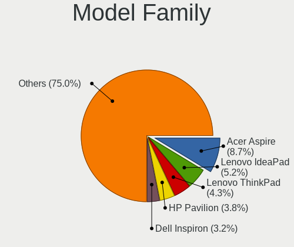

Linux in Russia - Tested Hardware & Statistics (Notebooks)
----------------------------------------------------------

A project to collect tested hardware configurations for Linux in Russia.

Anyone can contribute to this report by the [hw-probe](https://github.com/linuxhw/hw-probe) tool:

    sudo -E hw-probe -all -upload

Please contribute! Especially if your hardware is rare.

Contents
--------

* [ Test Cases ](#test-cases)

* [ System ](#system)
  - [ OS                       ](#os)
  - [ OS Family                ](#os-family)
  - [ Kernel                   ](#kernel)
  - [ Kernel Family            ](#kernel-family)
  - [ Kernel Major Ver.        ](#kernel-major-ver)
  - [ Arch                     ](#arch)
  - [ DE                       ](#de)
  - [ Display Server           ](#display-server)
  - [ Display Manager          ](#display-manager)
  - [ OS Lang                  ](#os-lang)
  - [ Boot Mode                ](#boot-mode)
  - [ Filesystem               ](#filesystem)
  - [ Part. scheme             ](#part-scheme)
  - [ Dual Boot with Linux/BSD ](#dual-boot-with-linuxbsd)
  - [ Dual Boot (Win)          ](#dual-boot-win)

* [ Board ](#board)
  - [ Vendor                   ](#vendor)
  - [ Model                    ](#model)
  - [ Model Family             ](#model-family)
  - [ MFG Year                 ](#mfg-year)
  - [ Form Factor              ](#form-factor)
  - [ Secure Boot              ](#secure-boot)
  - [ Coreboot                 ](#coreboot)
  - [ RAM Size                 ](#ram-size)
  - [ RAM Used                 ](#ram-used)
  - [ Total Drives             ](#total-drives)
  - [ Has CD-ROM               ](#has-cd-rom)
  - [ Has Ethernet             ](#has-ethernet)
  - [ Has WiFi                 ](#has-wifi)
  - [ Has Bluetooth            ](#has-bluetooth)

* [ Location ](#location)
  - [ Country                  ](#country)
  - [ City                     ](#city)

* [ Drives ](#drives)
  - [ Drive Vendor             ](#drive-vendor)
  - [ Drive Model              ](#drive-model)
  - [ HDD Vendor               ](#hdd-vendor)
  - [ SSD Vendor               ](#ssd-vendor)
  - [ Drive Kind               ](#drive-kind)
  - [ Drive Connector          ](#drive-connector)
  - [ Drive Size               ](#drive-size)
  - [ Space Total              ](#space-total)
  - [ Space Used               ](#space-used)
  - [ Malfunc. Drives          ](#malfunc-drives)
  - [ Malfunc. Drive Vendor    ](#malfunc-drive-vendor)
  - [ Malfunc. HDD Vendor      ](#malfunc-hdd-vendor)
  - [ Malfunc. Drive Kind      ](#malfunc-drive-kind)
  - [ Failed Drives            ](#failed-drives)
  - [ Failed Drive Vendor      ](#failed-drive-vendor)
  - [ Drive Status             ](#drive-status)

* [ Storage controller ](#storage-controller)
  - [ Storage Vendor           ](#storage-vendor)
  - [ Storage Model            ](#storage-model)
  - [ Storage Kind             ](#storage-kind)

* [ Processor ](#processor)
  - [ CPU Vendor               ](#cpu-vendor)
  - [ CPU Model                ](#cpu-model)
  - [ CPU Model Family         ](#cpu-model-family)
  - [ CPU Cores                ](#cpu-cores)
  - [ CPU Sockets              ](#cpu-sockets)
  - [ CPU Threads              ](#cpu-threads)
  - [ CPU Op-Modes             ](#cpu-op-modes)
  - [ CPU Microcode            ](#cpu-microcode)
  - [ CPU Microarch            ](#cpu-microarch)

* [ Graphics ](#graphics)
  - [ GPU Vendor               ](#gpu-vendor)
  - [ GPU Model                ](#gpu-model)
  - [ GPU Combo                ](#gpu-combo)
  - [ GPU Driver               ](#gpu-driver)
  - [ GPU Memory               ](#gpu-memory)

* [ Monitor ](#monitor)
  - [ Monitor Vendor           ](#monitor-vendor)
  - [ Monitor Model            ](#monitor-model)
  - [ Monitor Resolution       ](#monitor-resolution)
  - [ Monitor Diagonal         ](#monitor-diagonal)
  - [ Monitor Width            ](#monitor-width)
  - [ Aspect Ratio             ](#aspect-ratio)
  - [ Monitor Area             ](#monitor-area)
  - [ Pixel Density            ](#pixel-density)
  - [ Multiple Monitors        ](#multiple-monitors)

* [ Network ](#network)
  - [ Net Controller Vendor    ](#net-controller-vendor)
  - [ Net Controller Model     ](#net-controller-model)
  - [ Wireless Vendor          ](#wireless-vendor)
  - [ Wireless Model           ](#wireless-model)
  - [ Ethernet Vendor          ](#ethernet-vendor)
  - [ Ethernet Model           ](#ethernet-model)
  - [ Net Controller Kind      ](#net-controller-kind)
  - [ Used Controller          ](#used-controller)
  - [ NICs                     ](#nics)
  - [ IPv6                     ](#ipv6)

* [ Bluetooth ](#bluetooth)
  - [ Bluetooth Vendor         ](#bluetooth-vendor)
  - [ Bluetooth Model          ](#bluetooth-model)

* [ Sound ](#sound)
  - [ Sound Vendor             ](#sound-vendor)
  - [ Sound Model              ](#sound-model)

* [ Memory ](#memory)
  - [ Memory Vendor            ](#memory-vendor)
  - [ Memory Model             ](#memory-model)
  - [ Memory Kind              ](#memory-kind)
  - [ Memory Form Factor       ](#memory-form-factor)
  - [ Memory Size              ](#memory-size)
  - [ Memory Speed             ](#memory-speed)

* [ Printers & scanners ](#printers--scanners)
  - [ Printer Vendor           ](#printer-vendor)
  - [ Printer Model            ](#printer-model)
  - [ Scanner Vendor           ](#scanner-vendor)
  - [ Scanner Model            ](#scanner-model)

* [ Camera ](#camera)
  - [ Camera Vendor            ](#camera-vendor)
  - [ Camera Model             ](#camera-model)

* [ Security ](#security)
  - [ Fingerprint Vendor       ](#fingerprint-vendor)
  - [ Fingerprint Model        ](#fingerprint-model)
  - [ Chipcard Vendor          ](#chipcard-vendor)
  - [ Chipcard Model           ](#chipcard-model)

* [ Unsupported ](#unsupported)
  - [ Unsupported Devices      ](#unsupported-devices)
  - [ Unsupported Device Types ](#unsupported-device-types)

Test Cases
----------

Total: 17876

| Vendor        | Model                       | Probe                                                      | Date         |
|---------------|-----------------------------|------------------------------------------------------------|--------------|
| Acer          | Aspire V5-121               | [d6cc7a67ab](https://linux-hardware.org/?probe=d6cc7a67ab) | Apr 01, 2023 |
| Lenovo        | ThinkPad P1 Gen 4i 20Y30... | [96c53eccb0](https://linux-hardware.org/?probe=96c53eccb0) | Apr 01, 2023 |
| Unknown       | X133                        | [950572f119](https://linux-hardware.org/?probe=950572f119) | Apr 01, 2023 |
| ASUSTek       | F3JP                        | [e561213582](https://linux-hardware.org/?probe=e561213582) | Apr 01, 2023 |
| ASUSTek       | X550LB                      | [3d35ff8b68](https://linux-hardware.org/?probe=3d35ff8b68) | Apr 01, 2023 |
| Toshiba       | Satellite S50-A-K7M         | [af163d8ec3](https://linux-hardware.org/?probe=af163d8ec3) | Apr 01, 2023 |
| Sony          | VPCEH1S1R                   | [12100cdd4b](https://linux-hardware.org/?probe=12100cdd4b) | Apr 01, 2023 |
| Lenovo        | IdeaPad 3 15IIL05 81WE      | [9db0830268](https://linux-hardware.org/?probe=9db0830268) | Apr 01, 2023 |
| HUAWEI        | NBD-WXX9                    | [d4c718bdab](https://linux-hardware.org/?probe=d4c718bdab) | Apr 01, 2023 |
| Lenovo        | ThinkPad X201s 514328U      | [011c475758](https://linux-hardware.org/?probe=011c475758) | Apr 01, 2023 |
| HP            | Pavilion dv7                | [00bbec023a](https://linux-hardware.org/?probe=00bbec023a) | Apr 01, 2023 |
| Dell          | XPS 17 9700                 | [5d0a908832](https://linux-hardware.org/?probe=5d0a908832) | Mar 31, 2023 |
| ASUSTek       | X202E                       | [cdcccb09e7](https://linux-hardware.org/?probe=cdcccb09e7) | Mar 31, 2023 |
| ASUSTek       | X202E                       | [ac12ec53a3](https://linux-hardware.org/?probe=ac12ec53a3) | Mar 31, 2023 |
| Lenovo        | IdeaPad Yoga 13 20175       | [66a1075056](https://linux-hardware.org/?probe=66a1075056) | Mar 31, 2023 |
| Fujitsu       | LIFEBOOK NH532              | [68a8171c0a](https://linux-hardware.org/?probe=68a8171c0a) | Mar 31, 2023 |
| Samsung       | 300V3A/300V4A/300V5A/200... | [ad92e27c90](https://linux-hardware.org/?probe=ad92e27c90) | Mar 31, 2023 |
| ASUSTek       | K53SD                       | [81d03c3707](https://linux-hardware.org/?probe=81d03c3707) | Mar 31, 2023 |
| Chuwi         | CoreBook XPro               | [85ad17d246](https://linux-hardware.org/?probe=85ad17d246) | Mar 31, 2023 |
| HUAWEI        | HN-WX9X                     | [b10ed7894c](https://linux-hardware.org/?probe=b10ed7894c) | Mar 31, 2023 |
| ASUSTek       | GL502VMK                    | [fe7f43d2db](https://linux-hardware.org/?probe=fe7f43d2db) | Mar 31, 2023 |
| Lenovo        | Legion 5 15IMH05 82AU       | [36c0a38885](https://linux-hardware.org/?probe=36c0a38885) | Mar 31, 2023 |
| Dell          | Inspiron N5010              | [4d3e61950f](https://linux-hardware.org/?probe=4d3e61950f) | Mar 31, 2023 |
| ASUSTek       | X751LD                      | [2ef82331de](https://linux-hardware.org/?probe=2ef82331de) | Mar 31, 2023 |
| Lenovo        | IdeaPad 300-15ISK 80Q7      | [54f8c5082d](https://linux-hardware.org/?probe=54f8c5082d) | Mar 31, 2023 |
| Lenovo        | IdeaPad L340-15API 81LW     | [36b3103f3f](https://linux-hardware.org/?probe=36b3103f3f) | Mar 31, 2023 |
| ASUSTek       | VivoBook 15_ASUS Laptop ... | [8228733171](https://linux-hardware.org/?probe=8228733171) | Mar 31, 2023 |
| ASUSTek       | K54C                        | [a2a91e2071](https://linux-hardware.org/?probe=a2a91e2071) | Mar 30, 2023 |
| HP            | Pavilion dv6                | [c91e4d9c5a](https://linux-hardware.org/?probe=c91e4d9c5a) | Mar 30, 2023 |
| ASUSTek       | X101H                       | [a8a30f0050](https://linux-hardware.org/?probe=a8a30f0050) | Mar 30, 2023 |
| HUAWEI        | KLVL-WXXW                   | [ab31f6f63d](https://linux-hardware.org/?probe=ab31f6f63d) | Mar 30, 2023 |
| HP            | Pavilion Notebook           | [3844e429b1](https://linux-hardware.org/?probe=3844e429b1) | Mar 30, 2023 |
| ASUSTek       | K52JB                       | [45162c9123](https://linux-hardware.org/?probe=45162c9123) | Mar 30, 2023 |
| ASUSTek       | K52JB                       | [c19cd604b3](https://linux-hardware.org/?probe=c19cd604b3) | Mar 30, 2023 |
| Lenovo        | Legion 5 15ACH6H 82JU       | [8e7a5551df](https://linux-hardware.org/?probe=8e7a5551df) | Mar 30, 2023 |
| Acer          | Aspire E5-573G              | [d68a126b9b](https://linux-hardware.org/?probe=d68a126b9b) | Mar 30, 2023 |
| Toshiba       | Satellite Pro L300          | [04b9e48603](https://linux-hardware.org/?probe=04b9e48603) | Mar 30, 2023 |
| DEPO Compu... | DPC156                      | [fc942702db](https://linux-hardware.org/?probe=fc942702db) | Mar 30, 2023 |
| DEPO Compu... | DPC156                      | [ab5d4b339b](https://linux-hardware.org/?probe=ab5d4b339b) | Mar 30, 2023 |
| HP            | Pavilion Notebook           | [d3eafe4568](https://linux-hardware.org/?probe=d3eafe4568) | Mar 30, 2023 |
| Dell          | Vostro 5468                 | [4ad7375ed0](https://linux-hardware.org/?probe=4ad7375ed0) | Mar 30, 2023 |
| Valve         | Jupiter                     | [cf4ac240c4](https://linux-hardware.org/?probe=cf4ac240c4) | Mar 30, 2023 |
| ASUSTek       | VivoBook_ASUSLaptop X513... | [d7fedcc338](https://linux-hardware.org/?probe=d7fedcc338) | Mar 29, 2023 |
| Acer          | Aspire 5050                 | [689cd48886](https://linux-hardware.org/?probe=689cd48886) | Mar 29, 2023 |
| Dell          | Latitude 5420               | [aee5c648e7](https://linux-hardware.org/?probe=aee5c648e7) | Mar 29, 2023 |
| Clevo         | NL41MU2                     | [69abc76758](https://linux-hardware.org/?probe=69abc76758) | Mar 29, 2023 |
| Dell          | System Inspiron N7110       | [cc23cb7065](https://linux-hardware.org/?probe=cc23cb7065) | Mar 29, 2023 |
| Lenovo        | ThinkPad X201s 514328U      | [a6dbe138a5](https://linux-hardware.org/?probe=a6dbe138a5) | Mar 29, 2023 |
| Lenovo        | IdeaPad S145-15API 81UT     | [695a074faf](https://linux-hardware.org/?probe=695a074faf) | Mar 29, 2023 |
| Fujitsu Si... | LIFEBOOK S6410              | [607219699e](https://linux-hardware.org/?probe=607219699e) | Mar 29, 2023 |
| Timi          | TM1701                      | [16ca4bcb7f](https://linux-hardware.org/?probe=16ca4bcb7f) | Mar 29, 2023 |
| HONOR         | NBR-WAX9                    | [c0eeee7caf](https://linux-hardware.org/?probe=c0eeee7caf) | Mar 29, 2023 |
| Acer          | Aspire E1-571G              | [574f00dff5](https://linux-hardware.org/?probe=574f00dff5) | Mar 29, 2023 |
| Clevo         | M815P                       | [ac4eae2a0b](https://linux-hardware.org/?probe=ac4eae2a0b) | Mar 29, 2023 |
| Timi          | Redmi Book Pro 14 2022      | [e9b1759970](https://linux-hardware.org/?probe=e9b1759970) | Mar 29, 2023 |
| HUAWEI        | KLVL-WXXW                   | [6c61111706](https://linux-hardware.org/?probe=6c61111706) | Mar 28, 2023 |
| HP            | Pavilion Notebook           | [9cb1834208](https://linux-hardware.org/?probe=9cb1834208) | Mar 28, 2023 |
| Gateway       | LT27                        | [4697cead5f](https://linux-hardware.org/?probe=4697cead5f) | Mar 28, 2023 |
| THUNDEROBO... | 911 Plus                    | [6617ad47b7](https://linux-hardware.org/?probe=6617ad47b7) | Mar 28, 2023 |
| Pegatron      | H36QR                       | [a9f1036ba5](https://linux-hardware.org/?probe=a9f1036ba5) | Mar 28, 2023 |
| Pegatron      | H36QR                       | [c3cf444e89](https://linux-hardware.org/?probe=c3cf444e89) | Mar 28, 2023 |
| HIPER Tech... | HIPER WORKBOOK              | [6e3a79c8b3](https://linux-hardware.org/?probe=6e3a79c8b3) | Mar 28, 2023 |
| MSI           | GE72 6QC                    | [6e593cf965](https://linux-hardware.org/?probe=6e593cf965) | Mar 28, 2023 |
| ASUSTek       | X751LD                      | [61382d0bd8](https://linux-hardware.org/?probe=61382d0bd8) | Mar 28, 2023 |
| ASUSTek       | VivoBook 15_ASUS Laptop ... | [d97a249a99](https://linux-hardware.org/?probe=d97a249a99) | Mar 28, 2023 |
| Aquarius      | NS685U R11                  | [ecd08ca6d1](https://linux-hardware.org/?probe=ecd08ca6d1) | Mar 28, 2023 |
| Samsung       | 350V5C/351V5C/3540VC/344... | [b8a7f41c86](https://linux-hardware.org/?probe=b8a7f41c86) | Mar 28, 2023 |
| HP            | Compaq 6720s                | [9998cb9bfb](https://linux-hardware.org/?probe=9998cb9bfb) | Mar 27, 2023 |
| Acer          | Extensa 2530                | [e39fe56d67](https://linux-hardware.org/?probe=e39fe56d67) | Mar 27, 2023 |
| Acer          | NB-EX2510G-53DE             | [d331242786](https://linux-hardware.org/?probe=d331242786) | Mar 27, 2023 |
| HUAWEI        | NBD-WXX9                    | [e7788fd2a4](https://linux-hardware.org/?probe=e7788fd2a4) | Mar 27, 2023 |
| Haier         | P1510SD                     | [8bba4e9b5f](https://linux-hardware.org/?probe=8bba4e9b5f) | Mar 27, 2023 |
| HUAWEI        | NBD-WXX9                    | [d723ff0fa9](https://linux-hardware.org/?probe=d723ff0fa9) | Mar 27, 2023 |
| Pegatron      | A15                         | [2a0a6bdafc](https://linux-hardware.org/?probe=2a0a6bdafc) | Mar 27, 2023 |
| Dell          | Inspiron 5570               | [696a8c86bf](https://linux-hardware.org/?probe=696a8c86bf) | Mar 27, 2023 |
| MSI           | GE72 6QC                    | [e7c328a9f5](https://linux-hardware.org/?probe=e7c328a9f5) | Mar 27, 2023 |
| Lenovo        | IdeaPad S145-15AST 81N3     | [580e3a1237](https://linux-hardware.org/?probe=580e3a1237) | Mar 27, 2023 |
| Lenovo        | IdeaPad 1 15ALC7 82R4       | [deb6990c19](https://linux-hardware.org/?probe=deb6990c19) | Mar 27, 2023 |
| Acer          | Aspire 5050                 | [8490dcc481](https://linux-hardware.org/?probe=8490dcc481) | Mar 27, 2023 |
| HONOR         | NBR-WAX9                    | [ef91ef3645](https://linux-hardware.org/?probe=ef91ef3645) | Mar 27, 2023 |
| Packard Be... | EasyNote TE11HC             | [dd242e4ae3](https://linux-hardware.org/?probe=dd242e4ae3) | Mar 27, 2023 |
| MSI           | Modern 15 B12M              | [eded7b36b1](https://linux-hardware.org/?probe=eded7b36b1) | Mar 27, 2023 |
| Lenovo        | B570e HuronRiver Platfor... | [f5274197b8](https://linux-hardware.org/?probe=f5274197b8) | Mar 27, 2023 |
| Haier         | S15                         | [a75654fe8a](https://linux-hardware.org/?probe=a75654fe8a) | Mar 27, 2023 |
| Lenovo        | B460e                       | [1c79a13a61](https://linux-hardware.org/?probe=1c79a13a61) | Mar 27, 2023 |
| Clevo         | NL41MU2                     | [60191a33b8](https://linux-hardware.org/?probe=60191a33b8) | Mar 27, 2023 |
| MSI           | Katana GF76 11UE            | [b82e15f498](https://linux-hardware.org/?probe=b82e15f498) | Mar 27, 2023 |
| MSI           | Modern 15 B12M              | [9ee3ca41c8](https://linux-hardware.org/?probe=9ee3ca41c8) | Mar 27, 2023 |
| Sony          | VPCF13E8R                   | [a9c7f1d8bc](https://linux-hardware.org/?probe=a9c7f1d8bc) | Mar 27, 2023 |
| Dell          | Latitude E6430              | [ec464ade9c](https://linux-hardware.org/?probe=ec464ade9c) | Mar 27, 2023 |
| Acer          | Aspire V3-551               | [48409a7222](https://linux-hardware.org/?probe=48409a7222) | Mar 27, 2023 |
| Lenovo        | ThinkPad E14 Gen 3 20Y70... | [85a8b8b452](https://linux-hardware.org/?probe=85a8b8b452) | Mar 26, 2023 |
| Packard Be... | EasyNote TE11HC             | [6c942c5a39](https://linux-hardware.org/?probe=6c942c5a39) | Mar 26, 2023 |
| MSI           | GE72 6QC                    | [83793f19c1](https://linux-hardware.org/?probe=83793f19c1) | Mar 26, 2023 |
| Acer          | Aspire E1-570G              | [9d123ef87d](https://linux-hardware.org/?probe=9d123ef87d) | Mar 26, 2023 |
| Gigabyte      | G5 KF                       | [5275b7d43a](https://linux-hardware.org/?probe=5275b7d43a) | Mar 26, 2023 |
| Dell          | Inspiron 3576               | [18352c181a](https://linux-hardware.org/?probe=18352c181a) | Mar 26, 2023 |
| Gigabyte      | G5 KF                       | [9dd2faffb3](https://linux-hardware.org/?probe=9dd2faffb3) | Mar 26, 2023 |
| HP            | Victus by Laptop 16-e0xx... | [a7ff24abc4](https://linux-hardware.org/?probe=a7ff24abc4) | Mar 26, 2023 |
| HP            | Victus by Laptop 16-e0xx... | [8d5a135264](https://linux-hardware.org/?probe=8d5a135264) | Mar 26, 2023 |
| HUAWEI        | HN-WX9X                     | [cdc4b03fe2](https://linux-hardware.org/?probe=cdc4b03fe2) | Mar 26, 2023 |
| Samsung       | RV408/RV508                 | [5f5efa7edc](https://linux-hardware.org/?probe=5f5efa7edc) | Mar 25, 2023 |
| HP            | ProBook 430 G6              | [cd14b86548](https://linux-hardware.org/?probe=cd14b86548) | Mar 25, 2023 |
| Samsung       | RV408/RV508                 | [cce3fdd054](https://linux-hardware.org/?probe=cce3fdd054) | Mar 25, 2023 |
| Timi          | TM1701                      | [f5dfd4628e](https://linux-hardware.org/?probe=f5dfd4628e) | Mar 25, 2023 |
| HP            | EliteBook 855 G8 Noteboo... | [9c21fe4228](https://linux-hardware.org/?probe=9c21fe4228) | Mar 25, 2023 |
| Timi          | TM1701                      | [17e055a118](https://linux-hardware.org/?probe=17e055a118) | Mar 25, 2023 |
| Toshiba       | Satellite A500              | [cd79c573c6](https://linux-hardware.org/?probe=cd79c573c6) | Mar 25, 2023 |
| Haier         | S15                         | [083feb0355](https://linux-hardware.org/?probe=083feb0355) | Mar 25, 2023 |
| ASUSTek       | ROG Strix G513IH_G513IH     | [f692116967](https://linux-hardware.org/?probe=f692116967) | Mar 25, 2023 |
| Samsung       | NC10                        | [96a0efc869](https://linux-hardware.org/?probe=96a0efc869) | Mar 25, 2023 |
| Samsung       | 300E4A/300E5A/300E7A/343... | [e9d97f4745](https://linux-hardware.org/?probe=e9d97f4745) | Mar 25, 2023 |
| ASUSTek       | N53SN                       | [4150c3835d](https://linux-hardware.org/?probe=4150c3835d) | Mar 24, 2023 |
| ASUSTek       | N550JK                      | [b63ec78860](https://linux-hardware.org/?probe=b63ec78860) | Mar 24, 2023 |
| Lenovo        | QIWG5                       | [3136edbf1d](https://linux-hardware.org/?probe=3136edbf1d) | Mar 24, 2023 |
| Packard Be... | EasyNote TE11HC             | [dbea63ed43](https://linux-hardware.org/?probe=dbea63ed43) | Mar 24, 2023 |
| HP            | Laptop 17-ak0xx             | [872e7f18c5](https://linux-hardware.org/?probe=872e7f18c5) | Mar 24, 2023 |
| Unknown       | Unknown                     | [17cc340907](https://linux-hardware.org/?probe=17cc340907) | Mar 24, 2023 |
| Unknown       | Unknown                     | [359168b631](https://linux-hardware.org/?probe=359168b631) | Mar 24, 2023 |
| Lenovo        | B50-45 20388                | [5bd617a430](https://linux-hardware.org/?probe=5bd617a430) | Mar 24, 2023 |
| ASUSTek       | ZenBook UX433FN_BX433FN     | [d8e67b032e](https://linux-hardware.org/?probe=d8e67b032e) | Mar 24, 2023 |
| ASUSTek       | VivoBook 15_ASUS Laptop ... | [a021e21c5f](https://linux-hardware.org/?probe=a021e21c5f) | Mar 24, 2023 |
| Lenovo        | IdeaPad Y560                | [18071acd7e](https://linux-hardware.org/?probe=18071acd7e) | Mar 24, 2023 |
| Timi          | Redmi Book Pro 15 2022      | [cba22e109f](https://linux-hardware.org/?probe=cba22e109f) | Mar 23, 2023 |
| Packard Be... | EasyNote TS11HR             | [f03dde8b73](https://linux-hardware.org/?probe=f03dde8b73) | Mar 23, 2023 |
| HP            | EliteBook 855 G8 Noteboo... | [750933836b](https://linux-hardware.org/?probe=750933836b) | Mar 23, 2023 |
| ASUSTek       | VivoBook_ASUSLaptop M650... | [2d44e8f5c2](https://linux-hardware.org/?probe=2d44e8f5c2) | Mar 23, 2023 |
| HP            | Pavilion Gaming Laptop 1... | [d956770153](https://linux-hardware.org/?probe=d956770153) | Mar 23, 2023 |
| Clevo         | NL41MU2                     | [b56bf816d5](https://linux-hardware.org/?probe=b56bf816d5) | Mar 23, 2023 |
| Lenovo        | Yoga Slim 7 13ACN5 82CY     | [950e4b69e8](https://linux-hardware.org/?probe=950e4b69e8) | Mar 23, 2023 |
| Clevo         | NL41MU2                     | [88a5d2eb30](https://linux-hardware.org/?probe=88a5d2eb30) | Mar 23, 2023 |
| ASUSTek       | X556UB                      | [97a85936b2](https://linux-hardware.org/?probe=97a85936b2) | Mar 23, 2023 |
| ASUSTek       | VivoBook_ASUSLaptop X415... | [fe3c64d71e](https://linux-hardware.org/?probe=fe3c64d71e) | Mar 23, 2023 |
| ASUSTek       | K61IC                       | [b16fb0d3c8](https://linux-hardware.org/?probe=b16fb0d3c8) | Mar 23, 2023 |
| Teclast       | F15Plus 2                   | [70a7bfb366](https://linux-hardware.org/?probe=70a7bfb366) | Mar 23, 2023 |
| realme        | CloudProXXXX                | [aaafa41631](https://linux-hardware.org/?probe=aaafa41631) | Mar 23, 2023 |
| Lenovo        | G560 20042                  | [2df8b64f07](https://linux-hardware.org/?probe=2df8b64f07) | Mar 22, 2023 |
| Toshiba       | T20                         | [a0757b47d7](https://linux-hardware.org/?probe=a0757b47d7) | Mar 22, 2023 |
| HP            | 635                         | [fef3dd1785](https://linux-hardware.org/?probe=fef3dd1785) | Mar 22, 2023 |
| Clevo         | NL41MU2                     | [430f11129e](https://linux-hardware.org/?probe=430f11129e) | Mar 22, 2023 |
| ASUSTek       | X550CC                      | [55d3d0217c](https://linux-hardware.org/?probe=55d3d0217c) | Mar 22, 2023 |
| ASUSTek       | Zenbook UX535QE_UM535QE     | [1f5d2a057c](https://linux-hardware.org/?probe=1f5d2a057c) | Mar 22, 2023 |
| Lenovo        | IdeaPad 330S-14AST 81F8     | [f97f90f7ce](https://linux-hardware.org/?probe=f97f90f7ce) | Mar 22, 2023 |
| ASUSTek       | X550CC                      | [957e5f5f8d](https://linux-hardware.org/?probe=957e5f5f8d) | Mar 22, 2023 |
| Dell          | Latitude 5521               | [ff25b78796](https://linux-hardware.org/?probe=ff25b78796) | Mar 21, 2023 |
| HP            | Pavilion g7                 | [9fbef1354b](https://linux-hardware.org/?probe=9fbef1354b) | Mar 21, 2023 |
| HUAWEI        | CREM-WXX9                   | [64a63f42bf](https://linux-hardware.org/?probe=64a63f42bf) | Mar 21, 2023 |
| MSI           | Sword 15 A12UE              | [f4341a491a](https://linux-hardware.org/?probe=f4341a491a) | Mar 21, 2023 |
| HONOR         | HYM-WXX                     | [df318ed208](https://linux-hardware.org/?probe=df318ed208) | Mar 21, 2023 |
| MSI           | Bravo 15 B5DD               | [a320127e2e](https://linux-hardware.org/?probe=a320127e2e) | Mar 21, 2023 |
| New IT Pro... | C156EP-C8RVTH               | [556d5020f8](https://linux-hardware.org/?probe=556d5020f8) | Mar 21, 2023 |
| New IT Pro... | C156EP-C8RVTH               | [96e84a3c49](https://linux-hardware.org/?probe=96e84a3c49) | Mar 21, 2023 |
| Lenovo        | ThinkBook 15 G2 ITL 20VE    | [a526417aaf](https://linux-hardware.org/?probe=a526417aaf) | Mar 21, 2023 |
| ASUSTek       | VivoBook_ASUSLaptop M350... | [e96b4f9ca9](https://linux-hardware.org/?probe=e96b4f9ca9) | Mar 21, 2023 |
| MSI           | Modern 14 A10M              | [7d9620fdd3](https://linux-hardware.org/?probe=7d9620fdd3) | Mar 21, 2023 |
| Acer          | Aspire A515-44              | [923686eb97](https://linux-hardware.org/?probe=923686eb97) | Mar 21, 2023 |
| Acer          | Swift SF315-52G             | [f6042580d0](https://linux-hardware.org/?probe=f6042580d0) | Mar 20, 2023 |
| Lenovo        | ThinkPad T530 2429LT7       | [ebb127610b](https://linux-hardware.org/?probe=ebb127610b) | Mar 20, 2023 |
| Lenovo        | ThinkPad E15 Gen 4 21E60... | [7bc035af43](https://linux-hardware.org/?probe=7bc035af43) | Mar 20, 2023 |
| Acer          | Swift SF114-34              | [0648d2d9c3](https://linux-hardware.org/?probe=0648d2d9c3) | Mar 20, 2023 |
| Acer          | Extensa 2509                | [8e0efd63c5](https://linux-hardware.org/?probe=8e0efd63c5) | Mar 20, 2023 |
| Lenovo        | IdeaPad L340-15API 81LW     | [be9b767d92](https://linux-hardware.org/?probe=be9b767d92) | Mar 20, 2023 |
| ASUSTek       | VivoBook_ASUSLaptop X712... | [5b1bccd269](https://linux-hardware.org/?probe=5b1bccd269) | Mar 20, 2023 |
| ASUSTek       | X751NV                      | [934e232587](https://linux-hardware.org/?probe=934e232587) | Mar 20, 2023 |
| Samsung       | 300E4A/300E5A/300E7A/343... | [470a7a9123](https://linux-hardware.org/?probe=470a7a9123) | Mar 20, 2023 |
| Acer          | TravelMate 5760             | [712e36569d](https://linux-hardware.org/?probe=712e36569d) | Mar 20, 2023 |
| Prestigio     | PSB141C01BFH                | [9190e0a0e7](https://linux-hardware.org/?probe=9190e0a0e7) | Mar 19, 2023 |
| Teclast       | F15Plus 2                   | [17558890e2](https://linux-hardware.org/?probe=17558890e2) | Mar 19, 2023 |
| HP            | Laptop 15-rb0xx             | [d7ed5ce80d](https://linux-hardware.org/?probe=d7ed5ce80d) | Mar 19, 2023 |
| Toshiba       | Satellite Pro L300          | [82e7cb9669](https://linux-hardware.org/?probe=82e7cb9669) | Mar 19, 2023 |
| ASUSTek       | VivoBook_ASUSLaptop M650... | [74b67b2037](https://linux-hardware.org/?probe=74b67b2037) | Mar 19, 2023 |
| HONOR         | GLO-FX6P                    | [0fb3ebc365](https://linux-hardware.org/?probe=0fb3ebc365) | Mar 19, 2023 |
| ASUSTek       | X205TA                      | [9727a94199](https://linux-hardware.org/?probe=9727a94199) | Mar 18, 2023 |
| ASUSTek       | UX301LAA                    | [882d4d095b](https://linux-hardware.org/?probe=882d4d095b) | Mar 18, 2023 |
| Lenovo        | IdeaPad S340-15IIL 81VW     | [90ef6ca2b7](https://linux-hardware.org/?probe=90ef6ca2b7) | Mar 18, 2023 |
| Lenovo        | IdeaPad S340-15IIL 81VW     | [b769745990](https://linux-hardware.org/?probe=b769745990) | Mar 18, 2023 |
| HONOR         | HYM-WXX                     | [bdb5c6a4ee](https://linux-hardware.org/?probe=bdb5c6a4ee) | Mar 18, 2023 |
| MSI           | GP60 2OD                    | [a3ffd8113f](https://linux-hardware.org/?probe=a3ffd8113f) | Mar 18, 2023 |
| HONOR         | NBR-WAX9                    | [19fd2af680](https://linux-hardware.org/?probe=19fd2af680) | Mar 18, 2023 |
| Acer          | Aspire A315-55G             | [badcc52c19](https://linux-hardware.org/?probe=badcc52c19) | Mar 18, 2023 |
| HP            | Laptop 15-db1xxx            | [08df29b00e](https://linux-hardware.org/?probe=08df29b00e) | Mar 18, 2023 |
| Positivo      | N6440                       | [98323051b5](https://linux-hardware.org/?probe=98323051b5) | Mar 18, 2023 |
| HP            | OMEN Laptop 15-en1xxx       | [233610a033](https://linux-hardware.org/?probe=233610a033) | Mar 18, 2023 |
| ASUSTek       | X551CAP                     | [e45da01a7e](https://linux-hardware.org/?probe=e45da01a7e) | Mar 18, 2023 |
| Acer          | Aspire 5310                 | [132691cbda](https://linux-hardware.org/?probe=132691cbda) | Mar 18, 2023 |
| ASUSTek       | VivoBook_ASUSLaptop M650... | [ecc76a5003](https://linux-hardware.org/?probe=ecc76a5003) | Mar 17, 2023 |
| HONOR         | NBR-WAX9                    | [09541b3bdd](https://linux-hardware.org/?probe=09541b3bdd) | Mar 17, 2023 |
| HONOR         | HYM-WXX                     | [279e932275](https://linux-hardware.org/?probe=279e932275) | Mar 17, 2023 |
| Aquarius      | NS585                       | [cd1e92458f](https://linux-hardware.org/?probe=cd1e92458f) | Mar 17, 2023 |
| HP            | EliteBook 840 G4            | [bb6be61738](https://linux-hardware.org/?probe=bb6be61738) | Mar 17, 2023 |
| Lenovo        | B590 20208                  | [e151d5d899](https://linux-hardware.org/?probe=e151d5d899) | Mar 17, 2023 |
| HIPER         | WORKBOOK                    | [ed14fd6e80](https://linux-hardware.org/?probe=ed14fd6e80) | Mar 17, 2023 |
| Unknown       | Unknown                     | [d2af864fbb](https://linux-hardware.org/?probe=d2af864fbb) | Mar 17, 2023 |
| Acer          | Nitro AN515-52              | [6ad4034797](https://linux-hardware.org/?probe=6ad4034797) | Mar 17, 2023 |
| ASUSTek       | X580VD                      | [8c4023bd5d](https://linux-hardware.org/?probe=8c4023bd5d) | Mar 16, 2023 |
| HONOR         | BMH-WCX9                    | [47a9ec2aa1](https://linux-hardware.org/?probe=47a9ec2aa1) | Mar 16, 2023 |
| ASUSTek       | ROG Zephyrus M16 GU603HE... | [421f6945e6](https://linux-hardware.org/?probe=421f6945e6) | Mar 16, 2023 |
| Acer          | Aspire 5820TZG              | [9f08995104](https://linux-hardware.org/?probe=9f08995104) | Mar 16, 2023 |
| ASUSTek       | X75VCP                      | [f154cf28db](https://linux-hardware.org/?probe=f154cf28db) | Mar 16, 2023 |
| ASUSTek       | X55A                        | [5cf7c3643d](https://linux-hardware.org/?probe=5cf7c3643d) | Mar 16, 2023 |
| ASUSTek       | X55A                        | [743d04e5fc](https://linux-hardware.org/?probe=743d04e5fc) | Mar 16, 2023 |
| ASUSTek       | X580VD                      | [26b62abfc9](https://linux-hardware.org/?probe=26b62abfc9) | Mar 16, 2023 |
| HUAWEI        | NDZ-WXX9                    | [82687f32c9](https://linux-hardware.org/?probe=82687f32c9) | Mar 16, 2023 |
| ASUSTek       | VivoBook_ASUSLaptop M150... | [a99c892744](https://linux-hardware.org/?probe=a99c892744) | Mar 16, 2023 |
| HUAWEI        | BOD-WXX9                    | [ef98a330e6](https://linux-hardware.org/?probe=ef98a330e6) | Mar 16, 2023 |
| Dell          | Latitude 7520               | [09c8e699d3](https://linux-hardware.org/?probe=09c8e699d3) | Mar 16, 2023 |
| Lenovo        | ThinkPad X230 23245C8       | [7015f3b169](https://linux-hardware.org/?probe=7015f3b169) | Mar 16, 2023 |
| ASUSTek       | N76VB                       | [20afa1889d](https://linux-hardware.org/?probe=20afa1889d) | Mar 15, 2023 |
| Lenovo        | IdeaPad 320-15IKB 80XL      | [46d1e1d803](https://linux-hardware.org/?probe=46d1e1d803) | Mar 15, 2023 |
| Lenovo        | IdeaPad 320-15IKB 80XL      | [b110af35d5](https://linux-hardware.org/?probe=b110af35d5) | Mar 15, 2023 |
| Fujitsu       | LIFEBOOK E744               | [03e5d43f27](https://linux-hardware.org/?probe=03e5d43f27) | Mar 15, 2023 |
| Fujitsu       | LIFEBOOK E744               | [4c49d73583](https://linux-hardware.org/?probe=4c49d73583) | Mar 15, 2023 |
| Acer          | Aspire A315-42G             | [727c7d3b7b](https://linux-hardware.org/?probe=727c7d3b7b) | Mar 15, 2023 |
| HP            | Laptop 15s-eq1xxx           | [59a304e790](https://linux-hardware.org/?probe=59a304e790) | Mar 15, 2023 |
| Toshiba       | Satellite L850D-BJS         | [95fcbd0967](https://linux-hardware.org/?probe=95fcbd0967) | Mar 15, 2023 |
| HIPER         | WORKBOOK                    | [3d1c928bcb](https://linux-hardware.org/?probe=3d1c928bcb) | Mar 15, 2023 |
| Acer          | Aspire 7720                 | [0f040d8292](https://linux-hardware.org/?probe=0f040d8292) | Mar 15, 2023 |
| Valve         | Jupiter                     | [686a9db96f](https://linux-hardware.org/?probe=686a9db96f) | Mar 15, 2023 |
| ASUSTek       | VivoBook_ASUSLaptop K650... | [112d979fc6](https://linux-hardware.org/?probe=112d979fc6) | Mar 14, 2023 |
| Acer          | Aspire 7110                 | [ec44273fd3](https://linux-hardware.org/?probe=ec44273fd3) | Mar 14, 2023 |
| ASUSTek       | 1215P                       | [7cfe211e09](https://linux-hardware.org/?probe=7cfe211e09) | Mar 14, 2023 |
| Lenovo        | ThinkPad X230 23245C8       | [5aaf852168](https://linux-hardware.org/?probe=5aaf852168) | Mar 14, 2023 |
| Sony          | VPCZ12V9R                   | [28be5f7f2b](https://linux-hardware.org/?probe=28be5f7f2b) | Mar 14, 2023 |
| HP            | EliteBook 840 G8 Noteboo... | [9f3f315f73](https://linux-hardware.org/?probe=9f3f315f73) | Mar 14, 2023 |
| Lenovo        | V110-15AST 80TD             | [a574807ec1](https://linux-hardware.org/?probe=a574807ec1) | Mar 14, 2023 |
| HP            | EliteBook 840 G8 Noteboo... | [42653f8c2a](https://linux-hardware.org/?probe=42653f8c2a) | Mar 14, 2023 |
| Acer          | Aspire 7739G                | [aeff2df11c](https://linux-hardware.org/?probe=aeff2df11c) | Mar 14, 2023 |
| HP            | Laptop 15-bs1xx             | [3d98403721](https://linux-hardware.org/?probe=3d98403721) | Mar 14, 2023 |
| Acer          | Aspire 7720                 | [b80fa5f7ff](https://linux-hardware.org/?probe=b80fa5f7ff) | Mar 14, 2023 |
| HUAWEI        | KPRC-WX0                    | [580758b277](https://linux-hardware.org/?probe=580758b277) | Mar 14, 2023 |
| HONOR         | BMH-WCX9                    | [d53fa296bf](https://linux-hardware.org/?probe=d53fa296bf) | Mar 14, 2023 |
| Lenovo        | ThinkPad E15 Gen 4 21ED0... | [e6792912bf](https://linux-hardware.org/?probe=e6792912bf) | Mar 14, 2023 |
| Lenovo        | ThinkPad E14 Gen 3 20Y70... | [088325b0d3](https://linux-hardware.org/?probe=088325b0d3) | Mar 14, 2023 |
| eMachines     | eME730G                     | [ef96ec0313](https://linux-hardware.org/?probe=ef96ec0313) | Mar 14, 2023 |
| ASUSTek       | VivoBook_ASUSLaptop X515... | [cc878090ee](https://linux-hardware.org/?probe=cc878090ee) | Mar 13, 2023 |
| ASUSTek       | K53Z                        | [5ec3f96a8e](https://linux-hardware.org/?probe=5ec3f96a8e) | Mar 13, 2023 |
| Acer          | Aspire one                  | [60c75cc14d](https://linux-hardware.org/?probe=60c75cc14d) | Mar 13, 2023 |
| Dell          | Vostro 3400                 | [01bfc3e026](https://linux-hardware.org/?probe=01bfc3e026) | Mar 13, 2023 |
| Acer          | Aspire A315-21G             | [84b199bf8b](https://linux-hardware.org/?probe=84b199bf8b) | Mar 13, 2023 |
| Acer          | Aspire R7-371T              | [b6aef449b6](https://linux-hardware.org/?probe=b6aef449b6) | Mar 13, 2023 |
| Lenovo        | ThinkPad 11e 3rd Gen 20G... | [1e037723cc](https://linux-hardware.org/?probe=1e037723cc) | Mar 12, 2023 |
| TECNO         | MEGABOOK T1                 | [000c3e4761](https://linux-hardware.org/?probe=000c3e4761) | Mar 12, 2023 |
| Acer          | Aspire one                  | [c3d7bc326a](https://linux-hardware.org/?probe=c3d7bc326a) | Mar 12, 2023 |
| HONOR         | HYM-WXX                     | [366d00f0a7](https://linux-hardware.org/?probe=366d00f0a7) | Mar 12, 2023 |
| Lenovo        | ThinkPad Edge 13IAL# 019... | [1d91216d1b](https://linux-hardware.org/?probe=1d91216d1b) | Mar 12, 2023 |
| Pegatron      | C15B                        | [539f4fbf7a](https://linux-hardware.org/?probe=539f4fbf7a) | Mar 12, 2023 |
| ASUSTek       | GL702VM                     | [62a45a1b6d](https://linux-hardware.org/?probe=62a45a1b6d) | Mar 12, 2023 |
| ASUSTek       | GL702VM                     | [ae185a2005](https://linux-hardware.org/?probe=ae185a2005) | Mar 11, 2023 |
| Lenovo        | IdeaPad 320-15AST 80XV      | [062687b226](https://linux-hardware.org/?probe=062687b226) | Mar 11, 2023 |
| Sony          | SVE1713P1RB                 | [efa148ef67](https://linux-hardware.org/?probe=efa148ef67) | Mar 11, 2023 |
| LTD Delovo... | EVE 14 C414 NA9144BXW01     | [f7bda1bf30](https://linux-hardware.org/?probe=f7bda1bf30) | Mar 11, 2023 |
| HONOR         | NMH-WCX9                    | [d8cf10f11d](https://linux-hardware.org/?probe=d8cf10f11d) | Mar 11, 2023 |
| ASUSTek       | N53SV                       | [816307ec8e](https://linux-hardware.org/?probe=816307ec8e) | Mar 11, 2023 |
| ASUSTek       | VivoBook 15_ASUS Laptop ... | [06814e6afa](https://linux-hardware.org/?probe=06814e6afa) | Mar 11, 2023 |
| HP            | Laptop 15-bw0xx             | [d479ffc245](https://linux-hardware.org/?probe=d479ffc245) | Mar 11, 2023 |
| ASUSTek       | K46CM                       | [e0cce23d86](https://linux-hardware.org/?probe=e0cce23d86) | Mar 11, 2023 |
| Gigabyte      | GB-BSi7A-6500               | [b24842e6f1](https://linux-hardware.org/?probe=b24842e6f1) | Mar 11, 2023 |
| Acer          | Aspire E5-771G              | [c9c401bdb5](https://linux-hardware.org/?probe=c9c401bdb5) | Mar 11, 2023 |
| Acer          | Aspire E5-771G              | [849ea0e3dc](https://linux-hardware.org/?probe=849ea0e3dc) | Mar 11, 2023 |
| ASUSTek       | K53SM                       | [aa3efc3683](https://linux-hardware.org/?probe=aa3efc3683) | Mar 11, 2023 |
| Unknown       | Unknown                     | [5d585fb91b](https://linux-hardware.org/?probe=5d585fb91b) | Mar 11, 2023 |
| ASUSTek       | VivoBook_ASUSLaptop X509... | [bd2a89f7c1](https://linux-hardware.org/?probe=bd2a89f7c1) | Mar 11, 2023 |
| Lenovo        | IdeaPad Z480                | [eb63a9a0d3](https://linux-hardware.org/?probe=eb63a9a0d3) | Mar 10, 2023 |
| HP            | Laptop 15s-eq2xxx           | [a6dc5e13d0](https://linux-hardware.org/?probe=a6dc5e13d0) | Mar 10, 2023 |
| Dell          | Vostro 3400                 | [ed7724b921](https://linux-hardware.org/?probe=ed7724b921) | Mar 10, 2023 |
| Lenovo        | ThinkPad T14 Gen 3 21AJS... | [b473b68faf](https://linux-hardware.org/?probe=b473b68faf) | Mar 10, 2023 |
| Dell          | Vostro 3400                 | [6605d9e257](https://linux-hardware.org/?probe=6605d9e257) | Mar 10, 2023 |
| Lenovo        | ThinkPad T14 Gen 3 21AJS... | [4a8589fbdf](https://linux-hardware.org/?probe=4a8589fbdf) | Mar 10, 2023 |
| HP            | Laptop 15s-eq2xxx           | [801cf42ac7](https://linux-hardware.org/?probe=801cf42ac7) | Mar 10, 2023 |
| HP            | ProBook 445 G8 Notebook ... | [a62abba552](https://linux-hardware.org/?probe=a62abba552) | Mar 10, 2023 |
| Acer          | Aspire A715-71G             | [6ef05d9cbb](https://linux-hardware.org/?probe=6ef05d9cbb) | Mar 10, 2023 |
| Acer          | Aspire A715-71G             | [4f916d30c4](https://linux-hardware.org/?probe=4f916d30c4) | Mar 10, 2023 |
| Dell          | Vostro 5581                 | [72b648b75c](https://linux-hardware.org/?probe=72b648b75c) | Mar 10, 2023 |
| ASUSTek       | Zenbook UX535QE_UM535QE     | [87aa621d6a](https://linux-hardware.org/?probe=87aa621d6a) | Mar 10, 2023 |
| Dell          | Vostro 5581                 | [c7a13194c8](https://linux-hardware.org/?probe=c7a13194c8) | Mar 10, 2023 |
| ASUSTek       | 1001PX                      | [b38727d178](https://linux-hardware.org/?probe=b38727d178) | Mar 10, 2023 |
| Lenovo        | IdeaPad 320-15IAP 80XR      | [d64a783d3a](https://linux-hardware.org/?probe=d64a783d3a) | Mar 10, 2023 |
| Lenovo        | IdeaPad 320-15AST 80XV      | [1b0ea7bf68](https://linux-hardware.org/?probe=1b0ea7bf68) | Mar 10, 2023 |
| MSI           | S12T 3M/S12 3M              | [b12ff30d25](https://linux-hardware.org/?probe=b12ff30d25) | Mar 09, 2023 |
| ASUSTek       | X580VD                      | [8cb2ac6f38](https://linux-hardware.org/?probe=8cb2ac6f38) | Mar 09, 2023 |
| Lenovo        | ThinkPad E15 Gen 4 21ED0... | [9e620a10f2](https://linux-hardware.org/?probe=9e620a10f2) | Mar 09, 2023 |
| Lenovo        | B570e HuronRiver Platfor... | [c7519d4c79](https://linux-hardware.org/?probe=c7519d4c79) | Mar 09, 2023 |
| Lenovo        | IdeaPad Z480                | [bc5f204a78](https://linux-hardware.org/?probe=bc5f204a78) | Mar 08, 2023 |
| Acer          | Swift SF114-32              | [6bc8cc9c28](https://linux-hardware.org/?probe=6bc8cc9c28) | Mar 08, 2023 |
| Toshiba       | Satellite A200              | [3b83e42348](https://linux-hardware.org/?probe=3b83e42348) | Mar 08, 2023 |
| HUAWEI        | NBLK-WAX9X                  | [d01b6ad50c](https://linux-hardware.org/?probe=d01b6ad50c) | Mar 08, 2023 |
| HONOR         | BMH-WCX9                    | [9ec3d187fd](https://linux-hardware.org/?probe=9ec3d187fd) | Mar 08, 2023 |
| Maibenben     | JinMai6 series              | [ace44d9872](https://linux-hardware.org/?probe=ace44d9872) | Mar 08, 2023 |
| Dell          | Latitude 5521               | [550860917e](https://linux-hardware.org/?probe=550860917e) | Mar 08, 2023 |
| Valve         | Jupiter                     | [258d1635a3](https://linux-hardware.org/?probe=258d1635a3) | Mar 08, 2023 |
| Infinix       | INBOOK X2 GEN11             | [3d14886d4c](https://linux-hardware.org/?probe=3d14886d4c) | Mar 07, 2023 |
| HP            | ProBook 440 G7              | [7f4678dcf1](https://linux-hardware.org/?probe=7f4678dcf1) | Mar 07, 2023 |
| Infinix       | INBOOK X2 GEN11             | [124b1af920](https://linux-hardware.org/?probe=124b1af920) | Mar 07, 2023 |
| Valve         | Jupiter                     | [00cb6a869a](https://linux-hardware.org/?probe=00cb6a869a) | Mar 07, 2023 |
| ASUSTek       | ROG Strix G513IH_G513IH     | [9ff521edc3](https://linux-hardware.org/?probe=9ff521edc3) | Mar 07, 2023 |
| Lenovo        | B570e HuronRiver Platfor... | [070c644d4f](https://linux-hardware.org/?probe=070c644d4f) | Mar 07, 2023 |
| Lenovo        | ThinkPad P1 Gen 4i 20Y30... | [efe5bcec0b](https://linux-hardware.org/?probe=efe5bcec0b) | Mar 07, 2023 |
| Lenovo        | IdeaPad 5 Pro 14ITL6 82L... | [c6737dc34b](https://linux-hardware.org/?probe=c6737dc34b) | Mar 07, 2023 |
| Lenovo        | ThinkPad P1 Gen 4i 20Y30... | [c517071efd](https://linux-hardware.org/?probe=c517071efd) | Mar 06, 2023 |
| Timi          | Redmi Book Pro 15 2022      | [00b928f630](https://linux-hardware.org/?probe=00b928f630) | Mar 06, 2023 |
| Sony          | SVT1313X9RS                 | [c2766f4ac5](https://linux-hardware.org/?probe=c2766f4ac5) | Mar 06, 2023 |
| Lenovo        | ThinkPad Edge 03014EG       | [e3186561ef](https://linux-hardware.org/?probe=e3186561ef) | Mar 06, 2023 |
| HP            | Pavilion dv6                | [6485870687](https://linux-hardware.org/?probe=6485870687) | Mar 06, 2023 |
| Lenovo        | IdeaPad 520-15IKB 81BF      | [119a07048d](https://linux-hardware.org/?probe=119a07048d) | Mar 06, 2023 |
| Infinix       | INBOOK X2 GEN11             | [6faa586824](https://linux-hardware.org/?probe=6faa586824) | Mar 06, 2023 |
| Samsung       | 300V3A/300V4A/300V5A/200... | [91db409270](https://linux-hardware.org/?probe=91db409270) | Mar 06, 2023 |
| Acer          | Aspire 4253G                | [80228255b2](https://linux-hardware.org/?probe=80228255b2) | Mar 06, 2023 |
| Unknown       | Unknown                     | [8b7f7b9440](https://linux-hardware.org/?probe=8b7f7b9440) | Mar 05, 2023 |
| Toshiba       | Satellite U300              | [6e33105e71](https://linux-hardware.org/?probe=6e33105e71) | Mar 05, 2023 |
| ASUSTek       | X102BA                      | [6c425f0640](https://linux-hardware.org/?probe=6c425f0640) | Mar 05, 2023 |
| ASUSTek       | V6J                         | [10819a91fd](https://linux-hardware.org/?probe=10819a91fd) | Mar 05, 2023 |
| ASUSTek       | M51Tr                       | [3d4d35a9a7](https://linux-hardware.org/?probe=3d4d35a9a7) | Mar 05, 2023 |
| Dell          | G5 5500                     | [7da5494dea](https://linux-hardware.org/?probe=7da5494dea) | Mar 05, 2023 |
| Lenovo        | IdeaPad 330S-15ARR 81FB     | [fe903be37c](https://linux-hardware.org/?probe=fe903be37c) | Mar 04, 2023 |
| Dell          | Inspiron 11-3162            | [243db51836](https://linux-hardware.org/?probe=243db51836) | Mar 04, 2023 |
| Acer          | Aspire V3-551G              | [ae3684f7c7](https://linux-hardware.org/?probe=ae3684f7c7) | Mar 04, 2023 |
| Samsung       | R530/R730                   | [277c940c6b](https://linux-hardware.org/?probe=277c940c6b) | Mar 04, 2023 |
| Sony          | VPCZ12S9R                   | [bbc4c5d9ae](https://linux-hardware.org/?probe=bbc4c5d9ae) | Mar 04, 2023 |
| HUAWEI        | NBLB-WAX9N                  | [737ed0a45d](https://linux-hardware.org/?probe=737ed0a45d) | Mar 04, 2023 |
| ASUSTek       | K53TA                       | [5bfd8132fb](https://linux-hardware.org/?probe=5bfd8132fb) | Mar 04, 2023 |
| HP            | 255 G3                      | [9ccab85062](https://linux-hardware.org/?probe=9ccab85062) | Mar 04, 2023 |
| Lenovo        | IdeaPad 5 15ARE05 81YQ      | [c4def038d9](https://linux-hardware.org/?probe=c4def038d9) | Mar 04, 2023 |
| ASUSTek       | G750JS                      | [43c8398586](https://linux-hardware.org/?probe=43c8398586) | Mar 04, 2023 |
| HP            | Laptop 14s-dq1xxx           | [29fa7c0b23](https://linux-hardware.org/?probe=29fa7c0b23) | Mar 04, 2023 |
| Prestigio     | B10T                        | [140230a6ad](https://linux-hardware.org/?probe=140230a6ad) | Mar 04, 2023 |
| ASUSTek       | G750JS                      | [a75616082d](https://linux-hardware.org/?probe=a75616082d) | Mar 03, 2023 |
| DEXP          | Aquilon C15                 | [9ae006e12a](https://linux-hardware.org/?probe=9ae006e12a) | Mar 03, 2023 |
| Acer          | Aspire A317-53              | [f097b7866e](https://linux-hardware.org/?probe=f097b7866e) | Mar 03, 2023 |
| eMachines     | eM355                       | [a882cab474](https://linux-hardware.org/?probe=a882cab474) | Mar 03, 2023 |
| Acer          | Aspire E1-522               | [f102669f1f](https://linux-hardware.org/?probe=f102669f1f) | Mar 03, 2023 |
| Unknown       | Unknown                     | [7afe06d070](https://linux-hardware.org/?probe=7afe06d070) | Mar 03, 2023 |
| Lenovo        | G500 20236                  | [89a9f53a7e](https://linux-hardware.org/?probe=89a9f53a7e) | Mar 03, 2023 |
| ASUSTek       | F5SL                        | [c959885e6f](https://linux-hardware.org/?probe=c959885e6f) | Mar 03, 2023 |
| HP            | ProBook 6450b               | [3def91ca84](https://linux-hardware.org/?probe=3def91ca84) | Mar 02, 2023 |
| MSI           | Modern 14 C12M              | [ac7eea2ecc](https://linux-hardware.org/?probe=ac7eea2ecc) | Mar 02, 2023 |
| Dell          | Vostro1710                  | [c24eab7e3d](https://linux-hardware.org/?probe=c24eab7e3d) | Mar 02, 2023 |
| HUAWEI        | HVY-WXX9                    | [dcc115a880](https://linux-hardware.org/?probe=dcc115a880) | Mar 02, 2023 |
| Acer          | Aspire 3690                 | [6f2794495c](https://linux-hardware.org/?probe=6f2794495c) | Mar 02, 2023 |
| Lenovo        | IdeaPad Z510 20287          | [c11c045673](https://linux-hardware.org/?probe=c11c045673) | Mar 02, 2023 |
| Kraftway      | ACCORD                      | [0c2d63ec1c](https://linux-hardware.org/?probe=0c2d63ec1c) | Mar 02, 2023 |
| HP            | Pavilion g6                 | [ee48e03827](https://linux-hardware.org/?probe=ee48e03827) | Mar 02, 2023 |
| Kraftway      | ACCORD                      | [458c33576f](https://linux-hardware.org/?probe=458c33576f) | Mar 02, 2023 |
| Irbis         | 15NBC1000                   | [c10f6c3c00](https://linux-hardware.org/?probe=c10f6c3c00) | Mar 02, 2023 |
| ASUSTek       | K40AF                       | [09472e2548](https://linux-hardware.org/?probe=09472e2548) | Mar 02, 2023 |
| Samsung       | 350V5C/351V5C/3540VC/344... | [ad513cea88](https://linux-hardware.org/?probe=ad513cea88) | Mar 02, 2023 |
| Acer          | Aspire 3690                 | [36266c4a83](https://linux-hardware.org/?probe=36266c4a83) | Mar 02, 2023 |
| Maibenben     | XiaoMai5                    | [f4f5217397](https://linux-hardware.org/?probe=f4f5217397) | Mar 02, 2023 |
| HP            | 255 G3                      | [78c4cd0a9c](https://linux-hardware.org/?probe=78c4cd0a9c) | Mar 01, 2023 |
| Valve         | Jupiter                     | [2a2e923df8](https://linux-hardware.org/?probe=2a2e923df8) | Mar 01, 2023 |
| Dell          | Vostro 5402                 | [0befe28d1b](https://linux-hardware.org/?probe=0befe28d1b) | Mar 01, 2023 |
| Valve         | Jupiter                     | [4204e99885](https://linux-hardware.org/?probe=4204e99885) | Mar 01, 2023 |
| ASUSTek       | X751LD                      | [46eecb2678](https://linux-hardware.org/?probe=46eecb2678) | Mar 01, 2023 |
| Dell          | Inspiron 1501               | [e137d431d2](https://linux-hardware.org/?probe=e137d431d2) | Mar 01, 2023 |
| ASUSTek       | K53TK                       | [09398155fc](https://linux-hardware.org/?probe=09398155fc) | Mar 01, 2023 |
| HIPER         | WORKBOOK                    | [85085220c9](https://linux-hardware.org/?probe=85085220c9) | Mar 01, 2023 |
| Lenovo        | ThinkBook 15 G3 ACL 21A4    | [165c0356a5](https://linux-hardware.org/?probe=165c0356a5) | Mar 01, 2023 |
| Unknown       | X133                        | [36f455c1af](https://linux-hardware.org/?probe=36f455c1af) | Mar 01, 2023 |
| ASUSTek       | K40AF                       | [71ec4e0527](https://linux-hardware.org/?probe=71ec4e0527) | Mar 01, 2023 |
| Acer          | AOHAPPY2                    | [9bbd271b36](https://linux-hardware.org/?probe=9bbd271b36) | Feb 28, 2023 |
| Dell          | G15 5511                    | [1859d13517](https://linux-hardware.org/?probe=1859d13517) | Feb 28, 2023 |
| Clevo         | NL41MU2                     | [29df87f87f](https://linux-hardware.org/?probe=29df87f87f) | Feb 28, 2023 |
| HP            | 255 G2                      | [10397efd1b](https://linux-hardware.org/?probe=10397efd1b) | Feb 28, 2023 |
| Acer          | Aspire A315-59              | [9a897f5d7c](https://linux-hardware.org/?probe=9a897f5d7c) | Feb 28, 2023 |
| TECNO         | MEGABOOK T1                 | [3d003c6d17](https://linux-hardware.org/?probe=3d003c6d17) | Feb 28, 2023 |
| Sony          | VPCZ21Z9R                   | [4d3f0c27cd](https://linux-hardware.org/?probe=4d3f0c27cd) | Feb 28, 2023 |
| Acer          | Aspire A515-45G             | [5f8c1e2d90](https://linux-hardware.org/?probe=5f8c1e2d90) | Feb 28, 2023 |
| HP            | ProBook 430 G1              | [fa75658ee0](https://linux-hardware.org/?probe=fa75658ee0) | Feb 28, 2023 |
| Fujitsu       | LIFEBOOK E744               | [e331c5e257](https://linux-hardware.org/?probe=e331c5e257) | Feb 27, 2023 |
| Dell          | XPS 13 9380                 | [e888e1330d](https://linux-hardware.org/?probe=e888e1330d) | Feb 27, 2023 |
| Dell          | XPS 13 9380                 | [18fdb45ec1](https://linux-hardware.org/?probe=18fdb45ec1) | Feb 27, 2023 |
| HUAWEI        | BOM-WXX9                    | [43a5dbf393](https://linux-hardware.org/?probe=43a5dbf393) | Feb 27, 2023 |
| Clevo         | NL41MU2                     | [b91dfc602e](https://linux-hardware.org/?probe=b91dfc602e) | Feb 27, 2023 |
| Timi          | RedmiBook Pro 15S           | [109a8e15c4](https://linux-hardware.org/?probe=109a8e15c4) | Feb 27, 2023 |
| HP            | EliteBook 835 G8 Noteboo... | [aa26becbb1](https://linux-hardware.org/?probe=aa26becbb1) | Feb 27, 2023 |
| Lenovo        | IdeaPad 330-15ARR 81D2      | [b116afe451](https://linux-hardware.org/?probe=b116afe451) | Feb 27, 2023 |
| ASUSTek       | VivoBook_ASUSLaptop X513... | [d7e55bb97e](https://linux-hardware.org/?probe=d7e55bb97e) | Feb 27, 2023 |
| Samsung       | 350V5C/351V5C/3540VC/344... | [7936e7db49](https://linux-hardware.org/?probe=7936e7db49) | Feb 27, 2023 |
| Lenovo        | IdeaPad 5 Pro 14ACN6 82L... | [a2af33e0e3](https://linux-hardware.org/?probe=a2af33e0e3) | Feb 27, 2023 |
| Acer          | Aspire 3690                 | [c93af7d4eb](https://linux-hardware.org/?probe=c93af7d4eb) | Feb 27, 2023 |
| Acer          | Aspire 3690                 | [b119bda1a6](https://linux-hardware.org/?probe=b119bda1a6) | Feb 27, 2023 |
| Sony          | VPCSB2L1R                   | [6ed9bd210d](https://linux-hardware.org/?probe=6ed9bd210d) | Feb 26, 2023 |
| Apple         | MacBookAir7,1               | [2986fb12e2](https://linux-hardware.org/?probe=2986fb12e2) | Feb 26, 2023 |
| Lenovo        | ThinkPad E590 20NB0012RT    | [4c9bfc239a](https://linux-hardware.org/?probe=4c9bfc239a) | Feb 26, 2023 |
| HP            | Pavilion g6                 | [8d8e5bc41d](https://linux-hardware.org/?probe=8d8e5bc41d) | Feb 26, 2023 |
| HP            | 255 G3                      | [49dccf5753](https://linux-hardware.org/?probe=49dccf5753) | Feb 26, 2023 |
| HP            | ProBook 430 G1              | [1354e0b47e](https://linux-hardware.org/?probe=1354e0b47e) | Feb 26, 2023 |
| Acer          | AOHAPPY2                    | [830a1212b7](https://linux-hardware.org/?probe=830a1212b7) | Feb 26, 2023 |
| Lenovo        | ThinkPad T530 2392AQU       | [da19f23a14](https://linux-hardware.org/?probe=da19f23a14) | Feb 26, 2023 |
| Apple         | MacBookAir7,1               | [05c92ac080](https://linux-hardware.org/?probe=05c92ac080) | Feb 26, 2023 |
| Acer          | Extensa 2519                | [b80f0bc182](https://linux-hardware.org/?probe=b80f0bc182) | Feb 26, 2023 |
| Acer          | Extensa 2519                | [3ee3fea5eb](https://linux-hardware.org/?probe=3ee3fea5eb) | Feb 26, 2023 |
| ASUSTek       | ROG Zephyrus G15 GA503RW... | [848e43f7c3](https://linux-hardware.org/?probe=848e43f7c3) | Feb 26, 2023 |
| Lenovo        | ThinkPad E490 20N8000XRT    | [b9e64d9f86](https://linux-hardware.org/?probe=b9e64d9f86) | Feb 26, 2023 |
| eMachines     | Rhine V1.42                 | [c0c7b48991](https://linux-hardware.org/?probe=c0c7b48991) | Feb 26, 2023 |
| eMachines     | eME728                      | [2331984fc8](https://linux-hardware.org/?probe=2331984fc8) | Feb 26, 2023 |
| Sony          | VPCZ12V9R                   | [3014067c24](https://linux-hardware.org/?probe=3014067c24) | Feb 26, 2023 |
| realme        | RMNBXXXX                    | [6ea10cb77a](https://linux-hardware.org/?probe=6ea10cb77a) | Feb 26, 2023 |
| ASUSTek       | Zenbook UX535QE_UM535QE     | [7d7953a826](https://linux-hardware.org/?probe=7d7953a826) | Feb 26, 2023 |
| Acer          | Aspire A715-42G             | [c7ef2b6e58](https://linux-hardware.org/?probe=c7ef2b6e58) | Feb 25, 2023 |
| Dell          | Vostro 3501                 | [ed459712f6](https://linux-hardware.org/?probe=ed459712f6) | Feb 25, 2023 |
| Dell          | Latitude 5511               | [4402838fb3](https://linux-hardware.org/?probe=4402838fb3) | Feb 25, 2023 |
| Hampoo        | I2W6_AP135 Reserved         | [c5cdb97c5b](https://linux-hardware.org/?probe=c5cdb97c5b) | Feb 25, 2023 |
| HUAWEI        | MACH-WX9                    | [52924074db](https://linux-hardware.org/?probe=52924074db) | Feb 25, 2023 |
| ASUSTek       | N53SM                       | [6606121f31](https://linux-hardware.org/?probe=6606121f31) | Feb 25, 2023 |
| Hampoo        | I2W6_AP135 Reserved         | [976a29944a](https://linux-hardware.org/?probe=976a29944a) | Feb 25, 2023 |
| HONOR         | BMH-WCX9                    | [634b80ac90](https://linux-hardware.org/?probe=634b80ac90) | Feb 24, 2023 |
| Lenovo        | IdeaPad 3 15ADA05 81W1      | [a8a2fc9d83](https://linux-hardware.org/?probe=a8a2fc9d83) | Feb 24, 2023 |
| Lenovo        | ThinkPad X260 20F6S02A00    | [5ad40efe5c](https://linux-hardware.org/?probe=5ad40efe5c) | Feb 24, 2023 |
| Lenovo        | G50-70 20351                | [8fa16a1dec](https://linux-hardware.org/?probe=8fa16a1dec) | Feb 24, 2023 |
| HP            | EliteBook 845 14 inch G9... | [8a573735cb](https://linux-hardware.org/?probe=8a573735cb) | Feb 24, 2023 |
| HP            | Pavilion Gaming Laptop 1... | [9c0b9ff47a](https://linux-hardware.org/?probe=9c0b9ff47a) | Feb 24, 2023 |
| Samsung       | N150P                       | [662488621d](https://linux-hardware.org/?probe=662488621d) | Feb 24, 2023 |
| Toshiba       | Satellite U300              | [d5973ad69a](https://linux-hardware.org/?probe=d5973ad69a) | Feb 24, 2023 |
| Dell          | G5 5587                     | [1f43871064](https://linux-hardware.org/?probe=1f43871064) | Feb 24, 2023 |
| HP            | ProBook 4545s               | [0f56422e2d](https://linux-hardware.org/?probe=0f56422e2d) | Feb 24, 2023 |
| HUAWEI        | MACH-WX9                    | [fd61d34d74](https://linux-hardware.org/?probe=fd61d34d74) | Feb 23, 2023 |
| Acer          | Aspire ES1-132              | [386da062e2](https://linux-hardware.org/?probe=386da062e2) | Feb 23, 2023 |
| Acer          | AOHAPPY2                    | [a7a5e4b46c](https://linux-hardware.org/?probe=a7a5e4b46c) | Feb 23, 2023 |
| ASUSTek       | VivoBook 15_ASUS Laptop ... | [e76bd912f8](https://linux-hardware.org/?probe=e76bd912f8) | Feb 23, 2023 |
| HP            | ProBook 440 G7              | [224a9e7278](https://linux-hardware.org/?probe=224a9e7278) | Feb 23, 2023 |
| HP            | ProBook 440 G7              | [618e46eb82](https://linux-hardware.org/?probe=618e46eb82) | Feb 23, 2023 |
| Dell          | Latitude 7410               | [dfa449b870](https://linux-hardware.org/?probe=dfa449b870) | Feb 23, 2023 |
| ASUSTek       | X541SA                      | [59a1b07ad5](https://linux-hardware.org/?probe=59a1b07ad5) | Feb 23, 2023 |
| Valve         | Jupiter                     | [ed92b67969](https://linux-hardware.org/?probe=ed92b67969) | Feb 22, 2023 |
| 3Logic Gro... | Graviton N15i-K2            | [564ecd80d9](https://linux-hardware.org/?probe=564ecd80d9) | Feb 22, 2023 |
| MSI           | GF63 Thin 9RCX              | [87a9510543](https://linux-hardware.org/?probe=87a9510543) | Feb 22, 2023 |
| ASUSTek       | ZenBook UX333FN_UX333FN     | [25c5125cd9](https://linux-hardware.org/?probe=25c5125cd9) | Feb 22, 2023 |
| Acer          | Aspire V3-771               | [c56e36cd0e](https://linux-hardware.org/?probe=c56e36cd0e) | Feb 22, 2023 |
| HP            | ProBook 640 G5              | [e90b71c2fd](https://linux-hardware.org/?probe=e90b71c2fd) | Feb 22, 2023 |
| Kraftway      | ACCORD                      | [8fe15f2f2b](https://linux-hardware.org/?probe=8fe15f2f2b) | Feb 22, 2023 |
| Lenovo        | ThinkPad T520 4242NS9       | [6e2e5c8285](https://linux-hardware.org/?probe=6e2e5c8285) | Feb 22, 2023 |
| Acer          | Aspire ES1-533              | [4a7563bd8e](https://linux-hardware.org/?probe=4a7563bd8e) | Feb 22, 2023 |
| Toshiba       | Satellite A300D             | [fd0d9d5ba1](https://linux-hardware.org/?probe=fd0d9d5ba1) | Feb 22, 2023 |
| Chuwi         | CoreBook XPro               | [c1f8c947d4](https://linux-hardware.org/?probe=c1f8c947d4) | Feb 21, 2023 |
| HP            | EliteBook 840 G8 Noteboo... | [0e9172bdd5](https://linux-hardware.org/?probe=0e9172bdd5) | Feb 21, 2023 |
| HUAWEI        | CREM-WXX9                   | [643d79fd46](https://linux-hardware.org/?probe=643d79fd46) | Feb 21, 2023 |
| ASUSTek       | X551CAP                     | [1ed860d561](https://linux-hardware.org/?probe=1ed860d561) | Feb 21, 2023 |
| ASUSTek       | X556UQ                      | [8f645fa6fc](https://linux-hardware.org/?probe=8f645fa6fc) | Feb 21, 2023 |
| HP            | EliteBook 840 G8 Noteboo... | [adc356a0a8](https://linux-hardware.org/?probe=adc356a0a8) | Feb 21, 2023 |
| Acer          | Aspire 7736                 | [479496a645](https://linux-hardware.org/?probe=479496a645) | Feb 21, 2023 |
| Acer          | Aspire V5-552PG             | [6030cc4d8a](https://linux-hardware.org/?probe=6030cc4d8a) | Feb 21, 2023 |
| ASUSTek       | TUF Gaming FX505DT_FX505... | [21c2630c57](https://linux-hardware.org/?probe=21c2630c57) | Feb 21, 2023 |
| Lenovo        | ThinkBook 15 G3 ACL 21A4    | [a0faf74325](https://linux-hardware.org/?probe=a0faf74325) | Feb 21, 2023 |
| ASUSTek       | TUF Gaming FX505DT_FX505... | [d51436d679](https://linux-hardware.org/?probe=d51436d679) | Feb 21, 2023 |
| Gigabyte      | AORUS 17 XE4                | [b674e3e1e0](https://linux-hardware.org/?probe=b674e3e1e0) | Feb 21, 2023 |
| HUAWEI        | MRGF-XX                     | [1c61370063](https://linux-hardware.org/?probe=1c61370063) | Feb 21, 2023 |
| HP            | ProBook 430 G1              | [1505165a73](https://linux-hardware.org/?probe=1505165a73) | Feb 20, 2023 |
| ASUSTek       | TP300UA                     | [22ff7f5827](https://linux-hardware.org/?probe=22ff7f5827) | Feb 20, 2023 |
| HP            | Pavilion Notebook           | [caff81fa5f](https://linux-hardware.org/?probe=caff81fa5f) | Feb 20, 2023 |
| Apple         | MacBookAir7,1               | [5002433b97](https://linux-hardware.org/?probe=5002433b97) | Feb 20, 2023 |
| Samsung       | N102                        | [736977f523](https://linux-hardware.org/?probe=736977f523) | Feb 20, 2023 |
| Acer          | Extensa 2520G               | [823c5829a9](https://linux-hardware.org/?probe=823c5829a9) | Feb 20, 2023 |
| ASUSTek       | GL703VD                     | [5b0cf6bef1](https://linux-hardware.org/?probe=5b0cf6bef1) | Feb 20, 2023 |
| Haier         | A1410ED                     | [0188ad4a9b](https://linux-hardware.org/?probe=0188ad4a9b) | Feb 20, 2023 |
| Haier         | A1410ED                     | [0551c42cf8](https://linux-hardware.org/?probe=0551c42cf8) | Feb 20, 2023 |
| ASUSTek       | Zenbook UX535QE_UM535QE     | [e008fd489b](https://linux-hardware.org/?probe=e008fd489b) | Feb 20, 2023 |
| Alienware     | 17                          | [848d5cd7e9](https://linux-hardware.org/?probe=848d5cd7e9) | Feb 20, 2023 |
| DNS           | MB40IA1                     | [9aaf027f52](https://linux-hardware.org/?probe=9aaf027f52) | Feb 20, 2023 |
| HUAWEI        | KLVD-WXX9                   | [d65b4290e6](https://linux-hardware.org/?probe=d65b4290e6) | Feb 19, 2023 |
| ASUSTek       | VivoBook_ASUSLaptop X571... | [c0032d4f0b](https://linux-hardware.org/?probe=c0032d4f0b) | Feb 19, 2023 |
| ASUSTek       | VivoBook_ASUSLaptop K650... | [b1d168b6ce](https://linux-hardware.org/?probe=b1d168b6ce) | Feb 19, 2023 |
| Lenovo        | ThinkPad X260 20F6S02A00    | [aa5d23bc20](https://linux-hardware.org/?probe=aa5d23bc20) | Feb 19, 2023 |
| Timi          | Xiaomi Book Pro 14 2022     | [28e6263489](https://linux-hardware.org/?probe=28e6263489) | Feb 19, 2023 |
| ASUSTek       | VivoBook 15_ASUS Laptop ... | [b27447bfa3](https://linux-hardware.org/?probe=b27447bfa3) | Feb 19, 2023 |
| HP            | Laptop 15s-eq1xxx           | [188489240c](https://linux-hardware.org/?probe=188489240c) | Feb 19, 2023 |
| ASUSTek       | M51Sn                       | [999f32a65f](https://linux-hardware.org/?probe=999f32a65f) | Feb 18, 2023 |
| Lenovo        | B590 20208                  | [59810216a8](https://linux-hardware.org/?probe=59810216a8) | Feb 18, 2023 |
| Lenovo        | Flex 2-14 20404             | [1fc2c6c2f5](https://linux-hardware.org/?probe=1fc2c6c2f5) | Feb 18, 2023 |
| HP            | Notebook                    | [3eff638ead](https://linux-hardware.org/?probe=3eff638ead) | Feb 18, 2023 |
| HUAWEI        | BOM-WXX9                    | [6234395029](https://linux-hardware.org/?probe=6234395029) | Feb 18, 2023 |
| Samsung       | R519/R719                   | [17524cf177](https://linux-hardware.org/?probe=17524cf177) | Feb 18, 2023 |
| ASUSTek       | VivoBook_ASUSLaptop M150... | [f8dd8a7ee9](https://linux-hardware.org/?probe=f8dd8a7ee9) | Feb 18, 2023 |
| Acer          | TravelMate B118-M           | [f70df82711](https://linux-hardware.org/?probe=f70df82711) | Feb 18, 2023 |
| Acer          | Aspire A315-21              | [fe42379585](https://linux-hardware.org/?probe=fe42379585) | Feb 18, 2023 |
| Acer          | AOHAPPY2                    | [1f71a1ad75](https://linux-hardware.org/?probe=1f71a1ad75) | Feb 18, 2023 |
| Unknown       | Unknown                     | [ec840e7d97](https://linux-hardware.org/?probe=ec840e7d97) | Feb 18, 2023 |
| itel Mobil... | SPIRIT 2                    | [8c370ddf38](https://linux-hardware.org/?probe=8c370ddf38) | Feb 17, 2023 |
| Acer          | Aspire 5920G                | [f9000d049e](https://linux-hardware.org/?probe=f9000d049e) | Feb 17, 2023 |
| MSI           | Modern 14 B5M               | [d951f389f3](https://linux-hardware.org/?probe=d951f389f3) | Feb 17, 2023 |
| ASUSTek       | K53SC                       | [df5351b94d](https://linux-hardware.org/?probe=df5351b94d) | Feb 17, 2023 |
| Dell          | Inspiron 5555               | [2051d9e516](https://linux-hardware.org/?probe=2051d9e516) | Feb 17, 2023 |
| Lenovo        | B590 20208                  | [10e9491ee4](https://linux-hardware.org/?probe=10e9491ee4) | Feb 17, 2023 |
| ASUSTek       | VivoBook 15_ASUS Laptop ... | [9187251796](https://linux-hardware.org/?probe=9187251796) | Feb 17, 2023 |
| Lenovo        | B590 20208                  | [a3b352975c](https://linux-hardware.org/?probe=a3b352975c) | Feb 17, 2023 |
| Lenovo        | IdeaPad L340-15API 81LW     | [4d9144193f](https://linux-hardware.org/?probe=4d9144193f) | Feb 17, 2023 |
| Samsung       | R519/R719                   | [1dc4bc1b72](https://linux-hardware.org/?probe=1dc4bc1b72) | Feb 17, 2023 |
| ASUSTek       | X555QG                      | [75924d49a1](https://linux-hardware.org/?probe=75924d49a1) | Feb 16, 2023 |
| HONOR         | BMH-WCX9                    | [c113bd50f3](https://linux-hardware.org/?probe=c113bd50f3) | Feb 16, 2023 |
| ASUSTek       | VivoBook 15_ASUS Laptop ... | [650a873a5a](https://linux-hardware.org/?probe=650a873a5a) | Feb 16, 2023 |
| Unknown       | Unknown                     | [7d36f8eee5](https://linux-hardware.org/?probe=7d36f8eee5) | Feb 16, 2023 |
| Timi          | RedmiBook Pro 14S           | [5c807c8516](https://linux-hardware.org/?probe=5c807c8516) | Feb 16, 2023 |
| ASUSTek       | VivoBook 15_ASUS Laptop ... | [4b78132251](https://linux-hardware.org/?probe=4b78132251) | Feb 16, 2023 |
| Lenovo        | ThinkBook 15 G2 ARE 20VG    | [9de0373acc](https://linux-hardware.org/?probe=9de0373acc) | Feb 16, 2023 |
| Lenovo        | ThinkBook 15 G4 IAP 21DJ    | [b30708ce75](https://linux-hardware.org/?probe=b30708ce75) | Feb 15, 2023 |
| ASUSTek       | 1011PX                      | [f0f2625313](https://linux-hardware.org/?probe=f0f2625313) | Feb 15, 2023 |
| ASUSTek       | VivoBook_ASUSLaptop X515... | [13866e78a2](https://linux-hardware.org/?probe=13866e78a2) | Feb 15, 2023 |
| Lenovo        | IdeaPad 330-15IKB 81DC      | [b3d3904cef](https://linux-hardware.org/?probe=b3d3904cef) | Feb 15, 2023 |
| Clevo         | NL41MU2                     | [d15806c6c2](https://linux-hardware.org/?probe=d15806c6c2) | Feb 15, 2023 |
| Toshiba       | Satellite U300              | [3925a92635](https://linux-hardware.org/?probe=3925a92635) | Feb 15, 2023 |
| ASUSTek       | K53U                        | [e9a6a69e01](https://linux-hardware.org/?probe=e9a6a69e01) | Feb 15, 2023 |
| ASUSTek       | Zenbook UX535QE_UM535QE     | [138839541a](https://linux-hardware.org/?probe=138839541a) | Feb 15, 2023 |
| HP            | Pavilion Aero Laptop 13-... | [9606f5546e](https://linux-hardware.org/?probe=9606f5546e) | Feb 15, 2023 |
| Lenovo        | Yoga S740-14IIL 81RS        | [e2720c14b7](https://linux-hardware.org/?probe=e2720c14b7) | Feb 15, 2023 |
| HP            | Laptop 15-dw3xxx            | [5dbb939c28](https://linux-hardware.org/?probe=5dbb939c28) | Feb 15, 2023 |
| MSI           | Katana GF66 11SC            | [58fc28f34c](https://linux-hardware.org/?probe=58fc28f34c) | Feb 15, 2023 |
| ASUSTek       | UL30A                       | [90114a4fe4](https://linux-hardware.org/?probe=90114a4fe4) | Feb 14, 2023 |
| HP            | ProBook 440 G7              | [bc4811db07](https://linux-hardware.org/?probe=bc4811db07) | Feb 14, 2023 |
| Acer          | Aspire V5-572G              | [7f360258ff](https://linux-hardware.org/?probe=7f360258ff) | Feb 14, 2023 |
| Valve         | Jupiter                     | [0c496bbe9d](https://linux-hardware.org/?probe=0c496bbe9d) | Feb 14, 2023 |
| HP            | EliteBook 855 G8 Noteboo... | [1ebc6ae882](https://linux-hardware.org/?probe=1ebc6ae882) | Feb 14, 2023 |
| Dell          | G3 3579                     | [35c8b69b8c](https://linux-hardware.org/?probe=35c8b69b8c) | Feb 14, 2023 |
| Clevo         | NL41MU2                     | [516a173dcb](https://linux-hardware.org/?probe=516a173dcb) | Feb 14, 2023 |
| ICL           | RAYbook Si1512              | [d1565e917f](https://linux-hardware.org/?probe=d1565e917f) | Feb 14, 2023 |
| HP            | Pavilion Gaming Laptop 1... | [a3b0220b10](https://linux-hardware.org/?probe=a3b0220b10) | Feb 14, 2023 |
| ICL           | RAYbook Si1512              | [aba6ac482b](https://linux-hardware.org/?probe=aba6ac482b) | Feb 14, 2023 |
| Lenovo        | IdeaPad 5 Pro 14ACN6 82L... | [488e3928c6](https://linux-hardware.org/?probe=488e3928c6) | Feb 14, 2023 |
| Lenovo        | ThinkPad T14 Gen 1 20UD0... | [ac71e5b8ef](https://linux-hardware.org/?probe=ac71e5b8ef) | Feb 14, 2023 |
| Fujitsu       | LIFEBOOK A512               | [92cac1a802](https://linux-hardware.org/?probe=92cac1a802) | Feb 13, 2023 |
| ASUSTek       | GL703VD                     | [409d6e3cb3](https://linux-hardware.org/?probe=409d6e3cb3) | Feb 13, 2023 |
| Unknown       | X133                        | [537237c180](https://linux-hardware.org/?probe=537237c180) | Feb 13, 2023 |
| Acer          | Aspire E5-771G              | [d1abb191dd](https://linux-hardware.org/?probe=d1abb191dd) | Feb 13, 2023 |
| Clevo         | NL41MU2                     | [2809288f6f](https://linux-hardware.org/?probe=2809288f6f) | Feb 13, 2023 |
| Samsung       | 300V3A/300V4A/300V5A/200... | [c72c5cf640](https://linux-hardware.org/?probe=c72c5cf640) | Feb 13, 2023 |
| Lenovo        | ThinkPad T14 Gen 1 20UD0... | [f701208fd4](https://linux-hardware.org/?probe=f701208fd4) | Feb 13, 2023 |
| Clevo         | NL41MU2                     | [56ecf82de8](https://linux-hardware.org/?probe=56ecf82de8) | Feb 13, 2023 |
| Lenovo        | ThinkBook 15 G3 ACL 21A4    | [55a63c3dce](https://linux-hardware.org/?probe=55a63c3dce) | Feb 13, 2023 |
| Dell          | Latitude 7490               | [c3f07cbb13](https://linux-hardware.org/?probe=c3f07cbb13) | Feb 13, 2023 |
| ASUSTek       | X556UQ                      | [b2f1a951a1](https://linux-hardware.org/?probe=b2f1a951a1) | Feb 13, 2023 |
| Clevo         | NL41MU2                     | [95af064bd1](https://linux-hardware.org/?probe=95af064bd1) | Feb 13, 2023 |
| ASUSTek       | 1011PX                      | [570fd77e58](https://linux-hardware.org/?probe=570fd77e58) | Feb 13, 2023 |
| HP            | ProBook 6470b               | [e747086309](https://linux-hardware.org/?probe=e747086309) | Feb 13, 2023 |
| ASUSTek       | Zenbook UX535QE_UM535QE     | [3f25b64868](https://linux-hardware.org/?probe=3f25b64868) | Feb 13, 2023 |
| ASUSTek       | X205TA                      | [dfc9ada1af](https://linux-hardware.org/?probe=dfc9ada1af) | Feb 13, 2023 |
| ASUSTek       | Zenbook UM5401QAB_UM5401... | [0560a363b8](https://linux-hardware.org/?probe=0560a363b8) | Feb 12, 2023 |
| MACHENIKE     | MACHCREATOR-16              | [cde8e637d2](https://linux-hardware.org/?probe=cde8e637d2) | Feb 12, 2023 |
| MACHENIKE     | MACHCREATOR-16              | [a3ac4db738](https://linux-hardware.org/?probe=a3ac4db738) | Feb 12, 2023 |
| Sony          | VPCX11Z6R                   | [ad87a45a26](https://linux-hardware.org/?probe=ad87a45a26) | Feb 12, 2023 |
| HUAWEI        | MRGF-XX                     | [eb1a1cd25b](https://linux-hardware.org/?probe=eb1a1cd25b) | Feb 12, 2023 |
| Haier         | A1410ED                     | [5c90c9c566](https://linux-hardware.org/?probe=5c90c9c566) | Feb 12, 2023 |
| HP            | ProBook 430 G1              | [8d414de313](https://linux-hardware.org/?probe=8d414de313) | Feb 12, 2023 |
| ASUSTek       | N61Jv                       | [4b94eea923](https://linux-hardware.org/?probe=4b94eea923) | Feb 12, 2023 |
| ASUSTek       | N61Jv                       | [15b41bf352](https://linux-hardware.org/?probe=15b41bf352) | Feb 12, 2023 |
| Lenovo        | IdeaPad S340-15IIL 81VW     | [8f74caf33e](https://linux-hardware.org/?probe=8f74caf33e) | Feb 12, 2023 |
| Lenovo        | G505 20240                  | [eeda09fb13](https://linux-hardware.org/?probe=eeda09fb13) | Feb 12, 2023 |
| ASUSTek       | UX31LA                      | [289ceedf30](https://linux-hardware.org/?probe=289ceedf30) | Feb 12, 2023 |
| ASUSTek       | UX31LA                      | [2c6fb8e625](https://linux-hardware.org/?probe=2c6fb8e625) | Feb 12, 2023 |
| Lenovo        | ThinkPad X260 20F6S02A00    | [da4802f871](https://linux-hardware.org/?probe=da4802f871) | Feb 12, 2023 |
| Sony          | SVE14A2V1RWI                | [09509862be](https://linux-hardware.org/?probe=09509862be) | Feb 12, 2023 |
| Lenovo        | IdeaPad 5 Pro 16ACH6 82L... | [b54b603772](https://linux-hardware.org/?probe=b54b603772) | Feb 12, 2023 |
| Chuwi         | CoreBook X                  | [faf97ec5ac](https://linux-hardware.org/?probe=faf97ec5ac) | Feb 12, 2023 |
| MSI           | Modern 14 B11MOU            | [547c8e5750](https://linux-hardware.org/?probe=547c8e5750) | Feb 12, 2023 |
| Unknown       | Unknown                     | [e28dc371df](https://linux-hardware.org/?probe=e28dc371df) | Feb 12, 2023 |
| Haier         | GG1500A                     | [4c4598157f](https://linux-hardware.org/?probe=4c4598157f) | Feb 12, 2023 |
| Acer          | Aspire 5742G                | [b090683ed1](https://linux-hardware.org/?probe=b090683ed1) | Feb 12, 2023 |
| ASUSTek       | 1025C                       | [a5ae0e6be9](https://linux-hardware.org/?probe=a5ae0e6be9) | Feb 11, 2023 |
| Unknown       | Unknown                     | [e0fd4c1db9](https://linux-hardware.org/?probe=e0fd4c1db9) | Feb 11, 2023 |
| HUAWEI        | NBLK-WAX9X                  | [b8e6f8a4a9](https://linux-hardware.org/?probe=b8e6f8a4a9) | Feb 11, 2023 |
| HP            | Laptop 15-dw3xxx            | [04f66764c7](https://linux-hardware.org/?probe=04f66764c7) | Feb 11, 2023 |
| HP            | Laptop 14s-dq0xxx           | [2a6b583e08](https://linux-hardware.org/?probe=2a6b583e08) | Feb 11, 2023 |
| MSI           | Alpha 15 A3DDK              | [fc04f9445d](https://linux-hardware.org/?probe=fc04f9445d) | Feb 11, 2023 |
| HP            | Pavilion dv7                | [2f694f36cc](https://linux-hardware.org/?probe=2f694f36cc) | Feb 10, 2023 |
| IBM           | ThinkPad T41 23731HG        | [3f4c1d8c96](https://linux-hardware.org/?probe=3f4c1d8c96) | Feb 10, 2023 |
| ASUSTek       | X75VC                       | [7ae38b7947](https://linux-hardware.org/?probe=7ae38b7947) | Feb 10, 2023 |
| Lenovo        | G70-80 80FF                 | [ade67f432f](https://linux-hardware.org/?probe=ade67f432f) | Feb 10, 2023 |
| Lenovo        | IdeaPad L340-15API 81LW     | [09073fcfc8](https://linux-hardware.org/?probe=09073fcfc8) | Feb 10, 2023 |
| ASUSTek       | ASUS TUF Gaming A15 FA50... | [e2661330b8](https://linux-hardware.org/?probe=e2661330b8) | Feb 10, 2023 |
| HP            | G62                         | [8bc9454fb1](https://linux-hardware.org/?probe=8bc9454fb1) | Feb 10, 2023 |
| ASUSTek       | VivoBook 15_ASUS Laptop ... | [5e82ed12a7](https://linux-hardware.org/?probe=5e82ed12a7) | Feb 10, 2023 |
| Valve         | Jupiter                     | [96e636e3b3](https://linux-hardware.org/?probe=96e636e3b3) | Feb 09, 2023 |
| HP            | OMEN Laptop 15-en1xxx       | [5da4717c82](https://linux-hardware.org/?probe=5da4717c82) | Feb 09, 2023 |
| Acer          | Aspire V3-771               | [5e29ff0071](https://linux-hardware.org/?probe=5e29ff0071) | Feb 09, 2023 |
| Apple         | MacBook10,1                 | [1d29cd0c56](https://linux-hardware.org/?probe=1d29cd0c56) | Feb 09, 2023 |
| HP            | ENVY 15                     | [ff7562cd96](https://linux-hardware.org/?probe=ff7562cd96) | Feb 09, 2023 |
| Samsung       | 350V5C/351V5C/3540VC/344... | [d0f9bc7752](https://linux-hardware.org/?probe=d0f9bc7752) | Feb 09, 2023 |
| Valve         | Jupiter                     | [ce0bad32f4](https://linux-hardware.org/?probe=ce0bad32f4) | Feb 09, 2023 |
| Acer          | Aspire A315-59              | [78d55087bb](https://linux-hardware.org/?probe=78d55087bb) | Feb 08, 2023 |
| HUAWEI        | NBLB-WAX9N                  | [95f88cc4d8](https://linux-hardware.org/?probe=95f88cc4d8) | Feb 08, 2023 |
| HP            | Laptop 15-dw3xxx            | [6a29b69b32](https://linux-hardware.org/?probe=6a29b69b32) | Feb 08, 2023 |
| Notebook      | W65_67SJ                    | [6f4b26218a](https://linux-hardware.org/?probe=6f4b26218a) | Feb 08, 2023 |
| Lenovo        | G50-80 80E5                 | [ea138517da](https://linux-hardware.org/?probe=ea138517da) | Feb 08, 2023 |
| Notebook      | W65_67SJ                    | [1736d50901](https://linux-hardware.org/?probe=1736d50901) | Feb 08, 2023 |
| Lenovo        | ThinkPad X260 20F6S02A00    | [3e0851346e](https://linux-hardware.org/?probe=3e0851346e) | Feb 08, 2023 |
| Samsung       | R519/R719                   | [b67d6600ae](https://linux-hardware.org/?probe=b67d6600ae) | Feb 08, 2023 |
| Infinix       | INBOOK X2 GEN11             | [afcd0ead29](https://linux-hardware.org/?probe=afcd0ead29) | Feb 08, 2023 |
| Infinix       | INBOOK X2 GEN11             | [45686da556](https://linux-hardware.org/?probe=45686da556) | Feb 08, 2023 |
| ASUSTek       | ROG Zephyrus G15 GA503QM... | [bc2ea675c8](https://linux-hardware.org/?probe=bc2ea675c8) | Feb 08, 2023 |
| Lenovo        | ThinkBook 16 G4+ ARA 21D... | [cd84a3ed54](https://linux-hardware.org/?probe=cd84a3ed54) | Feb 08, 2023 |
| HUAWEI        | NBLB-WAX9N                  | [5872694b2c](https://linux-hardware.org/?probe=5872694b2c) | Feb 08, 2023 |
| Toshiba       | Satellite L450              | [5a16ded274](https://linux-hardware.org/?probe=5a16ded274) | Feb 08, 2023 |
| ASUSTek       | VivoBook 15_ASUS Laptop ... | [c3fd4be797](https://linux-hardware.org/?probe=c3fd4be797) | Feb 08, 2023 |
| Acer          | Aspire A517-51              | [ab27353a60](https://linux-hardware.org/?probe=ab27353a60) | Feb 08, 2023 |
| Lenovo        | ThinkPad E15 Gen 4 21E60... | [def4679f84](https://linux-hardware.org/?probe=def4679f84) | Feb 07, 2023 |
| ASUSTek       | ROG Zephyrus M16 GU603HE... | [e58b6f75be](https://linux-hardware.org/?probe=e58b6f75be) | Feb 07, 2023 |
| Dell          | Inspiron 5575               | [1620065d9c](https://linux-hardware.org/?probe=1620065d9c) | Feb 07, 2023 |
| ASUSTek       | VivoBook 15_ASUS Laptop ... | [2a21f87922](https://linux-hardware.org/?probe=2a21f87922) | Feb 07, 2023 |
| Lenovo        | IdeaPad L340-15API 81LW     | [d3b63de821](https://linux-hardware.org/?probe=d3b63de821) | Feb 07, 2023 |
| MSI           | Modern 14 B11MOU            | [325806b7cc](https://linux-hardware.org/?probe=325806b7cc) | Feb 07, 2023 |
| MSI           | Modern 14 B11MOU            | [870a2912c9](https://linux-hardware.org/?probe=870a2912c9) | Feb 07, 2023 |
| THUNDEROBO... | 911 Plus                    | [63fe672aa8](https://linux-hardware.org/?probe=63fe672aa8) | Feb 07, 2023 |
| Acer          | Aspire E1-570G              | [079f741109](https://linux-hardware.org/?probe=079f741109) | Feb 07, 2023 |
| ASUSTek       | X556UQ                      | [8521058f7c](https://linux-hardware.org/?probe=8521058f7c) | Feb 07, 2023 |
| ASUSTek       | X75VC                       | [d383aec031](https://linux-hardware.org/?probe=d383aec031) | Feb 06, 2023 |
| HUAWEI        | KLVD-WXX9                   | [83d8c56a17](https://linux-hardware.org/?probe=83d8c56a17) | Feb 06, 2023 |
| Lenovo        | IdeaPad 5 15ARE05 81YQ      | [a2172caf56](https://linux-hardware.org/?probe=a2172caf56) | Feb 06, 2023 |
| Lenovo        | IdeaPad 5 15ARE05 81YQ      | [77faeb6b52](https://linux-hardware.org/?probe=77faeb6b52) | Feb 06, 2023 |
| Lenovo        | ThinkPad X220 4290RV5       | [8fb9d5ae65](https://linux-hardware.org/?probe=8fb9d5ae65) | Feb 06, 2023 |
| HONOR         | NBR-WAX9                    | [89ff251118](https://linux-hardware.org/?probe=89ff251118) | Feb 06, 2023 |
| Lenovo        | ThinkPad X220 4290RV5       | [ced0a536d0](https://linux-hardware.org/?probe=ced0a536d0) | Feb 06, 2023 |
| Acer          | Aspire E5-573G              | [b0c2be9f04](https://linux-hardware.org/?probe=b0c2be9f04) | Feb 06, 2023 |
| Irbis         | NB143                       | [ab3b895f6e](https://linux-hardware.org/?probe=ab3b895f6e) | Feb 06, 2023 |
| HONOR         | NBR-WAX9                    | [b045a54f0b](https://linux-hardware.org/?probe=b045a54f0b) | Feb 06, 2023 |
| Machcreato... | 14                          | [2fd1f39db5](https://linux-hardware.org/?probe=2fd1f39db5) | Feb 06, 2023 |
| MSI           | Alpha 15 B5EEK              | [47f300cd75](https://linux-hardware.org/?probe=47f300cd75) | Feb 06, 2023 |
| Lenovo        | IdeaPad 320-15IKB 80XL      | [ebbbcf807a](https://linux-hardware.org/?probe=ebbbcf807a) | Feb 06, 2023 |
| ASUSTek       | X751LD                      | [12d5592082](https://linux-hardware.org/?probe=12d5592082) | Feb 06, 2023 |
| HP            | Pavilion 15                 | [eb37d7677c](https://linux-hardware.org/?probe=eb37d7677c) | Feb 06, 2023 |
| Lenovo        | IdeaPad L340-15API 81LW     | [bb0481d7a8](https://linux-hardware.org/?probe=bb0481d7a8) | Feb 06, 2023 |
| Aquarius      | NS585                       | [e9deef3f9e](https://linux-hardware.org/?probe=e9deef3f9e) | Feb 06, 2023 |
| HP            | Laptop 17-by3xxx            | [07ea9d3c2f](https://linux-hardware.org/?probe=07ea9d3c2f) | Feb 06, 2023 |
| Dell          | Inspiron N5110              | [9d66ef100a](https://linux-hardware.org/?probe=9d66ef100a) | Feb 06, 2023 |
| HP            | Pavilion Gaming Laptop 1... | [24a06b8c0c](https://linux-hardware.org/?probe=24a06b8c0c) | Feb 05, 2023 |
| THUNDEROBO... | 911 Plus                    | [bae8523a8a](https://linux-hardware.org/?probe=bae8523a8a) | Feb 05, 2023 |
| Sony          | VPCY11M1R                   | [2de520036a](https://linux-hardware.org/?probe=2de520036a) | Feb 05, 2023 |
| Toshiba       | Satellite A300              | [d9e6b637ca](https://linux-hardware.org/?probe=d9e6b637ca) | Feb 05, 2023 |
| Lenovo        | IdeaPad Gaming 3 15ARH05... | [69b76f313e](https://linux-hardware.org/?probe=69b76f313e) | Feb 05, 2023 |
| Unknown       | Unknown                     | [a1d5804885](https://linux-hardware.org/?probe=a1d5804885) | Feb 05, 2023 |
| Unknown       | Unknown                     | [73ace1ae6c](https://linux-hardware.org/?probe=73ace1ae6c) | Feb 05, 2023 |
| ASUSTek       | VivoBook 15_ASUS Laptop ... | [5829f2d4a3](https://linux-hardware.org/?probe=5829f2d4a3) | Feb 05, 2023 |
| ASUSTek       | X751LD                      | [13948b75ae](https://linux-hardware.org/?probe=13948b75ae) | Feb 05, 2023 |
| Lenovo        | IdeaPad 320-15AST 80XV      | [01d18f739c](https://linux-hardware.org/?probe=01d18f739c) | Feb 04, 2023 |
| Lenovo        | ThinkPad X260 20F6S02A00    | [3301121a5c](https://linux-hardware.org/?probe=3301121a5c) | Feb 04, 2023 |
| Timi          | A34S                        | [97aed45fe2](https://linux-hardware.org/?probe=97aed45fe2) | Feb 04, 2023 |
| ASUSTek       | X200CA                      | [38cdc2564e](https://linux-hardware.org/?probe=38cdc2564e) | Feb 04, 2023 |
| ASUSTek       | X200CA                      | [8c2a91c204](https://linux-hardware.org/?probe=8c2a91c204) | Feb 04, 2023 |
| Apple         | MacBookPro8,2               | [b5cf758a2a](https://linux-hardware.org/?probe=b5cf758a2a) | Feb 04, 2023 |
| MSI           | Alpha 15 B5EEK              | [b95575866c](https://linux-hardware.org/?probe=b95575866c) | Feb 04, 2023 |
| ASUSTek       | VivoBook 15_ASUS Laptop ... | [b71a6e4da9](https://linux-hardware.org/?probe=b71a6e4da9) | Feb 04, 2023 |
| Timi          | A34S                        | [55208c4210](https://linux-hardware.org/?probe=55208c4210) | Feb 04, 2023 |
| Lenovo        | ThinkPad E490 20N8005TRT    | [d9aca3e679](https://linux-hardware.org/?probe=d9aca3e679) | Feb 04, 2023 |
| ASUSTek       | K52JT                       | [fa36e91793](https://linux-hardware.org/?probe=fa36e91793) | Feb 04, 2023 |
| Acer          | AO756                       | [630b2b9b5b](https://linux-hardware.org/?probe=630b2b9b5b) | Feb 03, 2023 |
| Dell          | Inspiron N5040              | [fc65b60f9b](https://linux-hardware.org/?probe=fc65b60f9b) | Feb 03, 2023 |
| Acer          | Aspire 5750G                | [fa1e255519](https://linux-hardware.org/?probe=fa1e255519) | Feb 03, 2023 |
| Haier         | GG1500A                     | [b54ce000d3](https://linux-hardware.org/?probe=b54ce000d3) | Feb 03, 2023 |
| Lenovo        | IdeaPad 330-15IKB 81DC      | [d7fff6982b](https://linux-hardware.org/?probe=d7fff6982b) | Feb 03, 2023 |
| Acer          | Aspire 5750G                | [ada6dd2b76](https://linux-hardware.org/?probe=ada6dd2b76) | Feb 03, 2023 |
| MACHENIKE     | MACHCREATOR-16              | [4608209d2d](https://linux-hardware.org/?probe=4608209d2d) | Feb 03, 2023 |
| MSI           | GP60 2OD                    | [5c91f4e591](https://linux-hardware.org/?probe=5c91f4e591) | Feb 03, 2023 |
| Acer          | Aspire A715-42G             | [0a29f42fab](https://linux-hardware.org/?probe=0a29f42fab) | Feb 03, 2023 |
| Lenovo        | ThinkBook 16 G4+ ARA 21D... | [c26575b761](https://linux-hardware.org/?probe=c26575b761) | Feb 03, 2023 |
| ASUSTek       | UL30A                       | [11885376b2](https://linux-hardware.org/?probe=11885376b2) | Feb 03, 2023 |
| MSI           | GP60 2OD                    | [6820f98769](https://linux-hardware.org/?probe=6820f98769) | Feb 03, 2023 |
| Aquarius      | NS585                       | [7e944d88b3](https://linux-hardware.org/?probe=7e944d88b3) | Feb 03, 2023 |
| Acer          | Aspire 8935G                | [44ab3ebac0](https://linux-hardware.org/?probe=44ab3ebac0) | Feb 03, 2023 |
| HUAWEI        | NBLB-WAX9N                  | [2f2c8adb0c](https://linux-hardware.org/?probe=2f2c8adb0c) | Feb 02, 2023 |
| GPD           | G1619-04                    | [958fa49a0e](https://linux-hardware.org/?probe=958fa49a0e) | Feb 02, 2023 |
| Unknown       | Unknown                     | [473e2a88ed](https://linux-hardware.org/?probe=473e2a88ed) | Feb 02, 2023 |
| Unknown       | Unknown                     | [fcf96d41f6](https://linux-hardware.org/?probe=fcf96d41f6) | Feb 02, 2023 |
| Acer          | Swift SF314-52              | [62ead89718](https://linux-hardware.org/?probe=62ead89718) | Feb 02, 2023 |
| Lenovo        | B590 20206                  | [13608ab0e1](https://linux-hardware.org/?probe=13608ab0e1) | Feb 02, 2023 |
| Lenovo        | G700 20251                  | [2eb468b1b9](https://linux-hardware.org/?probe=2eb468b1b9) | Feb 02, 2023 |
| Lenovo        | IdeaPad 5 15ARE05 81YQ      | [e49b22de8a](https://linux-hardware.org/?probe=e49b22de8a) | Feb 02, 2023 |
| Acer          | TravelMate P633-M           | [b9bb5f3746](https://linux-hardware.org/?probe=b9bb5f3746) | Feb 02, 2023 |
| ASUSTek       | K50IJ                       | [044d301912](https://linux-hardware.org/?probe=044d301912) | Feb 02, 2023 |
| Unknown       | Unknown                     | [477c99e664](https://linux-hardware.org/?probe=477c99e664) | Feb 02, 2023 |
| Lenovo        | IdeaPad Gaming 3 15IMH05... | [159a453649](https://linux-hardware.org/?probe=159a453649) | Feb 02, 2023 |
| Lenovo        | IdeaPad Gaming 3 15IMH05... | [0538afb301](https://linux-hardware.org/?probe=0538afb301) | Feb 02, 2023 |
| MACHENIKE     | MACHCREATOR-16              | [81e773eade](https://linux-hardware.org/?probe=81e773eade) | Feb 02, 2023 |
| MSI           | MS-N0E1 Ver                 | [9c4dcef9c6](https://linux-hardware.org/?probe=9c4dcef9c6) | Feb 01, 2023 |
| Lenovo        | ThinkPad T490 20N2000LRT    | [aaaf227faf](https://linux-hardware.org/?probe=aaaf227faf) | Feb 01, 2023 |
| Lenovo        | IdeaPad 3 17ITL6 82H9       | [eaaf15f3f6](https://linux-hardware.org/?probe=eaaf15f3f6) | Feb 01, 2023 |
| ASUSTek       | Zenbook UX535QE_UM535QE     | [ee219f2f82](https://linux-hardware.org/?probe=ee219f2f82) | Feb 01, 2023 |
| ASUSTek       | Zenbook UX535QE_UM535QE     | [af2f6edc6f](https://linux-hardware.org/?probe=af2f6edc6f) | Feb 01, 2023 |
| ASUSTek       | N552VW                      | [1ebeeec517](https://linux-hardware.org/?probe=1ebeeec517) | Feb 01, 2023 |
| Dell          | Inspiron 5748               | [7ee6505f8d](https://linux-hardware.org/?probe=7ee6505f8d) | Feb 01, 2023 |
| Acer          | Nitro AN515-52              | [86156a3b50](https://linux-hardware.org/?probe=86156a3b50) | Jan 31, 2023 |
| Acer          | Aspire E1-522               | [af61a3d9c8](https://linux-hardware.org/?probe=af61a3d9c8) | Jan 31, 2023 |
| Dell          | Inspiron 5748               | [ecbd4ac8b6](https://linux-hardware.org/?probe=ecbd4ac8b6) | Jan 31, 2023 |
| HP            | 255 15.6 inch G9 Noteboo... | [7758d7c535](https://linux-hardware.org/?probe=7758d7c535) | Jan 31, 2023 |
| Aquarius      | Cmp NS685U                  | [b067e76e64](https://linux-hardware.org/?probe=b067e76e64) | Jan 31, 2023 |
| Clevo         | NL41MU2                     | [95dac05397](https://linux-hardware.org/?probe=95dac05397) | Jan 31, 2023 |
| Lenovo        | IdeaPad 5 15ARE05 81YQ      | [396877a008](https://linux-hardware.org/?probe=396877a008) | Jan 31, 2023 |
| Lenovo        | ThinkPad T410 2518BPG       | [011f53deaa](https://linux-hardware.org/?probe=011f53deaa) | Jan 31, 2023 |
| ASUSTek       | N53Ta                       | [30131c7409](https://linux-hardware.org/?probe=30131c7409) | Jan 31, 2023 |
| HP            | Pavilion Gaming Laptop 1... | [9fd1916420](https://linux-hardware.org/?probe=9fd1916420) | Jan 31, 2023 |
| ASUSTek       | 1011PX                      | [204706229b](https://linux-hardware.org/?probe=204706229b) | Jan 31, 2023 |
| HP            | Pavilion Gaming Laptop 1... | [318f007db6](https://linux-hardware.org/?probe=318f007db6) | Jan 31, 2023 |
| Acer          | Aspire A517-51              | [cb65ba4ce5](https://linux-hardware.org/?probe=cb65ba4ce5) | Jan 31, 2023 |
| HP            | 255 15.6 inch G9 Noteboo... | [5201a076f6](https://linux-hardware.org/?probe=5201a076f6) | Jan 30, 2023 |
| MACHENIKE     | MACHCREATOR-16              | [c44c077d1e](https://linux-hardware.org/?probe=c44c077d1e) | Jan 30, 2023 |
| ASUSTek       | X55VD                       | [4120c1019c](https://linux-hardware.org/?probe=4120c1019c) | Jan 30, 2023 |
| MSI           | GL75 Leopard 10SCSR         | [8e30762127](https://linux-hardware.org/?probe=8e30762127) | Jan 30, 2023 |
| HP            | ProBook 4720s               | [b6edbaeae1](https://linux-hardware.org/?probe=b6edbaeae1) | Jan 30, 2023 |
| Infinix       | INBOOK X2 GEN11             | [d826805d37](https://linux-hardware.org/?probe=d826805d37) | Jan 30, 2023 |
| Lenovo        | Z50-70 20354                | [54f6c27c09](https://linux-hardware.org/?probe=54f6c27c09) | Jan 30, 2023 |
| HP            | Pavilion g6                 | [d25ed40cf3](https://linux-hardware.org/?probe=d25ed40cf3) | Jan 30, 2023 |
| ASUSTek       | VivoBook_ASUSLaptop M150... | [8a324e4189](https://linux-hardware.org/?probe=8a324e4189) | Jan 30, 2023 |
| HP            | Pavilion dv6                | [0966ae419c](https://linux-hardware.org/?probe=0966ae419c) | Jan 30, 2023 |
| ASUSTek       | ASUS TUF Gaming F15 FX50... | [d800b8a4b9](https://linux-hardware.org/?probe=d800b8a4b9) | Jan 30, 2023 |
| ASUSTek       | 1011PX                      | [7359bcfbfb](https://linux-hardware.org/?probe=7359bcfbfb) | Jan 29, 2023 |
| Sony          | PCG-Z1VA(UC)                | [db4f48132e](https://linux-hardware.org/?probe=db4f48132e) | Jan 29, 2023 |
| Acer          | Nitro AN515-52              | [c8c73a9f67](https://linux-hardware.org/?probe=c8c73a9f67) | Jan 29, 2023 |
| MACHENIKE     | MACHCREATOR-16              | [e3d7c03a2e](https://linux-hardware.org/?probe=e3d7c03a2e) | Jan 29, 2023 |
| Sony          | VPCSB11FX                   | [7659c1ba93](https://linux-hardware.org/?probe=7659c1ba93) | Jan 29, 2023 |
| Unknown       | Unknown                     | [23d04579d4](https://linux-hardware.org/?probe=23d04579d4) | Jan 29, 2023 |
| TECNO         | MEGABOOK T1                 | [db0e6c89b4](https://linux-hardware.org/?probe=db0e6c89b4) | Jan 29, 2023 |
| Samsung       | RV420/RV520/RV720/E3530/... | [93e0f40842](https://linux-hardware.org/?probe=93e0f40842) | Jan 29, 2023 |
| Acer          | Aspire 3810T                | [a7b93a7119](https://linux-hardware.org/?probe=a7b93a7119) | Jan 29, 2023 |
| ASUSTek       | TUF Gaming FX505DT_FX505... | [87502e1eb2](https://linux-hardware.org/?probe=87502e1eb2) | Jan 29, 2023 |
| Acer          | Nitro AN515-52              | [2fb747792d](https://linux-hardware.org/?probe=2fb747792d) | Jan 29, 2023 |
| HP            | Notebook                    | [d38e078368](https://linux-hardware.org/?probe=d38e078368) | Jan 28, 2023 |
| ASUSTek       | X550MJ                      | [51fd1f6c24](https://linux-hardware.org/?probe=51fd1f6c24) | Jan 28, 2023 |
| Timi          | Redmi Book Pro 15 2022      | [7e6cf30d81](https://linux-hardware.org/?probe=7e6cf30d81) | Jan 28, 2023 |
| Lenovo        | ThinkPad T14 Gen 2a 20XK... | [85e23fef85](https://linux-hardware.org/?probe=85e23fef85) | Jan 28, 2023 |
| ASUSTek       | ET2321I                     | [dbb162975e](https://linux-hardware.org/?probe=dbb162975e) | Jan 28, 2023 |
| Lenovo        | ThinkPad T450s 20BWS23W0... | [41c82dbadb](https://linux-hardware.org/?probe=41c82dbadb) | Jan 27, 2023 |
| Unknown       | Unknown                     | [b4270378b4](https://linux-hardware.org/?probe=b4270378b4) | Jan 27, 2023 |
| Lenovo        | B570e HuronRiver Platfor... | [376c580dcb](https://linux-hardware.org/?probe=376c580dcb) | Jan 27, 2023 |
| ASUSTek       | N56VJ                       | [6ad6470149](https://linux-hardware.org/?probe=6ad6470149) | Jan 27, 2023 |
| HONOR         | BMH-WCX9                    | [882bb3b505](https://linux-hardware.org/?probe=882bb3b505) | Jan 27, 2023 |
| MSI           | Prestige 14Evo A12M         | [17f4098b36](https://linux-hardware.org/?probe=17f4098b36) | Jan 27, 2023 |
| HP            | ProBook 445 G7              | [d0b5bf560a](https://linux-hardware.org/?probe=d0b5bf560a) | Jan 27, 2023 |
| ASUSTek       | VivoBook_ASUSLaptop X515... | [acbaa4516c](https://linux-hardware.org/?probe=acbaa4516c) | Jan 27, 2023 |
| Acer          | Aspire 3810T                | [c77f7df143](https://linux-hardware.org/?probe=c77f7df143) | Jan 27, 2023 |
| Clevo         | M770SUA                     | [3a19bae169](https://linux-hardware.org/?probe=3a19bae169) | Jan 27, 2023 |
| Lenovo        | IdeaPad 3 14ITL05 81X7      | [ff67a5eb33](https://linux-hardware.org/?probe=ff67a5eb33) | Jan 27, 2023 |
| Clevo         | NL41MU2                     | [86e493728f](https://linux-hardware.org/?probe=86e493728f) | Jan 27, 2023 |
| MSI           | Prestige 14Evo A12M         | [3638a1774c](https://linux-hardware.org/?probe=3638a1774c) | Jan 27, 2023 |
| Lenovo        | IdeaPad 320-15IAP 80XR      | [ecd1e46811](https://linux-hardware.org/?probe=ecd1e46811) | Jan 27, 2023 |
| Lenovo        | G480 20156                  | [9e09139dbc](https://linux-hardware.org/?probe=9e09139dbc) | Jan 26, 2023 |
| ASUSTek       | 1201N                       | [ddc52a086f](https://linux-hardware.org/?probe=ddc52a086f) | Jan 26, 2023 |
| Acer          | Nitro AN515-52              | [02dffce8d7](https://linux-hardware.org/?probe=02dffce8d7) | Jan 26, 2023 |
| ASUSTek       | VivoBook 15_ASUS Laptop ... | [6290f61a46](https://linux-hardware.org/?probe=6290f61a46) | Jan 26, 2023 |
| HONOR         | HLYL-WXX9                   | [00c90b28ca](https://linux-hardware.org/?probe=00c90b28ca) | Jan 26, 2023 |
| Unknown       | Unknown                     | [6ac74fad2b](https://linux-hardware.org/?probe=6ac74fad2b) | Jan 26, 2023 |
| ASUSTek       | Zenbook UX535QE_UM535QE     | [4a3c63f3f0](https://linux-hardware.org/?probe=4a3c63f3f0) | Jan 26, 2023 |
| Infinix       | INBOOK X2 GEN11             | [ee7b9f5fd0](https://linux-hardware.org/?probe=ee7b9f5fd0) | Jan 26, 2023 |
| Clevo         | M815P                       | [cfc5f6689f](https://linux-hardware.org/?probe=cfc5f6689f) | Jan 25, 2023 |
| HP            | EliteBook 840 G4            | [ee6e7a2924](https://linux-hardware.org/?probe=ee6e7a2924) | Jan 25, 2023 |
| Timi          | Redmi Book Pro 15 2022      | [b89ee82de7](https://linux-hardware.org/?probe=b89ee82de7) | Jan 25, 2023 |
| ASUSTek       | VivoBook_ASUSLaptop X540... | [ef947d32a1](https://linux-hardware.org/?probe=ef947d32a1) | Jan 25, 2023 |
| ASUSTek       | VivoBook_ASUSLaptop X540... | [d0a3780add](https://linux-hardware.org/?probe=d0a3780add) | Jan 25, 2023 |
| Lenovo        | V310-15IKB 80T3             | [fe11977488](https://linux-hardware.org/?probe=fe11977488) | Jan 25, 2023 |
| ASUSTek       | Zenbook UX535QE_UM535QE     | [702b3c77fc](https://linux-hardware.org/?probe=702b3c77fc) | Jan 25, 2023 |
| HP            | Laptop 15-bw0xx             | [c2867457c2](https://linux-hardware.org/?probe=c2867457c2) | Jan 25, 2023 |
| MSI           | GL63 8RC                    | [138e8de541](https://linux-hardware.org/?probe=138e8de541) | Jan 25, 2023 |
| Lenovo        | V310-15IKB 80T3             | [d56d0b1732](https://linux-hardware.org/?probe=d56d0b1732) | Jan 25, 2023 |
| Acer          | Aspire A315-59              | [33292253d0](https://linux-hardware.org/?probe=33292253d0) | Jan 25, 2023 |
| Acer          | Extensa 2540                | [af5b1ea485](https://linux-hardware.org/?probe=af5b1ea485) | Jan 25, 2023 |
| Clevo         | NL41MU2                     | [82e558cf16](https://linux-hardware.org/?probe=82e558cf16) | Jan 25, 2023 |
| Acer          | Aspire 5742G                | [e7afbd79e9](https://linux-hardware.org/?probe=e7afbd79e9) | Jan 24, 2023 |
| realme        | CloudProXXXX                | [520d929687](https://linux-hardware.org/?probe=520d929687) | Jan 24, 2023 |
| Lenovo        | IdeaPad L340-15API 81LW     | [186aef8e0c](https://linux-hardware.org/?probe=186aef8e0c) | Jan 24, 2023 |
| Clevo         | NL41MU2                     | [831e02a268](https://linux-hardware.org/?probe=831e02a268) | Jan 24, 2023 |
| ASUSTek       | A9T                         | [3e313bb71a](https://linux-hardware.org/?probe=3e313bb71a) | Jan 24, 2023 |
| HIPER Tech... | HIPER WORKBOOK              | [3b1ce8fc77](https://linux-hardware.org/?probe=3b1ce8fc77) | Jan 24, 2023 |
| ASUSTek       | A9T                         | [8ed103fd24](https://linux-hardware.org/?probe=8ed103fd24) | Jan 24, 2023 |
| Lenovo        | ThinkPad E15 20RD0011RT     | [3fb25133ec](https://linux-hardware.org/?probe=3fb25133ec) | Jan 24, 2023 |
| Lenovo        | IdeaPad 5 Pro 16ACH6 82L... | [56a9b7ad32](https://linux-hardware.org/?probe=56a9b7ad32) | Jan 24, 2023 |
| HUAWEI        | BDZ-WXX9                    | [21f0949826](https://linux-hardware.org/?probe=21f0949826) | Jan 24, 2023 |
| Lenovo        | B560                        | [b474faa82b](https://linux-hardware.org/?probe=b474faa82b) | Jan 23, 2023 |
| ASUSTek       | X51L                        | [b482dc649b](https://linux-hardware.org/?probe=b482dc649b) | Jan 23, 2023 |
| Notebook      | W65_67SH                    | [f80b7fddba](https://linux-hardware.org/?probe=f80b7fddba) | Jan 23, 2023 |
| Lenovo        | ThinkPad X121e 3055A18      | [97ef868fa0](https://linux-hardware.org/?probe=97ef868fa0) | Jan 23, 2023 |
| Lenovo        | ThinkPad X121e 3055A18      | [780e3b2071](https://linux-hardware.org/?probe=780e3b2071) | Jan 23, 2023 |
| realme        | CloudProXXXX                | [e5cbb75254](https://linux-hardware.org/?probe=e5cbb75254) | Jan 23, 2023 |
| HP            | ProBook 6470b               | [3319221b9c](https://linux-hardware.org/?probe=3319221b9c) | Jan 23, 2023 |
| MACHENIKE     | MACHCREATOR-16              | [7b3107564a](https://linux-hardware.org/?probe=7b3107564a) | Jan 23, 2023 |
| MACHENIKE     | MACHCREATOR-16              | [6b370a283e](https://linux-hardware.org/?probe=6b370a283e) | Jan 23, 2023 |
| Lenovo        | IdeaPad S510p 20298         | [18fdd7a490](https://linux-hardware.org/?probe=18fdd7a490) | Jan 23, 2023 |
| Samsung       | 300E4C/300E5C/300E7C        | [5648fbf4a0](https://linux-hardware.org/?probe=5648fbf4a0) | Jan 23, 2023 |
| Valve         | Jupiter                     | [f1553073f5](https://linux-hardware.org/?probe=f1553073f5) | Jan 23, 2023 |
| Samsung       | NC10                        | [6bd13301d9](https://linux-hardware.org/?probe=6bd13301d9) | Jan 22, 2023 |
| HONOR         | NBR-WAX9                    | [cee0f1ccd5](https://linux-hardware.org/?probe=cee0f1ccd5) | Jan 22, 2023 |
| HP            | ProBook 5330m               | [989327864b](https://linux-hardware.org/?probe=989327864b) | Jan 22, 2023 |
| HUAWEI        | HVY-WXX9                    | [e0b75953b9](https://linux-hardware.org/?probe=e0b75953b9) | Jan 22, 2023 |
| ASUSTek       | N56VJ                       | [167dae47d7](https://linux-hardware.org/?probe=167dae47d7) | Jan 22, 2023 |
| Acer          | Aspire E1-530G              | [b4f6567b3f](https://linux-hardware.org/?probe=b4f6567b3f) | Jan 22, 2023 |
| Lenovo        | ThinkPad E15 20RD0019RT     | [282161cc92](https://linux-hardware.org/?probe=282161cc92) | Jan 22, 2023 |
| Lenovo        | ThinkPad E15 20RD0019RT     | [8d235b1b8d](https://linux-hardware.org/?probe=8d235b1b8d) | Jan 22, 2023 |
| Timi          | TM1701                      | [bec2d3a691](https://linux-hardware.org/?probe=bec2d3a691) | Jan 22, 2023 |
| Lenovo        | ThinkPad L430 2466DS2       | [8be9a889b7](https://linux-hardware.org/?probe=8be9a889b7) | Jan 22, 2023 |
| HP            | Pavilion Gaming Laptop 1... | [15b2f3fc5e](https://linux-hardware.org/?probe=15b2f3fc5e) | Jan 22, 2023 |
| ASUSTek       | VivoBook 15_ASUS Laptop ... | [7d63d494c6](https://linux-hardware.org/?probe=7d63d494c6) | Jan 21, 2023 |
| Samsung       | RV408/RV508                 | [0d5c4881c1](https://linux-hardware.org/?probe=0d5c4881c1) | Jan 21, 2023 |
| HP            | OMEN Laptop 15-en1xxx       | [adeb24c41e](https://linux-hardware.org/?probe=adeb24c41e) | Jan 21, 2023 |
| Acer          | Aspire A515-45G             | [df633f4583](https://linux-hardware.org/?probe=df633f4583) | Jan 21, 2023 |
| Valve         | Jupiter                     | [c464fc36a9](https://linux-hardware.org/?probe=c464fc36a9) | Jan 21, 2023 |
| Toshiba       | Satellite P200              | [cdc37dfe5e](https://linux-hardware.org/?probe=cdc37dfe5e) | Jan 20, 2023 |
| Lenovo        | G505 20240                  | [c591d80181](https://linux-hardware.org/?probe=c591d80181) | Jan 20, 2023 |
| Sony          | VGN-FJ3SR_B                 | [4dc8b8d09d](https://linux-hardware.org/?probe=4dc8b8d09d) | Jan 20, 2023 |
| Lenovo        | B450                        | [96b87672bf](https://linux-hardware.org/?probe=96b87672bf) | Jan 20, 2023 |
| Acer          | Aspire A315-42G             | [ed4c536efa](https://linux-hardware.org/?probe=ed4c536efa) | Jan 20, 2023 |
| ASUSTek       | VivoBook 15_ASUS Laptop ... | [459b2e28d0](https://linux-hardware.org/?probe=459b2e28d0) | Jan 20, 2023 |
| Lenovo        | V130-15IKB 81HN             | [a74a5b3b7b](https://linux-hardware.org/?probe=a74a5b3b7b) | Jan 20, 2023 |
| Lenovo        | IdeaPad L340-15API 81LW     | [8472d89767](https://linux-hardware.org/?probe=8472d89767) | Jan 20, 2023 |
| Acer          | Nitro AN515-52              | [9abd51692e](https://linux-hardware.org/?probe=9abd51692e) | Jan 20, 2023 |
| ASUSTek       | VivoBook_ASUSLaptop X740... | [e04a896c6a](https://linux-hardware.org/?probe=e04a896c6a) | Jan 20, 2023 |
| Blackview     | AceBook 1                   | [ea4db42aa8](https://linux-hardware.org/?probe=ea4db42aa8) | Jan 19, 2023 |
| Lenovo        | IdeaPad L340-15API 81LW     | [7d95709d81](https://linux-hardware.org/?probe=7d95709d81) | Jan 19, 2023 |
| Lenovo        | IdeaPad 320-15ABR 80XS      | [20749dc72f](https://linux-hardware.org/?probe=20749dc72f) | Jan 19, 2023 |
| Acer          | Aspire E5-573G              | [cfe663eeb9](https://linux-hardware.org/?probe=cfe663eeb9) | Jan 19, 2023 |
| Notebook      | W65_67SJ                    | [8628d6f752](https://linux-hardware.org/?probe=8628d6f752) | Jan 18, 2023 |
| HP            | ProBook 440 G4              | [43b8eec1e2](https://linux-hardware.org/?probe=43b8eec1e2) | Jan 18, 2023 |
| Chuwi         | HeroBook Pro                | [42bf8b9a0d](https://linux-hardware.org/?probe=42bf8b9a0d) | Jan 18, 2023 |
| Lenovo        | IdeaPad 330-15IKB 81DE      | [82eea2cc7b](https://linux-hardware.org/?probe=82eea2cc7b) | Jan 18, 2023 |
| HP            | ProBook 640 G5              | [095355c9fc](https://linux-hardware.org/?probe=095355c9fc) | Jan 18, 2023 |
| Lenovo        | ThinkPad E15 20RD0011RT     | [d27ca45841](https://linux-hardware.org/?probe=d27ca45841) | Jan 18, 2023 |
| Toshiba       | Satellite Pro C660          | [02a6db2951](https://linux-hardware.org/?probe=02a6db2951) | Jan 18, 2023 |
| Toshiba       | Satellite Pro C660          | [a9de8742d5](https://linux-hardware.org/?probe=a9de8742d5) | Jan 17, 2023 |
| Clevo         | NL41MU2                     | [c1c0617217](https://linux-hardware.org/?probe=c1c0617217) | Jan 17, 2023 |
| Acer          | Aspire A315-59              | [469c40ec75](https://linux-hardware.org/?probe=469c40ec75) | Jan 17, 2023 |
| HP            | Laptop 15s-eq1xxx           | [62fc20fe3e](https://linux-hardware.org/?probe=62fc20fe3e) | Jan 17, 2023 |
| HP            | Notebook                    | [a998060574](https://linux-hardware.org/?probe=a998060574) | Jan 17, 2023 |
| Lenovo        | Flex 2-14 20404             | [bdfe91e3c9](https://linux-hardware.org/?probe=bdfe91e3c9) | Jan 17, 2023 |
| Acer          | Nitro AN515-52              | [4507d2f32d](https://linux-hardware.org/?probe=4507d2f32d) | Jan 17, 2023 |
| Acer          | Aspire V3-571G              | [84bce1ebbb](https://linux-hardware.org/?probe=84bce1ebbb) | Jan 17, 2023 |
| ASUSTek       | Zenbook UX535QE_UM535QE     | [a5ddfa16b9](https://linux-hardware.org/?probe=a5ddfa16b9) | Jan 17, 2023 |
| Acer          | Aspire A315-58              | [7a697f398d](https://linux-hardware.org/?probe=7a697f398d) | Jan 17, 2023 |
| HP            | Laptop 15s-eq1xxx           | [9e3506397c](https://linux-hardware.org/?probe=9e3506397c) | Jan 17, 2023 |
| Samsung       | 300E4A/300E5A/300E7A        | [13962de59b](https://linux-hardware.org/?probe=13962de59b) | Jan 16, 2023 |
| Samsung       | 300E4A/300E5A/300E7A        | [4db3b47f5a](https://linux-hardware.org/?probe=4db3b47f5a) | Jan 16, 2023 |
| Lenovo        | G500 20236                  | [37891c1ea9](https://linux-hardware.org/?probe=37891c1ea9) | Jan 16, 2023 |
| Aquarius      | AQNS685V4                   | [1f0cd980d8](https://linux-hardware.org/?probe=1f0cd980d8) | Jan 16, 2023 |
| ASUSTek       | P43E                        | [2685c35f77](https://linux-hardware.org/?probe=2685c35f77) | Jan 16, 2023 |
| HP            | Laptop 15-db0xxx            | [363f8daa52](https://linux-hardware.org/?probe=363f8daa52) | Jan 16, 2023 |
| Lenovo        | IdeaPad 3 14ADA05 81W0      | [e1aa5d3186](https://linux-hardware.org/?probe=e1aa5d3186) | Jan 16, 2023 |
| Acer          | Aspire 5625G                | [244d8473fc](https://linux-hardware.org/?probe=244d8473fc) | Jan 16, 2023 |
| Acer          | Aspire V3-571G              | [3715650f46](https://linux-hardware.org/?probe=3715650f46) | Jan 16, 2023 |
| Unknown       | Unknown                     | [84f591bd6b](https://linux-hardware.org/?probe=84f591bd6b) | Jan 16, 2023 |
| HP            | Notebook                    | [219540f0f7](https://linux-hardware.org/?probe=219540f0f7) | Jan 16, 2023 |
| ASUSTek       | VivoBook 15_ASUS Laptop ... | [2ec1685227](https://linux-hardware.org/?probe=2ec1685227) | Jan 15, 2023 |
| ASUSTek       | VivoBook 12_ASUS Laptop ... | [21c91371cc](https://linux-hardware.org/?probe=21c91371cc) | Jan 15, 2023 |
| Acer          | Aspire V3-772G              | [832efe11f1](https://linux-hardware.org/?probe=832efe11f1) | Jan 15, 2023 |
| eMachines     | eME442                      | [9de636b72e](https://linux-hardware.org/?probe=9de636b72e) | Jan 15, 2023 |
| Lenovo        | ThinkBook 15-IIL 20SM       | [63449ba8a3](https://linux-hardware.org/?probe=63449ba8a3) | Jan 15, 2023 |
| HUAWEI        | BOHK-WAX9X                  | [847fab84ee](https://linux-hardware.org/?probe=847fab84ee) | Jan 15, 2023 |
| ASUSTek       | VivoBook 15_ASUS Laptop ... | [bf4ea0ba42](https://linux-hardware.org/?probe=bf4ea0ba42) | Jan 15, 2023 |
| Kraftway      | ACCORD                      | [63039ae17f](https://linux-hardware.org/?probe=63039ae17f) | Jan 15, 2023 |
| Acer          | Aspire A515-43              | [cefbe7ee6e](https://linux-hardware.org/?probe=cefbe7ee6e) | Jan 15, 2023 |
| HP            | ProBook 455 G1              | [8fbd7eb667](https://linux-hardware.org/?probe=8fbd7eb667) | Jan 15, 2023 |
| HP            | 15                          | [6df03629da](https://linux-hardware.org/?probe=6df03629da) | Jan 15, 2023 |
| Toshiba       | Satellite L300              | [282e0e478f](https://linux-hardware.org/?probe=282e0e478f) | Jan 15, 2023 |
| HP            | Pavilion dv6                | [60f339781c](https://linux-hardware.org/?probe=60f339781c) | Jan 14, 2023 |
| HP            | Laptop 15s-eq2xxx           | [52b5182480](https://linux-hardware.org/?probe=52b5182480) | Jan 14, 2023 |
| Lenovo        | ThinkPad W520 4284W2U       | [576a509224](https://linux-hardware.org/?probe=576a509224) | Jan 14, 2023 |
| MECHREVO      | Jiaolong Series GM5ZG0O     | [17487f7b28](https://linux-hardware.org/?probe=17487f7b28) | Jan 14, 2023 |
| MSI           | GE62 6QF                    | [5ac082fab9](https://linux-hardware.org/?probe=5ac082fab9) | Jan 14, 2023 |
| Clevo         | W240EL/W250ELQ/W270ELQ      | [fd3560384c](https://linux-hardware.org/?probe=fd3560384c) | Jan 14, 2023 |
| ASUSTek       | ASUS TUF Gaming A15 FA50... | [efffe2d61b](https://linux-hardware.org/?probe=efffe2d61b) | Jan 14, 2023 |
| HP            | Mini 110-3700               | [564cb84405](https://linux-hardware.org/?probe=564cb84405) | Jan 14, 2023 |
| HP            | Pavilion Laptop 14-ec0xx... | [23f6f87501](https://linux-hardware.org/?probe=23f6f87501) | Jan 14, 2023 |
| MECHREVO      | Jiaolong Series GM5ZG0O     | [a02f812ef3](https://linux-hardware.org/?probe=a02f812ef3) | Jan 14, 2023 |
| Dell          | Inspiron ME051              | [853b489238](https://linux-hardware.org/?probe=853b489238) | Jan 14, 2023 |
| Dell          | Inspiron ME051              | [e806b368b7](https://linux-hardware.org/?probe=e806b368b7) | Jan 14, 2023 |
| Timi          | Redmi Book Pro 14S          | [911075716c](https://linux-hardware.org/?probe=911075716c) | Jan 13, 2023 |
| ASUSTek       | ASUS TUF Gaming A15 FA50... | [810b2daeef](https://linux-hardware.org/?probe=810b2daeef) | Jan 13, 2023 |
| Unknown       | Unknown                     | [ce69bfd81b](https://linux-hardware.org/?probe=ce69bfd81b) | Jan 13, 2023 |
| Lenovo        | B560                        | [e5a272b9c1](https://linux-hardware.org/?probe=e5a272b9c1) | Jan 13, 2023 |
| MACHENIKE     | MACHCREATOR-16              | [fbb327effe](https://linux-hardware.org/?probe=fbb327effe) | Jan 12, 2023 |
| Valve         | Jupiter                     | [599dc8d4af](https://linux-hardware.org/?probe=599dc8d4af) | Jan 12, 2023 |
| HP            | Laptop 14s-dq3xxx           | [19be6bae3d](https://linux-hardware.org/?probe=19be6bae3d) | Jan 12, 2023 |
| Dell          | Inspiron 3521               | [694d5be301](https://linux-hardware.org/?probe=694d5be301) | Jan 12, 2023 |
| Lenovo        | IdeaPad Z570 HuronRiver ... | [2316d5dc8b](https://linux-hardware.org/?probe=2316d5dc8b) | Jan 12, 2023 |
| Lenovo        | IdeaPad Gaming 3 15ACH6 ... | [c551a35ec7](https://linux-hardware.org/?probe=c551a35ec7) | Jan 12, 2023 |
| DEPO Compu... | DPC156                      | [1cf9823b87](https://linux-hardware.org/?probe=1cf9823b87) | Jan 12, 2023 |
| Acer          | Aspire A315-41G             | [2bfe8a0134](https://linux-hardware.org/?probe=2bfe8a0134) | Jan 12, 2023 |
| Lenovo        | ThinkPad T440p 20AW005BG... | [4e5eb618a2](https://linux-hardware.org/?probe=4e5eb618a2) | Jan 12, 2023 |
| HP            | Pavilion Laptop 14-dv0xx... | [e607ba7fc4](https://linux-hardware.org/?probe=e607ba7fc4) | Jan 12, 2023 |
| Lenovo        | IdeaPad 5 Pro 14ITL6 82L... | [f4d63c1053](https://linux-hardware.org/?probe=f4d63c1053) | Jan 12, 2023 |
| Unknown       | Unknown                     | [5f6b66b79b](https://linux-hardware.org/?probe=5f6b66b79b) | Jan 12, 2023 |
| Lenovo        | ThinkPad X220 4291LF6       | [fa0060843c](https://linux-hardware.org/?probe=fa0060843c) | Jan 11, 2023 |
| Lenovo        | ThinkPad X220 4291LF6       | [2a4a915d05](https://linux-hardware.org/?probe=2a4a915d05) | Jan 11, 2023 |
| HUAWEI        | KLVL-WXXW                   | [1270cfda4e](https://linux-hardware.org/?probe=1270cfda4e) | Jan 11, 2023 |
| Valve         | Jupiter                     | [7e8a3b18b7](https://linux-hardware.org/?probe=7e8a3b18b7) | Jan 11, 2023 |
| Lenovo        | Legion 5 15ACH6H 82JU       | [03b88e9443](https://linux-hardware.org/?probe=03b88e9443) | Jan 11, 2023 |
| Valve         | Jupiter                     | [8955775398](https://linux-hardware.org/?probe=8955775398) | Jan 11, 2023 |
| Acer          | Aspire A315-59              | [a436e3e89f](https://linux-hardware.org/?probe=a436e3e89f) | Jan 11, 2023 |
| Unknown       | Unknown                     | [45ea0a8983](https://linux-hardware.org/?probe=45ea0a8983) | Jan 11, 2023 |
| ASUSTek       | T200TAC                     | [5f39b8c967](https://linux-hardware.org/?probe=5f39b8c967) | Jan 11, 2023 |
| Intel         | Jasper Lake Client Platf... | [3000408196](https://linux-hardware.org/?probe=3000408196) | Jan 11, 2023 |
| Lenovo        | IdeaPad 3 17ADA05 81W2      | [5c4331e8b9](https://linux-hardware.org/?probe=5c4331e8b9) | Jan 11, 2023 |
| Lenovo        | ThinkPad Edge E330 33544... | [d6464d2317](https://linux-hardware.org/?probe=d6464d2317) | Jan 11, 2023 |
| HONOR         | NMH-WCX9                    | [a67f1ee7b0](https://linux-hardware.org/?probe=a67f1ee7b0) | Jan 11, 2023 |
| Lenovo        | IdeaPad L340-15IRH Gamin... | [a5ea710efd](https://linux-hardware.org/?probe=a5ea710efd) | Jan 11, 2023 |
| Acer          | Aspire ES1-512              | [9d614553aa](https://linux-hardware.org/?probe=9d614553aa) | Jan 11, 2023 |
| Timi          | RedmiBook Pro 15S           | [4eaa490031](https://linux-hardware.org/?probe=4eaa490031) | Jan 11, 2023 |
| MSI           | GP60 2OD                    | [dbd191a73b](https://linux-hardware.org/?probe=dbd191a73b) | Jan 11, 2023 |
| Infinix       | INBOOK X2                   | [11aac46bdc](https://linux-hardware.org/?probe=11aac46bdc) | Jan 10, 2023 |
| Aquarius      | NS585                       | [6fbcdf4d2f](https://linux-hardware.org/?probe=6fbcdf4d2f) | Jan 10, 2023 |
| Lenovo        | ThinkBook 16 G4+ ARA 21D... | [8d567b585a](https://linux-hardware.org/?probe=8d567b585a) | Jan 10, 2023 |
| Lenovo        | ThinkBook 16 G4+ ARA 21D... | [c4de77365a](https://linux-hardware.org/?probe=c4de77365a) | Jan 10, 2023 |
| MSI           | GE70 2PL                    | [57907f4005](https://linux-hardware.org/?probe=57907f4005) | Jan 10, 2023 |
| Aquarius      | NS585                       | [2d37eb6524](https://linux-hardware.org/?probe=2d37eb6524) | Jan 10, 2023 |
| Lenovo        | ThinkPad E14 20RA0011RT     | [2f2e1a45df](https://linux-hardware.org/?probe=2f2e1a45df) | Jan 10, 2023 |
| ICL           | RAYbook Si1512              | [df6c349ed9](https://linux-hardware.org/?probe=df6c349ed9) | Jan 10, 2023 |
| HUAWEI        | HVY-WXX9                    | [8c86504bdd](https://linux-hardware.org/?probe=8c86504bdd) | Jan 10, 2023 |
| HUAWEI        | HVY-WXX9                    | [ea97a4c5bd](https://linux-hardware.org/?probe=ea97a4c5bd) | Jan 10, 2023 |
| HUAWEI        | KLVD-WXX9                   | [c457f69728](https://linux-hardware.org/?probe=c457f69728) | Jan 10, 2023 |
| HP            | Unknown                     | [63d24f2719](https://linux-hardware.org/?probe=63d24f2719) | Jan 10, 2023 |
| Lenovo        | Yoga Slim 7 Pro 16ACH6 8... | [acab6ec02e](https://linux-hardware.org/?probe=acab6ec02e) | Jan 10, 2023 |
| Acer          | Aspire V3-331               | [b1f637177e](https://linux-hardware.org/?probe=b1f637177e) | Jan 10, 2023 |
| Acer          | Aspire 5733Z                | [87c8f3902d](https://linux-hardware.org/?probe=87c8f3902d) | Jan 10, 2023 |
| ASUSTek       | FX503VD                     | [c3a958527e](https://linux-hardware.org/?probe=c3a958527e) | Jan 10, 2023 |
| HP            | ProBook 4520s               | [8e1eba4ad4](https://linux-hardware.org/?probe=8e1eba4ad4) | Jan 09, 2023 |
| Lenovo        | S10-3                       | [ea711c1ded](https://linux-hardware.org/?probe=ea711c1ded) | Jan 09, 2023 |
| Samsung       | RV420/RV520/RV720           | [c0697ead47](https://linux-hardware.org/?probe=c0697ead47) | Jan 09, 2023 |
| Samsung       | 305E4A/305E5A/305E7A        | [930ac46758](https://linux-hardware.org/?probe=930ac46758) | Jan 09, 2023 |
| ASUSTek       | TUF Gaming FX505DT_FX505... | [b994b522e6](https://linux-hardware.org/?probe=b994b522e6) | Jan 09, 2023 |
| Acer          | Aspire 5755G                | [f6ecd5ed6e](https://linux-hardware.org/?probe=f6ecd5ed6e) | Jan 09, 2023 |
| ASUSTek       | K54L                        | [88b71478e6](https://linux-hardware.org/?probe=88b71478e6) | Jan 09, 2023 |
| ASUSTek       | K61IC                       | [c593968311](https://linux-hardware.org/?probe=c593968311) | Jan 09, 2023 |
| Lenovo        | ThinkPad X1 Extreme Gen ... | [1829eed17a](https://linux-hardware.org/?probe=1829eed17a) | Jan 09, 2023 |
| MSI           | GV72 8RD                    | [5fa5d4ef58](https://linux-hardware.org/?probe=5fa5d4ef58) | Jan 09, 2023 |
| MSI           | Modern 14 B11MOU            | [0db2c1a27c](https://linux-hardware.org/?probe=0db2c1a27c) | Jan 09, 2023 |
| Acer          | TravelMate P278-M           | [6b2be0a8cc](https://linux-hardware.org/?probe=6b2be0a8cc) | Jan 09, 2023 |
| Lenovo        | ThinkPad X1 Carbon 6th 2... | [e85e91a7f2](https://linux-hardware.org/?probe=e85e91a7f2) | Jan 09, 2023 |
| ASUSTek       | K95VB                       | [f42992ef2a](https://linux-hardware.org/?probe=f42992ef2a) | Jan 09, 2023 |
| Samsung       | 350V5C/351V5C/3540VC/344... | [71bd754745](https://linux-hardware.org/?probe=71bd754745) | Jan 09, 2023 |
| ASUSTek       | VivoBook_ASUSLaptop X540... | [364cc4a06d](https://linux-hardware.org/?probe=364cc4a06d) | Jan 09, 2023 |
| Lenovo        | IdeaPad 320-15AST 80XV      | [4e7429ebbf](https://linux-hardware.org/?probe=4e7429ebbf) | Jan 08, 2023 |
| Lenovo        | ThinkBook 15 G2 ITL 20VE    | [b6e56e8d87](https://linux-hardware.org/?probe=b6e56e8d87) | Jan 08, 2023 |
| Acer          | Aspire ES1-311              | [6f857b7e85](https://linux-hardware.org/?probe=6f857b7e85) | Jan 08, 2023 |
| Infinix       | INBOOK X2 GEN11             | [a899026279](https://linux-hardware.org/?probe=a899026279) | Jan 08, 2023 |
| Jumper        | EZpad                       | [b42f4266ff](https://linux-hardware.org/?probe=b42f4266ff) | Jan 08, 2023 |
| Notebook      | W65_67SH                    | [09761dd51c](https://linux-hardware.org/?probe=09761dd51c) | Jan 08, 2023 |
| ASUSTek       | X541UVK                     | [50e9caee7f](https://linux-hardware.org/?probe=50e9caee7f) | Jan 08, 2023 |
| ASUSTek       | Zenbook UX535QE_UM535QE     | [66ba6bf6d3](https://linux-hardware.org/?probe=66ba6bf6d3) | Jan 08, 2023 |
| Dell          | Inspiron 3793               | [67be2bc16f](https://linux-hardware.org/?probe=67be2bc16f) | Jan 08, 2023 |
| ASUSTek       | Zenbook UX535QE_UM535QE     | [7a02a3b48b](https://linux-hardware.org/?probe=7a02a3b48b) | Jan 08, 2023 |
| Dell          | Latitude 5490               | [8fd07b1457](https://linux-hardware.org/?probe=8fd07b1457) | Jan 08, 2023 |
| HUAWEI        | BOM-WXX9                    | [21fcd391f1](https://linux-hardware.org/?probe=21fcd391f1) | Jan 08, 2023 |
| ASUSTek       | VivoBook_ASUSLaptop X540... | [d32518b04e](https://linux-hardware.org/?probe=d32518b04e) | Jan 08, 2023 |
| ASUSTek       | VivoBook_ASUSLaptop X540... | [5936a203cc](https://linux-hardware.org/?probe=5936a203cc) | Jan 08, 2023 |
| ASUSTek       | ASUS TUF Gaming F15 FX50... | [d7b3bed98d](https://linux-hardware.org/?probe=d7b3bed98d) | Jan 08, 2023 |
| ASUSTek       | 1003HAG                     | [0b411dbd38](https://linux-hardware.org/?probe=0b411dbd38) | Jan 08, 2023 |
| Digma         | Pro Fortis M DN15P3-8CXN... | [077fd44029](https://linux-hardware.org/?probe=077fd44029) | Jan 08, 2023 |
| Lenovo        | B590 20208                  | [e082e7aece](https://linux-hardware.org/?probe=e082e7aece) | Jan 07, 2023 |
| Acer          | Aspire ES1-572              | [dbbd130a08](https://linux-hardware.org/?probe=dbbd130a08) | Jan 07, 2023 |
| Intel         | Jasper Lake Client Platf... | [24fef9e401](https://linux-hardware.org/?probe=24fef9e401) | Jan 07, 2023 |
| Acer          | Aspire V3-551G              | [adfe7169cc](https://linux-hardware.org/?probe=adfe7169cc) | Jan 07, 2023 |
| Acer          | Nitro AN515-54              | [0336238a86](https://linux-hardware.org/?probe=0336238a86) | Jan 07, 2023 |
| ASUSTek       | 1003HAG                     | [eb8e81a088](https://linux-hardware.org/?probe=eb8e81a088) | Jan 07, 2023 |
| Lenovo        | G580 20157                  | [57ec88a87b](https://linux-hardware.org/?probe=57ec88a87b) | Jan 07, 2023 |
| Lenovo        | ThinkPad E590 20NB001BGE    | [44d45b8178](https://linux-hardware.org/?probe=44d45b8178) | Jan 06, 2023 |
| Sony          | SVS1512U1RW                 | [c5de402a7c](https://linux-hardware.org/?probe=c5de402a7c) | Jan 06, 2023 |
| Lenovo        | ThinkPad L13 Gen 3 21BAA... | [7892dbaa3d](https://linux-hardware.org/?probe=7892dbaa3d) | Jan 06, 2023 |
| HP            | OMEN by Laptop 17-ck0xxx    | [9655429e71](https://linux-hardware.org/?probe=9655429e71) | Jan 06, 2023 |
| HP            | Compaq 515                  | [6cc60c3d13](https://linux-hardware.org/?probe=6cc60c3d13) | Jan 06, 2023 |
| Samsung       | 350V5C/350V5X/350V4C/350... | [daca90b2bb](https://linux-hardware.org/?probe=daca90b2bb) | Jan 05, 2023 |
| Samsung       | 350V5C/350V5X/350V4C/350... | [74bacb92f5](https://linux-hardware.org/?probe=74bacb92f5) | Jan 05, 2023 |
| Acer          | Nitro AN515-44              | [1b36fc58ae](https://linux-hardware.org/?probe=1b36fc58ae) | Jan 05, 2023 |
| Chuwi         | CoreBook X                  | [bf8c10bdca](https://linux-hardware.org/?probe=bf8c10bdca) | Jan 05, 2023 |
| Dell          | G7 7790                     | [ffaafd92cf](https://linux-hardware.org/?probe=ffaafd92cf) | Jan 05, 2023 |
| ASUSTek       | F8SG                        | [d70636ce7e](https://linux-hardware.org/?probe=d70636ce7e) | Jan 05, 2023 |
| ASUSTek       | VivoBook_ASUSLaptop M150... | [2cb5d2f306](https://linux-hardware.org/?probe=2cb5d2f306) | Jan 05, 2023 |
| Maibenben     | MaiBook M                   | [6b475a50fc](https://linux-hardware.org/?probe=6b475a50fc) | Jan 05, 2023 |
| Acer          | Extensa 2540                | [4442f2c14a](https://linux-hardware.org/?probe=4442f2c14a) | Jan 05, 2023 |
| Samsung       | 350V5C/351V5C/3540VC/344... | [729add189b](https://linux-hardware.org/?probe=729add189b) | Jan 05, 2023 |
| Lenovo        | IdeaPad S145-15AST 81N3     | [c2df57a53f](https://linux-hardware.org/?probe=c2df57a53f) | Jan 05, 2023 |
| Lenovo        | B570e HuronRiver Platfor... | [5be962cfea](https://linux-hardware.org/?probe=5be962cfea) | Jan 05, 2023 |
| HP            | ProBook 640 G1              | [e3fd4121a2](https://linux-hardware.org/?probe=e3fd4121a2) | Jan 04, 2023 |
| HP            | EliteBook 840 G5 NOTEBOO... | [343d0f4c48](https://linux-hardware.org/?probe=343d0f4c48) | Jan 04, 2023 |
| Acer          | Extensa 2540                | [ec8b49d7b0](https://linux-hardware.org/?probe=ec8b49d7b0) | Jan 04, 2023 |
| HUAWEI        | BOM-WXX9                    | [f4631a1285](https://linux-hardware.org/?probe=f4631a1285) | Jan 04, 2023 |
| Samsung       | 355V4C/355V4X/355V5C/355... | [e06b51ae0a](https://linux-hardware.org/?probe=e06b51ae0a) | Jan 04, 2023 |
| Acer          | Aspire A515-51G             | [628e5fab6a](https://linux-hardware.org/?probe=628e5fab6a) | Jan 04, 2023 |
| Chuwi         | GemiBook Pro                | [272d23ec5d](https://linux-hardware.org/?probe=272d23ec5d) | Jan 04, 2023 |
| Acer          | Swift SF114-32              | [50315135d2](https://linux-hardware.org/?probe=50315135d2) | Jan 04, 2023 |
| Acer          | Aspire A315-59              | [c166af4a6a](https://linux-hardware.org/?probe=c166af4a6a) | Jan 04, 2023 |
| Infinix       | INBOOK X2 GEN11             | [0cef66e1f2](https://linux-hardware.org/?probe=0cef66e1f2) | Jan 04, 2023 |
| Acer          | Aspire A315-59              | [427a19e69c](https://linux-hardware.org/?probe=427a19e69c) | Jan 04, 2023 |
| Chuwi         | GemiBook Pro                | [ed8c1ab25e](https://linux-hardware.org/?probe=ed8c1ab25e) | Jan 04, 2023 |
| HP            | Pavilion 15                 | [9cf74b665b](https://linux-hardware.org/?probe=9cf74b665b) | Jan 04, 2023 |
| HP            | Pavilion 15                 | [c33e367298](https://linux-hardware.org/?probe=c33e367298) | Jan 04, 2023 |
| Dell          | Inspiron 1525               | [c3c074f183](https://linux-hardware.org/?probe=c3c074f183) | Jan 03, 2023 |
| ASUSTek       | X510UNR                     | [5ac1da09ba](https://linux-hardware.org/?probe=5ac1da09ba) | Jan 03, 2023 |
| Acer          | Aspire 5738                 | [aa99474aec](https://linux-hardware.org/?probe=aa99474aec) | Jan 03, 2023 |
| HP            | EliteBook 855 G8 Noteboo... | [ac3df6f289](https://linux-hardware.org/?probe=ac3df6f289) | Jan 03, 2023 |
| Dell          | Inspiron 7577               | [437194cbc0](https://linux-hardware.org/?probe=437194cbc0) | Jan 03, 2023 |
| Unknown       | Unknown                     | [dba4431951](https://linux-hardware.org/?probe=dba4431951) | Jan 03, 2023 |
| Clevo         | M815P                       | [7f1503c5e6](https://linux-hardware.org/?probe=7f1503c5e6) | Jan 03, 2023 |
| MSI           | Katana GF66 11SC            | [d788f444ff](https://linux-hardware.org/?probe=d788f444ff) | Jan 03, 2023 |
| Gigabyte      | G5 KD                       | [b86543e8cf](https://linux-hardware.org/?probe=b86543e8cf) | Jan 03, 2023 |
| Acer          | Aspire 5349                 | [b482fc96ea](https://linux-hardware.org/?probe=b482fc96ea) | Jan 03, 2023 |
| Lenovo        | ThinkPad T570 W10DG 20JX... | [63a14c970b](https://linux-hardware.org/?probe=63a14c970b) | Jan 03, 2023 |
| HUAWEI        | BOD-WXX9                    | [34ce85079c](https://linux-hardware.org/?probe=34ce85079c) | Jan 03, 2023 |
| HUAWEI        | BOD-WXX9                    | [69dd532d74](https://linux-hardware.org/?probe=69dd532d74) | Jan 03, 2023 |
| Lenovo        | IdeaPad Gaming 3 15ARH05... | [8eef31a350](https://linux-hardware.org/?probe=8eef31a350) | Jan 03, 2023 |
| Dell          | Latitude 7410               | [3dadd543f1](https://linux-hardware.org/?probe=3dadd543f1) | Jan 03, 2023 |
| MSI           | Raider GE76 12UGS           | [8552e25872](https://linux-hardware.org/?probe=8552e25872) | Jan 03, 2023 |
| Lenovo        | ThinkPad L13 Gen 3 21BAA... | [3f6f3dd3fe](https://linux-hardware.org/?probe=3f6f3dd3fe) | Jan 03, 2023 |
| ASUSTek       | VivoBook 15_ASUS Laptop ... | [4842e4b3e5](https://linux-hardware.org/?probe=4842e4b3e5) | Jan 03, 2023 |
| ASUSTek       | VivoBook_ASUSLaptop X740... | [70c50fe035](https://linux-hardware.org/?probe=70c50fe035) | Jan 02, 2023 |
| Clevo         | M815P                       | [034cecc238](https://linux-hardware.org/?probe=034cecc238) | Jan 02, 2023 |
| ASUSTek       | VivoBook 15_ASUS Laptop ... | [a959b07b66](https://linux-hardware.org/?probe=a959b07b66) | Jan 02, 2023 |
| ASUSTek       | VivoBook_ASUSLaptop X740... | [8d4934bc09](https://linux-hardware.org/?probe=8d4934bc09) | Jan 02, 2023 |
| Lenovo        | ThinkBook 13s G2 ITL 20V... | [daeb060f32](https://linux-hardware.org/?probe=daeb060f32) | Jan 02, 2023 |
| Unknown       | Unknown                     | [e4608bbed6](https://linux-hardware.org/?probe=e4608bbed6) | Jan 02, 2023 |
| Acer          | Aspire A315-59              | [f84116ec07](https://linux-hardware.org/?probe=f84116ec07) | Jan 01, 2023 |
| HP            | EliteBook 855 G8 Noteboo... | [fbf89f7693](https://linux-hardware.org/?probe=fbf89f7693) | Jan 01, 2023 |

...

See full list of test cases in the file [Test_Cases.md](</Location/Russia/Notebook/Test_Cases.md>).

System
------

OS
--

Installed operating systems

| Name             | Notebooks | Percent |
|------------------|-----------|---------|
| ROSA R10         | 1493      | 11.32%  |
| ROSA R11         | 1442      | 10.93%  |
| ROSA R8.1        | 1042      | 7.9%    |
| ROSA R8          | 919       | 6.97%   |
| ROSA R9          | 845       | 6.41%   |
| ROSA R11.1       | 774       | 5.87%   |
| ROSA 12.2        | 772       | 5.85%   |
| Ubuntu 20.04     | 477       | 3.62%   |
| ROSA 12.3        | 338       | 2.56%   |
| Debian 11        | 264       | 2%      |
| Ubuntu 18.04     | 256       | 1.94%   |
| Ubuntu 22.04     | 167       | 1.27%   |
| OpenMandriva 4.2 | 160       | 1.21%   |
| ROSA 12.1        | 111       | 0.84%   |
| KDE neon 20.04   | 104       | 0.79%   |
| Arch Rolling     | 103       | 0.78%   |
| Arch             | 98        | 0.74%   |
| OpenMandriva 4.3 | 97        | 0.74%   |
| Fedora 36        | 93        | 0.71%   |
| Fedora 37        | 89        | 0.67%   |
| Manjaro          | 84        | 0.64%   |
| Linux Mint 19.3  | 84        | 0.64%   |
| Fedora 35        | 71        | 0.54%   |
| Linux Mint 20.3  | 69        | 0.52%   |
| Linux Mint 20.1  | 68        | 0.52%   |
| Debian 10        | 60        | 0.45%   |
| Linux Mint 19.1  | 59        | 0.45%   |
| Linux Mint 18.3  | 59        | 0.45%   |
| Kubuntu 20.04    | 59        | 0.45%   |
| Linux Mint 20    | 57        | 0.43%   |
| Fedora 34        | 57        | 0.43%   |
| Linux Mint 19.2  | 55        | 0.42%   |
| Kometa P10       | 54        | 0.41%   |
| Ubuntu 21.10     | 52        | 0.39%   |
| Linux Mint 20.2  | 49        | 0.37%   |
| Xubuntu 18.04    | 48        | 0.36%   |
| Ubuntu 19.10     | 46        | 0.35%   |
| Xubuntu 20.04    | 45        | 0.34%   |
| Linux Mint 21    | 45        | 0.34%   |
| ROSA 12          | 44        | 0.33%   |

OS Family
---------

OS without a version

| Name          | Notebooks | Percent |
|---------------|-----------|---------|
| ROSA          | 6724      | 57.18%  |
| Ubuntu        | 1146      | 9.75%   |
| Linux Mint    | 595       | 5.06%   |
| Fedora        | 389       | 3.31%   |
| Debian        | 366       | 3.11%   |
| OpenMandriva  | 337       | 2.87%   |
| Manjaro       | 329       | 2.8%    |
| Endless       | 214       | 1.82%   |
| ALT Linux     | 202       | 1.72%   |
| Arch          | 190       | 1.62%   |
| Kubuntu       | 141       | 1.2%    |
| KDE neon      | 135       | 1.15%   |
| Xubuntu       | 121       | 1.03%   |
| Pop!_OS       | 86        | 0.73%   |
| Red OS        | 80        | 0.68%   |
| Kali          | 57        | 0.48%   |
| Gentoo        | 56        | 0.48%   |
| Elementary    | 54        | 0.46%   |
| RED           | 46        | 0.39%   |
| openSUSE      | 44        | 0.37%   |
| Lubuntu       | 41        | 0.35%   |
| LMDE          | 37        | 0.31%   |
| Zorin         | 34        | 0.29%   |
| Clear Linux   | 31        | 0.26%   |
| Ubuntu MATE   | 30        | 0.26%   |
| Ubuntu Unity  | 25        | 0.21%   |
| ArcoLinux     | 20        | 0.17%   |
| SteamOS       | 17        | 0.14%   |
| CentOS        | 13        | 0.11%   |
| Astra Linux   | 13        | 0.11%   |
| Artix         | 13        | 0.11%   |
| Ubuntu Budgie | 12        | 0.1%    |
| EndeavourOS   | 12        | 0.1%    |
| RELS          | 11        | 0.09%   |
| Parrot        | 11        | 0.09%   |
| MX            | 11        | 0.09%   |
| Void Linux    | 8         | 0.07%   |
| Calculate     | 8         | 0.07%   |
| Nobara        | 6         | 0.05%   |
| Devuan        | 6         | 0.05%   |

Kernel
------

Version of the Linux kernel

| Version                             | Notebooks | Percent |
|-------------------------------------|-----------|---------|
| 5.10.74-generic-2rosa2021.1-x86_64  | 651       | 4.59%   |
| 4.15.0-desktop-45.1rosa-x86_64      | 621       | 4.38%   |
| 4.9.60-nrj-desktop-1rosa-x86_64     | 620       | 4.37%   |
| 4.9.20-nrj-desktop-1rosa-x86_64     | 585       | 4.12%   |
| 4.1.34-nrj-desktop-2rosa-x86_64     | 349       | 2.46%   |
| 4.9.9-nrj-desktop-1rosa-x86_64      | 278       | 1.96%   |
| 4.9.124-nrj-desktop-1rosa-x86_64    | 275       | 1.94%   |
| 4.1.25-nrj-desktop-1rosa-x86_64     | 236       | 1.66%   |
| 4.1.38-nrj-desktop-2rosa-x86_64     | 218       | 1.54%   |
| 4.9.60-nrj-desktop-1rosa-i586       | 200       | 1.41%   |
| 4.9.76-nrj-desktop-1rosa-x86_64     | 175       | 1.23%   |
| 4.9.41-nrj-desktop-1rosa-x86_64     | 175       | 1.23%   |
| 4.9.20-nrj-desktop-1rosa-i586       | 174       | 1.23%   |
| 4.15.0-desktop-45.1rosa-i586        | 172       | 1.21%   |
| 4.15.0-desktop-68.5rosa-x86_64      | 169       | 1.19%   |
| 5.10.14-desktop-1omv4002            | 155       | 1.09%   |
| 5.10.118-generic-2rosa2021.1-x86_64 | 147       | 1.04%   |
| 4.9.155-nrj-desktop-1rosa-x86_64    | 147       | 1.04%   |
| 5.4.32-generic-2rosa-x86_64         | 146       | 1.03%   |
| 4.1.34-nrj-desktop-2rosa-i586       | 146       | 1.03%   |
| 4.15.0-desktop-47.2rosa-x86_64      | 138       | 0.97%   |
| 4.15.0-desktop-122.124.1rosa-x86_64 | 136       | 0.96%   |
| 5.4.83-generic-2rosa-x86_64         | 130       | 0.92%   |
| 5.15.75-generic-1rosa2021.1-x86_64  | 114       | 0.8%    |
| 5.10.0-7-amd64                      | 110       | 0.78%   |
| 4.15.0-desktop-94.1rosa-x86_64      | 107       | 0.75%   |
| 4.1.38-nrj-desktop-2rosa-i586       | 106       | 0.75%   |
| 4.9.95-nrj-desktop-2rosa-x86_64     | 96        | 0.68%   |
| 4.9.9-nrj-desktop-1rosa-i586        | 96        | 0.68%   |
| 5.15.79-generic-1rosa2021.1-x86_64  | 93        | 0.66%   |
| 4.1.25-nrj-desktop-1rosa-i586       | 90        | 0.63%   |
| 5.16.7-desktop-1omv4003             | 87        | 0.61%   |
| 4.9.124-nrj-desktop-1rosa-i586      | 78        | 0.55%   |
| 5.4.0-42-generic                    | 71        | 0.5%    |
| 4.15.0-desktop-60.7rosa-x86_64      | 69        | 0.49%   |
| 5.4.32-generic-2rosa-i586           | 62        | 0.44%   |
| 4.9.111-nrj-desktop-2rosa-x86_64    | 59        | 0.42%   |
| 4.9.41-nrj-desktop-1rosa-i586       | 58        | 0.41%   |
| 5.15.0-56-generic                   | 56        | 0.39%   |
| 4.1.38-nrj-desktop-1rosa-x86_64     | 56        | 0.39%   |

Kernel Family
-------------

Linux kernel without a distro release

| Version  | Notebooks | Percent |
|----------|-----------|---------|
| 4.15.0   | 1887      | 13.74%  |
| 4.9.60   | 820       | 5.97%   |
| 4.9.20   | 762       | 5.55%   |
| 5.4.0    | 709       | 5.16%   |
| 5.10.74  | 683       | 4.97%   |
| 4.1.34   | 497       | 3.62%   |
| 4.1.38   | 394       | 2.87%   |
| 4.9.9    | 374       | 2.72%   |
| 4.9.124  | 357       | 2.6%    |
| 5.15.0   | 350       | 2.55%   |
| 4.1.25   | 327       | 2.38%   |
| 5.10.0   | 311       | 2.26%   |
| 5.3.0    | 251       | 1.83%   |
| 4.9.41   | 235       | 1.71%   |
| 4.9.76   | 230       | 1.67%   |
| 5.11.0   | 209       | 1.52%   |
| 5.4.32   | 208       | 1.51%   |
| 4.9.155  | 207       | 1.51%   |
| 5.8.0    | 204       | 1.49%   |
| 5.13.0   | 194       | 1.41%   |
| 5.4.83   | 173       | 1.26%   |
| 5.0.0    | 170       | 1.24%   |
| 5.10.14  | 158       | 1.15%   |
| 5.10.118 | 154       | 1.12%   |
| 5.15.75  | 142       | 1.03%   |
| 4.9.95   | 124       | 0.9%    |
| 5.15.79  | 97        | 0.71%   |
| 4.18.0   | 95        | 0.69%   |
| 4.13.0   | 93        | 0.68%   |
| 5.16.7   | 89        | 0.65%   |
| 5.19.0   | 81        | 0.59%   |
| 4.9.111  | 81        | 0.59%   |
| 4.19.0   | 73        | 0.53%   |
| 4.9.87   | 58        | 0.42%   |
| 6.1.1    | 44        | 0.32%   |
| 4.9.14   | 44        | 0.32%   |
| 5.10.71  | 43        | 0.31%   |
| 5.17.11  | 42        | 0.31%   |
| 5.10.102 | 37        | 0.27%   |
| 4.1.15   | 37        | 0.27%   |

Kernel Major Ver.
-----------------

Linux kernel major version

| Version | Notebooks | Percent |
|---------|-----------|---------|
| 4.9     | 2896      | 22.41%  |
| 4.15    | 1902      | 14.72%  |
| 5.10    | 1572      | 12.17%  |
| 5.4     | 1220      | 9.44%   |
| 4.1     | 1200      | 9.29%   |
| 5.15    | 900       | 6.97%   |
| 5.3     | 291       | 2.25%   |
| 5.11    | 276       | 2.14%   |
| 5.8     | 264       | 2.04%   |
| 5.13    | 254       | 1.97%   |
| 5.0     | 178       | 1.38%   |
| 6.1     | 172       | 1.33%   |
| 5.16    | 163       | 1.26%   |
| 6.0     | 141       | 1.09%   |
| 5.19    | 141       | 1.09%   |
| 5.17    | 128       | 0.99%   |
| 5.18    | 118       | 0.91%   |
| 4.19    | 113       | 0.87%   |
| 4.18    | 110       | 0.85%   |
| 4.13    | 109       | 0.84%   |
| 5.14    | 91        | 0.7%    |
| 5.6     | 88        | 0.68%   |
| 5.9     | 69        | 0.53%   |
| 6.2     | 53        | 0.41%   |
| 4.4     | 50        | 0.39%   |
| 4.16    | 50        | 0.39%   |
| 5.7     | 49        | 0.38%   |
| 5.12    | 48        | 0.37%   |
| 5.5     | 41        | 0.32%   |
| 4.8     | 37        | 0.29%   |
| 4.10    | 35        | 0.27%   |
| 3.14    | 20        | 0.15%   |
| 4.14    | 19        | 0.15%   |
| 5.2     | 18        | 0.14%   |
| 3.10    | 16        | 0.12%   |
| 4.17    | 14        | 0.11%   |
| 4.12    | 13        | 0.1%    |
| 5.1     | 12        | 0.09%   |
| 4.11    | 12        | 0.09%   |
| 4.7     | 9         | 0.07%   |

Arch
----

OS architecture (x86_64, i586, etc.)

| Name    | Notebooks | Percent |
|---------|-----------|---------|
| x86_64  | 9931      | 85.63%  |
| i686    | 1660      | 14.31%  |
| armv7l  | 4         | 0.03%   |
| ppc     | 1         | 0.01%   |
| aarch64 | 1         | 0.01%   |

DE
--

Desktop Environment

| Name               | Notebooks | Percent |
|--------------------|-----------|---------|
| KDE4               | 4148      | 33.81%  |
| KDE5               | 3098      | 25.25%  |
| GNOME              | 2235      | 18.22%  |
| Unknown            | 699       | 5.7%    |
| XFCE               | 470       | 3.83%   |
| LXQt               | 406       | 3.31%   |
| MATE               | 317       | 2.58%   |
| Cinnamon           | 250       | 2.04%   |
| X-Cinnamon         | 243       | 1.98%   |
| KDE                | 165       | 1.35%   |
| Pantheon           | 51        | 0.42%   |
| i3                 | 34        | 0.28%   |
| LXDE               | 29        | 0.24%   |
| Unity              | 25        | 0.2%    |
| Budgie             | 21        | 0.17%   |
| GNOME Flashback    | 16        | 0.13%   |
| sway               | 12        | 0.1%    |
| fly                | 9         | 0.07%   |
| Deepin             | 6         | 0.05%   |
| DWM                | 4         | 0.03%   |
| awesome            | 4         | 0.03%   |
| Trinity            | 3         | 0.02%   |
| Openbox            | 3         | 0.02%   |
| icewm              | 3         | 0.02%   |
| GNOME Classic      | 3         | 0.02%   |
| fluxbox            | 3         | 0.02%   |
| xmonad             | 2         | 0.02%   |
| qtile              | 1         | 0.01%   |
| pantheon-non-gnome | 1         | 0.01%   |
| none+i3            | 1         | 0.01%   |
| Lumina             | 1         | 0.01%   |
| Lubuntu            | 1         | 0.01%   |
| lightdm-xsession   | 1         | 0.01%   |
| Enlightenment      | 1         | 0.01%   |
| bspwm              | 1         | 0.01%   |

Display Server
--------------

X11 or Wayland

| Name    | Notebooks | Percent |
|---------|-----------|---------|
| X11     | 9548      | 81.19%  |
| Wayland | 1730      | 14.71%  |
| Unknown | 403       | 3.43%   |
| Tty     | 78        | 0.66%   |
| Web     | 1         | 0.01%   |

Display Manager
---------------

SDDM, LightDM, etc.

| Name    | Notebooks | Percent |
|---------|-----------|---------|
| KDM     | 4167      | 34.09%  |
| SDDM    | 3195      | 26.14%  |
| Unknown | 2063      | 16.88%  |
| GDM     | 1394      | 11.4%   |
| LightDM | 594       | 4.86%   |
| TDM     | 433       | 3.54%   |
| GDM3    | 316       | 2.59%   |
| MDM     | 21        | 0.17%   |
| XDM     | 17        | 0.14%   |
| SLiM    | 8         | 0.07%   |
| FLY-DM  | 5         | 0.04%   |
| NODM    | 3         | 0.02%   |
| Ly      | 3         | 0.02%   |
| GREETD  | 3         | 0.02%   |
| LXDM    | 2         | 0.02%   |

OS Lang
-------

Language

| Lang        | Notebooks | Percent |
|-------------|-----------|---------|
| Unknown     | 5801      | 48.68%  |
| ru_RU       | 4726      | 39.66%  |
| en_US       | 1199      | 10.06%  |
| C           | 65        | 0.55%   |
| en_GB       | 52        | 0.44%   |
| ru_RU.UTF_8 | 19        | 0.16%   |
| ru_UA       | 8         | 0.07%   |
| zh_CN       | 4         | 0.03%   |
| POSIX       | 4         | 0.03%   |
| en_AG       | 4         | 0.03%   |
| C.UTF8      | 4         | 0.03%   |
| en_CA       | 3         | 0.03%   |
| de_DE       | 3         | 0.03%   |
| uk_UA       | 2         | 0.02%   |
| tr_TR       | 2         | 0.02%   |
| it_IT       | 2         | 0.02%   |
| fr_FR       | 2         | 0.02%   |
| es_ES       | 2         | 0.02%   |
| cv_RU       | 2         | 0.02%   |
| ba_RU       | 2         | 0.02%   |
| tt_RU       | 1         | 0.01%   |
| ru_RU.UTF8  | 1         | 0.01%   |
| pt_BR       | 1         | 0.01%   |
| myv_RU      | 1         | 0.01%   |
| ja_JP       | 1         | 0.01%   |
| en_NZ       | 1         | 0.01%   |
| en_GB.utf-8 | 1         | 0.01%   |
| en_DK       | 1         | 0.01%   |
| en_AU       | 1         | 0.01%   |
| en-US       | 1         | 0.01%   |

Boot Mode
---------

EFI or BIOS

| Mode | Notebooks | Percent |
|------|-----------|---------|
| BIOS | 6779      | 57.96%  |
| EFI  | 4917      | 42.04%  |

Filesystem
----------

Type of filesystem

| Type     | Notebooks | Percent |
|----------|-----------|---------|
| Ext4     | 7181      | 59.26%  |
| Unknown  | 3579      | 29.53%  |
| Btrfs    | 681       | 5.62%   |
| Overlay  | 514       | 4.24%   |
| Xfs      | 58        | 0.48%   |
| Zfs      | 25        | 0.21%   |
| Ext3     | 21        | 0.17%   |
| Ext2     | 20        | 0.17%   |
| Aufs     | 16        | 0.13%   |
| F2fs     | 9         | 0.07%   |
| Tmpfs    | 4         | 0.03%   |
| Rootfs   | 3         | 0.02%   |
| Reiserfs | 3         | 0.02%   |
| XXXXXXX  | 1         | 0.01%   |
| XXXXX    | 1         | 0.01%   |
| Ufs      | 1         | 0.01%   |
| Jfs      | 1         | 0.01%   |

Part. scheme
------------

Scheme of partitioning

| Type    | Notebooks | Percent |
|---------|-----------|---------|
| MBR     | 4546      | 37.59%  |
| GPT     | 4061      | 33.58%  |
| Unknown | 3486      | 28.83%  |

Dual Boot with Linux/BSD
------------------------

Hosting more than one Linux/BSD

| Dual boot | Notebooks | Percent |
|-----------|-----------|---------|
| No        | 10458     | 88.69%  |
| Yes       | 1333      | 11.31%  |

Dual Boot (Win)
---------------

Hosting Linux and Windows

| Dual boot | Notebooks | Percent |
|-----------|-----------|---------|
| No        | 8643      | 72.58%  |
| Yes       | 3265      | 27.42%  |

Board
-----

Vendor
------

Motherboard manufacturer

| Name                | Notebooks | Percent |
|---------------------|-----------|---------|
| Lenovo              | 2104      | 18.35%  |
| ASUSTek Computer    | 2043      | 17.81%  |
| Hewlett-Packard     | 1666      | 14.53%  |
| Acer                | 1593      | 13.89%  |
| Dell                | 821       | 7.16%   |
| Samsung Electronics | 645       | 5.62%   |
| Toshiba             | 288       | 2.51%   |
| MSI                 | 284       | 2.48%   |
| Sony                | 263       | 2.29%   |
| HUAWEI              | 179       | 1.56%   |
| Packard Bell        | 172       | 1.5%    |
| eMachines           | 114       | 0.99%   |
| Unknown             | 97        | 0.85%   |
| Clevo               | 91        | 0.79%   |
| Apple               | 87        | 0.76%   |
| Timi                | 80        | 0.7%    |
| Aquarius            | 74        | 0.65%   |
| Notebook            | 72        | 0.63%   |
| Pegatron            | 61        | 0.53%   |
| Fujitsu Siemens     | 43        | 0.37%   |
| HONOR               | 41        | 0.36%   |
| Digma               | 40        | 0.35%   |
| Fujitsu             | 39        | 0.34%   |
| DNS                 | 39        | 0.34%   |
| Intel               | 35        | 0.31%   |
| Irbis               | 30        | 0.26%   |
| DEXP                | 29        | 0.25%   |
| Quanta              | 27        | 0.24%   |
| Prestigio           | 27        | 0.24%   |
| ICL                 | 23        | 0.2%    |
| Chuwi               | 20        | 0.17%   |
| Gigabyte Technology | 19        | 0.17%   |
| Maibenben           | 18        | 0.16%   |
| Valve               | 16        | 0.14%   |
| Haier               | 16        | 0.14%   |
| Insyde              | 13        | 0.11%   |
| 3Logic Group        | 13        | 0.11%   |
| Panasonic           | 10        | 0.09%   |
| Kraftway            | 10        | 0.09%   |
| Infomash            | 10        | 0.09%   |

Model
-----

Motherboard model

| Name                                       | Notebooks | Percent |
|--------------------------------------------|-----------|---------|
| Unknown                                    | 165       | 1.44%   |
| HP Pavilion g6                             | 123       | 1.07%   |
| HP Notebook                                | 79        | 0.69%   |
| HP Pavilion dv6                            | 78        | 0.68%   |
| HP Laptop 15-bw0xx                         | 75        | 0.65%   |
| Acer Aspire V3-571G                        | 57        | 0.5%    |
| Lenovo G570 20079                          | 52        | 0.45%   |
| Lenovo B570e HuronRiver Platform           | 46        | 0.4%    |
| Aquarius NS585                             | 46        | 0.4%    |
| HP Pavilion dv7                            | 42        | 0.37%   |
| Lenovo B590 20206                          | 40        | 0.35%   |
| Packard Bell EasyNote TE11HC               | 39        | 0.34%   |
| HP Pavilion 15                             | 38        | 0.33%   |
| Lenovo G50-45 80E3                         | 36        | 0.31%   |
| Lenovo B590 20208                          | 36        | 0.31%   |
| HUAWEI NBLK-WAX9X                          | 34        | 0.3%    |
| Samsung 300V3A/300V4A/300V5A/200A4B/200A5B | 33        | 0.29%   |
| Lenovo G500 20236                          | 33        | 0.29%   |
| Lenovo G50-30 80G0                         | 32        | 0.28%   |
| HP Pavilion g7                             | 32        | 0.28%   |
| Toshiba Satellite C660                     | 31        | 0.27%   |
| Lenovo B560                                | 31        | 0.27%   |
| ASUS VivoBook 15_ASUS Laptop X540BA        | 31        | 0.27%   |
| Dell Inspiron N5110                        | 30        | 0.26%   |
| Acer Aspire 5750G                          | 30        | 0.26%   |
| Lenovo G580 20150                          | 29        | 0.25%   |
| Lenovo G580 20157                          | 28        | 0.24%   |
| ASUS K50IJ                                 | 28        | 0.24%   |
| Acer Aspire E1-571G                        | 28        | 0.24%   |
| Acer Aspire 5742G                          | 28        | 0.24%   |
| Samsung 355V4C/356V4C/3445VC/3545VC        | 27        | 0.24%   |
| Samsung 300E4C/300E5C/300E7C               | 26        | 0.23%   |
| Dell Inspiron 3521                         | 26        | 0.23%   |
| ASUS X550CC                                | 26        | 0.23%   |
| HP Pavilion Notebook                       | 25        | 0.22%   |
| Lenovo IdeaPad 110-15ACL 80TJ              | 24        | 0.21%   |
| ASUS X101CH                                | 24        | 0.21%   |
| Samsung 300E4A/300E5A/300E7A/3430EA/3530EA | 23        | 0.2%    |
| Lenovo G505s 20255                         | 23        | 0.2%    |
| HP 15                                      | 23        | 0.2%    |

Model Family
------------

Motherboard model prefix

| Name                  | Notebooks | Percent |
|-----------------------|-----------|---------|
| Acer Aspire           | 1092      | 9.52%   |
| Lenovo IdeaPad        | 624       | 5.44%   |
| HP Pavilion           | 492       | 4.29%   |
| Lenovo ThinkPad       | 454       | 3.96%   |
| Dell Inspiron         | 408       | 3.56%   |
| ASUS VivoBook         | 289       | 2.52%   |
| HP Laptop             | 287       | 2.5%    |
| Toshiba Satellite     | 267       | 2.33%   |
| HP ProBook            | 245       | 2.14%   |
| Unknown               | 165       | 1.44%   |
| Dell Latitude         | 163       | 1.42%   |
| Packard Bell EasyNote | 151       | 1.32%   |
| Acer Extensa          | 147       | 1.28%   |
| Dell Vostro           | 110       | 0.96%   |
| HP Compaq             | 98        | 0.85%   |
| Acer TravelMate       | 89        | 0.78%   |
| HP EliteBook          | 82        | 0.71%   |
| HP Notebook           | 80        | 0.7%    |
| Lenovo G580           | 76        | 0.66%   |
| Lenovo B590           | 76        | 0.66%   |
| Lenovo ThinkBook      | 66        | 0.58%   |
| Lenovo G570           | 53        | 0.46%   |
| HP 250                | 52        | 0.45%   |
| Acer Nitro            | 52        | 0.45%   |
| Acer Swift            | 51        | 0.44%   |
| Lenovo B570e          | 46        | 0.4%    |
| Aquarius NS585        | 46        | 0.4%    |
| HP ENVY               | 45        | 0.39%   |
| Samsung 300V3A        | 44        | 0.38%   |
| Dell XPS              | 43        | 0.37%   |
| Samsung 355V4C        | 42        | 0.37%   |
| Lenovo Legion         | 42        | 0.37%   |
| Notebook W65          | 40        | 0.35%   |
| ASUS ZenBook          | 40        | 0.35%   |
| Lenovo G50-45         | 38        | 0.33%   |
| Fujitsu LIFEBOOK      | 38        | 0.33%   |
| ASUS ROG              | 37        | 0.32%   |
| ASUS TUF              | 36        | 0.31%   |
| HP 255                | 35        | 0.31%   |
| HUAWEI NBLK-WAX9X     | 34        | 0.3%    |

MFG Year
--------

Motherboard manufacture year

| Year    | Notebooks | Percent |
|---------|-----------|---------|
| 2011    | 1463      | 12.76%  |
| 2012    | 1336      | 11.65%  |
| 2010    | 990       | 8.63%   |
| 2013    | 833       | 7.26%   |
| 2019    | 757       | 6.6%    |
| 2018    | 662       | 5.77%   |
| 2017    | 640       | 5.58%   |
| 2009    | 606       | 5.28%   |
| 2008    | 597       | 5.21%   |
| 2020    | 590       | 5.14%   |
| 2014    | 563       | 4.91%   |
| 2021    | 542       | 4.73%   |
| 2016    | 492       | 4.29%   |
| 2015    | 489       | 4.26%   |
| 2007    | 436       | 3.8%    |
| 2022    | 201       | 1.75%   |
| 2006    | 192       | 1.67%   |
| 2005    | 51        | 0.44%   |
| Unknown | 13        | 0.11%   |
| 2004    | 11        | 0.1%    |
| 2023    | 2         | 0.02%   |
| 2003    | 2         | 0.02%   |
| 2001    | 1         | 0.01%   |

Form Factor
-----------

Physical design of the computer

| Name     | Notebooks | Percent |
|----------|-----------|---------|
| Notebook | 11469     | 100%    |

Secure Boot
-----------

Enabled or disabled

| State    | Notebooks | Percent |
|----------|-----------|---------|
| Disabled | 11015     | 95.53%  |
| Enabled  | 516       | 4.47%   |

Coreboot
--------

Have coreboot on board

| Used | Notebooks | Percent |
|------|-----------|---------|
| No   | 11453     | 99.86%  |
| Yes  | 16        | 0.14%   |

RAM Size
--------

Total RAM memory

| Size in GB  | Notebooks | Percent |
|-------------|-----------|---------|
| 3.01-4.0    | 3398      | 28.85%  |
| 4.01-8.0    | 3188      | 27.07%  |
| 8.01-16.0   | 1579      | 13.41%  |
| 1.01-2.0    | 1427      | 12.12%  |
| 16.01-24.0  | 876       | 7.44%   |
| 2.01-3.0    | 771       | 6.55%   |
| 0.51-1.0    | 261       | 2.22%   |
| 32.01-64.0  | 193       | 1.64%   |
| 24.01-32.0  | 52        | 0.44%   |
| 64.01-256.0 | 17        | 0.14%   |
| 0.01-0.5    | 12        | 0.1%    |
| Unknown     | 3         | 0.03%   |

RAM Used
--------

Used RAM memory

| Used GB    | Notebooks | Percent |
|------------|-----------|---------|
| 1.01-2.0   | 4999      | 38.65%  |
| 0.51-1.0   | 3910      | 30.23%  |
| 2.01-3.0   | 1889      | 14.61%  |
| 3.01-4.0   | 833       | 6.44%   |
| 4.01-8.0   | 798       | 6.17%   |
| 0.01-0.5   | 291       | 2.25%   |
| 8.01-16.0  | 182       | 1.41%   |
| 16.01-24.0 | 14        | 0.11%   |
| Unknown    | 9         | 0.07%   |
| 24.01-32.0 | 7         | 0.05%   |
| 32.01-64.0 | 1         | 0.01%   |

Total Drives
------------

Number of drives on board

| Drives  | Notebooks | Percent |
|---------|-----------|---------|
| 1       | 9093      | 77.08%  |
| 2       | 2360      | 20.01%  |
| 3       | 242       | 2.05%   |
| 0       | 83        | 0.7%    |
| 4       | 13        | 0.11%   |
| 5       | 5         | 0.04%   |
| Unknown | 1         | 0.01%   |

Has CD-ROM
----------

Has CD-ROM on board

| Presented | Notebooks | Percent |
|-----------|-----------|---------|
| No        | 6166      | 53.09%  |
| Yes       | 5449      | 46.91%  |

Has Ethernet
------------

Has Ethernet on board

| Presented | Notebooks | Percent |
|-----------|-----------|---------|
| Yes       | 9928      | 86.41%  |
| No        | 1562      | 13.59%  |

Has WiFi
--------

Has WiFi module

| Presented | Notebooks | Percent |
|-----------|-----------|---------|
| Yes       | 11254     | 98.01%  |
| No        | 228       | 1.99%   |

Has Bluetooth
-------------

Has Bluetooth module

| Presented | Notebooks | Percent |
|-----------|-----------|---------|
| Yes       | 8128      | 69.85%  |
| No        | 3508      | 30.15%  |

Location
--------

Country
-------

Geographic location (country)

| Country | Notebooks | Percent |
|---------|-----------|---------|
| Russia  | 11469     | 100%    |

City
----

Geographic location (city)

| City             | Notebooks | Percent |
|------------------|-----------|---------|
| Moscow           | 2503      | 20.27%  |
| St Petersburg    | 1122      | 9.08%   |
| Krasnodar        | 376       | 3.04%   |
| Novosibirsk      | 374       | 3.03%   |
| Pecherskoye      | 337       | 2.73%   |
| Voronezh         | 328       | 2.66%   |
| Yekaterinburg    | 324       | 2.62%   |
| Nizhniy Novgorod | 239       | 1.94%   |
| Samara           | 223       | 1.81%   |
| Perm             | 206       | 1.67%   |
| Chelyabinsk      | 201       | 1.63%   |
| Rostov-on-Don    | 189       | 1.53%   |
| Kazan         | 151       | 1.22%   |
| Krasnoyarsk      | 144       | 1.17%   |
| Saratov          | 133       | 1.08%   |
| Ufa              | 131       | 1.06%   |
| Omsk             | 112       | 0.91%   |
| Khabarovsk       | 106       | 0.86%   |
| Vladivostok      | 99        | 0.8%    |
| Tyumen           | 99        | 0.8%    |
| Volgograd        | 98        | 0.79%   |
| Barnaul          | 97        | 0.79%   |
| Irkutsk          | 89        | 0.72%   |
| Yaroslavl        | 87        | 0.7%    |
| Kaliningrad      | 86        | 0.7%    |
| Stavropol        | 79        | 0.64%   |
| Kirov            | 76        | 0.62%   |
| Tula             | 70        | 0.57%   |
| Ryazan           | 68        | 0.55%   |
| Ulyanovsk        | 67        | 0.54%   |
| Tver             | 66        | 0.53%   |
| Kemerovo         | 66        | 0.53%   |
| Belgorod         | 65        | 0.53%   |
| Surgut           | 64        | 0.52%   |
| Tomsk            | 61        | 0.49%   |
| Penza            | 56        | 0.45%   |
| Astrakhan        | 55        | 0.45%   |
| Izhevsk          | 54        | 0.44%   |
| Ivanovo          | 54        | 0.44%   |
| Orenburg         | 51        | 0.41%   |

Drives
------

Drive Vendor
------------

Hard drive vendors

| Vendor              | Notebooks | Drives | Percent |
|---------------------|-----------|--------|---------|
| WDC                 | 2574      | 3432   | 18.31%  |
| Seagate             | 2189      | 2862   | 15.57%  |
| Toshiba             | 1386      | 1773   | 9.86%   |
| Samsung Electronics | 1281      | 1715   | 9.11%   |
| Hitachi             | 943       | 1226   | 6.71%   |
| Kingston            | 716       | 878    | 5.09%   |
| Unknown             | 570       | 727    | 4.06%   |
| HGST                | 544       | 757    | 3.87%   |
| SanDisk             | 432       | 558    | 3.07%   |
| SK hynix            | 365       | 467    | 2.6%    |
| Intel               | 299       | 387    | 2.13%   |
| A-DATA Technology   | 242       | 377    | 1.72%   |
| China               | 209       | 273    | 1.49%   |
| Micron Technology   | 153       | 195    | 1.09%   |
| Fujitsu             | 138       | 166    | 0.98%   |
| SPCC                | 121       | 170    | 0.86%   |
| Crucial             | 113       | 141    | 0.8%    |
| Smartbuy            | 90        | 104    | 0.64%   |
| KIOXIA              | 90        | 110    | 0.64%   |
| Apacer              | 88        | 106    | 0.63%   |
| OCZ                 | 86        | 102    | 0.61%   |
| Plextor             | 80        | 102    | 0.57%   |
| KingSpec            | 80        | 100    | 0.57%   |
| Transcend           | 79        | 103    | 0.56%   |
| HUAWEI              | 69        | 77     | 0.49%   |
| Phison              | 54        | 60     | 0.38%   |
| AMD                 | 44        | 50     | 0.31%   |
| Patriot             | 43        | 50     | 0.31%   |
| Apple               | 42        | 54     | 0.3%    |
| Netac               | 39        | 52     | 0.28%   |
| Silicon Motion      | 35        | 44     | 0.25%   |
| Unknown             | 35        | 38     | 0.25%   |
| GOODRAM             | 33        | 36     | 0.23%   |
| KingDian            | 31        | 44     | 0.22%   |
| Gigabyte Technology | 31        | 35     | 0.22%   |
| Corsair             | 31        | 39     | 0.22%   |
| BIWIN               | 31        | 32     | 0.22%   |
| JMicron Technology  | 29        | 30     | 0.21%   |
| Phison Electronics  | 26        | 30     | 0.18%   |
| LITEON              | 25        | 31     | 0.18%   |

Drive Model
-----------

Hard drive models

| Model                                  | Notebooks | Percent |
|----------------------------------------|-----------|---------|
| Toshiba MQ01ABF050 500GB               | 253       | 1.76%   |
| Seagate ST500LT012-1DG142 500GB        | 252       | 1.75%   |
| Seagate ST1000LM024 HN-M101MBB 1TB     | 245       | 1.7%    |
| Seagate ST9500325AS 500GB              | 203       | 1.41%   |
| Seagate ST1000LM035-1RK172 1TB         | 171       | 1.19%   |
| Seagate ST9320325AS 320GB              | 162       | 1.13%   |
| HGST HTS545050A7E680 500GB             | 146       | 1.01%   |
| Toshiba MQ01ABD100 1TB                 | 129       | 0.9%    |
| Toshiba MQ04ABF100 1TB                 | 111       | 0.77%   |
| Hitachi HTS543232A7A384 320GB          | 103       | 0.72%   |
| Seagate ST500LT012-9WS142 500GB        | 99        | 0.69%   |
| Seagate ST9250315AS 250GB              | 94        | 0.65%   |
| Seagate ST500LM012 HN-M500MBB 500GB    | 92        | 0.64%   |
| WDC WD5000LPVX-22V0TT0 500GB           | 90        | 0.63%   |
| Kingston SA400S37240G 240GB SSD        | 90        | 0.63%   |
| Seagate ST320LT020-9YG142 320GB        | 89        | 0.62%   |
| Kingston SA400S37120G 120GB SSD        | 89        | 0.62%   |
| HGST HTS545050A7E380 500GB             | 89        | 0.62%   |
| Hitachi HTS545025B9A300 250GB          | 85        | 0.59%   |
| Hitachi HTS547550A9E384 500GB          | 84        | 0.58%   |
| HGST HTS541010A9E680 1TB               | 84        | 0.58%   |
| HGST HTS721010A9E630 1TB               | 80        | 0.56%   |
| WDC WD3200BPVT-22JJ5T0 320GB           | 78        | 0.54%   |
| WDC WD10JPVX-22JC3T0 1TB               | 76        | 0.53%   |
| Hitachi HTS547575A9E384 752GB          | 74        | 0.51%   |
| WDC WD5000LPCX-21VHAT0 500GB           | 71        | 0.49%   |
| WDC WDS240G2G0A-00JH30 240GB SSD       | 68        | 0.47%   |
| Kingston SV300S37A120G 120GB SSD       | 68        | 0.47%   |
| WDC WD5000LPCX-24VHAT0 500GB           | 67        | 0.47%   |
| Toshiba MQ01ABD075 752GB               | 59        | 0.41%   |
| WDC WDS120G2G0A-00JH30 120GB SSD       | 58        | 0.4%    |
| Toshiba MQ01ABD050 500GB               | 58        | 0.4%    |
| Samsung SM963 2.5" NVMe PCIe SSD 256GB | 55        | 0.38%   |
| Samsung HM321HI 320GB                  | 55        | 0.38%   |
| Hitachi HTS545050A7E380 500GB          | 53        | 0.37%   |
| WDC WD1600BEVT-22ZCT0 160GB            | 52        | 0.36%   |
| Samsung SSD 860 EVO 250GB              | 52        | 0.36%   |
| Seagate ST1000LM048-2E7172 1TB         | 50        | 0.35%   |
| Hitachi HTS545032B9A300 320GB          | 50        | 0.35%   |
| A-DATA SU800 512GB SSD                 | 50        | 0.35%   |

HDD Vendor
----------

Hard disk drive vendors

| Vendor              | Notebooks | Drives | Percent |
|---------------------|-----------|--------|---------|
| Seagate             | 2178      | 2845   | 29.26%  |
| WDC                 | 2143      | 2872   | 28.79%  |
| Toshiba             | 1224      | 1567   | 16.44%  |
| Hitachi             | 943       | 1226   | 12.67%  |
| HGST                | 544       | 757    | 7.31%   |
| Samsung Electronics | 229       | 275    | 3.08%   |
| Fujitsu             | 137       | 165    | 1.84%   |
| Unknown             | 19        | 25     | 0.26%   |
| IBM/Hitachi         | 6         | 6      | 0.08%   |
| Apple               | 4         | 4      | 0.05%   |
| HGST HTS            | 3         | 3      | 0.04%   |
| KESU                | 2         | 2      | 0.03%   |
| ZALMAN              | 1         | 1      | 0.01%   |
| WD MediaMax         | 1         | 2      | 0.01%   |
| USB                 | 1         | 1      | 0.01%   |
| SILICONMOTION       | 1         | 1      | 0.01%   |
| QNAP                | 1         | 2      | 0.01%   |
| PHD 3.0             | 1         | 1      | 0.01%   |
| OEM                 | 1         | 2      | 0.01%   |
| MARSHAL             | 1         | 1      | 0.01%   |
| IBM                 | 1         | 1      | 0.01%   |
| CLOVER              | 1         | 1      | 0.01%   |
| Unknown             | 1         | 1      | 0.01%   |

SSD Vendor
----------

Solid state drive vendors

| Vendor              | Notebooks | Drives | Percent |
|---------------------|-----------|--------|---------|
| Kingston            | 570       | 698    | 15.36%  |
| Samsung Electronics | 543       | 729    | 14.63%  |
| SanDisk             | 265       | 354    | 7.14%   |
| WDC                 | 257       | 298    | 6.92%   |
| A-DATA Technology   | 212       | 340    | 5.71%   |
| China               | 208       | 272    | 5.6%    |
| SPCC                | 117       | 166    | 3.15%   |
| Intel               | 108       | 141    | 2.91%   |
| Crucial             | 108       | 135    | 2.91%   |
| Smartbuy            | 87        | 101    | 2.34%   |
| OCZ                 | 86        | 102    | 2.32%   |
| SK hynix            | 81        | 100    | 2.18%   |
| Plextor             | 80        | 102    | 2.16%   |
| KingSpec            | 80        | 100    | 2.16%   |
| Apacer              | 77        | 93     | 2.07%   |
| Transcend           | 76        | 97     | 2.05%   |
| Toshiba             | 69        | 88     | 1.86%   |
| Micron Technology   | 58        | 86     | 1.56%   |
| Patriot             | 43        | 50     | 1.16%   |
| AMD                 | 42        | 47     | 1.13%   |
| GOODRAM             | 33        | 36     | 0.89%   |
| Netac               | 32        | 41     | 0.86%   |
| Apple               | 31        | 37     | 0.84%   |
| KingDian            | 30        | 43     | 0.81%   |
| Corsair             | 29        | 37     | 0.78%   |
| LITEON              | 21        | 27     | 0.57%   |
| LITEONIT            | 20        | 34     | 0.54%   |
| JMicron Technology  | 17        | 18     | 0.46%   |
| Unknown             | 17        | 19     | 0.46%   |
| XrayDisk            | 15        | 19     | 0.4%    |
| Gigabyte Technology | 15        | 17     | 0.4%    |
| Londisk             | 13        | 16     | 0.35%   |
| Kingmax             | 12        | 24     | 0.32%   |
| TO Exter            | 11        | 13     | 0.3%    |
| KingFast            | 10        | 12     | 0.27%   |
| Hewlett-Packard     | 10        | 15     | 0.27%   |
| Zheino              | 9         | 11     | 0.24%   |
| Team                | 8         | 10     | 0.22%   |
| ShiJi               | 8         | 8      | 0.22%   |
| FORESEE             | 8         | 8      | 0.22%   |

Drive Kind
----------

HDD or SSD

| Kind    | Notebooks | Drives | Percent |
|---------|-----------|--------|---------|
| HDD     | 7165      | 9761   | 53.2%   |
| SSD     | 3477      | 4783   | 25.81%  |
| NVMe    | 2065      | 2756   | 15.33%  |
| MMC     | 583       | 759    | 4.33%   |
| Unknown | 179       | 195    | 1.33%   |

Drive Connector
---------------

SATA, SAS, NVMe, etc.

| Type | Notebooks | Drives | Percent |
|------|-----------|--------|---------|
| SATA | 9474      | 14384  | 76.26%  |
| NVMe | 2055      | 2740   | 16.54%  |
| MMC  | 583       | 759    | 4.69%   |
| SAS  | 311       | 371    | 2.5%    |

Drive Size
----------

Size of hard drive

| Size in TB | Notebooks | Drives | Percent |
|------------|-----------|--------|---------|
| 0.01-0.5   | 7850      | 11284  | 77.21%  |
| 0.51-1.0   | 2205      | 3104   | 21.69%  |
| 1.01-2.0   | 99        | 133    | 0.97%   |
| 4.01-10.0  | 6         | 9      | 0.06%   |
| 3.01-4.0   | 5         | 12     | 0.05%   |
| 2.01-3.0   | 1         | 1      | 0.01%   |
| 0          | 1         | 1      | 0.01%   |

Space Total
-----------

Amount of disk space available on the file system

| Size in GB     | Notebooks | Percent |
|----------------|-----------|---------|
| 101-250        | 3699      | 29.5%   |
| 251-500        | 3274      | 26.11%  |
| 1-20           | 1406      | 11.21%  |
| 501-1000       | 1326      | 10.58%  |
| 51-100         | 1152      | 9.19%   |
| 21-50          | 892       | 7.11%   |
| 1001-2000      | 416       | 3.32%   |
| Unknown        | 261       | 2.08%   |
| 2001-3000      | 78        | 0.62%   |
| More than 3000 | 35        | 0.28%   |

Space Used
----------

Amount of used disk space

| Used GB        | Notebooks | Percent |
|----------------|-----------|---------|
| 1-20           | 7341      | 57.25%  |
| 21-50          | 1745      | 13.61%  |
| 101-250        | 1237      | 9.65%   |
| 51-100         | 1156      | 9.02%   |
| 251-500        | 672       | 5.24%   |
| 501-1000       | 300       | 2.34%   |
| Unknown        | 261       | 2.04%   |
| 1001-2000      | 86        | 0.67%   |
| 2001-3000      | 13        | 0.1%    |
| More than 3000 | 11        | 0.09%   |
| 0              | 1         | 0.01%   |

Malfunc. Drives
---------------

Drive models with a malfunction

| Model                               | Notebooks | Drives | Percent |
|-------------------------------------|-----------|--------|---------|
| Seagate ST9500325AS 500GB           | 137       | 189    | 4.62%   |
| Seagate ST500LT012-9WS142 500GB     | 90        | 108    | 3.03%   |
| Seagate ST9320325AS 320GB           | 88        | 112    | 2.96%   |
| HGST HTS545050A7E680 500GB          | 73        | 108    | 2.46%   |
| Seagate ST1000LM024 HN-M101MBB 1TB  | 70        | 84     | 2.36%   |
| Seagate ST9250315AS 250GB           | 65        | 81     | 2.19%   |
| Seagate ST500LT012-1DG142 500GB     | 65        | 80     | 2.19%   |
| Seagate ST320LT020-9YG142 320GB     | 54        | 79     | 1.82%   |
| HGST HTS545050A7E380 500GB          | 45        | 71     | 1.52%   |
| Hitachi HTS545025B9A300 250GB       | 43        | 51     | 1.45%   |
| Hitachi HTS543232A7A384 320GB       | 40        | 46     | 1.35%   |
| Seagate ST320LT012-9WS14C 320GB     | 38        | 51     | 1.28%   |
| Hitachi HTS547550A9E384 500GB       | 35        | 48     | 1.18%   |
| Hitachi HTS547575A9E384 752GB       | 34        | 47     | 1.15%   |
| Toshiba MQ01ABD050 500GB            | 30        | 37     | 1.01%   |
| Hitachi HTS541612J9SA00 120GB       | 29        | 39     | 0.98%   |
| Toshiba MQ01ABF050 500GB            | 28        | 39     | 0.94%   |
| Hitachi HTS541680J9SA00 80GB        | 26        | 30     | 0.88%   |
| Seagate ST500LM012 HN-M500MBB 500GB | 25        | 29     | 0.84%   |
| Toshiba MK3265GSX 320GB             | 24        | 30     | 0.81%   |
| Seagate ST9500420AS 500GB           | 23        | 36     | 0.77%   |
| Samsung Electronics HM160HI 160GB   | 23        | 25     | 0.77%   |
| HGST HTS541010A9E680 1TB            | 23        | 37     | 0.77%   |
| Hitachi HTS545032B9A300 320GB       | 22        | 28     | 0.74%   |
| Hitachi HTS545050A7E380 500GB       | 21        | 31     | 0.71%   |
| Toshiba MQ01ABD100 1TB              | 20        | 27     | 0.67%   |
| WDC WD3200BPVT-22ZEST0 320GB        | 19        | 25     | 0.64%   |
| Hitachi HTS545050B9A300 500GB       | 19        | 26     | 0.64%   |
| WDC WD5000LPVX-22V0TT0 500GB        | 18        | 20     | 0.61%   |
| Hitachi HTS542512K9SA00 120GB       | 18        | 23     | 0.61%   |
| Samsung Electronics HM321HI 320GB   | 17        | 22     | 0.57%   |
| WDC WD3200BPVT-22JJ5T0 320GB        | 16        | 19     | 0.54%   |
| Hitachi HTS542516K9SA00 160GB       | 16        | 26     | 0.54%   |
| WDC WD2500BEVT-22A23T0 250GB        | 15        | 18     | 0.51%   |
| Toshiba MQ01ABD075 752GB            | 15        | 20     | 0.51%   |
| Toshiba MK3259GSXP 320GB            | 15        | 25     | 0.51%   |
| Seagate ST9160821AS 160GB           | 15        | 17     | 0.51%   |
| Samsung Electronics HM250HI 250GB   | 15        | 17     | 0.51%   |
| Hitachi HTS542525K9SA00 250GB       | 15        | 21     | 0.51%   |
| SanDisk SD9SN8W-128G-1006 128GB SSD | 14        | 15     | 0.47%   |

Malfunc. Drive Vendor
---------------------

Vendors of faulty drives

| Vendor                       | Notebooks | Drives | Percent |
|------------------------------|-----------|--------|---------|
| Seagate                      | 893       | 1140   | 30.25%  |
| Hitachi                      | 509       | 644    | 17.24%  |
| WDC                          | 472       | 619    | 15.99%  |
| Toshiba                      | 422       | 544    | 14.3%   |
| HGST                         | 182       | 271    | 6.17%   |
| Samsung Electronics          | 120       | 141    | 4.07%   |
| Kingston                     | 46        | 56     | 1.56%   |
| Fujitsu                      | 42        | 58     | 1.42%   |
| SanDisk                      | 40        | 49     | 1.36%   |
| SK hynix                     | 24        | 32     | 0.81%   |
| Intel                        | 21        | 33     | 0.71%   |
| A-DATA Technology            | 20        | 27     | 0.68%   |
| OCZ                          | 15        | 15     | 0.51%   |
| China                        | 14        | 20     | 0.47%   |
| KingSpec                     | 12        | 14     | 0.41%   |
| SPCC                         | 10        | 11     | 0.34%   |
| Crucial                      | 10        | 13     | 0.34%   |
| LITEON                       | 9         | 10     | 0.3%    |
| Plextor                      | 8         | 10     | 0.27%   |
| Micron Technology            | 8         | 14     | 0.27%   |
| Corsair                      | 8         | 8      | 0.27%   |
| LITEONIT                     | 6         | 12     | 0.2%    |
| IBM/Hitachi                  | 5         | 5      | 0.17%   |
| AMD                          | 5         | 7      | 0.17%   |
| Transcend                    | 3         | 3      | 0.1%    |
| Smartbuy                     | 3         | 3      | 0.1%    |
| Netac                        | 3         | 4      | 0.1%    |
| Kingmax                      | 3         | 3      | 0.1%    |
| KingDian                     | 3         | 6      | 0.1%    |
| Apple                        | 3         | 3      | 0.1%    |
| Unknown                      | 3         | 4      | 0.1%    |
| Team                         | 2         | 2      | 0.07%   |
| SSSTC                        | 2         | 2      | 0.07%   |
| OCZ-VERTEX3                  | 2         | 2      | 0.07%   |
| Mushkin                      | 2         | 2      | 0.07%   |
| HGST HTS                     | 2         | 2      | 0.07%   |
| Zheino                       | 1         | 1      | 0.03%   |
| XrayDisk                     | 1         | 1      | 0.03%   |
| Unknown                      | 1         | 1      | 0.03%   |
| Shenzhen Longsys Electronics | 1         | 1      | 0.03%   |

Malfunc. HDD Vendor
-------------------

Vendors of faulty HDD drives

| Vendor              | Notebooks | Drives | Percent |
|---------------------|-----------|--------|---------|
| Seagate             | 893       | 1140   | 34.32%  |
| Hitachi             | 509       | 644    | 19.56%  |
| WDC                 | 449       | 596    | 17.26%  |
| Toshiba             | 418       | 540    | 16.06%  |
| HGST                | 182       | 271    | 6.99%   |
| Samsung Electronics | 101       | 121    | 3.88%   |
| Fujitsu             | 42        | 58     | 1.61%   |
| IBM/Hitachi         | 5         | 5      | 0.19%   |
| HGST HTS            | 2         | 2      | 0.08%   |
| MARSHAL             | 1         | 1      | 0.04%   |

Malfunc. Drive Kind
-------------------

Kinds of faulty drives

| Kind | Notebooks | Drives | Percent |
|------|-----------|--------|---------|
| HDD  | 2569      | 3378   | 88.1%   |
| SSD  | 331       | 414    | 11.35%  |
| NVMe | 16        | 19     | 0.55%   |

Failed Drives
-------------

Failed drive models

| Model                              | Notebooks | Drives | Percent |
|------------------------------------|-----------|--------|---------|
| WDC WD1600BEVT-22ZCT0 160GB        | 4         | 5      | 4.26%   |
| Seagate ST9500325AS 500GB          | 4         | 4      | 4.26%   |
| Samsung Electronics HM321HI 320GB  | 4         | 5      | 4.26%   |
| HGST HTS721010A9E630 1TB           | 4         | 5      | 4.26%   |
| Toshiba MK3265GSX 320GB            | 3         | 3      | 3.19%   |
| Seagate ST9320325AS 320GB          | 3         | 3      | 3.19%   |
| HGST HTS545050A7E680 500GB         | 3         | 3      | 3.19%   |
| WDC WD3200BEVT-22ZCT0 320GB        | 2         | 2      | 2.13%   |
| WDC WD1600BEVS-22RST0 160GB        | 2         | 2      | 2.13%   |
| Toshiba MQ01ABD050 500GB           | 2         | 2      | 2.13%   |
| Toshiba MK6465GSX 640GB            | 2         | 2      | 2.13%   |
| Toshiba MK3259GSXP 320GB           | 2         | 2      | 2.13%   |
| Seagate ST500LT012-1DG142 500GB    | 2         | 2      | 2.13%   |
| Seagate ST1000LM024 HN-M101MBB 1TB | 2         | 2      | 2.13%   |
| Samsung Electronics HM160HI 160GB  | 2         | 2      | 2.13%   |
| Hitachi HTS547550A9E384 500GB      | 2         | 2      | 2.13%   |
| Hitachi HTS545050A7E380 500GB      | 2         | 3      | 2.13%   |
| Hitachi HTS543225A7A384 250GB      | 2         | 3      | 2.13%   |
| HGST HTS541010A9E680 1TB           | 2         | 2      | 2.13%   |
| WDC WD800BEVS-22RST0 80GB          | 1         | 1      | 1.06%   |
| WDC WD7500BPVT-22HXZT3 752GB       | 1         | 1      | 1.06%   |
| WDC WD7500BPVT-22HXZT1 752GB       | 1         | 1      | 1.06%   |
| WDC WD5000M22K-24Z1LT0-SSHD-16GB   | 1         | 1      | 1.06%   |
| WDC WD5000LPCX-24VHAT0 500GB       | 1         | 1      | 1.06%   |
| WDC WD5000BPVT-80HXZT1 500GB       | 1         | 1      | 1.06%   |
| WDC WD5000BPVT-24HXZT3 500GB       | 1         | 1      | 1.06%   |
| WDC WD5000BEVT-35ZAT0 500GB        | 1         | 1      | 1.06%   |
| WDC WD5000BEVT-22A0RT0 500GB       | 1         | 1      | 1.06%   |
| WDC WD3200BPVT-80ZEST0 320GB       | 1         | 1      | 1.06%   |
| WDC WD3200BPVT-22JJ5T0 320GB       | 1         | 1      | 1.06%   |
| WDC WD3200BEVS-0 320GB             | 1         | 1      | 1.06%   |
| WDC WD2500LPCX-24C6HT0 250GB       | 1         | 1      | 1.06%   |
| WDC WD2500BEVT-35A23T0 250GB       | 1         | 1      | 1.06%   |
| WDC WD2500BEVT-24A23T0 250GB       | 1         | 1      | 1.06%   |
| WDC WD2500BEVT-22ZCT0 250GB        | 1         | 1      | 1.06%   |
| WDC WD1600BEVT-75ZCT2 160GB        | 1         | 1      | 1.06%   |
| WDC WD1200BEVS-07LAT0 120GB        | 1         | 1      | 1.06%   |
| WDC WD10JPVX-22JC3T0 1TB           | 1         | 1      | 1.06%   |
| Toshiba MK8037GSX 80GB             | 1         | 1      | 1.06%   |
| Toshiba MK8025GAL 80GB             | 1         | 2      | 1.06%   |

Failed Drive Vendor
-------------------

Failed drive vendors

| Vendor              | Notebooks | Drives | Percent |
|---------------------|-----------|--------|---------|
| WDC                 | 27        | 28     | 28.72%  |
| Toshiba             | 16        | 18     | 17.02%  |
| Seagate             | 16        | 18     | 17.02%  |
| Samsung Electronics | 14        | 15     | 14.89%  |
| HGST                | 11        | 13     | 11.7%   |
| Hitachi             | 8         | 10     | 8.51%   |
| Fujitsu             | 1         | 1      | 1.06%   |
| Apple               | 1         | 2      | 1.06%   |

Drive Status
------------

Number of failed and malfunc. drives

| Status   | Notebooks | Drives | Percent |
|----------|-----------|--------|---------|
| Works    | 6853      | 10253  | 54.29%  |
| Malfunc  | 2877      | 3811   | 22.79%  |
| Detected | 2798      | 4084   | 22.17%  |
| Failed   | 94        | 105    | 0.74%   |
| Limited  | 1         | 1      | 0.01%   |

Storage controller
------------------

Storage Vendor
--------------

Storage controller vendors

| Vendor                           | Notebooks | Percent |
|----------------------------------|-----------|---------|
| Intel                            | 8233      | 65.39%  |
| AMD                              | 2102      | 16.7%   |
| Samsung Electronics              | 555       | 4.41%   |
| SanDisk                          | 324       | 2.57%   |
| SK hynix                         | 270       | 2.14%   |
| Kingston Technology Company      | 151       | 1.2%    |
| Nvidia                           | 120       | 0.95%   |
| Phison Electronics               | 116       | 0.92%   |
| KIOXIA                           | 100       | 0.79%   |
| Toshiba America Info Systems     | 98        | 0.78%   |
| Micron Technology                | 95        | 0.75%   |
| Silicon Integrated Systems [SiS] | 76        | 0.6%    |
| Union Memory (Shenzhen)          | 55        | 0.44%   |
| Silicon Motion                   | 52        | 0.41%   |
| Solid State Storage Technology   | 40        | 0.32%   |
| JMicron Technology               | 32        | 0.25%   |
| ADATA Technology                 | 28        | 0.22%   |
| Realtek Semiconductor            | 26        | 0.21%   |
| INNOGRIT                         | 24        | 0.19%   |
| Shenzhen Longsys Electronics     | 17        | 0.14%   |
| VIA Technologies                 | 12        | 0.1%    |
| Micron/Crucial Technology        | 7         | 0.06%   |
| Lite-On Technology               | 7         | 0.06%   |
| Yangtze Memory Technologies      | 6         | 0.05%   |
| Lenovo                           | 6         | 0.05%   |
| Apple                            | 6         | 0.05%   |
| Netac Technology                 | 5         | 0.04%   |
| ASMedia Technology               | 5         | 0.04%   |
| O2 Micro                         | 4         | 0.03%   |
| MAXIO Technology (Hangzhou)      | 4         | 0.03%   |
| Marvell Technology Group         | 3         | 0.02%   |
| Zhaoxin                          | 2         | 0.02%   |
| Silicon Image                    | 2         | 0.02%   |
| Seagate Technology               | 2         | 0.02%   |
| ULi Electronics                  | 1         | 0.01%   |
| Transcend                        | 1         | 0.01%   |
| ShenZhen TIGO Semiconductor      | 1         | 0.01%   |
| Shenzhen Shichuangyi Electronics | 1         | 0.01%   |
| Unknown                          | 1         | 0.01%   |

Storage Model
-------------

Storage controller models

| Model                                                                            | Notebooks | Percent |
|----------------------------------------------------------------------------------|-----------|---------|
| AMD FCH SATA Controller [AHCI mode]                                              | 1439      | 10.34%  |
| Intel 7 Series Chipset Family 6-port SATA Controller [AHCI mode]                 | 1312      | 9.43%   |
| Intel 6 Series/C200 Series Chipset Family 6 port Mobile SATA AHCI Controller     | 916       | 6.58%   |
| Intel Sunrise Point-LP SATA Controller [AHCI mode]                               | 650       | 4.67%   |
| Intel 82801IBM/IEM (ICH9M/ICH9M-E) 4 port SATA Controller [AHCI mode]            | 518       | 3.72%   |
| Intel 5 Series/3400 Series Chipset 4 port SATA AHCI Controller                   | 504       | 3.62%   |
| AMD SB7x0/SB8x0/SB9x0 SATA Controller [AHCI mode]                                | 423       | 3.04%   |
| Intel NM10/ICH7 Family SATA Controller [AHCI mode]                               | 398       | 2.86%   |
| Intel 82801HM/HEM (ICH8M/ICH8M-E) IDE Controller                                 | 372       | 2.67%   |
| Intel 8 Series SATA Controller 1 [AHCI mode]                                     | 314       | 2.26%   |
| Intel 82801 Mobile SATA Controller [RAID mode]                                   | 312       | 2.24%   |
| Intel 82801HM/HEM (ICH8M/ICH8M-E) SATA Controller [AHCI mode]                    | 300       | 2.16%   |
| Intel 8 Series/C220 Series Chipset Family 6-port SATA Controller 1 [AHCI mode]   | 248       | 1.78%   |
| Samsung NVMe SSD Controller SM981/PM981/PM983                                    | 241       | 1.73%   |
| Intel Atom Processor E3800 Series SATA AHCI Controller                           | 234       | 1.68%   |
| Samsung NVMe SSD Controller 980                                                  | 217       | 1.56%   |
| Intel Atom/Celeron/Pentium Processor x5-E8000/J3xxx/N3xxx Series SATA Controller | 196       | 1.41%   |
| Intel Cannon Lake Mobile PCH SATA AHCI Controller                                | 174       | 1.25%   |
| Intel Wildcat Point-LP SATA Controller [AHCI Mode]                               | 173       | 1.24%   |
| Intel 82801GBM/GHM (ICH7-M Family) SATA Controller [IDE mode]                    | 165       | 1.19%   |
| Intel Celeron/Pentium Silver Processor SATA Controller                           | 162       | 1.16%   |
| Intel Cannon Point-LP SATA Controller [AHCI Mode]                                | 147       | 1.06%   |
| Intel Comet Lake SATA AHCI Controller                                            | 129       | 0.93%   |
| Intel 82801HM/HEM (ICH8M/ICH8M-E) SATA Controller [IDE mode]                     | 118       | 0.85%   |
| Intel 82801G (ICH7 Family) IDE Controller                                        | 115       | 0.83%   |
| Intel Tiger Lake-LP SATA Controller                                              | 114       | 0.82%   |
| Intel Celeron N3350/Pentium N4200/Atom E3900 Series SATA AHCI Controller         | 114       | 0.82%   |
| AMD SB600 Non-Raid-5 SATA                                                        | 112       | 0.81%   |
| Intel Volume Management Device NVMe RAID Controller                              | 111       | 0.8%    |
| Intel 5 Series/3400 Series Chipset 6 port SATA AHCI Controller                   | 111       | 0.8%    |
| AMD SB600 IDE                                                                    | 109       | 0.78%   |
| Intel HM170/QM170 Chipset SATA Controller [AHCI Mode]                            | 108       | 0.78%   |
| AMD SB7x0/SB8x0/SB9x0 IDE Controller                                             | 107       | 0.77%   |
| KIOXIA NVMe SSD Controller BG4                                                   | 95        | 0.68%   |
| SK hynix BC501 NVMe Solid State Drive                                            | 93        | 0.67%   |
| Micron NVMe Storage Controller                                                   | 92        | 0.66%   |
| SanDisk WD Black SN750 / PC SN730 NVMe SSD                                       | 91        | 0.65%   |
| Phison PS5013 E13 NVMe Controller                                                | 91        | 0.65%   |
| Intel SSD 660P Series                                                            | 89        | 0.64%   |
| Intel 7 Series Chipset Family 4-port SATA Controller [IDE mode]                  | 87        | 0.63%   |

Storage Kind
------------

Kind of storage controller (IDE, SATA, NVMe, SAS, ...)

| Kind | Notebooks | Percent |
|------|-----------|---------|
| SATA | 9259      | 69.53%  |
| NVMe | 2077      | 15.6%   |
| IDE  | 1549      | 11.63%  |
| RAID | 432       | 3.24%   |

Processor
---------

CPU Vendor
----------

Processor vendors

| Vendor       | Notebooks | Percent |
|--------------|-----------|---------|
| Intel        | 8958      | 78.09%  |
| AMD          | 2501      | 21.8%   |
| CentaurHauls | 5         | 0.04%   |
| ARM          | 4         | 0.03%   |
| Unknown      | 2         | 0.02%   |
| PowerBook5,6 | 1         | 0.01%   |

CPU Model
---------

Processor models

| Model                                         | Notebooks | Percent |
|-----------------------------------------------|-----------|---------|
| Intel Core i5-3210M CPU @ 2.50GHz             | 159       | 1.38%   |
| Intel Core i5-8250U CPU @ 1.60GHz             | 147       | 1.28%   |
| AMD Ryzen 5 3500U with Radeon Vega Mobile Gfx | 143       | 1.24%   |
| Intel Core i5-3230M CPU @ 2.60GHz             | 141       | 1.23%   |
| Intel Core i5-8265U CPU @ 1.60GHz             | 130       | 1.13%   |
| Intel Core i5-2410M CPU @ 2.30GHz             | 128       | 1.11%   |
| Intel Pentium CPU B960 @ 2.20GHz              | 123       | 1.07%   |
| Intel 11th Gen Core i5-1135G7 @ 2.40GHz       | 117       | 1.02%   |
| Intel Atom CPU N450 @ 1.66GHz                 | 115       | 1%      |
| Intel Core i3-2350M CPU @ 2.30GHz             | 109       | 0.95%   |
| Intel Core i5-2450M CPU @ 2.50GHz             | 108       | 0.94%   |
| Intel Core i5-10210U CPU @ 1.60GHz            | 103       | 0.9%    |
| Intel Core i3-6006U CPU @ 2.00GHz             | 101       | 0.88%   |
| Intel Core i5-7200U CPU @ 2.50GHz             | 99        | 0.86%   |
| Intel Core i5-2430M CPU @ 2.40GHz             | 98        | 0.85%   |
| Intel Core i3-2310M CPU @ 2.10GHz             | 98        | 0.85%   |
| Intel Celeron CPU N2840 @ 2.16GHz             | 98        | 0.85%   |
| Intel Core i3 CPU M 370 @ 2.40GHz             | 93        | 0.81%   |
| Intel Core i3-3110M CPU @ 2.40GHz             | 89        | 0.77%   |
| Intel Core i3 CPU M 380 @ 2.53GHz             | 89        | 0.77%   |
| Intel Atom CPU N270 @ 1.60GHz                 | 87        | 0.76%   |
| AMD E-450 APU with Radeon HD Graphics         | 86        | 0.75%   |
| Intel Atom CPU N455 @ 1.66GHz                 | 83        | 0.72%   |
| AMD Ryzen 5 5500U with Radeon Graphics        | 83        | 0.72%   |
| Intel Core i7-3630QM CPU @ 2.40GHz            | 78        | 0.68%   |
| Intel Atom CPU N2600 @ 1.60GHz                | 78        | 0.68%   |
| Intel Core i5-4210U CPU @ 1.70GHz             | 77        | 0.67%   |
| Intel Core i3-5005U CPU @ 2.00GHz             | 77        | 0.67%   |
| Intel Core i3-3120M CPU @ 2.50GHz             | 73        | 0.63%   |
| Intel Pentium CPU 2020M @ 2.40GHz             | 71        | 0.62%   |
| AMD A10-4600M APU with Radeon HD Graphics     | 69        | 0.6%    |
| Intel Celeron CPU N3060 @ 1.60GHz             | 67        | 0.58%   |
| Intel Core i7-2670QM CPU @ 2.20GHz            | 66        | 0.57%   |
| Intel Core i5-8300H CPU @ 2.30GHz             | 66        | 0.57%   |
| Intel Core i7-8750H CPU @ 2.20GHz             | 63        | 0.55%   |
| Intel Core i5-6200U CPU @ 2.30GHz             | 63        | 0.55%   |
| Intel Pentium Dual-Core CPU T4500 @ 2.30GHz   | 62        | 0.54%   |
| Intel Atom CPU N570 @ 1.66GHz                 | 62        | 0.54%   |
| Intel Core i3 CPU M 350 @ 2.27GHz             | 60        | 0.52%   |
| Intel Atom x5-Z8350 CPU @ 1.44GHz             | 60        | 0.52%   |

CPU Model Family
----------------

Processor model prefix

| Model                          | Notebooks | Percent |
|--------------------------------|-----------|---------|
| Intel Core i5                  | 2193      | 19.07%  |
| Intel Core i3                  | 1493      | 12.98%  |
| Intel Core i7                  | 1111      | 9.66%   |
| Intel Celeron                  | 859       | 7.47%   |
| Intel Pentium                  | 820       | 7.13%   |
| Intel Atom                     | 704       | 6.12%   |
| Intel Core 2 Duo               | 616       | 5.36%   |
| AMD Ryzen 5                    | 432       | 3.76%   |
| Other                          | 414       | 3.6%    |
| AMD A6                         | 243       | 2.11%   |
| AMD Ryzen 7                    | 207       | 1.8%    |
| Intel Pentium Dual-Core        | 200       | 1.74%   |
| AMD A4                         | 166       | 1.44%   |
| AMD A8                         | 163       | 1.42%   |
| AMD A10                        | 152       | 1.32%   |
| AMD E                          | 149       | 1.3%    |
| AMD E1                         | 119       | 1.03%   |
| AMD Ryzen 3                    | 118       | 1.03%   |
| Intel Genuine                  | 104       | 0.9%    |
| Intel Pentium Dual             | 99        | 0.86%   |
| AMD E2                         | 98        | 0.85%   |
| Intel Core 2                   | 94        | 0.82%   |
| Intel Celeron M                | 74        | 0.64%   |
| Intel Celeron Dual-Core        | 72        | 0.63%   |
| AMD Phenom II                  | 70        | 0.61%   |
| Intel Pentium Silver           | 68        | 0.59%   |
| AMD Turion 64 X2 Mobile        | 67        | 0.58%   |
| Intel Pentium M                | 57        | 0.5%    |
| AMD Athlon                     | 41        | 0.36%   |
| AMD C-60                       | 36        | 0.31%   |
| AMD Athlon II                  | 34        | 0.3%    |
| AMD Athlon X2                  | 27        | 0.23%   |
| AMD Athlon 64 X2               | 27        | 0.23%   |
| AMD Ryzen 9                    | 26        | 0.23%   |
| AMD Turion II Dual-Core        | 25        | 0.22%   |
| AMD Turion X2 Dual-Core Mobile | 24        | 0.21%   |
| AMD C-50                       | 21        | 0.18%   |
| Intel Core Duo                 | 20        | 0.17%   |
| AMD Ryzen 7 PRO                | 20        | 0.17%   |
| AMD Athlon II Dual-Core        | 19        | 0.17%   |

CPU Cores
---------

Number of processor cores

| Number  | Notebooks | Percent |
|---------|-----------|---------|
| 2       | 7008      | 60.71%  |
| 4       | 2827      | 24.49%  |
| 1       | 699       | 6.06%   |
| 6       | 405       | 3.51%   |
| Unknown | 287       | 2.49%   |
| 8       | 255       | 2.21%   |
| 3       | 25        | 0.22%   |
| 14      | 15        | 0.13%   |
| 12      | 14        | 0.12%   |
| 10      | 7         | 0.06%   |
| 192     | 1         | 0.01%   |

CPU Sockets
-----------

Number of sockets

| Number  | Notebooks | Percent |
|---------|-----------|---------|
| 1       | 11455     | 99.82%  |
| Unknown | 15        | 0.13%   |
| 2       | 4         | 0.03%   |
| 4       | 2         | 0.02%   |

CPU Threads
-----------

Threads per core (Hyper-Threading)

| Number  | Notebooks | Percent |
|---------|-----------|---------|
| 2       | 6567      | 56.78%  |
| 1       | 4710      | 40.73%  |
| Unknown | 287       | 2.48%   |
| 4       | 1         | 0.01%   |

CPU Op-Modes
------------

CPU Operation Modes (32-bit, 64-bit)

| Op mode        | Notebooks | Percent |
|----------------|-----------|---------|
| 32-bit, 64-bit | 10985     | 95.61%  |
| 32-bit         | 373       | 3.25%   |
| Unknown        | 129       | 1.12%   |
| 64-bit         | 2         | 0.02%   |

CPU Microcode
-------------

Microcode number

| Number     | Notebooks | Percent |
|------------|-----------|---------|
| 0x206a7    | 1281      | 10.94%  |
| Unknown    | 1094      | 9.34%   |
| 0x306a9    | 1035      | 8.84%   |
| 0x1067a    | 469       | 4%      |
| 0x20655    | 455       | 3.88%   |
| 0x6fd      | 337       | 2.88%   |
| 0x106ca    | 308       | 2.63%   |
| 0x40651    | 299       | 2.55%   |
| 0x806ec    | 298       | 2.54%   |
| 0x806ea    | 281       | 2.4%    |
| 0x30678    | 269       | 2.3%    |
| 0x306c3    | 239       | 2.04%   |
| 0x406e3    | 238       | 2.03%   |
| 0x806e9    | 215       | 1.84%   |
| 0x806c1    | 212       | 1.81%   |
| 0x906ea    | 186       | 1.59%   |
| 0x306d4    | 175       | 1.49%   |
| 0x06001119 | 175       | 1.49%   |
| 0x406c4    | 170       | 1.45%   |
| 0x05000119 | 170       | 1.45%   |
| 0x08108109 | 162       | 1.38%   |
| 0x10676    | 157       | 1.34%   |
| 0x07030105 | 152       | 1.3%    |
| 0x20652    | 146       | 1.25%   |
| 0x06006705 | 142       | 1.21%   |
| 0x03000027 | 141       | 1.2%    |
| 0x010000c8 | 129       | 1.1%    |
| 0x30661    | 120       | 1.02%   |
| 0x08108102 | 118       | 1.01%   |
| 0x106c2    | 116       | 0.99%   |
| 0x406c3    | 108       | 0.92%   |
| 0x10661    | 104       | 0.89%   |
| 0x0a50000c | 101       | 0.86%   |
| 0x506c9    | 97        | 0.83%   |
| 0x706a1    | 91        | 0.78%   |
| 0x08600106 | 88        | 0.75%   |
| 0x706e5    | 86        | 0.73%   |
| 0x6e8      | 79        | 0.67%   |
| 0x906e9    | 76        | 0.65%   |
| 0x6f6      | 76        | 0.65%   |

CPU Microarch
-------------

Microarchitecture

| Name             | Notebooks | Percent |
|------------------|-----------|---------|
| SandyBridge      | 1345      | 11.7%   |
| KabyLake         | 1331      | 11.58%  |
| IvyBridge        | 1090      | 9.48%   |
| Penryn           | 640       | 5.57%   |
| Core             | 631       | 5.49%   |
| Westmere         | 628       | 5.46%   |
| Silvermont       | 602       | 5.24%   |
| Haswell          | 595       | 5.18%   |
| Bonnell          | 526       | 4.58%   |
| Skylake          | 310       | 2.7%    |
| Zen+             | 295       | 2.57%   |
| Unknown          | 280       | 2.44%   |
| Excavator        | 275       | 2.39%   |
| TigerLake        | 259       | 2.25%   |
| Bobcat           | 254       | 2.21%   |
| Zen 2            | 210       | 1.83%   |
| Piledriver       | 204       | 1.77%   |
| Puma             | 197       | 1.71%   |
| Broadwell        | 192       | 1.67%   |
| K10              | 189       | 1.64%   |
| P6               | 181       | 1.57%   |
| Goldmont plus    | 164       | 1.43%   |
| K10 Llano        | 161       | 1.4%    |
| K8 Hammer        | 146       | 1.27%   |
| Zen 3            | 139       | 1.21%   |
| Icelake          | 125       | 1.09%   |
| Goldmont         | 114       | 0.99%   |
| Jaguar           | 95        | 0.83%   |
| CometLake        | 81        | 0.7%    |
| Zen              | 70        | 0.61%   |
| K8 & K10 hybrid  | 70        | 0.61%   |
| Alderlake Hybrid | 35        | 0.3%    |
| Nehalem          | 24        | 0.21%   |
| Tremont          | 19        | 0.17%   |
| Steamroller      | 15        | 0.13%   |
| NetBurst         | 5         | 0.04%   |

Graphics
--------

GPU Vendor
----------

Vendors of graphics cards

| Vendor                           | Notebooks | Percent |
|----------------------------------|-----------|---------|
| Intel                            | 7701      | 52.11%  |
| AMD                              | 3642      | 24.64%  |
| Nvidia                           | 3390      | 22.94%  |
| Silicon Integrated Systems [SiS] | 33        | 0.22%   |
| VIA Technologies                 | 9         | 0.06%   |
| Zhaoxin                          | 2         | 0.01%   |
| ATI Technologies                 | 2         | 0.01%   |

GPU Model
---------

Graphics card models

| Model                                                                                    | Notebooks | Percent |
|------------------------------------------------------------------------------------------|-----------|---------|
| Intel 2nd Generation Core Processor Family Integrated Graphics Controller                | 1208      | 7.63%   |
| Intel 3rd Gen Core processor Graphics Controller                                         | 1059      | 6.69%   |
| Intel Core Processor Integrated Graphics Controller                                      | 346       | 2.18%   |
| Nvidia GF117M [GeForce 610M/710M/810M/820M / GT 620M/625M/630M/720M]                     | 337       | 2.13%   |
| Intel Haswell-ULT Integrated Graphics Controller                                         | 327       | 2.06%   |
| Intel Mobile 4 Series Chipset Integrated Graphics Controller                             | 320       | 2.02%   |
| Intel Atom Processor D4xx/D5xx/N4xx/N5xx Integrated Graphics Controller                  | 308       | 1.94%   |
| Intel Atom Processor Z36xxx/Z37xxx Series Graphics & Display                             | 307       | 1.94%   |
| AMD Picasso/Raven 2 [Radeon Vega Series / Radeon Vega Mobile Series]                     | 305       | 1.93%   |
| Intel Atom/Celeron/Pentium Processor x5-E8000/J3xxx/N3xxx Integrated Graphics Controller | 295       | 1.86%   |
| Intel 4th Gen Core Processor Integrated Graphics Controller                              | 249       | 1.57%   |
| Intel UHD Graphics 620                                                                   | 240       | 1.52%   |
| Intel Mobile GM965/GL960 Integrated Graphics Controller (secondary)                      | 236       | 1.49%   |
| Intel Mobile GM965/GL960 Integrated Graphics Controller (primary)                        | 236       | 1.49%   |
| Intel HD Graphics 620                                                                    | 230       | 1.45%   |
| AMD Stoney [Radeon R2/R3/R4/R5 Graphics]                                                 | 224       | 1.41%   |
| Intel Skylake GT2 [HD Graphics 520]                                                      | 220       | 1.39%   |
| Intel CoffeeLake-H GT2 [UHD Graphics 630]                                                | 209       | 1.32%   |
| AMD Renoir                                                                               | 209       | 1.32%   |
| Intel Mobile 945GM/GMS/GME, 943/940GML Express Integrated Graphics Controller            | 206       | 1.3%    |
| AMD Seymour [Radeon HD 6400M/7400M Series]                                               | 205       | 1.29%   |
| Intel WhiskeyLake-U GT2 [UHD Graphics 620]                                               | 204       | 1.29%   |
| Intel TigerLake-LP GT2 [Iris Xe Graphics]                                                | 203       | 1.28%   |
| AMD Thames [Radeon HD 7500M/7600M Series]                                                | 188       | 1.19%   |
| Intel CometLake-U GT2 [UHD Graphics]                                                     | 183       | 1.16%   |
| Intel HD Graphics 5500                                                                   | 157       | 0.99%   |
| AMD Park [Mobility Radeon HD 5430/5450/5470]                                             | 153       | 0.97%   |
| AMD Sun XT [Radeon HD 8670A/8670M/8690M / R5 M330 / M430 / Radeon 520 Mobile]            | 151       | 0.95%   |
| AMD Topaz XT [Radeon R7 M260/M265 / M340/M360 / M440/M445 / 530/535 / 620/625 Mobile]    | 141       | 0.89%   |
| AMD Lucienne                                                                             | 127       | 0.8%    |
| AMD Cezanne [Radeon Vega Series / Radeon Vega Mobile Series]                             | 126       | 0.8%    |
| Nvidia GF108M [GeForce GT 540M]                                                          | 124       | 0.78%   |
| Intel Atom Processor D2xxx/N2xxx Integrated Graphics Controller                          | 121       | 0.76%   |
| Intel Mobile 945GM/GMS, 943/940GML Express Integrated Graphics Controller                | 113       | 0.71%   |
| Nvidia GP107M [GeForce GTX 1050 Mobile]                                                  | 108       | 0.68%   |
| Nvidia GF108M [GeForce GT 620M/630M/635M/640M LE]                                        | 108       | 0.68%   |
| Intel GeminiLake [UHD Graphics 600]                                                      | 105       | 0.66%   |
| AMD Mullins [Radeon R4/R5 Graphics]                                                      | 105       | 0.66%   |
| Nvidia GM108M [GeForce 840M]                                                             | 104       | 0.66%   |
| AMD RV710/M92 [Mobility Radeon HD 4530/4570/5145/530v/540v/545v]                         | 104       | 0.66%   |

GPU Combo
---------

Combinations of graphics cards

| Name               | Notebooks | Percent |
|--------------------|-----------|---------|
| 1 x Intel          | 4564      | 39.65%  |
| Intel + Nvidia     | 2586      | 22.46%  |
| 1 x AMD            | 2320      | 20.15%  |
| 1 x Nvidia         | 644       | 5.59%   |
| 2 x AMD            | 601       | 5.22%   |
| Intel + AMD        | 565       | 4.91%   |
| AMD + Nvidia       | 162       | 1.41%   |
| 1 x SiS            | 33        | 0.29%   |
| Other              | 15        | 0.13%   |
| 1 x VIA            | 9         | 0.08%   |
| 2 x Intel          | 7         | 0.06%   |
| 2 x Nvidia         | 3         | 0.03%   |
| 1 x Zhaoxin        | 2         | 0.02%   |
| Intel + 2 x Nvidia | 1         | 0.01%   |

GPU Driver
----------

Free vs proprietary

| Driver      | Notebooks | Percent |
|-------------|-----------|---------|
| Free        | 10149     | 86.59%  |
| Proprietary | 1013      | 8.64%   |
| Unknown     | 559       | 4.77%   |

GPU Memory
----------

Total video memory

| Size in GB | Notebooks | Percent |
|------------|-----------|---------|
| Unknown    | 4097      | 34.25%  |
| 1.01-2.0   | 3286      | 27.47%  |
| 0.01-0.5   | 2870      | 23.99%  |
| 0.51-1.0   | 917       | 7.67%   |
| 3.01-4.0   | 683       | 5.71%   |
| 5.01-6.0   | 63        | 0.53%   |
| 7.01-8.0   | 22        | 0.18%   |
| 2.01-3.0   | 21        | 0.18%   |
| 8.01-16.0  | 3         | 0.03%   |

Monitor
-------

Monitor Vendor
--------------

Monitor vendors

| Vendor                  | Notebooks | Percent |
|-------------------------|-----------|---------|
| AU Optronics            | 2433      | 20.9%   |
| LG Display              | 1806      | 15.51%  |
| Samsung Electronics     | 1569      | 13.48%  |
| Chimei Innolux          | 1359      | 11.67%  |
| BOE                     | 1349      | 11.59%  |
| Chi Mei Optoelectronics | 796       | 6.84%   |
| LG Philips              | 225       | 1.93%   |
| Lenovo                  | 194       | 1.67%   |
| HannStar                | 177       | 1.52%   |
| PANDA                   | 140       | 1.2%    |
| Goldstar                | 122       | 1.05%   |
| CPT                     | 116       | 1%      |
| Dell                    | 115       | 0.99%   |
| InfoVision              | 113       | 0.97%   |
| BenQ                    | 98        | 0.84%   |
| Sharp                   | 96        | 0.82%   |
| Apple                   | 94        | 0.81%   |
| Acer                    | 84        | 0.72%   |
| Philips                 | 68        | 0.58%   |
| Sony                    | 63        | 0.54%   |
| AOC                     | 58        | 0.5%    |
| Hewlett-Packard         | 48        | 0.41%   |
| Ancor Communications    | 45        | 0.39%   |
| ViewSonic               | 41        | 0.35%   |
| CSO                     | 34        | 0.29%   |
| InnoLux Display         | 31        | 0.27%   |
| Iiyama                  | 31        | 0.27%   |
| Quanta Display          | 26        | 0.22%   |
| Toshiba                 | 24        | 0.21%   |
| TMX                     | 24        | 0.21%   |
| NEC Computers           | 24        | 0.21%   |
| Panasonic               | 12        | 0.1%    |
| Valve                   | 11        | 0.09%   |
| Unknown                 | 11        | 0.09%   |
| Nvidia                  | 11        | 0.09%   |
| ASUSTek Computer        | 10        | 0.09%   |
| S2-Tek                  | 8         | 0.07%   |
| Mi                      | 8         | 0.07%   |
| JDI                     | 8         | 0.07%   |
| MiTAC                   | 7         | 0.06%   |

Monitor Model
-------------

Monitor models

| Model                                                                     | Notebooks | Percent |
|---------------------------------------------------------------------------|-----------|---------|
| LG Display LCD Monitor LGD02DC 1366x768 344x194mm 15.5-inch               | 227       | 1.94%   |
| AU Optronics LCD Monitor AUO22EC 1366x768 344x193mm 15.5-inch             | 197       | 1.68%   |
| Chi Mei Optoelectronics LCD Monitor CMO15A7 1366x768 344x193mm 15.5-inch  | 170       | 1.45%   |
| AU Optronics LCD Monitor AUO26EC 1366x768 344x193mm 15.5-inch             | 153       | 1.31%   |
| AU Optronics LCD Monitor AUO38ED 1920x1080 344x193mm 15.5-inch            | 152       | 1.3%    |
| Chimei Innolux LCD Monitor CMN15DB 1366x768 344x193mm 15.5-inch           | 107       | 0.91%   |
| Samsung Electronics LCD Monitor SEC3245 1366x768 344x194mm 15.5-inch      | 102       | 0.87%   |
| AU Optronics LCD Monitor AUO21ED 1920x1080 344x194mm 15.5-inch            | 100       | 0.85%   |
| BOE LCD Monitor BOE06A5 1366x768 344x194mm 15.5-inch                      | 91        | 0.78%   |
| AU Optronics LCD Monitor AUO21EC 1366x768 344x193mm 15.5-inch             | 91        | 0.78%   |
| LG Display LCD Monitor LGD033A 1366x768 344x194mm 15.5-inch               | 87        | 0.74%   |
| Samsung Electronics LCD Monitor SEC5441 1366x768 344x194mm 15.5-inch      | 84        | 0.72%   |
| HannStar LCD Monitor HSD03E9 1024x600 220x129mm 10.0-inch                 | 76        | 0.65%   |
| AU Optronics LCD Monitor AUO20EC 1366x768 344x193mm 15.5-inch             | 74        | 0.63%   |
| Samsung Electronics LCD Monitor SEC324A 1366x768 344x194mm 15.5-inch      | 73        | 0.62%   |
| Chi Mei Optoelectronics LCD Monitor CMO1592 1366x768 344x193mm 15.5-inch  | 70        | 0.6%    |
| AU Optronics LCD Monitor AUO61D2 1024x600 222x125mm 10.0-inch             | 70        | 0.6%    |
| LG Display LCD Monitor LGD038E 1366x768 344x194mm 15.5-inch               | 67        | 0.57%   |
| Chimei Innolux LCD Monitor CMN15D5 1920x1080 344x193mm 15.5-inch          | 67        | 0.57%   |
| Chimei Innolux LCD Monitor CMN14D4 1920x1080 309x173mm 13.9-inch          | 67        | 0.57%   |
| Lenovo LCD Monitor LEN40B0 1366x768 344x194mm 15.5-inch                   | 64        | 0.55%   |
| AU Optronics LCD Monitor AUO45EC 1366x768 344x193mm 15.5-inch             | 63        | 0.54%   |
| BOE LCD Monitor BOE0687 1920x1080 344x193mm 15.5-inch                     | 60        | 0.51%   |
| AU Optronics LCD Monitor AUO71EC 1366x768 344x193mm 15.5-inch             | 59        | 0.5%    |
| Chimei Innolux LCD Monitor CMN15F5 1920x1080 344x193mm 15.5-inch          | 57        | 0.49%   |
| BOE LCD Monitor BOE069C 1920x1080 344x193mm 15.5-inch                     | 55        | 0.47%   |
| Chi Mei Optoelectronics LCD Monitor CMO15A3 1366x768 344x193mm 15.5-inch  | 52        | 0.44%   |
| AU Optronics LCD Monitor AUO46EC 1366x768 344x193mm 15.5-inch             | 52        | 0.44%   |
| AU Optronics LCD Monitor AUO8174 1280x800 331x207mm 15.4-inch             | 51        | 0.44%   |
| Chimei Innolux LCD Monitor CMN1728 1600x900 382x215mm 17.3-inch           | 50        | 0.43%   |
| LG Display LCD Monitor LGD02F2 1366x768 344x194mm 15.5-inch               | 49        | 0.42%   |
| InfoVision LCD Monitor IVO03F4 1920x1080 344x193mm 15.5-inch              | 49        | 0.42%   |
| Chimei Innolux LCD Monitor CMN15C9 1366x768 344x193mm 15.5-inch           | 49        | 0.42%   |
| Chi Mei Optoelectronics LCD Monitor CMO1720 1920x1080 382x215mm 17.3-inch | 46        | 0.39%   |
| LG Display LCD Monitor LGD039F 1366x768 345x194mm 15.6-inch               | 43        | 0.37%   |
| BOE LCD Monitor BOE0877 1920x1080 309x173mm 13.9-inch                     | 43        | 0.37%   |
| BOE LCD Monitor BOE0812 1920x1080 344x194mm 15.5-inch                     | 43        | 0.37%   |
| AU Optronics LCD Monitor AUO139E 1600x900 382x214mm 17.2-inch             | 42        | 0.36%   |
| LG Display LCD Monitor LGD01E8 1366x768 344x194mm 15.5-inch               | 41        | 0.35%   |
| Samsung Electronics LCD Monitor SEC4252 1366x768 344x194mm 15.5-inch      | 40        | 0.34%   |

Monitor Resolution
------------------

Monitor screen resolution

| Resolution         | Notebooks | Percent |
|--------------------|-----------|---------|
| 1366x768 (WXGA)    | 4810      | 42.41%  |
| 1920x1080 (FHD)    | 3446      | 30.39%  |
| 1600x900 (HD+)     | 768       | 6.77%   |
| 1280x800 (WXGA)    | 765       | 6.75%   |
| 1024x600           | 381       | 3.36%   |
| 1440x900 (WXGA+)   | 177       | 1.56%   |
| 3840x2160 (4K)     | 163       | 1.44%   |
| 1280x1024 (SXGA)   | 123       | 1.08%   |
| 1920x1200 (WUXGA)  | 115       | 1.01%   |
| 2560x1440 (QHD)    | 104       | 0.92%   |
| 1680x1050 (WSXGA+) | 83        | 0.73%   |
| 2560x1600          | 53        | 0.47%   |
| 2160x1440          | 50        | 0.44%   |
| 1024x768 (XGA)     | 35        | 0.31%   |
| 2880x1800          | 27        | 0.24%   |
| 1360x768           | 19        | 0.17%   |
| 1280x720 (HD)      | 19        | 0.17%   |
| 2288x1287          | 17        | 0.15%   |
| 3440x1440          | 16        | 0.14%   |
| 2560x1080          | 16        | 0.14%   |
| 800x1280           | 15        | 0.13%   |
| 3200x2000          | 14        | 0.12%   |
| 1680x945           | 14        | 0.12%   |
| 3000x2000          | 11        | 0.1%    |
| 1400x1050          | 10        | 0.09%   |
| 2520x1680          | 9         | 0.08%   |
| 3840x2400          | 7         | 0.06%   |
| 3200x1800 (QHD+)   | 7         | 0.06%   |
| 1600x1200          | 7         | 0.06%   |
| 1920x540           | 6         | 0.05%   |
| Unknown            | 6         | 0.05%   |
| 3456x2160          | 5         | 0.04%   |
| 2240x1400          | 5         | 0.04%   |
| 1024x576           | 5         | 0.04%   |
| 2880x1620          | 4         | 0.04%   |
| 2256x1504          | 4         | 0.04%   |
| 3120x2080          | 3         | 0.03%   |
| 2736x1824          | 3         | 0.03%   |
| 1280x768           | 2         | 0.02%   |
| 1152x864           | 2         | 0.02%   |

Monitor Diagonal
----------------

Diagonal size in inches

| Inches  | Notebooks | Percent |
|---------|-----------|---------|
| 15      | 6600      | 56.72%  |
| 17      | 1047      | 9%      |
| 13      | 960       | 8.25%   |
| 14      | 905       | 7.78%   |
| 10      | 388       | 3.33%   |
| 11      | 241       | 2.07%   |
| 12      | 206       | 1.77%   |
| 24      | 194       | 1.67%   |
| 23      | 172       | 1.48%   |
| 21      | 143       | 1.23%   |
| 27      | 135       | 1.16%   |
| 16      | 98        | 0.84%   |
| 19      | 90        | 0.77%   |
| 18      | 82        | 0.7%    |
| Unknown | 54        | 0.46%   |
| 31      | 35        | 0.3%    |
| 20      | 34        | 0.29%   |
| 34      | 31        | 0.27%   |
| 22      | 31        | 0.27%   |
| 8       | 23        | 0.2%    |
| 40      | 19        | 0.16%   |
| 32      | 18        | 0.15%   |
| 52      | 16        | 0.14%   |
| 54      | 14        | 0.12%   |
| 26      | 12        | 0.1%    |
| 7       | 11        | 0.09%   |
| 72      | 10        | 0.09%   |
| 42      | 9         | 0.08%   |
| 84      | 8         | 0.07%   |
| 142     | 7         | 0.06%   |
| 25      | 6         | 0.05%   |
| 48      | 4         | 0.03%   |
| 46      | 4         | 0.03%   |
| 28      | 4         | 0.03%   |
| 50      | 3         | 0.03%   |
| 36      | 3         | 0.03%   |
| 9       | 3         | 0.03%   |
| 65      | 2         | 0.02%   |
| 37      | 2         | 0.02%   |
| 35      | 2         | 0.02%   |

Monitor Width
-------------

Physical width

| Width in mm    | Notebooks | Percent |
|----------------|-----------|---------|
| 301-350        | 7848      | 67.81%  |
| 201-300        | 1366      | 11.8%   |
| 351-400        | 1254      | 10.83%  |
| 501-600        | 494       | 4.27%   |
| 401-500        | 315       | 2.72%   |
| Unknown        | 54        | 0.47%   |
| 701-800        | 53        | 0.46%   |
| 601-700        | 48        | 0.41%   |
| 1001-1500      | 46        | 0.4%    |
| 101-200        | 23        | 0.2%    |
| 801-900        | 22        | 0.19%   |
| 1501-2000      | 20        | 0.17%   |
| 901-1000       | 12        | 0.1%    |
| 1-100          | 11        | 0.1%    |
| More than 2000 | 8         | 0.07%   |

Aspect Ratio
------------

Proportional relationship between the width and the height

| Ratio   | Notebooks | Percent |
|---------|-----------|---------|
| 16/9    | 9343      | 85.16%  |
| 16/10   | 1256      | 11.45%  |
| 5/4     | 107       | 0.98%   |
| 3/2     | 103       | 0.94%   |
| 4/3     | 75        | 0.68%   |
| 21/9    | 36        | 0.33%   |
| Unknown | 22        | 0.2%    |
| 0.67    | 11        | 0.1%    |
| 1.00    | 7         | 0.06%   |
| 6/5     | 5         | 0.05%   |
| 0.62    | 4         | 0.04%   |
| 3.73    | 1         | 0.01%   |
| 1.96    | 1         | 0.01%   |

Monitor Area
------------

Area in inch

| Area in inch | Notebooks | Percent |
|----------------|-----------|---------|
| 101-110        | 6598      | 56.71%  |
| 81-90          | 1430      | 12.29%  |
| 121-130        | 812       | 6.98%   |
| 201-250        | 457       | 3.93%   |
| 71-80          | 424       | 3.64%   |
| 41-50          | 391       | 3.36%   |
| 51-60          | 241       | 2.07%   |
| 131-140        | 191       | 1.64%   |
| 61-70          | 188       | 1.62%   |
| 151-200        | 164       | 1.41%   |
| 301-350        | 143       | 1.23%   |
| 141-150        | 119       | 1.02%   |
| 351-500        | 92        | 0.79%   |
| 91-100         | 89        | 0.76%   |
| More than 1000 | 69        | 0.59%   |
| 251-300        | 54        | 0.46%   |
| Unknown        | 54        | 0.46%   |
| 111-120        | 46        | 0.4%    |
| 501-1000       | 39        | 0.34%   |
| 1-40           | 34        | 0.29%   |

Pixel Density
-------------

Pixels per inch

| Density       | Notebooks | Percent |
|---------------|-----------|---------|
| 101-120       | 5230      | 45.53%  |
| 121-160       | 3453      | 30.06%  |
| 51-100        | 2146      | 18.68%  |
| 161-240       | 404       | 3.52%   |
| More than 240 | 124       | 1.08%   |
| 1-50          | 76        | 0.66%   |
| Unknown       | 54        | 0.47%   |

Multiple Monitors
-----------------

Total monitors connected

| Total | Notebooks | Percent |
|-------|-----------|---------|
| 1     | 10341     | 88.6%   |
| 2     | 945       | 8.1%    |
| 0     | 341       | 2.92%   |
| 3     | 44        | 0.38%   |

Network
-------

Net Controller Vendor
---------------------

Controller vendors

| Vendor                                 | Notebooks | Percent |
|----------------------------------------|-----------|---------|
| Realtek Semiconductor                  | 6689      | 34.66%  |
| Qualcomm Atheros                       | 4686      | 24.28%  |
| Intel                                  | 3416      | 17.7%   |
| Broadcom                               | 1806      | 9.36%   |
| Marvell Technology Group               | 467       | 2.42%   |
| Broadcom Limited                       | 433       | 2.24%   |
| Ralink                                 | 341       | 1.77%   |
| Huawei Technologies                    | 211       | 1.09%   |
| MediaTek                               | 182       | 0.94%   |
| JMicron Technology                     | 114       | 0.59%   |
| Attansic Technology                    | 108       | 0.56%   |
| TP-Link                                | 82        | 0.42%   |
| Xiaomi                                 | 73        | 0.38%   |
| Ralink Technology                      | 73        | 0.38%   |
| Nvidia                                 | 65        | 0.34%   |
| Silicon Integrated Systems [SiS]       | 49        | 0.25%   |
| Samsung Electronics                    | 45        | 0.23%   |
| Qualcomm                               | 36        | 0.19%   |
| ZTE WCDMA Technologies MSM             | 34        | 0.18%   |
| D-Link                                 | 32        | 0.17%   |
| ASUSTek Computer                       | 28        | 0.15%   |
| Ericsson Business Mobile Networks      | 24        | 0.12%   |
| ASIX Electronics                       | 24        | 0.12%   |
| Hewlett-Packard                        | 22        | 0.11%   |
| Qualcomm Atheros Communications        | 21        | 0.11%   |
| Gemtek                                 | 20        | 0.1%    |
| Sierra Wireless                        | 19        | 0.1%    |
| Dell                                   | 17        | 0.09%   |
| Lenovo                                 | 16        | 0.08%   |
| Vimtron Electronics                    | 12        | 0.06%   |
| Fibocom                                | 12        | 0.06%   |
| VIA Technologies                       | 8         | 0.04%   |
| HTC (High Tech Computer)               | 7         | 0.04%   |
| HMD Global                             | 7         | 0.04%   |
| D-Link System                          | 7         | 0.04%   |
| T & A Mobile Phones                    | 6         | 0.03%   |
| Sony Ericsson Mobile Communications AB | 6         | 0.03%   |
| ICS Advent                             | 6         | 0.03%   |
| Apple                                  | 6         | 0.03%   |
| NTmore                                 | 5         | 0.03%   |

Net Controller Model
--------------------

Controller models

| Model                                                                   | Notebooks | Percent |
|-------------------------------------------------------------------------|-----------|---------|
| Realtek RTL8111/8168/8411 PCI Express Gigabit Ethernet Controller       | 4011      | 18.01%  |
| Realtek RTL810xE PCI Express Fast Ethernet controller                   | 1617      | 7.26%   |
| Qualcomm Atheros AR9285 Wireless Network Adapter (PCI-Express)          | 1365      | 6.13%   |
| Qualcomm Atheros AR9485 Wireless Network Adapter                        | 755       | 3.39%   |
| Qualcomm Atheros QCA9565 / AR9565 Wireless Network Adapter              | 605       | 2.72%   |
| Broadcom BCM4313 802.11bgn Wireless Network Adapter                     | 564       | 2.53%   |
| Qualcomm Atheros QCA9377 802.11ac Wireless Network Adapter              | 482       | 2.16%   |
| Realtek RTL8723BE PCIe Wireless Network Adapter                         | 401       | 1.8%    |
| Qualcomm Atheros AR242x / AR542x Wireless Network Adapter (PCI-Express) | 336       | 1.51%   |
| Realtek RTL8821CE 802.11ac PCIe Wireless Network Adapter                | 329       | 1.48%   |
| Realtek RTL8822CE 802.11ac PCIe Wireless Network Adapter                | 305       | 1.37%   |
| Broadcom BCM43142 802.11b/g/n                                           | 299       | 1.34%   |
| Intel PRO/Wireless 3945ABG [Golan] Network Connection                   | 266       | 1.19%   |
| Qualcomm Atheros AR8151 v2.0 Gigabit Ethernet                           | 264       | 1.19%   |
| Broadcom NetLink BCM57785 Gigabit Ethernet PCIe                         | 234       | 1.05%   |
| Qualcomm Atheros AR9462 Wireless Network Adapter                        | 207       | 0.93%   |
| Intel Wireless 8265 / 8275                                              | 205       | 0.92%   |
| Intel Wi-Fi 6 AX201                                                     | 205       | 0.92%   |
| Marvell Group 88E8040 PCI-E Fast Ethernet Controller                    | 192       | 0.86%   |
| Ralink RT3290 Wireless 802.11n 1T/1R PCIe                               | 187       | 0.84%   |
| Realtek RTL8723DE Wireless Network Adapter                              | 183       | 0.82%   |
| Intel Wi-Fi 6 AX200                                                     | 182       | 0.82%   |
| Intel Wireless 7265                                                     | 176       | 0.79%   |
| Intel Cannon Lake PCH CNVi WiFi                                         | 173       | 0.78%   |
| Qualcomm Atheros AR8132 Fast Ethernet                                   | 159       | 0.71%   |
| Intel Comet Lake PCH-LP CNVi WiFi                                       | 151       | 0.68%   |
| Intel WiFi Link 5100                                                    | 148       | 0.66%   |
| Qualcomm Atheros AR8152 v2.0 Fast Ethernet                              | 141       | 0.63%   |
| Broadcom BCM4312 802.11b/g LP-PHY                                       | 139       | 0.62%   |
| Intel 82579LM Gigabit Network Connection (Lewisville)                   | 136       | 0.61%   |
| Qualcomm Atheros AR8131 Gigabit Ethernet                                | 134       | 0.6%    |
| Intel Wireless 3165                                                     | 132       | 0.59%   |
| Realtek RTL8723AE PCIe Wireless Network Adapter                         | 131       | 0.59%   |
| Intel Cannon Point-LP CNVi [Wireless-AC]                                | 128       | 0.57%   |
| Realtek RTL-8100/8101L/8139 PCI Fast Ethernet Adapter                   | 127       | 0.57%   |
| Intel Wireless 7260                                                     | 124       | 0.56%   |
| Intel Centrino Wireless-N 130                                           | 123       | 0.55%   |
| Realtek RTL8188CE 802.11b/g/n WiFi Adapter                              | 122       | 0.55%   |
| Qualcomm Atheros QCA8172 Fast Ethernet                                  | 120       | 0.54%   |
| Qualcomm Atheros AR8162 Fast Ethernet                                   | 117       | 0.53%   |

Wireless Vendor
---------------

Wireless vendors

| Vendor                          | Notebooks | Percent |
|---------------------------------|-----------|---------|
| Qualcomm Atheros                | 4036      | 34.85%  |
| Intel                           | 3291      | 28.42%  |
| Realtek Semiconductor           | 1966      | 16.98%  |
| Broadcom                        | 1294      | 11.17%  |
| Ralink                          | 341       | 2.94%   |
| Broadcom Limited                | 230       | 1.99%   |
| MediaTek                        | 144       | 1.24%   |
| Ralink Technology               | 73        | 0.63%   |
| TP-Link                         | 53        | 0.46%   |
| ASUSTek Computer                | 26        | 0.22%   |
| Qualcomm Atheros Communications | 21        | 0.18%   |
| Sierra Wireless                 | 19        | 0.16%   |
| D-Link                          | 16        | 0.14%   |
| Qualcomm                        | 14        | 0.12%   |
| Fibocom                         | 12        | 0.1%    |
| Dell                            | 9         | 0.08%   |
| D-Link System                   | 7         | 0.06%   |
| Tenda                           | 3         | 0.03%   |
| Micro Star International        | 3         | 0.03%   |
| Mercucys                        | 3         | 0.03%   |
| Hewlett-Packard                 | 3         | 0.03%   |
| Edimax Technology               | 3         | 0.03%   |
| Xiaomi                          | 2         | 0.02%   |
| Fujitsu Siemens Computers       | 2         | 0.02%   |
| ZyXEL Communications            | 1         | 0.01%   |
| Wacom                           | 1         | 0.01%   |
| Quectel Wireless Solutions      | 1         | 0.01%   |
| Qcom                            | 1         | 0.01%   |
| NetGear                         | 1         | 0.01%   |
| Microsoft                       | 1         | 0.01%   |
| Linksys                         | 1         | 0.01%   |
| ASUSTek Computer (wrong ID)     | 1         | 0.01%   |
| Askey Computer                  | 1         | 0.01%   |

Wireless Model
--------------

Wireless models

| Model                                                                   | Notebooks | Percent |
|-------------------------------------------------------------------------|-----------|---------|
| Qualcomm Atheros AR9285 Wireless Network Adapter (PCI-Express)          | 1365      | 11.7%   |
| Qualcomm Atheros AR9485 Wireless Network Adapter                        | 755       | 6.47%   |
| Qualcomm Atheros QCA9565 / AR9565 Wireless Network Adapter              | 605       | 5.18%   |
| Broadcom BCM4313 802.11bgn Wireless Network Adapter                     | 564       | 4.83%   |
| Qualcomm Atheros QCA9377 802.11ac Wireless Network Adapter              | 482       | 4.13%   |
| Realtek RTL8723BE PCIe Wireless Network Adapter                         | 401       | 3.44%   |
| Qualcomm Atheros AR242x / AR542x Wireless Network Adapter (PCI-Express) | 336       | 2.88%   |
| Realtek RTL8821CE 802.11ac PCIe Wireless Network Adapter                | 329       | 2.82%   |
| Realtek RTL8822CE 802.11ac PCIe Wireless Network Adapter                | 305       | 2.61%   |
| Broadcom BCM43142 802.11b/g/n                                           | 299       | 2.56%   |
| Intel PRO/Wireless 3945ABG [Golan] Network Connection                   | 266       | 2.28%   |
| Qualcomm Atheros AR9462 Wireless Network Adapter                        | 207       | 1.77%   |
| Intel Wireless 8265 / 8275                                              | 205       | 1.76%   |
| Intel Wi-Fi 6 AX201                                                     | 205       | 1.76%   |
| Ralink RT3290 Wireless 802.11n 1T/1R PCIe                               | 187       | 1.6%    |
| Realtek RTL8723DE Wireless Network Adapter                              | 183       | 1.57%   |
| Intel Wi-Fi 6 AX200                                                     | 182       | 1.56%   |
| Intel Wireless 7265                                                     | 176       | 1.51%   |
| Intel Cannon Lake PCH CNVi WiFi                                         | 173       | 1.48%   |
| Intel Comet Lake PCH-LP CNVi WiFi                                       | 151       | 1.29%   |
| Intel WiFi Link 5100                                                    | 148       | 1.27%   |
| Broadcom BCM4312 802.11b/g LP-PHY                                       | 139       | 1.19%   |
| Intel Wireless 3165                                                     | 132       | 1.13%   |
| Realtek RTL8723AE PCIe Wireless Network Adapter                         | 131       | 1.12%   |
| Intel Cannon Point-LP CNVi [Wireless-AC]                                | 128       | 1.1%    |
| Intel Wireless 7260                                                     | 124       | 1.06%   |
| Intel Centrino Wireless-N 130                                           | 123       | 1.05%   |
| Realtek RTL8188CE 802.11b/g/n WiFi Adapter                              | 122       | 1.05%   |
| Intel Dual Band Wireless-AC 3168NGW [Stone Peak]                        | 104       | 0.89%   |
| Qualcomm Atheros QCA6174 802.11ac Wireless Network Adapter              | 103       | 0.88%   |
| Ralink RT3090 Wireless 802.11n 1T/1R PCIe                               | 97        | 0.83%   |
| Intel Centrino Advanced-N 6205 [Taylor Peak]                            | 94        | 0.81%   |
| MediaTek MT7921 802.11ax PCI Express Wireless Network Adapter           | 92        | 0.79%   |
| Qualcomm Atheros AR9287 Wireless Network Adapter (PCI-Express)          | 88        | 0.75%   |
| Intel PRO/Wireless 4965 AG or AGN [Kedron] Network Connection           | 87        | 0.75%   |
| Intel Centrino Wireless-N 2230                                          | 83        | 0.71%   |
| Intel WiMAX/WiFi Link 5150                                              | 81        | 0.69%   |
| Realtek RTL8822BE 802.11a/b/g/n/ac WiFi adapter                         | 77        | 0.66%   |
| Broadcom BCM4311 802.11b/g WLAN                                         | 76        | 0.65%   |
| Broadcom Limited BCM4312 802.11b/g LP-PHY                               | 75        | 0.64%   |

Ethernet Vendor
---------------

Ethernet vendors

| Vendor                                 | Notebooks | Percent |
|----------------------------------------|-----------|---------|
| Realtek Semiconductor                  | 5931      | 57.62%  |
| Qualcomm Atheros                       | 1382      | 13.43%  |
| Intel                                  | 802       | 7.79%   |
| Broadcom                               | 680       | 6.61%   |
| Marvell Technology Group               | 467       | 4.54%   |
| Broadcom Limited                       | 212       | 2.06%   |
| JMicron Technology                     | 114       | 1.11%   |
| Attansic Technology                    | 108       | 1.05%   |
| Xiaomi                                 | 71        | 0.69%   |
| Huawei Technologies                    | 65        | 0.63%   |
| Nvidia                                 | 64        | 0.62%   |
| Silicon Integrated Systems [SiS]       | 48        | 0.47%   |
| Samsung Electronics                    | 45        | 0.44%   |
| MediaTek                               | 36        | 0.35%   |
| ZTE WCDMA Technologies MSM             | 34        | 0.33%   |
| TP-Link                                | 29        | 0.28%   |
| ASIX Electronics                       | 24        | 0.23%   |
| Qualcomm                               | 22        | 0.21%   |
| Gemtek                                 | 20        | 0.19%   |
| Lenovo                                 | 16        | 0.16%   |
| D-Link                                 | 16        | 0.16%   |
| Vimtron Electronics                    | 12        | 0.12%   |
| VIA Technologies                       | 8         | 0.08%   |
| HTC (High Tech Computer)               | 7         | 0.07%   |
| HMD Global                             | 7         | 0.07%   |
| Hewlett-Packard                        | 7         | 0.07%   |
| ICS Advent                             | 6         | 0.06%   |
| Apple                                  | 6         | 0.06%   |
| Sony Ericsson Mobile Communications AB | 5         | 0.05%   |
| NTmore                                 | 5         | 0.05%   |
| T & A Mobile Phones                    | 4         | 0.04%   |
| OPPO Electronics                       | 4         | 0.04%   |
| GCT Semiconductor                      | 4         | 0.04%   |
| DisplayLink                            | 4         | 0.04%   |
| Android                                | 4         | 0.04%   |
| LG Electronics                         | 3         | 0.03%   |
| ASUSTek Computer                       | 3         | 0.03%   |
| Spreadtrum Communications              | 2         | 0.02%   |
| Motorola PCS                           | 2         | 0.02%   |
| Google                                 | 2         | 0.02%   |

Ethernet Model
--------------

Ethernet models

| Model                                                                          | Notebooks | Percent |
|--------------------------------------------------------------------------------|-----------|---------|
| Realtek RTL8111/8168/8411 PCI Express Gigabit Ethernet Controller              | 4011      | 38.82%  |
| Realtek RTL810xE PCI Express Fast Ethernet controller                          | 1617      | 15.65%  |
| Qualcomm Atheros AR8151 v2.0 Gigabit Ethernet                                  | 264       | 2.56%   |
| Broadcom NetLink BCM57785 Gigabit Ethernet PCIe                                | 234       | 2.27%   |
| Marvell Group 88E8040 PCI-E Fast Ethernet Controller                           | 192       | 1.86%   |
| Qualcomm Atheros AR8132 Fast Ethernet                                          | 159       | 1.54%   |
| Qualcomm Atheros AR8152 v2.0 Fast Ethernet                                     | 141       | 1.36%   |
| Intel 82579LM Gigabit Network Connection (Lewisville)                          | 136       | 1.32%   |
| Qualcomm Atheros AR8131 Gigabit Ethernet                                       | 134       | 1.3%    |
| Realtek RTL-8100/8101L/8139 PCI Fast Ethernet Adapter                          | 127       | 1.23%   |
| Qualcomm Atheros QCA8172 Fast Ethernet                                         | 120       | 1.16%   |
| Qualcomm Atheros AR8162 Fast Ethernet                                          | 117       | 1.13%   |
| Qualcomm Atheros AR8161 Gigabit Ethernet                                       | 110       | 1.06%   |
| Attansic AR8152 v2.0 Fast Ethernet                                             | 108       | 1.05%   |
| Broadcom NetLink BCM57780 Gigabit Ethernet PCIe                                | 104       | 1.01%   |
| JMicron JMC250 PCI Express Gigabit Ethernet Controller                         | 94        | 0.91%   |
| Realtek RTL8153 Gigabit Ethernet Adapter                                       | 90        | 0.87%   |
| Marvell Group 88E8055 PCI-E Gigabit Ethernet Controller                        | 78        | 0.76%   |
| Broadcom NetLink BCM5787M Gigabit Ethernet PCI Express                         | 78        | 0.76%   |
| Qualcomm Atheros AR8121/AR8113/AR8114 Gigabit or Fast Ethernet                 | 76        | 0.74%   |
| Broadcom Limited NetLink BCM57780 Gigabit Ethernet PCIe                        | 69        | 0.67%   |
| Broadcom BCM4401-B0 100Base-TX                                                 | 61        | 0.59%   |
| Qualcomm Atheros QCA8171 Gigabit Ethernet                                      | 59        | 0.57%   |
| Intel Ethernet Connection (6) I219-V                                           | 57        | 0.55%   |
| Broadcom NetLink BCM5906M Fast Ethernet PCI Express                            | 57        | 0.55%   |
| Xiaomi Mi/Redmi series (RNDIS)                                                 | 55        | 0.53%   |
| Intel WiMAX Connection 2400m                                                   | 52        | 0.5%    |
| Intel Ethernet Connection (13) I219-V                                          | 51        | 0.49%   |
| Intel 82577LM Gigabit Network Connection                                       | 51        | 0.49%   |
| Realtek RTL8152 Fast Ethernet Adapter                                          | 48        | 0.46%   |
| Marvell Group Yukon Optima 88E8059 [PCIe Gigabit Ethernet Controller with AVB] | 48        | 0.46%   |
| Qualcomm Atheros AR8152 v1.1 Fast Ethernet                                     | 47        | 0.45%   |
| Silicon Integrated Systems [SiS] 191 Gigabit Ethernet Adapter                  | 46        | 0.45%   |
| Qualcomm Atheros Killer E220x Gigabit Ethernet Controller                      | 45        | 0.44%   |
| Qualcomm Atheros AR8151 v1.0 Gigabit Ethernet                                  | 42        | 0.41%   |
| Samsung Galaxy series, misc. (tethering mode)                                  | 39        | 0.38%   |
| Intel Ethernet Connection (4) I219-V                                           | 38        | 0.37%   |
| Marvell Group 88E8057 PCI-E Gigabit Ethernet Controller                        | 36        | 0.35%   |
| Broadcom NetLink BCM5784M Gigabit Ethernet PCIe                                | 36        | 0.35%   |
| Intel Ethernet Connection (10) I219-V                                          | 34        | 0.33%   |

Net Controller Kind
-------------------

Ethernet, WiFi or modem

| Kind     | Notebooks | Percent |
|----------|-----------|---------|
| WiFi     | 11250     | 52.52%  |
| Ethernet | 9901      | 46.22%  |
| Modem    | 261       | 1.22%   |
| Unknown  | 10        | 0.05%   |

Used Controller
---------------

Currently used network controller

| Kind     | Notebooks | Percent |
|----------|-----------|---------|
| WiFi     | 9207      | 77.62%  |
| Ethernet | 2650      | 22.34%  |
| Modem    | 4         | 0.03%   |

NICs
----

Total network controllers on board

| Total | Notebooks | Percent |
|-------|-----------|---------|
| 2     | 9467      | 82.4%   |
| 1     | 1774      | 15.44%  |
| 0     | 229       | 1.99%   |
| 3     | 19        | 0.17%   |

IPv6
----

IPv6 vs IPv4

| Used | Notebooks | Percent |
|------|-----------|---------|
| No   | 11298     | 98.06%  |
| Yes  | 223       | 1.94%   |

Bluetooth
---------

Bluetooth Vendor
----------------

Controller vendors

| Vendor                          | Notebooks | Percent |
|---------------------------------|-----------|---------|
| Intel                           | 2194      | 26.71%  |
| Qualcomm Atheros Communications | 1167      | 14.21%  |
| Realtek Semiconductor           | 1047      | 12.75%  |
| IMC Networks                    | 670       | 8.16%   |
| Broadcom                        | 612       | 7.45%   |
| Lite-On Technology              | 600       | 7.31%   |
| Foxconn / Hon Hai               | 516       | 6.28%   |
| Ralink                          | 187       | 2.28%   |
| ASUSTek Computer                | 181       | 2.2%    |
| Foxconn International           | 147       | 1.79%   |
| Toshiba                         | 146       | 1.78%   |
| Realtek                         | 123       | 1.5%    |
| Hewlett-Packard                 | 118       | 1.44%   |
| Cambridge Silicon Radio         | 117       | 1.42%   |
| Dell                            | 108       | 1.31%   |
| Apple                           | 81        | 0.99%   |
| Alps Electric                   | 63        | 0.77%   |
| Ralink Technology               | 37        | 0.45%   |
| Chicony Electronics             | 23        | 0.28%   |
| MediaTek                        | 22        | 0.27%   |
| Opticis                         | 15        | 0.18%   |
| Micro Star International        | 10        | 0.12%   |
| Askey Computer                  | 7         | 0.09%   |
| USI                             | 5         | 0.06%   |
| Taiyo Yuden                     | 5         | 0.06%   |
| Integrated System Solution      | 3         | 0.04%   |
| TP-Link                         | 2         | 0.02%   |
| Samsung Electronics             | 2         | 0.02%   |
| Qcom                            | 2         | 0.02%   |
| Syntek                          | 1         | 0.01%   |
| Fujitsu                         | 1         | 0.01%   |
| Unknown                         | 1         | 0.01%   |

Bluetooth Model
---------------

Controller models

| Model                                                                               | Notebooks | Percent |
|-------------------------------------------------------------------------------------|-----------|---------|
| Intel Bluetooth wireless interface                                                  | 732       | 8.91%   |
| Realtek Bluetooth Radio                                                             | 565       | 6.88%   |
| Intel Bluetooth 9460/9560 Jefferson Peak (JfP)                                      | 443       | 5.39%   |
| Intel AX201 Bluetooth                                                               | 361       | 4.39%   |
| Qualcomm Atheros  Bluetooth Device                                                  | 351       | 4.27%   |
| Qualcomm Atheros AR3011 Bluetooth                                                   | 350       | 4.26%   |
| Realtek  Bluetooth 4.2 Adapter                                                      | 264       | 3.21%   |
| Qualcomm Atheros AR3012 Bluetooth 4.0                                               | 245       | 2.98%   |
| IMC Networks Bluetooth Radio                                                        | 204       | 2.48%   |
| Ralink RT3290 Bluetooth                                                             | 187       | 2.28%   |
| Intel AX200 Bluetooth                                                               | 182       | 2.21%   |
| Foxconn / Hon Hai Bluetooth Device                                                  | 171       | 2.08%   |
| IMC Networks Bluetooth Device                                                       | 162       | 1.97%   |
| Lite-On Atheros AR3012 Bluetooth                                                    | 156       | 1.9%    |
| Lite-On Qualcomm Atheros QCA9377 Bluetooth                                          | 151       | 1.84%   |
| Intel Centrino Advanced-N 6230 Bluetooth adapter                                    | 149       | 1.81%   |
| Foxconn International BCM43142A0 Bluetooth module                                   | 145       | 1.76%   |
| Intel Centrino Bluetooth Wireless Transceiver                                       | 144       | 1.75%   |
| Lite-On Bluetooth Device                                                            | 141       | 1.72%   |
| IMC Networks Atheros AR3012 Bluetooth 4.0 Adapter                                   | 127       | 1.55%   |
| Realtek Bluetooth Radio                                                             | 123       | 1.5%    |
| Cambridge Silicon Radio Bluetooth Dongle (HCI mode)                                 | 117       | 1.42%   |
| Broadcom BCM2070 Bluetooth Device                                                   | 107       | 1.3%    |
| Broadcom BCM2070 Bluetooth 2.1 + EDR                                                | 103       | 1.25%   |
| Realtek RTL8723B Bluetooth                                                          | 102       | 1.24%   |
| Intel Wireless-AC 3168 Bluetooth                                                    | 101       | 1.23%   |
| Broadcom BCM2045 Bluetooth                                                          | 79        | 0.96%   |
| Qualcomm Atheros Bluetooth                                                          | 72        | 0.88%   |
| Foxconn / Hon Hai Broadcom Bluetooth 2.1 Device                                     | 67        | 0.82%   |
| HP Bluetooth 2.0 Interface [Broadcom BCM2045]                                       | 63        | 0.77%   |
| Broadcom HP Portable Valentine                                                      | 62        | 0.75%   |
| ASUS BT-183 Bluetooth 2.0+EDR adapter                                               | 61        | 0.74%   |
| Foxconn / Hon Hai Foxconn T77H114 BCM2070 [Single-Chip Bluetooth 2.1 + EDR Adapter] | 57        | 0.69%   |
| Broadcom BCM2045B (BDC-2.1)                                                         | 57        | 0.69%   |
| Toshiba Integrated Bluetooth HCI                                                    | 55        | 0.67%   |
| ASUS BT-253 Bluetooth Adapter                                                       | 54        | 0.66%   |
| Lite-On Broadcom BCM43142A0 Bluetooth Device                                        | 53        | 0.64%   |
| Foxconn / Hon Hai Bluetooth USB Host Controller                                     | 51        | 0.62%   |
| ASUS BT-270 Bluetooth Adapter                                                       | 51        | 0.62%   |
| HP Broadcom 2070 Bluetooth Combo                                                    | 49        | 0.6%    |

Sound
-----

Sound Vendor
------------

Sound card vendors

| Vendor                                       | Notebooks | Percent |
|----------------------------------------------|-----------|---------|
| Intel                                        | 8586      | 65.73%  |
| AMD                                          | 2973      | 22.76%  |
| Nvidia                                       | 1087      | 8.32%   |
| Silicon Integrated Systems [SiS]             | 76        | 0.58%   |
| C-Media Electronics                          | 74        | 0.57%   |
| Logitech                                     | 22        | 0.17%   |
| Creative Technology                          | 21        | 0.16%   |
| Realtek Semiconductor                        | 16        | 0.12%   |
| JMTek                                        | 14        | 0.11%   |
| VIA Technologies                             | 12        | 0.09%   |
| Lenovo                                       | 12        | 0.09%   |
| Texas Instruments                            | 10        | 0.08%   |
| Plantronics                                  | 10        | 0.08%   |
| Generalplus Technology                       | 9         | 0.07%   |
| GN Netcom                                    | 8         | 0.06%   |
| Promethean Limited                           | 7         | 0.05%   |
| Samson Technologies                          | 6         | 0.05%   |
| Focusrite-Novation                           | 6         | 0.05%   |
| ASUSTek Computer                             | 6         | 0.05%   |
| Yamaha                                       | 5         | 0.04%   |
| SteelSeries ApS                              | 5         | 0.04%   |
| Sennheiser Communications                    | 5         | 0.04%   |
| A4Tech                                       | 5         | 0.04%   |
| Thesycon Systemsoftware & Consulting         | 4         | 0.03%   |
| Razer USA                                    | 4         | 0.03%   |
| Zoran Co. Personal Media Division (Nogatech) | 3         | 0.02%   |
| Hewlett-Packard                              | 3         | 0.02%   |
| GYROCOM C&C                                  | 3         | 0.02%   |
| Zhaoxin                                      | 2         | 0.02%   |
| XMOS                                         | 2         | 0.02%   |
| SAVITECH                                     | 2         | 0.02%   |
| Samsung Electronics                          | 2         | 0.02%   |
| Roland                                       | 2         | 0.02%   |
| Microsoft                                    | 2         | 0.02%   |
| M-Audio                                      | 2         | 0.02%   |
| Kingston Technology                          | 2         | 0.02%   |
| Harman                                       | 2         | 0.02%   |
| Google                                       | 2         | 0.02%   |
| ESI Audiotechnik                             | 2         | 0.02%   |
| Elite Silicon                                | 2         | 0.02%   |

Sound Model
-----------

Sound card models

| Model                                                                                             | Notebooks | Percent |
|---------------------------------------------------------------------------------------------------|-----------|---------|
| Intel 7 Series/C216 Chipset Family High Definition Audio Controller                               | 1443      | 9.02%   |
| Intel 6 Series/C200 Series Chipset Family High Definition Audio Controller                        | 986       | 6.16%   |
| AMD Family 17h/19h HD Audio Controller                                                            | 806       | 5.04%   |
| Intel Sunrise Point-LP HD Audio                                                                   | 797       | 4.98%   |
| AMD FCH Azalia Controller                                                                         | 739       | 4.62%   |
| Intel NM10/ICH7 Family High Definition Audio Controller                                           | 714       | 4.46%   |
| Intel 5 Series/3400 Series Chipset High Definition Audio                                          | 650       | 4.06%   |
| AMD SBx00 Azalia (Intel HDA)                                                                      | 581       | 3.63%   |
| Intel 82801I (ICH9 Family) HD Audio Controller                                                    | 578       | 3.61%   |
| Intel 82801H (ICH8 Family) HD Audio Controller                                                    | 419       | 2.62%   |
| AMD Renoir Radeon High Definition Audio Controller                                                | 410       | 2.56%   |
| AMD Kabini HDMI/DP Audio                                                                          | 354       | 2.21%   |
| AMD Raven/Raven2/Fenghuang HDMI/DP Audio Controller                                               | 339       | 2.12%   |
| Intel Haswell-ULT HD Audio Controller                                                             | 328       | 2.05%   |
| Intel 8 Series HD Audio Controller                                                                | 328       | 2.05%   |
| AMD Family 15h (Models 60h-6fh) Audio Controller                                                  | 277       | 1.73%   |
| Intel 8 Series/C220 Series Chipset High Definition Audio Controller                               | 269       | 1.68%   |
| Intel Cannon Lake PCH cAVS                                                                        | 268       | 1.67%   |
| Intel Tiger Lake-LP Smart Sound Technology Audio Controller                                       | 259       | 1.62%   |
| Intel Cannon Point-LP High Definition Audio Controller                                            | 254       | 1.59%   |
| Intel Xeon E3-1200 v3/4th Gen Core Processor HD Audio Controller                                  | 253       | 1.58%   |
| Intel Atom Processor Z36xxx/Z37xxx Series High Definition Audio Controller                        | 246       | 1.54%   |
| AMD High Definition Audio Controller                                                              | 224       | 1.4%    |
| AMD Wrestler HDMI Audio                                                                           | 219       | 1.37%   |
| Intel Atom/Celeron/Pentium Processor x5-E8000/J3xxx/N3xxx Series High Definition Audio Controller | 211       | 1.32%   |
| Nvidia GF108 High Definition Audio Controller                                                     | 208       | 1.3%    |
| AMD Trinity HDMI Audio Controller                                                                 | 206       | 1.29%   |
| Intel Comet Lake PCH-LP cAVS                                                                      | 200       | 1.25%   |
| Intel Broadwell-U Audio Controller                                                                | 192       | 1.2%    |
| Intel Wildcat Point-LP High Definition Audio Controller                                           | 189       | 1.18%   |
| AMD Cedar HDMI Audio [Radeon HD 5400/6300/7300 Series]                                            | 166       | 1.04%   |
| Intel Celeron/Pentium Silver Processor High Definition Audio                                      | 163       | 1.02%   |
| AMD BeaverCreek HDMI Audio [Radeon HD 6500D and 6400G-6600G series]                               | 161       | 1.01%   |
| AMD RV710/730 HDMI Audio [Radeon HD 4000 series]                                                  | 137       | 0.86%   |
| Nvidia High Definition Audio Controller                                                           | 132       | 0.82%   |
| Nvidia TU107 GeForce GTX 1650 High Definition Audio Controller                                    | 116       | 0.72%   |
| Intel Celeron N3350/Pentium N4200/Atom E3900 Series Audio Cluster                                 | 114       | 0.71%   |
| Intel Ice Lake-LP Smart Sound Technology Audio Controller                                         | 95        | 0.59%   |
| Intel CM238 HD Audio Controller                                                                   | 91        | 0.57%   |
| Nvidia GP107GL High Definition Audio Controller                                                   | 90        | 0.56%   |

Memory
------

Memory Vendor
-------------

Memory module vendors

| Vendor                | Notebooks | Percent |
|-----------------------|-----------|---------|
| Samsung Electronics   | 2690      | 23.2%   |
| SK hynix              | 2229      | 19.23%  |
| Unknown               | 1476      | 12.73%  |
| Kingston              | 1308      | 11.28%  |
| Micron Technology     | 946       | 8.16%   |
| Elpida                | 453       | 3.91%   |
| Nanya Technology      | 375       | 3.23%   |
| Ramaxel Technology    | 344       | 2.97%   |
| A-DATA Technology     | 309       | 2.67%   |
| Crucial               | 305       | 2.63%   |
| AMD                   | 138       | 1.19%   |
| ASint Technology      | 121       | 1.04%   |
| Patriot               | 91        | 0.78%   |
| Corsair               | 90        | 0.78%   |
| Unknown (ABCD)        | 83        | 0.72%   |
| Goldkey               | 76        | 0.66%   |
| 48spaces              | 76        | 0.66%   |
| SHARETRONIC           | 53        | 0.46%   |
| Foxline               | 42        | 0.36%   |
| Transcend             | 35        | 0.3%    |
| Apacer                | 31        | 0.27%   |
| GOODRAM               | 30        | 0.26%   |
| Qimonda               | 28        | 0.24%   |
| Kllisre               | 24        | 0.21%   |
| ACPI Digital          | 24        | 0.21%   |
| Unifosa               | 23        | 0.2%    |
| Unknown               | 23        | 0.2%    |
| Qumo                  | 17        | 0.15%   |
| Toshiba               | 16        | 0.14%   |
| Silicon Power         | 13        | 0.11%   |
| ChangXin Memory       | 9         | 0.08%   |
| Kingmax               | 8         | 0.07%   |
| Kingmax Semiconductor | 7         | 0.06%   |
| Unknown (8AD6)        | 3         | 0.03%   |
| Unknown (08AE)        | 3         | 0.03%   |
| SGS/Thomson           | 3         | 0.03%   |
| MLLSE                 | 3         | 0.03%   |
| KingTiger             | 3         | 0.03%   |
| Kembona               | 3         | 0.03%   |
| Infineon              | 3         | 0.03%   |

Memory Model
------------

Memory module models

| Model                                                                     | Notebooks | Percent |
|---------------------------------------------------------------------------|-----------|---------|
| Samsung RAM M471B5273DH0-CH9 4GB SODIMM DDR3 1334MT/s                     | 219       | 1.74%   |
| Samsung RAM M471B5773CHS-CH9 2GB SODIMM DDR3 4199MT/s                     | 144       | 1.15%   |
| Samsung RAM M471B5773DH0-CH9 2GB SODIMM DDR3 1600MT/s                     | 133       | 1.06%   |
| Samsung RAM M471A5244CB0-CTD 4GB SODIMM DDR4 3266MT/s                     | 133       | 1.06%   |
| Samsung RAM M471B5273CH0-CH9 4GB SODIMM DDR3 1334MT/s                     | 130       | 1.04%   |
| Unknown RAM Module 2048MB SODIMM DDR2 667MT/s                             | 121       | 0.96%   |
| Samsung RAM M471B5273DH0-CK0 4GB SODIMM DDR3 1600MT/s                     | 120       | 0.96%   |
| Samsung RAM M471B5173DB0-YK0 4GB SODIMM DDR3 1600MT/s                     | 120       | 0.96%   |
| SK hynix RAM HMT351S6CFR8C-PB 4GB SODIMM DDR3 1600MT/s                    | 118       | 0.94%   |
| Unknown RAM Module 2048MB SODIMM DDR2                                     | 109       | 0.87%   |
| Samsung RAM M471B5173EB0-YK0 4GB SODIMM DDR3 1600MT/s                     | 107       | 0.85%   |
| Samsung RAM M471B5173QH0-YK0 4GB SODIMM DDR3 1600MT/s                     | 103       | 0.82%   |
| SK hynix RAM HMT451S6BFR8A-PB 4GB SODIMM DDR3 1600MT/s                    | 95        | 0.76%   |
| Unknown RAM Module 1024MB SODIMM DDR2                                     | 94        | 0.75%   |
| Samsung RAM M471A5244CB0-CRC 4GB SODIMM DDR4 2667MT/s                     | 91        | 0.72%   |
| Unknown RAM Module 1024MB SODIMM DDR2 667MT/s                             | 89        | 0.71%   |
| SK hynix RAM HMT451S6AFR8A-PB 4GB SODIMM DDR3 1600MT/s                    | 89        | 0.71%   |
| Elpida RAM EBJ41UF8BCS0-DJ-F 4GB SODIMM DDR3 1334MT/s                     | 89        | 0.71%   |
| SK hynix RAM HMT325S6CFR8C-PB 2GB SODIMM DDR3 1600MT/s                    | 87        | 0.69%   |
| Samsung RAM M471B5673FH0-CH9 2GB SODIMM DDR3 1334MT/s                     | 79        | 0.63%   |
| A-DATA RAM AD73I1C1674EV 4GB SODIMM DDR3 1334MT/s                         | 77        | 0.61%   |
| 48spaces RAM 012345678901234567890123456789012345 2GB SODIMM DDR2 667MT/s | 75        | 0.6%    |
| Unknown (ABCD) RAM 123456789012345678 2GB SODIMM LPDDR4 2400MT/s          | 72        | 0.57%   |
| Unknown RAM Module 4096MB SODIMM DDR3                                     | 71        | 0.57%   |
| SK hynix RAM HMA81GS6AFR8N-UH 8GB SODIMM DDR4 2667MT/s                    | 69        | 0.55%   |
| Samsung RAM M471B5773DH0-CK0 2GB SODIMM DDR3 1600MT/s                     | 65        | 0.52%   |
| Samsung RAM M471A1K43DB1-CTD 8GB SODIMM DDR4 2667MT/s                     | 63        | 0.5%    |
| Nanya RAM NT2GC64B88B0NS-CG 2GB SODIMM DDR3 1334MT/s                      | 63        | 0.5%    |
| SK hynix RAM HMA851S6AFR6N-UH 4GB SODIMM DDR4 2667MT/s                    | 61        | 0.49%   |
| Unknown RAM Module 2048MB SODIMM DDR2 800MT/s                             | 59        | 0.47%   |
| SK hynix RAM HMT451S6MFR8C-PB 4GB SODIMM DDR3 1600MT/s                    | 59        | 0.47%   |
| Micron RAM 4ATF51264HZ-2G6E1 4GB SODIMM DDR4 2667MT/s                     | 57        | 0.45%   |
| SK hynix RAM HMT425S6AFR6A-PB 2GB SODIMM DDR3 3200MT/s                    | 55        | 0.44%   |
| Unknown RAM Module 2048MB SODIMM SDRAM                                    | 54        | 0.43%   |
| SK hynix RAM HMT351S6BFR8C-H9 4GB SODIMM DDR3 1333MT/s                    | 54        | 0.43%   |
| Micron RAM 4ATF51264HZ-3G2J1 4GB SODIMM DDR4 3200MT/s                     | 53        | 0.42%   |
| Elpida RAM EBJ40UG8BBU0-GN-F 4GB SODIMM DDR3 1600MT/s                     | 52        | 0.41%   |
| Samsung RAM M471B2873FHS-CH9 1GB SODIMM DDR3 1334MT/s                     | 51        | 0.41%   |
| SK hynix RAM HMT425S6AFR6A-PB 2GB SODIMM DDR3 1600MT/s                    | 50        | 0.4%    |
| Nanya RAM NT4GC64B8HG0NS-CG 4GB SODIMM DDR3 1334MT/s                      | 50        | 0.4%    |

Memory Kind
-----------

Memory module kinds

| Kind    | Notebooks | Percent |
|---------|-----------|---------|
| DDR3    | 5091      | 52.41%  |
| DDR4    | 2339      | 24.08%  |
| DDR2    | 1080      | 11.12%  |
| SDRAM   | 508       | 5.23%   |
| LPDDR4  | 241       | 2.48%   |
| Unknown | 130       | 1.34%   |
| DDR     | 127       | 1.31%   |
| DRAM    | 98        | 1.01%   |
| LPDDR3  | 80        | 0.82%   |
| LPDDR5  | 12        | 0.12%   |
| DDR5    | 7         | 0.07%   |
| SRAM    | 1         | 0.01%   |

Memory Form Factor
------------------

Physical design of the memory module

| Name         | Notebooks | Percent |
|--------------|-----------|---------|
| SODIMM       | 9016      | 94.79%  |
| Row Of Chips | 376       | 3.95%   |
| DIMM         | 91        | 0.96%   |
| Chip         | 21        | 0.22%   |
| Unknown      | 8         | 0.08%   |

Memory Size
-----------

Memory module size

| Size    | Notebooks | Percent |
|---------|-----------|---------|
| 4096    | 4304      | 38.66%  |
| 2048    | 3103      | 27.87%  |
| 8192    | 2140      | 19.22%  |
| 1024    | 1013      | 9.1%    |
| 16384   | 378       | 3.4%    |
| 512     | 134       | 1.2%    |
| 32768   | 38        | 0.34%   |
| 256     | 15        | 0.13%   |
| Unknown | 5         | 0.04%   |
| 1536    | 3         | 0.03%   |

Memory Speed
------------

Memory module speed

| Speed   | Notebooks | Percent |
|---------|-----------|---------|
| 1600    | 3069      | 28.39%  |
| 1334    | 1297      | 12%     |
| 2667    | 1162      | 10.75%  |
| 1333    | 807       | 7.46%   |
| 3200    | 801       | 7.41%   |
| 667     | 660       | 6.1%    |
| Unknown | 630       | 5.83%   |
| 2400    | 529       | 4.89%   |
| 4199    | 278       | 2.57%   |
| 800     | 253       | 2.34%   |
| 1067    | 245       | 2.27%   |
| 2133    | 232       | 2.15%   |
| 533     | 151       | 1.4%    |
| 3266    | 133       | 1.23%   |
| 2048    | 104       | 0.96%   |
| 1066    | 100       | 0.92%   |
| 975     | 61        | 0.56%   |
| 1867    | 56        | 0.52%   |
| 333     | 45        | 0.42%   |
| 4267    | 28        | 0.26%   |
| 400     | 26        | 0.24%   |
| 1639    | 20        | 0.18%   |
| 3733    | 19        | 0.18%   |
| 1866    | 18        | 0.17%   |
| 8400    | 16        | 0.15%   |
| 4266    | 16        | 0.15%   |
| 6400    | 12        | 0.11%   |
| 4800    | 9         | 0.08%   |
| 2933    | 8         | 0.07%   |
| 65535   | 3         | 0.03%   |
| 2666    | 3         | 0.03%   |
| 1776    | 3         | 0.03%   |
| 266     | 3         | 0.03%   |
| 200     | 3         | 0.03%   |
| 100     | 3         | 0.03%   |
| 1       | 3         | 0.03%   |
| 2800    | 2         | 0.02%   |
| 2267    | 2         | 0.02%   |
| 1596    | 1         | 0.01%   |
| 166     | 1         | 0.01%   |

Printers & scanners
-------------------

Printer Vendor
--------------

Printer device vendors

| Vendor                 | Notebooks | Percent |
|------------------------|-----------|---------|
| Hewlett-Packard        | 60        | 27.4%   |
| Canon                  | 43        | 19.63%  |
| Samsung Electronics    | 37        | 16.89%  |
| Seiko Epson            | 21        | 9.59%   |
| Brother Industries     | 16        | 7.31%   |
| Xerox                  | 12        | 5.48%   |
| Panasonic (Matsushita) | 12        | 5.48%   |
| Ricoh                  | 6         | 2.74%   |
| Pantum                 | 5         | 2.28%   |
| Kyocera                | 3         | 1.37%   |
| Xiaomi                 | 1         | 0.46%   |
| Prolific Technology    | 1         | 0.46%   |
| NXP Semiconductors     | 1         | 0.46%   |
| Lexmark International  | 1         | 0.46%   |

Printer Model
-------------

Printer device models

| Model                                                        | Notebooks | Percent |
|--------------------------------------------------------------|-----------|---------|
| HP LaserJet 1020                                             | 9         | 4.09%   |
| Samsung SCX-4200 series                                      | 6         | 2.73%   |
| Samsung SCX-3400 Series                                      | 6         | 2.73%   |
| Panasonic (Matsushita) KX-MB1500RU                           | 6         | 2.73%   |
| Samsung SCX-3200 Series                                      | 5         | 2.27%   |
| Panasonic (Matsushita) KX-MB2030 Multifunction Laser Printer | 5         | 2.27%   |
| HP LaserJet P1102                                            | 5         | 2.27%   |
| Xerox B205                                                   | 4         | 1.82%   |
| Samsung ML-1210 Printer                                      | 4         | 1.82%   |
| Samsung M2020 Series                                         | 4         | 1.82%   |
| HP LaserJet 1200                                             | 4         | 1.82%   |
| Canon PIXMA MG2500 Series                                    | 4         | 1.82%   |
| Brother HL-1110 series                                       | 4         | 1.82%   |
| Seiko Epson L210 Series                                      | 3         | 1.36%   |
| Seiko Epson L200 Series                                      | 3         | 1.36%   |
| HP LaserJet 1018                                             | 3         | 1.36%   |
| Canon MF4010 series                                          | 3         | 1.36%   |
| Canon LBP7010C/7018C                                         | 3         | 1.36%   |
| Canon LBP3010/LBP3018/LBP3050                                | 3         | 1.36%   |
| Canon LaserShot LBP-1120 Printer                             | 3         | 1.36%   |
| Canon G1000 series                                           | 3         | 1.36%   |
| Xerox Phaser 3020                                            | 2         | 0.91%   |
| Seiko Epson USB2.0 Printer (Hi-speed)                        | 2         | 0.91%   |
| Seiko Epson Printer                                          | 2         | 0.91%   |
| Seiko Epson L132 Series                                      | 2         | 0.91%   |
| Seiko Epson L120 Series                                      | 2         | 0.91%   |
| Samsung ML-1865                                              | 2         | 0.91%   |
| Samsung ML-1640 Series Laser Printer                         | 2         | 0.91%   |
| Samsung M2070 Series                                         | 2         | 0.91%   |
| Ricoh SP 150SUw                                              | 2         | 0.91%   |
| Pantum M6500 series                                          | 2         | 0.91%   |
| Kyocera FS-1120MFP                                           | 2         | 0.91%   |
| HP LaserJet Professional P1102w                              | 2         | 0.91%   |
| HP LaserJet 1320                                             | 2         | 0.91%   |
| HP LaserJet 1022                                             | 2         | 0.91%   |
| HP DeskJet 5440                                              | 2         | 0.91%   |
| HP DeskJet 4530 series                                       | 2         | 0.91%   |
| HP DeskJet 2700 series                                       | 2         | 0.91%   |
| HP DeskJet 2300 series                                       | 2         | 0.91%   |
| HP DeskJet 2130 series                                       | 2         | 0.91%   |

Scanner Vendor
--------------

Scanner device vendors

| Vendor                      | Notebooks | Percent |
|-----------------------------|-----------|---------|
| Seiko Epson                 | 14        | 33.33%  |
| Canon                       | 10        | 23.81%  |
| Hewlett-Packard             | 8         | 19.05%  |
| Mustek Systems              | 4         | 9.52%   |
| Ultima Electronics          | 2         | 4.76%   |
| KYE Systems (Mouse Systems) | 2         | 4.76%   |
| Acer Peripherals (now BenQ) | 2         | 4.76%   |

Scanner Model
-------------

Scanner device models

| Model                                                                                 | Notebooks | Percent |
|---------------------------------------------------------------------------------------|-----------|---------|
| Seiko Epson GT-F650 [GT-S600/Perfection V10/V100]                                     | 5         | 11.9%   |
| Ultima Artec Ultima 2000 (GT6801 based)/Lifetec LT9385/ScanMagic 1200 UB Plus Scanner | 2         | 4.76%   |
| Seiko Epson GT-F670 [Perfection V200 Photo]                                           | 2         | 4.76%   |
| Seiko Epson GT-F500/GT-F550 [Perfection 2480/2580 PHOTO]                              | 2         | 4.76%   |
| Mustek Systems BearPaw 1200 TA/CS                                                     | 2         | 4.76%   |
| HP ScanJet 3770                                                                       | 2         | 4.76%   |
| HP ScanJet 2400c                                                                      | 2         | 4.76%   |
| HP Scanjet 200                                                                        | 2         | 4.76%   |
| Canon CanoScan LIDE 25                                                                | 2         | 4.76%   |
| Canon CanoScan LiDE 120                                                               | 2         | 4.76%   |
| Canon CanoScan LiDE 110                                                               | 2         | 4.76%   |
| Seiko Epson GT-X800 [Perfection 4990 PHOTO]                                           | 1         | 2.38%   |
| Seiko Epson GT-X770 [Perfection V500]                                                 | 1         | 2.38%   |
| Seiko Epson GT-F730 [GT-S630/Perfection V33/V330 Photo]                               | 1         | 2.38%   |
| Seiko Epson GT-F520/GT-F570 [Perfection 3590 PHOTO]                                   | 1         | 2.38%   |
| Seiko Epson GT-7400U [Perfection 1270]                                                | 1         | 2.38%   |
| Mustek Systems BearPaw 2448 CU Pro                                                    | 1         | 2.38%   |
| Mustek Systems BearPaw 2400 TA Plus                                                   | 1         | 2.38%   |
| KYE Systems (Mouse Systems) ColorPage-Vivid4                                          | 1         | 2.38%   |
| KYE Systems (Mouse Systems) ColorPage-Vivid 1200 XE                                   | 1         | 2.38%   |
| HP ScanJet G4010                                                                      | 1         | 2.38%   |
| HP Scanjet 300                                                                        | 1         | 2.38%   |
| Canon CanoScan N670U/N676U/LiDE 20                                                    | 1         | 2.38%   |
| Canon CanoScan LiDE 70                                                                | 1         | 2.38%   |
| Canon CanoScan LiDE 220                                                               | 1         | 2.38%   |
| Canon CanoScan 4400F                                                                  | 1         | 2.38%   |
| Acer Peripherals (now BenQ) Benq 5150/5250                                            | 1         | 2.38%   |
| Acer Peripherals (now BenQ) Benq 5000                                                 | 1         | 2.38%   |

Camera
------

Camera Vendor
-------------

Camera device vendors

| Vendor                                 | Notebooks | Percent |
|----------------------------------------|-----------|---------|
| Chicony Electronics                    | 2592      | 25.73%  |
| IMC Networks                           | 1231      | 12.22%  |
| Acer                                   | 868       | 8.62%   |
| Realtek Semiconductor                  | 698       | 6.93%   |
| Suyin                                  | 630       | 6.25%   |
| Microdia                               | 522       | 5.18%   |
| Sunplus Innovation Technology          | 470       | 4.67%   |
| Silicon Motion                         | 401       | 3.98%   |
| Quanta                                 | 395       | 3.92%   |
| Cheng Uei Precision Industry (Foxlink) | 366       | 3.63%   |
| Syntek                                 | 312       | 3.1%    |
| Alcor Micro                            | 285       | 2.83%   |
| Z-Star Microelectronics                | 155       | 1.54%   |
| Ricoh                                  | 117       | 1.16%   |
| Lite-On Technology                     | 117       | 1.16%   |
| ALi                                    | 103       | 1.02%   |
| Apple                                  | 98        | 0.97%   |
| Luxvisions Innotech Limited            | 93        | 0.92%   |
| Bison Electronics                      | 88        | 0.87%   |
| DigiTech                               | 82        | 0.81%   |
| Logitech                               | 60        | 0.6%    |
| Lenovo                                 | 39        | 0.39%   |
| Samsung Electronics                    | 33        | 0.33%   |
| Sonix Technology                       | 32        | 0.32%   |
| Primax Electronics                     | 31        | 0.31%   |
| USB Camera                             | 23        | 0.23%   |
| Importek                               | 21        | 0.21%   |
| SunplusIT                              | 20        | 0.2%    |
| Sunplus Technology                     | 17        | 0.17%   |
| Unknown                                | 16        | 0.16%   |
| Y Media                                | 14        | 0.14%   |
| OmniVision Technologies                | 14        | 0.14%   |
| GEMBIRD                                | 13        | 0.13%   |
| USB Camera CS                          | 9         | 0.09%   |
| Image Processor                        | 9         | 0.09%   |
| Genesys Logic                          | 8         | 0.08%   |
| Pixart Imaging                         | 7         | 0.07%   |
| Nebraska Furniture Mart                | 6         | 0.06%   |
| Microsoft                              | 5         | 0.05%   |
| KYE Systems (Mouse Systems)            | 5         | 0.05%   |

Camera Model
------------

Camera device models

| Model                                            | Notebooks | Percent |
|--------------------------------------------------|-----------|---------|
| Chicony HD WebCam                                | 284       | 2.81%   |
| Chicony Integrated Camera                        | 253       | 2.51%   |
| IMC Networks USB2.0 VGA UVC WebCam               | 241       | 2.39%   |
| Chicony Lenovo EasyCamera                        | 217       | 2.15%   |
| Acer Lenovo Integrated Webcam                    | 204       | 2.02%   |
| IMC Networks USB2.0 HD UVC WebCam                | 174       | 1.72%   |
| Microdia Integrated_Webcam_HD                    | 150       | 1.49%   |
| Sunplus HD WebCam                                | 148       | 1.47%   |
| IMC Networks UVC VGA Webcam                      | 140       | 1.39%   |
| IMC Networks Integrated Camera                   | 140       | 1.39%   |
| Acer BisonCam, NB Pro                            | 138       | 1.37%   |
| Acer Lenovo EasyCamera                           | 137       | 1.36%   |
| Chicony USB2.0 HD UVC WebCam                     | 134       | 1.33%   |
| Realtek Integrated_Webcam_HD                     | 119       | 1.18%   |
| Chicony USB 2.0 Camera                           | 119       | 1.18%   |
| Quanta VGA WebCam                                | 102       | 1.01%   |
| Chicony HP Webcam                                | 102       | 1.01%   |
| Realtek Lenovo EasyCamera                        | 96        | 0.95%   |
| Chicony VGA Webcam                               | 94        | 0.93%   |
| Chicony USB2.0 VGA UVC WebCam                    | 89        | 0.88%   |
| Alcor Micro Asus Integrated Webcam               | 86        | 0.85%   |
| Syntek Integrated Camera                         | 85        | 0.84%   |
| IMC Networks HD Camera                           | 85        | 0.84%   |
| Silicon Motion WebCam SC-0311139N                | 84        | 0.83%   |
| Acer Integrated Camera                           | 80        | 0.79%   |
| Syntek Lenovo EasyCamera                         | 78        | 0.77%   |
| IMC Networks Integrated Webcam                   | 78        | 0.77%   |
| Realtek USB Camera                               | 76        | 0.75%   |
| Chicony 2.0M UVC Webcam / CNF7129                | 75        | 0.74%   |
| Suyin Acer/HP Integrated Webcam [CN0314]         | 74        | 0.73%   |
| DigiTech USB 2.0 PC Camera                       | 74        | 0.73%   |
| Chicony HP Truevision HD                         | 71        | 0.7%    |
| ALi Gateway Webcam                               | 70        | 0.69%   |
| Alcor Micro USB 2.0 Camera                       | 70        | 0.69%   |
| Sunplus Integrated_Webcam_HD                     | 67        | 0.66%   |
| Cheng Uei Precision Industry (Foxlink) HP Webcam | 66        | 0.65%   |
| Chicony EasyCamera                               | 63        | 0.62%   |
| Silicon Motion WebCam SCB-1100N                  | 62        | 0.61%   |
| Acer EasyCamera                                  | 61        | 0.6%    |
| Suyin 1.3M HD WebCam                             | 60        | 0.59%   |

Security
--------

Fingerprint Vendor
------------------

Fingerprint sensor vendors

| Vendor                             | Notebooks | Percent |
|------------------------------------|-----------|---------|
| Validity Sensors                   | 426       | 32.69%  |
| Shenzhen Goodix Technology         | 231       | 17.73%  |
| Synaptics                          | 183       | 14.04%  |
| AuthenTec                          | 131       | 10.05%  |
| Upek                               | 110       | 8.44%   |
| LighTuning Technology              | 92        | 7.06%   |
| Elan Microelectronics              | 85        | 6.52%   |
| STMicroelectronics                 | 32        | 2.46%   |
| Focal-systems.Corp                 | 8         | 0.61%   |
| Realtek USB2.0 Finger Print Bridge | 4         | 0.31%   |
| Samsung Electronics                | 1         | 0.08%   |

Fingerprint Model
-----------------

Fingerprint sensor models

| Model                                                                      | Notebooks | Percent |
|----------------------------------------------------------------------------|-----------|---------|
| Shenzhen Goodix  Fingerprint Device                                        | 184       | 14.12%  |
| Validity Sensors Fingerprint scanner                                       | 99        | 7.6%    |
| Upek Biometric Touchchip/Touchstrip Fingerprint Sensor                     | 92        | 7.06%   |
| Validity Sensors VFS5011 Fingerprint Reader                                | 87        | 6.68%   |
| Validity Sensors VFS495 Fingerprint Reader                                 | 72        | 5.53%   |
| Synaptics Prometheus MIS Touch Fingerprint Reader                          | 57        | 4.37%   |
| Elan ELAN:Fingerprint                                                      | 56        | 4.3%    |
| LighTuning Fingerprint Reader                                              | 43        | 3.3%    |
| Shenzhen Goodix Fingerprint Reader                                         | 41        | 3.15%   |
| AuthenTec AES1600                                                          | 41        | 3.15%   |
| Synaptics Metallica MOH Touch Fingerprint Reader                           | 32        | 2.46%   |
| STMicroelectronics Fingerprint Reader                                      | 32        | 2.46%   |
| LighTuning EgisTec Touch Fingerprint Sensor                                | 32        | 2.46%   |
| AuthenTec AES2501 Fingerprint Sensor                                       | 32        | 2.46%   |
| AuthenTec AES2810                                                          | 27        | 2.07%   |
| Validity Sensors VFS491                                                    | 26        | 2%      |
| Elan ELAN:ARM-M4                                                           | 26        | 2%      |
| Validity Sensors VFS 5011 fingerprint sensor                               | 24        | 1.84%   |
| Validity Sensors VFS451 Fingerprint Reader                                 | 23        | 1.77%   |
| Validity Sensors VFS471 Fingerprint Reader                                 | 20        | 1.53%   |
| Validity Sensors VFS301 Fingerprint Reader                                 | 19        | 1.46%   |
| Synaptics Metallica MIS Touch Fingerprint Reader                           | 19        | 1.46%   |
| Upek TCS5B Fingerprint sensor                                              | 18        | 1.38%   |
| AuthenTec AES1660 Fingerprint Sensor                                       | 18        | 1.38%   |
| LighTuning ES603 Swipe Fingerprint Sensor                                  | 17        | 1.3%    |
| Synaptics  VFS7552 Touch Fingerprint Sensor with PurePrint                 | 14        | 1.07%   |
| Synaptics  FS7604 Touch Fingerprint Sensor with PurePrint                  | 14        | 1.07%   |
| Synaptics FS7604 Touch Fingerprint Sensor with PurePrint                   | 13        | 1%      |
| Validity Sensors VFS101 Fingerprint Reader                                 | 12        | 0.92%   |
| Validity Sensors Synaptics WBDI                                            | 12        | 0.92%   |
| Synaptics WBDI Fingerprint Reader USB 086                                  | 10        | 0.77%   |
| Synaptics  WBDI                                                            | 10        | 0.77%   |
| Validity Sensors Synaptics VFS7552 Touch Fingerprint Sensor with PurePrint | 9         | 0.69%   |
| Validity Sensors Swipe Fingerprint Sensor                                  | 9         | 0.69%   |
| Synaptics UWP WBDI Device                                                  | 8         | 0.61%   |
| Focal-systems.Corp FT9201Fingerprint.                                      | 8         | 0.61%   |
| AuthenTec AES2550 Fingerprint Sensor                                       | 8         | 0.61%   |
| Validity Sensors VFS7500 Touch Fingerprint Sensor                          | 7         | 0.54%   |
| Shenzhen Goodix FingerPrint                                                | 6         | 0.46%   |
| AuthenTec Fingerprint Sensor                                               | 5         | 0.38%   |

Chipcard Vendor
---------------

Chipcard module vendors

| Vendor                    | Notebooks | Percent |
|---------------------------|-----------|---------|
| Alcor Micro               | 94        | 36.29%  |
| Broadcom                  | 84        | 32.43%  |
| Upek                      | 26        | 10.04%  |
| O2 Micro                  | 21        | 8.11%   |
| Lenovo                    | 16        | 6.18%   |
| Yubico.com                | 4         | 1.54%   |
| Gemalto (was Gemplus)     | 4         | 1.54%   |
| Aladdin Knowledge Systems | 4         | 1.54%   |
| Aktiv                     | 3         | 1.16%   |
| Aladdin R.D.              | 2         | 0.77%   |
| Microchip Technology      | 1         | 0.39%   |

Chipcard Model
--------------

Chipcard module models

| Model                                                                        | Notebooks | Percent |
|------------------------------------------------------------------------------|-----------|---------|
| Alcor Micro AU9540 Smartcard Reader                                          | 92        | 35.52%  |
| Broadcom BCM5880 Secure Applications Processor                               | 33        | 12.74%  |
| Upek TouchChip Fingerprint Coprocessor (WBF advanced mode)                   | 26        | 10.04%  |
| O2 Micro OZ776 CCID Smartcard Reader                                         | 18        | 6.95%   |
| Broadcom 5880                                                                | 18        | 6.95%   |
| Broadcom 58200                                                               | 18        | 6.95%   |
| Lenovo Integrated Smart Card Reader                                          | 16        | 6.18%   |
| Broadcom BCM5880 Secure Applications Processor with fingerprint swipe sensor | 15        | 5.79%   |
| Yubico.com Yubikey 4/5 U2F+CCID                                              | 4         | 1.54%   |
| Aladdin Knowledge Systems Token JC                                           | 4         | 1.54%   |
| O2 Micro Oz776 SmartCard Reader                                              | 3         | 1.16%   |
| Gemalto (was Gemplus) Compact Smart Card Reader Writer                       | 3         | 1.16%   |
| Aktiv Rutoken lite                                                           | 3         | 1.16%   |
| Aladdin R.D. JaCarta                                                         | 2         | 0.77%   |
| Microchip Technology SMSC USX101x Reader                                     | 1         | 0.39%   |
| Gemalto (was Gemplus) GemPC Key SmartCard Reader                             | 1         | 0.39%   |
| Alcor Micro Watchdata W 1981                                                 | 1         | 0.39%   |
| Alcor Micro EMV Smartcard Reader                                             | 1         | 0.39%   |

Unsupported
-----------

Unsupported Devices
-------------------

Total unsupported devices on board

| Total | Notebooks | Percent |
|-------|-----------|---------|
| 0     | 7989      | 67.02%  |
| 1     | 3106      | 26.06%  |
| 2     | 690       | 5.79%   |
| 3     | 111       | 0.93%   |
| 4     | 17        | 0.14%   |
| 5     | 4         | 0.03%   |
| 6     | 2         | 0.02%   |
| 7     | 1         | 0.01%   |

Unsupported Device Types
------------------------

Types of unsupported devices

| Type                     | Notebooks | Percent |
|--------------------------|-----------|---------|
| Graphics card            | 1691      | 37.47%  |
| Fingerprint reader       | 1298      | 28.76%  |
| Net/wireless             | 417       | 9.24%   |
| Bluetooth                | 253       | 5.61%   |
| Chipcard                 | 228       | 5.05%   |
| Multimedia controller    | 217       | 4.81%   |
| Camera                   | 112       | 2.48%   |
| Communication controller | 80        | 1.77%   |
| Flash memory             | 62        | 1.37%   |
| Storage                  | 61        | 1.35%   |
| Card reader              | 27        | 0.6%    |
| Sound                    | 21        | 0.47%   |
| Net/ethernet             | 16        | 0.35%   |
| Modem                    | 13        | 0.29%   |
| Dvb card                 | 5         | 0.11%   |
| Network                  | 4         | 0.09%   |
| Storage/ide              | 3         | 0.07%   |
| Firewire controller      | 2         | 0.04%   |
| Wireless                 | 1         | 0.02%   |
| Unclassified device      | 1         | 0.02%   |
| Storage/raid             | 1         | 0.02%   |

