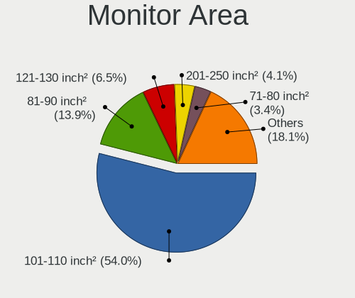
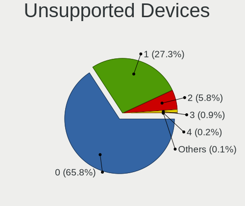

Linux in Russia - Tested Hardware & Statistics (Notebooks)
----------------------------------------------------------

A project to collect tested hardware configurations for Linux in Russia.

Anyone can contribute to this report by the [hw-probe](https://github.com/linuxhw/hw-probe) tool:

    sudo -E hw-probe -all -upload

Please contribute! Especially if your hardware is rare.

Contents
--------

* [ Test Cases ](#test-cases)

* [ System ](#system)
  - [ OS                       ](#os)
  - [ OS Family                ](#os-family)
  - [ Kernel                   ](#kernel)
  - [ Kernel Family            ](#kernel-family)
  - [ Kernel Major Ver.        ](#kernel-major-ver)
  - [ Arch                     ](#arch)
  - [ DE                       ](#de)
  - [ Display Server           ](#display-server)
  - [ Display Manager          ](#display-manager)
  - [ OS Lang                  ](#os-lang)
  - [ Boot Mode                ](#boot-mode)
  - [ Filesystem               ](#filesystem)
  - [ Part. scheme             ](#part-scheme)
  - [ Dual Boot with Linux/BSD ](#dual-boot-with-linuxbsd)
  - [ Dual Boot (Win)          ](#dual-boot-win)

* [ Board ](#board)
  - [ Vendor                   ](#vendor)
  - [ Model                    ](#model)
  - [ Model Family             ](#model-family)
  - [ MFG Year                 ](#mfg-year)
  - [ Form Factor              ](#form-factor)
  - [ Secure Boot              ](#secure-boot)
  - [ Coreboot                 ](#coreboot)
  - [ RAM Size                 ](#ram-size)
  - [ RAM Used                 ](#ram-used)
  - [ Total Drives             ](#total-drives)
  - [ Has CD-ROM               ](#has-cd-rom)
  - [ Has Ethernet             ](#has-ethernet)
  - [ Has WiFi                 ](#has-wifi)
  - [ Has Bluetooth            ](#has-bluetooth)

* [ Location ](#location)
  - [ Country                  ](#country)
  - [ City                     ](#city)

* [ Drives ](#drives)
  - [ Drive Vendor             ](#drive-vendor)
  - [ Drive Model              ](#drive-model)
  - [ HDD Vendor               ](#hdd-vendor)
  - [ SSD Vendor               ](#ssd-vendor)
  - [ Drive Kind               ](#drive-kind)
  - [ Drive Connector          ](#drive-connector)
  - [ Drive Size               ](#drive-size)
  - [ Space Total              ](#space-total)
  - [ Space Used               ](#space-used)
  - [ Malfunc. Drives          ](#malfunc-drives)
  - [ Malfunc. Drive Vendor    ](#malfunc-drive-vendor)
  - [ Malfunc. HDD Vendor      ](#malfunc-hdd-vendor)
  - [ Malfunc. Drive Kind      ](#malfunc-drive-kind)
  - [ Failed Drives            ](#failed-drives)
  - [ Failed Drive Vendor      ](#failed-drive-vendor)
  - [ Drive Status             ](#drive-status)

* [ Storage controller ](#storage-controller)
  - [ Storage Vendor           ](#storage-vendor)
  - [ Storage Model            ](#storage-model)
  - [ Storage Kind             ](#storage-kind)

* [ Processor ](#processor)
  - [ CPU Vendor               ](#cpu-vendor)
  - [ CPU Model                ](#cpu-model)
  - [ CPU Model Family         ](#cpu-model-family)
  - [ CPU Cores                ](#cpu-cores)
  - [ CPU Sockets              ](#cpu-sockets)
  - [ CPU Threads              ](#cpu-threads)
  - [ CPU Op-Modes             ](#cpu-op-modes)
  - [ CPU Microcode            ](#cpu-microcode)
  - [ CPU Microarch            ](#cpu-microarch)

* [ Graphics ](#graphics)
  - [ GPU Vendor               ](#gpu-vendor)
  - [ GPU Model                ](#gpu-model)
  - [ GPU Combo                ](#gpu-combo)
  - [ GPU Driver               ](#gpu-driver)
  - [ GPU Memory               ](#gpu-memory)

* [ Monitor ](#monitor)
  - [ Monitor Vendor           ](#monitor-vendor)
  - [ Monitor Model            ](#monitor-model)
  - [ Monitor Resolution       ](#monitor-resolution)
  - [ Monitor Diagonal         ](#monitor-diagonal)
  - [ Monitor Width            ](#monitor-width)
  - [ Aspect Ratio             ](#aspect-ratio)
  - [ Monitor Area             ](#monitor-area)
  - [ Pixel Density            ](#pixel-density)
  - [ Multiple Monitors        ](#multiple-monitors)

* [ Network ](#network)
  - [ Net Controller Vendor    ](#net-controller-vendor)
  - [ Net Controller Model     ](#net-controller-model)
  - [ Wireless Vendor          ](#wireless-vendor)
  - [ Wireless Model           ](#wireless-model)
  - [ Ethernet Vendor          ](#ethernet-vendor)
  - [ Ethernet Model           ](#ethernet-model)
  - [ Net Controller Kind      ](#net-controller-kind)
  - [ Used Controller          ](#used-controller)
  - [ NICs                     ](#nics)
  - [ IPv6                     ](#ipv6)

* [ Bluetooth ](#bluetooth)
  - [ Bluetooth Vendor         ](#bluetooth-vendor)
  - [ Bluetooth Model          ](#bluetooth-model)

* [ Sound ](#sound)
  - [ Sound Vendor             ](#sound-vendor)
  - [ Sound Model              ](#sound-model)

* [ Memory ](#memory)
  - [ Memory Vendor            ](#memory-vendor)
  - [ Memory Model             ](#memory-model)
  - [ Memory Kind              ](#memory-kind)
  - [ Memory Form Factor       ](#memory-form-factor)
  - [ Memory Size              ](#memory-size)
  - [ Memory Speed             ](#memory-speed)

* [ Printers & scanners ](#printers--scanners)
  - [ Printer Vendor           ](#printer-vendor)
  - [ Printer Model            ](#printer-model)
  - [ Scanner Vendor           ](#scanner-vendor)
  - [ Scanner Model            ](#scanner-model)

* [ Camera ](#camera)
  - [ Camera Vendor            ](#camera-vendor)
  - [ Camera Model             ](#camera-model)

* [ Security ](#security)
  - [ Fingerprint Vendor       ](#fingerprint-vendor)
  - [ Fingerprint Model        ](#fingerprint-model)
  - [ Chipcard Vendor          ](#chipcard-vendor)
  - [ Chipcard Model           ](#chipcard-model)

* [ Unsupported ](#unsupported)
  - [ Unsupported Devices      ](#unsupported-devices)
  - [ Unsupported Device Types ](#unsupported-device-types)

Test Cases
----------

Total: 19563

| Vendor        | Model                       | Probe                                                      | Date         |
|---------------|-----------------------------|------------------------------------------------------------|--------------|
| Digma         | EVE 11 C421Y ES1067EW       | [2a54b2d3e1](https://linux-hardware.org/?probe=2a54b2d3e1) | Oct 01, 2023 |
| Packard Be... | EasyNote ENLG81BA           | [c10a5eef39](https://linux-hardware.org/?probe=c10a5eef39) | Oct 01, 2023 |
| Acer          | Aspire A315-58              | [bbab99a4f7](https://linux-hardware.org/?probe=bbab99a4f7) | Sep 30, 2023 |
| Lenovo        | G505s 20255                 | [58a1c6e106](https://linux-hardware.org/?probe=58a1c6e106) | Sep 30, 2023 |
| Infinix       | INBOOK X3                   | [6b5c2647c2](https://linux-hardware.org/?probe=6b5c2647c2) | Sep 30, 2023 |
| Lenovo        | ThinkPad X260 VB6R77903H    | [e7dad368d2](https://linux-hardware.org/?probe=e7dad368d2) | Sep 30, 2023 |
| Lenovo        | ThinkPad X260 VB6R77903H    | [de3079ae33](https://linux-hardware.org/?probe=de3079ae33) | Sep 30, 2023 |
| HP            | Pavilion Gaming Laptop 1... | [b3959728d3](https://linux-hardware.org/?probe=b3959728d3) | Sep 30, 2023 |
| Lenovo        | IdeaPad C340-14API 81N6     | [73b5907f17](https://linux-hardware.org/?probe=73b5907f17) | Sep 30, 2023 |
| Fujitsu Si... | AMILO Pro Edition V3405     | [4814760ac1](https://linux-hardware.org/?probe=4814760ac1) | Sep 30, 2023 |
| Dell          | Inspiron N5110              | [e796baf50f](https://linux-hardware.org/?probe=e796baf50f) | Sep 30, 2023 |
| Intel Clie... | LAPBC710                    | [3a29dfa2e3](https://linux-hardware.org/?probe=3a29dfa2e3) | Sep 30, 2023 |
| Acer          | Aspire 5560                 | [252d19e4f5](https://linux-hardware.org/?probe=252d19e4f5) | Sep 30, 2023 |
| ASUSTek       | ASUS EXPERTBOOK B1402CBA... | [91873a529a](https://linux-hardware.org/?probe=91873a529a) | Sep 30, 2023 |
| Dell          | Inspiron 15 3525            | [b46d569d14](https://linux-hardware.org/?probe=b46d569d14) | Sep 30, 2023 |
| Dell          | Inspiron 15 3525            | [fb52caaee9](https://linux-hardware.org/?probe=fb52caaee9) | Sep 30, 2023 |
| TECNO         | MEGABOOK T1                 | [9bba77e02b](https://linux-hardware.org/?probe=9bba77e02b) | Sep 30, 2023 |
| ASUSTek       | ASUS TUF Gaming A15 FA50... | [527c8192a9](https://linux-hardware.org/?probe=527c8192a9) | Sep 30, 2023 |
| ASUSTek       | ASUS TUF Gaming A15 FA50... | [96e037afc8](https://linux-hardware.org/?probe=96e037afc8) | Sep 29, 2023 |
| Dell          | Inspiron 5558               | [f94587a692](https://linux-hardware.org/?probe=f94587a692) | Sep 29, 2023 |
| Lenovo        | G70-70 80HW                 | [4e22db020f](https://linux-hardware.org/?probe=4e22db020f) | Sep 29, 2023 |
| F-PLUS EQU... | FNB-156-P1                  | [cceaaac2d3](https://linux-hardware.org/?probe=cceaaac2d3) | Sep 29, 2023 |
| HP            | ProBook 430 G3              | [5a73271bfd](https://linux-hardware.org/?probe=5a73271bfd) | Sep 29, 2023 |
| Samsung       | 350V5C/351V5C/3540VC/344... | [b9f67caef4](https://linux-hardware.org/?probe=b9f67caef4) | Sep 29, 2023 |
| Lenovo        | G70-70 80HW                 | [5ef0f97836](https://linux-hardware.org/?probe=5ef0f97836) | Sep 29, 2023 |
| Valve         | Jupiter                     | [acc0ad7283](https://linux-hardware.org/?probe=acc0ad7283) | Sep 28, 2023 |
| Lenovo        | ThinkPad E490 20N8000SRT    | [274b3b5210](https://linux-hardware.org/?probe=274b3b5210) | Sep 28, 2023 |
| ROMBICA       | myBook Eclipse              | [004e1dc4fd](https://linux-hardware.org/?probe=004e1dc4fd) | Sep 28, 2023 |
| ASUSTek       | ASUS TUF Dash F15 FX516P... | [4cef8be854](https://linux-hardware.org/?probe=4cef8be854) | Sep 28, 2023 |
| Lenovo        | ThinkPad T14 Gen 3 21AH0... | [39fd38bc98](https://linux-hardware.org/?probe=39fd38bc98) | Sep 28, 2023 |
| Lenovo        | ThinkPad T510 43142PU       | [30bd29e170](https://linux-hardware.org/?probe=30bd29e170) | Sep 28, 2023 |
| F-PLUS EQU... | FNB-156-P1                  | [fb8fd7617c](https://linux-hardware.org/?probe=fb8fd7617c) | Sep 28, 2023 |
| Infinix       | INBOOK X2 GEN11             | [2ac0204275](https://linux-hardware.org/?probe=2ac0204275) | Sep 28, 2023 |
| HP            | ProBook 430 G5              | [9e68b6e2be](https://linux-hardware.org/?probe=9e68b6e2be) | Sep 28, 2023 |
| Lenovo        | ThinkPad X250 20CMS0A200    | [54f848d222](https://linux-hardware.org/?probe=54f848d222) | Sep 28, 2023 |
| ASUSTek       | K50IJ                       | [8556633dad](https://linux-hardware.org/?probe=8556633dad) | Sep 27, 2023 |
| Lenovo        | IdeaPad Gaming 3 15IMH05... | [1317c1f1a9](https://linux-hardware.org/?probe=1317c1f1a9) | Sep 27, 2023 |
| Lenovo        | ThinkBook 15 G3 ACL 21A4    | [6295f7193c](https://linux-hardware.org/?probe=6295f7193c) | Sep 27, 2023 |
| Lenovo        | XiaoXinPro 16 APH8 83AR     | [9ad96a3803](https://linux-hardware.org/?probe=9ad96a3803) | Sep 27, 2023 |
| MSI           | Bravo 15 C7VE               | [844b7f2a1c](https://linux-hardware.org/?probe=844b7f2a1c) | Sep 27, 2023 |
| ASUSTek       | N550JV                      | [ac27d821ae](https://linux-hardware.org/?probe=ac27d821ae) | Sep 27, 2023 |
| Lenovo        | ThinkBook 15 G3 ACL 21A4    | [278578e488](https://linux-hardware.org/?probe=278578e488) | Sep 27, 2023 |
| Lenovo        | ThinkBook 15 G3 ACL 21A4    | [6f4a404e89](https://linux-hardware.org/?probe=6f4a404e89) | Sep 27, 2023 |
| Chuwi         | GemiBook Pro                | [4ea2bab759](https://linux-hardware.org/?probe=4ea2bab759) | Sep 27, 2023 |
| HUAWEI        | RLEF-XX                     | [156140f867](https://linux-hardware.org/?probe=156140f867) | Sep 27, 2023 |
| Dell          | Latitude 5420               | [4f890f283a](https://linux-hardware.org/?probe=4f890f283a) | Sep 26, 2023 |
| HP            | Laptop 14s-dq2xxx           | [cf522515d7](https://linux-hardware.org/?probe=cf522515d7) | Sep 26, 2023 |
| HP            | EliteBook 840 G8 Noteboo... | [243f89703d](https://linux-hardware.org/?probe=243f89703d) | Sep 26, 2023 |
| HUAWEI        | BDZ-WXX9                    | [a33a848e40](https://linux-hardware.org/?probe=a33a848e40) | Sep 26, 2023 |
| Aquarius      | NS585                       | [ce1c1d6e56](https://linux-hardware.org/?probe=ce1c1d6e56) | Sep 26, 2023 |
| ASUSTek       | VivoBook_ASUSLaptop M350... | [cf4a15af9e](https://linux-hardware.org/?probe=cf4a15af9e) | Sep 26, 2023 |
| Acer          | Aspire 5750ZG               | [b8e46e5780](https://linux-hardware.org/?probe=b8e46e5780) | Sep 26, 2023 |
| Lenovo        | IdeaPad Y510                | [caec91aae7](https://linux-hardware.org/?probe=caec91aae7) | Sep 26, 2023 |
| Acer          | TravelMate 5744             | [2e69d317ef](https://linux-hardware.org/?probe=2e69d317ef) | Sep 26, 2023 |
| Lenovo        | IdeaPad 320-15ISK 80XH      | [6a3291f6bf](https://linux-hardware.org/?probe=6a3291f6bf) | Sep 25, 2023 |
| Lenovo        | IdeaPad 320-15ISK 80XH      | [981e7e8ec5](https://linux-hardware.org/?probe=981e7e8ec5) | Sep 25, 2023 |
| HUAWEI        | BOM-WXX9                    | [8d4ba0b939](https://linux-hardware.org/?probe=8d4ba0b939) | Sep 25, 2023 |
| Dell          | Inspiron 5558               | [dbf4dfe481](https://linux-hardware.org/?probe=dbf4dfe481) | Sep 25, 2023 |
| Lenovo        | IdeaPad 3 17ALC6 82KV       | [1ce8f959f1](https://linux-hardware.org/?probe=1ce8f959f1) | Sep 25, 2023 |
| Aquarius      | NS585                       | [e901467e39](https://linux-hardware.org/?probe=e901467e39) | Sep 25, 2023 |
| HUAWEI        | BOM-WXX9                    | [ed52653514](https://linux-hardware.org/?probe=ed52653514) | Sep 25, 2023 |
| Lenovo        | IdeaPad L340-15API 81LW     | [b85adec006](https://linux-hardware.org/?probe=b85adec006) | Sep 25, 2023 |
| MSI           | Bravo 15 C7VF               | [ab0a5a435f](https://linux-hardware.org/?probe=ab0a5a435f) | Sep 25, 2023 |
| Acer          | Aspire V3-571G              | [6b5dcea023](https://linux-hardware.org/?probe=6b5dcea023) | Sep 25, 2023 |
| Samsung       | N250P                       | [7eb858a64d](https://linux-hardware.org/?probe=7eb858a64d) | Sep 25, 2023 |
| Toshiba       | dynabook Satellite B350/... | [2b241af774](https://linux-hardware.org/?probe=2b241af774) | Sep 25, 2023 |
| Acer          | Aspire 3610                 | [021d48bbdb](https://linux-hardware.org/?probe=021d48bbdb) | Sep 25, 2023 |
| ASUSTek       | VivoBook_ASUSLaptop M160... | [811f1951fc](https://linux-hardware.org/?probe=811f1951fc) | Sep 25, 2023 |
| Lenovo        | IdeaPad 5 14ABA7 82SE       | [2695ee345d](https://linux-hardware.org/?probe=2695ee345d) | Sep 24, 2023 |
| Acer          | Aspire A715-42G             | [868a5abe75](https://linux-hardware.org/?probe=868a5abe75) | Sep 24, 2023 |
| Acer          | TravelMate P259-MG          | [26ca7317b2](https://linux-hardware.org/?probe=26ca7317b2) | Sep 24, 2023 |
| Acer          | Aspire ES1-520              | [c2b98b035f](https://linux-hardware.org/?probe=c2b98b035f) | Sep 24, 2023 |
| HUAWEI        | KLVL-WXXW                   | [f2a543d0dd](https://linux-hardware.org/?probe=f2a543d0dd) | Sep 24, 2023 |
| Lenovo        | G580 20150                  | [f55e42a884](https://linux-hardware.org/?probe=f55e42a884) | Sep 24, 2023 |
| Samsung       | 300E4Z/300E5Z/300E7Z        | [30d9462d2d](https://linux-hardware.org/?probe=30d9462d2d) | Sep 24, 2023 |
| Unknown       | X133                        | [eca7c95360](https://linux-hardware.org/?probe=eca7c95360) | Sep 24, 2023 |
| Apple         | MacBookPro11,1              | [0f396f4227](https://linux-hardware.org/?probe=0f396f4227) | Sep 24, 2023 |
| HUAWEI        | NBD-WXX9                    | [f728eb13bd](https://linux-hardware.org/?probe=f728eb13bd) | Sep 24, 2023 |
| HP            | Laptop 15s-eq2xxx           | [092bb813b4](https://linux-hardware.org/?probe=092bb813b4) | Sep 24, 2023 |
| Lenovo        | IdeaPad 330-15AST 81D6      | [2814a495de](https://linux-hardware.org/?probe=2814a495de) | Sep 24, 2023 |
| Sony          | VGN-FW11LR                  | [81921a2f1d](https://linux-hardware.org/?probe=81921a2f1d) | Sep 24, 2023 |
| Timi          | TM1701                      | [0e127afa68](https://linux-hardware.org/?probe=0e127afa68) | Sep 24, 2023 |
| Acer          | Aspire 5520                 | [5bcc67211c](https://linux-hardware.org/?probe=5bcc67211c) | Sep 24, 2023 |
| Unknown       | Unknown                     | [b6f7bc9bd2](https://linux-hardware.org/?probe=b6f7bc9bd2) | Sep 24, 2023 |
| HP            | ProBook 450 G1              | [90069ca278](https://linux-hardware.org/?probe=90069ca278) | Sep 23, 2023 |
| Lenovo        | IdeaPad S145-15IIL 81W8     | [1809080d01](https://linux-hardware.org/?probe=1809080d01) | Sep 23, 2023 |
| Lenovo        | ThinkPad Edge E430c 3365... | [74351c4243](https://linux-hardware.org/?probe=74351c4243) | Sep 23, 2023 |
| Acer          | AOHAPPY2                    | [b9937354f2](https://linux-hardware.org/?probe=b9937354f2) | Sep 22, 2023 |
| ASUSTek       | VivoBook_ASUSLaptop X321... | [d62c6d340f](https://linux-hardware.org/?probe=d62c6d340f) | Sep 22, 2023 |
| Acer          | Aspire 5520                 | [8329086779](https://linux-hardware.org/?probe=8329086779) | Sep 22, 2023 |
| Lenovo        | IdeaPad S340-15IWL 81N8     | [c14178c7fa](https://linux-hardware.org/?probe=c14178c7fa) | Sep 22, 2023 |
| Samsung       | R505                        | [8aef37cda9](https://linux-hardware.org/?probe=8aef37cda9) | Sep 22, 2023 |
| ASUSTek       | ZenBook UX325EA_UX325EA     | [900334906e](https://linux-hardware.org/?probe=900334906e) | Sep 22, 2023 |
| MSI           | GF65 Thin 9SEXR             | [9fbc54dcb7](https://linux-hardware.org/?probe=9fbc54dcb7) | Sep 22, 2023 |
| Dell          | Latitude 5420               | [d9c1c1537f](https://linux-hardware.org/?probe=d9c1c1537f) | Sep 22, 2023 |
| HP            | Laptop 14s-fq0xxx           | [3f7ef99bf3](https://linux-hardware.org/?probe=3f7ef99bf3) | Sep 22, 2023 |
| Valve         | Jupiter                     | [b0abd58408](https://linux-hardware.org/?probe=b0abd58408) | Sep 22, 2023 |
| ASUSTek       | X553SA                      | [451784974b](https://linux-hardware.org/?probe=451784974b) | Sep 21, 2023 |
| HP            | EliteBook 840 G5 NOTEBOO... | [0e85445e8e](https://linux-hardware.org/?probe=0e85445e8e) | Sep 21, 2023 |
| HP            | EliteBook 840 G5 NOTEBOO... | [3a372bed63](https://linux-hardware.org/?probe=3a372bed63) | Sep 21, 2023 |
| Timi          | A35S                        | [ae2a6acf26](https://linux-hardware.org/?probe=ae2a6acf26) | Sep 21, 2023 |
| Kraftway      | ACCORD                      | [df4d5654d5](https://linux-hardware.org/?probe=df4d5654d5) | Sep 21, 2023 |
| ASUSTek       | K50IJ                       | [a1dcfd7ff7](https://linux-hardware.org/?probe=a1dcfd7ff7) | Sep 21, 2023 |
| Lenovo        | ThinkPad T510 43142PU       | [527f5eb1a9](https://linux-hardware.org/?probe=527f5eb1a9) | Sep 21, 2023 |
| HP            | 630                         | [1ed6efc4de](https://linux-hardware.org/?probe=1ed6efc4de) | Sep 21, 2023 |
| Lenovo        | B590 20208                  | [f8c48a3ed3](https://linux-hardware.org/?probe=f8c48a3ed3) | Sep 21, 2023 |
| Fujitsu Si... | AMILO Li3710                | [5a5c48d3df](https://linux-hardware.org/?probe=5a5c48d3df) | Sep 20, 2023 |
| Clevo         | NL41MU2                     | [68b62bb7da](https://linux-hardware.org/?probe=68b62bb7da) | Sep 20, 2023 |
| ASUSTek       | TUF Gaming FX505GT_FX505... | [c8bbae1068](https://linux-hardware.org/?probe=c8bbae1068) | Sep 20, 2023 |
| ASUSTek       | 1001PX                      | [6331a101c7](https://linux-hardware.org/?probe=6331a101c7) | Sep 20, 2023 |
| HUAWEI        | BOM-WXX9                    | [4861bef61e](https://linux-hardware.org/?probe=4861bef61e) | Sep 20, 2023 |
| Samsung       | NC210/NC110                 | [1e194a2568](https://linux-hardware.org/?probe=1e194a2568) | Sep 20, 2023 |
| ASUSTek       | Zenbook 15 UM3504DA_UM35... | [27002ca3a9](https://linux-hardware.org/?probe=27002ca3a9) | Sep 20, 2023 |
| HP            | Pavilion Gaming Laptop 1... | [17bfc616ef](https://linux-hardware.org/?probe=17bfc616ef) | Sep 20, 2023 |
| Maibenben     | MaiBook M Series            | [dc2eb7a7d7](https://linux-hardware.org/?probe=dc2eb7a7d7) | Sep 19, 2023 |
| Apple         | MacBookPro8,1               | [c1ca0a1d1c](https://linux-hardware.org/?probe=c1ca0a1d1c) | Sep 19, 2023 |
| HUAWEI        | KLVL-WXXW                   | [efed6450c5](https://linux-hardware.org/?probe=efed6450c5) | Sep 19, 2023 |
| Clevo         | W240EL/W250ELQ/W270ELQ      | [6e554fc589](https://linux-hardware.org/?probe=6e554fc589) | Sep 19, 2023 |
| MSI           | Summit E15 A11SCST          | [aa908f1cea](https://linux-hardware.org/?probe=aa908f1cea) | Sep 19, 2023 |
| Toshiba       | QOSMIO X300                 | [fe89cd3f23](https://linux-hardware.org/?probe=fe89cd3f23) | Sep 19, 2023 |
| Valve         | Jupiter                     | [458972a2c0](https://linux-hardware.org/?probe=458972a2c0) | Sep 19, 2023 |
| Acer          | Aspire ES1-520              | [8006999633](https://linux-hardware.org/?probe=8006999633) | Sep 19, 2023 |
| Acer          | Aspire A315-42              | [ae09470cce](https://linux-hardware.org/?probe=ae09470cce) | Sep 19, 2023 |
| HUAWEI        | BOM-WXX9                    | [286398db3c](https://linux-hardware.org/?probe=286398db3c) | Sep 19, 2023 |
| HUAWEI        | BOM-WXX9                    | [ad024119be](https://linux-hardware.org/?probe=ad024119be) | Sep 19, 2023 |
| MSI           | GF65 Thin 9SEXR             | [d8166ef941](https://linux-hardware.org/?probe=d8166ef941) | Sep 19, 2023 |
| Acer          | Aspire A315-22G             | [0c047cb731](https://linux-hardware.org/?probe=0c047cb731) | Sep 19, 2023 |
| HP            | Pavilion g6                 | [f11438b1a2](https://linux-hardware.org/?probe=f11438b1a2) | Sep 19, 2023 |
| Intel Clie... | LAPBC710                    | [af446fcb4d](https://linux-hardware.org/?probe=af446fcb4d) | Sep 19, 2023 |
| Intel Clie... | LAPBC710                    | [eae124fa61](https://linux-hardware.org/?probe=eae124fa61) | Sep 19, 2023 |
| HP            | Laptop 15s-eq2xxx           | [53549e3b08](https://linux-hardware.org/?probe=53549e3b08) | Sep 18, 2023 |
| iRU           | 17ALC                       | [2d0b23c813](https://linux-hardware.org/?probe=2d0b23c813) | Sep 18, 2023 |
| Acer          | Extensa 215-32              | [6879449933](https://linux-hardware.org/?probe=6879449933) | Sep 18, 2023 |
| HP            | Pavilion 15                 | [eb15fe383c](https://linux-hardware.org/?probe=eb15fe383c) | Sep 18, 2023 |
| Aquarius      | NS585                       | [6ac8bd5909](https://linux-hardware.org/?probe=6ac8bd5909) | Sep 18, 2023 |
| HP            | Pavilion 15                 | [fb86634643](https://linux-hardware.org/?probe=fb86634643) | Sep 18, 2023 |
| HP            | ProBook 445 G8 Notebook ... | [4d986c5384](https://linux-hardware.org/?probe=4d986c5384) | Sep 18, 2023 |
| HP            | Notebook                    | [0c80a5c83f](https://linux-hardware.org/?probe=0c80a5c83f) | Sep 18, 2023 |
| Acer          | Aspire 5755G                | [f58cf1f72d](https://linux-hardware.org/?probe=f58cf1f72d) | Sep 18, 2023 |
| Fujitsu       | LIFEBOOK N6470              | [bbc02d8d99](https://linux-hardware.org/?probe=bbc02d8d99) | Sep 18, 2023 |
| Clevo         | NL41MU2                     | [ae7db27e79](https://linux-hardware.org/?probe=ae7db27e79) | Sep 18, 2023 |
| Acer          | Aspire 5755G                | [68cef2242a](https://linux-hardware.org/?probe=68cef2242a) | Sep 18, 2023 |
| Lenovo        | ThinkPad X250 20CMS0A200    | [43df4bd3f3](https://linux-hardware.org/?probe=43df4bd3f3) | Sep 18, 2023 |
| HUAWEI        | BOM-WXX9                    | [ce88b51f6e](https://linux-hardware.org/?probe=ce88b51f6e) | Sep 17, 2023 |
| HP            | ProBook 4535s               | [4fad5ba2da](https://linux-hardware.org/?probe=4fad5ba2da) | Sep 17, 2023 |
| Unknown       | Unknown                     | [3b4224eda5](https://linux-hardware.org/?probe=3b4224eda5) | Sep 17, 2023 |
| eMachines     | Rhine V1.43                 | [1dc929e263](https://linux-hardware.org/?probe=1dc929e263) | Sep 17, 2023 |
| Clevo         | W240EL/W250ELQ/W270ELQ      | [e5a3155306](https://linux-hardware.org/?probe=e5a3155306) | Sep 17, 2023 |
| iRU           | 15ALC                       | [c5839fb7da](https://linux-hardware.org/?probe=c5839fb7da) | Sep 17, 2023 |
| iRU           | 15ALC                       | [87679b8dc1](https://linux-hardware.org/?probe=87679b8dc1) | Sep 17, 2023 |
| ASUSTek       | Zenbook 15 UM3504DA_UM35... | [77a72808f7](https://linux-hardware.org/?probe=77a72808f7) | Sep 17, 2023 |
| Timi          | Redmi Book Pro 14 2022      | [0ebcb848ff](https://linux-hardware.org/?probe=0ebcb848ff) | Sep 16, 2023 |
| Acer          | Aspire A515-45              | [7cd5acacf7](https://linux-hardware.org/?probe=7cd5acacf7) | Sep 16, 2023 |
| Lenovo        | G570 20079                  | [f2da433d78](https://linux-hardware.org/?probe=f2da433d78) | Sep 16, 2023 |
| ASUSTek       | VivoBook_ASUSLaptop X513... | [80435bbec3](https://linux-hardware.org/?probe=80435bbec3) | Sep 16, 2023 |
| ASUSTek       | 1215P                       | [6741860726](https://linux-hardware.org/?probe=6741860726) | Sep 16, 2023 |
| Pegatron      | A35                         | [b95829115c](https://linux-hardware.org/?probe=b95829115c) | Sep 16, 2023 |
| ASUSTek       | 1215P                       | [51735ee7d6](https://linux-hardware.org/?probe=51735ee7d6) | Sep 16, 2023 |
| ASUSTek       | VivoBook_ASUSLaptop M650... | [567443136d](https://linux-hardware.org/?probe=567443136d) | Sep 15, 2023 |
| Timi          | Redmi Book Pro 14 2022      | [c5fccb4455](https://linux-hardware.org/?probe=c5fccb4455) | Sep 15, 2023 |
| MSI           | Modern 15 B7M               | [4d35879250](https://linux-hardware.org/?probe=4d35879250) | Sep 15, 2023 |
| F-PLUS EQU... | FNB-156-P1                  | [ddd1dc3953](https://linux-hardware.org/?probe=ddd1dc3953) | Sep 15, 2023 |
| Timi          | Redmi Book Pro 15 2022      | [f9117dd665](https://linux-hardware.org/?probe=f9117dd665) | Sep 15, 2023 |
| HUAWEI        | NBD-WXX9                    | [282def5c2a](https://linux-hardware.org/?probe=282def5c2a) | Sep 15, 2023 |
| Timi          | Redmi Book Pro 15 2022      | [c6cc55c6ec](https://linux-hardware.org/?probe=c6cc55c6ec) | Sep 15, 2023 |
| ASUSTek       | X507UB                      | [ca19710375](https://linux-hardware.org/?probe=ca19710375) | Sep 15, 2023 |
| TECNO         | MEGABOOK T1                 | [b15d4ed6b0](https://linux-hardware.org/?probe=b15d4ed6b0) | Sep 15, 2023 |
| HUAWEI        | HKD-WXX                     | [4d0eb9b8d2](https://linux-hardware.org/?probe=4d0eb9b8d2) | Sep 15, 2023 |
| Timi          | A35S                        | [b229627e35](https://linux-hardware.org/?probe=b229627e35) | Sep 14, 2023 |
| ASUSTek       | VivoBook 15_ASUS Laptop ... | [0ffb2a765f](https://linux-hardware.org/?probe=0ffb2a765f) | Sep 14, 2023 |
| HP            | G5000 (RY492EA#ACB)         | [0f0a19a64c](https://linux-hardware.org/?probe=0f0a19a64c) | Sep 14, 2023 |
| Clevo         | NL41MU2                     | [4400eaccdb](https://linux-hardware.org/?probe=4400eaccdb) | Sep 14, 2023 |
| ASUSTek       | T100TAM                     | [f3d6cb60ec](https://linux-hardware.org/?probe=f3d6cb60ec) | Sep 14, 2023 |
| Lenovo        | ThinkPad E14 Gen 2 20T60... | [cf69e328c4](https://linux-hardware.org/?probe=cf69e328c4) | Sep 14, 2023 |
| Lenovo        | ThinkPad T14 Gen 1 20S00... | [2f2e7e3663](https://linux-hardware.org/?probe=2f2e7e3663) | Sep 14, 2023 |
| ASUSTek       | ROG Strix G713PI_G713PI     | [d61823257e](https://linux-hardware.org/?probe=d61823257e) | Sep 13, 2023 |
| Lenovo        | YogaAir 14s APU8 83AA       | [b8b03de96a](https://linux-hardware.org/?probe=b8b03de96a) | Sep 13, 2023 |
| Dell          | System Inspiron 17 7000 ... | [9dd436fa60](https://linux-hardware.org/?probe=9dd436fa60) | Sep 13, 2023 |
| HP            | Pavilion g6                 | [8ae79d7b93](https://linux-hardware.org/?probe=8ae79d7b93) | Sep 13, 2023 |
| HP            | Laptop 15-da3xxx            | [86c32c23db](https://linux-hardware.org/?probe=86c32c23db) | Sep 13, 2023 |
| HP            | ProBook 6570b               | [baf81a81a2](https://linux-hardware.org/?probe=baf81a81a2) | Sep 13, 2023 |
| Dell          | G3 3579                     | [0da9f9b572](https://linux-hardware.org/?probe=0da9f9b572) | Sep 13, 2023 |
| HP            | ProBook 4310s               | [5c60f06750](https://linux-hardware.org/?probe=5c60f06750) | Sep 13, 2023 |
| HP            | ProBook 6570b               | [90aaacf4af](https://linux-hardware.org/?probe=90aaacf4af) | Sep 13, 2023 |
| HP            | ProBook 445 G7              | [5210aaa5ee](https://linux-hardware.org/?probe=5210aaa5ee) | Sep 13, 2023 |
| ASUSTek       | N56VJ                       | [8cf70251ac](https://linux-hardware.org/?probe=8cf70251ac) | Sep 13, 2023 |
| Lenovo        | ThinkPad E14 Gen 2 20T60... | [2a30486273](https://linux-hardware.org/?probe=2a30486273) | Sep 13, 2023 |
| ASUSTek       | VivoBook_ASUSLaptop X513... | [006062545f](https://linux-hardware.org/?probe=006062545f) | Sep 13, 2023 |
| Acer          | Aspire ES1-311              | [d191439979](https://linux-hardware.org/?probe=d191439979) | Sep 13, 2023 |
| HUAWEI        | KLVL-WXXW                   | [138dfabe47](https://linux-hardware.org/?probe=138dfabe47) | Sep 13, 2023 |
| Acer          | Aspire A515-45              | [1df9430f46](https://linux-hardware.org/?probe=1df9430f46) | Sep 13, 2023 |
| Timi          | Redmi Book Pro 14S          | [261ee2ede0](https://linux-hardware.org/?probe=261ee2ede0) | Sep 13, 2023 |
| Lenovo        | IdeaPad 3 15IIL05 81WE      | [2260bcd7af](https://linux-hardware.org/?probe=2260bcd7af) | Sep 12, 2023 |
| HUAWEI        | BOM-WXX9                    | [546dbbeb91](https://linux-hardware.org/?probe=546dbbeb91) | Sep 12, 2023 |
| ASUSTek       | K53SK                       | [5dcbdaa6d7](https://linux-hardware.org/?probe=5dcbdaa6d7) | Sep 12, 2023 |
| HUAWEI        | NBD-WXX9                    | [663412fd9c](https://linux-hardware.org/?probe=663412fd9c) | Sep 12, 2023 |
| ASUSTek       | VivoBook_ASUSLaptop M150... | [9f94d7ad84](https://linux-hardware.org/?probe=9f94d7ad84) | Sep 12, 2023 |
| ASUSTek       | VivoBook_ASUSLaptop M150... | [15457ee4ca](https://linux-hardware.org/?probe=15457ee4ca) | Sep 12, 2023 |
| ASUSTek       | VivoBook_ASUSLaptop X515... | [675582a822](https://linux-hardware.org/?probe=675582a822) | Sep 12, 2023 |
| HP            | ENVY Notebook               | [cd276f172f](https://linux-hardware.org/?probe=cd276f172f) | Sep 12, 2023 |
| Lenovo        | ThinkPad E14 20RA002QRT     | [9aba9182e3](https://linux-hardware.org/?probe=9aba9182e3) | Sep 12, 2023 |
| ASUSTek       | ROG Strix G513QY_G513QY     | [f018495b81](https://linux-hardware.org/?probe=f018495b81) | Sep 12, 2023 |
| Lenovo        | G770 20089                  | [39c8088b09](https://linux-hardware.org/?probe=39c8088b09) | Sep 12, 2023 |
| HUAWEI        | BOM-WXX9                    | [0224dfd46f](https://linux-hardware.org/?probe=0224dfd46f) | Sep 11, 2023 |
| Dell          | Vostro 5481                 | [c8a8b7db55](https://linux-hardware.org/?probe=c8a8b7db55) | Sep 11, 2023 |
| ASUSTek       | VivoBook_ASUSLaptop X415... | [825795d0df](https://linux-hardware.org/?probe=825795d0df) | Sep 11, 2023 |
| HP            | Pavilion DV6                | [fde8a8cef6](https://linux-hardware.org/?probe=fde8a8cef6) | Sep 11, 2023 |
| HP            | ProBook 4535s               | [7ba4ddd436](https://linux-hardware.org/?probe=7ba4ddd436) | Sep 11, 2023 |
| ASUSTek       | X505BA                      | [cbb45a815f](https://linux-hardware.org/?probe=cbb45a815f) | Sep 11, 2023 |
| Infinix       | INBOOK X2 GEN11             | [5e87de3be1](https://linux-hardware.org/?probe=5e87de3be1) | Sep 11, 2023 |
| Notebook      | W54_W94_W955TU,-T,-C        | [7418d15ca6](https://linux-hardware.org/?probe=7418d15ca6) | Sep 10, 2023 |
| Notebook      | W54_W94_W955TU,-T,-C        | [c1f536984f](https://linux-hardware.org/?probe=c1f536984f) | Sep 10, 2023 |
| realme        | RMNBXXXX                    | [93403f6054](https://linux-hardware.org/?probe=93403f6054) | Sep 10, 2023 |
| Lenovo        | IdeaPad 5 14ABA7 82SE       | [2387d97fff](https://linux-hardware.org/?probe=2387d97fff) | Sep 10, 2023 |
| Timi          | Redmi Book Pro 15 2022      | [b5a174bf19](https://linux-hardware.org/?probe=b5a174bf19) | Sep 10, 2023 |
| ASUSTek       | ASUS TUF Dash F15 FX516P... | [30fd7bf070](https://linux-hardware.org/?probe=30fd7bf070) | Sep 10, 2023 |
| HUAWEI        | KLVL-WXXW                   | [7cb4d5f364](https://linux-hardware.org/?probe=7cb4d5f364) | Sep 10, 2023 |
| Apple         | MacBookPro13,3              | [225a9ae1c5](https://linux-hardware.org/?probe=225a9ae1c5) | Sep 10, 2023 |
| HP            | Unknown                     | [cb5704a65f](https://linux-hardware.org/?probe=cb5704a65f) | Sep 10, 2023 |
| ASUSTek       | N56VJ                       | [cb528e4c6d](https://linux-hardware.org/?probe=cb528e4c6d) | Sep 09, 2023 |
| Acer          | Swift SF314-43              | [7c50d60e91](https://linux-hardware.org/?probe=7c50d60e91) | Sep 09, 2023 |
| Toshiba       | Satellite C850-C1S          | [ce5643add2](https://linux-hardware.org/?probe=ce5643add2) | Sep 09, 2023 |
| Lenovo        | IdeaPad Gaming 3 15ARH05... | [82c10c1ff9](https://linux-hardware.org/?probe=82c10c1ff9) | Sep 09, 2023 |
| HP            | Laptop 14s-dq2xxx           | [a61ebacf85](https://linux-hardware.org/?probe=a61ebacf85) | Sep 09, 2023 |
| Timi          | Redmi Book Pro 15 2022      | [d2dbf4cee7](https://linux-hardware.org/?probe=d2dbf4cee7) | Sep 09, 2023 |
| Unknown       | Unknown                     | [bd4b5d82ed](https://linux-hardware.org/?probe=bd4b5d82ed) | Sep 09, 2023 |
| Lenovo        | IdeaPad Gaming 3 15IMH05... | [57e235e93d](https://linux-hardware.org/?probe=57e235e93d) | Sep 09, 2023 |
| Lenovo        | G580 20157                  | [3a772f3179](https://linux-hardware.org/?probe=3a772f3179) | Sep 08, 2023 |
| ASUSTek       | VivoBook_ASUSLaptop X350... | [5e3574fbca](https://linux-hardware.org/?probe=5e3574fbca) | Sep 08, 2023 |
| HP            | Pavilion Gaming Laptop 1... | [e0899f8743](https://linux-hardware.org/?probe=e0899f8743) | Sep 08, 2023 |
| Aquarius      | NS685U R11                  | [0a5a01ea58](https://linux-hardware.org/?probe=0a5a01ea58) | Sep 08, 2023 |
| ASUSTek       | VivoBook_ASUSLaptop X321... | [7796aa07e0](https://linux-hardware.org/?probe=7796aa07e0) | Sep 08, 2023 |
| Notebook      | W65_67SC                    | [cefbf3383a](https://linux-hardware.org/?probe=cefbf3383a) | Sep 08, 2023 |
| LTD Delovo... | 15CLG2                      | [2497c739e2](https://linux-hardware.org/?probe=2497c739e2) | Sep 08, 2023 |
| Notebook      | W65_67SC                    | [73eae4d8a0](https://linux-hardware.org/?probe=73eae4d8a0) | Sep 08, 2023 |
| Dell          | Vostro 15 3510              | [0937591ca4](https://linux-hardware.org/?probe=0937591ca4) | Sep 08, 2023 |
| ASUSTek       | X507UB                      | [4604e73045](https://linux-hardware.org/?probe=4604e73045) | Sep 08, 2023 |
| HONOR         | FRI-FXX                     | [6c852bb5bc](https://linux-hardware.org/?probe=6c852bb5bc) | Sep 07, 2023 |
| HP            | Pavilion Gaming Laptop 1... | [e2f9ce90d3](https://linux-hardware.org/?probe=e2f9ce90d3) | Sep 07, 2023 |
| Lenovo        | V15-IGL 82C3                | [78ecb1b882](https://linux-hardware.org/?probe=78ecb1b882) | Sep 07, 2023 |
| Timi          | Redmi Book Pro 14S          | [b2776d8282](https://linux-hardware.org/?probe=b2776d8282) | Sep 07, 2023 |
| HUAWEI        | NBLK-WAX9X                  | [9911fc5254](https://linux-hardware.org/?probe=9911fc5254) | Sep 07, 2023 |
| Valve         | Jupiter                     | [83b9205283](https://linux-hardware.org/?probe=83b9205283) | Sep 07, 2023 |
| ASUSTek       | ASUS TUF Dash F15 FX516P... | [3c6e29c3c3](https://linux-hardware.org/?probe=3c6e29c3c3) | Sep 06, 2023 |
| ASUSTek       | ZenBook Pro Duo UX582LR_... | [b2ba03726a](https://linux-hardware.org/?probe=b2ba03726a) | Sep 06, 2023 |
| realme        | RMNBXXXX                    | [6783f1d181](https://linux-hardware.org/?probe=6783f1d181) | Sep 06, 2023 |
| HP            | Pavilion dv6                | [08d38c1680](https://linux-hardware.org/?probe=08d38c1680) | Sep 06, 2023 |
| HUAWEI        | NBD-WXX9                    | [29e1f84537](https://linux-hardware.org/?probe=29e1f84537) | Sep 06, 2023 |
| MSI           | GE70 2PE                    | [19dddb0418](https://linux-hardware.org/?probe=19dddb0418) | Sep 06, 2023 |
| realme        | RMNBXXXX                    | [9370483c5f](https://linux-hardware.org/?probe=9370483c5f) | Sep 06, 2023 |
| Timi          | Xiaomi Book Pro 14 2022     | [32c34f0aa2](https://linux-hardware.org/?probe=32c34f0aa2) | Sep 06, 2023 |
| Maibenben     | MaiBook M                   | [c3a39bc1f1](https://linux-hardware.org/?probe=c3a39bc1f1) | Sep 06, 2023 |
| ASUSTek       | X75VC                       | [ba211ae5ca](https://linux-hardware.org/?probe=ba211ae5ca) | Sep 06, 2023 |
| Clevo         | NL41MU2                     | [c309162d11](https://linux-hardware.org/?probe=c309162d11) | Sep 06, 2023 |
| ASUSTek       | X542UQ                      | [50ecc5159c](https://linux-hardware.org/?probe=50ecc5159c) | Sep 06, 2023 |
| ASUSTek       | X542UQ                      | [b34e0e7866](https://linux-hardware.org/?probe=b34e0e7866) | Sep 06, 2023 |
| Samsung       | 350V5C/351V5C/3540VC/344... | [e8caa63849](https://linux-hardware.org/?probe=e8caa63849) | Sep 06, 2023 |
| ASUSTek       | N76VJ                       | [382d892ff6](https://linux-hardware.org/?probe=382d892ff6) | Sep 05, 2023 |
| Acer          | Nitro AN515-46              | [bbbba2bc47](https://linux-hardware.org/?probe=bbbba2bc47) | Sep 05, 2023 |
| Unknown       | Unknown                     | [9b4d95cf35](https://linux-hardware.org/?probe=9b4d95cf35) | Sep 05, 2023 |
| Lenovo        | ThinkBook 15 G2 ITL 20VE    | [7d6ff14b38](https://linux-hardware.org/?probe=7d6ff14b38) | Sep 05, 2023 |
| HP            | Pavilion Notebook           | [b8dd9b8f96](https://linux-hardware.org/?probe=b8dd9b8f96) | Sep 05, 2023 |
| Dell          | G5 5590                     | [40098c0a79](https://linux-hardware.org/?probe=40098c0a79) | Sep 05, 2023 |
| Dell          | G5 5590                     | [1af9fd689a](https://linux-hardware.org/?probe=1af9fd689a) | Sep 05, 2023 |
| HP            | EliteBook 840 G4            | [28d5496080](https://linux-hardware.org/?probe=28d5496080) | Sep 04, 2023 |
| ASUSTek       | X75VC                       | [0830aad0cc](https://linux-hardware.org/?probe=0830aad0cc) | Sep 04, 2023 |
| Toshiba       | Satellite A200              | [439b7547a5](https://linux-hardware.org/?probe=439b7547a5) | Sep 04, 2023 |
| Acer          | Aspire 3690                 | [503b015d34](https://linux-hardware.org/?probe=503b015d34) | Sep 04, 2023 |
| ASUSTek       | N76VB                       | [246d3b2d0a](https://linux-hardware.org/?probe=246d3b2d0a) | Sep 04, 2023 |
| HP            | Laptop 15s-fq2xxx           | [2135954523](https://linux-hardware.org/?probe=2135954523) | Sep 04, 2023 |
| HP            | Pavilion Laptop 14-dv0xx... | [ee6914ebdf](https://linux-hardware.org/?probe=ee6914ebdf) | Sep 04, 2023 |
| Maibenben     | MaiBook M                   | [7189994067](https://linux-hardware.org/?probe=7189994067) | Sep 04, 2023 |
| HP            | EliteBook 845 14 inch G1... | [8a4af58adc](https://linux-hardware.org/?probe=8a4af58adc) | Sep 04, 2023 |
| MSI           | Prestige 14Evo A12M         | [68bea64ed6](https://linux-hardware.org/?probe=68bea64ed6) | Sep 04, 2023 |
| ASUSTek       | TUF Gaming FX505DT_FX505... | [8320743af2](https://linux-hardware.org/?probe=8320743af2) | Sep 04, 2023 |
| Lenovo        | IdeaPad S340-15API 81NC     | [18d1abc9ca](https://linux-hardware.org/?probe=18d1abc9ca) | Sep 04, 2023 |
| Lenovo        | B460e                       | [7134698bfb](https://linux-hardware.org/?probe=7134698bfb) | Sep 03, 2023 |
| ASUSTek       | X507UB                      | [e74c3ad568](https://linux-hardware.org/?probe=e74c3ad568) | Sep 03, 2023 |
| Apple         | MacBookAir6,2               | [94da12d8d8](https://linux-hardware.org/?probe=94da12d8d8) | Sep 03, 2023 |
| HUAWEI        | FRD-WX9                     | [5831652a84](https://linux-hardware.org/?probe=5831652a84) | Sep 03, 2023 |
| ASUSTek       | 1015BX                      | [7abcd39073](https://linux-hardware.org/?probe=7abcd39073) | Sep 03, 2023 |
| Lenovo        | ThinkPad T410 25188PG       | [603479bd64](https://linux-hardware.org/?probe=603479bd64) | Sep 03, 2023 |
| HP            | ENVY m6                     | [0a810c8663](https://linux-hardware.org/?probe=0a810c8663) | Sep 03, 2023 |
| Acer          | Nitro AN515-46              | [ebfb4ddd3e](https://linux-hardware.org/?probe=ebfb4ddd3e) | Sep 03, 2023 |
| Sony          | VPCEL1E1R                   | [64dec0f73c](https://linux-hardware.org/?probe=64dec0f73c) | Sep 03, 2023 |
| Sony          | VPCEL1E1R                   | [4a55a9ce8d](https://linux-hardware.org/?probe=4a55a9ce8d) | Sep 03, 2023 |
| HP            | Laptop 15-rb0xx             | [0f08b5b0ad](https://linux-hardware.org/?probe=0f08b5b0ad) | Sep 03, 2023 |
| Lenovo        | ThinkPad X230 23252SG       | [78c449e398](https://linux-hardware.org/?probe=78c449e398) | Sep 03, 2023 |
| Lenovo        | ThinkPad X230 23252SG       | [7f25cc995d](https://linux-hardware.org/?probe=7f25cc995d) | Sep 03, 2023 |
| Lenovo        | B590 20206                  | [3e11cfff1b](https://linux-hardware.org/?probe=3e11cfff1b) | Sep 02, 2023 |
| MSI           | GT60 2QE                    | [234502653b](https://linux-hardware.org/?probe=234502653b) | Sep 02, 2023 |
| ASUSTek       | TUF Gaming FX504GE_FX80G... | [3969affef8](https://linux-hardware.org/?probe=3969affef8) | Sep 02, 2023 |
| HP            | ProBook 430 G5              | [1785af95b8](https://linux-hardware.org/?probe=1785af95b8) | Sep 02, 2023 |
| ASUSTek       | VivoBook_ASUSLaptop M340... | [c5db2939ee](https://linux-hardware.org/?probe=c5db2939ee) | Sep 02, 2023 |
| Irbis         | NB133                       | [62f2194b9a](https://linux-hardware.org/?probe=62f2194b9a) | Sep 02, 2023 |
| HONOR         | HYM-WXX                     | [1af7f717b0](https://linux-hardware.org/?probe=1af7f717b0) | Sep 02, 2023 |
| ASUSTek       | N750JV                      | [f23cf01c1c](https://linux-hardware.org/?probe=f23cf01c1c) | Sep 02, 2023 |
| Lenovo        | G505 20240                  | [ea15ab596a](https://linux-hardware.org/?probe=ea15ab596a) | Sep 02, 2023 |
| HP            | 630                         | [a1f0efde46](https://linux-hardware.org/?probe=a1f0efde46) | Sep 02, 2023 |
| Dell          | Inspiron 3793               | [fb0900afbb](https://linux-hardware.org/?probe=fb0900afbb) | Sep 02, 2023 |
| Valve         | Jupiter                     | [8e59296a5c](https://linux-hardware.org/?probe=8e59296a5c) | Sep 02, 2023 |
| Prestigio     | Multipad Visconte V         | [3c60fe1d14](https://linux-hardware.org/?probe=3c60fe1d14) | Sep 01, 2023 |
| HP            | EliteBook 845 G8 Noteboo... | [d646fdb00d](https://linux-hardware.org/?probe=d646fdb00d) | Sep 01, 2023 |
| eMachines     | eME442                      | [7b765f910c](https://linux-hardware.org/?probe=7b765f910c) | Sep 01, 2023 |
| Gigabyte      | G5 KF                       | [b38cdf7987](https://linux-hardware.org/?probe=b38cdf7987) | Sep 01, 2023 |
| Gigabyte      | G5 KF                       | [3eef6bf0d1](https://linux-hardware.org/?probe=3eef6bf0d1) | Sep 01, 2023 |
| Packard Be... | EasyNote TE11HC             | [2a11f6be15](https://linux-hardware.org/?probe=2a11f6be15) | Sep 01, 2023 |
| ASUSTek       | ASUS TUF Gaming F17 FX70... | [42547fa1b3](https://linux-hardware.org/?probe=42547fa1b3) | Sep 01, 2023 |
| ASUSTek       | ZenBook UX535LI_UX535LI     | [edd00c35fd](https://linux-hardware.org/?probe=edd00c35fd) | Sep 01, 2023 |
| Lenovo        | Legion R9000P2021H 82JQ     | [1e7179e4f0](https://linux-hardware.org/?probe=1e7179e4f0) | Sep 01, 2023 |
| HONOR         | HYM-WXX                     | [e9f211faf1](https://linux-hardware.org/?probe=e9f211faf1) | Sep 01, 2023 |
| HONOR         | HYM-WXX                     | [b1a3900bdd](https://linux-hardware.org/?probe=b1a3900bdd) | Sep 01, 2023 |
| ASUSTek       | W7S                         | [6865435d79](https://linux-hardware.org/?probe=6865435d79) | Aug 31, 2023 |
| ASUSTek       | ASUS EXPERTBOOK L2402CYA... | [9881dd3268](https://linux-hardware.org/?probe=9881dd3268) | Aug 31, 2023 |
| ASUSTek       | X550CC                      | [0265cb5d01](https://linux-hardware.org/?probe=0265cb5d01) | Aug 31, 2023 |
| HP            | Notebook                    | [0d55f397ff](https://linux-hardware.org/?probe=0d55f397ff) | Aug 31, 2023 |
| Lenovo        | Z50-70 20354                | [305133ce29](https://linux-hardware.org/?probe=305133ce29) | Aug 31, 2023 |
| HP            | 250 15.6 inch G9 Noteboo... | [7c560dfe57](https://linux-hardware.org/?probe=7c560dfe57) | Aug 31, 2023 |
| HUAWEI        | KLVF-XX                     | [747a685cc1](https://linux-hardware.org/?probe=747a685cc1) | Aug 30, 2023 |
| HUAWEI        | BOM-WXX9                    | [ea587f2b2e](https://linux-hardware.org/?probe=ea587f2b2e) | Aug 30, 2023 |
| ASUSTek       | VivoBook_ASUSLaptop X509... | [ef1b605965](https://linux-hardware.org/?probe=ef1b605965) | Aug 30, 2023 |
| ASUSTek       | K52Je                       | [27136611ed](https://linux-hardware.org/?probe=27136611ed) | Aug 30, 2023 |
| Infinix       | INBOOK X2 GEN11             | [b196e48c97](https://linux-hardware.org/?probe=b196e48c97) | Aug 30, 2023 |
| Timi          | Redmi Book Pro 14 2022      | [0842215d23](https://linux-hardware.org/?probe=0842215d23) | Aug 30, 2023 |
| HP            | Laptop 17-ca1xxx            | [a7b83b57e0](https://linux-hardware.org/?probe=a7b83b57e0) | Aug 30, 2023 |
| Acer          | Nitro AN515-52              | [efee17a022](https://linux-hardware.org/?probe=efee17a022) | Aug 30, 2023 |
| HP            | Laptop 17-ca1xxx            | [d7860c1c92](https://linux-hardware.org/?probe=d7860c1c92) | Aug 30, 2023 |
| Acer          | TravelMate P259-MG          | [dc9b122d90](https://linux-hardware.org/?probe=dc9b122d90) | Aug 30, 2023 |
| ASUSTek       | VivoBook_ASUSLaptop M350... | [98d2e58ba6](https://linux-hardware.org/?probe=98d2e58ba6) | Aug 30, 2023 |
| HP            | ENVY Notebook               | [eda6f43e59](https://linux-hardware.org/?probe=eda6f43e59) | Aug 30, 2023 |
| Acer          | Aspire A515-57              | [c9a61f810d](https://linux-hardware.org/?probe=c9a61f810d) | Aug 30, 2023 |
| Acer          | Aspire A515-57              | [d6fded6169](https://linux-hardware.org/?probe=d6fded6169) | Aug 30, 2023 |
| ASUSTek       | VivoBook 15 ASUS Laptop ... | [7b3b082c14](https://linux-hardware.org/?probe=7b3b082c14) | Aug 30, 2023 |
| Digma         | EVE 11 C421Y ES1067EW       | [22e88dc9a5](https://linux-hardware.org/?probe=22e88dc9a5) | Aug 29, 2023 |
| Fujitsu Si... | AMILO Pro Edition V3405     | [95aa09fab6](https://linux-hardware.org/?probe=95aa09fab6) | Aug 29, 2023 |
| HP            | Pavilion dv7                | [2d5e628923](https://linux-hardware.org/?probe=2d5e628923) | Aug 29, 2023 |
| Clevo         | NL41MU2                     | [9bd0b91866](https://linux-hardware.org/?probe=9bd0b91866) | Aug 29, 2023 |
| Timi          | A34S                        | [eb6a3c2430](https://linux-hardware.org/?probe=eb6a3c2430) | Aug 29, 2023 |
| HP            | ProBook 430 G4 NOTEBOOK ... | [6ee102c046](https://linux-hardware.org/?probe=6ee102c046) | Aug 28, 2023 |
| Apple         | MacBook7,1                  | [c823f63fd6](https://linux-hardware.org/?probe=c823f63fd6) | Aug 28, 2023 |
| Apple         | MacBookPro11,3              | [a102cdc504](https://linux-hardware.org/?probe=a102cdc504) | Aug 28, 2023 |
| Dell          | Inspiron 3558               | [7c1198413a](https://linux-hardware.org/?probe=7c1198413a) | Aug 28, 2023 |
| ICL           | S1511 G1R                   | [421df1df8d](https://linux-hardware.org/?probe=421df1df8d) | Aug 28, 2023 |
| Lenovo        | ThinkBook 15 G3 ACL 21A4    | [a3a1e805b2](https://linux-hardware.org/?probe=a3a1e805b2) | Aug 27, 2023 |
| ASUSTek       | K42DY                       | [5a9171654b](https://linux-hardware.org/?probe=5a9171654b) | Aug 27, 2023 |
| Infinix       | INBOOK X2 GEN11             | [d8f8a287e6](https://linux-hardware.org/?probe=d8f8a287e6) | Aug 27, 2023 |
| ASUSTek       | X553SA                      | [ca9ccf934d](https://linux-hardware.org/?probe=ca9ccf934d) | Aug 27, 2023 |
| ASUSTek       | Zenbook UX3402VA_UX3402V... | [173b99bf55](https://linux-hardware.org/?probe=173b99bf55) | Aug 27, 2023 |
| Timi          | Redmi Book Pro 14 2022      | [8f85c500ec](https://linux-hardware.org/?probe=8f85c500ec) | Aug 27, 2023 |
| ASUSTek       | K55VD                       | [eadc869c4b](https://linux-hardware.org/?probe=eadc869c4b) | Aug 27, 2023 |
| Lenovo        | ThinkBook 14 G4 IAP 21DH    | [4e5f7a05c6](https://linux-hardware.org/?probe=4e5f7a05c6) | Aug 26, 2023 |
| Lenovo        | IdeaPad 110-15ACL 80TJ      | [72e8fd41af](https://linux-hardware.org/?probe=72e8fd41af) | Aug 26, 2023 |
| Acer          | Aspire E5-573G              | [75836d26df](https://linux-hardware.org/?probe=75836d26df) | Aug 26, 2023 |
| Acer          | Aspire A515-45G             | [c0480c060a](https://linux-hardware.org/?probe=c0480c060a) | Aug 26, 2023 |
| HP            | ProBook 430 G1              | [aa3b7fe20f](https://linux-hardware.org/?probe=aa3b7fe20f) | Aug 26, 2023 |
| Chuwi         | CoreBook X                  | [95548b426e](https://linux-hardware.org/?probe=95548b426e) | Aug 26, 2023 |
| HUAWEI        | BOD-WXX9                    | [8f033793a9](https://linux-hardware.org/?probe=8f033793a9) | Aug 26, 2023 |
| HUAWEI        | BOD-WXX9                    | [0e107ac9bb](https://linux-hardware.org/?probe=0e107ac9bb) | Aug 26, 2023 |
| Chuwi         | CoreBook X                  | [6bd0ecde29](https://linux-hardware.org/?probe=6bd0ecde29) | Aug 26, 2023 |
| ASUSTek       | VivoBook_ASUSLaptop M140... | [a305956d47](https://linux-hardware.org/?probe=a305956d47) | Aug 26, 2023 |
| MSI           | GL73 8RC                    | [5ca33a6111](https://linux-hardware.org/?probe=5ca33a6111) | Aug 26, 2023 |
| HP            | 240 G8 Notebook PC          | [088ef87d1b](https://linux-hardware.org/?probe=088ef87d1b) | Aug 26, 2023 |
| Lenovo        | IdeaPad Z480                | [e0989b8f9e](https://linux-hardware.org/?probe=e0989b8f9e) | Aug 25, 2023 |
| ASUSTek       | VivoBook_ASUSLaptop M140... | [aa3de32445](https://linux-hardware.org/?probe=aa3de32445) | Aug 25, 2023 |
| ASUSTek       | K54HR                       | [5f24b13b35](https://linux-hardware.org/?probe=5f24b13b35) | Aug 25, 2023 |
| Lenovo        | 3000 G530 4151/200          | [a5812138d3](https://linux-hardware.org/?probe=a5812138d3) | Aug 25, 2023 |
| ASUSTek       | VivoBook_ASUSLaptop M140... | [3ce0d3817d](https://linux-hardware.org/?probe=3ce0d3817d) | Aug 25, 2023 |
| HP            | ProBook 430 G5              | [2f5a204e94](https://linux-hardware.org/?probe=2f5a204e94) | Aug 25, 2023 |
| Lenovo        | ThinkPad T14 Gen 3 21AH0... | [add8b61fa2](https://linux-hardware.org/?probe=add8b61fa2) | Aug 24, 2023 |
| HP            | 635                         | [4c35f9ca58](https://linux-hardware.org/?probe=4c35f9ca58) | Aug 24, 2023 |
| Timi          | Redmi Book Pro 14 2022      | [298355e334](https://linux-hardware.org/?probe=298355e334) | Aug 24, 2023 |
| Lenovo        | ThinkPad Edge E120 3043A... | [14d6dcc28e](https://linux-hardware.org/?probe=14d6dcc28e) | Aug 24, 2023 |
| Lenovo        | G500 20236                  | [4ec7353bd2](https://linux-hardware.org/?probe=4ec7353bd2) | Aug 24, 2023 |
| Digma         | Pro Fortis M DN15P7-ADXW... | [8b2a8a66d0](https://linux-hardware.org/?probe=8b2a8a66d0) | Aug 24, 2023 |
| Lenovo        | ThinkPad X120e 0611AN2      | [9938e1fbcc](https://linux-hardware.org/?probe=9938e1fbcc) | Aug 24, 2023 |
| HP            | EliteBook 830 G5            | [15c7624753](https://linux-hardware.org/?probe=15c7624753) | Aug 23, 2023 |
| Acer          | Aspire ES1-311              | [93f204808e](https://linux-hardware.org/?probe=93f204808e) | Aug 23, 2023 |
| HUAWEI        | BOM-WXX9                    | [061ecf9479](https://linux-hardware.org/?probe=061ecf9479) | Aug 23, 2023 |
| HP            | Pavilion 15                 | [0228bd6d42](https://linux-hardware.org/?probe=0228bd6d42) | Aug 23, 2023 |
| Digma         | Pro Fortis M DN15P7-ADXW... | [400fb89d1d](https://linux-hardware.org/?probe=400fb89d1d) | Aug 23, 2023 |
| Lenovo        | ThinkBook 16 G4+ ARA 21D... | [01beb6bf37](https://linux-hardware.org/?probe=01beb6bf37) | Aug 23, 2023 |
| ANCOMP        | LearnMate A15-501           | [f886cf8a23](https://linux-hardware.org/?probe=f886cf8a23) | Aug 23, 2023 |
| HUAWEI        | BOM-WXX9                    | [08801db21d](https://linux-hardware.org/?probe=08801db21d) | Aug 23, 2023 |
| HUAWEI        | BOM-WXX9                    | [9b3cf2a525](https://linux-hardware.org/?probe=9b3cf2a525) | Aug 23, 2023 |
| ASUSTek       | X507UB                      | [6c8e9739d4](https://linux-hardware.org/?probe=6c8e9739d4) | Aug 23, 2023 |
| Yadro Clie... | KVADRA LE15T                | [985b61f2b2](https://linux-hardware.org/?probe=985b61f2b2) | Aug 23, 2023 |
| Lenovo        | IdeaPad 3 14ADA05 81W0      | [e3c7a7a5b3](https://linux-hardware.org/?probe=e3c7a7a5b3) | Aug 22, 2023 |
| Infinix       | INBOOK X2                   | [297d07a2e3](https://linux-hardware.org/?probe=297d07a2e3) | Aug 22, 2023 |
| COLORFUL      | X15 XS 22                   | [2e8aa13f76](https://linux-hardware.org/?probe=2e8aa13f76) | Aug 22, 2023 |
| HUAWEI        | BOM-WXX9                    | [10a345d2ef](https://linux-hardware.org/?probe=10a345d2ef) | Aug 22, 2023 |
| Valve         | Jupiter                     | [a83e32b89c](https://linux-hardware.org/?probe=a83e32b89c) | Aug 22, 2023 |
| HP            | Laptop 15-dw3xxx            | [6ca5d6cce7](https://linux-hardware.org/?probe=6ca5d6cce7) | Aug 22, 2023 |
| Lenovo        | B590 20206                  | [d3b3052832](https://linux-hardware.org/?probe=d3b3052832) | Aug 22, 2023 |
| HP            | ProBook 655 G1              | [39dbb86112](https://linux-hardware.org/?probe=39dbb86112) | Aug 22, 2023 |
| HP            | ProBook 655 G1              | [2d616412f1](https://linux-hardware.org/?probe=2d616412f1) | Aug 22, 2023 |
| Acer          | Aspire ES1-512              | [cb2839d263](https://linux-hardware.org/?probe=cb2839d263) | Aug 22, 2023 |
| ASUSTek       | TUF Gaming FX505DT_FX505... | [af048c393b](https://linux-hardware.org/?probe=af048c393b) | Aug 22, 2023 |
| ASUSTek       | VivoBook_ASUSLaptop M650... | [60c353baa1](https://linux-hardware.org/?probe=60c353baa1) | Aug 22, 2023 |
| HP            | ProBook 455 G8 Notebook ... | [7687b9e74a](https://linux-hardware.org/?probe=7687b9e74a) | Aug 22, 2023 |
| Irbis         | NB123                       | [6bfbd824c3](https://linux-hardware.org/?probe=6bfbd824c3) | Aug 22, 2023 |
| MSI           | Modern 14 C12M              | [86efcd3eb7](https://linux-hardware.org/?probe=86efcd3eb7) | Aug 21, 2023 |
| HONOR         | NMH-WDX9                    | [edc1d99b63](https://linux-hardware.org/?probe=edc1d99b63) | Aug 21, 2023 |
| HUAWEI        | BOM-WXX9                    | [3bea77516f](https://linux-hardware.org/?probe=3bea77516f) | Aug 21, 2023 |
| Sony          | VPCEH2J9R                   | [a919beee79](https://linux-hardware.org/?probe=a919beee79) | Aug 21, 2023 |
| HP            | EliteBook 835 13 inch G9... | [f973c9678d](https://linux-hardware.org/?probe=f973c9678d) | Aug 20, 2023 |
| Lenovo        | Legion R9000P2021H 82JQ     | [30f233a018](https://linux-hardware.org/?probe=30f233a018) | Aug 20, 2023 |
| HONOR         | BBR-WAX9                    | [1d013fbf4b](https://linux-hardware.org/?probe=1d013fbf4b) | Aug 20, 2023 |
| HP            | Pavilion Notebook           | [bc9275cc73](https://linux-hardware.org/?probe=bc9275cc73) | Aug 20, 2023 |
| Dell          | Inspiron 11-3157            | [eae8586474](https://linux-hardware.org/?probe=eae8586474) | Aug 20, 2023 |
| HP            | Laptop 17-by1xxx            | [658e65bba8](https://linux-hardware.org/?probe=658e65bba8) | Aug 20, 2023 |
| ROMBICA       | myBook Eclipse              | [01efda8d0a](https://linux-hardware.org/?probe=01efda8d0a) | Aug 20, 2023 |
| HUAWEI        | KLVD-WXX9                   | [8d8d50eabc](https://linux-hardware.org/?probe=8d8d50eabc) | Aug 20, 2023 |
| Lenovo        | IdeaPad 3 15IML05 81WB      | [b0580e41dc](https://linux-hardware.org/?probe=b0580e41dc) | Aug 20, 2023 |
| HUAWEI        | BOD-WXX9                    | [a3dc3ffc3b](https://linux-hardware.org/?probe=a3dc3ffc3b) | Aug 20, 2023 |
| Infomash      | RoverBook                   | [a105ac22d7](https://linux-hardware.org/?probe=a105ac22d7) | Aug 20, 2023 |
| HP            | Laptop 15s-eq2xxx           | [34f09bffb0](https://linux-hardware.org/?probe=34f09bffb0) | Aug 20, 2023 |
| Lenovo        | IdeaPad 3 15ABA7 82RN       | [8838204e5f](https://linux-hardware.org/?probe=8838204e5f) | Aug 20, 2023 |
| HP            | Laptop 15s-eq2xxx           | [398280327e](https://linux-hardware.org/?probe=398280327e) | Aug 19, 2023 |
| HP            | Pavilion 17                 | [c6a4bc6b75](https://linux-hardware.org/?probe=c6a4bc6b75) | Aug 19, 2023 |
| HUAWEI        | BOD-WXX9                    | [dc1060bc0d](https://linux-hardware.org/?probe=dc1060bc0d) | Aug 19, 2023 |
| HUAWEI        | BOD-WXX9                    | [74c4c66eba](https://linux-hardware.org/?probe=74c4c66eba) | Aug 19, 2023 |
| Notebook      | WA50SRQ                     | [615e7be12b](https://linux-hardware.org/?probe=615e7be12b) | Aug 19, 2023 |
| Packard Be... | EasyNote ENTF71BM           | [36417c2601](https://linux-hardware.org/?probe=36417c2601) | Aug 19, 2023 |
| Lenovo        | ThinkPad SL510 28477MG      | [ed572b9b04](https://linux-hardware.org/?probe=ed572b9b04) | Aug 19, 2023 |
| Packard Be... | EasyNote ENTF71BM           | [81dd9b9a7a](https://linux-hardware.org/?probe=81dd9b9a7a) | Aug 19, 2023 |
| HP            | 630                         | [ad9f585249](https://linux-hardware.org/?probe=ad9f585249) | Aug 19, 2023 |
| HP            | Victus by Laptop 16-e0xx... | [651f263a9d](https://linux-hardware.org/?probe=651f263a9d) | Aug 19, 2023 |
| HUAWEI        | NBM-WXX9                    | [ac85dd7bb4](https://linux-hardware.org/?probe=ac85dd7bb4) | Aug 19, 2023 |
| Samsung       | 350V5C/351V5C/3540VC/344... | [6a0b53d7c1](https://linux-hardware.org/?probe=6a0b53d7c1) | Aug 18, 2023 |
| Notebook      | WA50SRQ                     | [5970fa0344](https://linux-hardware.org/?probe=5970fa0344) | Aug 18, 2023 |
| Lenovo        | IdeaPad Slim 3 15ABR8 82... | [12c6ae9006](https://linux-hardware.org/?probe=12c6ae9006) | Aug 18, 2023 |
| ANCOMP        | LearnMate A15-501           | [cf541ae2bd](https://linux-hardware.org/?probe=cf541ae2bd) | Aug 18, 2023 |
| HP            | Pavilion 15                 | [83dfd08b75](https://linux-hardware.org/?probe=83dfd08b75) | Aug 18, 2023 |
| MSI           | MS-1057                     | [081ae63942](https://linux-hardware.org/?probe=081ae63942) | Aug 18, 2023 |
| MSI           | MS-1057                     | [615f03f3b8](https://linux-hardware.org/?probe=615f03f3b8) | Aug 18, 2023 |
| ASUSTek       | VivoBook_ASUSLaptop M140... | [417f4d6d5b](https://linux-hardware.org/?probe=417f4d6d5b) | Aug 17, 2023 |
| HP            | Pavilion g6                 | [085d83c79a](https://linux-hardware.org/?probe=085d83c79a) | Aug 17, 2023 |
| HUAWEI        | NBD-WXX9                    | [3a7f4ca491](https://linux-hardware.org/?probe=3a7f4ca491) | Aug 17, 2023 |
| HUAWEI        | BOM-WXX9                    | [e2078f93dd](https://linux-hardware.org/?probe=e2078f93dd) | Aug 17, 2023 |
| Positivo      | N6440                       | [66e9ee4711](https://linux-hardware.org/?probe=66e9ee4711) | Aug 17, 2023 |
| Sony          | VGN-NW2SRF_S                | [93a310f950](https://linux-hardware.org/?probe=93a310f950) | Aug 17, 2023 |
| Positivo      | N6440                       | [3516f8d728](https://linux-hardware.org/?probe=3516f8d728) | Aug 17, 2023 |
| Acer          | Aspire E5-575G              | [1bca67f78b](https://linux-hardware.org/?probe=1bca67f78b) | Aug 17, 2023 |
| Lenovo        | ThinkPad X220 4291MW5       | [adf4aceec8](https://linux-hardware.org/?probe=adf4aceec8) | Aug 17, 2023 |
| Lenovo        | ThinkPad E15 Gen 4 21E60... | [cfe21994b6](https://linux-hardware.org/?probe=cfe21994b6) | Aug 17, 2023 |
| Unknown       | Toshiba AC100 / Dynabook... | [98629bd8c4](https://linux-hardware.org/?probe=98629bd8c4) | Aug 17, 2023 |
| MSI           | GF75 Thin 9SCSR             | [365fe49e34](https://linux-hardware.org/?probe=365fe49e34) | Aug 17, 2023 |
| Packard Be... | EasyNote TE11HC             | [f69a3b4363](https://linux-hardware.org/?probe=f69a3b4363) | Aug 17, 2023 |
| HP            | Laptop 15-bs1xx             | [8933be3bc7](https://linux-hardware.org/?probe=8933be3bc7) | Aug 16, 2023 |
| Packard Be... | EasyNote TS11HR             | [fb77a4db86](https://linux-hardware.org/?probe=fb77a4db86) | Aug 16, 2023 |
| Acer          | Aspire E5-575G              | [131eb14e26](https://linux-hardware.org/?probe=131eb14e26) | Aug 16, 2023 |
| Packard Be... | EasyNote TE11HC             | [af4abf9f1d](https://linux-hardware.org/?probe=af4abf9f1d) | Aug 16, 2023 |
| ASUSTek       | X541NA                      | [8e3f72e46d](https://linux-hardware.org/?probe=8e3f72e46d) | Aug 16, 2023 |
| Timi          | A35S                        | [7f78fd50bd](https://linux-hardware.org/?probe=7f78fd50bd) | Aug 16, 2023 |
| Acer          | Aspire A315-56              | [ea88be85a3](https://linux-hardware.org/?probe=ea88be85a3) | Aug 16, 2023 |
| A-DATA Tec... | XENIA 14                    | [59faf4a458](https://linux-hardware.org/?probe=59faf4a458) | Aug 15, 2023 |
| A-DATA Tec... | XENIA 14                    | [537cce8a8e](https://linux-hardware.org/?probe=537cce8a8e) | Aug 15, 2023 |
| MSI           | X460/X460DX                 | [2e5d1c9b46](https://linux-hardware.org/?probe=2e5d1c9b46) | Aug 15, 2023 |
| Acer          | Aspire A315-21G             | [b74079b9cd](https://linux-hardware.org/?probe=b74079b9cd) | Aug 15, 2023 |
| Lenovo        | ThinkPad X390 20Q1A005CD    | [c299d4ad92](https://linux-hardware.org/?probe=c299d4ad92) | Aug 15, 2023 |
| Lenovo        | G580 20157                  | [3156a63d06](https://linux-hardware.org/?probe=3156a63d06) | Aug 15, 2023 |
| Lenovo        | ThinkBook 14-IIL 20SL       | [6c933602ca](https://linux-hardware.org/?probe=6c933602ca) | Aug 15, 2023 |
| Lenovo        | ThinkPad X120e 0611AN2      | [3750dc2cb1](https://linux-hardware.org/?probe=3750dc2cb1) | Aug 15, 2023 |
| Lenovo        | ThinkBook 14-IIL 20SL       | [618b4d5598](https://linux-hardware.org/?probe=618b4d5598) | Aug 15, 2023 |
| Fujitsu Si... | AMILO Li 2727               | [fd38ce192c](https://linux-hardware.org/?probe=fd38ce192c) | Aug 15, 2023 |
| Dell          | Studio 1735                 | [ff082d7af8](https://linux-hardware.org/?probe=ff082d7af8) | Aug 14, 2023 |
| Lenovo        | ThinkPad T14 Gen 2a 20XK... | [52bd9574d8](https://linux-hardware.org/?probe=52bd9574d8) | Aug 14, 2023 |
| Lenovo        | ThinkPad P1 Gen 4i 20Y30... | [85ce620e44](https://linux-hardware.org/?probe=85ce620e44) | Aug 14, 2023 |
| ASUSTek       | TUF Gaming FX705DY_FX705... | [4062060fba](https://linux-hardware.org/?probe=4062060fba) | Aug 14, 2023 |
| Lenovo        | ThinkPad T14 Gen 2a 20XK... | [74eb1759e1](https://linux-hardware.org/?probe=74eb1759e1) | Aug 14, 2023 |
| Acer          | Aspire V3-571G              | [1d96e3b473](https://linux-hardware.org/?probe=1d96e3b473) | Aug 13, 2023 |
| Dell          | Inspiron 3542               | [ae586a02aa](https://linux-hardware.org/?probe=ae586a02aa) | Aug 13, 2023 |
| Acer          | Swift SF314-43              | [e0b2f87734](https://linux-hardware.org/?probe=e0b2f87734) | Aug 13, 2023 |
| Maibenben     | MaiBook X series            | [823d437123](https://linux-hardware.org/?probe=823d437123) | Aug 13, 2023 |
| Lenovo        | ThinkPad X1 Carbon 2nd 2... | [307eb30c27](https://linux-hardware.org/?probe=307eb30c27) | Aug 13, 2023 |
| Lenovo        | ThinkPad T470 20HES0MV00    | [f709dd85f7](https://linux-hardware.org/?probe=f709dd85f7) | Aug 13, 2023 |
| HONOR         | NMH-WCX9                    | [788c2c9e31](https://linux-hardware.org/?probe=788c2c9e31) | Aug 12, 2023 |
| ASUSTek       | ASUS TUF Gaming F15 FX50... | [7d7349fef7](https://linux-hardware.org/?probe=7d7349fef7) | Aug 12, 2023 |
| Irbis         | NB264                       | [ed38bccd6d](https://linux-hardware.org/?probe=ed38bccd6d) | Aug 12, 2023 |
| ASUSTek       | K53TK                       | [db9f130ade](https://linux-hardware.org/?probe=db9f130ade) | Aug 12, 2023 |
| Acer          | Aspire E1-571G              | [ca51aaad9f](https://linux-hardware.org/?probe=ca51aaad9f) | Aug 12, 2023 |
| ASUSTek       | T200TA                      | [affc999457](https://linux-hardware.org/?probe=affc999457) | Aug 12, 2023 |
| ASUSTek       | T200TA                      | [24d6504b2c](https://linux-hardware.org/?probe=24d6504b2c) | Aug 12, 2023 |
| Apple         | MacBookAir7,2               | [b80181bc47](https://linux-hardware.org/?probe=b80181bc47) | Aug 12, 2023 |
| HP            | ENVY Notebook               | [24c2810def](https://linux-hardware.org/?probe=24c2810def) | Aug 12, 2023 |
| Lenovo        | PIQY0                       | [0149927d91](https://linux-hardware.org/?probe=0149927d91) | Aug 11, 2023 |
| HP            | Victus by Laptop 16-e0xx... | [377a0e25aa](https://linux-hardware.org/?probe=377a0e25aa) | Aug 11, 2023 |
| Lenovo        | IdeaPad 5 15IAL7 82SF       | [c2d9d3160b](https://linux-hardware.org/?probe=c2d9d3160b) | Aug 11, 2023 |
| MSI           | Sword 17 A11UD              | [8ad81394c8](https://linux-hardware.org/?probe=8ad81394c8) | Aug 11, 2023 |
| HP            | ENVY Notebook               | [6327abde35](https://linux-hardware.org/?probe=6327abde35) | Aug 11, 2023 |
| ASUSTek       | VivoBook_ASUSLaptop M140... | [a4a009cd79](https://linux-hardware.org/?probe=a4a009cd79) | Aug 11, 2023 |
| HP            | Pavilion 15                 | [0f7859844f](https://linux-hardware.org/?probe=0f7859844f) | Aug 11, 2023 |
| Acer          | Extensa 2511G               | [536699834a](https://linux-hardware.org/?probe=536699834a) | Aug 11, 2023 |
| Acer          | Nitro AN515-52              | [c9b1265a23](https://linux-hardware.org/?probe=c9b1265a23) | Aug 11, 2023 |
| Lenovo        | IdeaPad L340-15API 81LW     | [7d63566e0a](https://linux-hardware.org/?probe=7d63566e0a) | Aug 11, 2023 |
| ASUSTek       | ZenBook UX535LI_UX535LI     | [29065a56ee](https://linux-hardware.org/?probe=29065a56ee) | Aug 11, 2023 |
| ASUSTek       | ROG Strix G513QY_G513QY     | [46ae462027](https://linux-hardware.org/?probe=46ae462027) | Aug 11, 2023 |
| Fujitsu Si... | AMILO Li 2727               | [1dc2c421f8](https://linux-hardware.org/?probe=1dc2c421f8) | Aug 11, 2023 |
| HP            | Pavilion 15                 | [3de983a470](https://linux-hardware.org/?probe=3de983a470) | Aug 10, 2023 |
| ASUSTek       | VivoBook_ASUSLaptop M150... | [80f2f711d8](https://linux-hardware.org/?probe=80f2f711d8) | Aug 10, 2023 |
| Toshiba       | Satellite C660              | [26597d8a51](https://linux-hardware.org/?probe=26597d8a51) | Aug 10, 2023 |
| Acer          | Extensa 5630                | [1cc3eaf69a](https://linux-hardware.org/?probe=1cc3eaf69a) | Aug 10, 2023 |
| Acer          | Aspire V3-571G              | [6c4354fa1c](https://linux-hardware.org/?probe=6c4354fa1c) | Aug 10, 2023 |
| HP            | ENVY Notebook               | [9e8624aa8d](https://linux-hardware.org/?probe=9e8624aa8d) | Aug 09, 2023 |
| ASUSTek       | VivoBook_ASUSLaptop X321... | [204b2fa0a0](https://linux-hardware.org/?probe=204b2fa0a0) | Aug 09, 2023 |
| ASUSTek       | VivoBook_ASUSLaptop M350... | [70765ac17b](https://linux-hardware.org/?probe=70765ac17b) | Aug 09, 2023 |
| HP            | Pavilion 15                 | [8636764a35](https://linux-hardware.org/?probe=8636764a35) | Aug 09, 2023 |
| Lenovo        | ThinkPad X1 Carbon 2nd 2... | [f28e4b71d6](https://linux-hardware.org/?probe=f28e4b71d6) | Aug 09, 2023 |
| Chuwi         | GemiBook Pro                | [3702186068](https://linux-hardware.org/?probe=3702186068) | Aug 08, 2023 |
| ARDOR GAMI... | V15x_V17xPNKPNJPNH          | [77f61b77f5](https://linux-hardware.org/?probe=77f61b77f5) | Aug 08, 2023 |
| ASUSTek       | X501U                       | [1cd218236c](https://linux-hardware.org/?probe=1cd218236c) | Aug 08, 2023 |
| ARDOR GAMI... | V15x_V17xPNKPNJPNH          | [fa4f74161f](https://linux-hardware.org/?probe=fa4f74161f) | Aug 08, 2023 |
| HUAWEI        | BOHB-WAX9                   | [42303ab8af](https://linux-hardware.org/?probe=42303ab8af) | Aug 08, 2023 |
| Dell          | Precision M4700             | [95ac580b0d](https://linux-hardware.org/?probe=95ac580b0d) | Aug 08, 2023 |
| HP            | ENVY Notebook               | [9c6d8ac7f9](https://linux-hardware.org/?probe=9c6d8ac7f9) | Aug 08, 2023 |
| Dell          | Latitude 5511               | [e9ea435e85](https://linux-hardware.org/?probe=e9ea435e85) | Aug 08, 2023 |
| Acer          | Extensa 215-51K             | [27a26187b9](https://linux-hardware.org/?probe=27a26187b9) | Aug 08, 2023 |
| HP            | Presario CQ58               | [07f5cdfaa8](https://linux-hardware.org/?probe=07f5cdfaa8) | Aug 08, 2023 |
| Acer          | Aspire E5-573G              | [305061b67e](https://linux-hardware.org/?probe=305061b67e) | Aug 08, 2023 |
| Samsung       | R528/R728                   | [cc6458fab9](https://linux-hardware.org/?probe=cc6458fab9) | Aug 08, 2023 |
| Jumper        | QCYL-200                    | [24da6190dc](https://linux-hardware.org/?probe=24da6190dc) | Aug 08, 2023 |
| ASUSTek       | VivoBook_ASUSLaptop M650... | [36b0caba9e](https://linux-hardware.org/?probe=36b0caba9e) | Aug 07, 2023 |
| Acer          | Aspire A315-42G             | [eff926e4a9](https://linux-hardware.org/?probe=eff926e4a9) | Aug 07, 2023 |
| Echips Imp... | NQ15E                       | [7d5e97a545](https://linux-hardware.org/?probe=7d5e97a545) | Aug 07, 2023 |
| ASUSTek       | ZenBook UX431DA_UM431DA     | [36c52dfe36](https://linux-hardware.org/?probe=36c52dfe36) | Aug 07, 2023 |
| ASUSTek       | ZenBook UX431DA_UM431DA     | [be823adc05](https://linux-hardware.org/?probe=be823adc05) | Aug 07, 2023 |
| ASUSTek       | X751NV                      | [ff33d23814](https://linux-hardware.org/?probe=ff33d23814) | Aug 07, 2023 |
| ASUSTek       | VivoBook_ASUSLaptop M140... | [bd036e1e65](https://linux-hardware.org/?probe=bd036e1e65) | Aug 07, 2023 |
| Dell          | XPS 15 9500                 | [dbefafc94d](https://linux-hardware.org/?probe=dbefafc94d) | Aug 07, 2023 |
| Dell          | Inspiron N5110              | [52c9bb6c33](https://linux-hardware.org/?probe=52c9bb6c33) | Aug 06, 2023 |
| ASUSTek       | UX32VD                      | [298a3261a0](https://linux-hardware.org/?probe=298a3261a0) | Aug 06, 2023 |
| Lenovo        | ThinkPad X1 Carbon Gen 1... | [2771828543](https://linux-hardware.org/?probe=2771828543) | Aug 06, 2023 |
| Timi          | TM1701                      | [2fc0a44940](https://linux-hardware.org/?probe=2fc0a44940) | Aug 06, 2023 |
| ASUSTek       | X550CC                      | [0a99f6f654](https://linux-hardware.org/?probe=0a99f6f654) | Aug 06, 2023 |
| TECNO         | MEGABOOK T1                 | [ced0647d42](https://linux-hardware.org/?probe=ced0647d42) | Aug 06, 2023 |
| ASUSTek       | X550CC                      | [23298de8c1](https://linux-hardware.org/?probe=23298de8c1) | Aug 06, 2023 |
| Valve         | Jupiter                     | [6bf7b7dc2b](https://linux-hardware.org/?probe=6bf7b7dc2b) | Aug 05, 2023 |
| Lenovo        | IdeaPad 330-15IGM 81D1      | [efe021e3b5](https://linux-hardware.org/?probe=efe021e3b5) | Aug 05, 2023 |
| ASUSTek       | VivoBook_ASUSLaptop M140... | [5f516e849d](https://linux-hardware.org/?probe=5f516e849d) | Aug 05, 2023 |
| Chuwi         | CoreBook XPro               | [776bcc618a](https://linux-hardware.org/?probe=776bcc618a) | Aug 05, 2023 |
| ASUSTek       | N53SV                       | [2c4db62652](https://linux-hardware.org/?probe=2c4db62652) | Aug 05, 2023 |
| Acer          | Aspire A715-72G             | [c95d1a55cd](https://linux-hardware.org/?probe=c95d1a55cd) | Aug 05, 2023 |
| MSI           | GE70 0NC                    | [c9fd935b80](https://linux-hardware.org/?probe=c9fd935b80) | Aug 05, 2023 |
| HP            | EliteBook 830 G5            | [d4ebcfaf3d](https://linux-hardware.org/?probe=d4ebcfaf3d) | Aug 05, 2023 |
| HP            | EliteBook 830 G5            | [cf67e6a006](https://linux-hardware.org/?probe=cf67e6a006) | Aug 05, 2023 |
| ASUSTek       | 1215N                       | [35853f5b92](https://linux-hardware.org/?probe=35853f5b92) | Aug 04, 2023 |
| Lenovo        | ThinkPad X1 Carbon Gen 1... | [7abc08a315](https://linux-hardware.org/?probe=7abc08a315) | Aug 04, 2023 |
| Dell          | Vostro 5515                 | [bd17eec0e3](https://linux-hardware.org/?probe=bd17eec0e3) | Aug 04, 2023 |
| ASUSTek       | Zenbook UX535QE_UM535QE     | [59dda0e2b7](https://linux-hardware.org/?probe=59dda0e2b7) | Aug 04, 2023 |
| Dell          | Latitude E6510              | [b32213c71d](https://linux-hardware.org/?probe=b32213c71d) | Aug 03, 2023 |
| Samsung       | 305U1A                      | [f65d34a8fb](https://linux-hardware.org/?probe=f65d34a8fb) | Aug 03, 2023 |
| ASUSTek       | VivoBook_ASUSLaptop X515... | [2b8f90f79d](https://linux-hardware.org/?probe=2b8f90f79d) | Aug 03, 2023 |
| Lenovo        | IdeaPad 5 Pro 16ACH6 82L... | [7d96f87e00](https://linux-hardware.org/?probe=7d96f87e00) | Aug 03, 2023 |
| Notebook      | W54_W94_W955TU,-T,-C        | [1f1f14320c](https://linux-hardware.org/?probe=1f1f14320c) | Aug 03, 2023 |
| Panasonic     | CF-31WBLAXLM                | [580b017d88](https://linux-hardware.org/?probe=580b017d88) | Aug 03, 2023 |
| MSI           | Prestige 14Evo A12M         | [c9e4b6dd90](https://linux-hardware.org/?probe=c9e4b6dd90) | Aug 03, 2023 |
| MSI           | Modern 14 C12M              | [aa352b05aa](https://linux-hardware.org/?probe=aa352b05aa) | Aug 03, 2023 |
| ASUSTek       | 1015BX                      | [4770dbfc22](https://linux-hardware.org/?probe=4770dbfc22) | Aug 02, 2023 |
| ASUSTek       | ZenBook UX431DA_UM431DA     | [a1f99c3e4d](https://linux-hardware.org/?probe=a1f99c3e4d) | Aug 02, 2023 |
| Acer          | Aspire A715-71G             | [fabe23f1a8](https://linux-hardware.org/?probe=fabe23f1a8) | Aug 02, 2023 |
| HUAWEI        | NBLB-WAX9N                  | [28ff7ce482](https://linux-hardware.org/?probe=28ff7ce482) | Aug 02, 2023 |
| ASUSTek       | VivoBook_ASUSLaptop M350... | [e3f2347cf7](https://linux-hardware.org/?probe=e3f2347cf7) | Aug 02, 2023 |
| Sony          | VPCSB1V9R                   | [8d809c3877](https://linux-hardware.org/?probe=8d809c3877) | Aug 02, 2023 |
| ASUSTek       | VivoBook_ASUSLaptop X515... | [2f4ed3cb1f](https://linux-hardware.org/?probe=2f4ed3cb1f) | Aug 02, 2023 |
| Unknown       | Unknown                     | [41ff18df05](https://linux-hardware.org/?probe=41ff18df05) | Aug 02, 2023 |
| Unknown       | Unknown                     | [eb3d428d41](https://linux-hardware.org/?probe=eb3d428d41) | Aug 02, 2023 |
| ASUSTek       | VivoBook_ASUSLaptop X160... | [4a6b173235](https://linux-hardware.org/?probe=4a6b173235) | Aug 01, 2023 |
| Acer          | Aspire A315-23              | [ef1917aa93](https://linux-hardware.org/?probe=ef1917aa93) | Aug 01, 2023 |
| Dell          | Vostro 3500                 | [266d25478e](https://linux-hardware.org/?probe=266d25478e) | Aug 01, 2023 |
| Acer          | Aspire A315-23              | [9164151f28](https://linux-hardware.org/?probe=9164151f28) | Aug 01, 2023 |
| Dell          | Inspiron 5567               | [d252fa93be](https://linux-hardware.org/?probe=d252fa93be) | Aug 01, 2023 |
| Timi          | Xiaomi Book Pro 16 2022     | [1e963cc76b](https://linux-hardware.org/?probe=1e963cc76b) | Aug 01, 2023 |
| Teclast       | Tbolt 10 DG                 | [cd75496056](https://linux-hardware.org/?probe=cd75496056) | Aug 01, 2023 |
| Acer          | Aspire A715-71G             | [7f3c7327b7](https://linux-hardware.org/?probe=7f3c7327b7) | Aug 01, 2023 |
| Lenovo        | ThinkPad X1 Carbon Gen 1... | [f7be9307b1](https://linux-hardware.org/?probe=f7be9307b1) | Jul 31, 2023 |
| Toshiba       | Satellite C870-D7K          | [9e8acac201](https://linux-hardware.org/?probe=9e8acac201) | Jul 31, 2023 |
| Acer          | Aspire V3-551G              | [a90eeb2fa3](https://linux-hardware.org/?probe=a90eeb2fa3) | Jul 31, 2023 |
| Dell          | G15 5511                    | [278d65cdc0](https://linux-hardware.org/?probe=278d65cdc0) | Jul 31, 2023 |
| Lenovo        | G580 20150                  | [81ab0317ab](https://linux-hardware.org/?probe=81ab0317ab) | Jul 31, 2023 |
| ASUSTek       | X411UA                      | [9ceaa9062e](https://linux-hardware.org/?probe=9ceaa9062e) | Jul 31, 2023 |
| Dell          | G15 5511                    | [e4570caa8f](https://linux-hardware.org/?probe=e4570caa8f) | Jul 31, 2023 |
| ASUSTek       | ROG Strix G513RM_G513RM     | [c42c13e7be](https://linux-hardware.org/?probe=c42c13e7be) | Jul 31, 2023 |
| Samsung       | 300V3A/300V4A/300V5A        | [a757cca527](https://linux-hardware.org/?probe=a757cca527) | Jul 31, 2023 |
| ASUSTek       | F3Se                        | [e5f8a806ea](https://linux-hardware.org/?probe=e5f8a806ea) | Jul 31, 2023 |
| Timi          | Redmi Book Pro 15 2022      | [8a2a5c6265](https://linux-hardware.org/?probe=8a2a5c6265) | Jul 30, 2023 |
| Acer          | Aspire A315-56              | [522c7e4381](https://linux-hardware.org/?probe=522c7e4381) | Jul 30, 2023 |
| Acer          | Aspire E5-573G              | [14307e0b7e](https://linux-hardware.org/?probe=14307e0b7e) | Jul 30, 2023 |
| HUAWEI        | BOM-WXX9                    | [583bc42f4e](https://linux-hardware.org/?probe=583bc42f4e) | Jul 30, 2023 |
| Timi          | Redmi Book Pro 14 2022      | [71379f70f2](https://linux-hardware.org/?probe=71379f70f2) | Jul 30, 2023 |
| Unknown       | Unknown                     | [b5f5ef27a8](https://linux-hardware.org/?probe=b5f5ef27a8) | Jul 30, 2023 |
| HP            | Pavilion dv6                | [2046d205d6](https://linux-hardware.org/?probe=2046d205d6) | Jul 30, 2023 |
| Dell          | Vostro A860                 | [0148ba9cdc](https://linux-hardware.org/?probe=0148ba9cdc) | Jul 30, 2023 |
| HP            | 250 G7 Notebook PC          | [cefd14313d](https://linux-hardware.org/?probe=cefd14313d) | Jul 30, 2023 |
| HP            | Pavilion dv7                | [cdf06f1680](https://linux-hardware.org/?probe=cdf06f1680) | Jul 30, 2023 |
| HONOR         | NBR-WAX9                    | [b69caa0c17](https://linux-hardware.org/?probe=b69caa0c17) | Jul 29, 2023 |
| HONOR         | NBR-WAX9                    | [d7434fdb2a](https://linux-hardware.org/?probe=d7434fdb2a) | Jul 29, 2023 |
| Lenovo        | V15 G4 AMN 82YU             | [c3523b3823](https://linux-hardware.org/?probe=c3523b3823) | Jul 29, 2023 |
| Sony          | SVS13A1Z9RN                 | [533b3018ea](https://linux-hardware.org/?probe=533b3018ea) | Jul 29, 2023 |
| Lenovo        | Unknown                     | [d43f4e6715](https://linux-hardware.org/?probe=d43f4e6715) | Jul 29, 2023 |
| Lenovo        | ThinkBook 13s G2 ITL 20V... | [ea4fee91b6](https://linux-hardware.org/?probe=ea4fee91b6) | Jul 28, 2023 |
| ASUSTek       | X411UA                      | [0126e6254a](https://linux-hardware.org/?probe=0126e6254a) | Jul 28, 2023 |
| ASUSTek       | VivoBook_ASUSLaptop M350... | [cb17388b8c](https://linux-hardware.org/?probe=cb17388b8c) | Jul 28, 2023 |
| Lenovo        | ThinkPad T14 Gen 2i 20W0... | [03b716e2bf](https://linux-hardware.org/?probe=03b716e2bf) | Jul 28, 2023 |
| HP            | OMEN by Laptop 17-cb1xxx    | [b24aea2d95](https://linux-hardware.org/?probe=b24aea2d95) | Jul 28, 2023 |
| Acer          | Aspire A517-53              | [41c9602cac](https://linux-hardware.org/?probe=41c9602cac) | Jul 28, 2023 |
| Acer          | Aspire A315-21G             | [0a4e1c4510](https://linux-hardware.org/?probe=0a4e1c4510) | Jul 28, 2023 |
| Acer          | Extensa 215-32              | [18d32a6c36](https://linux-hardware.org/?probe=18d32a6c36) | Jul 27, 2023 |
| Lenovo        | ThinkPad E490 20N80029RT    | [69cf27eaae](https://linux-hardware.org/?probe=69cf27eaae) | Jul 27, 2023 |
| ASUSTek       | VivoBook_ASUSLaptop K650... | [1b3e699a2a](https://linux-hardware.org/?probe=1b3e699a2a) | Jul 27, 2023 |
| Dell          | Inspiron 1520               | [a119f99239](https://linux-hardware.org/?probe=a119f99239) | Jul 27, 2023 |
| Valve         | Jupiter                     | [7ca21b7b46](https://linux-hardware.org/?probe=7ca21b7b46) | Jul 26, 2023 |
| Lenovo        | ThinkPad X1 Carbon Gen 1... | [b8b95820c1](https://linux-hardware.org/?probe=b8b95820c1) | Jul 26, 2023 |
| HP            | Laptop 14s-dq0xxx           | [dc484f95af](https://linux-hardware.org/?probe=dc484f95af) | Jul 26, 2023 |
| HUAWEI        | BOD-WXX9                    | [52358f6567](https://linux-hardware.org/?probe=52358f6567) | Jul 26, 2023 |
| HP            | Laptop 14s-dq0xxx           | [8a0b28f729](https://linux-hardware.org/?probe=8a0b28f729) | Jul 26, 2023 |
| HUAWEI        | NBM-WXX9                    | [30cb22d368](https://linux-hardware.org/?probe=30cb22d368) | Jul 26, 2023 |
| Sony          | VPCSB1V9R                   | [12b5777cff](https://linux-hardware.org/?probe=12b5777cff) | Jul 26, 2023 |
| HUAWEI        | NBM-WXX9                    | [b28bc4ba91](https://linux-hardware.org/?probe=b28bc4ba91) | Jul 25, 2023 |
| ASUSTek       | X550CC                      | [15d4d04323](https://linux-hardware.org/?probe=15d4d04323) | Jul 25, 2023 |
| Acer          | Aspire 5742G                | [dd2b862a0c](https://linux-hardware.org/?probe=dd2b862a0c) | Jul 25, 2023 |
| Dell          | Vostro A860                 | [8932ae1e87](https://linux-hardware.org/?probe=8932ae1e87) | Jul 25, 2023 |
| ASUSTek       | ASUS TUF Gaming A17 FA70... | [bd31324aeb](https://linux-hardware.org/?probe=bd31324aeb) | Jul 25, 2023 |
| ASUSTek       | X550CC                      | [9b0d43ec8f](https://linux-hardware.org/?probe=9b0d43ec8f) | Jul 25, 2023 |
| HP            | Victus by Laptop 16-e0xx... | [58ac4a2c1b](https://linux-hardware.org/?probe=58ac4a2c1b) | Jul 25, 2023 |
| ASUSTek       | ASUS TUF Dash F15 FX516P... | [c4d5317061](https://linux-hardware.org/?probe=c4d5317061) | Jul 25, 2023 |
| ASUSTek       | VivoBook_ASUSLaptop X740... | [5262229deb](https://linux-hardware.org/?probe=5262229deb) | Jul 25, 2023 |
| Notebook      | W510LU                      | [c770b71a6b](https://linux-hardware.org/?probe=c770b71a6b) | Jul 24, 2023 |
| ASUSTek       | VivoBook_ASUSLaptop M650... | [ad266cd914](https://linux-hardware.org/?probe=ad266cd914) | Jul 24, 2023 |
| ASUSTek       | VivoBook_ASUSLaptop M160... | [a15d078adf](https://linux-hardware.org/?probe=a15d078adf) | Jul 24, 2023 |
| INSYS         | IP1-XN23                    | [4212432f00](https://linux-hardware.org/?probe=4212432f00) | Jul 24, 2023 |
| Gigabyte      | G5 KE                       | [4837040c2a](https://linux-hardware.org/?probe=4837040c2a) | Jul 24, 2023 |
| ASUSTek       | Zenbook UX535QE_UM535QE     | [cb7e913e03](https://linux-hardware.org/?probe=cb7e913e03) | Jul 24, 2023 |
| ASUSTek       | VivoBook_ASUSLaptop M350... | [7bd82402c7](https://linux-hardware.org/?probe=7bd82402c7) | Jul 24, 2023 |
| Unknown       | Unknown                     | [1f64a4762c](https://linux-hardware.org/?probe=1f64a4762c) | Jul 24, 2023 |
| Timi          | Redmi G 2022                | [2a01d75ab6](https://linux-hardware.org/?probe=2a01d75ab6) | Jul 24, 2023 |
| Acer          | Swift SF114-34              | [eef65c51cf](https://linux-hardware.org/?probe=eef65c51cf) | Jul 24, 2023 |
| Acer          | Nitro AN515-46              | [a2d73523d4](https://linux-hardware.org/?probe=a2d73523d4) | Jul 24, 2023 |
| Unknown       | Toshiba AC100 / Dynabook... | [c7dd142af9](https://linux-hardware.org/?probe=c7dd142af9) | Jul 24, 2023 |
| Acer          | Nitro AN515-54              | [696b36cfb3](https://linux-hardware.org/?probe=696b36cfb3) | Jul 24, 2023 |
| Valve         | Jupiter                     | [cdf83d0eb8](https://linux-hardware.org/?probe=cdf83d0eb8) | Jul 24, 2023 |
| Samsung       | R780                        | [5f994aa483](https://linux-hardware.org/?probe=5f994aa483) | Jul 24, 2023 |
| Dell          | System Inspiron 17 7000 ... | [d4af5c7529](https://linux-hardware.org/?probe=d4af5c7529) | Jul 24, 2023 |
| ASUSTek       | VivoBook_ASUSLaptop M160... | [db7d7ddd9c](https://linux-hardware.org/?probe=db7d7ddd9c) | Jul 23, 2023 |
| Lenovo        | ThinkPad P50 20EQS2A500     | [d25f59d64d](https://linux-hardware.org/?probe=d25f59d64d) | Jul 23, 2023 |
| HUAWEI        | BOM-WXX9                    | [3c35f3e9b5](https://linux-hardware.org/?probe=3c35f3e9b5) | Jul 23, 2023 |
| Maibenben     | MaiBook M                   | [7b591c93bb](https://linux-hardware.org/?probe=7b591c93bb) | Jul 23, 2023 |
| Acer          | Aspire V3-571G              | [0581ed028d](https://linux-hardware.org/?probe=0581ed028d) | Jul 23, 2023 |
| Lenovo        | IdeaPad Yoga 2-13 594202... | [66db18067c](https://linux-hardware.org/?probe=66db18067c) | Jul 23, 2023 |
| Lenovo        | IdeaPad L340-17IRH Gamin... | [383118634e](https://linux-hardware.org/?probe=383118634e) | Jul 23, 2023 |
| Maibenben     | MaiBook M                   | [09beccd6f9](https://linux-hardware.org/?probe=09beccd6f9) | Jul 23, 2023 |
| ASUSTek       | TUF Gaming FX505DT_FX505... | [a14a1b8379](https://linux-hardware.org/?probe=a14a1b8379) | Jul 23, 2023 |
| ASUSTek       | VivoBook_ASUSLaptop M140... | [4222b801a9](https://linux-hardware.org/?probe=4222b801a9) | Jul 23, 2023 |
| HUAWEI        | NBLB-WAX9N                  | [ddb8dbe4e4](https://linux-hardware.org/?probe=ddb8dbe4e4) | Jul 23, 2023 |
| HUAWEI        | NBLB-WAX9N                  | [82242fa0a6](https://linux-hardware.org/?probe=82242fa0a6) | Jul 23, 2023 |
| ASUSTek       | X751LD                      | [de2e3a3ebb](https://linux-hardware.org/?probe=de2e3a3ebb) | Jul 23, 2023 |
| Lenovo        | B590 20206                  | [95e16f79ed](https://linux-hardware.org/?probe=95e16f79ed) | Jul 23, 2023 |
| Lenovo        | ThinkPad T14 Gen 3 21CGS... | [46218bae31](https://linux-hardware.org/?probe=46218bae31) | Jul 23, 2023 |
| Lenovo        | V14-IIL 82C4                | [b2870ce6ad](https://linux-hardware.org/?probe=b2870ce6ad) | Jul 22, 2023 |
| Lenovo        | Legion 5 15IMH6 82NL        | [f12c3b23e5](https://linux-hardware.org/?probe=f12c3b23e5) | Jul 22, 2023 |
| Infinix       | INBOOK X2 GEN11             | [2b3d4271bf](https://linux-hardware.org/?probe=2b3d4271bf) | Jul 22, 2023 |
| Lenovo        | ThinkPad T14 Gen 3 21CGS... | [7a3abd2e4d](https://linux-hardware.org/?probe=7a3abd2e4d) | Jul 22, 2023 |
| ASUSTek       | S551LN                      | [c716419bfb](https://linux-hardware.org/?probe=c716419bfb) | Jul 22, 2023 |
| Lenovo        | ThinkPad T470 W10DG 20HE... | [e6320dd4ae](https://linux-hardware.org/?probe=e6320dd4ae) | Jul 22, 2023 |
| Lenovo        | B590 20208                  | [41f2b0b599](https://linux-hardware.org/?probe=41f2b0b599) | Jul 21, 2023 |
| Lenovo        | ThinkPad X390 20SDA018CD    | [b2f5443fc2](https://linux-hardware.org/?probe=b2f5443fc2) | Jul 21, 2023 |
| Lenovo        | ThinkPad X390 20SDA018CD    | [3161baf648](https://linux-hardware.org/?probe=3161baf648) | Jul 21, 2023 |
| Lenovo        | IdeaPad 3 14ITL05 81X7      | [568ab8dd45](https://linux-hardware.org/?probe=568ab8dd45) | Jul 21, 2023 |
| ASUSTek       | X55A                        | [6818ec7338](https://linux-hardware.org/?probe=6818ec7338) | Jul 21, 2023 |
| HUAWEI        | BOD-WXX9                    | [e98c83ea9b](https://linux-hardware.org/?probe=e98c83ea9b) | Jul 21, 2023 |
| Lenovo        | G505 20240                  | [c9c45ceeaf](https://linux-hardware.org/?probe=c9c45ceeaf) | Jul 21, 2023 |
| HUAWEI        | BOD-WXX9                    | [c0d9daee63](https://linux-hardware.org/?probe=c0d9daee63) | Jul 21, 2023 |
| HP            | Laptop 15s-eq2xxx           | [7930c61fb6](https://linux-hardware.org/?probe=7930c61fb6) | Jul 21, 2023 |
| Acer          | Aspire 5610                 | [aa66524b51](https://linux-hardware.org/?probe=aa66524b51) | Jul 21, 2023 |
| Unknown       | Unknown                     | [139780d2a0](https://linux-hardware.org/?probe=139780d2a0) | Jul 21, 2023 |
| F-Plus Mob... | FLAPTOP r                   | [de2decf47b](https://linux-hardware.org/?probe=de2decf47b) | Jul 20, 2023 |
| HUAWEI        | BOD-WXX9                    | [10c841c8ae](https://linux-hardware.org/?probe=10c841c8ae) | Jul 20, 2023 |
| F-Plus Mob... | FLAPTOP r                   | [f21f00d216](https://linux-hardware.org/?probe=f21f00d216) | Jul 20, 2023 |
| Lenovo        | IdeaPad S145-15AST 81N3     | [cb2cdb1a94](https://linux-hardware.org/?probe=cb2cdb1a94) | Jul 20, 2023 |
| Samsung       | R530/R730                   | [0af014c11b](https://linux-hardware.org/?probe=0af014c11b) | Jul 20, 2023 |
| MSI           | GS73 Stealth 8RE            | [8fdb7e6e4e](https://linux-hardware.org/?probe=8fdb7e6e4e) | Jul 20, 2023 |
| HP            | ProBook 440 G4              | [5fbf587eba](https://linux-hardware.org/?probe=5fbf587eba) | Jul 19, 2023 |
| Acer          | AOD260                      | [e3854aa993](https://linux-hardware.org/?probe=e3854aa993) | Jul 19, 2023 |
| MSI           | Sword 17 A11UD              | [fd2864f7e1](https://linux-hardware.org/?probe=fd2864f7e1) | Jul 19, 2023 |
| Chuwi         | CoreBook                    | [816be37c03](https://linux-hardware.org/?probe=816be37c03) | Jul 19, 2023 |
| Toshiba       | QOSMIO G30                  | [520eb05b29](https://linux-hardware.org/?probe=520eb05b29) | Jul 19, 2023 |
| HP            | Notebook                    | [92bc221e2c](https://linux-hardware.org/?probe=92bc221e2c) | Jul 19, 2023 |
| Lenovo        | IdeaPad 100-14IBY 80MH      | [39035af050](https://linux-hardware.org/?probe=39035af050) | Jul 19, 2023 |
| Acer          | Extensa 215-22              | [fc3dadd5bc](https://linux-hardware.org/?probe=fc3dadd5bc) | Jul 19, 2023 |
| Apple         | MacBookPro5,5               | [b5b8d4fce2](https://linux-hardware.org/?probe=b5b8d4fce2) | Jul 19, 2023 |
| Lenovo        | B590 20208                  | [5f2fbf2720](https://linux-hardware.org/?probe=5f2fbf2720) | Jul 19, 2023 |
| ASUSTek       | K40IN                       | [ad25a9b9a2](https://linux-hardware.org/?probe=ad25a9b9a2) | Jul 19, 2023 |
| ASUSTek       | X550CL                      | [15f6e3e7e0](https://linux-hardware.org/?probe=15f6e3e7e0) | Jul 19, 2023 |
| HP            | EliteBook 8570p             | [8e456f1108](https://linux-hardware.org/?probe=8e456f1108) | Jul 18, 2023 |
| Lenovo        | IdeaPad 3 15IIL05 81WE      | [f81b2bedb9](https://linux-hardware.org/?probe=f81b2bedb9) | Jul 18, 2023 |
| Lenovo        | IdeaPad S10-2 20027         | [ea5513d981](https://linux-hardware.org/?probe=ea5513d981) | Jul 18, 2023 |
| HP            | Compaq nx7400 (EY587ES#A... | [15ba20b136](https://linux-hardware.org/?probe=15ba20b136) | Jul 18, 2023 |
| ASUSTek       | VivoBook_ASUSLaptop M650... | [8ce3a9560a](https://linux-hardware.org/?probe=8ce3a9560a) | Jul 18, 2023 |
| MSI           | GF63 Thin 11UC              | [3ef8cdcacb](https://linux-hardware.org/?probe=3ef8cdcacb) | Jul 18, 2023 |
| Apple         | MacBookAir6,2               | [fe575143d6](https://linux-hardware.org/?probe=fe575143d6) | Jul 18, 2023 |
| MSI           | GS73 Stealth 8RE            | [83f9ea8fc6](https://linux-hardware.org/?probe=83f9ea8fc6) | Jul 18, 2023 |
| HP            | 17-ak041ur                  | [5881affa24](https://linux-hardware.org/?probe=5881affa24) | Jul 18, 2023 |
| Acer          | Extensa 2519                | [59550c139a](https://linux-hardware.org/?probe=59550c139a) | Jul 18, 2023 |
| Lenovo        | ThinkPad E480 20KN005CRT    | [722170f1f3](https://linux-hardware.org/?probe=722170f1f3) | Jul 17, 2023 |
| HP            | EliteBook 830 G5            | [42eb1edbb6](https://linux-hardware.org/?probe=42eb1edbb6) | Jul 17, 2023 |
| HONOR         | BBR-WAX9                    | [b098dc2f61](https://linux-hardware.org/?probe=b098dc2f61) | Jul 17, 2023 |
| MSI           | GF63 Thin 11UC              | [f4fc84ba4b](https://linux-hardware.org/?probe=f4fc84ba4b) | Jul 17, 2023 |
| MSI           | GF63 Thin 11UC              | [9e330138e8](https://linux-hardware.org/?probe=9e330138e8) | Jul 17, 2023 |
| ASUSTek       | VivoBook_ASUSLaptop X415... | [73cb939cd2](https://linux-hardware.org/?probe=73cb939cd2) | Jul 17, 2023 |
| HP            | ProBook 440 G7              | [48cf81576d](https://linux-hardware.org/?probe=48cf81576d) | Jul 17, 2023 |
| Dell          | Vostro 3400                 | [ee71316b5e](https://linux-hardware.org/?probe=ee71316b5e) | Jul 17, 2023 |
| Gigabyte      | G5 ME                       | [eaefa9c2c6](https://linux-hardware.org/?probe=eaefa9c2c6) | Jul 17, 2023 |
| Pegatron      | A24                         | [2423e38b38](https://linux-hardware.org/?probe=2423e38b38) | Jul 17, 2023 |
| Lenovo        | ThinkPad X390 20Q1S67S00    | [be43004463](https://linux-hardware.org/?probe=be43004463) | Jul 17, 2023 |
| Valve         | Jupiter                     | [d5af3b1fe2](https://linux-hardware.org/?probe=d5af3b1fe2) | Jul 17, 2023 |
| Dell          | Latitude 5490               | [3938a20867](https://linux-hardware.org/?probe=3938a20867) | Jul 16, 2023 |
| ASUSTek       | TUF Gaming FX505GT_FX505... | [65e4fb1356](https://linux-hardware.org/?probe=65e4fb1356) | Jul 16, 2023 |
| HP            | Pavilion g7                 | [55b3650fc4](https://linux-hardware.org/?probe=55b3650fc4) | Jul 16, 2023 |
| Digma         | EVE 15 C413 ES5059EW        | [8898bab875](https://linux-hardware.org/?probe=8898bab875) | Jul 16, 2023 |
| Lenovo        | ThinkPad X120e 0611AN2      | [497e6c5432](https://linux-hardware.org/?probe=497e6c5432) | Jul 16, 2023 |
| Lenovo        | ThinkPad X1 Carbon Gen 1... | [6b4e2c6a3e](https://linux-hardware.org/?probe=6b4e2c6a3e) | Jul 16, 2023 |
| Digma         | EVE 15 C413 ES5059EW        | [c3f684db9d](https://linux-hardware.org/?probe=c3f684db9d) | Jul 16, 2023 |
| Unknown       | X133                        | [9ddb375619](https://linux-hardware.org/?probe=9ddb375619) | Jul 15, 2023 |
| Quanta        | SWH                         | [b7b21e5a7e](https://linux-hardware.org/?probe=b7b21e5a7e) | Jul 15, 2023 |
| Lenovo        | B590 20208                  | [47ef0bfa06](https://linux-hardware.org/?probe=47ef0bfa06) | Jul 15, 2023 |
| Maibenben     | MaiBook M                   | [44a9f08c5e](https://linux-hardware.org/?probe=44a9f08c5e) | Jul 15, 2023 |
| Acer          | Aspire V5-571G              | [e49b457f5b](https://linux-hardware.org/?probe=e49b457f5b) | Jul 15, 2023 |
| Lenovo        | IdeaPad S340-15API 81NC     | [a24026d3c6](https://linux-hardware.org/?probe=a24026d3c6) | Jul 14, 2023 |
| Lenovo        | G570 20079                  | [942a140f96](https://linux-hardware.org/?probe=942a140f96) | Jul 14, 2023 |
| ASUSTek       | VivoBook_ASUSLaptop M650... | [d3c3cdb439](https://linux-hardware.org/?probe=d3c3cdb439) | Jul 14, 2023 |
| Acer          | Aspire V5-571G              | [e606ef8f63](https://linux-hardware.org/?probe=e606ef8f63) | Jul 14, 2023 |
| Lenovo        | Legion R9000K2021H 82N6     | [4c8fc2482e](https://linux-hardware.org/?probe=4c8fc2482e) | Jul 14, 2023 |
| Lenovo        | V14-IIL 82C4                | [42aba63af0](https://linux-hardware.org/?probe=42aba63af0) | Jul 13, 2023 |
| ASUSTek       | ROG Zephyrus G15 GA503QM... | [793289bc48](https://linux-hardware.org/?probe=793289bc48) | Jul 13, 2023 |
| ASUSTek       | N56VZ                       | [af989434ae](https://linux-hardware.org/?probe=af989434ae) | Jul 13, 2023 |
| Dell          | Inspiron 3721               | [bc68686efe](https://linux-hardware.org/?probe=bc68686efe) | Jul 13, 2023 |
| Valve         | Jupiter                     | [14f7ea4a48](https://linux-hardware.org/?probe=14f7ea4a48) | Jul 13, 2023 |
| HP            | ENVY dv7                    | [f9022b116c](https://linux-hardware.org/?probe=f9022b116c) | Jul 13, 2023 |
| MSI           | Alpha 15 A4DEK              | [9a192c4a0b](https://linux-hardware.org/?probe=9a192c4a0b) | Jul 13, 2023 |
| HP            | EliteBook 855 G8 Noteboo... | [2b7aba4c76](https://linux-hardware.org/?probe=2b7aba4c76) | Jul 13, 2023 |
| Lenovo        | IdeaPad S340-14API 81NB     | [23e018569e](https://linux-hardware.org/?probe=23e018569e) | Jul 13, 2023 |
| HUAWEI        | CREM-WXX9                   | [d5ff5f9f79](https://linux-hardware.org/?probe=d5ff5f9f79) | Jul 13, 2023 |
| ASUSTek       | K40IN                       | [882334cade](https://linux-hardware.org/?probe=882334cade) | Jul 13, 2023 |
| Lenovo        | ThinkPad T440p 20AWS0V30... | [174cb234d5](https://linux-hardware.org/?probe=174cb234d5) | Jul 12, 2023 |
| Acer          | TravelMate B118-M           | [97e1dc01ce](https://linux-hardware.org/?probe=97e1dc01ce) | Jul 12, 2023 |
| Intel Clie... | LAPBC710                    | [c957ebba28](https://linux-hardware.org/?probe=c957ebba28) | Jul 12, 2023 |
| HP            | Laptop 17-ak0xx             | [19b530567f](https://linux-hardware.org/?probe=19b530567f) | Jul 12, 2023 |
| MSI           | Alpha 15 A4DEK              | [cbae5fed49](https://linux-hardware.org/?probe=cbae5fed49) | Jul 12, 2023 |
| Acer          | Aspire 5820TG               | [86cfbf79ce](https://linux-hardware.org/?probe=86cfbf79ce) | Jul 12, 2023 |
| MSI           | FX603                       | [a2c598f9eb](https://linux-hardware.org/?probe=a2c598f9eb) | Jul 12, 2023 |
| Samsung       | R780                        | [b83bd7a46e](https://linux-hardware.org/?probe=b83bd7a46e) | Jul 12, 2023 |
| ASUSTek       | K53SM                       | [7aac135bc0](https://linux-hardware.org/?probe=7aac135bc0) | Jul 11, 2023 |
| MSI           | Katana GF76 11UD            | [dc3e50c4e3](https://linux-hardware.org/?probe=dc3e50c4e3) | Jul 11, 2023 |
| HP            | Compaq 2510p                | [a7cb1d43fb](https://linux-hardware.org/?probe=a7cb1d43fb) | Jul 11, 2023 |
| ASUSTek       | K53SV                       | [3a7ff2690e](https://linux-hardware.org/?probe=3a7ff2690e) | Jul 11, 2023 |
| Lenovo        | ThinkPad E15 Gen 4 21E60... | [390b1ec39e](https://linux-hardware.org/?probe=390b1ec39e) | Jul 11, 2023 |
| HP            | Notebook                    | [eb64e08d64](https://linux-hardware.org/?probe=eb64e08d64) | Jul 11, 2023 |
| Lenovo        | ThinkPad E15 Gen 4 21E60... | [443e3f909c](https://linux-hardware.org/?probe=443e3f909c) | Jul 11, 2023 |
| ASUSTek       | VivoBook_ASUSLaptop M350... | [fc0d49b8b1](https://linux-hardware.org/?probe=fc0d49b8b1) | Jul 11, 2023 |
| Lenovo        | ThinkBook 16 G4+ ARA 21D... | [b073050c46](https://linux-hardware.org/?probe=b073050c46) | Jul 11, 2023 |
| Dell          | Precision M4700             | [7dc84c10b5](https://linux-hardware.org/?probe=7dc84c10b5) | Jul 11, 2023 |
| Acer          | Swift SF114-34              | [aef11f1cde](https://linux-hardware.org/?probe=aef11f1cde) | Jul 11, 2023 |
| Samsung       | 355V4C/355V4X/355V5C/355... | [11b9751db7](https://linux-hardware.org/?probe=11b9751db7) | Jul 10, 2023 |
| HP            | Compaq 2510p                | [98d500c68c](https://linux-hardware.org/?probe=98d500c68c) | Jul 10, 2023 |
| ASUSTek       | G73Jh                       | [60e43d39b2](https://linux-hardware.org/?probe=60e43d39b2) | Jul 10, 2023 |
| HP            | EliteBook 745 G2            | [572e346587](https://linux-hardware.org/?probe=572e346587) | Jul 10, 2023 |
| HUAWEI        | BOD-WXX9                    | [e157c2b1d6](https://linux-hardware.org/?probe=e157c2b1d6) | Jul 10, 2023 |
| HP            | Pavilion 17                 | [e181859893](https://linux-hardware.org/?probe=e181859893) | Jul 09, 2023 |
| HP            | Pavilion 17                 | [3824925c02](https://linux-hardware.org/?probe=3824925c02) | Jul 09, 2023 |
| HONOR         | HLYL-WXX9                   | [874777047d](https://linux-hardware.org/?probe=874777047d) | Jul 09, 2023 |
| MSI           | Modern 14 B11MOU            | [c2e76ab704](https://linux-hardware.org/?probe=c2e76ab704) | Jul 09, 2023 |
| Dell          | Inspiron 3583               | [3f5ae451c0](https://linux-hardware.org/?probe=3f5ae451c0) | Jul 09, 2023 |
| Lenovo        | IdeaPad S340-14API 81NB     | [214dd1ad57](https://linux-hardware.org/?probe=214dd1ad57) | Jul 09, 2023 |
| Acer          | Extensa 2519                | [1aa67ff6d3](https://linux-hardware.org/?probe=1aa67ff6d3) | Jul 09, 2023 |
| Lenovo        | ThinkPad P50 20EQS2A500     | [d053bea459](https://linux-hardware.org/?probe=d053bea459) | Jul 09, 2023 |
| HP            | Notebook                    | [9944e4c37d](https://linux-hardware.org/?probe=9944e4c37d) | Jul 09, 2023 |
| Timi          | Redmi G 2022                | [30e96afcdd](https://linux-hardware.org/?probe=30e96afcdd) | Jul 08, 2023 |
| Lenovo        | IdeaPad 3 15ARE05 81W4      | [2eb50b690c](https://linux-hardware.org/?probe=2eb50b690c) | Jul 08, 2023 |
| ASUSTek       | VivoBook_ASUSLaptop M150... | [b01bdb1bd6](https://linux-hardware.org/?probe=b01bdb1bd6) | Jul 08, 2023 |
| Acer          | Extensa 5630                | [8ba8120911](https://linux-hardware.org/?probe=8ba8120911) | Jul 08, 2023 |
| Samsung       | 350V5C/351V5C/3540VC/344... | [cdff301d1a](https://linux-hardware.org/?probe=cdff301d1a) | Jul 08, 2023 |
| ASUSTek       | UX550VE                     | [b782a00935](https://linux-hardware.org/?probe=b782a00935) | Jul 08, 2023 |
| HP            | EliteBook 840 G4            | [cc006abf72](https://linux-hardware.org/?probe=cc006abf72) | Jul 08, 2023 |
| ASUSTek       | Zenbook UM5401QAB_UM5401... | [6f3284cac3](https://linux-hardware.org/?probe=6f3284cac3) | Jul 07, 2023 |
| TECNO         | MEGABOOK T1                 | [63737caadb](https://linux-hardware.org/?probe=63737caadb) | Jul 07, 2023 |
| HP            | ProBook 430 G1              | [abb4e75faa](https://linux-hardware.org/?probe=abb4e75faa) | Jul 07, 2023 |
| Lenovo        | B50-70 20384                | [8a0a97b362](https://linux-hardware.org/?probe=8a0a97b362) | Jul 07, 2023 |
| Dell          | Inspiron 15-3552            | [2584019194](https://linux-hardware.org/?probe=2584019194) | Jul 06, 2023 |
| MSI           | Katana GF76 11UD            | [c3a26fb815](https://linux-hardware.org/?probe=c3a26fb815) | Jul 06, 2023 |
| ASUSTek       | VivoBook_ASUSLaptop X321... | [d4c8c30176](https://linux-hardware.org/?probe=d4c8c30176) | Jul 06, 2023 |
| Toshiba       | Satellite P200D             | [609a275664](https://linux-hardware.org/?probe=609a275664) | Jul 06, 2023 |
| HONOR         | BOHK-WAX9X                  | [95d2ae1051](https://linux-hardware.org/?probe=95d2ae1051) | Jul 06, 2023 |
| HONOR         | BOHK-WAX9X                  | [4f6d2375a3](https://linux-hardware.org/?probe=4f6d2375a3) | Jul 06, 2023 |
| ASUSTek       | VivoBook_ASUSLaptop M350... | [d9dc7d5425](https://linux-hardware.org/?probe=d9dc7d5425) | Jul 06, 2023 |
| Nokia         | N900                        | [7728c85b90](https://linux-hardware.org/?probe=7728c85b90) | Jul 06, 2023 |
| HP            | 630                         | [d1836d596c](https://linux-hardware.org/?probe=d1836d596c) | Jul 06, 2023 |
| MSI           | Modern 15 A11SBU            | [1d46fd852c](https://linux-hardware.org/?probe=1d46fd852c) | Jul 06, 2023 |
| Intel Clie... | LAPBC710                    | [fd97a27365](https://linux-hardware.org/?probe=fd97a27365) | Jul 06, 2023 |
| Acer          | Predator PT515-51           | [9971e8a3da](https://linux-hardware.org/?probe=9971e8a3da) | Jul 05, 2023 |
| Lenovo        | ThinkPad X1 Carbon Gen 1... | [d55667dbf0](https://linux-hardware.org/?probe=d55667dbf0) | Jul 05, 2023 |
| HONOR         | HYM-WXX                     | [d164a02f42](https://linux-hardware.org/?probe=d164a02f42) | Jul 05, 2023 |
| HP            | Laptop 15s-eq0xxx           | [02df64cd7b](https://linux-hardware.org/?probe=02df64cd7b) | Jul 05, 2023 |
| MSI           | Summit E13FlipEvo A13MT     | [ec1d2fbdad](https://linux-hardware.org/?probe=ec1d2fbdad) | Jul 04, 2023 |
| Lenovo        | Legion R9000K2021H 82N6     | [a968f4b15c](https://linux-hardware.org/?probe=a968f4b15c) | Jul 04, 2023 |
| Lenovo        | IdeaPad S340-14API 81NB     | [c387c4fbf1](https://linux-hardware.org/?probe=c387c4fbf1) | Jul 04, 2023 |
| Dell          | Latitude E6510              | [1f9e94e1cf](https://linux-hardware.org/?probe=1f9e94e1cf) | Jul 04, 2023 |
| ASUSTek       | VivoBook_ASUSLaptop M350... | [f876739c27](https://linux-hardware.org/?probe=f876739c27) | Jul 04, 2023 |
| Timi          | Redmi G 2022                | [cd2b7e13ce](https://linux-hardware.org/?probe=cd2b7e13ce) | Jul 04, 2023 |
| ICL           | Si1407                      | [c4c9d43042](https://linux-hardware.org/?probe=c4c9d43042) | Jul 04, 2023 |
| HUAWEI        | BOHB-WAX9                   | [2e4a653435](https://linux-hardware.org/?probe=2e4a653435) | Jul 04, 2023 |
| Lenovo        | IdeaPad 5 Pro 14ACN6 82L... | [d47bc7229c](https://linux-hardware.org/?probe=d47bc7229c) | Jul 04, 2023 |
| Graviton      | N15I-T                      | [b457883ad3](https://linux-hardware.org/?probe=b457883ad3) | Jul 04, 2023 |
| Timi          | Redmi G 2022                | [a6c12e95a6](https://linux-hardware.org/?probe=a6c12e95a6) | Jul 04, 2023 |
| MSI           | FX603                       | [8b0664bd4e](https://linux-hardware.org/?probe=8b0664bd4e) | Jul 04, 2023 |
| Lenovo        | ThinkBook 15 G3 ACL 21A4    | [dfd88b9f78](https://linux-hardware.org/?probe=dfd88b9f78) | Jul 04, 2023 |
| TECNO         | MEGABOOK T1                 | [484f3282fa](https://linux-hardware.org/?probe=484f3282fa) | Jul 04, 2023 |
| Acer          | Nitro AN515-46              | [b45f18bac2](https://linux-hardware.org/?probe=b45f18bac2) | Jul 04, 2023 |
| Infinix       | INBOOK X2 GEN11             | [62e1543492](https://linux-hardware.org/?probe=62e1543492) | Jul 04, 2023 |
| rombica       | myBook Eclipse              | [c8f641ef96](https://linux-hardware.org/?probe=c8f641ef96) | Jul 04, 2023 |
| Lenovo        | ThinkPad P50 20EQS2A500     | [8231312f5c](https://linux-hardware.org/?probe=8231312f5c) | Jul 04, 2023 |
| Acer          | Aspire E5-771G              | [39716dd662](https://linux-hardware.org/?probe=39716dd662) | Jul 03, 2023 |
| Lenovo        | Legion 5 Pro 16ACH6 82JS    | [90b6b19a97](https://linux-hardware.org/?probe=90b6b19a97) | Jul 03, 2023 |
| HP            | EliteBook 830 G5            | [72f7ad0022](https://linux-hardware.org/?probe=72f7ad0022) | Jul 03, 2023 |
| Lenovo        | IdeaPad S340-14API 81NB     | [f9e366002e](https://linux-hardware.org/?probe=f9e366002e) | Jul 03, 2023 |
| HUAWEI        | NBLB-WAX9N                  | [1af3478d1a](https://linux-hardware.org/?probe=1af3478d1a) | Jul 03, 2023 |
| ASUSTek       | 1015BX                      | [c4bc43a932](https://linux-hardware.org/?probe=c4bc43a932) | Jul 03, 2023 |
| HP            | Laptop 15s-eq0xxx           | [ee60bb65df](https://linux-hardware.org/?probe=ee60bb65df) | Jul 03, 2023 |
| Graviton      | N15I-T                      | [305390c16e](https://linux-hardware.org/?probe=305390c16e) | Jul 03, 2023 |
| ASUSTek       | VivoBook_ASUSLaptop M150... | [73146ccba2](https://linux-hardware.org/?probe=73146ccba2) | Jul 03, 2023 |
| ASUSTek       | VivoBook_ASUSLaptop M560... | [6ca874df22](https://linux-hardware.org/?probe=6ca874df22) | Jul 03, 2023 |
| MSI           | ER710                       | [aa6325e66e](https://linux-hardware.org/?probe=aa6325e66e) | Jul 03, 2023 |
| HP            | Notebook                    | [8399533d47](https://linux-hardware.org/?probe=8399533d47) | Jul 03, 2023 |
| Dell          | Latitude E6510              | [bc2c3c520a](https://linux-hardware.org/?probe=bc2c3c520a) | Jul 02, 2023 |
| Haier         | i1500SD                     | [1a118c855a](https://linux-hardware.org/?probe=1a118c855a) | Jul 02, 2023 |
| HP            | EliteBook 8460p             | [40b92fc7ba](https://linux-hardware.org/?probe=40b92fc7ba) | Jul 02, 2023 |
| HP            | 250 G1                      | [25559429ca](https://linux-hardware.org/?probe=25559429ca) | Jul 02, 2023 |
| Prestigio     | Smartbook PSB116A           | [ff56870120](https://linux-hardware.org/?probe=ff56870120) | Jul 02, 2023 |
| HP            | OMEN by Laptop              | [6ad6d2e8c6](https://linux-hardware.org/?probe=6ad6d2e8c6) | Jul 02, 2023 |
| HP            | Laptop 15s-eq1xxx           | [a3df72826f](https://linux-hardware.org/?probe=a3df72826f) | Jul 02, 2023 |
| Dell          | Inspiron N5110              | [d49ddcbcf1](https://linux-hardware.org/?probe=d49ddcbcf1) | Jul 01, 2023 |
| Aquarius      | NS685U R11                  | [e310cace05](https://linux-hardware.org/?probe=e310cace05) | Jul 01, 2023 |
| Aquarius      | NS685U R11                  | [2e0aca71ba](https://linux-hardware.org/?probe=2e0aca71ba) | Jul 01, 2023 |
| rombica       | myBook Eclipse              | [f42493341a](https://linux-hardware.org/?probe=f42493341a) | Jul 01, 2023 |
| rombica       | myBook Eclipse              | [19d5480b96](https://linux-hardware.org/?probe=19d5480b96) | Jul 01, 2023 |
| HUAWEI        | BOM-WXX9                    | [13c1e56ca9](https://linux-hardware.org/?probe=13c1e56ca9) | Jul 01, 2023 |
| Timi          | Redmi Book Pro 14 2022      | [b5d1a7e115](https://linux-hardware.org/?probe=b5d1a7e115) | Jun 30, 2023 |
| Acer          | Aspire A315-23              | [434ba90999](https://linux-hardware.org/?probe=434ba90999) | Jun 30, 2023 |
| HP            | Laptop 17-by3xxx            | [8bfe14749f](https://linux-hardware.org/?probe=8bfe14749f) | Jun 30, 2023 |
| Lenovo        | ThinkPad E490 20N80017RT    | [a2a1011725](https://linux-hardware.org/?probe=a2a1011725) | Jun 30, 2023 |
| Maibenben     | MaiBook X series            | [5e11bea093](https://linux-hardware.org/?probe=5e11bea093) | Jun 30, 2023 |
| Chuwi         | CoreBook XPro               | [501d899938](https://linux-hardware.org/?probe=501d899938) | Jun 30, 2023 |
| ASUSTek       | VivoBook_ASUSLaptop X321... | [05cb990f84](https://linux-hardware.org/?probe=05cb990f84) | Jun 30, 2023 |
| ASUSTek       | ASUS TUF Gaming F17 FX70... | [4677625b04](https://linux-hardware.org/?probe=4677625b04) | Jun 30, 2023 |
| ASUSTek       | VivoBook_ASUSLaptop M560... | [5dd37cbc97](https://linux-hardware.org/?probe=5dd37cbc97) | Jun 30, 2023 |
| ASUSTek       | ME176C                      | [2f2e7076e1](https://linux-hardware.org/?probe=2f2e7076e1) | Jun 30, 2023 |
| ASUSTek       | K52F                        | [98e9b448c7](https://linux-hardware.org/?probe=98e9b448c7) | Jun 30, 2023 |
| Timi          | Redmi Book Pro 14 2022      | [b98433fa84](https://linux-hardware.org/?probe=b98433fa84) | Jun 29, 2023 |
| Dell          | Studio 1558                 | [66e76ea87d](https://linux-hardware.org/?probe=66e76ea87d) | Jun 29, 2023 |
| Lenovo        | IdeaPad S340-14API 81NB     | [f3cb4dc749](https://linux-hardware.org/?probe=f3cb4dc749) | Jun 29, 2023 |
| Acer          | Aspire E5-531G              | [a6eaac367e](https://linux-hardware.org/?probe=a6eaac367e) | Jun 29, 2023 |
| Lenovo        | G50-80 80L0                 | [9979e7a733](https://linux-hardware.org/?probe=9979e7a733) | Jun 29, 2023 |
| Timi          | Redmi Book Pro 15 2022      | [1c349accca](https://linux-hardware.org/?probe=1c349accca) | Jun 29, 2023 |
| Acer          | Aspire V3-571G              | [9d4c4f5506](https://linux-hardware.org/?probe=9d4c4f5506) | Jun 29, 2023 |
| eMachines     | eME728                      | [37dc0ef617](https://linux-hardware.org/?probe=37dc0ef617) | Jun 29, 2023 |
| ASUSTek       | VivoBook_ASUSLaptop M350... | [076e14da35](https://linux-hardware.org/?probe=076e14da35) | Jun 29, 2023 |
| HP            | EliteBook 845 G7 Noteboo... | [61930889dc](https://linux-hardware.org/?probe=61930889dc) | Jun 29, 2023 |
| HP            | Pavilion g6                 | [b16b0ced2f](https://linux-hardware.org/?probe=b16b0ced2f) | Jun 28, 2023 |
| HP            | Notebook                    | [d5ab0810e6](https://linux-hardware.org/?probe=d5ab0810e6) | Jun 28, 2023 |
| HP            | Notebook                    | [2b5ac7b339](https://linux-hardware.org/?probe=2b5ac7b339) | Jun 28, 2023 |
| Dell          | Inspiron 15-3552            | [6197072395](https://linux-hardware.org/?probe=6197072395) | Jun 28, 2023 |
| Unknown       | Unknown                     | [0ea4bcb3df](https://linux-hardware.org/?probe=0ea4bcb3df) | Jun 28, 2023 |
| Aquarius      | NS585                       | [52a07593c9](https://linux-hardware.org/?probe=52a07593c9) | Jun 28, 2023 |
| Aquarius      | NS585                       | [b2f86e98f9](https://linux-hardware.org/?probe=b2f86e98f9) | Jun 28, 2023 |
| Lenovo        | ThinkPad P17 Gen 1 20SN0... | [5ea6336cb5](https://linux-hardware.org/?probe=5ea6336cb5) | Jun 28, 2023 |
| Acer          | Aspire A315-23              | [36f9eb51e6](https://linux-hardware.org/?probe=36f9eb51e6) | Jun 28, 2023 |
| Lenovo        | XiaoXinPro 16 ARP8 83AS     | [1d6bf708ce](https://linux-hardware.org/?probe=1d6bf708ce) | Jun 28, 2023 |
| Lenovo        | Legion R9000P ARH7H 82RG    | [ab4772fd2e](https://linux-hardware.org/?probe=ab4772fd2e) | Jun 28, 2023 |
| MSI           | GL65 Leopard 10SCSR         | [165a76b787](https://linux-hardware.org/?probe=165a76b787) | Jun 27, 2023 |
| Acer          | Extensa 2519                | [1a8a4ee11e](https://linux-hardware.org/?probe=1a8a4ee11e) | Jun 27, 2023 |
| Clevo         | NL41MU2                     | [d7e51d1ddb](https://linux-hardware.org/?probe=d7e51d1ddb) | Jun 27, 2023 |
| ASUSTek       | VivoBook_ASUSLaptop M350... | [5336cd4400](https://linux-hardware.org/?probe=5336cd4400) | Jun 27, 2023 |
| 3Logic Gro... | Graviton N15i               | [1f7adfe250](https://linux-hardware.org/?probe=1f7adfe250) | Jun 27, 2023 |
| Lenovo        | ThinkPad SL410 2842RN9      | [37157ab2f7](https://linux-hardware.org/?probe=37157ab2f7) | Jun 27, 2023 |
| MSI           | Katana GF66 11SC            | [dc32791d25](https://linux-hardware.org/?probe=dc32791d25) | Jun 27, 2023 |
| MSI           | Katana GF66 11SC            | [adf7a275be](https://linux-hardware.org/?probe=adf7a275be) | Jun 27, 2023 |
| Dell          | Inspiron N5110              | [ec28913b4e](https://linux-hardware.org/?probe=ec28913b4e) | Jun 27, 2023 |
| HUAWEI        | KLVL-WXXW                   | [5454a08ba6](https://linux-hardware.org/?probe=5454a08ba6) | Jun 26, 2023 |
| 3Logic Gro... | APM Graviton A15i-K2        | [6371ce9a45](https://linux-hardware.org/?probe=6371ce9a45) | Jun 26, 2023 |
| ASUSTek       | VivoBook_ASUSLaptop X321... | [cde6a94b92](https://linux-hardware.org/?probe=cde6a94b92) | Jun 26, 2023 |
| Acer          | Nitro AN515-45              | [674acd96a8](https://linux-hardware.org/?probe=674acd96a8) | Jun 26, 2023 |
| Clevo         | NL41MU2                     | [91bb626fa8](https://linux-hardware.org/?probe=91bb626fa8) | Jun 26, 2023 |
| Lenovo        | G780 20138                  | [41cdbe05fe](https://linux-hardware.org/?probe=41cdbe05fe) | Jun 26, 2023 |
| Aquarius      | NS585                       | [25af22ec30](https://linux-hardware.org/?probe=25af22ec30) | Jun 26, 2023 |
| Aquarius      | NS585                       | [8e957a70f0](https://linux-hardware.org/?probe=8e957a70f0) | Jun 26, 2023 |
| HUAWEI        | BOM-WXX9                    | [2e9bc10188](https://linux-hardware.org/?probe=2e9bc10188) | Jun 26, 2023 |
| Aquarius      | NS585                       | [bb09ae1f8d](https://linux-hardware.org/?probe=bb09ae1f8d) | Jun 26, 2023 |
| Unknown       | Unknown                     | [9c8513ff31](https://linux-hardware.org/?probe=9c8513ff31) | Jun 25, 2023 |
| HP            | Pavilion Notebook           | [eb68fc38b0](https://linux-hardware.org/?probe=eb68fc38b0) | Jun 25, 2023 |
| HASEE Comp... | PB50_70DFx,DDx              | [3690bcb661](https://linux-hardware.org/?probe=3690bcb661) | Jun 25, 2023 |
| ASUSTek       | X540NA                      | [6a01ca36af](https://linux-hardware.org/?probe=6a01ca36af) | Jun 25, 2023 |
| ASUSTek       | X540NA                      | [b5996a0d85](https://linux-hardware.org/?probe=b5996a0d85) | Jun 25, 2023 |
| Lenovo        | IdeaPad Gaming 3 15ARH7 ... | [cee2bb11dc](https://linux-hardware.org/?probe=cee2bb11dc) | Jun 25, 2023 |
| ASUSTek       | M51Vr                       | [16404e70f6](https://linux-hardware.org/?probe=16404e70f6) | Jun 25, 2023 |
| ASUSTek       | ZenBook UX435EG_UX435EG     | [a5d8941505](https://linux-hardware.org/?probe=a5d8941505) | Jun 25, 2023 |
| HONOR         | BMH-WCX9                    | [f40cb826de](https://linux-hardware.org/?probe=f40cb826de) | Jun 25, 2023 |
| ASUSTek       | ZenBook UX435EG_UX435EG     | [6398806c80](https://linux-hardware.org/?probe=6398806c80) | Jun 25, 2023 |
| Haier         | i1510SD                     | [f464f11210](https://linux-hardware.org/?probe=f464f11210) | Jun 25, 2023 |
| HUAWEI        | NBLB-WAX9N                  | [3a045583a7](https://linux-hardware.org/?probe=3a045583a7) | Jun 25, 2023 |
| Acer          | Aspire A517-51              | [7f4ad14efb](https://linux-hardware.org/?probe=7f4ad14efb) | Jun 25, 2023 |
| Lenovo        | G580                        | [daa41583f5](https://linux-hardware.org/?probe=daa41583f5) | Jun 25, 2023 |
| Dell          | Inspiron N5110              | [0a3cfef2ce](https://linux-hardware.org/?probe=0a3cfef2ce) | Jun 25, 2023 |
| HP            | Pavilion Gaming Laptop 1... | [39719594b9](https://linux-hardware.org/?probe=39719594b9) | Jun 24, 2023 |
| eMachines     | E725                        | [91c6056aff](https://linux-hardware.org/?probe=91c6056aff) | Jun 24, 2023 |
| Dell          | Inspiron 1720               | [60c2ef3b92](https://linux-hardware.org/?probe=60c2ef3b92) | Jun 24, 2023 |
| Lenovo        | ThinkPad X120e 0611AN2      | [a8420bc87d](https://linux-hardware.org/?probe=a8420bc87d) | Jun 24, 2023 |
| Timi          | RedmiBook Pro 14S           | [3910260d34](https://linux-hardware.org/?probe=3910260d34) | Jun 24, 2023 |
| Toshiba       | Satellite U300              | [2abf629721](https://linux-hardware.org/?probe=2abf629721) | Jun 24, 2023 |
| Lenovo        | ThinkPad P15 Gen 1 20ST0... | [e44e80fc33](https://linux-hardware.org/?probe=e44e80fc33) | Jun 23, 2023 |
| HP            | Pavilion Gaming Laptop 1... | [b6bc214e79](https://linux-hardware.org/?probe=b6bc214e79) | Jun 23, 2023 |
| HP            | 530 Notebook PC(KP479AA#... | [0c639de47d](https://linux-hardware.org/?probe=0c639de47d) | Jun 23, 2023 |
| ASUSTek       | VivoBook_ASUSLaptop X321... | [bb559685e3](https://linux-hardware.org/?probe=bb559685e3) | Jun 23, 2023 |
| HP            | Pavilion Aero Laptop 13-... | [610b99a65b](https://linux-hardware.org/?probe=610b99a65b) | Jun 23, 2023 |
| Lenovo        | Legion Y540-15IRH Laptop... | [3f7008d282](https://linux-hardware.org/?probe=3f7008d282) | Jun 22, 2023 |
| Lenovo        | ThinkPad P15 Gen 1 20ST0... | [e8e25f684e](https://linux-hardware.org/?probe=e8e25f684e) | Jun 22, 2023 |
| Acer          | Aspire ES1-571              | [db93ddfd03](https://linux-hardware.org/?probe=db93ddfd03) | Jun 22, 2023 |
| Timi          | RedmiBook Pro 14S           | [f46c865218](https://linux-hardware.org/?probe=f46c865218) | Jun 22, 2023 |
| Lenovo        | B590 20206                  | [17fb06c810](https://linux-hardware.org/?probe=17fb06c810) | Jun 21, 2023 |
| Packard Be... | EasyNote TE69CX             | [d72fa50a56](https://linux-hardware.org/?probe=d72fa50a56) | Jun 21, 2023 |
| HP            | Unknown                     | [f7a4bc57b0](https://linux-hardware.org/?probe=f7a4bc57b0) | Jun 21, 2023 |
| Lenovo        | B50-70 20384                | [03450fe3f0](https://linux-hardware.org/?probe=03450fe3f0) | Jun 21, 2023 |
| Quanta        | TWH                         | [5d04c17be4](https://linux-hardware.org/?probe=5d04c17be4) | Jun 21, 2023 |
| Intel Clie... | LAPBC710                    | [6c97bec6f0](https://linux-hardware.org/?probe=6c97bec6f0) | Jun 21, 2023 |
| Lenovo        | IdeaPad 330-17AST 81D7      | [dc5a63aacc](https://linux-hardware.org/?probe=dc5a63aacc) | Jun 20, 2023 |
| Acer          | Nitro AN515-45              | [b34b0bc6e5](https://linux-hardware.org/?probe=b34b0bc6e5) | Jun 20, 2023 |
| Lenovo        | K14 Gen 1 21CSS16E00        | [d60f0418a5](https://linux-hardware.org/?probe=d60f0418a5) | Jun 20, 2023 |
| HP            | Laptop 15-bw0xx             | [2e2c8b4c64](https://linux-hardware.org/?probe=2e2c8b4c64) | Jun 20, 2023 |
| ASUSTek       | K53SC                       | [1dee87098f](https://linux-hardware.org/?probe=1dee87098f) | Jun 20, 2023 |
| MSI           | Modern 14 B4MW              | [11edb8696f](https://linux-hardware.org/?probe=11edb8696f) | Jun 20, 2023 |
| MSI           | Modern 14 B4MW              | [2df6a58651](https://linux-hardware.org/?probe=2df6a58651) | Jun 20, 2023 |
| ASUSTek       | 1011CX                      | [0fa6b0b3dc](https://linux-hardware.org/?probe=0fa6b0b3dc) | Jun 19, 2023 |
| Acer          | Extensa 5630                | [b3abbec1ca](https://linux-hardware.org/?probe=b3abbec1ca) | Jun 19, 2023 |
| Samsung       | 350V5C/351V5C/3540VC/344... | [2ac629a3ac](https://linux-hardware.org/?probe=2ac629a3ac) | Jun 19, 2023 |
| MSI           | GT70 2OC/2OD                | [adee2af879](https://linux-hardware.org/?probe=adee2af879) | Jun 19, 2023 |
| Apple         | MacBookPro7,1               | [0d56b62a99](https://linux-hardware.org/?probe=0d56b62a99) | Jun 19, 2023 |
| ASUSTek       | X200LA                      | [28ba5d9a3a](https://linux-hardware.org/?probe=28ba5d9a3a) | Jun 18, 2023 |
| ASUSTek       | ROG Zephyrus G14 GA401IV... | [ce819ae3d3](https://linux-hardware.org/?probe=ce819ae3d3) | Jun 18, 2023 |
| ASUSTek       | VivoBook_ASUSLaptop X412... | [f3cbbb121e](https://linux-hardware.org/?probe=f3cbbb121e) | Jun 18, 2023 |
| ASUSTek       | X200LA                      | [5aca48b9ca](https://linux-hardware.org/?probe=5aca48b9ca) | Jun 18, 2023 |
| Aquarius      | NS483                       | [dd5daf7f12](https://linux-hardware.org/?probe=dd5daf7f12) | Jun 18, 2023 |
| HP            | Laptop 15-bw0xx             | [a161ef52b4](https://linux-hardware.org/?probe=a161ef52b4) | Jun 18, 2023 |
| Lenovo        | IdeaPad S340-14IIL 81VV     | [945376fe33](https://linux-hardware.org/?probe=945376fe33) | Jun 17, 2023 |
| Lenovo        | IdeaPad S145-15IWL 81MV     | [6b85997420](https://linux-hardware.org/?probe=6b85997420) | Jun 17, 2023 |
| MSI           | GX60 1AC                    | [64c48d22a7](https://linux-hardware.org/?probe=64c48d22a7) | Jun 17, 2023 |
| HP            | 630                         | [493010a411](https://linux-hardware.org/?probe=493010a411) | Jun 16, 2023 |
| HP            | Pavilion dv6                | [7e699d65f7](https://linux-hardware.org/?probe=7e699d65f7) | Jun 16, 2023 |
| TECNO         | MEGABOOK T1                 | [896d66d33f](https://linux-hardware.org/?probe=896d66d33f) | Jun 16, 2023 |
| Dell          | Latitude 3420               | [a0074970bf](https://linux-hardware.org/?probe=a0074970bf) | Jun 16, 2023 |
| TECNO         | MEGABOOK T1                 | [b26c331bfc](https://linux-hardware.org/?probe=b26c331bfc) | Jun 16, 2023 |
| HIPER Tech... | HIPER WORKBOOK              | [06ce0448f5](https://linux-hardware.org/?probe=06ce0448f5) | Jun 16, 2023 |
| WeiBu         | OEM                         | [349908e6d0](https://linux-hardware.org/?probe=349908e6d0) | Jun 16, 2023 |
| ASUSTek       | X555LN                      | [1e46ee1872](https://linux-hardware.org/?probe=1e46ee1872) | Jun 16, 2023 |
| HP            | Laptop 15-bw0xx             | [baa9231329](https://linux-hardware.org/?probe=baa9231329) | Jun 15, 2023 |
| HONOR         | NMH-WCX9                    | [39b295867e](https://linux-hardware.org/?probe=39b295867e) | Jun 15, 2023 |
| HP            | EliteBook 845 14 inch G9... | [1360220387](https://linux-hardware.org/?probe=1360220387) | Jun 15, 2023 |
| HP            | EliteBook 845 14 inch G9... | [5ce34d4e94](https://linux-hardware.org/?probe=5ce34d4e94) | Jun 15, 2023 |
| HP            | EliteBook 845 14 inch G9... | [92482439de](https://linux-hardware.org/?probe=92482439de) | Jun 15, 2023 |
| HP            | ENVY Notebook               | [ee7a2ae915](https://linux-hardware.org/?probe=ee7a2ae915) | Jun 15, 2023 |
| HP            | ENVY Notebook               | [29828fefe2](https://linux-hardware.org/?probe=29828fefe2) | Jun 15, 2023 |
| HUAWEI        | HVY-WXX9                    | [8649d41483](https://linux-hardware.org/?probe=8649d41483) | Jun 15, 2023 |
| Unknown       | Unknown                     | [3a944bbbd5](https://linux-hardware.org/?probe=3a944bbbd5) | Jun 15, 2023 |
| Unknown       | Unknown                     | [581aba0aa2](https://linux-hardware.org/?probe=581aba0aa2) | Jun 15, 2023 |
| ASUSTek       | ROG Zephyrus M16 GU603HE... | [ff2a2aeca0](https://linux-hardware.org/?probe=ff2a2aeca0) | Jun 15, 2023 |
| ASUSTek       | ROG Strix G731GT_GL731GT    | [fe83d43137](https://linux-hardware.org/?probe=fe83d43137) | Jun 15, 2023 |
| HONOR         | NMH-WCX9                    | [8515730b56](https://linux-hardware.org/?probe=8515730b56) | Jun 15, 2023 |
| Valve         | Jupiter                     | [dcf3ae5611](https://linux-hardware.org/?probe=dcf3ae5611) | Jun 15, 2023 |
| ASUSTek       | VivoBook_ASUSLaptop X421... | [eba8248dae](https://linux-hardware.org/?probe=eba8248dae) | Jun 14, 2023 |
| Acer          | Aspire S3-391               | [0547c7bf3a](https://linux-hardware.org/?probe=0547c7bf3a) | Jun 14, 2023 |
| HONOR         | BBR-WAX9                    | [b980e4f162](https://linux-hardware.org/?probe=b980e4f162) | Jun 14, 2023 |
| ASUSTek       | VivoBook_ASUSLaptop X421... | [6ef7b87ef5](https://linux-hardware.org/?probe=6ef7b87ef5) | Jun 14, 2023 |
| HP            | ProBook 430 G1              | [b972bb9890](https://linux-hardware.org/?probe=b972bb9890) | Jun 14, 2023 |
| MSI           | Katana GF66 12UE            | [49026cdaf3](https://linux-hardware.org/?probe=49026cdaf3) | Jun 14, 2023 |
| Toshiba       | Satellite L30               | [0b240892de](https://linux-hardware.org/?probe=0b240892de) | Jun 14, 2023 |
| ASUSTek       | ASUS EXPERTBOOK L1500CDA... | [5659761c9c](https://linux-hardware.org/?probe=5659761c9c) | Jun 14, 2023 |
| HP            | ProBook 455 G8 Notebook ... | [57b3c23d43](https://linux-hardware.org/?probe=57b3c23d43) | Jun 14, 2023 |
| Irbis         | NB123                       | [f6dae4c3c4](https://linux-hardware.org/?probe=f6dae4c3c4) | Jun 14, 2023 |
| Dell          | Inspiron 1501               | [456a49b146](https://linux-hardware.org/?probe=456a49b146) | Jun 13, 2023 |
| Lenovo        | ThinkPad E14 Gen 2 20TA0... | [ee5c72c283](https://linux-hardware.org/?probe=ee5c72c283) | Jun 13, 2023 |
| Lenovo        | ThinkPad E14 Gen 2 20TA0... | [db48a7b38d](https://linux-hardware.org/?probe=db48a7b38d) | Jun 13, 2023 |
| HP            | Laptop 15s-eq1xxx           | [680fe3ebbf](https://linux-hardware.org/?probe=680fe3ebbf) | Jun 13, 2023 |
| HUAWEI        | HKF-WXX                     | [ad88913ce4](https://linux-hardware.org/?probe=ad88913ce4) | Jun 13, 2023 |
| Dell          | 500                         | [b220c5553e](https://linux-hardware.org/?probe=b220c5553e) | Jun 12, 2023 |
| Apple         | MacBookPro9,2               | [4a879a147e](https://linux-hardware.org/?probe=4a879a147e) | Jun 12, 2023 |
| Dell          | Inspiron N5110              | [dcae82c86f](https://linux-hardware.org/?probe=dcae82c86f) | Jun 12, 2023 |
| MSI           | Prestige 14Evo A12M         | [3e121c01dd](https://linux-hardware.org/?probe=3e121c01dd) | Jun 12, 2023 |
| Acer          | Extensa 5220                | [3f547b15a3](https://linux-hardware.org/?probe=3f547b15a3) | Jun 12, 2023 |
| ASUSTek       | X551CAP                     | [4076a43510](https://linux-hardware.org/?probe=4076a43510) | Jun 12, 2023 |
| Lenovo        | IdeaPad S10-2 20027         | [cd1619a50d](https://linux-hardware.org/?probe=cd1619a50d) | Jun 11, 2023 |
| Acer          | Aspire 5920G                | [2a5625ca4c](https://linux-hardware.org/?probe=2a5625ca4c) | Jun 11, 2023 |
| Samsung       | 300E4C/300E5C/300E7C        | [4ecff82426](https://linux-hardware.org/?probe=4ecff82426) | Jun 11, 2023 |
| ASUSTek       | X75VC                       | [77cb4dfd02](https://linux-hardware.org/?probe=77cb4dfd02) | Jun 11, 2023 |
| Samsung       | P29/28/26                   | [d7e9b6f2f3](https://linux-hardware.org/?probe=d7e9b6f2f3) | Jun 11, 2023 |
| ASUSTek       | ZenBook UX334FAC_UX334FA    | [ba762c6d80](https://linux-hardware.org/?probe=ba762c6d80) | Jun 11, 2023 |

...

See full list of test cases in the file [Test_Cases.md](</Location/Russia/Notebook/Test_Cases.md>).

System
------

OS
--

Installed operating systems

| Name             | Notebooks | Percent |
|------------------|-----------|---------|
| ROSA R10         | 1494      | 10.37%  |
| ROSA R11         | 1444      | 10.02%  |
| ROSA R8.1        | 1042      | 7.23%   |
| ROSA R8          | 919       | 6.38%   |
| ROSA R9          | 846       | 5.87%   |
| ROSA R11.1       | 791       | 5.49%   |
| ROSA 12.2        | 783       | 5.43%   |
| Ubuntu 20.04     | 488       | 3.39%   |
| ROSA 12.3        | 354       | 2.46%   |
| ROSA 12.4        | 330       | 2.29%   |
| Debian 11        | 278       | 1.93%   |
| Ubuntu 22.04     | 259       | 1.8%    |
| Ubuntu 18.04     | 256       | 1.78%   |
| OpenMandriva 4.2 | 160       | 1.11%   |
| Arch Rolling     | 155       | 1.08%   |
| ROSA 12.1        | 116       | 0.81%   |
| Fedora 37        | 106       | 0.74%   |
| KDE neon 20.04   | 104       | 0.72%   |
| OpenMandriva 4.3 | 102       | 0.71%   |
| Arch             | 98        | 0.68%   |
| Manjaro          | 94        | 0.65%   |
| Fedora 36        | 94        | 0.65%   |
| Fedora 38        | 91        | 0.63%   |
| Debian 12        | 89        | 0.62%   |
| Linux Mint 19.3  | 85        | 0.59%   |
| Linux Mint 20.3  | 72        | 0.5%    |
| Fedora 35        | 71        | 0.49%   |
| Linux Mint 20.1  | 69        | 0.48%   |
| Kubuntu 20.04    | 63        | 0.44%   |
| ROSA 12          | 61        | 0.42%   |
| Debian 10        | 60        | 0.42%   |
| Linux Mint 20    | 59        | 0.41%   |
| Linux Mint 19.1  | 59        | 0.41%   |
| Linux Mint 18.3  | 59        | 0.41%   |
| Fedora 34        | 57        | 0.4%    |
| Linux Mint 19.2  | 55        | 0.38%   |
| Kometa P10       | 54        | 0.37%   |
| ALT Linux 10.1   | 54        | 0.37%   |
| Ubuntu 21.10     | 52        | 0.36%   |
| Linux Mint 21.1  | 51        | 0.35%   |

OS Family
---------

OS without a version

| Name          | Notebooks | Percent |
|---------------|-----------|---------|
| ROSA          | 7035      | 54.85%  |
| Ubuntu        | 1290      | 10.06%  |
| Linux Mint    | 652       | 5.08%   |
| Fedora        | 489       | 3.81%   |
| Debian        | 438       | 3.42%   |
| OpenMandriva  | 389       | 3.03%   |
| Manjaro       | 356       | 2.78%   |
| Arch          | 242       | 1.89%   |
| ALT Linux     | 235       | 1.83%   |
| Endless       | 216       | 1.68%   |
| Kubuntu       | 159       | 1.24%   |
| KDE neon      | 143       | 1.12%   |
| Xubuntu       | 127       | 0.99%   |
| Red OS        | 108       | 0.84%   |
| Pop!_OS       | 100       | 0.78%   |
| Kali          | 72        | 0.56%   |
| Elementary    | 65        | 0.51%   |
| Gentoo        | 64        | 0.5%    |
| openSUSE      | 55        | 0.43%   |
| Lubuntu       | 47        | 0.37%   |
| RED           | 46        | 0.36%   |
| LMDE          | 41        | 0.32%   |
| Zorin         | 39        | 0.3%    |
| Ubuntu MATE   | 33        | 0.26%   |
| Clear Linux   | 33        | 0.26%   |
| SteamOS       | 32        | 0.25%   |
| ArcoLinux     | 29        | 0.23%   |
| Ubuntu Unity  | 27        | 0.21%   |
| EndeavourOS   | 21        | 0.16%   |
| Astra Linux   | 15        | 0.12%   |
| Artix         | 15        | 0.12%   |
| Ubuntu Budgie | 14        | 0.11%   |
| Parrot        | 13        | 0.1%    |
| MX            | 13        | 0.1%    |
| CentOS        | 13        | 0.1%    |
| RELS          | 11        | 0.09%   |
| Void Linux    | 10        | 0.08%   |
| Devuan        | 9         | 0.07%   |
| Calculate     | 9         | 0.07%   |
| antiX         | 8         | 0.06%   |

Kernel
------

Version of the Linux kernel

| Version                             | Notebooks | Percent |
|-------------------------------------|-----------|---------|
| 5.10.74-generic-2rosa2021.1-x86_64  | 666       | 4.3%    |
| 4.9.60-nrj-desktop-1rosa-x86_64     | 621       | 4.01%   |
| 4.15.0-desktop-45.1rosa-x86_64      | 621       | 4.01%   |
| 4.9.20-nrj-desktop-1rosa-x86_64     | 586       | 3.78%   |
| 4.1.34-nrj-desktop-2rosa-x86_64     | 349       | 2.25%   |
| 4.9.9-nrj-desktop-1rosa-x86_64      | 278       | 1.8%    |
| 4.9.124-nrj-desktop-1rosa-x86_64    | 275       | 1.78%   |
| 4.1.25-nrj-desktop-1rosa-x86_64     | 236       | 1.52%   |
| 4.1.38-nrj-desktop-2rosa-x86_64     | 218       | 1.41%   |
| 6.1.20-generic-2rosa2021.1-x86_64   | 202       | 1.3%    |
| 4.9.60-nrj-desktop-1rosa-i586       | 200       | 1.29%   |
| 4.9.76-nrj-desktop-1rosa-x86_64     | 175       | 1.13%   |
| 4.9.41-nrj-desktop-1rosa-x86_64     | 175       | 1.13%   |
| 4.9.20-nrj-desktop-1rosa-i586       | 174       | 1.12%   |
| 4.15.0-desktop-45.1rosa-i586        | 174       | 1.12%   |
| 4.15.0-desktop-68.5rosa-x86_64      | 169       | 1.09%   |
| 5.10.14-desktop-1omv4002            | 155       | 1%      |
| 5.4.32-generic-2rosa-x86_64         | 148       | 0.96%   |
| 5.10.118-generic-2rosa2021.1-x86_64 | 147       | 0.95%   |
| 4.9.155-nrj-desktop-1rosa-x86_64    | 147       | 0.95%   |
| 4.1.34-nrj-desktop-2rosa-i586       | 146       | 0.94%   |
| 4.15.0-desktop-47.2rosa-x86_64      | 138       | 0.89%   |
| 4.15.0-desktop-122.124.1rosa-x86_64 | 138       | 0.89%   |
| 5.4.83-generic-2rosa-x86_64         | 136       | 0.88%   |
| 5.15.75-generic-1rosa2021.1-x86_64  | 120       | 0.78%   |
| 5.10.0-7-amd64                      | 110       | 0.71%   |
| 4.15.0-desktop-94.1rosa-x86_64      | 107       | 0.69%   |
| 4.1.38-nrj-desktop-2rosa-i586       | 106       | 0.68%   |
| 5.15.79-generic-1rosa2021.1-x86_64  | 97        | 0.63%   |
| 4.9.95-nrj-desktop-2rosa-x86_64     | 96        | 0.62%   |
| 4.9.9-nrj-desktop-1rosa-i586        | 96        | 0.62%   |
| 5.16.7-desktop-1omv4003             | 91        | 0.59%   |
| 4.1.25-nrj-desktop-1rosa-i586       | 90        | 0.58%   |
| 4.9.124-nrj-desktop-1rosa-i586      | 78        | 0.5%    |
| 6.1.38-generic-1rosa2021.1-x86_64   | 76        | 0.49%   |
| 5.4.0-42-generic                    | 71        | 0.46%   |
| 4.15.0-desktop-60.7rosa-x86_64      | 69        | 0.45%   |
| 5.4.32-generic-2rosa-i586           | 62        | 0.4%    |
| 4.9.111-nrj-desktop-2rosa-x86_64    | 59        | 0.38%   |
| 5.15.0-56-generic                   | 58        | 0.37%   |

Kernel Family
-------------

Linux kernel without a distro release

| Version  | Notebooks | Percent |
|----------|-----------|---------|
| 4.15.0   | 1893      | 12.62%  |
| 4.9.60   | 821       | 5.47%   |
| 4.9.20   | 763       | 5.09%   |
| 5.4.0    | 719       | 4.79%   |
| 5.10.74  | 699       | 4.66%   |
| 4.1.34   | 497       | 3.31%   |
| 5.15.0   | 423       | 2.82%   |
| 4.1.38   | 394       | 2.63%   |
| 4.9.9    | 374       | 2.49%   |
| 4.9.124  | 357       | 2.38%   |
| 5.10.0   | 330       | 2.2%    |
| 4.1.25   | 327       | 2.18%   |
| 5.3.0    | 251       | 1.67%   |
| 4.9.41   | 235       | 1.57%   |
| 4.9.76   | 230       | 1.53%   |
| 5.4.32   | 210       | 1.4%    |
| 6.1.20   | 209       | 1.39%   |
| 5.13.0   | 209       | 1.39%   |
| 5.11.0   | 209       | 1.39%   |
| 4.9.155  | 207       | 1.38%   |
| 5.8.0    | 204       | 1.36%   |
| 5.4.83   | 184       | 1.23%   |
| 5.0.0    | 170       | 1.13%   |
| 5.19.0   | 161       | 1.07%   |
| 5.10.14  | 158       | 1.05%   |
| 5.10.118 | 154       | 1.03%   |
| 5.15.75  | 150       | 1%      |
| 4.9.95   | 124       | 0.83%   |
| 6.1.0    | 118       | 0.79%   |
| 6.2.0    | 103       | 0.69%   |
| 5.15.79  | 101       | 0.67%   |
| 4.18.0   | 95        | 0.63%   |
| 5.16.7   | 93        | 0.62%   |
| 4.13.0   | 93        | 0.62%   |
| 6.1.38   | 86        | 0.57%   |
| 4.9.111  | 81        | 0.54%   |
| 4.19.0   | 73        | 0.49%   |
| 6.2.6    | 65        | 0.43%   |
| 4.9.87   | 58        | 0.39%   |
| 6.1.1    | 45        | 0.3%    |

Kernel Major Ver.
-----------------

Linux kernel major version

| Version | Notebooks | Percent |
|---------|-----------|---------|
| 4.9     | 2898      | 20.5%   |
| 4.15    | 1908      | 13.5%   |
| 5.10    | 1639      | 11.6%   |
| 5.4     | 1244      | 8.8%    |
| 4.1     | 1200      | 8.49%   |
| 5.15    | 1046      | 7.4%    |
| 6.1     | 596       | 4.22%   |
| 5.3     | 291       | 2.06%   |
| 5.11    | 277       | 1.96%   |
| 5.13    | 269       | 1.9%    |
| 5.8     | 264       | 1.87%   |
| 6.2     | 255       | 1.8%    |
| 5.19    | 221       | 1.56%   |
| 5.0     | 178       | 1.26%   |
| 5.16    | 168       | 1.19%   |
| 6.0     | 145       | 1.03%   |
| 5.17    | 131       | 0.93%   |
| 5.18    | 118       | 0.83%   |
| 4.19    | 114       | 0.81%   |
| 6.4     | 113       | 0.8%    |
| 4.18    | 110       | 0.78%   |
| 4.13    | 109       | 0.77%   |
| 5.14    | 100       | 0.71%   |
| 5.6     | 88        | 0.62%   |
| 6.3     | 74        | 0.52%   |
| 5.9     | 69        | 0.49%   |
| 5.7     | 50        | 0.35%   |
| 4.4     | 50        | 0.35%   |
| 4.16    | 50        | 0.35%   |
| 5.12    | 48        | 0.34%   |
| 5.5     | 41        | 0.29%   |
| 4.8     | 37        | 0.26%   |
| 4.10    | 35        | 0.25%   |
| 6.5     | 33        | 0.23%   |
| 3.14    | 20        | 0.14%   |
| 4.14    | 19        | 0.13%   |
| 5.2     | 18        | 0.13%   |
| 3.10    | 17        | 0.12%   |
| 4.17    | 14        | 0.1%    |
| 4.12    | 13        | 0.09%   |

Arch
----

OS architecture (x86_64, i586, etc.)

| Name    | Notebooks | Percent |
|---------|-----------|---------|
| x86_64  | 10908     | 86.5%   |
| i686    | 1694      | 13.43%  |
| armv7l  | 6         | 0.05%   |
| ppc     | 1         | 0.01%   |
| aarch64 | 1         | 0.01%   |

DE
--

Desktop Environment

| Name               | Notebooks | Percent |
|--------------------|-----------|---------|
| KDE4               | 4161      | 31.15%  |
| KDE5               | 3461      | 25.91%  |
| GNOME              | 2621      | 19.62%  |
| Unknown            | 743       | 5.56%   |
| XFCE               | 532       | 3.98%   |
| LXQt               | 468       | 3.5%    |
| MATE               | 367       | 2.75%   |
| X-Cinnamon         | 299       | 2.24%   |
| Cinnamon           | 254       | 1.9%    |
| KDE                | 166       | 1.24%   |
| Pantheon           | 62        | 0.46%   |
| i3                 | 43        | 0.32%   |
| LXDE               | 35        | 0.26%   |
| Unity              | 27        | 0.2%    |
| Budgie             | 27        | 0.2%    |
| GNOME Flashback    | 18        | 0.13%   |
| sway               | 13        | 0.1%    |
| fly                | 10        | 0.07%   |
| Deepin             | 8         | 0.06%   |
| awesome            | 6         | 0.04%   |
| icewm              | 5         | 0.04%   |
| Trinity            | 4         | 0.03%   |
| fluxbox            | 4         | 0.03%   |
| DWM                | 4         | 0.03%   |
| bspwm              | 4         | 0.03%   |
| Openbox            | 3         | 0.02%   |
| Hyprland           | 3         | 0.02%   |
| GNOME Classic      | 3         | 0.02%   |
| xmonad             | 2         | 0.01%   |
| qtile              | 1         | 0.01%   |
| pantheon-non-gnome | 1         | 0.01%   |
| none+i3            | 1         | 0.01%   |
| Lumina             | 1         | 0.01%   |
| Lubuntu            | 1         | 0.01%   |
| lightdm-xsession   | 1         | 0.01%   |
| Enlightenment      | 1         | 0.01%   |

Display Server
--------------

X11 or Wayland

| Name        | Notebooks | Percent |
|-------------|-----------|---------|
| X11         | 10059     | 78.32%  |
| Wayland     | 2261      | 17.6%   |
| Unknown     | 430       | 3.35%   |
| Tty         | 92        | 0.72%   |
| Web         | 1         | 0.01%   |
| Unspecified | 1         | 0.01%   |

Display Manager
---------------

SDDM, LightDM, etc.

| Name    | Notebooks | Percent |
|---------|-----------|---------|
| KDM     | 4180      | 31.37%  |
| SDDM    | 3525      | 26.45%  |
| Unknown | 2278      | 17.1%   |
| GDM     | 1617      | 12.14%  |
| LightDM | 760       | 5.7%    |
| GDM3    | 467       | 3.5%    |
| TDM     | 433       | 3.25%   |
| MDM     | 21        | 0.16%   |
| XDM     | 17        | 0.13%   |
| SLiM    | 9         | 0.07%   |
| FLY-DM  | 5         | 0.04%   |
| NODM    | 3         | 0.02%   |
| Ly      | 3         | 0.02%   |
| LXDM    | 3         | 0.02%   |
| GREETD  | 3         | 0.02%   |
| SLIMSKI | 1         | 0.01%   |

OS Lang
-------

Language

| Lang        | Notebooks | Percent |
|-------------|-----------|---------|
| Unknown     | 5819      | 44.89%  |
| ru_RU       | 5493      | 42.37%  |
| en_US       | 1435      | 11.07%  |
| C           | 78        | 0.6%    |
| en_GB       | 56        | 0.43%   |
| ru_RU.UTF_8 | 19        | 0.15%   |
| ru_UA       | 9         | 0.07%   |
| POSIX       | 5         | 0.04%   |
| en_AG       | 5         | 0.04%   |
| zh_CN       | 4         | 0.03%   |
| C.UTF8      | 4         | 0.03%   |
| fr_FR       | 3         | 0.02%   |
| en_DK       | 3         | 0.02%   |
| en_CA       | 3         | 0.02%   |
| de_DE       | 3         | 0.02%   |
| ba_RU       | 3         | 0.02%   |
| uk_UA       | 2         | 0.02%   |
| tr_TR       | 2         | 0.02%   |
| pt_BR       | 2         | 0.02%   |
| it_IT       | 2         | 0.02%   |
| es_ES       | 2         | 0.02%   |
| cv_RU       | 2         | 0.02%   |
| tt_RU       | 1         | 0.01%   |
| ru_RU.UTF8  | 1         | 0.01%   |
| ru_RU.utf-8 | 1         | 0.01%   |
| myv_RU      | 1         | 0.01%   |
| ja_JP       | 1         | 0.01%   |
| en_NZ       | 1         | 0.01%   |
| en_IL       | 1         | 0.01%   |
| en_GB.utf-8 | 1         | 0.01%   |
| en_AU       | 1         | 0.01%   |
| en-US       | 1         | 0.01%   |

Boot Mode
---------

EFI or BIOS

| Mode | Notebooks | Percent |
|------|-----------|---------|
| BIOS | 7170      | 56.31%  |
| EFI  | 5563      | 43.69%  |

Filesystem
----------

Type of filesystem

| Type     | Notebooks | Percent |
|----------|-----------|---------|
| Ext4     | 7923      | 60.18%  |
| Unknown  | 3579      | 27.18%  |
| Btrfs    | 854       | 6.49%   |
| Overlay  | 572       | 4.34%   |
| Xfs      | 65        | 0.49%   |
| Tmpfs    | 63        | 0.48%   |
| Zfs      | 28        | 0.21%   |
| Ext3     | 21        | 0.16%   |
| Ext2     | 20        | 0.15%   |
| Aufs     | 18        | 0.14%   |
| F2fs     | 12        | 0.09%   |
| Rootfs   | 3         | 0.02%   |
| Reiserfs | 3         | 0.02%   |
| XXXXX    | 2         | 0.02%   |
| XXXXXXX  | 1         | 0.01%   |
| Ufs      | 1         | 0.01%   |
| Jfs      | 1         | 0.01%   |

Part. scheme
------------

Scheme of partitioning

| Type    | Notebooks | Percent |
|---------|-----------|---------|
| MBR     | 4751      | 36.15%  |
| GPT     | 4727      | 35.96%  |
| Unknown | 3666      | 27.89%  |

Dual Boot with Linux/BSD
------------------------

Hosting more than one Linux/BSD

| Dual boot | Notebooks | Percent |
|-----------|-----------|---------|
| No        | 11348     | 88.31%  |
| Yes       | 1502      | 11.69%  |

Dual Boot (Win)
---------------

Hosting Linux and Windows

| Dual boot | Notebooks | Percent |
|-----------|-----------|---------|
| No        | 9308      | 71.88%  |
| Yes       | 3641      | 28.12%  |

Board
-----

Vendor
------

Motherboard manufacturer

| Name                | Notebooks | Percent |
|---------------------|-----------|---------|
| Lenovo              | 2263      | 18.13%  |
| ASUSTek Computer    | 2202      | 17.65%  |
| Hewlett-Packard     | 1786      | 14.31%  |
| Acer                | 1694      | 13.57%  |
| Dell                | 866       | 6.94%   |
| Samsung Electronics | 670       | 5.37%   |
| MSI                 | 326       | 2.61%   |
| Toshiba             | 302       | 2.42%   |
| Sony                | 273       | 2.19%   |
| HUAWEI              | 250       | 2%      |
| Packard Bell        | 180       | 1.44%   |
| eMachines           | 120       | 0.96%   |
| Clevo               | 110       | 0.88%   |
| Unknown             | 109       | 0.87%   |
| Timi                | 108       | 0.87%   |
| Apple               | 103       | 0.83%   |
| Aquarius            | 83        | 0.67%   |
| Notebook            | 80        | 0.64%   |
| Pegatron            | 63        | 0.5%    |
| HONOR               | 57        | 0.46%   |
| Digma               | 49        | 0.39%   |
| Fujitsu Siemens     | 47        | 0.38%   |
| Fujitsu             | 40        | 0.32%   |
| DNS                 | 39        | 0.31%   |
| Irbis               | 36        | 0.29%   |
| Intel               | 36        | 0.29%   |
| Valve               | 33        | 0.26%   |
| DEXP                | 32        | 0.26%   |
| Quanta              | 31        | 0.25%   |
| Prestigio           | 29        | 0.23%   |
| Maibenben           | 29        | 0.23%   |
| ICL                 | 29        | 0.23%   |
| Chuwi               | 26        | 0.21%   |
| Gigabyte Technology | 21        | 0.17%   |
| Haier               | 19        | 0.15%   |
| 3Logic Group        | 17        | 0.14%   |
| Infinix             | 14        | 0.11%   |
| Insyde              | 13        | 0.1%    |
| Panasonic           | 12        | 0.1%    |
| Kraftway            | 11        | 0.09%   |

Model
-----

Motherboard model

| Name                                       | Notebooks | Percent |
|--------------------------------------------|-----------|---------|
| Unknown                                    | 186       | 1.49%   |
| HP Pavilion g6                             | 126       | 1.01%   |
| HP Pavilion dv6                            | 83        | 0.67%   |
| HP Notebook                                | 82        | 0.66%   |
| HP Laptop 15-bw0xx                         | 76        | 0.61%   |
| Acer Aspire V3-571G                        | 64        | 0.51%   |
| Lenovo G570 20079                          | 54        | 0.43%   |
| Aquarius NS585                             | 50        | 0.4%    |
| Lenovo B570e HuronRiver Platform           | 47        | 0.38%   |
| Lenovo B590 20206                          | 46        | 0.37%   |
| HP Pavilion dv7                            | 42        | 0.34%   |
| HP Pavilion 15                             | 41        | 0.33%   |
| Packard Bell EasyNote TE11HC               | 40        | 0.32%   |
| Clevo NL41MU2                              | 40        | 0.32%   |
| Lenovo B590 20208                          | 39        | 0.31%   |
| Lenovo G50-45 80E3                         | 36        | 0.29%   |
| HUAWEI NBLK-WAX9X                          | 35        | 0.28%   |
| Lenovo G500 20236                          | 34        | 0.27%   |
| Dell Inspiron N5110                        | 34        | 0.27%   |
| Valve Jupiter                              | 33        | 0.26%   |
| Samsung 300V3A/300V4A/300V5A/200A4B/200A5B | 33        | 0.26%   |
| Toshiba Satellite C660                     | 32        | 0.26%   |
| Lenovo G50-30 80G0                         | 32        | 0.26%   |
| HP Pavilion g7                             | 32        | 0.26%   |
| ASUS X550CC                                | 32        | 0.26%   |
| ASUS K50IJ                                 | 32        | 0.26%   |
| Lenovo G580 20150                          | 31        | 0.25%   |
| Lenovo B560                                | 31        | 0.25%   |
| ASUS VivoBook 15_ASUS Laptop X540BA        | 31        | 0.25%   |
| Acer Aspire 5750G                          | 30        | 0.24%   |
| Samsung 355V4C/356V4C/3445VC/3545VC        | 29        | 0.23%   |
| Lenovo G580 20157                          | 29        | 0.23%   |
| Acer Aspire E1-571G                        | 29        | 0.23%   |
| Acer Aspire 5742G                          | 28        | 0.22%   |
| Samsung 300E4C/300E5C/300E7C               | 27        | 0.22%   |
| Dell Inspiron 3521                         | 26        | 0.21%   |
| Acer Extensa 2519                          | 26        | 0.21%   |
| HP Pavilion Notebook                       | 25        | 0.2%    |
| Dell Inspiron 3542                         | 25        | 0.2%    |
| Lenovo IdeaPad 110-15ACL 80TJ              | 24        | 0.19%   |

Model Family
------------

Motherboard model prefix

| Name                  | Notebooks | Percent |
|-----------------------|-----------|---------|
| Acer Aspire           | 1161      | 9.3%    |
| Lenovo IdeaPad        | 667       | 5.34%   |
| HP Pavilion           | 512       | 4.1%    |
| Lenovo ThinkPad       | 503       | 4.03%   |
| Dell Inspiron         | 427       | 3.42%   |
| ASUS VivoBook         | 333       | 2.67%   |
| HP Laptop             | 309       | 2.48%   |
| Toshiba Satellite     | 279       | 2.24%   |
| HP ProBook            | 269       | 2.16%   |
| Unknown               | 186       | 1.49%   |
| Dell Latitude         | 171       | 1.37%   |
| Acer Extensa          | 158       | 1.27%   |
| Packard Bell EasyNote | 157       | 1.26%   |
| Dell Vostro           | 119       | 0.95%   |
| HP Compaq             | 100       | 0.8%    |
| HP EliteBook          | 96        | 0.77%   |
| Acer TravelMate       | 92        | 0.74%   |
| Lenovo B590           | 85        | 0.68%   |
| HP Notebook           | 83        | 0.67%   |
| Lenovo G580           | 81        | 0.65%   |
| Lenovo ThinkBook      | 76        | 0.61%   |
| Acer Nitro            | 62        | 0.5%    |
| HP 250                | 57        | 0.46%   |
| Lenovo G570           | 55        | 0.44%   |
| Acer Swift            | 55        | 0.44%   |
| Lenovo Legion         | 52        | 0.42%   |
| ASUS ZenBook          | 51        | 0.41%   |
| Aquarius NS585        | 50        | 0.4%    |
| ASUS ROG              | 49        | 0.39%   |
| ASUS ASUS             | 49        | 0.39%   |
| HP ENVY               | 48        | 0.38%   |
| Lenovo B570e          | 47        | 0.38%   |
| Samsung 355V4C        | 45        | 0.36%   |
| Samsung 300V3A        | 45        | 0.36%   |
| Dell XPS              | 45        | 0.36%   |
| Notebook W65          | 42        | 0.34%   |
| Clevo NL41MU2         | 40        | 0.32%   |
| ASUS TUF              | 40        | 0.32%   |
| HP 255                | 39        | 0.31%   |
| Fujitsu LIFEBOOK      | 39        | 0.31%   |

MFG Year
--------

Motherboard manufacture year

| Year    | Notebooks | Percent |
|---------|-----------|---------|
| 2011    | 1530      | 12.26%  |
| 2012    | 1430      | 11.46%  |
| 2010    | 1026      | 8.22%   |
| 2013    | 878       | 7.04%   |
| 2019    | 829       | 6.64%   |
| 2018    | 699       | 5.6%    |
| 2021    | 698       | 5.59%   |
| 2020    | 670       | 5.37%   |
| 2017    | 667       | 5.34%   |
| 2009    | 628       | 5.03%   |
| 2008    | 614       | 4.92%   |
| 2014    | 599       | 4.8%    |
| 2015    | 521       | 4.18%   |
| 2016    | 504       | 4.04%   |
| 2007    | 466       | 3.73%   |
| 2022    | 396       | 3.17%   |
| 2006    | 201       | 1.61%   |
| 2005    | 53        | 0.42%   |
| 2023    | 42        | 0.34%   |
| Unknown | 14        | 0.11%   |
| 2004    | 11        | 0.09%   |
| 2003    | 2         | 0.02%   |
| 2001    | 1         | 0.01%   |

Form Factor
-----------

Physical design of the computer

| Name     | Notebooks | Percent |
|----------|-----------|---------|
| Notebook | 12479     | 100%    |

Secure Boot
-----------

Enabled or disabled

| State    | Notebooks | Percent |
|----------|-----------|---------|
| Disabled | 11928     | 95.06%  |
| Enabled  | 620       | 4.94%   |

Coreboot
--------

Have coreboot on board

| Used | Notebooks | Percent |
|------|-----------|---------|
| No   | 12462     | 99.86%  |
| Yes  | 17        | 0.14%   |

RAM Size
--------

Total RAM memory

| Size in GB      | Notebooks | Percent |
|-----------------|-----------|---------|
| 3.01-4.0        | 3545      | 27.65%  |
| 4.01-8.0        | 3512      | 27.39%  |
| 8.01-16.0       | 1820      | 14.19%  |
| 1.01-2.0        | 1473      | 11.49%  |
| 16.01-24.0      | 1055      | 8.23%   |
| 2.01-3.0        | 799       | 6.23%   |
| 0.51-1.0        | 270       | 2.11%   |
| 32.01-64.0      | 241       | 1.88%   |
| 24.01-32.0      | 67        | 0.52%   |
| 64.01-256.0     | 22        | 0.17%   |
| 0.01-0.5        | 14        | 0.11%   |
| Unknown         | 3         | 0.02%   |
| More than 256.0 | 1         | 0.01%   |

RAM Used
--------

Used RAM memory

| Used GB    | Notebooks | Percent |
|------------|-----------|---------|
| 1.01-2.0   | 5354      | 38.04%  |
| 0.51-1.0   | 4013      | 28.51%  |
| 2.01-3.0   | 2180      | 15.49%  |
| 3.01-4.0   | 990       | 7.03%   |
| 4.01-8.0   | 958       | 6.81%   |
| 0.01-0.5   | 307       | 2.18%   |
| 8.01-16.0  | 234       | 1.66%   |
| 16.01-24.0 | 15        | 0.11%   |
| Unknown    | 11        | 0.08%   |
| 24.01-32.0 | 10        | 0.07%   |
| 32.01-64.0 | 2         | 0.01%   |

Total Drives
------------

Number of drives on board

| Drives  | Notebooks | Percent |
|---------|-----------|---------|
| 1       | 9852      | 76.73%  |
| 2       | 2609      | 20.32%  |
| 3       | 268       | 2.09%   |
| 0       | 89        | 0.69%   |
| 4       | 15        | 0.12%   |
| 5       | 6         | 0.05%   |
| Unknown | 1         | 0.01%   |

Has CD-ROM
----------

Has CD-ROM on board

| Presented | Notebooks | Percent |
|-----------|-----------|---------|
| No        | 6947      | 54.94%  |
| Yes       | 5697      | 45.06%  |

Has Ethernet
------------

Has Ethernet on board

| Presented | Notebooks | Percent |
|-----------|-----------|---------|
| Yes       | 10652     | 85.2%   |
| No        | 1851      | 14.8%   |

Has WiFi
--------

Has WiFi module

| Presented | Notebooks | Percent |
|-----------|-----------|---------|
| Yes       | 12249     | 98.05%  |
| No        | 244       | 1.95%   |

Has Bluetooth
-------------

Has Bluetooth module

| Presented | Notebooks | Percent |
|-----------|-----------|---------|
| Yes       | 8973      | 70.89%  |
| No        | 3685      | 29.11%  |

Location
--------

Country
-------

Geographic location (country)

| Country | Notebooks | Percent |
|---------|-----------|---------|
| Russia  | 12479     | 100%    |

City
----

Geographic location (city)

| City             | Notebooks | Percent |
|------------------|-----------|---------|
| Moscow           | 2800      | 20.83%  |
| St Petersburg    | 1221      | 9.08%   |
| Krasnodar        | 402       | 2.99%   |
| Novosibirsk      | 400       | 2.98%   |
| Voronezh         | 360       | 2.68%   |
| Yekaterinburg    | 345       | 2.57%   |
| Pecherskoye      | 337       | 2.51%   |
| Nizhniy Novgorod | 262       | 1.95%   |
| Samara           | 243       | 1.81%   |
| Perm             | 225       | 1.67%   |
| Chelyabinsk      | 214       | 1.59%   |
| Rostov-on-Don    | 204       | 1.52%   |
| Kazan         | 167       | 1.24%   |
| Krasnoyarsk      | 152       | 1.13%   |
| Saratov          | 146       | 1.09%   |
| Ufa              | 143       | 1.06%   |
| Omsk             | 121       | 0.9%    |
| Khabarovsk       | 116       | 0.86%   |
| Tyumen           | 113       | 0.84%   |
| Vladivostok      | 108       | 0.8%    |
| Volgograd        | 107       | 0.8%    |
| Barnaul          | 105       | 0.78%   |
| Irkutsk          | 97        | 0.72%   |
| Yaroslavl        | 93        | 0.69%   |
| Kaliningrad      | 92        | 0.68%   |
| Stavropol        | 83        | 0.62%   |
| Kirov            | 82        | 0.61%   |
| Tula             | 77        | 0.57%   |
| Ryazan           | 73        | 0.54%   |
| Tomsk            | 71        | 0.53%   |
| Belgorod         | 71        | 0.53%   |
| Ulyanovsk        | 70        | 0.52%   |
| Kemerovo         | 70        | 0.52%   |
| Tver             | 69        | 0.51%   |
| Surgut           | 69        | 0.51%   |
| Ivanovo          | 61        | 0.45%   |
| Penza            | 58        | 0.43%   |
| Izhevsk          | 57        | 0.42%   |
| Kaluga           | 56        | 0.42%   |
| Astrakhan        | 56        | 0.42%   |

Drives
------

Drive Vendor
------------

Hard drive vendors

| Vendor              | Notebooks | Drives | Percent |
|---------------------|-----------|--------|---------|
| WDC                 | 2696      | 3613   | 17.55%  |
| Seagate             | 2272      | 2986   | 14.79%  |
| Samsung Electronics | 1464      | 1956   | 9.53%   |
| Toshiba             | 1460      | 1878   | 9.51%   |
| Hitachi             | 971       | 1268   | 6.32%   |
| Kingston            | 773       | 954    | 5.03%   |
| Unknown             | 623       | 800    | 4.06%   |
| HGST                | 561       | 784    | 3.65%   |
| SanDisk             | 484       | 627    | 3.15%   |
| SK hynix            | 418       | 539    | 2.72%   |
| Intel               | 356       | 458    | 2.32%   |
| A-DATA Technology   | 275       | 456    | 1.79%   |
| China               | 241       | 312    | 1.57%   |
| Micron Technology   | 196       | 248    | 1.28%   |
| Fujitsu             | 145       | 175    | 0.94%   |
| Crucial             | 135       | 167    | 0.88%   |
| SPCC                | 133       | 193    | 0.87%   |
| KIOXIA              | 119       | 144    | 0.77%   |
| Apacer              | 109       | 130    | 0.71%   |
| Smartbuy            | 100       | 115    | 0.65%   |
| OCZ                 | 89        | 105    | 0.58%   |
| Transcend           | 86        | 110    | 0.56%   |
| Plextor             | 85        | 108    | 0.55%   |
| KingSpec            | 85        | 105    | 0.55%   |
| HUAWEI              | 72        | 81     | 0.47%   |
| Phison              | 68        | 74     | 0.44%   |
| Netac               | 61        | 77     | 0.4%    |
| Silicon Motion      | 59        | 72     | 0.38%   |
| AMD                 | 52        | 59     | 0.34%   |
| Unknown             | 51        | 55     | 0.33%   |
| Apple               | 50        | 62     | 0.33%   |
| BIWIN               | 49        | 50     | 0.32%   |
| Phison Electronics  | 47        | 53     | 0.31%   |
| Patriot             | 47        | 54     | 0.31%   |
| JMicron Technology  | 40        | 41     | 0.26%   |
| GOODRAM             | 38        | 42     | 0.25%   |
| Gigabyte Technology | 35        | 40     | 0.23%   |
| KingDian            | 31        | 44     | 0.2%    |
| Corsair             | 31        | 39     | 0.2%    |
| FORESEE             | 30        | 34     | 0.2%    |

Drive Model
-----------

Hard drive models

| Model                                  | Notebooks | Percent |
|----------------------------------------|-----------|---------|
| Toshiba MQ01ABF050 500GB               | 268       | 1.7%    |
| Seagate ST500LT012-1DG142 500GB        | 262       | 1.66%   |
| Seagate ST1000LM024 HN-M101MBB 1TB     | 254       | 1.61%   |
| Seagate ST9500325AS 500GB              | 206       | 1.31%   |
| Seagate ST1000LM035-1RK172 1TB         | 183       | 1.16%   |
| Seagate ST9320325AS 320GB              | 165       | 1.05%   |
| HGST HTS545050A7E680 500GB             | 151       | 0.96%   |
| Toshiba MQ01ABD100 1TB                 | 134       | 0.85%   |
| Toshiba MQ04ABF100 1TB                 | 120       | 0.76%   |
| Hitachi HTS543232A7A384 320GB          | 107       | 0.68%   |
| Seagate ST500LT012-9WS142 500GB        | 105       | 0.67%   |
| Kingston SA400S37240G 240GB SSD        | 98        | 0.62%   |
| Seagate ST9250315AS 250GB              | 95        | 0.6%    |
| HGST HTS545050A7E380 500GB             | 95        | 0.6%    |
| Seagate ST500LM012 HN-M500MBB 500GB    | 94        | 0.6%    |
| Kingston SA400S37120G 120GB SSD        | 92        | 0.58%   |
| Seagate ST320LT020-9YG142 320GB        | 91        | 0.58%   |
| WDC WD5000LPVX-22V0TT0 500GB           | 90        | 0.57%   |
| Hitachi HTS547550A9E384 500GB          | 87        | 0.55%   |
| Hitachi HTS545025B9A300 250GB          | 86        | 0.55%   |
| HGST HTS541010A9E680 1TB               | 85        | 0.54%   |
| HGST HTS721010A9E630 1TB               | 81        | 0.51%   |
| WDC WD3200BPVT-22JJ5T0 320GB           | 79        | 0.5%    |
| WDC WD10JPVX-22JC3T0 1TB               | 78        | 0.5%    |
| Hitachi HTS547575A9E384 752GB          | 78        | 0.5%    |
| WDC WDS240G2G0A-00JH30 240GB SSD       | 74        | 0.47%   |
| WDC WD5000LPCX-21VHAT0 500GB           | 74        | 0.47%   |
| Kingston SV300S37A120G 120GB SSD       | 72        | 0.46%   |
| WDC WD5000LPCX-24VHAT0 500GB           | 69        | 0.44%   |
| WDC WDS120G2G0A-00JH30 120GB SSD       | 63        | 0.4%    |
| Toshiba MQ01ABD050 500GB               | 61        | 0.39%   |
| Toshiba MQ01ABD075 752GB               | 59        | 0.37%   |
| Samsung SSD 860 EVO 250GB              | 56        | 0.36%   |
| Samsung HM321HI 320GB                  | 56        | 0.36%   |
| Samsung PM963 2.5" NVMe PCIe SSD 256GB | 55        | 0.35%   |
| Hitachi HTS545032B9A300 320GB          | 55        | 0.35%   |
| A-DATA SU800 512GB SSD                 | 55        | 0.35%   |
| Hitachi HTS545050A7E380 500GB          | 53        | 0.34%   |
| WDC WD1600BEVT-22ZCT0 160GB            | 52        | 0.33%   |
| Samsung SSD 860 EVO 500GB              | 52        | 0.33%   |

HDD Vendor
----------

Hard disk drive vendors

| Vendor              | Notebooks | Drives | Percent |
|---------------------|-----------|--------|---------|
| Seagate             | 2259      | 2965   | 29.18%  |
| WDC                 | 2220      | 2983   | 28.67%  |
| Toshiba             | 1284      | 1652   | 16.58%  |
| Hitachi             | 971       | 1268   | 12.54%  |
| HGST                | 561       | 784    | 7.25%   |
| Samsung Electronics | 238       | 284    | 3.07%   |
| Fujitsu             | 144       | 174    | 1.86%   |
| Unknown             | 22        | 29     | 0.28%   |
| External            | 9         | 12     | 0.12%   |
| IBM/Hitachi         | 6         | 6      | 0.08%   |
| Apple               | 5         | 5      | 0.06%   |
| USB                 | 3         | 3      | 0.04%   |
| HGST HTS            | 3         | 3      | 0.04%   |
| QNAP                | 2         | 6      | 0.03%   |
| KESU                | 2         | 2      | 0.03%   |
| Unknown             | 2         | 2      | 0.03%   |
| ZALMAN              | 1         | 1      | 0.01%   |
| WD MediaMax         | 1         | 2      | 0.01%   |
| USB3.0              | 1         | 1      | 0.01%   |
| SILICONMOTION       | 1         | 1      | 0.01%   |
| OEM                 | 1         | 2      | 0.01%   |
| MARSHAL             | 1         | 1      | 0.01%   |
| JMicron Technology  | 1         | 1      | 0.01%   |
| Initio              | 1         | 1      | 0.01%   |
| IBM                 | 1         | 1      | 0.01%   |
| CLOVER              | 1         | 1      | 0.01%   |
| ACASIS              | 1         | 1      | 0.01%   |

SSD Vendor
----------

Solid state drive vendors

| Vendor              | Notebooks | Drives | Percent |
|---------------------|-----------|--------|---------|
| Kingston            | 608       | 749    | 14.92%  |
| Samsung Electronics | 587       | 786    | 14.4%   |
| WDC                 | 277       | 328    | 6.8%    |
| SanDisk             | 275       | 370    | 6.75%   |
| China               | 240       | 311    | 5.89%   |
| A-DATA Technology   | 237       | 405    | 5.82%   |
| Crucial             | 128       | 157    | 3.14%   |
| SPCC                | 127       | 187    | 3.12%   |
| Intel               | 118       | 154    | 2.9%    |
| Smartbuy            | 97        | 112    | 2.38%   |
| Apacer              | 94        | 113    | 2.31%   |
| OCZ                 | 89        | 105    | 2.18%   |
| Plextor             | 85        | 108    | 2.09%   |
| KingSpec            | 85        | 105    | 2.09%   |
| SK hynix            | 84        | 104    | 2.06%   |
| Transcend           | 83        | 104    | 2.04%   |
| Toshiba             | 71        | 91     | 1.74%   |
| Micron Technology   | 62        | 92     | 1.52%   |
| AMD                 | 49        | 55     | 1.2%    |
| Patriot             | 47        | 54     | 1.15%   |
| Netac               | 43        | 54     | 1.06%   |
| GOODRAM             | 38        | 42     | 0.93%   |
| Apple               | 37        | 43     | 0.91%   |
| KingDian            | 30        | 43     | 0.74%   |
| Corsair             | 29        | 37     | 0.71%   |
| JMicron Technology  | 26        | 27     | 0.64%   |
| LITEON              | 24        | 30     | 0.59%   |
| LITEONIT            | 21        | 35     | 0.52%   |
| Unknown             | 19        | 21     | 0.47%   |
| XrayDisk            | 18        | 25     | 0.44%   |
| Gigabyte Technology | 16        | 19     | 0.39%   |
| Londisk             | 14        | 17     | 0.34%   |
| TO Exter            | 13        | 16     | 0.32%   |
| Kingmax             | 13        | 25     | 0.32%   |
| KingFast            | 13        | 15     | 0.32%   |
| Hewlett-Packard     | 12        | 20     | 0.29%   |
| Team                | 11        | 15     | 0.27%   |
| Zheino              | 9         | 11     | 0.22%   |
| ShiJi               | 9         | 10     | 0.22%   |
| FORESEE             | 8         | 8      | 0.2%    |

Drive Kind
----------

HDD or SSD

| Kind    | Notebooks | Drives | Percent |
|---------|-----------|--------|---------|
| HDD     | 7444      | 10191  | 50.73%  |
| SSD     | 3811      | 5294   | 25.97%  |
| NVMe    | 2591      | 3478   | 17.66%  |
| MMC     | 634       | 833    | 4.32%   |
| Unknown | 194       | 213    | 1.32%   |

Drive Connector
---------------

SATA, SAS, NVMe, etc.

| Type | Notebooks | Drives | Percent |
|------|-----------|--------|---------|
| SATA | 9982      | 15282  | 73.64%  |
| NVMe | 2589      | 3471   | 19.1%   |
| MMC  | 634       | 833    | 4.68%   |
| SAS  | 351       | 423    | 2.59%   |

Drive Size
----------

Size of hard drive

| Size in TB | Notebooks | Drives | Percent |
|------------|-----------|--------|---------|
| 0.01-0.5   | 8280      | 11962  | 77.11%  |
| 0.51-1.0   | 2350      | 3372   | 21.88%  |
| 1.01-2.0   | 92        | 125    | 0.86%   |
| 4.01-10.0  | 7         | 10     | 0.07%   |
| 3.01-4.0   | 6         | 13     | 0.06%   |
| 2.01-3.0   | 1         | 1      | 0.01%   |
| 10.01-20.0 | 1         | 1      | 0.01%   |
| 0          | 1         | 1      | 0.01%   |

Space Total
-----------

Amount of disk space available on the file system

| Size in GB     | Notebooks | Percent |
|----------------|-----------|---------|
| 101-250        | 4021      | 29.46%  |
| 251-500        | 3583      | 26.25%  |
| 1-20           | 1497      | 10.97%  |
| 501-1000       | 1482      | 10.86%  |
| 51-100         | 1229      | 9%      |
| 21-50          | 942       | 6.9%    |
| 1001-2000      | 461       | 3.38%   |
| Unknown        | 297       | 2.18%   |
| 2001-3000      | 90        | 0.66%   |
| More than 3000 | 49        | 0.36%   |

Space Used
----------

Amount of used disk space

| Used GB        | Notebooks | Percent |
|----------------|-----------|---------|
| 1-20           | 7864      | 56.36%  |
| 21-50          | 1959      | 14.04%  |
| 101-250        | 1350      | 9.67%   |
| 51-100         | 1287      | 9.22%   |
| 251-500        | 736       | 5.27%   |
| 501-1000       | 334       | 2.39%   |
| Unknown        | 297       | 2.13%   |
| 1001-2000      | 96        | 0.69%   |
| 2001-3000      | 18        | 0.13%   |
| More than 3000 | 12        | 0.09%   |
| 0              | 1         | 0.01%   |

Malfunc. Drives
---------------

Drive models with a malfunction

| Model                               | Notebooks | Drives | Percent |
|-------------------------------------|-----------|--------|---------|
| Seagate ST9500325AS 500GB           | 141       | 195    | 4.56%   |
| Seagate ST500LT012-9WS142 500GB     | 95        | 113    | 3.07%   |
| Seagate ST9320325AS 320GB           | 90        | 115    | 2.91%   |
| HGST HTS545050A7E680 500GB          | 73        | 110    | 2.36%   |
| Seagate ST1000LM024 HN-M101MBB 1TB  | 72        | 90     | 2.33%   |
| Seagate ST500LT012-1DG142 500GB     | 68        | 84     | 2.2%    |
| Seagate ST9250315AS 250GB           | 66        | 82     | 2.14%   |
| Seagate ST320LT020-9YG142 320GB     | 56        | 81     | 1.81%   |
| HGST HTS545050A7E380 500GB          | 47        | 75     | 1.52%   |
| Hitachi HTS545025B9A300 250GB       | 43        | 52     | 1.39%   |
| Hitachi HTS543232A7A384 320GB       | 43        | 49     | 1.39%   |
| Seagate ST320LT012-9WS14C 320GB     | 38        | 51     | 1.23%   |
| Hitachi HTS547550A9E384 500GB       | 35        | 48     | 1.13%   |
| Hitachi HTS547575A9E384 752GB       | 34        | 47     | 1.1%    |
| Toshiba MQ01ABF050 500GB            | 32        | 46     | 1.04%   |
| Toshiba MQ01ABD050 500GB            | 30        | 37     | 0.97%   |
| Hitachi HTS541612J9SA00 120GB       | 29        | 39     | 0.94%   |
| Seagate ST500LM012 HN-M500MBB 500GB | 26        | 30     | 0.84%   |
| Hitachi HTS541680J9SA00 80GB        | 26        | 30     | 0.84%   |
| Toshiba MK3265GSX 320GB             | 25        | 31     | 0.81%   |
| Seagate ST9500420AS 500GB           | 24        | 37     | 0.78%   |
| Samsung Electronics HM160HI 160GB   | 23        | 25     | 0.74%   |
| Hitachi HTS545032B9A300 320GB       | 23        | 29     | 0.74%   |
| HGST HTS541010A9E680 1TB            | 23        | 37     | 0.74%   |
| Hitachi HTS545050A7E380 500GB       | 21        | 31     | 0.68%   |
| Toshiba MQ01ABD100 1TB              | 20        | 28     | 0.65%   |
| Hitachi HTS545050B9A300 500GB       | 20        | 27     | 0.65%   |
| Hitachi HTS542512K9SA00 120GB       | 20        | 25     | 0.65%   |
| WDC WD3200BPVT-22ZEST0 320GB        | 19        | 25     | 0.61%   |
| WDC WD5000LPVX-22V0TT0 500GB        | 18        | 21     | 0.58%   |
| Samsung Electronics HM321HI 320GB   | 18        | 23     | 0.58%   |
| WDC WD3200BPVT-22JJ5T0 320GB        | 17        | 20     | 0.55%   |
| WDC WD2500BEVT-22A23T0 208GB        | 16        | 19     | 0.52%   |
| Samsung Electronics HM250HI 250GB   | 16        | 18     | 0.52%   |
| Hitachi HTS542516K9SA00 160GB       | 16        | 29     | 0.52%   |
| Toshiba MQ01ABD075 752GB            | 15        | 20     | 0.49%   |
| Toshiba MK3259GSXP 320GB            | 15        | 25     | 0.49%   |
| Seagate ST9160821AS 160GB           | 15        | 17     | 0.49%   |
| Hitachi HTS542525K9SA00 250GB       | 15        | 21     | 0.49%   |
| Seagate ST9250827AS 250GB           | 14        | 16     | 0.45%   |

Malfunc. Drive Vendor
---------------------

Vendors of faulty drives

| Vendor                       | Notebooks | Drives | Percent |
|------------------------------|-----------|--------|---------|
| Seagate                      | 928       | 1188   | 30.2%   |
| Hitachi                      | 519       | 660    | 16.89%  |
| WDC                          | 489       | 642    | 15.91%  |
| Toshiba                      | 436       | 571    | 14.19%  |
| HGST                         | 186       | 280    | 6.05%   |
| Samsung Electronics          | 125       | 146    | 4.07%   |
| Kingston                     | 49        | 60     | 1.59%   |
| Fujitsu                      | 45        | 61     | 1.46%   |
| SanDisk                      | 44        | 53     | 1.43%   |
| SK hynix                     | 27        | 35     | 0.88%   |
| Intel                        | 25        | 37     | 0.81%   |
| A-DATA Technology            | 20        | 27     | 0.65%   |
| China                        | 17        | 23     | 0.55%   |
| OCZ                          | 16        | 16     | 0.52%   |
| KingSpec                     | 13        | 15     | 0.42%   |
| SPCC                         | 12        | 13     | 0.39%   |
| LITEON                       | 11        | 12     | 0.36%   |
| Crucial                      | 10        | 13     | 0.33%   |
| Plextor                      | 9         | 11     | 0.29%   |
| Micron Technology            | 8         | 14     | 0.26%   |
| Corsair                      | 8         | 8      | 0.26%   |
| LITEONIT                     | 7         | 13     | 0.23%   |
| Netac                        | 6         | 7      | 0.2%    |
| AMD                          | 6         | 8      | 0.2%    |
| IBM/Hitachi                  | 5         | 5      | 0.16%   |
| Kingmax                      | 4         | 4      | 0.13%   |
| Apple                        | 4         | 4      | 0.13%   |
| Transcend                    | 3         | 3      | 0.1%    |
| SSSTC                        | 3         | 4      | 0.1%    |
| Smartbuy                     | 3         | 3      | 0.1%    |
| KingDian                     | 3         | 6      | 0.1%    |
| Unknown                      | 3         | 4      | 0.1%    |
| Team                         | 2         | 3      | 0.07%   |
| OCZ-VERTEX3                  | 2         | 2      | 0.07%   |
| Mushkin                      | 2         | 2      | 0.07%   |
| HGST HTS                     | 2         | 2      | 0.07%   |
| Zheino                       | 1         | 1      | 0.03%   |
| XrayDisk                     | 1         | 1      | 0.03%   |
| Unknown                      | 1         | 1      | 0.03%   |
| Shenzhen Longsys Electronics | 1         | 1      | 0.03%   |

Malfunc. HDD Vendor
-------------------

Vendors of faulty HDD drives

| Vendor              | Notebooks | Drives | Percent |
|---------------------|-----------|--------|---------|
| Seagate             | 928       | 1188   | 34.52%  |
| Hitachi             | 519       | 660    | 19.31%  |
| WDC                 | 464       | 616    | 17.26%  |
| Toshiba             | 432       | 567    | 16.07%  |
| HGST                | 186       | 280    | 6.92%   |
| Samsung Electronics | 105       | 125    | 3.91%   |
| Fujitsu             | 45        | 61     | 1.67%   |
| IBM/Hitachi         | 5         | 5      | 0.19%   |
| HGST HTS            | 2         | 2      | 0.07%   |
| MARSHAL             | 1         | 1      | 0.04%   |
| External            | 1         | 1      | 0.04%   |

Malfunc. Drive Kind
-------------------

Kinds of faulty drives

| Kind | Notebooks | Drives | Percent |
|------|-----------|--------|---------|
| HDD  | 2650      | 3506   | 87.4%   |
| SSD  | 362       | 450    | 11.94%  |
| NVMe | 20        | 23     | 0.66%   |

Failed Drives
-------------

Failed drive models

| Model                              | Notebooks | Drives | Percent |
|------------------------------------|-----------|--------|---------|
| WDC WD1600BEVT-22ZCT0 160GB        | 4         | 5      | 4.26%   |
| Seagate ST9500325AS 500GB          | 4         | 4      | 4.26%   |
| Samsung Electronics HM321HI 320GB  | 4         | 5      | 4.26%   |
| HGST HTS721010A9E630 1TB           | 4         | 5      | 4.26%   |
| Toshiba MK3265GSX 320GB            | 3         | 3      | 3.19%   |
| Seagate ST9320325AS 320GB          | 3         | 3      | 3.19%   |
| Hitachi HTS547550A9E384 500GB      | 3         | 3      | 3.19%   |
| HGST HTS545050A7E680 500GB         | 3         | 3      | 3.19%   |
| WDC WD3200BEVT-22ZCT0 320GB        | 2         | 2      | 2.13%   |
| WDC WD1600BEVS-22RST0 160GB        | 2         | 2      | 2.13%   |
| Toshiba MQ01ABD050 500GB           | 2         | 2      | 2.13%   |
| Toshiba MK6465GSX 640GB            | 2         | 2      | 2.13%   |
| Toshiba MK3259GSXP 320GB           | 2         | 2      | 2.13%   |
| Seagate ST500LT012-1DG142 500GB    | 2         | 2      | 2.13%   |
| Seagate ST1000LM024 HN-M101MBB 1TB | 2         | 2      | 2.13%   |
| Samsung Electronics HM160HI 160GB  | 2         | 2      | 2.13%   |
| Hitachi HTS545050A7E380 500GB      | 2         | 3      | 2.13%   |
| Hitachi HTS543225A7A384 250GB      | 2         | 3      | 2.13%   |
| HGST HTS541010A9E680 1TB           | 2         | 2      | 2.13%   |
| WDC WD800BEVS-22RST0 80GB          | 1         | 1      | 1.06%   |
| WDC WD7500BPVT-22HXZT3 752GB       | 1         | 1      | 1.06%   |
| WDC WD7500BPVT-22HXZT1 752GB       | 1         | 1      | 1.06%   |
| WDC WD5000M22K-24Z1LT0-SSHD-16GB   | 1         | 1      | 1.06%   |
| WDC WD5000LPCX-24VHAT0 500GB       | 1         | 1      | 1.06%   |
| WDC WD5000BPVT-80HXZT1 500GB       | 1         | 1      | 1.06%   |
| WDC WD5000BPVT-24HXZT3 500GB       | 1         | 1      | 1.06%   |
| WDC WD5000BEVT-35ZAT0 500GB        | 1         | 1      | 1.06%   |
| WDC WD5000BEVT-22A0RT0 500GB       | 1         | 1      | 1.06%   |
| WDC WD3200BPVT-80ZEST0 320GB       | 1         | 1      | 1.06%   |
| WDC WD3200BPVT-22JJ5T0 320GB       | 1         | 1      | 1.06%   |
| WDC WD3200BEVS-0 320GB             | 1         | 1      | 1.06%   |
| WDC WD2500LPCX-24C6HT0 250GB       | 1         | 1      | 1.06%   |
| WDC WD2500BEVT-35A23T0 250GB       | 1         | 1      | 1.06%   |
| WDC WD2500BEVT-24A23T0 250GB       | 1         | 1      | 1.06%   |
| WDC WD2500BEVT-22ZCT0 250GB        | 1         | 1      | 1.06%   |
| WDC WD1600BEVT-75ZCT2 160GB        | 1         | 1      | 1.06%   |
| WDC WD1200BEVS-07LAT0 120GB        | 1         | 1      | 1.06%   |
| WDC WD10JPVX-22JC3T0 1TB           | 1         | 1      | 1.06%   |
| Toshiba MK8037GSX 80GB             | 1         | 1      | 1.06%   |
| Toshiba MK8025GAL 80GB             | 1         | 2      | 1.06%   |

Failed Drive Vendor
-------------------

Failed drive vendors

| Vendor              | Notebooks | Drives | Percent |
|---------------------|-----------|--------|---------|
| WDC                 | 27        | 28     | 28.72%  |
| Toshiba             | 16        | 18     | 17.02%  |
| Seagate             | 16        | 18     | 17.02%  |
| Samsung Electronics | 13        | 14     | 13.83%  |
| HGST                | 11        | 13     | 11.7%   |
| Hitachi             | 9         | 11     | 9.57%   |
| Fujitsu             | 1         | 1      | 1.06%   |
| Apple               | 1         | 2      | 1.06%   |

Drive Status
------------

Number of failed and malfunc. drives

| Status   | Notebooks | Drives | Percent |
|----------|-----------|--------|---------|
| Works    | 7530      | 11335  | 54.8%   |
| Detected | 3128      | 4589   | 22.76%  |
| Malfunc  | 2988      | 3979   | 21.75%  |
| Failed   | 94        | 105    | 0.68%   |
| Limited  | 1         | 1      | 0.01%   |

Storage controller
------------------

Storage Vendor
--------------

Storage controller vendors

| Vendor                                  | Notebooks | Percent |
|-----------------------------------------|-----------|---------|
| Intel                                   | 8842      | 63.72%  |
| AMD                                     | 2235      | 16.11%  |
| Samsung Electronics                     | 690       | 4.97%   |
| SanDisk                                 | 393       | 2.83%   |
| SK hynix                                | 318       | 2.29%   |
| Kingston Technology Company             | 178       | 1.28%   |
| Phison Electronics                      | 161       | 1.16%   |
| Micron Technology                       | 134       | 0.97%   |
| KIOXIA                                  | 129       | 0.93%   |
| Nvidia                                  | 125       | 0.9%    |
| Toshiba America Info Systems            | 111       | 0.8%    |
| Silicon Motion                          | 79        | 0.57%   |
| Silicon Integrated Systems [SiS]        | 76        | 0.55%   |
| Union Memory (Shenzhen)                 | 61        | 0.44%   |
| Solid State Storage Technology          | 44        | 0.32%   |
| INNOGRIT                                | 43        | 0.31%   |
| ADATA Technology                        | 42        | 0.3%    |
| Shenzhen Longsys Electronics            | 35        | 0.25%   |
| JMicron Technology                      | 34        | 0.25%   |
| Realtek Semiconductor                   | 30        | 0.22%   |
| VIA Technologies                        | 12        | 0.09%   |
| Netac Technology                        | 12        | 0.09%   |
| Micron/Crucial Technology               | 12        | 0.09%   |
| Yangtze Memory Technologies             | 11        | 0.08%   |
| MAXIO Technology (Hangzhou)             | 9         | 0.06%   |
| O2 Micro                                | 8         | 0.06%   |
| Lite-On Technology                      | 7         | 0.05%   |
| Apple                                   | 7         | 0.05%   |
| Lenovo                                  | 6         | 0.04%   |
| Marvell Technology Group                | 5         | 0.04%   |
| ASMedia Technology                      | 5         | 0.04%   |
| Shenzhen Shichuangyi Electronics        | 4         | 0.03%   |
| Unknown                                 | 4         | 0.03%   |
| Jiangsu Huacun Elec.                    | 3         | 0.02%   |
| Zhaoxin                                 | 2         | 0.01%   |
| Silicon Image                           | 2         | 0.01%   |
| Shenzhen Unionmemory Information System | 2         | 0.01%   |
| Seagate Technology                      | 2         | 0.01%   |
| ULi Electronics                         | 1         | 0.01%   |
| Transcend                               | 1         | 0.01%   |

Storage Model
-------------

Storage controller models

| Model                                                                            | Notebooks | Percent |
|----------------------------------------------------------------------------------|-----------|---------|
| AMD FCH SATA Controller [AHCI mode]                                              | 1545      | 10.11%  |
| Intel 7 Series Chipset Family 6-port SATA Controller [AHCI mode]                 | 1386      | 9.07%   |
| Intel 6 Series/C200 Series Chipset Family 6 port Mobile SATA AHCI Controller     | 965       | 6.32%   |
| Intel Sunrise Point-LP SATA Controller [AHCI mode]                               | 679       | 4.44%   |
| Intel 82801IBM/IEM (ICH9M/ICH9M-E) 4 port SATA Controller [AHCI mode]            | 545       | 3.57%   |
| Intel 5 Series/3400 Series Chipset 4 port SATA AHCI Controller                   | 523       | 3.42%   |
| AMD SB7x0/SB8x0/SB9x0 SATA Controller [AHCI mode]                                | 438       | 2.87%   |
| Intel NM10/ICH7 Family SATA Controller [AHCI mode]                               | 413       | 2.7%    |
| Intel 82801HM/HEM (ICH8M/ICH8M-E) IDE Controller                                 | 392       | 2.57%   |
| Intel 82801 Mobile SATA Controller [RAID mode]                                   | 339       | 2.22%   |
| Intel 8 Series SATA Controller 1 [AHCI mode]                                     | 335       | 2.19%   |
| Intel 82801HM/HEM (ICH8M/ICH8M-E) SATA Controller [AHCI mode]                    | 316       | 2.07%   |
| Samsung NVMe SSD Controller SM981/PM981/PM983                                    | 280       | 1.83%   |
| Samsung NVMe SSD Controller 980                                                  | 269       | 1.76%   |
| Intel 8 Series/C220 Series Chipset Family 6-port SATA Controller 1 [AHCI mode]   | 259       | 1.7%    |
| Intel Atom Processor E3800 Series SATA AHCI Controller                           | 240       | 1.57%   |
| Intel Atom/Celeron/Pentium Processor x5-E8000/J3xxx/N3xxx Series SATA Controller | 204       | 1.34%   |
| Intel Cannon Lake Mobile PCH SATA AHCI Controller                                | 191       | 1.25%   |
| Intel Wildcat Point-LP SATA Controller [AHCI Mode]                               | 185       | 1.21%   |
| Intel Celeron/Pentium Silver Processor SATA Controller                           | 182       | 1.19%   |
| Intel 82801GBM/GHM (ICH7-M Family) SATA Controller [IDE mode]                    | 171       | 1.12%   |
| Intel Cannon Point-LP SATA Controller [AHCI Mode]                                | 165       | 1.08%   |
| Intel Comet Lake SATA AHCI Controller                                            | 161       | 1.05%   |
| Intel Tiger Lake-LP SATA Controller                                              | 154       | 1.01%   |
| Intel Volume Management Device NVMe RAID Controller                              | 142       | 0.93%   |
| Intel Celeron N3350/Pentium N4200/Atom E3900 Series SATA AHCI Controller         | 126       | 0.82%   |
| Intel 82801HM/HEM (ICH8M/ICH8M-E) SATA Controller [IDE mode]                     | 124       | 0.81%   |
| Intel 82801G (ICH7 Family) IDE Controller                                        | 120       | 0.79%   |
| Intel HM170/QM170 Chipset SATA Controller [AHCI Mode]                            | 118       | 0.77%   |
| AMD SB600 Non-Raid-5 SATA                                                        | 118       | 0.77%   |
| Intel 5 Series/3400 Series Chipset 6 port SATA AHCI Controller                   | 116       | 0.76%   |
| AMD SB600 IDE                                                                    | 115       | 0.75%   |
| KIOXIA NVMe SSD Controller BG4 (DRAM-less)                                       | 113       | 0.74%   |
| Phison PS5013 E13 NVMe Controller                                                | 112       | 0.73%   |
| AMD SB7x0/SB8x0/SB9x0 IDE Controller                                             | 109       | 0.71%   |
| SanDisk WD Black SN750 / PC SN730 NVMe SSD                                       | 107       | 0.7%    |
| SK hynix Gold P31/BC711/PC711 NVMe Solid State Drive                             | 103       | 0.67%   |
| SK hynix BC501 NVMe Solid State Drive                                            | 103       | 0.67%   |
| Intel SSD 660P Series                                                            | 100       | 0.65%   |
| SanDisk WD Blue SN550 NVMe SSD                                                   | 98        | 0.64%   |

Storage Kind
------------

Kind of storage controller (IDE, SATA, NVMe, SAS, ...)

| Kind | Notebooks | Percent |
|------|-----------|---------|
| SATA | 9909      | 67.82%  |
| NVMe | 2608      | 17.85%  |
| IDE  | 1605      | 10.98%  |
| RAID | 489       | 3.35%   |

Processor
---------

CPU Vendor
----------

Processor vendors

| Vendor       | Notebooks | Percent |
|--------------|-----------|---------|
| Intel        | 9673      | 77.5%   |
| AMD          | 2794      | 22.38%  |
| ARM          | 6         | 0.05%   |
| CentaurHauls | 5         | 0.04%   |
| Unknown      | 3         | 0.02%   |
| PowerBook5,6 | 1         | 0.01%   |

CPU Model
---------

Processor models

| Model                                         | Notebooks | Percent |
|-----------------------------------------------|-----------|---------|
| Intel Core i5-3210M CPU @ 2.50GHz             | 166       | 1.33%   |
| AMD Ryzen 5 3500U with Radeon Vega Mobile Gfx | 158       | 1.26%   |
| Intel 11th Gen Core i5-1135G7 @ 2.40GHz       | 156       | 1.25%   |
| Intel Core i5-8250U CPU @ 1.60GHz             | 152       | 1.21%   |
| Intel Core i5-3230M CPU @ 2.60GHz             | 145       | 1.16%   |
| Intel Core i5-8265U CPU @ 1.60GHz             | 141       | 1.13%   |
| Intel Core i5-2410M CPU @ 2.30GHz             | 132       | 1.05%   |
| Intel Pentium CPU B960 @ 2.20GHz              | 127       | 1.01%   |
| Intel Core i5-10210U CPU @ 1.60GHz            | 124       | 0.99%   |
| Intel Atom CPU N450 @ 1.66GHz                 | 118       | 0.94%   |
| Intel Core i5-2450M CPU @ 2.50GHz             | 115       | 0.92%   |
| AMD Ryzen 5 5500U with Radeon Graphics        | 115       | 0.92%   |
| Intel Core i3-2350M CPU @ 2.30GHz             | 112       | 0.89%   |
| Intel Core i3-6006U CPU @ 2.00GHz             | 104       | 0.83%   |
| Intel Core i3-2310M CPU @ 2.10GHz             | 104       | 0.83%   |
| Intel Core i5-7200U CPU @ 2.50GHz             | 103       | 0.82%   |
| Intel Core i5-2430M CPU @ 2.40GHz             | 103       | 0.82%   |
| Intel Celeron CPU N2840 @ 2.16GHz             | 98        | 0.78%   |
| Intel Core i3-3110M CPU @ 2.40GHz             | 95        | 0.76%   |
| Intel Core i3 CPU M 370 @ 2.40GHz             | 94        | 0.75%   |
| Intel Core i3 CPU M 380 @ 2.53GHz             | 92        | 0.73%   |
| Intel Atom CPU N270 @ 1.60GHz                 | 89        | 0.71%   |
| AMD E-450 APU with Radeon HD Graphics         | 87        | 0.69%   |
| Intel Atom CPU N455 @ 1.66GHz                 | 85        | 0.68%   |
| Intel Core i7-3630QM CPU @ 2.40GHz            | 84        | 0.67%   |
| Intel Core i3-5005U CPU @ 2.00GHz             | 81        | 0.65%   |
| Intel Atom CPU N2600 @ 1.60GHz                | 80        | 0.64%   |
| Intel Core i5-4210U CPU @ 1.70GHz             | 79        | 0.63%   |
| AMD A10-4600M APU with Radeon HD Graphics     | 76        | 0.61%   |
| Intel Pentium CPU 2020M @ 2.40GHz             | 75        | 0.6%    |
| Intel Core i3-3120M CPU @ 2.50GHz             | 74        | 0.59%   |
| Intel Core i5-8300H CPU @ 2.30GHz             | 73        | 0.58%   |
| Intel Celeron CPU N3060 @ 1.60GHz             | 71        | 0.57%   |
| Intel Core i7-2670QM CPU @ 2.20GHz            | 69        | 0.55%   |
| Intel Core i5-6200U CPU @ 2.30GHz             | 67        | 0.54%   |
| Intel Pentium Dual-Core CPU T4500 @ 2.30GHz   | 66        | 0.53%   |
| Intel Core i7-8750H CPU @ 2.20GHz             | 65        | 0.52%   |
| Intel Atom CPU N570 @ 1.66GHz                 | 65        | 0.52%   |
| AMD Ryzen 5 4600H with Radeon Graphics        | 65        | 0.52%   |
| Intel Celeron CPU N3350 @ 1.10GHz             | 64        | 0.51%   |

CPU Model Family
----------------

Processor model prefix

| Model                          | Notebooks | Percent |
|--------------------------------|-----------|---------|
| Intel Core i5                  | 2356      | 18.83%  |
| Intel Core i3                  | 1581      | 12.64%  |
| Intel Core i7                  | 1199      | 9.58%   |
| Intel Celeron                  | 921       | 7.36%   |
| Intel Pentium                  | 863       | 6.9%    |
| Intel Atom                     | 727       | 5.81%   |
| Intel Core 2 Duo               | 652       | 5.21%   |
| Other                          | 606       | 4.84%   |
| AMD Ryzen 5                    | 525       | 4.2%    |
| AMD Ryzen 7                    | 288       | 2.3%    |
| AMD A6                         | 252       | 2.01%   |
| Intel Pentium Dual-Core        | 210       | 1.68%   |
| AMD A4                         | 176       | 1.41%   |
| AMD A8                         | 168       | 1.34%   |
| AMD A10                        | 160       | 1.28%   |
| AMD E                          | 153       | 1.22%   |
| AMD Ryzen 3                    | 135       | 1.08%   |
| AMD E1                         | 121       | 0.97%   |
| Intel Genuine                  | 109       | 0.87%   |
| AMD E2                         | 101       | 0.81%   |
| Intel Pentium Dual             | 99        | 0.79%   |
| Intel Core 2                   | 99        | 0.79%   |
| Intel Celeron M                | 78        | 0.62%   |
| Intel Celeron Dual-Core        | 77        | 0.62%   |
| AMD Phenom II                  | 74        | 0.59%   |
| Intel Pentium Silver           | 73        | 0.58%   |
| AMD Turion 64 X2 Mobile        | 71        | 0.57%   |
| Intel Pentium M                | 58        | 0.46%   |
| AMD Athlon                     | 46        | 0.37%   |
| AMD C-60                       | 37        | 0.3%    |
| AMD Ryzen 9                    | 36        | 0.29%   |
| AMD Athlon II                  | 35        | 0.28%   |
| AMD Athlon 64 X2               | 29        | 0.23%   |
| AMD Athlon X2                  | 27        | 0.22%   |
| AMD Turion X2 Dual-Core Mobile | 25        | 0.2%    |
| AMD Turion II Dual-Core        | 25        | 0.2%    |
| AMD Ryzen 7 PRO                | 25        | 0.2%    |
| AMD C-50                       | 22        | 0.18%   |
| Intel Core Duo                 | 21        | 0.17%   |
| AMD Athlon II Dual-Core        | 20        | 0.16%   |

CPU Cores
---------

Number of processor cores

| Number  | Notebooks | Percent |
|---------|-----------|---------|
| 2       | 7423      | 59.12%  |
| 4       | 3122      | 24.87%  |
| 1       | 724       | 5.77%   |
| 6       | 513       | 4.09%   |
| 8       | 356       | 2.84%   |
| Unknown | 287       | 2.29%   |
| 12      | 42        | 0.33%   |
| 14      | 30        | 0.24%   |
| 10      | 30        | 0.24%   |
| 3       | 25        | 0.2%    |
| 192     | 1         | 0.01%   |
| 24      | 1         | 0.01%   |
| 16      | 1         | 0.01%   |

CPU Sockets
-----------

Number of sockets

| Number  | Notebooks | Percent |
|---------|-----------|---------|
| 1       | 12465     | 99.82%  |
| Unknown | 15        | 0.12%   |
| 2       | 5         | 0.04%   |
| 4       | 2         | 0.02%   |

CPU Threads
-----------

Threads per core (Hyper-Threading)

| Number  | Notebooks | Percent |
|---------|-----------|---------|
| 2       | 7312      | 58.15%  |
| 1       | 4975      | 39.56%  |
| Unknown | 287       | 2.28%   |
| 4       | 1         | 0.01%   |

CPU Op-Modes
------------

CPU Operation Modes (32-bit, 64-bit)

| Op mode        | Notebooks | Percent |
|----------------|-----------|---------|
| 32-bit, 64-bit | 11982     | 95.86%  |
| 32-bit         | 384       | 3.07%   |
| Unknown        | 131       | 1.05%   |
| 64-bit         | 2         | 0.02%   |

CPU Microcode
-------------

Microcode number

| Number     | Notebooks | Percent |
|------------|-----------|---------|
| Unknown    | 1479      | 11.57%  |
| 0x206a7    | 1332      | 10.42%  |
| 0x306a9    | 1068      | 8.36%   |
| 0x1067a    | 491       | 3.84%   |
| 0x20655    | 467       | 3.65%   |
| 0x6fd      | 346       | 2.71%   |
| 0x806ec    | 324       | 2.54%   |
| 0x106ca    | 317       | 2.48%   |
| 0x40651    | 315       | 2.46%   |
| 0x806ea    | 292       | 2.28%   |
| 0x30678    | 275       | 2.15%   |
| 0x806c1    | 262       | 2.05%   |
| 0x406e3    | 245       | 1.92%   |
| 0x306c3    | 244       | 1.91%   |
| 0x806e9    | 220       | 1.72%   |
| 0x906ea    | 198       | 1.55%   |
| 0x306d4    | 184       | 1.44%   |
| 0x08108109 | 184       | 1.44%   |
| 0x06001119 | 178       | 1.39%   |
| 0x406c4    | 177       | 1.39%   |
| 0x05000119 | 171       | 1.34%   |
| 0x10676    | 164       | 1.28%   |
| 0x07030105 | 155       | 1.21%   |
| 0x20652    | 151       | 1.18%   |
| 0x06006705 | 150       | 1.17%   |
| 0x03000027 | 144       | 1.13%   |
| 0x0a50000c | 143       | 1.12%   |
| 0x010000c8 | 135       | 1.06%   |
| 0x08108102 | 124       | 0.97%   |
| 0x30661    | 123       | 0.96%   |
| 0x106c2    | 118       | 0.92%   |
| 0x406c3    | 111       | 0.87%   |
| 0x08608103 | 111       | 0.87%   |
| 0x10661    | 106       | 0.83%   |
| 0x08600106 | 101       | 0.79%   |
| 0x506c9    | 100       | 0.78%   |
| 0x706e5    | 99        | 0.77%   |
| 0x706a1    | 98        | 0.77%   |
| 0x6e8      | 83        | 0.65%   |
| 0x906e9    | 80        | 0.63%   |

CPU Microarch
-------------

Microarchitecture

| Name             | Notebooks | Percent |
|------------------|-----------|---------|
| KabyLake         | 1455      | 11.63%  |
| SandyBridge      | 1419      | 11.35%  |
| IvyBridge        | 1149      | 9.19%   |
| Penryn           | 675       | 5.4%    |
| Core             | 656       | 5.25%   |
| Westmere         | 651       | 5.21%   |
| Haswell          | 634       | 5.07%   |
| Silvermont       | 622       | 4.97%   |
| Bonnell          | 543       | 4.34%   |
| Unknown          | 395       | 3.16%   |
| TigerLake        | 354       | 2.83%   |
| Skylake          | 330       | 2.64%   |
| Zen+             | 326       | 2.61%   |
| Excavator        | 288       | 2.3%    |
| Bobcat           | 261       | 2.09%   |
| Zen 2            | 240       | 1.92%   |
| Piledriver       | 216       | 1.73%   |
| Zen 3            | 206       | 1.65%   |
| Broadwell        | 206       | 1.65%   |
| Puma             | 201       | 1.61%   |
| K10              | 197       | 1.58%   |
| P6               | 189       | 1.51%   |
| Goldmont plus    | 185       | 1.48%   |
| K10 Llano        | 167       | 1.34%   |
| IceLake          | 156       | 1.25%   |
| K8 Hammer        | 153       | 1.22%   |
| Goldmont         | 126       | 1.01%   |
| CometLake        | 102       | 0.82%   |
| Jaguar           | 99        | 0.79%   |
| Alderlake Hybrid | 94        | 0.75%   |
| Zen              | 71        | 0.57%   |
| K8 & K10 hybrid  | 71        | 0.57%   |
| Nehalem          | 26        | 0.21%   |
| Tremont          | 24        | 0.19%   |
| Steamroller      | 15        | 0.12%   |
| NetBurst         | 5         | 0.04%   |

Graphics
--------

GPU Vendor
----------

Vendors of graphics cards

| Vendor                           | Notebooks | Percent |
|----------------------------------|-----------|---------|
| Intel                            | 8356      | 52.05%  |
| AMD                              | 3977      | 24.77%  |
| Nvidia                           | 3675      | 22.89%  |
| Silicon Integrated Systems [SiS] | 33        | 0.21%   |
| VIA Technologies                 | 9         | 0.06%   |
| Zhaoxin                          | 2         | 0.01%   |
| ATI Technologies                 | 2         | 0.01%   |
| ASPEED Technology                | 1         | 0.01%   |

GPU Model
---------

Graphics card models

| Model                                                                                    | Notebooks | Percent |
|------------------------------------------------------------------------------------------|-----------|---------|
| Intel 2nd Generation Core Processor Family Integrated Graphics Controller                | 1277      | 7.44%   |
| Intel 3rd Gen Core processor Graphics Controller                                         | 1116      | 6.5%    |
| Intel Core Processor Integrated Graphics Controller                                      | 361       | 2.1%    |
| Nvidia GF117M [GeForce 610M/710M/810M/820M / GT 620M/625M/630M/720M]                     | 356       | 2.07%   |
| Intel Haswell-ULT Integrated Graphics Controller                                         | 352       | 2.05%   |
| Intel Mobile 4 Series Chipset Integrated Graphics Controller                             | 338       | 1.97%   |
| AMD Picasso/Raven 2 [Radeon Vega Series / Radeon Vega Mobile Series]                     | 337       | 1.96%   |
| Intel Atom Processor D4xx/D5xx/N4xx/N5xx Integrated Graphics Controller                  | 320       | 1.86%   |
| Intel Atom Processor Z36xxx/Z37xxx Series Graphics & Display                             | 317       | 1.85%   |
| Intel Atom/Celeron/Pentium Processor x5-E8000/J3xxx/N3xxx Integrated Graphics Controller | 305       | 1.78%   |
| Intel TigerLake-LP GT2 [Iris Xe Graphics]                                                | 272       | 1.58%   |
| Intel 4th Gen Core Processor Integrated Graphics Controller                              | 261       | 1.52%   |
| Intel UHD Graphics 620                                                                   | 250       | 1.46%   |
| Intel Mobile GM965/GL960 Integrated Graphics Controller (secondary)                      | 247       | 1.44%   |
| Intel Mobile GM965/GL960 Integrated Graphics Controller (primary)                        | 247       | 1.44%   |
| Intel HD Graphics 620                                                                    | 237       | 1.38%   |
| AMD Stoney [Radeon R2/R3/R4/R5 Graphics]                                                 | 236       | 1.37%   |
| AMD Renoir                                                                               | 236       | 1.37%   |
| Intel Skylake GT2 [HD Graphics 520]                                                      | 234       | 1.36%   |
| Intel CoffeeLake-H GT2 [UHD Graphics 630]                                                | 230       | 1.34%   |
| Intel WhiskeyLake-U GT2 [UHD Graphics 620]                                               | 223       | 1.3%    |
| Intel CometLake-U GT2 [UHD Graphics]                                                     | 220       | 1.28%   |
| AMD Seymour [Radeon HD 6400M/7400M Series]                                               | 215       | 1.25%   |
| Intel Mobile 945GM/GMS/GME, 943/940GML Express Integrated Graphics Controller            | 214       | 1.25%   |
| AMD Thames [Radeon HD 7500M/7600M Series]                                                | 195       | 1.14%   |
| AMD Lucienne                                                                             | 177       | 1.03%   |
| AMD Cezanne [Radeon Vega Series / Radeon Vega Mobile Series]                             | 177       | 1.03%   |
| Intel HD Graphics 5500                                                                   | 168       | 0.98%   |
| AMD Sun XT [Radeon HD 8670A/8670M/8690M / R5 M330 / M430 / Radeon 520 Mobile]            | 157       | 0.91%   |
| AMD Park [Mobility Radeon HD 5430/5450/5470]                                             | 157       | 0.91%   |
| AMD Topaz XT [Radeon R7 M260/M265 / M340/M360 / M440/M445 / 530/535 / 620/625 Mobile]    | 150       | 0.87%   |
| Nvidia GF108M [GeForce GT 540M]                                                          | 126       | 0.73%   |
| Intel Atom Processor D2xxx/N2xxx Integrated Graphics Controller                          | 124       | 0.72%   |
| Intel GeminiLake [UHD Graphics 600]                                                      | 123       | 0.72%   |
| Nvidia GP107M [GeForce GTX 1050 Mobile]                                                  | 119       | 0.69%   |
| Intel Mobile 945GM/GMS, 943/940GML Express Integrated Graphics Controller                | 118       | 0.69%   |
| Nvidia GF108M [GeForce GT 620M/630M/635M/640M LE]                                        | 116       | 0.68%   |
| Nvidia GM108M [GeForce 840M]                                                             | 108       | 0.63%   |
| AMD Mullins [Radeon R4/R5 Graphics]                                                      | 107       | 0.62%   |
| AMD RV710/M92 [Mobility Radeon HD 4530/4570/5145/530v/540v/545v]                         | 105       | 0.61%   |

GPU Combo
---------

Combinations of graphics cards

| Name               | Notebooks | Percent |
|--------------------|-----------|---------|
| 1 x Intel          | 4984      | 39.8%   |
| Intel + Nvidia     | 2787      | 22.25%  |
| 1 x AMD            | 2556      | 20.41%  |
| 1 x Nvidia         | 685       | 5.47%   |
| 2 x AMD            | 637       | 5.09%   |
| Intel + AMD        | 589       | 4.7%    |
| AMD + Nvidia       | 201       | 1.6%    |
| 1 x SiS            | 33        | 0.26%   |
| Other              | 18        | 0.14%   |
| 2 x Intel          | 18        | 0.14%   |
| 1 x VIA            | 9         | 0.07%   |
| 2 x Nvidia         | 3         | 0.02%   |
| 1 x Zhaoxin        | 2         | 0.02%   |
| Nvidia + ASPEED    | 1         | 0.01%   |
| Intel + 2 x Nvidia | 1         | 0.01%   |

GPU Driver
----------

Free vs proprietary

| Driver      | Notebooks | Percent |
|-------------|-----------|---------|
| Free        | 11027     | 86.49%  |
| Proprietary | 1127      | 8.84%   |
| Unknown     | 596       | 4.67%   |

GPU Memory
----------

Total video memory

| Size in GB | Notebooks | Percent |
|------------|-----------|---------|
| Unknown    | 4737      | 36.42%  |
| 1.01-2.0   | 3375      | 25.95%  |
| 0.01-0.5   | 3070      | 23.6%   |
| 0.51-1.0   | 975       | 7.5%    |
| 3.01-4.0   | 719       | 5.53%   |
| 5.01-6.0   | 75        | 0.58%   |
| 7.01-8.0   | 26        | 0.2%    |
| 2.01-3.0   | 21        | 0.16%   |
| 8.01-16.0  | 7         | 0.05%   |
| 16.01-24.0 | 1         | 0.01%   |

Monitor
-------

Monitor Vendor
--------------

Monitor vendors

| Vendor                  | Notebooks | Percent |
|-------------------------|-----------|---------|
| AU Optronics            | 2598      | 20.39%  |
| LG Display              | 1908      | 14.98%  |
| Samsung Electronics     | 1680      | 13.19%  |
| BOE                     | 1604      | 12.59%  |
| Chimei Innolux          | 1523      | 11.95%  |
| Chi Mei Optoelectronics | 839       | 6.59%   |
| LG Philips              | 233       | 1.83%   |
| Lenovo                  | 205       | 1.61%   |
| HannStar                | 187       | 1.47%   |
| PANDA                   | 168       | 1.32%   |
| Goldstar                | 132       | 1.04%   |
| Dell                    | 130       | 1.02%   |
| InfoVision              | 119       | 0.93%   |
| CPT                     | 118       | 0.93%   |
| Apple                   | 110       | 0.86%   |
| Sharp                   | 105       | 0.82%   |
| BenQ                    | 101       | 0.79%   |
| Acer                    | 93        | 0.73%   |
| Philips                 | 80        | 0.63%   |
| AOC                     | 69        | 0.54%   |
| Sony                    | 66        | 0.52%   |
| Hewlett-Packard         | 53        | 0.42%   |
| Ancor Communications    | 45        | 0.35%   |
| ViewSonic               | 42        | 0.33%   |
| CSO                     | 41        | 0.32%   |
| TMX                     | 39        | 0.31%   |
| InnoLux Display         | 34        | 0.27%   |
| Iiyama                  | 34        | 0.27%   |
| Valve                   | 28        | 0.22%   |
| Toshiba                 | 28        | 0.22%   |
| Quanta Display          | 28        | 0.22%   |
| NEC Computers           | 24        | 0.19%   |
| Unknown                 | 14        | 0.11%   |
| HKC                     | 14        | 0.11%   |
| Panasonic               | 13        | 0.1%    |
| Mi                      | 12        | 0.09%   |
| ASUSTek Computer        | 12        | 0.09%   |
| Nvidia                  | 11        | 0.09%   |
| HUAWEI                  | 11        | 0.09%   |
| S2-Tek                  | 8         | 0.06%   |

Monitor Model
-------------

Monitor models

| Model                                                                     | Notebooks | Percent |
|---------------------------------------------------------------------------|-----------|---------|
| LG Display LCD Monitor LGD02DC 1366x768 344x194mm 15.5-inch               | 236       | 1.84%   |
| AU Optronics LCD Monitor AUO22EC 1366x768 344x193mm 15.5-inch             | 208       | 1.62%   |
| Chi Mei Optoelectronics LCD Monitor CMO15A7 1366x768 344x193mm 15.5-inch  | 178       | 1.39%   |
| AU Optronics LCD Monitor AUO26EC 1366x768 344x193mm 15.5-inch             | 162       | 1.26%   |
| AU Optronics LCD Monitor AUO38ED 1920x1080 344x193mm 15.5-inch            | 157       | 1.22%   |
| Chimei Innolux LCD Monitor CMN15DB 1366x768 344x193mm 15.5-inch           | 111       | 0.87%   |
| Samsung Electronics LCD Monitor SEC3245 1280x800 331x207mm 15.4-inch      | 106       | 0.83%   |
| AU Optronics LCD Monitor AUO21ED 1920x1080 344x194mm 15.5-inch            | 103       | 0.8%    |
| AU Optronics LCD Monitor AUO21EC 1366x768 344x193mm 15.5-inch             | 96        | 0.75%   |
| BOE LCD Monitor BOE06A5 1366x768 344x194mm 15.5-inch                      | 95        | 0.74%   |
| LG Display LCD Monitor LGD033A 1366x768 344x194mm 15.5-inch               | 94        | 0.73%   |
| Samsung Electronics LCD Monitor SEC5441 1366x768 344x194mm 15.5-inch      | 87        | 0.68%   |
| Chimei Innolux LCD Monitor CMN14D4 1920x1080 309x173mm 13.9-inch          | 87        | 0.68%   |
| HannStar LCD Monitor HSD03E9 1024x600 220x129mm 10.0-inch                 | 77        | 0.6%    |
| Chi Mei Optoelectronics LCD Monitor CMO1592 1366x768 344x193mm 15.5-inch  | 75        | 0.59%   |
| AU Optronics LCD Monitor AUO61D2 1024x600 222x125mm 10.0-inch             | 75        | 0.59%   |
| AU Optronics LCD Monitor AUO20EC 1366x768 344x193mm 15.5-inch             | 75        | 0.59%   |
| Samsung Electronics LCD Monitor SEC324A 1366x768 344x194mm 15.5-inch      | 74        | 0.58%   |
| LG Display LCD Monitor LGD038E 1366x768 344x194mm 15.5-inch               | 69        | 0.54%   |
| Chimei Innolux LCD Monitor CMN15D5 1920x1080 344x193mm 15.5-inch          | 68        | 0.53%   |
| AU Optronics LCD Monitor AUO45EC 1366x768 344x193mm 15.5-inch             | 66        | 0.51%   |
| Lenovo LCD Monitor LEN40B0 1366x768 345x194mm 15.6-inch                   | 65        | 0.51%   |
| Chimei Innolux LCD Monitor CMN15F5 1920x1080 344x193mm 15.5-inch          | 65        | 0.51%   |
| BOE LCD Monitor BOE0687 1920x1080 344x193mm 15.5-inch                     | 63        | 0.49%   |
| BOE LCD Monitor BOE0872 1920x1080 344x194mm 15.5-inch                     | 60        | 0.47%   |
| AU Optronics LCD Monitor AUO71EC 1366x768 344x193mm 15.5-inch             | 60        | 0.47%   |
| Chi Mei Optoelectronics LCD Monitor CMO15A3 1366x768 344x193mm 15.5-inch  | 58        | 0.45%   |
| BOE LCD Monitor BOE0877 1920x1080 309x173mm 13.9-inch                     | 57        | 0.44%   |
| BOE LCD Monitor BOE069C 1920x1080 344x193mm 15.5-inch                     | 57        | 0.44%   |
| AU Optronics LCD Monitor AUO8174 1280x800 331x207mm 15.4-inch             | 54        | 0.42%   |
| AU Optronics LCD Monitor AUO46EC 1366x768 344x193mm 15.5-inch             | 54        | 0.42%   |
| Chimei Innolux LCD Monitor CMN15C9 1366x768 344x193mm 15.5-inch           | 52        | 0.41%   |
| InfoVision LCD Monitor IVO03F4 1366x768 344x193mm 15.5-inch               | 50        | 0.39%   |
| Chimei Innolux LCD Monitor CMN1728 1600x900 382x215mm 17.3-inch           | 50        | 0.39%   |
| Chi Mei Optoelectronics LCD Monitor CMO1720 1920x1080 380x210mm 17.1-inch | 50        | 0.39%   |
| LG Display LCD Monitor LGD02F2 1366x768 344x194mm 15.5-inch               | 49        | 0.38%   |
| LG Display LCD Monitor LGD039F 1366x768 345x194mm 15.6-inch               | 46        | 0.36%   |
| Chimei Innolux LCD Monitor CMN1521 1920x1080 344x193mm 15.5-inch          | 46        | 0.36%   |
| BOE LCD Monitor BOE0812 1920x1080 344x194mm 15.5-inch                     | 46        | 0.36%   |
| AU Optronics LCD Monitor AUO139E 1600x900 382x214mm 17.2-inch             | 45        | 0.35%   |

Monitor Resolution
------------------

Monitor screen resolution

| Resolution         | Notebooks | Percent |
|--------------------|-----------|---------|
| 1366x768 (WXGA)    | 5049      | 40.74%  |
| 1920x1080 (FHD)    | 3947      | 31.85%  |
| 1600x900 (HD+)     | 806       | 6.5%    |
| 1280x800 (WXGA)    | 803       | 6.48%   |
| 1024x600           | 394       | 3.18%   |
| 1440x900 (WXGA+)   | 193       | 1.56%   |
| 3840x2160 (4K)     | 187       | 1.51%   |
| 1920x1200 (WUXGA)  | 140       | 1.13%   |
| 2560x1440 (QHD)    | 136       | 1.1%    |
| 1280x1024 (SXGA)   | 124       | 1%      |
| 1680x1050 (WSXGA+) | 87        | 0.7%    |
| 2560x1600          | 86        | 0.69%   |
| 2160x1440          | 67        | 0.54%   |
| 1024x768 (XGA)     | 38        | 0.31%   |
| 2880x1800          | 37        | 0.3%    |
| 800x1280           | 32        | 0.26%   |
| 3200x2000          | 21        | 0.17%   |
| 3440x1440          | 20        | 0.16%   |
| 2560x1080          | 20        | 0.16%   |
| 1360x768           | 20        | 0.16%   |
| 1280x720 (HD)      | 20        | 0.16%   |
| 2288x1287          | 19        | 0.15%   |
| 1680x945           | 14        | 0.11%   |
| 2520x1680          | 13        | 0.1%    |
| 3000x2000          | 12        | 0.1%    |
| 1400x1050          | 10        | 0.08%   |
| 3840x2400          | 9         | 0.07%   |
| 1920x540           | 8         | 0.06%   |
| 3456x2160          | 7         | 0.06%   |
| 3200x1800 (QHD+)   | 7         | 0.06%   |
| 2880x1620          | 7         | 0.06%   |
| 2240x1400          | 7         | 0.06%   |
| 1600x1200          | 7         | 0.06%   |
| Unknown            | 6         | 0.05%   |
| 1024x576           | 5         | 0.04%   |
| 2256x1504          | 4         | 0.03%   |
| 3120x2080          | 3         | 0.02%   |
| 2736x1824          | 3         | 0.02%   |
| 3840x1080          | 2         | 0.02%   |
| 1920x515           | 2         | 0.02%   |

Monitor Diagonal
----------------

Diagonal size in inches

| Inches  | Notebooks | Percent |
|---------|-----------|---------|
| 15      | 7117      | 55.91%  |
| 17      | 1121      | 8.81%   |
| 13      | 1070      | 8.41%   |
| 14      | 1051      | 8.26%   |
| 10      | 402       | 3.16%   |
| 11      | 260       | 2.04%   |
| 24      | 219       | 1.72%   |
| 12      | 218       | 1.71%   |
| 23      | 187       | 1.47%   |
| 21      | 164       | 1.29%   |
| 27      | 163       | 1.28%   |
| 16      | 140       | 1.1%    |
| 19      | 96        | 0.75%   |
| 18      | 83        | 0.65%   |
| Unknown | 56        | 0.44%   |
| 31      | 42        | 0.33%   |
| 34      | 39        | 0.31%   |
| 20      | 38        | 0.3%    |
| 22      | 32        | 0.25%   |
| 7       | 28        | 0.22%   |
| 8       | 23        | 0.18%   |
| 40      | 21        | 0.16%   |
| 32      | 21        | 0.16%   |
| 52      | 16        | 0.13%   |
| 54      | 15        | 0.12%   |
| 72      | 12        | 0.09%   |
| 142     | 9         | 0.07%   |
| 86      | 9         | 0.07%   |
| 42      | 9         | 0.07%   |
| 26      | 9         | 0.07%   |
| 84      | 8         | 0.06%   |
| 25      | 7         | 0.05%   |
| 28      | 5         | 0.04%   |
| 48      | 4         | 0.03%   |
| 46      | 4         | 0.03%   |
| 3       | 4         | 0.03%   |
| 50      | 3         | 0.02%   |
| 36      | 3         | 0.02%   |
| 9       | 3         | 0.02%   |
| 65      | 2         | 0.02%   |

Monitor Width
-------------

Physical width

| Width in mm    | Notebooks | Percent |
|----------------|-----------|---------|
| 301-350        | 8581      | 67.78%  |
| 201-300        | 1470      | 11.61%  |
| 351-400        | 1349      | 10.66%  |
| 501-600        | 555       | 4.38%   |
| 401-500        | 346       | 2.73%   |
| 701-800        | 64        | 0.51%   |
| 601-700        | 59        | 0.47%   |
| 1001-1500      | 56        | 0.44%   |
| Unknown        | 56        | 0.44%   |
| 1-100          | 32        | 0.25%   |
| 801-900        | 24        | 0.19%   |
| 101-200        | 23        | 0.18%   |
| 1501-2000      | 22        | 0.17%   |
| 901-1000       | 13        | 0.1%    |
| More than 2000 | 10        | 0.08%   |

Aspect Ratio
------------

Proportional relationship between the width and the height

| Ratio   | Notebooks | Percent |
|---------|-----------|---------|
| 16/9    | 10138     | 84.66%  |
| 16/10   | 1394      | 11.64%  |
| 3/2     | 129       | 1.08%   |
| 5/4     | 114       | 0.95%   |
| 4/3     | 73        | 0.61%   |
| 21/9    | 44        | 0.37%   |
| 0.67    | 28        | 0.23%   |
| Unknown | 24        | 0.2%    |
| 6/5     | 9         | 0.08%   |
| 1.00    | 9         | 0.08%   |
| 0.56    | 9         | 0.08%   |
| 3.73    | 2         | 0.02%   |
| 3.40    | 1         | 0.01%   |
| 1.96    | 1         | 0.01%   |

Monitor Area
------------

Area in inch

| Area in inch | Notebooks | Percent |
|----------------|-----------|---------|
| 101-110        | 7126      | 55.99%  |
| 81-90          | 1647      | 12.94%  |
| 121-130        | 874       | 6.87%   |
| 201-250        | 513       | 4.03%   |
| 71-80          | 460       | 3.61%   |
| 41-50          | 405       | 3.18%   |
| 51-60          | 261       | 2.05%   |
| 131-140        | 201       | 1.58%   |
| 61-70          | 199       | 1.56%   |
| 151-200        | 177       | 1.39%   |
| 301-350        | 168       | 1.32%   |
| 141-150        | 122       | 0.96%   |
| 351-500        | 111       | 0.87%   |
| 91-100         | 92        | 0.72%   |
| More than 1000 | 83        | 0.65%   |
| 111-120        | 77        | 0.6%    |
| 251-300        | 59        | 0.46%   |
| Unknown        | 56        | 0.44%   |
| 1-40           | 55        | 0.43%   |
| 501-1000       | 42        | 0.33%   |

Pixel Density
-------------

Pixels per inch

| Density       | Notebooks | Percent |
|---------------|-----------|---------|
| 101-120       | 5503      | 43.79%  |
| 121-160       | 3952      | 31.44%  |
| 51-100        | 2280      | 18.14%  |
| 161-240       | 533       | 4.24%   |
| More than 240 | 151       | 1.2%    |
| 1-50          | 93        | 0.74%   |
| Unknown       | 56        | 0.45%   |

Multiple Monitors
-----------------

Total monitors connected

| Total | Notebooks | Percent |
|-------|-----------|---------|
| 1     | 11200     | 88.17%  |
| 2     | 1064      | 8.38%   |
| 0     | 383       | 3.02%   |
| 3     | 56        | 0.44%   |

Network
-------

Net Controller Vendor
---------------------

Controller vendors

| Vendor                                 | Notebooks | Percent |
|----------------------------------------|-----------|---------|
| Realtek Semiconductor                  | 7301      | 34.95%  |
| Qualcomm Atheros                       | 4903      | 23.47%  |
| Intel                                  | 3834      | 18.35%  |
| Broadcom                               | 1894      | 9.07%   |
| Marvell Technology Group               | 483       | 2.31%   |
| Broadcom Limited                       | 457       | 2.19%   |
| Ralink                                 | 352       | 1.68%   |
| MediaTek                               | 257       | 1.23%   |
| Huawei Technologies                    | 220       | 1.05%   |
| JMicron Technology                     | 117       | 0.56%   |
| Attansic Technology                    | 113       | 0.54%   |
| Xiaomi                                 | 98        | 0.47%   |
| TP-Link                                | 90        | 0.43%   |
| Ralink Technology                      | 80        | 0.38%   |
| Nvidia                                 | 68        | 0.33%   |
| Qualcomm                               | 50        | 0.24%   |
| Silicon Integrated Systems [SiS]       | 49        | 0.23%   |
| Samsung Electronics                    | 49        | 0.23%   |
| ZTE WCDMA Technologies MSM             | 38        | 0.18%   |
| ASIX Electronics                       | 37        | 0.18%   |
| D-Link                                 | 32        | 0.15%   |
| ASUSTek Computer                       | 29        | 0.14%   |
| Qualcomm Atheros Communications        | 25        | 0.12%   |
| Hewlett-Packard                        | 24        | 0.11%   |
| Ericsson Business Mobile Networks      | 24        | 0.11%   |
| Sierra Wireless                        | 23        | 0.11%   |
| Gemtek                                 | 20        | 0.1%    |
| Lenovo                                 | 19        | 0.09%   |
| Dell                                   | 18        | 0.09%   |
| Vimtron Electronics                    | 14        | 0.07%   |
| Fibocom                                | 12        | 0.06%   |
| OPPO Electronics                       | 11        | 0.05%   |
| VIA Technologies                       | 8         | 0.04%   |
| D-Link System                          | 8         | 0.04%   |
| HTC (High Tech Computer)               | 7         | 0.03%   |
| HMD Global                             | 7         | 0.03%   |
| Apple                                  | 7         | 0.03%   |
| T & A Mobile Phones                    | 6         | 0.03%   |
| Sony Ericsson Mobile Communications AB | 6         | 0.03%   |
| ICS Advent                             | 6         | 0.03%   |

Net Controller Model
--------------------

Controller models

| Model                                                                   | Notebooks | Percent |
|-------------------------------------------------------------------------|-----------|---------|
| Realtek RTL8111/8168/8411 PCI Express Gigabit Ethernet Controller       | 4366      | 18.12%  |
| Realtek RTL810xE PCI Express Fast Ethernet controller                   | 1679      | 6.97%   |
| Qualcomm Atheros AR9285 Wireless Network Adapter (PCI-Express)          | 1423      | 5.9%    |
| Qualcomm Atheros AR9485 Wireless Network Adapter                        | 792       | 3.29%   |
| Qualcomm Atheros QCA9565 / AR9565 Wireless Network Adapter              | 635       | 2.63%   |
| Broadcom BCM4313 802.11bgn Wireless Network Adapter                     | 582       | 2.42%   |
| Qualcomm Atheros QCA9377 802.11ac Wireless Network Adapter              | 515       | 2.14%   |
| Realtek RTL8723BE PCIe Wireless Network Adapter                         | 412       | 1.71%   |
| Realtek RTL8822CE 802.11ac PCIe Wireless Network Adapter                | 376       | 1.56%   |
| Realtek RTL8821CE 802.11ac PCIe Wireless Network Adapter                | 368       | 1.53%   |
| Qualcomm Atheros AR242x / AR542x Wireless Network Adapter (PCI-Express) | 352       | 1.46%   |
| Broadcom BCM43142 802.11b/g/n                                           | 315       | 1.31%   |
| Intel Wi-Fi 6 AX201                                                     | 285       | 1.18%   |
| Intel PRO/Wireless 3945ABG [Golan] Network Connection                   | 278       | 1.15%   |
| Qualcomm Atheros AR8151 v2.0 Gigabit Ethernet                           | 274       | 1.14%   |
| Broadcom NetLink BCM57785 Gigabit Ethernet PCIe                         | 248       | 1.03%   |
| Qualcomm Atheros AR9462 Wireless Network Adapter                        | 222       | 0.92%   |
| Intel Wireless 8265 / 8275                                              | 217       | 0.9%    |
| Intel Wi-Fi 6 AX200                                                     | 205       | 0.85%   |
| Intel Wireless 7265                                                     | 203       | 0.84%   |
| Marvell Group 88E8040 PCI-E Fast Ethernet Controller                    | 199       | 0.83%   |
| Ralink RT3290 Wireless 802.11n 1T/1R PCIe                               | 194       | 0.81%   |
| Intel Cannon Lake PCH CNVi WiFi                                         | 193       | 0.8%    |
| Realtek RTL8723DE Wireless Network Adapter                              | 192       | 0.8%    |
| Intel Comet Lake PCH-LP CNVi WiFi                                       | 181       | 0.75%   |
| Qualcomm Atheros AR8132 Fast Ethernet                                   | 163       | 0.68%   |
| Intel WiFi Link 5100                                                    | 155       | 0.64%   |
| Intel 82579LM Gigabit Network Connection (Lewisville)                   | 145       | 0.6%    |
| Qualcomm Atheros AR8152 v2.0 Fast Ethernet                              | 144       | 0.6%    |
| Broadcom BCM4312 802.11b/g LP-PHY                                       | 144       | 0.6%    |
| Qualcomm Atheros AR8131 Gigabit Ethernet                                | 139       | 0.58%   |
| Intel Wireless 3165                                                     | 138       | 0.57%   |
| Intel Cannon Point-LP CNVi [Wireless-AC]                                | 138       | 0.57%   |
| Realtek RTL8723AE PCIe Wireless Network Adapter                         | 136       | 0.56%   |
| MediaTek MT7921 802.11ax PCI Express Wireless Network Adapter           | 133       | 0.55%   |
| Realtek RTL-8100/8101L/8139 PCI Fast Ethernet Adapter                   | 132       | 0.55%   |
| Intel Wireless 7260                                                     | 130       | 0.54%   |
| Intel Centrino Wireless-N 130                                           | 127       | 0.53%   |
| Realtek RTL8188CE 802.11b/g/n WiFi Adapter                              | 126       | 0.52%   |
| Qualcomm Atheros QCA8172 Fast Ethernet                                  | 123       | 0.51%   |

Wireless Vendor
---------------

Wireless vendors

| Vendor                          | Notebooks | Percent |
|---------------------------------|-----------|---------|
| Qualcomm Atheros                | 4235      | 33.58%  |
| Intel                           | 3694      | 29.29%  |
| Realtek Semiconductor           | 2196      | 17.41%  |
| Broadcom                        | 1355      | 10.74%  |
| Ralink                          | 352       | 2.79%   |
| Broadcom Limited                | 248       | 1.97%   |
| MediaTek                        | 216       | 1.71%   |
| Ralink Technology               | 80        | 0.63%   |
| TP-Link                         | 58        | 0.46%   |
| ASUSTek Computer                | 27        | 0.21%   |
| Qualcomm                        | 26        | 0.21%   |
| Qualcomm Atheros Communications | 25        | 0.2%    |
| Sierra Wireless                 | 23        | 0.18%   |
| D-Link                          | 16        | 0.13%   |
| Fibocom                         | 12        | 0.1%    |
| Dell                            | 9         | 0.07%   |
| D-Link System                   | 8         | 0.06%   |
| Tenda                           | 4         | 0.03%   |
| Micro Star International        | 4         | 0.03%   |
| Xiaomi                          | 3         | 0.02%   |
| Mercucys                        | 3         | 0.02%   |
| Hewlett-Packard                 | 3         | 0.02%   |
| Edimax Technology               | 3         | 0.02%   |
| ZyXEL Communications            | 2         | 0.02%   |
| Fujitsu Siemens Computers       | 2         | 0.02%   |
| Wacom                           | 1         | 0.01%   |
| Quectel Wireless Solutions      | 1         | 0.01%   |
| Qcom                            | 1         | 0.01%   |
| NetGear                         | 1         | 0.01%   |
| Microsoft                       | 1         | 0.01%   |
| Linksys                         | 1         | 0.01%   |
| ASUSTek Computer (wrong ID)     | 1         | 0.01%   |
| Askey Computer                  | 1         | 0.01%   |

Wireless Model
--------------

Wireless models

| Model                                                                   | Notebooks | Percent |
|-------------------------------------------------------------------------|-----------|---------|
| Qualcomm Atheros AR9285 Wireless Network Adapter (PCI-Express)          | 1423      | 11.24%  |
| Qualcomm Atheros AR9485 Wireless Network Adapter                        | 792       | 6.25%   |
| Qualcomm Atheros QCA9565 / AR9565 Wireless Network Adapter              | 635       | 5.02%   |
| Broadcom BCM4313 802.11bgn Wireless Network Adapter                     | 582       | 4.6%    |
| Qualcomm Atheros QCA9377 802.11ac Wireless Network Adapter              | 515       | 4.07%   |
| Realtek RTL8723BE PCIe Wireless Network Adapter                         | 412       | 3.25%   |
| Realtek RTL8822CE 802.11ac PCIe Wireless Network Adapter                | 376       | 2.97%   |
| Realtek RTL8821CE 802.11ac PCIe Wireless Network Adapter                | 368       | 2.91%   |
| Qualcomm Atheros AR242x / AR542x Wireless Network Adapter (PCI-Express) | 352       | 2.78%   |
| Broadcom BCM43142 802.11b/g/n                                           | 315       | 2.49%   |
| Intel Wi-Fi 6 AX201                                                     | 285       | 2.25%   |
| Intel PRO/Wireless 3945ABG [Golan] Network Connection                   | 278       | 2.2%    |
| Qualcomm Atheros AR9462 Wireless Network Adapter                        | 222       | 1.75%   |
| Intel Wireless 8265 / 8275                                              | 217       | 1.71%   |
| Intel Wi-Fi 6 AX200                                                     | 205       | 1.62%   |
| Intel Wireless 7265                                                     | 203       | 1.6%    |
| Ralink RT3290 Wireless 802.11n 1T/1R PCIe                               | 194       | 1.53%   |
| Intel Cannon Lake PCH CNVi WiFi                                         | 193       | 1.52%   |
| Realtek RTL8723DE Wireless Network Adapter                              | 192       | 1.52%   |
| Intel Comet Lake PCH-LP CNVi WiFi                                       | 181       | 1.43%   |
| Intel WiFi Link 5100                                                    | 155       | 1.22%   |
| Broadcom BCM4312 802.11b/g LP-PHY                                       | 144       | 1.14%   |
| Intel Wireless 3165                                                     | 138       | 1.09%   |
| Intel Cannon Point-LP CNVi [Wireless-AC]                                | 138       | 1.09%   |
| Realtek RTL8723AE PCIe Wireless Network Adapter                         | 136       | 1.07%   |
| MediaTek MT7921 802.11ax PCI Express Wireless Network Adapter           | 133       | 1.05%   |
| Intel Wireless 7260                                                     | 130       | 1.03%   |
| Intel Centrino Wireless-N 130                                           | 127       | 1%      |
| Realtek RTL8188CE 802.11b/g/n WiFi Adapter                              | 126       | 1%      |
| Intel Dual Band Wireless-AC 3168NGW [Stone Peak]                        | 113       | 0.89%   |
| Qualcomm Atheros QCA6174 802.11ac Wireless Network Adapter              | 108       | 0.85%   |
| Ralink RT3090 Wireless 802.11n 1T/1R PCIe                               | 99        | 0.78%   |
| Intel Centrino Advanced-N 6205 [Taylor Peak]                            | 99        | 0.78%   |
| Intel PRO/Wireless 4965 AG or AGN [Kedron] Network Connection           | 92        | 0.73%   |
| Qualcomm Atheros AR9287 Wireless Network Adapter (PCI-Express)          | 90        | 0.71%   |
| Intel Alder Lake-P PCH CNVi WiFi                                        | 87        | 0.69%   |
| Realtek RTL8822BE 802.11a/b/g/n/ac WiFi adapter                         | 86        | 0.68%   |
| Intel Centrino Wireless-N 2230                                          | 85        | 0.67%   |
| Intel WiMAX/WiFi Link 5150                                              | 84        | 0.66%   |
| Realtek 802.11n WLAN Adapter                                            | 80        | 0.63%   |

Ethernet Vendor
---------------

Ethernet vendors

| Vendor                                 | Notebooks | Percent |
|----------------------------------------|-----------|---------|
| Realtek Semiconductor                  | 6401      | 57.63%  |
| Qualcomm Atheros                       | 1436      | 12.93%  |
| Intel                                  | 942       | 8.48%   |
| Broadcom                               | 719       | 6.47%   |
| Marvell Technology Group               | 483       | 4.35%   |
| Broadcom Limited                       | 219       | 1.97%   |
| JMicron Technology                     | 117       | 1.05%   |
| Attansic Technology                    | 113       | 1.02%   |
| Xiaomi                                 | 95        | 0.86%   |
| Huawei Technologies                    | 71        | 0.64%   |
| Nvidia                                 | 67        | 0.6%    |
| Samsung Electronics                    | 49        | 0.44%   |
| Silicon Integrated Systems [SiS]       | 48        | 0.43%   |
| MediaTek                               | 39        | 0.35%   |
| ZTE WCDMA Technologies MSM             | 38        | 0.34%   |
| ASIX Electronics                       | 37        | 0.33%   |
| TP-Link                                | 32        | 0.29%   |
| Qualcomm                               | 24        | 0.22%   |
| Gemtek                                 | 20        | 0.18%   |
| Lenovo                                 | 19        | 0.17%   |
| D-Link                                 | 16        | 0.14%   |
| Vimtron Electronics                    | 14        | 0.13%   |
| OPPO Electronics                       | 11        | 0.1%    |
| VIA Technologies                       | 8         | 0.07%   |
| Hewlett-Packard                        | 8         | 0.07%   |
| HTC (High Tech Computer)               | 7         | 0.06%   |
| HMD Global                             | 7         | 0.06%   |
| Apple                                  | 7         | 0.06%   |
| ICS Advent                             | 6         | 0.05%   |
| DisplayLink                            | 6         | 0.05%   |
| Sony Ericsson Mobile Communications AB | 5         | 0.05%   |
| NTmore                                 | 5         | 0.05%   |
| T & A Mobile Phones                    | 4         | 0.04%   |
| GCT Semiconductor                      | 4         | 0.04%   |
| Spreadtrum Communications              | 3         | 0.03%   |
| LG Electronics                         | 3         | 0.03%   |
| Google                                 | 3         | 0.03%   |
| ASUSTek Computer                       | 3         | 0.03%   |
| Motorola PCS                           | 2         | 0.02%   |
| LeEco                                  | 2         | 0.02%   |

Ethernet Model
--------------

Ethernet models

| Model                                                                          | Notebooks | Percent |
|--------------------------------------------------------------------------------|-----------|---------|
| Realtek RTL8111/8168/8411 PCI Express Gigabit Ethernet Controller              | 4366      | 39.15%  |
| Realtek RTL810xE PCI Express Fast Ethernet controller                          | 1679      | 15.05%  |
| Qualcomm Atheros AR8151 v2.0 Gigabit Ethernet                                  | 274       | 2.46%   |
| Broadcom NetLink BCM57785 Gigabit Ethernet PCIe                                | 248       | 2.22%   |
| Marvell Group 88E8040 PCI-E Fast Ethernet Controller                           | 199       | 1.78%   |
| Qualcomm Atheros AR8132 Fast Ethernet                                          | 163       | 1.46%   |
| Intel 82579LM Gigabit Network Connection (Lewisville)                          | 145       | 1.3%    |
| Qualcomm Atheros AR8152 v2.0 Fast Ethernet                                     | 144       | 1.29%   |
| Qualcomm Atheros AR8131 Gigabit Ethernet                                       | 139       | 1.25%   |
| Realtek RTL-8100/8101L/8139 PCI Fast Ethernet Adapter                          | 132       | 1.18%   |
| Qualcomm Atheros QCA8172 Fast Ethernet                                         | 123       | 1.1%    |
| Qualcomm Atheros AR8162 Fast Ethernet                                          | 123       | 1.1%    |
| Qualcomm Atheros AR8161 Gigabit Ethernet                                       | 116       | 1.04%   |
| Attansic AR8152 v2.0 Fast Ethernet                                             | 113       | 1.01%   |
| Realtek RTL8153 Gigabit Ethernet Adapter                                       | 107       | 0.96%   |
| Broadcom NetLink BCM57780 Gigabit Ethernet PCIe                                | 107       | 0.96%   |
| Intel WiMAX Connection 2400m                                                   | 102       | 0.91%   |
| JMicron JMC250 PCI Express Gigabit Ethernet Controller                         | 97        | 0.87%   |
| Marvell Group 88E8055 PCI-E Gigabit Ethernet Controller                        | 83        | 0.74%   |
| Broadcom NetLink BCM5787M Gigabit Ethernet PCI Express                         | 82        | 0.74%   |
| Qualcomm Atheros AR8121/AR8113/AR8114 Gigabit or Fast Ethernet                 | 80        | 0.72%   |
| Xiaomi Mi/Redmi series (RNDIS)                                                 | 74        | 0.66%   |
| Intel Ethernet Connection (13) I219-V                                          | 71        | 0.64%   |
| Broadcom Limited NetLink BCM57780 Gigabit Ethernet PCIe                        | 70        | 0.63%   |
| Realtek RTL8152 Fast Ethernet Adapter                                          | 67        | 0.6%    |
| Broadcom BCM4401-B0 100Base-TX                                                 | 67        | 0.6%    |
| Intel Ethernet Connection (6) I219-V                                           | 65        | 0.58%   |
| Qualcomm Atheros QCA8171 Gigabit Ethernet                                      | 63        | 0.56%   |
| Broadcom NetLink BCM5906M Fast Ethernet PCI Express                            | 59        | 0.53%   |
| Intel 82577LM Gigabit Network Connection                                       | 55        | 0.49%   |
| Qualcomm Atheros Killer E220x Gigabit Ethernet Controller                      | 49        | 0.44%   |
| Marvell Group Yukon Optima 88E8059 [PCIe Gigabit Ethernet Controller with AVB] | 49        | 0.44%   |
| Qualcomm Atheros AR8152 v1.1 Fast Ethernet                                     | 47        | 0.42%   |
| Silicon Integrated Systems [SiS] 191 Gigabit Ethernet Adapter                  | 46        | 0.41%   |
| Qualcomm Atheros AR8151 v1.0 Gigabit Ethernet                                  | 45        | 0.4%    |
| Samsung Galaxy series, misc. (tethering mode)                                  | 42        | 0.38%   |
| Intel Ethernet Connection (4) I219-V                                           | 39        | 0.35%   |
| Intel Ethernet Connection (10) I219-V                                          | 39        | 0.35%   |
| Marvell Group 88E8057 PCI-E Gigabit Ethernet Controller                        | 38        | 0.34%   |
| Broadcom NetLink BCM5784M Gigabit Ethernet PCIe                                | 37        | 0.33%   |

Net Controller Kind
-------------------

Ethernet, WiFi or modem

| Kind     | Notebooks | Percent |
|----------|-----------|---------|
| WiFi     | 12245     | 52.9%   |
| Ethernet | 10622     | 45.89%  |
| Modem    | 269       | 1.16%   |
| Unknown  | 11        | 0.05%   |

Used Controller
---------------

Currently used network controller

| Kind     | Notebooks | Percent |
|----------|-----------|---------|
| WiFi     | 9998      | 77.61%  |
| Ethernet | 2881      | 22.36%  |
| Modem    | 4         | 0.03%   |

NICs
----

Total network controllers on board

| Total | Notebooks | Percent |
|-------|-----------|---------|
| 2     | 10105     | 80.83%  |
| 1     | 2117      | 16.93%  |
| 0     | 257       | 2.06%   |
| 3     | 22        | 0.18%   |

IPv6
----

IPv6 vs IPv4

| Used | Notebooks | Percent |
|------|-----------|---------|
| No   | 12261     | 97.7%   |
| Yes  | 289       | 2.3%    |

Bluetooth
---------

Bluetooth Vendor
----------------

Controller vendors

| Vendor                          | Notebooks | Percent |
|---------------------------------|-----------|---------|
| Intel                           | 2533      | 27.94%  |
| Qualcomm Atheros Communications | 1227      | 13.54%  |
| Realtek Semiconductor           | 1144      | 12.62%  |
| IMC Networks                    | 768       | 8.47%   |
| Lite-On Technology              | 645       | 7.12%   |
| Broadcom                        | 634       | 6.99%   |
| Foxconn / Hon Hai               | 567       | 6.25%   |
| Ralink                          | 194       | 2.14%   |
| ASUSTek Computer                | 189       | 2.08%   |
| Foxconn International           | 156       | 1.72%   |
| Realtek                         | 155       | 1.71%   |
| Toshiba                         | 154       | 1.7%    |
| Hewlett-Packard                 | 129       | 1.42%   |
| Cambridge Silicon Radio         | 125       | 1.38%   |
| Dell                            | 113       | 1.25%   |
| Apple                           | 95        | 1.05%   |
| Alps Electric                   | 66        | 0.73%   |
| Ralink Technology               | 38        | 0.42%   |
| Opticis                         | 32        | 0.35%   |
| MediaTek                        | 32        | 0.35%   |
| Chicony Electronics             | 23        | 0.25%   |
| Micro Star International        | 12        | 0.13%   |
| Askey Computer                  | 7         | 0.08%   |
| USI                             | 6         | 0.07%   |
| Taiyo Yuden                     | 5         | 0.06%   |
| TP-Link                         | 3         | 0.03%   |
| Integrated System Solution      | 3         | 0.03%   |
| Samsung Electronics             | 2         | 0.02%   |
| Qcom                            | 2         | 0.02%   |
| Unknown                         | 2         | 0.02%   |
| Syntek                          | 1         | 0.01%   |
| ISSC                            | 1         | 0.01%   |
| Fujitsu                         | 1         | 0.01%   |
| Edimax Technology               | 1         | 0.01%   |

Bluetooth Model
---------------

Controller models

| Model                                                                               | Notebooks | Percent |
|-------------------------------------------------------------------------------------|-----------|---------|
| Intel Bluetooth wireless interface                                                  | 792       | 8.73%   |
| Realtek Bluetooth Radio                                                             | 635       | 7%      |
| Intel Bluetooth 9460/9560 Jefferson Peak (JfP)                                      | 514       | 5.67%   |
| Intel AX201 Bluetooth                                                               | 500       | 5.51%   |
| Qualcomm Atheros AR3011 Bluetooth                                                   | 371       | 4.09%   |
| Qualcomm Atheros  Bluetooth Device                                                  | 367       | 4.05%   |
| Realtek  Bluetooth 4.2 Adapter                                                      | 285       | 3.14%   |
| Qualcomm Atheros AR3012 Bluetooth 4.0                                               | 259       | 2.86%   |
| IMC Networks Bluetooth Radio                                                        | 244       | 2.69%   |
| Intel AX200 Bluetooth                                                               | 205       | 2.26%   |
| Ralink RT3290 Bluetooth                                                             | 194       | 2.14%   |
| Foxconn / Hon Hai Bluetooth Device                                                  | 190       | 2.09%   |
| IMC Networks Bluetooth Device                                                       | 175       | 1.93%   |
| Lite-On Atheros AR3012 Bluetooth                                                    | 165       | 1.82%   |
| Lite-On Qualcomm Atheros QCA9377 Bluetooth                                          | 163       | 1.8%    |
| Realtek Bluetooth Radio                                                             | 155       | 1.71%   |
| Foxconn International BCM43142A0 Bluetooth module                                   | 154       | 1.7%    |
| Intel Centrino Advanced-N 6230 Bluetooth adapter                                    | 153       | 1.69%   |
| Lite-On Bluetooth Device                                                            | 147       | 1.62%   |
| Intel Centrino Bluetooth Wireless Transceiver                                       | 147       | 1.62%   |
| IMC Networks Atheros AR3012 Bluetooth 4.0 Adapter                                   | 139       | 1.53%   |
| Cambridge Silicon Radio Bluetooth Dongle (HCI mode)                                 | 125       | 1.38%   |
| Intel Wireless-AC 3168 Bluetooth                                                    | 108       | 1.19%   |
| Broadcom BCM2070 Bluetooth Device                                                   | 107       | 1.18%   |
| Broadcom BCM2070 Bluetooth 2.1 + EDR                                                | 107       | 1.18%   |
| Realtek RTL8723B Bluetooth                                                          | 103       | 1.14%   |
| Broadcom BCM2045 Bluetooth                                                          | 82        | 0.9%    |
| IMC Networks Wireless_Device                                                        | 75        | 0.83%   |
| Qualcomm Atheros Bluetooth                                                          | 73        | 0.8%    |
| Foxconn / Hon Hai Broadcom Bluetooth 2.1 Device                                     | 71        | 0.78%   |
| HP Bluetooth 2.0 Interface [Broadcom BCM2045]                                       | 64        | 0.71%   |
| ASUS BT-183 Bluetooth 2.0+EDR adapter                                               | 64        | 0.71%   |
| Broadcom HP Portable Valentine                                                      | 62        | 0.68%   |
| Broadcom BCM2045B (BDC-2.1)                                                         | 59        | 0.65%   |
| Toshiba Integrated Bluetooth HCI                                                    | 58        | 0.64%   |
| Lite-On Broadcom BCM43142A0 Bluetooth Device                                        | 58        | 0.64%   |
| HP Broadcom 2070 Bluetooth Combo                                                    | 58        | 0.64%   |
| Foxconn / Hon Hai Foxconn T77H114 BCM2070 [Single-Chip Bluetooth 2.1 + EDR Adapter] | 58        | 0.64%   |
| Foxconn / Hon Hai Bluetooth USB Host Controller                                     | 54        | 0.6%    |
| ASUS BT-270 Bluetooth Adapter                                                       | 54        | 0.6%    |

Sound
-----

Sound Vendor
------------

Sound card vendors

| Vendor                                       | Notebooks | Percent |
|----------------------------------------------|-----------|---------|
| Intel                                        | 9286      | 64.9%   |
| AMD                                          | 3287      | 22.97%  |
| Nvidia                                       | 1246      | 8.71%   |
| C-Media Electronics                          | 99        | 0.69%   |
| Silicon Integrated Systems [SiS]             | 76        | 0.53%   |
| Logitech                                     | 25        | 0.17%   |
| Creative Technology                          | 23        | 0.16%   |
| Realtek Semiconductor                        | 20        | 0.14%   |
| JMTek                                        | 19        | 0.13%   |
| Generalplus Technology                       | 16        | 0.11%   |
| Lenovo                                       | 15        | 0.1%    |
| Texas Instruments                            | 14        | 0.1%    |
| VIA Technologies                             | 12        | 0.08%   |
| GN Netcom                                    | 11        | 0.08%   |
| Plantronics                                  | 10        | 0.07%   |
| Promethean Limited                           | 8         | 0.06%   |
| ASUSTek Computer                             | 8         | 0.06%   |
| Sennheiser Communications                    | 7         | 0.05%   |
| Samson Technologies                          | 6         | 0.04%   |
| Focusrite-Novation                           | 6         | 0.04%   |
| Yamaha                                       | 5         | 0.03%   |
| SteelSeries ApS                              | 5         | 0.03%   |
| A4Tech                                       | 5         | 0.03%   |
| Zoran Co. Personal Media Division (Nogatech) | 4         | 0.03%   |
| Thesycon Systemsoftware & Consulting         | 4         | 0.03%   |
| Razer USA                                    | 4         | 0.03%   |
| Hewlett-Packard                              | 4         | 0.03%   |
| SAVITECH                                     | 3         | 0.02%   |
| Nordic Semiconductor ASA                     | 3         | 0.02%   |
| GYROCOM C&C                                  | 3         | 0.02%   |
| Apple                                        | 3         | 0.02%   |
| Zhaoxin                                      | 2         | 0.01%   |
| XMOS                                         | 2         | 0.01%   |
| TTGK Technology                              | 2         | 0.01%   |
| Sony                                         | 2         | 0.01%   |
| Samsung Electronics                          | 2         | 0.01%   |
| Roland                                       | 2         | 0.01%   |
| Microsoft                                    | 2         | 0.01%   |
| M-Audio                                      | 2         | 0.01%   |
| Kingston Technology                          | 2         | 0.01%   |

Sound Model
-----------

Sound card models

| Model                                                                                             | Notebooks | Percent |
|---------------------------------------------------------------------------------------------------|-----------|---------|
| Intel 7 Series/C216 Chipset Family High Definition Audio Controller                               | 1524      | 8.69%   |
| Intel 6 Series/C200 Series Chipset Family High Definition Audio Controller                        | 1038      | 5.92%   |
| AMD Family 17h/19h HD Audio Controller                                                            | 991       | 5.65%   |
| Intel Sunrise Point-LP HD Audio                                                                   | 834       | 4.76%   |
| AMD FCH Azalia Controller                                                                         | 766       | 4.37%   |
| Intel NM10/ICH7 Family High Definition Audio Controller                                           | 740       | 4.22%   |
| Intel 5 Series/3400 Series Chipset High Definition Audio                                          | 674       | 3.84%   |
| Intel 82801I (ICH9 Family) HD Audio Controller                                                    | 606       | 3.46%   |
| AMD SBx00 Azalia (Intel HDA)                                                                      | 602       | 3.43%   |
| AMD Renoir Radeon High Definition Audio Controller                                                | 541       | 3.09%   |
| Intel 82801H (ICH8 Family) HD Audio Controller                                                    | 441       | 2.52%   |
| AMD Raven/Raven2/Fenghuang HDMI/DP Audio Controller                                               | 372       | 2.12%   |
| AMD Kabini HDMI/DP Audio                                                                          | 363       | 2.07%   |
| Intel Tiger Lake-LP Smart Sound Technology Audio Controller                                       | 354       | 2.02%   |
| Intel Haswell-ULT HD Audio Controller                                                             | 353       | 2.01%   |
| Intel 8 Series HD Audio Controller                                                                | 353       | 2.01%   |
| Intel Cannon Lake PCH cAVS                                                                        | 296       | 1.69%   |
| AMD Family 15h (Models 60h-6fh) Audio Controller                                                  | 290       | 1.65%   |
| Intel 8 Series/C220 Series Chipset High Definition Audio Controller                               | 283       | 1.61%   |
| Intel Cannon Point-LP High Definition Audio Controller                                            | 280       | 1.6%    |
| Intel Xeon E3-1200 v3/4th Gen Core Processor HD Audio Controller                                  | 263       | 1.5%    |
| Intel Atom Processor Z36xxx/Z37xxx Series High Definition Audio Controller                        | 252       | 1.44%   |
| Intel Comet Lake PCH-LP cAVS                                                                      | 239       | 1.36%   |
| AMD High Definition Audio Controller                                                              | 236       | 1.35%   |
| Nvidia GF108 High Definition Audio Controller                                                     | 230       | 1.31%   |
| AMD Wrestler HDMI Audio                                                                           | 226       | 1.29%   |
| Intel Atom/Celeron/Pentium Processor x5-E8000/J3xxx/N3xxx Series High Definition Audio Controller | 219       | 1.25%   |
| AMD Trinity HDMI Audio Controller                                                                 | 218       | 1.24%   |
| Intel Broadwell-U Audio Controller                                                                | 206       | 1.17%   |
| Intel Wildcat Point-LP High Definition Audio Controller                                           | 203       | 1.16%   |
| Intel Celeron/Pentium Silver Processor High Definition Audio                                      | 184       | 1.05%   |
| AMD Cedar HDMI Audio [Radeon HD 5400/6300/7300 Series]                                            | 170       | 0.97%   |
| AMD BeaverCreek HDMI Audio [Radeon HD 6500D and 6400G-6600G series]                               | 167       | 0.95%   |
| Nvidia High Definition Audio Controller                                                           | 141       | 0.8%    |
| AMD RV710/730 HDMI Audio [Radeon HD 4000 series]                                                  | 139       | 0.79%   |
| Nvidia TU107 GeForce GTX 1650 High Definition Audio Controller                                    | 134       | 0.76%   |
| Intel Celeron N3350/Pentium N4200/Atom E3900 Series Audio Cluster                                 | 126       | 0.72%   |
| Intel Ice Lake-LP Smart Sound Technology Audio Controller                                         | 116       | 0.66%   |
| Intel Alder Lake PCH-P High Definition Audio Controller                                           | 107       | 0.61%   |
| Intel CM238 HD Audio Controller                                                                   | 101       | 0.58%   |

Memory
------

Memory Vendor
-------------

Memory module vendors

| Vendor                       | Notebooks | Percent |
|------------------------------|-----------|---------|
| Samsung Electronics          | 2952      | 23.49%  |
| SK hynix                     | 2393      | 19.04%  |
| Unknown                      | 1554      | 12.37%  |
| Kingston                     | 1387      | 11.04%  |
| Micron Technology            | 1084      | 8.63%   |
| Elpida                       | 478       | 3.8%    |
| Nanya Technology             | 385       | 3.06%   |
| Ramaxel Technology           | 358       | 2.85%   |
| Crucial                      | 337       | 2.68%   |
| A-DATA Technology            | 333       | 2.65%   |
| AMD                          | 157       | 1.25%   |
| ASint Technology             | 127       | 1.01%   |
| Unknown (ABCD)               | 106       | 0.84%   |
| Patriot                      | 101       | 0.8%    |
| Corsair                      | 94        | 0.75%   |
| Goldkey                      | 80        | 0.64%   |
| 48spaces                     | 79        | 0.63%   |
| SHARETRONIC                  | 53        | 0.42%   |
| Foxline                      | 49        | 0.39%   |
| ACPI Digital                 | 39        | 0.31%   |
| Transcend                    | 37        | 0.29%   |
| Apacer                       | 37        | 0.29%   |
| Unknown                      | 35        | 0.28%   |
| GOODRAM                      | 34        | 0.27%   |
| Qimonda                      | 28        | 0.22%   |
| Kllisre                      | 26        | 0.21%   |
| Unifosa                      | 23        | 0.18%   |
| Qumo                         | 19        | 0.15%   |
| Toshiba                      | 16        | 0.13%   |
| ChangXin Memory              | 15        | 0.12%   |
| Silicon Power                | 13        | 0.1%    |
| Kingmax                      | 8         | 0.06%   |
| Kingmax Semiconductor        | 7         | 0.06%   |
| Ankowall                     | 5         | 0.04%   |
| Unknown (8AD6)               | 4         | 0.03%   |
| Unknown (08AE)               | 3         | 0.02%   |
| SGS/Thomson                  | 3         | 0.02%   |
| PUSKILL                      | 3         | 0.02%   |
| Patriot Memory (PDP Systems) | 3         | 0.02%   |
| MLLSE                        | 3         | 0.02%   |

Memory Model
------------

Memory module models

| Model                                                                     | Notebooks | Percent |
|---------------------------------------------------------------------------|-----------|---------|
| Samsung RAM M471B5273DH0-CH9 4GB SODIMM DDR3 1334MT/s                     | 228       | 1.68%   |
| SK hynix RAM HMT351S6CFR8C-PB 4GB SODIMM DDR3 1600MT/s                    | 155       | 1.14%   |
| Samsung RAM M471B5773CHS-CH9 2GB SODIMM DDR3 4199MT/s                     | 147       | 1.08%   |
| Samsung RAM M471A5244CB0-CTD 4GB SODIMM DDR4 3266MT/s                     | 145       | 1.07%   |
| Samsung RAM M471B5773DH0-CH9 2048MB SODIMM DDR3 1600MT/s                  | 137       | 1.01%   |
| Samsung RAM M471B5273CH0-CH9 4GB SODIMM DDR3 1334MT/s                     | 137       | 1.01%   |
| Samsung RAM M471B5273DH0-CK0 4GB SODIMM DDR3 1600MT/s                     | 130       | 0.96%   |
| Samsung RAM M471B5173DB0-YK0 4GB SODIMM DDR3 1600MT/s                     | 126       | 0.93%   |
| Unknown RAM Module 2048MB SODIMM DDR2 667MT/s                             | 122       | 0.9%    |
| Samsung RAM M471B5173EB0-YK0 4GB SODIMM DDR3 1600MT/s                     | 111       | 0.82%   |
| Unknown RAM Module 2048MB SODIMM DDR2                                     | 110       | 0.81%   |
| Samsung RAM M471B5173QH0-YK0 4GB SODIMM DDR3 1600MT/s                     | 104       | 0.76%   |
| Samsung RAM M471A5244CB0-CRC 4GB SODIMM DDR4 2667MT/s                     | 96        | 0.71%   |
| Unknown RAM Module 1024MB SODIMM DDR2                                     | 95        | 0.7%    |
| Unknown (ABCD) RAM 123456789012345678 1GB SODIMM LPDDR4 2400MT/s          | 95        | 0.7%    |
| Elpida RAM EBJ41UF8BCS0-DJ-F 4GB SODIMM DDR3 1334MT/s                     | 93        | 0.68%   |
| SK hynix RAM HMT451S6AFR8A-PB 4GB SODIMM DDR3 1600MT/s                    | 91        | 0.67%   |
| SK hynix RAM HMT451S6BFR8A-PB 4GB SODIMM DDR3 1600MT/s                    | 90        | 0.66%   |
| Unknown RAM Module 1024MB SODIMM DDR2 667MT/s                             | 89        | 0.65%   |
| SK hynix RAM HMT325S6CFR8C-PB 2GB SODIMM DDR3 1600MT/s                    | 87        | 0.64%   |
| Samsung RAM M471B5673FH0-CH9 2GB SODIMM DDR3 1334MT/s                     | 84        | 0.62%   |
| 48spaces RAM 012345678901234567890123456789012345 1GB SODIMM DDR2 667MT/s | 78        | 0.57%   |
| A-DATA RAM AD73I1C1674EV 4GB SODIMM DDR3 1334MT/s                         | 77        | 0.57%   |
| SK hynix RAM HMA81GS6AFR8N-UH 8GB SODIMM DDR4 2667MT/s                    | 72        | 0.53%   |
| Unknown RAM Module 4096MB SODIMM DDR3                                     | 71        | 0.52%   |
| Samsung RAM M471B5773DH0-CK0 2GB SODIMM DDR3 1600MT/s                     | 71        | 0.52%   |
| Samsung RAM M471A1K43DB1-CTD 8GB SODIMM DDR4 2667MT/s                     | 66        | 0.49%   |
| SK hynix RAM HMA851S6AFR6N-UH 4GB SODIMM DDR4 2667MT/s                    | 65        | 0.48%   |
| Nanya RAM NT2GC64B88B0NS-CG 2GB SODIMM DDR3 1334MT/s                      | 64        | 0.47%   |
| Micron RAM 4ATF51264HZ-3G2J1 4GB SODIMM DDR4 3200MT/s                     | 62        | 0.46%   |
| Micron RAM 4ATF51264HZ-2G6E1 4GB SODIMM DDR4 2667MT/s                     | 60        | 0.44%   |
| Unknown RAM Module 2048MB SODIMM DDR2 800MT/s                             | 59        | 0.43%   |
| SK hynix RAM HMT451S6MFR8C-PB 4GB SODIMM DDR3 1600MT/s                    | 59        | 0.43%   |
| SK hynix RAM HMT351S6BFR8C-H9 4GB SODIMM DDR3 1333MT/s                    | 58        | 0.43%   |
| Unknown RAM Module 2GB SODIMM DDR2 667MT/s                                | 57        | 0.42%   |
| Samsung RAM M471A1G44AB0-CWE 8GB SODIMM DDR4 3200MT/s                     | 57        | 0.42%   |
| Elpida RAM EBJ40UG8BBU0-GN-F 4GB SODIMM DDR3 1600MT/s                     | 56        | 0.41%   |
| SK hynix RAM HMT425S6AFR6A-PB 2GB SODIMM DDR3 3200MT/s                    | 55        | 0.4%    |
| Samsung RAM M471A1G44AB0-CWE 8GB Row Of Chips DDR4 3200MT/s               | 55        | 0.4%    |
| Unknown RAM Module 2048MB SODIMM SDRAM                                    | 54        | 0.4%    |

Memory Kind
-----------

Memory module kinds

| Kind    | Notebooks | Percent |
|---------|-----------|---------|
| DDR3    | 5315      | 50.47%  |
| DDR4    | 2718      | 25.81%  |
| DDR2    | 1137      | 10.8%   |
| SDRAM   | 521       | 4.95%   |
| LPDDR4  | 318       | 3.02%   |
| Unknown | 135       | 1.28%   |
| DDR     | 133       | 1.26%   |
| DRAM    | 100       | 0.95%   |
| LPDDR3  | 85        | 0.81%   |
| LPDDR5  | 37        | 0.35%   |
| DDR5    | 31        | 0.29%   |
| SRAM    | 1         | 0.01%   |

Memory Form Factor
------------------

Physical design of the memory module

| Name         | Notebooks | Percent |
|--------------|-----------|---------|
| SODIMM       | 9693      | 93.82%  |
| Row Of Chips | 512       | 4.96%   |
| DIMM         | 94        | 0.91%   |
| Chip         | 24        | 0.23%   |
| Unknown      | 8         | 0.08%   |

Memory Size
-----------

Memory module size

| Size    | Notebooks | Percent |
|---------|-----------|---------|
| 4096    | 4336      | 35.63%  |
| 2048    | 3222      | 26.47%  |
| 8192    | 2787      | 22.9%   |
| 1024    | 1061      | 8.72%   |
| 16384   | 497       | 4.08%   |
| 512     | 139       | 1.14%   |
| 32768   | 99        | 0.81%   |
| 256     | 16        | 0.13%   |
| 12288   | 5         | 0.04%   |
| Unknown | 5         | 0.04%   |
| 1536    | 3         | 0.02%   |

Memory Speed
------------

Memory module speed

| Speed   | Notebooks | Percent |
|---------|-----------|---------|
| 1600    | 3212      | 27.44%  |
| 1334    | 1341      | 11.45%  |
| 2667    | 1288      | 11%     |
| 3200    | 1098      | 9.38%   |
| 1333    | 842       | 7.19%   |
| 667     | 696       | 5.95%   |
| Unknown | 651       | 5.56%   |
| 2400    | 541       | 4.62%   |
| 4199    | 286       | 2.44%   |
| 800     | 267       | 2.28%   |
| 1067    | 256       | 2.19%   |
| 2133    | 241       | 2.06%   |
| 533     | 158       | 1.35%   |
| 3266    | 145       | 1.24%   |
| 2048    | 108       | 0.92%   |
| 1066    | 105       | 0.9%    |
| 975     | 66        | 0.56%   |
| 1867    | 59        | 0.5%    |
| 4267    | 56        | 0.48%   |
| 333     | 48        | 0.41%   |
| 6400    | 37        | 0.32%   |
| 4800    | 32        | 0.27%   |
| 3733    | 30        | 0.26%   |
| 400     | 27        | 0.23%   |
| 1639    | 22        | 0.19%   |
| 4266    | 20        | 0.17%   |
| 1866    | 20        | 0.17%   |
| 8400    | 16        | 0.14%   |
| 2933    | 9         | 0.08%   |
| 200     | 4         | 0.03%   |
| 65535   | 3         | 0.03%   |
| 2666    | 3         | 0.03%   |
| 1776    | 3         | 0.03%   |
| 266     | 3         | 0.03%   |
| 100     | 3         | 0.03%   |
| 1       | 3         | 0.03%   |
| 2800    | 2         | 0.02%   |
| 2267    | 2         | 0.02%   |
| 5600    | 1         | 0.01%   |
| 1596    | 1         | 0.01%   |

Printers & scanners
-------------------

Printer Vendor
--------------

Printer device vendors

| Vendor                 | Notebooks | Percent |
|------------------------|-----------|---------|
| Hewlett-Packard        | 66        | 27.73%  |
| Canon                  | 46        | 19.33%  |
| Samsung Electronics    | 38        | 15.97%  |
| Seiko Epson            | 21        | 8.82%   |
| Brother Industries     | 17        | 7.14%   |
| Xerox                  | 13        | 5.46%   |
| Panasonic (Matsushita) | 12        | 5.04%   |
| Ricoh                  | 9         | 3.78%   |
| Pantum                 | 7         | 2.94%   |
| Kyocera                | 3         | 1.26%   |
| Xiaomi                 | 2         | 0.84%   |
| Prolific Technology    | 1         | 0.42%   |
| NXP Semiconductors     | 1         | 0.42%   |
| Lexmark International  | 1         | 0.42%   |
| iDPRT                  | 1         | 0.42%   |

Printer Model
-------------

Printer device models

| Model                                                        | Notebooks | Percent |
|--------------------------------------------------------------|-----------|---------|
| HP LaserJet 1020                                             | 9         | 3.77%   |
| Samsung SCX-4200 series                                      | 6         | 2.51%   |
| Samsung SCX-3400 Series                                      | 6         | 2.51%   |
| Panasonic (Matsushita) KX-MB1500RU                           | 6         | 2.51%   |
| HP LaserJet P1102                                            | 6         | 2.51%   |
| Samsung SCX-3200 Series                                      | 5         | 2.09%   |
| Panasonic (Matsushita) KX-MB2030 Multifunction Laser Printer | 5         | 2.09%   |
| Xerox B205                                                   | 4         | 1.67%   |
| Samsung ML-1210 Printer                                      | 4         | 1.67%   |
| Samsung M2020 Series                                         | 4         | 1.67%   |
| HP LaserJet 1200                                             | 4         | 1.67%   |
| Canon PIXMA MG2500 Series                                    | 4         | 1.67%   |
| Canon LBP6020                                                | 4         | 1.67%   |
| Brother HL-1110 series                                       | 4         | 1.67%   |
| Seiko Epson L210 Series                                      | 3         | 1.26%   |
| Seiko Epson L200 Series                                      | 3         | 1.26%   |
| Samsung ML-1640 Series Laser Printer                         | 3         | 1.26%   |
| HP LaserJet P1005                                            | 3         | 1.26%   |
| HP LaserJet 1018                                             | 3         | 1.26%   |
| HP DeskJet 2300 series                                       | 3         | 1.26%   |
| Canon MF4010 series                                          | 3         | 1.26%   |
| Canon LBP7010C/7018C                                         | 3         | 1.26%   |
| Canon LBP3010/LBP3018/LBP3050                                | 3         | 1.26%   |
| Canon LaserShot LBP-1120 Printer                             | 3         | 1.26%   |
| Canon G1000 series                                           | 3         | 1.26%   |
| Brother HL-L2300D series                                     | 3         | 1.26%   |
| Xiaomi MiMouse 2                                             | 2         | 0.84%   |
| Xerox Phaser 3020                                            | 2         | 0.84%   |
| Seiko Epson USB2.0 Printer (Hi-speed)                        | 2         | 0.84%   |
| Seiko Epson Printer                                          | 2         | 0.84%   |
| Seiko Epson L132 Series                                      | 2         | 0.84%   |
| Seiko Epson L120 Series                                      | 2         | 0.84%   |
| Samsung ML-1865                                              | 2         | 0.84%   |
| Samsung M2070 Series                                         | 2         | 0.84%   |
| Ricoh SP 150SUw                                              | 2         | 0.84%   |
| Pantum P2200 series                                          | 2         | 0.84%   |
| Pantum M6500 series                                          | 2         | 0.84%   |
| Kyocera FS-1120MFP                                           | 2         | 0.84%   |
| HP LaserJet Professional P1102w                              | 2         | 0.84%   |
| HP LaserJet 1320                                             | 2         | 0.84%   |

Scanner Vendor
--------------

Scanner device vendors

| Vendor                      | Notebooks | Percent |
|-----------------------------|-----------|---------|
| Seiko Epson                 | 14        | 32.56%  |
| Canon                       | 10        | 23.26%  |
| Hewlett-Packard             | 8         | 18.6%   |
| Mustek Systems              | 5         | 11.63%  |
| Ultima Electronics          | 2         | 4.65%   |
| KYE Systems (Mouse Systems) | 2         | 4.65%   |
| Acer Peripherals (now BenQ) | 2         | 4.65%   |

Scanner Model
-------------

Scanner device models

| Model                                                                                 | Notebooks | Percent |
|---------------------------------------------------------------------------------------|-----------|---------|
| Seiko Epson GT-F650 [GT-S600/Perfection V10/V100]                                     | 5         | 11.63%  |
| Ultima Artec Ultima 2000 (GT6801 based)/Lifetec LT9385/ScanMagic 1200 UB Plus Scanner | 2         | 4.65%   |
| Seiko Epson GT-F670 [Perfection V200 Photo]                                           | 2         | 4.65%   |
| Seiko Epson GT-F500/GT-F550 [Perfection 2480/2580 PHOTO]                              | 2         | 4.65%   |
| Mustek Systems BearPaw 1200 TA/CS                                                     | 2         | 4.65%   |
| HP ScanJet 3770                                                                       | 2         | 4.65%   |
| HP ScanJet 2400c                                                                      | 2         | 4.65%   |
| HP Scanjet 200                                                                        | 2         | 4.65%   |
| Canon CanoScan LIDE 25                                                                | 2         | 4.65%   |
| Canon CanoScan LiDE 120                                                               | 2         | 4.65%   |
| Canon CanoScan LiDE 110                                                               | 2         | 4.65%   |
| Seiko Epson GT-X800 [Perfection 4990 PHOTO]                                           | 1         | 2.33%   |
| Seiko Epson GT-X770 [Perfection V500]                                                 | 1         | 2.33%   |
| Seiko Epson GT-F730 [GT-S630/Perfection V33/V330 Photo]                               | 1         | 2.33%   |
| Seiko Epson GT-F520/GT-F570 [Perfection 3590 PHOTO]                                   | 1         | 2.33%   |
| Seiko Epson GT-7400U [Perfection 1270]                                                | 1         | 2.33%   |
| Mustek Systems SNAPSCAN e22                                                           | 1         | 2.33%   |
| Mustek Systems BearPaw 2448 CU Pro                                                    | 1         | 2.33%   |
| Mustek Systems BearPaw 2400 TA Plus                                                   | 1         | 2.33%   |
| KYE Systems (Mouse Systems) ColorPage-Vivid4                                          | 1         | 2.33%   |
| KYE Systems (Mouse Systems) ColorPage-Vivid 1200 XE                                   | 1         | 2.33%   |
| HP ScanJet G4010                                                                      | 1         | 2.33%   |
| HP Scanjet 300                                                                        | 1         | 2.33%   |
| Canon CanoScan N670U/N676U/LiDE 20                                                    | 1         | 2.33%   |
| Canon CanoScan LiDE 70                                                                | 1         | 2.33%   |
| Canon CanoScan LiDE 220                                                               | 1         | 2.33%   |
| Canon CanoScan 4400F                                                                  | 1         | 2.33%   |
| Acer Peripherals (now BenQ) Benq 5150/5250                                            | 1         | 2.33%   |
| Acer Peripherals (now BenQ) Benq 5000                                                 | 1         | 2.33%   |

Camera
------

Camera Vendor
-------------

Camera device vendors

| Vendor                                 | Notebooks | Percent |
|----------------------------------------|-----------|---------|
| Chicony Electronics                    | 2757      | 25.13%  |
| IMC Networks                           | 1352      | 12.32%  |
| Realtek Semiconductor                  | 736       | 6.71%   |
| Bison Electronics                      | 722       | 6.58%   |
| Suyin                                  | 655       | 5.97%   |
| Microdia                               | 565       | 5.15%   |
| Sunplus Innovation Technology          | 526       | 4.79%   |
| Quanta                                 | 490       | 4.47%   |
| Silicon Motion                         | 415       | 3.78%   |
| Cheng Uei Precision Industry (Foxlink) | 399       | 3.64%   |
| Acer                                   | 334       | 3.04%   |
| Syntek                                 | 332       | 3.03%   |
| Alcor Micro                            | 295       | 2.69%   |
| Z-Star Microelectronics                | 165       | 1.5%    |
| Lite-On Technology                     | 127       | 1.16%   |
| Ricoh                                  | 120       | 1.09%   |
| Apple                                  | 116       | 1.06%   |
| Luxvisions Innotech Limited            | 115       | 1.05%   |
| ALi                                    | 107       | 0.98%   |
| DigiTech                               | 85        | 0.77%   |
| Logitech                               | 65        | 0.59%   |
| Sonix Technology                       | 53        | 0.48%   |
| Lenovo                                 | 41        | 0.37%   |
| SunplusIT                              | 38        | 0.35%   |
| Samsung Electronics                    | 37        | 0.34%   |
| icSpring                               | 31        | 0.28%   |
| Primax Electronics                     | 30        | 0.27%   |
| Y Media                                | 24        | 0.22%   |
| Importek                               | 23        | 0.21%   |
| Sunplus Technology                     | 18        | 0.16%   |
| Unknown                                | 17        | 0.15%   |
| OmniVision Technologies                | 15        | 0.14%   |
| GEMBIRD                                | 15        | 0.14%   |
| USB Camera CS                          | 14        | 0.13%   |
| Image Processor                        | 9         | 0.08%   |
| Genesys Logic                          | 9         | 0.08%   |
| Pixart Imaging                         | 7         | 0.06%   |
| Shine-optics                           | 6         | 0.05%   |
| Nebraska Furniture Mart                | 6         | 0.05%   |
| ShineTech                              | 5         | 0.05%   |

Camera Model
------------

Camera device models

| Model                                            | Notebooks | Percent |
|--------------------------------------------------|-----------|---------|
| Chicony HD WebCam                                | 287       | 2.61%   |
| Chicony Integrated Camera                        | 266       | 2.42%   |
| IMC Networks USB2.0 VGA UVC WebCam               | 255       | 2.32%   |
| Chicony Lenovo EasyCamera                        | 228       | 2.07%   |
| IMC Networks USB2.0 HD UVC WebCam                | 208       | 1.89%   |
| Bison Lenovo Integrated Webcam                   | 191       | 1.74%   |
| Sunplus HD WebCam                                | 174       | 1.58%   |
| Microdia Integrated_Webcam_HD                    | 162       | 1.47%   |
| IMC Networks Integrated Camera                   | 155       | 1.41%   |
| IMC Networks UVC VGA Webcam                      | 144       | 1.31%   |
| Chicony USB2.0 HD UVC WebCam                     | 140       | 1.27%   |
| Chicony USB 2.0 Camera                           | 126       | 1.15%   |
| Bison Lenovo EasyCamera                          | 121       | 1.1%    |
| Realtek Integrated_Webcam_HD                     | 113       | 1.03%   |
| Acer BisonCam, NB Pro                            | 113       | 1.03%   |
| Chicony VGA Webcam                               | 109       | 0.99%   |
| Chicony HP Webcam                                | 106       | 0.96%   |
| Syntek Integrated Camera                         | 102       | 0.93%   |
| Realtek Lenovo EasyCamera                        | 100       | 0.91%   |
| Bison Integrated Camera                          | 98        | 0.89%   |
| Quanta VGA WebCam                                | 96        | 0.87%   |
| IMC Networks HD Camera                           | 92        | 0.84%   |
| Chicony USB2.0 VGA UVC WebCam                    | 92        | 0.84%   |
| Alcor Micro Asus Integrated Webcam               | 89        | 0.81%   |
| Silicon Motion WebCam SC-0311139N                | 86        | 0.78%   |
| Sunplus Integrated_Webcam_HD                     | 84        | 0.76%   |
| IMC Networks Integrated Webcam                   | 81        | 0.74%   |
| Syntek Lenovo EasyCamera                         | 79        | 0.72%   |
| Realtek USB Camera                               | 79        | 0.72%   |
| Suyin Acer/HP Integrated Webcam [CN0314]         | 78        | 0.71%   |
| Chicony 2.0M UVC Webcam / CNF7129                | 78        | 0.71%   |
| DigiTech USB 2.0 PC Camera                       | 77        | 0.7%    |
| Chicony HP Truevision HD                         | 76        | 0.69%   |
| ALi Gateway Webcam                               | 72        | 0.66%   |
| Alcor Micro USB 2.0 Web Camera                   | 71        | 0.65%   |
| Cheng Uei Precision Industry (Foxlink) HP Webcam | 70        | 0.64%   |
| IMC Networks ov9734_azurewave_camera             | 69        | 0.63%   |
| Silicon Motion WebCam SCB-1100N                  | 65        | 0.59%   |
| Chicony EasyCamera                               | 65        | 0.59%   |
| Bison HD Webcam                                  | 64        | 0.58%   |

Security
--------

Fingerprint Vendor
------------------

Fingerprint sensor vendors

| Vendor                             | Notebooks | Percent |
|------------------------------------|-----------|---------|
| Validity Sensors                   | 456       | 30.75%  |
| Shenzhen Goodix Technology         | 310       | 20.9%   |
| Synaptics                          | 207       | 13.96%  |
| AuthenTec                          | 140       | 9.44%   |
| Upek                               | 111       | 7.48%   |
| Elan Microelectronics              | 100       | 6.74%   |
| LighTuning Technology              | 96        | 6.47%   |
| STMicroelectronics                 | 35        | 2.36%   |
| Realtek USB2.0 Finger Print Bridge | 14        | 0.94%   |
| Focal-systems.Corp                 | 12        | 0.81%   |
| Samsung Electronics                | 1         | 0.07%   |
| GDMicroelectronics                 | 1         | 0.07%   |

Fingerprint Model
-----------------

Fingerprint sensor models

| Model                                                                      | Notebooks | Percent |
|----------------------------------------------------------------------------|-----------|---------|
| Shenzhen Goodix  FingerPrint Device                                        | 254       | 17.13%  |
| Validity Sensors Fingerprint scanner                                       | 103       | 6.95%   |
| Upek Biometric Touchchip/Touchstrip Fingerprint Sensor                     | 93        | 6.27%   |
| Validity Sensors VFS5011 Fingerprint Reader                                | 89        | 6%      |
| Validity Sensors VFS495 Fingerprint Reader                                 | 75        | 5.06%   |
| Synaptics Prometheus MIS Touch Fingerprint Reader                          | 66        | 4.45%   |
| Elan ELAN:Fingerprint                                                      | 53        | 3.57%   |
| Shenzhen Goodix Fingerprint Reader                                         | 48        | 3.24%   |
| LighTuning Fingerprint Reader                                              | 45        | 3.03%   |
| AuthenTec AES1600                                                          | 43        | 2.9%    |
| Synaptics Metallica MOH Touch Fingerprint Reader                           | 35        | 2.36%   |
| STMicroelectronics Fingerprint Reader                                      | 35        | 2.36%   |
| AuthenTec AES2501 Fingerprint Sensor                                       | 34        | 2.29%   |
| LighTuning EgisTec Touch Fingerprint Sensor                                | 33        | 2.23%   |
| Elan ELAN:ARM-M4                                                           | 30        | 2.02%   |
| Validity Sensors VFS491                                                    | 28        | 1.89%   |
| AuthenTec AES2810                                                          | 28        | 1.89%   |
| Validity Sensors VFS 5011 fingerprint sensor                               | 27        | 1.82%   |
| Validity Sensors VFS451 Fingerprint Reader                                 | 26        | 1.75%   |
| Validity Sensors VFS471 Fingerprint Reader                                 | 24        | 1.62%   |
| AuthenTec AES1660 Fingerprint Sensor                                       | 22        | 1.48%   |
| Validity Sensors VFS301 Fingerprint Reader                                 | 21        | 1.42%   |
| Synaptics Metallica MIS Touch Fingerprint Reader                           | 19        | 1.28%   |
| Upek TCS5B Fingerprint sensor                                              | 18        | 1.21%   |
| LighTuning ES603 Swipe Fingerprint Sensor                                  | 18        | 1.21%   |
| Synaptics FS7604 Touch Fingerprint Sensor with PurePrint                   | 17        | 1.15%   |
| Synaptics Fingerprint reader [HP G6]                                       | 16        | 1.08%   |
| Synaptics  FS7604 Touch Fingerprint Sensor with PurePrint                  | 15        | 1.01%   |
| Validity Sensors Synaptics WBDI                                            | 14        | 0.94%   |
| Realtek USB2.0 Finger Print Bridge FocalTech Fingerprint Device            | 14        | 0.94%   |
| Elan WBF Fingerprint Sensor                                                | 14        | 0.94%   |
| Validity Sensors VFS101 Fingerprint Reader                                 | 12        | 0.81%   |
| Synaptics WBDI Fingerprint Reader USB 086                                  | 12        | 0.81%   |
| Focal-systems.Corp FT9201Fingerprint.                                      | 12        | 0.81%   |
| Validity Sensors Synaptics VFS7552 Touch Fingerprint Sensor with PurePrint | 11        | 0.74%   |
| Synaptics  WBDI                                                            | 11        | 0.74%   |
| Validity Sensors VFS7500 Touch Fingerprint Sensor                          | 10        | 0.67%   |
| Synaptics UWP WBDI Device                                                  | 10        | 0.67%   |
| Validity Sensors Swipe Fingerprint Sensor                                  | 9         | 0.61%   |
| Shenzhen Goodix FingerPrint                                                | 8         | 0.54%   |

Chipcard Vendor
---------------

Chipcard module vendors

| Vendor                    | Notebooks | Percent |
|---------------------------|-----------|---------|
| Alcor Micro               | 103       | 37.59%  |
| Broadcom                  | 88        | 32.12%  |
| Upek                      | 26        | 9.49%   |
| O2 Micro                  | 21        | 7.66%   |
| Lenovo                    | 16        | 5.84%   |
| Yubico.com                | 5         | 1.82%   |
| Gemalto (was Gemplus)     | 4         | 1.46%   |
| Aladdin Knowledge Systems | 4         | 1.46%   |
| Aladdin R.D.              | 3         | 1.09%   |
| Aktiv                     | 3         | 1.09%   |
| Microchip Technology      | 1         | 0.36%   |

Chipcard Model
--------------

Chipcard module models

| Model                                                                        | Notebooks | Percent |
|------------------------------------------------------------------------------|-----------|---------|
| Alcor Micro AU9540 Smartcard Reader                                          | 101       | 36.86%  |
| Broadcom BCM5880 Secure Applications Processor                               | 34        | 12.41%  |
| Upek TouchChip Fingerprint Coprocessor (WBF advanced mode)                   | 26        | 9.49%   |
| Broadcom 5880                                                                | 19        | 6.93%   |
| Broadcom 58200                                                               | 19        | 6.93%   |
| O2 Micro OZ776 CCID Smartcard Reader                                         | 18        | 6.57%   |
| Lenovo Integrated Smart Card Reader                                          | 16        | 5.84%   |
| Broadcom BCM5880 Secure Applications Processor with fingerprint swipe sensor | 16        | 5.84%   |
| Yubico.com Yubikey 4/5 U2F+CCID                                              | 5         | 1.82%   |
| Aladdin Knowledge Systems Token JC                                           | 4         | 1.46%   |
| O2 Micro Oz776 SmartCard Reader                                              | 3         | 1.09%   |
| Gemalto (was Gemplus) Compact Smart Card Reader Writer                       | 3         | 1.09%   |
| Aladdin R.D. JaCarta                                                         | 3         | 1.09%   |
| Aktiv Rutoken lite                                                           | 3         | 1.09%   |
| Microchip Technology SMSC USX101x Reader                                     | 1         | 0.36%   |
| Gemalto (was Gemplus) GemPC Key SmartCard Reader                             | 1         | 0.36%   |
| Alcor Micro Watchdata W 1981                                                 | 1         | 0.36%   |
| Alcor Micro EMV Smartcard Reader                                             | 1         | 0.36%   |

Unsupported
-----------

Unsupported Devices
-------------------

Total unsupported devices on board

| Total | Notebooks | Percent |
|-------|-----------|---------|
| 0     | 8628      | 66.54%  |
| 1     | 3441      | 26.54%  |
| 2     | 751       | 5.79%   |
| 3     | 117       | 0.9%    |
| 4     | 20        | 0.15%   |
| 5     | 6         | 0.05%   |
| 6     | 2         | 0.02%   |
| 7     | 1         | 0.01%   |

Unsupported Device Types
------------------------

Types of unsupported devices

| Type                     | Notebooks | Percent |
|--------------------------|-----------|---------|
| Graphics card            | 1854      | 37.15%  |
| Fingerprint reader       | 1476      | 29.58%  |
| Net/wireless             | 455       | 9.12%   |
| Bluetooth                | 265       | 5.31%   |
| Multimedia controller    | 253       | 5.07%   |
| Chipcard                 | 236       | 4.73%   |
| Camera                   | 130       | 2.61%   |
| Communication controller | 84        | 1.68%   |
| Storage                  | 65        | 1.3%    |
| Flash memory             | 65        | 1.3%    |
| Card reader              | 29        | 0.58%   |
| Sound                    | 23        | 0.46%   |
| Net/ethernet             | 18        | 0.36%   |
| Modem                    | 13        | 0.26%   |
| Network                  | 7         | 0.14%   |
| Dvb card                 | 6         | 0.12%   |
| Storage/ide              | 4         | 0.08%   |
| Firewire controller      | 2         | 0.04%   |
| Wireless                 | 1         | 0.02%   |
| Unclassified device      | 1         | 0.02%   |
| Tv card                  | 1         | 0.02%   |
| Storage/raid             | 1         | 0.02%   |
| Storage/ata              | 1         | 0.02%   |

