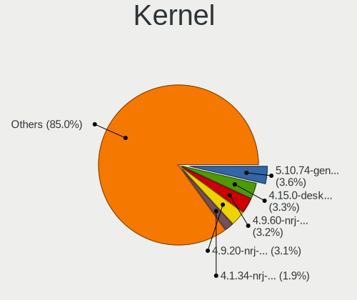
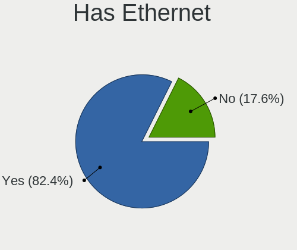
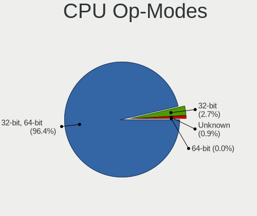
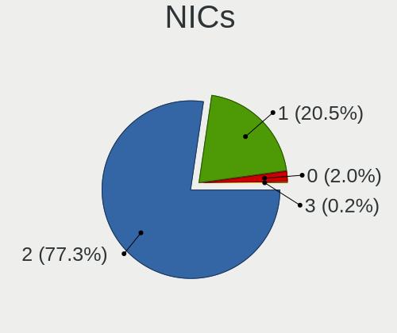
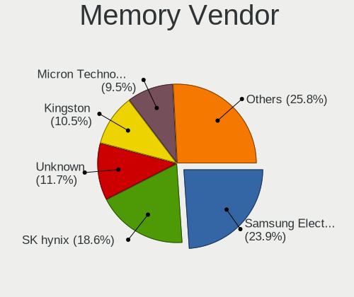
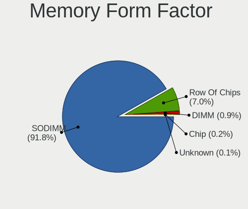

Linux in Russia - Tested Hardware & Statistics (Notebooks)
----------------------------------------------------------

A project to collect tested hardware configurations for Linux in Russia.

Anyone can contribute to this report by the [hw-probe](https://github.com/linuxhw/hw-probe) tool:

    sudo -E hw-probe -all -upload

Please contribute! Especially if your hardware is rare.

Contents
--------

* [ Test Cases ](#test-cases)

* [ System ](#system)
  - [ OS                       ](#os)
  - [ OS Family                ](#os-family)
  - [ Kernel                   ](#kernel)
  - [ Kernel Family            ](#kernel-family)
  - [ Kernel Major Ver.        ](#kernel-major-ver)
  - [ Arch                     ](#arch)
  - [ DE                       ](#de)
  - [ Display Server           ](#display-server)
  - [ Display Manager          ](#display-manager)
  - [ OS Lang                  ](#os-lang)
  - [ Boot Mode                ](#boot-mode)
  - [ Filesystem               ](#filesystem)
  - [ Part. scheme             ](#part-scheme)
  - [ Dual Boot with Linux/BSD ](#dual-boot-with-linuxbsd)
  - [ Dual Boot (Win)          ](#dual-boot-win)

* [ Board ](#board)
  - [ Vendor                   ](#vendor)
  - [ Model                    ](#model)
  - [ Model Family             ](#model-family)
  - [ MFG Year                 ](#mfg-year)
  - [ Form Factor              ](#form-factor)
  - [ Secure Boot              ](#secure-boot)
  - [ Coreboot                 ](#coreboot)
  - [ RAM Size                 ](#ram-size)
  - [ RAM Used                 ](#ram-used)
  - [ Total Drives             ](#total-drives)
  - [ Has CD-ROM               ](#has-cd-rom)
  - [ Has Ethernet             ](#has-ethernet)
  - [ Has WiFi                 ](#has-wifi)
  - [ Has Bluetooth            ](#has-bluetooth)

* [ Location ](#location)
  - [ Country                  ](#country)
  - [ City                     ](#city)

* [ Drives ](#drives)
  - [ Drive Vendor             ](#drive-vendor)
  - [ Drive Model              ](#drive-model)
  - [ HDD Vendor               ](#hdd-vendor)
  - [ SSD Vendor               ](#ssd-vendor)
  - [ Drive Kind               ](#drive-kind)
  - [ Drive Connector          ](#drive-connector)
  - [ Drive Size               ](#drive-size)
  - [ Space Total              ](#space-total)
  - [ Space Used               ](#space-used)
  - [ Malfunc. Drives          ](#malfunc-drives)
  - [ Malfunc. Drive Vendor    ](#malfunc-drive-vendor)
  - [ Malfunc. HDD Vendor      ](#malfunc-hdd-vendor)
  - [ Malfunc. Drive Kind      ](#malfunc-drive-kind)
  - [ Failed Drives            ](#failed-drives)
  - [ Failed Drive Vendor      ](#failed-drive-vendor)
  - [ Drive Status             ](#drive-status)

* [ Storage controller ](#storage-controller)
  - [ Storage Vendor           ](#storage-vendor)
  - [ Storage Model            ](#storage-model)
  - [ Storage Kind             ](#storage-kind)

* [ Processor ](#processor)
  - [ CPU Vendor               ](#cpu-vendor)
  - [ CPU Model                ](#cpu-model)
  - [ CPU Model Family         ](#cpu-model-family)
  - [ CPU Cores                ](#cpu-cores)
  - [ CPU Sockets              ](#cpu-sockets)
  - [ CPU Threads              ](#cpu-threads)
  - [ CPU Op-Modes             ](#cpu-op-modes)
  - [ CPU Microcode            ](#cpu-microcode)
  - [ CPU Microarch            ](#cpu-microarch)

* [ Graphics ](#graphics)
  - [ GPU Vendor               ](#gpu-vendor)
  - [ GPU Model                ](#gpu-model)
  - [ GPU Combo                ](#gpu-combo)
  - [ GPU Driver               ](#gpu-driver)
  - [ GPU Memory               ](#gpu-memory)

* [ Monitor ](#monitor)
  - [ Monitor Vendor           ](#monitor-vendor)
  - [ Monitor Model            ](#monitor-model)
  - [ Monitor Resolution       ](#monitor-resolution)
  - [ Monitor Diagonal         ](#monitor-diagonal)
  - [ Monitor Width            ](#monitor-width)
  - [ Aspect Ratio             ](#aspect-ratio)
  - [ Monitor Area             ](#monitor-area)
  - [ Pixel Density            ](#pixel-density)
  - [ Multiple Monitors        ](#multiple-monitors)

* [ Network ](#network)
  - [ Net Controller Vendor    ](#net-controller-vendor)
  - [ Net Controller Model     ](#net-controller-model)
  - [ Wireless Vendor          ](#wireless-vendor)
  - [ Wireless Model           ](#wireless-model)
  - [ Ethernet Vendor          ](#ethernet-vendor)
  - [ Ethernet Model           ](#ethernet-model)
  - [ Net Controller Kind      ](#net-controller-kind)
  - [ Used Controller          ](#used-controller)
  - [ NICs                     ](#nics)
  - [ IPv6                     ](#ipv6)

* [ Bluetooth ](#bluetooth)
  - [ Bluetooth Vendor         ](#bluetooth-vendor)
  - [ Bluetooth Model          ](#bluetooth-model)

* [ Sound ](#sound)
  - [ Sound Vendor             ](#sound-vendor)
  - [ Sound Model              ](#sound-model)

* [ Memory ](#memory)
  - [ Memory Vendor            ](#memory-vendor)
  - [ Memory Model             ](#memory-model)
  - [ Memory Kind              ](#memory-kind)
  - [ Memory Form Factor       ](#memory-form-factor)
  - [ Memory Size              ](#memory-size)
  - [ Memory Speed             ](#memory-speed)

* [ Printers & scanners ](#printers--scanners)
  - [ Printer Vendor           ](#printer-vendor)
  - [ Printer Model            ](#printer-model)
  - [ Scanner Vendor           ](#scanner-vendor)
  - [ Scanner Model            ](#scanner-model)

* [ Camera ](#camera)
  - [ Camera Vendor            ](#camera-vendor)
  - [ Camera Model             ](#camera-model)

* [ Security ](#security)
  - [ Fingerprint Vendor       ](#fingerprint-vendor)
  - [ Fingerprint Model        ](#fingerprint-model)
  - [ Chipcard Vendor          ](#chipcard-vendor)
  - [ Chipcard Model           ](#chipcard-model)

* [ Unsupported ](#unsupported)
  - [ Unsupported Devices      ](#unsupported-devices)
  - [ Unsupported Device Types ](#unsupported-device-types)

Test Cases
----------

Total: 20448

| Vendor        | Model                       | Probe                                                      | Date         |
|---------------|-----------------------------|------------------------------------------------------------|--------------|
| Notebook      | W65_67SJ                    | [8bea89f7c9](https://linux-hardware.org/?probe=8bea89f7c9) | Dec 24, 2023 |
| Notebook      | W65_67SJ                    | [439816e10c](https://linux-hardware.org/?probe=439816e10c) | Dec 24, 2023 |
| Anbernic      | Win600                      | [3b5255f14b](https://linux-hardware.org/?probe=3b5255f14b) | Dec 24, 2023 |
| Lenovo        | V15 G4 AMN 82YU             | [d7518dd730](https://linux-hardware.org/?probe=d7518dd730) | Dec 24, 2023 |
| TECNO Mobi... | MEGABOOK T15DA              | [82d65cfce4](https://linux-hardware.org/?probe=82d65cfce4) | Dec 23, 2023 |
| Lenovo        | V15 G4 AMN 82YU             | [a4b5f3a556](https://linux-hardware.org/?probe=a4b5f3a556) | Dec 23, 2023 |
| Dell          | Latitude E4310              | [0c4f2ab6b3](https://linux-hardware.org/?probe=0c4f2ab6b3) | Dec 23, 2023 |
| ASUSTek       | U5A                         | [fd3c48af54](https://linux-hardware.org/?probe=fd3c48af54) | Dec 23, 2023 |
| ASUSTek       | N53SV                       | [5098aee09b](https://linux-hardware.org/?probe=5098aee09b) | Dec 23, 2023 |
| ASUSTek       | Zenbook UM3402YAR_UM3402... | [a72824a48c](https://linux-hardware.org/?probe=a72824a48c) | Dec 23, 2023 |
| ASUSTek       | N53SV                       | [5ad49bc6d3](https://linux-hardware.org/?probe=5ad49bc6d3) | Dec 23, 2023 |
| Anbernic      | Win600                      | [02e1d7adeb](https://linux-hardware.org/?probe=02e1d7adeb) | Dec 23, 2023 |
| ASUSTek       | TUF Gaming FX504GD_FX80G... | [76b5abd1bd](https://linux-hardware.org/?probe=76b5abd1bd) | Dec 23, 2023 |
| Samsung       | 350V5C/351V5C/3540VC/344... | [541c5efbf3](https://linux-hardware.org/?probe=541c5efbf3) | Dec 23, 2023 |
| HP            | 340S G7 Notebook PC         | [097603b65a](https://linux-hardware.org/?probe=097603b65a) | Dec 23, 2023 |
| Dell          | Inspiron N5050              | [51b49fb205](https://linux-hardware.org/?probe=51b49fb205) | Dec 22, 2023 |
| HUAWEI        | KLVL-WXXW                   | [ccf505804c](https://linux-hardware.org/?probe=ccf505804c) | Dec 22, 2023 |
| Acer          | Aspire 5920G                | [93945148f3](https://linux-hardware.org/?probe=93945148f3) | Dec 22, 2023 |
| Irbis         | NB264                       | [8821679765](https://linux-hardware.org/?probe=8821679765) | Dec 22, 2023 |
| iRU           | 15ALC                       | [28f7177799](https://linux-hardware.org/?probe=28f7177799) | Dec 22, 2023 |
| Samsung       | 300V3A/300V4A/300V5A/200... | [4bf5538ba0](https://linux-hardware.org/?probe=4bf5538ba0) | Dec 22, 2023 |
| ASUSTek       | X553MA                      | [af944b3278](https://linux-hardware.org/?probe=af944b3278) | Dec 22, 2023 |
| ASUSTek       | X553MA                      | [ccc1d214ce](https://linux-hardware.org/?probe=ccc1d214ce) | Dec 22, 2023 |
| Dell          | Vostro 15 3510              | [d2c7d30632](https://linux-hardware.org/?probe=d2c7d30632) | Dec 22, 2023 |
| Lenovo        | ThinkPad T14 Gen 1 20UES... | [283320e72d](https://linux-hardware.org/?probe=283320e72d) | Dec 22, 2023 |
| HUAWEI        | RLEF-XX                     | [cdcc0b8368](https://linux-hardware.org/?probe=cdcc0b8368) | Dec 22, 2023 |
| Sony          | VPCCA3X1R                   | [156b109950](https://linux-hardware.org/?probe=156b109950) | Dec 21, 2023 |
| Dell          | Precision M4700             | [3048d06ee6](https://linux-hardware.org/?probe=3048d06ee6) | Dec 21, 2023 |
| LG Electro... | F1-2A85R                    | [06bdffa7cc](https://linux-hardware.org/?probe=06bdffa7cc) | Dec 21, 2023 |
| Gigabyte      | AORUS 15 XE4                | [5dd281e2dd](https://linux-hardware.org/?probe=5dd281e2dd) | Dec 21, 2023 |
| Dell          | Inspiron 5558               | [b847e03f71](https://linux-hardware.org/?probe=b847e03f71) | Dec 21, 2023 |
| Acer          | Aspire ES1-531              | [0bacfb8ebc](https://linux-hardware.org/?probe=0bacfb8ebc) | Dec 21, 2023 |
| Valve         | Jupiter                     | [f30a4a2d8a](https://linux-hardware.org/?probe=f30a4a2d8a) | Dec 21, 2023 |
| Acer          | Aspire ES1-531              | [14e802a51f](https://linux-hardware.org/?probe=14e802a51f) | Dec 21, 2023 |
| ASUSTek       | X540LA                      | [ae9a60ec08](https://linux-hardware.org/?probe=ae9a60ec08) | Dec 21, 2023 |
| realme        | RMNBXXXX                    | [d8e473e1e4](https://linux-hardware.org/?probe=d8e473e1e4) | Dec 21, 2023 |
| HUAWEI        | NBLL-WXX9                   | [c125585a5d](https://linux-hardware.org/?probe=c125585a5d) | Dec 21, 2023 |
| ASUSTek       | K53SM                       | [7af945d0af](https://linux-hardware.org/?probe=7af945d0af) | Dec 21, 2023 |
| ASUSTek       | VivoBook_ASUSLaptop X150... | [46c4d5053b](https://linux-hardware.org/?probe=46c4d5053b) | Dec 21, 2023 |
| ASUSTek       | VX7                         | [df8564bf5b](https://linux-hardware.org/?probe=df8564bf5b) | Dec 21, 2023 |
| DEXP          | Aquilon C14                 | [09cd71a27d](https://linux-hardware.org/?probe=09cd71a27d) | Dec 21, 2023 |
| DEXP          | Atlas M15-I3W302            | [176dd6f77a](https://linux-hardware.org/?probe=176dd6f77a) | Dec 20, 2023 |
| ASUSTek       | Zenbook UX535QE_UM535QE     | [d420770c44](https://linux-hardware.org/?probe=d420770c44) | Dec 20, 2023 |
| Lenovo        | ThinkPad T530 239233G       | [83d94e2acb](https://linux-hardware.org/?probe=83d94e2acb) | Dec 20, 2023 |
| Dell          | Inspiron N5110              | [c983a4857a](https://linux-hardware.org/?probe=c983a4857a) | Dec 20, 2023 |
| ASUSTek       | VivoBook_ASUSLaptop X340... | [00d649079a](https://linux-hardware.org/?probe=00d649079a) | Dec 20, 2023 |
| iRU           | 15TLI                       | [bbb5b326aa](https://linux-hardware.org/?probe=bbb5b326aa) | Dec 20, 2023 |
| HUAWEI        | CREFG-XX                    | [b97589a2bc](https://linux-hardware.org/?probe=b97589a2bc) | Dec 19, 2023 |
| HUAWEI        | CREFG-XX                    | [5dd323e917](https://linux-hardware.org/?probe=5dd323e917) | Dec 19, 2023 |
| Acer          | Nitro AN515-56              | [3fb0406c18](https://linux-hardware.org/?probe=3fb0406c18) | Dec 19, 2023 |
| ASUSTek       | N73Jn                       | [75d7e7434d](https://linux-hardware.org/?probe=75d7e7434d) | Dec 19, 2023 |
| ASUSTek       | VivoBook_ASUSLaptop M650... | [188dea7b4b](https://linux-hardware.org/?probe=188dea7b4b) | Dec 19, 2023 |
| DNS           | V40SI2                      | [cc28f4eaa2](https://linux-hardware.org/?probe=cc28f4eaa2) | Dec 19, 2023 |
| Dell          | Inspiron 5520               | [df5cca640e](https://linux-hardware.org/?probe=df5cca640e) | Dec 19, 2023 |
| Valve         | Jupiter                     | [d6b925353e](https://linux-hardware.org/?probe=d6b925353e) | Dec 18, 2023 |
| ASUSTek       | 1011PX                      | [6046941a0a](https://linux-hardware.org/?probe=6046941a0a) | Dec 18, 2023 |
| Gigabyte      | AORUS 17H BXF               | [ad8b646e5c](https://linux-hardware.org/?probe=ad8b646e5c) | Dec 18, 2023 |
| Dell          | Inspiron 5520               | [0d5fb0418b](https://linux-hardware.org/?probe=0d5fb0418b) | Dec 18, 2023 |
| Acer          | Aspire E1-522               | [874bdf3d31](https://linux-hardware.org/?probe=874bdf3d31) | Dec 18, 2023 |
| HUAWEI        | BOD-WXX9                    | [3d0c812852](https://linux-hardware.org/?probe=3d0c812852) | Dec 18, 2023 |
| Acer          | Aspire A114-33              | [0d1dc00e78](https://linux-hardware.org/?probe=0d1dc00e78) | Dec 18, 2023 |
| Toshiba       | Satellite Pro C660          | [8d45441911](https://linux-hardware.org/?probe=8d45441911) | Dec 18, 2023 |
| Maibenben     | MaiBook P series            | [6bd05cc6a1](https://linux-hardware.org/?probe=6bd05cc6a1) | Dec 18, 2023 |
| Lenovo        | G500 20236                  | [d8f95bfd45](https://linux-hardware.org/?probe=d8f95bfd45) | Dec 18, 2023 |
| Lenovo        | G500 20236                  | [f9a70833ee](https://linux-hardware.org/?probe=f9a70833ee) | Dec 18, 2023 |
| HP            | Pavilion dv6                | [604417783f](https://linux-hardware.org/?probe=604417783f) | Dec 18, 2023 |
| Clevo         | NL41MU2                     | [31d86d4507](https://linux-hardware.org/?probe=31d86d4507) | Dec 18, 2023 |
| Dell          | Studio 1535                 | [06e18b7a2f](https://linux-hardware.org/?probe=06e18b7a2f) | Dec 18, 2023 |
| Lenovo        | V15 G1 IML 82NB             | [90d82dc1a1](https://linux-hardware.org/?probe=90d82dc1a1) | Dec 18, 2023 |
| realme        | RMNBXXXX                    | [100bef421f](https://linux-hardware.org/?probe=100bef421f) | Dec 18, 2023 |
| Clevo         | NL41MU2                     | [7bf2e8159e](https://linux-hardware.org/?probe=7bf2e8159e) | Dec 18, 2023 |
| Lenovo        | IdeaPad 3 15ITL05 81X8      | [4c190c150c](https://linux-hardware.org/?probe=4c190c150c) | Dec 18, 2023 |
| MSI           | Katana GF66 11SC            | [96407da6d4](https://linux-hardware.org/?probe=96407da6d4) | Dec 18, 2023 |
| HUAWEI        | BOHB-WAX9                   | [94757e986e](https://linux-hardware.org/?probe=94757e986e) | Dec 18, 2023 |
| Irbis         | NB264                       | [8c32d8fb0b](https://linux-hardware.org/?probe=8c32d8fb0b) | Dec 18, 2023 |
| Dell          | System Inspiron N7110       | [b1f392f5f3](https://linux-hardware.org/?probe=b1f392f5f3) | Dec 17, 2023 |
| Lenovo        | ThinkPad T430u 86147MG      | [0463c0adc2](https://linux-hardware.org/?probe=0463c0adc2) | Dec 17, 2023 |
| Dell          | Inspiron 1545               | [cd3471d9e5](https://linux-hardware.org/?probe=cd3471d9e5) | Dec 17, 2023 |
| ASUSTek       | VivoBook_ASUSLaptop M150... | [ed79377477](https://linux-hardware.org/?probe=ed79377477) | Dec 17, 2023 |
| ASUSTek       | K53SC                       | [4424929359](https://linux-hardware.org/?probe=4424929359) | Dec 17, 2023 |
| ASUSTek       | VivoBook_ASUSLaptop M160... | [0f49954dd1](https://linux-hardware.org/?probe=0f49954dd1) | Dec 17, 2023 |
| Irbis         | NB12                        | [f6eb11e455](https://linux-hardware.org/?probe=f6eb11e455) | Dec 17, 2023 |
| HP            | Laptop 14s-dq2xxx           | [0e123e0682](https://linux-hardware.org/?probe=0e123e0682) | Dec 16, 2023 |
| MSI           | GF63 Thin 9RCX              | [fe9179b1fb](https://linux-hardware.org/?probe=fe9179b1fb) | Dec 16, 2023 |
| Toshiba       | Satellite C660              | [c67f7d8341](https://linux-hardware.org/?probe=c67f7d8341) | Dec 16, 2023 |
| MSI           | Modern 15 B5M               | [893ff177b3](https://linux-hardware.org/?probe=893ff177b3) | Dec 16, 2023 |
| Apple         | MacBookAir7,2               | [d227968843](https://linux-hardware.org/?probe=d227968843) | Dec 16, 2023 |
| HP            | Pavilion Gaming Laptop 1... | [49e930f611](https://linux-hardware.org/?probe=49e930f611) | Dec 16, 2023 |
| Toshiba       | Satellite U300              | [f8f967d0fe](https://linux-hardware.org/?probe=f8f967d0fe) | Dec 16, 2023 |
| Samsung       | R528/R728                   | [3a61761648](https://linux-hardware.org/?probe=3a61761648) | Dec 16, 2023 |
| Toshiba       | T20                         | [5bb395790c](https://linux-hardware.org/?probe=5bb395790c) | Dec 16, 2023 |
| ROMBICA       | myBook Discovery            | [c7b69fb478](https://linux-hardware.org/?probe=c7b69fb478) | Dec 16, 2023 |
| Valve         | Jupiter                     | [298b8b5df0](https://linux-hardware.org/?probe=298b8b5df0) | Dec 16, 2023 |
| MSI           | Thin GF63 12HW              | [47f661e72c](https://linux-hardware.org/?probe=47f661e72c) | Dec 15, 2023 |
| Lenovo        | ThinkBook 15 G2 ITL 20VE    | [a53b2d9ba9](https://linux-hardware.org/?probe=a53b2d9ba9) | Dec 15, 2023 |
| ASUSTek       | ROG Strix G531GU_GL531GU    | [b3b3853325](https://linux-hardware.org/?probe=b3b3853325) | Dec 15, 2023 |
| Unknown       | Toshiba AC100 / Dynabook... | [4ed450dd80](https://linux-hardware.org/?probe=4ed450dd80) | Dec 15, 2023 |
| Clevo         | NL41MU2                     | [7042699eef](https://linux-hardware.org/?probe=7042699eef) | Dec 15, 2023 |
| ASUSTek       | X550CC                      | [e07df321e3](https://linux-hardware.org/?probe=e07df321e3) | Dec 15, 2023 |
| Sony          | VGN-FW11ER                  | [eead7d1cca](https://linux-hardware.org/?probe=eead7d1cca) | Dec 15, 2023 |
| Dell          | Vostro 15 3510              | [051090b9e0](https://linux-hardware.org/?probe=051090b9e0) | Dec 15, 2023 |
| Timi          | TM1701                      | [5b3c697954](https://linux-hardware.org/?probe=5b3c697954) | Dec 14, 2023 |
| Lenovo        | ThinkPad T480s 20L8S7232... | [d9de3edb6b](https://linux-hardware.org/?probe=d9de3edb6b) | Dec 14, 2023 |
| Lenovo        | ThinkPad T480s 20L8S7232... | [84f162f88f](https://linux-hardware.org/?probe=84f162f88f) | Dec 14, 2023 |
| Dell          | Studio 1535                 | [0fd7468ec1](https://linux-hardware.org/?probe=0fd7468ec1) | Dec 14, 2023 |
| Lenovo        | IdeaPad 320-17IKB 80XM      | [8374878f6a](https://linux-hardware.org/?probe=8374878f6a) | Dec 14, 2023 |
| Lenovo        | IdeaPad Slim 3 14AMN8 82... | [b616535984](https://linux-hardware.org/?probe=b616535984) | Dec 14, 2023 |
| Acer          | AO521                       | [e519cc3d02](https://linux-hardware.org/?probe=e519cc3d02) | Dec 14, 2023 |
| Acer          | AO521                       | [0dd76d9c3a](https://linux-hardware.org/?probe=0dd76d9c3a) | Dec 14, 2023 |
| Valve         | Jupiter                     | [594141dc7c](https://linux-hardware.org/?probe=594141dc7c) | Dec 14, 2023 |
| Valve         | Jupiter                     | [9e2657f1ed](https://linux-hardware.org/?probe=9e2657f1ed) | Dec 14, 2023 |
| HP            | ProBook 6560b               | [e103647ee9](https://linux-hardware.org/?probe=e103647ee9) | Dec 13, 2023 |
| Lenovo        | IdeaPad L340-15API 81LW     | [c4aead03a2](https://linux-hardware.org/?probe=c4aead03a2) | Dec 13, 2023 |
| Dell          | Vostro 3400                 | [01915c7894](https://linux-hardware.org/?probe=01915c7894) | Dec 13, 2023 |
| Dell          | Vostro 3400                 | [a8d24008e2](https://linux-hardware.org/?probe=a8d24008e2) | Dec 13, 2023 |
| HP            | Notebook                    | [d25691af9b](https://linux-hardware.org/?probe=d25691af9b) | Dec 13, 2023 |
| HP            | OMEN by Laptop              | [12c97adbac](https://linux-hardware.org/?probe=12c97adbac) | Dec 12, 2023 |
| ASUSTek       | Zenbook UM3402YA_UM3402Y... | [950309042d](https://linux-hardware.org/?probe=950309042d) | Dec 12, 2023 |
| Lenovo        | ThinkPad W530 24382KU       | [b389060869](https://linux-hardware.org/?probe=b389060869) | Dec 12, 2023 |
| Timi          | A35R                        | [6133c765d4](https://linux-hardware.org/?probe=6133c765d4) | Dec 12, 2023 |
| Digma         | EVE 14 C411                 | [bcd7c864a1](https://linux-hardware.org/?probe=bcd7c864a1) | Dec 12, 2023 |
| Acer          | Aspire A517-51G             | [8396e4fdc5](https://linux-hardware.org/?probe=8396e4fdc5) | Dec 12, 2023 |
| HP            | ProBook 450 15.6 inch G9... | [7af6ecc981](https://linux-hardware.org/?probe=7af6ecc981) | Dec 12, 2023 |
| HP            | Pavilion 15                 | [235d10da72](https://linux-hardware.org/?probe=235d10da72) | Dec 12, 2023 |
| HP            | Pavilion 15                 | [fd466b16c8](https://linux-hardware.org/?probe=fd466b16c8) | Dec 12, 2023 |
| Lenovo        | ThinkPad Z61t 9441W15       | [af90f6fb00](https://linux-hardware.org/?probe=af90f6fb00) | Dec 11, 2023 |
| MouseCompu... | H116K                       | [0d2d3680f0](https://linux-hardware.org/?probe=0d2d3680f0) | Dec 11, 2023 |
| Lenovo        | G700                        | [97b63677f6](https://linux-hardware.org/?probe=97b63677f6) | Dec 11, 2023 |
| HP            | ProBook 450 15.6 inch G9... | [b9fbad0653](https://linux-hardware.org/?probe=b9fbad0653) | Dec 11, 2023 |
| Unknown       | Unknown                     | [79c6d70468](https://linux-hardware.org/?probe=79c6d70468) | Dec 11, 2023 |
| Lenovo        | ThinkPad E15 Gen 3 20YG0... | [0d7abecf9b](https://linux-hardware.org/?probe=0d7abecf9b) | Dec 11, 2023 |
| Lenovo        | ThinkPad E15 Gen 3 20YG0... | [3dcb225ff4](https://linux-hardware.org/?probe=3dcb225ff4) | Dec 11, 2023 |
| Lenovo        | IdeaPad 310-15ISK 80SM      | [9b5ac1a49b](https://linux-hardware.org/?probe=9b5ac1a49b) | Dec 11, 2023 |
| HP            | Pavilion Gaming Laptop 1... | [6e3a76166e](https://linux-hardware.org/?probe=6e3a76166e) | Dec 11, 2023 |
| HUAWEI        | NBD-WXX9                    | [2e767eb168](https://linux-hardware.org/?probe=2e767eb168) | Dec 11, 2023 |
| Acer          | Aspire E1-572G              | [c087547192](https://linux-hardware.org/?probe=c087547192) | Dec 11, 2023 |
| Acer          | Aspire E1-572G              | [5347b71932](https://linux-hardware.org/?probe=5347b71932) | Dec 11, 2023 |
| Dell          | Inspiron 15-3552            | [39d34daca5](https://linux-hardware.org/?probe=39d34daca5) | Dec 10, 2023 |
| Lenovo        | ThinkBook 16 G5+ IRH 21H... | [2ed954fa7b](https://linux-hardware.org/?probe=2ed954fa7b) | Dec 10, 2023 |
| Lenovo        | ThinkBook 16 G5+ IRH 21H... | [4dd76b8671](https://linux-hardware.org/?probe=4dd76b8671) | Dec 10, 2023 |
| Irbis         | NB290                       | [dcea177b24](https://linux-hardware.org/?probe=dcea177b24) | Dec 10, 2023 |
| ASUSTek       | ROG Strix G533QM_G533QM     | [200be2174b](https://linux-hardware.org/?probe=200be2174b) | Dec 09, 2023 |
| Lenovo        | IdeaPad S145-15API 81UT     | [0d57f82fc5](https://linux-hardware.org/?probe=0d57f82fc5) | Dec 09, 2023 |
| HUAWEI        | BOM-WXX9                    | [0d970bde9a](https://linux-hardware.org/?probe=0d970bde9a) | Dec 09, 2023 |
| eMachines     | eME728                      | [b89ccf8caf](https://linux-hardware.org/?probe=b89ccf8caf) | Dec 09, 2023 |
| eMachines     | eME728                      | [1c6bed2983](https://linux-hardware.org/?probe=1c6bed2983) | Dec 09, 2023 |
| Lenovo        | IdeaPad S145-15IIL 81W8     | [9aa2e36112](https://linux-hardware.org/?probe=9aa2e36112) | Dec 09, 2023 |
| ASUSTek       | X507UB                      | [f1a1ea60e6](https://linux-hardware.org/?probe=f1a1ea60e6) | Dec 09, 2023 |
| Valve         | Jupiter                     | [60c55f7c8c](https://linux-hardware.org/?probe=60c55f7c8c) | Dec 08, 2023 |
| Unknown       | Unknown                     | [f6c17cee3d](https://linux-hardware.org/?probe=f6c17cee3d) | Dec 08, 2023 |
| Acer          | Aspire A515-47              | [363153833d](https://linux-hardware.org/?probe=363153833d) | Dec 08, 2023 |
| MSI           | GF65 Thin 9SEXR             | [a988076537](https://linux-hardware.org/?probe=a988076537) | Dec 08, 2023 |
| Maibenben     | MaiBook X series            | [d3de4cf5b2](https://linux-hardware.org/?probe=d3de4cf5b2) | Dec 08, 2023 |
| HUAWEI        | MRGF-XX                     | [ec03f0452e](https://linux-hardware.org/?probe=ec03f0452e) | Dec 08, 2023 |
| HUAWEI        | MRGF-XX                     | [88fc932f99](https://linux-hardware.org/?probe=88fc932f99) | Dec 08, 2023 |
| Lenovo        | V15 G2 ALC 82KD             | [02763925e5](https://linux-hardware.org/?probe=02763925e5) | Dec 08, 2023 |
| ASUSTek       | X540SC                      | [4d5388e6ab](https://linux-hardware.org/?probe=4d5388e6ab) | Dec 08, 2023 |
| Lenovo        | IdeaPad 5 14ALC05 82LM      | [9d717185fb](https://linux-hardware.org/?probe=9d717185fb) | Dec 07, 2023 |
| Lenovo        | K14 Gen 1 21CSS16E00        | [b0d96c9e33](https://linux-hardware.org/?probe=b0d96c9e33) | Dec 07, 2023 |
| HP            | G62                         | [c2f10412aa](https://linux-hardware.org/?probe=c2f10412aa) | Dec 07, 2023 |
| Aquarius      | NS585                       | [b6b0a78cfa](https://linux-hardware.org/?probe=b6b0a78cfa) | Dec 07, 2023 |
| Acer          | TravelMate B118-M           | [22f8658b94](https://linux-hardware.org/?probe=22f8658b94) | Dec 07, 2023 |
| HUAWEI        | BoDE-WXX9                   | [290f7cf6b8](https://linux-hardware.org/?probe=290f7cf6b8) | Dec 06, 2023 |
| HP            | Pavilion Laptop 15-eg0xx... | [21b8166e02](https://linux-hardware.org/?probe=21b8166e02) | Dec 06, 2023 |
| Valve         | Jupiter                     | [14e2e0d2b6](https://linux-hardware.org/?probe=14e2e0d2b6) | Dec 06, 2023 |
| Infinix       | INBOOK X3                   | [51e5d10a85](https://linux-hardware.org/?probe=51e5d10a85) | Dec 06, 2023 |
| Lenovo        | ThinkPad X220 4290JN8       | [f9cec63bf8](https://linux-hardware.org/?probe=f9cec63bf8) | Dec 06, 2023 |
| ASUSTek       | VivoBook_ASUS Laptop E41... | [d1acc8db3d](https://linux-hardware.org/?probe=d1acc8db3d) | Dec 06, 2023 |
| Lenovo        | G50-70 20351                | [a5c872d21f](https://linux-hardware.org/?probe=a5c872d21f) | Dec 06, 2023 |
| HUAWEI        | KLVL-WXXW                   | [3c655a8eed](https://linux-hardware.org/?probe=3c655a8eed) | Dec 05, 2023 |
| HP            | ProBook 450 G7              | [b70e2e4765](https://linux-hardware.org/?probe=b70e2e4765) | Dec 05, 2023 |
| Unknown       | Unknown                     | [1bf269cb9e](https://linux-hardware.org/?probe=1bf269cb9e) | Dec 05, 2023 |
| Fujitsu       | LIFEBOOK AH531/GFO          | [dfc6e4c96b](https://linux-hardware.org/?probe=dfc6e4c96b) | Dec 05, 2023 |
| eMachines     | eME732G                     | [d94dd62bf1](https://linux-hardware.org/?probe=d94dd62bf1) | Dec 05, 2023 |
| Lenovo        | IdeaPad 3 14ADA05 81W0      | [58eeb19907](https://linux-hardware.org/?probe=58eeb19907) | Dec 05, 2023 |
| Lenovo        | IdeaPad 3 14ADA05 81W0      | [5a7b70b8e0](https://linux-hardware.org/?probe=5a7b70b8e0) | Dec 05, 2023 |
| ARDOR GAMI... | V15x_V17xRNx                | [ac9b89a2cd](https://linux-hardware.org/?probe=ac9b89a2cd) | Dec 05, 2023 |
| Lenovo        | IdeaPad S145-15API 81UT     | [48a8d668d9](https://linux-hardware.org/?probe=48a8d668d9) | Dec 04, 2023 |
| HP            | OMEN by Laptop              | [603e55b746](https://linux-hardware.org/?probe=603e55b746) | Dec 04, 2023 |
| ASUSTek       | ASUS TUF Gaming F15 FX50... | [c2d2b59a76](https://linux-hardware.org/?probe=c2d2b59a76) | Dec 04, 2023 |
| ASUSTek       | VivoBook_ASUSLaptop M350... | [5e0643e419](https://linux-hardware.org/?probe=5e0643e419) | Dec 04, 2023 |
| Dell          | Latitude 5420               | [b3ebc9b0fc](https://linux-hardware.org/?probe=b3ebc9b0fc) | Dec 04, 2023 |
| Clevo         | NL41MU2                     | [fbc45d8077](https://linux-hardware.org/?probe=fbc45d8077) | Dec 04, 2023 |
| HP            | EliteBook 840 G4            | [1ea135770e](https://linux-hardware.org/?probe=1ea135770e) | Dec 04, 2023 |
| ASUSTek       | VivoBook_ASUSLaptop X321... | [80d59e5b16](https://linux-hardware.org/?probe=80d59e5b16) | Dec 03, 2023 |
| eMachines     | eME732G                     | [931569e396](https://linux-hardware.org/?probe=931569e396) | Dec 03, 2023 |
| HP            | Laptop 15s-fq3xxx           | [e9d509dd95](https://linux-hardware.org/?probe=e9d509dd95) | Dec 03, 2023 |
| HUAWEI        | BoDE-WXX9                   | [28ae7336e2](https://linux-hardware.org/?probe=28ae7336e2) | Dec 03, 2023 |
| Apple         | MacBookAir3,2               | [f3560f311e](https://linux-hardware.org/?probe=f3560f311e) | Dec 03, 2023 |
| Timi          | Mi Laptop Pro 15            | [41ef064705](https://linux-hardware.org/?probe=41ef064705) | Dec 03, 2023 |
| Dell          | Vostro 1015                 | [50b53131f2](https://linux-hardware.org/?probe=50b53131f2) | Dec 03, 2023 |
| Timi          | Mi Laptop Pro 15            | [b14a847625](https://linux-hardware.org/?probe=b14a847625) | Dec 03, 2023 |
| Valve         | Jupiter                     | [80a3ff932f](https://linux-hardware.org/?probe=80a3ff932f) | Dec 03, 2023 |
| Irbis         | NB133                       | [b376d8603a](https://linux-hardware.org/?probe=b376d8603a) | Dec 03, 2023 |
| HP            | ENVY m6                     | [3a3cde32ab](https://linux-hardware.org/?probe=3a3cde32ab) | Dec 03, 2023 |
| HUAWEI        | NBD-WXX9                    | [2d7c4215b0](https://linux-hardware.org/?probe=2d7c4215b0) | Dec 03, 2023 |
| ASUSTek       | TUF Gaming FX505DT_FX505... | [7dab5dd440](https://linux-hardware.org/?probe=7dab5dd440) | Dec 03, 2023 |
| Lenovo        | ThinkPad E15 Gen 4 21E60... | [b85f62262a](https://linux-hardware.org/?probe=b85f62262a) | Dec 02, 2023 |
| ASUSTek       | X550LD                      | [d6118da294](https://linux-hardware.org/?probe=d6118da294) | Dec 02, 2023 |
| HP            | Pavilion Gaming Laptop 1... | [13816c1292](https://linux-hardware.org/?probe=13816c1292) | Dec 02, 2023 |
| ASUSTek       | X75VCP                      | [c4746fbc7c](https://linux-hardware.org/?probe=c4746fbc7c) | Dec 02, 2023 |
| MSI           | Modern 14 B5M               | [c22637e524](https://linux-hardware.org/?probe=c22637e524) | Dec 02, 2023 |
| Lenovo        | IdeaPad L340-15API 81LW     | [786b8aae1c](https://linux-hardware.org/?probe=786b8aae1c) | Dec 02, 2023 |
| Acer          | Nitro AN517-52              | [80b6f0b84a](https://linux-hardware.org/?probe=80b6f0b84a) | Dec 02, 2023 |
| Graviton      | N15i-T                      | [45f4b45d76](https://linux-hardware.org/?probe=45f4b45d76) | Dec 02, 2023 |
| Graviton      | N15i-T                      | [2dfff446c0](https://linux-hardware.org/?probe=2dfff446c0) | Dec 02, 2023 |
| HP            | ProBook 450 G5              | [695b186626](https://linux-hardware.org/?probe=695b186626) | Dec 02, 2023 |
| ASUSTek       | X550CC                      | [cc61afde30](https://linux-hardware.org/?probe=cc61afde30) | Dec 02, 2023 |
| HP            | Pavilion g7                 | [5c596e9e4f](https://linux-hardware.org/?probe=5c596e9e4f) | Dec 02, 2023 |
| LTD Delovo... | EVE 14 C414 NA9144BXW01     | [ef37f773f0](https://linux-hardware.org/?probe=ef37f773f0) | Dec 02, 2023 |
| HUAWEI        | BoDE-WXX9                   | [a374355292](https://linux-hardware.org/?probe=a374355292) | Dec 02, 2023 |
| Unknown       | X133                        | [9081482503](https://linux-hardware.org/?probe=9081482503) | Dec 02, 2023 |
| Acer          | Aspire A315-21              | [a89238478d](https://linux-hardware.org/?probe=a89238478d) | Dec 01, 2023 |
| HP            | 250 G8 Notebook PC          | [444b1864c9](https://linux-hardware.org/?probe=444b1864c9) | Dec 01, 2023 |
| ASUSTek       | VivoBook_ASUSLaptop M160... | [17b807be9d](https://linux-hardware.org/?probe=17b807be9d) | Dec 01, 2023 |
| HP            | 250 G8 Notebook PC          | [475b7358ee](https://linux-hardware.org/?probe=475b7358ee) | Dec 01, 2023 |
| Lenovo        | B5400 20278                 | [fd17e40f77](https://linux-hardware.org/?probe=fd17e40f77) | Dec 01, 2023 |
| Lenovo        | G50-70 20351                | [7b700be3e2](https://linux-hardware.org/?probe=7b700be3e2) | Nov 30, 2023 |
| Toshiba       | Satellite U300              | [9b42ec691e](https://linux-hardware.org/?probe=9b42ec691e) | Nov 30, 2023 |
| HP            | OMEN Laptop 15-en0xxx       | [f2dc650bdf](https://linux-hardware.org/?probe=f2dc650bdf) | Nov 30, 2023 |
| Lenovo        | Legion 5 15ARH05H 82B1      | [7f260cf5f4](https://linux-hardware.org/?probe=7f260cf5f4) | Nov 30, 2023 |
| Lenovo        | ThinkPad T14s Gen1 20UH0... | [9c37d9bff8](https://linux-hardware.org/?probe=9c37d9bff8) | Nov 30, 2023 |
| Timi          | TM1703                      | [cc3fe6b22b](https://linux-hardware.org/?probe=cc3fe6b22b) | Nov 30, 2023 |
| Irbis         | NB290                       | [75805d6558](https://linux-hardware.org/?probe=75805d6558) | Nov 29, 2023 |
| HUAWEI        | NbDE-WXX9                   | [8fc5d22e76](https://linux-hardware.org/?probe=8fc5d22e76) | Nov 29, 2023 |
| MSI           | GT70 2PC                    | [0806985a42](https://linux-hardware.org/?probe=0806985a42) | Nov 29, 2023 |
| Dell          | Inspiron 15-3565            | [7d7541ceb2](https://linux-hardware.org/?probe=7d7541ceb2) | Nov 29, 2023 |
| Samsung       | RC530/RC730                 | [01aee620f1](https://linux-hardware.org/?probe=01aee620f1) | Nov 29, 2023 |
| HP            | Laptop 14s-fq0xxx           | [cc31cdf621](https://linux-hardware.org/?probe=cc31cdf621) | Nov 29, 2023 |
| Lenovo        | G700                        | [3c8ae88b16](https://linux-hardware.org/?probe=3c8ae88b16) | Nov 29, 2023 |
| Lenovo        | IdeaPad L340-15API 81LW     | [3b62534051](https://linux-hardware.org/?probe=3b62534051) | Nov 29, 2023 |
| Gigabyte      | G5 GE                       | [53343f6e05](https://linux-hardware.org/?probe=53343f6e05) | Nov 29, 2023 |
| ASUSTek       | ZenBook UX425UA_UM425UA     | [d4c90a615f](https://linux-hardware.org/?probe=d4c90a615f) | Nov 29, 2023 |
| ARDOR GAMI... | V15x_V17xRNx                | [b711d78ac1](https://linux-hardware.org/?probe=b711d78ac1) | Nov 29, 2023 |
| Lenovo        | ThinkPad X230 23245C8       | [bf518076d5](https://linux-hardware.org/?probe=bf518076d5) | Nov 29, 2023 |
| ASUSTek       | M50Vc                       | [0eba431c7a](https://linux-hardware.org/?probe=0eba431c7a) | Nov 29, 2023 |
| ASUSTek       | VivoBook_ASUSLaptop X513... | [7ca8c7adc5](https://linux-hardware.org/?probe=7ca8c7adc5) | Nov 29, 2023 |
| Acer          | AO531h                      | [25d156801c](https://linux-hardware.org/?probe=25d156801c) | Nov 28, 2023 |
| Acer          | AO531h                      | [1b430bd7c0](https://linux-hardware.org/?probe=1b430bd7c0) | Nov 28, 2023 |
| Lenovo        | IdeaPad Gaming 3 15ARH05... | [2f1a80ecf8](https://linux-hardware.org/?probe=2f1a80ecf8) | Nov 28, 2023 |
| Dell          | System Inspiron N7110       | [83375f1b7a](https://linux-hardware.org/?probe=83375f1b7a) | Nov 28, 2023 |
| Lenovo        | ThinkBook 15 G2 ARE 20VG    | [6ccad5b430](https://linux-hardware.org/?probe=6ccad5b430) | Nov 28, 2023 |
| Timi          | TM1703                      | [87ad7cf4b2](https://linux-hardware.org/?probe=87ad7cf4b2) | Nov 28, 2023 |
| ASUSTek       | VivoBook_ASUSLaptop M350... | [cabab02402](https://linux-hardware.org/?probe=cabab02402) | Nov 28, 2023 |
| Packard Be... | EasyNote TE11HC             | [d9993e4ca1](https://linux-hardware.org/?probe=d9993e4ca1) | Nov 28, 2023 |
| HP            | ProBook 445 G7              | [979fcdaea6](https://linux-hardware.org/?probe=979fcdaea6) | Nov 28, 2023 |
| HP            | Notebook                    | [3faeeff15b](https://linux-hardware.org/?probe=3faeeff15b) | Nov 28, 2023 |
| Acer          | Aspire A315-51              | [9d08bad421](https://linux-hardware.org/?probe=9d08bad421) | Nov 28, 2023 |
| Acer          | Aspire A315-57G             | [10678fbceb](https://linux-hardware.org/?probe=10678fbceb) | Nov 28, 2023 |
| ASUSTek       | VivoBook_ASUSLaptop X513... | [9f9e92a1f6](https://linux-hardware.org/?probe=9f9e92a1f6) | Nov 28, 2023 |
| Lenovo        | Legion Y9000P IAH7H 82RF    | [b3bea8127f](https://linux-hardware.org/?probe=b3bea8127f) | Nov 27, 2023 |
| Valve         | Jupiter                     | [2bf5b349c3](https://linux-hardware.org/?probe=2bf5b349c3) | Nov 27, 2023 |
| Lenovo        | B590 20208                  | [fd5004acd4](https://linux-hardware.org/?probe=fd5004acd4) | Nov 27, 2023 |
| Samsung       | RV411/RV511/E3511/S3511     | [36ecf595ab](https://linux-hardware.org/?probe=36ecf595ab) | Nov 27, 2023 |
| Machcreato... | 14X                         | [25e406809e](https://linux-hardware.org/?probe=25e406809e) | Nov 27, 2023 |
| Timi          | TM1701                      | [dfb21da820](https://linux-hardware.org/?probe=dfb21da820) | Nov 27, 2023 |
| MSI           | Modern 14 A10M              | [b3d2181006](https://linux-hardware.org/?probe=b3d2181006) | Nov 27, 2023 |
| HONOR         | BMH-WCX9                    | [62d142db95](https://linux-hardware.org/?probe=62d142db95) | Nov 27, 2023 |
| ASUSTek       | K56CB                       | [fc0cf53ff2](https://linux-hardware.org/?probe=fc0cf53ff2) | Nov 27, 2023 |
| Dell          | Vostro 3590                 | [8ca5eb4e42](https://linux-hardware.org/?probe=8ca5eb4e42) | Nov 27, 2023 |
| Clevo         | NL41MU2                     | [972ddcedb5](https://linux-hardware.org/?probe=972ddcedb5) | Nov 27, 2023 |
| Lenovo        | ThinkPad E14 Gen 2 20TA0... | [9d3e14a9ba](https://linux-hardware.org/?probe=9d3e14a9ba) | Nov 27, 2023 |
| Dell          | Vostro 14 5410              | [d8694cd2f4](https://linux-hardware.org/?probe=d8694cd2f4) | Nov 27, 2023 |
| Acer          | Aspire V3-771               | [7563ed582c](https://linux-hardware.org/?probe=7563ed582c) | Nov 27, 2023 |
| HP            | ProBook 430 G2              | [ebdc85d7a5](https://linux-hardware.org/?probe=ebdc85d7a5) | Nov 27, 2023 |
| HUAWEI        | CREF-XX                     | [096f432812](https://linux-hardware.org/?probe=096f432812) | Nov 27, 2023 |
| HUAWEI        | CREF-XX                     | [630d8838dc](https://linux-hardware.org/?probe=630d8838dc) | Nov 27, 2023 |
| HUAWEI        | KLVL-WXXW                   | [04e5d5c0e9](https://linux-hardware.org/?probe=04e5d5c0e9) | Nov 27, 2023 |
| ASUSTek       | X551MA                      | [462be5c161](https://linux-hardware.org/?probe=462be5c161) | Nov 26, 2023 |
| HONOR         | HYM-WXX                     | [ce9c3cc669](https://linux-hardware.org/?probe=ce9c3cc669) | Nov 26, 2023 |
| Valve         | Jupiter                     | [c6c33679d8](https://linux-hardware.org/?probe=c6c33679d8) | Nov 26, 2023 |
| HUAWEI        | HVY-WXX9                    | [e083bf134c](https://linux-hardware.org/?probe=e083bf134c) | Nov 26, 2023 |
| HP            | Pavilion dv7                | [940ce7b8ed](https://linux-hardware.org/?probe=940ce7b8ed) | Nov 26, 2023 |
| Valve         | Jupiter                     | [2b2f81a5b3](https://linux-hardware.org/?probe=2b2f81a5b3) | Nov 26, 2023 |
| TECNO Mobi... | MEGABOOK T14TA              | [602741eba3](https://linux-hardware.org/?probe=602741eba3) | Nov 26, 2023 |
| MSI           | GT70 2PC                    | [c4589b53bb](https://linux-hardware.org/?probe=c4589b53bb) | Nov 26, 2023 |
| Clevo         | NL41MU2                     | [77e9934d61](https://linux-hardware.org/?probe=77e9934d61) | Nov 26, 2023 |
| HUAWEI        | RLEF-XX                     | [626b08dbe0](https://linux-hardware.org/?probe=626b08dbe0) | Nov 26, 2023 |
| Unknown       | Unknown                     | [9bebf014dd](https://linux-hardware.org/?probe=9bebf014dd) | Nov 26, 2023 |
| ASUSTek       | X540SA                      | [df8b6199fc](https://linux-hardware.org/?probe=df8b6199fc) | Nov 26, 2023 |
| Acer          | Aspire V5-571G              | [325e8c5f4e](https://linux-hardware.org/?probe=325e8c5f4e) | Nov 26, 2023 |
| Lenovo        | G700 20251                  | [786f74858b](https://linux-hardware.org/?probe=786f74858b) | Nov 26, 2023 |
| Timi          | TM1701                      | [f0eb78725f](https://linux-hardware.org/?probe=f0eb78725f) | Nov 26, 2023 |
| Lenovo        | ThinkBook 15 G4 IAP 21DJ    | [7b30223421](https://linux-hardware.org/?probe=7b30223421) | Nov 26, 2023 |
| HUAWEI        | BOD-WXX9                    | [87185da0b7](https://linux-hardware.org/?probe=87185da0b7) | Nov 26, 2023 |
| HUAWEI        | HVY-WXX9                    | [ed18c0bb54](https://linux-hardware.org/?probe=ed18c0bb54) | Nov 26, 2023 |
| Lenovo        | IdeaPad L340-15API 81LW     | [bfe4912cfd](https://linux-hardware.org/?probe=bfe4912cfd) | Nov 26, 2023 |
| Lenovo        | Y520-15IKBN 80WK            | [7078ba99e1](https://linux-hardware.org/?probe=7078ba99e1) | Nov 26, 2023 |
| Lenovo        | IdeaPad Y580                | [c17c868d52](https://linux-hardware.org/?probe=c17c868d52) | Nov 26, 2023 |
| Lenovo        | IdeaPad 3 15ITL05 81X8      | [721fac0123](https://linux-hardware.org/?probe=721fac0123) | Nov 26, 2023 |
| Packard Be... | EasyNote TE11HC             | [812406c15d](https://linux-hardware.org/?probe=812406c15d) | Nov 26, 2023 |
| Unknown       | Unknown                     | [00756344be](https://linux-hardware.org/?probe=00756344be) | Nov 25, 2023 |
| ASUSTek       | VivoBook_ASUSLaptop M140... | [977c83a086](https://linux-hardware.org/?probe=977c83a086) | Nov 25, 2023 |
| Acer          | Aspire A515-52G             | [5b0ff6d81a](https://linux-hardware.org/?probe=5b0ff6d81a) | Nov 25, 2023 |
| ASUSTek       | VivoBook_ASUSLaptop X513... | [36e2df7f72](https://linux-hardware.org/?probe=36e2df7f72) | Nov 25, 2023 |
| HP            | Laptop 15-bw0xx             | [09f8fda895](https://linux-hardware.org/?probe=09f8fda895) | Nov 25, 2023 |
| HP            | Notebook                    | [519d55357d](https://linux-hardware.org/?probe=519d55357d) | Nov 25, 2023 |
| Lenovo        | G505 20240                  | [f0b93fcca9](https://linux-hardware.org/?probe=f0b93fcca9) | Nov 25, 2023 |
| Lenovo        | IdeaPad Z500 20202          | [59a8bda477](https://linux-hardware.org/?probe=59a8bda477) | Nov 25, 2023 |
| ASUSTek       | Zenbook 15 UM3504DA_UM35... | [6d1874da45](https://linux-hardware.org/?probe=6d1874da45) | Nov 25, 2023 |
| HP            | ProBook 4340s               | [15f28b24ae](https://linux-hardware.org/?probe=15f28b24ae) | Nov 25, 2023 |
| ASUSTek       | VivoBook_ASUSLaptop X515... | [434ef5c010](https://linux-hardware.org/?probe=434ef5c010) | Nov 25, 2023 |
| Acer          | Aspire ES1-522              | [b367ec5e53](https://linux-hardware.org/?probe=b367ec5e53) | Nov 25, 2023 |
| HP            | ENVY 17                     | [d4d314c6cb](https://linux-hardware.org/?probe=d4d314c6cb) | Nov 25, 2023 |
| 3Logic Gro... | Graviton N15i               | [a351a9f906](https://linux-hardware.org/?probe=a351a9f906) | Nov 25, 2023 |
| Lenovo        | IdeaPad L340-15IRH Gamin... | [26cfb9b66d](https://linux-hardware.org/?probe=26cfb9b66d) | Nov 24, 2023 |
| Unknown       | Unknown                     | [805f1fdc46](https://linux-hardware.org/?probe=805f1fdc46) | Nov 24, 2023 |
| ASUSTek       | VivoBook_ASUSLaptop K650... | [3443df47ab](https://linux-hardware.org/?probe=3443df47ab) | Nov 24, 2023 |
| Lenovo        | IdeaPad Gaming 3 15ARH05... | [7186bd00ff](https://linux-hardware.org/?probe=7186bd00ff) | Nov 24, 2023 |
| Apple         | MacBookAir6,2               | [013087de59](https://linux-hardware.org/?probe=013087de59) | Nov 24, 2023 |
| ASUSTek       | N550JK                      | [637d2ba066](https://linux-hardware.org/?probe=637d2ba066) | Nov 24, 2023 |
| ASUSTek       | VivoBook_ASUSLaptop X150... | [574a491168](https://linux-hardware.org/?probe=574a491168) | Nov 24, 2023 |
| Lenovo        | IdeaPad Gaming 3 16ARH7 ... | [2c6adf9db4](https://linux-hardware.org/?probe=2c6adf9db4) | Nov 23, 2023 |
| HP            | ProBook 4540s               | [90454b68e2](https://linux-hardware.org/?probe=90454b68e2) | Nov 23, 2023 |
| HUAWEI        | KLVF-XX                     | [279b1557ed](https://linux-hardware.org/?probe=279b1557ed) | Nov 23, 2023 |
| Lenovo        | IdeaPad Gaming 3 16ARH7 ... | [6a200f511c](https://linux-hardware.org/?probe=6a200f511c) | Nov 23, 2023 |
| ASUSTek       | ASUS TUF Gaming A15 FA50... | [94fc35a5f9](https://linux-hardware.org/?probe=94fc35a5f9) | Nov 23, 2023 |
| Timi          | Redmi Book Pro 15 2022      | [05c1dddd8d](https://linux-hardware.org/?probe=05c1dddd8d) | Nov 23, 2023 |
| Dell          | Latitude E6430              | [a7befe7f1b](https://linux-hardware.org/?probe=a7befe7f1b) | Nov 23, 2023 |
| ASUSTek       | VivoBook_ASUSLaptop M140... | [0cc77ec093](https://linux-hardware.org/?probe=0cc77ec093) | Nov 23, 2023 |
| ASUSTek       | X751LD                      | [f41a7c6412](https://linux-hardware.org/?probe=f41a7c6412) | Nov 22, 2023 |
| HP            | 340S G7 Notebook PC         | [5f8d3105b5](https://linux-hardware.org/?probe=5f8d3105b5) | Nov 22, 2023 |
| HP            | Notebook                    | [efccf1789b](https://linux-hardware.org/?probe=efccf1789b) | Nov 22, 2023 |
| ASUSTek       | VivoBook_ASUSLaptop M340... | [5ebe8bc062](https://linux-hardware.org/?probe=5ebe8bc062) | Nov 22, 2023 |
| ASUSTek       | G75VX                       | [e433e70a9f](https://linux-hardware.org/?probe=e433e70a9f) | Nov 22, 2023 |
| Lenovo        | G500 20236                  | [43a399828f](https://linux-hardware.org/?probe=43a399828f) | Nov 22, 2023 |
| ASUSTek       | VivoBook_ASUSLaptop X340... | [7172a8aca0](https://linux-hardware.org/?probe=7172a8aca0) | Nov 22, 2023 |
| HP            | Laptop 15-bw0xx             | [9e429c4742](https://linux-hardware.org/?probe=9e429c4742) | Nov 22, 2023 |
| Lenovo        | G500 20236                  | [b72fbdf43a](https://linux-hardware.org/?probe=b72fbdf43a) | Nov 22, 2023 |
| Samsung       | 700Z3A/700Z4A/700Z5A/700... | [91b3ed41e0](https://linux-hardware.org/?probe=91b3ed41e0) | Nov 22, 2023 |
| HUAWEI        | BOHB-WAX9                   | [e80db886ed](https://linux-hardware.org/?probe=e80db886ed) | Nov 22, 2023 |
| HUAWEI        | BOHB-WAX9                   | [8789c24bc2](https://linux-hardware.org/?probe=8789c24bc2) | Nov 22, 2023 |
| TECNO         | MEGABOOK T1                 | [af9ab5c122](https://linux-hardware.org/?probe=af9ab5c122) | Nov 22, 2023 |
| ASUSTek       | VivoBook_ASUSLaptop K370... | [17ba2ef64a](https://linux-hardware.org/?probe=17ba2ef64a) | Nov 22, 2023 |
| Samsung       | 355V4C/356V4C/3445VC/354... | [ecc33f393d](https://linux-hardware.org/?probe=ecc33f393d) | Nov 22, 2023 |
| HP            | Compaq Presario CQ50        | [40a3d73ff2](https://linux-hardware.org/?probe=40a3d73ff2) | Nov 21, 2023 |
| MSI           | Modern 14 C12M              | [072fdd8676](https://linux-hardware.org/?probe=072fdd8676) | Nov 21, 2023 |
| Lenovo        | ThinkPad T460s 20FAS1TQ0... | [5586688561](https://linux-hardware.org/?probe=5586688561) | Nov 21, 2023 |
| LTD Delovo... | 15Y                         | [8d54474ad0](https://linux-hardware.org/?probe=8d54474ad0) | Nov 21, 2023 |
| Acer          | Aspire A315-41              | [e880b6a41f](https://linux-hardware.org/?probe=e880b6a41f) | Nov 21, 2023 |
| HP            | EliteBook 850 G1            | [7d7599e0d0](https://linux-hardware.org/?probe=7d7599e0d0) | Nov 21, 2023 |
| HUAWEI        | NDZ-WXX9                    | [95caa4b8a1](https://linux-hardware.org/?probe=95caa4b8a1) | Nov 21, 2023 |
| HUAWEI        | NDZ-WXX9                    | [0324427380](https://linux-hardware.org/?probe=0324427380) | Nov 21, 2023 |
| HP            | EliteBook 840 G3            | [3adc2d4951](https://linux-hardware.org/?probe=3adc2d4951) | Nov 21, 2023 |
| Samsung       | G25/G26                     | [75ea3e9d1c](https://linux-hardware.org/?probe=75ea3e9d1c) | Nov 21, 2023 |
| HUAWEI        | HVY-WXX9                    | [efba109da8](https://linux-hardware.org/?probe=efba109da8) | Nov 21, 2023 |
| HP            | G62                         | [de2f290631](https://linux-hardware.org/?probe=de2f290631) | Nov 20, 2023 |
| Lenovo        | ThinkPad P15v Gen 3 21D8... | [7c6999858f](https://linux-hardware.org/?probe=7c6999858f) | Nov 20, 2023 |
| Timi          | RedmiBook 15                | [00a6933cf0](https://linux-hardware.org/?probe=00a6933cf0) | Nov 20, 2023 |
| ASUSTek       | Zenbook 15 UM3504DA_UM35... | [251174d0cc](https://linux-hardware.org/?probe=251174d0cc) | Nov 20, 2023 |
| Dell          | Latitude 3520               | [a6f62b0a2c](https://linux-hardware.org/?probe=a6f62b0a2c) | Nov 20, 2023 |
| HP            | ProBook 430 G6              | [6175f06df9](https://linux-hardware.org/?probe=6175f06df9) | Nov 20, 2023 |
| Samsung       | G25/G26                     | [4fa1c48bf4](https://linux-hardware.org/?probe=4fa1c48bf4) | Nov 20, 2023 |
| Acer          | Aspire A517-53              | [9572f8f8c1](https://linux-hardware.org/?probe=9572f8f8c1) | Nov 20, 2023 |
| Dell          | Vostro 14 5410              | [af794f8249](https://linux-hardware.org/?probe=af794f8249) | Nov 20, 2023 |
| Lenovo        | ThinkPad X230 23301H3       | [53976ca7f1](https://linux-hardware.org/?probe=53976ca7f1) | Nov 20, 2023 |
| HP            | Pavilion dv6                | [15c38c7e03](https://linux-hardware.org/?probe=15c38c7e03) | Nov 19, 2023 |
| Dell          | Inspiron 1521               | [0b0507a1ae](https://linux-hardware.org/?probe=0b0507a1ae) | Nov 19, 2023 |
| Acer          | Nitro AN517-41              | [c5f0fec07b](https://linux-hardware.org/?probe=c5f0fec07b) | Nov 19, 2023 |
| Dell          | Latitude E6230              | [92e65f6bca](https://linux-hardware.org/?probe=92e65f6bca) | Nov 19, 2023 |
| ASUSTek       | K53E                        | [8b2b851183](https://linux-hardware.org/?probe=8b2b851183) | Nov 19, 2023 |
| ASUSTek       | G750JX                      | [94ad738290](https://linux-hardware.org/?probe=94ad738290) | Nov 18, 2023 |
| Lenovo        | ThinkBook 16 G5+ ARP 21J... | [e5148f6b93](https://linux-hardware.org/?probe=e5148f6b93) | Nov 18, 2023 |
| Lenovo        | B5400 20278                 | [69336c15b9](https://linux-hardware.org/?probe=69336c15b9) | Nov 18, 2023 |
| Lenovo        | B560                        | [05bde0afed](https://linux-hardware.org/?probe=05bde0afed) | Nov 18, 2023 |
| Acer          | Aspire A315-53G             | [7f9669bf0b](https://linux-hardware.org/?probe=7f9669bf0b) | Nov 18, 2023 |
| Sony          | VGN-NS11ER_S                | [f295aaa7fd](https://linux-hardware.org/?probe=f295aaa7fd) | Nov 18, 2023 |
| Acer          | Aspire 5334                 | [0dcad1d6e0](https://linux-hardware.org/?probe=0dcad1d6e0) | Nov 18, 2023 |
| ASUSTek       | X201E                       | [3532136698](https://linux-hardware.org/?probe=3532136698) | Nov 18, 2023 |
| Lenovo        | ThinkBook 15 G3 ACL 21A4    | [d4e8f3f548](https://linux-hardware.org/?probe=d4e8f3f548) | Nov 17, 2023 |
| ASUSTek       | X101H                       | [d9e12c16e0](https://linux-hardware.org/?probe=d9e12c16e0) | Nov 17, 2023 |
| MSI           | Katana GF76 12UC            | [0f4df1b67e](https://linux-hardware.org/?probe=0f4df1b67e) | Nov 17, 2023 |
| Timi          | Redmi Book Pro 15 2022      | [113cd1dc11](https://linux-hardware.org/?probe=113cd1dc11) | Nov 17, 2023 |
| Toshiba       | Satellite L300              | [416018ed84](https://linux-hardware.org/?probe=416018ed84) | Nov 17, 2023 |
| Irbis         | NB120                       | [a90949861b](https://linux-hardware.org/?probe=a90949861b) | Nov 17, 2023 |
| HP            | Pavilion Laptop 15-eh2xx... | [39179fa6fd](https://linux-hardware.org/?probe=39179fa6fd) | Nov 17, 2023 |
| ASUSTek       | X201E                       | [f9b0c13ec1](https://linux-hardware.org/?probe=f9b0c13ec1) | Nov 17, 2023 |
| Lenovo        | ThinkPad T460 20FMS36800    | [5954abe148](https://linux-hardware.org/?probe=5954abe148) | Nov 17, 2023 |
| ASUSTek       | ZenBook UX435EG_UX435EG     | [01e59bb98c](https://linux-hardware.org/?probe=01e59bb98c) | Nov 16, 2023 |
| Valve         | Jupiter                     | [c726569566](https://linux-hardware.org/?probe=c726569566) | Nov 16, 2023 |
| ASUSTek       | 1001PXD                     | [6f92b6aa53](https://linux-hardware.org/?probe=6f92b6aa53) | Nov 16, 2023 |
| HP            | Pavilion Gaming Laptop 1... | [2164c33a50](https://linux-hardware.org/?probe=2164c33a50) | Nov 16, 2023 |
| Valve         | Jupiter                     | [521a021c1d](https://linux-hardware.org/?probe=521a021c1d) | Nov 16, 2023 |
| HUAWEI        | MDF-XX                      | [d4cdc093f4](https://linux-hardware.org/?probe=d4cdc093f4) | Nov 16, 2023 |
| Lenovo        | IdeaPad 3 15IML05 81WB      | [d5c9e20e7b](https://linux-hardware.org/?probe=d5c9e20e7b) | Nov 15, 2023 |
| Dell          | Inspiron 3521               | [d038cb0c11](https://linux-hardware.org/?probe=d038cb0c11) | Nov 15, 2023 |
| Sony          | VPCCA2S1R                   | [f94fcde51d](https://linux-hardware.org/?probe=f94fcde51d) | Nov 15, 2023 |
| ASUSTek       | ROG Strix G531GU_GL531GU    | [d4815cabeb](https://linux-hardware.org/?probe=d4815cabeb) | Nov 15, 2023 |
| HP            | 250 G7 Notebook PC          | [127af8c0e3](https://linux-hardware.org/?probe=127af8c0e3) | Nov 15, 2023 |
| HUAWEI        | BOM-WXX9                    | [c4db182f7c](https://linux-hardware.org/?probe=c4db182f7c) | Nov 15, 2023 |
| Acer          | Extensa 215-32              | [477b965e66](https://linux-hardware.org/?probe=477b965e66) | Nov 15, 2023 |
| Lenovo        | ThinkPad T490 20N2000NRT    | [fa750668a7](https://linux-hardware.org/?probe=fa750668a7) | Nov 15, 2023 |
| Unknown       | Unknown                     | [8f82e3bd78](https://linux-hardware.org/?probe=8f82e3bd78) | Nov 15, 2023 |
| Razer         | Blade 14 (2022) - RZ09-0... | [426fd54105](https://linux-hardware.org/?probe=426fd54105) | Nov 15, 2023 |
| MSI           | Katana GF76 11UD            | [4f5b6c3898](https://linux-hardware.org/?probe=4f5b6c3898) | Nov 15, 2023 |
| Acer          | TravelMate B118-M           | [25b9244c80](https://linux-hardware.org/?probe=25b9244c80) | Nov 15, 2023 |
| HP            | EliteBook 8460p             | [57e8703df8](https://linux-hardware.org/?probe=57e8703df8) | Nov 14, 2023 |
| Lenovo        | Yoga Slim 7 Carbon 14ACN... | [3394acc120](https://linux-hardware.org/?probe=3394acc120) | Nov 14, 2023 |
| HIPER Tech... | HIPER WORKBOOK              | [8e914770df](https://linux-hardware.org/?probe=8e914770df) | Nov 14, 2023 |
| Unknown       | Unknown                     | [d169a02b18](https://linux-hardware.org/?probe=d169a02b18) | Nov 14, 2023 |
| Lenovo        | IdeaPad S540-14API 81NH     | [7ae6ce2914](https://linux-hardware.org/?probe=7ae6ce2914) | Nov 14, 2023 |
| HP            | ProBook 440 G3              | [bcb8afe2d9](https://linux-hardware.org/?probe=bcb8afe2d9) | Nov 14, 2023 |
| Lenovo        | IdeaPad L340-15API 81LW     | [9dbd54affc](https://linux-hardware.org/?probe=9dbd54affc) | Nov 14, 2023 |
| HP            | Pavilion g6                 | [1598948ed4](https://linux-hardware.org/?probe=1598948ed4) | Nov 14, 2023 |
| HUAWEI        | MRGFG-XX                    | [b7dda3ece0](https://linux-hardware.org/?probe=b7dda3ece0) | Nov 14, 2023 |
| Acer          | AOD255                      | [64aee07a6b](https://linux-hardware.org/?probe=64aee07a6b) | Nov 14, 2023 |
| Acer          | AOD255                      | [140fc27d54](https://linux-hardware.org/?probe=140fc27d54) | Nov 14, 2023 |
| Unchartevi... | 6540                        | [5353bd2c2c](https://linux-hardware.org/?probe=5353bd2c2c) | Nov 13, 2023 |
| HP            | Pavilion dv7                | [788b9eee54](https://linux-hardware.org/?probe=788b9eee54) | Nov 13, 2023 |
| HP            | Pavilion dv7                | [b53b5881ea](https://linux-hardware.org/?probe=b53b5881ea) | Nov 13, 2023 |
| Infinix       | INBOOK X3 Plus              | [7c4201934f](https://linux-hardware.org/?probe=7c4201934f) | Nov 13, 2023 |
| Infinix       | INBOOK X3 Plus              | [99b8206bb0](https://linux-hardware.org/?probe=99b8206bb0) | Nov 13, 2023 |
| Lenovo        | IdeaPad 5 14ARE05 81YM      | [0e8786e8a9](https://linux-hardware.org/?probe=0e8786e8a9) | Nov 13, 2023 |
| MSI           | Modern 14 C5M               | [94c27199a0](https://linux-hardware.org/?probe=94c27199a0) | Nov 13, 2023 |
| MSI           | Modern 14 C5M               | [808a76b01b](https://linux-hardware.org/?probe=808a76b01b) | Nov 13, 2023 |
| HUAWEI        | HVY-WXX9                    | [b0ed26f85a](https://linux-hardware.org/?probe=b0ed26f85a) | Nov 13, 2023 |
| Fujitsu Si... | AMILO Pro Edition V3505     | [47597109a6](https://linux-hardware.org/?probe=47597109a6) | Nov 13, 2023 |
| Samsung       | G25/G26                     | [5fdbe7131c](https://linux-hardware.org/?probe=5fdbe7131c) | Nov 13, 2023 |
| Timi          | Mi Laptop Pro 15 2020       | [ade278e9c7](https://linux-hardware.org/?probe=ade278e9c7) | Nov 13, 2023 |
| Apple         | MacBookPro16,2              | [bbc6a54b40](https://linux-hardware.org/?probe=bbc6a54b40) | Nov 12, 2023 |
| Lenovo        | G50-30 80G0                 | [51cd292a70](https://linux-hardware.org/?probe=51cd292a70) | Nov 12, 2023 |
| Lenovo        | B570e HuronRiver Platfor... | [ab99d222f4](https://linux-hardware.org/?probe=ab99d222f4) | Nov 12, 2023 |
| Lenovo        | ThinkPad T14 Gen 3 21AH0... | [929afc7ae1](https://linux-hardware.org/?probe=929afc7ae1) | Nov 12, 2023 |
| ASUSTek       | X540SA                      | [ff4f0ffc8c](https://linux-hardware.org/?probe=ff4f0ffc8c) | Nov 12, 2023 |
| HUAWEI        | BOM-WXX9                    | [56107ca4c0](https://linux-hardware.org/?probe=56107ca4c0) | Nov 12, 2023 |
| HUAWEI        | BOM-WXX9                    | [d3fd2f491d](https://linux-hardware.org/?probe=d3fd2f491d) | Nov 12, 2023 |
| HP            | Pavilion g6                 | [e00bbf5062](https://linux-hardware.org/?probe=e00bbf5062) | Nov 12, 2023 |
| Unknown       | Unknown                     | [263f51fc64](https://linux-hardware.org/?probe=263f51fc64) | Nov 12, 2023 |
| Irbis         | NB211                       | [2d4aa9a87a](https://linux-hardware.org/?probe=2d4aa9a87a) | Nov 11, 2023 |
| Toshiba       | Satellite L735              | [a04ec0c5b2](https://linux-hardware.org/?probe=a04ec0c5b2) | Nov 11, 2023 |
| HUAWEI        | HLY-WX9XX                   | [641f011e49](https://linux-hardware.org/?probe=641f011e49) | Nov 11, 2023 |
| ASUSTek       | M51Tr                       | [d022e223bc](https://linux-hardware.org/?probe=d022e223bc) | Nov 11, 2023 |
| ASUSTek       | ZenBook UX425UA_UM425UA     | [6996973cde](https://linux-hardware.org/?probe=6996973cde) | Nov 11, 2023 |
| Lenovo        | Legion R9000P ARX8 82WM     | [bad94e2ebe](https://linux-hardware.org/?probe=bad94e2ebe) | Nov 11, 2023 |
| ASUSTek       | K53SC                       | [e86d8effd9](https://linux-hardware.org/?probe=e86d8effd9) | Nov 11, 2023 |
| Lenovo        | IdeaPad 3 15IML05 81WB      | [3d7d7d3e34](https://linux-hardware.org/?probe=3d7d7d3e34) | Nov 11, 2023 |
| Samsung       | 305V4A/305V5A/3415VA        | [0ce9bba443](https://linux-hardware.org/?probe=0ce9bba443) | Nov 11, 2023 |
| Haier         | U1530EM                     | [ea3804c31f](https://linux-hardware.org/?probe=ea3804c31f) | Nov 11, 2023 |
| Dell          | Latitude 7390               | [b1f996e81e](https://linux-hardware.org/?probe=b1f996e81e) | Nov 11, 2023 |
| ASUSTek       | VivoBook_ASUSLaptop X515... | [fa680be8d9](https://linux-hardware.org/?probe=fa680be8d9) | Nov 10, 2023 |
| HP            | ProBook 4510s               | [9b83dea197](https://linux-hardware.org/?probe=9b83dea197) | Nov 10, 2023 |
| Aquarius      | NS585                       | [0f0c55bda1](https://linux-hardware.org/?probe=0f0c55bda1) | Nov 10, 2023 |
| Lenovo        | Y520-15IKBA 80WY            | [2a5b34f6e6](https://linux-hardware.org/?probe=2a5b34f6e6) | Nov 10, 2023 |
| Lenovo        | ThinkPad T490 20N2000NRT    | [fe5dd30b3d](https://linux-hardware.org/?probe=fe5dd30b3d) | Nov 10, 2023 |
| HUAWEI        | BOD-WXX9                    | [430cbdbe91](https://linux-hardware.org/?probe=430cbdbe91) | Nov 10, 2023 |
| HUAWEI        | KLVD-WXX9                   | [0de73c41cd](https://linux-hardware.org/?probe=0de73c41cd) | Nov 10, 2023 |
| ASUSTek       | VivoBook_ASUSLaptop M160... | [139e9d8e09](https://linux-hardware.org/?probe=139e9d8e09) | Nov 10, 2023 |
| ASUSTek       | VivoBook_ASUSLaptop M160... | [7ffe26a7bc](https://linux-hardware.org/?probe=7ffe26a7bc) | Nov 10, 2023 |
| Valve         | Jupiter                     | [f3e618c03e](https://linux-hardware.org/?probe=f3e618c03e) | Nov 10, 2023 |
| Fujitsu Si... | AMILO Pro Edition V3505     | [78a7710228](https://linux-hardware.org/?probe=78a7710228) | Nov 10, 2023 |
| Infinix       | INBOOK X2                   | [05a78e325d](https://linux-hardware.org/?probe=05a78e325d) | Nov 09, 2023 |
| Pegatron      | Deepcam                     | [5bf6bdb719](https://linux-hardware.org/?probe=5bf6bdb719) | Nov 09, 2023 |
| ASUSTek       | X550CC                      | [dc3a25ade3](https://linux-hardware.org/?probe=dc3a25ade3) | Nov 09, 2023 |
| Lenovo        | IdeaPad 330-15ARR 81D2      | [7279b92270](https://linux-hardware.org/?probe=7279b92270) | Nov 09, 2023 |
| Lenovo        | G580 20150                  | [8c11a6230e](https://linux-hardware.org/?probe=8c11a6230e) | Nov 09, 2023 |
| HP            | Pavilion g6                 | [1bddfcc66f](https://linux-hardware.org/?probe=1bddfcc66f) | Nov 09, 2023 |
| Aquarius      | NS685U R11                  | [fe2d295af1](https://linux-hardware.org/?probe=fe2d295af1) | Nov 09, 2023 |
| ASUSTek       | ASUS EXPERTBOOK L1500CDA... | [b1671e6e25](https://linux-hardware.org/?probe=b1671e6e25) | Nov 09, 2023 |
| Fujitsu Si... | AMILO Pro Edition V3405     | [429a0b938f](https://linux-hardware.org/?probe=429a0b938f) | Nov 09, 2023 |
| Acer          | Aspire A515-57              | [99456a20b8](https://linux-hardware.org/?probe=99456a20b8) | Nov 09, 2023 |
| HP            | Pavilion g6                 | [ef6c4056ae](https://linux-hardware.org/?probe=ef6c4056ae) | Nov 09, 2023 |
| Lenovo        | G780                        | [5140efbfd8](https://linux-hardware.org/?probe=5140efbfd8) | Nov 09, 2023 |
| Sony          | VPCEL3S1R                   | [00e9149304](https://linux-hardware.org/?probe=00e9149304) | Nov 08, 2023 |
| Lenovo        | IdeaPad 320-15IAP 80XR      | [4a82e665de](https://linux-hardware.org/?probe=4a82e665de) | Nov 08, 2023 |
| MSI           | Modern 14 C12MO             | [61aae729b5](https://linux-hardware.org/?probe=61aae729b5) | Nov 08, 2023 |
| Acer          | Aspire E1-570G              | [ecbf335e61](https://linux-hardware.org/?probe=ecbf335e61) | Nov 08, 2023 |
| Clevo         | NL41MU2                     | [cf49add8e7](https://linux-hardware.org/?probe=cf49add8e7) | Nov 08, 2023 |
| Unknown       | TG-1554                     | [56ac6640b8](https://linux-hardware.org/?probe=56ac6640b8) | Nov 08, 2023 |
| Unknown       | Unknown                     | [a1be0f3000](https://linux-hardware.org/?probe=a1be0f3000) | Nov 08, 2023 |
| HP            | Laptop 15-rb0xx             | [3d2ec07a57](https://linux-hardware.org/?probe=3d2ec07a57) | Nov 08, 2023 |
| HP            | Laptop 15-rb0xx             | [eb27db3944](https://linux-hardware.org/?probe=eb27db3944) | Nov 08, 2023 |
| Samsung       | 300V3A/300V4A/300V5A/200... | [8ae8c2d4d9](https://linux-hardware.org/?probe=8ae8c2d4d9) | Nov 08, 2023 |
| Toshiba       | Satellite U300              | [c4701b779e](https://linux-hardware.org/?probe=c4701b779e) | Nov 08, 2023 |
| Lenovo        | IdeaPad 3 15ARE05 81W4      | [4b18a13143](https://linux-hardware.org/?probe=4b18a13143) | Nov 08, 2023 |
| Valve         | Jupiter                     | [98976642aa](https://linux-hardware.org/?probe=98976642aa) | Nov 08, 2023 |
| ASUSTek       | VivoBook_ASUSLaptop M760... | [696f32a866](https://linux-hardware.org/?probe=696f32a866) | Nov 08, 2023 |
| Maibenben     | MaiBook M                   | [2fb76b07c1](https://linux-hardware.org/?probe=2fb76b07c1) | Nov 08, 2023 |
| Unknown       | Unknown                     | [fe49c747a0](https://linux-hardware.org/?probe=fe49c747a0) | Nov 07, 2023 |
| Unknown       | Unknown                     | [bfe1505cfc](https://linux-hardware.org/?probe=bfe1505cfc) | Nov 07, 2023 |
| Unknown       | Unknown                     | [562976164d](https://linux-hardware.org/?probe=562976164d) | Nov 07, 2023 |
| Aquarius      | NS585                       | [a5b5734657](https://linux-hardware.org/?probe=a5b5734657) | Nov 07, 2023 |
| Aquarius      | NS585                       | [d9d5e97f89](https://linux-hardware.org/?probe=d9d5e97f89) | Nov 07, 2023 |
| Unknown       | Unknown                     | [988072756b](https://linux-hardware.org/?probe=988072756b) | Nov 07, 2023 |
| Aquarius      | NS585                       | [83a4894072](https://linux-hardware.org/?probe=83a4894072) | Nov 07, 2023 |
| Lenovo        | ThinkPad P15v Gen 3 21D8... | [1d557ddec8](https://linux-hardware.org/?probe=1d557ddec8) | Nov 07, 2023 |
| Lenovo        | ThinkPad P15v Gen 3 21D8... | [beca8ba507](https://linux-hardware.org/?probe=beca8ba507) | Nov 07, 2023 |
| HP            | ProBook 450 G1              | [bb1bf92ea5](https://linux-hardware.org/?probe=bb1bf92ea5) | Nov 07, 2023 |
| HP            | ProBook 450 G1              | [bec045a214](https://linux-hardware.org/?probe=bec045a214) | Nov 07, 2023 |
| ASUSTek       | X200CA                      | [a982252e30](https://linux-hardware.org/?probe=a982252e30) | Nov 07, 2023 |
| ASUSTek       | X540SA                      | [d2ac290ce9](https://linux-hardware.org/?probe=d2ac290ce9) | Nov 07, 2023 |
| ASUSTek       | VivoBook_ASUSLaptop M150... | [503b6e943c](https://linux-hardware.org/?probe=503b6e943c) | Nov 06, 2023 |
| Acer          | Aspire ES1-512              | [4b43ed314b](https://linux-hardware.org/?probe=4b43ed314b) | Nov 06, 2023 |
| Haier         | GG1500A                     | [f9eeec4df8](https://linux-hardware.org/?probe=f9eeec4df8) | Nov 06, 2023 |
| ASUSTek       | VivoBook_ASUSLaptop X509... | [e149cb0865](https://linux-hardware.org/?probe=e149cb0865) | Nov 06, 2023 |
| Inferit       | E-Note                      | [ab14e435d4](https://linux-hardware.org/?probe=ab14e435d4) | Nov 06, 2023 |
| ASUSTek       | VivoBook 15_ASUS Laptop ... | [55a0738916](https://linux-hardware.org/?probe=55a0738916) | Nov 06, 2023 |
| ASUSTek       | VivoBook 15_ASUS Laptop ... | [738c6220a5](https://linux-hardware.org/?probe=738c6220a5) | Nov 06, 2023 |
| HP            | EliteBook 8460p             | [cc6b66c576](https://linux-hardware.org/?probe=cc6b66c576) | Nov 06, 2023 |
| Aquarius      | NS585                       | [ddc8256647](https://linux-hardware.org/?probe=ddc8256647) | Nov 06, 2023 |
| Aquarius      | NS585                       | [2f4e49837d](https://linux-hardware.org/?probe=2f4e49837d) | Nov 06, 2023 |
| HP            | Laptop 15s-eq2xxx           | [b63a038c08](https://linux-hardware.org/?probe=b63a038c08) | Nov 06, 2023 |
| Aquarius      | NS585                       | [4fea63336a](https://linux-hardware.org/?probe=4fea63336a) | Nov 06, 2023 |
| HP            | Laptop 15-bw0xx             | [bd3e108e8a](https://linux-hardware.org/?probe=bd3e108e8a) | Nov 06, 2023 |
| ASUSTek       | ASUS TUF Gaming A15 FA50... | [60ec029256](https://linux-hardware.org/?probe=60ec029256) | Nov 05, 2023 |
| ASUSTek       | X550WA                      | [8c15da796b](https://linux-hardware.org/?probe=8c15da796b) | Nov 05, 2023 |
| HUAWEI        | NBLK-WAX9X                  | [cff5d02cde](https://linux-hardware.org/?probe=cff5d02cde) | Nov 05, 2023 |
| HP            | ProBook 440 G7              | [1d1311204e](https://linux-hardware.org/?probe=1d1311204e) | Nov 05, 2023 |
| HP            | ProBook 6545b               | [a81427fffa](https://linux-hardware.org/?probe=a81427fffa) | Nov 05, 2023 |
| HP            | Laptop 17t-by000            | [b23b606118](https://linux-hardware.org/?probe=b23b606118) | Nov 05, 2023 |
| Acer          | Aspire 5349                 | [b1ca6f597c](https://linux-hardware.org/?probe=b1ca6f597c) | Nov 05, 2023 |
| Lenovo        | IdeaPad 100-15IBY 80MJ      | [f782cf5541](https://linux-hardware.org/?probe=f782cf5541) | Nov 05, 2023 |
| ASUSTek       | VivoBook_ASUSLaptop X521... | [a3a6205085](https://linux-hardware.org/?probe=a3a6205085) | Nov 05, 2023 |
| ASUSTek       | VivoBook_ASUSLaptop X521... | [1d56b84bdd](https://linux-hardware.org/?probe=1d56b84bdd) | Nov 05, 2023 |
| Acer          | Aspire E1-571G              | [fac63c4d5c](https://linux-hardware.org/?probe=fac63c4d5c) | Nov 05, 2023 |
| ASUSTek       | VivoBook 15_ASUS Laptop ... | [5541e01522](https://linux-hardware.org/?probe=5541e01522) | Nov 05, 2023 |
| Acer          | Aspire 5100                 | [62b63704e9](https://linux-hardware.org/?probe=62b63704e9) | Nov 04, 2023 |
| Acer          | Aspire 5100                 | [c4d628cb50](https://linux-hardware.org/?probe=c4d628cb50) | Nov 04, 2023 |
| Acer          | TravelMate B118-M           | [051346666e](https://linux-hardware.org/?probe=051346666e) | Nov 04, 2023 |
| Timi          | Redmi Book Pro 15 2022      | [2084300c18](https://linux-hardware.org/?probe=2084300c18) | Nov 04, 2023 |
| Acer          | Aspire E5-573G              | [c74051abb7](https://linux-hardware.org/?probe=c74051abb7) | Nov 04, 2023 |
| Acer          | TravelMate P215-54          | [5688b7940d](https://linux-hardware.org/?probe=5688b7940d) | Nov 04, 2023 |
| HP            | Laptop 15s-eq2xxx           | [6fcd2a768b](https://linux-hardware.org/?probe=6fcd2a768b) | Nov 04, 2023 |
| MSI           | Bravo 15 C7VE               | [5db0e7314a](https://linux-hardware.org/?probe=5db0e7314a) | Nov 04, 2023 |
| Acer          | TravelMate P215-54          | [f051dc617c](https://linux-hardware.org/?probe=f051dc617c) | Nov 04, 2023 |
| Lenovo        | IdeaPad 330-15IGM 81D1      | [157f4d1006](https://linux-hardware.org/?probe=157f4d1006) | Nov 04, 2023 |
| Dell          | Inspiron M5110              | [20e338fb21](https://linux-hardware.org/?probe=20e338fb21) | Nov 04, 2023 |
| ASUSTek       | VivoBook 15_ASUS Laptop ... | [86d2394935](https://linux-hardware.org/?probe=86d2394935) | Nov 03, 2023 |
| ASUSTek       | ROG Strix G513QY_G513QY     | [85a38e7906](https://linux-hardware.org/?probe=85a38e7906) | Nov 03, 2023 |
| Unknown       | Unknown                     | [d27cd12013](https://linux-hardware.org/?probe=d27cd12013) | Nov 03, 2023 |
| DEXP          | Aquilon C14                 | [b91d7803a2](https://linux-hardware.org/?probe=b91d7803a2) | Nov 03, 2023 |
| ASUSTek       | ROG Strix G513RM_G513RM     | [ded1d73643](https://linux-hardware.org/?probe=ded1d73643) | Nov 03, 2023 |
| Timi          | A35S                        | [d62fbb6f83](https://linux-hardware.org/?probe=d62fbb6f83) | Nov 03, 2023 |
| HONOR         | NMH-WDX9                    | [11e32e2482](https://linux-hardware.org/?probe=11e32e2482) | Nov 03, 2023 |
| HUAWEI        | BOM-WXX9                    | [bc3b3daf33](https://linux-hardware.org/?probe=bc3b3daf33) | Nov 03, 2023 |
| Apple         | MacBookAir7,1               | [50cb167f37](https://linux-hardware.org/?probe=50cb167f37) | Nov 03, 2023 |
| Lenovo        | G580                        | [d137c3bc30](https://linux-hardware.org/?probe=d137c3bc30) | Nov 02, 2023 |
| HP            | Laptop 15-bw0xx             | [589f0a0dfb](https://linux-hardware.org/?probe=589f0a0dfb) | Nov 02, 2023 |
| ASUSTek       | VivoBook_ASUSLaptop M140... | [f1b74562ae](https://linux-hardware.org/?probe=f1b74562ae) | Nov 02, 2023 |
| KVADRA        | U15W                        | [1c1f562cf5](https://linux-hardware.org/?probe=1c1f562cf5) | Nov 02, 2023 |
| Digma         | Pro Fortis M DN15P5-8CXN... | [7bb9e8e743](https://linux-hardware.org/?probe=7bb9e8e743) | Nov 02, 2023 |
| Samsung       | 350V5C/351V5C/3540VC/344... | [10b531fcd1](https://linux-hardware.org/?probe=10b531fcd1) | Nov 02, 2023 |
| Acer          | TravelMate P259-MG          | [ba3faece8c](https://linux-hardware.org/?probe=ba3faece8c) | Nov 01, 2023 |
| HP            | Laptop 15s-eq1xxx           | [075049b538](https://linux-hardware.org/?probe=075049b538) | Nov 01, 2023 |
| ASUSTek       | VivoBook_ASUSLaptop M140... | [0a7341e5e0](https://linux-hardware.org/?probe=0a7341e5e0) | Nov 01, 2023 |
| ASUSTek       | X553SA                      | [0eba32de41](https://linux-hardware.org/?probe=0eba32de41) | Nov 01, 2023 |
| Lenovo        | ThinkPad T14 Gen 3 21AJS... | [a2a8295797](https://linux-hardware.org/?probe=a2a8295797) | Nov 01, 2023 |
| Lenovo        | ThinkPad T14 Gen 3 21AJS... | [0d49a75fe1](https://linux-hardware.org/?probe=0d49a75fe1) | Nov 01, 2023 |
| Lenovo        | ThinkPad T14 Gen 3 21AH0... | [cbe947aefc](https://linux-hardware.org/?probe=cbe947aefc) | Nov 01, 2023 |
| Samsung       | P29/28/26                   | [15d449da5d](https://linux-hardware.org/?probe=15d449da5d) | Nov 01, 2023 |
| Dell          | Precision M4700             | [ab52e67d9d](https://linux-hardware.org/?probe=ab52e67d9d) | Nov 01, 2023 |
| ANCOMP        | Learnmate A15-501           | [da0c777960](https://linux-hardware.org/?probe=da0c777960) | Nov 01, 2023 |
| Dell          | G15 5510                    | [60ea93226d](https://linux-hardware.org/?probe=60ea93226d) | Nov 01, 2023 |
| MSI           | Prestige 14Evo A12M         | [98e32e98bf](https://linux-hardware.org/?probe=98e32e98bf) | Oct 31, 2023 |
| Dell          | Inspiron N5050              | [2ec8097b67](https://linux-hardware.org/?probe=2ec8097b67) | Oct 31, 2023 |
| Lenovo        | Legion Pro 7 16IRX8 82WR    | [f6929f0d98](https://linux-hardware.org/?probe=f6929f0d98) | Oct 31, 2023 |
| HONOR         | BMH-WDX9                    | [a1962fef8a](https://linux-hardware.org/?probe=a1962fef8a) | Oct 31, 2023 |
| Acer          | Extensa 215-22              | [5fd05270e7](https://linux-hardware.org/?probe=5fd05270e7) | Oct 31, 2023 |
| Lenovo        | Legion Pro 7 16IRX8 82WR    | [794c56fb64](https://linux-hardware.org/?probe=794c56fb64) | Oct 31, 2023 |
| Lenovo        | ThinkPad X260 VB6R77903H    | [c4baf8a67b](https://linux-hardware.org/?probe=c4baf8a67b) | Oct 30, 2023 |
| Dell          | Latitude 7320               | [efc40122bf](https://linux-hardware.org/?probe=efc40122bf) | Oct 30, 2023 |
| THUNDEROBO... | 911AirD                     | [698adeeba7](https://linux-hardware.org/?probe=698adeeba7) | Oct 30, 2023 |
| Apple         | MacBookAir6,2               | [b1a709477b](https://linux-hardware.org/?probe=b1a709477b) | Oct 30, 2023 |
| TECNO         | MEGABOOK T1                 | [2bab6515f4](https://linux-hardware.org/?probe=2bab6515f4) | Oct 30, 2023 |
| Valve         | Jupiter                     | [7eda72383a](https://linux-hardware.org/?probe=7eda72383a) | Oct 30, 2023 |
| Acer          | Extensa 2520G               | [bcc4e567f3](https://linux-hardware.org/?probe=bcc4e567f3) | Oct 30, 2023 |
| ASUSTek       | N61Vn                       | [d8ee34cdbc](https://linux-hardware.org/?probe=d8ee34cdbc) | Oct 30, 2023 |
| Sony          | SVE1511B1RB                 | [74651497a9](https://linux-hardware.org/?probe=74651497a9) | Oct 30, 2023 |
| Apple         | MacBookAir6,2               | [afd23e164c](https://linux-hardware.org/?probe=afd23e164c) | Oct 30, 2023 |
| HP            | Laptop 15-dy2xxx            | [f39cf8f2f8](https://linux-hardware.org/?probe=f39cf8f2f8) | Oct 30, 2023 |
| ASUSTek       | N53SV                       | [8d853d0cb4](https://linux-hardware.org/?probe=8d853d0cb4) | Oct 30, 2023 |
| ASUSTek       | ZenBook UX425UA_UM425UA     | [de3f77c938](https://linux-hardware.org/?probe=de3f77c938) | Oct 30, 2023 |
| ASUSTek       | X540YA                      | [082e5b7e0b](https://linux-hardware.org/?probe=082e5b7e0b) | Oct 29, 2023 |
| Lenovo        | ThinkBook 15 G3 ACL 21A4    | [8ddd5fdfba](https://linux-hardware.org/?probe=8ddd5fdfba) | Oct 29, 2023 |
| HUAWEI        | BOM-WXX9                    | [3a547e1959](https://linux-hardware.org/?probe=3a547e1959) | Oct 29, 2023 |
| eMachines     | Rhine V1.45                 | [dc1b87d14a](https://linux-hardware.org/?probe=dc1b87d14a) | Oct 29, 2023 |
| ASUSTek       | K84L                        | [e6d103b3e4](https://linux-hardware.org/?probe=e6d103b3e4) | Oct 29, 2023 |
| ASUSTek       | Zenbook UX3402VA_UX3402V... | [300d56f39e](https://linux-hardware.org/?probe=300d56f39e) | Oct 29, 2023 |
| Acer          | Extensa 5220                | [d9fbe1bc8a](https://linux-hardware.org/?probe=d9fbe1bc8a) | Oct 29, 2023 |
| ASUSTek       | Zenbook UX3402VA_UX3402V... | [29a362f501](https://linux-hardware.org/?probe=29a362f501) | Oct 29, 2023 |
| Clevo         | W150HRM                     | [ef386d81b5](https://linux-hardware.org/?probe=ef386d81b5) | Oct 29, 2023 |
| HP            | Pavilion Notebook           | [c76c1fe34a](https://linux-hardware.org/?probe=c76c1fe34a) | Oct 29, 2023 |
| Lenovo        | G780                        | [ffb91c2552](https://linux-hardware.org/?probe=ffb91c2552) | Oct 29, 2023 |
| Lenovo        | G780                        | [86a631f874](https://linux-hardware.org/?probe=86a631f874) | Oct 29, 2023 |
| ASUSTek       | VivoBook_ASUSLaptop K650... | [a123ac023f](https://linux-hardware.org/?probe=a123ac023f) | Oct 29, 2023 |
| Valve         | Jupiter                     | [935baa5e6a](https://linux-hardware.org/?probe=935baa5e6a) | Oct 29, 2023 |
| HUAWEI        | BOM-WXX9                    | [57c7ce8322](https://linux-hardware.org/?probe=57c7ce8322) | Oct 28, 2023 |
| Toshiba       | Satellite L755              | [6f0566d95a](https://linux-hardware.org/?probe=6f0566d95a) | Oct 28, 2023 |
| HP            | Laptop 15-bw0xx             | [63c6987bfa](https://linux-hardware.org/?probe=63c6987bfa) | Oct 28, 2023 |
| Maibenben     | MaiBook X series            | [63e0cb487a](https://linux-hardware.org/?probe=63e0cb487a) | Oct 28, 2023 |
| HP            | Pavilion dv6                | [cb8ef15ece](https://linux-hardware.org/?probe=cb8ef15ece) | Oct 28, 2023 |
| HP            | Pavilion dv6                | [88a3365d2c](https://linux-hardware.org/?probe=88a3365d2c) | Oct 28, 2023 |
| ICL           | RAYbook Si1512              | [a17fa22636](https://linux-hardware.org/?probe=a17fa22636) | Oct 28, 2023 |
| HUAWEI        | CREM-WXX9                   | [217aaa00da](https://linux-hardware.org/?probe=217aaa00da) | Oct 28, 2023 |
| Sony          | VPCEB1S1R                   | [bb50d8e6f3](https://linux-hardware.org/?probe=bb50d8e6f3) | Oct 28, 2023 |
| Lenovo        | IdeaPad 320-15AST 80XV      | [9c28038bcb](https://linux-hardware.org/?probe=9c28038bcb) | Oct 28, 2023 |
| Lenovo        | IdeaPad 320-15AST 80XV      | [f7556d51ff](https://linux-hardware.org/?probe=f7556d51ff) | Oct 28, 2023 |
| HONOR         | BOD-WXX9                    | [6de8b3afda](https://linux-hardware.org/?probe=6de8b3afda) | Oct 27, 2023 |
| ASUSTek       | X75VC                       | [be944959dc](https://linux-hardware.org/?probe=be944959dc) | Oct 27, 2023 |
| HP            | Laptop 15s-fq5xxx           | [72d2f9d210](https://linux-hardware.org/?probe=72d2f9d210) | Oct 27, 2023 |
| HP            | Notebook                    | [efb9814479](https://linux-hardware.org/?probe=efb9814479) | Oct 27, 2023 |
| Lenovo        | ThinkPad P15v Gen 3 21D8... | [67b966e75c](https://linux-hardware.org/?probe=67b966e75c) | Oct 27, 2023 |
| ASUSTek       | N56VZ                       | [bfe478311d](https://linux-hardware.org/?probe=bfe478311d) | Oct 26, 2023 |
| Acer          | Nitro AN515-57              | [3b669afc38](https://linux-hardware.org/?probe=3b669afc38) | Oct 26, 2023 |
| HP            | Laptop 14s-fq1xxx           | [e8158c3275](https://linux-hardware.org/?probe=e8158c3275) | Oct 26, 2023 |
| HP            | Laptop 14s-fq1xxx           | [ae3bbe4ecf](https://linux-hardware.org/?probe=ae3bbe4ecf) | Oct 26, 2023 |
| Unknown       | Unknown                     | [d246d98312](https://linux-hardware.org/?probe=d246d98312) | Oct 26, 2023 |
| Valve         | Jupiter                     | [8eebce7a7b](https://linux-hardware.org/?probe=8eebce7a7b) | Oct 26, 2023 |
| Unknown       | X133                        | [c653721c37](https://linux-hardware.org/?probe=c653721c37) | Oct 26, 2023 |
| ASUSTek       | ZenBook UX425UA_UM425UA     | [47e99a1356](https://linux-hardware.org/?probe=47e99a1356) | Oct 26, 2023 |
| Maibenben     | MaiBook M                   | [ccee3b60c7](https://linux-hardware.org/?probe=ccee3b60c7) | Oct 26, 2023 |
| HP            | ProBook 4730s               | [935df70e31](https://linux-hardware.org/?probe=935df70e31) | Oct 26, 2023 |
| Toshiba       | Satellite C660D             | [8dc1c1d768](https://linux-hardware.org/?probe=8dc1c1d768) | Oct 26, 2023 |
| ANCOMP        | Learnmate A15-501           | [832eeb008b](https://linux-hardware.org/?probe=832eeb008b) | Oct 26, 2023 |
| HP            | 650                         | [0625bd022d](https://linux-hardware.org/?probe=0625bd022d) | Oct 26, 2023 |
| Sony          | VGN-SR19VRN                 | [b6137146d6](https://linux-hardware.org/?probe=b6137146d6) | Oct 26, 2023 |
| Lenovo        | IdeaPad S145-15IIL 81W8     | [cc3370083d](https://linux-hardware.org/?probe=cc3370083d) | Oct 26, 2023 |
| HP            | Pavilion dv6700             | [4e65db3924](https://linux-hardware.org/?probe=4e65db3924) | Oct 26, 2023 |
| HP            | Pavilion g7                 | [5f67a1eab5](https://linux-hardware.org/?probe=5f67a1eab5) | Oct 26, 2023 |
| ASUSTek       | G56JR                       | [9dd84ffe04](https://linux-hardware.org/?probe=9dd84ffe04) | Oct 26, 2023 |
| HP            | Pavilion g7                 | [4699d107df](https://linux-hardware.org/?probe=4699d107df) | Oct 26, 2023 |
| Lenovo        | ThinkPad X1 Carbon Gen 1... | [a17a8b4360](https://linux-hardware.org/?probe=a17a8b4360) | Oct 25, 2023 |
| HUAWEI        | NBD-WXX9                    | [4eb93d233a](https://linux-hardware.org/?probe=4eb93d233a) | Oct 25, 2023 |
| Lenovo        | IdeaPad 5 15ITL05 82FG      | [c09c90cd1f](https://linux-hardware.org/?probe=c09c90cd1f) | Oct 25, 2023 |
| Acer          | Aspire 7520                 | [e5636cc92b](https://linux-hardware.org/?probe=e5636cc92b) | Oct 25, 2023 |
| eMachines     | Rhine V1.45                 | [7b3fd7da03](https://linux-hardware.org/?probe=7b3fd7da03) | Oct 25, 2023 |
| Samsung       | R780                        | [c54b18ab4a](https://linux-hardware.org/?probe=c54b18ab4a) | Oct 25, 2023 |
| XIAOMI        | Redmi Book Pro 15 2023      | [556cd62b51](https://linux-hardware.org/?probe=556cd62b51) | Oct 25, 2023 |
| Acer          | Ferrari 3200                | [52f9e06bf9](https://linux-hardware.org/?probe=52f9e06bf9) | Oct 25, 2023 |
| XIAOMI        | Redmi Book Pro 15 2023      | [c764389042](https://linux-hardware.org/?probe=c764389042) | Oct 25, 2023 |
| ASUSTek       | ROG Strix G513QY_G513QY     | [f8f7f85d08](https://linux-hardware.org/?probe=f8f7f85d08) | Oct 25, 2023 |
| Maibenben     | MaiBook P series            | [227638ee70](https://linux-hardware.org/?probe=227638ee70) | Oct 25, 2023 |
| Acer          | Extensa 2520G               | [d0e546f6d6](https://linux-hardware.org/?probe=d0e546f6d6) | Oct 25, 2023 |
| Acer          | Aspire 5541                 | [df4f0f3912](https://linux-hardware.org/?probe=df4f0f3912) | Oct 25, 2023 |
| Lenovo        | ThinkPad E14 Gen 3 20Y70... | [51e187d4e6](https://linux-hardware.org/?probe=51e187d4e6) | Oct 25, 2023 |
| Acer          | Aspire 7750G                | [673c675bc6](https://linux-hardware.org/?probe=673c675bc6) | Oct 25, 2023 |
| Lenovo        | V580c 20160                 | [178fe3a497](https://linux-hardware.org/?probe=178fe3a497) | Oct 25, 2023 |
| Lenovo        | Unknown                     | [1139846802](https://linux-hardware.org/?probe=1139846802) | Oct 25, 2023 |
| HONOR         | NMH-WDX9                    | [3a0782c335](https://linux-hardware.org/?probe=3a0782c335) | Oct 25, 2023 |
| Acer          | Extensa 2520G               | [1b58a52442](https://linux-hardware.org/?probe=1b58a52442) | Oct 25, 2023 |
| Samsung       | 350V5C/351V5C/3540VC/344... | [118822d39f](https://linux-hardware.org/?probe=118822d39f) | Oct 25, 2023 |
| MSI           | Katana GF76 11SC            | [b1a5449e72](https://linux-hardware.org/?probe=b1a5449e72) | Oct 25, 2023 |
| HP            | Pavilion dv6700             | [5e143a92d1](https://linux-hardware.org/?probe=5e143a92d1) | Oct 25, 2023 |
| HP            | Pavilion dv6                | [d8a8dfefd7](https://linux-hardware.org/?probe=d8a8dfefd7) | Oct 24, 2023 |
| HP            | EliteBook 845 14 inch G1... | [ba2a49fbef](https://linux-hardware.org/?probe=ba2a49fbef) | Oct 24, 2023 |
| Irbis         | NB264                       | [ac65f72c50](https://linux-hardware.org/?probe=ac65f72c50) | Oct 24, 2023 |
| ASUSTek       | X75VC                       | [9e53bba398](https://linux-hardware.org/?probe=9e53bba398) | Oct 24, 2023 |
| Lenovo        | ThinkPad L520 5017BK4       | [77037e51b0](https://linux-hardware.org/?probe=77037e51b0) | Oct 24, 2023 |
| Dell          | Precision M4700             | [4d590a378f](https://linux-hardware.org/?probe=4d590a378f) | Oct 24, 2023 |
| Apple         | MacBookPro14,3              | [b706665251](https://linux-hardware.org/?probe=b706665251) | Oct 23, 2023 |
| ASUSTek       | ROG Strix G533QM_G533QM     | [a4c0d7be24](https://linux-hardware.org/?probe=a4c0d7be24) | Oct 23, 2023 |
| Packard Be... | EasyNote ENLG81BA           | [a9cb75e4fa](https://linux-hardware.org/?probe=a9cb75e4fa) | Oct 23, 2023 |
| Lenovo        | G500 20236                  | [3effd4e3d3](https://linux-hardware.org/?probe=3effd4e3d3) | Oct 23, 2023 |
| ASUSTek       | N73SV                       | [6be1f80f91](https://linux-hardware.org/?probe=6be1f80f91) | Oct 23, 2023 |
| Intel Clie... | LAPAC71H                    | [257d890bfb](https://linux-hardware.org/?probe=257d890bfb) | Oct 23, 2023 |
| Lenovo        | IdeaPad L340-15API 81LW     | [41dfd82cb6](https://linux-hardware.org/?probe=41dfd82cb6) | Oct 23, 2023 |
| ASUSTek       | UX310UAK                    | [96f3614a9c](https://linux-hardware.org/?probe=96f3614a9c) | Oct 23, 2023 |
| Acer          | Aspire 5734Z                | [cf4468ed0d](https://linux-hardware.org/?probe=cf4468ed0d) | Oct 23, 2023 |
| Aquarius      | NS585                       | [3c793ad14b](https://linux-hardware.org/?probe=3c793ad14b) | Oct 23, 2023 |
| Aquarius      | NS585                       | [9e7366fb3a](https://linux-hardware.org/?probe=9e7366fb3a) | Oct 23, 2023 |
| Lenovo        | ThinkPad E14 Gen 3 20Y70... | [c2450de2bb](https://linux-hardware.org/?probe=c2450de2bb) | Oct 23, 2023 |
| ASUSTek       | VivoBook_ASUSLaptop M650... | [06d21bfdb4](https://linux-hardware.org/?probe=06d21bfdb4) | Oct 23, 2023 |
| Lenovo        | ThinkPad L13 20R30005RT     | [23a9651432](https://linux-hardware.org/?probe=23a9651432) | Oct 22, 2023 |
| Samsung       | N100                        | [449f1837f5](https://linux-hardware.org/?probe=449f1837f5) | Oct 22, 2023 |
| Sony          | VGN-NS11ER_S                | [ece59481cb](https://linux-hardware.org/?probe=ece59481cb) | Oct 22, 2023 |
| HP            | Pavilion dv6                | [71c2062cbf](https://linux-hardware.org/?probe=71c2062cbf) | Oct 22, 2023 |
| Lenovo        | G50-30 80G0                 | [2a00efe761](https://linux-hardware.org/?probe=2a00efe761) | Oct 22, 2023 |
| Lenovo        | IdeaPad 320-15IAP 80XR      | [2ee834d08a](https://linux-hardware.org/?probe=2ee834d08a) | Oct 22, 2023 |
| HUAWEI        | BOD-WXX9                    | [102c170156](https://linux-hardware.org/?probe=102c170156) | Oct 22, 2023 |
| Unknown       | Unknown                     | [1e239308b1](https://linux-hardware.org/?probe=1e239308b1) | Oct 21, 2023 |
| ASUSTek       | VivoBook_ASUSLaptop M150... | [d1026594ae](https://linux-hardware.org/?probe=d1026594ae) | Oct 21, 2023 |
| Unknown       | Unknown                     | [125d0eedc8](https://linux-hardware.org/?probe=125d0eedc8) | Oct 21, 2023 |
| Valve         | Jupiter                     | [d93782448d](https://linux-hardware.org/?probe=d93782448d) | Oct 21, 2023 |
| Unknown       | X133                        | [a9f1936d1e](https://linux-hardware.org/?probe=a9f1936d1e) | Oct 21, 2023 |
| HP            | Notebook                    | [3bf9870d4a](https://linux-hardware.org/?probe=3bf9870d4a) | Oct 21, 2023 |
| Samsung       | N100                        | [80cf7b4a53](https://linux-hardware.org/?probe=80cf7b4a53) | Oct 21, 2023 |
| HP            | Laptop 15s-fq5xxx           | [9610ec84cb](https://linux-hardware.org/?probe=9610ec84cb) | Oct 21, 2023 |
| Acer          | Ferrari 3200                | [01ef021946](https://linux-hardware.org/?probe=01ef021946) | Oct 21, 2023 |
| Lenovo        | ThinkPad T470 20HES06G00    | [334419d1b5](https://linux-hardware.org/?probe=334419d1b5) | Oct 21, 2023 |
| Getac         | S410                        | [7bfd9704f3](https://linux-hardware.org/?probe=7bfd9704f3) | Oct 21, 2023 |
| Lenovo        | ThinkPad P15v Gen 3 21D8... | [5e57624ceb](https://linux-hardware.org/?probe=5e57624ceb) | Oct 21, 2023 |
| Valve         | Jupiter                     | [69762a50c8](https://linux-hardware.org/?probe=69762a50c8) | Oct 21, 2023 |
| Packard Be... | EasyNote TE11HC             | [dc33bae348](https://linux-hardware.org/?probe=dc33bae348) | Oct 21, 2023 |
| ASUSTek       | ASUS TUF Gaming A17 FA70... | [f30ccc13f5](https://linux-hardware.org/?probe=f30ccc13f5) | Oct 21, 2023 |
| realme        | RMNBXXXX                    | [cd819e512d](https://linux-hardware.org/?probe=cd819e512d) | Oct 20, 2023 |
| realme        | RMNBXXXX                    | [7cff25c875](https://linux-hardware.org/?probe=7cff25c875) | Oct 20, 2023 |
| HUAWEI        | HKD-WXX                     | [73735cfb57](https://linux-hardware.org/?probe=73735cfb57) | Oct 20, 2023 |
| Lenovo        | V15-IIL 82C5                | [50f6d4cb01](https://linux-hardware.org/?probe=50f6d4cb01) | Oct 20, 2023 |
| MACHENIKE     | MACHCREATOR-16              | [91f29a5a63](https://linux-hardware.org/?probe=91f29a5a63) | Oct 20, 2023 |
| Dell          | Vostro 14 5410              | [4cb4e5aab9](https://linux-hardware.org/?probe=4cb4e5aab9) | Oct 20, 2023 |
| Lenovo        | G505s 20255                 | [71bfa98c37](https://linux-hardware.org/?probe=71bfa98c37) | Oct 20, 2023 |
| HP            | Notebook                    | [4d0eddbb92](https://linux-hardware.org/?probe=4d0eddbb92) | Oct 20, 2023 |
| Jumper        | Ezbook X3                   | [54ebd459be](https://linux-hardware.org/?probe=54ebd459be) | Oct 20, 2023 |
| Acer          | Aspire E5-523G              | [12b93b3f48](https://linux-hardware.org/?probe=12b93b3f48) | Oct 20, 2023 |
| ASUSTek       | F3JA                        | [6a96b7e347](https://linux-hardware.org/?probe=6a96b7e347) | Oct 20, 2023 |
| Chuwi         | GemiBook XPro               | [2a34fef14c](https://linux-hardware.org/?probe=2a34fef14c) | Oct 19, 2023 |
| Chuwi         | GemiBook XPro               | [6526948818](https://linux-hardware.org/?probe=6526948818) | Oct 19, 2023 |
| Lenovo        | ThinkPad T60 1952W2Q        | [4493954de6](https://linux-hardware.org/?probe=4493954de6) | Oct 19, 2023 |
| TECNO         | MEGABOOK T1                 | [c6b98c8602](https://linux-hardware.org/?probe=c6b98c8602) | Oct 19, 2023 |
| Acer          | AOD270                      | [b8c4966af7](https://linux-hardware.org/?probe=b8c4966af7) | Oct 19, 2023 |
| realme        | RMNBXXXX                    | [55266c03b1](https://linux-hardware.org/?probe=55266c03b1) | Oct 19, 2023 |
| Lenovo        | IdeaPad Y550P 20035         | [899b4e9638](https://linux-hardware.org/?probe=899b4e9638) | Oct 19, 2023 |
| Dell          | Inspiron 15-3565            | [d60190dd5f](https://linux-hardware.org/?probe=d60190dd5f) | Oct 19, 2023 |
| Acer          | Aspire E5-523G              | [240879310d](https://linux-hardware.org/?probe=240879310d) | Oct 19, 2023 |
| Dell          | Inspiron 5558               | [5a4436b191](https://linux-hardware.org/?probe=5a4436b191) | Oct 19, 2023 |
| Acer          | Aspire A315-34              | [1ec00092e6](https://linux-hardware.org/?probe=1ec00092e6) | Oct 19, 2023 |
| Lenovo        | Legion R7000P APH8 82Y9     | [cd80438b02](https://linux-hardware.org/?probe=cd80438b02) | Oct 19, 2023 |
| Lenovo        | ThinkPad X1 Carbon 2nd 2... | [94cd063a64](https://linux-hardware.org/?probe=94cd063a64) | Oct 19, 2023 |
| HP            | 255 G4                      | [0290beac3f](https://linux-hardware.org/?probe=0290beac3f) | Oct 19, 2023 |
| Lenovo        | ThinkPad P15v Gen 3 21D8... | [81bfadb2d9](https://linux-hardware.org/?probe=81bfadb2d9) | Oct 18, 2023 |
| Acer          | TravelMate 4150             | [26bf6dbfcf](https://linux-hardware.org/?probe=26bf6dbfcf) | Oct 18, 2023 |
| Acer          | Aspire 5742G                | [75801ac8e5](https://linux-hardware.org/?probe=75801ac8e5) | Oct 18, 2023 |
| Lenovo        | Legion R7000P APH8 82Y9     | [9c6fb34bab](https://linux-hardware.org/?probe=9c6fb34bab) | Oct 18, 2023 |
| Timi          | Redmi Book Pro 14 2022      | [1984a8305d](https://linux-hardware.org/?probe=1984a8305d) | Oct 18, 2023 |
| HONOR         | HYM-WXX                     | [84da562e08](https://linux-hardware.org/?probe=84da562e08) | Oct 18, 2023 |
| ASUSTek       | Vivobook Go E1504FA_E150... | [c3a168bb6e](https://linux-hardware.org/?probe=c3a168bb6e) | Oct 18, 2023 |
| ASUSTek       | Vivobook Go E1504FA_E150... | [1054b32ffc](https://linux-hardware.org/?probe=1054b32ffc) | Oct 18, 2023 |
| MSI           | Modern 14 C12M              | [fd48069806](https://linux-hardware.org/?probe=fd48069806) | Oct 18, 2023 |
| XIAOMI        | Redmi Book Pro 15 2023      | [2079534fd9](https://linux-hardware.org/?probe=2079534fd9) | Oct 18, 2023 |
| Maibenben     | Perfectum Series            | [be169368b9](https://linux-hardware.org/?probe=be169368b9) | Oct 18, 2023 |
| Toshiba       | Satellite A200              | [afc5127b45](https://linux-hardware.org/?probe=afc5127b45) | Oct 18, 2023 |
| ASUSTek       | K53SC                       | [5e5a88b3e2](https://linux-hardware.org/?probe=5e5a88b3e2) | Oct 18, 2023 |
| HUAWEI        | BOD-WXX9                    | [b6bc7ed678](https://linux-hardware.org/?probe=b6bc7ed678) | Oct 17, 2023 |
| ASUSTek       | Zenbook UX3402VA_UX3402V... | [4d69a046ff](https://linux-hardware.org/?probe=4d69a046ff) | Oct 17, 2023 |
| XIAOMI        | Redmi Book Pro 15 2023      | [0f6a579d4f](https://linux-hardware.org/?probe=0f6a579d4f) | Oct 17, 2023 |
| Lenovo        | ThinkPad T510 43142PU       | [84b97792e2](https://linux-hardware.org/?probe=84b97792e2) | Oct 17, 2023 |
| Acer          | Nitro AN515-57              | [2651ff0eba](https://linux-hardware.org/?probe=2651ff0eba) | Oct 17, 2023 |
| Chuwi         | CoreBook XPro               | [02ab9e7a40](https://linux-hardware.org/?probe=02ab9e7a40) | Oct 17, 2023 |
| MSI           | Modern 14 C12M              | [35fe973fad](https://linux-hardware.org/?probe=35fe973fad) | Oct 17, 2023 |
| HUAWEI        | RLEF-XX                     | [4a5c5417b7](https://linux-hardware.org/?probe=4a5c5417b7) | Oct 17, 2023 |
| Clevo         | NL41MU2                     | [001109b89b](https://linux-hardware.org/?probe=001109b89b) | Oct 17, 2023 |
| Clevo         | NL41MU2                     | [da3768d9f4](https://linux-hardware.org/?probe=da3768d9f4) | Oct 17, 2023 |
| ASUSTek       | Zenbook 15 UM3504DA_UM35... | [6f1f662d3a](https://linux-hardware.org/?probe=6f1f662d3a) | Oct 17, 2023 |
| MSI           | GT62VR 7RE                  | [612f43c2ae](https://linux-hardware.org/?probe=612f43c2ae) | Oct 17, 2023 |
| Valve         | Jupiter                     | [54604c764b](https://linux-hardware.org/?probe=54604c764b) | Oct 16, 2023 |
| XIAOMI        | Redmi Book Pro 15 2023      | [322171fcdd](https://linux-hardware.org/?probe=322171fcdd) | Oct 16, 2023 |
| Lenovo        | ThinkBook 15 G3 ACL 21A4    | [3c327fc90c](https://linux-hardware.org/?probe=3c327fc90c) | Oct 16, 2023 |
| MSI           | VR610                       | [3cac0bd8c9](https://linux-hardware.org/?probe=3cac0bd8c9) | Oct 16, 2023 |
| Fujitsu Si... | AMILO Pro Edition V3405     | [ba0ead0d37](https://linux-hardware.org/?probe=ba0ead0d37) | Oct 16, 2023 |
| Apple         | MacBookPro8,1               | [abfce57204](https://linux-hardware.org/?probe=abfce57204) | Oct 16, 2023 |
| HUAWEI        | HVY-WXX9                    | [57e0cf4149](https://linux-hardware.org/?probe=57e0cf4149) | Oct 16, 2023 |
| Dell          | Vostro 14 5410              | [219d504a89](https://linux-hardware.org/?probe=219d504a89) | Oct 16, 2023 |
| Clevo         | NL41MU2                     | [9e4818431f](https://linux-hardware.org/?probe=9e4818431f) | Oct 16, 2023 |
| Dell          | Latitude E5470              | [0c6b7d2953](https://linux-hardware.org/?probe=0c6b7d2953) | Oct 16, 2023 |
| HP            | EliteBook 845 14 inch G1... | [5ee2d06317](https://linux-hardware.org/?probe=5ee2d06317) | Oct 15, 2023 |
| HUAWEI        | BOM-WXX9                    | [ea047f0b15](https://linux-hardware.org/?probe=ea047f0b15) | Oct 15, 2023 |
| MSI           | Prestige 14Evo A12M         | [9bcdff9506](https://linux-hardware.org/?probe=9bcdff9506) | Oct 15, 2023 |
| HP            | Victus by Gaming Laptop ... | [6570860ebd](https://linux-hardware.org/?probe=6570860ebd) | Oct 15, 2023 |
| HONOR         | HYM-WXX                     | [eaff1b458a](https://linux-hardware.org/?probe=eaff1b458a) | Oct 15, 2023 |
| ASUSTek       | N56VV                       | [657664de04](https://linux-hardware.org/?probe=657664de04) | Oct 15, 2023 |
| Acer          | TravelMate B118-M           | [0d185effc4](https://linux-hardware.org/?probe=0d185effc4) | Oct 15, 2023 |
| eMachines     | Rhine V1.43                 | [1ec836f915](https://linux-hardware.org/?probe=1ec836f915) | Oct 15, 2023 |
| MSI           | Katana GF76 12UC            | [28c2984d39](https://linux-hardware.org/?probe=28c2984d39) | Oct 15, 2023 |
| Dell          | Inspiron 3576               | [28b33e764d](https://linux-hardware.org/?probe=28b33e764d) | Oct 15, 2023 |
| HP            | Laptop 15-ra0xx             | [7d7ff23b31](https://linux-hardware.org/?probe=7d7ff23b31) | Oct 15, 2023 |
| HP            | ProBook 4535s               | [0eb08faa29](https://linux-hardware.org/?probe=0eb08faa29) | Oct 15, 2023 |
| Samsung       | 350V5C/351V5C/3540VC/344... | [60cf13a0ce](https://linux-hardware.org/?probe=60cf13a0ce) | Oct 15, 2023 |
| ASUSTek       | ASUS TUF Gaming A15 FA50... | [5aac34fb6e](https://linux-hardware.org/?probe=5aac34fb6e) | Oct 15, 2023 |
| ASUSTek       | F3Sr                        | [b7568466f9](https://linux-hardware.org/?probe=b7568466f9) | Oct 14, 2023 |
| Unknown       | Unknown                     | [02fda3f9f3](https://linux-hardware.org/?probe=02fda3f9f3) | Oct 14, 2023 |
| Unknown       | Unknown                     | [8448bccd6f](https://linux-hardware.org/?probe=8448bccd6f) | Oct 14, 2023 |
| Apple         | MacBook8,1                  | [edb8f551bf](https://linux-hardware.org/?probe=edb8f551bf) | Oct 14, 2023 |
| ASUSTek       | F50GX                       | [4665f359b9](https://linux-hardware.org/?probe=4665f359b9) | Oct 14, 2023 |
| ASUSTek       | Zenbook UX535QE_UM535QE     | [ab093317ba](https://linux-hardware.org/?probe=ab093317ba) | Oct 14, 2023 |
| Maibenben     | MaiBook X series            | [901cc6bd8a](https://linux-hardware.org/?probe=901cc6bd8a) | Oct 14, 2023 |
| HP            | Notebook                    | [20fd24630c](https://linux-hardware.org/?probe=20fd24630c) | Oct 14, 2023 |
| Dell          | Latitude 7390               | [12de4c5026](https://linux-hardware.org/?probe=12de4c5026) | Oct 14, 2023 |
| HP            | Laptop 15s-eq2xxx           | [50698ed07c](https://linux-hardware.org/?probe=50698ed07c) | Oct 14, 2023 |
| Apple         | MacBook8,1                  | [1a8e527488](https://linux-hardware.org/?probe=1a8e527488) | Oct 13, 2023 |
| Valve         | Jupiter                     | [594ab95469](https://linux-hardware.org/?probe=594ab95469) | Oct 13, 2023 |
| Acer          | Aspire A515-52G             | [e347245de9](https://linux-hardware.org/?probe=e347245de9) | Oct 13, 2023 |
| Acer          | Nitro AN515-57              | [22e91a6509](https://linux-hardware.org/?probe=22e91a6509) | Oct 13, 2023 |
| Clevo         | NL41MU2                     | [366bab6858](https://linux-hardware.org/?probe=366bab6858) | Oct 13, 2023 |
| Acer          | TravelMate 3040             | [8fe8316945](https://linux-hardware.org/?probe=8fe8316945) | Oct 13, 2023 |
| HP            | 635                         | [a44c783f17](https://linux-hardware.org/?probe=a44c783f17) | Oct 13, 2023 |
| Lenovo        | IdeaPad L340-15IRH Gamin... | [4d434ee41b](https://linux-hardware.org/?probe=4d434ee41b) | Oct 12, 2023 |
| Clevo         | NL41MU2                     | [b44ced08df](https://linux-hardware.org/?probe=b44ced08df) | Oct 12, 2023 |
| Acer          | Predator PH315-54           | [541e679856](https://linux-hardware.org/?probe=541e679856) | Oct 12, 2023 |
| ANCOMP        | Learnmate A15-501           | [6994a91e07](https://linux-hardware.org/?probe=6994a91e07) | Oct 12, 2023 |
| ANCOMP        | Learnmate A15-501           | [2d6b73a209](https://linux-hardware.org/?probe=2d6b73a209) | Oct 12, 2023 |
| Dell          | G3 3500                     | [1f975cc52a](https://linux-hardware.org/?probe=1f975cc52a) | Oct 12, 2023 |
| MSI           | GT72S 6QE                   | [9a2d87eb4c](https://linux-hardware.org/?probe=9a2d87eb4c) | Oct 12, 2023 |
| MSI           | GT72S 6QE                   | [4927bfc263](https://linux-hardware.org/?probe=4927bfc263) | Oct 12, 2023 |
| Lenovo        | ThinkPad X1 Carbon Gen 9... | [de934434ec](https://linux-hardware.org/?probe=de934434ec) | Oct 11, 2023 |
| HP            | ProBook 4540s               | [c3be7c74a0](https://linux-hardware.org/?probe=c3be7c74a0) | Oct 11, 2023 |
| HUAWEI        | BOM-WXX9                    | [e9e1455443](https://linux-hardware.org/?probe=e9e1455443) | Oct 11, 2023 |
| Intel Clie... | LAPAC71H                    | [a27690b885](https://linux-hardware.org/?probe=a27690b885) | Oct 11, 2023 |
| HUAWEI        | BOM-WXX9                    | [a52015e7d5](https://linux-hardware.org/?probe=a52015e7d5) | Oct 11, 2023 |
| ASUSTek       | T100TAM                     | [b809251676](https://linux-hardware.org/?probe=b809251676) | Oct 11, 2023 |
| Lenovo        | 3000 G530 4151/200          | [093b1381d7](https://linux-hardware.org/?probe=093b1381d7) | Oct 11, 2023 |
| Acer          | AOD270                      | [f42863f60d](https://linux-hardware.org/?probe=f42863f60d) | Oct 11, 2023 |
| Prestigio     | Visconte Quad 3GK           | [5ffdb7e479](https://linux-hardware.org/?probe=5ffdb7e479) | Oct 11, 2023 |
| HONOR         | HYM-WXX                     | [d8ab8c960a](https://linux-hardware.org/?probe=d8ab8c960a) | Oct 10, 2023 |
| Dell          | Inspiron 3521               | [290872884b](https://linux-hardware.org/?probe=290872884b) | Oct 10, 2023 |
| ASUSTek       | K40IJ                       | [67ca367ad2](https://linux-hardware.org/?probe=67ca367ad2) | Oct 10, 2023 |
| Graviton      | Unknown                     | [69c721a100](https://linux-hardware.org/?probe=69c721a100) | Oct 10, 2023 |
| Acer          | Aspire A315-22              | [837bcf58d1](https://linux-hardware.org/?probe=837bcf58d1) | Oct 10, 2023 |
| Lenovo        | ThinkPad T510 43142PU       | [fb8a2b5bf1](https://linux-hardware.org/?probe=fb8a2b5bf1) | Oct 10, 2023 |
| Unknown       | Unknown                     | [52694348d2](https://linux-hardware.org/?probe=52694348d2) | Oct 10, 2023 |
| Dell          | Inspiron 5570               | [2de48e2d74](https://linux-hardware.org/?probe=2de48e2d74) | Oct 09, 2023 |
| HUAWEI        | HN-WX9X                     | [3bb1bed686](https://linux-hardware.org/?probe=3bb1bed686) | Oct 09, 2023 |
| HUAWEI        | KLVF-XX                     | [29789b465a](https://linux-hardware.org/?probe=29789b465a) | Oct 09, 2023 |
| Lenovo        | IdeaPad 530S-15IKB 81EV     | [8d074caf6b](https://linux-hardware.org/?probe=8d074caf6b) | Oct 09, 2023 |
| Lenovo        | IdeaPad L3 15IML05 81Y3     | [7f32c31118](https://linux-hardware.org/?probe=7f32c31118) | Oct 09, 2023 |
| Dell          | XPS 13 9310                 | [fc920f0b70](https://linux-hardware.org/?probe=fc920f0b70) | Oct 09, 2023 |
| Acer          | Swift SF114-34              | [1b92216526](https://linux-hardware.org/?probe=1b92216526) | Oct 09, 2023 |
| HP            | ProBook 4545s               | [bc5404508f](https://linux-hardware.org/?probe=bc5404508f) | Oct 09, 2023 |
| Acer          | Aspire A315-42              | [c0e071789f](https://linux-hardware.org/?probe=c0e071789f) | Oct 09, 2023 |
| MSI           | U210/U210 Light             | [14ee9aa051](https://linux-hardware.org/?probe=14ee9aa051) | Oct 09, 2023 |
| HUAWEI        | HN-WX9X                     | [a46f5ac57a](https://linux-hardware.org/?probe=a46f5ac57a) | Oct 09, 2023 |
| ASUSTek       | VivoBook_ASUSLaptop X740... | [e6ba7d9115](https://linux-hardware.org/?probe=e6ba7d9115) | Oct 08, 2023 |
| HUAWEI        | KLVL-WXXW                   | [e2b2cc796b](https://linux-hardware.org/?probe=e2b2cc796b) | Oct 08, 2023 |
| ASUSTek       | ZenBook UX434DA_UM433DA     | [af06968ae1](https://linux-hardware.org/?probe=af06968ae1) | Oct 08, 2023 |
| Samsung       | 355V4C/355V4X/355V5C/355... | [0cc35c9eaf](https://linux-hardware.org/?probe=0cc35c9eaf) | Oct 08, 2023 |
| MSI           | Alpha 15 B5EEK              | [8af576f99e](https://linux-hardware.org/?probe=8af576f99e) | Oct 08, 2023 |
| MSI           | U210/U210 Light             | [29ff1c90ca](https://linux-hardware.org/?probe=29ff1c90ca) | Oct 08, 2023 |
| HUAWEI        | BOHK-WAX9X                  | [effcb33ac6](https://linux-hardware.org/?probe=effcb33ac6) | Oct 08, 2023 |
| HUAWEI        | BOHK-WAX9X                  | [f007d5f436](https://linux-hardware.org/?probe=f007d5f436) | Oct 08, 2023 |
| Lenovo        | IdeaPad 3 15IML05 81WB      | [ee2df4d880](https://linux-hardware.org/?probe=ee2df4d880) | Oct 08, 2023 |
| ASUSTek       | N56VZ                       | [1fd7b27414](https://linux-hardware.org/?probe=1fd7b27414) | Oct 07, 2023 |
| HUAWEI        | HLYL-WXX9                   | [89674f77b2](https://linux-hardware.org/?probe=89674f77b2) | Oct 07, 2023 |
| Timi          | A35S                        | [58494c03cf](https://linux-hardware.org/?probe=58494c03cf) | Oct 07, 2023 |
| HP            | Laptop 15-bw0xx             | [4440996d7b](https://linux-hardware.org/?probe=4440996d7b) | Oct 07, 2023 |
| HP            | Laptop 15-bw0xx             | [7774477854](https://linux-hardware.org/?probe=7774477854) | Oct 07, 2023 |
| HUAWEI        | BOM-WXX9                    | [f473a0a186](https://linux-hardware.org/?probe=f473a0a186) | Oct 07, 2023 |
| XIAOMI        | Redmi Book Pro 15 2023      | [bad231ff7d](https://linux-hardware.org/?probe=bad231ff7d) | Oct 07, 2023 |
| Lenovo        | IdeaPad 3 15ARE05 81W4      | [3c17b94cc2](https://linux-hardware.org/?probe=3c17b94cc2) | Oct 07, 2023 |
| XIAOMI        | Redmi Book Pro 15 2023      | [eac5ec9d19](https://linux-hardware.org/?probe=eac5ec9d19) | Oct 07, 2023 |
| HP            | ProBook 445 G7              | [2107094375](https://linux-hardware.org/?probe=2107094375) | Oct 07, 2023 |
| Acer          | Aspire A515-52G             | [653d2049d2](https://linux-hardware.org/?probe=653d2049d2) | Oct 07, 2023 |
| ROMBICA       | myBook Eclipse              | [d56fec4995](https://linux-hardware.org/?probe=d56fec4995) | Oct 07, 2023 |
| Fujitsu       | LIFEBOOK T731               | [aa4a0a63b6](https://linux-hardware.org/?probe=aa4a0a63b6) | Oct 07, 2023 |
| Apple         | MacBookPro8,1               | [fba1eebca4](https://linux-hardware.org/?probe=fba1eebca4) | Oct 07, 2023 |
| HUAWEI        | HKD-WXX                     | [20886a702a](https://linux-hardware.org/?probe=20886a702a) | Oct 07, 2023 |
| Valve         | Jupiter                     | [7372c13af4](https://linux-hardware.org/?probe=7372c13af4) | Oct 07, 2023 |
| HP            | Laptop 15-rb0xx             | [a52cde95dc](https://linux-hardware.org/?probe=a52cde95dc) | Oct 06, 2023 |
| Timi          | A35S                        | [8d2f6ffa19](https://linux-hardware.org/?probe=8d2f6ffa19) | Oct 06, 2023 |
| Dell          | Vostro 5490                 | [041f3f9d7a](https://linux-hardware.org/?probe=041f3f9d7a) | Oct 06, 2023 |
| Apple         | MacBookPro8,1               | [1f095979f4](https://linux-hardware.org/?probe=1f095979f4) | Oct 06, 2023 |
| Lenovo        | Legion 5 15ARH7H 82RD       | [4703f4b16b](https://linux-hardware.org/?probe=4703f4b16b) | Oct 06, 2023 |
| HUAWEI        | KPL-W0X                     | [0a4d13a8f8](https://linux-hardware.org/?probe=0a4d13a8f8) | Oct 06, 2023 |
| ASUSTek       | G50V                        | [90f92902b1](https://linux-hardware.org/?probe=90f92902b1) | Oct 06, 2023 |
| Kraftway      | ACCORD                      | [b8d5508724](https://linux-hardware.org/?probe=b8d5508724) | Oct 06, 2023 |
| Acer          | Aspire A317-53              | [696bb7d513](https://linux-hardware.org/?probe=696bb7d513) | Oct 05, 2023 |
| Lenovo        | Y520-15IKBN 80WK            | [7b88a62033](https://linux-hardware.org/?probe=7b88a62033) | Oct 05, 2023 |
| HP            | ProBook 640 G5              | [0f174cb973](https://linux-hardware.org/?probe=0f174cb973) | Oct 05, 2023 |
| HP            | ProBook 430 G3              | [ba41311f99](https://linux-hardware.org/?probe=ba41311f99) | Oct 05, 2023 |
| Lenovo        | ThinkPad X1 Carbon Gen 9... | [26c88c2851](https://linux-hardware.org/?probe=26c88c2851) | Oct 05, 2023 |
| Fujitsu Si... | AMILO Pro Edition V3405     | [b566dd24ff](https://linux-hardware.org/?probe=b566dd24ff) | Oct 04, 2023 |
| ASUSTek       | VivoBook_ASUSLaptop X509... | [24abe90441](https://linux-hardware.org/?probe=24abe90441) | Oct 04, 2023 |
| HP            | Pavilion Gaming Laptop 1... | [6256ecb2a2](https://linux-hardware.org/?probe=6256ecb2a2) | Oct 04, 2023 |
| ASUSTek       | GL703VD                     | [cfa1d9861b](https://linux-hardware.org/?probe=cfa1d9861b) | Oct 04, 2023 |
| ASUSTek       | VivoBook_ASUSLaptop X509... | [b47c0e8e2d](https://linux-hardware.org/?probe=b47c0e8e2d) | Oct 04, 2023 |
| MSI           | Modern 15 B12M              | [1bbe75aa56](https://linux-hardware.org/?probe=1bbe75aa56) | Oct 04, 2023 |
| Lenovo        | V15 G3 IAP 82TT             | [61278c0720](https://linux-hardware.org/?probe=61278c0720) | Oct 04, 2023 |
| HUAWEI        | RLEF-XX                     | [06499eec7c](https://linux-hardware.org/?probe=06499eec7c) | Oct 04, 2023 |
| F-PLUS EQU... | Unknown                     | [104a5f30e4](https://linux-hardware.org/?probe=104a5f30e4) | Oct 04, 2023 |
| HP            | 250 15.6 inch G9 Noteboo... | [90cb02d71d](https://linux-hardware.org/?probe=90cb02d71d) | Oct 04, 2023 |
| F-PLUS EQU... | FNB-156-P1                  | [aa9a99ccb5](https://linux-hardware.org/?probe=aa9a99ccb5) | Oct 04, 2023 |
| F-PLUS EQU... | FNB-156-P1                  | [200217831d](https://linux-hardware.org/?probe=200217831d) | Oct 04, 2023 |
| HUAWEI        | BOHK-WAX9X                  | [deb34982fa](https://linux-hardware.org/?probe=deb34982fa) | Oct 04, 2023 |
| HP            | Pavilion Gaming Laptop 1... | [2acaa4ddbc](https://linux-hardware.org/?probe=2acaa4ddbc) | Oct 04, 2023 |
| Acer          | Swift SF314-511             | [86cd22fdcd](https://linux-hardware.org/?probe=86cd22fdcd) | Oct 04, 2023 |
| HUAWEI        | CREM-WXX9                   | [e218a8410c](https://linux-hardware.org/?probe=e218a8410c) | Oct 04, 2023 |
| HP            | 250 G8 Notebook PC          | [46b3fb73b0](https://linux-hardware.org/?probe=46b3fb73b0) | Oct 04, 2023 |
| ASUSTek       | ROG Strix G713RM_G713RM     | [01886580a1](https://linux-hardware.org/?probe=01886580a1) | Oct 03, 2023 |
| Lenovo        | G700                        | [7090569f96](https://linux-hardware.org/?probe=7090569f96) | Oct 03, 2023 |
| Acer          | Swift SF314-43              | [b451657ad6](https://linux-hardware.org/?probe=b451657ad6) | Oct 03, 2023 |
| Lenovo        | G70-70 80HW                 | [c63d12108b](https://linux-hardware.org/?probe=c63d12108b) | Oct 03, 2023 |
| MSI           | GS43VR 7RE                  | [cf9a5a8be9](https://linux-hardware.org/?probe=cf9a5a8be9) | Oct 03, 2023 |
| Dell          | System Inspiron 17 7000 ... | [4a237f21f8](https://linux-hardware.org/?probe=4a237f21f8) | Oct 03, 2023 |
| ASUSTek       | X551CAP                     | [37d7bd14c7](https://linux-hardware.org/?probe=37d7bd14c7) | Oct 03, 2023 |
| HIPER         | WORKBOOK                    | [902f508256](https://linux-hardware.org/?probe=902f508256) | Oct 03, 2023 |
| Lenovo        | IdeaPad 330S-14IKB 81F4     | [5a882153d9](https://linux-hardware.org/?probe=5a882153d9) | Oct 03, 2023 |
| ASUSTek       | G50V                        | [a6edae3eff](https://linux-hardware.org/?probe=a6edae3eff) | Oct 03, 2023 |
| HP            | Laptop 15s-eq2xxx           | [3f7231bda4](https://linux-hardware.org/?probe=3f7231bda4) | Oct 03, 2023 |
| Getac         | X500G3                      | [919772eed0](https://linux-hardware.org/?probe=919772eed0) | Oct 02, 2023 |
| ASUSTek       | X550CL                      | [fc47e59598](https://linux-hardware.org/?probe=fc47e59598) | Oct 02, 2023 |
| Toshiba       | Satellite A200              | [6a3308fba2](https://linux-hardware.org/?probe=6a3308fba2) | Oct 02, 2023 |
| Lenovo        | B570e HuronRiver Platfor... | [cc181da4e1](https://linux-hardware.org/?probe=cc181da4e1) | Oct 02, 2023 |
| Lenovo        | B570e HuronRiver Platfor... | [f35e389d78](https://linux-hardware.org/?probe=f35e389d78) | Oct 02, 2023 |
| MSI           | Katana GF76 12UC            | [3939c14096](https://linux-hardware.org/?probe=3939c14096) | Oct 02, 2023 |
| ASUSTek       | TUF Gaming FX505DT_FX505... | [0aa82776f5](https://linux-hardware.org/?probe=0aa82776f5) | Oct 01, 2023 |
| HP            | Laptop 15-dw3xxx            | [6443df8957](https://linux-hardware.org/?probe=6443df8957) | Oct 01, 2023 |
| Valve         | Jupiter                     | [bb4a397154](https://linux-hardware.org/?probe=bb4a397154) | Oct 01, 2023 |
| Dell          | Vostro 5402                 | [2718461962](https://linux-hardware.org/?probe=2718461962) | Oct 01, 2023 |
| MSI           | GE70 0NC/GE70 0ND/GE70K ... | [0939610428](https://linux-hardware.org/?probe=0939610428) | Oct 01, 2023 |
| Digma         | EVE 11 C421Y ES1067EW       | [2a54b2d3e1](https://linux-hardware.org/?probe=2a54b2d3e1) | Oct 01, 2023 |
| Packard Be... | EasyNote ENLG81BA           | [c10a5eef39](https://linux-hardware.org/?probe=c10a5eef39) | Oct 01, 2023 |
| Acer          | Aspire A315-58              | [bbab99a4f7](https://linux-hardware.org/?probe=bbab99a4f7) | Sep 30, 2023 |
| Lenovo        | G505s 20255                 | [58a1c6e106](https://linux-hardware.org/?probe=58a1c6e106) | Sep 30, 2023 |
| Infinix       | INBOOK X3                   | [6b5c2647c2](https://linux-hardware.org/?probe=6b5c2647c2) | Sep 30, 2023 |
| Lenovo        | ThinkPad X260 VB6R77903H    | [e7dad368d2](https://linux-hardware.org/?probe=e7dad368d2) | Sep 30, 2023 |
| Lenovo        | ThinkPad X260 VB6R77903H    | [de3079ae33](https://linux-hardware.org/?probe=de3079ae33) | Sep 30, 2023 |
| HP            | Pavilion Gaming Laptop 1... | [b3959728d3](https://linux-hardware.org/?probe=b3959728d3) | Sep 30, 2023 |
| Lenovo        | IdeaPad C340-14API 81N6     | [73b5907f17](https://linux-hardware.org/?probe=73b5907f17) | Sep 30, 2023 |
| Fujitsu Si... | AMILO Pro Edition V3405     | [4814760ac1](https://linux-hardware.org/?probe=4814760ac1) | Sep 30, 2023 |
| Dell          | Inspiron N5110              | [e796baf50f](https://linux-hardware.org/?probe=e796baf50f) | Sep 30, 2023 |
| Intel Clie... | LAPBC710                    | [3a29dfa2e3](https://linux-hardware.org/?probe=3a29dfa2e3) | Sep 30, 2023 |
| Acer          | Aspire 5560                 | [252d19e4f5](https://linux-hardware.org/?probe=252d19e4f5) | Sep 30, 2023 |
| ASUSTek       | ASUS EXPERTBOOK B1402CBA... | [91873a529a](https://linux-hardware.org/?probe=91873a529a) | Sep 30, 2023 |
| Dell          | Inspiron 15 3525            | [b46d569d14](https://linux-hardware.org/?probe=b46d569d14) | Sep 30, 2023 |
| Dell          | Inspiron 15 3525            | [fb52caaee9](https://linux-hardware.org/?probe=fb52caaee9) | Sep 30, 2023 |
| TECNO         | MEGABOOK T1                 | [9bba77e02b](https://linux-hardware.org/?probe=9bba77e02b) | Sep 30, 2023 |
| ASUSTek       | ASUS TUF Gaming A15 FA50... | [527c8192a9](https://linux-hardware.org/?probe=527c8192a9) | Sep 30, 2023 |
| ASUSTek       | ASUS TUF Gaming A15 FA50... | [96e037afc8](https://linux-hardware.org/?probe=96e037afc8) | Sep 29, 2023 |
| Dell          | Inspiron 5558               | [f94587a692](https://linux-hardware.org/?probe=f94587a692) | Sep 29, 2023 |
| Lenovo        | G70-70 80HW                 | [4e22db020f](https://linux-hardware.org/?probe=4e22db020f) | Sep 29, 2023 |
| F-PLUS EQU... | FNB-156-P1                  | [cceaaac2d3](https://linux-hardware.org/?probe=cceaaac2d3) | Sep 29, 2023 |
| HP            | ProBook 430 G3              | [5a73271bfd](https://linux-hardware.org/?probe=5a73271bfd) | Sep 29, 2023 |
| Samsung       | 350V5C/351V5C/3540VC/344... | [b9f67caef4](https://linux-hardware.org/?probe=b9f67caef4) | Sep 29, 2023 |
| Lenovo        | G70-70 80HW                 | [5ef0f97836](https://linux-hardware.org/?probe=5ef0f97836) | Sep 29, 2023 |
| Valve         | Jupiter                     | [acc0ad7283](https://linux-hardware.org/?probe=acc0ad7283) | Sep 28, 2023 |
| Lenovo        | ThinkPad E490 20N8000SRT    | [274b3b5210](https://linux-hardware.org/?probe=274b3b5210) | Sep 28, 2023 |
| ROMBICA       | myBook Eclipse              | [004e1dc4fd](https://linux-hardware.org/?probe=004e1dc4fd) | Sep 28, 2023 |
| ASUSTek       | ASUS TUF Dash F15 FX516P... | [4cef8be854](https://linux-hardware.org/?probe=4cef8be854) | Sep 28, 2023 |
| Lenovo        | ThinkPad T14 Gen 3 21AH0... | [39fd38bc98](https://linux-hardware.org/?probe=39fd38bc98) | Sep 28, 2023 |
| Lenovo        | ThinkPad T510 43142PU       | [30bd29e170](https://linux-hardware.org/?probe=30bd29e170) | Sep 28, 2023 |
| F-PLUS EQU... | FNB-156-P1                  | [fb8fd7617c](https://linux-hardware.org/?probe=fb8fd7617c) | Sep 28, 2023 |
| Infinix       | INBOOK X2 GEN11             | [2ac0204275](https://linux-hardware.org/?probe=2ac0204275) | Sep 28, 2023 |
| HP            | ProBook 430 G5              | [9e68b6e2be](https://linux-hardware.org/?probe=9e68b6e2be) | Sep 28, 2023 |
| Lenovo        | ThinkPad X250 20CMS0A200    | [54f848d222](https://linux-hardware.org/?probe=54f848d222) | Sep 28, 2023 |
| ASUSTek       | K50IJ                       | [8556633dad](https://linux-hardware.org/?probe=8556633dad) | Sep 27, 2023 |
| Lenovo        | IdeaPad Gaming 3 15IMH05... | [1317c1f1a9](https://linux-hardware.org/?probe=1317c1f1a9) | Sep 27, 2023 |
| Lenovo        | XiaoXinPro 16 APH8 83AR     | [9ad96a3803](https://linux-hardware.org/?probe=9ad96a3803) | Sep 27, 2023 |
| MSI           | Bravo 15 C7VE               | [844b7f2a1c](https://linux-hardware.org/?probe=844b7f2a1c) | Sep 27, 2023 |
| ASUSTek       | N550JV                      | [ac27d821ae](https://linux-hardware.org/?probe=ac27d821ae) | Sep 27, 2023 |
| Lenovo        | ThinkBook 15 G3 ACL 21A4    | [278578e488](https://linux-hardware.org/?probe=278578e488) | Sep 27, 2023 |
| Lenovo        | ThinkBook 15 G3 ACL 21A4    | [6f4a404e89](https://linux-hardware.org/?probe=6f4a404e89) | Sep 27, 2023 |
| Chuwi         | GemiBook Pro                | [4ea2bab759](https://linux-hardware.org/?probe=4ea2bab759) | Sep 27, 2023 |
| HUAWEI        | RLEF-XX                     | [156140f867](https://linux-hardware.org/?probe=156140f867) | Sep 27, 2023 |
| Dell          | Latitude 5420               | [4f890f283a](https://linux-hardware.org/?probe=4f890f283a) | Sep 26, 2023 |
| HP            | Laptop 14s-dq2xxx           | [cf522515d7](https://linux-hardware.org/?probe=cf522515d7) | Sep 26, 2023 |
| HP            | EliteBook 840 G8 Noteboo... | [243f89703d](https://linux-hardware.org/?probe=243f89703d) | Sep 26, 2023 |
| HUAWEI        | BDZ-WXX9                    | [a33a848e40](https://linux-hardware.org/?probe=a33a848e40) | Sep 26, 2023 |
| Aquarius      | NS585                       | [ce1c1d6e56](https://linux-hardware.org/?probe=ce1c1d6e56) | Sep 26, 2023 |
| ASUSTek       | VivoBook_ASUSLaptop M350... | [cf4a15af9e](https://linux-hardware.org/?probe=cf4a15af9e) | Sep 26, 2023 |
| Acer          | Aspire 5750ZG               | [b8e46e5780](https://linux-hardware.org/?probe=b8e46e5780) | Sep 26, 2023 |
| Lenovo        | IdeaPad Y510                | [caec91aae7](https://linux-hardware.org/?probe=caec91aae7) | Sep 26, 2023 |
| Acer          | TravelMate 5744             | [2e69d317ef](https://linux-hardware.org/?probe=2e69d317ef) | Sep 26, 2023 |
| Lenovo        | IdeaPad 320-15ISK 80XH      | [6a3291f6bf](https://linux-hardware.org/?probe=6a3291f6bf) | Sep 25, 2023 |
| Lenovo        | IdeaPad 320-15ISK 80XH      | [981e7e8ec5](https://linux-hardware.org/?probe=981e7e8ec5) | Sep 25, 2023 |
| HUAWEI        | BOM-WXX9                    | [8d4ba0b939](https://linux-hardware.org/?probe=8d4ba0b939) | Sep 25, 2023 |
| Dell          | Inspiron 5558               | [dbf4dfe481](https://linux-hardware.org/?probe=dbf4dfe481) | Sep 25, 2023 |
| Lenovo        | IdeaPad 3 17ALC6 82KV       | [1ce8f959f1](https://linux-hardware.org/?probe=1ce8f959f1) | Sep 25, 2023 |
| Aquarius      | NS585                       | [e901467e39](https://linux-hardware.org/?probe=e901467e39) | Sep 25, 2023 |
| HUAWEI        | BOM-WXX9                    | [ed52653514](https://linux-hardware.org/?probe=ed52653514) | Sep 25, 2023 |
| Lenovo        | IdeaPad L340-15API 81LW     | [b85adec006](https://linux-hardware.org/?probe=b85adec006) | Sep 25, 2023 |
| MSI           | Bravo 15 C7VF               | [ab0a5a435f](https://linux-hardware.org/?probe=ab0a5a435f) | Sep 25, 2023 |
| Acer          | Aspire V3-571G              | [6b5dcea023](https://linux-hardware.org/?probe=6b5dcea023) | Sep 25, 2023 |
| Samsung       | N250P                       | [7eb858a64d](https://linux-hardware.org/?probe=7eb858a64d) | Sep 25, 2023 |
| Toshiba       | dynabook Satellite B350/... | [2b241af774](https://linux-hardware.org/?probe=2b241af774) | Sep 25, 2023 |
| Acer          | Aspire 3610                 | [021d48bbdb](https://linux-hardware.org/?probe=021d48bbdb) | Sep 25, 2023 |
| ASUSTek       | VivoBook_ASUSLaptop M160... | [811f1951fc](https://linux-hardware.org/?probe=811f1951fc) | Sep 25, 2023 |
| Lenovo        | IdeaPad 5 14ABA7 82SE       | [2695ee345d](https://linux-hardware.org/?probe=2695ee345d) | Sep 24, 2023 |
| Acer          | Aspire A715-42G             | [868a5abe75](https://linux-hardware.org/?probe=868a5abe75) | Sep 24, 2023 |
| Acer          | TravelMate P259-MG          | [26ca7317b2](https://linux-hardware.org/?probe=26ca7317b2) | Sep 24, 2023 |
| Acer          | Aspire ES1-520              | [c2b98b035f](https://linux-hardware.org/?probe=c2b98b035f) | Sep 24, 2023 |
| HUAWEI        | KLVL-WXXW                   | [f2a543d0dd](https://linux-hardware.org/?probe=f2a543d0dd) | Sep 24, 2023 |
| Lenovo        | G580 20150                  | [f55e42a884](https://linux-hardware.org/?probe=f55e42a884) | Sep 24, 2023 |
| Samsung       | 300E4Z/300E5Z/300E7Z        | [30d9462d2d](https://linux-hardware.org/?probe=30d9462d2d) | Sep 24, 2023 |
| Unknown       | X133                        | [eca7c95360](https://linux-hardware.org/?probe=eca7c95360) | Sep 24, 2023 |
| Apple         | MacBookPro11,1              | [0f396f4227](https://linux-hardware.org/?probe=0f396f4227) | Sep 24, 2023 |
| HUAWEI        | NBD-WXX9                    | [f728eb13bd](https://linux-hardware.org/?probe=f728eb13bd) | Sep 24, 2023 |
| HP            | Laptop 15s-eq2xxx           | [092bb813b4](https://linux-hardware.org/?probe=092bb813b4) | Sep 24, 2023 |
| Lenovo        | IdeaPad 330-15AST 81D6      | [2814a495de](https://linux-hardware.org/?probe=2814a495de) | Sep 24, 2023 |
| Sony          | VGN-FW11LR                  | [81921a2f1d](https://linux-hardware.org/?probe=81921a2f1d) | Sep 24, 2023 |
| Timi          | TM1701                      | [0e127afa68](https://linux-hardware.org/?probe=0e127afa68) | Sep 24, 2023 |
| Acer          | Aspire 5520                 | [5bcc67211c](https://linux-hardware.org/?probe=5bcc67211c) | Sep 24, 2023 |
| Unknown       | Unknown                     | [b6f7bc9bd2](https://linux-hardware.org/?probe=b6f7bc9bd2) | Sep 24, 2023 |
| HP            | ProBook 450 G1              | [90069ca278](https://linux-hardware.org/?probe=90069ca278) | Sep 23, 2023 |
| Lenovo        | IdeaPad S145-15IIL 81W8     | [1809080d01](https://linux-hardware.org/?probe=1809080d01) | Sep 23, 2023 |
| Lenovo        | ThinkPad Edge E430c 3365... | [74351c4243](https://linux-hardware.org/?probe=74351c4243) | Sep 23, 2023 |
| Acer          | AOHAPPY2                    | [b9937354f2](https://linux-hardware.org/?probe=b9937354f2) | Sep 22, 2023 |
| ASUSTek       | VivoBook_ASUSLaptop X321... | [d62c6d340f](https://linux-hardware.org/?probe=d62c6d340f) | Sep 22, 2023 |
| Acer          | Aspire 5520                 | [8329086779](https://linux-hardware.org/?probe=8329086779) | Sep 22, 2023 |
| Lenovo        | IdeaPad S340-15IWL 81N8     | [c14178c7fa](https://linux-hardware.org/?probe=c14178c7fa) | Sep 22, 2023 |
| Samsung       | R505                        | [8aef37cda9](https://linux-hardware.org/?probe=8aef37cda9) | Sep 22, 2023 |
| ASUSTek       | ZenBook UX325EA_UX325EA     | [900334906e](https://linux-hardware.org/?probe=900334906e) | Sep 22, 2023 |
| MSI           | GF65 Thin 9SEXR             | [9fbc54dcb7](https://linux-hardware.org/?probe=9fbc54dcb7) | Sep 22, 2023 |
| Dell          | Latitude 5420               | [d9c1c1537f](https://linux-hardware.org/?probe=d9c1c1537f) | Sep 22, 2023 |
| HP            | Laptop 14s-fq0xxx           | [3f7ef99bf3](https://linux-hardware.org/?probe=3f7ef99bf3) | Sep 22, 2023 |
| Valve         | Jupiter                     | [b0abd58408](https://linux-hardware.org/?probe=b0abd58408) | Sep 22, 2023 |
| ASUSTek       | X553SA                      | [451784974b](https://linux-hardware.org/?probe=451784974b) | Sep 21, 2023 |
| HP            | EliteBook 840 G5 NOTEBOO... | [0e85445e8e](https://linux-hardware.org/?probe=0e85445e8e) | Sep 21, 2023 |
| HP            | EliteBook 840 G5 NOTEBOO... | [3a372bed63](https://linux-hardware.org/?probe=3a372bed63) | Sep 21, 2023 |
| Timi          | A35S                        | [ae2a6acf26](https://linux-hardware.org/?probe=ae2a6acf26) | Sep 21, 2023 |
| Kraftway      | ACCORD                      | [df4d5654d5](https://linux-hardware.org/?probe=df4d5654d5) | Sep 21, 2023 |
| ASUSTek       | K50IJ                       | [a1dcfd7ff7](https://linux-hardware.org/?probe=a1dcfd7ff7) | Sep 21, 2023 |
| Lenovo        | ThinkPad T510 43142PU       | [527f5eb1a9](https://linux-hardware.org/?probe=527f5eb1a9) | Sep 21, 2023 |
| HP            | 630                         | [1ed6efc4de](https://linux-hardware.org/?probe=1ed6efc4de) | Sep 21, 2023 |
| Lenovo        | B590 20208                  | [f8c48a3ed3](https://linux-hardware.org/?probe=f8c48a3ed3) | Sep 21, 2023 |
| Fujitsu Si... | AMILO Li3710                | [5a5c48d3df](https://linux-hardware.org/?probe=5a5c48d3df) | Sep 20, 2023 |
| Clevo         | NL41MU2                     | [68b62bb7da](https://linux-hardware.org/?probe=68b62bb7da) | Sep 20, 2023 |
| ASUSTek       | TUF Gaming FX505GT_FX505... | [c8bbae1068](https://linux-hardware.org/?probe=c8bbae1068) | Sep 20, 2023 |
| ASUSTek       | 1001PX                      | [6331a101c7](https://linux-hardware.org/?probe=6331a101c7) | Sep 20, 2023 |
| HUAWEI        | BOM-WXX9                    | [4861bef61e](https://linux-hardware.org/?probe=4861bef61e) | Sep 20, 2023 |
| Samsung       | NC210/NC110                 | [1e194a2568](https://linux-hardware.org/?probe=1e194a2568) | Sep 20, 2023 |
| ASUSTek       | Zenbook 15 UM3504DA_UM35... | [27002ca3a9](https://linux-hardware.org/?probe=27002ca3a9) | Sep 20, 2023 |
| HP            | Pavilion Gaming Laptop 1... | [17bfc616ef](https://linux-hardware.org/?probe=17bfc616ef) | Sep 20, 2023 |
| Maibenben     | MaiBook M Series            | [dc2eb7a7d7](https://linux-hardware.org/?probe=dc2eb7a7d7) | Sep 19, 2023 |
| Apple         | MacBookPro8,1               | [c1ca0a1d1c](https://linux-hardware.org/?probe=c1ca0a1d1c) | Sep 19, 2023 |

...

See full list of test cases in the file [Test_Cases.md](</Location/Russia/Notebook/Test_Cases.md>).

System
------

OS
--

Installed operating systems

| Name             | Notebooks | Percent |
|------------------|-----------|---------|
| ROSA R10         | 1494      | 9.93%   |
| ROSA R11         | 1445      | 9.61%   |
| ROSA R8.1        | 1043      | 6.93%   |
| ROSA R8          | 920       | 6.12%   |
| ROSA R9          | 846       | 5.62%   |
| ROSA R11.1       | 803       | 5.34%   |
| ROSA 12.2        | 787       | 5.23%   |
| Ubuntu 20.04     | 491       | 3.26%   |
| ROSA 12.4        | 472       | 3.14%   |
| ROSA 12.3        | 360       | 2.39%   |
| Ubuntu 22.04     | 314       | 2.09%   |
| Debian 11        | 282       | 1.87%   |
| Ubuntu 18.04     | 256       | 1.7%    |
| Arch Rolling     | 178       | 1.18%   |
| OpenMandriva 4.2 | 160       | 1.06%   |
| Debian 12        | 121       | 0.8%    |
| ROSA 12.1        | 117       | 0.78%   |
| Fedora 37        | 106       | 0.7%    |
| Fedora 38        | 105       | 0.7%    |
| KDE neon 20.04   | 104       | 0.69%   |
| OpenMandriva 4.3 | 103       | 0.68%   |
| Manjaro          | 102       | 0.68%   |
| Arch             | 98        | 0.65%   |
| Fedora 36        | 95        | 0.63%   |
| Linux Mint 19.3  | 85        | 0.57%   |
| ROSA 12          | 83        | 0.55%   |
| Linux Mint 20.3  | 74        | 0.49%   |
| Fedora 35        | 71        | 0.47%   |
| Linux Mint 20.1  | 69        | 0.46%   |
| Kubuntu 20.04    | 63        | 0.42%   |
| ALT Linux 10.1   | 61        | 0.41%   |
| Debian 10        | 60        | 0.4%    |
| Linux Mint 20    | 59        | 0.39%   |
| Linux Mint 19.1  | 59        | 0.39%   |
| Linux Mint 18.3  | 59        | 0.39%   |
| Fedora 34        | 57        | 0.38%   |
| Linux Mint 19.2  | 55        | 0.37%   |
| Kometa P10       | 54        | 0.36%   |
| Xubuntu 20.04    | 52        | 0.35%   |
| Ubuntu 21.10     | 52        | 0.35%   |

OS Family
---------

OS without a version

| Name          | Notebooks | Percent |
|---------------|-----------|---------|
| ROSA          | 7201      | 53.73%  |
| Ubuntu        | 1372      | 10.24%  |
| Linux Mint    | 677       | 5.05%   |
| Fedora        | 533       | 3.98%   |
| Debian        | 471       | 3.51%   |
| OpenMandriva  | 426       | 3.18%   |
| Manjaro       | 373       | 2.78%   |
| Arch          | 264       | 1.97%   |
| ALT Linux     | 261       | 1.95%   |
| Endless       | 216       | 1.61%   |
| Kubuntu       | 170       | 1.27%   |
| KDE neon      | 148       | 1.1%    |
| Xubuntu       | 132       | 0.99%   |
| Red OS        | 119       | 0.89%   |
| Pop!_OS       | 106       | 0.79%   |
| Kali          | 79        | 0.59%   |
| Gentoo        | 70        | 0.52%   |
| Elementary    | 68        | 0.51%   |
| openSUSE      | 58        | 0.43%   |
| SteamOS       | 54        | 0.4%    |
| Lubuntu       | 51        | 0.38%   |
| RED           | 46        | 0.34%   |
| LMDE          | 43        | 0.32%   |
| Zorin         | 41        | 0.31%   |
| Clear Linux   | 34        | 0.25%   |
| Ubuntu MATE   | 33        | 0.25%   |
| ArcoLinux     | 33        | 0.25%   |
| Ubuntu Unity  | 28        | 0.21%   |
| EndeavourOS   | 25        | 0.19%   |
| Astra Linux   | 17        | 0.13%   |
| MX            | 15        | 0.11%   |
| Artix         | 15        | 0.11%   |
| Ubuntu Budgie | 14        | 0.1%    |
| Parrot        | 14        | 0.1%    |
| CentOS        | 14        | 0.1%    |
| Void Linux    | 11        | 0.08%   |
| RELS          | 11        | 0.08%   |
| Devuan        | 10        | 0.07%   |
| Nobara        | 9         | 0.07%   |
| Calculate     | 9         | 0.07%   |

Kernel
------

Version of the Linux kernel

| Version                             | Notebooks | Percent |
|-------------------------------------|-----------|---------|
| 5.10.74-generic-2rosa2021.1-x86_64  | 670       | 4.14%   |
| 4.15.0-desktop-45.1rosa-x86_64      | 622       | 3.85%   |
| 4.9.60-nrj-desktop-1rosa-x86_64     | 621       | 3.84%   |
| 4.9.20-nrj-desktop-1rosa-x86_64     | 586       | 3.62%   |
| 4.1.34-nrj-desktop-2rosa-x86_64     | 350       | 2.16%   |
| 4.9.9-nrj-desktop-1rosa-x86_64      | 278       | 1.72%   |
| 4.9.124-nrj-desktop-1rosa-x86_64    | 275       | 1.7%    |
| 6.1.20-generic-2rosa2021.1-x86_64   | 254       | 1.57%   |
| 4.1.25-nrj-desktop-1rosa-x86_64     | 236       | 1.46%   |
| 4.1.38-nrj-desktop-2rosa-x86_64     | 218       | 1.35%   |
| 4.9.60-nrj-desktop-1rosa-i586       | 200       | 1.24%   |
| 4.9.76-nrj-desktop-1rosa-x86_64     | 175       | 1.08%   |
| 4.9.41-nrj-desktop-1rosa-x86_64     | 175       | 1.08%   |
| 4.9.20-nrj-desktop-1rosa-i586       | 174       | 1.08%   |
| 4.15.0-desktop-45.1rosa-i586        | 174       | 1.08%   |
| 4.15.0-desktop-68.5rosa-x86_64      | 169       | 1.04%   |
| 5.10.14-desktop-1omv4002            | 155       | 0.96%   |
| 5.4.32-generic-2rosa-x86_64         | 148       | 0.91%   |
| 5.10.118-generic-2rosa2021.1-x86_64 | 148       | 0.91%   |
| 4.9.155-nrj-desktop-1rosa-x86_64    | 148       | 0.91%   |
| 4.1.34-nrj-desktop-2rosa-i586       | 146       | 0.9%    |
| 4.15.0-desktop-122.124.1rosa-x86_64 | 142       | 0.88%   |
| 5.4.83-generic-2rosa-x86_64         | 139       | 0.86%   |
| 4.15.0-desktop-47.2rosa-x86_64      | 138       | 0.85%   |
| 5.15.75-generic-1rosa2021.1-x86_64  | 123       | 0.76%   |
| 5.10.0-7-amd64                      | 110       | 0.68%   |
| 4.15.0-desktop-94.1rosa-x86_64      | 107       | 0.66%   |
| 4.1.38-nrj-desktop-2rosa-i586       | 107       | 0.66%   |
| 5.15.79-generic-1rosa2021.1-x86_64  | 97        | 0.6%    |
| 4.9.95-nrj-desktop-2rosa-x86_64     | 96        | 0.59%   |
| 4.9.9-nrj-desktop-1rosa-i586        | 96        | 0.59%   |
| 5.16.7-desktop-1omv4003             | 92        | 0.57%   |
| 4.1.25-nrj-desktop-1rosa-i586       | 90        | 0.56%   |
| 6.1.38-generic-1rosa2021.1-x86_64   | 81        | 0.5%    |
| 4.9.124-nrj-desktop-1rosa-i586      | 78        | 0.48%   |
| 6.1.58-generic-1rosa2021.1-x86_64   | 77        | 0.48%   |
| 5.4.0-42-generic                    | 71        | 0.44%   |
| 4.15.0-desktop-60.7rosa-x86_64      | 69        | 0.43%   |
| 5.4.32-generic-2rosa-i586           | 64        | 0.4%    |
| 5.15.0-56-generic                   | 59        | 0.36%   |

Kernel Family
-------------

Linux kernel without a distro release

| Version  | Notebooks | Percent |
|----------|-----------|---------|
| 4.15.0   | 1899      | 12.11%  |
| 4.9.60   | 821       | 5.23%   |
| 4.9.20   | 763       | 4.86%   |
| 5.4.0    | 722       | 4.6%    |
| 5.10.74  | 704       | 4.49%   |
| 4.1.34   | 498       | 3.17%   |
| 5.15.0   | 453       | 2.89%   |
| 4.1.38   | 395       | 2.52%   |
| 4.9.9    | 374       | 2.38%   |
| 4.9.124  | 357       | 2.28%   |
| 5.10.0   | 333       | 2.12%   |
| 4.1.25   | 327       | 2.08%   |
| 6.1.20   | 261       | 1.66%   |
| 5.3.0    | 251       | 1.6%    |
| 4.9.41   | 235       | 1.5%    |
| 4.9.76   | 230       | 1.47%   |
| 5.13.0   | 221       | 1.41%   |
| 5.4.32   | 212       | 1.35%   |
| 5.11.0   | 209       | 1.33%   |
| 4.9.155  | 208       | 1.33%   |
| 5.8.0    | 204       | 1.3%    |
| 6.2.0    | 191       | 1.22%   |
| 5.4.83   | 187       | 1.19%   |
| 5.0.0    | 170       | 1.08%   |
| 5.19.0   | 162       | 1.03%   |
| 5.10.14  | 158       | 1.01%   |
| 6.1.0    | 155       | 0.99%   |
| 5.15.75  | 155       | 0.99%   |
| 5.10.118 | 155       | 0.99%   |
| 4.9.95   | 124       | 0.79%   |
| 5.15.79  | 101       | 0.64%   |
| 4.18.0   | 95        | 0.61%   |
| 5.16.7   | 94        | 0.6%    |
| 4.13.0   | 93        | 0.59%   |
| 6.1.38   | 91        | 0.58%   |
| 6.1.58   | 81        | 0.52%   |
| 4.9.111  | 81        | 0.52%   |
| 4.19.0   | 73        | 0.47%   |
| 6.2.6    | 65        | 0.41%   |
| 4.9.87   | 58        | 0.37%   |

Kernel Major Ver.
-----------------

Linux kernel major version

| Version | Notebooks | Percent |
|---------|-----------|---------|
| 4.9     | 2900      | 19.62%  |
| 4.15    | 1914      | 12.95%  |
| 5.10    | 1663      | 11.25%  |
| 5.4     | 1252      | 8.47%   |
| 4.1     | 1202      | 8.13%   |
| 5.15    | 1104      | 7.47%   |
| 6.1     | 823       | 5.57%   |
| 6.2     | 348       | 2.35%   |
| 5.3     | 291       | 1.97%   |
| 5.13    | 281       | 1.9%    |
| 5.11    | 277       | 1.87%   |
| 5.8     | 264       | 1.79%   |
| 5.19    | 222       | 1.5%    |
| 5.0     | 178       | 1.2%    |
| 5.16    | 169       | 1.14%   |
| 6.5     | 152       | 1.03%   |
| 6.0     | 146       | 0.99%   |
| 6.4     | 138       | 0.93%   |
| 5.17    | 132       | 0.89%   |
| 5.18    | 119       | 0.8%    |
| 4.19    | 114       | 0.77%   |
| 4.18    | 110       | 0.74%   |
| 4.13    | 109       | 0.74%   |
| 5.14    | 104       | 0.7%    |
| 5.6     | 88        | 0.6%    |
| 6.3     | 77        | 0.52%   |
| 5.9     | 69        | 0.47%   |
| 6.6     | 60        | 0.41%   |
| 5.7     | 50        | 0.34%   |
| 4.4     | 50        | 0.34%   |
| 4.16    | 50        | 0.34%   |
| 5.12    | 48        | 0.32%   |
| 5.5     | 41        | 0.28%   |
| 4.8     | 37        | 0.25%   |
| 4.10    | 35        | 0.24%   |
| 3.14    | 20        | 0.14%   |
| 4.14    | 19        | 0.13%   |
| 5.2     | 18        | 0.12%   |
| 3.10    | 16        | 0.11%   |
| 4.17    | 14        | 0.09%   |

Arch
----

OS architecture (x86_64, i586, etc.)

| Name    | Notebooks | Percent |
|---------|-----------|---------|
| x86_64  | 11441     | 86.92%  |
| i686    | 1712      | 13.01%  |
| armv7l  | 7         | 0.05%   |
| ppc     | 1         | 0.01%   |
| aarch64 | 1         | 0.01%   |

DE
--

Desktop Environment

| Name               | Notebooks | Percent |
|--------------------|-----------|---------|
| KDE4               | 4170      | 29.89%  |
| KDE5               | 3675      | 26.34%  |
| GNOME              | 2833      | 20.31%  |
| Unknown            | 756       | 5.42%   |
| XFCE               | 560       | 4.01%   |
| LXQt               | 509       | 3.65%   |
| MATE               | 387       | 2.77%   |
| X-Cinnamon         | 322       | 2.31%   |
| Cinnamon           | 257       | 1.84%   |
| KDE                | 168       | 1.2%    |
| Pantheon           | 65        | 0.47%   |
| i3                 | 50        | 0.36%   |
| LXDE               | 36        | 0.26%   |
| Unity              | 28        | 0.2%    |
| Budgie             | 28        | 0.2%    |
| GNOME Flashback    | 21        | 0.15%   |
| sway               | 13        | 0.09%   |
| fly                | 12        | 0.09%   |
| Deepin             | 9         | 0.06%   |
| awesome            | 6         | 0.04%   |
| icewm              | 5         | 0.04%   |
| Hyprland           | 5         | 0.04%   |
| DWM                | 5         | 0.04%   |
| Trinity            | 4         | 0.03%   |
| openbox            | 4         | 0.03%   |
| GNOME Classic      | 4         | 0.03%   |
| fluxbox            | 4         | 0.03%   |
| bspwm              | 4         | 0.03%   |
| xmonad             | 2         | 0.01%   |
| qtile              | 1         | 0.01%   |
| pantheon-non-gnome | 1         | 0.01%   |
| none+i3            | 1         | 0.01%   |
| Lumina             | 1         | 0.01%   |
| Lubuntu            | 1         | 0.01%   |
| lightdm-xsession   | 1         | 0.01%   |
| Enlightenment      | 1         | 0.01%   |
| DDE                | 1         | 0.01%   |

Display Server
--------------

X11 or Wayland

| Name        | Notebooks | Percent |
|-------------|-----------|---------|
| X11         | 10320     | 76.85%  |
| Wayland     | 2570      | 19.14%  |
| Unknown     | 439       | 3.27%   |
| Tty         | 98        | 0.73%   |
| Web         | 1         | 0.01%   |
| Unspecified | 1         | 0.01%   |

Display Manager
---------------

SDDM, LightDM, etc.

| Name    | Notebooks | Percent |
|---------|-----------|---------|
| KDM     | 4189      | 30.11%  |
| SDDM    | 3701      | 26.6%   |
| Unknown | 2401      | 17.26%  |
| GDM     | 1714      | 12.32%  |
| LightDM | 838       | 6.02%   |
| GDM3    | 566       | 4.07%   |
| TDM     | 433       | 3.11%   |
| MDM     | 21        | 0.15%   |
| XDM     | 17        | 0.12%   |
| SLiM    | 10        | 0.07%   |
| FLY-DM  | 6         | 0.04%   |
| Ly      | 5         | 0.04%   |
| NODM    | 3         | 0.02%   |
| LXDM    | 3         | 0.02%   |
| GREETD  | 3         | 0.02%   |
| SLIMSKI | 1         | 0.01%   |
| LY-DM   | 1         | 0.01%   |

OS Lang
-------

Language

| Lang        | Notebooks | Percent |
|-------------|-----------|---------|
| ru_RU       | 5901      | 43.59%  |
| Unknown     | 5827      | 43.04%  |
| en_US       | 1573      | 11.62%  |
| C           | 92        | 0.68%   |
| en_GB       | 60        | 0.44%   |
| ru_RU.UTF_8 | 19        | 0.14%   |
| ru_UA       | 9         | 0.07%   |
| POSIX       | 6         | 0.04%   |
| en_AG       | 5         | 0.04%   |
| zh_CN       | 4         | 0.03%   |
| C.UTF8      | 4         | 0.03%   |
| it_IT       | 3         | 0.02%   |
| fr_FR       | 3         | 0.02%   |
| en_DK       | 3         | 0.02%   |
| en_CA       | 3         | 0.02%   |
| de_DE       | 3         | 0.02%   |
| ba_RU       | 3         | 0.02%   |
| uk_UA       | 2         | 0.01%   |
| tr_TR       | 2         | 0.01%   |
| pt_BR       | 2         | 0.01%   |
| es_ES       | 2         | 0.01%   |
| cv_RU       | 2         | 0.01%   |
| tt_RU       | 1         | 0.01%   |
| ru_RU.UTF8  | 1         | 0.01%   |
| ru_RU.utf-8 | 1         | 0.01%   |
| ru_RU-UTF8  | 1         | 0.01%   |
| myv_RU      | 1         | 0.01%   |
| ja_JP       | 1         | 0.01%   |
| en_NZ       | 1         | 0.01%   |
| en_IL       | 1         | 0.01%   |
| en_GB.utf-8 | 1         | 0.01%   |
| en_AU       | 1         | 0.01%   |
| en-US       | 1         | 0.01%   |

Boot Mode
---------

EFI or BIOS

| Mode | Notebooks | Percent |
|------|-----------|---------|
| BIOS | 7387      | 55.55%  |
| EFI  | 5911      | 44.45%  |

Filesystem
----------

Type of filesystem

| Type     | Notebooks | Percent |
|----------|-----------|---------|
| Ext4     | 8271      | 60.22%  |
| Unknown  | 3583      | 26.09%  |
| Btrfs    | 964       | 7.02%   |
| Overlay  | 620       | 4.51%   |
| Tmpfs    | 108       | 0.79%   |
| Xfs      | 69        | 0.5%    |
| Zfs      | 29        | 0.21%   |
| Ext3     | 23        | 0.17%   |
| Ext2     | 20        | 0.15%   |
| Aufs     | 19        | 0.14%   |
| F2fs     | 17        | 0.12%   |
| Rootfs   | 3         | 0.02%   |
| Reiserfs | 3         | 0.02%   |
| XXXXX    | 2         | 0.01%   |
| XXXXXXX  | 1         | 0.01%   |
| Ufs      | 1         | 0.01%   |
| Jfs      | 1         | 0.01%   |
| Bcachefs | 1         | 0.01%   |

Part. scheme
------------

Scheme of partitioning

| Type    | Notebooks | Percent |
|---------|-----------|---------|
| GPT     | 5076      | 37.01%  |
| MBR     | 4865      | 35.47%  |
| Unknown | 3773      | 27.51%  |

Dual Boot with Linux/BSD
------------------------

Hosting more than one Linux/BSD

| Dual boot | Notebooks | Percent |
|-----------|-----------|---------|
| No        | 11823     | 88.12%  |
| Yes       | 1594      | 11.88%  |

Dual Boot (Win)
---------------

Hosting Linux and Windows

| Dual boot | Notebooks | Percent |
|-----------|-----------|---------|
| No        | 9682      | 71.65%  |
| Yes       | 3831      | 28.35%  |

Board
-----

Vendor
------

Motherboard manufacturer

| Name                | Notebooks | Percent |
|---------------------|-----------|---------|
| Lenovo              | 2343      | 17.98%  |
| ASUSTek Computer    | 2284      | 17.53%  |
| Hewlett-Packard     | 1855      | 14.24%  |
| Acer                | 1743      | 13.38%  |
| Dell                | 896       | 6.88%   |
| Samsung Electronics | 682       | 5.23%   |
| MSI                 | 349       | 2.68%   |
| Toshiba             | 308       | 2.36%   |
| HUAWEI              | 293       | 2.25%   |
| Sony                | 281       | 2.16%   |
| Packard Bell        | 180       | 1.38%   |
| Unknown             | 125       | 0.96%   |
| eMachines           | 122       | 0.94%   |
| Clevo               | 122       | 0.94%   |
| Timi                | 118       | 0.91%   |
| Apple               | 112       | 0.86%   |
| Aquarius            | 84        | 0.64%   |
| Notebook            | 81        | 0.62%   |
| Pegatron            | 64        | 0.49%   |
| HONOR               | 61        | 0.47%   |
| Valve               | 54        | 0.41%   |
| Digma               | 51        | 0.39%   |
| Fujitsu Siemens     | 48        | 0.37%   |
| Fujitsu             | 42        | 0.32%   |
| Irbis               | 40        | 0.31%   |
| DNS                 | 40        | 0.31%   |
| Maibenben           | 36        | 0.28%   |
| Intel               | 36        | 0.28%   |
| DEXP                | 35        | 0.27%   |
| Quanta              | 31        | 0.24%   |
| Prestigio           | 30        | 0.23%   |
| ICL                 | 30        | 0.23%   |
| Chuwi               | 28        | 0.21%   |
| Gigabyte Technology | 24        | 0.18%   |
| Haier               | 20        | 0.15%   |
| 3Logic Group        | 17        | 0.13%   |
| Infinix             | 16        | 0.12%   |
| Insyde              | 13        | 0.1%    |
| Panasonic           | 12        | 0.09%   |
| Kraftway            | 12        | 0.09%   |

Model
-----

Motherboard model

| Name                                       | Notebooks | Percent |
|--------------------------------------------|-----------|---------|
| Unknown                                    | 205       | 1.57%   |
| HP Pavilion g6                             | 128       | 0.98%   |
| HP Notebook                                | 88        | 0.68%   |
| HP Pavilion dv6                            | 86        | 0.66%   |
| HP Laptop 15-bw0xx                         | 79        | 0.61%   |
| Acer Aspire V3-571G                        | 64        | 0.49%   |
| Valve Jupiter                              | 54        | 0.41%   |
| Lenovo G570 20079                          | 54        | 0.41%   |
| Clevo NL41MU2                              | 51        | 0.39%   |
| Aquarius NS585                             | 50        | 0.38%   |
| Lenovo B570e HuronRiver Platform           | 48        | 0.37%   |
| Lenovo B590 20206                          | 46        | 0.35%   |
| HP Pavilion dv7                            | 42        | 0.32%   |
| HP Pavilion 15                             | 42        | 0.32%   |
| Packard Bell EasyNote TE11HC               | 40        | 0.31%   |
| Lenovo B590 20208                          | 39        | 0.3%    |
| Lenovo G500 20236                          | 37        | 0.28%   |
| Lenovo G50-45 80E3                         | 36        | 0.28%   |
| Samsung 300V3A/300V4A/300V5A/200A4B/200A5B | 35        | 0.27%   |
| HUAWEI NBLK-WAX9X                          | 35        | 0.27%   |
| ASUS X550CC                                | 35        | 0.27%   |
| HP Pavilion g7                             | 34        | 0.26%   |
| Dell Inspiron N5110                        | 34        | 0.26%   |
| Toshiba Satellite C660                     | 33        | 0.25%   |
| Lenovo G580 20150                          | 32        | 0.25%   |
| Lenovo G50-30 80G0                         | 32        | 0.25%   |
| Lenovo B560                                | 32        | 0.25%   |
| ASUS K50IJ                                 | 32        | 0.25%   |
| ASUS VivoBook 15_ASUS Laptop X540BA        | 31        | 0.24%   |
| Samsung 355V4C/356V4C/3445VC/3545VC        | 30        | 0.23%   |
| Acer Aspire E1-571G                        | 30        | 0.23%   |
| Acer Aspire 5750G                          | 30        | 0.23%   |
| Lenovo G580 20157                          | 29        | 0.22%   |
| Acer Aspire 5742G                          | 29        | 0.22%   |
| Dell Inspiron 3521                         | 28        | 0.21%   |
| Samsung 300E4C/300E5C/300E7C               | 27        | 0.21%   |
| HUAWEI BOM-WXX9                            | 27        | 0.21%   |
| HUAWEI KLVL-WXXW                           | 26        | 0.2%    |
| Acer Extensa 2519                          | 26        | 0.2%    |
| HP Pavilion Notebook                       | 25        | 0.19%   |

Model Family
------------

Motherboard model prefix

| Name                  | Notebooks | Percent |
|-----------------------|-----------|---------|
| Acer Aspire           | 1187      | 9.11%   |
| Lenovo IdeaPad        | 694       | 5.33%   |
| Lenovo ThinkPad       | 525       | 4.03%   |
| HP Pavilion           | 525       | 4.03%   |
| Dell Inspiron         | 438       | 3.36%   |
| ASUS VivoBook         | 361       | 2.77%   |
| HP Laptop             | 327       | 2.51%   |
| HP ProBook            | 286       | 2.2%    |
| Toshiba Satellite     | 285       | 2.19%   |
| Unknown               | 205       | 1.57%   |
| Dell Latitude         | 178       | 1.37%   |
| Acer Extensa          | 161       | 1.24%   |
| Packard Bell EasyNote | 157       | 1.21%   |
| Dell Vostro           | 127       | 0.97%   |
| HP EliteBook          | 101       | 0.78%   |
| HP Compaq             | 100       | 0.77%   |
| Acer TravelMate       | 100       | 0.77%   |
| HP Notebook           | 89        | 0.68%   |
| Lenovo B590           | 85        | 0.65%   |
| Lenovo G580           | 82        | 0.63%   |
| Lenovo ThinkBook      | 79        | 0.61%   |
| Acer Nitro            | 67        | 0.51%   |
| HP 250                | 61        | 0.47%   |
| Lenovo Legion         | 58        | 0.45%   |
| Acer Swift            | 57        | 0.44%   |
| ASUS ZenBook          | 56        | 0.43%   |
| Lenovo G570           | 55        | 0.42%   |
| Valve Jupiter         | 54        | 0.41%   |
| ASUS ROG              | 54        | 0.41%   |
| Clevo NL41MU2         | 51        | 0.39%   |
| ASUS ASUS             | 51        | 0.39%   |
| Aquarius NS585        | 50        | 0.38%   |
| Lenovo B570e          | 48        | 0.37%   |
| HP ENVY               | 48        | 0.37%   |
| Samsung 355V4C        | 47        | 0.36%   |
| Samsung 300V3A        | 47        | 0.36%   |
| Dell XPS              | 45        | 0.35%   |
| Notebook W65          | 43        | 0.33%   |
| ASUS TUF              | 42        | 0.32%   |
| Fujitsu LIFEBOOK      | 41        | 0.31%   |

MFG Year
--------

Motherboard manufacture year

| Year    | Notebooks | Percent |
|---------|-----------|---------|
| 2011    | 1569      | 12.04%  |
| 2012    | 1462      | 11.22%  |
| 2010    | 1046      | 8.03%   |
| 2013    | 904       | 6.94%   |
| 2019    | 852       | 6.54%   |
| 2021    | 763       | 5.86%   |
| 2020    | 717       | 5.5%    |
| 2018    | 714       | 5.48%   |
| 2017    | 690       | 5.3%    |
| 2009    | 637       | 4.89%   |
| 2008    | 626       | 4.81%   |
| 2014    | 609       | 4.67%   |
| 2015    | 525       | 4.03%   |
| 2016    | 523       | 4.01%   |
| 2022    | 501       | 3.85%   |
| 2007    | 480       | 3.68%   |
| 2006    | 206       | 1.58%   |
| 2023    | 120       | 0.92%   |
| 2005    | 55        | 0.42%   |
| Unknown | 15        | 0.12%   |
| 2004    | 11        | 0.08%   |
| 2003    | 2         | 0.02%   |
| 2001    | 1         | 0.01%   |

Form Factor
-----------

Physical design of the computer

| Name     | Notebooks | Percent |
|----------|-----------|---------|
| Notebook | 13028     | 100%    |

Secure Boot
-----------

Enabled or disabled

| State    | Notebooks | Percent |
|----------|-----------|---------|
| Disabled | 12438     | 94.95%  |
| Enabled  | 661       | 5.05%   |

Coreboot
--------

Have coreboot on board

| Used | Notebooks | Percent |
|------|-----------|---------|
| No   | 13011     | 99.87%  |
| Yes  | 17        | 0.13%   |

RAM Size
--------

Total RAM memory

| Size in GB      | Notebooks | Percent |
|-----------------|-----------|---------|
| 4.01-8.0        | 3683      | 27.5%   |
| 3.01-4.0        | 3620      | 27.03%  |
| 8.01-16.0       | 1959      | 14.63%  |
| 1.01-2.0        | 1490      | 11.13%  |
| 16.01-24.0      | 1166      | 8.71%   |
| 2.01-3.0        | 812       | 6.06%   |
| 0.51-1.0        | 277       | 2.07%   |
| 32.01-64.0      | 270       | 2.02%   |
| 24.01-32.0      | 72        | 0.54%   |
| 64.01-256.0     | 24        | 0.18%   |
| 0.01-0.5        | 15        | 0.11%   |
| Unknown         | 3         | 0.02%   |
| More than 256.0 | 1         | 0.01%   |

RAM Used
--------

Used RAM memory

| Used GB    | Notebooks | Percent |
|------------|-----------|---------|
| 1.01-2.0   | 5558      | 37.8%   |
| 0.51-1.0   | 4074      | 27.71%  |
| 2.01-3.0   | 2330      | 15.85%  |
| 3.01-4.0   | 1084      | 7.37%   |
| 4.01-8.0   | 1051      | 7.15%   |
| 0.01-0.5   | 314       | 2.14%   |
| 8.01-16.0  | 253       | 1.72%   |
| 16.01-24.0 | 18        | 0.12%   |
| 24.01-32.0 | 10        | 0.07%   |
| Unknown    | 10        | 0.07%   |
| 32.01-64.0 | 2         | 0.01%   |

Total Drives
------------

Number of drives on board

| Drives  | Notebooks | Percent |
|---------|-----------|---------|
| 1       | 10276     | 76.69%  |
| 2       | 2734      | 20.4%   |
| 3       | 277       | 2.07%   |
| 0       | 90        | 0.67%   |
| 4       | 15        | 0.11%   |
| 5       | 6         | 0.04%   |
| Unknown | 1         | 0.01%   |

Has CD-ROM
----------

Has CD-ROM on board

| Presented | Notebooks | Percent |
|-----------|-----------|---------|
| No        | 7377      | 55.87%  |
| Yes       | 5826      | 44.13%  |

Has Ethernet
------------

Has Ethernet on board

| Presented | Notebooks | Percent |
|-----------|-----------|---------|
| Yes       | 11023     | 84.43%  |
| No        | 2033      | 15.57%  |

Has WiFi
--------

Has WiFi module

| Presented | Notebooks | Percent |
|-----------|-----------|---------|
| Yes       | 12787     | 98.04%  |
| No        | 256       | 1.96%   |

Has Bluetooth
-------------

Has Bluetooth module

| Presented | Notebooks | Percent |
|-----------|-----------|---------|
| Yes       | 9457      | 71.57%  |
| No        | 3756      | 28.43%  |

Location
--------

Country
-------

Geographic location (country)

| Country | Notebooks | Percent |
|---------|-----------|---------|
| Russia  | 13028     | 100%    |

City
----

Geographic location (city)

| City             | Notebooks | Percent |
|------------------|-----------|---------|
| Moscow           | 2971      | 21.16%  |
| St Petersburg    | 1279      | 9.11%   |
| Krasnodar        | 418       | 2.98%   |
| Novosibirsk      | 412       | 2.93%   |
| Voronezh         | 375       | 2.67%   |
| Yekaterinburg    | 365       | 2.6%    |
| Pecherskoye      | 337       | 2.4%    |
| Nizhniy Novgorod | 272       | 1.94%   |
| Samara           | 253       | 1.8%    |
| Perm             | 236       | 1.68%   |
| Chelyabinsk      | 220       | 1.57%   |
| Rostov-on-Don    | 215       | 1.53%   |
| Kazan         | 176       | 1.25%   |
| Krasnoyarsk      | 160       | 1.14%   |
| Ufa              | 151       | 1.08%   |
| Saratov          | 151       | 1.08%   |
| Omsk             | 123       | 0.88%   |
| Khabarovsk       | 120       | 0.85%   |
| Vladivostok      | 116       | 0.83%   |
| Tyumen           | 115       | 0.82%   |
| Volgograd        | 111       | 0.79%   |
| Barnaul          | 110       | 0.78%   |
| Irkutsk          | 99        | 0.71%   |
| Yaroslavl        | 96        | 0.68%   |
| Kaliningrad      | 94        | 0.67%   |
| Stavropol        | 85        | 0.61%   |
| Kirov            | 85        | 0.61%   |
| Tula             | 79        | 0.56%   |
| Ulyanovsk        | 76        | 0.54%   |
| Surgut           | 75        | 0.53%   |
| Tomsk            | 74        | 0.53%   |
| Ryazan           | 74        | 0.53%   |
| Belgorod         | 74        | 0.53%   |
| Kemerovo         | 71        | 0.51%   |
| Tver             | 70        | 0.5%    |
| Ivanovo          | 62        | 0.44%   |
| Smolensk         | 60        | 0.43%   |
| Penza            | 60        | 0.43%   |
| Lipetsk          | 59        | 0.42%   |
| Orenburg         | 58        | 0.41%   |

Drives
------

Drive Vendor
------------

Hard drive vendors

| Vendor              | Notebooks | Drives | Percent |
|---------------------|-----------|--------|---------|
| WDC                 | 2764      | 3711   | 17.22%  |
| Seagate             | 2300      | 3019   | 14.33%  |
| Samsung Electronics | 1550      | 2085   | 9.65%   |
| Toshiba             | 1490      | 1923   | 9.28%   |
| Hitachi             | 985       | 1289   | 6.14%   |
| Kingston            | 807       | 1001   | 5.03%   |
| Unknown             | 660       | 848    | 4.11%   |
| HGST                | 577       | 810    | 3.59%   |
| SanDisk             | 522       | 673    | 3.25%   |
| SK hynix            | 437       | 568    | 2.72%   |
| Intel               | 391       | 498    | 2.44%   |
| A-DATA Technology   | 290       | 482    | 1.81%   |
| China               | 253       | 329    | 1.58%   |
| Micron Technology   | 225       | 286    | 1.4%    |
| Fujitsu             | 148       | 181    | 0.92%   |
| Crucial             | 140       | 174    | 0.87%   |
| SPCC                | 139       | 202    | 0.87%   |
| KIOXIA              | 135       | 162    | 0.84%   |
| Apacer              | 118       | 143    | 0.74%   |
| Smartbuy            | 102       | 117    | 0.64%   |
| OCZ                 | 91        | 107    | 0.57%   |
| Transcend           | 90        | 114    | 0.56%   |
| KingSpec            | 90        | 110    | 0.56%   |
| Plextor             | 86        | 109    | 0.54%   |
| Phison              | 79        | 86     | 0.49%   |
| Silicon Motion      | 75        | 93     | 0.47%   |
| HUAWEI              | 72        | 81     | 0.45%   |
| Netac               | 64        | 81     | 0.4%    |
| BIWIN               | 61        | 62     | 0.38%   |
| Phison Electronics  | 58        | 64     | 0.36%   |
| AMD                 | 58        | 67     | 0.36%   |
| Apple               | 56        | 70     | 0.35%   |
| Patriot             | 54        | 61     | 0.34%   |
| Unknown             | 53        | 58     | 0.33%   |
| JMicron Technology  | 43        | 44     | 0.27%   |
| GOODRAM             | 40        | 45     | 0.25%   |
| Gigabyte Technology | 37        | 42     | 0.23%   |
| FORESEE             | 35        | 40     | 0.22%   |
| Corsair             | 32        | 40     | 0.2%    |
| SSSTC               | 31        | 32     | 0.19%   |

Drive Model
-----------

Hard drive models

| Model                                  | Notebooks | Percent |
|----------------------------------------|-----------|---------|
| Toshiba MQ01ABF050 500GB               | 276       | 1.68%   |
| Seagate ST500LT012-1DG142 500GB        | 265       | 1.61%   |
| Seagate ST1000LM024 HN-M101MBB 1TB     | 258       | 1.57%   |
| Seagate ST9500325AS 500GB              | 208       | 1.26%   |
| Seagate ST1000LM035-1RK172 1TB         | 191       | 1.16%   |
| Seagate ST9320325AS 320GB              | 165       | 1%      |
| HGST HTS545050A7E680 500GB             | 153       | 0.93%   |
| Toshiba MQ01ABD100 1TB                 | 136       | 0.83%   |
| Toshiba MQ04ABF100 1TB                 | 122       | 0.74%   |
| Hitachi HTS543232A7A384 320GB          | 109       | 0.66%   |
| Seagate ST500LT012-9WS142 500GB        | 106       | 0.64%   |
| Kingston SA400S37240G 240GB SSD        | 105       | 0.64%   |
| HGST HTS545050A7E380 500GB             | 97        | 0.59%   |
| Seagate ST9250315AS 250GB              | 96        | 0.58%   |
| Seagate ST500LM012 HN-M500MBB 500GB    | 95        | 0.58%   |
| Kingston SA400S37120G 120GB SSD        | 94        | 0.57%   |
| WDC WD5000LPVX-22V0TT0 500GB           | 91        | 0.55%   |
| Seagate ST320LT020-9YG142 320GB        | 91        | 0.55%   |
| Hitachi HTS547550A9E384 500GB          | 90        | 0.55%   |
| HGST HTS541010A9E680 1TB               | 88        | 0.53%   |
| Hitachi HTS545025B9A300 250GB          | 87        | 0.53%   |
| HGST HTS721010A9E630 1TB               | 86        | 0.52%   |
| WDC WD3200BPVT-22JJ5T0 320GB           | 81        | 0.49%   |
| WDC WDS240G2G0A-00JH30 240GB SSD       | 78        | 0.47%   |
| WDC WD10JPVX-22JC3T0 1TB               | 78        | 0.47%   |
| Hitachi HTS547575A9E384 752GB          | 78        | 0.47%   |
| WDC WD5000LPCX-21VHAT0 500GB           | 75        | 0.46%   |
| Kingston SV300S37A120G 120GB SSD       | 73        | 0.44%   |
| WDC WD5000LPCX-24VHAT0 500GB           | 71        | 0.43%   |
| WDC WDS120G2G0A-00JH30 120GB SSD       | 64        | 0.39%   |
| Toshiba MQ01ABD050 500GB               | 62        | 0.38%   |
| Toshiba MQ01ABD075 752GB               | 61        | 0.37%   |
| Intel SSDPEKNU512GZ 512GB              | 60        | 0.36%   |
| Samsung SSD 860 EVO 250GB              | 57        | 0.35%   |
| Samsung HM321HI 320GB                  | 56        | 0.34%   |
| Samsung PM963 2.5" NVMe PCIe SSD 256GB | 55        | 0.33%   |
| Hitachi HTS545032B9A300 320GB          | 55        | 0.33%   |
| A-DATA SU800 512GB SSD                 | 55        | 0.33%   |
| Unknown MMC Card  32GB                 | 54        | 0.33%   |
| Samsung SSD 860 EVO 500GB              | 54        | 0.33%   |

HDD Vendor
----------

Hard disk drive vendors

| Vendor              | Notebooks | Drives | Percent |
|---------------------|-----------|--------|---------|
| Seagate             | 2287      | 2996   | 28.96%  |
| WDC                 | 2265      | 3048   | 28.69%  |
| Toshiba             | 1309      | 1690   | 16.58%  |
| Hitachi             | 985       | 1289   | 12.47%  |
| HGST                | 577       | 810    | 7.31%   |
| Samsung Electronics | 239       | 285    | 3.03%   |
| Fujitsu             | 147       | 180    | 1.86%   |
| Unknown             | 23        | 30     | 0.29%   |
| TO Exter            | 14        | 17     | 0.18%   |
| External            | 12        | 17     | 0.15%   |
| IBM/Hitachi         | 6         | 6      | 0.08%   |
| Apple               | 5         | 5      | 0.06%   |
| USB                 | 4         | 4      | 0.05%   |
| HGST HTS            | 3         | 3      | 0.04%   |
| USB3.0              | 2         | 2      | 0.03%   |
| QNAP                | 2         | 6      | 0.03%   |
| KESU                | 2         | 2      | 0.03%   |
| Unknown             | 2         | 2      | 0.03%   |
| ZALMAN              | 1         | 1      | 0.01%   |
| XrayDisk            | 1         | 3      | 0.01%   |
| WD MediaMax         | 1         | 2      | 0.01%   |
| StoreJet            | 1         | 1      | 0.01%   |
| SILICONMOTION       | 1         | 1      | 0.01%   |
| OEM                 | 1         | 2      | 0.01%   |
| MARSHAL             | 1         | 1      | 0.01%   |
| JMicron Technology  | 1         | 1      | 0.01%   |
| Initio              | 1         | 1      | 0.01%   |
| IBM                 | 1         | 1      | 0.01%   |
| CLOVER              | 1         | 1      | 0.01%   |
| ACASIS              | 1         | 1      | 0.01%   |

SSD Vendor
----------

Solid state drive vendors

| Vendor              | Notebooks | Drives | Percent |
|---------------------|-----------|--------|---------|
| Kingston            | 633       | 786    | 14.91%  |
| Samsung Electronics | 611       | 823    | 14.39%  |
| WDC                 | 285       | 337    | 6.71%   |
| SanDisk             | 283       | 380    | 6.67%   |
| China               | 252       | 328    | 5.93%   |
| A-DATA Technology   | 248       | 427    | 5.84%   |
| SPCC                | 133       | 196    | 3.13%   |
| Crucial             | 133       | 164    | 3.13%   |
| Intel               | 123       | 160    | 2.9%    |
| Apacer              | 102       | 125    | 2.4%    |
| Smartbuy            | 99        | 114    | 2.33%   |
| OCZ                 | 91        | 107    | 2.14%   |
| KingSpec            | 90        | 110    | 2.12%   |
| Transcend           | 86        | 107    | 2.03%   |
| SK hynix            | 86        | 107    | 2.03%   |
| Plextor             | 86        | 109    | 2.03%   |
| Toshiba             | 73        | 93     | 1.72%   |
| Micron Technology   | 65        | 96     | 1.53%   |
| AMD                 | 55        | 63     | 1.3%    |
| Patriot             | 53        | 60     | 1.25%   |
| Netac               | 44        | 55     | 1.04%   |
| GOODRAM             | 40        | 45     | 0.94%   |
| Apple               | 40        | 47     | 0.94%   |
| KingDian            | 30        | 43     | 0.71%   |
| JMicron Technology  | 29        | 30     | 0.68%   |
| Corsair             | 29        | 37     | 0.68%   |
| LITEON              | 25        | 31     | 0.59%   |
| LITEONIT            | 21        | 35     | 0.49%   |
| XrayDisk            | 19        | 27     | 0.45%   |
| Unknown             | 19        | 21     | 0.45%   |
| Gigabyte Technology | 17        | 20     | 0.4%    |
| KingFast            | 16        | 18     | 0.38%   |
| Hewlett-Packard     | 16        | 25     | 0.38%   |
| Londisk             | 14        | 17     | 0.33%   |
| Kingmax             | 13        | 25     | 0.31%   |
| Zheino              | 11        | 13     | 0.26%   |
| Team                | 11        | 16     | 0.26%   |
| ShiJi               | 10        | 11     | 0.24%   |
| FORESEE             | 8         | 8      | 0.19%   |
| Qumo                | 7         | 9      | 0.16%   |

Drive Kind
----------

HDD or SSD

| Kind    | Notebooks | Drives | Percent |
|---------|-----------|--------|---------|
| HDD     | 7588      | 10408  | 49.49%  |
| SSD     | 3973      | 5533   | 25.91%  |
| NVMe    | 2894      | 3889   | 18.88%  |
| MMC     | 671       | 882    | 4.38%   |
| Unknown | 206       | 226    | 1.34%   |

Drive Connector
---------------

SATA, SAS, NVMe, etc.

| Type | Notebooks | Drives | Percent |
|------|-----------|--------|---------|
| SATA | 10240     | 15729  | 72.24%  |
| NVMe | 2892      | 3881   | 20.4%   |
| MMC  | 671       | 882    | 4.73%   |
| SAS  | 371       | 446    | 2.62%   |

Drive Size
----------

Size of hard drive

| Size in TB | Notebooks | Drives | Percent |
|------------|-----------|--------|---------|
| 0.01-0.5   | 8478      | 12253  | 76.88%  |
| 0.51-1.0   | 2446      | 3546   | 22.18%  |
| 1.01-2.0   | 90        | 116    | 0.82%   |
| 4.01-10.0  | 7         | 12     | 0.06%   |
| 3.01-4.0   | 5         | 12     | 0.05%   |
| 2.01-3.0   | 1         | 1      | 0.01%   |
| 0          | 1         | 1      | 0.01%   |

Space Total
-----------

Amount of disk space available on the file system

| Size in GB     | Notebooks | Percent |
|----------------|-----------|---------|
| 101-250        | 4201      | 29.5%   |
| 251-500        | 3736      | 26.23%  |
| 501-1000       | 1559      | 10.95%  |
| 1-20           | 1556      | 10.93%  |
| 51-100         | 1267      | 8.9%    |
| 21-50          | 966       | 6.78%   |
| 1001-2000      | 494       | 3.47%   |
| Unknown        | 311       | 2.18%   |
| 2001-3000      | 97        | 0.68%   |
| More than 3000 | 55        | 0.39%   |

Space Used
----------

Amount of used disk space

| Used GB        | Notebooks | Percent |
|----------------|-----------|---------|
| 1-20           | 8128      | 55.81%  |
| 21-50          | 2081      | 14.29%  |
| 101-250        | 1424      | 9.78%   |
| 51-100         | 1354      | 9.3%    |
| 251-500        | 780       | 5.36%   |
| 501-1000       | 354       | 2.43%   |
| Unknown        | 311       | 2.14%   |
| 1001-2000      | 98        | 0.67%   |
| 2001-3000      | 18        | 0.12%   |
| More than 3000 | 13        | 0.09%   |
| 0              | 3         | 0.02%   |

Malfunc. Drives
---------------

Drive models with a malfunction

| Model                               | Notebooks | Drives | Percent |
|-------------------------------------|-----------|--------|---------|
| Seagate ST9500325AS 500GB           | 142       | 196    | 4.51%   |
| Seagate ST500LT012-9WS142 500GB     | 96        | 114    | 3.05%   |
| Seagate ST9320325AS 320GB           | 90        | 116    | 2.86%   |
| HGST HTS545050A7E680 500GB          | 75        | 113    | 2.38%   |
| Seagate ST1000LM024 HN-M101MBB 1TB  | 74        | 93     | 2.35%   |
| Seagate ST500LT012-1DG142 500GB     | 69        | 85     | 2.19%   |
| Seagate ST9250315AS 250GB           | 67        | 83     | 2.13%   |
| Seagate ST320LT020-9YG142 320GB     | 56        | 81     | 1.78%   |
| HGST HTS545050A7E380 500GB          | 48        | 77     | 1.53%   |
| Hitachi HTS545025B9A300 250GB       | 44        | 53     | 1.4%    |
| Hitachi HTS543232A7A384 320GB       | 44        | 50     | 1.4%    |
| Seagate ST320LT012-9WS14C 320GB     | 40        | 53     | 1.27%   |
| Hitachi HTS547550A9E384 500GB       | 35        | 48     | 1.11%   |
| Toshiba MQ01ABF050 500GB            | 34        | 51     | 1.08%   |
| Hitachi HTS547575A9E384 752GB       | 34        | 47     | 1.08%   |
| Toshiba MQ01ABD050 500GB            | 30        | 37     | 0.95%   |
| Hitachi HTS541612J9SA00 120GB       | 30        | 40     | 0.95%   |
| Seagate ST500LM012 HN-M500MBB 500GB | 26        | 30     | 0.83%   |
| Hitachi HTS541680J9SA00 80GB        | 26        | 30     | 0.83%   |
| Toshiba MK3265GSX 320GB             | 25        | 31     | 0.79%   |
| HGST HTS541010A9E680 1TB            | 25        | 41     | 0.79%   |
| Seagate ST9500420AS 500GB           | 24        | 37     | 0.76%   |
| Samsung Electronics HM160HI 160GB   | 24        | 26     | 0.76%   |
| Hitachi HTS545032B9A300 320GB       | 23        | 29     | 0.73%   |
| Hitachi HTS545050A7E380 500GB       | 21        | 31     | 0.67%   |
| Toshiba MQ01ABD100 1TB              | 20        | 28     | 0.64%   |
| Hitachi HTS545050B9A300 500GB       | 20        | 27     | 0.64%   |
| Hitachi HTS542512K9SA00 120GB       | 20        | 26     | 0.64%   |
| WDC WD5000LPVX-22V0TT0 500GB        | 19        | 23     | 0.6%    |
| WDC WD3200BPVT-22ZEST0 320GB        | 19        | 25     | 0.6%    |
| Samsung Electronics HM321HI 320GB   | 18        | 23     | 0.57%   |
| WDC WD3200BPVT-22JJ5T0 320GB        | 17        | 20     | 0.54%   |
| WDC WD2500BEVT-22A23T0 250GB        | 16        | 20     | 0.51%   |
| Toshiba MQ01ABD075 752GB            | 16        | 21     | 0.51%   |
| Toshiba MK3259GSXP 320GB            | 16        | 26     | 0.51%   |
| Samsung Electronics HM250HI 250GB   | 16        | 18     | 0.51%   |
| Hitachi HTS542516K9SA00 160GB       | 16        | 30     | 0.51%   |
| Seagate ST9160821AS 160GB           | 15        | 17     | 0.48%   |
| Hitachi HTS542525K9SA00 250GB       | 15        | 21     | 0.48%   |
| Seagate ST9250827AS 250GB           | 14        | 16     | 0.45%   |

Malfunc. Drive Vendor
---------------------

Vendors of faulty drives

| Vendor              | Notebooks | Drives | Percent |
|---------------------|-----------|--------|---------|
| Seagate             | 939       | 1201   | 30.02%  |
| Hitachi             | 525       | 668    | 16.78%  |
| WDC                 | 495       | 653    | 15.82%  |
| Toshiba             | 443       | 586    | 14.16%  |
| HGST                | 194       | 295    | 6.2%    |
| Samsung Electronics | 129       | 150    | 4.12%   |
| Kingston            | 52        | 64     | 1.66%   |
| SanDisk             | 46        | 55     | 1.47%   |
| Fujitsu             | 45        | 64     | 1.44%   |
| SK hynix            | 28        | 36     | 0.9%    |
| Intel               | 26        | 39     | 0.83%   |
| A-DATA Technology   | 20        | 27     | 0.64%   |
| China               | 17        | 23     | 0.54%   |
| OCZ                 | 16        | 16     | 0.51%   |
| KingSpec            | 13        | 15     | 0.42%   |
| SPCC                | 12        | 13     | 0.38%   |
| LITEON              | 11        | 12     | 0.35%   |
| Crucial             | 10        | 13     | 0.32%   |
| Plextor             | 9         | 11     | 0.29%   |
| Micron Technology   | 9         | 15     | 0.29%   |
| Corsair             | 8         | 8      | 0.26%   |
| LITEONIT            | 7         | 13     | 0.22%   |
| Netac               | 6         | 7      | 0.19%   |
| AMD                 | 6         | 8      | 0.19%   |
| IBM/Hitachi         | 5         | 5      | 0.16%   |
| Kingmax             | 4         | 4      | 0.13%   |
| Apple               | 4         | 4      | 0.13%   |
| Transcend           | 3         | 3      | 0.1%    |
| SSSTC               | 3         | 4      | 0.1%    |
| Smartbuy            | 3         | 3      | 0.1%    |
| KingDian            | 3         | 6      | 0.1%    |
| Unknown             | 3         | 4      | 0.1%    |
| Team                | 2         | 3      | 0.06%   |
| SandForce           | 2         | 2      | 0.06%   |
| Patriot             | 2         | 2      | 0.06%   |
| OCZ-VERTEX3         | 2         | 2      | 0.06%   |
| Mushkin             | 2         | 2      | 0.06%   |
| HGST HTS            | 2         | 2      | 0.06%   |
| Zheino              | 1         | 1      | 0.03%   |
| XrayDisk            | 1         | 1      | 0.03%   |

Malfunc. HDD Vendor
-------------------

Vendors of faulty HDD drives

| Vendor              | Notebooks | Drives | Percent |
|---------------------|-----------|--------|---------|
| Seagate             | 939       | 1201   | 34.43%  |
| Hitachi             | 525       | 668    | 19.25%  |
| WDC                 | 470       | 627    | 17.24%  |
| Toshiba             | 439       | 582    | 16.1%   |
| HGST                | 194       | 295    | 7.11%   |
| Samsung Electronics | 106       | 126    | 3.89%   |
| Fujitsu             | 45        | 64     | 1.65%   |
| IBM/Hitachi         | 5         | 5      | 0.18%   |
| HGST HTS            | 2         | 2      | 0.07%   |
| MARSHAL             | 1         | 1      | 0.04%   |
| External            | 1         | 1      | 0.04%   |

Malfunc. Drive Kind
-------------------

Kinds of faulty drives

| Kind | Notebooks | Drives | Percent |
|------|-----------|--------|---------|
| HDD  | 2688      | 3572   | 87.1%   |
| SSD  | 375       | 468    | 12.15%  |
| NVMe | 23        | 26     | 0.75%   |

Failed Drives
-------------

Failed drive models

| Model                              | Notebooks | Drives | Percent |
|------------------------------------|-----------|--------|---------|
| WDC WD1600BEVT-22ZCT0 160GB        | 4         | 5      | 4.26%   |
| Seagate ST9500325AS 500GB          | 4         | 4      | 4.26%   |
| Samsung Electronics HM321HI 320GB  | 4         | 5      | 4.26%   |
| HGST HTS721010A9E630 1TB           | 4         | 5      | 4.26%   |
| Toshiba MK3265GSX 320GB            | 3         | 3      | 3.19%   |
| Seagate ST9320325AS 320GB          | 3         | 3      | 3.19%   |
| Hitachi HTS547550A9E384 500GB      | 3         | 3      | 3.19%   |
| HGST HTS545050A7E680 500GB         | 3         | 3      | 3.19%   |
| WDC WD3200BEVT-22ZCT0 320GB        | 2         | 2      | 2.13%   |
| WDC WD1600BEVS-22RST0 160GB        | 2         | 2      | 2.13%   |
| Toshiba MQ01ABD050 500GB           | 2         | 2      | 2.13%   |
| Toshiba MK6465GSX 640GB            | 2         | 2      | 2.13%   |
| Toshiba MK3259GSXP 320GB           | 2         | 2      | 2.13%   |
| Seagate ST500LT012-1DG142 500GB    | 2         | 2      | 2.13%   |
| Seagate ST1000LM024 HN-M101MBB 1TB | 2         | 2      | 2.13%   |
| Samsung Electronics HM160HI 160GB  | 2         | 2      | 2.13%   |
| Hitachi HTS545050A7E380 500GB      | 2         | 3      | 2.13%   |
| Hitachi HTS543225A7A384 250GB      | 2         | 3      | 2.13%   |
| HGST HTS541010A9E680 1TB           | 2         | 2      | 2.13%   |
| WDC WD800BEVS-22RST0 80GB          | 1         | 1      | 1.06%   |
| WDC WD7500BPVT-22HXZT3 752GB       | 1         | 1      | 1.06%   |
| WDC WD7500BPVT-22HXZT1 752GB       | 1         | 1      | 1.06%   |
| WDC WD5000M22K-24Z1LT0-SSHD-16GB   | 1         | 1      | 1.06%   |
| WDC WD5000LPCX-24VHAT0 500GB       | 1         | 1      | 1.06%   |
| WDC WD5000BPVT-80HXZT1 500GB       | 1         | 1      | 1.06%   |
| WDC WD5000BPVT-24HXZT3 500GB       | 1         | 1      | 1.06%   |
| WDC WD5000BEVT-35ZAT0 500GB        | 1         | 1      | 1.06%   |
| WDC WD5000BEVT-22A0RT0 500GB       | 1         | 1      | 1.06%   |
| WDC WD3200BPVT-80ZEST0 320GB       | 1         | 1      | 1.06%   |
| WDC WD3200BPVT-22JJ5T0 320GB       | 1         | 1      | 1.06%   |
| WDC WD3200BEVS-0 320GB             | 1         | 1      | 1.06%   |
| WDC WD2500LPCX-24C6HT0 250GB       | 1         | 1      | 1.06%   |
| WDC WD2500BEVT-35A23T0 250GB       | 1         | 1      | 1.06%   |
| WDC WD2500BEVT-24A23T0 250GB       | 1         | 1      | 1.06%   |
| WDC WD2500BEVT-22ZCT0 250GB        | 1         | 1      | 1.06%   |
| WDC WD1600BEVT-75ZCT2 160GB        | 1         | 1      | 1.06%   |
| WDC WD1200BEVS-07LAT0 120GB        | 1         | 1      | 1.06%   |
| WDC WD10JPVX-22JC3T0 1TB           | 1         | 1      | 1.06%   |
| Toshiba MK8037GSX 80GB             | 1         | 1      | 1.06%   |
| Toshiba MK8025GAL 80GB             | 1         | 2      | 1.06%   |

Failed Drive Vendor
-------------------

Failed drive vendors

| Vendor              | Notebooks | Drives | Percent |
|---------------------|-----------|--------|---------|
| WDC                 | 27        | 28     | 28.72%  |
| Toshiba             | 16        | 18     | 17.02%  |
| Seagate             | 16        | 18     | 17.02%  |
| Samsung Electronics | 13        | 14     | 13.83%  |
| HGST                | 11        | 13     | 11.7%   |
| Hitachi             | 9         | 11     | 9.57%   |
| Fujitsu             | 1         | 1      | 1.06%   |
| Apple               | 1         | 2      | 1.06%   |

Drive Status
------------

Number of failed and malfunc. drives

| Status   | Notebooks | Drives | Percent |
|----------|-----------|--------|---------|
| Works    | 7893      | 11881  | 54.98%  |
| Detected | 3327      | 4885   | 23.17%  |
| Malfunc  | 3042      | 4066   | 21.19%  |
| Failed   | 94        | 105    | 0.65%   |
| Limited  | 1         | 1      | 0.01%   |

Storage controller
------------------

Storage Vendor
--------------

Storage controller vendors

| Vendor                                  | Notebooks | Percent |
|-----------------------------------------|-----------|---------|
| Intel                                   | 9150      | 62.88%  |
| AMD                                     | 2305      | 15.84%  |
| Samsung Electronics                     | 753       | 5.17%   |
| SanDisk                                 | 437       | 3%      |
| SK hynix                                | 335       | 2.3%    |
| Kingston Technology Company             | 191       | 1.31%   |
| Phison Electronics                      | 187       | 1.29%   |
| Micron Technology                       | 160       | 1.1%    |
| KIOXIA                                  | 146       | 1%      |
| Nvidia                                  | 129       | 0.89%   |
| Toshiba America Info Systems            | 113       | 0.78%   |
| Silicon Motion                          | 96        | 0.66%   |
| Silicon Integrated Systems [SiS]        | 77        | 0.53%   |
| Union Memory (Shenzhen)                 | 63        | 0.43%   |
| INNOGRIT                                | 54        | 0.37%   |
| Solid State Storage Technology          | 50        | 0.34%   |
| ADATA Technology                        | 46        | 0.32%   |
| Shenzhen Longsys Electronics            | 44        | 0.3%    |
| JMicron Technology                      | 35        | 0.24%   |
| Realtek Semiconductor                   | 31        | 0.21%   |
| MAXIO Technology (Hangzhou)             | 20        | 0.14%   |
| Micron/Crucial Technology               | 15        | 0.1%    |
| Netac Technology                        | 14        | 0.1%    |
| Yangtze Memory Technologies             | 13        | 0.09%   |
| O2 Micro                                | 13        | 0.09%   |
| VIA Technologies                        | 12        | 0.08%   |
| Apple                                   | 9         | 0.06%   |
| Shenzhen Shichuangyi Electronics        | 7         | 0.05%   |
| Lite-On Technology                      | 7         | 0.05%   |
| Lenovo                                  | 6         | 0.04%   |
| Marvell Technology Group                | 5         | 0.03%   |
| ASMedia Technology                      | 5         | 0.03%   |
| Unknown                                 | 4         | 0.03%   |
| Shenzhen Unionmemory Information System | 3         | 0.02%   |
| Jiangsu Huacun Elec.                    | 3         | 0.02%   |
| Zhaoxin                                 | 2         | 0.01%   |
| Transcend                               | 2         | 0.01%   |
| Silicon Image                           | 2         | 0.01%   |
| ShenZhen TIGO Semiconductor             | 2         | 0.01%   |
| Seagate Technology                      | 2         | 0.01%   |

Storage Model
-------------

Storage controller models

| Model                                                                            | Notebooks | Percent |
|----------------------------------------------------------------------------------|-----------|---------|
| AMD FCH SATA Controller [AHCI mode]                                              | 1607      | 10.05%  |
| Intel 7 Series Chipset Family 6-port SATA Controller [AHCI mode]                 | 1419      | 8.87%   |
| Intel 6 Series/C200 Series Chipset Family 6 port Mobile SATA AHCI Controller     | 999       | 6.25%   |
| Intel Sunrise Point-LP SATA Controller [AHCI mode]                               | 694       | 4.34%   |
| Intel 82801IBM/IEM (ICH9M/ICH9M-E) 4 port SATA Controller [AHCI mode]            | 555       | 3.47%   |
| Intel 5 Series/3400 Series Chipset 4 port SATA AHCI Controller                   | 533       | 3.33%   |
| AMD SB7x0/SB8x0/SB9x0 SATA Controller [AHCI mode]                                | 444       | 2.78%   |
| Intel NM10/ICH7 Family SATA Controller [AHCI mode]                               | 419       | 2.62%   |
| Intel 82801HM/HEM (ICH8M/ICH8M-E) IDE Controller                                 | 397       | 2.48%   |
| Intel 82801 Mobile SATA Controller [RAID mode]                                   | 353       | 2.21%   |
| Intel 8 Series SATA Controller 1 [AHCI mode]                                     | 344       | 2.15%   |
| Intel 82801HM/HEM (ICH8M/ICH8M-E) SATA Controller [AHCI mode]                    | 322       | 2.01%   |
| Samsung NVMe SSD Controller SM981/PM981/PM983                                    | 294       | 1.84%   |
| Samsung NVMe SSD Controller 980 (DRAM-less)                                      | 294       | 1.84%   |
| Intel 8 Series/C220 Series Chipset Family 6-port SATA Controller 1 [AHCI mode]   | 265       | 1.66%   |
| Intel Atom Processor E3800 Series SATA AHCI Controller                           | 244       | 1.53%   |
| Intel Atom/Celeron/Pentium Processor x5-E8000/J3xxx/N3xxx Series SATA Controller | 210       | 1.31%   |
| Intel Celeron/Pentium Silver Processor SATA Controller                           | 198       | 1.24%   |
| Intel Cannon Lake Mobile PCH SATA AHCI Controller                                | 196       | 1.23%   |
| Intel Wildcat Point-LP SATA Controller [AHCI Mode]                               | 188       | 1.18%   |
| Intel Tiger Lake-LP SATA Controller                                              | 185       | 1.16%   |
| Intel 82801GBM/GHM (ICH7-M Family) SATA Controller [IDE mode]                    | 173       | 1.08%   |
| Intel Comet Lake SATA AHCI Controller                                            | 172       | 1.08%   |
| Intel Cannon Point-LP SATA Controller [AHCI Mode]                                | 168       | 1.05%   |
| Intel Volume Management Device NVMe RAID Controller                              | 163       | 1.02%   |
| Intel Celeron N3350/Pentium N4200/Atom E3900 Series SATA AHCI Controller         | 133       | 0.83%   |
| Phison PS5013-E13 PCIe3 NVMe Controller (DRAM-less)                              | 127       | 0.79%   |
| KIOXIA NVMe SSD Controller BG4 (DRAM-less)                                       | 124       | 0.78%   |
| Intel 82801HM/HEM (ICH8M/ICH8M-E) SATA Controller [IDE mode]                     | 124       | 0.78%   |
| Intel HM170/QM170 Chipset SATA Controller [AHCI Mode]                            | 123       | 0.77%   |
| Intel 82801G (ICH7 Family) IDE Controller                                        | 122       | 0.76%   |
| AMD SB600 Non-Raid-5 SATA                                                        | 119       | 0.74%   |
| SanDisk Extreme Pro / WD Black SN750 / PC SN730 / Red SN700 NVMe SSD             | 116       | 0.73%   |
| Intel 5 Series/3400 Series Chipset 6 port SATA AHCI Controller                   | 116       | 0.73%   |
| AMD SB600 IDE                                                                    | 116       | 0.73%   |
| SK hynix Gold P31/BC711/PC711 NVMe Solid State Drive                             | 115       | 0.72%   |
| AMD SB7x0/SB8x0/SB9x0 IDE Controller                                             | 111       | 0.69%   |
| Intel SSD 660P Series                                                            | 108       | 0.68%   |
| SK hynix BC501 NVMe Solid State Drive                                            | 104       | 0.65%   |
| SanDisk Ultra 3D / WD Blue SN550 NVMe SSD                                        | 104       | 0.65%   |

Storage Kind
------------

Kind of storage controller (IDE, SATA, NVMe, SAS, ...)

| Kind | Notebooks | Percent |
|------|-----------|---------|
| SATA | 10230     | 66.84%  |
| NVMe | 2913      | 19.03%  |
| IDE  | 1630      | 10.65%  |
| RAID | 532       | 3.48%   |

Processor
---------

CPU Vendor
----------

Processor vendors

| Vendor       | Notebooks | Percent |
|--------------|-----------|---------|
| Intel        | 10043     | 77.07%  |
| AMD          | 2972      | 22.81%  |
| ARM          | 7         | 0.05%   |
| CentaurHauls | 5         | 0.04%   |
| Unknown      | 3         | 0.02%   |
| PowerBook5,6 | 1         | 0.01%   |

CPU Model
---------

Processor models

| Model                                         | Notebooks | Percent |
|-----------------------------------------------|-----------|---------|
| Intel 11th Gen Core i5-1135G7 @ 2.40GHz       | 181       | 1.38%   |
| Intel Core i5-3210M CPU @ 2.50GHz             | 170       | 1.3%    |
| AMD Ryzen 5 3500U with Radeon Vega Mobile Gfx | 161       | 1.23%   |
| Intel Core i5-8250U CPU @ 1.60GHz             | 155       | 1.19%   |
| Intel Core i5-3230M CPU @ 2.60GHz             | 150       | 1.15%   |
| Intel Core i5-8265U CPU @ 1.60GHz             | 141       | 1.08%   |
| Intel Core i5-2410M CPU @ 2.30GHz             | 137       | 1.05%   |
| Intel Core i5-10210U CPU @ 1.60GHz            | 133       | 1.02%   |
| AMD Ryzen 5 5500U with Radeon Graphics        | 129       | 0.99%   |
| Intel Pentium CPU B960 @ 2.20GHz              | 128       | 0.98%   |
| Intel Core i5-2450M CPU @ 2.50GHz             | 119       | 0.91%   |
| Intel Atom CPU N450 @ 1.66GHz                 | 119       | 0.91%   |
| Intel Core i3-2350M CPU @ 2.30GHz             | 115       | 0.88%   |
| Intel Core i5-2430M CPU @ 2.40GHz             | 107       | 0.82%   |
| Intel Core i3-6006U CPU @ 2.00GHz             | 107       | 0.82%   |
| Intel Core i3-2310M CPU @ 2.10GHz             | 107       | 0.82%   |
| Intel Core i5-7200U CPU @ 2.50GHz             | 103       | 0.79%   |
| Intel Celeron CPU N2840 @ 2.16GHz             | 99        | 0.76%   |
| Intel Core i3-3110M CPU @ 2.40GHz             | 96        | 0.73%   |
| Intel Core i3 CPU M 370 @ 2.40GHz             | 96        | 0.73%   |
| Intel Core i3 CPU M 380 @ 2.53GHz             | 93        | 0.71%   |
| Intel Atom CPU N270 @ 1.60GHz                 | 90        | 0.69%   |
| AMD E-450 APU with Radeon HD Graphics         | 88        | 0.67%   |
| Intel Atom CPU N455 @ 1.66GHz                 | 86        | 0.66%   |
| Intel Core i7-3630QM CPU @ 2.40GHz            | 85        | 0.65%   |
| Intel Core i3-5005U CPU @ 2.00GHz             | 83        | 0.64%   |
| Intel Core i5-4210U CPU @ 1.70GHz             | 82        | 0.63%   |
| Intel Atom CPU N2600 @ 1.60GHz                | 82        | 0.63%   |
| AMD A10-4600M APU with Radeon HD Graphics     | 77        | 0.59%   |
| Intel Pentium CPU 2020M @ 2.40GHz             | 76        | 0.58%   |
| Intel Core i3-3120M CPU @ 2.50GHz             | 76        | 0.58%   |
| Intel Core i5-8300H CPU @ 2.30GHz             | 73        | 0.56%   |
| AMD Ryzen 5 4600H with Radeon Graphics        | 73        | 0.56%   |
| Intel Celeron CPU N3060 @ 1.60GHz             | 72        | 0.55%   |
| Intel 11th Gen Core i3-1115G4 @ 3.00GHz       | 71        | 0.54%   |
| AMD Ryzen 7 5800H with Radeon Graphics        | 71        | 0.54%   |
| Intel Core i7-2670QM CPU @ 2.20GHz            | 70        | 0.54%   |
| Intel Core i5-6200U CPU @ 2.30GHz             | 69        | 0.53%   |
| Intel Celeron CPU N3350 @ 1.10GHz             | 68        | 0.52%   |
| Intel Atom CPU N570 @ 1.66GHz                 | 67        | 0.51%   |

CPU Model Family
----------------

Processor model prefix

| Model                          | Notebooks | Percent |
|--------------------------------|-----------|---------|
| Intel Core i5                  | 2447      | 18.73%  |
| Intel Core i3                  | 1609      | 12.32%  |
| Intel Core i7                  | 1238      | 9.48%   |
| Intel Celeron                  | 952       | 7.29%   |
| Intel Pentium                  | 879       | 6.73%   |
| Other                          | 753       | 5.76%   |
| Intel Atom                     | 739       | 5.66%   |
| Intel Core 2 Duo               | 664       | 5.08%   |
| AMD Ryzen 5                    | 570       | 4.36%   |
| AMD Ryzen 7                    | 337       | 2.58%   |
| AMD A6                         | 262       | 2.01%   |
| Intel Pentium Dual-Core        | 213       | 1.63%   |
| AMD A4                         | 178       | 1.36%   |
| AMD A8                         | 170       | 1.3%    |
| AMD A10                        | 161       | 1.23%   |
| AMD E                          | 154       | 1.18%   |
| AMD Ryzen 3                    | 153       | 1.17%   |
| AMD E1                         | 122       | 0.93%   |
| Intel Genuine                  | 111       | 0.85%   |
| AMD E2                         | 108       | 0.83%   |
| Intel Core 2                   | 102       | 0.78%   |
| Intel Pentium Dual             | 101       | 0.77%   |
| Intel Celeron Dual-Core        | 79        | 0.6%    |
| Intel Pentium Silver           | 78        | 0.6%    |
| Intel Celeron M                | 78        | 0.6%    |
| AMD Turion 64 X2 Mobile        | 74        | 0.57%   |
| AMD Phenom II                  | 74        | 0.57%   |
| Intel Pentium M                | 60        | 0.46%   |
| AMD Athlon                     | 49        | 0.38%   |
| AMD Ryzen 9                    | 39        | 0.3%    |
| AMD C-60                       | 37        | 0.28%   |
| AMD Athlon II                  | 35        | 0.27%   |
| AMD Athlon 64 X2               | 29        | 0.22%   |
| AMD Athlon X2                  | 28        | 0.21%   |
| AMD Turion X2 Dual-Core Mobile | 26        | 0.2%    |
| AMD Turion II Dual-Core        | 26        | 0.2%    |
| AMD Ryzen 7 PRO                | 26        | 0.2%    |
| Intel Core Duo                 | 22        | 0.17%   |
| AMD C-50                       | 22        | 0.17%   |
| AMD Athlon II Dual-Core        | 21        | 0.16%   |

CPU Cores
---------

Number of processor cores

| Number  | Notebooks | Percent |
|---------|-----------|---------|
| 2       | 7622      | 58.16%  |
| 4       | 3307      | 25.23%  |
| 1       | 735       | 5.61%   |
| 6       | 561       | 4.28%   |
| 8       | 413       | 3.15%   |
| Unknown | 287       | 2.19%   |
| 12      | 61        | 0.47%   |
| 10      | 49        | 0.37%   |
| 14      | 41        | 0.31%   |
| 3       | 25        | 0.19%   |
| 24      | 2         | 0.02%   |
| 16      | 2         | 0.02%   |
| 192     | 1         | 0.01%   |

CPU Sockets
-----------

Number of sockets

| Number  | Notebooks | Percent |
|---------|-----------|---------|
| 1       | 13014     | 99.83%  |
| Unknown | 15        | 0.12%   |
| 2       | 5         | 0.04%   |
| 4       | 2         | 0.02%   |

CPU Threads
-----------

Threads per core (Hyper-Threading)

| Number  | Notebooks | Percent |
|---------|-----------|---------|
| 2       | 7722      | 58.83%  |
| 1       | 5114      | 38.96%  |
| Unknown | 287       | 2.19%   |
| 4       | 2         | 0.02%   |

CPU Op-Modes
------------

CPU Operation Modes (32-bit, 64-bit)

| Op mode        | Notebooks | Percent |
|----------------|-----------|---------|
| 32-bit, 64-bit | 12525     | 95.99%  |
| 32-bit         | 389       | 2.98%   |
| Unknown        | 132       | 1.01%   |
| 64-bit         | 2         | 0.02%   |

CPU Microcode
-------------

Microcode number

| Number     | Notebooks | Percent |
|------------|-----------|---------|
| Unknown    | 1731      | 12.95%  |
| 0x206a7    | 1356      | 10.15%  |
| 0x306a9    | 1084      | 8.11%   |
| 0x1067a    | 500       | 3.74%   |
| 0x20655    | 471       | 3.52%   |
| 0x6fd      | 351       | 2.63%   |
| 0x806ec    | 333       | 2.49%   |
| 0x106ca    | 321       | 2.4%    |
| 0x40651    | 318       | 2.38%   |
| 0x806ea    | 299       | 2.24%   |
| 0x806c1    | 292       | 2.19%   |
| 0x30678    | 280       | 2.1%    |
| 0x406e3    | 248       | 1.86%   |
| 0x306c3    | 247       | 1.85%   |
| 0x806e9    | 220       | 1.65%   |
| 0x906ea    | 198       | 1.48%   |
| 0x08108109 | 194       | 1.45%   |
| 0x306d4    | 186       | 1.39%   |
| 0x406c4    | 180       | 1.35%   |
| 0x06001119 | 179       | 1.34%   |
| 0x05000119 | 172       | 1.29%   |
| 0x10676    | 168       | 1.26%   |
| 0x07030105 | 157       | 1.17%   |
| 0x06006705 | 155       | 1.16%   |
| 0x20652    | 154       | 1.15%   |
| 0x0a50000c | 154       | 1.15%   |
| 0x03000027 | 148       | 1.11%   |
| 0x010000c8 | 135       | 1.01%   |
| 0x08108102 | 129       | 0.97%   |
| 0x08608103 | 127       | 0.95%   |
| 0x30661    | 124       | 0.93%   |
| 0x106c2    | 119       | 0.89%   |
| 0x406c3    | 114       | 0.85%   |
| 0x08600106 | 111       | 0.83%   |
| 0x10661    | 106       | 0.79%   |
| 0x706e5    | 104       | 0.78%   |
| 0x706a1    | 102       | 0.76%   |
| 0x506c9    | 101       | 0.76%   |
| 0x906e9    | 84        | 0.63%   |
| 0x6e8      | 84        | 0.63%   |

CPU Microarch
-------------

Microarchitecture

| Name             | Notebooks | Percent |
|------------------|-----------|---------|
| KabyLake         | 1497      | 11.46%  |
| SandyBridge      | 1457      | 11.16%  |
| IvyBridge        | 1179      | 9.03%   |
| Penryn           | 688       | 5.27%   |
| Core             | 667       | 5.11%   |
| Westmere         | 661       | 5.06%   |
| Haswell          | 651       | 4.99%   |
| Silvermont       | 635       | 4.86%   |
| Bonnell          | 551       | 4.22%   |
| Unknown          | 478       | 3.66%   |
| TigerLake        | 411       | 3.15%   |
| Zen+             | 341       | 2.61%   |
| Skylake          | 341       | 2.61%   |
| Excavator        | 300       | 2.3%    |
| Zen 2            | 263       | 2.01%   |
| Bobcat           | 263       | 2.01%   |
| Zen 3            | 232       | 1.78%   |
| Piledriver       | 218       | 1.67%   |
| Broadwell        | 212       | 1.62%   |
| Puma             | 205       | 1.57%   |
| Goldmont plus    | 201       | 1.54%   |
| K10              | 200       | 1.53%   |
| P6               | 193       | 1.48%   |
| IceLake          | 175       | 1.34%   |
| K10 Llano        | 174       | 1.33%   |
| K8 Hammer        | 156       | 1.19%   |
| Alderlake Hybrid | 145       | 1.11%   |
| Goldmont         | 133       | 1.02%   |
| CometLake        | 107       | 0.82%   |
| Jaguar           | 100       | 0.77%   |
| Zen              | 76        | 0.58%   |
| K8 & K10 hybrid  | 73        | 0.56%   |
| Tremont          | 28        | 0.21%   |
| Nehalem          | 27        | 0.21%   |
| Steamroller      | 15        | 0.11%   |
| NetBurst         | 5         | 0.04%   |

Graphics
--------

GPU Vendor
----------

Vendors of graphics cards

| Vendor                           | Notebooks | Percent |
|----------------------------------|-----------|---------|
| Intel                            | 8692      | 51.99%  |
| AMD                              | 4180      | 25%     |
| Nvidia                           | 3798      | 22.72%  |
| Silicon Integrated Systems [SiS] | 34        | 0.2%    |
| VIA Technologies                 | 9         | 0.05%   |
| Zhaoxin                          | 2         | 0.01%   |
| ATI Technologies                 | 2         | 0.01%   |
| ASPEED Technology                | 1         | 0.01%   |

GPU Model
---------

Graphics card models

| Model                                                                                    | Notebooks | Percent |
|------------------------------------------------------------------------------------------|-----------|---------|
| Intel 2nd Generation Core Processor Family Integrated Graphics Controller                | 1310      | 7.34%   |
| Intel 3rd Gen Core processor Graphics Controller                                         | 1144      | 6.41%   |
| Intel Core Processor Integrated Graphics Controller                                      | 367       | 2.06%   |
| Nvidia GF117M [GeForce 610M/710M/810M/820M / GT 620M/625M/630M/720M]                     | 364       | 2.04%   |
| Intel Haswell-ULT Integrated Graphics Controller                                         | 362       | 2.03%   |
| AMD Picasso/Raven 2 [Radeon Vega Series / Radeon Vega Mobile Series]                     | 354       | 1.98%   |
| Intel Mobile 4 Series Chipset Integrated Graphics Controller                             | 343       | 1.92%   |
| Intel Atom Processor D4xx/D5xx/N4xx/N5xx Integrated Graphics Controller                  | 325       | 1.82%   |
| Intel Atom Processor Z36xxx/Z37xxx Series Graphics & Display                             | 323       | 1.81%   |
| Intel TigerLake-LP GT2 [Iris Xe Graphics]                                                | 314       | 1.76%   |
| Intel Atom/Celeron/Pentium Processor x5-E8000/J3xxx/N3xxx Integrated Graphics Controller | 312       | 1.75%   |
| Intel 4th Gen Core Processor Integrated Graphics Controller                              | 267       | 1.5%    |
| Intel UHD Graphics 620                                                                   | 258       | 1.44%   |
| AMD Renoir [Radeon RX Vega 6 (Ryzen 4000/5000 Mobile Series)]                            | 258       | 1.44%   |
| Intel Mobile GM965/GL960 Integrated Graphics Controller (secondary)                      | 250       | 1.4%    |
| Intel Mobile GM965/GL960 Integrated Graphics Controller (primary)                        | 250       | 1.4%    |
| AMD Stoney [Radeon R2/R3/R4/R5 Graphics]                                                 | 247       | 1.38%   |
| Intel Skylake GT2 [HD Graphics 520]                                                      | 244       | 1.37%   |
| Intel HD Graphics 620                                                                    | 241       | 1.35%   |
| Intel CometLake-U GT2 [UHD Graphics]                                                     | 235       | 1.32%   |
| Intel CoffeeLake-H GT2 [UHD Graphics 630]                                                | 234       | 1.31%   |
| Intel WhiskeyLake-U GT2 [UHD Graphics 620]                                               | 223       | 1.25%   |
| Intel Mobile 945GM/GMS/GME, 943/940GML Express Integrated Graphics Controller            | 218       | 1.22%   |
| AMD Seymour [Radeon HD 6400M/7400M Series]                                               | 218       | 1.22%   |
| AMD Lucienne                                                                             | 206       | 1.15%   |
| AMD Thames [Radeon HD 7500M/7600M Series]                                                | 197       | 1.1%    |
| AMD Cezanne [Radeon Vega Series / Radeon Vega Mobile Series]                             | 197       | 1.1%    |
| Intel HD Graphics 5500                                                                   | 170       | 0.95%   |
| AMD Sun XT [Radeon HD 8670A/8670M/8690M / R5 M330 / M430 / Radeon 520 Mobile]            | 164       | 0.92%   |
| AMD Park [Mobility Radeon HD 5430/5450/5470]                                             | 158       | 0.88%   |
| AMD Topaz XT [Radeon R7 M260/M265 / M340/M360 / M440/M445 / 530/535 / 620/625 Mobile]    | 153       | 0.86%   |
| Nvidia TU117M [GeForce GTX 1650 Mobile / Max-Q]                                          | 143       | 0.8%    |
| Intel GeminiLake [UHD Graphics 600]                                                      | 136       | 0.76%   |
| Nvidia GF108M [GeForce GT 540M]                                                          | 129       | 0.72%   |
| Intel Atom Processor D2xxx/N2xxx Integrated Graphics Controller                          | 126       | 0.71%   |
| Nvidia GP107M [GeForce GTX 1050 Mobile]                                                  | 122       | 0.68%   |
| Intel Mobile 945GM/GMS, 943/940GML Express Integrated Graphics Controller                | 121       | 0.68%   |
| Nvidia GF108M [GeForce GT 620M/630M/635M/640M LE]                                        | 117       | 0.66%   |
| AMD Mullins [Radeon R4/R5 Graphics]                                                      | 109       | 0.61%   |
| Nvidia GM108M [GeForce 840M]                                                             | 108       | 0.6%    |

GPU Combo
---------

Combinations of graphics cards

| Name               | Notebooks | Percent |
|--------------------|-----------|---------|
| 1 x Intel          | 5223      | 39.94%  |
| Intel + Nvidia     | 2866      | 21.92%  |
| 1 x AMD            | 2710      | 20.72%  |
| 1 x Nvidia         | 709       | 5.42%   |
| 2 x AMD            | 650       | 4.97%   |
| Intel + AMD        | 606       | 4.63%   |
| AMD + Nvidia       | 222       | 1.7%    |
| 1 x SiS            | 34        | 0.26%   |
| 2 x Intel          | 21        | 0.16%   |
| Other              | 19        | 0.15%   |
| 1 x VIA            | 9         | 0.07%   |
| 2 x Nvidia         | 3         | 0.02%   |
| 1 x Zhaoxin        | 2         | 0.02%   |
| Nvidia + ASPEED    | 1         | 0.01%   |
| Intel + 2 x Nvidia | 1         | 0.01%   |

GPU Driver
----------

Free vs proprietary

| Driver      | Notebooks | Percent |
|-------------|-----------|---------|
| Free        | 11520     | 86.56%  |
| Proprietary | 1174      | 8.82%   |
| Unknown     | 614       | 4.61%   |

GPU Memory
----------

Total video memory

| Size in GB | Notebooks | Percent |
|------------|-----------|---------|
| Unknown    | 5087      | 37.47%  |
| 1.01-2.0   | 3422      | 25.2%   |
| 0.01-0.5   | 3176      | 23.39%  |
| 0.51-1.0   | 1012      | 7.45%   |
| 3.01-4.0   | 740       | 5.45%   |
| 5.01-6.0   | 79        | 0.58%   |
| 7.01-8.0   | 30        | 0.22%   |
| 2.01-3.0   | 23        | 0.17%   |
| 8.01-16.0  | 8         | 0.06%   |
| 16.01-24.0 | 1         | 0.01%   |

Monitor
-------

Monitor Vendor
--------------

Monitor vendors

| Vendor                  | Notebooks | Percent |
|-------------------------|-----------|---------|
| AU Optronics            | 2682      | 20.09%  |
| LG Display              | 1965      | 14.72%  |
| BOE                     | 1739      | 13.03%  |
| Samsung Electronics     | 1736      | 13.01%  |
| Chimei Innolux          | 1605      | 12.03%  |
| Chi Mei Optoelectronics | 858       | 6.43%   |
| LG Philips              | 236       | 1.77%   |
| Lenovo                  | 208       | 1.56%   |
| PANDA                   | 190       | 1.42%   |
| HannStar                | 188       | 1.41%   |
| Goldstar                | 146       | 1.09%   |
| Dell                    | 138       | 1.03%   |
| InfoVision              | 120       | 0.9%    |
| CPT                     | 120       | 0.9%    |
| Apple                   | 119       | 0.89%   |
| Sharp                   | 112       | 0.84%   |
| BenQ                    | 102       | 0.76%   |
| Acer                    | 96        | 0.72%   |
| Philips                 | 85        | 0.64%   |
| AOC                     | 77        | 0.58%   |
| Sony                    | 67        | 0.5%    |
| Hewlett-Packard         | 57        | 0.43%   |
| Valve                   | 49        | 0.37%   |
| TMX                     | 48        | 0.36%   |
| CSO                     | 48        | 0.36%   |
| Ancor Communications    | 45        | 0.34%   |
| ViewSonic               | 44        | 0.33%   |
| Iiyama                  | 35        | 0.26%   |
| InnoLux Display         | 34        | 0.25%   |
| Quanta Display          | 29        | 0.22%   |
| Toshiba                 | 28        | 0.21%   |
| NEC Computers           | 26        | 0.19%   |
| HKC                     | 20        | 0.15%   |
| Unknown                 | 15        | 0.11%   |
| Mi                      | 15        | 0.11%   |
| HUAWEI                  | 14        | 0.1%    |
| Panasonic               | 13        | 0.1%    |
| ASUSTek Computer        | 13        | 0.1%    |
| Nvidia                  | 11        | 0.08%   |
| S2-Tek                  | 8         | 0.06%   |

Monitor Model
-------------

Monitor models

| Model                                                                     | Notebooks | Percent |
|---------------------------------------------------------------------------|-----------|---------|
| LG Display LCD Monitor LGD02DC 1366x768 344x194mm 15.5-inch               | 240       | 1.79%   |
| AU Optronics LCD Monitor AUO22EC 1366x768 344x193mm 15.5-inch             | 210       | 1.56%   |
| Chi Mei Optoelectronics LCD Monitor CMO15A7 1366x768 344x193mm 15.5-inch  | 182       | 1.36%   |
| AU Optronics LCD Monitor AUO26EC 1366x768 344x193mm 15.5-inch             | 163       | 1.21%   |
| AU Optronics LCD Monitor AUO38ED 1920x1080 344x193mm 15.5-inch            | 159       | 1.18%   |
| Chimei Innolux LCD Monitor CMN15DB 1366x768 344x193mm 15.5-inch           | 114       | 0.85%   |
| Samsung Electronics LCD Monitor SEC3245 1366x768 344x194mm 15.5-inch      | 107       | 0.8%    |
| AU Optronics LCD Monitor AUO21ED 1920x1080 344x194mm 15.5-inch            | 107       | 0.8%    |
| AU Optronics LCD Monitor AUO21EC 1366x768 344x193mm 15.5-inch             | 101       | 0.75%   |
| LG Display LCD Monitor LGD033A 1366x768 344x194mm 15.5-inch               | 97        | 0.72%   |
| BOE LCD Monitor BOE06A5 1366x768 344x194mm 15.5-inch                      | 96        | 0.71%   |
| Chimei Innolux LCD Monitor CMN14D4 1920x1080 309x173mm 13.9-inch          | 93        | 0.69%   |
| Samsung Electronics LCD Monitor SEC5441 1366x768 309x174mm 14.0-inch      | 91        | 0.68%   |
| HannStar LCD Monitor HSD03E9 1024x600 220x129mm 10.0-inch                 | 78        | 0.58%   |
| AU Optronics LCD Monitor AUO61D2 1024x600 222x125mm 10.0-inch             | 78        | 0.58%   |
| Samsung Electronics LCD Monitor SEC324A 1366x768 344x194mm 15.5-inch      | 76        | 0.57%   |
| Chi Mei Optoelectronics LCD Monitor CMO1592 1366x768 344x193mm 15.5-inch  | 76        | 0.57%   |
| AU Optronics LCD Monitor AUO20EC 1366x768 344x193mm 15.5-inch             | 76        | 0.57%   |
| BOE LCD Monitor BOE0872 1920x1080 344x194mm 15.5-inch                     | 73        | 0.54%   |
| Chimei Innolux LCD Monitor CMN15D5 1920x1080 344x193mm 15.5-inch          | 71        | 0.53%   |
| Chimei Innolux LCD Monitor CMN15F5 1920x1080 344x193mm 15.5-inch          | 70        | 0.52%   |
| LG Display LCD Monitor LGD038E 1366x768 344x194mm 15.5-inch               | 69        | 0.51%   |
| AU Optronics LCD Monitor AUO45EC 1366x768 344x193mm 15.5-inch             | 68        | 0.51%   |
| Lenovo LCD Monitor LEN40B0 1366x768 344x193mm 15.5-inch                   | 65        | 0.48%   |
| BOE LCD Monitor BOE0877 1920x1080 309x173mm 13.9-inch                     | 65        | 0.48%   |
| BOE LCD Monitor BOE0687 1920x1080 344x193mm 15.5-inch                     | 64        | 0.48%   |
| AU Optronics LCD Monitor AUO71EC 1366x768 344x193mm 15.5-inch             | 64        | 0.48%   |
| Chi Mei Optoelectronics LCD Monitor CMO15A3 1366x768 344x194mm 15.5-inch  | 61        | 0.45%   |
| BOE LCD Monitor BOE069C 1920x1080 344x193mm 15.5-inch                     | 58        | 0.43%   |
| AU Optronics LCD Monitor AUO8174 1280x800 331x207mm 15.4-inch             | 56        | 0.42%   |
| AU Optronics LCD Monitor AUO46EC 1366x768 344x193mm 15.5-inch             | 55        | 0.41%   |
| Chi Mei Optoelectronics LCD Monitor CMO1720 1920x1080 382x215mm 17.3-inch | 53        | 0.39%   |
| Chimei Innolux LCD Monitor CMN15E7 1920x1080 344x193mm 15.5-inch          | 52        | 0.39%   |
| Chimei Innolux LCD Monitor CMN15C9 1366x768 344x193mm 15.5-inch           | 52        | 0.39%   |
| InfoVision LCD Monitor IVO03F4 1920x1080 309x173mm 13.9-inch              | 51        | 0.38%   |
| Chimei Innolux LCD Monitor CMN1728 1600x900 382x215mm 17.3-inch           | 51        | 0.38%   |
| Chimei Innolux LCD Monitor CMN1521 1920x1080 344x193mm 15.5-inch          | 51        | 0.38%   |
| LG Display LCD Monitor LGD02F2 1366x768 344x194mm 15.5-inch               | 50        | 0.37%   |
| BOE LCD Monitor BOE0812 1920x1080 344x194mm 15.5-inch                     | 50        | 0.37%   |
| Valve ANX7530 U VLV3001 800x1280 100x150mm 7.1-inch                       | 49        | 0.36%   |

Monitor Resolution
------------------

Monitor screen resolution

| Resolution         | Notebooks | Percent |
|--------------------|-----------|---------|
| 1366x768 (WXGA)    | 5172      | 39.88%  |
| 1920x1080 (FHD)    | 4210      | 32.46%  |
| 1600x900 (HD+)     | 828       | 6.38%   |
| 1280x800 (WXGA)    | 814       | 6.28%   |
| 1024x600           | 400       | 3.08%   |
| 3840x2160 (4K)     | 204       | 1.57%   |
| 1440x900 (WXGA+)   | 198       | 1.53%   |
| 2560x1440 (QHD)    | 159       | 1.23%   |
| 1920x1200 (WUXGA)  | 159       | 1.23%   |
| 1280x1024 (SXGA)   | 129       | 0.99%   |
| 2560x1600          | 102       | 0.79%   |
| 1680x1050 (WSXGA+) | 89        | 0.69%   |
| 2160x1440          | 77        | 0.59%   |
| 800x1280           | 53        | 0.41%   |
| 2880x1800          | 41        | 0.32%   |
| 1024x768 (XGA)     | 40        | 0.31%   |
| 3200x2000          | 28        | 0.22%   |
| 2560x1080          | 22        | 0.17%   |
| 1280x720 (HD)      | 22        | 0.17%   |
| 3440x1440          | 21        | 0.16%   |
| 1360x768           | 20        | 0.15%   |
| 2288x1287          | 19        | 0.15%   |
| 2520x1680          | 16        | 0.12%   |
| 1680x945           | 14        | 0.11%   |
| 3000x2000          | 13        | 0.1%    |
| 3840x2400          | 10        | 0.08%   |
| 1400x1050          | 10        | 0.08%   |
| 3200x1800 (QHD+)   | 9         | 0.07%   |
| 2880x1620          | 9         | 0.07%   |
| 3456x2160          | 8         | 0.06%   |
| 1920x540           | 8         | 0.06%   |
| 2240x1400          | 7         | 0.05%   |
| 1600x1200          | 7         | 0.05%   |
| Unknown            | 6         | 0.05%   |
| 3120x2080          | 5         | 0.04%   |
| 1024x576           | 5         | 0.04%   |
| 2256x1504          | 4         | 0.03%   |
| 2736x1824          | 3         | 0.02%   |
| 1280x768           | 3         | 0.02%   |
| 3840x1080          | 2         | 0.02%   |

Monitor Diagonal
----------------

Diagonal size in inches

| Inches  | Notebooks | Percent |
|---------|-----------|---------|
| 15      | 7391      | 55.45%  |
| 17      | 1156      | 8.67%   |
| 13      | 1128      | 8.46%   |
| 14      | 1120      | 8.4%    |
| 10      | 409       | 3.07%   |
| 11      | 267       | 2%      |
| 24      | 240       | 1.8%    |
| 12      | 228       | 1.71%   |
| 23      | 195       | 1.46%   |
| 27      | 181       | 1.36%   |
| 16      | 181       | 1.36%   |
| 21      | 173       | 1.3%    |
| 19      | 100       | 0.75%   |
| 18      | 85        | 0.64%   |
| Unknown | 59        | 0.44%   |
| 7       | 49        | 0.37%   |
| 31      | 46        | 0.35%   |
| 34      | 42        | 0.32%   |
| 20      | 38        | 0.29%   |
| 22      | 33        | 0.25%   |
| 8       | 23        | 0.17%   |
| 40      | 21        | 0.16%   |
| 32      | 21        | 0.16%   |
| 52      | 16        | 0.12%   |
| 54      | 15        | 0.11%   |
| 72      | 12        | 0.09%   |
| 26      | 10        | 0.08%   |
| 142     | 9         | 0.07%   |
| 86      | 9         | 0.07%   |
| 42      | 9         | 0.07%   |
| 84      | 8         | 0.06%   |
| 28      | 7         | 0.05%   |
| 25      | 7         | 0.05%   |
| 48      | 4         | 0.03%   |
| 46      | 4         | 0.03%   |
| 3       | 4         | 0.03%   |
| 50      | 3         | 0.02%   |
| 36      | 3         | 0.02%   |
| 29      | 3         | 0.02%   |
| 9       | 3         | 0.02%   |

Monitor Width
-------------

Physical width

| Width in mm    | Notebooks | Percent |
|----------------|-----------|---------|
| 301-350        | 8987      | 67.79%  |
| 201-300        | 1518      | 11.45%  |
| 351-400        | 1399      | 10.55%  |
| 501-600        | 598       | 4.51%   |
| 401-500        | 359       | 2.71%   |
| 701-800        | 68        | 0.51%   |
| 601-700        | 68        | 0.51%   |
| Unknown        | 59        | 0.45%   |
| 1001-1500      | 57        | 0.43%   |
| 1-100          | 53        | 0.4%    |
| 801-900        | 24        | 0.18%   |
| 101-200        | 23        | 0.17%   |
| 1501-2000      | 22        | 0.17%   |
| 901-1000       | 13        | 0.1%    |
| More than 2000 | 10        | 0.08%   |

Aspect Ratio
------------

Proportional relationship between the width and the height

| Ratio   | Notebooks | Percent |
|---------|-----------|---------|
| 16/9    | 10567     | 84.37%  |
| 16/10   | 1461      | 11.66%  |
| 3/2     | 144       | 1.15%   |
| 5/4     | 119       | 0.95%   |
| 4/3     | 79        | 0.63%   |
| 0.67    | 49        | 0.39%   |
| 21/9    | 48        | 0.38%   |
| Unknown | 25        | 0.2%    |
| 0.56    | 10        | 0.08%   |
| 6/5     | 9         | 0.07%   |
| 1.00    | 9         | 0.07%   |
| 3.73    | 2         | 0.02%   |
| 32/9    | 1         | 0.01%   |
| 3.40    | 1         | 0.01%   |
| 1.96    | 1         | 0.01%   |

Monitor Area
------------

Area in inch

| Area in inch | Notebooks | Percent |
|----------------|-----------|---------|
| 101-110        | 7403      | 55.54%  |
| 81-90          | 1764      | 13.23%  |
| 121-130        | 918       | 6.89%   |
| 201-250        | 546       | 4.1%    |
| 71-80          | 472       | 3.54%   |
| 41-50          | 412       | 3.09%   |
| 51-60          | 268       | 2.01%   |
| 131-140        | 207       | 1.55%   |
| 61-70          | 206       | 1.55%   |
| 301-350        | 188       | 1.41%   |
| 151-200        | 179       | 1.34%   |
| 141-150        | 126       | 0.95%   |
| 351-500        | 119       | 0.89%   |
| 111-120        | 96        | 0.72%   |
| 91-100         | 96        | 0.72%   |
| More than 1000 | 84        | 0.63%   |
| 1-40           | 76        | 0.57%   |
| 251-300        | 66        | 0.5%    |
| Unknown        | 59        | 0.44%   |
| 501-1000       | 44        | 0.33%   |

Pixel Density
-------------

Pixels per inch

| Density       | Notebooks | Percent |
|---------------|-----------|---------|
| 101-120       | 5640      | 42.85%  |
| 121-160       | 4231      | 32.15%  |
| 51-100        | 2359      | 17.92%  |
| 161-240       | 612       | 4.65%   |
| More than 240 | 167       | 1.27%   |
| 1-50          | 94        | 0.71%   |
| Unknown       | 59        | 0.45%   |

Multiple Monitors
-----------------

Total monitors connected

| Total | Notebooks | Percent |
|-------|-----------|---------|
| 1     | 11671     | 87.94%  |
| 2     | 1139      | 8.58%   |
| 0     | 402       | 3.03%   |
| 3     | 60        | 0.45%   |

Network
-------

Net Controller Vendor
---------------------

Controller vendors

| Vendor                            | Notebooks | Percent |
|-----------------------------------|-----------|---------|
| Realtek Semiconductor             | 7634      | 35.13%  |
| Qualcomm Atheros                  | 5014      | 23.08%  |
| Intel                             | 4051      | 18.64%  |
| Broadcom                          | 1937      | 8.91%   |
| Marvell Technology Group          | 493       | 2.27%   |
| Broadcom Limited                  | 473       | 2.18%   |
| Ralink                            | 357       | 1.64%   |
| MediaTek                          | 294       | 1.35%   |
| Huawei Technologies               | 222       | 1.02%   |
| JMicron Technology                | 118       | 0.54%   |
| Attansic Technology               | 116       | 0.53%   |
| Xiaomi                            | 105       | 0.48%   |
| TP-Link                           | 93        | 0.43%   |
| Ralink Technology                 | 84        | 0.39%   |
| Nvidia                            | 71        | 0.33%   |
| Samsung Electronics               | 56        | 0.26%   |
| Qualcomm                          | 56        | 0.26%   |
| Silicon Integrated Systems [SiS]  | 50        | 0.23%   |
| ZTE WCDMA Technologies MSM        | 38        | 0.17%   |
| ASIX Electronics                  | 38        | 0.17%   |
| D-Link                            | 34        | 0.16%   |
| ASUSTek Computer                  | 30        | 0.14%   |
| Qualcomm Atheros Communications   | 26        | 0.12%   |
| Sierra Wireless                   | 24        | 0.11%   |
| Hewlett-Packard                   | 24        | 0.11%   |
| Ericsson Business Mobile Networks | 24        | 0.11%   |
| Lenovo                            | 20        | 0.09%   |
| Gemtek                            | 20        | 0.09%   |
| Dell                              | 18        | 0.08%   |
| Vimtron Electronics               | 14        | 0.06%   |
| OPPO Electronics                  | 13        | 0.06%   |
| Fibocom                           | 12        | 0.06%   |
| D-Link System                     | 9         | 0.04%   |
| VIA Technologies                  | 8         | 0.04%   |
| DisplayLink                       | 8         | 0.04%   |
| ICS Advent                        | 7         | 0.03%   |
| HTC (High Tech Computer)          | 7         | 0.03%   |
| HMD Global                        | 7         | 0.03%   |
| Apple                             | 7         | 0.03%   |
| T & A Mobile Phones               | 6         | 0.03%   |

Net Controller Model
--------------------

Controller models

| Model                                                                   | Notebooks | Percent |
|-------------------------------------------------------------------------|-----------|---------|
| Realtek RTL8111/8168/8411 PCI Express Gigabit Ethernet Controller       | 4540      | 18.12%  |
| Realtek RTL810xE PCI Express Fast Ethernet controller                   | 1718      | 6.86%   |
| Qualcomm Atheros AR9285 Wireless Network Adapter (PCI-Express)          | 1452      | 5.8%    |
| Qualcomm Atheros AR9485 Wireless Network Adapter                        | 809       | 3.23%   |
| Qualcomm Atheros QCA9565 / AR9565 Wireless Network Adapter              | 651       | 2.6%    |
| Broadcom BCM4313 802.11bgn Wireless Network Adapter                     | 591       | 2.36%   |
| Qualcomm Atheros QCA9377 802.11ac Wireless Network Adapter              | 534       | 2.13%   |
| Realtek RTL8822CE 802.11ac PCIe Wireless Network Adapter                | 434       | 1.73%   |
| Realtek RTL8723BE PCIe Wireless Network Adapter                         | 420       | 1.68%   |
| Realtek RTL8821CE 802.11ac PCIe Wireless Network Adapter                | 391       | 1.56%   |
| Qualcomm Atheros AR242x / AR542x Wireless Network Adapter (PCI-Express) | 355       | 1.42%   |
| Intel Wi-Fi 6 AX201                                                     | 328       | 1.31%   |
| Broadcom BCM43142 802.11b/g/n                                           | 326       | 1.3%    |
| Intel PRO/Wireless 3945ABG [Golan] Network Connection                   | 284       | 1.13%   |
| Qualcomm Atheros AR8151 v2.0 Gigabit Ethernet                           | 283       | 1.13%   |
| Broadcom NetLink BCM57785 Gigabit Ethernet PCIe                         | 249       | 0.99%   |
| Intel Wireless 8265 / 8275                                              | 225       | 0.9%    |
| Qualcomm Atheros AR9462 Wireless Network Adapter                        | 224       | 0.89%   |
| Intel Wi-Fi 6 AX200                                                     | 215       | 0.86%   |
| Intel Wireless 7265                                                     | 214       | 0.85%   |
| Marvell Group 88E8040 PCI-E Fast Ethernet Controller                    | 201       | 0.8%    |
| Ralink RT3290 Wireless 802.11n 1T/1R PCIe                               | 199       | 0.79%   |
| Realtek RTL8723DE Wireless Network Adapter                              | 198       | 0.79%   |
| Intel Cannon Lake PCH CNVi WiFi                                         | 196       | 0.78%   |
| Intel Comet Lake PCH-LP CNVi WiFi                                       | 193       | 0.77%   |
| Qualcomm Atheros AR8132 Fast Ethernet                                   | 165       | 0.66%   |
| Intel WiFi Link 5100                                                    | 158       | 0.63%   |
| Intel 82579LM Gigabit Network Connection (Lewisville)                   | 154       | 0.61%   |
| MediaTek MT7921 802.11ax PCI Express Wireless Network Adapter           | 150       | 0.6%    |
| Broadcom BCM4312 802.11b/g LP-PHY                                       | 148       | 0.59%   |
| Qualcomm Atheros AR8152 v2.0 Fast Ethernet                              | 145       | 0.58%   |
| Intel Wireless 3165                                                     | 145       | 0.58%   |
| Qualcomm Atheros AR8131 Gigabit Ethernet                                | 142       | 0.57%   |
| Intel Cannon Point-LP CNVi [Wireless-AC]                                | 141       | 0.56%   |
| Realtek RTL8723AE PCIe Wireless Network Adapter                         | 136       | 0.54%   |
| Realtek RTL-8100/8101L/8139 PCI Fast Ethernet Adapter                   | 134       | 0.53%   |
| Intel Wireless 7260                                                     | 134       | 0.53%   |
| Intel Centrino Wireless-N 130                                           | 131       | 0.52%   |
| Qualcomm Atheros QCA8172 Fast Ethernet                                  | 129       | 0.51%   |
| Realtek RTL8188CE 802.11b/g/n WiFi Adapter                              | 128       | 0.51%   |

Wireless Vendor
---------------

Wireless vendors

| Vendor                            | Notebooks | Percent |
|-----------------------------------|-----------|---------|
| Qualcomm Atheros                  | 4331      | 32.87%  |
| Intel                             | 3909      | 29.67%  |
| Realtek Semiconductor             | 2331      | 17.69%  |
| Broadcom                          | 1394      | 10.58%  |
| Ralink                            | 357       | 2.71%   |
| Broadcom Limited                  | 258       | 1.96%   |
| MediaTek                          | 248       | 1.88%   |
| Ralink Technology                 | 84        | 0.64%   |
| TP-Link                           | 61        | 0.46%   |
| Qualcomm                          | 30        | 0.23%   |
| ASUSTek Computer                  | 28        | 0.21%   |
| Qualcomm Atheros Communications   | 26        | 0.2%    |
| Sierra Wireless                   | 24        | 0.18%   |
| D-Link                            | 18        | 0.14%   |
| Fibocom                           | 12        | 0.09%   |
| Dell                              | 12        | 0.09%   |
| D-Link System                     | 9         | 0.07%   |
| Micro Star International          | 5         | 0.04%   |
| Tenda                             | 4         | 0.03%   |
| Mercucys                          | 4         | 0.03%   |
| Ericsson Business Mobile Networks | 4         | 0.03%   |
| Unknown                           | 4         | 0.03%   |
| Xiaomi                            | 3         | 0.02%   |
| Hewlett-Packard                   | 3         | 0.02%   |
| Edimax Technology                 | 3         | 0.02%   |
| ZyXEL Communications              | 2         | 0.02%   |
| Fujitsu Siemens Computers         | 2         | 0.02%   |
| Wacom                             | 1         | 0.01%   |
| Quectel Wireless Solutions        | 1         | 0.01%   |
| Qcom                              | 1         | 0.01%   |
| NetGear                           | 1         | 0.01%   |
| Microsoft                         | 1         | 0.01%   |
| Marvell Technology Group          | 1         | 0.01%   |
| Linksys                           | 1         | 0.01%   |
| ASUSTek Computer (wrong ID)       | 1         | 0.01%   |
| Askey Computer                    | 1         | 0.01%   |

Wireless Model
--------------

Wireless models

| Model                                                                   | Notebooks | Percent |
|-------------------------------------------------------------------------|-----------|---------|
| Qualcomm Atheros AR9285 Wireless Network Adapter (PCI-Express)          | 1452      | 10.98%  |
| Qualcomm Atheros AR9485 Wireless Network Adapter                        | 809       | 6.12%   |
| Qualcomm Atheros QCA9565 / AR9565 Wireless Network Adapter              | 651       | 4.92%   |
| Broadcom BCM4313 802.11bgn Wireless Network Adapter                     | 591       | 4.47%   |
| Qualcomm Atheros QCA9377 802.11ac Wireless Network Adapter              | 534       | 4.04%   |
| Realtek RTL8822CE 802.11ac PCIe Wireless Network Adapter                | 434       | 3.28%   |
| Realtek RTL8723BE PCIe Wireless Network Adapter                         | 420       | 3.18%   |
| Realtek RTL8821CE 802.11ac PCIe Wireless Network Adapter                | 391       | 2.96%   |
| Qualcomm Atheros AR242x / AR542x Wireless Network Adapter (PCI-Express) | 355       | 2.68%   |
| Intel Wi-Fi 6 AX201                                                     | 328       | 2.48%   |
| Broadcom BCM43142 802.11b/g/n                                           | 326       | 2.46%   |
| Intel PRO/Wireless 3945ABG [Golan] Network Connection                   | 284       | 2.15%   |
| Intel Wireless 8265 / 8275                                              | 225       | 1.7%    |
| Qualcomm Atheros AR9462 Wireless Network Adapter                        | 224       | 1.69%   |
| Intel Wi-Fi 6 AX200                                                     | 215       | 1.63%   |
| Intel Wireless 7265                                                     | 214       | 1.62%   |
| Ralink RT3290 Wireless 802.11n 1T/1R PCIe                               | 199       | 1.5%    |
| Realtek RTL8723DE Wireless Network Adapter                              | 198       | 1.5%    |
| Intel Cannon Lake PCH CNVi WiFi                                         | 196       | 1.48%   |
| Intel Comet Lake PCH-LP CNVi WiFi                                       | 193       | 1.46%   |
| Intel WiFi Link 5100                                                    | 158       | 1.19%   |
| MediaTek MT7921 802.11ax PCI Express Wireless Network Adapter           | 150       | 1.13%   |
| Broadcom BCM4312 802.11b/g LP-PHY                                       | 148       | 1.12%   |
| Intel Wireless 3165                                                     | 145       | 1.1%    |
| Intel Cannon Point-LP CNVi [Wireless-AC]                                | 141       | 1.07%   |
| Realtek RTL8723AE PCIe Wireless Network Adapter                         | 136       | 1.03%   |
| Intel Wireless 7260                                                     | 134       | 1.01%   |
| Intel Centrino Wireless-N 130                                           | 131       | 0.99%   |
| Realtek RTL8188CE 802.11b/g/n WiFi Adapter                              | 128       | 0.97%   |
| Intel Alder Lake-P PCH CNVi WiFi                                        | 125       | 0.95%   |
| Intel Dual Band Wireless-AC 3168NGW [Stone Peak]                        | 116       | 0.88%   |
| Qualcomm Atheros QCA6174 802.11ac Wireless Network Adapter              | 113       | 0.85%   |
| Intel Centrino Advanced-N 6205 [Taylor Peak]                            | 104       | 0.79%   |
| Ralink RT3090 Wireless 802.11n 1T/1R PCIe                               | 99        | 0.75%   |
| Intel PRO/Wireless 4965 AG or AGN [Kedron] Network Connection           | 92        | 0.7%    |
| Qualcomm Atheros AR9287 Wireless Network Adapter (PCI-Express)          | 91        | 0.69%   |
| Realtek RTL8822BE 802.11a/b/g/n/ac WiFi adapter                         | 88        | 0.67%   |
| Intel Centrino Wireless-N 2230                                          | 87        | 0.66%   |
| Intel WiMAX/WiFi Link 5150                                              | 84        | 0.64%   |
| Intel Comet Lake PCH CNVi WiFi                                          | 83        | 0.63%   |

Ethernet Vendor
---------------

Ethernet vendors

| Vendor                                 | Notebooks | Percent |
|----------------------------------------|-----------|---------|
| Realtek Semiconductor                  | 6647      | 57.84%  |
| Qualcomm Atheros                       | 1470      | 12.79%  |
| Intel                                  | 986       | 8.58%   |
| Broadcom                               | 730       | 6.35%   |
| Marvell Technology Group               | 492       | 4.28%   |
| Broadcom Limited                       | 225       | 1.96%   |
| JMicron Technology                     | 118       | 1.03%   |
| Attansic Technology                    | 116       | 1.01%   |
| Xiaomi                                 | 102       | 0.89%   |
| Huawei Technologies                    | 73        | 0.64%   |
| Nvidia                                 | 70        | 0.61%   |
| Silicon Integrated Systems [SiS]       | 49        | 0.43%   |
| Samsung Electronics                    | 49        | 0.43%   |
| MediaTek                               | 44        | 0.38%   |
| ZTE WCDMA Technologies MSM             | 38        | 0.33%   |
| ASIX Electronics                       | 38        | 0.33%   |
| TP-Link                                | 32        | 0.28%   |
| Qualcomm                               | 26        | 0.23%   |
| Lenovo                                 | 20        | 0.17%   |
| Gemtek                                 | 20        | 0.17%   |
| D-Link                                 | 16        | 0.14%   |
| Vimtron Electronics                    | 14        | 0.12%   |
| OPPO Electronics                       | 13        | 0.11%   |
| VIA Technologies                       | 8         | 0.07%   |
| Hewlett-Packard                        | 8         | 0.07%   |
| DisplayLink                            | 8         | 0.07%   |
| ICS Advent                             | 7         | 0.06%   |
| HTC (High Tech Computer)               | 7         | 0.06%   |
| HMD Global                             | 7         | 0.06%   |
| Apple                                  | 7         | 0.06%   |
| Google                                 | 6         | 0.05%   |
| Sony Ericsson Mobile Communications AB | 5         | 0.04%   |
| NTmore                                 | 5         | 0.04%   |
| T & A Mobile Phones                    | 4         | 0.03%   |
| Spreadtrum Communications              | 4         | 0.03%   |
| GCT Semiconductor                      | 4         | 0.03%   |
| LG Electronics                         | 3         | 0.03%   |
| ASUSTek Computer                       | 3         | 0.03%   |
| Motorola PCS                           | 2         | 0.02%   |
| LeEco                                  | 2         | 0.02%   |

Ethernet Model
--------------

Ethernet models

| Model                                                                          | Notebooks | Percent |
|--------------------------------------------------------------------------------|-----------|---------|
| Realtek RTL8111/8168/8411 PCI Express Gigabit Ethernet Controller              | 4540      | 39.35%  |
| Realtek RTL810xE PCI Express Fast Ethernet controller                          | 1718      | 14.89%  |
| Qualcomm Atheros AR8151 v2.0 Gigabit Ethernet                                  | 283       | 2.45%   |
| Broadcom NetLink BCM57785 Gigabit Ethernet PCIe                                | 249       | 2.16%   |
| Marvell Group 88E8040 PCI-E Fast Ethernet Controller                           | 201       | 1.74%   |
| Qualcomm Atheros AR8132 Fast Ethernet                                          | 165       | 1.43%   |
| Intel 82579LM Gigabit Network Connection (Lewisville)                          | 154       | 1.33%   |
| Qualcomm Atheros AR8152 v2.0 Fast Ethernet                                     | 145       | 1.26%   |
| Qualcomm Atheros AR8131 Gigabit Ethernet                                       | 142       | 1.23%   |
| Realtek RTL-8100/8101L/8139 PCI Fast Ethernet Adapter                          | 134       | 1.16%   |
| Qualcomm Atheros QCA8172 Fast Ethernet                                         | 129       | 1.12%   |
| Qualcomm Atheros AR8162 Fast Ethernet                                          | 125       | 1.08%   |
| Realtek RTL8153 Gigabit Ethernet Adapter                                       | 122       | 1.06%   |
| Qualcomm Atheros AR8161 Gigabit Ethernet                                       | 117       | 1.01%   |
| Attansic AR8152 v2.0 Fast Ethernet                                             | 116       | 1.01%   |
| Broadcom NetLink BCM57780 Gigabit Ethernet PCIe                                | 107       | 0.93%   |
| Intel WiMAX Connection 2400m                                                   | 102       | 0.88%   |
| JMicron JMC250 PCI Express Gigabit Ethernet Controller                         | 98        | 0.85%   |
| Marvell Group 88E8055 PCI-E Gigabit Ethernet Controller                        | 86        | 0.75%   |
| Broadcom NetLink BCM5787M Gigabit Ethernet PCI Express                         | 85        | 0.74%   |
| Intel Ethernet Connection (13) I219-V                                          | 83        | 0.72%   |
| Qualcomm Atheros AR8121/AR8113/AR8114 Gigabit or Fast Ethernet                 | 82        | 0.71%   |
| Xiaomi Mi/Redmi series (RNDIS)                                                 | 81        | 0.7%    |
| Broadcom Limited NetLink BCM57780 Gigabit Ethernet PCIe                        | 73        | 0.63%   |
| Realtek RTL8152 Fast Ethernet Adapter                                          | 72        | 0.62%   |
| Broadcom BCM4401-B0 100Base-TX                                                 | 67        | 0.58%   |
| Intel Ethernet Connection (6) I219-V                                           | 66        | 0.57%   |
| Qualcomm Atheros QCA8171 Gigabit Ethernet                                      | 65        | 0.56%   |
| Broadcom NetLink BCM5906M Fast Ethernet PCI Express                            | 60        | 0.52%   |
| Intel 82577LM Gigabit Network Connection                                       | 56        | 0.49%   |
| Marvell Group Yukon Optima 88E8059 [PCIe Gigabit Ethernet Controller with AVB] | 51        | 0.44%   |
| Qualcomm Atheros Killer E220x Gigabit Ethernet Controller                      | 50        | 0.43%   |
| Samsung Galaxy series, misc. (tethering mode)                                  | 49        | 0.42%   |
| Qualcomm Atheros AR8152 v1.1 Fast Ethernet                                     | 48        | 0.42%   |
| Silicon Integrated Systems [SiS] 191 Gigabit Ethernet Adapter                  | 47        | 0.41%   |
| Qualcomm Atheros AR8151 v1.0 Gigabit Ethernet                                  | 45        | 0.39%   |
| Intel Ethernet Connection (10) I219-V                                          | 40        | 0.35%   |
| Intel Ethernet Connection (4) I219-V                                           | 39        | 0.34%   |
| Marvell Group 88E8057 PCI-E Gigabit Ethernet Controller                        | 38        | 0.33%   |
| Broadcom NetLink BCM5784M Gigabit Ethernet PCIe                                | 38        | 0.33%   |

Net Controller Kind
-------------------

Ethernet, WiFi or modem

| Kind     | Notebooks | Percent |
|----------|-----------|---------|
| WiFi     | 12783     | 53.13%  |
| Ethernet | 10990     | 45.68%  |
| Modem    | 274       | 1.14%   |
| Unknown  | 12        | 0.05%   |

Used Controller
---------------

Currently used network controller

| Kind     | Notebooks | Percent |
|----------|-----------|---------|
| WiFi     | 10454     | 77.66%  |
| Ethernet | 3003      | 22.31%  |
| Modem    | 4         | 0.03%   |

NICs
----

Total network controllers on board

| Total | Notebooks | Percent |
|-------|-----------|---------|
| 2     | 10432     | 79.93%  |
| 1     | 2324      | 17.81%  |
| 0     | 270       | 2.07%   |
| 3     | 25        | 0.19%   |

IPv6
----

IPv6 vs IPv4

| Used | Notebooks | Percent |
|------|-----------|---------|
| No   | 12783     | 97.54%  |
| Yes  | 322       | 2.46%   |

Bluetooth
---------

Bluetooth Vendor
----------------

Controller vendors

| Vendor                          | Notebooks | Percent |
|---------------------------------|-----------|---------|
| Intel                           | 2721      | 28.49%  |
| Qualcomm Atheros Communications | 1271      | 13.31%  |
| Realtek Semiconductor           | 1203      | 12.59%  |
| IMC Networks                    | 831       | 8.7%    |
| Lite-On Technology              | 669       | 7%      |
| Broadcom                        | 651       | 6.82%   |
| Foxconn / Hon Hai               | 582       | 6.09%   |
| Ralink                          | 199       | 2.08%   |
| ASUSTek Computer                | 197       | 2.06%   |
| Realtek                         | 172       | 1.8%    |
| Foxconn International           | 161       | 1.69%   |
| Toshiba                         | 157       | 1.64%   |
| Hewlett-Packard                 | 134       | 1.4%    |
| Cambridge Silicon Radio         | 132       | 1.38%   |
| Dell                            | 116       | 1.21%   |
| Apple                           | 102       | 1.07%   |
| Alps Electric                   | 68        | 0.71%   |
| MediaTek                        | 44        | 0.46%   |
| Ralink Technology               | 38        | 0.4%    |
| Opticis                         | 35        | 0.37%   |
| Chicony Electronics             | 23        | 0.24%   |
| Micro Star International        | 13        | 0.14%   |
| Askey Computer                  | 7         | 0.07%   |
| USI                             | 6         | 0.06%   |
| Taiyo Yuden                     | 5         | 0.05%   |
| TP-Link                         | 3         | 0.03%   |
| Integrated System Solution      | 3         | 0.03%   |
| Samsung Electronics             | 2         | 0.02%   |
| Qcom                            | 2         | 0.02%   |
| Unknown                         | 2         | 0.02%   |
| Syntek                          | 1         | 0.01%   |
| Marvell Semiconductor           | 1         | 0.01%   |
| Fujitsu                         | 1         | 0.01%   |

Bluetooth Model
---------------

Controller models

| Model                                                                               | Notebooks | Percent |
|-------------------------------------------------------------------------------------|-----------|---------|
| Intel Bluetooth wireless interface                                                  | 827       | 8.65%   |
| Realtek Bluetooth Radio                                                             | 648       | 6.78%   |
| Intel AX201 Bluetooth                                                               | 573       | 6%      |
| Intel Bluetooth 9460/9560 Jefferson Peak (JfP)                                      | 546       | 5.71%   |
| Qualcomm Atheros AR3011 Bluetooth                                                   | 387       | 4.05%   |
| Qualcomm Atheros  Bluetooth Device                                                  | 380       | 3.98%   |
| Realtek  Bluetooth 4.2 Adapter                                                      | 293       | 3.07%   |
| IMC Networks Bluetooth Radio                                                        | 278       | 2.91%   |
| Qualcomm Atheros AR3012 Bluetooth 4.0                                               | 265       | 2.77%   |
| Intel AX200 Bluetooth                                                               | 214       | 2.24%   |
| Ralink RT3290 Bluetooth                                                             | 199       | 2.08%   |
| Foxconn / Hon Hai Bluetooth Device                                                  | 193       | 2.02%   |
| IMC Networks Bluetooth Device                                                       | 181       | 1.89%   |
| Lite-On Qualcomm Atheros QCA9377 Bluetooth                                          | 170       | 1.78%   |
| Lite-On Atheros AR3012 Bluetooth                                                    | 168       | 1.76%   |
| Realtek 802.11ac WLAN Adapter                                                       | 165       | 1.73%   |
| Intel Centrino Advanced-N 6230 Bluetooth adapter                                    | 159       | 1.66%   |
| Foxconn International BCM43142A0 Bluetooth module                                   | 159       | 1.66%   |
| Lite-On Bluetooth Device                                                            | 150       | 1.57%   |
| Intel Centrino Bluetooth Wireless Transceiver                                       | 149       | 1.56%   |
| IMC Networks Atheros AR3012 Bluetooth 4.0 Adapter                                   | 144       | 1.51%   |
| Cambridge Silicon Radio Bluetooth Dongle (HCI mode)                                 | 132       | 1.38%   |
| Intel Wireless-AC 3168 Bluetooth                                                    | 111       | 1.16%   |
| Broadcom BCM2070 Bluetooth 2.1 + EDR                                                | 110       | 1.15%   |
| Broadcom BCM2070 Bluetooth Device                                                   | 108       | 1.13%   |
| Realtek RTL8723B Bluetooth                                                          | 104       | 1.09%   |
| IMC Networks Wireless_Device                                                        | 93        | 0.97%   |
| Broadcom BCM2045 Bluetooth                                                          | 83        | 0.87%   |
| Realtek 802.11ac WLAN Adapter                                                       | 81        | 0.85%   |
| Qualcomm Atheros Bluetooth                                                          | 75        | 0.78%   |
| Foxconn / Hon Hai Broadcom Bluetooth 2.1 Device                                     | 72        | 0.75%   |
| ASUS BT-183 Bluetooth 2.0+EDR adapter                                               | 66        | 0.69%   |
| HP Bluetooth 2.0 Interface [Broadcom BCM2045]                                       | 65        | 0.68%   |
| HP Broadcom 2070 Bluetooth Combo                                                    | 62        | 0.65%   |
| Broadcom HP Portable Valentine                                                      | 62        | 0.65%   |
| Lite-On Broadcom BCM43142A0 Bluetooth Device                                        | 61        | 0.64%   |
| Broadcom BCM2045B (BDC-2.1)                                                         | 60        | 0.63%   |
| Toshiba Integrated Bluetooth HCI                                                    | 59        | 0.62%   |
| Foxconn / Hon Hai Foxconn T77H114 BCM2070 [Single-Chip Bluetooth 2.1 + EDR Adapter] | 59        | 0.62%   |
| ASUS BT-253 Bluetooth Adapter                                                       | 58        | 0.61%   |

Sound
-----

Sound Vendor
------------

Sound card vendors

| Vendor                                       | Notebooks | Percent |
|----------------------------------------------|-----------|---------|
| Intel                                        | 9649      | 64.5%   |
| AMD                                          | 3470      | 23.2%   |
| Nvidia                                       | 1317      | 8.8%    |
| C-Media Electronics                          | 111       | 0.74%   |
| Silicon Integrated Systems [SiS]             | 77        | 0.51%   |
| Logitech                                     | 26        | 0.17%   |
| Creative Technology                          | 25        | 0.17%   |
| Realtek Semiconductor                        | 23        | 0.15%   |
| JMTek                                        | 20        | 0.13%   |
| Lenovo                                       | 17        | 0.11%   |
| Generalplus Technology                       | 17        | 0.11%   |
| Texas Instruments                            | 16        | 0.11%   |
| VIA Technologies                             | 12        | 0.08%   |
| GN Netcom                                    | 11        | 0.07%   |
| Plantronics                                  | 10        | 0.07%   |
| ASUSTek Computer                             | 9         | 0.06%   |
| Promethean Limited                           | 8         | 0.05%   |
| Focusrite-Novation                           | 7         | 0.05%   |
| SteelSeries ApS                              | 6         | 0.04%   |
| Samson Technologies                          | 6         | 0.04%   |
| DSEA A/S                                     | 6         | 0.04%   |
| Zoran Co. Personal Media Division (Nogatech) | 5         | 0.03%   |
| Yamaha                                       | 5         | 0.03%   |
| A4Tech                                       | 5         | 0.03%   |
| Thesycon Systemsoftware & Consulting         | 4         | 0.03%   |
| Razer USA                                    | 4         | 0.03%   |
| Nordic Semiconductor ASA                     | 4         | 0.03%   |
| Hewlett-Packard                              | 4         | 0.03%   |
| Apple                                        | 4         | 0.03%   |
| SAVITECH                                     | 3         | 0.02%   |
| Kingston Technology                          | 3         | 0.02%   |
| GYROCOM C&C                                  | 3         | 0.02%   |
| Zhaoxin                                      | 2         | 0.01%   |
| XMOS                                         | 2         | 0.01%   |
| TTGK Technology                              | 2         | 0.01%   |
| Sony                                         | 2         | 0.01%   |
| Samsung Electronics                          | 2         | 0.01%   |
| Roland                                       | 2         | 0.01%   |
| Microsoft                                    | 2         | 0.01%   |
| M-Audio                                      | 2         | 0.01%   |

Sound Model
-----------

Sound card models

| Model                                                                                             | Notebooks | Percent |
|---------------------------------------------------------------------------------------------------|-----------|---------|
| Intel 7 Series/C216 Chipset Family High Definition Audio Controller                               | 1559      | 8.5%    |
| AMD Family 17h/19h HD Audio Controller                                                            | 1099      | 5.99%   |
| Intel 6 Series/C200 Series Chipset Family High Definition Audio Controller                        | 1071      | 5.84%   |
| Intel Sunrise Point-LP HD Audio                                                                   | 856       | 4.67%   |
| AMD FCH Azalia Controller                                                                         | 781       | 4.26%   |
| Intel NM10/ICH7 Family High Definition Audio Controller                                           | 752       | 4.1%    |
| Intel 5 Series/3400 Series Chipset High Definition Audio                                          | 685       | 3.74%   |
| Intel 82801I (ICH9 Family) HD Audio Controller                                                    | 618       | 3.37%   |
| AMD Renoir Radeon High Definition Audio Controller                                                | 615       | 3.35%   |
| AMD SBx00 Azalia (Intel HDA)                                                                      | 609       | 3.32%   |
| Intel 82801H (ICH8 Family) HD Audio Controller                                                    | 447       | 2.44%   |
| Intel Tiger Lake-LP Smart Sound Technology Audio Controller                                       | 411       | 2.24%   |
| AMD Raven/Raven2/Fenghuang HDMI/DP Audio Controller                                               | 390       | 2.13%   |
| AMD Kabini HDMI/DP Audio                                                                          | 369       | 2.01%   |
| Intel Haswell-ULT HD Audio Controller                                                             | 363       | 1.98%   |
| Intel 8 Series HD Audio Controller                                                                | 363       | 1.98%   |
| AMD Family 15h (Models 60h-6fh) Audio Controller                                                  | 302       | 1.65%   |
| Intel Cannon Lake PCH cAVS                                                                        | 301       | 1.64%   |
| Intel 8 Series/C220 Series Chipset High Definition Audio Controller                               | 290       | 1.58%   |
| Intel Cannon Point-LP High Definition Audio Controller                                            | 283       | 1.54%   |
| Intel Xeon E3-1200 v3/4th Gen Core Processor HD Audio Controller                                  | 268       | 1.46%   |
| Intel Atom Processor Z36xxx/Z37xxx Series High Definition Audio Controller                        | 256       | 1.4%    |
| Intel Comet Lake PCH-LP cAVS                                                                      | 254       | 1.39%   |
| AMD High Definition Audio Controller                                                              | 247       | 1.35%   |
| Nvidia GF108 High Definition Audio Controller                                                     | 240       | 1.31%   |
| AMD Wrestler HDMI Audio                                                                           | 228       | 1.24%   |
| Intel Atom/Celeron/Pentium Processor x5-E8000/J3xxx/N3xxx Series High Definition Audio Controller | 225       | 1.23%   |
| AMD Trinity HDMI Audio Controller                                                                 | 220       | 1.2%    |
| Intel Broadwell-U Audio Controller                                                                | 212       | 1.16%   |
| Intel Wildcat Point-LP High Definition Audio Controller                                           | 209       | 1.14%   |
| Intel Celeron/Pentium Silver Processor High Definition Audio                                      | 200       | 1.09%   |
| AMD BeaverCreek HDMI Audio [Radeon HD 6500D and 6400G-6600G series]                               | 174       | 0.95%   |
| AMD Cedar HDMI Audio [Radeon HD 5400/6300/7300 Series]                                            | 170       | 0.93%   |
| Intel Alder Lake PCH-P High Definition Audio Controller                                           | 155       | 0.85%   |
| Nvidia High Definition Audio Controller                                                           | 145       | 0.79%   |
| Nvidia TU107 GeForce GTX 1650 High Definition Audio Controller                                    | 143       | 0.78%   |
| AMD RV710/730 HDMI Audio [Radeon HD 4000 series]                                                  | 141       | 0.77%   |
| Intel Celeron N3350/Pentium N4200/Atom E3900 Series Audio Cluster                                 | 133       | 0.73%   |
| Intel Ice Lake-LP Smart Sound Technology Audio Controller                                         | 128       | 0.7%    |
| AMD Rembrandt Radeon High Definition Audio Controller                                             | 113       | 0.62%   |

Memory
------

Memory Vendor
-------------

Memory module vendors

| Vendor                             | Notebooks | Percent |
|------------------------------------|-----------|---------|
| Samsung Electronics                | 3089      | 23.6%   |
| SK hynix                           | 2467      | 18.85%  |
| Unknown                            | 1595      | 12.19%  |
| Kingston                           | 1431      | 10.93%  |
| Micron Technology                  | 1153      | 8.81%   |
| Elpida                             | 490       | 3.74%   |
| Nanya Technology                   | 396       | 3.03%   |
| Ramaxel Technology                 | 370       | 2.83%   |
| Crucial                            | 350       | 2.67%   |
| A-DATA Technology                  | 344       | 2.63%   |
| AMD                                | 167       | 1.28%   |
| ASint Technology                   | 128       | 0.98%   |
| Unknown (ABCD)                     | 116       | 0.89%   |
| Patriot                            | 108       | 0.83%   |
| Corsair                            | 97        | 0.74%   |
| Goldkey                            | 80        | 0.61%   |
| 48spaces                           | 80        | 0.61%   |
| SHARETRONIC                        | 54        | 0.41%   |
| Foxline                            | 52        | 0.4%    |
| ACPI Digital                       | 50        | 0.38%   |
| Unknown                            | 50        | 0.38%   |
| Apacer                             | 42        | 0.32%   |
| Transcend                          | 40        | 0.31%   |
| GOODRAM                            | 34        | 0.26%   |
| Qimonda                            | 30        | 0.23%   |
| Kllisre                            | 29        | 0.22%   |
| Unifosa                            | 23        | 0.18%   |
| Qumo                               | 19        | 0.15%   |
| ChangXin Memory                    | 18        | 0.14%   |
| Toshiba                            | 16        | 0.12%   |
| Silicon Power                      | 14        | 0.11%   |
| Kingmax                            | 10        | 0.08%   |
| Kingmax Semiconductor              | 7         | 0.05%   |
| Lexar Co Limited                   | 5         | 0.04%   |
| Ankowall                           | 5         | 0.04%   |
| Unknown (8AD6)                     | 4         | 0.03%   |
| Unknown (0x0BEC)                   | 4         | 0.03%   |
| Kimtigo Semiconductor (HK) Limited | 4         | 0.03%   |
| Atermiter                          | 4         | 0.03%   |
| Unknown (08AE)                     | 3         | 0.02%   |

Memory Model
------------

Memory module models

| Model                                                                     | Notebooks | Percent |
|---------------------------------------------------------------------------|-----------|---------|
| Samsung RAM M471B5273DH0-CH9 4GB SODIMM DDR3 1334MT/s                     | 233       | 1.65%   |
| SK hynix RAM HMT351S6CFR8C-PB 4GB SODIMM DDR3 1600MT/s                    | 157       | 1.11%   |
| Samsung RAM M471A5244CB0-CTD 4GB SODIMM DDR4 3266MT/s                     | 153       | 1.08%   |
| Samsung RAM M471B5773CHS-CH9 2GB SODIMM DDR3 4199MT/s                     | 149       | 1.05%   |
| Samsung RAM M471B5273CH0-CH9 4GB SODIMM DDR3 1334MT/s                     | 141       | 1%      |
| Samsung RAM M471B5773DH0-CH9 2GB SODIMM DDR3 1600MT/s                     | 139       | 0.98%   |
| Samsung RAM M471B5273DH0-CK0 4GB SODIMM DDR3 1600MT/s                     | 133       | 0.94%   |
| Samsung RAM M471B5173DB0-YK0 4GB SODIMM DDR3 1600MT/s                     | 127       | 0.9%    |
| Unknown RAM Module 2048MB SODIMM DDR2 667MT/s                             | 123       | 0.87%   |
| Samsung RAM M471B5173EB0-YK0 4GB SODIMM DDR3 1600MT/s                     | 112       | 0.79%   |
| Unknown RAM Module 2048MB SODIMM DDR2                                     | 111       | 0.78%   |
| Samsung RAM M471B5173QH0-YK0 4GB SODIMM DDR3 1600MT/s                     | 108       | 0.76%   |
| Unknown (ABCD) RAM 123456789012345678 2GB SODIMM LPDDR4 2400MT/s          | 103       | 0.73%   |
| Elpida RAM EBJ41UF8BCS0-DJ-F 4GB SODIMM DDR3 1334MT/s                     | 97        | 0.69%   |
| Samsung RAM M471A5244CB0-CRC 4096MB SODIMM DDR4 2667MT/s                  | 96        | 0.68%   |
| Unknown RAM Module 1024MB SODIMM DDR2                                     | 95        | 0.67%   |
| SK hynix RAM HMT451S6BFR8A-PB 4GB SODIMM DDR3 1600MT/s                    | 92        | 0.65%   |
| SK hynix RAM HMT451S6AFR8A-PB 4GB SODIMM DDR3 1600MT/s                    | 91        | 0.64%   |
| Unknown RAM Module 1024MB SODIMM DDR2 667MT/s                             | 90        | 0.64%   |
| SK hynix RAM HMT325S6CFR8C-PB 2GB SODIMM DDR3 1600MT/s                    | 87        | 0.61%   |
| Samsung RAM M471B5673FH0-CH9 2GB SODIMM DDR3 1334MT/s                     | 85        | 0.6%    |
| 48spaces RAM 012345678901234567890123456789012345 2GB SODIMM DDR3 667MT/s | 79        | 0.56%   |
| A-DATA RAM AD73I1C1674EV 4GB SODIMM DDR3 1334MT/s                         | 78        | 0.55%   |
| SK hynix RAM HMA81GS6AFR8N-UH 8GB SODIMM DDR4 2667MT/s                    | 74        | 0.52%   |
| Samsung RAM M471B5773DH0-CK0 2GB SODIMM DDR3 1600MT/s                     | 72        | 0.51%   |
| Unknown RAM Module 4096MB SODIMM DDR3                                     | 71        | 0.5%    |
| Samsung RAM M471A1K43EB1-CWE 8GB SODIMM DDR4 3200MT/s                     | 67        | 0.47%   |
| Samsung RAM M471A1K43DB1-CTD 8GB SODIMM DDR4 2667MT/s                     | 66        | 0.47%   |
| Nanya RAM NT2GC64B88B0NS-CG 2GB SODIMM DDR3 1334MT/s                      | 66        | 0.47%   |
| SK hynix RAM HMA851S6AFR6N-UH 4GB SODIMM DDR4 2667MT/s                    | 65        | 0.46%   |
| Micron RAM 4ATF51264HZ-3G2J1 4GB SODIMM DDR4 3200MT/s                     | 64        | 0.45%   |
| SK hynix RAM HMT351S6BFR8C-H9 4GB SODIMM DDR3 1333MT/s                    | 61        | 0.43%   |
| SK hynix RAM HMA851S6CJR6N-VK 4GB SODIMM DDR4 2667MT/s                    | 61        | 0.43%   |
| Micron RAM 4ATF51264HZ-2G6E1 4GB SODIMM DDR4 2667MT/s                     | 60        | 0.42%   |
| Unknown RAM Module 2048MB SODIMM DDR2 800MT/s                             | 59        | 0.42%   |
| SK hynix RAM HMT451S6MFR8C-PB 4GB SODIMM DDR3 1600MT/s                    | 59        | 0.42%   |
| Samsung RAM M471A1G44AB0-CWE 8GB SODIMM DDR4 3200MT/s                     | 59        | 0.42%   |
| Unknown RAM Module 2GB SODIMM DDR2 667MT/s                                | 58        | 0.41%   |
| Samsung RAM M471A1G44AB0-CWE 8GB Row Of Chips DDR4 3200MT/s               | 58        | 0.41%   |
| Elpida RAM EBJ40UG8BBU0-GN-F 4GB SODIMM DDR3 1600MT/s                     | 56        | 0.4%    |

Memory Kind
-----------

Memory module kinds

| Kind    | Notebooks | Percent |
|---------|-----------|---------|
| DDR3    | 5426      | 49.48%  |
| DDR4    | 2920      | 26.63%  |
| DDR2    | 1165      | 10.62%  |
| SDRAM   | 533       | 4.86%   |
| LPDDR4  | 361       | 3.29%   |
| Unknown | 138       | 1.26%   |
| DDR     | 135       | 1.23%   |
| DRAM    | 101       | 0.92%   |
| LPDDR3  | 86        | 0.78%   |
| LPDDR5  | 57        | 0.52%   |
| DDR5    | 43        | 0.39%   |
| SRAM    | 1         | 0.01%   |

Memory Form Factor
------------------

Physical design of the memory module

| Name         | Notebooks | Percent |
|--------------|-----------|---------|
| SODIMM       | 10049     | 93.32%  |
| Row Of Chips | 588       | 5.46%   |
| DIMM         | 98        | 0.91%   |
| Chip         | 25        | 0.23%   |
| Unknown      | 8         | 0.07%   |

Memory Size
-----------

Memory module size

| Size    | Notebooks | Percent |
|---------|-----------|---------|
| 4096    | 4475      | 35.34%  |
| 2048    | 3300      | 26.06%  |
| 8192    | 2954      | 23.33%  |
| 1024    | 1084      | 8.56%   |
| 16384   | 573       | 4.52%   |
| 512     | 142       | 1.12%   |
| 32768   | 105       | 0.83%   |
| 256     | 16        | 0.13%   |
| 12288   | 5         | 0.04%   |
| Unknown | 5         | 0.04%   |
| 1536    | 4         | 0.03%   |

Memory Speed
------------

Memory module speed

| Speed   | Notebooks | Percent |
|---------|-----------|---------|
| 1600    | 3253      | 26.66%  |
| 1334    | 1370      | 11.23%  |
| 2667    | 1328      | 10.89%  |
| 3200    | 1286      | 10.54%  |
| 1333    | 876       | 7.18%   |
| 667     | 708       | 5.8%    |
| Unknown | 665       | 5.45%   |
| 2400    | 568       | 4.66%   |
| 4199    | 291       | 2.39%   |
| 800     | 273       | 2.24%   |
| 2133    | 251       | 2.06%   |
| 1067    | 251       | 2.06%   |
| 533     | 163       | 1.34%   |
| 3266    | 153       | 1.25%   |
| 2048    | 112       | 0.92%   |
| 1066    | 108       | 0.89%   |
| 4267    | 81        | 0.66%   |
| 975     | 69        | 0.57%   |
| 1867    | 59        | 0.48%   |
| 6400    | 56        | 0.46%   |
| 333     | 49        | 0.4%    |
| 4800    | 39        | 0.32%   |
| 3733    | 33        | 0.27%   |
| 400     | 27        | 0.22%   |
| 4266    | 24        | 0.2%    |
| 1639    | 23        | 0.19%   |
| 1866    | 20        | 0.16%   |
| 8400    | 17        | 0.14%   |
| 2933    | 10        | 0.08%   |
| 5600    | 6         | 0.05%   |
| 200     | 4         | 0.03%   |
| 65535   | 3         | 0.02%   |
| 2666    | 3         | 0.02%   |
| 1776    | 3         | 0.02%   |
| 266     | 3         | 0.02%   |
| 100     | 3         | 0.02%   |
| 1       | 3         | 0.02%   |
| 2800    | 2         | 0.02%   |
| 2267    | 2         | 0.02%   |
| 666     | 2         | 0.02%   |

Printers & scanners
-------------------

Printer Vendor
--------------

Printer device vendors

| Vendor                 | Notebooks | Percent |
|------------------------|-----------|---------|
| Hewlett-Packard        | 67        | 27.35%  |
| Canon                  | 47        | 19.18%  |
| Samsung Electronics    | 38        | 15.51%  |
| Seiko Epson            | 22        | 8.98%   |
| Brother Industries     | 17        | 6.94%   |
| Xerox                  | 13        | 5.31%   |
| Panasonic (Matsushita) | 13        | 5.31%   |
| Ricoh                  | 9         | 3.67%   |
| Pantum                 | 8         | 3.27%   |
| Kyocera                | 4         | 1.63%   |
| Xiaomi                 | 2         | 0.82%   |
| Lexmark International  | 2         | 0.82%   |
| Prolific Technology    | 1         | 0.41%   |
| NXP Semiconductors     | 1         | 0.41%   |
| iDPRT                  | 1         | 0.41%   |

Printer Model
-------------

Printer device models

| Model                                                        | Notebooks | Percent |
|--------------------------------------------------------------|-----------|---------|
| HP LaserJet 1020                                             | 9         | 3.66%   |
| Samsung SCX-4200 series                                      | 6         | 2.44%   |
| Samsung SCX-3400 Series                                      | 6         | 2.44%   |
| Panasonic (Matsushita) KX-MB2030 Multifunction Laser Printer | 6         | 2.44%   |
| Panasonic (Matsushita) KX-MB1500RU                           | 6         | 2.44%   |
| HP LaserJet P1102                                            | 6         | 2.44%   |
| Samsung SCX-3200 Series                                      | 5         | 2.03%   |
| Xerox B205                                                   | 4         | 1.63%   |
| Samsung ML-1210 Printer                                      | 4         | 1.63%   |
| Samsung M2020 Series                                         | 4         | 1.63%   |
| HP LaserJet 1200                                             | 4         | 1.63%   |
| Canon PIXMA MG2500 Series                                    | 4         | 1.63%   |
| Canon LBP6020                                                | 4         | 1.63%   |
| Brother HL-1110 series                                       | 4         | 1.63%   |
| Seiko Epson L210 Series                                      | 3         | 1.22%   |
| Seiko Epson L200 Series                                      | 3         | 1.22%   |
| Samsung ML-1640 Series Laser Printer                         | 3         | 1.22%   |
| HP LaserJet P1005                                            | 3         | 1.22%   |
| HP LaserJet 1018                                             | 3         | 1.22%   |
| HP DeskJet 2300 series                                       | 3         | 1.22%   |
| Canon MF4010 series                                          | 3         | 1.22%   |
| Canon LBP7010C/7018C                                         | 3         | 1.22%   |
| Canon LBP3010/LBP3018/LBP3050                                | 3         | 1.22%   |
| Canon LaserShot LBP-1120 Printer                             | 3         | 1.22%   |
| Canon G1000 series                                           | 3         | 1.22%   |
| Brother HL-L2300D series                                     | 3         | 1.22%   |
| Xiaomi MiMouse 2                                             | 2         | 0.81%   |
| Xerox Phaser 3020                                            | 2         | 0.81%   |
| Seiko Epson USB2.0 Printer                                   | 2         | 0.81%   |
| Seiko Epson Printer                                          | 2         | 0.81%   |
| Seiko Epson L132 Series                                      | 2         | 0.81%   |
| Seiko Epson L120 Series                                      | 2         | 0.81%   |
| Samsung ML-1865                                              | 2         | 0.81%   |
| Samsung M2070 Series                                         | 2         | 0.81%   |
| Ricoh SP 150SUw                                              | 2         | 0.81%   |
| Pantum P2200 series                                          | 2         | 0.81%   |
| Pantum M6500 series                                          | 2         | 0.81%   |
| Kyocera FS-1120MFP                                           | 2         | 0.81%   |
| HP LaserJet Professional P1102w                              | 2         | 0.81%   |
| HP LaserJet Professional P 1102w                             | 2         | 0.81%   |

Scanner Vendor
--------------

Scanner device vendors

| Vendor                      | Notebooks | Percent |
|-----------------------------|-----------|---------|
| Seiko Epson                 | 15        | 31.91%  |
| Canon                       | 11        | 23.4%   |
| Hewlett-Packard             | 9         | 19.15%  |
| Mustek Systems              | 6         | 12.77%  |
| Ultima Electronics          | 2         | 4.26%   |
| KYE Systems (Mouse Systems) | 2         | 4.26%   |
| Acer Peripherals (now BenQ) | 2         | 4.26%   |

Scanner Model
-------------

Scanner device models

| Model                                                                                 | Notebooks | Percent |
|---------------------------------------------------------------------------------------|-----------|---------|
| Seiko Epson GT-F650 [GT-S600/Perfection V10/V100]                                     | 5         | 10.64%  |
| Canon CanoScan LiDE 110                                                               | 3         | 6.38%   |
| Ultima Artec Ultima 2000 (GT6801 based)/Lifetec LT9385/ScanMagic 1200 UB Plus Scanner | 2         | 4.26%   |
| Seiko Epson GT-F670 [Perfection V200 Photo]                                           | 2         | 4.26%   |
| Seiko Epson GT-F500/GT-F550 [Perfection 2480/2580 PHOTO]                              | 2         | 4.26%   |
| Mustek Systems BearPaw 1200 TA/CS                                                     | 2         | 4.26%   |
| HP ScanJet 3770                                                                       | 2         | 4.26%   |
| HP ScanJet 2400c                                                                      | 2         | 4.26%   |
| HP Scanjet 200                                                                        | 2         | 4.26%   |
| Canon CanoScan LIDE 25                                                                | 2         | 4.26%   |
| Canon CanoScan LiDE 120                                                               | 2         | 4.26%   |
| Seiko Epson GT-X800 [Perfection 4990 PHOTO]                                           | 1         | 2.13%   |
| Seiko Epson GT-X770 [Perfection V500]                                                 | 1         | 2.13%   |
| Seiko Epson GT-F730 [GT-S630/Perfection V33/V330 Photo]                               | 1         | 2.13%   |
| Seiko Epson GT-F520/GT-F570 [Perfection 3590 PHOTO]                                   | 1         | 2.13%   |
| Seiko Epson GT-9700F [Perfection 2450 PHOTO]                                          | 1         | 2.13%   |
| Seiko Epson GT-7400U [Perfection 1270]                                                | 1         | 2.13%   |
| Mustek Systems SNAPSCAN e22                                                           | 1         | 2.13%   |
| Mustek Systems BearPaw 2448 CU Pro                                                    | 1         | 2.13%   |
| Mustek Systems BearPaw 2400 TA Plus                                                   | 1         | 2.13%   |
| Mustek Systems BearPaw 1200 CU Plus                                                   | 1         | 2.13%   |
| KYE Systems (Mouse Systems) ColorPage-Vivid4                                          | 1         | 2.13%   |
| KYE Systems (Mouse Systems) ColorPage-Vivid 1200 XE                                   | 1         | 2.13%   |
| HP ScanJet G4010                                                                      | 1         | 2.13%   |
| HP ScanJet 7400c                                                                      | 1         | 2.13%   |
| HP Scanjet 300                                                                        | 1         | 2.13%   |
| Canon CanoScan N670U/N676U/LiDE 20                                                    | 1         | 2.13%   |
| Canon CanoScan LiDE 70                                                                | 1         | 2.13%   |
| Canon CanoScan LiDE 220                                                               | 1         | 2.13%   |
| Canon CanoScan 4400F                                                                  | 1         | 2.13%   |
| Acer Peripherals (now BenQ) Benq 5150/5250                                            | 1         | 2.13%   |
| Acer Peripherals (now BenQ) Benq 5000                                                 | 1         | 2.13%   |

Camera
------

Camera Vendor
-------------

Camera device vendors

| Vendor                                 | Notebooks | Percent |
|----------------------------------------|-----------|---------|
| Chicony Electronics                    | 2845      | 24.86%  |
| IMC Networks                           | 1409      | 12.31%  |
| Bison Electronics                      | 796       | 6.96%   |
| Realtek Semiconductor                  | 764       | 6.68%   |
| Suyin                                  | 667       | 5.83%   |
| Microdia                               | 586       | 5.12%   |
| Sunplus Innovation Technology          | 548       | 4.79%   |
| Quanta                                 | 543       | 4.74%   |
| Silicon Motion                         | 428       | 3.74%   |
| Cheng Uei Precision Industry (Foxlink) | 415       | 3.63%   |
| Syntek                                 | 353       | 3.08%   |
| Acer                                   | 305       | 2.66%   |
| Alcor Micro                            | 303       | 2.65%   |
| Z-Star Microelectronics                | 168       | 1.47%   |
| Lite-On Technology                     | 133       | 1.16%   |
| Luxvisions Innotech Limited            | 129       | 1.13%   |
| Ricoh                                  | 125       | 1.09%   |
| Apple                                  | 121       | 1.06%   |
| ALi                                    | 109       | 0.95%   |
| DigiTech                               | 85        | 0.74%   |
| Sonix Technology                       | 66        | 0.58%   |
| Logitech                               | 66        | 0.58%   |
| SunplusIT                              | 49        | 0.43%   |
| Lenovo                                 | 41        | 0.36%   |
| icSpring                               | 41        | 0.36%   |
| Samsung Electronics                    | 38        | 0.33%   |
| Primax Electronics                     | 37        | 0.32%   |
| Y Media                                | 24        | 0.21%   |
| Importek                               | 23        | 0.2%    |
| Sunplus Technology                     | 18        | 0.16%   |
| Unknown                                | 18        | 0.16%   |
| USB Camera CS                          | 15        | 0.13%   |
| OmniVision Technologies                | 15        | 0.13%   |
| GEMBIRD                                | 15        | 0.13%   |
| Shine-optics                           | 10        | 0.09%   |
| Image Processor                        | 10        | 0.09%   |
| Genesys Logic                          | 9         | 0.08%   |
| Pixart Imaging                         | 7         | 0.06%   |
| Shinetech                              | 6         | 0.05%   |
| Nebraska Furniture Mart                | 6         | 0.05%   |

Camera Model
------------

Camera device models

| Model                                            | Notebooks | Percent |
|--------------------------------------------------|-----------|---------|
| Chicony HD WebCam                                | 294       | 2.56%   |
| Chicony Integrated Camera                        | 282       | 2.46%   |
| IMC Networks USB2.0 VGA UVC WebCam               | 259       | 2.26%   |
| Chicony Lenovo EasyCamera                        | 230       | 2.01%   |
| IMC Networks USB2.0 HD UVC WebCam                | 225       | 1.96%   |
| Bison Lenovo Integrated Webcam                   | 212       | 1.85%   |
| Microdia Integrated_Webcam_HD                    | 167       | 1.46%   |
| IMC Networks Integrated Camera                   | 164       | 1.43%   |
| Sunplus HD WebCam                                | 159       | 1.39%   |
| IMC Networks UVC VGA Webcam                      | 146       | 1.27%   |
| Chicony USB2.0 HD UVC WebCam                     | 143       | 1.25%   |
| Acer BisonCam, NB Pro                            | 133       | 1.16%   |
| Chicony USB 2.0 Camera                           | 126       | 1.1%    |
| Realtek USB Camera                               | 125       | 1.09%   |
| Realtek Integrated_Webcam_HD                     | 118       | 1.03%   |
| Bison Integrated Camera                          | 117       | 1.02%   |
| Syntek Integrated Camera                         | 116       | 1.01%   |
| Chicony VGA Webcam                               | 115       | 1%      |
| Bison Lenovo EasyCamera                          | 115       | 1%      |
| Chicony HP Webcam                                | 110       | 0.96%   |
| Realtek Lenovo EasyCamera                        | 101       | 0.88%   |
| Quanta VGA WebCam                                | 99        | 0.86%   |
| IMC Networks HD Camera                           | 99        | 0.86%   |
| Chicony USB2.0 VGA UVC WebCam                    | 94        | 0.82%   |
| Alcor Micro Asus Integrated Webcam               | 91        | 0.79%   |
| Silicon Motion WebCam SC-0311139N                | 86        | 0.75%   |
| Syntek Lenovo EasyCamera                         | 81        | 0.71%   |
| IMC Networks Integrated Webcam                   | 81        | 0.71%   |
| Chicony 2.0M UVC Webcam / CNF7129                | 80        | 0.7%    |
| Suyin Acer/HP Integrated Webcam [CN0314]         | 79        | 0.69%   |
| Sunplus Integrated_Webcam_HD                     | 79        | 0.69%   |
| Chicony HP TrueVision HD                         | 78        | 0.68%   |
| Alcor Micro USB 2.0 Camera                       | 78        | 0.68%   |
| Quanta ov9734_techfront_camera                   | 77        | 0.67%   |
| DigiTech USB 2.0 PC Camera                       | 77        | 0.67%   |
| IMC Networks ov9734_azurewave_camera             | 73        | 0.64%   |
| ALi Gateway Webcam                               | 73        | 0.64%   |
| Cheng Uei Precision Industry (Foxlink) HP Webcam | 72        | 0.63%   |
| Silicon Motion WebCam SCB-1100N                  | 69        | 0.6%    |
| Chicony EasyCamera                               | 69        | 0.6%    |

Security
--------

Fingerprint Vendor
------------------

Fingerprint sensor vendors

| Vendor                             | Notebooks | Percent |
|------------------------------------|-----------|---------|
| Validity Sensors                   | 471       | 29.96%  |
| Shenzhen Goodix Technology         | 338       | 21.5%   |
| Synaptics                          | 218       | 13.87%  |
| AuthenTec                          | 142       | 9.03%   |
| Elan Microelectronics              | 116       | 7.38%   |
| Upek                               | 113       | 7.19%   |
| LighTuning Technology              | 97        | 6.17%   |
| STMicroelectronics                 | 36        | 2.29%   |
| Realtek USB2.0 Finger Print Bridge | 19        | 1.21%   |
| Focal-systems.Corp                 | 15        | 0.95%   |
| HOLTEK                             | 5         | 0.32%   |
| Samsung Electronics                | 1         | 0.06%   |
| GDMicroelectronics                 | 1         | 0.06%   |

Fingerprint Model
-----------------

Fingerprint sensor models

| Model                                                                      | Notebooks | Percent |
|----------------------------------------------------------------------------|-----------|---------|
| Shenzhen Goodix  Fingerprint Device                                        | 280       | 17.81%  |
| Validity Sensors Fingerprint scanner                                       | 104       | 6.62%   |
| Upek Biometric Touchchip/Touchstrip Fingerprint Sensor                     | 95        | 6.04%   |
| Validity Sensors VFS5011 Fingerprint Reader                                | 90        | 5.73%   |
| Validity Sensors VFS495 Fingerprint Reader                                 | 79        | 5.03%   |
| Elan ELAN:Fingerprint                                                      | 78        | 4.96%   |
| Synaptics Prometheus MIS Touch Fingerprint Reader                          | 68        | 4.33%   |
| Shenzhen Goodix Fingerprint Reader                                         | 50        | 3.18%   |
| LighTuning Fingerprint Reader                                              | 46        | 2.93%   |
| AuthenTec AES1600                                                          | 43        | 2.74%   |
| STMicroelectronics Fingerprint Reader                                      | 36        | 2.29%   |
| Synaptics Metallica MOH Touch Fingerprint Reader                           | 35        | 2.23%   |
| Elan ELAN:ARM-M4                                                           | 35        | 2.23%   |
| AuthenTec AES2501 Fingerprint Sensor                                       | 35        | 2.23%   |
| LighTuning EgisTec Touch Fingerprint Sensor                                | 33        | 2.1%    |
| Validity Sensors VFS491                                                    | 29        | 1.84%   |
| Validity Sensors VFS 5011 fingerprint sensor                               | 29        | 1.84%   |
| AuthenTec AES2810                                                          | 28        | 1.78%   |
| Validity Sensors VFS451 Fingerprint Reader                                 | 27        | 1.72%   |
| Validity Sensors VFS471 Fingerprint Reader                                 | 26        | 1.65%   |
| Validity Sensors VFS301 Fingerprint Reader                                 | 22        | 1.4%    |
| AuthenTec AES1660 Fingerprint Sensor                                       | 22        | 1.4%    |
| Synaptics Metallica MIS Touch Fingerprint Reader                           | 20        | 1.27%   |
| Realtek USB2.0 Finger Print Bridge FocalTech Fingerprint Device            | 19        | 1.21%   |
| Upek TCS5B Fingerprint sensor                                              | 18        | 1.15%   |
| Synaptics FS7604 Touch Fingerprint Sensor with PurePrint                   | 18        | 1.15%   |
| LighTuning ES603 Swipe Fingerprint Sensor                                  | 18        | 1.15%   |
| Synaptics  FS7604 Touch Fingerprint Sensor with PurePrint                  | 16        | 1.02%   |
| Synaptics Fingerprint reader [HP G6]                                       | 16        | 1.02%   |
| Validity Sensors Synaptics WBDI                                            | 15        | 0.95%   |
| Focal-systems.Corp FT9201Fingerprint.                                      | 15        | 0.95%   |
| Synaptics WBDI Fingerprint Reader USB 086                                  | 14        | 0.89%   |
| Validity Sensors VFS101 Fingerprint Reader                                 | 12        | 0.76%   |
| Synaptics UWP WBDI Device                                                  | 12        | 0.76%   |
| Synaptics  WBDI                                                            | 12        | 0.76%   |
| Validity Sensors VFS7500 Touch Fingerprint Sensor                          | 11        | 0.7%    |
| Validity Sensors Synaptics VFS7552 Touch Fingerprint Sensor with PurePrint | 11        | 0.7%    |
| Validity Sensors Swipe Fingerprint Sensor                                  | 9         | 0.57%   |
| Shenzhen Goodix FingerPrint                                                | 8         | 0.51%   |
| AuthenTec AES2550 Fingerprint Sensor                                       | 8         | 0.51%   |

Chipcard Vendor
---------------

Chipcard module vendors

| Vendor                    | Notebooks | Percent |
|---------------------------|-----------|---------|
| Alcor Micro               | 107       | 37.28%  |
| Broadcom                  | 91        | 31.71%  |
| Upek                      | 28        | 9.76%   |
| O2 Micro                  | 21        | 7.32%   |
| Lenovo                    | 16        | 5.57%   |
| Yubico.com                | 6         | 2.09%   |
| Gemalto (was Gemplus)     | 5         | 1.74%   |
| Aladdin R.D.              | 4         | 1.39%   |
| Aladdin Knowledge Systems | 4         | 1.39%   |
| Aktiv                     | 4         | 1.39%   |
| Microchip Technology      | 1         | 0.35%   |

Chipcard Model
--------------

Chipcard module models

| Model                                                                        | Notebooks | Percent |
|------------------------------------------------------------------------------|-----------|---------|
| Alcor Micro AU9540 Smartcard Reader                                          | 105       | 36.59%  |
| Broadcom BCM5880 Secure Applications Processor                               | 35        | 12.2%   |
| Upek TouchChip Fingerprint Coprocessor (WBF advanced mode)                   | 28        | 9.76%   |
| Broadcom 5880                                                                | 20        | 6.97%   |
| Broadcom 58200                                                               | 20        | 6.97%   |
| O2 Micro OZ776 CCID Smartcard Reader                                         | 18        | 6.27%   |
| Lenovo Integrated Smart Card Reader                                          | 16        | 5.57%   |
| Broadcom BCM5880 Secure Applications Processor with fingerprint swipe sensor | 16        | 5.57%   |
| Yubico.com Yubikey 4/5 U2F+CCID                                              | 5         | 1.74%   |
| Gemalto (was Gemplus) Compact Smart Card Reader Writer                       | 4         | 1.39%   |
| Aladdin R.D. JaCarta                                                         | 4         | 1.39%   |
| Aladdin Knowledge Systems Token JC                                           | 4         | 1.39%   |
| Aktiv Rutoken lite                                                           | 4         | 1.39%   |
| O2 Micro Oz776 SmartCard Reader                                              | 3         | 1.05%   |
| Yubico.com Yubikey 4/5 CCID                                                  | 1         | 0.35%   |
| Microchip Technology SMSC USX101x Reader                                     | 1         | 0.35%   |
| Gemalto (was Gemplus) GemPC Key SmartCard Reader                             | 1         | 0.35%   |
| Alcor Micro Watchdata W 1981                                                 | 1         | 0.35%   |
| Alcor Micro EMV Smartcard Reader                                             | 1         | 0.35%   |

Unsupported
-----------

Unsupported Devices
-------------------

Total unsupported devices on board

| Total | Notebooks | Percent |
|-------|-----------|---------|
| 0     | 8909      | 65.82%  |
| 1     | 3685      | 27.23%  |
| 2     | 792       | 5.85%   |
| 3     | 118       | 0.87%   |
| 4     | 22        | 0.16%   |
| 5     | 6         | 0.04%   |
| 6     | 2         | 0.01%   |
| 7     | 1         | 0.01%   |

Unsupported Device Types
------------------------

Types of unsupported devices

| Type                     | Notebooks | Percent |
|--------------------------|-----------|---------|
| Graphics card            | 1995      | 37.67%  |
| Fingerprint reader       | 1565      | 29.55%  |
| Net/wireless             | 469       | 8.86%   |
| Bluetooth                | 275       | 5.19%   |
| Multimedia controller    | 273       | 5.15%   |
| Chipcard                 | 247       | 4.66%   |
| Camera                   | 141       | 2.66%   |
| Communication controller | 86        | 1.62%   |
| Flash memory             | 68        | 1.28%   |
| Storage                  | 66        | 1.25%   |
| Card reader              | 31        | 0.59%   |
| Sound                    | 23        | 0.43%   |
| Net/ethernet             | 18        | 0.34%   |
| Modem                    | 14        | 0.26%   |
| Network                  | 8         | 0.15%   |
| Dvb card                 | 6         | 0.11%   |
| Storage/ide              | 4         | 0.08%   |
| Firewire controller      | 2         | 0.04%   |
| Wireless                 | 1         | 0.02%   |
| Unclassified device      | 1         | 0.02%   |
| Tv card                  | 1         | 0.02%   |
| Storage/raid             | 1         | 0.02%   |
| Storage/nvme             | 1         | 0.02%   |

