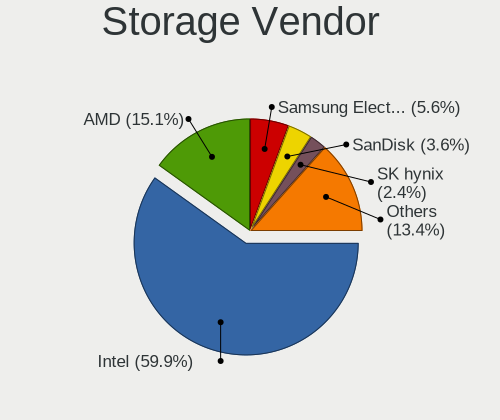
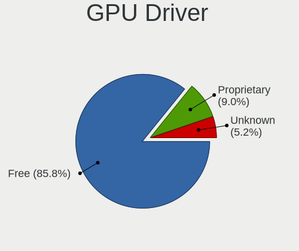
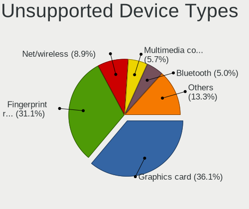

Linux in Russia - Tested Hardware & Statistics (Notebooks)
----------------------------------------------------------

A project to collect tested hardware configurations for Linux in Russia.

Anyone can contribute to this report by the [hw-probe](https://github.com/linuxhw/hw-probe) tool:

    sudo -E hw-probe -all -upload

Please contribute! Especially if your hardware is rare.

Contents
--------

* [ Test Cases ](#test-cases)

* [ System ](#system)
  - [ OS                       ](#os)
  - [ OS Family                ](#os-family)
  - [ Kernel                   ](#kernel)
  - [ Kernel Family            ](#kernel-family)
  - [ Kernel Major Ver.        ](#kernel-major-ver)
  - [ Arch                     ](#arch)
  - [ DE                       ](#de)
  - [ Display Server           ](#display-server)
  - [ Display Manager          ](#display-manager)
  - [ OS Lang                  ](#os-lang)
  - [ Boot Mode                ](#boot-mode)
  - [ Filesystem               ](#filesystem)
  - [ Part. scheme             ](#part-scheme)
  - [ Dual Boot with Linux/BSD ](#dual-boot-with-linuxbsd)
  - [ Dual Boot (Win)          ](#dual-boot-win)

* [ Board ](#board)
  - [ Vendor                   ](#vendor)
  - [ Model                    ](#model)
  - [ Model Family             ](#model-family)
  - [ MFG Year                 ](#mfg-year)
  - [ Form Factor              ](#form-factor)
  - [ Secure Boot              ](#secure-boot)
  - [ Coreboot                 ](#coreboot)
  - [ RAM Size                 ](#ram-size)
  - [ RAM Used                 ](#ram-used)
  - [ Total Drives             ](#total-drives)
  - [ Has CD-ROM               ](#has-cd-rom)
  - [ Has Ethernet             ](#has-ethernet)
  - [ Has WiFi                 ](#has-wifi)
  - [ Has Bluetooth            ](#has-bluetooth)

* [ Location ](#location)
  - [ Country                  ](#country)
  - [ City                     ](#city)

* [ Drives ](#drives)
  - [ Drive Vendor             ](#drive-vendor)
  - [ Drive Model              ](#drive-model)
  - [ HDD Vendor               ](#hdd-vendor)
  - [ SSD Vendor               ](#ssd-vendor)
  - [ Drive Kind               ](#drive-kind)
  - [ Drive Connector          ](#drive-connector)
  - [ Drive Size               ](#drive-size)
  - [ Space Total              ](#space-total)
  - [ Space Used               ](#space-used)
  - [ Malfunc. Drives          ](#malfunc-drives)
  - [ Malfunc. Drive Vendor    ](#malfunc-drive-vendor)
  - [ Malfunc. HDD Vendor      ](#malfunc-hdd-vendor)
  - [ Malfunc. Drive Kind      ](#malfunc-drive-kind)
  - [ Failed Drives            ](#failed-drives)
  - [ Failed Drive Vendor      ](#failed-drive-vendor)
  - [ Drive Status             ](#drive-status)

* [ Storage controller ](#storage-controller)
  - [ Storage Vendor           ](#storage-vendor)
  - [ Storage Model            ](#storage-model)
  - [ Storage Kind             ](#storage-kind)

* [ Processor ](#processor)
  - [ CPU Vendor               ](#cpu-vendor)
  - [ CPU Model                ](#cpu-model)
  - [ CPU Model Family         ](#cpu-model-family)
  - [ CPU Cores                ](#cpu-cores)
  - [ CPU Sockets              ](#cpu-sockets)
  - [ CPU Threads              ](#cpu-threads)
  - [ CPU Op-Modes             ](#cpu-op-modes)
  - [ CPU Microcode            ](#cpu-microcode)
  - [ CPU Microarch            ](#cpu-microarch)

* [ Graphics ](#graphics)
  - [ GPU Vendor               ](#gpu-vendor)
  - [ GPU Model                ](#gpu-model)
  - [ GPU Combo                ](#gpu-combo)
  - [ GPU Driver               ](#gpu-driver)
  - [ GPU Memory               ](#gpu-memory)

* [ Monitor ](#monitor)
  - [ Monitor Vendor           ](#monitor-vendor)
  - [ Monitor Model            ](#monitor-model)
  - [ Monitor Resolution       ](#monitor-resolution)
  - [ Monitor Diagonal         ](#monitor-diagonal)
  - [ Monitor Width            ](#monitor-width)
  - [ Aspect Ratio             ](#aspect-ratio)
  - [ Monitor Area             ](#monitor-area)
  - [ Pixel Density            ](#pixel-density)
  - [ Multiple Monitors        ](#multiple-monitors)

* [ Network ](#network)
  - [ Net Controller Vendor    ](#net-controller-vendor)
  - [ Net Controller Model     ](#net-controller-model)
  - [ Wireless Vendor          ](#wireless-vendor)
  - [ Wireless Model           ](#wireless-model)
  - [ Ethernet Vendor          ](#ethernet-vendor)
  - [ Ethernet Model           ](#ethernet-model)
  - [ Net Controller Kind      ](#net-controller-kind)
  - [ Used Controller          ](#used-controller)
  - [ NICs                     ](#nics)
  - [ IPv6                     ](#ipv6)

* [ Bluetooth ](#bluetooth)
  - [ Bluetooth Vendor         ](#bluetooth-vendor)
  - [ Bluetooth Model          ](#bluetooth-model)

* [ Sound ](#sound)
  - [ Sound Vendor             ](#sound-vendor)
  - [ Sound Model              ](#sound-model)

* [ Memory ](#memory)
  - [ Memory Vendor            ](#memory-vendor)
  - [ Memory Model             ](#memory-model)
  - [ Memory Kind              ](#memory-kind)
  - [ Memory Form Factor       ](#memory-form-factor)
  - [ Memory Size              ](#memory-size)
  - [ Memory Speed             ](#memory-speed)

* [ Printers & scanners ](#printers--scanners)
  - [ Printer Vendor           ](#printer-vendor)
  - [ Printer Model            ](#printer-model)
  - [ Scanner Vendor           ](#scanner-vendor)
  - [ Scanner Model            ](#scanner-model)

* [ Camera ](#camera)
  - [ Camera Vendor            ](#camera-vendor)
  - [ Camera Model             ](#camera-model)

* [ Security ](#security)
  - [ Fingerprint Vendor       ](#fingerprint-vendor)
  - [ Fingerprint Model        ](#fingerprint-model)
  - [ Chipcard Vendor          ](#chipcard-vendor)
  - [ Chipcard Model           ](#chipcard-model)

* [ Unsupported ](#unsupported)
  - [ Unsupported Devices      ](#unsupported-devices)
  - [ Unsupported Device Types ](#unsupported-device-types)

Test Cases
----------

Total: 16526

| Vendor        | Model                       | Probe                                                      | Date         |
|---------------|-----------------------------|------------------------------------------------------------|--------------|
| Acer          | Aspire V3-571G              | [bbb0c707bb](https://linux-hardware.org/?probe=bbb0c707bb) | Dec 01, 2022 |
| Acer          | Aspire V3-771               | [38dfcb79d5](https://linux-hardware.org/?probe=38dfcb79d5) | Dec 01, 2022 |
| Acer          | Aspire 3830TG               | [8bb246cbaa](https://linux-hardware.org/?probe=8bb246cbaa) | Dec 01, 2022 |
| Lenovo        | ThinkPad T440p 20AN0079M... | [79261239c1](https://linux-hardware.org/?probe=79261239c1) | Dec 01, 2022 |
| Acer          | Aspire 3830TG               | [46bcb20e26](https://linux-hardware.org/?probe=46bcb20e26) | Dec 01, 2022 |
| Lenovo        | ThinkBook 15 G3 ACL 21A4    | [d57de89542](https://linux-hardware.org/?probe=d57de89542) | Dec 01, 2022 |
| Acer          | Aspire E1-570G              | [b41442c5a1](https://linux-hardware.org/?probe=b41442c5a1) | Dec 01, 2022 |
| Lenovo        | IdeaPad S340-14API 81NB     | [a8156db955](https://linux-hardware.org/?probe=a8156db955) | Dec 01, 2022 |
| ASUSTek       | ASUS TUF Dash F15 FX516P... | [0128a48982](https://linux-hardware.org/?probe=0128a48982) | Dec 01, 2022 |
| Acer          | Aspire 5336                 | [65be105c02](https://linux-hardware.org/?probe=65be105c02) | Dec 01, 2022 |
| Unknown       | Unknown                     | [dceef2a9d5](https://linux-hardware.org/?probe=dceef2a9d5) | Dec 01, 2022 |
| Dell          | Vostro 3578                 | [89161c2dee](https://linux-hardware.org/?probe=89161c2dee) | Dec 01, 2022 |
| Lenovo        | B450 1S1680033610187        | [e33670a27b](https://linux-hardware.org/?probe=e33670a27b) | Nov 30, 2022 |
| Acer          | Aspire A315-21              | [7c3a371165](https://linux-hardware.org/?probe=7c3a371165) | Nov 30, 2022 |
| HP            | 255 G4                      | [33b2fb7f31](https://linux-hardware.org/?probe=33b2fb7f31) | Nov 30, 2022 |
| Acer          | Aspire A315-21              | [5f14327a56](https://linux-hardware.org/?probe=5f14327a56) | Nov 30, 2022 |
| Samsung       | 300E4A/300E5A/300E7A/343... | [5f53eff4a6](https://linux-hardware.org/?probe=5f53eff4a6) | Nov 30, 2022 |
| MSI           | GE72 6QC                    | [ba4847397e](https://linux-hardware.org/?probe=ba4847397e) | Nov 30, 2022 |
| Pegatron      | C15B                        | [defacd8748](https://linux-hardware.org/?probe=defacd8748) | Nov 30, 2022 |
| Pegatron      | C15B                        | [92271ab582](https://linux-hardware.org/?probe=92271ab582) | Nov 30, 2022 |
| Unknown       | Unknown                     | [9964cb6fe2](https://linux-hardware.org/?probe=9964cb6fe2) | Nov 30, 2022 |
| Lenovo        | IdeaPad Gaming 3 15ARH05... | [65c3211b0a](https://linux-hardware.org/?probe=65c3211b0a) | Nov 30, 2022 |
| Lenovo        | IdeaPad Gaming 3 15ARH05... | [2a8dbc14ef](https://linux-hardware.org/?probe=2a8dbc14ef) | Nov 30, 2022 |
| HUAWEI        | CREM-WXX9                   | [33f7ac03f4](https://linux-hardware.org/?probe=33f7ac03f4) | Nov 30, 2022 |
| Haier         | A1420EM                     | [6f18b3c1ce](https://linux-hardware.org/?probe=6f18b3c1ce) | Nov 30, 2022 |
| Lenovo        | Y520-15IKBN 80WK            | [b245f9da58](https://linux-hardware.org/?probe=b245f9da58) | Nov 30, 2022 |
| Dell          | Inspiron 3558               | [481755baa3](https://linux-hardware.org/?probe=481755baa3) | Nov 30, 2022 |
| Samsung       | 300E4A/300E5A/300E7A/343... | [aadb9ff1d4](https://linux-hardware.org/?probe=aadb9ff1d4) | Nov 30, 2022 |
| Lenovo        | Legion 5 17ACH6H 82JY       | [f5f86becf7](https://linux-hardware.org/?probe=f5f86becf7) | Nov 30, 2022 |
| Samsung       | R560                        | [936ae4b775](https://linux-hardware.org/?probe=936ae4b775) | Nov 29, 2022 |
| Lenovo        | B590 20206                  | [5bec8860f3](https://linux-hardware.org/?probe=5bec8860f3) | Nov 29, 2022 |
| Apple         | MacBookPro12,1              | [f03f3a9325](https://linux-hardware.org/?probe=f03f3a9325) | Nov 29, 2022 |
| ASUSTek       | Zenbook UX535QE_UM535QE     | [9f473cbdeb](https://linux-hardware.org/?probe=9f473cbdeb) | Nov 29, 2022 |
| HP            | ProBook 440 G5              | [45097ff070](https://linux-hardware.org/?probe=45097ff070) | Nov 29, 2022 |
| Dell          | XPS 15 9500                 | [9c87ab493e](https://linux-hardware.org/?probe=9c87ab493e) | Nov 29, 2022 |
| Lenovo        | G565 20071                  | [659a9a89b9](https://linux-hardware.org/?probe=659a9a89b9) | Nov 28, 2022 |
| Timi          | TM1701                      | [64ee057496](https://linux-hardware.org/?probe=64ee057496) | Nov 28, 2022 |
| ASUSTek       | Zenbook UX535QE_UM535QE     | [a3c2004787](https://linux-hardware.org/?probe=a3c2004787) | Nov 28, 2022 |
| Acer          | Aspire ES1-522              | [114c1d0914](https://linux-hardware.org/?probe=114c1d0914) | Nov 28, 2022 |
| Lenovo        | IdeaPad S340-14API 81NB     | [4fbe923ad2](https://linux-hardware.org/?probe=4fbe923ad2) | Nov 28, 2022 |
| Lenovo        | IdeaPad S340-14API 81NB     | [e117f07f42](https://linux-hardware.org/?probe=e117f07f42) | Nov 28, 2022 |
| ASUSTek       | GL752VW                     | [edc0678b85](https://linux-hardware.org/?probe=edc0678b85) | Nov 28, 2022 |
| Lenovo        | IdeaPad L340-15API 81LW     | [ddb1791ff6](https://linux-hardware.org/?probe=ddb1791ff6) | Nov 28, 2022 |
| Lenovo        | ThinkBook 15 G3 ACL 21A4    | [901fa6e871](https://linux-hardware.org/?probe=901fa6e871) | Nov 28, 2022 |
| ASUSTek       | ROG Zephyrus G15 GA502IV... | [86f58e68b6](https://linux-hardware.org/?probe=86f58e68b6) | Nov 28, 2022 |
| Lenovo        | ThinkPad L540 20AVA07BJP    | [cfc9d5c8a2](https://linux-hardware.org/?probe=cfc9d5c8a2) | Nov 27, 2022 |
| HUAWEI        | RLEF-XX                     | [bb5c736032](https://linux-hardware.org/?probe=bb5c736032) | Nov 27, 2022 |
| Quanta        | JW6H                        | [12c85e1c14](https://linux-hardware.org/?probe=12c85e1c14) | Nov 27, 2022 |
| HUAWEI        | KLVL-WXXW                   | [7e65f428cc](https://linux-hardware.org/?probe=7e65f428cc) | Nov 27, 2022 |
| HP            | ENVY 17                     | [4a784f4642](https://linux-hardware.org/?probe=4a784f4642) | Nov 27, 2022 |
| Lenovo        | IdeaPad 700-15ISK 80RU      | [d9ae3d1795](https://linux-hardware.org/?probe=d9ae3d1795) | Nov 27, 2022 |
| Unknown       | Unknown                     | [9e16a80342](https://linux-hardware.org/?probe=9e16a80342) | Nov 27, 2022 |
| HP            | Notebook                    | [4ff28b891c](https://linux-hardware.org/?probe=4ff28b891c) | Nov 27, 2022 |
| HP            | Pavilion g6                 | [c5f8f3f82b](https://linux-hardware.org/?probe=c5f8f3f82b) | Nov 26, 2022 |
| Acer          | TravelMate 4200             | [14b60c4afa](https://linux-hardware.org/?probe=14b60c4afa) | Nov 26, 2022 |
| ASUSTek       | ASUS TUF Gaming A15 FA50... | [74fcf5cb22](https://linux-hardware.org/?probe=74fcf5cb22) | Nov 26, 2022 |
| ASUSTek       | ASUS TUF Gaming A15 FA50... | [a4dbfc0da9](https://linux-hardware.org/?probe=a4dbfc0da9) | Nov 26, 2022 |
| Acer          | Aspire 5733Z                | [7fc415db1f](https://linux-hardware.org/?probe=7fc415db1f) | Nov 26, 2022 |
| Sony          | VGN-P31ZRK_G                | [3c0c707fd4](https://linux-hardware.org/?probe=3c0c707fd4) | Nov 26, 2022 |
| Chuwi         | CoreBook X                  | [f0e76c8866](https://linux-hardware.org/?probe=f0e76c8866) | Nov 26, 2022 |
| HP            | Laptop 14s-dq1xxx           | [9b3a058fda](https://linux-hardware.org/?probe=9b3a058fda) | Nov 26, 2022 |
| MACHENIKE     | MACHCREATOR-16              | [15d49eb71a](https://linux-hardware.org/?probe=15d49eb71a) | Nov 26, 2022 |
| Lenovo        | Legion R9000P ARH7H 82RG    | [0e3f081937](https://linux-hardware.org/?probe=0e3f081937) | Nov 26, 2022 |
| HUAWEI        | MRGF-XX                     | [f60090b407](https://linux-hardware.org/?probe=f60090b407) | Nov 26, 2022 |
| HP            | Notebook                    | [6a8992e3ee](https://linux-hardware.org/?probe=6a8992e3ee) | Nov 26, 2022 |
| ASUSTek       | VivoBook_ASUSLaptop M150... | [52da79e88f](https://linux-hardware.org/?probe=52da79e88f) | Nov 25, 2022 |
| Acer          | Aspire E1-570G              | [9c2f530d6a](https://linux-hardware.org/?probe=9c2f530d6a) | Nov 25, 2022 |
| Insyde        | CherryTrail                 | [f7728857e6](https://linux-hardware.org/?probe=f7728857e6) | Nov 25, 2022 |
| HP            | Pavilion g7                 | [9b84cb2362](https://linux-hardware.org/?probe=9b84cb2362) | Nov 25, 2022 |
| ASUSTek       | GL752VW                     | [2dfd7f3926](https://linux-hardware.org/?probe=2dfd7f3926) | Nov 25, 2022 |
| DEPO Compu... | DPC156                      | [9607de1a9c](https://linux-hardware.org/?probe=9607de1a9c) | Nov 25, 2022 |
| Lenovo        | ThinkBook 15 G2 ITL 20VE    | [4a758bfcc8](https://linux-hardware.org/?probe=4a758bfcc8) | Nov 25, 2022 |
| Lenovo        | IdeaPad Y580 20132          | [41fc6614f7](https://linux-hardware.org/?probe=41fc6614f7) | Nov 25, 2022 |
| Samsung       | 530U3BI/530U4BI/530U4BH     | [0bb72a6a2a](https://linux-hardware.org/?probe=0bb72a6a2a) | Nov 25, 2022 |
| HUAWEI        | KLVD-WXX9                   | [04b855bde5](https://linux-hardware.org/?probe=04b855bde5) | Nov 25, 2022 |
| Apple         | MacBookPro9,2               | [44b8a68c63](https://linux-hardware.org/?probe=44b8a68c63) | Nov 24, 2022 |
| Lenovo        | B590 20208                  | [9f49ff06cf](https://linux-hardware.org/?probe=9f49ff06cf) | Nov 24, 2022 |
| MSI           | GE72 6QC                    | [07084dd8f9](https://linux-hardware.org/?probe=07084dd8f9) | Nov 24, 2022 |
| Clevo         | NL41MU2                     | [0736d8a48f](https://linux-hardware.org/?probe=0736d8a48f) | Nov 24, 2022 |
| HUAWEI        | NBLK-WAX9X                  | [600e3f0f09](https://linux-hardware.org/?probe=600e3f0f09) | Nov 24, 2022 |
| Panasonic     | CF-C2CH2CBMG                | [cf87bdba01](https://linux-hardware.org/?probe=cf87bdba01) | Nov 24, 2022 |
| Lenovo        | IdeaPad L340-15API 81LW     | [ff3d0a1ecf](https://linux-hardware.org/?probe=ff3d0a1ecf) | Nov 24, 2022 |
| Lenovo        | IdeaPad L340-15API 81LW     | [f86569d54b](https://linux-hardware.org/?probe=f86569d54b) | Nov 24, 2022 |
| ASUSTek       | Zenbook UX535QE_UM535QE     | [299634697d](https://linux-hardware.org/?probe=299634697d) | Nov 24, 2022 |
| Unknown       | Unknown                     | [9b50d75b30](https://linux-hardware.org/?probe=9b50d75b30) | Nov 24, 2022 |
| Aquarius      | NS685U R11                  | [866e6d043c](https://linux-hardware.org/?probe=866e6d043c) | Nov 24, 2022 |
| ASUSTek       | ROG Zephyrus M16 GU603HE... | [a31935f117](https://linux-hardware.org/?probe=a31935f117) | Nov 24, 2022 |
| Aquarius      | NS585                       | [d54530cbcb](https://linux-hardware.org/?probe=d54530cbcb) | Nov 24, 2022 |
| Aquarius      | NS585                       | [64d9bcbcde](https://linux-hardware.org/?probe=64d9bcbcde) | Nov 24, 2022 |
| Aquarius      | NS685U R11                  | [0a9856bad0](https://linux-hardware.org/?probe=0a9856bad0) | Nov 24, 2022 |
| HUAWEI        | KLVD-WXX9                   | [97b1b927ba](https://linux-hardware.org/?probe=97b1b927ba) | Nov 23, 2022 |
| Lenovo        | IdeaPad 3 15ADA05 81W1      | [66fca8e108](https://linux-hardware.org/?probe=66fca8e108) | Nov 23, 2022 |
| ASUSTek       | A9T                         | [9ce7b8b3e1](https://linux-hardware.org/?probe=9ce7b8b3e1) | Nov 23, 2022 |
| HP            | Notebook                    | [f81a524d22](https://linux-hardware.org/?probe=f81a524d22) | Nov 23, 2022 |
| ASUSTek       | VivoBook_ASUSLaptop X760... | [028a796420](https://linux-hardware.org/?probe=028a796420) | Nov 23, 2022 |
| ASUSTek       | VivoBook_ASUSLaptop X760... | [c48ab2a2d5](https://linux-hardware.org/?probe=c48ab2a2d5) | Nov 23, 2022 |
| HP            | Laptop 15-dw3xxx            | [fbf991818d](https://linux-hardware.org/?probe=fbf991818d) | Nov 23, 2022 |
| Samsung       | 300E4C/300E5C/300E7C        | [2485671def](https://linux-hardware.org/?probe=2485671def) | Nov 23, 2022 |
| Toshiba       | Satellite U300              | [f24a55abbf](https://linux-hardware.org/?probe=f24a55abbf) | Nov 23, 2022 |
| MSI           | MS-N051                     | [efb37aedbe](https://linux-hardware.org/?probe=efb37aedbe) | Nov 22, 2022 |
| Timi          | TM1701                      | [3d9c04ccd6](https://linux-hardware.org/?probe=3d9c04ccd6) | Nov 22, 2022 |
| ASUSTek       | VivoBook_ASUSLaptop X571... | [ab91a099a5](https://linux-hardware.org/?probe=ab91a099a5) | Nov 22, 2022 |
| ASUSTek       | TUF Gaming FX505DT_FX505... | [149f57ad9c](https://linux-hardware.org/?probe=149f57ad9c) | Nov 22, 2022 |
| Acer          | Aspire V3-771               | [c0a3895ac4](https://linux-hardware.org/?probe=c0a3895ac4) | Nov 22, 2022 |
| Sony          | VGN-TZ3RXN_B                | [5986f007c8](https://linux-hardware.org/?probe=5986f007c8) | Nov 22, 2022 |
| Unknown       | Wiren Board rev. 7.3.1 (... | [1f9ccab914](https://linux-hardware.org/?probe=1f9ccab914) | Nov 22, 2022 |
| Acer          | Extensa 4220                | [af778b2ec9](https://linux-hardware.org/?probe=af778b2ec9) | Nov 22, 2022 |
| Acer          | Extensa 4220                | [04187e0d6e](https://linux-hardware.org/?probe=04187e0d6e) | Nov 22, 2022 |
| HP            | Pavilion Sleekbook 15       | [add4f71bc0](https://linux-hardware.org/?probe=add4f71bc0) | Nov 22, 2022 |
| Dell          | Studio 1558                 | [ef9a6b217c](https://linux-hardware.org/?probe=ef9a6b217c) | Nov 22, 2022 |
| HP            | ENVY 6                      | [feb348843e](https://linux-hardware.org/?probe=feb348843e) | Nov 22, 2022 |
| Notebook      | W65_67SF                    | [91f6aa0bfb](https://linux-hardware.org/?probe=91f6aa0bfb) | Nov 22, 2022 |
| Acer          | Predator PH315-55           | [f411f75743](https://linux-hardware.org/?probe=f411f75743) | Nov 22, 2022 |
| Acer          | Aspire 5940                 | [33325564e7](https://linux-hardware.org/?probe=33325564e7) | Nov 22, 2022 |
| Samsung       | SR70S/SR71S                 | [27c34cd9df](https://linux-hardware.org/?probe=27c34cd9df) | Nov 22, 2022 |
| Samsung       | SR70S/SR71S                 | [2e1f6c73da](https://linux-hardware.org/?probe=2e1f6c73da) | Nov 22, 2022 |
| ASUSTek       | K53SD                       | [c127a0db71](https://linux-hardware.org/?probe=c127a0db71) | Nov 21, 2022 |
| Acer          | TravelMate 5760             | [54c460334e](https://linux-hardware.org/?probe=54c460334e) | Nov 21, 2022 |
| HP            | 8540w                       | [3712bfe3cb](https://linux-hardware.org/?probe=3712bfe3cb) | Nov 21, 2022 |
| ASUSTek       | S3N                         | [e4c4a500b8](https://linux-hardware.org/?probe=e4c4a500b8) | Nov 21, 2022 |
| ASUSTek       | Zenbook UX535QE_UM535QE     | [b58bad1779](https://linux-hardware.org/?probe=b58bad1779) | Nov 21, 2022 |
| Lenovo        | IdeaPad S145-15IGM 81MX     | [ed6bb8845a](https://linux-hardware.org/?probe=ed6bb8845a) | Nov 21, 2022 |
| Acer          | Extensa 2519                | [1ab63c7353](https://linux-hardware.org/?probe=1ab63c7353) | Nov 21, 2022 |
| Lenovo        | B590 20206                  | [7d8faca25a](https://linux-hardware.org/?probe=7d8faca25a) | Nov 21, 2022 |
| Lenovo        | G50-30 80G0                 | [be4f638bc7](https://linux-hardware.org/?probe=be4f638bc7) | Nov 21, 2022 |
| Lenovo        | Legion 5 17IMH05H 81Y8      | [b74040cd21](https://linux-hardware.org/?probe=b74040cd21) | Nov 21, 2022 |
| HP            | EliteBook 855 G8 Noteboo... | [60c1698203](https://linux-hardware.org/?probe=60c1698203) | Nov 21, 2022 |
| HP            | Pavilion Laptop 14-ce2xx... | [0e9d717db2](https://linux-hardware.org/?probe=0e9d717db2) | Nov 21, 2022 |
| HUAWEI        | CREM-WXX9                   | [9630927dc1](https://linux-hardware.org/?probe=9630927dc1) | Nov 20, 2022 |
| HP            | Notebook                    | [c8bac5b72d](https://linux-hardware.org/?probe=c8bac5b72d) | Nov 20, 2022 |
| Acer          | Extensa 2519                | [fc5526a30f](https://linux-hardware.org/?probe=fc5526a30f) | Nov 20, 2022 |
| Acer          | Extensa 2519                | [5ae619eb32](https://linux-hardware.org/?probe=5ae619eb32) | Nov 20, 2022 |
| Acer          | Extensa 2540                | [2cd32708f2](https://linux-hardware.org/?probe=2cd32708f2) | Nov 20, 2022 |
| HP            | Compaq nx9020 (PG641ES#A... | [ba63296d55](https://linux-hardware.org/?probe=ba63296d55) | Nov 20, 2022 |
| Irbis         | NB254                       | [ffa6638fe9](https://linux-hardware.org/?probe=ffa6638fe9) | Nov 20, 2022 |
| ASUSTek       | X550CC                      | [a2eae9195c](https://linux-hardware.org/?probe=a2eae9195c) | Nov 20, 2022 |
| Lenovo        | G560 20042                  | [e2ea91a4ca](https://linux-hardware.org/?probe=e2ea91a4ca) | Nov 20, 2022 |
| ASUSTek       | F5VL                        | [05614f05b7](https://linux-hardware.org/?probe=05614f05b7) | Nov 20, 2022 |
| ASUSTek       | F5VL                        | [a95f905ff3](https://linux-hardware.org/?probe=a95f905ff3) | Nov 20, 2022 |
| Acer          | Aspire E5-771G              | [5099a55836](https://linux-hardware.org/?probe=5099a55836) | Nov 20, 2022 |
| HUAWEI        | KLVL-WXXW                   | [206a1fe0c7](https://linux-hardware.org/?probe=206a1fe0c7) | Nov 20, 2022 |
| HUAWEI        | KLVL-WXXW                   | [9208bbd2b8](https://linux-hardware.org/?probe=9208bbd2b8) | Nov 20, 2022 |
| Chuwi         | LarkBook                    | [bef3087526](https://linux-hardware.org/?probe=bef3087526) | Nov 20, 2022 |
| Pegatron      | A15                         | [dea0a0c81e](https://linux-hardware.org/?probe=dea0a0c81e) | Nov 20, 2022 |
| Acer          | Aspire 5750G                | [8b000b014f](https://linux-hardware.org/?probe=8b000b014f) | Nov 20, 2022 |
| HUAWEI        | NBD-WXX9                    | [bd18dfe05f](https://linux-hardware.org/?probe=bd18dfe05f) | Nov 20, 2022 |
| Irbis         | NB121                       | [32a784f767](https://linux-hardware.org/?probe=32a784f767) | Nov 20, 2022 |
| HUAWEI        | CREM-WXX9                   | [f9b8181279](https://linux-hardware.org/?probe=f9b8181279) | Nov 19, 2022 |
| Acer          | Aspire A515-44G             | [51035e77a1](https://linux-hardware.org/?probe=51035e77a1) | Nov 19, 2022 |
| ASUSTek       | ASUSPRO P1440FAC_P1440FA    | [5605c0fd97](https://linux-hardware.org/?probe=5605c0fd97) | Nov 19, 2022 |
| Aquarius      | NS585                       | [a0bc8d3f44](https://linux-hardware.org/?probe=a0bc8d3f44) | Nov 19, 2022 |
| Acer          | Aspire ES1-533              | [8c080caac2](https://linux-hardware.org/?probe=8c080caac2) | Nov 19, 2022 |
| Digma         | EVE 15 C423 ES5069EW        | [9737dae1ac](https://linux-hardware.org/?probe=9737dae1ac) | Nov 19, 2022 |
| ASUSTek       | K53SD                       | [7620fe2bdd](https://linux-hardware.org/?probe=7620fe2bdd) | Nov 19, 2022 |
| ALLDOCUBE     | i1405S                      | [551bc2b1e6](https://linux-hardware.org/?probe=551bc2b1e6) | Nov 19, 2022 |
| Lenovo        | ThinkBook 15 G2 ARE 20VG    | [87d8a1ee6b](https://linux-hardware.org/?probe=87d8a1ee6b) | Nov 19, 2022 |
| ASUSTek       | M80TA                       | [d2427d8942](https://linux-hardware.org/?probe=d2427d8942) | Nov 18, 2022 |
| Dell          | Inspiron 1525               | [3e09380a65](https://linux-hardware.org/?probe=3e09380a65) | Nov 18, 2022 |
| Dell          | Inspiron 3793               | [fb5878b057](https://linux-hardware.org/?probe=fb5878b057) | Nov 18, 2022 |
| Haier         | U1520HD                     | [7a9c0df4f1](https://linux-hardware.org/?probe=7a9c0df4f1) | Nov 18, 2022 |
| HUAWEI        | NBD-WXX9                    | [a54f42b51e](https://linux-hardware.org/?probe=a54f42b51e) | Nov 18, 2022 |
| Digma         | EVE 15 C423 ES5069EW        | [57cd27008a](https://linux-hardware.org/?probe=57cd27008a) | Nov 18, 2022 |
| HUAWEI        | NBD-WXX9                    | [faa0deab8f](https://linux-hardware.org/?probe=faa0deab8f) | Nov 18, 2022 |
| HUAWEI        | BOD-WXX9                    | [9984093912](https://linux-hardware.org/?probe=9984093912) | Nov 18, 2022 |
| Lenovo        | B475 Sabine                 | [5be5a7cd5f](https://linux-hardware.org/?probe=5be5a7cd5f) | Nov 17, 2022 |
| ASUSTek       | K54HR                       | [ba95174feb](https://linux-hardware.org/?probe=ba95174feb) | Nov 17, 2022 |
| Acer          | Aspire V3-371               | [b184d85960](https://linux-hardware.org/?probe=b184d85960) | Nov 17, 2022 |
| Dell          | Inspiron N5010              | [8a94d169c5](https://linux-hardware.org/?probe=8a94d169c5) | Nov 17, 2022 |
| Dell          | Inspiron N5010              | [fbe52d681e](https://linux-hardware.org/?probe=fbe52d681e) | Nov 17, 2022 |
| Acer          | Aspire ES1-511              | [0754a5633d](https://linux-hardware.org/?probe=0754a5633d) | Nov 16, 2022 |
| Timi          | TM1701                      | [e77b655bb8](https://linux-hardware.org/?probe=e77b655bb8) | Nov 16, 2022 |
| ASUSTek       | X507UA                      | [9a2fe77bac](https://linux-hardware.org/?probe=9a2fe77bac) | Nov 16, 2022 |
| Unknown       | Unknown                     | [f3222cf843](https://linux-hardware.org/?probe=f3222cf843) | Nov 16, 2022 |
| Unknown       | Unknown                     | [9217d900c4](https://linux-hardware.org/?probe=9217d900c4) | Nov 16, 2022 |
| HUAWEI        | NBD-WXX9                    | [72ebef559b](https://linux-hardware.org/?probe=72ebef559b) | Nov 16, 2022 |
| Unknown       | Unknown                     | [a86465b0f3](https://linux-hardware.org/?probe=a86465b0f3) | Nov 16, 2022 |
| ALLDOCUBE     | i1405S                      | [f35dc553a2](https://linux-hardware.org/?probe=f35dc553a2) | Nov 16, 2022 |
| Lenovo        | ThinkPad T14 Gen 2i 20W0... | [f8eb11ba08](https://linux-hardware.org/?probe=f8eb11ba08) | Nov 15, 2022 |
| Lenovo        | V14 G2 ALC 82KC             | [cf10680f5f](https://linux-hardware.org/?probe=cf10680f5f) | Nov 15, 2022 |
| Lenovo        | G50-30 80G0                 | [b870eb1d72](https://linux-hardware.org/?probe=b870eb1d72) | Nov 15, 2022 |
| Dell          | Inspiron 5558               | [0674cb5916](https://linux-hardware.org/?probe=0674cb5916) | Nov 15, 2022 |
| HONOR         | HYM-WXX                     | [5cf42c99ef](https://linux-hardware.org/?probe=5cf42c99ef) | Nov 15, 2022 |
| Lenovo        | IdeaPad 5 14ITL05 82FE      | [b59bffff0b](https://linux-hardware.org/?probe=b59bffff0b) | Nov 15, 2022 |
| Kraftway      | ACCORD                      | [7021cedadf](https://linux-hardware.org/?probe=7021cedadf) | Nov 15, 2022 |
| HONOR         | HYM-WXX                     | [a6812ad12e](https://linux-hardware.org/?probe=a6812ad12e) | Nov 15, 2022 |
| Samsung       | NC210/NC110                 | [31ebbfaf58](https://linux-hardware.org/?probe=31ebbfaf58) | Nov 15, 2022 |
| MSI           | Katana GF76 11SC            | [1b11541cd7](https://linux-hardware.org/?probe=1b11541cd7) | Nov 15, 2022 |
| Toshiba       | Satellite A300D             | [c5dc216e31](https://linux-hardware.org/?probe=c5dc216e31) | Nov 15, 2022 |
| Toshiba       | Satellite A300D             | [21952b8d66](https://linux-hardware.org/?probe=21952b8d66) | Nov 15, 2022 |
| HP            | Mini 110-3700               | [4e9f54f23c](https://linux-hardware.org/?probe=4e9f54f23c) | Nov 15, 2022 |
| Acer          | Aspire ES1-512              | [5802f0db59](https://linux-hardware.org/?probe=5802f0db59) | Nov 15, 2022 |
| HP            | Mini 110-3700               | [8ca62a1880](https://linux-hardware.org/?probe=8ca62a1880) | Nov 15, 2022 |
| MSI           | Modern 15 B11M              | [0ae136622d](https://linux-hardware.org/?probe=0ae136622d) | Nov 14, 2022 |
| ASUSTek       | N53SV                       | [f42473e3f6](https://linux-hardware.org/?probe=f42473e3f6) | Nov 14, 2022 |
| ASUSTek       | X502CA                      | [b47b397c38](https://linux-hardware.org/?probe=b47b397c38) | Nov 14, 2022 |
| Samsung       | 300E4C/300E5C/300E7C        | [100714ed23](https://linux-hardware.org/?probe=100714ed23) | Nov 14, 2022 |
| HP            | EliteBook 855 G8 Noteboo... | [e6ef3b56eb](https://linux-hardware.org/?probe=e6ef3b56eb) | Nov 14, 2022 |
| HP            | ENVY m6                     | [4397c54e20](https://linux-hardware.org/?probe=4397c54e20) | Nov 14, 2022 |
| ASUSTek       | K42DY                       | [f7a61f85d9](https://linux-hardware.org/?probe=f7a61f85d9) | Nov 14, 2022 |
| Lenovo        | G550 20023                  | [80be7e8e25](https://linux-hardware.org/?probe=80be7e8e25) | Nov 14, 2022 |
| Lenovo        | ThinkBook 14 G2 ITL 20VD    | [1de723e880](https://linux-hardware.org/?probe=1de723e880) | Nov 14, 2022 |
| ASUSTek       | Zenbook UX535QE_UM535QE     | [233791ab06](https://linux-hardware.org/?probe=233791ab06) | Nov 14, 2022 |
| Samsung       | 300V3A/300V4A/300V5A/200... | [34a5f361bd](https://linux-hardware.org/?probe=34a5f361bd) | Nov 14, 2022 |
| Fujitsu       | LIFEBOOK U938               | [428ad6215c](https://linux-hardware.org/?probe=428ad6215c) | Nov 14, 2022 |
| MSI           | GT72 2QD                    | [cbd0b88f5f](https://linux-hardware.org/?probe=cbd0b88f5f) | Nov 14, 2022 |
| MSI           | GT72 2QD                    | [0e9a1a51a5](https://linux-hardware.org/?probe=0e9a1a51a5) | Nov 14, 2022 |
| ASUSTek       | N50Vc                       | [36b3155007](https://linux-hardware.org/?probe=36b3155007) | Nov 13, 2022 |
| ASUSTek       | K53SM                       | [297194e8e4](https://linux-hardware.org/?probe=297194e8e4) | Nov 13, 2022 |
| Chuwi         | LarkBook                    | [8c33c61e14](https://linux-hardware.org/?probe=8c33c61e14) | Nov 13, 2022 |
| HUAWEI        | MACHD-WXX9                  | [91e169c039](https://linux-hardware.org/?probe=91e169c039) | Nov 13, 2022 |
| ASUSTek       | ASUS TUF Gaming A15 FA50... | [6e9bc709d9](https://linux-hardware.org/?probe=6e9bc709d9) | Nov 13, 2022 |
| ASUSTek       | ASUS TUF Gaming A15 FA50... | [49162725d5](https://linux-hardware.org/?probe=49162725d5) | Nov 13, 2022 |
| Sony          | SVE1512H1RW                 | [032fdf5260](https://linux-hardware.org/?probe=032fdf5260) | Nov 13, 2022 |
| Samsung       | 300E4C/300E5C/300E7C        | [e8e7b815c4](https://linux-hardware.org/?probe=e8e7b815c4) | Nov 13, 2022 |
| Lenovo        | B590 20208                  | [af898e0d66](https://linux-hardware.org/?probe=af898e0d66) | Nov 13, 2022 |
| Acer          | Aspire 5720Z                | [264c30fac3](https://linux-hardware.org/?probe=264c30fac3) | Nov 13, 2022 |
| Acer          | Aspire 5720Z                | [6e596d88da](https://linux-hardware.org/?probe=6e596d88da) | Nov 12, 2022 |
| HONOR         | BOD-WXX9                    | [ca8b207b30](https://linux-hardware.org/?probe=ca8b207b30) | Nov 12, 2022 |
| Dell          | Inspiron 3521               | [10482f151a](https://linux-hardware.org/?probe=10482f151a) | Nov 12, 2022 |
| Dell          | Inspiron 3521               | [5f20ed2dd2](https://linux-hardware.org/?probe=5f20ed2dd2) | Nov 12, 2022 |
| Acer          | Aspire 3830TG               | [2ce4863890](https://linux-hardware.org/?probe=2ce4863890) | Nov 12, 2022 |
| HP            | Compaq nc6120 (PY507EA#A... | [a4c594d8db](https://linux-hardware.org/?probe=a4c594d8db) | Nov 12, 2022 |
| Gigabyte      | G5 KE                       | [aefbee04fd](https://linux-hardware.org/?probe=aefbee04fd) | Nov 12, 2022 |
| Acer          | Acadia V1.45                | [c6a91498cc](https://linux-hardware.org/?probe=c6a91498cc) | Nov 12, 2022 |
| Samsung       | R425D/R525D                 | [85d17374e7](https://linux-hardware.org/?probe=85d17374e7) | Nov 12, 2022 |
| Acer          | Swift SF314-43              | [1243c9795a](https://linux-hardware.org/?probe=1243c9795a) | Nov 12, 2022 |
| ASUSTek       | K53BR                       | [15838034f5](https://linux-hardware.org/?probe=15838034f5) | Nov 12, 2022 |
| Lenovo        | ThinkBook 15 G3 ACL 21A4    | [4838271135](https://linux-hardware.org/?probe=4838271135) | Nov 11, 2022 |
| Acer          | Acadia V1.19                | [f43450e9d4](https://linux-hardware.org/?probe=f43450e9d4) | Nov 11, 2022 |
| Lenovo        | ThinkPad X220 4290RB3       | [37959973aa](https://linux-hardware.org/?probe=37959973aa) | Nov 11, 2022 |
| ASUSTek       | VivoBook 15_ASUS Laptop ... | [cbd9e440a6](https://linux-hardware.org/?probe=cbd9e440a6) | Nov 11, 2022 |
| Acer          | Aspire E5-573               | [b8b0c9fae3](https://linux-hardware.org/?probe=b8b0c9fae3) | Nov 11, 2022 |
| NCA Group     | iRU_Notebook                | [6d22b3942e](https://linux-hardware.org/?probe=6d22b3942e) | Nov 11, 2022 |
| Gigabyte      | U24                         | [c0bf41df22](https://linux-hardware.org/?probe=c0bf41df22) | Nov 11, 2022 |
| Clevo         | NL41MU2                     | [65226dd80a](https://linux-hardware.org/?probe=65226dd80a) | Nov 11, 2022 |
| Lenovo        | IdeaPad Gaming 3 15ARH05... | [68e5509696](https://linux-hardware.org/?probe=68e5509696) | Nov 11, 2022 |
| ASUSTek       | Zenbook UX535QE_UM535QE     | [1681f97433](https://linux-hardware.org/?probe=1681f97433) | Nov 11, 2022 |
| Clevo         | NL41MU2                     | [a25dd1174c](https://linux-hardware.org/?probe=a25dd1174c) | Nov 11, 2022 |
| Samsung       | R519/R719                   | [31260d4616](https://linux-hardware.org/?probe=31260d4616) | Nov 11, 2022 |
| HUAWEI        | BOD-WXX9                    | [2e79d44f43](https://linux-hardware.org/?probe=2e79d44f43) | Nov 11, 2022 |
| ASUSTek       | K50IE                       | [4bd91fccfa](https://linux-hardware.org/?probe=4bd91fccfa) | Nov 11, 2022 |
| Sony          | VPCEH3J1R                   | [4944a2e287](https://linux-hardware.org/?probe=4944a2e287) | Nov 11, 2022 |
| HP            | Pavilion g6                 | [fc422ba1a4](https://linux-hardware.org/?probe=fc422ba1a4) | Nov 11, 2022 |
| HP            | EliteBook 855 G8 Noteboo... | [7827dd0f86](https://linux-hardware.org/?probe=7827dd0f86) | Nov 11, 2022 |
| HP            | EliteBook 855 G8 Noteboo... | [64d896b971](https://linux-hardware.org/?probe=64d896b971) | Nov 11, 2022 |
| ASUSTek       | Zenbook UX535QE_UM535QE     | [139c944b07](https://linux-hardware.org/?probe=139c944b07) | Nov 11, 2022 |
| ASUSTek       | VivoBook_ASUSLaptop X403... | [f56dc1af6b](https://linux-hardware.org/?probe=f56dc1af6b) | Nov 10, 2022 |
| Acer          | Aspire V5-572G              | [bd537cc78c](https://linux-hardware.org/?probe=bd537cc78c) | Nov 10, 2022 |
| Sony          | VPCS11V9R                   | [a0b4bf7869](https://linux-hardware.org/?probe=a0b4bf7869) | Nov 10, 2022 |
| Lenovo        | G50-30 80G0                 | [1e0c308a85](https://linux-hardware.org/?probe=1e0c308a85) | Nov 10, 2022 |
| Acer          | TravelMate 6292             | [c7dcad2d0f](https://linux-hardware.org/?probe=c7dcad2d0f) | Nov 10, 2022 |
| HP            | Pavilion g6                 | [e2a0a47587](https://linux-hardware.org/?probe=e2a0a47587) | Nov 10, 2022 |
| ASUSTek       | K50IE                       | [5176f404f1](https://linux-hardware.org/?probe=5176f404f1) | Nov 10, 2022 |
| Valve         | Jupiter                     | [34582d82a1](https://linux-hardware.org/?probe=34582d82a1) | Nov 10, 2022 |
| ASUSTek       | G50VT                       | [57f7e69b18](https://linux-hardware.org/?probe=57f7e69b18) | Nov 10, 2022 |
| HP            | OMEN by Laptop 15-dc0xxx    | [26989a0d39](https://linux-hardware.org/?probe=26989a0d39) | Nov 10, 2022 |
| HP            | Laptop 14s-dq3xxx           | [2da4055f76](https://linux-hardware.org/?probe=2da4055f76) | Nov 09, 2022 |
| ASUSTek       | K501UB                      | [c0f4434ec3](https://linux-hardware.org/?probe=c0f4434ec3) | Nov 09, 2022 |
| Lenovo        | E31-70 80KX                 | [61343c5ca1](https://linux-hardware.org/?probe=61343c5ca1) | Nov 09, 2022 |
| MSI           | Katana GF76 11SC            | [7e2ff6fc67](https://linux-hardware.org/?probe=7e2ff6fc67) | Nov 09, 2022 |
| Lenovo        | IdeaPad L340-15API 81LW     | [3fd33e6782](https://linux-hardware.org/?probe=3fd33e6782) | Nov 09, 2022 |
| ASUSTek       | X507UB                      | [2790049313](https://linux-hardware.org/?probe=2790049313) | Nov 09, 2022 |
| Timi          | RedmiBook Pro 15S           | [02b3508a99](https://linux-hardware.org/?probe=02b3508a99) | Nov 09, 2022 |
| MSI           | GE70 2PL                    | [d09e002aa8](https://linux-hardware.org/?probe=d09e002aa8) | Nov 09, 2022 |
| Infinix       | INBOOK X2                   | [d342b7930f](https://linux-hardware.org/?probe=d342b7930f) | Nov 09, 2022 |
| ASUSTek       | X550CC                      | [46dd8a0416](https://linux-hardware.org/?probe=46dd8a0416) | Nov 08, 2022 |
| ASUSTek       | U24E                        | [a51fe3226f](https://linux-hardware.org/?probe=a51fe3226f) | Nov 08, 2022 |
| MSI           | GE70 2PL                    | [8752dacd05](https://linux-hardware.org/?probe=8752dacd05) | Nov 08, 2022 |
| Acer          | Nitro AN517-52              | [3a2bb9e1e9](https://linux-hardware.org/?probe=3a2bb9e1e9) | Nov 08, 2022 |
| Acer          | Aspire E5-573G              | [b6a1f08748](https://linux-hardware.org/?probe=b6a1f08748) | Nov 08, 2022 |
| Aquarius      | NS585                       | [9b20fcc4b8](https://linux-hardware.org/?probe=9b20fcc4b8) | Nov 08, 2022 |
| HP            | EliteBook 2540p             | [515cdf3f6c](https://linux-hardware.org/?probe=515cdf3f6c) | Nov 08, 2022 |
| Lenovo        | IdeaPad Gaming 3 15ACH6 ... | [ba8145934d](https://linux-hardware.org/?probe=ba8145934d) | Nov 07, 2022 |
| ASUSTek       | TUF Gaming FX505DV_FX505... | [95b5d8b8ca](https://linux-hardware.org/?probe=95b5d8b8ca) | Nov 07, 2022 |
| Gigabyte      | U24                         | [a9d03e590b](https://linux-hardware.org/?probe=a9d03e590b) | Nov 07, 2022 |
| Acer          | Aspire A315-41              | [df6426eef5](https://linux-hardware.org/?probe=df6426eef5) | Nov 07, 2022 |
| Acer          | Aspire A315-41              | [bae4adcff9](https://linux-hardware.org/?probe=bae4adcff9) | Nov 07, 2022 |
| Toshiba       | Satellite C660              | [5e972fdb95](https://linux-hardware.org/?probe=5e972fdb95) | Nov 07, 2022 |
| HP            | Pavilion g6                 | [9992a08641](https://linux-hardware.org/?probe=9992a08641) | Nov 07, 2022 |
| Toshiba       | Satellite C660              | [e75f44efd0](https://linux-hardware.org/?probe=e75f44efd0) | Nov 07, 2022 |
| eMachines     | eM350                       | [ac6dda5ddb](https://linux-hardware.org/?probe=ac6dda5ddb) | Nov 07, 2022 |
| Acer          | Aspire VN7-591G             | [541d3bfeca](https://linux-hardware.org/?probe=541d3bfeca) | Nov 07, 2022 |
| Sony          | VPCZ13S9R                   | [9a0f47ed25](https://linux-hardware.org/?probe=9a0f47ed25) | Nov 07, 2022 |
| HP            | ProBook 430 G5              | [e362ce5bdf](https://linux-hardware.org/?probe=e362ce5bdf) | Nov 07, 2022 |
| ASUSTek       | ROG Flow X13 GV301QH_GV3... | [614a486442](https://linux-hardware.org/?probe=614a486442) | Nov 07, 2022 |
| Acer          | TravelMate 5760             | [f645b36a78](https://linux-hardware.org/?probe=f645b36a78) | Nov 07, 2022 |
| Dell          | G3 3579                     | [b793526167](https://linux-hardware.org/?probe=b793526167) | Nov 06, 2022 |
| Lenovo        | ThinkPad T440p 20AN0033R... | [7ca892ad44](https://linux-hardware.org/?probe=7ca892ad44) | Nov 06, 2022 |
| Lenovo        | IdeaPad S145-15API 81UT     | [db56889368](https://linux-hardware.org/?probe=db56889368) | Nov 06, 2022 |
| Lenovo        | ThinkPad L14 Gen 1 20U50... | [d238949b9f](https://linux-hardware.org/?probe=d238949b9f) | Nov 06, 2022 |
| Lenovo        | IdeaPad 3 17ADA05 81W2      | [05ac02550e](https://linux-hardware.org/?probe=05ac02550e) | Nov 06, 2022 |
| DNS           | W9x0LU                      | [2ebfe190c5](https://linux-hardware.org/?probe=2ebfe190c5) | Nov 06, 2022 |
| Samsung       | R510/P510                   | [4921b97206](https://linux-hardware.org/?probe=4921b97206) | Nov 06, 2022 |
| Packard Be... | EasyNote TS11HR             | [19304dd869](https://linux-hardware.org/?probe=19304dd869) | Nov 06, 2022 |
| Acer          | Aspire A317-52              | [e9ed162010](https://linux-hardware.org/?probe=e9ed162010) | Nov 06, 2022 |
| Lenovo        | ThinkPad P1 Gen 4i 20Y3A... | [d53e6cef83](https://linux-hardware.org/?probe=d53e6cef83) | Nov 06, 2022 |
| Toshiba       | Satellite L550              | [3b95d22100](https://linux-hardware.org/?probe=3b95d22100) | Nov 06, 2022 |
| Dell          | Studio 1558                 | [8b5cb100a8](https://linux-hardware.org/?probe=8b5cb100a8) | Nov 05, 2022 |
| Acer          | Nitro AN515-42              | [a89bc09dca](https://linux-hardware.org/?probe=a89bc09dca) | Nov 05, 2022 |
| Lenovo        | V14-ADA 82C6                | [92be197f2d](https://linux-hardware.org/?probe=92be197f2d) | Nov 05, 2022 |
| ASUSTek       | N76VB                       | [c46794ba60](https://linux-hardware.org/?probe=c46794ba60) | Nov 05, 2022 |
| Fujitsu Si... | AMILO Pro V3205             | [7a03ef6ae1](https://linux-hardware.org/?probe=7a03ef6ae1) | Nov 05, 2022 |
| Dell          | Inspiron N5110              | [698596bd58](https://linux-hardware.org/?probe=698596bd58) | Nov 05, 2022 |
| HP            | Pavilion dv7                | [d17019e1f7](https://linux-hardware.org/?probe=d17019e1f7) | Nov 05, 2022 |
| Apple         | MacBookPro5,5               | [cc051268d8](https://linux-hardware.org/?probe=cc051268d8) | Nov 05, 2022 |
| ASUSTek       | N56VJ                       | [1685737249](https://linux-hardware.org/?probe=1685737249) | Nov 05, 2022 |
| Pretech       | EVE 1801 3G ES1049EG        | [19205fc20b](https://linux-hardware.org/?probe=19205fc20b) | Nov 04, 2022 |
| ASUSTek       | F5N                         | [f1efa34bf8](https://linux-hardware.org/?probe=f1efa34bf8) | Nov 04, 2022 |
| ASUSTek       | X75VD                       | [60e91d212e](https://linux-hardware.org/?probe=60e91d212e) | Nov 04, 2022 |
| Lenovo        | B590 20206                  | [6807b6b584](https://linux-hardware.org/?probe=6807b6b584) | Nov 04, 2022 |
| Lenovo        | B590 20206                  | [d0267472d6](https://linux-hardware.org/?probe=d0267472d6) | Nov 04, 2022 |
| Lenovo        | G500 20236                  | [82213a5471](https://linux-hardware.org/?probe=82213a5471) | Nov 04, 2022 |
| ASUSTek       | F5N                         | [8e3878fe4d](https://linux-hardware.org/?probe=8e3878fe4d) | Nov 04, 2022 |
| ASUSTek       | F5N                         | [f95b9890f6](https://linux-hardware.org/?probe=f95b9890f6) | Nov 04, 2022 |
| HUAWEI        | HKD-WXX                     | [7a8f33b5bf](https://linux-hardware.org/?probe=7a8f33b5bf) | Nov 04, 2022 |
| HUAWEI        | BOM-WXX9                    | [d78a7bd1a3](https://linux-hardware.org/?probe=d78a7bd1a3) | Nov 04, 2022 |
| Lenovo        | IdeaPad 330S-15ARR 81FB     | [505b2c2b5d](https://linux-hardware.org/?probe=505b2c2b5d) | Nov 04, 2022 |
| Fujitsu       | LIFEBOOK A512               | [8732711bf0](https://linux-hardware.org/?probe=8732711bf0) | Nov 04, 2022 |
| Packard Be... | EasyNote LX                 | [41070f6bfe](https://linux-hardware.org/?probe=41070f6bfe) | Nov 04, 2022 |
| ASUSTek       | U24E                        | [6303641e69](https://linux-hardware.org/?probe=6303641e69) | Nov 04, 2022 |
| Sony          | VPCEA1S1R                   | [9dfb83587b](https://linux-hardware.org/?probe=9dfb83587b) | Nov 04, 2022 |
| Dell          | Inspiron 3501               | [b487c53dfd](https://linux-hardware.org/?probe=b487c53dfd) | Nov 04, 2022 |
| Lenovo        | IdeaPad 330S-15ARR 81FB     | [f8685beefa](https://linux-hardware.org/?probe=f8685beefa) | Nov 04, 2022 |
| Samsung       | 350V5C/351V5C/3540VC/344... | [d7c44d9e94](https://linux-hardware.org/?probe=d7c44d9e94) | Nov 04, 2022 |
| Lenovo        | G580 20157                  | [16cd4b28ce](https://linux-hardware.org/?probe=16cd4b28ce) | Nov 04, 2022 |
| Lenovo        | IdeaPad 110-15ACL 80TJ      | [52a97560d7](https://linux-hardware.org/?probe=52a97560d7) | Nov 03, 2022 |
| Lenovo        | IdeaPad L340-15API 81LW     | [dba14315ca](https://linux-hardware.org/?probe=dba14315ca) | Nov 03, 2022 |
| ASUSTek       | 1215B                       | [eeff579fe6](https://linux-hardware.org/?probe=eeff579fe6) | Nov 03, 2022 |
| ASUSTek       | 1215B                       | [3cc2c5ad48](https://linux-hardware.org/?probe=3cc2c5ad48) | Nov 03, 2022 |
| ASUSTek       | T100TAM                     | [d409557d4b](https://linux-hardware.org/?probe=d409557d4b) | Nov 03, 2022 |
| Valve         | Jupiter                     | [1757bc1f5a](https://linux-hardware.org/?probe=1757bc1f5a) | Nov 03, 2022 |
| Lenovo        | ThinkPad L13 Gen 2 20VH0... | [de1cd69b53](https://linux-hardware.org/?probe=de1cd69b53) | Nov 02, 2022 |
| HP            | ENVY m6                     | [9043724da5](https://linux-hardware.org/?probe=9043724da5) | Nov 02, 2022 |
| ASUSTek       | VivoBook_ASUSLaptop X570... | [28d7daff10](https://linux-hardware.org/?probe=28d7daff10) | Nov 02, 2022 |
| Acer          | Nitro AN515-54              | [710ab678b2](https://linux-hardware.org/?probe=710ab678b2) | Nov 02, 2022 |
| Acer          | Aspire A515-54G             | [519fa92199](https://linux-hardware.org/?probe=519fa92199) | Nov 02, 2022 |
| ASUSTek       | 1215B                       | [21694405a9](https://linux-hardware.org/?probe=21694405a9) | Nov 02, 2022 |
| Digma         | EVE 11 C422 ES1068EW        | [f5177de131](https://linux-hardware.org/?probe=f5177de131) | Nov 02, 2022 |
| ASUSTek       | VivoBook_ASUSLaptop X570... | [6f89789444](https://linux-hardware.org/?probe=6f89789444) | Nov 02, 2022 |
| ASUSTek       | N53Jg                       | [8e4782c668](https://linux-hardware.org/?probe=8e4782c668) | Nov 01, 2022 |
| Toshiba       | Satellite C660              | [44c6e56cd9](https://linux-hardware.org/?probe=44c6e56cd9) | Nov 01, 2022 |
| Toshiba       | Satellite L755              | [dc3d60731e](https://linux-hardware.org/?probe=dc3d60731e) | Nov 01, 2022 |
| HP            | Laptop 14s-fq0xxx           | [fe23529093](https://linux-hardware.org/?probe=fe23529093) | Nov 01, 2022 |
| Lenovo        | ThinkBook 15 G2 ITL 20VE    | [7603f28400](https://linux-hardware.org/?probe=7603f28400) | Nov 01, 2022 |
| Lenovo        | V14-ADA 82C6                | [a54d6876b6](https://linux-hardware.org/?probe=a54d6876b6) | Nov 01, 2022 |
| Lenovo        | V15 G2 ALC 82KD             | [406aae2f66](https://linux-hardware.org/?probe=406aae2f66) | Nov 01, 2022 |
| Apple         | MacBookPro8,1               | [da912b99f4](https://linux-hardware.org/?probe=da912b99f4) | Nov 01, 2022 |
| Samsung       | RV410/RV510/S3510/E3510     | [566d83485b](https://linux-hardware.org/?probe=566d83485b) | Oct 31, 2022 |
| HUAWEI        | BOHB-WAX9                   | [274a3383db](https://linux-hardware.org/?probe=274a3383db) | Oct 31, 2022 |
| Acer          | Aspire 5733                 | [bcc1836178](https://linux-hardware.org/?probe=bcc1836178) | Oct 31, 2022 |
| ASUSTek       | K43SJ                       | [778e6caf06](https://linux-hardware.org/?probe=778e6caf06) | Oct 31, 2022 |
| ASUSTek       | X541UVK                     | [15bdbbf952](https://linux-hardware.org/?probe=15bdbbf952) | Oct 31, 2022 |
| Sony          | VGN-AR71MR                  | [4ecd695b12](https://linux-hardware.org/?probe=4ecd695b12) | Oct 31, 2022 |
| ASUSTek       | T100TAM                     | [a2a70b919d](https://linux-hardware.org/?probe=a2a70b919d) | Oct 31, 2022 |
| Aquarius      | NS585                       | [e4b4e0456d](https://linux-hardware.org/?probe=e4b4e0456d) | Oct 31, 2022 |
| Samsung       | RV410/RV510/S3510/E3510     | [073ba962ff](https://linux-hardware.org/?probe=073ba962ff) | Oct 31, 2022 |
| HP            | Laptop 14s-dq3xxx           | [674ced10f2](https://linux-hardware.org/?probe=674ced10f2) | Oct 31, 2022 |
| HUAWEI        | NBLB-WAX9N                  | [a872c9888a](https://linux-hardware.org/?probe=a872c9888a) | Oct 30, 2022 |
| HUAWEI        | NBLB-WAX9N                  | [45f670d99f](https://linux-hardware.org/?probe=45f670d99f) | Oct 30, 2022 |
| MSI           | Sword 15 A11UE              | [c039d4321b](https://linux-hardware.org/?probe=c039d4321b) | Oct 30, 2022 |
| MSI           | Stealth GS77 12UHS          | [8a1d96274e](https://linux-hardware.org/?probe=8a1d96274e) | Oct 30, 2022 |
| HP            | EliteBook 855 G8 Noteboo... | [f60d156dd3](https://linux-hardware.org/?probe=f60d156dd3) | Oct 30, 2022 |
| Chuwi         | LarkBook                    | [3ff2ff69ce](https://linux-hardware.org/?probe=3ff2ff69ce) | Oct 30, 2022 |
| HUAWEI        | HLY-WX9XX                   | [4208d513b4](https://linux-hardware.org/?probe=4208d513b4) | Oct 30, 2022 |
| Prestigio     | PSB133S01ZFP                | [e10becbd35](https://linux-hardware.org/?probe=e10becbd35) | Oct 30, 2022 |
| HP            | Pavilion g6                 | [666a829545](https://linux-hardware.org/?probe=666a829545) | Oct 30, 2022 |
| Aquarius      | Cmp NS765                   | [5e519edbee](https://linux-hardware.org/?probe=5e519edbee) | Oct 30, 2022 |
| HIPER         | WORKBOOK                    | [0a3eb12b15](https://linux-hardware.org/?probe=0a3eb12b15) | Oct 30, 2022 |
| Acer          | Nitro AN515-42              | [763e5e0492](https://linux-hardware.org/?probe=763e5e0492) | Oct 29, 2022 |
| Dell          | Vostro 5490                 | [057163f0e4](https://linux-hardware.org/?probe=057163f0e4) | Oct 29, 2022 |
| HP            | Laptop 15-dw3xxx            | [0c281b6b5e](https://linux-hardware.org/?probe=0c281b6b5e) | Oct 29, 2022 |
| ASUSTek       | ZenBook 13 UX310UFR         | [11b52c3e1f](https://linux-hardware.org/?probe=11b52c3e1f) | Oct 29, 2022 |
| Acer          | Nitro AN515-52              | [38570237ac](https://linux-hardware.org/?probe=38570237ac) | Oct 29, 2022 |
| Acer          | Nitro AN515-52              | [5551d222b2](https://linux-hardware.org/?probe=5551d222b2) | Oct 29, 2022 |
| HP            | Laptop 15s-eq2xxx           | [dbd930e552](https://linux-hardware.org/?probe=dbd930e552) | Oct 29, 2022 |
| Lenovo        | IdeaPad 3 15IIL05 81WE      | [d152b0a56c](https://linux-hardware.org/?probe=d152b0a56c) | Oct 29, 2022 |
| HP            | Pavilion dv6                | [6618a8e6ed](https://linux-hardware.org/?probe=6618a8e6ed) | Oct 29, 2022 |
| ASUSTek       | X550DP                      | [b0a52fe296](https://linux-hardware.org/?probe=b0a52fe296) | Oct 29, 2022 |
| Samsung       | 300V3A/300V4A/300V5A        | [4acb2d0863](https://linux-hardware.org/?probe=4acb2d0863) | Oct 29, 2022 |
| ASUSTek       | K50C                        | [af80714f09](https://linux-hardware.org/?probe=af80714f09) | Oct 29, 2022 |
| Samsung       | 350V5C/351V5C/3540VC/344... | [0a24d1491a](https://linux-hardware.org/?probe=0a24d1491a) | Oct 29, 2022 |
| ASUSTek       | X541UV                      | [cef88d9d62](https://linux-hardware.org/?probe=cef88d9d62) | Oct 29, 2022 |
| ASUSTek       | K50C                        | [ca606469d8](https://linux-hardware.org/?probe=ca606469d8) | Oct 29, 2022 |
| Toshiba       | Satellite L755              | [0fa70f29d4](https://linux-hardware.org/?probe=0fa70f29d4) | Oct 28, 2022 |
| Prestigio     | PSB141S01                   | [646d3fd287](https://linux-hardware.org/?probe=646d3fd287) | Oct 28, 2022 |
| Lenovo        | B560                        | [f8676b0e49](https://linux-hardware.org/?probe=f8676b0e49) | Oct 28, 2022 |
| Lenovo        | IdeaPad L340-15API 81LW     | [d653658a53](https://linux-hardware.org/?probe=d653658a53) | Oct 28, 2022 |
| ASUSTek       | F3Ka                        | [06235844a1](https://linux-hardware.org/?probe=06235844a1) | Oct 28, 2022 |
| HUAWEI        | BOM-WXX9                    | [203ac0880d](https://linux-hardware.org/?probe=203ac0880d) | Oct 28, 2022 |
| Lenovo        | IdeaPad L340-15API 81LW     | [b9ab6b9cf2](https://linux-hardware.org/?probe=b9ab6b9cf2) | Oct 28, 2022 |
| Dell          | Inspiron 3542               | [a3a24a81fa](https://linux-hardware.org/?probe=a3a24a81fa) | Oct 28, 2022 |
| Lenovo        | IdeaPad 5 Pro 14ACN6 82L... | [6b57390808](https://linux-hardware.org/?probe=6b57390808) | Oct 28, 2022 |
| Lenovo        | IdeaPad 110-15IBR 80T7      | [26311f56d7](https://linux-hardware.org/?probe=26311f56d7) | Oct 28, 2022 |
| Acer          | Aspire A715-75G             | [78b0c55e62](https://linux-hardware.org/?probe=78b0c55e62) | Oct 28, 2022 |
| MSI           | GP66 Leopard 11UG           | [aec6edc8a0](https://linux-hardware.org/?probe=aec6edc8a0) | Oct 28, 2022 |
| Lenovo        | B560                        | [73a6da1bdc](https://linux-hardware.org/?probe=73a6da1bdc) | Oct 28, 2022 |
| Sony          | VPCCB3S1R                   | [ee5b1465a1](https://linux-hardware.org/?probe=ee5b1465a1) | Oct 28, 2022 |
| Unknown       | Unknown                     | [c867c45a75](https://linux-hardware.org/?probe=c867c45a75) | Oct 28, 2022 |
| Unknown       | Unknown                     | [967c2c956d](https://linux-hardware.org/?probe=967c2c956d) | Oct 27, 2022 |
| Dell          | Vostro 5490                 | [ac6587adbb](https://linux-hardware.org/?probe=ac6587adbb) | Oct 27, 2022 |
| Acer          | Aspire E5-573G              | [6f926eed65](https://linux-hardware.org/?probe=6f926eed65) | Oct 27, 2022 |
| HUAWEI        | NBLK-WAX9X                  | [a44f774778](https://linux-hardware.org/?probe=a44f774778) | Oct 27, 2022 |
| HP            | Laptop 14s-fq0xxx           | [377893cdc6](https://linux-hardware.org/?probe=377893cdc6) | Oct 27, 2022 |
| HP            | EliteBook 855 G8 Noteboo... | [b9c616b406](https://linux-hardware.org/?probe=b9c616b406) | Oct 27, 2022 |
| ASUSTek       | N56VZ                       | [399d92f9e0](https://linux-hardware.org/?probe=399d92f9e0) | Oct 27, 2022 |
| Lenovo        | Legion 5 15IMH05H 81Y6      | [9bb0c7d3b0](https://linux-hardware.org/?probe=9bb0c7d3b0) | Oct 26, 2022 |
| Acer          | Nitro AN515-54              | [89180ba46b](https://linux-hardware.org/?probe=89180ba46b) | Oct 26, 2022 |
| HUAWEI        | CREM-WXX9                   | [1c1356d6d5](https://linux-hardware.org/?probe=1c1356d6d5) | Oct 26, 2022 |
| Samsung       | 300V3A/300V4A/300V5A/200... | [70ea39404e](https://linux-hardware.org/?probe=70ea39404e) | Oct 26, 2022 |
| HP            | EliteBook 840 G4            | [73ee5ace17](https://linux-hardware.org/?probe=73ee5ace17) | Oct 26, 2022 |
| HP            | EliteBook 855 G8 Noteboo... | [ffa2d93859](https://linux-hardware.org/?probe=ffa2d93859) | Oct 26, 2022 |
| HP            | EliteBook 855 G8 Noteboo... | [642cfbc2d7](https://linux-hardware.org/?probe=642cfbc2d7) | Oct 26, 2022 |
| HP            | Laptop 15s-fq2xxx           | [a7a7e4b82c](https://linux-hardware.org/?probe=a7a7e4b82c) | Oct 26, 2022 |
| HP            | Pavilion dv7                | [1b53255010](https://linux-hardware.org/?probe=1b53255010) | Oct 25, 2022 |
| HP            | Laptop 14s-dq2xxx           | [6af4891e58](https://linux-hardware.org/?probe=6af4891e58) | Oct 25, 2022 |
| ASUSTek       | VivoBook_ASUSLaptop X570... | [09eec214ae](https://linux-hardware.org/?probe=09eec214ae) | Oct 25, 2022 |
| Lenovo        | ThinkPad T490 20N2001YUS    | [61b5a3092b](https://linux-hardware.org/?probe=61b5a3092b) | Oct 25, 2022 |
| Apple         | MacBookPro11,4              | [29dd6b053b](https://linux-hardware.org/?probe=29dd6b053b) | Oct 25, 2022 |
| Acer          | Aspire A517-52              | [1ee47a3ab6](https://linux-hardware.org/?probe=1ee47a3ab6) | Oct 25, 2022 |
| Toshiba       | Satellite C660              | [b9d0cd845c](https://linux-hardware.org/?probe=b9d0cd845c) | Oct 25, 2022 |
| Toshiba       | Satellite C660              | [36faa336cf](https://linux-hardware.org/?probe=36faa336cf) | Oct 25, 2022 |
| HP            | Laptop 17-ak0xx             | [09e77bbc9a](https://linux-hardware.org/?probe=09e77bbc9a) | Oct 25, 2022 |
| HUAWEI        | HVY-WXX9                    | [60c3fde90a](https://linux-hardware.org/?probe=60c3fde90a) | Oct 25, 2022 |
| Lenovo        | B560                        | [82125c56a3](https://linux-hardware.org/?probe=82125c56a3) | Oct 24, 2022 |
| HP            | Laptop 17-ak0xx             | [88796bbb2b](https://linux-hardware.org/?probe=88796bbb2b) | Oct 24, 2022 |
| ASUSTek       | ROG Strix G513QY_G513QY     | [9115752bd4](https://linux-hardware.org/?probe=9115752bd4) | Oct 24, 2022 |
| Lenovo        | IdeaPad L340-15IRH Gamin... | [f426a7b690](https://linux-hardware.org/?probe=f426a7b690) | Oct 24, 2022 |
| ASUSTek       | A7U                         | [867f26dde1](https://linux-hardware.org/?probe=867f26dde1) | Oct 24, 2022 |
| HONOR         | BBR-WAX9                    | [bc30c6555a](https://linux-hardware.org/?probe=bc30c6555a) | Oct 24, 2022 |
| HONOR         | BBR-WAX9                    | [667d235a8f](https://linux-hardware.org/?probe=667d235a8f) | Oct 24, 2022 |
| HP            | Laptop 15-bw0xx             | [cdd4d21000](https://linux-hardware.org/?probe=cdd4d21000) | Oct 24, 2022 |
| Dell          | XPS L412Z                   | [92d8a4b47a](https://linux-hardware.org/?probe=92d8a4b47a) | Oct 24, 2022 |
| Lenovo        | IdeaPad 5 Pro 14ACN6 82L... | [14537f243b](https://linux-hardware.org/?probe=14537f243b) | Oct 24, 2022 |
| MSI           | GE60 2PC                    | [e4378edb2b](https://linux-hardware.org/?probe=e4378edb2b) | Oct 24, 2022 |
| Sony          | SVE1513U1RW                 | [019c35087a](https://linux-hardware.org/?probe=019c35087a) | Oct 24, 2022 |
| MSI           | GE60 2PC                    | [930a153301](https://linux-hardware.org/?probe=930a153301) | Oct 24, 2022 |
| ASUSTek       | N56DY                       | [2d308224ee](https://linux-hardware.org/?probe=2d308224ee) | Oct 23, 2022 |
| ASUSTek       | N56DY                       | [d0caa49d24](https://linux-hardware.org/?probe=d0caa49d24) | Oct 23, 2022 |
| Lenovo        | IdeaPad 330-15ARR 81D2      | [d690b09eab](https://linux-hardware.org/?probe=d690b09eab) | Oct 23, 2022 |
| HUAWEI        | NBD-WXX9                    | [c6c2d4cab0](https://linux-hardware.org/?probe=c6c2d4cab0) | Oct 23, 2022 |
| HP            | Pavilion g6                 | [1c355f37b9](https://linux-hardware.org/?probe=1c355f37b9) | Oct 23, 2022 |
| THUNDEROBO... | 911AirD                     | [f471a1c9db](https://linux-hardware.org/?probe=f471a1c9db) | Oct 23, 2022 |
| ASUSTek       | ASUS TUF Gaming A17 FA70... | [38c71fbd5e](https://linux-hardware.org/?probe=38c71fbd5e) | Oct 23, 2022 |
| ASUSTek       | VivoBook_ASUSLaptop X512... | [cda3087aaf](https://linux-hardware.org/?probe=cda3087aaf) | Oct 23, 2022 |
| Chuwi         | CoreBook X                  | [bc31018b26](https://linux-hardware.org/?probe=bc31018b26) | Oct 23, 2022 |
| Lenovo        | IdeaPad 110-15ACL 80TJ      | [e2e9f1a6e7](https://linux-hardware.org/?probe=e2e9f1a6e7) | Oct 23, 2022 |
| ASUSTek       | W7S                         | [5797f4be95](https://linux-hardware.org/?probe=5797f4be95) | Oct 23, 2022 |
| HP            | Pavilion dv7                | [acaa8b9309](https://linux-hardware.org/?probe=acaa8b9309) | Oct 23, 2022 |
| Lenovo        | G505s 20255                 | [cff2326042](https://linux-hardware.org/?probe=cff2326042) | Oct 23, 2022 |
| Lenovo        | IdeaPad 330-14AST 81D5      | [e0face3bcb](https://linux-hardware.org/?probe=e0face3bcb) | Oct 22, 2022 |
| Lenovo        | Legion Y730-17ICH 81HG      | [c9a85159dd](https://linux-hardware.org/?probe=c9a85159dd) | Oct 22, 2022 |
| ASUSTek       | ASUS TUF Gaming A17 FA70... | [bfb6c03047](https://linux-hardware.org/?probe=bfb6c03047) | Oct 22, 2022 |
| HP            | Pavilion dv7                | [ede1ff6d62](https://linux-hardware.org/?probe=ede1ff6d62) | Oct 22, 2022 |
| Lenovo        | Legion Y730-17ICH 81HG      | [15a66ac64c](https://linux-hardware.org/?probe=15a66ac64c) | Oct 22, 2022 |
| Samsung       | 300V3A/300V4A/300V5A/200... | [eb7a276b51](https://linux-hardware.org/?probe=eb7a276b51) | Oct 22, 2022 |
| Shanghai Z... | ZXE CRB                     | [166b646956](https://linux-hardware.org/?probe=166b646956) | Oct 22, 2022 |
| Acer          | Aspire E1-571G              | [3440b5765d](https://linux-hardware.org/?probe=3440b5765d) | Oct 21, 2022 |
| 3Logic Gro... | APM Graviton                | [0dd152f1d6](https://linux-hardware.org/?probe=0dd152f1d6) | Oct 21, 2022 |
| Lenovo        | ThinkBook 15 G3 ACL 21A4    | [a8c892608e](https://linux-hardware.org/?probe=a8c892608e) | Oct 21, 2022 |
| Acer          | Aspire A715-41G             | [afb2836a23](https://linux-hardware.org/?probe=afb2836a23) | Oct 21, 2022 |
| Samsung       | RV411/RV511/E3511/S3511/... | [6c8562fa45](https://linux-hardware.org/?probe=6c8562fa45) | Oct 21, 2022 |
| HP            | Pavilion Notebook           | [2900a3fd5d](https://linux-hardware.org/?probe=2900a3fd5d) | Oct 21, 2022 |
| Sony          | VPCEB1S1R                   | [1e64f5427a](https://linux-hardware.org/?probe=1e64f5427a) | Oct 21, 2022 |
| Lenovo        | Legion 5 Pro 16ACH6H 82J... | [3b8452c3c6](https://linux-hardware.org/?probe=3b8452c3c6) | Oct 21, 2022 |
| Lenovo        | IdeaPad 330-15AST 81D6      | [123b6fc51a](https://linux-hardware.org/?probe=123b6fc51a) | Oct 21, 2022 |
| Aquarius      | NS585                       | [c953c5090c](https://linux-hardware.org/?probe=c953c5090c) | Oct 21, 2022 |
| Acer          | Aspire A517-52              | [7515d53b5d](https://linux-hardware.org/?probe=7515d53b5d) | Oct 21, 2022 |
| Lenovo        | IdeaPad 320-15IKB 80XL      | [a5d65724fa](https://linux-hardware.org/?probe=a5d65724fa) | Oct 21, 2022 |
| Lenovo        | B560                        | [3a61700f49](https://linux-hardware.org/?probe=3a61700f49) | Oct 20, 2022 |
| Aquarius      | NS585                       | [a134ed693c](https://linux-hardware.org/?probe=a134ed693c) | Oct 20, 2022 |
| Sony          | VPCEL3S1R                   | [5c37559c2d](https://linux-hardware.org/?probe=5c37559c2d) | Oct 20, 2022 |
| Lenovo        | IdeaPad L340-15API 81LW     | [3fc175d4a0](https://linux-hardware.org/?probe=3fc175d4a0) | Oct 20, 2022 |
| ASUSTek       | K43SJ                       | [4c27c4945c](https://linux-hardware.org/?probe=4c27c4945c) | Oct 20, 2022 |
| Acer          | Aspire E5-575G              | [66cfe85e96](https://linux-hardware.org/?probe=66cfe85e96) | Oct 20, 2022 |
| Dell          | Inspiron 5584               | [79ec522ef8](https://linux-hardware.org/?probe=79ec522ef8) | Oct 20, 2022 |
| HP            | Pavilion dm4                | [d96f382cc2](https://linux-hardware.org/?probe=d96f382cc2) | Oct 19, 2022 |
| HP            | Pavilion dm4                | [171745a6e8](https://linux-hardware.org/?probe=171745a6e8) | Oct 19, 2022 |
| Dell          | Inspiron 5584               | [4dac48ea7f](https://linux-hardware.org/?probe=4dac48ea7f) | Oct 19, 2022 |
| Toshiba       | Satellite A300              | [ce897bc567](https://linux-hardware.org/?probe=ce897bc567) | Oct 19, 2022 |
| ASUSTek       | X555LF                      | [76a0525b50](https://linux-hardware.org/?probe=76a0525b50) | Oct 19, 2022 |
| HP            | Pavilion g6                 | [8744b669fe](https://linux-hardware.org/?probe=8744b669fe) | Oct 19, 2022 |
| Dell          | Precision 7760              | [a5ab2793ae](https://linux-hardware.org/?probe=a5ab2793ae) | Oct 19, 2022 |
| HP            | ENVY Sleekbook 6            | [a197375e26](https://linux-hardware.org/?probe=a197375e26) | Oct 19, 2022 |
| Pegatron      | A17                         | [14f7d2a90d](https://linux-hardware.org/?probe=14f7d2a90d) | Oct 19, 2022 |
| Lenovo        | ThinkBook 15 G3 ACL 21A4    | [fe184c8f5b](https://linux-hardware.org/?probe=fe184c8f5b) | Oct 19, 2022 |
| HUAWEI        | NDZ-WXX9                    | [85574757af](https://linux-hardware.org/?probe=85574757af) | Oct 19, 2022 |
| Lenovo        | ThinkBook 15 G3 ACL 21A4    | [0db79bc085](https://linux-hardware.org/?probe=0db79bc085) | Oct 19, 2022 |
| Lenovo        | IdeaPad 3 15ADA05 81W1      | [d6d2256d26](https://linux-hardware.org/?probe=d6d2256d26) | Oct 19, 2022 |
| Dell          | XPS L412Z                   | [eb1b1f7950](https://linux-hardware.org/?probe=eb1b1f7950) | Oct 19, 2022 |
| Haier         | A1420EM                     | [62ce3535b2](https://linux-hardware.org/?probe=62ce3535b2) | Oct 19, 2022 |
| Haier         | A1420EM                     | [a50bc27e31](https://linux-hardware.org/?probe=a50bc27e31) | Oct 19, 2022 |
| ASUSTek       | VivoBook_ASUSLaptop X570... | [3c2bd41b69](https://linux-hardware.org/?probe=3c2bd41b69) | Oct 19, 2022 |
| HP            | Pavilion Notebook           | [0d145a7293](https://linux-hardware.org/?probe=0d145a7293) | Oct 19, 2022 |
| HUAWEI        | NBM-WXX9                    | [fec0dd03d5](https://linux-hardware.org/?probe=fec0dd03d5) | Oct 18, 2022 |
| Dell          | Vostro 15 5510              | [b397c3fd26](https://linux-hardware.org/?probe=b397c3fd26) | Oct 18, 2022 |
| eMachines     | E525                        | [6b500273c6](https://linux-hardware.org/?probe=6b500273c6) | Oct 18, 2022 |
| Lenovo        | G565 20071                  | [52758e9b4b](https://linux-hardware.org/?probe=52758e9b4b) | Oct 18, 2022 |
| Lenovo        | B570e HuronRiver Platfor... | [b8a2cca654](https://linux-hardware.org/?probe=b8a2cca654) | Oct 18, 2022 |
| Lenovo        | IdeaPad 5 15ARE05 81YQ      | [aaa41de825](https://linux-hardware.org/?probe=aaa41de825) | Oct 18, 2022 |
| Maibenben     | ZiMai Z5                    | [96d25004be](https://linux-hardware.org/?probe=96d25004be) | Oct 18, 2022 |
| ASUSTek       | VivoBook_ASUSLaptop X512... | [484cb84d6b](https://linux-hardware.org/?probe=484cb84d6b) | Oct 18, 2022 |
| Lenovo        | V310-15IKB 80T3             | [c56ac0436c](https://linux-hardware.org/?probe=c56ac0436c) | Oct 18, 2022 |
| Lenovo        | B560                        | [717af973da](https://linux-hardware.org/?probe=717af973da) | Oct 18, 2022 |
| DEPO Compu... | DPC156                      | [4820b94a4a](https://linux-hardware.org/?probe=4820b94a4a) | Oct 18, 2022 |
| Lenovo        | IdeaPad 110-15ACL 80TJ      | [469118097a](https://linux-hardware.org/?probe=469118097a) | Oct 18, 2022 |
| Acer          | Aspire E5-573               | [baf225a894](https://linux-hardware.org/?probe=baf225a894) | Oct 17, 2022 |
| Lenovo        | G480                        | [55e0ad0e82](https://linux-hardware.org/?probe=55e0ad0e82) | Oct 17, 2022 |
| Dell          | 500                         | [91b78b800a](https://linux-hardware.org/?probe=91b78b800a) | Oct 17, 2022 |
| HP            | EliteBook 845 G7 Noteboo... | [0a8148f3b5](https://linux-hardware.org/?probe=0a8148f3b5) | Oct 17, 2022 |
| ASUSTek       | ASUS TUF Gaming A15 FA50... | [7f9219a85f](https://linux-hardware.org/?probe=7f9219a85f) | Oct 17, 2022 |
| Acer          | Aspire 5740                 | [83bb80a8d4](https://linux-hardware.org/?probe=83bb80a8d4) | Oct 17, 2022 |
| Lenovo        | ThinkBook 15 G2 ITL 20VE    | [73145a883c](https://linux-hardware.org/?probe=73145a883c) | Oct 17, 2022 |
| HUAWEI        | NBLB-WAX9N                  | [678415db20](https://linux-hardware.org/?probe=678415db20) | Oct 17, 2022 |
| Maibenben     | MaiBook M                   | [ca20ade584](https://linux-hardware.org/?probe=ca20ade584) | Oct 16, 2022 |
| HONOR         | NBR-WAX9                    | [3862d6fc41](https://linux-hardware.org/?probe=3862d6fc41) | Oct 16, 2022 |
| Lenovo        | B580 20144                  | [3de13d5e45](https://linux-hardware.org/?probe=3de13d5e45) | Oct 16, 2022 |
| HP            | Notebook                    | [f88b853298](https://linux-hardware.org/?probe=f88b853298) | Oct 16, 2022 |
| Samsung       | RV413/RV513                 | [22d5794b5d](https://linux-hardware.org/?probe=22d5794b5d) | Oct 16, 2022 |
| Sony          | SVE1512H1RW                 | [bdc28748b2](https://linux-hardware.org/?probe=bdc28748b2) | Oct 16, 2022 |
| ASUSTek       | VivoBook_ASUSLaptop X403... | [7782926601](https://linux-hardware.org/?probe=7782926601) | Oct 16, 2022 |
| Valve         | Jupiter                     | [dde3144879](https://linux-hardware.org/?probe=dde3144879) | Oct 16, 2022 |
| Thomson       | NEO14A-4WH128               | [daa7836c39](https://linux-hardware.org/?probe=daa7836c39) | Oct 16, 2022 |
| MSI           | Sword 15 A11UE              | [514b1ab74d](https://linux-hardware.org/?probe=514b1ab74d) | Oct 16, 2022 |
| Pegatron      | A15                         | [25bf0fe850](https://linux-hardware.org/?probe=25bf0fe850) | Oct 15, 2022 |
| Lenovo        | ThinkPad T14 Gen 2i 20W0... | [e1bc46388d](https://linux-hardware.org/?probe=e1bc46388d) | Oct 14, 2022 |
| Lenovo        | IdeaPad 330-15IGM 81D1      | [f7b75c7dff](https://linux-hardware.org/?probe=f7b75c7dff) | Oct 14, 2022 |
| Acer          | Aspire E5-511               | [823f951e7a](https://linux-hardware.org/?probe=823f951e7a) | Oct 14, 2022 |
| ASUSTek       | ROG Zephyrus M16 GU603HE... | [2356263af1](https://linux-hardware.org/?probe=2356263af1) | Oct 14, 2022 |
| Lenovo        | IdeaPad 330-15AST 81D6      | [abbb3295c8](https://linux-hardware.org/?probe=abbb3295c8) | Oct 14, 2022 |
| Lenovo        | IdeaPad 330-15AST 81D6      | [f19e981e03](https://linux-hardware.org/?probe=f19e981e03) | Oct 14, 2022 |
| HUAWEI        | NBLK-WAX9X                  | [9f4368b685](https://linux-hardware.org/?probe=9f4368b685) | Oct 14, 2022 |
| eMachines     | E525                        | [a2c8a5cadb](https://linux-hardware.org/?probe=a2c8a5cadb) | Oct 14, 2022 |
| ASUSTek       | ZenBook UX431DA_UM431DA     | [dbd2328d0f](https://linux-hardware.org/?probe=dbd2328d0f) | Oct 14, 2022 |
| ASUSTek       | ZenBook UX431DA_UM431DA     | [3a8bdfb3f5](https://linux-hardware.org/?probe=3a8bdfb3f5) | Oct 14, 2022 |
| ASUSTek       | X502CA                      | [1243c07d09](https://linux-hardware.org/?probe=1243c07d09) | Oct 13, 2022 |
| ASUSTek       | X502CA                      | [064718ff22](https://linux-hardware.org/?probe=064718ff22) | Oct 13, 2022 |
| ASUSTek       | VivoBook_ASUSLaptop X340... | [144c6cf207](https://linux-hardware.org/?probe=144c6cf207) | Oct 13, 2022 |
| HP            | Laptop 15s-eq2xxx           | [9e4ddfc113](https://linux-hardware.org/?probe=9e4ddfc113) | Oct 13, 2022 |
| ASUSTek       | VivoBook_ASUSLaptop X340... | [61c8063781](https://linux-hardware.org/?probe=61c8063781) | Oct 13, 2022 |
| ASUSTek       | VivoBook_ASUSLaptop X513... | [9b0a923899](https://linux-hardware.org/?probe=9b0a923899) | Oct 13, 2022 |
| Lenovo        | IdeaPad L340-15API 81LW     | [1cdde90662](https://linux-hardware.org/?probe=1cdde90662) | Oct 13, 2022 |
| ASUSTek       | K55N                        | [8a7b8b14f3](https://linux-hardware.org/?probe=8a7b8b14f3) | Oct 13, 2022 |
| Acer          | Aspire E1-571G              | [75b10196e0](https://linux-hardware.org/?probe=75b10196e0) | Oct 13, 2022 |
| Dell          | Latitude 5300               | [30d4b7fb75](https://linux-hardware.org/?probe=30d4b7fb75) | Oct 13, 2022 |
| Acer          | Aspire 5742G                | [b9da06eb9c](https://linux-hardware.org/?probe=b9da06eb9c) | Oct 13, 2022 |
| Irbis         | NB121                       | [04f312f46b](https://linux-hardware.org/?probe=04f312f46b) | Oct 13, 2022 |
| Irbis         | NB121                       | [ff99468633](https://linux-hardware.org/?probe=ff99468633) | Oct 13, 2022 |
| Lenovo        | G50-30 80G0                 | [f3bdfee67a](https://linux-hardware.org/?probe=f3bdfee67a) | Oct 13, 2022 |
| ASUSTek       | VivoBook_ASUSLaptop X509... | [adfbedf6ef](https://linux-hardware.org/?probe=adfbedf6ef) | Oct 12, 2022 |
| Acer          | Aspire A715-71G             | [2b0752150c](https://linux-hardware.org/?probe=2b0752150c) | Oct 12, 2022 |
| Apple         | MacBookAir7,2               | [8b4c66e10a](https://linux-hardware.org/?probe=8b4c66e10a) | Oct 11, 2022 |
| HP            | Pavilion Gaming Laptop 1... | [fd73da4fee](https://linux-hardware.org/?probe=fd73da4fee) | Oct 11, 2022 |
| Lenovo        | ThinkPad S1 Yoga 20CDA00... | [7bc7561ab1](https://linux-hardware.org/?probe=7bc7561ab1) | Oct 11, 2022 |
| HUAWEI        | HVY-WXX9                    | [10ab944320](https://linux-hardware.org/?probe=10ab944320) | Oct 11, 2022 |
| Lenovo        | IdeaPad 5 15ARE05 81YQ      | [5caff1861e](https://linux-hardware.org/?probe=5caff1861e) | Oct 10, 2022 |
| Aquarius      | NS685U R11                  | [ce27c5e6f7](https://linux-hardware.org/?probe=ce27c5e6f7) | Oct 10, 2022 |
| Lenovo        | IdeaPad S340-14API 81NB     | [efabc0c1ba](https://linux-hardware.org/?probe=efabc0c1ba) | Oct 09, 2022 |
| Dell          | Inspiron 3520               | [12650c819a](https://linux-hardware.org/?probe=12650c819a) | Oct 09, 2022 |
| Lenovo        | G50-70 20351                | [300cc7d78f](https://linux-hardware.org/?probe=300cc7d78f) | Oct 09, 2022 |
| MSI           | GF63 Thin 9RCX              | [b8e1d8da2a](https://linux-hardware.org/?probe=b8e1d8da2a) | Oct 09, 2022 |
| Acer          | Aspire 5742G                | [d7c3182832](https://linux-hardware.org/?probe=d7c3182832) | Oct 08, 2022 |
| MSI           | GF63 Thin 9RCX              | [64bcf40d38](https://linux-hardware.org/?probe=64bcf40d38) | Oct 08, 2022 |
| HP            | Pavilion g6                 | [1c2fd7400d](https://linux-hardware.org/?probe=1c2fd7400d) | Oct 08, 2022 |
| HP            | EliteBook 6930p             | [6f175167b8](https://linux-hardware.org/?probe=6f175167b8) | Oct 08, 2022 |
| ASUSTek       | X550CL                      | [4afa1df235](https://linux-hardware.org/?probe=4afa1df235) | Oct 08, 2022 |
| Acer          | Aspire 2920                 | [c588bacc95](https://linux-hardware.org/?probe=c588bacc95) | Oct 08, 2022 |
| Acer          | Aspire 2920                 | [34b41a4e67](https://linux-hardware.org/?probe=34b41a4e67) | Oct 08, 2022 |
| ASUSTek       | X550CL                      | [d0584d3672](https://linux-hardware.org/?probe=d0584d3672) | Oct 08, 2022 |
| HONOR         | NBR-WAX9                    | [2f0c3ba507](https://linux-hardware.org/?probe=2f0c3ba507) | Oct 08, 2022 |
| Acer          | Nitro AN515-54              | [dc5782e5a2](https://linux-hardware.org/?probe=dc5782e5a2) | Oct 08, 2022 |
| Dell          | Vostro 15 7510              | [b9ab199135](https://linux-hardware.org/?probe=b9ab199135) | Oct 07, 2022 |
| ASUSTek       | X540NV                      | [31e4464fea](https://linux-hardware.org/?probe=31e4464fea) | Oct 07, 2022 |
| Clevo         | W210CUQ                     | [d698b7fe27](https://linux-hardware.org/?probe=d698b7fe27) | Oct 07, 2022 |
| MSI           | CX62 6QD                    | [cf52082ecb](https://linux-hardware.org/?probe=cf52082ecb) | Oct 07, 2022 |
| HP            | ProBook 450 G6              | [646d9b09b3](https://linux-hardware.org/?probe=646d9b09b3) | Oct 07, 2022 |
| System76      | Galago Pro                  | [5922699347](https://linux-hardware.org/?probe=5922699347) | Oct 07, 2022 |
| HUAWEI        | HLY-WX9XX                   | [af5d214080](https://linux-hardware.org/?probe=af5d214080) | Oct 06, 2022 |
| Sony          | VPCSB1V9R                   | [c19abb47cc](https://linux-hardware.org/?probe=c19abb47cc) | Oct 06, 2022 |
| HP            | Pavilion dv7                | [13e60be2de](https://linux-hardware.org/?probe=13e60be2de) | Oct 06, 2022 |
| HP            | Pavilion Laptop 14-ec0xx... | [f7bb87986f](https://linux-hardware.org/?probe=f7bb87986f) | Oct 06, 2022 |
| Acer          | Extensa 4220                | [10e3973e91](https://linux-hardware.org/?probe=10e3973e91) | Oct 06, 2022 |
| HP            | ProBook 4310s               | [ac57665927](https://linux-hardware.org/?probe=ac57665927) | Oct 06, 2022 |
| Lenovo        | IdeaPad L340-15API 81LW     | [7f8e650618](https://linux-hardware.org/?probe=7f8e650618) | Oct 06, 2022 |
| HP            | Notebook                    | [49ab3eec39](https://linux-hardware.org/?probe=49ab3eec39) | Oct 06, 2022 |
| ASUSTek       | ASUS TUF Gaming A15 FA50... | [75a7a7f691](https://linux-hardware.org/?probe=75a7a7f691) | Oct 05, 2022 |
| Acer          | Aspire 2920                 | [538f7a6e26](https://linux-hardware.org/?probe=538f7a6e26) | Oct 05, 2022 |
| MSI           | Modern 15 A5M               | [035a9bb7fa](https://linux-hardware.org/?probe=035a9bb7fa) | Oct 05, 2022 |
| HUAWEI        | NBD-WXX9                    | [2513dfd51e](https://linux-hardware.org/?probe=2513dfd51e) | Oct 05, 2022 |
| HP            | OMEN by Laptop              | [0a8238a876](https://linux-hardware.org/?probe=0a8238a876) | Oct 05, 2022 |
| Samsung       | NC110P/NC108P/NC111P        | [33b573e4a1](https://linux-hardware.org/?probe=33b573e4a1) | Oct 04, 2022 |
| HUAWEI        | NBLK-WAX9X                  | [cc9d8d4d30](https://linux-hardware.org/?probe=cc9d8d4d30) | Oct 04, 2022 |
| ASUSTek       | X101CH                      | [c90b38a699](https://linux-hardware.org/?probe=c90b38a699) | Oct 04, 2022 |
| Clevo         | P150HMx                     | [48c8941ee9](https://linux-hardware.org/?probe=48c8941ee9) | Oct 04, 2022 |
| HP            | Pavilion Laptop 13-an1xx... | [9d9b963cd4](https://linux-hardware.org/?probe=9d9b963cd4) | Oct 04, 2022 |
| HP            | Pavilion Laptop 14-ec0xx... | [ed4fe6487a](https://linux-hardware.org/?probe=ed4fe6487a) | Oct 04, 2022 |
| Valve         | Jupiter                     | [70f65d68fc](https://linux-hardware.org/?probe=70f65d68fc) | Oct 04, 2022 |
| HP            | ProBook 4530s               | [8be2220d0f](https://linux-hardware.org/?probe=8be2220d0f) | Oct 04, 2022 |
| Lenovo        | IdeaPad 330-15IKB 81DE      | [a174e09687](https://linux-hardware.org/?probe=a174e09687) | Oct 04, 2022 |
| Samsung       | 355V4C/356V4C/3445VC/354... | [e31e511d7b](https://linux-hardware.org/?probe=e31e511d7b) | Oct 04, 2022 |
| Lenovo        | Legion Y-540-17IRH-PG0 8... | [3dbbfc44f6](https://linux-hardware.org/?probe=3dbbfc44f6) | Oct 04, 2022 |
| Dell          | Inspiron 3521               | [50615f4621](https://linux-hardware.org/?probe=50615f4621) | Oct 04, 2022 |
| ASUSTek       | K43SJ                       | [826d1c0dc8](https://linux-hardware.org/?probe=826d1c0dc8) | Oct 04, 2022 |
| Samsung       | R530/R730/R540              | [82629aeacd](https://linux-hardware.org/?probe=82629aeacd) | Oct 04, 2022 |
| Lenovo        | ThinkPad T420 4236WS7       | [e42a5888c7](https://linux-hardware.org/?probe=e42a5888c7) | Oct 04, 2022 |
| Acer          | Nitro AN515-52              | [9a69b6dc4a](https://linux-hardware.org/?probe=9a69b6dc4a) | Oct 03, 2022 |
| Sony          | VPCF12Z1R                   | [6d7cd0d51d](https://linux-hardware.org/?probe=6d7cd0d51d) | Oct 03, 2022 |
| THUNDEROBO... | 911AirD                     | [69a9650652](https://linux-hardware.org/?probe=69a9650652) | Oct 03, 2022 |
| ASUSTek       | ASUS TUF Gaming F15 FX50... | [f8224dfb59](https://linux-hardware.org/?probe=f8224dfb59) | Oct 03, 2022 |
| Lenovo        | IdeaPad L340-15API 81LW     | [89b48cd98e](https://linux-hardware.org/?probe=89b48cd98e) | Oct 03, 2022 |
| Lenovo        | ThinkPad T490s 20NYS4HL1... | [7f5e71e099](https://linux-hardware.org/?probe=7f5e71e099) | Oct 02, 2022 |
| Lenovo        | ThinkPad T490s 20NYS4HL1... | [8b81fb7c67](https://linux-hardware.org/?probe=8b81fb7c67) | Oct 02, 2022 |
| HP            | Pavilion dv7                | [219524e854](https://linux-hardware.org/?probe=219524e854) | Oct 02, 2022 |
| Dell          | XPS 15 9500                 | [001bcba320](https://linux-hardware.org/?probe=001bcba320) | Oct 02, 2022 |
| BenQ          | Joybook S32                 | [ba2b78c3e4](https://linux-hardware.org/?probe=ba2b78c3e4) | Oct 02, 2022 |
| HP            | Pavilion g7                 | [458c7b0f65](https://linux-hardware.org/?probe=458c7b0f65) | Oct 02, 2022 |
| Acer          | Aspire A315-42G             | [84345ea89c](https://linux-hardware.org/?probe=84345ea89c) | Oct 02, 2022 |
| Lenovo        | G550 20023                  | [68961f954b](https://linux-hardware.org/?probe=68961f954b) | Oct 02, 2022 |
| HUAWEI        | BOM-WXX9                    | [e6e51bcb84](https://linux-hardware.org/?probe=e6e51bcb84) | Oct 02, 2022 |
| ASUSTek       | K53SM                       | [49967682a7](https://linux-hardware.org/?probe=49967682a7) | Oct 02, 2022 |
| Dell          | Inspiron 3520               | [5fdeec4922](https://linux-hardware.org/?probe=5fdeec4922) | Oct 02, 2022 |
| ASUSTek       | ROG Zephyrus M16 GU603HE... | [c086a688f1](https://linux-hardware.org/?probe=c086a688f1) | Oct 02, 2022 |
| Quanta        | TWC                         | [423f504621](https://linux-hardware.org/?probe=423f504621) | Oct 02, 2022 |
| Acer          | AOA150                      | [b8780da9ef](https://linux-hardware.org/?probe=b8780da9ef) | Oct 02, 2022 |
| Dell          | 500                         | [83c01aa11f](https://linux-hardware.org/?probe=83c01aa11f) | Oct 01, 2022 |
| Acer          | Aspire A715-41G             | [1a473e9809](https://linux-hardware.org/?probe=1a473e9809) | Oct 01, 2022 |
| HUAWEI        | HN-WX9X                     | [4168f641b5](https://linux-hardware.org/?probe=4168f641b5) | Oct 01, 2022 |
| HP            | 650                         | [162893e9ad](https://linux-hardware.org/?probe=162893e9ad) | Oct 01, 2022 |
| Lenovo        | G770 20089                  | [e06e588d62](https://linux-hardware.org/?probe=e06e588d62) | Oct 01, 2022 |
| ASUSTek       | F5V                         | [463cd15493](https://linux-hardware.org/?probe=463cd15493) | Oct 01, 2022 |
| Dell          | Inspiron 5737               | [14113affa1](https://linux-hardware.org/?probe=14113affa1) | Oct 01, 2022 |
| Dell          | Inspiron 5737               | [6893292144](https://linux-hardware.org/?probe=6893292144) | Oct 01, 2022 |
| Acer          | Aspire 5750G                | [8e87575f75](https://linux-hardware.org/?probe=8e87575f75) | Oct 01, 2022 |
| Acer          | Aspire A315-55G             | [77605e313d](https://linux-hardware.org/?probe=77605e313d) | Oct 01, 2022 |
| ASUSTek       | VivoBook_ASUSLaptop X340... | [d5407763a0](https://linux-hardware.org/?probe=d5407763a0) | Sep 30, 2022 |
| GPD           | G1621-02                    | [6ae9fc596e](https://linux-hardware.org/?probe=6ae9fc596e) | Sep 30, 2022 |
| Irbis         | NB121                       | [a2eb8c8af1](https://linux-hardware.org/?probe=a2eb8c8af1) | Sep 30, 2022 |
| Acer          | Extensa 4220                | [c35a0a579a](https://linux-hardware.org/?probe=c35a0a579a) | Sep 30, 2022 |
| Irbis         | NB121                       | [90a0ae1cf9](https://linux-hardware.org/?probe=90a0ae1cf9) | Sep 30, 2022 |
| Lenovo        | G460 20041                  | [130c0489f9](https://linux-hardware.org/?probe=130c0489f9) | Sep 30, 2022 |
| Digma         | EVE 11 C408                 | [b5c7ac8ed3](https://linux-hardware.org/?probe=b5c7ac8ed3) | Sep 30, 2022 |
| HP            | Pavilion dv7                | [4d54db9389](https://linux-hardware.org/?probe=4d54db9389) | Sep 30, 2022 |
| Acer          | Aspire A514-54              | [b8b0da1194](https://linux-hardware.org/?probe=b8b0da1194) | Sep 30, 2022 |
| Lenovo        | IdeaPad S145-15API 81UT     | [9ccd242ca4](https://linux-hardware.org/?probe=9ccd242ca4) | Sep 30, 2022 |
| Lenovo        | G580 20150                  | [d057161e9d](https://linux-hardware.org/?probe=d057161e9d) | Sep 30, 2022 |
| Lenovo        | ThinkPad L380 20M5SSIN11    | [0cad79b1f7](https://linux-hardware.org/?probe=0cad79b1f7) | Sep 30, 2022 |
| Irbis         | NB61 WS001                  | [3fda78e356](https://linux-hardware.org/?probe=3fda78e356) | Sep 29, 2022 |
| THUNDEROBO... | 911AirD                     | [99f1b7e253](https://linux-hardware.org/?probe=99f1b7e253) | Sep 29, 2022 |
| Acer          | Aspire 5741G                | [837c4599cc](https://linux-hardware.org/?probe=837c4599cc) | Sep 29, 2022 |
| Dell          | Latitude 3410               | [0f7ad40255](https://linux-hardware.org/?probe=0f7ad40255) | Sep 29, 2022 |
| Lenovo        | Legion 5 17ACH6 82K0        | [18afdc2116](https://linux-hardware.org/?probe=18afdc2116) | Sep 29, 2022 |
| Lenovo        | IdeaPad L340-17IRH Gamin... | [f2f9ccf12b](https://linux-hardware.org/?probe=f2f9ccf12b) | Sep 29, 2022 |
| HP            | Laptop 15-db0xxx            | [8f42666f03](https://linux-hardware.org/?probe=8f42666f03) | Sep 29, 2022 |
| Acer          | AOD257                      | [87b7501836](https://linux-hardware.org/?probe=87b7501836) | Sep 29, 2022 |
| Fujitsu       | LIFEBOOK P771               | [7325511d27](https://linux-hardware.org/?probe=7325511d27) | Sep 29, 2022 |
| ASUSTek       | N53SV                       | [6652e85ddd](https://linux-hardware.org/?probe=6652e85ddd) | Sep 29, 2022 |
| HUAWEI        | KLVD-WXX9                   | [72d80e02c9](https://linux-hardware.org/?probe=72d80e02c9) | Sep 29, 2022 |
| HUAWEI        | KLVD-WXX9                   | [47b22afda2](https://linux-hardware.org/?probe=47b22afda2) | Sep 29, 2022 |
| ASUSTek       | TUF Gaming FX504GE_FX80G... | [4a8bc2a5e5](https://linux-hardware.org/?probe=4a8bc2a5e5) | Sep 28, 2022 |
| Acer          | Aspire A715-42G             | [44d8521e1d](https://linux-hardware.org/?probe=44d8521e1d) | Sep 28, 2022 |
| Acer          | Aspire A715-42G             | [ecbc8d9288](https://linux-hardware.org/?probe=ecbc8d9288) | Sep 28, 2022 |
| 3Logic Gro... | Graviton N15i-K2            | [6ce327114c](https://linux-hardware.org/?probe=6ce327114c) | Sep 28, 2022 |
| Lenovo        | ThinkPad T420 4236WS7       | [ca9c7bf57b](https://linux-hardware.org/?probe=ca9c7bf57b) | Sep 28, 2022 |
| HUAWEI        | NBLK-WAX9X                  | [f501591d1b](https://linux-hardware.org/?probe=f501591d1b) | Sep 27, 2022 |
| HUAWEI        | NBD-WXX9                    | [c1c976ba69](https://linux-hardware.org/?probe=c1c976ba69) | Sep 27, 2022 |
| HONOR         | HGE-WX6                     | [5c61df4d20](https://linux-hardware.org/?probe=5c61df4d20) | Sep 27, 2022 |
| Sony          | VPCEH1S1R                   | [5214bb023f](https://linux-hardware.org/?probe=5214bb023f) | Sep 27, 2022 |
| Unknown       | Apple MacBook Air (M1, 2... | [02c65b393f](https://linux-hardware.org/?probe=02c65b393f) | Sep 27, 2022 |
| Lenovo        | IdeaPad 310-15IAP 80TT      | [65f896ddab](https://linux-hardware.org/?probe=65f896ddab) | Sep 27, 2022 |
| Acer          | Aspire A515-45G             | [0e8bdd2e37](https://linux-hardware.org/?probe=0e8bdd2e37) | Sep 27, 2022 |
| Samsung       | R530/R730                   | [e6168a9f1a](https://linux-hardware.org/?probe=e6168a9f1a) | Sep 27, 2022 |
| ASUSTek       | ASUSPRO P3540FA_P3540FA     | [bb1530a50e](https://linux-hardware.org/?probe=bb1530a50e) | Sep 27, 2022 |
| Lenovo        | IdeaPad 5 15ARE05 81YQ      | [3d86bcf1b7](https://linux-hardware.org/?probe=3d86bcf1b7) | Sep 27, 2022 |
| Lenovo        | IdeaPad Z580                | [a33ab40c8b](https://linux-hardware.org/?probe=a33ab40c8b) | Sep 27, 2022 |
| Lenovo        | IdeaPad S340-15IML 81NA     | [03d36518de](https://linux-hardware.org/?probe=03d36518de) | Sep 27, 2022 |
| HUAWEI        | NBLB-WAX9N                  | [3acb168799](https://linux-hardware.org/?probe=3acb168799) | Sep 26, 2022 |
| HUAWEI        | NBLB-WAX9N                  | [fd7e096a4b](https://linux-hardware.org/?probe=fd7e096a4b) | Sep 26, 2022 |
| HP            | Unknown                     | [e8906c977c](https://linux-hardware.org/?probe=e8906c977c) | Sep 26, 2022 |
| Lenovo        | IdeaPad 330-15IKB 81DC      | [95c0fd6047](https://linux-hardware.org/?probe=95c0fd6047) | Sep 26, 2022 |
| Lenovo        | ThinkPad T14 Gen 3 21AHA... | [bddfd15906](https://linux-hardware.org/?probe=bddfd15906) | Sep 26, 2022 |
| HP            | Laptop 17-cp0xxx            | [fa6a915235](https://linux-hardware.org/?probe=fa6a915235) | Sep 26, 2022 |
| Lenovo        | ThinkBook 16p Gen 2 20YM    | [efcbc52fcd](https://linux-hardware.org/?probe=efcbc52fcd) | Sep 25, 2022 |
| MSI           | GL65 Leopard 10SCSR         | [d1b60d3f52](https://linux-hardware.org/?probe=d1b60d3f52) | Sep 25, 2022 |
| Lenovo        | Legion Y-540-17IRH-PG0 8... | [29c967b4ec](https://linux-hardware.org/?probe=29c967b4ec) | Sep 25, 2022 |
| ASUSTek       | N45SF                       | [7461bd2562](https://linux-hardware.org/?probe=7461bd2562) | Sep 25, 2022 |
| MSI           | GL65 Leopard 10SCSR         | [1487715bc7](https://linux-hardware.org/?probe=1487715bc7) | Sep 25, 2022 |
| Lenovo        | IdeaPad Y700-15ACZ 80NY     | [b47b842550](https://linux-hardware.org/?probe=b47b842550) | Sep 25, 2022 |
| Unknown       | Unknown                     | [d5d8bdbf34](https://linux-hardware.org/?probe=d5d8bdbf34) | Sep 25, 2022 |
| Acer          | AO722                       | [f2c6378873](https://linux-hardware.org/?probe=f2c6378873) | Sep 25, 2022 |
| ASUSTek       | ZenBook UX325EA_UX325EA     | [2854d30785](https://linux-hardware.org/?probe=2854d30785) | Sep 25, 2022 |
| HP            | Pavilion g6                 | [915b5a320a](https://linux-hardware.org/?probe=915b5a320a) | Sep 25, 2022 |
| Lenovo        | ThinkBook 16p Gen 2 20YM    | [436bfa4c50](https://linux-hardware.org/?probe=436bfa4c50) | Sep 25, 2022 |
| HP            | 250 G5 Notebook PC          | [6c6ae30eba](https://linux-hardware.org/?probe=6c6ae30eba) | Sep 24, 2022 |
| HP            | Pavilion g6                 | [2c685dca1c](https://linux-hardware.org/?probe=2c685dca1c) | Sep 24, 2022 |
| Lenovo        | ThinkPad T420 4236WS7       | [23f425e425](https://linux-hardware.org/?probe=23f425e425) | Sep 24, 2022 |
| Lenovo        | ThinkPad T420 4236WS7       | [f3527878e5](https://linux-hardware.org/?probe=f3527878e5) | Sep 24, 2022 |
| Toshiba       | Satellite A300              | [3f6203e550](https://linux-hardware.org/?probe=3f6203e550) | Sep 24, 2022 |
| Matsushita... | CF-29LTQGZBM                | [29f52f862c](https://linux-hardware.org/?probe=29f52f862c) | Sep 24, 2022 |
| Samsung       | R540/R580/R780/SA41/E452    | [fe4a71500c](https://linux-hardware.org/?probe=fe4a71500c) | Sep 24, 2022 |
| Lenovo        | ThinkBook 16p Gen 2 20YM    | [bf6e11dcf3](https://linux-hardware.org/?probe=bf6e11dcf3) | Sep 24, 2022 |
| HP            | Laptop 15-bw0xx             | [ea756ff16b](https://linux-hardware.org/?probe=ea756ff16b) | Sep 24, 2022 |
| HP            | Laptop 15s-eq1xxx           | [2bc6e102ef](https://linux-hardware.org/?probe=2bc6e102ef) | Sep 24, 2022 |
| ASUSTek       | X541NC                      | [226d4d741d](https://linux-hardware.org/?probe=226d4d741d) | Sep 24, 2022 |
| Acer          | Aspire 5253G                | [098f7ee3ed](https://linux-hardware.org/?probe=098f7ee3ed) | Sep 24, 2022 |
| Toshiba       | Satellite C660              | [2ab739cddb](https://linux-hardware.org/?probe=2ab739cddb) | Sep 23, 2022 |
| MECHREVO      | Jiaolong Series GM5ZG0O     | [077c05c78d](https://linux-hardware.org/?probe=077c05c78d) | Sep 23, 2022 |
| Lenovo        | ThinkPad P52s 20LCS03L38    | [5d9c8cd268](https://linux-hardware.org/?probe=5d9c8cd268) | Sep 23, 2022 |
| ICL           | NLx0MU                      | [d8e7f39201](https://linux-hardware.org/?probe=d8e7f39201) | Sep 23, 2022 |
| Clevo         | NL41MU2                     | [226bbaa11e](https://linux-hardware.org/?probe=226bbaa11e) | Sep 23, 2022 |
| MECHREVO      | Jiaolong Series GM5ZG0O     | [d0dacface7](https://linux-hardware.org/?probe=d0dacface7) | Sep 23, 2022 |
| HONOR         | HGE-WX6                     | [337c1097ef](https://linux-hardware.org/?probe=337c1097ef) | Sep 23, 2022 |
| Acer          | Aspire 5733Z                | [c22d27a781](https://linux-hardware.org/?probe=c22d27a781) | Sep 23, 2022 |
| ASUSTek       | X550EA                      | [256620a993](https://linux-hardware.org/?probe=256620a993) | Sep 23, 2022 |
| Lenovo        | ThinkPad T420 4236WS7       | [c9457ee571](https://linux-hardware.org/?probe=c9457ee571) | Sep 23, 2022 |
| ASUSTek       | VivoBook_ASUSLaptop X512... | [6a0c80f635](https://linux-hardware.org/?probe=6a0c80f635) | Sep 22, 2022 |
| Lenovo        | ThinkPad T420 4236WS7       | [412296c83f](https://linux-hardware.org/?probe=412296c83f) | Sep 22, 2022 |
| Lenovo        | IdeaPad 3 14ALC6 82KT       | [2b37d81d4c](https://linux-hardware.org/?probe=2b37d81d4c) | Sep 22, 2022 |
| Lenovo        | ThinkPad T420 4236WS7       | [21ba0d8f46](https://linux-hardware.org/?probe=21ba0d8f46) | Sep 22, 2022 |
| Lenovo        | ThinkPad X220 4291G26       | [33654dfbfa](https://linux-hardware.org/?probe=33654dfbfa) | Sep 22, 2022 |
| Lenovo        | ThinkPad T420 4236WS7       | [0c4627555a](https://linux-hardware.org/?probe=0c4627555a) | Sep 22, 2022 |
| Haier         | GG1560XT                    | [fbdbeb0e82](https://linux-hardware.org/?probe=fbdbeb0e82) | Sep 22, 2022 |
| Acer          | Aspire A315-51              | [29e3f57ef9](https://linux-hardware.org/?probe=29e3f57ef9) | Sep 22, 2022 |
| Acer          | Nitro AN515-31              | [9b451feb14](https://linux-hardware.org/?probe=9b451feb14) | Sep 22, 2022 |
| Dell          | Inspiron 5547               | [e3a9b82c15](https://linux-hardware.org/?probe=e3a9b82c15) | Sep 22, 2022 |
| ASUSTek       | X550LC                      | [03f4677430](https://linux-hardware.org/?probe=03f4677430) | Sep 22, 2022 |
| ASUSTek       | K50IJ                       | [a0d9805cbb](https://linux-hardware.org/?probe=a0d9805cbb) | Sep 22, 2022 |
| Unknown       | Unknown                     | [a3dbfe1076](https://linux-hardware.org/?probe=a3dbfe1076) | Sep 22, 2022 |
| Lenovo        | ThinkPad L13 20R3000CRT     | [cec261f5e2](https://linux-hardware.org/?probe=cec261f5e2) | Sep 22, 2022 |
| ASUSTek       | K53E                        | [dc270d21ac](https://linux-hardware.org/?probe=dc270d21ac) | Sep 22, 2022 |
| ASUSTek       | K70AD                       | [49dff3ffb5](https://linux-hardware.org/?probe=49dff3ffb5) | Sep 22, 2022 |
| MSI           | Katana GF66 11UE            | [b418d015a6](https://linux-hardware.org/?probe=b418d015a6) | Sep 22, 2022 |
| HONOR         | HLYL-WXX9                   | [1da06fd0ba](https://linux-hardware.org/?probe=1da06fd0ba) | Sep 21, 2022 |
| HP            | 255 G8 Notebook PC          | [20691b389b](https://linux-hardware.org/?probe=20691b389b) | Sep 21, 2022 |
| DEXP          | Notebook                    | [2caa8c0be4](https://linux-hardware.org/?probe=2caa8c0be4) | Sep 21, 2022 |
| Lenovo        | ThinkPad E14 Gen 3 20Y70... | [52bb32a60c](https://linux-hardware.org/?probe=52bb32a60c) | Sep 21, 2022 |
| Acer          | Aspire A315-23              | [204980d2bd](https://linux-hardware.org/?probe=204980d2bd) | Sep 21, 2022 |
| ASUSTek       | X550LC                      | [018ca85503](https://linux-hardware.org/?probe=018ca85503) | Sep 21, 2022 |
| ICL           | RAYbook Si1512              | [0b610b66a9](https://linux-hardware.org/?probe=0b610b66a9) | Sep 20, 2022 |
| Lenovo        | ThinkBook 15-IIL 20SM       | [824c786d4b](https://linux-hardware.org/?probe=824c786d4b) | Sep 20, 2022 |
| ASUSTek       | K50IJ                       | [3662255ac7](https://linux-hardware.org/?probe=3662255ac7) | Sep 20, 2022 |
| ASUSTek       | BU401LG                     | [12d87b6cad](https://linux-hardware.org/?probe=12d87b6cad) | Sep 20, 2022 |
| Lenovo        | IdeaPad 110-15ACL 80TJ      | [1db8da5821](https://linux-hardware.org/?probe=1db8da5821) | Sep 20, 2022 |
| HP            | Pavilion g6                 | [930de8d94d](https://linux-hardware.org/?probe=930de8d94d) | Sep 20, 2022 |
| ASUSTek       | X550LC                      | [3683e3fd1b](https://linux-hardware.org/?probe=3683e3fd1b) | Sep 20, 2022 |
| HP            | EliteBook 830 G5            | [5d6c1cd007](https://linux-hardware.org/?probe=5d6c1cd007) | Sep 20, 2022 |
| Dell          | Inspiron 3542               | [7f7ef47d4b](https://linux-hardware.org/?probe=7f7ef47d4b) | Sep 20, 2022 |
| Intel         | ChiefRiver Platform         | [87cff551c8](https://linux-hardware.org/?probe=87cff551c8) | Sep 20, 2022 |
| Intel         | ChiefRiver Platform         | [ffaa34d0c1](https://linux-hardware.org/?probe=ffaa34d0c1) | Sep 20, 2022 |
| Lenovo        | IdeaPad 5 15ARE05 81YQ      | [21617c5cff](https://linux-hardware.org/?probe=21617c5cff) | Sep 20, 2022 |
| Lenovo        | IdeaPad 5 15ARE05 81YQ      | [9d85bdedd3](https://linux-hardware.org/?probe=9d85bdedd3) | Sep 20, 2022 |
| Durabook      | R11AH                       | [73847e89cd](https://linux-hardware.org/?probe=73847e89cd) | Sep 20, 2022 |
| Lenovo        | ThinkPad T420 4180PBG       | [857b2acef0](https://linux-hardware.org/?probe=857b2acef0) | Sep 20, 2022 |
| HP            | ProBook 5330m               | [659bc725a3](https://linux-hardware.org/?probe=659bc725a3) | Sep 19, 2022 |
| HP            | EliteBook 840 G4            | [32b16880e2](https://linux-hardware.org/?probe=32b16880e2) | Sep 19, 2022 |
| ASUSTek       | X550MJ                      | [8b3130c363](https://linux-hardware.org/?probe=8b3130c363) | Sep 19, 2022 |
| Lenovo        | Legion 5 Pro 16ITH6H 82J... | [bed329dab4](https://linux-hardware.org/?probe=bed329dab4) | Sep 19, 2022 |
| ASUSTek       | T100TAM                     | [65a37e4802](https://linux-hardware.org/?probe=65a37e4802) | Sep 19, 2022 |
| Acer          | Nitro AN515-31              | [33e582251a](https://linux-hardware.org/?probe=33e582251a) | Sep 19, 2022 |
| HONOR         | HLYL-WXX9                   | [1f91c596f5](https://linux-hardware.org/?probe=1f91c596f5) | Sep 19, 2022 |
| HUAWEI        | NBLB-WAX9N                  | [0f049ae5d6](https://linux-hardware.org/?probe=0f049ae5d6) | Sep 19, 2022 |
| Acer          | Nitro AN515-42              | [97e2956728](https://linux-hardware.org/?probe=97e2956728) | Sep 19, 2022 |
| Timi          | Redmi Book Pro 15 2022      | [1cbec0f70e](https://linux-hardware.org/?probe=1cbec0f70e) | Sep 19, 2022 |
| Dell          | Inspiron 7577               | [fe5d00b2c8](https://linux-hardware.org/?probe=fe5d00b2c8) | Sep 19, 2022 |
| Aquarius      | NS685U R11                  | [f1f88e57c5](https://linux-hardware.org/?probe=f1f88e57c5) | Sep 19, 2022 |
| Lenovo        | Yoga Slim 7 Pro 14ACH5 8... | [3862ccf53f](https://linux-hardware.org/?probe=3862ccf53f) | Sep 19, 2022 |
| Samsung       | R530/R730/R540              | [3062da6263](https://linux-hardware.org/?probe=3062da6263) | Sep 19, 2022 |
| HP            | Pavilion g6                 | [4d623b8260](https://linux-hardware.org/?probe=4d623b8260) | Sep 19, 2022 |
| HP            | Laptop 15-bw0xx             | [94baca564e](https://linux-hardware.org/?probe=94baca564e) | Sep 19, 2022 |
| HP            | Notebook                    | [91f7c83215](https://linux-hardware.org/?probe=91f7c83215) | Sep 18, 2022 |
| ASUSTek       | F3Sa                        | [0950d9df40](https://linux-hardware.org/?probe=0950d9df40) | Sep 18, 2022 |
| HUAWEI        | KLVL-WXXW                   | [37b4da9922](https://linux-hardware.org/?probe=37b4da9922) | Sep 18, 2022 |
| ASUSTek       | VivoBook_ASUS Laptop E41... | [13b23fabb7](https://linux-hardware.org/?probe=13b23fabb7) | Sep 18, 2022 |
| HUAWEI        | KLVL-WXXW                   | [e0e49d51d0](https://linux-hardware.org/?probe=e0e49d51d0) | Sep 18, 2022 |
| Samsung       | R430/P430                   | [50cf13ed55](https://linux-hardware.org/?probe=50cf13ed55) | Sep 18, 2022 |
| Acer          | Ferrari 3200                | [ca5401c49c](https://linux-hardware.org/?probe=ca5401c49c) | Sep 18, 2022 |
| Samsung       | N150P/N210P/N220P           | [0dc99cefb4](https://linux-hardware.org/?probe=0dc99cefb4) | Sep 18, 2022 |
| Lenovo        | ThinkPad T580 20L9001YRT    | [7ac55602e6](https://linux-hardware.org/?probe=7ac55602e6) | Sep 18, 2022 |
| HUAWEI        | KLVL-WXXW                   | [812ea842dc](https://linux-hardware.org/?probe=812ea842dc) | Sep 18, 2022 |
| ASUSTek       | 1011CX                      | [4ce8b4c2fe](https://linux-hardware.org/?probe=4ce8b4c2fe) | Sep 18, 2022 |
| Acer          | Aspire S3-391               | [5aadfd37c5](https://linux-hardware.org/?probe=5aadfd37c5) | Sep 17, 2022 |
| Samsung       | 355V4C/356V4C/3445VC/354... | [bf101b4985](https://linux-hardware.org/?probe=bf101b4985) | Sep 17, 2022 |
| Lenovo        | B50-45 20388                | [d55d9fad24](https://linux-hardware.org/?probe=d55d9fad24) | Sep 17, 2022 |
| Acer          | Aspire ES1-523              | [cf05d4169b](https://linux-hardware.org/?probe=cf05d4169b) | Sep 17, 2022 |
| Acer          | Aspire S3-391               | [82a1f45915](https://linux-hardware.org/?probe=82a1f45915) | Sep 17, 2022 |
| ASUSTek       | ROG Zephyrus G14 GA401IU... | [3b0169723f](https://linux-hardware.org/?probe=3b0169723f) | Sep 17, 2022 |
| Irbis         | NB264                       | [e9361bf1c8](https://linux-hardware.org/?probe=e9361bf1c8) | Sep 17, 2022 |
| Irbis         | NB264                       | [103ca2d20b](https://linux-hardware.org/?probe=103ca2d20b) | Sep 16, 2022 |
| HP            | Pavilion g6                 | [ba360b5712](https://linux-hardware.org/?probe=ba360b5712) | Sep 16, 2022 |
| Dell          | G3 3779                     | [5c24653999](https://linux-hardware.org/?probe=5c24653999) | Sep 16, 2022 |
| HP            | Laptop 15-bs1xx             | [5529c09c5e](https://linux-hardware.org/?probe=5529c09c5e) | Sep 16, 2022 |
| Aquarius      | NS585                       | [84054aaa40](https://linux-hardware.org/?probe=84054aaa40) | Sep 16, 2022 |
| ASUSTek       | ZenBook UX481FLY_UX481FL    | [0d2d8ca471](https://linux-hardware.org/?probe=0d2d8ca471) | Sep 16, 2022 |
| Aquarius      | NS685U R11                  | [3b687d6944](https://linux-hardware.org/?probe=3b687d6944) | Sep 16, 2022 |
| Lenovo        | G505s 20255                 | [a9e525c695](https://linux-hardware.org/?probe=a9e525c695) | Sep 16, 2022 |
| Lenovo        | ThinkPad T15 Gen 2i 20W4... | [b0e6601fbf](https://linux-hardware.org/?probe=b0e6601fbf) | Sep 16, 2022 |
| Aquarius      | NS685U R11                  | [9e626224d3](https://linux-hardware.org/?probe=9e626224d3) | Sep 16, 2022 |
| Aquarius      | NS585                       | [c4ad74720a](https://linux-hardware.org/?probe=c4ad74720a) | Sep 16, 2022 |
| Aquarius      | NS585                       | [400485718e](https://linux-hardware.org/?probe=400485718e) | Sep 16, 2022 |
| MSI           | GS66 Stealth 10SE           | [de4d4f5b61](https://linux-hardware.org/?probe=de4d4f5b61) | Sep 16, 2022 |
| Aquarius      | NS585                       | [249e3f9a7c](https://linux-hardware.org/?probe=249e3f9a7c) | Sep 16, 2022 |
| Lenovo        | G505s 20255                 | [098440c05e](https://linux-hardware.org/?probe=098440c05e) | Sep 15, 2022 |
| Acer          | Aspire A717-72G             | [b0f989d584](https://linux-hardware.org/?probe=b0f989d584) | Sep 15, 2022 |
| HP            | Laptop 15s-fq1xxx           | [dc870b4e8a](https://linux-hardware.org/?probe=dc870b4e8a) | Sep 15, 2022 |
| Lenovo        | IdeaPad Gaming 3 15IMH05... | [e965de4ced](https://linux-hardware.org/?probe=e965de4ced) | Sep 15, 2022 |
| Samsung       | 350V5C/351V5C/3540VC/344... | [a49e02ebe7](https://linux-hardware.org/?probe=a49e02ebe7) | Sep 15, 2022 |
| Aquarius      | NS585                       | [e86929e9a3](https://linux-hardware.org/?probe=e86929e9a3) | Sep 15, 2022 |
| Aquarius      | NS585                       | [a1568949cd](https://linux-hardware.org/?probe=a1568949cd) | Sep 15, 2022 |
| Aquarius      | NS585                       | [feedc8a0ba](https://linux-hardware.org/?probe=feedc8a0ba) | Sep 15, 2022 |
| Aquarius      | NS585                       | [eb2906fdc5](https://linux-hardware.org/?probe=eb2906fdc5) | Sep 15, 2022 |
| Lenovo        | IdeaPad 5 Pro 16ACH6 82L... | [f632794c70](https://linux-hardware.org/?probe=f632794c70) | Sep 15, 2022 |
| Lenovo        | IdeaPad 5 Pro 16ACH6 82L... | [d99530ffd0](https://linux-hardware.org/?probe=d99530ffd0) | Sep 15, 2022 |
| Lenovo        | ThinkPad X1 Carbon 3rd 2... | [3bf32bc004](https://linux-hardware.org/?probe=3bf32bc004) | Sep 15, 2022 |
| Aquarius      | NS685U R11                  | [37cfe22203](https://linux-hardware.org/?probe=37cfe22203) | Sep 15, 2022 |
| Aquarius      | NS685U R11                  | [e8ba91b867](https://linux-hardware.org/?probe=e8ba91b867) | Sep 15, 2022 |
| Lenovo        | IdeaPad 320-15IKB 80XL      | [b731b95d0f](https://linux-hardware.org/?probe=b731b95d0f) | Sep 15, 2022 |
| HP            | Notebook                    | [65621e9bea](https://linux-hardware.org/?probe=65621e9bea) | Sep 14, 2022 |
| HUAWEI        | CREM-WXX9                   | [3b8f2c7c86](https://linux-hardware.org/?probe=3b8f2c7c86) | Sep 14, 2022 |
| HP            | G72                         | [d00cd9a9bd](https://linux-hardware.org/?probe=d00cd9a9bd) | Sep 14, 2022 |
| Lenovo        | ThinkPad X1 Nano Gen 1 2... | [930ee68921](https://linux-hardware.org/?probe=930ee68921) | Sep 14, 2022 |
| Aquarius      | NS585                       | [8fb883495e](https://linux-hardware.org/?probe=8fb883495e) | Sep 14, 2022 |
| Aquarius      | NS585                       | [2c51e9e9c2](https://linux-hardware.org/?probe=2c51e9e9c2) | Sep 14, 2022 |
| Aquarius      | NS585                       | [54a3f9eec9](https://linux-hardware.org/?probe=54a3f9eec9) | Sep 14, 2022 |
| Aquarius      | NS585                       | [3760a35f01](https://linux-hardware.org/?probe=3760a35f01) | Sep 14, 2022 |
| Aquarius      | NS585                       | [7927c44ef0](https://linux-hardware.org/?probe=7927c44ef0) | Sep 14, 2022 |
| Aquarius      | NS585                       | [eaa0e46c9f](https://linux-hardware.org/?probe=eaa0e46c9f) | Sep 14, 2022 |
| Aquarius      | NS585                       | [a904acc9e9](https://linux-hardware.org/?probe=a904acc9e9) | Sep 14, 2022 |
| Aquarius      | NS585                       | [7f883700cf](https://linux-hardware.org/?probe=7f883700cf) | Sep 14, 2022 |
| Aquarius      | NS585                       | [8ef03a6208](https://linux-hardware.org/?probe=8ef03a6208) | Sep 14, 2022 |
| Aquarius      | NS585                       | [c3f844b853](https://linux-hardware.org/?probe=c3f844b853) | Sep 14, 2022 |
| Aquarius      | NS585                       | [0a77a87395](https://linux-hardware.org/?probe=0a77a87395) | Sep 14, 2022 |
| Aquarius      | NS585                       | [344bf802ef](https://linux-hardware.org/?probe=344bf802ef) | Sep 14, 2022 |
| ASUSTek       | K54HR                       | [6be4965b4d](https://linux-hardware.org/?probe=6be4965b4d) | Sep 14, 2022 |
| Aquarius      | NS585                       | [f627c1d051](https://linux-hardware.org/?probe=f627c1d051) | Sep 14, 2022 |
| Aquarius      | NS585                       | [67eca2e394](https://linux-hardware.org/?probe=67eca2e394) | Sep 14, 2022 |
| Aquarius      | NS585                       | [8c8644f284](https://linux-hardware.org/?probe=8c8644f284) | Sep 14, 2022 |
| Aquarius      | NS585                       | [09ca233ab5](https://linux-hardware.org/?probe=09ca233ab5) | Sep 14, 2022 |
| Aquarius      | NS585                       | [df1a5c5ca1](https://linux-hardware.org/?probe=df1a5c5ca1) | Sep 14, 2022 |
| Acer          | Extensa 215-52              | [cb38a4efeb](https://linux-hardware.org/?probe=cb38a4efeb) | Sep 14, 2022 |
| Timi          | TM1612                      | [536fc04dcb](https://linux-hardware.org/?probe=536fc04dcb) | Sep 14, 2022 |
| Acer          | Extensa 215-32              | [b8665b7aed](https://linux-hardware.org/?probe=b8665b7aed) | Sep 14, 2022 |
| ASUSTek       | K54HR                       | [e65b9d439e](https://linux-hardware.org/?probe=e65b9d439e) | Sep 14, 2022 |
| HP            | Laptop 17-cp0xxx            | [8d189da7a7](https://linux-hardware.org/?probe=8d189da7a7) | Sep 14, 2022 |
| Acer          | Extensa 215-32              | [22c2adf69b](https://linux-hardware.org/?probe=22c2adf69b) | Sep 14, 2022 |
| ASUSTek       | X555LN                      | [64b85307ec](https://linux-hardware.org/?probe=64b85307ec) | Sep 14, 2022 |
| Acer          | Aspire 5742G                | [051893f147](https://linux-hardware.org/?probe=051893f147) | Sep 13, 2022 |
| Lenovo        | Legion 5 15ACH6 82JW        | [c9df1f2514](https://linux-hardware.org/?probe=c9df1f2514) | Sep 13, 2022 |
| Lenovo        | Legion 5 15ACH6 82JW        | [b62bd233c2](https://linux-hardware.org/?probe=b62bd233c2) | Sep 13, 2022 |
| Aquarius      | NS585                       | [f76497447f](https://linux-hardware.org/?probe=f76497447f) | Sep 13, 2022 |
| Aquarius      | NS585                       | [042a81998b](https://linux-hardware.org/?probe=042a81998b) | Sep 13, 2022 |
| Aquarius      | NS585                       | [e5078cd5f4](https://linux-hardware.org/?probe=e5078cd5f4) | Sep 13, 2022 |
| Chuwi         | HeroBook Pro                | [aa99b0558b](https://linux-hardware.org/?probe=aa99b0558b) | Sep 13, 2022 |
| ASUSTek       | X550CC                      | [cb36241a3b](https://linux-hardware.org/?probe=cb36241a3b) | Sep 13, 2022 |
| Acer          | Nitro AN515-54              | [552b310540](https://linux-hardware.org/?probe=552b310540) | Sep 13, 2022 |
| HP            | Laptop 17-cp0xxx            | [78068a1338](https://linux-hardware.org/?probe=78068a1338) | Sep 12, 2022 |
| Lenovo        | ThinkPad P1 20MD0014RT      | [4935debbce](https://linux-hardware.org/?probe=4935debbce) | Sep 12, 2022 |
| ASUSTek       | 1005HA                      | [93ee340172](https://linux-hardware.org/?probe=93ee340172) | Sep 12, 2022 |
| Aquarius      | win10 HOME rs10             | [988e1b3035](https://linux-hardware.org/?probe=988e1b3035) | Sep 12, 2022 |
| Lenovo        | IdeaPad 100-14IBY 80MH      | [0d14398a88](https://linux-hardware.org/?probe=0d14398a88) | Sep 12, 2022 |
| ASUSTek       | F5N                         | [343f77754d](https://linux-hardware.org/?probe=343f77754d) | Sep 12, 2022 |
| HP            | Laptop 17-cp0xxx            | [4005fc56a4](https://linux-hardware.org/?probe=4005fc56a4) | Sep 12, 2022 |
| Chuwi         | HeroBook Air                | [f944581a0f](https://linux-hardware.org/?probe=f944581a0f) | Sep 12, 2022 |
| Unknown       | Unknown                     | [b686d4f2b7](https://linux-hardware.org/?probe=b686d4f2b7) | Sep 12, 2022 |
| HP            | ProBook 4540s               | [1f46e342f0](https://linux-hardware.org/?probe=1f46e342f0) | Sep 12, 2022 |
| ASUSTek       | X550LC                      | [124bce938e](https://linux-hardware.org/?probe=124bce938e) | Sep 12, 2022 |
| ASUSTek       | Zenbook UX535QE_UM535QE     | [c18f89b2bb](https://linux-hardware.org/?probe=c18f89b2bb) | Sep 11, 2022 |
| Lenovo        | IdeaPad S145-15AST 81N3     | [017c9c9f8f](https://linux-hardware.org/?probe=017c9c9f8f) | Sep 11, 2022 |
| ASUSTek       | N56VJ                       | [a67b781113](https://linux-hardware.org/?probe=a67b781113) | Sep 11, 2022 |
| ASUSTek       | Zenbook UX535QE_UM535QE     | [cd49377ddf](https://linux-hardware.org/?probe=cd49377ddf) | Sep 11, 2022 |
| ASUSTek       | N56VJ                       | [c384cac71a](https://linux-hardware.org/?probe=c384cac71a) | Sep 11, 2022 |
| Gigabyte      | AORUS 17 KE4                | [d22756fbc1](https://linux-hardware.org/?probe=d22756fbc1) | Sep 11, 2022 |
| HP            | Pavilion g6                 | [15a646b1af](https://linux-hardware.org/?probe=15a646b1af) | Sep 11, 2022 |
| Lenovo        | Legion Y540-17IRH 81UJ      | [404a01ee53](https://linux-hardware.org/?probe=404a01ee53) | Sep 11, 2022 |
| HP            | Pavilion g6                 | [abeefb9863](https://linux-hardware.org/?probe=abeefb9863) | Sep 11, 2022 |
| Lenovo        | IdeaPad Y510                | [460d140033](https://linux-hardware.org/?probe=460d140033) | Sep 11, 2022 |
| HP            | Laptop 15s-eq1xxx           | [f8de7730b6](https://linux-hardware.org/?probe=f8de7730b6) | Sep 11, 2022 |
| Lenovo        | IdeaPad S12 20021,2959      | [d26f8478cf](https://linux-hardware.org/?probe=d26f8478cf) | Sep 10, 2022 |
| ASUSTek       | X705UQ                      | [8afcde5edb](https://linux-hardware.org/?probe=8afcde5edb) | Sep 10, 2022 |
| HP            | Presario CQ56               | [9ab1ac3d7d](https://linux-hardware.org/?probe=9ab1ac3d7d) | Sep 10, 2022 |
| ASUSTek       | VivoBook_ASUSLaptop X513... | [894e7133b8](https://linux-hardware.org/?probe=894e7133b8) | Sep 10, 2022 |
| ASUSTek       | VivoBook_ASUSLaptop X509... | [7d63a02b7a](https://linux-hardware.org/?probe=7d63a02b7a) | Sep 09, 2022 |
| ASUSTek       | X401A1                      | [8da7efe143](https://linux-hardware.org/?probe=8da7efe143) | Sep 09, 2022 |
| Lenovo        | G50-70 20351                | [633c0eae94](https://linux-hardware.org/?probe=633c0eae94) | Sep 09, 2022 |
| ASUSTek       | X55A                        | [3164e4194b](https://linux-hardware.org/?probe=3164e4194b) | Sep 09, 2022 |
| ASUSTek       | K53U                        | [cea2c047b6](https://linux-hardware.org/?probe=cea2c047b6) | Sep 09, 2022 |
| Acer          | TravelMate P449-G3-MG       | [25d82e82b7](https://linux-hardware.org/?probe=25d82e82b7) | Sep 09, 2022 |
| ASUSTek       | ASUS TUF Gaming A15 FA50... | [4d3543d03f](https://linux-hardware.org/?probe=4d3543d03f) | Sep 09, 2022 |
| Lenovo        | IdeaPad L340-15API 81LW     | [713797403a](https://linux-hardware.org/?probe=713797403a) | Sep 09, 2022 |
| Apple         | MacBookPro9,2               | [9f2534b22e](https://linux-hardware.org/?probe=9f2534b22e) | Sep 09, 2022 |
| HP            | ProBook 445 G7              | [0bff612c28](https://linux-hardware.org/?probe=0bff612c28) | Sep 09, 2022 |
| Dell          | Inspiron N5110              | [6743b005a2](https://linux-hardware.org/?probe=6743b005a2) | Sep 09, 2022 |
| Acer          | Aspire 5742G                | [64789ba939](https://linux-hardware.org/?probe=64789ba939) | Sep 08, 2022 |
| HP            | OMEN Laptop 15-en1xxx       | [02df23c9c4](https://linux-hardware.org/?probe=02df23c9c4) | Sep 08, 2022 |
| Lenovo        | ThinkBook 15 G3 ACL 21A4    | [8242cc3cab](https://linux-hardware.org/?probe=8242cc3cab) | Sep 08, 2022 |
| Lenovo        | IdeaPad 320-15IKB 80XL      | [65ef8d235d](https://linux-hardware.org/?probe=65ef8d235d) | Sep 08, 2022 |
| Acer          | Aspire 7530G                | [c60f3942b7](https://linux-hardware.org/?probe=c60f3942b7) | Sep 08, 2022 |
| Dell          | Inspiron 3521               | [684eb65731](https://linux-hardware.org/?probe=684eb65731) | Sep 08, 2022 |
| Aquarius      | win10 HOME rs10             | [6d31915653](https://linux-hardware.org/?probe=6d31915653) | Sep 08, 2022 |
| Lenovo        | ThinkPad E14 Gen 3 20Y70... | [a5fdc97073](https://linux-hardware.org/?probe=a5fdc97073) | Sep 07, 2022 |
| Apple         | MacBook4,1                  | [dcc65ebdf1](https://linux-hardware.org/?probe=dcc65ebdf1) | Sep 07, 2022 |
| ASUSTek       | VivoBook 15_ASUS Laptop ... | [c22457dc35](https://linux-hardware.org/?probe=c22457dc35) | Sep 07, 2022 |
| Dell          | Latitude E6420              | [8885f409d8](https://linux-hardware.org/?probe=8885f409d8) | Sep 07, 2022 |
| HUAWEI        | KLVL-WXXW                   | [a90b385c8e](https://linux-hardware.org/?probe=a90b385c8e) | Sep 07, 2022 |
| HUAWEI        | KLVL-WXXW                   | [7a3494a230](https://linux-hardware.org/?probe=7a3494a230) | Sep 07, 2022 |
| Samsung       | 3570R/370R/470R/450R/510... | [cf398ae303](https://linux-hardware.org/?probe=cf398ae303) | Sep 07, 2022 |
| HP            | ProBook 430 G1              | [cca59cbb3c](https://linux-hardware.org/?probe=cca59cbb3c) | Sep 07, 2022 |
| Toshiba       | Satellite Pro L630          | [9f20969845](https://linux-hardware.org/?probe=9f20969845) | Sep 06, 2022 |
| HP            | ProBook 430 G3              | [f1b171fc10](https://linux-hardware.org/?probe=f1b171fc10) | Sep 06, 2022 |
| Acer          | TravelMate B118-M           | [614d44ff70](https://linux-hardware.org/?probe=614d44ff70) | Sep 06, 2022 |
| IP3 Techno... | ACN30                       | [af9694cea8](https://linux-hardware.org/?probe=af9694cea8) | Sep 06, 2022 |
| ASUSTek       | K53U                        | [14ba87da73](https://linux-hardware.org/?probe=14ba87da73) | Sep 06, 2022 |
| Aquarius      | NS585                       | [74e50c07d8](https://linux-hardware.org/?probe=74e50c07d8) | Sep 06, 2022 |
| ASUSTek       | X550CC                      | [ef103b9abb](https://linux-hardware.org/?probe=ef103b9abb) | Sep 06, 2022 |
| Lenovo        | ThinkPad P51s 20HB000URT    | [8214e1ba30](https://linux-hardware.org/?probe=8214e1ba30) | Sep 06, 2022 |
| ASUSTek       | X550CC                      | [264006f609](https://linux-hardware.org/?probe=264006f609) | Sep 06, 2022 |
| Samsung       | 350V5C/351V5C/3540VC/344... | [c0933e083b](https://linux-hardware.org/?probe=c0933e083b) | Sep 06, 2022 |
| HP            | Pavilion g6                 | [fe038c57a9](https://linux-hardware.org/?probe=fe038c57a9) | Sep 06, 2022 |
| Aquarius      | NS685U R11                  | [e4b0733994](https://linux-hardware.org/?probe=e4b0733994) | Sep 06, 2022 |
| Lenovo        | IdeaPad 330-15AST 81D6      | [edd9555b23](https://linux-hardware.org/?probe=edd9555b23) | Sep 06, 2022 |
| Lenovo        | B50-10 80QR                 | [983c62f244](https://linux-hardware.org/?probe=983c62f244) | Sep 05, 2022 |
| HUAWEI        | KLVL-WXXW                   | [6c104bd56f](https://linux-hardware.org/?probe=6c104bd56f) | Sep 05, 2022 |
| ASUSTek       | Zenbook UX535QE_UM535QE     | [6bd37547d3](https://linux-hardware.org/?probe=6bd37547d3) | Sep 05, 2022 |
| ASUSTek       | ZenBook UX325EA_UX325EA     | [3969240177](https://linux-hardware.org/?probe=3969240177) | Sep 05, 2022 |
| HP            | ProBook 650 G8 Notebook ... | [4c68e17f1a](https://linux-hardware.org/?probe=4c68e17f1a) | Sep 05, 2022 |
| ASUSTek       | K53BY                       | [efbc2be1a7](https://linux-hardware.org/?probe=efbc2be1a7) | Sep 05, 2022 |
| HUAWEI        | BOD-WXX9                    | [8391d18411](https://linux-hardware.org/?probe=8391d18411) | Sep 05, 2022 |
| HUAWEI        | KLVL-WXXW                   | [093ecc4108](https://linux-hardware.org/?probe=093ecc4108) | Sep 05, 2022 |
| HUAWEI        | BOD-WXX9                    | [aee6f1bdbb](https://linux-hardware.org/?probe=aee6f1bdbb) | Sep 05, 2022 |
| IP3 Techno... | ACN30                       | [03f14a115d](https://linux-hardware.org/?probe=03f14a115d) | Sep 05, 2022 |
| Dell          | Inspiron N4050              | [343b6df180](https://linux-hardware.org/?probe=343b6df180) | Sep 05, 2022 |
| MSI           | GP60 2OD                    | [edfcc5eb89](https://linux-hardware.org/?probe=edfcc5eb89) | Sep 05, 2022 |
| Lenovo        | ThinkPad X1 Carbon 34601... | [00e7f83f25](https://linux-hardware.org/?probe=00e7f83f25) | Sep 05, 2022 |
| Lenovo        | IdeaPad 320-15IKB 80XL      | [90f0d2a48d](https://linux-hardware.org/?probe=90f0d2a48d) | Sep 04, 2022 |
| Lenovo        | IdeaPad 330-15AST 81D6      | [b6fb5f7cf3](https://linux-hardware.org/?probe=b6fb5f7cf3) | Sep 04, 2022 |
| HP            | ProBook 455 G5              | [c8e73af546](https://linux-hardware.org/?probe=c8e73af546) | Sep 04, 2022 |
| Lenovo        | G710 20252                  | [f43077f02f](https://linux-hardware.org/?probe=f43077f02f) | Sep 04, 2022 |
| ASUSTek       | ZenBook UX325EA_UX325EA     | [c4db289b99](https://linux-hardware.org/?probe=c4db289b99) | Sep 04, 2022 |
| HP            | Presario CQ61               | [5ef0184c8e](https://linux-hardware.org/?probe=5ef0184c8e) | Sep 04, 2022 |
| Lenovo        | ThinkPad X200T 7449G6G      | [2667cd1609](https://linux-hardware.org/?probe=2667cd1609) | Sep 03, 2022 |
| MSI           | MS-N051                     | [a7ae139021](https://linux-hardware.org/?probe=a7ae139021) | Sep 03, 2022 |
| Dell          | Inspiron N5110              | [5201cd643e](https://linux-hardware.org/?probe=5201cd643e) | Sep 03, 2022 |
| MSI           | FX610                       | [a822818a58](https://linux-hardware.org/?probe=a822818a58) | Sep 03, 2022 |
| ASUSTek       | U24E                        | [2b872b7fa8](https://linux-hardware.org/?probe=2b872b7fa8) | Sep 03, 2022 |
| HP            | ProBook 455 G5              | [bb8be69e14](https://linux-hardware.org/?probe=bb8be69e14) | Sep 03, 2022 |
| ASUSTek       | K50IJ                       | [8fd7454abf](https://linux-hardware.org/?probe=8fd7454abf) | Sep 03, 2022 |
| HP            | Compaq nx7300 (RU373ES#A... | [e32e503c04](https://linux-hardware.org/?probe=e32e503c04) | Sep 03, 2022 |
| Chuwi         | LarkBook                    | [351478ee65](https://linux-hardware.org/?probe=351478ee65) | Sep 03, 2022 |
| ASUSTek       | VivoBook_ASUSLaptop X415... | [6a91fe77a0](https://linux-hardware.org/?probe=6a91fe77a0) | Sep 03, 2022 |
| Aquarius      | NS585                       | [b11a34556d](https://linux-hardware.org/?probe=b11a34556d) | Sep 03, 2022 |
| Acer          | Nitro AN515-42              | [74cdbd53f7](https://linux-hardware.org/?probe=74cdbd53f7) | Sep 03, 2022 |
| Lenovo        | G780 20138                  | [4a452f0874](https://linux-hardware.org/?probe=4a452f0874) | Sep 03, 2022 |
| Lenovo        | IdeaPad 510-15ISK 80SR      | [006c26eaa0](https://linux-hardware.org/?probe=006c26eaa0) | Sep 02, 2022 |
| HUAWEI        | KLVD-WXX9                   | [ede97805ec](https://linux-hardware.org/?probe=ede97805ec) | Sep 02, 2022 |
| Getac         | B300-X                      | [927b99c2e0](https://linux-hardware.org/?probe=927b99c2e0) | Sep 02, 2022 |
| Dell          | Inspiron 3531               | [929b1f8bf4](https://linux-hardware.org/?probe=929b1f8bf4) | Sep 02, 2022 |
| Acer          | Aspire A315-34              | [35cbd90c30](https://linux-hardware.org/?probe=35cbd90c30) | Sep 02, 2022 |
| Dell          | Inspiron 5558               | [203baa4d7f](https://linux-hardware.org/?probe=203baa4d7f) | Sep 02, 2022 |
| Aquarius      | NS585                       | [86de3c4954](https://linux-hardware.org/?probe=86de3c4954) | Sep 02, 2022 |
| HP            | Pavilion Gaming Laptop 1... | [cbab6ab08c](https://linux-hardware.org/?probe=cbab6ab08c) | Sep 02, 2022 |
| Chuwi         | HeroBook Air                | [1ac18273da](https://linux-hardware.org/?probe=1ac18273da) | Sep 02, 2022 |
| Packard Be... | DOT S                       | [b5b03f1cf7](https://linux-hardware.org/?probe=b5b03f1cf7) | Sep 01, 2022 |
| Lenovo        | B570e HuronRiver Platfor... | [23e052db95](https://linux-hardware.org/?probe=23e052db95) | Sep 01, 2022 |
| HP            | Pavilion dv6                | [25e9e892e7](https://linux-hardware.org/?probe=25e9e892e7) | Sep 01, 2022 |
| Notebook      | W65_67SB                    | [38393a5559](https://linux-hardware.org/?probe=38393a5559) | Sep 01, 2022 |
| Lenovo        | IdeaPad 320-15IAP 80XR      | [6aba706c0c](https://linux-hardware.org/?probe=6aba706c0c) | Aug 31, 2022 |
| Lenovo        | G710 20252                  | [37b1f6e81c](https://linux-hardware.org/?probe=37b1f6e81c) | Aug 31, 2022 |
| ASUSTek       | K46CM                       | [742d7047ea](https://linux-hardware.org/?probe=742d7047ea) | Aug 31, 2022 |
| ASUSTek       | VivoBook_ASUS Laptop E51... | [b895a2ae7c](https://linux-hardware.org/?probe=b895a2ae7c) | Aug 31, 2022 |
| Lenovo        | ThinkPad X1 Carbon Gen 8... | [646afc5f72](https://linux-hardware.org/?probe=646afc5f72) | Aug 31, 2022 |
| ASUSTek       | VivoBook_ASUSLaptop X512... | [3d7c0ee13d](https://linux-hardware.org/?probe=3d7c0ee13d) | Aug 30, 2022 |
| ASUSTek       | VivoBook 15_ASUS Laptop ... | [9da97f5dea](https://linux-hardware.org/?probe=9da97f5dea) | Aug 30, 2022 |
| Lenovo        | Y520-15IKBN 80WK            | [8036c3df64](https://linux-hardware.org/?probe=8036c3df64) | Aug 30, 2022 |
| HP            | Laptop 17-cp0xxx            | [62c06b8d9c](https://linux-hardware.org/?probe=62c06b8d9c) | Aug 30, 2022 |
| Dell          | G3 3579                     | [fd78a1cf65](https://linux-hardware.org/?probe=fd78a1cf65) | Aug 30, 2022 |
| Packard Be... | EasyNote LM85               | [4294f9bdaf](https://linux-hardware.org/?probe=4294f9bdaf) | Aug 30, 2022 |
| HUAWEI        | NBD-WXX9                    | [899d0fc360](https://linux-hardware.org/?probe=899d0fc360) | Aug 30, 2022 |
| ASUSTek       | VivoBook_ASUS Laptop E51... | [a2940c76f5](https://linux-hardware.org/?probe=a2940c76f5) | Aug 30, 2022 |
| Lenovo        | IdeaPad 330-15IKB 81DE      | [339b12ba13](https://linux-hardware.org/?probe=339b12ba13) | Aug 30, 2022 |
| HP            | 250 G7 Notebook PC          | [96a56c7cb9](https://linux-hardware.org/?probe=96a56c7cb9) | Aug 30, 2022 |
| Lenovo        | IdeaPad 330-15AST 81D6      | [3236ef3b00](https://linux-hardware.org/?probe=3236ef3b00) | Aug 30, 2022 |
| Acer          | Aspire V3-731               | [19d7285e0f](https://linux-hardware.org/?probe=19d7285e0f) | Aug 30, 2022 |
| Google        | Rammus                      | [cd31fc11aa](https://linux-hardware.org/?probe=cd31fc11aa) | Aug 29, 2022 |
| Sony          | VPCSB1V9R                   | [b54e74887f](https://linux-hardware.org/?probe=b54e74887f) | Aug 29, 2022 |
| HP            | Pavilion g6                 | [d127560ff3](https://linux-hardware.org/?probe=d127560ff3) | Aug 29, 2022 |
| ASUSTek       | Zenbook UX535QE_UM535QE     | [ddc175428b](https://linux-hardware.org/?probe=ddc175428b) | Aug 29, 2022 |
| Dell          | Latitude E5440              | [b0d92d186f](https://linux-hardware.org/?probe=b0d92d186f) | Aug 29, 2022 |
| ASUSTek       | X550LC                      | [3507f6f2ba](https://linux-hardware.org/?probe=3507f6f2ba) | Aug 29, 2022 |
| Dell          | Vostro 1014                 | [bf43d87a11](https://linux-hardware.org/?probe=bf43d87a11) | Aug 29, 2022 |
| ASUSTek       | X542UA                      | [0bf776cdc1](https://linux-hardware.org/?probe=0bf776cdc1) | Aug 28, 2022 |
| Samsung       | R580/R590                   | [cb30537ee4](https://linux-hardware.org/?probe=cb30537ee4) | Aug 28, 2022 |
| Acer          | Nitro AN515-42              | [a82d7c03b0](https://linux-hardware.org/?probe=a82d7c03b0) | Aug 28, 2022 |
| Lenovo        | Legion 5 Pro 16ACH6H 82J... | [6cd83991d9](https://linux-hardware.org/?probe=6cd83991d9) | Aug 28, 2022 |
| HP            | Pavilion g6                 | [709d3e19e8](https://linux-hardware.org/?probe=709d3e19e8) | Aug 28, 2022 |
| HP            | Pavilion Laptop 14-ec0xx... | [04aec7a28a](https://linux-hardware.org/?probe=04aec7a28a) | Aug 28, 2022 |
| Acer          | Aspire E5-573G              | [70ea653c9c](https://linux-hardware.org/?probe=70ea653c9c) | Aug 28, 2022 |
| Lenovo        | ThinkBook 13s-IWL 20R9      | [98bb5817f6](https://linux-hardware.org/?probe=98bb5817f6) | Aug 27, 2022 |
| HP            | Laptop 15-bw0xx             | [90fa9c15ec](https://linux-hardware.org/?probe=90fa9c15ec) | Aug 27, 2022 |
| Lenovo        | V14-ADA 82C6                | [1d3dfbba56](https://linux-hardware.org/?probe=1d3dfbba56) | Aug 27, 2022 |
| Acer          | Aspire V3-571G              | [e584bee2db](https://linux-hardware.org/?probe=e584bee2db) | Aug 27, 2022 |
| Lenovo        | V14-ADA 82C6                | [46741f4613](https://linux-hardware.org/?probe=46741f4613) | Aug 27, 2022 |
| Lenovo        | G50-45 80E3                 | [be9921e0e0](https://linux-hardware.org/?probe=be9921e0e0) | Aug 27, 2022 |
| Acer          | Nitro AN515-42              | [063eca4290](https://linux-hardware.org/?probe=063eca4290) | Aug 26, 2022 |
| Acer          | Nitro AN517-52              | [8732c0caef](https://linux-hardware.org/?probe=8732c0caef) | Aug 26, 2022 |

...

See full list of test cases in the file [Test_Cases.md](</Location/Russia/Notebook/Test_Cases.md>).

System
------

OS
--

Installed operating systems

| Name             | Notebooks | Percent |
|------------------|-----------|---------|
| ROSA R10         | 1493      | 12.2%   |
| ROSA R11         | 1440      | 11.76%  |
| ROSA R8.1        | 1042      | 8.51%   |
| ROSA R8          | 919       | 7.51%   |
| ROSA R9          | 845       | 6.9%    |
| ROSA 12.2        | 761       | 6.22%   |
| ROSA R11.1       | 757       | 6.18%   |
| Ubuntu 20.04     | 462       | 3.77%   |
| Ubuntu 18.04     | 254       | 2.07%   |
| Debian 11        | 228       | 1.86%   |
| OpenMandriva 4.2 | 156       | 1.27%   |
| Ubuntu 22.04     | 107       | 0.87%   |
| ROSA 12.1        | 107       | 0.87%   |
| KDE neon 20.04   | 104       | 0.85%   |
| Arch             | 98        | 0.8%    |
| ROSA 12.3        | 95        | 0.78%   |
| Fedora 36        | 89        | 0.73%   |
| Linux Mint 19.3  | 83        | 0.68%   |
| Arch Rolling     | 78        | 0.64%   |
| OpenMandriva 4.3 | 76        | 0.62%   |
| Manjaro          | 73        | 0.6%    |
| Fedora 35        | 70        | 0.57%   |
| Linux Mint 20.1  | 68        | 0.56%   |
| Linux Mint 20.3  | 65        | 0.53%   |
| Debian 10        | 60        | 0.49%   |
| Linux Mint 19.1  | 59        | 0.48%   |
| Linux Mint 18.3  | 59        | 0.48%   |
| Kubuntu 20.04    | 58        | 0.47%   |
| Linux Mint 20    | 56        | 0.46%   |
| Fedora 34        | 56        | 0.46%   |
| Linux Mint 19.2  | 55        | 0.45%   |
| Kometa P10       | 54        | 0.44%   |
| Ubuntu 21.10     | 52        | 0.42%   |
| Linux Mint 20.2  | 48        | 0.39%   |
| Xubuntu 18.04    | 46        | 0.38%   |
| Ubuntu 19.10     | 46        | 0.38%   |
| Red OS 7.3.1     | 43        | 0.35%   |
| Linux Mint 19    | 43        | 0.35%   |
| Xubuntu 20.04    | 42        | 0.34%   |
| ROSA 12          | 42        | 0.34%   |

OS Family
---------

OS without a version

| Name          | Notebooks | Percent |
|---------------|-----------|---------|
| ROSA          | 6494      | 59.45%  |
| Ubuntu        | 1045      | 9.57%   |
| Linux Mint    | 557       | 5.1%    |
| Debian        | 322       | 2.95%   |
| Fedora        | 317       | 2.9%    |
| Manjaro       | 301       | 2.76%   |
| OpenMandriva  | 253       | 2.32%   |
| Endless       | 210       | 1.92%   |
| Arch          | 169       | 1.55%   |
| ALT Linux     | 159       | 1.46%   |
| Kubuntu       | 131       | 1.2%    |
| KDE neon      | 121       | 1.11%   |
| Xubuntu       | 110       | 1.01%   |
| Pop!_OS       | 77        | 0.7%    |
| Red OS        | 59        | 0.54%   |
| Gentoo        | 51        | 0.47%   |
| Elementary    | 48        | 0.44%   |
| RED           | 46        | 0.42%   |
| Kali          | 43        | 0.39%   |
| openSUSE      | 39        | 0.36%   |
| Lubuntu       | 34        | 0.31%   |
| Zorin         | 31        | 0.28%   |
| LMDE          | 30        | 0.27%   |
| Clear Linux   | 30        | 0.27%   |
| Ubuntu MATE   | 28        | 0.26%   |
| Ubuntu Unity  | 22        | 0.2%    |
| ArcoLinux     | 17        | 0.16%   |
| Ubuntu Budgie | 12        | 0.11%   |
| CentOS        | 12        | 0.11%   |
| Artix         | 11        | 0.1%    |
| RELS          | 10        | 0.09%   |
| Astra Linux   | 10        | 0.09%   |
| Parrot        | 9         | 0.08%   |
| MX            | 9         | 0.08%   |
| EndeavourOS   | 8         | 0.07%   |
| Calculate     | 8         | 0.07%   |
| Void Linux    | 7         | 0.06%   |
| Devuan        | 6         | 0.05%   |
| BlackPanther  | 6         | 0.05%   |
| antiX         | 6         | 0.05%   |

Kernel
------

Version of the Linux kernel

| Version                             | Notebooks | Percent |
|-------------------------------------|-----------|---------|
| 5.10.74-generic-2rosa2021.1-x86_64  | 638       | 4.85%   |
| 4.9.60-nrj-desktop-1rosa-x86_64     | 620       | 4.71%   |
| 4.15.0-desktop-45.1rosa-x86_64      | 619       | 4.7%    |
| 4.9.20-nrj-desktop-1rosa-x86_64     | 585       | 4.44%   |
| 4.1.34-nrj-desktop-2rosa-x86_64     | 349       | 2.65%   |
| 4.9.9-nrj-desktop-1rosa-x86_64      | 278       | 2.11%   |
| 4.9.124-nrj-desktop-1rosa-x86_64    | 275       | 2.09%   |
| 4.1.25-nrj-desktop-1rosa-x86_64     | 236       | 1.79%   |
| 4.1.38-nrj-desktop-2rosa-x86_64     | 218       | 1.66%   |
| 4.9.60-nrj-desktop-1rosa-i586       | 200       | 1.52%   |
| 4.9.76-nrj-desktop-1rosa-x86_64     | 175       | 1.33%   |
| 4.9.41-nrj-desktop-1rosa-x86_64     | 175       | 1.33%   |
| 4.9.20-nrj-desktop-1rosa-i586       | 174       | 1.32%   |
| 4.15.0-desktop-45.1rosa-i586        | 171       | 1.3%    |
| 4.15.0-desktop-68.5rosa-x86_64      | 169       | 1.28%   |
| 5.10.14-desktop-1omv4002            | 152       | 1.15%   |
| 4.1.34-nrj-desktop-2rosa-i586       | 146       | 1.11%   |
| 4.9.155-nrj-desktop-1rosa-x86_64    | 145       | 1.1%    |
| 5.10.118-generic-2rosa2021.1-x86_64 | 144       | 1.09%   |
| 5.4.32-generic-2rosa-x86_64         | 142       | 1.08%   |
| 4.15.0-desktop-47.2rosa-x86_64      | 138       | 1.05%   |
| 4.15.0-desktop-122.124.1rosa-x86_64 | 134       | 1.02%   |
| 5.4.83-generic-2rosa-x86_64         | 128       | 0.97%   |
| 5.10.0-7-amd64                      | 109       | 0.83%   |
| 4.15.0-desktop-94.1rosa-x86_64      | 107       | 0.81%   |
| 4.1.38-nrj-desktop-2rosa-i586       | 106       | 0.81%   |
| 4.9.95-nrj-desktop-2rosa-x86_64     | 96        | 0.73%   |
| 4.9.9-nrj-desktop-1rosa-i586        | 96        | 0.73%   |
| 4.1.25-nrj-desktop-1rosa-i586       | 90        | 0.68%   |
| 4.9.124-nrj-desktop-1rosa-i586      | 78        | 0.59%   |
| 5.4.0-42-generic                    | 71        | 0.54%   |
| 5.16.7-desktop-1omv4003             | 69        | 0.52%   |
| 4.15.0-desktop-60.7rosa-x86_64      | 69        | 0.52%   |
| 4.9.111-nrj-desktop-2rosa-x86_64    | 59        | 0.45%   |
| 5.4.32-generic-2rosa-i586           | 58        | 0.44%   |
| 4.9.41-nrj-desktop-1rosa-i586       | 58        | 0.44%   |
| 4.1.38-nrj-desktop-1rosa-x86_64     | 56        | 0.43%   |
| 4.9.155-nrj-desktop-1rosa-i586      | 54        | 0.41%   |
| 4.9.76-nrj-desktop-1rosa-i586       | 52        | 0.4%    |
| 5.3.0-28-generic                    | 47        | 0.36%   |

Kernel Family
-------------

Linux kernel without a distro release

| Version  | Notebooks | Percent |
|----------|-----------|---------|
| 4.15.0   | 1880      | 14.77%  |
| 4.9.60   | 820       | 6.44%   |
| 4.9.20   | 762       | 5.99%   |
| 5.4.0    | 698       | 5.48%   |
| 5.10.74  | 669       | 5.26%   |
| 4.1.34   | 497       | 3.91%   |
| 4.1.38   | 394       | 3.1%    |
| 4.9.9    | 374       | 2.94%   |
| 4.9.124  | 357       | 2.81%   |
| 4.1.25   | 327       | 2.57%   |
| 5.10.0   | 270       | 2.12%   |
| 5.3.0    | 251       | 1.97%   |
| 4.9.41   | 235       | 1.85%   |
| 4.9.76   | 230       | 1.81%   |
| 5.15.0   | 227       | 1.78%   |
| 5.11.0   | 205       | 1.61%   |
| 4.9.155  | 205       | 1.61%   |
| 5.8.0    | 201       | 1.58%   |
| 5.4.32   | 200       | 1.57%   |
| 5.13.0   | 180       | 1.41%   |
| 5.4.83   | 170       | 1.34%   |
| 5.0.0    | 170       | 1.34%   |
| 5.10.14  | 155       | 1.22%   |
| 5.10.118 | 151       | 1.19%   |
| 4.9.95   | 124       | 0.97%   |
| 4.18.0   | 95        | 0.75%   |
| 4.13.0   | 93        | 0.73%   |
| 4.9.111  | 81        | 0.64%   |
| 4.19.0   | 72        | 0.57%   |
| 5.16.7   | 71        | 0.56%   |
| 4.9.87   | 58        | 0.46%   |
| 4.9.14   | 44        | 0.35%   |
| 5.10.71  | 41        | 0.32%   |
| 4.1.15   | 37        | 0.29%   |
| 5.17.11  | 36        | 0.28%   |
| 5.10.102 | 35        | 0.28%   |
| 5.15.75  | 34        | 0.27%   |
| 5.15.32  | 33        | 0.26%   |
| 4.4.0    | 31        | 0.24%   |
| 5.4.40   | 30        | 0.24%   |

Kernel Major Ver.
-----------------

Linux kernel major version

| Version | Notebooks | Percent |
|---------|-----------|---------|
| 4.9     | 2894      | 24.17%  |
| 4.15    | 1895      | 15.82%  |
| 5.10    | 1465      | 12.23%  |
| 4.1     | 1200      | 10.02%  |
| 5.4     | 1199      | 10.01%  |
| 5.15    | 525       | 4.38%   |
| 5.3     | 291       | 2.43%   |
| 5.11    | 270       | 2.25%   |
| 5.8     | 261       | 2.18%   |
| 5.13    | 240       | 2%      |
| 5.0     | 178       | 1.49%   |
| 5.16    | 140       | 1.17%   |
| 5.17    | 118       | 0.99%   |
| 5.18    | 114       | 0.95%   |
| 4.19    | 111       | 0.93%   |
| 4.18    | 110       | 0.92%   |
| 4.13    | 109       | 0.91%   |
| 5.6     | 88        | 0.73%   |
| 5.14    | 87        | 0.73%   |
| 5.19    | 80        | 0.67%   |
| 5.9     | 69        | 0.58%   |
| 6.0     | 55        | 0.46%   |
| 4.16    | 50        | 0.42%   |
| 5.7     | 49        | 0.41%   |
| 4.4     | 49        | 0.41%   |
| 5.12    | 48        | 0.4%    |
| 5.5     | 41        | 0.34%   |
| 4.8     | 37        | 0.31%   |
| 4.10    | 35        | 0.29%   |
| 3.14    | 20        | 0.17%   |
| 4.14    | 19        | 0.16%   |
| 5.2     | 18        | 0.15%   |
| 3.10    | 15        | 0.13%   |
| 4.17    | 14        | 0.12%   |
| 4.12    | 13        | 0.11%   |
| 5.1     | 12        | 0.1%    |
| 4.11    | 12        | 0.1%    |
| 4.7     | 9         | 0.08%   |
| 6.1     | 7         | 0.06%   |
| 3.16    | 7         | 0.06%   |

Arch
----

OS architecture (x86_64, i586, etc.)

| Name    | Notebooks | Percent |
|---------|-----------|---------|
| x86_64  | 9160      | 84.85%  |
| i686    | 1630      | 15.1%   |
| armv7l  | 3         | 0.03%   |
| ppc     | 1         | 0.01%   |
| aarch64 | 1         | 0.01%   |

DE
--

Desktop Environment

| Name               | Notebooks | Percent |
|--------------------|-----------|---------|
| KDE4               | 4134      | 36.24%  |
| KDE5               | 2779      | 24.36%  |
| GNOME              | 1936      | 16.97%  |
| Unknown            | 666       | 5.84%   |
| XFCE               | 431       | 3.78%   |
| LXQt               | 358       | 3.14%   |
| MATE               | 280       | 2.45%   |
| Cinnamon           | 244       | 2.14%   |
| X-Cinnamon         | 209       | 1.83%   |
| KDE                | 164       | 1.44%   |
| Pantheon           | 45        | 0.39%   |
| i3                 | 32        | 0.28%   |
| LXDE               | 26        | 0.23%   |
| Unity              | 22        | 0.19%   |
| Budgie             | 20        | 0.18%   |
| GNOME Flashback    | 15        | 0.13%   |
| sway               | 10        | 0.09%   |
| fly                | 7         | 0.06%   |
| Deepin             | 4         | 0.04%   |
| Openbox            | 3         | 0.03%   |
| icewm              | 3         | 0.03%   |
| awesome            | 3         | 0.03%   |
| Trinity            | 2         | 0.02%   |
| GNOME Classic      | 2         | 0.02%   |
| fluxbox            | 2         | 0.02%   |
| DWM                | 2         | 0.02%   |
| xmonad             | 1         | 0.01%   |
| pantheon-non-gnome | 1         | 0.01%   |
| none+i3            | 1         | 0.01%   |
| Lumina             | 1         | 0.01%   |
| Lubuntu            | 1         | 0.01%   |
| lightdm-xsession   | 1         | 0.01%   |
| Enlightenment      | 1         | 0.01%   |
| bspwm              | 1         | 0.01%   |

Display Server
--------------

X11 or Wayland

| Name    | Notebooks | Percent |
|---------|-----------|---------|
| X11     | 9098      | 83.32%  |
| Wayland | 1371      | 12.56%  |
| Unknown | 379       | 3.47%   |
| Tty     | 70        | 0.64%   |
| Web     | 1         | 0.01%   |

Display Manager
---------------

SDDM, LightDM, etc.

| Name    | Notebooks | Percent |
|---------|-----------|---------|
| KDM     | 4153      | 36.56%  |
| SDDM    | 2915      | 25.66%  |
| Unknown | 1893      | 16.67%  |
| GDM     | 1210      | 10.65%  |
| LightDM | 480       | 4.23%   |
| TDM     | 432       | 3.8%    |
| GDM3    | 222       | 1.95%   |
| MDM     | 21        | 0.18%   |
| XDM     | 14        | 0.12%   |
| SLiM    | 7         | 0.06%   |
| NODM    | 3         | 0.03%   |
| FLY-DM  | 3         | 0.03%   |
| Ly      | 2         | 0.02%   |
| GREETD  | 2         | 0.02%   |
| LXDM    | 1         | 0.01%   |

OS Lang
-------

Language

| Lang        | Notebooks | Percent |
|-------------|-----------|---------|
| Unknown     | 5780      | 52.14%  |
| ru_RU       | 4113      | 37.1%   |
| en_US       | 1023      | 9.23%   |
| C           | 59        | 0.53%   |
| en_GB       | 45        | 0.41%   |
| ru_RU.UTF_8 | 19        | 0.17%   |
| ru_UA       | 8         | 0.07%   |
| zh_CN       | 4         | 0.04%   |
| C.UTF8      | 4         | 0.04%   |
| POSIX       | 3         | 0.03%   |
| en_CA       | 3         | 0.03%   |
| en_AG       | 3         | 0.03%   |
| uk_UA       | 2         | 0.02%   |
| tr_TR       | 2         | 0.02%   |
| de_DE       | 2         | 0.02%   |
| cv_RU       | 2         | 0.02%   |
| ba_RU       | 2         | 0.02%   |
| tt_RU       | 1         | 0.01%   |
| ru_RU.UTF8  | 1         | 0.01%   |
| pt_BR       | 1         | 0.01%   |
| myv_RU      | 1         | 0.01%   |
| ja_JP       | 1         | 0.01%   |
| it_IT       | 1         | 0.01%   |
| fr_FR       | 1         | 0.01%   |
| es_ES       | 1         | 0.01%   |
| en_NZ       | 1         | 0.01%   |
| en_GB.utf-8 | 1         | 0.01%   |
| en_AU       | 1         | 0.01%   |
| en-US       | 1         | 0.01%   |

Boot Mode
---------

EFI or BIOS

| Mode | Notebooks | Percent |
|------|-----------|---------|
| BIOS | 6450      | 59.33%  |
| EFI  | 4422      | 40.67%  |

Filesystem
----------

Type of filesystem

| Type     | Notebooks | Percent |
|----------|-----------|---------|
| Ext4     | 6567      | 58.19%  |
| Unknown  | 3579      | 31.71%  |
| Btrfs    | 551       | 4.88%   |
| Overlay  | 435       | 3.85%   |
| Xfs      | 51        | 0.45%   |
| Zfs      | 23        | 0.2%    |
| Ext3     | 21        | 0.19%   |
| Ext2     | 20        | 0.18%   |
| Aufs     | 16        | 0.14%   |
| F2fs     | 9         | 0.08%   |
| Tmpfs    | 3         | 0.03%   |
| Rootfs   | 3         | 0.03%   |
| Reiserfs | 3         | 0.03%   |
| XXXXXXX  | 1         | 0.01%   |
| XXXXX    | 1         | 0.01%   |
| Ufs      | 1         | 0.01%   |
| Jfs      | 1         | 0.01%   |

Part. scheme
------------

Scheme of partitioning

| Type    | Notebooks | Percent |
|---------|-----------|---------|
| MBR     | 4339      | 38.54%  |
| GPT     | 3578      | 31.78%  |
| Unknown | 3342      | 29.68%  |

Dual Boot with Linux/BSD
------------------------

Hosting more than one Linux/BSD

| Dual boot | Notebooks | Percent |
|-----------|-----------|---------|
| No        | 9778      | 89.23%  |
| Yes       | 1180      | 10.77%  |

Dual Boot (Win)
---------------

Hosting Linux and Windows

| Dual boot | Notebooks | Percent |
|-----------|-----------|---------|
| No        | 8067      | 72.82%  |
| Yes       | 3011      | 27.18%  |

Board
-----

Vendor
------

Motherboard manufacturer

| Name                | Notebooks | Percent |
|---------------------|-----------|---------|
| Lenovo              | 1957      | 18.34%  |
| ASUSTek Computer    | 1917      | 17.97%  |
| Hewlett-Packard     | 1581      | 14.82%  |
| Acer                | 1517      | 14.22%  |
| Dell                | 774       | 7.25%   |
| Samsung Electronics | 624       | 5.85%   |
| Toshiba             | 275       | 2.58%   |
| MSI                 | 256       | 2.4%    |
| Sony                | 250       | 2.34%   |
| Packard Bell        | 169       | 1.58%   |
| HUAWEI              | 150       | 1.41%   |
| eMachines           | 108       | 1.01%   |
| Apple               | 80        | 0.75%   |
| Unknown             | 74        | 0.69%   |
| Notebook            | 69        | 0.65%   |
| Clevo               | 68        | 0.64%   |
| Aquarius            | 68        | 0.64%   |
| Timi                | 61        | 0.57%   |
| Pegatron            | 54        | 0.51%   |
| Fujitsu Siemens     | 42        | 0.39%   |
| DNS                 | 38        | 0.36%   |
| Digma               | 37        | 0.35%   |
| Fujitsu             | 35        | 0.33%   |
| Intel               | 32        | 0.3%    |
| Irbis               | 28        | 0.26%   |
| DEXP                | 28        | 0.26%   |
| Quanta              | 27        | 0.25%   |
| Prestigio           | 24        | 0.22%   |
| HONOR               | 23        | 0.22%   |
| ICL                 | 19        | 0.18%   |
| Chuwi               | 15        | 0.14%   |
| Maibenben           | 14        | 0.13%   |
| Gigabyte Technology | 14        | 0.13%   |
| Insyde              | 13        | 0.12%   |
| Haier               | 11        | 0.1%    |
| Panasonic           | 10        | 0.09%   |
| Infomash            | 10        | 0.09%   |
| LG Electronics      | 9         | 0.08%   |
| 3Logic Group        | 9         | 0.08%   |
| DEPO Computers      | 8         | 0.07%   |

Model
-----

Motherboard model

| Name                                       | Notebooks | Percent |
|--------------------------------------------|-----------|---------|
| Unknown                                    | 141       | 1.32%   |
| HP Pavilion g6                             | 121       | 1.13%   |
| HP Notebook                                | 76        | 0.71%   |
| HP Pavilion dv6                            | 74        | 0.69%   |
| HP Laptop 15-bw0xx                         | 72        | 0.67%   |
| Acer Aspire V3-571G                        | 57        | 0.53%   |
| Lenovo G570 20079                          | 52        | 0.49%   |
| Aquarius NS585                             | 46        | 0.43%   |
| Lenovo B570e HuronRiver Platform           | 42        | 0.39%   |
| HP Pavilion dv7                            | 40        | 0.37%   |
| Packard Bell EasyNote TE11HC               | 38        | 0.36%   |
| Lenovo B590 20206                          | 38        | 0.36%   |
| Lenovo G50-45 80E3                         | 36        | 0.34%   |
| HP Pavilion 15                             | 36        | 0.34%   |
| HUAWEI NBLK-WAX9X                          | 34        | 0.32%   |
| Lenovo B590 20208                          | 33        | 0.31%   |
| Lenovo G500 20236                          | 32        | 0.3%    |
| Lenovo G50-30 80G0                         | 32        | 0.3%    |
| HP Pavilion g7                             | 32        | 0.3%    |
| Toshiba Satellite C660                     | 31        | 0.29%   |
| Samsung 300V3A/300V4A/300V5A/200A4B/200A5B | 31        | 0.29%   |
| ASUS VivoBook 15_ASUS Laptop X540BA        | 31        | 0.29%   |
| Lenovo G580 20150                          | 29        | 0.27%   |
| Lenovo B560                                | 29        | 0.27%   |
| Dell Inspiron N5110                        | 29        | 0.27%   |
| Acer Aspire 5750G                          | 29        | 0.27%   |
| Acer Aspire E1-571G                        | 28        | 0.26%   |
| Samsung 355V4C/356V4C/3445VC/3545VC        | 27        | 0.25%   |
| Lenovo G580 20157                          | 27        | 0.25%   |
| ASUS K50IJ                                 | 27        | 0.25%   |
| Acer Aspire 5742G                          | 27        | 0.25%   |
| Samsung 300E4C/300E5C/300E7C               | 25        | 0.23%   |
| Lenovo IdeaPad 110-15ACL 80TJ              | 24        | 0.22%   |
| Dell Inspiron 3521                         | 24        | 0.22%   |
| ASUS X550CC                                | 24        | 0.22%   |
| ASUS X101CH                                | 24        | 0.22%   |
| HP 15                                      | 23        | 0.22%   |
| Dell Inspiron 3542                         | 23        | 0.22%   |
| Acer Extensa 2519                          | 23        | 0.22%   |
| Samsung 300E4A/300E5A/300E7A/3430EA/3530EA | 22        | 0.21%   |

Model Family
------------

Motherboard model prefix

| Name                  | Notebooks | Percent |
|-----------------------|-----------|---------|
| Acer Aspire           | 1035      | 9.7%    |
| Lenovo IdeaPad        | 577       | 5.41%   |
| HP Pavilion           | 472       | 4.42%   |
| Lenovo ThinkPad       | 403       | 3.78%   |
| Dell Inspiron         | 386       | 3.62%   |
| HP Laptop             | 269       | 2.52%   |
| ASUS VivoBook         | 265       | 2.48%   |
| Toshiba Satellite     | 255       | 2.39%   |
| HP ProBook            | 227       | 2.13%   |
| Dell Latitude         | 154       | 1.44%   |
| Packard Bell EasyNote | 149       | 1.4%    |
| Acer Extensa          | 142       | 1.33%   |
| Unknown               | 141       | 1.32%   |
| Dell Vostro           | 104       | 0.97%   |
| HP Compaq             | 95        | 0.89%   |
| Acer TravelMate       | 87        | 0.82%   |
| HP Notebook           | 77        | 0.72%   |
| Lenovo G580           | 75        | 0.7%    |
| HP EliteBook          | 75        | 0.7%    |
| Lenovo B590           | 71        | 0.67%   |
| Lenovo ThinkBook      | 56        | 0.52%   |
| Lenovo G570           | 53        | 0.5%    |
| HP 250                | 52        | 0.49%   |
| Acer Nitro            | 48        | 0.45%   |
| Aquarius NS585        | 46        | 0.43%   |
| Acer Swift            | 46        | 0.43%   |
| HP ENVY               | 44        | 0.41%   |
| Samsung 355V4C        | 42        | 0.39%   |
| Lenovo B570e          | 42        | 0.39%   |
| Dell XPS              | 42        | 0.39%   |
| Samsung 300V3A        | 41        | 0.38%   |
| Lenovo Legion         | 39        | 0.37%   |
| Notebook W65          | 38        | 0.36%   |
| Lenovo G50-45         | 38        | 0.36%   |
| HUAWEI NBLK-WAX9X     | 34        | 0.32%   |
| Fujitsu LIFEBOOK      | 34        | 0.32%   |
| ASUS ZenBook          | 34        | 0.32%   |
| HP Mini               | 33        | 0.31%   |
| ASUS ROG              | 33        | 0.31%   |
| Lenovo G500           | 32        | 0.3%    |

MFG Year
--------

Motherboard manufacture year

| Year    | Notebooks | Percent |
|---------|-----------|---------|
| 2011    | 1401      | 13.13%  |
| 2012    | 1283      | 12.03%  |
| 2010    | 946       | 8.87%   |
| 2013    | 787       | 7.38%   |
| 2019    | 691       | 6.48%   |
| 2018    | 629       | 5.9%    |
| 2017    | 602       | 5.64%   |
| 2009    | 583       | 5.46%   |
| 2008    | 573       | 5.37%   |
| 2020    | 535       | 5.01%   |
| 2014    | 534       | 5.01%   |
| 2015    | 474       | 4.44%   |
| 2016    | 473       | 4.43%   |
| 2007    | 422       | 3.96%   |
| 2021    | 404       | 3.79%   |
| 2006    | 186       | 1.74%   |
| 2022    | 72        | 0.67%   |
| 2005    | 50        | 0.47%   |
| Unknown | 12        | 0.11%   |
| 2004    | 10        | 0.09%   |
| 2003    | 1         | 0.01%   |
| 2001    | 1         | 0.01%   |

Form Factor
-----------

Physical design of the computer

| Name     | Notebooks | Percent |
|----------|-----------|---------|
| Notebook | 10669     | 100%    |

Secure Boot
-----------

Enabled or disabled

| State    | Notebooks | Percent |
|----------|-----------|---------|
| Disabled | 10281     | 95.85%  |
| Enabled  | 445       | 4.15%   |

Coreboot
--------

Have coreboot on board

| Used | Notebooks | Percent |
|------|-----------|---------|
| No   | 10653     | 99.85%  |
| Yes  | 16        | 0.15%   |

RAM Size
--------

Total RAM memory

| Size in GB  | Notebooks | Percent |
|-------------|-----------|---------|
| 3.01-4.0    | 3245      | 29.61%  |
| 4.01-8.0    | 2940      | 26.83%  |
| 8.01-16.0   | 1418      | 12.94%  |
| 1.01-2.0    | 1381      | 12.6%   |
| 2.01-3.0    | 752       | 6.86%   |
| 16.01-24.0  | 732       | 6.68%   |
| 0.51-1.0    | 253       | 2.31%   |
| 32.01-64.0  | 165       | 1.51%   |
| 24.01-32.0  | 44        | 0.4%    |
| 64.01-256.0 | 14        | 0.13%   |
| 0.01-0.5    | 12        | 0.11%   |
| Unknown     | 3         | 0.03%   |

RAM Used
--------

Used RAM memory

| Used GB    | Notebooks | Percent |
|------------|-----------|---------|
| 1.01-2.0   | 4678      | 38.91%  |
| 0.51-1.0   | 3811      | 31.7%   |
| 2.01-3.0   | 1663      | 13.83%  |
| 3.01-4.0   | 732       | 6.09%   |
| 4.01-8.0   | 680       | 5.66%   |
| 0.01-0.5   | 277       | 2.3%    |
| 8.01-16.0  | 153       | 1.27%   |
| 16.01-24.0 | 12        | 0.1%    |
| Unknown    | 8         | 0.07%   |
| 24.01-32.0 | 7         | 0.06%   |
| 32.01-64.0 | 1         | 0.01%   |

Total Drives
------------

Number of drives on board

| Drives  | Notebooks | Percent |
|---------|-----------|---------|
| 1       | 8478      | 77.26%  |
| 2       | 2174      | 19.81%  |
| 3       | 226       | 2.06%   |
| 0       | 78        | 0.71%   |
| 4       | 11        | 0.1%    |
| 5       | 5         | 0.05%   |
| Unknown | 1         | 0.01%   |

Has CD-ROM
----------

Has CD-ROM on board

| Presented | Notebooks | Percent |
|-----------|-----------|---------|
| No        | 5551      | 51.35%  |
| Yes       | 5260      | 48.65%  |

Has Ethernet
------------

Has Ethernet on board

| Presented | Notebooks | Percent |
|-----------|-----------|---------|
| Yes       | 9340      | 87.4%   |
| No        | 1346      | 12.6%   |

Has WiFi
--------

Has WiFi module

| Presented | Notebooks | Percent |
|-----------|-----------|---------|
| Yes       | 10465     | 97.97%  |
| No        | 217       | 2.03%   |

Has Bluetooth
-------------

Has Bluetooth module

| Presented | Notebooks | Percent |
|-----------|-----------|---------|
| Yes       | 7471      | 69%     |
| No        | 3356      | 31%     |

Location
--------

Country
-------

Geographic location (country)

| Country | Notebooks | Percent |
|---------|-----------|---------|
| Russia  | 10669     | 100%    |

City
----

Geographic location (city)

| City             | Notebooks | Percent |
|------------------|-----------|---------|
| Moscow           | 2289      | 19.94%  |
| St Petersburg    | 1016      | 8.85%   |
| Novosibirsk      | 350       | 3.05%   |
| Krasnodar        | 344       | 3%      |
| Pecherskoye      | 337       | 2.94%   |
| Yekaterinburg    | 309       | 2.69%   |
| Voronezh         | 303       | 2.64%   |
| Nizhniy Novgorod | 221       | 1.93%   |
| Samara           | 211       | 1.84%   |
| Perm             | 193       | 1.68%   |
| Chelyabinsk      | 188       | 1.64%   |
| Rostov-on-Don    | 179       | 1.56%   |
| Kazan         | 147       | 1.28%   |
| Krasnoyarsk      | 138       | 1.2%    |
| Saratov          | 128       | 1.11%   |
| Ufa              | 121       | 1.05%   |
| Omsk             | 103       | 0.9%    |
| Khabarovsk       | 100       | 0.87%   |
| Tyumen           | 95        | 0.83%   |
| Barnaul          | 94        | 0.82%   |
| Volgograd        | 89        | 0.78%   |
| Vladivostok      | 86        | 0.75%   |
| Kaliningrad      | 82        | 0.71%   |
| Irkutsk          | 82        | 0.71%   |
| Yaroslavl        | 81        | 0.71%   |
| Stavropol        | 75        | 0.65%   |
| Kirov            | 71        | 0.62%   |
| Tula             | 67        | 0.58%   |
| Kemerovo         | 64        | 0.56%   |
| Ryazan           | 62        | 0.54%   |
| Belgorod         | 62        | 0.54%   |
| Ulyanovsk        | 60        | 0.52%   |
| Tver             | 60        | 0.52%   |
| Surgut           | 60        | 0.52%   |
| Tomsk            | 58        | 0.51%   |
| Penza            | 55        | 0.48%   |
| Ivanovo          | 54        | 0.47%   |
| Novokuznetsk     | 51        | 0.44%   |
| Izhevsk          | 50        | 0.44%   |
| Astrakhan        | 48        | 0.42%   |

Drives
------

Drive Vendor
------------

Hard drive vendors

| Vendor              | Notebooks | Drives | Percent |
|---------------------|-----------|--------|---------|
| WDC                 | 2447      | 3259   | 18.78%  |
| Seagate             | 2101      | 2743   | 16.12%  |
| Toshiba             | 1333      | 1694   | 10.23%  |
| Samsung Electronics | 1171      | 1563   | 8.99%   |
| Hitachi             | 917       | 1192   | 7.04%   |
| Kingston            | 646       | 792    | 4.96%   |
| Unknown             | 535       | 680    | 4.11%   |
| HGST                | 528       | 733    | 4.05%   |
| SanDisk             | 389       | 503    | 2.99%   |
| SK hynix            | 314       | 397    | 2.41%   |
| Intel               | 274       | 350    | 2.1%    |
| A-DATA Technology   | 223       | 344    | 1.71%   |
| China               | 185       | 238    | 1.42%   |
| Fujitsu             | 133       | 161    | 1.02%   |
| Micron Technology   | 129       | 162    | 0.99%   |
| SPCC                | 105       | 146    | 0.81%   |
| Crucial             | 100       | 123    | 0.77%   |
| OCZ                 | 86        | 102    | 0.66%   |
| Smartbuy            | 83        | 95     | 0.64%   |
| Plextor             | 77        | 99     | 0.59%   |
| KingSpec            | 75        | 92     | 0.58%   |
| Transcend           | 74        | 97     | 0.57%   |
| Apacer              | 74        | 85     | 0.57%   |
| KIOXIA              | 70        | 82     | 0.54%   |
| HUAWEI              | 69        | 77     | 0.53%   |
| Phison              | 45        | 51     | 0.35%   |
| Apple               | 39        | 50     | 0.3%    |
| AMD                 | 37        | 43     | 0.28%   |
| Patriot             | 36        | 41     | 0.28%   |
| KingDian            | 31        | 43     | 0.24%   |
| GOODRAM             | 31        | 34     | 0.24%   |
| Corsair             | 30        | 37     | 0.23%   |
| Netac               | 27        | 36     | 0.21%   |
| Silicon Motion      | 26        | 33     | 0.2%    |
| LITEON              | 25        | 30     | 0.19%   |
| JMicron Technology  | 25        | 26     | 0.19%   |
| Gigabyte Technology | 24        | 28     | 0.18%   |
| Unknown             | 21        | 24     | 0.16%   |
| LITEONIT            | 20        | 34     | 0.15%   |
| TF CARD             | 19        | 30     | 0.15%   |

Drive Model
-----------

Hard drive models

| Model                                  | Notebooks | Percent |
|----------------------------------------|-----------|---------|
| Seagate ST500LT012-1DG142 500GB        | 243       | 1.82%   |
| Toshiba MQ01ABF050 500GB               | 241       | 1.81%   |
| Seagate ST1000LM024 HN-M101MBB 1TB     | 236       | 1.77%   |
| Seagate ST9500325AS 500GB              | 200       | 1.5%    |
| Seagate ST1000LM035-1RK172 1TB         | 158       | 1.18%   |
| Seagate ST9320325AS 320GB              | 154       | 1.15%   |
| HGST HTS545050A7E680 500GB             | 144       | 1.08%   |
| Toshiba MQ01ABD100 1TB                 | 121       | 0.91%   |
| Toshiba MQ04ABF100 1TB                 | 104       | 0.78%   |
| Hitachi HTS543232A7A384 320GB          | 102       | 0.76%   |
| Seagate ST500LT012-9WS142 500GB        | 94        | 0.7%    |
| Seagate ST9250315AS 250GB              | 88        | 0.66%   |
| Seagate ST500LM012 HN-M500MBB 500GB    | 87        | 0.65%   |
| WDC WD5000LPVX-22V0TT0 500GB           | 86        | 0.64%   |
| Seagate ST320LT020-9YG142 320GB        | 86        | 0.64%   |
| HGST HTS545050A7E380 500GB             | 84        | 0.63%   |
| Kingston SA400S37120G 120GB SSD        | 82        | 0.61%   |
| Hitachi HTS547550A9E384 500GB          | 81        | 0.61%   |
| Hitachi HTS545025B9A300 250GB          | 81        | 0.61%   |
| HGST HTS541010A9E680 1TB               | 80        | 0.6%    |
| Kingston SA400S37240G 240GB SSD        | 78        | 0.58%   |
| WDC WD3200BPVT-22JJ5T0 320GB           | 77        | 0.58%   |
| HGST HTS721010A9E630 1TB               | 77        | 0.58%   |
| Hitachi HTS547575A9E384 752GB          | 74        | 0.55%   |
| WDC WD10JPVX-22JC3T0 1TB               | 72        | 0.54%   |
| WDC WD5000LPCX-21VHAT0 500GB           | 67        | 0.5%    |
| Kingston SV300S37A120G 120GB SSD       | 67        | 0.5%    |
| WDC WDS240G2G0A-00JH30 240GB SSD       | 64        | 0.48%   |
| WDC WD5000LPCX-24VHAT0 500GB           | 63        | 0.47%   |
| Toshiba MQ01ABD075 752GB               | 58        | 0.43%   |
| Toshiba MQ01ABD050 500GB               | 56        | 0.42%   |
| Samsung SM963 2.5" NVMe PCIe SSD 256GB | 55        | 0.41%   |
| Samsung HM321HI 320GB                  | 54        | 0.4%    |
| WDC WDS120G2G0A-00JH30 120GB SSD       | 52        | 0.39%   |
| WDC WD1600BEVT-22ZCT0 160GB            | 52        | 0.39%   |
| Hitachi HTS545050A7E380 500GB          | 51        | 0.38%   |
| Samsung NVMe SSD Drive 512GB           | 49        | 0.37%   |
| HGST HTS725050A7E630 500GB             | 49        | 0.37%   |
| A-DATA SU800 512GB SSD                 | 49        | 0.37%   |
| Hitachi HTS545032B9A300 320GB          | 48        | 0.36%   |

HDD Vendor
----------

Hard disk drive vendors

| Vendor              | Notebooks | Drives | Percent |
|---------------------|-----------|--------|---------|
| Seagate             | 2091      | 2728   | 29.15%  |
| WDC                 | 2061      | 2762   | 28.73%  |
| Toshiba             | 1180      | 1501   | 16.45%  |
| Hitachi             | 917       | 1192   | 12.78%  |
| HGST                | 528       | 733    | 7.36%   |
| Samsung Electronics | 222       | 268    | 3.09%   |
| Fujitsu             | 132       | 160    | 1.84%   |
| Unknown             | 18        | 24     | 0.25%   |
| IBM/Hitachi         | 6         | 6      | 0.08%   |
| Apple               | 4         | 4      | 0.06%   |
| KESU                | 2         | 2      | 0.03%   |
| HGST HTS            | 2         | 2      | 0.03%   |
| ZALMAN              | 1         | 1      | 0.01%   |
| WD MediaMax         | 1         | 2      | 0.01%   |
| SILICONMOTION       | 1         | 1      | 0.01%   |
| QNAP                | 1         | 2      | 0.01%   |
| PHD 3.0             | 1         | 1      | 0.01%   |
| OEM                 | 1         | 2      | 0.01%   |
| MARSHAL             | 1         | 1      | 0.01%   |
| IBM                 | 1         | 1      | 0.01%   |
| CLOVER              | 1         | 1      | 0.01%   |
| Unknown             | 1         | 1      | 0.01%   |

SSD Vendor
----------

Solid state drive vendors

| Vendor              | Notebooks | Drives | Percent |
|---------------------|-----------|--------|---------|
| Kingston            | 518       | 637    | 15.32%  |
| Samsung Electronics | 510       | 679    | 15.08%  |
| SanDisk             | 251       | 335    | 7.42%   |
| WDC                 | 237       | 276    | 7.01%   |
| A-DATA Technology   | 194       | 309    | 5.74%   |
| China               | 185       | 238    | 5.47%   |
| SPCC                | 103       | 144    | 3.05%   |
| Intel               | 101       | 132    | 2.99%   |
| Crucial             | 97        | 120    | 2.87%   |
| OCZ                 | 86        | 102    | 2.54%   |
| Smartbuy            | 81        | 93     | 2.4%    |
| Plextor             | 77        | 99     | 2.28%   |
| SK hynix            | 75        | 93     | 2.22%   |
| KingSpec            | 75        | 92     | 2.22%   |
| Transcend           | 71        | 92     | 2.1%    |
| Toshiba             | 66        | 83     | 1.95%   |
| Apacer              | 66        | 77     | 1.95%   |
| Micron Technology   | 54        | 79     | 1.6%    |
| Patriot             | 36        | 41     | 1.06%   |
| AMD                 | 35        | 40     | 1.03%   |
| GOODRAM             | 31        | 34     | 0.92%   |
| KingDian            | 30        | 42     | 0.89%   |
| Apple               | 29        | 35     | 0.86%   |
| Corsair             | 28        | 35     | 0.83%   |
| Netac               | 24        | 32     | 0.71%   |
| LITEON              | 21        | 26     | 0.62%   |
| LITEONIT            | 20        | 34     | 0.59%   |
| JMicron Technology  | 16        | 17     | 0.47%   |
| Londisk             | 13        | 16     | 0.38%   |
| Kingmax             | 12        | 24     | 0.35%   |
| Gigabyte Technology | 11        | 13     | 0.33%   |
| KingFast            | 10        | 12     | 0.3%    |
| Zheino              | 9         | 11     | 0.27%   |
| XrayDisk            | 8         | 11     | 0.24%   |
| TO Exter            | 8         | 8      | 0.24%   |
| Hewlett-Packard     | 8         | 12     | 0.24%   |
| Unknown             | 8         | 10     | 0.24%   |
| Foxline             | 6         | 6      | 0.18%   |
| FORESEE             | 6         | 6      | 0.18%   |
| BIWIN               | 6         | 6      | 0.18%   |

Drive Kind
----------

HDD or SSD

| Kind    | Notebooks | Drives | Percent |
|---------|-----------|--------|---------|
| HDD     | 6907      | 9395   | 55.25%  |
| SSD     | 3174      | 4350   | 25.39%  |
| NVMe    | 1711      | 2259   | 13.69%  |
| MMC     | 543       | 706    | 4.34%   |
| Unknown | 167       | 183    | 1.34%   |

Drive Connector
---------------

SATA, SAS, NVMe, etc.

| Type | Notebooks | Drives | Percent |
|------|-----------|--------|---------|
| SATA | 9002      | 13601  | 78.03%  |
| NVMe | 1703      | 2245   | 14.76%  |
| MMC  | 543       | 706    | 4.71%   |
| SAS  | 288       | 341    | 2.5%    |

Drive Size
----------

Size of hard drive

| Size in TB | Notebooks | Drives | Percent |
|------------|-----------|--------|---------|
| 0.01-0.5   | 7458      | 10693  | 77.48%  |
| 0.51-1.0   | 2084      | 2941   | 21.65%  |
| 1.01-2.0   | 71        | 89     | 0.74%   |
| 4.01-10.0  | 6         | 7      | 0.06%   |
| 3.01-4.0   | 4         | 11     | 0.04%   |
| 20.01-50.0 | 1         | 2      | 0.01%   |
| 2.01-3.0   | 1         | 1      | 0.01%   |
| 0          | 1         | 1      | 0.01%   |

Space Total
-----------

Amount of disk space available on the file system

| Size in GB     | Notebooks | Percent |
|----------------|-----------|---------|
| 101-250        | 3425      | 29.37%  |
| 251-500        | 3053      | 26.18%  |
| 1-20           | 1314      | 11.27%  |
| 501-1000       | 1230      | 10.55%  |
| 51-100         | 1080      | 9.26%   |
| 21-50          | 858       | 7.36%   |
| 1001-2000      | 363       | 3.11%   |
| Unknown        | 234       | 2.01%   |
| 2001-3000      | 74        | 0.63%   |
| More than 3000 | 29        | 0.25%   |

Space Used
----------

Amount of used disk space

| Used GB        | Notebooks | Percent |
|----------------|-----------|---------|
| 1-20           | 6897      | 57.85%  |
| 21-50          | 1582      | 13.27%  |
| 101-250        | 1140      | 9.56%   |
| 51-100         | 1069      | 8.97%   |
| 251-500        | 623       | 5.23%   |
| 501-1000       | 279       | 2.34%   |
| Unknown        | 234       | 1.96%   |
| 1001-2000      | 77        | 0.65%   |
| 2001-3000      | 12        | 0.1%    |
| More than 3000 | 8         | 0.07%   |
| 0              | 1         | 0.01%   |

Malfunc. Drives
---------------

Drive models with a malfunction

| Model                               | Notebooks | Drives | Percent |
|-------------------------------------|-----------|--------|---------|
| Seagate ST9500325AS 500GB           | 135       | 185    | 4.75%   |
| Seagate ST500LT012-9WS142 500GB     | 86        | 104    | 3.02%   |
| Seagate ST9320325AS 320GB           | 85        | 108    | 2.99%   |
| HGST HTS545050A7E680 500GB          | 72        | 105    | 2.53%   |
| Seagate ST1000LM024 HN-M101MBB 1TB  | 68        | 82     | 2.39%   |
| Seagate ST500LT012-1DG142 500GB     | 62        | 75     | 2.18%   |
| Seagate ST9250315AS 250GB           | 61        | 77     | 2.15%   |
| Seagate ST320LT020-9YG142 320GB     | 52        | 77     | 1.83%   |
| HGST HTS545050A7E380 500GB          | 44        | 70     | 1.55%   |
| Hitachi HTS545025B9A300 250GB       | 42        | 50     | 1.48%   |
| Hitachi HTS543232A7A384 320GB       | 40        | 46     | 1.41%   |
| Seagate ST320LT012-9WS14C 320GB     | 38        | 50     | 1.34%   |
| Hitachi HTS547575A9E384 752GB       | 34        | 47     | 1.2%    |
| Hitachi HTS547550A9E384 500GB       | 34        | 47     | 1.2%    |
| Toshiba MQ01ABD050 500GB            | 29        | 36     | 1.02%   |
| Hitachi HTS541612J9SA00 120GB       | 28        | 37     | 0.98%   |
| Toshiba MQ01ABF050 500GB            | 27        | 33     | 0.95%   |
| Toshiba MK3265GSX 320GB             | 24        | 30     | 0.84%   |
| Hitachi HTS541680J9SA00 80GB        | 24        | 28     | 0.84%   |
| Seagate ST9500420AS 500GB           | 23        | 36     | 0.81%   |
| Seagate ST500LM012 HN-M500MBB 500GB | 22        | 26     | 0.77%   |
| Samsung Electronics HM160HI 160GB   | 22        | 24     | 0.77%   |
| HGST HTS541010A9E680 1TB            | 22        | 35     | 0.77%   |
| Hitachi HTS545050A7E380 500GB       | 21        | 31     | 0.74%   |
| Hitachi HTS545032B9A300 320GB       | 21        | 27     | 0.74%   |
| Hitachi HTS545050B9A300 500GB       | 19        | 25     | 0.67%   |
| Toshiba MQ01ABD100 1TB              | 18        | 24     | 0.63%   |
| Hitachi HTS542512K9SA00 120GB       | 18        | 23     | 0.63%   |
| WDC WD5000LPVX-22V0TT0 500GB        | 17        | 18     | 0.6%    |
| WDC WD3200BPVT-22ZEST0 320GB        | 17        | 23     | 0.6%    |
| Samsung Electronics HM321HI 320GB   | 16        | 21     | 0.56%   |
| Hitachi HTS542516K9SA00 160GB       | 16        | 26     | 0.56%   |
| WDC WD3200BPVT-22JJ5T0 320GB        | 15        | 18     | 0.53%   |
| WDC WD2500BEVT-22A23T0 250GB        | 15        | 18     | 0.53%   |
| Toshiba MK3259GSXP 320GB            | 15        | 25     | 0.53%   |
| Seagate ST9160821AS 160GB           | 15        | 17     | 0.53%   |
| Samsung Electronics HM250HI 250GB   | 15        | 17     | 0.53%   |
| Hitachi HTS542525K9SA00 250GB       | 15        | 20     | 0.53%   |
| Toshiba MQ01ABD075 752GB            | 14        | 19     | 0.49%   |
| SanDisk SD9SN8W-128G-1006 128GB SSD | 14        | 15     | 0.49%   |

Malfunc. Drive Vendor
---------------------

Vendors of faulty drives

| Vendor              | Notebooks | Drives | Percent |
|---------------------|-----------|--------|---------|
| Seagate             | 859       | 1099   | 30.37%  |
| Hitachi             | 499       | 631    | 17.64%  |
| WDC                 | 449       | 591    | 15.88%  |
| Toshiba             | 411       | 525    | 14.53%  |
| HGST                | 176       | 262    | 6.22%   |
| Samsung Electronics | 112       | 132    | 3.96%   |
| Kingston            | 43        | 53     | 1.52%   |
| SanDisk             | 40        | 49     | 1.41%   |
| Fujitsu             | 40        | 56     | 1.41%   |
| SK hynix            | 21        | 28     | 0.74%   |
| A-DATA Technology   | 18        | 24     | 0.64%   |
| Intel               | 17        | 28     | 0.6%    |
| OCZ                 | 15        | 15     | 0.53%   |
| China               | 12        | 16     | 0.42%   |
| KingSpec            | 11        | 12     | 0.39%   |
| SPCC                | 10        | 11     | 0.35%   |
| Crucial             | 10        | 13     | 0.35%   |
| LITEON              | 9         | 10     | 0.32%   |
| Micron Technology   | 8         | 14     | 0.28%   |
| Corsair             | 8         | 8      | 0.28%   |
| Plextor             | 6         | 8      | 0.21%   |
| LITEONIT            | 6         | 12     | 0.21%   |
| IBM/Hitachi         | 5         | 5      | 0.18%   |
| AMD                 | 4         | 6      | 0.14%   |
| Smartbuy            | 3         | 3      | 0.11%   |
| Kingmax             | 3         | 3      | 0.11%   |
| KingDian            | 3         | 6      | 0.11%   |
| Apple               | 3         | 3      | 0.11%   |
| Transcend           | 2         | 2      | 0.07%   |
| Team                | 2         | 2      | 0.07%   |
| SSSTC               | 2         | 2      | 0.07%   |
| OCZ-VERTEX3         | 2         | 2      | 0.07%   |
| Mushkin             | 2         | 2      | 0.07%   |
| Zheino              | 1         | 1      | 0.04%   |
| Unknown             | 1         | 1      | 0.04%   |
| SemsoTai            | 1         | 1      | 0.04%   |
| SandForce           | 1         | 1      | 0.04%   |
| Netac               | 1         | 2      | 0.04%   |
| MD300               | 1         | 1      | 0.04%   |
| MARSHAL             | 1         | 1      | 0.04%   |

Malfunc. HDD Vendor
-------------------

Vendors of faulty HDD drives

| Vendor              | Notebooks | Drives | Percent |
|---------------------|-----------|--------|---------|
| Seagate             | 859       | 1099   | 34.11%  |
| Hitachi             | 499       | 631    | 19.82%  |
| WDC                 | 431       | 573    | 17.12%  |
| Toshiba             | 408       | 522    | 16.2%   |
| HGST                | 176       | 262    | 6.99%   |
| Samsung Electronics | 98        | 118    | 3.89%   |
| Fujitsu             | 40        | 56     | 1.59%   |
| IBM/Hitachi         | 5         | 5      | 0.2%    |
| MARSHAL             | 1         | 1      | 0.04%   |
| HGST HTS            | 1         | 1      | 0.04%   |

Malfunc. Drive Kind
-------------------

Kinds of faulty drives

| Kind | Notebooks | Drives | Percent |
|------|-----------|--------|---------|
| HDD  | 2487      | 3268   | 88.95%  |
| SSD  | 297       | 372    | 10.62%  |
| NVMe | 12        | 14     | 0.43%   |

Failed Drives
-------------

Failed drive models

| Model                              | Notebooks | Drives | Percent |
|------------------------------------|-----------|--------|---------|
| WDC WD1600BEVT-22ZCT0 160GB        | 4         | 5      | 4.44%   |
| Seagate ST9500325AS 500GB          | 4         | 4      | 4.44%   |
| Samsung Electronics HM321HI 320GB  | 4         | 5      | 4.44%   |
| HGST HTS721010A9E630 1TB           | 4         | 5      | 4.44%   |
| Toshiba MK3265GSX 320GB            | 3         | 3      | 3.33%   |
| Seagate ST9320325AS 320GB          | 3         | 3      | 3.33%   |
| HGST HTS545050A7E680 500GB         | 3         | 3      | 3.33%   |
| WDC WD3200BEVT-22ZCT0 320GB        | 2         | 2      | 2.22%   |
| WDC WD1600BEVS-22RST0 160GB        | 2         | 2      | 2.22%   |
| Toshiba MQ01ABD050 500GB           | 2         | 2      | 2.22%   |
| Toshiba MK6465GSX 640GB            | 2         | 2      | 2.22%   |
| Toshiba MK3259GSXP 320GB           | 2         | 2      | 2.22%   |
| Seagate ST500LT012-1DG142 500GB    | 2         | 2      | 2.22%   |
| Seagate ST1000LM024 HN-M101MBB 1TB | 2         | 2      | 2.22%   |
| Samsung Electronics HM160HI 160GB  | 2         | 2      | 2.22%   |
| Hitachi HTS547550A9E384 500GB      | 2         | 2      | 2.22%   |
| Hitachi HTS543225A7A384 250GB      | 2         | 3      | 2.22%   |
| HGST HTS541010A9E680 1TB           | 2         | 2      | 2.22%   |
| WDC WD800BEVS-22RST0 80GB          | 1         | 1      | 1.11%   |
| WDC WD7500BPVT-22HXZT3 752GB       | 1         | 1      | 1.11%   |
| WDC WD7500BPVT-22HXZT1 752GB       | 1         | 1      | 1.11%   |
| WDC WD5000M22K-24Z1LT0-SSHD-16GB   | 1         | 1      | 1.11%   |
| WDC WD5000LPCX-24VHAT0 500GB       | 1         | 1      | 1.11%   |
| WDC WD5000BPVT-80HXZT1 500GB       | 1         | 1      | 1.11%   |
| WDC WD5000BPVT-24HXZT3 500GB       | 1         | 1      | 1.11%   |
| WDC WD5000BEVT-35ZAT0 500GB        | 1         | 1      | 1.11%   |
| WDC WD5000BEVT-22A0RT0 500GB       | 1         | 1      | 1.11%   |
| WDC WD3200BPVT-80ZEST0 320GB       | 1         | 1      | 1.11%   |
| WDC WD3200BPVT-22JJ5T0 320GB       | 1         | 1      | 1.11%   |
| WDC WD3200BEVS-0 320GB             | 1         | 1      | 1.11%   |
| WDC WD2500LPCX-24C6HT0 250GB       | 1         | 1      | 1.11%   |
| WDC WD2500BEVT-24A23T0 250GB       | 1         | 1      | 1.11%   |
| WDC WD2500BEVT-22ZCT0 250GB        | 1         | 1      | 1.11%   |
| WDC WD1600BEVT-75ZCT2 160GB        | 1         | 1      | 1.11%   |
| WDC WD1200BEVS-07LAT0 120GB        | 1         | 1      | 1.11%   |
| WDC WD10JPVX-22JC3T0 1TB           | 1         | 1      | 1.11%   |
| Toshiba MK8037GSX 80GB             | 1         | 1      | 1.11%   |
| Toshiba MK8025GAL 80GB             | 1         | 2      | 1.11%   |
| Toshiba MK7575GSX 752GB            | 1         | 2      | 1.11%   |
| Toshiba MK5065GSXN 500GB           | 1         | 1      | 1.11%   |

Failed Drive Vendor
-------------------

Failed drive vendors

| Vendor              | Notebooks | Drives | Percent |
|---------------------|-----------|--------|---------|
| WDC                 | 26        | 27     | 28.89%  |
| Toshiba             | 16        | 18     | 17.78%  |
| Seagate             | 16        | 18     | 17.78%  |
| Samsung Electronics | 12        | 13     | 13.33%  |
| HGST                | 11        | 13     | 12.22%  |
| Hitachi             | 7         | 9      | 7.78%   |
| Fujitsu             | 1         | 1      | 1.11%   |
| Apple               | 1         | 2      | 1.11%   |

Drive Status
------------

Number of failed and malfunc. drives

| Status   | Notebooks | Drives | Percent |
|----------|-----------|--------|---------|
| Works    | 6321      | 9437   | 53.85%  |
| Malfunc  | 2759      | 3654   | 23.5%   |
| Detected | 2568      | 3700   | 21.88%  |
| Failed   | 90        | 101    | 0.77%   |
| Limited  | 1         | 1      | 0.01%   |

Storage controller
------------------

Storage Vendor
--------------

Storage controller vendors

| Vendor                           | Notebooks | Percent |
|----------------------------------|-----------|---------|
| Intel                            | 7734      | 66.66%  |
| AMD                              | 1979      | 17.06%  |
| Samsung Electronics              | 484       | 4.17%   |
| SanDisk                          | 267       | 2.3%    |
| SK hynix                         | 226       | 1.95%   |
| Kingston Technology Company      | 131       | 1.13%   |
| Nvidia                           | 113       | 0.97%   |
| Toshiba America Info Systems     | 92        | 0.79%   |
| Phison Electronics               | 84        | 0.72%   |
| KIOXIA                           | 80        | 0.69%   |
| Micron Technology                | 75        | 0.65%   |
| Silicon Integrated Systems [SiS] | 74        | 0.64%   |
| Union Memory (Shenzhen)          | 52        | 0.45%   |
| Silicon Motion                   | 37        | 0.32%   |
| JMicron Technology               | 32        | 0.28%   |
| ADATA Technology                 | 26        | 0.22%   |
| Solid State Storage Technology   | 25        | 0.22%   |
| Realtek Semiconductor            | 21        | 0.18%   |
| VIA Technologies                 | 12        | 0.1%    |
| Shenzhen Longsys Electronics     | 8         | 0.07%   |
| Lite-On Technology               | 7         | 0.06%   |
| Lenovo                           | 6         | 0.05%   |
| Micron/Crucial Technology        | 5         | 0.04%   |
| INNOGRIT                         | 5         | 0.04%   |
| ASMedia Technology               | 5         | 0.04%   |
| Apple                            | 5         | 0.04%   |
| Yangtze Memory Technologies      | 4         | 0.03%   |
| MAXIO Technology (Hangzhou)      | 3         | 0.03%   |
| Silicon Image                    | 2         | 0.02%   |
| Marvell Technology Group         | 2         | 0.02%   |
| Unknown                          | 2         | 0.02%   |
| Zhaoxin                          | 1         | 0.01%   |
| ULi Electronics                  | 1         | 0.01%   |
| Transcend                        | 1         | 0.01%   |
| Seagate Technology               | 1         | 0.01%   |

Storage Model
-------------

Storage controller models

| Model                                                                            | Notebooks | Percent |
|----------------------------------------------------------------------------------|-----------|---------|
| AMD FCH SATA Controller [AHCI mode]                                              | 1337      | 10.4%   |
| Intel 7 Series Chipset Family 6-port SATA Controller [AHCI mode]                 | 1257      | 9.77%   |
| Intel 6 Series/C200 Series Chipset Family 6 port Mobile SATA AHCI Controller     | 873       | 6.79%   |
| Intel Sunrise Point-LP SATA Controller [AHCI mode]                               | 614       | 4.77%   |
| Intel 82801IBM/IEM (ICH9M/ICH9M-E) 4 port SATA Controller [AHCI mode]            | 499       | 3.88%   |
| Intel 5 Series/3400 Series Chipset 4 port SATA AHCI Controller                   | 486       | 3.78%   |
| AMD SB7x0/SB8x0/SB9x0 SATA Controller [AHCI mode]                                | 410       | 3.19%   |
| Intel NM10/ICH7 Family SATA Controller [AHCI mode]                               | 383       | 2.98%   |
| Intel 82801HM/HEM (ICH8M/ICH8M-E) IDE Controller                                 | 354       | 2.75%   |
| Intel 82801 Mobile SATA Controller [RAID mode]                                   | 301       | 2.34%   |
| Intel 8 Series SATA Controller 1 [AHCI mode]                                     | 296       | 2.3%    |
| Intel 82801HM/HEM (ICH8M/ICH8M-E) SATA Controller [AHCI mode]                    | 284       | 2.21%   |
| Intel 8 Series/C220 Series Chipset Family 6-port SATA Controller 1 [AHCI mode]   | 232       | 1.8%    |
| Intel Atom Processor E3800 Series SATA AHCI Controller                           | 229       | 1.78%   |
| Samsung NVMe SSD Controller SM981/PM981/PM983                                    | 225       | 1.75%   |
| Intel Atom/Celeron/Pentium Processor x5-E8000/J3xxx/N3xxx Series SATA Controller | 190       | 1.48%   |
| Samsung NVMe SSD Controller 980                                                  | 180       | 1.4%    |
| Intel Cannon Lake Mobile PCH SATA AHCI Controller                                | 164       | 1.28%   |
| Intel Wildcat Point-LP SATA Controller [AHCI Mode]                               | 163       | 1.27%   |
| Intel 82801GBM/GHM (ICH7-M Family) SATA Controller [IDE mode]                    | 162       | 1.26%   |
| Intel Celeron/Pentium Silver Processor SATA Controller                           | 131       | 1.02%   |
| Intel Cannon Point-LP SATA Controller [AHCI Mode]                                | 125       | 0.97%   |
| Intel 82801HM/HEM (ICH8M/ICH8M-E) SATA Controller [IDE mode]                     | 116       | 0.9%    |
| Intel 82801G (ICH7 Family) IDE Controller                                        | 111       | 0.86%   |
| AMD SB600 Non-Raid-5 SATA                                                        | 108       | 0.84%   |
| Intel Celeron N3350/Pentium N4200/Atom E3900 Series SATA AHCI Controller         | 107       | 0.83%   |
| AMD SB600 IDE                                                                    | 105       | 0.82%   |
| Intel Comet Lake SATA AHCI Controller                                            | 104       | 0.81%   |
| Intel 5 Series/3400 Series Chipset 6 port SATA AHCI Controller                   | 102       | 0.79%   |
| AMD SB7x0/SB8x0/SB9x0 IDE Controller                                             | 102       | 0.79%   |
| Intel HM170/QM170 Chipset SATA Controller [AHCI Mode]                            | 99        | 0.77%   |
| Intel Volume Management Device NVMe RAID Controller                              | 89        | 0.69%   |
| SK hynix BC501 NVMe Solid State Drive                                            | 85        | 0.66%   |
| Intel 7 Series Chipset Family 4-port SATA Controller [IDE mode]                  | 85        | 0.66%   |
| Intel 7 Series Chipset Family 2-port SATA Controller [IDE mode]                  | 85        | 0.66%   |
| Intel SSD 660P Series                                                            | 84        | 0.65%   |
| Intel 82801GBM/GHM (ICH7-M Family) SATA Controller [AHCI mode]                   | 83        | 0.65%   |
| KIOXIA NVMe SSD Controller BG4                                                   | 78        | 0.61%   |
| SanDisk WD Black SN750 / PC SN730 NVMe SSD                                       | 77        | 0.6%    |
| Micron Non-Volatile memory controller                                            | 75        | 0.58%   |

Storage Kind
------------

Kind of storage controller (IDE, SATA, NVMe, SAS, ...)

| Kind | Notebooks | Percent |
|------|-----------|---------|
| SATA | 8681      | 70.58%  |
| NVMe | 1725      | 14.02%  |
| IDE  | 1494      | 12.15%  |
| RAID | 400       | 3.25%   |

Processor
---------

CPU Vendor
----------

Processor vendors

| Vendor       | Notebooks | Percent |
|--------------|-----------|---------|
| Intel        | 8376      | 78.49%  |
| AMD          | 2285      | 21.41%  |
| CentaurHauls | 4         | 0.04%   |
| ARM          | 3         | 0.03%   |
| Unknown      | 2         | 0.02%   |
| PowerBook5,6 | 1         | 0.01%   |

CPU Model
---------

Processor models

| Model                                         | Notebooks | Percent |
|-----------------------------------------------|-----------|---------|
| Intel Core i5-3210M CPU @ 2.50GHz             | 150       | 1.4%    |
| Intel Core i5-8250U CPU @ 1.60GHz             | 136       | 1.27%   |
| Intel Core i5-3230M CPU @ 2.60GHz             | 136       | 1.27%   |
| AMD Ryzen 5 3500U with Radeon Vega Mobile Gfx | 136       | 1.27%   |
| Intel Core i5-2410M CPU @ 2.30GHz             | 121       | 1.13%   |
| Intel Core i5-8265U CPU @ 1.60GHz             | 120       | 1.12%   |
| Intel Pentium CPU B960 @ 2.20GHz              | 119       | 1.11%   |
| Intel Atom CPU N450 @ 1.66GHz                 | 111       | 1.04%   |
| Intel Core i5-2450M CPU @ 2.50GHz             | 105       | 0.98%   |
| Intel Core i3-2350M CPU @ 2.30GHz             | 102       | 0.95%   |
| Intel Core i3-6006U CPU @ 2.00GHz             | 98        | 0.92%   |
| Intel Celeron CPU N2840 @ 2.16GHz             | 97        | 0.91%   |
| Intel Core i5-7200U CPU @ 2.50GHz             | 94        | 0.88%   |
| Intel Core i3-2310M CPU @ 2.10GHz             | 93        | 0.87%   |
| Intel Core i5-2430M CPU @ 2.40GHz             | 91        | 0.85%   |
| Intel Core i3 CPU M 370 @ 2.40GHz             | 91        | 0.85%   |
| Intel Core i3-3110M CPU @ 2.40GHz             | 88        | 0.82%   |
| Intel Core i5-10210U CPU @ 1.60GHz            | 85        | 0.79%   |
| Intel Atom CPU N270 @ 1.60GHz                 | 85        | 0.79%   |
| AMD E-450 APU with Radeon HD Graphics         | 85        | 0.79%   |
| Intel Core i3 CPU M 380 @ 2.53GHz             | 84        | 0.78%   |
| Intel Atom CPU N455 @ 1.66GHz                 | 80        | 0.75%   |
| Intel 11th Gen Core i5-1135G7 @ 2.40GHz       | 80        | 0.75%   |
| Intel Atom CPU N2600 @ 1.60GHz                | 78        | 0.73%   |
| Intel Core i7-3630QM CPU @ 2.40GHz            | 75        | 0.7%    |
| Intel Core i3-5005U CPU @ 2.00GHz             | 75        | 0.7%    |
| Intel Core i5-4210U CPU @ 1.70GHz             | 73        | 0.68%   |
| Intel Pentium CPU 2020M @ 2.40GHz             | 71        | 0.66%   |
| Intel Core i3-3120M CPU @ 2.50GHz             | 68        | 0.64%   |
| AMD A10-4600M APU with Radeon HD Graphics     | 66        | 0.62%   |
| Intel Celeron CPU N3060 @ 1.60GHz             | 65        | 0.61%   |
| AMD Ryzen 5 5500U with Radeon Graphics        | 65        | 0.61%   |
| Intel Core i7-2670QM CPU @ 2.20GHz            | 64        | 0.6%    |
| Intel Core i7-8750H CPU @ 2.20GHz             | 62        | 0.58%   |
| Intel Core i5-8300H CPU @ 2.30GHz             | 61        | 0.57%   |
| Intel Pentium Dual-Core CPU T4500 @ 2.30GHz   | 60        | 0.56%   |
| Intel Core i5-6200U CPU @ 2.30GHz             | 58        | 0.54%   |
| Intel Atom x5-Z8350 CPU @ 1.44GHz             | 58        | 0.54%   |
| Intel Atom CPU N570 @ 1.66GHz                 | 58        | 0.54%   |
| Intel Core i3-2330M CPU @ 2.20GHz             | 57        | 0.53%   |

CPU Model Family
----------------

Processor model prefix

| Model                          | Notebooks | Percent |
|--------------------------------|-----------|---------|
| Intel Core i5                  | 2032      | 18.99%  |
| Intel Core i3                  | 1422      | 13.29%  |
| Intel Core i7                  | 1053      | 9.84%   |
| Intel Celeron                  | 807       | 7.54%   |
| Intel Pentium                  | 781       | 7.3%    |
| Intel Atom                     | 679       | 6.35%   |
| Intel Core 2 Duo               | 593       | 5.54%   |
| AMD Ryzen 5                    | 368       | 3.44%   |
| Other                          | 281       | 2.63%   |
| AMD A6                         | 234       | 2.19%   |
| Intel Pentium Dual-Core        | 194       | 1.81%   |
| AMD Ryzen 7                    | 167       | 1.56%   |
| AMD A8                         | 160       | 1.5%    |
| AMD A4                         | 154       | 1.44%   |
| AMD E                          | 145       | 1.36%   |
| AMD A10                        | 144       | 1.35%   |
| AMD E1                         | 112       | 1.05%   |
| AMD Ryzen 3                    | 105       | 0.98%   |
| Intel Genuine                  | 99        | 0.93%   |
| Intel Pentium Dual             | 95        | 0.89%   |
| Intel Core 2                   | 92        | 0.86%   |
| AMD E2                         | 91        | 0.85%   |
| Intel Celeron M                | 71        | 0.66%   |
| AMD Phenom II                  | 69        | 0.64%   |
| Intel Celeron Dual-Core        | 67        | 0.63%   |
| AMD Turion 64 X2 Mobile        | 67        | 0.63%   |
| Intel Pentium Silver           | 60        | 0.56%   |
| Intel Pentium M                | 53        | 0.5%    |
| AMD Athlon                     | 39        | 0.36%   |
| AMD C-60                       | 36        | 0.34%   |
| AMD Athlon II                  | 33        | 0.31%   |
| AMD Turion II Dual-Core        | 25        | 0.23%   |
| AMD Athlon X2                  | 24        | 0.22%   |
| AMD Athlon 64 X2               | 24        | 0.22%   |
| AMD Turion X2 Dual-Core Mobile | 23        | 0.21%   |
| AMD C-50                       | 20        | 0.19%   |
| Intel Core Duo                 | 19        | 0.18%   |
| AMD Athlon II Dual-Core        | 18        | 0.17%   |
| AMD Ryzen 7 PRO                | 17        | 0.16%   |
| AMD Turion II                  | 16        | 0.15%   |

CPU Cores
---------

Number of processor cores

| Number  | Notebooks | Percent |
|---------|-----------|---------|
| 2       | 6660      | 62%     |
| 4       | 2560      | 23.83%  |
| 1       | 670       | 6.24%   |
| 6       | 340       | 3.17%   |
| Unknown | 287       | 2.67%   |
| 8       | 191       | 1.78%   |
| 3       | 24        | 0.22%   |
| 14      | 6         | 0.06%   |
| 12      | 3         | 0.03%   |
| 192     | 1         | 0.01%   |

CPU Sockets
-----------

Number of sockets

| Number  | Notebooks | Percent |
|---------|-----------|---------|
| 1       | 10655     | 99.8%   |
| Unknown | 15        | 0.14%   |
| 2       | 4         | 0.04%   |
| 4       | 2         | 0.02%   |

CPU Threads
-----------

Threads per core (Hyper-Threading)

| Number  | Notebooks | Percent |
|---------|-----------|---------|
| 2       | 5998      | 55.73%  |
| 1       | 4478      | 41.61%  |
| Unknown | 287       | 2.67%   |

CPU Op-Modes
------------

CPU Operation Modes (32-bit, 64-bit)

| Op mode        | Notebooks | Percent |
|----------------|-----------|---------|
| 32-bit, 64-bit | 10196     | 95.41%  |
| 32-bit         | 363       | 3.4%    |
| Unknown        | 126       | 1.18%   |
| 64-bit         | 2         | 0.02%   |

CPU Microcode
-------------

Microcode number

| Number     | Notebooks | Percent |
|------------|-----------|---------|
| 0x206a7    | 1234      | 11.34%  |
| 0x306a9    | 999       | 9.18%   |
| Unknown    | 922       | 8.47%   |
| 0x1067a    | 452       | 4.15%   |
| 0x20655    | 436       | 4.01%   |
| 0x6fd      | 326       | 3%      |
| 0x106ca    | 294       | 2.7%    |
| 0x40651    | 287       | 2.64%   |
| 0x806ec    | 267       | 2.45%   |
| 0x30678    | 263       | 2.42%   |
| 0x806ea    | 253       | 2.32%   |
| 0x306c3    | 228       | 2.1%    |
| 0x406e3    | 225       | 2.07%   |
| 0x806e9    | 206       | 1.89%   |
| 0x906ea    | 179       | 1.64%   |
| 0x06001119 | 172       | 1.58%   |
| 0x05000119 | 167       | 1.53%   |
| 0x306d4    | 166       | 1.53%   |
| 0x406c4    | 164       | 1.51%   |
| 0x806c1    | 158       | 1.45%   |
| 0x08108109 | 151       | 1.39%   |
| 0x10676    | 150       | 1.38%   |
| 0x07030105 | 148       | 1.36%   |
| 0x20652    | 141       | 1.3%    |
| 0x03000027 | 139       | 1.28%   |
| 0x06006705 | 132       | 1.21%   |
| 0x010000c8 | 129       | 1.19%   |
| 0x30661    | 120       | 1.1%    |
| 0x08108102 | 113       | 1.04%   |
| 0x106c2    | 111       | 1.02%   |
| 0x406c3    | 106       | 0.97%   |
| 0x10661    | 100       | 0.92%   |
| 0x506c9    | 92        | 0.85%   |
| 0x706a1    | 79        | 0.73%   |
| 0x6e8      | 77        | 0.71%   |
| 0x08600106 | 76        | 0.7%    |
| 0x706e5    | 75        | 0.69%   |
| 0x906e9    | 74        | 0.68%   |
| 0x6f6      | 74        | 0.68%   |
| 0x0a50000c | 68        | 0.62%   |

CPU Microarch
-------------

Microarchitecture

| Name             | Notebooks | Percent |
|------------------|-----------|---------|
| SandyBridge      | 1286      | 12.03%  |
| KabyLake         | 1222      | 11.43%  |
| IvyBridge        | 1046      | 9.78%   |
| Penryn           | 613       | 5.73%   |
| Core             | 608       | 5.69%   |
| Westmere         | 599       | 5.6%    |
| Silvermont       | 586       | 5.48%   |
| Haswell          | 560       | 5.24%   |
| Bonnell          | 506       | 4.73%   |
| Skylake          | 291       | 2.72%   |
| Zen+             | 277       | 2.59%   |
| Excavator        | 253       | 2.37%   |
| Bobcat           | 246       | 2.3%    |
| Unknown          | 218       | 2.04%   |
| Piledriver       | 196       | 1.83%   |
| Puma             | 192       | 1.8%    |
| TigerLake        | 186       | 1.74%   |
| K10              | 186       | 1.74%   |
| Zen 2            | 184       | 1.72%   |
| Broadwell        | 181       | 1.69%   |
| P6               | 174       | 1.63%   |
| K10 Llano        | 155       | 1.45%   |
| K8 Hammer        | 142       | 1.33%   |
| Goldmont plus    | 133       | 1.24%   |
| Goldmont         | 107       | 1%      |
| IceLake          | 105       | 0.98%   |
| Zen 3            | 89        | 0.83%   |
| Jaguar           | 87        | 0.81%   |
| CometLake        | 73        | 0.68%   |
| Zen              | 66        | 0.62%   |
| K8 & K10 hybrid  | 65        | 0.61%   |
| Nehalem          | 23        | 0.22%   |
| Steamroller      | 15        | 0.14%   |
| Tremont          | 12        | 0.11%   |
| Alderlake Hybrid | 7         | 0.07%   |
| NetBurst         | 5         | 0.05%   |

Graphics
--------

GPU Vendor
----------

Vendors of graphics cards

| Vendor                           | Notebooks | Percent |
|----------------------------------|-----------|---------|
| Intel                            | 7168      | 52.09%  |
| AMD                              | 3382      | 24.58%  |
| Nvidia                           | 3165      | 23%     |
| Silicon Integrated Systems [SiS] | 33        | 0.24%   |
| VIA Technologies                 | 9         | 0.07%   |
| ATI Technologies                 | 2         | 0.01%   |
| Zhaoxin                          | 1         | 0.01%   |

GPU Model
---------

Graphics card models

| Model                                                                                    | Notebooks | Percent |
|------------------------------------------------------------------------------------------|-----------|---------|
| Intel 2nd Generation Core Processor Family Integrated Graphics Controller                | 1153      | 7.81%   |
| Intel 3rd Gen Core processor Graphics Controller                                         | 1016      | 6.88%   |
| Intel Core Processor Integrated Graphics Controller                                      | 327       | 2.21%   |
| Nvidia GF117M [GeForce 610M/710M/810M/820M / GT 620M/625M/630M/720M]                     | 321       | 2.17%   |
| Intel Haswell-ULT Integrated Graphics Controller                                         | 308       | 2.09%   |
| Intel Mobile 4 Series Chipset Integrated Graphics Controller                             | 307       | 2.08%   |
| Intel Atom Processor Z36xxx/Z37xxx Series Graphics & Display                             | 299       | 2.03%   |
| Intel Atom Processor D4xx/D5xx/N4xx/N5xx Integrated Graphics Controller                  | 294       | 1.99%   |
| Intel Atom/Celeron/Pentium Processor x5-E8000/J3xxx/N3xxx Integrated Graphics Controller | 287       | 1.94%   |
| AMD Picasso/Raven 2 [Radeon Vega Series / Radeon Vega Mobile Series]                     | 286       | 1.94%   |
| Intel 4th Gen Core Processor Integrated Graphics Controller                              | 233       | 1.58%   |
| Intel UHD Graphics 620                                                                   | 225       | 1.52%   |
| Intel Mobile GM965/GL960 Integrated Graphics Controller (secondary)                      | 225       | 1.52%   |
| Intel Mobile GM965/GL960 Integrated Graphics Controller (primary)                        | 225       | 1.52%   |
| Intel HD Graphics 620                                                                    | 219       | 1.48%   |
| AMD Stoney [Radeon R2/R3/R4/R5 Graphics]                                                 | 207       | 1.4%    |
| Intel Skylake GT2 [HD Graphics 520]                                                      | 206       | 1.4%    |
| Intel Mobile 945GM/GMS/GME, 943/940GML Express Integrated Graphics Controller            | 200       | 1.35%   |
| AMD Seymour [Radeon HD 6400M/7400M Series]                                               | 200       | 1.35%   |
| Intel CoffeeLake-H GT2 [UHD Graphics 630]                                                | 198       | 1.34%   |
| Intel WhiskeyLake-U GT2 [UHD Graphics 620]                                               | 190       | 1.29%   |
| AMD Thames [Radeon HD 7500M/7600M Series]                                                | 184       | 1.25%   |
| AMD Renoir                                                                               | 183       | 1.24%   |
| Intel CometLake-U GT2 [UHD Graphics]                                                     | 152       | 1.03%   |
| Intel HD Graphics 5500                                                                   | 149       | 1.01%   |
| AMD Park [Mobility Radeon HD 5430/5450/5470]                                             | 149       | 1.01%   |
| Intel TigerLake-LP GT2 [Iris Xe Graphics]                                                | 145       | 0.98%   |
| AMD Sun XT [Radeon HD 8670A/8670M/8690M / R5 M330 / M430 / Radeon 520 Mobile]            | 145       | 0.98%   |
| AMD Topaz XT [Radeon R7 M260/M265 / M340/M360 / M440/M445 / 530/535 / 620/625 Mobile]    | 130       | 0.88%   |
| Intel Atom Processor D2xxx/N2xxx Integrated Graphics Controller                          | 120       | 0.81%   |
| Nvidia GF108M [GeForce GT 540M]                                                          | 117       | 0.79%   |
| Intel Mobile 945GM/GMS, 943/940GML Express Integrated Graphics Controller                | 109       | 0.74%   |
| Nvidia GF108M [GeForce GT 620M/630M/635M/640M LE]                                        | 104       | 0.7%    |
| AMD Mullins [Radeon R4/R5 Graphics]                                                      | 104       | 0.7%    |
| Nvidia GP107M [GeForce GTX 1050 Mobile]                                                  | 101       | 0.68%   |
| Nvidia GM108M [GeForce 840M]                                                             | 100       | 0.68%   |
| AMD RV710/M92 [Mobility Radeon HD 4530/4570/545v]                                        | 100       | 0.68%   |
| AMD Lucienne                                                                             | 98        | 0.66%   |
| Nvidia GT218M [GeForce 310M]                                                             | 97        | 0.66%   |
| Intel Mobile 945GSE Express Integrated Graphics Controller                               | 91        | 0.62%   |

GPU Combo
---------

Combinations of graphics cards

| Name               | Notebooks | Percent |
|--------------------|-----------|---------|
| 1 x Intel          | 4219      | 39.41%  |
| Intel + Nvidia     | 2420      | 22.61%  |
| 1 x AMD            | 2149      | 20.07%  |
| 1 x Nvidia         | 615       | 5.74%   |
| 2 x AMD            | 566       | 5.29%   |
| Intel + AMD        | 541       | 5.05%   |
| AMD + Nvidia       | 132       | 1.23%   |
| 1 x SiS            | 33        | 0.31%   |
| Other              | 14        | 0.13%   |
| 1 x VIA            | 9         | 0.08%   |
| 2 x Nvidia         | 3         | 0.03%   |
| 2 x Intel          | 2         | 0.02%   |
| 1 x Zhaoxin        | 1         | 0.01%   |
| Intel + 2 x Nvidia | 1         | 0.01%   |

GPU Driver
----------

Free vs proprietary

| Driver      | Notebooks | Percent |
|-------------|-----------|---------|
| Free        | 9454      | 86.7%   |
| Proprietary | 927       | 8.5%    |
| Unknown     | 523       | 4.8%    |

GPU Memory
----------

Total video memory

| Size in GB | Notebooks | Percent |
|------------|-----------|---------|
| Unknown    | 3576      | 32.17%  |
| 1.01-2.0   | 3214      | 28.91%  |
| 0.01-0.5   | 2714      | 24.41%  |
| 0.51-1.0   | 860       | 7.74%   |
| 3.01-4.0   | 661       | 5.95%   |
| 5.01-6.0   | 56        | 0.5%    |
| 2.01-3.0   | 18        | 0.16%   |
| 7.01-8.0   | 16        | 0.14%   |
| 8.01-16.0  | 2         | 0.02%   |

Monitor
-------

Monitor Vendor
--------------

Monitor vendors

| Vendor                  | Notebooks | Percent |
|-------------------------|-----------|---------|
| AU Optronics            | 2358      | 21.73%  |
| LG Display              | 1713      | 15.79%  |
| Samsung Electronics     | 1493      | 13.76%  |
| Chimei Innolux          | 1236      | 11.39%  |
| BOE                     | 1183      | 10.9%   |
| Chi Mei Optoelectronics | 761       | 7.01%   |
| LG Philips              | 214       | 1.97%   |
| Lenovo                  | 181       | 1.67%   |
| HannStar                | 167       | 1.54%   |
| PANDA                   | 122       | 1.12%   |
| Goldstar                | 114       | 1.05%   |
| CPT                     | 114       | 1.05%   |
| Dell                    | 108       | 1%      |
| InfoVision              | 107       | 0.99%   |
| BenQ                    | 91        | 0.84%   |
| Sharp                   | 89        | 0.82%   |
| Apple                   | 86        | 0.79%   |
| Acer                    | 78        | 0.72%   |
| Philips                 | 62        | 0.57%   |
| Sony                    | 56        | 0.52%   |
| AOC                     | 54        | 0.5%    |
| Ancor Communications    | 42        | 0.39%   |
| Hewlett-Packard         | 40        | 0.37%   |
| ViewSonic               | 38        | 0.35%   |
| InnoLux Display         | 30        | 0.28%   |
| Iiyama                  | 29        | 0.27%   |
| Quanta Display          | 26        | 0.24%   |
| NEC Computers           | 23        | 0.21%   |
| CSO                     | 23        | 0.21%   |
| Toshiba                 | 22        | 0.2%    |
| TMX                     | 11        | 0.1%    |
| Nvidia                  | 11        | 0.1%    |
| Unknown                 | 10        | 0.09%   |
| Panasonic               | 10        | 0.09%   |
| S2-Tek                  | 8         | 0.07%   |
| MiTAC                   | 7         | 0.06%   |
| GDH                     | 7         | 0.06%   |
| ASUSTek Computer        | 7         | 0.06%   |
| Mi                      | 5         | 0.05%   |
| JDI                     | 5         | 0.05%   |

Monitor Model
-------------

Monitor models

| Model                                                                     | Notebooks | Percent |
|---------------------------------------------------------------------------|-----------|---------|
| LG Display LCD Monitor LGD02DC 1366x768 344x194mm 15.5-inch               | 223       | 2.04%   |
| AU Optronics LCD Monitor AUO22EC 1366x768 344x193mm 15.5-inch             | 190       | 1.74%   |
| Chi Mei Optoelectronics LCD Monitor CMO15A7 1366x768 344x193mm 15.5-inch  | 159       | 1.46%   |
| AU Optronics LCD Monitor AUO26EC 1366x768 344x193mm 15.5-inch             | 152       | 1.39%   |
| AU Optronics LCD Monitor AUO38ED 1920x1080 344x193mm 15.5-inch            | 145       | 1.33%   |
| Chimei Innolux LCD Monitor CMN15DB 1366x768 344x193mm 15.5-inch           | 103       | 0.94%   |
| Samsung Electronics LCD Monitor SEC3245 1366x768 344x194mm 15.5-inch      | 98        | 0.9%    |
| AU Optronics LCD Monitor AUO21ED 1920x1080 344x193mm 15.5-inch            | 93        | 0.85%   |
| AU Optronics LCD Monitor AUO21EC 1366x768 344x193mm 15.5-inch             | 90        | 0.82%   |
| LG Display LCD Monitor LGD033A 1366x768 344x194mm 15.5-inch               | 85        | 0.78%   |
| BOE LCD Monitor BOE06A5 1366x768 344x194mm 15.5-inch                      | 85        | 0.78%   |
| Samsung Electronics LCD Monitor SEC5441 1366x768 344x194mm 15.5-inch      | 83        | 0.76%   |
| HannStar HSD101PFW2 HSD03E9 1024x600 222x125mm 10.0-inch                  | 73        | 0.67%   |
| AU Optronics LCD Monitor AUO20EC 1366x768 344x193mm 15.5-inch             | 70        | 0.64%   |
| Chi Mei Optoelectronics LCD Monitor CMO1592 1366x768 344x193mm 15.5-inch  | 69        | 0.63%   |
| AU Optronics LCD Monitor AUO61D2 1024x600 220x130mm 10.1-inch             | 69        | 0.63%   |
| Samsung Electronics LCD Monitor SEC324A 1366x768 344x194mm 15.5-inch      | 65        | 0.6%    |
| LG Display LCD Monitor LGD038E 1366x768 344x194mm 15.5-inch               | 65        | 0.6%    |
| Chimei Innolux LCD Monitor CMN15D5 1920x1080 344x193mm 15.5-inch          | 62        | 0.57%   |
| AU Optronics LCD Monitor AUO61ED 1920x1080 344x193mm 15.5-inch            | 62        | 0.57%   |
| AU Optronics LCD Monitor AUO45EC 1366x768 344x193mm 15.5-inch             | 62        | 0.57%   |
| Lenovo LCD Monitor LEN40B0 1366x768 345x194mm 15.6-inch                   | 61        | 0.56%   |
| Chimei Innolux LCD Monitor CMN14D4 1920x1080 309x173mm 13.9-inch          | 59        | 0.54%   |
| AU Optronics LCD Monitor AUO71EC 1366x768 344x193mm 15.5-inch             | 58        | 0.53%   |
| BOE LCD Monitor BOE0687 1920x1080 344x193mm 15.5-inch                     | 55        | 0.5%    |
| Chimei Innolux LCD Monitor CMN15F5 1920x1080 344x193mm 15.5-inch          | 54        | 0.49%   |
| BOE LCD Monitor BOE069C 1920x1080 344x193mm 15.5-inch                     | 52        | 0.48%   |
| Chi Mei Optoelectronics LCD Monitor CMO15A3 1366x768 344x193mm 15.5-inch  | 49        | 0.45%   |
| AU Optronics LCD Monitor AUO8174 1280x800 331x207mm 15.4-inch             | 49        | 0.45%   |
| AU Optronics LCD Monitor AUO46EC 1366x768 344x193mm 15.5-inch             | 49        | 0.45%   |
| LG Display LCD Monitor LGD02F2 1366x768 344x194mm 15.5-inch               | 48        | 0.44%   |
| InfoVision LCD Monitor IVO03F4 1920x1080 344x193mm 15.5-inch              | 48        | 0.44%   |
| Chimei Innolux LCD Monitor CMN1728 1600x900 382x215mm 17.3-inch           | 47        | 0.43%   |
| Chimei Innolux LCD Monitor CMN15C9 1366x768 344x193mm 15.5-inch           | 46        | 0.42%   |
| Chi Mei Optoelectronics LCD Monitor CMO1720 1920x1080 382x215mm 17.3-inch | 45        | 0.41%   |
| BOE LCD Monitor BOE0812 1920x1080 344x194mm 15.5-inch                     | 42        | 0.38%   |
| LG Display LCD Monitor LGD039F 1366x768 345x194mm 15.6-inch               | 41        | 0.38%   |
| LG Display LCD Monitor LGD01E8 1366x768 344x194mm 15.5-inch               | 41        | 0.38%   |
| Chi Mei Optoelectronics LCD Monitor CMO1526 1280x800 331x207mm 15.4-inch  | 40        | 0.37%   |
| AU Optronics LCD Monitor AUO139E 1600x900 382x214mm 17.2-inch             | 40        | 0.37%   |

Monitor Resolution
------------------

Monitor screen resolution

| Resolution         | Notebooks | Percent |
|--------------------|-----------|---------|
| 1366x768 (WXGA)    | 4605      | 43.53%  |
| 1920x1080 (FHD)    | 3115      | 29.44%  |
| 1280x800 (WXGA)    | 734       | 6.94%   |
| 1600x900 (HD+)     | 730       | 6.9%    |
| 1024x600           | 370       | 3.5%    |
| 1440x900 (WXGA+)   | 166       | 1.57%   |
| 3840x2160 (4K)     | 143       | 1.35%   |
| 1280x1024 (SXGA)   | 114       | 1.08%   |
| 1920x1200 (WUXGA)  | 108       | 1.02%   |
| 2560x1440 (QHD)    | 88        | 0.83%   |
| 1680x1050 (WSXGA+) | 83        | 0.78%   |
| 2160x1440          | 38        | 0.36%   |
| 1024x768 (XGA)     | 35        | 0.33%   |
| 2560x1600          | 31        | 0.29%   |
| 2880x1800          | 20        | 0.19%   |
| 1360x768           | 17        | 0.16%   |
| 2560x1080          | 16        | 0.15%   |
| 1280x720 (HD)      | 16        | 0.15%   |
| 2288x1287          | 15        | 0.14%   |
| 1680x945           | 14        | 0.13%   |
| 3440x1440          | 12        | 0.11%   |
| 3000x2000          | 10        | 0.09%   |
| 2520x1680          | 9         | 0.09%   |
| 1400x1050          | 9         | 0.09%   |
| 3840x2400          | 7         | 0.07%   |
| 3200x2000          | 7         | 0.07%   |
| 3200x1800 (QHD+)   | 7         | 0.07%   |
| 1600x1200          | 6         | 0.06%   |
| Unknown            | 6         | 0.06%   |
| 2240x1400          | 5         | 0.05%   |
| 1920x540           | 5         | 0.05%   |
| 800x1280           | 4         | 0.04%   |
| 3456x2160          | 4         | 0.04%   |
| 2256x1504          | 4         | 0.04%   |
| 1024x576           | 4         | 0.04%   |
| 2736x1824          | 3         | 0.03%   |
| 1280x768           | 2         | 0.02%   |
| 1152x864           | 2         | 0.02%   |
| 7040x1440          | 1         | 0.01%   |
| 4480x1440          | 1         | 0.01%   |

Monitor Diagonal
----------------

Diagonal size in inches

| Inches  | Notebooks | Percent |
|---------|-----------|---------|
| 15      | 6261      | 57.75%  |
| 17      | 988       | 9.11%   |
| 13      | 867       | 8%      |
| 14      | 798       | 7.36%   |
| 10      | 373       | 3.44%   |
| 11      | 223       | 2.06%   |
| 12      | 192       | 1.77%   |
| 24      | 172       | 1.59%   |
| 23      | 150       | 1.38%   |
| 21      | 135       | 1.25%   |
| 27      | 123       | 1.13%   |
| 19      | 88        | 0.81%   |
| 18      | 79        | 0.73%   |
| 16      | 75        | 0.69%   |
| Unknown | 47        | 0.43%   |
| 20      | 32        | 0.3%    |
| 22      | 30        | 0.28%   |
| 34      | 28        | 0.26%   |
| 31      | 27        | 0.25%   |
| 8       | 23        | 0.21%   |
| 32      | 17        | 0.16%   |
| 54      | 15        | 0.14%   |
| 52      | 15        | 0.14%   |
| 26      | 11        | 0.1%    |
| 42      | 9         | 0.08%   |
| 84      | 7         | 0.06%   |
| 72      | 7         | 0.06%   |
| 142     | 6         | 0.06%   |
| 48      | 4         | 0.04%   |
| 46      | 4         | 0.04%   |
| 40      | 4         | 0.04%   |
| 25      | 4         | 0.04%   |
| 36      | 3         | 0.03%   |
| 28      | 3         | 0.03%   |
| 9       | 3         | 0.03%   |
| 65      | 2         | 0.02%   |
| 50      | 2         | 0.02%   |
| 37      | 2         | 0.02%   |
| 29      | 2         | 0.02%   |
| 115     | 1         | 0.01%   |

Monitor Width
-------------

Physical width

| Width in mm    | Notebooks | Percent |
|----------------|-----------|---------|
| 301-350        | 7347      | 68.14%  |
| 201-300        | 1274      | 11.81%  |
| 351-400        | 1179      | 10.93%  |
| 501-600        | 441       | 4.09%   |
| 401-500        | 301       | 2.79%   |
| 701-800        | 49        | 0.45%   |
| Unknown        | 47        | 0.44%   |
| 1001-1500      | 45        | 0.42%   |
| 601-700        | 36        | 0.33%   |
| 101-200        | 23        | 0.21%   |
| 1501-2000      | 15        | 0.14%   |
| 901-1000       | 10        | 0.09%   |
| 801-900        | 8         | 0.07%   |
| More than 2000 | 7         | 0.06%   |
| 1-100          | 1         | 0.01%   |

Aspect Ratio
------------

Proportional relationship between the width and the height

| Ratio   | Notebooks | Percent |
|---------|-----------|---------|
| 16/9    | 8753      | 85.45%  |
| 16/10   | 1168      | 11.4%   |
| 5/4     | 99        | 0.97%   |
| 3/2     | 88        | 0.86%   |
| 4/3     | 67        | 0.65%   |
| 21/9    | 30        | 0.29%   |
| Unknown | 21        | 0.21%   |
| 1.00    | 6         | 0.06%   |
| 6/5     | 5         | 0.05%   |
| 0.62    | 3         | 0.03%   |
| 3.73    | 1         | 0.01%   |
| 1.96    | 1         | 0.01%   |
| 0.67    | 1         | 0.01%   |

Monitor Area
------------

Area in inch

| Area in inch | Notebooks | Percent |
|----------------|-----------|---------|
| 101-110        | 6248      | 57.64%  |
| 81-90          | 1259      | 11.61%  |
| 121-130        | 763       | 7.04%   |
| 201-250        | 409       | 3.77%   |
| 71-80          | 394       | 3.63%   |
| 41-50          | 376       | 3.47%   |
| 51-60          | 223       | 2.06%   |
| 131-140        | 184       | 1.7%    |
| 61-70          | 178       | 1.64%   |
| 151-200        | 155       | 1.43%   |
| 301-350        | 130       | 1.2%    |
| 141-150        | 115       | 1.06%   |
| 91-100         | 84        | 0.77%   |
| 351-500        | 78        | 0.72%   |
| More than 1000 | 62        | 0.57%   |
| 251-300        | 51        | 0.47%   |
| Unknown        | 47        | 0.43%   |
| 111-120        | 36        | 0.33%   |
| 1-40           | 24        | 0.22%   |
| 501-1000       | 24        | 0.22%   |

Pixel Density
-------------

Pixels per inch

| Density       | Notebooks | Percent |
|---------------|-----------|---------|
| 101-120       | 5014      | 46.83%  |
| 121-160       | 3128      | 29.22%  |
| 51-100        | 2016      | 18.83%  |
| 161-240       | 331       | 3.09%   |
| More than 240 | 102       | 0.95%   |
| 1-50          | 68        | 0.64%   |
| Unknown       | 47        | 0.44%   |

Multiple Monitors
-----------------

Total monitors connected

| Total | Notebooks | Percent |
|-------|-----------|---------|
| 1     | 9670      | 89.09%  |
| 2     | 844       | 7.78%   |
| 0     | 302       | 2.78%   |
| 3     | 38        | 0.35%   |

Network
-------

Net Controller Vendor
---------------------

Controller vendors

| Vendor                                 | Notebooks | Percent |
|----------------------------------------|-----------|---------|
| Realtek Semiconductor                  | 6228      | 34.47%  |
| Qualcomm Atheros                       | 4485      | 24.82%  |
| Intel                                  | 3078      | 17.03%  |
| Broadcom                               | 1742      | 9.64%   |
| Marvell Technology Group               | 453       | 2.51%   |
| Broadcom Limited                       | 416       | 2.3%    |
| Ralink                                 | 333       | 1.84%   |
| Huawei Technologies                    | 207       | 1.15%   |
| MediaTek                               | 143       | 0.79%   |
| JMicron Technology                     | 106       | 0.59%   |
| Attansic Technology                    | 105       | 0.58%   |
| TP-Link                                | 72        | 0.4%    |
| Ralink Technology                      | 69        | 0.38%   |
| Nvidia                                 | 63        | 0.35%   |
| Xiaomi                                 | 60        | 0.33%   |
| Silicon Integrated Systems [SiS]       | 47        | 0.26%   |
| Samsung Electronics                    | 38        | 0.21%   |
| ZTE WCDMA Technologies MSM             | 33        | 0.18%   |
| D-Link                                 | 31        | 0.17%   |
| ASUSTek Computer                       | 27        | 0.15%   |
| Qualcomm                               | 24        | 0.13%   |
| Ericsson Business Mobile Networks      | 24        | 0.13%   |
| Hewlett-Packard                        | 21        | 0.12%   |
| Qualcomm Atheros Communications        | 20        | 0.11%   |
| Gemtek                                 | 20        | 0.11%   |
| Sierra Wireless                        | 19        | 0.11%   |
| ASIX Electronics                       | 17        | 0.09%   |
| Dell                                   | 16        | 0.09%   |
| Vimtron Electronics                    | 12        | 0.07%   |
| Lenovo                                 | 12        | 0.07%   |
| Fibocom                                | 12        | 0.07%   |
| VIA Technologies                       | 8         | 0.04%   |
| HTC (High Tech Computer)               | 7         | 0.04%   |
| HMD Global                             | 7         | 0.04%   |
| T & A Mobile Phones                    | 6         | 0.03%   |
| Sony Ericsson Mobile Communications AB | 6         | 0.03%   |
| D-Link System                          | 6         | 0.03%   |
| Apple                                  | 6         | 0.03%   |
| NTmore                                 | 5         | 0.03%   |
| ICS Advent                             | 4         | 0.02%   |

Net Controller Model
--------------------

Controller models

| Model                                                                   | Notebooks | Percent |
|-------------------------------------------------------------------------|-----------|---------|
| Realtek RTL8111/8168/8411 PCI Express Gigabit Ethernet Controller       | 3740      | 17.95%  |
| Realtek RTL810xE PCI Express Fast Ethernet controller                   | 1563      | 7.5%    |
| Qualcomm Atheros AR9285 Wireless Network Adapter (PCI-Express)          | 1308      | 6.28%   |
| Qualcomm Atheros AR9485 Wireless Network Adapter                        | 730       | 3.5%    |
| Qualcomm Atheros QCA9565 / AR9565 Wireless Network Adapter              | 573       | 2.75%   |
| Broadcom BCM4313 802.11bgn Wireless Network Adapter                     | 544       | 2.61%   |
| Qualcomm Atheros QCA9377 802.11ac Wireless Network Adapter              | 458       | 2.2%    |
| Realtek RTL8723BE PCIe Wireless Network Adapter                         | 385       | 1.85%   |
| Qualcomm Atheros AR242x / AR542x Wireless Network Adapter (PCI-Express) | 328       | 1.57%   |
| Realtek RTL8821CE 802.11ac PCIe Wireless Network Adapter                | 293       | 1.41%   |
| Broadcom BCM43142 802.11b/g/n                                           | 288       | 1.38%   |
| Intel PRO/Wireless 3945ABG [Golan] Network Connection                   | 257       | 1.23%   |
| Realtek RTL8822CE 802.11ac PCIe Wireless Network Adapter                | 254       | 1.22%   |
| Qualcomm Atheros AR8151 v2.0 Gigabit Ethernet                           | 253       | 1.21%   |
| Broadcom NetLink BCM57785 Gigabit Ethernet PCIe                         | 229       | 1.1%    |
| Qualcomm Atheros AR9462 Wireless Network Adapter                        | 195       | 0.94%   |
| Intel Wireless 8265 / 8275                                              | 192       | 0.92%   |
| Marvell Group 88E8040 PCI-E Fast Ethernet Controller                    | 187       | 0.9%    |
| Ralink RT3290 Wireless 802.11n 1T/1R PCIe                               | 180       | 0.86%   |
| Realtek RTL8723DE Wireless Network Adapter                              | 176       | 0.84%   |
| Intel Cannon Lake PCH CNVi WiFi                                         | 165       | 0.79%   |
| Intel Wi-Fi 6 AX200                                                     | 162       | 0.78%   |
| Qualcomm Atheros AR8132 Fast Ethernet                                   | 154       | 0.74%   |
| Intel Wireless 7265                                                     | 153       | 0.73%   |
| Intel WiFi Link 5100                                                    | 143       | 0.69%   |
| Intel Wi-Fi 6 AX201                                                     | 140       | 0.67%   |
| Qualcomm Atheros AR8152 v2.0 Fast Ethernet                              | 137       | 0.66%   |
| Broadcom BCM4312 802.11b/g LP-PHY                                       | 134       | 0.64%   |
| Intel Comet Lake PCH-LP CNVi WiFi                                       | 129       | 0.62%   |
| Intel 82579LM Gigabit Network Connection (Lewisville)                   | 128       | 0.61%   |
| Qualcomm Atheros AR8131 Gigabit Ethernet                                | 127       | 0.61%   |
| Realtek RTL8723AE PCIe Wireless Network Adapter                         | 125       | 0.6%    |
| Realtek RTL-8100/8101L/8139 PCI Fast Ethernet Adapter                   | 124       | 0.6%    |
| Intel Wireless 3165                                                     | 119       | 0.57%   |
| Intel Centrino Wireless-N 130                                           | 118       | 0.57%   |
| Realtek RTL8188CE 802.11b/g/n WiFi Adapter                              | 116       | 0.56%   |
| Qualcomm Atheros QCA8172 Fast Ethernet                                  | 115       | 0.55%   |
| Intel Wireless 7260                                                     | 114       | 0.55%   |
| Intel Cannon Point-LP CNVi [Wireless-AC]                                | 114       | 0.55%   |
| Qualcomm Atheros AR8162 Fast Ethernet                                   | 110       | 0.53%   |

Wireless Vendor
---------------

Wireless vendors

| Vendor                          | Notebooks | Percent |
|---------------------------------|-----------|---------|
| Qualcomm Atheros                | 3862      | 35.84%  |
| Intel                           | 2960      | 27.47%  |
| Realtek Semiconductor           | 1788      | 16.59%  |
| Broadcom                        | 1245      | 11.55%  |
| Ralink                          | 333       | 3.09%   |
| Broadcom Limited                | 221       | 2.05%   |
| MediaTek                        | 108       | 1%      |
| Ralink Technology               | 69        | 0.64%   |
| TP-Link                         | 48        | 0.45%   |
| ASUSTek Computer                | 25        | 0.23%   |
| Qualcomm Atheros Communications | 20        | 0.19%   |
| Sierra Wireless                 | 19        | 0.18%   |
| D-Link                          | 16        | 0.15%   |
| Fibocom                         | 12        | 0.11%   |
| Dell                            | 9         | 0.08%   |
| Hewlett-Packard                 | 8         | 0.07%   |
| D-Link System                   | 6         | 0.06%   |
| Qualcomm                        | 3         | 0.03%   |
| Micro Star International        | 3         | 0.03%   |
| Mercucys                        | 3         | 0.03%   |
| Edimax Technology               | 3         | 0.03%   |
| Xiaomi                          | 2         | 0.02%   |
| Tenda                           | 2         | 0.02%   |
| Fujitsu Siemens Computers       | 2         | 0.02%   |
| ZyXEL Communications            | 1         | 0.01%   |
| Wacom                           | 1         | 0.01%   |
| Quectel Wireless Solutions      | 1         | 0.01%   |
| Qcom                            | 1         | 0.01%   |
| NetGear                         | 1         | 0.01%   |
| Microsoft                       | 1         | 0.01%   |
| Linksys                         | 1         | 0.01%   |
| ASUSTek Computer (wrong ID)     | 1         | 0.01%   |
| Askey Computer                  | 1         | 0.01%   |

Wireless Model
--------------

Wireless models

| Model                                                                   | Notebooks | Percent |
|-------------------------------------------------------------------------|-----------|---------|
| Qualcomm Atheros AR9285 Wireless Network Adapter (PCI-Express)          | 1308      | 12.09%  |
| Qualcomm Atheros AR9485 Wireless Network Adapter                        | 730       | 6.75%   |
| Qualcomm Atheros QCA9565 / AR9565 Wireless Network Adapter              | 573       | 5.3%    |
| Broadcom BCM4313 802.11bgn Wireless Network Adapter                     | 544       | 5.03%   |
| Qualcomm Atheros QCA9377 802.11ac Wireless Network Adapter              | 458       | 4.23%   |
| Realtek RTL8723BE PCIe Wireless Network Adapter                         | 385       | 3.56%   |
| Qualcomm Atheros AR242x / AR542x Wireless Network Adapter (PCI-Express) | 328       | 3.03%   |
| Realtek RTL8821CE 802.11ac PCIe Wireless Network Adapter                | 293       | 2.71%   |
| Broadcom BCM43142 802.11b/g/n                                           | 288       | 2.66%   |
| Intel PRO/Wireless 3945ABG [Golan] Network Connection                   | 257       | 2.38%   |
| Realtek RTL8822CE 802.11ac PCIe Wireless Network Adapter                | 254       | 2.35%   |
| Qualcomm Atheros AR9462 Wireless Network Adapter                        | 195       | 1.8%    |
| Intel Wireless 8265 / 8275                                              | 192       | 1.78%   |
| Ralink RT3290 Wireless 802.11n 1T/1R PCIe                               | 180       | 1.66%   |
| Realtek RTL8723DE Wireless Network Adapter                              | 176       | 1.63%   |
| Intel Cannon Lake PCH CNVi WiFi                                         | 165       | 1.53%   |
| Intel Wi-Fi 6 AX200                                                     | 162       | 1.5%    |
| Intel Wireless 7265                                                     | 153       | 1.41%   |
| Intel WiFi Link 5100                                                    | 143       | 1.32%   |
| Intel Wi-Fi 6 AX201                                                     | 140       | 1.29%   |
| Broadcom BCM4312 802.11b/g LP-PHY                                       | 134       | 1.24%   |
| Intel Comet Lake PCH-LP CNVi WiFi                                       | 129       | 1.19%   |
| Realtek RTL8723AE PCIe Wireless Network Adapter                         | 125       | 1.16%   |
| Intel Wireless 3165                                                     | 119       | 1.1%    |
| Intel Centrino Wireless-N 130                                           | 118       | 1.09%   |
| Realtek RTL8188CE 802.11b/g/n WiFi Adapter                              | 116       | 1.07%   |
| Intel Wireless 7260                                                     | 114       | 1.05%   |
| Intel Cannon Point-LP CNVi [Wireless-AC]                                | 114       | 1.05%   |
| Intel Dual Band Wireless-AC 3168NGW [Stone Peak]                        | 97        | 0.9%    |
| Ralink RT3090 Wireless 802.11n 1T/1R PCIe                               | 96        | 0.89%   |
| Qualcomm Atheros QCA6174 802.11ac Wireless Network Adapter              | 95        | 0.88%   |
| Intel Centrino Advanced-N 6205 [Taylor Peak]                            | 87        | 0.8%    |
| Qualcomm Atheros AR9287 Wireless Network Adapter (PCI-Express)          | 84        | 0.78%   |
| Intel PRO/Wireless 4965 AG or AGN [Kedron] Network Connection           | 82        | 0.76%   |
| Intel Centrino Wireless-N 2230                                          | 81        | 0.75%   |
| Intel WiMAX/WiFi Link 5150                                              | 77        | 0.71%   |
| Realtek RTL8822BE 802.11a/b/g/n/ac WiFi adapter                         | 76        | 0.7%    |
| Broadcom Limited BCM4312 802.11b/g LP-PHY                               | 73        | 0.67%   |
| Broadcom BCM4311 802.11b/g WLAN                                         | 73        | 0.67%   |
| MediaTek MT7921 802.11ax PCI Express Wireless Network Adapter           | 66        | 0.61%   |

Ethernet Vendor
---------------

Ethernet vendors

| Vendor                                 | Notebooks | Percent |
|----------------------------------------|-----------|---------|
| Realtek Semiconductor                  | 5571      | 57.36%  |
| Qualcomm Atheros                       | 1318      | 13.57%  |
| Intel                                  | 758       | 7.8%    |
| Broadcom                               | 660       | 6.8%    |
| Marvell Technology Group               | 453       | 4.66%   |
| Broadcom Limited                       | 204       | 2.1%    |
| JMicron Technology                     | 106       | 1.09%   |
| Attansic Technology                    | 105       | 1.08%   |
| Huawei Technologies                    | 63        | 0.65%   |
| Nvidia                                 | 62        | 0.64%   |
| Xiaomi                                 | 58        | 0.6%    |
| Silicon Integrated Systems [SiS]       | 46        | 0.47%   |
| Samsung Electronics                    | 38        | 0.39%   |
| ZTE WCDMA Technologies MSM             | 33        | 0.34%   |
| MediaTek                               | 33        | 0.34%   |
| TP-Link                                | 24        | 0.25%   |
| Qualcomm                               | 21        | 0.22%   |
| Gemtek                                 | 20        | 0.21%   |
| ASIX Electronics                       | 17        | 0.18%   |
| D-Link                                 | 15        | 0.15%   |
| Vimtron Electronics                    | 12        | 0.12%   |
| Lenovo                                 | 12        | 0.12%   |
| VIA Technologies                       | 8         | 0.08%   |
| HTC (High Tech Computer)               | 7         | 0.07%   |
| HMD Global                             | 7         | 0.07%   |
| Apple                                  | 6         | 0.06%   |
| Sony Ericsson Mobile Communications AB | 5         | 0.05%   |
| NTmore                                 | 5         | 0.05%   |
| T & A Mobile Phones                    | 4         | 0.04%   |
| ICS Advent                             | 4         | 0.04%   |
| GCT Semiconductor                      | 4         | 0.04%   |
| DisplayLink                            | 4         | 0.04%   |
| Android                                | 4         | 0.04%   |
| LG Electronics                         | 3         | 0.03%   |
| ASUSTek Computer                       | 3         | 0.03%   |
| Spreadtrum Communications              | 2         | 0.02%   |
| OPPO Electronics                       | 2         | 0.02%   |
| Motorola PCS                           | 2         | 0.02%   |
| Google                                 | 2         | 0.02%   |
| 3Com                                   | 2         | 0.02%   |

Ethernet Model
--------------

Ethernet models

| Model                                                                          | Notebooks | Percent |
|--------------------------------------------------------------------------------|-----------|---------|
| Realtek RTL8111/8168/8411 PCI Express Gigabit Ethernet Controller              | 3740      | 38.37%  |
| Realtek RTL810xE PCI Express Fast Ethernet controller                          | 1563      | 16.04%  |
| Qualcomm Atheros AR8151 v2.0 Gigabit Ethernet                                  | 253       | 2.6%    |
| Broadcom NetLink BCM57785 Gigabit Ethernet PCIe                                | 229       | 2.35%   |
| Marvell Group 88E8040 PCI-E Fast Ethernet Controller                           | 187       | 1.92%   |
| Qualcomm Atheros AR8132 Fast Ethernet                                          | 154       | 1.58%   |
| Qualcomm Atheros AR8152 v2.0 Fast Ethernet                                     | 137       | 1.41%   |
| Intel 82579LM Gigabit Network Connection (Lewisville)                          | 128       | 1.31%   |
| Qualcomm Atheros AR8131 Gigabit Ethernet                                       | 127       | 1.3%    |
| Realtek RTL-8100/8101L/8139 PCI Fast Ethernet Adapter                          | 124       | 1.27%   |
| Qualcomm Atheros QCA8172 Fast Ethernet                                         | 115       | 1.18%   |
| Qualcomm Atheros AR8162 Fast Ethernet                                          | 110       | 1.13%   |
| Qualcomm Atheros AR8161 Gigabit Ethernet                                       | 106       | 1.09%   |
| Attansic AR8152 v2.0 Fast Ethernet                                             | 105       | 1.08%   |
| Broadcom NetLink BCM57780 Gigabit Ethernet PCIe                                | 101       | 1.04%   |
| Intel WiMAX Connection 2400m                                                   | 92        | 0.94%   |
| JMicron JMC250 PCI Express Gigabit Ethernet Controller                         | 89        | 0.91%   |
| Marvell Group 88E8055 PCI-E Gigabit Ethernet Controller                        | 76        | 0.78%   |
| Realtek RTL8153 Gigabit Ethernet Adapter                                       | 75        | 0.77%   |
| Broadcom NetLink BCM5787M Gigabit Ethernet PCI Express                         | 74        | 0.76%   |
| Qualcomm Atheros AR8121/AR8113/AR8114 Gigabit or Fast Ethernet                 | 72        | 0.74%   |
| Broadcom Limited NetLink BCM57780 Gigabit Ethernet PCIe                        | 66        | 0.68%   |
| Broadcom BCM4401-B0 100Base-TX                                                 | 59        | 0.61%   |
| Broadcom NetLink BCM5906M Fast Ethernet PCI Express                            | 56        | 0.57%   |
| Qualcomm Atheros QCA8171 Gigabit Ethernet                                      | 52        | 0.53%   |
| Intel 82577LM Gigabit Network Connection                                       | 48        | 0.49%   |
| Marvell Group Yukon Optima 88E8059 [PCIe Gigabit Ethernet Controller with AVB] | 47        | 0.48%   |
| Intel Ethernet Connection (6) I219-V                                           | 47        | 0.48%   |
| Qualcomm Atheros AR8152 v1.1 Fast Ethernet                                     | 45        | 0.46%   |
| Xiaomi Mi/Redmi series (RNDIS)                                                 | 44        | 0.45%   |
| Silicon Integrated Systems [SiS] 191 Gigabit Ethernet Adapter                  | 44        | 0.45%   |
| Qualcomm Atheros Killer E220x Gigabit Ethernet Controller                      | 43        | 0.44%   |
| Realtek RTL8152 Fast Ethernet Adapter                                          | 41        | 0.42%   |
| Qualcomm Atheros AR8151 v1.0 Gigabit Ethernet                                  | 40        | 0.41%   |
| Intel Ethernet Connection (4) I219-V                                           | 38        | 0.39%   |
| Broadcom NetLink BCM5784M Gigabit Ethernet PCIe                                | 35        | 0.36%   |
| Marvell Group 88E8057 PCI-E Gigabit Ethernet Controller                        | 34        | 0.35%   |
| Samsung Galaxy series, misc. (tethering mode)                                  | 33        | 0.34%   |
| Broadcom NetXtreme BCM57786 Gigabit Ethernet PCIe                              | 31        | 0.32%   |
| Huawei SNE-LX1                                                                 | 30        | 0.31%   |

Net Controller Kind
-------------------

Ethernet, WiFi or modem

| Kind     | Notebooks | Percent |
|----------|-----------|---------|
| WiFi     | 10461     | 52.2%   |
| Ethernet | 9313      | 46.47%  |
| Modem    | 256       | 1.28%   |
| Unknown  | 10        | 0.05%   |

Used Controller
---------------

Currently used network controller

| Kind     | Notebooks | Percent |
|----------|-----------|---------|
| WiFi     | 8577      | 77.73%  |
| Ethernet | 2454      | 22.24%  |
| Modem    | 4         | 0.04%   |

NICs
----

Total network controllers on board

| Total | Notebooks | Percent |
|-------|-----------|---------|
| 2     | 8934      | 83.58%  |
| 1     | 1530      | 14.31%  |
| 0     | 209       | 1.96%   |
| 3     | 16        | 0.15%   |

IPv6
----

IPv6 vs IPv4

| Used | Notebooks | Percent |
|------|-----------|---------|
| No   | 10540     | 98.42%  |
| Yes  | 169       | 1.58%   |

Bluetooth
---------

Bluetooth Vendor
----------------

Controller vendors

| Vendor                          | Notebooks | Percent |
|---------------------------------|-----------|---------|
| Intel                           | 1914      | 25.35%  |
| Qualcomm Atheros Communications | 1115      | 14.77%  |
| Realtek Semiconductor           | 970       | 12.85%  |
| IMC Networks                    | 607       | 8.04%   |
| Broadcom                        | 582       | 7.71%   |
| Lite-On Technology              | 562       | 7.44%   |
| Foxconn / Hon Hai               | 471       | 6.24%   |
| Ralink                          | 180       | 2.38%   |
| ASUSTek Computer                | 172       | 2.28%   |
| Foxconn International           | 142       | 1.88%   |
| Toshiba                         | 139       | 1.84%   |
| Cambridge Silicon Radio         | 114       | 1.51%   |
| Hewlett-Packard                 | 112       | 1.48%   |
| Realtek                         | 110       | 1.46%   |
| Dell                            | 107       | 1.42%   |
| Apple                           | 75        | 0.99%   |
| Alps Electric                   | 61        | 0.81%   |
| Ralink Technology               | 37        | 0.49%   |
| Chicony Electronics             | 23        | 0.3%    |
| MediaTek                        | 18        | 0.24%   |
| Micro Star International        | 10        | 0.13%   |
| Askey Computer                  | 7         | 0.09%   |
| USI                             | 5         | 0.07%   |
| Taiyo Yuden                     | 4         | 0.05%   |
| Opticis                         | 3         | 0.04%   |
| Integrated System Solution      | 3         | 0.04%   |
| Samsung Electronics             | 2         | 0.03%   |
| Qcom                            | 2         | 0.03%   |
| Syntek                          | 1         | 0.01%   |
| Fujitsu                         | 1         | 0.01%   |
| Unknown                         | 1         | 0.01%   |

Bluetooth Model
---------------

Controller models

| Model                                                                               | Notebooks | Percent |
|-------------------------------------------------------------------------------------|-----------|---------|
| Intel Bluetooth wireless interface                                                  | 666       | 8.82%   |
| Realtek Bluetooth Radio                                                             | 524       | 6.94%   |
| Intel Bluetooth 9460/9560 Jefferson Peak (JfP)                                      | 382       | 5.06%   |
| Qualcomm Atheros AR3011 Bluetooth                                                   | 339       | 4.49%   |
| Qualcomm Atheros  Bluetooth Device                                                  | 327       | 4.33%   |
| Intel AX201 Bluetooth                                                               | 274       | 3.63%   |
| Realtek  Bluetooth 4.2 Adapter                                                      | 253       | 3.35%   |
| Qualcomm Atheros AR3012 Bluetooth 4.0                                               | 236       | 3.12%   |
| Ralink RT3290 Bluetooth                                                             | 180       | 2.38%   |
| IMC Networks Bluetooth Radio                                                        | 175       | 2.32%   |
| Intel AX200 Bluetooth                                                               | 162       | 2.14%   |
| IMC Networks Bluetooth Device                                                       | 155       | 2.05%   |
| Foxconn / Hon Hai Bluetooth Device                                                  | 154       | 2.04%   |
| Lite-On Qualcomm Atheros QCA9377 Bluetooth                                          | 146       | 1.93%   |
| Lite-On Atheros AR3012 Bluetooth                                                    | 146       | 1.93%   |
| Intel Centrino Advanced-N 6230 Bluetooth adapter                                    | 143       | 1.89%   |
| Intel Centrino Bluetooth Wireless Transceiver                                       | 141       | 1.87%   |
| Foxconn International BCM43142A0 Bluetooth module                                   | 140       | 1.85%   |
| Lite-On Bluetooth Device                                                            | 131       | 1.73%   |
| IMC Networks Atheros AR3012 Bluetooth 4.0 Adapter                                   | 124       | 1.64%   |
| Cambridge Silicon Radio Bluetooth Dongle (HCI mode)                                 | 114       | 1.51%   |
| Realtek Bluetooth Radio                                                             | 110       | 1.46%   |
| Broadcom BCM2070 Bluetooth Device                                                   | 104       | 1.38%   |
| Realtek RTL8723B Bluetooth                                                          | 99        | 1.31%   |
| Broadcom BCM2070 Bluetooth 2.1 + EDR                                                | 98        | 1.3%    |
| Intel Wireless-AC 3168 Bluetooth                                                    | 93        | 1.23%   |
| Broadcom BCM2045 Bluetooth                                                          | 75        | 0.99%   |
| Qualcomm Atheros Bluetooth                                                          | 71        | 0.94%   |
| Foxconn / Hon Hai Broadcom Bluetooth 2.1 Device                                     | 64        | 0.85%   |
| HP Bluetooth 2.0 Interface [Broadcom BCM2045]                                       | 60        | 0.79%   |
| Broadcom HP Portable Valentine                                                      | 60        | 0.79%   |
| ASUS BT-183 Bluetooth 2.0+EDR adapter                                               | 57        | 0.75%   |
| Foxconn / Hon Hai Foxconn T77H114 BCM2070 [Single-Chip Bluetooth 2.1 + EDR Adapter] | 53        | 0.7%    |
| Lite-On Broadcom BCM43142A0 Bluetooth Device                                        | 52        | 0.69%   |
| Broadcom BCM2045B (BDC-2.1)                                                         | 52        | 0.69%   |
| ASUS BT-253 Bluetooth Adapter                                                       | 51        | 0.68%   |
| Toshiba Integrated Bluetooth HCI                                                    | 50        | 0.66%   |
| Foxconn / Hon Hai Bluetooth USB Host Controller                                     | 50        | 0.66%   |
| ASUS BT-270 Bluetooth Adapter                                                       | 49        | 0.65%   |
| Realtek RTL8723A Bluetooth                                                          | 46        | 0.61%   |

Sound
-----

Sound Vendor
------------

Sound card vendors

| Vendor                                       | Notebooks | Percent |
|----------------------------------------------|-----------|---------|
| Intel                                        | 8019      | 66.4%   |
| AMD                                          | 2735      | 22.65%  |
| Nvidia                                       | 977       | 8.09%   |
| Silicon Integrated Systems [SiS]             | 74        | 0.61%   |
| C-Media Electronics                          | 49        | 0.41%   |
| Creative Technology                          | 19        | 0.16%   |
| Logitech                                     | 18        | 0.15%   |
| Realtek Semiconductor                        | 15        | 0.12%   |
| JMTek                                        | 13        | 0.11%   |
| VIA Technologies                             | 12        | 0.1%    |
| Texas Instruments                            | 10        | 0.08%   |
| Plantronics                                  | 10        | 0.08%   |
| Lenovo                                       | 8         | 0.07%   |
| Generalplus Technology                       | 7         | 0.06%   |
| Samson Technologies                          | 6         | 0.05%   |
| SteelSeries ApS                              | 5         | 0.04%   |
| GN Netcom                                    | 5         | 0.04%   |
| A4Tech                                       | 5         | 0.04%   |
| Yamaha                                       | 4         | 0.03%   |
| Thesycon Systemsoftware & Consulting         | 4         | 0.03%   |
| Focusrite-Novation                           | 4         | 0.03%   |
| ASUSTek Computer                             | 4         | 0.03%   |
| Sennheiser Communications                    | 3         | 0.02%   |
| Razer USA                                    | 3         | 0.02%   |
| GYROCOM C&C                                  | 3         | 0.02%   |
| XMOS                                         | 2         | 0.02%   |
| SAVITECH                                     | 2         | 0.02%   |
| Samsung Electronics                          | 2         | 0.02%   |
| Roland                                       | 2         | 0.02%   |
| Microsoft                                    | 2         | 0.02%   |
| Kingston Technology                          | 2         | 0.02%   |
| Hewlett-Packard                              | 2         | 0.02%   |
| Harman                                       | 2         | 0.02%   |
| ESI Audiotechnik                             | 2         | 0.02%   |
| Elite Silicon                                | 2         | 0.02%   |
| DigiTech                                     | 2         | 0.02%   |
| Conexant Systems                             | 2         | 0.02%   |
| Cambridge Silicon Radio                      | 2         | 0.02%   |
| Apple                                        | 2         | 0.02%   |
| Zoran Co. Personal Media Division (Nogatech) | 1         | 0.01%   |

Sound Model
-----------

Sound card models

| Model                                                                                             | Notebooks | Percent |
|---------------------------------------------------------------------------------------------------|-----------|---------|
| Intel 7 Series/C216 Chipset Family High Definition Audio Controller                               | 1385      | 9.36%   |
| Intel 6 Series/C200 Series Chipset Family High Definition Audio Controller                        | 941       | 6.36%   |
| Intel Sunrise Point-LP HD Audio                                                                   | 751       | 5.08%   |
| AMD FCH Azalia Controller                                                                         | 710       | 4.8%    |
| Intel NM10/ICH7 Family High Definition Audio Controller                                           | 691       | 4.67%   |
| AMD Family 17h/19h HD Audio Controller                                                            | 682       | 4.61%   |
| Intel 5 Series/3400 Series Chipset High Definition Audio                                          | 620       | 4.19%   |
| AMD SBx00 Azalia (Intel HDA)                                                                      | 563       | 3.81%   |
| Intel 82801I (ICH9 Family) HD Audio Controller                                                    | 557       | 3.77%   |
| Intel 82801H (ICH8 Family) HD Audio Controller                                                    | 401       | 2.71%   |
| AMD Kabini HDMI/DP Audio                                                                          | 336       | 2.27%   |
| AMD Raven/Raven2/Fenghuang HDMI/DP Audio Controller                                               | 323       | 2.18%   |
| AMD Renoir Radeon High Definition Audio Controller                                                | 314       | 2.12%   |
| Intel Haswell-ULT HD Audio Controller                                                             | 309       | 2.09%   |
| Intel 8 Series HD Audio Controller                                                                | 309       | 2.09%   |
| Intel Cannon Lake PCH cAVS                                                                        | 256       | 1.73%   |
| AMD Family 15h (Models 60h-6fh) Audio Controller                                                  | 255       | 1.72%   |
| Intel 8 Series/C220 Series Chipset High Definition Audio Controller                               | 253       | 1.71%   |
| Intel Atom Processor Z36xxx/Z37xxx Series High Definition Audio Controller                        | 241       | 1.63%   |
| Intel Xeon E3-1200 v3/4th Gen Core Processor HD Audio Controller                                  | 237       | 1.6%    |
| Intel Cannon Point-LP High Definition Audio Controller                                            | 224       | 1.51%   |
| AMD Wrestler HDMI Audio                                                                           | 211       | 1.43%   |
| AMD High Definition Audio Controller                                                              | 207       | 1.4%    |
| Intel Atom/Celeron/Pentium Processor x5-E8000/J3xxx/N3xxx Series High Definition Audio Controller | 205       | 1.39%   |
| AMD Trinity HDMI Audio Controller                                                                 | 198       | 1.34%   |
| Nvidia GF108 High Definition Audio Controller                                                     | 186       | 1.26%   |
| Intel Tiger Lake-LP Smart Sound Technology Audio Controller                                       | 186       | 1.26%   |
| Intel Broadwell-U Audio Controller                                                                | 181       | 1.22%   |
| Intel Wildcat Point-LP High Definition Audio Controller                                           | 178       | 1.2%    |
| Intel Comet Lake PCH-LP cAVS                                                                      | 169       | 1.14%   |
| AMD Cedar HDMI Audio [Radeon HD 5400/6300/7300 Series]                                            | 160       | 1.08%   |
| AMD BeaverCreek HDMI Audio [Radeon HD 6500D and 6400G-6600G series]                               | 155       | 1.05%   |
| Intel Celeron/Pentium Silver Processor High Definition Audio                                      | 132       | 0.89%   |
| AMD RV710/730 HDMI Audio [Radeon HD 4000 series]                                                  | 131       | 0.89%   |
| Nvidia High Definition Audio Controller                                                           | 128       | 0.87%   |
| Intel Celeron N3350/Pentium N4200/Atom E3900 Series Audio Cluster                                 | 107       | 0.72%   |
| Nvidia TU107 GeForce GTX 1650 High Definition Audio Controller                                    | 97        | 0.66%   |
| Nvidia GP107GL High Definition Audio Controller                                                   | 85        | 0.57%   |
| Intel CM238 HD Audio Controller                                                                   | 85        | 0.57%   |
| Intel Ice Lake-LP Smart Sound Technology Audio Controller                                         | 83        | 0.56%   |

Memory
------

Memory Vendor
-------------

Memory module vendors

| Vendor                | Notebooks | Percent |
|-----------------------|-----------|---------|
| Samsung Electronics   | 2503      | 23.13%  |
| SK hynix              | 2095      | 19.36%  |
| Unknown               | 1403      | 12.97%  |
| Kingston              | 1227      | 11.34%  |
| Micron Technology     | 865       | 7.99%   |
| Elpida                | 433       | 4%      |
| Nanya Technology      | 365       | 3.37%   |
| Ramaxel Technology    | 329       | 3.04%   |
| A-DATA Technology     | 294       | 2.72%   |
| Crucial               | 285       | 2.63%   |
| AMD                   | 121       | 1.12%   |
| ASint Technology      | 119       | 1.1%    |
| Corsair               | 86        | 0.79%   |
| Patriot               | 80        | 0.74%   |
| 48spaces              | 74        | 0.68%   |
| Goldkey               | 73        | 0.67%   |
| Unknown (ABCD)        | 65        | 0.6%    |
| SHARETRONIC           | 48        | 0.44%   |
| Transcend             | 35        | 0.32%   |
| Foxline               | 29        | 0.27%   |
| Qimonda               | 28        | 0.26%   |
| GOODRAM               | 28        | 0.26%   |
| Unifosa               | 23        | 0.21%   |
| Apacer                | 23        | 0.21%   |
| Kllisre               | 21        | 0.19%   |
| Qumo                  | 17        | 0.16%   |
| Unknown               | 16        | 0.15%   |
| Toshiba               | 15        | 0.14%   |
| Silicon Power         | 12        | 0.11%   |
| Kingmax Semiconductor | 7         | 0.06%   |
| Kingmax               | 7         | 0.06%   |
| ChangXin Memory       | 6         | 0.06%   |
| ACPI Digital          | 5         | 0.05%   |
| Unknown (08AE)        | 3         | 0.03%   |
| SGS/Thomson           | 3         | 0.03%   |
| MLLSE                 | 3         | 0.03%   |
| Infineon              | 3         | 0.03%   |
| Hexon                 | 3         | 0.03%   |
| ZIFEI                 | 2         | 0.02%   |
| Veineda               | 2         | 0.02%   |

Memory Model
------------

Memory module models

| Model                                                                        | Notebooks | Percent |
|------------------------------------------------------------------------------|-----------|---------|
| Samsung RAM M471B5273DH0-CH9 4GB SODIMM DDR3 1334MT/s                        | 212       | 1.81%   |
| SK hynix RAM HMT351S6CFR8C-PB 4GB SODIMM DDR3 1600MT/s                       | 144       | 1.23%   |
| Samsung RAM M471B5773CHS-CH9 2048MB SODIMM DDR3 4199MT/s                     | 139       | 1.19%   |
| Samsung RAM M471B5773DH0-CH9 2GB SODIMM DDR3 1600MT/s                        | 130       | 1.11%   |
| Samsung RAM M471B5273CH0-CH9 4GB SODIMM DDR3 1334MT/s                        | 126       | 1.07%   |
| Samsung RAM M471A5244CB0-CTD 4GB SODIMM DDR4 3266MT/s                        | 125       | 1.07%   |
| Unknown RAM Module 2048MB SODIMM DDR2 667MT/s                                | 119       | 1.01%   |
| Samsung RAM M471B5273DH0-CK0 4GB SODIMM DDR3 1600MT/s                        | 118       | 1.01%   |
| Samsung RAM M471B5173DB0-YK0 4096MB SODIMM DDR3 1600MT/s                     | 118       | 1.01%   |
| Unknown RAM Module 2048MB SODIMM DDR2                                        | 109       | 0.93%   |
| Samsung RAM M471B5173EB0-YK0 4GB SODIMM DDR3 1600MT/s                        | 100       | 0.85%   |
| Samsung RAM M471B5173QH0-YK0 4GB SODIMM DDR3 1600MT/s                        | 98        | 0.84%   |
| Unknown RAM Module 1024MB SODIMM DDR2                                        | 94        | 0.8%    |
| SK hynix RAM HMT451S6BFR8A-PB 4GB SODIMM DDR3 1600MT/s                       | 91        | 0.78%   |
| Unknown RAM Module 1024MB SODIMM DDR2 667MT/s                                | 87        | 0.74%   |
| SK hynix RAM HMT325S6CFR8C-PB 2GB SODIMM DDR3 1600MT/s                       | 85        | 0.72%   |
| Elpida RAM EBJ41UF8BCS0-DJ-F 4GB SODIMM DDR3 1334MT/s                        | 85        | 0.72%   |
| Samsung RAM M471A5244CB0-CRC 4GB SODIMM DDR4 2667MT/s                        | 82        | 0.7%    |
| SK hynix RAM HMT451S6AFR8A-PB 4GB SODIMM DDR3 1600MT/s                       | 81        | 0.69%   |
| Samsung RAM M471B5673FH0-CH9 2GB SODIMM DDR3 1334MT/s                        | 77        | 0.66%   |
| A-DATA RAM AD73I1C1674EV 4GB SODIMM DDR3 1334MT/s                            | 76        | 0.65%   |
| 48spaces RAM 012345678901234567890123456789012345 2048MB SODIMM DDR2 667MT/s | 73        | 0.62%   |
| Unknown RAM Module 4096MB SODIMM DDR3                                        | 71        | 0.61%   |
| SK hynix RAM HMA81GS6AFR8N-UH 8GB SODIMM DDR4 2667MT/s                       | 66        | 0.56%   |
| Nanya RAM NT2GC64B88B0NS-CG 2GB SODIMM DDR3 1334MT/s                         | 62        | 0.53%   |
| Samsung RAM M471A1K43DB1-CTD 8GB SODIMM DDR4 2667MT/s                        | 61        | 0.52%   |
| Samsung RAM M471B5773DH0-CK0 2GB SODIMM DDR3 1600MT/s                        | 59        | 0.5%    |
| Unknown RAM Module 2048MB SODIMM DDR2 800MT/s                                | 58        | 0.49%   |
| Unknown (ABCD) RAM 123456789012345678 2GB SODIMM LPDDR4 2400MT/s             | 57        | 0.49%   |
| SK hynix RAM HMT451S6MFR8C-PB 4GB SODIMM DDR3 1600MT/s                       | 56        | 0.48%   |
| SK hynix RAM HMA851S6AFR6N-UH 4GB SODIMM DDR4 2667MT/s                       | 55        | 0.47%   |
| Micron RAM 4ATF51264HZ-2G6E1 4GB SODIMM DDR4 2667MT/s                        | 54        | 0.46%   |
| Unknown RAM Module 2048MB SODIMM SDRAM                                       | 53        | 0.45%   |
| SK hynix RAM HMT425S6AFR6A-PB 2GB SODIMM DDR3 3200MT/s                       | 53        | 0.45%   |
| SK hynix RAM HMT351S6BFR8C-H9 4GB SODIMM DDR3 1333MT/s                       | 52        | 0.44%   |
| Samsung RAM M471B2873FHS-CH9 1024MB SODIMM DDR3 1334MT/s                     | 51        | 0.43%   |
| Elpida RAM EBJ40UG8BBU0-GN-F 4GB SODIMM DDR3 1600MT/s                        | 51        | 0.43%   |
| SK hynix RAM HMT425S6AFR6A-PB 2GB SODIMM DDR3 1600MT/s                       | 49        | 0.42%   |
| SK hynix RAM HMT351S6CFR8C-H9 4GB SODIMM DDR3 1334MT/s                       | 49        | 0.42%   |
| Samsung RAM M471B5673FH0-CF8 2GB SODIMM DDR3 1067MT/s                        | 48        | 0.41%   |

Memory Kind
-----------

Memory module kinds

| Kind    | Notebooks | Percent |
|---------|-----------|---------|
| DDR3    | 4889      | 53.93%  |
| DDR4    | 2043      | 22.53%  |
| DDR2    | 1039      | 11.46%  |
| SDRAM   | 490       | 5.4%    |
| LPDDR4  | 183       | 2.02%   |
| Unknown | 127       | 1.4%    |
| DDR     | 122       | 1.35%   |
| DRAM    | 93        | 1.03%   |
| LPDDR3  | 75        | 0.83%   |
| LPDDR5  | 3         | 0.03%   |
| SRAM    | 1         | 0.01%   |
| DDR5    | 1         | 0.01%   |

Memory Form Factor
------------------

Physical design of the memory module

| Name         | Notebooks | Percent |
|--------------|-----------|---------|
| SODIMM       | 8462      | 95.49%  |
| Row Of Chips | 293       | 3.31%   |
| DIMM         | 79        | 0.89%   |
| Chip         | 20        | 0.23%   |
| Unknown      | 8         | 0.09%   |

Memory Size
-----------

Memory module size

| Size    | Notebooks | Percent |
|---------|-----------|---------|
| 4096    | 4135      | 39.77%  |
| 2048    | 2965      | 28.52%  |
| 8192    | 1837      | 17.67%  |
| 1024    | 971       | 9.34%   |
| 16384   | 313       | 3.01%   |
| 512     | 129       | 1.24%   |
| 32768   | 27        | 0.26%   |
| 256     | 14        | 0.13%   |
| Unknown | 5         | 0.05%   |
| 1536    | 2         | 0.02%   |

Memory Speed
------------

Memory module speed

| Speed   | Notebooks | Percent |
|---------|-----------|---------|
| 1600    | 2908      | 28.77%  |
| 1334    | 1264      | 12.51%  |
| 2667    | 1073      | 10.62%  |
| 1333    | 804       | 7.96%   |
| 667     | 634       | 6.27%   |
| 3200    | 613       | 6.07%   |
| Unknown | 607       | 6.01%   |
| 2400    | 464       | 4.59%   |
| 4199    | 272       | 2.69%   |
| 800     | 241       | 2.38%   |
| 1067    | 233       | 2.31%   |
| 2133    | 220       | 2.18%   |
| 533     | 143       | 1.42%   |
| 3266    | 125       | 1.24%   |
| 2048    | 97        | 0.96%   |
| 1066    | 95        | 0.94%   |
| 975     | 60        | 0.59%   |
| 1867    | 53        | 0.52%   |
| 333     | 40        | 0.4%    |
| 400     | 26        | 0.26%   |
| 4267    | 20        | 0.2%    |
| 1639    | 20        | 0.2%    |
| 1866    | 17        | 0.17%   |
| 8400    | 15        | 0.15%   |
| 4266    | 12        | 0.12%   |
| 3733    | 11        | 0.11%   |
| 2933    | 7         | 0.07%   |
| 4800    | 4         | 0.04%   |
| 65535   | 3         | 0.03%   |
| 6400    | 3         | 0.03%   |
| 1776    | 3         | 0.03%   |
| 266     | 3         | 0.03%   |
| 200     | 3         | 0.03%   |
| 1       | 3         | 0.03%   |
| 2800    | 2         | 0.02%   |
| 2666    | 2         | 0.02%   |
| 2267    | 2         | 0.02%   |
| 100     | 2         | 0.02%   |
| 888     | 1         | 0.01%   |
| 166     | 1         | 0.01%   |

Printers & scanners
-------------------

Printer Vendor
--------------

Printer device vendors

| Vendor                 | Notebooks | Percent |
|------------------------|-----------|---------|
| Hewlett-Packard        | 55        | 27.5%   |
| Canon                  | 38        | 19%     |
| Samsung Electronics    | 34        | 17%     |
| Seiko Epson            | 20        | 10%     |
| Brother Industries     | 16        | 8%      |
| Panasonic (Matsushita) | 11        | 5.5%    |
| Xerox                  | 9         | 4.5%    |
| Ricoh                  | 6         | 3%      |
| Pantum                 | 5         | 2.5%    |
| Kyocera                | 2         | 1%      |
| Xiaomi                 | 1         | 0.5%    |
| Prolific Technology    | 1         | 0.5%    |
| NXP Semiconductors     | 1         | 0.5%    |
| Lexmark International  | 1         | 0.5%    |

Printer Model
-------------

Printer device models

| Model                                                        | Notebooks | Percent |
|--------------------------------------------------------------|-----------|---------|
| HP LaserJet 1020                                             | 9         | 4.48%   |
| Samsung SCX-4200 series                                      | 6         | 2.99%   |
| Panasonic (Matsushita) KX-MB1500RU                           | 6         | 2.99%   |
| Samsung SCX-3200 Series                                      | 5         | 2.49%   |
| Panasonic (Matsushita) KX-MB2030 Multifunction Laser Printer | 5         | 2.49%   |
| Xerox B205                                                   | 4         | 1.99%   |
| Samsung SCX-3400 Series                                      | 4         | 1.99%   |
| Samsung ML-1210 Printer                                      | 4         | 1.99%   |
| Samsung M2020 Series                                         | 4         | 1.99%   |
| HP LaserJet P1102                                            | 4         | 1.99%   |
| HP LaserJet 1200                                             | 4         | 1.99%   |
| Canon PIXMA MG2500 Series                                    | 4         | 1.99%   |
| Brother HL-1110 series                                       | 4         | 1.99%   |
| Seiko Epson L210 Series                                      | 3         | 1.49%   |
| Seiko Epson L200 Series                                      | 3         | 1.49%   |
| HP LaserJet 1018                                             | 3         | 1.49%   |
| Canon MF4010 series                                          | 3         | 1.49%   |
| Canon LBP7010C/7018C                                         | 3         | 1.49%   |
| Canon LBP3010/LBP3018/LBP3050                                | 3         | 1.49%   |
| Canon LaserShot LBP-1120 Printer                             | 3         | 1.49%   |
| Canon G1000 series                                           | 3         | 1.49%   |
| Xerox Phaser 3020                                            | 2         | 1%      |
| Seiko Epson USB2.0 Printer (Hi-speed)                        | 2         | 1%      |
| Seiko Epson Printer                                          | 2         | 1%      |
| Seiko Epson L120 Series                                      | 2         | 1%      |
| Samsung ML-1865                                              | 2         | 1%      |
| Samsung ML-1640 Series Laser Printer                         | 2         | 1%      |
| Samsung M2070 Series                                         | 2         | 1%      |
| Ricoh SP 150SUw                                              | 2         | 1%      |
| Pantum M6500 series                                          | 2         | 1%      |
| HP LaserJet Professional P1102w                              | 2         | 1%      |
| HP LaserJet 1320                                             | 2         | 1%      |
| HP DeskJet 5440                                              | 2         | 1%      |
| HP DeskJet 4530 series                                       | 2         | 1%      |
| HP DeskJet 2300 series                                       | 2         | 1%      |
| HP DeskJet 2130 series                                       | 2         | 1%      |
| Canon LBP6020                                                | 2         | 1%      |
| Canon LBP6000                                                | 2         | 1%      |
| Canon iP2700 series                                          | 2         | 1%      |
| Canon iP1900 series                                          | 2         | 1%      |

Scanner Vendor
--------------

Scanner device vendors

| Vendor                      | Notebooks | Percent |
|-----------------------------|-----------|---------|
| Seiko Epson                 | 14        | 35%     |
| Canon                       | 10        | 25%     |
| Hewlett-Packard             | 6         | 15%     |
| Mustek Systems              | 4         | 10%     |
| Ultima Electronics          | 2         | 5%      |
| KYE Systems (Mouse Systems) | 2         | 5%      |
| Acer Peripherals (now BenQ) | 2         | 5%      |

Scanner Model
-------------

Scanner device models

| Model                                                                                 | Notebooks | Percent |
|---------------------------------------------------------------------------------------|-----------|---------|
| Seiko Epson GT-F650 [GT-S600/Perfection V10/V100]                                     | 5         | 12.5%   |
| Ultima Artec Ultima 2000 (GT6801 based)/Lifetec LT9385/ScanMagic 1200 UB Plus Scanner | 2         | 5%      |
| Seiko Epson GT-F670 [Perfection V200 Photo]                                           | 2         | 5%      |
| Seiko Epson GT-F500/GT-F550 [Perfection 2480/2580 PHOTO]                              | 2         | 5%      |
| Mustek Systems BearPaw 1200 TA/CS                                                     | 2         | 5%      |
| HP ScanJet 3770                                                                       | 2         | 5%      |
| HP Scanjet 200                                                                        | 2         | 5%      |
| Canon CanoScan LIDE 25                                                                | 2         | 5%      |
| Canon CanoScan LiDE 120                                                               | 2         | 5%      |
| Canon CanoScan LiDE 110                                                               | 2         | 5%      |
| Seiko Epson GT-X800 [Perfection 4990 PHOTO]                                           | 1         | 2.5%    |
| Seiko Epson GT-X770 [Perfection V500]                                                 | 1         | 2.5%    |
| Seiko Epson GT-F730 [GT-S630/Perfection V33/V330 Photo]                               | 1         | 2.5%    |
| Seiko Epson GT-F520/GT-F570 [Perfection 3590 PHOTO]                                   | 1         | 2.5%    |
| Seiko Epson GT-7400U [Perfection 1270]                                                | 1         | 2.5%    |
| Mustek Systems BearPaw 2448 CU Pro                                                    | 1         | 2.5%    |
| Mustek Systems BearPaw 2400 TA Plus                                                   | 1         | 2.5%    |
| KYE Systems (Mouse Systems) ColorPage-Vivid4                                          | 1         | 2.5%    |
| KYE Systems (Mouse Systems) ColorPage-Vivid 1200 XE                                   | 1         | 2.5%    |
| HP ScanJet G4010                                                                      | 1         | 2.5%    |
| HP ScanJet 2400c                                                                      | 1         | 2.5%    |
| Canon CanoScan N670U/N676U/LiDE 20                                                    | 1         | 2.5%    |
| Canon CanoScan LiDE 70                                                                | 1         | 2.5%    |
| Canon CanoScan LiDE 220                                                               | 1         | 2.5%    |
| Canon CanoScan 4400F                                                                  | 1         | 2.5%    |
| Acer Peripherals (now BenQ) Benq 5150/5250                                            | 1         | 2.5%    |
| Acer Peripherals (now BenQ) Benq 5000                                                 | 1         | 2.5%    |

Camera
------

Camera Vendor
-------------

Camera device vendors

| Vendor                                 | Notebooks | Percent |
|----------------------------------------|-----------|---------|
| Chicony Electronics                    | 2429      | 25.94%  |
| IMC Networks                           | 1128      | 12.05%  |
| Acer                                   | 880       | 9.4%    |
| Realtek Semiconductor                  | 659       | 7.04%   |
| Suyin                                  | 596       | 6.36%   |
| Microdia                               | 483       | 5.16%   |
| Sunplus Innovation Technology          | 424       | 4.53%   |
| Silicon Motion                         | 385       | 4.11%   |
| Quanta                                 | 352       | 3.76%   |
| Cheng Uei Precision Industry (Foxlink) | 351       | 3.75%   |
| Syntek                                 | 294       | 3.14%   |
| Alcor Micro                            | 269       | 2.87%   |
| Z-Star Microelectronics                | 153       | 1.63%   |
| Ricoh                                  | 113       | 1.21%   |
| Lite-On Technology                     | 109       | 1.16%   |
| ALi                                    | 99        | 1.06%   |
| Apple                                  | 93        | 0.99%   |
| DigiTech                               | 81        | 0.87%   |
| Luxvisions Innotech Limited            | 66        | 0.7%    |
| Logitech                               | 57        | 0.61%   |
| Lenovo                                 | 38        | 0.41%   |
| Samsung Electronics                    | 33        | 0.35%   |
| Primax Electronics                     | 31        | 0.33%   |
| Sonix Technology                       | 20        | 0.21%   |
| Importek                               | 20        | 0.21%   |
| Sunplus Technology                     | 17        | 0.18%   |
| OmniVision Technologies                | 14        | 0.15%   |
| Y Media                                | 13        | 0.14%   |
| Unknown                                | 13        | 0.14%   |
| GEMBIRD                                | 12        | 0.13%   |
| USB Camera                             | 10        | 0.11%   |
| Image Processor                        | 8         | 0.09%   |
| Genesys Logic                          | 8         | 0.09%   |
| USB Camera CS                          | 7         | 0.07%   |
| SunplusIT                              | 7         | 0.07%   |
| Pixart Imaging                         | 7         | 0.07%   |
| Nebraska Furniture Mart                | 6         | 0.06%   |
| DJKANA19IDX53W                         | 6         | 0.06%   |
| Microsoft                              | 5         | 0.05%   |
| KYE Systems (Mouse Systems)            | 5         | 0.05%   |

Camera Model
------------

Camera device models

| Model                                            | Notebooks | Percent |
|--------------------------------------------------|-----------|---------|
| Chicony HD WebCam                                | 271       | 2.89%   |
| IMC Networks USB2.0 VGA UVC WebCam               | 227       | 2.42%   |
| Chicony Integrated Camera                        | 214       | 2.28%   |
| Chicony Lenovo EasyCamera                        | 211       | 2.25%   |
| Acer Lenovo Integrated Webcam                    | 190       | 2.03%   |
| IMC Networks USB2.0 HD UVC WebCam                | 156       | 1.66%   |
| Acer BisonCam, NB Pro                            | 150       | 1.6%    |
| Sunplus HD WebCam                                | 142       | 1.51%   |
| Microdia Integrated_Webcam_HD                    | 138       | 1.47%   |
| IMC Networks UVC VGA Webcam                      | 136       | 1.45%   |
| Acer Lenovo EasyCamera                           | 135       | 1.44%   |
| IMC Networks Integrated Camera                   | 127       | 1.35%   |
| Chicony USB2.0 HD UVC WebCam                     | 121       | 1.29%   |
| Chicony USB 2.0 Camera                           | 111       | 1.18%   |
| Realtek Integrated_Webcam_HD                     | 100       | 1.07%   |
| Chicony HP Webcam                                | 100       | 1.07%   |
| Acer Integrated Camera                           | 95        | 1.01%   |
| Realtek Lenovo EasyCamera                        | 94        | 1%      |
| Realtek USB Camera                               | 93        | 0.99%   |
| Chicony VGA Webcam                               | 92        | 0.98%   |
| Quanta VGA WebCam                                | 87        | 0.93%   |
| Chicony USB2.0 VGA UVC WebCam                    | 83        | 0.88%   |
| Alcor Micro Asus Integrated Webcam               | 82        | 0.87%   |
| Silicon Motion WebCam SC-0311139N                | 81        | 0.86%   |
| Syntek Lenovo EasyCamera                         | 76        | 0.81%   |
| Syntek Integrated Camera                         | 76        | 0.81%   |
| Suyin Acer/HP Integrated Webcam [CN0314]         | 74        | 0.79%   |
| IMC Networks Integrated Webcam                   | 74        | 0.79%   |
| DigiTech USB 2.0 PC Camera                       | 73        | 0.78%   |
| Chicony 2.0M UVC Webcam / CNF7129                | 72        | 0.77%   |
| Chicony HP Truevision HD                         | 70        | 0.75%   |
| ALi Gateway Webcam                               | 67        | 0.71%   |
| Cheng Uei Precision Industry (Foxlink) HP Webcam | 63        | 0.67%   |
| Alcor Micro USB 2.0 Camera                       | 62        | 0.66%   |
| Sunplus Integrated_Webcam_HD                     | 60        | 0.64%   |
| Chicony EasyCamera                               | 60        | 0.64%   |
| Acer EasyCamera                                  | 59        | 0.63%   |
| Suyin 1.3M HD WebCam                             | 58        | 0.62%   |
| Silicon Motion WebCam SCB-1100N                  | 57        | 0.61%   |
| IMC Networks HD Camera                           | 57        | 0.61%   |

Security
--------

Fingerprint Vendor
------------------

Fingerprint sensor vendors

| Vendor                     | Notebooks | Percent |
|----------------------------|-----------|---------|
| Validity Sensors           | 407       | 34.29%  |
| Shenzhen Goodix Technology | 193       | 16.26%  |
| Synaptics                  | 161       | 13.56%  |
| AuthenTec                  | 126       | 10.61%  |
| Upek                       | 105       | 8.85%   |
| LighTuning Technology      | 84        | 7.08%   |
| Elan Microelectronics      | 73        | 6.15%   |
| STMicroelectronics         | 32        | 2.7%    |
| Focal-systems.Corp         | 5         | 0.42%   |
| Samsung Electronics        | 1         | 0.08%   |

Fingerprint Model
-----------------

Fingerprint sensor models

| Model                                                                      | Notebooks | Percent |
|----------------------------------------------------------------------------|-----------|---------|
| Shenzhen Goodix  FingerPrint Device                                        | 151       | 12.72%  |
| Validity Sensors Fingerprint scanner                                       | 95        | 8%      |
| Upek Biometric Touchchip/Touchstrip Fingerprint Sensor                     | 88        | 7.41%   |
| Validity Sensors VFS5011 Fingerprint Reader                                | 85        | 7.16%   |
| Validity Sensors VFS495 Fingerprint Reader                                 | 69        | 5.81%   |
| Synaptics Prometheus MIS Touch Fingerprint Reader                          | 52        | 4.38%   |
| Elan ELAN:Fingerprint                                                      | 50        | 4.21%   |
| LighTuning Fingerprint Reader                                              | 38        | 3.2%    |
| AuthenTec AES1600                                                          | 38        | 3.2%    |
| Shenzhen Goodix Fingerprint Reader                                         | 36        | 3.03%   |
| STMicroelectronics Fingerprint Reader                                      | 32        | 2.7%    |
| AuthenTec AES2501 Fingerprint Sensor                                       | 31        | 2.61%   |
| LighTuning EgisTec Touch Fingerprint Sensor                                | 29        | 2.44%   |
| Synaptics Metallica MOH Touch Fingerprint Reader                           | 28        | 2.36%   |
| AuthenTec AES2810                                                          | 27        | 2.27%   |
| Validity Sensors VFS491                                                    | 25        | 2.11%   |
| Unknown                                                                    | 25        | 2.11%   |
| Elan ELAN:ARM-M4                                                           | 21        | 1.77%   |
| Validity Sensors VFS471 Fingerprint Reader                                 | 20        | 1.68%   |
| Validity Sensors VFS451 Fingerprint Reader                                 | 20        | 1.68%   |
| Validity Sensors VFS 5011 fingerprint sensor                               | 20        | 1.68%   |
| Validity Sensors VFS301 Fingerprint Reader                                 | 19        | 1.6%    |
| Synaptics Metallica MIS Touch Fingerprint Reader                           | 18        | 1.52%   |
| Upek TCS5B Fingerprint sensor                                              | 17        | 1.43%   |
| LighTuning ES603 Swipe Fingerprint Sensor                                  | 17        | 1.43%   |
| AuthenTec AES1660 Fingerprint Sensor                                       | 17        | 1.43%   |
| Synaptics  VFS7552 Touch Fingerprint Sensor with PurePrint                 | 14        | 1.18%   |
| Synaptics  FS7604 Touch Fingerprint Sensor with PurePrint                  | 14        | 1.18%   |
| Validity Sensors VFS101 Fingerprint Reader                                 | 12        | 1.01%   |
| Validity Sensors Synaptics WBDI                                            | 12        | 1.01%   |
| Synaptics  WBDI                                                            | 10        | 0.84%   |
| Validity Sensors Synaptics VFS7552 Touch Fingerprint Sensor with PurePrint | 8         | 0.67%   |
| Validity Sensors Swipe Fingerprint Sensor                                  | 8         | 0.67%   |
| AuthenTec AES2550 Fingerprint Sensor                                       | 8         | 0.67%   |
| Validity Sensors VFS7500 Touch Fingerprint Sensor                          | 7         | 0.59%   |
| Shenzhen Goodix FingerPrint                                                | 6         | 0.51%   |
| Focal-systems.Corp FT9201Fingerprint.                                      | 5         | 0.42%   |
| AuthenTec Fingerprint Sensor                                               | 5         | 0.42%   |
| Validity Sensors VFS Fingerprint sensor                                    | 4         | 0.34%   |
| Validity Sensors VFS300 Fingerprint Reader                                 | 3         | 0.25%   |

Chipcard Vendor
---------------

Chipcard module vendors

| Vendor                    | Notebooks | Percent |
|---------------------------|-----------|---------|
| Alcor Micro               | 90        | 37.5%   |
| Broadcom                  | 77        | 32.08%  |
| Upek                      | 22        | 9.17%   |
| O2 Micro                  | 21        | 8.75%   |
| Lenovo                    | 15        | 6.25%   |
| Gemalto (was Gemplus)     | 4         | 1.67%   |
| Yubico.com                | 3         | 1.25%   |
| Aladdin Knowledge Systems | 3         | 1.25%   |
| Aktiv                     | 3         | 1.25%   |
| Microchip Technology      | 1         | 0.42%   |
| Aladdin R.D.              | 1         | 0.42%   |

Chipcard Model
--------------

Chipcard module models

| Model                                                                        | Notebooks | Percent |
|------------------------------------------------------------------------------|-----------|---------|
| Alcor Micro AU9540 Smartcard Reader                                          | 88        | 36.67%  |
| Broadcom BCM5880 Secure Applications Processor                               | 33        | 13.75%  |
| Upek TouchChip Fingerprint Coprocessor (WBF advanced mode)                   | 22        | 9.17%   |
| O2 Micro OZ776 CCID Smartcard Reader                                         | 18        | 7.5%    |
| Broadcom 5880                                                                | 17        | 7.08%   |
| Lenovo Integrated Smart Card Reader                                          | 15        | 6.25%   |
| Broadcom BCM5880 Secure Applications Processor with fingerprint swipe sensor | 14        | 5.83%   |
| Broadcom 58200                                                               | 13        | 5.42%   |
| Yubico.com Yubikey 4/5 U2F+CCID                                              | 3         | 1.25%   |
| O2 Micro Oz776 SmartCard Reader                                              | 3         | 1.25%   |
| Gemalto (was Gemplus) Compact Smart Card Reader Writer                       | 3         | 1.25%   |
| Aladdin Knowledge Systems Token JC                                           | 3         | 1.25%   |
| Aktiv Rutoken lite                                                           | 3         | 1.25%   |
| Microchip Technology SMSC USX101x Reader                                     | 1         | 0.42%   |
| Gemalto (was Gemplus) GemPC Key SmartCard Reader                             | 1         | 0.42%   |
| Alcor Micro Watchdata W 1981                                                 | 1         | 0.42%   |
| Alcor Micro EMV Smartcard Reader                                             | 1         | 0.42%   |
| Aladdin R.D. JaCarta                                                         | 1         | 0.42%   |

Unsupported
-----------

Unsupported Devices
-------------------

Total unsupported devices on board

| Total | Notebooks | Percent |
|-------|-----------|---------|
| 0     | 7493      | 67.52%  |
| 1     | 2866      | 25.82%  |
| 2     | 620       | 5.59%   |
| 3     | 98        | 0.88%   |
| 4     | 15        | 0.14%   |
| 5     | 4         | 0.04%   |
| 6     | 2         | 0.02%   |

Unsupported Device Types
------------------------

Types of unsupported devices

| Type                     | Notebooks | Percent |
|--------------------------|-----------|---------|
| Graphics card            | 1510      | 36.67%  |
| Fingerprint reader       | 1182      | 28.7%   |
| Net/wireless             | 390       | 9.47%   |
| Bluetooth                | 240       | 5.83%   |
| Chipcard                 | 216       | 5.25%   |
| Multimedia controller    | 199       | 4.83%   |
| Camera                   | 101       | 2.45%   |
| Communication controller | 75        | 1.82%   |
| Flash memory             | 59        | 1.43%   |
| Storage                  | 57        | 1.38%   |
| Card reader              | 26        | 0.63%   |
| Sound                    | 17        | 0.41%   |
| Net/ethernet             | 16        | 0.39%   |
| Modem                    | 13        | 0.32%   |
| Dvb card                 | 5         | 0.12%   |
| Network                  | 4         | 0.1%    |
| Storage/ide              | 3         | 0.07%   |
| Firewire controller      | 2         | 0.05%   |
| Wireless                 | 1         | 0.02%   |
| Unclassified device      | 1         | 0.02%   |
| Storage/raid             | 1         | 0.02%   |

