Linux in Russia - Tested Hardware & Statistics
----------------------------------------------

A project to collect tested hardware configurations for Linux in Russia.

Anyone can contribute to this report by the [hw-probe](https://github.com/linuxhw/hw-probe) tool:

    sudo -E hw-probe -all -upload

Please contribute! Especially if your hardware is rare.

This is a report for all computer types. See also reports for [desktops](/Location/Russia/Desktop/README.md) and [notebooks](/Location/Russia/Notebook/README.md).

Contents
--------

* [ Test Cases ](#test-cases)

* [ System ](#system)
  - [ OS                       ](#os)
  - [ OS Family                ](#os-family)
  - [ Kernel                   ](#kernel)
  - [ Kernel Family            ](#kernel-family)
  - [ Kernel Major Ver.        ](#kernel-major-ver)
  - [ Arch                     ](#arch)
  - [ DE                       ](#de)
  - [ Display Server           ](#display-server)
  - [ Display Manager          ](#display-manager)
  - [ OS Lang                  ](#os-lang)
  - [ Boot Mode                ](#boot-mode)
  - [ Filesystem               ](#filesystem)
  - [ Part. scheme             ](#part-scheme)
  - [ Dual Boot with Linux/BSD ](#dual-boot-with-linuxbsd)
  - [ Dual Boot (Win)          ](#dual-boot-win)

* [ Board ](#board)
  - [ Vendor                   ](#vendor)
  - [ Model                    ](#model)
  - [ Model Family             ](#model-family)
  - [ MFG Year                 ](#mfg-year)
  - [ Form Factor              ](#form-factor)
  - [ Secure Boot              ](#secure-boot)
  - [ Coreboot                 ](#coreboot)
  - [ RAM Size                 ](#ram-size)
  - [ RAM Used                 ](#ram-used)
  - [ Total Drives             ](#total-drives)
  - [ Has CD-ROM               ](#has-cd-rom)
  - [ Has Ethernet             ](#has-ethernet)
  - [ Has WiFi                 ](#has-wifi)
  - [ Has Bluetooth            ](#has-bluetooth)

* [ Location ](#location)
  - [ Country                  ](#country)
  - [ City                     ](#city)

* [ Drives ](#drives)
  - [ Drive Vendor             ](#drive-vendor)
  - [ Drive Model              ](#drive-model)
  - [ HDD Vendor               ](#hdd-vendor)
  - [ SSD Vendor               ](#ssd-vendor)
  - [ Drive Kind               ](#drive-kind)
  - [ Drive Connector          ](#drive-connector)
  - [ Drive Size               ](#drive-size)
  - [ Space Total              ](#space-total)
  - [ Space Used               ](#space-used)
  - [ Malfunc. Drives          ](#malfunc-drives)
  - [ Malfunc. Drive Vendor    ](#malfunc-drive-vendor)
  - [ Malfunc. HDD Vendor      ](#malfunc-hdd-vendor)
  - [ Malfunc. Drive Kind      ](#malfunc-drive-kind)
  - [ Failed Drives            ](#failed-drives)
  - [ Failed Drive Vendor      ](#failed-drive-vendor)
  - [ Drive Status             ](#drive-status)

* [ Storage controller ](#storage-controller)
  - [ Storage Vendor           ](#storage-vendor)
  - [ Storage Model            ](#storage-model)
  - [ Storage Kind             ](#storage-kind)

* [ Processor ](#processor)
  - [ CPU Vendor               ](#cpu-vendor)
  - [ CPU Model                ](#cpu-model)
  - [ CPU Model Family         ](#cpu-model-family)
  - [ CPU Cores                ](#cpu-cores)
  - [ CPU Sockets              ](#cpu-sockets)
  - [ CPU Threads              ](#cpu-threads)
  - [ CPU Op-Modes             ](#cpu-op-modes)
  - [ CPU Microcode            ](#cpu-microcode)
  - [ CPU Microarch            ](#cpu-microarch)

* [ Graphics ](#graphics)
  - [ GPU Vendor               ](#gpu-vendor)
  - [ GPU Model                ](#gpu-model)
  - [ GPU Combo                ](#gpu-combo)
  - [ GPU Driver               ](#gpu-driver)
  - [ GPU Memory               ](#gpu-memory)

* [ Monitor ](#monitor)
  - [ Monitor Vendor           ](#monitor-vendor)
  - [ Monitor Model            ](#monitor-model)
  - [ Monitor Resolution       ](#monitor-resolution)
  - [ Monitor Diagonal         ](#monitor-diagonal)
  - [ Monitor Width            ](#monitor-width)
  - [ Aspect Ratio             ](#aspect-ratio)
  - [ Monitor Area             ](#monitor-area)
  - [ Pixel Density            ](#pixel-density)
  - [ Multiple Monitors        ](#multiple-monitors)

* [ Network ](#network)
  - [ Net Controller Vendor    ](#net-controller-vendor)
  - [ Net Controller Model     ](#net-controller-model)
  - [ Wireless Vendor          ](#wireless-vendor)
  - [ Wireless Model           ](#wireless-model)
  - [ Ethernet Vendor          ](#ethernet-vendor)
  - [ Ethernet Model           ](#ethernet-model)
  - [ Net Controller Kind      ](#net-controller-kind)
  - [ Used Controller          ](#used-controller)
  - [ NICs                     ](#nics)
  - [ IPv6                     ](#ipv6)

* [ Bluetooth ](#bluetooth)
  - [ Bluetooth Vendor         ](#bluetooth-vendor)
  - [ Bluetooth Model          ](#bluetooth-model)

* [ Sound ](#sound)
  - [ Sound Vendor             ](#sound-vendor)
  - [ Sound Model              ](#sound-model)

* [ Memory ](#memory)
  - [ Memory Vendor            ](#memory-vendor)
  - [ Memory Model             ](#memory-model)
  - [ Memory Kind              ](#memory-kind)
  - [ Memory Form Factor       ](#memory-form-factor)
  - [ Memory Size              ](#memory-size)
  - [ Memory Speed             ](#memory-speed)

* [ Printers & scanners ](#printers--scanners)
  - [ Printer Vendor           ](#printer-vendor)
  - [ Printer Model            ](#printer-model)
  - [ Scanner Vendor           ](#scanner-vendor)
  - [ Scanner Model            ](#scanner-model)

* [ Camera ](#camera)
  - [ Camera Vendor            ](#camera-vendor)
  - [ Camera Model             ](#camera-model)

* [ Security ](#security)
  - [ Fingerprint Vendor       ](#fingerprint-vendor)
  - [ Fingerprint Model        ](#fingerprint-model)
  - [ Chipcard Vendor          ](#chipcard-vendor)
  - [ Chipcard Model           ](#chipcard-model)

* [ Unsupported ](#unsupported)
  - [ Unsupported Devices      ](#unsupported-devices)
  - [ Unsupported Device Types ](#unsupported-device-types)

Test Cases
----------

Total: 57251

| Vendor        | Model                       | Form-Factor | Probe                                                      | Date         |
|---------------|-----------------------------|-------------|------------------------------------------------------------|--------------|
| Intel         | X99H                        | Desktop     | [c128e2c6eb](https://linux-hardware.org/?probe=c128e2c6eb) | Jan 03, 2026 |
| HP            | ProLiant DL380 Gen9         | Server      | [8062e1ff6a](https://linux-hardware.org/?probe=8062e1ff6a) | Jan 03, 2026 |
| Lenovo        | ThinkPad T490 20N3S4SR00    | Notebook    | [636e2f513a](https://linux-hardware.org/?probe=636e2f513a) | Jan 03, 2026 |
| TECNO Mobi... | MEGABOOK K16SDA             | Notebook    | [7c753ecd02](https://linux-hardware.org/?probe=7c753ecd02) | Jan 03, 2026 |
| ASUSTek       | P8H61-M LX3 R2.0            | Desktop     | [6c0b6c148a](https://linux-hardware.org/?probe=6c0b6c148a) | Jan 03, 2026 |
| Acer          | TravelMate P253             | Notebook    | [7437655096](https://linux-hardware.org/?probe=7437655096) | Jan 03, 2026 |
| HP            | ProLiant DL360 Gen9         | Server      | [0eeee142e2](https://linux-hardware.org/?probe=0eeee142e2) | Jan 03, 2026 |
| HP            | OMEN Laptop 15-ek1xxx       | Notebook    | [bda423d65d](https://linux-hardware.org/?probe=bda423d65d) | Jan 03, 2026 |
| HP            | ProLiant DL380 Gen9         | Server      | [2979ad58e8](https://linux-hardware.org/?probe=2979ad58e8) | Jan 03, 2026 |
| Lenovo        | IdeaPad 3 15ITL6 82H8       | Notebook    | [f87b5913e7](https://linux-hardware.org/?probe=f87b5913e7) | Jan 03, 2026 |
| ASUSTek       | H110M-K                     | Desktop     | [8469e35f9e](https://linux-hardware.org/?probe=8469e35f9e) | Jan 03, 2026 |
| Supermicro    | X11SSL-F                    | Desktop     | [f72734eea5](https://linux-hardware.org/?probe=f72734eea5) | Jan 02, 2026 |
| Gigabyte      | B560M DS3H V3               | Desktop     | [4c4765d381](https://linux-hardware.org/?probe=4c4765d381) | Jan 02, 2026 |
| HP            | Laptop 15-bs0xx             | Notebook    | [2650d734a4](https://linux-hardware.org/?probe=2650d734a4) | Jan 02, 2026 |
| Shenzhen M... | HPBSD                       | Mini pc     | [69d98d9bfe](https://linux-hardware.org/?probe=69d98d9bfe) | Jan 02, 2026 |
| Lecoo         | N155A                       | Notebook    | [53880e7543](https://linux-hardware.org/?probe=53880e7543) | Jan 02, 2026 |
| Chuwi         | CoreBook Plus               | Notebook    | [931988b25b](https://linux-hardware.org/?probe=931988b25b) | Jan 02, 2026 |
| Gigabyte      | B550 AORUS ELITE AX V2      | Desktop     | [3a30112dd1](https://linux-hardware.org/?probe=3a30112dd1) | Jan 02, 2026 |
| HP            | ProLiant DL360 Gen9         | Server      | [6976f9849d](https://linux-hardware.org/?probe=6976f9849d) | Jan 02, 2026 |
| Lenovo        | ThinkPad T495 20NKS2H000    | Notebook    | [c7c3bdf251](https://linux-hardware.org/?probe=c7c3bdf251) | Jan 02, 2026 |
| Gigabyte      | X870 EAGLE WIFI7            | Desktop     | [339e452cdc](https://linux-hardware.org/?probe=339e452cdc) | Jan 02, 2026 |
| ASRock        | Z68 Professional Gen3       | Desktop     | [66c6c09a3f](https://linux-hardware.org/?probe=66c6c09a3f) | Jan 02, 2026 |
| ASUSTek       | H110M-K                     | Desktop     | [784cad61e6](https://linux-hardware.org/?probe=784cad61e6) | Jan 02, 2026 |
| Lenovo        | G570 20079                  | Notebook    | [6a21938418](https://linux-hardware.org/?probe=6a21938418) | Jan 02, 2026 |
| Supermicro    | X8DTU                       | Server      | [6afa21e9fd](https://linux-hardware.org/?probe=6afa21e9fd) | Jan 02, 2026 |
| HP            | ProLiant DL360 Gen9         | Server      | [161ebb6336](https://linux-hardware.org/?probe=161ebb6336) | Jan 02, 2026 |
| Dell          | Latitude 5511               | Notebook    | [fe37f30f42](https://linux-hardware.org/?probe=fe37f30f42) | Jan 02, 2026 |
| Dell          | Latitude 5511               | Notebook    | [7ca0df5f58](https://linux-hardware.org/?probe=7ca0df5f58) | Jan 02, 2026 |
| HP            | ProLiant DL360 Gen9         | Server      | [fbb103570a](https://linux-hardware.org/?probe=fbb103570a) | Jan 01, 2026 |
| Notebook      | NS50_70MU                   | Notebook    | [8a5df1d66e](https://linux-hardware.org/?probe=8a5df1d66e) | Jan 01, 2026 |
| HUAWEI        | BoDE-WXX9                   | Notebook    | [e51c3aa90a](https://linux-hardware.org/?probe=e51c3aa90a) | Jan 01, 2026 |
| Chuwi         | LarkBox X                   | Mini pc     | [24ed294ec0](https://linux-hardware.org/?probe=24ed294ec0) | Jan 01, 2026 |
| Lenovo        | SHARKBAY 31900059 STD       | All in one  | [b0aac11f77](https://linux-hardware.org/?probe=b0aac11f77) | Jan 01, 2026 |
| HP            | ProLiant ML310e Gen8 v2     | Desktop     | [e928287a16](https://linux-hardware.org/?probe=e928287a16) | Jan 01, 2026 |
| HP            | ProLiant DL360 Gen9         | Server      | [be6364d133](https://linux-hardware.org/?probe=be6364d133) | Jan 01, 2026 |
| HP            | ProLiant DL360 Gen9         | Server      | [f5790d88d5](https://linux-hardware.org/?probe=f5790d88d5) | Jan 01, 2026 |
| Lenovo        | G50-30 80G0                 | Notebook    | [1f6c184581](https://linux-hardware.org/?probe=1f6c184581) | Jan 01, 2026 |
| HPE           | ProLiant DL360 Gen10        | Server      | [2c036f5486](https://linux-hardware.org/?probe=2c036f5486) | Jan 01, 2026 |
| ASUSTek       | Z9PR-D12 Series             | Server      | [e89ff7264d](https://linux-hardware.org/?probe=e89ff7264d) | Dec 31, 2025 |
| Supermicro    | X9SCL/X9SCMA                | Desktop     | [cf4cd95cec](https://linux-hardware.org/?probe=cf4cd95cec) | Dec 31, 2025 |
| ECS           | H61H2-M6                    | Desktop     | [a3e3912b2c](https://linux-hardware.org/?probe=a3e3912b2c) | Dec 31, 2025 |
| Gigabyte      | P61A-D3                     | Desktop     | [7df0d15efc](https://linux-hardware.org/?probe=7df0d15efc) | Dec 31, 2025 |
| Unknown       | NB156D-H                    | Notebook    | [849b5f259d](https://linux-hardware.org/?probe=849b5f259d) | Dec 31, 2025 |
| AZW           | SER8 V10                    | Mini pc     | [2aa08231f6](https://linux-hardware.org/?probe=2aa08231f6) | Dec 31, 2025 |
| HP            | Laptop 15-bw0xx             | Notebook    | [3a23bf7a11](https://linux-hardware.org/?probe=3a23bf7a11) | Dec 31, 2025 |
| HP            | Laptop 15-bw0xx             | Notebook    | [df82b0cf27](https://linux-hardware.org/?probe=df82b0cf27) | Dec 31, 2025 |
| Lenovo        | G550 20023                  | Notebook    | [9eacc3bfa0](https://linux-hardware.org/?probe=9eacc3bfa0) | Dec 31, 2025 |
| Lenovo        | G550 20023                  | Notebook    | [906ce38118](https://linux-hardware.org/?probe=906ce38118) | Dec 31, 2025 |
| Gigabyte      | B75M-D3V                    | Desktop     | [edc62fad83](https://linux-hardware.org/?probe=edc62fad83) | Dec 31, 2025 |
| ASUSTek       | PRIME B840-PLUS WIFI        | Desktop     | [e2862c6d46](https://linux-hardware.org/?probe=e2862c6d46) | Dec 31, 2025 |
| CYX           | V1.0                        | Mini pc     | [af43bf6c33](https://linux-hardware.org/?probe=af43bf6c33) | Dec 31, 2025 |
| Dell          | 0CRH6C A01                  | Desktop     | [0b0797155a](https://linux-hardware.org/?probe=0b0797155a) | Dec 31, 2025 |
| ASUSTek       | Vivobook Go E1504FA_E150... | Notebook    | [f95b289f04](https://linux-hardware.org/?probe=f95b289f04) | Dec 31, 2025 |
| Samsung       | 350V5C/351V5C/3540VC/344... | Notebook    | [5ba56ec2ff](https://linux-hardware.org/?probe=5ba56ec2ff) | Dec 31, 2025 |
| ASUSTek       | STRIX B250H GAMING          | Desktop     | [379fc63b3a](https://linux-hardware.org/?probe=379fc63b3a) | Dec 31, 2025 |
| Supermicro    | X10SRi-FB                   | Server      | [6897b791ce](https://linux-hardware.org/?probe=6897b791ce) | Dec 31, 2025 |
| ASRock        | G41M-VS3                    | Desktop     | [014d550326](https://linux-hardware.org/?probe=014d550326) | Dec 31, 2025 |
| Acer          | Aspire 4720Z                | Notebook    | [603ea7c32a](https://linux-hardware.org/?probe=603ea7c32a) | Dec 31, 2025 |
| ASUSTek       | VivoBook_ASUSLaptop M140... | Notebook    | [0f90cf58f4](https://linux-hardware.org/?probe=0f90cf58f4) | Dec 31, 2025 |
| Gigabyte      | B550 AORUS ELITE V2         | Desktop     | [d5e15416e3](https://linux-hardware.org/?probe=d5e15416e3) | Dec 30, 2025 |
| Gigabyte      | B560M DS3H V3               | Desktop     | [ad7e683061](https://linux-hardware.org/?probe=ad7e683061) | Dec 30, 2025 |
| Samsung       | 300E4A/300E5A/300E7A        | Notebook    | [6bd6a568ae](https://linux-hardware.org/?probe=6bd6a568ae) | Dec 30, 2025 |
| Acer          | Aspire S3-391               | Notebook    | [05a0381593](https://linux-hardware.org/?probe=05a0381593) | Dec 30, 2025 |
| Intel         | DH77EB AAG39073-304         | Desktop     | [da93cde201](https://linux-hardware.org/?probe=da93cde201) | Dec 30, 2025 |
| Lenovo        | Legion Slim 5 16AHP9 83D... | Notebook    | [ff042d3ff4](https://linux-hardware.org/?probe=ff042d3ff4) | Dec 30, 2025 |
| HP            | ProLiant DL360 Gen9         | Server      | [f0d60bde94](https://linux-hardware.org/?probe=f0d60bde94) | Dec 30, 2025 |
| HP            | ProLiant DL360 Gen9         | Server      | [7290bdc06b](https://linux-hardware.org/?probe=7290bdc06b) | Dec 30, 2025 |
| Intel         | S1200BTL E98681-352         | Server      | [9cd9a01237](https://linux-hardware.org/?probe=9cd9a01237) | Dec 30, 2025 |
| Unknown       | F8N100                      | Desktop     | [9b308e20b1](https://linux-hardware.org/?probe=9b308e20b1) | Dec 30, 2025 |
| RDW Comput... | B760 D5                     | Desktop     | [3a8ed47b61](https://linux-hardware.org/?probe=3a8ed47b61) | Dec 30, 2025 |
| Supermicro    | X8DT3                       | Server      | [017a5588cc](https://linux-hardware.org/?probe=017a5588cc) | Dec 30, 2025 |
| HP            | ProLiant DL360 Gen9         | Server      | [47dd41dff8](https://linux-hardware.org/?probe=47dd41dff8) | Dec 30, 2025 |
| Chuwi         | LarkBox X                   | Mini pc     | [a058a8c54e](https://linux-hardware.org/?probe=a058a8c54e) | Dec 30, 2025 |
| Intel         | X99                         | Desktop     | [4b84291c2a](https://linux-hardware.org/?probe=4b84291c2a) | Dec 30, 2025 |
| ASUSTek       | VivoBook_ASUSLaptop M150... | Notebook    | [535965644c](https://linux-hardware.org/?probe=535965644c) | Dec 30, 2025 |
| Intel         | X99H                        | Desktop     | [b90f22103c](https://linux-hardware.org/?probe=b90f22103c) | Dec 30, 2025 |
| ASUSTek       | B150M-C                     | Desktop     | [c37140281a](https://linux-hardware.org/?probe=c37140281a) | Dec 30, 2025 |
| Supermicro    | X9DRD-iF                    | Server      | [3e808f262a](https://linux-hardware.org/?probe=3e808f262a) | Dec 30, 2025 |
| Gigabyte      | A320M-S2H-CF                | Desktop     | [89b17e6424](https://linux-hardware.org/?probe=89b17e6424) | Dec 30, 2025 |
| HP            | ProLiant DL380 Gen9         | Server      | [a65e2f9b35](https://linux-hardware.org/?probe=a65e2f9b35) | Dec 30, 2025 |
| HP            | ProLiant DL360 Gen9         | Server      | [a48c9c6ea9](https://linux-hardware.org/?probe=a48c9c6ea9) | Dec 29, 2025 |
| ASUSTek       | VivoBook_ASUSLaptop M160... | Notebook    | [5fa3fdadf1](https://linux-hardware.org/?probe=5fa3fdadf1) | Dec 29, 2025 |
| Gigabyte      | H61M-DS2 DVI                | Desktop     | [26114c408e](https://linux-hardware.org/?probe=26114c408e) | Dec 29, 2025 |
| Intel         | NUC7i3BNB J22859-309        | Mini pc     | [1da9050f02](https://linux-hardware.org/?probe=1da9050f02) | Dec 29, 2025 |
| Huanan        | X99-QD4 V0.1 693H           | Desktop     | [104e676226](https://linux-hardware.org/?probe=104e676226) | Dec 29, 2025 |
| ASUSTek       | Vivobook Go E1504FA_E150... | Notebook    | [c4a5206eb2](https://linux-hardware.org/?probe=c4a5206eb2) | Dec 29, 2025 |
| XIAOMI        | REDMI Book Pro 16 2025      | Notebook    | [f209324f9a](https://linux-hardware.org/?probe=f209324f9a) | Dec 29, 2025 |
| Supermicro    | X8DTU                       | Server      | [18f2893feb](https://linux-hardware.org/?probe=18f2893feb) | Dec 29, 2025 |
| ASUSTek       | Pro H610T D4                | Desktop     | [25797d3614](https://linux-hardware.org/?probe=25797d3614) | Dec 29, 2025 |
| HP            | ProLiant DL360 Gen9         | Server      | [4fa584e75d](https://linux-hardware.org/?probe=4fa584e75d) | Dec 29, 2025 |
| AZW           | MINI S                      | Desktop     | [0a13f463cb](https://linux-hardware.org/?probe=0a13f463cb) | Dec 29, 2025 |
| Gigabyte      | H110M-S2H-CF                | Desktop     | [56fb39017b](https://linux-hardware.org/?probe=56fb39017b) | Dec 29, 2025 |
| ICL Techno    | B51i                        | Mini pc     | [a6f679ef36](https://linux-hardware.org/?probe=a6f679ef36) | Dec 29, 2025 |
| HP            | ProLiant DL380 Gen9         | Server      | [9218cb10f7](https://linux-hardware.org/?probe=9218cb10f7) | Dec 29, 2025 |
| Dell          | Inspiron 3521               | Notebook    | [00b9b17f56](https://linux-hardware.org/?probe=00b9b17f56) | Dec 29, 2025 |
| Lunnen        | LL6FA                       | Notebook    | [55e1e58491](https://linux-hardware.org/?probe=55e1e58491) | Dec 29, 2025 |
| MSI           | 970A-G43 PLUS               | Desktop     | [e2ea2589de](https://linux-hardware.org/?probe=e2ea2589de) | Dec 29, 2025 |
| HUAWEI        | BOM-WXX9                    | Notebook    | [3bd37ac69a](https://linux-hardware.org/?probe=3bd37ac69a) | Dec 29, 2025 |
| MSI           | Z270 GAMING PLUS            | Desktop     | [d68c29fd9b](https://linux-hardware.org/?probe=d68c29fd9b) | Dec 29, 2025 |
| ANCOMP        | Learnmate A15-501           | Notebook    | [2be4994dff](https://linux-hardware.org/?probe=2be4994dff) | Dec 28, 2025 |
| Lenovo        | ThinkBook 16 G6 IRL 21KH    | Notebook    | [1f8d6aed5d](https://linux-hardware.org/?probe=1f8d6aed5d) | Dec 28, 2025 |
| Gigabyte      | F2A88X-D3H                  | Desktop     | [4f39658e29](https://linux-hardware.org/?probe=4f39658e29) | Dec 28, 2025 |
| Maibenben     | Mini PC                     | Mini pc     | [3110414bd4](https://linux-hardware.org/?probe=3110414bd4) | Dec 28, 2025 |
| Echips Imp... | Echips Hot [XPS15U57]       | Notebook    | [95a05e64c5](https://linux-hardware.org/?probe=95a05e64c5) | Dec 28, 2025 |
| HP            | ProLiant DL380 Gen9         | Server      | [6762500a24](https://linux-hardware.org/?probe=6762500a24) | Dec 28, 2025 |
| ASUSTek       | PRIME A320M-K               | Desktop     | [7abc6b4591](https://linux-hardware.org/?probe=7abc6b4591) | Dec 28, 2025 |
| ASUSTek       | P8H61-M LX3 R2.0            | Desktop     | [c2d4df5c8f](https://linux-hardware.org/?probe=c2d4df5c8f) | Dec 28, 2025 |
| Dell          | 0HX555                      | Desktop     | [4a7119f9df](https://linux-hardware.org/?probe=4a7119f9df) | Dec 28, 2025 |
| HP            | ProLiant DL360 Gen9         | Server      | [2df5b21f60](https://linux-hardware.org/?probe=2df5b21f60) | Dec 28, 2025 |
| MECHREVO      | Jiaolong16K Series GM6BG... | Notebook    | [72063c4c8c](https://linux-hardware.org/?probe=72063c4c8c) | Dec 28, 2025 |
| SHUANGWEI     | ST-X79M-2011 V2.0           | Desktop     | [1b1c37cdde](https://linux-hardware.org/?probe=1b1c37cdde) | Dec 28, 2025 |
| MSI           | B450M MORTAR MAX            | Desktop     | [5b65e114e2](https://linux-hardware.org/?probe=5b65e114e2) | Dec 28, 2025 |
| Samsung       | 300E4A/300E5A/300E7A/343... | Notebook    | [31924a6983](https://linux-hardware.org/?probe=31924a6983) | Dec 28, 2025 |
| MSI           | MAG X670E TOMAHAWK WIFI     | Desktop     | [3e00f5b427](https://linux-hardware.org/?probe=3e00f5b427) | Dec 28, 2025 |
| MSI           | MAG X670E TOMAHAWK WIFI     | Desktop     | [1e4de995f8](https://linux-hardware.org/?probe=1e4de995f8) | Dec 28, 2025 |
| MSI           | PRO B660M-E DDR4            | Desktop     | [663c716b2e](https://linux-hardware.org/?probe=663c716b2e) | Dec 28, 2025 |
| ASUSTek       | ROG Flow X16 GV601VV_GV6... | Convertible | [d579147c84](https://linux-hardware.org/?probe=d579147c84) | Dec 28, 2025 |
| ASRock        | M3A785GMH/128M              | Desktop     | [884c53d1c5](https://linux-hardware.org/?probe=884c53d1c5) | Dec 28, 2025 |
| HP            | ProLiant DL380 Gen9         | Server      | [889a75da2e](https://linux-hardware.org/?probe=889a75da2e) | Dec 28, 2025 |
| ASRock        | J4125M                      | Desktop     | [73bf79c7ab](https://linux-hardware.org/?probe=73bf79c7ab) | Dec 28, 2025 |
| MSI           | U270 series                 | Notebook    | [0c56417614](https://linux-hardware.org/?probe=0c56417614) | Dec 28, 2025 |
| ASRock        | B450M-HDV R4.0              | Desktop     | [f84034415e](https://linux-hardware.org/?probe=f84034415e) | Dec 28, 2025 |
| ASUSTek       | H110M-K                     | Desktop     | [c50e050234](https://linux-hardware.org/?probe=c50e050234) | Dec 28, 2025 |
| HP            | Pavilion g7                 | Notebook    | [57da019672](https://linux-hardware.org/?probe=57da019672) | Dec 28, 2025 |
| Supermicro    | X11SSL-F                    | Desktop     | [2b66708a42](https://linux-hardware.org/?probe=2b66708a42) | Dec 27, 2025 |
| Gigabyte      | B660 GAMING X DDR4          | Desktop     | [0ccd57dd75](https://linux-hardware.org/?probe=0ccd57dd75) | Dec 27, 2025 |
| Delta Comp... | DCB-B560M                   | Desktop     | [aaf78aeebd](https://linux-hardware.org/?probe=aaf78aeebd) | Dec 27, 2025 |
| ASRock        | H61M-GS                     | Desktop     | [521d424360](https://linux-hardware.org/?probe=521d424360) | Dec 27, 2025 |
| Gigabyte      | B660 GAMING X DDR4          | Desktop     | [561a2a75ba](https://linux-hardware.org/?probe=561a2a75ba) | Dec 27, 2025 |
| Intel         | X99                         | Desktop     | [e37845b457](https://linux-hardware.org/?probe=e37845b457) | Dec 27, 2025 |
| Gigabyte      | Z77-D3H                     | Desktop     | [44852d518a](https://linux-hardware.org/?probe=44852d518a) | Dec 27, 2025 |
| Chuwi         | Hi10 Max                    | Tablet      | [636d209b81](https://linux-hardware.org/?probe=636d209b81) | Dec 27, 2025 |
| MSI           | CX61 0NC/CX61 0ND/CX61 0... | Notebook    | [7590e01f43](https://linux-hardware.org/?probe=7590e01f43) | Dec 27, 2025 |
| HP            | ProLiant DL360 Gen9         | Server      | [d2c8ea8453](https://linux-hardware.org/?probe=d2c8ea8453) | Dec 27, 2025 |
| SHUANGWEI     | ST-X79M-2011 V2.0           | Desktop     | [142ebdfac7](https://linux-hardware.org/?probe=142ebdfac7) | Dec 27, 2025 |
| Lenovo        | G780 20138                  | Notebook    | [8fa5079f52](https://linux-hardware.org/?probe=8fa5079f52) | Dec 27, 2025 |
| Lenovo        | G780 20138                  | Notebook    | [8cfe656814](https://linux-hardware.org/?probe=8cfe656814) | Dec 27, 2025 |
| Supermicro    | X8DTU                       | Server      | [9b2726c010](https://linux-hardware.org/?probe=9b2726c010) | Dec 27, 2025 |
| HP            | ProLiant DL360 Gen9         | Server      | [32d7c4e449](https://linux-hardware.org/?probe=32d7c4e449) | Dec 27, 2025 |
| MSI           | MPG B550I GAMING EDGE MA... | Desktop     | [1ebd54399c](https://linux-hardware.org/?probe=1ebd54399c) | Dec 27, 2025 |
| ASUSTek       | Vivobook Go E1504GA_E150... | Notebook    | [f573016b6b](https://linux-hardware.org/?probe=f573016b6b) | Dec 27, 2025 |
| ASUSTek       | PRIME B850-PLUS WIFI        | Desktop     | [4f6a18b66c](https://linux-hardware.org/?probe=4f6a18b66c) | Dec 26, 2025 |
| HP            | 15                          | Notebook    | [ecbc6e5096](https://linux-hardware.org/?probe=ecbc6e5096) | Dec 26, 2025 |
| HP            | ProLiant DL360 Gen9         | Server      | [731b4cd769](https://linux-hardware.org/?probe=731b4cd769) | Dec 26, 2025 |
| ICL Techno    | F160i                       | Notebook    | [bac9008660](https://linux-hardware.org/?probe=bac9008660) | Dec 26, 2025 |
| Gigabyte      | B450M S2H                   | Desktop     | [bd2164c5a3](https://linux-hardware.org/?probe=bd2164c5a3) | Dec 26, 2025 |
| ASUSTek       | VivoBook_ASUSLaptop M350... | Notebook    | [ddfa01a20f](https://linux-hardware.org/?probe=ddfa01a20f) | Dec 26, 2025 |
| HP            | Laptop 15-bw0xx             | Notebook    | [c92ffed220](https://linux-hardware.org/?probe=c92ffed220) | Dec 26, 2025 |
| Chuwi         | LarkBox X                   | Mini pc     | [1c8954e05e](https://linux-hardware.org/?probe=1c8954e05e) | Dec 26, 2025 |
| HP            | ProLiant ML310e Gen8 v2     | Desktop     | [4330164804](https://linux-hardware.org/?probe=4330164804) | Dec 26, 2025 |
| ASUSTek       | PRIME A320M-K               | Desktop     | [ee2ad31ec7](https://linux-hardware.org/?probe=ee2ad31ec7) | Dec 26, 2025 |
| HP            | ProLiant DL360 Gen9         | Server      | [dda5b77f0f](https://linux-hardware.org/?probe=dda5b77f0f) | Dec 26, 2025 |
| ASRock        | H55M-LE                     | Desktop     | [4ef317d8bb](https://linux-hardware.org/?probe=4ef317d8bb) | Dec 26, 2025 |
| Lenovo        | ThinkPad X13 Gen 3 21BQA... | Notebook    | [53c2a58a67](https://linux-hardware.org/?probe=53c2a58a67) | Dec 26, 2025 |
| Valve         | Galileo                     | Notebook    | [ebc5c77c10](https://linux-hardware.org/?probe=ebc5c77c10) | Dec 26, 2025 |
| HP            | ProLiant DL360 Gen9         | Server      | [a8e66dbd0e](https://linux-hardware.org/?probe=a8e66dbd0e) | Dec 26, 2025 |
| HPE           | ProLiant DL360 Gen10        | Server      | [4f7444e318](https://linux-hardware.org/?probe=4f7444e318) | Dec 26, 2025 |
| MSI           | Prestige 14H B12UCX         | Notebook    | [37ed113c6c](https://linux-hardware.org/?probe=37ed113c6c) | Dec 26, 2025 |
| MSI           | Prestige 14H B12UCX         | Notebook    | [5ba8f0e652](https://linux-hardware.org/?probe=5ba8f0e652) | Dec 26, 2025 |
| Dell          | Latitude 5490               | Notebook    | [adbe981dd3](https://linux-hardware.org/?probe=adbe981dd3) | Dec 26, 2025 |
| Acer          | Extensa 2511G               | Notebook    | [a06e90429a](https://linux-hardware.org/?probe=a06e90429a) | Dec 26, 2025 |
| Gigabyte      | G31M-ES2L                   | Desktop     | [a82e460aa1](https://linux-hardware.org/?probe=a82e460aa1) | Dec 26, 2025 |
| Fujitsu       | D2619 S26361-D2619-N15 W... | Server      | [f7fab72853](https://linux-hardware.org/?probe=f7fab72853) | Dec 26, 2025 |
| MSI           | MPG B550I GAMING EDGE MA... | Desktop     | [d7316cf01d](https://linux-hardware.org/?probe=d7316cf01d) | Dec 25, 2025 |
| ASUSTek       | Z9PR-D12 Series             | Server      | [73a28f55f0](https://linux-hardware.org/?probe=73a28f55f0) | Dec 25, 2025 |
| Supermicro    | X9SCL/X9SCMA                | Desktop     | [b353285ef4](https://linux-hardware.org/?probe=b353285ef4) | Dec 25, 2025 |
| MSI           | B850 GAMING PLUS WIFI       | Desktop     | [6dfbb2378f](https://linux-hardware.org/?probe=6dfbb2378f) | Dec 25, 2025 |
| Acer          | Aspire A315-24P             | Notebook    | [b741e91f27](https://linux-hardware.org/?probe=b741e91f27) | Dec 25, 2025 |
| Lenovo        | ThinkBook X G2 IAH 21TU     | Notebook    | [1c592512a1](https://linux-hardware.org/?probe=1c592512a1) | Dec 25, 2025 |
| MSI           | X470 GAMING PRO CARBON A... | Desktop     | [b9e41348de](https://linux-hardware.org/?probe=b9e41348de) | Dec 25, 2025 |
| Lenovo        | ThinkPad X13 Gen 2i 20WL... | Notebook    | [26e9e874ed](https://linux-hardware.org/?probe=26e9e874ed) | Dec 25, 2025 |
| HP            | Notebook                    | Notebook    | [c94b890814](https://linux-hardware.org/?probe=c94b890814) | Dec 25, 2025 |
| Intel         | X99                         | Desktop     | [29bcb6daf4](https://linux-hardware.org/?probe=29bcb6daf4) | Dec 25, 2025 |
| Lenovo        | G50-30 80G0                 | Notebook    | [eaca56d6a6](https://linux-hardware.org/?probe=eaca56d6a6) | Dec 25, 2025 |
| MSI           | B150 PC MATE                | Desktop     | [4925414980](https://linux-hardware.org/?probe=4925414980) | Dec 25, 2025 |
| ICL           | RAYbook Bi1504              | Notebook    | [f8987c77c0](https://linux-hardware.org/?probe=f8987c77c0) | Dec 25, 2025 |
| Gigabyte      | AB350-Gaming 3-CF           | Desktop     | [3ac58d1aa2](https://linux-hardware.org/?probe=3ac58d1aa2) | Dec 25, 2025 |
| Chuwi         | CoreBook X                  | Notebook    | [78a49fcdc4](https://linux-hardware.org/?probe=78a49fcdc4) | Dec 25, 2025 |
| MSI           | B350M MORTAR ARCTIC         | Desktop     | [04572f242c](https://linux-hardware.org/?probe=04572f242c) | Dec 25, 2025 |
| ASUSTek       | VivoBook_ASUSLaptop X350... | Notebook    | [50c46978b4](https://linux-hardware.org/?probe=50c46978b4) | Dec 24, 2025 |
| MSI           | A320M-A PRO                 | Desktop     | [de2944ad97](https://linux-hardware.org/?probe=de2944ad97) | Dec 24, 2025 |
| HP            | Pavilion dv6                | Notebook    | [1ea0bc11a3](https://linux-hardware.org/?probe=1ea0bc11a3) | Dec 24, 2025 |
| Unknown       | Unknown                     | Desktop     | [637befb0ae](https://linux-hardware.org/?probe=637befb0ae) | Dec 24, 2025 |
| Acer          | Aspire 7750ZG               | Notebook    | [d91ab9d5c0](https://linux-hardware.org/?probe=d91ab9d5c0) | Dec 24, 2025 |
| Unknown       | Unknown                     | Notebook    | [d2e0d6b442](https://linux-hardware.org/?probe=d2e0d6b442) | Dec 24, 2025 |
| HP            | ProLiant DL360 Gen9         | Server      | [5785450005](https://linux-hardware.org/?probe=5785450005) | Dec 24, 2025 |
| Dell          | Inspiron N5110              | Notebook    | [f5bc2f1cb8](https://linux-hardware.org/?probe=f5bc2f1cb8) | Dec 24, 2025 |
| Aquarius      | CMP NS685U_4                | Notebook    | [be5b574e32](https://linux-hardware.org/?probe=be5b574e32) | Dec 24, 2025 |
| ASUSTek       | VivoBook_ASUSLaptop M370... | Notebook    | [f76a7c18e7](https://linux-hardware.org/?probe=f76a7c18e7) | Dec 24, 2025 |
| Lenovo        | Yoga Slim 6 14IRH8 83E0     | Notebook    | [d4f46fec5e](https://linux-hardware.org/?probe=d4f46fec5e) | Dec 24, 2025 |
| Gigabyte      | GA-78LMT-S2P                | Desktop     | [14b6435a3a](https://linux-hardware.org/?probe=14b6435a3a) | Dec 24, 2025 |
| KVADRA        | NAU LE14U                   | Notebook    | [40f1d6da79](https://linux-hardware.org/?probe=40f1d6da79) | Dec 24, 2025 |
| Intel         | S1200BTL E98681-352         | Server      | [7f392e8788](https://linux-hardware.org/?probe=7f392e8788) | Dec 24, 2025 |
| Gigabyte      | H410M H V2                  | Desktop     | [289c28f1c0](https://linux-hardware.org/?probe=289c28f1c0) | Dec 24, 2025 |
| Gigabyte      | P75-D3                      | Desktop     | [3620b638df](https://linux-hardware.org/?probe=3620b638df) | Dec 24, 2025 |
| Lenovo        | B590 20208                  | Notebook    | [2f3ae48fe5](https://linux-hardware.org/?probe=2f3ae48fe5) | Dec 23, 2025 |
| Gigabyte      | B450M DS3H-CF               | Desktop     | [a6500b8179](https://linux-hardware.org/?probe=a6500b8179) | Dec 23, 2025 |
| Dell          | Latitude E6440              | Notebook    | [a3ade03557](https://linux-hardware.org/?probe=a3ade03557) | Dec 23, 2025 |
| MSI           | A520M-A PRO                 | Desktop     | [201be8a9ad](https://linux-hardware.org/?probe=201be8a9ad) | Dec 23, 2025 |
| Lenovo        | K14 Gen 1 21CSS16E00        | Notebook    | [8a21735d0b](https://linux-hardware.org/?probe=8a21735d0b) | Dec 23, 2025 |
| Lenovo        | ThinkPad X1 Carbon Gen 1... | Notebook    | [005dcb2031](https://linux-hardware.org/?probe=005dcb2031) | Dec 23, 2025 |
| Gigabyte      | X570 AORUS MASTER           | Desktop     | [8f3e1c0109](https://linux-hardware.org/?probe=8f3e1c0109) | Dec 23, 2025 |
| Gigabyte      | H410M H V2                  | Desktop     | [be24292e6b](https://linux-hardware.org/?probe=be24292e6b) | Dec 22, 2025 |
| ASUSTek       | TUF Gaming B550M-PLUS WI... | Desktop     | [4a4c262163](https://linux-hardware.org/?probe=4a4c262163) | Dec 22, 2025 |
| Lenovo        | Bantry CRB SDK0J40697 WI... | Desktop     | [1a96b2d677](https://linux-hardware.org/?probe=1a96b2d677) | Dec 22, 2025 |
| HUAWEI        | BOM-WXX9                    | Notebook    | [1ff12fda41](https://linux-hardware.org/?probe=1ff12fda41) | Dec 22, 2025 |
| Gigabyte      | B550M DS3H                  | Desktop     | [8be9a42512](https://linux-hardware.org/?probe=8be9a42512) | Dec 22, 2025 |
| Acer          | Aspire 5741G                | Notebook    | [e4e0eec765](https://linux-hardware.org/?probe=e4e0eec765) | Dec 22, 2025 |
| Gigabyte      | H77N-WIFI                   | Desktop     | [408a17f2c5](https://linux-hardware.org/?probe=408a17f2c5) | Dec 22, 2025 |
| HONOR         | FRI-HXX                     | Notebook    | [ee8332097d](https://linux-hardware.org/?probe=ee8332097d) | Dec 22, 2025 |
| ASUSTek       | PRIME B450M-K               | Desktop     | [9fa9278318](https://linux-hardware.org/?probe=9fa9278318) | Dec 22, 2025 |
| Lenovo        | G50-45 80E3                 | Notebook    | [83cb9c04d2](https://linux-hardware.org/?probe=83cb9c04d2) | Dec 22, 2025 |
| LTD Delovo... | EVE 15 P417                 | Notebook    | [30044582c8](https://linux-hardware.org/?probe=30044582c8) | Dec 21, 2025 |
| HONOR         | GOH-X                       | Notebook    | [35b61f915f](https://linux-hardware.org/?probe=35b61f915f) | Dec 21, 2025 |
| MSI           | Vector GP77 13VG            | Notebook    | [3b942563c2](https://linux-hardware.org/?probe=3b942563c2) | Dec 21, 2025 |
| HUAWEI        | BC11HGSC0 V100R003          | Server      | [2fd7d5a4fa](https://linux-hardware.org/?probe=2fd7d5a4fa) | Dec 21, 2025 |
| MSI           | CX61 0NC/CX61 0ND/CX61 0... | Notebook    | [9ef3889e8a](https://linux-hardware.org/?probe=9ef3889e8a) | Dec 21, 2025 |
| MSI           | MPG B550 GAMING PLUS        | Desktop     | [455996d16c](https://linux-hardware.org/?probe=455996d16c) | Dec 21, 2025 |
| ASRock        | B450M Steel Legend          | Desktop     | [988eb48329](https://linux-hardware.org/?probe=988eb48329) | Dec 21, 2025 |
| ASUSTek       | ROG Strix SCAR 18 G835LW... | Notebook    | [3067f36821](https://linux-hardware.org/?probe=3067f36821) | Dec 21, 2025 |
| HP            | Notebook                    | Notebook    | [123804d767](https://linux-hardware.org/?probe=123804d767) | Dec 21, 2025 |
| Gigabyte      | MZAPLCP-00                  | Desktop     | [08655dc25a](https://linux-hardware.org/?probe=08655dc25a) | Dec 21, 2025 |
| Supermicro    | X12SCA-5F                   | Server      | [396a690d96](https://linux-hardware.org/?probe=396a690d96) | Dec 21, 2025 |
| Dell          | Latitude E7250              | Notebook    | [a120bf9a16](https://linux-hardware.org/?probe=a120bf9a16) | Dec 20, 2025 |
| ASRock        | 970 Extreme4                | Desktop     | [0ce7088307](https://linux-hardware.org/?probe=0ce7088307) | Dec 20, 2025 |
| HP            | ProLiant DL360 Gen9         | Server      | [d22c8353eb](https://linux-hardware.org/?probe=d22c8353eb) | Dec 20, 2025 |
| ETegro Tec... | ETRS125G4 31S2MMB0040       | Server      | [7e76ea4716](https://linux-hardware.org/?probe=7e76ea4716) | Dec 20, 2025 |
| Supermicro    | X8DTU                       | Server      | [f3f5a830cf](https://linux-hardware.org/?probe=f3f5a830cf) | Dec 20, 2025 |
| Supermicro    | X8DTN+-F                    | Server      | [670eb216fd](https://linux-hardware.org/?probe=670eb216fd) | Dec 20, 2025 |
| Biostar       | H110MGC                     | Desktop     | [e8c0a49d16](https://linux-hardware.org/?probe=e8c0a49d16) | Dec 20, 2025 |
| ETegro Tec... | ETRS125G4 31S2MMB0040       | Server      | [860df0b5dc](https://linux-hardware.org/?probe=860df0b5dc) | Dec 20, 2025 |
| Sony          | SVE14A2V1RWI                | Notebook    | [f91b104aae](https://linux-hardware.org/?probe=f91b104aae) | Dec 20, 2025 |
| ASUSTek       | P5GZ-MX                     | Desktop     | [e776ee67c2](https://linux-hardware.org/?probe=e776ee67c2) | Dec 20, 2025 |
| ASUSTek       | UX32VD                      | Notebook    | [a4baf3a4b3](https://linux-hardware.org/?probe=a4baf3a4b3) | Dec 20, 2025 |
| HP            | Compaq nc4200 (PY302AA#A... | Notebook    | [1c1a20dd48](https://linux-hardware.org/?probe=1c1a20dd48) | Dec 20, 2025 |
| Unknown       | Unknown                     | Desktop     | [ec859ede7b](https://linux-hardware.org/?probe=ec859ede7b) | Dec 19, 2025 |
| Lenovo        | Bantry CRB SDK0J40697 WI... | Desktop     | [ee2d8f3a79](https://linux-hardware.org/?probe=ee2d8f3a79) | Dec 19, 2025 |
| ASUSTek       | VivoBook_ASUSLaptop X150... | Notebook    | [79f7ba8742](https://linux-hardware.org/?probe=79f7ba8742) | Dec 19, 2025 |
| LTD Delovo... | EVE 15 P417                 | Notebook    | [c4b8386fbd](https://linux-hardware.org/?probe=c4b8386fbd) | Dec 19, 2025 |
| MSI           | PRO B650M-B                 | Desktop     | [87a12e220f](https://linux-hardware.org/?probe=87a12e220f) | Dec 19, 2025 |
| ASUSTek       | P8Z77-V LX                  | Desktop     | [ca62a8ae1a](https://linux-hardware.org/?probe=ca62a8ae1a) | Dec 19, 2025 |
| ASUSTek       | VivoBook_ASUSLaptop M350... | Notebook    | [e06345e713](https://linux-hardware.org/?probe=e06345e713) | Dec 19, 2025 |
| Aquarius      | NS685U R11                  | Notebook    | [7b547c107c](https://linux-hardware.org/?probe=7b547c107c) | Dec 19, 2025 |
| ASUSTek       | PRIME B250M-K               | Desktop     | [78e67b13c7](https://linux-hardware.org/?probe=78e67b13c7) | Dec 19, 2025 |
| Acer          | Iconia Tab W501             | Tablet      | [b5b7327e69](https://linux-hardware.org/?probe=b5b7327e69) | Dec 19, 2025 |
| Acer          | Iconia Tab W501             | Tablet      | [8ab923f041](https://linux-hardware.org/?probe=8ab923f041) | Dec 19, 2025 |
| Acer          | Aspire A515-57              | Notebook    | [f4ace6f9d7](https://linux-hardware.org/?probe=f4ace6f9d7) | Dec 19, 2025 |
| HUAWEI        | MCLG-XX                     | Notebook    | [a1ea970bc2](https://linux-hardware.org/?probe=a1ea970bc2) | Dec 19, 2025 |
| Sony          | VPCCW1S1R                   | Notebook    | [f71d59a1a5](https://linux-hardware.org/?probe=f71d59a1a5) | Dec 19, 2025 |
| ASUSTek       | P5K                         | Desktop     | [b70ab0b960](https://linux-hardware.org/?probe=b70ab0b960) | Dec 19, 2025 |
| Gigabyte      | F2A68HM-S1                  | Desktop     | [c467bbebde](https://linux-hardware.org/?probe=c467bbebde) | Dec 19, 2025 |
| Toshiba       | Satellite C650              | Notebook    | [0adf64316a](https://linux-hardware.org/?probe=0adf64316a) | Dec 19, 2025 |
| MSI           | Z270 GAMING PLUS            | Desktop     | [c889a7254a](https://linux-hardware.org/?probe=c889a7254a) | Dec 18, 2025 |
| Dell          | Latitude 7350               | Notebook    | [e3705bb612](https://linux-hardware.org/?probe=e3705bb612) | Dec 18, 2025 |
| Intel         | X99                         | Desktop     | [caaa2bef16](https://linux-hardware.org/?probe=caaa2bef16) | Dec 18, 2025 |
| MAINBRD       | OPS72A-SHA                  | Desktop     | [14780fd9c2](https://linux-hardware.org/?probe=14780fd9c2) | Dec 18, 2025 |
| Inspur        | X10DRT-PS                   | Desktop     | [90bd582547](https://linux-hardware.org/?probe=90bd582547) | Dec 18, 2025 |
| Huanan        | B75                         | Desktop     | [fcf922ce7b](https://linux-hardware.org/?probe=fcf922ce7b) | Dec 18, 2025 |
| Lenovo        | B50-30 20382                | Notebook    | [d1e9734088](https://linux-hardware.org/?probe=d1e9734088) | Dec 18, 2025 |
| Unknown       | F8N100                      | Desktop     | [1968a0e4e9](https://linux-hardware.org/?probe=1968a0e4e9) | Dec 18, 2025 |
| Acer          | Predator PHN16-71           | Notebook    | [d4d0ca3f4c](https://linux-hardware.org/?probe=d4d0ca3f4c) | Dec 18, 2025 |
| 3Logic Gro... | DMB-H310-TMI01              | All in one  | [b0c894269f](https://linux-hardware.org/?probe=b0c894269f) | Dec 18, 2025 |
| Supermicro    | X8DT3                       | Server      | [4b17d953ee](https://linux-hardware.org/?probe=4b17d953ee) | Dec 18, 2025 |
| ASRock        | B450M-HDV R4.0              | Desktop     | [7d7c75559c](https://linux-hardware.org/?probe=7d7c75559c) | Dec 18, 2025 |
| 3Logic Gro... | DMB-H310-TMI01              | All in one  | [fd088dda47](https://linux-hardware.org/?probe=fd088dda47) | Dec 18, 2025 |
| HP            | ProLiant DL360 Gen9         | Server      | [aae0e2a719](https://linux-hardware.org/?probe=aae0e2a719) | Dec 18, 2025 |
| Intel         | SKYBAY                      | Desktop     | [332f4cea3e](https://linux-hardware.org/?probe=332f4cea3e) | Dec 18, 2025 |
| Supermicro    | X8DTN+-F                    | Server      | [b53e0e0de9](https://linux-hardware.org/?probe=b53e0e0de9) | Dec 18, 2025 |
| ASUSTek       | PRIME H510M-R               | Desktop     | [f01f9e46e7](https://linux-hardware.org/?probe=f01f9e46e7) | Dec 18, 2025 |
| Lenovo        | V14 G2 ALC 82KC             | Notebook    | [4f7e7701f9](https://linux-hardware.org/?probe=4f7e7701f9) | Dec 18, 2025 |
| XIAOMI        | Redmi Book Pro 14 2024      | Notebook    | [dcb15b1ba8](https://linux-hardware.org/?probe=dcb15b1ba8) | Dec 17, 2025 |
| ASUSTek       | Vivobook Go E1504FA_E150... | Notebook    | [7402223e0a](https://linux-hardware.org/?probe=7402223e0a) | Dec 17, 2025 |
| ASUSTek       | VivoBook 15_ASUS Laptop ... | Notebook    | [9b1f13f884](https://linux-hardware.org/?probe=9b1f13f884) | Dec 17, 2025 |
| ASUSTek       | VivoBook_ASUSLaptop X515... | Notebook    | [76ee4bb3f5](https://linux-hardware.org/?probe=76ee4bb3f5) | Dec 17, 2025 |
| CYX           | V1.0                        | Mini pc     | [ffda1f08eb](https://linux-hardware.org/?probe=ffda1f08eb) | Dec 17, 2025 |
| Gigabyte      | Z890 EAGLE WIFI7            | Desktop     | [f8434dde22](https://linux-hardware.org/?probe=f8434dde22) | Dec 17, 2025 |
| HP            | ProLiant DL360 Gen9         | Server      | [41c8472868](https://linux-hardware.org/?probe=41c8472868) | Dec 17, 2025 |
| Inspur        | X10DRT-PS                   | Desktop     | [484401f82f](https://linux-hardware.org/?probe=484401f82f) | Dec 17, 2025 |
| Inspur        | X10DRT-PS                   | Desktop     | [a3491a6394](https://linux-hardware.org/?probe=a3491a6394) | Dec 17, 2025 |
| Inspur        | X10DRT-PS                   | Desktop     | [09ba019174](https://linux-hardware.org/?probe=09ba019174) | Dec 17, 2025 |
| Inspur        | X10DRT-PS                   | Desktop     | [6bed482abc](https://linux-hardware.org/?probe=6bed482abc) | Dec 17, 2025 |
| ASUSTek       | VivoBook_ASUSLaptop X160... | Notebook    | [773cf8e719](https://linux-hardware.org/?probe=773cf8e719) | Dec 17, 2025 |
| Lenovo        | V15 G4 IRU 83A1             | Notebook    | [31c01fc5f8](https://linux-hardware.org/?probe=31c01fc5f8) | Dec 17, 2025 |
| KVADRA        | NAU LE14U                   | Notebook    | [c11922f617](https://linux-hardware.org/?probe=c11922f617) | Dec 17, 2025 |
| ICL           | RAYbook Si1512              | Notebook    | [1d48d4ce35](https://linux-hardware.org/?probe=1d48d4ce35) | Dec 17, 2025 |
| MSI           | G31TM-P35                   | Desktop     | [f2656b168a](https://linux-hardware.org/?probe=f2656b168a) | Dec 17, 2025 |
| Unknown       | Unknown                     | Desktop     | [09735797de](https://linux-hardware.org/?probe=09735797de) | Dec 17, 2025 |
| MSI           | Z370-A PRO                  | Desktop     | [e30d63afb3](https://linux-hardware.org/?probe=e30d63afb3) | Dec 16, 2025 |
| HP            | ProLiant DL380 Gen9         | Server      | [c14c7ff098](https://linux-hardware.org/?probe=c14c7ff098) | Dec 16, 2025 |
| ASUSTek       | PRIME Z790-P                | Desktop     | [fa96a2b502](https://linux-hardware.org/?probe=fa96a2b502) | Dec 16, 2025 |
| ETegro Tec... | ETRS125G4 31S2MMB0040       | Server      | [b793cae975](https://linux-hardware.org/?probe=b793cae975) | Dec 16, 2025 |
| Inspur        | X10DRT-PS                   | Desktop     | [8b1fbbb8ef](https://linux-hardware.org/?probe=8b1fbbb8ef) | Dec 16, 2025 |
| ASUSTek       | P8H61-M LX3 R2.0            | Desktop     | [e38613d71b](https://linux-hardware.org/?probe=e38613d71b) | Dec 16, 2025 |
| Lenovo        | IdeaPad 320-17AST 80XW      | Notebook    | [162147506c](https://linux-hardware.org/?probe=162147506c) | Dec 16, 2025 |
| ASUSTek       | PRIME H310M-R R2.0          | Desktop     | [4531165482](https://linux-hardware.org/?probe=4531165482) | Dec 16, 2025 |
| MSI           | MEG X570S UNIFY-X MAX       | Desktop     | [0aad518041](https://linux-hardware.org/?probe=0aad518041) | Dec 16, 2025 |
| Aquarius      | CMP NS685U_4                | Notebook    | [3a876c4cc0](https://linux-hardware.org/?probe=3a876c4cc0) | Dec 16, 2025 |
| HONOR         | BRN-FXXC                    | Notebook    | [f7ee59f2a2](https://linux-hardware.org/?probe=f7ee59f2a2) | Dec 16, 2025 |
| Gigabyte      | H410M S2H V2                | Desktop     | [dc55be6862](https://linux-hardware.org/?probe=dc55be6862) | Dec 16, 2025 |
| Lenovo        | V130-15IKB 81HN             | Notebook    | [1505b2f652](https://linux-hardware.org/?probe=1505b2f652) | Dec 16, 2025 |
| Lenovo        | ThinkBook 15 G4 ABA 21DL    | Notebook    | [cc682c2aac](https://linux-hardware.org/?probe=cc682c2aac) | Dec 16, 2025 |
| Gigabyte      | Z170X-Gaming 5              | Desktop     | [ae44694b48](https://linux-hardware.org/?probe=ae44694b48) | Dec 16, 2025 |
| Lenovo        | K14 Gen 1 21CSS16E00        | Notebook    | [a3c2eebb60](https://linux-hardware.org/?probe=a3c2eebb60) | Dec 16, 2025 |
| Intel         | S2600WT2R H21573-373        | Server      | [a44bffbcc1](https://linux-hardware.org/?probe=a44bffbcc1) | Dec 16, 2025 |
| Gigabyte      | Z890 EAGLE WIFI7            | Desktop     | [6a90c2981e](https://linux-hardware.org/?probe=6a90c2981e) | Dec 16, 2025 |
| Dell          | Latitude 5431               | Notebook    | [3653ed7c47](https://linux-hardware.org/?probe=3653ed7c47) | Dec 16, 2025 |
| ASUSTek       | ROG STRIX B650E-I GAMING... | Desktop     | [2eeb9df547](https://linux-hardware.org/?probe=2eeb9df547) | Dec 16, 2025 |
| HP            | Stream Notebook PC 11       | Notebook    | [ca335dd63a](https://linux-hardware.org/?probe=ca335dd63a) | Dec 15, 2025 |
| Lenovo        | IdeaPad 3 15IIL05 81WE      | Notebook    | [1f71b59fad](https://linux-hardware.org/?probe=1f71b59fad) | Dec 15, 2025 |
| Lenovo        | G570 20079                  | Notebook    | [34b93938fb](https://linux-hardware.org/?probe=34b93938fb) | Dec 15, 2025 |
| Lenovo        | G570 20079                  | Notebook    | [8d1c054bcd](https://linux-hardware.org/?probe=8d1c054bcd) | Dec 15, 2025 |
| ASUSTek       | ASUS Vivobook S 14 S5406... | Notebook    | [863cd1643a](https://linux-hardware.org/?probe=863cd1643a) | Dec 15, 2025 |
| HP            | Presario CQ56               | Notebook    | [ee464eac85](https://linux-hardware.org/?probe=ee464eac85) | Dec 15, 2025 |
| Supermicro    | X8DTU                       | Server      | [8dc517fc79](https://linux-hardware.org/?probe=8dc517fc79) | Dec 15, 2025 |
| HP            | ProLiant DL360 Gen9         | Server      | [431b581b1b](https://linux-hardware.org/?probe=431b581b1b) | Dec 15, 2025 |
| Acer          | Extensa 5635ZG              | Notebook    | [4da9cdb0d4](https://linux-hardware.org/?probe=4da9cdb0d4) | Dec 15, 2025 |
| KVADRA        | NAU LE15T                   | Notebook    | [5c987775f5](https://linux-hardware.org/?probe=5c987775f5) | Dec 15, 2025 |
| ICL Techno    | B150i                       | Notebook    | [b483c152c7](https://linux-hardware.org/?probe=b483c152c7) | Dec 15, 2025 |
| LTD Delovo... | EVE 14 C414 NA9144BXW01     | Notebook    | [f7b097204d](https://linux-hardware.org/?probe=f7b097204d) | Dec 15, 2025 |
| Intel         | S2600WT2R H21573-373        | Server      | [3ccc4fdced](https://linux-hardware.org/?probe=3ccc4fdced) | Dec 15, 2025 |
| Inspur        | X10DRT-PS                   | Desktop     | [c18fea0aff](https://linux-hardware.org/?probe=c18fea0aff) | Dec 15, 2025 |
| Lenovo        | IdeaPad 3 17ALC6 82KV       | Notebook    | [de8f48fcec](https://linux-hardware.org/?probe=de8f48fcec) | Dec 15, 2025 |
| Lenovo        | G570 20079                  | Notebook    | [d4e55a3f51](https://linux-hardware.org/?probe=d4e55a3f51) | Dec 14, 2025 |
| ASRock        | B550 Pro4                   | Desktop     | [1a2b0a21c6](https://linux-hardware.org/?probe=1a2b0a21c6) | Dec 14, 2025 |
| Lenovo        | Legion R7000P APH8 82Y9     | Notebook    | [0f9bd26403](https://linux-hardware.org/?probe=0f9bd26403) | Dec 14, 2025 |
| ASRock        | B550 Pro4                   | Desktop     | [e2b4621330](https://linux-hardware.org/?probe=e2b4621330) | Dec 14, 2025 |
| Dell          | Latitude E7270              | Notebook    | [20b809fbe1](https://linux-hardware.org/?probe=20b809fbe1) | Dec 14, 2025 |
| Gigabyte      | B450M GAMING                | Desktop     | [1679c968c7](https://linux-hardware.org/?probe=1679c968c7) | Dec 14, 2025 |
| Samsung       | 355V4C/356V4C/3445VC/354... | Notebook    | [b84ef7649f](https://linux-hardware.org/?probe=b84ef7649f) | Dec 14, 2025 |
| Supermicro    | X10DDW-i                    | Desktop     | [677ce10793](https://linux-hardware.org/?probe=677ce10793) | Dec 14, 2025 |
| Gigabyte      | F2A68HM-S1                  | Desktop     | [9842a53845](https://linux-hardware.org/?probe=9842a53845) | Dec 14, 2025 |
| Fujitsu       | D2619 S26361-D2619-N15 W... | Server      | [3873e4b38a](https://linux-hardware.org/?probe=3873e4b38a) | Dec 14, 2025 |
| MSI           | B350M GAMING PRO            | Desktop     | [cee2004a9e](https://linux-hardware.org/?probe=cee2004a9e) | Dec 14, 2025 |
| MSI           | Vector 17 HX A14VIG         | Notebook    | [fb4398c9c9](https://linux-hardware.org/?probe=fb4398c9c9) | Dec 14, 2025 |
| Lenovo        | ThinkPad X230 2320ENG       | Notebook    | [fc067550c8](https://linux-hardware.org/?probe=fc067550c8) | Dec 14, 2025 |
| MSI           | MAG Z790 TOMAHAWK MAX WI... | Desktop     | [4b8d96bffc](https://linux-hardware.org/?probe=4b8d96bffc) | Dec 13, 2025 |
| Lenovo        | ThinkPad E580 20KS001JRT    | Notebook    | [4f206adfbf](https://linux-hardware.org/?probe=4f206adfbf) | Dec 13, 2025 |
| Apple         | Mac-031AEE4D24BFF0B1 Mac... | Mini pc     | [06447b95e2](https://linux-hardware.org/?probe=06447b95e2) | Dec 13, 2025 |
| Baikal Ele... | MITX_NT                     | Soc         | [64df8f627c](https://linux-hardware.org/?probe=64df8f627c) | Dec 13, 2025 |
| Dell          | Inspiron 1525               | Notebook    | [16e6de888a](https://linux-hardware.org/?probe=16e6de888a) | Dec 13, 2025 |
| Acer          | TravelMate P215-41          | Notebook    | [bb1fcf4ab5](https://linux-hardware.org/?probe=bb1fcf4ab5) | Dec 13, 2025 |
| ASUSTek       | P5K                         | Desktop     | [b872b65bdc](https://linux-hardware.org/?probe=b872b65bdc) | Dec 13, 2025 |
| ICL           | S1523 G2R                   | Notebook    | [93fd185a4d](https://linux-hardware.org/?probe=93fd185a4d) | Dec 13, 2025 |
| Samsung       | R580/R590                   | Notebook    | [6fd58e5785](https://linux-hardware.org/?probe=6fd58e5785) | Dec 13, 2025 |
| DEXP          | Atlas M15-I3W302            | Notebook    | [cab1f65dba](https://linux-hardware.org/?probe=cab1f65dba) | Dec 13, 2025 |
| ASUSTek       | P5KPL-AM IN/GB              | Desktop     | [87f8d65b8e](https://linux-hardware.org/?probe=87f8d65b8e) | Dec 13, 2025 |
| Lenovo        | 300e 2nd Gen 81M9           | Convertible | [e3f2b4cc20](https://linux-hardware.org/?probe=e3f2b4cc20) | Dec 13, 2025 |
| Samsung       | 350V5C/351V5C/3540VC/344... | Notebook    | [20b7aac7a8](https://linux-hardware.org/?probe=20b7aac7a8) | Dec 13, 2025 |
| ASUSTek       | H97-PLUS                    | Desktop     | [863a9d49fa](https://linux-hardware.org/?probe=863a9d49fa) | Dec 13, 2025 |
| ASUSTek       | PRIME B760M-K               | Desktop     | [0fb3da10fd](https://linux-hardware.org/?probe=0fb3da10fd) | Dec 13, 2025 |
| Maibenben     | X-Treme Typhoon Series      | Notebook    | [431375d97c](https://linux-hardware.org/?probe=431375d97c) | Dec 13, 2025 |
| Intel         | X99E V1.0                   | Desktop     | [e772fd09dc](https://linux-hardware.org/?probe=e772fd09dc) | Dec 12, 2025 |
| Infinix       | Y3 Max                      | Notebook    | [7bbe9da30b](https://linux-hardware.org/?probe=7bbe9da30b) | Dec 12, 2025 |
| Acer          | Aspire A315-21              | Notebook    | [26c12c9dc1](https://linux-hardware.org/?probe=26c12c9dc1) | Dec 12, 2025 |
| Gigabyte      | B85M-D3V                    | Desktop     | [393d2c833f](https://linux-hardware.org/?probe=393d2c833f) | Dec 12, 2025 |
| ASRock        | B450M Pro4 R2.0             | Desktop     | [e8fe4f3095](https://linux-hardware.org/?probe=e8fe4f3095) | Dec 12, 2025 |
| MSI           | Alpha 15 B5EEK              | Notebook    | [60ae24706e](https://linux-hardware.org/?probe=60ae24706e) | Dec 12, 2025 |
| ASUSTek       | M5A78L-M/USB3               | Desktop     | [008646f27e](https://linux-hardware.org/?probe=008646f27e) | Dec 12, 2025 |
| MSI           | U90/U100                    | Notebook    | [8579ded174](https://linux-hardware.org/?probe=8579ded174) | Dec 12, 2025 |
| Dell          | Latitude E7270              | Notebook    | [a3b36fd0f4](https://linux-hardware.org/?probe=a3b36fd0f4) | Dec 12, 2025 |
| Unknown       | Unknown                     | Desktop     | [9de551b072](https://linux-hardware.org/?probe=9de551b072) | Dec 12, 2025 |
| HP            | ProLiant DL360 Gen9         | Server      | [06b6fb99c0](https://linux-hardware.org/?probe=06b6fb99c0) | Dec 12, 2025 |
| HP            | ProLiant DL360p Gen8        | Server      | [08830e9941](https://linux-hardware.org/?probe=08830e9941) | Dec 12, 2025 |
| Apple         | Mac-031AEE4D24BFF0B1 Mac... | Mini pc     | [cf969b9eea](https://linux-hardware.org/?probe=cf969b9eea) | Dec 12, 2025 |
| ASUSTek       | ASUS Vivobook S 16 M5606... | Notebook    | [f6516af3f7](https://linux-hardware.org/?probe=f6516af3f7) | Dec 12, 2025 |
| Aquarius      | NS685U R11                  | Notebook    | [ff64382536](https://linux-hardware.org/?probe=ff64382536) | Dec 12, 2025 |
| Dell          | 0YDJK3 A02                  | Server      | [68c3dfd7da](https://linux-hardware.org/?probe=68c3dfd7da) | Dec 12, 2025 |
| Acer          | AOD270                      | Notebook    | [0705275e8c](https://linux-hardware.org/?probe=0705275e8c) | Dec 12, 2025 |
| KVADRA        | NAU LE14U                   | Notebook    | [0228f27922](https://linux-hardware.org/?probe=0228f27922) | Dec 12, 2025 |
| Acer          | TravelMate P215-53          | Notebook    | [47c631b9cb](https://linux-hardware.org/?probe=47c631b9cb) | Dec 12, 2025 |
| Gigabyte      | H110M-S2PV-CF               | Desktop     | [9f9817cbda](https://linux-hardware.org/?probe=9f9817cbda) | Dec 12, 2025 |
| LTD Delovo... | EVE 14 C414 ES4060EW        | Notebook    | [f20cec0847](https://linux-hardware.org/?probe=f20cec0847) | Dec 12, 2025 |
| Lenovo        | IdeaPad 5 2-in-1 14AHP9 ... | Convertible | [b99c61129e](https://linux-hardware.org/?probe=b99c61129e) | Dec 12, 2025 |
| DEXP          | OEM                         | Notebook    | [e85626a2f6](https://linux-hardware.org/?probe=e85626a2f6) | Dec 12, 2025 |
| Chuwi         | MiniBook X                  | Notebook    | [5c039493f2](https://linux-hardware.org/?probe=5c039493f2) | Dec 12, 2025 |
| Baikal Ele... | MITX_NT                     | Soc         | [66b9b42df6](https://linux-hardware.org/?probe=66b9b42df6) | Dec 12, 2025 |
| HP            | ProBook 4740s               | Notebook    | [98fc942dc5](https://linux-hardware.org/?probe=98fc942dc5) | Dec 12, 2025 |
| J&W           | H81M-G2S                    | Desktop     | [44b61bb69a](https://linux-hardware.org/?probe=44b61bb69a) | Dec 12, 2025 |
| HP            | ProLiant DL320s G1          | Server      | [31c57d802d](https://linux-hardware.org/?probe=31c57d802d) | Dec 12, 2025 |
| HONOR         | HYM-WXX                     | Notebook    | [b7b96d7b7d](https://linux-hardware.org/?probe=b7b96d7b7d) | Dec 11, 2025 |
| Machinist     | X99-D8 MAX V2.0             | Desktop     | [eb75f6c8a0](https://linux-hardware.org/?probe=eb75f6c8a0) | Dec 11, 2025 |
| HP            | ProLiant DL360 Gen9         | Server      | [1efc3441bb](https://linux-hardware.org/?probe=1efc3441bb) | Dec 11, 2025 |
| ASUSTek       | ASUS Vivobook S 16 S3607... | Notebook    | [c662d2a28f](https://linux-hardware.org/?probe=c662d2a28f) | Dec 11, 2025 |
| ASRock        | B650M Pro RS WiFi           | Desktop     | [1c8d7599fe](https://linux-hardware.org/?probe=1c8d7599fe) | Dec 11, 2025 |
| ASUSTek       | VivoBook_ASUSLaptop X150... | Notebook    | [b41bbbccd8](https://linux-hardware.org/?probe=b41bbbccd8) | Dec 11, 2025 |
| ASUSTek       | P8H61-MX                    | Desktop     | [a640d9c8aa](https://linux-hardware.org/?probe=a640d9c8aa) | Dec 11, 2025 |
| Supermicro    | X10DRU-i+                   | Server      | [c9bc8c46cd](https://linux-hardware.org/?probe=c9bc8c46cd) | Dec 11, 2025 |
| Intel         | X99-K V7.0                  | Desktop     | [84b614470e](https://linux-hardware.org/?probe=84b614470e) | Dec 11, 2025 |
| Intel         | SKYBAY                      | Desktop     | [f886188f2e](https://linux-hardware.org/?probe=f886188f2e) | Dec 11, 2025 |
| Lenovo        | Bantry CRB NOK              | Desktop     | [eaa1f40b1a](https://linux-hardware.org/?probe=eaa1f40b1a) | Dec 11, 2025 |
| Lenovo        | 300e 2nd Gen 81M9           | Convertible | [27614b6b70](https://linux-hardware.org/?probe=27614b6b70) | Dec 11, 2025 |
| MSI           | Modern 14 C12MO             | Notebook    | [160ac79e85](https://linux-hardware.org/?probe=160ac79e85) | Dec 11, 2025 |
| ASUSTek       | H110M-K                     | Desktop     | [6409038e27](https://linux-hardware.org/?probe=6409038e27) | Dec 11, 2025 |
| MAINBRD       | OPS72A-SHA                  | Desktop     | [7b262a5edd](https://linux-hardware.org/?probe=7b262a5edd) | Dec 11, 2025 |
| Intel         | SKYBAY                      | Desktop     | [14bec5c8e9](https://linux-hardware.org/?probe=14bec5c8e9) | Dec 11, 2025 |
| Intel         | SKYBAY                      | Desktop     | [c0fc5b333b](https://linux-hardware.org/?probe=c0fc5b333b) | Dec 11, 2025 |
| MocTex        | OPS6725-SHA                 | Desktop     | [02e7ca591e](https://linux-hardware.org/?probe=02e7ca591e) | Dec 11, 2025 |
| Aquarius      | NS685U R11                  | Notebook    | [4b4e7ae459](https://linux-hardware.org/?probe=4b4e7ae459) | Dec 11, 2025 |
| MocTex        | OPS6725-SHA                 | Desktop     | [aa27dfd571](https://linux-hardware.org/?probe=aa27dfd571) | Dec 11, 2025 |
| BESHTAU       | Q670D5RU002                 | Desktop     | [6e3268d82b](https://linux-hardware.org/?probe=6e3268d82b) | Dec 11, 2025 |
| Gigabyte      | H270-HD3-CF                 | Desktop     | [48fe400775](https://linux-hardware.org/?probe=48fe400775) | Dec 11, 2025 |
| Aquarius      | NS685U R11                  | Notebook    | [cfd5d20089](https://linux-hardware.org/?probe=cfd5d20089) | Dec 10, 2025 |
| ASUSTek       | K53TA                       | Notebook    | [7c45b5f4f6](https://linux-hardware.org/?probe=7c45b5f4f6) | Dec 10, 2025 |
| Intel         | X79-VG2 V2.2                | Desktop     | [0220c5af5b](https://linux-hardware.org/?probe=0220c5af5b) | Dec 10, 2025 |
| Dell          | XPS 15 9520                 | Notebook    | [4e3150adf5](https://linux-hardware.org/?probe=4e3150adf5) | Dec 10, 2025 |
| Lenovo        | IdeaPad Slim 3 16IAH8 83... | Notebook    | [9656173e90](https://linux-hardware.org/?probe=9656173e90) | Dec 10, 2025 |
| DEPO Compu... | DPA156                      | Notebook    | [a2b32f6913](https://linux-hardware.org/?probe=a2b32f6913) | Dec 10, 2025 |
| Lenovo        | K14 Gen 1 21CSS16E00        | Notebook    | [a2830302b9](https://linux-hardware.org/?probe=a2830302b9) | Dec 10, 2025 |
| MSI           | MPG B560I GAMING EDGE WI... | Desktop     | [fac68a3be2](https://linux-hardware.org/?probe=fac68a3be2) | Dec 10, 2025 |
| Dell          | 0M3F6C A01                  | Desktop     | [02ffff05b7](https://linux-hardware.org/?probe=02ffff05b7) | Dec 10, 2025 |
| HP            | ProLiant DL360 Gen9         | Server      | [ba4efbbb08](https://linux-hardware.org/?probe=ba4efbbb08) | Dec 10, 2025 |
| Gigabyte      | Z68AP-D3                    | Desktop     | [6101aa9c3c](https://linux-hardware.org/?probe=6101aa9c3c) | Dec 10, 2025 |
| MSI           | MPG B560I GAMING EDGE WI... | Desktop     | [20f77c05f2](https://linux-hardware.org/?probe=20f77c05f2) | Dec 10, 2025 |
| ICL Techno    | F150a                       | Notebook    | [73bcb364a3](https://linux-hardware.org/?probe=73bcb364a3) | Dec 10, 2025 |
| Acer          | Aspire V5-552G              | Notebook    | [cfbf3de03d](https://linux-hardware.org/?probe=cfbf3de03d) | Dec 10, 2025 |
| Lenovo        | 3102 SDK0J40697 WIN 3305... | Desktop     | [19c2402143](https://linux-hardware.org/?probe=19c2402143) | Dec 10, 2025 |
| ASUSTek       | PRIME B850M-K               | Desktop     | [727c1168c2](https://linux-hardware.org/?probe=727c1168c2) | Dec 10, 2025 |
| Gigabyte      | H61M-S2PV                   | Desktop     | [ba10210688](https://linux-hardware.org/?probe=ba10210688) | Dec 10, 2025 |
| ASUSTek       | TUF Gaming B550M-PLUS WI... | Desktop     | [2c50a47420](https://linux-hardware.org/?probe=2c50a47420) | Dec 10, 2025 |
| ASUSTek       | TUF Gaming B650-PLUS        | Desktop     | [5ba8eff38f](https://linux-hardware.org/?probe=5ba8eff38f) | Dec 10, 2025 |
| HP            | 2AA6 PVT                    | Desktop     | [9af878e72a](https://linux-hardware.org/?probe=9af878e72a) | Dec 09, 2025 |
| Unknown       | Intel X79                   | Desktop     | [c21eb1bfec](https://linux-hardware.org/?probe=c21eb1bfec) | Dec 09, 2025 |
| Gigabyte      | H270-HD3-CF                 | Desktop     | [4e1955ef9f](https://linux-hardware.org/?probe=4e1955ef9f) | Dec 09, 2025 |
| Biostar       | H110MGC                     | Desktop     | [c085c63989](https://linux-hardware.org/?probe=c085c63989) | Dec 09, 2025 |
| MSI           | Modern 14 C12MO             | Notebook    | [6c1e355749](https://linux-hardware.org/?probe=6c1e355749) | Dec 09, 2025 |
| ASUSTek       | PRIME B350-PLUS             | Desktop     | [cedac6048f](https://linux-hardware.org/?probe=cedac6048f) | Dec 09, 2025 |
| Intel         | Alpha lite                  | Desktop     | [39e4594fd2](https://linux-hardware.org/?probe=39e4594fd2) | Dec 09, 2025 |
| MAINBRD       | OPS72A-SHA                  | Desktop     | [2cf81d2ab7](https://linux-hardware.org/?probe=2cf81d2ab7) | Dec 09, 2025 |
| ASUSTek       | K61IC                       | Notebook    | [65e78812d6](https://linux-hardware.org/?probe=65e78812d6) | Dec 09, 2025 |
| Aquarius      | NS685U R11                  | Notebook    | [50dff82ef0](https://linux-hardware.org/?probe=50dff82ef0) | Dec 09, 2025 |
| ASRock        | B450M Steel Legend          | Desktop     | [1532c65e66](https://linux-hardware.org/?probe=1532c65e66) | Dec 09, 2025 |
| Gigabyte      | F2A68HM-DS2                 | Desktop     | [d4eb91338c](https://linux-hardware.org/?probe=d4eb91338c) | Dec 09, 2025 |
| Intel         | Alpha lite                  | Desktop     | [38dc08f7f4](https://linux-hardware.org/?probe=38dc08f7f4) | Dec 09, 2025 |
| Gigabyte      | X870E AORUS PRO             | Desktop     | [7c2df5bee2](https://linux-hardware.org/?probe=7c2df5bee2) | Dec 09, 2025 |
| HIPER Tech... | HIPER WORKBOOK              | Notebook    | [0475893176](https://linux-hardware.org/?probe=0475893176) | Dec 08, 2025 |
| Dell          | Inspiron 3793               | Notebook    | [5cd72b4c9e](https://linux-hardware.org/?probe=5cd72b4c9e) | Dec 08, 2025 |
| Gigabyte      | G31M-ES2L                   | Desktop     | [9dc9700ff8](https://linux-hardware.org/?probe=9dc9700ff8) | Dec 08, 2025 |
| ASUSTek       | VivoBook_ASUS Laptop E41... | Notebook    | [5dae3f6c72](https://linux-hardware.org/?probe=5dae3f6c72) | Dec 08, 2025 |
| Lenovo        | 300e 2nd Gen 81M9           | Convertible | [d0d1ca6d03](https://linux-hardware.org/?probe=d0d1ca6d03) | Dec 08, 2025 |
| HP            | ProBook 430 G3              | Notebook    | [f195190fdd](https://linux-hardware.org/?probe=f195190fdd) | Dec 08, 2025 |
| MocTex        | OPS6725-SHA                 | Desktop     | [703be3177c](https://linux-hardware.org/?probe=703be3177c) | Dec 08, 2025 |
| Dell          | 01W23F A02                  | Server      | [5625bdf688](https://linux-hardware.org/?probe=5625bdf688) | Dec 08, 2025 |
| HUAWEI        | BC82AMDDA V200R002C00       | Server      | [4b4782e10f](https://linux-hardware.org/?probe=4b4782e10f) | Dec 08, 2025 |
| Biostar       | A780LB                      | Desktop     | [1b822bce73](https://linux-hardware.org/?probe=1b822bce73) | Dec 08, 2025 |
| Supermicro    | H12DSi-N6                   | Server      | [c3e19ff045](https://linux-hardware.org/?probe=c3e19ff045) | Dec 08, 2025 |
| Supermicro    | X9DRW                       | Server      | [8c84404c92](https://linux-hardware.org/?probe=8c84404c92) | Dec 08, 2025 |
| Supermicro    | X11SPW-TF                   | Server      | [a4ad92338f](https://linux-hardware.org/?probe=a4ad92338f) | Dec 08, 2025 |
| ICL           | H510SB-TM v2.0              | All in one  | [0e30b1567a](https://linux-hardware.org/?probe=0e30b1567a) | Dec 08, 2025 |
| Lenovo        | ThinkPad E14 Gen 4 21E4S... | Notebook    | [eb43635a59](https://linux-hardware.org/?probe=eb43635a59) | Dec 08, 2025 |
| HP            | 83E5                        | All in one  | [41628f90f4](https://linux-hardware.org/?probe=41628f90f4) | Dec 08, 2025 |
| Acer          | Aspire 5750ZG               | Notebook    | [198ce06158](https://linux-hardware.org/?probe=198ce06158) | Dec 08, 2025 |
| ASUSTek       | VivoBook_ASUSLaptop X150... | Notebook    | [c733519d76](https://linux-hardware.org/?probe=c733519d76) | Dec 08, 2025 |
| Infinix       | Y3 Max                      | Notebook    | [7cc7c0d52f](https://linux-hardware.org/?probe=7cc7c0d52f) | Dec 08, 2025 |
| ASUSTek       | VivoBook_ASUSLaptop X412... | Notebook    | [2ae73c7e7e](https://linux-hardware.org/?probe=2ae73c7e7e) | Dec 07, 2025 |
| ASUSTek       | P8H61-MX                    | Desktop     | [3fc114c4c4](https://linux-hardware.org/?probe=3fc114c4c4) | Dec 07, 2025 |
| AZW           | MINI S                      | Mini pc     | [09e2501e88](https://linux-hardware.org/?probe=09e2501e88) | Dec 07, 2025 |
| iRU           | 14ALH                       | Notebook    | [fa4cb84b2b](https://linux-hardware.org/?probe=fa4cb84b2b) | Dec 07, 2025 |
| Acer          | TravelMate P259-MG          | Notebook    | [203141bf35](https://linux-hardware.org/?probe=203141bf35) | Dec 07, 2025 |
| Dell          | Inspiron 5565               | Notebook    | [3522288144](https://linux-hardware.org/?probe=3522288144) | Dec 07, 2025 |
| ASRock        | H510M-HDV R2.0              | Desktop     | [a4f8903c34](https://linux-hardware.org/?probe=a4f8903c34) | Dec 07, 2025 |
| ASUSTek       | P7H55-M                     | Desktop     | [eb39c00fe4](https://linux-hardware.org/?probe=eb39c00fe4) | Dec 07, 2025 |
| Lenovo        | ThinkPad T14 Gen 6 21QC0... | Notebook    | [48f8cb5252](https://linux-hardware.org/?probe=48f8cb5252) | Dec 07, 2025 |
| Acer          | TravelMate P259-MG          | Notebook    | [85e671b32b](https://linux-hardware.org/?probe=85e671b32b) | Dec 07, 2025 |
| Aquarius      | NS685U R11                  | Notebook    | [4c862fdee5](https://linux-hardware.org/?probe=4c862fdee5) | Dec 07, 2025 |
| HP            | 81C7 MVB 0C                 | Server      | [9152490336](https://linux-hardware.org/?probe=9152490336) | Dec 07, 2025 |
| OEM           | X79G                        | Desktop     | [47a9ab491d](https://linux-hardware.org/?probe=47a9ab491d) | Dec 07, 2025 |
| Acer          | Aspire 1410                 | Notebook    | [fc96b8b1cc](https://linux-hardware.org/?probe=fc96b8b1cc) | Dec 07, 2025 |
| MSI           | B560M PRO-E                 | Desktop     | [fa9ccc3ccf](https://linux-hardware.org/?probe=fa9ccc3ccf) | Dec 06, 2025 |
| Huanan        | X99-TF V2.0                 | Desktop     | [387436c4ff](https://linux-hardware.org/?probe=387436c4ff) | Dec 06, 2025 |
| ASUSTek       | TUF Gaming FX505DV_FX505... | Notebook    | [1907bd840c](https://linux-hardware.org/?probe=1907bd840c) | Dec 06, 2025 |
| MSI           | GF63 Thin 11UC              | Notebook    | [113622fc7d](https://linux-hardware.org/?probe=113622fc7d) | Dec 06, 2025 |
| Gigabyte      | B450 AORUS M                | Desktop     | [962dad17da](https://linux-hardware.org/?probe=962dad17da) | Dec 06, 2025 |
| MSI           | MEG Z790 GODLIKE MAX        | Desktop     | [317f8e1915](https://linux-hardware.org/?probe=317f8e1915) | Dec 06, 2025 |
| iRU           | 110JLCN                     | Mini pc     | [4b28ca0323](https://linux-hardware.org/?probe=4b28ca0323) | Dec 06, 2025 |
| Acer          | Swift SF314-41              | Notebook    | [bc44a66b9b](https://linux-hardware.org/?probe=bc44a66b9b) | Dec 06, 2025 |
| ASUSTek       | PRIME Z590M-PLUS            | Desktop     | [da6af253e9](https://linux-hardware.org/?probe=da6af253e9) | Dec 06, 2025 |
| Gigabyte      | H67MA-USB3-B3               | Desktop     | [c8857ee3f5](https://linux-hardware.org/?probe=c8857ee3f5) | Dec 06, 2025 |
| Acer          | Swift SFX14-41G             | Notebook    | [bcecb027ea](https://linux-hardware.org/?probe=bcecb027ea) | Dec 06, 2025 |
| Lenovo        | IdeaPad 5 14ARE05 81YM      | Notebook    | [1beff3cc2c](https://linux-hardware.org/?probe=1beff3cc2c) | Dec 06, 2025 |
| Lenovo        | Bantry CRB NOK              | Desktop     | [267c18bcce](https://linux-hardware.org/?probe=267c18bcce) | Dec 06, 2025 |
| ICL Techno    | F150a                       | Notebook    | [25de542577](https://linux-hardware.org/?probe=25de542577) | Dec 06, 2025 |
| ASUSTek       | VivoBook_ASUSLaptop X740... | Notebook    | [9738d5bd82](https://linux-hardware.org/?probe=9738d5bd82) | Dec 06, 2025 |
| ASUSTek       | X550VB                      | Notebook    | [852f46d89d](https://linux-hardware.org/?probe=852f46d89d) | Dec 06, 2025 |
| Gigabyte      | H310M S2                    | Desktop     | [ce3fec88a2](https://linux-hardware.org/?probe=ce3fec88a2) | Dec 06, 2025 |
| HIPER         | SLIM                        | Notebook    | [cffa8dd1d7](https://linux-hardware.org/?probe=cffa8dd1d7) | Dec 06, 2025 |
| ICL Techno    | F160a                       | Notebook    | [cdd9f278a9](https://linux-hardware.org/?probe=cdd9f278a9) | Dec 06, 2025 |
| Lenovo        | ThinkBook 14 G8 IRL 21SG    | Notebook    | [b1b2ca205c](https://linux-hardware.org/?probe=b1b2ca205c) | Dec 06, 2025 |
| ASUSTek       | P8H61-MX                    | Desktop     | [df6776add4](https://linux-hardware.org/?probe=df6776add4) | Dec 06, 2025 |
| Lenovo        | ThinkPad X1 Carbon Gen 1... | Notebook    | [f4eb2ae68c](https://linux-hardware.org/?probe=f4eb2ae68c) | Dec 06, 2025 |
| Lenovo        | Legion Slim 5 16AHP9 83D... | Notebook    | [43c0405c7e](https://linux-hardware.org/?probe=43c0405c7e) | Dec 06, 2025 |
| Gigabyte      | Z370P D3-CF                 | Desktop     | [14b8be4995](https://linux-hardware.org/?probe=14b8be4995) | Dec 06, 2025 |
| Apple         | Mac-031AEE4D24BFF0B1 Mac... | Mini pc     | [c7adaedacd](https://linux-hardware.org/?probe=c7adaedacd) | Dec 06, 2025 |
| MSI           | Thin 15 B12UCX              | Notebook    | [7ea3664f29](https://linux-hardware.org/?probe=7ea3664f29) | Dec 06, 2025 |
| 3Q            | TJ1900G-S Series V64.00.... | Desktop     | [ceb53d883f](https://linux-hardware.org/?probe=ceb53d883f) | Dec 06, 2025 |
| ASUSTek       | ROG CROSSHAIR X870E HERO    | Desktop     | [90b78afbc6](https://linux-hardware.org/?probe=90b78afbc6) | Dec 05, 2025 |
| ASUSTek       | H87M-E                      | Desktop     | [c8f464894d](https://linux-hardware.org/?probe=c8f464894d) | Dec 05, 2025 |
| ASRock        | H510M-HDV                   | Desktop     | [05b6a15536](https://linux-hardware.org/?probe=05b6a15536) | Dec 05, 2025 |
| ASUSTek       | X75VC                       | Notebook    | [0f19e12155](https://linux-hardware.org/?probe=0f19e12155) | Dec 05, 2025 |
| Packard Be... | EasyNote TX86               | Notebook    | [c89b3aa367](https://linux-hardware.org/?probe=c89b3aa367) | Dec 05, 2025 |
| Supermicro    | X10DRU-i+                   | Desktop     | [3f87897f7b](https://linux-hardware.org/?probe=3f87897f7b) | Dec 05, 2025 |
| Supermicro    | X10DRU-i+                   | Desktop     | [e5e8363c87](https://linux-hardware.org/?probe=e5e8363c87) | Dec 05, 2025 |
| Unknown       | Unknown                     | Notebook    | [2b8ce84657](https://linux-hardware.org/?probe=2b8ce84657) | Dec 05, 2025 |
| Notebook      | WA50SRQ                     | Notebook    | [7e4b859077](https://linux-hardware.org/?probe=7e4b859077) | Dec 05, 2025 |
| Gigabyte      | H61M-DS2 DVI                | Desktop     | [c9ca14a0d7](https://linux-hardware.org/?probe=c9ca14a0d7) | Dec 05, 2025 |
| Intel         | NUC7i3BNB J22859-309        | Mini pc     | [0ef5c23980](https://linux-hardware.org/?probe=0ef5c23980) | Dec 05, 2025 |
| HP            | ProBook 4520s               | Notebook    | [8343c8860b](https://linux-hardware.org/?probe=8343c8860b) | Dec 05, 2025 |
| ASUSTek       | H61M-K                      | Desktop     | [8c937feb18](https://linux-hardware.org/?probe=8c937feb18) | Dec 05, 2025 |
| Lenovo        | IdeaPad 320-15IAP 80XR      | Notebook    | [9552155b6e](https://linux-hardware.org/?probe=9552155b6e) | Dec 05, 2025 |
| ASUSTek       | ROG STRIX B650E-I GAMING... | Desktop     | [e7346d94e1](https://linux-hardware.org/?probe=e7346d94e1) | Dec 05, 2025 |
| ICL           | H510SB-TM v2.0              | All in one  | [2b352c7532](https://linux-hardware.org/?probe=2b352c7532) | Dec 05, 2025 |
| HP            | 250 G7 Notebook PC          | Notebook    | [19ae04c8ce](https://linux-hardware.org/?probe=19ae04c8ce) | Dec 05, 2025 |
| HP            | ProLiant DL360 Gen9         | Server      | [126e321dd5](https://linux-hardware.org/?probe=126e321dd5) | Dec 05, 2025 |
| Lenovo        | ThinkPad X1 Carbon Gen 1... | Notebook    | [41db734d35](https://linux-hardware.org/?probe=41db734d35) | Dec 05, 2025 |
| Sony          | SVE14A2V1RWI                | Notebook    | [bd2ae25cd7](https://linux-hardware.org/?probe=bd2ae25cd7) | Dec 05, 2025 |
| ICL Techno    | B51i                        | Mini pc     | [2c0dca92b8](https://linux-hardware.org/?probe=2c0dca92b8) | Dec 05, 2025 |
| ASUSTek       | X540YA                      | Notebook    | [3a65759d63](https://linux-hardware.org/?probe=3a65759d63) | Dec 05, 2025 |
| HP            | ProLiant DL380 Gen9         | Server      | [d61d4ab9c0](https://linux-hardware.org/?probe=d61d4ab9c0) | Dec 05, 2025 |
| MSI           | Modern 15 A5M               | Notebook    | [12f6a62ead](https://linux-hardware.org/?probe=12f6a62ead) | Dec 04, 2025 |
| HUAWEI        | NbDE-WXX9                   | Notebook    | [e1c390d219](https://linux-hardware.org/?probe=e1c390d219) | Dec 04, 2025 |
| Lenovo        | ThinkPad E14 Gen 4 21E4S... | Notebook    | [37e77b8a17](https://linux-hardware.org/?probe=37e77b8a17) | Dec 04, 2025 |
| MSI           | B365M PRO-VDH               | Desktop     | [4da48078ad](https://linux-hardware.org/?probe=4da48078ad) | Dec 04, 2025 |
| Clevo         | NL41MU2                     | Notebook    | [1dd10fc777](https://linux-hardware.org/?probe=1dd10fc777) | Dec 04, 2025 |
| Huanan        | X79 (INTEL Xeon E5/Core ... | Desktop     | [151120bd8f](https://linux-hardware.org/?probe=151120bd8f) | Dec 04, 2025 |
| Unknown       | Unknown                     | Desktop     | [dd85ddd5f7](https://linux-hardware.org/?probe=dd85ddd5f7) | Dec 04, 2025 |
| HP            | ProLiant DL360 Gen9         | Server      | [1edc3ea13d](https://linux-hardware.org/?probe=1edc3ea13d) | Dec 04, 2025 |
| Lenovo        | V560                        | Notebook    | [be64e9bc2b](https://linux-hardware.org/?probe=be64e9bc2b) | Dec 04, 2025 |
| HP            | ProLiant DL360 Gen9         | Server      | [746892a1ab](https://linux-hardware.org/?probe=746892a1ab) | Dec 04, 2025 |
| HP            | ProLiant DL380 Gen9         | Server      | [9272b8fa13](https://linux-hardware.org/?probe=9272b8fa13) | Dec 04, 2025 |
| HP            | ProLiant DL360p Gen8        | Server      | [4a1b28cbcd](https://linux-hardware.org/?probe=4a1b28cbcd) | Dec 04, 2025 |
| HP            | ProLiant ML310e Gen8 v2     | Desktop     | [7586cfc487](https://linux-hardware.org/?probe=7586cfc487) | Dec 04, 2025 |
| Dell          | 0RGP26 A03                  | Server      | [5d53990088](https://linux-hardware.org/?probe=5d53990088) | Dec 04, 2025 |
| ASUSTek       | TUF Gaming B560-PLUS WIF... | Desktop     | [29ae9e9404](https://linux-hardware.org/?probe=29ae9e9404) | Dec 04, 2025 |
| HP            | 8055                        | Desktop     | [20f8526261](https://linux-hardware.org/?probe=20f8526261) | Dec 04, 2025 |
| Lenovo        | IdeaPad S12 20021,2959      | Notebook    | [f352d7205f](https://linux-hardware.org/?probe=f352d7205f) | Dec 04, 2025 |
| Supermicro    | X8DTU                       | Server      | [06452a100f](https://linux-hardware.org/?probe=06452a100f) | Dec 04, 2025 |
| MSI           | MAG H670 TOMAHAWK WIFI D... | Desktop     | [2216f869f3](https://linux-hardware.org/?probe=2216f869f3) | Dec 04, 2025 |
| HP            | ProLiant DL380 Gen9         | Server      | [df43bf0b2b](https://linux-hardware.org/?probe=df43bf0b2b) | Dec 04, 2025 |
| ASUSTek       | P6TD DELUXE                 | Desktop     | [56d9b67f72](https://linux-hardware.org/?probe=56d9b67f72) | Dec 04, 2025 |
| ASUSTek       | H110M-K                     | Desktop     | [5987744aac](https://linux-hardware.org/?probe=5987744aac) | Dec 04, 2025 |
| Unknown       | Unknown                     | Desktop     | [1c515d8ebf](https://linux-hardware.org/?probe=1c515d8ebf) | Dec 04, 2025 |
| ASUSTek       | P5KPL-VM                    | Desktop     | [62467d2a73](https://linux-hardware.org/?probe=62467d2a73) | Dec 03, 2025 |
| ETegro Tec... | ETRS125G4 31S2MMB0040       | Server      | [2470e1423d](https://linux-hardware.org/?probe=2470e1423d) | Dec 03, 2025 |
| Digma Pro     | Pro Pactos DN16R7-ADXW03    | Notebook    | [a657cf5e11](https://linux-hardware.org/?probe=a657cf5e11) | Dec 03, 2025 |
| HP            | ProLiant DL360 Gen9         | Server      | [6e5b141e28](https://linux-hardware.org/?probe=6e5b141e28) | Dec 03, 2025 |
| KVADRA        | NAU LE14U                   | Notebook    | [228e5ac284](https://linux-hardware.org/?probe=228e5ac284) | Dec 03, 2025 |
| Acer          | Aspire 5750ZG               | Notebook    | [af8ea35cce](https://linux-hardware.org/?probe=af8ea35cce) | Dec 03, 2025 |
| HP            | ProLiant DL360 Gen9         | Server      | [db88576188](https://linux-hardware.org/?probe=db88576188) | Dec 03, 2025 |
| Unknown       | Unknown                     | Notebook    | [d4bd467ea1](https://linux-hardware.org/?probe=d4bd467ea1) | Dec 03, 2025 |
| HUAWEI        | BC11HGSC0 V100R003          | Server      | [d59cdcae83](https://linux-hardware.org/?probe=d59cdcae83) | Dec 03, 2025 |
| HP            | ProLiant DL360 Gen9         | Server      | [ba4b9dfe4f](https://linux-hardware.org/?probe=ba4b9dfe4f) | Dec 03, 2025 |
| HUAWEI        | BC11HGSC0 V100R003          | Server      | [8cf33777ee](https://linux-hardware.org/?probe=8cf33777ee) | Dec 03, 2025 |
| Lenovo        | ThinkPad E14 Gen 4 21E4S... | Notebook    | [9ea4976efd](https://linux-hardware.org/?probe=9ea4976efd) | Dec 03, 2025 |
| Lenovo        | ThinkPad E14 Gen 4 21E4S... | Notebook    | [9a73a84bdc](https://linux-hardware.org/?probe=9a73a84bdc) | Dec 03, 2025 |
| MSI           | G31TM-P35                   | Desktop     | [692c4dbb88](https://linux-hardware.org/?probe=692c4dbb88) | Dec 03, 2025 |
| Lenovo        | ThinkPad E14 Gen 4 21E4S... | Notebook    | [bb01dd2498](https://linux-hardware.org/?probe=bb01dd2498) | Dec 03, 2025 |
| HP            | Laptop 15s-fq2xxx           | Notebook    | [7014704a94](https://linux-hardware.org/?probe=7014704a94) | Dec 03, 2025 |
| Supermicro    | X10DRU-i+                   | Server      | [5773c60053](https://linux-hardware.org/?probe=5773c60053) | Dec 03, 2025 |
| Acer          | Aspire 5750ZG               | Notebook    | [09fcea9337](https://linux-hardware.org/?probe=09fcea9337) | Dec 03, 2025 |
| Gigabyte      | GA-78LMT-S2P                | Desktop     | [cd1dda25a5](https://linux-hardware.org/?probe=cd1dda25a5) | Dec 03, 2025 |
| HP            | 255 G7 Notebook PC          | Notebook    | [a56d0d29fc](https://linux-hardware.org/?probe=a56d0d29fc) | Dec 03, 2025 |
| ASUSTek       | PRIME B360M-D               | Desktop     | [a84befc265](https://linux-hardware.org/?probe=a84befc265) | Dec 03, 2025 |
| ASUSTek       | P5KPL-AM IN/GB              | Desktop     | [f4771c72b2](https://linux-hardware.org/?probe=f4771c72b2) | Dec 03, 2025 |
| Samsung       | R428/P428                   | Notebook    | [bb0a9e0e82](https://linux-hardware.org/?probe=bb0a9e0e82) | Dec 03, 2025 |
| MSI           | Modern 14 C12MO             | Notebook    | [346e02ca85](https://linux-hardware.org/?probe=346e02ca85) | Dec 03, 2025 |
| MSI           | MAG B650M MORTAR WIFI       | Desktop     | [8eb078269f](https://linux-hardware.org/?probe=8eb078269f) | Dec 02, 2025 |
| MSI           | MAG B650M MORTAR WIFI       | Desktop     | [0476f462a4](https://linux-hardware.org/?probe=0476f462a4) | Dec 02, 2025 |
| HP            | ProLiant DL360 Gen9         | Server      | [bd7422dd81](https://linux-hardware.org/?probe=bd7422dd81) | Dec 02, 2025 |
| ASUSTek       | P5W DH Deluxe               | Desktop     | [e42901afe8](https://linux-hardware.org/?probe=e42901afe8) | Dec 02, 2025 |
| Intel         | X79-VG2 V2.2                | Desktop     | [ae13fff232](https://linux-hardware.org/?probe=ae13fff232) | Dec 02, 2025 |
| HP            | 255 G7 Notebook PC          | Notebook    | [2c5e713545](https://linux-hardware.org/?probe=2c5e713545) | Dec 02, 2025 |
| ASUSTek       | VivoBook 15_ASUS Laptop ... | Notebook    | [86c63c93c8](https://linux-hardware.org/?probe=86c63c93c8) | Dec 02, 2025 |
| Chuwi         | LarkBox X                   | Mini pc     | [1f685c0064](https://linux-hardware.org/?probe=1f685c0064) | Dec 02, 2025 |
| Unknown       | Unknown                     | Desktop     | [d10b5289b6](https://linux-hardware.org/?probe=d10b5289b6) | Dec 02, 2025 |
| ASUSTek       | PRIME B450M-A II            | Desktop     | [9e77f10d86](https://linux-hardware.org/?probe=9e77f10d86) | Dec 02, 2025 |
| Lenovo        | B590 20208                  | Notebook    | [ee66ca753e](https://linux-hardware.org/?probe=ee66ca753e) | Dec 02, 2025 |
| Gigabyte      | 970A-UD3P                   | Desktop     | [61b2c4eadc](https://linux-hardware.org/?probe=61b2c4eadc) | Dec 02, 2025 |
| HP            | ProLiant DL360 Gen9         | Server      | [1a1c384771](https://linux-hardware.org/?probe=1a1c384771) | Dec 02, 2025 |
| HP            | ProBook 6555b               | Notebook    | [e97e272856](https://linux-hardware.org/?probe=e97e272856) | Dec 02, 2025 |
| HP            | ProLiant DL360 Gen9         | Server      | [0af0b91233](https://linux-hardware.org/?probe=0af0b91233) | Dec 02, 2025 |
| KVADRA        | NAU LE14U                   | Notebook    | [20ea077243](https://linux-hardware.org/?probe=20ea077243) | Dec 02, 2025 |
| ASUSTek       | PRIME B360M-C               | Desktop     | [056a5f0f10](https://linux-hardware.org/?probe=056a5f0f10) | Dec 02, 2025 |
| ASUSTek       | PRIME B450M-A II            | Desktop     | [a110c5abe4](https://linux-hardware.org/?probe=a110c5abe4) | Dec 02, 2025 |
| HPE           | ProLiant DL360 Gen10        | Server      | [2349d88315](https://linux-hardware.org/?probe=2349d88315) | Dec 02, 2025 |
| Lenovo        | 3135 NOK                    | Mini pc     | [1a5dc7f106](https://linux-hardware.org/?probe=1a5dc7f106) | Dec 02, 2025 |
| Lenovo        | 3135 NOK                    | Mini pc     | [e1171d7ade](https://linux-hardware.org/?probe=e1171d7ade) | Dec 02, 2025 |
| Unknown       | Seagate Personal Cloud 2... | Other       | [c63f2f4256](https://linux-hardware.org/?probe=c63f2f4256) | Dec 02, 2025 |
| HP            | ProLiant DL360 Gen9         | Server      | [c95d1a7b73](https://linux-hardware.org/?probe=c95d1a7b73) | Dec 01, 2025 |
| ASUSTek       | Z9PR-D12 Series             | Server      | [216d10772d](https://linux-hardware.org/?probe=216d10772d) | Dec 01, 2025 |
| Supermicro    | X9SCL/X9SCMA                | Desktop     | [efd2d3dc35](https://linux-hardware.org/?probe=efd2d3dc35) | Dec 01, 2025 |
| ASRock        | X470 Taichi                 | Desktop     | [2d6436f2be](https://linux-hardware.org/?probe=2d6436f2be) | Dec 01, 2025 |
| ASUSTek       | Z87-C                       | Desktop     | [d53ed001f0](https://linux-hardware.org/?probe=d53ed001f0) | Dec 01, 2025 |
| HUAWEI        | MCLG-XX                     | Notebook    | [ab020727c8](https://linux-hardware.org/?probe=ab020727c8) | Dec 01, 2025 |
| MECHREVO      | WUJIE Series                | Notebook    | [24e45667aa](https://linux-hardware.org/?probe=24e45667aa) | Dec 01, 2025 |
| Lenovo        | IdeaPad C340-14IML 81TK     | Convertible | [bcdbf30a8b](https://linux-hardware.org/?probe=bcdbf30a8b) | Dec 01, 2025 |
| Fujitsu Si... | D2608-A1 S26361-D2608-A1    | Desktop     | [64adaebd69](https://linux-hardware.org/?probe=64adaebd69) | Dec 01, 2025 |
| ASUSTek       | TUF Gaming X570-PLUS        | Desktop     | [e3daac098e](https://linux-hardware.org/?probe=e3daac098e) | Dec 01, 2025 |
| ASUSTek       | TUF Gaming X570-PLUS        | Desktop     | [7744c58738](https://linux-hardware.org/?probe=7744c58738) | Dec 01, 2025 |
| Supermicro    | X8DTU                       | Server      | [7d7325afb2](https://linux-hardware.org/?probe=7d7325afb2) | Dec 01, 2025 |
| HP            | ProLiant DL360 Gen9         | Server      | [78213af98b](https://linux-hardware.org/?probe=78213af98b) | Dec 01, 2025 |
| Lenovo        | Legion Y7000P IRX9 83DG     | Notebook    | [d3b96ccb91](https://linux-hardware.org/?probe=d3b96ccb91) | Dec 01, 2025 |
| MSI           | A320M-A PRO M2              | Desktop     | [2706885c4f](https://linux-hardware.org/?probe=2706885c4f) | Dec 01, 2025 |
| ASUSTek       | X502CA                      | Notebook    | [8e9284261d](https://linux-hardware.org/?probe=8e9284261d) | Dec 01, 2025 |
| ASUSTek       | X502CA                      | Notebook    | [4e9902746e](https://linux-hardware.org/?probe=4e9902746e) | Dec 01, 2025 |
| Supermicro    | X11SSL-F                    | Desktop     | [d964f145fd](https://linux-hardware.org/?probe=d964f145fd) | Dec 01, 2025 |
| Dell          | 0CRH6C A01                  | Desktop     | [9d6f6251d5](https://linux-hardware.org/?probe=9d6f6251d5) | Dec 01, 2025 |
| Clevo         | NL41MU2                     | Notebook    | [8d3485ce1a](https://linux-hardware.org/?probe=8d3485ce1a) | Dec 01, 2025 |
| Unknown       | Unknown                     | Soc         | [c39fce3628](https://linux-hardware.org/?probe=c39fce3628) | Dec 01, 2025 |
| Lenovo        | IdeaPad 3 15ITL05 81X8      | Notebook    | [7e09d770da](https://linux-hardware.org/?probe=7e09d770da) | Dec 01, 2025 |
| HP            | ProLiant DL360 Gen9         | Server      | [b6445c2b66](https://linux-hardware.org/?probe=b6445c2b66) | Dec 01, 2025 |
| Supermicro    | X10SRi-FB                   | Server      | [364352aa5b](https://linux-hardware.org/?probe=364352aa5b) | Dec 01, 2025 |
| Lenovo        | B50-10 80QR                 | Notebook    | [4408a00ac3](https://linux-hardware.org/?probe=4408a00ac3) | Dec 01, 2025 |
| MSI           | Z270-A PRO                  | Desktop     | [79a1425fe4](https://linux-hardware.org/?probe=79a1425fe4) | Nov 30, 2025 |
| ASUSTek       | X555LJ                      | Notebook    | [5fad9ba529](https://linux-hardware.org/?probe=5fad9ba529) | Nov 30, 2025 |
| MSI           | GF615M-P33                  | Desktop     | [37022c1097](https://linux-hardware.org/?probe=37022c1097) | Nov 30, 2025 |
| MSI           | GF615M-P33                  | Desktop     | [6568f5e280](https://linux-hardware.org/?probe=6568f5e280) | Nov 30, 2025 |
| ASUSTek       | X555LJ                      | Notebook    | [3c12e5e01b](https://linux-hardware.org/?probe=3c12e5e01b) | Nov 30, 2025 |
| ASRock        | H510M-HDV R2.0              | Desktop     | [9a1b15cdf5](https://linux-hardware.org/?probe=9a1b15cdf5) | Nov 30, 2025 |
| MACHENIKE     | L17                         | Notebook    | [aa2858ace7](https://linux-hardware.org/?probe=aa2858ace7) | Nov 30, 2025 |
| MSI           | X570-A PRO                  | Desktop     | [6eb05adb94](https://linux-hardware.org/?probe=6eb05adb94) | Nov 30, 2025 |
| Unknown       | Unknown                     | Notebook    | [ee12208a62](https://linux-hardware.org/?probe=ee12208a62) | Nov 30, 2025 |
| Intel         | DH77EB AAG39073-304         | Desktop     | [ec19aafe06](https://linux-hardware.org/?probe=ec19aafe06) | Nov 30, 2025 |
| HP            | ProLiant DL360 Gen9         | Server      | [777b59565b](https://linux-hardware.org/?probe=777b59565b) | Nov 30, 2025 |
| Gigabyte      | 970A-UD3P                   | Desktop     | [2789805eb9](https://linux-hardware.org/?probe=2789805eb9) | Nov 30, 2025 |
| ASUSTek       | PRIME H510M-K               | Desktop     | [c026dc8735](https://linux-hardware.org/?probe=c026dc8735) | Nov 30, 2025 |
| Shenzhen M... | F7BSI                       | Mini pc     | [93f5298ee6](https://linux-hardware.org/?probe=93f5298ee6) | Nov 30, 2025 |
| MSI           | MAG B850 TOMAHAWK MAX WI... | Desktop     | [8c9029efb0](https://linux-hardware.org/?probe=8c9029efb0) | Nov 30, 2025 |
| Chuwi         | LarkBox X                   | Mini pc     | [d535daf8cf](https://linux-hardware.org/?probe=d535daf8cf) | Nov 30, 2025 |
| HP            | Laptop 15-bw0xx             | Notebook    | [2f242fdc0b](https://linux-hardware.org/?probe=2f242fdc0b) | Nov 30, 2025 |
| HP            | ProLiant DL360 Gen9         | Server      | [638136e97b](https://linux-hardware.org/?probe=638136e97b) | Nov 30, 2025 |
| Supermicro    | X9DRD-iF                    | Server      | [7e974c2173](https://linux-hardware.org/?probe=7e974c2173) | Nov 30, 2025 |
| Lenovo        | G780 20138                  | Notebook    | [52df720185](https://linux-hardware.org/?probe=52df720185) | Nov 30, 2025 |
| HP            | ProLiant DL380 Gen9         | Server      | [3ab364a32a](https://linux-hardware.org/?probe=3ab364a32a) | Nov 30, 2025 |
| ETegro Tec... | ETRS130G4 31S2RMB0020       | Server      | [59e68d2bd5](https://linux-hardware.org/?probe=59e68d2bd5) | Nov 29, 2025 |
| ETegro Tec... | ETRS125G4 31S2MMB0040       | Server      | [c0c1428ee6](https://linux-hardware.org/?probe=c0c1428ee6) | Nov 29, 2025 |
| ETegro Tec... | ETRS130G4 31S2RMB0020       | Server      | [64b28baea4](https://linux-hardware.org/?probe=64b28baea4) | Nov 29, 2025 |
| HP            | ProLiant DL360 Gen9         | Server      | [9a40995cf7](https://linux-hardware.org/?probe=9a40995cf7) | Nov 29, 2025 |
| HONOR         | NBR-WAX9                    | Notebook    | [a42f67d06f](https://linux-hardware.org/?probe=a42f67d06f) | Nov 29, 2025 |
| Gigabyte      | P85-D3                      | Desktop     | [61d368426e](https://linux-hardware.org/?probe=61d368426e) | Nov 29, 2025 |
| Gigabyte      | H61M-DS2 DVI                | Desktop     | [c23d395130](https://linux-hardware.org/?probe=c23d395130) | Nov 29, 2025 |
| ASUSTek       | X540NV                      | Notebook    | [47f975460d](https://linux-hardware.org/?probe=47f975460d) | Nov 29, 2025 |
| Gigabyte      | 970A-UD3P                   | Desktop     | [c661f99483](https://linux-hardware.org/?probe=c661f99483) | Nov 29, 2025 |
| Lenovo        | 10064                       | All in one  | [6e0a79a977](https://linux-hardware.org/?probe=6e0a79a977) | Nov 29, 2025 |
| Gigabyte      | X870 AORUS ELITE WIFI7 I... | Desktop     | [73cc89de01](https://linux-hardware.org/?probe=73cc89de01) | Nov 29, 2025 |
| Intel         | NUC7i3BNB J22859-309        | Mini pc     | [3989bd739e](https://linux-hardware.org/?probe=3989bd739e) | Nov 29, 2025 |
| Acer          | Aspire A315-32              | Notebook    | [df7efde796](https://linux-hardware.org/?probe=df7efde796) | Nov 29, 2025 |
| Lenovo        | Legion 5 15ARH05 82B5       | Notebook    | [25cd282017](https://linux-hardware.org/?probe=25cd282017) | Nov 29, 2025 |
| HP            | ProLiant DL360 Gen9         | Server      | [fc79d03bd0](https://linux-hardware.org/?probe=fc79d03bd0) | Nov 29, 2025 |
| ASUSTek       | PRIME A320M-K               | Desktop     | [fdeea6e52b](https://linux-hardware.org/?probe=fdeea6e52b) | Nov 29, 2025 |
| ICL Techno    | B51i                        | Mini pc     | [8cff4e5a94](https://linux-hardware.org/?probe=8cff4e5a94) | Nov 29, 2025 |
| HP            | ProLiant DL380 Gen9         | Server      | [5f1947d012](https://linux-hardware.org/?probe=5f1947d012) | Nov 29, 2025 |
| Gigabyte      | H55M-S2                     | Desktop     | [2a89ead728](https://linux-hardware.org/?probe=2a89ead728) | Nov 29, 2025 |
| Aquarius      | Cmp NS483                   | Convertible | [d01c1b5bf4](https://linux-hardware.org/?probe=d01c1b5bf4) | Nov 29, 2025 |
| Gigabyte      | X870 AORUS ELITE WIFI7 I... | Desktop     | [51d4662da0](https://linux-hardware.org/?probe=51d4662da0) | Nov 29, 2025 |
| Apple         | MacBookAir7,2               | Notebook    | [febe23b978](https://linux-hardware.org/?probe=febe23b978) | Nov 28, 2025 |
| Dell          | 072T6D A01                  | Server      | [1c1be0ff95](https://linux-hardware.org/?probe=1c1be0ff95) | Nov 28, 2025 |
| Lenovo        | G50-45 80E3                 | Notebook    | [c361dde8b7](https://linux-hardware.org/?probe=c361dde8b7) | Nov 28, 2025 |
| Sony          | VPCF11E1R                   | Notebook    | [46fb646513](https://linux-hardware.org/?probe=46fb646513) | Nov 28, 2025 |
| MSI           | MPG B560I GAMING EDGE WI... | Desktop     | [640981ff7e](https://linux-hardware.org/?probe=640981ff7e) | Nov 28, 2025 |
| ASUSTek       | M5A78L-M LX V2              | Desktop     | [67c1c77090](https://linux-hardware.org/?probe=67c1c77090) | Nov 28, 2025 |
| HP            | ProLiant DL360 Gen9         | Server      | [b0939961b2](https://linux-hardware.org/?probe=b0939961b2) | Nov 28, 2025 |
| Fujitsu       | D3313-S2 S26361-D3313-S2    | Desktop     | [b183c19296](https://linux-hardware.org/?probe=b183c19296) | Nov 28, 2025 |
| Fujitsu       | D3313-S2 S26361-D3313-S2    | Desktop     | [1f777fae1f](https://linux-hardware.org/?probe=1f777fae1f) | Nov 28, 2025 |
| MSI           | Katana 17 B12VFK            | Notebook    | [bd57d9c660](https://linux-hardware.org/?probe=bd57d9c660) | Nov 28, 2025 |
| Unknown       | Unknown                     | Desktop     | [a42be21b9e](https://linux-hardware.org/?probe=a42be21b9e) | Nov 28, 2025 |
| HP            | ProLiant DL360 Gen9         | Server      | [fccfb270de](https://linux-hardware.org/?probe=fccfb270de) | Nov 28, 2025 |
| HP            | ProLiant DL380 Gen9         | Server      | [8575a5e130](https://linux-hardware.org/?probe=8575a5e130) | Nov 28, 2025 |
| HP            | ProLiant DL360p Gen8        | Server      | [dec945fbd4](https://linux-hardware.org/?probe=dec945fbd4) | Nov 28, 2025 |
| HP            | ProLiant DL360p Gen8        | Server      | [532feca954](https://linux-hardware.org/?probe=532feca954) | Nov 28, 2025 |
| HP            | ProLiant ML310e Gen8 v2     | Desktop     | [4c5dc9d36b](https://linux-hardware.org/?probe=4c5dc9d36b) | Nov 28, 2025 |
| Dell          | 0RGP26 A03                  | Server      | [3142b1e897](https://linux-hardware.org/?probe=3142b1e897) | Nov 28, 2025 |
| ASRock        | B450M Steel Legend          | Desktop     | [e5aa4bcd7b](https://linux-hardware.org/?probe=e5aa4bcd7b) | Nov 28, 2025 |
| ASUSTek       | VivoBook_ASUSLaptop M350... | Notebook    | [febb2ceca8](https://linux-hardware.org/?probe=febb2ceca8) | Nov 28, 2025 |
| MSI           | MAG B660M BAZOOKA DDR4      | Desktop     | [893fe08a71](https://linux-hardware.org/?probe=893fe08a71) | Nov 28, 2025 |
| Gigabyte      | X870E AORUS PRO             | Desktop     | [743657cd79](https://linux-hardware.org/?probe=743657cd79) | Nov 28, 2025 |
| ASUSTek       | P9X79 DELUXE                | Desktop     | [eb40160fae](https://linux-hardware.org/?probe=eb40160fae) | Nov 28, 2025 |
| LTD Delovo... | S1902                       | All in one  | [824a4d11ed](https://linux-hardware.org/?probe=824a4d11ed) | Nov 28, 2025 |
| Gigabyte      | H87-D3H-CF                  | Desktop     | [0fb700fa69](https://linux-hardware.org/?probe=0fb700fa69) | Nov 27, 2025 |
| Gigabyte      | H61M-S2H                    | Desktop     | [1b3f4c7f34](https://linux-hardware.org/?probe=1b3f4c7f34) | Nov 27, 2025 |
| Supermicro    | X10DRU-i+                   | Desktop     | [bf87bf5077](https://linux-hardware.org/?probe=bf87bf5077) | Nov 27, 2025 |
| HP            | ProLiant DL360 Gen9         | Server      | [23f1c9b793](https://linux-hardware.org/?probe=23f1c9b793) | Nov 27, 2025 |
| ASUSTek       | VivoBook_ASUSLaptop X150... | Notebook    | [f962d7c987](https://linux-hardware.org/?probe=f962d7c987) | Nov 27, 2025 |
| HP            | ProLiant DL360 Gen9         | Server      | [032971b4c7](https://linux-hardware.org/?probe=032971b4c7) | Nov 27, 2025 |
| Inspur        | X10DRT-PS                   | Desktop     | [6514a639a8](https://linux-hardware.org/?probe=6514a639a8) | Nov 27, 2025 |
| MocTex        | OPS6725-SHA                 | Desktop     | [9fe3c04867](https://linux-hardware.org/?probe=9fe3c04867) | Nov 27, 2025 |
| Sony          | VPCF11M1R                   | Notebook    | [50afd26693](https://linux-hardware.org/?probe=50afd26693) | Nov 27, 2025 |
| Irbis         | NB143                       | Notebook    | [6002321310](https://linux-hardware.org/?probe=6002321310) | Nov 27, 2025 |
| MSI           | A520M-A PRO                 | Desktop     | [313d050138](https://linux-hardware.org/?probe=313d050138) | Nov 27, 2025 |
| Acer          | Aspire V5-552G              | Notebook    | [08e6c77301](https://linux-hardware.org/?probe=08e6c77301) | Nov 27, 2025 |
| Lenovo        | ThinkPad E15 Gen 3 20YG0... | Notebook    | [0088139ee6](https://linux-hardware.org/?probe=0088139ee6) | Nov 27, 2025 |
| Gigabyte      | PH67A-D3-B3                 | Desktop     | [6a9951d574](https://linux-hardware.org/?probe=6a9951d574) | Nov 27, 2025 |
| ASUSTek       | P5K Premium                 | Desktop     | [02a1690057](https://linux-hardware.org/?probe=02a1690057) | Nov 27, 2025 |
| ASUSTek       | PRIME A320M-K               | Desktop     | [72f6561cc5](https://linux-hardware.org/?probe=72f6561cc5) | Nov 27, 2025 |
| ASRock        | H470M-HDV                   | Desktop     | [de4fbe6f49](https://linux-hardware.org/?probe=de4fbe6f49) | Nov 27, 2025 |
| ASUSTek       | X751LJ                      | Notebook    | [d83b3cc580](https://linux-hardware.org/?probe=d83b3cc580) | Nov 27, 2025 |
| ASUSTek       | P5KPL-AM IN/GB              | Desktop     | [65e3db6008](https://linux-hardware.org/?probe=65e3db6008) | Nov 27, 2025 |
| ICL           | H510SB-TM v2.0              | All in one  | [e8187dff86](https://linux-hardware.org/?probe=e8187dff86) | Nov 27, 2025 |
| ASUSTek       | ASUS TUF Gaming F17 FX70... | Notebook    | [4a5c34a8fd](https://linux-hardware.org/?probe=4a5c34a8fd) | Nov 27, 2025 |
| Lenovo        | 36DC SDK0J40679 WIN 3273... | All in one  | [5afe8fde52](https://linux-hardware.org/?probe=5afe8fde52) | Nov 27, 2025 |
| Dell          | Inspiron 15-3573            | Notebook    | [e6776b50ac](https://linux-hardware.org/?probe=e6776b50ac) | Nov 27, 2025 |
| Gigabyte      | N3150ND2H                   | Desktop     | [810c33cbdf](https://linux-hardware.org/?probe=810c33cbdf) | Nov 27, 2025 |
| ASUSTek       | PRIME B550-PLUS             | Desktop     | [df5ffecb07](https://linux-hardware.org/?probe=df5ffecb07) | Nov 27, 2025 |
| ASUSTek       | A68HM-K                     | Desktop     | [ad0241ea01](https://linux-hardware.org/?probe=ad0241ea01) | Nov 26, 2025 |
| HP            | Pavilion dv6                | Notebook    | [f16d2d16be](https://linux-hardware.org/?probe=f16d2d16be) | Nov 26, 2025 |
| ASUSTek       | Z170 PRO GAMING             | Desktop     | [f42fd613ed](https://linux-hardware.org/?probe=f42fd613ed) | Nov 26, 2025 |
| ASRock        | H61M-DGS                    | Desktop     | [570bc2c67d](https://linux-hardware.org/?probe=570bc2c67d) | Nov 26, 2025 |
| ASUSTek       | Z9PA-D8 Series              | Server      | [73fc8697c8](https://linux-hardware.org/?probe=73fc8697c8) | Nov 26, 2025 |
| HP            | ProLiant DL360 Gen9         | Server      | [d6a66176c6](https://linux-hardware.org/?probe=d6a66176c6) | Nov 26, 2025 |
| ASUSTek       | A68HM-K                     | Desktop     | [af9c01fda1](https://linux-hardware.org/?probe=af9c01fda1) | Nov 26, 2025 |
| Sony          | SVF1521D1RW                 | Notebook    | [5437323d4c](https://linux-hardware.org/?probe=5437323d4c) | Nov 26, 2025 |
| Chuwi         | LarkBox X                   | Mini pc     | [51faba3ec0](https://linux-hardware.org/?probe=51faba3ec0) | Nov 26, 2025 |
| Lenovo        | SHARKBAY 31900002 WIN       | Desktop     | [fe0d154118](https://linux-hardware.org/?probe=fe0d154118) | Nov 26, 2025 |
| ASUSTek       | P8H61-M LE R2.0             | Desktop     | [9115ab8bb2](https://linux-hardware.org/?probe=9115ab8bb2) | Nov 26, 2025 |
| ASUSTek       | VivoBook_ASUSLaptop K360... | Notebook    | [c356933cf8](https://linux-hardware.org/?probe=c356933cf8) | Nov 26, 2025 |
| HP            | ProBook 445 G7              | Notebook    | [bbd70afdd2](https://linux-hardware.org/?probe=bbd70afdd2) | Nov 26, 2025 |
| HP            | ProLiant DL360 Gen9         | Server      | [b73baba1d4](https://linux-hardware.org/?probe=b73baba1d4) | Nov 26, 2025 |
| HP            | ProLiant DL360 Gen9         | Server      | [55f6c45008](https://linux-hardware.org/?probe=55f6c45008) | Nov 26, 2025 |
| iRU           | 110JLCN                     | Mini pc     | [2f8de4d9a0](https://linux-hardware.org/?probe=2f8de4d9a0) | Nov 26, 2025 |
| HP            | ProLiant DL360 Gen9         | Server      | [d3fe81eb50](https://linux-hardware.org/?probe=d3fe81eb50) | Nov 26, 2025 |
| MSI           | B760M GAMING PLUS WIFI      | Desktop     | [ea78d2ad92](https://linux-hardware.org/?probe=ea78d2ad92) | Nov 26, 2025 |
| HPE           | ProLiant DL360 Gen10        | Server      | [09f419ca44](https://linux-hardware.org/?probe=09f419ca44) | Nov 26, 2025 |
| Prestigio     | Multipad Visconte V         | Notebook    | [83f78a7f60](https://linux-hardware.org/?probe=83f78a7f60) | Nov 26, 2025 |
| MTR           | HN-469579.025 V1.0          | Desktop     | [c20b1f9918](https://linux-hardware.org/?probe=c20b1f9918) | Nov 26, 2025 |
| Supermicro    | X8DTU                       | Server      | [1aa7df1ac2](https://linux-hardware.org/?probe=1aa7df1ac2) | Nov 26, 2025 |
| Sony          | VPCF13E1R                   | Notebook    | [fc0af389cd](https://linux-hardware.org/?probe=fc0af389cd) | Nov 26, 2025 |
| HONOR         | FRI-HXX                     | Notebook    | [08706b033a](https://linux-hardware.org/?probe=08706b033a) | Nov 26, 2025 |
| ASUSTek       | PRIME B550M-K               | Desktop     | [af5f370a3d](https://linux-hardware.org/?probe=af5f370a3d) | Nov 26, 2025 |
| ASUSTek       | M5A97 R2.0                  | Desktop     | [5f96b622f1](https://linux-hardware.org/?probe=5f96b622f1) | Nov 26, 2025 |
| HP            | 255 G7 Notebook PC          | Notebook    | [b82b2eb482](https://linux-hardware.org/?probe=b82b2eb482) | Nov 26, 2025 |
| HONOR         | FRI-HXX                     | Notebook    | [9647656c65](https://linux-hardware.org/?probe=9647656c65) | Nov 26, 2025 |
| Lenovo        | 30D0 NO DPK                 | Desktop     | [883b702add](https://linux-hardware.org/?probe=883b702add) | Nov 25, 2025 |
| HP            | ProLiant DL360 Gen9         | Server      | [bc3fbe2e1e](https://linux-hardware.org/?probe=bc3fbe2e1e) | Nov 25, 2025 |
| ASUSTek       | Z9PR-D12 Series             | Server      | [f8e64abf33](https://linux-hardware.org/?probe=f8e64abf33) | Nov 25, 2025 |
| ASUSTek       | K53SC                       | Notebook    | [9ff8f91c2e](https://linux-hardware.org/?probe=9ff8f91c2e) | Nov 25, 2025 |
| Supermicro    | X9SCL/X9SCMA                | Desktop     | [63d8a38142](https://linux-hardware.org/?probe=63d8a38142) | Nov 25, 2025 |
| ASUSTek       | P8Z77-V LX                  | Desktop     | [a70d20edc8](https://linux-hardware.org/?probe=a70d20edc8) | Nov 25, 2025 |
| ASUSTek       | PRIME X470-PRO              | Desktop     | [3207b39944](https://linux-hardware.org/?probe=3207b39944) | Nov 25, 2025 |
| Unknown       | Unknown                     | Notebook    | [4b0449aa6e](https://linux-hardware.org/?probe=4b0449aa6e) | Nov 25, 2025 |
| Intel         | Alpha lite                  | Desktop     | [584ee8c6cb](https://linux-hardware.org/?probe=584ee8c6cb) | Nov 25, 2025 |
| MSI           | 770-C45                     | Desktop     | [8088cc9ead](https://linux-hardware.org/?probe=8088cc9ead) | Nov 25, 2025 |
| Samsung       | 350V5C/351V5C/3540VC/344... | Notebook    | [ae6267812f](https://linux-hardware.org/?probe=ae6267812f) | Nov 25, 2025 |
| ASUSTek       | P5QL                        | Desktop     | [b207ce710f](https://linux-hardware.org/?probe=b207ce710f) | Nov 25, 2025 |
| ASRock        | Z77 Extreme3                | Desktop     | [9cb7fed8a4](https://linux-hardware.org/?probe=9cb7fed8a4) | Nov 25, 2025 |
| Dell          | 0WCJNT A08                  | Server      | [e9c6a553f1](https://linux-hardware.org/?probe=e9c6a553f1) | Nov 25, 2025 |
| Dell          | 072T6D A07                  | Server      | [24c3fa77d3](https://linux-hardware.org/?probe=24c3fa77d3) | Nov 25, 2025 |
| Dell          | 072T6D A01                  | Server      | [430fba94c2](https://linux-hardware.org/?probe=430fba94c2) | Nov 25, 2025 |
| Gigabyte      | F2A75M-HD2                  | Desktop     | [c003c0b24e](https://linux-hardware.org/?probe=c003c0b24e) | Nov 25, 2025 |
| ASRock        | 960GM-VGS3 FX               | Desktop     | [7b5214066a](https://linux-hardware.org/?probe=7b5214066a) | Nov 25, 2025 |
| Supermicro    | X11SSL-F                    | Desktop     | [0ad3265e88](https://linux-hardware.org/?probe=0ad3265e88) | Nov 25, 2025 |
| HP            | ProLiant DL360 Gen9         | Server      | [ece266e6ad](https://linux-hardware.org/?probe=ece266e6ad) | Nov 25, 2025 |
| Supermicro    | X10DRU-i+                   | Server      | [4556ccf68b](https://linux-hardware.org/?probe=4556ccf68b) | Nov 25, 2025 |
| Dell          | 0CRH6C A01                  | Desktop     | [9bc5c63562](https://linux-hardware.org/?probe=9bc5c63562) | Nov 25, 2025 |
| Biostar       | B450NH                      | Desktop     | [0afa4a2a14](https://linux-hardware.org/?probe=0afa4a2a14) | Nov 25, 2025 |
| Gigabyte      | H410M H V2                  | Desktop     | [7bf0d747c3](https://linux-hardware.org/?probe=7bf0d747c3) | Nov 25, 2025 |
| ICL           | RAYbook Si1512              | Notebook    | [c2234581d0](https://linux-hardware.org/?probe=c2234581d0) | Nov 25, 2025 |
| HP            | ProLiant DL360 Gen9         | Server      | [11020cccb6](https://linux-hardware.org/?probe=11020cccb6) | Nov 25, 2025 |
| Supermicro    | X10SRi-FB                   | Server      | [d5374d2f51](https://linux-hardware.org/?probe=d5374d2f51) | Nov 25, 2025 |
| Lenovo        | 3135 NOK                    | Mini pc     | [b828a0db69](https://linux-hardware.org/?probe=b828a0db69) | Nov 25, 2025 |
| Lenovo        | Legion Go S 8ARP1 83L3      | Tablet      | [6412c29d4c](https://linux-hardware.org/?probe=6412c29d4c) | Nov 25, 2025 |
| Sony          | VGN-SR11MR                  | Notebook    | [a8453d07ae](https://linux-hardware.org/?probe=a8453d07ae) | Nov 25, 2025 |
| MECHREVO      | JIAOLONG Series             | Notebook    | [2ea3590957](https://linux-hardware.org/?probe=2ea3590957) | Nov 25, 2025 |
| MECHREVO      | JIAOLONG Series             | Notebook    | [58a5d46684](https://linux-hardware.org/?probe=58a5d46684) | Nov 24, 2025 |
| Supermicro    | X11SPW-TF                   | Server      | [b11c1af523](https://linux-hardware.org/?probe=b11c1af523) | Nov 24, 2025 |
| Supermicro    | X9DRW                       | Server      | [e29d81d3ab](https://linux-hardware.org/?probe=e29d81d3ab) | Nov 24, 2025 |
| Dell          | Inspiron 3793               | Notebook    | [ff121e5ccd](https://linux-hardware.org/?probe=ff121e5ccd) | Nov 24, 2025 |
| Supermicro    | X10SLM-F                    | Desktop     | [83b1711ea5](https://linux-hardware.org/?probe=83b1711ea5) | Nov 24, 2025 |
| Intel         | DH77EB AAG39073-304         | Desktop     | [f0b523d5b2](https://linux-hardware.org/?probe=f0b523d5b2) | Nov 24, 2025 |
| Unknown       | Unknown                     | Desktop     | [864d58b3ee](https://linux-hardware.org/?probe=864d58b3ee) | Nov 24, 2025 |
| HP            | ProLiant DL360 Gen9         | Server      | [59cafd89b4](https://linux-hardware.org/?probe=59cafd89b4) | Nov 24, 2025 |
| ASRock        | J3455M                      | Desktop     | [a1a44b430e](https://linux-hardware.org/?probe=a1a44b430e) | Nov 24, 2025 |
| KVADRA        | B760                        | Server      | [809c54ca5b](https://linux-hardware.org/?probe=809c54ca5b) | Nov 24, 2025 |
| Lenovo        | ThinkPad X1 Extreme 20MF... | Notebook    | [cfe5254c8d](https://linux-hardware.org/?probe=cfe5254c8d) | Nov 24, 2025 |
| Intel         | Alpha lite                  | Desktop     | [88e9236b1a](https://linux-hardware.org/?probe=88e9236b1a) | Nov 24, 2025 |
| Chuwi         | LarkBox X                   | Mini pc     | [ef018e4192](https://linux-hardware.org/?probe=ef018e4192) | Nov 24, 2025 |
| HUAWEI        | HKFG-XX                     | Notebook    | [fea6427cc1](https://linux-hardware.org/?probe=fea6427cc1) | Nov 24, 2025 |
| ASUSTek       | PRIME H310M-C               | Desktop     | [50c202f1b8](https://linux-hardware.org/?probe=50c202f1b8) | Nov 24, 2025 |
| Gigabyte      | B550 AORUS ELITE AX V2      | Desktop     | [5d2bc435b0](https://linux-hardware.org/?probe=5d2bc435b0) | Nov 24, 2025 |
| HP            | ProLiant DL360 Gen9         | Server      | [f0763712c5](https://linux-hardware.org/?probe=f0763712c5) | Nov 24, 2025 |
| HP            | ProLiant DL380 Gen9         | Server      | [417d08d4c3](https://linux-hardware.org/?probe=417d08d4c3) | Nov 24, 2025 |
| ASUSTek       | TUF Gaming B550M-PLUS       | Desktop     | [78634af24e](https://linux-hardware.org/?probe=78634af24e) | Nov 24, 2025 |
| Supermicro    | X9DRD-iF                    | Server      | [9a4f8d6fd4](https://linux-hardware.org/?probe=9a4f8d6fd4) | Nov 24, 2025 |
| Lenovo        | IdeaPad 3 14ADA05 81W0      | Notebook    | [3800aebfb5](https://linux-hardware.org/?probe=3800aebfb5) | Nov 24, 2025 |
| ASUSTek       | B85M-G                      | Desktop     | [eabd187d46](https://linux-hardware.org/?probe=eabd187d46) | Nov 24, 2025 |
| HP            | ProLiant DL380 Gen9         | Server      | [b06c576f93](https://linux-hardware.org/?probe=b06c576f93) | Nov 24, 2025 |
| Acer          | Aspire E1-532               | Notebook    | [5a0d1ba9b1](https://linux-hardware.org/?probe=5a0d1ba9b1) | Nov 23, 2025 |
| HP            | ProLiant DL360 Gen9         | Server      | [fbed6863cd](https://linux-hardware.org/?probe=fbed6863cd) | Nov 23, 2025 |
| MSI           | GF63 Thin 10UC              | Notebook    | [6e993cb535](https://linux-hardware.org/?probe=6e993cb535) | Nov 23, 2025 |
| ASRock        | B450 Pro4                   | Desktop     | [698bd0ebee](https://linux-hardware.org/?probe=698bd0ebee) | Nov 23, 2025 |
| Dell          | Inspiron 3793               | Notebook    | [ae79b3056b](https://linux-hardware.org/?probe=ae79b3056b) | Nov 23, 2025 |
| HP            | Pavilion dv6                | Notebook    | [8153452cb0](https://linux-hardware.org/?probe=8153452cb0) | Nov 23, 2025 |
| ASUSTek       | ASUS Zenbook 14 UM3406HA... | Notebook    | [8da81be78e](https://linux-hardware.org/?probe=8da81be78e) | Nov 23, 2025 |
| ASUSTek       | P5G41T-M LX2/GB             | Desktop     | [e6d77a74bb](https://linux-hardware.org/?probe=e6d77a74bb) | Nov 23, 2025 |
| Lenovo        | G505 20240                  | Notebook    | [387c644758](https://linux-hardware.org/?probe=387c644758) | Nov 23, 2025 |
| MSI           | PRO B650M-P                 | Desktop     | [701fd2aa98](https://linux-hardware.org/?probe=701fd2aa98) | Nov 23, 2025 |
| Clevo         | W760T/M740T/M760T           | Notebook    | [ce0bec48c1](https://linux-hardware.org/?probe=ce0bec48c1) | Nov 23, 2025 |
| HP            | ProLiant DL360 Gen9         | Server      | [0b69a6146c](https://linux-hardware.org/?probe=0b69a6146c) | Nov 23, 2025 |
| Acer          | Aspire A315-24P             | Notebook    | [f71ed5d413](https://linux-hardware.org/?probe=f71ed5d413) | Nov 23, 2025 |
| TANSHI        | X-Treme Typhoon Series      | Notebook    | [6f4eb6dc32](https://linux-hardware.org/?probe=6f4eb6dc32) | Nov 23, 2025 |
| ASRock        | B560M Pro4                  | Desktop     | [4e6b56e732](https://linux-hardware.org/?probe=4e6b56e732) | Nov 23, 2025 |
| Lenovo        | Legion 5 15ARH05 82B5       | Notebook    | [dbfecee032](https://linux-hardware.org/?probe=dbfecee032) | Nov 22, 2025 |
| HP            | ProBook 6570b               | Notebook    | [4c4287b388](https://linux-hardware.org/?probe=4c4287b388) | Nov 22, 2025 |
| Supermicro    | X8DTU                       | Server      | [c524cb7870](https://linux-hardware.org/?probe=c524cb7870) | Nov 22, 2025 |
| HP            | ProLiant DL360 Gen9         | Server      | [4ecf7a50bb](https://linux-hardware.org/?probe=4ecf7a50bb) | Nov 22, 2025 |
| ASUSTek       | H170M-PLUS                  | Desktop     | [ca1227ad1f](https://linux-hardware.org/?probe=ca1227ad1f) | Nov 22, 2025 |
| HP            | ProBook 6570b               | Notebook    | [ff39c172e4](https://linux-hardware.org/?probe=ff39c172e4) | Nov 22, 2025 |
| ASUSTek       | PRIME H310M-K R2.0          | Desktop     | [f904ad061c](https://linux-hardware.org/?probe=f904ad061c) | Nov 22, 2025 |
| Apple         | Mac-DB15BD556843C820 iMa... | All in one  | [77550e14c0](https://linux-hardware.org/?probe=77550e14c0) | Nov 22, 2025 |
| Lenovo        | G50-45 80E3                 | Notebook    | [e843eec589](https://linux-hardware.org/?probe=e843eec589) | Nov 22, 2025 |
| ASUSTek       | P8P67                       | Desktop     | [3b1ac3d2cc](https://linux-hardware.org/?probe=3b1ac3d2cc) | Nov 22, 2025 |
| Gigabyte      | B550M AORUS ELITE           | Desktop     | [e3358da006](https://linux-hardware.org/?probe=e3358da006) | Nov 22, 2025 |
| Gigabyte      | B560M DS3H V2               | Desktop     | [23e3360974](https://linux-hardware.org/?probe=23e3360974) | Nov 21, 2025 |
| ASUSTek       | PRIME A320M-K               | Desktop     | [7ca780eccb](https://linux-hardware.org/?probe=7ca780eccb) | Nov 21, 2025 |
| Maibenben     | Medio Series                | Notebook    | [32bd227210](https://linux-hardware.org/?probe=32bd227210) | Nov 21, 2025 |
| iRU           | P233                        | All in one  | [e4c74c568a](https://linux-hardware.org/?probe=e4c74c568a) | Nov 21, 2025 |
| Gigabyte      | F2A55M-S1                   | Desktop     | [13eabfad2a](https://linux-hardware.org/?probe=13eabfad2a) | Nov 21, 2025 |
| Elpitech      | ET101-1.1                   | Soc         | [fe9a4a2e97](https://linux-hardware.org/?probe=fe9a4a2e97) | Nov 21, 2025 |
| Lenovo        | ThinkPad E14 Gen 5 21JK0... | Notebook    | [d206d9e111](https://linux-hardware.org/?probe=d206d9e111) | Nov 21, 2025 |
| Lenovo        | IdeaPad S340-14API 81NB     | Notebook    | [f56124d2ff](https://linux-hardware.org/?probe=f56124d2ff) | Nov 21, 2025 |
| Lenovo        | ThinkPad E14 Gen 5 21JK0... | Notebook    | [c672066e49](https://linux-hardware.org/?probe=c672066e49) | Nov 21, 2025 |
| Lenovo        | IdeaPad Z570 HuronRiver ... | Notebook    | [3a933c5efa](https://linux-hardware.org/?probe=3a933c5efa) | Nov 21, 2025 |
| Lenovo        | ThinkPad T14 Gen 1 20UES... | Notebook    | [fb77763439](https://linux-hardware.org/?probe=fb77763439) | Nov 20, 2025 |
| Sony          | VGN-NW2MRE_S                | Notebook    | [401184e312](https://linux-hardware.org/?probe=401184e312) | Nov 20, 2025 |
| Chuwi         | MiniBook X                  | Notebook    | [0e90ed28c5](https://linux-hardware.org/?probe=0e90ed28c5) | Nov 20, 2025 |
| ASUSTek       | ASUS TUF Gaming F15 FX50... | Notebook    | [ab9277b88c](https://linux-hardware.org/?probe=ab9277b88c) | Nov 20, 2025 |
| ASUSTek       | VivoBook 15_ASUS Laptop ... | Notebook    | [a38f38ab38](https://linux-hardware.org/?probe=a38f38ab38) | Nov 20, 2025 |
| ASUSTek       | VivoBook 15_ASUS Laptop ... | Notebook    | [2aa43111c0](https://linux-hardware.org/?probe=2aa43111c0) | Nov 20, 2025 |
| Supermicro    | X9DRW                       | Server      | [72198e9f48](https://linux-hardware.org/?probe=72198e9f48) | Nov 20, 2025 |
| Unknown       | 1.0                         | Desktop     | [78c22a5b75](https://linux-hardware.org/?probe=78c22a5b75) | Nov 20, 2025 |
| ASUSTek       | P8B75-M                     | Desktop     | [faedae3fe9](https://linux-hardware.org/?probe=faedae3fe9) | Nov 20, 2025 |
| Graviton      | Aldan                       | Server      | [7c646082e9](https://linux-hardware.org/?probe=7c646082e9) | Nov 20, 2025 |
| ASUSTek       | PRIME H310M-R R2.0          | Desktop     | [e4b0c85962](https://linux-hardware.org/?probe=e4b0c85962) | Nov 20, 2025 |
| ETegro Tec... | ETRS125G4 31S2MMB0040       | Server      | [4092294d6e](https://linux-hardware.org/?probe=4092294d6e) | Nov 20, 2025 |
| Graviton      | Aldan                       | Server      | [26e0995f7a](https://linux-hardware.org/?probe=26e0995f7a) | Nov 20, 2025 |
| Lenovo        | B50-30 20382                | Notebook    | [6e381bf622](https://linux-hardware.org/?probe=6e381bf622) | Nov 20, 2025 |
| Apple         | MacBookPro11,1              | Notebook    | [5b91331678](https://linux-hardware.org/?probe=5b91331678) | Nov 20, 2025 |
| ASUSTek       | ROG CROSSHAIR X670E GENE    | Desktop     | [17e8067692](https://linux-hardware.org/?probe=17e8067692) | Nov 20, 2025 |
| F-Plus Mob... | FLAPTOP r                   | Notebook    | [feb44b14b7](https://linux-hardware.org/?probe=feb44b14b7) | Nov 20, 2025 |
| F-Plus Mob... | FLAPTOP r                   | Notebook    | [5f7fee7cb7](https://linux-hardware.org/?probe=5f7fee7cb7) | Nov 20, 2025 |
| ASRock        | B450M-HDV R4.0              | Desktop     | [ed105188bf](https://linux-hardware.org/?probe=ed105188bf) | Nov 19, 2025 |
| MSI           | PRO B660M-E DDR4            | Desktop     | [49ab33590b](https://linux-hardware.org/?probe=49ab33590b) | Nov 19, 2025 |
| Lenovo        | G570 20079                  | Notebook    | [282067a7a1](https://linux-hardware.org/?probe=282067a7a1) | Nov 19, 2025 |
| Lenovo        | 3135 NOK                    | Mini pc     | [52e7d8f42b](https://linux-hardware.org/?probe=52e7d8f42b) | Nov 19, 2025 |
| Acer          | Aspire E5-573               | Notebook    | [3ad0a07fbf](https://linux-hardware.org/?probe=3ad0a07fbf) | Nov 19, 2025 |
| Gigabyte      | B550M AORUS ELITE           | Desktop     | [7b33285adc](https://linux-hardware.org/?probe=7b33285adc) | Nov 19, 2025 |
| GMKtec        | M5 PLUS                     | Mini pc     | [032c7e56e8](https://linux-hardware.org/?probe=032c7e56e8) | Nov 19, 2025 |
| MocTex        | OPS6725-SHA                 | Desktop     | [bf74998609](https://linux-hardware.org/?probe=bf74998609) | Nov 19, 2025 |
| Supermicro    | X11SSL-F                    | Desktop     | [2633168bb7](https://linux-hardware.org/?probe=2633168bb7) | Nov 19, 2025 |
| Panasonic     | FZ-M1CDB49E3                | Notebook    | [d2db935977](https://linux-hardware.org/?probe=d2db935977) | Nov 19, 2025 |
| ASUSTek       | PRIME H610M-R               | Desktop     | [289d0723a0](https://linux-hardware.org/?probe=289d0723a0) | Nov 19, 2025 |
| Gigabyte      | X58A-UD3R                   | Desktop     | [f179e8687a](https://linux-hardware.org/?probe=f179e8687a) | Nov 19, 2025 |
| ASUSTek       | N73SV                       | Notebook    | [f613cc70f0](https://linux-hardware.org/?probe=f613cc70f0) | Nov 18, 2025 |
| Lenovo        | Bantry CRB NOK              | Desktop     | [af17ce483d](https://linux-hardware.org/?probe=af17ce483d) | Nov 18, 2025 |
| Apple         | MacBookAir7,2               | Notebook    | [5f842b9ad6](https://linux-hardware.org/?probe=5f842b9ad6) | Nov 18, 2025 |
| Lenovo        | IdeaPad 5 2-in-1 14IRU9 ... | Convertible | [86fac1fd92](https://linux-hardware.org/?probe=86fac1fd92) | Nov 18, 2025 |
| MSI           | 770-C45                     | Desktop     | [6932331632](https://linux-hardware.org/?probe=6932331632) | Nov 18, 2025 |
| HUAWEI        | VGHH-XX                     | Notebook    | [1b8c88ef45](https://linux-hardware.org/?probe=1b8c88ef45) | Nov 18, 2025 |
| ASUSTek       | PRIME H370M-PLUS            | Desktop     | [0bca14114b](https://linux-hardware.org/?probe=0bca14114b) | Nov 18, 2025 |
| ASRock        | A320M-HDV R4.0              | Desktop     | [514186be9b](https://linux-hardware.org/?probe=514186be9b) | Nov 18, 2025 |
| ASRock        | H110M-DVS R2.0              | Desktop     | [b6a120e936](https://linux-hardware.org/?probe=b6a120e936) | Nov 18, 2025 |
| MSI           | B250M PRO-VDH               | Desktop     | [d14d3762ec](https://linux-hardware.org/?probe=d14d3762ec) | Nov 18, 2025 |
| Samsung       | 350V5C/351V5C/3540VC/344... | Notebook    | [355cd9e7b4](https://linux-hardware.org/?probe=355cd9e7b4) | Nov 18, 2025 |
| HP            | ProLiant DL360 Gen9         | Server      | [3d45debd1a](https://linux-hardware.org/?probe=3d45debd1a) | Nov 18, 2025 |
| ASUSTek       | VivoBook_ASUSLaptop M370... | Notebook    | [c92ab7dfc6](https://linux-hardware.org/?probe=c92ab7dfc6) | Nov 18, 2025 |
| ASUSTek       | H110M-K                     | Desktop     | [024f03adb4](https://linux-hardware.org/?probe=024f03adb4) | Nov 17, 2025 |
| HP            | Pavilion g6                 | Notebook    | [e0dcaaa03b](https://linux-hardware.org/?probe=e0dcaaa03b) | Nov 17, 2025 |
| MSI           | MAG B850M MORTAR WIFI       | Desktop     | [049e136079](https://linux-hardware.org/?probe=049e136079) | Nov 17, 2025 |
| ICL           | S1523 G1R                   | Notebook    | [75838504f7](https://linux-hardware.org/?probe=75838504f7) | Nov 17, 2025 |
| MSI           | 970A-G43                    | Desktop     | [1cb4011c16](https://linux-hardware.org/?probe=1cb4011c16) | Nov 17, 2025 |
| ICL           | S1523 G1R                   | Notebook    | [a9b47c884d](https://linux-hardware.org/?probe=a9b47c884d) | Nov 17, 2025 |
| Lingkeyun     | MAX N                       | Mini pc     | [d76d017106](https://linux-hardware.org/?probe=d76d017106) | Nov 17, 2025 |
| Samsung       | 305E4Z/305E5Z/305E7Z        | Notebook    | [8e798d1a91](https://linux-hardware.org/?probe=8e798d1a91) | Nov 17, 2025 |
| Clevo         | NL41MU2                     | Notebook    | [f07fa16720](https://linux-hardware.org/?probe=f07fa16720) | Nov 17, 2025 |
| ASUSTek       | VivoBook_ASUSLaptop X160... | Notebook    | [7ad3e3af10](https://linux-hardware.org/?probe=7ad3e3af10) | Nov 17, 2025 |
| Samsung       | 355V4C/355V4X/355V5C/355... | Notebook    | [b8f58c12e8](https://linux-hardware.org/?probe=b8f58c12e8) | Nov 17, 2025 |
| Gigabyte      | H410M S2H V3                | Desktop     | [d6403a1ef2](https://linux-hardware.org/?probe=d6403a1ef2) | Nov 17, 2025 |
| MAINBRD       | OPS72A-SHA                  | Desktop     | [530087e81f](https://linux-hardware.org/?probe=530087e81f) | Nov 17, 2025 |
| DIO           | I610M4C Ver:                | Desktop     | [d574bef7e6](https://linux-hardware.org/?probe=d574bef7e6) | Nov 17, 2025 |
| MAINBRD       | OPS72A-SHA                  | Desktop     | [b1a9733369](https://linux-hardware.org/?probe=b1a9733369) | Nov 17, 2025 |
| Intel         | VALLEYVIEW C0 PLATFORM      | Tablet      | [944f8b506d](https://linux-hardware.org/?probe=944f8b506d) | Nov 16, 2025 |
| ASUSTek       | X75VC                       | Notebook    | [bf06213c40](https://linux-hardware.org/?probe=bf06213c40) | Nov 16, 2025 |
| Valve         | Jupiter                     | Notebook    | [92eeb09795](https://linux-hardware.org/?probe=92eeb09795) | Nov 16, 2025 |
| ASUSTek       | X75VC                       | Notebook    | [c8a519a28d](https://linux-hardware.org/?probe=c8a519a28d) | Nov 16, 2025 |
| ASUSTek       | X550VB                      | Notebook    | [6a68fb57ad](https://linux-hardware.org/?probe=6a68fb57ad) | Nov 16, 2025 |
| ASUSTek       | PRIME B365M-C               | Desktop     | [0340f29144](https://linux-hardware.org/?probe=0340f29144) | Nov 16, 2025 |
| ICL           | RAYbook Si1514              | Notebook    | [60ea0e327e](https://linux-hardware.org/?probe=60ea0e327e) | Nov 16, 2025 |
| Supermicro    | X7DB8                       | Desktop     | [c04dde9b35](https://linux-hardware.org/?probe=c04dde9b35) | Nov 16, 2025 |
| MSI           | MPG X570 GAMING PRO CARB... | Desktop     | [152a7757ae](https://linux-hardware.org/?probe=152a7757ae) | Nov 16, 2025 |
| Huanan        | X99-QD4 V1.0                | Desktop     | [f070f26e5b](https://linux-hardware.org/?probe=f070f26e5b) | Nov 15, 2025 |
| Gigabyte      | Z87M-HD3                    | Desktop     | [eeb93782e8](https://linux-hardware.org/?probe=eeb93782e8) | Nov 15, 2025 |
| Gigabyte      | B650 GAMING X AX            | Desktop     | [a124e093b8](https://linux-hardware.org/?probe=a124e093b8) | Nov 15, 2025 |
| Apple         | MacBookPro8,1               | Notebook    | [d713ff600d](https://linux-hardware.org/?probe=d713ff600d) | Nov 15, 2025 |
| Pegatron      | 2AB5                        | Desktop     | [534d816bbf](https://linux-hardware.org/?probe=534d816bbf) | Nov 15, 2025 |
| Pegatron      | A35                         | Notebook    | [f654f3aacb](https://linux-hardware.org/?probe=f654f3aacb) | Nov 15, 2025 |
| Pegatron      | 2AB5                        | Desktop     | [18f71cdf83](https://linux-hardware.org/?probe=18f71cdf83) | Nov 15, 2025 |
| HP            | ProBook 430 G8 Notebook ... | Notebook    | [c5e8621772](https://linux-hardware.org/?probe=c5e8621772) | Nov 15, 2025 |
| INET          | Z12B                        | Mini pc     | [5f6e957e00](https://linux-hardware.org/?probe=5f6e957e00) | Nov 15, 2025 |
| ASUSTek       | Vivobook Go E1504FA_E150... | Notebook    | [d31c237d71](https://linux-hardware.org/?probe=d31c237d71) | Nov 15, 2025 |
| ASRock        | H110M-DVS R2.0              | Desktop     | [b4096012e2](https://linux-hardware.org/?probe=b4096012e2) | Nov 15, 2025 |
| Valve         | Galileo                     | Notebook    | [aef52cd176](https://linux-hardware.org/?probe=aef52cd176) | Nov 15, 2025 |
| Valve         | Galileo                     | Notebook    | [fc0c4a761b](https://linux-hardware.org/?probe=fc0c4a761b) | Nov 15, 2025 |
| Valve         | Galileo                     | Notebook    | [67b5b7e108](https://linux-hardware.org/?probe=67b5b7e108) | Nov 15, 2025 |
| ASUSTek       | M5A78L-M/USB3               | Desktop     | [c3895d22b2](https://linux-hardware.org/?probe=c3895d22b2) | Nov 14, 2025 |
| Valve         | Galileo                     | Notebook    | [2694f60016](https://linux-hardware.org/?probe=2694f60016) | Nov 14, 2025 |
| ASUSTek       | TUF Gaming B550-PLUS WIF... | Desktop     | [8e395e0f73](https://linux-hardware.org/?probe=8e395e0f73) | Nov 14, 2025 |
| Unknown       | Unknown                     | Notebook    | [942ead11f1](https://linux-hardware.org/?probe=942ead11f1) | Nov 14, 2025 |
| MSI           | Thin A15 B7VF               | Notebook    | [f7ee30dce4](https://linux-hardware.org/?probe=f7ee30dce4) | Nov 14, 2025 |
| Lenovo        | V580c 20160                 | Notebook    | [b5adf6124e](https://linux-hardware.org/?probe=b5adf6124e) | Nov 14, 2025 |
| HP            | 8158 A01                    | Mini pc     | [146bcfe6b5](https://linux-hardware.org/?probe=146bcfe6b5) | Nov 14, 2025 |
| HP            | ProLiant DL360 Gen9         | Server      | [b4117a5b5c](https://linux-hardware.org/?probe=b4117a5b5c) | Nov 14, 2025 |
| Suqiao tec... | miniPC                      | Desktop     | [686a7b81a2](https://linux-hardware.org/?probe=686a7b81a2) | Nov 14, 2025 |
| HP            | 843C                        | Desktop     | [bd4ea3551d](https://linux-hardware.org/?probe=bd4ea3551d) | Nov 14, 2025 |
| MSI           | B650M GAMING PLUS WIFI      | Desktop     | [107e83fffa](https://linux-hardware.org/?probe=107e83fffa) | Nov 14, 2025 |
| Gigabyte      | B450 GAMING X               | Desktop     | [228e887ac3](https://linux-hardware.org/?probe=228e887ac3) | Nov 13, 2025 |
| Packard Be... | EasyNote ENTG81BA           | Notebook    | [a69c58a0d2](https://linux-hardware.org/?probe=a69c58a0d2) | Nov 13, 2025 |
| MSI           | B650M GAMING PLUS WIFI      | Desktop     | [490ae75319](https://linux-hardware.org/?probe=490ae75319) | Nov 13, 2025 |
| ASRock        | B660M-HDV                   | Desktop     | [610a783542](https://linux-hardware.org/?probe=610a783542) | Nov 13, 2025 |
| Acer          | TravelMate P243             | Notebook    | [0d575a0415](https://linux-hardware.org/?probe=0d575a0415) | Nov 13, 2025 |
| YADRO         | VEGMAN Rx20G2 Motherboar... | Server      | [7288824070](https://linux-hardware.org/?probe=7288824070) | Nov 13, 2025 |
| HP            | Laptop 15s-eq0xxx           | Notebook    | [c4002e4738](https://linux-hardware.org/?probe=c4002e4738) | Nov 13, 2025 |
| LTD Delovo... | H610M-HVS/M.2 R2.0          | Desktop     | [923576b2b8](https://linux-hardware.org/?probe=923576b2b8) | Nov 13, 2025 |
| Gigabyte      | B550M DS3H AC               | Desktop     | [edd076134b](https://linux-hardware.org/?probe=edd076134b) | Nov 13, 2025 |
| ICL           | S1523 G1R                   | Notebook    | [1f8df1f4d3](https://linux-hardware.org/?probe=1f8df1f4d3) | Nov 13, 2025 |
| Lenovo        | G575 20081                  | Notebook    | [628e54aa5e](https://linux-hardware.org/?probe=628e54aa5e) | Nov 12, 2025 |
| HP            | Notebook                    | Notebook    | [0d38417929](https://linux-hardware.org/?probe=0d38417929) | Nov 12, 2025 |
| HP            | ProBook 640 G3              | Notebook    | [f1a026c762](https://linux-hardware.org/?probe=f1a026c762) | Nov 12, 2025 |
| Unknown       | Unknown                     | Soc         | [d8e13b4f34](https://linux-hardware.org/?probe=d8e13b4f34) | Nov 12, 2025 |
| HP            | ProBook 440 G5              | Notebook    | [36d79e378d](https://linux-hardware.org/?probe=36d79e378d) | Nov 12, 2025 |
| HUAWEI        | BC11HGSC0 V100R003          | Server      | [f5d0ec5e3d](https://linux-hardware.org/?probe=f5d0ec5e3d) | Nov 12, 2025 |
| Gigabyte      | Z77M-D3H                    | Desktop     | [b114721283](https://linux-hardware.org/?probe=b114721283) | Nov 12, 2025 |
| ASUSTek       | X541SA                      | Notebook    | [7ea8b23f2d](https://linux-hardware.org/?probe=7ea8b23f2d) | Nov 12, 2025 |
| Chuwi         | LarkBox X                   | Mini pc     | [c6a171f08f](https://linux-hardware.org/?probe=c6a171f08f) | Nov 12, 2025 |
| Dell          | Inspiron 3542               | Notebook    | [4e9afd31e7](https://linux-hardware.org/?probe=4e9afd31e7) | Nov 12, 2025 |
| Gigabyte      | H410M S2H V2                | Desktop     | [ce64fa159b](https://linux-hardware.org/?probe=ce64fa159b) | Nov 12, 2025 |
| Hena Group... | A15-I3W401                  | Notebook    | [dd824f8fd5](https://linux-hardware.org/?probe=dd824f8fd5) | Nov 12, 2025 |
| ASUSTek       | PRIME B350-PLUS             | Desktop     | [9e6647ffb1](https://linux-hardware.org/?probe=9e6647ffb1) | Nov 11, 2025 |
| GEEKOM        | Mini IT 8                   | Desktop     | [bb7720c0a8](https://linux-hardware.org/?probe=bb7720c0a8) | Nov 11, 2025 |
| GEEKOM        | Mini IT 8                   | Desktop     | [441bbf1dc0](https://linux-hardware.org/?probe=441bbf1dc0) | Nov 11, 2025 |
| Gigabyte      | H61M-DS2 DVI                | Desktop     | [6db39d0e00](https://linux-hardware.org/?probe=6db39d0e00) | Nov 11, 2025 |
| Supermicro    | X9DRW                       | Server      | [e0b2fcfe5a](https://linux-hardware.org/?probe=e0b2fcfe5a) | Nov 11, 2025 |
| HP            | ProLiant DL360 Gen9         | Server      | [91efef6f62](https://linux-hardware.org/?probe=91efef6f62) | Nov 11, 2025 |
| ASUSTek       | ROG Strix G731GW_G731GW     | Notebook    | [6d51deb31b](https://linux-hardware.org/?probe=6d51deb31b) | Nov 11, 2025 |
| HP            | ProLiant DL380 Gen9         | Server      | [272fa8db52](https://linux-hardware.org/?probe=272fa8db52) | Nov 11, 2025 |
| HP            | ProLiant DL360 Gen9         | Server      | [c2bec48032](https://linux-hardware.org/?probe=c2bec48032) | Nov 11, 2025 |
| Gigabyte      | H55M-UD2H                   | Desktop     | [94c7b250db](https://linux-hardware.org/?probe=94c7b250db) | Nov 11, 2025 |
| Amentmen      | X99-A4 V5.1                 | Desktop     | [79db46ed5c](https://linux-hardware.org/?probe=79db46ed5c) | Nov 10, 2025 |
| ASRock        | X399 Taichi                 | Desktop     | [7fa055f6de](https://linux-hardware.org/?probe=7fa055f6de) | Nov 10, 2025 |
| Chuwi         | MiniBook X                  | Notebook    | [61b198cde8](https://linux-hardware.org/?probe=61b198cde8) | Nov 10, 2025 |
| iRU           | 15ALG                       | Notebook    | [a7dfec7ef6](https://linux-hardware.org/?probe=a7dfec7ef6) | Nov 10, 2025 |
| HP            | ProLiant DL360 Gen9         | Server      | [e00e9c94de](https://linux-hardware.org/?probe=e00e9c94de) | Nov 10, 2025 |
| HP            | ProLiant DL360 Gen9         | Server      | [44fe7d5238](https://linux-hardware.org/?probe=44fe7d5238) | Nov 10, 2025 |
| HP            | Notebook                    | Notebook    | [50d9f20e6c](https://linux-hardware.org/?probe=50d9f20e6c) | Nov 10, 2025 |
| Supermicro    | X10DRU-i+                   | Desktop     | [f62beb5086](https://linux-hardware.org/?probe=f62beb5086) | Nov 10, 2025 |
| Supermicro    | X10DRU-i+                   | Desktop     | [7a3170de5b](https://linux-hardware.org/?probe=7a3170de5b) | Nov 10, 2025 |
| Supermicro    | H12DSi-N6                   | Server      | [d097f81e97](https://linux-hardware.org/?probe=d097f81e97) | Nov 10, 2025 |
| Chuwi         | HeroBox                     | Mini pc     | [86ef484188](https://linux-hardware.org/?probe=86ef484188) | Nov 10, 2025 |
| HP            | Pavilion g6                 | Notebook    | [5d57cc2fb3](https://linux-hardware.org/?probe=5d57cc2fb3) | Nov 10, 2025 |
| BESHTAU       | H610RU001 V1.0              | Desktop     | [6259aba23b](https://linux-hardware.org/?probe=6259aba23b) | Nov 10, 2025 |
| BESHTAU       | H610RU001 V1.0              | Desktop     | [0738385a2b](https://linux-hardware.org/?probe=0738385a2b) | Nov 10, 2025 |
| ASUSTek       | X58C                        | Notebook    | [acfc2f6c86](https://linux-hardware.org/?probe=acfc2f6c86) | Nov 10, 2025 |
| Gigabyte      | B550 AORUS ELITE V2         | Desktop     | [9dccd6563d](https://linux-hardware.org/?probe=9dccd6563d) | Nov 10, 2025 |
| Unknown       | Unknown                     | Notebook    | [114ff92c5f](https://linux-hardware.org/?probe=114ff92c5f) | Nov 10, 2025 |
| HP            | ProBook 4540s               | Notebook    | [b7fc6735ba](https://linux-hardware.org/?probe=b7fc6735ba) | Nov 09, 2025 |
| Haier         | A1410ED                     | Notebook    | [706ee2b6a1](https://linux-hardware.org/?probe=706ee2b6a1) | Nov 09, 2025 |
| HP            | ProLiant DL360 Gen9         | Server      | [5e4e2698ae](https://linux-hardware.org/?probe=5e4e2698ae) | Nov 09, 2025 |
| MSI           | B450M PRO-VDH               | Desktop     | [51796c0025](https://linux-hardware.org/?probe=51796c0025) | Nov 09, 2025 |
| ASUSTek       | H110-PLUS                   | Desktop     | [708010bdbd](https://linux-hardware.org/?probe=708010bdbd) | Nov 09, 2025 |
| ShenZhen Z... | NA08H                       | Notebook    | [aacd920408](https://linux-hardware.org/?probe=aacd920408) | Nov 09, 2025 |
| ASRock        | H61M-VG3                    | Desktop     | [69c07cd14f](https://linux-hardware.org/?probe=69c07cd14f) | Nov 09, 2025 |
| HP            | ProLiant ML310e Gen8 v2     | Desktop     | [433017f700](https://linux-hardware.org/?probe=433017f700) | Nov 09, 2025 |
| Intel         | NUC7i3BNB J22859-309        | Mini pc     | [200a8bd5f7](https://linux-hardware.org/?probe=200a8bd5f7) | Nov 09, 2025 |
| Toshiba       | Satellite C660              | Notebook    | [ab473b164e](https://linux-hardware.org/?probe=ab473b164e) | Nov 09, 2025 |
| Shenzhen M... | F7BSI                       | Mini pc     | [c71188ae64](https://linux-hardware.org/?probe=c71188ae64) | Nov 09, 2025 |
| ASUSTek       | PRIME Z490-A                | Desktop     | [0c8b0ef924](https://linux-hardware.org/?probe=0c8b0ef924) | Nov 09, 2025 |
| ASUSTek       | PRIME Z490-A                | Desktop     | [e4e14642b1](https://linux-hardware.org/?probe=e4e14642b1) | Nov 09, 2025 |
| Toshiba       | Satellite C660D             | Notebook    | [d42f297260](https://linux-hardware.org/?probe=d42f297260) | Nov 09, 2025 |
| ASUSTek       | P5KPL-AM IN/ROEM/SI         | Desktop     | [be340f70e7](https://linux-hardware.org/?probe=be340f70e7) | Nov 09, 2025 |
| Lenovo        | G580 20150                  | Notebook    | [db8b630d86](https://linux-hardware.org/?probe=db8b630d86) | Nov 09, 2025 |
| HP            | 86F8 11100                  | All in one  | [d5a26f7f10](https://linux-hardware.org/?probe=d5a26f7f10) | Nov 09, 2025 |
| Irbis         | i101                        | Notebook    | [c62d183ea5](https://linux-hardware.org/?probe=c62d183ea5) | Nov 09, 2025 |
| Intel         | Alpha lite                  | Desktop     | [93be5c1af5](https://linux-hardware.org/?probe=93be5c1af5) | Nov 09, 2025 |
| Gigabyte      | Z87-D3HP-CF                 | Desktop     | [efac60d9cf](https://linux-hardware.org/?probe=efac60d9cf) | Nov 08, 2025 |
| HP            | ProLiant DL360 Gen9         | Server      | [718ce919c4](https://linux-hardware.org/?probe=718ce919c4) | Nov 08, 2025 |
| ASUSTek       | ASUS TUF Gaming F17 FX70... | Notebook    | [c07d72d007](https://linux-hardware.org/?probe=c07d72d007) | Nov 08, 2025 |
| GMKtec        | M5 PLUS                     | Mini pc     | [2d0b56adc6](https://linux-hardware.org/?probe=2d0b56adc6) | Nov 08, 2025 |
| Supermicro    | X8DTU                       | Server      | [ba127f47ed](https://linux-hardware.org/?probe=ba127f47ed) | Nov 08, 2025 |
| ETegro Tec... | ETRS125G4 31S2MMB0040       | Server      | [846a1286bc](https://linux-hardware.org/?probe=846a1286bc) | Nov 08, 2025 |
| Samsung       | RC410/RC510/RC710           | Notebook    | [8b74ee3241](https://linux-hardware.org/?probe=8b74ee3241) | Nov 08, 2025 |
| HP            | ProLiant DL360 Gen9         | Server      | [72ca6e88b6](https://linux-hardware.org/?probe=72ca6e88b6) | Nov 08, 2025 |
| Gigabyte      | E2500N                      | Desktop     | [87d9b594f0](https://linux-hardware.org/?probe=87d9b594f0) | Nov 08, 2025 |
| HPE           | ProLiant DL360 Gen10        | Server      | [45bf85b099](https://linux-hardware.org/?probe=45bf85b099) | Nov 08, 2025 |
| ASUSTek       | K54C                        | Notebook    | [6dd0329ea7](https://linux-hardware.org/?probe=6dd0329ea7) | Nov 08, 2025 |
| Huanan        | X99-BD4 V1.31               | Desktop     | [17bd5a9a08](https://linux-hardware.org/?probe=17bd5a9a08) | Nov 08, 2025 |
| Gigabyte      | GA-990XA-UD3                | Desktop     | [1e04b23612](https://linux-hardware.org/?probe=1e04b23612) | Nov 08, 2025 |
| ASUSTek       | P8Z77-V DELUXE              | Desktop     | [3001c1d2b5](https://linux-hardware.org/?probe=3001c1d2b5) | Nov 08, 2025 |
| Maibenben     | Perfectum Series            | Notebook    | [92aeab305f](https://linux-hardware.org/?probe=92aeab305f) | Nov 08, 2025 |
| ASUSTek       | TUF B450-PRO GAMING         | Desktop     | [c247788e95](https://linux-hardware.org/?probe=c247788e95) | Nov 08, 2025 |
| ASUSTek       | P8Z77-V DELUXE              | Desktop     | [361425e239](https://linux-hardware.org/?probe=361425e239) | Nov 08, 2025 |
| Dell          | Latitude 5490               | Notebook    | [0b4eabf1e3](https://linux-hardware.org/?probe=0b4eabf1e3) | Nov 07, 2025 |
| HP            | ProLiant DL360 Gen9         | Server      | [ccec38cc85](https://linux-hardware.org/?probe=ccec38cc85) | Nov 07, 2025 |
| ASUSTek       | Z9PR-D12 Series             | Server      | [e21ec48bbe](https://linux-hardware.org/?probe=e21ec48bbe) | Nov 07, 2025 |
| Supermicro    | X9SCL/X9SCMA                | Desktop     | [b996224b6d](https://linux-hardware.org/?probe=b996224b6d) | Nov 07, 2025 |
| Lenovo        | IdeaPad 5 14ABA7 82SE       | Notebook    | [2d2a5731a2](https://linux-hardware.org/?probe=2d2a5731a2) | Nov 07, 2025 |

...

See full list of test cases in the file [Test_Cases.md](</Location/Russia/All/Test_Cases.md>).

System
------

OS
--

Installed operating systems

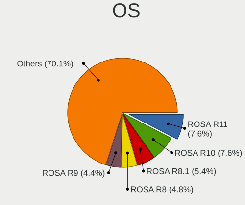

| Name               | Computers | Percent |
|--------------------|-----------|---------|
| ROSA R11           | 3141      | 7.63%   |
| ROSA R10           | 3123      | 7.58%   |
| ROSA R8.1          | 2225      | 5.4%    |
| ROSA R8            | 1991      | 4.84%   |
| ROSA R9            | 1819      | 4.42%   |
| ROSA R11.1         | 1809      | 4.39%   |
| ROSA 12.2          | 1785      | 4.34%   |
| ROSA 12.4          | 1400      | 3.4%    |
| ROSA 12.5.1        | 1236      | 3%      |
| Debian 11          | 1074      | 2.61%   |
| Ubuntu 22.04       | 970       | 2.36%   |
| Ubuntu 20.04       | 951       | 2.31%   |
| Debian 12          | 915       | 2.22%   |
| ROSA 12.3          | 861       | 2.09%   |
| ROSA 12            | 703       | 1.71%   |
| Arch Rolling       | 677       | 1.64%   |
| ROSA 13.0          | 634       | 1.54%   |
| Ubuntu 18.04       | 490       | 1.19%   |
| OpenMandriva 4.2   | 419       | 1.02%   |
| Ubuntu 24.04       | 406       | 0.99%   |
| Red OS 7.3         | 369       | 0.9%    |
| OpenMandriva 4.3   | 309       | 0.75%   |
| ROSA 12.1          | 296       | 0.72%   |
| ROSA 12.5          | 271       | 0.66%   |
| Manjaro            | 270       | 0.66%   |
| Fedora 40          | 213       | 0.52%   |
| Fedora 39          | 212       | 0.51%   |
| KDE neon 20.04     | 199       | 0.48%   |
| Debian 10          | 179       | 0.43%   |
| Fedora 38          | 175       | 0.43%   |
| Arch               | 175       | 0.43%   |
| Kometa P10         | 165       | 0.4%    |
| Red OS 8.0         | 156       | 0.38%   |
| Fedora 36          | 156       | 0.38%   |
| OpenMandriva 23.08 | 153       | 0.37%   |
| OpenMandriva 5.0   | 152       | 0.37%   |
| Linux Mint 20.3    | 152       | 0.37%   |
| Fedora 37          | 152       | 0.37%   |
| Xubuntu 20.04      | 148       | 0.36%   |
| Fedora 41          | 141       | 0.34%   |

OS Family
---------

OS without a version

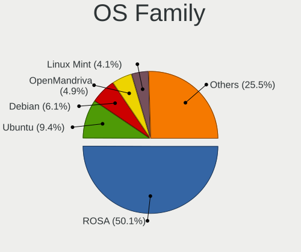

| Name         | Computers | Percent |
|--------------|-----------|---------|
| ROSA         | 18226     | 50.07%  |
| Ubuntu       | 3424      | 9.41%   |
| Debian       | 2219      | 6.1%    |
| OpenMandriva | 1778      | 4.88%   |
| Linux Mint   | 1479      | 4.06%   |
| Fedora       | 1460      | 4.01%   |
| ALT Linux    | 1061      | 2.91%   |
| Arch         | 832       | 2.29%   |
| Manjaro      | 809       | 2.22%   |
| Red OS       | 732       | 2.01%   |
| Kubuntu      | 434       | 1.19%   |
| KDE neon     | 341       | 0.94%   |
| Xubuntu      | 318       | 0.87%   |
| Endless      | 292       | 0.8%    |
| Pop!_OS      | 234       | 0.64%   |
| Gentoo       | 194       | 0.53%   |
| RED          | 173       | 0.48%   |
| openSUSE     | 170       | 0.47%   |
| Elementary   | 151       | 0.41%   |
| SteamOS      | 146       | 0.4%    |
| Kali         | 128       | 0.35%   |
| Zorin        | 116       | 0.32%   |
| ArcoLinux    | 108       | 0.3%    |
| Lubuntu      | 94        | 0.26%   |
| Ubuntu MATE  | 90        | 0.25%   |
| LMDE         | 90        | 0.25%   |
| EndeavourOS  | 84        | 0.23%   |
| Cyber Infra  | 83        | 0.23%   |
| CentOS       | 78        | 0.21%   |
| Clear Linux  | 73        | 0.2%    |
| Astra Linux  | 68        | 0.19%   |
| NixOS        | 61        | 0.17%   |
| Ubuntu Unity | 57        | 0.16%   |
| Nobara       | 56        | 0.15%   |
| RELS         | 47        | 0.13%   |
| MX           | 46        | 0.13%   |
| CachyOS      | 45        | 0.12%   |
| Artix        | 31        | 0.09%   |
| Void Linux   | 28        | 0.08%   |
| Devuan       | 27        | 0.07%   |

Kernel
------

Version of the Linux kernel

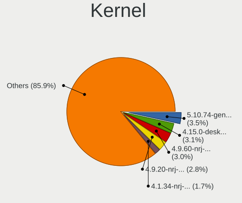

| Version                             | Computers | Percent |
|-------------------------------------|-----------|---------|
| 5.10.74-generic-2rosa2021.1-x86_64  | 1551      | 3.46%   |
| 4.15.0-desktop-45.1rosa-x86_64      | 1372      | 3.06%   |
| 4.9.60-nrj-desktop-1rosa-x86_64     | 1332      | 2.97%   |
| 4.9.20-nrj-desktop-1rosa-x86_64     | 1276      | 2.85%   |
| 4.1.34-nrj-desktop-2rosa-x86_64     | 766       | 1.71%   |
| 6.1.20-generic-2rosa2021.1-x86_64   | 672       | 1.5%    |
| 4.9.124-nrj-desktop-1rosa-x86_64    | 636       | 1.42%   |
| 6.6.27-generic-3rosa2021.1-x86_64   | 619       | 1.38%   |
| 5.10.0-7-amd64                      | 585       | 1.31%   |
| 4.1.25-nrj-desktop-1rosa-x86_64     | 546       | 1.22%   |
| 4.9.9-nrj-desktop-1rosa-x86_64      | 533       | 1.19%   |
| 6.6.47-generic-1rosa2021.1-x86_64   | 494       | 1.1%    |
| 4.1.38-nrj-desktop-2rosa-x86_64     | 474       | 1.06%   |
| 6.1.58-generic-1rosa2021.1-x86_64   | 411       | 0.92%   |
| 5.10.14-desktop-1omv4002            | 404       | 0.9%    |
| 4.9.76-nrj-desktop-1rosa-x86_64     | 397       | 0.89%   |
| 4.9.60-nrj-desktop-1rosa-i586       | 396       | 0.88%   |
| 4.9.41-nrj-desktop-1rosa-x86_64     | 386       | 0.86%   |
| 4.15.0-desktop-68.5rosa-x86_64      | 369       | 0.82%   |
| 4.9.155-nrj-desktop-1rosa-x86_64    | 364       | 0.81%   |
| 6.1.0-4-amd64                       | 361       | 0.81%   |
| 4.9.20-nrj-desktop-1rosa-i586       | 361       | 0.81%   |
| 4.15.0-desktop-45.1rosa-i586        | 356       | 0.79%   |
| 4.15.0-desktop-122.124.1rosa-x86_64 | 356       | 0.79%   |
| 5.10.118-generic-2rosa2021.1-x86_64 | 328       | 0.73%   |
| 5.4.32-generic-2rosa-x86_64         | 327       | 0.73%   |
| 5.4.83-generic-2rosa-x86_64         | 316       | 0.71%   |
| 4.15.0-desktop-47.2rosa-x86_64      | 307       | 0.68%   |
| 5.15.75-generic-1rosa2021.1-x86_64  | 302       | 0.67%   |
| 4.1.34-nrj-desktop-2rosa-i586       | 294       | 0.66%   |
| 5.16.7-desktop-1omv4003             | 283       | 0.63%   |
| 4.15.0-desktop-94.1rosa-x86_64      | 251       | 0.56%   |
| 4.9.9-nrj-desktop-1rosa-i586        | 246       | 0.55%   |
| 5.15.79-generic-1rosa2021.1-x86_64  | 242       | 0.54%   |
| 4.1.38-nrj-desktop-2rosa-i586       | 221       | 0.49%   |
| 6.14.2-desktop-3omv2590             | 212       | 0.47%   |
| 4.1.25-nrj-desktop-1rosa-i586       | 203       | 0.45%   |
| 4.9.95-nrj-desktop-2rosa-x86_64     | 202       | 0.45%   |
| 6.6.21-generic-8rosa2021.1-x86_64   | 169       | 0.38%   |
| 6.6.2-desktop-1omv2390              | 169       | 0.38%   |

Kernel Family
-------------

Linux kernel without a distro release

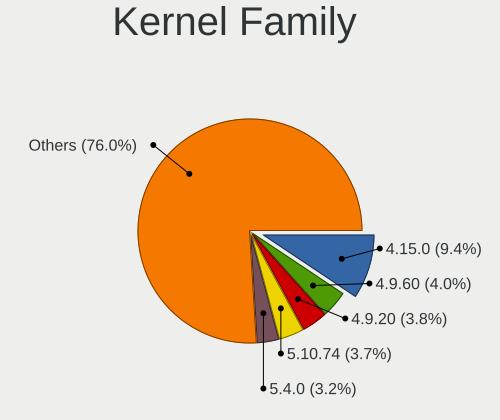

| Version  | Computers | Percent |
|----------|-----------|---------|
| 4.15.0   | 4064      | 9.37%   |
| 4.9.60   | 1725      | 3.98%   |
| 4.9.20   | 1635      | 3.77%   |
| 5.10.74  | 1604      | 3.7%    |
| 5.4.0    | 1398      | 3.22%   |
| 5.15.0   | 1208      | 2.79%   |
| 5.10.0   | 1096      | 2.53%   |
| 4.1.34   | 1059      | 2.44%   |
| 4.1.38   | 845       | 1.95%   |
| 6.1.0    | 832       | 1.92%   |
| 4.9.124  | 782       | 1.8%    |
| 4.9.9    | 776       | 1.79%   |
| 4.1.25   | 750       | 1.73%   |
| 6.1.20   | 699       | 1.61%   |
| 6.8.0    | 673       | 1.55%   |
| 6.6.27   | 639       | 1.47%   |
| 4.9.41   | 505       | 1.16%   |
| 6.6.47   | 502       | 1.16%   |
| 4.9.76   | 500       | 1.15%   |
| 4.9.155  | 495       | 1.14%   |
| 5.4.32   | 456       | 1.05%   |
| 6.1.58   | 436       | 1.01%   |
| 5.4.83   | 416       | 0.96%   |
| 5.10.14  | 408       | 0.94%   |
| 6.5.0    | 399       | 0.92%   |
| 5.3.0    | 399       | 0.92%   |
| 5.19.0   | 394       | 0.91%   |
| 5.8.0    | 378       | 0.87%   |
| 5.11.0   | 360       | 0.83%   |
| 5.15.75  | 350       | 0.81%   |
| 5.10.118 | 341       | 0.79%   |
| 5.13.0   | 331       | 0.76%   |
| 6.2.0    | 308       | 0.71%   |
| 5.0.0    | 297       | 0.68%   |
| 5.16.7   | 286       | 0.66%   |
| 6.12.47  | 277       | 0.64%   |
| 6.12.34  | 271       | 0.62%   |
| 4.9.95   | 265       | 0.61%   |
| 5.15.79  | 247       | 0.57%   |
| 6.14.2   | 227       | 0.52%   |

Kernel Major Ver.
-----------------

Linux kernel major version

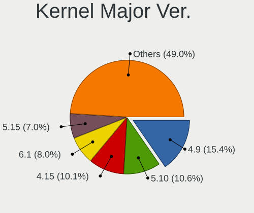

| Version | Computers | Percent |
|---------|-----------|---------|
| 4.9     | 6256      | 15.38%  |
| 5.10    | 4303      | 10.58%  |
| 4.15    | 4104      | 10.09%  |
| 6.1     | 3235      | 7.95%   |
| 5.15    | 2845      | 7%      |
| 5.4     | 2630      | 6.47%   |
| 4.1     | 2595      | 6.38%   |
| 6.6     | 2092      | 5.14%   |
| 6.12    | 1495      | 3.68%   |
| 6.8     | 1027      | 2.53%   |
| 6.2     | 655       | 1.61%   |
| 6.5     | 654       | 1.61%   |
| 5.11    | 520       | 1.28%   |
| 6.14    | 512       | 1.26%   |
| 5.19    | 508       | 1.25%   |
| 5.8     | 501       | 1.23%   |
| 5.3     | 495       | 1.22%   |
| 5.16    | 442       | 1.09%   |
| 5.13    | 433       | 1.06%   |
| 6.11    | 402       | 0.99%   |
| 6.4     | 328       | 0.81%   |
| 5.0     | 326       | 0.8%    |
| 6.0     | 280       | 0.69%   |
| 6.10    | 262       | 0.64%   |
| 5.18    | 257       | 0.63%   |
| 4.19    | 252       | 0.62%   |
| 5.17    | 238       | 0.59%   |
| 5.14    | 237       | 0.58%   |
| 4.18    | 224       | 0.55%   |
| 6.9     | 194       | 0.48%   |
| 6.7     | 183       | 0.45%   |
| 3.10    | 182       | 0.45%   |
| 4.13    | 175       | 0.43%   |
| 5.6     | 158       | 0.39%   |
| 6.3     | 137       | 0.34%   |
| 5.9     | 137       | 0.34%   |
| 6.13    | 134       | 0.33%   |
| 6.15    | 121       | 0.3%    |
| 4.4     | 120       | 0.3%    |
| 6.17    | 110       | 0.27%   |

Arch
----

OS architecture (x86_64, i586, etc.)

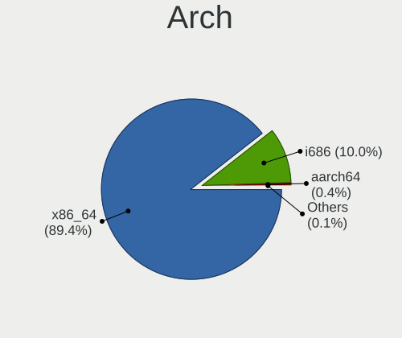

| Name        | Computers | Percent |
|-------------|-----------|---------|
| x86_64      | 31719     | 89.43%  |
| i686        | 3557      | 10.03%  |
| aarch64     | 134       | 0.38%   |
| armv7l      | 27        | 0.08%   |
| e2k         | 8         | 0.02%   |
| riscv64     | 5         | 0.01%   |
| mips        | 5         | 0.01%   |
| armv6l      | 5         | 0.01%   |
| armv8l      | 3         | 0.01%   |
| loongarch64 | 2         | 0.01%   |
| ppc64       | 1         | 0.003%  |
| ppc         | 1         | 0.003%  |
| i586        | 1         | 0.003%  |

DE
--

Desktop Environment

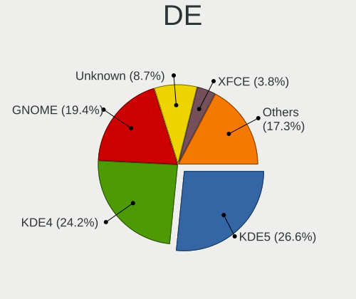

| Name             | Computers | Percent |
|------------------|-----------|---------|
| KDE5             | 10065     | 26.6%   |
| KDE4             | 9154      | 24.19%  |
| GNOME            | 7323      | 19.35%  |
| Unknown          | 3310      | 8.75%   |
| XFCE             | 1450      | 3.83%   |
| KDE6             | 1337      | 3.53%   |
| MATE             | 1309      | 3.46%   |
| LXQt             | 1292      | 3.41%   |
| X-Cinnamon       | 879       | 2.32%   |
| Cinnamon         | 523       | 1.38%   |
| KDE              | 378       | 1%      |
| Pantheon         | 146       | 0.39%   |
| i3               | 100       | 0.26%   |
| LXDE             | 81        | 0.21%   |
| Hyprland         | 76        | 0.2%    |
| Unity            | 59        | 0.16%   |
| Budgie           | 54        | 0.14%   |
| fly              | 45        | 0.12%   |
| GNOME Flashback  | 36        | 0.1%    |
| sway             | 33        | 0.09%   |
| GNOME Classic    | 21        | 0.06%   |
| Deepin           | 19        | 0.05%   |
| openbox          | 14        | 0.04%   |
| icewm            | 13        | 0.03%   |
| bspwm            | 13        | 0.03%   |
| awesome          | 13        | 0.03%   |
| KDE:KDE-Wayland  | 12        | 0.03%   |
| Trinity          | 10        | 0.03%   |
| DWM              | 10        | 0.03%   |
| lightdm-xsession | 8         | 0.02%   |
| KDE:KDE-X11      | 5         | 0.01%   |
| xmonad           | 4         | 0.01%   |
| niri             | 4         | 0.01%   |
| fluxbox          | 4         | 0.01%   |
| Endless:GNOME    | 4         | 0.01%   |
| COSMIC           | 4         | 0.01%   |
| labwc:wlroots    | 3         | 0.01%   |
| DDE              | 3         | 0.01%   |
| Phosh:GNOME      | 2         | 0.01%   |
| Enlightenment    | 2         | 0.01%   |

Display Server
--------------

X11 or Wayland

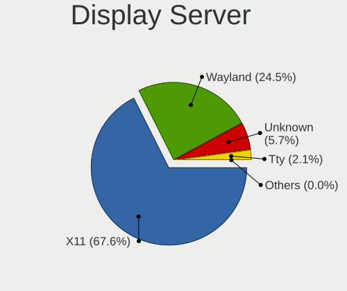

| Name        | Computers | Percent |
|-------------|-----------|---------|
| X11         | 24730     | 67.59%  |
| Wayland     | 8971      | 24.52%  |
| Unknown     | 2097      | 5.73%   |
| Tty         | 784       | 2.14%   |
| Web         | 2         | 0.01%   |
| Unspecified | 2         | 0.01%   |

Display Manager
---------------

SDDM, LightDM, etc.

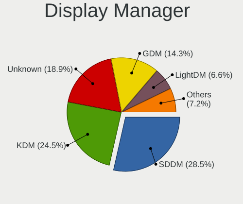

| Name                  | Computers | Percent |
|-----------------------|-----------|---------|
| SDDM                  | 10728     | 28.54%  |
| KDM                   | 9200      | 24.48%  |
| Unknown               | 7096      | 18.88%  |
| GDM                   | 5394      | 14.35%  |
| LightDM               | 2469      | 6.57%   |
| GDM3                  | 1693      | 4.5%    |
| TDM                   | 803       | 2.14%   |
| MDM                   | 44        | 0.12%   |
| FLY-DM                | 32        | 0.09%   |
| XDM                   | 30        | 0.08%   |
| SLiM                  | 27        | 0.07%   |
| GREETD                | 18        | 0.05%   |
| LXDM                  | 16        | 0.04%   |
| LY-DM                 | 13        | 0.03%   |
| Ly                    | 9         | 0.02%   |
| SLIMSKI               | 4         | 0.01%   |
| NODM                  | 4         | 0.01%   |
| LDM                   | 2         | 0.01%   |
| DISPLAY-MANAGER-START | 2         | 0.01%   |
| WDM                   | 1         | 0.003%  |
| TINYDM-RUN-SESSION    | 1         | 0.003%  |
| PLASMALOGIN           | 1         | 0.003%  |
| COSMIC-GREETER        | 1         | 0.003%  |
| CAPSH                 | 1         | 0.003%  |

OS Lang
-------

Language

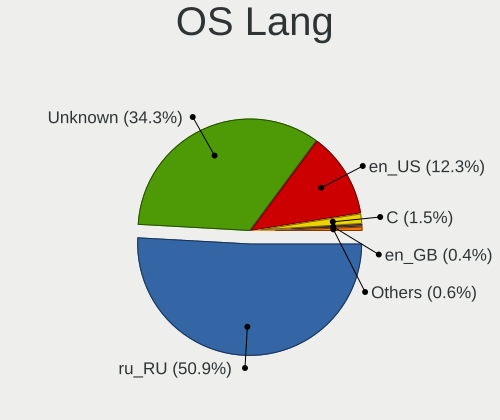

| Lang         | Computers | Percent |
|--------------|-----------|---------|
| ru_RU        | 18590     | 50.88%  |
| Unknown      | 12522     | 34.27%  |
| en_US        | 4509      | 12.34%  |
| C            | 550       | 1.51%   |
| en_GB        | 140       | 0.38%   |
| ru_UA        | 30        | 0.08%   |
| ru_RU.UTF_8  | 30        | 0.08%   |
| POSIX        | 29        | 0.08%   |
| C.UTF8       | 21        | 0.06%   |
| ru_RU.UTF8   | 13        | 0.04%   |
| zh_CN        | 8         | 0.02%   |
| de_DE        | 8         | 0.02%   |
| en_DK        | 7         | 0.02%   |
| cv_RU        | 7         | 0.02%   |
| fr_FR        | 6         | 0.02%   |
| en_AG        | 6         | 0.02%   |
| ba_RU        | 6         | 0.02%   |
| ru           | 5         | 0.01%   |
| it_IT        | 5         | 0.01%   |
| uk_UA        | 4         | 0.01%   |
| es_ES        | 4         | 0.01%   |
| en_CA        | 4         | 0.01%   |
| tt_RU        | 3         | 0.01%   |
| en_IE        | 3         | 0.01%   |
| en_AU        | 3         | 0.01%   |
| tr_TR        | 2         | 0.01%   |
| ru_RU.utf-8  | 2         | 0.01%   |
| pt_BR        | 2         | 0.01%   |
| myv_RU       | 2         | 0.01%   |
| en_US.UTF8   | 2         | 0.01%   |
| Default      | 2         | 0.01%   |
| ru_RU.UTF=8  | 1         | 0.003%  |
| ru_RU.KOI8-R | 1         | 0.003%  |
| ru_RU-UTF8   | 1         | 0.003%  |
| ja_JP        | 1         | 0.003%  |
| es_US        | 1         | 0.003%  |
| eo           | 1         | 0.003%  |
| en_SG        | 1         | 0.003%  |
| en_RU        | 1         | 0.003%  |
| en_NZ        | 1         | 0.003%  |

Boot Mode
---------

EFI or BIOS

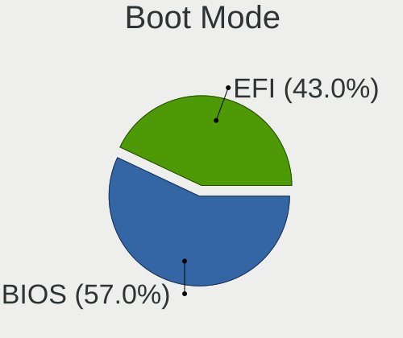

| Mode | Computers | Percent |
|------|-----------|---------|
| BIOS | 20538     | 57.01%  |
| EFI  | 15486     | 42.99%  |

Filesystem
----------

Type of filesystem

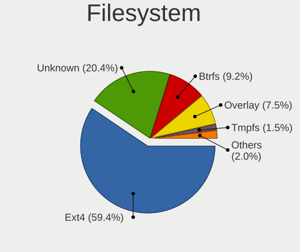

| Type     | Computers | Percent |
|----------|-----------|---------|
| Ext4     | 22059     | 59.44%  |
| Unknown  | 7563      | 20.38%  |
| Btrfs    | 3397      | 9.15%   |
| Overlay  | 2783      | 7.5%    |
| Tmpfs    | 562       | 1.51%   |
| Xfs      | 330       | 0.89%   |
| Zfs      | 146       | 0.39%   |
| Ext3     | 80        | 0.22%   |
| F2fs     | 77        | 0.21%   |
| Ext2     | 46        | 0.12%   |
| Aufs     | 26        | 0.07%   |
| Reiserfs | 12        | 0.03%   |
| Rootfs   | 7         | 0.02%   |
| XXXXXXX  | 5         | 0.01%   |
| Jfs      | 5         | 0.01%   |
| XXXXX    | 4         | 0.01%   |
| SAMSUNG  | 4         | 0.01%   |
| Ufs      | 1         | 0.003%  |
| Udf      | 1         | 0.003%  |
| Exfat    | 1         | 0.003%  |
| Bcachefs | 1         | 0.003%  |

Part. scheme
------------

Scheme of partitioning

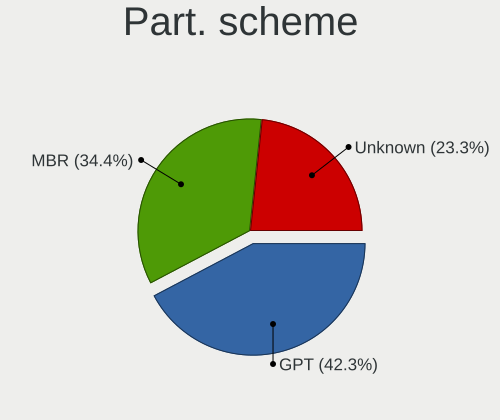

| Type    | Computers | Percent |
|---------|-----------|---------|
| GPT     | 15641     | 42.28%  |
| MBR     | 12727     | 34.4%   |
| Unknown | 8629      | 23.32%  |

Dual Boot with Linux/BSD
------------------------

Hosting more than one Linux/BSD

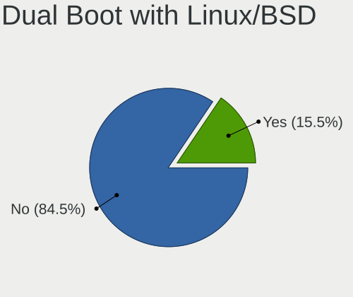

| Dual boot | Computers | Percent |
|-----------|-----------|---------|
| No        | 30925     | 84.46%  |
| Yes       | 5688      | 15.54%  |

Dual Boot (Win)
---------------

Hosting Linux and Windows

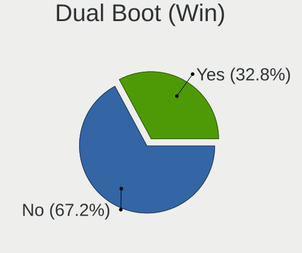

| Dual boot | Computers | Percent |
|-----------|-----------|---------|
| No        | 24624     | 67.17%  |
| Yes       | 12035     | 32.83%  |

Board
-----

Vendor
------

Motherboard manufacturer

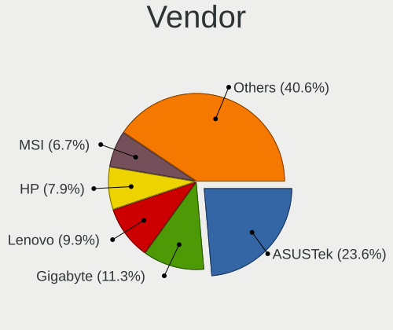

| Name                | Computers | Percent |
|---------------------|-----------|---------|
| ASUSTek Computer    | 8298      | 23.6%   |
| Gigabyte Technology | 3989      | 11.35%  |
| Lenovo              | 3471      | 9.87%   |
| Hewlett-Packard     | 2766      | 7.87%   |
| MSI                 | 2361      | 6.72%   |
| Acer                | 2330      | 6.63%   |
| ASRock              | 1697      | 4.83%   |
| Dell                | 1273      | 3.62%   |
| Samsung Electronics | 783       | 2.23%   |
| Intel               | 712       | 2.03%   |
| Unknown             | 651       | 1.85%   |
| HUAWEI              | 536       | 1.52%   |
| Supermicro          | 372       | 1.06%   |
| Sony                | 348       | 0.99%   |
| Toshiba             | 344       | 0.98%   |
| ECS                 | 305       | 0.87%   |
| Apple               | 282       | 0.8%    |
| Packard Bell        | 205       | 0.58%   |
| Biostar             | 187       | 0.53%   |
| Pegatron            | 172       | 0.49%   |
| Clevo               | 172       | 0.49%   |
| ICL                 | 168       | 0.48%   |
| HONOR               | 167       | 0.48%   |
| Aquarius            | 153       | 0.44%   |
| Huanan              | 152       | 0.43%   |
| eMachines           | 151       | 0.43%   |
| Timi                | 145       | 0.41%   |
| Foxconn             | 145       | 0.41%   |
| Valve               | 124       | 0.35%   |
| Maibenben           | 112       | 0.32%   |
| Notebook            | 92        | 0.26%   |
| Digma               | 88        | 0.25%   |
| Chuwi               | 83        | 0.24%   |
| AZW                 | 76        | 0.22%   |
| Fujitsu Siemens     | 72        | 0.2%    |
| Fujitsu             | 70        | 0.2%    |
| Irbis               | 68        | 0.19%   |
| KVADRA              | 61        | 0.17%   |
| DEPO Computers      | 60        | 0.17%   |
| DEXP                | 58        | 0.16%   |

Model
-----

Motherboard model

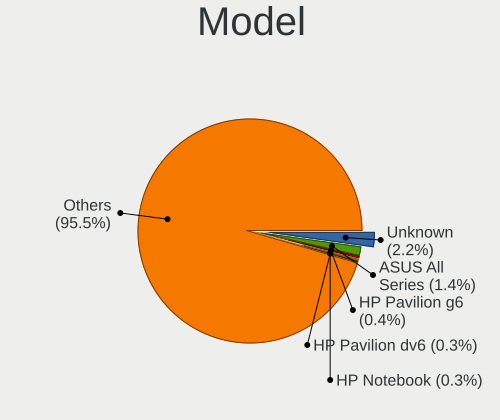

| Name                             | Computers | Percent |
|----------------------------------|-----------|---------|
| Unknown                          | 775       | 2.2%    |
| ASUS All Series                  | 477       | 1.36%   |
| HP Pavilion g6                   | 142       | 0.4%    |
| HP Pavilion dv6                  | 103       | 0.29%   |
| HP Notebook                      | 100       | 0.28%   |
| HP Laptop 15-bw0xx               | 98        | 0.28%   |
| Clevo NL41MU2                    | 90        | 0.26%   |
| MSI MS-7996                      | 86        | 0.24%   |
| Valve Jupiter                    | 84        | 0.24%   |
| MSI MS-7817                      | 83        | 0.24%   |
| Gigabyte 970A-DS3P               | 82        | 0.23%   |
| Supermicro Super Server          | 81        | 0.23%   |
| ICL RAY Si105.Mi                 | 78        | 0.22%   |
| Intel SKYBAY                     | 77        | 0.22%   |
| ASUS H110M-R                     | 76        | 0.22%   |
| ASUS P8H61-M LX3 R2.0            | 73        | 0.21%   |
| HUAWEI BOM-WXX9                  | 72        | 0.2%    |
| ASUS M5A78L-M LX3                | 71        | 0.2%    |
| Acer Aspire V3-571G              | 69        | 0.2%    |
| Lenovo G570 20079                | 67        | 0.19%   |
| HP ProLiant DL360 Gen9           | 66        | 0.19%   |
| Intel X99                        | 62        | 0.18%   |
| ASUS PRIME A320M-K               | 56        | 0.16%   |
| ASUS M5A97 R2.0                  | 56        | 0.16%   |
| Lenovo B590 20206                | 55        | 0.16%   |
| ASUS S20 K29                     | 55        | 0.16%   |
| ASUS P5K                         | 55        | 0.16%   |
| MSI MS-7529                      | 54        | 0.15%   |
| Gigabyte H61M-S2PV               | 53        | 0.15%   |
| Gigabyte H61M-S1                 | 53        | 0.15%   |
| Lenovo B570e HuronRiver Platform | 51        | 0.15%   |
| ASUS P5G41T-M LX2/GB             | 50        | 0.14%   |
| Aquarius NS585                   | 50        | 0.14%   |
| Gigabyte G31M-ES2L               | 49        | 0.14%   |
| Supermicro X8DTU                 | 48        | 0.14%   |
| MSI MS-7592                      | 48        | 0.14%   |
| HP Pavilion 15                   | 48        | 0.14%   |
| ASRock G31M-S                    | 47        | 0.13%   |
| Lenovo G500 20236                | 46        | 0.13%   |
| ASUS P5KPL-AM                    | 45        | 0.13%   |

Model Family
------------

Motherboard model prefix

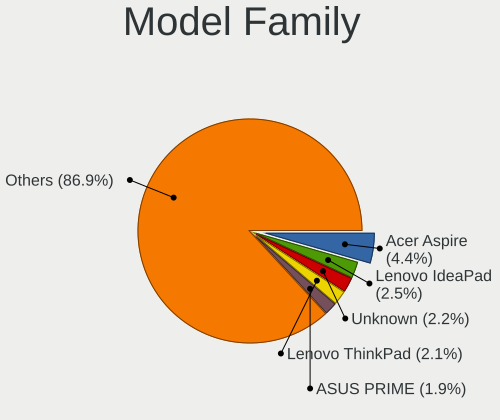

| Name                  | Computers | Percent |
|-----------------------|-----------|---------|
| Acer Aspire           | 1559      | 4.43%   |
| Lenovo IdeaPad        | 866       | 2.46%   |
| Unknown               | 775       | 2.2%    |
| Lenovo ThinkPad       | 751       | 2.14%   |
| ASUS PRIME            | 662       | 1.88%   |
| HP Pavilion           | 644       | 1.83%   |
| ASUS VivoBook         | 578       | 1.64%   |
| Dell Inspiron         | 536       | 1.52%   |
| ASUS All              | 477       | 1.36%   |
| HP Laptop             | 394       | 1.12%   |
| HP ProBook            | 377       | 1.07%   |
| Toshiba Satellite     | 317       | 0.9%    |
| ASUS P8H61-M          | 234       | 0.67%   |
| Dell Latitude         | 231       | 0.66%   |
| ASUS TUF              | 222       | 0.63%   |
| ASUS ROG              | 217       | 0.62%   |
| HP Compaq             | 200       | 0.57%   |
| ASUS M5A78L-M         | 194       | 0.55%   |
| Acer Extensa          | 189       | 0.54%   |
| Packard Bell EasyNote | 173       | 0.49%   |
| Dell Vostro           | 161       | 0.46%   |
| Lenovo ThinkCentre    | 154       | 0.44%   |
| Lenovo ThinkBook      | 154       | 0.44%   |
| ASUS ASUS             | 147       | 0.42%   |
| HP EliteBook          | 139       | 0.4%    |
| ASUS P5KPL-AM         | 138       | 0.39%   |
| Gigabyte B450M        | 133       | 0.38%   |
| ASUS M5A97            | 126       | 0.36%   |
| HP ProLiant           | 124       | 0.35%   |
| ASUS P5G41T-M         | 122       | 0.35%   |
| ASUS P5K              | 114       | 0.32%   |
| Acer TravelMate       | 112       | 0.32%   |
| ASUS P8Z77-V          | 107       | 0.3%    |
| HP Notebook           | 101       | 0.29%   |
| Lenovo B590           | 100       | 0.28%   |
| Lenovo Legion         | 98        | 0.28%   |
| Dell OptiPlex         | 98        | 0.28%   |
| Acer Nitro            | 93        | 0.26%   |
| Lenovo G580           | 91        | 0.26%   |
| ICL RAY               | 90        | 0.26%   |

MFG Year
--------

Motherboard manufacture year

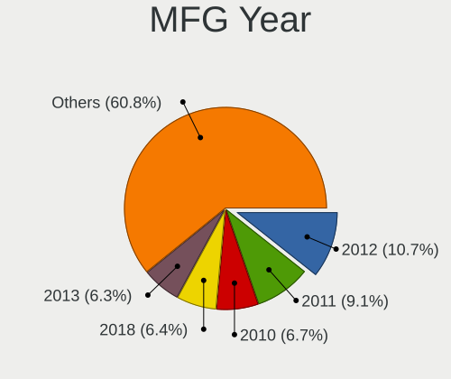

| Year    | Computers | Percent |
|---------|-----------|---------|
| 2012    | 3749      | 10.66%  |
| 2011    | 3185      | 9.06%   |
| 2010    | 2370      | 6.74%   |
| 2018    | 2265      | 6.44%   |
| 2013    | 2198      | 6.25%   |
| 2009    | 2031      | 5.78%   |
| 2021    | 1950      | 5.55%   |
| 2020    | 1946      | 5.54%   |
| 2019    | 1909      | 5.43%   |
| 2022    | 1663      | 4.73%   |
| 2008    | 1617      | 4.6%    |
| 2017    | 1610      | 4.58%   |
| 2014    | 1453      | 4.13%   |
| 2007    | 1371      | 3.9%    |
| 2015    | 1339      | 3.81%   |
| 2016    | 1325      | 3.77%   |
| 2023    | 1131      | 3.22%   |
| 2006    | 772       | 2.2%    |
| 2024    | 563       | 1.6%    |
| 2005    | 263       | 0.75%   |
| Unknown | 172       | 0.49%   |
| 2025    | 121       | 0.34%   |
| 2004    | 89        | 0.25%   |
| 2003    | 48        | 0.14%   |
| 2002    | 8         | 0.02%   |
| 2001    | 5         | 0.01%   |
| 2000    | 1         | 0.003%  |

Form Factor
-----------

Physical design of the computer

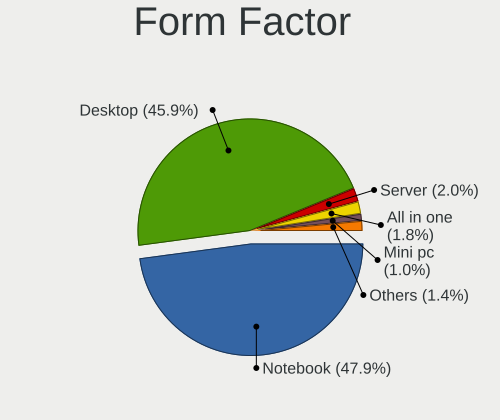

| Name           | Computers | Percent |
|----------------|-----------|---------|
| Notebook       | 16837     | 47.89%  |
| Desktop        | 16132     | 45.89%  |
| Server         | 689       | 1.96%   |
| All in one     | 630       | 1.79%   |
| Mini pc        | 357       | 1.02%   |
| Convertible    | 187       | 0.53%   |
| Tablet         | 168       | 0.48%   |
| System on chip | 141       | 0.4%    |
| Phone          | 8         | 0.02%   |
| Other          | 2         | 0.01%   |
| Stick pc       | 2         | 0.01%   |
| Firewall       | 1         | 0.003%  |

Secure Boot
-----------

Enabled or disabled

| State    | Computers | Percent |
|----------|-----------|---------|
| Disabled | 34177     | 96.86%  |
| Enabled  | 1108      | 3.14%   |

Coreboot
--------

Have coreboot on board

| Used | Computers | Percent |
|------|-----------|---------|
| No   | 35120     | 99.9%   |
| Yes  | 34        | 0.1%    |

RAM Size
--------

Total RAM memory

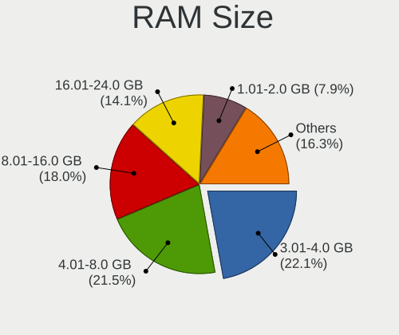

| Size in GB      | Computers | Percent |
|-----------------|-----------|---------|
| 3.01-4.0        | 8092      | 22.15%  |
| 4.01-8.0        | 7844      | 21.47%  |
| 8.01-16.0       | 6578      | 18%     |
| 16.01-24.0      | 5163      | 14.13%  |
| 1.01-2.0        | 2904      | 7.95%   |
| 32.01-64.0      | 2255      | 6.17%   |
| 2.01-3.0        | 1611      | 4.41%   |
| 64.01-256.0     | 833       | 2.28%   |
| 24.01-32.0      | 522       | 1.43%   |
| 0.51-1.0        | 479       | 1.31%   |
| More than 256.0 | 195       | 0.53%   |
| 0.01-0.5        | 51        | 0.14%   |
| Unknown         | 8         | 0.02%   |
| 0               | 1         | 0.003%  |

RAM Used
--------

Used RAM memory

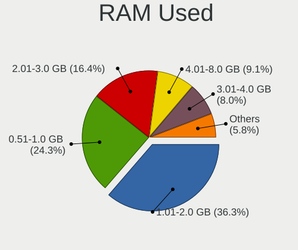

| Used GB         | Computers | Percent |
|-----------------|-----------|---------|
| 1.01-2.0        | 14600     | 36.33%  |
| 0.51-1.0        | 9779      | 24.33%  |
| 2.01-3.0        | 6605      | 16.43%  |
| 4.01-8.0        | 3662      | 9.11%   |
| 3.01-4.0        | 3200      | 7.96%   |
| 8.01-16.0       | 1058      | 2.63%   |
| 0.01-0.5        | 778       | 1.94%   |
| 16.01-24.0      | 199       | 0.5%    |
| 24.01-32.0      | 94        | 0.23%   |
| 32.01-64.0      | 82        | 0.2%    |
| 64.01-256.0     | 80        | 0.2%    |
| Unknown         | 40        | 0.1%    |
| More than 256.0 | 11        | 0.03%   |
| 0               | 1         | 0.002%  |

Total Drives
------------

Number of drives on board

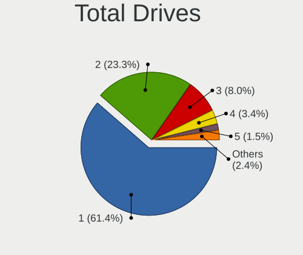

| Drives  | Computers | Percent |
|---------|-----------|---------|
| 1       | 22717     | 61.4%   |
| 2       | 8625      | 23.31%  |
| 3       | 2956      | 7.99%   |
| 4       | 1257      | 3.4%    |
| 5       | 551       | 1.49%   |
| 0       | 284       | 0.77%   |
| 6       | 208       | 0.56%   |
| 7       | 89        | 0.24%   |
| 8       | 69        | 0.19%   |
| 10      | 59        | 0.16%   |
| 11      | 29        | 0.08%   |
| 9       | 28        | 0.08%   |
| 14      | 18        | 0.05%   |
| 18      | 15        | 0.04%   |
| 13      | 11        | 0.03%   |
| 17      | 9         | 0.02%   |
| Unknown | 9         | 0.02%   |
| 12      | 6         | 0.02%   |
| 25      | 5         | 0.01%   |
| 19      | 5         | 0.01%   |
| 15      | 5         | 0.01%   |
| 36      | 4         | 0.01%   |
| 28      | 4         | 0.01%   |
| 20      | 3         | 0.01%   |
| 16      | 3         | 0.01%   |
| 44      | 2         | 0.01%   |
| 40      | 2         | 0.01%   |
| 35      | 2         | 0.01%   |
| 34      | 2         | 0.01%   |
| 33      | 2         | 0.01%   |
| 30      | 2         | 0.01%   |
| 24      | 2         | 0.01%   |
| 209     | 1         | 0.003%  |
| 193     | 1         | 0.003%  |
| 91      | 1         | 0.003%  |
| 70      | 1         | 0.003%  |
| 55      | 1         | 0.003%  |
| 51      | 1         | 0.003%  |
| 46      | 1         | 0.003%  |
| 42      | 1         | 0.003%  |

Has CD-ROM
----------

Has CD-ROM on board

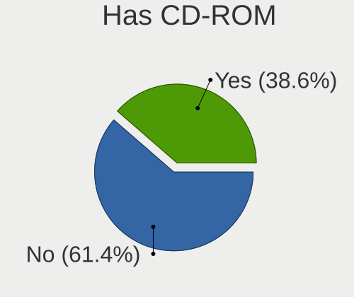

| Presented | Computers | Percent |
|-----------|-----------|---------|
| No        | 21961     | 61.39%  |
| Yes       | 13811     | 38.61%  |

Has Ethernet
------------

Has Ethernet on board

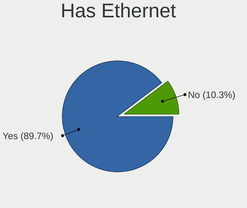

| Presented | Computers | Percent |
|-----------|-----------|---------|
| Yes       | 31591     | 89.71%  |
| No        | 3622      | 10.29%  |

Has WiFi
--------

Has WiFi module

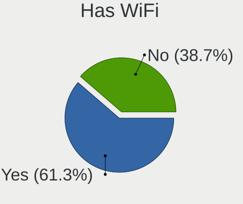

| Presented | Computers | Percent |
|-----------|-----------|---------|
| Yes       | 21766     | 61.33%  |
| No        | 13723     | 38.67%  |

Has Bluetooth
-------------

Has Bluetooth module

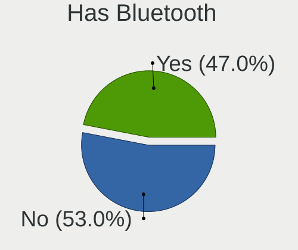

| Presented | Computers | Percent |
|-----------|-----------|---------|
| No        | 18936     | 53.03%  |
| Yes       | 16774     | 46.97%  |

Location
--------

Country
-------

Geographic location (country)

| Country | Computers | Percent |
|---------|-----------|---------|
| Russia  | 35154     | 100%    |

City
----

Geographic location (city)

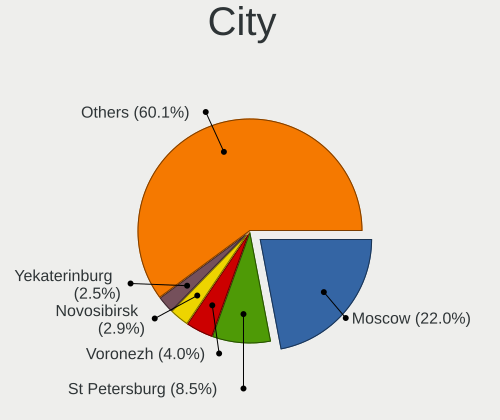

| City             | Computers | Percent |
|------------------|-----------|---------|
| Moscow           | 8287      | 22%     |
| St Petersburg    | 3194      | 8.48%   |
| Voronezh         | 1498      | 3.98%   |
| Novosibirsk      | 1085      | 2.88%   |
| Yekaterinburg    | 949       | 2.52%   |
| Krasnodar        | 944       | 2.51%   |
| Pecherskoye      | 753       | 2%      |
| Nizhniy Novgorod | 644       | 1.71%   |
| Samara           | 640       | 1.7%    |
| Rostov-on-Don    | 622       | 1.65%   |
| Perm             | 595       | 1.58%   |
| Chelyabinsk      | 576       | 1.53%   |
| Krasnoyarsk      | 434       | 1.15%   |
| Kazan’         | 418       | 1.11%   |
| Saratov          | 363       | 0.96%   |
| Ufa              | 356       | 0.95%   |
| Omsk             | 350       | 0.93%   |
| Volgograd        | 305       | 0.81%   |
| Tyumen           | 291       | 0.77%   |
| Vladivostok      | 286       | 0.76%   |
| Irkutsk          | 282       | 0.75%   |
| Barnaul          | 276       | 0.73%   |
| Khabarovsk       | 270       | 0.72%   |
| Stavropol        | 264       | 0.7%    |
| Ulyanovsk        | 231       | 0.61%   |
| Yaroslavl        | 223       | 0.59%   |
| Kaliningrad      | 210       | 0.56%   |
| Tomsk            | 208       | 0.55%   |
| Tula             | 200       | 0.53%   |
| Belgorod         | 194       | 0.52%   |
| Kemerovo         | 187       | 0.5%    |
| Orenburg         | 185       | 0.49%   |
| Surgut           | 180       | 0.48%   |
| Kirov            | 180       | 0.48%   |
| Smolensk         | 179       | 0.48%   |
| Bryansk          | 173       | 0.46%   |
| Lipetsk          | 172       | 0.46%   |
| Ryazan           | 171       | 0.45%   |
| Tver             | 161       | 0.43%   |
| Penza            | 161       | 0.43%   |

Drives
------

Drive Vendor
------------

Hard drive vendors

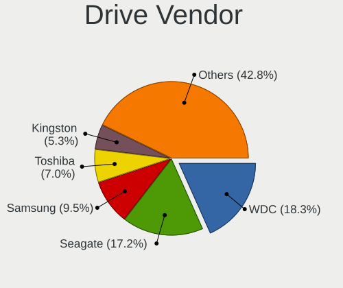

| Vendor                      | Computers | Drives | Percent |
|-----------------------------|-----------|--------|---------|
| WDC                         | 9511      | 16891  | 18.32%  |
| Seagate                     | 8912      | 14977  | 17.16%  |
| Samsung Electronics         | 4915      | 9864   | 9.47%   |
| Toshiba                     | 3620      | 5662   | 6.97%   |
| Kingston                    | 2728      | 3833   | 5.25%   |
| Hitachi                     | 2412      | 3581   | 4.65%   |
| SanDisk                     | 1259      | 1720   | 2.42%   |
| Unknown                     | 1250      | 1671   | 2.41%   |
| A-DATA Technology           | 1249      | 1746   | 2.41%   |
| Intel                       | 1111      | 2196   | 2.14%   |
| HGST                        | 969       | 1618   | 1.87%   |
| China                       | 947       | 1293   | 1.82%   |
| SK hynix                    | 727       | 957    | 1.4%    |
| Crucial                     | 674       | 975    | 1.3%    |
| Apacer                      | 628       | 842    | 1.21%   |
| SPCC                        | 583       | 797    | 1.12%   |
| Micron Technology           | 536       | 789    | 1.03%   |
| Silicon Motion              | 407       | 531    | 0.78%   |
| OCZ                         | 403       | 508    | 0.78%   |
| Netac                       | 363       | 586    | 0.7%    |
| Plextor                     | 339       | 505    | 0.65%   |
| AMD                         | 337       | 427    | 0.65%   |
| Patriot                     | 333       | 443    | 0.64%   |
| KingSpec                    | 327       | 440    | 0.63%   |
| Maxtor                      | 318       | 406    | 0.61%   |
| Smartbuy                    | 309       | 402    | 0.6%    |
| Fujitsu                     | 309       | 827    | 0.6%    |
| KIOXIA                      | 295       | 406    | 0.57%   |
| Transcend                   | 265       | 342    | 0.51%   |
| Phison Electronics          | 260       | 326    | 0.5%    |
| MAXIO Technology (Hangzhou) | 228       | 271    | 0.44%   |
| Phison                      | 225       | 266    | 0.43%   |
| Unknown                     | 224       | 262    | 0.43%   |
| ADATA Technology            | 175       | 248    | 0.34%   |
| HUAWEI                      | 174       | 216    | 0.34%   |
| Kingston Technology Company | 172       | 222    | 0.33%   |
| Hewlett-Packard             | 162       | 546    | 0.31%   |
| GOODRAM                     | 162       | 220    | 0.31%   |
| Gigabyte Technology         | 162       | 211    | 0.31%   |
| JMicron Technology          | 149       | 165    | 0.29%   |

Drive Model
-----------

Hard drive models

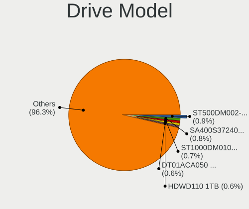

| Model                                              | Computers | Percent |
|----------------------------------------------------|-----------|---------|
| Seagate ST500DM002-1BD142 500GB                    | 519       | 0.91%   |
| Kingston SA400S37240G 240GB SSD                    | 446       | 0.78%   |
| Seagate ST1000DM010-2EP102 1TB                     | 388       | 0.68%   |
| Toshiba DT01ACA050 500GB                           | 370       | 0.65%   |
| Toshiba HDWD110 1TB                                | 361       | 0.63%   |
| Toshiba MQ01ABF050 500GB                           | 357       | 0.63%   |
| Seagate ST1000LM024 HN-M101MBB 1TB                 | 355       | 0.62%   |
| Seagate ST500LT012-1DG142 500GB                    | 352       | 0.62%   |
| Kingston SA400S37120G 120GB SSD                    | 341       | 0.6%    |
| WDC WD10EZEX-08WN4A0 1TB                           | 308       | 0.54%   |
| Seagate ST3500418AS 500GB                          | 302       | 0.53%   |
| WDC WDS240G2G0A-00JH30 240GB SSD                   | 283       | 0.5%    |
| Samsung SSD 860 EVO 250GB                          | 277       | 0.49%   |
| Seagate ST9500325AS 500GB                          | 274       | 0.48%   |
| Samsung NVMe SSD Controller SM981/PM981/PM983 1TB  | 265       | 0.47%   |
| Seagate ST1000LM035-1RK172 1TB                     | 263       | 0.46%   |
| Toshiba DT01ACA100 1TB                             | 258       | 0.45%   |
| Seagate ST1000DM003-1CH162 1TB                     | 257       | 0.45%   |
| Kingston SA400S37480G 480GB SSD                    | 251       | 0.44%   |
| Kingston SV300S37A120G 120GB SSD                   | 248       | 0.44%   |
| Unknown                                            | 224       | 0.39%   |
| Seagate ST9320325AS 320GB                          | 210       | 0.37%   |
| WDC WDS120G2G0A-00JH30 120GB SSD                   | 208       | 0.37%   |
| A-DATA SU650 240GB SSD                             | 200       | 0.35%   |
| HGST HTS545050A7E680 500GB                         | 198       | 0.35%   |
| Samsung SSD 860 EVO 500GB                          | 178       | 0.31%   |
| Toshiba MQ01ABD100 1TB                             | 176       | 0.31%   |
| WDC WD5000AAKX-001CA0 500GB                        | 166       | 0.29%   |
| Crucial CT240BX500SSD1 240GB                       | 166       | 0.29%   |
| Toshiba MQ04ABF100 1TB                             | 160       | 0.28%   |
| Seagate ST1000DM003-1ER162 1TB                     | 160       | 0.28%   |
| Seagate ST31000524AS 1TB                           | 155       | 0.27%   |
| Seagate ST3250410AS 250GB                          | 153       | 0.27%   |
| Samsung NVMe SSD Controller PM9A1/PM9A3/980PRO 1TB | 151       | 0.27%   |
| MAXIO (Hangzhou) NVMe SSD Controller MAP1202 2TB   | 150       | 0.26%   |
| Seagate ST380815AS 80GB                            | 147       | 0.26%   |
| Hitachi HTS543232A7A384 320GB                      | 147       | 0.26%   |
| Apacer AS350 128GB SSD                             | 146       | 0.26%   |
| HGST HTS721010A9E630 1TB                           | 144       | 0.25%   |
| Seagate ST380011A 80GB                             | 142       | 0.25%   |

HDD Vendor
----------

Hard disk drive vendors

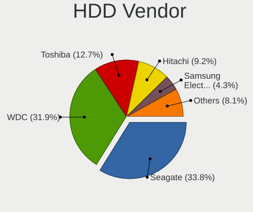

| Vendor              | Computers | Drives | Percent |
|---------------------|-----------|--------|---------|
| Seagate             | 8866      | 14868  | 33.83%  |
| WDC                 | 8372      | 14694  | 31.95%  |
| Toshiba             | 3323      | 5225   | 12.68%  |
| Hitachi             | 2410      | 3579   | 9.2%    |
| Samsung Electronics | 1120      | 1567   | 4.27%   |
| HGST                | 968       | 1616   | 3.69%   |
| Maxtor              | 313       | 400    | 1.19%   |
| Fujitsu             | 307       | 825    | 1.17%   |
| JMicron Technology  | 101       | 110    | 0.39%   |
| Unknown             | 87        | 127    | 0.33%   |
| Hewlett-Packard     | 63        | 318    | 0.24%   |
| Apple               | 34        | 47     | 0.13%   |
| TO Exter            | 29        | 35     | 0.11%   |
| External            | 28        | 36     | 0.11%   |
| IBM/Hitachi         | 19        | 22     | 0.07%   |
| USB                 | 13        | 15     | 0.05%   |
| ASMT                | 13        | 28     | 0.05%   |
| JetFlash            | 11        | 19     | 0.04%   |
| USB3.0              | 10        | 10     | 0.04%   |
| Unknown             | 8         | 8      | 0.03%   |
| HGST HTS            | 7         | 7      | 0.03%   |
| IBM                 | 6         | 9      | 0.02%   |
| HPE                 | 6         | 22     | 0.02%   |
| StoreJet            | 5         | 5      | 0.02%   |
| Lenovo              | 5         | 51     | 0.02%   |
| WD MediaMax         | 4         | 5      | 0.02%   |
| HUAWEI              | 4         | 6      | 0.02%   |
| ExcelStor           | 4         | 4      | 0.02%   |
| SATAFIRM            | 3         | 3      | 0.01%   |
| SAGE                | 3         | 3      | 0.01%   |
| Quantum             | 3         | 3      | 0.01%   |
| NVME USB            | 3         | 3      | 0.01%   |
| Min Yi U            | 3         | 3      | 0.01%   |
| KESU                | 3         | 3      | 0.01%   |
| IBM-ESXS            | 3         | 7      | 0.01%   |
| CLOVER              | 3         | 3      | 0.01%   |
| BR                  | 3         | 3      | 0.01%   |
| ACASIS              | 3         | 3      | 0.01%   |
| XrayDisk            | 2         | 4      | 0.01%   |
| VSTORAGE            | 2         | 171    | 0.01%   |

SSD Vendor
----------

Solid state drive vendors

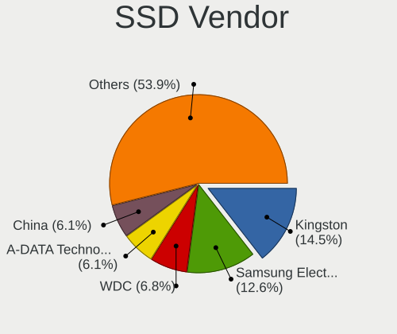

| Vendor              | Computers | Drives | Percent |
|---------------------|-----------|--------|---------|
| Kingston            | 2221      | 3130   | 14.47%  |
| Samsung Electronics | 1937      | 5171   | 12.62%  |
| WDC                 | 1048      | 1427   | 6.83%   |
| A-DATA Technology   | 937       | 1334   | 6.1%    |
| China               | 932       | 1277   | 6.07%   |
| Crucial             | 631       | 903    | 4.11%   |
| Intel               | 583       | 1329   | 3.8%    |
| SanDisk             | 566       | 836    | 3.69%   |
| SPCC                | 540       | 738    | 3.52%   |
| Apacer              | 528       | 712    | 3.44%   |
| OCZ                 | 402       | 507    | 2.62%   |
| Plextor             | 317       | 457    | 2.07%   |
| KingSpec            | 308       | 416    | 2.01%   |
| AMD                 | 306       | 378    | 1.99%   |
| Patriot             | 302       | 409    | 1.97%   |
| Smartbuy            | 288       | 375    | 1.88%   |
| Netac               | 257       | 423    | 1.67%   |
| Transcend           | 244       | 303    | 1.59%   |
| Toshiba             | 176       | 241    | 1.15%   |
| GOODRAM             | 155       | 213    | 1.01%   |
| Micron Technology   | 150       | 270    | 0.98%   |
| SK hynix            | 127       | 158    | 0.83%   |
| Corsair             | 127       | 175    | 0.83%   |
| Unknown             | 117       | 140    | 0.76%   |
| Gigabyte Technology | 113       | 136    | 0.74%   |
| XrayDisk            | 102       | 149    | 0.66%   |
| DEXP                | 91        | 114    | 0.59%   |
| KingDian            | 89        | 139    | 0.58%   |
| Apple               | 76        | 89     | 0.5%    |
| Hewlett-Packard     | 65        | 166    | 0.42%   |
| Team                | 60        | 75     | 0.39%   |
| Foxline             | 55        | 68     | 0.36%   |
| Kingmax             | 54        | 96     | 0.35%   |
| Qumo                | 53        | 68     | 0.35%   |
| Digma               | 53        | 61     | 0.35%   |
| LITEON              | 50        | 59     | 0.33%   |
| KingFast            | 39        | 48     | 0.25%   |
| LITEONIT            | 37        | 62     | 0.24%   |
| AXIOMTEK            | 36        | 41     | 0.23%   |
| AGI                 | 34        | 48     | 0.22%   |

Drive Kind
----------

HDD or SSD

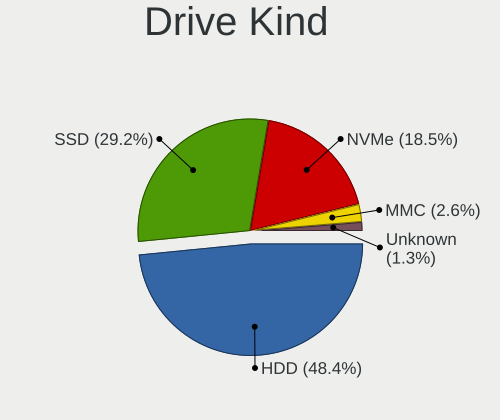

| Kind    | Computers | Drives | Percent |
|---------|-----------|--------|---------|
| HDD     | 21973     | 43994  | 48.44%  |
| SSD     | 13252     | 24323  | 29.21%  |
| NVMe    | 8388      | 12601  | 18.49%  |
| MMC     | 1164      | 1585   | 2.57%   |
| Unknown | 587       | 900    | 1.29%   |

Drive Connector
---------------

SATA, SAS, NVMe, etc.

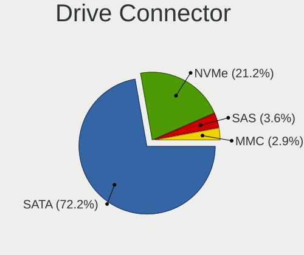

| Type | Computers | Drives | Percent |
|------|-----------|--------|---------|
| SATA | 28556     | 66301  | 72.24%  |
| NVMe | 8379      | 12551  | 21.2%   |
| SAS  | 1428      | 2966   | 3.61%   |
| MMC  | 1164      | 1585   | 2.94%   |

Drive Size
----------

Size of hard drive

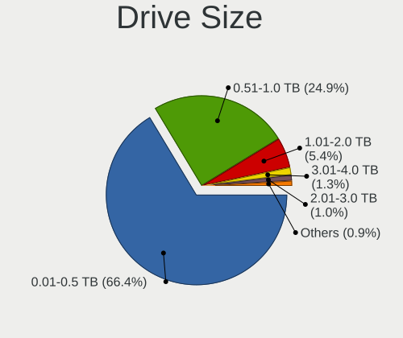

| Size in TB      | Computers | Drives | Percent |
|-----------------|-----------|--------|---------|
| 0.01-0.5        | 23738     | 42885  | 66.39%  |
| 0.51-1.0        | 8892      | 17403  | 24.87%  |
| 1.01-2.0        | 1940      | 4421   | 5.43%   |
| 3.01-4.0        | 482       | 1472   | 1.35%   |
| 2.01-3.0        | 373       | 736    | 1.04%   |
| 4.01-10.0       | 243       | 973    | 0.68%   |
| 10.01-20.0      | 79        | 415    | 0.22%   |
| 20.01-50.0      | 4         | 8      | 0.01%   |
| 0               | 3         | 3      | 0.01%   |
| More than 100.0 | 1         | 1      | 0.003%  |

Space Total
-----------

Amount of disk space available on the file system

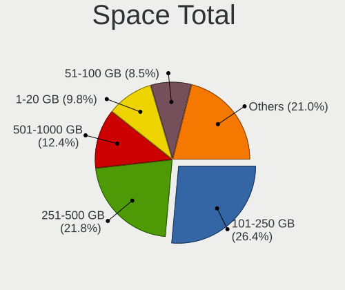

| Size in GB     | Computers | Percent |
|----------------|-----------|---------|
| 101-250        | 10313     | 26.43%  |
| 251-500        | 8506      | 21.8%   |
| 501-1000       | 4849      | 12.43%  |
| 1-20           | 3813      | 9.77%   |
| 51-100         | 3327      | 8.53%   |
| 1001-2000      | 2480      | 6.36%   |
| 21-50          | 2211      | 5.67%   |
| Unknown        | 1794      | 4.6%    |
| More than 3000 | 922       | 2.36%   |
| 2001-3000      | 801       | 2.05%   |
| 0              | 3         | 0.01%   |

Space Used
----------

Amount of used disk space

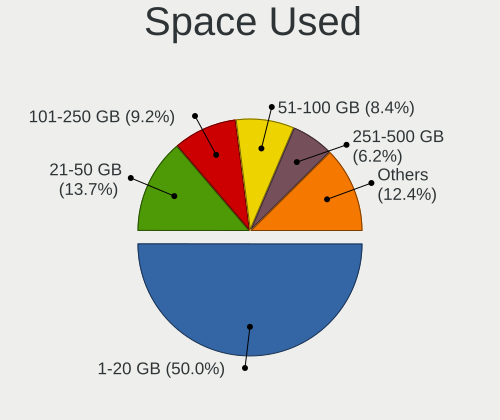

| Used GB        | Computers | Percent |
|----------------|-----------|---------|
| 1-20           | 19866     | 50.02%  |
| 21-50          | 5447      | 13.71%  |
| 101-250        | 3667      | 9.23%   |
| 51-100         | 3356      | 8.45%   |
| 251-500        | 2451      | 6.17%   |
| Unknown        | 1794      | 4.52%   |
| 501-1000       | 1655      | 4.17%   |
| 1001-2000      | 858       | 2.16%   |
| More than 3000 | 344       | 0.87%   |
| 2001-3000      | 255       | 0.64%   |
| 0              | 26        | 0.07%   |

Malfunc. Drives
---------------

Drive models with a malfunction

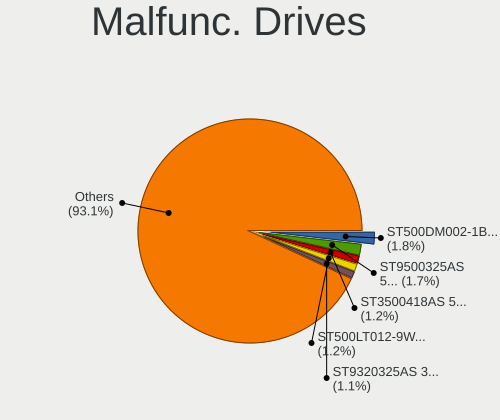

| Model                              | Computers | Drives | Percent |
|------------------------------------|-----------|--------|---------|
| Seagate ST500DM002-1BD142 500GB    | 197       | 254    | 1.82%   |
| Seagate ST9500325AS 500GB          | 185       | 244    | 1.71%   |
| Seagate ST3500418AS 500GB          | 129       | 165    | 1.19%   |
| Seagate ST500LT012-9WS142 500GB    | 126       | 149    | 1.17%   |
| Seagate ST9320325AS 320GB          | 114       | 141    | 1.05%   |
| Seagate ST1000LM024 HN-M101MBB 1TB | 104       | 130    | 0.96%   |
| Seagate ST3250410AS 250GB          | 102       | 128    | 0.94%   |
| Seagate ST9250315AS 250GB          | 98        | 133    | 0.91%   |
| Seagate ST500LT012-1DG142 500GB    | 98        | 118    | 0.91%   |
| HGST HTS545050A7E680 500GB         | 87        | 126    | 0.8%    |
| WDC WD5000AAKX-001CA0 500GB        | 82        | 105    | 0.76%   |
| Seagate ST320LT020-9YG142 320GB    | 79        | 110    | 0.73%   |
| Seagate ST3250310AS 250GB          | 72        | 117    | 0.67%   |
| Seagate ST3320613AS 320GB          | 68        | 92     | 0.63%   |
| Seagate ST1000DM003-9YN162 1TB     | 65        | 79     | 0.6%    |
| Seagate ST1000DM003-1CH162 1TB     | 65        | 97     | 0.6%    |
| HGST HTS545050A7E380 500GB         | 62        | 100    | 0.57%   |
| Seagate ST31000528AS 1TB           | 60        | 71     | 0.56%   |
| Hitachi HDS721050CLA362 500GB      | 59        | 70     | 0.55%   |
| Seagate ST31000524AS 1TB           | 58        | 76     | 0.54%   |
| WDC WD3200AAJS-00L7A0 320GB        | 56        | 66     | 0.52%   |
| Hitachi HTS543232A7A384 320GB      | 56        | 64     | 0.52%   |
| WDC WD5000AADS-00S9B0 500GB        | 54        | 62     | 0.5%    |
| Toshiba MQ01ABF050 500GB           | 53        | 83     | 0.49%   |
| WDC WDS240G2G0A-00JH30 240GB SSD   | 52        | 66     | 0.48%   |
| Hitachi HTS545025B9A300 250GB      | 52        | 63     | 0.48%   |
| Kingston SV300S37A120G 120GB SSD   | 51        | 53     | 0.47%   |
| Seagate ST250DM000-1BD141 250GB    | 50        | 68     | 0.46%   |
| Seagate ST320LT012-9WS14C 320GB    | 49        | 65     | 0.45%   |
| Seagate ST3160815AS 160GB          | 49        | 60     | 0.45%   |
| Seagate ST3250318AS 250GB          | 48        | 63     | 0.44%   |
| WDC WD5000AAKX-60U6AA0 500GB       | 47        | 69     | 0.43%   |
| Seagate ST380011A 80GB             | 47        | 51     | 0.43%   |
| Hitachi HTS547550A9E384 500GB      | 47        | 64     | 0.43%   |
| Hitachi HDS721616PLA380 160GB      | 47        | 62     | 0.43%   |
| WDC WD10EARS-00Y5B1 1TB            | 44        | 79     | 0.41%   |
| Hitachi HTS541612J9SA00 120GB      | 44        | 57     | 0.41%   |
| Hitachi HDS721010CLA332 1TB        | 44        | 52     | 0.41%   |
| Toshiba MQ01ABD050 500GB           | 43        | 51     | 0.4%    |
| Seagate ST380815AS 80GB            | 42        | 54     | 0.39%   |

Malfunc. Drive Vendor
---------------------

Vendors of faulty drives

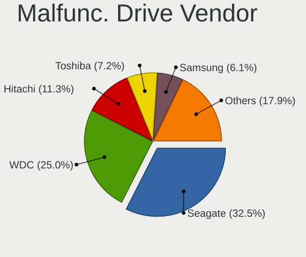

| Vendor              | Computers | Drives | Percent |
|---------------------|-----------|--------|---------|
| Seagate             | 3358      | 4686   | 32.49%  |
| WDC                 | 2585      | 3939   | 25.01%  |
| Hitachi             | 1168      | 1526   | 11.3%   |
| Toshiba             | 747       | 1038   | 7.23%   |
| Samsung Electronics | 630       | 874    | 6.1%    |
| HGST                | 270       | 407    | 2.61%   |
| Kingston            | 217       | 266    | 2.1%    |
| Maxtor              | 181       | 218    | 1.75%   |
| Intel               | 122       | 263    | 1.18%   |
| A-DATA Technology   | 84        | 111    | 0.81%   |
| OCZ                 | 81        | 103    | 0.78%   |
| SanDisk             | 76        | 92     | 0.74%   |
| China               | 72        | 88     | 0.7%    |
| Fujitsu             | 67        | 100    | 0.65%   |
| SPCC                | 63        | 72     | 0.61%   |
| SK hynix            | 42        | 57     | 0.41%   |
| Corsair             | 42        | 58     | 0.41%   |
| KingSpec            | 37        | 42     | 0.36%   |
| AMD                 | 32        | 38     | 0.31%   |
| Kingmax             | 30        | 54     | 0.29%   |
| Netac               | 29        | 37     | 0.28%   |
| Crucial             | 25        | 39     | 0.24%   |
| Plextor             | 24        | 45     | 0.23%   |
| LITEON              | 20        | 22     | 0.19%   |
| Micron Technology   | 19        | 35     | 0.18%   |
| IBM/Hitachi         | 17        | 20     | 0.16%   |
| Apacer              | 15        | 16     | 0.15%   |
| Transcend           | 14        | 14     | 0.14%   |
| Patriot             | 12        | 12     | 0.12%   |
| Neo                 | 12        | 33     | 0.12%   |
| Unknown             | 12        | 14     | 0.12%   |
| LITEONIT            | 11        | 17     | 0.11%   |
| Apple               | 10        | 11     | 0.1%    |
| OCZ-VERTEX3         | 9         | 14     | 0.09%   |
| Smartbuy            | 8         | 9      | 0.08%   |
| KingDian            | 8         | 12     | 0.08%   |
| XrayDisk            | 7         | 11     | 0.07%   |
| SSSTC               | 7         | 13     | 0.07%   |
| Hewlett-Packard     | 6         | 13     | 0.06%   |
| DEXP                | 6         | 9      | 0.06%   |

Malfunc. HDD Vendor
-------------------

Vendors of faulty HDD drives

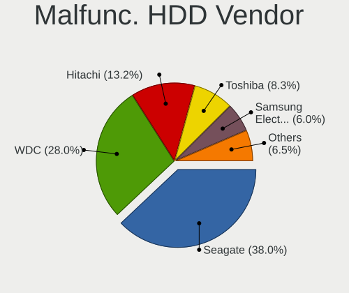

| Vendor              | Computers | Drives | Percent |
|---------------------|-----------|--------|---------|
| Seagate             | 3357      | 4683   | 37.98%  |
| WDC                 | 2476      | 3785   | 28.01%  |
| Hitachi             | 1168      | 1526   | 13.21%  |
| Toshiba             | 738       | 1028   | 8.35%   |
| Samsung Electronics | 530       | 728    | 6%      |
| HGST                | 270       | 407    | 3.05%   |
| Maxtor              | 181       | 218    | 2.05%   |
| Fujitsu             | 67        | 100    | 0.76%   |
| IBM/Hitachi         | 17        | 20     | 0.19%   |
| Hewlett-Packard     | 5         | 12     | 0.06%   |
| ASMT                | 5         | 8      | 0.06%   |
| Apple               | 5         | 6      | 0.06%   |
| IBM                 | 3         | 3      | 0.03%   |
| ExcelStor           | 3         | 3      | 0.03%   |
| WD MediaMax         | 2         | 2      | 0.02%   |
| StoreJet            | 2         | 2      | 0.02%   |
| Quantum             | 2         | 2      | 0.02%   |
| MARSHAL             | 2         | 2      | 0.02%   |
| HGST HTS            | 2         | 2      | 0.02%   |
| Unknown             | 2         | 2      | 0.02%   |
| USB3.0              | 1         | 1      | 0.01%   |
| SATAFIRM            | 1         | 1      | 0.01%   |
| External            | 1         | 1      | 0.01%   |

Malfunc. Drive Kind
-------------------

Kinds of faulty drives

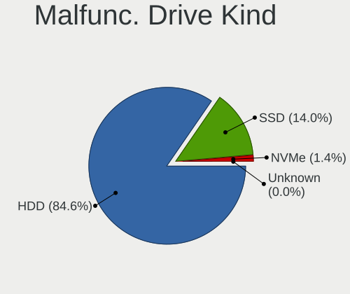

| Kind    | Computers | Drives | Percent |
|---------|-----------|--------|---------|
| HDD     | 8112      | 12542  | 84.6%   |
| SSD     | 1344      | 1907   | 14.02%  |
| NVMe    | 132       | 182    | 1.38%   |
| Unknown | 1         | 1      | 0.01%   |

Failed Drives
-------------

Failed drive models

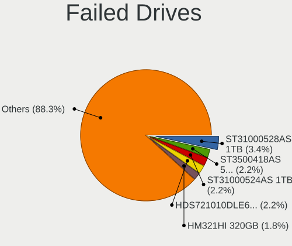

| Model                              | Computers | Drives | Percent |
|------------------------------------|-----------|--------|---------|
| Seagate ST31000528AS 1TB           | 11        | 17     | 3.38%   |
| Seagate ST3500418AS 500GB          | 7         | 8      | 2.15%   |
| Seagate ST31000524AS 1TB           | 7         | 9      | 2.15%   |
| Hitachi HDS721010DLE630 1TB        | 7         | 9      | 2.15%   |
| Samsung Electronics HM321HI 320GB  | 6         | 15     | 1.85%   |
| Seagate ST9500325AS 500GB          | 5         | 5      | 1.54%   |
| Seagate ST3500412AS 500GB          | 5         | 6      | 1.54%   |
| WDC WD1600BEVT-22ZCT0 160GB        | 4         | 5      | 1.23%   |
| Toshiba MK3265GSX 320GB            | 4         | 4      | 1.23%   |
| Seagate ST9320325AS 320GB          | 4         | 5      | 1.23%   |
| Seagate ST3600057SS 600GB          | 4         | 33     | 1.23%   |
| Seagate ST3320613AS 320GB          | 4         | 5      | 1.23%   |
| HGST HTS721010A9E630 1TB           | 4         | 5      | 1.23%   |
| HGST HTS545050A7E680 500GB         | 4         | 4      | 1.23%   |
| HGST HTS545050A7E380 500GB         | 4         | 4      | 1.23%   |
| WDC WD1600BEVS-22RST0 160GB        | 3         | 4      | 0.92%   |
| Toshiba MQ01ABD050 500GB           | 3         | 3      | 0.92%   |
| Toshiba MK6465GSX 640GB            | 3         | 3      | 0.92%   |
| Toshiba MK3259GSXP 320GB           | 3         | 3      | 0.92%   |
| Seagate ST31000333AS 1TB           | 3         | 3      | 0.92%   |
| Seagate ST1000LM024 HN-M101MBB 1TB | 3         | 3      | 0.92%   |
| Samsung Electronics SP0411N 40GB   | 3         | 4      | 0.92%   |
| Maxtor 6Y080L0 81GB                | 3         | 3      | 0.92%   |
| Hitachi HTS547550A9E384 500GB      | 3         | 3      | 0.92%   |
| Hitachi HDS721010CLA332 1TB        | 3         | 3      | 0.92%   |
| HGST HTS541010A9E680 1TB           | 3         | 4      | 0.92%   |
| Fujitsu MBE2147RC 147GB            | 3         | 8      | 0.92%   |
| WDC WD5000BEVT-00ZAT0 500GB        | 2         | 3      | 0.62%   |
| WDC WD5000AAKS-00V1A0 500GB        | 2         | 2      | 0.62%   |
| WDC WD3200BEVT-22ZCT0 320GB        | 2         | 2      | 0.62%   |
| WDC WD3200AAJS-00L7A0 320GB        | 2         | 2      | 0.62%   |
| WDC WD3200AAJS-00B4A0 320GB        | 2         | 2      | 0.62%   |
| WDC WD20EARS-00MVWB0 2TB           | 2         | 2      | 0.62%   |
| WDC WD15EARS-00MVWB0 1TB           | 2         | 4      | 0.62%   |
| Seagate STM3500418AS 500GB         | 2         | 2      | 0.62%   |
| Seagate ST500LT012-1DG142 500GB    | 2         | 2      | 0.62%   |
| Seagate ST500DM005 HD502HJ 500GB   | 2         | 3      | 0.62%   |
| Seagate ST500DM002-1BD142 500GB    | 2         | 2      | 0.62%   |
| Seagate ST500DM002-1BC142 500GB    | 2         | 2      | 0.62%   |
| Seagate ST3750528AS 752GB          | 2         | 2      | 0.62%   |

Failed Drive Vendor
-------------------

Failed drive vendors

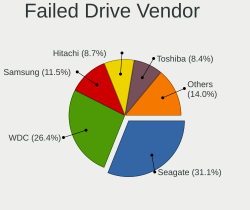

| Vendor              | Computers | Drives | Percent |
|---------------------|-----------|--------|---------|
| Seagate             | 100       | 152    | 31.06%  |
| WDC                 | 85        | 121    | 26.4%   |
| Samsung Electronics | 37        | 48     | 11.49%  |
| Hitachi             | 28        | 32     | 8.7%    |
| Toshiba             | 27        | 29     | 8.39%   |
| HGST                | 17        | 20     | 5.28%   |
| Maxtor              | 7         | 7      | 2.17%   |
| Fujitsu             | 4         | 9      | 1.24%   |
| Intel               | 2         | 5      | 0.62%   |
| Hewlett-Packard     | 2         | 2      | 0.62%   |
| A-DATA Technology   | 2         | 4      | 0.62%   |
| Transcend           | 1         | 1      | 0.31%   |
| SanDisk             | 1         | 2      | 0.31%   |
| Phison Electronics  | 1         | 1      | 0.31%   |
| OCZ                 | 1         | 1      | 0.31%   |
| IBM-ESXS            | 1         | 2      | 0.31%   |
| GOODRAM             | 1         | 1      | 0.31%   |
| Gigabyte Technology | 1         | 1      | 0.31%   |
| DEXP                | 1         | 1      | 0.31%   |
| Crucial             | 1         | 1      | 0.31%   |
| Corsair             | 1         | 1      | 0.31%   |
| Apple               | 1         | 2      | 0.31%   |

Drive Status
------------

Number of failed and malfunc. drives

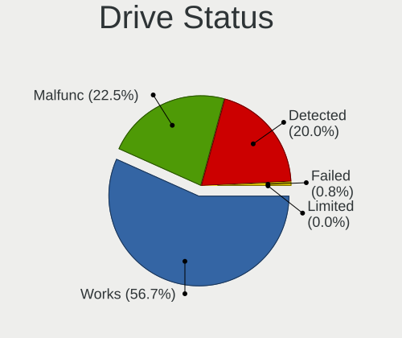

| Status   | Computers | Drives | Percent |
|----------|-----------|--------|---------|
| Works    | 23378     | 52214  | 56.7%   |
| Malfunc  | 9281      | 14632  | 22.51%  |
| Detected | 8256      | 16112  | 20.02%  |
| Failed   | 316       | 443    | 0.77%   |
| Limited  | 2         | 2      | 0.005%  |

Storage controller
------------------

Storage Vendor
--------------

Storage controller vendors

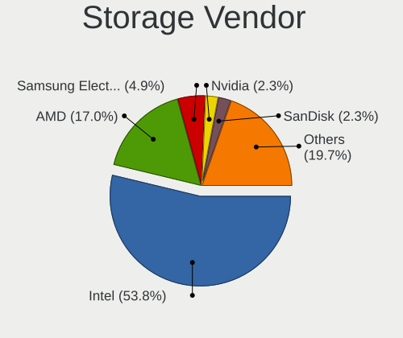

| Vendor                                  | Computers | Percent |
|-----------------------------------------|-----------|---------|
| Intel                                   | 23338     | 53.76%  |
| AMD                                     | 7371      | 16.98%  |
| Samsung Electronics                     | 2142      | 4.93%   |
| Nvidia                                  | 1011      | 2.33%   |
| SanDisk                                 | 999       | 2.3%    |
| JMicron Technology                      | 972       | 2.24%   |
| Phison Electronics                      | 698       | 1.61%   |
| Kingston Technology Company             | 697       | 1.61%   |
| Silicon Motion                          | 601       | 1.38%   |
| ASMedia Technology                      | 578       | 1.33%   |
| SK hynix                                | 575       | 1.32%   |
| Marvell Technology Group                | 538       | 1.24%   |
| ADATA Technology                        | 463       | 1.07%   |
| Micron Technology                       | 402       | 0.93%   |
| MAXIO Technology (Hangzhou)             | 350       | 0.81%   |
| KIOXIA                                  | 306       | 0.7%    |
| VIA Technologies                        | 263       | 0.61%   |
| Realtek Semiconductor                   | 218       | 0.5%    |
| LSI Logic / Symbios Logic               | 163       | 0.38%   |
| Toshiba America Info Systems            | 160       | 0.37%   |
| Shenzhen Longsys Electronics            | 146       | 0.34%   |
| Silicon Integrated Systems [SiS]        | 129       | 0.3%    |
| Broadcom / LSI                          | 123       | 0.28%   |
| INNOGRIT                                | 122       | 0.28%   |
| Hewlett-Packard                         | 114       | 0.26%   |
| Netac Technology                        | 94        | 0.22%   |
| Yangtze Memory Technologies             | 91        | 0.21%   |
| Union Memory (Shenzhen)                 | 88        | 0.2%    |
| Solid State Storage Technology          | 82        | 0.19%   |
| Adaptec                                 | 78        | 0.18%   |
| Micron/Crucial Technology               | 69        | 0.16%   |
| Lite-On Technology                      | 51        | 0.12%   |
| Silicon Image                           | 47        | 0.11%   |
| Shenzhen Shichuangyi Electronics        | 35        | 0.08%   |
| Integrated Technology Express           | 35        | 0.08%   |
| Unknown                                 | 34        | 0.08%   |
| Shenzhen Unionmemory Information System | 29        | 0.07%   |
| Hosin Global Electronics                | 28        | 0.06%   |
| Apple                                   | 24        | 0.06%   |
| O2 Micro                                | 18        | 0.04%   |

Storage Model
-------------

Storage controller models

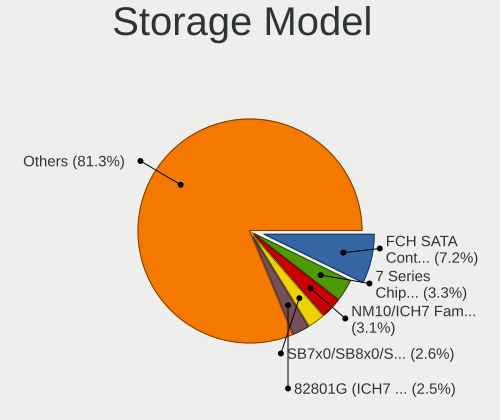

| Model                                                                                   | Computers | Percent |
|-----------------------------------------------------------------------------------------|-----------|---------|
| AMD FCH SATA Controller [AHCI mode]                                                     | 3845      | 7.24%   |
| Intel 7 Series Chipset Family 6-port SATA Controller [AHCI mode]                        | 1737      | 3.27%   |
| Intel NM10/ICH7 Family SATA Controller [IDE mode]                                       | 1653      | 3.11%   |
| AMD SB7x0/SB8x0/SB9x0 IDE Controller                                                    | 1360      | 2.56%   |
| Intel 82801G (ICH7 Family) IDE Controller                                               | 1344      | 2.53%   |
| Intel 8 Series/C220 Series Chipset Family 6-port SATA Controller 1 [AHCI mode]          | 1303      | 2.45%   |
| AMD SB7x0/SB8x0/SB9x0 SATA Controller [AHCI mode]                                       | 1250      | 2.36%   |
| Intel 6 Series/C200 Series Chipset Family 6 port Mobile SATA AHCI Controller            | 1193      | 2.25%   |
| Intel Sunrise Point-LP SATA Controller [AHCI mode]                                      | 936       | 1.76%   |
| AMD SB7x0/SB8x0/SB9x0 SATA Controller [IDE mode]                                        | 929       | 1.75%   |
| Samsung NVMe SSD Controller SM981/PM981/PM983                                           | 878       | 1.65%   |
| Intel Q170/Q150/B150/H170/H110/Z170/CM236 Chipset SATA Controller [AHCI Mode]           | 855       | 1.61%   |
| Intel 6 Series/C200 Series Chipset Family 6 port Desktop SATA AHCI Controller           | 849       | 1.6%    |
| Intel 6 Series/C200 Series Chipset Family Desktop SATA Controller (IDE mode, ports 4-5) | 740       | 1.39%   |
| Intel 6 Series/C200 Series Chipset Family Desktop SATA Controller (IDE mode, ports 0-3) | 738       | 1.39%   |
| AMD 400 Series Chipset SATA Controller                                                  | 735       | 1.38%   |
| Intel 5 Series/3400 Series Chipset 4 port SATA AHCI Controller                          | 639       | 1.2%    |
| Intel 200 Series PCH SATA controller [AHCI mode]                                        | 637       | 1.2%    |
| Intel 82801IBM/IEM (ICH9M/ICH9M-E) 4 port SATA Controller [AHCI mode]                   | 628       | 1.18%   |
| Intel 7 Series/C210 Series Chipset Family 6-port SATA Controller [AHCI mode]            | 612       | 1.15%   |
| Samsung NVMe SSD Controller 980 (DRAM-less)                                             | 561       | 1.06%   |
| Intel 500 Series Chipset Family SATA AHCI Controller                                    | 536       | 1.01%   |
| Intel NM10/ICH7 Family SATA Controller [AHCI mode]                                      | 534       | 1.01%   |
| ASMedia ASM1061/ASM1062 Serial ATA Controller                                           | 532       | 1%      |
| AMD 500 Series Chipset SATA Controller                                                  | 476       | 0.9%    |
| Intel 82801HM/HEM (ICH8M/ICH8M-E) IDE Controller                                        | 467       | 0.88%   |
| JMicron JMB363 SATA/IDE Controller                                                      | 461       | 0.87%   |
| Silicon Motion SM2263EN/SM2263XT (DRAM-less) NVMe SSD Controllers                       | 449       | 0.85%   |
| Nvidia MCP61 SATA Controller                                                            | 438       | 0.83%   |
| Intel Cannon Lake PCH SATA AHCI Controller                                              | 434       | 0.82%   |
| Intel 82801 Mobile SATA Controller [RAID mode]                                          | 432       | 0.81%   |
| Intel 8 Series SATA Controller 1 [AHCI mode]                                            | 427       | 0.8%    |
| Nvidia MCP61 IDE                                                                        | 409       | 0.77%   |
| Intel Celeron/Pentium Silver Processor SATA Controller                                  | 405       | 0.76%   |
| Intel Atom Processor E3800 Series SATA AHCI Controller                                  | 403       | 0.76%   |
| Intel Comet Lake SATA AHCI Controller                                                   | 385       | 0.73%   |
| Intel 82801HM/HEM (ICH8M/ICH8M-E) SATA Controller [AHCI mode]                           | 377       | 0.71%   |
| Intel 82801JI (ICH10 Family) 4 port SATA IDE Controller #1                              | 369       | 0.7%    |
| Intel Volume Management Device NVMe RAID Controller                                     | 368       | 0.69%   |
| Intel 82801JI (ICH10 Family) 2 port SATA IDE Controller #2                              | 367       | 0.69%   |

Storage Kind
------------

Kind of storage controller (IDE, SATA, NVMe, SAS, ...)

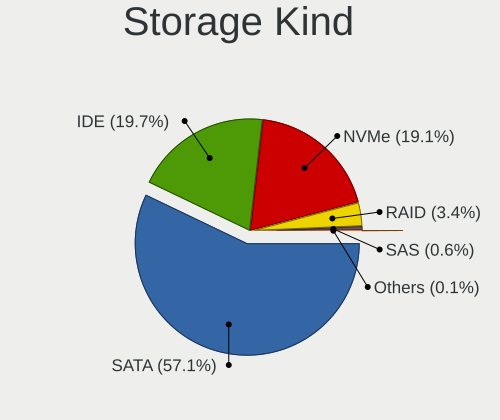

| Kind | Computers | Percent |
|------|-----------|---------|
| SATA | 25187     | 57.11%  |
| IDE  | 8693      | 19.71%  |
| NVMe | 8408      | 19.07%  |
| RAID | 1507      | 3.42%   |
| SAS  | 260       | 0.59%   |
| SCSI | 46        | 0.1%    |

Processor
---------

CPU Vendor
----------

Processor vendors

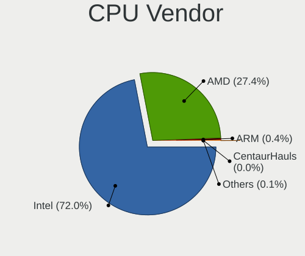

| Vendor                | Computers | Percent |
|-----------------------|-----------|---------|
| Intel                 | 25306     | 71.97%  |
| AMD                   | 9645      | 27.43%  |
| ARM                   | 144       | 0.41%   |
| Unknown               | 14        | 0.04%   |
| CentaurHauls          | 13        | 0.04%   |
| Qualcomm              | 11        | 0.03%   |
| MIPS                  | 5         | 0.01%   |
| Hisilicon             | 4         | 0.01%   |
| sifive,u74-mc         | 3         | 0.01%   |
| Elbrus-MCST           | 3         | 0.01%   |
| Loongson              | 2         | 0.01%   |
| Vortex86 SoC          | 1         | 0.003%  |
| spacemit,x60          | 1         | 0.003%  |
| PowerMac7,2           | 1         | 0.003%  |
| PowerBook5,6          | 1         | 0.003%  |
| MBE8C-PC              | 1         | 0.003%  |
| Marvell Semiconductor | 1         | 0.003%  |
| ky,x60                | 1         | 0.003%  |
| EL2S4                 | 1         | 0.003%  |
| E8C/EATX              | 1         | 0.003%  |
| E8C-SWTX              | 1         | 0.003%  |
| E8C-mITX              | 1         | 0.003%  |

CPU Model
---------

Processor models

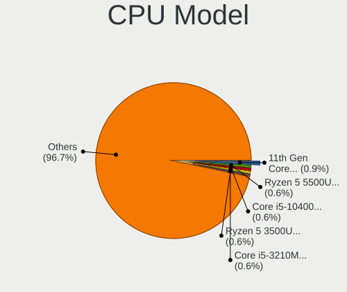

| Model                                         | Computers | Percent |
|-----------------------------------------------|-----------|---------|
| Intel 11th Gen Core i5-1135G7 @ 2.40GHz       | 318       | 0.9%    |
| AMD Ryzen 5 5500U with Radeon Graphics        | 229       | 0.65%   |
| Intel Core i5-10400 CPU @ 2.90GHz             | 214       | 0.6%    |
| AMD Ryzen 5 3500U with Radeon Vega Mobile Gfx | 204       | 0.57%   |
| Intel Core i5-3210M CPU @ 2.50GHz             | 196       | 0.55%   |
| Intel Core i5-8250U CPU @ 1.60GHz             | 194       | 0.55%   |
| Intel Core i5-10210U CPU @ 1.60GHz            | 187       | 0.53%   |
| Intel Core 2 Duo CPU E8400 @ 3.00GHz          | 187       | 0.53%   |
| Intel Core i5-3230M CPU @ 2.60GHz             | 184       | 0.52%   |
| AMD Ryzen 5 3600 6-Core Processor             | 180       | 0.51%   |
| Intel Core i5-8265U CPU @ 1.60GHz             | 176       | 0.5%    |
| Intel Core i5-2410M CPU @ 2.30GHz             | 150       | 0.42%   |
| Intel Core i3-2120 CPU @ 3.30GHz              | 150       | 0.42%   |
| Intel Pentium CPU B960 @ 2.20GHz              | 148       | 0.42%   |
| Intel Core i5-7200U CPU @ 2.50GHz             | 145       | 0.41%   |
| Intel Celeron CPU N3350 @ 1.10GHz             | 143       | 0.4%    |
| Intel Core i5-2450M CPU @ 2.50GHz             | 141       | 0.4%    |
| Intel Core i5-9400 CPU @ 2.90GHz              | 140       | 0.39%   |
| Intel Core i5-3470 CPU @ 3.20GHz              | 139       | 0.39%   |
| Intel Core i3-2350M CPU @ 2.30GHz             | 135       | 0.38%   |
| Intel Core i3-2100 CPU @ 3.10GHz              | 135       | 0.38%   |
| AMD Ryzen 5 2600 Six-Core Processor           | 133       | 0.37%   |
| Intel Atom CPU N450 @ 1.66GHz                 | 131       | 0.37%   |
| Intel Atom x5-Z8350 CPU @ 1.44GHz             | 130       | 0.37%   |
| Intel Core i3-3220 CPU @ 3.30GHz              | 129       | 0.36%   |
| Intel Core i5-2430M CPU @ 2.40GHz             | 128       | 0.36%   |
| AMD FX-6300 Six-Core Processor                | 126       | 0.35%   |
| Intel Core i3-2310M CPU @ 2.10GHz             | 125       | 0.35%   |
| Intel Core 2 Duo CPU E7500 @ 2.93GHz          | 125       | 0.35%   |
| Intel Celeron CPU N2840 @ 2.16GHz             | 125       | 0.35%   |
| Intel Core i3 CPU M 370 @ 2.40GHz             | 124       | 0.35%   |
| Intel 11th Gen Core i3-1115G4 @ 3.00GHz       | 124       | 0.35%   |
| AMD Ryzen 5 5600G with Radeon Graphics        | 124       | 0.35%   |
| Intel Xeon CPU E5-2680 v4 @ 2.40GHz           | 121       | 0.34%   |
| Intel Core i3-6006U CPU @ 2.00GHz             | 120       | 0.34%   |
| Intel Core i3-3110M CPU @ 2.40GHz             | 118       | 0.33%   |
| AMD Ryzen 7 5700U with Radeon Graphics        | 114       | 0.32%   |
| AMD Athlon II X2 250 Processor                | 114       | 0.32%   |
| Intel Pentium 4 CPU 3.00GHz                   | 113       | 0.32%   |
| AMD FX-8350 Eight-Core Processor              | 112       | 0.32%   |

CPU Model Family
----------------

Processor model prefix

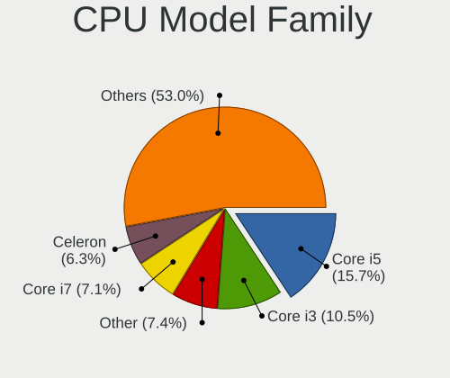

| Model                   | Computers | Percent |
|-------------------------|-----------|---------|
| Intel Core i5           | 5552      | 15.7%   |
| Intel Core i3           | 3719      | 10.52%  |
| Other                   | 2625      | 7.42%   |
| Intel Core i7           | 2500      | 7.07%   |
| Intel Celeron           | 2235      | 6.32%   |
| AMD Ryzen 5             | 2048      | 5.79%   |
| Intel Pentium           | 1918      | 5.42%   |
| Intel Core 2 Duo        | 1633      | 4.62%   |
| Intel Xeon              | 1426      | 4.03%   |
| AMD Ryzen 7             | 1150      | 3.25%   |
| Intel Atom              | 1077      | 3.05%   |
| AMD FX                  | 750       | 2.12%   |
| Intel Pentium Dual-Core | 691       | 1.95%   |
| AMD Ryzen 3             | 477       | 1.35%   |
| AMD Athlon 64 X2        | 466       | 1.32%   |
| Intel Core 2 Quad       | 421       | 1.19%   |
| AMD A6                  | 406       | 1.15%   |
| AMD Athlon II X2        | 367       | 1.04%   |
| AMD A8                  | 326       | 0.92%   |
| AMD A10                 | 324       | 0.92%   |
| AMD A4                  | 313       | 0.89%   |
| Intel Pentium Dual      | 272       | 0.77%   |
| Intel Core 2            | 269       | 0.76%   |
| Intel Pentium 4         | 268       | 0.76%   |
| AMD Ryzen 9             | 260       | 0.74%   |
| AMD Phenom II X4        | 236       | 0.67%   |
| AMD E                   | 208       | 0.59%   |
| AMD Athlon II X4        | 173       | 0.49%   |
| Intel Genuine           | 169       | 0.48%   |
| AMD Athlon              | 165       | 0.47%   |
| Intel Pentium Gold      | 152       | 0.43%   |
| AMD E1                  | 151       | 0.43%   |
| AMD E2                  | 150       | 0.42%   |
| Intel Pentium Silver    | 135       | 0.38%   |
| AMD Athlon II X3        | 126       | 0.36%   |
| Intel Pentium D         | 115       | 0.33%   |
| AMD Phenom              | 106       | 0.3%    |
| Intel Core              | 100       | 0.28%   |
| AMD Phenom II X6        | 100       | 0.28%   |
| AMD Athlon 64           | 97        | 0.27%   |

CPU Cores
---------

Number of processor cores

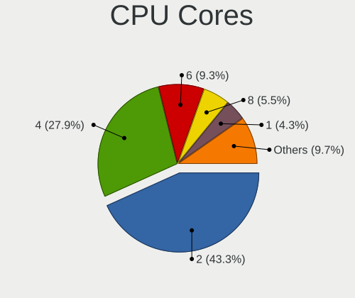

| Number  | Computers | Percent |
|---------|-----------|---------|
| 2       | 15450     | 43.25%  |
| 4       | 9968      | 27.91%  |
| 6       | 3309      | 9.26%   |
| 8       | 1966      | 5.5%    |
| 1       | 1550      | 4.34%   |
| Unknown | 1142      | 3.2%    |
| 12      | 583       | 1.63%   |
| 3       | 375       | 1.05%   |
| 10      | 365       | 1.02%   |
| 16      | 308       | 0.86%   |
| 14      | 229       | 0.64%   |
| 24      | 120       | 0.34%   |
| 28      | 111       | 0.31%   |
| 20      | 108       | 0.3%    |
| 32      | 42        | 0.12%   |
| 18      | 18        | 0.05%   |
| 48      | 13        | 0.04%   |
| 40      | 10        | 0.03%   |
| 36      | 9         | 0.03%   |
| 64      | 8         | 0.02%   |
| 44      | 8         | 0.02%   |
| 56      | 7         | 0.02%   |
| 96      | 5         | 0.01%   |
| 128     | 4         | 0.01%   |
| 52      | 3         | 0.01%   |
| 22      | 3         | 0.01%   |
| 192     | 1         | 0.003%  |
| 115     | 1         | 0.003%  |
| 80      | 1         | 0.003%  |
| 72      | 1         | 0.003%  |
| 50      | 1         | 0.003%  |
| 26      | 1         | 0.003%  |
| 15      | 1         | 0.003%  |

CPU Sockets
-----------

Number of sockets

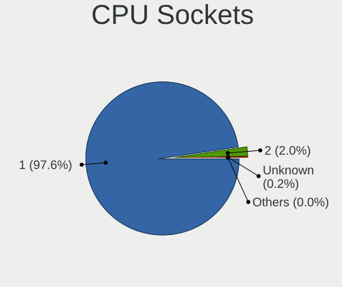

| Number  | Computers | Percent |
|---------|-----------|---------|
| 1       | 34354     | 97.64%  |
| 2       | 719       | 2.04%   |
| Unknown | 83        | 0.24%   |
| 4       | 14        | 0.04%   |
| 3       | 6         | 0.02%   |
| 8       | 2         | 0.01%   |
| 24      | 1         | 0.003%  |
| 20      | 1         | 0.003%  |
| 16      | 1         | 0.003%  |
| 6       | 1         | 0.003%  |
| 0       | 1         | 0.003%  |

CPU Threads
-----------

Threads per core (Hyper-Threading)

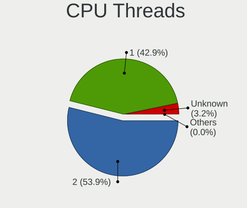

| Number  | Computers | Percent |
|---------|-----------|---------|
| 2       | 19196     | 53.89%  |
| 1       | 15278     | 42.89%  |
| Unknown | 1141      | 3.2%    |
| 8       | 3         | 0.01%   |
| 6       | 2         | 0.01%   |
| 4       | 2         | 0.01%   |
| 12      | 1         | 0.003%  |

CPU Op-Modes
------------

CPU Operation Modes (32-bit, 64-bit)

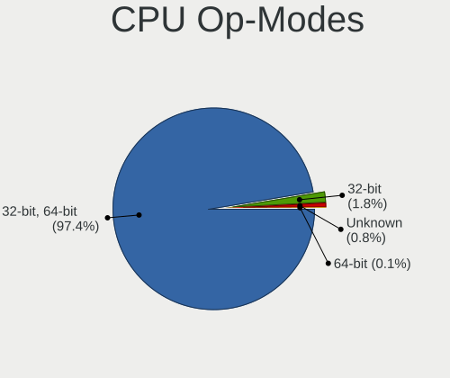

| Op mode        | Computers | Percent |
|----------------|-----------|---------|
| 32-bit, 64-bit | 34269     | 97.37%  |
| 32-bit         | 625       | 1.78%   |
| Unknown        | 272       | 0.77%   |
| 64-bit         | 28        | 0.08%   |

CPU Microcode
-------------

Microcode number

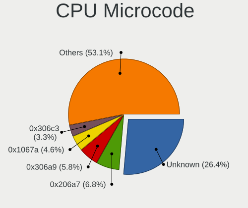

| Number     | Computers | Percent |
|------------|-----------|---------|
| Unknown    | 9666      | 26.38%  |
| 0x206a7    | 2489      | 6.79%   |
| 0x306a9    | 2118      | 5.78%   |
| 0x1067a    | 1685      | 4.6%    |
| 0x306c3    | 1224      | 3.34%   |
| 0x010000c8 | 686       | 1.87%   |
| 0x6fd      | 669       | 1.83%   |
| 0x20655    | 623       | 1.7%    |
| 0x906ea    | 600       | 1.64%   |
| 0x506e3    | 541       | 1.48%   |
| 0x10676    | 463       | 1.26%   |
| 0x906e9    | 456       | 1.24%   |
| 0x06001119 | 430       | 1.17%   |
| 0x106ca    | 415       | 1.13%   |
| 0x806ec    | 383       | 1.05%   |
| 0x806c1    | 377       | 1.03%   |
| 0x30678    | 373       | 1.02%   |
| 0x08108109 | 361       | 0.99%   |
| 0x806ea    | 354       | 0.97%   |
| 0x40651    | 348       | 0.95%   |
| 0xa0653    | 340       | 0.93%   |
| 0x6fb      | 309       | 0.84%   |
| 0x806e9    | 275       | 0.75%   |
| 0x406c4    | 275       | 0.75%   |
| 0x406e3    | 272       | 0.74%   |
| 0x20652    | 245       | 0.67%   |
| 0x06000852 | 245       | 0.67%   |
| 0x0a50000c | 243       | 0.66%   |
| 0x03000027 | 231       | 0.63%   |
| 0x306d4    | 216       | 0.59%   |
| 0x0800820d | 215       | 0.59%   |
| 0x08701021 | 211       | 0.58%   |
| 0x05000119 | 196       | 0.53%   |
| 0x906eb    | 190       | 0.52%   |
| 0x506c9    | 183       | 0.5%    |
| 0x6f6      | 181       | 0.49%   |
| 0x08600106 | 180       | 0.49%   |
| 0x08608103 | 178       | 0.49%   |
| 0x06006705 | 178       | 0.49%   |
| 0x07030105 | 176       | 0.48%   |

CPU Microarch
-------------

Microarchitecture

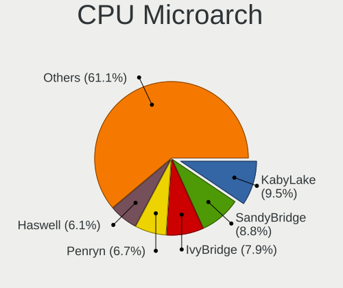

| Name              | Computers | Percent |
|-------------------|-----------|---------|
| KabyLake          | 3346      | 9.45%   |
| SandyBridge       | 3102      | 8.76%   |
| IvyBridge         | 2787      | 7.87%   |
| Penryn            | 2367      | 6.69%   |
| Haswell           | 2160      | 6.1%    |
| Unknown           | 1953      | 5.52%   |
| Core              | 1639      | 4.63%   |
| K10               | 1406      | 3.97%   |
| Skylake           | 1172      | 3.31%   |
| Westmere          | 1161      | 3.28%   |
| Piledriver        | 1102      | 3.11%   |
| Silvermont        | 1036      | 2.93%   |
| Zen 3             | 999       | 2.82%   |
| Zen+              | 944       | 2.67%   |
| Alderlake Hybrid  | 915       | 2.58%   |
| Zen 2             | 870       | 2.46%   |
| CometLake         | 825       | 2.33%   |
| Bonnell           | 753       | 2.13%   |
| TigerLake         | 746       | 2.11%   |
| K8 Hammer         | 722       | 2.04%   |
| Broadwell         | 565       | 1.6%    |
| Zen               | 544       | 1.54%   |
| NetBurst          | 503       | 1.42%   |
| Excavator         | 459       | 1.3%    |
| Goldmont plus     | 414       | 1.17%   |
| IceLake           | 405       | 1.14%   |
| Bobcat            | 343       | 0.97%   |
| K10 Llano         | 288       | 0.81%   |
| Nehalem           | 283       | 0.8%    |
| Goldmont          | 280       | 0.79%   |
| Puma              | 251       | 0.71%   |
| P6                | 224       | 0.63%   |
| Steamroller       | 184       | 0.52%   |
| Bulldozer         | 172       | 0.49%   |
| Jaguar            | 145       | 0.41%   |
| Tremont           | 102       | 0.29%   |
| K8 & K10 hybrid   | 78        | 0.22%   |
| Gracemont         | 76        | 0.21%   |
| Meteorlake Hybrid | 52        | 0.15%   |
| K6                | 12        | 0.03%   |

Graphics
--------

GPU Vendor
----------

Vendors of graphics cards

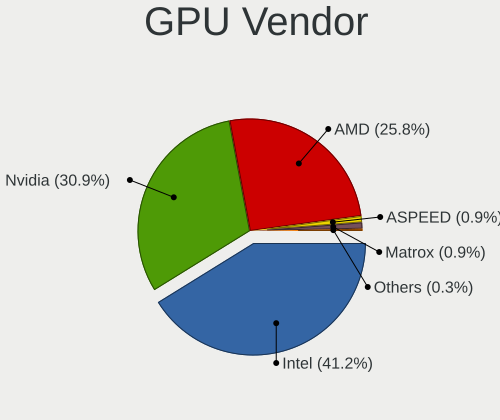

| Vendor                                       | Computers | Percent |
|----------------------------------------------|-----------|---------|
| Intel                                        | 16794     | 41.18%  |
| Nvidia                                       | 12601     | 30.9%   |
| AMD                                          | 10515     | 25.78%  |
| ASPEED Technology                            | 373       | 0.91%   |
| Matrox Electronics Systems                   | 368       | 0.9%    |
| Silicon Integrated Systems [SiS]             | 41        | 0.1%    |
| VIA Technologies                             | 31        | 0.08%   |
| Huawei Technologies                          | 24        | 0.06%   |
| ATI Technologies                             | 16        | 0.04%   |
| Silicon Motion                               | 6         | 0.01%   |
| Zhaoxin                                      | 4         | 0.01%   |
| S3 Graphics                                  | 4         | 0.01%   |
| XGI Technology (eXtreme Graphics Innovation) | 3         | 0.01%   |
| Red Hat                                      | 2         | 0.005%  |
| Loongson Technology                          | 2         | 0.005%  |
| MCST                                         | 1         | 0.002%  |

GPU Model
---------

Graphics card models

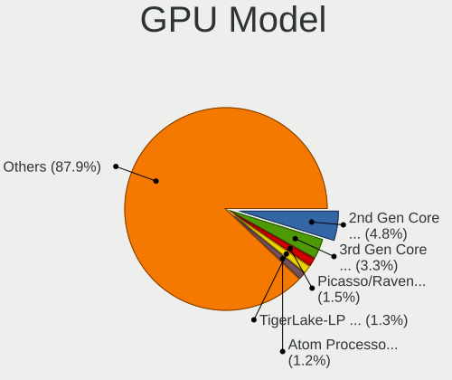

| Model                                                                                    | Computers | Percent |
|------------------------------------------------------------------------------------------|-----------|---------|
| Intel 2nd Generation Core Processor Family Integrated Graphics Controller                | 2059      | 4.8%    |
| Intel 3rd Gen Core processor Graphics Controller                                         | 1407      | 3.28%   |
| AMD Picasso/Raven 2 [Radeon Vega Series / Radeon Vega Mobile Series]                     | 622       | 1.45%   |
| Intel TigerLake-LP GT2 [Iris Xe Graphics]                                                | 567       | 1.32%   |
| Intel Atom Processor Z36xxx/Z37xxx Series Graphics & Display                             | 521       | 1.21%   |
| Intel Core Processor Integrated Graphics Controller                                      | 516       | 1.2%    |
| Intel Atom/Celeron/Pentium Processor x5-E8000/J3xxx/N3xxx Integrated Graphics Controller | 510       | 1.19%   |
| Intel Xeon E3-1200 v3/4th Gen Core Processor Integrated Graphics Controller              | 503       | 1.17%   |
| AMD Cezanne [Radeon Vega Series / Radeon Vega Mobile Series]                             | 490       | 1.14%   |
| AMD Ellesmere [Radeon RX 470/480/570/570X/580/580X/590]                                  | 459       | 1.07%   |
| Intel Haswell-ULT Integrated Graphics Controller                                         | 452       | 1.05%   |
| Nvidia GF117M [GeForce 610M/710M/810M/820M / GT 620M/625M/630M/720M]                     | 443       | 1.03%   |
| Intel CoffeeLake-S GT2 [UHD Graphics 630]                                                | 430       | 1%      |
| AMD Renoir [Radeon Vega Series / Radeon Vega Mobile Series]                              | 429       | 1%      |
| Nvidia GP107 [GeForce GTX 1050 Ti]                                                       | 416       | 0.97%   |
| Intel Atom Processor D4xx/D5xx/N4xx/N5xx Integrated Graphics Controller                  | 416       | 0.97%   |
| Intel Mobile 4 Series Chipset Integrated Graphics Controller                             | 397       | 0.93%   |
| AMD Lucienne                                                                             | 392       | 0.91%   |
| Intel CometLake-S GT2 [UHD Graphics 630]                                                 | 390       | 0.91%   |
| Intel Xeon E3-1200 v2/3rd Gen Core processor Graphics Controller                         | 379       | 0.88%   |
| ASPEED Technology ASPEED Graphics Family                                                 | 373       | 0.87%   |
| Nvidia GK208B [GeForce GT 710]                                                           | 357       | 0.83%   |
| Intel Kaby Lake-R GT2 [UHD Graphics 620]                                                 | 351       | 0.82%   |
| Intel Kaby Lake-U GT2 [HD Graphics 620]                                                  | 330       | 0.77%   |
| Intel CometLake-U GT2 [UHD Graphics]                                                     | 329       | 0.77%   |
| Intel 4th Gen Core Processor Integrated Graphics Controller                              | 316       | 0.74%   |
| Nvidia GT218 [GeForce 210]                                                               | 314       | 0.73%   |
| AMD Stoney [Radeon R2/R3/R4/R5 Graphics]                                                 | 309       | 0.72%   |
| Intel GeminiLake [UHD Graphics 600]                                                      | 303       | 0.71%   |
| Intel Skylake-U GT2 [HD Graphics 520]                                                    | 300       | 0.7%    |
| Intel CoffeeLake-H GT2 [UHD Graphics 630]                                                | 292       | 0.68%   |
| Intel WhiskeyLake-U GT2 [UHD Graphics 620]                                               | 287       | 0.67%   |
| Intel Mobile GM965/GL960 Integrated Graphics Controller (secondary)                      | 287       | 0.67%   |
| Intel Mobile GM965/GL960 Integrated Graphics Controller (primary)                        | 287       | 0.67%   |
| Intel 4 Series Chipset Integrated Graphics Controller                                    | 269       | 0.63%   |
| AMD Raven Ridge [Radeon Vega Series / Radeon Vega Mobile Series]                         | 259       | 0.6%    |
| Intel 82G33/G31 Express Integrated Graphics Controller                                   | 252       | 0.59%   |
| Intel Skylake-S GT2 [HD Graphics 530]                                                    | 250       | 0.58%   |
| Intel Mobile 945GM/GMS/GME, 943/940GML Express Integrated Graphics Controller            | 248       | 0.58%   |
| AMD Seymour [Radeon HD 6400M/7400M Series]                                               | 248       | 0.58%   |

GPU Combo
---------

Combinations of graphics cards

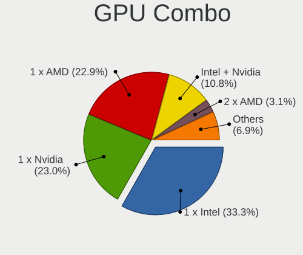

| Name                          | Computers | Percent |
|-------------------------------|-----------|---------|
| 1 x Intel                     | 11853     | 33.26%  |
| 1 x Nvidia                    | 8197      | 23%     |
| 1 x AMD                       | 8170      | 22.92%  |
| Intel + Nvidia                | 3846      | 10.79%  |
| 2 x AMD                       | 1114      | 3.13%   |
| Intel + AMD                   | 778       | 2.18%   |
| AMD + Nvidia                  | 474       | 1.33%   |
| 1 x Matrox                    | 346       | 0.97%   |
| 1 x ASPEED                    | 337       | 0.95%   |
| Other                         | 198       | 0.56%   |
| 2 x Intel                     | 75        | 0.21%   |
| 2 x Nvidia                    | 47        | 0.13%   |
| 1 x SiS                       | 41        | 0.12%   |
| 1 x VIA                       | 31        | 0.09%   |
| Nvidia + ASPEED               | 28        | 0.08%   |
| 1 x Huawei Technologies       | 24        | 0.07%   |
| Nvidia + Matrox               | 23        | 0.06%   |
| AMD + ASPEED                  | 11        | 0.03%   |
| 1 x Silicon Motion            | 6         | 0.02%   |
| 3 x AMD                       | 4         | 0.01%   |
| 3 x Nvidia                    | 3         | 0.01%   |
| 1 x Zhaoxin                   | 3         | 0.01%   |
| 1 x XGI                       | 3         | 0.01%   |
| Intel + 2 x Nvidia            | 3         | 0.01%   |
| Intel + 2 x AMD               | 3         | 0.01%   |
| 2 x Nvidia + 1 x ASPEED       | 2         | 0.01%   |
| 2 x AMD + 1 x Nvidia          | 2         | 0.01%   |
| 1 x S3 Graphics               | 2         | 0.01%   |
| 1 x Red Hat                   | 2         | 0.01%   |
| 1 x Loongson Technology       | 2         | 0.01%   |
| Intel + AMD + 1 x Nvidia      | 2         | 0.01%   |
| 3 x Nvidia + 1 x ASPEED       | 1         | 0.003%  |
| 2 x Nvidia + 1 x Matrox       | 1         | 0.003%  |
| 2 x Intel + 1 x Nvidia        | 1         | 0.003%  |
| Nvidia + Zhaoxin              | 1         | 0.003%  |
| 1 x MCST                      | 1         | 0.003%  |
| 1 x Intel + 3 x Nvidia        | 1         | 0.003%  |
| Intel + SiS + 1 x S3 Graphics | 1         | 0.003%  |
| Intel + S3 Graphics           | 1         | 0.003%  |
| Intel + ASPEED                | 1         | 0.003%  |

GPU Driver
----------

Free vs proprietary

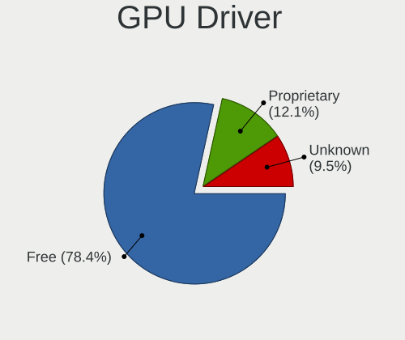

| Driver      | Computers | Percent |
|-------------|-----------|---------|
| Free        | 28515     | 78.44%  |
| Proprietary | 4387      | 12.07%  |
| Unknown     | 3450      | 9.49%   |

GPU Memory
----------

Total video memory

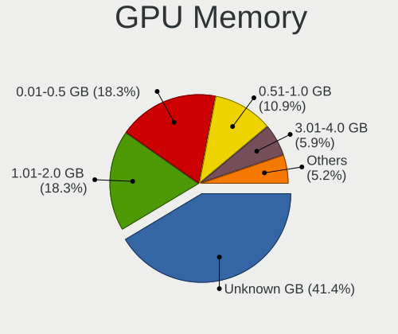

| Size in GB | Computers | Percent |
|------------|-----------|---------|
| Unknown    | 15299     | 41.4%   |
| 1.01-2.0   | 6776      | 18.34%  |
| 0.01-0.5   | 6746      | 18.25%  |
| 0.51-1.0   | 4033      | 10.91%  |
| 3.01-4.0   | 2162      | 5.85%   |
| 7.01-8.0   | 882       | 2.39%   |
| 5.01-6.0   | 444       | 1.2%    |
| 8.01-16.0  | 334       | 0.9%    |
| 2.01-3.0   | 231       | 0.63%   |
| 16.01-24.0 | 39        | 0.11%   |
| 4.01-5.0   | 8         | 0.02%   |
| 24.01-32.0 | 1         | 0.003%  |

Monitor
-------

Monitor Vendor
--------------

Monitor vendors

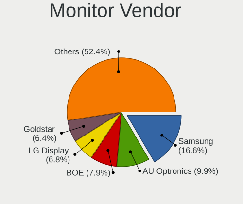

| Vendor                  | Computers | Percent |
|-------------------------|-----------|---------|
| Samsung Electronics     | 5733      | 16.56%  |
| AU Optronics            | 3426      | 9.89%   |
| BOE                     | 2732      | 7.89%   |
| LG Display              | 2348      | 6.78%   |
| Goldstar                | 2229      | 6.44%   |
| Chimei Innolux          | 2197      | 6.34%   |
| Acer                    | 1818      | 5.25%   |
| BenQ                    | 1375      | 3.97%   |
| Philips                 | 1269      | 3.66%   |
| Chi Mei Optoelectronics | 967       | 2.79%   |
| AOC                     | 954       | 2.75%   |
| Dell                    | 952       | 2.75%   |
| ViewSonic               | 782       | 2.26%   |
| Hewlett-Packard         | 635       | 1.83%   |
| Ancor Communications    | 542       | 1.57%   |
| Lenovo                  | 471       | 1.36%   |
| NEC Computers           | 376       | 1.09%   |
| PANDA                   | 278       | 0.8%    |
| Iiyama                  | 267       | 0.77%   |
| LG Philips              | 262       | 0.76%   |
| Apple                   | 260       | 0.75%   |
| Sony                    | 240       | 0.69%   |
| HannStar                | 230       | 0.66%   |
| ASUSTek Computer        | 205       | 0.59%   |
| Sharp                   | 189       | 0.55%   |
| Mi                      | 182       | 0.53%   |
| Unknown                 | 167       | 0.48%   |
| MSI                     | 165       | 0.48%   |
| InfoVision              | 158       | 0.46%   |
| CPT                     | 134       | 0.39%   |
| Valve                   | 118       | 0.34%   |
| CSO                     | 106       | 0.31%   |
| HUAWEI                  | 98        | 0.28%   |
| TMX                     | 95        | 0.27%   |
| SKG                     | 88        | 0.25%   |
| CHR                     | 82        | 0.24%   |
| HKC                     | 80        | 0.23%   |
| LG Electronics          | 78        | 0.23%   |
| HHT                     | 75        | 0.22%   |
| Envision Peripherals    | 71        | 0.21%   |

Monitor Model
-------------

Monitor models

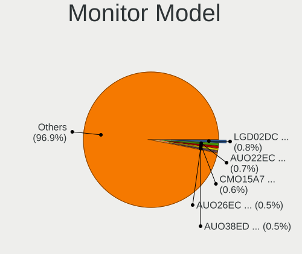

| Model                                                                    | Computers | Percent |
|--------------------------------------------------------------------------|-----------|---------|
| LG Display LCD Monitor LGD02DC 1366x768 344x194mm 15.5-inch              | 273       | 0.77%   |
| AU Optronics LCD Monitor AUO22EC 1366x768 344x193mm 15.5-inch            | 246       | 0.69%   |
| Chi Mei Optoelectronics LCD Monitor CMO15A7 1366x768 344x193mm 15.5-inch | 207       | 0.58%   |
| AU Optronics LCD Monitor AUO26EC 1366x768 344x193mm 15.5-inch            | 189       | 0.53%   |
| AU Optronics LCD Monitor AUO38ED 1920x1080 344x193mm 15.5-inch           | 178       | 0.5%    |
| BOE LCD Monitor BOE0872 1920x1080 344x194mm 15.5-inch                    | 172       | 0.49%   |
| Chimei Innolux LCD Monitor CMN15DB 1366x768 344x193mm 15.5-inch          | 138       | 0.39%   |
| AU Optronics LCD Monitor AUO21ED 1920x1080 344x193mm 15.5-inch           | 136       | 0.38%   |
| Chimei Innolux LCD Monitor CMN14D4 1920x1080 309x173mm 13.9-inch         | 135       | 0.38%   |
| BOE LCD Monitor BOE06A5 1366x768 344x194mm 15.5-inch                     | 122       | 0.34%   |
| Samsung Electronics LCD Monitor SEC3245 1366x768 340x190mm 15.3-inch     | 121       | 0.34%   |
| LG Display LCD Monitor LGD033A 1366x768 344x194mm 15.5-inch              | 117       | 0.33%   |
| Philips PHL 243V7 PHLC155 1920x1080 527x296mm 23.8-inch                  | 115       | 0.32%   |
| AU Optronics LCD Monitor AUO21EC 1366x768 344x193mm 15.5-inch            | 114       | 0.32%   |
| BOE LCD Monitor BOE0877 1920x1080 309x173mm 13.9-inch                    | 112       | 0.32%   |
| Samsung Electronics LCD Monitor SEC5441 1280x800 331x207mm 15.4-inch     | 103       | 0.29%   |
| Samsung Electronics SyncMaster SAM01E1 1280x1024 376x301mm 19.0-inch     | 102       | 0.29%   |
| Chimei Innolux LCD Monitor CMN15E7 1920x1080 344x193mm 15.5-inch         | 102       | 0.29%   |
| Samsung Electronics SyncMaster SAM011E 1280x1024 338x270mm 17.0-inch     | 94        | 0.27%   |
| AOC 24G2W1G3 AOC2402 1920x1080 527x296mm 23.8-inch                       | 93        | 0.26%   |
| Samsung Electronics LCD Monitor SEC324A 1366x768 344x194mm 15.5-inch     | 91        | 0.26%   |
| Samsung Electronics SyncMaster SAM036E 1280x1024 376x301mm 19.0-inch     | 90        | 0.25%   |
| Goldstar FULL HD GSM5B55 1920x1080 480x270mm 21.7-inch                   | 89        | 0.25%   |
| Unknown LCD Monitor FFFF 2288x1287 2550x2550mm 142.0-inch                | 88        | 0.25%   |
| Chimei Innolux LCD Monitor CMN15D5 1920x1080 344x193mm 15.5-inch         | 88        | 0.25%   |
| Chi Mei Optoelectronics LCD Monitor CMO1592 1366x768 344x193mm 15.5-inch | 88        | 0.25%   |
| AU Optronics LCD Monitor AUO20EC 1366x768 344x193mm 15.5-inch            | 87        | 0.25%   |
| Chimei Innolux LCD Monitor CMN15F5 1920x1080 344x193mm 15.5-inch         | 86        | 0.24%   |
| AU Optronics LCD Monitor AUO61D2 1024x600 222x125mm 10.0-inch            | 86        | 0.24%   |
| HannStar LCD Monitor HSD03E9 1024x600 220x129mm 10.0-inch                | 85        | 0.24%   |
| Chimei Innolux LCD Monitor CMN1521 1920x1080 344x193mm 15.5-inch         | 84        | 0.24%   |
| Philips PHL 223V5 PHLC0CF 1920x1080 477x268mm 21.5-inch                  | 80        | 0.23%   |
| Valve ANX7530 U VLV3001 800x1280 100x150mm 7.1-inch                      | 79        | 0.22%   |
| Lenovo LCD Monitor LEN40B0 1366x768 344x194mm 15.5-inch                  | 79        | 0.22%   |
| BOE LCD Monitor BOE0687 1920x1080 344x193mm 15.5-inch                    | 79        | 0.22%   |
| CHR CH7511B CHR7511 1920x1080 519x324mm 24.1-inch                        | 78        | 0.22%   |
| Chi Mei Optoelectronics LCD Monitor CMO15A3 1366x768 344x193mm 15.5-inch | 77        | 0.22%   |
| AOC 27G2G4 AOC2702 1920x1080 598x336mm 27.0-inch                         | 77        | 0.22%   |
| Acer AL1707 A ACRAD46 1280x1024 338x270mm 17.0-inch                      | 77        | 0.22%   |
| Samsung Electronics SyncMaster SAM01B7 1280x1024 340x270mm 17.1-inch     | 76        | 0.21%   |

Monitor Resolution
------------------

Monitor screen resolution

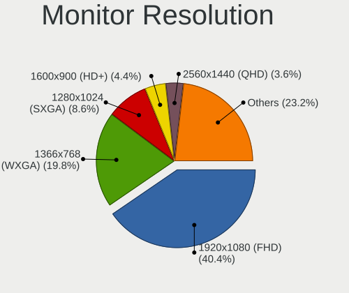

| Resolution         | Computers | Percent |
|--------------------|-----------|---------|
| 1920x1080 (FHD)    | 13626     | 40.45%  |
| 1366x768 (WXGA)    | 6667      | 19.79%  |
| 1280x1024 (SXGA)   | 2898      | 8.6%    |
| 1600x900 (HD+)     | 1468      | 4.36%   |
| 2560x1440 (QHD)    | 1224      | 3.63%   |
| 3840x2160 (4K)     | 1193      | 3.54%   |
| 1280x800 (WXGA)    | 924       | 2.74%   |
| 1440x900 (WXGA+)   | 899       | 2.67%   |
| 1680x1050 (WSXGA+) | 892       | 2.65%   |
| 1920x1200 (WUXGA)  | 761       | 2.26%   |
| 1024x600           | 439       | 1.3%    |
| 2560x1600          | 312       | 0.93%   |
| 1360x768           | 248       | 0.74%   |
| 1024x768 (XGA)     | 244       | 0.72%   |
| 2560x1080          | 216       | 0.64%   |
| 3440x1440          | 173       | 0.51%   |
| Unknown            | 150       | 0.45%   |
| 1600x1200          | 130       | 0.39%   |
| 2880x1800          | 125       | 0.37%   |
| 2160x1440          | 125       | 0.37%   |
| 800x1280           | 124       | 0.37%   |
| 2288x1287          | 100       | 0.3%    |
| 1280x720 (HD)      | 64        | 0.19%   |
| 1920x540           | 61        | 0.18%   |
| 3200x2000          | 56        | 0.17%   |
| 1400x1050          | 43        | 0.13%   |
| 3840x1080          | 40        | 0.12%   |
| 2520x1680          | 35        | 0.1%    |
| 2880x1620          | 28        | 0.08%   |
| 3000x2000          | 25        | 0.07%   |
| 3072x1920          | 23        | 0.07%   |
| 2240x1400          | 21        | 0.06%   |
| 1280x960           | 21        | 0.06%   |
| 3840x2400          | 20        | 0.06%   |
| 2880x1920          | 19        | 0.06%   |
| 1680x945           | 17        | 0.05%   |
| 1152x864           | 16        | 0.05%   |
| 3840x2560          | 14        | 0.04%   |
| 2048x1536          | 14        | 0.04%   |
| 2048x1152          | 14        | 0.04%   |

Monitor Diagonal
----------------

Diagonal size in inches

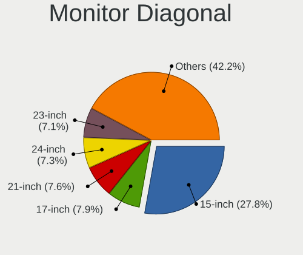

| Inches  | Computers | Percent |
|---------|-----------|---------|
| 15      | 9641      | 27.82%  |
| 17      | 2742      | 7.91%   |
| 21      | 2644      | 7.63%   |
| 24      | 2533      | 7.31%   |
| 23      | 2462      | 7.1%    |
| 19      | 2105      | 6.07%   |
| 27      | 1917      | 5.53%   |
| 14      | 1691      | 4.88%   |
| 13      | 1631      | 4.71%   |
| 18      | 875       | 2.52%   |
| 20      | 737       | 2.13%   |
| Unknown | 730       | 2.11%   |
| 16      | 561       | 1.62%   |
| 22      | 554       | 1.6%    |
| 31      | 530       | 1.53%   |
| 10      | 456       | 1.32%   |
| 11      | 373       | 1.08%   |
| 34      | 342       | 0.99%   |
| 12      | 322       | 0.93%   |
| 40      | 210       | 0.61%   |
| 32      | 182       | 0.53%   |
| 54      | 154       | 0.44%   |
| 72      | 130       | 0.38%   |
| 7       | 119       | 0.34%   |
| 52      | 96        | 0.28%   |
| 26      | 92        | 0.27%   |
| 142     | 88        | 0.25%   |
| 84      | 77        | 0.22%   |
| 28      | 71        | 0.2%    |
| 25      | 63        | 0.18%   |
| 46      | 59        | 0.17%   |
| 48      | 44        | 0.13%   |
| 42      | 44        | 0.13%   |
| 63      | 38        | 0.11%   |
| 29      | 33        | 0.1%    |
| 8       | 33        | 0.1%    |
| 65      | 29        | 0.08%   |
| 49      | 29        | 0.08%   |
| 43      | 28        | 0.08%   |
| 37      | 20        | 0.06%   |

Monitor Width
-------------

Physical width

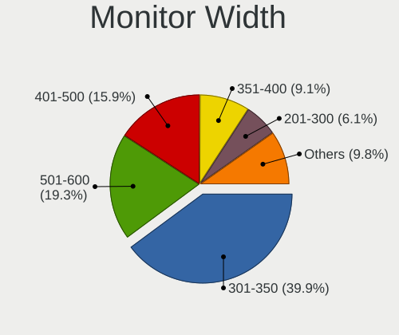

| Width in mm    | Computers | Percent |
|----------------|-----------|---------|
| 301-350        | 13632     | 39.86%  |
| 501-600        | 6606      | 19.31%  |
| 401-500        | 5436      | 15.89%  |
| 351-400        | 3114      | 9.1%    |
| 201-300        | 2075      | 6.07%   |
| 601-700        | 730       | 2.13%   |
| Unknown        | 730       | 2.13%   |
| 701-800        | 542       | 1.58%   |
| 1001-1500      | 514       | 1.5%    |
| 1501-2000      | 237       | 0.69%   |
| 801-900        | 183       | 0.54%   |
| 901-1000       | 153       | 0.45%   |
| 1-100          | 123       | 0.36%   |
| More than 2000 | 94        | 0.27%   |
| 101-200        | 34        | 0.1%    |

Aspect Ratio
------------

Proportional relationship between the width and the height

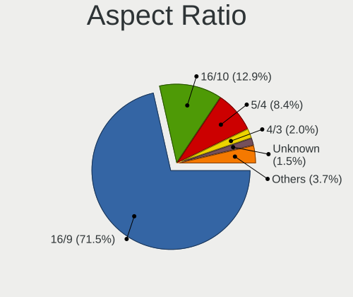

| Ratio   | Computers | Percent |
|---------|-----------|---------|
| 16/9    | 23284     | 71.48%  |
| 16/10   | 4202      | 12.9%   |
| 5/4     | 2749      | 8.44%   |
| 4/3     | 650       | 2%      |
| Unknown | 500       | 1.53%   |
| 21/9    | 450       | 1.38%   |
| 3/2     | 381       | 1.17%   |
| 1.00    | 88        | 0.27%   |
| 0.67    | 79        | 0.24%   |
| 6/5     | 67        | 0.21%   |
| 32/9    | 46        | 0.14%   |
| 0.62    | 43        | 0.13%   |
| 0.56    | 16        | 0.05%   |
| 0.63    | 4         | 0.01%   |
| 0.45    | 4         | 0.01%   |
| 2.00    | 3         | 0.01%   |
| 3.73    | 2         | 0.01%   |
| 3.40    | 2         | 0.01%   |
| 3.33    | 1         | 0.003%  |
| 1.96    | 1         | 0.003%  |
| 0.80    | 1         | 0.003%  |
| 0.54    | 1         | 0.003%  |

Monitor Area
------------

Area in inch²

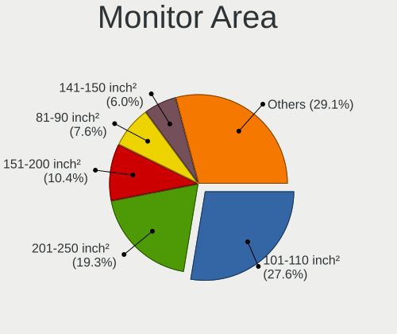

| Area in inch² | Computers | Percent |
|----------------|-----------|---------|
| 101-110        | 9506      | 27.62%  |
| 201-250        | 6639      | 19.29%  |
| 151-200        | 3562      | 10.35%  |
| 81-90          | 2616      | 7.6%    |
| 141-150        | 2060      | 5.99%   |
| 301-350        | 2003      | 5.82%   |
| 121-130        | 1146      | 3.33%   |
| 351-500        | 1138      | 3.31%   |
| 251-300        | 890       | 2.59%   |
| More than 1000 | 745       | 2.17%   |
| Unknown        | 730       | 2.12%   |
| 71-80          | 667       | 1.94%   |
| 111-120        | 579       | 1.68%   |
| 41-50          | 459       | 1.33%   |
| 501-1000       | 436       | 1.27%   |
| 51-60          | 375       | 1.09%   |
| 131-140        | 278       | 0.81%   |
| 61-70          | 268       | 0.78%   |
| 1-40           | 157       | 0.46%   |
| 91-100         | 157       | 0.46%   |

Pixel Density
-------------

Pixels per inch

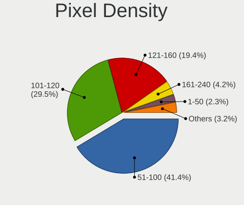

| Density       | Computers | Percent |
|---------------|-----------|---------|
| 51-100        | 13888     | 41.39%  |
| 101-120       | 9898      | 29.5%   |
| 121-160       | 6512      | 19.41%  |
| 161-240       | 1420      | 4.23%   |
| 1-50          | 774       | 2.31%   |
| Unknown       | 731       | 2.18%   |
| More than 240 | 332       | 0.99%   |

Multiple Monitors
-----------------

Total monitors connected

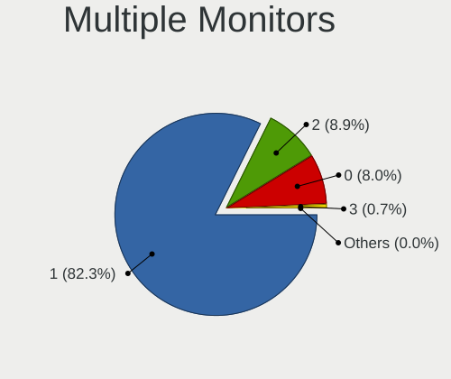

| Total | Computers | Percent |
|-------|-----------|---------|
| 1     | 29637     | 82.34%  |
| 2     | 3207      | 8.91%   |
| 0     | 2888      | 8.02%   |
| 3     | 247       | 0.69%   |
| 4     | 14        | 0.04%   |
| 6     | 1         | 0.003%  |
| 5     | 1         | 0.003%  |

Network
-------

Net Controller Vendor
---------------------

Controller vendors

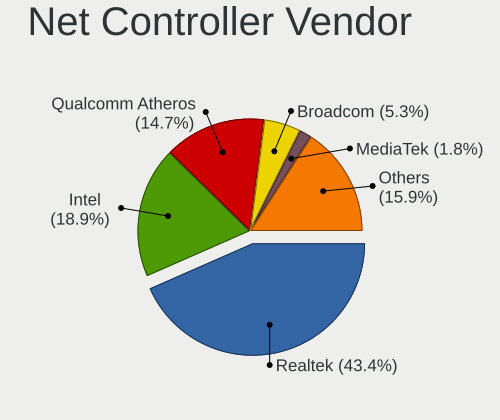

| Vendor                            | Computers | Percent |
|-----------------------------------|-----------|---------|
| Realtek Semiconductor             | 22451     | 43.42%  |
| Intel                             | 9779      | 18.91%  |
| Qualcomm Atheros                  | 7608      | 14.71%  |
| Broadcom                          | 2754      | 5.33%   |
| MediaTek                          | 907       | 1.75%   |
| Marvell Technology Group          | 844       | 1.63%   |
| Nvidia                            | 819       | 1.58%   |
| Broadcom Limited                  | 677       | 1.31%   |
| Ralink                            | 667       | 1.29%   |
| Ralink Technology                 | 629       | 1.22%   |
| Huawei Technologies               | 547       | 1.06%   |
| TP-Link                           | 484       | 0.94%   |
| Xiaomi                            | 263       | 0.51%   |
| VIA Technologies                  | 216       | 0.42%   |
| Qualcomm                          | 207       | 0.4%    |
| D-Link                            | 189       | 0.37%   |
| D-Link System                     | 180       | 0.35%   |
| ASUSTek Computer                  | 169       | 0.33%   |
| Qualcomm Atheros Communications   | 150       | 0.29%   |
| ASIX Electronics                  | 150       | 0.29%   |
| Samsung Electronics               | 146       | 0.28%   |
| JMicron Technology                | 141       | 0.27%   |
| Attansic Technology               | 123       | 0.24%   |
| ZTE WCDMA Technologies MSM        | 122       | 0.24%   |
| Mellanox Technologies             | 100       | 0.19%   |
| Silicon Integrated Systems [SiS]  | 90        | 0.17%   |
| OPPO Electronics                  | 58        | 0.11%   |
| Microsoft                         | 47        | 0.09%   |
| Mercucys                          | 44        | 0.09%   |
| Sundance Technology Inc / IC Plus | 40        | 0.08%   |
| Sierra Wireless                   | 38        | 0.07%   |
| Shenzhen Goodix Technology        | 37        | 0.07%   |
| American Megatrends               | 36        | 0.07%   |
| 3Com                              | 36        | 0.07%   |
| Gemtek                            | 35        | 0.07%   |
| Lenovo                            | 34        | 0.07%   |
| Hewlett-Packard                   | 34        | 0.07%   |
| QinHeng Electronics               | 33        | 0.06%   |
| Dell                              | 32        | 0.06%   |
| U-Blox                            | 30        | 0.06%   |

Net Controller Model
--------------------

Controller models

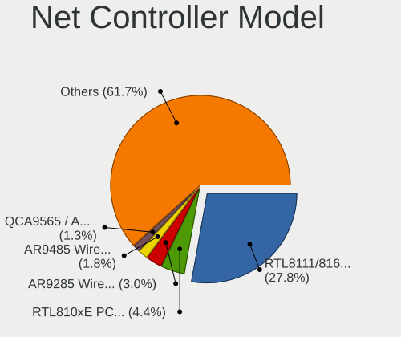

| Model                                                                   | Computers | Percent |
|-------------------------------------------------------------------------|-----------|---------|
| Realtek RTL8111/8168/8211/8411 PCI Express Gigabit Ethernet Controller  | 16220     | 27.83%  |
| Realtek RTL810xE PCI Express Fast Ethernet controller                   | 2557      | 4.39%   |
| Qualcomm Atheros AR9285 Wireless Network Adapter (PCI-Express)          | 1721      | 2.95%   |
| Qualcomm Atheros AR9485 Wireless Network Adapter                        | 1071      | 1.84%   |
| Qualcomm Atheros QCA9565 / AR9565 Wireless Network Adapter              | 772       | 1.32%   |
| Realtek RTL8821CE 802.11ac PCIe Wireless Network Adapter                | 743       | 1.27%   |
| Realtek RTL8125 2.5GbE Controller                                       | 709       | 1.22%   |
| Qualcomm Atheros QCA9377 802.11ac Wireless Network Adapter              | 692       | 1.19%   |
| Broadcom BCM4313 802.11bgn Wireless Network Adapter                     | 681       | 1.17%   |
| Realtek RTL8822CE 802.11ac PCIe Wireless Network Adapter                | 667       | 1.14%   |
| Realtek RTL-8100/8101L/8139 PCI Fast Ethernet Adapter                   | 602       | 1.03%   |
| Intel Wi-Fi 6 AX201                                                     | 576       | 0.99%   |
| Qualcomm Atheros AR8151 v2.0 Gigabit Ethernet                           | 557       | 0.96%   |
| Intel Wi-Fi 6 AX200                                                     | 547       | 0.94%   |
| Realtek RTL8723BE PCIe Wireless Network Adapter                         | 531       | 0.91%   |
| Intel Alder Lake-P PCH CNVi WiFi                                        | 417       | 0.72%   |
| Intel Wireless 7265                                                     | 412       | 0.71%   |
| Ralink MT7601U Wireless Adapter                                         | 408       | 0.7%    |
| Qualcomm Atheros AR242x / AR542x Wireless Network Adapter (PCI-Express) | 406       | 0.7%    |
| Broadcom BCM43142 802.11b/g/n                                           | 405       | 0.69%   |
| Intel Wireless 3165                                                     | 390       | 0.67%   |
| Nvidia MCP61 Ethernet                                                   | 389       | 0.67%   |
| Intel Wireless 8265 / 8275                                              | 370       | 0.63%   |
| Intel PRO/Wireless 3945ABG [Golan] Network Connection                   | 320       | 0.55%   |
| Intel Ethernet Connection (2) I219-V                                    | 320       | 0.55%   |
| Realtek RTL8153 Gigabit Ethernet Adapter                                | 313       | 0.54%   |
| Intel 82579LM Gigabit Network Connection (Lewisville)                   | 304       | 0.52%   |
| Qualcomm Atheros AR8131 Gigabit Ethernet                                | 300       | 0.51%   |
| Qualcomm Atheros AR9462 Wireless Network Adapter                        | 297       | 0.51%   |
| Qualcomm Atheros AR8161 Gigabit Ethernet                                | 296       | 0.51%   |
| Intel Dual Band Wireless-AC 3168NGW [Stone Peak]                        | 294       | 0.5%    |
| Realtek RTL8188EUS 802.11n Wireless Network Adapter                     | 288       | 0.49%   |
| Intel I211 Gigabit Network Connection                                   | 282       | 0.48%   |
| Broadcom NetLink BCM57785 Gigabit Ethernet PCIe                         | 279       | 0.48%   |
| Intel Cannon Lake PCH CNVi WiFi                                         | 270       | 0.46%   |
| MediaTek MT7921 802.11ax PCIe Wireless Network Adapter [Filogic 330]    | 268       | 0.46%   |
| Intel Comet Lake PCH-LP CNVi WiFi                                       | 265       | 0.45%   |
| Qualcomm Atheros AR8121/AR8113/AR8114 Gigabit or Fast Ethernet          | 258       | 0.44%   |
| Intel Wi-Fi 6E(802.11ax) AX210/AX1675* 2x2 [Typhoon Peak]               | 256       | 0.44%   |
| Huawei Modem/Networkcard                                                | 248       | 0.43%   |

Wireless Vendor
---------------

Wireless vendors

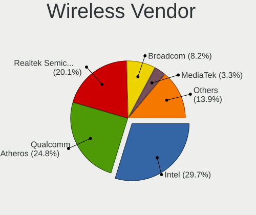

| Vendor                          | Computers | Percent |
|---------------------------------|-----------|---------|
| Intel                           | 6711      | 29.75%  |
| Qualcomm Atheros                | 5589      | 24.77%  |
| Realtek Semiconductor           | 4534      | 20.1%   |
| Broadcom                        | 1852      | 8.21%   |
| MediaTek                        | 735       | 3.26%   |
| Ralink                          | 667       | 2.96%   |
| Ralink Technology               | 629       | 2.79%   |
| TP-Link                         | 432       | 1.91%   |
| Broadcom Limited                | 363       | 1.61%   |
| D-Link                          | 166       | 0.74%   |
| ASUSTek Computer                | 157       | 0.7%    |
| Qualcomm Atheros Communications | 150       | 0.66%   |
| Qualcomm                        | 141       | 0.62%   |
| D-Link System                   | 80        | 0.35%   |
| Microsoft                       | 47        | 0.21%   |
| Mercucys                        | 44        | 0.2%    |
| Sierra Wireless                 | 38        | 0.17%   |
| NetGear                         | 27        | 0.12%   |
| ZyXEL Communications            | 19        | 0.08%   |
| IMC Networks                    | 19        | 0.08%   |
| Fibocom                         | 17        | 0.08%   |
| Dell                            | 15        | 0.07%   |
| Tenda                           | 13        | 0.06%   |
| Xiaomi                          | 12        | 0.05%   |
| Micro Star International        | 12        | 0.05%   |
| Unknown                         | 11        | 0.05%   |
| Edimax Technology               | 9         | 0.04%   |
| ZTopInc                         | 8         | 0.04%   |
| Quectel Wireless Solutions      | 7         | 0.03%   |
| Hewlett-Packard                 | 7         | 0.03%   |
| Marvell Technology Group        | 6         | 0.03%   |
| ZyDAS                           | 4         | 0.02%   |
| VIA Technologies                | 4         | 0.02%   |
| Linksys                         | 4         | 0.02%   |
| Texas Instruments               | 3         | 0.01%   |
| Qualcomm Technologies           | 3         | 0.01%   |
| Wilocity                        | 2         | 0.01%   |
| Wacom                           | 2         | 0.01%   |
| TRENDnet                        | 2         | 0.01%   |
| Fujitsu Siemens Computers       | 2         | 0.01%   |

Wireless Model
--------------

Wireless models

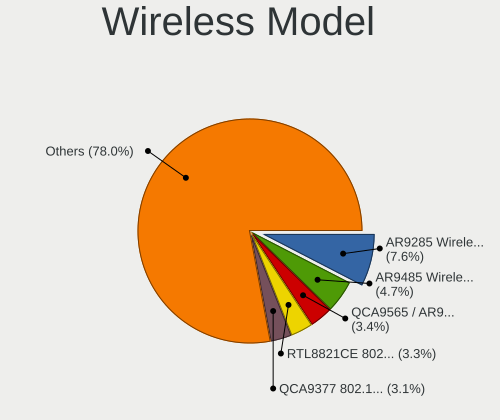

| Model                                                                   | Computers | Percent |
|-------------------------------------------------------------------------|-----------|---------|
| Qualcomm Atheros AR9285 Wireless Network Adapter (PCI-Express)          | 1721      | 7.59%   |
| Qualcomm Atheros AR9485 Wireless Network Adapter                        | 1071      | 4.72%   |
| Qualcomm Atheros QCA9565 / AR9565 Wireless Network Adapter              | 772       | 3.4%    |
| Realtek RTL8821CE 802.11ac PCIe Wireless Network Adapter                | 743       | 3.28%   |
| Qualcomm Atheros QCA9377 802.11ac Wireless Network Adapter              | 692       | 3.05%   |
| Broadcom BCM4313 802.11bgn Wireless Network Adapter                     | 681       | 3%      |
| Realtek RTL8822CE 802.11ac PCIe Wireless Network Adapter                | 667       | 2.94%   |
| Intel Wi-Fi 6 AX201                                                     | 576       | 2.54%   |
| Intel Wi-Fi 6 AX200                                                     | 547       | 2.41%   |
| Realtek RTL8723BE PCIe Wireless Network Adapter                         | 531       | 2.34%   |
| Intel Wireless 7265                                                     | 412       | 1.82%   |
| Ralink MT7601U Wireless Adapter                                         | 408       | 1.8%    |
| Qualcomm Atheros AR242x / AR542x Wireless Network Adapter (PCI-Express) | 406       | 1.79%   |
| Broadcom BCM43142 802.11b/g/n                                           | 405       | 1.79%   |
| Intel Wireless 3165                                                     | 390       | 1.72%   |
| Intel Wireless 8265 / 8275                                              | 370       | 1.63%   |
| Intel PRO/Wireless 3945ABG [Golan] Network Connection                   | 320       | 1.41%   |
| Qualcomm Atheros AR9462 Wireless Network Adapter                        | 297       | 1.31%   |
| Intel Dual Band Wireless-AC 3168NGW [Stone Peak]                        | 294       | 1.3%    |
| Realtek RTL8188EUS 802.11n Wireless Network Adapter                     | 288       | 1.27%   |
| Intel Cannon Lake PCH CNVi WiFi                                         | 270       | 1.19%   |
| MediaTek MT7921 802.11ax PCIe Wireless Network Adapter [Filogic 330]    | 268       | 1.18%   |
| Intel Comet Lake PCH-LP CNVi WiFi                                       | 265       | 1.17%   |
| Intel Wi-Fi 6E(802.11ax) AX210/AX1675* 2x2 [Typhoon Peak]               | 256       | 1.13%   |
| Realtek RTL8188CE 802.11b/g/n WiFi Adapter                              | 236       | 1.04%   |
| Ralink RT3290 Wireless 802.11n 1T/1R PCIe                               | 234       | 1.03%   |
| Realtek RTL8723DE Wireless Network Adapter                              | 230       | 1.01%   |
| Intel Wireless 7260                                                     | 201       | 0.89%   |
| Intel Cannon Point-LP CNVi [Wireless-AC]                                | 195       | 0.86%   |
| Realtek 802.11ac NIC                                                    | 189       | 0.83%   |
| Broadcom BCM4312 802.11b/g LP-PHY                                       | 173       | 0.76%   |
| Intel WiFi Link 5100                                                    | 172       | 0.76%   |
| Qualcomm Atheros QCA6174 802.11ac Wireless Network Adapter              | 171       | 0.75%   |
| Realtek RTL8723AE PCIe Wireless Network Adapter                         | 165       | 0.73%   |
| MediaTek MT7922 802.11ax PCI Express Wireless Network Adapter           | 165       | 0.73%   |
| Realtek RTL8188EE Wireless Network Adapter                              | 157       | 0.69%   |
| Intel Alder Lake-P PCH CNVi WiFi                                        | 150       | 0.66%   |
| Intel Centrino Wireless-N 130                                           | 149       | 0.66%   |
| Realtek RTL8192CU 802.11n WLAN Adapter                                  | 148       | 0.65%   |
| Intel Dual Band Wireless-AC 3165 Plus Bluetooth                         | 146       | 0.64%   |

Ethernet Vendor
---------------

Ethernet vendors

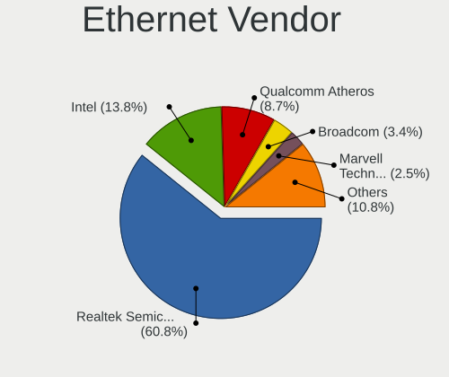

| Vendor                                 | Computers | Percent |
|----------------------------------------|-----------|---------|
| Realtek Semiconductor                  | 20617     | 60.77%  |
| Intel                                  | 4665      | 13.75%  |
| Qualcomm Atheros                       | 2957      | 8.72%   |
| Broadcom                               | 1169      | 3.45%   |
| Marvell Technology Group               | 838       | 2.47%   |
| Nvidia                                 | 818       | 2.41%   |
| Broadcom Limited                       | 325       | 0.96%   |
| Xiaomi                                 | 251       | 0.74%   |
| VIA Technologies                       | 210       | 0.62%   |
| Huawei Technologies                    | 201       | 0.59%   |
| MediaTek                               | 167       | 0.49%   |
| ASIX Electronics                       | 150       | 0.44%   |
| Samsung Electronics                    | 146       | 0.43%   |
| JMicron Technology                     | 141       | 0.42%   |
| Attansic Technology                    | 123       | 0.36%   |
| D-Link System                          | 101       | 0.3%    |
| Silicon Integrated Systems [SiS]       | 89        | 0.26%   |
| Mellanox Technologies                  | 85        | 0.25%   |
| Qualcomm                               | 66        | 0.19%   |
| OPPO Electronics                       | 58        | 0.17%   |
| TP-Link                                | 53        | 0.16%   |
| Sundance Technology Inc / IC Plus      | 40        | 0.12%   |
| American Megatrends                    | 36        | 0.11%   |
| 3Com                                   | 36        | 0.11%   |
| Gemtek                                 | 34        | 0.1%    |
| Lenovo                                 | 31        | 0.09%   |
| IBM                                    | 30        | 0.09%   |
| Aquantia                               | 30        | 0.09%   |
| Vimtron Electronics                    | 28        | 0.08%   |
| Spreadtrum Communications              | 24        | 0.07%   |
| HTC (High Tech Computer)               | 23        | 0.07%   |
| D-Link                                 | 23        | 0.07%   |
| ZTE WCDMA Technologies MSM             | 21        | 0.06%   |
| Sony Ericsson Mobile Communications AB | 20        | 0.06%   |
| ICS Advent                             | 18        | 0.05%   |
| Google                                 | 17        | 0.05%   |
| Microchip Technology                   | 16        | 0.05%   |
| Emulex                                 | 16        | 0.05%   |
| HMD Global                             | 15        | 0.04%   |
| Apple                                  | 15        | 0.04%   |

Ethernet Model
--------------

Ethernet models

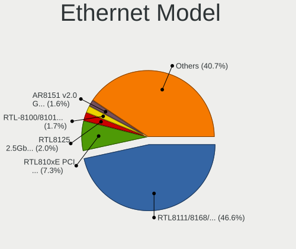

| Model                                                                  | Computers | Percent |
|------------------------------------------------------------------------|-----------|---------|
| Realtek RTL8111/8168/8211/8411 PCI Express Gigabit Ethernet Controller | 16220     | 46.61%  |
| Realtek RTL810xE PCI Express Fast Ethernet controller                  | 2557      | 7.35%   |
| Realtek RTL8125 2.5GbE Controller                                      | 709       | 2.04%   |
| Realtek RTL-8100/8101L/8139 PCI Fast Ethernet Adapter                  | 602       | 1.73%   |
| Qualcomm Atheros AR8151 v2.0 Gigabit Ethernet                          | 557       | 1.6%    |
| Nvidia MCP61 Ethernet                                                  | 389       | 1.12%   |
| Intel Ethernet Connection (2) I219-V                                   | 320       | 0.92%   |
| Realtek RTL8153 Gigabit Ethernet Adapter                               | 313       | 0.9%    |
| Intel 82579LM Gigabit Network Connection (Lewisville)                  | 304       | 0.87%   |
| Qualcomm Atheros AR8131 Gigabit Ethernet                               | 300       | 0.86%   |
| Qualcomm Atheros AR8161 Gigabit Ethernet                               | 296       | 0.85%   |
| Intel I211 Gigabit Network Connection                                  | 282       | 0.81%   |
| Broadcom NetLink BCM57785 Gigabit Ethernet PCIe                        | 279       | 0.8%    |
| Intel Alder Lake-P PCH CNVi WiFi                                       | 267       | 0.77%   |
| Qualcomm Atheros AR8121/AR8113/AR8114 Gigabit or Fast Ethernet         | 258       | 0.74%   |
| Qualcomm Atheros AR8152 v2.0 Fast Ethernet                             | 245       | 0.7%    |
| Qualcomm Atheros Attansic L1 Gigabit Ethernet                          | 236       | 0.68%   |
| Intel 82579V Gigabit Network Connection                                | 230       | 0.66%   |
| Realtek RTL8152 Fast Ethernet Adapter                                  | 225       | 0.65%   |
| Marvell Group 88E8040 PCI-E Fast Ethernet Controller                   | 223       | 0.64%   |
| Qualcomm Atheros AR8132 Fast Ethernet                                  | 204       | 0.59%   |
| Intel I350 Gigabit Network Connection                                  | 200       | 0.57%   |
| Xiaomi Mi/Redmi series (RNDIS)                                         | 194       | 0.56%   |
| Intel Ethernet Controller I225-V                                       | 187       | 0.54%   |
| Intel Ethernet Connection (13) I219-V                                  | 162       | 0.47%   |
| Intel Ethernet Connection (14) I219-V                                  | 161       | 0.46%   |
| Qualcomm Atheros QCA8171 Gigabit Ethernet                              | 158       | 0.45%   |
| Qualcomm Atheros QCA8172 Fast Ethernet                                 | 149       | 0.43%   |
| VIA VT6105/VT6106S [Rhine-III]                                         | 147       | 0.42%   |
| Qualcomm Atheros AR8162 Fast Ethernet                                  | 144       | 0.41%   |
| Intel I210 Gigabit Network Connection                                  | 139       | 0.4%    |
| Intel Ethernet Connection (7) I219-V                                   | 129       | 0.37%   |
| Broadcom NetLink BCM57780 Gigabit Ethernet PCIe                        | 129       | 0.37%   |
| Intel 82574L Gigabit Network Connection                                | 128       | 0.37%   |
| ASIX AX88179 Gigabit Ethernet                                          | 126       | 0.36%   |
| Marvell Group 88E8056 PCI-E Gigabit Ethernet Controller                | 124       | 0.36%   |
| Attansic AR8152 v2.0 Fast Ethernet                                     | 123       | 0.35%   |
| Samsung Galaxy series, misc. (tethering mode)                          | 116       | 0.33%   |
| Intel WiMAX Connection 2400m                                           | 116       | 0.33%   |
| JMicron JMC250 PCI Express Gigabit Ethernet Controller                 | 114       | 0.33%   |

Net Controller Kind
-------------------

Ethernet, WiFi or modem

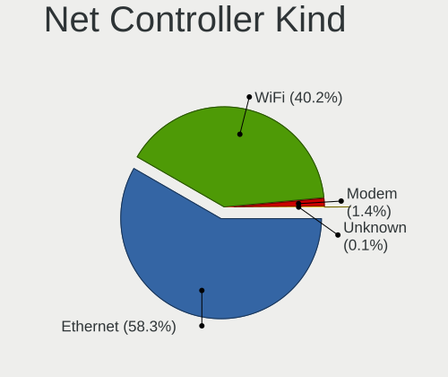

| Kind     | Computers | Percent |
|----------|-----------|---------|
| Ethernet | 31536     | 58.3%   |
| WiFi     | 21753     | 40.22%  |
| Modem    | 741       | 1.37%   |
| Unknown  | 61        | 0.11%   |

Used Controller
---------------

Currently used network controller

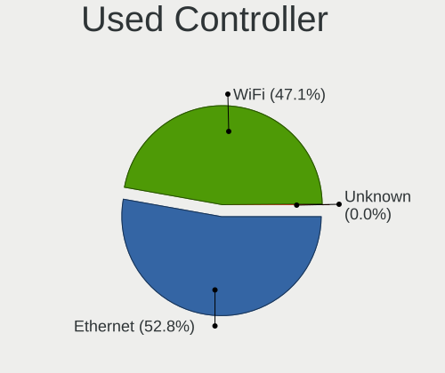

| Kind     | Computers | Percent |
|----------|-----------|---------|
| Ethernet | 18698     | 52.81%  |
| WiFi     | 16661     | 47.06%  |
| Modem    | 47        | 0.13%   |
| Unknown  | 1         | 0.003%  |

NICs
----

Total network controllers on board

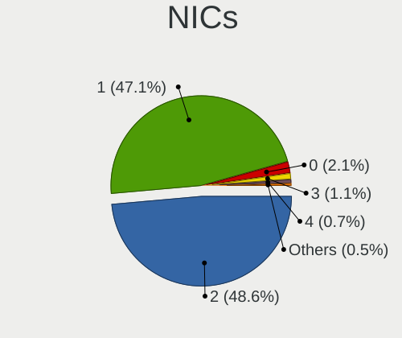

| Total | Computers | Percent |
|-------|-----------|---------|
| 2     | 17173     | 48.59%  |
| 1     | 16634     | 47.06%  |
| 0     | 727       | 2.06%   |
| 3     | 394       | 1.11%   |
| 4     | 242       | 0.68%   |
| 6     | 80        | 0.23%   |
| 8     | 40        | 0.11%   |
| 5     | 20        | 0.06%   |
| 10    | 11        | 0.03%   |
| 7     | 7         | 0.02%   |
| 12    | 6         | 0.02%   |
| 11    | 3         | 0.01%   |
| 9     | 3         | 0.01%   |
| 33    | 1         | 0.003%  |
| 20    | 1         | 0.003%  |
| 13    | 1         | 0.003%  |

IPv6
----

IPv6 vs IPv4

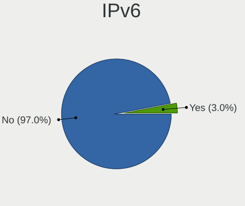

| Used | Computers | Percent |
|------|-----------|---------|
| No   | 34311     | 96.97%  |
| Yes  | 1072      | 3.03%   |

Bluetooth
---------

Bluetooth Vendor
----------------

Controller vendors

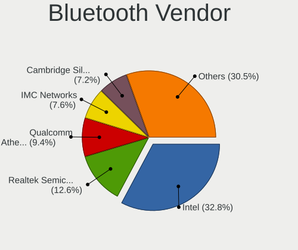

| Vendor                          | Computers | Percent |
|---------------------------------|-----------|---------|
| Intel                           | 5575      | 32.79%  |
| Realtek Semiconductor           | 2141      | 12.59%  |
| Qualcomm Atheros Communications | 1593      | 9.37%   |
| IMC Networks                    | 1288      | 7.58%   |
| Cambridge Silicon Radio         | 1218      | 7.16%   |
| Foxconn / Hon Hai               | 895       | 5.26%   |
| Broadcom                        | 895       | 5.26%   |
| Lite-On Technology              | 836       | 4.92%   |
| ASUSTek Computer                | 438       | 2.58%   |
| Apple                           | 268       | 1.58%   |
| Realtek                         | 253       | 1.49%   |
| Ralink                          | 234       | 1.38%   |
| MediaTek                        | 227       | 1.34%   |
| Foxconn International           | 191       | 1.12%   |
| Toshiba                         | 171       | 1.01%   |
| Hewlett-Packard                 | 160       | 0.94%   |
| Dell                            | 128       | 0.75%   |
| TP-Link                         | 82        | 0.48%   |
| Alps Electric                   | 77        | 0.45%   |
| Ralink Technology               | 48        | 0.28%   |
| Opticis                         | 45        | 0.26%   |
| Integrated System Solution      | 37        | 0.22%   |
| Unknown                         | 31        | 0.18%   |
| Chicony Electronics             | 29        | 0.17%   |
| Actions                         | 25        | 0.15%   |
| Micro Star International        | 19        | 0.11%   |
| USI                             | 16        | 0.09%   |
| Conwise Technology              | 11        | 0.06%   |
| SiW                             | 10        | 0.06%   |
| Askey Computer                  | 8         | 0.05%   |
| Taiyo Yuden                     | 7         | 0.04%   |
| Roper                           | 6         | 0.04%   |
| HTC (High Tech Computer)        | 6         | 0.04%   |
| Qcom                            | 5         | 0.03%   |
| Marvell Semiconductor           | 4         | 0.02%   |
| Logitech                        | 4         | 0.02%   |
| D-Link System                   | 4         | 0.02%   |
| Fujitsu                         | 3         | 0.02%   |
| Edimax Technology               | 3         | 0.02%   |
| Samsung Electronics             | 2         | 0.01%   |

Bluetooth Model
---------------

Controller models

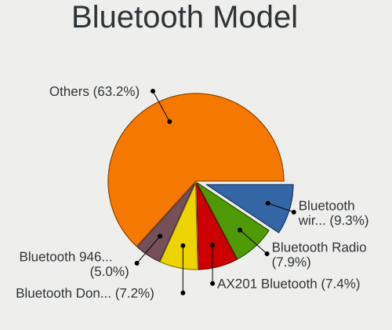

| Model                                               | Computers | Percent |
|-----------------------------------------------------|-----------|---------|
| Intel Bluetooth wireless interface                  | 1587      | 9.33%   |
| Realtek Bluetooth Radio                             | 1345      | 7.9%    |
| Intel AX201 Bluetooth                               | 1258      | 7.39%   |
| Cambridge Silicon Radio Bluetooth Dongle (HCI mode) | 1218      | 7.16%   |
| Intel Bluetooth 9460/9560 Jefferson Peak (JfP)      | 849       | 4.99%   |
| Intel AX200 Bluetooth                               | 541       | 3.18%   |
| Qualcomm Atheros  Bluetooth Device                  | 490       | 2.88%   |
| Qualcomm Atheros AR3011 Bluetooth                   | 485       | 2.85%   |
| IMC Networks Bluetooth Radio                        | 430       | 2.53%   |
| Realtek  Bluetooth 4.2 Adapter                      | 410       | 2.41%   |
| Intel Bluetooth Device                              | 354       | 2.08%   |
| Qualcomm Atheros AR3012 Bluetooth 4.0               | 323       | 1.9%    |
| Foxconn / Hon Hai Bluetooth Device                  | 303       | 1.78%   |
| Intel Wireless-AC 3168 Bluetooth                    | 281       | 1.65%   |
| IMC Networks Wireless_Device                        | 272       | 1.6%    |
| Realtek Bluetooth Radio                             | 253       | 1.49%   |
| IMC Networks Bluetooth Device                       | 247       | 1.45%   |
| Intel AX210 Bluetooth                               | 241       | 1.42%   |
| Ralink RT3290 Bluetooth                             | 234       | 1.38%   |
| MediaTek Wireless_Device                            | 211       | 1.24%   |
| Lite-On Qualcomm Atheros QCA9377 Bluetooth          | 208       | 1.22%   |
| Lite-On Atheros AR3012 Bluetooth                    | 197       | 1.16%   |
| Lite-On Bluetooth Device                            | 193       | 1.13%   |
| Foxconn International BCM43142A0 Bluetooth module   | 188       | 1.1%    |
| Intel Centrino Bluetooth Wireless Transceiver       | 186       | 1.09%   |
| Intel Centrino Advanced-N 6230 Bluetooth adapter    | 177       | 1.04%   |
| IMC Networks Atheros AR3012 Bluetooth 4.0 Adapter   | 171       | 1%      |
| Apple Bluetooth Host Controller                     | 134       | 0.79%   |
| Realtek RTL8723B Bluetooth                          | 125       | 0.73%   |
| Broadcom BCM2070 Bluetooth Device                   | 125       | 0.73%   |
| Foxconn / Hon Hai Wireless_Device                   | 124       | 0.73%   |
| Broadcom BCM2070 Bluetooth 2.1 + EDR                | 122       | 0.72%   |
| Broadcom BCM2045 Bluetooth                          | 112       | 0.66%   |
| Intel Wireless-AC 9260 Bluetooth Adapter            | 105       | 0.62%   |
| Qualcomm Atheros Bluetooth                          | 85        | 0.5%    |
| ASUS Broadcom BCM20702A0 Bluetooth                  | 83        | 0.49%   |
| TP-Link TP-T@- UB500 Adapter                        | 82        | 0.48%   |
| Lite-On Broadcom BCM43142A0 Bluetooth Device        | 81        | 0.48%   |
| Foxconn / Hon Hai Broadcom Bluetooth 2.1 Device     | 81        | 0.48%   |
| Broadcom BCM2045B (BDC-2.1)                         | 81        | 0.48%   |

Sound
-----

Sound Vendor
------------

Sound card vendors

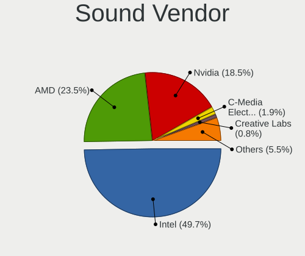

| Vendor                                       | Computers | Percent |
|----------------------------------------------|-----------|---------|
| Intel                                        | 23599     | 49.73%  |
| AMD                                          | 11156     | 23.51%  |
| Nvidia                                       | 8786      | 18.51%  |
| C-Media Electronics                          | 892       | 1.88%   |
| Creative Labs                                | 398       | 0.84%   |
| JMTek                                        | 201       | 0.42%   |
| Logitech                                     | 166       | 0.35%   |
| Creative Technology                          | 164       | 0.35%   |
| VIA Technologies                             | 150       | 0.32%   |
| Generalplus Technology                       | 148       | 0.31%   |
| Silicon Integrated Systems [SiS]             | 127       | 0.27%   |
| Texas Instruments                            | 112       | 0.24%   |
| ASUSTek Computer                             | 83        | 0.17%   |
| Lenovo                                       | 65        | 0.14%   |
| Micro Star International                     | 57        | 0.12%   |
| Unknown                                      | 53        | 0.11%   |
| Realtek Semiconductor                        | 50        | 0.11%   |
| Zoran Co. Personal Media Division (Nogatech) | 49        | 0.1%    |
| Razer USA                                    | 48        | 0.1%    |
| Plantronics                                  | 43        | 0.09%   |
| Kingston Technology                          | 43        | 0.09%   |
| KTMicro                                      | 40        | 0.08%   |
| GN Netcom                                    | 37        | 0.08%   |
| Focusrite-Novation                           | 36        | 0.08%   |
| fifine Microphones                           | 33        | 0.07%   |
| Yamaha                                       | 32        | 0.07%   |
| Sony                                         | 31        | 0.07%   |
| Jieli Technology                             | 30        | 0.06%   |
| SteelSeries ApS                              | 26        | 0.05%   |
| BEHRINGER International                      | 22        | 0.05%   |
| Samson Technologies                          | 21        | 0.04%   |
| Hewlett-Packard                              | 21        | 0.04%   |
| M-Audio                                      | 20        | 0.04%   |
| DSEA A/S                                     | 20        | 0.04%   |
| A4Tech                                       | 20        | 0.04%   |
| Nordic Semiconductor ASA                     | 18        | 0.04%   |
| XMOS                                         | 17        | 0.04%   |
| Thesycon Systemsoftware & Consulting         | 17        | 0.04%   |
| Huawei Technologies                          | 17        | 0.04%   |
| Apple                                        | 17        | 0.04%   |

Sound Model
-----------

Sound card models

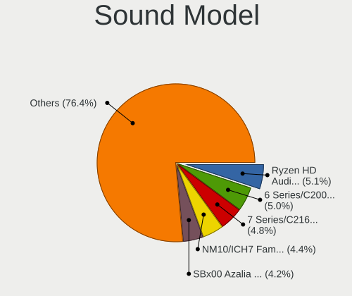

| Model                                                                      | Computers | Percent |
|----------------------------------------------------------------------------|-----------|---------|
| AMD Ryzen HD Audio Controller                                              | 2845      | 5.11%   |
| Intel 6 Series/C200 Series Chipset Family High Definition Audio Controller | 2802      | 5.03%   |
| Intel 7 Series/C216 Chipset Family High Definition Audio Controller        | 2700      | 4.85%   |
| Intel NM10/ICH7 Family High Definition Audio Controller                    | 2459      | 4.41%   |
| AMD SBx00 Azalia (Intel HDA)                                               | 2332      | 4.19%   |
| AMD FCH Azalia Controller                                                  | 1464      | 2.63%   |
| AMD Renoir/Cezanne HDMI/DP Audio Controller                                | 1403      | 2.52%   |
| Intel 8 Series/C220 Series Chipset High Definition Audio Controller        | 1370      | 2.46%   |
| Intel 5 Series/3400 Series Chipset High Definition Audio                   | 1185      | 2.13%   |
| Intel Sunrise Point-LP HD Audio                                            | 1173      | 2.11%   |
| Intel 82801I (ICH9 Family) HD Audio Controller                             | 1060      | 1.9%    |
| Nvidia GF108 High Definition Audio Controller                              | 987       | 1.77%   |
| Intel 100 Series/C230 Series Chipset Family HD Audio Controller            | 862       | 1.55%   |
| AMD Raven/Raven2/Fenghuang HDMI/DP Audio Controller                        | 831       | 1.49%   |
| Intel Xeon E3-1200 v3/4th Gen Core Processor HD Audio Controller           | 829       | 1.49%   |
| Intel Tiger Lake-LP Smart Sound Technology Audio Controller                | 746       | 1.34%   |
| Intel Cannon Lake PCH cAVS                                                 | 740       | 1.33%   |
| Nvidia High Definition Audio Controller                                    | 708       | 1.27%   |
| Nvidia GP107GL High Definition Audio Controller                            | 708       | 1.27%   |
| Intel 82801H (ICH8 Family) HD Audio Controller                             | 684       | 1.23%   |
| AMD Starship/Matisse HD Audio Controller                                   | 683       | 1.23%   |
| Intel 200 Series PCH HD Audio                                              | 658       | 1.18%   |
| Nvidia GK208 HDMI/DP Audio Controller                                      | 639       | 1.15%   |
| AMD Radeon High Definition Audio Controller                                | 600       | 1.08%   |
| AMD Oland/Hainan/Cape Verde/Pitcairn HDMI Audio [Radeon HD 7000 Series]    | 553       | 0.99%   |
| AMD Ellesmere HDMI Audio [Radeon RX 470/480 / 570/580/590]                 | 529       | 0.95%   |
| AMD Kabini HDMI/DP Audio                                                   | 520       | 0.93%   |
| AMD Family 17h (Models 00h-0fh) HD Audio Controller                        | 517       | 0.93%   |
| Intel Alder Lake PCH-P High Definition Audio Controller                    | 513       | 0.92%   |
| Intel 82801JI (ICH10 Family) HD Audio Controller                           | 492       | 0.88%   |
| Intel 8 Series HD Audio Controller                                         | 456       | 0.82%   |
| Intel Haswell-ULT HD Audio Controller                                      | 455       | 0.82%   |
| AMD Family 15h (Models 60h-6fh) Audio Controller                           | 449       | 0.81%   |
| Nvidia GK107 HDMI Audio Controller                                         | 432       | 0.78%   |
| Intel Atom Processor Z36xxx/Z37xxx Series High Definition Audio Controller | 424       | 0.76%   |
| Nvidia MCP61 High Definition Audio                                         | 423       | 0.76%   |
| Intel Celeron/Pentium Silver Processor High Definition Audio               | 413       | 0.74%   |
| Intel Cannon Point-LP High Definition Audio Controller                     | 390       | 0.7%    |
| Intel Smart Sound Technology (SST) Audio Controller                        | 389       | 0.7%    |
| AMD Trinity HDMI Audio Controller                                          | 365       | 0.66%   |

Memory
------

Memory Vendor
-------------

Memory module vendors

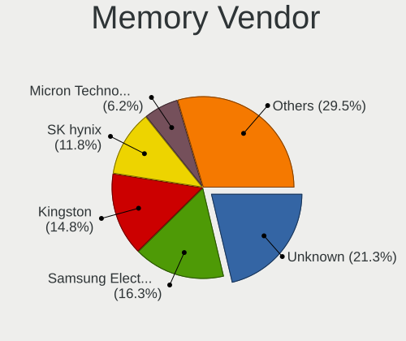

| Vendor                       | Computers | Percent |
|------------------------------|-----------|---------|
| Unknown                      | 7357      | 21.31%  |
| Samsung Electronics          | 5637      | 16.33%  |
| Kingston                     | 5121      | 14.83%  |
| SK hynix                     | 4058      | 11.75%  |
| Micron Technology            | 2152      | 6.23%   |
| Crucial                      | 1797      | 5.21%   |
| A-DATA Technology            | 800       | 2.32%   |
| AMD                          | 740       | 2.14%   |
| Corsair                      | 701       | 2.03%   |
| Elpida                       | 618       | 1.79%   |
| Patriot                      | 615       | 1.78%   |
| Nanya Technology             | 563       | 1.63%   |
| Ramaxel Technology           | 529       | 1.53%   |
| Unknown                      | 498       | 1.44%   |
| Unknown (ABCD)               | 238       | 0.69%   |
| Apacer                       | 234       | 0.68%   |
| G.Skill                      | 195       | 0.56%   |
| GOODRAM                      | 177       | 0.51%   |
| Foxline                      | 173       | 0.5%    |
| Goldkey                      | 151       | 0.44%   |
| ASint Technology             | 150       | 0.43%   |
| ACPI Digital                 | 105       | 0.3%    |
| Transcend                    | 101       | 0.29%   |
| Kingmax                      | 98        | 0.28%   |
| 48spaces                     | 94        | 0.27%   |
| Qumo                         | 93        | 0.27%   |
| Kllisre                      | 93        | 0.27%   |
| Silicon Power                | 80        | 0.23%   |
| Hewlett-Packard              | 77        | 0.22%   |
| Atermiter                    | 64        | 0.19%   |
| SHARETRONIC                  | 63        | 0.18%   |
| Unifosa                      | 59        | 0.17%   |
| Patriot Memory (PDP Systems) | 48        | 0.14%   |
| Qimonda                      | 47        | 0.14%   |
| ChangXin Memory              | 46        | 0.13%   |
| Hikvision                    | 41        | 0.12%   |
| GeIL                         | 40        | 0.12%   |
| Team                         | 37        | 0.11%   |
| KingSpec                     | 35        | 0.1%    |
| KETECH                       | 31        | 0.09%   |

Memory Model
------------

Memory module models

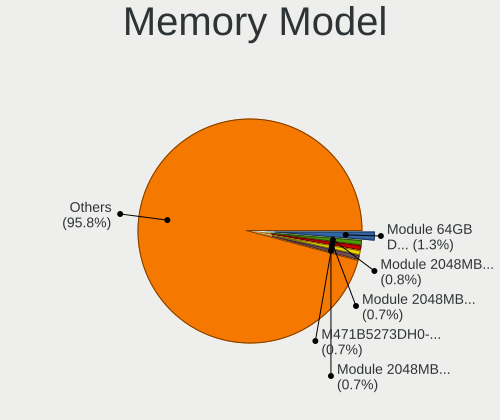

| Model                                                            | Computers | Percent |
|------------------------------------------------------------------|-----------|---------|
| Unknown                                                          | 498       | 1.29%   |
| Unknown RAM Module 2048MB DIMM DDR2 800MT/s                      | 294       | 0.76%   |
| Unknown RAM Module 2048MB DIMM SDRAM                             | 275       | 0.71%   |
| Samsung RAM M471B5273DH0-CH9 4GB SODIMM DDR3 1600MT/s            | 270       | 0.7%    |
| Unknown RAM Module 2048MB DIMM 800MT/s                           | 267       | 0.69%   |
| Unknown RAM Module 1024MB DIMM SDRAM                             | 226       | 0.59%   |
| Samsung RAM M471A5244CB0-CTD 4GB SODIMM DDR4 3266MT/s            | 218       | 0.57%   |
| Unknown RAM Module 2048MB DIMM 1333MT/s                          | 214       | 0.56%   |
| Unknown RAM Module 4096MB DIMM 1333MT/s                          | 210       | 0.55%   |
| Unknown RAM Module 1024MB DIMM DDR2 800MT/s                      | 191       | 0.5%    |
| Unknown (ABCD) RAM 123456789012345678 2GB SODIMM LPDDR4 2400MT/s | 181       | 0.47%   |
| Samsung RAM M471B5773CHS-CH9 2GB SODIMM DDR3 4199MT/s            | 174       | 0.45%   |
| Samsung RAM M471B5273CH0-CH9 4GB SODIMM DDR3 1334MT/s            | 164       | 0.43%   |
| Samsung RAM M471B5173DB0-YK0 4GB SODIMM DDR3 1600MT/s            | 163       | 0.42%   |
| Samsung RAM M471B5773DH0-CH9 2GB SODIMM DDR3 1600MT/s            | 157       | 0.41%   |
| Samsung RAM M471B5273DH0-CK0 4GB SODIMM DDR3 2400MT/s            | 155       | 0.4%    |
| SK hynix RAM HMT351S6CFR8C-PB 4GB SODIMM DDR3 1600MT/s           | 154       | 0.4%    |
| Samsung RAM M471A1K43EB1-CWE 8GB SODIMM DDR4 3200MT/s            | 150       | 0.39%   |
| Unknown RAM Module 2GB DIMM SDRAM                                | 149       | 0.39%   |
| Unknown RAM Module 1024MB DIMM 800MT/s                           | 144       | 0.37%   |
| Unknown RAM Module 1024MB DIMM DDR2 667MT/s                      | 140       | 0.36%   |
| SK hynix RAM HMT451S6BFR8A-PB 4GB SODIMM DDR3 1600MT/s           | 140       | 0.36%   |
| Samsung RAM M471B5173QH0-YK0 4GB SODIMM DDR3 1600MT/s            | 135       | 0.35%   |
| Samsung RAM M471B5173EB0-YK0 4GB SODIMM DDR3 1600MT/s            | 135       | 0.35%   |
| Unknown RAM Module 2GB DIMM DDR2 800MT/s                         | 134       | 0.35%   |
| Samsung RAM M471A5244CB0-CRC 4GB SODIMM DDR4 2667MT/s            | 127       | 0.33%   |
| Unknown RAM Module 2048MB SODIMM DDR2 667MT/s                    | 125       | 0.32%   |
| Unknown RAM Module 2048MB DIMM DDR2 667MT/s                      | 124       | 0.32%   |
| Unknown RAM Module 2048MB SODIMM DDR2                            | 117       | 0.3%    |
| Unknown RAM Module 4GB DIMM 1333MT/s                             | 116       | 0.3%    |
| SK hynix RAM HMT451S6AFR8A-PB 4GB SODIMM DDR3 1600MT/s           | 114       | 0.3%    |
| Kingston RAM KHX1600C9D3/4GX 4GB DIMM DDR3 1867MT/s              | 110       | 0.29%   |
| Elpida RAM EBJ41UF8BCS0-DJ-F 4GB SODIMM DDR3 1334MT/s            | 108       | 0.28%   |
| ACPI Digital RAM CMB6-DHDA1BAR08D00 16GB SODIMM DDR4 3200MT/s    | 105       | 0.27%   |
| SK hynix RAM HMT325S6CFR8C-PB 2GB SODIMM DDR3 1600MT/s           | 104       | 0.27%   |
| Unknown RAM Module 2GB DIMM 800MT/s                              | 101       | 0.26%   |
| Unknown RAM Module 2GB DIMM 1333MT/s                             | 99        | 0.26%   |
| Unknown RAM Module 1024MB SODIMM DDR2                            | 98        | 0.25%   |
| Unknown RAM Module 4096MB DIMM DDR3 1333MT/s                     | 97        | 0.25%   |
| SK hynix RAM HMA81GS6AFR8N-UH 8GB SODIMM DDR4 2667MT/s           | 96        | 0.25%   |

Memory Kind
-----------

Memory module kinds

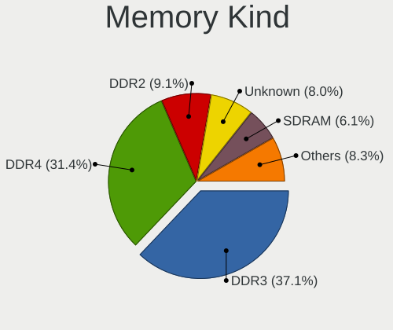

| Kind         | Computers | Percent |
|--------------|-----------|---------|
| DDR3         | 11236     | 37.09%  |
| DDR4         | 9521      | 31.43%  |
| DDR2         | 2769      | 9.14%   |
| Unknown      | 2430      | 8.02%   |
| SDRAM        | 1835      | 6.06%   |
| LPDDR4       | 737       | 2.43%   |
| DDR5         | 568       | 1.88%   |
| DDR          | 480       | 1.58%   |
| LPDDR5       | 338       | 1.12%   |
| DRAM         | 232       | 0.77%   |
| LPDDR3       | 136       | 0.45%   |
| EEPROM       | 3         | 0.01%   |
| RAM          | 2         | 0.01%   |
| EPROM        | 2         | 0.01%   |
| DDR2 FB-DIMM | 2         | 0.01%   |
| SRAM         | 1         | 0.003%  |

Memory Form Factor
------------------

Physical design of the memory module

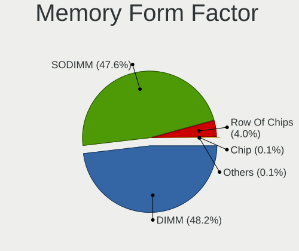

| Name         | Computers | Percent |
|--------------|-----------|---------|
| DIMM         | 14306     | 48.15%  |
| SODIMM       | 14133     | 47.57%  |
| Row Of Chips | 1191      | 4.01%   |
| Chip         | 40        | 0.13%   |
| FB-DIMM      | 20        | 0.07%   |
| Unknown      | 16        | 0.05%   |
| RIMM         | 3         | 0.01%   |

Memory Size
-----------

Memory module size

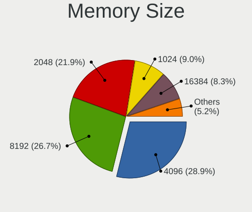

| Size    | Computers | Percent |
|---------|-----------|---------|
| 4096    | 9913      | 28.86%  |
| 8192    | 9187      | 26.75%  |
| 2048    | 7525      | 21.91%  |
| 1024    | 3091      | 9%      |
| 16384   | 2853      | 8.31%   |
| 32768   | 903       | 2.63%   |
| 512     | 586       | 1.71%   |
| 256     | 105       | 0.31%   |
| 65536   | 94        | 0.27%   |
| 3072    | 22        | 0.06%   |
| 1536    | 15        | 0.04%   |
| 49152   | 10        | 0.03%   |
| 12288   | 9         | 0.03%   |
| Unknown | 6         | 0.02%   |
| 32      | 5         | 0.01%   |
| 24576   | 4         | 0.01%   |
| 1       | 3         | 0.01%   |
| 131072  | 2         | 0.01%   |
| 6144    | 2         | 0.01%   |
| 128     | 2         | 0.01%   |
| 16      | 2         | 0.01%   |
| 258496  | 1         | 0.003%  |
| 129408  | 1         | 0.003%  |
| 98304   | 1         | 0.003%  |
| 12536   | 1         | 0.003%  |
| 11825   | 1         | 0.003%  |

Memory Speed
------------

Memory module speed

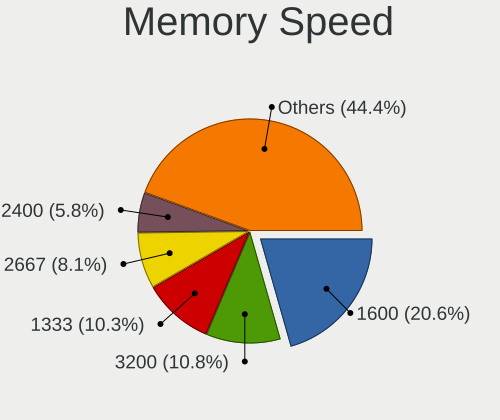

| Speed   | Computers | Percent |
|---------|-----------|---------|
| 1600    | 6831      | 20.6%   |
| 3200    | 3579      | 10.79%  |
| 1333    | 3404      | 10.26%  |
| 2667    | 2696      | 8.13%   |
| 2400    | 1916      | 5.78%   |
| Unknown | 1853      | 5.59%   |
| 800     | 1740      | 5.25%   |
| 667     | 1586      | 4.78%   |
| 1334    | 1280      | 3.86%   |
| 2133    | 1020      | 3.08%   |
| 3600    | 503       | 1.52%   |
| 1066    | 404       | 1.22%   |
| 4199    | 392       | 1.18%   |
| 1067    | 380       | 1.15%   |
| 1866    | 363       | 1.09%   |
| 533     | 343       | 1.03%   |
| 400     | 334       | 1.01%   |
| 1867    | 322       | 0.97%   |
| 3266    | 277       | 0.84%   |
| 4800    | 251       | 0.76%   |
| 3733    | 229       | 0.69%   |
| 2666    | 219       | 0.66%   |
| 6400    | 218       | 0.66%   |
| 333     | 204       | 0.62%   |
| 4267    | 203       | 0.61%   |
| 3400    | 191       | 0.58%   |
| 2933    | 191       | 0.58%   |
| 5600    | 180       | 0.54%   |
| 2048    | 140       | 0.42%   |
| 3000    | 139       | 0.42%   |
| 1800    | 121       | 0.36%   |
| 3466    | 96        | 0.29%   |
| 8400    | 81        | 0.24%   |
| 3333    | 76        | 0.23%   |
| 975     | 75        | 0.23%   |
| 7500    | 70        | 0.21%   |
| 2800    | 67        | 0.2%    |
| 266     | 67        | 0.2%    |
| 6000    | 61        | 0.18%   |
| 3800    | 58        | 0.17%   |

Printers & scanners
-------------------

Printer Vendor
--------------

Printer device vendors

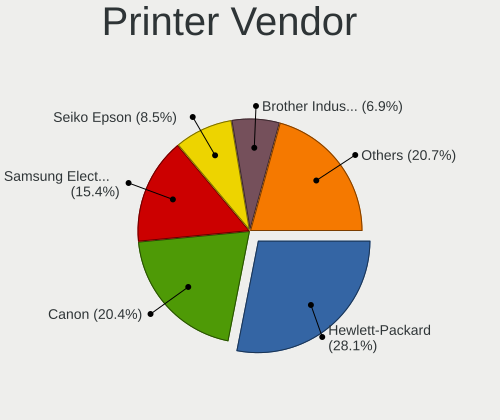

| Vendor                          | Computers | Percent |
|---------------------------------|-----------|---------|
| Hewlett-Packard                 | 454       | 28.08%  |
| Canon                           | 330       | 20.41%  |
| Samsung Electronics             | 249       | 15.4%   |
| Seiko Epson                     | 137       | 8.47%   |
| Brother Industries              | 112       | 6.93%   |
| Pantum                          | 75        | 4.64%   |
| Xerox                           | 67        | 4.14%   |
| Panasonic (Matsushita)          | 41        | 2.54%   |
| Kyocera                         | 39        | 2.41%   |
| Ricoh                           | 26        | 1.61%   |
| QinHeng Electronics             | 15        | 0.93%   |
| Prolific Technology             | 11        | 0.68%   |
| Lexmark International           | 8         | 0.49%   |
| Xiaomi                          | 6         | 0.37%   |
| STMicroelectronics              | 5         | 0.31%   |
| Custom Engineering SPA          | 5         | 0.31%   |
| NXP Semiconductors              | 4         | 0.25%   |
| Konica Minolta                  | 4         | 0.25%   |
| Zebra                           | 2         | 0.12%   |
| TSC Auto ID Technology          | 2         | 0.12%   |
| Sharp                           | 2         | 0.12%   |
| Samsung Info. Systems America   | 2         | 0.12%   |
| Oki Data                        | 2         | 0.12%   |
| HIPER                           | 2         | 0.12%   |
| Datamax-O'Neil                  | 2         | 0.12%   |
| cab Produkttechnik GmbH & Co KG | 2         | 0.12%   |
| Apple                           | 2         | 0.12%   |
| NCR                             | 1         | 0.06%   |
| MiiiW                           | 1         | 0.06%   |
| KODAK                           | 1         | 0.06%   |
| Katusha"                        | 1         | 0.06%   |
| Intermec Technologies           | 1         | 0.06%   |
| Index Braille AB                | 1         | 0.06%   |
| iDPRT                           | 1         | 0.06%   |
| GODEX INTERNATIONAL             | 1         | 0.06%   |
| Fuji Xerox                      | 1         | 0.06%   |
| CACTUS                          | 1         | 0.06%   |
| Avision                         | 1         | 0.06%   |

Printer Model
-------------

Printer device models

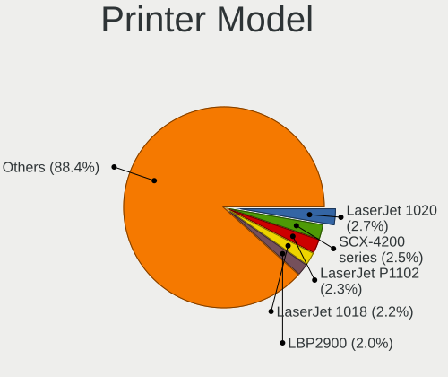

| Model                                                        | Computers | Percent |
|--------------------------------------------------------------|-----------|---------|
| HP LaserJet 1020                                             | 44        | 2.71%   |
| Samsung SCX-4200 series                                      | 40        | 2.46%   |
| HP LaserJet P1102                                            | 38        | 2.34%   |
| HP LaserJet 1018                                             | 35        | 2.15%   |
| Canon LBP2900                                                | 32        | 1.97%   |
| HP LaserJet 1010                                             | 26        | 1.6%    |
| HP LaserJet P1005                                            | 25        | 1.54%   |
| Canon MF4010 series                                          | 25        | 1.54%   |
| Samsung SCX-3400 Series                                      | 24        | 1.48%   |
| Panasonic (Matsushita) KX-MB1500RU                           | 24        | 1.48%   |
| Samsung M2070 Series                                         | 21        | 1.29%   |
| Seiko Epson Printer                                          | 20        | 1.23%   |
| Samsung SCX-3200 Series                                      | 20        | 1.23%   |
| Pantum P2200 series                                          | 19        | 1.17%   |
| Canon MF3010                                                 | 19        | 1.17%   |
| HP LaserJet 1320                                             | 18        | 1.11%   |
| HP DeskJet 2130 series                                       | 17        | 1.05%   |
| Canon MF4410                                                 | 17        | 1.05%   |
| HP LaserJet 1200                                             | 16        | 0.98%   |
| Seiko Epson USB2.0 Printer (Hi-speed)                        | 15        | 0.92%   |
| QinHeng CH340S                                               | 15        | 0.92%   |
| Canon LBP3010/LBP3018/LBP3050                                | 15        | 0.92%   |
| Samsung M2020 Series                                         | 14        | 0.86%   |
| Pantum M6500 series                                          | 14        | 0.86%   |
| Canon PIXMA MG2500 Series                                    | 14        | 0.86%   |
| Brother HL-1110 series                                       | 14        | 0.86%   |
| Seiko Epson L210 Series                                      | 13        | 0.8%    |
| Samsung ML-2010P Mono Laser Printer                          | 13        | 0.8%    |
| Samsung ML-1640 Series Laser Printer                         | 13        | 0.8%    |
| HP LaserJet 1022                                             | 13        | 0.8%    |
| Canon LBP6000                                                | 13        | 0.8%    |
| Samsung ML-1210 Printer                                      | 12        | 0.74%   |
| Panasonic (Matsushita) KX-MB2030 Multifunction Laser Printer | 12        | 0.74%   |
| Canon LiDE 300                                               | 12        | 0.74%   |
| Canon LBP810                                                 | 12        | 0.74%   |
| Brother DCP-7057 scanner/printer                             | 12        | 0.74%   |
| Prolific PL2305 Parallel Port                                | 11        | 0.68%   |
| HP LaserJet P2055 series                                     | 11        | 0.68%   |
| HP LaserJet 1300                                             | 11        | 0.68%   |
| Canon CAPT USB Device                                        | 11        | 0.68%   |

Scanner Vendor
--------------

Scanner device vendors

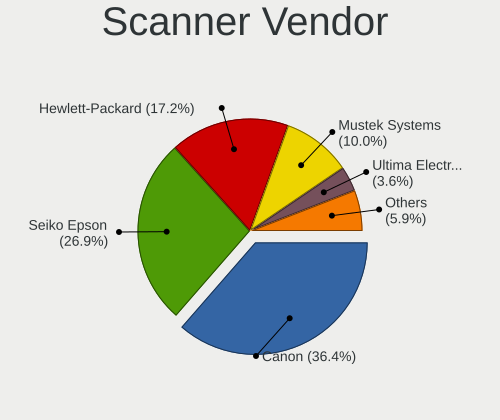

| Vendor                      | Computers | Percent |
|-----------------------------|-----------|---------|
| Canon                       | 142       | 36.41%  |
| Seiko Epson                 | 105       | 26.92%  |
| Hewlett-Packard             | 67        | 17.18%  |
| Mustek Systems              | 39        | 10%     |
| Ultima Electronics          | 14        | 3.59%   |
| Acer Peripherals (now BenQ) | 14        | 3.59%   |
| KYE Systems (Mouse Systems) | 5         | 1.28%   |
| Avision                     | 2         | 0.51%   |
| Plustek                     | 1         | 0.26%   |
| Canon Electronics           | 1         | 0.26%   |

Scanner Model
-------------

Scanner device models

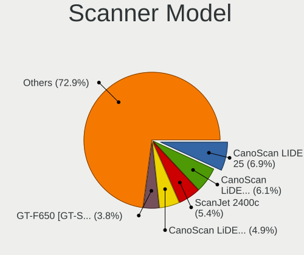

| Model                                                                                 | Computers | Percent |
|---------------------------------------------------------------------------------------|-----------|---------|
| Canon CanoScan LIDE 25                                                                | 27        | 6.91%   |
| Canon CanoScan LiDE 110                                                               | 24        | 6.14%   |
| HP ScanJet 2400c                                                                      | 21        | 5.37%   |
| Canon CanoScan LiDE 120                                                               | 19        | 4.86%   |
| Seiko Epson GT-F650 [GT-S600/Perfection V10/V100]                                     | 15        | 3.84%   |
| Ultima Artec Ultima 2000 (GT6801 based)/Lifetec LT9385/ScanMagic 1200 UB Plus Scanner | 13        | 3.32%   |
| Seiko Epson GT-F730 [GT-S630/Perfection V33/V330 Photo]                               | 12        | 3.07%   |
| Seiko Epson GT-7400U [Perfection 1270]                                                | 12        | 3.07%   |
| Mustek Systems BearPaw 1200 CU Plus                                                   | 12        | 3.07%   |
| Canon CanoScan LiDE 210                                                               | 12        | 3.07%   |
| Seiko Epson GT-F500/GT-F550 [Perfection 2480/2580 PHOTO]                              | 11        | 2.81%   |
| Canon CanoScan N670U/N676U/LiDE 20                                                    | 11        | 2.81%   |
| Canon CanoScan LiDE 60                                                                | 11        | 2.81%   |
| Seiko Epson GT-F520/GT-F570 [Perfection 3590 PHOTO]                                   | 9         | 2.3%    |
| Mustek Systems SNAPSCAN e22                                                           | 8         | 2.05%   |
| Seiko Epson GT-F670 [Perfection V200 Photo]                                           | 7         | 1.79%   |
| Mustek Systems BearPaw 2400 CU Plus                                                   | 7         | 1.79%   |
| Canon CanoScan LiDE 100                                                               | 7         | 1.79%   |
| Canon CanoScan LiDE 220                                                               | 6         | 1.53%   |
| Acer Peripherals (now BenQ) Benq 5560                                                 | 5         | 1.28%   |
| Seiko Epson Perfection V37/V370                                                       | 4         | 1.02%   |
| Seiko Epson GT-8400UF [Perfection 1670/1670 PHOTO]                                    | 4         | 1.02%   |
| HP Scanjet G2710                                                                      | 4         | 1.02%   |
| HP ScanJet 3800c                                                                      | 4         | 1.02%   |
| HP ScanJet 3770                                                                       | 4         | 1.02%   |
| HP Scanjet 200                                                                        | 4         | 1.02%   |
| HP HP Scanjet 300                                                                     | 4         | 1.02%   |
| Canon CanoScan N1240U/LiDE 30                                                         | 4         | 1.02%   |
| Canon CanoScan LiDE 70                                                                | 4         | 1.02%   |
| Seiko Epson Perfection 660                                                            | 3         | 0.77%   |
| Seiko Epson GT-X770 [Perfection V500]                                                 | 3         | 0.77%   |
| Seiko Epson GT-X750 [Perfection 4490 Photo]                                           | 3         | 0.77%   |
| Seiko Epson GT-9300UF [Perfection 2400 PHOTO]                                         | 3         | 0.77%   |
| Mustek Systems BearPaw 2448 TA Plus                                                   | 3         | 0.77%   |
| HP ScanJet 3970c                                                                      | 3         | 0.77%   |
| Canon CanoScan LiDE 50/LiDE 35/LiDE 40                                                | 3         | 0.77%   |
| Canon CanoScan LiDE 200                                                               | 3         | 0.77%   |
| Acer Peripherals (now BenQ) Benq 5000                                                 | 3         | 0.77%   |
| Seiko Epson GT-X800 [Perfection 4990 PHOTO]                                           | 2         | 0.51%   |
| Seiko Epson GT-F720 [GT-S620/Perfection V30/V300 Photo]                               | 2         | 0.51%   |

Camera
------

Camera Vendor
-------------

Camera device vendors

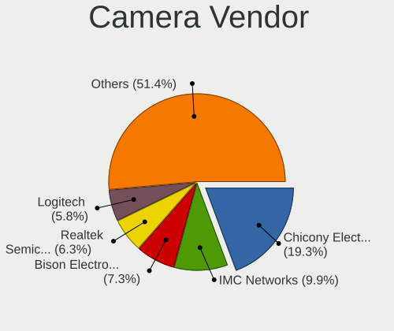

| Vendor                                 | Computers | Percent |
|----------------------------------------|-----------|---------|
| Chicony Electronics                    | 3658      | 19.35%  |
| IMC Networks                           | 1865      | 9.86%   |
| Bison Electronics                      | 1373      | 7.26%   |
| Realtek Semiconductor                  | 1197      | 6.33%   |
| Logitech                               | 1096      | 5.8%    |
| Microdia                               | 989       | 5.23%   |
| Sunplus Innovation Technology          | 927       | 4.9%    |
| Quanta                                 | 832       | 4.4%    |
| Suyin                                  | 766       | 4.05%   |
| Z-Star Microelectronics                | 650       | 3.44%   |
| Cheng Uei Precision Industry (Foxlink) | 512       | 2.71%   |
| Syntek                                 | 508       | 2.69%   |
| Silicon Motion                         | 506       | 2.68%   |
| Alcor Micro                            | 481       | 2.54%   |
| Apple                                  | 276       | 1.46%   |
| Luxvisions Innotech Limited            | 237       | 1.25%   |
| Lite-On Technology                     | 186       | 0.98%   |
| Sonix Technology                       | 174       | 0.92%   |
| SunplusIT                              | 157       | 0.83%   |
| Ricoh                                  | 154       | 0.81%   |
| Microsoft                              | 154       | 0.81%   |
| Acer                                   | 145       | 0.77%   |
| ALi                                    | 124       | 0.66%   |
| KYE Systems (Mouse Systems)            | 123       | 0.65%   |
| DigiTech                               | 98        | 0.52%   |
| GEMBIRD                                | 97        | 0.51%   |
| Arkmicro Technologies                  | 88        | 0.47%   |
| Shinetech                              | 81        | 0.43%   |
| Samsung Electronics                    | 78        | 0.41%   |
| Aveo Technology                        | 74        | 0.39%   |
| icSpring                               | 72        | 0.38%   |
| Cubeternet                             | 69        | 0.36%   |
| Creative Technology                    | 65        | 0.34%   |
| Pixart Imaging                         | 63        | 0.33%   |
| Lenovo                                 | 53        | 0.28%   |
| ShineOptics                            | 51        | 0.27%   |
| Unknown                                | 51        | 0.27%   |
| Primax Electronics                     | 46        | 0.24%   |
| A4Tech                                 | 44        | 0.23%   |
| Genesys Logic                          | 33        | 0.17%   |

Camera Model
------------

Camera device models

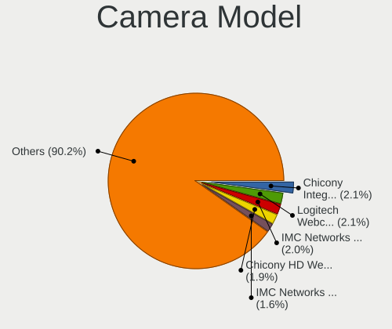

| Model                                | Computers | Percent |
|--------------------------------------|-----------|---------|
| Chicony Integrated Camera            | 406       | 2.14%   |
| Logitech Webcam C270                 | 399       | 2.1%    |
| IMC Networks USB2.0 HD UVC WebCam    | 374       | 1.97%   |
| Chicony HD WebCam                    | 366       | 1.93%   |
| IMC Networks USB2.0 VGA UVC WebCam   | 308       | 1.62%   |
| Chicony Lenovo EasyCamera            | 260       | 1.37%   |
| Bison Lenovo Integrated Webcam       | 260       | 1.37%   |
| IMC Networks Integrated Camera       | 235       | 1.24%   |
| Realtek USB Camera                   | 229       | 1.21%   |
| Syntek Integrated Camera             | 217       | 1.14%   |
| Microdia Integrated_Webcam_HD        | 215       | 1.13%   |
| Z-Star Venus USB2.0 Camera           | 198       | 1.04%   |
| Sunplus HD WebCam                    | 178       | 0.94%   |
| IMC Networks UVC VGA Webcam          | 177       | 0.93%   |
| Bison Integrated Camera              | 176       | 0.93%   |
| Chicony USB2.0 HD UVC WebCam         | 167       | 0.88%   |
| Bison Lenovo EasyCamera              | 163       | 0.86%   |
| Quanta ov9734_techfront_camera       | 161       | 0.85%   |
| Realtek Integrated_Webcam_HD         | 150       | 0.79%   |
| IMC Networks HD Camera               | 149       | 0.79%   |
| Chicony USB 2.0 Camera               | 143       | 0.75%   |
| Microdia Camera                      | 140       | 0.74%   |
| Chicony VGA Webcam                   | 139       | 0.73%   |
| Chicony HP Webcam                    | 137       | 0.72%   |
| Bison BisonCam, NB Pro               | 130       | 0.69%   |
| Bison BisonCam,NB Pro                | 129       | 0.68%   |
| Bison HD Webcam                      | 126       | 0.66%   |
| Z-Star A4 TECH USB 2.0 Camera J      | 123       | 0.65%   |
| Alcor Micro USB 2.0 Camera           | 123       | 0.65%   |
| Quanta VGA WebCam                    | 120       | 0.63%   |
| Realtek Lenovo EasyCamera            | 119       | 0.63%   |
| Chicony USB2.0 VGA UVC WebCam        | 118       | 0.62%   |
| Microdia USB 2.0 Camera              | 114       | 0.6%    |
| Apple iPhone 5/5C/5S/6/SE/7/8/X      | 110       | 0.58%   |
| Alcor Micro Asus Integrated Webcam   | 109       | 0.57%   |
| Sunplus Integrated_Webcam_HD         | 108       | 0.57%   |
| Sunplus Integrated Camera            | 103       | 0.54%   |
| Silicon Motion WebCam SC-0311139N    | 100       | 0.53%   |
| IMC Networks ov9734_azurewave_camera | 98        | 0.52%   |
| Syntek Lenovo EasyCamera             | 97        | 0.51%   |

Security
--------

Fingerprint Vendor
------------------

Fingerprint sensor vendors

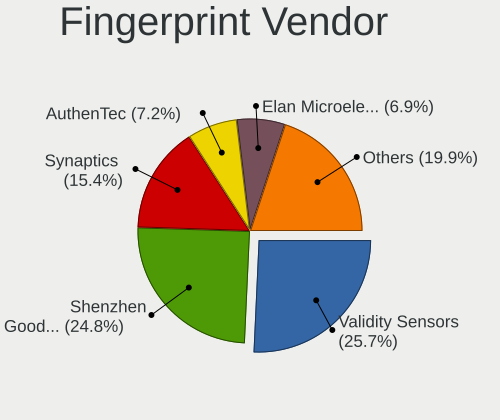

| Vendor                             | Computers | Percent |
|------------------------------------|-----------|---------|
| Validity Sensors                   | 574       | 25.73%  |
| Shenzhen Goodix Technology         | 553       | 24.79%  |
| Synaptics                          | 343       | 15.37%  |
| AuthenTec                          | 161       | 7.22%   |
| Elan Microelectronics              | 155       | 6.95%   |
| Upek                               | 145       | 6.5%    |
| LighTuning Technology              | 119       | 5.33%   |
| HOLTEK                             | 53        | 2.38%   |
| STMicroelectronics                 | 41        | 1.84%   |
| Focal-systems.Corp                 | 40        | 1.79%   |
| Realtek USB2.0 Finger Print Bridge | 32        | 1.43%   |
| GDMicroelectronics                 | 9         | 0.4%    |
| Microsoft                          | 2         | 0.09%   |
| Yamila                             | 1         | 0.04%   |
| Samsung Electronics                | 1         | 0.04%   |
| Next Biometrics                    | 1         | 0.04%   |
| DigitalPersona                     | 1         | 0.04%   |

Fingerprint Model
-----------------

Fingerprint sensor models

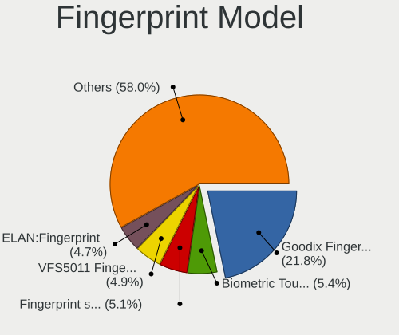

| Model                                                                      | Computers | Percent |
|----------------------------------------------------------------------------|-----------|---------|
| Shenzhen Goodix  Fingerprint Device                                        | 486       | 21.78%  |
| Upek Biometric Touchchip/Touchstrip Fingerprint Sensor                     | 121       | 5.42%   |
| Validity Sensors Fingerprint scanner                                       | 114       | 5.11%   |
| Validity Sensors VFS5011 Fingerprint Reader                                | 110       | 4.93%   |
| Elan ELAN:Fingerprint                                                      | 105       | 4.71%   |
| Validity Sensors VFS495 Fingerprint Reader                                 | 101       | 4.53%   |
| Synaptics Prometheus MIS Touch Fingerprint Reader                          | 98        | 4.39%   |
| Shenzhen Goodix Fingerprint Reader                                         | 56        | 2.51%   |
| HOLTEK FocalTech Fingerprint Device                                        | 53        | 2.38%   |
| LighTuning Fingerprint Reader                                              | 52        | 2.33%   |
| AuthenTec AES1600                                                          | 51        | 2.29%   |
| Elan ELAN:ARM-M4                                                           | 44        | 1.97%   |
| Synaptics Metallica MOH Touch Fingerprint Reader                           | 42        | 1.88%   |
| STMicroelectronics Fingerprint Reader                                      | 41        | 1.84%   |
| LighTuning EgisTec Touch Fingerprint Sensor                                | 40        | 1.79%   |
| Focal-systems.Corp FT9201Fingerprint.                                      | 40        | 1.79%   |
| AuthenTec AES2501 Fingerprint Sensor                                       | 40        | 1.79%   |
| Validity Sensors VFS491                                                    | 37        | 1.66%   |
| Validity Sensors VFS 5011 fingerprint sensor                               | 36        | 1.61%   |
| Validity Sensors VFS451 Fingerprint Reader                                 | 35        | 1.57%   |
| Synaptics Metallica MIS Touch Fingerprint Reader                           | 33        | 1.48%   |
| Realtek USB2.0 Finger Print Bridge FocalTech Fingerprint Device            | 32        | 1.43%   |
| Validity Sensors VFS471 Fingerprint Reader                                 | 29        | 1.3%    |
| Synaptics  WBDI                                                            | 29        | 1.3%    |
| AuthenTec AES2810                                                          | 29        | 1.3%    |
| Synaptics  FS7604 Touch Fingerprint Sensor with PurePrint                  | 26        | 1.17%   |
| Synaptics FS7604 Touch Fingerprint Sensor with PurePrint                   | 25        | 1.12%   |
| Upek TCS5B Fingerprint sensor                                              | 24        | 1.08%   |
| AuthenTec AES1660 Fingerprint Sensor                                       | 24        | 1.08%   |
| Validity Sensors VFS301 Fingerprint Reader                                 | 23        | 1.03%   |
| Synaptics Fingerprint reader [HP G6]                                       | 22        | 0.99%   |
| LighTuning ES603 Swipe Fingerprint Sensor                                  | 22        | 0.99%   |
| Validity Sensors Synaptics WBDI                                            | 21        | 0.94%   |
| Validity Sensors Synaptics VFS7552 Touch Fingerprint Sensor with PurePrint | 20        | 0.9%    |
| Synaptics UWP WBDI Device                                                  | 18        | 0.81%   |
| Synaptics WBDI Fingerprint Reader USB 086                                  | 17        | 0.76%   |
| Validity Sensors VFS101 Fingerprint Reader                                 | 13        | 0.58%   |
| Validity Sensors Swipe Fingerprint Sensor                                  | 13        | 0.58%   |
| Validity Sensors VFS7500 Touch Fingerprint Sensor                          | 12        | 0.54%   |
| Synaptics Prometheus Fingerprint Reader                                    | 12        | 0.54%   |

Chipcard Vendor
---------------

Chipcard module vendors

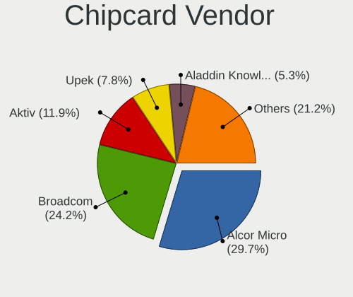

| Vendor                     | Computers | Percent |
|----------------------------|-----------|---------|
| Alcor Micro                | 140       | 29.66%  |
| Broadcom                   | 114       | 24.15%  |
| Aktiv                      | 56        | 11.86%  |
| Upek                       | 37        | 7.84%   |
| Aladdin Knowledge Systems  | 25        | 5.3%    |
| O2 Micro                   | 24        | 5.08%   |
| Aladdin R.D.               | 19        | 4.03%   |
| Lenovo                     | 18        | 3.81%   |
| Yubico.com                 | 12        | 2.54%   |
| Advanced Card Systems      | 8         | 1.69%   |
| Gemalto (was Gemplus)      | 7         | 1.48%   |
| Athena Smartcard Solutions | 4         | 0.85%   |
| NXP Semiconductors         | 2         | 0.42%   |
| Realtek Semiconductor      | 1         | 0.21%   |
| OmniKey                    | 1         | 0.21%   |
| OKB SAPR                   | 1         | 0.21%   |
| Microchip Technology       | 1         | 0.21%   |
| Feitian Technologies       | 1         | 0.21%   |
| Castles Technology         | 1         | 0.21%   |

Chipcard Model
--------------

Chipcard module models

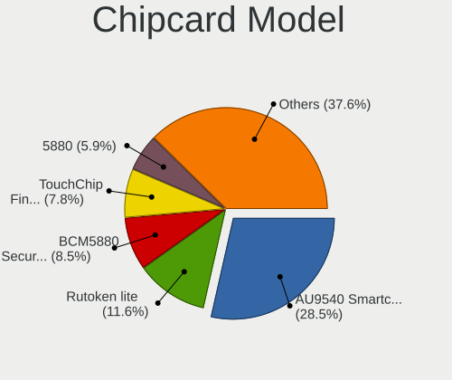

| Model                                                                        | Computers | Percent |
|------------------------------------------------------------------------------|-----------|---------|
| Alcor Micro AU9540 Smartcard Reader                                          | 135       | 28.54%  |
| Aktiv Rutoken lite                                                           | 55        | 11.63%  |
| Broadcom BCM5880 Secure Applications Processor                               | 40        | 8.46%   |
| Upek TouchChip Fingerprint Coprocessor (WBF advanced mode)                   | 37        | 7.82%   |
| Broadcom 5880                                                                | 28        | 5.92%   |
| Aladdin Knowledge Systems Token JC                                           | 25        | 5.29%   |
| Broadcom BCM58200 ControlVault 3 (FingerPrint sensor + Contacted SmartCard)  | 24        | 5.07%   |
| O2 Micro OZ776 CCID Smartcard Reader                                         | 20        | 4.23%   |
| Broadcom BCM5880 Secure Applications Processor with fingerprint swipe sensor | 20        | 4.23%   |
| Lenovo Integrated Smart Card Reader                                          | 18        | 3.81%   |
| Aladdin R.D. JaCarta                                                         | 14        | 2.96%   |
| Yubico.com Yubikey 4/5 U2F+CCID                                              | 11        | 2.33%   |
| O2 Micro Oz776 SmartCard Reader                                              | 4         | 0.85%   |
| Gemalto (was Gemplus) Compact Smart Card Reader Writer                       | 4         | 0.85%   |
| Athena Smartcard Solutions ASEDrive V3C                                      | 4         | 0.85%   |
| Alcor Micro Watchdata W 1981                                                 | 4         | 0.85%   |
| Broadcom 58200                                                               | 3         | 0.63%   |
| Aladdin R.D. JaCarta LT                                                      | 3         | 0.63%   |
| Advanced Card Systems ACR38 SmartCard Reader                                 | 3         | 0.63%   |
| Gemalto (was Gemplus) GemPC Key SmartCard Reader                             | 2         | 0.42%   |
| Aladdin R.D. Smart card reader JCR721                                        | 2         | 0.42%   |
| Advanced Card Systems ACR1281 1S Dual Reader                                 | 2         | 0.42%   |
| Yubico.com Yubikey 4/5 CCID                                                  | 1         | 0.21%   |
| Realtek Semiconductor Smart Card Reader Interface                            | 1         | 0.21%   |
| OmniKey Smart Card Reader USB                                                | 1         | 0.21%   |
| OKB SAPR Accord AMDZ GXM2 v.P                                                | 1         | 0.21%   |
| NXP Semiconductors PR533                                                     | 1         | 0.21%   |
| NXP Semiconductors PN7462au CCID                                             | 1         | 0.21%   |
| Microchip Technology SMSC USX101x Reader                                     | 1         | 0.21%   |
| Gemalto (was Gemplus) GemPC433-Swap                                          | 1         | 0.21%   |
| Feitian Technologies SCR301                                                  | 1         | 0.21%   |
| Castles Technology EZCCID Smart Card Reader                                  | 1         | 0.21%   |
| Alcor Micro EMV Smartcard Reader                                             | 1         | 0.21%   |
| Aktiv Reader                                                                 | 1         | 0.21%   |
| Advanced Card Systems Token USB 64K                                          | 1         | 0.21%   |
| Advanced Card Systems ACR39U                                                 | 1         | 0.21%   |
| Advanced Card Systems ACR3901U                                               | 1         | 0.21%   |

Unsupported
-----------

Unsupported Devices
-------------------

Total unsupported devices on board

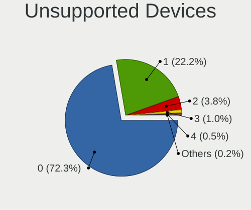

| Total | Computers | Percent |
|-------|-----------|---------|
| 0     | 26219     | 72.33%  |
| 1     | 8040      | 22.18%  |
| 2     | 1365      | 3.77%   |
| 3     | 356       | 0.98%   |
| 4     | 196       | 0.54%   |
| 5     | 36        | 0.1%    |
| 6     | 28        | 0.08%   |
| 7     | 3         | 0.01%   |
| 11    | 1         | 0.003%  |
| 10    | 1         | 0.003%  |
| 9     | 1         | 0.003%  |
| 8     | 1         | 0.003%  |

Unsupported Device Types
------------------------

Types of unsupported devices

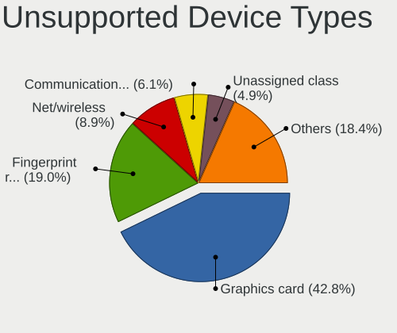

| Type                     | Computers | Percent |
|--------------------------|-----------|---------|
| Graphics card            | 5017      | 42.79%  |
| Fingerprint reader       | 2222      | 18.95%  |
| Net/wireless             | 1038      | 8.85%   |
| Communication controller | 719       | 6.13%   |
| Unassigned class         | 569       | 4.85%   |
| Multimedia controller    | 545       | 4.65%   |
| Bluetooth                | 370       | 3.16%   |
| Chipcard                 | 365       | 3.11%   |
| Camera                   | 253       | 2.16%   |
| Sound                    | 150       | 1.28%   |
| Net/ethernet             | 93        | 0.79%   |
| Storage                  | 89        | 0.76%   |
| Flash memory             | 73        | 0.62%   |
| Network                  | 43        | 0.37%   |
| Card reader              | 43        | 0.37%   |
| Modem                    | 33        | 0.28%   |
| Storage/raid             | 30        | 0.26%   |
| Dvb card                 | 26        | 0.22%   |
| Firewire controller      | 13        | 0.11%   |
| Storage/ide              | 11        | 0.09%   |
| Storage/ata              | 9         | 0.08%   |
| Tv card                  | 8         | 0.07%   |
| Unclassified device      | 2         | 0.02%   |
| Wireless                 | 1         | 0.01%   |
| Video                    | 1         | 0.01%   |
| Storage/nvme             | 1         | 0.01%   |

