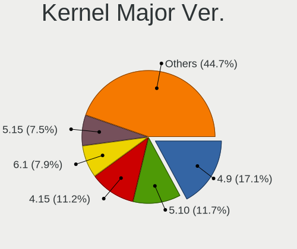
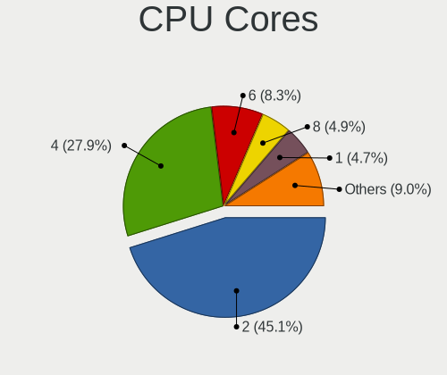
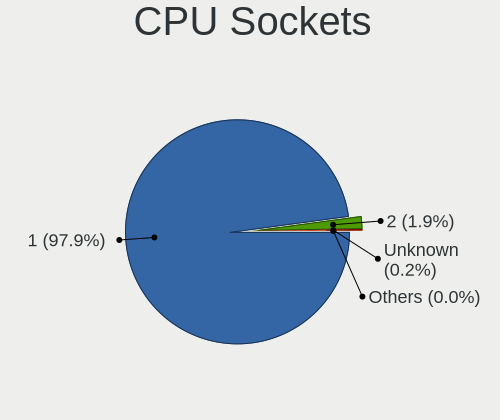
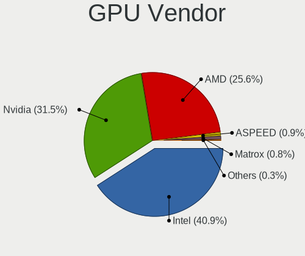
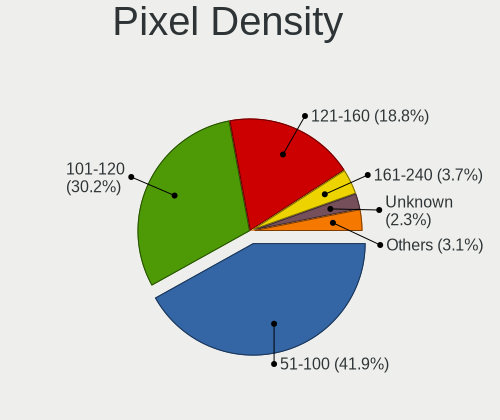

Linux in Russia - Tested Hardware & Statistics
----------------------------------------------

A project to collect tested hardware configurations for Linux in Russia.

Anyone can contribute to this report by the [hw-probe](https://github.com/linuxhw/hw-probe) tool:

    sudo -E hw-probe -all -upload

Please contribute! Especially if your hardware is rare.

This is a report for all computer types. See also reports for [desktops](/Location/Russia/Desktop/README.md) and [notebooks](/Location/Russia/Notebook/README.md).

Contents
--------

* [ Test Cases ](#test-cases)

* [ System ](#system)
  - [ OS                       ](#os)
  - [ OS Family                ](#os-family)
  - [ Kernel                   ](#kernel)
  - [ Kernel Family            ](#kernel-family)
  - [ Kernel Major Ver.        ](#kernel-major-ver)
  - [ Arch                     ](#arch)
  - [ DE                       ](#de)
  - [ Display Server           ](#display-server)
  - [ Display Manager          ](#display-manager)
  - [ OS Lang                  ](#os-lang)
  - [ Boot Mode                ](#boot-mode)
  - [ Filesystem               ](#filesystem)
  - [ Part. scheme             ](#part-scheme)
  - [ Dual Boot with Linux/BSD ](#dual-boot-with-linuxbsd)
  - [ Dual Boot (Win)          ](#dual-boot-win)

* [ Board ](#board)
  - [ Vendor                   ](#vendor)
  - [ Model                    ](#model)
  - [ Model Family             ](#model-family)
  - [ MFG Year                 ](#mfg-year)
  - [ Form Factor              ](#form-factor)
  - [ Secure Boot              ](#secure-boot)
  - [ Coreboot                 ](#coreboot)
  - [ RAM Size                 ](#ram-size)
  - [ RAM Used                 ](#ram-used)
  - [ Total Drives             ](#total-drives)
  - [ Has CD-ROM               ](#has-cd-rom)
  - [ Has Ethernet             ](#has-ethernet)
  - [ Has WiFi                 ](#has-wifi)
  - [ Has Bluetooth            ](#has-bluetooth)

* [ Location ](#location)
  - [ Country                  ](#country)
  - [ City                     ](#city)

* [ Drives ](#drives)
  - [ Drive Vendor             ](#drive-vendor)
  - [ Drive Model              ](#drive-model)
  - [ HDD Vendor               ](#hdd-vendor)
  - [ SSD Vendor               ](#ssd-vendor)
  - [ Drive Kind               ](#drive-kind)
  - [ Drive Connector          ](#drive-connector)
  - [ Drive Size               ](#drive-size)
  - [ Space Total              ](#space-total)
  - [ Space Used               ](#space-used)
  - [ Malfunc. Drives          ](#malfunc-drives)
  - [ Malfunc. Drive Vendor    ](#malfunc-drive-vendor)
  - [ Malfunc. HDD Vendor      ](#malfunc-hdd-vendor)
  - [ Malfunc. Drive Kind      ](#malfunc-drive-kind)
  - [ Failed Drives            ](#failed-drives)
  - [ Failed Drive Vendor      ](#failed-drive-vendor)
  - [ Drive Status             ](#drive-status)

* [ Storage controller ](#storage-controller)
  - [ Storage Vendor           ](#storage-vendor)
  - [ Storage Model            ](#storage-model)
  - [ Storage Kind             ](#storage-kind)

* [ Processor ](#processor)
  - [ CPU Vendor               ](#cpu-vendor)
  - [ CPU Model                ](#cpu-model)
  - [ CPU Model Family         ](#cpu-model-family)
  - [ CPU Cores                ](#cpu-cores)
  - [ CPU Sockets              ](#cpu-sockets)
  - [ CPU Threads              ](#cpu-threads)
  - [ CPU Op-Modes             ](#cpu-op-modes)
  - [ CPU Microcode            ](#cpu-microcode)
  - [ CPU Microarch            ](#cpu-microarch)

* [ Graphics ](#graphics)
  - [ GPU Vendor               ](#gpu-vendor)
  - [ GPU Model                ](#gpu-model)
  - [ GPU Combo                ](#gpu-combo)
  - [ GPU Driver               ](#gpu-driver)
  - [ GPU Memory               ](#gpu-memory)

* [ Monitor ](#monitor)
  - [ Monitor Vendor           ](#monitor-vendor)
  - [ Monitor Model            ](#monitor-model)
  - [ Monitor Resolution       ](#monitor-resolution)
  - [ Monitor Diagonal         ](#monitor-diagonal)
  - [ Monitor Width            ](#monitor-width)
  - [ Aspect Ratio             ](#aspect-ratio)
  - [ Monitor Area             ](#monitor-area)
  - [ Pixel Density            ](#pixel-density)
  - [ Multiple Monitors        ](#multiple-monitors)

* [ Network ](#network)
  - [ Net Controller Vendor    ](#net-controller-vendor)
  - [ Net Controller Model     ](#net-controller-model)
  - [ Wireless Vendor          ](#wireless-vendor)
  - [ Wireless Model           ](#wireless-model)
  - [ Ethernet Vendor          ](#ethernet-vendor)
  - [ Ethernet Model           ](#ethernet-model)
  - [ Net Controller Kind      ](#net-controller-kind)
  - [ Used Controller          ](#used-controller)
  - [ NICs                     ](#nics)
  - [ IPv6                     ](#ipv6)

* [ Bluetooth ](#bluetooth)
  - [ Bluetooth Vendor         ](#bluetooth-vendor)
  - [ Bluetooth Model          ](#bluetooth-model)

* [ Sound ](#sound)
  - [ Sound Vendor             ](#sound-vendor)
  - [ Sound Model              ](#sound-model)

* [ Memory ](#memory)
  - [ Memory Vendor            ](#memory-vendor)
  - [ Memory Model             ](#memory-model)
  - [ Memory Kind              ](#memory-kind)
  - [ Memory Form Factor       ](#memory-form-factor)
  - [ Memory Size              ](#memory-size)
  - [ Memory Speed             ](#memory-speed)

* [ Printers & scanners ](#printers--scanners)
  - [ Printer Vendor           ](#printer-vendor)
  - [ Printer Model            ](#printer-model)
  - [ Scanner Vendor           ](#scanner-vendor)
  - [ Scanner Model            ](#scanner-model)

* [ Camera ](#camera)
  - [ Camera Vendor            ](#camera-vendor)
  - [ Camera Model             ](#camera-model)

* [ Security ](#security)
  - [ Fingerprint Vendor       ](#fingerprint-vendor)
  - [ Fingerprint Model        ](#fingerprint-model)
  - [ Chipcard Vendor          ](#chipcard-vendor)
  - [ Chipcard Model           ](#chipcard-model)

* [ Unsupported ](#unsupported)
  - [ Unsupported Devices      ](#unsupported-devices)
  - [ Unsupported Device Types ](#unsupported-device-types)

Test Cases
----------

Total: 36979

| Vendor        | Model                       | Form-Factor | Probe                                                      | Date         |
|---------------|-----------------------------|-------------|------------------------------------------------------------|--------------|
| Supermicro    | H12SSW-NT                   | Server      | [8b83576100](https://linux-hardware.org/?probe=8b83576100) | Feb 28, 2023 |
| Supermicro    | H12SSW-NT                   | Server      | [c33e8fab03](https://linux-hardware.org/?probe=c33e8fab03) | Feb 28, 2023 |
| Supermicro    | H12SSW-NT                   | Server      | [2f3379adb9](https://linux-hardware.org/?probe=2f3379adb9) | Feb 28, 2023 |
| ASRock        | 760GM-HDV                   | Desktop     | [c420a55609](https://linux-hardware.org/?probe=c420a55609) | Feb 28, 2023 |
| ASRock        | B550M Steel Legend          | Desktop     | [8fd450db03](https://linux-hardware.org/?probe=8fd450db03) | Feb 28, 2023 |
| Acer          | AOHAPPY2                    | Notebook    | [9bbd271b36](https://linux-hardware.org/?probe=9bbd271b36) | Feb 28, 2023 |
| ASUSTek       | P8H61-M LE                  | Desktop     | [69713a19ea](https://linux-hardware.org/?probe=69713a19ea) | Feb 28, 2023 |
| HP            | ProLiant ML350 G5           | Desktop     | [073427bc3c](https://linux-hardware.org/?probe=073427bc3c) | Feb 28, 2023 |
| HP            | ProLiant ML350 Gen9         | Desktop     | [bbad31d175](https://linux-hardware.org/?probe=bbad31d175) | Feb 28, 2023 |
| Gigabyte      | A320M-S2H-CF                | Desktop     | [19fd766ea6](https://linux-hardware.org/?probe=19fd766ea6) | Feb 28, 2023 |
| ASUSTek       | V241DA                      | All in one  | [0779deca8b](https://linux-hardware.org/?probe=0779deca8b) | Feb 28, 2023 |
| Dell          | G15 5511                    | Notebook    | [1859d13517](https://linux-hardware.org/?probe=1859d13517) | Feb 28, 2023 |
| Graviton      | DMB-H610-TMI01              | All in one  | [4c3b90ede8](https://linux-hardware.org/?probe=4c3b90ede8) | Feb 28, 2023 |
| Clevo         | NL41MU2                     | Notebook    | [29df87f87f](https://linux-hardware.org/?probe=29df87f87f) | Feb 28, 2023 |
| ASUSTek       | P8B75-V                     | Desktop     | [17fcfc2758](https://linux-hardware.org/?probe=17fcfc2758) | Feb 28, 2023 |
| Aquarius      | AQB560M                     | Desktop     | [ee0c530562](https://linux-hardware.org/?probe=ee0c530562) | Feb 28, 2023 |
| AZW           | MINI S                      | Desktop     | [e65b0d1ef6](https://linux-hardware.org/?probe=e65b0d1ef6) | Feb 28, 2023 |
| HP            | 255 G2                      | Notebook    | [10397efd1b](https://linux-hardware.org/?probe=10397efd1b) | Feb 28, 2023 |
| Gigabyte      | P31-ES3G                    | Desktop     | [5ab1863f2b](https://linux-hardware.org/?probe=5ab1863f2b) | Feb 28, 2023 |
| Acer          | Aspire A315-59              | Notebook    | [9a897f5d7c](https://linux-hardware.org/?probe=9a897f5d7c) | Feb 28, 2023 |
| Gigabyte      | H61M-DS2                    | Desktop     | [49205269e7](https://linux-hardware.org/?probe=49205269e7) | Feb 28, 2023 |
| ASUSTek       | P8B75-V                     | Desktop     | [cf4c7357eb](https://linux-hardware.org/?probe=cf4c7357eb) | Feb 28, 2023 |
| TECNO         | MEGABOOK T1                 | Notebook    | [3d003c6d17](https://linux-hardware.org/?probe=3d003c6d17) | Feb 28, 2023 |
| Foxconn       | 2ABF                        | Desktop     | [d6eb6b4839](https://linux-hardware.org/?probe=d6eb6b4839) | Feb 28, 2023 |
| Graviton      | DMB-H610-TMI01              | All in one  | [98eee7b827](https://linux-hardware.org/?probe=98eee7b827) | Feb 28, 2023 |
| Sony          | VPCZ21Z9R                   | Notebook    | [4d3f0c27cd](https://linux-hardware.org/?probe=4d3f0c27cd) | Feb 28, 2023 |
| Acer          | Aspire A515-45G             | Notebook    | [5f8c1e2d90](https://linux-hardware.org/?probe=5f8c1e2d90) | Feb 28, 2023 |
| MSI           | MS-7210 100                 | Desktop     | [5cb2d5ea2c](https://linux-hardware.org/?probe=5cb2d5ea2c) | Feb 28, 2023 |
| MSI           | MS-7210 100                 | Desktop     | [a541b48e4d](https://linux-hardware.org/?probe=a541b48e4d) | Feb 28, 2023 |
| HP            | ProBook 430 G1              | Notebook    | [fa75658ee0](https://linux-hardware.org/?probe=fa75658ee0) | Feb 28, 2023 |
| Fujitsu       | LIFEBOOK E744               | Notebook    | [e331c5e257](https://linux-hardware.org/?probe=e331c5e257) | Feb 27, 2023 |
| Dell          | XPS 13 9380                 | Notebook    | [e888e1330d](https://linux-hardware.org/?probe=e888e1330d) | Feb 27, 2023 |
| Dell          | XPS 13 9380                 | Notebook    | [18fdb45ec1](https://linux-hardware.org/?probe=18fdb45ec1) | Feb 27, 2023 |
| ASRock        | X370 Professional Gaming    | Desktop     | [3a670fbd63](https://linux-hardware.org/?probe=3a670fbd63) | Feb 27, 2023 |
| MSI           | MPG B560I GAMING EDGE WI... | Desktop     | [882168458c](https://linux-hardware.org/?probe=882168458c) | Feb 27, 2023 |
| Gigabyte      | GA-970A-UD3                 | Desktop     | [e4bb117847](https://linux-hardware.org/?probe=e4bb117847) | Feb 27, 2023 |
| Gigabyte      | GA-970A-UD3                 | Desktop     | [732f6c8c00](https://linux-hardware.org/?probe=732f6c8c00) | Feb 27, 2023 |
| IBM           | 00D4062                     | Server      | [16c68a28d8](https://linux-hardware.org/?probe=16c68a28d8) | Feb 27, 2023 |
| MSI           | NF750-G55                   | Desktop     | [f279251ffa](https://linux-hardware.org/?probe=f279251ffa) | Feb 27, 2023 |
| ASUSTek       | P7H55                       | Desktop     | [394ad3d24f](https://linux-hardware.org/?probe=394ad3d24f) | Feb 27, 2023 |
| HUAWEI        | BOM-WXX9                    | Notebook    | [43a5dbf393](https://linux-hardware.org/?probe=43a5dbf393) | Feb 27, 2023 |
| Clevo         | NL41MU2                     | Notebook    | [b91dfc602e](https://linux-hardware.org/?probe=b91dfc602e) | Feb 27, 2023 |
| Timi          | RedmiBook Pro 15S           | Notebook    | [109a8e15c4](https://linux-hardware.org/?probe=109a8e15c4) | Feb 27, 2023 |
| Aquarius      | AQH310CM                    | Desktop     | [a2f4d0f77e](https://linux-hardware.org/?probe=a2f4d0f77e) | Feb 27, 2023 |
| Gigabyte      | B365M D2V                   | Desktop     | [aa39313621](https://linux-hardware.org/?probe=aa39313621) | Feb 27, 2023 |
| Supermicro    | H12SSW-NT                   | Server      | [efc03f8d68](https://linux-hardware.org/?probe=efc03f8d68) | Feb 27, 2023 |
| ASUSTek       | P8B75-V                     | Desktop     | [7a8e478900](https://linux-hardware.org/?probe=7a8e478900) | Feb 27, 2023 |
| Gigabyte      | B365M H                     | Desktop     | [dbb3e73c89](https://linux-hardware.org/?probe=dbb3e73c89) | Feb 27, 2023 |
| Dell          | 0Y5DDC A00                  | Desktop     | [e3090d9725](https://linux-hardware.org/?probe=e3090d9725) | Feb 27, 2023 |
| HP            | EliteBook 835 G8 Noteboo... | Notebook    | [aa26becbb1](https://linux-hardware.org/?probe=aa26becbb1) | Feb 27, 2023 |
| ASUSTek       | H61M-E                      | Desktop     | [ee5b36d127](https://linux-hardware.org/?probe=ee5b36d127) | Feb 27, 2023 |
| Lenovo        | IdeaPad 330-15ARR 81D2      | Notebook    | [b116afe451](https://linux-hardware.org/?probe=b116afe451) | Feb 27, 2023 |
| ASUSTek       | VivoBook_ASUSLaptop X513... | Notebook    | [d7e55bb97e](https://linux-hardware.org/?probe=d7e55bb97e) | Feb 27, 2023 |
| Samsung       | 350V5C/351V5C/3540VC/344... | Notebook    | [7936e7db49](https://linux-hardware.org/?probe=7936e7db49) | Feb 27, 2023 |
| Lenovo        | IdeaPad 5 Pro 14ACN6 82L... | Notebook    | [a2af33e0e3](https://linux-hardware.org/?probe=a2af33e0e3) | Feb 27, 2023 |
| Acer          | Aspire 3690                 | Notebook    | [c93af7d4eb](https://linux-hardware.org/?probe=c93af7d4eb) | Feb 27, 2023 |
| Acer          | Aspire 3690                 | Notebook    | [b119bda1a6](https://linux-hardware.org/?probe=b119bda1a6) | Feb 27, 2023 |
| Gigabyte      | B550M AORUS PRO             | Desktop     | [ffdac8fa88](https://linux-hardware.org/?probe=ffdac8fa88) | Feb 27, 2023 |
| Sony          | VPCSB2L1R                   | Notebook    | [6ed9bd210d](https://linux-hardware.org/?probe=6ed9bd210d) | Feb 26, 2023 |
| Apple         | MacBookAir7,1               | Notebook    | [2986fb12e2](https://linux-hardware.org/?probe=2986fb12e2) | Feb 26, 2023 |
| Lenovo        | ThinkPad E590 20NB0012RT    | Notebook    | [4c9bfc239a](https://linux-hardware.org/?probe=4c9bfc239a) | Feb 26, 2023 |
| HP            | Pavilion g6                 | Notebook    | [8d8e5bc41d](https://linux-hardware.org/?probe=8d8e5bc41d) | Feb 26, 2023 |
| HP            | 255 G3                      | Notebook    | [49dccf5753](https://linux-hardware.org/?probe=49dccf5753) | Feb 26, 2023 |
| Kllisre       | X79 V2.72S                  | Desktop     | [eb7e4b521c](https://linux-hardware.org/?probe=eb7e4b521c) | Feb 26, 2023 |
| ASUSTek       | PRIME B450M-K               | Desktop     | [575e6a8c55](https://linux-hardware.org/?probe=575e6a8c55) | Feb 26, 2023 |
| ASUSTek       | PRIME B250-PLUS             | Desktop     | [49b1cd5754](https://linux-hardware.org/?probe=49b1cd5754) | Feb 26, 2023 |
| ASUSTek       | Z97-K                       | Desktop     | [77a5832b3f](https://linux-hardware.org/?probe=77a5832b3f) | Feb 26, 2023 |
| HP            | ProBook 430 G1              | Notebook    | [1354e0b47e](https://linux-hardware.org/?probe=1354e0b47e) | Feb 26, 2023 |
| Acer          | AOHAPPY2                    | Notebook    | [830a1212b7](https://linux-hardware.org/?probe=830a1212b7) | Feb 26, 2023 |
| Lenovo        | ThinkPad T530 2392AQU       | Notebook    | [da19f23a14](https://linux-hardware.org/?probe=da19f23a14) | Feb 26, 2023 |
| Apple         | MacBookAir7,1               | Notebook    | [05c92ac080](https://linux-hardware.org/?probe=05c92ac080) | Feb 26, 2023 |
| MSI           | Z77A-G43                    | Desktop     | [2fe5c30b13](https://linux-hardware.org/?probe=2fe5c30b13) | Feb 26, 2023 |
| MSI           | Z77A-G43                    | Desktop     | [4b96538701](https://linux-hardware.org/?probe=4b96538701) | Feb 26, 2023 |
| Acer          | Extensa 2519                | Notebook    | [b80f0bc182](https://linux-hardware.org/?probe=b80f0bc182) | Feb 26, 2023 |
| Acer          | Extensa 2519                | Notebook    | [3ee3fea5eb](https://linux-hardware.org/?probe=3ee3fea5eb) | Feb 26, 2023 |
| ASRock        | 880GM-LE                    | Desktop     | [32366172e4](https://linux-hardware.org/?probe=32366172e4) | Feb 26, 2023 |
| ASUSTek       | ROG Zephyrus G15 GA503RW... | Notebook    | [848e43f7c3](https://linux-hardware.org/?probe=848e43f7c3) | Feb 26, 2023 |
| Lenovo        | ThinkPad E490 20N8000XRT    | Notebook    | [b9e64d9f86](https://linux-hardware.org/?probe=b9e64d9f86) | Feb 26, 2023 |
| eMachines     | Rhine V1.42                 | Notebook    | [c0c7b48991](https://linux-hardware.org/?probe=c0c7b48991) | Feb 26, 2023 |
| Unknown       | Intel X79                   | Desktop     | [0f7920afd6](https://linux-hardware.org/?probe=0f7920afd6) | Feb 26, 2023 |
| eMachines     | eME728                      | Notebook    | [2331984fc8](https://linux-hardware.org/?probe=2331984fc8) | Feb 26, 2023 |
| Sony          | VPCZ12V9R                   | Notebook    | [3014067c24](https://linux-hardware.org/?probe=3014067c24) | Feb 26, 2023 |
| realme        | RMNBXXXX                    | Notebook    | [6ea10cb77a](https://linux-hardware.org/?probe=6ea10cb77a) | Feb 26, 2023 |
| ASUSTek       | PRIME A320M-K               | Desktop     | [c204192a4b](https://linux-hardware.org/?probe=c204192a4b) | Feb 26, 2023 |
| ASUSTek       | Zenbook UX535QE_UM535QE     | Notebook    | [7d7953a826](https://linux-hardware.org/?probe=7d7953a826) | Feb 26, 2023 |
| Gigabyte      | H310M D3H                   | Desktop     | [058fac57c2](https://linux-hardware.org/?probe=058fac57c2) | Feb 25, 2023 |
| Acer          | Aspire A715-42G             | Notebook    | [c7ef2b6e58](https://linux-hardware.org/?probe=c7ef2b6e58) | Feb 25, 2023 |
| Unknown       | Unknown                     | Desktop     | [b4e0540b00](https://linux-hardware.org/?probe=b4e0540b00) | Feb 25, 2023 |
| Gigabyte      | GA-78LMT-USB3 R2 sex        | Desktop     | [585e02a6dc](https://linux-hardware.org/?probe=585e02a6dc) | Feb 25, 2023 |
| ASUSTek       | H81M-E                      | Desktop     | [25a3002df1](https://linux-hardware.org/?probe=25a3002df1) | Feb 25, 2023 |
| Dell          | Vostro 3501                 | Notebook    | [ed459712f6](https://linux-hardware.org/?probe=ed459712f6) | Feb 25, 2023 |
| Dell          | Latitude 5511               | Notebook    | [4402838fb3](https://linux-hardware.org/?probe=4402838fb3) | Feb 25, 2023 |
| Acer          | Aspire Z1-601               | All in one  | [dd0dffa557](https://linux-hardware.org/?probe=dd0dffa557) | Feb 25, 2023 |
| Hampoo        | I2W6_AP135 Reserved         | Notebook    | [c5cdb97c5b](https://linux-hardware.org/?probe=c5cdb97c5b) | Feb 25, 2023 |
| HUAWEI        | MACH-WX9                    | Notebook    | [52924074db](https://linux-hardware.org/?probe=52924074db) | Feb 25, 2023 |
| ASUSTek       | N53SM                       | Notebook    | [6606121f31](https://linux-hardware.org/?probe=6606121f31) | Feb 25, 2023 |
| Hampoo        | I2W6_AP135 Reserved         | Notebook    | [976a29944a](https://linux-hardware.org/?probe=976a29944a) | Feb 25, 2023 |
| MSI           | B350M PRO-VDH               | Desktop     | [748d109cb3](https://linux-hardware.org/?probe=748d109cb3) | Feb 24, 2023 |
| HP            | 1497                        | Desktop     | [ebf580cb5d](https://linux-hardware.org/?probe=ebf580cb5d) | Feb 24, 2023 |
| ASUSTek       | P5B                         | Desktop     | [60cb8319db](https://linux-hardware.org/?probe=60cb8319db) | Feb 24, 2023 |
| HONOR         | BMH-WCX9                    | Notebook    | [634b80ac90](https://linux-hardware.org/?probe=634b80ac90) | Feb 24, 2023 |
| Lenovo        | IdeaPad 3 15ADA05 81W1      | Notebook    | [a8a2fc9d83](https://linux-hardware.org/?probe=a8a2fc9d83) | Feb 24, 2023 |
| ASUSTek       | P5Q-EM                      | Desktop     | [3fef9c126a](https://linux-hardware.org/?probe=3fef9c126a) | Feb 24, 2023 |
| Lenovo        | ThinkPad X260 20F6S02A00    | Notebook    | [5ad40efe5c](https://linux-hardware.org/?probe=5ad40efe5c) | Feb 24, 2023 |
| ASRock        | 760GM-GS3                   | Desktop     | [5440ad3270](https://linux-hardware.org/?probe=5440ad3270) | Feb 24, 2023 |
| Lenovo        | G50-70 20351                | Notebook    | [8fa16a1dec](https://linux-hardware.org/?probe=8fa16a1dec) | Feb 24, 2023 |
| ASRock        | N68C-GS FX                  | Desktop     | [6b7b16645d](https://linux-hardware.org/?probe=6b7b16645d) | Feb 24, 2023 |
| HP            | EliteBook 845 14 inch G9... | Notebook    | [8a573735cb](https://linux-hardware.org/?probe=8a573735cb) | Feb 24, 2023 |
| Seeed Stud... | ODYSSEY-X86J4105 SD-BS-C... | Desktop     | [1989031eb6](https://linux-hardware.org/?probe=1989031eb6) | Feb 24, 2023 |
| ASUSTek       | P8H61-M LX R2.0             | Desktop     | [b410c9f493](https://linux-hardware.org/?probe=b410c9f493) | Feb 24, 2023 |
| HP            | Pavilion Gaming Laptop 1... | Notebook    | [9c0b9ff47a](https://linux-hardware.org/?probe=9c0b9ff47a) | Feb 24, 2023 |
| ASUSTek       | M2N-MX SE Plus              | Desktop     | [21aa20cd64](https://linux-hardware.org/?probe=21aa20cd64) | Feb 24, 2023 |
| Samsung       | N150P                       | Notebook    | [662488621d](https://linux-hardware.org/?probe=662488621d) | Feb 24, 2023 |
| Toshiba       | Satellite U300              | Notebook    | [d5973ad69a](https://linux-hardware.org/?probe=d5973ad69a) | Feb 24, 2023 |
| MSI           | Z170A PC MATE               | Desktop     | [5ee58b9271](https://linux-hardware.org/?probe=5ee58b9271) | Feb 24, 2023 |
| Dell          | G5 5587                     | Notebook    | [1f43871064](https://linux-hardware.org/?probe=1f43871064) | Feb 24, 2023 |
| HP            | ProBook 4545s               | Notebook    | [0f56422e2d](https://linux-hardware.org/?probe=0f56422e2d) | Feb 24, 2023 |
| Gigabyte      | B660M DS3H DDR4             | Desktop     | [4cddc9362b](https://linux-hardware.org/?probe=4cddc9362b) | Feb 23, 2023 |
| MSI           | B450M GAMING PLUS           | Desktop     | [accb966ada](https://linux-hardware.org/?probe=accb966ada) | Feb 23, 2023 |
| HUAWEI        | MACH-WX9                    | Notebook    | [fd61d34d74](https://linux-hardware.org/?probe=fd61d34d74) | Feb 23, 2023 |
| Acer          | Aspire ES1-132              | Notebook    | [386da062e2](https://linux-hardware.org/?probe=386da062e2) | Feb 23, 2023 |
| Acer          | AOHAPPY2                    | Notebook    | [a7a5e4b46c](https://linux-hardware.org/?probe=a7a5e4b46c) | Feb 23, 2023 |
| ASUSTek       | P5K                         | Desktop     | [f564dd9ac5](https://linux-hardware.org/?probe=f564dd9ac5) | Feb 23, 2023 |
| Gigabyte      | GA-970A-D3                  | Desktop     | [8b1222a755](https://linux-hardware.org/?probe=8b1222a755) | Feb 23, 2023 |
| Gigabyte      | G1.Sniper A88X-CF           | Desktop     | [cfe5ecec44](https://linux-hardware.org/?probe=cfe5ecec44) | Feb 23, 2023 |
| Gigabyte      | H61M-S1                     | Desktop     | [ca76e62a1e](https://linux-hardware.org/?probe=ca76e62a1e) | Feb 23, 2023 |
| ASUSTek       | VivoBook 15_ASUS Laptop ... | Notebook    | [e76bd912f8](https://linux-hardware.org/?probe=e76bd912f8) | Feb 23, 2023 |
| Unknown       | Unknown                     | Soc         | [bdba0a6f7a](https://linux-hardware.org/?probe=bdba0a6f7a) | Feb 23, 2023 |
| HP            | ProBook 440 G7              | Notebook    | [224a9e7278](https://linux-hardware.org/?probe=224a9e7278) | Feb 23, 2023 |
| HP            | ProBook 440 G7              | Notebook    | [618e46eb82](https://linux-hardware.org/?probe=618e46eb82) | Feb 23, 2023 |
| ASUSTek       | P5K                         | Desktop     | [1769888b2b](https://linux-hardware.org/?probe=1769888b2b) | Feb 23, 2023 |
| MSI           | G31TM-P21                   | Desktop     | [7d6e4cd766](https://linux-hardware.org/?probe=7d6e4cd766) | Feb 23, 2023 |
| Dell          | Latitude 7410               | Notebook    | [dfa449b870](https://linux-hardware.org/?probe=dfa449b870) | Feb 23, 2023 |
| ASUSTek       | X541SA                      | Notebook    | [59a1b07ad5](https://linux-hardware.org/?probe=59a1b07ad5) | Feb 23, 2023 |
| ASUSTek       | TUF Gaming X570-PLUS        | Desktop     | [640957cabe](https://linux-hardware.org/?probe=640957cabe) | Feb 23, 2023 |
| Valve         | Jupiter                     | Notebook    | [ed92b67969](https://linux-hardware.org/?probe=ed92b67969) | Feb 22, 2023 |
| ASUSTek       | PRIME H510M-K               | Desktop     | [3dab1052d4](https://linux-hardware.org/?probe=3dab1052d4) | Feb 22, 2023 |
| 3Logic Gro... | Graviton N15i-K2            | Notebook    | [564ecd80d9](https://linux-hardware.org/?probe=564ecd80d9) | Feb 22, 2023 |
| Unknown       | NF-CK804                    | Desktop     | [3dd6239815](https://linux-hardware.org/?probe=3dd6239815) | Feb 22, 2023 |
| MSI           | GF63 Thin 9RCX              | Notebook    | [87a9510543](https://linux-hardware.org/?probe=87a9510543) | Feb 22, 2023 |
| MSI           | MPG X570 GAMING EDGE WIF... | Desktop     | [feea587fef](https://linux-hardware.org/?probe=feea587fef) | Feb 22, 2023 |
| ASUSTek       | P7H55-M/USB3                | Desktop     | [472721d72c](https://linux-hardware.org/?probe=472721d72c) | Feb 22, 2023 |
| ASUSTek       | ZenBook UX333FN_UX333FN     | Notebook    | [25c5125cd9](https://linux-hardware.org/?probe=25c5125cd9) | Feb 22, 2023 |
| ASUSTek       | ASUS EXPERTBOOK B3402FBA... | Convertible | [cede8b490a](https://linux-hardware.org/?probe=cede8b490a) | Feb 22, 2023 |
| HP            | ENVY x360 Convertible 15... | Convertible | [85b2c3fb59](https://linux-hardware.org/?probe=85b2c3fb59) | Feb 22, 2023 |
| Acer          | Aspire V3-771               | Notebook    | [c56e36cd0e](https://linux-hardware.org/?probe=c56e36cd0e) | Feb 22, 2023 |
| ASUSTek       | P8H61-M LX3                 | Desktop     | [af3c7b2459](https://linux-hardware.org/?probe=af3c7b2459) | Feb 22, 2023 |
| ASUSTek       | P8B75-V                     | Desktop     | [fb050eaf3c](https://linux-hardware.org/?probe=fb050eaf3c) | Feb 22, 2023 |
| ASRock        | B450M Pro4                  | Desktop     | [f245e79c04](https://linux-hardware.org/?probe=f245e79c04) | Feb 22, 2023 |
| HP            | ProBook 640 G5              | Notebook    | [e90b71c2fd](https://linux-hardware.org/?probe=e90b71c2fd) | Feb 22, 2023 |
| Kraftway      | ACCORD                      | Notebook    | [8fe15f2f2b](https://linux-hardware.org/?probe=8fe15f2f2b) | Feb 22, 2023 |
| Lenovo        | ThinkPad T520 4242NS9       | Notebook    | [6e2e5c8285](https://linux-hardware.org/?probe=6e2e5c8285) | Feb 22, 2023 |
| ASRock        | B450M Pro4                  | Desktop     | [2e1d1c3117](https://linux-hardware.org/?probe=2e1d1c3117) | Feb 22, 2023 |
| Acer          | Aspire ES1-533              | Notebook    | [4a7563bd8e](https://linux-hardware.org/?probe=4a7563bd8e) | Feb 22, 2023 |
| MSI           | GF615M-P33                  | Desktop     | [c9cad5f4fa](https://linux-hardware.org/?probe=c9cad5f4fa) | Feb 22, 2023 |
| Toshiba       | Satellite A300D             | Notebook    | [fd0d9d5ba1](https://linux-hardware.org/?probe=fd0d9d5ba1) | Feb 22, 2023 |
| ASUSTek       | P8B75-M LE                  | Desktop     | [fa3e62fdef](https://linux-hardware.org/?probe=fa3e62fdef) | Feb 22, 2023 |
| ASRock        | AB350 Pro4                  | Desktop     | [aaad317fe4](https://linux-hardware.org/?probe=aaad317fe4) | Feb 22, 2023 |
| Chuwi         | CoreBook XPro               | Notebook    | [c1f8c947d4](https://linux-hardware.org/?probe=c1f8c947d4) | Feb 21, 2023 |
| HP            | EliteBook 840 G8 Noteboo... | Notebook    | [0e9172bdd5](https://linux-hardware.org/?probe=0e9172bdd5) | Feb 21, 2023 |
| HUAWEI        | CREM-WXX9                   | Notebook    | [643d79fd46](https://linux-hardware.org/?probe=643d79fd46) | Feb 21, 2023 |
| ASUSTek       | X551CAP                     | Notebook    | [1ed860d561](https://linux-hardware.org/?probe=1ed860d561) | Feb 21, 2023 |
| ASUSTek       | X556UQ                      | Notebook    | [8f645fa6fc](https://linux-hardware.org/?probe=8f645fa6fc) | Feb 21, 2023 |
| HP            | EliteBook 840 G8 Noteboo... | Notebook    | [adc356a0a8](https://linux-hardware.org/?probe=adc356a0a8) | Feb 21, 2023 |
| ASUSTek       | P8B75-V                     | Desktop     | [de56e36164](https://linux-hardware.org/?probe=de56e36164) | Feb 21, 2023 |
| Intel         | DH61CR AAG14064-204         | Desktop     | [f511e61852](https://linux-hardware.org/?probe=f511e61852) | Feb 21, 2023 |
| Lenovo        | ThinkCentre M91p 4524PL4    | Desktop     | [5cda5522e8](https://linux-hardware.org/?probe=5cda5522e8) | Feb 21, 2023 |
| Acer          | Aspire 7736                 | Notebook    | [479496a645](https://linux-hardware.org/?probe=479496a645) | Feb 21, 2023 |
| Acer          | Aspire V5-552PG             | Notebook    | [6030cc4d8a](https://linux-hardware.org/?probe=6030cc4d8a) | Feb 21, 2023 |
| Intel         | DH61CR AAG14064-204         | Desktop     | [eec6e2f905](https://linux-hardware.org/?probe=eec6e2f905) | Feb 21, 2023 |
| ASUSTek       | TUF Gaming FX505DT_FX505... | Notebook    | [21c2630c57](https://linux-hardware.org/?probe=21c2630c57) | Feb 21, 2023 |
| Lenovo        | ThinkBook 15 G3 ACL 21A4    | Notebook    | [a0faf74325](https://linux-hardware.org/?probe=a0faf74325) | Feb 21, 2023 |
| ASUSTek       | TUF Gaming FX505DT_FX505... | Notebook    | [d51436d679](https://linux-hardware.org/?probe=d51436d679) | Feb 21, 2023 |
| Gigabyte      | AORUS 17 XE4                | Notebook    | [b674e3e1e0](https://linux-hardware.org/?probe=b674e3e1e0) | Feb 21, 2023 |
| ASUSTek       | B75M-A                      | Desktop     | [c0c41ca089](https://linux-hardware.org/?probe=c0c41ca089) | Feb 21, 2023 |
| ASUSTek       | B75M-A                      | Desktop     | [2ea45a0d80](https://linux-hardware.org/?probe=2ea45a0d80) | Feb 21, 2023 |
| Dell          | 0TT740 A00                  | Server      | [2e77448a7d](https://linux-hardware.org/?probe=2e77448a7d) | Feb 21, 2023 |
| HUAWEI        | MRGF-XX                     | Notebook    | [1c61370063](https://linux-hardware.org/?probe=1c61370063) | Feb 21, 2023 |
| HP            | ProBook 430 G1              | Notebook    | [1505165a73](https://linux-hardware.org/?probe=1505165a73) | Feb 20, 2023 |
| ASUSTek       | TP300UA                     | Notebook    | [22ff7f5827](https://linux-hardware.org/?probe=22ff7f5827) | Feb 20, 2023 |
| HP            | Pavilion Notebook           | Notebook    | [caff81fa5f](https://linux-hardware.org/?probe=caff81fa5f) | Feb 20, 2023 |
| Apple         | MacBookAir7,1               | Notebook    | [5002433b97](https://linux-hardware.org/?probe=5002433b97) | Feb 20, 2023 |
| Samsung       | N102                        | Notebook    | [736977f523](https://linux-hardware.org/?probe=736977f523) | Feb 20, 2023 |
| ASUSTek       | Z97-K                       | Desktop     | [132a805814](https://linux-hardware.org/?probe=132a805814) | Feb 20, 2023 |
| ASUSTek       | Z97-K                       | Desktop     | [59931c7434](https://linux-hardware.org/?probe=59931c7434) | Feb 20, 2023 |
| Acer          | Extensa 2520G               | Notebook    | [823c5829a9](https://linux-hardware.org/?probe=823c5829a9) | Feb 20, 2023 |
| MSI           | A320M PRO-E                 | Desktop     | [3e441c86f1](https://linux-hardware.org/?probe=3e441c86f1) | Feb 20, 2023 |
| ASUSTek       | GL703VD                     | Notebook    | [5b0cf6bef1](https://linux-hardware.org/?probe=5b0cf6bef1) | Feb 20, 2023 |
| Haier         | A1410ED                     | Notebook    | [0188ad4a9b](https://linux-hardware.org/?probe=0188ad4a9b) | Feb 20, 2023 |
| Haier         | A1410ED                     | Notebook    | [0551c42cf8](https://linux-hardware.org/?probe=0551c42cf8) | Feb 20, 2023 |
| Graviton      | DMB-H610-TMI01              | All in one  | [e3156cc208](https://linux-hardware.org/?probe=e3156cc208) | Feb 20, 2023 |
| ASUSTek       | B85M-G                      | Desktop     | [501a95ac36](https://linux-hardware.org/?probe=501a95ac36) | Feb 20, 2023 |
| Huanan        | X99 F8D V2.2                | Desktop     | [c9d8617e08](https://linux-hardware.org/?probe=c9d8617e08) | Feb 20, 2023 |
| AMI           | Aptio CRB                   | Mini pc     | [5bcd20c966](https://linux-hardware.org/?probe=5bcd20c966) | Feb 20, 2023 |
| ASUSTek       | Zenbook UX535QE_UM535QE     | Notebook    | [e008fd489b](https://linux-hardware.org/?probe=e008fd489b) | Feb 20, 2023 |
| Gigabyte      | GA-78LMT-S2                 | Desktop     | [29758ea823](https://linux-hardware.org/?probe=29758ea823) | Feb 20, 2023 |
| Alienware     | 17                          | Notebook    | [848d5cd7e9](https://linux-hardware.org/?probe=848d5cd7e9) | Feb 20, 2023 |
| Intel         | X79M-S                      | Desktop     | [89ac8fc3ce](https://linux-hardware.org/?probe=89ac8fc3ce) | Feb 20, 2023 |
| ASUSTek       | P8H61-M LX3                 | Desktop     | [509f76c7ec](https://linux-hardware.org/?probe=509f76c7ec) | Feb 20, 2023 |
| ASUSTek       | M5A99FX PRO R2.0            | Desktop     | [45e185354c](https://linux-hardware.org/?probe=45e185354c) | Feb 20, 2023 |
| DNS           | MB40IA1                     | Notebook    | [9aaf027f52](https://linux-hardware.org/?probe=9aaf027f52) | Feb 20, 2023 |
| HUAWEI        | KLVD-WXX9                   | Notebook    | [d65b4290e6](https://linux-hardware.org/?probe=d65b4290e6) | Feb 19, 2023 |
| ASUSTek       | VivoBook_ASUSLaptop X571... | Notebook    | [c0032d4f0b](https://linux-hardware.org/?probe=c0032d4f0b) | Feb 19, 2023 |
| Gigabyte      | MRHM3AP                     | Desktop     | [9f4978d79f](https://linux-hardware.org/?probe=9f4978d79f) | Feb 19, 2023 |
| Gigabyte      | H61M-S1                     | Desktop     | [82ab7aabe2](https://linux-hardware.org/?probe=82ab7aabe2) | Feb 19, 2023 |
| AZW           | GK55                        | Desktop     | [e8376dbc54](https://linux-hardware.org/?probe=e8376dbc54) | Feb 19, 2023 |
| ASUSTek       | VivoBook_ASUSLaptop K650... | Notebook    | [b1d168b6ce](https://linux-hardware.org/?probe=b1d168b6ce) | Feb 19, 2023 |
| Intel         | NUC7JYB J67967-404          | Mini pc     | [6aa1dafa0d](https://linux-hardware.org/?probe=6aa1dafa0d) | Feb 19, 2023 |
| ASRock        | 870 Extreme3 R2.0           | Desktop     | [68c2299161](https://linux-hardware.org/?probe=68c2299161) | Feb 19, 2023 |
| Lenovo        | ThinkPad X260 20F6S02A00    | Notebook    | [aa5d23bc20](https://linux-hardware.org/?probe=aa5d23bc20) | Feb 19, 2023 |
| Timi          | Xiaomi Book Pro 14 2022     | Notebook    | [28e6263489](https://linux-hardware.org/?probe=28e6263489) | Feb 19, 2023 |
| Gigabyte      | P85-D3                      | Desktop     | [970f04658e](https://linux-hardware.org/?probe=970f04658e) | Feb 19, 2023 |
| Gigabyte      | P85-D3                      | Desktop     | [331f606733](https://linux-hardware.org/?probe=331f606733) | Feb 19, 2023 |
| ASRock        | AB350 Pro4                  | Desktop     | [0f1365d8d8](https://linux-hardware.org/?probe=0f1365d8d8) | Feb 19, 2023 |
| Dell          | 0Y5DDC A00                  | Desktop     | [87c921a93a](https://linux-hardware.org/?probe=87c921a93a) | Feb 19, 2023 |
| ASUSTek       | VivoBook 15_ASUS Laptop ... | Notebook    | [b27447bfa3](https://linux-hardware.org/?probe=b27447bfa3) | Feb 19, 2023 |
| MSI           | B85M-P33 V2                 | Desktop     | [b78aee1c5a](https://linux-hardware.org/?probe=b78aee1c5a) | Feb 19, 2023 |
| Gigabyte      | B550 AORUS ELITE V2         | Desktop     | [6eda9f2592](https://linux-hardware.org/?probe=6eda9f2592) | Feb 19, 2023 |
| HP            | Laptop 15s-eq1xxx           | Notebook    | [188489240c](https://linux-hardware.org/?probe=188489240c) | Feb 19, 2023 |
| ASUSTek       | M51Sn                       | Notebook    | [999f32a65f](https://linux-hardware.org/?probe=999f32a65f) | Feb 18, 2023 |
| Lenovo        | B590 20208                  | Notebook    | [59810216a8](https://linux-hardware.org/?probe=59810216a8) | Feb 18, 2023 |
| ASUSTek       | ROG STRIX B550-F GAMING     | Desktop     | [0c6f21a56e](https://linux-hardware.org/?probe=0c6f21a56e) | Feb 18, 2023 |
| ASUSTek       | P5Q SE2                     | Desktop     | [37b0d0609f](https://linux-hardware.org/?probe=37b0d0609f) | Feb 18, 2023 |
| HP            | ENVY x360 Convertible 15... | Convertible | [b42011554d](https://linux-hardware.org/?probe=b42011554d) | Feb 18, 2023 |
| Gigabyte      | H410M S2H                   | Desktop     | [bdb8c0094b](https://linux-hardware.org/?probe=bdb8c0094b) | Feb 18, 2023 |
| OEM           | Intel H81                   | Desktop     | [2dc44e8ff2](https://linux-hardware.org/?probe=2dc44e8ff2) | Feb 18, 2023 |
| ASRock        | B550M Steel Legend          | Desktop     | [b3c5c043ea](https://linux-hardware.org/?probe=b3c5c043ea) | Feb 18, 2023 |
| Lenovo        | Flex 2-14 20404             | Notebook    | [1fc2c6c2f5](https://linux-hardware.org/?probe=1fc2c6c2f5) | Feb 18, 2023 |
| ASRock        | B550M Steel Legend          | Desktop     | [1c1470c8a2](https://linux-hardware.org/?probe=1c1470c8a2) | Feb 18, 2023 |
| Intel         | DP965LT AAD41694-206        | Desktop     | [2744ec3c4a](https://linux-hardware.org/?probe=2744ec3c4a) | Feb 18, 2023 |
| Gigabyte      | B550 AORUS ELITE            | Desktop     | [13a132516b](https://linux-hardware.org/?probe=13a132516b) | Feb 18, 2023 |
| HP            | Notebook                    | Notebook    | [3eff638ead](https://linux-hardware.org/?probe=3eff638ead) | Feb 18, 2023 |
| ASUSTek       | H170 PRO GAMING             | Desktop     | [e85ff6e5c3](https://linux-hardware.org/?probe=e85ff6e5c3) | Feb 18, 2023 |
| Gigabyte      | MRHM3AP                     | Desktop     | [a427da167b](https://linux-hardware.org/?probe=a427da167b) | Feb 18, 2023 |
| HUAWEI        | BOM-WXX9                    | Notebook    | [6234395029](https://linux-hardware.org/?probe=6234395029) | Feb 18, 2023 |
| Samsung       | R519/R719                   | Notebook    | [17524cf177](https://linux-hardware.org/?probe=17524cf177) | Feb 18, 2023 |
| ASRock        | Z690 Pro RS                 | Desktop     | [68dcf39492](https://linux-hardware.org/?probe=68dcf39492) | Feb 18, 2023 |
| ASUSTek       | VivoBook_ASUSLaptop M150... | Notebook    | [f8dd8a7ee9](https://linux-hardware.org/?probe=f8dd8a7ee9) | Feb 18, 2023 |
| Acer          | TravelMate B118-M           | Notebook    | [f70df82711](https://linux-hardware.org/?probe=f70df82711) | Feb 18, 2023 |
| Biostar       | H61MLB                      | Desktop     | [b79584c7c9](https://linux-hardware.org/?probe=b79584c7c9) | Feb 18, 2023 |
| Acer          | Aspire A315-21              | Notebook    | [fe42379585](https://linux-hardware.org/?probe=fe42379585) | Feb 18, 2023 |
| MSI           | B450-A PRO MAX              | Desktop     | [13485dcee3](https://linux-hardware.org/?probe=13485dcee3) | Feb 18, 2023 |
| Acer          | AOHAPPY2                    | Notebook    | [1f71a1ad75](https://linux-hardware.org/?probe=1f71a1ad75) | Feb 18, 2023 |
| MSI           | MAG B550 TOMAHAWK           | Desktop     | [46289356fa](https://linux-hardware.org/?probe=46289356fa) | Feb 18, 2023 |
| Unknown       | Unknown                     | Notebook    | [ec840e7d97](https://linux-hardware.org/?probe=ec840e7d97) | Feb 18, 2023 |
| itel Mobil... | SPIRIT 2                    | Notebook    | [8c370ddf38](https://linux-hardware.org/?probe=8c370ddf38) | Feb 17, 2023 |
| OEM           | Unknown                     | Desktop     | [90c705ee6b](https://linux-hardware.org/?probe=90c705ee6b) | Feb 17, 2023 |
| Gigabyte      | G31M-S2L                    | Desktop     | [78e184862a](https://linux-hardware.org/?probe=78e184862a) | Feb 17, 2023 |
| Acer          | Aspire 5920G                | Notebook    | [f9000d049e](https://linux-hardware.org/?probe=f9000d049e) | Feb 17, 2023 |
| ASRock        | 970 Pro3 R2.0               | Desktop     | [55a53738ee](https://linux-hardware.org/?probe=55a53738ee) | Feb 17, 2023 |
| MSI           | Modern 14 B5M               | Notebook    | [d951f389f3](https://linux-hardware.org/?probe=d951f389f3) | Feb 17, 2023 |
| MSI           | B460M PRO-VDH               | Desktop     | [38f8f579be](https://linux-hardware.org/?probe=38f8f579be) | Feb 17, 2023 |
| ASUSTek       | K53SC                       | Notebook    | [df5351b94d](https://linux-hardware.org/?probe=df5351b94d) | Feb 17, 2023 |
| Graviton      | DMB-H610-TMI01              | All in one  | [243ef00f70](https://linux-hardware.org/?probe=243ef00f70) | Feb 17, 2023 |
| Dell          | Inspiron 5555               | Notebook    | [2051d9e516](https://linux-hardware.org/?probe=2051d9e516) | Feb 17, 2023 |
| MSI           | MAG B560 TOMAHAWK WIFI      | Desktop     | [6538791548](https://linux-hardware.org/?probe=6538791548) | Feb 17, 2023 |
| MSI           | MAG B560 TOMAHAWK WIFI      | Desktop     | [2da59271fe](https://linux-hardware.org/?probe=2da59271fe) | Feb 17, 2023 |
| MSI           | MPG X570 GAMING PLUS        | Desktop     | [0d5eded653](https://linux-hardware.org/?probe=0d5eded653) | Feb 17, 2023 |
| Lenovo        | B590 20208                  | Notebook    | [10e9491ee4](https://linux-hardware.org/?probe=10e9491ee4) | Feb 17, 2023 |
| ASUSTek       | VivoBook 15_ASUS Laptop ... | Notebook    | [9187251796](https://linux-hardware.org/?probe=9187251796) | Feb 17, 2023 |
| Lenovo        | B590 20208                  | Notebook    | [a3b352975c](https://linux-hardware.org/?probe=a3b352975c) | Feb 17, 2023 |
| ASUSTek       | P5G41-M LX                  | Desktop     | [0a174dcd20](https://linux-hardware.org/?probe=0a174dcd20) | Feb 17, 2023 |
| ASUSTek       | H110M-R                     | Desktop     | [bd6636c99d](https://linux-hardware.org/?probe=bd6636c99d) | Feb 17, 2023 |
| HP            | 18E7                        | Desktop     | [2c779d2395](https://linux-hardware.org/?probe=2c779d2395) | Feb 17, 2023 |
| Lenovo        | IdeaPad L340-15API 81LW     | Notebook    | [4d9144193f](https://linux-hardware.org/?probe=4d9144193f) | Feb 17, 2023 |
| Gigabyte      | B360M DS3H                  | Desktop     | [1ceaa9af7d](https://linux-hardware.org/?probe=1ceaa9af7d) | Feb 17, 2023 |
| iRU           | v1.0                        | Desktop     | [9d70818485](https://linux-hardware.org/?probe=9d70818485) | Feb 17, 2023 |
| Samsung       | R519/R719                   | Notebook    | [1dc4bc1b72](https://linux-hardware.org/?probe=1dc4bc1b72) | Feb 17, 2023 |
| ASRock        | 760GM-GS3                   | Desktop     | [88433e4e24](https://linux-hardware.org/?probe=88433e4e24) | Feb 16, 2023 |
| ASUSTek       | X555QG                      | Notebook    | [75924d49a1](https://linux-hardware.org/?probe=75924d49a1) | Feb 16, 2023 |
| HONOR         | BMH-WCX9                    | Notebook    | [c113bd50f3](https://linux-hardware.org/?probe=c113bd50f3) | Feb 16, 2023 |
| ASUSTek       | VivoBook 15_ASUS Laptop ... | Notebook    | [650a873a5a](https://linux-hardware.org/?probe=650a873a5a) | Feb 16, 2023 |
| Unknown       | Unknown                     | Notebook    | [7d36f8eee5](https://linux-hardware.org/?probe=7d36f8eee5) | Feb 16, 2023 |
| ASRock        | X370 Gaming X               | Desktop     | [cda38b5b9b](https://linux-hardware.org/?probe=cda38b5b9b) | Feb 16, 2023 |
| Gigabyte      | H410M S2 V3                 | Desktop     | [0dbeeea38c](https://linux-hardware.org/?probe=0dbeeea38c) | Feb 16, 2023 |
| ASUSTek       | P7H55-M SI                  | Desktop     | [387881f288](https://linux-hardware.org/?probe=387881f288) | Feb 16, 2023 |
| Timi          | RedmiBook Pro 14S           | Notebook    | [5c807c8516](https://linux-hardware.org/?probe=5c807c8516) | Feb 16, 2023 |
| Intel         | DP67BA AAG10219-300         | Desktop     | [8fc0c69640](https://linux-hardware.org/?probe=8fc0c69640) | Feb 16, 2023 |
| ASUSTek       | VivoBook 15_ASUS Laptop ... | Notebook    | [4b78132251](https://linux-hardware.org/?probe=4b78132251) | Feb 16, 2023 |
| ASUSTek       | H81T                        | Desktop     | [51aa090e9a](https://linux-hardware.org/?probe=51aa090e9a) | Feb 16, 2023 |
| Lenovo        | ThinkBook 15 G2 ARE 20VG    | Notebook    | [9de0373acc](https://linux-hardware.org/?probe=9de0373acc) | Feb 16, 2023 |
| Lenovo        | 31A7 NOK                    | Mini pc     | [17f1e0f135](https://linux-hardware.org/?probe=17f1e0f135) | Feb 16, 2023 |
| MSI           | G41M-P28                    | Desktop     | [85efceb14b](https://linux-hardware.org/?probe=85efceb14b) | Feb 16, 2023 |
| Lenovo        | ThinkBook 15 G4 IAP 21DJ    | Notebook    | [b30708ce75](https://linux-hardware.org/?probe=b30708ce75) | Feb 15, 2023 |
| Gigabyte      | A320M-S2H V2-CF             | Desktop     | [b19c73e236](https://linux-hardware.org/?probe=b19c73e236) | Feb 15, 2023 |
| ASUSTek       | TUF Z390-PLUS GAMING        | Desktop     | [ca54397755](https://linux-hardware.org/?probe=ca54397755) | Feb 15, 2023 |
| ASUSTek       | 1011PX                      | Notebook    | [f0f2625313](https://linux-hardware.org/?probe=f0f2625313) | Feb 15, 2023 |
| HUAWEI        | WRT-WX9                     | Notebook    | [13866e78a2](https://linux-hardware.org/?probe=13866e78a2) | Feb 15, 2023 |
| Lenovo        | IdeaPad 330-15IKB 81DC      | Notebook    | [b3d3904cef](https://linux-hardware.org/?probe=b3d3904cef) | Feb 15, 2023 |
| Gigabyte      | EP43-S3L                    | Desktop     | [82730ed699](https://linux-hardware.org/?probe=82730ed699) | Feb 15, 2023 |
| Clevo         | NL41MU2                     | Notebook    | [d15806c6c2](https://linux-hardware.org/?probe=d15806c6c2) | Feb 15, 2023 |
| Toshiba       | Satellite U300              | Notebook    | [3925a92635](https://linux-hardware.org/?probe=3925a92635) | Feb 15, 2023 |
| ASUSTek       | K53U                        | Notebook    | [e9a6a69e01](https://linux-hardware.org/?probe=e9a6a69e01) | Feb 15, 2023 |
| ASRock        | N68C-GS FX                  | Desktop     | [bc0fe319be](https://linux-hardware.org/?probe=bc0fe319be) | Feb 15, 2023 |
| ASUSTek       | Z170-PRO                    | Desktop     | [bd408485b0](https://linux-hardware.org/?probe=bd408485b0) | Feb 15, 2023 |
| ASRock        | Z77 Pro3                    | Desktop     | [095671c1c9](https://linux-hardware.org/?probe=095671c1c9) | Feb 15, 2023 |
| ASRock        | H61M-DGS                    | Desktop     | [9716d5ed72](https://linux-hardware.org/?probe=9716d5ed72) | Feb 15, 2023 |
| MSI           | MS-7357                     | Desktop     | [84cadfbabc](https://linux-hardware.org/?probe=84cadfbabc) | Feb 15, 2023 |
| ASUSTek       | PRIME B365M-K               | Desktop     | [20b88dda19](https://linux-hardware.org/?probe=20b88dda19) | Feb 15, 2023 |
| ASUSTek       | Zenbook UX535QE_UM535QE     | Notebook    | [138839541a](https://linux-hardware.org/?probe=138839541a) | Feb 15, 2023 |
| HP            | Pavilion Aero Laptop 13-... | Notebook    | [9606f5546e](https://linux-hardware.org/?probe=9606f5546e) | Feb 15, 2023 |
| Lenovo        | Yoga S740-14IIL 81RS        | Notebook    | [e2720c14b7](https://linux-hardware.org/?probe=e2720c14b7) | Feb 15, 2023 |
| HP            | Laptop 15-dw3xxx            | Notebook    | [5dbb939c28](https://linux-hardware.org/?probe=5dbb939c28) | Feb 15, 2023 |
| Dell          | 0Y5DDC A00                  | Desktop     | [261e3ca363](https://linux-hardware.org/?probe=261e3ca363) | Feb 15, 2023 |
| MSI           | Katana GF66 11SC            | Notebook    | [58fc28f34c](https://linux-hardware.org/?probe=58fc28f34c) | Feb 15, 2023 |
| MSI           | Z390-A PRO                  | Desktop     | [713f522b92](https://linux-hardware.org/?probe=713f522b92) | Feb 14, 2023 |
| Unknown       | X79A                        | Desktop     | [4cf2d15d70](https://linux-hardware.org/?probe=4cf2d15d70) | Feb 14, 2023 |
| ASUSTek       | UL30A                       | Notebook    | [90114a4fe4](https://linux-hardware.org/?probe=90114a4fe4) | Feb 14, 2023 |
| HP            | ProBook 440 G7              | Notebook    | [bc4811db07](https://linux-hardware.org/?probe=bc4811db07) | Feb 14, 2023 |
| ASUSTek       | P9X79                       | Desktop     | [d7f1d6a937](https://linux-hardware.org/?probe=d7f1d6a937) | Feb 14, 2023 |
| MAINBRD       | OPS62A-SHA                  | Desktop     | [a9267dffac](https://linux-hardware.org/?probe=a9267dffac) | Feb 14, 2023 |
| Gigabyte      | Z87-HD3                     | Desktop     | [e856a4629d](https://linux-hardware.org/?probe=e856a4629d) | Feb 14, 2023 |
| Gigabyte      | B450M H                     | Desktop     | [5ebd73227b](https://linux-hardware.org/?probe=5ebd73227b) | Feb 14, 2023 |
| Acer          | Aspire V5-572G              | Notebook    | [7f360258ff](https://linux-hardware.org/?probe=7f360258ff) | Feb 14, 2023 |
| ASRock        | AQH410T                     | Desktop     | [9ca03a8dcd](https://linux-hardware.org/?probe=9ca03a8dcd) | Feb 14, 2023 |
| Valve         | Jupiter                     | Notebook    | [0c496bbe9d](https://linux-hardware.org/?probe=0c496bbe9d) | Feb 14, 2023 |
| HP            | EliteBook 855 G8 Noteboo... | Notebook    | [1ebc6ae882](https://linux-hardware.org/?probe=1ebc6ae882) | Feb 14, 2023 |
| iRU           | P231                        | All in one  | [4aa7858493](https://linux-hardware.org/?probe=4aa7858493) | Feb 14, 2023 |
| Intel         | X99 V1.0                    | Desktop     | [0bfbfe2876](https://linux-hardware.org/?probe=0bfbfe2876) | Feb 14, 2023 |
| Dell          | G3 3579                     | Notebook    | [35c8b69b8c](https://linux-hardware.org/?probe=35c8b69b8c) | Feb 14, 2023 |
| Clevo         | NL41MU2                     | Notebook    | [516a173dcb](https://linux-hardware.org/?probe=516a173dcb) | Feb 14, 2023 |
| Gigabyte      | GA-990XA-UD3                | Desktop     | [da50295fcc](https://linux-hardware.org/?probe=da50295fcc) | Feb 14, 2023 |
| ICL           | RAYbook Si1512              | Notebook    | [d1565e917f](https://linux-hardware.org/?probe=d1565e917f) | Feb 14, 2023 |
| HP            | Pavilion Gaming Laptop 1... | Notebook    | [a3b0220b10](https://linux-hardware.org/?probe=a3b0220b10) | Feb 14, 2023 |
| ICL           | RAYbook Si1512              | Notebook    | [aba6ac482b](https://linux-hardware.org/?probe=aba6ac482b) | Feb 14, 2023 |
| Lenovo        | IdeaPad 5 Pro 14ACN6 82L... | Notebook    | [488e3928c6](https://linux-hardware.org/?probe=488e3928c6) | Feb 14, 2023 |
| ICL           | H410SB                      | Desktop     | [e994f10643](https://linux-hardware.org/?probe=e994f10643) | Feb 14, 2023 |
| Lenovo        | ThinkPad T14 Gen 1 20UD0... | Notebook    | [ac71e5b8ef](https://linux-hardware.org/?probe=ac71e5b8ef) | Feb 14, 2023 |
| Fujitsu       | LIFEBOOK A512               | Notebook    | [92cac1a802](https://linux-hardware.org/?probe=92cac1a802) | Feb 13, 2023 |
| Gigabyte      | B450M S2H                   | Desktop     | [2120a2f3b5](https://linux-hardware.org/?probe=2120a2f3b5) | Feb 13, 2023 |
| Gigabyte      | B450M DS3H V2               | Desktop     | [6338542845](https://linux-hardware.org/?probe=6338542845) | Feb 13, 2023 |
| ASUSTek       | GL703VD                     | Notebook    | [409d6e3cb3](https://linux-hardware.org/?probe=409d6e3cb3) | Feb 13, 2023 |
| Unknown       | X133                        | Notebook    | [537237c180](https://linux-hardware.org/?probe=537237c180) | Feb 13, 2023 |
| Acer          | Aspire E5-771G              | Notebook    | [d1abb191dd](https://linux-hardware.org/?probe=d1abb191dd) | Feb 13, 2023 |
| ASUSTek       | P7P55D-E EVO                | Desktop     | [f1ec250753](https://linux-hardware.org/?probe=f1ec250753) | Feb 13, 2023 |
| MSI           | PRO B660M-E DDR4            | Desktop     | [aab30259f8](https://linux-hardware.org/?probe=aab30259f8) | Feb 13, 2023 |
| Clevo         | NL41MU2                     | Notebook    | [2809288f6f](https://linux-hardware.org/?probe=2809288f6f) | Feb 13, 2023 |
| Samsung       | 300V3A/300V4A/300V5A/200... | Notebook    | [c72c5cf640](https://linux-hardware.org/?probe=c72c5cf640) | Feb 13, 2023 |
| Lenovo        | ThinkPad T14 Gen 1 20UD0... | Notebook    | [f701208fd4](https://linux-hardware.org/?probe=f701208fd4) | Feb 13, 2023 |
| Gigabyte      | H510M S2H V2                | Desktop     | [e3580e73af](https://linux-hardware.org/?probe=e3580e73af) | Feb 13, 2023 |
| Clevo         | NL41MU2                     | Notebook    | [56ecf82de8](https://linux-hardware.org/?probe=56ecf82de8) | Feb 13, 2023 |
| Lenovo        | ThinkBook 15 G3 ACL 21A4    | Notebook    | [55a63c3dce](https://linux-hardware.org/?probe=55a63c3dce) | Feb 13, 2023 |
| ASUSTek       | PRIME H510M-A               | Desktop     | [8583704242](https://linux-hardware.org/?probe=8583704242) | Feb 13, 2023 |
| Dell          | Latitude 7490               | Notebook    | [c3f07cbb13](https://linux-hardware.org/?probe=c3f07cbb13) | Feb 13, 2023 |
| ASUSTek       | X556UQ                      | Notebook    | [b2f1a951a1](https://linux-hardware.org/?probe=b2f1a951a1) | Feb 13, 2023 |
| Clevo         | NL41MU2                     | Notebook    | [95af064bd1](https://linux-hardware.org/?probe=95af064bd1) | Feb 13, 2023 |
| HP            | 895F                        | All in one  | [0c23df771f](https://linux-hardware.org/?probe=0c23df771f) | Feb 13, 2023 |
| ASUSTek       | 1011PX                      | Notebook    | [570fd77e58](https://linux-hardware.org/?probe=570fd77e58) | Feb 13, 2023 |
| HP            | ProBook 6470b               | Notebook    | [e747086309](https://linux-hardware.org/?probe=e747086309) | Feb 13, 2023 |
| MSI           | H97 GAMING 3                | Desktop     | [855634fadc](https://linux-hardware.org/?probe=855634fadc) | Feb 13, 2023 |
| Teclast       | F5                          | Convertible | [e62bdaaa3b](https://linux-hardware.org/?probe=e62bdaaa3b) | Feb 13, 2023 |
| Teclast       | F5                          | Convertible | [30e30a5c3e](https://linux-hardware.org/?probe=30e30a5c3e) | Feb 13, 2023 |
| Biostar       | A320MH                      | Desktop     | [d51405079c](https://linux-hardware.org/?probe=d51405079c) | Feb 13, 2023 |
| ASUSTek       | Zenbook UX535QE_UM535QE     | Notebook    | [3f25b64868](https://linux-hardware.org/?probe=3f25b64868) | Feb 13, 2023 |
| Acer          | Aspire C27-1655             | All in one  | [4fe6ca7f88](https://linux-hardware.org/?probe=4fe6ca7f88) | Feb 13, 2023 |
| ASUSTek       | X205TA                      | Notebook    | [dfc9ada1af](https://linux-hardware.org/?probe=dfc9ada1af) | Feb 13, 2023 |
| WeiBu         | Aptio CRB                   | Mini pc     | [183e716ff5](https://linux-hardware.org/?probe=183e716ff5) | Feb 13, 2023 |
| ASUSTek       | Zenbook UM5401QAB_UM5401... | Notebook    | [0560a363b8](https://linux-hardware.org/?probe=0560a363b8) | Feb 12, 2023 |
| MACHENIKE     | MACHCREATOR-16              | Notebook    | [cde8e637d2](https://linux-hardware.org/?probe=cde8e637d2) | Feb 12, 2023 |
| MACHENIKE     | MACHCREATOR-16              | Notebook    | [a3ac4db738](https://linux-hardware.org/?probe=a3ac4db738) | Feb 12, 2023 |
| Sony          | VPCX11Z6R                   | Notebook    | [ad87a45a26](https://linux-hardware.org/?probe=ad87a45a26) | Feb 12, 2023 |
| ASUSTek       | M2N-E SLI                   | Desktop     | [8bf6aedf43](https://linux-hardware.org/?probe=8bf6aedf43) | Feb 12, 2023 |
| Huanan        | X99 F8D V2.2                | Desktop     | [7b98ade6b1](https://linux-hardware.org/?probe=7b98ade6b1) | Feb 12, 2023 |
| ASRock        | B450M Pro4                  | Desktop     | [8f60713f8a](https://linux-hardware.org/?probe=8f60713f8a) | Feb 12, 2023 |
| Timi          | Xiaomi Book Air 13 2022     | Convertible | [c54384bf47](https://linux-hardware.org/?probe=c54384bf47) | Feb 12, 2023 |
| HUAWEI        | MRGF-XX                     | Notebook    | [eb1a1cd25b](https://linux-hardware.org/?probe=eb1a1cd25b) | Feb 12, 2023 |
| Gigabyte      | B550M DS3H                  | Desktop     | [06dc671402](https://linux-hardware.org/?probe=06dc671402) | Feb 12, 2023 |
| Gigabyte      | B450M H                     | Desktop     | [124d65cd04](https://linux-hardware.org/?probe=124d65cd04) | Feb 12, 2023 |
| Haier         | A1410ED                     | Notebook    | [5c90c9c566](https://linux-hardware.org/?probe=5c90c9c566) | Feb 12, 2023 |
| MSI           | MS-7369                     | Desktop     | [f2d9a7a428](https://linux-hardware.org/?probe=f2d9a7a428) | Feb 12, 2023 |
| HP            | ProBook 430 G1              | Notebook    | [8d414de313](https://linux-hardware.org/?probe=8d414de313) | Feb 12, 2023 |
| ASUSTek       | N61Jv                       | Notebook    | [4b94eea923](https://linux-hardware.org/?probe=4b94eea923) | Feb 12, 2023 |
| ASUSTek       | N61Jv                       | Notebook    | [15b41bf352](https://linux-hardware.org/?probe=15b41bf352) | Feb 12, 2023 |
| Lenovo        | IdeaPad S340-15IIL 81VW     | Notebook    | [8f74caf33e](https://linux-hardware.org/?probe=8f74caf33e) | Feb 12, 2023 |
| Lenovo        | G505 20240                  | Notebook    | [eeda09fb13](https://linux-hardware.org/?probe=eeda09fb13) | Feb 12, 2023 |
| ASUSTek       | UX31LA                      | Notebook    | [289ceedf30](https://linux-hardware.org/?probe=289ceedf30) | Feb 12, 2023 |
| ASUSTek       | UX31LA                      | Notebook    | [2c6fb8e625](https://linux-hardware.org/?probe=2c6fb8e625) | Feb 12, 2023 |
| MSI           | Z97 U3 PLUS                 | Desktop     | [12ed284f81](https://linux-hardware.org/?probe=12ed284f81) | Feb 12, 2023 |
| Lenovo        | ThinkPad X260 20F6S02A00    | Notebook    | [da4802f871](https://linux-hardware.org/?probe=da4802f871) | Feb 12, 2023 |
| Sony          | SVE14A2V1RWI                | Notebook    | [09509862be](https://linux-hardware.org/?probe=09509862be) | Feb 12, 2023 |
| MSI           | 770-C45                     | Desktop     | [80cd4311f5](https://linux-hardware.org/?probe=80cd4311f5) | Feb 12, 2023 |
| ASRock        | B460 Phantom Gaming 4       | Desktop     | [785e6e2876](https://linux-hardware.org/?probe=785e6e2876) | Feb 12, 2023 |
| Lenovo        | IdeaPad 5 Pro 16ACH6 82L... | Notebook    | [b54b603772](https://linux-hardware.org/?probe=b54b603772) | Feb 12, 2023 |
| Chuwi         | CoreBook X                  | Notebook    | [faf97ec5ac](https://linux-hardware.org/?probe=faf97ec5ac) | Feb 12, 2023 |
| MSI           | Modern 14 B11MOU            | Notebook    | [547c8e5750](https://linux-hardware.org/?probe=547c8e5750) | Feb 12, 2023 |
| Unknown       | Unknown                     | Notebook    | [e28dc371df](https://linux-hardware.org/?probe=e28dc371df) | Feb 12, 2023 |
| ASUSTek       | M4N78-AM                    | Desktop     | [26ecdbcf90](https://linux-hardware.org/?probe=26ecdbcf90) | Feb 12, 2023 |
| Haier         | GG1500A                     | Notebook    | [4c4598157f](https://linux-hardware.org/?probe=4c4598157f) | Feb 12, 2023 |
| OEM           | Intel H81                   | Desktop     | [89ca7b56ce](https://linux-hardware.org/?probe=89ca7b56ce) | Feb 12, 2023 |
| Acer          | Aspire 5742G                | Notebook    | [b090683ed1](https://linux-hardware.org/?probe=b090683ed1) | Feb 12, 2023 |
| Unknown       | X79A                        | Desktop     | [d2cdf88906](https://linux-hardware.org/?probe=d2cdf88906) | Feb 12, 2023 |
| ASRock        | X99 Professional Gaming ... | Desktop     | [56a6b8bb0f](https://linux-hardware.org/?probe=56a6b8bb0f) | Feb 11, 2023 |
| ASRock        | X99 Professional Gaming ... | Desktop     | [975e99c02f](https://linux-hardware.org/?probe=975e99c02f) | Feb 11, 2023 |
| ASUSTek       | P5B-E                       | Desktop     | [92bf62be3c](https://linux-hardware.org/?probe=92bf62be3c) | Feb 11, 2023 |
| ASRock        | B460M-HDV                   | Desktop     | [cb5573dd52](https://linux-hardware.org/?probe=cb5573dd52) | Feb 11, 2023 |
| Gigabyte      | Z370M DS3H-CF               | Desktop     | [2194ea605a](https://linux-hardware.org/?probe=2194ea605a) | Feb 11, 2023 |
| ASUSTek       | 1025C                       | Notebook    | [a5ae0e6be9](https://linux-hardware.org/?probe=a5ae0e6be9) | Feb 11, 2023 |
| Acer          | RS880M05                    | Desktop     | [c585589925](https://linux-hardware.org/?probe=c585589925) | Feb 11, 2023 |
| Unknown       | Unknown                     | Notebook    | [e0fd4c1db9](https://linux-hardware.org/?probe=e0fd4c1db9) | Feb 11, 2023 |
| Gigabyte      | B550 AORUS PRO AC           | Desktop     | [0207d4f5eb](https://linux-hardware.org/?probe=0207d4f5eb) | Feb 11, 2023 |
| HUAWEI        | NBLK-WAX9X                  | Notebook    | [b8e6f8a4a9](https://linux-hardware.org/?probe=b8e6f8a4a9) | Feb 11, 2023 |
| MSI           | MAG X570S TOMAHAWK MAX W... | Desktop     | [4a3b0fd844](https://linux-hardware.org/?probe=4a3b0fd844) | Feb 11, 2023 |
| MSI           | H110M PRO-VD                | Desktop     | [5483d83053](https://linux-hardware.org/?probe=5483d83053) | Feb 11, 2023 |
| HP            | Laptop 15-dw3xxx            | Notebook    | [04f66764c7](https://linux-hardware.org/?probe=04f66764c7) | Feb 11, 2023 |
| HP            | Laptop 14s-dq0xxx           | Notebook    | [2a6b583e08](https://linux-hardware.org/?probe=2a6b583e08) | Feb 11, 2023 |
| MSI           | Alpha 15 A3DDK              | Notebook    | [fc04f9445d](https://linux-hardware.org/?probe=fc04f9445d) | Feb 11, 2023 |
| HP            | Pavilion dv7                | Notebook    | [2f694f36cc](https://linux-hardware.org/?probe=2f694f36cc) | Feb 10, 2023 |
| Huanan        | X99 F8D V2.2                | Desktop     | [226310e919](https://linux-hardware.org/?probe=226310e919) | Feb 10, 2023 |
| MSI           | MAG X570S TOMAHAWK MAX W... | Desktop     | [d88dcef939](https://linux-hardware.org/?probe=d88dcef939) | Feb 10, 2023 |
| IBM           | ThinkPad T41 23731HG        | Notebook    | [3f4c1d8c96](https://linux-hardware.org/?probe=3f4c1d8c96) | Feb 10, 2023 |
| ASUSTek       | X75VC                       | Notebook    | [7ae38b7947](https://linux-hardware.org/?probe=7ae38b7947) | Feb 10, 2023 |
| ASUSTek       | PRIME H510M-K               | Desktop     | [ad01ef1c97](https://linux-hardware.org/?probe=ad01ef1c97) | Feb 10, 2023 |
| Gigabyte      | B560M DS3H V2               | Desktop     | [2512d8d9ab](https://linux-hardware.org/?probe=2512d8d9ab) | Feb 10, 2023 |
| MSI           | PH61-SP35                   | Desktop     | [ffd100018d](https://linux-hardware.org/?probe=ffd100018d) | Feb 10, 2023 |
| Lenovo        | G70-80 80FF                 | Notebook    | [ade67f432f](https://linux-hardware.org/?probe=ade67f432f) | Feb 10, 2023 |
| Lenovo        | IdeaPad L340-15API 81LW     | Notebook    | [09073fcfc8](https://linux-hardware.org/?probe=09073fcfc8) | Feb 10, 2023 |
| ASUSTek       | ASUS TUF Gaming A15 FA50... | Notebook    | [e2661330b8](https://linux-hardware.org/?probe=e2661330b8) | Feb 10, 2023 |
| HP            | G62                         | Notebook    | [8bc9454fb1](https://linux-hardware.org/?probe=8bc9454fb1) | Feb 10, 2023 |
| EPoX Compu... | nForce4 DDR: 9NPA3I / 9N... | Desktop     | [978c5bad53](https://linux-hardware.org/?probe=978c5bad53) | Feb 10, 2023 |
| ASUSTek       | VivoBook 15_ASUS Laptop ... | Notebook    | [5e82ed12a7](https://linux-hardware.org/?probe=5e82ed12a7) | Feb 10, 2023 |
| Gigabyte      | H310M S2V x.x               | Desktop     | [e87d8bc37e](https://linux-hardware.org/?probe=e87d8bc37e) | Feb 10, 2023 |
| MSI           | MAG B550 TOMAHAWK           | Desktop     | [2cfb05371e](https://linux-hardware.org/?probe=2cfb05371e) | Feb 09, 2023 |
| Gigabyte      | Z690 AORUS PRO              | Desktop     | [7a116a53c6](https://linux-hardware.org/?probe=7a116a53c6) | Feb 09, 2023 |
| MSI           | MAG B550 TOMAHAWK           | Desktop     | [4468518165](https://linux-hardware.org/?probe=4468518165) | Feb 09, 2023 |
| MSI           | PH61-SP35                   | Desktop     | [579c7bc265](https://linux-hardware.org/?probe=579c7bc265) | Feb 09, 2023 |
| MSI           | H510M-A PRO                 | Desktop     | [dea6a1a077](https://linux-hardware.org/?probe=dea6a1a077) | Feb 09, 2023 |
| ASUSTek       | M4A785TD-M EVO              | Desktop     | [31d8a68d71](https://linux-hardware.org/?probe=31d8a68d71) | Feb 09, 2023 |
| ASUSTek       | ROG STRIX B550-A GAMING     | Desktop     | [2a366ac100](https://linux-hardware.org/?probe=2a366ac100) | Feb 09, 2023 |
| Valve         | Jupiter                     | Notebook    | [96e636e3b3](https://linux-hardware.org/?probe=96e636e3b3) | Feb 09, 2023 |
| HP            | OMEN Laptop 15-en1xxx       | Notebook    | [5da4717c82](https://linux-hardware.org/?probe=5da4717c82) | Feb 09, 2023 |
| Acer          | Aspire V3-771               | Notebook    | [5e29ff0071](https://linux-hardware.org/?probe=5e29ff0071) | Feb 09, 2023 |
| MSI           | X470 GAMING PRO             | Desktop     | [7b972f1e58](https://linux-hardware.org/?probe=7b972f1e58) | Feb 09, 2023 |
| MSI           | H97 GAMING 3                | Desktop     | [209d4693fe](https://linux-hardware.org/?probe=209d4693fe) | Feb 09, 2023 |
| Apple         | MacBook10,1                 | Notebook    | [1d29cd0c56](https://linux-hardware.org/?probe=1d29cd0c56) | Feb 09, 2023 |
| Gigabyte      | H61M-S2PV                   | Desktop     | [6cd301542b](https://linux-hardware.org/?probe=6cd301542b) | Feb 09, 2023 |
| HP            | ENVY 15                     | Notebook    | [ff7562cd96](https://linux-hardware.org/?probe=ff7562cd96) | Feb 09, 2023 |
| Unknown       | X99H                        | Desktop     | [722aafff41](https://linux-hardware.org/?probe=722aafff41) | Feb 09, 2023 |
| Huanan        | B75 V10.1 376               | Desktop     | [f501974f04](https://linux-hardware.org/?probe=f501974f04) | Feb 09, 2023 |
| Samsung       | 350V5C/351V5C/3540VC/344... | Notebook    | [d0f9bc7752](https://linux-hardware.org/?probe=d0f9bc7752) | Feb 09, 2023 |
| Valve         | Jupiter                     | Notebook    | [ce0bad32f4](https://linux-hardware.org/?probe=ce0bad32f4) | Feb 09, 2023 |
| Acer          | Aspire A315-59              | Notebook    | [78d55087bb](https://linux-hardware.org/?probe=78d55087bb) | Feb 08, 2023 |
| AZW           | GTR V02                     | Desktop     | [739c44358c](https://linux-hardware.org/?probe=739c44358c) | Feb 08, 2023 |
| HUAWEI        | NBLB-WAX9N                  | Notebook    | [95f88cc4d8](https://linux-hardware.org/?probe=95f88cc4d8) | Feb 08, 2023 |
| MSI           | MS-B1711                    | Desktop     | [9a5096ba48](https://linux-hardware.org/?probe=9a5096ba48) | Feb 08, 2023 |
| HP            | Laptop 15-dw3xxx            | Notebook    | [6a29b69b32](https://linux-hardware.org/?probe=6a29b69b32) | Feb 08, 2023 |
| Notebook      | W65_67SJ                    | Notebook    | [6f4b26218a](https://linux-hardware.org/?probe=6f4b26218a) | Feb 08, 2023 |
| ASRock        | B460M-HDV                   | Desktop     | [dd0daa720e](https://linux-hardware.org/?probe=dd0daa720e) | Feb 08, 2023 |
| ASRock        | B460M-HDV                   | Desktop     | [4684c0511e](https://linux-hardware.org/?probe=4684c0511e) | Feb 08, 2023 |
| Lenovo        | G50-80 80E5                 | Notebook    | [ea138517da](https://linux-hardware.org/?probe=ea138517da) | Feb 08, 2023 |
| Notebook      | W65_67SJ                    | Notebook    | [1736d50901](https://linux-hardware.org/?probe=1736d50901) | Feb 08, 2023 |
| Gigabyte      | H61M-S2V-B3                 | Desktop     | [e533f4d15f](https://linux-hardware.org/?probe=e533f4d15f) | Feb 08, 2023 |
| Lenovo        | ThinkPad X260 20F6S02A00    | Notebook    | [3e0851346e](https://linux-hardware.org/?probe=3e0851346e) | Feb 08, 2023 |
| MSI           | H110M PRO-VD PLUS           | Desktop     | [c296dedf74](https://linux-hardware.org/?probe=c296dedf74) | Feb 08, 2023 |
| Samsung       | R519/R719                   | Notebook    | [b67d6600ae](https://linux-hardware.org/?probe=b67d6600ae) | Feb 08, 2023 |
| ASUSTek       | Z170-P                      | Desktop     | [b0e0ac8815](https://linux-hardware.org/?probe=b0e0ac8815) | Feb 08, 2023 |
| Intel         | DH67CL AAG10212-208         | Desktop     | [e53a89d83d](https://linux-hardware.org/?probe=e53a89d83d) | Feb 08, 2023 |
| Infinix       | INBOOK X2 GEN11             | Notebook    | [afcd0ead29](https://linux-hardware.org/?probe=afcd0ead29) | Feb 08, 2023 |
| ASUSTek       | H61M-K                      | Desktop     | [5fc600ad0c](https://linux-hardware.org/?probe=5fc600ad0c) | Feb 08, 2023 |
| Infinix       | INBOOK X2 GEN11             | Notebook    | [45686da556](https://linux-hardware.org/?probe=45686da556) | Feb 08, 2023 |
| ASUSTek       | ROG Zephyrus G15 GA503QM... | Notebook    | [bc2ea675c8](https://linux-hardware.org/?probe=bc2ea675c8) | Feb 08, 2023 |
| Lenovo        | ThinkBook 16 G4+ ARA 21D... | Notebook    | [cd84a3ed54](https://linux-hardware.org/?probe=cd84a3ed54) | Feb 08, 2023 |
| ASUSTek       | P7H55-USB3                  | Desktop     | [0c02735e75](https://linux-hardware.org/?probe=0c02735e75) | Feb 08, 2023 |
| HUAWEI        | NBLB-WAX9N                  | Notebook    | [5872694b2c](https://linux-hardware.org/?probe=5872694b2c) | Feb 08, 2023 |
| Toshiba       | Satellite L450              | Notebook    | [5a16ded274](https://linux-hardware.org/?probe=5a16ded274) | Feb 08, 2023 |
| ASRock        | A320M-DVS R4.0              | Desktop     | [8fb4060e1f](https://linux-hardware.org/?probe=8fb4060e1f) | Feb 08, 2023 |
| ASUSTek       | VivoBook 15_ASUS Laptop ... | Notebook    | [c3fd4be797](https://linux-hardware.org/?probe=c3fd4be797) | Feb 08, 2023 |
| Acer          | Aspire A517-51              | Notebook    | [ab27353a60](https://linux-hardware.org/?probe=ab27353a60) | Feb 08, 2023 |
| Gigabyte      | B85M-D3V                    | Desktop     | [21e3210daa](https://linux-hardware.org/?probe=21e3210daa) | Feb 08, 2023 |
| Lenovo        | ThinkPad E15 Gen 4 21E60... | Notebook    | [def4679f84](https://linux-hardware.org/?probe=def4679f84) | Feb 07, 2023 |
| ASRock        | B450M Pro4-F                | Desktop     | [133f0c845d](https://linux-hardware.org/?probe=133f0c845d) | Feb 07, 2023 |
| ECS           | GF8100VM-M5                 | Desktop     | [9b536f16be](https://linux-hardware.org/?probe=9b536f16be) | Feb 07, 2023 |
| ASUSTek       | ROG Zephyrus M16 GU603HE... | Notebook    | [e58b6f75be](https://linux-hardware.org/?probe=e58b6f75be) | Feb 07, 2023 |
| Dell          | Inspiron 5575               | Notebook    | [1620065d9c](https://linux-hardware.org/?probe=1620065d9c) | Feb 07, 2023 |
| ASUSTek       | P7H55-USB3                  | Desktop     | [8d7cca4218](https://linux-hardware.org/?probe=8d7cca4218) | Feb 07, 2023 |
| ASUSTek       | VivoBook 15_ASUS Laptop ... | Notebook    | [2a21f87922](https://linux-hardware.org/?probe=2a21f87922) | Feb 07, 2023 |
| Dell          | 0Y5DDC A00                  | Desktop     | [35c52844f5](https://linux-hardware.org/?probe=35c52844f5) | Feb 07, 2023 |
| Lenovo        | IdeaPad L340-15API 81LW     | Notebook    | [d3b63de821](https://linux-hardware.org/?probe=d3b63de821) | Feb 07, 2023 |
| MSI           | Modern 14 B11MOU            | Notebook    | [325806b7cc](https://linux-hardware.org/?probe=325806b7cc) | Feb 07, 2023 |
| MSI           | Modern 14 B11MOU            | Notebook    | [870a2912c9](https://linux-hardware.org/?probe=870a2912c9) | Feb 07, 2023 |
| Gigabyte      | B550 AORUS ELITE V2         | Desktop     | [b6c83b73c5](https://linux-hardware.org/?probe=b6c83b73c5) | Feb 07, 2023 |
| ZOTAC         | ZBOX-CI622/CI642/CI662NA... | Mini pc     | [56feb890ff](https://linux-hardware.org/?probe=56feb890ff) | Feb 07, 2023 |
| Pegatron      | 2A73h                       | Desktop     | [6745d62f6e](https://linux-hardware.org/?probe=6745d62f6e) | Feb 07, 2023 |
| THUNDEROBO... | 911 Plus                    | Notebook    | [63fe672aa8](https://linux-hardware.org/?probe=63fe672aa8) | Feb 07, 2023 |
| Gigabyte      | B365M DS3H                  | Desktop     | [4bc9beae71](https://linux-hardware.org/?probe=4bc9beae71) | Feb 07, 2023 |
| Gigabyte      | B450M S2H V2                | Desktop     | [62a01ed1f1](https://linux-hardware.org/?probe=62a01ed1f1) | Feb 07, 2023 |
| Acer          | Aspire E1-570G              | Notebook    | [079f741109](https://linux-hardware.org/?probe=079f741109) | Feb 07, 2023 |
| ASUSTek       | X556UQ                      | Notebook    | [8521058f7c](https://linux-hardware.org/?probe=8521058f7c) | Feb 07, 2023 |
| ASUSTek       | P8B75-V                     | Desktop     | [04d1d12416](https://linux-hardware.org/?probe=04d1d12416) | Feb 07, 2023 |
| ASUSTek       | X75VC                       | Notebook    | [d383aec031](https://linux-hardware.org/?probe=d383aec031) | Feb 06, 2023 |
| Gigabyte      | B560 HD3                    | Desktop     | [ab4ab47498](https://linux-hardware.org/?probe=ab4ab47498) | Feb 06, 2023 |
| HUAWEI        | KLVD-WXX9                   | Notebook    | [83d8c56a17](https://linux-hardware.org/?probe=83d8c56a17) | Feb 06, 2023 |
| Lenovo        | IdeaPad 5 15ARE05 81YQ      | Notebook    | [a2172caf56](https://linux-hardware.org/?probe=a2172caf56) | Feb 06, 2023 |
| Lenovo        | IdeaPad 5 15ARE05 81YQ      | Notebook    | [77faeb6b52](https://linux-hardware.org/?probe=77faeb6b52) | Feb 06, 2023 |
| Lenovo        | ThinkPad X220 4290RV5       | Notebook    | [8fb9d5ae65](https://linux-hardware.org/?probe=8fb9d5ae65) | Feb 06, 2023 |
| HONOR         | NBR-WAX9                    | Notebook    | [89ff251118](https://linux-hardware.org/?probe=89ff251118) | Feb 06, 2023 |
| Lenovo        | ThinkPad X220 4290RV5       | Notebook    | [ced0a536d0](https://linux-hardware.org/?probe=ced0a536d0) | Feb 06, 2023 |
| Acer          | Aspire E5-573G              | Notebook    | [b0c2be9f04](https://linux-hardware.org/?probe=b0c2be9f04) | Feb 06, 2023 |
| ASUSTek       | P5QL/EPU                    | Desktop     | [32c834326a](https://linux-hardware.org/?probe=32c834326a) | Feb 06, 2023 |
| Irbis         | NB143                       | Notebook    | [ab3b895f6e](https://linux-hardware.org/?probe=ab3b895f6e) | Feb 06, 2023 |
| HONOR         | NBR-WAX9                    | Notebook    | [b045a54f0b](https://linux-hardware.org/?probe=b045a54f0b) | Feb 06, 2023 |
| Gigabyte      | M61SME-S2                   | Desktop     | [395b6fa893](https://linux-hardware.org/?probe=395b6fa893) | Feb 06, 2023 |
| Machcreato... | 14                          | Notebook    | [2fd1f39db5](https://linux-hardware.org/?probe=2fd1f39db5) | Feb 06, 2023 |
| MSI           | Alpha 15 B5EEK              | Notebook    | [47f300cd75](https://linux-hardware.org/?probe=47f300cd75) | Feb 06, 2023 |
| Lenovo        | IdeaPad 320-15IKB 80XL      | Notebook    | [ebbbcf807a](https://linux-hardware.org/?probe=ebbbcf807a) | Feb 06, 2023 |
| ASUSTek       | X751LD                      | Notebook    | [12d5592082](https://linux-hardware.org/?probe=12d5592082) | Feb 06, 2023 |
| Timi          | Xiaomi Book Air 13 2022     | Convertible | [beb419c7c9](https://linux-hardware.org/?probe=beb419c7c9) | Feb 06, 2023 |
| HP            | Pavilion 15                 | Notebook    | [eb37d7677c](https://linux-hardware.org/?probe=eb37d7677c) | Feb 06, 2023 |
| Lenovo        | 3708 NOK                    | Desktop     | [b306f4c9dc](https://linux-hardware.org/?probe=b306f4c9dc) | Feb 06, 2023 |
| Acer          | FMCP7A-ION-LE               | Desktop     | [4567c6a09c](https://linux-hardware.org/?probe=4567c6a09c) | Feb 06, 2023 |
| Compal        | DIP00                       | Desktop     | [fc6de899ba](https://linux-hardware.org/?probe=fc6de899ba) | Feb 06, 2023 |
| Compal        | DIP00                       | Desktop     | [632d4c313a](https://linux-hardware.org/?probe=632d4c313a) | Feb 06, 2023 |
| ASRock        | FM2A78 Pro4+                | Desktop     | [788d1d408b](https://linux-hardware.org/?probe=788d1d408b) | Feb 06, 2023 |
| ASRock        | FM2A88X Extreme4+           | Desktop     | [97252e199d](https://linux-hardware.org/?probe=97252e199d) | Feb 06, 2023 |
| Lenovo        | IdeaPad L340-15API 81LW     | Notebook    | [bb0481d7a8](https://linux-hardware.org/?probe=bb0481d7a8) | Feb 06, 2023 |
| Aquarius      | NS585                       | Notebook    | [e9deef3f9e](https://linux-hardware.org/?probe=e9deef3f9e) | Feb 06, 2023 |
| HP            | Laptop 17-by3xxx            | Notebook    | [07ea9d3c2f](https://linux-hardware.org/?probe=07ea9d3c2f) | Feb 06, 2023 |
| Dell          | Inspiron N5110              | Notebook    | [9d66ef100a](https://linux-hardware.org/?probe=9d66ef100a) | Feb 06, 2023 |
| ASRock        | K10N78D                     | Desktop     | [f8bf09228c](https://linux-hardware.org/?probe=f8bf09228c) | Feb 06, 2023 |
| ASRock        | K10N78D                     | Desktop     | [8ac073e470](https://linux-hardware.org/?probe=8ac073e470) | Feb 06, 2023 |
| Gigabyte      | B85M-D3H                    | Desktop     | [fcf0932318](https://linux-hardware.org/?probe=fcf0932318) | Feb 06, 2023 |
| HP            | Pavilion Gaming Laptop 1... | Notebook    | [24a06b8c0c](https://linux-hardware.org/?probe=24a06b8c0c) | Feb 05, 2023 |
| Gigabyte      | B450M DS3H-CF               | Desktop     | [ebe7e665d6](https://linux-hardware.org/?probe=ebe7e665d6) | Feb 05, 2023 |
| Huanan        | X79 VAA1                    | Desktop     | [62888124bd](https://linux-hardware.org/?probe=62888124bd) | Feb 05, 2023 |
| THUNDEROBO... | 911 Plus                    | Notebook    | [bae8523a8a](https://linux-hardware.org/?probe=bae8523a8a) | Feb 05, 2023 |
| ASRock        | H61M-VG4                    | Desktop     | [b2fec94855](https://linux-hardware.org/?probe=b2fec94855) | Feb 05, 2023 |
| Sony          | VPCY11M1R                   | Notebook    | [2de520036a](https://linux-hardware.org/?probe=2de520036a) | Feb 05, 2023 |
| Quanta        | 2AC5 101                    | Desktop     | [fbf7122883](https://linux-hardware.org/?probe=fbf7122883) | Feb 05, 2023 |
| Toshiba       | Satellite A300              | Notebook    | [d9e6b637ca](https://linux-hardware.org/?probe=d9e6b637ca) | Feb 05, 2023 |
| ASUSTek       | ROG STRIX B550-E GAMING     | Desktop     | [bdd3224e6c](https://linux-hardware.org/?probe=bdd3224e6c) | Feb 05, 2023 |
| Lenovo        | IdeaPad Gaming 3 15ARH05... | Notebook    | [69b76f313e](https://linux-hardware.org/?probe=69b76f313e) | Feb 05, 2023 |
| ASUSTek       | M2N                         | Desktop     | [cc5d457ca6](https://linux-hardware.org/?probe=cc5d457ca6) | Feb 05, 2023 |
| Unknown       | Unknown                     | Notebook    | [a1d5804885](https://linux-hardware.org/?probe=a1d5804885) | Feb 05, 2023 |
| Unknown       | Unknown                     | Notebook    | [73ace1ae6c](https://linux-hardware.org/?probe=73ace1ae6c) | Feb 05, 2023 |
| ASUSTek       | VivoBook 15_ASUS Laptop ... | Notebook    | [5829f2d4a3](https://linux-hardware.org/?probe=5829f2d4a3) | Feb 05, 2023 |
| ECS           | H61H2-MV                    | Desktop     | [e0a93d257b](https://linux-hardware.org/?probe=e0a93d257b) | Feb 05, 2023 |
| ASUSTek       | X751LD                      | Notebook    | [13948b75ae](https://linux-hardware.org/?probe=13948b75ae) | Feb 05, 2023 |
| ASRock        | A75M-HVS                    | Desktop     | [74c7bde15c](https://linux-hardware.org/?probe=74c7bde15c) | Feb 05, 2023 |
| Lenovo        | IdeaPad 320-15AST 80XV      | Notebook    | [01d18f739c](https://linux-hardware.org/?probe=01d18f739c) | Feb 04, 2023 |
| Lenovo        | ThinkPad X260 20F6S02A00    | Notebook    | [3301121a5c](https://linux-hardware.org/?probe=3301121a5c) | Feb 04, 2023 |
| Timi          | A34S                        | Notebook    | [97aed45fe2](https://linux-hardware.org/?probe=97aed45fe2) | Feb 04, 2023 |
| ASUSTek       | VivoBook_ASUSLaptop TP42... | Convertible | [dda5ea56d6](https://linux-hardware.org/?probe=dda5ea56d6) | Feb 04, 2023 |
| ASUSTek       | M4A785T-M                   | Desktop     | [5402edfed1](https://linux-hardware.org/?probe=5402edfed1) | Feb 04, 2023 |
| Unknown       | MZ-B75-S                    | Desktop     | [ed6041df37](https://linux-hardware.org/?probe=ed6041df37) | Feb 04, 2023 |
| ASUSTek       | X200CA                      | Notebook    | [38cdc2564e](https://linux-hardware.org/?probe=38cdc2564e) | Feb 04, 2023 |
| ASUSTek       | X200CA                      | Notebook    | [8c2a91c204](https://linux-hardware.org/?probe=8c2a91c204) | Feb 04, 2023 |
| Apple         | MacBookPro8,2               | Notebook    | [b5cf758a2a](https://linux-hardware.org/?probe=b5cf758a2a) | Feb 04, 2023 |
| MSI           | Alpha 15 B5EEK              | Notebook    | [b95575866c](https://linux-hardware.org/?probe=b95575866c) | Feb 04, 2023 |
| ASUSTek       | VivoBook 15_ASUS Laptop ... | Notebook    | [b71a6e4da9](https://linux-hardware.org/?probe=b71a6e4da9) | Feb 04, 2023 |
| Lenovo        | 3746 No DPK                 | All in one  | [3b66e6134f](https://linux-hardware.org/?probe=3b66e6134f) | Feb 04, 2023 |
| Intel         | X99 V1.0                    | Desktop     | [b8de53522e](https://linux-hardware.org/?probe=b8de53522e) | Feb 04, 2023 |
| Timi          | A34S                        | Notebook    | [55208c4210](https://linux-hardware.org/?probe=55208c4210) | Feb 04, 2023 |
| Lenovo        | ThinkPad E490 20N8005TRT    | Notebook    | [d9aca3e679](https://linux-hardware.org/?probe=d9aca3e679) | Feb 04, 2023 |
| ASUSTek       | K52JT                       | Notebook    | [fa36e91793](https://linux-hardware.org/?probe=fa36e91793) | Feb 04, 2023 |
| Acer          | AO756                       | Notebook    | [630b2b9b5b](https://linux-hardware.org/?probe=630b2b9b5b) | Feb 03, 2023 |
| Intel         | AB2L .A004                  | Mini pc     | [568740a6b1](https://linux-hardware.org/?probe=568740a6b1) | Feb 03, 2023 |
| Dell          | Inspiron N5040              | Notebook    | [fc65b60f9b](https://linux-hardware.org/?probe=fc65b60f9b) | Feb 03, 2023 |
| Acer          | Aspire 5750G                | Notebook    | [fa1e255519](https://linux-hardware.org/?probe=fa1e255519) | Feb 03, 2023 |
| Haier         | GG1500A                     | Notebook    | [b54ce000d3](https://linux-hardware.org/?probe=b54ce000d3) | Feb 03, 2023 |
| Lenovo        | IdeaPad 330-15IKB 81DC      | Notebook    | [d7fff6982b](https://linux-hardware.org/?probe=d7fff6982b) | Feb 03, 2023 |
| Acer          | Aspire 5750G                | Notebook    | [ada6dd2b76](https://linux-hardware.org/?probe=ada6dd2b76) | Feb 03, 2023 |
| MACHENIKE     | MACHCREATOR-16              | Notebook    | [4608209d2d](https://linux-hardware.org/?probe=4608209d2d) | Feb 03, 2023 |
| MSI           | GP60 2OD                    | Notebook    | [5c91f4e591](https://linux-hardware.org/?probe=5c91f4e591) | Feb 03, 2023 |
| Acer          | Aspire A715-42G             | Notebook    | [0a29f42fab](https://linux-hardware.org/?probe=0a29f42fab) | Feb 03, 2023 |
| Timi          | Xiaomi Book Air 13 2022     | Convertible | [aa2ad6bf07](https://linux-hardware.org/?probe=aa2ad6bf07) | Feb 03, 2023 |
| JGINYUE       | H97I GAMING V1.0            | Desktop     | [d83687e8ea](https://linux-hardware.org/?probe=d83687e8ea) | Feb 03, 2023 |
| Lenovo        | ThinkBook 16 G4+ ARA 21D... | Notebook    | [c26575b761](https://linux-hardware.org/?probe=c26575b761) | Feb 03, 2023 |
| Graviton      | DMB-H610-TMI01              | All in one  | [53c72256da](https://linux-hardware.org/?probe=53c72256da) | Feb 03, 2023 |
| ASUSTek       | UL30A                       | Notebook    | [11885376b2](https://linux-hardware.org/?probe=11885376b2) | Feb 03, 2023 |
| MSI           | GP60 2OD                    | Notebook    | [6820f98769](https://linux-hardware.org/?probe=6820f98769) | Feb 03, 2023 |
| Supermicro    | X12DAi-N6                   | Server      | [814fc144ef](https://linux-hardware.org/?probe=814fc144ef) | Feb 03, 2023 |
| Aquarius      | NS585                       | Notebook    | [7e944d88b3](https://linux-hardware.org/?probe=7e944d88b3) | Feb 03, 2023 |
| Acer          | Aspire 8935G                | Notebook    | [44ab3ebac0](https://linux-hardware.org/?probe=44ab3ebac0) | Feb 03, 2023 |
| Biostar       | A320MH                      | Desktop     | [61f708d874](https://linux-hardware.org/?probe=61f708d874) | Feb 03, 2023 |
| ASUSTek       | M5A78L LE                   | Desktop     | [96181fd904](https://linux-hardware.org/?probe=96181fd904) | Feb 03, 2023 |
| Gigabyte      | 990XA-UD3                   | Desktop     | [f26da18faa](https://linux-hardware.org/?probe=f26da18faa) | Feb 02, 2023 |
| MSI           | 770-C45                     | Desktop     | [fa06564503](https://linux-hardware.org/?probe=fa06564503) | Feb 02, 2023 |
| HUAWEI        | NBLB-WAX9N                  | Notebook    | [2f2c8adb0c](https://linux-hardware.org/?probe=2f2c8adb0c) | Feb 02, 2023 |
| ASUSTek       | ASUS EXPERTBOOK B3402FBA... | Convertible | [05713f05d8](https://linux-hardware.org/?probe=05713f05d8) | Feb 02, 2023 |
| GPD           | G1619-04                    | Notebook    | [958fa49a0e](https://linux-hardware.org/?probe=958fa49a0e) | Feb 02, 2023 |
| Unknown       | Unknown                     | Notebook    | [473e2a88ed](https://linux-hardware.org/?probe=473e2a88ed) | Feb 02, 2023 |
| Unknown       | Unknown                     | Notebook    | [fcf96d41f6](https://linux-hardware.org/?probe=fcf96d41f6) | Feb 02, 2023 |
| Acer          | Swift SF314-52              | Notebook    | [62ead89718](https://linux-hardware.org/?probe=62ead89718) | Feb 02, 2023 |
| Lenovo        | B590 20206                  | Notebook    | [13608ab0e1](https://linux-hardware.org/?probe=13608ab0e1) | Feb 02, 2023 |
| Lenovo        | G700 20251                  | Notebook    | [2eb468b1b9](https://linux-hardware.org/?probe=2eb468b1b9) | Feb 02, 2023 |
| Lenovo        | IdeaPad 5 15ARE05 81YQ      | Notebook    | [e49b22de8a](https://linux-hardware.org/?probe=e49b22de8a) | Feb 02, 2023 |
| Raspberry ... | Raspberry Pi 4 Model B R... | Soc         | [3483138f98](https://linux-hardware.org/?probe=3483138f98) | Feb 02, 2023 |
| Acer          | TravelMate P633-M           | Notebook    | [b9bb5f3746](https://linux-hardware.org/?probe=b9bb5f3746) | Feb 02, 2023 |
| MSI           | Z87-GD65 GAMING             | Desktop     | [0021264c10](https://linux-hardware.org/?probe=0021264c10) | Feb 02, 2023 |
| Gigabyte      | X58A-UD3R                   | Desktop     | [e29b47f46f](https://linux-hardware.org/?probe=e29b47f46f) | Feb 02, 2023 |
| ASUSTek       | K50IJ                       | Notebook    | [044d301912](https://linux-hardware.org/?probe=044d301912) | Feb 02, 2023 |
| ASUSTek       | M5A78L-M LE                 | Desktop     | [dab3550ce4](https://linux-hardware.org/?probe=dab3550ce4) | Feb 02, 2023 |
| AMI           | Aptio CRB                   | Mini pc     | [b3fc9704f0](https://linux-hardware.org/?probe=b3fc9704f0) | Feb 02, 2023 |
| Unknown       | Unknown                     | Notebook    | [477c99e664](https://linux-hardware.org/?probe=477c99e664) | Feb 02, 2023 |
| Lenovo        | IdeaPad Gaming 3 15IMH05... | Notebook    | [159a453649](https://linux-hardware.org/?probe=159a453649) | Feb 02, 2023 |
| Lenovo        | IdeaPad Gaming 3 15IMH05... | Notebook    | [0538afb301](https://linux-hardware.org/?probe=0538afb301) | Feb 02, 2023 |
| MSI           | B450M MORTAR MAX            | Desktop     | [4b8bbc4d84](https://linux-hardware.org/?probe=4b8bbc4d84) | Feb 02, 2023 |
| Gigabyte      | A320M-S2H-CF                | Desktop     | [3b016839cd](https://linux-hardware.org/?probe=3b016839cd) | Feb 02, 2023 |
| MACHENIKE     | MACHCREATOR-16              | Notebook    | [81e773eade](https://linux-hardware.org/?probe=81e773eade) | Feb 02, 2023 |
| Biostar       | G41-M7                      | Desktop     | [862afd5a70](https://linux-hardware.org/?probe=862afd5a70) | Feb 01, 2023 |
| Gigabyte      | B560 HD3                    | Desktop     | [477504bfc6](https://linux-hardware.org/?probe=477504bfc6) | Feb 01, 2023 |
| MSI           | MS-N0E1 Ver                 | Notebook    | [9c4dcef9c6](https://linux-hardware.org/?probe=9c4dcef9c6) | Feb 01, 2023 |
| Lenovo        | ThinkPad T490 20N2000LRT    | Notebook    | [aaaf227faf](https://linux-hardware.org/?probe=aaaf227faf) | Feb 01, 2023 |
| Lenovo        | IdeaPad 3 17ITL6 82H9       | Notebook    | [eaaf15f3f6](https://linux-hardware.org/?probe=eaaf15f3f6) | Feb 01, 2023 |
| ASUSTek       | Zenbook UX535QE_UM535QE     | Notebook    | [ee219f2f82](https://linux-hardware.org/?probe=ee219f2f82) | Feb 01, 2023 |
| ASUSTek       | Zenbook UX535QE_UM535QE     | Notebook    | [af2f6edc6f](https://linux-hardware.org/?probe=af2f6edc6f) | Feb 01, 2023 |
| ASUSTek       | N552VW                      | Notebook    | [1ebeeec517](https://linux-hardware.org/?probe=1ebeeec517) | Feb 01, 2023 |
| Dell          | Inspiron 5748               | Notebook    | [7ee6505f8d](https://linux-hardware.org/?probe=7ee6505f8d) | Feb 01, 2023 |
| Acer          | Nitro AN515-52              | Notebook    | [86156a3b50](https://linux-hardware.org/?probe=86156a3b50) | Jan 31, 2023 |
| Acer          | Aspire E1-522               | Notebook    | [af61a3d9c8](https://linux-hardware.org/?probe=af61a3d9c8) | Jan 31, 2023 |
| Dell          | Inspiron 5748               | Notebook    | [ecbd4ac8b6](https://linux-hardware.org/?probe=ecbd4ac8b6) | Jan 31, 2023 |
| HP            | 255 15.6 inch G9 Noteboo... | Notebook    | [7758d7c535](https://linux-hardware.org/?probe=7758d7c535) | Jan 31, 2023 |
| ASUSTek       | ROG STRIX B660-I GAMING ... | Desktop     | [19d65de9b6](https://linux-hardware.org/?probe=19d65de9b6) | Jan 31, 2023 |
| Unknown       | ARM5                        | Mini pc     | [aad3a07e37](https://linux-hardware.org/?probe=aad3a07e37) | Jan 31, 2023 |
| Gigabyte      | B560M H                     | Desktop     | [65f58e4e39](https://linux-hardware.org/?probe=65f58e4e39) | Jan 31, 2023 |
| Aquarius      | Cmp NS685U                  | Notebook    | [b067e76e64](https://linux-hardware.org/?probe=b067e76e64) | Jan 31, 2023 |
| Gigabyte      | P85-D3                      | Desktop     | [7e25d19fae](https://linux-hardware.org/?probe=7e25d19fae) | Jan 31, 2023 |
| Gigabyte      | B450 AORUS ELITE            | Desktop     | [a2c87504d6](https://linux-hardware.org/?probe=a2c87504d6) | Jan 31, 2023 |
| Clevo         | NL41MU2                     | Notebook    | [95dac05397](https://linux-hardware.org/?probe=95dac05397) | Jan 31, 2023 |
| Lenovo        | IdeaPad 5 15ARE05 81YQ      | Notebook    | [396877a008](https://linux-hardware.org/?probe=396877a008) | Jan 31, 2023 |
| MSI           | G41M-P28                    | Desktop     | [7f37c4b40e](https://linux-hardware.org/?probe=7f37c4b40e) | Jan 31, 2023 |
| Timi          | Xiaomi Book Air 13 2022     | Convertible | [e5695a72a0](https://linux-hardware.org/?probe=e5695a72a0) | Jan 31, 2023 |
| Lenovo        | ThinkPad T410 2518BPG       | Notebook    | [011f53deaa](https://linux-hardware.org/?probe=011f53deaa) | Jan 31, 2023 |
| ASUSTek       | N53Ta                       | Notebook    | [30131c7409](https://linux-hardware.org/?probe=30131c7409) | Jan 31, 2023 |
| HP            | Pavilion Gaming Laptop 1... | Notebook    | [9fd1916420](https://linux-hardware.org/?probe=9fd1916420) | Jan 31, 2023 |
| ASUSTek       | 1011PX                      | Notebook    | [204706229b](https://linux-hardware.org/?probe=204706229b) | Jan 31, 2023 |
| HP            | Pavilion Gaming Laptop 1... | Notebook    | [318f007db6](https://linux-hardware.org/?probe=318f007db6) | Jan 31, 2023 |
| ASRock        | G31M-VS2                    | Desktop     | [e12dd528ea](https://linux-hardware.org/?probe=e12dd528ea) | Jan 31, 2023 |
| MSI           | H81M-E34                    | Desktop     | [19b8f90522](https://linux-hardware.org/?probe=19b8f90522) | Jan 31, 2023 |
| Gigabyte      | A320M-H-CF                  | Desktop     | [f5379a55ea](https://linux-hardware.org/?probe=f5379a55ea) | Jan 31, 2023 |
| ASUSTek       | B85M-G                      | Desktop     | [44c2ca8150](https://linux-hardware.org/?probe=44c2ca8150) | Jan 31, 2023 |
| Acer          | Aspire A517-51              | Notebook    | [cb65ba4ce5](https://linux-hardware.org/?probe=cb65ba4ce5) | Jan 31, 2023 |
| HP            | 8599                        | Desktop     | [3ffedfbc62](https://linux-hardware.org/?probe=3ffedfbc62) | Jan 31, 2023 |
| Lenovo        | 316E NOK                    | Mini pc     | [c53133f306](https://linux-hardware.org/?probe=c53133f306) | Jan 31, 2023 |
| Lenovo        | 316E NOK                    | Mini pc     | [9721d24c04](https://linux-hardware.org/?probe=9721d24c04) | Jan 31, 2023 |
| HP            | 8599                        | Desktop     | [759d3a0829](https://linux-hardware.org/?probe=759d3a0829) | Jan 31, 2023 |
| ASUSTek       | H110-PLUS                   | Desktop     | [c20a43e3e5](https://linux-hardware.org/?probe=c20a43e3e5) | Jan 31, 2023 |
| ASRock        | B650M PG Riptide            | Desktop     | [260d257a0c](https://linux-hardware.org/?probe=260d257a0c) | Jan 30, 2023 |
| HP            | 255 15.6 inch G9 Noteboo... | Notebook    | [5201a076f6](https://linux-hardware.org/?probe=5201a076f6) | Jan 30, 2023 |
| ASUSTek       | P8H61-MX                    | Desktop     | [4830eacf5e](https://linux-hardware.org/?probe=4830eacf5e) | Jan 30, 2023 |
| ASUSTek       | P8H61-MX                    | Desktop     | [0b59b68d55](https://linux-hardware.org/?probe=0b59b68d55) | Jan 30, 2023 |
| MACHENIKE     | MACHCREATOR-16              | Notebook    | [c44c077d1e](https://linux-hardware.org/?probe=c44c077d1e) | Jan 30, 2023 |
| ASUSTek       | X55VD                       | Notebook    | [4120c1019c](https://linux-hardware.org/?probe=4120c1019c) | Jan 30, 2023 |
| MSI           | GL75 Leopard 10SCSR         | Notebook    | [8e30762127](https://linux-hardware.org/?probe=8e30762127) | Jan 30, 2023 |
| ASUSTek       | M4A89GTD-PRO/USB3           | Desktop     | [10c275723f](https://linux-hardware.org/?probe=10c275723f) | Jan 30, 2023 |
| HP            | ProBook 4720s               | Notebook    | [b6edbaeae1](https://linux-hardware.org/?probe=b6edbaeae1) | Jan 30, 2023 |
| Timi          | Xiaomi Book Air 13 2022     | Convertible | [5d5761529f](https://linux-hardware.org/?probe=5d5761529f) | Jan 30, 2023 |
| HP            | Pavilion x360 Convertibl... | Convertible | [14b0a73713](https://linux-hardware.org/?probe=14b0a73713) | Jan 30, 2023 |
| HP            | ProBook x360 11 G5 EE       | Convertible | [8f41c8cf5c](https://linux-hardware.org/?probe=8f41c8cf5c) | Jan 30, 2023 |
| Intel         | S2600WFT H48104-854         | Server      | [68791b3635](https://linux-hardware.org/?probe=68791b3635) | Jan 30, 2023 |
| Gigabyte      | B365M H                     | Desktop     | [89d336f0b7](https://linux-hardware.org/?probe=89d336f0b7) | Jan 30, 2023 |
| HP            | Pavilion x360 Convertibl... | Convertible | [8fd86a447c](https://linux-hardware.org/?probe=8fd86a447c) | Jan 30, 2023 |
| Infinix       | INBOOK X2 GEN11             | Notebook    | [d826805d37](https://linux-hardware.org/?probe=d826805d37) | Jan 30, 2023 |
| MSI           | H81M-P33                    | Desktop     | [32149d3b64](https://linux-hardware.org/?probe=32149d3b64) | Jan 30, 2023 |
| Lenovo        | Z50-70 20354                | Notebook    | [54f6c27c09](https://linux-hardware.org/?probe=54f6c27c09) | Jan 30, 2023 |
| ASUSTek       | P8H61-MX                    | Desktop     | [f13f4da766](https://linux-hardware.org/?probe=f13f4da766) | Jan 30, 2023 |
| ZoomSmart     | A1002                       | Tablet      | [f8733ffc4d](https://linux-hardware.org/?probe=f8733ffc4d) | Jan 30, 2023 |
| HP            | Pavilion g6                 | Notebook    | [d25ed40cf3](https://linux-hardware.org/?probe=d25ed40cf3) | Jan 30, 2023 |
| HP            | 8526 MVB, A                 | Desktop     | [eaa1bf595f](https://linux-hardware.org/?probe=eaa1bf595f) | Jan 30, 2023 |
| ASUSTek       | VivoBook_ASUSLaptop M150... | Notebook    | [8a324e4189](https://linux-hardware.org/?probe=8a324e4189) | Jan 30, 2023 |
| MSI           | B450M-A PRO MAX             | Desktop     | [a7232f4811](https://linux-hardware.org/?probe=a7232f4811) | Jan 30, 2023 |
| HP            | Pavilion dv6                | Notebook    | [0966ae419c](https://linux-hardware.org/?probe=0966ae419c) | Jan 30, 2023 |
| ASUSTek       | ASUS TUF Gaming F15 FX50... | Notebook    | [d800b8a4b9](https://linux-hardware.org/?probe=d800b8a4b9) | Jan 30, 2023 |
| ASUSTek       | 1011PX                      | Notebook    | [7359bcfbfb](https://linux-hardware.org/?probe=7359bcfbfb) | Jan 29, 2023 |
| Sony          | PCG-Z1VA(UC)                | Notebook    | [db4f48132e](https://linux-hardware.org/?probe=db4f48132e) | Jan 29, 2023 |
| Acer          | Nitro AN515-52              | Notebook    | [c8c73a9f67](https://linux-hardware.org/?probe=c8c73a9f67) | Jan 29, 2023 |
| MACHENIKE     | MACHCREATOR-16              | Notebook    | [e3d7c03a2e](https://linux-hardware.org/?probe=e3d7c03a2e) | Jan 29, 2023 |
| ASUSTek       | P8Q77-M                     | Desktop     | [be0ebca5cc](https://linux-hardware.org/?probe=be0ebca5cc) | Jan 29, 2023 |
| HP            | ProBook x360 11 G5 EE       | Convertible | [183bb56595](https://linux-hardware.org/?probe=183bb56595) | Jan 29, 2023 |
| Sony          | VPCSB11FX                   | Notebook    | [7659c1ba93](https://linux-hardware.org/?probe=7659c1ba93) | Jan 29, 2023 |
| HC            | HCAR357-MI V1.0             | Desktop     | [986dd858ba](https://linux-hardware.org/?probe=986dd858ba) | Jan 29, 2023 |
| Gigabyte      | B550 GAMING X V2            | Desktop     | [868269808a](https://linux-hardware.org/?probe=868269808a) | Jan 29, 2023 |
| ASRock        | P45DE3                      | Desktop     | [e4c2e737f7](https://linux-hardware.org/?probe=e4c2e737f7) | Jan 29, 2023 |
| EVGA          | E689 $                      | Desktop     | [9d4b1aeaa9](https://linux-hardware.org/?probe=9d4b1aeaa9) | Jan 29, 2023 |
| Unknown       | Unknown                     | Notebook    | [23d04579d4](https://linux-hardware.org/?probe=23d04579d4) | Jan 29, 2023 |
| ASRock        | Z77M                        | Desktop     | [83a27ed2b5](https://linux-hardware.org/?probe=83a27ed2b5) | Jan 29, 2023 |
| Gigabyte      | X570 AORUS PRO              | Desktop     | [ab13127567](https://linux-hardware.org/?probe=ab13127567) | Jan 29, 2023 |
| Gigabyte      | 8IPE1000-G/L                | Desktop     | [6f83e8b57d](https://linux-hardware.org/?probe=6f83e8b57d) | Jan 29, 2023 |
| ASRock        | G41M-S3                     | Desktop     | [2196343afa](https://linux-hardware.org/?probe=2196343afa) | Jan 29, 2023 |
| ASUSTek       | P7P55D LE                   | Desktop     | [943a02b7e9](https://linux-hardware.org/?probe=943a02b7e9) | Jan 29, 2023 |
| ASUSTek       | P6T SE                      | Desktop     | [c52b5b3357](https://linux-hardware.org/?probe=c52b5b3357) | Jan 29, 2023 |
| ASRock        | B450 Gaming K4              | Desktop     | [e768563b42](https://linux-hardware.org/?probe=e768563b42) | Jan 29, 2023 |
| TECNO         | MEGABOOK T1                 | Notebook    | [db0e6c89b4](https://linux-hardware.org/?probe=db0e6c89b4) | Jan 29, 2023 |
| ASUSTek       | TUF Gaming X570-PLUS        | Desktop     | [97aa61aba5](https://linux-hardware.org/?probe=97aa61aba5) | Jan 29, 2023 |
| Samsung       | RV420/RV520/RV720/E3530/... | Notebook    | [93e0f40842](https://linux-hardware.org/?probe=93e0f40842) | Jan 29, 2023 |
| Acer          | Aspire 3810T                | Notebook    | [a7b93a7119](https://linux-hardware.org/?probe=a7b93a7119) | Jan 29, 2023 |
| ASUSTek       | TUF Gaming FX505DT_FX505... | Notebook    | [87502e1eb2](https://linux-hardware.org/?probe=87502e1eb2) | Jan 29, 2023 |
| ASRock        | B450 Gaming K4              | Desktop     | [000203af81](https://linux-hardware.org/?probe=000203af81) | Jan 29, 2023 |
| MSI           | B450M MORTAR MAX            | Desktop     | [017467452c](https://linux-hardware.org/?probe=017467452c) | Jan 29, 2023 |
| HP            | ENVY x360 Convertible 15... | Convertible | [c0a36a0b02](https://linux-hardware.org/?probe=c0a36a0b02) | Jan 29, 2023 |
| Acer          | Nitro AN515-52              | Notebook    | [2fb747792d](https://linux-hardware.org/?probe=2fb747792d) | Jan 29, 2023 |
| HP            | Notebook                    | Notebook    | [d38e078368](https://linux-hardware.org/?probe=d38e078368) | Jan 28, 2023 |
| Intel         | X79G V2.x                   | Desktop     | [40bc764c73](https://linux-hardware.org/?probe=40bc764c73) | Jan 28, 2023 |
| EVGA          | E689 $                      | Desktop     | [be99ae882b](https://linux-hardware.org/?probe=be99ae882b) | Jan 28, 2023 |
| ASRock        | X570 Taichi                 | Desktop     | [3b1c5df727](https://linux-hardware.org/?probe=3b1c5df727) | Jan 28, 2023 |
| ASUSTek       | X550MJ                      | Notebook    | [51fd1f6c24](https://linux-hardware.org/?probe=51fd1f6c24) | Jan 28, 2023 |
| Timi          | Redmi Book Pro 15 2022      | Notebook    | [7e6cf30d81](https://linux-hardware.org/?probe=7e6cf30d81) | Jan 28, 2023 |
| AZW           | Gemini M                    | Desktop     | [5534667621](https://linux-hardware.org/?probe=5534667621) | Jan 28, 2023 |
| AZW           | GTR V02                     | Desktop     | [b1b34f10a2](https://linux-hardware.org/?probe=b1b34f10a2) | Jan 28, 2023 |
| Unknown       | X79                         | Desktop     | [164508bcb4](https://linux-hardware.org/?probe=164508bcb4) | Jan 28, 2023 |
| Gigabyte      | AB350M-DS3H V2-CF           | Desktop     | [8492e549e2](https://linux-hardware.org/?probe=8492e549e2) | Jan 28, 2023 |
| Lenovo        | ThinkPad T14 Gen 2a 20XK... | Notebook    | [85e23fef85](https://linux-hardware.org/?probe=85e23fef85) | Jan 28, 2023 |
| Gigabyte      | GA-MA770-UD3                | Desktop     | [554aa8592c](https://linux-hardware.org/?probe=554aa8592c) | Jan 28, 2023 |
| ASUSTek       | ET2321I                     | Notebook    | [dbb162975e](https://linux-hardware.org/?probe=dbb162975e) | Jan 28, 2023 |
| ASUSTek       | ROG STRIX B460-G GAMING     | Desktop     | [836e9a9809](https://linux-hardware.org/?probe=836e9a9809) | Jan 28, 2023 |
| DEPO Compu... | DPH410S                     | Desktop     | [d380c83ebf](https://linux-hardware.org/?probe=d380c83ebf) | Jan 28, 2023 |
| ASUSTek       | P8Z77-M                     | Desktop     | [22d53e86e0](https://linux-hardware.org/?probe=22d53e86e0) | Jan 28, 2023 |
| Lenovo        | ThinkPad T450s 20BWS23W0... | Notebook    | [41c82dbadb](https://linux-hardware.org/?probe=41c82dbadb) | Jan 27, 2023 |
| Acer          | Aspire TC-705               | Desktop     | [be48644835](https://linux-hardware.org/?probe=be48644835) | Jan 27, 2023 |
| ASUSTek       | M2N-MX                      | Desktop     | [0920c10a0e](https://linux-hardware.org/?probe=0920c10a0e) | Jan 27, 2023 |
| Unknown       | Unknown                     | Notebook    | [b4270378b4](https://linux-hardware.org/?probe=b4270378b4) | Jan 27, 2023 |
| Gigabyte      | B85M-D3H-A                  | Desktop     | [8289da39ca](https://linux-hardware.org/?probe=8289da39ca) | Jan 27, 2023 |
| Lenovo        | B570e HuronRiver Platfor... | Notebook    | [376c580dcb](https://linux-hardware.org/?probe=376c580dcb) | Jan 27, 2023 |
| Gigabyte      | 970A-DS3P                   | Desktop     | [547e171057](https://linux-hardware.org/?probe=547e171057) | Jan 27, 2023 |
| ASUSTek       | N56VJ                       | Notebook    | [6ad6470149](https://linux-hardware.org/?probe=6ad6470149) | Jan 27, 2023 |
| HONOR         | BMH-WCX9                    | Notebook    | [882bb3b505](https://linux-hardware.org/?probe=882bb3b505) | Jan 27, 2023 |
| ASUSTek       | B85M-G                      | Desktop     | [4a83dc2dc2](https://linux-hardware.org/?probe=4a83dc2dc2) | Jan 27, 2023 |
| MSI           | Prestige 14Evo A12M         | Notebook    | [17f4098b36](https://linux-hardware.org/?probe=17f4098b36) | Jan 27, 2023 |
| ASUSTek       | H81M-K                      | Desktop     | [13f23afb38](https://linux-hardware.org/?probe=13f23afb38) | Jan 27, 2023 |
| HP            | ProBook 445 G7              | Notebook    | [d0b5bf560a](https://linux-hardware.org/?probe=d0b5bf560a) | Jan 27, 2023 |
| ASRock        | B450 Gaming K4              | Desktop     | [7ce2ff0443](https://linux-hardware.org/?probe=7ce2ff0443) | Jan 27, 2023 |
| Gigabyte      | G41MT-S2                    | Desktop     | [774f8eb27f](https://linux-hardware.org/?probe=774f8eb27f) | Jan 27, 2023 |
| ASUSTek       | VivoBook_ASUSLaptop X515... | Notebook    | [acbaa4516c](https://linux-hardware.org/?probe=acbaa4516c) | Jan 27, 2023 |
| Unknown       | ARM5                        | Mini pc     | [1b3ea4360c](https://linux-hardware.org/?probe=1b3ea4360c) | Jan 27, 2023 |
| Acer          | Aspire 3810T                | Notebook    | [c77f7df143](https://linux-hardware.org/?probe=c77f7df143) | Jan 27, 2023 |
| Aquarius      | AQB560M                     | Desktop     | [1187e4d240](https://linux-hardware.org/?probe=1187e4d240) | Jan 27, 2023 |
| Clevo         | M770SUA                     | Notebook    | [3a19bae169](https://linux-hardware.org/?probe=3a19bae169) | Jan 27, 2023 |
| Lenovo        | IdeaPad 3 14ITL05 81X7      | Notebook    | [ff67a5eb33](https://linux-hardware.org/?probe=ff67a5eb33) | Jan 27, 2023 |
| Clevo         | NL41MU2                     | Notebook    | [86e493728f](https://linux-hardware.org/?probe=86e493728f) | Jan 27, 2023 |
| MSI           | Prestige 14Evo A12M         | Notebook    | [3638a1774c](https://linux-hardware.org/?probe=3638a1774c) | Jan 27, 2023 |
| Lenovo        | IdeaPad 320-15IAP 80XR      | Notebook    | [ecd1e46811](https://linux-hardware.org/?probe=ecd1e46811) | Jan 27, 2023 |
| Intel         | X99                         | Desktop     | [1fbd6cf5bd](https://linux-hardware.org/?probe=1fbd6cf5bd) | Jan 27, 2023 |
| Lenovo        | G480 20156                  | Notebook    | [9e09139dbc](https://linux-hardware.org/?probe=9e09139dbc) | Jan 26, 2023 |
| Loongson      | LS3A5000-7A2000-1w-EVB-V... | Desktop     | [2fea9476f5](https://linux-hardware.org/?probe=2fea9476f5) | Jan 26, 2023 |
| ASUSTek       | 1201N                       | Notebook    | [ddc52a086f](https://linux-hardware.org/?probe=ddc52a086f) | Jan 26, 2023 |
| MSI           | 770-C45                     | Desktop     | [3da3ee46c2](https://linux-hardware.org/?probe=3da3ee46c2) | Jan 26, 2023 |
| Acer          | Nitro AN515-52              | Notebook    | [02dffce8d7](https://linux-hardware.org/?probe=02dffce8d7) | Jan 26, 2023 |
| Gigabyte      | G41MT-S2                    | Desktop     | [06cd0f5943](https://linux-hardware.org/?probe=06cd0f5943) | Jan 26, 2023 |
| ASUSTek       | P6T SE                      | Desktop     | [1033fae7e9](https://linux-hardware.org/?probe=1033fae7e9) | Jan 26, 2023 |
| ASUSTek       | VivoBook 15_ASUS Laptop ... | Notebook    | [6290f61a46](https://linux-hardware.org/?probe=6290f61a46) | Jan 26, 2023 |
| ASRock        | B650M PG Riptide            | Desktop     | [e9f4894d6d](https://linux-hardware.org/?probe=e9f4894d6d) | Jan 26, 2023 |
| HONOR         | HLYL-WXX9                   | Notebook    | [00c90b28ca](https://linux-hardware.org/?probe=00c90b28ca) | Jan 26, 2023 |
| Unknown       | Unknown                     | Notebook    | [6ac74fad2b](https://linux-hardware.org/?probe=6ac74fad2b) | Jan 26, 2023 |
| ASUSTek       | P8B75-V                     | Desktop     | [1f8bd6b38e](https://linux-hardware.org/?probe=1f8bd6b38e) | Jan 26, 2023 |
| ASRock        | H610M-HDV/M.2               | Desktop     | [2936bb8fec](https://linux-hardware.org/?probe=2936bb8fec) | Jan 26, 2023 |
| ASUSTek       | ROG STRIX B650E-E GAMING... | Desktop     | [4ad0b3594f](https://linux-hardware.org/?probe=4ad0b3594f) | Jan 26, 2023 |
| ASUSTek       | P7H55-M                     | Desktop     | [34c55ab8ae](https://linux-hardware.org/?probe=34c55ab8ae) | Jan 26, 2023 |
| ASUSTek       | Zenbook UX535QE_UM535QE     | Notebook    | [4a3c63f3f0](https://linux-hardware.org/?probe=4a3c63f3f0) | Jan 26, 2023 |
| iRU           | v1.0                        | Desktop     | [5dfa804f74](https://linux-hardware.org/?probe=5dfa804f74) | Jan 26, 2023 |
| ASUSTek       | P5E-VM SE                   | Desktop     | [0b25483160](https://linux-hardware.org/?probe=0b25483160) | Jan 26, 2023 |
| Apple         | Mac-F2208EC8                | Mini pc     | [873ee647b0](https://linux-hardware.org/?probe=873ee647b0) | Jan 26, 2023 |
| Infinix       | INBOOK X2 GEN11             | Notebook    | [ee7b9f5fd0](https://linux-hardware.org/?probe=ee7b9f5fd0) | Jan 26, 2023 |
| Intel         | X99 V1.0                    | Desktop     | [560cc09a5a](https://linux-hardware.org/?probe=560cc09a5a) | Jan 26, 2023 |
| Gigabyte      | AB350M-DS3H V2-CF           | Desktop     | [883b4a1c39](https://linux-hardware.org/?probe=883b4a1c39) | Jan 26, 2023 |
| Intel         | H61M-DS2V                   | Desktop     | [0591a32a07](https://linux-hardware.org/?probe=0591a32a07) | Jan 25, 2023 |
| ASUSTek       | P8H61-M LX2                 | Desktop     | [dee0143024](https://linux-hardware.org/?probe=dee0143024) | Jan 25, 2023 |
| Clevo         | M815P                       | Notebook    | [cfc5f6689f](https://linux-hardware.org/?probe=cfc5f6689f) | Jan 25, 2023 |
| MSI           | 770-C45                     | Desktop     | [42ffd24c35](https://linux-hardware.org/?probe=42ffd24c35) | Jan 25, 2023 |
| HP            | EliteBook 840 G4            | Notebook    | [ee6e7a2924](https://linux-hardware.org/?probe=ee6e7a2924) | Jan 25, 2023 |
| Timi          | Redmi Book Pro 15 2022      | Notebook    | [b89ee82de7](https://linux-hardware.org/?probe=b89ee82de7) | Jan 25, 2023 |
| ASUSTek       | VivoBook_ASUSLaptop X540... | Notebook    | [ef947d32a1](https://linux-hardware.org/?probe=ef947d32a1) | Jan 25, 2023 |
| ASUSTek       | VivoBook_ASUSLaptop X540... | Notebook    | [d0a3780add](https://linux-hardware.org/?probe=d0a3780add) | Jan 25, 2023 |
| Lenovo        | V310-15IKB 80T3             | Notebook    | [fe11977488](https://linux-hardware.org/?probe=fe11977488) | Jan 25, 2023 |
| ASUSTek       | Zenbook UX535QE_UM535QE     | Notebook    | [702b3c77fc](https://linux-hardware.org/?probe=702b3c77fc) | Jan 25, 2023 |
| Lenovo        | ThinkCentre M70e 0851RZ3    | Desktop     | [23b8d711f4](https://linux-hardware.org/?probe=23b8d711f4) | Jan 25, 2023 |
| Graviton      | DMB-H610-TMI01              | All in one  | [87c61b6748](https://linux-hardware.org/?probe=87c61b6748) | Jan 25, 2023 |
| HP            | Laptop 15-bw0xx             | Notebook    | [c2867457c2](https://linux-hardware.org/?probe=c2867457c2) | Jan 25, 2023 |
| MSI           | 770-C45                     | Desktop     | [1991e96ff2](https://linux-hardware.org/?probe=1991e96ff2) | Jan 25, 2023 |
| Gigabyte      | B450M DS3H V2               | Desktop     | [90d383c54e](https://linux-hardware.org/?probe=90d383c54e) | Jan 25, 2023 |
| MSI           | GL63 8RC                    | Notebook    | [138e8de541](https://linux-hardware.org/?probe=138e8de541) | Jan 25, 2023 |
| Lenovo        | V310-15IKB 80T3             | Notebook    | [d56d0b1732](https://linux-hardware.org/?probe=d56d0b1732) | Jan 25, 2023 |
| Acer          | Aspire A315-59              | Notebook    | [33292253d0](https://linux-hardware.org/?probe=33292253d0) | Jan 25, 2023 |
| ASUSTek       | H110M-R                     | Desktop     | [e4b50b33a2](https://linux-hardware.org/?probe=e4b50b33a2) | Jan 25, 2023 |
| Acer          | Extensa 2540                | Notebook    | [af5b1ea485](https://linux-hardware.org/?probe=af5b1ea485) | Jan 25, 2023 |
| Gigabyte      | B365 M AORUS ELITE-CF       | Desktop     | [28effc69e6](https://linux-hardware.org/?probe=28effc69e6) | Jan 25, 2023 |
| ASRock        | H110 Pro BTC+               | Desktop     | [4fab0cb4c4](https://linux-hardware.org/?probe=4fab0cb4c4) | Jan 25, 2023 |
| MSI           | PRO H610M-E DDR4            | Desktop     | [8a06b2350d](https://linux-hardware.org/?probe=8a06b2350d) | Jan 25, 2023 |
| MSI           | H110M PRO-VD                | Desktop     | [e0eefbde94](https://linux-hardware.org/?probe=e0eefbde94) | Jan 25, 2023 |
| Clevo         | NL41MU2                     | Notebook    | [82e558cf16](https://linux-hardware.org/?probe=82e558cf16) | Jan 25, 2023 |
| Gigabyte      | H61M-DS2                    | Desktop     | [347446f16f](https://linux-hardware.org/?probe=347446f16f) | Jan 25, 2023 |
| Gigabyte      | B560M AORUS PRO             | Desktop     | [a145217706](https://linux-hardware.org/?probe=a145217706) | Jan 25, 2023 |
| ASRock        | H310CM-DVS                  | Desktop     | [41b1ad4545](https://linux-hardware.org/?probe=41b1ad4545) | Jan 25, 2023 |
| Gigabyte      | B550 GAMING X V2            | Desktop     | [8a7a7f6b72](https://linux-hardware.org/?probe=8a7a7f6b72) | Jan 25, 2023 |
| Acer          | Aspire 5742G                | Notebook    | [e7afbd79e9](https://linux-hardware.org/?probe=e7afbd79e9) | Jan 24, 2023 |
| ASRock        | X99 Professional Gaming ... | Desktop     | [74054f4cb8](https://linux-hardware.org/?probe=74054f4cb8) | Jan 24, 2023 |
| ASRock        | X99 Professional Gaming ... | Desktop     | [2a89d751e1](https://linux-hardware.org/?probe=2a89d751e1) | Jan 24, 2023 |
| realme        | CloudProXXXX                | Notebook    | [520d929687](https://linux-hardware.org/?probe=520d929687) | Jan 24, 2023 |
| ZoomSmart     | A1002                       | Tablet      | [9bfc68ab23](https://linux-hardware.org/?probe=9bfc68ab23) | Jan 24, 2023 |
| Lenovo        | IdeaPad L340-15API 81LW     | Notebook    | [186aef8e0c](https://linux-hardware.org/?probe=186aef8e0c) | Jan 24, 2023 |
| Clevo         | NL41MU2                     | Notebook    | [831e02a268](https://linux-hardware.org/?probe=831e02a268) | Jan 24, 2023 |
| ASUSTek       | A9T                         | Notebook    | [3e313bb71a](https://linux-hardware.org/?probe=3e313bb71a) | Jan 24, 2023 |
| HIPER Tech... | HIPER WORKBOOK              | Notebook    | [3b1ce8fc77](https://linux-hardware.org/?probe=3b1ce8fc77) | Jan 24, 2023 |
| ASUSTek       | A9T                         | Notebook    | [8ed103fd24](https://linux-hardware.org/?probe=8ed103fd24) | Jan 24, 2023 |
| MSI           | G41M-P28                    | Desktop     | [465a715dc7](https://linux-hardware.org/?probe=465a715dc7) | Jan 24, 2023 |
| Gigabyte      | B450M S2H V2                | Desktop     | [e8e7a44a2a](https://linux-hardware.org/?probe=e8e7a44a2a) | Jan 24, 2023 |
| MSI           | B560M PRO-VDH               | Desktop     | [8cb2b45267](https://linux-hardware.org/?probe=8cb2b45267) | Jan 24, 2023 |
| Biostar       | G41-M7                      | Desktop     | [3f66a61637](https://linux-hardware.org/?probe=3f66a61637) | Jan 24, 2023 |
| Lenovo        | ThinkPad E15 20RD0011RT     | Notebook    | [3fb25133ec](https://linux-hardware.org/?probe=3fb25133ec) | Jan 24, 2023 |
| Unknown       | OnePlus 6                   | Soc         | [ef1fc2bde0](https://linux-hardware.org/?probe=ef1fc2bde0) | Jan 24, 2023 |
| Pegatron      | IPPPV-D3G                   | Desktop     | [770e25fefd](https://linux-hardware.org/?probe=770e25fefd) | Jan 24, 2023 |
| ASRock        | H110 Pro BTC+               | Desktop     | [f4a90a48ec](https://linux-hardware.org/?probe=f4a90a48ec) | Jan 24, 2023 |
| Lenovo        | IdeaPad 5 Pro 16ACH6 82L... | Notebook    | [56a9b7ad32](https://linux-hardware.org/?probe=56a9b7ad32) | Jan 24, 2023 |
| ECS           | G31T-M9                     | Desktop     | [59747c81ca](https://linux-hardware.org/?probe=59747c81ca) | Jan 24, 2023 |
| HUAWEI        | BDZ-WXX9                    | Notebook    | [21f0949826](https://linux-hardware.org/?probe=21f0949826) | Jan 24, 2023 |
| ASUSTek       | M5A97 R2.0                  | Desktop     | [e2d597c046](https://linux-hardware.org/?probe=e2d597c046) | Jan 24, 2023 |
| Lenovo        | B560                        | Notebook    | [b474faa82b](https://linux-hardware.org/?probe=b474faa82b) | Jan 23, 2023 |
| ASUSTek       | X51L                        | Notebook    | [b482dc649b](https://linux-hardware.org/?probe=b482dc649b) | Jan 23, 2023 |
| Gigabyte      | B650 AORUS ELITE AX         | Desktop     | [416a11089a](https://linux-hardware.org/?probe=416a11089a) | Jan 23, 2023 |
| ASRock        | B450 Gaming K4              | Desktop     | [0a7ef9990f](https://linux-hardware.org/?probe=0a7ef9990f) | Jan 23, 2023 |
| Notebook      | W65_67SH                    | Notebook    | [f80b7fddba](https://linux-hardware.org/?probe=f80b7fddba) | Jan 23, 2023 |
| ASUSTek       | P8Z77-M                     | Desktop     | [06d41872a9](https://linux-hardware.org/?probe=06d41872a9) | Jan 23, 2023 |
| Rockchip E... | RK3588                      | Soc         | [87b2165adf](https://linux-hardware.org/?probe=87b2165adf) | Jan 23, 2023 |
| Lenovo        | ThinkPad X121e 3055A18      | Notebook    | [97ef868fa0](https://linux-hardware.org/?probe=97ef868fa0) | Jan 23, 2023 |
| Lenovo        | ThinkPad X121e 3055A18      | Notebook    | [780e3b2071](https://linux-hardware.org/?probe=780e3b2071) | Jan 23, 2023 |
| ASUSTek       | P8Z77-M                     | Desktop     | [f965d9b5b1](https://linux-hardware.org/?probe=f965d9b5b1) | Jan 23, 2023 |
| ASUSTek       | P5KPL-AM SE                 | Desktop     | [257f3b320c](https://linux-hardware.org/?probe=257f3b320c) | Jan 23, 2023 |
| Intel         | NUC8BEB J72688-308          | Mini pc     | [94bc34b452](https://linux-hardware.org/?probe=94bc34b452) | Jan 23, 2023 |
| Gigabyte      | H81M-S1                     | Desktop     | [ab746d7557](https://linux-hardware.org/?probe=ab746d7557) | Jan 23, 2023 |
| realme        | CloudProXXXX                | Notebook    | [e5cbb75254](https://linux-hardware.org/?probe=e5cbb75254) | Jan 23, 2023 |
| Intel         | SKYBAY                      | Desktop     | [0d2187e1bd](https://linux-hardware.org/?probe=0d2187e1bd) | Jan 23, 2023 |
| Intel         | SKYBAY                      | Desktop     | [1781c6451f](https://linux-hardware.org/?probe=1781c6451f) | Jan 23, 2023 |
| Gigabyte      | A320M-S2H V2-CF             | Desktop     | [10fa3eeed2](https://linux-hardware.org/?probe=10fa3eeed2) | Jan 23, 2023 |
| HP            | ProBook 6470b               | Notebook    | [3319221b9c](https://linux-hardware.org/?probe=3319221b9c) | Jan 23, 2023 |
| ASUSTek       | P5K SE                      | Desktop     | [6d55940af7](https://linux-hardware.org/?probe=6d55940af7) | Jan 23, 2023 |
| MACHENIKE     | MACHCREATOR-16              | Notebook    | [7b3107564a](https://linux-hardware.org/?probe=7b3107564a) | Jan 23, 2023 |
| ASUSTek       | H81M-K                      | Desktop     | [3c25197bac](https://linux-hardware.org/?probe=3c25197bac) | Jan 23, 2023 |
| MACHENIKE     | MACHCREATOR-16              | Notebook    | [6b370a283e](https://linux-hardware.org/?probe=6b370a283e) | Jan 23, 2023 |
| ASRock        | X300M-STX                   | Desktop     | [13ce0469f3](https://linux-hardware.org/?probe=13ce0469f3) | Jan 23, 2023 |
| Lenovo        | IdeaPad S510p 20298         | Notebook    | [18fdd7a490](https://linux-hardware.org/?probe=18fdd7a490) | Jan 23, 2023 |
| Dell          | 0JP3NX A01                  | Desktop     | [f75ac14e70](https://linux-hardware.org/?probe=f75ac14e70) | Jan 23, 2023 |
| Samsung       | 300E4C/300E5C/300E7C        | Notebook    | [5648fbf4a0](https://linux-hardware.org/?probe=5648fbf4a0) | Jan 23, 2023 |
| Gigabyte      | B75M-HD3                    | Desktop     | [77d58eb890](https://linux-hardware.org/?probe=77d58eb890) | Jan 23, 2023 |
| ASUSTek       | P5Q SE2                     | Desktop     | [8618810acb](https://linux-hardware.org/?probe=8618810acb) | Jan 23, 2023 |
| Gigabyte      | P85-D3                      | Desktop     | [69164f2a61](https://linux-hardware.org/?probe=69164f2a61) | Jan 23, 2023 |
| ASUSTek       | A88X-PRO                    | Desktop     | [659f4bf9b1](https://linux-hardware.org/?probe=659f4bf9b1) | Jan 23, 2023 |
| Biostar       | H510MHP                     | Desktop     | [be134c4160](https://linux-hardware.org/?probe=be134c4160) | Jan 23, 2023 |
| ASUSTek       | Z97-C                       | Desktop     | [3a89f39a8f](https://linux-hardware.org/?probe=3a89f39a8f) | Jan 23, 2023 |
| Biostar       | H510MHP                     | Desktop     | [2df96ea9cf](https://linux-hardware.org/?probe=2df96ea9cf) | Jan 23, 2023 |
| MSI           | PRO H610M-E DDR4            | Desktop     | [d5c4129361](https://linux-hardware.org/?probe=d5c4129361) | Jan 23, 2023 |
| ASRock        | X99 Professional Gaming ... | Desktop     | [04f06d8d99](https://linux-hardware.org/?probe=04f06d8d99) | Jan 23, 2023 |
| Valve         | Jupiter                     | Notebook    | [f1553073f5](https://linux-hardware.org/?probe=f1553073f5) | Jan 23, 2023 |
| ASUSTek       | J1800I-C                    | Desktop     | [ec7d450cb0](https://linux-hardware.org/?probe=ec7d450cb0) | Jan 23, 2023 |
| ASUSTek       | J1800I-C                    | Desktop     | [d55b2b9507](https://linux-hardware.org/?probe=d55b2b9507) | Jan 23, 2023 |
| ASUSTek       | J1800I-C                    | Desktop     | [8716ca07da](https://linux-hardware.org/?probe=8716ca07da) | Jan 23, 2023 |
| ASUSTek       | J1800I-C                    | Desktop     | [21e1d557cc](https://linux-hardware.org/?probe=21e1d557cc) | Jan 23, 2023 |
| ASUSTek       | J1800I-C                    | Desktop     | [33c845f3a4](https://linux-hardware.org/?probe=33c845f3a4) | Jan 23, 2023 |
| ASUSTek       | J1800I-C                    | Desktop     | [24d2721a00](https://linux-hardware.org/?probe=24d2721a00) | Jan 23, 2023 |
| ASUSTek       | J1800I-C                    | Desktop     | [1e1066bd8b](https://linux-hardware.org/?probe=1e1066bd8b) | Jan 23, 2023 |
| ASUSTek       | J1800I-C                    | Desktop     | [7e636906b9](https://linux-hardware.org/?probe=7e636906b9) | Jan 23, 2023 |
| ASUSTek       | J1800I-C                    | Desktop     | [5aa076d0a5](https://linux-hardware.org/?probe=5aa076d0a5) | Jan 23, 2023 |
| MSI           | MS-AEC21                    | All in one  | [e541cd3043](https://linux-hardware.org/?probe=e541cd3043) | Jan 23, 2023 |
| ASUSTek       | H81M-E                      | Desktop     | [2a20dabdd7](https://linux-hardware.org/?probe=2a20dabdd7) | Jan 23, 2023 |
| Biostar       | N61PB-M2S                   | Desktop     | [bce8692808](https://linux-hardware.org/?probe=bce8692808) | Jan 22, 2023 |
| Samsung       | NC10                        | Notebook    | [6bd13301d9](https://linux-hardware.org/?probe=6bd13301d9) | Jan 22, 2023 |
| Supermicro    | X9DRD-iF                    | Server      | [c088868f62](https://linux-hardware.org/?probe=c088868f62) | Jan 22, 2023 |
| ASUSTek       | PRIME B450M-K               | Desktop     | [8a68388e16](https://linux-hardware.org/?probe=8a68388e16) | Jan 22, 2023 |
| HONOR         | NBR-WAX9                    | Notebook    | [cee0f1ccd5](https://linux-hardware.org/?probe=cee0f1ccd5) | Jan 22, 2023 |
| HP            | ProBook 5330m               | Notebook    | [989327864b](https://linux-hardware.org/?probe=989327864b) | Jan 22, 2023 |
| HUAWEI        | HVY-WXX9                    | Notebook    | [e0b75953b9](https://linux-hardware.org/?probe=e0b75953b9) | Jan 22, 2023 |
| ASUSTek       | N56VJ                       | Notebook    | [167dae47d7](https://linux-hardware.org/?probe=167dae47d7) | Jan 22, 2023 |
| ASUSTek       | P5Q                         | Desktop     | [9e3b6b7075](https://linux-hardware.org/?probe=9e3b6b7075) | Jan 22, 2023 |
| Gigabyte      | F2A55M-DS2                  | Desktop     | [0e1605a304](https://linux-hardware.org/?probe=0e1605a304) | Jan 22, 2023 |
| Acer          | Aspire E1-530G              | Notebook    | [b4f6567b3f](https://linux-hardware.org/?probe=b4f6567b3f) | Jan 22, 2023 |
| Lenovo        | ThinkPad E15 20RD0019RT     | Notebook    | [282161cc92](https://linux-hardware.org/?probe=282161cc92) | Jan 22, 2023 |
| Lenovo        | ThinkPad E15 20RD0019RT     | Notebook    | [8d235b1b8d](https://linux-hardware.org/?probe=8d235b1b8d) | Jan 22, 2023 |
| ASUSTek       | PRIME A320M-K               | Desktop     | [4c4a17a3cf](https://linux-hardware.org/?probe=4c4a17a3cf) | Jan 22, 2023 |
| Gigabyte      | H310M H                     | Desktop     | [bd85a7e96e](https://linux-hardware.org/?probe=bd85a7e96e) | Jan 22, 2023 |
| MSI           | B350 TOMAHAWK               | Desktop     | [91ef58d8a0](https://linux-hardware.org/?probe=91ef58d8a0) | Jan 22, 2023 |
| Huanan        | X99-F8 GAMING V5.0          | Desktop     | [ecfd1795a0](https://linux-hardware.org/?probe=ecfd1795a0) | Jan 22, 2023 |
| Timi          | TM1701                      | Notebook    | [bec2d3a691](https://linux-hardware.org/?probe=bec2d3a691) | Jan 22, 2023 |
| ASRock        | B75M-GL R2.0                | Desktop     | [19b61442fe](https://linux-hardware.org/?probe=19b61442fe) | Jan 22, 2023 |
| ASRock        | B360 Pro4                   | Desktop     | [9cd508a59c](https://linux-hardware.org/?probe=9cd508a59c) | Jan 22, 2023 |
| ASUSTek       | P5E-VM SE                   | Desktop     | [a0b3d87534](https://linux-hardware.org/?probe=a0b3d87534) | Jan 22, 2023 |
| Dell          | 0JP3NX A01                  | Desktop     | [7189416b97](https://linux-hardware.org/?probe=7189416b97) | Jan 22, 2023 |
| Lenovo        | ThinkPad L430 2466DS2       | Notebook    | [8be9a889b7](https://linux-hardware.org/?probe=8be9a889b7) | Jan 22, 2023 |
| Huanan        | H97-ZD3 V2.0                | Desktop     | [afb82fa3cf](https://linux-hardware.org/?probe=afb82fa3cf) | Jan 22, 2023 |
| MSI           | H97 GAMING 3                | Desktop     | [c861b7e450](https://linux-hardware.org/?probe=c861b7e450) | Jan 22, 2023 |
| Loongson      | LS3A5000-7A2000-1w-EVB-V... | Desktop     | [e967d42f1b](https://linux-hardware.org/?probe=e967d42f1b) | Jan 22, 2023 |
| HP            | Pavilion Gaming Laptop 1... | Notebook    | [15b2f3fc5e](https://linux-hardware.org/?probe=15b2f3fc5e) | Jan 22, 2023 |
| ASUSTek       | TUF X470-PLUS GAMING        | Desktop     | [77a744c052](https://linux-hardware.org/?probe=77a744c052) | Jan 22, 2023 |
| ASUSTek       | VivoBook 15_ASUS Laptop ... | Notebook    | [7d63d494c6](https://linux-hardware.org/?probe=7d63d494c6) | Jan 21, 2023 |
| Samsung       | RV408/RV508                 | Notebook    | [0d5c4881c1](https://linux-hardware.org/?probe=0d5c4881c1) | Jan 21, 2023 |
| ASUSTek       | P5KPL-AM SE                 | Desktop     | [9672c4222a](https://linux-hardware.org/?probe=9672c4222a) | Jan 21, 2023 |
| ASUSTek       | P7H55-M                     | Desktop     | [18efa12cb2](https://linux-hardware.org/?probe=18efa12cb2) | Jan 21, 2023 |
| Biostar       | H310MHP                     | Desktop     | [21de314a44](https://linux-hardware.org/?probe=21de314a44) | Jan 21, 2023 |
| MSI           | B75MA-E33                   | Desktop     | [df4c3bb4d2](https://linux-hardware.org/?probe=df4c3bb4d2) | Jan 21, 2023 |
| ASUSTek       | Z87M-PLUS                   | Desktop     | [3a1d7fb570](https://linux-hardware.org/?probe=3a1d7fb570) | Jan 21, 2023 |
| ASUSTek       | P7H55-USB3                  | Desktop     | [3f270588f4](https://linux-hardware.org/?probe=3f270588f4) | Jan 21, 2023 |
| HP            | OMEN Laptop 15-en1xxx       | Notebook    | [adeb24c41e](https://linux-hardware.org/?probe=adeb24c41e) | Jan 21, 2023 |
| Acer          | Aspire A515-45G             | Notebook    | [df633f4583](https://linux-hardware.org/?probe=df633f4583) | Jan 21, 2023 |
| Valve         | Jupiter                     | Notebook    | [c464fc36a9](https://linux-hardware.org/?probe=c464fc36a9) | Jan 21, 2023 |
| ASRock        | 880GMH/U3S3                 | Desktop     | [f2dff18301](https://linux-hardware.org/?probe=f2dff18301) | Jan 21, 2023 |
| ASRock        | X99 Professional Gaming ... | Desktop     | [d203633f83](https://linux-hardware.org/?probe=d203633f83) | Jan 21, 2023 |
| ASRock        | X99 Professional Gaming ... | Desktop     | [e47d5b2419](https://linux-hardware.org/?probe=e47d5b2419) | Jan 21, 2023 |
| Dell          | 00TD00 A00                  | All in one  | [8d09088848](https://linux-hardware.org/?probe=8d09088848) | Jan 21, 2023 |
| Toshiba       | Satellite P200              | Notebook    | [cdc37dfe5e](https://linux-hardware.org/?probe=cdc37dfe5e) | Jan 20, 2023 |
| ASUSTek       | PRIME A320M-K               | Desktop     | [b6b4b01344](https://linux-hardware.org/?probe=b6b4b01344) | Jan 20, 2023 |
| Intel         | S1200BTL E98681-306         | Server      | [290cacacc1](https://linux-hardware.org/?probe=290cacacc1) | Jan 20, 2023 |
| Gigabyte      | H410M H V2                  | Desktop     | [5767b63675](https://linux-hardware.org/?probe=5767b63675) | Jan 20, 2023 |
| Supermicro    | X9DR6-LN4+                  | Desktop     | [23fe7b0642](https://linux-hardware.org/?probe=23fe7b0642) | Jan 20, 2023 |
| Supermicro    | X9DR6-LN4+                  | Desktop     | [4e099f57d5](https://linux-hardware.org/?probe=4e099f57d5) | Jan 20, 2023 |
| Lenovo        | G505 20240                  | Notebook    | [c591d80181](https://linux-hardware.org/?probe=c591d80181) | Jan 20, 2023 |
| Digma         | CITI 1804 CS1069EW          | Tablet      | [0443e57eca](https://linux-hardware.org/?probe=0443e57eca) | Jan 20, 2023 |
| Gigabyte      | A520M H                     | Desktop     | [db3b391bd0](https://linux-hardware.org/?probe=db3b391bd0) | Jan 20, 2023 |
| Sony          | VGN-FJ3SR_B                 | Notebook    | [4dc8b8d09d](https://linux-hardware.org/?probe=4dc8b8d09d) | Jan 20, 2023 |
| MSI           | Z490-A PRO                  | Desktop     | [712d12e3e9](https://linux-hardware.org/?probe=712d12e3e9) | Jan 20, 2023 |
| Gigabyte      | P85-D3                      | Desktop     | [28e6aeb27a](https://linux-hardware.org/?probe=28e6aeb27a) | Jan 20, 2023 |
| Gigabyte      | P85-D3                      | Desktop     | [beec5d3864](https://linux-hardware.org/?probe=beec5d3864) | Jan 20, 2023 |
| Gigabyte      | P85-D3                      | Desktop     | [6ff84d12be](https://linux-hardware.org/?probe=6ff84d12be) | Jan 20, 2023 |
| ASUSTek       | P5E-VM SE                   | Desktop     | [b3df4a1dfa](https://linux-hardware.org/?probe=b3df4a1dfa) | Jan 20, 2023 |
| Lenovo        | B450                        | Notebook    | [96b87672bf](https://linux-hardware.org/?probe=96b87672bf) | Jan 20, 2023 |
| MSI           | H510M PRO-E                 | Desktop     | [c81f6adb11](https://linux-hardware.org/?probe=c81f6adb11) | Jan 20, 2023 |
| HP            | 3047h                       | Desktop     | [4bbcb58967](https://linux-hardware.org/?probe=4bbcb58967) | Jan 20, 2023 |
| MSI           | PH61-SP35                   | Desktop     | [3bdfad797c](https://linux-hardware.org/?probe=3bdfad797c) | Jan 20, 2023 |
| Acer          | Aspire A315-42G             | Notebook    | [ed4c536efa](https://linux-hardware.org/?probe=ed4c536efa) | Jan 20, 2023 |
| ASUSTek       | M5A78L-M LE                 | Desktop     | [af00f739f8](https://linux-hardware.org/?probe=af00f739f8) | Jan 20, 2023 |
| Gigabyte      | P85-D3                      | Desktop     | [002a38370c](https://linux-hardware.org/?probe=002a38370c) | Jan 20, 2023 |
| Gigabyte      | P85-D3                      | Desktop     | [bbfb85788c](https://linux-hardware.org/?probe=bbfb85788c) | Jan 20, 2023 |
| Gigabyte      | P85-D3                      | Desktop     | [9d6c73b1c1](https://linux-hardware.org/?probe=9d6c73b1c1) | Jan 20, 2023 |
| ASRock        | B450M Pro4-F                | Desktop     | [031b7e3b0a](https://linux-hardware.org/?probe=031b7e3b0a) | Jan 20, 2023 |
| ASUSTek       | VivoBook 15_ASUS Laptop ... | Notebook    | [459b2e28d0](https://linux-hardware.org/?probe=459b2e28d0) | Jan 20, 2023 |
| Lenovo        | 3111 SDK0J40697 WIN 3305... | Desktop     | [4ebd222ef1](https://linux-hardware.org/?probe=4ebd222ef1) | Jan 20, 2023 |
| HP            | 18E4                        | Desktop     | [9a62a59c37](https://linux-hardware.org/?probe=9a62a59c37) | Jan 20, 2023 |
| ASUSTek       | PRIME B460M-K               | Desktop     | [86d4a0e87c](https://linux-hardware.org/?probe=86d4a0e87c) | Jan 20, 2023 |
| Lenovo        | V130-15IKB 81HN             | Notebook    | [a74a5b3b7b](https://linux-hardware.org/?probe=a74a5b3b7b) | Jan 20, 2023 |
| ASUSTek       | V241FA                      | All in one  | [24ed481783](https://linux-hardware.org/?probe=24ed481783) | Jan 20, 2023 |
| Lenovo        | IdeaPad L340-15API 81LW     | Notebook    | [8472d89767](https://linux-hardware.org/?probe=8472d89767) | Jan 20, 2023 |
| ASUSTek       | P5KPL-CM                    | Desktop     | [b9f1f115ba](https://linux-hardware.org/?probe=b9f1f115ba) | Jan 20, 2023 |
| Acer          | Nitro AN515-52              | Notebook    | [9abd51692e](https://linux-hardware.org/?probe=9abd51692e) | Jan 20, 2023 |
| Gigabyte      | B360HD3                     | Desktop     | [cbd81c917f](https://linux-hardware.org/?probe=cbd81c917f) | Jan 20, 2023 |
| Gigabyte      | H510M H                     | Desktop     | [f44f319e21](https://linux-hardware.org/?probe=f44f319e21) | Jan 20, 2023 |
| ASRock        | X99 Professional Gaming ... | Desktop     | [266b8bc492](https://linux-hardware.org/?probe=266b8bc492) | Jan 20, 2023 |
| Irbis         | TW100                       | Tablet      | [eb1b68e059](https://linux-hardware.org/?probe=eb1b68e059) | Jan 20, 2023 |
| ASUSTek       | VivoBook_ASUSLaptop X740... | Notebook    | [e04a896c6a](https://linux-hardware.org/?probe=e04a896c6a) | Jan 20, 2023 |
| TI            | OMAP3 BeagleBoard xM        | Soc         | [c081cbef0c](https://linux-hardware.org/?probe=c081cbef0c) | Jan 20, 2023 |
| Gigabyte      | B560M DS3H V2               | Desktop     | [d53ffd975c](https://linux-hardware.org/?probe=d53ffd975c) | Jan 19, 2023 |
| Blackview     | AceBook 1                   | Notebook    | [ea4db42aa8](https://linux-hardware.org/?probe=ea4db42aa8) | Jan 19, 2023 |
| ASRock        | Z87 Extreme4                | Desktop     | [b795f7c940](https://linux-hardware.org/?probe=b795f7c940) | Jan 19, 2023 |
| Huanan        | X99-F8D V2.4                | Desktop     | [26bc61b381](https://linux-hardware.org/?probe=26bc61b381) | Jan 19, 2023 |
| ASRock        | X99 Professional Gaming ... | Desktop     | [0fbcb3df67](https://linux-hardware.org/?probe=0fbcb3df67) | Jan 19, 2023 |
| ASUSTek       | PRIME B450M-K               | Desktop     | [cbad1c4df4](https://linux-hardware.org/?probe=cbad1c4df4) | Jan 19, 2023 |
| AZW           | U59                         | Desktop     | [6621409d8c](https://linux-hardware.org/?probe=6621409d8c) | Jan 19, 2023 |
| Gigabyte      | H81M-S2V                    | Desktop     | [76be7bde5d](https://linux-hardware.org/?probe=76be7bde5d) | Jan 19, 2023 |
| Biostar       | A780LB                      | Desktop     | [ffce251f42](https://linux-hardware.org/?probe=ffce251f42) | Jan 19, 2023 |
| ASRock        | H110 Pro BTC+               | Desktop     | [f888822c0d](https://linux-hardware.org/?probe=f888822c0d) | Jan 19, 2023 |
| Lenovo        | IdeaPad L340-15API 81LW     | Notebook    | [7d95709d81](https://linux-hardware.org/?probe=7d95709d81) | Jan 19, 2023 |
| Gigabyte      | B85M-D3V                    | Desktop     | [285dc35475](https://linux-hardware.org/?probe=285dc35475) | Jan 19, 2023 |
| Gigabyte      | B660 GAMING X DDR4          | Desktop     | [348a5d1848](https://linux-hardware.org/?probe=348a5d1848) | Jan 19, 2023 |
| HP            | ProLiant DL360 Gen9         | Server      | [a31a2a807f](https://linux-hardware.org/?probe=a31a2a807f) | Jan 19, 2023 |
| HP            | ProLiant DL360 Gen9         | Server      | [939a9eda4b](https://linux-hardware.org/?probe=939a9eda4b) | Jan 19, 2023 |
| HP            | ProLiant DL360 Gen9         | Server      | [813a6ccc78](https://linux-hardware.org/?probe=813a6ccc78) | Jan 19, 2023 |
| HP            | ProLiant DL360 Gen9         | Server      | [b888427355](https://linux-hardware.org/?probe=b888427355) | Jan 19, 2023 |
| HP            | ProLiant DL360 Gen9         | Server      | [b1ca5d65b8](https://linux-hardware.org/?probe=b1ca5d65b8) | Jan 19, 2023 |
| HP            | ProLiant DL360 Gen9         | Server      | [644e9cb5a7](https://linux-hardware.org/?probe=644e9cb5a7) | Jan 19, 2023 |
| Lenovo        | IdeaPad 320-15ABR 80XS      | Notebook    | [20749dc72f](https://linux-hardware.org/?probe=20749dc72f) | Jan 19, 2023 |
| ASUSTek       | PRIME B450M-K               | Desktop     | [3ff2eaf5ed](https://linux-hardware.org/?probe=3ff2eaf5ed) | Jan 19, 2023 |
| ASUSTek       | M5A97 R2.0                  | Desktop     | [19eabab270](https://linux-hardware.org/?probe=19eabab270) | Jan 19, 2023 |
| Samsung       | DP300A2A-B01RU SEC_SW_RE... | All in one  | [18d76fe11f](https://linux-hardware.org/?probe=18d76fe11f) | Jan 19, 2023 |
| Gigabyte      | H610M S2H DDR4              | Desktop     | [4e77673e60](https://linux-hardware.org/?probe=4e77673e60) | Jan 19, 2023 |
| Acer          | Aspire E5-573G              | Notebook    | [cfe663eeb9](https://linux-hardware.org/?probe=cfe663eeb9) | Jan 19, 2023 |
| HP            | 894F                        | Mini pc     | [a671f44480](https://linux-hardware.org/?probe=a671f44480) | Jan 19, 2023 |
| ASUSTek       | P8H61-M                     | Desktop     | [1ffe9344ff](https://linux-hardware.org/?probe=1ffe9344ff) | Jan 18, 2023 |
| ASUSTek       | P4P800                      | Desktop     | [f37bee349c](https://linux-hardware.org/?probe=f37bee349c) | Jan 18, 2023 |
| Notebook      | W65_67SJ                    | Notebook    | [8628d6f752](https://linux-hardware.org/?probe=8628d6f752) | Jan 18, 2023 |
| MSI           | PRO H610M-E DDR4            | Desktop     | [3f185b85f5](https://linux-hardware.org/?probe=3f185b85f5) | Jan 18, 2023 |
| AIC           | URSA DG-000000006_A01       | Server      | [d3c122f1a0](https://linux-hardware.org/?probe=d3c122f1a0) | Jan 18, 2023 |
| ASUSTek       | H81M-K                      | Desktop     | [1e6f35ceff](https://linux-hardware.org/?probe=1e6f35ceff) | Jan 18, 2023 |
| HP            | ProBook 440 G4              | Notebook    | [43b8eec1e2](https://linux-hardware.org/?probe=43b8eec1e2) | Jan 18, 2023 |
| Chuwi         | HeroBook Pro                | Notebook    | [42bf8b9a0d](https://linux-hardware.org/?probe=42bf8b9a0d) | Jan 18, 2023 |
| Lenovo        | IdeaPad 330-15IKB 81DE      | Notebook    | [82eea2cc7b](https://linux-hardware.org/?probe=82eea2cc7b) | Jan 18, 2023 |
| HP            | ProBook 640 G5              | Notebook    | [095355c9fc](https://linux-hardware.org/?probe=095355c9fc) | Jan 18, 2023 |
| Lenovo        | ThinkPad E15 20RD0011RT     | Notebook    | [d27ca45841](https://linux-hardware.org/?probe=d27ca45841) | Jan 18, 2023 |
| Toshiba       | Satellite Pro C660          | Notebook    | [02a6db2951](https://linux-hardware.org/?probe=02a6db2951) | Jan 18, 2023 |
| Eii           | P612F                       | All in one  | [29acda8f67](https://linux-hardware.org/?probe=29acda8f67) | Jan 18, 2023 |
| MSI           | MAG B550M MORTAR WIFI       | Desktop     | [bb4c5c0f73](https://linux-hardware.org/?probe=bb4c5c0f73) | Jan 18, 2023 |
| Gigabyte      | B360HD3                     | Desktop     | [3fb3939014](https://linux-hardware.org/?probe=3fb3939014) | Jan 18, 2023 |
| Samsung       | DP300A2A-B01RU SEC_SW_RE... | All in one  | [03c97b653e](https://linux-hardware.org/?probe=03c97b653e) | Jan 18, 2023 |
| NCI           | PC BLICK101                 | Soc         | [018eb0b0bb](https://linux-hardware.org/?probe=018eb0b0bb) | Jan 18, 2023 |
| Toshiba       | Satellite Pro C660          | Notebook    | [a9de8742d5](https://linux-hardware.org/?probe=a9de8742d5) | Jan 17, 2023 |
| ASUSTek       | P5G41T-M LX3                | Desktop     | [67dc4c315a](https://linux-hardware.org/?probe=67dc4c315a) | Jan 17, 2023 |
| ASUSTek       | P8Q77-M                     | Desktop     | [f883cb7c7b](https://linux-hardware.org/?probe=f883cb7c7b) | Jan 17, 2023 |
| ASUSTek       | Z97-K                       | Desktop     | [ac58bc440d](https://linux-hardware.org/?probe=ac58bc440d) | Jan 17, 2023 |
| ASUSTek       | Z97-K                       | Desktop     | [8e21ef4b91](https://linux-hardware.org/?probe=8e21ef4b91) | Jan 17, 2023 |
| ASRock        | H110 Pro BTC+               | Desktop     | [0b515319d8](https://linux-hardware.org/?probe=0b515319d8) | Jan 17, 2023 |
| Clevo         | NL41MU2                     | Notebook    | [c1c0617217](https://linux-hardware.org/?probe=c1c0617217) | Jan 17, 2023 |
| Acer          | Aspire A315-59              | Notebook    | [469c40ec75](https://linux-hardware.org/?probe=469c40ec75) | Jan 17, 2023 |
| ASRock        | H410M-HVS                   | Desktop     | [2024f1ae76](https://linux-hardware.org/?probe=2024f1ae76) | Jan 17, 2023 |
| Gigabyte      | 970A-DS3P                   | Desktop     | [b01089cba7](https://linux-hardware.org/?probe=b01089cba7) | Jan 17, 2023 |
| ASUSTek       | J1800I-C                    | Desktop     | [c32c7f2d35](https://linux-hardware.org/?probe=c32c7f2d35) | Jan 17, 2023 |
| Biostar       | A780LB                      | Desktop     | [fe4d79e9f8](https://linux-hardware.org/?probe=fe4d79e9f8) | Jan 17, 2023 |
| Gigabyte      | 970A-DS3P                   | Desktop     | [bffcece8fb](https://linux-hardware.org/?probe=bffcece8fb) | Jan 17, 2023 |
| HP            | Laptop 15s-eq1xxx           | Notebook    | [62fc20fe3e](https://linux-hardware.org/?probe=62fc20fe3e) | Jan 17, 2023 |
| HP            | Notebook                    | Notebook    | [a998060574](https://linux-hardware.org/?probe=a998060574) | Jan 17, 2023 |
| Lenovo        | Flex 2-14 20404             | Notebook    | [bdfe91e3c9](https://linux-hardware.org/?probe=bdfe91e3c9) | Jan 17, 2023 |
| Gigabyte      | B360HD3                     | Desktop     | [8b992a1d50](https://linux-hardware.org/?probe=8b992a1d50) | Jan 17, 2023 |
| Acer          | Nitro AN515-52              | Notebook    | [4507d2f32d](https://linux-hardware.org/?probe=4507d2f32d) | Jan 17, 2023 |
| ASUSTek       | H81M-K                      | Desktop     | [a4ee55fea9](https://linux-hardware.org/?probe=a4ee55fea9) | Jan 17, 2023 |
| Samsung       | DP300A2A-B01RU SEC_SW_RE... | All in one  | [35cae36101](https://linux-hardware.org/?probe=35cae36101) | Jan 17, 2023 |
| Acer          | Aspire V3-571G              | Notebook    | [84bce1ebbb](https://linux-hardware.org/?probe=84bce1ebbb) | Jan 17, 2023 |
| ASUSTek       | Zenbook UX535QE_UM535QE     | Notebook    | [a5ddfa16b9](https://linux-hardware.org/?probe=a5ddfa16b9) | Jan 17, 2023 |
| ASUSTek       | PRIME H510M-K               | Desktop     | [f9f926e910](https://linux-hardware.org/?probe=f9f926e910) | Jan 17, 2023 |
| MSI           | H81M-E34                    | Desktop     | [db4a6791a0](https://linux-hardware.org/?probe=db4a6791a0) | Jan 17, 2023 |

...

See full list of test cases in the file [Test_Cases.md](</Location/Russia/All/Test_Cases.md>).

System
------

OS
--

Installed operating systems

| Name               | Computers | Percent |
|--------------------|-----------|---------|
| ROSA R11           | 3115      | 11.4%   |
| ROSA R10           | 3115      | 11.4%   |
| ROSA R8.1          | 2217      | 8.12%   |
| ROSA R8            | 1995      | 7.3%    |
| ROSA R9            | 1813      | 6.64%   |
| ROSA 12.2          | 1732      | 6.34%   |
| ROSA R11.1         | 1667      | 6.1%    |
| Debian 11          | 943       | 3.45%   |
| Ubuntu 20.04       | 866       | 3.17%   |
| ROSA 12.3          | 638       | 2.34%   |
| Ubuntu 18.04       | 482       | 1.76%   |
| OpenMandriva 4.2   | 399       | 1.46%   |
| Ubuntu 22.04       | 271       | 0.99%   |
| OpenMandriva 4.3   | 263       | 0.96%   |
| ROSA 12.1          | 261       | 0.96%   |
| Arch Rolling       | 207       | 0.76%   |
| KDE neon 20.04     | 199       | 0.73%   |
| Arch               | 175       | 0.64%   |
| Debian 10          | 169       | 0.62%   |
| Kometa P10         | 165       | 0.6%    |
| Fedora 36          | 146       | 0.53%   |
| Manjaro            | 144       | 0.53%   |
| ROSA 12            | 140       | 0.51%   |
| Linux Mint 19.3    | 133       | 0.49%   |
| Linux Mint 20.3    | 129       | 0.47%   |
| Xubuntu 20.04      | 120       | 0.44%   |
| Kubuntu 20.04      | 115       | 0.42%   |
| Linux Mint 18.3    | 112       | 0.41%   |
| Fedora 35          | 112       | 0.41%   |
| Fedora 37          | 108       | 0.4%    |
| Linux Mint 20.1    | 107       | 0.39%   |
| Linux Mint 19.1    | 105       | 0.38%   |
| OpenMandriva 23.01 | 97        | 0.36%   |
| Red OS 7.3.1       | 95        | 0.35%   |
| Linux Mint 20      | 94        | 0.34%   |
| Linux Mint 20.2    | 87        | 0.32%   |
| Linux Mint 19.2    | 87        | 0.32%   |
| RED X3             | 86        | 0.31%   |
| Fedora 34          | 86        | 0.31%   |
| Xubuntu 18.04      | 82        | 0.3%    |

OS Family
---------

OS without a version

| Name          | Computers | Percent |
|---------------|-----------|---------|
| ROSA          | 14421     | 59.31%  |
| Ubuntu        | 2019      | 8.3%    |
| Debian        | 1216      | 5%      |
| Linux Mint    | 1012      | 4.16%   |
| OpenMandriva  | 838       | 3.45%   |
| Fedora        | 618       | 2.54%   |
| Manjaro       | 570       | 2.34%   |
| ALT Linux     | 466       | 1.92%   |
| Arch          | 367       | 1.51%   |
| Endless       | 284       | 1.17%   |
| KDE neon      | 251       | 1.03%   |
| Xubuntu       | 245       | 1.01%   |
| Kubuntu       | 243       | 1%      |
| Red OS        | 215       | 0.88%   |
| RED           | 166       | 0.68%   |
| Pop!_OS       | 140       | 0.58%   |
| Gentoo        | 125       | 0.51%   |
| openSUSE      | 85        | 0.35%   |
| Elementary    | 78        | 0.32%   |
| Kali          | 66        | 0.27%   |
| Ubuntu MATE   | 62        | 0.25%   |
| Clear Linux   | 60        | 0.25%   |
| CentOS        | 60        | 0.25%   |
| Lubuntu       | 56        | 0.23%   |
| Zorin         | 55        | 0.23%   |
| LMDE          | 52        | 0.21%   |
| Ubuntu Unity  | 47        | 0.19%   |
| RELS          | 44        | 0.18%   |
| ArcoLinux     | 36        | 0.15%   |
| Astra Linux   | 26        | 0.11%   |
| Cyber Infra   | 21        | 0.09%   |
| MX            | 19        | 0.08%   |
| EndeavourOS   | 19        | 0.08%   |
| Artix         | 19        | 0.08%   |
| Parrot        | 15        | 0.06%   |
| Ubuntu Budgie | 14        | 0.06%   |
| SteamOS       | 14        | 0.06%   |
| Calculate     | 14        | 0.06%   |
| Void Linux    | 12        | 0.05%   |
| PCS           | 11        | 0.05%   |

Kernel
------

Version of the Linux kernel

| Version                             | Computers | Percent |
|-------------------------------------|-----------|---------|
| 5.10.74-generic-2rosa2021.1-x86_64  | 1470      | 5%      |
| 4.9.60-nrj-desktop-1rosa-x86_64     | 1357      | 4.61%   |
| 4.15.0-desktop-45.1rosa-x86_64      | 1349      | 4.59%   |
| 4.9.20-nrj-desktop-1rosa-x86_64     | 1279      | 4.35%   |
| 4.1.34-nrj-desktop-2rosa-x86_64     | 761       | 2.59%   |
| 4.9.124-nrj-desktop-1rosa-x86_64    | 619       | 2.1%    |
| 5.10.0-7-amd64                      | 583       | 1.98%   |
| 4.1.25-nrj-desktop-1rosa-x86_64     | 558       | 1.9%    |
| 4.9.9-nrj-desktop-1rosa-x86_64      | 545       | 1.85%   |
| 4.1.38-nrj-desktop-2rosa-x86_64     | 476       | 1.62%   |
| 4.9.60-nrj-desktop-1rosa-i586       | 395       | 1.34%   |
| 4.9.76-nrj-desktop-1rosa-x86_64     | 391       | 1.33%   |
| 5.10.14-desktop-1omv4002            | 383       | 1.3%    |
| 4.9.41-nrj-desktop-1rosa-x86_64     | 377       | 1.28%   |
| 4.15.0-desktop-68.5rosa-x86_64      | 369       | 1.25%   |
| 4.9.20-nrj-desktop-1rosa-i586       | 363       | 1.23%   |
| 4.9.155-nrj-desktop-1rosa-x86_64    | 353       | 1.2%    |
| 4.15.0-desktop-45.1rosa-i586        | 347       | 1.18%   |
| 5.10.118-generic-2rosa2021.1-x86_64 | 321       | 1.09%   |
| 4.15.0-desktop-122.124.1rosa-x86_64 | 319       | 1.08%   |
| 5.4.32-generic-2rosa-x86_64         | 311       | 1.06%   |
| 4.15.0-desktop-47.2rosa-x86_64      | 307       | 1.04%   |
| 4.1.34-nrj-desktop-2rosa-i586       | 297       | 1.01%   |
| 5.4.83-generic-2rosa-x86_64         | 285       | 0.97%   |
| 4.9.9-nrj-desktop-1rosa-i586        | 251       | 0.85%   |
| 4.15.0-desktop-94.1rosa-x86_64      | 251       | 0.85%   |
| 5.16.7-desktop-1omv4003             | 249       | 0.85%   |
| 4.1.38-nrj-desktop-2rosa-i586       | 220       | 0.75%   |
| 4.1.25-nrj-desktop-1rosa-i586       | 204       | 0.69%   |
| 5.15.75-generic-1rosa2021.1-x86_64  | 202       | 0.69%   |
| 4.9.95-nrj-desktop-2rosa-x86_64     | 192       | 0.65%   |
| 5.15.79-generic-1rosa2021.1-x86_64  | 181       | 0.62%   |
| 4.15.0-desktop-60.7rosa-x86_64      | 167       | 0.57%   |
| 4.9.124-nrj-desktop-1rosa-i586      | 143       | 0.49%   |
| 4.9.111-nrj-desktop-2rosa-x86_64    | 143       | 0.49%   |
| 5.10.0-2-amd64                      | 138       | 0.47%   |
| 5.10.71-generic-1rosa2021.1-x86_64  | 136       | 0.46%   |
| 5.4.0-42-generic                    | 125       | 0.43%   |
| 4.1.38-nrj-desktop-1rosa-x86_64     | 124       | 0.42%   |
| 4.9.155-nrj-desktop-1rosa-i586      | 120       | 0.41%   |

Kernel Family
-------------

Linux kernel without a distro release

| Version  | Computers | Percent |
|----------|-----------|---------|
| 4.15.0   | 3979      | 13.98%  |
| 4.9.60   | 1750      | 6.15%   |
| 4.9.20   | 1641      | 5.76%   |
| 5.10.74  | 1516      | 5.33%   |
| 5.4.0    | 1313      | 4.61%   |
| 4.1.34   | 1057      | 3.71%   |
| 5.10.0   | 983       | 3.45%   |
| 4.1.38   | 841       | 2.95%   |
| 4.9.9    | 792       | 2.78%   |
| 4.9.124  | 765       | 2.69%   |
| 4.1.25   | 763       | 2.68%   |
| 5.15.0   | 594       | 2.09%   |
| 4.9.76   | 494       | 1.74%   |
| 4.9.41   | 493       | 1.73%   |
| 4.9.155  | 479       | 1.68%   |
| 5.4.32   | 426       | 1.5%    |
| 5.3.0    | 400       | 1.41%   |
| 5.10.14  | 387       | 1.36%   |
| 5.8.0    | 375       | 1.32%   |
| 5.4.83   | 368       | 1.29%   |
| 5.11.0   | 354       | 1.24%   |
| 5.10.118 | 333       | 1.17%   |
| 5.13.0   | 298       | 1.05%   |
| 5.0.0    | 295       | 1.04%   |
| 5.16.7   | 252       | 0.89%   |
| 4.9.95   | 251       | 0.88%   |
| 5.15.75  | 232       | 0.81%   |
| 4.18.0   | 192       | 0.67%   |
| 4.9.111  | 187       | 0.66%   |
| 5.15.79  | 186       | 0.65%   |
| 4.19.0   | 153       | 0.54%   |
| 4.13.0   | 145       | 0.51%   |
| 4.9.87   | 142       | 0.5%    |
| 5.10.71  | 137       | 0.48%   |
| 3.10.0   | 110       | 0.39%   |
| 6.1.1    | 100       | 0.35%   |
| 5.19.0   | 97        | 0.34%   |
| 4.9.14   | 93        | 0.33%   |
| 5.10.109 | 86        | 0.3%    |
| 5.17.11  | 85        | 0.3%    |

Kernel Major Ver.
-----------------

Linux kernel major version

| Version | Computers | Percent |
|---------|-----------|---------|
| 4.9     | 6231      | 23.35%  |
| 4.15    | 4017      | 15.05%  |
| 5.10    | 3848      | 14.42%  |
| 4.1     | 2601      | 9.75%   |
| 5.4     | 2445      | 9.16%   |
| 5.15    | 1642      | 6.15%   |
| 5.11    | 511       | 1.91%   |
| 5.8     | 498       | 1.87%   |
| 5.3     | 496       | 1.86%   |
| 5.13    | 397       | 1.49%   |
| 5.16    | 396       | 1.48%   |
| 5.0     | 324       | 1.21%   |
| 5.18    | 251       | 0.94%   |
| 6.1     | 249       | 0.93%   |
| 6.0     | 247       | 0.93%   |
| 4.19    | 242       | 0.91%   |
| 4.18    | 218       | 0.82%   |
| 5.17    | 214       | 0.8%    |
| 5.19    | 207       | 0.78%   |
| 4.13    | 175       | 0.66%   |
| 5.14    | 160       | 0.6%    |
| 5.6     | 157       | 0.59%   |
| 5.9     | 137       | 0.51%   |
| 3.10    | 113       | 0.42%   |
| 4.4     | 107       | 0.4%    |
| 5.12    | 99        | 0.37%   |
| 5.7     | 92        | 0.34%   |
| 4.8     | 77        | 0.29%   |
| 4.16    | 76        | 0.28%   |
| 5.5     | 71        | 0.27%   |
| 4.10    | 59        | 0.22%   |
| 4.14    | 49        | 0.18%   |
| 3.14    | 43        | 0.16%   |
| 5.2     | 40        | 0.15%   |
| 4.12    | 30        | 0.11%   |
| 4.17    | 27        | 0.1%    |
| 4.11    | 24        | 0.09%   |
| 5.1     | 18        | 0.07%   |
| 4.7     | 17        | 0.06%   |
| 4.20    | 16        | 0.06%   |

Arch
----

OS architecture (x86_64, i586, etc.)

| Name        | Computers | Percent |
|-------------|-----------|---------|
| x86_64      | 20533     | 85.79%  |
| i686        | 3321      | 13.88%  |
| aarch64     | 48        | 0.2%    |
| armv7l      | 15        | 0.06%   |
| armv6l      | 5         | 0.02%   |
| e2k         | 4         | 0.02%   |
| armv8l      | 3         | 0.01%   |
| ppc64       | 1         | 0.004%  |
| ppc         | 1         | 0.004%  |
| mips        | 1         | 0.004%  |
| loongarch64 | 1         | 0.004%  |

DE
--

Desktop Environment

| Name               | Computers | Percent |
|--------------------|-----------|---------|
| KDE4               | 9026      | 35.65%  |
| KDE5               | 6516      | 25.73%  |
| GNOME              | 3924      | 15.5%   |
| Unknown            | 1982      | 7.83%   |
| XFCE               | 871       | 3.44%   |
| LXQt               | 714       | 2.82%   |
| MATE               | 705       | 2.78%   |
| Cinnamon           | 453       | 1.79%   |
| X-Cinnamon         | 429       | 1.69%   |
| KDE                | 313       | 1.24%   |
| Pantheon           | 73        | 0.29%   |
| LXDE               | 54        | 0.21%   |
| Unity              | 47        | 0.19%   |
| i3                 | 43        | 0.17%   |
| Budgie             | 32        | 0.13%   |
| GNOME Flashback    | 24        | 0.09%   |
| Deepin             | 16        | 0.06%   |
| sway               | 14        | 0.06%   |
| fly                | 14        | 0.06%   |
| GNOME Classic      | 10        | 0.04%   |
| Openbox            | 9         | 0.04%   |
| awesome            | 9         | 0.04%   |
| DWM                | 7         | 0.03%   |
| icewm              | 5         | 0.02%   |
| xmonad             | 4         | 0.02%   |
| Trinity            | 4         | 0.02%   |
| bspwm              | 4         | 0.02%   |
| lightdm-xsession   | 3         | 0.01%   |
| Hyprland           | 2         | 0.01%   |
| fluxbox            | 2         | 0.01%   |
| X-Generic          | 1         | 0.004%  |
| steamos            | 1         | 0.004%  |
| qtile              | 1         | 0.004%  |
| pantheon-non-gnome | 1         | 0.004%  |
| none+i3            | 1         | 0.004%  |
| Lumina             | 1         | 0.004%  |
| Lubuntu            | 1         | 0.004%  |
| i3-with-shmlog     | 1         | 0.004%  |
| fvwm2              | 1         | 0.004%  |
| Enlightenment      | 1         | 0.004%  |

Display Server
--------------

X11 or Wayland

| Name    | Computers | Percent |
|---------|-----------|---------|
| X11     | 19591     | 80.57%  |
| Wayland | 3210      | 13.2%   |
| Unknown | 1260      | 5.18%   |
| Tty     | 254       | 1.04%   |
| Web     | 1         | 0.004%  |

Display Manager
---------------

SDDM, LightDM, etc.

| Name    | Computers | Percent |
|---------|-----------|---------|
| KDM     | 9088      | 36.03%  |
| SDDM    | 6680      | 26.48%  |
| Unknown | 4253      | 16.86%  |
| GDM     | 2758      | 10.93%  |
| LightDM | 1006      | 3.99%   |
| TDM     | 798       | 3.16%   |
| GDM3    | 518       | 2.05%   |
| MDM     | 43        | 0.17%   |
| XDM     | 28        | 0.11%   |
| SLiM    | 17        | 0.07%   |
| FLY-DM  | 10        | 0.04%   |
| LXDM    | 9         | 0.04%   |
| Ly      | 6         | 0.02%   |
| NODM    | 3         | 0.01%   |
| GREETD  | 3         | 0.01%   |
| WDM     | 1         | 0.004%  |
| LDM     | 1         | 0.004%  |

OS Lang
-------

Language

| Lang        | Computers | Percent |
|-------------|-----------|---------|
| Unknown     | 12385     | 50.26%  |
| ru_RU       | 9773      | 39.66%  |
| en_US       | 2139      | 8.68%   |
| C           | 122       | 0.5%    |
| en_GB       | 77        | 0.31%   |
| ru_RU.UTF_8 | 30        | 0.12%   |
| ru_UA       | 17        | 0.07%   |
| C.UTF8      | 15        | 0.06%   |
| POSIX       | 12        | 0.05%   |
| ru_RU.UTF8  | 8         | 0.03%   |
| de_DE       | 7         | 0.03%   |
| cv_RU       | 7         | 0.03%   |
| zh_CN       | 6         | 0.02%   |
| en_AG       | 5         | 0.02%   |
| en_CA       | 4         | 0.02%   |
| ba_RU       | 4         | 0.02%   |
| uk_UA       | 3         | 0.01%   |
| tt_RU       | 3         | 0.01%   |
| fr_FR       | 3         | 0.01%   |
| es_ES       | 3         | 0.01%   |
| en_DK       | 3         | 0.01%   |
| tr_TR       | 2         | 0.01%   |
| myv_RU      | 2         | 0.01%   |
| it_IT       | 2         | 0.01%   |
| pt_BR       | 1         | 0.004%  |
| ja_JP       | 1         | 0.004%  |
| en_RU       | 1         | 0.004%  |
| en_NZ       | 1         | 0.004%  |
| en_GB.utf-8 | 1         | 0.004%  |
| en_AU       | 1         | 0.004%  |
| en-US       | 1         | 0.004%  |
| ce_RU       | 1         | 0.004%  |

Boot Mode
---------

EFI or BIOS

| Mode | Computers | Percent |
|------|-----------|---------|
| BIOS | 15607     | 64.53%  |
| EFI  | 8580      | 35.47%  |

Filesystem
----------

Type of filesystem

| Type     | Computers | Percent |
|----------|-----------|---------|
| Ext4     | 14248     | 56.84%  |
| Unknown  | 7580      | 30.24%  |
| Overlay  | 1615      | 6.44%   |
| Btrfs    | 1170      | 4.67%   |
| Xfs      | 184       | 0.73%   |
| Zfs      | 72        | 0.29%   |
| Ext3     | 65        | 0.26%   |
| Ext2     | 39        | 0.16%   |
| F2fs     | 35        | 0.14%   |
| Aufs     | 21        | 0.08%   |
| Reiserfs | 8         | 0.03%   |
| Tmpfs    | 6         | 0.02%   |
| XXXXXXX  | 5         | 0.02%   |
| Rootfs   | 5         | 0.02%   |
| Jfs      | 5         | 0.02%   |
| SAMSUNG  | 3         | 0.01%   |
| XXXXX    | 2         | 0.01%   |
| Ufs      | 1         | 0.004%  |
| Exfat    | 1         | 0.004%  |

Part. scheme
------------

Scheme of partitioning

| Type    | Computers | Percent |
|---------|-----------|---------|
| MBR     | 10433     | 41.6%   |
| GPT     | 7965      | 31.76%  |
| Unknown | 6683      | 26.65%  |

Dual Boot with Linux/BSD
------------------------

Hosting more than one Linux/BSD

| Dual boot | Computers | Percent |
|-----------|-----------|---------|
| No        | 21076     | 86.25%  |
| Yes       | 3360      | 13.75%  |

Dual Boot (Win)
---------------

Hosting Linux and Windows

| Dual boot | Computers | Percent |
|-----------|-----------|---------|
| No        | 16880     | 68.35%  |
| Yes       | 7818      | 31.65%  |

Board
-----

Vendor
------

Motherboard manufacturer

| Name                | Computers | Percent |
|---------------------|-----------|---------|
| ASUSTek Computer    | 6163      | 26.05%  |
| Gigabyte Technology | 2833      | 11.97%  |
| Lenovo              | 2313      | 9.78%   |
| Hewlett-Packard     | 1932      | 8.17%   |
| Acer                | 1779      | 7.52%   |
| MSI                 | 1504      | 6.36%   |
| ASRock              | 1258      | 5.32%   |
| Dell                | 931       | 3.93%   |
| Samsung Electronics | 646       | 2.73%   |
| Intel               | 449       | 1.9%    |
| Toshiba             | 283       | 1.2%    |
| Unknown             | 283       | 1.2%    |
| Sony                | 269       | 1.14%   |
| ECS                 | 260       | 1.1%    |
| Packard Bell        | 178       | 0.75%   |
| HUAWEI              | 177       | 0.75%   |
| Pegatron            | 145       | 0.61%   |
| Apple               | 137       | 0.58%   |
| Supermicro          | 128       | 0.54%   |
| Biostar             | 125       | 0.53%   |
| eMachines           | 118       | 0.5%    |
| Foxconn             | 117       | 0.49%   |
| Aquarius            | 90        | 0.38%   |
| Clevo               | 88        | 0.37%   |
| Timi                | 77        | 0.33%   |
| Huanan              | 74        | 0.31%   |
| Notebook            | 72        | 0.3%    |
| Fujitsu             | 57        | 0.24%   |
| Digma               | 57        | 0.24%   |
| Fujitsu Siemens     | 54        | 0.23%   |
| Irbis               | 43        | 0.18%   |
| DNS                 | 40        | 0.17%   |
| Quanta              | 38        | 0.16%   |
| Prestigio           | 34        | 0.14%   |
| AMI                 | 34        | 0.14%   |
| 3Logic Group        | 34        | 0.14%   |
| HONOR               | 32        | 0.14%   |
| DEPO Computers      | 32        | 0.14%   |
| ICL                 | 30        | 0.13%   |
| DEXP                | 29        | 0.12%   |

Model
-----

Motherboard model

| Name                             | Computers | Percent |
|----------------------------------|-----------|---------|
| ASUS All Series                  | 371       | 1.57%   |
| Unknown                          | 370       | 1.56%   |
| HP Pavilion g6                   | 123       | 0.52%   |
| HP Notebook                      | 79        | 0.33%   |
| HP Pavilion dv6                  | 76        | 0.32%   |
| HP Laptop 15-bw0xx               | 75        | 0.32%   |
| MSI MS-7996                      | 70        | 0.3%    |
| Gigabyte 970A-DS3P               | 70        | 0.3%    |
| MSI MS-7817                      | 67        | 0.28%   |
| ASUS M5A78L-M LX3                | 67        | 0.28%   |
| ASUS P8H61-M LX3 R2.0            | 58        | 0.25%   |
| ASUS H110M-R                     | 58        | 0.25%   |
| Acer Aspire V3-571G              | 57        | 0.24%   |
| ASUS S20 K29                     | 55        | 0.23%   |
| Lenovo G570 20079                | 52        | 0.22%   |
| Intel SKYBAY                     | 47        | 0.2%    |
| ASUS P5K                         | 46        | 0.19%   |
| ASUS M5A97 R2.0                  | 46        | 0.19%   |
| ASRock G31M-S                    | 46        | 0.19%   |
| Aquarius NS585                   | 46        | 0.19%   |
| Gigabyte H61M-S1                 | 45        | 0.19%   |
| MSI MS-7529                      | 44        | 0.19%   |
| Lenovo B570e HuronRiver Platform | 44        | 0.19%   |
| Gigabyte G31M-ES2L               | 43        | 0.18%   |
| HP Pavilion dv7                  | 41        | 0.17%   |
| ASUS P5G41T-M LX2/GB             | 41        | 0.17%   |
| Lenovo B590 20206                | 40        | 0.17%   |
| Gigabyte H61M-S2PV               | 40        | 0.17%   |
| ASUS P5KPL-AM                    | 40        | 0.17%   |
| ASRock N68C-S UCC                | 40        | 0.17%   |
| ASUS M5A78L-M/USB3               | 39        | 0.16%   |
| Packard Bell EasyNote TE11HC     | 38        | 0.16%   |
| MSI MS-7592                      | 38        | 0.16%   |
| HP Pavilion 15                   | 38        | 0.16%   |
| ASUS PRIME A320M-K               | 37        | 0.16%   |
| ASUS M5A97 LE R2.0               | 37        | 0.16%   |
| Lenovo G50-45 80E3               | 36        | 0.15%   |
| Lenovo B590 20208                | 36        | 0.15%   |
| Supermicro Super Server          | 35        | 0.15%   |
| HUAWEI NBLK-WAX9X                | 34        | 0.14%   |

Model Family
------------

Motherboard model prefix

| Name                  | Computers | Percent |
|-----------------------|-----------|---------|
| Acer Aspire           | 1214      | 5.13%   |
| Lenovo IdeaPad        | 612       | 2.59%   |
| HP Pavilion           | 505       | 2.13%   |
| Lenovo ThinkPad       | 445       | 1.88%   |
| Dell Inspiron         | 421       | 1.78%   |
| ASUS PRIME            | 378       | 1.6%    |
| ASUS All              | 371       | 1.57%   |
| Unknown               | 370       | 1.56%   |
| ASUS VivoBook         | 285       | 1.2%    |
| HP Laptop             | 282       | 1.19%   |
| Toshiba Satellite     | 263       | 1.11%   |
| HP ProBook            | 245       | 1.04%   |
| ASUS P8H61-M          | 187       | 0.79%   |
| ASUS M5A78L-M         | 177       | 0.75%   |
| HP Compaq             | 164       | 0.69%   |
| Dell Latitude         | 161       | 0.68%   |
| Packard Bell EasyNote | 149       | 0.63%   |
| Acer Extensa          | 147       | 0.62%   |
| ASUS P5KPL-AM         | 124       | 0.52%   |
| Dell Vostro           | 117       | 0.49%   |
| ASUS M5A97            | 112       | 0.47%   |
| ASUS ROG              | 109       | 0.46%   |
| ASUS TUF              | 106       | 0.45%   |
| ASUS P5G41T-M         | 104       | 0.44%   |
| ASUS P5K              | 96        | 0.41%   |
| Acer TravelMate       | 89        | 0.38%   |
| HP EliteBook          | 86        | 0.36%   |
| ASUS P8Z77-V          | 85        | 0.36%   |
| HP Notebook           | 80        | 0.34%   |
| Lenovo G580           | 76        | 0.32%   |
| Lenovo B590           | 76        | 0.32%   |
| ASUS P5Q              | 73        | 0.31%   |
| Gigabyte 970A-DS3P    | 71        | 0.3%    |
| MSI MS-7996           | 70        | 0.3%    |
| Lenovo ThinkCentre    | 70        | 0.3%    |
| Dell OptiPlex         | 70        | 0.3%    |
| HP ENVY               | 68        | 0.29%   |
| MSI MS-7817           | 67        | 0.28%   |
| Gigabyte B450M        | 67        | 0.28%   |
| Lenovo ThinkBook      | 65        | 0.27%   |

MFG Year
--------

Motherboard manufacture year

| Year    | Computers | Percent |
|---------|-----------|---------|
| 2012    | 2957      | 12.5%   |
| 2011    | 2494      | 10.54%  |
| 2010    | 1922      | 8.12%   |
| 2013    | 1709      | 7.22%   |
| 2009    | 1622      | 6.86%   |
| 2018    | 1566      | 6.62%   |
| 2008    | 1361      | 5.75%   |
| 2019    | 1286      | 5.44%   |
| 2007    | 1157      | 4.89%   |
| 2017    | 1149      | 4.86%   |
| 2020    | 1107      | 4.68%   |
| 2016    | 1054      | 4.45%   |
| 2014    | 1052      | 4.45%   |
| 2015    | 917       | 3.88%   |
| 2021    | 902       | 3.81%   |
| 2006    | 656       | 2.77%   |
| 2022    | 285       | 1.2%    |
| 2005    | 248       | 1.05%   |
| 2004    | 80        | 0.34%   |
| Unknown | 79        | 0.33%   |
| 2003    | 43        | 0.18%   |
| 2002    | 7         | 0.03%   |
| 2001    | 5         | 0.02%   |
| 2023    | 1         | 0.004%  |
| 2000    | 1         | 0.004%  |

Form Factor
-----------

Physical design of the computer

| Name           | Computers | Percent |
|----------------|-----------|---------|
| Desktop        | 11457     | 48.42%  |
| Notebook       | 11254     | 47.57%  |
| All in one     | 308       | 1.3%    |
| Server         | 204       | 0.86%   |
| Mini pc        | 180       | 0.76%   |
| Convertible    | 99        | 0.42%   |
| Tablet         | 95        | 0.4%    |
| System on chip | 55        | 0.23%   |
| Phone          | 5         | 0.02%   |
| Stick pc       | 2         | 0.01%   |
| Firewall       | 1         | 0.004%  |

Secure Boot
-----------

Enabled or disabled

| State    | Computers | Percent |
|----------|-----------|---------|
| Disabled | 23125     | 97.46%  |
| Enabled  | 603       | 2.54%   |

Coreboot
--------

Have coreboot on board

| Used | Computers | Percent |
|------|-----------|---------|
| No   | 23642     | 99.92%  |
| Yes  | 18        | 0.08%   |

RAM Size
--------

Total RAM memory

| Size in GB      | Computers | Percent |
|-----------------|-----------|---------|
| 3.01-4.0        | 6635      | 27.12%  |
| 4.01-8.0        | 5196      | 21.24%  |
| 8.01-16.0       | 4307      | 17.6%   |
| 16.01-24.0      | 2653      | 10.84%  |
| 1.01-2.0        | 2504      | 10.23%  |
| 2.01-3.0        | 1421      | 5.81%   |
| 32.01-64.0      | 814       | 3.33%   |
| 0.51-1.0        | 422       | 1.72%   |
| 64.01-256.0     | 247       | 1.01%   |
| 24.01-32.0      | 191       | 0.78%   |
| More than 256.0 | 35        | 0.14%   |
| 0.01-0.5        | 34        | 0.14%   |
| Unknown         | 7         | 0.03%   |

RAM Used
--------

Used RAM memory

| Used GB         | Computers | Percent |
|-----------------|-----------|---------|
| 1.01-2.0        | 10267     | 38.41%  |
| 0.51-1.0        | 8612      | 32.22%  |
| 2.01-3.0        | 3560      | 13.32%  |
| 4.01-8.0        | 1594      | 5.96%   |
| 3.01-4.0        | 1497      | 5.6%    |
| 0.01-0.5        | 612       | 2.29%   |
| 8.01-16.0       | 410       | 1.53%   |
| 16.01-24.0      | 74        | 0.28%   |
| Unknown         | 35        | 0.13%   |
| 32.01-64.0      | 26        | 0.1%    |
| 24.01-32.0      | 24        | 0.09%   |
| 64.01-256.0     | 11        | 0.04%   |
| More than 256.0 | 5         | 0.02%   |

Total Drives
------------

Number of drives on board

| Drives  | Computers | Percent |
|---------|-----------|---------|
| 1       | 15552     | 62.97%  |
| 2       | 5814      | 23.54%  |
| 3       | 1890      | 7.65%   |
| 4       | 739       | 2.99%   |
| 5       | 306       | 1.24%   |
| 0       | 180       | 0.73%   |
| 6       | 101       | 0.41%   |
| 7       | 42        | 0.17%   |
| 8       | 32        | 0.13%   |
| 9       | 9         | 0.04%   |
| Unknown | 9         | 0.04%   |
| 10      | 6         | 0.02%   |
| 11      | 4         | 0.02%   |
| 28      | 3         | 0.01%   |
| 17      | 2         | 0.01%   |
| 12      | 2         | 0.01%   |
| 209     | 1         | 0.004%  |
| 27      | 1         | 0.004%  |
| 25      | 1         | 0.004%  |
| 21      | 1         | 0.004%  |
| 18      | 1         | 0.004%  |
| 16      | 1         | 0.004%  |
| 15      | 1         | 0.004%  |
| 13      | 1         | 0.004%  |

Has CD-ROM
----------

Has CD-ROM on board

| Presented | Computers | Percent |
|-----------|-----------|---------|
| No        | 12730     | 52.85%  |
| Yes       | 11358     | 47.15%  |

Has Ethernet
------------

Has Ethernet on board

| Presented | Computers | Percent |
|-----------|-----------|---------|
| Yes       | 21874     | 92.37%  |
| No        | 1808      | 7.63%   |

Has WiFi
--------

Has WiFi module

| Presented | Computers | Percent |
|-----------|-----------|---------|
| Yes       | 14353     | 60.15%  |
| No        | 9510      | 39.85%  |

Has Bluetooth
-------------

Has Bluetooth module

| Presented | Computers | Percent |
|-----------|-----------|---------|
| No        | 14024     | 58.47%  |
| Yes       | 9963      | 41.53%  |

Location
--------

Country
-------

Geographic location (country)

| Country | Computers | Percent |
|---------|-----------|---------|
| Russia  | 23660     | 100%    |

City
----

Geographic location (city)

| City             | Computers | Percent |
|------------------|-----------|---------|
| Moscow           | 4722      | 18.65%  |
| St Petersburg    | 2016      | 7.96%   |
| Voronezh         | 1091      | 4.31%   |
| Pecherskoye      | 765       | 3.02%   |
| Novosibirsk      | 764       | 3.02%   |
| Krasnodar        | 657       | 2.6%    |
| Yekaterinburg    | 650       | 2.57%   |
| Nizhniy Novgorod | 491       | 1.94%   |
| Samara           | 470       | 1.86%   |
| Rostov-on-Don    | 418       | 1.65%   |
| Perm             | 418       | 1.65%   |
| Chelyabinsk      | 396       | 1.56%   |
| Krasnoyarsk      | 303       | 1.2%    |
| Kazan         | 276       | 1.09%   |
| Saratov          | 275       | 1.09%   |
| Omsk             | 249       | 0.98%   |
| Ufa              | 248       | 0.98%   |
| Volgograd        | 219       | 0.87%   |
| Vladivostok      | 203       | 0.8%    |
| Tyumen           | 203       | 0.8%    |
| Khabarovsk       | 203       | 0.8%    |
| Barnaul          | 203       | 0.8%    |
| Stavropol        | 190       | 0.75%   |
| Irkutsk          | 188       | 0.74%   |
| Yaroslavl        | 154       | 0.61%   |
| Kaliningrad      | 152       | 0.6%    |
| Ulyanovsk        | 146       | 0.58%   |
| Kemerovo         | 144       | 0.57%   |
| Belgorod         | 141       | 0.56%   |
| Tula             | 140       | 0.55%   |
| Tomsk            | 140       | 0.55%   |
| Orenburg         | 135       | 0.53%   |
| Kirov            | 132       | 0.52%   |
| Ryazan           | 127       | 0.5%    |
| Bryansk          | 124       | 0.49%   |
| Novokuznetsk     | 122       | 0.48%   |
| Izhevsk          | 119       | 0.47%   |
| Tolyatti         | 117       | 0.46%   |
| Penza            | 115       | 0.45%   |
| Surgut           | 114       | 0.45%   |

Drives
------

Drive Vendor
------------

Hard drive vendors

| Vendor              | Computers | Drives | Percent |
|---------------------|-----------|--------|---------|
| WDC                 | 7297      | 11733  | 21.55%  |
| Seagate             | 7008      | 10752  | 20.7%   |
| Samsung Electronics | 3012      | 4388   | 8.89%   |
| Toshiba             | 2732      | 3835   | 8.07%   |
| Hitachi             | 1979      | 2675   | 5.84%   |
| Kingston            | 1736      | 2268   | 5.13%   |
| Unknown             | 788       | 1045   | 2.33%   |
| HGST                | 761       | 1144   | 2.25%   |
| SanDisk             | 687       | 924    | 2.03%   |
| Intel               | 583       | 892    | 1.72%   |
| A-DATA Technology   | 578       | 837    | 1.71%   |
| China               | 522       | 708    | 1.54%   |
| SPCC                | 420       | 545    | 1.24%   |
| SK hynix            | 402       | 511    | 1.19%   |
| Crucial             | 402       | 531    | 1.19%   |
| OCZ                 | 319       | 406    | 0.94%   |
| Plextor             | 276       | 401    | 0.82%   |
| Maxtor              | 275       | 348    | 0.81%   |
| Apacer              | 274       | 354    | 0.81%   |
| Smartbuy            | 210       | 266    | 0.62%   |
| Micron Technology   | 193       | 260    | 0.57%   |
| Transcend           | 174       | 220    | 0.51%   |
| Fujitsu             | 174       | 208    | 0.51%   |
| HUAWEI              | 159       | 194    | 0.47%   |
| Patriot             | 154       | 194    | 0.45%   |
| AMD                 | 154       | 193    | 0.45%   |
| KingSpec            | 153       | 192    | 0.45%   |
| Silicon Motion      | 121       | 149    | 0.36%   |
| GOODRAM             | 115       | 152    | 0.34%   |
| Netac               | 112       | 200    | 0.33%   |
| Corsair             | 111       | 157    | 0.33%   |
| Phison              | 105       | 120    | 0.31%   |
| KIOXIA              | 97        | 117    | 0.29%   |
| Gigabyte Technology | 86        | 100    | 0.25%   |
| KingDian            | 75        | 114    | 0.22%   |
| Unknown             | 69        | 76     | 0.2%    |
| JMicron Technology  | 65        | 67     | 0.19%   |
| Apple               | 64        | 83     | 0.19%   |
| XPG                 | 57        | 72     | 0.17%   |
| Foxline             | 52        | 57     | 0.15%   |

Drive Model
-----------

Hard drive models

| Model                              | Computers | Percent |
|------------------------------------|-----------|---------|
| Seagate ST500DM002-1BD142 500GB    | 397       | 1.07%   |
| Seagate ST1000LM024 HN-M101MBB 1TB | 297       | 0.8%    |
| Seagate ST500LT012-1DG142 500GB    | 288       | 0.78%   |
| Toshiba DT01ACA050 500GB           | 277       | 0.75%   |
| Toshiba MQ01ABF050 500GB           | 276       | 0.74%   |
| Seagate ST1000DM010-2EP102 1TB     | 251       | 0.68%   |
| Kingston SA400S37240G 240GB SSD    | 248       | 0.67%   |
| Seagate ST3500418AS 500GB          | 247       | 0.67%   |
| Kingston SA400S37120G 120GB SSD    | 247       | 0.67%   |
| Toshiba HDWD110 1TB                | 243       | 0.65%   |
| Seagate ST9500325AS 500GB          | 226       | 0.61%   |
| WDC WD10EZEX-08WN4A0 1TB           | 221       | 0.6%    |
| Kingston SV300S37A120G 120GB SSD   | 214       | 0.58%   |
| Seagate ST1000DM003-1CH162 1TB     | 204       | 0.55%   |
| Toshiba DT01ACA100 1TB             | 201       | 0.54%   |
| WDC WDS240G2G0A-00JH30 240GB SSD   | 200       | 0.54%   |
| Samsung SSD 860 EVO 250GB          | 197       | 0.53%   |
| Seagate ST1000LM035-1RK172 1TB     | 190       | 0.51%   |
| Seagate ST9320325AS 320GB          | 177       | 0.48%   |
| HGST HTS545050A7E680 500GB         | 173       | 0.47%   |
| WDC WDS120G2G0A-00JH30 120GB SSD   | 156       | 0.42%   |
| Toshiba MQ01ABD100 1TB             | 144       | 0.39%   |
| WDC WD5000AAKX-001CA0 500GB        | 138       | 0.37%   |
| Seagate ST3250410AS 250GB          | 132       | 0.36%   |
| Seagate ST380011A 80GB             | 129       | 0.35%   |
| Seagate ST380815AS 80GB            | 126       | 0.34%   |
| Seagate ST31000524AS 1TB           | 123       | 0.33%   |
| Samsung SSD 860 EVO 500GB          | 123       | 0.33%   |
| Seagate ST31000528AS 1TB           | 121       | 0.33%   |
| Hitachi HTS543232A7A384 320GB      | 121       | 0.33%   |
| SPCC Solid State Disk 120GB        | 118       | 0.32%   |
| Toshiba MQ04ABF100 1TB             | 117       | 0.32%   |
| Seagate ST500LT012-9WS142 500GB    | 117       | 0.32%   |
| Seagate ST3160815AS 160GB          | 117       | 0.32%   |
| Seagate ST9250315AS 250GB          | 116       | 0.31%   |
| Hitachi HDS721050CLA362 500GB      | 116       | 0.31%   |
| HGST HTS545050A7E380 500GB         | 116       | 0.31%   |
| HGST HTS721010A9E630 1TB           | 114       | 0.31%   |
| Seagate ST1000DM003-1ER162 1TB     | 113       | 0.3%    |
| Seagate ST3250310AS 250GB          | 112       | 0.3%    |

HDD Vendor
----------

Hard disk drive vendors

| Vendor              | Computers | Drives | Percent |
|---------------------|-----------|--------|---------|
| Seagate             | 6978      | 10687  | 34.17%  |
| WDC                 | 6558      | 10307  | 32.11%  |
| Toshiba             | 2511      | 3507   | 12.29%  |
| Hitachi             | 1979      | 2675   | 9.69%   |
| Samsung Electronics | 979       | 1356   | 4.79%   |
| HGST                | 761       | 1144   | 3.73%   |
| Maxtor              | 274       | 347    | 1.34%   |
| Fujitsu             | 172       | 206    | 0.84%   |
| Unknown             | 51        | 68     | 0.25%   |
| JMicron Technology  | 41        | 42     | 0.2%    |
| Apple               | 22        | 27     | 0.11%   |
| IBM/Hitachi         | 18        | 21     | 0.09%   |
| Hewlett-Packard     | 11        | 22     | 0.05%   |
| IBM                 | 5         | 5      | 0.02%   |
| PHD 3.0             | 4         | 4      | 0.02%   |
| HGST HTS            | 4         | 4      | 0.02%   |
| WD MediaMax         | 3         | 4      | 0.01%   |
| USB3.0              | 3         | 3      | 0.01%   |
| Quantum             | 3         | 3      | 0.01%   |
| Lenovo              | 3         | 25     | 0.01%   |
| KESU                | 3         | 3      | 0.01%   |
| CLOVER              | 3         | 3      | 0.01%   |
| ASMT                | 3         | 12     | 0.01%   |
| Unknown             | 3         | 3      | 0.01%   |
| Synology            | 2         | 3      | 0.01%   |
| SCST_BIO            | 2         | 6      | 0.01%   |
| LIO-ORG             | 2         | 2      | 0.01%   |
| HPE                 | 2         | 2      | 0.01%   |
| ExcelStor           | 2         | 2      | 0.01%   |
| ASMT106x            | 2         | 3      | 0.01%   |
| ZALMAN              | 1         | 1      | 0.005%  |
| VSTORAGE            | 1         | 1      | 0.005%  |
| USB 3.0             | 1         | 1      | 0.005%  |
| USB                 | 1         | 1      | 0.005%  |
| SILICONMOTION       | 1         | 1      | 0.005%  |
| Silicon             | 1         | 1      | 0.005%  |
| SAGE                | 1         | 1      | 0.005%  |
| QNAP                | 1         | 2      | 0.005%  |
| Pioneer             | 1         | 1      | 0.005%  |
| OEM                 | 1         | 2      | 0.005%  |

SSD Vendor
----------

Solid state drive vendors

| Vendor              | Computers | Drives | Percent |
|---------------------|-----------|--------|---------|
| Kingston            | 1482      | 1940   | 16.11%  |
| Samsung Electronics | 1206      | 1738   | 13.11%  |
| WDC                 | 711       | 902    | 7.73%   |
| China               | 520       | 706    | 5.65%   |
| A-DATA Technology   | 490       | 702    | 5.33%   |
| SanDisk             | 454       | 632    | 4.93%   |
| SPCC                | 400       | 521    | 4.35%   |
| Crucial             | 389       | 512    | 4.23%   |
| OCZ                 | 318       | 405    | 3.46%   |
| Intel               | 311       | 520    | 3.38%   |
| Plextor             | 260       | 363    | 2.83%   |
| Apacer              | 228       | 300    | 2.48%   |
| Smartbuy            | 199       | 253    | 2.16%   |
| Transcend           | 163       | 203    | 1.77%   |
| Toshiba             | 153       | 207    | 1.66%   |
| KingSpec            | 152       | 191    | 1.65%   |
| Patriot             | 147       | 186    | 1.6%    |
| AMD                 | 139       | 170    | 1.51%   |
| GOODRAM             | 110       | 147    | 1.2%    |
| Corsair             | 104       | 146    | 1.13%   |
| Netac               | 94        | 175    | 1.02%   |
| Micron Technology   | 91        | 140    | 0.99%   |
| SK hynix            | 84        | 104    | 0.91%   |
| KingDian            | 74        | 113    | 0.8%    |
| Gigabyte Technology | 55        | 61     | 0.6%    |
| Kingmax             | 47        | 86     | 0.51%   |
| XrayDisk            | 38        | 48     | 0.41%   |
| Foxline             | 37        | 42     | 0.4%    |
| Unknown             | 37        | 41     | 0.4%    |
| Apple               | 34        | 41     | 0.37%   |
| LITEON              | 32        | 40     | 0.35%   |
| LITEONIT            | 28        | 47     | 0.3%    |
| AXIOMTEK            | 26        | 28     | 0.28%   |
| Londisk             | 25        | 29     | 0.27%   |
| Qumo                | 24        | 31     | 0.26%   |
| Hewlett-Packard     | 22        | 33     | 0.24%   |
| Zheino              | 21        | 26     | 0.23%   |
| KingFast            | 21        | 27     | 0.23%   |
| TO Exter            | 20        | 21     | 0.22%   |
| Team                | 20        | 23     | 0.22%   |

Drive Kind
----------

HDD or SSD

| Kind    | Computers | Drives | Percent |
|---------|-----------|--------|---------|
| HDD     | 17241     | 30521  | 57.94%  |
| SSD     | 8122      | 12469  | 27.3%   |
| NVMe    | 3210      | 4439   | 10.79%  |
| MMC     | 769       | 1043   | 2.58%   |
| Unknown | 413       | 673    | 1.39%   |

Drive Connector
---------------

SATA, SAS, NVMe, etc.

| Type | Computers | Drives | Percent |
|------|-----------|--------|---------|
| SATA | 21045     | 42506  | 81.7%   |
| NVMe | 3195      | 4413   | 12.4%   |
| MMC  | 769       | 1043   | 2.99%   |
| SAS  | 749       | 1183   | 2.91%   |

Drive Size
----------

Size of hard drive

| Size in TB      | Computers | Drives | Percent |
|-----------------|-----------|--------|---------|
| 0.01-0.5        | 17647     | 29795  | 68.79%  |
| 0.51-1.0        | 6286      | 10127  | 24.5%   |
| 1.01-2.0        | 1131      | 1937   | 4.41%   |
| 2.01-3.0        | 251       | 437    | 0.98%   |
| 3.01-4.0        | 194       | 338    | 0.76%   |
| 4.01-10.0       | 121       | 303    | 0.47%   |
| 10.01-20.0      | 19        | 49     | 0.07%   |
| 0               | 2         | 2      | 0.01%   |
| More than 100.0 | 1         | 1      | 0.004%  |
| 20.01-50.0      | 1         | 1      | 0.004%  |

Space Total
-----------

Amount of disk space available on the file system

| Size in GB     | Computers | Percent |
|----------------|-----------|---------|
| 101-250        | 7121      | 27.17%  |
| 251-500        | 5608      | 21.4%   |
| 501-1000       | 3036      | 11.58%  |
| 1-20           | 2866      | 10.94%  |
| 51-100         | 2532      | 9.66%   |
| 21-50          | 1735      | 6.62%   |
| 1001-2000      | 1454      | 5.55%   |
| Unknown        | 990       | 3.78%   |
| 2001-3000      | 449       | 1.71%   |
| More than 3000 | 418       | 1.59%   |

Space Used
----------

Amount of used disk space

| Used GB        | Computers | Percent |
|----------------|-----------|---------|
| 1-20           | 14674     | 55.27%  |
| 21-50          | 3138      | 11.82%  |
| 101-250        | 2300      | 8.66%   |
| 51-100         | 2059      | 7.76%   |
| 251-500        | 1552      | 5.85%   |
| 501-1000       | 1010      | 3.8%    |
| Unknown        | 990       | 3.73%   |
| 1001-2000      | 509       | 1.92%   |
| More than 3000 | 174       | 0.66%   |
| 2001-3000      | 140       | 0.53%   |
| 0              | 2         | 0.01%   |

Malfunc. Drives
---------------

Drive models with a malfunction

| Model                              | Computers | Drives | Percent |
|------------------------------------|-----------|--------|---------|
| Seagate ST9500325AS 500GB          | 152       | 204    | 1.79%   |
| Seagate ST500DM002-1BD142 500GB    | 150       | 190    | 1.77%   |
| Seagate ST3500418AS 500GB          | 107       | 137    | 1.26%   |
| Seagate ST500LT012-9WS142 500GB    | 106       | 126    | 1.25%   |
| Seagate ST9320325AS 320GB          | 97        | 122    | 1.14%   |
| Seagate ST3250410AS 250GB          | 87        | 111    | 1.03%   |
| Seagate ST1000LM024 HN-M101MBB 1TB | 85        | 102    | 1%      |
| Seagate ST9250315AS 250GB          | 82        | 101    | 0.97%   |
| Seagate ST500LT012-1DG142 500GB    | 80        | 97     | 0.94%   |
| HGST HTS545050A7E680 500GB         | 78        | 113    | 0.92%   |
| WDC WD5000AAKX-001CA0 500GB        | 67        | 85     | 0.79%   |
| Seagate ST3250310AS 250GB          | 65        | 108    | 0.77%   |
| Seagate ST3320613AS 320GB          | 62        | 81     | 0.73%   |
| Seagate ST320LT020-9YG142 320GB    | 62        | 88     | 0.73%   |
| Seagate ST31000528AS 1TB           | 57        | 67     | 0.67%   |
| Seagate ST1000DM003-1CH162 1TB     | 54        | 82     | 0.64%   |
| Seagate ST1000DM003-9YN162 1TB     | 53        | 63     | 0.62%   |
| HGST HTS545050A7E380 500GB         | 53        | 83     | 0.62%   |
| Hitachi HTS545025B9A300 250GB      | 46        | 56     | 0.54%   |
| Hitachi HTS543232A7A384 320GB      | 46        | 52     | 0.54%   |
| Hitachi HDS721050CLA362 500GB      | 46        | 54     | 0.54%   |
| WDC WD5000AADS-00S9B0 500GB        | 45        | 52     | 0.53%   |
| Seagate ST380011A 80GB             | 45        | 48     | 0.53%   |
| Seagate ST31000524AS 1TB           | 43        | 56     | 0.51%   |
| Seagate ST250DM000-1BD141 250GB    | 43        | 57     | 0.51%   |
| Seagate ST320LT012-9WS14C 320GB    | 42        | 56     | 0.49%   |
| Seagate ST3160815AS 160GB          | 42        | 53     | 0.49%   |
| Seagate ST3250318AS 250GB          | 39        | 46     | 0.46%   |
| Kingston SV300S37A120G 120GB SSD   | 38        | 39     | 0.45%   |
| Hitachi HTS547550A9E384 500GB      | 38        | 53     | 0.45%   |
| Hitachi HDS721010CLA332 1TB        | 38        | 45     | 0.45%   |
| WDC WD3200AAJS-00L7A0 320GB        | 37        | 42     | 0.44%   |
| Hitachi HTS541612J9SA00 120GB      | 37        | 49     | 0.44%   |
| Hitachi HDS721616PLA380 160GB      | 37        | 51     | 0.44%   |
| WDC WD5000AAKX-60U6AA0 500GB       | 36        | 44     | 0.42%   |
| WDC WD10EARS-00Y5B1 1TB            | 36        | 60     | 0.42%   |
| Seagate ST380815AS 80GB            | 36        | 48     | 0.42%   |
| Hitachi HTS547575A9E384 752GB      | 36        | 52     | 0.42%   |
| Toshiba MQ01ABD050 500GB           | 35        | 42     | 0.41%   |
| Seagate ST3160811AS 160GB          | 34        | 49     | 0.4%    |

Malfunc. Drive Vendor
---------------------

Vendors of faulty drives

| Vendor              | Computers | Drives | Percent |
|---------------------|-----------|--------|---------|
| Seagate             | 2799      | 3874   | 34.57%  |
| WDC                 | 2003      | 2765   | 24.74%  |
| Hitachi             | 977       | 1275   | 12.07%  |
| Toshiba             | 587       | 761    | 7.25%   |
| Samsung Electronics | 511       | 694    | 6.31%   |
| HGST                | 215       | 314    | 2.66%   |
| Maxtor              | 160       | 191    | 1.98%   |
| Kingston            | 142       | 163    | 1.75%   |
| OCZ                 | 67        | 84     | 0.83%   |
| SanDisk             | 61        | 75     | 0.75%   |
| Fujitsu             | 51        | 68     | 0.63%   |
| A-DATA Technology   | 51        | 71     | 0.63%   |
| Intel               | 49        | 70     | 0.61%   |
| SPCC                | 48        | 56     | 0.59%   |
| Corsair             | 37        | 51     | 0.46%   |
| Kingmax             | 27        | 48     | 0.33%   |
| China               | 26        | 34     | 0.32%   |
| SK hynix            | 25        | 35     | 0.31%   |
| KingSpec            | 24        | 26     | 0.3%    |
| Crucial             | 21        | 34     | 0.26%   |
| Plextor             | 19        | 32     | 0.23%   |
| IBM/Hitachi         | 16        | 19     | 0.2%    |
| AMD                 | 15        | 20     | 0.19%   |
| LITEON              | 12        | 14     | 0.15%   |
| Micron Technology   | 11        | 19     | 0.14%   |
| LITEONIT            | 9         | 15     | 0.11%   |
| Unknown             | 9         | 11     | 0.11%   |
| OCZ-VERTEX3         | 8         | 13     | 0.1%    |
| Transcend           | 7         | 7      | 0.09%   |
| Netac               | 6         | 7      | 0.07%   |
| KingDian            | 6         | 10     | 0.07%   |
| Smartbuy            | 5         | 5      | 0.06%   |
| Neo                 | 5         | 8      | 0.06%   |
| Apple               | 5         | 6      | 0.06%   |
| XrayDisk            | 3         | 3      | 0.04%   |
| XPG                 | 3         | 4      | 0.04%   |
| Team                | 3         | 3      | 0.04%   |
| SSSTC               | 3         | 4      | 0.04%   |
| Qumo                | 3         | 5      | 0.04%   |
| Patriot             | 3         | 3      | 0.04%   |

Malfunc. HDD Vendor
-------------------

Vendors of faulty HDD drives

| Vendor              | Computers | Drives | Percent |
|---------------------|-----------|--------|---------|
| Seagate             | 2798      | 3871   | 38.67%  |
| WDC                 | 1953      | 2693   | 26.99%  |
| Hitachi             | 977       | 1275   | 13.5%   |
| Toshiba             | 581       | 755    | 8.03%   |
| Samsung Electronics | 467       | 643    | 6.45%   |
| HGST                | 215       | 314    | 2.97%   |
| Maxtor              | 160       | 191    | 2.21%   |
| Fujitsu             | 51        | 68     | 0.7%    |
| IBM/Hitachi         | 16        | 19     | 0.22%   |
| IBM                 | 3         | 3      | 0.04%   |
| Hewlett-Packard     | 3         | 4      | 0.04%   |
| Quantum             | 2         | 2      | 0.03%   |
| HGST HTS            | 2         | 2      | 0.03%   |
| ASMT                | 2         | 4      | 0.03%   |
| Apple               | 2         | 3      | 0.03%   |
| WD MediaMax         | 1         | 1      | 0.01%   |
| MARSHAL             | 1         | 1      | 0.01%   |
| ExcelStor           | 1         | 1      | 0.01%   |
| Unknown             | 1         | 1      | 0.01%   |

Malfunc. Drive Kind
-------------------

Kinds of faulty drives

| Kind | Computers | Drives | Percent |
|------|-----------|--------|---------|
| HDD  | 6644      | 9851   | 88.6%   |
| SSD  | 813       | 1064   | 10.84%  |
| NVMe | 42        | 60     | 0.56%   |

Failed Drives
-------------

Failed drive models

| Model                              | Computers | Drives | Percent |
|------------------------------------|-----------|--------|---------|
| Seagate ST31000528AS 1TB           | 7         | 9      | 2.52%   |
| Seagate ST31000524AS 1TB           | 7         | 9      | 2.52%   |
| Seagate ST9500325AS 500GB          | 5         | 5      | 1.8%    |
| Seagate ST3500418AS 500GB          | 5         | 6      | 1.8%    |
| Seagate ST3500412AS 500GB          | 5         | 6      | 1.8%    |
| Samsung Electronics HM321HI 320GB  | 5         | 7      | 1.8%    |
| Hitachi HDS721010DLE630 1TB        | 5         | 6      | 1.8%    |
| WDC WD1600BEVT-22ZCT0 160GB        | 4         | 5      | 1.44%   |
| Seagate ST9320325AS 320GB          | 4         | 5      | 1.44%   |
| HGST HTS721010A9E630 1TB           | 4         | 5      | 1.44%   |
| HGST HTS545050A7E680 500GB         | 4         | 4      | 1.44%   |
| HGST HTS545050A7E380 500GB         | 4         | 4      | 1.44%   |
| WDC WD1600BEVS-22RST0 160GB        | 3         | 4      | 1.08%   |
| Toshiba MQ01ABD050 500GB           | 3         | 3      | 1.08%   |
| Toshiba MK6465GSX 640GB            | 3         | 3      | 1.08%   |
| Toshiba MK3265GSX 320GB            | 3         | 3      | 1.08%   |
| Seagate ST31000333AS 1TB           | 3         | 3      | 1.08%   |
| Seagate ST1000LM024 HN-M101MBB 1TB | 3         | 3      | 1.08%   |
| Samsung Electronics SP0411N 40GB   | 3         | 4      | 1.08%   |
| Maxtor 6Y080L0 81GB                | 3         | 3      | 1.08%   |
| Hitachi HDS721010CLA332 1TB        | 3         | 3      | 1.08%   |
| WDC WD5000AAKS-00V1A0 500GB        | 2         | 2      | 0.72%   |
| WDC WD3200BEVT-22ZCT0 320GB        | 2         | 2      | 0.72%   |
| WDC WD3200AAJS-00L7A0 320GB        | 2         | 2      | 0.72%   |
| WDC WD20EARS-00MVWB0 2TB           | 2         | 2      | 0.72%   |
| WDC WD15EARS-00MVWB0 1TB           | 2         | 4      | 0.72%   |
| Toshiba MK3259GSXP 320GB           | 2         | 2      | 0.72%   |
| Seagate STM3500418AS 500GB         | 2         | 2      | 0.72%   |
| Seagate ST500LT012-1DG142 500GB    | 2         | 2      | 0.72%   |
| Seagate ST500DM005 HD502HJ 500GB   | 2         | 3      | 0.72%   |
| Seagate ST500DM002-1BD142 500GB    | 2         | 2      | 0.72%   |
| Seagate ST500DM002-1BC142 500GB    | 2         | 2      | 0.72%   |
| Seagate ST3750528AS 752GB          | 2         | 2      | 0.72%   |
| Seagate ST3320613AS 320GB          | 2         | 3      | 0.72%   |
| Seagate ST3250318AS 250GB          | 2         | 2      | 0.72%   |
| Seagate ST32000542AS 2TB           | 2         | 4      | 0.72%   |
| Seagate ST3160318AS 160GB          | 2         | 2      | 0.72%   |
| Seagate ST250DM000-1BD141 250GB    | 2         | 2      | 0.72%   |
| Samsung Electronics HM160HI 160GB  | 2         | 2      | 0.72%   |
| Samsung Electronics HD503HI 500GB  | 2         | 2      | 0.72%   |

Failed Drive Vendor
-------------------

Failed drive vendors

| Vendor              | Computers | Drives | Percent |
|---------------------|-----------|--------|---------|
| Seagate             | 84        | 101    | 30.43%  |
| WDC                 | 75        | 91     | 27.17%  |
| Samsung Electronics | 36        | 39     | 13.04%  |
| Hitachi             | 25        | 28     | 9.06%   |
| Toshiba             | 22        | 24     | 7.97%   |
| HGST                | 16        | 18     | 5.8%    |
| Maxtor              | 7         | 7      | 2.54%   |
| Transcend           | 1         | 1      | 0.36%   |
| OCZ                 | 1         | 1      | 0.36%   |
| Intel               | 1         | 1      | 0.36%   |
| IBM-ESXS            | 1         | 2      | 0.36%   |
| Hewlett-Packard     | 1         | 1      | 0.36%   |
| GOODRAM             | 1         | 1      | 0.36%   |
| Fujitsu             | 1         | 1      | 0.36%   |
| Crucial             | 1         | 1      | 0.36%   |
| Corsair             | 1         | 1      | 0.36%   |
| Apple               | 1         | 2      | 0.36%   |
| A-DATA Technology   | 1         | 1      | 0.36%   |

Drive Status
------------

Number of failed and malfunc. drives

| Status   | Computers | Drives | Percent |
|----------|-----------|--------|---------|
| Works    | 15295     | 28974  | 55.06%  |
| Malfunc  | 7296      | 10975  | 26.26%  |
| Detected | 4915      | 8874   | 17.69%  |
| Failed   | 272       | 321    | 0.98%   |
| Limited  | 1         | 1      | 0.004%  |

Storage controller
------------------

Storage Vendor
--------------

Storage controller vendors

| Vendor                           | Computers | Percent |
|----------------------------------|-----------|---------|
| Intel                            | 16353     | 59.07%  |
| AMD                              | 5126      | 18.52%  |
| Samsung Electronics              | 964       | 3.48%   |
| Nvidia                           | 895       | 3.23%   |
| JMicron Technology               | 800       | 2.89%   |
| Marvell Technology Group         | 436       | 1.57%   |
| SanDisk                          | 395       | 1.43%   |
| ASMedia Technology               | 376       | 1.36%   |
| SK hynix                         | 302       | 1.09%   |
| Kingston Technology Company      | 279       | 1.01%   |
| Phison Electronics               | 243       | 0.88%   |
| VIA Technologies                 | 220       | 0.79%   |
| Silicon Motion                   | 201       | 0.73%   |
| Silicon Integrated Systems [SiS] | 114       | 0.41%   |
| KIOXIA                           | 109       | 0.39%   |
| Micron Technology                | 107       | 0.39%   |
| Toshiba America Info Systems     | 105       | 0.38%   |
| ADATA Technology                 | 91        | 0.33%   |
| Realtek Semiconductor            | 80        | 0.29%   |
| Union Memory (Shenzhen)          | 63        | 0.23%   |
| Broadcom / LSI                   | 41        | 0.15%   |
| Solid State Storage Technology   | 40        | 0.14%   |
| Silicon Image                    | 39        | 0.14%   |
| Lite-On Technology               | 36        | 0.13%   |
| LSI Logic / Symbios Logic        | 33        | 0.12%   |
| Integrated Technology Express    | 31        | 0.11%   |
| Micron/Crucial Technology        | 23        | 0.08%   |
| INNOGRIT                         | 22        | 0.08%   |
| Shenzhen Longsys Electronics     | 20        | 0.07%   |
| Hewlett-Packard                  | 20        | 0.07%   |
| Adaptec                          | 20        | 0.07%   |
| MAXIO Technology (Hangzhou)      | 16        | 0.06%   |
| Netac Technology                 | 12        | 0.04%   |
| Apple                            | 7         | 0.03%   |
| Lenovo                           | 6         | 0.02%   |
| Yangtze Memory Technologies      | 5         | 0.02%   |
| ULi Electronics                  | 5         | 0.02%   |
| Seagate Technology               | 5         | 0.02%   |
| Lite-On IT Corp. / Plextor       | 5         | 0.02%   |
| Promise Technology               | 4         | 0.01%   |

Storage Model
-------------

Storage controller models

| Model                                                                                   | Computers | Percent |
|-----------------------------------------------------------------------------------------|-----------|---------|
| AMD FCH SATA Controller [AHCI mode]                                                     | 2646      | 7.53%   |
| Intel NM10/ICH7 Family SATA Controller [IDE mode]                                       | 1440      | 4.1%    |
| Intel 7 Series Chipset Family 6-port SATA Controller [AHCI mode]                        | 1359      | 3.87%   |
| AMD SB7x0/SB8x0/SB9x0 IDE Controller                                                    | 1163      | 3.31%   |
| Intel 82801G (ICH7 Family) IDE Controller                                               | 1158      | 3.3%    |
| AMD SB7x0/SB8x0/SB9x0 SATA Controller [AHCI mode]                                       | 1037      | 2.95%   |
| Intel 8 Series/C220 Series Chipset Family 6-port SATA Controller 1 [AHCI mode]          | 953       | 2.71%   |
| Intel 6 Series/C200 Series Chipset Family 6 port Mobile SATA AHCI Controller            | 926       | 2.64%   |
| AMD SB7x0/SB8x0/SB9x0 SATA Controller [IDE mode]                                        | 805       | 2.29%   |
| Intel Sunrise Point-LP SATA Controller [AHCI mode]                                      | 709       | 2.02%   |
| Intel Q170/Q150/B150/H170/H110/Z170/CM236 Chipset SATA Controller [AHCI Mode]           | 635       | 1.81%   |
| Intel 6 Series/C200 Series Chipset Family 6 port Desktop SATA AHCI Controller           | 612       | 1.74%   |
| Intel 6 Series/C200 Series Chipset Family Desktop SATA Controller (IDE mode, ports 4-5) | 595       | 1.69%   |
| Intel 6 Series/C200 Series Chipset Family Desktop SATA Controller (IDE mode, ports 0-3) | 594       | 1.69%   |
| Intel 82801IBM/IEM (ICH9M/ICH9M-E) 4 port SATA Controller [AHCI mode]                   | 514       | 1.46%   |
| Samsung NVMe SSD Controller SM981/PM981/PM983                                           | 505       | 1.44%   |
| Intel 5 Series/3400 Series Chipset 4 port SATA AHCI Controller                          | 501       | 1.43%   |
| Intel 7 Series/C210 Series Chipset Family 6-port SATA Controller [AHCI mode]            | 472       | 1.34%   |
| Intel NM10/ICH7 Family SATA Controller [AHCI mode]                                      | 452       | 1.29%   |
| Intel 200 Series PCH SATA controller [AHCI mode]                                        | 444       | 1.26%   |
| AMD 400 Series Chipset SATA Controller                                                  | 429       | 1.22%   |
| Nvidia MCP61 SATA Controller                                                            | 396       | 1.13%   |
| JMicron JMB363 SATA/IDE Controller                                                      | 381       | 1.08%   |
| Nvidia MCP61 IDE                                                                        | 372       | 1.06%   |
| Intel 82801HM/HEM (ICH8M/ICH8M-E) IDE Controller                                        | 372       | 1.06%   |
| ASMedia ASM1062 Serial ATA Controller                                                   | 362       | 1.03%   |
| Intel 8 Series SATA Controller 1 [AHCI mode]                                            | 324       | 0.92%   |
| Intel 82801 Mobile SATA Controller [RAID mode]                                          | 317       | 0.9%    |
| Intel Atom Processor E3800 Series SATA AHCI Controller                                  | 310       | 0.88%   |
| Intel 82801HM/HEM (ICH8M/ICH8M-E) SATA Controller [AHCI mode]                           | 299       | 0.85%   |
| JMicron JMB368 IDE controller                                                           | 296       | 0.84%   |
| Intel 82801JI (ICH10 Family) 4 port SATA IDE Controller #1                              | 288       | 0.82%   |
| Intel 82801JI (ICH10 Family) 2 port SATA IDE Controller #2                              | 288       | 0.82%   |
| Intel 82801I (ICH9 Family) 2 port SATA Controller [IDE mode]                            | 260       | 0.74%   |
| Samsung NVMe SSD Controller 980                                                         | 257       | 0.73%   |
| Intel Cannon Lake PCH SATA AHCI Controller                                              | 257       | 0.73%   |
| Intel Atom/Celeron/Pentium Processor x5-E8000/J3xxx/N3xxx Series SATA Controller        | 257       | 0.73%   |
| Intel Celeron/Pentium Silver Processor SATA Controller                                  | 239       | 0.68%   |
| Intel 5 Series/3400 Series Chipset 6 port SATA AHCI Controller                          | 227       | 0.65%   |
| Intel 5 Series/3400 Series Chipset 4 port SATA IDE Controller                           | 222       | 0.63%   |

Storage Kind
------------

Kind of storage controller (IDE, SATA, NVMe, SAS, ...)

| Kind | Computers | Percent |
|------|-----------|---------|
| SATA | 17107     | 59.87%  |
| IDE  | 7363      | 25.77%  |
| NVMe | 3227      | 11.29%  |
| RAID | 815       | 2.85%   |
| SAS  | 49        | 0.17%   |
| SCSI | 12        | 0.04%   |

Processor
---------

CPU Vendor
----------

Processor vendors

| Vendor       | Computers | Percent |
|--------------|-----------|---------|
| Intel        | 17310     | 73.16%  |
| AMD          | 6264      | 26.47%  |
| ARM          | 57        | 0.24%   |
| CentaurHauls | 9         | 0.04%   |
| QUALCOMM     | 5         | 0.02%   |
| Unknown      | 5         | 0.02%   |
| Hisilicon    | 4         | 0.02%   |
| PowerMac7,2  | 1         | 0.004%  |
| PowerBook5,6 | 1         | 0.004%  |
| MIPS         | 1         | 0.004%  |
| MBE8C-PC     | 1         | 0.004%  |
| Loongson     | 1         | 0.004%  |
| Elbrus-MCST  | 1         | 0.004%  |
| E8C/EATX     | 1         | 0.004%  |
| E8C-SWTX     | 1         | 0.004%  |

CPU Model
---------

Processor models

| Model                                         | Computers | Percent |
|-----------------------------------------------|-----------|---------|
| Intel Core 2 Duo CPU E8400 @ 3.00GHz          | 166       | 0.7%    |
| Intel Core i5-3210M CPU @ 2.50GHz             | 164       | 0.69%   |
| Intel Core i5-8250U CPU @ 1.60GHz             | 148       | 0.62%   |
| AMD Ryzen 5 3500U with Radeon Vega Mobile Gfx | 144       | 0.6%    |
| Intel Core i5-8265U CPU @ 1.60GHz             | 141       | 0.59%   |
| Intel Core i5-3230M CPU @ 2.60GHz             | 140       | 0.59%   |
| Intel Core i5-2410M CPU @ 2.30GHz             | 128       | 0.54%   |
| Intel Pentium CPU B960 @ 2.20GHz              | 122       | 0.51%   |
| Intel Core i5-9400 CPU @ 2.90GHz              | 118       | 0.5%    |
| Intel 11th Gen Core i5-1135G7 @ 2.40GHz       | 116       | 0.49%   |
| Intel Core i3-2120 CPU @ 3.30GHz              | 114       | 0.48%   |
| Intel Core i3-2100 CPU @ 3.10GHz              | 114       | 0.48%   |
| Intel Atom CPU N450 @ 1.66GHz                 | 114       | 0.48%   |
| Intel Pentium 4 CPU 3.00GHz                   | 113       | 0.47%   |
| Intel Atom x5-Z8350 CPU @ 1.44GHz             | 113       | 0.47%   |
| Intel Core i5-7200U CPU @ 2.50GHz             | 111       | 0.47%   |
| Intel Core i3-2350M CPU @ 2.30GHz             | 109       | 0.46%   |
| Intel Core 2 Duo CPU E7500 @ 2.93GHz          | 109       | 0.46%   |
| Intel Core i5-2450M CPU @ 2.50GHz             | 107       | 0.45%   |
| Intel Core i5-10210U CPU @ 1.60GHz            | 106       | 0.44%   |
| Intel Core i3-3220 CPU @ 3.30GHz              | 106       | 0.44%   |
| Intel Celeron CPU N2840 @ 2.16GHz             | 106       | 0.44%   |
| AMD FX-6300 Six-Core Processor                | 105       | 0.44%   |
| Intel Core i5-3470 CPU @ 3.20GHz              | 102       | 0.43%   |
| Intel Core i3-6006U CPU @ 2.00GHz             | 102       | 0.43%   |
| Intel Core i5-2430M CPU @ 2.40GHz             | 100       | 0.42%   |
| Intel Core i3-2310M CPU @ 2.10GHz             | 99        | 0.42%   |
| AMD Ryzen 5 3600 6-Core Processor             | 98        | 0.41%   |
| Intel Core i3 CPU M 370 @ 2.40GHz             | 96        | 0.4%    |
| AMD Athlon II X2 250 Processor                | 91        | 0.38%   |
| AMD FX-8350 Eight-Core Processor              | 90        | 0.38%   |
| Intel Core i3-3110M CPU @ 2.40GHz             | 89        | 0.37%   |
| Intel Core i3 CPU M 380 @ 2.53GHz             | 87        | 0.37%   |
| AMD E-450 APU with Radeon HD Graphics         | 87        | 0.37%   |
| Intel Pentium CPU G4400 @ 3.30GHz             | 86        | 0.36%   |
| Intel Atom CPU N270 @ 1.60GHz                 | 86        | 0.36%   |
| Intel Core i3-6100 CPU @ 3.70GHz              | 84        | 0.35%   |
| Intel Core 2 Quad CPU Q6600 @ 2.40GHz         | 84        | 0.35%   |
| Intel Celeron CPU N3350 @ 1.10GHz             | 84        | 0.35%   |
| AMD Ryzen 5 5500U with Radeon Graphics        | 82        | 0.34%   |

CPU Model Family
----------------

Processor model prefix

| Model                   | Computers | Percent |
|-------------------------|-----------|---------|
| Intel Core i5           | 3902      | 16.4%   |
| Intel Core i3           | 2737      | 11.51%  |
| Intel Core i7           | 1773      | 7.45%   |
| Intel Celeron           | 1649      | 6.93%   |
| Intel Pentium           | 1526      | 6.41%   |
| Intel Core 2 Duo        | 1364      | 5.73%   |
| AMD Ryzen 5             | 949       | 3.99%   |
| Intel Atom              | 893       | 3.75%   |
| Intel Xeon              | 630       | 2.65%   |
| AMD FX                  | 621       | 2.61%   |
| Other                   | 607       | 2.55%   |
| Intel Pentium Dual-Core | 579       | 2.43%   |
| AMD Athlon 64 X2        | 428       | 1.8%    |
| AMD Ryzen 7             | 400       | 1.68%   |
| Intel Core 2 Quad       | 349       | 1.47%   |
| AMD Athlon II X2        | 324       | 1.36%   |
| AMD A6                  | 317       | 1.33%   |
| AMD Ryzen 3             | 281       | 1.18%   |
| AMD A8                  | 266       | 1.12%   |
| AMD A4                  | 257       | 1.08%   |
| Intel Pentium 4         | 256       | 1.08%   |
| AMD A10                 | 253       | 1.06%   |
| Intel Pentium Dual      | 239       | 1%      |
| Intel Core 2            | 224       | 0.94%   |
| AMD Phenom II X4        | 202       | 0.85%   |
| AMD E                   | 164       | 0.69%   |
| AMD Athlon II X4        | 150       | 0.63%   |
| Intel Genuine           | 140       | 0.59%   |
| AMD E1                  | 126       | 0.53%   |
| AMD Athlon II X3        | 117       | 0.49%   |
| AMD E2                  | 115       | 0.48%   |
| AMD Athlon              | 115       | 0.48%   |
| Intel Pentium D         | 106       | 0.45%   |
| AMD Phenom              | 99        | 0.42%   |
| Intel Pentium Gold      | 93        | 0.39%   |
| AMD Athlon 64           | 90        | 0.38%   |
| Intel Pentium Silver    | 89        | 0.37%   |
| AMD Phenom II X6        | 79        | 0.33%   |
| Intel Celeron M         | 75        | 0.32%   |
| AMD Ryzen 9             | 75        | 0.32%   |

CPU Cores
---------

Number of processor cores

| Number  | Computers | Percent |
|---------|-----------|---------|
| 2       | 12040     | 50.05%  |
| 4       | 6655      | 27.66%  |
| 6       | 1535      | 6.38%   |
| 1       | 1330      | 5.53%   |
| Unknown | 1104      | 4.59%   |
| 8       | 736       | 3.06%   |
| 3       | 330       | 1.37%   |
| 12      | 119       | 0.49%   |
| 16      | 55        | 0.23%   |
| 10      | 44        | 0.18%   |
| 24      | 31        | 0.13%   |
| 14      | 18        | 0.07%   |
| 32      | 16        | 0.07%   |
| 20      | 16        | 0.07%   |
| 28      | 6         | 0.02%   |
| 18      | 5         | 0.02%   |
| 96      | 4         | 0.02%   |
| 40      | 3         | 0.01%   |
| 192     | 1         | 0.004%  |
| 128     | 1         | 0.004%  |
| 72      | 1         | 0.004%  |
| 56      | 1         | 0.004%  |
| 48      | 1         | 0.004%  |
| 36      | 1         | 0.004%  |
| 22      | 1         | 0.004%  |
| 15      | 1         | 0.004%  |
| 5       | 1         | 0.004%  |

CPU Sockets
-----------

Number of sockets

| Number  | Computers | Percent |
|---------|-----------|---------|
| 1       | 23436     | 98.99%  |
| 2       | 191       | 0.81%   |
| Unknown | 36        | 0.15%   |
| 4       | 8         | 0.03%   |
| 3       | 2         | 0.01%   |
| 8       | 1         | 0.004%  |
| 0       | 1         | 0.004%  |

CPU Threads
-----------

Threads per core (Hyper-Threading)

| Number  | Computers | Percent |
|---------|-----------|---------|
| 1       | 11743     | 48.85%  |
| 2       | 11191     | 46.55%  |
| Unknown | 1104      | 4.59%   |
| 6       | 2         | 0.01%   |
| 4       | 1         | 0.004%  |

CPU Op-Modes
------------

CPU Operation Modes (32-bit, 64-bit)

| Op mode        | Computers | Percent |
|----------------|-----------|---------|
| 32-bit, 64-bit | 22888     | 96.59%  |
| 32-bit         | 555       | 2.34%   |
| Unknown        | 238       | 1%      |
| 64-bit         | 14        | 0.06%   |

CPU Microcode
-------------

Microcode number

| Number     | Computers | Percent |
|------------|-----------|---------|
| Unknown    | 2354      | 9.71%   |
| 0x206a7    | 2228      | 9.19%   |
| 0x306a9    | 1887      | 7.79%   |
| 0x1067a    | 1485      | 6.13%   |
| 0x306c3    | 1065      | 4.4%    |
| 0x010000c8 | 630       | 2.6%    |
| 0x6fd      | 605       | 2.5%    |
| 0x20655    | 558       | 2.3%    |
| 0x906ea    | 512       | 2.11%   |
| 0x506e3    | 461       | 1.9%    |
| 0x10676    | 425       | 1.75%   |
| 0x06001119 | 393       | 1.62%   |
| 0x906e9    | 384       | 1.58%   |
| 0x106ca    | 366       | 1.51%   |
| 0x30678    | 339       | 1.4%    |
| 0x806ec    | 313       | 1.29%   |
| 0x40651    | 309       | 1.28%   |
| 0x806ea    | 300       | 1.24%   |
| 0x6fb      | 277       | 1.14%   |
| 0x08108109 | 260       | 1.07%   |
| 0x406c4    | 256       | 1.06%   |
| 0x806e9    | 251       | 1.04%   |
| 0x406e3    | 250       | 1.03%   |
| 0x06000852 | 233       | 0.96%   |
| 0x806c1    | 214       | 0.88%   |
| 0x20652    | 212       | 0.87%   |
| 0x03000027 | 211       | 0.87%   |
| 0xa0653    | 195       | 0.8%    |
| 0x05000119 | 188       | 0.78%   |
| 0x306d4    | 185       | 0.76%   |
| 0x0600084f | 171       | 0.71%   |
| 0x0800820d | 165       | 0.68%   |
| 0x08701021 | 157       | 0.65%   |
| 0x6f6      | 156       | 0.64%   |
| 0x07030105 | 156       | 0.64%   |
| 0x506c9    | 150       | 0.62%   |
| 0x30661    | 148       | 0.61%   |
| 0x106e5    | 147       | 0.61%   |
| 0x06006705 | 146       | 0.6%    |
| 0x010000db | 146       | 0.6%    |

CPU Microarch
-------------

Microarchitecture

| Name             | Computers | Percent |
|------------------|-----------|---------|
| SandyBridge      | 2419      | 10.17%  |
| KabyLake         | 2279      | 9.58%   |
| IvyBridge        | 2059      | 8.65%   |
| Penryn           | 1950      | 8.2%    |
| Haswell          | 1559      | 6.55%   |
| Core             | 1417      | 5.96%   |
| K10              | 1219      | 5.12%   |
| Piledriver       | 904       | 3.8%    |
| Westmere         | 848       | 3.56%   |
| Skylake          | 841       | 3.53%   |
| Silvermont       | 821       | 3.45%   |
| K8 Hammer        | 646       | 2.72%   |
| Bonnell          | 625       | 2.63%   |
| Zen+             | 614       | 2.58%   |
| Unknown          | 521       | 2.19%   |
| Zen 2            | 501       | 2.11%   |
| NetBurst         | 477       | 2%      |
| Zen              | 392       | 1.65%   |
| CometLake        | 352       | 1.48%   |
| Excavator        | 337       | 1.42%   |
| Bobcat           | 283       | 1.19%   |
| Zen 3            | 256       | 1.08%   |
| TigerLake        | 256       | 1.08%   |
| Goldmont plus    | 242       | 1.02%   |
| Broadwell        | 242       | 1.02%   |
| K10 Llano        | 234       | 0.98%   |
| Puma             | 204       | 0.86%   |
| Nehalem          | 199       | 0.84%   |
| P6               | 185       | 0.78%   |
| Goldmont         | 177       | 0.74%   |
| IceLake          | 165       | 0.69%   |
| Bulldozer        | 142       | 0.6%    |
| Steamroller      | 126       | 0.53%   |
| Jaguar           | 117       | 0.49%   |
| K8 & K10 hybrid  | 70        | 0.29%   |
| Alderlake Hybrid | 70        | 0.29%   |
| Tremont          | 32        | 0.13%   |
| K6               | 11        | 0.05%   |

Graphics
--------

GPU Vendor
----------

Vendors of graphics cards

| Vendor                                       | Computers | Percent |
|----------------------------------------------|-----------|---------|
| Intel                                        | 11189     | 40.54%  |
| Nvidia                                       | 9197      | 33.32%  |
| AMD                                          | 6923      | 25.08%  |
| ASPEED Technology                            | 104       | 0.38%   |
| Matrox Electronics Systems                   | 100       | 0.36%   |
| Silicon Integrated Systems [SiS]             | 36        | 0.13%   |
| VIA Technologies                             | 26        | 0.09%   |
| ATI Technologies                             | 10        | 0.04%   |
| Huawei Technologies                          | 7         | 0.03%   |
| Zhaoxin                                      | 3         | 0.01%   |
| S3 Graphics                                  | 3         | 0.01%   |
| Silicon Motion                               | 2         | 0.01%   |
| XGI Technology (eXtreme Graphics Innovation) | 1         | 0.004%  |
| Loongson Technology                          | 1         | 0.004%  |

GPU Model
---------

Graphics card models

| Model                                                                                    | Computers | Percent |
|------------------------------------------------------------------------------------------|-----------|---------|
| Intel 2nd Generation Core Processor Family Integrated Graphics Controller                | 1606      | 5.51%   |
| Intel 3rd Gen Core processor Graphics Controller                                         | 1101      | 3.78%   |
| Intel Atom/Celeron/Pentium Processor x5-E8000/J3xxx/N3xxx Integrated Graphics Controller | 418       | 1.43%   |
| AMD Picasso/Raven 2 [Radeon Vega Series / Radeon Vega Mobile Series]                     | 409       | 1.4%    |
| Intel Atom Processor Z36xxx/Z37xxx Series Graphics & Display                             | 399       | 1.37%   |
| Intel Core Processor Integrated Graphics Controller                                      | 386       | 1.32%   |
| Intel Xeon E3-1200 v3/4th Gen Core Processor Integrated Graphics Controller              | 378       | 1.3%    |
| Intel Atom Processor D4xx/D5xx/N4xx/N5xx Integrated Graphics Controller                  | 348       | 1.19%   |
| Nvidia GF117M [GeForce 610M/710M/810M/820M / GT 620M/625M/630M/720M]                     | 346       | 1.19%   |
| Intel Haswell-ULT Integrated Graphics Controller                                         | 336       | 1.15%   |
| Intel Mobile 4 Series Chipset Integrated Graphics Controller                             | 320       | 1.1%    |
| Nvidia GP107 [GeForce GTX 1050 Ti]                                                       | 302       | 1.04%   |
| Intel CoffeeLake-S GT2 [UHD Graphics 630]                                                | 294       | 1.01%   |
| AMD Ellesmere [Radeon RX 470/480/570/570X/580/580X/590]                                  | 271       | 0.93%   |
| Nvidia GK208B [GeForce GT 710]                                                           | 265       | 0.91%   |
| Intel Xeon E3-1200 v2/3rd Gen Core processor Graphics Controller                         | 260       | 0.89%   |
| Intel UHD Graphics 620                                                                   | 259       | 0.89%   |
| Intel HD Graphics 620                                                                    | 259       | 0.89%   |
| Intel 4th Gen Core Processor Integrated Graphics Controller                              | 252       | 0.86%   |
| Nvidia GT218 [GeForce 210]                                                               | 248       | 0.85%   |
| AMD Renoir                                                                               | 245       | 0.84%   |
| Intel Mobile GM965/GL960 Integrated Graphics Controller (secondary)                      | 233       | 0.8%    |
| Intel Mobile GM965/GL960 Integrated Graphics Controller (primary)                        | 233       | 0.8%    |
| AMD Stoney [Radeon R2/R3/R4/R5 Graphics]                                                 | 230       | 0.79%   |
| Intel HD Graphics 630                                                                    | 229       | 0.79%   |
| Intel Skylake GT2 [HD Graphics 520]                                                      | 228       | 0.78%   |
| Intel WhiskeyLake-U GT2 [UHD Graphics 620]                                               | 222       | 0.76%   |
| Intel CoffeeLake-H GT2 [UHD Graphics 630]                                                | 213       | 0.73%   |
| Intel 4 Series Chipset Integrated Graphics Controller                                    | 212       | 0.73%   |
| Intel 82G33/G31 Express Integrated Graphics Controller                                   | 211       | 0.72%   |
| Intel HD Graphics 530                                                                    | 209       | 0.72%   |
| AMD Seymour [Radeon HD 6400M/7400M Series]                                               | 207       | 0.71%   |
| Intel Mobile 945GM/GMS/GME, 943/940GML Express Integrated Graphics Controller            | 206       | 0.71%   |
| Intel TigerLake-LP GT2 [Iris Xe Graphics]                                                | 203       | 0.7%    |
| Intel CometLake-U GT2 [UHD Graphics]                                                     | 188       | 0.64%   |
| AMD Thames [Radeon HD 7500M/7600M Series]                                                | 188       | 0.64%   |
| AMD Raven Ridge [Radeon Vega Series / Radeon Vega Mobile Series]                         | 183       | 0.63%   |
| Nvidia GF108 [GeForce GT 630]                                                            | 177       | 0.61%   |
| Nvidia GK107 [GeForce GTX 650]                                                           | 173       | 0.59%   |
| Nvidia G94 [GeForce 9600 GT]                                                             | 166       | 0.57%   |

GPU Combo
---------

Combinations of graphics cards

| Name                          | Computers | Percent |
|-------------------------------|-----------|---------|
| 1 x Intel                     | 7648      | 31.92%  |
| 1 x Nvidia                    | 6214      | 25.93%  |
| 1 x AMD                       | 5273      | 22.01%  |
| Intel + Nvidia                | 2743      | 11.45%  |
| 2 x AMD                       | 853       | 3.56%   |
| Intel + AMD                   | 610       | 2.55%   |
| AMD + Nvidia                  | 200       | 0.83%   |
| 1 x Matrox                    | 94        | 0.39%   |
| 1 x ASPEED                    | 91        | 0.38%   |
| Other                         | 84        | 0.35%   |
| 1 x SiS                       | 36        | 0.15%   |
| 2 x Nvidia                    | 34        | 0.14%   |
| 1 x VIA                       | 26        | 0.11%   |
| 2 x Intel                     | 7         | 0.03%   |
| Nvidia + ASPEED               | 7         | 0.03%   |
| 1 x Huawei Technologies       | 7         | 0.03%   |
| Nvidia + Matrox               | 6         | 0.03%   |
| AMD + ASPEED                  | 5         | 0.02%   |
| 3 x Nvidia                    | 3         | 0.01%   |
| 3 x AMD                       | 3         | 0.01%   |
| 1 x Zhaoxin                   | 2         | 0.01%   |
| 1 x Silicon Motion            | 2         | 0.01%   |
| 1 x S3 Graphics               | 2         | 0.01%   |
| Intel + 2 x Nvidia            | 2         | 0.01%   |
| 2 x AMD + 1 x Nvidia          | 1         | 0.004%  |
| 1 x XGI                       | 1         | 0.004%  |
| Nvidia + Zhaoxin              | 1         | 0.004%  |
| 1 x Loongson Technology       | 1         | 0.004%  |
| Intel + 2 x AMD               | 1         | 0.004%  |
| Intel + SiS + 1 x S3 Graphics | 1         | 0.004%  |
| Intel + ASPEED                | 1         | 0.004%  |
| Intel + AMD + 4 x Nvidia      | 1         | 0.004%  |
| AMD + 2 x Nvidia              | 1         | 0.004%  |

GPU Driver
----------

Free vs proprietary

| Driver      | Computers | Percent |
|-------------|-----------|---------|
| Free        | 19151     | 78.1%   |
| Proprietary | 3369      | 13.74%  |
| Unknown     | 2002      | 8.16%   |

GPU Memory
----------

Total video memory

| Size in GB | Computers | Percent |
|------------|-----------|---------|
| Unknown    | 7865      | 31.64%  |
| 1.01-2.0   | 5865      | 23.6%   |
| 0.01-0.5   | 5220      | 21%     |
| 0.51-1.0   | 3302      | 13.28%  |
| 3.01-4.0   | 1649      | 6.63%   |
| 7.01-8.0   | 413       | 1.66%   |
| 5.01-6.0   | 267       | 1.07%   |
| 2.01-3.0   | 179       | 0.72%   |
| 8.01-16.0  | 82        | 0.33%   |
| 16.01-24.0 | 8         | 0.03%   |
| 4.01-5.0   | 6         | 0.02%   |

Monitor
-------

Monitor Vendor
--------------

Monitor vendors

| Vendor                  | Computers | Percent |
|-------------------------|-----------|---------|
| Samsung Electronics     | 4275      | 18.51%  |
| AU Optronics            | 2512      | 10.88%  |
| LG Display              | 1798      | 7.78%   |
| Goldstar                | 1698      | 7.35%   |
| Chimei Innolux          | 1347      | 5.83%   |
| BOE                     | 1333      | 5.77%   |
| Acer                    | 1330      | 5.76%   |
| BenQ                    | 1069      | 4.63%   |
| Philips                 | 816       | 3.53%   |
| Chi Mei Optoelectronics | 790       | 3.42%   |
| Dell                    | 625       | 2.71%   |
| ViewSonic               | 593       | 2.57%   |
| AOC                     | 590       | 2.55%   |
| Ancor Communications    | 419       | 1.81%   |
| Hewlett-Packard         | 386       | 1.67%   |
| Lenovo                  | 308       | 1.33%   |
| NEC Computers           | 281       | 1.22%   |
| LG Philips              | 221       | 0.96%   |
| HannStar                | 192       | 0.83%   |
| Iiyama                  | 184       | 0.8%    |
| Sony                    | 172       | 0.74%   |
| PANDA                   | 146       | 0.63%   |
| Apple                   | 124       | 0.54%   |
| InfoVision              | 121       | 0.52%   |
| CPT                     | 115       | 0.5%    |
| Sharp                   | 108       | 0.47%   |
| Unknown                 | 86        | 0.37%   |
| ASUSTek Computer        | 81        | 0.35%   |
| Envision Peripherals    | 62        | 0.27%   |
| LG Electronics          | 61        | 0.26%   |
| Plain Tree Systems      | 58        | 0.25%   |
| Toshiba                 | 48        | 0.21%   |
| HHT                     | 46        | 0.2%    |
| Packard Bell            | 43        | 0.19%   |
| ___                     | 35        | 0.15%   |
| CSO                     | 32        | 0.14%   |
| InnoLux Display         | 30        | 0.13%   |
| MSI                     | 28        | 0.12%   |
| Mi                      | 28        | 0.12%   |
| MiTAC                   | 27        | 0.12%   |

Monitor Model
-------------

Monitor models

| Model                                                                    | Computers | Percent |
|--------------------------------------------------------------------------|-----------|---------|
| LG Display LCD Monitor LGD02DC 1366x768 344x194mm 15.5-inch              | 228       | 0.97%   |
| AU Optronics LCD Monitor AUO22EC 1366x768 344x193mm 15.5-inch            | 194       | 0.82%   |
| Chi Mei Optoelectronics LCD Monitor CMO15A7 1366x768 344x193mm 15.5-inch | 165       | 0.7%    |
| AU Optronics LCD Monitor AUO26EC 1366x768 344x193mm 15.5-inch            | 153       | 0.65%   |
| AU Optronics LCD Monitor AUO38ED 1920x1080 344x193mm 15.5-inch           | 149       | 0.63%   |
| Chimei Innolux LCD Monitor CMN15DB 1366x768 344x193mm 15.5-inch          | 106       | 0.45%   |
| Samsung Electronics LCD Monitor SEC3245 1366x768 344x194mm 15.5-inch     | 100       | 0.42%   |
| AU Optronics LCD Monitor AUO21ED 1920x1080 344x193mm 15.5-inch           | 99        | 0.42%   |
| AU Optronics LCD Monitor AUO21EC 1366x768 344x193mm 15.5-inch            | 91        | 0.39%   |
| BOE LCD Monitor BOE06A5 1366x768 344x194mm 15.5-inch                     | 88        | 0.37%   |
| Samsung Electronics SyncMaster SAM01E1 1280x1024 376x301mm 19.0-inch     | 86        | 0.36%   |
| LG Display LCD Monitor LGD033A 1366x768 344x194mm 15.5-inch              | 86        | 0.36%   |
| Samsung Electronics LCD Monitor SEC5441 1366x768 293x165mm 13.2-inch     | 85        | 0.36%   |
| Samsung Electronics SyncMaster SAM011E 1280x1024 338x270mm 17.0-inch     | 77        | 0.33%   |
| HannStar LCD Monitor HSD03E9 1024x600 220x129mm 10.0-inch                | 75        | 0.32%   |
| AU Optronics LCD Monitor AUO20EC 1366x768 344x193mm 15.5-inch            | 73        | 0.31%   |
| Acer AL1716 ACRAD46 1280x1024 338x270mm 17.0-inch                        | 73        | 0.31%   |
| Samsung Electronics LCD Monitor SEC324A 1366x768 344x194mm 15.5-inch     | 71        | 0.3%    |
| Chimei Innolux LCD Monitor CMN14D4 1920x1080 309x173mm 13.9-inch         | 71        | 0.3%    |
| Chi Mei Optoelectronics LCD Monitor CMO1592 1366x768 344x193mm 15.5-inch | 70        | 0.3%    |
| AU Optronics LCD Monitor AUO61D2 1024x600 222x125mm 10.0-inch            | 69        | 0.29%   |
| Samsung Electronics SyncMaster SAM036E 1280x1024 376x301mm 19.0-inch     | 67        | 0.28%   |
| LG Display LCD Monitor LGD038E 1366x768 344x194mm 15.5-inch              | 67        | 0.28%   |
| AU Optronics LCD Monitor AUO61ED 1920x1080 344x193mm 15.5-inch           | 67        | 0.28%   |
| Chimei Innolux LCD Monitor CMN15D5 1920x1080 344x193mm 15.5-inch         | 66        | 0.28%   |
| AU Optronics LCD Monitor AUO45EC 1366x768 344x193mm 15.5-inch            | 63        | 0.27%   |
| Lenovo LCD Monitor LEN40B0 1366x768 345x194mm 15.6-inch                  | 62        | 0.26%   |
| Goldstar W1943 GSM4BAD 1360x768 406x229mm 18.4-inch                      | 62        | 0.26%   |
| Goldstar FULL HD GSM5B55 1920x1080 480x270mm 21.7-inch                   | 62        | 0.26%   |
| BOE LCD Monitor BOE0687 1920x1080 344x193mm 15.5-inch                    | 59        | 0.25%   |
| AU Optronics LCD Monitor AUO71EC 1366x768 344x193mm 15.5-inch            | 59        | 0.25%   |
| Samsung Electronics SyncMaster SAM01B7 1280x1024 338x270mm 17.0-inch     | 57        | 0.24%   |
| Philips PHL 243V7 PHLC155 1920x1080 527x296mm 23.8-inch                  | 57        | 0.24%   |
| Chimei Innolux LCD Monitor CMN15F5 1920x1080 344x193mm 15.5-inch         | 56        | 0.24%   |
| BOE LCD Monitor BOE069C 1920x1080 344x193mm 15.5-inch                    | 55        | 0.23%   |
| Chi Mei Optoelectronics LCD Monitor CMO15A3 1366x768 344x193mm 15.5-inch | 52        | 0.22%   |
| AU Optronics LCD Monitor AUO46EC 1366x768 344x193mm 15.5-inch            | 52        | 0.22%   |
| AU Optronics LCD Monitor AUO8174 1280x800 331x207mm 15.4-inch            | 51        | 0.22%   |
| Chimei Innolux LCD Monitor CMN1728 1600x900 382x215mm 17.3-inch          | 50        | 0.21%   |
| Philips PHL 223V5 PHLC0CF 1920x1080 477x268mm 21.5-inch                  | 49        | 0.21%   |

Monitor Resolution
------------------

Monitor screen resolution

| Resolution         | Computers | Percent |
|--------------------|-----------|---------|
| 1920x1080 (FHD)    | 8483      | 37.54%  |
| 1366x768 (WXGA)    | 5216      | 23.08%  |
| 1280x1024 (SXGA)   | 2395      | 10.6%   |
| 1600x900 (HD+)     | 1164      | 5.15%   |
| 1280x800 (WXGA)    | 765       | 3.39%   |
| 1440x900 (WXGA+)   | 732       | 3.24%   |
| 1680x1050 (WSXGA+) | 713       | 3.16%   |
| 3840x2160 (4K)     | 558       | 2.47%   |
| 2560x1440 (QHD)    | 491       | 2.17%   |
| 1024x600           | 376       | 1.66%   |
| 1920x1200 (WUXGA)  | 330       | 1.46%   |
| 1360x768           | 212       | 0.94%   |
| 1024x768 (XGA)     | 197       | 0.87%   |
| 2560x1080          | 128       | 0.57%   |
| 1600x1200          | 97        | 0.43%   |
| Unknown            | 93        | 0.41%   |
| 3440x1440          | 69        | 0.31%   |
| 2560x1600          | 55        | 0.24%   |
| 1280x720 (HD)      | 55        | 0.24%   |
| 2160x1440          | 51        | 0.23%   |
| 1920x540           | 37        | 0.16%   |
| 1400x1050          | 33        | 0.15%   |
| 2288x1287          | 31        | 0.14%   |
| 2880x1800          | 29        | 0.13%   |
| 3840x1080          | 24        | 0.11%   |
| 800x1280           | 15        | 0.07%   |
| 1152x864           | 15        | 0.07%   |
| 2048x1536          | 14        | 0.06%   |
| 1680x945           | 14        | 0.06%   |
| 3200x2000          | 13        | 0.06%   |
| 1280x960           | 12        | 0.05%   |
| 3000x2000          | 11        | 0.05%   |
| 2048x1152          | 11        | 0.05%   |
| 4480x1440          | 9         | 0.04%   |
| 2520x1680          | 9         | 0.04%   |
| 3840x2400          | 8         | 0.04%   |
| 1920x1440          | 8         | 0.04%   |
| 3200x1800 (QHD+)   | 7         | 0.03%   |
| 3200x1080          | 6         | 0.03%   |
| 3456x2160          | 5         | 0.02%   |

Monitor Diagonal
----------------

Diagonal size in inches

| Inches  | Computers | Percent |
|---------|-----------|---------|
| 15      | 6875      | 29.71%  |
| 17      | 2158      | 9.33%   |
| 21      | 1978      | 8.55%   |
| 23      | 1725      | 7.45%   |
| 19      | 1687      | 7.29%   |
| 24      | 1348      | 5.83%   |
| 13      | 995       | 4.3%    |
| 14      | 920       | 3.98%   |
| 27      | 891       | 3.85%   |
| 18      | 709       | 3.06%   |
| 20      | 570       | 2.46%   |
| Unknown | 512       | 2.21%   |
| 22      | 422       | 1.82%   |
| 10      | 391       | 1.69%   |
| 11      | 257       | 1.11%   |
| 12      | 234       | 1.01%   |
| 31      | 213       | 0.92%   |
| 34      | 162       | 0.7%    |
| 40      | 137       | 0.59%   |
| 16      | 130       | 0.56%   |
| 54      | 110       | 0.48%   |
| 72      | 100       | 0.43%   |
| 32      | 96        | 0.41%   |
| 26      | 65        | 0.28%   |
| 52      | 60        | 0.26%   |
| 25      | 46        | 0.2%    |
| 84      | 45        | 0.19%   |
| 48      | 32        | 0.14%   |
| 46      | 31        | 0.13%   |
| 42      | 31        | 0.13%   |
| 8       | 23        | 0.1%    |
| 142     | 20        | 0.09%   |
| 43      | 19        | 0.08%   |
| 28      | 19        | 0.08%   |
| 33      | 13        | 0.06%   |
| 37      | 11        | 0.05%   |
| 29      | 11        | 0.05%   |
| 65      | 9         | 0.04%   |
| 50      | 9         | 0.04%   |
| 7       | 8         | 0.03%   |

Monitor Width
-------------

Physical width

| Width in mm    | Computers | Percent |
|----------------|-----------|---------|
| 301-350        | 9265      | 40.47%  |
| 401-500        | 4181      | 18.26%  |
| 501-600        | 3846      | 16.8%   |
| 351-400        | 2369      | 10.35%  |
| 201-300        | 1453      | 6.35%   |
| Unknown        | 512       | 2.24%   |
| 601-700        | 290       | 1.27%   |
| 1001-1500      | 284       | 1.24%   |
| 701-800        | 273       | 1.19%   |
| 1501-2000      | 151       | 0.66%   |
| 801-900        | 111       | 0.48%   |
| 901-1000       | 100       | 0.44%   |
| More than 2000 | 25        | 0.11%   |
| 101-200        | 23        | 0.1%    |
| 1-100          | 9         | 0.04%   |

Aspect Ratio
------------

Proportional relationship between the width and the height

| Ratio   | Computers | Percent |
|---------|-----------|---------|
| 16/9    | 15724     | 71.52%  |
| 16/10   | 2594      | 11.8%   |
| 5/4     | 2261      | 10.28%  |
| 4/3     | 530       | 2.41%   |
| Unknown | 355       | 1.61%   |
| 21/9    | 220       | 1%      |
| 3/2     | 207       | 0.94%   |
| 6/5     | 45        | 0.2%    |
| 1.00    | 20        | 0.09%   |
| 32/9    | 10        | 0.05%   |
| 0.67    | 8         | 0.04%   |
| 0.62    | 7         | 0.03%   |
| 3.73    | 1         | 0.005%  |
| 2.00    | 1         | 0.005%  |
| 1.96    | 1         | 0.005%  |
| 0.80    | 1         | 0.005%  |
| 0.45    | 1         | 0.005%  |

Monitor Area
------------

Area in inch

| Area in inch | Computers | Percent |
|----------------|-----------|---------|
| 101-110        | 6763      | 29.41%  |
| 201-250        | 4643      | 20.19%  |
| 151-200        | 2799      | 12.17%  |
| 141-150        | 1702      | 7.4%    |
| 81-90          | 1441      | 6.27%   |
| 301-350        | 952       | 4.14%   |
| 121-130        | 826       | 3.59%   |
| Unknown        | 512       | 2.23%   |
| 351-500        | 495       | 2.15%   |
| 71-80          | 471       | 2.05%   |
| More than 1000 | 414       | 1.8%    |
| 41-50          | 394       | 1.71%   |
| 251-300        | 376       | 1.64%   |
| 501-1000       | 260       | 1.13%   |
| 51-60          | 257       | 1.12%   |
| 131-140        | 208       | 0.9%    |
| 61-70          | 191       | 0.83%   |
| 111-120        | 161       | 0.7%    |
| 91-100         | 96        | 0.42%   |
| 1-40           | 32        | 0.14%   |

Pixel Density
-------------

Pixels per inch

| Density       | Computers | Percent |
|---------------|-----------|---------|
| 51-100        | 9756      | 43.41%  |
| 101-120       | 7409      | 32.96%  |
| 121-160       | 3662      | 16.29%  |
| 161-240       | 516       | 2.3%    |
| Unknown       | 512       | 2.28%   |
| 1-50          | 483       | 2.15%   |
| More than 240 | 138       | 0.61%   |

Multiple Monitors
-----------------

Total monitors connected

| Total | Computers | Percent |
|-------|-----------|---------|
| 1     | 20536     | 85.12%  |
| 2     | 1880      | 7.79%   |
| 0     | 1604      | 6.65%   |
| 3     | 104       | 0.43%   |
| 4     | 3         | 0.01%   |

Network
-------

Net Controller Vendor
---------------------

Controller vendors

| Vendor                            | Computers | Percent |
|-----------------------------------|-----------|---------|
| Realtek Semiconductor             | 15190     | 43.39%  |
| Qualcomm Atheros                  | 6147      | 17.56%  |
| Intel                             | 5440      | 15.54%  |
| Broadcom                          | 1996      | 5.7%    |
| Nvidia                            | 736       | 2.1%    |
| Marvell Technology Group          | 692       | 1.98%   |
| Ralink                            | 549       | 1.57%   |
| Broadcom Limited                  | 519       | 1.48%   |
| Huawei Technologies               | 481       | 1.37%   |
| Ralink Technology                 | 462       | 1.32%   |
| TP-Link                           | 291       | 0.83%   |
| MediaTek                          | 236       | 0.67%   |
| VIA Technologies                  | 190       | 0.54%   |
| D-Link                            | 163       | 0.47%   |
| D-Link System                     | 151       | 0.43%   |
| Xiaomi                            | 144       | 0.41%   |
| ASUSTek Computer                  | 137       | 0.39%   |
| Qualcomm Atheros Communications   | 121       | 0.35%   |
| JMicron Technology                | 121       | 0.35%   |
| Attansic Technology               | 106       | 0.3%    |
| ZTE WCDMA Technologies MSM        | 102       | 0.29%   |
| Samsung Electronics               | 92        | 0.26%   |
| Silicon Integrated Systems [SiS]  | 77        | 0.22%   |
| Qualcomm                          | 42        | 0.12%   |
| ASIX Electronics                  | 41        | 0.12%   |
| Sundance Technology Inc / IC Plus | 37        | 0.11%   |
| Gemtek                            | 35        | 0.1%    |
| 3Com                              | 33        | 0.09%   |
| Mellanox Technologies             | 31        | 0.09%   |
| Microsoft                         | 25        | 0.07%   |
| Ericsson Business Mobile Networks | 25        | 0.07%   |
| Sierra Wireless                   | 24        | 0.07%   |
| IBM                               | 24        | 0.07%   |
| Hewlett-Packard                   | 24        | 0.07%   |
| HTC (High Tech Computer)          | 23        | 0.07%   |
| Vimtron Electronics               | 20        | 0.06%   |
| NetGear                           | 20        | 0.06%   |
| Mercucys                          | 19        | 0.05%   |
| U-Blox                            | 18        | 0.05%   |
| Lenovo                            | 18        | 0.05%   |

Net Controller Model
--------------------

Controller models

| Model                                                                   | Computers | Percent |
|-------------------------------------------------------------------------|-----------|---------|
| Realtek RTL8111/8168/8411 PCI Express Gigabit Ethernet Controller       | 11163     | 28.46%  |
| Realtek RTL810xE PCI Express Fast Ethernet controller                   | 2079      | 5.3%    |
| Qualcomm Atheros AR9285 Wireless Network Adapter (PCI-Express)          | 1416      | 3.61%   |
| Qualcomm Atheros AR9485 Wireless Network Adapter                        | 865       | 2.21%   |
| Qualcomm Atheros QCA9565 / AR9565 Wireless Network Adapter              | 618       | 1.58%   |
| Broadcom BCM4313 802.11bgn Wireless Network Adapter                     | 565       | 1.44%   |
| Realtek RTL-8100/8101L/8139 PCI Fast Ethernet Adapter                   | 527       | 1.34%   |
| Qualcomm Atheros QCA9377 802.11ac Wireless Network Adapter              | 499       | 1.27%   |
| Qualcomm Atheros AR8151 v2.0 Gigabit Ethernet                           | 463       | 1.18%   |
| Realtek RTL8723BE PCIe Wireless Network Adapter                         | 427       | 1.09%   |
| Realtek RTL8821CE 802.11ac PCIe Wireless Network Adapter                | 389       | 0.99%   |
| Nvidia MCP61 Ethernet                                                   | 353       | 0.9%    |
| Qualcomm Atheros AR242x / AR542x Wireless Network Adapter (PCI-Express) | 343       | 0.87%   |
| Realtek RTL8822CE 802.11ac PCIe Wireless Network Adapter                | 307       | 0.78%   |
| Broadcom BCM43142 802.11b/g/n                                           | 298       | 0.76%   |
| Intel Wi-Fi 6 AX200                                                     | 290       | 0.74%   |
| Ralink MT7601U Wireless Adapter                                         | 286       | 0.73%   |
| Intel PRO/Wireless 3945ABG [Golan] Network Connection                   | 265       | 0.68%   |
| Qualcomm Atheros AR8131 Gigabit Ethernet                                | 248       | 0.63%   |
| Qualcomm Atheros AR8161 Gigabit Ethernet                                | 243       | 0.62%   |
| Huawei Modem/Networkcard                                                | 237       | 0.6%    |
| Intel Wireless 8265 / 8275                                              | 234       | 0.6%    |
| Broadcom NetLink BCM57785 Gigabit Ethernet PCIe                         | 232       | 0.59%   |
| Qualcomm Atheros AR9462 Wireless Network Adapter                        | 231       | 0.59%   |
| Qualcomm Atheros AR8121/AR8113/AR8114 Gigabit or Fast Ethernet          | 227       | 0.58%   |
| Intel Ethernet Connection (2) I219-V                                    | 218       | 0.56%   |
| Intel Wireless 7265                                                     | 216       | 0.55%   |
| Realtek RTL8188EUS 802.11n Wireless Network Adapter                     | 206       | 0.53%   |
| Qualcomm Atheros AR8152 v2.0 Fast Ethernet                              | 203       | 0.52%   |
| Intel Wi-Fi 6 AX201                                                     | 200       | 0.51%   |
| Intel Wireless 3165                                                     | 198       | 0.5%    |
| Intel Cannon Lake PCH CNVi WiFi                                         | 197       | 0.5%    |
| Intel 82579LM Gigabit Network Connection (Lewisville)                   | 197       | 0.5%    |
| Qualcomm Atheros Attansic L1 Gigabit Ethernet                           | 196       | 0.5%    |
| Ralink RT3290 Wireless 802.11n 1T/1R PCIe                               | 192       | 0.49%   |
| Marvell Group 88E8040 PCI-E Fast Ethernet Controller                    | 190       | 0.48%   |
| Intel 82579V Gigabit Network Connection                                 | 187       | 0.48%   |
| Realtek RTL8188CE 802.11b/g/n WiFi Adapter                              | 186       | 0.47%   |
| Intel I211 Gigabit Network Connection                                   | 184       | 0.47%   |
| Realtek RTL8723DE Wireless Network Adapter                              | 180       | 0.46%   |

Wireless Vendor
---------------

Wireless vendors

| Vendor                            | Computers | Percent |
|-----------------------------------|-----------|---------|
| Qualcomm Atheros                  | 4461      | 30.06%  |
| Intel                             | 3851      | 25.95%  |
| Realtek Semiconductor             | 2805      | 18.9%   |
| Broadcom                          | 1390      | 9.37%   |
| Ralink                            | 549       | 3.7%    |
| Ralink Technology                 | 462       | 3.11%   |
| TP-Link                           | 256       | 1.73%   |
| Broadcom Limited                  | 256       | 1.73%   |
| D-Link                            | 142       | 0.96%   |
| MediaTek                          | 133       | 0.9%    |
| ASUSTek Computer                  | 126       | 0.85%   |
| Qualcomm Atheros Communications   | 121       | 0.82%   |
| D-Link System                     | 67        | 0.45%   |
| Microsoft                         | 25        | 0.17%   |
| Sierra Wireless                   | 24        | 0.16%   |
| NetGear                           | 19        | 0.13%   |
| Mercucys                          | 19        | 0.13%   |
| IMC Networks                      | 16        | 0.11%   |
| ZyXEL Communications              | 14        | 0.09%   |
| Fibocom                           | 12        | 0.08%   |
| Xiaomi                            | 10        | 0.07%   |
| Dell                              | 10        | 0.07%   |
| Tenda                             | 9         | 0.06%   |
| Qualcomm                          | 7         | 0.05%   |
| Micro Star International          | 7         | 0.05%   |
| Marvell Technology Group          | 5         | 0.03%   |
| Ericsson Business Mobile Networks | 5         | 0.03%   |
| Edimax Technology                 | 5         | 0.03%   |
| ZyDAS                             | 3         | 0.02%   |
| VIA Technologies                  | 3         | 0.02%   |
| Texas Instruments                 | 3         | 0.02%   |
| Hewlett-Packard                   | 3         | 0.02%   |
| TRENDnet                          | 2         | 0.01%   |
| Linksys                           | 2         | 0.01%   |
| Fujitsu Siemens Computers         | 2         | 0.01%   |
| ASUSTek Computer (wrong ID)       | 2         | 0.01%   |
| Z-Com                             | 1         | 0.01%   |
| Wilocity                          | 1         | 0.01%   |
| Wacom                             | 1         | 0.01%   |
| Quectel Wireless Solutions        | 1         | 0.01%   |

Wireless Model
--------------

Wireless models

| Model                                                                   | Computers | Percent |
|-------------------------------------------------------------------------|-----------|---------|
| Qualcomm Atheros AR9285 Wireless Network Adapter (PCI-Express)          | 1416      | 9.49%   |
| Qualcomm Atheros AR9485 Wireless Network Adapter                        | 865       | 5.8%    |
| Qualcomm Atheros QCA9565 / AR9565 Wireless Network Adapter              | 618       | 4.14%   |
| Broadcom BCM4313 802.11bgn Wireless Network Adapter                     | 565       | 3.79%   |
| Qualcomm Atheros QCA9377 802.11ac Wireless Network Adapter              | 499       | 3.35%   |
| Realtek RTL8723BE PCIe Wireless Network Adapter                         | 427       | 2.86%   |
| Realtek RTL8821CE 802.11ac PCIe Wireless Network Adapter                | 389       | 2.61%   |
| Qualcomm Atheros AR242x / AR542x Wireless Network Adapter (PCI-Express) | 343       | 2.3%    |
| Realtek RTL8822CE 802.11ac PCIe Wireless Network Adapter                | 307       | 2.06%   |
| Broadcom BCM43142 802.11b/g/n                                           | 298       | 2%      |
| Intel Wi-Fi 6 AX200                                                     | 290       | 1.94%   |
| Ralink MT7601U Wireless Adapter                                         | 286       | 1.92%   |
| Intel PRO/Wireless 3945ABG [Golan] Network Connection                   | 265       | 1.78%   |
| Intel Wireless 8265 / 8275                                              | 234       | 1.57%   |
| Qualcomm Atheros AR9462 Wireless Network Adapter                        | 231       | 1.55%   |
| Intel Wireless 7265                                                     | 216       | 1.45%   |
| Realtek RTL8188EUS 802.11n Wireless Network Adapter                     | 206       | 1.38%   |
| Intel Wi-Fi 6 AX201                                                     | 200       | 1.34%   |
| Intel Wireless 3165                                                     | 198       | 1.33%   |
| Intel Cannon Lake PCH CNVi WiFi                                         | 197       | 1.32%   |
| Ralink RT3290 Wireless 802.11n 1T/1R PCIe                               | 192       | 1.29%   |
| Realtek RTL8188CE 802.11b/g/n WiFi Adapter                              | 186       | 1.25%   |
| Realtek RTL8723DE Wireless Network Adapter                              | 180       | 1.21%   |
| Intel Dual Band Wireless-AC 3168NGW [Stone Peak]                        | 177       | 1.19%   |
| Intel Comet Lake PCH-LP CNVi WiFi                                       | 160       | 1.07%   |
| Intel WiFi Link 5100                                                    | 150       | 1.01%   |
| Intel Cannon Point-LP CNVi [Wireless-AC]                                | 146       | 0.98%   |
| Intel Wireless 7260                                                     | 140       | 0.94%   |
| Broadcom BCM4312 802.11b/g LP-PHY                                       | 137       | 0.92%   |
| Realtek RTL8723AE PCIe Wireless Network Adapter                         | 134       | 0.9%    |
| Intel Centrino Wireless-N 130                                           | 125       | 0.84%   |
| Realtek RTL8188EE Wireless Network Adapter                              | 120       | 0.8%    |
| Qualcomm Atheros AR9287 Wireless Network Adapter (PCI-Express)          | 119       | 0.8%    |
| Ralink RT3090 Wireless 802.11n 1T/1R PCIe                               | 118       | 0.79%   |
| Qualcomm Atheros QCA6174 802.11ac Wireless Network Adapter              | 118       | 0.79%   |
| Realtek RTL8192CU 802.11n WLAN Adapter                                  | 109       | 0.73%   |
| Realtek RTL8822BE 802.11a/b/g/n/ac WiFi adapter                         | 104       | 0.7%    |
| Qualcomm Atheros AR9271 802.11n                                         | 99        | 0.66%   |
| Intel Centrino Advanced-N 6205 [Taylor Peak]                            | 96        | 0.64%   |
| Intel Centrino Wireless-N 2230                                          | 92        | 0.62%   |

Ethernet Vendor
---------------

Ethernet vendors

| Vendor                                 | Computers | Percent |
|----------------------------------------|-----------|---------|
| Realtek Semiconductor                  | 14158     | 60.61%  |
| Intel                                  | 2534      | 10.85%  |
| Qualcomm Atheros                       | 2447      | 10.48%  |
| Broadcom                               | 793       | 3.39%   |
| Nvidia                                 | 735       | 3.15%   |
| Marvell Technology Group               | 687       | 2.94%   |
| Broadcom Limited                       | 272       | 1.16%   |
| VIA Technologies                       | 185       | 0.79%   |
| Huawei Technologies                    | 153       | 0.66%   |
| Xiaomi                                 | 134       | 0.57%   |
| JMicron Technology                     | 121       | 0.52%   |
| Attansic Technology                    | 106       | 0.45%   |
| MediaTek                               | 100       | 0.43%   |
| ZTE WCDMA Technologies MSM             | 97        | 0.42%   |
| Samsung Electronics                    | 92        | 0.39%   |
| D-Link System                          | 85        | 0.36%   |
| Silicon Integrated Systems [SiS]       | 76        | 0.33%   |
| ASIX Electronics                       | 41        | 0.18%   |
| Sundance Technology Inc / IC Plus      | 37        | 0.16%   |
| TP-Link                                | 36        | 0.15%   |
| Qualcomm                               | 35        | 0.15%   |
| Gemtek                                 | 34        | 0.15%   |
| 3Com                                   | 33        | 0.14%   |
| IBM                                    | 24        | 0.1%    |
| HTC (High Tech Computer)               | 23        | 0.1%    |
| Mellanox Technologies                  | 21        | 0.09%   |
| D-Link                                 | 21        | 0.09%   |
| Vimtron Electronics                    | 20        | 0.09%   |
| Lenovo                                 | 18        | 0.08%   |
| Sony Ericsson Mobile Communications AB | 15        | 0.06%   |
| Spreadtrum Communications              | 14        | 0.06%   |
| HMD Global                             | 14        | 0.06%   |
| OPPO                                   | 13        | 0.06%   |
| Aquantia                               | 13        | 0.06%   |
| T & A Mobile Phones                    | 12        | 0.05%   |
| GCT Semiconductor                      | 12        | 0.05%   |
| ASUSTek Computer                       | 12        | 0.05%   |
| Microchip Technology                   | 10        | 0.04%   |
| ICS Advent                             | 10        | 0.04%   |
| Apple                                  | 10        | 0.04%   |

Ethernet Model
--------------

Ethernet models

| Model                                                             | Computers | Percent |
|-------------------------------------------------------------------|-----------|---------|
| Realtek RTL8111/8168/8411 PCI Express Gigabit Ethernet Controller | 11163     | 46.99%  |
| Realtek RTL810xE PCI Express Fast Ethernet controller             | 2079      | 8.75%   |
| Realtek RTL-8100/8101L/8139 PCI Fast Ethernet Adapter             | 527       | 2.22%   |
| Qualcomm Atheros AR8151 v2.0 Gigabit Ethernet                     | 463       | 1.95%   |
| Nvidia MCP61 Ethernet                                             | 353       | 1.49%   |
| Qualcomm Atheros AR8131 Gigabit Ethernet                          | 248       | 1.04%   |
| Qualcomm Atheros AR8161 Gigabit Ethernet                          | 243       | 1.02%   |
| Broadcom NetLink BCM57785 Gigabit Ethernet PCIe                   | 232       | 0.98%   |
| Qualcomm Atheros AR8121/AR8113/AR8114 Gigabit or Fast Ethernet    | 227       | 0.96%   |
| Intel Ethernet Connection (2) I219-V                              | 218       | 0.92%   |
| Qualcomm Atheros AR8152 v2.0 Fast Ethernet                        | 203       | 0.85%   |
| Intel 82579LM Gigabit Network Connection (Lewisville)             | 197       | 0.83%   |
| Qualcomm Atheros Attansic L1 Gigabit Ethernet                     | 196       | 0.83%   |
| Marvell Group 88E8040 PCI-E Fast Ethernet Controller              | 190       | 0.8%    |
| Intel 82579V Gigabit Network Connection                           | 187       | 0.79%   |
| Intel I211 Gigabit Network Connection                             | 184       | 0.77%   |
| Qualcomm Atheros AR8132 Fast Ethernet                             | 171       | 0.72%   |
| Realtek RTL8125 2.5GbE Controller                                 | 151       | 0.64%   |
| VIA VT6105/VT6106S [Rhine-III]                                    | 125       | 0.53%   |
| Qualcomm Atheros QCA8171 Gigabit Ethernet                         | 125       | 0.53%   |
| Qualcomm Atheros QCA8172 Fast Ethernet                            | 119       | 0.5%    |
| Qualcomm Atheros AR8162 Fast Ethernet                             | 115       | 0.48%   |
| Realtek RTL8152 Fast Ethernet Adapter                             | 112       | 0.47%   |
| Broadcom NetLink BCM57780 Gigabit Ethernet PCIe                   | 107       | 0.45%   |
| Attansic AR8152 v2.0 Fast Ethernet                                | 106       | 0.45%   |
| Realtek RTL8153 Gigabit Ethernet Adapter                          | 105       | 0.44%   |
| Xiaomi Mi/Redmi series (RNDIS)                                    | 103       | 0.43%   |
| Marvell Group 88E8056 PCI-E Gigabit Ethernet Controller           | 103       | 0.43%   |
| JMicron JMC250 PCI Express Gigabit Ethernet Controller            | 98        | 0.41%   |
| Intel WiMAX Connection 2400m                                      | 96        | 0.4%    |
| Realtek RTL-8110SC/8169SC Gigabit Ethernet                        | 88        | 0.37%   |
| Qualcomm Atheros Killer E220x Gigabit Ethernet Controller         | 88        | 0.37%   |
| Marvell Group 88E8055 PCI-E Gigabit Ethernet Controller           | 84        | 0.35%   |
| ZTE WCDMA MSM USB SCSI CD-ROM                                     | 83        | 0.35%   |
| Realtek RTL8169 PCI Gigabit Ethernet Controller                   | 83        | 0.35%   |
| Nvidia MCP77 Ethernet                                             | 83        | 0.35%   |
| Intel Ethernet Connection I217-V                                  | 81        | 0.34%   |
| Intel 82574L Gigabit Network Connection                           | 81        | 0.34%   |
| Huawei MLA-L11                                                    | 80        | 0.34%   |
| Marvell Group 88E8001 Gigabit Ethernet Controller                 | 78        | 0.33%   |

Net Controller Kind
-------------------

Ethernet, WiFi or modem

| Kind     | Computers | Percent |
|----------|-----------|---------|
| Ethernet | 21833     | 59.44%  |
| WiFi     | 14350     | 39.07%  |
| Modem    | 506       | 1.38%   |
| Unknown  | 41        | 0.11%   |

Used Controller
---------------

Currently used network controller

| Kind     | Computers | Percent |
|----------|-----------|---------|
| Ethernet | 12682     | 53.18%  |
| WiFi     | 11159     | 46.79%  |
| Modem    | 5         | 0.02%   |
| Unknown  | 2         | 0.01%   |

NICs
----

Total network controllers on board

| Total | Computers | Percent |
|-------|-----------|---------|
| 2     | 11804     | 49.66%  |
| 1     | 11179     | 47.03%  |
| 0     | 465       | 1.96%   |
| 3     | 197       | 0.83%   |
| 4     | 68        | 0.29%   |
| 6     | 30        | 0.13%   |
| 8     | 9         | 0.04%   |
| 5     | 4         | 0.02%   |
| 12    | 3         | 0.01%   |
| 7     | 3         | 0.01%   |
| 33    | 1         | 0.004%  |
| 20    | 1         | 0.004%  |
| 14    | 1         | 0.004%  |
| 13    | 1         | 0.004%  |
| 11    | 1         | 0.004%  |
| 10    | 1         | 0.004%  |

IPv6
----

IPv6 vs IPv4

| Used | Computers | Percent |
|------|-----------|---------|
| No   | 23359     | 98.38%  |
| Yes  | 384       | 1.62%   |

Bluetooth
---------

Bluetooth Vendor
----------------

Controller vendors

| Vendor                          | Computers | Percent |
|---------------------------------|-----------|---------|
| Intel                           | 2726      | 27.04%  |
| Qualcomm Atheros Communications | 1235      | 12.25%  |
| Realtek Semiconductor           | 1217      | 12.07%  |
| Cambridge Silicon Radio         | 816       | 8.1%    |
| Broadcom                        | 697       | 6.91%   |
| IMC Networks                    | 694       | 6.88%   |
| Lite-On Technology              | 618       | 6.13%   |
| Foxconn / Hon Hai               | 508       | 5.04%   |
| ASUSTek Computer                | 324       | 3.21%   |
| Ralink                          | 192       | 1.9%    |
| Foxconn International           | 146       | 1.45%   |
| Toshiba                         | 142       | 1.41%   |
| Apple                           | 135       | 1.34%   |
| Realtek                         | 119       | 1.18%   |
| Hewlett-Packard                 | 118       | 1.17%   |
| Dell                            | 107       | 1.06%   |
| Alps Electric                   | 63        | 0.63%   |
| Ralink Technology               | 37        | 0.37%   |
| MediaTek                        | 33        | 0.33%   |
| Integrated System Solution      | 31        | 0.31%   |
| Chicony Electronics             | 23        | 0.23%   |
| TP-Link                         | 14        | 0.14%   |
| Micro Star International        | 13        | 0.13%   |
| Opticis                         | 12        | 0.12%   |
| USI                             | 9         | 0.09%   |
| Conwise Technology              | 9         | 0.09%   |
| Askey Computer                  | 7         | 0.07%   |
| Roper                           | 5         | 0.05%   |
| Qcom                            | 5         | 0.05%   |
| Taiyo Yuden                     | 4         | 0.04%   |
| Logitech                        | 4         | 0.04%   |
| HTC (High Tech Computer)        | 4         | 0.04%   |
| Marvell Semiconductor           | 3         | 0.03%   |
| D-Link System                   | 3         | 0.03%   |
| Samsung Electronics             | 2         | 0.02%   |
| TRENDnet                        | 1         | 0.01%   |
| Syntek                          | 1         | 0.01%   |
| Fujitsu                         | 1         | 0.01%   |
| Edimax Technology               | 1         | 0.01%   |
| Unknown                         | 1         | 0.01%   |

Bluetooth Model
---------------

Controller models

| Model                                                                               | Computers | Percent |
|-------------------------------------------------------------------------------------|-----------|---------|
| Intel Bluetooth wireless interface                                                  | 931       | 9.23%   |
| Cambridge Silicon Radio Bluetooth Dongle (HCI mode)                                 | 816       | 8.09%   |
| Realtek Bluetooth Radio                                                             | 694       | 6.88%   |
| Intel Bluetooth 9460/9560 Jefferson Peak (JfP)                                      | 503       | 4.99%   |
| Qualcomm Atheros AR3011 Bluetooth                                                   | 386       | 3.83%   |
| Intel AX201 Bluetooth                                                               | 384       | 3.81%   |
| Qualcomm Atheros  Bluetooth Device                                                  | 365       | 3.62%   |
| Realtek  Bluetooth 4.2 Adapter                                                      | 300       | 2.97%   |
| Intel AX200 Bluetooth                                                               | 286       | 2.84%   |
| Qualcomm Atheros AR3012 Bluetooth 4.0                                               | 252       | 2.5%    |
| IMC Networks Bluetooth Radio                                                        | 210       | 2.08%   |
| Ralink RT3290 Bluetooth                                                             | 192       | 1.9%    |
| Intel Wireless-AC 3168 Bluetooth                                                    | 172       | 1.71%   |
| IMC Networks Bluetooth Device                                                       | 172       | 1.71%   |
| Foxconn / Hon Hai Bluetooth Device                                                  | 167       | 1.66%   |
| Lite-On Atheros AR3012 Bluetooth                                                    | 157       | 1.56%   |
| Lite-On Qualcomm Atheros QCA9377 Bluetooth                                          | 156       | 1.55%   |
| Lite-On Bluetooth Device                                                            | 154       | 1.53%   |
| Intel Centrino Bluetooth Wireless Transceiver                                       | 153       | 1.52%   |
| Intel Centrino Advanced-N 6230 Bluetooth adapter                                    | 148       | 1.47%   |
| Foxconn International BCM43142A0 Bluetooth module                                   | 144       | 1.43%   |
| IMC Networks Atheros AR3012 Bluetooth 4.0 Adapter                                   | 127       | 1.26%   |
| Realtek 802.11ac WLAN Adapter                                                       | 113       | 1.12%   |
| Broadcom BCM2070 Bluetooth Device                                                   | 107       | 1.06%   |
| Realtek RTL8723B Bluetooth                                                          | 104       | 1.03%   |
| Broadcom BCM2070 Bluetooth 2.1 + EDR                                                | 103       | 1.02%   |
| Broadcom BCM2045 Bluetooth                                                          | 95        | 0.94%   |
| Qualcomm Atheros Bluetooth                                                          | 73        | 0.72%   |
| ASUS Broadcom BCM20702A0 Bluetooth                                                  | 71        | 0.7%    |
| Intel Wireless-AC 9260 Bluetooth Adapter                                            | 70        | 0.69%   |
| Foxconn / Hon Hai Broadcom Bluetooth 2.1 Device                                     | 66        | 0.65%   |
| HP Bluetooth 2.0 Interface [Broadcom BCM2045]                                       | 63        | 0.62%   |
| Broadcom HP Portable Valentine                                                      | 61        | 0.6%    |
| Foxconn / Hon Hai Foxconn T77H114 BCM2070 [Single-Chip Bluetooth 2.1 + EDR Adapter] | 60        | 0.59%   |
| Intel AX210 Bluetooth                                                               | 59        | 0.58%   |
| ASUS BT-183 Bluetooth 2.0+EDR adapter                                               | 59        | 0.58%   |
| Broadcom BCM2045B (BDC-2.1)                                                         | 54        | 0.54%   |
| Apple Bluetooth USB Host Controller                                                 | 54        | 0.54%   |
| Lite-On Broadcom BCM43142A0 Bluetooth Device                                        | 53        | 0.53%   |
| ASUS BT-253 Bluetooth Adapter                                                       | 53        | 0.53%   |

Sound
-----

Sound Vendor
------------

Sound card vendors

| Vendor                               | Computers | Percent |
|--------------------------------------|-----------|---------|
| Intel                                | 16305     | 51.24%  |
| AMD                                  | 7257      | 22.81%  |
| Nvidia                               | 6087      | 19.13%  |
| C-Media Electronics                  | 556       | 1.75%   |
| Creative Labs                        | 306       | 0.96%   |
| VIA Technologies                     | 131       | 0.41%   |
| Silicon Integrated Systems [SiS]     | 112       | 0.35%   |
| Creative Technology                  | 103       | 0.32%   |
| Logitech                             | 93        | 0.29%   |
| JMTek                                | 83        | 0.26%   |
| Texas Instruments                    | 58        | 0.18%   |
| Generalplus Technology               | 50        | 0.16%   |
| ASUSTek Computer                     | 30        | 0.09%   |
| Plantronics                          | 29        | 0.09%   |
| Kingston Technology                  | 25        | 0.08%   |
| Realtek Semiconductor                | 23        | 0.07%   |
| Yamaha                               | 19        | 0.06%   |
| GN Netcom                            | 19        | 0.06%   |
| Razer USA                            | 17        | 0.05%   |
| Lenovo                               | 16        | 0.05%   |
| Focusrite-Novation                   | 16        | 0.05%   |
| A4Tech                               | 16        | 0.05%   |
| Sony                                 | 15        | 0.05%   |
| SteelSeries ApS                      | 14        | 0.04%   |
| Samson Technologies                  | 14        | 0.04%   |
| Pixart Imaging                       | 12        | 0.04%   |
| M-Audio                              | 11        | 0.03%   |
| XMOS                                 | 10        | 0.03%   |
| Ensoniq                              | 10        | 0.03%   |
| DSEA A/S                             | 10        | 0.03%   |
| Thesycon Systemsoftware & Consulting | 9         | 0.03%   |
| Microsoft                            | 9         | 0.03%   |
| Conexant Systems                     | 9         | 0.03%   |
| BEHRINGER International              | 8         | 0.03%   |
| SAVITECH                             | 7         | 0.02%   |
| Promethean Limited                   | 7         | 0.02%   |
| Nordic Semiconductor ASA             | 7         | 0.02%   |
| KTMicro                              | 7         | 0.02%   |
| GYROCOM C&C                          | 7         | 0.02%   |
| ESS Technology                       | 7         | 0.02%   |

Sound Model
-----------

Sound card models

| Model                                                                                             | Computers | Percent |
|---------------------------------------------------------------------------------------------------|-----------|---------|
| Intel 6 Series/C200 Series Chipset Family High Definition Audio Controller                        | 2154      | 5.82%   |
| Intel 7 Series/C216 Chipset Family High Definition Audio Controller                               | 2117      | 5.72%   |
| Intel NM10/ICH7 Family High Definition Audio Controller                                           | 2111      | 5.7%    |
| AMD SBx00 Azalia (Intel HDA)                                                                      | 1970      | 5.32%   |
| AMD FCH Azalia Controller                                                                         | 1177      | 3.18%   |
| AMD Family 17h/19h HD Audio Controller                                                            | 1160      | 3.13%   |
| Intel 8 Series/C220 Series Chipset High Definition Audio Controller                               | 1006      | 2.72%   |
| Intel 5 Series/3400 Series Chipset High Definition Audio                                          | 925       | 2.5%    |
| Intel 82801I (ICH9 Family) HD Audio Controller                                                    | 885       | 2.39%   |
| Intel Sunrise Point-LP HD Audio                                                                   | 870       | 2.35%   |
| Nvidia GF108 High Definition Audio Controller                                                     | 763       | 2.06%   |
| Intel 100 Series/C230 Series Chipset Family HD Audio Controller                                   | 638       | 1.72%   |
| Intel Xeon E3-1200 v3/4th Gen Core Processor HD Audio Controller                                  | 637       | 1.72%   |
| AMD Raven/Raven2/Fenghuang HDMI/DP Audio Controller                                               | 562       | 1.52%   |
| Intel 82801H (ICH8 Family) HD Audio Controller                                                    | 559       | 1.51%   |
| Nvidia High Definition Audio Controller                                                           | 557       | 1.5%    |
| Nvidia GP107GL High Definition Audio Controller                                                   | 502       | 1.36%   |
| AMD Renoir Radeon High Definition Audio Controller                                                | 496       | 1.34%   |
| Intel Cannon Lake PCH cAVS                                                                        | 478       | 1.29%   |
| Nvidia GK208 HDMI/DP Audio Controller                                                             | 468       | 1.26%   |
| Intel 200 Series PCH HD Audio                                                                     | 457       | 1.23%   |
| AMD Oland/Hainan/Cape Verde/Pitcairn HDMI Audio [Radeon HD 7000 Series]                           | 444       | 1.2%    |
| AMD Kabini HDMI/DP Audio                                                                          | 414       | 1.12%   |
| Intel 82801JI (ICH10 Family) HD Audio Controller                                                  | 395       | 1.07%   |
| Nvidia MCP61 High Definition Audio                                                                | 383       | 1.03%   |
| AMD Family 17h (Models 00h-0fh) HD Audio Controller                                               | 359       | 0.97%   |
| Nvidia GK107 HDMI Audio Controller                                                                | 343       | 0.93%   |
| Intel Haswell-ULT HD Audio Controller                                                             | 338       | 0.91%   |
| Intel 8 Series HD Audio Controller                                                                | 338       | 0.91%   |
| AMD Family 15h (Models 60h-6fh) Audio Controller                                                  | 332       | 0.9%    |
| Intel Atom Processor Z36xxx/Z37xxx Series High Definition Audio Controller                        | 326       | 0.88%   |
| AMD Trinity HDMI Audio Controller                                                                 | 298       | 0.8%    |
| AMD Starship/Matisse HD Audio Controller                                                          | 292       | 0.79%   |
| Intel Cannon Point-LP High Definition Audio Controller                                            | 280       | 0.76%   |
| AMD Ellesmere HDMI Audio [Radeon RX 470/480 / 570/580/590]                                        | 280       | 0.76%   |
| Intel Atom/Celeron/Pentium Processor x5-E8000/J3xxx/N3xxx Series High Definition Audio Controller | 277       | 0.75%   |
| Nvidia GF119 HDMI Audio Controller                                                                | 266       | 0.72%   |
| Intel Tiger Lake-LP Smart Sound Technology Audio Controller                                       | 256       | 0.69%   |
| Nvidia GM107 High Definition Audio Controller [GeForce 940MX]                                     | 255       | 0.69%   |
| AMD RV710/730 HDMI Audio [Radeon HD 4000 series]                                                  | 254       | 0.69%   |

Memory
------

Memory Vendor
-------------

Memory module vendors

| Vendor                       | Computers | Percent |
|------------------------------|-----------|---------|
| Unknown                      | 6111      | 26.09%  |
| Samsung Electronics          | 3543      | 15.12%  |
| Kingston                     | 3529      | 15.07%  |
| SK hynix                     | 2800      | 11.95%  |
| Crucial                      | 1259      | 5.37%   |
| Micron Technology            | 1166      | 4.98%   |
| Corsair                      | 558       | 2.38%   |
| Elpida                       | 498       | 2.13%   |
| Nanya Technology             | 457       | 1.95%   |
| AMD                          | 418       | 1.78%   |
| A-DATA Technology            | 409       | 1.75%   |
| Ramaxel Technology           | 394       | 1.68%   |
| Patriot                      | 382       | 1.63%   |
| Goldkey                      | 129       | 0.55%   |
| ASint Technology             | 124       | 0.53%   |
| GOODRAM                      | 123       | 0.53%   |
| Unknown (ABCD)               | 119       | 0.51%   |
| Foxline                      | 97        | 0.41%   |
| Apacer                       | 96        | 0.41%   |
| G.Skill                      | 81        | 0.35%   |
| 48spaces                     | 80        | 0.34%   |
| Qumo                         | 79        | 0.34%   |
| Unknown                      | 76        | 0.32%   |
| Transcend                    | 73        | 0.31%   |
| Kingmax                      | 72        | 0.31%   |
| Kllisre                      | 63        | 0.27%   |
| Silicon Power                | 59        | 0.25%   |
| SHARETRONIC                  | 54        | 0.23%   |
| Unifosa                      | 53        | 0.23%   |
| Qimonda                      | 38        | 0.16%   |
| KETECH                       | 30        | 0.13%   |
| GeIL                         | 29        | 0.12%   |
| Hikvision                    | 25        | 0.11%   |
| Atermiter                    | 24        | 0.1%    |
| Team                         | 21        | 0.09%   |
| Toshiba                      | 20        | 0.09%   |
| ACPI Digital                 | 20        | 0.09%   |
| Ramos Technology             | 17        | 0.07%   |
| Kingmax Semiconductor        | 12        | 0.05%   |
| Patriot Memory (PDP Systems) | 11        | 0.05%   |

Memory Model
------------

Memory module models

| Model                                                            | Computers | Percent |
|------------------------------------------------------------------|-----------|---------|
| Unknown RAM Module 2048MB DIMM DDR2 800MT/s                      | 289       | 1.1%    |
| Unknown RAM Module 2048MB DIMM SDRAM                             | 271       | 1.03%   |
| Unknown RAM Module 2048MB DIMM 800MT/s                           | 264       | 1%      |
| Unknown RAM Module 1024MB DIMM SDRAM                             | 224       | 0.85%   |
| Samsung RAM M471B5273DH0-CH9 4GB SODIMM DDR3 1334MT/s            | 220       | 0.84%   |
| Unknown RAM Module 2048MB DIMM 1333MT/s                          | 212       | 0.81%   |
| Unknown RAM Module 4096MB DIMM 1333MT/s                          | 205       | 0.78%   |
| Unknown RAM Module 1024MB DIMM DDR2 800MT/s                      | 186       | 0.71%   |
| SK hynix RAM HMT351S6CFR8C-PB 4GB SODIMM DDR3 1600MT/s           | 159       | 0.6%    |
| Samsung RAM M471A5244CB0-CTD 4GB SODIMM DDR4 3266MT/s            | 152       | 0.58%   |
| Samsung RAM M471B5773CHS-CH9 2GB SODIMM DDR3 4199MT/s            | 143       | 0.54%   |
| Unknown RAM Module 1024MB DIMM 800MT/s                           | 142       | 0.54%   |
| Unknown RAM Module 1024MB DIMM DDR2 667MT/s                      | 137       | 0.52%   |
| Samsung RAM M471B5773DH0-CH9 2GB SODIMM DDR3 1600MT/s            | 133       | 0.51%   |
| Samsung RAM M471B5273CH0-CH9 4GB SODIMM DDR3 1334MT/s            | 131       | 0.5%    |
| Samsung RAM M471B5173DB0-YK0 4GB SODIMM DDR3 1600MT/s            | 124       | 0.47%   |
| Samsung RAM M471B5273DH0-CK0 4GB SODIMM DDR3 1600MT/s            | 123       | 0.47%   |
| Unknown RAM Module 2048MB DIMM DDR2 667MT/s                      | 122       | 0.46%   |
| Unknown RAM Module 2048MB SODIMM DDR2 667MT/s                    | 120       | 0.46%   |
| Samsung RAM M471B5173QH0-YK0 4GB SODIMM DDR3 1600MT/s            | 114       | 0.43%   |
| Unknown RAM Module 2048MB SODIMM DDR2                            | 112       | 0.43%   |
| SK hynix RAM HMT451S6BFR8A-PB 4GB SODIMM DDR3 1600MT/s           | 110       | 0.42%   |
| Samsung RAM M471B5173EB0-YK0 4GB SODIMM DDR3 1600MT/s            | 108       | 0.41%   |
| Samsung RAM M471A5244CB0-CRC 4GB SODIMM DDR4 2667MT/s            | 98        | 0.37%   |
| Unknown RAM Module 4096MB DIMM DDR3 1333MT/s                     | 97        | 0.37%   |
| SK hynix RAM HMT451S6AFR8A-PB 4GB SODIMM DDR3 1600MT/s           | 97        | 0.37%   |
| Unknown RAM Module 1024MB SODIMM DDR2                            | 95        | 0.36%   |
| Unknown RAM Module 2048MB DIMM 667MT/s                           | 94        | 0.36%   |
| SK hynix RAM HMT325S6CFR8C-PB 2GB SODIMM DDR3 1600MT/s           | 93        | 0.35%   |
| Unknown RAM Module 2GB DIMM SDRAM                                | 90        | 0.34%   |
| Kingston RAM KHX1600C9D3/4GX 4GB DIMM DDR3 1600MT/s              | 90        | 0.34%   |
| Unknown RAM Module 1024MB SODIMM DDR2 667MT/s                    | 88        | 0.33%   |
| Unknown (ABCD) RAM 123456789012345678 2GB SODIMM LPDDR4 2400MT/s | 88        | 0.33%   |
| Elpida RAM EBJ41UF8BCS0-DJ-F 4GB SODIMM DDR3 1334MT/s            | 88        | 0.33%   |
| Unknown RAM Module 4096MB DIMM 1600MT/s                          | 86        | 0.33%   |
| Unknown RAM Module 1024MB DIMM 667MT/s                           | 86        | 0.33%   |
| Unknown RAM Module 2048MB DIMM DDR3 1333MT/s                     | 85        | 0.32%   |
| Unknown RAM Module 2048MB DIMM 400MT/s                           | 83        | 0.32%   |
| Unknown RAM Module 512MB DIMM SDRAM                              | 81        | 0.31%   |
| Unknown RAM Module 4096MB SODIMM DDR3                            | 78        | 0.3%    |

Memory Kind
-----------

Memory module kinds

| Kind    | Computers | Percent |
|---------|-----------|---------|
| DDR3    | 8850      | 43.12%  |
| DDR4    | 4887      | 23.81%  |
| DDR2    | 2322      | 11.31%  |
| Unknown | 2050      | 9.99%   |
| SDRAM   | 1462      | 7.12%   |
| DDR     | 412       | 2.01%   |
| LPDDR4  | 292       | 1.42%   |
| DRAM    | 112       | 0.55%   |
| LPDDR3  | 102       | 0.5%    |
| DDR5    | 20        | 0.1%    |
| LPDDR5  | 11        | 0.05%   |
| SRAM    | 1         | 0.005%  |
| EEPROM  | 1         | 0.005%  |

Memory Form Factor
------------------

Physical design of the memory module

| Name         | Computers | Percent |
|--------------|-----------|---------|
| DIMM         | 10191     | 50.39%  |
| SODIMM       | 9595      | 47.45%  |
| Row Of Chips | 388       | 1.92%   |
| Chip         | 25        | 0.12%   |
| FB-DIMM      | 15        | 0.07%   |
| Unknown      | 8         | 0.04%   |
| RIMM         | 1         | 0.005%  |

Memory Size
-----------

Memory module size

| Size    | Computers | Percent |
|---------|-----------|---------|
| 4096    | 7894      | 33.67%  |
| 2048    | 6307      | 26.9%   |
| 8192    | 4758      | 20.3%   |
| 1024    | 2656      | 11.33%  |
| 16384   | 954       | 4.07%   |
| 512     | 533       | 2.27%   |
| 32768   | 190       | 0.81%   |
| 256     | 103       | 0.44%   |
| 65536   | 20        | 0.09%   |
| 1536    | 10        | 0.04%   |
| 32      | 5         | 0.02%   |
| Unknown | 5         | 0.02%   |
| 128     | 2         | 0.01%   |
| 16      | 2         | 0.01%   |
| 258496  | 1         | 0.004%  |
| 129408  | 1         | 0.004%  |
| 1       | 1         | 0.004%  |

Memory Speed
------------

Memory module speed

| Speed   | Computers | Percent |
|---------|-----------|---------|
| 1600    | 5205      | 23.11%  |
| 1333    | 2652      | 11.77%  |
| 2667    | 1673      | 7.43%   |
| Unknown | 1592      | 7.07%   |
| 800     | 1500      | 6.66%   |
| 667     | 1348      | 5.98%   |
| 1334    | 1341      | 5.95%   |
| 2400    | 1160      | 5.15%   |
| 3200    | 1120      | 4.97%   |
| 2133    | 678       | 3.01%   |
| 1066    | 312       | 1.39%   |
| 1067    | 310       | 1.38%   |
| 400     | 299       | 1.33%   |
| 1867    | 291       | 1.29%   |
| 533     | 279       | 1.24%   |
| 4199    | 278       | 1.23%   |
| 1866    | 229       | 1.02%   |
| 3266    | 207       | 0.92%   |
| 3600    | 192       | 0.85%   |
| 333     | 175       | 0.78%   |
| 2933    | 154       | 0.68%   |
| 3400    | 135       | 0.6%    |
| 2666    | 127       | 0.56%   |
| 2048    | 118       | 0.52%   |
| 3466    | 76        | 0.34%   |
| 1800    | 70        | 0.31%   |
| 3000    | 65        | 0.29%   |
| 266     | 62        | 0.28%   |
| 975     | 61        | 0.27%   |
| 2866    | 53        | 0.24%   |
| 2800    | 52        | 0.23%   |
| 3733    | 37        | 0.16%   |
| 3333    | 37        | 0.16%   |
| 3066    | 35        | 0.16%   |
| 1648    | 33        | 0.15%   |
| 66      | 33        | 0.15%   |
| 2134    | 32        | 0.14%   |
| 1639    | 31        | 0.14%   |
| 4267    | 29        | 0.13%   |
| 2000    | 28        | 0.12%   |

Printers & scanners
-------------------

Printer Vendor
--------------

Printer device vendors

| Vendor                          | Computers | Percent |
|---------------------------------|-----------|---------|
| Hewlett-Packard                 | 339       | 28.78%  |
| Canon                           | 247       | 20.97%  |
| Samsung Electronics             | 200       | 16.98%  |
| Seiko Epson                     | 109       | 9.25%   |
| Brother Industries              | 84        | 7.13%   |
| Xerox                           | 43        | 3.65%   |
| Panasonic (Matsushita)          | 37        | 3.14%   |
| Pantum                          | 34        | 2.89%   |
| Kyocera                         | 24        | 2.04%   |
| Ricoh                           | 19        | 1.61%   |
| QinHeng Electronics             | 12        | 1.02%   |
| Prolific Technology             | 7         | 0.59%   |
| NXP Semiconductors              | 3         | 0.25%   |
| Lexmark International           | 3         | 0.25%   |
| TSC Auto ID Technology          | 2         | 0.17%   |
| STMicroelectronics              | 2         | 0.17%   |
| Konica Minolta                  | 2         | 0.17%   |
| Datamax-O'Neil                  | 2         | 0.17%   |
| cab Produkttechnik GmbH & Co KG | 2         | 0.17%   |
| Xiaomi                          | 1         | 0.08%   |
| Sharp                           | 1         | 0.08%   |
| Samsung Info. Systems America   | 1         | 0.08%   |
| KODAK                           | 1         | 0.08%   |
| GODEX INTERNATIONAL             | 1         | 0.08%   |
| Fuji Xerox                      | 1         | 0.08%   |
| Apple                           | 1         | 0.08%   |

Printer Model
-------------

Printer device models

| Model                                 | Computers | Percent |
|---------------------------------------|-----------|---------|
| HP LaserJet 1020                      | 38        | 3.2%    |
| Samsung SCX-4200 series               | 34        | 2.87%   |
| HP LaserJet P1102                     | 30        | 2.53%   |
| Canon LBP2900                         | 30        | 2.53%   |
| HP LaserJet 1018                      | 28        | 2.36%   |
| Panasonic (Matsushita) KX-MB1500RU    | 24        | 2.02%   |
| HP LaserJet 1010                      | 20        | 1.69%   |
| Samsung SCX-3400 Series               | 19        | 1.6%    |
| HP LaserJet P1005                     | 18        | 1.52%   |
| Seiko Epson Printer                   | 17        | 1.43%   |
| Samsung SCX-3200 Series               | 17        | 1.43%   |
| Seiko Epson USB2.0 Printer (Hi-speed) | 14        | 1.18%   |
| HP LaserJet 1320                      | 14        | 1.18%   |
| HP LaserJet 1200                      | 14        | 1.18%   |
| Samsung M2070 Series                  | 13        | 1.1%    |
| Canon MF4410                          | 13        | 1.1%    |
| Canon MF4010 series                   | 13        | 1.1%    |
| Canon MF3010                          | 13        | 1.1%    |
| Brother HL-1110 series                | 13        | 1.1%    |
| Samsung ML-1210 Printer               | 12        | 1.01%   |
| QinHeng CH340S                        | 12        | 1.01%   |
| Pantum P2200 series                   | 12        | 1.01%   |
| Canon PIXMA MG2500 Series             | 12        | 1.01%   |
| Canon LBP3010/LBP3018/LBP3050         | 12        | 1.01%   |
| HP DeskJet 2130 series                | 11        | 0.93%   |
| Canon LBP6000                         | 11        | 0.93%   |
| Seiko Epson L210 Series               | 10        | 0.84%   |
| Samsung ML-2010P Mono Laser Printer   | 10        | 0.84%   |
| Samsung ML-1640 Series Laser Printer  | 10        | 0.84%   |
| Samsung M2020 Series                  | 10        | 0.84%   |
| Pantum M6500 series                   | 10        | 0.84%   |
| HP LaserJet 1300                      | 10        | 0.84%   |
| HP LaserJet 1022                      | 10        | 0.84%   |
| Samsung SCX-4100 Scanner              | 9         | 0.76%   |
| Canon LBP810                          | 9         | 0.76%   |
| Canon LaserShot LBP-1120 Printer      | 9         | 0.76%   |
| Brother HL-2030 Laser Printer         | 9         | 0.76%   |
| Xerox WorkCentre 3119 Series          | 8         | 0.67%   |
| Xerox Phaser 3140 and 3155            | 8         | 0.67%   |
| Samsung ML-216x Series Laser Printer  | 8         | 0.67%   |

Scanner Vendor
--------------

Scanner device vendors

| Vendor                      | Computers | Percent |
|-----------------------------|-----------|---------|
| Canon                       | 113       | 35.99%  |
| Seiko Epson                 | 81        | 25.8%   |
| Hewlett-Packard             | 55        | 17.52%  |
| Mustek Systems              | 32        | 10.19%  |
| Acer Peripherals (now BenQ) | 13        | 4.14%   |
| Ultima Electronics          | 12        | 3.82%   |
| KYE Systems (Mouse Systems) | 5         | 1.59%   |
| Avision                     | 2         | 0.64%   |
| Canon Electronics           | 1         | 0.32%   |

Scanner Model
-------------

Scanner device models

| Model                                                                                 | Computers | Percent |
|---------------------------------------------------------------------------------------|-----------|---------|
| Canon CanoScan LIDE 25                                                                | 20        | 6.35%   |
| HP ScanJet 2400c                                                                      | 19        | 6.03%   |
| Canon CanoScan LiDE 120                                                               | 18        | 5.71%   |
| Canon CanoScan LiDE 110                                                               | 18        | 5.71%   |
| Seiko Epson GT-F650 [GT-S600/Perfection V10/V100]                                     | 13        | 4.13%   |
| Ultima Artec Ultima 2000 (GT6801 based)/Lifetec LT9385/ScanMagic 1200 UB Plus Scanner | 11        | 3.49%   |
| Mustek Systems BearPaw 1200 CU Plus                                                   | 11        | 3.49%   |
| Canon CanoScan LiDE 210                                                               | 11        | 3.49%   |
| Seiko Epson GT-F730 [GT-S630/Perfection V33/V330 Photo]                               | 10        | 3.17%   |
| Seiko Epson GT-7400U [Perfection 1270]                                                | 10        | 3.17%   |
| Seiko Epson GT-F500/GT-F550 [Perfection 2480/2580 PHOTO]                              | 9         | 2.86%   |
| Canon CanoScan N670U/N676U/LiDE 20                                                    | 9         | 2.86%   |
| Seiko Epson GT-F670 [Perfection V200 Photo]                                           | 7         | 2.22%   |
| Seiko Epson GT-F520/GT-F570 [Perfection 3590 PHOTO]                                   | 6         | 1.9%    |
| Mustek Systems SNAPSCAN e22                                                           | 6         | 1.9%    |
| Mustek Systems BearPaw 2400 CU Plus                                                   | 6         | 1.9%    |
| Canon CanoScan LiDE 60                                                                | 6         | 1.9%    |
| Canon CanoScan LiDE 220                                                               | 6         | 1.9%    |
| Canon CanoScan LiDE 100                                                               | 6         | 1.9%    |
| Seiko Epson GT-8400UF [Perfection 1670/1670 PHOTO]                                    | 4         | 1.27%   |
| HP ScanJet 3800c                                                                      | 4         | 1.27%   |
| Canon CanoScan LiDE 70                                                                | 4         | 1.27%   |
| Acer Peripherals (now BenQ) Benq 5560                                                 | 4         | 1.27%   |
| Seiko Epson Perfection 660                                                            | 3         | 0.95%   |
| Seiko Epson GT-X770 [Perfection V500]                                                 | 3         | 0.95%   |
| HP ScanJet 3970c                                                                      | 3         | 0.95%   |
| HP ScanJet 3770                                                                       | 3         | 0.95%   |
| HP Scanjet 200                                                                        | 3         | 0.95%   |
| Canon CanoScan LiDE 50/LiDE 35/LiDE 40                                                | 3         | 0.95%   |
| Acer Peripherals (now BenQ) Benq 5000                                                 | 3         | 0.95%   |
| Seiko Epson GT-X800 [Perfection 4990 PHOTO]                                           | 2         | 0.63%   |
| Seiko Epson GT-X750 [Perfection 4490 Photo]                                           | 2         | 0.63%   |
| Seiko Epson GT-F720 [GT-S620/Perfection V30/V300 Photo]                               | 2         | 0.63%   |
| Seiko Epson GT-9300UF [Perfection 2400 PHOTO]                                         | 2         | 0.63%   |
| Mustek Systems BearPaw 2448 TA Plus                                                   | 2         | 0.63%   |
| Mustek Systems BearPaw 2448 CU Pro                                                    | 2         | 0.63%   |
| Mustek Systems BearPaw 2400 TA Plus                                                   | 2         | 0.63%   |
| Mustek Systems BearPaw 1200 TA/CS                                                     | 2         | 0.63%   |
| KYE Systems (Mouse Systems) ColorPage-Vivid4                                          | 2         | 0.63%   |
| HP ScanJet G4050                                                                      | 2         | 0.63%   |

Camera
------

Camera Vendor
-------------

Camera device vendors

| Vendor                                 | Computers | Percent |
|----------------------------------------|-----------|---------|
| Chicony Electronics                    | 2683      | 21.24%  |
| IMC Networks                           | 1224      | 9.69%   |
| Acer                                   | 939       | 7.43%   |
| Logitech                               | 826       | 6.54%   |
| Realtek Semiconductor                  | 766       | 6.06%   |
| Microdia                               | 706       | 5.59%   |
| Suyin                                  | 642       | 5.08%   |
| Z-Star Microelectronics                | 563       | 4.46%   |
| Sunplus Innovation Technology          | 485       | 3.84%   |
| Silicon Motion                         | 411       | 3.25%   |
| Quanta                                 | 407       | 3.22%   |
| Cheng Uei Precision Industry (Foxlink) | 383       | 3.03%   |
| Alcor Micro                            | 376       | 2.98%   |
| Syntek                                 | 338       | 2.68%   |
| Apple                                  | 153       | 1.21%   |
| Lite-On Technology                     | 126       | 1%      |
| Microsoft                              | 124       | 0.98%   |
| Ricoh                                  | 121       | 0.96%   |
| ALi                                    | 102       | 0.81%   |
| KYE Systems (Mouse Systems)            | 98        | 0.78%   |
| DigiTech                               | 81        | 0.64%   |
| GEMBIRD                                | 77        | 0.61%   |
| Arkmicro Technologies                  | 75        | 0.59%   |
| Luxvisions Innotech Limited            | 67        | 0.53%   |
| Aveo Technology                        | 64        | 0.51%   |
| Pixart Imaging                         | 58        | 0.46%   |
| Samsung Electronics                    | 56        | 0.44%   |
| Cubeternet                             | 53        | 0.42%   |
| Creative Technology                    | 43        | 0.34%   |
| Lenovo                                 | 38        | 0.3%    |
| Sonix Technology                       | 31        | 0.25%   |
| Primax Electronics                     | 31        | 0.25%   |
| Bison Electronics                      | 29        | 0.23%   |
| DLEQNA19IFK6G2                         | 27        | 0.21%   |
| Genesys Logic                          | 26        | 0.21%   |
| Importek                               | 23        | 0.18%   |
| SunplusIT                              | 22        | 0.17%   |
| icSpring                               | 21        | 0.17%   |
| Sunplus Technology                     | 19        | 0.15%   |
| A4Tech                                 | 19        | 0.15%   |

Camera Model
------------

Camera device models

| Model                                    | Computers | Percent |
|------------------------------------------|-----------|---------|
| Logitech Webcam C270                     | 297       | 2.34%   |
| Chicony HD WebCam                        | 279       | 2.2%    |
| Chicony Integrated Camera                | 258       | 2.04%   |
| IMC Networks USB2.0 VGA UVC WebCam       | 242       | 1.91%   |
| Chicony Lenovo EasyCamera                | 214       | 1.69%   |
| Acer Lenovo Integrated Webcam            | 200       | 1.58%   |
| IMC Networks USB2.0 HD UVC WebCam        | 185       | 1.46%   |
| Z-Star Venus USB2.0 Camera               | 170       | 1.34%   |
| Acer BisonCam, NB Pro                    | 160       | 1.26%   |
| Microdia Integrated_Webcam_HD            | 148       | 1.17%   |
| Sunplus HD WebCam                        | 147       | 1.16%   |
| Acer Lenovo EasyCamera                   | 139       | 1.1%    |
| IMC Networks UVC VGA Webcam              | 137       | 1.08%   |
| IMC Networks Integrated Camera           | 137       | 1.08%   |
| Chicony USB2.0 HD UVC WebCam             | 132       | 1.04%   |
| Chicony USB 2.0 Camera                   | 124       | 0.98%   |
| Realtek Integrated_Webcam_HD             | 119       | 0.94%   |
| Z-Star A4 TECH USB2.0 PC Camera J        | 115       | 0.91%   |
| Microdia Camera                          | 113       | 0.89%   |
| Acer Integrated Camera                   | 112       | 0.88%   |
| Chicony HP Webcam                        | 104       | 0.82%   |
| Alcor Micro USB Camera                   | 101       | 0.8%    |
| Syntek Integrated Camera                 | 99        | 0.78%   |
| Chicony VGA Webcam                       | 97        | 0.77%   |
| Realtek Lenovo EasyCamera                | 94        | 0.74%   |
| Quanta VGA WebCam                        | 90        | 0.71%   |
| Chicony USB2.0 VGA UVC WebCam            | 88        | 0.69%   |
| Alcor Micro Asus Integrated Webcam       | 86        | 0.68%   |
| Realtek USB Camera                       | 85        | 0.67%   |
| Silicon Motion WebCam SC-0311139N        | 83        | 0.66%   |
| Syntek Lenovo EasyCamera                 | 79        | 0.62%   |
| Z-Star Vimicro USB Camera (Altair)       | 78        | 0.62%   |
| IMC Networks Integrated Webcam           | 76        | 0.6%    |
| Chicony 2.0M UVC Webcam / CNF7129        | 75        | 0.59%   |
| Suyin Acer/HP Integrated Webcam [CN0314] | 74        | 0.58%   |
| DigiTech USB 2.0 PC Camera               | 73        | 0.58%   |
| Chicony HP Truevision HD                 | 73        | 0.58%   |
| ALi Gateway Webcam                       | 70        | 0.55%   |
| Arkmicro USB2.0 PC CAMERA                | 69        | 0.54%   |
| Apple iPhone 5/5C/5S/6/SE                | 69        | 0.54%   |

Security
--------

Fingerprint Vendor
------------------

Fingerprint sensor vendors

| Vendor                             | Computers | Percent |
|------------------------------------|-----------|---------|
| Validity Sensors                   | 424       | 32.39%  |
| Shenzhen Goodix Technology         | 218       | 16.65%  |
| Synaptics                          | 198       | 15.13%  |
| AuthenTec                          | 130       | 9.93%   |
| Upek                               | 109       | 8.33%   |
| LighTuning Technology              | 95        | 7.26%   |
| Elan Microelectronics              | 89        | 6.8%    |
| STMicroelectronics                 | 34        | 2.6%    |
| Focal-systems.Corp                 | 8         | 0.61%   |
| Microsoft                          | 2         | 0.15%   |
| Samsung Electronics                | 1         | 0.08%   |
| Realtek USB2.0 Finger Print Bridge | 1         | 0.08%   |

Fingerprint Model
-----------------

Fingerprint sensor models

| Model                                                                      | Computers | Percent |
|----------------------------------------------------------------------------|-----------|---------|
| Shenzhen Goodix  Fingerprint Device                                        | 171       | 13.06%  |
| Validity Sensors Fingerprint scanner                                       | 98        | 7.49%   |
| Upek Biometric Touchchip/Touchstrip Fingerprint Sensor                     | 91        | 6.95%   |
| Validity Sensors VFS5011 Fingerprint Reader                                | 86        | 6.57%   |
| Validity Sensors VFS495 Fingerprint Reader                                 | 73        | 5.58%   |
| Synaptics Prometheus MIS Touch Fingerprint Reader                          | 58        | 4.43%   |
| Elan ELAN:Fingerprint                                                      | 58        | 4.43%   |
| LighTuning Fingerprint Reader                                              | 43        | 3.28%   |
| Shenzhen Goodix Fingerprint Reader                                         | 41        | 3.13%   |
| AuthenTec AES1600                                                          | 41        | 3.13%   |
| Unknown                                                                    | 39        | 2.98%   |
| STMicroelectronics Fingerprint Reader                                      | 34        | 2.6%    |
| Synaptics Metallica MOH Touch Fingerprint Reader                           | 32        | 2.44%   |
| LighTuning EgisTec Touch Fingerprint Sensor                                | 32        | 2.44%   |
| AuthenTec AES2501 Fingerprint Sensor                                       | 31        | 2.37%   |
| Elan ELAN:ARM-M4                                                           | 27        | 2.06%   |
| AuthenTec AES2810                                                          | 27        | 2.06%   |
| Validity Sensors VFS491                                                    | 26        | 1.99%   |
| Validity Sensors VFS 5011 fingerprint sensor                               | 24        | 1.83%   |
| Validity Sensors VFS451 Fingerprint Reader                                 | 22        | 1.68%   |
| Validity Sensors VFS471 Fingerprint Reader                                 | 20        | 1.53%   |
| Synaptics Metallica MIS Touch Fingerprint Reader                           | 20        | 1.53%   |
| Validity Sensors VFS301 Fingerprint Reader                                 | 19        | 1.45%   |
| Upek TCS5B Fingerprint sensor                                              | 18        | 1.38%   |
| LighTuning ES603 Swipe Fingerprint Sensor                                  | 18        | 1.38%   |
| AuthenTec AES1660 Fingerprint Sensor                                       | 18        | 1.38%   |
| Synaptics  FS7604 Touch Fingerprint Sensor with PurePrint                  | 17        | 1.3%    |
| Synaptics  WBDI                                                            | 16        | 1.22%   |
| Synaptics  VFS7552 Touch Fingerprint Sensor with PurePrint                 | 16        | 1.22%   |
| Validity Sensors Synaptics WBDI                                            | 13        | 0.99%   |
| Validity Sensors VFS101 Fingerprint Reader                                 | 12        | 0.92%   |
| Validity Sensors Swipe Fingerprint Sensor                                  | 9         | 0.69%   |
| Validity Sensors Synaptics VFS7552 Touch Fingerprint Sensor with PurePrint | 8         | 0.61%   |
| Focal-systems.Corp FT9201Fingerprint.                                      | 8         | 0.61%   |
| AuthenTec AES2550 Fingerprint Sensor                                       | 8         | 0.61%   |
| Validity Sensors VFS7500 Touch Fingerprint Sensor                          | 7         | 0.53%   |
| Shenzhen Goodix FingerPrint                                                | 6         | 0.46%   |
| AuthenTec Fingerprint Sensor                                               | 5         | 0.38%   |
| Validity Sensors VFS Fingerprint sensor                                    | 4         | 0.31%   |
| Elan fingerprint sensor [FeinTech FPS00200]                                | 4         | 0.31%   |

Chipcard Vendor
---------------

Chipcard module vendors

| Vendor                     | Computers | Percent |
|----------------------------|-----------|---------|
| Alcor Micro                | 99        | 32.57%  |
| Broadcom                   | 82        | 26.97%  |
| Upek                       | 24        | 7.89%   |
| O2 Micro                   | 21        | 6.91%   |
| Aktiv                      | 17        | 5.59%   |
| Lenovo                     | 16        | 5.26%   |
| Aladdin Knowledge Systems  | 14        | 4.61%   |
| Aladdin R.D.               | 8         | 2.63%   |
| Advanced Card Systems      | 6         | 1.97%   |
| Yubico.com                 | 5         | 1.64%   |
| Gemalto (was Gemplus)      | 5         | 1.64%   |
| Athena Smartcard Solutions | 4         | 1.32%   |
| OmniKey                    | 1         | 0.33%   |
| Microchip Technology       | 1         | 0.33%   |
| Castles Technology         | 1         | 0.33%   |

Chipcard Model
--------------

Chipcard module models

| Model                                                                        | Computers | Percent |
|------------------------------------------------------------------------------|-----------|---------|
| Alcor Micro AU9540 Smartcard Reader                                          | 94        | 30.92%  |
| Broadcom BCM5880 Secure Applications Processor                               | 33        | 10.86%  |
| Upek TouchChip Fingerprint Coprocessor (WBF advanced mode)                   | 24        | 7.89%   |
| O2 Micro OZ776 CCID Smartcard Reader                                         | 18        | 5.92%   |
| Broadcom 5880                                                                | 18        | 5.92%   |
| Broadcom 58200                                                               | 17        | 5.59%   |
| Aktiv Rutoken lite                                                           | 17        | 5.59%   |
| Lenovo Integrated Smart Card Reader                                          | 16        | 5.26%   |
| Broadcom BCM5880 Secure Applications Processor with fingerprint swipe sensor | 14        | 4.61%   |
| Aladdin Knowledge Systems Token JC                                           | 14        | 4.61%   |
| Aladdin R.D. JaCarta                                                         | 7         | 2.3%    |
| Yubico.com Yubikey 4 U2F+CCID                                                | 5         | 1.64%   |
| Athena Smartcard Solutions ASEDrive CCID                                     | 4         | 1.32%   |
| Alcor Micro Watchdata W 1981                                                 | 4         | 1.32%   |
| O2 Micro Oz776 SmartCard Reader                                              | 3         | 0.99%   |
| Gemalto (was Gemplus) Compact Smart Card Reader Writer                       | 3         | 0.99%   |
| Gemalto (was Gemplus) GemPC Key SmartCard Reader                             | 2         | 0.66%   |
| Advanced Card Systems ACR38 SmartCard Reader                                 | 2         | 0.66%   |
| OmniKey Smart Card Reader USB                                                | 1         | 0.33%   |
| Microchip Technology SMSC USX101x Reader                                     | 1         | 0.33%   |
| Castles Technology EZCCID Smart Card Reader                                  | 1         | 0.33%   |
| Alcor Micro EMV Smartcard Reader                                             | 1         | 0.33%   |
| Aladdin R.D. Smart card reader JCR721                                        | 1         | 0.33%   |
| Advanced Card Systems Token USB 64K                                          | 1         | 0.33%   |
| Advanced Card Systems ACR39U                                                 | 1         | 0.33%   |
| Advanced Card Systems ACR3901U                                               | 1         | 0.33%   |
| Advanced Card Systems ACR1281 1S Dual Reader                                 | 1         | 0.33%   |

Unsupported
-----------

Unsupported Devices
-------------------

Total unsupported devices on board

| Total | Computers | Percent |
|-------|-----------|---------|
| 0     | 18173     | 74.39%  |
| 1     | 5111      | 20.92%  |
| 2     | 885       | 3.62%   |
| 3     | 172       | 0.7%    |
| 4     | 64        | 0.26%   |
| 5     | 14        | 0.06%   |
| 6     | 8         | 0.03%   |
| 7     | 3         | 0.01%   |
| 9     | 1         | 0.004%  |

Unsupported Device Types
------------------------

Types of unsupported devices

| Type                     | Computers | Percent |
|--------------------------|-----------|---------|
| Graphics card            | 3194      | 44.83%  |
| Fingerprint reader       | 1304      | 18.3%   |
| Net/wireless             | 678       | 9.52%   |
| Multimedia controller    | 337       | 4.73%   |
| Communication controller | 335       | 4.7%    |
| Bluetooth                | 272       | 3.82%   |
| Chipcard                 | 264       | 3.71%   |
| Unassigned class         | 178       | 2.5%    |
| Camera                   | 158       | 2.22%   |
| Sound                    | 85        | 1.19%   |
| Storage                  | 67        | 0.94%   |
| Flash memory             | 60        | 0.84%   |
| Net/ethernet             | 46        | 0.65%   |
| Modem                    | 29        | 0.41%   |
| Card reader              | 28        | 0.39%   |
| Network                  | 25        | 0.35%   |
| Dvb card                 | 19        | 0.27%   |
| Storage/raid             | 16        | 0.22%   |
| Storage/ide              | 9         | 0.13%   |
| Firewire controller      | 8         | 0.11%   |
| Storage/ata              | 5         | 0.07%   |
| Tv card                  | 4         | 0.06%   |
| Unclassified device      | 2         | 0.03%   |
| Wireless                 | 1         | 0.01%   |
| Video                    | 1         | 0.01%   |

