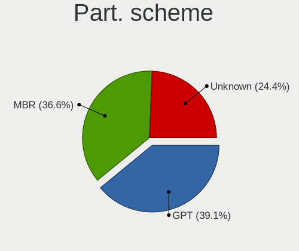
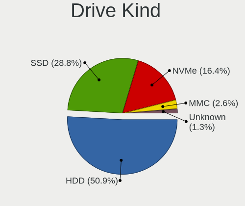
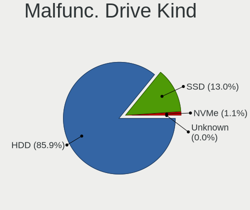
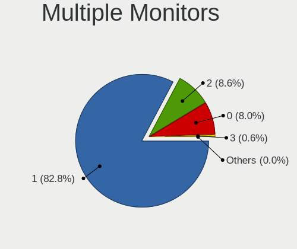
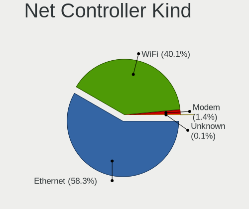

Linux in Russia - Tested Hardware & Statistics
----------------------------------------------

A project to collect tested hardware configurations for Linux in Russia.

Anyone can contribute to this report by the [hw-probe](https://github.com/linuxhw/hw-probe) tool:

    sudo -E hw-probe -all -upload

Please contribute! Especially if your hardware is rare.

This is a report for all computer types. See also reports for [desktops](/Location/Russia/Desktop/README.md) and [notebooks](/Location/Russia/Notebook/README.md).

Contents
--------

* [ Test Cases ](#test-cases)

* [ System ](#system)
  - [ OS                       ](#os)
  - [ OS Family                ](#os-family)
  - [ Kernel                   ](#kernel)
  - [ Kernel Family            ](#kernel-family)
  - [ Kernel Major Ver.        ](#kernel-major-ver)
  - [ Arch                     ](#arch)
  - [ DE                       ](#de)
  - [ Display Server           ](#display-server)
  - [ Display Manager          ](#display-manager)
  - [ OS Lang                  ](#os-lang)
  - [ Boot Mode                ](#boot-mode)
  - [ Filesystem               ](#filesystem)
  - [ Part. scheme             ](#part-scheme)
  - [ Dual Boot with Linux/BSD ](#dual-boot-with-linuxbsd)
  - [ Dual Boot (Win)          ](#dual-boot-win)

* [ Board ](#board)
  - [ Vendor                   ](#vendor)
  - [ Model                    ](#model)
  - [ Model Family             ](#model-family)
  - [ MFG Year                 ](#mfg-year)
  - [ Form Factor              ](#form-factor)
  - [ Secure Boot              ](#secure-boot)
  - [ Coreboot                 ](#coreboot)
  - [ RAM Size                 ](#ram-size)
  - [ RAM Used                 ](#ram-used)
  - [ Total Drives             ](#total-drives)
  - [ Has CD-ROM               ](#has-cd-rom)
  - [ Has Ethernet             ](#has-ethernet)
  - [ Has WiFi                 ](#has-wifi)
  - [ Has Bluetooth            ](#has-bluetooth)

* [ Location ](#location)
  - [ Country                  ](#country)
  - [ City                     ](#city)

* [ Drives ](#drives)
  - [ Drive Vendor             ](#drive-vendor)
  - [ Drive Model              ](#drive-model)
  - [ HDD Vendor               ](#hdd-vendor)
  - [ SSD Vendor               ](#ssd-vendor)
  - [ Drive Kind               ](#drive-kind)
  - [ Drive Connector          ](#drive-connector)
  - [ Drive Size               ](#drive-size)
  - [ Space Total              ](#space-total)
  - [ Space Used               ](#space-used)
  - [ Malfunc. Drives          ](#malfunc-drives)
  - [ Malfunc. Drive Vendor    ](#malfunc-drive-vendor)
  - [ Malfunc. HDD Vendor      ](#malfunc-hdd-vendor)
  - [ Malfunc. Drive Kind      ](#malfunc-drive-kind)
  - [ Failed Drives            ](#failed-drives)
  - [ Failed Drive Vendor      ](#failed-drive-vendor)
  - [ Drive Status             ](#drive-status)

* [ Storage controller ](#storage-controller)
  - [ Storage Vendor           ](#storage-vendor)
  - [ Storage Model            ](#storage-model)
  - [ Storage Kind             ](#storage-kind)

* [ Processor ](#processor)
  - [ CPU Vendor               ](#cpu-vendor)
  - [ CPU Model                ](#cpu-model)
  - [ CPU Model Family         ](#cpu-model-family)
  - [ CPU Cores                ](#cpu-cores)
  - [ CPU Sockets              ](#cpu-sockets)
  - [ CPU Threads              ](#cpu-threads)
  - [ CPU Op-Modes             ](#cpu-op-modes)
  - [ CPU Microcode            ](#cpu-microcode)
  - [ CPU Microarch            ](#cpu-microarch)

* [ Graphics ](#graphics)
  - [ GPU Vendor               ](#gpu-vendor)
  - [ GPU Model                ](#gpu-model)
  - [ GPU Combo                ](#gpu-combo)
  - [ GPU Driver               ](#gpu-driver)
  - [ GPU Memory               ](#gpu-memory)

* [ Monitor ](#monitor)
  - [ Monitor Vendor           ](#monitor-vendor)
  - [ Monitor Model            ](#monitor-model)
  - [ Monitor Resolution       ](#monitor-resolution)
  - [ Monitor Diagonal         ](#monitor-diagonal)
  - [ Monitor Width            ](#monitor-width)
  - [ Aspect Ratio             ](#aspect-ratio)
  - [ Monitor Area             ](#monitor-area)
  - [ Pixel Density            ](#pixel-density)
  - [ Multiple Monitors        ](#multiple-monitors)

* [ Network ](#network)
  - [ Net Controller Vendor    ](#net-controller-vendor)
  - [ Net Controller Model     ](#net-controller-model)
  - [ Wireless Vendor          ](#wireless-vendor)
  - [ Wireless Model           ](#wireless-model)
  - [ Ethernet Vendor          ](#ethernet-vendor)
  - [ Ethernet Model           ](#ethernet-model)
  - [ Net Controller Kind      ](#net-controller-kind)
  - [ Used Controller          ](#used-controller)
  - [ NICs                     ](#nics)
  - [ IPv6                     ](#ipv6)

* [ Bluetooth ](#bluetooth)
  - [ Bluetooth Vendor         ](#bluetooth-vendor)
  - [ Bluetooth Model          ](#bluetooth-model)

* [ Sound ](#sound)
  - [ Sound Vendor             ](#sound-vendor)
  - [ Sound Model              ](#sound-model)

* [ Memory ](#memory)
  - [ Memory Vendor            ](#memory-vendor)
  - [ Memory Model             ](#memory-model)
  - [ Memory Kind              ](#memory-kind)
  - [ Memory Form Factor       ](#memory-form-factor)
  - [ Memory Size              ](#memory-size)
  - [ Memory Speed             ](#memory-speed)

* [ Printers & scanners ](#printers--scanners)
  - [ Printer Vendor           ](#printer-vendor)
  - [ Printer Model            ](#printer-model)
  - [ Scanner Vendor           ](#scanner-vendor)
  - [ Scanner Model            ](#scanner-model)

* [ Camera ](#camera)
  - [ Camera Vendor            ](#camera-vendor)
  - [ Camera Model             ](#camera-model)

* [ Security ](#security)
  - [ Fingerprint Vendor       ](#fingerprint-vendor)
  - [ Fingerprint Model        ](#fingerprint-model)
  - [ Chipcard Vendor          ](#chipcard-vendor)
  - [ Chipcard Model           ](#chipcard-model)

* [ Unsupported ](#unsupported)
  - [ Unsupported Devices      ](#unsupported-devices)
  - [ Unsupported Device Types ](#unsupported-device-types)

Test Cases
----------

Total: 40266

| Vendor        | Model                       | Form-Factor | Probe                                                      | Date         |
|---------------|-----------------------------|-------------|------------------------------------------------------------|--------------|
| MSI           | P67A-GD65                   | Desktop     | [1024e95ca9](https://linux-hardware.org/?probe=1024e95ca9) | Aug 12, 2023 |
| Gigabyte      | Z77X-D3H                    | Desktop     | [f57a3e9f6a](https://linux-hardware.org/?probe=f57a3e9f6a) | Aug 12, 2023 |
| Acer          | Aspire E1-571G              | Notebook    | [ca51aaad9f](https://linux-hardware.org/?probe=ca51aaad9f) | Aug 12, 2023 |
| MSI           | MPG X570 GAMING PLUS        | Desktop     | [2c92ed92eb](https://linux-hardware.org/?probe=2c92ed92eb) | Aug 12, 2023 |
| ASUSTek       | T200TA                      | Notebook    | [affc999457](https://linux-hardware.org/?probe=affc999457) | Aug 12, 2023 |
| ASUSTek       | T200TA                      | Notebook    | [24d6504b2c](https://linux-hardware.org/?probe=24d6504b2c) | Aug 12, 2023 |
| Apple         | MacBookAir7,2               | Notebook    | [b80181bc47](https://linux-hardware.org/?probe=b80181bc47) | Aug 12, 2023 |
| ASUSTek       | M5A97 R2.0                  | Desktop     | [96995d7026](https://linux-hardware.org/?probe=96995d7026) | Aug 12, 2023 |
| HP            | ENVY Notebook               | Notebook    | [24c2810def](https://linux-hardware.org/?probe=24c2810def) | Aug 12, 2023 |
| Lenovo        | PIQY0                       | Notebook    | [0149927d91](https://linux-hardware.org/?probe=0149927d91) | Aug 11, 2023 |
| HP            | Victus by Laptop 16-e0xx... | Notebook    | [377a0e25aa](https://linux-hardware.org/?probe=377a0e25aa) | Aug 11, 2023 |
| Lenovo        | IdeaPad 5 15IAL7 82SF       | Notebook    | [c2d9d3160b](https://linux-hardware.org/?probe=c2d9d3160b) | Aug 11, 2023 |
| MSI           | Sword 17 A11UD              | Notebook    | [8ad81394c8](https://linux-hardware.org/?probe=8ad81394c8) | Aug 11, 2023 |
| Edelweiss     | TF307-MB-S-D                | Soc         | [e0fa5039b4](https://linux-hardware.org/?probe=e0fa5039b4) | Aug 11, 2023 |
| Gigabyte      | B560M DS3H V2               | Desktop     | [2805e140b5](https://linux-hardware.org/?probe=2805e140b5) | Aug 11, 2023 |
| HP            | ENVY Notebook               | Notebook    | [6327abde35](https://linux-hardware.org/?probe=6327abde35) | Aug 11, 2023 |
| ASUSTek       | VivoBook_ASUSLaptop M140... | Notebook    | [a4a009cd79](https://linux-hardware.org/?probe=a4a009cd79) | Aug 11, 2023 |
| HP            | Pavilion 15                 | Notebook    | [0f7859844f](https://linux-hardware.org/?probe=0f7859844f) | Aug 11, 2023 |
| HP            | ProLiant DL360 Gen9         | Server      | [262bb059eb](https://linux-hardware.org/?probe=262bb059eb) | Aug 11, 2023 |
| Unknown       | Unknown                     | Desktop     | [e32bb1bbb2](https://linux-hardware.org/?probe=e32bb1bbb2) | Aug 11, 2023 |
| Gigabyte      | B85M-D2V                    | Desktop     | [d8d7d7bad7](https://linux-hardware.org/?probe=d8d7d7bad7) | Aug 11, 2023 |
| Acer          | Extensa 2511G               | Notebook    | [536699834a](https://linux-hardware.org/?probe=536699834a) | Aug 11, 2023 |
| Acer          | Nitro AN515-52              | Notebook    | [c9b1265a23](https://linux-hardware.org/?probe=c9b1265a23) | Aug 11, 2023 |
| MSI           | G33M                        | Desktop     | [65de454e8b](https://linux-hardware.org/?probe=65de454e8b) | Aug 11, 2023 |
| Lenovo        | IdeaPad L340-15API 81LW     | Notebook    | [7d63566e0a](https://linux-hardware.org/?probe=7d63566e0a) | Aug 11, 2023 |
| ASUSTek       | ZenBook UX535LI_UX535LI     | Notebook    | [29065a56ee](https://linux-hardware.org/?probe=29065a56ee) | Aug 11, 2023 |
| ASUSTek       | ROG Strix G513QY_G513QY     | Notebook    | [46ae462027](https://linux-hardware.org/?probe=46ae462027) | Aug 11, 2023 |
| Fujitsu Si... | AMILO Li 2727               | Notebook    | [1dc2c421f8](https://linux-hardware.org/?probe=1dc2c421f8) | Aug 11, 2023 |
| ASUSTek       | ROG STRIX B350-F GAMING     | Desktop     | [cc7efa7eba](https://linux-hardware.org/?probe=cc7efa7eba) | Aug 11, 2023 |
| Huanan        | X99-F8 V2.0                 | Desktop     | [f028b8f65d](https://linux-hardware.org/?probe=f028b8f65d) | Aug 11, 2023 |
| HP            | 84DE                        | All in one  | [bdd2e74d54](https://linux-hardware.org/?probe=bdd2e74d54) | Aug 11, 2023 |
| MSI           | B450M PRO-M2 MAX            | Desktop     | [07e0bad7da](https://linux-hardware.org/?probe=07e0bad7da) | Aug 10, 2023 |
| Aquarius P... | MBM                         | Soc         | [09d0d96e92](https://linux-hardware.org/?probe=09d0d96e92) | Aug 10, 2023 |
| HP            | Pavilion 15                 | Notebook    | [3de983a470](https://linux-hardware.org/?probe=3de983a470) | Aug 10, 2023 |
| ASUSTek       | VivoBook_ASUSLaptop M150... | Notebook    | [80f2f711d8](https://linux-hardware.org/?probe=80f2f711d8) | Aug 10, 2023 |
| ASUSTek       | P7P55-M                     | Desktop     | [6f80191c4a](https://linux-hardware.org/?probe=6f80191c4a) | Aug 10, 2023 |
| Toshiba       | Satellite C660              | Notebook    | [26597d8a51](https://linux-hardware.org/?probe=26597d8a51) | Aug 10, 2023 |
| ASUSTek       | TUF Gaming A520M-PLUS II    | Desktop     | [fb99152b24](https://linux-hardware.org/?probe=fb99152b24) | Aug 10, 2023 |
| Acer          | Extensa 5630                | Notebook    | [1cc3eaf69a](https://linux-hardware.org/?probe=1cc3eaf69a) | Aug 10, 2023 |
| Lenovo        | H420                        | Desktop     | [d418e9d1d1](https://linux-hardware.org/?probe=d418e9d1d1) | Aug 10, 2023 |
| Acer          | Aspire V3-571G              | Notebook    | [6c4354fa1c](https://linux-hardware.org/?probe=6c4354fa1c) | Aug 10, 2023 |
| MSI           | H97 GAMING 3                | Desktop     | [584a47e4ae](https://linux-hardware.org/?probe=584a47e4ae) | Aug 10, 2023 |
| HP            | ENVY Notebook               | Notebook    | [9e8624aa8d](https://linux-hardware.org/?probe=9e8624aa8d) | Aug 09, 2023 |
| ASUSTek       | VivoBook_ASUSLaptop X321... | Notebook    | [204b2fa0a0](https://linux-hardware.org/?probe=204b2fa0a0) | Aug 09, 2023 |
| HP            | EliteBook x360 1040 G6      | Convertible | [18ace46778](https://linux-hardware.org/?probe=18ace46778) | Aug 09, 2023 |
| Dell          | 0PXXHP A03                  | Server      | [6fc4589ff0](https://linux-hardware.org/?probe=6fc4589ff0) | Aug 09, 2023 |
| Supermicro    | X10DRU-i+                   | Server      | [6ea2dae05b](https://linux-hardware.org/?probe=6ea2dae05b) | Aug 09, 2023 |
| Supermicro    | X10DRU-i+                   | Server      | [1c9d71f553](https://linux-hardware.org/?probe=1c9d71f553) | Aug 09, 2023 |
| Supermicro    | X10DRU-i+                   | Server      | [47da29a7a0](https://linux-hardware.org/?probe=47da29a7a0) | Aug 09, 2023 |
| Supermicro    | X10DRU-i+                   | Server      | [d464f66e20](https://linux-hardware.org/?probe=d464f66e20) | Aug 09, 2023 |
| Supermicro    | X10DRU-i+                   | Server      | [9f725868e8](https://linux-hardware.org/?probe=9f725868e8) | Aug 09, 2023 |
| Supermicro    | X10DRU-i+                   | Server      | [dd82024730](https://linux-hardware.org/?probe=dd82024730) | Aug 09, 2023 |
| Supermicro    | X10DRU-i+                   | Server      | [11d70c86e3](https://linux-hardware.org/?probe=11d70c86e3) | Aug 09, 2023 |
| Supermicro    | X10DRU-i+                   | Server      | [1b3e4092b5](https://linux-hardware.org/?probe=1b3e4092b5) | Aug 09, 2023 |
| Supermicro    | X10DRU-i+                   | Server      | [92f521b3e8](https://linux-hardware.org/?probe=92f521b3e8) | Aug 09, 2023 |
| Supermicro    | X10DRU-i+                   | Server      | [e6cc7a97b6](https://linux-hardware.org/?probe=e6cc7a97b6) | Aug 09, 2023 |
| Supermicro    | X9SRE/X9SRE-3F/X9SRi/X9S... | Server      | [52ff19e47c](https://linux-hardware.org/?probe=52ff19e47c) | Aug 09, 2023 |
| ASUSTek       | TUF Gaming X570-PLUS        | Desktop     | [4a7cc2835f](https://linux-hardware.org/?probe=4a7cc2835f) | Aug 09, 2023 |
| ASUSTek       | B85M-G                      | Desktop     | [9fcf84ff7c](https://linux-hardware.org/?probe=9fcf84ff7c) | Aug 09, 2023 |
| ASUSTek       | VivoBook_ASUSLaptop M350... | Notebook    | [70765ac17b](https://linux-hardware.org/?probe=70765ac17b) | Aug 09, 2023 |
| Gigabyte      | X570 AORUS PRO              | Desktop     | [a43111576a](https://linux-hardware.org/?probe=a43111576a) | Aug 09, 2023 |
| HP            | Pavilion 15                 | Notebook    | [8636764a35](https://linux-hardware.org/?probe=8636764a35) | Aug 09, 2023 |
| Supermicro    | X10SRi-FB                   | Server      | [253c6295e0](https://linux-hardware.org/?probe=253c6295e0) | Aug 09, 2023 |
| Gigabyte      | Z370M D3H-CF                | Desktop     | [9326dd9736](https://linux-hardware.org/?probe=9326dd9736) | Aug 09, 2023 |
| Supermicro    | X8ST3                       | Desktop     | [13099babf6](https://linux-hardware.org/?probe=13099babf6) | Aug 09, 2023 |
| Supermicro    | X10SRi-FB                   | Server      | [5911a0289e](https://linux-hardware.org/?probe=5911a0289e) | Aug 09, 2023 |
| ASUSTek       | TUF Gaming A520M-PLUS II    | Desktop     | [5aeb5ebcbf](https://linux-hardware.org/?probe=5aeb5ebcbf) | Aug 09, 2023 |
| ASUSTek       | P8H67-M LX                  | Desktop     | [62d3166469](https://linux-hardware.org/?probe=62d3166469) | Aug 09, 2023 |
| Lenovo        | ThinkPad X1 Carbon 2nd 2... | Notebook    | [f28e4b71d6](https://linux-hardware.org/?probe=f28e4b71d6) | Aug 09, 2023 |
| HP            | EliteBook x360 1040 G6      | Convertible | [4b7e9a8b93](https://linux-hardware.org/?probe=4b7e9a8b93) | Aug 09, 2023 |
| Chuwi         | GemiBook Pro                | Notebook    | [3702186068](https://linux-hardware.org/?probe=3702186068) | Aug 08, 2023 |
| ARDOR GAMI... | V15x_V17xPNKPNJPNH          | Notebook    | [77f61b77f5](https://linux-hardware.org/?probe=77f61b77f5) | Aug 08, 2023 |
| Unknown       | Unknown                     | Soc         | [42d4093f63](https://linux-hardware.org/?probe=42d4093f63) | Aug 08, 2023 |
| ASUSTek       | PRIME H510M-R               | Desktop     | [38ab435feb](https://linux-hardware.org/?probe=38ab435feb) | Aug 08, 2023 |
| ASUSTek       | X501U                       | Notebook    | [1cd218236c](https://linux-hardware.org/?probe=1cd218236c) | Aug 08, 2023 |
| ARDOR GAMI... | V15x_V17xPNKPNJPNH          | Notebook    | [fa4f74161f](https://linux-hardware.org/?probe=fa4f74161f) | Aug 08, 2023 |
| Supermicro    | X10DRU-i+                   | Server      | [42b79d59b6](https://linux-hardware.org/?probe=42b79d59b6) | Aug 08, 2023 |
| Supermicro    | X10DRU-i+                   | Server      | [0503a83389](https://linux-hardware.org/?probe=0503a83389) | Aug 08, 2023 |
| Supermicro    | X10DRU-i+                   | Server      | [29e048b78b](https://linux-hardware.org/?probe=29e048b78b) | Aug 08, 2023 |
| Supermicro    | X10DRU-i+                   | Server      | [9183ba34b1](https://linux-hardware.org/?probe=9183ba34b1) | Aug 08, 2023 |
| Supermicro    | X10DRU-i+                   | Server      | [f07e24722e](https://linux-hardware.org/?probe=f07e24722e) | Aug 08, 2023 |
| HUAWEI        | BOHB-WAX9                   | Notebook    | [42303ab8af](https://linux-hardware.org/?probe=42303ab8af) | Aug 08, 2023 |
| Supermicro    | X10DRU-i+                   | Server      | [f26c990dc3](https://linux-hardware.org/?probe=f26c990dc3) | Aug 08, 2023 |
| Supermicro    | X10DRU-i+                   | Server      | [f190fa8e05](https://linux-hardware.org/?probe=f190fa8e05) | Aug 08, 2023 |
| Supermicro    | X10DRU-i+                   | Server      | [183e9d899a](https://linux-hardware.org/?probe=183e9d899a) | Aug 08, 2023 |
| Supermicro    | X10DRU-i+                   | Server      | [33d78efc8a](https://linux-hardware.org/?probe=33d78efc8a) | Aug 08, 2023 |
| Supermicro    | X10DRU-i+                   | Server      | [7053bcfeac](https://linux-hardware.org/?probe=7053bcfeac) | Aug 08, 2023 |
| MSI           | H61M-P31                    | Desktop     | [3fa41aaf62](https://linux-hardware.org/?probe=3fa41aaf62) | Aug 08, 2023 |
| Dell          | Precision M4700             | Notebook    | [95ac580b0d](https://linux-hardware.org/?probe=95ac580b0d) | Aug 08, 2023 |
| HP            | ENVY Notebook               | Notebook    | [9c6d8ac7f9](https://linux-hardware.org/?probe=9c6d8ac7f9) | Aug 08, 2023 |
| Dell          | Latitude 5511               | Notebook    | [e9ea435e85](https://linux-hardware.org/?probe=e9ea435e85) | Aug 08, 2023 |
| MSI           | H97M-G43                    | Desktop     | [f8905cffe2](https://linux-hardware.org/?probe=f8905cffe2) | Aug 08, 2023 |
| Supermicro    | X11DDW-L                    | Server      | [d6fe66b73c](https://linux-hardware.org/?probe=d6fe66b73c) | Aug 08, 2023 |
| Supermicro    | X9DRW                       | Server      | [007ab23cd1](https://linux-hardware.org/?probe=007ab23cd1) | Aug 08, 2023 |
| Gigabyte      | B360HD3                     | Desktop     | [4dc4fb1691](https://linux-hardware.org/?probe=4dc4fb1691) | Aug 08, 2023 |
| HP            | ProLiant DL360 Gen9         | Server      | [d292db651b](https://linux-hardware.org/?probe=d292db651b) | Aug 08, 2023 |
| Acer          | Extensa 215-51K             | Notebook    | [27a26187b9](https://linux-hardware.org/?probe=27a26187b9) | Aug 08, 2023 |
| HP            | Presario CQ58               | Notebook    | [07f5cdfaa8](https://linux-hardware.org/?probe=07f5cdfaa8) | Aug 08, 2023 |
| Acer          | Aspire E5-573G              | Notebook    | [305061b67e](https://linux-hardware.org/?probe=305061b67e) | Aug 08, 2023 |
| Samsung       | R528/R728                   | Notebook    | [cc6458fab9](https://linux-hardware.org/?probe=cc6458fab9) | Aug 08, 2023 |
| MSI           | H97 GAMING 3                | Desktop     | [04962a5072](https://linux-hardware.org/?probe=04962a5072) | Aug 08, 2023 |
| Jumper        | QCYL-200                    | Notebook    | [24da6190dc](https://linux-hardware.org/?probe=24da6190dc) | Aug 08, 2023 |
| ASUSTek       | VivoBook_ASUSLaptop M650... | Notebook    | [36b0caba9e](https://linux-hardware.org/?probe=36b0caba9e) | Aug 07, 2023 |
| Acer          | Aspire A315-42G             | Notebook    | [eff926e4a9](https://linux-hardware.org/?probe=eff926e4a9) | Aug 07, 2023 |
| Echips Imp... | NQ15E                       | Notebook    | [7d5e97a545](https://linux-hardware.org/?probe=7d5e97a545) | Aug 07, 2023 |
| ASUSTek       | ZenBook UX431DA_UM431DA     | Notebook    | [36c52dfe36](https://linux-hardware.org/?probe=36c52dfe36) | Aug 07, 2023 |
| ASUSTek       | ZenBook UX431DA_UM431DA     | Notebook    | [be823adc05](https://linux-hardware.org/?probe=be823adc05) | Aug 07, 2023 |
| ASUSTek       | X751NV                      | Notebook    | [ff33d23814](https://linux-hardware.org/?probe=ff33d23814) | Aug 07, 2023 |
| ASUSTek       | VivoBook_ASUSLaptop M140... | Notebook    | [bd036e1e65](https://linux-hardware.org/?probe=bd036e1e65) | Aug 07, 2023 |
| Dell          | XPS 15 9500                 | Notebook    | [dbefafc94d](https://linux-hardware.org/?probe=dbefafc94d) | Aug 07, 2023 |
| Soyo          | SY-Classic B450M            | Desktop     | [708e9837c5](https://linux-hardware.org/?probe=708e9837c5) | Aug 07, 2023 |
| ASUSTek       | Z170-K                      | Desktop     | [209b568765](https://linux-hardware.org/?probe=209b568765) | Aug 07, 2023 |
| DEPO Compu... | DPA520S                     | Desktop     | [71b00682fc](https://linux-hardware.org/?probe=71b00682fc) | Aug 07, 2023 |
| Intel         | S3420GPV E80883-106         | Server      | [3ed0bb462d](https://linux-hardware.org/?probe=3ed0bb462d) | Aug 07, 2023 |
| Supermicro    | X8DTU-LN4+                  | Server      | [4e56bb1720](https://linux-hardware.org/?probe=4e56bb1720) | Aug 07, 2023 |
| Dell          | Inspiron N5110              | Notebook    | [52c9bb6c33](https://linux-hardware.org/?probe=52c9bb6c33) | Aug 06, 2023 |
| ASUSTek       | M4A77TD                     | Desktop     | [667b258dd5](https://linux-hardware.org/?probe=667b258dd5) | Aug 06, 2023 |
| ASUSTek       | UX32VD                      | Notebook    | [298a3261a0](https://linux-hardware.org/?probe=298a3261a0) | Aug 06, 2023 |
| Lenovo        | ThinkPad X1 Carbon Gen 1... | Notebook    | [2771828543](https://linux-hardware.org/?probe=2771828543) | Aug 06, 2023 |
| Lenovo        | 30BB SDK0J40697 WIN 3305... | All in one  | [baf3a83d91](https://linux-hardware.org/?probe=baf3a83d91) | Aug 06, 2023 |
| Soyo          | SY-Classic B450M            | Desktop     | [04a850b33b](https://linux-hardware.org/?probe=04a850b33b) | Aug 06, 2023 |
| Timi          | TM1701                      | Notebook    | [2fc0a44940](https://linux-hardware.org/?probe=2fc0a44940) | Aug 06, 2023 |
| ASUSTek       | X550CC                      | Notebook    | [0a99f6f654](https://linux-hardware.org/?probe=0a99f6f654) | Aug 06, 2023 |
| TECNO         | MEGABOOK T1                 | Notebook    | [ced0647d42](https://linux-hardware.org/?probe=ced0647d42) | Aug 06, 2023 |
| ASUSTek       | X550CC                      | Notebook    | [23298de8c1](https://linux-hardware.org/?probe=23298de8c1) | Aug 06, 2023 |
| Valve         | Jupiter                     | Notebook    | [6bf7b7dc2b](https://linux-hardware.org/?probe=6bf7b7dc2b) | Aug 05, 2023 |
| Supermicro    | X8DTU-LN4+                  | Server      | [fe2ea0ea4b](https://linux-hardware.org/?probe=fe2ea0ea4b) | Aug 05, 2023 |
| Lenovo        | IdeaPad 330-15IGM 81D1      | Notebook    | [efe021e3b5](https://linux-hardware.org/?probe=efe021e3b5) | Aug 05, 2023 |
| MSI           | B450M-A PRO MAX             | Desktop     | [ec1bd43523](https://linux-hardware.org/?probe=ec1bd43523) | Aug 05, 2023 |
| ASUSTek       | VivoBook_ASUSLaptop M140... | Notebook    | [5f516e849d](https://linux-hardware.org/?probe=5f516e849d) | Aug 05, 2023 |
| ASUSTek       | Z97-K                       | Desktop     | [4c1ef04fe9](https://linux-hardware.org/?probe=4c1ef04fe9) | Aug 05, 2023 |
| Chuwi         | CoreBook XPro               | Notebook    | [776bcc618a](https://linux-hardware.org/?probe=776bcc618a) | Aug 05, 2023 |
| ASUSTek       | N53SV                       | Notebook    | [2c4db62652](https://linux-hardware.org/?probe=2c4db62652) | Aug 05, 2023 |
| Acer          | Aspire A715-72G             | Notebook    | [c95d1a55cd](https://linux-hardware.org/?probe=c95d1a55cd) | Aug 05, 2023 |
| ASRock        | B550 PG Velocita            | Desktop     | [71ca443602](https://linux-hardware.org/?probe=71ca443602) | Aug 05, 2023 |
| MSI           | GE70 0NC                    | Notebook    | [c9fd935b80](https://linux-hardware.org/?probe=c9fd935b80) | Aug 05, 2023 |
| HP            | EliteBook 830 G5            | Notebook    | [d4ebcfaf3d](https://linux-hardware.org/?probe=d4ebcfaf3d) | Aug 05, 2023 |
| HP            | EliteBook 830 G5            | Notebook    | [cf67e6a006](https://linux-hardware.org/?probe=cf67e6a006) | Aug 05, 2023 |
| ASUSTek       | H81M-C                      | Desktop     | [cd16d74fc1](https://linux-hardware.org/?probe=cd16d74fc1) | Aug 04, 2023 |
| ASUSTek       | 1215N                       | Notebook    | [35853f5b92](https://linux-hardware.org/?probe=35853f5b92) | Aug 04, 2023 |
| RuggedPC      | T8S                         | Tablet      | [18f5243a7c](https://linux-hardware.org/?probe=18f5243a7c) | Aug 04, 2023 |
| Lenovo        | ThinkPad X1 Carbon Gen 1... | Notebook    | [7abc08a315](https://linux-hardware.org/?probe=7abc08a315) | Aug 04, 2023 |
| ASUSTek       | AT4NM10T-I                  | Desktop     | [a650338ead](https://linux-hardware.org/?probe=a650338ead) | Aug 04, 2023 |
| ASUSTek       | P5K SE/EPU                  | Desktop     | [c125911c18](https://linux-hardware.org/?probe=c125911c18) | Aug 04, 2023 |
| Dell          | Vostro 5515                 | Notebook    | [bd17eec0e3](https://linux-hardware.org/?probe=bd17eec0e3) | Aug 04, 2023 |
| iRU           | J231                        | All in one  | [ddf5429a07](https://linux-hardware.org/?probe=ddf5429a07) | Aug 04, 2023 |
| ASRock        | G31M-S                      | Desktop     | [02bb341cc9](https://linux-hardware.org/?probe=02bb341cc9) | Aug 04, 2023 |
| ASUSTek       | Zenbook UX535QE_UM535QE     | Notebook    | [59dda0e2b7](https://linux-hardware.org/?probe=59dda0e2b7) | Aug 04, 2023 |
| Gigabyte      | B250M-DS3H-CF               | Desktop     | [701c63b20d](https://linux-hardware.org/?probe=701c63b20d) | Aug 04, 2023 |
| iRU           | J231                        | All in one  | [e0bc93351c](https://linux-hardware.org/?probe=e0bc93351c) | Aug 04, 2023 |
| Gigabyte      | H77-DS3H                    | Desktop     | [4c677637c2](https://linux-hardware.org/?probe=4c677637c2) | Aug 04, 2023 |
| Dell          | Latitude E6510              | Notebook    | [b32213c71d](https://linux-hardware.org/?probe=b32213c71d) | Aug 03, 2023 |
| ASUSTek       | M5A97 LE R2.0               | Desktop     | [6d37036a76](https://linux-hardware.org/?probe=6d37036a76) | Aug 03, 2023 |
| MSI           | PRO B550M-P GEN3            | Desktop     | [163708151e](https://linux-hardware.org/?probe=163708151e) | Aug 03, 2023 |
| ASUSTek       | P9X79                       | Desktop     | [381ebee880](https://linux-hardware.org/?probe=381ebee880) | Aug 03, 2023 |
| MSI           | H110M PRO-VD Plus           | Desktop     | [de9bb54769](https://linux-hardware.org/?probe=de9bb54769) | Aug 03, 2023 |
| ASUSTek       | P8B75-M LX                  | Desktop     | [6d7ac5bfd2](https://linux-hardware.org/?probe=6d7ac5bfd2) | Aug 03, 2023 |
| Samsung       | 305U1A                      | Notebook    | [f65d34a8fb](https://linux-hardware.org/?probe=f65d34a8fb) | Aug 03, 2023 |
| Supermicro    | X7DWU                       | Desktop     | [beddea6e34](https://linux-hardware.org/?probe=beddea6e34) | Aug 03, 2023 |
| Supermicro    | X7DWN+                      | Desktop     | [92bf3762f2](https://linux-hardware.org/?probe=92bf3762f2) | Aug 03, 2023 |
| Supermicro    | X7DWU                       | Desktop     | [37ebe498c2](https://linux-hardware.org/?probe=37ebe498c2) | Aug 03, 2023 |
| Supermicro    | X7DWN+                      | Desktop     | [53edc778db](https://linux-hardware.org/?probe=53edc778db) | Aug 03, 2023 |
| Supermicro    | X7DWU                       | Desktop     | [dc1c75a471](https://linux-hardware.org/?probe=dc1c75a471) | Aug 03, 2023 |
| DEPO Compu... | DPA520S                     | Desktop     | [28007801d5](https://linux-hardware.org/?probe=28007801d5) | Aug 03, 2023 |
| Supermicro    | X8DAH                       | Server      | [5db60ccf19](https://linux-hardware.org/?probe=5db60ccf19) | Aug 03, 2023 |
| DEPO Compu... | DPA520S                     | Desktop     | [5e3a46dee8](https://linux-hardware.org/?probe=5e3a46dee8) | Aug 03, 2023 |
| ASUSTek       | VivoBook_ASUSLaptop X515... | Notebook    | [2b8f90f79d](https://linux-hardware.org/?probe=2b8f90f79d) | Aug 03, 2023 |
| Lenovo        | IdeaPad 5 Pro 16ACH6 82L... | Notebook    | [7d96f87e00](https://linux-hardware.org/?probe=7d96f87e00) | Aug 03, 2023 |
| ASUSTek       | PRIME Z270-P                | Desktop     | [219278bb56](https://linux-hardware.org/?probe=219278bb56) | Aug 03, 2023 |
| Notebook      | W54_W94_W955TU,-T,-C        | Notebook    | [1f1f14320c](https://linux-hardware.org/?probe=1f1f14320c) | Aug 03, 2023 |
| Gigabyte      | X570 I AORUS PRO WIFI       | Desktop     | [448ad2c06a](https://linux-hardware.org/?probe=448ad2c06a) | Aug 03, 2023 |
| Gigabyte      | H67A-USB3-B3                | Desktop     | [5a368bb70f](https://linux-hardware.org/?probe=5a368bb70f) | Aug 03, 2023 |
| Panasonic     | CF-31WBLAXLM                | Notebook    | [580b017d88](https://linux-hardware.org/?probe=580b017d88) | Aug 03, 2023 |
| MSI           | Prestige 14Evo A12M         | Notebook    | [c9e4b6dd90](https://linux-hardware.org/?probe=c9e4b6dd90) | Aug 03, 2023 |
| MSI           | Modern 14 C12M              | Notebook    | [aa352b05aa](https://linux-hardware.org/?probe=aa352b05aa) | Aug 03, 2023 |
| ASUSTek       | 1015BX                      | Notebook    | [4770dbfc22](https://linux-hardware.org/?probe=4770dbfc22) | Aug 02, 2023 |
| Gigabyte      | B550 AORUS PRO              | Desktop     | [bd5d07f54f](https://linux-hardware.org/?probe=bd5d07f54f) | Aug 02, 2023 |
| ASUSTek       | ZenBook UX431DA_UM431DA     | Notebook    | [a1f99c3e4d](https://linux-hardware.org/?probe=a1f99c3e4d) | Aug 02, 2023 |
| Acer          | Aspire A715-71G             | Notebook    | [fabe23f1a8](https://linux-hardware.org/?probe=fabe23f1a8) | Aug 02, 2023 |
| ASUSTek       | P5K PRO                     | Desktop     | [b8c2590139](https://linux-hardware.org/?probe=b8c2590139) | Aug 02, 2023 |
| ASUSTek       | P8H77-M PRO                 | Desktop     | [1ea7139d7e](https://linux-hardware.org/?probe=1ea7139d7e) | Aug 02, 2023 |
| HUAWEI        | NBLB-WAX9N                  | Notebook    | [28ff7ce482](https://linux-hardware.org/?probe=28ff7ce482) | Aug 02, 2023 |
| MSI           | B560M PRO-E                 | Desktop     | [b10154befd](https://linux-hardware.org/?probe=b10154befd) | Aug 02, 2023 |
| Gigabyte      | H67A-USB3-B3                | Desktop     | [23ba156377](https://linux-hardware.org/?probe=23ba156377) | Aug 02, 2023 |
| ASUSTek       | VivoBook_ASUSLaptop M350... | Notebook    | [e3f2347cf7](https://linux-hardware.org/?probe=e3f2347cf7) | Aug 02, 2023 |
| ASUSTek       | H110M-K                     | Desktop     | [c12e9ed368](https://linux-hardware.org/?probe=c12e9ed368) | Aug 02, 2023 |
| Gigabyte      | H61M-S2PV                   | Desktop     | [70c8bcf589](https://linux-hardware.org/?probe=70c8bcf589) | Aug 02, 2023 |
| ASUSTek       | P7F-M                       | Desktop     | [5c04bf12d0](https://linux-hardware.org/?probe=5c04bf12d0) | Aug 02, 2023 |
| Sony          | VPCSB1V9R                   | Notebook    | [8d809c3877](https://linux-hardware.org/?probe=8d809c3877) | Aug 02, 2023 |
| ASUSTek       | VivoBook_ASUSLaptop X515... | Notebook    | [2f4ed3cb1f](https://linux-hardware.org/?probe=2f4ed3cb1f) | Aug 02, 2023 |
| Unknown       | Unknown                     | Notebook    | [41ff18df05](https://linux-hardware.org/?probe=41ff18df05) | Aug 02, 2023 |
| Unknown       | Unknown                     | Notebook    | [eb3d428d41](https://linux-hardware.org/?probe=eb3d428d41) | Aug 02, 2023 |
| Dell          | 0GRJJ9 A01                  | Desktop     | [dca7ee3fdc](https://linux-hardware.org/?probe=dca7ee3fdc) | Aug 02, 2023 |
| ASUSTek       | VivoBook_ASUSLaptop X160... | Notebook    | [4a6b173235](https://linux-hardware.org/?probe=4a6b173235) | Aug 01, 2023 |
| ASRock        | B450M-HDV                   | Desktop     | [56c71bf2d5](https://linux-hardware.org/?probe=56c71bf2d5) | Aug 01, 2023 |
| Acer          | Aspire 5600U                | All in one  | [dd8dcf6ed8](https://linux-hardware.org/?probe=dd8dcf6ed8) | Aug 01, 2023 |
| Supermicro    | X8DTT                       | Server      | [246d7ec81b](https://linux-hardware.org/?probe=246d7ec81b) | Aug 01, 2023 |
| Supermicro    | X8DTT                       | Server      | [f3d30d9bdb](https://linux-hardware.org/?probe=f3d30d9bdb) | Aug 01, 2023 |
| Supermicro    | X8DTT                       | Server      | [74803958ac](https://linux-hardware.org/?probe=74803958ac) | Aug 01, 2023 |
| Supermicro    | X8DTT                       | Server      | [b0c1b2fbb0](https://linux-hardware.org/?probe=b0c1b2fbb0) | Aug 01, 2023 |
| Acer          | Aspire A315-23              | Notebook    | [ef1917aa93](https://linux-hardware.org/?probe=ef1917aa93) | Aug 01, 2023 |
| Dell          | Vostro 3500                 | Notebook    | [266d25478e](https://linux-hardware.org/?probe=266d25478e) | Aug 01, 2023 |
| Acer          | Aspire A315-23              | Notebook    | [9164151f28](https://linux-hardware.org/?probe=9164151f28) | Aug 01, 2023 |
| Dell          | Inspiron 5567               | Notebook    | [d252fa93be](https://linux-hardware.org/?probe=d252fa93be) | Aug 01, 2023 |
| Timi          | Xiaomi Book Pro 16 2022     | Notebook    | [1e963cc76b](https://linux-hardware.org/?probe=1e963cc76b) | Aug 01, 2023 |
| Teclast       | Tbolt 10 DG                 | Notebook    | [cd75496056](https://linux-hardware.org/?probe=cd75496056) | Aug 01, 2023 |
| Teclast       | F5                          | Convertible | [76fcc31a43](https://linux-hardware.org/?probe=76fcc31a43) | Aug 01, 2023 |
| Acer          | Aspire A715-71G             | Notebook    | [7f3c7327b7](https://linux-hardware.org/?probe=7f3c7327b7) | Aug 01, 2023 |
| MSI           | G41M-P33 Combo              | Desktop     | [ec5e4c2338](https://linux-hardware.org/?probe=ec5e4c2338) | Aug 01, 2023 |
| Lenovo        | ThinkPad X1 Carbon Gen 1... | Notebook    | [f7be9307b1](https://linux-hardware.org/?probe=f7be9307b1) | Jul 31, 2023 |
| Toshiba       | Satellite C870-D7K          | Notebook    | [9e8acac201](https://linux-hardware.org/?probe=9e8acac201) | Jul 31, 2023 |
| Acer          | Aspire V3-551G              | Notebook    | [a90eeb2fa3](https://linux-hardware.org/?probe=a90eeb2fa3) | Jul 31, 2023 |
| Dell          | G15 5511                    | Notebook    | [278d65cdc0](https://linux-hardware.org/?probe=278d65cdc0) | Jul 31, 2023 |
| Gigabyte      | MP32-AR0                    | Server      | [f6563c2624](https://linux-hardware.org/?probe=f6563c2624) | Jul 31, 2023 |
| Gigabyte      | Z490 UD                     | Desktop     | [bdf93fa781](https://linux-hardware.org/?probe=bdf93fa781) | Jul 31, 2023 |
| Supermicro    | X11SCL-F                    | Server      | [6198182426](https://linux-hardware.org/?probe=6198182426) | Jul 31, 2023 |
| Lenovo        | G580 20150                  | Notebook    | [81ab0317ab](https://linux-hardware.org/?probe=81ab0317ab) | Jul 31, 2023 |
| ASUSTek       | TUF H310-PLUS GAMING        | Desktop     | [a9326ba27e](https://linux-hardware.org/?probe=a9326ba27e) | Jul 31, 2023 |
| ASUSTek       | X411UA                      | Notebook    | [9ceaa9062e](https://linux-hardware.org/?probe=9ceaa9062e) | Jul 31, 2023 |
| Supermicro    | X7DWE                       | Desktop     | [a35080b0e5](https://linux-hardware.org/?probe=a35080b0e5) | Jul 31, 2023 |
| Dell          | G15 5511                    | Notebook    | [e4570caa8f](https://linux-hardware.org/?probe=e4570caa8f) | Jul 31, 2023 |
| ASUSTek       | ROG Strix G513RM_G513RM     | Notebook    | [c42c13e7be](https://linux-hardware.org/?probe=c42c13e7be) | Jul 31, 2023 |
| Gigabyte      | Z490 GAMING X               | Desktop     | [f710ad8b96](https://linux-hardware.org/?probe=f710ad8b96) | Jul 31, 2023 |
| Supermicro    | X11SCL-F                    | Server      | [89115fb3d2](https://linux-hardware.org/?probe=89115fb3d2) | Jul 31, 2023 |
| ASRock        | ALiveSATA2-GLAN             | Desktop     | [3c4fbfa426](https://linux-hardware.org/?probe=3c4fbfa426) | Jul 31, 2023 |
| Gigabyte      | B75M-D3V                    | Desktop     | [ef86202c7f](https://linux-hardware.org/?probe=ef86202c7f) | Jul 31, 2023 |
| Samsung       | 300V3A/300V4A/300V5A        | Notebook    | [a757cca527](https://linux-hardware.org/?probe=a757cca527) | Jul 31, 2023 |
| Gigabyte      | B450 I AORUS PRO WIFI-CF    | Desktop     | [e11390bc86](https://linux-hardware.org/?probe=e11390bc86) | Jul 31, 2023 |
| ASUSTek       | F3Se                        | Notebook    | [e5f8a806ea](https://linux-hardware.org/?probe=e5f8a806ea) | Jul 31, 2023 |
| Timi          | Redmi Book Pro 15 2022      | Notebook    | [8a2a5c6265](https://linux-hardware.org/?probe=8a2a5c6265) | Jul 30, 2023 |
| Raspberry ... | Raspberry Pi Model B Rev... | Soc         | [df16b38d10](https://linux-hardware.org/?probe=df16b38d10) | Jul 30, 2023 |
| Raspberry ... | Raspberry Pi Model B Rev... | Soc         | [11fd627963](https://linux-hardware.org/?probe=11fd627963) | Jul 30, 2023 |
| Acer          | Aspire A315-56              | Notebook    | [522c7e4381](https://linux-hardware.org/?probe=522c7e4381) | Jul 30, 2023 |
| Huanan        | X99-F8 GAMING V2.0          | Desktop     | [6bf2e91f31](https://linux-hardware.org/?probe=6bf2e91f31) | Jul 30, 2023 |
| Acer          | Aspire E5-573G              | Notebook    | [14307e0b7e](https://linux-hardware.org/?probe=14307e0b7e) | Jul 30, 2023 |
| Huanan        | X99-F8 GAMING V2.0          | Desktop     | [0f9accc3e8](https://linux-hardware.org/?probe=0f9accc3e8) | Jul 30, 2023 |
| HUAWEI        | BOM-WXX9                    | Notebook    | [583bc42f4e](https://linux-hardware.org/?probe=583bc42f4e) | Jul 30, 2023 |
| Timi          | Redmi Book Pro 14 2022      | Notebook    | [71379f70f2](https://linux-hardware.org/?probe=71379f70f2) | Jul 30, 2023 |
| Unknown       | Unknown                     | Notebook    | [b5f5ef27a8](https://linux-hardware.org/?probe=b5f5ef27a8) | Jul 30, 2023 |
| HP            | Pavilion dv6                | Notebook    | [2046d205d6](https://linux-hardware.org/?probe=2046d205d6) | Jul 30, 2023 |
| Dell          | Vostro A860                 | Notebook    | [0148ba9cdc](https://linux-hardware.org/?probe=0148ba9cdc) | Jul 30, 2023 |
| HP            | 250 G7 Notebook PC          | Notebook    | [cefd14313d](https://linux-hardware.org/?probe=cefd14313d) | Jul 30, 2023 |
| ASRock        | X570 Phantom Gaming X       | Desktop     | [df34eb4472](https://linux-hardware.org/?probe=df34eb4472) | Jul 30, 2023 |
| ASRock        | X570 Phantom Gaming X       | Desktop     | [0449350f3d](https://linux-hardware.org/?probe=0449350f3d) | Jul 30, 2023 |
| HP            | Pavilion dv7                | Notebook    | [cdf06f1680](https://linux-hardware.org/?probe=cdf06f1680) | Jul 30, 2023 |
| HONOR         | NBR-WAX9                    | Notebook    | [b69caa0c17](https://linux-hardware.org/?probe=b69caa0c17) | Jul 29, 2023 |
| HONOR         | NBR-WAX9                    | Notebook    | [d7434fdb2a](https://linux-hardware.org/?probe=d7434fdb2a) | Jul 29, 2023 |
| Lenovo        | V15 G4 AMN 82YU             | Notebook    | [c3523b3823](https://linux-hardware.org/?probe=c3523b3823) | Jul 29, 2023 |
| Sony          | SVS13A1Z9RN                 | Notebook    | [533b3018ea](https://linux-hardware.org/?probe=533b3018ea) | Jul 29, 2023 |
| Gigabyte      | Z790 AORUS ELITE AX-W       | Desktop     | [9c5eccdca7](https://linux-hardware.org/?probe=9c5eccdca7) | Jul 29, 2023 |
| Lenovo        | Unknown                     | Notebook    | [d43f4e6715](https://linux-hardware.org/?probe=d43f4e6715) | Jul 29, 2023 |
| ASRock        | G41M-VS2                    | Desktop     | [74564d3418](https://linux-hardware.org/?probe=74564d3418) | Jul 28, 2023 |
| Lenovo        | ThinkBook 13s G2 ITL 20V... | Notebook    | [ea4fee91b6](https://linux-hardware.org/?probe=ea4fee91b6) | Jul 28, 2023 |
| Gigabyte      | B660 GAMING X DDR4          | Desktop     | [3ef07a69e6](https://linux-hardware.org/?probe=3ef07a69e6) | Jul 28, 2023 |
| ASUSTek       | X411UA                      | Notebook    | [0126e6254a](https://linux-hardware.org/?probe=0126e6254a) | Jul 28, 2023 |
| ASUSTek       | VivoBook_ASUSLaptop M350... | Notebook    | [cb17388b8c](https://linux-hardware.org/?probe=cb17388b8c) | Jul 28, 2023 |
| Gigabyte      | P55-UD3L                    | Desktop     | [82a3947c74](https://linux-hardware.org/?probe=82a3947c74) | Jul 28, 2023 |
| Lenovo        | ThinkPad T14 Gen 2i 20W0... | Notebook    | [03b716e2bf](https://linux-hardware.org/?probe=03b716e2bf) | Jul 28, 2023 |
| HP            | OMEN by Laptop 17-cb1xxx    | Notebook    | [b24aea2d95](https://linux-hardware.org/?probe=b24aea2d95) | Jul 28, 2023 |
| Acer          | Aspire A517-53              | Notebook    | [41c9602cac](https://linux-hardware.org/?probe=41c9602cac) | Jul 28, 2023 |
| Acer          | Aspire A315-21G             | Notebook    | [0a4e1c4510](https://linux-hardware.org/?probe=0a4e1c4510) | Jul 28, 2023 |
| ECS           | G33T_M                      | Desktop     | [cfaf5eaf20](https://linux-hardware.org/?probe=cfaf5eaf20) | Jul 28, 2023 |
| Lenovo        | No DPK                      | Desktop     | [c6af16725d](https://linux-hardware.org/?probe=c6af16725d) | Jul 28, 2023 |
| ASUSTek       | P9D-I Series                | Server      | [b8af713f2c](https://linux-hardware.org/?probe=b8af713f2c) | Jul 28, 2023 |
| ASUSTek       | A88XM-A                     | Desktop     | [3ef67c1e1c](https://linux-hardware.org/?probe=3ef67c1e1c) | Jul 27, 2023 |
| Acer          | Extensa 215-32              | Notebook    | [18d32a6c36](https://linux-hardware.org/?probe=18d32a6c36) | Jul 27, 2023 |
| Lenovo        | ThinkPad E490 20N80029RT    | Notebook    | [69cf27eaae](https://linux-hardware.org/?probe=69cf27eaae) | Jul 27, 2023 |
| ASRock        | X670E Pro RS                | Desktop     | [27a13f80b2](https://linux-hardware.org/?probe=27a13f80b2) | Jul 27, 2023 |
| Gigabyte      | GA-870A-UD3                 | Desktop     | [cc502a8417](https://linux-hardware.org/?probe=cc502a8417) | Jul 27, 2023 |
| ASUSTek       | VivoBook_ASUSLaptop K650... | Notebook    | [1b3e699a2a](https://linux-hardware.org/?probe=1b3e699a2a) | Jul 27, 2023 |
| Unknown       | SCHNEIDER                   | Desktop     | [6ab609f07e](https://linux-hardware.org/?probe=6ab609f07e) | Jul 27, 2023 |
| HP            | 1495                        | Desktop     | [7db2d77f67](https://linux-hardware.org/?probe=7db2d77f67) | Jul 27, 2023 |
| HP            | 1495                        | Desktop     | [376f9777d4](https://linux-hardware.org/?probe=376f9777d4) | Jul 27, 2023 |
| ASRock        | H470M-HVS                   | Desktop     | [23183da982](https://linux-hardware.org/?probe=23183da982) | Jul 27, 2023 |
| ASRock        | H470M-HVS                   | Desktop     | [77d42f4b5c](https://linux-hardware.org/?probe=77d42f4b5c) | Jul 27, 2023 |
| Acer          | Aspire XC-885 V:1.1         | Desktop     | [eebd657892](https://linux-hardware.org/?probe=eebd657892) | Jul 27, 2023 |
| Gigabyte      | Z490 UD                     | Desktop     | [370243099a](https://linux-hardware.org/?probe=370243099a) | Jul 27, 2023 |
| ASRock        | H470M-HVS                   | Desktop     | [e8abbb213e](https://linux-hardware.org/?probe=e8abbb213e) | Jul 27, 2023 |
| ASRock        | H470M-HVS                   | Desktop     | [bb4812527c](https://linux-hardware.org/?probe=bb4812527c) | Jul 27, 2023 |
| ASRock        | H470M-HVS                   | Desktop     | [2b7085bd2b](https://linux-hardware.org/?probe=2b7085bd2b) | Jul 27, 2023 |
| MSI           | Z97A GAMING 7               | Desktop     | [cf2d32f045](https://linux-hardware.org/?probe=cf2d32f045) | Jul 27, 2023 |
| Dell          | Inspiron 1520               | Notebook    | [a119f99239](https://linux-hardware.org/?probe=a119f99239) | Jul 27, 2023 |
| Valve         | Jupiter                     | Notebook    | [7ca21b7b46](https://linux-hardware.org/?probe=7ca21b7b46) | Jul 26, 2023 |
| Lenovo        | ThinkPad X1 Carbon Gen 1... | Notebook    | [b8b95820c1](https://linux-hardware.org/?probe=b8b95820c1) | Jul 26, 2023 |
| ASRock        | H470M-HVS                   | Desktop     | [a375e21964](https://linux-hardware.org/?probe=a375e21964) | Jul 26, 2023 |
| ASRock        | H470M-HVS                   | Desktop     | [d0e6321772](https://linux-hardware.org/?probe=d0e6321772) | Jul 26, 2023 |
| ASRock        | H470M-HVS                   | Desktop     | [28ea1c85d1](https://linux-hardware.org/?probe=28ea1c85d1) | Jul 26, 2023 |
| ASRock        | H470M-HVS                   | Desktop     | [3fd18c9a77](https://linux-hardware.org/?probe=3fd18c9a77) | Jul 26, 2023 |
| ASRock        | H470M-HVS                   | Desktop     | [d974298840](https://linux-hardware.org/?probe=d974298840) | Jul 26, 2023 |
| ASRock        | H470M-HVS                   | Desktop     | [b06f493001](https://linux-hardware.org/?probe=b06f493001) | Jul 26, 2023 |
| ASRock        | H470M-HVS                   | Desktop     | [894bb319dc](https://linux-hardware.org/?probe=894bb319dc) | Jul 26, 2023 |
| ASRock        | H470M-HVS                   | Desktop     | [7ec6d64d2f](https://linux-hardware.org/?probe=7ec6d64d2f) | Jul 26, 2023 |
| ASRock        | H470M-HVS                   | Desktop     | [09662b0f5d](https://linux-hardware.org/?probe=09662b0f5d) | Jul 26, 2023 |
| HP            | Laptop 14s-dq0xxx           | Notebook    | [dc484f95af](https://linux-hardware.org/?probe=dc484f95af) | Jul 26, 2023 |
| HUAWEI        | BOD-WXX9                    | Notebook    | [52358f6567](https://linux-hardware.org/?probe=52358f6567) | Jul 26, 2023 |
| ASRock        | H470M-HVS                   | Desktop     | [3c8721254c](https://linux-hardware.org/?probe=3c8721254c) | Jul 26, 2023 |
| ASRock        | H470M-HVS                   | Desktop     | [7dfa96789f](https://linux-hardware.org/?probe=7dfa96789f) | Jul 26, 2023 |
| ASRock        | H470M-HVS                   | Desktop     | [c538742db7](https://linux-hardware.org/?probe=c538742db7) | Jul 26, 2023 |
| ASRock        | H470M-HVS                   | Desktop     | [9da53986f9](https://linux-hardware.org/?probe=9da53986f9) | Jul 26, 2023 |
| ASRock        | H470M-HVS                   | Desktop     | [c950f7dbc1](https://linux-hardware.org/?probe=c950f7dbc1) | Jul 26, 2023 |
| ASRock        | H470M-HVS                   | Desktop     | [dcf4ead958](https://linux-hardware.org/?probe=dcf4ead958) | Jul 26, 2023 |
| ASRock        | N68C-GS FX                  | Desktop     | [6b35cdc0ae](https://linux-hardware.org/?probe=6b35cdc0ae) | Jul 26, 2023 |
| Gigabyte      | Z490 UD                     | Desktop     | [29aa67256f](https://linux-hardware.org/?probe=29aa67256f) | Jul 26, 2023 |
| Gigabyte      | A320M-S2H V2-CF             | Desktop     | [759b0f997f](https://linux-hardware.org/?probe=759b0f997f) | Jul 26, 2023 |
| Gigabyte      | A320M-S2H V2-CF             | Desktop     | [a1ef57fb8e](https://linux-hardware.org/?probe=a1ef57fb8e) | Jul 26, 2023 |
| ASRock        | A320M Pro4                  | Desktop     | [9ecdd1e4d3](https://linux-hardware.org/?probe=9ecdd1e4d3) | Jul 26, 2023 |
| Gigabyte      | A320M-S2H V2-CF             | Desktop     | [f45c4baaa3](https://linux-hardware.org/?probe=f45c4baaa3) | Jul 26, 2023 |
| Gigabyte      | A320M-S2H V2-CF             | Desktop     | [7abbda5ed3](https://linux-hardware.org/?probe=7abbda5ed3) | Jul 26, 2023 |
| MSI           | MPG X570 GAMING PLUS        | Desktop     | [3a59ab6dd1](https://linux-hardware.org/?probe=3a59ab6dd1) | Jul 26, 2023 |
| Gigabyte      | A320M-S2H V2-CF             | Desktop     | [67036356d3](https://linux-hardware.org/?probe=67036356d3) | Jul 26, 2023 |
| Gigabyte      | A320M-S2H V2-CF             | Desktop     | [5a134aede2](https://linux-hardware.org/?probe=5a134aede2) | Jul 26, 2023 |
| Gigabyte      | A320M-S2H V2-CF             | Desktop     | [28c92b6f8d](https://linux-hardware.org/?probe=28c92b6f8d) | Jul 26, 2023 |
| MSI           | H110M PRO-VD                | Desktop     | [808dae186a](https://linux-hardware.org/?probe=808dae186a) | Jul 26, 2023 |
| HP            | Laptop 14s-dq0xxx           | Notebook    | [8a0b28f729](https://linux-hardware.org/?probe=8a0b28f729) | Jul 26, 2023 |
| Supermicro    | X10DRH-iT                   | Server      | [d1ff1af77c](https://linux-hardware.org/?probe=d1ff1af77c) | Jul 26, 2023 |
| MSI           | H110M PRO-VD                | Desktop     | [b45586c5cf](https://linux-hardware.org/?probe=b45586c5cf) | Jul 26, 2023 |
| HUAWEI        | NBM-WXX9                    | Notebook    | [30cb22d368](https://linux-hardware.org/?probe=30cb22d368) | Jul 26, 2023 |
| Sony          | VPCSB1V9R                   | Notebook    | [12b5777cff](https://linux-hardware.org/?probe=12b5777cff) | Jul 26, 2023 |
| HUAWEI        | NBM-WXX9                    | Notebook    | [b28bc4ba91](https://linux-hardware.org/?probe=b28bc4ba91) | Jul 25, 2023 |
| AZW           | U59                         | Desktop     | [fcf46a9025](https://linux-hardware.org/?probe=fcf46a9025) | Jul 25, 2023 |
| Gigabyte      | A320M-H-CF                  | Desktop     | [1852d1455f](https://linux-hardware.org/?probe=1852d1455f) | Jul 25, 2023 |
| Shenzhen M... | F7BAA                       | Desktop     | [761f825569](https://linux-hardware.org/?probe=761f825569) | Jul 25, 2023 |
| Gigabyte      | MP32-AR0                    | Server      | [8b0443884b](https://linux-hardware.org/?probe=8b0443884b) | Jul 25, 2023 |
| Gigabyte      | B360HD3                     | Desktop     | [b297b777be](https://linux-hardware.org/?probe=b297b777be) | Jul 25, 2023 |
| ASUSTek       | X550CC                      | Notebook    | [15d4d04323](https://linux-hardware.org/?probe=15d4d04323) | Jul 25, 2023 |
| ASUSTek       | P7H55-M LX                  | Desktop     | [543257c1b1](https://linux-hardware.org/?probe=543257c1b1) | Jul 25, 2023 |
| Acer          | Aspire 5742G                | Notebook    | [dd2b862a0c](https://linux-hardware.org/?probe=dd2b862a0c) | Jul 25, 2023 |
| Dell          | Vostro A860                 | Notebook    | [8932ae1e87](https://linux-hardware.org/?probe=8932ae1e87) | Jul 25, 2023 |
| ASUSTek       | ASUS TUF Gaming A17 FA70... | Notebook    | [bd31324aeb](https://linux-hardware.org/?probe=bd31324aeb) | Jul 25, 2023 |
| ASUSTek       | X550CC                      | Notebook    | [9b0d43ec8f](https://linux-hardware.org/?probe=9b0d43ec8f) | Jul 25, 2023 |
| ASUSTek       | D500TC                      | Desktop     | [4fa391d922](https://linux-hardware.org/?probe=4fa391d922) | Jul 25, 2023 |
| HP            | Victus by Laptop 16-e0xx... | Notebook    | [58ac4a2c1b](https://linux-hardware.org/?probe=58ac4a2c1b) | Jul 25, 2023 |
| Gigabyte      | X570 AORUS ULTRA            | Desktop     | [bfa56fe825](https://linux-hardware.org/?probe=bfa56fe825) | Jul 25, 2023 |
| ASUSTek       | ASUS TUF Dash F15 FX516P... | Notebook    | [c4d5317061](https://linux-hardware.org/?probe=c4d5317061) | Jul 25, 2023 |
| ASUSTek       | VivoBook_ASUSLaptop X740... | Notebook    | [5262229deb](https://linux-hardware.org/?probe=5262229deb) | Jul 25, 2023 |
| Intel         | D34010WYK H14771-304        | Desktop     | [c5960175bc](https://linux-hardware.org/?probe=c5960175bc) | Jul 25, 2023 |
| MSI           | ZH77A-G41                   | Desktop     | [8528da5360](https://linux-hardware.org/?probe=8528da5360) | Jul 24, 2023 |
| Notebook      | W510LU                      | Notebook    | [c770b71a6b](https://linux-hardware.org/?probe=c770b71a6b) | Jul 24, 2023 |
| ASUSTek       | VivoBook_ASUSLaptop M650... | Notebook    | [ad266cd914](https://linux-hardware.org/?probe=ad266cd914) | Jul 24, 2023 |
| ASUSTek       | VivoBook_ASUSLaptop M160... | Notebook    | [a15d078adf](https://linux-hardware.org/?probe=a15d078adf) | Jul 24, 2023 |
| SiS Techno... | 760                         | Desktop     | [1c5bd52522](https://linux-hardware.org/?probe=1c5bd52522) | Jul 24, 2023 |
| INSYS         | IP1-XN23                    | Notebook    | [4212432f00](https://linux-hardware.org/?probe=4212432f00) | Jul 24, 2023 |
| Gigabyte      | H110M-H-CF                  | Desktop     | [6dbfb1d71e](https://linux-hardware.org/?probe=6dbfb1d71e) | Jul 24, 2023 |
| ASUSTek       | PRIME B250M-K               | Desktop     | [5b6e05fa3b](https://linux-hardware.org/?probe=5b6e05fa3b) | Jul 24, 2023 |
| Lenovo        | MAHOBAY 0B98401 PRO         | Desktop     | [b571da19fb](https://linux-hardware.org/?probe=b571da19fb) | Jul 24, 2023 |
| Gigabyte      | G5 KE                       | Notebook    | [4837040c2a](https://linux-hardware.org/?probe=4837040c2a) | Jul 24, 2023 |
| ASUSTek       | Zenbook UX535QE_UM535QE     | Notebook    | [cb7e913e03](https://linux-hardware.org/?probe=cb7e913e03) | Jul 24, 2023 |
| ASUSTek       | M4A87TD EVO                 | Desktop     | [2a23928116](https://linux-hardware.org/?probe=2a23928116) | Jul 24, 2023 |
| ASUSTek       | M4A87TD EVO                 | Desktop     | [247870abec](https://linux-hardware.org/?probe=247870abec) | Jul 24, 2023 |
| ASUSTek       | VivoBook_ASUSLaptop M350... | Notebook    | [7bd82402c7](https://linux-hardware.org/?probe=7bd82402c7) | Jul 24, 2023 |
| Gigabyte      | Z77-DS3H                    | Desktop     | [27a5af5007](https://linux-hardware.org/?probe=27a5af5007) | Jul 24, 2023 |
| MSI           | MPG X570S EDGE MAX WIFI     | Desktop     | [f8df0d0706](https://linux-hardware.org/?probe=f8df0d0706) | Jul 24, 2023 |
| Unknown       | Unknown                     | Notebook    | [1f64a4762c](https://linux-hardware.org/?probe=1f64a4762c) | Jul 24, 2023 |
| Acidanther... | Mac-CFF7D910A743CAAF iMa... | All in one  | [4a262a2a2d](https://linux-hardware.org/?probe=4a262a2a2d) | Jul 24, 2023 |
| Timi          | Redmi G 2022                | Notebook    | [2a01d75ab6](https://linux-hardware.org/?probe=2a01d75ab6) | Jul 24, 2023 |
| Acer          | Swift SF114-34              | Notebook    | [eef65c51cf](https://linux-hardware.org/?probe=eef65c51cf) | Jul 24, 2023 |
| Acer          | Nitro AN515-46              | Notebook    | [a2d73523d4](https://linux-hardware.org/?probe=a2d73523d4) | Jul 24, 2023 |
| MSI           | H110M PRO-VD                | Desktop     | [7076b096fd](https://linux-hardware.org/?probe=7076b096fd) | Jul 24, 2023 |
| ASRock        | N68-GS4 FX                  | Desktop     | [304505406b](https://linux-hardware.org/?probe=304505406b) | Jul 24, 2023 |
| Unknown       | Toshiba AC100 / Dynabook... | Notebook    | [c7dd142af9](https://linux-hardware.org/?probe=c7dd142af9) | Jul 24, 2023 |
| Acer          | Nitro AN515-54              | Notebook    | [696b36cfb3](https://linux-hardware.org/?probe=696b36cfb3) | Jul 24, 2023 |
| Dell          | 0Y5DDC A00                  | Desktop     | [a0cb68bf97](https://linux-hardware.org/?probe=a0cb68bf97) | Jul 24, 2023 |
| Valve         | Jupiter                     | Notebook    | [cdf83d0eb8](https://linux-hardware.org/?probe=cdf83d0eb8) | Jul 24, 2023 |
| Samsung       | R780                        | Notebook    | [5f994aa483](https://linux-hardware.org/?probe=5f994aa483) | Jul 24, 2023 |
| Dell          | System Inspiron 17 7000 ... | Notebook    | [d4af5c7529](https://linux-hardware.org/?probe=d4af5c7529) | Jul 24, 2023 |
| ASUSTek       | VivoBook_ASUSLaptop M160... | Notebook    | [db7d7ddd9c](https://linux-hardware.org/?probe=db7d7ddd9c) | Jul 23, 2023 |
| Gigabyte      | H510M S2H V2                | Desktop     | [95290b34e3](https://linux-hardware.org/?probe=95290b34e3) | Jul 23, 2023 |
| Lenovo        | ThinkPad P50 20EQS2A500     | Notebook    | [d25f59d64d](https://linux-hardware.org/?probe=d25f59d64d) | Jul 23, 2023 |
| HUAWEI        | BOM-WXX9                    | Notebook    | [3c35f3e9b5](https://linux-hardware.org/?probe=3c35f3e9b5) | Jul 23, 2023 |
| Maibenben     | MaiBook M                   | Notebook    | [7b591c93bb](https://linux-hardware.org/?probe=7b591c93bb) | Jul 23, 2023 |
| Acer          | Aspire V3-571G              | Notebook    | [0581ed028d](https://linux-hardware.org/?probe=0581ed028d) | Jul 23, 2023 |
| Gigabyte      | GA-MA785GM-US2H             | Desktop     | [3eadaff590](https://linux-hardware.org/?probe=3eadaff590) | Jul 23, 2023 |
| Lenovo        | IdeaPad Yoga 2-13 594202... | Notebook    | [66db18067c](https://linux-hardware.org/?probe=66db18067c) | Jul 23, 2023 |
| Lenovo        | IdeaPad L340-17IRH Gamin... | Notebook    | [383118634e](https://linux-hardware.org/?probe=383118634e) | Jul 23, 2023 |
| Maibenben     | MaiBook M                   | Notebook    | [09beccd6f9](https://linux-hardware.org/?probe=09beccd6f9) | Jul 23, 2023 |
| ASUSTek       | TUF Gaming FX505DT_FX505... | Notebook    | [a14a1b8379](https://linux-hardware.org/?probe=a14a1b8379) | Jul 23, 2023 |
| ASUSTek       | VivoBook_ASUSLaptop M140... | Notebook    | [4222b801a9](https://linux-hardware.org/?probe=4222b801a9) | Jul 23, 2023 |
| HUAWEI        | NBLB-WAX9N                  | Notebook    | [ddb8dbe4e4](https://linux-hardware.org/?probe=ddb8dbe4e4) | Jul 23, 2023 |
| MSI           | Z87 MPOWER                  | Desktop     | [dcbda0f556](https://linux-hardware.org/?probe=dcbda0f556) | Jul 23, 2023 |
| HUAWEI        | NBLB-WAX9N                  | Notebook    | [82242fa0a6](https://linux-hardware.org/?probe=82242fa0a6) | Jul 23, 2023 |
| Intel         | X79 V1.x                    | Desktop     | [dda9563d4a](https://linux-hardware.org/?probe=dda9563d4a) | Jul 23, 2023 |
| ASUSTek       | X751LD                      | Notebook    | [de2e3a3ebb](https://linux-hardware.org/?probe=de2e3a3ebb) | Jul 23, 2023 |
| Lenovo        | B590 20206                  | Notebook    | [95e16f79ed](https://linux-hardware.org/?probe=95e16f79ed) | Jul 23, 2023 |
| Gigabyte      | X570 GAMING X               | Desktop     | [b0e064a98a](https://linux-hardware.org/?probe=b0e064a98a) | Jul 23, 2023 |
| Lenovo        | ThinkPad T14 Gen 3 21CGS... | Notebook    | [46218bae31](https://linux-hardware.org/?probe=46218bae31) | Jul 23, 2023 |
| Gigabyte      | B360M D2V                   | Desktop     | [eef08e2598](https://linux-hardware.org/?probe=eef08e2598) | Jul 22, 2023 |
| Lenovo        | V14-IIL 82C4                | Notebook    | [b2870ce6ad](https://linux-hardware.org/?probe=b2870ce6ad) | Jul 22, 2023 |
| Lenovo        | Legion 5 15IMH6 82NL        | Notebook    | [f12c3b23e5](https://linux-hardware.org/?probe=f12c3b23e5) | Jul 22, 2023 |
| Infinix       | INBOOK X2 GEN11             | Notebook    | [2b3d4271bf](https://linux-hardware.org/?probe=2b3d4271bf) | Jul 22, 2023 |
| ASUSTek       | P9X79                       | Desktop     | [2f8efec736](https://linux-hardware.org/?probe=2f8efec736) | Jul 22, 2023 |
| Lenovo        | ThinkPad T14 Gen 3 21CGS... | Notebook    | [7a3abd2e4d](https://linux-hardware.org/?probe=7a3abd2e4d) | Jul 22, 2023 |
| ASUSTek       | S551LN                      | Notebook    | [c716419bfb](https://linux-hardware.org/?probe=c716419bfb) | Jul 22, 2023 |
| ZOTAC         | ZBOX-ID88/ID89/ID90         | Mini pc     | [8c75932124](https://linux-hardware.org/?probe=8c75932124) | Jul 22, 2023 |
| Biostar       | A320MH                      | Desktop     | [b4ad5e7452](https://linux-hardware.org/?probe=b4ad5e7452) | Jul 22, 2023 |
| HP            | 2AA6 PVT                    | Desktop     | [de8572b8cf](https://linux-hardware.org/?probe=de8572b8cf) | Jul 22, 2023 |
| Lenovo        | ThinkPad T470 W10DG 20HE... | Notebook    | [e6320dd4ae](https://linux-hardware.org/?probe=e6320dd4ae) | Jul 22, 2023 |
| MSI           | MAG B550 TOMAHAWK MAX WI... | Desktop     | [d47c43e734](https://linux-hardware.org/?probe=d47c43e734) | Jul 22, 2023 |
| Lenovo        | B590 20208                  | Notebook    | [41f2b0b599](https://linux-hardware.org/?probe=41f2b0b599) | Jul 21, 2023 |
| Lenovo        | ThinkPad X390 20SDA018CD    | Notebook    | [b2f5443fc2](https://linux-hardware.org/?probe=b2f5443fc2) | Jul 21, 2023 |
| Lenovo        | ThinkPad X390 20SDA018CD    | Notebook    | [3161baf648](https://linux-hardware.org/?probe=3161baf648) | Jul 21, 2023 |
| RuggedPC      | T10S                        | Tablet      | [1d2ff7b1fc](https://linux-hardware.org/?probe=1d2ff7b1fc) | Jul 21, 2023 |
| ASRock        | M3N78D                      | Desktop     | [4ab55414b4](https://linux-hardware.org/?probe=4ab55414b4) | Jul 21, 2023 |
| Lenovo        | IdeaPad 3 14ITL05 81X7      | Notebook    | [568ab8dd45](https://linux-hardware.org/?probe=568ab8dd45) | Jul 21, 2023 |
| ASRock        | M3N78D                      | Desktop     | [8175c636e8](https://linux-hardware.org/?probe=8175c636e8) | Jul 21, 2023 |
| ASUSTek       | X55A                        | Notebook    | [6818ec7338](https://linux-hardware.org/?probe=6818ec7338) | Jul 21, 2023 |
| RuggedPC      | T8S                         | Tablet      | [5ad27683aa](https://linux-hardware.org/?probe=5ad27683aa) | Jul 21, 2023 |
| HUAWEI        | BOD-WXX9                    | Notebook    | [e98c83ea9b](https://linux-hardware.org/?probe=e98c83ea9b) | Jul 21, 2023 |
| Lenovo        | G505 20240                  | Notebook    | [c9c45ceeaf](https://linux-hardware.org/?probe=c9c45ceeaf) | Jul 21, 2023 |
| Azimut        | t8x-s                       | Tablet      | [68eadde1f0](https://linux-hardware.org/?probe=68eadde1f0) | Jul 21, 2023 |
| HUAWEI        | BOD-WXX9                    | Notebook    | [c0d9daee63](https://linux-hardware.org/?probe=c0d9daee63) | Jul 21, 2023 |
| HP            | Laptop 15s-eq2xxx           | Notebook    | [7930c61fb6](https://linux-hardware.org/?probe=7930c61fb6) | Jul 21, 2023 |
| Acer          | Aspire 5610                 | Notebook    | [aa66524b51](https://linux-hardware.org/?probe=aa66524b51) | Jul 21, 2023 |
| Lenovo        | ThinkCentre M81 5049C12     | Desktop     | [a3cb3aa377](https://linux-hardware.org/?probe=a3cb3aa377) | Jul 21, 2023 |
| ZoomSmart     | A8006                       | Tablet      | [4d20f47175](https://linux-hardware.org/?probe=4d20f47175) | Jul 21, 2023 |
| Gigabyte      | MG51-G21-00 01010101        | Server      | [c9d3376115](https://linux-hardware.org/?probe=c9d3376115) | Jul 21, 2023 |
| Unknown       | Unknown                     | Notebook    | [139780d2a0](https://linux-hardware.org/?probe=139780d2a0) | Jul 21, 2023 |
| F-Plus Mob... | FLAPTOP r                   | Notebook    | [de2decf47b](https://linux-hardware.org/?probe=de2decf47b) | Jul 20, 2023 |
| HUAWEI        | BOD-WXX9                    | Notebook    | [10c841c8ae](https://linux-hardware.org/?probe=10c841c8ae) | Jul 20, 2023 |
| F-Plus Mob... | FLAPTOP r                   | Notebook    | [f21f00d216](https://linux-hardware.org/?probe=f21f00d216) | Jul 20, 2023 |
| ASUSTek       | P5Q-PRO                     | Desktop     | [cc299998bb](https://linux-hardware.org/?probe=cc299998bb) | Jul 20, 2023 |
| Gigabyte      | H61M-DS2V                   | Desktop     | [4720d80645](https://linux-hardware.org/?probe=4720d80645) | Jul 20, 2023 |
| Gigabyte      | GA-MA785GM-US2H             | Desktop     | [97c85ab250](https://linux-hardware.org/?probe=97c85ab250) | Jul 20, 2023 |
| MSI           | B450M PRO-VDH MAX           | Desktop     | [b0efbdb752](https://linux-hardware.org/?probe=b0efbdb752) | Jul 20, 2023 |
| Lenovo        | IdeaPad S145-15AST 81N3     | Notebook    | [cb2cdb1a94](https://linux-hardware.org/?probe=cb2cdb1a94) | Jul 20, 2023 |
| Samsung       | R530/R730                   | Notebook    | [0af014c11b](https://linux-hardware.org/?probe=0af014c11b) | Jul 20, 2023 |
| Graviton      | DMB-H610-TMI01              | All in one  | [6284551b74](https://linux-hardware.org/?probe=6284551b74) | Jul 20, 2023 |
| MSI           | GS73 Stealth 8RE            | Notebook    | [8fdb7e6e4e](https://linux-hardware.org/?probe=8fdb7e6e4e) | Jul 20, 2023 |
| HP            | ProBook 440 G4              | Notebook    | [5fbf587eba](https://linux-hardware.org/?probe=5fbf587eba) | Jul 19, 2023 |
| Gigabyte      | H81M-S2V                    | Desktop     | [014e4a907f](https://linux-hardware.org/?probe=014e4a907f) | Jul 19, 2023 |
| Gigabyte      | H81M-S2V                    | Desktop     | [39742015a1](https://linux-hardware.org/?probe=39742015a1) | Jul 19, 2023 |
| Gigabyte      | H81M-S2V                    | Desktop     | [e69885810c](https://linux-hardware.org/?probe=e69885810c) | Jul 19, 2023 |
| Gigabyte      | H81M-S2V                    | Desktop     | [02958438e7](https://linux-hardware.org/?probe=02958438e7) | Jul 19, 2023 |
| Gigabyte      | H81M-S2V                    | Desktop     | [28850b9e94](https://linux-hardware.org/?probe=28850b9e94) | Jul 19, 2023 |
| Gigabyte      | H81M-S2V                    | Desktop     | [35c4f96184](https://linux-hardware.org/?probe=35c4f96184) | Jul 19, 2023 |
| Gigabyte      | H81M-S2V                    | Desktop     | [3b0be53d2b](https://linux-hardware.org/?probe=3b0be53d2b) | Jul 19, 2023 |
| Gigabyte      | H81M-S2V                    | Desktop     | [f35f948278](https://linux-hardware.org/?probe=f35f948278) | Jul 19, 2023 |
| Gigabyte      | H81M-S2V                    | Desktop     | [cb12281aa1](https://linux-hardware.org/?probe=cb12281aa1) | Jul 19, 2023 |
| Gigabyte      | H81M-S2V                    | Desktop     | [3bfca8e034](https://linux-hardware.org/?probe=3bfca8e034) | Jul 19, 2023 |
| Gigabyte      | H81M-S2V                    | Desktop     | [667a30309b](https://linux-hardware.org/?probe=667a30309b) | Jul 19, 2023 |
| Gigabyte      | H81M-S2V                    | Desktop     | [08cca00ba4](https://linux-hardware.org/?probe=08cca00ba4) | Jul 19, 2023 |
| Gigabyte      | H81M-S2V                    | Desktop     | [646ef2c43e](https://linux-hardware.org/?probe=646ef2c43e) | Jul 19, 2023 |
| Gigabyte      | H81M-S2V                    | Desktop     | [b380a59bd3](https://linux-hardware.org/?probe=b380a59bd3) | Jul 19, 2023 |
| Gigabyte      | H81M-S2V                    | Desktop     | [d1f453b1cf](https://linux-hardware.org/?probe=d1f453b1cf) | Jul 19, 2023 |
| Gigabyte      | H81M-S2V                    | Desktop     | [0525e36038](https://linux-hardware.org/?probe=0525e36038) | Jul 19, 2023 |
| Gigabyte      | H81M-S2V                    | Desktop     | [56571f9682](https://linux-hardware.org/?probe=56571f9682) | Jul 19, 2023 |
| Gigabyte      | H81M-S2V                    | Desktop     | [b4516f6d51](https://linux-hardware.org/?probe=b4516f6d51) | Jul 19, 2023 |
| Acer          | AOD260                      | Notebook    | [e3854aa993](https://linux-hardware.org/?probe=e3854aa993) | Jul 19, 2023 |
| MSI           | Sword 17 A11UD              | Notebook    | [fd2864f7e1](https://linux-hardware.org/?probe=fd2864f7e1) | Jul 19, 2023 |
| ASRock        | A520M-HVS                   | Desktop     | [9dd9b64ff1](https://linux-hardware.org/?probe=9dd9b64ff1) | Jul 19, 2023 |
| Biostar       | H61MHV2                     | Desktop     | [c108eac8f6](https://linux-hardware.org/?probe=c108eac8f6) | Jul 19, 2023 |
| Chuwi         | CoreBook                    | Notebook    | [816be37c03](https://linux-hardware.org/?probe=816be37c03) | Jul 19, 2023 |
| Aquarius      | AQNS483V2                   | Convertible | [0d820d1ddd](https://linux-hardware.org/?probe=0d820d1ddd) | Jul 19, 2023 |
| Toshiba       | QOSMIO G30                  | Notebook    | [520eb05b29](https://linux-hardware.org/?probe=520eb05b29) | Jul 19, 2023 |
| HP            | Notebook                    | Notebook    | [92bc221e2c](https://linux-hardware.org/?probe=92bc221e2c) | Jul 19, 2023 |
| Lenovo        | IdeaPad 100-14IBY 80MH      | Notebook    | [39035af050](https://linux-hardware.org/?probe=39035af050) | Jul 19, 2023 |
| Acer          | Extensa 215-22              | Notebook    | [fc3dadd5bc](https://linux-hardware.org/?probe=fc3dadd5bc) | Jul 19, 2023 |
| Apple         | MacBookPro5,5               | Notebook    | [b5b8d4fce2](https://linux-hardware.org/?probe=b5b8d4fce2) | Jul 19, 2023 |
| Lenovo        | B590 20208                  | Notebook    | [5f2fbf2720](https://linux-hardware.org/?probe=5f2fbf2720) | Jul 19, 2023 |
| ASUSTek       | K40IN                       | Notebook    | [ad25a9b9a2](https://linux-hardware.org/?probe=ad25a9b9a2) | Jul 19, 2023 |
| ASUSTek       | P5QL-CM                     | Desktop     | [65fe34f4ce](https://linux-hardware.org/?probe=65fe34f4ce) | Jul 19, 2023 |
| ASUSTek       | X550CL                      | Notebook    | [15f6e3e7e0](https://linux-hardware.org/?probe=15f6e3e7e0) | Jul 19, 2023 |
| ASRock        | FM2A58M-VG3+ R2.0           | Desktop     | [278c03b690](https://linux-hardware.org/?probe=278c03b690) | Jul 19, 2023 |
| HP            | EliteBook 8570p             | Notebook    | [8e456f1108](https://linux-hardware.org/?probe=8e456f1108) | Jul 18, 2023 |
| Lenovo        | IdeaPad 3 15IIL05 81WE      | Notebook    | [f81b2bedb9](https://linux-hardware.org/?probe=f81b2bedb9) | Jul 18, 2023 |
| Lenovo        | IdeaPad S10-2 20027         | Notebook    | [ea5513d981](https://linux-hardware.org/?probe=ea5513d981) | Jul 18, 2023 |
| HP            | Compaq nx7400 (EY587ES#A... | Notebook    | [15ba20b136](https://linux-hardware.org/?probe=15ba20b136) | Jul 18, 2023 |
| ASUSTek       | VivoBook_ASUSLaptop M650... | Notebook    | [8ce3a9560a](https://linux-hardware.org/?probe=8ce3a9560a) | Jul 18, 2023 |
| MSI           | GF63 Thin 11UC              | Notebook    | [3ef8cdcacb](https://linux-hardware.org/?probe=3ef8cdcacb) | Jul 18, 2023 |
| ASUSTek       | H81M-K                      | Desktop     | [5facab887b](https://linux-hardware.org/?probe=5facab887b) | Jul 18, 2023 |
| ASUSTek       | P8H61-MX                    | Desktop     | [c68138ca5c](https://linux-hardware.org/?probe=c68138ca5c) | Jul 18, 2023 |
| Apple         | MacBookAir6,2               | Notebook    | [fe575143d6](https://linux-hardware.org/?probe=fe575143d6) | Jul 18, 2023 |
| MSI           | GS73 Stealth 8RE            | Notebook    | [83f9ea8fc6](https://linux-hardware.org/?probe=83f9ea8fc6) | Jul 18, 2023 |
| HP            | 17-ak041ur                  | Notebook    | [5881affa24](https://linux-hardware.org/?probe=5881affa24) | Jul 18, 2023 |
| Gigabyte      | Z77-DS3H                    | Desktop     | [0eea552cfa](https://linux-hardware.org/?probe=0eea552cfa) | Jul 18, 2023 |
| Graviton      | DMB-H610-TMI01              | All in one  | [4b683fcc22](https://linux-hardware.org/?probe=4b683fcc22) | Jul 18, 2023 |
| Acer          | Extensa 2519                | Notebook    | [59550c139a](https://linux-hardware.org/?probe=59550c139a) | Jul 18, 2023 |
| Gigabyte      | Z490 GAMING X               | Desktop     | [866bc45d05](https://linux-hardware.org/?probe=866bc45d05) | Jul 18, 2023 |
| ASUSTek       | P5B-Deluxe                  | Desktop     | [0cf82c02d3](https://linux-hardware.org/?probe=0cf82c02d3) | Jul 18, 2023 |
| ASRock        | X99M Extreme4               | Desktop     | [f799654e45](https://linux-hardware.org/?probe=f799654e45) | Jul 18, 2023 |
| Gigabyte      | B85M-D3H                    | Desktop     | [0e8d97083a](https://linux-hardware.org/?probe=0e8d97083a) | Jul 18, 2023 |
| Teclast       | X6 plus                     | Tablet      | [fdab7cee03](https://linux-hardware.org/?probe=fdab7cee03) | Jul 18, 2023 |
| Unknown       | X79A                        | Desktop     | [2ed232ccd6](https://linux-hardware.org/?probe=2ed232ccd6) | Jul 18, 2023 |
| Gigabyte      | Z490 GAMING X               | Desktop     | [3c5ef629e4](https://linux-hardware.org/?probe=3c5ef629e4) | Jul 18, 2023 |
| Lenovo        | ThinkPad E480 20KN005CRT    | Notebook    | [722170f1f3](https://linux-hardware.org/?probe=722170f1f3) | Jul 17, 2023 |
| HP            | EliteBook 830 G5            | Notebook    | [42eb1edbb6](https://linux-hardware.org/?probe=42eb1edbb6) | Jul 17, 2023 |
| HONOR         | BBR-WAX9                    | Notebook    | [b098dc2f61](https://linux-hardware.org/?probe=b098dc2f61) | Jul 17, 2023 |
| MSI           | GF63 Thin 11UC              | Notebook    | [f4fc84ba4b](https://linux-hardware.org/?probe=f4fc84ba4b) | Jul 17, 2023 |
| MSI           | GF63 Thin 11UC              | Notebook    | [9e330138e8](https://linux-hardware.org/?probe=9e330138e8) | Jul 17, 2023 |
| Gigabyte      | J1800N-D2H                  | Desktop     | [a62fb79aac](https://linux-hardware.org/?probe=a62fb79aac) | Jul 17, 2023 |
| ASUSTek       | H81M-C                      | Desktop     | [d75cfffdca](https://linux-hardware.org/?probe=d75cfffdca) | Jul 17, 2023 |
| Gigabyte      | H77N-WIFI                   | Desktop     | [6bbfd9fb86](https://linux-hardware.org/?probe=6bbfd9fb86) | Jul 17, 2023 |
| Gigabyte      | H77N-WIFI                   | Desktop     | [3f0741555c](https://linux-hardware.org/?probe=3f0741555c) | Jul 17, 2023 |
| ASUSTek       | B85M-G                      | Desktop     | [fc5b33ac00](https://linux-hardware.org/?probe=fc5b33ac00) | Jul 17, 2023 |
| ASUSTek       | VivoBook_ASUSLaptop X415... | Notebook    | [73cb939cd2](https://linux-hardware.org/?probe=73cb939cd2) | Jul 17, 2023 |
| HP            | ProBook 440 G7              | Notebook    | [48cf81576d](https://linux-hardware.org/?probe=48cf81576d) | Jul 17, 2023 |
| Dell          | Vostro 3400                 | Notebook    | [ee71316b5e](https://linux-hardware.org/?probe=ee71316b5e) | Jul 17, 2023 |
| ASUSTek       | P5B-Deluxe                  | Desktop     | [da27044389](https://linux-hardware.org/?probe=da27044389) | Jul 17, 2023 |
| Dell          | 0Y5DDC A00                  | Desktop     | [dd5a0bc45b](https://linux-hardware.org/?probe=dd5a0bc45b) | Jul 17, 2023 |
| Gigabyte      | G5 ME                       | Notebook    | [eaefa9c2c6](https://linux-hardware.org/?probe=eaefa9c2c6) | Jul 17, 2023 |
| Supermicro    | X8DAH                       | Server      | [f2fa22d78b](https://linux-hardware.org/?probe=f2fa22d78b) | Jul 17, 2023 |
| Pegatron      | A24                         | Notebook    | [2423e38b38](https://linux-hardware.org/?probe=2423e38b38) | Jul 17, 2023 |
| Lenovo        | ThinkPad X390 20Q1S67S00    | Notebook    | [be43004463](https://linux-hardware.org/?probe=be43004463) | Jul 17, 2023 |
| MSI           | H61M-P32/W8                 | Desktop     | [e6fab16cf4](https://linux-hardware.org/?probe=e6fab16cf4) | Jul 17, 2023 |
| Valve         | Jupiter                     | Notebook    | [d5af3b1fe2](https://linux-hardware.org/?probe=d5af3b1fe2) | Jul 17, 2023 |
| Dell          | Latitude 5490               | Notebook    | [3938a20867](https://linux-hardware.org/?probe=3938a20867) | Jul 16, 2023 |
| Gigabyte      | G41M-ES2L                   | Desktop     | [69a2bba4a9](https://linux-hardware.org/?probe=69a2bba4a9) | Jul 16, 2023 |
| ECS           | H61H2-M17                   | Desktop     | [853b239a9a](https://linux-hardware.org/?probe=853b239a9a) | Jul 16, 2023 |
| ASUSTek       | TUF Gaming FX505GT_FX505... | Notebook    | [65e4fb1356](https://linux-hardware.org/?probe=65e4fb1356) | Jul 16, 2023 |
| MSI           | 890FXA-GD70                 | Desktop     | [43f7b3e0e2](https://linux-hardware.org/?probe=43f7b3e0e2) | Jul 16, 2023 |
| HP            | Pavilion g7                 | Notebook    | [55b3650fc4](https://linux-hardware.org/?probe=55b3650fc4) | Jul 16, 2023 |
| Digma         | EVE 15 C413 ES5059EW        | Notebook    | [8898bab875](https://linux-hardware.org/?probe=8898bab875) | Jul 16, 2023 |
| Lenovo        | ThinkPad X120e 0611AN2      | Notebook    | [497e6c5432](https://linux-hardware.org/?probe=497e6c5432) | Jul 16, 2023 |
| Lenovo        | ThinkPad X1 Carbon Gen 1... | Notebook    | [6b4e2c6a3e](https://linux-hardware.org/?probe=6b4e2c6a3e) | Jul 16, 2023 |
| Digma         | EVE 15 C413 ES5059EW        | Notebook    | [c3f684db9d](https://linux-hardware.org/?probe=c3f684db9d) | Jul 16, 2023 |
| MACHINIST     | X99-RS9 V3.0                | Desktop     | [4cb2ff7ed5](https://linux-hardware.org/?probe=4cb2ff7ed5) | Jul 15, 2023 |
| Unknown       | X133                        | Notebook    | [9ddb375619](https://linux-hardware.org/?probe=9ddb375619) | Jul 15, 2023 |
| Quanta        | SWH                         | Notebook    | [b7b21e5a7e](https://linux-hardware.org/?probe=b7b21e5a7e) | Jul 15, 2023 |
| Lenovo        | B590 20208                  | Notebook    | [47ef0bfa06](https://linux-hardware.org/?probe=47ef0bfa06) | Jul 15, 2023 |
| ASUSTek       | P8Z77-V LK                  | Desktop     | [f29be846e3](https://linux-hardware.org/?probe=f29be846e3) | Jul 15, 2023 |
| Irbis         | NB131                       | Convertible | [c7efdcc615](https://linux-hardware.org/?probe=c7efdcc615) | Jul 15, 2023 |
| Maibenben     | MaiBook M                   | Notebook    | [44a9f08c5e](https://linux-hardware.org/?probe=44a9f08c5e) | Jul 15, 2023 |
| AZW           | MINI S 10                   | Desktop     | [8f835cc3a7](https://linux-hardware.org/?probe=8f835cc3a7) | Jul 15, 2023 |
| Irbis         | NB131                       | Convertible | [b14dbb093f](https://linux-hardware.org/?probe=b14dbb093f) | Jul 15, 2023 |
| HP            | Spectre x360 Convertible... | Convertible | [0008f72dbf](https://linux-hardware.org/?probe=0008f72dbf) | Jul 15, 2023 |
| HP            | Spectre x360 Convertible... | Convertible | [745fa6a1b4](https://linux-hardware.org/?probe=745fa6a1b4) | Jul 15, 2023 |
| Acer          | Aspire V5-571G              | Notebook    | [e49b457f5b](https://linux-hardware.org/?probe=e49b457f5b) | Jul 15, 2023 |
| Lenovo        | IdeaPad S340-15API 81NC     | Notebook    | [a24026d3c6](https://linux-hardware.org/?probe=a24026d3c6) | Jul 14, 2023 |
| Dell          | 0KWVT8 A03                  | Desktop     | [e07a936bc3](https://linux-hardware.org/?probe=e07a936bc3) | Jul 14, 2023 |
| Lenovo        | G570 20079                  | Notebook    | [942a140f96](https://linux-hardware.org/?probe=942a140f96) | Jul 14, 2023 |
| ASUSTek       | VivoBook_ASUSLaptop M650... | Notebook    | [d3c3cdb439](https://linux-hardware.org/?probe=d3c3cdb439) | Jul 14, 2023 |
| Acer          | Aspire V5-571G              | Notebook    | [e606ef8f63](https://linux-hardware.org/?probe=e606ef8f63) | Jul 14, 2023 |
| PC Partner    | A512-H110 HYOSUNG TNS       | Desktop     | [67a987c4e7](https://linux-hardware.org/?probe=67a987c4e7) | Jul 14, 2023 |
| MSI           | B450M PRO-VDH MAX           | Desktop     | [47d9a3330d](https://linux-hardware.org/?probe=47d9a3330d) | Jul 14, 2023 |
| Lenovo        | Legion R9000K2021H 82N6     | Notebook    | [4c8fc2482e](https://linux-hardware.org/?probe=4c8fc2482e) | Jul 14, 2023 |
| Biostar       | H310MHC2                    | Desktop     | [7952179adb](https://linux-hardware.org/?probe=7952179adb) | Jul 14, 2023 |
| Lenovo        | V14-IIL 82C4                | Notebook    | [42aba63af0](https://linux-hardware.org/?probe=42aba63af0) | Jul 13, 2023 |
| ASUSTek       | ROG Zephyrus G15 GA503QM... | Notebook    | [793289bc48](https://linux-hardware.org/?probe=793289bc48) | Jul 13, 2023 |
| ASUSTek       | N56VZ                       | Notebook    | [af989434ae](https://linux-hardware.org/?probe=af989434ae) | Jul 13, 2023 |
| Dell          | Inspiron 3721               | Notebook    | [bc68686efe](https://linux-hardware.org/?probe=bc68686efe) | Jul 13, 2023 |
| Valve         | Jupiter                     | Notebook    | [14f7ea4a48](https://linux-hardware.org/?probe=14f7ea4a48) | Jul 13, 2023 |
| ASUSTek       | H110M-R                     | Desktop     | [b52ebf4fc9](https://linux-hardware.org/?probe=b52ebf4fc9) | Jul 13, 2023 |
| Lenovo        | ThinkCentre M90p 3853W1B    | Desktop     | [72b02c6cc1](https://linux-hardware.org/?probe=72b02c6cc1) | Jul 13, 2023 |
| Intel         | S1200RP_SE G62252-408       | Server      | [6f499d1a29](https://linux-hardware.org/?probe=6f499d1a29) | Jul 13, 2023 |
| ASUSTek       | PRIME H510M-R               | Desktop     | [d251995cde](https://linux-hardware.org/?probe=d251995cde) | Jul 13, 2023 |
| HP            | ENVY dv7                    | Notebook    | [f9022b116c](https://linux-hardware.org/?probe=f9022b116c) | Jul 13, 2023 |
| MSI           | Alpha 15 A4DEK              | Notebook    | [9a192c4a0b](https://linux-hardware.org/?probe=9a192c4a0b) | Jul 13, 2023 |
| Unknown       | Unknown                     | Desktop     | [5dbf56c4bb](https://linux-hardware.org/?probe=5dbf56c4bb) | Jul 13, 2023 |
| HP            | EliteBook 855 G8 Noteboo... | Notebook    | [2b7aba4c76](https://linux-hardware.org/?probe=2b7aba4c76) | Jul 13, 2023 |
| Lenovo        | IdeaPad S340-14API 81NB     | Notebook    | [23e018569e](https://linux-hardware.org/?probe=23e018569e) | Jul 13, 2023 |
| HUAWEI        | CREM-WXX9                   | Notebook    | [d5ff5f9f79](https://linux-hardware.org/?probe=d5ff5f9f79) | Jul 13, 2023 |
| Intel         | X79 (INTEL Xeon E5/Corei... | Desktop     | [45a5b265be](https://linux-hardware.org/?probe=45a5b265be) | Jul 13, 2023 |
| ASUSTek       | K40IN                       | Notebook    | [882334cade](https://linux-hardware.org/?probe=882334cade) | Jul 13, 2023 |
| Lenovo        | ThinkPad T440p 20AWS0V30... | Notebook    | [174cb234d5](https://linux-hardware.org/?probe=174cb234d5) | Jul 12, 2023 |
| MSI           | MAG Z690 TOMAHAWK WIFI      | Desktop     | [d7abb793a4](https://linux-hardware.org/?probe=d7abb793a4) | Jul 12, 2023 |
| Acer          | TravelMate B118-M           | Notebook    | [97e1dc01ce](https://linux-hardware.org/?probe=97e1dc01ce) | Jul 12, 2023 |
| Intel Clie... | LAPBC710                    | Notebook    | [c957ebba28](https://linux-hardware.org/?probe=c957ebba28) | Jul 12, 2023 |
| ASUSTek       | PRIME B450M-A               | Desktop     | [6321a0ad87](https://linux-hardware.org/?probe=6321a0ad87) | Jul 12, 2023 |
| HP            | Laptop 17-ak0xx             | Notebook    | [19b530567f](https://linux-hardware.org/?probe=19b530567f) | Jul 12, 2023 |
| ASUSTek       | H81M-R                      | Desktop     | [d06f7da2b4](https://linux-hardware.org/?probe=d06f7da2b4) | Jul 12, 2023 |
| RDW           | MB-B450M V.1                | All in one  | [cc732c4e21](https://linux-hardware.org/?probe=cc732c4e21) | Jul 12, 2023 |
| MSI           | Alpha 15 A4DEK              | Notebook    | [cbae5fed49](https://linux-hardware.org/?probe=cbae5fed49) | Jul 12, 2023 |
| Acer          | Aspire 5820TG               | Notebook    | [86cfbf79ce](https://linux-hardware.org/?probe=86cfbf79ce) | Jul 12, 2023 |
| MSI           | FX603                       | Notebook    | [a2c598f9eb](https://linux-hardware.org/?probe=a2c598f9eb) | Jul 12, 2023 |
| Supermicro    | X10DRU-i+                   | Server      | [c06d8dad73](https://linux-hardware.org/?probe=c06d8dad73) | Jul 12, 2023 |
| Samsung       | R780                        | Notebook    | [b83bd7a46e](https://linux-hardware.org/?probe=b83bd7a46e) | Jul 12, 2023 |
| ASUSTek       | PRIME B360M-K               | Desktop     | [3a06b254a5](https://linux-hardware.org/?probe=3a06b254a5) | Jul 12, 2023 |
| ASUSTek       | K53SM                       | Notebook    | [7aac135bc0](https://linux-hardware.org/?probe=7aac135bc0) | Jul 11, 2023 |
| ASRock        | X370 Pro4                   | Desktop     | [4e8926a95b](https://linux-hardware.org/?probe=4e8926a95b) | Jul 11, 2023 |
| MSI           | Katana GF76 11UD            | Notebook    | [dc3e50c4e3](https://linux-hardware.org/?probe=dc3e50c4e3) | Jul 11, 2023 |
| Huanan        | X99 F8D V2.2                | Desktop     | [b170940e9c](https://linux-hardware.org/?probe=b170940e9c) | Jul 11, 2023 |
| AZW           | MINI S 10                   | Desktop     | [3517d6f744](https://linux-hardware.org/?probe=3517d6f744) | Jul 11, 2023 |
| HP            | Compaq 2510p                | Notebook    | [a7cb1d43fb](https://linux-hardware.org/?probe=a7cb1d43fb) | Jul 11, 2023 |
| ASRock        | 4Core1600-GLAN              | Desktop     | [3e733151f2](https://linux-hardware.org/?probe=3e733151f2) | Jul 11, 2023 |
| Unknown       | X79                         | Desktop     | [95331fcaf5](https://linux-hardware.org/?probe=95331fcaf5) | Jul 11, 2023 |
| Edelweiss     | TF307-MB-S-D                | Soc         | [228423a6f7](https://linux-hardware.org/?probe=228423a6f7) | Jul 11, 2023 |
| ASUSTek       | K53SV                       | Notebook    | [3a7ff2690e](https://linux-hardware.org/?probe=3a7ff2690e) | Jul 11, 2023 |
| Lenovo        | ThinkPad E15 Gen 4 21E60... | Notebook    | [390b1ec39e](https://linux-hardware.org/?probe=390b1ec39e) | Jul 11, 2023 |
| Foxconn       | G33M03                      | Desktop     | [487435e6e7](https://linux-hardware.org/?probe=487435e6e7) | Jul 11, 2023 |
| HP            | Notebook                    | Notebook    | [eb64e08d64](https://linux-hardware.org/?probe=eb64e08d64) | Jul 11, 2023 |
| Lenovo        | ThinkPad E15 Gen 4 21E60... | Notebook    | [443e3f909c](https://linux-hardware.org/?probe=443e3f909c) | Jul 11, 2023 |
| ASUSTek       | VivoBook_ASUSLaptop M350... | Notebook    | [fc0d49b8b1](https://linux-hardware.org/?probe=fc0d49b8b1) | Jul 11, 2023 |
| iRU           | AraT                        | Desktop     | [e3b810837e](https://linux-hardware.org/?probe=e3b810837e) | Jul 11, 2023 |
| Lenovo        | ThinkBook 16 G4+ ARA 21D... | Notebook    | [b073050c46](https://linux-hardware.org/?probe=b073050c46) | Jul 11, 2023 |
| Dell          | Precision M4700             | Notebook    | [7dc84c10b5](https://linux-hardware.org/?probe=7dc84c10b5) | Jul 11, 2023 |
| ASUSTek       | P5K                         | Desktop     | [c80746e740](https://linux-hardware.org/?probe=c80746e740) | Jul 11, 2023 |
| Acer          | Swift SF114-34              | Notebook    | [aef11f1cde](https://linux-hardware.org/?probe=aef11f1cde) | Jul 11, 2023 |
| Gigabyte      | GA-MA770-ES3                | Desktop     | [9af789d1d2](https://linux-hardware.org/?probe=9af789d1d2) | Jul 10, 2023 |
| Samsung       | 355V4C/355V4X/355V5C/355... | Notebook    | [11b9751db7](https://linux-hardware.org/?probe=11b9751db7) | Jul 10, 2023 |
| Biostar       | A780LB                      | Desktop     | [b911227789](https://linux-hardware.org/?probe=b911227789) | Jul 10, 2023 |
| HP            | Compaq 2510p                | Notebook    | [98d500c68c](https://linux-hardware.org/?probe=98d500c68c) | Jul 10, 2023 |
| ASUSTek       | PRIME X470-PRO              | Desktop     | [eca6eabcb2](https://linux-hardware.org/?probe=eca6eabcb2) | Jul 10, 2023 |
| ASUSTek       | PRIME H310M-R R2.0          | Desktop     | [47136e08eb](https://linux-hardware.org/?probe=47136e08eb) | Jul 10, 2023 |
| ASUSTek       | G73Jh                       | Notebook    | [60e43d39b2](https://linux-hardware.org/?probe=60e43d39b2) | Jul 10, 2023 |
| ASUSTek       | Q87M-E                      | Desktop     | [0d59e226ae](https://linux-hardware.org/?probe=0d59e226ae) | Jul 10, 2023 |
| HP            | EliteBook 745 G2            | Notebook    | [572e346587](https://linux-hardware.org/?probe=572e346587) | Jul 10, 2023 |
| Unknown       | 1.0                         | Desktop     | [dcf11d8f40](https://linux-hardware.org/?probe=dcf11d8f40) | Jul 10, 2023 |
| Unknown       | SKYBAY                      | Desktop     | [c699ea4ec4](https://linux-hardware.org/?probe=c699ea4ec4) | Jul 10, 2023 |
| Apple         | Mac-27ADBB7B4CEE8E61 iMa... | All in one  | [ca0b773fe8](https://linux-hardware.org/?probe=ca0b773fe8) | Jul 10, 2023 |
| Apple         | Mac-27ADBB7B4CEE8E61 iMa... | All in one  | [de6111a05e](https://linux-hardware.org/?probe=de6111a05e) | Jul 10, 2023 |
| HUAWEI        | BOD-WXX9                    | Notebook    | [e157c2b1d6](https://linux-hardware.org/?probe=e157c2b1d6) | Jul 10, 2023 |
| ASUSTek       | H81M-K                      | Desktop     | [6593286092](https://linux-hardware.org/?probe=6593286092) | Jul 10, 2023 |
| Unknown       | Beelink GT-King Pro         | Soc         | [c3b05a3295](https://linux-hardware.org/?probe=c3b05a3295) | Jul 10, 2023 |
| ASUSTek       | Maximus VI IMPACT           | Desktop     | [ce682089cb](https://linux-hardware.org/?probe=ce682089cb) | Jul 10, 2023 |
| MSI           | B450M-A PRO MAX             | Desktop     | [84738fcbb3](https://linux-hardware.org/?probe=84738fcbb3) | Jul 10, 2023 |
| HP            | Pavilion 17                 | Notebook    | [e181859893](https://linux-hardware.org/?probe=e181859893) | Jul 09, 2023 |
| Supermicro    | H12SSW-NT                   | Server      | [29cabf2b17](https://linux-hardware.org/?probe=29cabf2b17) | Jul 09, 2023 |
| Supermicro    | H12SSW-NT                   | Server      | [471a0154cb](https://linux-hardware.org/?probe=471a0154cb) | Jul 09, 2023 |
| HP            | Pavilion 17                 | Notebook    | [3824925c02](https://linux-hardware.org/?probe=3824925c02) | Jul 09, 2023 |
| ASUSTek       | PRIME H310M-K               | Desktop     | [e7c0c87a14](https://linux-hardware.org/?probe=e7c0c87a14) | Jul 09, 2023 |
| HONOR         | HLYL-WXX9                   | Notebook    | [874777047d](https://linux-hardware.org/?probe=874777047d) | Jul 09, 2023 |
| ASUSTek       | ROG CROSSHAIR X670E HERO    | Desktop     | [7e933bc3ff](https://linux-hardware.org/?probe=7e933bc3ff) | Jul 09, 2023 |
| MSI           | Modern 14 B11MOU            | Notebook    | [c2e76ab704](https://linux-hardware.org/?probe=c2e76ab704) | Jul 09, 2023 |
| Dell          | Inspiron 3583               | Notebook    | [3f5ae451c0](https://linux-hardware.org/?probe=3f5ae451c0) | Jul 09, 2023 |
| Lenovo        | IdeaPad S340-14API 81NB     | Notebook    | [214dd1ad57](https://linux-hardware.org/?probe=214dd1ad57) | Jul 09, 2023 |
| HP            | 87F3 0100                   | All in one  | [e92e104039](https://linux-hardware.org/?probe=e92e104039) | Jul 09, 2023 |
| Acer          | Extensa 2519                | Notebook    | [1aa67ff6d3](https://linux-hardware.org/?probe=1aa67ff6d3) | Jul 09, 2023 |
| Lenovo        | ThinkPad P50 20EQS2A500     | Notebook    | [d053bea459](https://linux-hardware.org/?probe=d053bea459) | Jul 09, 2023 |
| HP            | Notebook                    | Notebook    | [9944e4c37d](https://linux-hardware.org/?probe=9944e4c37d) | Jul 09, 2023 |
| Timi          | Redmi G 2022                | Notebook    | [30e96afcdd](https://linux-hardware.org/?probe=30e96afcdd) | Jul 08, 2023 |
| ASRock        | Z390 Phantom Gaming 9       | Desktop     | [c00debe968](https://linux-hardware.org/?probe=c00debe968) | Jul 08, 2023 |
| ASRock        | Z390 Phantom Gaming 9       | Desktop     | [a72d3eff75](https://linux-hardware.org/?probe=a72d3eff75) | Jul 08, 2023 |
| Lenovo        | IdeaPad 3 15ARE05 81W4      | Notebook    | [2eb50b690c](https://linux-hardware.org/?probe=2eb50b690c) | Jul 08, 2023 |
| Huanan        | X99 F8D V2.2                | Desktop     | [0c834188ca](https://linux-hardware.org/?probe=0c834188ca) | Jul 08, 2023 |
| ASUSTek       | PRIME B365M-K               | Desktop     | [2d7f5009a9](https://linux-hardware.org/?probe=2d7f5009a9) | Jul 08, 2023 |
| Dell          | 04P1GP A01                  | All in one  | [3a9a768d92](https://linux-hardware.org/?probe=3a9a768d92) | Jul 08, 2023 |
| ASUSTek       | PRIME B365M-K               | Desktop     | [0b55f3b050](https://linux-hardware.org/?probe=0b55f3b050) | Jul 08, 2023 |
| ASUSTek       | VivoBook_ASUSLaptop M150... | Notebook    | [b01bdb1bd6](https://linux-hardware.org/?probe=b01bdb1bd6) | Jul 08, 2023 |
| Acer          | Extensa 5630                | Notebook    | [8ba8120911](https://linux-hardware.org/?probe=8ba8120911) | Jul 08, 2023 |
| Samsung       | 350V5C/351V5C/3540VC/344... | Notebook    | [cdff301d1a](https://linux-hardware.org/?probe=cdff301d1a) | Jul 08, 2023 |
| ASUSTek       | UX550VE                     | Notebook    | [b782a00935](https://linux-hardware.org/?probe=b782a00935) | Jul 08, 2023 |
| ASUSTek       | Z97-PRO                     | Desktop     | [abeb4f46cf](https://linux-hardware.org/?probe=abeb4f46cf) | Jul 08, 2023 |
| HP            | EliteBook 840 G4            | Notebook    | [cc006abf72](https://linux-hardware.org/?probe=cc006abf72) | Jul 08, 2023 |
| ASUSTek       | Zenbook UM5401QAB_UM5401... | Notebook    | [6f3284cac3](https://linux-hardware.org/?probe=6f3284cac3) | Jul 07, 2023 |
| HP            | ProLiant DL360 Gen9         | Server      | [1ab44ee668](https://linux-hardware.org/?probe=1ab44ee668) | Jul 07, 2023 |
| ASUSTek       | Z97-DELUXE                  | Desktop     | [fbf3c93eec](https://linux-hardware.org/?probe=fbf3c93eec) | Jul 07, 2023 |
| Supermicro    | X10DRH-iT                   | Server      | [2a706a917a](https://linux-hardware.org/?probe=2a706a917a) | Jul 07, 2023 |
| Supermicro    | X10DRU-i+                   | Server      | [7e02d833a2](https://linux-hardware.org/?probe=7e02d833a2) | Jul 07, 2023 |
| TECNO         | MEGABOOK T1                 | Notebook    | [63737caadb](https://linux-hardware.org/?probe=63737caadb) | Jul 07, 2023 |
| Lenovo        | 3184 No DPK                 | All in one  | [547f2a034a](https://linux-hardware.org/?probe=547f2a034a) | Jul 07, 2023 |
| ASUSTek       | PRIME H510M-K               | Desktop     | [c0b828ddc4](https://linux-hardware.org/?probe=c0b828ddc4) | Jul 07, 2023 |
| HP            | ProBook 430 G1              | Notebook    | [abb4e75faa](https://linux-hardware.org/?probe=abb4e75faa) | Jul 07, 2023 |
| Lenovo        | B50-70 20384                | Notebook    | [8a0a97b362](https://linux-hardware.org/?probe=8a0a97b362) | Jul 07, 2023 |
| Gigabyte      | Z490 GAMING X               | Desktop     | [27e600a93b](https://linux-hardware.org/?probe=27e600a93b) | Jul 07, 2023 |
| ASUSTek       | PRIME A320M-K               | Desktop     | [c199c7040b](https://linux-hardware.org/?probe=c199c7040b) | Jul 07, 2023 |
| HP            | 8906 SMVB                   | Desktop     | [804e22a102](https://linux-hardware.org/?probe=804e22a102) | Jul 06, 2023 |
| Dell          | Inspiron 15-3552            | Notebook    | [2584019194](https://linux-hardware.org/?probe=2584019194) | Jul 06, 2023 |
| ASUSTek       | Z97-PRO                     | Desktop     | [fbfcef1b58](https://linux-hardware.org/?probe=fbfcef1b58) | Jul 06, 2023 |
| MSI           | H510M PRO-E                 | Desktop     | [598f789eb0](https://linux-hardware.org/?probe=598f789eb0) | Jul 06, 2023 |
| MSI           | Katana GF76 11UD            | Notebook    | [c3a26fb815](https://linux-hardware.org/?probe=c3a26fb815) | Jul 06, 2023 |
| ASUSTek       | VivoBook_ASUSLaptop X321... | Notebook    | [d4c8c30176](https://linux-hardware.org/?probe=d4c8c30176) | Jul 06, 2023 |
| Toshiba       | Satellite P200D             | Notebook    | [609a275664](https://linux-hardware.org/?probe=609a275664) | Jul 06, 2023 |
| HONOR         | BOHK-WAX9X                  | Notebook    | [95d2ae1051](https://linux-hardware.org/?probe=95d2ae1051) | Jul 06, 2023 |
| HONOR         | BOHK-WAX9X                  | Notebook    | [4f6d2375a3](https://linux-hardware.org/?probe=4f6d2375a3) | Jul 06, 2023 |
| ASUSTek       | VivoBook_ASUSLaptop M350... | Notebook    | [d9dc7d5425](https://linux-hardware.org/?probe=d9dc7d5425) | Jul 06, 2023 |
| Nokia         | N900                        | Notebook    | [7728c85b90](https://linux-hardware.org/?probe=7728c85b90) | Jul 06, 2023 |
| HP            | 630                         | Notebook    | [d1836d596c](https://linux-hardware.org/?probe=d1836d596c) | Jul 06, 2023 |
| MSI           | Modern 15 A11SBU            | Notebook    | [1d46fd852c](https://linux-hardware.org/?probe=1d46fd852c) | Jul 06, 2023 |
| Intel Clie... | LAPBC710                    | Notebook    | [fd97a27365](https://linux-hardware.org/?probe=fd97a27365) | Jul 06, 2023 |
| Acer          | Predator PT515-51           | Notebook    | [9971e8a3da](https://linux-hardware.org/?probe=9971e8a3da) | Jul 05, 2023 |
| Lenovo        | Yoga 330-11IGM 81A6         | Convertible | [d3738bf0c4](https://linux-hardware.org/?probe=d3738bf0c4) | Jul 05, 2023 |
| Unknown       | R182-N20-UNI                | Server      | [7f1e769c28](https://linux-hardware.org/?probe=7f1e769c28) | Jul 05, 2023 |
| Unknown       | R182-N20-UNI                | Server      | [6e33251220](https://linux-hardware.org/?probe=6e33251220) | Jul 05, 2023 |
| Unknown       | R182-N20-UNI                | Server      | [da1eee177b](https://linux-hardware.org/?probe=da1eee177b) | Jul 05, 2023 |
| Unknown       | R182-N20-UNI                | Server      | [f9074e4a79](https://linux-hardware.org/?probe=f9074e4a79) | Jul 05, 2023 |
| Lenovo        | ThinkPad X1 Carbon Gen 1... | Notebook    | [d55667dbf0](https://linux-hardware.org/?probe=d55667dbf0) | Jul 05, 2023 |
| ASUSTek       | PRIME H310M-K               | Desktop     | [65cc87f2f0](https://linux-hardware.org/?probe=65cc87f2f0) | Jul 05, 2023 |
| ASUSTek       | P6X58D PREMIUM              | Desktop     | [7e3ad6f5a7](https://linux-hardware.org/?probe=7e3ad6f5a7) | Jul 05, 2023 |
| Gigabyte      | B550 AORUS ELITE AX V2      | Desktop     | [df9456692e](https://linux-hardware.org/?probe=df9456692e) | Jul 05, 2023 |
| Acer          | Veriton X2640G V:1.0        | Desktop     | [19359bc748](https://linux-hardware.org/?probe=19359bc748) | Jul 05, 2023 |
| HONOR         | HYM-WXX                     | Notebook    | [d164a02f42](https://linux-hardware.org/?probe=d164a02f42) | Jul 05, 2023 |
| Supermicro    | X10DRU-i+                   | Server      | [23a616ffd5](https://linux-hardware.org/?probe=23a616ffd5) | Jul 05, 2023 |
| Gigabyte      | MZBSWAP-00                  | Desktop     | [4e61ff196e](https://linux-hardware.org/?probe=4e61ff196e) | Jul 05, 2023 |
| HP            | Laptop 15s-eq0xxx           | Notebook    | [02df64cd7b](https://linux-hardware.org/?probe=02df64cd7b) | Jul 05, 2023 |
| MSI           | Summit E13FlipEvo A13MT     | Notebook    | [ec1d2fbdad](https://linux-hardware.org/?probe=ec1d2fbdad) | Jul 04, 2023 |
| Lenovo        | Legion R9000K2021H 82N6     | Notebook    | [a968f4b15c](https://linux-hardware.org/?probe=a968f4b15c) | Jul 04, 2023 |
| Lenovo        | IdeaPad S340-14API 81NB     | Notebook    | [c387c4fbf1](https://linux-hardware.org/?probe=c387c4fbf1) | Jul 04, 2023 |
| Gigabyte      | P85-D3                      | Desktop     | [6b4a40a1db](https://linux-hardware.org/?probe=6b4a40a1db) | Jul 04, 2023 |
| Dell          | Latitude E6510              | Notebook    | [1f9e94e1cf](https://linux-hardware.org/?probe=1f9e94e1cf) | Jul 04, 2023 |
| ASUSTek       | VivoBook_ASUSLaptop M350... | Notebook    | [f876739c27](https://linux-hardware.org/?probe=f876739c27) | Jul 04, 2023 |
| Gigabyte      | H110-D3A-CF                 | Desktop     | [8c75792d03](https://linux-hardware.org/?probe=8c75792d03) | Jul 04, 2023 |
| Unknown       | Intel X79                   | Desktop     | [dd5b91674c](https://linux-hardware.org/?probe=dd5b91674c) | Jul 04, 2023 |
| Timi          | Redmi G 2022                | Notebook    | [cd2b7e13ce](https://linux-hardware.org/?probe=cd2b7e13ce) | Jul 04, 2023 |
| ASUSTek       | P6X58D PREMIUM              | Desktop     | [8c224974f3](https://linux-hardware.org/?probe=8c224974f3) | Jul 04, 2023 |
| ICL           | Si1407                      | Notebook    | [c4c9d43042](https://linux-hardware.org/?probe=c4c9d43042) | Jul 04, 2023 |
| HUAWEI        | BOHB-WAX9                   | Notebook    | [2e4a653435](https://linux-hardware.org/?probe=2e4a653435) | Jul 04, 2023 |
| ASRock        | H87 Pro4                    | Desktop     | [23a37febbf](https://linux-hardware.org/?probe=23a37febbf) | Jul 04, 2023 |
| Acer          | Aspire C24-1651             | All in one  | [d19d72db11](https://linux-hardware.org/?probe=d19d72db11) | Jul 04, 2023 |
| Lenovo        | IdeaPad 5 Pro 14ACN6 82L... | Notebook    | [d47bc7229c](https://linux-hardware.org/?probe=d47bc7229c) | Jul 04, 2023 |
| Graviton      | N15I-T                      | Notebook    | [b457883ad3](https://linux-hardware.org/?probe=b457883ad3) | Jul 04, 2023 |
| Timi          | Redmi G 2022                | Notebook    | [a6c12e95a6](https://linux-hardware.org/?probe=a6c12e95a6) | Jul 04, 2023 |
| MSI           | FX603                       | Notebook    | [8b0664bd4e](https://linux-hardware.org/?probe=8b0664bd4e) | Jul 04, 2023 |
| Lenovo        | ThinkBook 15 G3 ACL 21A4    | Notebook    | [dfd88b9f78](https://linux-hardware.org/?probe=dfd88b9f78) | Jul 04, 2023 |
| ASRock        | G41C-GS R2.0                | Desktop     | [03f7bb8764](https://linux-hardware.org/?probe=03f7bb8764) | Jul 04, 2023 |
| Unknown       | Unknown                     | Desktop     | [23956fd693](https://linux-hardware.org/?probe=23956fd693) | Jul 04, 2023 |
| TECNO         | MEGABOOK T1                 | Notebook    | [484f3282fa](https://linux-hardware.org/?probe=484f3282fa) | Jul 04, 2023 |
| Acer          | Nitro AN515-46              | Notebook    | [b45f18bac2](https://linux-hardware.org/?probe=b45f18bac2) | Jul 04, 2023 |
| Infinix       | INBOOK X2 GEN11             | Notebook    | [62e1543492](https://linux-hardware.org/?probe=62e1543492) | Jul 04, 2023 |
| Gigabyte      | B550M S2H                   | Desktop     | [d2a57633e1](https://linux-hardware.org/?probe=d2a57633e1) | Jul 04, 2023 |
| ASUSTek       | B85M-G                      | Desktop     | [05c3f236ca](https://linux-hardware.org/?probe=05c3f236ca) | Jul 04, 2023 |
| rombica       | myBook Eclipse              | Notebook    | [c8f641ef96](https://linux-hardware.org/?probe=c8f641ef96) | Jul 04, 2023 |
| Lenovo        | ThinkPad P50 20EQS2A500     | Notebook    | [8231312f5c](https://linux-hardware.org/?probe=8231312f5c) | Jul 04, 2023 |
| Acer          | Aspire E5-771G              | Notebook    | [39716dd662](https://linux-hardware.org/?probe=39716dd662) | Jul 03, 2023 |
| iEi           | SAT3 V1.03                  | Desktop     | [fa5767b5f5](https://linux-hardware.org/?probe=fa5767b5f5) | Jul 03, 2023 |
| Lenovo        | Legion 5 Pro 16ACH6 82JS    | Notebook    | [90b6b19a97](https://linux-hardware.org/?probe=90b6b19a97) | Jul 03, 2023 |
| HP            | EliteBook 830 G5            | Notebook    | [72f7ad0022](https://linux-hardware.org/?probe=72f7ad0022) | Jul 03, 2023 |
| Gigabyte      | P85-D3                      | Desktop     | [4685aa488b](https://linux-hardware.org/?probe=4685aa488b) | Jul 03, 2023 |
| Kupi deshe... | X99Z-V102 Date 27052020     | Desktop     | [0cdbbfe5b3](https://linux-hardware.org/?probe=0cdbbfe5b3) | Jul 03, 2023 |
| Lenovo        | IdeaPad S340-14API 81NB     | Notebook    | [f9e366002e](https://linux-hardware.org/?probe=f9e366002e) | Jul 03, 2023 |
| ASUSTek       | A68HM-K                     | Desktop     | [19922b162e](https://linux-hardware.org/?probe=19922b162e) | Jul 03, 2023 |
| ASRock        | H510M-HVS R2.0              | Desktop     | [7ea0a824ca](https://linux-hardware.org/?probe=7ea0a824ca) | Jul 03, 2023 |
| HUAWEI        | NBLB-WAX9N                  | Notebook    | [1af3478d1a](https://linux-hardware.org/?probe=1af3478d1a) | Jul 03, 2023 |
| ASUSTek       | 1015BX                      | Notebook    | [c4bc43a932](https://linux-hardware.org/?probe=c4bc43a932) | Jul 03, 2023 |
| HP            | Laptop 15s-eq0xxx           | Notebook    | [ee60bb65df](https://linux-hardware.org/?probe=ee60bb65df) | Jul 03, 2023 |
| EPoX Compu... | Intel I945 DDR2 : 5P945-... | Desktop     | [5aa77af58f](https://linux-hardware.org/?probe=5aa77af58f) | Jul 03, 2023 |
| Intel         | DG45ID AAE27729-307         | Desktop     | [c0610a0bfd](https://linux-hardware.org/?probe=c0610a0bfd) | Jul 03, 2023 |
| Graviton      | N15I-T                      | Notebook    | [305390c16e](https://linux-hardware.org/?probe=305390c16e) | Jul 03, 2023 |
| ASUSTek       | VivoBook_ASUSLaptop M150... | Notebook    | [73146ccba2](https://linux-hardware.org/?probe=73146ccba2) | Jul 03, 2023 |
| ASUSTek       | PRIME B550M-A               | Desktop     | [1be2c32147](https://linux-hardware.org/?probe=1be2c32147) | Jul 03, 2023 |
| ASUSTek       | VivoBook_ASUSLaptop M560... | Notebook    | [6ca874df22](https://linux-hardware.org/?probe=6ca874df22) | Jul 03, 2023 |
| MSI           | ER710                       | Notebook    | [aa6325e66e](https://linux-hardware.org/?probe=aa6325e66e) | Jul 03, 2023 |
| HP            | Notebook                    | Notebook    | [8399533d47](https://linux-hardware.org/?probe=8399533d47) | Jul 03, 2023 |
| ASUSTek       | PRIME H510M-K               | Desktop     | [8c03022351](https://linux-hardware.org/?probe=8c03022351) | Jul 03, 2023 |
| Gigabyte      | Z490 GAMING X               | Desktop     | [107fe61a53](https://linux-hardware.org/?probe=107fe61a53) | Jul 02, 2023 |
| MSI           | MPG X570 GAMING PLUS        | Desktop     | [590efa4873](https://linux-hardware.org/?probe=590efa4873) | Jul 02, 2023 |
| OEM           | X79G                        | Desktop     | [828b034832](https://linux-hardware.org/?probe=828b034832) | Jul 02, 2023 |
| ASUSTek       | P5G41T-M LX2/GB             | Desktop     | [ba67c9d426](https://linux-hardware.org/?probe=ba67c9d426) | Jul 02, 2023 |
| Dell          | Latitude E6510              | Notebook    | [bc2c3c520a](https://linux-hardware.org/?probe=bc2c3c520a) | Jul 02, 2023 |
| AZW           | MINI S                      | Desktop     | [fb96f8d7bf](https://linux-hardware.org/?probe=fb96f8d7bf) | Jul 02, 2023 |
| Haier         | i1500SD                     | Notebook    | [1a118c855a](https://linux-hardware.org/?probe=1a118c855a) | Jul 02, 2023 |
| HP            | EliteBook 8460p             | Notebook    | [40b92fc7ba](https://linux-hardware.org/?probe=40b92fc7ba) | Jul 02, 2023 |
| Acer          | Aspire C24-1651             | All in one  | [b93a479e9b](https://linux-hardware.org/?probe=b93a479e9b) | Jul 02, 2023 |
| HP            | 250 G1                      | Notebook    | [25559429ca](https://linux-hardware.org/?probe=25559429ca) | Jul 02, 2023 |
| ASUSTek       | P8H77-M PRO                 | Desktop     | [5c3eb7ce7c](https://linux-hardware.org/?probe=5c3eb7ce7c) | Jul 02, 2023 |
| Prestigio     | Smartbook PSB116A           | Notebook    | [ff56870120](https://linux-hardware.org/?probe=ff56870120) | Jul 02, 2023 |
| Gigabyte      | Z490 GAMING X               | Desktop     | [5e8900dde2](https://linux-hardware.org/?probe=5e8900dde2) | Jul 02, 2023 |
| Gigabyte      | Z490 GAMING X               | Desktop     | [b819a1fb21](https://linux-hardware.org/?probe=b819a1fb21) | Jul 02, 2023 |
| HP            | OMEN by Laptop              | Notebook    | [6ad6d2e8c6](https://linux-hardware.org/?probe=6ad6d2e8c6) | Jul 02, 2023 |
| HP            | Laptop 15s-eq1xxx           | Notebook    | [a3df72826f](https://linux-hardware.org/?probe=a3df72826f) | Jul 02, 2023 |
| Gigabyte      | B450M DS3H-CF               | Desktop     | [edfee8084e](https://linux-hardware.org/?probe=edfee8084e) | Jul 02, 2023 |
| Dell          | Inspiron N5110              | Notebook    | [d49ddcbcf1](https://linux-hardware.org/?probe=d49ddcbcf1) | Jul 01, 2023 |
| Aquarius      | NS685U R11                  | Notebook    | [e310cace05](https://linux-hardware.org/?probe=e310cace05) | Jul 01, 2023 |
| Gigabyte      | B75-D3V                     | Desktop     | [a05a3f6ca0](https://linux-hardware.org/?probe=a05a3f6ca0) | Jul 01, 2023 |
| MSI           | Z490-A PRO                  | Desktop     | [eb4b65c767](https://linux-hardware.org/?probe=eb4b65c767) | Jul 01, 2023 |
| Aquarius      | NS685U R11                  | Notebook    | [2e0aca71ba](https://linux-hardware.org/?probe=2e0aca71ba) | Jul 01, 2023 |
| ASUSTek       | ROG STRIX B650E-E GAMING... | Desktop     | [46c52eedc1](https://linux-hardware.org/?probe=46c52eedc1) | Jul 01, 2023 |
| Supermicro    | X8ST3                       | Desktop     | [91e094e5c8](https://linux-hardware.org/?probe=91e094e5c8) | Jul 01, 2023 |
| Supermicro    | X8ST3                       | Desktop     | [bac142132d](https://linux-hardware.org/?probe=bac142132d) | Jul 01, 2023 |
| MSI           | A68HM-P33 V2                | Desktop     | [4cc48107c9](https://linux-hardware.org/?probe=4cc48107c9) | Jul 01, 2023 |
| Supermicro    | X8ST3                       | Desktop     | [f1eddf9437](https://linux-hardware.org/?probe=f1eddf9437) | Jul 01, 2023 |
| MSI           | A68HM-P33 V2                | Desktop     | [3d124a5e1a](https://linux-hardware.org/?probe=3d124a5e1a) | Jul 01, 2023 |
| Gigabyte      | Z390 AORUS MASTER-CF        | Desktop     | [0f0e96b03c](https://linux-hardware.org/?probe=0f0e96b03c) | Jul 01, 2023 |
| ASRock        | H55M-LE                     | Desktop     | [cc1f0cad53](https://linux-hardware.org/?probe=cc1f0cad53) | Jul 01, 2023 |
| Gigabyte      | H61M-USB3V                  | Desktop     | [cebfe5c301](https://linux-hardware.org/?probe=cebfe5c301) | Jul 01, 2023 |
| Gigabyte      | H61M-USB3V                  | Desktop     | [715907e0c3](https://linux-hardware.org/?probe=715907e0c3) | Jul 01, 2023 |
| rombica       | myBook Eclipse              | Notebook    | [f42493341a](https://linux-hardware.org/?probe=f42493341a) | Jul 01, 2023 |
| rombica       | myBook Eclipse              | Notebook    | [19d5480b96](https://linux-hardware.org/?probe=19d5480b96) | Jul 01, 2023 |
| ASRock        | X299 Taichi CLX             | Desktop     | [ff1f31ff36](https://linux-hardware.org/?probe=ff1f31ff36) | Jul 01, 2023 |
| HUAWEI        | BOM-WXX9                    | Notebook    | [13c1e56ca9](https://linux-hardware.org/?probe=13c1e56ca9) | Jul 01, 2023 |
| ASRock        | X299 Taichi CLX             | Desktop     | [d4362fb3ca](https://linux-hardware.org/?probe=d4362fb3ca) | Jul 01, 2023 |
| Chuwi         | Hi10 pro tablet             | Tablet      | [ac39cc2f2a](https://linux-hardware.org/?probe=ac39cc2f2a) | Jul 01, 2023 |
| Supermicro    | X10DDW-i                    | Desktop     | [c43e65f1ae](https://linux-hardware.org/?probe=c43e65f1ae) | Jun 30, 2023 |
| Timi          | Redmi Book Pro 14 2022      | Notebook    | [b5d1a7e115](https://linux-hardware.org/?probe=b5d1a7e115) | Jun 30, 2023 |
| Acer          | Aspire A315-23              | Notebook    | [434ba90999](https://linux-hardware.org/?probe=434ba90999) | Jun 30, 2023 |
| Gigabyte      | B550 AORUS ELITE V2         | Desktop     | [0eb501cde5](https://linux-hardware.org/?probe=0eb501cde5) | Jun 30, 2023 |
| ASUSTek       | P6X58D PREMIUM              | Desktop     | [b2d81d6e67](https://linux-hardware.org/?probe=b2d81d6e67) | Jun 30, 2023 |
| HP            | Laptop 17-by3xxx            | Notebook    | [8bfe14749f](https://linux-hardware.org/?probe=8bfe14749f) | Jun 30, 2023 |
| Gigabyte      | G33M-S2L                    | Desktop     | [99ffcc407b](https://linux-hardware.org/?probe=99ffcc407b) | Jun 30, 2023 |
| Gigabyte      | H55M-UD2H                   | Desktop     | [befac7b8de](https://linux-hardware.org/?probe=befac7b8de) | Jun 30, 2023 |
| Supermicro    | X8DTU                       | Server      | [4ff2cd1bcf](https://linux-hardware.org/?probe=4ff2cd1bcf) | Jun 30, 2023 |
| MSI           | MPG X570 GAMING PRO CARB... | Desktop     | [661dc06ef7](https://linux-hardware.org/?probe=661dc06ef7) | Jun 30, 2023 |
| Lenovo        | ThinkPad E490 20N80017RT    | Notebook    | [a2a1011725](https://linux-hardware.org/?probe=a2a1011725) | Jun 30, 2023 |
| MSI           | B450-A PRO MAX              | Desktop     | [2fe05dff41](https://linux-hardware.org/?probe=2fe05dff41) | Jun 30, 2023 |
| Maibenben     | MaiBook X series            | Notebook    | [5e11bea093](https://linux-hardware.org/?probe=5e11bea093) | Jun 30, 2023 |
| Timi          | Xiaomi Book Air 13 2022     | Convertible | [2d7ee2c4a8](https://linux-hardware.org/?probe=2d7ee2c4a8) | Jun 30, 2023 |
| Chuwi         | CoreBook XPro               | Notebook    | [501d899938](https://linux-hardware.org/?probe=501d899938) | Jun 30, 2023 |
| MSI           | B450-A PRO MAX              | Desktop     | [5199efd89e](https://linux-hardware.org/?probe=5199efd89e) | Jun 30, 2023 |
| Gigabyte      | B365M DS3H                  | Desktop     | [0272953855](https://linux-hardware.org/?probe=0272953855) | Jun 30, 2023 |
| Supermicro    | X8DTU                       | Server      | [a1fa5d4047](https://linux-hardware.org/?probe=a1fa5d4047) | Jun 30, 2023 |
| Supermicro    | X8DTU                       | Server      | [f62d2cd7ee](https://linux-hardware.org/?probe=f62d2cd7ee) | Jun 30, 2023 |
| ASUSTek       | VivoBook_ASUSLaptop X321... | Notebook    | [05cb990f84](https://linux-hardware.org/?probe=05cb990f84) | Jun 30, 2023 |
| Supermicro    | X9DRW                       | Desktop     | [cb955d7a58](https://linux-hardware.org/?probe=cb955d7a58) | Jun 30, 2023 |
| ASRock        | Z68 Pro3 Gen3               | Desktop     | [9fc143ab80](https://linux-hardware.org/?probe=9fc143ab80) | Jun 30, 2023 |
| ASUSTek       | ASUS TUF Gaming F17 FX70... | Notebook    | [4677625b04](https://linux-hardware.org/?probe=4677625b04) | Jun 30, 2023 |
| ASRock        | G31M-GS                     | Desktop     | [3bd67e0f9f](https://linux-hardware.org/?probe=3bd67e0f9f) | Jun 30, 2023 |
| ASUSTek       | VivoBook_ASUSLaptop M560... | Notebook    | [5dd37cbc97](https://linux-hardware.org/?probe=5dd37cbc97) | Jun 30, 2023 |
| ASUSTek       | ME176C                      | Notebook    | [2f2e7076e1](https://linux-hardware.org/?probe=2f2e7076e1) | Jun 30, 2023 |
| Gigabyte      | B450M S2H                   | Desktop     | [9a9ca045af](https://linux-hardware.org/?probe=9a9ca045af) | Jun 30, 2023 |
| Gigabyte      | H77N-WIFI                   | Desktop     | [a366d05b2b](https://linux-hardware.org/?probe=a366d05b2b) | Jun 30, 2023 |
| ASUSTek       | K52F                        | Notebook    | [98e9b448c7](https://linux-hardware.org/?probe=98e9b448c7) | Jun 30, 2023 |
| Timi          | Redmi Book Pro 14 2022      | Notebook    | [b98433fa84](https://linux-hardware.org/?probe=b98433fa84) | Jun 29, 2023 |
| Dell          | Studio 1558                 | Notebook    | [66e76ea87d](https://linux-hardware.org/?probe=66e76ea87d) | Jun 29, 2023 |
| Raspberry ... | Raspberry Pi Model B Rev... | Soc         | [bce7d100cf](https://linux-hardware.org/?probe=bce7d100cf) | Jun 29, 2023 |
| Lenovo        | IdeaPad S340-14API 81NB     | Notebook    | [f3cb4dc749](https://linux-hardware.org/?probe=f3cb4dc749) | Jun 29, 2023 |
| Huanan        | X99-F8 GAMING V5.0          | Desktop     | [6a95d2096d](https://linux-hardware.org/?probe=6a95d2096d) | Jun 29, 2023 |
| Acer          | Aspire E5-531G              | Notebook    | [a6eaac367e](https://linux-hardware.org/?probe=a6eaac367e) | Jun 29, 2023 |
| MSI           | MS-7267 100                 | Desktop     | [3a014aae8a](https://linux-hardware.org/?probe=3a014aae8a) | Jun 29, 2023 |
| Lenovo        | G50-80 80L0                 | Notebook    | [9979e7a733](https://linux-hardware.org/?probe=9979e7a733) | Jun 29, 2023 |
| HP            | ProLiant DL360 Gen9         | Server      | [057b246898](https://linux-hardware.org/?probe=057b246898) | Jun 29, 2023 |
| Supermicro    | X8DTU                       | Server      | [1f006cb678](https://linux-hardware.org/?probe=1f006cb678) | Jun 29, 2023 |
| ASUSTek       | H81M-C                      | Desktop     | [e12c71fb39](https://linux-hardware.org/?probe=e12c71fb39) | Jun 29, 2023 |
| Timi          | Redmi Book Pro 15 2022      | Notebook    | [1c349accca](https://linux-hardware.org/?probe=1c349accca) | Jun 29, 2023 |
| Acer          | Aspire V3-571G              | Notebook    | [9d4c4f5506](https://linux-hardware.org/?probe=9d4c4f5506) | Jun 29, 2023 |
| Acer          | Aspire TC-705               | Desktop     | [326f873ac3](https://linux-hardware.org/?probe=326f873ac3) | Jun 29, 2023 |
| eMachines     | eME728                      | Notebook    | [37dc0ef617](https://linux-hardware.org/?probe=37dc0ef617) | Jun 29, 2023 |
| ASUSTek       | VivoBook_ASUSLaptop M350... | Notebook    | [076e14da35](https://linux-hardware.org/?probe=076e14da35) | Jun 29, 2023 |
| HP            | EliteBook 845 G7 Noteboo... | Notebook    | [61930889dc](https://linux-hardware.org/?probe=61930889dc) | Jun 29, 2023 |
| Biostar       | H510MHP                     | Desktop     | [7ddeb5c281](https://linux-hardware.org/?probe=7ddeb5c281) | Jun 29, 2023 |
| Gigabyte      | B365M D3H-CF                | Desktop     | [f40af0020a](https://linux-hardware.org/?probe=f40af0020a) | Jun 29, 2023 |
| Supermicro    | X8ST3                       | Desktop     | [305a3e3c1a](https://linux-hardware.org/?probe=305a3e3c1a) | Jun 29, 2023 |
| HP            | Pavilion g6                 | Notebook    | [b16b0ced2f](https://linux-hardware.org/?probe=b16b0ced2f) | Jun 28, 2023 |
| HP            | Notebook                    | Notebook    | [d5ab0810e6](https://linux-hardware.org/?probe=d5ab0810e6) | Jun 28, 2023 |
| HP            | Notebook                    | Notebook    | [2b5ac7b339](https://linux-hardware.org/?probe=2b5ac7b339) | Jun 28, 2023 |
| ASUSTek       | M2A-VM                      | Desktop     | [d25910c419](https://linux-hardware.org/?probe=d25910c419) | Jun 28, 2023 |
| Gigabyte      | MRHM3AP                     | Desktop     | [2d91c7c05a](https://linux-hardware.org/?probe=2d91c7c05a) | Jun 28, 2023 |
| Dell          | Inspiron 15-3552            | Notebook    | [6197072395](https://linux-hardware.org/?probe=6197072395) | Jun 28, 2023 |
| Intel         | DG965SS AAD41678-304        | Desktop     | [696cd9ce01](https://linux-hardware.org/?probe=696cd9ce01) | Jun 28, 2023 |
| Supermicro    | X10DRU-i+                   | Server      | [978c7d9a50](https://linux-hardware.org/?probe=978c7d9a50) | Jun 28, 2023 |
| Unknown       | Unknown                     | Notebook    | [0ea4bcb3df](https://linux-hardware.org/?probe=0ea4bcb3df) | Jun 28, 2023 |
| Supermicro    | X10DRU-i+                   | Server      | [69f1784c40](https://linux-hardware.org/?probe=69f1784c40) | Jun 28, 2023 |
| Supermicro    | X10DRU-i+                   | Server      | [2545527872](https://linux-hardware.org/?probe=2545527872) | Jun 28, 2023 |
| Supermicro    | X10DRU-i+                   | Server      | [9a96d38f8a](https://linux-hardware.org/?probe=9a96d38f8a) | Jun 28, 2023 |
| Huanan        | X99-BD4 V1.31               | Desktop     | [fcd9a6b1e2](https://linux-hardware.org/?probe=fcd9a6b1e2) | Jun 28, 2023 |
| Aquarius      | NS585                       | Notebook    | [52a07593c9](https://linux-hardware.org/?probe=52a07593c9) | Jun 28, 2023 |
| Aquarius      | NS585                       | Notebook    | [b2f86e98f9](https://linux-hardware.org/?probe=b2f86e98f9) | Jun 28, 2023 |
| Supermicro    | H11SSL-i                    | Server      | [2713ca5a34](https://linux-hardware.org/?probe=2713ca5a34) | Jun 28, 2023 |
| Lenovo        | ThinkPad P17 Gen 1 20SN0... | Notebook    | [5ea6336cb5](https://linux-hardware.org/?probe=5ea6336cb5) | Jun 28, 2023 |
| Acer          | Aspire A315-23              | Notebook    | [36f9eb51e6](https://linux-hardware.org/?probe=36f9eb51e6) | Jun 28, 2023 |
| ASUSTek       | PRIME B550-PLUS             | Desktop     | [6a2c4254e7](https://linux-hardware.org/?probe=6a2c4254e7) | Jun 28, 2023 |
| Lenovo        | XiaoXinPro 16 ARP8 83AS     | Notebook    | [1d6bf708ce](https://linux-hardware.org/?probe=1d6bf708ce) | Jun 28, 2023 |
| Lenovo        | Legion R9000P ARH7H 82RG    | Notebook    | [ab4772fd2e](https://linux-hardware.org/?probe=ab4772fd2e) | Jun 28, 2023 |
| ASUSTek       | PRIME A320I-K               | Desktop     | [bc9d733b89](https://linux-hardware.org/?probe=bc9d733b89) | Jun 27, 2023 |
| Gigabyte      | MRHM3AP                     | Desktop     | [7007bb2db5](https://linux-hardware.org/?probe=7007bb2db5) | Jun 27, 2023 |
| Gigabyte      | H61M-D2-B3                  | Desktop     | [7de1b2a03f](https://linux-hardware.org/?probe=7de1b2a03f) | Jun 27, 2023 |
| ASUSTek       | PRIME H510M-K               | Desktop     | [b96f0a3b19](https://linux-hardware.org/?probe=b96f0a3b19) | Jun 27, 2023 |
| MSI           | GL65 Leopard 10SCSR         | Notebook    | [165a76b787](https://linux-hardware.org/?probe=165a76b787) | Jun 27, 2023 |
| Gigabyte      | H410M S2 V2                 | Desktop     | [65794907cc](https://linux-hardware.org/?probe=65794907cc) | Jun 27, 2023 |
| ASUSTek       | TUF Gaming B550M-PLUS       | Desktop     | [2ed9f4248c](https://linux-hardware.org/?probe=2ed9f4248c) | Jun 27, 2023 |
| ASUSTek       | PRIME H510M-K               | Desktop     | [a0c358b2b3](https://linux-hardware.org/?probe=a0c358b2b3) | Jun 27, 2023 |
| Acer          | Aspire Z1811                | All in one  | [0115283b1c](https://linux-hardware.org/?probe=0115283b1c) | Jun 27, 2023 |
| Lenovo        | 30BB SDK0J40697 WIN 3305... | All in one  | [a2dbae939a](https://linux-hardware.org/?probe=a2dbae939a) | Jun 27, 2023 |
| Acer          | Extensa 2519                | Notebook    | [1a8a4ee11e](https://linux-hardware.org/?probe=1a8a4ee11e) | Jun 27, 2023 |
| Clevo         | NL41MU2                     | Notebook    | [d7e51d1ddb](https://linux-hardware.org/?probe=d7e51d1ddb) | Jun 27, 2023 |
| ASUSTek       | VivoBook_ASUSLaptop M350... | Notebook    | [5336cd4400](https://linux-hardware.org/?probe=5336cd4400) | Jun 27, 2023 |
| 3Logic Gro... | Graviton N15i               | Notebook    | [1f7adfe250](https://linux-hardware.org/?probe=1f7adfe250) | Jun 27, 2023 |
| Supermicro    | H11SSL-i                    | Server      | [15e179f857](https://linux-hardware.org/?probe=15e179f857) | Jun 27, 2023 |
| Lenovo        | ThinkPad SL410 2842RN9      | Notebook    | [37157ab2f7](https://linux-hardware.org/?probe=37157ab2f7) | Jun 27, 2023 |
| MSI           | Katana GF66 11SC            | Notebook    | [dc32791d25](https://linux-hardware.org/?probe=dc32791d25) | Jun 27, 2023 |
| MSI           | Katana GF66 11SC            | Notebook    | [adf7a275be](https://linux-hardware.org/?probe=adf7a275be) | Jun 27, 2023 |
| MSI           | H81M-P33                    | Desktop     | [1726bb80ec](https://linux-hardware.org/?probe=1726bb80ec) | Jun 27, 2023 |
| ASUSTek       | P5P41D                      | Desktop     | [cd85f8d99e](https://linux-hardware.org/?probe=cd85f8d99e) | Jun 27, 2023 |
| Dell          | Inspiron N5110              | Notebook    | [ec28913b4e](https://linux-hardware.org/?probe=ec28913b4e) | Jun 27, 2023 |
| HUAWEI        | KLVL-WXXW                   | Notebook    | [5454a08ba6](https://linux-hardware.org/?probe=5454a08ba6) | Jun 26, 2023 |
| Gigabyte      | B450M DS3H-CF               | Desktop     | [b21d5b2e0a](https://linux-hardware.org/?probe=b21d5b2e0a) | Jun 26, 2023 |
| 3Logic Gro... | APM Graviton A15i-K2        | Notebook    | [6371ce9a45](https://linux-hardware.org/?probe=6371ce9a45) | Jun 26, 2023 |
| ASUSTek       | VivoBook_ASUSLaptop X321... | Notebook    | [cde6a94b92](https://linux-hardware.org/?probe=cde6a94b92) | Jun 26, 2023 |
| ASUSTek       | M4A78T-E                    | Desktop     | [7b60ea1445](https://linux-hardware.org/?probe=7b60ea1445) | Jun 26, 2023 |
| Acer          | Nitro AN515-45              | Notebook    | [674acd96a8](https://linux-hardware.org/?probe=674acd96a8) | Jun 26, 2023 |
| Clevo         | NL41MU2                     | Notebook    | [91bb626fa8](https://linux-hardware.org/?probe=91bb626fa8) | Jun 26, 2023 |
| Lenovo        | G780 20138                  | Notebook    | [41cdbe05fe](https://linux-hardware.org/?probe=41cdbe05fe) | Jun 26, 2023 |
| Aquarius      | NS585                       | Notebook    | [25af22ec30](https://linux-hardware.org/?probe=25af22ec30) | Jun 26, 2023 |
| Pegatron      | 2A99h                       | Desktop     | [86b2544e47](https://linux-hardware.org/?probe=86b2544e47) | Jun 26, 2023 |
| Pegatron      | 2A99h                       | Desktop     | [e3716dffd6](https://linux-hardware.org/?probe=e3716dffd6) | Jun 26, 2023 |
| Lenovo        | 30BB SDK0J40697 WIN 3305... | All in one  | [929fce049c](https://linux-hardware.org/?probe=929fce049c) | Jun 26, 2023 |
| Aquarius      | NS585                       | Notebook    | [8e957a70f0](https://linux-hardware.org/?probe=8e957a70f0) | Jun 26, 2023 |
| HUAWEI        | BOM-WXX9                    | Notebook    | [2e9bc10188](https://linux-hardware.org/?probe=2e9bc10188) | Jun 26, 2023 |
| Aquarius      | NS585                       | Notebook    | [bb09ae1f8d](https://linux-hardware.org/?probe=bb09ae1f8d) | Jun 26, 2023 |
| Unknown       | Unknown                     | Notebook    | [9c8513ff31](https://linux-hardware.org/?probe=9c8513ff31) | Jun 25, 2023 |
| HP            | Pavilion Notebook           | Notebook    | [eb68fc38b0](https://linux-hardware.org/?probe=eb68fc38b0) | Jun 25, 2023 |
| HASEE Comp... | PB50_70DFx,DDx              | Notebook    | [3690bcb661](https://linux-hardware.org/?probe=3690bcb661) | Jun 25, 2023 |
| ASUSTek       | P5P41D                      | Desktop     | [aaf9376be5](https://linux-hardware.org/?probe=aaf9376be5) | Jun 25, 2023 |
| ASUSTek       | X540NA                      | Notebook    | [6a01ca36af](https://linux-hardware.org/?probe=6a01ca36af) | Jun 25, 2023 |
| ASUSTek       | X540NA                      | Notebook    | [b5996a0d85](https://linux-hardware.org/?probe=b5996a0d85) | Jun 25, 2023 |
| Lenovo        | IdeaPad Gaming 3 15ARH7 ... | Notebook    | [cee2bb11dc](https://linux-hardware.org/?probe=cee2bb11dc) | Jun 25, 2023 |
| ASUSTek       | M51Vr                       | Notebook    | [16404e70f6](https://linux-hardware.org/?probe=16404e70f6) | Jun 25, 2023 |
| ASUSTek       | ZenBook UX435EG_UX435EG     | Notebook    | [a5d8941505](https://linux-hardware.org/?probe=a5d8941505) | Jun 25, 2023 |
| HONOR         | BMH-WCX9                    | Notebook    | [f40cb826de](https://linux-hardware.org/?probe=f40cb826de) | Jun 25, 2023 |
| ASUSTek       | ZenBook UX435EG_UX435EG     | Notebook    | [6398806c80](https://linux-hardware.org/?probe=6398806c80) | Jun 25, 2023 |
| Haier         | i1510SD                     | Notebook    | [f464f11210](https://linux-hardware.org/?probe=f464f11210) | Jun 25, 2023 |
| HUAWEI        | NBLB-WAX9N                  | Notebook    | [3a045583a7](https://linux-hardware.org/?probe=3a045583a7) | Jun 25, 2023 |
| ASUSTek       | PRIME H510M-K               | Desktop     | [3f74c8ae6f](https://linux-hardware.org/?probe=3f74c8ae6f) | Jun 25, 2023 |
| Acer          | Aspire A517-51              | Notebook    | [7f4ad14efb](https://linux-hardware.org/?probe=7f4ad14efb) | Jun 25, 2023 |
| Lenovo        | G580                        | Notebook    | [daa41583f5](https://linux-hardware.org/?probe=daa41583f5) | Jun 25, 2023 |
| Dell          | Inspiron N5110              | Notebook    | [0a3cfef2ce](https://linux-hardware.org/?probe=0a3cfef2ce) | Jun 25, 2023 |
| ASUSTek       | ROG Maximus X HERO          | Desktop     | [02db87eec4](https://linux-hardware.org/?probe=02db87eec4) | Jun 25, 2023 |
| Gigabyte      | B760M GAMING X AX DDR4      | Desktop     | [9f48465b75](https://linux-hardware.org/?probe=9f48465b75) | Jun 24, 2023 |
| HP            | Pavilion Gaming Laptop 1... | Notebook    | [39719594b9](https://linux-hardware.org/?probe=39719594b9) | Jun 24, 2023 |
| eMachines     | E725                        | Notebook    | [91c6056aff](https://linux-hardware.org/?probe=91c6056aff) | Jun 24, 2023 |
| Dell          | Inspiron 1720               | Notebook    | [60c2ef3b92](https://linux-hardware.org/?probe=60c2ef3b92) | Jun 24, 2023 |
| Lenovo        | ThinkPad X120e 0611AN2      | Notebook    | [a8420bc87d](https://linux-hardware.org/?probe=a8420bc87d) | Jun 24, 2023 |
| Timi          | RedmiBook Pro 14S           | Notebook    | [3910260d34](https://linux-hardware.org/?probe=3910260d34) | Jun 24, 2023 |
| Unknown       | 2288H V5                    | Server      | [309e947b4d](https://linux-hardware.org/?probe=309e947b4d) | Jun 24, 2023 |
| ASUSTek       | V241DA                      | All in one  | [ad4578a321](https://linux-hardware.org/?probe=ad4578a321) | Jun 24, 2023 |
| Toshiba       | Satellite U300              | Notebook    | [2abf629721](https://linux-hardware.org/?probe=2abf629721) | Jun 24, 2023 |
| MSI           | 760GM-P21                   | Desktop     | [a6ab8ab499](https://linux-hardware.org/?probe=a6ab8ab499) | Jun 24, 2023 |
| ASUSTek       | PRIME H510M-K               | Desktop     | [6da517e892](https://linux-hardware.org/?probe=6da517e892) | Jun 23, 2023 |
| Lenovo        | ThinkPad P15 Gen 1 20ST0... | Notebook    | [e44e80fc33](https://linux-hardware.org/?probe=e44e80fc33) | Jun 23, 2023 |
| Irbis         | NB131                       | Convertible | [9898b376fe](https://linux-hardware.org/?probe=9898b376fe) | Jun 23, 2023 |
| Gigabyte      | A320M-S2H V2-CF             | Desktop     | [d4f7477589](https://linux-hardware.org/?probe=d4f7477589) | Jun 23, 2023 |
| Supermicro    | X8DTU                       | Server      | [d84b50b0ed](https://linux-hardware.org/?probe=d84b50b0ed) | Jun 23, 2023 |
| HP            | Pavilion Gaming Laptop 1... | Notebook    | [b6bc214e79](https://linux-hardware.org/?probe=b6bc214e79) | Jun 23, 2023 |
| Foxconn       | G31MXP FAB:1.1              | Desktop     | [9ed9153958](https://linux-hardware.org/?probe=9ed9153958) | Jun 23, 2023 |
| HP            | 530 Notebook PC(KP479AA#... | Notebook    | [0c639de47d](https://linux-hardware.org/?probe=0c639de47d) | Jun 23, 2023 |
| ASUSTek       | P5VD2-VM                    | Desktop     | [d6e01ed04d](https://linux-hardware.org/?probe=d6e01ed04d) | Jun 23, 2023 |
| ASUSTek       | P5VD2-VM                    | Desktop     | [ec3da2f6be](https://linux-hardware.org/?probe=ec3da2f6be) | Jun 23, 2023 |
| ASUSTek       | VivoBook_ASUSLaptop X321... | Notebook    | [bb559685e3](https://linux-hardware.org/?probe=bb559685e3) | Jun 23, 2023 |
| Foxconn       | H61MXV/H67MXV               | Desktop     | [167de0618f](https://linux-hardware.org/?probe=167de0618f) | Jun 23, 2023 |
| HP            | Pavilion Aero Laptop 13-... | Notebook    | [610b99a65b](https://linux-hardware.org/?probe=610b99a65b) | Jun 23, 2023 |
| ASUSTek       | V241DA                      | All in one  | [c33937f37b](https://linux-hardware.org/?probe=c33937f37b) | Jun 23, 2023 |
| Gigabyte      | G41M-ES2L                   | Desktop     | [d2e49b65bc](https://linux-hardware.org/?probe=d2e49b65bc) | Jun 23, 2023 |
| Gigabyte      | F2A75M-D3H                  | Desktop     | [12fb789329](https://linux-hardware.org/?probe=12fb789329) | Jun 23, 2023 |
| Sony          | VAIO                        | All in one  | [8eda132a31](https://linux-hardware.org/?probe=8eda132a31) | Jun 22, 2023 |
| Lenovo        | Legion Y540-15IRH Laptop... | Notebook    | [3f7008d282](https://linux-hardware.org/?probe=3f7008d282) | Jun 22, 2023 |
| Supermicro    | X8DTU                       | Server      | [d8d978bd73](https://linux-hardware.org/?probe=d8d978bd73) | Jun 22, 2023 |
| Unknown       | Unknown                     | Desktop     | [cac503031c](https://linux-hardware.org/?probe=cac503031c) | Jun 22, 2023 |
| Supermicro    | X9DRW                       | Desktop     | [3b2f007f67](https://linux-hardware.org/?probe=3b2f007f67) | Jun 22, 2023 |
| ASRock        | N68-GS4 FX                  | Desktop     | [c665b54f21](https://linux-hardware.org/?probe=c665b54f21) | Jun 22, 2023 |
| iRU           | J231                        | All in one  | [3002ce753a](https://linux-hardware.org/?probe=3002ce753a) | Jun 22, 2023 |
| MSI           | MAG X570S TOMAHAWK MAX W... | Desktop     | [52bcb712ec](https://linux-hardware.org/?probe=52bcb712ec) | Jun 22, 2023 |
| Lenovo        | ThinkPad P15 Gen 1 20ST0... | Notebook    | [e8e25f684e](https://linux-hardware.org/?probe=e8e25f684e) | Jun 22, 2023 |
| Acer          | Aspire ES1-571              | Notebook    | [db93ddfd03](https://linux-hardware.org/?probe=db93ddfd03) | Jun 22, 2023 |
| ASUSTek       | P8H61-M LE R2.0             | Desktop     | [3c27e4a91d](https://linux-hardware.org/?probe=3c27e4a91d) | Jun 22, 2023 |
| HP            | 3048h                       | Desktop     | [e4353bb3d2](https://linux-hardware.org/?probe=e4353bb3d2) | Jun 22, 2023 |
| Supermicro    | X10SRi-F                    | Server      | [3737f3d817](https://linux-hardware.org/?probe=3737f3d817) | Jun 22, 2023 |
| Supermicro    | X10SRi-FB                   | Server      | [b4b0d51700](https://linux-hardware.org/?probe=b4b0d51700) | Jun 22, 2023 |
| MSI           | B360M PRO-VDH               | Desktop     | [744a4b8498](https://linux-hardware.org/?probe=744a4b8498) | Jun 22, 2023 |
| Timi          | RedmiBook Pro 14S           | Notebook    | [f46c865218](https://linux-hardware.org/?probe=f46c865218) | Jun 22, 2023 |
| MSI           | H510M-A PRO                 | Desktop     | [5d9a09395c](https://linux-hardware.org/?probe=5d9a09395c) | Jun 22, 2023 |
| Lenovo        | B590 20206                  | Notebook    | [17fb06c810](https://linux-hardware.org/?probe=17fb06c810) | Jun 21, 2023 |
| HP            | ProLiant ML150 G5           | Desktop     | [9106155d17](https://linux-hardware.org/?probe=9106155d17) | Jun 21, 2023 |
| Intel         | D34010WYK H14771-302        | Desktop     | [acda87fcd6](https://linux-hardware.org/?probe=acda87fcd6) | Jun 21, 2023 |
| ETegro Tec... | ETRS125G4 31S2MMB0040       | Server      | [dd05dd9f39](https://linux-hardware.org/?probe=dd05dd9f39) | Jun 21, 2023 |
| ETegro Tec... | ETRS125G4 31S2MMB0040       | Server      | [a9dc241d86](https://linux-hardware.org/?probe=a9dc241d86) | Jun 21, 2023 |
| ETegro Tec... | ETRS125G4 31S2MMB0040       | Server      | [f1fab285fe](https://linux-hardware.org/?probe=f1fab285fe) | Jun 21, 2023 |
| ETegro Tec... | ETRS125G4 31S2MMB0040       | Server      | [8cf892e60d](https://linux-hardware.org/?probe=8cf892e60d) | Jun 21, 2023 |
| ETegro Tec... | ETRS125G4 31S2MMB0040       | Server      | [03b14ba782](https://linux-hardware.org/?probe=03b14ba782) | Jun 21, 2023 |
| Supermicro    | X9DRW                       | Server      | [6d1f71111e](https://linux-hardware.org/?probe=6d1f71111e) | Jun 21, 2023 |
| Supermicro    | X9DRW                       | Server      | [c2eae10d12](https://linux-hardware.org/?probe=c2eae10d12) | Jun 21, 2023 |
| Supermicro    | X9DRW                       | Server      | [9a25e9e1fb](https://linux-hardware.org/?probe=9a25e9e1fb) | Jun 21, 2023 |
| Supermicro    | X9DRW                       | Server      | [336efb6e27](https://linux-hardware.org/?probe=336efb6e27) | Jun 21, 2023 |
| iRU           | AraT                        | Desktop     | [de31116bbc](https://linux-hardware.org/?probe=de31116bbc) | Jun 21, 2023 |
| Dell          | 08GXHX A06                  | Server      | [477b8a89fb](https://linux-hardware.org/?probe=477b8a89fb) | Jun 21, 2023 |
| Gigabyte      | B360M DS3H                  | Desktop     | [f4894017da](https://linux-hardware.org/?probe=f4894017da) | Jun 21, 2023 |
| Packard Be... | EasyNote TE69CX             | Notebook    | [d72fa50a56](https://linux-hardware.org/?probe=d72fa50a56) | Jun 21, 2023 |
| HP            | Unknown                     | Notebook    | [f7a4bc57b0](https://linux-hardware.org/?probe=f7a4bc57b0) | Jun 21, 2023 |
| Gigabyte      | B360M DS3H                  | Desktop     | [f92fdecc78](https://linux-hardware.org/?probe=f92fdecc78) | Jun 21, 2023 |
| Lenovo        | B50-70 20384                | Notebook    | [03450fe3f0](https://linux-hardware.org/?probe=03450fe3f0) | Jun 21, 2023 |
| Lenovo        | 3123 SDK0J40697 WIN 3305... | All in one  | [415c08bfe4](https://linux-hardware.org/?probe=415c08bfe4) | Jun 21, 2023 |
| Quanta        | TWH                         | Notebook    | [5d04c17be4](https://linux-hardware.org/?probe=5d04c17be4) | Jun 21, 2023 |
| Acer          | H11H4-AI V:1.0              | Desktop     | [9f5f612aa7](https://linux-hardware.org/?probe=9f5f612aa7) | Jun 21, 2023 |
| Intel Clie... | LAPBC710                    | Notebook    | [6c97bec6f0](https://linux-hardware.org/?probe=6c97bec6f0) | Jun 21, 2023 |
| Huanan        | B660-D4 V1.0                | Desktop     | [b28fa98f7e](https://linux-hardware.org/?probe=b28fa98f7e) | Jun 21, 2023 |
| Lenovo        | IdeaPad 330-17AST 81D7      | Notebook    | [dc5a63aacc](https://linux-hardware.org/?probe=dc5a63aacc) | Jun 20, 2023 |
| Acer          | Nitro AN515-45              | Notebook    | [b34b0bc6e5](https://linux-hardware.org/?probe=b34b0bc6e5) | Jun 20, 2023 |
| Lenovo        | K14 Gen 1 21CSS16E00        | Notebook    | [d60f0418a5](https://linux-hardware.org/?probe=d60f0418a5) | Jun 20, 2023 |
| Dell          | 0WWR83 A05                  | Server      | [f1bf1f7e68](https://linux-hardware.org/?probe=f1bf1f7e68) | Jun 20, 2023 |
| Dell          | 0WWR83 A05                  | Server      | [d1f4b49c8e](https://linux-hardware.org/?probe=d1f4b49c8e) | Jun 20, 2023 |
| HP            | Laptop 15-bw0xx             | Notebook    | [2e2c8b4c64](https://linux-hardware.org/?probe=2e2c8b4c64) | Jun 20, 2023 |
| ASUSTek       | TUF Gaming B550-PRO         | Desktop     | [07f19ac996](https://linux-hardware.org/?probe=07f19ac996) | Jun 20, 2023 |
| ASUSTek       | K53SC                       | Notebook    | [1dee87098f](https://linux-hardware.org/?probe=1dee87098f) | Jun 20, 2023 |
| ASUSTek       | PRIME H310M-K               | Desktop     | [1742a525de](https://linux-hardware.org/?probe=1742a525de) | Jun 20, 2023 |
| Supermicro    | X10DRU-i+                   | Server      | [9fd3502acf](https://linux-hardware.org/?probe=9fd3502acf) | Jun 20, 2023 |
| ASUSTek       | PRIME H310M-K               | Desktop     | [cfc9cd338e](https://linux-hardware.org/?probe=cfc9cd338e) | Jun 20, 2023 |
| ASUSTek       | P8B75-M LE                  | Desktop     | [8e171dc32b](https://linux-hardware.org/?probe=8e171dc32b) | Jun 20, 2023 |
| MSI           | Modern 14 B4MW              | Notebook    | [11edb8696f](https://linux-hardware.org/?probe=11edb8696f) | Jun 20, 2023 |
| MSI           | Modern 14 B4MW              | Notebook    | [2df6a58651](https://linux-hardware.org/?probe=2df6a58651) | Jun 20, 2023 |
| Apple         | Mac-F4228EC8 DVT            | All in one  | [9b75bc9f7e](https://linux-hardware.org/?probe=9b75bc9f7e) | Jun 20, 2023 |
| Lenovo        | 3130 NOK                    | Mini pc     | [4d78f4e3ca](https://linux-hardware.org/?probe=4d78f4e3ca) | Jun 20, 2023 |
| ASUSTek       | 1011CX                      | Notebook    | [0fa6b0b3dc](https://linux-hardware.org/?probe=0fa6b0b3dc) | Jun 19, 2023 |
| Aquarius      | AQX300M                     | Desktop     | [e0052dddf2](https://linux-hardware.org/?probe=e0052dddf2) | Jun 19, 2023 |
| Aquarius      | AQX300M                     | Desktop     | [c94b718636](https://linux-hardware.org/?probe=c94b718636) | Jun 19, 2023 |
| MSI           | B450M PRO-VDH               | Desktop     | [ed8ee7af2c](https://linux-hardware.org/?probe=ed8ee7af2c) | Jun 19, 2023 |
| Supermicro    | X8DTU                       | Server      | [b5c48fea7a](https://linux-hardware.org/?probe=b5c48fea7a) | Jun 19, 2023 |
| Supermicro    | X8DTU                       | Server      | [9c84dae093](https://linux-hardware.org/?probe=9c84dae093) | Jun 19, 2023 |
| Supermicro    | X8DTU                       | Server      | [7be4e075bb](https://linux-hardware.org/?probe=7be4e075bb) | Jun 19, 2023 |
| Biostar       | H610MH                      | Desktop     | [ba1951d1fa](https://linux-hardware.org/?probe=ba1951d1fa) | Jun 19, 2023 |
| ASUSTek       | PRIME A320M-K               | Desktop     | [3eab70981f](https://linux-hardware.org/?probe=3eab70981f) | Jun 19, 2023 |
| Acer          | Extensa 5630                | Notebook    | [b3abbec1ca](https://linux-hardware.org/?probe=b3abbec1ca) | Jun 19, 2023 |
| ASUSTek       | P8H67-M                     | Desktop     | [4c2f50a608](https://linux-hardware.org/?probe=4c2f50a608) | Jun 19, 2023 |
| Gigabyte      | B450M DS3H-CF               | Desktop     | [41eb54fba2](https://linux-hardware.org/?probe=41eb54fba2) | Jun 19, 2023 |
| Samsung       | 350V5C/351V5C/3540VC/344... | Notebook    | [2ac629a3ac](https://linux-hardware.org/?probe=2ac629a3ac) | Jun 19, 2023 |
| MSI           | GT70 2OC/2OD                | Notebook    | [adee2af879](https://linux-hardware.org/?probe=adee2af879) | Jun 19, 2023 |
| Apple         | MacBookPro7,1               | Notebook    | [0d56b62a99](https://linux-hardware.org/?probe=0d56b62a99) | Jun 19, 2023 |
| ASUSTek       | V221IC                      | All in one  | [c54f07785e](https://linux-hardware.org/?probe=c54f07785e) | Jun 18, 2023 |
| ASUSTek       | X200LA                      | Notebook    | [28ba5d9a3a](https://linux-hardware.org/?probe=28ba5d9a3a) | Jun 18, 2023 |
| ASUSTek       | ROG Zephyrus G14 GA401IV... | Notebook    | [ce819ae3d3](https://linux-hardware.org/?probe=ce819ae3d3) | Jun 18, 2023 |
| ASUSTek       | PRIME Z690-P WIFI D4        | Desktop     | [924b6e8d54](https://linux-hardware.org/?probe=924b6e8d54) | Jun 18, 2023 |
| MSI           | MPG X570 GAMING PLUS        | Desktop     | [0c4198042a](https://linux-hardware.org/?probe=0c4198042a) | Jun 18, 2023 |
| AZW           | U59                         | Desktop     | [6f1191e5e2](https://linux-hardware.org/?probe=6f1191e5e2) | Jun 18, 2023 |
| ASUSTek       | VivoBook_ASUSLaptop X412... | Notebook    | [f3cbbb121e](https://linux-hardware.org/?probe=f3cbbb121e) | Jun 18, 2023 |
| ASUSTek       | TUF Gaming Z590-PLUS WIF... | Desktop     | [c867520de1](https://linux-hardware.org/?probe=c867520de1) | Jun 18, 2023 |
| ASUSTek       | X200LA                      | Notebook    | [5aca48b9ca](https://linux-hardware.org/?probe=5aca48b9ca) | Jun 18, 2023 |
| ASUSTek       | PRIME Z390M-PLUS            | Desktop     | [4be686b049](https://linux-hardware.org/?probe=4be686b049) | Jun 18, 2023 |
| Aquarius      | NS483                       | Notebook    | [dd5daf7f12](https://linux-hardware.org/?probe=dd5daf7f12) | Jun 18, 2023 |
| ASUSTek       | TUF Gaming Z590-PLUS WIF... | Desktop     | [bc9f4e0f09](https://linux-hardware.org/?probe=bc9f4e0f09) | Jun 18, 2023 |
| MSI           | B75A-G43                    | Desktop     | [d2399f16bd](https://linux-hardware.org/?probe=d2399f16bd) | Jun 18, 2023 |
| Gigabyte      | AB350M-DS3H-CF              | Desktop     | [fac7a3587a](https://linux-hardware.org/?probe=fac7a3587a) | Jun 18, 2023 |
| ASUSTek       | M5A78L-M LE/USB3            | Desktop     | [e4eb86f394](https://linux-hardware.org/?probe=e4eb86f394) | Jun 18, 2023 |
| Gigabyte      | B550 GAMING X V2            | Desktop     | [c3b7f0c23e](https://linux-hardware.org/?probe=c3b7f0c23e) | Jun 18, 2023 |
| HP            | Laptop 15-bw0xx             | Notebook    | [a161ef52b4](https://linux-hardware.org/?probe=a161ef52b4) | Jun 18, 2023 |
| Lenovo        | IdeaPad S340-14IIL 81VV     | Notebook    | [945376fe33](https://linux-hardware.org/?probe=945376fe33) | Jun 17, 2023 |
| Lenovo        | IdeaPad S145-15IWL 81MV     | Notebook    | [6b85997420](https://linux-hardware.org/?probe=6b85997420) | Jun 17, 2023 |

...

See full list of test cases in the file [Test_Cases.md](</Location/Russia/All/Test_Cases.md>).

System
------

OS
--

Installed operating systems

| Name               | Computers | Percent |
|--------------------|-----------|---------|
| ROSA R11           | 3118      | 10.49%  |
| ROSA R10           | 3116      | 10.48%  |
| ROSA R8.1          | 2217      | 7.46%   |
| ROSA R8            | 1995      | 6.71%   |
| ROSA R9            | 1814      | 6.1%    |
| ROSA 12.2          | 1751      | 5.89%   |
| ROSA R11.1         | 1700      | 5.72%   |
| Debian 11          | 1009      | 3.4%    |
| Ubuntu 20.04       | 895       | 3.01%   |
| ROSA 12.3          | 822       | 2.77%   |
| ROSA 12.4          | 548       | 1.84%   |
| Ubuntu 18.04       | 485       | 1.63%   |
| Ubuntu 22.04       | 438       | 1.47%   |
| OpenMandriva 4.2   | 403       | 1.36%   |
| OpenMandriva 4.3   | 285       | 0.96%   |
| Arch Rolling       | 281       | 0.95%   |
| ROSA 12.1          | 272       | 0.92%   |
| Debian 12          | 225       | 0.76%   |
| KDE neon 20.04     | 199       | 0.67%   |
| Arch               | 175       | 0.59%   |
| Debian 10          | 174       | 0.59%   |
| Manjaro            | 165       | 0.56%   |
| Kometa P10         | 165       | 0.56%   |
| ROSA 12            | 162       | 0.55%   |
| Fedora 36          | 152       | 0.51%   |
| Fedora 37          | 147       | 0.49%   |
| Xubuntu 20.04      | 135       | 0.45%   |
| Linux Mint 20.3    | 135       | 0.45%   |
| Linux Mint 19.3    | 133       | 0.45%   |
| OpenMandriva 23.01 | 120       | 0.4%    |
| OpenMandriva 23.03 | 119       | 0.4%    |
| Kubuntu 20.04      | 118       | 0.4%    |
| Linux Mint 18.3    | 112       | 0.38%   |
| Fedora 35          | 112       | 0.38%   |
| ALT Linux 10.1     | 111       | 0.37%   |
| Linux Mint 20.1    | 108       | 0.36%   |
| Red OS 7.3.2       | 106       | 0.36%   |
| Linux Mint 19.1    | 105       | 0.35%   |
| Red OS 7.3.1       | 100       | 0.34%   |
| Linux Mint 20      | 98        | 0.33%   |

OS Family
---------

OS without a version

| Name          | Computers | Percent |
|---------------|-----------|---------|
| ROSA          | 15035     | 57.1%   |
| Ubuntu        | 2273      | 8.63%   |
| Debian        | 1426      | 5.42%   |
| Linux Mint    | 1096      | 4.16%   |
| OpenMandriva  | 985       | 3.74%   |
| Fedora        | 749       | 2.84%   |
| Manjaro       | 608       | 2.31%   |
| ALT Linux     | 543       | 2.06%   |
| Arch          | 439       | 1.67%   |
| Red OS        | 291       | 1.11%   |
| Endless       | 287       | 1.09%   |
| Kubuntu       | 271       | 1.03%   |
| Xubuntu       | 266       | 1.01%   |
| KDE neon      | 262       | 1%      |
| RED           | 168       | 0.64%   |
| Pop!_OS       | 158       | 0.6%    |
| Gentoo        | 134       | 0.51%   |
| openSUSE      | 101       | 0.38%   |
| Elementary    | 91        | 0.35%   |
| Kali          | 88        | 0.33%   |
| Ubuntu MATE   | 67        | 0.25%   |
| Lubuntu       | 65        | 0.25%   |
| CentOS        | 65        | 0.25%   |
| Clear Linux   | 63        | 0.24%   |
| Zorin         | 61        | 0.23%   |
| LMDE          | 61        | 0.23%   |
| Ubuntu Unity  | 51        | 0.19%   |
| ArcoLinux     | 48        | 0.18%   |
| RELS          | 44        | 0.17%   |
| Cyber Infra   | 42        | 0.16%   |
| Astra Linux   | 33        | 0.13%   |
| EndeavourOS   | 30        | 0.11%   |
| SteamOS       | 28        | 0.11%   |
| Artix         | 23        | 0.09%   |
| MX            | 22        | 0.08%   |
| Parrot        | 18        | 0.07%   |
| Ubuntu Budgie | 16        | 0.06%   |
| RELD          | 16        | 0.06%   |
| Calculate     | 15        | 0.06%   |
| Void Linux    | 14        | 0.05%   |

Kernel
------

Version of the Linux kernel

| Version                             | Computers | Percent |
|-------------------------------------|-----------|---------|
| 5.10.74-generic-2rosa2021.1-x86_64  | 1497      | 4.69%   |
| 4.9.60-nrj-desktop-1rosa-x86_64     | 1358      | 4.25%   |
| 4.15.0-desktop-45.1rosa-x86_64      | 1352      | 4.23%   |
| 4.9.20-nrj-desktop-1rosa-x86_64     | 1280      | 4.01%   |
| 4.1.34-nrj-desktop-2rosa-x86_64     | 761       | 2.38%   |
| 4.9.124-nrj-desktop-1rosa-x86_64    | 619       | 1.94%   |
| 5.10.0-7-amd64                      | 583       | 1.82%   |
| 4.1.25-nrj-desktop-1rosa-x86_64     | 558       | 1.75%   |
| 4.9.9-nrj-desktop-1rosa-x86_64      | 545       | 1.71%   |
| 4.1.38-nrj-desktop-2rosa-x86_64     | 476       | 1.49%   |
| 4.9.60-nrj-desktop-1rosa-i586       | 395       | 1.24%   |
| 4.9.76-nrj-desktop-1rosa-x86_64     | 391       | 1.22%   |
| 5.10.14-desktop-1omv4002            | 388       | 1.21%   |
| 4.9.41-nrj-desktop-1rosa-x86_64     | 377       | 1.18%   |
| 6.1.20-generic-2rosa2021.1-x86_64   | 373       | 1.17%   |
| 4.15.0-desktop-68.5rosa-x86_64      | 369       | 1.15%   |
| 4.9.20-nrj-desktop-1rosa-i586       | 363       | 1.14%   |
| 4.9.155-nrj-desktop-1rosa-x86_64    | 353       | 1.1%    |
| 4.15.0-desktop-45.1rosa-i586        | 348       | 1.09%   |
| 4.15.0-desktop-122.124.1rosa-x86_64 | 327       | 1.02%   |
| 5.10.118-generic-2rosa2021.1-x86_64 | 322       | 1.01%   |
| 5.4.32-generic-2rosa-x86_64         | 317       | 0.99%   |
| 4.15.0-desktop-47.2rosa-x86_64      | 307       | 0.96%   |
| 4.1.34-nrj-desktop-2rosa-i586       | 297       | 0.93%   |
| 5.4.83-generic-2rosa-x86_64         | 293       | 0.92%   |
| 5.15.75-generic-1rosa2021.1-x86_64  | 280       | 0.88%   |
| 5.16.7-desktop-1omv4003             | 262       | 0.82%   |
| 4.9.9-nrj-desktop-1rosa-i586        | 251       | 0.79%   |
| 4.15.0-desktop-94.1rosa-x86_64      | 251       | 0.79%   |
| 5.15.79-generic-1rosa2021.1-x86_64  | 239       | 0.75%   |
| 4.1.38-nrj-desktop-2rosa-i586       | 220       | 0.69%   |
| 4.1.25-nrj-desktop-1rosa-i586       | 204       | 0.64%   |
| 4.9.95-nrj-desktop-2rosa-x86_64     | 192       | 0.6%    |
| 6.1.0-4-amd64                       | 169       | 0.53%   |
| 4.15.0-desktop-60.7rosa-x86_64      | 167       | 0.52%   |
| 5.10.0-2-amd64                      | 149       | 0.47%   |
| 4.9.124-nrj-desktop-1rosa-i586      | 143       | 0.45%   |
| 4.9.111-nrj-desktop-2rosa-x86_64    | 143       | 0.45%   |
| 5.10.71-generic-1rosa2021.1-x86_64  | 138       | 0.43%   |
| 5.4.0-42-generic                    | 126       | 0.39%   |

Kernel Family
-------------

Linux kernel without a distro release

| Version  | Computers | Percent |
|----------|-----------|---------|
| 4.15.0   | 3994      | 12.89%  |
| 4.9.60   | 1751      | 5.65%   |
| 4.9.20   | 1642      | 5.3%    |
| 5.10.74  | 1546      | 4.99%   |
| 5.4.0    | 1352      | 4.36%   |
| 4.1.34   | 1057      | 3.41%   |
| 5.10.0   | 1053      | 3.4%    |
| 4.1.38   | 841       | 2.71%   |
| 4.9.9    | 792       | 2.56%   |
| 5.15.0   | 769       | 2.48%   |
| 4.9.124  | 765       | 2.47%   |
| 4.1.25   | 763       | 2.46%   |
| 4.9.76   | 494       | 1.59%   |
| 4.9.41   | 493       | 1.59%   |
| 4.9.155  | 480       | 1.55%   |
| 5.4.32   | 434       | 1.4%    |
| 5.3.0    | 400       | 1.29%   |
| 6.1.20   | 395       | 1.28%   |
| 5.10.14  | 392       | 1.27%   |
| 5.4.83   | 381       | 1.23%   |
| 5.8.0    | 376       | 1.21%   |
| 5.11.0   | 357       | 1.15%   |
| 5.10.118 | 335       | 1.08%   |
| 5.15.75  | 322       | 1.04%   |
| 5.13.0   | 311       | 1%      |
| 5.0.0    | 296       | 0.96%   |
| 6.1.0    | 265       | 0.86%   |
| 5.16.7   | 265       | 0.86%   |
| 5.19.0   | 258       | 0.83%   |
| 4.9.95   | 251       | 0.81%   |
| 5.15.79  | 243       | 0.78%   |
| 4.18.0   | 192       | 0.62%   |
| 4.9.111  | 187       | 0.6%    |
| 4.19.0   | 158       | 0.51%   |
| 4.13.0   | 145       | 0.47%   |
| 4.9.87   | 142       | 0.46%   |
| 6.2.6    | 141       | 0.46%   |
| 5.10.71  | 139       | 0.45%   |
| 3.10.0   | 134       | 0.43%   |
| 6.1.1    | 122       | 0.39%   |

Kernel Major Ver.
-----------------

Linux kernel major version

| Version | Computers | Percent |
|---------|-----------|---------|
| 4.9     | 6233      | 21.44%  |
| 4.15    | 4032      | 13.87%  |
| 5.10    | 4029      | 13.86%  |
| 4.1     | 2601      | 8.95%   |
| 5.4     | 2511      | 8.64%   |
| 5.15    | 2110      | 7.26%   |
| 6.1     | 1072      | 3.69%   |
| 5.11    | 515       | 1.77%   |
| 5.8     | 499       | 1.72%   |
| 5.3     | 496       | 1.71%   |
| 5.16    | 418       | 1.44%   |
| 5.13    | 410       | 1.41%   |
| 5.19    | 370       | 1.27%   |
| 6.2     | 354       | 1.22%   |
| 5.0     | 325       | 1.12%   |
| 6.0     | 273       | 0.94%   |
| 5.18    | 254       | 0.87%   |
| 4.19    | 248       | 0.85%   |
| 5.17    | 226       | 0.78%   |
| 4.18    | 218       | 0.75%   |
| 5.14    | 178       | 0.61%   |
| 4.13    | 175       | 0.6%    |
| 5.6     | 157       | 0.54%   |
| 5.9     | 137       | 0.47%   |
| 3.10    | 137       | 0.47%   |
| 6.3     | 114       | 0.39%   |
| 4.4     | 109       | 0.37%   |
| 5.12    | 99        | 0.34%   |
| 5.7     | 93        | 0.32%   |
| 4.8     | 77        | 0.26%   |
| 4.16    | 76        | 0.26%   |
| 5.5     | 71        | 0.24%   |
| 6.4     | 66        | 0.23%   |
| 4.10    | 59        | 0.2%    |
| 4.14    | 50        | 0.17%   |
| 3.14    | 43        | 0.15%   |
| 5.2     | 40        | 0.14%   |
| 4.12    | 30        | 0.1%    |
| 4.17    | 27        | 0.09%   |
| 4.11    | 24        | 0.08%   |

Arch
----

OS architecture (x86_64, i586, etc.)

| Name        | Computers | Percent |
|-------------|-----------|---------|
| x86_64      | 22394     | 86.62%  |
| i686        | 3366      | 13.02%  |
| aarch64     | 60        | 0.23%   |
| armv7l      | 17        | 0.07%   |
| e2k         | 5         | 0.02%   |
| armv6l      | 5         | 0.02%   |
| armv8l      | 3         | 0.01%   |
| ppc64       | 1         | 0.004%  |
| ppc         | 1         | 0.004%  |
| mips        | 1         | 0.004%  |
| loongarch64 | 1         | 0.004%  |

DE
--

Desktop Environment

| Name               | Computers | Percent |
|--------------------|-----------|---------|
| KDE4               | 9051      | 33.05%  |
| KDE5               | 7220      | 26.36%  |
| GNOME              | 4541      | 16.58%  |
| Unknown            | 2240      | 8.18%   |
| XFCE               | 974       | 3.56%   |
| MATE               | 813       | 2.97%   |
| LXQt               | 806       | 2.94%   |
| X-Cinnamon         | 512       | 1.87%   |
| Cinnamon           | 472       | 1.72%   |
| KDE                | 314       | 1.15%   |
| Pantheon           | 86        | 0.31%   |
| LXDE               | 58        | 0.21%   |
| i3                 | 52        | 0.19%   |
| Unity              | 51        | 0.19%   |
| Budgie             | 38        | 0.14%   |
| GNOME Flashback    | 26        | 0.09%   |
| Deepin             | 18        | 0.07%   |
| fly                | 16        | 0.06%   |
| sway               | 15        | 0.05%   |
| GNOME Classic      | 10        | 0.04%   |
| awesome            | 10        | 0.04%   |
| openbox            | 9         | 0.03%   |
| bspwm              | 8         | 0.03%   |
| icewm              | 7         | 0.03%   |
| DWM                | 7         | 0.03%   |
| Hyprland           | 6         | 0.02%   |
| Trinity            | 5         | 0.02%   |
| xmonad             | 4         | 0.01%   |
| lightdm-xsession   | 4         | 0.01%   |
| fluxbox            | 4         | 0.01%   |
| X-Generic          | 1         | 0.004%  |
| steamos            | 1         | 0.004%  |
| qtile              | 1         | 0.004%  |
| pantheon-non-gnome | 1         | 0.004%  |
| none+i3            | 1         | 0.004%  |
| Lumina             | 1         | 0.004%  |
| Lubuntu            | 1         | 0.004%  |
| i3-with-shmlog     | 1         | 0.004%  |
| fvwm2              | 1         | 0.004%  |
| Enlightenment      | 1         | 0.004%  |

Display Server
--------------

X11 or Wayland

| Name        | Computers | Percent |
|-------------|-----------|---------|
| X11         | 20550     | 77.98%  |
| Wayland     | 4044      | 15.35%  |
| Unknown     | 1444      | 5.48%   |
| Tty         | 312       | 1.18%   |
| Web         | 1         | 0.004%  |
| Unspecified | 1         | 0.004%  |

Display Manager
---------------

SDDM, LightDM, etc.

| Name    | Computers | Percent |
|---------|-----------|---------|
| KDM     | 9113      | 33.38%  |
| SDDM    | 7323      | 26.83%  |
| Unknown | 4766      | 17.46%  |
| GDM     | 3204      | 11.74%  |
| LightDM | 1258      | 4.61%   |
| TDM     | 798       | 2.92%   |
| GDM3    | 708       | 2.59%   |
| MDM     | 43        | 0.16%   |
| XDM     | 28        | 0.1%    |
| SLiM    | 18        | 0.07%   |
| FLY-DM  | 14        | 0.05%   |
| LXDM    | 10        | 0.04%   |
| Ly      | 6         | 0.02%   |
| NODM    | 4         | 0.01%   |
| GREETD  | 4         | 0.01%   |
| WDM     | 1         | 0.004%  |
| LDM     | 1         | 0.004%  |

OS Lang
-------

Language

| Lang        | Computers | Percent |
|-------------|-----------|---------|
| Unknown     | 12411     | 46.6%   |
| ru_RU       | 11273     | 42.33%  |
| en_US       | 2515      | 9.44%   |
| C           | 191       | 0.72%   |
| en_GB       | 89        | 0.33%   |
| ru_RU.UTF_8 | 30        | 0.11%   |
| ru_UA       | 18        | 0.07%   |
| C.UTF8      | 15        | 0.06%   |
| POSIX       | 13        | 0.05%   |
| ru_RU.UTF8  | 10        | 0.04%   |
| de_DE       | 7         | 0.03%   |
| cv_RU       | 7         | 0.03%   |
| zh_CN       | 6         | 0.02%   |
| en_DK       | 5         | 0.02%   |
| en_AG       | 5         | 0.02%   |
| ba_RU       | 5         | 0.02%   |
| en_CA       | 4         | 0.02%   |
| uk_UA       | 3         | 0.01%   |
| tt_RU       | 3         | 0.01%   |
| fr_FR       | 3         | 0.01%   |
| es_ES       | 3         | 0.01%   |
| tr_TR       | 2         | 0.01%   |
| myv_RU      | 2         | 0.01%   |
| it_IT       | 2         | 0.01%   |
| ru_RU.utf-8 | 1         | 0.004%  |
| pt_BR       | 1         | 0.004%  |
| ja_JP       | 1         | 0.004%  |
| en_RU       | 1         | 0.004%  |
| en_NZ       | 1         | 0.004%  |
| en_IL       | 1         | 0.004%  |
| en_GB.utf-8 | 1         | 0.004%  |
| en_AU       | 1         | 0.004%  |
| en-US       | 1         | 0.004%  |
| ce_RU       | 1         | 0.004%  |

Boot Mode
---------

EFI or BIOS

| Mode | Computers | Percent |
|------|-----------|---------|
| BIOS | 16472     | 62.99%  |
| EFI  | 9678      | 37.01%  |

Filesystem
----------

Type of filesystem

| Type     | Computers | Percent |
|----------|-----------|---------|
| Ext4     | 15619     | 57.69%  |
| Unknown  | 7580      | 28%     |
| Overlay  | 1867      | 6.9%    |
| Btrfs    | 1431      | 5.29%   |
| Xfs      | 218       | 0.81%   |
| Zfs      | 81        | 0.3%    |
| Tmpfs    | 74        | 0.27%   |
| Ext3     | 68        | 0.25%   |
| F2fs     | 42        | 0.16%   |
| Ext2     | 41        | 0.15%   |
| Aufs     | 22        | 0.08%   |
| Reiserfs | 8         | 0.03%   |
| XXXXXXX  | 5         | 0.02%   |
| Rootfs   | 5         | 0.02%   |
| Jfs      | 5         | 0.02%   |
| SAMSUNG  | 3         | 0.01%   |
| XXXXX    | 2         | 0.01%   |
| Ufs      | 1         | 0.004%  |
| Exfat    | 1         | 0.004%  |

Part. scheme
------------

Scheme of partitioning

| Type    | Computers | Percent |
|---------|-----------|---------|
| MBR     | 10926     | 40.36%  |
| GPT     | 9135      | 33.74%  |
| Unknown | 7010      | 25.89%  |

Dual Boot with Linux/BSD
------------------------

Hosting more than one Linux/BSD

| Dual boot | Computers | Percent |
|-----------|-----------|---------|
| No        | 22699     | 85.82%  |
| Yes       | 3752      | 14.18%  |

Dual Boot (Win)
---------------

Hosting Linux and Windows

| Dual boot | Computers | Percent |
|-----------|-----------|---------|
| No        | 18090     | 67.79%  |
| Yes       | 8597      | 32.21%  |

Board
-----

Vendor
------

Motherboard manufacturer

| Name                | Computers | Percent |
|---------------------|-----------|---------|
| ASUSTek Computer    | 6534      | 25.55%  |
| Gigabyte Technology | 3038      | 11.88%  |
| Lenovo              | 2492      | 9.74%   |
| Hewlett-Packard     | 2069      | 8.09%   |
| Acer                | 1891      | 7.39%   |
| MSI                 | 1643      | 6.42%   |
| ASRock              | 1333      | 5.21%   |
| Dell                | 994       | 3.89%   |
| Samsung Electronics | 671       | 2.62%   |
| Intel               | 483       | 1.89%   |
| Unknown             | 325       | 1.27%   |
| Toshiba             | 298       | 1.17%   |
| Sony                | 281       | 1.1%    |
| ECS                 | 274       | 1.07%   |
| HUAWEI              | 230       | 0.9%    |
| Supermicro          | 201       | 0.79%   |
| Packard Bell        | 184       | 0.72%   |
| Apple               | 152       | 0.59%   |
| Pegatron            | 150       | 0.59%   |
| Biostar             | 135       | 0.53%   |
| Foxconn             | 125       | 0.49%   |
| eMachines           | 124       | 0.48%   |
| Clevo               | 106       | 0.41%   |
| Aquarius            | 104       | 0.41%   |
| Timi                | 97        | 0.38%   |
| Huanan              | 88        | 0.34%   |
| Notebook            | 77        | 0.3%    |
| Digma               | 63        | 0.25%   |
| Fujitsu             | 59        | 0.23%   |
| Fujitsu Siemens     | 58        | 0.23%   |
| HONOR               | 53        | 0.21%   |
| Irbis               | 49        | 0.19%   |
| Quanta              | 43        | 0.17%   |
| ICL                 | 40        | 0.16%   |
| DNS                 | 40        | 0.16%   |
| 3Logic Group        | 39        | 0.15%   |
| Prestigio           | 37        | 0.14%   |
| DEPO Computers      | 37        | 0.14%   |
| Chuwi               | 34        | 0.13%   |
| AMI                 | 34        | 0.13%   |

Model
-----

Motherboard model

| Name                             | Computers | Percent |
|----------------------------------|-----------|---------|
| Unknown                          | 420       | 1.64%   |
| ASUS All Series                  | 392       | 1.53%   |
| HP Pavilion g6                   | 125       | 0.49%   |
| HP Pavilion dv6                  | 81        | 0.32%   |
| HP Notebook                      | 81        | 0.32%   |
| HP Laptop 15-bw0xx               | 76        | 0.3%    |
| MSI MS-7996                      | 75        | 0.29%   |
| Gigabyte 970A-DS3P               | 72        | 0.28%   |
| MSI MS-7817                      | 70        | 0.27%   |
| ASUS M5A78L-M LX3                | 68        | 0.27%   |
| Acer Aspire V3-571G              | 62        | 0.24%   |
| ASUS H110M-R                     | 61        | 0.24%   |
| ASUS P8H61-M LX3 R2.0            | 59        | 0.23%   |
| Supermicro Super Server          | 58        | 0.23%   |
| ASUS S20 K29                     | 55        | 0.22%   |
| Lenovo G570 20079                | 54        | 0.21%   |
| ASUS P5K                         | 50        | 0.2%    |
| Aquarius NS585                   | 50        | 0.2%    |
| Intel SKYBAY                     | 49        | 0.19%   |
| ASUS M5A97 R2.0                  | 48        | 0.19%   |
| Lenovo B570e HuronRiver Platform | 47        | 0.18%   |
| ASRock G31M-S                    | 47        | 0.18%   |
| MSI MS-7529                      | 46        | 0.18%   |
| Gigabyte H61M-S1                 | 46        | 0.18%   |
| Lenovo B590 20206                | 44        | 0.17%   |
| Gigabyte G31M-ES2L               | 44        | 0.17%   |
| ASUS P5G41T-M LX2/GB             | 44        | 0.17%   |
| ASUS P5KPL-AM                    | 43        | 0.17%   |
| HP Pavilion dv7                  | 42        | 0.16%   |
| MSI MS-7592                      | 41        | 0.16%   |
| Gigabyte H61M-S2PV               | 41        | 0.16%   |
| ASUS PRIME A320M-K               | 41        | 0.16%   |
| ASRock N68C-S UCC                | 40        | 0.16%   |
| Packard Bell EasyNote TE11HC     | 39        | 0.15%   |
| HP Pavilion 15                   | 39        | 0.15%   |
| Gigabyte H81M-S2V                | 39        | 0.15%   |
| ASUS M5A78L-M/USB3               | 39        | 0.15%   |
| Lenovo B590 20208                | 38        | 0.15%   |
| ASUS M5A97 LE R2.0               | 38        | 0.15%   |
| Lenovo G50-45 80E3               | 36        | 0.14%   |

Model Family
------------

Motherboard model prefix

| Name                  | Computers | Percent |
|-----------------------|-----------|---------|
| Acer Aspire           | 1284      | 5.02%   |
| Lenovo IdeaPad        | 655       | 2.56%   |
| HP Pavilion           | 529       | 2.07%   |
| Lenovo ThinkPad       | 496       | 1.94%   |
| Dell Inspiron         | 439       | 1.72%   |
| ASUS PRIME            | 437       | 1.71%   |
| Unknown               | 420       | 1.64%   |
| ASUS All              | 392       | 1.53%   |
| ASUS VivoBook         | 323       | 1.26%   |
| HP Laptop             | 299       | 1.17%   |
| Toshiba Satellite     | 277       | 1.08%   |
| HP ProBook            | 265       | 1.04%   |
| ASUS P8H61-M          | 191       | 0.75%   |
| ASUS M5A78L-M         | 179       | 0.7%    |
| Dell Latitude         | 175       | 0.68%   |
| HP Compaq             | 173       | 0.68%   |
| Acer Extensa          | 161       | 0.63%   |
| Packard Bell EasyNote | 153       | 0.6%    |
| ASUS ROG              | 131       | 0.51%   |
| Dell Vostro           | 129       | 0.5%    |
| ASUS P5KPL-AM         | 127       | 0.5%    |
| ASUS TUF              | 121       | 0.47%   |
| ASUS M5A97            | 116       | 0.45%   |
| ASUS P5G41T-M         | 110       | 0.43%   |
| ASUS P5K              | 101       | 0.39%   |
| HP EliteBook          | 97        | 0.38%   |
| Acer TravelMate       | 90        | 0.35%   |
| ASUS P8Z77-V          | 88        | 0.34%   |
| Lenovo B590           | 82        | 0.32%   |
| HP Notebook           | 82        | 0.32%   |
| Lenovo ThinkCentre    | 81        | 0.32%   |
| Lenovo G580           | 79        | 0.31%   |
| MSI MS-7996           | 75        | 0.29%   |
| Dell OptiPlex         | 75        | 0.29%   |
| Gigabyte B450M        | 74        | 0.29%   |
| Lenovo ThinkBook      | 73        | 0.29%   |
| HP ENVY               | 73        | 0.29%   |
| Gigabyte 970A-DS3P    | 73        | 0.29%   |
| ASUS P5Q              | 73        | 0.29%   |
| MSI MS-7817           | 70        | 0.27%   |

MFG Year
--------

Motherboard manufacture year

| Year    | Computers | Percent |
|---------|-----------|---------|
| 2012    | 3089      | 12.08%  |
| 2011    | 2614      | 10.22%  |
| 2010    | 2012      | 7.87%   |
| 2013    | 1792      | 7.01%   |
| 2018    | 1710      | 6.69%   |
| 2009    | 1706      | 6.67%   |
| 2019    | 1411      | 5.52%   |
| 2008    | 1404      | 5.49%   |
| 2020    | 1269      | 4.96%   |
| 2017    | 1206      | 4.72%   |
| 2007    | 1204      | 4.71%   |
| 2021    | 1158      | 4.53%   |
| 2014    | 1129      | 4.41%   |
| 2016    | 1087      | 4.25%   |
| 2015    | 1005      | 3.93%   |
| 2006    | 688       | 2.69%   |
| 2022    | 576       | 2.25%   |
| 2005    | 251       | 0.98%   |
| Unknown | 89        | 0.35%   |
| 2004    | 81        | 0.32%   |
| 2003    | 44        | 0.17%   |
| 2023    | 35        | 0.14%   |
| 2002    | 8         | 0.03%   |
| 2001    | 5         | 0.02%   |
| 2000    | 1         | 0.004%  |

Form Factor
-----------

Physical design of the computer

| Name           | Computers | Percent |
|----------------|-----------|---------|
| Desktop        | 12230     | 47.82%  |
| Notebook       | 12186     | 47.65%  |
| All in one     | 348       | 1.36%   |
| Server         | 310       | 1.21%   |
| Mini pc        | 198       | 0.77%   |
| Convertible    | 122       | 0.48%   |
| Tablet         | 107       | 0.42%   |
| System on chip | 64        | 0.25%   |
| Phone          | 6         | 0.02%   |
| Stick pc       | 2         | 0.01%   |
| Firewall       | 1         | 0.004%  |

Secure Boot
-----------

Enabled or disabled

| State    | Computers | Percent |
|----------|-----------|---------|
| Disabled | 24936     | 97.21%  |
| Enabled  | 715       | 2.79%   |

Coreboot
--------

Have coreboot on board

| Used | Computers | Percent |
|------|-----------|---------|
| No   | 25555     | 99.93%  |
| Yes  | 19        | 0.07%   |

RAM Size
--------

Total RAM memory

| Size in GB      | Computers | Percent |
|-----------------|-----------|---------|
| 3.01-4.0        | 6922      | 26.18%  |
| 4.01-8.0        | 5664      | 21.42%  |
| 8.01-16.0       | 4671      | 17.67%  |
| 16.01-24.0      | 3057      | 11.56%  |
| 1.01-2.0        | 2581      | 9.76%   |
| 2.01-3.0        | 1469      | 5.56%   |
| 32.01-64.0      | 1005      | 3.8%    |
| 0.51-1.0        | 436       | 1.65%   |
| 64.01-256.0     | 310       | 1.17%   |
| 24.01-32.0      | 222       | 0.84%   |
| More than 256.0 | 57        | 0.22%   |
| 0.01-0.5        | 36        | 0.14%   |
| Unknown         | 7         | 0.03%   |

RAM Used
--------

Used RAM memory

| Used GB         | Computers | Percent |
|-----------------|-----------|---------|
| 1.01-2.0        | 11034     | 38.14%  |
| 0.51-1.0        | 8901      | 30.77%  |
| 2.01-3.0        | 4070      | 14.07%  |
| 4.01-8.0        | 1848      | 6.39%   |
| 3.01-4.0        | 1730      | 5.98%   |
| 0.01-0.5        | 642       | 2.22%   |
| 8.01-16.0       | 507       | 1.75%   |
| 16.01-24.0      | 78        | 0.27%   |
| Unknown         | 37        | 0.13%   |
| 32.01-64.0      | 33        | 0.11%   |
| 24.01-32.0      | 31        | 0.11%   |
| 64.01-256.0     | 14        | 0.05%   |
| More than 256.0 | 5         | 0.02%   |

Total Drives
------------

Number of drives on board

| Drives  | Computers | Percent |
|---------|-----------|---------|
| 1       | 16752     | 62.69%  |
| 2       | 6290      | 23.54%  |
| 3       | 2050      | 7.67%   |
| 4       | 816       | 3.05%   |
| 5       | 352       | 1.32%   |
| 0       | 202       | 0.76%   |
| 6       | 115       | 0.43%   |
| 7       | 48        | 0.18%   |
| 8       | 40        | 0.15%   |
| 9       | 14        | 0.05%   |
| Unknown | 9         | 0.03%   |
| 10      | 8         | 0.03%   |
| 11      | 7         | 0.03%   |
| 28      | 3         | 0.01%   |
| 17      | 3         | 0.01%   |
| 16      | 2         | 0.01%   |
| 12      | 2         | 0.01%   |
| 209     | 1         | 0.004%  |
| 40      | 1         | 0.004%  |
| 27      | 1         | 0.004%  |
| 26      | 1         | 0.004%  |
| 25      | 1         | 0.004%  |
| 24      | 1         | 0.004%  |
| 21      | 1         | 0.004%  |
| 19      | 1         | 0.004%  |
| 18      | 1         | 0.004%  |
| 15      | 1         | 0.004%  |
| 13      | 1         | 0.004%  |

Has CD-ROM
----------

Has CD-ROM on board

| Presented | Computers | Percent |
|-----------|-----------|---------|
| No        | 14200     | 54.53%  |
| Yes       | 11842     | 45.47%  |

Has Ethernet
------------

Has Ethernet on board

| Presented | Computers | Percent |
|-----------|-----------|---------|
| Yes       | 23494     | 91.77%  |
| No        | 2108      | 8.23%   |

Has WiFi
--------

Has WiFi module

| Presented | Computers | Percent |
|-----------|-----------|---------|
| Yes       | 15635     | 60.58%  |
| No        | 10173     | 39.42%  |

Has Bluetooth
-------------

Has Bluetooth module

| Presented | Computers | Percent |
|-----------|-----------|---------|
| No        | 14905     | 57.48%  |
| Yes       | 11028     | 42.52%  |

Location
--------

Country
-------

Geographic location (country)

| Country | Computers | Percent |
|---------|-----------|---------|
| Russia  | 25574     | 100%    |

City
----

Geographic location (city)

| City             | Computers | Percent |
|------------------|-----------|---------|
| Moscow           | 5287      | 19.3%   |
| St Petersburg    | 2211      | 8.07%   |
| Voronezh         | 1223      | 4.46%   |
| Novosibirsk      | 816       | 2.98%   |
| Pecherskoye      | 765       | 2.79%   |
| Krasnodar        | 709       | 2.59%   |
| Yekaterinburg    | 690       | 2.52%   |
| Nizhniy Novgorod | 523       | 1.91%   |
| Samara           | 512       | 1.87%   |
| Perm             | 451       | 1.65%   |
| Rostov-on-Don    | 449       | 1.64%   |
| Chelyabinsk      | 416       | 1.52%   |
| Krasnoyarsk      | 318       | 1.16%   |
| Kazan         | 303       | 1.11%   |
| Saratov          | 297       | 1.08%   |
| Ufa              | 272       | 0.99%   |
| Omsk             | 263       | 0.96%   |
| Volgograd        | 239       | 0.87%   |
| Vladivostok      | 222       | 0.81%   |
| Tyumen           | 221       | 0.81%   |
| Khabarovsk       | 220       | 0.8%    |
| Barnaul          | 212       | 0.77%   |
| Irkutsk          | 202       | 0.74%   |
| Stavropol        | 200       | 0.73%   |
| Yaroslavl        | 165       | 0.6%    |
| Kaliningrad      | 160       | 0.58%   |
| Tomsk            | 158       | 0.58%   |
| Ulyanovsk        | 156       | 0.57%   |
| Kemerovo         | 152       | 0.55%   |
| Belgorod         | 149       | 0.54%   |
| Tula             | 148       | 0.54%   |
| Orenburg         | 143       | 0.52%   |
| Kirov            | 139       | 0.51%   |
| Ryazan           | 137       | 0.5%    |
| Bryansk          | 134       | 0.49%   |
| Novokuznetsk     | 127       | 0.46%   |
| Surgut           | 126       | 0.46%   |
| Izhevsk          | 125       | 0.46%   |
| Tolyatti         | 123       | 0.45%   |
| Lipetsk          | 121       | 0.44%   |

Drives
------

Drive Vendor
------------

Hard drive vendors

| Vendor              | Computers | Drives | Percent |
|---------------------|-----------|--------|---------|
| WDC                 | 7695      | 12549  | 20.93%  |
| Seagate             | 7354      | 11334  | 20.01%  |
| Samsung Electronics | 3325      | 4919   | 9.05%   |
| Toshiba             | 2900      | 4104   | 7.89%   |
| Hitachi             | 2058      | 2828   | 5.6%    |
| Kingston            | 1901      | 2519   | 5.17%   |
| Unknown             | 868       | 1154   | 2.36%   |
| HGST                | 795       | 1197   | 2.16%   |
| SanDisk             | 771       | 1037   | 2.1%    |
| Intel               | 671       | 1044   | 1.83%   |
| A-DATA Technology   | 658       | 981    | 1.79%   |
| China               | 593       | 806    | 1.61%   |
| Crucial             | 475       | 623    | 1.29%   |
| SK hynix            | 466       | 590    | 1.27%   |
| SPCC                | 455       | 598    | 1.24%   |
| OCZ                 | 332       | 422    | 0.9%    |
| Apacer              | 329       | 420    | 0.9%    |
| Plextor             | 291       | 423    | 0.79%   |
| Maxtor              | 285       | 361    | 0.78%   |
| Micron Technology   | 234       | 340    | 0.64%   |
| Smartbuy            | 229       | 292    | 0.62%   |
| Fujitsu             | 202       | 262    | 0.55%   |
| Transcend           | 195       | 244    | 0.53%   |
| AMD                 | 183       | 226    | 0.5%    |
| KingSpec            | 182       | 227    | 0.5%    |
| Patriot             | 176       | 222    | 0.48%   |
| HUAWEI              | 162       | 198    | 0.44%   |
| Netac               | 161       | 277    | 0.44%   |
| Silicon Motion      | 156       | 192    | 0.42%   |
| GOODRAM             | 123       | 162    | 0.33%   |
| KIOXIA              | 120       | 148    | 0.33%   |
| Phison              | 119       | 135    | 0.32%   |
| Corsair             | 114       | 162    | 0.31%   |
| Gigabyte Technology | 98        | 117    | 0.27%   |
| Unknown             | 97        | 106    | 0.26%   |
| JMicron Technology  | 81        | 86     | 0.22%   |
| KingDian            | 77        | 117    | 0.21%   |
| Apple               | 71        | 93     | 0.19%   |
| XrayDisk            | 65        | 85     | 0.18%   |
| XPG                 | 62        | 80     | 0.17%   |

Drive Model
-----------

Hard drive models

| Model                              | Computers | Percent |
|------------------------------------|-----------|---------|
| Seagate ST500DM002-1BD142 500GB    | 415       | 1.03%   |
| Seagate ST1000LM024 HN-M101MBB 1TB | 303       | 0.75%   |
| Seagate ST500LT012-1DG142 500GB    | 296       | 0.73%   |
| Toshiba DT01ACA050 500GB           | 294       | 0.73%   |
| Toshiba MQ01ABF050 500GB           | 293       | 0.73%   |
| Kingston SA400S37240G 240GB SSD    | 279       | 0.69%   |
| Seagate ST1000DM010-2EP102 1TB     | 271       | 0.67%   |
| Kingston SA400S37120G 120GB SSD    | 262       | 0.65%   |
| Toshiba HDWD110 1TB                | 260       | 0.65%   |
| Seagate ST3500418AS 500GB          | 259       | 0.64%   |
| WDC WD10EZEX-08WN4A0 1TB           | 237       | 0.59%   |
| Seagate ST9500325AS 500GB          | 234       | 0.58%   |
| WDC WDS240G2G0A-00JH30 240GB SSD   | 223       | 0.55%   |
| Kingston SV300S37A120G 120GB SSD   | 222       | 0.55%   |
| Toshiba DT01ACA100 1TB             | 211       | 0.52%   |
| Seagate ST1000DM003-1CH162 1TB     | 209       | 0.52%   |
| Samsung SSD 860 EVO 250GB          | 209       | 0.52%   |
| Seagate ST1000LM035-1RK172 1TB     | 206       | 0.51%   |
| Seagate ST9320325AS 320GB          | 185       | 0.46%   |
| HGST HTS545050A7E680 500GB         | 180       | 0.45%   |
| WDC WDS120G2G0A-00JH30 120GB SSD   | 165       | 0.41%   |
| Toshiba MQ01ABD100 1TB             | 155       | 0.38%   |
| WDC WD5000AAKX-001CA0 500GB        | 140       | 0.35%   |
| Seagate ST3250410AS 250GB          | 139       | 0.35%   |
| Samsung SSD 860 EVO 500GB          | 135       | 0.34%   |
| Seagate ST1000DM003-1ER162 1TB     | 134       | 0.33%   |
| Seagate ST380011A 80GB             | 133       | 0.33%   |
| Seagate ST380815AS 80GB            | 129       | 0.32%   |
| Seagate ST31000528AS 1TB           | 128       | 0.32%   |
| Toshiba MQ04ABF100 1TB             | 126       | 0.31%   |
| Seagate ST31000524AS 1TB           | 126       | 0.31%   |
| Hitachi HTS543232A7A384 320GB      | 124       | 0.31%   |
| Seagate ST500LT012-9WS142 500GB    | 123       | 0.31%   |
| HGST HTS545050A7E380 500GB         | 122       | 0.3%    |
| Seagate ST3160815AS 160GB          | 121       | 0.3%    |
| SPCC Solid State Disk 120GB        | 120       | 0.3%    |
| Hitachi HDS721050CLA362 500GB      | 120       | 0.3%    |
| Seagate ST9250315AS 250GB          | 119       | 0.3%    |
| HGST HTS721010A9E630 1TB           | 118       | 0.29%   |
| Seagate ST3250310AS 250GB          | 116       | 0.29%   |

HDD Vendor
----------

Hard disk drive vendors

| Vendor              | Computers | Drives | Percent |
|---------------------|-----------|--------|---------|
| Seagate             | 7323      | 11266  | 34.13%  |
| WDC                 | 6866      | 10952  | 32%     |
| Toshiba             | 2661      | 3747   | 12.4%   |
| Hitachi             | 2058      | 2828   | 9.59%   |
| Samsung Electronics | 1010      | 1401   | 4.71%   |
| HGST                | 795       | 1197   | 3.7%    |
| Maxtor              | 283       | 359    | 1.32%   |
| Fujitsu             | 200       | 260    | 0.93%   |
| Unknown             | 58        | 80     | 0.27%   |
| JMicron Technology  | 56        | 57     | 0.26%   |
| Apple               | 23        | 31     | 0.11%   |
| IBM/Hitachi         | 18        | 21     | 0.08%   |
| External            | 18        | 22     | 0.08%   |
| Hewlett-Packard     | 14        | 40     | 0.07%   |
| USB3.0              | 6         | 6      | 0.03%   |
| IBM                 | 5         | 5      | 0.02%   |
| PHD 3.0             | 4         | 4      | 0.02%   |
| Lenovo              | 4         | 35     | 0.02%   |
| HGST HTS            | 4         | 4      | 0.02%   |
| ASMT                | 4         | 15     | 0.02%   |
| ASMedia             | 4         | 5      | 0.02%   |
| WD MediaMax         | 3         | 4      | 0.01%   |
| Quantum             | 3         | 3      | 0.01%   |
| KESU                | 3         | 3      | 0.01%   |
| CLOVER              | 3         | 3      | 0.01%   |
| Unknown             | 3         | 3      | 0.01%   |
| Synology            | 2         | 3      | 0.01%   |
| SCST_BIO            | 2         | 6      | 0.01%   |
| QNAP                | 2         | 6      | 0.01%   |
| MARSHAL             | 2         | 2      | 0.01%   |
| LIO-ORG             | 2         | 2      | 0.01%   |
| ExcelStor           | 2         | 2      | 0.01%   |
| ASMT106x            | 2         | 3      | 0.01%   |
| ZALMAN              | 1         | 1      | 0.005%  |
| VSTORAGE            | 1         | 1      | 0.005%  |
| USB 3.0             | 1         | 1      | 0.005%  |
| StoreJet            | 1         | 1      | 0.005%  |
| SILICONMOTION       | 1         | 1      | 0.005%  |
| Silicon             | 1         | 1      | 0.005%  |
| Pioneer             | 1         | 1      | 0.005%  |

SSD Vendor
----------

Solid state drive vendors

| Vendor              | Computers | Drives | Percent |
|---------------------|-----------|--------|---------|
| Kingston            | 1606      | 2122   | 15.71%  |
| Samsung Electronics | 1322      | 1947   | 12.93%  |
| WDC                 | 781       | 1011   | 7.64%   |
| China               | 589       | 802    | 5.76%   |
| A-DATA Technology   | 549       | 813    | 5.37%   |
| SanDisk             | 481       | 673    | 4.7%    |
| Crucial             | 457       | 598    | 4.47%   |
| SPCC                | 432       | 569    | 4.23%   |
| Intel               | 346       | 584    | 3.38%   |
| OCZ                 | 331       | 421    | 3.24%   |
| Apacer              | 274       | 351    | 2.68%   |
| Plextor             | 273       | 382    | 2.67%   |
| Smartbuy            | 216       | 277    | 2.11%   |
| Transcend           | 183       | 224    | 1.79%   |
| KingSpec            | 181       | 226    | 1.77%   |
| AMD                 | 167       | 201    | 1.63%   |
| Patriot             | 166       | 211    | 1.62%   |
| Toshiba             | 158       | 215    | 1.55%   |
| Netac               | 123       | 229    | 1.2%    |
| GOODRAM             | 118       | 157    | 1.15%   |
| Corsair             | 107       | 151    | 1.05%   |
| Micron Technology   | 102       | 161    | 1%      |
| SK hynix            | 92        | 112    | 0.9%    |
| KingDian            | 76        | 116    | 0.74%   |
| Gigabyte Technology | 63        | 71     | 0.62%   |
| XrayDisk            | 51        | 68     | 0.5%    |
| Kingmax             | 47        | 86     | 0.46%   |
| Unknown             | 45        | 50     | 0.44%   |
| Foxline             | 44        | 52     | 0.43%   |
| Apple               | 38        | 45     | 0.37%   |
| LITEON              | 34        | 42     | 0.33%   |
| Hewlett-Packard     | 31        | 51     | 0.3%    |
| Qumo                | 29        | 37     | 0.28%   |
| LITEONIT            | 29        | 48     | 0.28%   |
| AXIOMTEK            | 28        | 30     | 0.27%   |
| Team                | 26        | 31     | 0.25%   |
| Londisk             | 26        | 30     | 0.25%   |
| KingFast            | 25        | 31     | 0.24%   |
| TO Exter            | 23        | 27     | 0.22%   |
| Zheino              | 21        | 28     | 0.21%   |

Drive Kind
----------

HDD or SSD

| Kind    | Computers | Drives | Percent |
|---------|-----------|--------|---------|
| HDD     | 18103     | 32394  | 56.05%  |
| SSD     | 8994      | 13994  | 27.85%  |
| NVMe    | 3923      | 5531   | 12.15%  |
| MMC     | 849       | 1150   | 2.63%   |
| Unknown | 430       | 700    | 1.33%   |

Drive Connector
---------------

SATA, SAS, NVMe, etc.

| Type | Computers | Drives | Percent |
|------|-----------|--------|---------|
| SATA | 22364     | 45766  | 79.97%  |
| NVMe | 3919      | 5519   | 14.01%  |
| MMC  | 849       | 1150   | 3.04%   |
| SAS  | 835       | 1334   | 2.99%   |

Drive Size
----------

Size of hard drive

| Size in TB      | Computers | Drives | Percent |
|-----------------|-----------|--------|---------|
| 0.01-0.5        | 18715     | 31857  | 68.28%  |
| 0.51-1.0        | 6791      | 11052  | 24.78%  |
| 1.01-2.0        | 1229      | 2135   | 4.48%   |
| 2.01-3.0        | 265       | 464    | 0.97%   |
| 3.01-4.0        | 234       | 427    | 0.85%   |
| 4.01-10.0       | 137       | 333    | 0.5%    |
| 10.01-20.0      | 28        | 109    | 0.1%    |
| More than 100.0 | 7         | 8      | 0.03%   |
| 0               | 2         | 2      | 0.01%   |
| 20.01-50.0      | 1         | 1      | 0.004%  |

Space Total
-----------

Amount of disk space available on the file system

| Size in GB     | Computers | Percent |
|----------------|-----------|---------|
| 101-250        | 7697      | 27.13%  |
| 251-500        | 6067      | 21.39%  |
| 501-1000       | 3307      | 11.66%  |
| 1-20           | 3030      | 10.68%  |
| 51-100         | 2678      | 9.44%   |
| 21-50          | 1826      | 6.44%   |
| 1001-2000      | 1588      | 5.6%    |
| Unknown        | 1177      | 4.15%   |
| 2001-3000      | 507       | 1.79%   |
| More than 3000 | 489       | 1.72%   |

Space Used
----------

Amount of used disk space

| Used GB        | Computers | Percent |
|----------------|-----------|---------|
| 1-20           | 15598     | 54.31%  |
| 21-50          | 3494      | 12.17%  |
| 101-250        | 2513      | 8.75%   |
| 51-100         | 2261      | 7.87%   |
| 251-500        | 1670      | 5.81%   |
| Unknown        | 1177      | 4.1%    |
| 501-1000       | 1089      | 3.79%   |
| 1001-2000      | 563       | 1.96%   |
| More than 3000 | 195       | 0.68%   |
| 2001-3000      | 159       | 0.55%   |
| 0              | 2         | 0.01%   |

Malfunc. Drives
---------------

Drive models with a malfunction

| Model                              | Computers | Drives | Percent |
|------------------------------------|-----------|--------|---------|
| Seagate ST9500325AS 500GB          | 161       | 215    | 1.81%   |
| Seagate ST500DM002-1BD142 500GB    | 160       | 201    | 1.8%    |
| Seagate ST3500418AS 500GB          | 114       | 146    | 1.28%   |
| Seagate ST500LT012-9WS142 500GB    | 111       | 131    | 1.25%   |
| Seagate ST9320325AS 320GB          | 100       | 126    | 1.12%   |
| Seagate ST3250410AS 250GB          | 92        | 117    | 1.03%   |
| Seagate ST1000LM024 HN-M101MBB 1TB | 87        | 107    | 0.98%   |
| Seagate ST9250315AS 250GB          | 84        | 103    | 0.94%   |
| Seagate ST500LT012-1DG142 500GB    | 82        | 100    | 0.92%   |
| HGST HTS545050A7E680 500GB         | 79        | 117    | 0.89%   |
| WDC WD5000AAKX-001CA0 500GB        | 69        | 87     | 0.78%   |
| Seagate ST3250310AS 250GB          | 68        | 112    | 0.76%   |
| Seagate ST320LT020-9YG142 320GB    | 65        | 93     | 0.73%   |
| Seagate ST3320613AS 320GB          | 62        | 83     | 0.7%    |
| Seagate ST31000528AS 1TB           | 58        | 68     | 0.65%   |
| Seagate ST1000DM003-1CH162 1TB     | 58        | 89     | 0.65%   |
| Seagate ST1000DM003-9YN162 1TB     | 55        | 65     | 0.62%   |
| HGST HTS545050A7E380 500GB         | 55        | 86     | 0.62%   |
| Hitachi HTS543232A7A384 320GB      | 48        | 54     | 0.54%   |
| Hitachi HDS721050CLA362 500GB      | 48        | 57     | 0.54%   |
| Hitachi HTS545025B9A300 250GB      | 47        | 58     | 0.53%   |
| WDC WD5000AADS-00S9B0 500GB        | 46        | 53     | 0.52%   |
| Seagate ST380011A 80GB             | 45        | 48     | 0.51%   |
| Seagate ST250DM000-1BD141 250GB    | 45        | 60     | 0.51%   |
| Seagate ST31000524AS 1TB           | 44        | 57     | 0.49%   |
| Seagate ST3160815AS 160GB          | 43        | 54     | 0.48%   |
| WDC WD3200AAJS-00L7A0 320GB        | 42        | 47     | 0.47%   |
| Seagate ST320LT012-9WS14C 320GB    | 42        | 56     | 0.47%   |
| Kingston SV300S37A120G 120GB SSD   | 41        | 42     | 0.46%   |
| Seagate ST3250318AS 250GB          | 40        | 51     | 0.45%   |
| Hitachi HTS541612J9SA00 120GB      | 39        | 51     | 0.44%   |
| Hitachi HDS721010CLA332 1TB        | 39        | 46     | 0.44%   |
| WDC WD10EARS-00Y5B1 1TB            | 38        | 62     | 0.43%   |
| Toshiba MQ01ABF050 500GB           | 38        | 52     | 0.43%   |
| Hitachi HTS547550A9E384 500GB      | 38        | 53     | 0.43%   |
| Hitachi HDS721616PLA380 160GB      | 38        | 52     | 0.43%   |
| WDC WD5000AAKX-60U6AA0 500GB       | 37        | 58     | 0.42%   |
| Toshiba MQ01ABD050 500GB           | 37        | 44     | 0.42%   |
| Seagate ST380815AS 80GB            | 36        | 48     | 0.4%    |
| Seagate ST3160811AS 160GB          | 36        | 52     | 0.4%    |

Malfunc. Drive Vendor
---------------------

Vendors of faulty drives

| Vendor              | Computers | Drives | Percent |
|---------------------|-----------|--------|---------|
| Seagate             | 2918      | 4041   | 34.35%  |
| WDC                 | 2098      | 2917   | 24.7%   |
| Hitachi             | 1005      | 1319   | 11.83%  |
| Toshiba             | 623       | 819    | 7.33%   |
| Samsung Electronics | 532       | 723    | 6.26%   |
| HGST                | 223       | 327    | 2.63%   |
| Maxtor              | 165       | 197    | 1.94%   |
| Kingston            | 153       | 175    | 1.8%    |
| OCZ                 | 70        | 88     | 0.82%   |
| SanDisk             | 65        | 79     | 0.77%   |
| Intel               | 61        | 87     | 0.72%   |
| A-DATA Technology   | 56        | 78     | 0.66%   |
| Fujitsu             | 55        | 72     | 0.65%   |
| SPCC                | 50        | 58     | 0.59%   |
| Corsair             | 37        | 52     | 0.44%   |
| China               | 32        | 40     | 0.38%   |
| SK hynix            | 29        | 39     | 0.34%   |
| KingSpec            | 29        | 33     | 0.34%   |
| Kingmax             | 27        | 48     | 0.32%   |
| Plextor             | 22        | 35     | 0.26%   |
| Crucial             | 21        | 34     | 0.25%   |
| AMD                 | 19        | 24     | 0.22%   |
| IBM/Hitachi         | 16        | 19     | 0.19%   |
| Netac               | 13        | 14     | 0.15%   |
| LITEON              | 12        | 14     | 0.14%   |
| Micron Technology   | 11        | 19     | 0.13%   |
| LITEONIT            | 10        | 16     | 0.12%   |
| Unknown             | 10        | 12     | 0.12%   |
| OCZ-VERTEX3         | 8         | 13     | 0.09%   |
| Transcend           | 7         | 7      | 0.08%   |
| KingDian            | 7         | 11     | 0.08%   |
| Neo                 | 6         | 12     | 0.07%   |
| Smartbuy            | 5         | 6      | 0.06%   |
| Apple               | 5         | 6      | 0.06%   |
| Apacer              | 5         | 5      | 0.06%   |
| SSSTC               | 4         | 6      | 0.05%   |
| XrayDisk            | 3         | 5      | 0.04%   |
| XPG                 | 3         | 6      | 0.04%   |
| Team                | 3         | 3      | 0.04%   |
| Silicon Motion      | 3         | 4      | 0.04%   |

Malfunc. HDD Vendor
-------------------

Vendors of faulty HDD drives

| Vendor              | Computers | Drives | Percent |
|---------------------|-----------|--------|---------|
| Seagate             | 2917      | 4038   | 38.71%  |
| WDC                 | 2036      | 2830   | 27.02%  |
| Hitachi             | 1005      | 1319   | 13.34%  |
| Toshiba             | 616       | 812    | 8.17%   |
| Samsung Electronics | 482       | 662    | 6.4%    |
| HGST                | 223       | 327    | 2.96%   |
| Maxtor              | 165       | 197    | 2.19%   |
| Fujitsu             | 55        | 72     | 0.73%   |
| IBM/Hitachi         | 16        | 19     | 0.21%   |
| IBM                 | 3         | 3      | 0.04%   |
| Hewlett-Packard     | 3         | 4      | 0.04%   |
| Quantum             | 2         | 2      | 0.03%   |
| MARSHAL             | 2         | 2      | 0.03%   |
| HGST HTS            | 2         | 2      | 0.03%   |
| ASMT                | 2         | 4      | 0.03%   |
| Apple               | 2         | 3      | 0.03%   |
| WD MediaMax         | 1         | 1      | 0.01%   |
| External            | 1         | 1      | 0.01%   |
| ExcelStor           | 1         | 1      | 0.01%   |
| ASMedia             | 1         | 1      | 0.01%   |
| Unknown             | 1         | 1      | 0.01%   |

Malfunc. Drive Kind
-------------------

Kinds of faulty drives

| Kind | Computers | Drives | Percent |
|------|-----------|--------|---------|
| HDD  | 6913      | 10301  | 87.91%  |
| SSD  | 899       | 1179   | 11.43%  |
| NVMe | 52        | 73     | 0.66%   |

Failed Drives
-------------

Failed drive models

| Model                              | Computers | Drives | Percent |
|------------------------------------|-----------|--------|---------|
| Seagate ST31000528AS 1TB           | 8         | 10     | 2.85%   |
| Seagate ST31000524AS 1TB           | 7         | 9      | 2.49%   |
| Hitachi HDS721010DLE630 1TB        | 6         | 7      | 2.14%   |
| Seagate ST9500325AS 500GB          | 5         | 5      | 1.78%   |
| Seagate ST3500418AS 500GB          | 5         | 6      | 1.78%   |
| Seagate ST3500412AS 500GB          | 5         | 6      | 1.78%   |
| Samsung Electronics HM321HI 320GB  | 5         | 7      | 1.78%   |
| WDC WD1600BEVT-22ZCT0 160GB        | 4         | 5      | 1.42%   |
| Seagate ST9320325AS 320GB          | 4         | 5      | 1.42%   |
| HGST HTS721010A9E630 1TB           | 4         | 5      | 1.42%   |
| HGST HTS545050A7E680 500GB         | 4         | 4      | 1.42%   |
| HGST HTS545050A7E380 500GB         | 4         | 4      | 1.42%   |
| WDC WD1600BEVS-22RST0 160GB        | 3         | 4      | 1.07%   |
| Toshiba MQ01ABD050 500GB           | 3         | 3      | 1.07%   |
| Toshiba MK6465GSX 640GB            | 3         | 3      | 1.07%   |
| Toshiba MK3265GSX 320GB            | 3         | 3      | 1.07%   |
| Seagate ST31000333AS 1TB           | 3         | 3      | 1.07%   |
| Seagate ST1000LM024 HN-M101MBB 1TB | 3         | 3      | 1.07%   |
| Samsung Electronics SP0411N 40GB   | 3         | 4      | 1.07%   |
| Maxtor 6Y080L0 82GB                | 3         | 3      | 1.07%   |
| Hitachi HTS547550A9E384 500GB      | 3         | 3      | 1.07%   |
| Hitachi HDS721010CLA332 1TB        | 3         | 3      | 1.07%   |
| WDC WD5000AAKS-00V1A0 500GB        | 2         | 2      | 0.71%   |
| WDC WD3200BEVT-22ZCT0 320GB        | 2         | 2      | 0.71%   |
| WDC WD3200AAJS-00L7A0 320GB        | 2         | 2      | 0.71%   |
| WDC WD20EARS-00MVWB0 2TB           | 2         | 2      | 0.71%   |
| WDC WD15EARS-00MVWB0 1TB           | 2         | 4      | 0.71%   |
| Toshiba MK3259GSXP 320GB           | 2         | 2      | 0.71%   |
| Seagate STM3500418AS 500GB         | 2         | 2      | 0.71%   |
| Seagate ST500LT012-1DG142 500GB    | 2         | 2      | 0.71%   |
| Seagate ST500DM005 HD502HJ 500GB   | 2         | 3      | 0.71%   |
| Seagate ST500DM002-1BD142 500GB    | 2         | 2      | 0.71%   |
| Seagate ST500DM002-1BC142 500GB    | 2         | 2      | 0.71%   |
| Seagate ST3750528AS 752GB          | 2         | 2      | 0.71%   |
| Seagate ST3320613AS 320GB          | 2         | 3      | 0.71%   |
| Seagate ST3250318AS 250GB          | 2         | 2      | 0.71%   |
| Seagate ST32000542AS 2TB           | 2         | 4      | 0.71%   |
| Seagate ST3160318AS 160GB          | 2         | 2      | 0.71%   |
| Seagate ST250DM000-1BD141 250GB    | 2         | 2      | 0.71%   |
| Samsung Electronics HM160HI 160GB  | 2         | 2      | 0.71%   |

Failed Drive Vendor
-------------------

Failed drive vendors

| Vendor              | Computers | Drives | Percent |
|---------------------|-----------|--------|---------|
| Seagate             | 85        | 102    | 30.47%  |
| WDC                 | 75        | 92     | 26.88%  |
| Samsung Electronics | 35        | 38     | 12.54%  |
| Hitachi             | 27        | 30     | 9.68%   |
| Toshiba             | 23        | 25     | 8.24%   |
| HGST                | 16        | 18     | 5.73%   |
| Maxtor              | 7         | 7      | 2.51%   |
| Transcend           | 1         | 1      | 0.36%   |
| OCZ                 | 1         | 1      | 0.36%   |
| Intel               | 1         | 1      | 0.36%   |
| IBM-ESXS            | 1         | 2      | 0.36%   |
| Hewlett-Packard     | 1         | 1      | 0.36%   |
| GOODRAM             | 1         | 1      | 0.36%   |
| Fujitsu             | 1         | 1      | 0.36%   |
| Crucial             | 1         | 1      | 0.36%   |
| Corsair             | 1         | 1      | 0.36%   |
| Apple               | 1         | 2      | 0.36%   |
| A-DATA Technology   | 1         | 1      | 0.36%   |

Drive Status
------------

Number of failed and malfunc. drives

| Status   | Computers | Drives | Percent |
|----------|-----------|--------|---------|
| Works    | 16630     | 32010  | 55.49%  |
| Malfunc  | 7641      | 11553  | 25.5%   |
| Detected | 5420      | 9880   | 18.09%  |
| Failed   | 275       | 325    | 0.92%   |
| Limited  | 1         | 1      | 0.003%  |

Storage controller
------------------

Storage Vendor
--------------

Storage controller vendors

| Vendor                           | Computers | Percent |
|----------------------------------|-----------|---------|
| Intel                            | 17593     | 58.16%  |
| AMD                              | 5504      | 18.2%   |
| Samsung Electronics              | 1158      | 3.83%   |
| Nvidia                           | 919       | 3.04%   |
| JMicron Technology               | 836       | 2.76%   |
| SanDisk                          | 491       | 1.62%   |
| Marvell Technology Group         | 451       | 1.49%   |
| ASMedia Technology               | 421       | 1.39%   |
| SK hynix                         | 357       | 1.18%   |
| Kingston Technology Company      | 338       | 1.12%   |
| Phison Electronics               | 309       | 1.02%   |
| Silicon Motion                   | 257       | 0.85%   |
| VIA Technologies                 | 228       | 0.75%   |
| Micron Technology                | 141       | 0.47%   |
| KIOXIA                           | 132       | 0.44%   |
| ADATA Technology                 | 122       | 0.4%    |
| Toshiba America Info Systems     | 120       | 0.4%    |
| Silicon Integrated Systems [SiS] | 116       | 0.38%   |
| Realtek Semiconductor            | 100       | 0.33%   |
| Union Memory (Shenzhen)          | 68        | 0.22%   |
| LSI Logic / Symbios Logic        | 60        | 0.2%    |
| Solid State Storage Technology   | 50        | 0.17%   |
| Broadcom / LSI                   | 50        | 0.17%   |
| INNOGRIT                         | 40        | 0.13%   |
| Silicon Image                    | 39        | 0.13%   |
| Lite-On Technology               | 37        | 0.12%   |
| Adaptec                          | 37        | 0.12%   |
| Shenzhen Longsys Electronics     | 33        | 0.11%   |
| MAXIO Technology (Hangzhou)      | 32        | 0.11%   |
| Micron/Crucial Technology        | 31        | 0.1%    |
| Integrated Technology Express    | 31        | 0.1%    |
| Netac Technology                 | 29        | 0.1%    |
| Hewlett-Packard                  | 28        | 0.09%   |
| Yangtze Memory Technologies      | 9         | 0.03%   |
| Apple                            | 8         | 0.03%   |
| O2 Micro                         | 6         | 0.02%   |
| Lenovo                           | 6         | 0.02%   |
| ULi Electronics                  | 5         | 0.02%   |
| Seagate Technology               | 5         | 0.02%   |
| MCST                             | 5         | 0.02%   |

Storage Model
-------------

Storage controller models

| Model                                                                                   | Computers | Percent |
|-----------------------------------------------------------------------------------------|-----------|---------|
| AMD FCH SATA Controller [AHCI mode]                                                     | 2883      | 7.57%   |
| Intel NM10/ICH7 Family SATA Controller [IDE mode]                                       | 1488      | 3.91%   |
| Intel 7 Series Chipset Family 6-port SATA Controller [AHCI mode]                        | 1430      | 3.75%   |
| Intel 82801G (ICH7 Family) IDE Controller                                               | 1201      | 3.15%   |
| AMD SB7x0/SB8x0/SB9x0 IDE Controller                                                    | 1193      | 3.13%   |
| AMD SB7x0/SB8x0/SB9x0 SATA Controller [AHCI mode]                                       | 1076      | 2.82%   |
| Intel 8 Series/C220 Series Chipset Family 6-port SATA Controller 1 [AHCI mode]          | 1019      | 2.68%   |
| Intel 6 Series/C200 Series Chipset Family 6 port Mobile SATA AHCI Controller            | 972       | 2.55%   |
| AMD SB7x0/SB8x0/SB9x0 SATA Controller [IDE mode]                                        | 825       | 2.17%   |
| Intel Sunrise Point-LP SATA Controller [AHCI mode]                                      | 748       | 1.96%   |
| Intel Q170/Q150/B150/H170/H110/Z170/CM236 Chipset SATA Controller [AHCI Mode]           | 673       | 1.77%   |
| Intel 6 Series/C200 Series Chipset Family 6 port Desktop SATA AHCI Controller           | 655       | 1.72%   |
| Intel 6 Series/C200 Series Chipset Family Desktop SATA Controller (IDE mode, ports 4-5) | 614       | 1.61%   |
| Intel 6 Series/C200 Series Chipset Family Desktop SATA Controller (IDE mode, ports 0-3) | 613       | 1.61%   |
| Samsung NVMe SSD Controller SM981/PM981/PM983                                           | 575       | 1.51%   |
| Intel 82801IBM/IEM (ICH9M/ICH9M-E) 4 port SATA Controller [AHCI mode]                   | 537       | 1.41%   |
| Intel 5 Series/3400 Series Chipset 4 port SATA AHCI Controller                          | 525       | 1.38%   |
| Intel 7 Series/C210 Series Chipset Family 6-port SATA Controller [AHCI mode]            | 491       | 1.29%   |
| Intel 200 Series PCH SATA controller [AHCI mode]                                        | 485       | 1.27%   |
| AMD 400 Series Chipset SATA Controller                                                  | 483       | 1.27%   |
| Intel NM10/ICH7 Family SATA Controller [AHCI mode]                                      | 470       | 1.23%   |
| Nvidia MCP61 SATA Controller                                                            | 406       | 1.07%   |
| ASMedia ASM1062 Serial ATA Controller                                                   | 400       | 1.05%   |
| JMicron JMB363 SATA/IDE Controller                                                      | 397       | 1.04%   |
| Intel 82801HM/HEM (ICH8M/ICH8M-E) IDE Controller                                        | 394       | 1.03%   |
| Nvidia MCP61 IDE                                                                        | 379       | 1%      |
| Intel 8 Series SATA Controller 1 [AHCI mode]                                            | 347       | 0.91%   |
| Intel 82801 Mobile SATA Controller [RAID mode]                                          | 345       | 0.91%   |
| Intel Atom Processor E3800 Series SATA AHCI Controller                                  | 318       | 0.83%   |
| Intel 82801HM/HEM (ICH8M/ICH8M-E) SATA Controller [AHCI mode]                           | 316       | 0.83%   |
| Samsung NVMe SSD Controller 980                                                         | 313       | 0.82%   |
| JMicron JMB368 IDE controller                                                           | 308       | 0.81%   |
| Intel 82801JI (ICH10 Family) 4 port SATA IDE Controller #1                              | 302       | 0.79%   |
| Intel 82801JI (ICH10 Family) 2 port SATA IDE Controller #2                              | 301       | 0.79%   |
| Intel Cannon Lake PCH SATA AHCI Controller                                              | 293       | 0.77%   |
| Intel Celeron/Pentium Silver Processor SATA Controller                                  | 274       | 0.72%   |
| Intel 82801I (ICH9 Family) 2 port SATA Controller [IDE mode]                            | 271       | 0.71%   |
| Intel Atom/Celeron/Pentium Processor x5-E8000/J3xxx/N3xxx Series SATA Controller        | 264       | 0.69%   |
| Intel 5 Series/3400 Series Chipset 6 port SATA AHCI Controller                          | 250       | 0.66%   |
| Intel 500 Series Chipset Family SATA AHCI Controller                                    | 242       | 0.64%   |

Storage Kind
------------

Kind of storage controller (IDE, SATA, NVMe, SAS, ...)

| Kind | Computers | Percent |
|------|-----------|---------|
| SATA | 18482     | 59.47%  |
| IDE  | 7629      | 24.55%  |
| NVMe | 3951      | 12.71%  |
| RAID | 913       | 2.94%   |
| SAS  | 82        | 0.26%   |
| SCSI | 23        | 0.07%   |

Processor
---------

CPU Vendor
----------

Processor vendors

| Vendor       | Computers | Percent |
|--------------|-----------|---------|
| Intel        | 18668     | 72.99%  |
| AMD          | 6806      | 26.61%  |
| ARM          | 69        | 0.27%   |
| CentaurHauls | 9         | 0.04%   |
| QUALCOMM     | 6         | 0.02%   |
| Unknown      | 6         | 0.02%   |
| HiSilicon    | 4         | 0.02%   |
| PowerMac7,2  | 1         | 0.004%  |
| PowerBook5,6 | 1         | 0.004%  |
| MIPS         | 1         | 0.004%  |
| MBE8C-PC     | 1         | 0.004%  |
| Loongson     | 1         | 0.004%  |
| Elbrus-MCST  | 1         | 0.004%  |
| E8C/EATX     | 1         | 0.004%  |
| E8C-SWTX     | 1         | 0.004%  |
| E8C-mITX     | 1         | 0.004%  |

CPU Model
---------

Processor models

| Model                                         | Computers | Percent |
|-----------------------------------------------|-----------|---------|
| Intel Core i5-3210M CPU @ 2.50GHz             | 170       | 0.66%   |
| Intel Core 2 Duo CPU E8400 @ 3.00GHz          | 168       | 0.65%   |
| Intel 11th Gen Core i5-1135G7 @ 2.40GHz       | 157       | 0.61%   |
| Intel Core i5-8250U CPU @ 1.60GHz             | 156       | 0.61%   |
| AMD Ryzen 5 3500U with Radeon Vega Mobile Gfx | 156       | 0.61%   |
| Intel Core i5-8265U CPU @ 1.60GHz             | 153       | 0.59%   |
| Intel Core i5-3230M CPU @ 2.60GHz             | 144       | 0.56%   |
| Intel Core i5-2410M CPU @ 2.30GHz             | 132       | 0.51%   |
| Intel Core i5-10210U CPU @ 1.60GHz            | 131       | 0.51%   |
| Intel Pentium CPU B960 @ 2.20GHz              | 124       | 0.48%   |
| Intel Core i3-2120 CPU @ 3.30GHz              | 123       | 0.48%   |
| Intel Core i5-9400 CPU @ 2.90GHz              | 121       | 0.47%   |
| Intel Atom x5-Z8350 CPU @ 1.44GHz             | 117       | 0.45%   |
| Intel Atom CPU N450 @ 1.66GHz                 | 117       | 0.45%   |
| Intel Core i3-2350M CPU @ 2.30GHz             | 116       | 0.45%   |
| Intel Core i3-2100 CPU @ 3.10GHz              | 116       | 0.45%   |
| Intel Core i5-7200U CPU @ 2.50GHz             | 115       | 0.45%   |
| Intel Pentium 4 CPU 3.00GHz                   | 113       | 0.44%   |
| AMD Ryzen 5 3600 6-Core Processor             | 112       | 0.43%   |
| Intel Core i5-2450M CPU @ 2.50GHz             | 111       | 0.43%   |
| Intel Core 2 Duo CPU E7500 @ 2.93GHz          | 111       | 0.43%   |
| Intel Core i3-3220 CPU @ 3.30GHz              | 110       | 0.43%   |
| AMD FX-6300 Six-Core Processor                | 108       | 0.42%   |
| Intel Core i5-3470 CPU @ 3.20GHz              | 107       | 0.42%   |
| Intel Core i3-2310M CPU @ 2.10GHz             | 106       | 0.41%   |
| Intel Celeron CPU N2840 @ 2.16GHz             | 106       | 0.41%   |
| Intel Core i3-6006U CPU @ 2.00GHz             | 104       | 0.4%    |
| AMD Ryzen 5 5500U with Radeon Graphics        | 104       | 0.4%    |
| Intel Core i5-2430M CPU @ 2.40GHz             | 103       | 0.4%    |
| Intel Core i3 CPU M 370 @ 2.40GHz             | 97        | 0.38%   |
| Intel Core i3-3110M CPU @ 2.40GHz             | 95        | 0.37%   |
| AMD Athlon II X2 250 Processor                | 95        | 0.37%   |
| Intel Pentium CPU G4400 @ 3.30GHz             | 94        | 0.37%   |
| AMD FX-8350 Eight-Core Processor              | 93        | 0.36%   |
| Intel Celeron CPU N3350 @ 1.10GHz             | 92        | 0.36%   |
| Intel Core i3 CPU M 380 @ 2.53GHz             | 91        | 0.35%   |
| Intel Atom CPU N270 @ 1.60GHz                 | 89        | 0.35%   |
| AMD E-450 APU with Radeon HD Graphics         | 89        | 0.35%   |
| Intel Core 2 Quad CPU Q6600 @ 2.40GHz         | 88        | 0.34%   |
| Intel Core i3-6100 CPU @ 3.70GHz              | 87        | 0.34%   |

CPU Model Family
----------------

Processor model prefix

| Model                   | Computers | Percent |
|-------------------------|-----------|---------|
| Intel Core i5           | 4172      | 16.23%  |
| Intel Core i3           | 2946      | 11.46%  |
| Intel Core i7           | 1912      | 7.44%   |
| Intel Celeron           | 1766      | 6.87%   |
| Intel Pentium           | 1606      | 6.25%   |
| Intel Core 2 Duo        | 1421      | 5.53%   |
| AMD Ryzen 5             | 1112      | 4.32%   |
| Intel Atom              | 924       | 3.59%   |
| Other                   | 843       | 3.28%   |
| Intel Xeon              | 771       | 3%      |
| AMD FX                  | 640       | 2.49%   |
| Intel Pentium Dual-Core | 605       | 2.35%   |
| AMD Ryzen 7             | 509       | 1.98%   |
| AMD Athlon 64 X2        | 440       | 1.71%   |
| Intel Core 2 Quad       | 359       | 1.4%    |
| AMD Athlon II X2        | 332       | 1.29%   |
| AMD A6                  | 331       | 1.29%   |
| AMD Ryzen 3             | 324       | 1.26%   |
| AMD A8                  | 275       | 1.07%   |
| AMD A4                  | 271       | 1.05%   |
| AMD A10                 | 264       | 1.03%   |
| Intel Pentium 4         | 259       | 1.01%   |
| Intel Pentium Dual      | 244       | 0.95%   |
| Intel Core 2            | 235       | 0.91%   |
| AMD Phenom II X4        | 207       | 0.81%   |
| AMD E                   | 171       | 0.67%   |
| AMD Athlon II X4        | 153       | 0.6%    |
| Intel Genuine           | 147       | 0.57%   |
| AMD E1                  | 129       | 0.5%    |
| AMD Athlon              | 126       | 0.49%   |
| AMD E2                  | 121       | 0.47%   |
| AMD Athlon II X3        | 119       | 0.46%   |
| Intel Pentium D         | 109       | 0.42%   |
| Intel Pentium Gold      | 103       | 0.4%    |
| AMD Ryzen 9             | 102       | 0.4%    |
| AMD Phenom              | 100       | 0.39%   |
| Intel Pentium Silver    | 98        | 0.38%   |
| AMD Athlon 64           | 94        | 0.37%   |
| AMD Phenom II X6        | 85        | 0.33%   |
| Intel Celeron M         | 78        | 0.3%    |

CPU Cores
---------

Number of processor cores

| Number  | Computers | Percent |
|---------|-----------|---------|
| 2       | 12693     | 48.85%  |
| 4       | 7265      | 27.96%  |
| 6       | 1781      | 6.85%   |
| 1       | 1375      | 5.29%   |
| Unknown | 1106      | 4.26%   |
| 8       | 911       | 3.51%   |
| 3       | 338       | 1.3%    |
| 12      | 191       | 0.74%   |
| 16      | 77        | 0.3%    |
| 10      | 75        | 0.29%   |
| 24      | 48        | 0.18%   |
| 14      | 36        | 0.14%   |
| 28      | 21        | 0.08%   |
| 20      | 19        | 0.07%   |
| 32      | 18        | 0.07%   |
| 18      | 5         | 0.02%   |
| 96      | 4         | 0.02%   |
| 40      | 4         | 0.02%   |
| 48      | 3         | 0.01%   |
| 36      | 3         | 0.01%   |
| 56      | 2         | 0.01%   |
| 192     | 1         | 0.004%  |
| 128     | 1         | 0.004%  |
| 80      | 1         | 0.004%  |
| 72      | 1         | 0.004%  |
| 64      | 1         | 0.004%  |
| 44      | 1         | 0.004%  |
| 22      | 1         | 0.004%  |
| 15      | 1         | 0.004%  |
| 5       | 1         | 0.004%  |

CPU Sockets
-----------

Number of sockets

| Number  | Computers | Percent |
|---------|-----------|---------|
| 1       | 25264     | 98.72%  |
| 2       | 277       | 1.08%   |
| Unknown | 38        | 0.15%   |
| 4       | 8         | 0.03%   |
| 3       | 2         | 0.01%   |
| 8       | 1         | 0.004%  |
| 0       | 1         | 0.004%  |

CPU Threads
-----------

Threads per core (Hyper-Threading)

| Number  | Computers | Percent |
|---------|-----------|---------|
| 2       | 12462     | 47.99%  |
| 1       | 12393     | 47.73%  |
| Unknown | 1106      | 4.26%   |
| 8       | 2         | 0.01%   |
| 6       | 2         | 0.01%   |
| 4       | 1         | 0.004%  |

CPU Op-Modes
------------

CPU Operation Modes (32-bit, 64-bit)

| Op mode        | Computers | Percent |
|----------------|-----------|---------|
| 32-bit, 64-bit | 24783     | 96.77%  |
| 32-bit         | 568       | 2.22%   |
| Unknown        | 242       | 0.94%   |
| 64-bit         | 16        | 0.06%   |

CPU Microcode
-------------

Microcode number

| Number     | Computers | Percent |
|------------|-----------|---------|
| Unknown    | 2920      | 11.12%  |
| 0x206a7    | 2309      | 8.79%   |
| 0x306a9    | 1958      | 7.46%   |
| 0x1067a    | 1545      | 5.88%   |
| 0x306c3    | 1125      | 4.28%   |
| 0x010000c8 | 638       | 2.43%   |
| 0x6fd      | 622       | 2.37%   |
| 0x20655    | 580       | 2.21%   |
| 0x906ea    | 545       | 2.08%   |
| 0x506e3    | 481       | 1.83%   |
| 0x10676    | 439       | 1.67%   |
| 0x906e9    | 411       | 1.57%   |
| 0x06001119 | 402       | 1.53%   |
| 0x106ca    | 377       | 1.44%   |
| 0x806ec    | 345       | 1.31%   |
| 0x30678    | 344       | 1.31%   |
| 0x40651    | 325       | 1.24%   |
| 0x806ea    | 318       | 1.21%   |
| 0x08108109 | 299       | 1.14%   |
| 0x6fb      | 286       | 1.09%   |
| 0x806c1    | 270       | 1.03%   |
| 0x406c4    | 266       | 1.01%   |
| 0x806e9    | 259       | 0.99%   |
| 0x406e3    | 259       | 0.99%   |
| 0x06000852 | 234       | 0.89%   |
| 0xa0653    | 233       | 0.89%   |
| 0x20652    | 225       | 0.86%   |
| 0x03000027 | 216       | 0.82%   |
| 0x306d4    | 193       | 0.74%   |
| 0x05000119 | 190       | 0.72%   |
| 0x0800820d | 180       | 0.69%   |
| 0x08701021 | 175       | 0.67%   |
| 0x0a50000c | 173       | 0.66%   |
| 0x0600084f | 171       | 0.65%   |
| 0x6f6      | 162       | 0.62%   |
| 0x506c9    | 162       | 0.62%   |
| 0x07030105 | 161       | 0.61%   |
| 0x906eb    | 157       | 0.6%    |
| 0x106e5    | 157       | 0.6%    |
| 0x06006705 | 154       | 0.59%   |

CPU Microarch
-------------

Microarchitecture

| Name             | Computers | Percent |
|------------------|-----------|---------|
| SandyBridge      | 2542      | 9.88%   |
| KabyLake         | 2505      | 9.74%   |
| IvyBridge        | 2184      | 8.49%   |
| Penryn           | 2038      | 7.92%   |
| Haswell          | 1675      | 6.51%   |
| Core             | 1467      | 5.7%    |
| K10              | 1252      | 4.87%   |
| Piledriver       | 942       | 3.66%   |
| Westmere         | 908       | 3.53%   |
| Skylake          | 898       | 3.49%   |
| Silvermont       | 845       | 3.29%   |
| Zen+             | 679       | 2.64%   |
| K8 Hammer        | 668       | 2.6%    |
| Unknown          | 651       | 2.53%   |
| Bonnell          | 647       | 2.52%   |
| Zen 2            | 578       | 2.25%   |
| NetBurst         | 486       | 1.89%   |
| CometLake        | 430       | 1.67%   |
| Zen              | 425       | 1.65%   |
| Zen 3            | 384       | 1.49%   |
| Excavator        | 357       | 1.39%   |
| TigerLake        | 345       | 1.34%   |
| Bobcat           | 295       | 1.15%   |
| Broadwell        | 282       | 1.1%    |
| Goldmont plus    | 278       | 1.08%   |
| K10 Llano        | 244       | 0.95%   |
| Nehalem          | 225       | 0.87%   |
| Puma             | 210       | 0.82%   |
| IceLake          | 205       | 0.8%    |
| Goldmont         | 198       | 0.77%   |
| P6               | 192       | 0.75%   |
| Alderlake Hybrid | 148       | 0.58%   |
| Bulldozer        | 144       | 0.56%   |
| Steamroller      | 129       | 0.5%    |
| Jaguar           | 123       | 0.48%   |
| K8 & K10 hybrid  | 71        | 0.28%   |
| Tremont          | 56        | 0.22%   |
| K6               | 11        | 0.04%   |
| Gracemont        | 1         | 0.004%  |

Graphics
--------

GPU Vendor
----------

Vendors of graphics cards

| Vendor                                       | Computers | Percent |
|----------------------------------------------|-----------|---------|
| Intel                                        | 12119     | 40.6%   |
| Nvidia                                       | 9813      | 32.88%  |
| AMD                                          | 7514      | 25.17%  |
| ASPEED Technology                            | 161       | 0.54%   |
| Matrox Electronics Systems                   | 150       | 0.5%    |
| Silicon Integrated Systems [SiS]             | 36        | 0.12%   |
| VIA Technologies                             | 27        | 0.09%   |
| ATI Technologies                             | 10        | 0.03%   |
| Huawei Technologies                          | 8         | 0.03%   |
| Zhaoxin                                      | 3         | 0.01%   |
| S3 Graphics                                  | 3         | 0.01%   |
| XGI Technology (eXtreme Graphics Innovation) | 2         | 0.01%   |
| Silicon Motion                               | 2         | 0.01%   |
| Loongson Technology                          | 1         | 0.003%  |

GPU Model
---------

Graphics card models

| Model                                                                                    | Computers | Percent |
|------------------------------------------------------------------------------------------|-----------|---------|
| Intel 2nd Generation Core Processor Family Integrated Graphics Controller                | 1687      | 5.35%   |
| Intel 3rd Gen Core processor Graphics Controller                                         | 1152      | 3.66%   |
| AMD Picasso/Raven 2 [Radeon Vega Series / Radeon Vega Mobile Series]                     | 455       | 1.44%   |
| Intel Atom/Celeron/Pentium Processor x5-E8000/J3xxx/N3xxx Integrated Graphics Controller | 430       | 1.36%   |
| Intel Core Processor Integrated Graphics Controller                                      | 413       | 1.31%   |
| Intel Atom Processor Z36xxx/Z37xxx Series Graphics & Display                             | 411       | 1.3%    |
| Intel Xeon E3-1200 v3/4th Gen Core Processor Integrated Graphics Controller              | 400       | 1.27%   |
| Nvidia GF117M [GeForce 610M/710M/810M/820M / GT 620M/625M/630M/720M]                     | 363       | 1.15%   |
| Intel Haswell-ULT Integrated Graphics Controller                                         | 361       | 1.15%   |
| Intel Atom Processor D4xx/D5xx/N4xx/N5xx Integrated Graphics Controller                  | 361       | 1.15%   |
| Intel Mobile 4 Series Chipset Integrated Graphics Controller                             | 334       | 1.06%   |
| Nvidia GP107 [GeForce GTX 1050 Ti]                                                       | 322       | 1.02%   |
| Intel CoffeeLake-S GT2 [UHD Graphics 630]                                                | 320       | 1.02%   |
| AMD Ellesmere [Radeon RX 470/480/570/570X/580/580X/590]                                  | 308       | 0.98%   |
| AMD Renoir                                                                               | 282       | 0.9%    |
| Nvidia GK208B [GeForce GT 710]                                                           | 281       | 0.89%   |
| Intel Xeon E3-1200 v2/3rd Gen Core processor Graphics Controller                         | 279       | 0.89%   |
| Intel UHD Graphics 620                                                                   | 273       | 0.87%   |
| Intel TigerLake-LP GT2 [Iris Xe Graphics]                                                | 270       | 0.86%   |
| Intel HD Graphics 620                                                                    | 270       | 0.86%   |
| Nvidia GT218 [GeForce 210]                                                               | 261       | 0.83%   |
| Intel 4th Gen Core Processor Integrated Graphics Controller                              | 261       | 0.83%   |
| Intel HD Graphics 630                                                                    | 250       | 0.79%   |
| Intel Mobile GM965/GL960 Integrated Graphics Controller (secondary)                      | 245       | 0.78%   |
| Intel Mobile GM965/GL960 Integrated Graphics Controller (primary)                        | 245       | 0.78%   |
| AMD Stoney [Radeon R2/R3/R4/R5 Graphics]                                                 | 245       | 0.78%   |
| Intel Skylake GT2 [HD Graphics 520]                                                      | 244       | 0.77%   |
| Intel WhiskeyLake-U GT2 [UHD Graphics 620]                                               | 242       | 0.77%   |
| AMD Cezanne [Radeon Vega Series / Radeon Vega Mobile Series]                             | 238       | 0.76%   |
| Intel CometLake-U GT2 [UHD Graphics]                                                     | 230       | 0.73%   |
| Intel CoffeeLake-H GT2 [UHD Graphics 630]                                                | 228       | 0.72%   |
| Intel 4 Series Chipset Integrated Graphics Controller                                    | 226       | 0.72%   |
| Intel HD Graphics 530                                                                    | 223       | 0.71%   |
| Intel 82G33/G31 Express Integrated Graphics Controller                                   | 223       | 0.71%   |
| AMD Seymour [Radeon HD 6400M/7400M Series]                                               | 217       | 0.69%   |
| Intel Mobile 945GM/GMS/GME, 943/940GML Express Integrated Graphics Controller            | 213       | 0.68%   |
| AMD Raven Ridge [Radeon Vega Series / Radeon Vega Mobile Series]                         | 202       | 0.64%   |
| Intel GeminiLake [UHD Graphics 600]                                                      | 194       | 0.62%   |
| AMD Thames [Radeon HD 7500M/7600M Series]                                                | 194       | 0.62%   |
| Nvidia GF108 [GeForce GT 630]                                                            | 183       | 0.58%   |

GPU Combo
---------

Combinations of graphics cards

| Name                          | Computers | Percent |
|-------------------------------|-----------|---------|
| 1 x Intel                     | 8301      | 32.05%  |
| 1 x Nvidia                    | 6555      | 25.31%  |
| 1 x AMD                       | 5739      | 22.16%  |
| Intel + Nvidia                | 2961      | 11.43%  |
| 2 x AMD                       | 897       | 3.46%   |
| Intel + AMD                   | 646       | 2.49%   |
| AMD + Nvidia                  | 245       | 0.95%   |
| 1 x ASPEED                    | 141       | 0.54%   |
| 1 x Matrox                    | 139       | 0.54%   |
| Other                         | 97        | 0.37%   |
| 2 x Nvidia                    | 36        | 0.14%   |
| 1 x SiS                       | 36        | 0.14%   |
| 1 x VIA                       | 27        | 0.1%    |
| 2 x Intel                     | 18        | 0.07%   |
| Nvidia + Matrox               | 11        | 0.04%   |
| Nvidia + ASPEED               | 10        | 0.04%   |
| 1 x Huawei Technologies       | 8         | 0.03%   |
| AMD + ASPEED                  | 7         | 0.03%   |
| 3 x AMD                       | 4         | 0.02%   |
| 3 x Nvidia                    | 3         | 0.01%   |
| 1 x Zhaoxin                   | 2         | 0.01%   |
| 1 x XGI                       | 2         | 0.01%   |
| 1 x Silicon Motion            | 2         | 0.01%   |
| 1 x S3 Graphics               | 2         | 0.01%   |
| Intel + 2 x Nvidia            | 2         | 0.01%   |
| Intel + 2 x AMD               | 2         | 0.01%   |
| 3 x Nvidia + 1 x ASPEED       | 1         | 0.004%  |
| 2 x Nvidia + 1 x ASPEED       | 1         | 0.004%  |
| 2 x AMD + 1 x Nvidia          | 1         | 0.004%  |
| Nvidia + Zhaoxin              | 1         | 0.004%  |
| 1 x Loongson Technology       | 1         | 0.004%  |
| Intel + SiS + 1 x S3 Graphics | 1         | 0.004%  |
| Intel + ASPEED                | 1         | 0.004%  |
| Intel + AMD + 4 x Nvidia      | 1         | 0.004%  |
| AMD + 2 x Nvidia              | 1         | 0.004%  |

GPU Driver
----------

Free vs proprietary

| Driver      | Computers | Percent |
|-------------|-----------|---------|
| Free        | 20639     | 77.89%  |
| Proprietary | 3632      | 13.71%  |
| Unknown     | 2225      | 8.4%    |

GPU Memory
----------

Total video memory

| Size in GB | Computers | Percent |
|------------|-----------|---------|
| Unknown    | 9022      | 33.57%  |
| 1.01-2.0   | 6055      | 22.53%  |
| 0.01-0.5   | 5485      | 20.41%  |
| 0.51-1.0   | 3448      | 12.83%  |
| 3.01-4.0   | 1753      | 6.52%   |
| 7.01-8.0   | 481       | 1.79%   |
| 5.01-6.0   | 308       | 1.15%   |
| 2.01-3.0   | 186       | 0.69%   |
| 8.01-16.0  | 113       | 0.42%   |
| 16.01-24.0 | 14        | 0.05%   |
| 4.01-5.0   | 6         | 0.02%   |
| 24.01-32.0 | 1         | 0.004%  |

Monitor
-------

Monitor Vendor
--------------

Monitor vendors

| Vendor                  | Computers | Percent |
|-------------------------|-----------|---------|
| Samsung Electronics     | 4500      | 18.12%  |
| AU Optronics            | 2623      | 10.56%  |
| LG Display              | 1901      | 7.65%   |
| Goldstar                | 1775      | 7.15%   |
| BOE                     | 1554      | 6.26%   |
| Chimei Innolux          | 1492      | 6.01%   |
| Acer                    | 1423      | 5.73%   |
| BenQ                    | 1115      | 4.49%   |
| Philips                 | 883       | 3.56%   |
| Chi Mei Optoelectronics | 828       | 3.33%   |
| Dell                    | 669       | 2.69%   |
| AOC                     | 638       | 2.57%   |
| ViewSonic               | 623       | 2.51%   |
| Ancor Communications    | 434       | 1.75%   |
| Hewlett-Packard         | 426       | 1.72%   |
| Lenovo                  | 340       | 1.37%   |
| NEC Computers           | 301       | 1.21%   |
| LG Philips              | 229       | 0.92%   |
| HannStar                | 205       | 0.83%   |
| Iiyama                  | 197       | 0.79%   |
| Sony                    | 185       | 0.74%   |
| PANDA                   | 171       | 0.69%   |
| Apple                   | 138       | 0.56%   |
| InfoVision              | 126       | 0.51%   |
| Sharp                   | 119       | 0.48%   |
| CPT                     | 117       | 0.47%   |
| ASUSTek Computer        | 104       | 0.42%   |
| Unknown                 | 93        | 0.37%   |
| LG Electronics          | 65        | 0.26%   |
| Envision Peripherals    | 65        | 0.26%   |
| Plain Tree Systems      | 59        | 0.24%   |
| Toshiba                 | 55        | 0.22%   |
| Packard Bell            | 53        | 0.21%   |
| HHT                     | 48        | 0.19%   |
| Mi                      | 44        | 0.18%   |
| MSI                     | 39        | 0.16%   |
| CSO                     | 39        | 0.16%   |
| TMX                     | 36        | 0.14%   |
| ___                     | 35        | 0.14%   |
| HUAWEI                  | 35        | 0.14%   |

Monitor Model
-------------

Monitor models

| Model                                                                    | Computers | Percent |
|--------------------------------------------------------------------------|-----------|---------|
| LG Display LCD Monitor LGD02DC 1366x768 344x194mm 15.5-inch              | 233       | 0.92%   |
| AU Optronics LCD Monitor AUO22EC 1366x768 344x193mm 15.5-inch            | 207       | 0.82%   |
| Chi Mei Optoelectronics LCD Monitor CMO15A7 1366x768 344x193mm 15.5-inch | 177       | 0.7%    |
| AU Optronics LCD Monitor AUO26EC 1366x768 344x193mm 15.5-inch            | 158       | 0.62%   |
| AU Optronics LCD Monitor AUO38ED 1920x1080 344x193mm 15.5-inch           | 157       | 0.62%   |
| Chimei Innolux LCD Monitor CMN15DB 1366x768 344x193mm 15.5-inch          | 109       | 0.43%   |
| Samsung Electronics LCD Monitor SEC3245 1366x768 344x194mm 15.5-inch     | 106       | 0.42%   |
| AU Optronics LCD Monitor AUO21ED 1920x1080 344x194mm 15.5-inch           | 101       | 0.4%    |
| LG Display LCD Monitor LGD033A 1366x768 344x194mm 15.5-inch              | 94        | 0.37%   |
| BOE LCD Monitor BOE06A5 1366x768 344x194mm 15.5-inch                     | 94        | 0.37%   |
| AU Optronics LCD Monitor AUO21EC 1366x768 344x193mm 15.5-inch            | 94        | 0.37%   |
| Samsung Electronics SyncMaster SAM01E1 1280x1024 376x301mm 19.0-inch     | 88        | 0.35%   |
| Chimei Innolux LCD Monitor CMN14D4 1920x1080 309x173mm 13.9-inch         | 88        | 0.35%   |
| Samsung Electronics LCD Monitor SEC5441 1366x768 344x194mm 15.5-inch     | 87        | 0.34%   |
| Samsung Electronics SyncMaster SAM011E 1280x1024 338x270mm 17.0-inch     | 79        | 0.31%   |
| HannStar LCD Monitor HSD03E9 1024x600 220x129mm 10.0-inch                | 77        | 0.3%    |
| AU Optronics LCD Monitor AUO61D2 1024x600 222x125mm 10.0-inch            | 75        | 0.3%    |
| Samsung Electronics LCD Monitor SEC324A 1366x768 344x194mm 15.5-inch     | 74        | 0.29%   |
| Chi Mei Optoelectronics LCD Monitor CMO1592 1366x768 344x193mm 15.5-inch | 74        | 0.29%   |
| AU Optronics LCD Monitor AUO20EC 1366x768 344x193mm 15.5-inch            | 74        | 0.29%   |
| Acer AL1707 A ACRAD46 1280x1024 338x270mm 17.0-inch                      | 73        | 0.29%   |
| Samsung Electronics SyncMaster SAM036E 1280x1024 376x301mm 19.0-inch     | 71        | 0.28%   |
| LG Display LCD Monitor LGD038E 1366x768 344x194mm 15.5-inch              | 69        | 0.27%   |
| Goldstar FULL HD GSM5B55 1920x1080 480x270mm 21.7-inch                   | 69        | 0.27%   |
| Chimei Innolux LCD Monitor CMN15D5 1920x1080 344x193mm 15.5-inch         | 68        | 0.27%   |
| Goldstar W1943 GSM4BAD 1360x768 406x229mm 18.4-inch                      | 65        | 0.26%   |
| AU Optronics LCD Monitor AUO45EC 1366x768 344x193mm 15.5-inch            | 65        | 0.26%   |
| Lenovo LCD Monitor LEN40B0 1366x768 344x194mm 15.5-inch                  | 64        | 0.25%   |
| Philips PHL 243V7 PHLC155 1920x1080 530x300mm 24.0-inch                  | 63        | 0.25%   |
| Chimei Innolux LCD Monitor CMN15F5 1920x1080 344x193mm 15.5-inch         | 62        | 0.24%   |
| Samsung Electronics SyncMaster SAM01B7 1280x1024 338x270mm 17.0-inch     | 61        | 0.24%   |
| BOE LCD Monitor BOE0687 1920x1080 344x193mm 15.5-inch                    | 60        | 0.24%   |
| AU Optronics LCD Monitor AUO71EC 1366x768 344x193mm 15.5-inch            | 60        | 0.24%   |
| Chi Mei Optoelectronics LCD Monitor CMO15A3 1366x768 344x193mm 15.5-inch | 57        | 0.22%   |
| BOE LCD Monitor BOE069C 1920x1080 344x193mm 15.5-inch                    | 56        | 0.22%   |
| AU Optronics LCD Monitor AUO8174 1280x800 331x207mm 15.4-inch            | 54        | 0.21%   |
| AU Optronics LCD Monitor AUO46EC 1366x768 344x193mm 15.5-inch            | 54        | 0.21%   |
| Philips PHL 223V5 PHLC0CF 1920x1080 477x268mm 21.5-inch                  | 52        | 0.2%    |
| BOE LCD Monitor BOE0877 1920x1080 309x173mm 13.9-inch                    | 51        | 0.2%    |
| InfoVision LCD Monitor IVO03F4 1024x600 223x125mm 10.1-inch              | 50        | 0.2%    |

Monitor Resolution
------------------

Monitor screen resolution

| Resolution         | Computers | Percent |
|--------------------|-----------|---------|
| 1920x1080 (FHD)    | 9254      | 38.11%  |
| 1366x768 (WXGA)    | 5464      | 22.5%   |
| 1280x1024 (SXGA)   | 2466      | 10.16%  |
| 1600x900 (HD+)     | 1223      | 5.04%   |
| 1280x800 (WXGA)    | 800       | 3.29%   |
| 1440x900 (WXGA+)   | 768       | 3.16%   |
| 1680x1050 (WSXGA+) | 746       | 3.07%   |
| 3840x2160 (4K)     | 634       | 2.61%   |
| 2560x1440 (QHD)    | 615       | 2.53%   |
| 1024x600           | 392       | 1.61%   |
| 1920x1200 (WUXGA)  | 366       | 1.51%   |
| 1360x768           | 220       | 0.91%   |
| 1024x768 (XGA)     | 203       | 0.84%   |
| 2560x1080          | 142       | 0.58%   |
| Unknown            | 105       | 0.43%   |
| 1600x1200          | 103       | 0.42%   |
| 3440x1440          | 85        | 0.35%   |
| 2560x1600          | 81        | 0.33%   |
| 2160x1440          | 65        | 0.27%   |
| 1280x720 (HD)      | 57        | 0.23%   |
| 1920x540           | 40        | 0.16%   |
| 2288x1287          | 37        | 0.15%   |
| 1400x1050          | 37        | 0.15%   |
| 2880x1800          | 36        | 0.15%   |
| 3840x1080          | 30        | 0.12%   |
| 800x1280           | 29        | 0.12%   |
| 3200x2000          | 19        | 0.08%   |
| 1152x864           | 16        | 0.07%   |
| 2048x1536          | 14        | 0.06%   |
| 1680x945           | 14        | 0.06%   |
| 1280x960           | 14        | 0.06%   |
| 2520x1680          | 13        | 0.05%   |
| 3000x2000          | 12        | 0.05%   |
| 2048x1152          | 11        | 0.05%   |
| 4480x1440          | 10        | 0.04%   |
| 3840x2400          | 10        | 0.04%   |
| 1920x1440          | 8         | 0.03%   |
| 3200x1800 (QHD+)   | 7         | 0.03%   |
| 2880x1620          | 7         | 0.03%   |
| 2240x1400          | 7         | 0.03%   |

Monitor Diagonal
----------------

Diagonal size in inches

| Inches  | Computers | Percent |
|---------|-----------|---------|
| 15      | 7300      | 29.34%  |
| 17      | 2247      | 9.03%   |
| 21      | 2118      | 8.51%   |
| 23      | 1859      | 7.47%   |
| 19      | 1750      | 7.03%   |
| 24      | 1519      | 6.11%   |
| 13      | 1103      | 4.43%   |
| 14      | 1050      | 4.22%   |
| 27      | 997       | 4.01%   |
| 18      | 736       | 2.96%   |
| 20      | 597       | 2.4%    |
| Unknown | 561       | 2.25%   |
| 22      | 438       | 1.76%   |
| 10      | 409       | 1.64%   |
| 11      | 282       | 1.13%   |
| 12      | 248       | 1%      |
| 31      | 235       | 0.94%   |
| 34      | 186       | 0.75%   |
| 16      | 174       | 0.7%    |
| 40      | 145       | 0.58%   |
| 32      | 112       | 0.45%   |
| 54      | 109       | 0.44%   |
| 72      | 106       | 0.43%   |
| 26      | 79        | 0.32%   |
| 52      | 65        | 0.26%   |
| 25      | 50        | 0.2%    |
| 84      | 47        | 0.19%   |
| 42      | 33        | 0.13%   |
| 48      | 32        | 0.13%   |
| 46      | 32        | 0.13%   |
| 28      | 26        | 0.1%    |
| 142     | 25        | 0.1%    |
| 8       | 23        | 0.09%   |
| 7       | 23        | 0.09%   |
| 43      | 19        | 0.08%   |
| 33      | 15        | 0.06%   |
| 29      | 14        | 0.06%   |
| 65      | 13        | 0.05%   |
| 37      | 11        | 0.04%   |
| 50      | 9         | 0.04%   |

Monitor Width
-------------

Physical width

| Width in mm    | Computers | Percent |
|----------------|-----------|---------|
| 301-350        | 9913      | 40.28%  |
| 401-500        | 4416      | 17.95%  |
| 501-600        | 4244      | 17.25%  |
| 351-400        | 2496      | 10.14%  |
| 201-300        | 1566      | 6.36%   |
| Unknown        | 561       | 2.28%   |
| 601-700        | 330       | 1.34%   |
| 701-800        | 319       | 1.3%    |
| 1001-1500      | 297       | 1.21%   |
| 1501-2000      | 159       | 0.65%   |
| 801-900        | 121       | 0.49%   |
| 901-1000       | 104       | 0.42%   |
| More than 2000 | 31        | 0.13%   |
| 1-100          | 28        | 0.11%   |
| 101-200        | 23        | 0.09%   |

Aspect Ratio
------------

Proportional relationship between the width and the height

| Ratio   | Computers | Percent |
|---------|-----------|---------|
| 16/9    | 16914     | 71.69%  |
| 16/10   | 2786      | 11.81%  |
| 5/4     | 2327      | 9.86%   |
| 4/3     | 560       | 2.37%   |
| Unknown | 403       | 1.71%   |
| 21/9    | 252       | 1.07%   |
| 3/2     | 234       | 0.99%   |
| 6/5     | 49        | 0.21%   |
| 1.00    | 25        | 0.11%   |
| 0.67    | 23        | 0.1%    |
| 32/9    | 10        | 0.04%   |
| 3.73    | 2         | 0.01%   |
| 2.00    | 2         | 0.01%   |
| 0.62    | 2         | 0.01%   |
| 1.96    | 1         | 0.004%  |
| 0.80    | 1         | 0.004%  |
| 0.56    | 1         | 0.004%  |
| 0.45    | 1         | 0.004%  |

Monitor Area
------------

Area in inch

| Area in inch | Computers | Percent |
|----------------|-----------|---------|
| 101-110        | 7200      | 29.13%  |
| 201-250        | 5012      | 20.28%  |
| 151-200        | 2925      | 11.83%  |
| 141-150        | 1748      | 7.07%   |
| 81-90          | 1638      | 6.63%   |
| 301-350        | 1070      | 4.33%   |
| 121-130        | 881       | 3.56%   |
| 351-500        | 569       | 2.3%    |
| Unknown        | 561       | 2.27%   |
| 71-80          | 514       | 2.08%   |
| More than 1000 | 439       | 1.78%   |
| 251-300        | 434       | 1.76%   |
| 41-50          | 412       | 1.67%   |
| 51-60          | 282       | 1.14%   |
| 501-1000       | 275       | 1.11%   |
| 131-140        | 219       | 0.89%   |
| 61-70          | 201       | 0.81%   |
| 111-120        | 191       | 0.77%   |
| 91-100         | 98        | 0.4%    |
| 1-40           | 51        | 0.21%   |

Pixel Density
-------------

Pixels per inch

| Density       | Computers | Percent |
|---------------|-----------|---------|
| 51-100        | 10374     | 42.94%  |
| 101-120       | 7833      | 32.42%  |
| 121-160       | 4088      | 16.92%  |
| 161-240       | 636       | 2.63%   |
| Unknown       | 561       | 2.32%   |
| 1-50          | 506       | 2.09%   |
| More than 240 | 161       | 0.67%   |

Multiple Monitors
-----------------

Total monitors connected

| Total | Computers | Percent |
|-------|-----------|---------|
| 1     | 21987     | 84.28%  |
| 2     | 2093      | 8.02%   |
| 0     | 1879      | 7.2%    |
| 3     | 124       | 0.48%   |
| 4     | 4         | 0.02%   |

Network
-------

Net Controller Vendor
---------------------

Controller vendors

| Vendor                            | Computers | Percent |
|-----------------------------------|-----------|---------|
| Realtek Semiconductor             | 16373     | 43.32%  |
| Qualcomm Atheros                  | 6432      | 17.02%  |
| Intel                             | 6181      | 16.35%  |
| Broadcom                          | 2100      | 5.56%   |
| Nvidia                            | 752       | 1.99%   |
| Marvell Technology Group          | 717       | 1.9%    |
| Ralink                            | 570       | 1.51%   |
| Broadcom Limited                  | 551       | 1.46%   |
| Ralink Technology                 | 494       | 1.31%   |
| Huawei Technologies               | 494       | 1.31%   |
| TP-Link                           | 337       | 0.89%   |
| MediaTek                          | 316       | 0.84%   |
| VIA Technologies                  | 195       | 0.52%   |
| Xiaomi                            | 175       | 0.46%   |
| D-Link                            | 167       | 0.44%   |
| D-Link System                     | 158       | 0.42%   |
| ASUSTek Computer                  | 143       | 0.38%   |
| Qualcomm Atheros Communications   | 126       | 0.33%   |
| JMicron Technology                | 125       | 0.33%   |
| Attansic Technology               | 112       | 0.3%    |
| ZTE WCDMA Technologies MSM        | 107       | 0.28%   |
| Samsung Electronics               | 98        | 0.26%   |
| Silicon Integrated Systems [SiS]  | 79        | 0.21%   |
| Qualcomm                          | 61        | 0.16%   |
| Mellanox Technologies             | 56        | 0.15%   |
| ASIX Electronics                  | 56        | 0.15%   |
| Sundance Technology Inc / IC Plus | 37        | 0.1%    |
| Gemtek                            | 35        | 0.09%   |
| 3Com                              | 33        | 0.09%   |
| Sierra Wireless                   | 28        | 0.07%   |
| Microsoft                         | 28        | 0.07%   |
| IBM                               | 27        | 0.07%   |
| Hewlett-Packard                   | 26        | 0.07%   |
| Ericsson Business Mobile Networks | 25        | 0.07%   |
| Vimtron Electronics               | 23        | 0.06%   |
| Lenovo                            | 23        | 0.06%   |
| HTC (High Tech Computer)          | 23        | 0.06%   |
| NetGear                           | 22        | 0.06%   |
| Mercucys                          | 22        | 0.06%   |
| OPPO Electronics                  | 21        | 0.06%   |

Net Controller Model
--------------------

Controller models

| Model                                                                   | Computers | Percent |
|-------------------------------------------------------------------------|-----------|---------|
| Realtek RTL8111/8168/8411 PCI Express Gigabit Ethernet Controller       | 12017     | 28.36%  |
| Realtek RTL810xE PCI Express Fast Ethernet controller                   | 2156      | 5.09%   |
| Qualcomm Atheros AR9285 Wireless Network Adapter (PCI-Express)          | 1482      | 3.5%    |
| Qualcomm Atheros AR9485 Wireless Network Adapter                        | 904       | 2.13%   |
| Qualcomm Atheros QCA9565 / AR9565 Wireless Network Adapter              | 648       | 1.53%   |
| Broadcom BCM4313 802.11bgn Wireless Network Adapter                     | 579       | 1.37%   |
| Realtek RTL-8100/8101L/8139 PCI Fast Ethernet Adapter                   | 542       | 1.28%   |
| Qualcomm Atheros QCA9377 802.11ac Wireless Network Adapter              | 534       | 1.26%   |
| Qualcomm Atheros AR8151 v2.0 Gigabit Ethernet                           | 484       | 1.14%   |
| Realtek RTL8821CE 802.11ac PCIe Wireless Network Adapter                | 437       | 1.03%   |
| Realtek RTL8723BE PCIe Wireless Network Adapter                         | 435       | 1.03%   |
| Realtek RTL8822CE 802.11ac PCIe Wireless Network Adapter                | 367       | 0.87%   |
| Nvidia MCP61 Ethernet                                                   | 361       | 0.85%   |
| Qualcomm Atheros AR242x / AR542x Wireless Network Adapter (PCI-Express) | 355       | 0.84%   |
| Intel Wi-Fi 6 AX200                                                     | 334       | 0.79%   |
| Ralink MT7601U Wireless Adapter                                         | 311       | 0.73%   |
| Broadcom BCM43142 802.11b/g/n                                           | 308       | 0.73%   |
| Intel PRO/Wireless 3945ABG [Golan] Network Connection                   | 278       | 0.66%   |
| Intel Wi-Fi 6 AX201                                                     | 274       | 0.65%   |
| Qualcomm Atheros AR8131 Gigabit Ethernet                                | 259       | 0.61%   |
| Qualcomm Atheros AR8161 Gigabit Ethernet                                | 255       | 0.6%    |
| Intel Wireless 8265 / 8275                                              | 250       | 0.59%   |
| Qualcomm Atheros AR9462 Wireless Network Adapter                        | 248       | 0.59%   |
| Intel Wireless 7265                                                     | 247       | 0.58%   |
| Broadcom NetLink BCM57785 Gigabit Ethernet PCIe                         | 242       | 0.57%   |
| Huawei Modem/Networkcard                                                | 238       | 0.56%   |
| Intel Ethernet Connection (2) I219-V                                    | 236       | 0.56%   |
| Qualcomm Atheros AR8121/AR8113/AR8114 Gigabit or Fast Ethernet          | 231       | 0.55%   |
| Intel Wireless 3165                                                     | 223       | 0.53%   |
| Realtek RTL8188EUS 802.11n Wireless Network Adapter                     | 220       | 0.52%   |
| Intel Cannon Lake PCH CNVi WiFi                                         | 214       | 0.5%    |
| Intel 82579LM Gigabit Network Connection (Lewisville)                   | 213       | 0.5%    |
| Qualcomm Atheros AR8152 v2.0 Fast Ethernet                              | 211       | 0.5%    |
| Realtek RTL8125 2.5GbE Controller                                       | 210       | 0.5%    |
| Qualcomm Atheros Attansic L1 Gigabit Ethernet                           | 204       | 0.48%   |
| Intel I211 Gigabit Network Connection                                   | 200       | 0.47%   |
| Intel Dual Band Wireless-AC 3168NGW [Stone Peak]                        | 200       | 0.47%   |
| Ralink RT3290 Wireless 802.11n 1T/1R PCIe                               | 198       | 0.47%   |
| Marvell Group 88E8040 PCI-E Fast Ethernet Controller                    | 198       | 0.47%   |
| Realtek RTL8188CE 802.11b/g/n WiFi Adapter                              | 193       | 0.46%   |

Wireless Vendor
---------------

Wireless vendors

| Vendor                            | Computers | Percent |
|-----------------------------------|-----------|---------|
| Qualcomm Atheros                  | 4686      | 28.97%  |
| Intel                             | 4366      | 26.99%  |
| Realtek Semiconductor             | 3094      | 19.13%  |
| Broadcom                          | 1445      | 8.93%   |
| Ralink                            | 570       | 3.52%   |
| Ralink Technology                 | 494       | 3.05%   |
| TP-Link                           | 296       | 1.83%   |
| Broadcom Limited                  | 279       | 1.72%   |
| MediaTek                          | 231       | 1.43%   |
| D-Link                            | 145       | 0.9%    |
| ASUSTek Computer                  | 132       | 0.82%   |
| Qualcomm Atheros Communications   | 126       | 0.78%   |
| D-Link System                     | 69        | 0.43%   |
| Sierra Wireless                   | 28        | 0.17%   |
| Microsoft                         | 28        | 0.17%   |
| Qualcomm                          | 22        | 0.14%   |
| Mercucys                          | 22        | 0.14%   |
| NetGear                           | 21        | 0.13%   |
| IMC Networks                      | 16        | 0.1%    |
| ZyXEL Communications              | 15        | 0.09%   |
| Fibocom                           | 12        | 0.07%   |
| Xiaomi                            | 11        | 0.07%   |
| Dell                              | 10        | 0.06%   |
| Micro Star International          | 8         | 0.05%   |
| Marvell Technology Group          | 5         | 0.03%   |
| Ericsson Business Mobile Networks | 5         | 0.03%   |
| Edimax Technology                 | 5         | 0.03%   |
| ZyDAS                             | 3         | 0.02%   |
| VIA Technologies                  | 3         | 0.02%   |
| Texas Instruments                 | 3         | 0.02%   |
| Linksys                           | 3         | 0.02%   |
| Hewlett-Packard                   | 3         | 0.02%   |
| Wacom                             | 2         | 0.01%   |
| TRENDnet                          | 2         | 0.01%   |
| Fujitsu Siemens Computers         | 2         | 0.01%   |
| ASUSTek Computer (wrong ID)       | 2         | 0.01%   |
| Z-Com                             | 1         | 0.01%   |
| Wilocity                          | 1         | 0.01%   |
| Quectel Wireless Solutions        | 1         | 0.01%   |
| Qcom                              | 1         | 0.01%   |

Wireless Model
--------------

Wireless models

| Model                                                                   | Computers | Percent |
|-------------------------------------------------------------------------|-----------|---------|
| Qualcomm Atheros AR9285 Wireless Network Adapter (PCI-Express)          | 1482      | 9.09%   |
| Qualcomm Atheros AR9485 Wireless Network Adapter                        | 904       | 5.54%   |
| Qualcomm Atheros QCA9565 / AR9565 Wireless Network Adapter              | 648       | 3.97%   |
| Broadcom BCM4313 802.11bgn Wireless Network Adapter                     | 579       | 3.55%   |
| Qualcomm Atheros QCA9377 802.11ac Wireless Network Adapter              | 534       | 3.27%   |
| Realtek RTL8821CE 802.11ac PCIe Wireless Network Adapter                | 437       | 2.68%   |
| Realtek RTL8723BE PCIe Wireless Network Adapter                         | 435       | 2.67%   |
| Realtek RTL8822CE 802.11ac PCIe Wireless Network Adapter                | 367       | 2.25%   |
| Qualcomm Atheros AR242x / AR542x Wireless Network Adapter (PCI-Express) | 355       | 2.18%   |
| Intel Wi-Fi 6 AX200                                                     | 334       | 2.05%   |
| Ralink MT7601U Wireless Adapter                                         | 311       | 1.91%   |
| Broadcom BCM43142 802.11b/g/n                                           | 308       | 1.89%   |
| Intel PRO/Wireless 3945ABG [Golan] Network Connection                   | 278       | 1.7%    |
| Intel Wi-Fi 6 AX201                                                     | 274       | 1.68%   |
| Intel Wireless 8265 / 8275                                              | 250       | 1.53%   |
| Qualcomm Atheros AR9462 Wireless Network Adapter                        | 248       | 1.52%   |
| Intel Wireless 7265                                                     | 247       | 1.51%   |
| Intel Wireless 3165                                                     | 223       | 1.37%   |
| Realtek RTL8188EUS 802.11n Wireless Network Adapter                     | 220       | 1.35%   |
| Intel Cannon Lake PCH CNVi WiFi                                         | 214       | 1.31%   |
| Intel Dual Band Wireless-AC 3168NGW [Stone Peak]                        | 200       | 1.23%   |
| Ralink RT3290 Wireless 802.11n 1T/1R PCIe                               | 198       | 1.21%   |
| Realtek RTL8188CE 802.11b/g/n WiFi Adapter                              | 193       | 1.18%   |
| Intel Comet Lake PCH-LP CNVi WiFi                                       | 190       | 1.17%   |
| Realtek RTL8723DE Wireless Network Adapter                              | 189       | 1.16%   |
| Intel Cannon Point-LP CNVi [Wireless-AC]                                | 158       | 0.97%   |
| Intel WiFi Link 5100                                                    | 157       | 0.96%   |
| Intel Wireless 7260                                                     | 148       | 0.91%   |
| Broadcom BCM4312 802.11b/g LP-PHY                                       | 144       | 0.88%   |
| Realtek RTL8723AE PCIe Wireless Network Adapter                         | 142       | 0.87%   |
| Intel Centrino Wireless-N 130                                           | 128       | 0.78%   |
| MediaTek MT7921 802.11ax PCI Express Wireless Network Adapter           | 127       | 0.78%   |
| Realtek RTL8188EE Wireless Network Adapter                              | 126       | 0.77%   |
| Qualcomm Atheros QCA6174 802.11ac Wireless Network Adapter              | 126       | 0.77%   |
| Qualcomm Atheros AR9287 Wireless Network Adapter (PCI-Express)          | 125       | 0.77%   |
| Ralink RT3090 Wireless 802.11n 1T/1R PCIe                               | 122       | 0.75%   |
| Realtek RTL8192CU 802.11n WLAN Adapter                                  | 118       | 0.72%   |
| Realtek RTL8822BE 802.11a/b/g/n/ac WiFi adapter                         | 112       | 0.69%   |
| Qualcomm Atheros AR9271 802.11n                                         | 104       | 0.64%   |
| Intel Centrino Advanced-N 6205 [Taylor Peak]                            | 104       | 0.64%   |

Ethernet Vendor
---------------

Ethernet vendors

| Vendor                                 | Computers | Percent |
|----------------------------------------|-----------|---------|
| Realtek Semiconductor                  | 15198     | 60.68%  |
| Intel                                  | 2838      | 11.33%  |
| Qualcomm Atheros                       | 2548      | 10.17%  |
| Broadcom                               | 852       | 3.4%    |
| Nvidia                                 | 751       | 3%      |
| Marvell Technology Group               | 712       | 2.84%   |
| Broadcom Limited                       | 282       | 1.13%   |
| VIA Technologies                       | 190       | 0.76%   |
| Xiaomi                                 | 164       | 0.65%   |
| Huawei Technologies                    | 164       | 0.65%   |
| JMicron Technology                     | 125       | 0.5%    |
| Attansic Technology                    | 112       | 0.45%   |
| ZTE WCDMA Technologies MSM             | 102       | 0.41%   |
| D-Link System                          | 90        | 0.36%   |
| MediaTek                               | 82        | 0.33%   |
| Samsung Electronics                    | 81        | 0.32%   |
| Silicon Integrated Systems [SiS]       | 78        | 0.31%   |
| ASIX Electronics                       | 56        | 0.22%   |
| TP-Link                                | 42        | 0.17%   |
| Mellanox Technologies                  | 42        | 0.17%   |
| Qualcomm                               | 39        | 0.16%   |
| Sundance Technology Inc / IC Plus      | 37        | 0.15%   |
| Gemtek                                 | 34        | 0.14%   |
| 3Com                                   | 33        | 0.13%   |
| IBM                                    | 27        | 0.11%   |
| Vimtron Electronics                    | 23        | 0.09%   |
| Lenovo                                 | 23        | 0.09%   |
| HTC (High Tech Computer)               | 23        | 0.09%   |
| D-Link                                 | 22        | 0.09%   |
| OPPO Electronics                       | 21        | 0.08%   |
| Sony Ericsson Mobile Communications AB | 15        | 0.06%   |
| Aquantia                               | 15        | 0.06%   |
| Spreadtrum Communications              | 14        | 0.06%   |
| HMD Global                             | 14        | 0.06%   |
| Tenda                                  | 13        | 0.05%   |
| T & A Mobile Phones                    | 12        | 0.05%   |
| GCT Semiconductor                      | 12        | 0.05%   |
| ASUSTek Computer                       | 12        | 0.05%   |
| ICS Advent                             | 11        | 0.04%   |
| Apple                                  | 11        | 0.04%   |

Ethernet Model
--------------

Ethernet models

| Model                                                             | Computers | Percent |
|-------------------------------------------------------------------|-----------|---------|
| Realtek RTL8111/8168/8411 PCI Express Gigabit Ethernet Controller | 12017     | 47.16%  |
| Realtek RTL810xE PCI Express Fast Ethernet controller             | 2156      | 8.46%   |
| Realtek RTL-8100/8101L/8139 PCI Fast Ethernet Adapter             | 542       | 2.13%   |
| Qualcomm Atheros AR8151 v2.0 Gigabit Ethernet                     | 484       | 1.9%    |
| Nvidia MCP61 Ethernet                                             | 361       | 1.42%   |
| Qualcomm Atheros AR8131 Gigabit Ethernet                          | 259       | 1.02%   |
| Qualcomm Atheros AR8161 Gigabit Ethernet                          | 255       | 1%      |
| Broadcom NetLink BCM57785 Gigabit Ethernet PCIe                   | 242       | 0.95%   |
| Intel Ethernet Connection (2) I219-V                              | 236       | 0.93%   |
| Qualcomm Atheros AR8121/AR8113/AR8114 Gigabit or Fast Ethernet    | 231       | 0.91%   |
| Intel 82579LM Gigabit Network Connection (Lewisville)             | 213       | 0.84%   |
| Qualcomm Atheros AR8152 v2.0 Fast Ethernet                        | 211       | 0.83%   |
| Realtek RTL8125 2.5GbE Controller                                 | 210       | 0.82%   |
| Qualcomm Atheros Attansic L1 Gigabit Ethernet                     | 204       | 0.8%    |
| Intel I211 Gigabit Network Connection                             | 200       | 0.78%   |
| Marvell Group 88E8040 PCI-E Fast Ethernet Controller              | 198       | 0.78%   |
| Intel 82579V Gigabit Network Connection                           | 191       | 0.75%   |
| Qualcomm Atheros AR8132 Fast Ethernet                             | 178       | 0.7%    |
| Qualcomm Atheros QCA8171 Gigabit Ethernet                         | 134       | 0.53%   |
| Realtek RTL8152 Fast Ethernet Adapter                             | 130       | 0.51%   |
| VIA VT6105/VT6106S [Rhine-III]                                    | 129       | 0.51%   |
| Realtek RTL8153 Gigabit Ethernet Adapter                          | 129       | 0.51%   |
| Xiaomi Mi/Redmi series (RNDIS)                                    | 128       | 0.5%    |
| Qualcomm Atheros QCA8172 Fast Ethernet                            | 121       | 0.47%   |
| Qualcomm Atheros AR8162 Fast Ethernet                             | 121       | 0.47%   |
| Attansic AR8152 v2.0 Fast Ethernet                                | 112       | 0.44%   |
| Broadcom NetLink BCM57780 Gigabit Ethernet PCIe                   | 110       | 0.43%   |
| Marvell Group 88E8056 PCI-E Gigabit Ethernet Controller           | 106       | 0.42%   |
| JMicron JMC250 PCI Express Gigabit Ethernet Controller            | 102       | 0.4%    |
| Intel I210 Gigabit Network Connection                             | 97        | 0.38%   |
| Intel Ethernet Controller I225-V                                  | 94        | 0.37%   |
| Qualcomm Atheros Killer E220x Gigabit Ethernet Controller         | 93        | 0.36%   |
| Intel Ethernet Connection (14) I219-V                             | 93        | 0.36%   |
| Intel 82574L Gigabit Network Connection                           | 93        | 0.36%   |
| Realtek RTL-8110SC/8169SC Gigabit Ethernet                        | 91        | 0.36%   |
| Marvell Group 88E8055 PCI-E Gigabit Ethernet Controller           | 88        | 0.35%   |
| Huawei WLZ-AN00                                                   | 88        | 0.35%   |
| Realtek RTL8169 PCI Gigabit Ethernet Controller                   | 85        | 0.33%   |
| ZTE WCDMA MSM USB SCSI CD-ROM                                     | 84        | 0.33%   |
| Nvidia MCP77 Ethernet                                             | 84        | 0.33%   |

Net Controller Kind
-------------------

Ethernet, WiFi or modem

| Kind     | Computers | Percent |
|----------|-----------|---------|
| Ethernet | 23451     | 59.12%  |
| WiFi     | 15630     | 39.4%   |
| Modem    | 539       | 1.36%   |
| Unknown  | 48        | 0.12%   |

Used Controller
---------------

Currently used network controller

| Kind     | Computers | Percent |
|----------|-----------|---------|
| Ethernet | 13653     | 53.01%  |
| WiFi     | 12093     | 46.95%  |
| Modem    | 7         | 0.03%   |
| Unknown  | 3         | 0.01%   |

NICs
----

Total network controllers on board

| Total | Computers | Percent |
|-------|-----------|---------|
| 2     | 12703     | 49.44%  |
| 1     | 12078     | 47%     |
| 0     | 515       | 2%      |
| 3     | 225       | 0.88%   |
| 4     | 104       | 0.4%    |
| 6     | 38        | 0.15%   |
| 8     | 13        | 0.05%   |
| 5     | 5         | 0.02%   |
| 7     | 4         | 0.02%   |
| 12    | 3         | 0.01%   |
| 11    | 2         | 0.01%   |
| 10    | 2         | 0.01%   |
| 33    | 1         | 0.004%  |
| 20    | 1         | 0.004%  |
| 14    | 1         | 0.004%  |
| 13    | 1         | 0.004%  |

IPv6
----

IPv6 vs IPv4

| Used | Computers | Percent |
|------|-----------|---------|
| No   | 25192     | 98.08%  |
| Yes  | 494       | 1.92%   |

Bluetooth
---------

Bluetooth Vendor
----------------

Controller vendors

| Vendor                          | Computers | Percent |
|---------------------------------|-----------|---------|
| Intel                           | 3170      | 28.4%   |
| Realtek Semiconductor           | 1346      | 12.06%  |
| Qualcomm Atheros Communications | 1297      | 11.62%  |
| Cambridge Silicon Radio         | 894       | 8.01%   |
| IMC Networks                    | 790       | 7.08%   |
| Broadcom                        | 715       | 6.41%   |
| Lite-On Technology              | 658       | 5.89%   |
| Foxconn / Hon Hai               | 566       | 5.07%   |
| ASUSTek Computer                | 341       | 3.05%   |
| Ralink                          | 198       | 1.77%   |
| Toshiba                         | 154       | 1.38%   |
| Foxconn International           | 153       | 1.37%   |
| Apple                           | 151       | 1.35%   |
| Realtek                         | 143       | 1.28%   |
| Hewlett-Packard                 | 130       | 1.16%   |
| Dell                            | 113       | 1.01%   |
| Alps Electric                   | 65        | 0.58%   |
| MediaTek                        | 50        | 0.45%   |
| Ralink Technology               | 38        | 0.34%   |
| Integrated System Solution      | 31        | 0.28%   |
| Opticis                         | 24        | 0.21%   |
| Chicony Electronics             | 23        | 0.21%   |
| TP-Link                         | 20        | 0.18%   |
| Micro Star International        | 15        | 0.13%   |
| USI                             | 11        | 0.1%    |
| ISSC                            | 10        | 0.09%   |
| Conwise Technology              | 9         | 0.08%   |
| Askey Computer                  | 7         | 0.06%   |
| Taiyo Yuden                     | 5         | 0.04%   |
| Roper                           | 5         | 0.04%   |
| Qcom                            | 5         | 0.04%   |
| HTC (High Tech Computer)        | 5         | 0.04%   |
| Logitech                        | 4         | 0.04%   |
| D-Link System                   | 4         | 0.04%   |
| Marvell Semiconductor           | 3         | 0.03%   |
| Actions                         | 3         | 0.03%   |
| Samsung Electronics             | 2         | 0.02%   |
| TRENDnet                        | 1         | 0.01%   |
| Syntek                          | 1         | 0.01%   |
| Fujitsu                         | 1         | 0.01%   |

Bluetooth Model
---------------

Controller models

| Model                                                                               | Computers | Percent |
|-------------------------------------------------------------------------------------|-----------|---------|
| Intel Bluetooth wireless interface                                                  | 1030      | 9.22%   |
| Cambridge Silicon Radio Bluetooth Dongle (HCI mode)                                 | 894       | 8%      |
| Realtek Bluetooth Radio                                                             | 785       | 7.03%   |
| Intel Bluetooth 9460/9560 Jefferson Peak (JfP)                                      | 585       | 5.24%   |
| Intel AX201 Bluetooth                                                               | 515       | 4.61%   |
| Qualcomm Atheros AR3011 Bluetooth                                                   | 407       | 3.64%   |
| Qualcomm Atheros  Bluetooth Device                                                  | 386       | 3.45%   |
| Intel AX200 Bluetooth                                                               | 330       | 2.95%   |
| Realtek  Bluetooth 4.2 Adapter                                                      | 320       | 2.86%   |
| Qualcomm Atheros AR3012 Bluetooth 4.0                                               | 263       | 2.35%   |
| IMC Networks Bluetooth Radio                                                        | 246       | 2.2%    |
| Ralink RT3290 Bluetooth                                                             | 198       | 1.77%   |
| Intel Wireless-AC 3168 Bluetooth                                                    | 193       | 1.73%   |
| Foxconn / Hon Hai Bluetooth Device                                                  | 189       | 1.69%   |
| IMC Networks Bluetooth Device                                                       | 185       | 1.66%   |
| Lite-On Qualcomm Atheros QCA9377 Bluetooth                                          | 166       | 1.49%   |
| Lite-On Atheros AR3012 Bluetooth                                                    | 165       | 1.48%   |
| Lite-On Bluetooth Device                                                            | 163       | 1.46%   |
| Intel Centrino Bluetooth Wireless Transceiver                                       | 156       | 1.4%    |
| Intel Centrino Advanced-N 6230 Bluetooth adapter                                    | 153       | 1.37%   |
| Foxconn International BCM43142A0 Bluetooth module                                   | 151       | 1.35%   |
| IMC Networks Atheros AR3012 Bluetooth 4.0 Adapter                                   | 138       | 1.24%   |
| Realtek 802.11ac WLAN Adapter                                                       | 136       | 1.22%   |
| Broadcom BCM2070 Bluetooth Device                                                   | 107       | 0.96%   |
| Realtek RTL8723B Bluetooth                                                          | 105       | 0.94%   |
| Broadcom BCM2070 Bluetooth 2.1 + EDR                                                | 105       | 0.94%   |
| Broadcom BCM2045 Bluetooth                                                          | 100       | 0.89%   |
| Intel AX210 Bluetooth                                                               | 82        | 0.73%   |
| Intel Wireless-AC 9260 Bluetooth Adapter                                            | 75        | 0.67%   |
| Qualcomm Atheros Bluetooth                                                          | 74        | 0.66%   |
| IMC Networks Wireless_Device                                                        | 74        | 0.66%   |
| ASUS Broadcom BCM20702A0 Bluetooth                                                  | 73        | 0.65%   |
| Foxconn / Hon Hai Broadcom Bluetooth 2.1 Device                                     | 71        | 0.64%   |
| HP Bluetooth 2.0 Interface [Broadcom BCM2045]                                       | 66        | 0.59%   |
| Foxconn / Hon Hai Foxconn T77H114 BCM2070 [Single-Chip Bluetooth 2.1 + EDR Adapter] | 63        | 0.56%   |
| ASUS BT-183 Bluetooth 2.0+EDR adapter                                               | 63        | 0.56%   |
| Broadcom HP Portable Valentine                                                      | 62        | 0.55%   |
| Apple Bluetooth USB Host Controller                                                 | 61        | 0.55%   |
| Toshiba Integrated Bluetooth HCI                                                    | 58        | 0.52%   |
| Broadcom BCM2045B (BDC-2.1)                                                         | 58        | 0.52%   |

Sound
-----

Sound Vendor
------------

Sound card vendors

| Vendor                               | Computers | Percent |
|--------------------------------------|-----------|---------|
| Intel                                | 17528     | 50.99%  |
| AMD                                  | 7878      | 22.92%  |
| Nvidia                               | 6553      | 19.06%  |
| C-Media Electronics                  | 616       | 1.79%   |
| Creative Labs                        | 323       | 0.94%   |
| VIA Technologies                     | 135       | 0.39%   |
| Silicon Integrated Systems [SiS]     | 114       | 0.33%   |
| Creative Technology                  | 114       | 0.33%   |
| Logitech                             | 105       | 0.31%   |
| JMTek                                | 94        | 0.27%   |
| Texas Instruments                    | 67        | 0.19%   |
| Generalplus Technology               | 65        | 0.19%   |
| ASUSTek Computer                     | 37        | 0.11%   |
| Plantronics                          | 29        | 0.08%   |
| Realtek Semiconductor                | 27        | 0.08%   |
| Lenovo                               | 27        | 0.08%   |
| Kingston Technology                  | 27        | 0.08%   |
| GN Netcom                            | 23        | 0.07%   |
| Yamaha                               | 20        | 0.06%   |
| Razer USA                            | 20        | 0.06%   |
| Sony                                 | 18        | 0.05%   |
| A4Tech                               | 17        | 0.05%   |
| Samson Technologies                  | 16        | 0.05%   |
| SteelSeries ApS                      | 15        | 0.04%   |
| KTMicro                              | 15        | 0.04%   |
| XMOS                                 | 12        | 0.03%   |
| Pixart Imaging                       | 12        | 0.03%   |
| M-Audio                              | 12        | 0.03%   |
| Focusrite-Novation                   | 12        | 0.03%   |
| Micro Star International             | 11        | 0.03%   |
| Thesycon Systemsoftware & Consulting | 10        | 0.03%   |
| Sennheiser Communications            | 10        | 0.03%   |
| Ensoniq                              | 10        | 0.03%   |
| Nordic Semiconductor ASA             | 9         | 0.03%   |
| Microsoft                            | 9         | 0.03%   |
| Conexant Systems                     | 9         | 0.03%   |
| BEHRINGER International              | 9         | 0.03%   |
| SAVITECH                             | 8         | 0.02%   |
| GYROCOM C&C                          | 8         | 0.02%   |
| Samsung Electronics                  | 7         | 0.02%   |

Sound Model
-----------

Sound card models

| Model                                                                                             | Computers | Percent |
|---------------------------------------------------------------------------------------------------|-----------|---------|
| Intel 6 Series/C200 Series Chipset Family High Definition Audio Controller                        | 2261      | 5.64%   |
| Intel 7 Series/C216 Chipset Family High Definition Audio Controller                               | 2220      | 5.54%   |
| Intel NM10/ICH7 Family High Definition Audio Controller                                           | 2189      | 5.46%   |
| AMD SBx00 Azalia (Intel HDA)                                                                      | 2034      | 5.08%   |
| AMD Family 17h/19h HD Audio Controller                                                            | 1409      | 3.52%   |
| AMD FCH Azalia Controller                                                                         | 1223      | 3.05%   |
| Intel 8 Series/C220 Series Chipset High Definition Audio Controller                               | 1074      | 2.68%   |
| Intel 5 Series/3400 Series Chipset High Definition Audio                                          | 980       | 2.45%   |
| Intel 82801I (ICH9 Family) HD Audio Controller                                                    | 920       | 2.3%    |
| Intel Sunrise Point-LP HD Audio                                                                   | 919       | 2.29%   |
| Nvidia GF108 High Definition Audio Controller                                                     | 822       | 2.05%   |
| Intel Xeon E3-1200 v3/4th Gen Core Processor HD Audio Controller                                  | 682       | 1.7%    |
| Intel 100 Series/C230 Series Chipset Family HD Audio Controller                                   | 677       | 1.69%   |
| AMD Renoir Radeon High Definition Audio Controller                                                | 650       | 1.62%   |
| AMD Raven/Raven2/Fenghuang HDMI/DP Audio Controller                                               | 618       | 1.54%   |
| Intel 82801H (ICH8 Family) HD Audio Controller                                                    | 589       | 1.47%   |
| Nvidia High Definition Audio Controller                                                           | 588       | 1.47%   |
| Nvidia GP107GL High Definition Audio Controller                                                   | 539       | 1.35%   |
| Intel Cannon Lake PCH cAVS                                                                        | 531       | 1.33%   |
| Intel 200 Series PCH HD Audio                                                                     | 502       | 1.25%   |
| Nvidia GK208 HDMI/DP Audio Controller                                                             | 501       | 1.25%   |
| AMD Oland/Hainan/Cape Verde/Pitcairn HDMI Audio [Radeon HD 7000 Series]                           | 466       | 1.16%   |
| AMD Kabini HDMI/DP Audio                                                                          | 430       | 1.07%   |
| Intel 82801JI (ICH10 Family) HD Audio Controller                                                  | 408       | 1.02%   |
| Nvidia MCP61 High Definition Audio                                                                | 392       | 0.98%   |
| AMD Family 17h (Models 00h-0fh) HD Audio Controller                                               | 386       | 0.96%   |
| Intel 8 Series HD Audio Controller                                                                | 363       | 0.91%   |
| Intel Haswell-ULT HD Audio Controller                                                             | 362       | 0.9%    |
| AMD Starship/Matisse HD Audio Controller                                                          | 352       | 0.88%   |
| AMD Family 15h (Models 60h-6fh) Audio Controller                                                  | 352       | 0.88%   |
| Nvidia GK107 HDMI Audio Controller                                                                | 351       | 0.88%   |
| Intel Tiger Lake-LP Smart Sound Technology Audio Controller                                       | 345       | 0.86%   |
| Intel Atom Processor Z36xxx/Z37xxx Series High Definition Audio Controller                        | 334       | 0.83%   |
| AMD Ellesmere HDMI Audio [Radeon RX 470/480 / 570/580/590]                                        | 320       | 0.8%    |
| AMD Trinity HDMI Audio Controller                                                                 | 312       | 0.78%   |
| Intel Cannon Point-LP High Definition Audio Controller                                            | 309       | 0.77%   |
| Intel Atom/Celeron/Pentium Processor x5-E8000/J3xxx/N3xxx Series High Definition Audio Controller | 284       | 0.71%   |
| Nvidia GF119 HDMI Audio Controller                                                                | 277       | 0.69%   |
| Intel Celeron/Pentium Silver Processor High Definition Audio                                      | 277       | 0.69%   |
| Nvidia GM107 High Definition Audio Controller [GeForce 940MX]                                     | 271       | 0.68%   |

Memory
------

Memory Vendor
-------------

Memory module vendors

| Vendor                       | Computers | Percent |
|------------------------------|-----------|---------|
| Unknown                      | 6337      | 25.05%  |
| Samsung Electronics          | 3906      | 15.44%  |
| Kingston                     | 3808      | 15.05%  |
| SK hynix                     | 3013      | 11.91%  |
| Crucial                      | 1355      | 5.36%   |
| Micron Technology            | 1343      | 5.31%   |
| Corsair                      | 576       | 2.28%   |
| Elpida                       | 529       | 2.09%   |
| AMD                          | 486       | 1.92%   |
| Nanya Technology             | 475       | 1.88%   |
| A-DATA Technology            | 472       | 1.87%   |
| Patriot                      | 437       | 1.73%   |
| Ramaxel Technology           | 415       | 1.64%   |
| Unknown (ABCD)               | 150       | 0.59%   |
| Goodram                      | 141       | 0.56%   |
| Goldkey                      | 135       | 0.53%   |
| ASint Technology             | 129       | 0.51%   |
| Apacer                       | 116       | 0.46%   |
| Foxline                      | 112       | 0.44%   |
| Unknown                      | 97        | 0.38%   |
| G.Skill                      | 95        | 0.38%   |
| Qumo                         | 82        | 0.32%   |
| 48spaces                     | 82        | 0.32%   |
| Transcend                    | 80        | 0.32%   |
| Kingmax                      | 76        | 0.3%    |
| Silicon Power                | 65        | 0.26%   |
| Kllisre                      | 65        | 0.26%   |
| SHARETRONIC                  | 56        | 0.22%   |
| Unifosa                      | 54        | 0.21%   |
| Qimonda                      | 41        | 0.16%   |
| ACPI Digital                 | 34        | 0.13%   |
| KETECH                       | 31        | 0.12%   |
| Atermiter                    | 31        | 0.12%   |
| GeIL                         | 29        | 0.11%   |
| Hikvision                    | 26        | 0.1%    |
| Team                         | 23        | 0.09%   |
| Toshiba                      | 21        | 0.08%   |
| Ramos Technology             | 19        | 0.08%   |
| Patriot Memory (PDP Systems) | 16        | 0.06%   |
| Kingmax Semiconductor        | 13        | 0.05%   |

Memory Model
------------

Memory module models

| Model                                                            | Computers | Percent |
|------------------------------------------------------------------|-----------|---------|
| Unknown RAM Module 2048MB DIMM DDR2 800MT/s                      | 291       | 1.03%   |
| Unknown RAM Module 2048MB DIMM SDRAM                             | 271       | 0.96%   |
| Unknown RAM Module 2048MB DIMM 800MT/s                           | 264       | 0.93%   |
| Samsung RAM M471B5273DH0-CH9 4GB SODIMM DDR3 1334MT/s            | 230       | 0.81%   |
| Unknown RAM Module 1024MB DIMM SDRAM                             | 224       | 0.79%   |
| Unknown RAM Module 2048MB DIMM 1333MT/s                          | 214       | 0.75%   |
| Unknown RAM Module 4096MB DIMM 1333MT/s                          | 206       | 0.73%   |
| Unknown RAM Module 1024MB DIMM DDR2 800MT/s                      | 187       | 0.66%   |
| SK hynix RAM HMT351S6CFR8C-PB 4GB SODIMM DDR3 1600MT/s           | 164       | 0.58%   |
| Samsung RAM M471A5244CB0-CTD 4GB SODIMM DDR4 3266MT/s            | 162       | 0.57%   |
| Samsung RAM M471B5773CHS-CH9 2048MB SODIMM DDR3 4199MT/s         | 147       | 0.52%   |
| Unknown RAM Module 1024MB DIMM 800MT/s                           | 142       | 0.5%    |
| Samsung RAM M471B5773DH0-CH9 2GB SODIMM 1600MT/s                 | 138       | 0.49%   |
| Unknown RAM Module 1024MB DIMM DDR2 667MT/s                      | 137       | 0.48%   |
| Samsung RAM M471B5273CH0-CH9 4GB SODIMM DDR3 1334MT/s            | 137       | 0.48%   |
| Samsung RAM M471B5273DH0-CK0 4GB SODIMM DDR3 1600MT/s            | 132       | 0.47%   |
| Samsung RAM M471B5173DB0-YK0 4GB SODIMM DDR3 1600MT/s            | 128       | 0.45%   |
| Unknown RAM Module 2048MB DIMM DDR2 667MT/s                      | 122       | 0.43%   |
| Unknown RAM Module 2048MB SODIMM DDR2 667MT/s                    | 121       | 0.43%   |
| Samsung RAM M471B5173QH0-YK0 4096MB SODIMM DDR3 1600MT/s         | 116       | 0.41%   |
| Unknown (ABCD) RAM 123456789012345678 2GB SODIMM LPDDR4 2400MT/s | 114       | 0.4%    |
| Unknown RAM Module 2048MB SODIMM DDR2                            | 113       | 0.4%    |
| Samsung RAM M471B5173EB0-YK0 4GB SODIMM DDR3 1600MT/s            | 113       | 0.4%    |
| SK hynix RAM HMT451S6BFR8A-PB 4GB SODIMM DDR3 1600MT/s           | 112       | 0.39%   |
| Unknown RAM Module 2GB DIMM SDRAM                                | 107       | 0.38%   |
| Samsung RAM M471A5244CB0-CRC 4GB SODIMM DDR4 2667MT/s            | 106       | 0.37%   |
| SK hynix RAM HMT451S6AFR8A-PB 4GB SODIMM DDR3 1600MT/s           | 101       | 0.36%   |
| Unknown RAM Module 4096MB DIMM DDR3 1333MT/s                     | 97        | 0.34%   |
| Kingston RAM KHX1600C9D3/4GX 4GB DIMM DDR3 1600MT/s              | 97        | 0.34%   |
| Unknown                                                          | 97        | 0.34%   |
| Unknown RAM Module 1024MB SODIMM DDR2                            | 96        | 0.34%   |
| Elpida RAM EBJ41UF8BCS0-DJ-F 4GB SODIMM DDR3 1334MT/s            | 95        | 0.33%   |
| Unknown RAM Module 2048MB DIMM 667MT/s                           | 94        | 0.33%   |
| SK hynix RAM HMT325S6CFR8C-PB 2GB SODIMM DDR3 1600MT/s           | 93        | 0.33%   |
| Unknown RAM Module 1024MB SODIMM DDR2 667MT/s                    | 89        | 0.31%   |
| Unknown RAM Module 4096MB DIMM 1600MT/s                          | 86        | 0.3%    |
| Unknown RAM Module 1024MB DIMM 667MT/s                           | 86        | 0.3%    |
| Unknown RAM Module 2048MB DIMM DDR3 1333MT/s                     | 85        | 0.3%    |
| Unknown RAM Module 512MB DIMM SDRAM                              | 83        | 0.29%   |
| Unknown RAM Module 2048MB DIMM 400MT/s                           | 83        | 0.29%   |

Memory Kind
-----------

Memory module kinds

| Kind         | Computers | Percent |
|--------------|-----------|---------|
| DDR3         | 9302      | 41.99%  |
| DDR4         | 5660      | 25.55%  |
| DDR2         | 2414      | 10.9%   |
| Unknown      | 2134      | 9.63%   |
| SDRAM        | 1522      | 6.87%   |
| DDR          | 426       | 1.92%   |
| LPDDR4       | 379       | 1.71%   |
| DRAM         | 116       | 0.52%   |
| LPDDR3       | 109       | 0.49%   |
| DDR5         | 56        | 0.25%   |
| LPDDR5       | 32        | 0.14%   |
| DDR2 FB-DIMM | 2         | 0.01%   |
| SRAM         | 1         | 0.005%  |
| EEPROM       | 1         | 0.005%  |

Memory Form Factor
------------------

Physical design of the memory module

| Name         | Computers | Percent |
|--------------|-----------|---------|
| DIMM         | 10918     | 49.99%  |
| SODIMM       | 10356     | 47.42%  |
| Row Of Chips | 513       | 2.35%   |
| Chip         | 27        | 0.12%   |
| FB-DIMM      | 16        | 0.07%   |
| Unknown      | 8         | 0.04%   |
| RIMM         | 1         | 0.005%  |

Memory Size
-----------

Memory module size

| Size    | Computers | Percent |
|---------|-----------|---------|
| 4096    | 8161      | 32.15%  |
| 2048    | 6563      | 25.86%  |
| 8192    | 5726      | 22.56%  |
| 1024    | 2742      | 10.8%   |
| 16384   | 1216      | 4.79%   |
| 512     | 552       | 2.17%   |
| 32768   | 257       | 1.01%   |
| 256     | 104       | 0.41%   |
| 65536   | 29        | 0.11%   |
| 1536    | 10        | 0.04%   |
| 12288   | 5         | 0.02%   |
| 32      | 5         | 0.02%   |
| Unknown | 5         | 0.02%   |
| 128     | 2         | 0.01%   |
| 16      | 2         | 0.01%   |
| 258496  | 1         | 0.004%  |
| 129408  | 1         | 0.004%  |
| 1       | 1         | 0.004%  |

Memory Speed
------------

Memory module speed

| Speed   | Computers | Percent |
|---------|-----------|---------|
| 1600    | 5436      | 22.37%  |
| 1333    | 2802      | 11.53%  |
| 2667    | 1899      | 7.81%   |
| Unknown | 1647      | 6.78%   |
| 800     | 1551      | 6.38%   |
| 3200    | 1508      | 6.21%   |
| 667     | 1401      | 5.76%   |
| 1334    | 1389      | 5.72%   |
| 2400    | 1292      | 5.32%   |
| 2133    | 710       | 2.92%   |
| 1066    | 332       | 1.37%   |
| 1067    | 323       | 1.33%   |
| 1867    | 309       | 1.27%   |
| 400     | 306       | 1.26%   |
| 533     | 291       | 1.2%    |
| 4199    | 288       | 1.19%   |
| 1866    | 258       | 1.06%   |
| 3600    | 242       | 1%      |
| 3266    | 224       | 0.92%   |
| 333     | 182       | 0.75%   |
| 2933    | 174       | 0.72%   |
| 2666    | 138       | 0.57%   |
| 3400    | 131       | 0.54%   |
| 2048    | 126       | 0.52%   |
| 1800    | 104       | 0.43%   |
| 3466    | 74        | 0.3%    |
| 3000    | 68        | 0.28%   |
| 975     | 66        | 0.27%   |
| 266     | 62        | 0.26%   |
| 2800    | 58        | 0.24%   |
| 4267    | 53        | 0.22%   |
| 3733    | 50        | 0.21%   |
| 4800    | 43        | 0.18%   |
| 2866    | 43        | 0.18%   |
| 3333    | 41        | 0.17%   |
| 1648    | 36        | 0.15%   |
| 6400    | 35        | 0.14%   |
| 1639    | 33        | 0.14%   |
| 66      | 33        | 0.14%   |
| 2134    | 30        | 0.12%   |

Printers & scanners
-------------------

Printer Vendor
--------------

Printer device vendors

| Vendor                          | Computers | Percent |
|---------------------------------|-----------|---------|
| Hewlett-Packard                 | 361       | 28.7%   |
| Canon                           | 265       | 21.07%  |
| Samsung Electronics             | 210       | 16.69%  |
| Seiko Epson                     | 114       | 9.06%   |
| Brother Industries              | 89        | 7.07%   |
| Xerox                           | 48        | 3.82%   |
| Pantum                          | 38        | 3.02%   |
| Panasonic (Matsushita)          | 37        | 2.94%   |
| Kyocera                         | 25        | 1.99%   |
| Ricoh                           | 21        | 1.67%   |
| QinHeng Electronics             | 13        | 1.03%   |
| Prolific Technology             | 7         | 0.56%   |
| NXP Semiconductors              | 3         | 0.24%   |
| Lexmark International           | 3         | 0.24%   |
| Xiaomi                          | 2         | 0.16%   |
| TSC Auto ID Technology          | 2         | 0.16%   |
| STMicroelectronics              | 2         | 0.16%   |
| Konica Minolta                  | 2         | 0.16%   |
| Datamax-O'Neil                  | 2         | 0.16%   |
| Custom Engineering SPA          | 2         | 0.16%   |
| cab Produkttechnik GmbH & Co KG | 2         | 0.16%   |
| Apple                           | 2         | 0.16%   |
| Sharp                           | 1         | 0.08%   |
| Samsung Info. Systems America   | 1         | 0.08%   |
| Oki Data                        | 1         | 0.08%   |
| NCR                             | 1         | 0.08%   |
| KODAK                           | 1         | 0.08%   |
| iDPRT                           | 1         | 0.08%   |
| GODEX INTERNATIONAL             | 1         | 0.08%   |
| Fuji Xerox                      | 1         | 0.08%   |

Printer Model
-------------

Printer device models

| Model                                 | Computers | Percent |
|---------------------------------------|-----------|---------|
| HP LaserJet 1020                      | 38        | 3%      |
| Samsung SCX-4200 series               | 34        | 2.69%   |
| HP LaserJet 1018                      | 31        | 2.45%   |
| HP LaserJet P1102                     | 30        | 2.37%   |
| Canon LBP2900                         | 30        | 2.37%   |
| Panasonic (Matsushita) KX-MB1500RU    | 24        | 1.9%    |
| Samsung SCX-3400 Series               | 22        | 1.74%   |
| HP LaserJet P1005                     | 20        | 1.58%   |
| HP LaserJet 1010                      | 20        | 1.58%   |
| Samsung SCX-3200 Series               | 19        | 1.5%    |
| Seiko Epson Printer                   | 17        | 1.34%   |
| Canon MF4010 series                   | 16        | 1.26%   |
| Canon MF3010                          | 16        | 1.26%   |
| Canon MF4410                          | 15        | 1.18%   |
| Seiko Epson USB2.0 Printer (Hi-speed) | 14        | 1.11%   |
| Samsung M2070 Series                  | 14        | 1.11%   |
| HP LaserJet 1320                      | 14        | 1.11%   |
| HP LaserJet 1200                      | 14        | 1.11%   |
| Brother HL-1110 series                | 14        | 1.11%   |
| QinHeng CH340S                        | 13        | 1.03%   |
| Pantum P2200 series                   | 13        | 1.03%   |
| Samsung ML-1640 Series Laser Printer  | 12        | 0.95%   |
| Samsung ML-1210 Printer               | 12        | 0.95%   |
| HP DeskJet 2130 series                | 12        | 0.95%   |
| Canon PIXMA MG2500 Series             | 12        | 0.95%   |
| Canon LBP3010/LBP3018/LBP3050         | 12        | 0.95%   |
| Seiko Epson L210 Series               | 11        | 0.87%   |
| Samsung M2020 Series                  | 11        | 0.87%   |
| HP LaserJet 1022                      | 11        | 0.87%   |
| Canon LBP6000                         | 11        | 0.87%   |
| Samsung ML-2010P Mono Laser Printer   | 10        | 0.79%   |
| Pantum M6500 series                   | 10        | 0.79%   |
| HP LaserJet 1300                      | 10        | 0.79%   |
| Canon LaserShot LBP-1120 Printer      | 10        | 0.79%   |
| Brother HL-2030 Laser Printer         | 10        | 0.79%   |
| Samsung SCX-4100 Scanner              | 9         | 0.71%   |
| Canon LBP810                          | 9         | 0.71%   |
| Canon LBP6020                         | 9         | 0.71%   |
| Xerox WorkCentre 3119 Series          | 8         | 0.63%   |
| Xerox Phaser 3140 and 3155            | 8         | 0.63%   |

Scanner Vendor
--------------

Scanner device vendors

| Vendor                      | Computers | Percent |
|-----------------------------|-----------|---------|
| Canon                       | 116       | 36.02%  |
| Seiko Epson                 | 83        | 25.78%  |
| Hewlett-Packard             | 57        | 17.7%   |
| Mustek Systems              | 33        | 10.25%  |
| Acer Peripherals (now BenQ) | 13        | 4.04%   |
| Ultima Electronics          | 12        | 3.73%   |
| KYE Systems (Mouse Systems) | 5         | 1.55%   |
| Avision                     | 2         | 0.62%   |
| Canon Electronics           | 1         | 0.31%   |

Scanner Model
-------------

Scanner device models

| Model                                                                                 | Computers | Percent |
|---------------------------------------------------------------------------------------|-----------|---------|
| HP ScanJet 2400c                                                                      | 20        | 6.19%   |
| Canon CanoScan LIDE 25                                                                | 20        | 6.19%   |
| Canon CanoScan LiDE 110                                                               | 20        | 6.19%   |
| Canon CanoScan LiDE 120                                                               | 18        | 5.57%   |
| Seiko Epson GT-F650 [GT-S600/Perfection V10/V100]                                     | 13        | 4.02%   |
| Ultima Artec Ultima 2000 (GT6801 based)/Lifetec LT9385/ScanMagic 1200 UB Plus Scanner | 11        | 3.41%   |
| Mustek Systems BearPaw 1200 CU Plus                                                   | 11        | 3.41%   |
| Canon CanoScan LiDE 210                                                               | 11        | 3.41%   |
| Seiko Epson GT-F730 [GT-S630/Perfection V33/V330 Photo]                               | 10        | 3.1%    |
| Seiko Epson GT-F500/GT-F550 [Perfection 2480/2580 PHOTO]                              | 10        | 3.1%    |
| Seiko Epson GT-7400U [Perfection 1270]                                                | 10        | 3.1%    |
| Canon CanoScan N670U/N676U/LiDE 20                                                    | 9         | 2.79%   |
| Seiko Epson GT-F670 [Perfection V200 Photo]                                           | 7         | 2.17%   |
| Mustek Systems SNAPSCAN e22                                                           | 7         | 2.17%   |
| Seiko Epson GT-F520/GT-F570 [Perfection 3590 PHOTO]                                   | 6         | 1.86%   |
| Mustek Systems BearPaw 2400 CU Plus                                                   | 6         | 1.86%   |
| Canon CanoScan LiDE 60                                                                | 6         | 1.86%   |
| Canon CanoScan LiDE 220                                                               | 6         | 1.86%   |
| Canon CanoScan LiDE 100                                                               | 6         | 1.86%   |
| Seiko Epson GT-8400UF [Perfection 1670/1670 PHOTO]                                    | 4         | 1.24%   |
| HP ScanJet 3800c                                                                      | 4         | 1.24%   |
| Canon CanoScan LiDE 70                                                                | 4         | 1.24%   |
| Acer Peripherals (now BenQ) Benq 5560                                                 | 4         | 1.24%   |
| Seiko Epson Perfection 660                                                            | 3         | 0.93%   |
| Seiko Epson GT-X770 [Perfection V500]                                                 | 3         | 0.93%   |
| HP ScanJet 3970c                                                                      | 3         | 0.93%   |
| HP ScanJet 3770                                                                       | 3         | 0.93%   |
| HP Scanjet 200                                                                        | 3         | 0.93%   |
| Canon CanoScan N1240U/LiDE 30                                                         | 3         | 0.93%   |
| Canon CanoScan LiDE 50/LiDE 35/LiDE 40                                                | 3         | 0.93%   |
| Acer Peripherals (now BenQ) Benq 5000                                                 | 3         | 0.93%   |
| Seiko Epson GT-X800 [Perfection 4990 PHOTO]                                           | 2         | 0.62%   |
| Seiko Epson GT-X750 [Perfection 4490 Photo]                                           | 2         | 0.62%   |
| Seiko Epson GT-F720 [GT-S620/Perfection V30/V300 Photo]                               | 2         | 0.62%   |
| Seiko Epson GT-9300UF [Perfection 2400 PHOTO]                                         | 2         | 0.62%   |
| Mustek Systems BearPaw 2448 TA Plus                                                   | 2         | 0.62%   |
| Mustek Systems BearPaw 2448 CU Pro                                                    | 2         | 0.62%   |
| Mustek Systems BearPaw 2400 TA Plus                                                   | 2         | 0.62%   |
| Mustek Systems BearPaw 1200 TA/CS                                                     | 2         | 0.62%   |
| KYE Systems (Mouse Systems) ColorPage-Vivid4                                          | 2         | 0.62%   |

Camera
------

Camera Vendor
-------------

Camera device vendors

| Vendor                                 | Computers | Percent |
|----------------------------------------|-----------|---------|
| Chicony Electronics                    | 2859      | 20.95%  |
| IMC Networks                           | 1349      | 9.88%   |
| Logitech                               | 864       | 6.33%   |
| Realtek Semiconductor                  | 816       | 5.98%   |
| Microdia                               | 764       | 5.6%    |
| Bison Electronics                      | 753       | 5.52%   |
| Suyin                                  | 667       | 4.89%   |
| Z-Star Microelectronics                | 581       | 4.26%   |
| Sunplus Innovation Technology          | 548       | 4.02%   |
| Quanta                                 | 483       | 3.54%   |
| Silicon Motion                         | 424       | 3.11%   |
| Cheng Uei Precision Industry (Foxlink) | 413       | 3.03%   |
| Alcor Micro                            | 393       | 2.88%   |
| Syntek                                 | 361       | 2.65%   |
| Acer                                   | 312       | 2.29%   |
| Apple                                  | 169       | 1.24%   |
| Lite-On Technology                     | 133       | 0.97%   |
| Microsoft                              | 129       | 0.95%   |
| Ricoh                                  | 125       | 0.92%   |
| Luxvisions Innotech Limited            | 110       | 0.81%   |
| ALi                                    | 107       | 0.78%   |
| KYE Systems (Mouse Systems)            | 99        | 0.73%   |
| DigiTech                               | 85        | 0.62%   |
| GEMBIRD                                | 83        | 0.61%   |
| Arkmicro Technologies                  | 76        | 0.56%   |
| Aveo Technology                        | 64        | 0.47%   |
| Samsung Electronics                    | 60        | 0.44%   |
| Pixart Imaging                         | 59        | 0.43%   |
| Cubeternet                             | 55        | 0.4%    |
| SunplusIT                              | 52        | 0.38%   |
| Sonix Technology                       | 51        | 0.37%   |
| Creative Technology                    | 45        | 0.33%   |
| Lenovo                                 | 41        | 0.3%    |
| Primax Electronics                     | 34        | 0.25%   |
| icSpring                               | 31        | 0.23%   |
| Genesys Logic                          | 27        | 0.2%    |
| Importek                               | 24        | 0.18%   |
| A4Tech                                 | 24        | 0.18%   |
| Y Media                                | 22        | 0.16%   |
| Sunplus Technology                     | 20        | 0.15%   |

Camera Model
------------

Camera device models

| Model                                    | Computers | Percent |
|------------------------------------------|-----------|---------|
| Logitech Webcam C270                     | 308       | 2.25%   |
| Chicony HD WebCam                        | 297       | 2.17%   |
| Chicony Integrated Camera                | 278       | 2.03%   |
| IMC Networks USB2.0 VGA UVC WebCam       | 250       | 1.83%   |
| Chicony Lenovo EasyCamera                | 225       | 1.64%   |
| IMC Networks USB2.0 HD UVC WebCam        | 213       | 1.56%   |
| Bison Lenovo Integrated Webcam           | 187       | 1.37%   |
| Z-Star Venus USB2.0 Camera               | 174       | 1.27%   |
| Sunplus HD WebCam                        | 173       | 1.26%   |
| Microdia Integrated_Webcam_HD            | 162       | 1.18%   |
| IMC Networks Integrated Camera           | 154       | 1.12%   |
| Chicony USB2.0 HD UVC WebCam             | 143       | 1.04%   |
| IMC Networks UVC VGA Webcam              | 142       | 1.04%   |
| Bison BisonCam, NB Pro                   | 134       | 0.98%   |
| Chicony USB 2.0 Camera                   | 131       | 0.96%   |
| Realtek Integrated_Webcam_HD             | 123       | 0.9%    |
| Realtek USB Camera                       | 120       | 0.88%   |
| Microdia Camera                          | 118       | 0.86%   |
| Z-Star Vega USB 2.0 Camera.              | 117       | 0.85%   |
| Syntek Integrated Camera                 | 116       | 0.85%   |
| Alcor Micro USB 2.0 Camera               | 111       | 0.81%   |
| Chicony VGA WebCam                       | 107       | 0.78%   |
| Chicony HP Webcam                        | 107       | 0.78%   |
| IMC Networks HD Camera                   | 102       | 0.75%   |
| Bison Lenovo EasyCamera                  | 102       | 0.75%   |
| Realtek Lenovo EasyCamera                | 98        | 0.72%   |
| Quanta VGA WebCam                        | 97        | 0.71%   |
| Chicony USB2.0 VGA UVC WebCam            | 93        | 0.68%   |
| Alcor Micro Asus Integrated Webcam       | 88        | 0.64%   |
| Silicon Motion WebCam SC-0311139N        | 85        | 0.62%   |
| Bison Integrated Camera                  | 82        | 0.6%    |
| Z-Star Vimicro USB Camera (Altair)       | 81        | 0.59%   |
| Syntek Lenovo EasyCamera                 | 80        | 0.58%   |
| IMC Networks Integrated Webcam           | 80        | 0.58%   |
| Sunplus Integrated_Webcam_HD             | 79        | 0.58%   |
| Microdia USB 2.0 Camera                  | 78        | 0.57%   |
| Chicony 2.0M UVC Webcam / CNF7129        | 78        | 0.57%   |
| Suyin Acer/HP Integrated Webcam [CN0314] | 77        | 0.56%   |
| DigiTech USB 2.0 PC Camera               | 77        | 0.56%   |
| Chicony HP Truevision HD                 | 77        | 0.56%   |

Security
--------

Fingerprint Vendor
------------------

Fingerprint sensor vendors

| Vendor                             | Computers | Percent |
|------------------------------------|-----------|---------|
| Validity Sensors                   | 454       | 30.68%  |
| Shenzhen Goodix Technology         | 284       | 19.19%  |
| Synaptics                          | 224       | 15.14%  |
| AuthenTec                          | 138       | 9.32%   |
| Upek                               | 111       | 7.5%    |
| Elan Microelectronics              | 103       | 6.96%   |
| LighTuning Technology              | 100       | 6.76%   |
| STMicroelectronics                 | 37        | 2.5%    |
| Realtek USB2.0 Finger Print Bridge | 13        | 0.88%   |
| Focal-systems.Corp                 | 12        | 0.81%   |
| Microsoft                          | 2         | 0.14%   |
| Samsung Electronics                | 1         | 0.07%   |
| GDMicroelectronics                 | 1         | 0.07%   |

Fingerprint Model
-----------------

Fingerprint sensor models

| Model                                                                      | Computers | Percent |
|----------------------------------------------------------------------------|-----------|---------|
| Shenzhen Goodix  Fingerprint Device                                        | 227       | 15.34%  |
| Validity Sensors Fingerprint scanner                                       | 102       | 6.89%   |
| Upek Biometric Touchchip/Touchstrip Fingerprint Sensor                     | 93        | 6.28%   |
| Validity Sensors VFS5011 Fingerprint Reader                                | 89        | 6.01%   |
| Validity Sensors VFS495 Fingerprint Reader                                 | 75        | 5.07%   |
| Elan ELAN:Fingerprint                                                      | 68        | 4.59%   |
| Synaptics Prometheus MIS Touch Fingerprint Reader                          | 66        | 4.46%   |
| Shenzhen Goodix Fingerprint Reader                                         | 49        | 3.31%   |
| LighTuning Fingerprint Reader                                              | 45        | 3.04%   |
| AuthenTec AES1600                                                          | 42        | 2.84%   |
| STMicroelectronics Fingerprint Reader                                      | 37        | 2.5%    |
| Synaptics Metallica MOH Touch Fingerprint Reader                           | 34        | 2.3%    |
| LighTuning EgisTec Touch Fingerprint Sensor                                | 34        | 2.3%    |
| AuthenTec AES2501 Fingerprint Sensor                                       | 33        | 2.23%   |
| Elan ELAN:ARM-M4                                                           | 31        | 2.09%   |
| Validity Sensors VFS491                                                    | 28        | 1.89%   |
| AuthenTec AES2810                                                          | 28        | 1.89%   |
| Validity Sensors VFS451 Fingerprint Reader                                 | 26        | 1.76%   |
| Validity Sensors VFS 5011 fingerprint sensor                               | 26        | 1.76%   |
| Validity Sensors VFS471 Fingerprint Reader                                 | 23        | 1.55%   |
| AuthenTec AES1660 Fingerprint Sensor                                       | 22        | 1.49%   |
| Validity Sensors VFS301 Fingerprint Reader                                 | 20        | 1.35%   |
| Synaptics Metallica MIS Touch Fingerprint Reader                           | 20        | 1.35%   |
| Synaptics Fingerprint reader [HP G6]                                       | 19        | 1.28%   |
| LighTuning ES603 Swipe Fingerprint Sensor                                  | 19        | 1.28%   |
| Upek TCS5B Fingerprint sensor                                              | 18        | 1.22%   |
| Synaptics  WBDI                                                            | 17        | 1.15%   |
| Synaptics  FS7604 Touch Fingerprint Sensor with PurePrint                  | 17        | 1.15%   |
| Validity Sensors Synaptics WBDI                                            | 16        | 1.08%   |
| Synaptics FS7604 Touch Fingerprint Sensor with PurePrint                   | 15        | 1.01%   |
| Realtek USB2.0 Finger Print Bridge FocalTech Fingerprint Device            | 13        | 0.88%   |
| Validity Sensors VFS101 Fingerprint Reader                                 | 12        | 0.81%   |
| Synaptics WBDI Fingerprint Reader USB 086                                  | 12        | 0.81%   |
| Focal-systems.Corp FT9201Fingerprint.                                      | 12        | 0.81%   |
| Validity Sensors Synaptics VFS7552 Touch Fingerprint Sensor with PurePrint | 11        | 0.74%   |
| Validity Sensors VFS7500 Touch Fingerprint Sensor                          | 10        | 0.68%   |
| Synaptics UWP WBDI                                                         | 10        | 0.68%   |
| Validity Sensors Swipe Fingerprint Sensor                                  | 9         | 0.61%   |
| Synaptics UWP WBDI Device                                                  | 9         | 0.61%   |
| Shenzhen Goodix FingerPrint                                                | 8         | 0.54%   |

Chipcard Vendor
---------------

Chipcard module vendors

| Vendor                     | Computers | Percent |
|----------------------------|-----------|---------|
| Alcor Micro                | 107       | 32.52%  |
| Broadcom                   | 89        | 27.05%  |
| Upek                       | 26        | 7.9%    |
| O2 Micro                   | 21        | 6.38%   |
| Aktiv                      | 18        | 5.47%   |
| Lenovo                     | 16        | 4.86%   |
| Aladdin Knowledge Systems  | 15        | 4.56%   |
| Aladdin R.D.               | 10        | 3.04%   |
| Yubico.com                 | 7         | 2.13%   |
| Advanced Card Systems      | 7         | 2.13%   |
| Gemalto (was Gemplus)      | 5         | 1.52%   |
| Athena Smartcard Solutions | 4         | 1.22%   |
| OmniKey                    | 1         | 0.3%    |
| NXP Semiconductors         | 1         | 0.3%    |
| Microchip Technology       | 1         | 0.3%    |
| Castles Technology         | 1         | 0.3%    |

Chipcard Model
--------------

Chipcard module models

| Model                                                                        | Computers | Percent |
|------------------------------------------------------------------------------|-----------|---------|
| Alcor Micro AU9540 Smartcard Reader                                          | 102       | 31%     |
| Broadcom BCM5880 Secure Applications Processor                               | 34        | 10.33%  |
| Upek TouchChip Fingerprint Coprocessor (WBF advanced mode)                   | 26        | 7.9%    |
| Broadcom 58200                                                               | 20        | 6.08%   |
| Broadcom 5880                                                                | 19        | 5.78%   |
| O2 Micro OZ776 CCID Smartcard Reader                                         | 18        | 5.47%   |
| Aktiv Rutoken lite                                                           | 18        | 5.47%   |
| Lenovo Integrated Smart Card Reader                                          | 16        | 4.86%   |
| Broadcom BCM5880 Secure Applications Processor with fingerprint swipe sensor | 16        | 4.86%   |
| Aladdin Knowledge Systems Token JC                                           | 15        | 4.56%   |
| Aladdin R.D. JaCarta                                                         | 9         | 2.74%   |
| Yubico.com Yubikey 4/5 U2F+CCID                                              | 7         | 2.13%   |
| Athena Smartcard Solutions ASEDrive CCID                                     | 4         | 1.22%   |
| Alcor Micro Watchdata W 1981                                                 | 4         | 1.22%   |
| O2 Micro Oz776 SmartCard Reader                                              | 3         | 0.91%   |
| Gemalto (was Gemplus) Compact Smart Card Reader Writer                       | 3         | 0.91%   |
| Gemalto (was Gemplus) GemPC Key SmartCard Reader                             | 2         | 0.61%   |
| Advanced Card Systems ACR38 SmartCard Reader                                 | 2         | 0.61%   |
| Advanced Card Systems ACR1281 1S Dual Reader                                 | 2         | 0.61%   |
| OmniKey Smart Card Reader USB                                                | 1         | 0.3%    |
| NXP Semiconductors PN7462au CCID                                             | 1         | 0.3%    |
| Microchip Technology SMSC USX101x Reader                                     | 1         | 0.3%    |
| Castles Technology EZCCID Smart Card Reader                                  | 1         | 0.3%    |
| Alcor Micro EMV Smartcard Reader                                             | 1         | 0.3%    |
| Aladdin R.D. Smart card reader JCR721                                        | 1         | 0.3%    |
| Advanced Card Systems Token USB 64K                                          | 1         | 0.3%    |
| Advanced Card Systems ACR39U                                                 | 1         | 0.3%    |
| Advanced Card Systems ACR3901U                                               | 1         | 0.3%    |

Unsupported
-----------

Unsupported Devices
-------------------

Total unsupported devices on board

| Total | Computers | Percent |
|-------|-----------|---------|
| 0     | 19431     | 73.59%  |
| 1     | 5675      | 21.49%  |
| 2     | 979       | 3.71%   |
| 3     | 199       | 0.75%   |
| 4     | 88        | 0.33%   |
| 5     | 19        | 0.07%   |
| 6     | 10        | 0.04%   |
| 7     | 3         | 0.01%   |
| 9     | 1         | 0.004%  |

Unsupported Device Types
------------------------

Types of unsupported devices

| Type                     | Computers | Percent |
|--------------------------|-----------|---------|
| Graphics card            | 3584      | 44.89%  |
| Fingerprint reader       | 1474      | 18.46%  |
| Net/wireless             | 740       | 9.27%   |
| Communication controller | 406       | 5.09%   |
| Multimedia controller    | 366       | 4.58%   |
| Bluetooth                | 285       | 3.57%   |
| Chipcard                 | 279       | 3.49%   |
| Unassigned class         | 233       | 2.92%   |
| Camera                   | 178       | 2.23%   |
| Sound                    | 92        | 1.15%   |
| Storage                  | 71        | 0.89%   |
| Flash memory             | 64        | 0.8%    |
| Net/ethernet             | 49        | 0.61%   |
| Network                  | 30        | 0.38%   |
| Modem                    | 30        | 0.38%   |
| Card reader              | 29        | 0.36%   |
| Dvb card                 | 22        | 0.28%   |
| Storage/raid             | 17        | 0.21%   |
| Storage/ide              | 10        | 0.13%   |
| Firewire controller      | 9         | 0.11%   |
| Storage/ata              | 7         | 0.09%   |
| Tv card                  | 5         | 0.06%   |
| Unclassified device      | 2         | 0.03%   |
| Wireless                 | 1         | 0.01%   |
| Video                    | 1         | 0.01%   |

