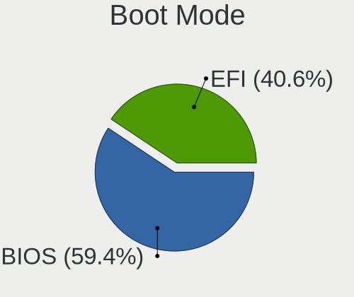
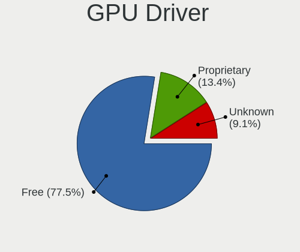
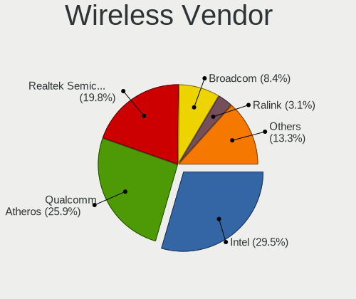
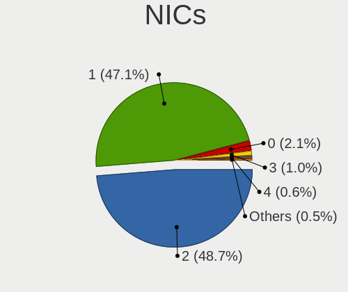
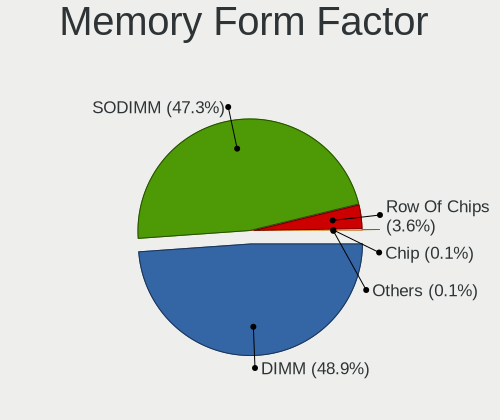

Linux in Russia - Tested Hardware & Statistics
----------------------------------------------

A project to collect tested hardware configurations for Linux in Russia.

Anyone can contribute to this report by the [hw-probe](https://github.com/linuxhw/hw-probe) tool:

    sudo -E hw-probe -all -upload

Please contribute! Especially if your hardware is rare.

This is a report for all computer types. See also reports for [desktops](/Location/Russia/Desktop/README.md) and [notebooks](/Location/Russia/Notebook/README.md).

Contents
--------

* [ Test Cases ](#test-cases)

* [ System ](#system)
  - [ OS                       ](#os)
  - [ OS Family                ](#os-family)
  - [ Kernel                   ](#kernel)
  - [ Kernel Family            ](#kernel-family)
  - [ Kernel Major Ver.        ](#kernel-major-ver)
  - [ Arch                     ](#arch)
  - [ DE                       ](#de)
  - [ Display Server           ](#display-server)
  - [ Display Manager          ](#display-manager)
  - [ OS Lang                  ](#os-lang)
  - [ Boot Mode                ](#boot-mode)
  - [ Filesystem               ](#filesystem)
  - [ Part. scheme             ](#part-scheme)
  - [ Dual Boot with Linux/BSD ](#dual-boot-with-linuxbsd)
  - [ Dual Boot (Win)          ](#dual-boot-win)

* [ Board ](#board)
  - [ Vendor                   ](#vendor)
  - [ Model                    ](#model)
  - [ Model Family             ](#model-family)
  - [ MFG Year                 ](#mfg-year)
  - [ Form Factor              ](#form-factor)
  - [ Secure Boot              ](#secure-boot)
  - [ Coreboot                 ](#coreboot)
  - [ RAM Size                 ](#ram-size)
  - [ RAM Used                 ](#ram-used)
  - [ Total Drives             ](#total-drives)
  - [ Has CD-ROM               ](#has-cd-rom)
  - [ Has Ethernet             ](#has-ethernet)
  - [ Has WiFi                 ](#has-wifi)
  - [ Has Bluetooth            ](#has-bluetooth)

* [ Location ](#location)
  - [ Country                  ](#country)
  - [ City                     ](#city)

* [ Drives ](#drives)
  - [ Drive Vendor             ](#drive-vendor)
  - [ Drive Model              ](#drive-model)
  - [ HDD Vendor               ](#hdd-vendor)
  - [ SSD Vendor               ](#ssd-vendor)
  - [ Drive Kind               ](#drive-kind)
  - [ Drive Connector          ](#drive-connector)
  - [ Drive Size               ](#drive-size)
  - [ Space Total              ](#space-total)
  - [ Space Used               ](#space-used)
  - [ Malfunc. Drives          ](#malfunc-drives)
  - [ Malfunc. Drive Vendor    ](#malfunc-drive-vendor)
  - [ Malfunc. HDD Vendor      ](#malfunc-hdd-vendor)
  - [ Malfunc. Drive Kind      ](#malfunc-drive-kind)
  - [ Failed Drives            ](#failed-drives)
  - [ Failed Drive Vendor      ](#failed-drive-vendor)
  - [ Drive Status             ](#drive-status)

* [ Storage controller ](#storage-controller)
  - [ Storage Vendor           ](#storage-vendor)
  - [ Storage Model            ](#storage-model)
  - [ Storage Kind             ](#storage-kind)

* [ Processor ](#processor)
  - [ CPU Vendor               ](#cpu-vendor)
  - [ CPU Model                ](#cpu-model)
  - [ CPU Model Family         ](#cpu-model-family)
  - [ CPU Cores                ](#cpu-cores)
  - [ CPU Sockets              ](#cpu-sockets)
  - [ CPU Threads              ](#cpu-threads)
  - [ CPU Op-Modes             ](#cpu-op-modes)
  - [ CPU Microcode            ](#cpu-microcode)
  - [ CPU Microarch            ](#cpu-microarch)

* [ Graphics ](#graphics)
  - [ GPU Vendor               ](#gpu-vendor)
  - [ GPU Model                ](#gpu-model)
  - [ GPU Combo                ](#gpu-combo)
  - [ GPU Driver               ](#gpu-driver)
  - [ GPU Memory               ](#gpu-memory)

* [ Monitor ](#monitor)
  - [ Monitor Vendor           ](#monitor-vendor)
  - [ Monitor Model            ](#monitor-model)
  - [ Monitor Resolution       ](#monitor-resolution)
  - [ Monitor Diagonal         ](#monitor-diagonal)
  - [ Monitor Width            ](#monitor-width)
  - [ Aspect Ratio             ](#aspect-ratio)
  - [ Monitor Area             ](#monitor-area)
  - [ Pixel Density            ](#pixel-density)
  - [ Multiple Monitors        ](#multiple-monitors)

* [ Network ](#network)
  - [ Net Controller Vendor    ](#net-controller-vendor)
  - [ Net Controller Model     ](#net-controller-model)
  - [ Wireless Vendor          ](#wireless-vendor)
  - [ Wireless Model           ](#wireless-model)
  - [ Ethernet Vendor          ](#ethernet-vendor)
  - [ Ethernet Model           ](#ethernet-model)
  - [ Net Controller Kind      ](#net-controller-kind)
  - [ Used Controller          ](#used-controller)
  - [ NICs                     ](#nics)
  - [ IPv6                     ](#ipv6)

* [ Bluetooth ](#bluetooth)
  - [ Bluetooth Vendor         ](#bluetooth-vendor)
  - [ Bluetooth Model          ](#bluetooth-model)

* [ Sound ](#sound)
  - [ Sound Vendor             ](#sound-vendor)
  - [ Sound Model              ](#sound-model)

* [ Memory ](#memory)
  - [ Memory Vendor            ](#memory-vendor)
  - [ Memory Model             ](#memory-model)
  - [ Memory Kind              ](#memory-kind)
  - [ Memory Form Factor       ](#memory-form-factor)
  - [ Memory Size              ](#memory-size)
  - [ Memory Speed             ](#memory-speed)

* [ Printers & scanners ](#printers--scanners)
  - [ Printer Vendor           ](#printer-vendor)
  - [ Printer Model            ](#printer-model)
  - [ Scanner Vendor           ](#scanner-vendor)
  - [ Scanner Model            ](#scanner-model)

* [ Camera ](#camera)
  - [ Camera Vendor            ](#camera-vendor)
  - [ Camera Model             ](#camera-model)

* [ Security ](#security)
  - [ Fingerprint Vendor       ](#fingerprint-vendor)
  - [ Fingerprint Model        ](#fingerprint-model)
  - [ Chipcard Vendor          ](#chipcard-vendor)
  - [ Chipcard Model           ](#chipcard-model)

* [ Unsupported ](#unsupported)
  - [ Unsupported Devices      ](#unsupported-devices)
  - [ Unsupported Device Types ](#unsupported-device-types)

Test Cases
----------

Total: 34203

| Vendor        | Model                       | Form-Factor | Probe                                                      | Date         |
|---------------|-----------------------------|-------------|------------------------------------------------------------|--------------|
| Shenzhen a... | AC1-DP                      | Desktop     | [754335ffe9](https://linux-hardware.org/?probe=754335ffe9) | Nov 02, 2022 |
| HP            | ENVY m6                     | Notebook    | [9043724da5](https://linux-hardware.org/?probe=9043724da5) | Nov 02, 2022 |
| MSI           | MS-7392                     | Desktop     | [d453f89064](https://linux-hardware.org/?probe=d453f89064) | Nov 02, 2022 |
| ASUSTek       | M5A78L-M LX3 PLUS           | Desktop     | [23a62c3509](https://linux-hardware.org/?probe=23a62c3509) | Nov 02, 2022 |
| ASUSTek       | VivoBook_ASUSLaptop X570... | Notebook    | [28d7daff10](https://linux-hardware.org/?probe=28d7daff10) | Nov 02, 2022 |
| ASUSTek       | M5A78L-M LX3 PLUS           | Desktop     | [d34ccf5e7a](https://linux-hardware.org/?probe=d34ccf5e7a) | Nov 02, 2022 |
| ASUSTek       | M5A78L-M LX3 PLUS           | Desktop     | [eb06593b9e](https://linux-hardware.org/?probe=eb06593b9e) | Nov 02, 2022 |
| Acer          | Nitro AN515-54              | Notebook    | [710ab678b2](https://linux-hardware.org/?probe=710ab678b2) | Nov 02, 2022 |
| Acer          | Aspire A515-54G             | Notebook    | [519fa92199](https://linux-hardware.org/?probe=519fa92199) | Nov 02, 2022 |
| Gigabyte      | H77N-WIFI                   | Desktop     | [d8b066edcd](https://linux-hardware.org/?probe=d8b066edcd) | Nov 02, 2022 |
| ASUSTek       | 1215B                       | Notebook    | [21694405a9](https://linux-hardware.org/?probe=21694405a9) | Nov 02, 2022 |
| MSI           | H110M PRO-VD                | Desktop     | [1fb0a79791](https://linux-hardware.org/?probe=1fb0a79791) | Nov 02, 2022 |
| ASUSTek       | H61M-K                      | Desktop     | [3773260366](https://linux-hardware.org/?probe=3773260366) | Nov 02, 2022 |
| Digma         | EVE 11 C422 ES1068EW        | Notebook    | [f5177de131](https://linux-hardware.org/?probe=f5177de131) | Nov 02, 2022 |
| Gigabyte      | A520M DS3H                  | Desktop     | [8fe13e2165](https://linux-hardware.org/?probe=8fe13e2165) | Nov 02, 2022 |
| ASRock        | H510M-HVS R2.0              | Desktop     | [562f466f8d](https://linux-hardware.org/?probe=562f466f8d) | Nov 02, 2022 |
| ASRock        | B450M Pro4                  | Desktop     | [38b68c6946](https://linux-hardware.org/?probe=38b68c6946) | Nov 02, 2022 |
| ASRock        | H510M-HVS R2.0              | Desktop     | [b68271c648](https://linux-hardware.org/?probe=b68271c648) | Nov 02, 2022 |
| Lenovo        | H420                        | Desktop     | [3e3f04d875](https://linux-hardware.org/?probe=3e3f04d875) | Nov 02, 2022 |
| ASUSTek       | VivoBook_ASUSLaptop X570... | Notebook    | [6f89789444](https://linux-hardware.org/?probe=6f89789444) | Nov 02, 2022 |
| Gigabyte      | EP45-DS4                    | Desktop     | [fa96a26c5a](https://linux-hardware.org/?probe=fa96a26c5a) | Nov 02, 2022 |
| ASUSTek       | N53Jg                       | Notebook    | [8e4782c668](https://linux-hardware.org/?probe=8e4782c668) | Nov 01, 2022 |
| HP            | 829B                        | All in one  | [23122cba32](https://linux-hardware.org/?probe=23122cba32) | Nov 01, 2022 |
| ECS           | H61H2-M2                    | Desktop     | [b70c0aa20d](https://linux-hardware.org/?probe=b70c0aa20d) | Nov 01, 2022 |
| Gigabyte      | H610M H DDR4                | Desktop     | [b726668f90](https://linux-hardware.org/?probe=b726668f90) | Nov 01, 2022 |
| Toshiba       | Satellite C660              | Notebook    | [44c6e56cd9](https://linux-hardware.org/?probe=44c6e56cd9) | Nov 01, 2022 |
| Toshiba       | Satellite L755              | Notebook    | [dc3d60731e](https://linux-hardware.org/?probe=dc3d60731e) | Nov 01, 2022 |
| Gigabyte      | EP45-DS4                    | Desktop     | [2eb78b1c3d](https://linux-hardware.org/?probe=2eb78b1c3d) | Nov 01, 2022 |
| ASUSTek       | CROSSBLADE RANGER           | Desktop     | [5f92247b16](https://linux-hardware.org/?probe=5f92247b16) | Nov 01, 2022 |
| Gigabyte      | B450M H                     | Desktop     | [06bbc75ef0](https://linux-hardware.org/?probe=06bbc75ef0) | Nov 01, 2022 |
| ASUSTek       | PRIME H310M-K               | Desktop     | [9efd2724b2](https://linux-hardware.org/?probe=9efd2724b2) | Nov 01, 2022 |
| HP            | Laptop 14s-fq0xxx           | Notebook    | [fe23529093](https://linux-hardware.org/?probe=fe23529093) | Nov 01, 2022 |
| ASRock        | B365M-HDV                   | Desktop     | [29a6bce4c0](https://linux-hardware.org/?probe=29a6bce4c0) | Nov 01, 2022 |
| Lenovo        | ThinkBook 15 G2 ITL 20VE    | Notebook    | [7603f28400](https://linux-hardware.org/?probe=7603f28400) | Nov 01, 2022 |
| ASUSTek       | H81M-C                      | Desktop     | [76052b7756](https://linux-hardware.org/?probe=76052b7756) | Nov 01, 2022 |
| Lenovo        | V14-ADA 82C6                | Notebook    | [a54d6876b6](https://linux-hardware.org/?probe=a54d6876b6) | Nov 01, 2022 |
| Gigabyte      | X570S AERO G                | Desktop     | [92fccb6716](https://linux-hardware.org/?probe=92fccb6716) | Nov 01, 2022 |
| MSI           | H61M-P32/W8                 | Desktop     | [14df9c3c14](https://linux-hardware.org/?probe=14df9c3c14) | Nov 01, 2022 |
| MSI           | 0A90                        | Desktop     | [47fa407c02](https://linux-hardware.org/?probe=47fa407c02) | Nov 01, 2022 |
| MSI           | Z390-A PRO                  | Desktop     | [3eea020596](https://linux-hardware.org/?probe=3eea020596) | Nov 01, 2022 |
| ASRock        | N68C-GS FX                  | Desktop     | [f7a9c5f382](https://linux-hardware.org/?probe=f7a9c5f382) | Nov 01, 2022 |
| Lenovo        | V15 G2 ALC 82KD             | Notebook    | [406aae2f66](https://linux-hardware.org/?probe=406aae2f66) | Nov 01, 2022 |
| MSI           | MEG X570 UNIFY              | Desktop     | [1a88842782](https://linux-hardware.org/?probe=1a88842782) | Nov 01, 2022 |
| Apple         | MacBookPro8,1               | Notebook    | [da912b99f4](https://linux-hardware.org/?probe=da912b99f4) | Nov 01, 2022 |
| Samsung       | RV410/RV510/S3510/E3510     | Notebook    | [566d83485b](https://linux-hardware.org/?probe=566d83485b) | Oct 31, 2022 |
| HUAWEI        | BOHB-WAX9                   | Notebook    | [274a3383db](https://linux-hardware.org/?probe=274a3383db) | Oct 31, 2022 |
| MSI           | H81M-P33                    | Desktop     | [29e4a4ec52](https://linux-hardware.org/?probe=29e4a4ec52) | Oct 31, 2022 |
| ASUSTek       | PRIME Z690M-PLUS D4         | Desktop     | [96d61ed3e1](https://linux-hardware.org/?probe=96d61ed3e1) | Oct 31, 2022 |
| MSI           | B450-A PRO MAX              | Desktop     | [8e480ded02](https://linux-hardware.org/?probe=8e480ded02) | Oct 31, 2022 |
| ASRock        | 960GM-VGS3 FX               | Desktop     | [f31f613901](https://linux-hardware.org/?probe=f31f613901) | Oct 31, 2022 |
| ASUSTek       | H81M-C                      | Desktop     | [2fdcf19b6d](https://linux-hardware.org/?probe=2fdcf19b6d) | Oct 31, 2022 |
| Acer          | Aspire 5733                 | Notebook    | [bcc1836178](https://linux-hardware.org/?probe=bcc1836178) | Oct 31, 2022 |
| Foxconn       | RS690M2MA 0A                | Desktop     | [29605bcad9](https://linux-hardware.org/?probe=29605bcad9) | Oct 31, 2022 |
| ASUSTek       | K43SJ                       | Notebook    | [778e6caf06](https://linux-hardware.org/?probe=778e6caf06) | Oct 31, 2022 |
| Gigabyte      | B660M GAMING X AX           | Desktop     | [d48fe55211](https://linux-hardware.org/?probe=d48fe55211) | Oct 31, 2022 |
| Supermicro    | X11SSL-F                    | Server      | [1a5e57e9ef](https://linux-hardware.org/?probe=1a5e57e9ef) | Oct 31, 2022 |
| Supermicro    | X11SSM-F                    | Server      | [c54a576ec0](https://linux-hardware.org/?probe=c54a576ec0) | Oct 31, 2022 |
| Supermicro    | X11SSL-F                    | Server      | [c13d2d5610](https://linux-hardware.org/?probe=c13d2d5610) | Oct 31, 2022 |
| ASRock        | H470M-HDV                   | Desktop     | [a4e522270c](https://linux-hardware.org/?probe=a4e522270c) | Oct 31, 2022 |
| ASUSTek       | X541UVK                     | Notebook    | [15bdbbf952](https://linux-hardware.org/?probe=15bdbbf952) | Oct 31, 2022 |
| Biostar       | H310MHC2                    | Desktop     | [5ad5ba772f](https://linux-hardware.org/?probe=5ad5ba772f) | Oct 31, 2022 |
| Intel         | DG41AN AAE92991-401         | Desktop     | [cd670cef3d](https://linux-hardware.org/?probe=cd670cef3d) | Oct 31, 2022 |
| Gigabyte      | A520M H                     | Desktop     | [0a8043d206](https://linux-hardware.org/?probe=0a8043d206) | Oct 31, 2022 |
| ASRock        | B550 Phantom Gaming 4       | Desktop     | [5e87d391a3](https://linux-hardware.org/?probe=5e87d391a3) | Oct 31, 2022 |
| Sony          | VGN-AR71MR                  | Notebook    | [4ecd695b12](https://linux-hardware.org/?probe=4ecd695b12) | Oct 31, 2022 |
| Intel         | D946GZAB AAD66610-300       | Desktop     | [33c41323a3](https://linux-hardware.org/?probe=33c41323a3) | Oct 31, 2022 |
| ASUSTek       | M5A78L/USB3                 | Desktop     | [b5098e9fe5](https://linux-hardware.org/?probe=b5098e9fe5) | Oct 31, 2022 |
| ASUSTek       | T100TAM                     | Notebook    | [a2a70b919d](https://linux-hardware.org/?probe=a2a70b919d) | Oct 31, 2022 |
| ASRock        | N68C-GS FX                  | Desktop     | [e24bf2e31f](https://linux-hardware.org/?probe=e24bf2e31f) | Oct 31, 2022 |
| Aquarius      | NS585                       | Notebook    | [e4b4e0456d](https://linux-hardware.org/?probe=e4b4e0456d) | Oct 31, 2022 |
| Gigabyte      | H77N-WIFI                   | Desktop     | [d4340d8d66](https://linux-hardware.org/?probe=d4340d8d66) | Oct 31, 2022 |
| Samsung       | RV410/RV510/S3510/E3510     | Notebook    | [073ba962ff](https://linux-hardware.org/?probe=073ba962ff) | Oct 31, 2022 |
| HP            | Laptop 14s-dq3xxx           | Notebook    | [674ced10f2](https://linux-hardware.org/?probe=674ced10f2) | Oct 31, 2022 |
| HUAWEI        | NBLB-WAX9N                  | Notebook    | [a872c9888a](https://linux-hardware.org/?probe=a872c9888a) | Oct 30, 2022 |
| HUAWEI        | NBLB-WAX9N                  | Notebook    | [45f670d99f](https://linux-hardware.org/?probe=45f670d99f) | Oct 30, 2022 |
| ASUSTek       | Leonite2                    | Desktop     | [955ce84cf2](https://linux-hardware.org/?probe=955ce84cf2) | Oct 30, 2022 |
| WeiBu         | Aptio CRB                   | Mini pc     | [fa111a4799](https://linux-hardware.org/?probe=fa111a4799) | Oct 30, 2022 |
| MSI           | Sword 15 A11UE              | Notebook    | [c039d4321b](https://linux-hardware.org/?probe=c039d4321b) | Oct 30, 2022 |
| MSI           | Stealth GS77 12UHS          | Notebook    | [8a1d96274e](https://linux-hardware.org/?probe=8a1d96274e) | Oct 30, 2022 |
| HP            | EliteBook 855 G8 Noteboo... | Notebook    | [f60d156dd3](https://linux-hardware.org/?probe=f60d156dd3) | Oct 30, 2022 |
| Chuwi         | LarkBook                    | Notebook    | [3ff2ff69ce](https://linux-hardware.org/?probe=3ff2ff69ce) | Oct 30, 2022 |
| ASRock        | N68C-GS FX                  | Desktop     | [bf96e5a0a1](https://linux-hardware.org/?probe=bf96e5a0a1) | Oct 30, 2022 |
| ASRock        | H410M-HVS                   | Desktop     | [2d540e06b9](https://linux-hardware.org/?probe=2d540e06b9) | Oct 30, 2022 |
| HUAWEI        | HLY-WX9XX                   | Notebook    | [4208d513b4](https://linux-hardware.org/?probe=4208d513b4) | Oct 30, 2022 |
| Prestigio     | PSB133S01ZFP                | Notebook    | [e10becbd35](https://linux-hardware.org/?probe=e10becbd35) | Oct 30, 2022 |
| ASUSTek       | PRIME A320M-K               | Desktop     | [6bbea41ce5](https://linux-hardware.org/?probe=6bbea41ce5) | Oct 30, 2022 |
| HP            | Pavilion g6                 | Notebook    | [666a829545](https://linux-hardware.org/?probe=666a829545) | Oct 30, 2022 |
| Aquarius      | Cmp NS765                   | Notebook    | [5e519edbee](https://linux-hardware.org/?probe=5e519edbee) | Oct 30, 2022 |
| Gigabyte      | G41M-Combo                  | Desktop     | [180622c3be](https://linux-hardware.org/?probe=180622c3be) | Oct 30, 2022 |
| HIPER         | WORKBOOK                    | Notebook    | [0a3eb12b15](https://linux-hardware.org/?probe=0a3eb12b15) | Oct 30, 2022 |
| ASRock        | B450M Pro4-F R2.0           | Desktop     | [5fb37123e0](https://linux-hardware.org/?probe=5fb37123e0) | Oct 30, 2022 |
| ASUSTek       | P7H55-M/USB3                | Desktop     | [8983159779](https://linux-hardware.org/?probe=8983159779) | Oct 30, 2022 |
| ASUSTek       | ROG STRIX B365-G GAMING     | Desktop     | [7f78f3451e](https://linux-hardware.org/?probe=7f78f3451e) | Oct 29, 2022 |
| Acer          | Aspire ZC-605               | All in one  | [0b6c0b7a7c](https://linux-hardware.org/?probe=0b6c0b7a7c) | Oct 29, 2022 |
| Gigabyte      | B450M DS3H-CF               | Desktop     | [47b5907eec](https://linux-hardware.org/?probe=47b5907eec) | Oct 29, 2022 |
| Acer          | Nitro AN515-42              | Notebook    | [763e5e0492](https://linux-hardware.org/?probe=763e5e0492) | Oct 29, 2022 |
| Dell          | Vostro 5490                 | Notebook    | [057163f0e4](https://linux-hardware.org/?probe=057163f0e4) | Oct 29, 2022 |
| MSI           | B450M MORTAR MAX            | Desktop     | [d8321f617e](https://linux-hardware.org/?probe=d8321f617e) | Oct 29, 2022 |
| Gigabyte      | Z690 AORUS MASTER           | Desktop     | [2a7d6b757b](https://linux-hardware.org/?probe=2a7d6b757b) | Oct 29, 2022 |
| MSI           | B450M MORTAR MAX            | Desktop     | [7f67023fa9](https://linux-hardware.org/?probe=7f67023fa9) | Oct 29, 2022 |
| HP            | Laptop 15-dw3xxx            | Notebook    | [0c281b6b5e](https://linux-hardware.org/?probe=0c281b6b5e) | Oct 29, 2022 |
| Gigabyte      | GA-790XTA-UD4               | Desktop     | [a750edc641](https://linux-hardware.org/?probe=a750edc641) | Oct 29, 2022 |
| ASRock        | H410M-HVS                   | Desktop     | [9371d71f6d](https://linux-hardware.org/?probe=9371d71f6d) | Oct 29, 2022 |
| Lenovo        | MAHOBAY Win8 STD EM DPK ... | All in one  | [4b37b09299](https://linux-hardware.org/?probe=4b37b09299) | Oct 29, 2022 |
| ASUSTek       | ZenBook 13 UX310UFR         | Notebook    | [11b52c3e1f](https://linux-hardware.org/?probe=11b52c3e1f) | Oct 29, 2022 |
| Acer          | Nitro AN515-52              | Notebook    | [38570237ac](https://linux-hardware.org/?probe=38570237ac) | Oct 29, 2022 |
| Acer          | Nitro AN515-52              | Notebook    | [5551d222b2](https://linux-hardware.org/?probe=5551d222b2) | Oct 29, 2022 |
| Gigabyte      | H110M-M2-CF                 | Desktop     | [34c4f594c4](https://linux-hardware.org/?probe=34c4f594c4) | Oct 29, 2022 |
| Dell          | 0Y5DDC A00                  | Desktop     | [e3421b1908](https://linux-hardware.org/?probe=e3421b1908) | Oct 29, 2022 |
| HP            | Laptop 15s-eq2xxx           | Notebook    | [dbd930e552](https://linux-hardware.org/?probe=dbd930e552) | Oct 29, 2022 |
| Lenovo        | IdeaPad 3 15IIL05 81WE      | Notebook    | [d152b0a56c](https://linux-hardware.org/?probe=d152b0a56c) | Oct 29, 2022 |
| HP            | Pavilion dv6                | Notebook    | [6618a8e6ed](https://linux-hardware.org/?probe=6618a8e6ed) | Oct 29, 2022 |
| ASUSTek       | X550DP                      | Notebook    | [b0a52fe296](https://linux-hardware.org/?probe=b0a52fe296) | Oct 29, 2022 |
| Samsung       | 300V3A/300V4A/300V5A        | Notebook    | [4acb2d0863](https://linux-hardware.org/?probe=4acb2d0863) | Oct 29, 2022 |
| ASUSTek       | K50C                        | Notebook    | [af80714f09](https://linux-hardware.org/?probe=af80714f09) | Oct 29, 2022 |
| Samsung       | 350V5C/351V5C/3540VC/344... | Notebook    | [0a24d1491a](https://linux-hardware.org/?probe=0a24d1491a) | Oct 29, 2022 |
| ASRock        | N68-GS4 FX                  | Desktop     | [04334f2930](https://linux-hardware.org/?probe=04334f2930) | Oct 29, 2022 |
| ASUSTek       | X541UV                      | Notebook    | [cef88d9d62](https://linux-hardware.org/?probe=cef88d9d62) | Oct 29, 2022 |
| ASUSTek       | K50C                        | Notebook    | [ca606469d8](https://linux-hardware.org/?probe=ca606469d8) | Oct 29, 2022 |
| Gigabyte      | B550 GAMING X V2            | Desktop     | [7b3b808198](https://linux-hardware.org/?probe=7b3b808198) | Oct 29, 2022 |
| Techvision    | TVI7309X B0                 | Desktop     | [65b5280dd1](https://linux-hardware.org/?probe=65b5280dd1) | Oct 29, 2022 |
| Toshiba       | Satellite L755              | Notebook    | [0fa70f29d4](https://linux-hardware.org/?probe=0fa70f29d4) | Oct 28, 2022 |
| Prestigio     | PSB141S01                   | Notebook    | [646d3fd287](https://linux-hardware.org/?probe=646d3fd287) | Oct 28, 2022 |
| ASUSTek       | P5K                         | Desktop     | [6d87562df6](https://linux-hardware.org/?probe=6d87562df6) | Oct 28, 2022 |
| ASRock        | Z370 Pro4                   | Desktop     | [04e898b2f6](https://linux-hardware.org/?probe=04e898b2f6) | Oct 28, 2022 |
| Lenovo        | B560                        | Notebook    | [f8676b0e49](https://linux-hardware.org/?probe=f8676b0e49) | Oct 28, 2022 |
| MSI           | MAG B560 TOMAHAWK WIFI      | Desktop     | [429fd34d64](https://linux-hardware.org/?probe=429fd34d64) | Oct 28, 2022 |
| Lenovo        | IdeaPad L340-15API 81LW     | Notebook    | [d653658a53](https://linux-hardware.org/?probe=d653658a53) | Oct 28, 2022 |
| ASUSTek       | H81M-C                      | Desktop     | [c96189c44c](https://linux-hardware.org/?probe=c96189c44c) | Oct 28, 2022 |
| Gigabyte      | B560M H                     | Desktop     | [00766db60b](https://linux-hardware.org/?probe=00766db60b) | Oct 28, 2022 |
| ASUSTek       | M5A87                       | Desktop     | [88e6b582c9](https://linux-hardware.org/?probe=88e6b582c9) | Oct 28, 2022 |
| ASUSTek       | F3Ka                        | Notebook    | [06235844a1](https://linux-hardware.org/?probe=06235844a1) | Oct 28, 2022 |
| Gigabyte      | PH67-UD3-B3                 | Desktop     | [c66fb514ab](https://linux-hardware.org/?probe=c66fb514ab) | Oct 28, 2022 |
| ASUSTek       | P8B75-V                     | Desktop     | [4783ed1083](https://linux-hardware.org/?probe=4783ed1083) | Oct 28, 2022 |
| HUAWEI        | BOM-WXX9                    | Notebook    | [203ac0880d](https://linux-hardware.org/?probe=203ac0880d) | Oct 28, 2022 |
| MSI           | 0A90                        | Desktop     | [a15ab9db5e](https://linux-hardware.org/?probe=a15ab9db5e) | Oct 28, 2022 |
| Gigabyte      | GA-880GM-D2H                | Desktop     | [cacdacb3ad](https://linux-hardware.org/?probe=cacdacb3ad) | Oct 28, 2022 |
| Lenovo        | IdeaPad L340-15API 81LW     | Notebook    | [b9ab6b9cf2](https://linux-hardware.org/?probe=b9ab6b9cf2) | Oct 28, 2022 |
| Dell          | Inspiron 3542               | Notebook    | [a3a24a81fa](https://linux-hardware.org/?probe=a3a24a81fa) | Oct 28, 2022 |
| Lenovo        | IdeaPad 5 Pro 14ACN6 82L... | Notebook    | [6b57390808](https://linux-hardware.org/?probe=6b57390808) | Oct 28, 2022 |
| Lenovo        | IdeaPad 110-15IBR 80T7      | Notebook    | [26311f56d7](https://linux-hardware.org/?probe=26311f56d7) | Oct 28, 2022 |
| Acer          | Aspire A715-75G             | Notebook    | [78b0c55e62](https://linux-hardware.org/?probe=78b0c55e62) | Oct 28, 2022 |
| MSI           | Z97 GAMING 3                | Desktop     | [4488ff5b26](https://linux-hardware.org/?probe=4488ff5b26) | Oct 28, 2022 |
| MSI           | GP66 Leopard 11UG           | Notebook    | [aec6edc8a0](https://linux-hardware.org/?probe=aec6edc8a0) | Oct 28, 2022 |
| Lenovo        | B560                        | Notebook    | [73a6da1bdc](https://linux-hardware.org/?probe=73a6da1bdc) | Oct 28, 2022 |
| Gigabyte      | A320M-S2H-CF                | Desktop     | [594b16e254](https://linux-hardware.org/?probe=594b16e254) | Oct 28, 2022 |
| Sony          | VPCCB3S1R                   | Notebook    | [ee5b1465a1](https://linux-hardware.org/?probe=ee5b1465a1) | Oct 28, 2022 |
| Unknown       | Unknown                     | Notebook    | [c867c45a75](https://linux-hardware.org/?probe=c867c45a75) | Oct 28, 2022 |
| ASUSTek       | PRIME Z690-P WIFI D4        | Desktop     | [327ee3d5b0](https://linux-hardware.org/?probe=327ee3d5b0) | Oct 28, 2022 |
| Unknown       | Unknown                     | Notebook    | [967c2c956d](https://linux-hardware.org/?probe=967c2c956d) | Oct 27, 2022 |
| Gigabyte      | F2A88X-D3H                  | Desktop     | [dc1e16bba1](https://linux-hardware.org/?probe=dc1e16bba1) | Oct 27, 2022 |
| Dell          | Vostro 5490                 | Notebook    | [ac6587adbb](https://linux-hardware.org/?probe=ac6587adbb) | Oct 27, 2022 |
| ASUSTek       | P8B75-V                     | Desktop     | [ca5c26654a](https://linux-hardware.org/?probe=ca5c26654a) | Oct 27, 2022 |
| ASUSTek       | M5A97 PRO                   | Desktop     | [de99c600e5](https://linux-hardware.org/?probe=de99c600e5) | Oct 27, 2022 |
| Acer          | Aspire E5-573G              | Notebook    | [6f926eed65](https://linux-hardware.org/?probe=6f926eed65) | Oct 27, 2022 |
| Gigabyte      | H110M-S2V-CF                | Desktop     | [1d4dfc3e06](https://linux-hardware.org/?probe=1d4dfc3e06) | Oct 27, 2022 |
| HUAWEI        | NBLK-WAX9X                  | Notebook    | [a44f774778](https://linux-hardware.org/?probe=a44f774778) | Oct 27, 2022 |
| HP            | Laptop 14s-fq0xxx           | Notebook    | [377893cdc6](https://linux-hardware.org/?probe=377893cdc6) | Oct 27, 2022 |
| HP            | EliteBook 855 G8 Noteboo... | Notebook    | [b9c616b406](https://linux-hardware.org/?probe=b9c616b406) | Oct 27, 2022 |
| ASRock        | Z77 Pro4-M                  | Desktop     | [b388ac6776](https://linux-hardware.org/?probe=b388ac6776) | Oct 27, 2022 |
| Fujitsu       | D2990-A2 S26361-D2990-A2    | Desktop     | [6de2b1229f](https://linux-hardware.org/?probe=6de2b1229f) | Oct 27, 2022 |
| ASRock        | B550M-HDV                   | Desktop     | [4d5068a3be](https://linux-hardware.org/?probe=4d5068a3be) | Oct 27, 2022 |
| ASUSTek       | P8H61-M LE R2.0             | Desktop     | [6b01f2f498](https://linux-hardware.org/?probe=6b01f2f498) | Oct 27, 2022 |
| MSI           | H110M PRO-VD                | Desktop     | [175f39979c](https://linux-hardware.org/?probe=175f39979c) | Oct 27, 2022 |
| Lenovo        | 3188 SDK0J40697 WIN 3305... | Desktop     | [9c429fe90c](https://linux-hardware.org/?probe=9c429fe90c) | Oct 27, 2022 |
| ASUSTek       | N56VZ                       | Notebook    | [399d92f9e0](https://linux-hardware.org/?probe=399d92f9e0) | Oct 27, 2022 |
| Biostar       | TB250-BTC                   | Desktop     | [89e7931244](https://linux-hardware.org/?probe=89e7931244) | Oct 27, 2022 |
| Intel         | D34010WYK H14771-301        | Desktop     | [cea24a780a](https://linux-hardware.org/?probe=cea24a780a) | Oct 26, 2022 |
| MSI           | H81M-P33                    | Desktop     | [e4f38c5519](https://linux-hardware.org/?probe=e4f38c5519) | Oct 26, 2022 |
| AMI           | Cherry Trail CR             | Desktop     | [8cf0d29214](https://linux-hardware.org/?probe=8cf0d29214) | Oct 26, 2022 |
| Lenovo        | Legion 5 15IMH05H 81Y6      | Notebook    | [9bb0c7d3b0](https://linux-hardware.org/?probe=9bb0c7d3b0) | Oct 26, 2022 |
| HP            | 8717                        | Desktop     | [c2fcc7119a](https://linux-hardware.org/?probe=c2fcc7119a) | Oct 26, 2022 |
| AMI           | Cherry Trail CR             | Desktop     | [e8f64c2c8c](https://linux-hardware.org/?probe=e8f64c2c8c) | Oct 26, 2022 |
| Acer          | Nitro AN515-54              | Notebook    | [89180ba46b](https://linux-hardware.org/?probe=89180ba46b) | Oct 26, 2022 |
| HUAWEI        | CREM-WXX9                   | Notebook    | [1c1356d6d5](https://linux-hardware.org/?probe=1c1356d6d5) | Oct 26, 2022 |
| Samsung       | 300V3A/300V4A/300V5A/200... | Notebook    | [70ea39404e](https://linux-hardware.org/?probe=70ea39404e) | Oct 26, 2022 |
| ASUSTek       | B85M-G                      | Desktop     | [0d3545c6aa](https://linux-hardware.org/?probe=0d3545c6aa) | Oct 26, 2022 |
| HP            | EliteBook 840 G4            | Notebook    | [73ee5ace17](https://linux-hardware.org/?probe=73ee5ace17) | Oct 26, 2022 |
| HP            | EliteBook 855 G8 Noteboo... | Notebook    | [ffa2d93859](https://linux-hardware.org/?probe=ffa2d93859) | Oct 26, 2022 |
| RuggedPC      | RuggedBookJ87               | Tablet      | [74d39d268f](https://linux-hardware.org/?probe=74d39d268f) | Oct 26, 2022 |
| HP            | EliteBook 855 G8 Noteboo... | Notebook    | [642cfbc2d7](https://linux-hardware.org/?probe=642cfbc2d7) | Oct 26, 2022 |
| ASUSTek       | B85M-G                      | Desktop     | [0b8dc998a9](https://linux-hardware.org/?probe=0b8dc998a9) | Oct 26, 2022 |
| ASRock        | 970 Pro3 R2.0               | Desktop     | [c2b4882963](https://linux-hardware.org/?probe=c2b4882963) | Oct 26, 2022 |
| MiTAC         | E220 E220AQ-601             | Desktop     | [1ee0c036f8](https://linux-hardware.org/?probe=1ee0c036f8) | Oct 26, 2022 |
| ASUSTek       | PRIME H310M-R R2.0          | Desktop     | [c1067e423b](https://linux-hardware.org/?probe=c1067e423b) | Oct 26, 2022 |
| HP            | Spectre x360 Convertible... | Convertible | [401b775a13](https://linux-hardware.org/?probe=401b775a13) | Oct 26, 2022 |
| HP            | Laptop 15s-fq2xxx           | Notebook    | [a7a7e4b82c](https://linux-hardware.org/?probe=a7a7e4b82c) | Oct 26, 2022 |
| HP            | Pavilion dv7                | Notebook    | [1b53255010](https://linux-hardware.org/?probe=1b53255010) | Oct 25, 2022 |
| HP            | Laptop 14s-dq2xxx           | Notebook    | [6af4891e58](https://linux-hardware.org/?probe=6af4891e58) | Oct 25, 2022 |
| Gigabyte      | AB350M-Gaming 3-CF          | Desktop     | [926be6d85b](https://linux-hardware.org/?probe=926be6d85b) | Oct 25, 2022 |
| Gigabyte      | AB350M-Gaming 3-CF          | Desktop     | [94a393835b](https://linux-hardware.org/?probe=94a393835b) | Oct 25, 2022 |
| ASUSTek       | VivoBook_ASUSLaptop X570... | Notebook    | [09eec214ae](https://linux-hardware.org/?probe=09eec214ae) | Oct 25, 2022 |
| Lenovo        | ThinkPad T490 20N2001YUS    | Notebook    | [61b5a3092b](https://linux-hardware.org/?probe=61b5a3092b) | Oct 25, 2022 |
| Apple         | MacBookPro11,4              | Notebook    | [29dd6b053b](https://linux-hardware.org/?probe=29dd6b053b) | Oct 25, 2022 |
| Lenovo        | Larne CRB 31900059 STD 2... | All in one  | [a0f7baa45e](https://linux-hardware.org/?probe=a0f7baa45e) | Oct 25, 2022 |
| Acer          | Aspire A517-52              | Notebook    | [1ee47a3ab6](https://linux-hardware.org/?probe=1ee47a3ab6) | Oct 25, 2022 |
| Gigabyte      | G41MT-S2PT                  | Desktop     | [2fb43f4be2](https://linux-hardware.org/?probe=2fb43f4be2) | Oct 25, 2022 |
| ASUSTek       | H81M-K                      | Desktop     | [92dbe47379](https://linux-hardware.org/?probe=92dbe47379) | Oct 25, 2022 |
| Gigabyte      | P41T-D3                     | Desktop     | [fa69e3fada](https://linux-hardware.org/?probe=fa69e3fada) | Oct 25, 2022 |
| Gigabyte      | P41T-D3                     | Desktop     | [c96d8030a6](https://linux-hardware.org/?probe=c96d8030a6) | Oct 25, 2022 |
| Toshiba       | Satellite C660              | Notebook    | [b9d0cd845c](https://linux-hardware.org/?probe=b9d0cd845c) | Oct 25, 2022 |
| Toshiba       | Satellite C660              | Notebook    | [36faa336cf](https://linux-hardware.org/?probe=36faa336cf) | Oct 25, 2022 |
| MSI           | H110M PRO-VD                | Desktop     | [f8466185a4](https://linux-hardware.org/?probe=f8466185a4) | Oct 25, 2022 |
| ASRock        | G41C-GS                     | Desktop     | [218d55e0ca](https://linux-hardware.org/?probe=218d55e0ca) | Oct 25, 2022 |
| ASUSTek       | H81M-K                      | Desktop     | [247782b262](https://linux-hardware.org/?probe=247782b262) | Oct 25, 2022 |
| MSI           | B450M-A PRO MAX             | Desktop     | [9f404fe6b4](https://linux-hardware.org/?probe=9f404fe6b4) | Oct 25, 2022 |
| Dell          | 0Y5DDC A00                  | Desktop     | [bc39e0cfd6](https://linux-hardware.org/?probe=bc39e0cfd6) | Oct 25, 2022 |
| HP            | Laptop 17-ak0xx             | Notebook    | [09e77bbc9a](https://linux-hardware.org/?probe=09e77bbc9a) | Oct 25, 2022 |
| Huanan        | X79 (INTEL Xeon E5/Core ... | Desktop     | [601e080563](https://linux-hardware.org/?probe=601e080563) | Oct 25, 2022 |
| ASUSTek       | PRIME B550-PLUS             | Desktop     | [b8b23daad5](https://linux-hardware.org/?probe=b8b23daad5) | Oct 25, 2022 |
| HUAWEI        | HVY-WXX9                    | Notebook    | [60c3fde90a](https://linux-hardware.org/?probe=60c3fde90a) | Oct 25, 2022 |
| Supermicro    | X11DPH-T                    | Server      | [d9b96bce95](https://linux-hardware.org/?probe=d9b96bce95) | Oct 24, 2022 |
| Lenovo        | B560                        | Notebook    | [82125c56a3](https://linux-hardware.org/?probe=82125c56a3) | Oct 24, 2022 |
| HP            | Laptop 17-ak0xx             | Notebook    | [88796bbb2b](https://linux-hardware.org/?probe=88796bbb2b) | Oct 24, 2022 |
| ASUSTek       | PRIME H510M-A               | Desktop     | [83f5d2034b](https://linux-hardware.org/?probe=83f5d2034b) | Oct 24, 2022 |
| Gigabyte      | B550M AORUS PRO-P           | Desktop     | [4b88876126](https://linux-hardware.org/?probe=4b88876126) | Oct 24, 2022 |
| Gigabyte      | H410M H V3                  | Desktop     | [b4c5ed92b7](https://linux-hardware.org/?probe=b4c5ed92b7) | Oct 24, 2022 |
| MSI           | B450M GAMING PLUS           | Desktop     | [e3041ae2eb](https://linux-hardware.org/?probe=e3041ae2eb) | Oct 24, 2022 |
| ASUSTek       | ROG Strix G513QY_G513QY     | Notebook    | [9115752bd4](https://linux-hardware.org/?probe=9115752bd4) | Oct 24, 2022 |
| Lenovo        | IdeaPad L340-15IRH Gamin... | Notebook    | [f426a7b690](https://linux-hardware.org/?probe=f426a7b690) | Oct 24, 2022 |
| Gigabyte      | H61M-S2PV                   | Desktop     | [a876af89ec](https://linux-hardware.org/?probe=a876af89ec) | Oct 24, 2022 |
| ASUSTek       | A7U                         | Notebook    | [867f26dde1](https://linux-hardware.org/?probe=867f26dde1) | Oct 24, 2022 |
| HONOR         | BBR-WAX9                    | Notebook    | [bc30c6555a](https://linux-hardware.org/?probe=bc30c6555a) | Oct 24, 2022 |
| HONOR         | BBR-WAX9                    | Notebook    | [667d235a8f](https://linux-hardware.org/?probe=667d235a8f) | Oct 24, 2022 |
| Gigabyte      | B450 AORUS M                | Desktop     | [08c2a2abf9](https://linux-hardware.org/?probe=08c2a2abf9) | Oct 24, 2022 |
| HP            | Laptop 15-bw0xx             | Notebook    | [cdd4d21000](https://linux-hardware.org/?probe=cdd4d21000) | Oct 24, 2022 |
| Gigabyte      | X58A-UD7                    | Desktop     | [8b0cff9259](https://linux-hardware.org/?probe=8b0cff9259) | Oct 24, 2022 |
| Dell          | XPS L412Z                   | Notebook    | [92d8a4b47a](https://linux-hardware.org/?probe=92d8a4b47a) | Oct 24, 2022 |
| Lenovo        | IdeaPad 5 Pro 14ACN6 82L... | Notebook    | [14537f243b](https://linux-hardware.org/?probe=14537f243b) | Oct 24, 2022 |
| ASUSTek       | P8H77-V                     | Desktop     | [fdb1bce84a](https://linux-hardware.org/?probe=fdb1bce84a) | Oct 24, 2022 |
| ECS           | H310CH5-M2                  | Desktop     | [e9d2a5becb](https://linux-hardware.org/?probe=e9d2a5becb) | Oct 24, 2022 |
| Gigabyte      | G41M-ES2L                   | Desktop     | [a995e58f10](https://linux-hardware.org/?probe=a995e58f10) | Oct 24, 2022 |
| MSI           | PRO H610M-B DDR4            | Desktop     | [25db5739b7](https://linux-hardware.org/?probe=25db5739b7) | Oct 24, 2022 |
| Gigabyte      | Z690 UD DDR4                | Desktop     | [8cc3ca1253](https://linux-hardware.org/?probe=8cc3ca1253) | Oct 24, 2022 |
| MSI           | GE60 2PC                    | Notebook    | [e4378edb2b](https://linux-hardware.org/?probe=e4378edb2b) | Oct 24, 2022 |
| Sony          | SVE1513U1RW                 | Notebook    | [019c35087a](https://linux-hardware.org/?probe=019c35087a) | Oct 24, 2022 |
| Intel         | D34010WYK H14771-301        | Desktop     | [18d8d35afa](https://linux-hardware.org/?probe=18d8d35afa) | Oct 24, 2022 |
| MSI           | GE60 2PC                    | Notebook    | [930a153301](https://linux-hardware.org/?probe=930a153301) | Oct 24, 2022 |
| ASUSTek       | N56DY                       | Notebook    | [2d308224ee](https://linux-hardware.org/?probe=2d308224ee) | Oct 23, 2022 |
| ASUSTek       | N56DY                       | Notebook    | [d0caa49d24](https://linux-hardware.org/?probe=d0caa49d24) | Oct 23, 2022 |
| Lenovo        | IdeaPad 330-15ARR 81D2      | Notebook    | [d690b09eab](https://linux-hardware.org/?probe=d690b09eab) | Oct 23, 2022 |
| HP            | ENVY x360 Convertible 15... | Convertible | [d0790f0666](https://linux-hardware.org/?probe=d0790f0666) | Oct 23, 2022 |
| Gigabyte      | B450M DS3H V2               | Desktop     | [a159a5720e](https://linux-hardware.org/?probe=a159a5720e) | Oct 23, 2022 |
| Biostar       | TH67XE                      | Desktop     | [b523b997f6](https://linux-hardware.org/?probe=b523b997f6) | Oct 23, 2022 |
| ASUSTek       | Z97I-PLUS                   | Desktop     | [d7c07287bd](https://linux-hardware.org/?probe=d7c07287bd) | Oct 23, 2022 |
| HUAWEI        | NBD-WXX9                    | Notebook    | [c6c2d4cab0](https://linux-hardware.org/?probe=c6c2d4cab0) | Oct 23, 2022 |
| HP            | Pavilion g6                 | Notebook    | [1c355f37b9](https://linux-hardware.org/?probe=1c355f37b9) | Oct 23, 2022 |
| THUNDEROBO... | 911AirD                     | Notebook    | [f471a1c9db](https://linux-hardware.org/?probe=f471a1c9db) | Oct 23, 2022 |
| ASUSTek       | ASUS TUF Gaming A17 FA70... | Notebook    | [38c71fbd5e](https://linux-hardware.org/?probe=38c71fbd5e) | Oct 23, 2022 |
| ASUSTek       | VivoBook_ASUSLaptop X512... | Notebook    | [cda3087aaf](https://linux-hardware.org/?probe=cda3087aaf) | Oct 23, 2022 |
| Chuwi         | CoreBook X                  | Notebook    | [bc31018b26](https://linux-hardware.org/?probe=bc31018b26) | Oct 23, 2022 |
| Lenovo        | IdeaPad 110-15ACL 80TJ      | Notebook    | [e2e9f1a6e7](https://linux-hardware.org/?probe=e2e9f1a6e7) | Oct 23, 2022 |
| ASUSTek       | W7S                         | Notebook    | [5797f4be95](https://linux-hardware.org/?probe=5797f4be95) | Oct 23, 2022 |
| HP            | Pavilion dv7                | Notebook    | [acaa8b9309](https://linux-hardware.org/?probe=acaa8b9309) | Oct 23, 2022 |
| Lenovo        | G505s 20255                 | Notebook    | [cff2326042](https://linux-hardware.org/?probe=cff2326042) | Oct 23, 2022 |
| Lenovo        | IdeaPad 330-14AST 81D5      | Notebook    | [e0face3bcb](https://linux-hardware.org/?probe=e0face3bcb) | Oct 22, 2022 |
| Lenovo        | Legion Y730-17ICH 81HG      | Notebook    | [c9a85159dd](https://linux-hardware.org/?probe=c9a85159dd) | Oct 22, 2022 |
| ASUSTek       | ASUS TUF Gaming A17 FA70... | Notebook    | [bfb6c03047](https://linux-hardware.org/?probe=bfb6c03047) | Oct 22, 2022 |
| Gigabyte      | Z690 AORUS PRO              | Desktop     | [7cb3500943](https://linux-hardware.org/?probe=7cb3500943) | Oct 22, 2022 |
| ASUSTek       | M4A77T/USB3                 | Desktop     | [2df43ccc5d](https://linux-hardware.org/?probe=2df43ccc5d) | Oct 22, 2022 |
| Unknown       | NF-CK804                    | Desktop     | [4df3f7c7e6](https://linux-hardware.org/?probe=4df3f7c7e6) | Oct 22, 2022 |
| HP            | Pavilion dv7                | Notebook    | [ede1ff6d62](https://linux-hardware.org/?probe=ede1ff6d62) | Oct 22, 2022 |
| Lenovo        | Legion Y730-17ICH 81HG      | Notebook    | [15a66ac64c](https://linux-hardware.org/?probe=15a66ac64c) | Oct 22, 2022 |
| ASUSTek       | P7H55-M PRO                 | Desktop     | [0b306aaddf](https://linux-hardware.org/?probe=0b306aaddf) | Oct 22, 2022 |
| Samsung       | 300V3A/300V4A/300V5A/200... | Notebook    | [eb7a276b51](https://linux-hardware.org/?probe=eb7a276b51) | Oct 22, 2022 |
| Shanghai Z... | ZXE CRB                     | Notebook    | [166b646956](https://linux-hardware.org/?probe=166b646956) | Oct 22, 2022 |
| Acer          | Aspire E1-571G              | Notebook    | [3440b5765d](https://linux-hardware.org/?probe=3440b5765d) | Oct 21, 2022 |
| MSI           | A320M GRENADE               | Desktop     | [30bcc61268](https://linux-hardware.org/?probe=30bcc61268) | Oct 21, 2022 |
| 3Logic Gro... | APM Graviton                | Notebook    | [0dd152f1d6](https://linux-hardware.org/?probe=0dd152f1d6) | Oct 21, 2022 |
| AZW           | SER V01                     | Mini pc     | [8bcd74b302](https://linux-hardware.org/?probe=8bcd74b302) | Oct 21, 2022 |
| Lenovo        | ThinkBook 15 G3 ACL 21A4    | Notebook    | [a8c892608e](https://linux-hardware.org/?probe=a8c892608e) | Oct 21, 2022 |
| Acer          | Aspire A715-41G             | Notebook    | [afb2836a23](https://linux-hardware.org/?probe=afb2836a23) | Oct 21, 2022 |
| Gigabyte      | H81M-S1                     | Desktop     | [8168ea4028](https://linux-hardware.org/?probe=8168ea4028) | Oct 21, 2022 |
| Samsung       | RV411/RV511/E3511/S3511/... | Notebook    | [6c8562fa45](https://linux-hardware.org/?probe=6c8562fa45) | Oct 21, 2022 |
| HP            | Pavilion Notebook           | Notebook    | [2900a3fd5d](https://linux-hardware.org/?probe=2900a3fd5d) | Oct 21, 2022 |
| Sony          | VPCEB1S1R                   | Notebook    | [1e64f5427a](https://linux-hardware.org/?probe=1e64f5427a) | Oct 21, 2022 |
| Lenovo        | 3708 NOK                    | Desktop     | [f48f731517](https://linux-hardware.org/?probe=f48f731517) | Oct 21, 2022 |
| Zvezda        | Elizium X3216OCP-002        | Server      | [0ace3642f0](https://linux-hardware.org/?probe=0ace3642f0) | Oct 21, 2022 |
| Lenovo        | Legion 5 Pro 16ACH6H 82J... | Notebook    | [3b8452c3c6](https://linux-hardware.org/?probe=3b8452c3c6) | Oct 21, 2022 |
| Zvezda        | Elizium X3216OCP-002        | Server      | [622dbdce79](https://linux-hardware.org/?probe=622dbdce79) | Oct 21, 2022 |
| Lenovo        | IdeaPad 330-15AST 81D6      | Notebook    | [123b6fc51a](https://linux-hardware.org/?probe=123b6fc51a) | Oct 21, 2022 |
| Aquarius      | NS585                       | Notebook    | [c953c5090c](https://linux-hardware.org/?probe=c953c5090c) | Oct 21, 2022 |
| ZOTAC         | ZBOX-QCM7T3000/EN072080S... | Mini pc     | [612f0f6e06](https://linux-hardware.org/?probe=612f0f6e06) | Oct 21, 2022 |
| Intel         | S2600WFT H48104-854         | Server      | [4887ba4bfa](https://linux-hardware.org/?probe=4887ba4bfa) | Oct 21, 2022 |
| Gigabyte      | H310M H x.x                 | Desktop     | [a0a8fc6cb0](https://linux-hardware.org/?probe=a0a8fc6cb0) | Oct 21, 2022 |
| Acer          | Aspire A517-52              | Notebook    | [7515d53b5d](https://linux-hardware.org/?probe=7515d53b5d) | Oct 21, 2022 |
| Gigabyte      | B360HD3                     | Desktop     | [bbbdee0883](https://linux-hardware.org/?probe=bbbdee0883) | Oct 21, 2022 |
| Gigabyte      | B75M-D3V                    | Desktop     | [71c9391b8b](https://linux-hardware.org/?probe=71c9391b8b) | Oct 21, 2022 |
| MSI           | A320M GRENADE               | Desktop     | [73112f41f7](https://linux-hardware.org/?probe=73112f41f7) | Oct 21, 2022 |
| MSI           | H81M-P33                    | Desktop     | [a59f545a7b](https://linux-hardware.org/?probe=a59f545a7b) | Oct 21, 2022 |
| Gigabyte      | GA-78LMT-S2 sex             | Desktop     | [95ddb7c758](https://linux-hardware.org/?probe=95ddb7c758) | Oct 21, 2022 |
| ASUSTek       | B85-PLUS                    | Desktop     | [a057e410d0](https://linux-hardware.org/?probe=a057e410d0) | Oct 21, 2022 |
| ASUSTek       | B85-PLUS                    | Desktop     | [72c61d8c50](https://linux-hardware.org/?probe=72c61d8c50) | Oct 21, 2022 |
| ASUSTek       | M5A78L LE                   | Desktop     | [88b0f5d5c3](https://linux-hardware.org/?probe=88b0f5d5c3) | Oct 21, 2022 |
| Apple         | Mac-4BC72D62AD45599E Mac... | Mini pc     | [8c0acbea68](https://linux-hardware.org/?probe=8c0acbea68) | Oct 21, 2022 |
| Lenovo        | IdeaPad 320-15IKB 80XL      | Notebook    | [a5d65724fa](https://linux-hardware.org/?probe=a5d65724fa) | Oct 21, 2022 |
| Gigabyte      | H61M-S2PV                   | Desktop     | [f60716afd0](https://linux-hardware.org/?probe=f60716afd0) | Oct 20, 2022 |
| ASUSTek       | M5A78L-M PLUS/USB3          | Desktop     | [6c32002395](https://linux-hardware.org/?probe=6c32002395) | Oct 20, 2022 |
| ASRock        | H81M-HDS R2.0               | Desktop     | [6161a12f13](https://linux-hardware.org/?probe=6161a12f13) | Oct 20, 2022 |
| Lenovo        | B560                        | Notebook    | [3a61700f49](https://linux-hardware.org/?probe=3a61700f49) | Oct 20, 2022 |
| Aquarius      | NS585                       | Notebook    | [a134ed693c](https://linux-hardware.org/?probe=a134ed693c) | Oct 20, 2022 |
| ASUSTek       | P5Q SE                      | Desktop     | [c223e518c9](https://linux-hardware.org/?probe=c223e518c9) | Oct 20, 2022 |
| Sony          | VPCEL3S1R                   | Notebook    | [5c37559c2d](https://linux-hardware.org/?probe=5c37559c2d) | Oct 20, 2022 |
| Dell          | 0D4MD1 A02                  | Desktop     | [becbded076](https://linux-hardware.org/?probe=becbded076) | Oct 20, 2022 |
| ASUSTek       | PRIME B360M-A               | Desktop     | [444b923209](https://linux-hardware.org/?probe=444b923209) | Oct 20, 2022 |
| Lenovo        | IdeaPad L340-15API 81LW     | Notebook    | [3fc175d4a0](https://linux-hardware.org/?probe=3fc175d4a0) | Oct 20, 2022 |
| Gigabyte      | EP41-UD3L                   | Desktop     | [d82763649b](https://linux-hardware.org/?probe=d82763649b) | Oct 20, 2022 |
| Gigabyte      | H77N-WIFI                   | Desktop     | [fffc0ab985](https://linux-hardware.org/?probe=fffc0ab985) | Oct 20, 2022 |
| ASUSTek       | K43SJ                       | Notebook    | [4c27c4945c](https://linux-hardware.org/?probe=4c27c4945c) | Oct 20, 2022 |
| Acer          | Aspire E5-575G              | Notebook    | [66cfe85e96](https://linux-hardware.org/?probe=66cfe85e96) | Oct 20, 2022 |
| Lenovo        | 312D NOK                    | Mini pc     | [39838b7f39](https://linux-hardware.org/?probe=39838b7f39) | Oct 20, 2022 |
| Raspberry ... | Raspberry Pi 4 Model B R... | Soc         | [ae13c0bb6b](https://linux-hardware.org/?probe=ae13c0bb6b) | Oct 20, 2022 |
| Dell          | Inspiron 5584               | Notebook    | [79ec522ef8](https://linux-hardware.org/?probe=79ec522ef8) | Oct 20, 2022 |
| HP            | Pavilion dm4                | Notebook    | [d96f382cc2](https://linux-hardware.org/?probe=d96f382cc2) | Oct 19, 2022 |
| HP            | Pavilion dm4                | Notebook    | [171745a6e8](https://linux-hardware.org/?probe=171745a6e8) | Oct 19, 2022 |
| ASRock        | H110M-DVS R3.0              | Desktop     | [86b7c01699](https://linux-hardware.org/?probe=86b7c01699) | Oct 19, 2022 |
| Dell          | Inspiron 5584               | Notebook    | [4dac48ea7f](https://linux-hardware.org/?probe=4dac48ea7f) | Oct 19, 2022 |
| Toshiba       | Satellite A300              | Notebook    | [ce897bc567](https://linux-hardware.org/?probe=ce897bc567) | Oct 19, 2022 |
| ASRock        | H81M-HDS R2.0               | Desktop     | [b27f916880](https://linux-hardware.org/?probe=b27f916880) | Oct 19, 2022 |
| ASUSTek       | X555LF                      | Notebook    | [76a0525b50](https://linux-hardware.org/?probe=76a0525b50) | Oct 19, 2022 |
| HP            | Pavilion g6                 | Notebook    | [8744b669fe](https://linux-hardware.org/?probe=8744b669fe) | Oct 19, 2022 |
| MSI           | Z97 GAMING 5                | Desktop     | [980d0d7bb2](https://linux-hardware.org/?probe=980d0d7bb2) | Oct 19, 2022 |
| Acer          | FMCP7A-ION                  | Desktop     | [e7646c8fe4](https://linux-hardware.org/?probe=e7646c8fe4) | Oct 19, 2022 |
| Dell          | Precision 7760              | Notebook    | [a5ab2793ae](https://linux-hardware.org/?probe=a5ab2793ae) | Oct 19, 2022 |
| HP            | ENVY Sleekbook 6            | Notebook    | [a197375e26](https://linux-hardware.org/?probe=a197375e26) | Oct 19, 2022 |
| Pegatron      | A17                         | Notebook    | [14f7d2a90d](https://linux-hardware.org/?probe=14f7d2a90d) | Oct 19, 2022 |
| Lenovo        | ThinkBook 15 G3 ACL 21A4    | Notebook    | [fe184c8f5b](https://linux-hardware.org/?probe=fe184c8f5b) | Oct 19, 2022 |
| HUAWEI        | NDZ-WXX9                    | Notebook    | [85574757af](https://linux-hardware.org/?probe=85574757af) | Oct 19, 2022 |
| Lenovo        | ThinkBook 15 G3 ACL 21A4    | Notebook    | [0db79bc085](https://linux-hardware.org/?probe=0db79bc085) | Oct 19, 2022 |
| Lenovo        | IdeaPad 3 15ADA05 81W1      | Notebook    | [d6d2256d26](https://linux-hardware.org/?probe=d6d2256d26) | Oct 19, 2022 |
| Gigabyte      | EP41-UD3L                   | Desktop     | [31867fb669](https://linux-hardware.org/?probe=31867fb669) | Oct 19, 2022 |
| Dell          | XPS L412Z                   | Notebook    | [eb1b1f7950](https://linux-hardware.org/?probe=eb1b1f7950) | Oct 19, 2022 |
| ECS           | H61H2-M12                   | Desktop     | [7c4ae7b4ab](https://linux-hardware.org/?probe=7c4ae7b4ab) | Oct 19, 2022 |
| ASUSTek       | Leonite2                    | Desktop     | [717cc412e5](https://linux-hardware.org/?probe=717cc412e5) | Oct 19, 2022 |
| Haier         | A1420EM                     | Notebook    | [62ce3535b2](https://linux-hardware.org/?probe=62ce3535b2) | Oct 19, 2022 |
| Haier         | A1420EM                     | Notebook    | [a50bc27e31](https://linux-hardware.org/?probe=a50bc27e31) | Oct 19, 2022 |
| MSI           | PRO H410M-B                 | Desktop     | [549eeb915c](https://linux-hardware.org/?probe=549eeb915c) | Oct 19, 2022 |
| MSI           | H81M-P33                    | Desktop     | [784b068521](https://linux-hardware.org/?probe=784b068521) | Oct 19, 2022 |
| ASUSTek       | B85M-G                      | Desktop     | [42a1bedb35](https://linux-hardware.org/?probe=42a1bedb35) | Oct 19, 2022 |
| ASUSTek       | VivoBook_ASUSLaptop X570... | Notebook    | [3c2bd41b69](https://linux-hardware.org/?probe=3c2bd41b69) | Oct 19, 2022 |
| Gigabyte      | H510M S2H                   | Desktop     | [e75a8830af](https://linux-hardware.org/?probe=e75a8830af) | Oct 19, 2022 |
| ASUSTek       | H81M-K                      | Desktop     | [a4a1d563b5](https://linux-hardware.org/?probe=a4a1d563b5) | Oct 19, 2022 |
| HP            | Pavilion Notebook           | Notebook    | [0d145a7293](https://linux-hardware.org/?probe=0d145a7293) | Oct 19, 2022 |
| ASUSTek       | PRIME B550M-K               | Desktop     | [41d2e6298d](https://linux-hardware.org/?probe=41d2e6298d) | Oct 19, 2022 |
| ASRock        | H61M-GE                     | Desktop     | [6149e0c478](https://linux-hardware.org/?probe=6149e0c478) | Oct 18, 2022 |
| Intel         | X99                         | Desktop     | [4217ddeb6b](https://linux-hardware.org/?probe=4217ddeb6b) | Oct 18, 2022 |
| HUAWEI        | NBM-WXX9                    | Notebook    | [fec0dd03d5](https://linux-hardware.org/?probe=fec0dd03d5) | Oct 18, 2022 |
| Dell          | Vostro 15 5510              | Notebook    | [b397c3fd26](https://linux-hardware.org/?probe=b397c3fd26) | Oct 18, 2022 |
| MSI           | Z490-A PRO                  | Desktop     | [db93de2ab4](https://linux-hardware.org/?probe=db93de2ab4) | Oct 18, 2022 |
| Gigabyte      | B450M DS3H-CF               | Desktop     | [3b1ce3ab08](https://linux-hardware.org/?probe=3b1ce3ab08) | Oct 18, 2022 |
| eMachines     | E525                        | Notebook    | [6b500273c6](https://linux-hardware.org/?probe=6b500273c6) | Oct 18, 2022 |
| Lenovo        | G565 20071                  | Notebook    | [52758e9b4b](https://linux-hardware.org/?probe=52758e9b4b) | Oct 18, 2022 |
| MSI           | B360M GAMING PLUS           | Desktop     | [df2e89c571](https://linux-hardware.org/?probe=df2e89c571) | Oct 18, 2022 |
| Lenovo        | B570e HuronRiver Platfor... | Notebook    | [b8a2cca654](https://linux-hardware.org/?probe=b8a2cca654) | Oct 18, 2022 |
| Gigabyte      | H77N-WIFI                   | Desktop     | [1e8b0c8279](https://linux-hardware.org/?probe=1e8b0c8279) | Oct 18, 2022 |
| Giga-Byte ... | i440BX-W977                 | Desktop     | [018daa60e1](https://linux-hardware.org/?probe=018daa60e1) | Oct 18, 2022 |
| Biostar       | A320MD PRO                  | Desktop     | [0497b12091](https://linux-hardware.org/?probe=0497b12091) | Oct 18, 2022 |
| Lenovo        | 7Z73CTO1WW                  | Server      | [ac182ad6f5](https://linux-hardware.org/?probe=ac182ad6f5) | Oct 18, 2022 |
| Lenovo        | 7X08CTO1WW                  | Server      | [16ab028232](https://linux-hardware.org/?probe=16ab028232) | Oct 18, 2022 |
| ASUSTek       | B85M-G                      | Desktop     | [86b92cdc50](https://linux-hardware.org/?probe=86b92cdc50) | Oct 18, 2022 |
| Lenovo        | IdeaPad 5 15ARE05 81YQ      | Notebook    | [aaa41de825](https://linux-hardware.org/?probe=aaa41de825) | Oct 18, 2022 |
| Maibenben     | ZiMai Z5                    | Notebook    | [96d25004be](https://linux-hardware.org/?probe=96d25004be) | Oct 18, 2022 |
| ASUSTek       | VivoBook_ASUSLaptop X512... | Notebook    | [484cb84d6b](https://linux-hardware.org/?probe=484cb84d6b) | Oct 18, 2022 |
| Lenovo        | V310-15IKB 80T3             | Notebook    | [c56ac0436c](https://linux-hardware.org/?probe=c56ac0436c) | Oct 18, 2022 |
| Lenovo        | B560                        | Notebook    | [717af973da](https://linux-hardware.org/?probe=717af973da) | Oct 18, 2022 |
| Gigabyte      | H510M S2H                   | Desktop     | [b8303261ad](https://linux-hardware.org/?probe=b8303261ad) | Oct 18, 2022 |
| DEPO Compu... | DPC156                      | Notebook    | [4820b94a4a](https://linux-hardware.org/?probe=4820b94a4a) | Oct 18, 2022 |
| HP            | 83EB                        | All in one  | [1011557c31](https://linux-hardware.org/?probe=1011557c31) | Oct 18, 2022 |
| HP            | 83EB                        | All in one  | [f81210f730](https://linux-hardware.org/?probe=f81210f730) | Oct 18, 2022 |
| ASUSTek       | P5KPL-E                     | Desktop     | [2f1e1cbbf4](https://linux-hardware.org/?probe=2f1e1cbbf4) | Oct 18, 2022 |
| ASRock        | H310CM-HDV/M.2              | Desktop     | [f2112b8b74](https://linux-hardware.org/?probe=f2112b8b74) | Oct 18, 2022 |
| ASUSTek       | PRIME Z690-P WIFI D4        | Desktop     | [e4769fb9e0](https://linux-hardware.org/?probe=e4769fb9e0) | Oct 18, 2022 |
| Lenovo        | IdeaPad 110-15ACL 80TJ      | Notebook    | [469118097a](https://linux-hardware.org/?probe=469118097a) | Oct 18, 2022 |
| ASUSTek       | PRIME Z690-P WIFI D4        | Desktop     | [76bb60e5ee](https://linux-hardware.org/?probe=76bb60e5ee) | Oct 17, 2022 |
| Acer          | Aspire E5-573               | Notebook    | [baf225a894](https://linux-hardware.org/?probe=baf225a894) | Oct 17, 2022 |
| Lenovo        | G480                        | Notebook    | [55e0ad0e82](https://linux-hardware.org/?probe=55e0ad0e82) | Oct 17, 2022 |
| MACHINIST     | X99-RS9 V2.0                | Desktop     | [9d4d455bb2](https://linux-hardware.org/?probe=9d4d455bb2) | Oct 17, 2022 |
| ASRock        | H61M-GE                     | Desktop     | [873932f557](https://linux-hardware.org/?probe=873932f557) | Oct 17, 2022 |
| Dell          | 500                         | Notebook    | [91b78b800a](https://linux-hardware.org/?probe=91b78b800a) | Oct 17, 2022 |
| ASUSTek       | M5A97 R2.0                  | Desktop     | [b85a76dd7f](https://linux-hardware.org/?probe=b85a76dd7f) | Oct 17, 2022 |
| HP            | EliteBook 845 G7 Noteboo... | Notebook    | [0a8148f3b5](https://linux-hardware.org/?probe=0a8148f3b5) | Oct 17, 2022 |
| MicroByte     | ezpad                       | Tablet      | [3d0a9049d0](https://linux-hardware.org/?probe=3d0a9049d0) | Oct 17, 2022 |
| Biostar       | H61MLV                      | Desktop     | [c2fb8ebaac](https://linux-hardware.org/?probe=c2fb8ebaac) | Oct 17, 2022 |
| Intel         | S2600WFT H48104-854         | Server      | [7fa3948164](https://linux-hardware.org/?probe=7fa3948164) | Oct 17, 2022 |
| ASUSTek       | ASUS TUF Gaming A15 FA50... | Notebook    | [7f9219a85f](https://linux-hardware.org/?probe=7f9219a85f) | Oct 17, 2022 |
| Acer          | Aspire 5740                 | Notebook    | [83bb80a8d4](https://linux-hardware.org/?probe=83bb80a8d4) | Oct 17, 2022 |
| Dell          | 0HY553                      | Desktop     | [08f05b94e6](https://linux-hardware.org/?probe=08f05b94e6) | Oct 17, 2022 |
| Lenovo        | ThinkBook 15 G2 ITL 20VE    | Notebook    | [73145a883c](https://linux-hardware.org/?probe=73145a883c) | Oct 17, 2022 |
| HUAWEI        | NBLB-WAX9N                  | Notebook    | [678415db20](https://linux-hardware.org/?probe=678415db20) | Oct 17, 2022 |
| Maibenben     | MaiBook M                   | Notebook    | [ca20ade584](https://linux-hardware.org/?probe=ca20ade584) | Oct 16, 2022 |
| Gigabyte      | C246N-WU2-CF                | Desktop     | [cb7ca4eb5a](https://linux-hardware.org/?probe=cb7ca4eb5a) | Oct 16, 2022 |
| HP            | 81B3                        | Desktop     | [e303e50785](https://linux-hardware.org/?probe=e303e50785) | Oct 16, 2022 |
| Gigabyte      | B75M-D2V                    | Desktop     | [20ac585859](https://linux-hardware.org/?probe=20ac585859) | Oct 16, 2022 |
| Gigabyte      | MQHUDVI                     | All in one  | [a8a5d51913](https://linux-hardware.org/?probe=a8a5d51913) | Oct 16, 2022 |
| HONOR         | NBR-WAX9                    | Notebook    | [3862d6fc41](https://linux-hardware.org/?probe=3862d6fc41) | Oct 16, 2022 |
| ASUSTek       | P8H61-M LE                  | Desktop     | [cf76898812](https://linux-hardware.org/?probe=cf76898812) | Oct 16, 2022 |
| Lenovo        | B580 20144                  | Notebook    | [3de13d5e45](https://linux-hardware.org/?probe=3de13d5e45) | Oct 16, 2022 |
| HP            | Notebook                    | Notebook    | [f88b853298](https://linux-hardware.org/?probe=f88b853298) | Oct 16, 2022 |
| Samsung       | RV413/RV513                 | Notebook    | [22d5794b5d](https://linux-hardware.org/?probe=22d5794b5d) | Oct 16, 2022 |
| Sony          | SVE1512H1RW                 | Notebook    | [bdc28748b2](https://linux-hardware.org/?probe=bdc28748b2) | Oct 16, 2022 |
| ASUSTek       | VivoBook_ASUSLaptop X403... | Notebook    | [7782926601](https://linux-hardware.org/?probe=7782926601) | Oct 16, 2022 |
| Valve         | Jupiter                     | Notebook    | [dde3144879](https://linux-hardware.org/?probe=dde3144879) | Oct 16, 2022 |
| Thomson       | NEO14A-4WH128               | Notebook    | [daa7836c39](https://linux-hardware.org/?probe=daa7836c39) | Oct 16, 2022 |
| ASUSTek       | PRIME B450M-K II            | Desktop     | [d1d815635a](https://linux-hardware.org/?probe=d1d815635a) | Oct 16, 2022 |
| Gigabyte      | GA-770TA-UD3                | Desktop     | [82f436a99c](https://linux-hardware.org/?probe=82f436a99c) | Oct 16, 2022 |
| MSI           | Sword 15 A11UE              | Notebook    | [514b1ab74d](https://linux-hardware.org/?probe=514b1ab74d) | Oct 16, 2022 |
| ASUSTek       | P5E                         | Desktop     | [747e4c7a68](https://linux-hardware.org/?probe=747e4c7a68) | Oct 16, 2022 |
| Gigabyte      | X470 AORUS ULTRA GAMING-... | Desktop     | [59a0225889](https://linux-hardware.org/?probe=59a0225889) | Oct 16, 2022 |
| ASUSTek       | PRIME Z690-P WIFI D4        | Desktop     | [f26592e956](https://linux-hardware.org/?probe=f26592e956) | Oct 16, 2022 |
| ASRock        | A55 Pro3                    | Desktop     | [0b3e7a1cd2](https://linux-hardware.org/?probe=0b3e7a1cd2) | Oct 16, 2022 |
| ASUSTek       | PRIME B450M-K               | Desktop     | [288b9fadfe](https://linux-hardware.org/?probe=288b9fadfe) | Oct 15, 2022 |
| Gigabyte      | H61M-S2PV                   | Desktop     | [f9568da63c](https://linux-hardware.org/?probe=f9568da63c) | Oct 15, 2022 |
| Gigabyte      | H61M-S2PV                   | Desktop     | [b226135430](https://linux-hardware.org/?probe=b226135430) | Oct 15, 2022 |
| Gigabyte      | B250M-D3H-CF                | Desktop     | [c351e0fae6](https://linux-hardware.org/?probe=c351e0fae6) | Oct 15, 2022 |
| Pegatron      | A15                         | Notebook    | [25bf0fe850](https://linux-hardware.org/?probe=25bf0fe850) | Oct 15, 2022 |
| Gigabyte      | H610M H DDR4                | Desktop     | [985b192440](https://linux-hardware.org/?probe=985b192440) | Oct 15, 2022 |
| ASUSTek       | PRIME B250-PLUS             | Desktop     | [00ab764924](https://linux-hardware.org/?probe=00ab764924) | Oct 15, 2022 |
| Gigabyte      | H610M H DDR4                | Desktop     | [05fa96288f](https://linux-hardware.org/?probe=05fa96288f) | Oct 15, 2022 |
| ASUSTek       | P7H55-M/USB3                | Desktop     | [8a98e44bee](https://linux-hardware.org/?probe=8a98e44bee) | Oct 15, 2022 |
| Huanan        | H97-ZD3 V2.0                | Desktop     | [d0d194fbdc](https://linux-hardware.org/?probe=d0d194fbdc) | Oct 15, 2022 |
| Lenovo        | ThinkPad T14 Gen 2i 20W0... | Notebook    | [e1bc46388d](https://linux-hardware.org/?probe=e1bc46388d) | Oct 14, 2022 |
| Lenovo        | IdeaPad 330-15IGM 81D1      | Notebook    | [f7b75c7dff](https://linux-hardware.org/?probe=f7b75c7dff) | Oct 14, 2022 |
| Acer          | Aspire E5-511               | Notebook    | [823f951e7a](https://linux-hardware.org/?probe=823f951e7a) | Oct 14, 2022 |
| ASUSTek       | P5P43TD PRO                 | Desktop     | [a29fae2a74](https://linux-hardware.org/?probe=a29fae2a74) | Oct 14, 2022 |
| Supermicro    | X8DTN+-F                    | Server      | [57d3fb0a5d](https://linux-hardware.org/?probe=57d3fb0a5d) | Oct 14, 2022 |
| Supermicro    | X8DTN+-F                    | Server      | [ccf12f7eee](https://linux-hardware.org/?probe=ccf12f7eee) | Oct 14, 2022 |
| MSI           | G31TM-P21                   | Desktop     | [ea0fc2d497](https://linux-hardware.org/?probe=ea0fc2d497) | Oct 14, 2022 |
| MSI           | B85M-P33                    | Desktop     | [83d476e3d7](https://linux-hardware.org/?probe=83d476e3d7) | Oct 14, 2022 |
| ASUSTek       | ROG Zephyrus M16 GU603HE... | Notebook    | [2356263af1](https://linux-hardware.org/?probe=2356263af1) | Oct 14, 2022 |
| Lenovo        | IdeaPad 330-15AST 81D6      | Notebook    | [abbb3295c8](https://linux-hardware.org/?probe=abbb3295c8) | Oct 14, 2022 |
| Gigabyte      | H77N-WIFI                   | Desktop     | [d1f08d0589](https://linux-hardware.org/?probe=d1f08d0589) | Oct 14, 2022 |
| Lenovo        | IdeaPad 330-15AST 81D6      | Notebook    | [f19e981e03](https://linux-hardware.org/?probe=f19e981e03) | Oct 14, 2022 |
| ASUSTek       | H81M-K                      | Desktop     | [c6958291bd](https://linux-hardware.org/?probe=c6958291bd) | Oct 14, 2022 |
| Gigabyte      | Z77-D3H                     | Desktop     | [06edc1eef1](https://linux-hardware.org/?probe=06edc1eef1) | Oct 14, 2022 |
| ASUSTek       | P5QL-CM                     | Desktop     | [34c01c8045](https://linux-hardware.org/?probe=34c01c8045) | Oct 14, 2022 |
| HP            | 802E                        | Desktop     | [6231a344aa](https://linux-hardware.org/?probe=6231a344aa) | Oct 14, 2022 |
| HUAWEI        | NBLK-WAX9X                  | Notebook    | [9f4368b685](https://linux-hardware.org/?probe=9f4368b685) | Oct 14, 2022 |
| HP            | 339A                        | Desktop     | [f7dd678058](https://linux-hardware.org/?probe=f7dd678058) | Oct 14, 2022 |
| ASUSTek       | P8H77-V                     | Desktop     | [9c98c411c5](https://linux-hardware.org/?probe=9c98c411c5) | Oct 14, 2022 |
| eMachines     | E525                        | Notebook    | [a2c8a5cadb](https://linux-hardware.org/?probe=a2c8a5cadb) | Oct 14, 2022 |
| ASUSTek       | ZenBook UX431DA_UM431DA     | Notebook    | [dbd2328d0f](https://linux-hardware.org/?probe=dbd2328d0f) | Oct 14, 2022 |
| ASUSTek       | ZenBook UX431DA_UM431DA     | Notebook    | [3a8bdfb3f5](https://linux-hardware.org/?probe=3a8bdfb3f5) | Oct 14, 2022 |
| ASUSTek       | X502CA                      | Notebook    | [1243c07d09](https://linux-hardware.org/?probe=1243c07d09) | Oct 13, 2022 |
| Intel         | NUC8BEB J72693-306          | Mini pc     | [a9f67e3f57](https://linux-hardware.org/?probe=a9f67e3f57) | Oct 13, 2022 |
| ASUSTek       | X502CA                      | Notebook    | [064718ff22](https://linux-hardware.org/?probe=064718ff22) | Oct 13, 2022 |
| ASUSTek       | VivoBook_ASUSLaptop X340... | Notebook    | [144c6cf207](https://linux-hardware.org/?probe=144c6cf207) | Oct 13, 2022 |
| HP            | Laptop 15s-eq2xxx           | Notebook    | [9e4ddfc113](https://linux-hardware.org/?probe=9e4ddfc113) | Oct 13, 2022 |
| ASUSTek       | VivoBook_ASUSLaptop X340... | Notebook    | [61c8063781](https://linux-hardware.org/?probe=61c8063781) | Oct 13, 2022 |
| Kraftway      | KWQ67                       | Desktop     | [8346fc15e3](https://linux-hardware.org/?probe=8346fc15e3) | Oct 13, 2022 |
| ASUSTek       | VivoBook_ASUSLaptop X513... | Notebook    | [9b0a923899](https://linux-hardware.org/?probe=9b0a923899) | Oct 13, 2022 |
| Lenovo        | IdeaPad L340-15API 81LW     | Notebook    | [1cdde90662](https://linux-hardware.org/?probe=1cdde90662) | Oct 13, 2022 |
| ASUSTek       | K55N                        | Notebook    | [8a7b8b14f3](https://linux-hardware.org/?probe=8a7b8b14f3) | Oct 13, 2022 |
| Kraftway      | KWQ67                       | Desktop     | [d57d34be64](https://linux-hardware.org/?probe=d57d34be64) | Oct 13, 2022 |
| Acer          | Aspire E1-571G              | Notebook    | [75b10196e0](https://linux-hardware.org/?probe=75b10196e0) | Oct 13, 2022 |
| ASRock        | G41M-VS3                    | Desktop     | [7fa0f82664](https://linux-hardware.org/?probe=7fa0f82664) | Oct 13, 2022 |
| Gigabyte      | H77N-WIFI                   | Desktop     | [6597eea759](https://linux-hardware.org/?probe=6597eea759) | Oct 13, 2022 |
| Dell          | Latitude 5300               | Notebook    | [30d4b7fb75](https://linux-hardware.org/?probe=30d4b7fb75) | Oct 13, 2022 |
| Acer          | Aspire 5742G                | Notebook    | [b9da06eb9c](https://linux-hardware.org/?probe=b9da06eb9c) | Oct 13, 2022 |
| HP            | 1495                        | Desktop     | [b1523ff4a6](https://linux-hardware.org/?probe=b1523ff4a6) | Oct 13, 2022 |
| Founder       | H61H2-AM V1.1               | Desktop     | [4d558904f5](https://linux-hardware.org/?probe=4d558904f5) | Oct 13, 2022 |
| Irbis         | NB121                       | Notebook    | [04f312f46b](https://linux-hardware.org/?probe=04f312f46b) | Oct 13, 2022 |
| Irbis         | NB121                       | Notebook    | [ff99468633](https://linux-hardware.org/?probe=ff99468633) | Oct 13, 2022 |
| YADRO         | VEGMAN Motherboard MBDX8... | Server      | [97b57f8628](https://linux-hardware.org/?probe=97b57f8628) | Oct 13, 2022 |
| Lenovo        | ThinkCentre M71z 1782RP4    | Desktop     | [bee14a3740](https://linux-hardware.org/?probe=bee14a3740) | Oct 13, 2022 |
| Lenovo        | G50-30 80G0                 | Notebook    | [f3bdfee67a](https://linux-hardware.org/?probe=f3bdfee67a) | Oct 13, 2022 |
| ASUSTek       | VivoBook_ASUSLaptop X509... | Notebook    | [adfbedf6ef](https://linux-hardware.org/?probe=adfbedf6ef) | Oct 12, 2022 |
| YADRO         | VEGMAN Motherboard MBDX8... | Server      | [f74f853f54](https://linux-hardware.org/?probe=f74f853f54) | Oct 12, 2022 |
| ASUSTek       | PRIME H510T2/CSM            | Desktop     | [087d1975e1](https://linux-hardware.org/?probe=087d1975e1) | Oct 12, 2022 |
| Graviton      | DMB-H510-MCA01              | Desktop     | [355974871d](https://linux-hardware.org/?probe=355974871d) | Oct 12, 2022 |
| Acer          | Aspire A715-71G             | Notebook    | [2b0752150c](https://linux-hardware.org/?probe=2b0752150c) | Oct 12, 2022 |
| ASUSTek       | P8B75-M                     | Desktop     | [98ea718793](https://linux-hardware.org/?probe=98ea718793) | Oct 12, 2022 |
| ASUSTek       | P8H61-M LX3                 | Desktop     | [be3020e232](https://linux-hardware.org/?probe=be3020e232) | Oct 12, 2022 |
| ASUSTek       | P8H77-M PRO                 | Desktop     | [16bee4f203](https://linux-hardware.org/?probe=16bee4f203) | Oct 12, 2022 |
| Gigabyte      | Z170-HD3-CF                 | Desktop     | [3e93bb51b9](https://linux-hardware.org/?probe=3e93bb51b9) | Oct 11, 2022 |
| ASUSTek       | PRIME B560M-A               | Desktop     | [15cc45253b](https://linux-hardware.org/?probe=15cc45253b) | Oct 11, 2022 |
| ASRock        | H570M-ITX/ac                | Desktop     | [eac6add22e](https://linux-hardware.org/?probe=eac6add22e) | Oct 11, 2022 |
| Supermicro    | X11SCL-F                    | Server      | [a28efd61d1](https://linux-hardware.org/?probe=a28efd61d1) | Oct 11, 2022 |
| Apple         | MacBookAir7,2               | Notebook    | [8b4c66e10a](https://linux-hardware.org/?probe=8b4c66e10a) | Oct 11, 2022 |
| HP            | Pavilion Gaming Laptop 1... | Notebook    | [fd73da4fee](https://linux-hardware.org/?probe=fd73da4fee) | Oct 11, 2022 |
| Lenovo        | ThinkPad S1 Yoga 20CDA00... | Notebook    | [7bc7561ab1](https://linux-hardware.org/?probe=7bc7561ab1) | Oct 11, 2022 |
| ASRock        | D1800B-ITX                  | Desktop     | [a44ef4b82f](https://linux-hardware.org/?probe=a44ef4b82f) | Oct 11, 2022 |
| HUAWEI        | HVY-WXX9                    | Notebook    | [10ab944320](https://linux-hardware.org/?probe=10ab944320) | Oct 11, 2022 |
| Lenovo        | IdeaPad 5 15ARE05 81YQ      | Notebook    | [5caff1861e](https://linux-hardware.org/?probe=5caff1861e) | Oct 10, 2022 |
| Gigabyte      | GA-78LMT-S2P                | Desktop     | [8ec5da3fb1](https://linux-hardware.org/?probe=8ec5da3fb1) | Oct 10, 2022 |
| ASRock        | D1800B-ITX                  | Desktop     | [7b33424235](https://linux-hardware.org/?probe=7b33424235) | Oct 10, 2022 |
| Gigabyte      | GA-880GM-D2H                | Desktop     | [6a9fe776d8](https://linux-hardware.org/?probe=6a9fe776d8) | Oct 10, 2022 |
| ECS           | H61H2-M6                    | Desktop     | [c3c43a35d0](https://linux-hardware.org/?probe=c3c43a35d0) | Oct 10, 2022 |
| Fujitsu       | D3062-A1 S26361-D3062-A1    | Desktop     | [899c4a1231](https://linux-hardware.org/?probe=899c4a1231) | Oct 10, 2022 |
| Acer          | Aspire C24-963              | All in one  | [9cbb565cca](https://linux-hardware.org/?probe=9cbb565cca) | Oct 10, 2022 |
| MSI           | H310M PRO-VDH PLUS          | Desktop     | [1ba5f65f98](https://linux-hardware.org/?probe=1ba5f65f98) | Oct 10, 2022 |
| MSI           | MS-7430 0A                  | Desktop     | [ac3040f9c3](https://linux-hardware.org/?probe=ac3040f9c3) | Oct 10, 2022 |
| Aquarius      | NS685U R11                  | Notebook    | [ce27c5e6f7](https://linux-hardware.org/?probe=ce27c5e6f7) | Oct 10, 2022 |
| ASUSTek       | B150M-C                     | Desktop     | [1d936352ea](https://linux-hardware.org/?probe=1d936352ea) | Oct 10, 2022 |
| ECS           | G31T-M9                     | Desktop     | [6f9e74945f](https://linux-hardware.org/?probe=6f9e74945f) | Oct 10, 2022 |
| MSI           | B450M-A PRO MAX             | Desktop     | [cac41cb816](https://linux-hardware.org/?probe=cac41cb816) | Oct 10, 2022 |
| MSI           | H310M PRO-VDH PLUS          | Desktop     | [41dd35ae5f](https://linux-hardware.org/?probe=41dd35ae5f) | Oct 10, 2022 |
| HP            | ENVY x360 Convertible 15... | Convertible | [4660ad4b9c](https://linux-hardware.org/?probe=4660ad4b9c) | Oct 10, 2022 |
| Lenovo        | IdeaPad S340-14API 81NB     | Notebook    | [efabc0c1ba](https://linux-hardware.org/?probe=efabc0c1ba) | Oct 09, 2022 |
| ASUSTek       | P5K-V                       | Desktop     | [62de8ffd0e](https://linux-hardware.org/?probe=62de8ffd0e) | Oct 09, 2022 |
| Gigabyte      | GA-78LMT-S2P                | Desktop     | [b4dd4f4043](https://linux-hardware.org/?probe=b4dd4f4043) | Oct 09, 2022 |
| ASUSTek       | M4A78T-E                    | Desktop     | [0d574bf35b](https://linux-hardware.org/?probe=0d574bf35b) | Oct 09, 2022 |
| Gigabyte      | H110M-S2-CF                 | Desktop     | [e799b41d70](https://linux-hardware.org/?probe=e799b41d70) | Oct 09, 2022 |
| ASUSTek       | P5QL PRO                    | Desktop     | [93af7ecaf6](https://linux-hardware.org/?probe=93af7ecaf6) | Oct 09, 2022 |
| Gigabyte      | B550M DS3H                  | Desktop     | [1f344c3f2f](https://linux-hardware.org/?probe=1f344c3f2f) | Oct 09, 2022 |
| AZW           | MINI S                      | Desktop     | [c5be5052a0](https://linux-hardware.org/?probe=c5be5052a0) | Oct 09, 2022 |
| Pegatron      | 2A73h                       | Desktop     | [a5b4cd2cda](https://linux-hardware.org/?probe=a5b4cd2cda) | Oct 09, 2022 |
| Dell          | Inspiron 3520               | Notebook    | [12650c819a](https://linux-hardware.org/?probe=12650c819a) | Oct 09, 2022 |
| Huanan        | H97-ZD3 V2.0                | Desktop     | [c6106f322e](https://linux-hardware.org/?probe=c6106f322e) | Oct 09, 2022 |
| ECS           | BSWI-D2                     | Desktop     | [97c824abf6](https://linux-hardware.org/?probe=97c824abf6) | Oct 09, 2022 |
| Lenovo        | G50-70 20351                | Notebook    | [300cc7d78f](https://linux-hardware.org/?probe=300cc7d78f) | Oct 09, 2022 |
| MSI           | GF63 Thin 9RCX              | Notebook    | [b8e1d8da2a](https://linux-hardware.org/?probe=b8e1d8da2a) | Oct 09, 2022 |
| ASUSTek       | PRIME Z370-P                | Desktop     | [9f88a01ecd](https://linux-hardware.org/?probe=9f88a01ecd) | Oct 08, 2022 |
| MSI           | MAG B550M MORTAR WIFI       | Desktop     | [c21c4e0c90](https://linux-hardware.org/?probe=c21c4e0c90) | Oct 08, 2022 |
| Acer          | Aspire 5742G                | Notebook    | [d7c3182832](https://linux-hardware.org/?probe=d7c3182832) | Oct 08, 2022 |
| MSI           | GF63 Thin 9RCX              | Notebook    | [64bcf40d38](https://linux-hardware.org/?probe=64bcf40d38) | Oct 08, 2022 |
| ASRock        | A320M-HDV R4.0              | Desktop     | [5793d73ce0](https://linux-hardware.org/?probe=5793d73ce0) | Oct 08, 2022 |
| HP            | Pavilion g6                 | Notebook    | [1c2fd7400d](https://linux-hardware.org/?probe=1c2fd7400d) | Oct 08, 2022 |
| HP            | EliteBook 6930p             | Notebook    | [6f175167b8](https://linux-hardware.org/?probe=6f175167b8) | Oct 08, 2022 |
| ASUSTek       | X550CL                      | Notebook    | [4afa1df235](https://linux-hardware.org/?probe=4afa1df235) | Oct 08, 2022 |
| Acer          | Aspire 2920                 | Notebook    | [c588bacc95](https://linux-hardware.org/?probe=c588bacc95) | Oct 08, 2022 |
| Acer          | Aspire 2920                 | Notebook    | [34b41a4e67](https://linux-hardware.org/?probe=34b41a4e67) | Oct 08, 2022 |
| ECS           | BSWI-D2                     | Desktop     | [d717be733f](https://linux-hardware.org/?probe=d717be733f) | Oct 08, 2022 |
| ASUSTek       | X550CL                      | Notebook    | [d0584d3672](https://linux-hardware.org/?probe=d0584d3672) | Oct 08, 2022 |
| HONOR         | NBR-WAX9                    | Notebook    | [2f0c3ba507](https://linux-hardware.org/?probe=2f0c3ba507) | Oct 08, 2022 |
| ASRock        | M3N78D FX                   | Desktop     | [e40ba3988f](https://linux-hardware.org/?probe=e40ba3988f) | Oct 08, 2022 |
| Acer          | Nitro AN515-54              | Notebook    | [dc5782e5a2](https://linux-hardware.org/?probe=dc5782e5a2) | Oct 08, 2022 |
| Dell          | Vostro 15 7510              | Notebook    | [b9ab199135](https://linux-hardware.org/?probe=b9ab199135) | Oct 07, 2022 |
| Colorful T... | B85M-G PRO V21              | Desktop     | [b41a5ff649](https://linux-hardware.org/?probe=b41a5ff649) | Oct 07, 2022 |
| MSI           | H55M-E33                    | Desktop     | [95423ecdbe](https://linux-hardware.org/?probe=95423ecdbe) | Oct 07, 2022 |
| HP            | 0A60h                       | Desktop     | [8d9a2bf124](https://linux-hardware.org/?probe=8d9a2bf124) | Oct 07, 2022 |
| Gigabyte      | P35-S3                      | Desktop     | [bfd38fc1aa](https://linux-hardware.org/?probe=bfd38fc1aa) | Oct 07, 2022 |
| ASUSTek       | X540NV                      | Notebook    | [31e4464fea](https://linux-hardware.org/?probe=31e4464fea) | Oct 07, 2022 |
| Clevo         | W210CUQ                     | Notebook    | [d698b7fe27](https://linux-hardware.org/?probe=d698b7fe27) | Oct 07, 2022 |
| Gigabyte      | P35-S3                      | Desktop     | [45acd19412](https://linux-hardware.org/?probe=45acd19412) | Oct 07, 2022 |
| Graviton      | DMB-H510-MCA01              | Desktop     | [02395d2c6f](https://linux-hardware.org/?probe=02395d2c6f) | Oct 07, 2022 |
| HP            | 872E                        | Mini pc     | [651563d698](https://linux-hardware.org/?probe=651563d698) | Oct 07, 2022 |
| eMachines     | ER1401                      | Desktop     | [ee4504d60f](https://linux-hardware.org/?probe=ee4504d60f) | Oct 07, 2022 |
| Fujitsu       | D3161-A1 S26361-D3161-A1    | Desktop     | [ec9fd4936c](https://linux-hardware.org/?probe=ec9fd4936c) | Oct 07, 2022 |
| MSI           | CX62 6QD                    | Notebook    | [cf52082ecb](https://linux-hardware.org/?probe=cf52082ecb) | Oct 07, 2022 |
| HP            | ProBook 450 G6              | Notebook    | [646d9b09b3](https://linux-hardware.org/?probe=646d9b09b3) | Oct 07, 2022 |
| ASRock        | B460M Pro4                  | Desktop     | [9fd01561ce](https://linux-hardware.org/?probe=9fd01561ce) | Oct 07, 2022 |
| ASRock        | B460M Pro4                  | Desktop     | [4c0bb83f01](https://linux-hardware.org/?probe=4c0bb83f01) | Oct 07, 2022 |
| System76      | Galago Pro                  | Notebook    | [5922699347](https://linux-hardware.org/?probe=5922699347) | Oct 07, 2022 |
| ASUSTek       | PRIME Z690-P WIFI D4        | Desktop     | [b8f7c25d91](https://linux-hardware.org/?probe=b8f7c25d91) | Oct 07, 2022 |
| ASRock        | Z68 Extreme4                | Desktop     | [6b96459f0a](https://linux-hardware.org/?probe=6b96459f0a) | Oct 07, 2022 |
| HUAWEI        | HLY-WX9XX                   | Notebook    | [af5d214080](https://linux-hardware.org/?probe=af5d214080) | Oct 06, 2022 |
| MSI           | H55M-E33                    | Desktop     | [7af53a4dee](https://linux-hardware.org/?probe=7af53a4dee) | Oct 06, 2022 |
| Sony          | VPCSB1V9R                   | Notebook    | [c19abb47cc](https://linux-hardware.org/?probe=c19abb47cc) | Oct 06, 2022 |
| HP            | Pavilion dv7                | Notebook    | [13e60be2de](https://linux-hardware.org/?probe=13e60be2de) | Oct 06, 2022 |
| HP            | Pavilion Laptop 14-ec0xx... | Notebook    | [f7bb87986f](https://linux-hardware.org/?probe=f7bb87986f) | Oct 06, 2022 |
| Kllisre       | X79 V1.2                    | Desktop     | [30966c572c](https://linux-hardware.org/?probe=30966c572c) | Oct 06, 2022 |
| Acer          | Extensa 4220                | Notebook    | [10e3973e91](https://linux-hardware.org/?probe=10e3973e91) | Oct 06, 2022 |
| HP            | ProBook 4310s               | Notebook    | [ac57665927](https://linux-hardware.org/?probe=ac57665927) | Oct 06, 2022 |
| Gigabyte      | H410M S2 V2                 | Desktop     | [ab20fa33ac](https://linux-hardware.org/?probe=ab20fa33ac) | Oct 06, 2022 |
| Lenovo        | IdeaPad L340-15API 81LW     | Notebook    | [7f8e650618](https://linux-hardware.org/?probe=7f8e650618) | Oct 06, 2022 |
| RuggedPC      | RuggedPadC16V               | Tablet      | [5592d8c861](https://linux-hardware.org/?probe=5592d8c861) | Oct 06, 2022 |
| ASUSTek       | P5GDC Pro                   | Desktop     | [25ac480f76](https://linux-hardware.org/?probe=25ac480f76) | Oct 06, 2022 |
| ASUSTek       | M4A88TD-M/USB3              | Desktop     | [ba05383ec5](https://linux-hardware.org/?probe=ba05383ec5) | Oct 06, 2022 |
| ASUSTek       | PRIME H510M-R               | Desktop     | [1b770a47f7](https://linux-hardware.org/?probe=1b770a47f7) | Oct 06, 2022 |
| Biostar       | TF570 SLI A2+               | Desktop     | [f7cacc2b3d](https://linux-hardware.org/?probe=f7cacc2b3d) | Oct 06, 2022 |
| HP            | Notebook                    | Notebook    | [49ab3eec39](https://linux-hardware.org/?probe=49ab3eec39) | Oct 06, 2022 |
| Gigabyte      | H110M-S2V-CF                | Desktop     | [a2dd3b08ba](https://linux-hardware.org/?probe=a2dd3b08ba) | Oct 06, 2022 |
| Unknown       | X79                         | Desktop     | [be112e773d](https://linux-hardware.org/?probe=be112e773d) | Oct 06, 2022 |
| Lenovo        | 0B98401 PRO                 | Desktop     | [6d338f36ef](https://linux-hardware.org/?probe=6d338f36ef) | Oct 06, 2022 |
| ASUSTek       | T101HA                      | Tablet      | [237fe18fcd](https://linux-hardware.org/?probe=237fe18fcd) | Oct 05, 2022 |
| ASUSTek       | PRIME B550-PLUS             | Desktop     | [ebe4e45d60](https://linux-hardware.org/?probe=ebe4e45d60) | Oct 05, 2022 |
| ASUSTek       | T101HA                      | Tablet      | [de29fa755f](https://linux-hardware.org/?probe=de29fa755f) | Oct 05, 2022 |
| ASUSTek       | ROG STRIX B660-F GAMING ... | Desktop     | [7f2b63950d](https://linux-hardware.org/?probe=7f2b63950d) | Oct 05, 2022 |
| Gigabyte      | GA-78LMT-S2P                | Desktop     | [f92b06fc20](https://linux-hardware.org/?probe=f92b06fc20) | Oct 05, 2022 |
| ASUSTek       | P8H77-V                     | Desktop     | [0b3b1d97f8](https://linux-hardware.org/?probe=0b3b1d97f8) | Oct 05, 2022 |
| Gigabyte      | H110M-S2-CF                 | Desktop     | [79b160283f](https://linux-hardware.org/?probe=79b160283f) | Oct 05, 2022 |
| ASUSTek       | ASUS TUF Gaming A15 FA50... | Notebook    | [75a7a7f691](https://linux-hardware.org/?probe=75a7a7f691) | Oct 05, 2022 |
| Acer          | Aspire 2920                 | Notebook    | [538f7a6e26](https://linux-hardware.org/?probe=538f7a6e26) | Oct 05, 2022 |
| Gigabyte      | B450M S2H                   | Desktop     | [9d214ef1da](https://linux-hardware.org/?probe=9d214ef1da) | Oct 05, 2022 |
| MSI           | Modern 15 A5M               | Notebook    | [035a9bb7fa](https://linux-hardware.org/?probe=035a9bb7fa) | Oct 05, 2022 |
| Gigabyte      | B450 AORUS ELITE            | Desktop     | [7bf87b89f8](https://linux-hardware.org/?probe=7bf87b89f8) | Oct 05, 2022 |
| MSI           | MPG B560I GAMING EDGE WI... | Desktop     | [8e3ee86b79](https://linux-hardware.org/?probe=8e3ee86b79) | Oct 05, 2022 |
| Gigabyte      | H110M-S2V-CF                | Desktop     | [20673d8f1e](https://linux-hardware.org/?probe=20673d8f1e) | Oct 05, 2022 |
| ASUSTek       | TUF Gaming Z590-PLUS WIF... | Desktop     | [a3e1169060](https://linux-hardware.org/?probe=a3e1169060) | Oct 05, 2022 |
| F+ Mobile     | FPD-8-SP-H2K288G5-CTO       | Server      | [f66456366b](https://linux-hardware.org/?probe=f66456366b) | Oct 05, 2022 |
| Lenovo        | Larne CRB 31900059 STD 2... | All in one  | [abf39dbbee](https://linux-hardware.org/?probe=abf39dbbee) | Oct 05, 2022 |
| HUAWEI        | NBD-WXX9                    | Notebook    | [2513dfd51e](https://linux-hardware.org/?probe=2513dfd51e) | Oct 05, 2022 |
| MSI           | PRO H410M-B                 | Desktop     | [e85d76f196](https://linux-hardware.org/?probe=e85d76f196) | Oct 05, 2022 |
| Fujitsu       | D3221-A1 S26361-D3221-A1    | Desktop     | [bbea875fdc](https://linux-hardware.org/?probe=bbea875fdc) | Oct 05, 2022 |
| HP            | OMEN by Laptop              | Notebook    | [0a8238a876](https://linux-hardware.org/?probe=0a8238a876) | Oct 05, 2022 |
| Lenovo        | 3188 SDK0J40697 WIN 3305... | Desktop     | [b90de94f3d](https://linux-hardware.org/?probe=b90de94f3d) | Oct 05, 2022 |
| ASRock        | D1800M                      | Desktop     | [f8f6e6c8f2](https://linux-hardware.org/?probe=f8f6e6c8f2) | Oct 05, 2022 |
| ASRock        | A320M-HDV R4.0              | Desktop     | [b340ade9c9](https://linux-hardware.org/?probe=b340ade9c9) | Oct 05, 2022 |
| MSI           | B350 TOMAHAWK ARCTIC        | Desktop     | [afcf9c151f](https://linux-hardware.org/?probe=afcf9c151f) | Oct 05, 2022 |
| Gigabyte      | AX370-Gaming K3             | Desktop     | [5ae0d33f23](https://linux-hardware.org/?probe=5ae0d33f23) | Oct 05, 2022 |
| Quanta        | S210-X12MS 31S2MMB0040      | Server      | [73fb38c162](https://linux-hardware.org/?probe=73fb38c162) | Oct 05, 2022 |
| Samsung       | NC110P/NC108P/NC111P        | Notebook    | [33b573e4a1](https://linux-hardware.org/?probe=33b573e4a1) | Oct 04, 2022 |
| HUAWEI        | NBLK-WAX9X                  | Notebook    | [cc9d8d4d30](https://linux-hardware.org/?probe=cc9d8d4d30) | Oct 04, 2022 |
| ASUSTek       | X101CH                      | Notebook    | [c90b38a699](https://linux-hardware.org/?probe=c90b38a699) | Oct 04, 2022 |
| Clevo         | P150HMx                     | Notebook    | [48c8941ee9](https://linux-hardware.org/?probe=48c8941ee9) | Oct 04, 2022 |
| HP            | Pavilion Laptop 13-an1xx... | Notebook    | [9d9b963cd4](https://linux-hardware.org/?probe=9d9b963cd4) | Oct 04, 2022 |
| HP            | Pavilion Laptop 14-ec0xx... | Notebook    | [ed4fe6487a](https://linux-hardware.org/?probe=ed4fe6487a) | Oct 04, 2022 |
| Biostar       | B550T-SILVER                | Desktop     | [8e11b54005](https://linux-hardware.org/?probe=8e11b54005) | Oct 04, 2022 |
| Valve         | Jupiter                     | Notebook    | [70f65d68fc](https://linux-hardware.org/?probe=70f65d68fc) | Oct 04, 2022 |
| HP            | ProBook 4530s               | Notebook    | [8be2220d0f](https://linux-hardware.org/?probe=8be2220d0f) | Oct 04, 2022 |
| Lenovo        | IdeaPad 330-15IKB 81DE      | Notebook    | [a174e09687](https://linux-hardware.org/?probe=a174e09687) | Oct 04, 2022 |
| ASUSTek       | Maximus IX CODE             | Desktop     | [da694ad588](https://linux-hardware.org/?probe=da694ad588) | Oct 04, 2022 |
| OEM           | Unknown                     | Desktop     | [ab6e21774c](https://linux-hardware.org/?probe=ab6e21774c) | Oct 04, 2022 |
| Samsung       | 355V4C/356V4C/3445VC/354... | Notebook    | [e31e511d7b](https://linux-hardware.org/?probe=e31e511d7b) | Oct 04, 2022 |
| ASUSTek       | P6T WS PRO                  | Desktop     | [fb442877c5](https://linux-hardware.org/?probe=fb442877c5) | Oct 04, 2022 |
| Lenovo        | Legion Y-540-17IRH-PG0 8... | Notebook    | [3dbbfc44f6](https://linux-hardware.org/?probe=3dbbfc44f6) | Oct 04, 2022 |
| Dell          | Inspiron 3521               | Notebook    | [50615f4621](https://linux-hardware.org/?probe=50615f4621) | Oct 04, 2022 |
| ASUSTek       | Z87-DELUXE                  | Desktop     | [59bc735625](https://linux-hardware.org/?probe=59bc735625) | Oct 04, 2022 |
| ASUSTek       | K43SJ                       | Notebook    | [826d1c0dc8](https://linux-hardware.org/?probe=826d1c0dc8) | Oct 04, 2022 |
| Sapphire      | IPC-E350M1                  | Desktop     | [e9a9db8e30](https://linux-hardware.org/?probe=e9a9db8e30) | Oct 04, 2022 |
| Samsung       | R530/R730/R540              | Notebook    | [82629aeacd](https://linux-hardware.org/?probe=82629aeacd) | Oct 04, 2022 |
| Lenovo        | ThinkPad T420 4236WS7       | Notebook    | [e42a5888c7](https://linux-hardware.org/?probe=e42a5888c7) | Oct 04, 2022 |
| Gigabyte      | A320M-S2H-CF                | Desktop     | [c8e379037f](https://linux-hardware.org/?probe=c8e379037f) | Oct 03, 2022 |
| Acer          | Nitro AN515-52              | Notebook    | [9a69b6dc4a](https://linux-hardware.org/?probe=9a69b6dc4a) | Oct 03, 2022 |
| ASUSTek       | D300TA                      | Desktop     | [7c175e4db4](https://linux-hardware.org/?probe=7c175e4db4) | Oct 03, 2022 |
| ASUSTek       | A68HM-K                     | Desktop     | [80f73c9aa8](https://linux-hardware.org/?probe=80f73c9aa8) | Oct 03, 2022 |
| Sony          | VPCF12Z1R                   | Notebook    | [6d7cd0d51d](https://linux-hardware.org/?probe=6d7cd0d51d) | Oct 03, 2022 |
| ASUSTek       | Leonite2                    | Desktop     | [45ac930d40](https://linux-hardware.org/?probe=45ac930d40) | Oct 03, 2022 |
| THUNDEROBO... | 911AirD                     | Notebook    | [69a9650652](https://linux-hardware.org/?probe=69a9650652) | Oct 03, 2022 |
| iRU           | v1.0                        | Mini pc     | [388d438bbc](https://linux-hardware.org/?probe=388d438bbc) | Oct 03, 2022 |
| Gigabyte      | Z97-HD3                     | Desktop     | [eccf4c45f5](https://linux-hardware.org/?probe=eccf4c45f5) | Oct 03, 2022 |
| ASUSTek       | ASUS TUF Gaming F15 FX50... | Notebook    | [f8224dfb59](https://linux-hardware.org/?probe=f8224dfb59) | Oct 03, 2022 |
| Teclast       | H610-AIO T1 E1.3G           | All in one  | [61e26a269d](https://linux-hardware.org/?probe=61e26a269d) | Oct 03, 2022 |
| Lenovo        | IdeaPad L340-15API 81LW     | Notebook    | [89b48cd98e](https://linux-hardware.org/?probe=89b48cd98e) | Oct 03, 2022 |
| Lenovo        | 32E4 NOK                    | Mini pc     | [f49f7ba847](https://linux-hardware.org/?probe=f49f7ba847) | Oct 03, 2022 |
| ASRock        | G41C-GS R2.0                | Desktop     | [c6e6708366](https://linux-hardware.org/?probe=c6e6708366) | Oct 03, 2022 |
| Lenovo        | ThinkPad T490s 20NYS4HL1... | Notebook    | [7f5e71e099](https://linux-hardware.org/?probe=7f5e71e099) | Oct 02, 2022 |
| Gigabyte      | P67X-UD3-B3                 | Desktop     | [a63ce26ce2](https://linux-hardware.org/?probe=a63ce26ce2) | Oct 02, 2022 |
| Lenovo        | ThinkPad T490s 20NYS4HL1... | Notebook    | [8b81fb7c67](https://linux-hardware.org/?probe=8b81fb7c67) | Oct 02, 2022 |
| HP            | Pavilion dv7                | Notebook    | [219524e854](https://linux-hardware.org/?probe=219524e854) | Oct 02, 2022 |
| Dell          | XPS 15 9500                 | Notebook    | [001bcba320](https://linux-hardware.org/?probe=001bcba320) | Oct 02, 2022 |
| Gigabyte      | EP41-UD3L                   | Desktop     | [30464f2c62](https://linux-hardware.org/?probe=30464f2c62) | Oct 02, 2022 |
| BenQ          | Joybook S32                 | Notebook    | [ba2b78c3e4](https://linux-hardware.org/?probe=ba2b78c3e4) | Oct 02, 2022 |
| Gigabyte      | B460M DS3H                  | Desktop     | [1f51daf0c8](https://linux-hardware.org/?probe=1f51daf0c8) | Oct 02, 2022 |
| HP            | Pavilion g7                 | Notebook    | [458c7b0f65](https://linux-hardware.org/?probe=458c7b0f65) | Oct 02, 2022 |
| Acer          | Aspire A315-42G             | Notebook    | [84345ea89c](https://linux-hardware.org/?probe=84345ea89c) | Oct 02, 2022 |
| Gigabyte      | B450 AORUS ELITE            | Desktop     | [77a9b37139](https://linux-hardware.org/?probe=77a9b37139) | Oct 02, 2022 |
| Lenovo        | G550 20023                  | Notebook    | [68961f954b](https://linux-hardware.org/?probe=68961f954b) | Oct 02, 2022 |
| Gigabyte      | B450M DS3H-CF               | Desktop     | [00b0117f9a](https://linux-hardware.org/?probe=00b0117f9a) | Oct 02, 2022 |
| HUAWEI        | BOM-WXX9                    | Notebook    | [e6e51bcb84](https://linux-hardware.org/?probe=e6e51bcb84) | Oct 02, 2022 |
| Gigabyte      | B550 AORUS ELITE V2         | Desktop     | [54c3aa5cc5](https://linux-hardware.org/?probe=54c3aa5cc5) | Oct 02, 2022 |
| MSI           | H61M-P21                    | Desktop     | [f2f4c990bb](https://linux-hardware.org/?probe=f2f4c990bb) | Oct 02, 2022 |
| ASUSTek       | K53SM                       | Notebook    | [49967682a7](https://linux-hardware.org/?probe=49967682a7) | Oct 02, 2022 |
| Gigabyte      | Z490 AORUS ELITE AC         | Desktop     | [391941d8b5](https://linux-hardware.org/?probe=391941d8b5) | Oct 02, 2022 |
| ASRock        | B550 Pro4                   | Desktop     | [6b42ddfd47](https://linux-hardware.org/?probe=6b42ddfd47) | Oct 02, 2022 |
| Gigabyte      | Z97-HD3                     | Desktop     | [0085eb8249](https://linux-hardware.org/?probe=0085eb8249) | Oct 02, 2022 |
| Dell          | Inspiron 3520               | Notebook    | [5fdeec4922](https://linux-hardware.org/?probe=5fdeec4922) | Oct 02, 2022 |
| Gigabyte      | X470 AORUS ULTRA GAMING-... | Desktop     | [ade6e8d765](https://linux-hardware.org/?probe=ade6e8d765) | Oct 02, 2022 |
| Huanan        | H97-ZD3 V2.0                | Desktop     | [283a2e4ee5](https://linux-hardware.org/?probe=283a2e4ee5) | Oct 02, 2022 |
| ASUSTek       | ROG Zephyrus M16 GU603HE... | Notebook    | [c086a688f1](https://linux-hardware.org/?probe=c086a688f1) | Oct 02, 2022 |
| Quanta        | TWC                         | Notebook    | [423f504621](https://linux-hardware.org/?probe=423f504621) | Oct 02, 2022 |
| Acer          | AOA150                      | Notebook    | [b8780da9ef](https://linux-hardware.org/?probe=b8780da9ef) | Oct 02, 2022 |
| Dell          | 500                         | Notebook    | [83c01aa11f](https://linux-hardware.org/?probe=83c01aa11f) | Oct 01, 2022 |
| Acer          | Aspire A715-41G             | Notebook    | [1a473e9809](https://linux-hardware.org/?probe=1a473e9809) | Oct 01, 2022 |
| ASRock        | J5005-ITX                   | Desktop     | [783c72d32e](https://linux-hardware.org/?probe=783c72d32e) | Oct 01, 2022 |
| MSI           | MS-7235                     | Desktop     | [838e2c27f1](https://linux-hardware.org/?probe=838e2c27f1) | Oct 01, 2022 |
| HUAWEI        | HN-WX9X                     | Notebook    | [4168f641b5](https://linux-hardware.org/?probe=4168f641b5) | Oct 01, 2022 |
| HP            | 650                         | Notebook    | [162893e9ad](https://linux-hardware.org/?probe=162893e9ad) | Oct 01, 2022 |
| ONE-NETBOO... | ONE XPLAYER                 | Tablet      | [9bec9e1625](https://linux-hardware.org/?probe=9bec9e1625) | Oct 01, 2022 |
| Lenovo        | G770 20089                  | Notebook    | [e06e588d62](https://linux-hardware.org/?probe=e06e588d62) | Oct 01, 2022 |
| ONE-NETBOO... | ONE XPLAYER                 | Tablet      | [501a588f11](https://linux-hardware.org/?probe=501a588f11) | Oct 01, 2022 |
| HP            | ENVY x360 Convertible 15... | Convertible | [36aa510782](https://linux-hardware.org/?probe=36aa510782) | Oct 01, 2022 |
| MSI           | B450M-A PRO MAX             | Desktop     | [649f4ec8c6](https://linux-hardware.org/?probe=649f4ec8c6) | Oct 01, 2022 |
| Unknown       | Unknown                     | Desktop     | [0c82fc9806](https://linux-hardware.org/?probe=0c82fc9806) | Oct 01, 2022 |
| ASUSTek       | F5V                         | Notebook    | [463cd15493](https://linux-hardware.org/?probe=463cd15493) | Oct 01, 2022 |
| Dell          | Inspiron 5737               | Notebook    | [14113affa1](https://linux-hardware.org/?probe=14113affa1) | Oct 01, 2022 |
| Dell          | Inspiron 5737               | Notebook    | [6893292144](https://linux-hardware.org/?probe=6893292144) | Oct 01, 2022 |
| ASUSTek       | M5A87                       | Desktop     | [89ca067566](https://linux-hardware.org/?probe=89ca067566) | Oct 01, 2022 |
| Acer          | Aspire 5750G                | Notebook    | [8e87575f75](https://linux-hardware.org/?probe=8e87575f75) | Oct 01, 2022 |
| Acer          | Aspire A315-55G             | Notebook    | [77605e313d](https://linux-hardware.org/?probe=77605e313d) | Oct 01, 2022 |
| ASUSTek       | VivoBook_ASUSLaptop X340... | Notebook    | [d5407763a0](https://linux-hardware.org/?probe=d5407763a0) | Sep 30, 2022 |
| GPD           | G1621-02                    | Notebook    | [6ae9fc596e](https://linux-hardware.org/?probe=6ae9fc596e) | Sep 30, 2022 |
| ASUSTek       | H81-PLUS                    | Desktop     | [e251d6b8f7](https://linux-hardware.org/?probe=e251d6b8f7) | Sep 30, 2022 |
| Irbis         | NB121                       | Notebook    | [a2eb8c8af1](https://linux-hardware.org/?probe=a2eb8c8af1) | Sep 30, 2022 |
| Acer          | Extensa 4220                | Notebook    | [c35a0a579a](https://linux-hardware.org/?probe=c35a0a579a) | Sep 30, 2022 |
| ASRock        | B450M Pro4-F                | Desktop     | [75b0aa3c75](https://linux-hardware.org/?probe=75b0aa3c75) | Sep 30, 2022 |
| Irbis         | NB121                       | Notebook    | [90a0ae1cf9](https://linux-hardware.org/?probe=90a0ae1cf9) | Sep 30, 2022 |
| Lenovo        | G460 20041                  | Notebook    | [130c0489f9](https://linux-hardware.org/?probe=130c0489f9) | Sep 30, 2022 |
| Digma         | EVE 11 C408                 | Notebook    | [b5c7ac8ed3](https://linux-hardware.org/?probe=b5c7ac8ed3) | Sep 30, 2022 |
| ASUSTek       | P5KPL-AM EPU                | Desktop     | [66877298d4](https://linux-hardware.org/?probe=66877298d4) | Sep 30, 2022 |
| ASUSTek       | Q504UAK                     | Convertible | [062910424d](https://linux-hardware.org/?probe=062910424d) | Sep 30, 2022 |
| ASUSTek       | PRIME B660M-K D4            | Desktop     | [7efad28576](https://linux-hardware.org/?probe=7efad28576) | Sep 30, 2022 |
| HP            | Pavilion dv7                | Notebook    | [4d54db9389](https://linux-hardware.org/?probe=4d54db9389) | Sep 30, 2022 |
| Acer          | Aspire A514-54              | Notebook    | [b8b0da1194](https://linux-hardware.org/?probe=b8b0da1194) | Sep 30, 2022 |
| Gigabyte      | Z390 AORUS ULTRA-CF         | Desktop     | [8d8e54ed69](https://linux-hardware.org/?probe=8d8e54ed69) | Sep 30, 2022 |
| Lenovo        | IdeaPad S145-15API 81UT     | Notebook    | [9ccd242ca4](https://linux-hardware.org/?probe=9ccd242ca4) | Sep 30, 2022 |
| ASRock        | B360M-HDV                   | Desktop     | [fad5a877f5](https://linux-hardware.org/?probe=fad5a877f5) | Sep 30, 2022 |
| Lenovo        | G580 20150                  | Notebook    | [d057161e9d](https://linux-hardware.org/?probe=d057161e9d) | Sep 30, 2022 |
| HP            | 859C                        | Desktop     | [08161b9516](https://linux-hardware.org/?probe=08161b9516) | Sep 30, 2022 |
| MSI           | B450M MORTAR MAX            | Desktop     | [21028f343b](https://linux-hardware.org/?probe=21028f343b) | Sep 30, 2022 |
| Lenovo        | ThinkPad L380 20M5SSIN11    | Notebook    | [0cad79b1f7](https://linux-hardware.org/?probe=0cad79b1f7) | Sep 30, 2022 |
| ASRock        | N68C-S UCC                  | Desktop     | [90d8579454](https://linux-hardware.org/?probe=90d8579454) | Sep 30, 2022 |
| ASUSTek       | Maximus V GENE              | Desktop     | [7998f02578](https://linux-hardware.org/?probe=7998f02578) | Sep 29, 2022 |
| ASUSTek       | B85M-G                      | Desktop     | [a9983b2858](https://linux-hardware.org/?probe=a9983b2858) | Sep 29, 2022 |
| ASRock        | X399M Taichi                | Desktop     | [b7943d1645](https://linux-hardware.org/?probe=b7943d1645) | Sep 29, 2022 |
| Irbis         | NB61 WS001                  | Notebook    | [3fda78e356](https://linux-hardware.org/?probe=3fda78e356) | Sep 29, 2022 |
| THUNDEROBO... | 911AirD                     | Notebook    | [99f1b7e253](https://linux-hardware.org/?probe=99f1b7e253) | Sep 29, 2022 |
| Acer          | Aspire 5741G                | Notebook    | [837c4599cc](https://linux-hardware.org/?probe=837c4599cc) | Sep 29, 2022 |
| Dell          | Latitude 3410               | Notebook    | [0f7ad40255](https://linux-hardware.org/?probe=0f7ad40255) | Sep 29, 2022 |
| Lenovo        | Legion 5 17ACH6 82K0        | Notebook    | [18afdc2116](https://linux-hardware.org/?probe=18afdc2116) | Sep 29, 2022 |
| ASUSTek       | B85M-G                      | Desktop     | [ba607b91e0](https://linux-hardware.org/?probe=ba607b91e0) | Sep 29, 2022 |
| HP            | 805D                        | Desktop     | [84d451ab19](https://linux-hardware.org/?probe=84d451ab19) | Sep 29, 2022 |
| Lenovo        | IdeaPad L340-17IRH Gamin... | Notebook    | [f2f9ccf12b](https://linux-hardware.org/?probe=f2f9ccf12b) | Sep 29, 2022 |
| HP            | Laptop 15-db0xxx            | Notebook    | [8f42666f03](https://linux-hardware.org/?probe=8f42666f03) | Sep 29, 2022 |
| Acer          | AOD257                      | Notebook    | [87b7501836](https://linux-hardware.org/?probe=87b7501836) | Sep 29, 2022 |
| ASUSTek       | H81M-D                      | Desktop     | [a1580941c3](https://linux-hardware.org/?probe=a1580941c3) | Sep 29, 2022 |
| Fujitsu       | LIFEBOOK P771               | Notebook    | [7325511d27](https://linux-hardware.org/?probe=7325511d27) | Sep 29, 2022 |
| ECS           | G31T-M9                     | Desktop     | [45b25aaf8c](https://linux-hardware.org/?probe=45b25aaf8c) | Sep 29, 2022 |
| ASUSTek       | Q504UAK                     | Convertible | [a205e0ea70](https://linux-hardware.org/?probe=a205e0ea70) | Sep 29, 2022 |
| ASUSTek       | N53SV                       | Notebook    | [6652e85ddd](https://linux-hardware.org/?probe=6652e85ddd) | Sep 29, 2022 |
| HUAWEI        | KLVD-WXX9                   | Notebook    | [72d80e02c9](https://linux-hardware.org/?probe=72d80e02c9) | Sep 29, 2022 |
| HUAWEI        | KLVD-WXX9                   | Notebook    | [47b22afda2](https://linux-hardware.org/?probe=47b22afda2) | Sep 29, 2022 |
| Biostar       | IH61MF-Q5                   | Desktop     | [7a63314188](https://linux-hardware.org/?probe=7a63314188) | Sep 29, 2022 |
| ASUSTek       | TUF Gaming FX504GE_FX80G... | Notebook    | [4a8bc2a5e5](https://linux-hardware.org/?probe=4a8bc2a5e5) | Sep 28, 2022 |
| ASUSTek       | M4A785T-M                   | Desktop     | [03277d55bc](https://linux-hardware.org/?probe=03277d55bc) | Sep 28, 2022 |
| MSI           | G41M-P26                    | Desktop     | [45f0101515](https://linux-hardware.org/?probe=45f0101515) | Sep 28, 2022 |
| HP            | 339A                        | Desktop     | [5c961ef93f](https://linux-hardware.org/?probe=5c961ef93f) | Sep 28, 2022 |
| Acer          | Aspire A715-42G             | Notebook    | [44d8521e1d](https://linux-hardware.org/?probe=44d8521e1d) | Sep 28, 2022 |
| Acer          | Aspire A715-42G             | Notebook    | [ecbc8d9288](https://linux-hardware.org/?probe=ecbc8d9288) | Sep 28, 2022 |
| Gigabyte      | B560M H                     | Desktop     | [80e3cd655a](https://linux-hardware.org/?probe=80e3cd655a) | Sep 28, 2022 |
| Gigabyte      | B560M H                     | Desktop     | [0192951511](https://linux-hardware.org/?probe=0192951511) | Sep 28, 2022 |
| HP            | 339A                        | Desktop     | [ac9538b489](https://linux-hardware.org/?probe=ac9538b489) | Sep 28, 2022 |
| ASUSTek       | M5A97 R2.0                  | Desktop     | [2c82f3311d](https://linux-hardware.org/?probe=2c82f3311d) | Sep 28, 2022 |
| 3Logic Gro... | Graviton N15i-K2            | Notebook    | [6ce327114c](https://linux-hardware.org/?probe=6ce327114c) | Sep 28, 2022 |
| ASUSTek       | P8H61-M LX3 R2.0            | Desktop     | [82b108b3b8](https://linux-hardware.org/?probe=82b108b3b8) | Sep 28, 2022 |
| ASUSTek       | P8H61-MX R2.0               | Desktop     | [3def6cd1c2](https://linux-hardware.org/?probe=3def6cd1c2) | Sep 28, 2022 |
| Lenovo        | ThinkBook 14s Yoga ITL 2... | Convertible | [74faec9cb4](https://linux-hardware.org/?probe=74faec9cb4) | Sep 28, 2022 |
| ASUSTek       | H87-PLUS                    | Desktop     | [ccb24cd91e](https://linux-hardware.org/?probe=ccb24cd91e) | Sep 28, 2022 |
| Lenovo        | ThinkPad T420 4236WS7       | Notebook    | [ca9c7bf57b](https://linux-hardware.org/?probe=ca9c7bf57b) | Sep 28, 2022 |
| Gigabyte      | 970A-DS3P                   | Desktop     | [ada186ce05](https://linux-hardware.org/?probe=ada186ce05) | Sep 27, 2022 |
| HUAWEI        | NBLK-WAX9X                  | Notebook    | [f501591d1b](https://linux-hardware.org/?probe=f501591d1b) | Sep 27, 2022 |
| ASUSTek       | PRIME B560-PLUS             | Desktop     | [03fff6add6](https://linux-hardware.org/?probe=03fff6add6) | Sep 27, 2022 |
| MSI           | B365M PRO-VDH               | Desktop     | [45e07c7119](https://linux-hardware.org/?probe=45e07c7119) | Sep 27, 2022 |
| HUAWEI        | NBD-WXX9                    | Notebook    | [c1c976ba69](https://linux-hardware.org/?probe=c1c976ba69) | Sep 27, 2022 |
| HONOR         | HGE-WX6                     | Notebook    | [5c61df4d20](https://linux-hardware.org/?probe=5c61df4d20) | Sep 27, 2022 |
| Sony          | VPCEH1S1R                   | Notebook    | [5214bb023f](https://linux-hardware.org/?probe=5214bb023f) | Sep 27, 2022 |
| Unknown       | Apple MacBook Air (M1, 2... | Notebook    | [02c65b393f](https://linux-hardware.org/?probe=02c65b393f) | Sep 27, 2022 |
| Lenovo        | IdeaPad 310-15IAP 80TT      | Notebook    | [65f896ddab](https://linux-hardware.org/?probe=65f896ddab) | Sep 27, 2022 |
| Acer          | Aspire A515-45G             | Notebook    | [0e8bdd2e37](https://linux-hardware.org/?probe=0e8bdd2e37) | Sep 27, 2022 |
| ASUSTek       | P8H61-M LE                  | Desktop     | [0d9fdddd8a](https://linux-hardware.org/?probe=0d9fdddd8a) | Sep 27, 2022 |
| Raspberry ... | Raspberry Pi                | Soc         | [a3485b332a](https://linux-hardware.org/?probe=a3485b332a) | Sep 27, 2022 |
| Samsung       | R530/R730                   | Notebook    | [e6168a9f1a](https://linux-hardware.org/?probe=e6168a9f1a) | Sep 27, 2022 |
| ASUSTek       | ASUSPRO P3540FA_P3540FA     | Notebook    | [bb1530a50e](https://linux-hardware.org/?probe=bb1530a50e) | Sep 27, 2022 |
| Lenovo        | IdeaPad 5 15ARE05 81YQ      | Notebook    | [3d86bcf1b7](https://linux-hardware.org/?probe=3d86bcf1b7) | Sep 27, 2022 |
| HP            | 339A                        | Desktop     | [25ef7556cc](https://linux-hardware.org/?probe=25ef7556cc) | Sep 27, 2022 |
| Gigabyte      | B360M HD3                   | Desktop     | [1107ba42b7](https://linux-hardware.org/?probe=1107ba42b7) | Sep 27, 2022 |
| Dell          | 0Y5DDC A00                  | Desktop     | [a135b97045](https://linux-hardware.org/?probe=a135b97045) | Sep 27, 2022 |
| Lenovo        | IdeaPad Z580                | Notebook    | [a33ab40c8b](https://linux-hardware.org/?probe=a33ab40c8b) | Sep 27, 2022 |
| Lenovo        | IdeaPad S340-15IML 81NA     | Notebook    | [03d36518de](https://linux-hardware.org/?probe=03d36518de) | Sep 27, 2022 |
| Unknown       | Unknown                     | Desktop     | [128a8b6e2f](https://linux-hardware.org/?probe=128a8b6e2f) | Sep 27, 2022 |
| Gigabyte      | B450M S2H                   | Desktop     | [b5cc268970](https://linux-hardware.org/?probe=b5cc268970) | Sep 27, 2022 |
| ASUSTek       | Maximus V GENE              | Desktop     | [fc7a783877](https://linux-hardware.org/?probe=fc7a783877) | Sep 26, 2022 |
| Huanan        | X99-F8                      | Desktop     | [24c118fb0c](https://linux-hardware.org/?probe=24c118fb0c) | Sep 26, 2022 |
| Biostar       | TH67XE                      | Desktop     | [24df0079b5](https://linux-hardware.org/?probe=24df0079b5) | Sep 26, 2022 |
| HUAWEI        | NBLB-WAX9N                  | Notebook    | [3acb168799](https://linux-hardware.org/?probe=3acb168799) | Sep 26, 2022 |
| HUAWEI        | NBLB-WAX9N                  | Notebook    | [fd7e096a4b](https://linux-hardware.org/?probe=fd7e096a4b) | Sep 26, 2022 |
| HP            | Unknown                     | Notebook    | [e8906c977c](https://linux-hardware.org/?probe=e8906c977c) | Sep 26, 2022 |
| Huanan        | X99 F8D V2.2                | Desktop     | [7663168534](https://linux-hardware.org/?probe=7663168534) | Sep 26, 2022 |
| Lenovo        | IdeaPad 330-15IKB 81DC      | Notebook    | [95c0fd6047](https://linux-hardware.org/?probe=95c0fd6047) | Sep 26, 2022 |
| Lenovo        | ThinkPad T14 Gen 3 21AHA... | Notebook    | [bddfd15906](https://linux-hardware.org/?probe=bddfd15906) | Sep 26, 2022 |
| ASRock        | 960GM-VGS3 FX               | Desktop     | [45bf4d54bf](https://linux-hardware.org/?probe=45bf4d54bf) | Sep 26, 2022 |
| HP            | Laptop 17-cp0xxx            | Notebook    | [fa6a915235](https://linux-hardware.org/?probe=fa6a915235) | Sep 26, 2022 |
| ASUSTek       | H81M-K                      | Desktop     | [c449af2ab6](https://linux-hardware.org/?probe=c449af2ab6) | Sep 26, 2022 |
| Unknown       | Unknown                     | Desktop     | [4cff54bad3](https://linux-hardware.org/?probe=4cff54bad3) | Sep 26, 2022 |
| Gigabyte      | H81M-S2PV                   | Desktop     | [76a7224818](https://linux-hardware.org/?probe=76a7224818) | Sep 26, 2022 |
| HP            | 339A                        | Desktop     | [07986ca95e](https://linux-hardware.org/?probe=07986ca95e) | Sep 26, 2022 |
| Gigabyte      | H81M-DS2                    | Desktop     | [c8f6c9dd27](https://linux-hardware.org/?probe=c8f6c9dd27) | Sep 26, 2022 |
| Unknown       | Unknown                     | Desktop     | [681b9501bf](https://linux-hardware.org/?probe=681b9501bf) | Sep 26, 2022 |
| RDW           | MB-B450M V.1                | Desktop     | [8c3a565d43](https://linux-hardware.org/?probe=8c3a565d43) | Sep 26, 2022 |
| MSI           | 870-C45                     | Desktop     | [b110878f50](https://linux-hardware.org/?probe=b110878f50) | Sep 26, 2022 |
| IBM           | 69Y1006 SIT                 | Server      | [b1ab802cb1](https://linux-hardware.org/?probe=b1ab802cb1) | Sep 25, 2022 |
| ASUSTek       | PRIME B350-PLUS             | Desktop     | [a9c5aeb1f0](https://linux-hardware.org/?probe=a9c5aeb1f0) | Sep 25, 2022 |
| Gigabyte      | B550M DS3H                  | Desktop     | [4c7d9584fc](https://linux-hardware.org/?probe=4c7d9584fc) | Sep 25, 2022 |
| Gigabyte      | Z590 GAMING X               | Desktop     | [1adef3d977](https://linux-hardware.org/?probe=1adef3d977) | Sep 25, 2022 |
| Lenovo        | ThinkBook 16p Gen 2 20YM    | Notebook    | [efcbc52fcd](https://linux-hardware.org/?probe=efcbc52fcd) | Sep 25, 2022 |
| ASRock        | B550 Pro4                   | Desktop     | [d17f3c7447](https://linux-hardware.org/?probe=d17f3c7447) | Sep 25, 2022 |
| Gigabyte      | A520I AC                    | Desktop     | [61bf9d5e84](https://linux-hardware.org/?probe=61bf9d5e84) | Sep 25, 2022 |
| MSI           | MS-7253                     | Desktop     | [d697f7b879](https://linux-hardware.org/?probe=d697f7b879) | Sep 25, 2022 |
| Gigabyte      | B450 AORUS ELITE            | Desktop     | [8749a17d26](https://linux-hardware.org/?probe=8749a17d26) | Sep 25, 2022 |
| Huanan        | X99-8M-F V1.3               | Desktop     | [6e96f4620a](https://linux-hardware.org/?probe=6e96f4620a) | Sep 25, 2022 |
| Huanan        | X99-8M-F V1.3               | Desktop     | [acb677ddeb](https://linux-hardware.org/?probe=acb677ddeb) | Sep 25, 2022 |
| ASRock        | B450 Pro4                   | Desktop     | [fe99b8a461](https://linux-hardware.org/?probe=fe99b8a461) | Sep 25, 2022 |
| MSI           | GL65 Leopard 10SCSR         | Notebook    | [d1b60d3f52](https://linux-hardware.org/?probe=d1b60d3f52) | Sep 25, 2022 |
| Lenovo        | Legion Y-540-17IRH-PG0 8... | Notebook    | [29c967b4ec](https://linux-hardware.org/?probe=29c967b4ec) | Sep 25, 2022 |
| ASUSTek       | N45SF                       | Notebook    | [7461bd2562](https://linux-hardware.org/?probe=7461bd2562) | Sep 25, 2022 |
| MSI           | GL65 Leopard 10SCSR         | Notebook    | [1487715bc7](https://linux-hardware.org/?probe=1487715bc7) | Sep 25, 2022 |
| Lenovo        | IdeaPad Y700-15ACZ 80NY     | Notebook    | [b47b842550](https://linux-hardware.org/?probe=b47b842550) | Sep 25, 2022 |
| Unknown       | Unknown                     | Notebook    | [d5d8bdbf34](https://linux-hardware.org/?probe=d5d8bdbf34) | Sep 25, 2022 |
| Acer          | AO722                       | Notebook    | [f2c6378873](https://linux-hardware.org/?probe=f2c6378873) | Sep 25, 2022 |
| ASUSTek       | ZenBook UX325EA_UX325EA     | Notebook    | [2854d30785](https://linux-hardware.org/?probe=2854d30785) | Sep 25, 2022 |
| HP            | Pavilion g6                 | Notebook    | [915b5a320a](https://linux-hardware.org/?probe=915b5a320a) | Sep 25, 2022 |
| Lenovo        | ThinkBook 16p Gen 2 20YM    | Notebook    | [436bfa4c50](https://linux-hardware.org/?probe=436bfa4c50) | Sep 25, 2022 |
| HP            | 250 G5 Notebook PC          | Notebook    | [6c6ae30eba](https://linux-hardware.org/?probe=6c6ae30eba) | Sep 24, 2022 |
| HP            | ENVY x360 Convertible 15... | Convertible | [d3e3bfec3e](https://linux-hardware.org/?probe=d3e3bfec3e) | Sep 24, 2022 |
| HP            | Pavilion g6                 | Notebook    | [2c685dca1c](https://linux-hardware.org/?probe=2c685dca1c) | Sep 24, 2022 |
| Lenovo        | ThinkPad T420 4236WS7       | Notebook    | [23f425e425](https://linux-hardware.org/?probe=23f425e425) | Sep 24, 2022 |
| ASUSTek       | P8Z77-V LE PLUS             | Desktop     | [d58256a0f6](https://linux-hardware.org/?probe=d58256a0f6) | Sep 24, 2022 |
| Lenovo        | ThinkPad T420 4236WS7       | Notebook    | [f3527878e5](https://linux-hardware.org/?probe=f3527878e5) | Sep 24, 2022 |
| Huanan        | X99 F8D V2.2                | Desktop     | [6316c089eb](https://linux-hardware.org/?probe=6316c089eb) | Sep 24, 2022 |
| Gigabyte      | G31M-S2C                    | Desktop     | [d0aa96a903](https://linux-hardware.org/?probe=d0aa96a903) | Sep 24, 2022 |
| Toshiba       | Satellite A300              | Notebook    | [3f6203e550](https://linux-hardware.org/?probe=3f6203e550) | Sep 24, 2022 |
| Matsushita... | CF-29LTQGZBM                | Notebook    | [29f52f862c](https://linux-hardware.org/?probe=29f52f862c) | Sep 24, 2022 |
| Samsung       | R540/R580/R780/SA41/E452    | Notebook    | [fe4a71500c](https://linux-hardware.org/?probe=fe4a71500c) | Sep 24, 2022 |
| Lenovo        | ThinkBook 16p Gen 2 20YM    | Notebook    | [bf6e11dcf3](https://linux-hardware.org/?probe=bf6e11dcf3) | Sep 24, 2022 |
| HP            | ENVY x360 Convertible 15... | Convertible | [14bf8d86de](https://linux-hardware.org/?probe=14bf8d86de) | Sep 24, 2022 |
| HP            | Laptop 15-bw0xx             | Notebook    | [ea756ff16b](https://linux-hardware.org/?probe=ea756ff16b) | Sep 24, 2022 |
| HP            | Laptop 15s-eq1xxx           | Notebook    | [2bc6e102ef](https://linux-hardware.org/?probe=2bc6e102ef) | Sep 24, 2022 |
| ASRock        | H470M-HDV                   | Desktop     | [dc08f98ca5](https://linux-hardware.org/?probe=dc08f98ca5) | Sep 24, 2022 |
| ASUSTek       | X541NC                      | Notebook    | [226d4d741d](https://linux-hardware.org/?probe=226d4d741d) | Sep 24, 2022 |
| Acer          | Aspire 5253G                | Notebook    | [098f7ee3ed](https://linux-hardware.org/?probe=098f7ee3ed) | Sep 24, 2022 |
| Huanan        | X79 INTEL (INTEL Xeon E5... | Desktop     | [08a8ad598f](https://linux-hardware.org/?probe=08a8ad598f) | Sep 23, 2022 |
| Huanan        | X79 INTEL (INTEL Xeon E5... | Desktop     | [8e620e891f](https://linux-hardware.org/?probe=8e620e891f) | Sep 23, 2022 |
| Toshiba       | Satellite C660              | Notebook    | [2ab739cddb](https://linux-hardware.org/?probe=2ab739cddb) | Sep 23, 2022 |
| MECHREVO      | Jiaolong Series GM5ZG0O     | Notebook    | [077c05c78d](https://linux-hardware.org/?probe=077c05c78d) | Sep 23, 2022 |
| Lenovo        | ThinkPad P52s 20LCS03L38    | Notebook    | [5d9c8cd268](https://linux-hardware.org/?probe=5d9c8cd268) | Sep 23, 2022 |
| ASUSTek       | PRIME B250M-C               | Desktop     | [2e45736b42](https://linux-hardware.org/?probe=2e45736b42) | Sep 23, 2022 |
| Gigabyte      | H81M-S2V                    | Desktop     | [6c884d4968](https://linux-hardware.org/?probe=6c884d4968) | Sep 23, 2022 |
| ICL           | NLx0MU                      | Notebook    | [d8e7f39201](https://linux-hardware.org/?probe=d8e7f39201) | Sep 23, 2022 |
| Clevo         | NL41MU2                     | Notebook    | [226bbaa11e](https://linux-hardware.org/?probe=226bbaa11e) | Sep 23, 2022 |
| MECHREVO      | Jiaolong Series GM5ZG0O     | Notebook    | [d0dacface7](https://linux-hardware.org/?probe=d0dacface7) | Sep 23, 2022 |
| Gigabyte      | H81M-S2V                    | Desktop     | [39a94459dc](https://linux-hardware.org/?probe=39a94459dc) | Sep 23, 2022 |
| ASUSTek       | H110M-R                     | Desktop     | [c9f00bec8e](https://linux-hardware.org/?probe=c9f00bec8e) | Sep 23, 2022 |
| HONOR         | HGE-WX6                     | Notebook    | [337c1097ef](https://linux-hardware.org/?probe=337c1097ef) | Sep 23, 2022 |
| Gigabyte      | EP45-DS3                    | Desktop     | [7b827acac4](https://linux-hardware.org/?probe=7b827acac4) | Sep 23, 2022 |
| Acer          | Aspire 5733Z                | Notebook    | [c22d27a781](https://linux-hardware.org/?probe=c22d27a781) | Sep 23, 2022 |
| ASUSTek       | X550EA                      | Notebook    | [256620a993](https://linux-hardware.org/?probe=256620a993) | Sep 23, 2022 |
| Lenovo        | ThinkPad T420 4236WS7       | Notebook    | [c9457ee571](https://linux-hardware.org/?probe=c9457ee571) | Sep 23, 2022 |
| ASUSTek       | VivoBook_ASUSLaptop X512... | Notebook    | [6a0c80f635](https://linux-hardware.org/?probe=6a0c80f635) | Sep 22, 2022 |
| Lenovo        | ThinkPad T420 4236WS7       | Notebook    | [412296c83f](https://linux-hardware.org/?probe=412296c83f) | Sep 22, 2022 |
| Lenovo        | IdeaPad 3 14ALC6 82KT       | Notebook    | [2b37d81d4c](https://linux-hardware.org/?probe=2b37d81d4c) | Sep 22, 2022 |
| Lenovo        | ThinkPad T420 4236WS7       | Notebook    | [21ba0d8f46](https://linux-hardware.org/?probe=21ba0d8f46) | Sep 22, 2022 |
| Lenovo        | ThinkPad X220 4291G26       | Notebook    | [33654dfbfa](https://linux-hardware.org/?probe=33654dfbfa) | Sep 22, 2022 |
| Lenovo        | ThinkPad T420 4236WS7       | Notebook    | [0c4627555a](https://linux-hardware.org/?probe=0c4627555a) | Sep 22, 2022 |
| ASUSTek       | H61M-K                      | Desktop     | [682eb02d48](https://linux-hardware.org/?probe=682eb02d48) | Sep 22, 2022 |
| Haier         | GG1560XT                    | Notebook    | [fbdbeb0e82](https://linux-hardware.org/?probe=fbdbeb0e82) | Sep 22, 2022 |
| Gigabyte      | B550 AORUS ELITE V2         | Desktop     | [1748378749](https://linux-hardware.org/?probe=1748378749) | Sep 22, 2022 |
| Acer          | Aspire A315-51              | Notebook    | [29e3f57ef9](https://linux-hardware.org/?probe=29e3f57ef9) | Sep 22, 2022 |
| Acer          | Nitro AN515-31              | Notebook    | [9b451feb14](https://linux-hardware.org/?probe=9b451feb14) | Sep 22, 2022 |
| Lenovo        | ThinkCentre M58 8910A8U     | Desktop     | [e9028d165d](https://linux-hardware.org/?probe=e9028d165d) | Sep 22, 2022 |
| Dell          | Inspiron 5547               | Notebook    | [e3a9b82c15](https://linux-hardware.org/?probe=e3a9b82c15) | Sep 22, 2022 |
| Lenovo        | ThinkCentre M58 8910A8U     | Desktop     | [03a3a22c54](https://linux-hardware.org/?probe=03a3a22c54) | Sep 22, 2022 |
| ASUSTek       | X550LC                      | Notebook    | [03f4677430](https://linux-hardware.org/?probe=03f4677430) | Sep 22, 2022 |
| ASUSTek       | H110M-R                     | Desktop     | [0d2eec569a](https://linux-hardware.org/?probe=0d2eec569a) | Sep 22, 2022 |
| ASUSTek       | K50IJ                       | Notebook    | [a0d9805cbb](https://linux-hardware.org/?probe=a0d9805cbb) | Sep 22, 2022 |
| Unknown       | Unknown                     | Notebook    | [a3dbfe1076](https://linux-hardware.org/?probe=a3dbfe1076) | Sep 22, 2022 |
| Gigabyte      | B75M-D3V                    | Desktop     | [3888b56318](https://linux-hardware.org/?probe=3888b56318) | Sep 22, 2022 |
| Intel         | X99                         | Desktop     | [d751fcb309](https://linux-hardware.org/?probe=d751fcb309) | Sep 22, 2022 |
| Gigabyte      | Z370P D3-CF                 | Desktop     | [5513e351d9](https://linux-hardware.org/?probe=5513e351d9) | Sep 22, 2022 |
| Lenovo        | ThinkPad L13 20R3000CRT     | Notebook    | [cec261f5e2](https://linux-hardware.org/?probe=cec261f5e2) | Sep 22, 2022 |
| ASUSTek       | K53E                        | Notebook    | [dc270d21ac](https://linux-hardware.org/?probe=dc270d21ac) | Sep 22, 2022 |
| Huanan        | X99-TF                      | Desktop     | [1361d73bcd](https://linux-hardware.org/?probe=1361d73bcd) | Sep 22, 2022 |
| ASUSTek       | K70AD                       | Notebook    | [49dff3ffb5](https://linux-hardware.org/?probe=49dff3ffb5) | Sep 22, 2022 |
| ASUSTek       | ET2230I                     | Desktop     | [074ecf956a](https://linux-hardware.org/?probe=074ecf956a) | Sep 22, 2022 |
| MSI           | Katana GF66 11UE            | Notebook    | [b418d015a6](https://linux-hardware.org/?probe=b418d015a6) | Sep 22, 2022 |
| HONOR         | HLYL-WXX9                   | Notebook    | [1da06fd0ba](https://linux-hardware.org/?probe=1da06fd0ba) | Sep 21, 2022 |
| HP            | 255 G8 Notebook PC          | Notebook    | [20691b389b](https://linux-hardware.org/?probe=20691b389b) | Sep 21, 2022 |
| DEXP          | Notebook                    | Notebook    | [2caa8c0be4](https://linux-hardware.org/?probe=2caa8c0be4) | Sep 21, 2022 |
| Thecus        | N2810 0001                  | Desktop     | [f54df3994c](https://linux-hardware.org/?probe=f54df3994c) | Sep 21, 2022 |
| ECS           | G31T-M9                     | Desktop     | [6e67780df1](https://linux-hardware.org/?probe=6e67780df1) | Sep 21, 2022 |
| Gigabyte      | H61M-DS2                    | Desktop     | [a9e18191f7](https://linux-hardware.org/?probe=a9e18191f7) | Sep 21, 2022 |
| Lenovo        | ThinkPad E14 Gen 3 20Y70... | Notebook    | [52bb32a60c](https://linux-hardware.org/?probe=52bb32a60c) | Sep 21, 2022 |
| ASRock        | H470M-HVS                   | Desktop     | [e267d78b42](https://linux-hardware.org/?probe=e267d78b42) | Sep 21, 2022 |
| Acer          | Aspire A315-23              | Notebook    | [204980d2bd](https://linux-hardware.org/?probe=204980d2bd) | Sep 21, 2022 |
| Gigabyte      | H61M-S2PV                   | Desktop     | [65dc86f8d2](https://linux-hardware.org/?probe=65dc86f8d2) | Sep 21, 2022 |
| Gigabyte      | H61M-S2PV                   | Desktop     | [b905e8df57](https://linux-hardware.org/?probe=b905e8df57) | Sep 21, 2022 |
| ECS           | G31T-M9                     | Desktop     | [46fd18ee44](https://linux-hardware.org/?probe=46fd18ee44) | Sep 21, 2022 |
| ASUSTek       | M3N78-VM                    | Desktop     | [03e6d4f5bc](https://linux-hardware.org/?probe=03e6d4f5bc) | Sep 21, 2022 |
| ASUSTek       | M3N78-VM                    | Desktop     | [658141844b](https://linux-hardware.org/?probe=658141844b) | Sep 21, 2022 |
| ASUSTek       | X550LC                      | Notebook    | [018ca85503](https://linux-hardware.org/?probe=018ca85503) | Sep 21, 2022 |
| ASUSTek       | PRIME B350-PLUS             | Desktop     | [c03d31a1c5](https://linux-hardware.org/?probe=c03d31a1c5) | Sep 21, 2022 |
| HP            | 339A                        | Desktop     | [bc2a08f514](https://linux-hardware.org/?probe=bc2a08f514) | Sep 21, 2022 |
| MACHINIST     | B75 PRO V1.0                | Desktop     | [752cb8efae](https://linux-hardware.org/?probe=752cb8efae) | Sep 21, 2022 |
| Gigabyte      | B550 AORUS ELITE V2         | Desktop     | [66a228f8c5](https://linux-hardware.org/?probe=66a228f8c5) | Sep 21, 2022 |
| Gigabyte      | P85-D3                      | Desktop     | [d0b65afb41](https://linux-hardware.org/?probe=d0b65afb41) | Sep 20, 2022 |
| ASRock        | H55M-LE                     | Desktop     | [d361539e5a](https://linux-hardware.org/?probe=d361539e5a) | Sep 20, 2022 |
| ICL           | RAYbook Si1512              | Notebook    | [0b610b66a9](https://linux-hardware.org/?probe=0b610b66a9) | Sep 20, 2022 |
| Lenovo        | ThinkBook 15-IIL 20SM       | Notebook    | [824c786d4b](https://linux-hardware.org/?probe=824c786d4b) | Sep 20, 2022 |
| ASUSTek       | K50IJ                       | Notebook    | [3662255ac7](https://linux-hardware.org/?probe=3662255ac7) | Sep 20, 2022 |
| HP            | 871A                        | Mini pc     | [de7e44ecb7](https://linux-hardware.org/?probe=de7e44ecb7) | Sep 20, 2022 |
| ASUSTek       | BU401LG                     | Notebook    | [12d87b6cad](https://linux-hardware.org/?probe=12d87b6cad) | Sep 20, 2022 |
| Gigabyte      | P85-D3                      | Desktop     | [97849eb715](https://linux-hardware.org/?probe=97849eb715) | Sep 20, 2022 |
| Lenovo        | IdeaPad 110-15ACL 80TJ      | Notebook    | [1db8da5821](https://linux-hardware.org/?probe=1db8da5821) | Sep 20, 2022 |
| HP            | Pavilion g6                 | Notebook    | [930de8d94d](https://linux-hardware.org/?probe=930de8d94d) | Sep 20, 2022 |
| Supermicro    | X9DRi-LN4+/X9DR3-LN4+       | Server      | [6fc004b792](https://linux-hardware.org/?probe=6fc004b792) | Sep 20, 2022 |
| ASUSTek       | X550LC                      | Notebook    | [3683e3fd1b](https://linux-hardware.org/?probe=3683e3fd1b) | Sep 20, 2022 |
| ASUSTek       | TUF Gaming Z590-PLUS WIF... | Desktop     | [8886c62f6c](https://linux-hardware.org/?probe=8886c62f6c) | Sep 20, 2022 |
| HP            | EliteBook 830 G5            | Notebook    | [5d6c1cd007](https://linux-hardware.org/?probe=5d6c1cd007) | Sep 20, 2022 |
| ASUSTek       | B85M-G                      | Desktop     | [f9fa37f0d2](https://linux-hardware.org/?probe=f9fa37f0d2) | Sep 20, 2022 |
| Microsoft     | Surface with Windows 8 P... | Tablet      | [a491827753](https://linux-hardware.org/?probe=a491827753) | Sep 20, 2022 |
| Dell          | Inspiron 3542               | Notebook    | [7f7ef47d4b](https://linux-hardware.org/?probe=7f7ef47d4b) | Sep 20, 2022 |
| Intel         | ChiefRiver Platform         | Notebook    | [87cff551c8](https://linux-hardware.org/?probe=87cff551c8) | Sep 20, 2022 |
| Intel         | ChiefRiver Platform         | Notebook    | [ffaa34d0c1](https://linux-hardware.org/?probe=ffaa34d0c1) | Sep 20, 2022 |
| ECS           | A55F-M3                     | Desktop     | [4961be8414](https://linux-hardware.org/?probe=4961be8414) | Sep 20, 2022 |
| Gigabyte      | GA-M56S-S3                  | Desktop     | [ecd62e14f4](https://linux-hardware.org/?probe=ecd62e14f4) | Sep 20, 2022 |
| Gigabyte      | GA-780T-D3L                 | Desktop     | [3e0939e549](https://linux-hardware.org/?probe=3e0939e549) | Sep 20, 2022 |
| Gigabyte      | H61M-S2PV                   | Desktop     | [a82f4ceccc](https://linux-hardware.org/?probe=a82f4ceccc) | Sep 20, 2022 |
| Lenovo        | IdeaPad 5 15ARE05 81YQ      | Notebook    | [21617c5cff](https://linux-hardware.org/?probe=21617c5cff) | Sep 20, 2022 |
| Colorful T... | C.A68M-K PLUS V16           | Desktop     | [805edc36d5](https://linux-hardware.org/?probe=805edc36d5) | Sep 20, 2022 |
| Lenovo        | IdeaPad 5 15ARE05 81YQ      | Notebook    | [9d85bdedd3](https://linux-hardware.org/?probe=9d85bdedd3) | Sep 20, 2022 |
| Durabook      | R11AH                       | Notebook    | [73847e89cd](https://linux-hardware.org/?probe=73847e89cd) | Sep 20, 2022 |
| Lenovo        | ThinkPad T420 4180PBG       | Notebook    | [857b2acef0](https://linux-hardware.org/?probe=857b2acef0) | Sep 20, 2022 |
| MSI           | H67MS-E23                   | Desktop     | [5093a2b5b8](https://linux-hardware.org/?probe=5093a2b5b8) | Sep 20, 2022 |
| HP            | ProBook 5330m               | Notebook    | [659bc725a3](https://linux-hardware.org/?probe=659bc725a3) | Sep 19, 2022 |
| HP            | EliteBook 840 G4            | Notebook    | [32b16880e2](https://linux-hardware.org/?probe=32b16880e2) | Sep 19, 2022 |
| Huanan        | X99-F8 Gaming 2021          | Desktop     | [8a290737bd](https://linux-hardware.org/?probe=8a290737bd) | Sep 19, 2022 |
| Gigabyte      | B550M AORUS PRO-P           | Desktop     | [25d7dc8f0d](https://linux-hardware.org/?probe=25d7dc8f0d) | Sep 19, 2022 |
| ASUSTek       | X550MJ                      | Notebook    | [8b3130c363](https://linux-hardware.org/?probe=8b3130c363) | Sep 19, 2022 |
| ASRock        | H470M-HVS                   | Desktop     | [ee235bf98c](https://linux-hardware.org/?probe=ee235bf98c) | Sep 19, 2022 |
| Lenovo        | Legion 5 Pro 16ITH6H 82J... | Notebook    | [bed329dab4](https://linux-hardware.org/?probe=bed329dab4) | Sep 19, 2022 |
| MSI           | B450 GAMING PLUS MAX        | Desktop     | [8072b6c0e0](https://linux-hardware.org/?probe=8072b6c0e0) | Sep 19, 2022 |
| ASUSTek       | T100TAM                     | Notebook    | [65a37e4802](https://linux-hardware.org/?probe=65a37e4802) | Sep 19, 2022 |
| Acer          | Nitro AN515-31              | Notebook    | [33e582251a](https://linux-hardware.org/?probe=33e582251a) | Sep 19, 2022 |
| ASUSTek       | P8Q77-M2                    | Desktop     | [1e067b7c4f](https://linux-hardware.org/?probe=1e067b7c4f) | Sep 19, 2022 |
| HONOR         | HLYL-WXX9                   | Notebook    | [1f91c596f5](https://linux-hardware.org/?probe=1f91c596f5) | Sep 19, 2022 |
| ASUSTek       | Z97-P                       | Desktop     | [37f0f7b888](https://linux-hardware.org/?probe=37f0f7b888) | Sep 19, 2022 |
| RuggedPC      | RuggedBookJ22               | Tablet      | [0fce5572a6](https://linux-hardware.org/?probe=0fce5572a6) | Sep 19, 2022 |
| ASUSTek       | H110T                       | Desktop     | [a9304d84fa](https://linux-hardware.org/?probe=a9304d84fa) | Sep 19, 2022 |
| HUAWEI        | NBLB-WAX9N                  | Notebook    | [0f049ae5d6](https://linux-hardware.org/?probe=0f049ae5d6) | Sep 19, 2022 |
| RuggedPC      | RuggedBookJ22               | Tablet      | [720bbb18a8](https://linux-hardware.org/?probe=720bbb18a8) | Sep 19, 2022 |
| Acer          | Nitro AN515-42              | Notebook    | [97e2956728](https://linux-hardware.org/?probe=97e2956728) | Sep 19, 2022 |
| Timi          | Redmi Book Pro 15 2022      | Notebook    | [1cbec0f70e](https://linux-hardware.org/?probe=1cbec0f70e) | Sep 19, 2022 |
| Dell          | Inspiron 7577               | Notebook    | [fe5d00b2c8](https://linux-hardware.org/?probe=fe5d00b2c8) | Sep 19, 2022 |
| MSI           | H67MS-E23                   | Desktop     | [2f819d4ed2](https://linux-hardware.org/?probe=2f819d4ed2) | Sep 19, 2022 |
| Aquarius      | NS685U R11                  | Notebook    | [f1f88e57c5](https://linux-hardware.org/?probe=f1f88e57c5) | Sep 19, 2022 |
| Lenovo        | Yoga Slim 7 Pro 14ACH5 8... | Notebook    | [3862ccf53f](https://linux-hardware.org/?probe=3862ccf53f) | Sep 19, 2022 |
| Samsung       | R530/R730/R540              | Notebook    | [3062da6263](https://linux-hardware.org/?probe=3062da6263) | Sep 19, 2022 |
| HP            | Pavilion g6                 | Notebook    | [4d623b8260](https://linux-hardware.org/?probe=4d623b8260) | Sep 19, 2022 |
| HP            | Laptop 15-bw0xx             | Notebook    | [94baca564e](https://linux-hardware.org/?probe=94baca564e) | Sep 19, 2022 |
| MSI           | B250M PRO-VDH               | Desktop     | [b0836f0c26](https://linux-hardware.org/?probe=b0836f0c26) | Sep 19, 2022 |
| ASUSTek       | P8Q77-M2                    | Desktop     | [171e24a5c1](https://linux-hardware.org/?probe=171e24a5c1) | Sep 19, 2022 |
| MSI           | H61M-P23                    | Desktop     | [8719bdc05a](https://linux-hardware.org/?probe=8719bdc05a) | Sep 18, 2022 |
| HP            | Notebook                    | Notebook    | [91f7c83215](https://linux-hardware.org/?probe=91f7c83215) | Sep 18, 2022 |
| ASUSTek       | PRIME H410M-K R2.0          | Desktop     | [7d18b85f33](https://linux-hardware.org/?probe=7d18b85f33) | Sep 18, 2022 |
| Gigabyte      | H61M-DS2                    | Desktop     | [3a2c9cfad3](https://linux-hardware.org/?probe=3a2c9cfad3) | Sep 18, 2022 |
| ASUSTek       | F3Sa                        | Notebook    | [0950d9df40](https://linux-hardware.org/?probe=0950d9df40) | Sep 18, 2022 |
| MSI           | B250M PRO-VDH               | Desktop     | [3b6b90fee6](https://linux-hardware.org/?probe=3b6b90fee6) | Sep 18, 2022 |
| HUAWEI        | KLVL-WXXW                   | Notebook    | [37b4da9922](https://linux-hardware.org/?probe=37b4da9922) | Sep 18, 2022 |
| ASUSTek       | VivoBook_ASUS Laptop E41... | Notebook    | [13b23fabb7](https://linux-hardware.org/?probe=13b23fabb7) | Sep 18, 2022 |
| Gigabyte      | B550M AORUS PRO-P           | Desktop     | [d11c4e27df](https://linux-hardware.org/?probe=d11c4e27df) | Sep 18, 2022 |
| HUAWEI        | KLVL-WXXW                   | Notebook    | [e0e49d51d0](https://linux-hardware.org/?probe=e0e49d51d0) | Sep 18, 2022 |
| Samsung       | R430/P430                   | Notebook    | [50cf13ed55](https://linux-hardware.org/?probe=50cf13ed55) | Sep 18, 2022 |
| Acer          | Ferrari 3200                | Notebook    | [ca5401c49c](https://linux-hardware.org/?probe=ca5401c49c) | Sep 18, 2022 |
| ASUSTek       | PRIME B250M-A               | Desktop     | [082bdbb3a9](https://linux-hardware.org/?probe=082bdbb3a9) | Sep 18, 2022 |
| Samsung       | N150P/N210P/N220P           | Notebook    | [0dc99cefb4](https://linux-hardware.org/?probe=0dc99cefb4) | Sep 18, 2022 |
| ASUSTek       | A68HM-K                     | Desktop     | [eaccfe0b67](https://linux-hardware.org/?probe=eaccfe0b67) | Sep 18, 2022 |
| Lenovo        | ThinkPad T580 20L9001YRT    | Notebook    | [7ac55602e6](https://linux-hardware.org/?probe=7ac55602e6) | Sep 18, 2022 |
| Huanan        | H97-ZD3 V2.0                | Desktop     | [e54a1ee16e](https://linux-hardware.org/?probe=e54a1ee16e) | Sep 18, 2022 |
| HUAWEI        | KLVL-WXXW                   | Notebook    | [812ea842dc](https://linux-hardware.org/?probe=812ea842dc) | Sep 18, 2022 |
| ASUSTek       | 1011CX                      | Notebook    | [4ce8b4c2fe](https://linux-hardware.org/?probe=4ce8b4c2fe) | Sep 18, 2022 |
| Acer          | Aspire S3-391               | Notebook    | [5aadfd37c5](https://linux-hardware.org/?probe=5aadfd37c5) | Sep 17, 2022 |
| Samsung       | 355V4C/356V4C/3445VC/354... | Notebook    | [bf101b4985](https://linux-hardware.org/?probe=bf101b4985) | Sep 17, 2022 |
| ASUSTek       | M3A78-VM                    | Desktop     | [1a85e8ddb9](https://linux-hardware.org/?probe=1a85e8ddb9) | Sep 17, 2022 |
| Lenovo        | B50-45 20388                | Notebook    | [d55d9fad24](https://linux-hardware.org/?probe=d55d9fad24) | Sep 17, 2022 |
| ASUSTek       | C8HM70-I/HDMI               | Desktop     | [b8609443fe](https://linux-hardware.org/?probe=b8609443fe) | Sep 17, 2022 |
| Dell          | 0DJ7HC A00                  | Server      | [8936754ce4](https://linux-hardware.org/?probe=8936754ce4) | Sep 17, 2022 |
| Acer          | Aspire ES1-523              | Notebook    | [cf05d4169b](https://linux-hardware.org/?probe=cf05d4169b) | Sep 17, 2022 |
| Acer          | Aspire S3-391               | Notebook    | [82a1f45915](https://linux-hardware.org/?probe=82a1f45915) | Sep 17, 2022 |
| Gigabyte      | A520M H                     | Desktop     | [d75913fe94](https://linux-hardware.org/?probe=d75913fe94) | Sep 17, 2022 |
| ASUSTek       | K30AM-J                     | Desktop     | [c583746579](https://linux-hardware.org/?probe=c583746579) | Sep 17, 2022 |
| Gigabyte      | 945GCMX-S2                  | Desktop     | [fda56f277f](https://linux-hardware.org/?probe=fda56f277f) | Sep 17, 2022 |
| Gigabyte      | GA-78LMT-S2                 | Desktop     | [f75308c465](https://linux-hardware.org/?probe=f75308c465) | Sep 17, 2022 |
| ASUSTek       | ROG Zephyrus G14 GA401IU... | Notebook    | [3b0169723f](https://linux-hardware.org/?probe=3b0169723f) | Sep 17, 2022 |
| Irbis         | NB264                       | Notebook    | [e9361bf1c8](https://linux-hardware.org/?probe=e9361bf1c8) | Sep 17, 2022 |
| Gigabyte      | M61PME-S2P                  | Desktop     | [128b564017](https://linux-hardware.org/?probe=128b564017) | Sep 16, 2022 |
| Irbis         | NB264                       | Notebook    | [103ca2d20b](https://linux-hardware.org/?probe=103ca2d20b) | Sep 16, 2022 |
| HP            | Pavilion g6                 | Notebook    | [ba360b5712](https://linux-hardware.org/?probe=ba360b5712) | Sep 16, 2022 |
| Dell          | G3 3779                     | Notebook    | [5c24653999](https://linux-hardware.org/?probe=5c24653999) | Sep 16, 2022 |
| HP            | Laptop 15-bs1xx             | Notebook    | [5529c09c5e](https://linux-hardware.org/?probe=5529c09c5e) | Sep 16, 2022 |
| Lenovo        | MAHOBAY Win8 Pro DPK TPG    | Desktop     | [07d731bb3e](https://linux-hardware.org/?probe=07d731bb3e) | Sep 16, 2022 |
| Raspberry ... | Raspberry Pi Model B Rev... | Soc         | [6daef7cdb4](https://linux-hardware.org/?probe=6daef7cdb4) | Sep 16, 2022 |
| Aquarius      | NS585                       | Notebook    | [84054aaa40](https://linux-hardware.org/?probe=84054aaa40) | Sep 16, 2022 |
| ASUSTek       | ZenBook UX481FLY_UX481FL    | Notebook    | [0d2d8ca471](https://linux-hardware.org/?probe=0d2d8ca471) | Sep 16, 2022 |
| Aquarius      | NS685U R11                  | Notebook    | [3b687d6944](https://linux-hardware.org/?probe=3b687d6944) | Sep 16, 2022 |
| Lenovo        | G505s 20255                 | Notebook    | [a9e525c695](https://linux-hardware.org/?probe=a9e525c695) | Sep 16, 2022 |
| Lenovo        | MAHOBAY Win8 Pro DPK TPG    | Desktop     | [bf7824cf20](https://linux-hardware.org/?probe=bf7824cf20) | Sep 16, 2022 |
| Lenovo        | ThinkPad T15 Gen 2i 20W4... | Notebook    | [b0e6601fbf](https://linux-hardware.org/?probe=b0e6601fbf) | Sep 16, 2022 |
| Aquarius      | NS685U R11                  | Notebook    | [9e626224d3](https://linux-hardware.org/?probe=9e626224d3) | Sep 16, 2022 |
| Gigabyte      | H77N-WIFI                   | Desktop     | [4c524e3336](https://linux-hardware.org/?probe=4c524e3336) | Sep 16, 2022 |
| Aquarius      | NS585                       | Notebook    | [c4ad74720a](https://linux-hardware.org/?probe=c4ad74720a) | Sep 16, 2022 |
| Aquarius      | NS585                       | Notebook    | [400485718e](https://linux-hardware.org/?probe=400485718e) | Sep 16, 2022 |
| ASRock        | H470M-HVS                   | Desktop     | [205e3937a8](https://linux-hardware.org/?probe=205e3937a8) | Sep 16, 2022 |
| MACHINIST     | B75 PRO V1.0                | Desktop     | [ef89bf1d8c](https://linux-hardware.org/?probe=ef89bf1d8c) | Sep 16, 2022 |
| ASUSTek       | B75M-A                      | Desktop     | [2680627549](https://linux-hardware.org/?probe=2680627549) | Sep 16, 2022 |
| MSI           | GS66 Stealth 10SE           | Notebook    | [de4d4f5b61](https://linux-hardware.org/?probe=de4d4f5b61) | Sep 16, 2022 |
| Gigabyte      | H110M-S2-CF                 | Desktop     | [43a9184afe](https://linux-hardware.org/?probe=43a9184afe) | Sep 16, 2022 |
| ASRock        | P43DE3                      | Desktop     | [c1c1a13db0](https://linux-hardware.org/?probe=c1c1a13db0) | Sep 16, 2022 |
| Aquarius      | NS585                       | Notebook    | [249e3f9a7c](https://linux-hardware.org/?probe=249e3f9a7c) | Sep 16, 2022 |
| ASUSTek       | Z97-K                       | Desktop     | [3f362093da](https://linux-hardware.org/?probe=3f362093da) | Sep 16, 2022 |
| Gigabyte      | Z490 UD                     | Desktop     | [66c96720a1](https://linux-hardware.org/?probe=66c96720a1) | Sep 16, 2022 |
| Gigabyte      | G41M-Combo                  | Desktop     | [a4b02d9021](https://linux-hardware.org/?probe=a4b02d9021) | Sep 16, 2022 |
| Lenovo        | G505s 20255                 | Notebook    | [098440c05e](https://linux-hardware.org/?probe=098440c05e) | Sep 15, 2022 |
| ASRock        | H61M-VS                     | Desktop     | [6aef75c837](https://linux-hardware.org/?probe=6aef75c837) | Sep 15, 2022 |
| Acer          | Aspire A717-72G             | Notebook    | [b0f989d584](https://linux-hardware.org/?probe=b0f989d584) | Sep 15, 2022 |
| HP            | Laptop 15s-fq1xxx           | Notebook    | [dc870b4e8a](https://linux-hardware.org/?probe=dc870b4e8a) | Sep 15, 2022 |
| Gigabyte      | H410M S2H                   | Desktop     | [d852f09d43](https://linux-hardware.org/?probe=d852f09d43) | Sep 15, 2022 |
| Gigabyte      | H410M S2H                   | Desktop     | [a0bdfffa04](https://linux-hardware.org/?probe=a0bdfffa04) | Sep 15, 2022 |
| Gigabyte      | H410M S2H                   | Desktop     | [196e6b048b](https://linux-hardware.org/?probe=196e6b048b) | Sep 15, 2022 |
| Gigabyte      | H410M S2H                   | Desktop     | [8e95a850da](https://linux-hardware.org/?probe=8e95a850da) | Sep 15, 2022 |
| Gigabyte      | H410M S2H                   | Desktop     | [499d354033](https://linux-hardware.org/?probe=499d354033) | Sep 15, 2022 |
| Gigabyte      | H410M S2H                   | Desktop     | [a830a7b6e5](https://linux-hardware.org/?probe=a830a7b6e5) | Sep 15, 2022 |
| Gigabyte      | H410M S2H                   | Desktop     | [19ba71f923](https://linux-hardware.org/?probe=19ba71f923) | Sep 15, 2022 |

...

See full list of test cases in the file [Test_Cases.md](</Location/Russia/All/Test_Cases.md>).

System
------

OS
--

Installed operating systems

| Name             | Computers | Percent |
|------------------|-----------|---------|
| ROSA R10         | 3115      | 12.29%  |
| ROSA R11         | 3109      | 12.26%  |
| ROSA R8.1        | 2217      | 8.75%   |
| ROSA R8          | 1995      | 7.87%   |
| ROSA R9          | 1813      | 7.15%   |
| ROSA 12.2        | 1688      | 6.66%   |
| ROSA R11.1       | 1638      | 6.46%   |
| Ubuntu 20.04     | 843       | 3.33%   |
| Debian 11        | 834       | 3.29%   |
| Ubuntu 18.04     | 475       | 1.87%   |
| OpenMandriva 4.2 | 389       | 1.53%   |
| ROSA 12.1        | 252       | 0.99%   |
| OpenMandriva 4.3 | 214       | 0.84%   |
| KDE neon 20.04   | 199       | 0.79%   |
| Arch             | 175       | 0.69%   |
| Ubuntu 22.04     | 167       | 0.66%   |
| Debian 10        | 167       | 0.66%   |
| Kometa P10       | 165       | 0.65%   |
| Arch Rolling     | 159       | 0.63%   |
| Fedora 36        | 139       | 0.55%   |
| ROSA 12          | 134       | 0.53%   |
| Linux Mint 19.3  | 129       | 0.51%   |
| Manjaro          | 124       | 0.49%   |
| Linux Mint 20.3  | 120       | 0.47%   |
| Linux Mint 18.3  | 112       | 0.44%   |
| Kubuntu 20.04    | 112       | 0.44%   |
| Fedora 35        | 109       | 0.43%   |
| Linux Mint 20.1  | 107       | 0.42%   |
| Xubuntu 20.04    | 105       | 0.41%   |
| Linux Mint 19.1  | 105       | 0.41%   |
| Linux Mint 20    | 93        | 0.37%   |
| Red OS 7.3.1     | 88        | 0.35%   |
| Linux Mint 19.2  | 87        | 0.34%   |
| RED X3           | 86        | 0.34%   |
| Fedora 34        | 85        | 0.34%   |
| Linux Mint 20.2  | 84        | 0.33%   |
| Xubuntu 18.04    | 81        | 0.32%   |
| Ubuntu 19.10     | 80        | 0.32%   |
| Linux Mint 19    | 76        | 0.3%    |
| Ubuntu 21.10     | 73        | 0.29%   |

OS Family
---------

OS without a version

| Name          | Computers | Percent |
|---------------|-----------|---------|
| ROSA          | 13904     | 61.4%   |
| Ubuntu        | 1858      | 8.2%    |
| Debian        | 1090      | 4.81%   |
| Linux Mint    | 935       | 4.13%   |
| OpenMandriva  | 670       | 2.96%   |
| Manjaro       | 529       | 2.34%   |
| Fedora        | 516       | 2.28%   |
| ALT Linux     | 388       | 1.71%   |
| Arch          | 324       | 1.43%   |
| Endless       | 278       | 1.23%   |
| KDE neon      | 231       | 1.02%   |
| Kubuntu       | 223       | 0.98%   |
| Xubuntu       | 217       | 0.96%   |
| RED           | 166       | 0.73%   |
| Red OS        | 134       | 0.59%   |
| Pop!_OS       | 126       | 0.56%   |
| Gentoo        | 105       | 0.46%   |
| openSUSE      | 76        | 0.34%   |
| Elementary    | 65        | 0.29%   |
| CentOS        | 58        | 0.26%   |
| Ubuntu MATE   | 57        | 0.25%   |
| Clear Linux   | 57        | 0.25%   |
| Kali          | 54        | 0.24%   |
| Lubuntu       | 51        | 0.23%   |
| Zorin         | 46        | 0.2%    |
| LMDE          | 44        | 0.19%   |
| Ubuntu Unity  | 43        | 0.19%   |
| RELS          | 42        | 0.19%   |
| ArcoLinux     | 29        | 0.13%   |
| Astra Linux   | 21        | 0.09%   |
| EndeavourOS   | 16        | 0.07%   |
| Cyber Infra   | 16        | 0.07%   |
| Artix         | 15        | 0.07%   |
| Ubuntu Budgie | 14        | 0.06%   |
| MX            | 13        | 0.06%   |
| Calculate     | 13        | 0.06%   |
| Parrot        | 12        | 0.05%   |
| Void Linux    | 11        | 0.05%   |
| PCS           | 11        | 0.05%   |
| ACI           | 10        | 0.04%   |

Kernel
------

Version of the Linux kernel

| Version                             | Computers | Percent |
|-------------------------------------|-----------|---------|
| 5.10.74-generic-2rosa2021.1-x86_64  | 1427      | 5.23%   |
| 4.9.60-nrj-desktop-1rosa-x86_64     | 1357      | 4.97%   |
| 4.15.0-desktop-45.1rosa-x86_64      | 1346      | 4.93%   |
| 4.9.20-nrj-desktop-1rosa-x86_64     | 1279      | 4.68%   |
| 4.1.34-nrj-desktop-2rosa-x86_64     | 761       | 2.79%   |
| 4.9.124-nrj-desktop-1rosa-x86_64    | 619       | 2.27%   |
| 5.10.0-7-amd64                      | 559       | 2.05%   |
| 4.1.25-nrj-desktop-1rosa-x86_64     | 558       | 2.04%   |
| 4.9.9-nrj-desktop-1rosa-x86_64      | 545       | 2%      |
| 4.1.38-nrj-desktop-2rosa-x86_64     | 476       | 1.74%   |
| 4.9.60-nrj-desktop-1rosa-i586       | 395       | 1.45%   |
| 4.9.76-nrj-desktop-1rosa-x86_64     | 391       | 1.43%   |
| 4.9.41-nrj-desktop-1rosa-x86_64     | 377       | 1.38%   |
| 5.10.14-desktop-1omv4002            | 374       | 1.37%   |
| 4.15.0-desktop-68.5rosa-x86_64      | 369       | 1.35%   |
| 4.9.20-nrj-desktop-1rosa-i586       | 363       | 1.33%   |
| 4.9.155-nrj-desktop-1rosa-x86_64    | 350       | 1.28%   |
| 4.15.0-desktop-45.1rosa-i586        | 343       | 1.26%   |
| 4.15.0-desktop-122.124.1rosa-x86_64 | 314       | 1.15%   |
| 5.10.118-generic-2rosa2021.1-x86_64 | 307       | 1.12%   |
| 4.15.0-desktop-47.2rosa-x86_64      | 307       | 1.12%   |
| 5.4.32-generic-2rosa-x86_64         | 306       | 1.12%   |
| 4.1.34-nrj-desktop-2rosa-i586       | 297       | 1.09%   |
| 5.4.83-generic-2rosa-x86_64         | 280       | 1.03%   |
| 4.9.9-nrj-desktop-1rosa-i586        | 251       | 0.92%   |
| 4.15.0-desktop-94.1rosa-x86_64      | 251       | 0.92%   |
| 4.1.38-nrj-desktop-2rosa-i586       | 220       | 0.81%   |
| 5.16.7-desktop-1omv4003             | 205       | 0.75%   |
| 4.1.25-nrj-desktop-1rosa-i586       | 204       | 0.75%   |
| 4.9.95-nrj-desktop-2rosa-x86_64     | 192       | 0.7%    |
| 4.15.0-desktop-60.7rosa-x86_64      | 167       | 0.61%   |
| 4.9.124-nrj-desktop-1rosa-i586      | 143       | 0.52%   |
| 4.9.111-nrj-desktop-2rosa-x86_64    | 143       | 0.52%   |
| 5.10.71-generic-1rosa2021.1-x86_64  | 129       | 0.47%   |
| 5.4.0-42-generic                    | 125       | 0.46%   |
| 4.1.38-nrj-desktop-1rosa-x86_64     | 124       | 0.45%   |
| 4.9.155-nrj-desktop-1rosa-i586      | 119       | 0.44%   |
| 4.9.41-nrj-desktop-1rosa-i586       | 116       | 0.42%   |
| 5.4.32-generic-2rosa-i586           | 112       | 0.41%   |
| 4.9.87-nrj-desktop-2rosa-x86_64     | 109       | 0.4%    |

Kernel Family
-------------

Linux kernel without a distro release

| Version  | Computers | Percent |
|----------|-----------|---------|
| 4.15.0   | 3966      | 15.01%  |
| 4.9.60   | 1750      | 6.62%   |
| 4.9.20   | 1641      | 6.21%   |
| 5.10.74  | 1471      | 5.57%   |
| 5.4.0    | 1279      | 4.84%   |
| 4.1.34   | 1057      | 4%      |
| 5.10.0   | 870       | 3.29%   |
| 4.1.38   | 841       | 3.18%   |
| 4.9.9    | 792       | 3%      |
| 4.9.124  | 765       | 2.9%    |
| 4.1.25   | 763       | 2.89%   |
| 4.9.76   | 494       | 1.87%   |
| 4.9.41   | 493       | 1.87%   |
| 4.9.155  | 475       | 1.8%    |
| 5.4.32   | 417       | 1.58%   |
| 5.3.0    | 400       | 1.51%   |
| 5.10.14  | 378       | 1.43%   |
| 5.8.0    | 373       | 1.41%   |
| 5.4.83   | 359       | 1.36%   |
| 5.15.0   | 351       | 1.33%   |
| 5.11.0   | 343       | 1.3%    |
| 5.10.118 | 317       | 1.2%    |
| 5.0.0    | 295       | 1.12%   |
| 5.13.0   | 287       | 1.09%   |
| 4.9.95   | 251       | 0.95%   |
| 5.16.7   | 208       | 0.79%   |
| 4.18.0   | 190       | 0.72%   |
| 4.9.111  | 187       | 0.71%   |
| 4.19.0   | 150       | 0.57%   |
| 4.13.0   | 145       | 0.55%   |
| 4.9.87   | 142       | 0.54%   |
| 5.10.71  | 130       | 0.49%   |
| 3.10.0   | 98        | 0.37%   |
| 4.9.14   | 93        | 0.35%   |
| 5.10.109 | 86        | 0.33%   |
| 5.10.102 | 77        | 0.29%   |
| 5.4.40   | 71        | 0.27%   |
| 5.15.32  | 70        | 0.26%   |
| 4.9.34   | 67        | 0.25%   |
| 4.1.15   | 66        | 0.25%   |

Kernel Major Ver.
-----------------

Linux kernel major version

| Version | Computers | Percent |
|---------|-----------|---------|
| 4.9     | 6224      | 25.11%  |
| 4.15    | 4003      | 16.15%  |
| 5.10    | 3551      | 14.33%  |
| 4.1     | 2601      | 10.5%   |
| 5.4     | 2392      | 9.65%   |
| 5.15    | 822       | 3.32%   |
| 5.11    | 498       | 2.01%   |
| 5.8     | 496       | 2%      |
| 5.3     | 495       | 2%      |
| 5.13    | 386       | 1.56%   |
| 5.16    | 341       | 1.38%   |
| 5.0     | 324       | 1.31%   |
| 5.18    | 240       | 0.97%   |
| 4.19    | 234       | 0.94%   |
| 4.18    | 216       | 0.87%   |
| 5.17    | 180       | 0.73%   |
| 4.13    | 175       | 0.71%   |
| 5.6     | 156       | 0.63%   |
| 5.14    | 153       | 0.62%   |
| 5.9     | 137       | 0.55%   |
| 5.19    | 128       | 0.52%   |
| 4.4     | 104       | 0.42%   |
| 3.10    | 101       | 0.41%   |
| 5.12    | 99        | 0.4%    |
| 5.7     | 91        | 0.37%   |
| 4.8     | 76        | 0.31%   |
| 4.16    | 76        | 0.31%   |
| 5.5     | 70        | 0.28%   |
| 4.10    | 59        | 0.24%   |
| 4.14    | 49        | 0.2%    |
| 3.14    | 43        | 0.17%   |
| 5.2     | 40        | 0.16%   |
| 6.0     | 33        | 0.13%   |
| 4.12    | 30        | 0.12%   |
| 4.17    | 27        | 0.11%   |
| 4.11    | 24        | 0.1%    |
| 5.1     | 18        | 0.07%   |
| 4.7     | 17        | 0.07%   |
| 4.20    | 16        | 0.06%   |
| 2.6     | 14        | 0.06%   |

Arch
----

OS architecture (x86_64, i586, etc.)

| Name    | Computers | Percent |
|---------|-----------|---------|
| x86_64  | 19004     | 85.1%   |
| i686    | 3267      | 14.63%  |
| aarch64 | 39        | 0.17%   |
| armv7l  | 11        | 0.05%   |
| armv6l  | 5         | 0.02%   |
| e2k     | 3         | 0.01%   |
| ppc64   | 1         | 0.004%  |
| mips    | 1         | 0.004%  |
| armv8l  | 1         | 0.004%  |

DE
--

Desktop Environment

| Name               | Computers | Percent |
|--------------------|-----------|---------|
| KDE4               | 9003      | 38.17%  |
| KDE5               | 5856      | 24.83%  |
| GNOME              | 3420      | 14.5%   |
| Unknown            | 1840      | 7.8%    |
| XFCE               | 794       | 3.37%   |
| LXQt               | 639       | 2.71%   |
| MATE               | 597       | 2.53%   |
| Cinnamon           | 437       | 1.85%   |
| X-Cinnamon         | 359       | 1.52%   |
| KDE                | 311       | 1.32%   |
| Pantheon           | 60        | 0.25%   |
| LXDE               | 49        | 0.21%   |
| Unity              | 43        | 0.18%   |
| i3                 | 38        | 0.16%   |
| Budgie             | 32        | 0.14%   |
| GNOME Flashback    | 23        | 0.1%    |
| sway               | 12        | 0.05%   |
| fly                | 12        | 0.05%   |
| Deepin             | 12        | 0.05%   |
| Openbox            | 9         | 0.04%   |
| GNOME Classic      | 9         | 0.04%   |
| awesome            | 8         | 0.03%   |
| icewm              | 4         | 0.02%   |
| DWM                | 4         | 0.02%   |
| xmonad             | 3         | 0.01%   |
| lightdm-xsession   | 3         | 0.01%   |
| bspwm              | 3         | 0.01%   |
| fluxbox            | 2         | 0.01%   |
| Trinity            | 1         | 0.004%  |
| pantheon-non-gnome | 1         | 0.004%  |
| none+i3            | 1         | 0.004%  |
| Lumina             | 1         | 0.004%  |
| Lubuntu            | 1         | 0.004%  |
| fvwm2              | 1         | 0.004%  |
| Enlightenment      | 1         | 0.004%  |

Display Server
--------------

X11 or Wayland

| Name    | Computers | Percent |
|---------|-----------|---------|
| X11     | 18686     | 82.69%  |
| Wayland | 2532      | 11.2%   |
| Unknown | 1167      | 5.16%   |
| Tty     | 213       | 0.94%   |
| Web     | 1         | 0.004%  |

Display Manager
---------------

SDDM, LightDM, etc.

| Name    | Computers | Percent |
|---------|-----------|---------|
| KDM     | 9065      | 38.61%  |
| SDDM    | 6083      | 25.91%  |
| Unknown | 3899      | 16.61%  |
| GDM     | 2369      | 10.09%  |
| TDM     | 795       | 3.39%   |
| LightDM | 792       | 3.37%   |
| GDM3    | 370       | 1.58%   |
| MDM     | 43        | 0.18%   |
| XDM     | 24        | 0.1%    |
| SLiM    | 15        | 0.06%   |
| LXDM    | 7         | 0.03%   |
| FLY-DM  | 7         | 0.03%   |
| Ly      | 5         | 0.02%   |
| NODM    | 3         | 0.01%   |
| LDM     | 1         | 0.004%  |
| GREETD  | 1         | 0.004%  |

OS Lang
-------

Language

| Lang        | Computers | Percent |
|-------------|-----------|---------|
| Unknown     | 12308     | 53.56%  |
| ru_RU       | 8549      | 37.21%  |
| en_US       | 1829      | 7.96%   |
| C           | 108       | 0.47%   |
| en_GB       | 65        | 0.28%   |
| ru_RU.UTF_8 | 28        | 0.12%   |
| ru_UA       | 15        | 0.07%   |
| C.UTF8      | 11        | 0.05%   |
| POSIX       | 9         | 0.04%   |
| ru_RU.UTF8  | 8         | 0.03%   |
| cv_RU       | 6         | 0.03%   |
| zh_CN       | 5         | 0.02%   |
| de_DE       | 5         | 0.02%   |
| en_CA       | 4         | 0.02%   |
| en_AG       | 4         | 0.02%   |
| ba_RU       | 4         | 0.02%   |
| tt_RU       | 3         | 0.01%   |
| uk_UA       | 2         | 0.01%   |
| tr_TR       | 2         | 0.01%   |
| myv_RU      | 2         | 0.01%   |
| fr_FR       | 2         | 0.01%   |
| en_DK       | 2         | 0.01%   |
| pt_BR       | 1         | 0.004%  |
| ja_JP       | 1         | 0.004%  |
| es_ES       | 1         | 0.004%  |
| en_NZ       | 1         | 0.004%  |
| en_GB.utf-8 | 1         | 0.004%  |
| en_AU       | 1         | 0.004%  |
| en-US       | 1         | 0.004%  |

Boot Mode
---------

EFI or BIOS

| Mode | Computers | Percent |
|------|-----------|---------|
| BIOS | 14838     | 65.82%  |
| EFI  | 7707      | 34.18%  |

Filesystem
----------

Type of filesystem

| Type     | Computers | Percent |
|----------|-----------|---------|
| Ext4     | 13027     | 55.68%  |
| Unknown  | 7576      | 32.38%  |
| Overlay  | 1401      | 5.99%   |
| Btrfs    | 974       | 4.16%   |
| Xfs      | 166       | 0.71%   |
| Zfs      | 65        | 0.28%   |
| Ext3     | 63        | 0.27%   |
| Ext2     | 38        | 0.16%   |
| F2fs     | 33        | 0.14%   |
| Aufs     | 21        | 0.09%   |
| XXXXXXX  | 5         | 0.02%   |
| Tmpfs    | 5         | 0.02%   |
| Rootfs   | 5         | 0.02%   |
| Reiserfs | 5         | 0.02%   |
| Jfs      | 4         | 0.02%   |
| SAMSUNG  | 3         | 0.01%   |
| XXXXX    | 2         | 0.01%   |
| Ufs      | 1         | 0.004%  |
| Exfat    | 1         | 0.004%  |

Part. scheme
------------

Scheme of partitioning

| Type    | Computers | Percent |
|---------|-----------|---------|
| MBR     | 9970      | 42.61%  |
| GPT     | 6983      | 29.85%  |
| Unknown | 6444      | 27.54%  |

Dual Boot with Linux/BSD
------------------------

Hosting more than one Linux/BSD

| Dual boot | Computers | Percent |
|-----------|-----------|---------|
| No        | 19772     | 86.8%   |
| Yes       | 3006      | 13.2%   |

Dual Boot (Win)
---------------

Hosting Linux and Windows

| Dual boot | Computers | Percent |
|-----------|-----------|---------|
| No        | 15846     | 68.83%  |
| Yes       | 7175      | 31.17%  |

Board
-----

Vendor
------

Motherboard manufacturer

| Name                | Computers | Percent |
|---------------------|-----------|---------|
| ASUSTek Computer    | 5806      | 26.32%  |
| Gigabyte Technology | 2640      | 11.97%  |
| Lenovo              | 2163      | 9.8%    |
| Hewlett-Packard     | 1817      | 8.24%   |
| Acer                | 1682      | 7.62%   |
| MSI                 | 1391      | 6.3%    |
| ASRock              | 1190      | 5.39%   |
| Dell                | 884       | 4.01%   |
| Samsung Electronics | 621       | 2.81%   |
| Intel               | 416       | 1.89%   |
| Toshiba             | 272       | 1.23%   |
| Sony                | 253       | 1.15%   |
| ECS                 | 251       | 1.14%   |
| Unknown             | 241       | 1.09%   |
| Packard Bell        | 176       | 0.8%    |
| HUAWEI              | 144       | 0.65%   |
| Pegatron            | 137       | 0.62%   |
| Apple               | 122       | 0.55%   |
| Supermicro          | 119       | 0.54%   |
| Foxconn             | 115       | 0.52%   |
| Biostar             | 114       | 0.52%   |
| eMachines           | 112       | 0.51%   |
| Aquarius            | 78        | 0.35%   |
| Notebook            | 68        | 0.31%   |
| Clevo               | 66        | 0.3%    |
| Huanan              | 65        | 0.29%   |
| Timi                | 60        | 0.27%   |
| Fujitsu Siemens     | 53        | 0.24%   |
| Fujitsu             | 52        | 0.24%   |
| Digma               | 50        | 0.23%   |
| Irbis               | 38        | 0.17%   |
| DNS                 | 38        | 0.17%   |
| Quanta              | 36        | 0.16%   |
| Prestigio           | 33        | 0.15%   |
| AMI                 | 33        | 0.15%   |
| 3Logic Group        | 30        | 0.14%   |
| DEXP                | 29        | 0.13%   |
| DEPO Computers      | 28        | 0.13%   |
| ICL                 | 23        | 0.1%    |
| Chuwi               | 23        | 0.1%    |

Model
-----

Motherboard model

| Name                             | Computers | Percent |
|----------------------------------|-----------|---------|
| ASUS All Series                  | 343       | 1.55%   |
| Unknown                          | 326       | 1.48%   |
| HP Pavilion g6                   | 120       | 0.54%   |
| HP Pavilion dv6                  | 74        | 0.34%   |
| HP Notebook                      | 74        | 0.34%   |
| HP Laptop 15-bw0xx               | 72        | 0.33%   |
| Gigabyte 970A-DS3P               | 69        | 0.31%   |
| MSI MS-7996                      | 68        | 0.31%   |
| ASUS M5A78L-M LX3                | 66        | 0.3%    |
| MSI MS-7817                      | 64        | 0.29%   |
| ASUS P8H61-M LX3 R2.0            | 57        | 0.26%   |
| Acer Aspire V3-571G              | 56        | 0.25%   |
| ASUS S20 K29                     | 55        | 0.25%   |
| ASUS H110M-R                     | 55        | 0.25%   |
| Lenovo G570 20079                | 52        | 0.24%   |
| Intel SKYBAY                     | 46        | 0.21%   |
| ASRock G31M-S                    | 46        | 0.21%   |
| Aquarius NS585                   | 46        | 0.21%   |
| ASUS M5A97 R2.0                  | 44        | 0.2%    |
| MSI MS-7529                      | 43        | 0.19%   |
| Lenovo B570e HuronRiver Platform | 42        | 0.19%   |
| Gigabyte H61M-S1                 | 42        | 0.19%   |
| Gigabyte G31M-ES2L               | 41        | 0.19%   |
| ASUS P5K                         | 41        | 0.19%   |
| HP Pavilion dv7                  | 40        | 0.18%   |
| ASUS P5KPL-AM                    | 40        | 0.18%   |
| ASUS P5G41T-M LX2/GB             | 40        | 0.18%   |
| ASRock N68C-S UCC                | 39        | 0.18%   |
| Packard Bell EasyNote TE11HC     | 38        | 0.17%   |
| Gigabyte H61M-S2PV               | 38        | 0.17%   |
| ASUS M5A78L-M/USB3               | 38        | 0.17%   |
| MSI MS-7592                      | 37        | 0.17%   |
| Lenovo G50-45 80E3               | 36        | 0.16%   |
| Lenovo B590 20206                | 36        | 0.16%   |
| HP Pavilion 15                   | 36        | 0.16%   |
| ASUS M5A97 LE R2.0               | 36        | 0.16%   |
| Supermicro Super Server          | 34        | 0.15%   |
| HUAWEI NBLK-WAX9X                | 33        | 0.15%   |
| ASUS A68HM-K                     | 33        | 0.15%   |
| Lenovo G500 20236                | 32        | 0.15%   |

Model Family
------------

Motherboard model prefix

| Name                  | Computers | Percent |
|-----------------------|-----------|---------|
| Acer Aspire           | 1140      | 5.17%   |
| Lenovo IdeaPad        | 570       | 2.58%   |
| HP Pavilion           | 485       | 2.2%    |
| Lenovo ThinkPad       | 402       | 1.82%   |
| Dell Inspiron         | 398       | 1.8%    |
| ASUS All              | 343       | 1.55%   |
| ASUS PRIME            | 340       | 1.54%   |
| Unknown               | 326       | 1.48%   |
| HP Laptop             | 266       | 1.21%   |
| ASUS VivoBook         | 263       | 1.19%   |
| Toshiba Satellite     | 252       | 1.14%   |
| HP ProBook            | 228       | 1.03%   |
| ASUS P8H61-M          | 179       | 0.81%   |
| ASUS M5A78L-M         | 171       | 0.78%   |
| HP Compaq             | 158       | 0.72%   |
| Dell Latitude         | 156       | 0.71%   |
| Packard Bell EasyNote | 148       | 0.67%   |
| Acer Extensa          | 143       | 0.65%   |
| ASUS P5KPL-AM         | 119       | 0.54%   |
| Dell Vostro           | 114       | 0.52%   |
| ASUS M5A97            | 106       | 0.48%   |
| ASUS P5G41T-M         | 100       | 0.45%   |
| ASUS ROG              | 94        | 0.43%   |
| ASUS TUF              | 89        | 0.4%    |
| ASUS P5K              | 89        | 0.4%    |
| ASUS P8Z77-V          | 83        | 0.38%   |
| Acer TravelMate       | 83        | 0.38%   |
| HP EliteBook          | 78        | 0.35%   |
| Lenovo G580           | 75        | 0.34%   |
| HP Notebook           | 75        | 0.34%   |
| Gigabyte 970A-DS3P    | 70        | 0.32%   |
| ASUS P5Q              | 70        | 0.32%   |
| MSI MS-7996           | 68        | 0.31%   |
| Lenovo B590           | 68        | 0.31%   |
| Dell OptiPlex         | 66        | 0.3%    |
| MSI MS-7817           | 64        | 0.29%   |
| Lenovo ThinkCentre    | 63        | 0.29%   |
| HP ENVY               | 63        | 0.29%   |
| Gigabyte B450M        | 57        | 0.26%   |
| ASUS S20              | 55        | 0.25%   |

MFG Year
--------

Motherboard manufacture year

| Year    | Computers | Percent |
|---------|-----------|---------|
| 2012    | 2842      | 12.88%  |
| 2011    | 2389      | 10.83%  |
| 2010    | 1824      | 8.27%   |
| 2013    | 1617      | 7.33%   |
| 2009    | 1543      | 6.99%   |
| 2018    | 1452      | 6.58%   |
| 2008    | 1309      | 5.93%   |
| 2019    | 1168      | 5.29%   |
| 2007    | 1123      | 5.09%   |
| 2017    | 1087      | 4.93%   |
| 2016    | 1018      | 4.61%   |
| 2014    | 987       | 4.47%   |
| 2020    | 967       | 4.38%   |
| 2015    | 864       | 3.92%   |
| 2021    | 687       | 3.11%   |
| 2006    | 645       | 2.92%   |
| 2005    | 239       | 1.08%   |
| 2022    | 110       | 0.5%    |
| 2004    | 75        | 0.34%   |
| Unknown | 63        | 0.29%   |
| 2003    | 41        | 0.19%   |
| 2002    | 7         | 0.03%   |
| 2001    | 5         | 0.02%   |
| 2000    | 1         | 0.005%  |

Form Factor
-----------

Physical design of the computer

| Name           | Computers | Percent |
|----------------|-----------|---------|
| Desktop        | 10739     | 48.67%  |
| Notebook       | 10481     | 47.5%   |
| All in one     | 268       | 1.21%   |
| Server         | 185       | 0.84%   |
| Mini pc        | 162       | 0.73%   |
| Convertible    | 90        | 0.41%   |
| Tablet         | 88        | 0.4%    |
| System on chip | 44        | 0.2%    |
| Phone          | 3         | 0.01%   |
| Stick pc       | 2         | 0.01%   |
| Firewall       | 1         | 0.005%  |

Secure Boot
-----------

Enabled or disabled

| State    | Computers | Percent |
|----------|-----------|---------|
| Disabled | 21598     | 97.62%  |
| Enabled  | 526       | 2.38%   |

Coreboot
--------

Have coreboot on board

| Used | Computers | Percent |
|------|-----------|---------|
| No   | 22045     | 99.92%  |
| Yes  | 18        | 0.08%   |

RAM Size
--------

Total RAM memory

| Size in GB      | Computers | Percent |
|-----------------|-----------|---------|
| 3.01-4.0        | 6335      | 27.77%  |
| 4.01-8.0        | 4795      | 21.02%  |
| 8.01-16.0       | 4011      | 17.58%  |
| 1.01-2.0        | 2419      | 10.6%   |
| 16.01-24.0      | 2312      | 10.13%  |
| 2.01-3.0        | 1391      | 6.1%    |
| 32.01-64.0      | 706       | 3.09%   |
| 0.51-1.0        | 409       | 1.79%   |
| 64.01-256.0     | 210       | 0.92%   |
| 24.01-32.0      | 161       | 0.71%   |
| 0.01-0.5        | 30        | 0.13%   |
| More than 256.0 | 27        | 0.12%   |
| Unknown         | 7         | 0.03%   |

RAM Used
--------

Used RAM memory

| Used GB         | Computers | Percent |
|-----------------|-----------|---------|
| 1.01-2.0        | 9610      | 38.62%  |
| 0.51-1.0        | 8329      | 33.48%  |
| 2.01-3.0        | 3152      | 12.67%  |
| 4.01-8.0        | 1384      | 5.56%   |
| 3.01-4.0        | 1332      | 5.35%   |
| 0.01-0.5        | 573       | 2.3%    |
| 8.01-16.0       | 348       | 1.4%    |
| 16.01-24.0      | 62        | 0.25%   |
| Unknown         | 33        | 0.13%   |
| 32.01-64.0      | 22        | 0.09%   |
| 24.01-32.0      | 22        | 0.09%   |
| 64.01-256.0     | 10        | 0.04%   |
| More than 256.0 | 4         | 0.02%   |

Total Drives
------------

Number of drives on board

| Drives  | Computers | Percent |
|---------|-----------|---------|
| 1       | 14583     | 63.37%  |
| 2       | 5370      | 23.34%  |
| 3       | 1766      | 7.67%   |
| 4       | 667       | 2.9%    |
| 5       | 269       | 1.17%   |
| 0       | 167       | 0.73%   |
| 6       | 87        | 0.38%   |
| 7       | 37        | 0.16%   |
| 8       | 31        | 0.13%   |
| 9       | 9         | 0.04%   |
| Unknown | 9         | 0.04%   |
| 10      | 4         | 0.02%   |
| 11      | 3         | 0.01%   |
| 17      | 2         | 0.01%   |
| 12      | 2         | 0.01%   |
| 209     | 1         | 0.004%  |
| 27      | 1         | 0.004%  |
| 18      | 1         | 0.004%  |
| 16      | 1         | 0.004%  |
| 15      | 1         | 0.004%  |
| 13      | 1         | 0.004%  |

Has CD-ROM
----------

Has CD-ROM on board

| Presented | Computers | Percent |
|-----------|-----------|---------|
| No        | 11526     | 51.31%  |
| Yes       | 10936     | 48.69%  |

Has Ethernet
------------

Has Ethernet on board

| Presented | Computers | Percent |
|-----------|-----------|---------|
| Yes       | 20504     | 92.85%  |
| No        | 1579      | 7.15%   |

Has WiFi
--------

Has WiFi module

| Presented | Computers | Percent |
|-----------|-----------|---------|
| Yes       | 13313     | 59.82%  |
| No        | 8941      | 40.18%  |

Has Bluetooth
-------------

Has Bluetooth module

| Presented | Computers | Percent |
|-----------|-----------|---------|
| No        | 13262     | 59.32%  |
| Yes       | 9096      | 40.68%  |

Location
--------

Country
-------

Geographic location (country)

| Country | Computers | Percent |
|---------|-----------|---------|
| Russia  | 22063     | 100%    |

City
----

Geographic location (city)

| City             | Computers | Percent |
|------------------|-----------|---------|
| Moscow           | 4347      | 18.43%  |
| St Petersburg    | 1847      | 7.83%   |
| Voronezh         | 997       | 4.23%   |
| Pecherskoye      | 765       | 3.24%   |
| Novosibirsk      | 706       | 2.99%   |
| Yekaterinburg    | 617       | 2.62%   |
| Krasnodar        | 602       | 2.55%   |
| Nizhniy Novgorod | 458       | 1.94%   |
| Samara           | 445       | 1.89%   |
| Rostov-on-Don    | 398       | 1.69%   |
| Perm             | 387       | 1.64%   |
| Chelyabinsk      | 373       | 1.58%   |
| Krasnoyarsk      | 284       | 1.2%    |
| Saratov          | 262       | 1.11%   |
| Kazan         | 257       | 1.09%   |
| Omsk             | 236       | 1%      |
| Ufa              | 230       | 0.98%   |
| Volgograd        | 198       | 0.84%   |
| Tyumen           | 195       | 0.83%   |
| Barnaul          | 195       | 0.83%   |
| Khabarovsk       | 194       | 0.82%   |
| Vladivostok      | 190       | 0.81%   |
| Irkutsk          | 176       | 0.75%   |
| Stavropol        | 175       | 0.74%   |
| Yaroslavl        | 145       | 0.61%   |
| Kaliningrad      | 145       | 0.61%   |
| Kemerovo         | 138       | 0.59%   |
| Ulyanovsk        | 137       | 0.58%   |
| Tula             | 136       | 0.58%   |
| Belgorod         | 135       | 0.57%   |
| Tomsk            | 134       | 0.57%   |
| Kirov            | 125       | 0.53%   |
| Orenburg         | 124       | 0.53%   |
| Ryazan           | 122       | 0.52%   |
| Novokuznetsk     | 119       | 0.5%    |
| Bryansk          | 117       | 0.5%    |
| Izhevsk          | 113       | 0.48%   |
| Surgut           | 112       | 0.47%   |
| Tolyatti         | 111       | 0.47%   |
| Penza            | 109       | 0.46%   |

Drives
------

Drive Vendor
------------

Hard drive vendors

| Vendor              | Computers | Drives | Percent |
|---------------------|-----------|--------|---------|
| WDC                 | 6895      | 11056  | 21.99%  |
| Seagate             | 6673      | 10150  | 21.28%  |
| Samsung Electronics | 2768      | 3961   | 8.83%   |
| Toshiba             | 2575      | 3584   | 8.21%   |
| Hitachi             | 1905      | 2527   | 6.07%   |
| Kingston            | 1556      | 2020   | 4.96%   |
| HGST                | 727       | 1083   | 2.32%   |
| Unknown             | 722       | 950    | 2.3%    |
| SanDisk             | 633       | 830    | 2.02%   |
| Intel               | 533       | 806    | 1.7%    |
| A-DATA Technology   | 524       | 747    | 1.67%   |
| China               | 452       | 614    | 1.44%   |
| SPCC                | 383       | 491    | 1.22%   |
| Crucial             | 364       | 483    | 1.16%   |
| SK hynix            | 358       | 445    | 1.14%   |
| OCZ                 | 308       | 393    | 0.98%   |
| Maxtor              | 268       | 341    | 0.85%   |
| Plextor             | 258       | 377    | 0.82%   |
| Apacer              | 229       | 294    | 0.73%   |
| Smartbuy            | 193       | 241    | 0.62%   |
| Fujitsu             | 166       | 199    | 0.53%   |
| Micron Technology   | 161       | 220    | 0.51%   |
| Transcend           | 160       | 202    | 0.51%   |
| HUAWEI              | 159       | 194    | 0.51%   |
| KingSpec            | 140       | 175    | 0.45%   |
| AMD                 | 128       | 153    | 0.41%   |
| Patriot             | 127       | 161    | 0.4%    |
| GOODRAM             | 107       | 137    | 0.34%   |
| Corsair             | 106       | 149    | 0.34%   |
| Phison              | 92        | 104    | 0.29%   |
| Silicon Motion      | 88        | 110    | 0.28%   |
| Netac               | 84        | 159    | 0.27%   |
| KIOXIA              | 75        | 87     | 0.24%   |
| KingDian            | 73        | 110    | 0.23%   |
| Gigabyte Technology | 68        | 78     | 0.22%   |
| Apple               | 58        | 76     | 0.18%   |
| JMicron Technology  | 53        | 55     | 0.17%   |
| XPG                 | 50        | 63     | 0.16%   |
| Kingmax             | 47        | 82     | 0.15%   |
| Foxline             | 45        | 49     | 0.14%   |

Drive Model
-----------

Hard drive models

| Model                              | Computers | Percent |
|------------------------------------|-----------|---------|
| Seagate ST500DM002-1BD142 500GB    | 373       | 1.08%   |
| Seagate ST1000LM024 HN-M101MBB 1TB | 283       | 0.82%   |
| Seagate ST500LT012-1DG142 500GB    | 276       | 0.8%    |
| Toshiba MQ01ABF050 500GB           | 262       | 0.76%   |
| Toshiba DT01ACA050 500GB           | 257       | 0.75%   |
| Seagate ST3500418AS 500GB          | 236       | 0.69%   |
| Seagate ST1000DM010-2EP102 1TB     | 227       | 0.66%   |
| Kingston SA400S37120G 120GB SSD    | 224       | 0.65%   |
| Seagate ST9500325AS 500GB          | 222       | 0.65%   |
| Toshiba HDWD110 1TB                | 217       | 0.63%   |
| Kingston SV300S37A120G 120GB SSD   | 211       | 0.61%   |
| Kingston SA400S37240G 240GB SSD    | 209       | 0.61%   |
| WDC WD10EZEX-08WN4A0 1TB           | 205       | 0.6%    |
| Seagate ST1000DM003-1CH162 1TB     | 193       | 0.56%   |
| Toshiba DT01ACA100 1TB             | 186       | 0.54%   |
| WDC WDS240G2G0A-00JH30 240GB SSD   | 185       | 0.54%   |
| Seagate ST1000LM035-1RK172 1TB     | 179       | 0.52%   |
| Samsung SSD 860 EVO 250GB          | 177       | 0.51%   |
| Seagate ST9320325AS 320GB          | 169       | 0.49%   |
| HGST HTS545050A7E680 500GB         | 168       | 0.49%   |
| WDC WDS120G2G0A-00JH30 120GB SSD   | 141       | 0.41%   |
| WDC WD5000AAKX-001CA0 500GB        | 136       | 0.4%    |
| Toshiba MQ01ABD100 1TB             | 136       | 0.4%    |
| Seagate ST380011A 80GB             | 127       | 0.37%   |
| Seagate ST3250410AS 250GB          | 126       | 0.37%   |
| Seagate ST380815AS 80GB            | 121       | 0.35%   |
| Seagate ST31000524AS 1TB           | 119       | 0.35%   |
| Seagate ST31000528AS 1TB           | 118       | 0.34%   |
| Hitachi HTS543232A7A384 320GB      | 118       | 0.34%   |
| SPCC Solid State Disk 120GB        | 114       | 0.33%   |
| Seagate ST3160815AS 160GB          | 114       | 0.33%   |
| Seagate ST9250315AS 250GB          | 111       | 0.32%   |
| Toshiba MQ04ABF100 1TB             | 110       | 0.32%   |
| Seagate ST500LT012-9WS142 500GB    | 110       | 0.32%   |
| Hitachi HDS721050CLA362 500GB      | 110       | 0.32%   |
| Seagate ST3250310AS 250GB          | 109       | 0.32%   |
| Samsung SSD 860 EVO 500GB          | 109       | 0.32%   |
| Seagate ST1000DM003-1ER162 1TB     | 108       | 0.31%   |
| HGST HTS545050A7E380 500GB         | 108       | 0.31%   |
| HGST HTS721010A9E630 1TB           | 106       | 0.31%   |

HDD Vendor
----------

Hard disk drive vendors

| Vendor              | Computers | Drives | Percent |
|---------------------|-----------|--------|---------|
| Seagate             | 6645      | 10091  | 34.24%  |
| WDC                 | 6227      | 9759   | 32.09%  |
| Toshiba             | 2365      | 3274   | 12.19%  |
| Hitachi             | 1905      | 2527   | 9.82%   |
| Samsung Electronics | 949       | 1316   | 4.89%   |
| HGST                | 727       | 1083   | 3.75%   |
| Maxtor              | 267       | 340    | 1.38%   |
| Fujitsu             | 164       | 197    | 0.85%   |
| Unknown             | 47        | 62     | 0.24%   |
| Apple               | 20        | 25     | 0.1%    |
| IBM/Hitachi         | 17        | 20     | 0.09%   |
| Hewlett-Packard     | 9         | 13     | 0.05%   |
| IBM                 | 5         | 5      | 0.03%   |
| PHD 3.0             | 4         | 4      | 0.02%   |
| WD MediaMax         | 3         | 4      | 0.02%   |
| USB3.0              | 3         | 3      | 0.02%   |
| Quantum             | 3         | 3      | 0.02%   |
| Lenovo              | 3         | 17     | 0.02%   |
| KESU                | 3         | 3      | 0.02%   |
| HGST HTS            | 3         | 3      | 0.02%   |
| CLOVER              | 3         | 3      | 0.02%   |
| ASMT                | 3         | 10     | 0.02%   |
| Synology            | 2         | 3      | 0.01%   |
| SCST_BIO            | 2         | 6      | 0.01%   |
| LIO-ORG             | 2         | 2      | 0.01%   |
| HPE                 | 2         | 2      | 0.01%   |
| ExcelStor           | 2         | 2      | 0.01%   |
| ASMT106x            | 2         | 3      | 0.01%   |
| Unknown             | 2         | 2      | 0.01%   |
| ZALMAN              | 1         | 1      | 0.01%   |
| USB 3.0             | 1         | 1      | 0.01%   |
| USB                 | 1         | 1      | 0.01%   |
| SILICONMOTION       | 1         | 1      | 0.01%   |
| Silicon             | 1         | 1      | 0.01%   |
| SATAFIRM            | 1         | 1      | 0.01%   |
| SAGE                | 1         | 1      | 0.01%   |
| QNAP                | 1         | 2      | 0.01%   |
| OEM                 | 1         | 2      | 0.01%   |
| MSCC                | 1         | 1      | 0.01%   |
| MR2020              | 1         | 1      | 0.01%   |

SSD Vendor
----------

Solid state drive vendors

| Vendor              | Computers | Drives | Percent |
|---------------------|-----------|--------|---------|
| Kingston            | 1344      | 1750   | 16.13%  |
| Samsung Electronics | 1106      | 1549   | 13.28%  |
| WDC                 | 653       | 824    | 7.84%   |
| China               | 450       | 612    | 5.4%    |
| A-DATA Technology   | 443       | 626    | 5.32%   |
| SanDisk             | 433       | 587    | 5.2%    |
| SPCC                | 366       | 470    | 4.39%   |
| Crucial             | 354       | 468    | 4.25%   |
| OCZ                 | 307       | 392    | 3.69%   |
| Intel               | 293       | 482    | 3.52%   |
| Plextor             | 243       | 342    | 2.92%   |
| Apacer              | 192       | 254    | 2.3%    |
| Smartbuy            | 185       | 231    | 2.22%   |
| Transcend           | 151       | 190    | 1.81%   |
| Toshiba             | 146       | 196    | 1.75%   |
| KingSpec            | 139       | 174    | 1.67%   |
| Patriot             | 122       | 155    | 1.46%   |
| AMD                 | 117       | 139    | 1.4%    |
| Goodram             | 102       | 132    | 1.22%   |
| Corsair             | 100       | 140    | 1.2%    |
| Micron Technology   | 82        | 126    | 0.98%   |
| SK hynix            | 81        | 100    | 0.97%   |
| Netac               | 76        | 149    | 0.91%   |
| KingDian            | 72        | 109    | 0.86%   |
| Kingmax             | 47        | 82     | 0.56%   |
| Gigabyte Technology | 44        | 49     | 0.53%   |
| Foxline             | 33        | 37     | 0.4%    |
| Apple               | 31        | 38     | 0.37%   |
| LITEON              | 30        | 37     | 0.36%   |
| LITEONIT            | 26        | 44     | 0.31%   |
| AXIOMTEK            | 26        | 26     | 0.31%   |
| Londisk             | 25        | 29     | 0.3%    |
| XrayDisk            | 22        | 32     | 0.26%   |
| KingFast            | 20        | 25     | 0.24%   |
| Zheino              | 19        | 24     | 0.23%   |
| Hewlett-Packard     | 19        | 28     | 0.23%   |
| TO Exter            | 18        | 18     | 0.22%   |
| Seagate             | 18        | 31     | 0.22%   |
| Qumo                | 16        | 20     | 0.19%   |
| Unknown             | 15        | 17     | 0.18%   |

Drive Kind
----------

HDD or SSD

| Kind    | Computers | Drives | Percent |
|---------|-----------|--------|---------|
| HDD     | 16398     | 28802  | 59.5%   |
| SSD     | 7392      | 11210  | 26.82%  |
| NVMe    | 2682      | 3652   | 9.73%   |
| MMC     | 699       | 941    | 2.54%   |
| Unknown | 388       | 645    | 1.41%   |

Drive Connector
---------------

SATA, SAS, NVMe, etc.

| Type | Computers | Drives | Percent |
|------|-----------|--------|---------|
| SATA | 19856     | 39623  | 83.09%  |
| NVMe | 2643      | 3595   | 11.06%  |
| SAS  | 700       | 1091   | 2.93%   |
| MMC  | 699       | 941    | 2.92%   |

Drive Size
----------

Size of hard drive

| Size in TB      | Computers | Drives | Percent |
|-----------------|-----------|--------|---------|
| 0.01-0.5        | 16624     | 27805  | 68.92%  |
| 0.51-1.0        | 5866      | 9399   | 24.32%  |
| 1.01-2.0        | 1099      | 1801   | 4.56%   |
| 2.01-3.0        | 231       | 382    | 0.96%   |
| 3.01-4.0        | 181       | 322    | 0.75%   |
| 4.01-10.0       | 99        | 252    | 0.41%   |
| 10.01-20.0      | 17        | 46     | 0.07%   |
| 20.01-50.0      | 2         | 3      | 0.01%   |
| More than 100.0 | 1         | 1      | 0.004%  |
| 0               | 1         | 1      | 0.004%  |

Space Total
-----------

Amount of disk space available on the file system

| Size in GB     | Computers | Percent |
|----------------|-----------|---------|
| 101-250        | 6623      | 27.13%  |
| 251-500        | 5238      | 21.46%  |
| 501-1000       | 2824      | 11.57%  |
| 1-20           | 2673      | 10.95%  |
| 51-100         | 2392      | 9.8%    |
| 21-50          | 1672      | 6.85%   |
| 1001-2000      | 1301      | 5.33%   |
| Unknown        | 907       | 3.72%   |
| 2001-3000      | 418       | 1.71%   |
| More than 3000 | 365       | 1.5%    |

Space Used
----------

Amount of used disk space

| Used GB        | Computers | Percent |
|----------------|-----------|---------|
| 1-20           | 13816     | 55.9%   |
| 21-50          | 2866      | 11.6%   |
| 101-250        | 2108      | 8.53%   |
| 51-100         | 1904      | 7.7%    |
| 251-500        | 1440      | 5.83%   |
| 501-1000       | 940       | 3.8%    |
| Unknown        | 907       | 3.67%   |
| 1001-2000      | 454       | 1.84%   |
| More than 3000 | 153       | 0.62%   |
| 2001-3000      | 127       | 0.51%   |
| 0              | 2         | 0.01%   |

Malfunc. Drives
---------------

Drive models with a malfunction

| Model                              | Computers | Drives | Percent |
|------------------------------------|-----------|--------|---------|
| Seagate ST9500325AS 500GB          | 148       | 199    | 1.83%   |
| Seagate ST500DM002-1BD142 500GB    | 137       | 175    | 1.7%    |
| Seagate ST3500418AS 500GB          | 103       | 131    | 1.28%   |
| Seagate ST500LT012-9WS142 500GB    | 100       | 120    | 1.24%   |
| Seagate ST9320325AS 320GB          | 94        | 118    | 1.16%   |
| Seagate ST3250410AS 250GB          | 84        | 106    | 1.04%   |
| Seagate ST1000LM024 HN-M101MBB 1TB | 80        | 97     | 0.99%   |
| Seagate ST9250315AS 250GB          | 78        | 97     | 0.97%   |
| Seagate ST500LT012-1DG142 500GB    | 77        | 93     | 0.95%   |
| HGST HTS545050A7E680 500GB         | 74        | 108    | 0.92%   |
| WDC WD5000AAKX-001CA0 500GB        | 65        | 83     | 0.81%   |
| Seagate ST3250310AS 250GB          | 63        | 103    | 0.78%   |
| Seagate ST320LT020-9YG142 320GB    | 59        | 85     | 0.73%   |
| Seagate ST3320613AS 320GB          | 56        | 74     | 0.69%   |
| Seagate ST31000528AS 1TB           | 55        | 65     | 0.68%   |
| HGST HTS545050A7E380 500GB         | 52        | 81     | 0.64%   |
| Seagate ST1000DM003-9YN162 1TB     | 51        | 61     | 0.63%   |
| Seagate ST1000DM003-1CH162 1TB     | 51        | 79     | 0.63%   |
| Hitachi HTS545025B9A300 250GB      | 46        | 56     | 0.57%   |
| Hitachi HTS543232A7A384 320GB      | 45        | 51     | 0.56%   |
| Hitachi HDS721050CLA362 500GB      | 45        | 52     | 0.56%   |
| WDC WD5000AADS-00S9B0 500GB        | 44        | 51     | 0.54%   |
| Seagate ST380011A 80GB             | 44        | 47     | 0.54%   |
| Seagate ST31000524AS 1TB           | 42        | 55     | 0.52%   |
| Seagate ST250DM000-1BD141 250GB    | 42        | 55     | 0.52%   |
| Seagate ST320LT012-9WS14C 320GB    | 41        | 52     | 0.51%   |
| Seagate ST3160815AS 160GB          | 41        | 52     | 0.51%   |
| Kingston SV300S37A120G 120GB SSD   | 38        | 39     | 0.47%   |
| WDC WD3200AAJS-00L7A0 320GB        | 37        | 42     | 0.46%   |
| Hitachi HTS547550A9E384 500GB      | 37        | 51     | 0.46%   |
| Hitachi HDS721010CLA332 1TB        | 37        | 44     | 0.46%   |
| WDC WD10EARS-00Y5B1 1TB            | 36        | 60     | 0.45%   |
| Seagate ST380815AS 80GB            | 36        | 48     | 0.45%   |
| Seagate ST3250318AS 250GB          | 36        | 43     | 0.45%   |
| WDC WD5000AAKX-60U6AA0 500GB       | 35        | 43     | 0.43%   |
| Hitachi HTS541612J9SA00 120GB      | 35        | 45     | 0.43%   |
| Toshiba MQ01ABD050 500GB           | 34        | 41     | 0.42%   |
| Seagate ST3160811AS 160GB          | 34        | 49     | 0.42%   |
| Hitachi HTS547575A9E384 752GB      | 34        | 49     | 0.42%   |
| Hitachi HDS721616PLA380 160GB      | 34        | 47     | 0.42%   |

Malfunc. Drive Vendor
---------------------

Vendors of faulty drives

| Vendor              | Computers | Drives | Percent |
|---------------------|-----------|--------|---------|
| Seagate             | 2671      | 3692   | 34.65%  |
| WDC                 | 1908      | 2635   | 24.75%  |
| Hitachi             | 943       | 1223   | 12.23%  |
| Toshiba             | 556       | 725    | 7.21%   |
| Samsung Electronics | 495       | 671    | 6.42%   |
| HGST                | 206       | 302    | 2.67%   |
| Maxtor              | 156       | 187    | 2.02%   |
| Kingston            | 131       | 152    | 1.7%    |
| OCZ                 | 63        | 80     | 0.82%   |
| SanDisk             | 59        | 72     | 0.77%   |
| Fujitsu             | 48        | 64     | 0.62%   |
| SPCC                | 47        | 55     | 0.61%   |
| A-DATA Technology   | 47        | 66     | 0.61%   |
| Intel               | 46        | 65     | 0.6%    |
| Corsair             | 35        | 48     | 0.45%   |
| Kingmax             | 27        | 45     | 0.35%   |
| SK hynix            | 23        | 32     | 0.3%    |
| KingSpec            | 23        | 24     | 0.3%    |
| China               | 22        | 28     | 0.29%   |
| Crucial             | 21        | 34     | 0.27%   |
| Plextor             | 18        | 30     | 0.23%   |
| IBM/Hitachi         | 16        | 19     | 0.21%   |
| Micron Technology   | 11        | 18     | 0.14%   |
| LITEON              | 11        | 13     | 0.14%   |
| AMD                 | 11        | 15     | 0.14%   |
| LITEONIT            | 8         | 13     | 0.1%    |
| OCZ-VERTEX3         | 7         | 12     | 0.09%   |
| Transcend           | 6         | 6      | 0.08%   |
| KingDian            | 6         | 10     | 0.08%   |
| Smartbuy            | 5         | 5      | 0.06%   |
| Apple               | 5         | 6      | 0.06%   |
| Netac               | 4         | 5      | 0.05%   |
| SSSTC               | 3         | 4      | 0.04%   |
| Qumo                | 3         | 4      | 0.04%   |
| Neo                 | 3         | 4      | 0.04%   |
| IBM                 | 3         | 3      | 0.04%   |
| Unknown             | 3         | 4      | 0.04%   |
| Zheino              | 2         | 2      | 0.03%   |
| Verbatim            | 2         | 2      | 0.03%   |
| Unknown             | 2         | 2      | 0.03%   |

Malfunc. HDD Vendor
-------------------

Vendors of faulty HDD drives

| Vendor              | Computers | Drives | Percent |
|---------------------|-----------|--------|---------|
| Seagate             | 2670      | 3689   | 38.52%  |
| WDC                 | 1868      | 2575   | 26.95%  |
| Hitachi             | 943       | 1223   | 13.6%   |
| Toshiba             | 551       | 720    | 7.95%   |
| Samsung Electronics | 459       | 632    | 6.62%   |
| HGST                | 206       | 302    | 2.97%   |
| Maxtor              | 156       | 187    | 2.25%   |
| Fujitsu             | 48        | 64     | 0.69%   |
| IBM/Hitachi         | 16        | 19     | 0.23%   |
| IBM                 | 3         | 3      | 0.04%   |
| Quantum             | 2         | 2      | 0.03%   |
| Hewlett-Packard     | 2         | 3      | 0.03%   |
| ASMT                | 2         | 4      | 0.03%   |
| Apple               | 2         | 3      | 0.03%   |
| WD MediaMax         | 1         | 1      | 0.01%   |
| MARSHAL             | 1         | 1      | 0.01%   |
| HGST HTS            | 1         | 1      | 0.01%   |
| ExcelStor           | 1         | 1      | 0.01%   |

Malfunc. Drive Kind
-------------------

Kinds of faulty drives

| Kind | Computers | Drives | Percent |
|------|-----------|--------|---------|
| HDD  | 6371      | 9430   | 89.19%  |
| SSD  | 741       | 966    | 10.37%  |
| NVMe | 31        | 45     | 0.43%   |

Failed Drives
-------------

Failed drive models

| Model                              | Computers | Drives | Percent |
|------------------------------------|-----------|--------|---------|
| Seagate ST31000528AS 1TB           | 7         | 9      | 2.67%   |
| Seagate ST31000524AS 1TB           | 7         | 9      | 2.67%   |
| Seagate ST9500325AS 500GB          | 5         | 5      | 1.91%   |
| Seagate ST3500418AS 500GB          | 5         | 6      | 1.91%   |
| Seagate ST3500412AS 500GB          | 5         | 6      | 1.91%   |
| Samsung Electronics HM321HI 320GB  | 5         | 7      | 1.91%   |
| Hitachi HDS721010DLE630 1TB        | 5         | 6      | 1.91%   |
| WDC WD1600BEVT-22ZCT0 160GB        | 4         | 5      | 1.53%   |
| Seagate ST9320325AS 320GB          | 4         | 5      | 1.53%   |
| HGST HTS721010A9E630 1TB           | 4         | 5      | 1.53%   |
| HGST HTS545050A7E680 500GB         | 4         | 4      | 1.53%   |
| WDC WD1600BEVS-22RST0 160GB        | 3         | 4      | 1.15%   |
| Toshiba MQ01ABD050 500GB           | 3         | 3      | 1.15%   |
| Toshiba MK6465GSX 640GB            | 3         | 3      | 1.15%   |
| Toshiba MK3265GSX 320GB            | 3         | 3      | 1.15%   |
| Seagate ST31000333AS 1TB           | 3         | 3      | 1.15%   |
| Seagate ST1000LM024 HN-M101MBB 1TB | 3         | 3      | 1.15%   |
| Samsung Electronics SP0411N 40GB   | 3         | 4      | 1.15%   |
| Maxtor 6Y080L0 81GB                | 3         | 3      | 1.15%   |
| Hitachi HDS721010CLA332 1TB        | 3         | 3      | 1.15%   |
| HGST HTS545050A7E380 500GB         | 3         | 3      | 1.15%   |
| WDC WD5000AAKS-00V1A0 500GB        | 2         | 2      | 0.76%   |
| WDC WD3200BEVT-22ZCT0 320GB        | 2         | 2      | 0.76%   |
| WDC WD3200AAJS-00L7A0 320GB        | 2         | 2      | 0.76%   |
| WDC WD20EARS-00MVWB0 2TB           | 2         | 2      | 0.76%   |
| WDC WD15EARS-00MVWB0 1TB           | 2         | 4      | 0.76%   |
| Toshiba MK3259GSXP 320GB           | 2         | 2      | 0.76%   |
| Seagate STM3500418AS 500GB         | 2         | 2      | 0.76%   |
| Seagate ST500LT012-1DG142 500GB    | 2         | 2      | 0.76%   |
| Seagate ST500DM005 HD502HJ 500GB   | 2         | 3      | 0.76%   |
| Seagate ST500DM002-1BD142 500GB    | 2         | 2      | 0.76%   |
| Seagate ST500DM002-1BC142 500GB    | 2         | 2      | 0.76%   |
| Seagate ST3750528AS 752GB          | 2         | 2      | 0.76%   |
| Seagate ST3320613AS 320GB          | 2         | 3      | 0.76%   |
| Seagate ST3250318AS 250GB          | 2         | 2      | 0.76%   |
| Seagate ST32000542AS 2TB           | 2         | 4      | 0.76%   |
| Seagate ST3160318AS 160GB          | 2         | 2      | 0.76%   |
| Samsung Electronics HM160HI 160GB  | 2         | 2      | 0.76%   |
| Samsung Electronics HD204UI 2TB    | 2         | 2      | 0.76%   |
| Samsung Electronics HD105SI 1TB    | 2         | 2      | 0.76%   |

Failed Drive Vendor
-------------------

Failed drive vendors

| Vendor              | Computers | Drives | Percent |
|---------------------|-----------|--------|---------|
| Seagate             | 82        | 99     | 31.42%  |
| WDC                 | 71        | 85     | 27.2%   |
| Samsung Electronics | 32        | 35     | 12.26%  |
| Hitachi             | 23        | 25     | 8.81%   |
| Toshiba             | 22        | 23     | 8.43%   |
| HGST                | 15        | 17     | 5.75%   |
| Maxtor              | 7         | 7      | 2.68%   |
| Transcend           | 1         | 1      | 0.38%   |
| OCZ                 | 1         | 1      | 0.38%   |
| Hewlett-Packard     | 1         | 1      | 0.38%   |
| GOODRAM             | 1         | 1      | 0.38%   |
| Fujitsu             | 1         | 1      | 0.38%   |
| Crucial             | 1         | 1      | 0.38%   |
| Corsair             | 1         | 1      | 0.38%   |
| Apple               | 1         | 2      | 0.38%   |
| A-DATA Technology   | 1         | 1      | 0.38%   |

Drive Status
------------

Number of failed and malfunc. drives

| Status   | Computers | Drives | Percent |
|----------|-----------|--------|---------|
| Works    | 14191     | 26483  | 54.79%  |
| Malfunc  | 6957      | 10441  | 26.86%  |
| Detected | 4495      | 8024   | 17.35%  |
| Failed   | 258       | 301    | 1%      |
| Limited  | 1         | 1      | 0.004%  |

Storage controller
------------------

Storage Vendor
--------------

Storage controller vendors

| Vendor                           | Computers | Percent |
|----------------------------------|-----------|---------|
| Intel                            | 15314     | 59.82%  |
| AMD                              | 4792      | 18.72%  |
| Nvidia                           | 857       | 3.35%   |
| Samsung Electronics              | 834       | 3.26%   |
| JMicron Technology               | 763       | 2.98%   |
| Marvell Technology Group         | 414       | 1.62%   |
| ASMedia Technology               | 350       | 1.37%   |
| SanDisk                          | 328       | 1.28%   |
| SK hynix                         | 262       | 1.02%   |
| Kingston Technology Company      | 227       | 0.89%   |
| VIA Technologies                 | 213       | 0.83%   |
| Phison Electronics               | 190       | 0.74%   |
| Silicon Motion                   | 148       | 0.58%   |
| Silicon Integrated Systems [SiS] | 112       | 0.44%   |
| Toshiba America Info Systems     | 97        | 0.38%   |
| KIOXIA                           | 89        | 0.35%   |
| Micron Technology                | 84        | 0.33%   |
| ADATA Technology                 | 82        | 0.32%   |
| Realtek Semiconductor            | 66        | 0.26%   |
| Union Memory (Shenzhen)          | 58        | 0.23%   |
| Broadcom / LSI                   | 38        | 0.15%   |
| Silicon Image                    | 37        | 0.14%   |
| Lite-On Technology               | 33        | 0.13%   |
| Integrated Technology Express    | 29        | 0.11%   |
| LSI Logic / Symbios Logic        | 28        | 0.11%   |
| Solid State Storage Technology   | 27        | 0.11%   |
| Micron/Crucial Technology        | 20        | 0.08%   |
| Adaptec                          | 18        | 0.07%   |
| Hewlett-Packard                  | 13        | 0.05%   |
| Shenzhen Longsys Electronics     | 9         | 0.04%   |
| MAXIO Technology (Hangzhou)      | 7         | 0.03%   |
| Apple                            | 6         | 0.02%   |
| ULi Electronics                  | 5         | 0.02%   |
| Lite-On IT Corp. / Plextor       | 5         | 0.02%   |
| Lenovo                           | 5         | 0.02%   |
| Yangtze Memory Technologies      | 4         | 0.02%   |
| Promise Technology               | 4         | 0.02%   |
| Huawei Technologies              | 4         | 0.02%   |
| Seagate Technology               | 3         | 0.01%   |
| OCZ Technology Group             | 3         | 0.01%   |

Storage Model
-------------

Storage controller models

| Model                                                                                   | Computers | Percent |
|-----------------------------------------------------------------------------------------|-----------|---------|
| AMD FCH SATA Controller [AHCI mode]                                                     | 2445      | 7.48%   |
| Intel NM10/ICH7 Family SATA Controller [IDE mode]                                       | 1402      | 4.29%   |
| Intel 7 Series Chipset Family 6-port SATA Controller [AHCI mode]                        | 1298      | 3.97%   |
| Intel 82801G (ICH7 Family) IDE Controller                                               | 1126      | 3.44%   |
| AMD SB7x0/SB8x0/SB9x0 IDE Controller                                                    | 1116      | 3.41%   |
| AMD SB7x0/SB8x0/SB9x0 SATA Controller [AHCI mode]                                       | 996       | 3.05%   |
| Intel 8 Series/C220 Series Chipset Family 6-port SATA Controller 1 [AHCI mode]          | 883       | 2.7%    |
| Intel 6 Series/C200 Series Chipset Family 6 port Mobile SATA AHCI Controller            | 878       | 2.69%   |
| AMD SB7x0/SB8x0/SB9x0 SATA Controller [IDE mode]                                        | 778       | 2.38%   |
| Intel Sunrise Point-LP SATA Controller [AHCI mode]                                      | 678       | 2.07%   |
| Intel Q170/Q150/B150/H170/H110/Z170/CM236 Chipset SATA Controller [AHCI Mode]           | 603       | 1.84%   |
| Intel 6 Series/C200 Series Chipset Family 6 port Desktop SATA AHCI Controller           | 577       | 1.76%   |
| Intel 6 Series/C200 Series Chipset Family Desktop SATA Controller (IDE mode, ports 4-5) | 571       | 1.75%   |
| Intel 6 Series/C200 Series Chipset Family Desktop SATA Controller (IDE mode, ports 0-3) | 570       | 1.74%   |
| Intel 82801IBM/IEM (ICH9M/ICH9M-E) 4 port SATA Controller [AHCI mode]                   | 494       | 1.51%   |
| Intel 5 Series/3400 Series Chipset 4 port SATA AHCI Controller                          | 485       | 1.48%   |
| Samsung NVMe SSD Controller SM981/PM981/PM983                                           | 452       | 1.38%   |
| Intel 7 Series/C210 Series Chipset Family 6-port SATA Controller [AHCI mode]            | 447       | 1.37%   |
| Intel NM10/ICH7 Family SATA Controller [AHCI mode]                                      | 434       | 1.33%   |
| Intel 200 Series PCH SATA controller [AHCI mode]                                        | 419       | 1.28%   |
| Nvidia MCP61 SATA Controller                                                            | 381       | 1.17%   |
| AMD 400 Series Chipset SATA Controller                                                  | 376       | 1.15%   |
| JMicron JMB363 SATA/IDE Controller                                                      | 361       | 1.1%    |
| Nvidia MCP61 IDE                                                                        | 357       | 1.09%   |
| Intel 82801HM/HEM (ICH8M/ICH8M-E) IDE Controller                                        | 353       | 1.08%   |
| ASMedia ASM1062 Serial ATA Controller                                                   | 336       | 1.03%   |
| Intel 82801 Mobile SATA Controller [RAID mode]                                          | 305       | 0.93%   |
| Intel 8 Series SATA Controller 1 [AHCI mode]                                            | 305       | 0.93%   |
| Intel Atom Processor E3800 Series SATA AHCI Controller                                  | 292       | 0.89%   |
| Intel 82801HM/HEM (ICH8M/ICH8M-E) SATA Controller [AHCI mode]                           | 283       | 0.87%   |
| JMicron JMB368 IDE controller                                                           | 281       | 0.86%   |
| Intel 82801JI (ICH10 Family) 4 port SATA IDE Controller #1                              | 271       | 0.83%   |
| Intel 82801JI (ICH10 Family) 2 port SATA IDE Controller #2                              | 270       | 0.83%   |
| Intel 82801I (ICH9 Family) 2 port SATA Controller [IDE mode]                            | 249       | 0.76%   |
| Intel Atom/Celeron/Pentium Processor x5-E8000/J3xxx/N3xxx Series SATA Controller        | 246       | 0.75%   |
| Intel Cannon Lake PCH SATA AHCI Controller                                              | 234       | 0.72%   |
| Intel 5 Series/3400 Series Chipset 6 port SATA AHCI Controller                          | 213       | 0.65%   |
| Samsung NVMe SSD Controller 980                                                         | 211       | 0.65%   |
| Intel 5 Series/3400 Series Chipset 4 port SATA IDE Controller                           | 209       | 0.64%   |
| Intel 5 Series/3400 Series Chipset 2 port SATA IDE Controller                           | 207       | 0.63%   |

Storage Kind
------------

Kind of storage controller (IDE, SATA, NVMe, SAS, ...)

| Kind | Computers | Percent |
|------|-----------|---------|
| SATA | 15914     | 60.06%  |
| IDE  | 7086      | 26.74%  |
| NVMe | 2675      | 10.1%   |
| RAID | 764       | 2.88%   |
| SAS  | 45        | 0.17%   |
| SCSI | 12        | 0.05%   |

Processor
---------

CPU Vendor
----------

Processor vendors

| Vendor       | Computers | Percent |
|--------------|-----------|---------|
| Intel        | 16179     | 73.32%  |
| AMD          | 5817      | 26.36%  |
| ARM          | 46        | 0.21%   |
| CentaurHauls | 8         | 0.04%   |
| HiSilicon    | 4         | 0.02%   |
| Unknown      | 4         | 0.02%   |
| QUALCOMM     | 2         | 0.01%   |
| PowerMac7,2  | 1         | 0.005%  |
| MIPS         | 1         | 0.005%  |
| MBE8C-PC     | 1         | 0.005%  |
| E8C/EATX     | 1         | 0.005%  |
| E8C-SWTX     | 1         | 0.005%  |

CPU Model
---------

Processor models

| Model                                         | Computers | Percent |
|-----------------------------------------------|-----------|---------|
| Intel Core 2 Duo CPU E8400 @ 3.00GHz          | 161       | 0.72%   |
| Intel Core i5-3210M CPU @ 2.50GHz             | 151       | 0.68%   |
| Intel Core i5-8250U CPU @ 1.60GHz             | 138       | 0.62%   |
| AMD Ryzen 5 3500U with Radeon Vega Mobile Gfx | 136       | 0.61%   |
| Intel Core i5-8265U CPU @ 1.60GHz             | 135       | 0.61%   |
| Intel Core i5-3230M CPU @ 2.60GHz             | 135       | 0.61%   |
| Intel Core i5-2410M CPU @ 2.30GHz             | 119       | 0.54%   |
| Intel Pentium CPU B960 @ 2.20GHz              | 118       | 0.53%   |
| Intel Pentium 4 CPU 3.00GHz                   | 112       | 0.5%    |
| Intel Core i5-9400 CPU @ 2.90GHz              | 112       | 0.5%    |
| Intel Core i3-2100 CPU @ 3.10GHz              | 109       | 0.49%   |
| Intel Atom x5-Z8350 CPU @ 1.44GHz             | 109       | 0.49%   |
| Intel Atom CPU N450 @ 1.66GHz                 | 109       | 0.49%   |
| Intel Core i3-2120 CPU @ 3.30GHz              | 108       | 0.49%   |
| Intel Core i5-7200U CPU @ 2.50GHz             | 107       | 0.48%   |
| Intel Core i5-2450M CPU @ 2.50GHz             | 103       | 0.46%   |
| Intel Core i3-2350M CPU @ 2.30GHz             | 103       | 0.46%   |
| Intel Core 2 Duo CPU E7500 @ 2.93GHz          | 103       | 0.46%   |
| Intel Celeron CPU N2840 @ 2.16GHz             | 102       | 0.46%   |
| Intel Core i3-3220 CPU @ 3.30GHz              | 99        | 0.45%   |
| Intel Core i5-3470 CPU @ 3.20GHz              | 98        | 0.44%   |
| Intel Core i3-6006U CPU @ 2.00GHz             | 98        | 0.44%   |
| AMD FX-6300 Six-Core Processor                | 98        | 0.44%   |
| Intel Core i3-2310M CPU @ 2.10GHz             | 94        | 0.42%   |
| Intel Core i3 CPU M 370 @ 2.40GHz             | 94        | 0.42%   |
| Intel Core i5-2430M CPU @ 2.40GHz             | 93        | 0.42%   |
| Intel Core i5-10210U CPU @ 1.60GHz            | 91        | 0.41%   |
| AMD FX-8350 Eight-Core Processor              | 89        | 0.4%    |
| AMD Athlon II X2 250 Processor                | 89        | 0.4%    |
| Intel Core i3-3110M CPU @ 2.40GHz             | 88        | 0.4%    |
| AMD Ryzen 5 3600 6-Core Processor             | 87        | 0.39%   |
| AMD E-450 APU with Radeon HD Graphics         | 86        | 0.39%   |
| Intel Atom CPU N270 @ 1.60GHz                 | 85        | 0.38%   |
| Intel Pentium CPU G4400 @ 3.30GHz             | 84        | 0.38%   |
| Intel Core i3 CPU M 380 @ 2.53GHz             | 83        | 0.37%   |
| Intel Core i3-6100 CPU @ 3.70GHz              | 81        | 0.36%   |
| Intel Core 2 Quad CPU Q6600 @ 2.40GHz         | 80        | 0.36%   |
| Intel Atom CPU N455 @ 1.66GHz                 | 79        | 0.36%   |
| Intel Atom CPU N2600 @ 1.60GHz                | 78        | 0.35%   |
| Intel 11th Gen Core i5-1135G7 @ 2.40GHz       | 77        | 0.35%   |

CPU Model Family
----------------

Processor model prefix

| Model                   | Computers | Percent |
|-------------------------|-----------|---------|
| Intel Core i5           | 3605      | 16.25%  |
| Intel Core i3           | 2566      | 11.57%  |
| Intel Core i7           | 1675      | 7.55%   |
| Intel Celeron           | 1536      | 6.92%   |
| Intel Pentium           | 1469      | 6.62%   |
| Intel Core 2 Duo        | 1308      | 5.9%    |
| Intel Atom              | 860       | 3.88%   |
| AMD Ryzen 5             | 817       | 3.68%   |
| AMD FX                  | 598       | 2.7%    |
| Intel Xeon              | 571       | 2.57%   |
| Intel Pentium Dual-Core | 557       | 2.51%   |
| Other                   | 423       | 1.91%   |
| AMD Athlon 64 X2        | 420       | 1.89%   |
| Intel Core 2 Quad       | 332       | 1.5%    |
| AMD Ryzen 7             | 327       | 1.47%   |
| AMD Athlon II X2        | 309       | 1.39%   |
| AMD A6                  | 307       | 1.38%   |
| AMD A8                  | 261       | 1.18%   |
| AMD Ryzen 3             | 256       | 1.15%   |
| Intel Pentium 4         | 254       | 1.14%   |
| AMD A4                  | 247       | 1.11%   |
| AMD A10                 | 240       | 1.08%   |
| Intel Pentium Dual      | 232       | 1.05%   |
| Intel Core 2            | 222       | 1%      |
| AMD Phenom II X4        | 192       | 0.87%   |
| AMD E                   | 161       | 0.73%   |
| AMD Athlon II X4        | 145       | 0.65%   |
| Intel Genuine           | 132       | 0.59%   |
| AMD E1                  | 119       | 0.54%   |
| AMD Athlon II X3        | 112       | 0.5%    |
| AMD E2                  | 109       | 0.49%   |
| Intel Pentium D         | 104       | 0.47%   |
| AMD Athlon              | 104       | 0.47%   |
| AMD Phenom              | 94        | 0.42%   |
| AMD Athlon 64           | 88        | 0.4%    |
| Intel Pentium Gold      | 82        | 0.37%   |
| Intel Pentium Silver    | 81        | 0.37%   |
| Intel Celeron M         | 72        | 0.32%   |
| AMD Phenom II X6        | 72        | 0.32%   |
| AMD Athlon X4           | 70        | 0.32%   |

CPU Cores
---------

Number of processor cores

| Number  | Computers | Percent |
|---------|-----------|---------|
| 2       | 11458     | 51.03%  |
| 4       | 6121      | 27.26%  |
| 6       | 1330      | 5.92%   |
| 1       | 1275      | 5.68%   |
| Unknown | 1101      | 4.9%    |
| 8       | 608       | 2.71%   |
| 3       | 309       | 1.38%   |
| 12      | 95        | 0.42%   |
| 16      | 47        | 0.21%   |
| 10      | 33        | 0.15%   |
| 24      | 22        | 0.1%    |
| 32      | 15        | 0.07%   |
| 20      | 14        | 0.06%   |
| 14      | 5         | 0.02%   |
| 96      | 4         | 0.02%   |
| 40      | 3         | 0.01%   |
| 18      | 3         | 0.01%   |
| 28      | 2         | 0.01%   |
| 192     | 1         | 0.004%  |
| 72      | 1         | 0.004%  |
| 48      | 1         | 0.004%  |
| 36      | 1         | 0.004%  |
| 22      | 1         | 0.004%  |
| 15      | 1         | 0.004%  |
| 5       | 1         | 0.004%  |

CPU Sockets
-----------

Number of sockets

| Number  | Computers | Percent |
|---------|-----------|---------|
| 1       | 21865     | 99.04%  |
| 2       | 170       | 0.77%   |
| Unknown | 33        | 0.15%   |
| 4       | 7         | 0.03%   |
| 8       | 1         | 0.005%  |
| 3       | 1         | 0.005%  |
| 0       | 1         | 0.005%  |

CPU Threads
-----------

Threads per core (Hyper-Threading)

| Number  | Computers | Percent |
|---------|-----------|---------|
| 1       | 11138     | 49.63%  |
| 2       | 10202     | 45.46%  |
| Unknown | 1101      | 4.91%   |
| 6       | 1         | 0.004%  |

CPU Op-Modes
------------

CPU Operation Modes (32-bit, 64-bit)

| Op mode        | Computers | Percent |
|----------------|-----------|---------|
| 32-bit, 64-bit | 21318     | 96.48%  |
| 32-bit         | 538       | 2.43%   |
| Unknown        | 226       | 1.02%   |
| 64-bit         | 13        | 0.06%   |

CPU Microcode
-------------

Microcode number

| Number     | Computers | Percent |
|------------|-----------|---------|
| 0x206a7    | 2135      | 9.46%   |
| Unknown    | 2096      | 9.29%   |
| 0x306a9    | 1801      | 7.98%   |
| 0x1067a    | 1424      | 6.31%   |
| 0x306c3    | 998       | 4.42%   |
| 0x010000c8 | 618       | 2.74%   |
| 0x6fd      | 586       | 2.6%    |
| 0x20655    | 535       | 2.37%   |
| 0x906ea    | 478       | 2.12%   |
| 0x506e3    | 438       | 1.94%   |
| 0x10676    | 410       | 1.82%   |
| 0x06001119 | 381       | 1.69%   |
| 0x906e9    | 369       | 1.63%   |
| 0x106ca    | 351       | 1.56%   |
| 0x30678    | 330       | 1.46%   |
| 0x40651    | 295       | 1.31%   |
| 0x806ec    | 283       | 1.25%   |
| 0x806ea    | 274       | 1.21%   |
| 0x6fb      | 263       | 1.17%   |
| 0x406c4    | 245       | 1.09%   |
| 0x806e9    | 242       | 1.07%   |
| 0x08108109 | 238       | 1.05%   |
| 0x406e3    | 236       | 1.05%   |
| 0x06000852 | 229       | 1.01%   |
| 0x03000027 | 207       | 0.92%   |
| 0x20652    | 202       | 0.9%    |
| 0x05000119 | 185       | 0.82%   |
| 0x306d4    | 173       | 0.77%   |
| 0x0600084f | 171       | 0.76%   |
| 0x806c1    | 157       | 0.7%    |
| 0x6f6      | 155       | 0.69%   |
| 0x07030105 | 152       | 0.67%   |
| 0xa0653    | 149       | 0.66%   |
| 0x30661    | 145       | 0.64%   |
| 0x0800820d | 144       | 0.64%   |
| 0x010000db | 144       | 0.64%   |
| 0x506c9    | 140       | 0.62%   |
| 0x106e5    | 140       | 0.62%   |
| 0x06006705 | 140       | 0.62%   |
| 0x08701021 | 139       | 0.62%   |

CPU Microarch
-------------

Microarchitecture

| Name             | Computers | Percent |
|------------------|-----------|---------|
| SandyBridge      | 2300      | 10.37%  |
| KabyLake         | 2116      | 9.54%   |
| IvyBridge        | 1956      | 8.82%   |
| Penryn           | 1867      | 8.42%   |
| Haswell          | 1449      | 6.53%   |
| Core             | 1372      | 6.18%   |
| K10              | 1165      | 5.25%   |
| Piledriver       | 871       | 3.93%   |
| Westmere         | 808       | 3.64%   |
| Skylake          | 796       | 3.59%   |
| Silvermont       | 781       | 3.52%   |
| K8 Hammer        | 634       | 2.86%   |
| Bonnell          | 601       | 2.71%   |
| Zen+             | 559       | 2.52%   |
| NetBurst         | 470       | 2.12%   |
| Zen 2            | 434       | 1.96%   |
| Unknown          | 428       | 1.93%   |
| Zen              | 361       | 1.63%   |
| Excavator        | 318       | 1.43%   |
| CometLake        | 284       | 1.28%   |
| Bobcat           | 277       | 1.25%   |
| K10 Llano        | 228       | 1.03%   |
| Broadwell        | 219       | 0.99%   |
| Goldmont plus    | 203       | 0.92%   |
| Puma             | 198       | 0.89%   |
| Nehalem          | 189       | 0.85%   |
| TigerLake        | 182       | 0.82%   |
| P6               | 174       | 0.78%   |
| Zen 3            | 166       | 0.75%   |
| Goldmont         | 162       | 0.73%   |
| Bulldozer        | 137       | 0.62%   |
| IceLake          | 133       | 0.6%    |
| Steamroller      | 122       | 0.55%   |
| Jaguar           | 111       | 0.5%    |
| K8 & K10 hybrid  | 65        | 0.29%   |
| Tremont          | 19        | 0.09%   |
| Alderlake Hybrid | 19        | 0.09%   |
| K6               | 11        | 0.05%   |

Graphics
--------

GPU Vendor
----------

Vendors of graphics cards

| Vendor                                       | Computers | Percent |
|----------------------------------------------|-----------|---------|
| Intel                                        | 10376     | 40.31%  |
| Nvidia                                       | 8650      | 33.61%  |
| AMD                                          | 6442      | 25.03%  |
| ASPEED Technology                            | 97        | 0.38%   |
| Matrox Electronics Systems                   | 88        | 0.34%   |
| Silicon Integrated Systems [SiS]             | 36        | 0.14%   |
| VIA Technologies                             | 26        | 0.1%    |
| ATI Technologies                             | 10        | 0.04%   |
| Huawei Technologies                          | 7         | 0.03%   |
| S3 Graphics                                  | 3         | 0.01%   |
| Zhaoxin                                      | 2         | 0.01%   |
| Silicon Motion                               | 2         | 0.01%   |
| XGI Technology (eXtreme Graphics Innovation) | 1         | 0.004%  |

GPU Model
---------

Graphics card models

| Model                                                                                    | Computers | Percent |
|------------------------------------------------------------------------------------------|-----------|---------|
| Intel 2nd Generation Core Processor Family Integrated Graphics Controller                | 1523      | 5.6%    |
| Intel 3rd Gen Core processor Graphics Controller                                         | 1051      | 3.86%   |
| Intel Atom/Celeron/Pentium Processor x5-E8000/J3xxx/N3xxx Integrated Graphics Controller | 400       | 1.47%   |
| Intel Atom Processor Z36xxx/Z37xxx Series Graphics & Display                             | 377       | 1.39%   |
| AMD Picasso/Raven 2 [Radeon Vega Series / Radeon Vega Mobile Series]                     | 374       | 1.37%   |
| Intel Core Processor Integrated Graphics Controller                                      | 367       | 1.35%   |
| Intel Xeon E3-1200 v3/4th Gen Core Processor Integrated Graphics Controller              | 353       | 1.3%    |
| Intel Atom Processor D4xx/D5xx/N4xx/N5xx Integrated Graphics Controller                  | 334       | 1.23%   |
| Nvidia GF117M [GeForce 610M/710M/810M/820M / GT 620M/625M/630M/720M]                     | 326       | 1.2%    |
| Intel Haswell-ULT Integrated Graphics Controller                                         | 316       | 1.16%   |
| Intel Mobile 4 Series Chipset Integrated Graphics Controller                             | 308       | 1.13%   |
| Intel CoffeeLake-S GT2 [UHD Graphics 630]                                                | 279       | 1.03%   |
| Nvidia GP107 [GeForce GTX 1050 Ti]                                                       | 278       | 1.02%   |
| Nvidia GK208B [GeForce GT 710]                                                           | 256       | 0.94%   |
| Intel UHD Graphics 620                                                                   | 245       | 0.9%    |
| Nvidia GT218 [GeForce 210]                                                               | 240       | 0.88%   |
| AMD Ellesmere [Radeon RX 470/480/570/570X/580/580X/590]                                  | 240       | 0.88%   |
| Intel Xeon E3-1200 v2/3rd Gen Core processor Graphics Controller                         | 239       | 0.88%   |
| Intel 4th Gen Core Processor Integrated Graphics Controller                              | 234       | 0.86%   |
| Intel HD Graphics 620                                                                    | 232       | 0.85%   |
| Intel Mobile GM965/GL960 Integrated Graphics Controller (secondary)                      | 220       | 0.81%   |
| Intel Mobile GM965/GL960 Integrated Graphics Controller (primary)                        | 220       | 0.81%   |
| AMD Stoney [Radeon R2/R3/R4/R5 Graphics]                                                 | 219       | 0.8%    |
| Intel HD Graphics 630                                                                    | 215       | 0.79%   |
| Intel Skylake GT2 [HD Graphics 520]                                                      | 214       | 0.79%   |
| AMD Renoir                                                                               | 213       | 0.78%   |
| Intel WhiskeyLake-U GT2 [UHD Graphics 620]                                               | 209       | 0.77%   |
| Intel CoffeeLake-H GT2 [UHD Graphics 630]                                                | 202       | 0.74%   |
| Intel 82G33/G31 Express Integrated Graphics Controller                                   | 202       | 0.74%   |
| Intel 4 Series Chipset Integrated Graphics Controller                                    | 202       | 0.74%   |
| Intel Mobile 945GM/GMS/GME, 943/940GML Express Integrated Graphics Controller            | 201       | 0.74%   |
| AMD Seymour [Radeon HD 6400M/7400M Series]                                               | 198       | 0.73%   |
| Intel HD Graphics 530                                                                    | 194       | 0.71%   |
| AMD Thames [Radeon HD 7500M/7600M Series]                                                | 183       | 0.67%   |
| Nvidia GF108 [GeForce GT 630]                                                            | 168       | 0.62%   |
| Nvidia GK107 [GeForce GTX 650]                                                           | 167       | 0.61%   |
| AMD Raven Ridge [Radeon Vega Series / Radeon Vega Mobile Series]                         | 164       | 0.6%    |
| Nvidia G94 [GeForce 9600 GT]                                                             | 161       | 0.59%   |
| Intel CometLake-U GT2 [UHD Graphics]                                                     | 160       | 0.59%   |
| Intel HD Graphics 5500                                                                   | 152       | 0.56%   |

GPU Combo
---------

Combinations of graphics cards

| Name                          | Computers | Percent |
|-------------------------------|-----------|---------|
| 1 x Intel                     | 7063      | 31.62%  |
| 1 x Nvidia                    | 5884      | 26.34%  |
| 1 x AMD                       | 4897      | 21.93%  |
| Intel + Nvidia                | 2562      | 11.47%  |
| 2 x AMD                       | 812       | 3.64%   |
| Intel + AMD                   | 580       | 2.6%    |
| AMD + Nvidia                  | 166       | 0.74%   |
| 1 x ASPEED                    | 85        | 0.38%   |
| 1 x Matrox                    | 82        | 0.37%   |
| Other                         | 65        | 0.29%   |
| 1 x SiS                       | 36        | 0.16%   |
| 2 x Nvidia                    | 33        | 0.15%   |
| 1 x VIA                       | 26        | 0.12%   |
| Nvidia + ASPEED               | 7         | 0.03%   |
| 1 x Huawei Technologies       | 7         | 0.03%   |
| Nvidia + Matrox               | 6         | 0.03%   |
| AMD + ASPEED                  | 5         | 0.02%   |
| 3 x Nvidia                    | 3         | 0.01%   |
| 3 x AMD                       | 2         | 0.01%   |
| 1 x Silicon Motion            | 2         | 0.01%   |
| 1 x S3 Graphics               | 2         | 0.01%   |
| 2 x Intel                     | 1         | 0.004%  |
| 2 x AMD + 1 x Nvidia          | 1         | 0.004%  |
| 1 x Zhaoxin                   | 1         | 0.004%  |
| 1 x XGI                       | 1         | 0.004%  |
| Nvidia + Zhaoxin              | 1         | 0.004%  |
| Intel + 2 x Nvidia            | 1         | 0.004%  |
| Intel + 2 x AMD               | 1         | 0.004%  |
| Intel + SiS + 1 x S3 Graphics | 1         | 0.004%  |
| Intel + AMD + 4 x Nvidia      | 1         | 0.004%  |
| AMD + 2 x Nvidia              | 1         | 0.004%  |

GPU Driver
----------

Free vs proprietary

| Driver      | Computers | Percent |
|-------------|-----------|---------|
| Free        | 17853     | 78.04%  |
| Proprietary | 3160      | 13.81%  |
| Unknown     | 1863      | 8.14%   |

GPU Memory
----------

Total video memory

| Size in GB | Computers | Percent |
|------------|-----------|---------|
| Unknown    | 6924      | 29.91%  |
| 1.01-2.0   | 5691      | 24.59%  |
| 0.01-0.5   | 4991      | 21.56%  |
| 0.51-1.0   | 3158      | 13.64%  |
| 3.01-4.0   | 1567      | 6.77%   |
| 7.01-8.0   | 351       | 1.52%   |
| 5.01-6.0   | 236       | 1.02%   |
| 2.01-3.0   | 165       | 0.71%   |
| 8.01-16.0  | 54        | 0.23%   |
| 4.01-5.0   | 5         | 0.02%   |
| 16.01-24.0 | 5         | 0.02%   |

Monitor
-------

Monitor Vendor
--------------

Monitor vendors

| Vendor                  | Computers | Percent |
|-------------------------|-----------|---------|
| Samsung Electronics     | 4066      | 18.91%  |
| AU Optronics            | 2370      | 11.02%  |
| LG Display              | 1698      | 7.9%    |
| Goldstar                | 1615      | 7.51%   |
| Acer                    | 1258      | 5.85%   |
| Chimei Innolux          | 1229      | 5.71%   |
| BOE                     | 1186      | 5.51%   |
| BenQ                    | 1008      | 4.69%   |
| Philips                 | 754       | 3.51%   |
| Chi Mei Optoelectronics | 753       | 3.5%    |
| Dell                    | 565       | 2.63%   |
| ViewSonic               | 561       | 2.61%   |
| AOC                     | 543       | 2.52%   |
| Ancor Communications    | 386       | 1.79%   |
| Hewlett-Packard         | 338       | 1.57%   |
| Lenovo                  | 292       | 1.36%   |
| NEC Computers           | 267       | 1.24%   |
| LG Philips              | 212       | 0.99%   |
| HannStar                | 184       | 0.86%   |
| Iiyama                  | 171       | 0.8%    |
| Sony                    | 157       | 0.73%   |
| PANDA                   | 125       | 0.58%   |
| InfoVision              | 115       | 0.53%   |
| CPT                     | 112       | 0.52%   |
| Apple                   | 110       | 0.51%   |
| Sharp                   | 99        | 0.46%   |
| Unknown                 | 80        | 0.37%   |
| ASUSTek Computer        | 62        | 0.29%   |
| Envision Peripherals    | 60        | 0.28%   |
| Plain Tree Systems      | 58        | 0.27%   |
| LG Electronics          | 55        | 0.26%   |
| Toshiba                 | 44        | 0.2%    |
| HHT                     | 44        | 0.2%    |
| Packard Bell            | 41        | 0.19%   |
| ___                     | 34        | 0.16%   |
| InnoLux Display         | 30        | 0.14%   |
| Quanta Display          | 26        | 0.12%   |
| MiTAC                   | 26        | 0.12%   |
| Panasonic               | 25        | 0.12%   |
| Fujitsu Siemens         | 23        | 0.11%   |

Monitor Model
-------------

Monitor models

| Model                                                                    | Computers | Percent |
|--------------------------------------------------------------------------|-----------|---------|
| LG Display LCD Monitor LGD02DC 1366x768 344x194mm 15.5-inch              | 223       | 1.01%   |
| AU Optronics LCD Monitor AUO22EC 1366x768 344x193mm 15.5-inch            | 188       | 0.86%   |
| Chi Mei Optoelectronics LCD Monitor CMO15A7 1366x768 344x193mm 15.5-inch | 160       | 0.73%   |
| AU Optronics LCD Monitor AUO26EC 1366x768 344x193mm 15.5-inch            | 150       | 0.68%   |
| AU Optronics LCD Monitor AUO38ED 1920x1080 344x193mm 15.5-inch           | 143       | 0.65%   |
| Chimei Innolux LCD Monitor CMN15DB 1366x768 344x193mm 15.5-inch          | 101       | 0.46%   |
| Samsung Electronics LCD Monitor SEC3245 1366x768 344x194mm 15.5-inch     | 96        | 0.44%   |
| AU Optronics LCD Monitor AUO21ED 1920x1080 344x193mm 15.5-inch           | 92        | 0.42%   |
| AU Optronics LCD Monitor AUO21EC 1366x768 344x193mm 15.5-inch            | 90        | 0.41%   |
| LG Display LCD Monitor LGD033A 1366x768 344x194mm 15.5-inch              | 85        | 0.39%   |
| BOE LCD Monitor BOE06A5 1366x768 344x194mm 15.5-inch                     | 85        | 0.39%   |
| Samsung Electronics SyncMaster SAM01E1 1280x1024 376x301mm 19.0-inch     | 82        | 0.37%   |
| Samsung Electronics LCD Monitor SEC5441 1366x768 344x194mm 15.5-inch     | 81        | 0.37%   |
| Samsung Electronics SyncMaster SAM011E 1280x1024 338x270mm 17.0-inch     | 75        | 0.34%   |
| HannStar LCD Monitor HSD03E9 1024x600 220x129mm 10.0-inch                | 73        | 0.33%   |
| Chi Mei Optoelectronics LCD Monitor CMO1592 1366x768 344x193mm 15.5-inch | 69        | 0.31%   |
| AU Optronics LCD Monitor AUO61D2 1024x600 222x125mm 10.0-inch            | 69        | 0.31%   |
| AU Optronics LCD Monitor AUO20EC 1366x768 344x193mm 15.5-inch            | 69        | 0.31%   |
| Acer AL1716 ACRAD46 1280x1024 338x270mm 17.0-inch                        | 67        | 0.3%    |
| Samsung Electronics SyncMaster SAM036E 1280x1024 380x300mm 19.1-inch     | 65        | 0.3%    |
| Samsung Electronics LCD Monitor SEC324A 1366x768 344x194mm 15.5-inch     | 65        | 0.3%    |
| LG Display LCD Monitor LGD038E 1366x768 344x194mm 15.5-inch              | 65        | 0.3%    |
| Chimei Innolux LCD Monitor CMN14D4 1920x1080 309x173mm 13.9-inch         | 64        | 0.29%   |
| AU Optronics LCD Monitor AUO61ED 1920x1080 344x194mm 15.5-inch           | 63        | 0.29%   |
| Goldstar W1943 GSM4BAD 1360x768 406x229mm 18.4-inch                      | 62        | 0.28%   |
| Chimei Innolux LCD Monitor CMN15D5 1920x1080 344x193mm 15.5-inch         | 62        | 0.28%   |
| Lenovo LCD Monitor LEN40B0 1366x768 344x194mm 15.5-inch                  | 61        | 0.28%   |
| AU Optronics LCD Monitor AUO45EC 1366x768 344x193mm 15.5-inch            | 61        | 0.28%   |
| AU Optronics LCD Monitor AUO71EC 1366x768 344x193mm 15.5-inch            | 58        | 0.26%   |
| Goldstar FULL HD GSM5B55 1920x1080 480x270mm 21.7-inch                   | 57        | 0.26%   |
| Samsung Electronics SyncMaster SAM01B7 1280x1024 340x270mm 17.1-inch     | 55        | 0.25%   |
| BOE LCD Monitor BOE0687 1920x1080 344x193mm 15.5-inch                    | 54        | 0.25%   |
| Chimei Innolux LCD Monitor CMN15F5 1920x1080 344x193mm 15.5-inch         | 53        | 0.24%   |
| Philips PHL 243V7 PHLC155 1920x1080 530x300mm 24.0-inch                  | 52        | 0.24%   |
| BOE LCD Monitor BOE069C 1920x1080 344x193mm 15.5-inch                    | 52        | 0.24%   |
| AU Optronics LCD Monitor AUO46EC 1366x768 344x193mm 15.5-inch            | 49        | 0.22%   |
| LG Display LCD Monitor LGD02F2 1366x768 344x194mm 15.5-inch              | 48        | 0.22%   |
| InfoVision LCD Monitor IVO03F4 1920x1080 309x173mm 13.9-inch             | 48        | 0.22%   |
| AU Optronics LCD Monitor AUO8174 1280x800 331x207mm 15.4-inch            | 48        | 0.22%   |
| Chimei Innolux LCD Monitor CMN1728 1600x900 382x215mm 17.3-inch          | 47        | 0.21%   |

Monitor Resolution
------------------

Monitor screen resolution

| Resolution         | Computers | Percent |
|--------------------|-----------|---------|
| 1920x1080 (FHD)    | 7727      | 36.66%  |
| 1366x768 (WXGA)    | 4991      | 23.68%  |
| 1280x1024 (SXGA)   | 2295      | 10.89%  |
| 1600x900 (HD+)     | 1106      | 5.25%   |
| 1280x800 (WXGA)    | 730       | 3.46%   |
| 1440x900 (WXGA+)   | 707       | 3.35%   |
| 1680x1050 (WSXGA+) | 690       | 3.27%   |
| 3840x2160 (4K)     | 500       | 2.37%   |
| 2560x1440 (QHD)    | 421       | 2%      |
| 1024x600           | 367       | 1.74%   |
| 1920x1200 (WUXGA)  | 304       | 1.44%   |
| 1360x768           | 204       | 0.97%   |
| 1024x768 (XGA)     | 193       | 0.92%   |
| 2560x1080          | 120       | 0.57%   |
| 1600x1200          | 95        | 0.45%   |
| Unknown            | 86        | 0.41%   |
| 3440x1440          | 56        | 0.27%   |
| 1280x720 (HD)      | 50        | 0.24%   |
| 2160x1440          | 42        | 0.2%    |
| 1920x540           | 36        | 0.17%   |
| 1400x1050          | 33        | 0.16%   |
| 2560x1600          | 31        | 0.15%   |
| 2288x1287          | 27        | 0.13%   |
| 3840x1080          | 23        | 0.11%   |
| 2880x1800          | 21        | 0.1%    |
| 1152x864           | 15        | 0.07%   |
| 2048x1536          | 14        | 0.07%   |
| 1680x945           | 14        | 0.07%   |
| 1280x960           | 12        | 0.06%   |
| 2048x1152          | 10        | 0.05%   |
| 3000x2000          | 9         | 0.04%   |
| 4480x1440          | 8         | 0.04%   |
| 1920x1440          | 8         | 0.04%   |
| 3840x2400          | 7         | 0.03%   |
| 3200x1800 (QHD+)   | 7         | 0.03%   |
| 2520x1680          | 7         | 0.03%   |
| 3200x2000          | 6         | 0.03%   |
| 800x1280           | 5         | 0.02%   |
| 3200x1080          | 5         | 0.02%   |
| 2880x1920          | 5         | 0.02%   |

Monitor Diagonal
----------------

Diagonal size in inches

| Inches  | Computers | Percent |
|---------|-----------|---------|
| 15      | 6474      | 30.05%  |
| 17      | 2056      | 9.54%   |
| 21      | 1851      | 8.59%   |
| 19      | 1621      | 7.52%   |
| 23      | 1595      | 7.4%    |
| 24      | 1225      | 5.69%   |
| 13      | 903       | 4.19%   |
| 14      | 815       | 3.78%   |
| 27      | 802       | 3.72%   |
| 18      | 674       | 3.13%   |
| 20      | 547       | 2.54%   |
| Unknown | 459       | 2.13%   |
| 22      | 405       | 1.88%   |
| 10      | 379       | 1.76%   |
| 11      | 243       | 1.13%   |
| 12      | 215       | 1%      |
| 31      | 188       | 0.87%   |
| 34      | 145       | 0.67%   |
| 16      | 108       | 0.5%    |
| 54      | 102       | 0.47%   |
| 40      | 96        | 0.45%   |
| 72      | 94        | 0.44%   |
| 32      | 88        | 0.41%   |
| 26      | 61        | 0.28%   |
| 52      | 55        | 0.26%   |
| 25      | 41        | 0.19%   |
| 84      | 39        | 0.18%   |
| 48      | 31        | 0.14%   |
| 46      | 29        | 0.13%   |
| 42      | 25        | 0.12%   |
| 8       | 23        | 0.11%   |
| 43      | 18        | 0.08%   |
| 142     | 16        | 0.07%   |
| 28      | 16        | 0.07%   |
| 33      | 13        | 0.06%   |
| 37      | 11        | 0.05%   |
| 50      | 9         | 0.04%   |
| 29      | 9         | 0.04%   |
| 65      | 8         | 0.04%   |
| 60      | 7         | 0.03%   |

Monitor Width
-------------

Physical width

| Width in mm    | Computers | Percent |
|----------------|-----------|---------|
| 301-350        | 8671      | 40.67%  |
| 401-500        | 3967      | 18.61%  |
| 501-600        | 3521      | 16.51%  |
| 351-400        | 2243      | 10.52%  |
| 201-300        | 1358      | 6.37%   |
| Unknown        | 459       | 2.15%   |
| 1001-1500      | 258       | 1.21%   |
| 601-700        | 252       | 1.18%   |
| 701-800        | 246       | 1.15%   |
| 1501-2000      | 138       | 0.65%   |
| 901-1000       | 89        | 0.42%   |
| 801-900        | 74        | 0.35%   |
| 101-200        | 23        | 0.11%   |
| More than 2000 | 21        | 0.1%    |
| 1-100          | 1         | 0.005%  |

Aspect Ratio
------------

Proportional relationship between the width and the height

| Ratio   | Computers | Percent |
|---------|-----------|---------|
| 16/9    | 14617     | 71.26%  |
| 16/10   | 2436      | 11.88%  |
| 5/4     | 2165      | 10.55%  |
| 4/3     | 507       | 2.47%   |
| Unknown | 320       | 1.56%   |
| 21/9    | 198       | 0.97%   |
| 3/2     | 191       | 0.93%   |
| 6/5     | 44        | 0.21%   |
| 1.00    | 16        | 0.08%   |
| 32/9    | 9         | 0.04%   |
| 0.62    | 5         | 0.02%   |
| 3.73    | 1         | 0.005%  |
| 2.00    | 1         | 0.005%  |
| 1.96    | 1         | 0.005%  |
| 0.80    | 1         | 0.005%  |
| 0.45    | 1         | 0.005%  |

Monitor Area
------------

Area in inch

| Area in inch | Computers | Percent |
|----------------|-----------|---------|
| 101-110        | 6358      | 29.69%  |
| 201-250        | 4309      | 20.12%  |
| 151-200        | 2687      | 12.55%  |
| 141-150        | 1631      | 7.62%   |
| 81-90          | 1277      | 5.96%   |
| 301-350        | 856       | 4%      |
| 121-130        | 772       | 3.6%    |
| Unknown        | 459       | 2.14%   |
| 351-500        | 442       | 2.06%   |
| 71-80          | 437       | 2.04%   |
| 41-50          | 382       | 1.78%   |
| More than 1000 | 374       | 1.75%   |
| 251-300        | 343       | 1.6%    |
| 51-60          | 243       | 1.13%   |
| 501-1000       | 209       | 0.98%   |
| 131-140        | 199       | 0.93%   |
| 61-70          | 179       | 0.84%   |
| 111-120        | 147       | 0.69%   |
| 91-100         | 88        | 0.41%   |
| 1-40           | 24        | 0.11%   |

Pixel Density
-------------

Pixels per inch

| Density       | Computers | Percent |
|---------------|-----------|---------|
| 51-100        | 9174      | 43.83%  |
| 101-120       | 7024      | 33.56%  |
| 121-160       | 3281      | 15.68%  |
| Unknown       | 459       | 2.19%   |
| 161-240       | 441       | 2.11%   |
| 1-50          | 440       | 2.1%    |
| More than 240 | 112       | 0.54%   |

Multiple Monitors
-----------------

Total monitors connected

| Total | Computers | Percent |
|-------|-----------|---------|
| 1     | 19274     | 85.7%   |
| 2     | 1700      | 7.56%   |
| 0     | 1418      | 6.31%   |
| 3     | 94        | 0.42%   |
| 4     | 3         | 0.01%   |

Network
-------

Net Controller Vendor
---------------------

Controller vendors

| Vendor                            | Computers | Percent |
|-----------------------------------|-----------|---------|
| Realtek Semiconductor             | 14170     | 43.3%   |
| Qualcomm Atheros                  | 5872      | 17.94%  |
| Intel                             | 4901      | 14.98%  |
| Broadcom                          | 1896      | 5.79%   |
| Nvidia                            | 707       | 2.16%   |
| Marvell Technology Group          | 667       | 2.04%   |
| Ralink                            | 531       | 1.62%   |
| Broadcom Limited                  | 502       | 1.53%   |
| Huawei Technologies               | 471       | 1.44%   |
| Ralink Technology                 | 431       | 1.32%   |
| TP-Link                           | 250       | 0.76%   |
| MediaTek                          | 189       | 0.58%   |
| VIA Technologies                  | 185       | 0.57%   |
| D-Link                            | 160       | 0.49%   |
| D-Link System                     | 146       | 0.45%   |
| ASUSTek Computer                  | 130       | 0.4%    |
| Xiaomi                            | 129       | 0.39%   |
| Qualcomm Atheros Communications   | 115       | 0.35%   |
| JMicron Technology                | 113       | 0.35%   |
| Attansic Technology               | 105       | 0.32%   |
| ZTE WCDMA Technologies MSM        | 100       | 0.31%   |
| Samsung Electronics               | 82        | 0.25%   |
| Silicon Integrated Systems [SiS]  | 76        | 0.23%   |
| Sundance Technology Inc / IC Plus | 37        | 0.11%   |
| ASIX Electronics                  | 36        | 0.11%   |
| Gemtek                            | 35        | 0.11%   |
| Qualcomm                          | 34        | 0.1%    |
| 3Com                              | 32        | 0.1%    |
| Mellanox Technologies             | 26        | 0.08%   |
| Microsoft                         | 24        | 0.07%   |
| Ericsson Business Mobile Networks | 24        | 0.07%   |
| Sierra Wireless                   | 23        | 0.07%   |
| HTC (High Tech Computer)          | 23        | 0.07%   |
| Hewlett-Packard                   | 23        | 0.07%   |
| IBM                               | 22        | 0.07%   |
| NetGear                           | 20        | 0.06%   |
| Vimtron Electronics               | 19        | 0.06%   |
| Lenovo                            | 17        | 0.05%   |
| Dell                              | 17        | 0.05%   |
| ZyXEL Communications              | 16        | 0.05%   |

Net Controller Model
--------------------

Controller models

| Model                                                                   | Computers | Percent |
|-------------------------------------------------------------------------|-----------|---------|
| Realtek RTL8111/8168/8411 PCI Express Gigabit Ethernet Controller       | 10424     | 28.47%  |
| Realtek RTL810xE PCI Express Fast Ethernet controller                   | 2008      | 5.49%   |
| Qualcomm Atheros AR9285 Wireless Network Adapter (PCI-Express)          | 1361      | 3.72%   |
| Qualcomm Atheros AR9485 Wireless Network Adapter                        | 835       | 2.28%   |
| Qualcomm Atheros QCA9565 / AR9565 Wireless Network Adapter              | 578       | 1.58%   |
| Broadcom BCM4313 802.11bgn Wireless Network Adapter                     | 542       | 1.48%   |
| Realtek RTL-8100/8101L/8139 PCI Fast Ethernet Adapter                   | 512       | 1.4%    |
| Qualcomm Atheros QCA9377 802.11ac Wireless Network Adapter              | 474       | 1.29%   |
| Qualcomm Atheros AR8151 v2.0 Gigabit Ethernet                           | 443       | 1.21%   |
| Realtek RTL8723BE PCIe Wireless Network Adapter                         | 405       | 1.11%   |
| Realtek RTL8821CE 802.11ac PCIe Wireless Network Adapter                | 346       | 0.95%   |
| Nvidia MCP61 Ethernet                                                   | 339       | 0.93%   |
| Qualcomm Atheros AR242x / AR542x Wireless Network Adapter (PCI-Express) | 332       | 0.91%   |
| Broadcom BCM43142 802.11b/g/n                                           | 283       | 0.77%   |
| Ralink MT7601U Wireless Adapter                                         | 263       | 0.72%   |
| Intel PRO/Wireless 3945ABG [Golan] Network Connection                   | 256       | 0.7%    |
| Realtek RTL8822CE 802.11ac PCIe Wireless Network Adapter                | 253       | 0.69%   |
| Intel Wi-Fi 6 AX200                                                     | 252       | 0.69%   |
| Huawei Modem/Networkcard                                                | 236       | 0.64%   |
| Qualcomm Atheros AR8131 Gigabit Ethernet                                | 234       | 0.64%   |
| Qualcomm Atheros AR8161 Gigabit Ethernet                                | 232       | 0.63%   |
| Broadcom NetLink BCM57785 Gigabit Ethernet PCIe                         | 228       | 0.62%   |
| Intel Wireless 8265 / 8275                                              | 221       | 0.6%    |
| Qualcomm Atheros AR9462 Wireless Network Adapter                        | 218       | 0.6%    |
| Qualcomm Atheros AR8121/AR8113/AR8114 Gigabit or Fast Ethernet          | 213       | 0.58%   |
| Intel Ethernet Connection (2) I219-V                                    | 203       | 0.55%   |
| Qualcomm Atheros AR8152 v2.0 Fast Ethernet                              | 200       | 0.55%   |
| Realtek RTL8188EUS 802.11n Wireless Network Adapter                     | 197       | 0.54%   |
| Intel Wireless 7265                                                     | 188       | 0.51%   |
| Qualcomm Atheros Attansic L1 Gigabit Ethernet                           | 186       | 0.51%   |
| Ralink RT3290 Wireless 802.11n 1T/1R PCIe                               | 185       | 0.51%   |
| Marvell Group 88E8040 PCI-E Fast Ethernet Controller                    | 185       | 0.51%   |
| Intel Cannon Lake PCH CNVi WiFi                                         | 185       | 0.51%   |
| Intel 82579LM Gigabit Network Connection (Lewisville)                   | 185       | 0.51%   |
| Intel 82579V Gigabit Network Connection                                 | 179       | 0.49%   |
| Realtek RTL8723DE Wireless Network Adapter                              | 177       | 0.48%   |
| Realtek RTL8188CE 802.11b/g/n WiFi Adapter                              | 176       | 0.48%   |
| Intel Wireless 3165                                                     | 176       | 0.48%   |
| Intel I211 Gigabit Network Connection                                   | 171       | 0.47%   |
| Qualcomm Atheros AR8132 Fast Ethernet                                   | 167       | 0.46%   |

Wireless Vendor
---------------

Wireless vendors

| Vendor                          | Computers | Percent |
|---------------------------------|-----------|---------|
| Qualcomm Atheros                | 4262      | 30.97%  |
| Intel                           | 3429      | 24.92%  |
| Realtek Semiconductor           | 2561      | 18.61%  |
| Broadcom                        | 1329      | 9.66%   |
| Ralink                          | 531       | 3.86%   |
| Ralink Technology               | 431       | 3.13%   |
| Broadcom Limited                | 248       | 1.8%    |
| TP-Link                         | 219       | 1.59%   |
| D-Link                          | 139       | 1.01%   |
| ASUSTek Computer                | 119       | 0.86%   |
| Qualcomm Atheros Communications | 115       | 0.84%   |
| MediaTek                        | 112       | 0.81%   |
| D-Link System                   | 65        | 0.47%   |
| Microsoft                       | 24        | 0.17%   |
| Sierra Wireless                 | 23        | 0.17%   |
| NetGear                         | 19        | 0.14%   |
| Mercucys                        | 16        | 0.12%   |
| ZyXEL Communications            | 14        | 0.1%    |
| IMC Networks                    | 14        | 0.1%    |
| FIBOCOM                         | 12        | 0.09%   |
| Xiaomi                          | 10        | 0.07%   |
| Dell                            | 10        | 0.07%   |
| Tenda                           | 8         | 0.06%   |
| Micro Star International        | 7         | 0.05%   |
| Marvell Technology Group        | 5         | 0.04%   |
| Edimax Technology               | 5         | 0.04%   |
| ZyDAS                           | 3         | 0.02%   |
| VIA Technologies                | 3         | 0.02%   |
| Texas Instruments               | 3         | 0.02%   |
| Hewlett-Packard                 | 3         | 0.02%   |
| TRENDnet                        | 2         | 0.01%   |
| Qualcomm                        | 2         | 0.01%   |
| Linksys                         | 2         | 0.01%   |
| Fujitsu Siemens Computers       | 2         | 0.01%   |
| ASUSTek Computer (wrong ID)     | 2         | 0.01%   |
| Z-Com                           | 1         | 0.01%   |
| Wilocity                        | 1         | 0.01%   |
| Wacom                           | 1         | 0.01%   |
| Quectel Wireless Solutions      | 1         | 0.01%   |
| Qcom                            | 1         | 0.01%   |

Wireless Model
--------------

Wireless models

| Model                                                                   | Computers | Percent |
|-------------------------------------------------------------------------|-----------|---------|
| Qualcomm Atheros AR9285 Wireless Network Adapter (PCI-Express)          | 1361      | 9.84%   |
| Qualcomm Atheros AR9485 Wireless Network Adapter                        | 835       | 6.04%   |
| Qualcomm Atheros QCA9565 / AR9565 Wireless Network Adapter              | 578       | 4.18%   |
| Broadcom BCM4313 802.11bgn Wireless Network Adapter                     | 542       | 3.92%   |
| Qualcomm Atheros QCA9377 802.11ac Wireless Network Adapter              | 474       | 3.43%   |
| Realtek RTL8723BE PCIe Wireless Network Adapter                         | 405       | 2.93%   |
| Realtek RTL8821CE 802.11ac PCIe Wireless Network Adapter                | 346       | 2.5%    |
| Qualcomm Atheros AR242x / AR542x Wireless Network Adapter (PCI-Express) | 332       | 2.4%    |
| Broadcom BCM43142 802.11b/g/n                                           | 283       | 2.05%   |
| Ralink MT7601U Wireless Adapter                                         | 263       | 1.9%    |
| Intel PRO/Wireless 3945ABG [Golan] Network Connection                   | 256       | 1.85%   |
| Realtek RTL8822CE 802.11ac PCIe Wireless Network Adapter                | 253       | 1.83%   |
| Intel Wi-Fi 6 AX200                                                     | 252       | 1.82%   |
| Intel Wireless 8265 / 8275                                              | 221       | 1.6%    |
| Qualcomm Atheros AR9462 Wireless Network Adapter                        | 218       | 1.58%   |
| Realtek RTL8188EUS 802.11n Wireless Network Adapter                     | 197       | 1.42%   |
| Intel Wireless 7265                                                     | 188       | 1.36%   |
| Ralink RT3290 Wireless 802.11n 1T/1R PCIe                               | 185       | 1.34%   |
| Intel Cannon Lake PCH CNVi WiFi                                         | 185       | 1.34%   |
| Realtek RTL8723DE Wireless Network Adapter                              | 177       | 1.28%   |
| Realtek RTL8188CE 802.11b/g/n WiFi Adapter                              | 176       | 1.27%   |
| Intel Wireless 3165                                                     | 176       | 1.27%   |
| Intel Dual Band Wireless-AC 3168NGW [Stone Peak]                        | 157       | 1.14%   |
| Intel WiFi Link 5100                                                    | 143       | 1.03%   |
| Intel Comet Lake PCH-LP CNVi WiFi                                       | 138       | 1%      |
| Intel Wi-Fi 6 AX201                                                     | 135       | 0.98%   |
| Intel Cannon Point-LP CNVi [Wireless-AC]                                | 134       | 0.97%   |
| Broadcom BCM4312 802.11b/g LP-PHY                                       | 134       | 0.97%   |
| Realtek RTL8723AE PCIe Wireless Network Adapter                         | 132       | 0.95%   |
| Intel Wireless 7260                                                     | 121       | 0.87%   |
| Intel Centrino Wireless-N 130                                           | 120       | 0.87%   |
| Ralink RT3090 Wireless 802.11n 1T/1R PCIe                               | 115       | 0.83%   |
| Qualcomm Atheros AR9287 Wireless Network Adapter (PCI-Express)          | 113       | 0.82%   |
| Realtek RTL8188EE Wireless Network Adapter                              | 112       | 0.81%   |
| Qualcomm Atheros QCA6174 802.11ac Wireless Network Adapter              | 107       | 0.77%   |
| Realtek RTL8192CU 802.11n WLAN Adapter                                  | 104       | 0.75%   |
| Realtek RTL8822BE 802.11a/b/g/n/ac WiFi adapter                         | 102       | 0.74%   |
| Qualcomm Atheros AR9271 802.11n                                         | 94        | 0.68%   |
| Intel Centrino Advanced-N 6205 [Taylor Peak]                            | 91        | 0.66%   |
| Intel Centrino Wireless-N 2230                                          | 90        | 0.65%   |

Ethernet Vendor
---------------

Ethernet vendors

| Vendor                                 | Computers | Percent |
|----------------------------------------|-----------|---------|
| Realtek Semiconductor                  | 13257     | 60.61%  |
| Qualcomm Atheros                       | 2336      | 10.68%  |
| Intel                                  | 2297      | 10.5%   |
| Broadcom                               | 746       | 3.41%   |
| Nvidia                                 | 706       | 3.23%   |
| Marvell Technology Group               | 662       | 3.03%   |
| Broadcom Limited                       | 263       | 1.2%    |
| VIA Technologies                       | 180       | 0.82%   |
| Huawei Technologies                    | 146       | 0.67%   |
| Xiaomi                                 | 119       | 0.54%   |
| JMicron Technology                     | 113       | 0.52%   |
| Attansic Technology                    | 105       | 0.48%   |
| ZTE WCDMA Technologies MSM             | 95        | 0.43%   |
| Samsung Electronics                    | 82        | 0.37%   |
| D-Link System                          | 82        | 0.37%   |
| Silicon Integrated Systems [SiS]       | 75        | 0.34%   |
| MediaTek                               | 74        | 0.34%   |
| Sundance Technology Inc / IC Plus      | 37        | 0.17%   |
| ASIX Electronics                       | 36        | 0.16%   |
| Gemtek                                 | 34        | 0.16%   |
| TP-Link                                | 32        | 0.15%   |
| Qualcomm                               | 32        | 0.15%   |
| 3Com                                   | 32        | 0.15%   |
| IBM                                    | 22        | 0.1%    |
| HTC (High Tech Computer)               | 21        | 0.1%    |
| D-Link                                 | 21        | 0.1%    |
| Mellanox Technologies                  | 20        | 0.09%   |
| Vimtron Electronics                    | 19        | 0.09%   |
| Lenovo                                 | 17        | 0.08%   |
| Sony Ericsson Mobile Communications AB | 15        | 0.07%   |
| Spreadtrum Communications              | 14        | 0.06%   |
| HMD Global                             | 14        | 0.06%   |
| GCT Semiconductor                      | 12        | 0.05%   |
| ASUSTek Computer                       | 12        | 0.05%   |
| T & A Mobile Phones                    | 11        | 0.05%   |
| Aquantia                               | 11        | 0.05%   |
| NTmore                                 | 8         | 0.04%   |
| Microchip Technology                   | 8         | 0.04%   |
| ICS Advent                             | 8         | 0.04%   |
| OPPO Electronics                       | 7         | 0.03%   |

Ethernet Model
--------------

Ethernet models

| Model                                                             | Computers | Percent |
|-------------------------------------------------------------------|-----------|---------|
| Realtek RTL8111/8168/8411 PCI Express Gigabit Ethernet Controller | 10424     | 46.87%  |
| Realtek RTL810xE PCI Express Fast Ethernet controller             | 2008      | 9.03%   |
| Realtek RTL-8100/8101L/8139 PCI Fast Ethernet Adapter             | 512       | 2.3%    |
| Qualcomm Atheros AR8151 v2.0 Gigabit Ethernet                     | 443       | 1.99%   |
| Nvidia MCP61 Ethernet                                             | 339       | 1.52%   |
| Qualcomm Atheros AR8131 Gigabit Ethernet                          | 234       | 1.05%   |
| Qualcomm Atheros AR8161 Gigabit Ethernet                          | 232       | 1.04%   |
| Broadcom NetLink BCM57785 Gigabit Ethernet PCIe                   | 228       | 1.03%   |
| Qualcomm Atheros AR8121/AR8113/AR8114 Gigabit or Fast Ethernet    | 213       | 0.96%   |
| Intel Ethernet Connection (2) I219-V                              | 203       | 0.91%   |
| Qualcomm Atheros AR8152 v2.0 Fast Ethernet                        | 200       | 0.9%    |
| Qualcomm Atheros Attansic L1 Gigabit Ethernet                     | 186       | 0.84%   |
| Marvell Group 88E8040 PCI-E Fast Ethernet Controller              | 185       | 0.83%   |
| Intel 82579LM Gigabit Network Connection (Lewisville)             | 185       | 0.83%   |
| Intel 82579V Gigabit Network Connection                           | 179       | 0.8%    |
| Intel I211 Gigabit Network Connection                             | 171       | 0.77%   |
| Qualcomm Atheros AR8132 Fast Ethernet                             | 167       | 0.75%   |
| VIA VT6105/VT6106S [Rhine-III]                                    | 120       | 0.54%   |
| Qualcomm Atheros QCA8171 Gigabit Ethernet                         | 118       | 0.53%   |
| Qualcomm Atheros QCA8172 Fast Ethernet                            | 115       | 0.52%   |
| Qualcomm Atheros AR8162 Fast Ethernet                             | 110       | 0.49%   |
| Attansic AR8152 v2.0 Fast Ethernet                                | 105       | 0.47%   |
| Realtek RTL8125 2.5GbE Controller                                 | 104       | 0.47%   |
| Broadcom NetLink BCM57780 Gigabit Ethernet PCIe                   | 103       | 0.46%   |
| Realtek RTL8152 Fast Ethernet Adapter                             | 100       | 0.45%   |
| Marvell Group 88E8056 PCI-E Gigabit Ethernet Controller           | 99        | 0.45%   |
| Realtek RTL8153 Gigabit Ethernet Adapter                          | 93        | 0.42%   |
| JMicron JMC250 PCI Express Gigabit Ethernet Controller            | 93        | 0.42%   |
| Intel WiMAX Connection 2400m                                      | 89        | 0.4%    |
| Xiaomi Mi/Redmi series (RNDIS)                                    | 88        | 0.4%    |
| Realtek RTL-8110SC/8169SC Gigabit Ethernet                        | 85        | 0.38%   |
| ZTE WCDMA MSM ZTE MSM                                             | 81        | 0.36%   |
| Qualcomm Atheros Killer E220x Gigabit Ethernet Controller         | 80        | 0.36%   |
| Marvell Group 88E8055 PCI-E Gigabit Ethernet Controller           | 80        | 0.36%   |
| Realtek RTL8169 PCI Gigabit Ethernet Controller                   | 78        | 0.35%   |
| Marvell Group 88E8001 Gigabit Ethernet Controller                 | 78        | 0.35%   |
| Nvidia MCP77 Ethernet                                             | 76        | 0.34%   |
| Qualcomm Atheros Attansic L2 Fast Ethernet                        | 75        | 0.34%   |
| Intel Ethernet Connection I217-V                                  | 75        | 0.34%   |
| Intel 82574L Gigabit Network Connection                           | 75        | 0.34%   |

Net Controller Kind
-------------------

Ethernet, WiFi or modem

| Kind     | Computers | Percent |
|----------|-----------|---------|
| Ethernet | 20463     | 59.65%  |
| WiFi     | 13309     | 38.8%   |
| Modem    | 495       | 1.44%   |
| Unknown  | 36        | 0.1%    |

Used Controller
---------------

Currently used network controller

| Kind     | Computers | Percent |
|----------|-----------|---------|
| Ethernet | 11824     | 53.22%  |
| WiFi     | 10386     | 46.74%  |
| Modem    | 7         | 0.03%   |
| Unknown  | 2         | 0.01%   |

NICs
----

Total network controllers on board

| Total | Computers | Percent |
|-------|-----------|---------|
| 2     | 11077     | 49.98%  |
| 1     | 10394     | 46.9%   |
| 0     | 419       | 1.89%   |
| 3     | 171       | 0.77%   |
| 4     | 56        | 0.25%   |
| 6     | 23        | 0.1%    |
| 8     | 9         | 0.04%   |
| 5     | 4         | 0.02%   |
| 12    | 3         | 0.01%   |
| 7     | 3         | 0.01%   |
| 33    | 1         | 0.005%  |
| 20    | 1         | 0.005%  |
| 14    | 1         | 0.005%  |
| 13    | 1         | 0.005%  |
| 11    | 1         | 0.005%  |

IPv6
----

IPv6 vs IPv4

| Used | Computers | Percent |
|------|-----------|---------|
| No   | 21827     | 98.62%  |
| Yes  | 305       | 1.38%   |

Bluetooth
---------

Bluetooth Vendor
----------------

Controller vendors

| Vendor                          | Computers | Percent |
|---------------------------------|-----------|---------|
| Intel                           | 2361      | 25.65%  |
| Qualcomm Atheros Communications | 1176      | 12.78%  |
| Realtek Semiconductor           | 1114      | 12.1%   |
| Cambridge Silicon Radio         | 755       | 8.2%    |
| Broadcom                        | 660       | 7.17%   |
| IMC Networks                    | 627       | 6.81%   |
| Lite-On Technology              | 577       | 6.27%   |
| Foxconn / Hon Hai               | 468       | 5.08%   |
| ASUSTek Computer                | 306       | 3.32%   |
| Ralink                          | 185       | 2.01%   |
| Foxconn International           | 140       | 1.52%   |
| Toshiba                         | 138       | 1.5%    |
| Apple                           | 119       | 1.29%   |
| Hewlett-Packard                 | 114       | 1.24%   |
| Realtek                         | 106       | 1.15%   |
| Dell                            | 106       | 1.15%   |
| Alps Electric                   | 60        | 0.65%   |
| Ralink Technology               | 37        | 0.4%    |
| Integrated System Solution      | 30        | 0.33%   |
| MediaTek                        | 23        | 0.25%   |
| Chicony Electronics             | 23        | 0.25%   |
| Micro Star International        | 13        | 0.14%   |
| USI                             | 9         | 0.1%    |
| Conwise Technology              | 8         | 0.09%   |
| Askey Computer                  | 7         | 0.08%   |
| TP-Link                         | 6         | 0.07%   |
| Roper                           | 5         | 0.05%   |
| Qcom                            | 5         | 0.05%   |
| Taiyo Yuden                     | 4         | 0.04%   |
| Logitech                        | 4         | 0.04%   |
| HTC (High Tech Computer)        | 4         | 0.04%   |
| Marvell Semiconductor           | 3         | 0.03%   |
| D-Link System                   | 3         | 0.03%   |
| Samsung Electronics             | 2         | 0.02%   |
| Opticis                         | 2         | 0.02%   |
| TRENDnet                        | 1         | 0.01%   |
| Syntek                          | 1         | 0.01%   |
| Fujitsu                         | 1         | 0.01%   |
| Edimax Technology               | 1         | 0.01%   |

Bluetooth Model
---------------

Controller models

| Model                                                                               | Computers | Percent |
|-------------------------------------------------------------------------------------|-----------|---------|
| Intel Bluetooth wireless interface                                                  | 844       | 9.16%   |
| Cambridge Silicon Radio Bluetooth Dongle (HCI mode)                                 | 755       | 8.2%    |
| Realtek Bluetooth Radio                                                             | 608       | 6.6%    |
| Intel Bluetooth 9460/9560 Jefferson Peak (JfP)                                      | 441       | 4.79%   |
| Qualcomm Atheros AR3011 Bluetooth                                                   | 374       | 4.06%   |
| Qualcomm Atheros  Bluetooth Device                                                  | 341       | 3.7%    |
| Realtek  Bluetooth 4.2 Adapter                                                      | 288       | 3.13%   |
| Intel AX201 Bluetooth                                                               | 285       | 3.09%   |
| Intel AX200 Bluetooth                                                               | 249       | 2.7%    |
| Qualcomm Atheros AR3012 Bluetooth 4.0                                               | 240       | 2.61%   |
| Ralink RT3290 Bluetooth                                                             | 185       | 2.01%   |
| IMC Networks Bluetooth Radio                                                        | 181       | 1.97%   |
| IMC Networks Bluetooth Device                                                       | 164       | 1.78%   |
| Foxconn / Hon Hai Bluetooth Device                                                  | 154       | 1.67%   |
| Intel Wireless-AC 3168 Bluetooth                                                    | 151       | 1.64%   |
| Lite-On Qualcomm Atheros QCA9377 Bluetooth                                          | 147       | 1.6%    |
| Lite-On Atheros AR3012 Bluetooth                                                    | 147       | 1.6%    |
| Intel Centrino Bluetooth Wireless Transceiver                                       | 147       | 1.6%    |
| Lite-On Bluetooth Device                                                            | 144       | 1.56%   |
| Intel Centrino Advanced-N 6230 Bluetooth adapter                                    | 142       | 1.54%   |
| Foxconn International BCM43142A0 Bluetooth module                                   | 138       | 1.5%    |
| IMC Networks Atheros AR3012 Bluetooth 4.0 Adapter                                   | 120       | 1.3%    |
| Realtek Bluetooth Radio                                                             | 106       | 1.15%   |
| Broadcom BCM2070 Bluetooth Device                                                   | 103       | 1.12%   |
| Realtek RTL8723B Bluetooth                                                          | 101       | 1.1%    |
| Broadcom BCM2070 Bluetooth 2.1 + EDR                                                | 97        | 1.05%   |
| Broadcom BCM2045 Bluetooth                                                          | 89        | 0.97%   |
| Qualcomm Atheros Bluetooth                                                          | 72        | 0.78%   |
| ASUS Broadcom BCM20702A0 Bluetooth                                                  | 65        | 0.71%   |
| Foxconn / Hon Hai Broadcom Bluetooth 2.1 Device                                     | 64        | 0.69%   |
| HP Bluetooth 2.0 Interface [Broadcom BCM2045]                                       | 62        | 0.67%   |
| Broadcom HP Portable Valentine                                                      | 59        | 0.64%   |
| Intel Wireless-AC 9260 Bluetooth Adapter                                            | 58        | 0.63%   |
| ASUS BT-183 Bluetooth 2.0+EDR adapter                                               | 57        | 0.62%   |
| Foxconn / Hon Hai Foxconn T77H114 BCM2070 [Single-Chip Bluetooth 2.1 + EDR Adapter] | 54        | 0.59%   |
| Lite-On Broadcom BCM43142A0 Bluetooth Device                                        | 52        | 0.56%   |
| Broadcom BCM2045B (BDC-2.1)                                                         | 51        | 0.55%   |
| ASUS BT-253 Bluetooth Adapter                                                       | 51        | 0.55%   |
| Foxconn / Hon Hai Bluetooth USB Host Controller                                     | 50        | 0.54%   |
| Toshiba Integrated Bluetooth HCI                                                    | 49        | 0.53%   |

Sound
-----

Sound Vendor
------------

Sound card vendors

| Vendor                               | Computers | Percent |
|--------------------------------------|-----------|---------|
| Intel                                | 15222     | 51.45%  |
| AMD                                  | 6743      | 22.79%  |
| Nvidia                               | 5677      | 19.19%  |
| C-Media Electronics                  | 493       | 1.67%   |
| Creative Labs                        | 291       | 0.98%   |
| VIA Technologies                     | 129       | 0.44%   |
| Silicon Integrated Systems [SiS]     | 110       | 0.37%   |
| Creative Technology                  | 89        | 0.3%    |
| Logitech                             | 84        | 0.28%   |
| JMTek                                | 75        | 0.25%   |
| Texas Instruments                    | 48        | 0.16%   |
| Generalplus Technology               | 41        | 0.14%   |
| Plantronics                          | 28        | 0.09%   |
| ASUSTek Computer                     | 24        | 0.08%   |
| Realtek Semiconductor                | 22        | 0.07%   |
| Kingston Technology                  | 21        | 0.07%   |
| Yamaha                               | 18        | 0.06%   |
| A4Tech                               | 16        | 0.05%   |
| Razer USA                            | 15        | 0.05%   |
| SteelSeries ApS                      | 14        | 0.05%   |
| GN Netcom                            | 14        | 0.05%   |
| Samson Technologies                  | 13        | 0.04%   |
| Lenovo                               | 13        | 0.04%   |
| Focusrite-Novation                   | 13        | 0.04%   |
| Sony                                 | 12        | 0.04%   |
| Pixart Imaging                       | 12        | 0.04%   |
| M-Audio                              | 10        | 0.03%   |
| Ensoniq                              | 10        | 0.03%   |
| XMOS                                 | 9         | 0.03%   |
| Thesycon Systemsoftware & Consulting | 9         | 0.03%   |
| Microsoft                            | 9         | 0.03%   |
| Conexant Systems                     | 9         | 0.03%   |
| SAVITECH                             | 7         | 0.02%   |
| ESS Technology                       | 7         | 0.02%   |
| Elite Silicon                        | 7         | 0.02%   |
| BEHRINGER International              | 7         | 0.02%   |
| ATI Technologies                     | 7         | 0.02%   |
| Tenx Technology                      | 6         | 0.02%   |
| Shenzhen Rapoo Technology            | 6         | 0.02%   |
| Sennheiser Communications            | 6         | 0.02%   |

Sound Model
-----------

Sound card models

| Model                                                                                             | Computers | Percent |
|---------------------------------------------------------------------------------------------------|-----------|---------|
| Intel NM10/ICH7 Family High Definition Audio Controller                                           | 2052      | 5.97%   |
| Intel 6 Series/C200 Series Chipset Family High Definition Audio Controller                        | 2047      | 5.96%   |
| Intel 7 Series/C216 Chipset Family High Definition Audio Controller                               | 2017      | 5.87%   |
| AMD SBx00 Azalia (Intel HDA)                                                                      | 1898      | 5.52%   |
| AMD FCH Azalia Controller                                                                         | 1140      | 3.32%   |
| AMD Family 17h/19h HD Audio Controller                                                            | 980       | 2.85%   |
| Intel 8 Series/C220 Series Chipset High Definition Audio Controller                               | 932       | 2.71%   |
| Intel 5 Series/3400 Series Chipset High Definition Audio                                          | 883       | 2.57%   |
| Intel 82801I (ICH9 Family) HD Audio Controller                                                    | 851       | 2.48%   |
| Intel Sunrise Point-LP HD Audio                                                                   | 829       | 2.41%   |
| Nvidia GF108 High Definition Audio Controller                                                     | 719       | 2.09%   |
| Intel 100 Series/C230 Series Chipset Family HD Audio Controller                                   | 601       | 1.75%   |
| Intel Xeon E3-1200 v3/4th Gen Core Processor HD Audio Controller                                  | 592       | 1.72%   |
| Nvidia High Definition Audio Controller                                                           | 535       | 1.56%   |
| Intel 82801H (ICH8 Family) HD Audio Controller                                                    | 535       | 1.56%   |
| AMD Raven/Raven2/Fenghuang HDMI/DP Audio Controller                                               | 516       | 1.5%    |
| Nvidia GP107GL High Definition Audio Controller                                                   | 471       | 1.37%   |
| Intel Cannon Lake PCH cAVS                                                                        | 441       | 1.28%   |
| Nvidia GK208 HDMI/DP Audio Controller                                                             | 439       | 1.28%   |
| Intel 200 Series PCH HD Audio                                                                     | 432       | 1.26%   |
| AMD Oland/Hainan/Cape Verde/Pitcairn HDMI Audio [Radeon HD 7000 Series]                           | 426       | 1.24%   |
| AMD Kabini HDMI/DP Audio                                                                          | 395       | 1.15%   |
| AMD Renoir Radeon High Definition Audio Controller                                                | 380       | 1.11%   |
| Intel 82801JI (ICH10 Family) HD Audio Controller                                                  | 371       | 1.08%   |
| Nvidia MCP61 High Definition Audio                                                                | 368       | 1.07%   |
| AMD Family 17h (Models 00h-0fh) HD Audio Controller                                               | 330       | 0.96%   |
| Nvidia GK107 HDMI Audio Controller                                                                | 329       | 0.96%   |
| Intel Haswell-ULT HD Audio Controller                                                             | 318       | 0.93%   |
| Intel 8 Series HD Audio Controller                                                                | 318       | 0.93%   |
| AMD Family 15h (Models 60h-6fh) Audio Controller                                                  | 313       | 0.91%   |
| Intel Atom Processor Z36xxx/Z37xxx Series High Definition Audio Controller                        | 307       | 0.89%   |
| AMD Trinity HDMI Audio Controller                                                                 | 286       | 0.83%   |
| Intel Atom/Celeron/Pentium Processor x5-E8000/J3xxx/N3xxx Series High Definition Audio Controller | 265       | 0.77%   |
| Nvidia GF119 HDMI Audio Controller                                                                | 254       | 0.74%   |
| Intel Cannon Point-LP High Definition Audio Controller                                            | 252       | 0.73%   |
| AMD Starship/Matisse HD Audio Controller                                                          | 245       | 0.71%   |
| AMD Ellesmere HDMI Audio [Radeon RX 470/480 / 570/580/590]                                        | 244       | 0.71%   |
| AMD Cedar HDMI Audio [Radeon HD 5400/6300/7300 Series]                                            | 242       | 0.7%    |
| Nvidia GM107 High Definition Audio Controller [GeForce 940MX]                                     | 241       | 0.7%    |
| AMD RV710/730 HDMI Audio [Radeon HD 4000 series]                                                  | 238       | 0.69%   |

Memory
------

Memory Vendor
-------------

Memory module vendors

| Vendor                | Computers | Percent |
|-----------------------|-----------|---------|
| Unknown               | 5857      | 26.76%  |
| Kingston              | 3289      | 15.03%  |
| Samsung Electronics   | 3281      | 14.99%  |
| SK hynix              | 2632      | 12.03%  |
| Crucial               | 1173      | 5.36%   |
| Micron Technology     | 1078      | 4.93%   |
| Corsair               | 531       | 2.43%   |
| Elpida                | 475       | 2.17%   |
| Nanya Technology      | 442       | 2.02%   |
| Ramaxel Technology    | 381       | 1.74%   |
| A-DATA Technology     | 375       | 1.71%   |
| AMD                   | 364       | 1.66%   |
| Patriot               | 349       | 1.59%   |
| ASint Technology      | 122       | 0.56%   |
| Goldkey               | 121       | 0.55%   |
| GOODRAM               | 113       | 0.52%   |
| Unknown (ABCD)        | 93        | 0.42%   |
| Apacer                | 79        | 0.36%   |
| 48spaces              | 78        | 0.36%   |
| Qumo                  | 75        | 0.34%   |
| Foxline               | 74        | 0.34%   |
| Transcend             | 72        | 0.33%   |
| G.Skill               | 70        | 0.32%   |
| Kingmax               | 68        | 0.31%   |
| Kllisre               | 58        | 0.26%   |
| Silicon Power         | 57        | 0.26%   |
| Unifosa               | 51        | 0.23%   |
| SHARETRONIC           | 50        | 0.23%   |
| Unknown               | 48        | 0.22%   |
| Qimonda               | 38        | 0.17%   |
| KETECH                | 30        | 0.14%   |
| GeIL                  | 28        | 0.13%   |
| Hikvision             | 21        | 0.1%    |
| Toshiba               | 19        | 0.09%   |
| Team                  | 19        | 0.09%   |
| Atermiter             | 19        | 0.09%   |
| Ramos Technology      | 14        | 0.06%   |
| Kingmax Semiconductor | 12        | 0.05%   |
| Hexon                 | 10        | 0.05%   |
| TakeMS                | 9         | 0.04%   |

Memory Model
------------

Memory module models

| Model                                                                     | Computers | Percent |
|---------------------------------------------------------------------------|-----------|---------|
| Unknown RAM Module 2048MB DIMM DDR2 800MT/s                               | 287       | 1.17%   |
| Unknown RAM Module 2048MB DIMM SDRAM                                      | 271       | 1.1%    |
| Unknown RAM Module 2048MB DIMM 800MT/s                                    | 264       | 1.07%   |
| Unknown RAM Module 1024MB DIMM SDRAM                                      | 222       | 0.9%    |
| Samsung RAM M471B5273DH0-CH9 4GB SODIMM DDR3 1334MT/s                     | 214       | 0.87%   |
| Unknown RAM Module 2048MB DIMM 1333MT/s                                   | 211       | 0.86%   |
| Unknown RAM Module 4096MB DIMM 1333MT/s                                   | 203       | 0.82%   |
| Unknown RAM Module 1024MB DIMM DDR2 800MT/s                               | 183       | 0.74%   |
| SK hynix RAM HMT351S6CFR8C-PB 4GB SODIMM DDR3 1600MT/s                    | 155       | 0.63%   |
| Samsung RAM M471A5244CB0-CTD 4GB SODIMM DDR4 3266MT/s                     | 143       | 0.58%   |
| Unknown RAM Module 1024MB DIMM 800MT/s                                    | 142       | 0.58%   |
| Samsung RAM M471B5773CHS-CH9 2GB SODIMM DDR3 4199MT/s                     | 140       | 0.57%   |
| Unknown RAM Module 1024MB DIMM DDR2 667MT/s                               | 137       | 0.56%   |
| Samsung RAM M471B5773DH0-CH9 2GB SODIMM DDR3 1600MT/s                     | 129       | 0.52%   |
| Samsung RAM M471B5273CH0-CH9 4GB SODIMM DDR3 1334MT/s                     | 124       | 0.5%    |
| Unknown RAM Module 2048MB DIMM DDR2 667MT/s                               | 122       | 0.5%    |
| Samsung RAM M471B5273DH0-CK0 4GB SODIMM DDR3 1600MT/s                     | 121       | 0.49%   |
| Samsung RAM M471B5173DB0-YK0 4GB SODIMM DDR3 1600MT/s                     | 121       | 0.49%   |
| Unknown RAM Module 2048MB SODIMM DDR2 667MT/s                             | 119       | 0.48%   |
| Unknown RAM Module 2048MB SODIMM DDR2                                     | 112       | 0.45%   |
| Samsung RAM M471B5173QH0-YK0 4GB SODIMM DDR3 1600MT/s                     | 106       | 0.43%   |
| Unknown RAM Module 4096MB DIMM DDR3 1333MT/s                              | 97        | 0.39%   |
| Samsung RAM M471B5173EB0-YK0 4GB SODIMM DDR3 1600MT/s                     | 97        | 0.39%   |
| Unknown RAM Module 1024MB SODIMM DDR2                                     | 95        | 0.39%   |
| Unknown RAM Module 2048MB DIMM 667MT/s                                    | 94        | 0.38%   |
| Samsung RAM M471A5244CB0-CRC 4GB SODIMM DDR4 2667MT/s                     | 90        | 0.37%   |
| Unknown RAM Module 1024MB SODIMM DDR2 667MT/s                             | 87        | 0.35%   |
| Unknown RAM Module 1024MB DIMM 667MT/s                                    | 86        | 0.35%   |
| Kingston RAM KHX1600C9D3/4GX 4GB DIMM DDR3 2400MT/s                       | 86        | 0.35%   |
| Unknown RAM Module 2048MB DIMM DDR3 1333MT/s                              | 85        | 0.35%   |
| Elpida RAM EBJ41UF8BCS0-DJ-F 4GB SODIMM DDR3 1334MT/s                     | 85        | 0.35%   |
| Unknown RAM Module 4096MB DIMM 1600MT/s                                   | 84        | 0.34%   |
| Unknown RAM Module 2048MB DIMM 400MT/s                                    | 83        | 0.34%   |
| Unknown RAM Module 2GB DIMM SDRAM                                         | 82        | 0.33%   |
| Unknown RAM Module 512MB DIMM SDRAM                                       | 78        | 0.32%   |
| Unknown RAM Module 4096MB SODIMM DDR3                                     | 77        | 0.31%   |
| Samsung RAM M471B5673FH0-CH9 2GB SODIMM DDR3 1334MT/s                     | 76        | 0.31%   |
| A-DATA RAM AD73I1C1674EV 4GB SODIMM DDR3 1334MT/s                         | 76        | 0.31%   |
| SK hynix RAM HMT451S6BFR8A-PB 4GB SODIMM DDR3 1600MT/s                    | 74        | 0.3%    |
| 48spaces RAM 012345678901234567890123456789012345 2GB SODIMM DDR2 667MT/s | 73        | 0.3%    |

Memory Kind
-----------

Memory module kinds

| Kind    | Computers | Percent |
|---------|-----------|---------|
| DDR3    | 8463      | 44.11%  |
| DDR4    | 4299      | 22.4%   |
| DDR2    | 2243      | 11.69%  |
| Unknown | 1974      | 10.29%  |
| SDRAM   | 1384      | 7.21%   |
| DDR     | 386       | 2.01%   |
| LPDDR4  | 225       | 1.17%   |
| DRAM    | 108       | 0.56%   |
| LPDDR3  | 97        | 0.51%   |
| DDR5    | 5         | 0.03%   |
| LPDDR5  | 2         | 0.01%   |
| SRAM    | 1         | 0.01%   |
| EEPROM  | 1         | 0.01%   |

Memory Form Factor
------------------

Physical design of the memory module

| Name         | Computers | Percent |
|--------------|-----------|---------|
| DIMM         | 9571      | 50.64%  |
| SODIMM       | 8978      | 47.5%   |
| Row Of Chips | 306       | 1.62%   |
| Chip         | 24        | 0.13%   |
| FB-DIMM      | 13        | 0.07%   |
| Unknown      | 8         | 0.04%   |
| RIMM         | 1         | 0.01%   |

Memory Size
-----------

Memory module size

| Size    | Computers | Percent |
|---------|-----------|---------|
| 4096    | 7604      | 34.62%  |
| 2048    | 6060      | 27.59%  |
| 8192    | 4131      | 18.81%  |
| 1024    | 2574      | 11.72%  |
| 16384   | 799       | 3.64%   |
| 512     | 516       | 2.35%   |
| 32768   | 146       | 0.66%   |
| 256     | 99        | 0.45%   |
| 65536   | 13        | 0.06%   |
| 1536    | 8         | 0.04%   |
| 32      | 5         | 0.02%   |
| Unknown | 5         | 0.02%   |
| 128     | 2         | 0.01%   |
| 16      | 2         | 0.01%   |
| 258496  | 1         | 0.005%  |
| 129408  | 1         | 0.005%  |
| 1       | 1         | 0.005%  |

Memory Speed
------------

Memory module speed

| Speed   | Computers | Percent |
|---------|-----------|---------|
| 1600    | 4926      | 23.41%  |
| 1333    | 2557      | 12.15%  |
| Unknown | 1550      | 7.37%   |
| 2667    | 1546      | 7.35%   |
| 800     | 1428      | 6.79%   |
| 667     | 1305      | 6.2%    |
| 1334    | 1300      | 6.18%   |
| 2400    | 1060      | 5.04%   |
| 3200    | 924       | 4.39%   |
| 2133    | 646       | 3.07%   |
| 1067    | 316       | 1.5%    |
| 1066    | 299       | 1.42%   |
| 400     | 291       | 1.38%   |
| 1867    | 281       | 1.34%   |
| 533     | 264       | 1.25%   |
| 4199    | 244       | 1.16%   |
| 1866    | 206       | 0.98%   |
| 333     | 169       | 0.8%    |
| 3266    | 143       | 0.68%   |
| 3600    | 142       | 0.67%   |
| 2933    | 130       | 0.62%   |
| 2666    | 117       | 0.56%   |
| 2048    | 110       | 0.52%   |
| 3400    | 102       | 0.48%   |
| 1800    | 68        | 0.32%   |
| 3466    | 66        | 0.31%   |
| 975     | 60        | 0.29%   |
| 266     | 60        | 0.29%   |
| 3000    | 57        | 0.27%   |
| 2866    | 52        | 0.25%   |
| 2800    | 40        | 0.19%   |
| 3066    | 33        | 0.16%   |
| 66      | 33        | 0.16%   |
| 1639    | 31        | 0.15%   |
| 2134    | 30        | 0.14%   |
| 2000    | 28        | 0.13%   |
| 3733    | 26        | 0.12%   |
| 1400    | 25        | 0.12%   |
| 4267    | 22        | 0.1%    |
| 3334    | 22        | 0.1%    |

Printers & scanners
-------------------

Printer Vendor
--------------

Printer device vendors

| Vendor                          | Computers | Percent |
|---------------------------------|-----------|---------|
| Hewlett-Packard                 | 323       | 28.74%  |
| Canon                           | 233       | 20.73%  |
| Samsung Electronics             | 196       | 17.44%  |
| Seiko Epson                     | 106       | 9.43%   |
| Brother Industries              | 81        | 7.21%   |
| Xerox                           | 41        | 3.65%   |
| Panasonic (Matsushita)          | 36        | 3.2%    |
| Pantum                          | 29        | 2.58%   |
| Kyocera                         | 20        | 1.78%   |
| Ricoh                           | 18        | 1.6%    |
| QinHeng Electronics             | 12        | 1.07%   |
| Prolific Technology             | 7         | 0.62%   |
| NXP Semiconductors              | 3         | 0.27%   |
| Lexmark International           | 3         | 0.27%   |
| TSC Auto ID Technology          | 2         | 0.18%   |
| Konica Minolta                  | 2         | 0.18%   |
| Datamax-O'Neil                  | 2         | 0.18%   |
| cab Produkttechnik GmbH & Co KG | 2         | 0.18%   |
| Xiaomi                          | 1         | 0.09%   |
| STMicroelectronics              | 1         | 0.09%   |
| Sharp                           | 1         | 0.09%   |
| Samsung Info. Systems America   | 1         | 0.09%   |
| KODAK                           | 1         | 0.09%   |
| GODEX INTERNATIONAL             | 1         | 0.09%   |
| Fuji Xerox                      | 1         | 0.09%   |
| Apple                           | 1         | 0.09%   |

Printer Model
-------------

Printer device models

| Model                                                        | Computers | Percent |
|--------------------------------------------------------------|-----------|---------|
| HP LaserJet 1020                                             | 38        | 3.36%   |
| Samsung SCX-4200 series                                      | 34        | 3%      |
| Canon LBP2900                                                | 30        | 2.65%   |
| HP LaserJet P1102                                            | 29        | 2.56%   |
| HP LaserJet 1018                                             | 27        | 2.39%   |
| Panasonic (Matsushita) KX-MB1520G                            | 24        | 2.12%   |
| Samsung SCX-3400 Series                                      | 19        | 1.68%   |
| HP LaserJet 1010                                             | 19        | 1.68%   |
| Seiko Epson Printer                                          | 17        | 1.5%    |
| Samsung SCX-3200 Series                                      | 17        | 1.5%    |
| HP LaserJet P1005                                            | 16        | 1.41%   |
| Seiko Epson USB2.0 Printer (Hi-speed)                        | 14        | 1.24%   |
| HP LaserJet 1320                                             | 13        | 1.15%   |
| HP LaserJet 1200                                             | 13        | 1.15%   |
| Canon MF3010                                                 | 13        | 1.15%   |
| Brother HL-1110 series                                       | 13        | 1.15%   |
| Samsung ML-1210 Printer                                      | 12        | 1.06%   |
| Samsung M2070 Series                                         | 12        | 1.06%   |
| QinHeng CH340S                                               | 12        | 1.06%   |
| Pantum P2200 series                                          | 12        | 1.06%   |
| Canon PIXMA MG2500 Series                                    | 12        | 1.06%   |
| Canon MF4010 series                                          | 12        | 1.06%   |
| Canon LBP3010/LBP3018/LBP3050                                | 12        | 1.06%   |
| Canon MF4410                                                 | 11        | 0.97%   |
| Seiko Epson L210 Series                                      | 10        | 0.88%   |
| Samsung ML-2010P Mono Laser Printer                          | 10        | 0.88%   |
| Samsung ML-1640 Series Laser Printer                         | 10        | 0.88%   |
| Samsung M2020 Series                                         | 10        | 0.88%   |
| HP LaserJet 1300                                             | 10        | 0.88%   |
| HP DeskJet 2130 series                                       | 10        | 0.88%   |
| Canon LBP6000                                                | 10        | 0.88%   |
| Samsung SCX-4100 Scanner                                     | 9         | 0.8%    |
| Pantum M6500 series                                          | 9         | 0.8%    |
| HP LaserJet 1022                                             | 9         | 0.8%    |
| Canon LBP810                                                 | 9         | 0.8%    |
| Canon LaserShot LBP-1120 Printer                             | 9         | 0.8%    |
| Brother HL-2030 Laser Printer                                | 9         | 0.8%    |
| Xerox WorkCentre 3119 Series                                 | 8         | 0.71%   |
| Panasonic (Matsushita) KX-MB2030 Multifunction Laser Printer | 8         | 0.71%   |
| Canon MG2400 series                                          | 8         | 0.71%   |

Scanner Vendor
--------------

Scanner device vendors

| Vendor                      | Computers | Percent |
|-----------------------------|-----------|---------|
| Canon                       | 111       | 36.27%  |
| Seiko Epson                 | 79        | 25.82%  |
| Hewlett-Packard             | 52        | 16.99%  |
| Mustek Systems              | 32        | 10.46%  |
| Ultima Electronics          | 12        | 3.92%   |
| Acer Peripherals (now BenQ) | 12        | 3.92%   |
| KYE Systems (Mouse Systems) | 5         | 1.63%   |
| Avision                     | 2         | 0.65%   |
| Canon Electronics           | 1         | 0.33%   |

Scanner Model
-------------

Scanner device models

| Model                                                                                 | Computers | Percent |
|---------------------------------------------------------------------------------------|-----------|---------|
| Canon CanoScan LIDE 25                                                                | 20        | 6.51%   |
| HP ScanJet 2400c                                                                      | 18        | 5.86%   |
| Canon CanoScan LiDE 120                                                               | 18        | 5.86%   |
| Canon CanoScan LiDE 110                                                               | 17        | 5.54%   |
| Seiko Epson GT-F650 [GT-S600/Perfection V10/V100]                                     | 12        | 3.91%   |
| Ultima Artec Ultima 2000 (GT6801 based)/Lifetec LT9385/ScanMagic 1200 UB Plus Scanner | 11        | 3.58%   |
| Mustek Systems BearPaw 1200 CU Plus                                                   | 11        | 3.58%   |
| Seiko Epson GT-F730 [GT-S630/Perfection V33/V330 Photo]                               | 10        | 3.26%   |
| Seiko Epson GT-7400U [Perfection 1270]                                                | 10        | 3.26%   |
| Canon CanoScan LiDE 210                                                               | 10        | 3.26%   |
| Canon CanoScan N670U/N676U/LiDE 20                                                    | 9         | 2.93%   |
| Seiko Epson GT-F500/GT-F550 [Perfection 2480/2580 PHOTO]                              | 8         | 2.61%   |
| Seiko Epson GT-F670 [Perfection V200 Photo]                                           | 7         | 2.28%   |
| Seiko Epson GT-F520/GT-F570 [Perfection 3590 PHOTO]                                   | 6         | 1.95%   |
| Mustek Systems SNAPSCAN e22                                                           | 6         | 1.95%   |
| Mustek Systems BearPaw 2400 CU Plus                                                   | 6         | 1.95%   |
| Canon CanoScan LiDE 60                                                                | 6         | 1.95%   |
| Canon CanoScan LiDE 220                                                               | 6         | 1.95%   |
| Canon CanoScan LiDE 100                                                               | 6         | 1.95%   |
| Seiko Epson GT-8400UF [Perfection 1670/1670 PHOTO]                                    | 4         | 1.3%    |
| HP ScanJet 3800c                                                                      | 4         | 1.3%    |
| Canon CanoScan LiDE 70                                                                | 4         | 1.3%    |
| Seiko Epson Perfection 660                                                            | 3         | 0.98%   |
| Seiko Epson GT-X770 [Perfection V500]                                                 | 3         | 0.98%   |
| HP ScanJet 3970c                                                                      | 3         | 0.98%   |
| HP ScanJet 3770                                                                       | 3         | 0.98%   |
| HP Scanjet 200                                                                        | 3         | 0.98%   |
| Canon CanoScan LiDE 50/LiDE 35/LiDE 40                                                | 3         | 0.98%   |
| Acer Peripherals (now BenQ) Benq 5560                                                 | 3         | 0.98%   |
| Acer Peripherals (now BenQ) Benq 5000                                                 | 3         | 0.98%   |
| Seiko Epson GT-X800 [Perfection 4990 PHOTO]                                           | 2         | 0.65%   |
| Seiko Epson GT-X750 [Perfection 4490 Photo]                                           | 2         | 0.65%   |
| Seiko Epson GT-F720 [GT-S620/Perfection V30/V300 Photo]                               | 2         | 0.65%   |
| Seiko Epson GT-9300UF [Perfection 2400 PHOTO]                                         | 2         | 0.65%   |
| Mustek Systems BearPaw 2448 TA Plus                                                   | 2         | 0.65%   |
| Mustek Systems BearPaw 2448 CU Pro                                                    | 2         | 0.65%   |
| Mustek Systems BearPaw 2400 TA Plus                                                   | 2         | 0.65%   |
| Mustek Systems BearPaw 1200 TA/CS                                                     | 2         | 0.65%   |
| KYE Systems (Mouse Systems) ColorPage-Vivid4                                          | 2         | 0.65%   |
| HP ScanJet G4050                                                                      | 2         | 0.65%   |

Camera
------

Camera Vendor
-------------

Camera device vendors

| Vendor                                 | Computers | Percent |
|----------------------------------------|-----------|---------|
| Chicony Electronics                    | 2517      | 21.36%  |
| IMC Networks                           | 1127      | 9.57%   |
| Acer                                   | 896       | 7.6%    |
| Logitech                               | 782       | 6.64%   |
| Realtek Semiconductor                  | 720       | 6.11%   |
| Microdia                               | 654       | 5.55%   |
| Suyin                                  | 606       | 5.14%   |
| Z-Star Microelectronics                | 546       | 4.63%   |
| Sunplus Innovation Technology          | 436       | 3.7%    |
| Silicon Motion                         | 392       | 3.33%   |
| Cheng Uei Precision Industry (Foxlink) | 367       | 3.11%   |
| Quanta                                 | 362       | 3.07%   |
| Alcor Micro                            | 356       | 3.02%   |
| Syntek                                 | 315       | 2.67%   |
| Apple                                  | 141       | 1.2%    |
| Microsoft                              | 118       | 1%      |
| Ricoh                                  | 116       | 0.98%   |
| Lite-On Technology                     | 115       | 0.98%   |
| ALi                                    | 97        | 0.82%   |
| KYE Systems (Mouse Systems)            | 94        | 0.8%    |
| DigiTech                               | 81        | 0.69%   |
| GEMBIRD                                | 75        | 0.64%   |
| Arkmicro Technologies                  | 73        | 0.62%   |
| Luxvisions Innotech Limited            | 71        | 0.6%    |
| Aveo Technology                        | 62        | 0.53%   |
| Pixart Imaging                         | 57        | 0.48%   |
| Samsung Electronics                    | 54        | 0.46%   |
| Cubeternet                             | 49        | 0.42%   |
| Creative Technology                    | 43        | 0.36%   |
| Lenovo                                 | 38        | 0.32%   |
| Primax Electronics                     | 31        | 0.26%   |
| Genesys Logic                          | 26        | 0.22%   |
| Importek                               | 22        | 0.19%   |
| Sonix Technology                       | 20        | 0.17%   |
| Sunplus Technology                     | 19        | 0.16%   |
| A4Tech                                 | 17        | 0.14%   |
| OmniVision Technologies                | 16        | 0.14%   |
| Unknown                                | 14        | 0.12%   |
| SunplusIT                              | 13        | 0.11%   |
| Guillemot                              | 13        | 0.11%   |

Camera Model
------------

Camera device models

| Model                                    | Computers | Percent |
|------------------------------------------|-----------|---------|
| Logitech Webcam C270                     | 278       | 2.35%   |
| Chicony HD WebCam                        | 267       | 2.26%   |
| IMC Networks USB2.0 VGA UVC WebCam       | 227       | 1.92%   |
| Chicony Integrated Camera                | 225       | 1.91%   |
| Chicony Lenovo EasyCamera                | 211       | 1.79%   |
| Acer Lenovo Integrated Webcam            | 189       | 1.6%    |
| Z-Star Venus USB2.0 Camera               | 165       | 1.4%    |
| IMC Networks USB2.0 HD UVC WebCam        | 160       | 1.35%   |
| Acer BisonCam, NB Pro                    | 158       | 1.34%   |
| Sunplus HD WebCam                        | 140       | 1.19%   |
| Microdia Integrated_Webcam_HD            | 138       | 1.17%   |
| IMC Networks UVC VGA Webcam              | 134       | 1.13%   |
| Acer Lenovo EasyCamera                   | 134       | 1.13%   |
| IMC Networks Integrated Camera           | 125       | 1.06%   |
| Chicony USB2.0 HD UVC WebCam             | 124       | 1.05%   |
| Chicony USB 2.0 Camera                   | 116       | 0.98%   |
| Z-Star A4 TECH USB2.0 PC Camera J        | 111       | 0.94%   |
| Realtek Integrated_Webcam_HD             | 110       | 0.93%   |
| Microdia Camera                          | 105       | 0.89%   |
| Chicony HP Webcam                        | 105       | 0.89%   |
| Acer Integrated Camera                   | 103       | 0.87%   |
| Alcor Micro USB 2.0 WebCamera            | 95        | 0.8%    |
| Realtek Lenovo EasyCamera                | 93        | 0.79%   |
| Chicony VGA WebCam                       | 92        | 0.78%   |
| Syntek Integrated Camera                 | 90        | 0.76%   |
| Quanta VGA WebCam                        | 85        | 0.72%   |
| Realtek USB Camera                       | 84        | 0.71%   |
| Chicony USB2.0 VGA UVC WebCam            | 84        | 0.71%   |
| Silicon Motion WebCam SC-0311139N        | 81        | 0.69%   |
| Alcor Micro Asus Integrated Webcam       | 80        | 0.68%   |
| Z-Star USB2.0 Camera                     | 78        | 0.66%   |
| Syntek Lenovo EasyCamera                 | 75        | 0.64%   |
| Suyin Acer/HP Integrated Webcam [CN0314] | 74        | 0.63%   |
| IMC Networks Integrated Webcam           | 74        | 0.63%   |
| DigiTech USB 2.0 PC Camera               | 73        | 0.62%   |
| Chicony 2.0M UVC Webcam / CNF7129        | 73        | 0.62%   |
| Chicony HP TrueVision HD                 | 70        | 0.59%   |
| Arkmicro USB2.0 PC CAMERA                | 67        | 0.57%   |
| ALi Gateway Webcam                       | 67        | 0.57%   |
| Apple iPhone 5/5C/5S/6/SE                | 66        | 0.56%   |

Security
--------

Fingerprint Vendor
------------------

Fingerprint sensor vendors

| Vendor                     | Computers | Percent |
|----------------------------|-----------|---------|
| Validity Sensors           | 402       | 33.67%  |
| Shenzhen Goodix Technology | 182       | 15.24%  |
| Synaptics                  | 178       | 14.91%  |
| AuthenTec                  | 126       | 10.55%  |
| Upek                       | 102       | 8.54%   |
| LighTuning Technology      | 85        | 7.12%   |
| Elan Microelectronics      | 78        | 6.53%   |
| STMicroelectronics         | 34        | 2.85%   |
| Focal-systems.Corp         | 6         | 0.5%    |
| Samsung Electronics        | 1         | 0.08%   |

Fingerprint Model
-----------------

Fingerprint sensor models

| Model                                                                      | Computers | Percent |
|----------------------------------------------------------------------------|-----------|---------|
| Shenzhen Goodix  Fingerprint Device                                        | 139       | 11.64%  |
| Validity Sensors Fingerprint scanner                                       | 95        | 7.96%   |
| Upek Biometric Touchchip/Touchstrip Fingerprint Sensor                     | 86        | 7.2%    |
| Validity Sensors VFS5011 Fingerprint Reader                                | 83        | 6.95%   |
| Validity Sensors VFS495 Fingerprint Reader                                 | 69        | 5.78%   |
| Elan ELAN:Fingerprint                                                      | 54        | 4.52%   |
| Synaptics Prometheus MIS Touch Fingerprint Reader                          | 52        | 4.36%   |
| Shenzhen Goodix Fingerprint Reader                                         | 38        | 3.18%   |
| AuthenTec AES1600                                                          | 38        | 3.18%   |
| LighTuning Fingerprint Reader                                              | 37        | 3.1%    |
| STMicroelectronics Fingerprint Reader                                      | 34        | 2.85%   |
| AuthenTec AES2501 Fingerprint Sensor                                       | 31        | 2.6%    |
| LighTuning EgisTec Touch Fingerprint Sensor                                | 30        | 2.51%   |
| Unknown                                                                    | 30        | 2.51%   |
| Synaptics Metallica MOH Touch Fingerprint Reader                           | 28        | 2.35%   |
| AuthenTec AES2810                                                          | 27        | 2.26%   |
| Validity Sensors VFS491                                                    | 25        | 2.09%   |
| Elan ELAN:ARM-M4                                                           | 21        | 1.76%   |
| Validity Sensors VFS471 Fingerprint Reader                                 | 20        | 1.68%   |
| Validity Sensors VFS451 Fingerprint Reader                                 | 19        | 1.59%   |
| Validity Sensors VFS301 Fingerprint Reader                                 | 19        | 1.59%   |
| Validity Sensors VFS 5011 fingerprint sensor                               | 19        | 1.59%   |
| Synaptics Metallica MIS Touch Fingerprint Reader                           | 19        | 1.59%   |
| LighTuning EgisTec_ES603                                                   | 18        | 1.51%   |
| Synaptics  FS7604 Touch Fingerprint Sensor with PurePrint                  | 17        | 1.42%   |
| AuthenTec AES1660 Fingerprint Sensor                                       | 17        | 1.42%   |
| Upek TCS5B Fingerprint sensor                                              | 16        | 1.34%   |
| Synaptics  WBDI                                                            | 16        | 1.34%   |
| Synaptics  VFS7552 Touch Fingerprint Sensor with PurePrint                 | 16        | 1.34%   |
| Validity Sensors Synaptics WBDI                                            | 13        | 1.09%   |
| Validity Sensors VFS101 Fingerprint Reader                                 | 12        | 1.01%   |
| Validity Sensors Synaptics VFS7552 Touch Fingerprint Sensor with PurePrint | 8         | 0.67%   |
| AuthenTec AES2550 Fingerprint Sensor                                       | 8         | 0.67%   |
| Validity Sensors VFS7500 Touch Fingerprint Sensor                          | 7         | 0.59%   |
| Validity Sensors Swipe Fingerprint Sensor                                  | 6         | 0.5%    |
| Focal-systems.Corp FT9201Fingerprint.                                      | 6         | 0.5%    |
| Shenzhen Goodix FingerPrint                                                | 5         | 0.42%   |
| AuthenTec Fingerprint Sensor                                               | 5         | 0.42%   |
| Validity Sensors VFS Fingerprint sensor                                    | 4         | 0.34%   |
| Validity Sensors VFS300 Fingerprint Reader                                 | 3         | 0.25%   |

Chipcard Vendor
---------------

Chipcard module vendors

| Vendor                     | Computers | Percent |
|----------------------------|-----------|---------|
| Alcor Micro                | 91        | 32.27%  |
| Broadcom                   | 77        | 27.3%   |
| Upek                       | 22        | 7.8%    |
| O2 Micro                   | 21        | 7.45%   |
| Lenovo                     | 15        | 5.32%   |
| Aladdin Knowledge Systems  | 13        | 4.61%   |
| Aktiv                      | 13        | 4.61%   |
| Aladdin R.D.               | 7         | 2.48%   |
| Advanced Card Systems      | 6         | 2.13%   |
| Yubico.com                 | 5         | 1.77%   |
| Gemalto (was Gemplus)      | 5         | 1.77%   |
| Athena Smartcard Solutions | 4         | 1.42%   |
| OmniKey                    | 1         | 0.35%   |
| Microchip Technology       | 1         | 0.35%   |
| Castles Technology         | 1         | 0.35%   |

Chipcard Model
--------------

Chipcard module models

| Model                                                                        | Computers | Percent |
|------------------------------------------------------------------------------|-----------|---------|
| Alcor Micro AU9540 Smartcard Reader                                          | 86        | 30.5%   |
| Broadcom BCM5880 Secure Applications Processor                               | 33        | 11.7%   |
| Upek TouchChip Fingerprint Coprocessor (WBF advanced mode)                   | 22        | 7.8%    |
| O2 Micro OZ776 CCID Smartcard Reader                                         | 18        | 6.38%   |
| Broadcom 5880                                                                | 17        | 6.03%   |
| Lenovo Integrated Smart Card Reader                                          | 15        | 5.32%   |
| Broadcom BCM5880 Secure Applications Processor with fingerprint swipe sensor | 14        | 4.96%   |
| Broadcom 58200                                                               | 13        | 4.61%   |
| Aladdin Knowledge Systems Token JC                                           | 13        | 4.61%   |
| Aktiv Rutoken lite                                                           | 13        | 4.61%   |
| Aladdin R.D. JaCarta                                                         | 7         | 2.48%   |
| Yubico.com Yubikey 4/5 U2F+CCID                                              | 5         | 1.77%   |
| Athena Smartcard Solutions ASEDrive CCID                                     | 4         | 1.42%   |
| Alcor Micro Watchdata W 1981                                                 | 4         | 1.42%   |
| O2 Micro Oz776 SmartCard Reader                                              | 3         | 1.06%   |
| Gemalto (was Gemplus) Compact Smart Card Reader Writer                       | 3         | 1.06%   |
| Gemalto (was Gemplus) GemPC Key SmartCard Reader                             | 2         | 0.71%   |
| Advanced Card Systems ACR38 SmartCard Reader                                 | 2         | 0.71%   |
| OmniKey Smart Card Reader USB                                                | 1         | 0.35%   |
| Microchip Technology SMSC USX101x Reader                                     | 1         | 0.35%   |
| Castles Technology EZCCID Smart Card Reader                                  | 1         | 0.35%   |
| Alcor Micro EMV Smartcard Reader                                             | 1         | 0.35%   |
| Advanced Card Systems Token USB 64K                                          | 1         | 0.35%   |
| Advanced Card Systems ACR39U                                                 | 1         | 0.35%   |
| Advanced Card Systems ACR3901U                                               | 1         | 0.35%   |
| Advanced Card Systems ACR1281 1S Dual Reader                                 | 1         | 0.35%   |

Unsupported
-----------

Unsupported Devices
-------------------

Total unsupported devices on board

| Total | Computers | Percent |
|-------|-----------|---------|
| 0     | 17010     | 74.66%  |
| 1     | 4734      | 20.78%  |
| 2     | 808       | 3.55%   |
| 3     | 147       | 0.65%   |
| 4     | 59        | 0.26%   |
| 5     | 13        | 0.06%   |
| 6     | 8         | 0.04%   |
| 7     | 2         | 0.01%   |
| 9     | 1         | 0.004%  |

Unsupported Device Types
------------------------

Types of unsupported devices

| Type                     | Computers | Percent |
|--------------------------|-----------|---------|
| Graphics card            | 2932      | 44.83%  |
| Fingerprint reader       | 1189      | 18.18%  |
| Net/wireless             | 627       | 9.59%   |
| Communication controller | 310       | 4.74%   |
| Multimedia controller    | 309       | 4.72%   |
| Bluetooth                | 255       | 3.9%    |
| Chipcard                 | 249       | 3.81%   |
| Unassigned class         | 162       | 2.48%   |
| Camera                   | 137       | 2.09%   |
| Sound                    | 73        | 1.12%   |
| Storage                  | 65        | 0.99%   |
| Flash memory             | 58        | 0.89%   |
| Net/ethernet             | 36        | 0.55%   |
| Modem                    | 28        | 0.43%   |
| Card reader              | 27        | 0.41%   |
| Network                  | 25        | 0.38%   |
| Dvb card                 | 18        | 0.28%   |
| Storage/raid             | 12        | 0.18%   |
| Storage/ide              | 8         | 0.12%   |
| Firewire controller      | 8         | 0.12%   |
| Storage/ata              | 5         | 0.08%   |
| Tv card                  | 3         | 0.05%   |
| Unclassified device      | 2         | 0.03%   |
| Wireless                 | 1         | 0.02%   |
| Video                    | 1         | 0.02%   |

