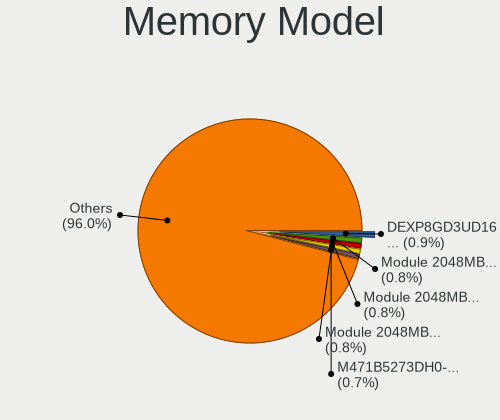

Linux in Russia - Tested Hardware & Statistics
----------------------------------------------

A project to collect tested hardware configurations for Linux in Russia.

Anyone can contribute to this report by the [hw-probe](https://github.com/linuxhw/hw-probe) tool:

    sudo -E hw-probe -all -upload

Please contribute! Especially if your hardware is rare.

This is a report for all computer types. See also reports for [desktops](/Location/Russia/Desktop/README.md) and [notebooks](/Location/Russia/Notebook/README.md).

Contents
--------

* [ Test Cases ](#test-cases)

* [ System ](#system)
  - [ OS                       ](#os)
  - [ OS Family                ](#os-family)
  - [ Kernel                   ](#kernel)
  - [ Kernel Family            ](#kernel-family)
  - [ Kernel Major Ver.        ](#kernel-major-ver)
  - [ Arch                     ](#arch)
  - [ DE                       ](#de)
  - [ Display Server           ](#display-server)
  - [ Display Manager          ](#display-manager)
  - [ OS Lang                  ](#os-lang)
  - [ Boot Mode                ](#boot-mode)
  - [ Filesystem               ](#filesystem)
  - [ Part. scheme             ](#part-scheme)
  - [ Dual Boot with Linux/BSD ](#dual-boot-with-linuxbsd)
  - [ Dual Boot (Win)          ](#dual-boot-win)

* [ Board ](#board)
  - [ Vendor                   ](#vendor)
  - [ Model                    ](#model)
  - [ Model Family             ](#model-family)
  - [ MFG Year                 ](#mfg-year)
  - [ Form Factor              ](#form-factor)
  - [ Secure Boot              ](#secure-boot)
  - [ Coreboot                 ](#coreboot)
  - [ RAM Size                 ](#ram-size)
  - [ RAM Used                 ](#ram-used)
  - [ Total Drives             ](#total-drives)
  - [ Has CD-ROM               ](#has-cd-rom)
  - [ Has Ethernet             ](#has-ethernet)
  - [ Has WiFi                 ](#has-wifi)
  - [ Has Bluetooth            ](#has-bluetooth)

* [ Location ](#location)
  - [ Country                  ](#country)
  - [ City                     ](#city)

* [ Drives ](#drives)
  - [ Drive Vendor             ](#drive-vendor)
  - [ Drive Model              ](#drive-model)
  - [ HDD Vendor               ](#hdd-vendor)
  - [ SSD Vendor               ](#ssd-vendor)
  - [ Drive Kind               ](#drive-kind)
  - [ Drive Connector          ](#drive-connector)
  - [ Drive Size               ](#drive-size)
  - [ Space Total              ](#space-total)
  - [ Space Used               ](#space-used)
  - [ Malfunc. Drives          ](#malfunc-drives)
  - [ Malfunc. Drive Vendor    ](#malfunc-drive-vendor)
  - [ Malfunc. HDD Vendor      ](#malfunc-hdd-vendor)
  - [ Malfunc. Drive Kind      ](#malfunc-drive-kind)
  - [ Failed Drives            ](#failed-drives)
  - [ Failed Drive Vendor      ](#failed-drive-vendor)
  - [ Drive Status             ](#drive-status)

* [ Storage controller ](#storage-controller)
  - [ Storage Vendor           ](#storage-vendor)
  - [ Storage Model            ](#storage-model)
  - [ Storage Kind             ](#storage-kind)

* [ Processor ](#processor)
  - [ CPU Vendor               ](#cpu-vendor)
  - [ CPU Model                ](#cpu-model)
  - [ CPU Model Family         ](#cpu-model-family)
  - [ CPU Cores                ](#cpu-cores)
  - [ CPU Sockets              ](#cpu-sockets)
  - [ CPU Threads              ](#cpu-threads)
  - [ CPU Op-Modes             ](#cpu-op-modes)
  - [ CPU Microcode            ](#cpu-microcode)
  - [ CPU Microarch            ](#cpu-microarch)

* [ Graphics ](#graphics)
  - [ GPU Vendor               ](#gpu-vendor)
  - [ GPU Model                ](#gpu-model)
  - [ GPU Combo                ](#gpu-combo)
  - [ GPU Driver               ](#gpu-driver)
  - [ GPU Memory               ](#gpu-memory)

* [ Monitor ](#monitor)
  - [ Monitor Vendor           ](#monitor-vendor)
  - [ Monitor Model            ](#monitor-model)
  - [ Monitor Resolution       ](#monitor-resolution)
  - [ Monitor Diagonal         ](#monitor-diagonal)
  - [ Monitor Width            ](#monitor-width)
  - [ Aspect Ratio             ](#aspect-ratio)
  - [ Monitor Area             ](#monitor-area)
  - [ Pixel Density            ](#pixel-density)
  - [ Multiple Monitors        ](#multiple-monitors)

* [ Network ](#network)
  - [ Net Controller Vendor    ](#net-controller-vendor)
  - [ Net Controller Model     ](#net-controller-model)
  - [ Wireless Vendor          ](#wireless-vendor)
  - [ Wireless Model           ](#wireless-model)
  - [ Ethernet Vendor          ](#ethernet-vendor)
  - [ Ethernet Model           ](#ethernet-model)
  - [ Net Controller Kind      ](#net-controller-kind)
  - [ Used Controller          ](#used-controller)
  - [ NICs                     ](#nics)
  - [ IPv6                     ](#ipv6)

* [ Bluetooth ](#bluetooth)
  - [ Bluetooth Vendor         ](#bluetooth-vendor)
  - [ Bluetooth Model          ](#bluetooth-model)

* [ Sound ](#sound)
  - [ Sound Vendor             ](#sound-vendor)
  - [ Sound Model              ](#sound-model)

* [ Memory ](#memory)
  - [ Memory Vendor            ](#memory-vendor)
  - [ Memory Model             ](#memory-model)
  - [ Memory Kind              ](#memory-kind)
  - [ Memory Form Factor       ](#memory-form-factor)
  - [ Memory Size              ](#memory-size)
  - [ Memory Speed             ](#memory-speed)

* [ Printers & scanners ](#printers--scanners)
  - [ Printer Vendor           ](#printer-vendor)
  - [ Printer Model            ](#printer-model)
  - [ Scanner Vendor           ](#scanner-vendor)
  - [ Scanner Model            ](#scanner-model)

* [ Camera ](#camera)
  - [ Camera Vendor            ](#camera-vendor)
  - [ Camera Model             ](#camera-model)

* [ Security ](#security)
  - [ Fingerprint Vendor       ](#fingerprint-vendor)
  - [ Fingerprint Model        ](#fingerprint-model)
  - [ Chipcard Vendor          ](#chipcard-vendor)
  - [ Chipcard Model           ](#chipcard-model)

* [ Unsupported ](#unsupported)
  - [ Unsupported Devices      ](#unsupported-devices)
  - [ Unsupported Device Types ](#unsupported-device-types)

Test Cases
----------

Total: 34881

| Vendor        | Model                       | Form-Factor | Probe                                                      | Date         |
|---------------|-----------------------------|-------------|------------------------------------------------------------|--------------|
| 3Q            | TD2500G-P-Q3 A01            | Desktop     | [46626558f6](https://linux-hardware.org/?probe=46626558f6) | Dec 01, 2022 |
| ASUSTek       | AT3IONT-I DELUXE            | Desktop     | [16680c5211](https://linux-hardware.org/?probe=16680c5211) | Dec 01, 2022 |
| Acer          | Aspire V3-571G              | Notebook    | [bbb0c707bb](https://linux-hardware.org/?probe=bbb0c707bb) | Dec 01, 2022 |
| Acer          | Aspire V3-771               | Notebook    | [38dfcb79d5](https://linux-hardware.org/?probe=38dfcb79d5) | Dec 01, 2022 |
| Acer          | Aspire 3830TG               | Notebook    | [8bb246cbaa](https://linux-hardware.org/?probe=8bb246cbaa) | Dec 01, 2022 |
| Lenovo        | ThinkPad T440p 20AN0079M... | Notebook    | [79261239c1](https://linux-hardware.org/?probe=79261239c1) | Dec 01, 2022 |
| Acer          | Aspire 3830TG               | Notebook    | [46bcb20e26](https://linux-hardware.org/?probe=46bcb20e26) | Dec 01, 2022 |
| Apple         | Mac-35C5E08120C7EEAF Mac... | Mini pc     | [a203c920d4](https://linux-hardware.org/?probe=a203c920d4) | Dec 01, 2022 |
| Gigabyte      | B450 I AORUS PRO WIFI-CF    | Desktop     | [9866b7f07f](https://linux-hardware.org/?probe=9866b7f07f) | Dec 01, 2022 |
| Lenovo        | ThinkBook 15 G3 ACL 21A4    | Notebook    | [d57de89542](https://linux-hardware.org/?probe=d57de89542) | Dec 01, 2022 |
| Gigabyte      | B450 GAMING X               | Desktop     | [ff5aef2f59](https://linux-hardware.org/?probe=ff5aef2f59) | Dec 01, 2022 |
| ASUSTek       | M5A97 PLUS                  | Desktop     | [63820e3937](https://linux-hardware.org/?probe=63820e3937) | Dec 01, 2022 |
| MSI           | H81M-E33                    | Desktop     | [aa874580d3](https://linux-hardware.org/?probe=aa874580d3) | Dec 01, 2022 |
| Gigabyte      | GA-MA790FXT-UD5P            | Desktop     | [010349b87b](https://linux-hardware.org/?probe=010349b87b) | Dec 01, 2022 |
| Gigabyte      | GA-990FXA-UD7               | Desktop     | [e300be2b5e](https://linux-hardware.org/?probe=e300be2b5e) | Dec 01, 2022 |
| ASUSTek       | P5B                         | Desktop     | [44f13beada](https://linux-hardware.org/?probe=44f13beada) | Dec 01, 2022 |
| HP            | 84EE 1100                   | All in one  | [7efea8ad7f](https://linux-hardware.org/?probe=7efea8ad7f) | Dec 01, 2022 |
| Acer          | Aspire E1-570G              | Notebook    | [b41442c5a1](https://linux-hardware.org/?probe=b41442c5a1) | Dec 01, 2022 |
| Lenovo        | IdeaPad S340-14API 81NB     | Notebook    | [a8156db955](https://linux-hardware.org/?probe=a8156db955) | Dec 01, 2022 |
| ASUSTek       | ASUS TUF Dash F15 FX516P... | Notebook    | [0128a48982](https://linux-hardware.org/?probe=0128a48982) | Dec 01, 2022 |
| ASUSTek       | PRIME Z690-P WIFI D4        | Desktop     | [42932dd5fd](https://linux-hardware.org/?probe=42932dd5fd) | Dec 01, 2022 |
| Lenovo        | 3190 NOK                    | Mini pc     | [b550b6a30e](https://linux-hardware.org/?probe=b550b6a30e) | Dec 01, 2022 |
| Acer          | Aspire 5336                 | Notebook    | [65be105c02](https://linux-hardware.org/?probe=65be105c02) | Dec 01, 2022 |
| Unknown       | Unknown                     | Notebook    | [dceef2a9d5](https://linux-hardware.org/?probe=dceef2a9d5) | Dec 01, 2022 |
| Raspberry ... | Raspberry Pi 3 Model B P... | Soc         | [5fa6ceed90](https://linux-hardware.org/?probe=5fa6ceed90) | Dec 01, 2022 |
| ASUSTek       | P8H77-V LE                  | Desktop     | [d82ed03dd9](https://linux-hardware.org/?probe=d82ed03dd9) | Dec 01, 2022 |
| ASUSTek       | SABERTOOTH X58              | Desktop     | [4ae619c728](https://linux-hardware.org/?probe=4ae619c728) | Dec 01, 2022 |
| Dell          | Vostro 3578                 | Notebook    | [89161c2dee](https://linux-hardware.org/?probe=89161c2dee) | Dec 01, 2022 |
| Lenovo        | B450 1S1680033610187        | Notebook    | [e33670a27b](https://linux-hardware.org/?probe=e33670a27b) | Nov 30, 2022 |
| Acer          | Aspire A315-21              | Notebook    | [7c3a371165](https://linux-hardware.org/?probe=7c3a371165) | Nov 30, 2022 |
| HP            | 255 G4                      | Notebook    | [33b2fb7f31](https://linux-hardware.org/?probe=33b2fb7f31) | Nov 30, 2022 |
| Acer          | Aspire A315-21              | Notebook    | [5f14327a56](https://linux-hardware.org/?probe=5f14327a56) | Nov 30, 2022 |
| sunxi         | FriendlyARM NanoPi NEO 2    | Soc         | [f1e2cbe354](https://linux-hardware.org/?probe=f1e2cbe354) | Nov 30, 2022 |
| Samsung       | 300E4A/300E5A/300E7A/343... | Notebook    | [5f53eff4a6](https://linux-hardware.org/?probe=5f53eff4a6) | Nov 30, 2022 |
| MSI           | GE72 6QC                    | Notebook    | [ba4847397e](https://linux-hardware.org/?probe=ba4847397e) | Nov 30, 2022 |
| Pegatron      | C15B                        | Notebook    | [defacd8748](https://linux-hardware.org/?probe=defacd8748) | Nov 30, 2022 |
| Pegatron      | C15B                        | Notebook    | [92271ab582](https://linux-hardware.org/?probe=92271ab582) | Nov 30, 2022 |
| Unknown       | Unknown                     | Notebook    | [9964cb6fe2](https://linux-hardware.org/?probe=9964cb6fe2) | Nov 30, 2022 |
| Lenovo        | IdeaPad Gaming 3 15ARH05... | Notebook    | [65c3211b0a](https://linux-hardware.org/?probe=65c3211b0a) | Nov 30, 2022 |
| Graviton      | DMB-H510-MCA01              | Desktop     | [4dbcbc3b7a](https://linux-hardware.org/?probe=4dbcbc3b7a) | Nov 30, 2022 |
| Lenovo        | IdeaPad Gaming 3 15ARH05... | Notebook    | [2a8dbc14ef](https://linux-hardware.org/?probe=2a8dbc14ef) | Nov 30, 2022 |
| HUAWEI        | CREM-WXX9                   | Notebook    | [33f7ac03f4](https://linux-hardware.org/?probe=33f7ac03f4) | Nov 30, 2022 |
| Dell          | 0YHMCJ A01                  | Server      | [77f946c99b](https://linux-hardware.org/?probe=77f946c99b) | Nov 30, 2022 |
| Haier         | A1420EM                     | Notebook    | [6f18b3c1ce](https://linux-hardware.org/?probe=6f18b3c1ce) | Nov 30, 2022 |
| Lenovo        | Y520-15IKBN 80WK            | Notebook    | [b245f9da58](https://linux-hardware.org/?probe=b245f9da58) | Nov 30, 2022 |
| Dell          | Inspiron 3558               | Notebook    | [481755baa3](https://linux-hardware.org/?probe=481755baa3) | Nov 30, 2022 |
| Gigabyte      | B450M DS3H-CF               | Desktop     | [952c3681c0](https://linux-hardware.org/?probe=952c3681c0) | Nov 30, 2022 |
| Samsung       | 300E4A/300E5A/300E7A/343... | Notebook    | [aadb9ff1d4](https://linux-hardware.org/?probe=aadb9ff1d4) | Nov 30, 2022 |
| Lenovo        | Legion 5 17ACH6H 82JY       | Notebook    | [f5f86becf7](https://linux-hardware.org/?probe=f5f86becf7) | Nov 30, 2022 |
| ASUSTek       | H81M-C                      | Desktop     | [458ea4bd06](https://linux-hardware.org/?probe=458ea4bd06) | Nov 29, 2022 |
| ASUSTek       | M5A78L/USB3                 | Desktop     | [99c33f6741](https://linux-hardware.org/?probe=99c33f6741) | Nov 29, 2022 |
| HP            | 8437                        | Desktop     | [c5bbfc32f6](https://linux-hardware.org/?probe=c5bbfc32f6) | Nov 29, 2022 |
| Samsung       | R560                        | Notebook    | [936ae4b775](https://linux-hardware.org/?probe=936ae4b775) | Nov 29, 2022 |
| Lenovo        | 3162 SDK0J40697 WIN 3305... | Desktop     | [296ceaab80](https://linux-hardware.org/?probe=296ceaab80) | Nov 29, 2022 |
| Lenovo        | B590 20206                  | Notebook    | [5bec8860f3](https://linux-hardware.org/?probe=5bec8860f3) | Nov 29, 2022 |
| Gigabyte      | B450M DS3H-CF               | Desktop     | [eae94e440a](https://linux-hardware.org/?probe=eae94e440a) | Nov 29, 2022 |
| ASRock        | N68C-S UCC                  | Desktop     | [c7bff3d908](https://linux-hardware.org/?probe=c7bff3d908) | Nov 29, 2022 |
| ASUSTek       | P5KPL-CM                    | Desktop     | [a20e18af73](https://linux-hardware.org/?probe=a20e18af73) | Nov 29, 2022 |
| Apple         | MacBookPro12,1              | Notebook    | [f03f3a9325](https://linux-hardware.org/?probe=f03f3a9325) | Nov 29, 2022 |
| ASUSTek       | Zenbook UX535QE_UM535QE     | Notebook    | [9f473cbdeb](https://linux-hardware.org/?probe=9f473cbdeb) | Nov 29, 2022 |
| Dell          | 0Y5DDC A00                  | Desktop     | [5d4811b390](https://linux-hardware.org/?probe=5d4811b390) | Nov 29, 2022 |
| ASRock        | H510M-HDV                   | Desktop     | [03a1675c85](https://linux-hardware.org/?probe=03a1675c85) | Nov 29, 2022 |
| Gigabyte      | A320M-H-CF                  | Desktop     | [66fe0c3ddf](https://linux-hardware.org/?probe=66fe0c3ddf) | Nov 29, 2022 |
| HP            | ProBook 440 G5              | Notebook    | [45097ff070](https://linux-hardware.org/?probe=45097ff070) | Nov 29, 2022 |
| ECS           | 945P/PL-A                   | Desktop     | [ff47651dd8](https://linux-hardware.org/?probe=ff47651dd8) | Nov 29, 2022 |
| ECS           | BSWI-D2                     | Desktop     | [b7e4fbdd31](https://linux-hardware.org/?probe=b7e4fbdd31) | Nov 29, 2022 |
| Dell          | XPS 15 9500                 | Notebook    | [9c87ab493e](https://linux-hardware.org/?probe=9c87ab493e) | Nov 29, 2022 |
| ASUSTek       | PRIME Z690-P WIFI D4        | Desktop     | [262228b1fb](https://linux-hardware.org/?probe=262228b1fb) | Nov 29, 2022 |
| Lenovo        | G565 20071                  | Notebook    | [659a9a89b9](https://linux-hardware.org/?probe=659a9a89b9) | Nov 28, 2022 |
| Timi          | TM1701                      | Notebook    | [64ee057496](https://linux-hardware.org/?probe=64ee057496) | Nov 28, 2022 |
| ASUSTek       | Zenbook UX535QE_UM535QE     | Notebook    | [a3c2004787](https://linux-hardware.org/?probe=a3c2004787) | Nov 28, 2022 |
| Acer          | Aspire ES1-522              | Notebook    | [114c1d0914](https://linux-hardware.org/?probe=114c1d0914) | Nov 28, 2022 |
| Gigabyte      | GA-MA770-UD3                | Desktop     | [be98ffe55b](https://linux-hardware.org/?probe=be98ffe55b) | Nov 28, 2022 |
| Lenovo        | IdeaPad S340-14API 81NB     | Notebook    | [4fbe923ad2](https://linux-hardware.org/?probe=4fbe923ad2) | Nov 28, 2022 |
| Lenovo        | IdeaPad S340-14API 81NB     | Notebook    | [e117f07f42](https://linux-hardware.org/?probe=e117f07f42) | Nov 28, 2022 |
| ASUSTek       | GL752VW                     | Notebook    | [edc0678b85](https://linux-hardware.org/?probe=edc0678b85) | Nov 28, 2022 |
| Apple         | Mac-27ADBB7B4CEE8E61 iMa... | All in one  | [5947cba303](https://linux-hardware.org/?probe=5947cba303) | Nov 28, 2022 |
| ECS           | H61H2-M13                   | Desktop     | [88988d4d0d](https://linux-hardware.org/?probe=88988d4d0d) | Nov 28, 2022 |
| Lenovo        | Aptio CRB No DPK            | Mini pc     | [eeddc09936](https://linux-hardware.org/?probe=eeddc09936) | Nov 28, 2022 |
| Lenovo        | IdeaPad L340-15API 81LW     | Notebook    | [ddb1791ff6](https://linux-hardware.org/?probe=ddb1791ff6) | Nov 28, 2022 |
| Intel         | X79G V2.x                   | Desktop     | [6b229554fc](https://linux-hardware.org/?probe=6b229554fc) | Nov 28, 2022 |
| Lenovo        | ThinkBook 15 G3 ACL 21A4    | Notebook    | [901fa6e871](https://linux-hardware.org/?probe=901fa6e871) | Nov 28, 2022 |
| Gigabyte      | B365M DS3H                  | Desktop     | [4b9ee0ef6a](https://linux-hardware.org/?probe=4b9ee0ef6a) | Nov 28, 2022 |
| MSI           | MPG Z390 GAMING EDGE AC     | Desktop     | [245ea45167](https://linux-hardware.org/?probe=245ea45167) | Nov 28, 2022 |
| ASUSTek       | ROG Zephyrus G15 GA502IV... | Notebook    | [86f58e68b6](https://linux-hardware.org/?probe=86f58e68b6) | Nov 28, 2022 |
| Gigabyte      | H410M S2H V3                | Desktop     | [8882bfe4f8](https://linux-hardware.org/?probe=8882bfe4f8) | Nov 28, 2022 |
| Lenovo        | ThinkPad L540 20AVA07BJP    | Notebook    | [cfc9d5c8a2](https://linux-hardware.org/?probe=cfc9d5c8a2) | Nov 27, 2022 |
| Gigabyte      | B550 GAMING X               | Desktop     | [f8979201eb](https://linux-hardware.org/?probe=f8979201eb) | Nov 27, 2022 |
| ASUSTek       | P7H55-M                     | Desktop     | [e5ac492508](https://linux-hardware.org/?probe=e5ac492508) | Nov 27, 2022 |
| Unknown       | Unknown                     | Desktop     | [1a24753132](https://linux-hardware.org/?probe=1a24753132) | Nov 27, 2022 |
| Gigabyte      | B450 AORUS ELITE            | Desktop     | [3fda27c7b6](https://linux-hardware.org/?probe=3fda27c7b6) | Nov 27, 2022 |
| Gigabyte      | B450 AORUS ELITE            | Desktop     | [e6a6d0affd](https://linux-hardware.org/?probe=e6a6d0affd) | Nov 27, 2022 |
| HUAWEI        | RLEF-XX                     | Notebook    | [bb5c736032](https://linux-hardware.org/?probe=bb5c736032) | Nov 27, 2022 |
| Quanta        | JW6H                        | Notebook    | [12c85e1c14](https://linux-hardware.org/?probe=12c85e1c14) | Nov 27, 2022 |
| ASUSTek       | PRIME B450M-A               | Desktop     | [2a77cd8415](https://linux-hardware.org/?probe=2a77cd8415) | Nov 27, 2022 |
| ASUSTek       | PRIME B250M-K               | Desktop     | [73b4c53383](https://linux-hardware.org/?probe=73b4c53383) | Nov 27, 2022 |
| HUAWEI        | KLVL-WXXW                   | Notebook    | [7e65f428cc](https://linux-hardware.org/?probe=7e65f428cc) | Nov 27, 2022 |
| HP            | ENVY 17                     | Notebook    | [4a784f4642](https://linux-hardware.org/?probe=4a784f4642) | Nov 27, 2022 |
| Koloe         | X58                         | Desktop     | [8b80e1a74c](https://linux-hardware.org/?probe=8b80e1a74c) | Nov 27, 2022 |
| Lenovo        | IdeaPad 700-15ISK 80RU      | Notebook    | [d9ae3d1795](https://linux-hardware.org/?probe=d9ae3d1795) | Nov 27, 2022 |
| ASUSTek       | P7H55-USB3                  | Desktop     | [ff31791cfb](https://linux-hardware.org/?probe=ff31791cfb) | Nov 27, 2022 |
| Unknown       | Unknown                     | Notebook    | [9e16a80342](https://linux-hardware.org/?probe=9e16a80342) | Nov 27, 2022 |
| ASUSTek       | P7H55-USB3                  | Desktop     | [e09f910876](https://linux-hardware.org/?probe=e09f910876) | Nov 27, 2022 |
| ASRock        | H110M-DGS                   | Desktop     | [6667ba2bc2](https://linux-hardware.org/?probe=6667ba2bc2) | Nov 27, 2022 |
| MACHINIST     | X99-RS9 V3.1                | Desktop     | [86cead0335](https://linux-hardware.org/?probe=86cead0335) | Nov 27, 2022 |
| HP            | Notebook                    | Notebook    | [4ff28b891c](https://linux-hardware.org/?probe=4ff28b891c) | Nov 27, 2022 |
| ASUSTek       | M5A97 LE R2.0               | Desktop     | [4fa4184bfd](https://linux-hardware.org/?probe=4fa4184bfd) | Nov 26, 2022 |
| HP            | Pavilion g6                 | Notebook    | [c5f8f3f82b](https://linux-hardware.org/?probe=c5f8f3f82b) | Nov 26, 2022 |
| Acer          | TravelMate 4200             | Notebook    | [14b60c4afa](https://linux-hardware.org/?probe=14b60c4afa) | Nov 26, 2022 |
| MSI           | J1800I                      | Desktop     | [156269ae8c](https://linux-hardware.org/?probe=156269ae8c) | Nov 26, 2022 |
| Dell          | 0DJ7HC A00                  | Server      | [fe865becbb](https://linux-hardware.org/?probe=fe865becbb) | Nov 26, 2022 |
| ASUSTek       | ASUS TUF Gaming A15 FA50... | Notebook    | [74fcf5cb22](https://linux-hardware.org/?probe=74fcf5cb22) | Nov 26, 2022 |
| ASUSTek       | ASUS TUF Gaming A15 FA50... | Notebook    | [a4dbfc0da9](https://linux-hardware.org/?probe=a4dbfc0da9) | Nov 26, 2022 |
| Acer          | Aspire 5733Z                | Notebook    | [7fc415db1f](https://linux-hardware.org/?probe=7fc415db1f) | Nov 26, 2022 |
| Gigabyte      | GA-MA770-UD3                | Desktop     | [0f4c0786c2](https://linux-hardware.org/?probe=0f4c0786c2) | Nov 26, 2022 |
| ASUSTek       | H110M-R                     | Desktop     | [f35782a773](https://linux-hardware.org/?probe=f35782a773) | Nov 26, 2022 |
| ASUSTek       | PRIME B450M-A               | Desktop     | [f368bfcbe2](https://linux-hardware.org/?probe=f368bfcbe2) | Nov 26, 2022 |
| Sony          | VGN-P31ZRK_G                | Notebook    | [3c0c707fd4](https://linux-hardware.org/?probe=3c0c707fd4) | Nov 26, 2022 |
| Gigabyte      | B560 HD3                    | Desktop     | [f7915b54fb](https://linux-hardware.org/?probe=f7915b54fb) | Nov 26, 2022 |
| Chuwi         | CoreBook X                  | Notebook    | [f0e76c8866](https://linux-hardware.org/?probe=f0e76c8866) | Nov 26, 2022 |
| HP            | Laptop 14s-dq1xxx           | Notebook    | [9b3a058fda](https://linux-hardware.org/?probe=9b3a058fda) | Nov 26, 2022 |
| MACHENIKE     | MACHCREATOR-16              | Notebook    | [15d49eb71a](https://linux-hardware.org/?probe=15d49eb71a) | Nov 26, 2022 |
| AZW           | SER V01                     | Mini pc     | [fa908550bd](https://linux-hardware.org/?probe=fa908550bd) | Nov 26, 2022 |
| ASUSTek       | M4A88TD-V EVO/USB3          | Desktop     | [9419d2017e](https://linux-hardware.org/?probe=9419d2017e) | Nov 26, 2022 |
| Lenovo        | Legion R9000P ARH7H 82RG    | Notebook    | [0e3f081937](https://linux-hardware.org/?probe=0e3f081937) | Nov 26, 2022 |
| ASUSTek       | P8H77-V LE                  | Desktop     | [c17b2fcd65](https://linux-hardware.org/?probe=c17b2fcd65) | Nov 26, 2022 |
| HUAWEI        | MRGF-XX                     | Notebook    | [f60090b407](https://linux-hardware.org/?probe=f60090b407) | Nov 26, 2022 |
| HP            | Notebook                    | Notebook    | [6a8992e3ee](https://linux-hardware.org/?probe=6a8992e3ee) | Nov 26, 2022 |
| ASUSTek       | VivoBook_ASUSLaptop M150... | Notebook    | [52da79e88f](https://linux-hardware.org/?probe=52da79e88f) | Nov 25, 2022 |
| Acer          | Aspire E1-570G              | Notebook    | [9c2f530d6a](https://linux-hardware.org/?probe=9c2f530d6a) | Nov 25, 2022 |
| ASUSTek       | PRIME B360M-D               | Desktop     | [67a7943b8d](https://linux-hardware.org/?probe=67a7943b8d) | Nov 25, 2022 |
| MSI           | K9AG Neo2                   | Desktop     | [a57a6f079b](https://linux-hardware.org/?probe=a57a6f079b) | Nov 25, 2022 |
| Insyde        | CherryTrail                 | Notebook    | [f7728857e6](https://linux-hardware.org/?probe=f7728857e6) | Nov 25, 2022 |
| HP            | Pavilion g7                 | Notebook    | [9b84cb2362](https://linux-hardware.org/?probe=9b84cb2362) | Nov 25, 2022 |
| ASRock        | H55M-LE                     | Desktop     | [75b9a8fb03](https://linux-hardware.org/?probe=75b9a8fb03) | Nov 25, 2022 |
| Gigabyte      | X570S UD                    | Desktop     | [381b3c892d](https://linux-hardware.org/?probe=381b3c892d) | Nov 25, 2022 |
| Biostar       | H310MHC2                    | Desktop     | [49e09047c4](https://linux-hardware.org/?probe=49e09047c4) | Nov 25, 2022 |
| JGINYUE       | B660M-VDH                   | Desktop     | [bd879c87f8](https://linux-hardware.org/?probe=bd879c87f8) | Nov 25, 2022 |
| ASUSTek       | P5K                         | Desktop     | [87e7a3c0d0](https://linux-hardware.org/?probe=87e7a3c0d0) | Nov 25, 2022 |
| Lenovo        | 31900059 STD                | All in one  | [812cce763f](https://linux-hardware.org/?probe=812cce763f) | Nov 25, 2022 |
| ASUSTek       | GL752VW                     | Notebook    | [2dfd7f3926](https://linux-hardware.org/?probe=2dfd7f3926) | Nov 25, 2022 |
| Lenovo        | 31900059 STD                | All in one  | [bfe8939ffc](https://linux-hardware.org/?probe=bfe8939ffc) | Nov 25, 2022 |
| ASUSTek       | P8H61-MX                    | Desktop     | [d2e3977693](https://linux-hardware.org/?probe=d2e3977693) | Nov 25, 2022 |
| DEPO Compu... | DPC156                      | Notebook    | [9607de1a9c](https://linux-hardware.org/?probe=9607de1a9c) | Nov 25, 2022 |
| ASRock        | H110 Pro BTC+               | Desktop     | [db556f793b](https://linux-hardware.org/?probe=db556f793b) | Nov 25, 2022 |
| Lenovo        | ThinkBook 15 G2 ITL 20VE    | Notebook    | [4a758bfcc8](https://linux-hardware.org/?probe=4a758bfcc8) | Nov 25, 2022 |
| Lenovo        | IdeaPad Y580 20132          | Notebook    | [41fc6614f7](https://linux-hardware.org/?probe=41fc6614f7) | Nov 25, 2022 |
| Samsung       | 530U3BI/530U4BI/530U4BH     | Notebook    | [0bb72a6a2a](https://linux-hardware.org/?probe=0bb72a6a2a) | Nov 25, 2022 |
| HUAWEI        | KLVD-WXX9                   | Notebook    | [04b855bde5](https://linux-hardware.org/?probe=04b855bde5) | Nov 25, 2022 |
| Apple         | MacBookPro9,2               | Notebook    | [44b8a68c63](https://linux-hardware.org/?probe=44b8a68c63) | Nov 24, 2022 |
| Lenovo        | B590 20208                  | Notebook    | [9f49ff06cf](https://linux-hardware.org/?probe=9f49ff06cf) | Nov 24, 2022 |
| MSI           | GE72 6QC                    | Notebook    | [07084dd8f9](https://linux-hardware.org/?probe=07084dd8f9) | Nov 24, 2022 |
| Clevo         | NL41MU2                     | Notebook    | [0736d8a48f](https://linux-hardware.org/?probe=0736d8a48f) | Nov 24, 2022 |
| Gigabyte      | B250-FinTech-CF             | Desktop     | [fcc81ea02b](https://linux-hardware.org/?probe=fcc81ea02b) | Nov 24, 2022 |
| HUAWEI        | NBLK-WAX9X                  | Notebook    | [600e3f0f09](https://linux-hardware.org/?probe=600e3f0f09) | Nov 24, 2022 |
| ASUSTek       | PRIME Z590-P                | Desktop     | [7d6cf8c81f](https://linux-hardware.org/?probe=7d6cf8c81f) | Nov 24, 2022 |
| MSI           | TRX40 PRO WIFI              | Desktop     | [3617f324a2](https://linux-hardware.org/?probe=3617f324a2) | Nov 24, 2022 |
| Panasonic     | CF-C2CH2CBMG                | Notebook    | [cf87bdba01](https://linux-hardware.org/?probe=cf87bdba01) | Nov 24, 2022 |
| Lenovo        | IdeaPad L340-15API 81LW     | Notebook    | [ff3d0a1ecf](https://linux-hardware.org/?probe=ff3d0a1ecf) | Nov 24, 2022 |
| Lenovo        | IdeaPad L340-15API 81LW     | Notebook    | [f86569d54b](https://linux-hardware.org/?probe=f86569d54b) | Nov 24, 2022 |
| ASUSTek       | P5Q3                        | Desktop     | [655065ee03](https://linux-hardware.org/?probe=655065ee03) | Nov 24, 2022 |
| ASUSTek       | Zenbook UX535QE_UM535QE     | Notebook    | [299634697d](https://linux-hardware.org/?probe=299634697d) | Nov 24, 2022 |
| Unknown       | Unknown                     | Notebook    | [9b50d75b30](https://linux-hardware.org/?probe=9b50d75b30) | Nov 24, 2022 |
| Aquarius      | NS685U R11                  | Notebook    | [866e6d043c](https://linux-hardware.org/?probe=866e6d043c) | Nov 24, 2022 |
| ASUSTek       | P5P43TD                     | Desktop     | [324669845a](https://linux-hardware.org/?probe=324669845a) | Nov 24, 2022 |
| ASUSTek       | ROG Zephyrus M16 GU603HE... | Notebook    | [a31935f117](https://linux-hardware.org/?probe=a31935f117) | Nov 24, 2022 |
| ASUSTek       | PRIME X370-PRO              | Desktop     | [8a5a155a45](https://linux-hardware.org/?probe=8a5a155a45) | Nov 24, 2022 |
| Aquarius      | NS585                       | Notebook    | [d54530cbcb](https://linux-hardware.org/?probe=d54530cbcb) | Nov 24, 2022 |
| ASRock        | B560M-ITX/ac                | Desktop     | [3e1bbe410c](https://linux-hardware.org/?probe=3e1bbe410c) | Nov 24, 2022 |
| Intel         | NUC8i7HVB J68196-502        | Mini pc     | [2ed85718c2](https://linux-hardware.org/?probe=2ed85718c2) | Nov 24, 2022 |
| eMachines     | Rhine V1.40                 | Other       | [0c40e6da00](https://linux-hardware.org/?probe=0c40e6da00) | Nov 24, 2022 |
| Aquarius      | NS585                       | Notebook    | [64d9bcbcde](https://linux-hardware.org/?probe=64d9bcbcde) | Nov 24, 2022 |
| Aquarius      | NS685U R11                  | Notebook    | [0a9856bad0](https://linux-hardware.org/?probe=0a9856bad0) | Nov 24, 2022 |
| ASUSTek       | P5KPL-VM                    | Desktop     | [4e15e21f75](https://linux-hardware.org/?probe=4e15e21f75) | Nov 24, 2022 |
| ASUSTek       | H81M-C                      | Desktop     | [e892605084](https://linux-hardware.org/?probe=e892605084) | Nov 24, 2022 |
| HUAWEI        | KLVD-WXX9                   | Notebook    | [97b1b927ba](https://linux-hardware.org/?probe=97b1b927ba) | Nov 23, 2022 |
| Lenovo        | IdeaPad 3 15ADA05 81W1      | Notebook    | [66fca8e108](https://linux-hardware.org/?probe=66fca8e108) | Nov 23, 2022 |
| ASUSTek       | A9T                         | Notebook    | [9ce7b8b3e1](https://linux-hardware.org/?probe=9ce7b8b3e1) | Nov 23, 2022 |
| ASUSTek       | P5K Premium                 | Desktop     | [5ff50a49ba](https://linux-hardware.org/?probe=5ff50a49ba) | Nov 23, 2022 |
| HP            | Notebook                    | Notebook    | [f81a524d22](https://linux-hardware.org/?probe=f81a524d22) | Nov 23, 2022 |
| Gigabyte      | GA-78LMT-S2                 | Desktop     | [a17992aaa3](https://linux-hardware.org/?probe=a17992aaa3) | Nov 23, 2022 |
| Gigabyte      | H77N-WIFI                   | Desktop     | [4617b6803a](https://linux-hardware.org/?probe=4617b6803a) | Nov 23, 2022 |
| MSI           | MS-ACD31                    | All in one  | [12e48e36c7](https://linux-hardware.org/?probe=12e48e36c7) | Nov 23, 2022 |
| MSI           | MAG X570 TOMAHAWK WIFI      | Desktop     | [e83d79d385](https://linux-hardware.org/?probe=e83d79d385) | Nov 23, 2022 |
| ASUSTek       | P8Z68-V LX                  | Desktop     | [7153762b68](https://linux-hardware.org/?probe=7153762b68) | Nov 23, 2022 |
| ASUSTek       | VivoBook_ASUSLaptop X760... | Notebook    | [028a796420](https://linux-hardware.org/?probe=028a796420) | Nov 23, 2022 |
| ASUSTek       | VivoBook_ASUSLaptop X760... | Notebook    | [c48ab2a2d5](https://linux-hardware.org/?probe=c48ab2a2d5) | Nov 23, 2022 |
| ASUSTek       | P5KPL-AM IN/ROEM/SI         | Desktop     | [64728372e9](https://linux-hardware.org/?probe=64728372e9) | Nov 23, 2022 |
| HP            | Laptop 15-dw3xxx            | Notebook    | [fbf991818d](https://linux-hardware.org/?probe=fbf991818d) | Nov 23, 2022 |
| HP            | 8582 01100                  | All in one  | [4977f9d91d](https://linux-hardware.org/?probe=4977f9d91d) | Nov 23, 2022 |
| Lenovo        | 7X08CTO1WW                  | Server      | [bafb634a37](https://linux-hardware.org/?probe=bafb634a37) | Nov 23, 2022 |
| Gigabyte      | G31M-ES2L                   | Desktop     | [e8ab5ad410](https://linux-hardware.org/?probe=e8ab5ad410) | Nov 23, 2022 |
| Samsung       | 300E4C/300E5C/300E7C        | Notebook    | [2485671def](https://linux-hardware.org/?probe=2485671def) | Nov 23, 2022 |
| Toshiba       | Satellite U300              | Notebook    | [f24a55abbf](https://linux-hardware.org/?probe=f24a55abbf) | Nov 23, 2022 |
| RuggedPC      | RuggedPadC16V               | Tablet      | [20de4fb74a](https://linux-hardware.org/?probe=20de4fb74a) | Nov 22, 2022 |
| Gigabyte      | X470 AORUS GAMING 7 WIFI... | Desktop     | [3a36391d83](https://linux-hardware.org/?probe=3a36391d83) | Nov 22, 2022 |
| MSI           | MS-N051                     | Notebook    | [efb37aedbe](https://linux-hardware.org/?probe=efb37aedbe) | Nov 22, 2022 |
| Gigabyte      | B450 GAMING X               | Desktop     | [c427f12dca](https://linux-hardware.org/?probe=c427f12dca) | Nov 22, 2022 |
| Timi          | TM1701                      | Notebook    | [3d9c04ccd6](https://linux-hardware.org/?probe=3d9c04ccd6) | Nov 22, 2022 |
| ASUSTek       | VivoBook_ASUSLaptop X571... | Notebook    | [ab91a099a5](https://linux-hardware.org/?probe=ab91a099a5) | Nov 22, 2022 |
| ASUSTek       | TUF Gaming FX505DT_FX505... | Notebook    | [149f57ad9c](https://linux-hardware.org/?probe=149f57ad9c) | Nov 22, 2022 |
| Acer          | Aspire V3-771               | Notebook    | [c0a3895ac4](https://linux-hardware.org/?probe=c0a3895ac4) | Nov 22, 2022 |
| Gigabyte      | 970A-UD3P                   | Desktop     | [2cd736b247](https://linux-hardware.org/?probe=2cd736b247) | Nov 22, 2022 |
| ASUSTek       | PRIME B450M-A               | Desktop     | [49cb3f2e52](https://linux-hardware.org/?probe=49cb3f2e52) | Nov 22, 2022 |
| Biostar       | G41D3+                      | Desktop     | [6ce48937fe](https://linux-hardware.org/?probe=6ce48937fe) | Nov 22, 2022 |
| Sony          | VGN-TZ3RXN_B                | Notebook    | [5986f007c8](https://linux-hardware.org/?probe=5986f007c8) | Nov 22, 2022 |
| Unknown       | Wiren Board rev. 7.3.1 (... | Notebook    | [1f9ccab914](https://linux-hardware.org/?probe=1f9ccab914) | Nov 22, 2022 |
| Acer          | Extensa 4220                | Notebook    | [af778b2ec9](https://linux-hardware.org/?probe=af778b2ec9) | Nov 22, 2022 |
| Acer          | Extensa 4220                | Notebook    | [04187e0d6e](https://linux-hardware.org/?probe=04187e0d6e) | Nov 22, 2022 |
| ECS           | H61H2-M13                   | Desktop     | [6d50058ef8](https://linux-hardware.org/?probe=6d50058ef8) | Nov 22, 2022 |
| ECS           | H61H2-M13                   | Desktop     | [f6a783a27a](https://linux-hardware.org/?probe=f6a783a27a) | Nov 22, 2022 |
| ECS           | H61H2-M13                   | Desktop     | [423fbc1fa0](https://linux-hardware.org/?probe=423fbc1fa0) | Nov 22, 2022 |
| ECS           | H61H2-M13                   | Desktop     | [debc5b7ab9](https://linux-hardware.org/?probe=debc5b7ab9) | Nov 22, 2022 |
| ECS           | H61H2-M13                   | Desktop     | [dc53077baa](https://linux-hardware.org/?probe=dc53077baa) | Nov 22, 2022 |
| ECS           | H61H2-M13                   | Desktop     | [856bb3def2](https://linux-hardware.org/?probe=856bb3def2) | Nov 22, 2022 |
| Foxconn       | H61MXL/H61MXL-K             | Desktop     | [d140a0f503](https://linux-hardware.org/?probe=d140a0f503) | Nov 22, 2022 |
| ECS           | H61H2-M13                   | Desktop     | [ee55108218](https://linux-hardware.org/?probe=ee55108218) | Nov 22, 2022 |
| ECS           | H61H2-M13                   | Desktop     | [ec03d1b050](https://linux-hardware.org/?probe=ec03d1b050) | Nov 22, 2022 |
| ECS           | H61H2-M13                   | Desktop     | [1f2a4089cc](https://linux-hardware.org/?probe=1f2a4089cc) | Nov 22, 2022 |
| Intel         | JSL MRD                     | Desktop     | [31ffd9d911](https://linux-hardware.org/?probe=31ffd9d911) | Nov 22, 2022 |
| ECS           | H61H2-M13                   | Desktop     | [4190bbb2d8](https://linux-hardware.org/?probe=4190bbb2d8) | Nov 22, 2022 |
| HP            | Pavilion Sleekbook 15       | Notebook    | [add4f71bc0](https://linux-hardware.org/?probe=add4f71bc0) | Nov 22, 2022 |
| Dell          | Studio 1558                 | Notebook    | [ef9a6b217c](https://linux-hardware.org/?probe=ef9a6b217c) | Nov 22, 2022 |
| ECS           | H61H2-M13                   | Desktop     | [570a11d74b](https://linux-hardware.org/?probe=570a11d74b) | Nov 22, 2022 |
| HP            | ENVY 6                      | Notebook    | [feb348843e](https://linux-hardware.org/?probe=feb348843e) | Nov 22, 2022 |
| Notebook      | W65_67SF                    | Notebook    | [91f6aa0bfb](https://linux-hardware.org/?probe=91f6aa0bfb) | Nov 22, 2022 |
| Gigabyte      | G41M-ES2L                   | Desktop     | [404927f4cc](https://linux-hardware.org/?probe=404927f4cc) | Nov 22, 2022 |
| Dell          | 0Y5DDC A00                  | Desktop     | [37808c6686](https://linux-hardware.org/?probe=37808c6686) | Nov 22, 2022 |
| ASRock        | H55M-LE                     | Desktop     | [206082ac3f](https://linux-hardware.org/?probe=206082ac3f) | Nov 22, 2022 |
| Acer          | Predator PH315-55           | Notebook    | [f411f75743](https://linux-hardware.org/?probe=f411f75743) | Nov 22, 2022 |
| Acer          | Aspire 5940                 | Notebook    | [33325564e7](https://linux-hardware.org/?probe=33325564e7) | Nov 22, 2022 |
| Samsung       | SR70S/SR71S                 | Notebook    | [27c34cd9df](https://linux-hardware.org/?probe=27c34cd9df) | Nov 22, 2022 |
| Intel         | AB2L .A004                  | Mini pc     | [6124722e1f](https://linux-hardware.org/?probe=6124722e1f) | Nov 22, 2022 |
| ASUSTek       | SABERTOOTH 990FX            | Desktop     | [2575d2aab2](https://linux-hardware.org/?probe=2575d2aab2) | Nov 22, 2022 |
| Samsung       | SR70S/SR71S                 | Notebook    | [2e1f6c73da](https://linux-hardware.org/?probe=2e1f6c73da) | Nov 22, 2022 |
| ASUSTek       | K53SD                       | Notebook    | [c127a0db71](https://linux-hardware.org/?probe=c127a0db71) | Nov 21, 2022 |
| Acer          | TravelMate 5760             | Notebook    | [54c460334e](https://linux-hardware.org/?probe=54c460334e) | Nov 21, 2022 |
| Gigabyte      | B75M-D3V                    | Desktop     | [06396e3088](https://linux-hardware.org/?probe=06396e3088) | Nov 21, 2022 |
| HP            | 8540w                       | Notebook    | [3712bfe3cb](https://linux-hardware.org/?probe=3712bfe3cb) | Nov 21, 2022 |
| Gigabyte      | B550M AORUS PRO-P           | Desktop     | [a22e271ac2](https://linux-hardware.org/?probe=a22e271ac2) | Nov 21, 2022 |
| ASUSTek       | S3N                         | Notebook    | [e4c4a500b8](https://linux-hardware.org/?probe=e4c4a500b8) | Nov 21, 2022 |
| ASUSTek       | Zenbook UX535QE_UM535QE     | Notebook    | [b58bad1779](https://linux-hardware.org/?probe=b58bad1779) | Nov 21, 2022 |
| Lenovo        | IdeaPad S145-15IGM 81MX     | Notebook    | [ed6bb8845a](https://linux-hardware.org/?probe=ed6bb8845a) | Nov 21, 2022 |
| Acer          | Extensa 2519                | Notebook    | [1ab63c7353](https://linux-hardware.org/?probe=1ab63c7353) | Nov 21, 2022 |
| Intel         | H510-AIO T3 E1.3G           | All in one  | [b4b9a74c3a](https://linux-hardware.org/?probe=b4b9a74c3a) | Nov 21, 2022 |
| Lenovo        | B590 20206                  | Notebook    | [7d8faca25a](https://linux-hardware.org/?probe=7d8faca25a) | Nov 21, 2022 |
| Lenovo        | G50-30 80G0                 | Notebook    | [be4f638bc7](https://linux-hardware.org/?probe=be4f638bc7) | Nov 21, 2022 |
| Lenovo        | Legion 5 17IMH05H 81Y8      | Notebook    | [b74040cd21](https://linux-hardware.org/?probe=b74040cd21) | Nov 21, 2022 |
| HP            | EliteBook 855 G8 Noteboo... | Notebook    | [60c1698203](https://linux-hardware.org/?probe=60c1698203) | Nov 21, 2022 |
| Gigabyte      | B365M DS3H                  | Desktop     | [e48d26b26f](https://linux-hardware.org/?probe=e48d26b26f) | Nov 21, 2022 |
| Nvidia        | Tegra                       | Soc         | [770c4e4092](https://linux-hardware.org/?probe=770c4e4092) | Nov 21, 2022 |
| MSI           | PRO H410M-B                 | Desktop     | [a81c612515](https://linux-hardware.org/?probe=a81c612515) | Nov 21, 2022 |
| MSI           | PRO H410M-B                 | Desktop     | [ebc5b13d4e](https://linux-hardware.org/?probe=ebc5b13d4e) | Nov 21, 2022 |
| Biostar       | G41D3+                      | Desktop     | [d1d42fec13](https://linux-hardware.org/?probe=d1d42fec13) | Nov 21, 2022 |
| HP            | Pavilion Laptop 14-ce2xx... | Notebook    | [0e9d717db2](https://linux-hardware.org/?probe=0e9d717db2) | Nov 21, 2022 |
| HUAWEI        | CREM-WXX9                   | Notebook    | [9630927dc1](https://linux-hardware.org/?probe=9630927dc1) | Nov 20, 2022 |
| HP            | Notebook                    | Notebook    | [c8bac5b72d](https://linux-hardware.org/?probe=c8bac5b72d) | Nov 20, 2022 |
| Acer          | Extensa 2519                | Notebook    | [fc5526a30f](https://linux-hardware.org/?probe=fc5526a30f) | Nov 20, 2022 |
| Gigabyte      | H310M S2H x.x               | Desktop     | [97ea29ed26](https://linux-hardware.org/?probe=97ea29ed26) | Nov 20, 2022 |
| Acer          | Extensa 2519                | Notebook    | [5ae619eb32](https://linux-hardware.org/?probe=5ae619eb32) | Nov 20, 2022 |
| Acer          | Extensa 2540                | Notebook    | [2cd32708f2](https://linux-hardware.org/?probe=2cd32708f2) | Nov 20, 2022 |
| ASUSTek       | H81M-PLUS                   | Desktop     | [880e6565e8](https://linux-hardware.org/?probe=880e6565e8) | Nov 20, 2022 |
| Intel         | DG45ID AAE27729-310         | Desktop     | [81ecca3cd1](https://linux-hardware.org/?probe=81ecca3cd1) | Nov 20, 2022 |
| ASUSTek       | M4A785T-M                   | Desktop     | [451b8a6b52](https://linux-hardware.org/?probe=451b8a6b52) | Nov 20, 2022 |
| Gigabyte      | Z77X-D3H                    | Desktop     | [1702f14317](https://linux-hardware.org/?probe=1702f14317) | Nov 20, 2022 |
| HP            | Compaq nx9020 (PG641ES#A... | Notebook    | [ba63296d55](https://linux-hardware.org/?probe=ba63296d55) | Nov 20, 2022 |
| MSI           | X470 GAMING PLUS MAX        | Desktop     | [122a37af55](https://linux-hardware.org/?probe=122a37af55) | Nov 20, 2022 |
| Gigabyte      | B450 AORUS ELITE            | Desktop     | [910d921a9d](https://linux-hardware.org/?probe=910d921a9d) | Nov 20, 2022 |
| Irbis         | NB254                       | Notebook    | [ffa6638fe9](https://linux-hardware.org/?probe=ffa6638fe9) | Nov 20, 2022 |
| ASUSTek       | X550CC                      | Notebook    | [a2eae9195c](https://linux-hardware.org/?probe=a2eae9195c) | Nov 20, 2022 |
| Lenovo        | G560 20042                  | Notebook    | [e2ea91a4ca](https://linux-hardware.org/?probe=e2ea91a4ca) | Nov 20, 2022 |
| ASUSTek       | M5A78L-M LX3                | Desktop     | [b133dcd886](https://linux-hardware.org/?probe=b133dcd886) | Nov 20, 2022 |
| ASUSTek       | F5VL                        | Notebook    | [05614f05b7](https://linux-hardware.org/?probe=05614f05b7) | Nov 20, 2022 |
| ASUSTek       | F5VL                        | Notebook    | [a95f905ff3](https://linux-hardware.org/?probe=a95f905ff3) | Nov 20, 2022 |
| Acer          | Aspire E5-771G              | Notebook    | [5099a55836](https://linux-hardware.org/?probe=5099a55836) | Nov 20, 2022 |
| HUAWEI        | KLVL-WXXW                   | Notebook    | [206a1fe0c7](https://linux-hardware.org/?probe=206a1fe0c7) | Nov 20, 2022 |
| HUAWEI        | KLVL-WXXW                   | Notebook    | [9208bbd2b8](https://linux-hardware.org/?probe=9208bbd2b8) | Nov 20, 2022 |
| Chuwi         | LarkBook                    | Notebook    | [bef3087526](https://linux-hardware.org/?probe=bef3087526) | Nov 20, 2022 |
| ASUSTek       | P7H55                       | Desktop     | [aaaefec31e](https://linux-hardware.org/?probe=aaaefec31e) | Nov 20, 2022 |
| Gigabyte      | AB350M-DS3H-CF              | Desktop     | [64953143a6](https://linux-hardware.org/?probe=64953143a6) | Nov 20, 2022 |
| Pegatron      | A15                         | Notebook    | [dea0a0c81e](https://linux-hardware.org/?probe=dea0a0c81e) | Nov 20, 2022 |
| Acer          | Aspire 5750G                | Notebook    | [8b000b014f](https://linux-hardware.org/?probe=8b000b014f) | Nov 20, 2022 |
| ASRock        | P43ME                       | Desktop     | [3b90870750](https://linux-hardware.org/?probe=3b90870750) | Nov 20, 2022 |
| HUAWEI        | NBD-WXX9                    | Notebook    | [bd18dfe05f](https://linux-hardware.org/?probe=bd18dfe05f) | Nov 20, 2022 |
| Gigabyte      | B560M AORUS PRO AX          | Desktop     | [5cf9d6d04e](https://linux-hardware.org/?probe=5cf9d6d04e) | Nov 20, 2022 |
| Irbis         | NB121                       | Notebook    | [32a784f767](https://linux-hardware.org/?probe=32a784f767) | Nov 20, 2022 |
| Intel         | JSL MRD                     | Desktop     | [e8171566d3](https://linux-hardware.org/?probe=e8171566d3) | Nov 19, 2022 |
| Acer          | Aspire Z5101                | All in one  | [66f065adce](https://linux-hardware.org/?probe=66f065adce) | Nov 19, 2022 |
| ASUSTek       | P5K                         | Desktop     | [44b338a17d](https://linux-hardware.org/?probe=44b338a17d) | Nov 19, 2022 |
| Gigabyte      | G31M-ES2L                   | Desktop     | [3e3d8f727c](https://linux-hardware.org/?probe=3e3d8f727c) | Nov 19, 2022 |
| ASRock        | B450 Pro4                   | Desktop     | [cd0f63540b](https://linux-hardware.org/?probe=cd0f63540b) | Nov 19, 2022 |
| iRU           | J231                        | All in one  | [4556fb8986](https://linux-hardware.org/?probe=4556fb8986) | Nov 19, 2022 |
| iRU           | J231                        | All in one  | [3a1fc1760d](https://linux-hardware.org/?probe=3a1fc1760d) | Nov 19, 2022 |
| HUAWEI        | CREM-WXX9                   | Notebook    | [f9b8181279](https://linux-hardware.org/?probe=f9b8181279) | Nov 19, 2022 |
| ASUSTek       | ROG STRIX B660-F GAMING ... | Desktop     | [ecceccb3b7](https://linux-hardware.org/?probe=ecceccb3b7) | Nov 19, 2022 |
| Acer          | Aspire A515-44G             | Notebook    | [51035e77a1](https://linux-hardware.org/?probe=51035e77a1) | Nov 19, 2022 |
| ASUSTek       | ASUSPRO P1440FAC_P1440FA    | Notebook    | [5605c0fd97](https://linux-hardware.org/?probe=5605c0fd97) | Nov 19, 2022 |
| Aquarius      | NS585                       | Notebook    | [a0bc8d3f44](https://linux-hardware.org/?probe=a0bc8d3f44) | Nov 19, 2022 |
| Acer          | Aspire ES1-533              | Notebook    | [8c080caac2](https://linux-hardware.org/?probe=8c080caac2) | Nov 19, 2022 |
| Digma         | EVE 15 C423 ES5069EW        | Notebook    | [9737dae1ac](https://linux-hardware.org/?probe=9737dae1ac) | Nov 19, 2022 |
| MSI           | H510M-A PRO                 | Desktop     | [1755321c80](https://linux-hardware.org/?probe=1755321c80) | Nov 19, 2022 |
| ASUSTek       | K53SD                       | Notebook    | [7620fe2bdd](https://linux-hardware.org/?probe=7620fe2bdd) | Nov 19, 2022 |
| ALLDOCUBE     | i1405S                      | Notebook    | [551bc2b1e6](https://linux-hardware.org/?probe=551bc2b1e6) | Nov 19, 2022 |
| ASUSTek       | P5KPL/1600                  | Desktop     | [b2e20d7f28](https://linux-hardware.org/?probe=b2e20d7f28) | Nov 19, 2022 |
| ASUSTek       | Z97-P                       | Desktop     | [75748e49d9](https://linux-hardware.org/?probe=75748e49d9) | Nov 19, 2022 |
| Lenovo        | ThinkBook 15 G2 ARE 20VG    | Notebook    | [87d8a1ee6b](https://linux-hardware.org/?probe=87d8a1ee6b) | Nov 19, 2022 |
| Dell          | 0RY007                      | Desktop     | [d11a712f82](https://linux-hardware.org/?probe=d11a712f82) | Nov 18, 2022 |
| ASUSTek       | M80TA                       | Notebook    | [d2427d8942](https://linux-hardware.org/?probe=d2427d8942) | Nov 18, 2022 |
| ASUSTek       | PRIME Z370-P                | Desktop     | [65abbfb38e](https://linux-hardware.org/?probe=65abbfb38e) | Nov 18, 2022 |
| Gigabyte      | M720-US3                    | Desktop     | [299b2cd745](https://linux-hardware.org/?probe=299b2cd745) | Nov 18, 2022 |
| Dell          | Inspiron 1525               | Notebook    | [3e09380a65](https://linux-hardware.org/?probe=3e09380a65) | Nov 18, 2022 |
| Unknown       | Unknown                     | Desktop     | [53f563177d](https://linux-hardware.org/?probe=53f563177d) | Nov 18, 2022 |
| ASUSTek       | PRIME H510M-K               | Desktop     | [c695addaa3](https://linux-hardware.org/?probe=c695addaa3) | Nov 18, 2022 |
| Dell          | Inspiron 3793               | Notebook    | [fb5878b057](https://linux-hardware.org/?probe=fb5878b057) | Nov 18, 2022 |
| HP            | 8906 SMVB                   | Desktop     | [f644eba622](https://linux-hardware.org/?probe=f644eba622) | Nov 18, 2022 |
| Irbis         | TW103                       | Tablet      | [3f6ebcde0a](https://linux-hardware.org/?probe=3f6ebcde0a) | Nov 18, 2022 |
| Gigabyte      | B550 AORUS PRO              | Desktop     | [ceafbe876d](https://linux-hardware.org/?probe=ceafbe876d) | Nov 18, 2022 |
| Gigabyte      | B550 AORUS PRO              | Desktop     | [f6f8ae996d](https://linux-hardware.org/?probe=f6f8ae996d) | Nov 18, 2022 |
| Haier         | U1520HD                     | Notebook    | [7a9c0df4f1](https://linux-hardware.org/?probe=7a9c0df4f1) | Nov 18, 2022 |
| HUAWEI        | NBD-WXX9                    | Notebook    | [a54f42b51e](https://linux-hardware.org/?probe=a54f42b51e) | Nov 18, 2022 |
| Digma         | EVE 15 C423 ES5069EW        | Notebook    | [57cd27008a](https://linux-hardware.org/?probe=57cd27008a) | Nov 18, 2022 |
| HUAWEI        | NBD-WXX9                    | Notebook    | [faa0deab8f](https://linux-hardware.org/?probe=faa0deab8f) | Nov 18, 2022 |
| HUAWEI        | BOD-WXX9                    | Notebook    | [9984093912](https://linux-hardware.org/?probe=9984093912) | Nov 18, 2022 |
| Unknown       | P43Twins1600                | Desktop     | [1db44f50c4](https://linux-hardware.org/?probe=1db44f50c4) | Nov 18, 2022 |
| ASUSTek       | P8B75-V                     | Desktop     | [6f3b172132](https://linux-hardware.org/?probe=6f3b172132) | Nov 18, 2022 |
| MSI           | H110M PRO-VH PLUS           | Desktop     | [54f40f8c4b](https://linux-hardware.org/?probe=54f40f8c4b) | Nov 18, 2022 |
| Gigabyte      | H81M-S1                     | Desktop     | [4498bc64bc](https://linux-hardware.org/?probe=4498bc64bc) | Nov 18, 2022 |
| Apple         | Mac-27ADBB7B4CEE8E61 iMa... | All in one  | [b1266ce009](https://linux-hardware.org/?probe=b1266ce009) | Nov 17, 2022 |
| Dell          | 0Y5DDC A00                  | Desktop     | [99aed6e6d2](https://linux-hardware.org/?probe=99aed6e6d2) | Nov 17, 2022 |
| Gigabyte      | B550M AORUS PRO-P           | Desktop     | [312da35b57](https://linux-hardware.org/?probe=312da35b57) | Nov 17, 2022 |
| Lenovo        | B475 Sabine                 | Notebook    | [5be5a7cd5f](https://linux-hardware.org/?probe=5be5a7cd5f) | Nov 17, 2022 |
| Gigabyte      | A520M H                     | Desktop     | [d353571eef](https://linux-hardware.org/?probe=d353571eef) | Nov 17, 2022 |
| Intel         | H510SB-TM v2.0              | All in one  | [ece886e874](https://linux-hardware.org/?probe=ece886e874) | Nov 17, 2022 |
| ASUSTek       | K54HR                       | Notebook    | [ba95174feb](https://linux-hardware.org/?probe=ba95174feb) | Nov 17, 2022 |
| Acer          | Aspire V3-371               | Notebook    | [b184d85960](https://linux-hardware.org/?probe=b184d85960) | Nov 17, 2022 |
| Dell          | Inspiron N5010              | Notebook    | [8a94d169c5](https://linux-hardware.org/?probe=8a94d169c5) | Nov 17, 2022 |
| ASUSTek       | P5KPL-AM EPU                | Desktop     | [814b71a20c](https://linux-hardware.org/?probe=814b71a20c) | Nov 17, 2022 |
| Dell          | Inspiron N5010              | Notebook    | [fbe52d681e](https://linux-hardware.org/?probe=fbe52d681e) | Nov 17, 2022 |
| Intel         | X79 (INTEL Xeon E5/Corei... | Desktop     | [f9da339cc7](https://linux-hardware.org/?probe=f9da339cc7) | Nov 17, 2022 |
| ASUSTek       | H81M-R                      | Desktop     | [cd129bebe1](https://linux-hardware.org/?probe=cd129bebe1) | Nov 17, 2022 |
| ASUSTek       | Z170-P                      | Desktop     | [735035876a](https://linux-hardware.org/?probe=735035876a) | Nov 17, 2022 |
| Acer          | Aspire ES1-511              | Notebook    | [0754a5633d](https://linux-hardware.org/?probe=0754a5633d) | Nov 16, 2022 |
| MSI           | B450M MORTAR MAX            | Desktop     | [2ea755455d](https://linux-hardware.org/?probe=2ea755455d) | Nov 16, 2022 |
| Biostar       | TH67XE                      | Desktop     | [47da767a5a](https://linux-hardware.org/?probe=47da767a5a) | Nov 16, 2022 |
| Timi          | TM1701                      | Notebook    | [e77b655bb8](https://linux-hardware.org/?probe=e77b655bb8) | Nov 16, 2022 |
| MSI           | H61M-P32/W8                 | Desktop     | [82cba9e87c](https://linux-hardware.org/?probe=82cba9e87c) | Nov 16, 2022 |
| ASUSTek       | X507UA                      | Notebook    | [9a2fe77bac](https://linux-hardware.org/?probe=9a2fe77bac) | Nov 16, 2022 |
| Gigabyte      | H61M-DS2                    | Desktop     | [757a1066ff](https://linux-hardware.org/?probe=757a1066ff) | Nov 16, 2022 |
| Unknown       | Unknown                     | Notebook    | [f3222cf843](https://linux-hardware.org/?probe=f3222cf843) | Nov 16, 2022 |
| Unknown       | Unknown                     | Notebook    | [9217d900c4](https://linux-hardware.org/?probe=9217d900c4) | Nov 16, 2022 |
| HUAWEI        | NBD-WXX9                    | Notebook    | [72ebef559b](https://linux-hardware.org/?probe=72ebef559b) | Nov 16, 2022 |
| ASRock        | H310CM-DVS                  | Desktop     | [23194fe7d9](https://linux-hardware.org/?probe=23194fe7d9) | Nov 16, 2022 |
| Gigabyte      | P75-D3                      | Desktop     | [02bdf99508](https://linux-hardware.org/?probe=02bdf99508) | Nov 16, 2022 |
| ASRock        | J3455-ITX                   | Desktop     | [71c99edeb1](https://linux-hardware.org/?probe=71c99edeb1) | Nov 16, 2022 |
| ASUSTek       | TUF B450-PRO GAMING         | Desktop     | [b0c0ad46de](https://linux-hardware.org/?probe=b0c0ad46de) | Nov 16, 2022 |
| ASUSTek       | B75M-A                      | Desktop     | [087a904af2](https://linux-hardware.org/?probe=087a904af2) | Nov 16, 2022 |
| Unknown       | Unknown                     | Notebook    | [a86465b0f3](https://linux-hardware.org/?probe=a86465b0f3) | Nov 16, 2022 |
| ASUSTek       | TUF Gaming B550-PLUS        | Desktop     | [ccf8236d38](https://linux-hardware.org/?probe=ccf8236d38) | Nov 16, 2022 |
| ASUSTek       | Z87-K                       | Desktop     | [39078e426c](https://linux-hardware.org/?probe=39078e426c) | Nov 16, 2022 |
| Gigabyte      | H110M-S2V-CF                | Desktop     | [74cdb80f42](https://linux-hardware.org/?probe=74cdb80f42) | Nov 16, 2022 |
| ALLDOCUBE     | i1405S                      | Notebook    | [f35dc553a2](https://linux-hardware.org/?probe=f35dc553a2) | Nov 16, 2022 |
| Lenovo        | ThinkPad T14 Gen 2i 20W0... | Notebook    | [f8eb11ba08](https://linux-hardware.org/?probe=f8eb11ba08) | Nov 15, 2022 |
| Lenovo        | V14 G2 ALC 82KC             | Notebook    | [cf10680f5f](https://linux-hardware.org/?probe=cf10680f5f) | Nov 15, 2022 |
| Lenovo        | G50-30 80G0                 | Notebook    | [b870eb1d72](https://linux-hardware.org/?probe=b870eb1d72) | Nov 15, 2022 |
| Dell          | Inspiron 5558               | Notebook    | [0674cb5916](https://linux-hardware.org/?probe=0674cb5916) | Nov 15, 2022 |
| HONOR         | HYM-WXX                     | Notebook    | [5cf42c99ef](https://linux-hardware.org/?probe=5cf42c99ef) | Nov 15, 2022 |
| Lenovo        | IdeaPad 5 14ITL05 82FE      | Notebook    | [b59bffff0b](https://linux-hardware.org/?probe=b59bffff0b) | Nov 15, 2022 |
| ASRock        | N68C-GS FX                  | Desktop     | [e7d93e8540](https://linux-hardware.org/?probe=e7d93e8540) | Nov 15, 2022 |
| MACHINIST     | X99-RS9 V2.0                | Desktop     | [c9a4863d1f](https://linux-hardware.org/?probe=c9a4863d1f) | Nov 15, 2022 |
| ASRock        | N68C-GS FX                  | Desktop     | [c67fea651e](https://linux-hardware.org/?probe=c67fea651e) | Nov 15, 2022 |
| ASRock        | N68-GS4 FX                  | Desktop     | [c651e62593](https://linux-hardware.org/?probe=c651e62593) | Nov 15, 2022 |
| Kraftway      | ACCORD                      | Notebook    | [7021cedadf](https://linux-hardware.org/?probe=7021cedadf) | Nov 15, 2022 |
| HONOR         | HYM-WXX                     | Notebook    | [a6812ad12e](https://linux-hardware.org/?probe=a6812ad12e) | Nov 15, 2022 |
| Samsung       | NC210/NC110                 | Notebook    | [31ebbfaf58](https://linux-hardware.org/?probe=31ebbfaf58) | Nov 15, 2022 |
| Intel         | H510-AIO T3 E1.3G           | All in one  | [beb34ced8e](https://linux-hardware.org/?probe=beb34ced8e) | Nov 15, 2022 |
| MSI           | Katana GF76 11SC            | Notebook    | [1b11541cd7](https://linux-hardware.org/?probe=1b11541cd7) | Nov 15, 2022 |
| Toshiba       | Satellite A300D             | Notebook    | [c5dc216e31](https://linux-hardware.org/?probe=c5dc216e31) | Nov 15, 2022 |
| ASRock        | H470M-HVS                   | Desktop     | [e69c2f0da4](https://linux-hardware.org/?probe=e69c2f0da4) | Nov 15, 2022 |
| Toshiba       | Satellite A300D             | Notebook    | [21952b8d66](https://linux-hardware.org/?probe=21952b8d66) | Nov 15, 2022 |
| ASRock        | B150M-HDS                   | Desktop     | [032d8f7c3c](https://linux-hardware.org/?probe=032d8f7c3c) | Nov 15, 2022 |
| HP            | Mini 110-3700               | Notebook    | [4e9f54f23c](https://linux-hardware.org/?probe=4e9f54f23c) | Nov 15, 2022 |
| Acer          | Aspire ES1-512              | Notebook    | [5802f0db59](https://linux-hardware.org/?probe=5802f0db59) | Nov 15, 2022 |
| HP            | Mini 110-3700               | Notebook    | [8ca62a1880](https://linux-hardware.org/?probe=8ca62a1880) | Nov 15, 2022 |
| MSI           | Modern 15 B11M              | Notebook    | [0ae136622d](https://linux-hardware.org/?probe=0ae136622d) | Nov 14, 2022 |
| ASUSTek       | TUF Gaming B450-PLUS II     | Desktop     | [1a0674de42](https://linux-hardware.org/?probe=1a0674de42) | Nov 14, 2022 |
| ASUSTek       | N53SV                       | Notebook    | [f42473e3f6](https://linux-hardware.org/?probe=f42473e3f6) | Nov 14, 2022 |
| Unknown       | Intel X79                   | Desktop     | [61483ea15b](https://linux-hardware.org/?probe=61483ea15b) | Nov 14, 2022 |
| Graviton      | DMB-A520-MCA01              | Desktop     | [1a09a9bb5c](https://linux-hardware.org/?probe=1a09a9bb5c) | Nov 14, 2022 |
| ASUSTek       | X502CA                      | Notebook    | [b47b397c38](https://linux-hardware.org/?probe=b47b397c38) | Nov 14, 2022 |
| Samsung       | 300E4C/300E5C/300E7C        | Notebook    | [100714ed23](https://linux-hardware.org/?probe=100714ed23) | Nov 14, 2022 |
| HP            | EliteBook 855 G8 Noteboo... | Notebook    | [e6ef3b56eb](https://linux-hardware.org/?probe=e6ef3b56eb) | Nov 14, 2022 |
| Gigabyte      | B450M DS3H V2               | Desktop     | [dc808c4131](https://linux-hardware.org/?probe=dc808c4131) | Nov 14, 2022 |
| HP            | ENVY m6                     | Notebook    | [4397c54e20](https://linux-hardware.org/?probe=4397c54e20) | Nov 14, 2022 |
| Gigabyte      | P75-D3                      | Desktop     | [37f9da1b7f](https://linux-hardware.org/?probe=37f9da1b7f) | Nov 14, 2022 |
| Lenovo        | 31900059 STD                | All in one  | [cb73069418](https://linux-hardware.org/?probe=cb73069418) | Nov 14, 2022 |
| HP            | 2179                        | Desktop     | [3407225f33](https://linux-hardware.org/?probe=3407225f33) | Nov 14, 2022 |
| ASUSTek       | PRIME H510M-K               | Desktop     | [191fa275ad](https://linux-hardware.org/?probe=191fa275ad) | Nov 14, 2022 |
| Acer          | Aspire C22-820              | All in one  | [65598ad0b3](https://linux-hardware.org/?probe=65598ad0b3) | Nov 14, 2022 |
| ASUSTek       | PRIME H510M-K               | Desktop     | [0f8a90fef7](https://linux-hardware.org/?probe=0f8a90fef7) | Nov 14, 2022 |
| ASUSTek       | K42DY                       | Notebook    | [f7a61f85d9](https://linux-hardware.org/?probe=f7a61f85d9) | Nov 14, 2022 |
| Gigabyte      | H77-DS3H                    | Desktop     | [f28540c049](https://linux-hardware.org/?probe=f28540c049) | Nov 14, 2022 |
| Lenovo        | G550 20023                  | Notebook    | [80be7e8e25](https://linux-hardware.org/?probe=80be7e8e25) | Nov 14, 2022 |
| Lenovo        | ThinkBook 14 G2 ITL 20VD    | Notebook    | [1de723e880](https://linux-hardware.org/?probe=1de723e880) | Nov 14, 2022 |
| ASRock        | H310CM-DVS                  | Desktop     | [86932d2426](https://linux-hardware.org/?probe=86932d2426) | Nov 14, 2022 |
| ASUSTek       | PRIME H310M-R R2.0          | Desktop     | [53a532435e](https://linux-hardware.org/?probe=53a532435e) | Nov 14, 2022 |
| ASUSTek       | Zenbook UX535QE_UM535QE     | Notebook    | [233791ab06](https://linux-hardware.org/?probe=233791ab06) | Nov 14, 2022 |
| Samsung       | 300V3A/300V4A/300V5A/200... | Notebook    | [34a5f361bd](https://linux-hardware.org/?probe=34a5f361bd) | Nov 14, 2022 |
| Fujitsu       | LIFEBOOK U938               | Notebook    | [428ad6215c](https://linux-hardware.org/?probe=428ad6215c) | Nov 14, 2022 |
| MSI           | GT72 2QD                    | Notebook    | [cbd0b88f5f](https://linux-hardware.org/?probe=cbd0b88f5f) | Nov 14, 2022 |
| MSI           | GT72 2QD                    | Notebook    | [0e9a1a51a5](https://linux-hardware.org/?probe=0e9a1a51a5) | Nov 14, 2022 |
| ASUSTek       | N50Vc                       | Notebook    | [36b3155007](https://linux-hardware.org/?probe=36b3155007) | Nov 13, 2022 |
| ASUSTek       | K53SM                       | Notebook    | [297194e8e4](https://linux-hardware.org/?probe=297194e8e4) | Nov 13, 2022 |
| Chuwi         | LarkBook                    | Notebook    | [8c33c61e14](https://linux-hardware.org/?probe=8c33c61e14) | Nov 13, 2022 |
| Pegatron      | 2A94h                       | Desktop     | [5ebd2a4bf4](https://linux-hardware.org/?probe=5ebd2a4bf4) | Nov 13, 2022 |
| HUAWEI        | MACHD-WXX9                  | Notebook    | [91e169c039](https://linux-hardware.org/?probe=91e169c039) | Nov 13, 2022 |
| ASUSTek       | ASUS TUF Gaming A15 FA50... | Notebook    | [6e9bc709d9](https://linux-hardware.org/?probe=6e9bc709d9) | Nov 13, 2022 |
| ASUSTek       | ASUS TUF Gaming A15 FA50... | Notebook    | [49162725d5](https://linux-hardware.org/?probe=49162725d5) | Nov 13, 2022 |
| Sony          | SVE1512H1RW                 | Notebook    | [032fdf5260](https://linux-hardware.org/?probe=032fdf5260) | Nov 13, 2022 |
| Samsung       | 300E4C/300E5C/300E7C        | Notebook    | [e8e7b815c4](https://linux-hardware.org/?probe=e8e7b815c4) | Nov 13, 2022 |
| Lenovo        | B590 20208                  | Notebook    | [af898e0d66](https://linux-hardware.org/?probe=af898e0d66) | Nov 13, 2022 |
| Gigabyte      | H110M-M2-CF                 | Desktop     | [aedb84820e](https://linux-hardware.org/?probe=aedb84820e) | Nov 13, 2022 |
| Acer          | Aspire 5720Z                | Notebook    | [264c30fac3](https://linux-hardware.org/?probe=264c30fac3) | Nov 13, 2022 |
| MSI           | B85M-P33 V2                 | Desktop     | [d633461307](https://linux-hardware.org/?probe=d633461307) | Nov 13, 2022 |
| Acer          | Aspire 5720Z                | Notebook    | [6e596d88da](https://linux-hardware.org/?probe=6e596d88da) | Nov 12, 2022 |
| ASUSTek       | F2A85-V PRO                 | Desktop     | [0127d7b1cd](https://linux-hardware.org/?probe=0127d7b1cd) | Nov 12, 2022 |
| HONOR         | BOD-WXX9                    | Notebook    | [ca8b207b30](https://linux-hardware.org/?probe=ca8b207b30) | Nov 12, 2022 |
| Dell          | Inspiron 3521               | Notebook    | [10482f151a](https://linux-hardware.org/?probe=10482f151a) | Nov 12, 2022 |
| MSI           | A320M-A PRO                 | Desktop     | [6b77cc7062](https://linux-hardware.org/?probe=6b77cc7062) | Nov 12, 2022 |
| Dell          | Inspiron 3521               | Notebook    | [5f20ed2dd2](https://linux-hardware.org/?probe=5f20ed2dd2) | Nov 12, 2022 |
| Acer          | Aspire 3830TG               | Notebook    | [2ce4863890](https://linux-hardware.org/?probe=2ce4863890) | Nov 12, 2022 |
| HP            | Compaq nc6120 (PY507EA#A... | Notebook    | [a4c594d8db](https://linux-hardware.org/?probe=a4c594d8db) | Nov 12, 2022 |
| Gigabyte      | G5 KE                       | Notebook    | [aefbee04fd](https://linux-hardware.org/?probe=aefbee04fd) | Nov 12, 2022 |
| ASUSTek       | M5A97 EVO R2.0              | Desktop     | [2677116eee](https://linux-hardware.org/?probe=2677116eee) | Nov 12, 2022 |
| Acer          | Acadia V1.45                | Notebook    | [c6a91498cc](https://linux-hardware.org/?probe=c6a91498cc) | Nov 12, 2022 |
| ASUSTek       | P5K-VM                      | Desktop     | [8d1ad25443](https://linux-hardware.org/?probe=8d1ad25443) | Nov 12, 2022 |
| Samsung       | R425D/R525D                 | Notebook    | [85d17374e7](https://linux-hardware.org/?probe=85d17374e7) | Nov 12, 2022 |
| ASUSTek       | M5A78L-M LE/USB3            | Desktop     | [7fe6789365](https://linux-hardware.org/?probe=7fe6789365) | Nov 12, 2022 |
| Acer          | Swift SF314-43              | Notebook    | [1243c9795a](https://linux-hardware.org/?probe=1243c9795a) | Nov 12, 2022 |
| ASUSTek       | K53BR                       | Notebook    | [15838034f5](https://linux-hardware.org/?probe=15838034f5) | Nov 12, 2022 |
| MSI           | Z97-G43                     | Desktop     | [f5946a94b0](https://linux-hardware.org/?probe=f5946a94b0) | Nov 12, 2022 |
| Gigabyte      | B450 AORUS ELITE            | Desktop     | [a8d2d850a5](https://linux-hardware.org/?probe=a8d2d850a5) | Nov 12, 2022 |
| ASUSTek       | Z170 PRO GAMING             | Desktop     | [c1103d767e](https://linux-hardware.org/?probe=c1103d767e) | Nov 12, 2022 |
| Lenovo        | ThinkBook 15 G3 ACL 21A4    | Notebook    | [4838271135](https://linux-hardware.org/?probe=4838271135) | Nov 11, 2022 |
| Acer          | Acadia V1.19                | Notebook    | [f43450e9d4](https://linux-hardware.org/?probe=f43450e9d4) | Nov 11, 2022 |
| ASUSTek       | M5A97 EVO R2.0              | Desktop     | [0d1333128b](https://linux-hardware.org/?probe=0d1333128b) | Nov 11, 2022 |
| ASUSTek       | M4A88T-M                    | Desktop     | [ff49e5ddb5](https://linux-hardware.org/?probe=ff49e5ddb5) | Nov 11, 2022 |
| Sapphire      | IPC-E350M1                  | Desktop     | [58a5544fb4](https://linux-hardware.org/?probe=58a5544fb4) | Nov 11, 2022 |
| Gigabyte      | A320M-H-CF                  | Desktop     | [af490e0878](https://linux-hardware.org/?probe=af490e0878) | Nov 11, 2022 |
| Lenovo        | ThinkPad X220 4290RB3       | Notebook    | [37959973aa](https://linux-hardware.org/?probe=37959973aa) | Nov 11, 2022 |
| ASUSTek       | M4A88T-M                    | Desktop     | [b152665a17](https://linux-hardware.org/?probe=b152665a17) | Nov 11, 2022 |
| ASUSTek       | H81M-PLUS                   | Desktop     | [12d6552ded](https://linux-hardware.org/?probe=12d6552ded) | Nov 11, 2022 |
| ASUSTek       | VivoBook 15_ASUS Laptop ... | Notebook    | [cbd9e440a6](https://linux-hardware.org/?probe=cbd9e440a6) | Nov 11, 2022 |
| ASRock        | B550M-HDV                   | Desktop     | [277c219cef](https://linux-hardware.org/?probe=277c219cef) | Nov 11, 2022 |
| Acer          | Aspire E5-573               | Notebook    | [b8b0c9fae3](https://linux-hardware.org/?probe=b8b0c9fae3) | Nov 11, 2022 |
| NCA Group     | iRU_Notebook                | Notebook    | [6d22b3942e](https://linux-hardware.org/?probe=6d22b3942e) | Nov 11, 2022 |
| Gigabyte      | U24                         | Notebook    | [c0bf41df22](https://linux-hardware.org/?probe=c0bf41df22) | Nov 11, 2022 |
| Clevo         | NL41MU2                     | Notebook    | [65226dd80a](https://linux-hardware.org/?probe=65226dd80a) | Nov 11, 2022 |
| Lenovo        | IdeaPad Gaming 3 15ARH05... | Notebook    | [68e5509696](https://linux-hardware.org/?probe=68e5509696) | Nov 11, 2022 |
| ASUSTek       | M5A99X EVO R2.0             | Desktop     | [a37ca89eae](https://linux-hardware.org/?probe=a37ca89eae) | Nov 11, 2022 |
| ASUSTek       | Zenbook UX535QE_UM535QE     | Notebook    | [1681f97433](https://linux-hardware.org/?probe=1681f97433) | Nov 11, 2022 |
| ASUSTek       | PRIME H510T2/CSM            | Desktop     | [ef983bc60e](https://linux-hardware.org/?probe=ef983bc60e) | Nov 11, 2022 |
| ASUSTek       | PRIME B450M-K               | Desktop     | [ccd759a684](https://linux-hardware.org/?probe=ccd759a684) | Nov 11, 2022 |
| Clevo         | NL41MU2                     | Notebook    | [a25dd1174c](https://linux-hardware.org/?probe=a25dd1174c) | Nov 11, 2022 |
| Samsung       | R519/R719                   | Notebook    | [31260d4616](https://linux-hardware.org/?probe=31260d4616) | Nov 11, 2022 |
| HUAWEI        | BOD-WXX9                    | Notebook    | [2e79d44f43](https://linux-hardware.org/?probe=2e79d44f43) | Nov 11, 2022 |
| Intel         | DP965LT AAD41694-206        | Desktop     | [72773d35e0](https://linux-hardware.org/?probe=72773d35e0) | Nov 11, 2022 |
| ASUSTek       | K50IE                       | Notebook    | [4bd91fccfa](https://linux-hardware.org/?probe=4bd91fccfa) | Nov 11, 2022 |
| Sony          | VPCEH3J1R                   | Notebook    | [4944a2e287](https://linux-hardware.org/?probe=4944a2e287) | Nov 11, 2022 |
| HP            | Pavilion g6                 | Notebook    | [fc422ba1a4](https://linux-hardware.org/?probe=fc422ba1a4) | Nov 11, 2022 |
| ASRock        | H470M-HVS                   | Desktop     | [b81b19a472](https://linux-hardware.org/?probe=b81b19a472) | Nov 11, 2022 |
| Gigabyte      | B550 AORUS PRO AC           | Desktop     | [b5965fce49](https://linux-hardware.org/?probe=b5965fce49) | Nov 11, 2022 |
| MSI           | B150 GAMING M3              | Desktop     | [13f42af580](https://linux-hardware.org/?probe=13f42af580) | Nov 11, 2022 |
| HP            | EliteBook 855 G8 Noteboo... | Notebook    | [7827dd0f86](https://linux-hardware.org/?probe=7827dd0f86) | Nov 11, 2022 |
| Gigabyte      | H61M-D2-B3                  | Desktop     | [46ee069dd8](https://linux-hardware.org/?probe=46ee069dd8) | Nov 11, 2022 |
| HP            | EliteBook 855 G8 Noteboo... | Notebook    | [64d896b971](https://linux-hardware.org/?probe=64d896b971) | Nov 11, 2022 |
| Apple         | Mac-27ADBB7B4CEE8E61 iMa... | All in one  | [2f18264021](https://linux-hardware.org/?probe=2f18264021) | Nov 11, 2022 |
| ASUSTek       | Zenbook UX535QE_UM535QE     | Notebook    | [139c944b07](https://linux-hardware.org/?probe=139c944b07) | Nov 11, 2022 |
| MSI           | B450M GAMING PLUS           | Desktop     | [dd56553c17](https://linux-hardware.org/?probe=dd56553c17) | Nov 11, 2022 |
| ASUSTek       | VivoBook_ASUSLaptop X403... | Notebook    | [f56dc1af6b](https://linux-hardware.org/?probe=f56dc1af6b) | Nov 10, 2022 |
| Unknown       | NF-CK804                    | Desktop     | [6bda1f2345](https://linux-hardware.org/?probe=6bda1f2345) | Nov 10, 2022 |
| Qualcomm T... | SDM 630 PM660 + PM660L M... | Phone       | [05e32b272e](https://linux-hardware.org/?probe=05e32b272e) | Nov 10, 2022 |
| ASRock        | H410M-HDV                   | Desktop     | [985b9b55e2](https://linux-hardware.org/?probe=985b9b55e2) | Nov 10, 2022 |
| Acer          | Aspire V5-572G              | Notebook    | [bd537cc78c](https://linux-hardware.org/?probe=bd537cc78c) | Nov 10, 2022 |
| Acer          | H11H4-AI V:1.0              | Desktop     | [0873e8bf70](https://linux-hardware.org/?probe=0873e8bf70) | Nov 10, 2022 |
| Apple         | Mac-F4208DC8 PVT            | Desktop     | [45dc316bea](https://linux-hardware.org/?probe=45dc316bea) | Nov 10, 2022 |
| ASUSTek       | P5K/EPU                     | Desktop     | [4bd9a2de61](https://linux-hardware.org/?probe=4bd9a2de61) | Nov 10, 2022 |
| Gigabyte      | H55M-S2H                    | Desktop     | [8af42c3646](https://linux-hardware.org/?probe=8af42c3646) | Nov 10, 2022 |
| ASUSTek       | P5K/EPU                     | Desktop     | [cd3706107a](https://linux-hardware.org/?probe=cd3706107a) | Nov 10, 2022 |
| ASUSTek       | H110M-K                     | Desktop     | [4d6af313f5](https://linux-hardware.org/?probe=4d6af313f5) | Nov 10, 2022 |
| Gigabyte      | H55M-S2H                    | Desktop     | [18d013bbc8](https://linux-hardware.org/?probe=18d013bbc8) | Nov 10, 2022 |
| ASUSTek       | P7H55-M/USB3                | Desktop     | [d3d30c473e](https://linux-hardware.org/?probe=d3d30c473e) | Nov 10, 2022 |
| Gigabyte      | 8I915GMF                    | Desktop     | [76f5cb17ad](https://linux-hardware.org/?probe=76f5cb17ad) | Nov 10, 2022 |
| Sony          | VPCS11V9R                   | Notebook    | [a0b4bf7869](https://linux-hardware.org/?probe=a0b4bf7869) | Nov 10, 2022 |
| Lenovo        | G50-30 80G0                 | Notebook    | [1e0c308a85](https://linux-hardware.org/?probe=1e0c308a85) | Nov 10, 2022 |
| ASUSTek       | M5A78L-M LE/USB3            | Desktop     | [b5ce55106f](https://linux-hardware.org/?probe=b5ce55106f) | Nov 10, 2022 |
| Acer          | TravelMate 6292             | Notebook    | [c7dcad2d0f](https://linux-hardware.org/?probe=c7dcad2d0f) | Nov 10, 2022 |
| Gigabyte      | A320M-H-CF                  | Desktop     | [4cf7d8ea41](https://linux-hardware.org/?probe=4cf7d8ea41) | Nov 10, 2022 |
| HP            | Pavilion g6                 | Notebook    | [e2a0a47587](https://linux-hardware.org/?probe=e2a0a47587) | Nov 10, 2022 |
| ASUSTek       | M4A78T-E                    | Desktop     | [a885b61478](https://linux-hardware.org/?probe=a885b61478) | Nov 10, 2022 |
| Intel         | X79                         | Desktop     | [f806dcc4da](https://linux-hardware.org/?probe=f806dcc4da) | Nov 10, 2022 |
| ASUSTek       | M4A78T-E                    | Desktop     | [475ad820cd](https://linux-hardware.org/?probe=475ad820cd) | Nov 10, 2022 |
| Pegatron      | 2A73h                       | Desktop     | [dc035c362e](https://linux-hardware.org/?probe=dc035c362e) | Nov 10, 2022 |
| ASUSTek       | K50IE                       | Notebook    | [5176f404f1](https://linux-hardware.org/?probe=5176f404f1) | Nov 10, 2022 |
| Valve         | Jupiter                     | Notebook    | [34582d82a1](https://linux-hardware.org/?probe=34582d82a1) | Nov 10, 2022 |
| ASUSTek       | G50VT                       | Notebook    | [57f7e69b18](https://linux-hardware.org/?probe=57f7e69b18) | Nov 10, 2022 |
| Gigabyte      | Z690 AORUS PRO              | Desktop     | [8dcd548e89](https://linux-hardware.org/?probe=8dcd548e89) | Nov 10, 2022 |
| ASUSTek       | P8Z77-V LK                  | Desktop     | [640d78b1e4](https://linux-hardware.org/?probe=640d78b1e4) | Nov 10, 2022 |
| ASUSTek       | M4N68T-M-LE-V2              | Desktop     | [d9d004077a](https://linux-hardware.org/?probe=d9d004077a) | Nov 10, 2022 |
| HP            | OMEN by Laptop 15-dc0xxx    | Notebook    | [26989a0d39](https://linux-hardware.org/?probe=26989a0d39) | Nov 10, 2022 |
| Gigabyte      | Z690 AORUS PRO              | Desktop     | [e95608162f](https://linux-hardware.org/?probe=e95608162f) | Nov 10, 2022 |
| HP            | Laptop 14s-dq3xxx           | Notebook    | [2da4055f76](https://linux-hardware.org/?probe=2da4055f76) | Nov 09, 2022 |
| MSI           | MS-B1711                    | Desktop     | [a80911f521](https://linux-hardware.org/?probe=a80911f521) | Nov 09, 2022 |
| HP            | ENVY x360 Convertible 15... | Convertible | [de9c1a6f3e](https://linux-hardware.org/?probe=de9c1a6f3e) | Nov 09, 2022 |
| Gigabyte      | A520M H                     | Desktop     | [50b86d41a2](https://linux-hardware.org/?probe=50b86d41a2) | Nov 09, 2022 |
| MSI           | Z370 TOMAHAWK               | Desktop     | [0763a922c8](https://linux-hardware.org/?probe=0763a922c8) | Nov 09, 2022 |
| ASRock        | H97 Pro4                    | Desktop     | [bdd79e7a9e](https://linux-hardware.org/?probe=bdd79e7a9e) | Nov 09, 2022 |
| ASUSTek       | K501UB                      | Notebook    | [c0f4434ec3](https://linux-hardware.org/?probe=c0f4434ec3) | Nov 09, 2022 |
| Gigabyte      | 990XA-UD3                   | Desktop     | [c92f8d8b22](https://linux-hardware.org/?probe=c92f8d8b22) | Nov 09, 2022 |
| Lenovo        | E31-70 80KX                 | Notebook    | [61343c5ca1](https://linux-hardware.org/?probe=61343c5ca1) | Nov 09, 2022 |
| MSI           | Katana GF76 11SC            | Notebook    | [7e2ff6fc67](https://linux-hardware.org/?probe=7e2ff6fc67) | Nov 09, 2022 |
| Lenovo        | IdeaPad L340-15API 81LW     | Notebook    | [3fd33e6782](https://linux-hardware.org/?probe=3fd33e6782) | Nov 09, 2022 |
| ASUSTek       | X507UB                      | Notebook    | [2790049313](https://linux-hardware.org/?probe=2790049313) | Nov 09, 2022 |
| Timi          | RedmiBook Pro 15S           | Notebook    | [02b3508a99](https://linux-hardware.org/?probe=02b3508a99) | Nov 09, 2022 |
| MSI           | GE70 2PL                    | Notebook    | [d09e002aa8](https://linux-hardware.org/?probe=d09e002aa8) | Nov 09, 2022 |
| Infinix       | INBOOK X2                   | Notebook    | [d342b7930f](https://linux-hardware.org/?probe=d342b7930f) | Nov 09, 2022 |
| Raspberry ... | Raspberry Pi Model B Rev... | Soc         | [cdd3dd76ce](https://linux-hardware.org/?probe=cdd3dd76ce) | Nov 08, 2022 |
| HP            | 806A                        | Desktop     | [e8bee1d38a](https://linux-hardware.org/?probe=e8bee1d38a) | Nov 08, 2022 |
| ASUSTek       | X550CC                      | Notebook    | [46dd8a0416](https://linux-hardware.org/?probe=46dd8a0416) | Nov 08, 2022 |
| ASUSTek       | U24E                        | Notebook    | [a51fe3226f](https://linux-hardware.org/?probe=a51fe3226f) | Nov 08, 2022 |
| MSI           | X370 GAMING PLUS            | Desktop     | [ae91098674](https://linux-hardware.org/?probe=ae91098674) | Nov 08, 2022 |
| MSI           | GE70 2PL                    | Notebook    | [8752dacd05](https://linux-hardware.org/?probe=8752dacd05) | Nov 08, 2022 |
| Huanan        | X99-BD4 V1.3                | Desktop     | [e50441190a](https://linux-hardware.org/?probe=e50441190a) | Nov 08, 2022 |
| Acer          | Nitro AN517-52              | Notebook    | [3a2bb9e1e9](https://linux-hardware.org/?probe=3a2bb9e1e9) | Nov 08, 2022 |
| Gigabyte      | GA-A75M-UD2H                | Desktop     | [c8383aa811](https://linux-hardware.org/?probe=c8383aa811) | Nov 08, 2022 |
| Gigabyte      | GA-A75M-UD2H                | Desktop     | [7f6cff35d7](https://linux-hardware.org/?probe=7f6cff35d7) | Nov 08, 2022 |
| Acer          | Aspire E5-573G              | Notebook    | [b6a1f08748](https://linux-hardware.org/?probe=b6a1f08748) | Nov 08, 2022 |
| Aquarius      | NS585                       | Notebook    | [9b20fcc4b8](https://linux-hardware.org/?probe=9b20fcc4b8) | Nov 08, 2022 |
| Gigabyte      | Z77X-D3H                    | Desktop     | [09e3734a06](https://linux-hardware.org/?probe=09e3734a06) | Nov 08, 2022 |
| Lenovo        | 312D NOK                    | Mini pc     | [e525d01069](https://linux-hardware.org/?probe=e525d01069) | Nov 08, 2022 |
| Acer          | IPISB-AG                    | All in one  | [fbca3edeb5](https://linux-hardware.org/?probe=fbca3edeb5) | Nov 08, 2022 |
| Lenovo        | 312D NOK                    | Mini pc     | [b74787fe62](https://linux-hardware.org/?probe=b74787fe62) | Nov 08, 2022 |
| Gigabyte      | A320M-H-CF                  | Desktop     | [137958160c](https://linux-hardware.org/?probe=137958160c) | Nov 08, 2022 |
| HP            | EliteBook 2540p             | Notebook    | [515cdf3f6c](https://linux-hardware.org/?probe=515cdf3f6c) | Nov 08, 2022 |
| ASUSTek       | P8H67-M LX                  | Desktop     | [277212bfc3](https://linux-hardware.org/?probe=277212bfc3) | Nov 08, 2022 |
| Lenovo        | IdeaPad Gaming 3 15ACH6 ... | Notebook    | [ba8145934d](https://linux-hardware.org/?probe=ba8145934d) | Nov 07, 2022 |
| ASUSTek       | TUF Gaming FX505DV_FX505... | Notebook    | [95b5d8b8ca](https://linux-hardware.org/?probe=95b5d8b8ca) | Nov 07, 2022 |
| Gigabyte      | EP45-UD3L                   | Desktop     | [2b3eb32895](https://linux-hardware.org/?probe=2b3eb32895) | Nov 07, 2022 |
| Unknown       | Unknown                     | Desktop     | [37226d7d92](https://linux-hardware.org/?probe=37226d7d92) | Nov 07, 2022 |
| Gigabyte      | U24                         | Notebook    | [a9d03e590b](https://linux-hardware.org/?probe=a9d03e590b) | Nov 07, 2022 |
| MSI           | X370 GAMING PLUS            | Desktop     | [cda3bef0bc](https://linux-hardware.org/?probe=cda3bef0bc) | Nov 07, 2022 |
| Fujitsu       | D3061-B1 S26361-D3061-B1    | Desktop     | [731ce5b944](https://linux-hardware.org/?probe=731ce5b944) | Nov 07, 2022 |
| Acer          | Aspire A315-41              | Notebook    | [df6426eef5](https://linux-hardware.org/?probe=df6426eef5) | Nov 07, 2022 |
| Acer          | Aspire A315-41              | Notebook    | [bae4adcff9](https://linux-hardware.org/?probe=bae4adcff9) | Nov 07, 2022 |
| Toshiba       | Satellite C660              | Notebook    | [5e972fdb95](https://linux-hardware.org/?probe=5e972fdb95) | Nov 07, 2022 |
| ASRock        | D1800M                      | Desktop     | [4935d67430](https://linux-hardware.org/?probe=4935d67430) | Nov 07, 2022 |
| HP            | Pavilion g6                 | Notebook    | [9992a08641](https://linux-hardware.org/?probe=9992a08641) | Nov 07, 2022 |
| T-Platform... | Tavolga                     | All in one  | [5824854f0e](https://linux-hardware.org/?probe=5824854f0e) | Nov 07, 2022 |
| Toshiba       | Satellite C660              | Notebook    | [e75f44efd0](https://linux-hardware.org/?probe=e75f44efd0) | Nov 07, 2022 |
| ASUSTek       | P5KPL-AM EPU                | Desktop     | [dd30cc2e63](https://linux-hardware.org/?probe=dd30cc2e63) | Nov 07, 2022 |
| eMachines     | eM350                       | Notebook    | [ac6dda5ddb](https://linux-hardware.org/?probe=ac6dda5ddb) | Nov 07, 2022 |
| Acer          | Aspire VN7-591G             | Notebook    | [541d3bfeca](https://linux-hardware.org/?probe=541d3bfeca) | Nov 07, 2022 |
| Sony          | VPCZ13S9R                   | Notebook    | [9a0f47ed25](https://linux-hardware.org/?probe=9a0f47ed25) | Nov 07, 2022 |
| HP            | ProBook 430 G5              | Notebook    | [e362ce5bdf](https://linux-hardware.org/?probe=e362ce5bdf) | Nov 07, 2022 |
| ASRock        | N68C-GS FX                  | Desktop     | [c7b8fac7e2](https://linux-hardware.org/?probe=c7b8fac7e2) | Nov 07, 2022 |
| Gigabyte      | A320M-H-CF                  | Desktop     | [16b37f0b80](https://linux-hardware.org/?probe=16b37f0b80) | Nov 07, 2022 |
| ASUSTek       | ROG Flow X13 GV301QH_GV3... | Notebook    | [614a486442](https://linux-hardware.org/?probe=614a486442) | Nov 07, 2022 |
| ASUSTek       | F2A55-M LK                  | Desktop     | [0c888d2b1f](https://linux-hardware.org/?probe=0c888d2b1f) | Nov 07, 2022 |
| Acer          | TravelMate 5760             | Notebook    | [f645b36a78](https://linux-hardware.org/?probe=f645b36a78) | Nov 07, 2022 |
| MSI           | B450M MORTAR MAX            | Desktop     | [eae2553adf](https://linux-hardware.org/?probe=eae2553adf) | Nov 06, 2022 |
| Dell          | G3 3579                     | Notebook    | [b793526167](https://linux-hardware.org/?probe=b793526167) | Nov 06, 2022 |
| MSI           | H81M-P33                    | Desktop     | [00cb3af126](https://linux-hardware.org/?probe=00cb3af126) | Nov 06, 2022 |
| Lenovo        | ThinkPad T440p 20AN0033R... | Notebook    | [7ca892ad44](https://linux-hardware.org/?probe=7ca892ad44) | Nov 06, 2022 |
| ASRock        | H370M-ITX/ac                | Desktop     | [fe29240874](https://linux-hardware.org/?probe=fe29240874) | Nov 06, 2022 |
| Acer          | EG31M R01-C2                | Desktop     | [1c541d28e0](https://linux-hardware.org/?probe=1c541d28e0) | Nov 06, 2022 |
| ASUSTek       | PRIME H270-PRO              | Desktop     | [a60e7d1961](https://linux-hardware.org/?probe=a60e7d1961) | Nov 06, 2022 |
| ASUSTek       | P8Z68-M PRO                 | Desktop     | [905a8c9fee](https://linux-hardware.org/?probe=905a8c9fee) | Nov 06, 2022 |
| Lenovo        | IdeaPad S145-15API 81UT     | Notebook    | [db56889368](https://linux-hardware.org/?probe=db56889368) | Nov 06, 2022 |
| ASRock        | B550 Extreme4               | Desktop     | [16154018bb](https://linux-hardware.org/?probe=16154018bb) | Nov 06, 2022 |
| Lenovo        | ThinkPad L14 Gen 1 20U50... | Notebook    | [d238949b9f](https://linux-hardware.org/?probe=d238949b9f) | Nov 06, 2022 |
| Lenovo        | IdeaPad 3 17ADA05 81W2      | Notebook    | [05ac02550e](https://linux-hardware.org/?probe=05ac02550e) | Nov 06, 2022 |
| MSI           | B150 GAMING M3              | Desktop     | [38a85b01ad](https://linux-hardware.org/?probe=38a85b01ad) | Nov 06, 2022 |
| MSI           | MPG X570 GAMING PRO CARB... | Desktop     | [b6a4d355bc](https://linux-hardware.org/?probe=b6a4d355bc) | Nov 06, 2022 |
| DNS           | W9x0LU                      | Notebook    | [2ebfe190c5](https://linux-hardware.org/?probe=2ebfe190c5) | Nov 06, 2022 |
| ASUSTek       | H110-PLUS                   | Desktop     | [4d260267d7](https://linux-hardware.org/?probe=4d260267d7) | Nov 06, 2022 |
| ASUSTek       | H110-PLUS                   | Desktop     | [789df18cfb](https://linux-hardware.org/?probe=789df18cfb) | Nov 06, 2022 |
| Digma         | EVE 10 C301T ES1043EW       | Tablet      | [873aa1a6bb](https://linux-hardware.org/?probe=873aa1a6bb) | Nov 06, 2022 |
| ASUSTek       | TUF Gaming B550M-PLUS WI... | Desktop     | [ba495c1631](https://linux-hardware.org/?probe=ba495c1631) | Nov 06, 2022 |
| Samsung       | R510/P510                   | Notebook    | [4921b97206](https://linux-hardware.org/?probe=4921b97206) | Nov 06, 2022 |
| Packard Be... | EasyNote TS11HR             | Notebook    | [19304dd869](https://linux-hardware.org/?probe=19304dd869) | Nov 06, 2022 |
| Gigabyte      | F2A55M-DS2                  | Desktop     | [4cadf85e6e](https://linux-hardware.org/?probe=4cadf85e6e) | Nov 06, 2022 |
| Acer          | Aspire A317-52              | Notebook    | [e9ed162010](https://linux-hardware.org/?probe=e9ed162010) | Nov 06, 2022 |
| ASUSTek       | M5A78L-M LX3 PLUS           | Desktop     | [4a3eefaf16](https://linux-hardware.org/?probe=4a3eefaf16) | Nov 06, 2022 |
| ASUSTek       | Z97-C                       | Desktop     | [ce7c45a3d9](https://linux-hardware.org/?probe=ce7c45a3d9) | Nov 06, 2022 |
| Biostar       | A78LR-M3S                   | Desktop     | [8e8da94ddb](https://linux-hardware.org/?probe=8e8da94ddb) | Nov 06, 2022 |
| Lenovo        | ThinkPad P1 Gen 4i 20Y3A... | Notebook    | [d53e6cef83](https://linux-hardware.org/?probe=d53e6cef83) | Nov 06, 2022 |
| Gigabyte      | H61M-S2PV                   | Desktop     | [5db0a08b25](https://linux-hardware.org/?probe=5db0a08b25) | Nov 06, 2022 |
| Toshiba       | Satellite L550              | Notebook    | [3b95d22100](https://linux-hardware.org/?probe=3b95d22100) | Nov 06, 2022 |
| Dell          | Studio 1558                 | Notebook    | [8b5cb100a8](https://linux-hardware.org/?probe=8b5cb100a8) | Nov 05, 2022 |
| ASRock        | B660M PG Riptide            | Desktop     | [2fb2a2e140](https://linux-hardware.org/?probe=2fb2a2e140) | Nov 05, 2022 |
| Gigabyte      | B365M D3H-CF                | Desktop     | [53d09fc292](https://linux-hardware.org/?probe=53d09fc292) | Nov 05, 2022 |
| Acer          | Nitro AN515-42              | Notebook    | [a89bc09dca](https://linux-hardware.org/?probe=a89bc09dca) | Nov 05, 2022 |
| MSI           | MPG X570 GAMING PRO CARB... | Desktop     | [5d6951212b](https://linux-hardware.org/?probe=5d6951212b) | Nov 05, 2022 |
| Lenovo        | V14-ADA 82C6                | Notebook    | [92be197f2d](https://linux-hardware.org/?probe=92be197f2d) | Nov 05, 2022 |
| ASUSTek       | PRIME H510M-R               | Desktop     | [922e24a1a0](https://linux-hardware.org/?probe=922e24a1a0) | Nov 05, 2022 |
| Gigabyte      | H110M-M2-CF                 | Desktop     | [40ef04163d](https://linux-hardware.org/?probe=40ef04163d) | Nov 05, 2022 |
| ASUSTek       | M5A78L-M LX                 | Desktop     | [d7512f31a3](https://linux-hardware.org/?probe=d7512f31a3) | Nov 05, 2022 |
| Apple         | Mac-F2268DAE                | All in one  | [2bf5248261](https://linux-hardware.org/?probe=2bf5248261) | Nov 05, 2022 |
| Gigabyte      | H61M-S2PV                   | Desktop     | [1c2a17391f](https://linux-hardware.org/?probe=1c2a17391f) | Nov 05, 2022 |
| Intel         | X79 (INTEL Xeon E5/Corei... | Desktop     | [a8926fce15](https://linux-hardware.org/?probe=a8926fce15) | Nov 05, 2022 |
| ASUSTek       | N76VB                       | Notebook    | [c46794ba60](https://linux-hardware.org/?probe=c46794ba60) | Nov 05, 2022 |
| MSI           | P67A-C43                    | Desktop     | [a5e86512d1](https://linux-hardware.org/?probe=a5e86512d1) | Nov 05, 2022 |
| Fujitsu Si... | AMILO Pro V3205             | Notebook    | [7a03ef6ae1](https://linux-hardware.org/?probe=7a03ef6ae1) | Nov 05, 2022 |
| Dell          | Inspiron N5110              | Notebook    | [698596bd58](https://linux-hardware.org/?probe=698596bd58) | Nov 05, 2022 |
| Gigabyte      | H110M-S2HP-CF               | Desktop     | [94004d5828](https://linux-hardware.org/?probe=94004d5828) | Nov 05, 2022 |
| HP            | Pavilion dv7                | Notebook    | [d17019e1f7](https://linux-hardware.org/?probe=d17019e1f7) | Nov 05, 2022 |
| Apple         | MacBookPro5,5               | Notebook    | [cc051268d8](https://linux-hardware.org/?probe=cc051268d8) | Nov 05, 2022 |
| Gigabyte      | B75-D3V                     | Desktop     | [a562aef0c3](https://linux-hardware.org/?probe=a562aef0c3) | Nov 05, 2022 |
| Dell          | 0MN1TX A01                  | Desktop     | [a788e75812](https://linux-hardware.org/?probe=a788e75812) | Nov 05, 2022 |
| ASUSTek       | N56VJ                       | Notebook    | [1685737249](https://linux-hardware.org/?probe=1685737249) | Nov 05, 2022 |
| Pretech       | EVE 1801 3G ES1049EG        | Notebook    | [19205fc20b](https://linux-hardware.org/?probe=19205fc20b) | Nov 04, 2022 |
| ASUSTek       | M4A77TD PRO                 | Desktop     | [b5fa37b726](https://linux-hardware.org/?probe=b5fa37b726) | Nov 04, 2022 |
| ASUSTek       | F5N                         | Notebook    | [f1efa34bf8](https://linux-hardware.org/?probe=f1efa34bf8) | Nov 04, 2022 |
| ASUSTek       | X75VD                       | Notebook    | [60e91d212e](https://linux-hardware.org/?probe=60e91d212e) | Nov 04, 2022 |
| Irbis         | TW100                       | Tablet      | [17480462a4](https://linux-hardware.org/?probe=17480462a4) | Nov 04, 2022 |
| Lenovo        | B590 20206                  | Notebook    | [6807b6b584](https://linux-hardware.org/?probe=6807b6b584) | Nov 04, 2022 |
| Lenovo        | B590 20206                  | Notebook    | [d0267472d6](https://linux-hardware.org/?probe=d0267472d6) | Nov 04, 2022 |
| Lenovo        | G500 20236                  | Notebook    | [82213a5471](https://linux-hardware.org/?probe=82213a5471) | Nov 04, 2022 |
| ASUSTek       | M5A78L LE                   | Desktop     | [edf9105fc5](https://linux-hardware.org/?probe=edf9105fc5) | Nov 04, 2022 |
| Unknown       | X79-P3                      | Desktop     | [f069ed7bd9](https://linux-hardware.org/?probe=f069ed7bd9) | Nov 04, 2022 |
| ASUSTek       | F5N                         | Notebook    | [8e3878fe4d](https://linux-hardware.org/?probe=8e3878fe4d) | Nov 04, 2022 |
| ASUSTek       | F5N                         | Notebook    | [f95b9890f6](https://linux-hardware.org/?probe=f95b9890f6) | Nov 04, 2022 |
| HUAWEI        | HKD-WXX                     | Notebook    | [7a8f33b5bf](https://linux-hardware.org/?probe=7a8f33b5bf) | Nov 04, 2022 |
| HUAWEI        | BOM-WXX9                    | Notebook    | [d78a7bd1a3](https://linux-hardware.org/?probe=d78a7bd1a3) | Nov 04, 2022 |
| Lenovo        | IdeaPad 330S-15ARR 81FB     | Notebook    | [505b2c2b5d](https://linux-hardware.org/?probe=505b2c2b5d) | Nov 04, 2022 |
| Apple         | Mac-942B5BF58194151B        | All in one  | [ae6073535e](https://linux-hardware.org/?probe=ae6073535e) | Nov 04, 2022 |
| Gigabyte      | Z87-HD3                     | Desktop     | [f67d642096](https://linux-hardware.org/?probe=f67d642096) | Nov 04, 2022 |
| MSI           | B360M PRO-VDH               | Desktop     | [2a801a9792](https://linux-hardware.org/?probe=2a801a9792) | Nov 04, 2022 |
| Fujitsu       | LIFEBOOK A512               | Notebook    | [8732711bf0](https://linux-hardware.org/?probe=8732711bf0) | Nov 04, 2022 |
| Packard Be... | EasyNote LX                 | Notebook    | [41070f6bfe](https://linux-hardware.org/?probe=41070f6bfe) | Nov 04, 2022 |
| ASUSTek       | U24E                        | Notebook    | [6303641e69](https://linux-hardware.org/?probe=6303641e69) | Nov 04, 2022 |
| ASUSTek       | H170I-PLUS D3               | Desktop     | [74df37995c](https://linux-hardware.org/?probe=74df37995c) | Nov 04, 2022 |
| Sony          | VPCEA1S1R                   | Notebook    | [9dfb83587b](https://linux-hardware.org/?probe=9dfb83587b) | Nov 04, 2022 |
| ASUSTek       | P5K                         | Desktop     | [ebc4a23dcc](https://linux-hardware.org/?probe=ebc4a23dcc) | Nov 04, 2022 |
| Dell          | Inspiron 3501               | Notebook    | [b487c53dfd](https://linux-hardware.org/?probe=b487c53dfd) | Nov 04, 2022 |
| Lenovo        | IdeaPad 330S-15ARR 81FB     | Notebook    | [f8685beefa](https://linux-hardware.org/?probe=f8685beefa) | Nov 04, 2022 |
| Samsung       | 350V5C/351V5C/3540VC/344... | Notebook    | [d7c44d9e94](https://linux-hardware.org/?probe=d7c44d9e94) | Nov 04, 2022 |
| MSI           | X370 GAMING PLUS            | Desktop     | [db81c87a42](https://linux-hardware.org/?probe=db81c87a42) | Nov 04, 2022 |
| ASUSTek       | M5A78L LE                   | Desktop     | [95729b1578](https://linux-hardware.org/?probe=95729b1578) | Nov 04, 2022 |
| Lenovo        | G580 20157                  | Notebook    | [16cd4b28ce](https://linux-hardware.org/?probe=16cd4b28ce) | Nov 04, 2022 |
| ASRock        | H61M-VG4                    | Desktop     | [63f5fe9444](https://linux-hardware.org/?probe=63f5fe9444) | Nov 04, 2022 |
| Dell          | 0GY6Y8 A03                  | Desktop     | [7ff8f0aecd](https://linux-hardware.org/?probe=7ff8f0aecd) | Nov 03, 2022 |
| Huanan        | X99-BD4 V1.3                | Desktop     | [3eccdb8ba1](https://linux-hardware.org/?probe=3eccdb8ba1) | Nov 03, 2022 |
| Gigabyte      | Z87-HD3                     | Desktop     | [ef71fa8dd6](https://linux-hardware.org/?probe=ef71fa8dd6) | Nov 03, 2022 |
| Gigabyte      | Z490 UD                     | Desktop     | [c560dfaab4](https://linux-hardware.org/?probe=c560dfaab4) | Nov 03, 2022 |
| Lenovo        | IdeaPad 110-15ACL 80TJ      | Notebook    | [52a97560d7](https://linux-hardware.org/?probe=52a97560d7) | Nov 03, 2022 |
| ASUSTek       | P8H77-V LE                  | Desktop     | [d5c39748e3](https://linux-hardware.org/?probe=d5c39748e3) | Nov 03, 2022 |
| MSI           | X370 GAMING PLUS            | Desktop     | [749d91dfd4](https://linux-hardware.org/?probe=749d91dfd4) | Nov 03, 2022 |
| ASUSTek       | H61M-K                      | Desktop     | [4b580ecb2b](https://linux-hardware.org/?probe=4b580ecb2b) | Nov 03, 2022 |
| ASUSTek       | H61M-K                      | Desktop     | [c47ee488a5](https://linux-hardware.org/?probe=c47ee488a5) | Nov 03, 2022 |
| Lenovo        | IdeaPad L340-15API 81LW     | Notebook    | [dba14315ca](https://linux-hardware.org/?probe=dba14315ca) | Nov 03, 2022 |
| Gigabyte      | Z490 UD                     | Desktop     | [eb3812d5ce](https://linux-hardware.org/?probe=eb3812d5ce) | Nov 03, 2022 |
| Gigabyte      | H310M S2H                   | Desktop     | [521297d21c](https://linux-hardware.org/?probe=521297d21c) | Nov 03, 2022 |
| ECS           | MCP61M-M3                   | Desktop     | [fe5e87a9ef](https://linux-hardware.org/?probe=fe5e87a9ef) | Nov 03, 2022 |
| MSI           | B85M PRO-VD                 | Desktop     | [46a3742fd3](https://linux-hardware.org/?probe=46a3742fd3) | Nov 03, 2022 |
| ASUSTek       | 1215B                       | Notebook    | [eeff579fe6](https://linux-hardware.org/?probe=eeff579fe6) | Nov 03, 2022 |
| ASUSTek       | Z97-C                       | Desktop     | [be4968a790](https://linux-hardware.org/?probe=be4968a790) | Nov 03, 2022 |
| ASUSTek       | 1215B                       | Notebook    | [3cc2c5ad48](https://linux-hardware.org/?probe=3cc2c5ad48) | Nov 03, 2022 |
| ASUSTek       | T100TAM                     | Notebook    | [d409557d4b](https://linux-hardware.org/?probe=d409557d4b) | Nov 03, 2022 |
| ASRock        | A320D4-P1                   | Desktop     | [8e453f4158](https://linux-hardware.org/?probe=8e453f4158) | Nov 03, 2022 |
| MSI           | H510M PRO-E                 | Desktop     | [23fa7a2cf8](https://linux-hardware.org/?probe=23fa7a2cf8) | Nov 03, 2022 |
| ASUSTek       | M5A78L-M LX3 PLUS           | Desktop     | [80dbb62739](https://linux-hardware.org/?probe=80dbb62739) | Nov 03, 2022 |
| Lenovo        | 312D NOK                    | Mini pc     | [4776ed964f](https://linux-hardware.org/?probe=4776ed964f) | Nov 03, 2022 |
| ASUSTek       | M5A78L-M LX3 PLUS           | Desktop     | [f942b801f7](https://linux-hardware.org/?probe=f942b801f7) | Nov 03, 2022 |
| Lenovo        | 312D NOK                    | Mini pc     | [2c20efc0df](https://linux-hardware.org/?probe=2c20efc0df) | Nov 03, 2022 |
| Valve         | Jupiter                     | Notebook    | [1757bc1f5a](https://linux-hardware.org/?probe=1757bc1f5a) | Nov 03, 2022 |
| Lenovo        | ThinkPad L13 Gen 2 20VH0... | Notebook    | [de1cd69b53](https://linux-hardware.org/?probe=de1cd69b53) | Nov 02, 2022 |
| Gigabyte      | Z690 AORUS MASTER           | Desktop     | [2c9714bc6b](https://linux-hardware.org/?probe=2c9714bc6b) | Nov 02, 2022 |
| ASRock        | N68-GS4 FX                  | Desktop     | [da7a70afe1](https://linux-hardware.org/?probe=da7a70afe1) | Nov 02, 2022 |
| Shenzhen a... | AC1-DP                      | Desktop     | [754335ffe9](https://linux-hardware.org/?probe=754335ffe9) | Nov 02, 2022 |
| HP            | ENVY m6                     | Notebook    | [9043724da5](https://linux-hardware.org/?probe=9043724da5) | Nov 02, 2022 |
| MSI           | MS-7392                     | Desktop     | [d453f89064](https://linux-hardware.org/?probe=d453f89064) | Nov 02, 2022 |
| ASUSTek       | M5A78L-M LX3 PLUS           | Desktop     | [23a62c3509](https://linux-hardware.org/?probe=23a62c3509) | Nov 02, 2022 |
| ASUSTek       | VivoBook_ASUSLaptop X570... | Notebook    | [28d7daff10](https://linux-hardware.org/?probe=28d7daff10) | Nov 02, 2022 |
| ASUSTek       | M5A78L-M LX3 PLUS           | Desktop     | [d34ccf5e7a](https://linux-hardware.org/?probe=d34ccf5e7a) | Nov 02, 2022 |
| ASUSTek       | M5A78L-M LX3 PLUS           | Desktop     | [eb06593b9e](https://linux-hardware.org/?probe=eb06593b9e) | Nov 02, 2022 |
| Acer          | Nitro AN515-54              | Notebook    | [710ab678b2](https://linux-hardware.org/?probe=710ab678b2) | Nov 02, 2022 |
| Acer          | Aspire A515-54G             | Notebook    | [519fa92199](https://linux-hardware.org/?probe=519fa92199) | Nov 02, 2022 |
| Gigabyte      | H77N-WIFI                   | Desktop     | [d8b066edcd](https://linux-hardware.org/?probe=d8b066edcd) | Nov 02, 2022 |
| ASUSTek       | 1215B                       | Notebook    | [21694405a9](https://linux-hardware.org/?probe=21694405a9) | Nov 02, 2022 |
| MSI           | H110M PRO-VD                | Desktop     | [1fb0a79791](https://linux-hardware.org/?probe=1fb0a79791) | Nov 02, 2022 |
| ASUSTek       | H61M-K                      | Desktop     | [3773260366](https://linux-hardware.org/?probe=3773260366) | Nov 02, 2022 |
| Digma         | EVE 11 C422 ES1068EW        | Notebook    | [f5177de131](https://linux-hardware.org/?probe=f5177de131) | Nov 02, 2022 |
| Gigabyte      | A520M DS3H                  | Desktop     | [8fe13e2165](https://linux-hardware.org/?probe=8fe13e2165) | Nov 02, 2022 |
| ASRock        | H510M-HVS R2.0              | Desktop     | [562f466f8d](https://linux-hardware.org/?probe=562f466f8d) | Nov 02, 2022 |
| ASRock        | B450M Pro4                  | Desktop     | [38b68c6946](https://linux-hardware.org/?probe=38b68c6946) | Nov 02, 2022 |
| ASRock        | H510M-HVS R2.0              | Desktop     | [b68271c648](https://linux-hardware.org/?probe=b68271c648) | Nov 02, 2022 |
| Lenovo        | H420                        | Desktop     | [3e3f04d875](https://linux-hardware.org/?probe=3e3f04d875) | Nov 02, 2022 |
| ASUSTek       | VivoBook_ASUSLaptop X570... | Notebook    | [6f89789444](https://linux-hardware.org/?probe=6f89789444) | Nov 02, 2022 |
| Gigabyte      | EP45-DS4                    | Desktop     | [fa96a26c5a](https://linux-hardware.org/?probe=fa96a26c5a) | Nov 02, 2022 |
| ASUSTek       | N53Jg                       | Notebook    | [8e4782c668](https://linux-hardware.org/?probe=8e4782c668) | Nov 01, 2022 |
| HP            | 829B                        | All in one  | [23122cba32](https://linux-hardware.org/?probe=23122cba32) | Nov 01, 2022 |
| ECS           | H61H2-M2                    | Desktop     | [b70c0aa20d](https://linux-hardware.org/?probe=b70c0aa20d) | Nov 01, 2022 |
| Gigabyte      | H610M H DDR4                | Desktop     | [b726668f90](https://linux-hardware.org/?probe=b726668f90) | Nov 01, 2022 |
| Toshiba       | Satellite C660              | Notebook    | [44c6e56cd9](https://linux-hardware.org/?probe=44c6e56cd9) | Nov 01, 2022 |
| Toshiba       | Satellite L755              | Notebook    | [dc3d60731e](https://linux-hardware.org/?probe=dc3d60731e) | Nov 01, 2022 |
| Gigabyte      | EP45-DS4                    | Desktop     | [2eb78b1c3d](https://linux-hardware.org/?probe=2eb78b1c3d) | Nov 01, 2022 |
| ASUSTek       | CROSSBLADE RANGER           | Desktop     | [5f92247b16](https://linux-hardware.org/?probe=5f92247b16) | Nov 01, 2022 |
| Gigabyte      | B450M H                     | Desktop     | [06bbc75ef0](https://linux-hardware.org/?probe=06bbc75ef0) | Nov 01, 2022 |
| ASUSTek       | PRIME H310M-K               | Desktop     | [9efd2724b2](https://linux-hardware.org/?probe=9efd2724b2) | Nov 01, 2022 |
| HP            | Laptop 14s-fq0xxx           | Notebook    | [fe23529093](https://linux-hardware.org/?probe=fe23529093) | Nov 01, 2022 |
| ASRock        | B365M-HDV                   | Desktop     | [29a6bce4c0](https://linux-hardware.org/?probe=29a6bce4c0) | Nov 01, 2022 |
| Lenovo        | ThinkBook 15 G2 ITL 20VE    | Notebook    | [7603f28400](https://linux-hardware.org/?probe=7603f28400) | Nov 01, 2022 |
| ASUSTek       | H81M-C                      | Desktop     | [76052b7756](https://linux-hardware.org/?probe=76052b7756) | Nov 01, 2022 |
| Lenovo        | V14-ADA 82C6                | Notebook    | [a54d6876b6](https://linux-hardware.org/?probe=a54d6876b6) | Nov 01, 2022 |
| Gigabyte      | X570S AERO G                | Desktop     | [92fccb6716](https://linux-hardware.org/?probe=92fccb6716) | Nov 01, 2022 |
| MSI           | H61M-P32/W8                 | Desktop     | [14df9c3c14](https://linux-hardware.org/?probe=14df9c3c14) | Nov 01, 2022 |
| MSI           | 0A90                        | Desktop     | [47fa407c02](https://linux-hardware.org/?probe=47fa407c02) | Nov 01, 2022 |
| MSI           | Z390-A PRO                  | Desktop     | [3eea020596](https://linux-hardware.org/?probe=3eea020596) | Nov 01, 2022 |
| ASRock        | N68C-GS FX                  | Desktop     | [f7a9c5f382](https://linux-hardware.org/?probe=f7a9c5f382) | Nov 01, 2022 |
| Lenovo        | V15 G2 ALC 82KD             | Notebook    | [406aae2f66](https://linux-hardware.org/?probe=406aae2f66) | Nov 01, 2022 |
| MSI           | MEG X570 UNIFY              | Desktop     | [1a88842782](https://linux-hardware.org/?probe=1a88842782) | Nov 01, 2022 |
| Apple         | MacBookPro8,1               | Notebook    | [da912b99f4](https://linux-hardware.org/?probe=da912b99f4) | Nov 01, 2022 |
| Samsung       | RV410/RV510/S3510/E3510     | Notebook    | [566d83485b](https://linux-hardware.org/?probe=566d83485b) | Oct 31, 2022 |
| HUAWEI        | BOHB-WAX9                   | Notebook    | [274a3383db](https://linux-hardware.org/?probe=274a3383db) | Oct 31, 2022 |
| MSI           | H81M-P33                    | Desktop     | [29e4a4ec52](https://linux-hardware.org/?probe=29e4a4ec52) | Oct 31, 2022 |
| ASUSTek       | PRIME Z690M-PLUS D4         | Desktop     | [96d61ed3e1](https://linux-hardware.org/?probe=96d61ed3e1) | Oct 31, 2022 |
| MSI           | B450-A PRO MAX              | Desktop     | [8e480ded02](https://linux-hardware.org/?probe=8e480ded02) | Oct 31, 2022 |
| ASRock        | 960GM-VGS3 FX               | Desktop     | [f31f613901](https://linux-hardware.org/?probe=f31f613901) | Oct 31, 2022 |
| ASUSTek       | H81M-C                      | Desktop     | [2fdcf19b6d](https://linux-hardware.org/?probe=2fdcf19b6d) | Oct 31, 2022 |
| Acer          | Aspire 5733                 | Notebook    | [bcc1836178](https://linux-hardware.org/?probe=bcc1836178) | Oct 31, 2022 |
| Foxconn       | RS690M2MA 0A                | Desktop     | [29605bcad9](https://linux-hardware.org/?probe=29605bcad9) | Oct 31, 2022 |
| ASUSTek       | K43SJ                       | Notebook    | [778e6caf06](https://linux-hardware.org/?probe=778e6caf06) | Oct 31, 2022 |
| Gigabyte      | B660M GAMING X AX           | Desktop     | [d48fe55211](https://linux-hardware.org/?probe=d48fe55211) | Oct 31, 2022 |
| Supermicro    | X11SSL-F                    | Server      | [1a5e57e9ef](https://linux-hardware.org/?probe=1a5e57e9ef) | Oct 31, 2022 |
| Supermicro    | X11SSM-F                    | Server      | [c54a576ec0](https://linux-hardware.org/?probe=c54a576ec0) | Oct 31, 2022 |
| Supermicro    | X11SSL-F                    | Server      | [c13d2d5610](https://linux-hardware.org/?probe=c13d2d5610) | Oct 31, 2022 |
| ASRock        | H470M-HDV                   | Desktop     | [a4e522270c](https://linux-hardware.org/?probe=a4e522270c) | Oct 31, 2022 |
| ASUSTek       | X541UVK                     | Notebook    | [15bdbbf952](https://linux-hardware.org/?probe=15bdbbf952) | Oct 31, 2022 |
| Biostar       | H310MHC2                    | Desktop     | [5ad5ba772f](https://linux-hardware.org/?probe=5ad5ba772f) | Oct 31, 2022 |
| Intel         | DG41AN AAE92991-401         | Desktop     | [cd670cef3d](https://linux-hardware.org/?probe=cd670cef3d) | Oct 31, 2022 |
| Gigabyte      | A520M H                     | Desktop     | [0a8043d206](https://linux-hardware.org/?probe=0a8043d206) | Oct 31, 2022 |
| ASRock        | B550 Phantom Gaming 4       | Desktop     | [5e87d391a3](https://linux-hardware.org/?probe=5e87d391a3) | Oct 31, 2022 |
| Sony          | VGN-AR71MR                  | Notebook    | [4ecd695b12](https://linux-hardware.org/?probe=4ecd695b12) | Oct 31, 2022 |
| Intel         | D946GZAB AAD66610-300       | Desktop     | [33c41323a3](https://linux-hardware.org/?probe=33c41323a3) | Oct 31, 2022 |
| ASUSTek       | M5A78L/USB3                 | Desktop     | [b5098e9fe5](https://linux-hardware.org/?probe=b5098e9fe5) | Oct 31, 2022 |
| ASUSTek       | T100TAM                     | Notebook    | [a2a70b919d](https://linux-hardware.org/?probe=a2a70b919d) | Oct 31, 2022 |
| ASRock        | N68C-GS FX                  | Desktop     | [e24bf2e31f](https://linux-hardware.org/?probe=e24bf2e31f) | Oct 31, 2022 |
| Aquarius      | NS585                       | Notebook    | [e4b4e0456d](https://linux-hardware.org/?probe=e4b4e0456d) | Oct 31, 2022 |
| Gigabyte      | H77N-WIFI                   | Desktop     | [d4340d8d66](https://linux-hardware.org/?probe=d4340d8d66) | Oct 31, 2022 |
| Samsung       | RV410/RV510/S3510/E3510     | Notebook    | [073ba962ff](https://linux-hardware.org/?probe=073ba962ff) | Oct 31, 2022 |
| HP            | Laptop 14s-dq3xxx           | Notebook    | [674ced10f2](https://linux-hardware.org/?probe=674ced10f2) | Oct 31, 2022 |
| HUAWEI        | NBLB-WAX9N                  | Notebook    | [a872c9888a](https://linux-hardware.org/?probe=a872c9888a) | Oct 30, 2022 |
| HUAWEI        | NBLB-WAX9N                  | Notebook    | [45f670d99f](https://linux-hardware.org/?probe=45f670d99f) | Oct 30, 2022 |
| ASUSTek       | Leonite2                    | Desktop     | [955ce84cf2](https://linux-hardware.org/?probe=955ce84cf2) | Oct 30, 2022 |
| WeiBu         | Aptio CRB                   | Mini pc     | [fa111a4799](https://linux-hardware.org/?probe=fa111a4799) | Oct 30, 2022 |
| MSI           | Sword 15 A11UE              | Notebook    | [c039d4321b](https://linux-hardware.org/?probe=c039d4321b) | Oct 30, 2022 |
| MSI           | Stealth GS77 12UHS          | Notebook    | [8a1d96274e](https://linux-hardware.org/?probe=8a1d96274e) | Oct 30, 2022 |
| HP            | EliteBook 855 G8 Noteboo... | Notebook    | [f60d156dd3](https://linux-hardware.org/?probe=f60d156dd3) | Oct 30, 2022 |
| Chuwi         | LarkBook                    | Notebook    | [3ff2ff69ce](https://linux-hardware.org/?probe=3ff2ff69ce) | Oct 30, 2022 |
| ASRock        | N68C-GS FX                  | Desktop     | [bf96e5a0a1](https://linux-hardware.org/?probe=bf96e5a0a1) | Oct 30, 2022 |
| ASRock        | H410M-HVS                   | Desktop     | [2d540e06b9](https://linux-hardware.org/?probe=2d540e06b9) | Oct 30, 2022 |
| HUAWEI        | HLY-WX9XX                   | Notebook    | [4208d513b4](https://linux-hardware.org/?probe=4208d513b4) | Oct 30, 2022 |
| Prestigio     | PSB133S01ZFP                | Notebook    | [e10becbd35](https://linux-hardware.org/?probe=e10becbd35) | Oct 30, 2022 |
| ASUSTek       | PRIME A320M-K               | Desktop     | [6bbea41ce5](https://linux-hardware.org/?probe=6bbea41ce5) | Oct 30, 2022 |
| HP            | Pavilion g6                 | Notebook    | [666a829545](https://linux-hardware.org/?probe=666a829545) | Oct 30, 2022 |
| Aquarius      | Cmp NS765                   | Notebook    | [5e519edbee](https://linux-hardware.org/?probe=5e519edbee) | Oct 30, 2022 |
| Gigabyte      | G41M-Combo                  | Desktop     | [180622c3be](https://linux-hardware.org/?probe=180622c3be) | Oct 30, 2022 |
| HIPER         | WORKBOOK                    | Notebook    | [0a3eb12b15](https://linux-hardware.org/?probe=0a3eb12b15) | Oct 30, 2022 |
| ASRock        | B450M Pro4-F R2.0           | Desktop     | [5fb37123e0](https://linux-hardware.org/?probe=5fb37123e0) | Oct 30, 2022 |
| ASUSTek       | P7H55-M/USB3                | Desktop     | [8983159779](https://linux-hardware.org/?probe=8983159779) | Oct 30, 2022 |
| ASUSTek       | ROG STRIX B365-G GAMING     | Desktop     | [7f78f3451e](https://linux-hardware.org/?probe=7f78f3451e) | Oct 29, 2022 |
| Acer          | Aspire ZC-605               | All in one  | [0b6c0b7a7c](https://linux-hardware.org/?probe=0b6c0b7a7c) | Oct 29, 2022 |
| Gigabyte      | B450M DS3H-CF               | Desktop     | [47b5907eec](https://linux-hardware.org/?probe=47b5907eec) | Oct 29, 2022 |
| Acer          | Nitro AN515-42              | Notebook    | [763e5e0492](https://linux-hardware.org/?probe=763e5e0492) | Oct 29, 2022 |
| Dell          | Vostro 5490                 | Notebook    | [057163f0e4](https://linux-hardware.org/?probe=057163f0e4) | Oct 29, 2022 |
| MSI           | B450M MORTAR MAX            | Desktop     | [d8321f617e](https://linux-hardware.org/?probe=d8321f617e) | Oct 29, 2022 |
| Gigabyte      | Z690 AORUS MASTER           | Desktop     | [2a7d6b757b](https://linux-hardware.org/?probe=2a7d6b757b) | Oct 29, 2022 |
| MSI           | B450M MORTAR MAX            | Desktop     | [7f67023fa9](https://linux-hardware.org/?probe=7f67023fa9) | Oct 29, 2022 |
| HP            | Laptop 15-dw3xxx            | Notebook    | [0c281b6b5e](https://linux-hardware.org/?probe=0c281b6b5e) | Oct 29, 2022 |
| Gigabyte      | GA-790XTA-UD4               | Desktop     | [a750edc641](https://linux-hardware.org/?probe=a750edc641) | Oct 29, 2022 |
| ASRock        | H410M-HVS                   | Desktop     | [9371d71f6d](https://linux-hardware.org/?probe=9371d71f6d) | Oct 29, 2022 |
| Lenovo        | MAHOBAY Win8 STD EM DPK ... | All in one  | [4b37b09299](https://linux-hardware.org/?probe=4b37b09299) | Oct 29, 2022 |
| ASUSTek       | ZenBook 13 UX310UFR         | Notebook    | [11b52c3e1f](https://linux-hardware.org/?probe=11b52c3e1f) | Oct 29, 2022 |
| Acer          | Nitro AN515-52              | Notebook    | [38570237ac](https://linux-hardware.org/?probe=38570237ac) | Oct 29, 2022 |
| Acer          | Nitro AN515-52              | Notebook    | [5551d222b2](https://linux-hardware.org/?probe=5551d222b2) | Oct 29, 2022 |
| Gigabyte      | H110M-M2-CF                 | Desktop     | [34c4f594c4](https://linux-hardware.org/?probe=34c4f594c4) | Oct 29, 2022 |
| Dell          | 0Y5DDC A00                  | Desktop     | [e3421b1908](https://linux-hardware.org/?probe=e3421b1908) | Oct 29, 2022 |
| HP            | Laptop 15s-eq2xxx           | Notebook    | [dbd930e552](https://linux-hardware.org/?probe=dbd930e552) | Oct 29, 2022 |
| Lenovo        | IdeaPad 3 15IIL05 81WE      | Notebook    | [d152b0a56c](https://linux-hardware.org/?probe=d152b0a56c) | Oct 29, 2022 |
| HP            | Pavilion dv6                | Notebook    | [6618a8e6ed](https://linux-hardware.org/?probe=6618a8e6ed) | Oct 29, 2022 |
| ASUSTek       | X550DP                      | Notebook    | [b0a52fe296](https://linux-hardware.org/?probe=b0a52fe296) | Oct 29, 2022 |
| Samsung       | 300V3A/300V4A/300V5A        | Notebook    | [4acb2d0863](https://linux-hardware.org/?probe=4acb2d0863) | Oct 29, 2022 |
| ASUSTek       | K50C                        | Notebook    | [af80714f09](https://linux-hardware.org/?probe=af80714f09) | Oct 29, 2022 |
| Samsung       | 350V5C/351V5C/3540VC/344... | Notebook    | [0a24d1491a](https://linux-hardware.org/?probe=0a24d1491a) | Oct 29, 2022 |
| ASRock        | N68-GS4 FX                  | Desktop     | [04334f2930](https://linux-hardware.org/?probe=04334f2930) | Oct 29, 2022 |
| ASUSTek       | X541UV                      | Notebook    | [cef88d9d62](https://linux-hardware.org/?probe=cef88d9d62) | Oct 29, 2022 |
| ASUSTek       | K50C                        | Notebook    | [ca606469d8](https://linux-hardware.org/?probe=ca606469d8) | Oct 29, 2022 |
| Gigabyte      | B550 GAMING X V2            | Desktop     | [7b3b808198](https://linux-hardware.org/?probe=7b3b808198) | Oct 29, 2022 |
| Techvision    | TVI7309X B0                 | Desktop     | [65b5280dd1](https://linux-hardware.org/?probe=65b5280dd1) | Oct 29, 2022 |
| Toshiba       | Satellite L755              | Notebook    | [0fa70f29d4](https://linux-hardware.org/?probe=0fa70f29d4) | Oct 28, 2022 |
| Prestigio     | PSB141S01                   | Notebook    | [646d3fd287](https://linux-hardware.org/?probe=646d3fd287) | Oct 28, 2022 |
| ASUSTek       | P5K                         | Desktop     | [6d87562df6](https://linux-hardware.org/?probe=6d87562df6) | Oct 28, 2022 |
| ASRock        | Z370 Pro4                   | Desktop     | [04e898b2f6](https://linux-hardware.org/?probe=04e898b2f6) | Oct 28, 2022 |
| Lenovo        | B560                        | Notebook    | [f8676b0e49](https://linux-hardware.org/?probe=f8676b0e49) | Oct 28, 2022 |
| MSI           | MAG B560 TOMAHAWK WIFI      | Desktop     | [429fd34d64](https://linux-hardware.org/?probe=429fd34d64) | Oct 28, 2022 |
| Lenovo        | IdeaPad L340-15API 81LW     | Notebook    | [d653658a53](https://linux-hardware.org/?probe=d653658a53) | Oct 28, 2022 |
| ASUSTek       | H81M-C                      | Desktop     | [c96189c44c](https://linux-hardware.org/?probe=c96189c44c) | Oct 28, 2022 |
| Gigabyte      | B560M H                     | Desktop     | [00766db60b](https://linux-hardware.org/?probe=00766db60b) | Oct 28, 2022 |
| ASUSTek       | M5A87                       | Desktop     | [88e6b582c9](https://linux-hardware.org/?probe=88e6b582c9) | Oct 28, 2022 |
| ASUSTek       | F3Ka                        | Notebook    | [06235844a1](https://linux-hardware.org/?probe=06235844a1) | Oct 28, 2022 |
| Gigabyte      | PH67-UD3-B3                 | Desktop     | [c66fb514ab](https://linux-hardware.org/?probe=c66fb514ab) | Oct 28, 2022 |
| ASUSTek       | P8B75-V                     | Desktop     | [4783ed1083](https://linux-hardware.org/?probe=4783ed1083) | Oct 28, 2022 |
| HUAWEI        | BOM-WXX9                    | Notebook    | [203ac0880d](https://linux-hardware.org/?probe=203ac0880d) | Oct 28, 2022 |
| MSI           | 0A90                        | Desktop     | [a15ab9db5e](https://linux-hardware.org/?probe=a15ab9db5e) | Oct 28, 2022 |
| Gigabyte      | GA-880GM-D2H                | Desktop     | [cacdacb3ad](https://linux-hardware.org/?probe=cacdacb3ad) | Oct 28, 2022 |
| Lenovo        | IdeaPad L340-15API 81LW     | Notebook    | [b9ab6b9cf2](https://linux-hardware.org/?probe=b9ab6b9cf2) | Oct 28, 2022 |
| Dell          | Inspiron 3542               | Notebook    | [a3a24a81fa](https://linux-hardware.org/?probe=a3a24a81fa) | Oct 28, 2022 |
| Lenovo        | IdeaPad 5 Pro 14ACN6 82L... | Notebook    | [6b57390808](https://linux-hardware.org/?probe=6b57390808) | Oct 28, 2022 |
| Lenovo        | IdeaPad 110-15IBR 80T7      | Notebook    | [26311f56d7](https://linux-hardware.org/?probe=26311f56d7) | Oct 28, 2022 |
| Acer          | Aspire A715-75G             | Notebook    | [78b0c55e62](https://linux-hardware.org/?probe=78b0c55e62) | Oct 28, 2022 |
| MSI           | Z97 GAMING 3                | Desktop     | [4488ff5b26](https://linux-hardware.org/?probe=4488ff5b26) | Oct 28, 2022 |
| MSI           | GP66 Leopard 11UG           | Notebook    | [aec6edc8a0](https://linux-hardware.org/?probe=aec6edc8a0) | Oct 28, 2022 |
| Lenovo        | B560                        | Notebook    | [73a6da1bdc](https://linux-hardware.org/?probe=73a6da1bdc) | Oct 28, 2022 |
| Gigabyte      | A320M-S2H-CF                | Desktop     | [594b16e254](https://linux-hardware.org/?probe=594b16e254) | Oct 28, 2022 |
| Sony          | VPCCB3S1R                   | Notebook    | [ee5b1465a1](https://linux-hardware.org/?probe=ee5b1465a1) | Oct 28, 2022 |
| Unknown       | Unknown                     | Notebook    | [c867c45a75](https://linux-hardware.org/?probe=c867c45a75) | Oct 28, 2022 |
| ASUSTek       | PRIME Z690-P WIFI D4        | Desktop     | [327ee3d5b0](https://linux-hardware.org/?probe=327ee3d5b0) | Oct 28, 2022 |
| Unknown       | Unknown                     | Notebook    | [967c2c956d](https://linux-hardware.org/?probe=967c2c956d) | Oct 27, 2022 |
| Gigabyte      | F2A88X-D3H                  | Desktop     | [dc1e16bba1](https://linux-hardware.org/?probe=dc1e16bba1) | Oct 27, 2022 |
| Dell          | Vostro 5490                 | Notebook    | [ac6587adbb](https://linux-hardware.org/?probe=ac6587adbb) | Oct 27, 2022 |
| ASUSTek       | P8B75-V                     | Desktop     | [ca5c26654a](https://linux-hardware.org/?probe=ca5c26654a) | Oct 27, 2022 |
| ASUSTek       | M5A97 PRO                   | Desktop     | [de99c600e5](https://linux-hardware.org/?probe=de99c600e5) | Oct 27, 2022 |
| Acer          | Aspire E5-573G              | Notebook    | [6f926eed65](https://linux-hardware.org/?probe=6f926eed65) | Oct 27, 2022 |
| Gigabyte      | H110M-S2V-CF                | Desktop     | [1d4dfc3e06](https://linux-hardware.org/?probe=1d4dfc3e06) | Oct 27, 2022 |
| HUAWEI        | NBLK-WAX9X                  | Notebook    | [a44f774778](https://linux-hardware.org/?probe=a44f774778) | Oct 27, 2022 |
| HP            | Laptop 14s-fq0xxx           | Notebook    | [377893cdc6](https://linux-hardware.org/?probe=377893cdc6) | Oct 27, 2022 |
| HP            | EliteBook 855 G8 Noteboo... | Notebook    | [b9c616b406](https://linux-hardware.org/?probe=b9c616b406) | Oct 27, 2022 |
| ASRock        | Z77 Pro4-M                  | Desktop     | [b388ac6776](https://linux-hardware.org/?probe=b388ac6776) | Oct 27, 2022 |
| Fujitsu       | D2990-A2 S26361-D2990-A2    | Desktop     | [6de2b1229f](https://linux-hardware.org/?probe=6de2b1229f) | Oct 27, 2022 |
| ASRock        | B550M-HDV                   | Desktop     | [4d5068a3be](https://linux-hardware.org/?probe=4d5068a3be) | Oct 27, 2022 |
| ASUSTek       | P8H61-M LE R2.0             | Desktop     | [6b01f2f498](https://linux-hardware.org/?probe=6b01f2f498) | Oct 27, 2022 |
| MSI           | H110M PRO-VD                | Desktop     | [175f39979c](https://linux-hardware.org/?probe=175f39979c) | Oct 27, 2022 |
| Lenovo        | 3188 SDK0J40697 WIN 3305... | Desktop     | [9c429fe90c](https://linux-hardware.org/?probe=9c429fe90c) | Oct 27, 2022 |
| ASUSTek       | N56VZ                       | Notebook    | [399d92f9e0](https://linux-hardware.org/?probe=399d92f9e0) | Oct 27, 2022 |
| Biostar       | TB250-BTC                   | Desktop     | [89e7931244](https://linux-hardware.org/?probe=89e7931244) | Oct 27, 2022 |
| Intel         | D34010WYK H14771-301        | Desktop     | [cea24a780a](https://linux-hardware.org/?probe=cea24a780a) | Oct 26, 2022 |
| MSI           | H81M-P33                    | Desktop     | [e4f38c5519](https://linux-hardware.org/?probe=e4f38c5519) | Oct 26, 2022 |
| AMI           | Cherry Trail CR             | Desktop     | [8cf0d29214](https://linux-hardware.org/?probe=8cf0d29214) | Oct 26, 2022 |
| Lenovo        | Legion 5 15IMH05H 81Y6      | Notebook    | [9bb0c7d3b0](https://linux-hardware.org/?probe=9bb0c7d3b0) | Oct 26, 2022 |
| HP            | 8717                        | Desktop     | [c2fcc7119a](https://linux-hardware.org/?probe=c2fcc7119a) | Oct 26, 2022 |
| AMI           | Cherry Trail CR             | Desktop     | [e8f64c2c8c](https://linux-hardware.org/?probe=e8f64c2c8c) | Oct 26, 2022 |
| Acer          | Nitro AN515-54              | Notebook    | [89180ba46b](https://linux-hardware.org/?probe=89180ba46b) | Oct 26, 2022 |
| HUAWEI        | CREM-WXX9                   | Notebook    | [1c1356d6d5](https://linux-hardware.org/?probe=1c1356d6d5) | Oct 26, 2022 |
| Samsung       | 300V3A/300V4A/300V5A/200... | Notebook    | [70ea39404e](https://linux-hardware.org/?probe=70ea39404e) | Oct 26, 2022 |
| ASUSTek       | B85M-G                      | Desktop     | [0d3545c6aa](https://linux-hardware.org/?probe=0d3545c6aa) | Oct 26, 2022 |
| HP            | EliteBook 840 G4            | Notebook    | [73ee5ace17](https://linux-hardware.org/?probe=73ee5ace17) | Oct 26, 2022 |
| HP            | EliteBook 855 G8 Noteboo... | Notebook    | [ffa2d93859](https://linux-hardware.org/?probe=ffa2d93859) | Oct 26, 2022 |
| RuggedPC      | RuggedBookJ87               | Tablet      | [74d39d268f](https://linux-hardware.org/?probe=74d39d268f) | Oct 26, 2022 |
| HP            | EliteBook 855 G8 Noteboo... | Notebook    | [642cfbc2d7](https://linux-hardware.org/?probe=642cfbc2d7) | Oct 26, 2022 |
| ASUSTek       | B85M-G                      | Desktop     | [0b8dc998a9](https://linux-hardware.org/?probe=0b8dc998a9) | Oct 26, 2022 |
| ASRock        | 970 Pro3 R2.0               | Desktop     | [c2b4882963](https://linux-hardware.org/?probe=c2b4882963) | Oct 26, 2022 |
| MiTAC         | E220 E220AQ-601             | Desktop     | [1ee0c036f8](https://linux-hardware.org/?probe=1ee0c036f8) | Oct 26, 2022 |
| ASUSTek       | PRIME H310M-R R2.0          | Desktop     | [c1067e423b](https://linux-hardware.org/?probe=c1067e423b) | Oct 26, 2022 |
| HP            | Spectre x360 Convertible... | Convertible | [401b775a13](https://linux-hardware.org/?probe=401b775a13) | Oct 26, 2022 |
| HP            | Laptop 15s-fq2xxx           | Notebook    | [a7a7e4b82c](https://linux-hardware.org/?probe=a7a7e4b82c) | Oct 26, 2022 |
| HP            | Pavilion dv7                | Notebook    | [1b53255010](https://linux-hardware.org/?probe=1b53255010) | Oct 25, 2022 |
| HP            | Laptop 14s-dq2xxx           | Notebook    | [6af4891e58](https://linux-hardware.org/?probe=6af4891e58) | Oct 25, 2022 |
| Gigabyte      | AB350M-Gaming 3-CF          | Desktop     | [926be6d85b](https://linux-hardware.org/?probe=926be6d85b) | Oct 25, 2022 |
| Gigabyte      | AB350M-Gaming 3-CF          | Desktop     | [94a393835b](https://linux-hardware.org/?probe=94a393835b) | Oct 25, 2022 |
| ASUSTek       | VivoBook_ASUSLaptop X570... | Notebook    | [09eec214ae](https://linux-hardware.org/?probe=09eec214ae) | Oct 25, 2022 |
| Lenovo        | ThinkPad T490 20N2001YUS    | Notebook    | [61b5a3092b](https://linux-hardware.org/?probe=61b5a3092b) | Oct 25, 2022 |
| Apple         | MacBookPro11,4              | Notebook    | [29dd6b053b](https://linux-hardware.org/?probe=29dd6b053b) | Oct 25, 2022 |
| Lenovo        | Larne CRB 31900059 STD 2... | All in one  | [a0f7baa45e](https://linux-hardware.org/?probe=a0f7baa45e) | Oct 25, 2022 |
| Acer          | Aspire A517-52              | Notebook    | [1ee47a3ab6](https://linux-hardware.org/?probe=1ee47a3ab6) | Oct 25, 2022 |
| Gigabyte      | G41MT-S2PT                  | Desktop     | [2fb43f4be2](https://linux-hardware.org/?probe=2fb43f4be2) | Oct 25, 2022 |
| ASUSTek       | H81M-K                      | Desktop     | [92dbe47379](https://linux-hardware.org/?probe=92dbe47379) | Oct 25, 2022 |
| Gigabyte      | P41T-D3                     | Desktop     | [fa69e3fada](https://linux-hardware.org/?probe=fa69e3fada) | Oct 25, 2022 |
| Gigabyte      | P41T-D3                     | Desktop     | [c96d8030a6](https://linux-hardware.org/?probe=c96d8030a6) | Oct 25, 2022 |
| Toshiba       | Satellite C660              | Notebook    | [b9d0cd845c](https://linux-hardware.org/?probe=b9d0cd845c) | Oct 25, 2022 |
| Toshiba       | Satellite C660              | Notebook    | [36faa336cf](https://linux-hardware.org/?probe=36faa336cf) | Oct 25, 2022 |
| MSI           | H110M PRO-VD                | Desktop     | [f8466185a4](https://linux-hardware.org/?probe=f8466185a4) | Oct 25, 2022 |
| ASRock        | G41C-GS                     | Desktop     | [218d55e0ca](https://linux-hardware.org/?probe=218d55e0ca) | Oct 25, 2022 |
| ASUSTek       | H81M-K                      | Desktop     | [247782b262](https://linux-hardware.org/?probe=247782b262) | Oct 25, 2022 |
| MSI           | B450M-A PRO MAX             | Desktop     | [9f404fe6b4](https://linux-hardware.org/?probe=9f404fe6b4) | Oct 25, 2022 |
| Dell          | 0Y5DDC A00                  | Desktop     | [bc39e0cfd6](https://linux-hardware.org/?probe=bc39e0cfd6) | Oct 25, 2022 |
| HP            | Laptop 17-ak0xx             | Notebook    | [09e77bbc9a](https://linux-hardware.org/?probe=09e77bbc9a) | Oct 25, 2022 |
| Huanan        | X79 (INTEL Xeon E5/Core ... | Desktop     | [601e080563](https://linux-hardware.org/?probe=601e080563) | Oct 25, 2022 |
| ASUSTek       | PRIME B550-PLUS             | Desktop     | [b8b23daad5](https://linux-hardware.org/?probe=b8b23daad5) | Oct 25, 2022 |
| HUAWEI        | HVY-WXX9                    | Notebook    | [60c3fde90a](https://linux-hardware.org/?probe=60c3fde90a) | Oct 25, 2022 |
| Supermicro    | X11DPH-T                    | Server      | [d9b96bce95](https://linux-hardware.org/?probe=d9b96bce95) | Oct 24, 2022 |
| Lenovo        | B560                        | Notebook    | [82125c56a3](https://linux-hardware.org/?probe=82125c56a3) | Oct 24, 2022 |
| HP            | Laptop 17-ak0xx             | Notebook    | [88796bbb2b](https://linux-hardware.org/?probe=88796bbb2b) | Oct 24, 2022 |
| ASUSTek       | PRIME H510M-A               | Desktop     | [83f5d2034b](https://linux-hardware.org/?probe=83f5d2034b) | Oct 24, 2022 |
| Gigabyte      | B550M AORUS PRO-P           | Desktop     | [4b88876126](https://linux-hardware.org/?probe=4b88876126) | Oct 24, 2022 |
| Gigabyte      | H410M H V3                  | Desktop     | [b4c5ed92b7](https://linux-hardware.org/?probe=b4c5ed92b7) | Oct 24, 2022 |
| MSI           | B450M GAMING PLUS           | Desktop     | [e3041ae2eb](https://linux-hardware.org/?probe=e3041ae2eb) | Oct 24, 2022 |
| ASUSTek       | ROG Strix G513QY_G513QY     | Notebook    | [9115752bd4](https://linux-hardware.org/?probe=9115752bd4) | Oct 24, 2022 |
| Lenovo        | IdeaPad L340-15IRH Gamin... | Notebook    | [f426a7b690](https://linux-hardware.org/?probe=f426a7b690) | Oct 24, 2022 |
| Gigabyte      | H61M-S2PV                   | Desktop     | [a876af89ec](https://linux-hardware.org/?probe=a876af89ec) | Oct 24, 2022 |
| ASUSTek       | A7U                         | Notebook    | [867f26dde1](https://linux-hardware.org/?probe=867f26dde1) | Oct 24, 2022 |
| HONOR         | BBR-WAX9                    | Notebook    | [bc30c6555a](https://linux-hardware.org/?probe=bc30c6555a) | Oct 24, 2022 |
| HONOR         | BBR-WAX9                    | Notebook    | [667d235a8f](https://linux-hardware.org/?probe=667d235a8f) | Oct 24, 2022 |
| Gigabyte      | B450 AORUS M                | Desktop     | [08c2a2abf9](https://linux-hardware.org/?probe=08c2a2abf9) | Oct 24, 2022 |
| HP            | Laptop 15-bw0xx             | Notebook    | [cdd4d21000](https://linux-hardware.org/?probe=cdd4d21000) | Oct 24, 2022 |
| Gigabyte      | X58A-UD7                    | Desktop     | [8b0cff9259](https://linux-hardware.org/?probe=8b0cff9259) | Oct 24, 2022 |
| Dell          | XPS L412Z                   | Notebook    | [92d8a4b47a](https://linux-hardware.org/?probe=92d8a4b47a) | Oct 24, 2022 |
| Lenovo        | IdeaPad 5 Pro 14ACN6 82L... | Notebook    | [14537f243b](https://linux-hardware.org/?probe=14537f243b) | Oct 24, 2022 |
| ASUSTek       | P8H77-V                     | Desktop     | [fdb1bce84a](https://linux-hardware.org/?probe=fdb1bce84a) | Oct 24, 2022 |
| ECS           | H310CH5-M2                  | Desktop     | [e9d2a5becb](https://linux-hardware.org/?probe=e9d2a5becb) | Oct 24, 2022 |
| Gigabyte      | G41M-ES2L                   | Desktop     | [a995e58f10](https://linux-hardware.org/?probe=a995e58f10) | Oct 24, 2022 |
| MSI           | PRO H610M-B DDR4            | Desktop     | [25db5739b7](https://linux-hardware.org/?probe=25db5739b7) | Oct 24, 2022 |
| Gigabyte      | Z690 UD DDR4                | Desktop     | [8cc3ca1253](https://linux-hardware.org/?probe=8cc3ca1253) | Oct 24, 2022 |
| MSI           | GE60 2PC                    | Notebook    | [e4378edb2b](https://linux-hardware.org/?probe=e4378edb2b) | Oct 24, 2022 |
| Sony          | SVE1513U1RW                 | Notebook    | [019c35087a](https://linux-hardware.org/?probe=019c35087a) | Oct 24, 2022 |
| Intel         | D34010WYK H14771-301        | Desktop     | [18d8d35afa](https://linux-hardware.org/?probe=18d8d35afa) | Oct 24, 2022 |
| MSI           | GE60 2PC                    | Notebook    | [930a153301](https://linux-hardware.org/?probe=930a153301) | Oct 24, 2022 |
| ASUSTek       | N56DY                       | Notebook    | [2d308224ee](https://linux-hardware.org/?probe=2d308224ee) | Oct 23, 2022 |
| ASUSTek       | N56DY                       | Notebook    | [d0caa49d24](https://linux-hardware.org/?probe=d0caa49d24) | Oct 23, 2022 |
| Lenovo        | IdeaPad 330-15ARR 81D2      | Notebook    | [d690b09eab](https://linux-hardware.org/?probe=d690b09eab) | Oct 23, 2022 |
| HP            | ENVY x360 Convertible 15... | Convertible | [d0790f0666](https://linux-hardware.org/?probe=d0790f0666) | Oct 23, 2022 |
| Gigabyte      | B450M DS3H V2               | Desktop     | [a159a5720e](https://linux-hardware.org/?probe=a159a5720e) | Oct 23, 2022 |
| Biostar       | TH67XE                      | Desktop     | [b523b997f6](https://linux-hardware.org/?probe=b523b997f6) | Oct 23, 2022 |
| ASUSTek       | Z97I-PLUS                   | Desktop     | [d7c07287bd](https://linux-hardware.org/?probe=d7c07287bd) | Oct 23, 2022 |
| HUAWEI        | NBD-WXX9                    | Notebook    | [c6c2d4cab0](https://linux-hardware.org/?probe=c6c2d4cab0) | Oct 23, 2022 |
| HP            | Pavilion g6                 | Notebook    | [1c355f37b9](https://linux-hardware.org/?probe=1c355f37b9) | Oct 23, 2022 |
| THUNDEROBO... | 911AirD                     | Notebook    | [f471a1c9db](https://linux-hardware.org/?probe=f471a1c9db) | Oct 23, 2022 |
| ASUSTek       | ASUS TUF Gaming A17 FA70... | Notebook    | [38c71fbd5e](https://linux-hardware.org/?probe=38c71fbd5e) | Oct 23, 2022 |
| ASUSTek       | VivoBook_ASUSLaptop X512... | Notebook    | [cda3087aaf](https://linux-hardware.org/?probe=cda3087aaf) | Oct 23, 2022 |
| Chuwi         | CoreBook X                  | Notebook    | [bc31018b26](https://linux-hardware.org/?probe=bc31018b26) | Oct 23, 2022 |
| Lenovo        | IdeaPad 110-15ACL 80TJ      | Notebook    | [e2e9f1a6e7](https://linux-hardware.org/?probe=e2e9f1a6e7) | Oct 23, 2022 |
| ASUSTek       | W7S                         | Notebook    | [5797f4be95](https://linux-hardware.org/?probe=5797f4be95) | Oct 23, 2022 |
| HP            | Pavilion dv7                | Notebook    | [acaa8b9309](https://linux-hardware.org/?probe=acaa8b9309) | Oct 23, 2022 |
| Lenovo        | G505s 20255                 | Notebook    | [cff2326042](https://linux-hardware.org/?probe=cff2326042) | Oct 23, 2022 |
| Lenovo        | IdeaPad 330-14AST 81D5      | Notebook    | [e0face3bcb](https://linux-hardware.org/?probe=e0face3bcb) | Oct 22, 2022 |
| Lenovo        | Legion Y730-17ICH 81HG      | Notebook    | [c9a85159dd](https://linux-hardware.org/?probe=c9a85159dd) | Oct 22, 2022 |
| ASUSTek       | ASUS TUF Gaming A17 FA70... | Notebook    | [bfb6c03047](https://linux-hardware.org/?probe=bfb6c03047) | Oct 22, 2022 |
| Gigabyte      | Z690 AORUS PRO              | Desktop     | [7cb3500943](https://linux-hardware.org/?probe=7cb3500943) | Oct 22, 2022 |
| ASUSTek       | M4A77T/USB3                 | Desktop     | [2df43ccc5d](https://linux-hardware.org/?probe=2df43ccc5d) | Oct 22, 2022 |
| Unknown       | NF-CK804                    | Desktop     | [4df3f7c7e6](https://linux-hardware.org/?probe=4df3f7c7e6) | Oct 22, 2022 |
| HP            | Pavilion dv7                | Notebook    | [ede1ff6d62](https://linux-hardware.org/?probe=ede1ff6d62) | Oct 22, 2022 |
| Lenovo        | Legion Y730-17ICH 81HG      | Notebook    | [15a66ac64c](https://linux-hardware.org/?probe=15a66ac64c) | Oct 22, 2022 |
| ASUSTek       | P7H55-M PRO                 | Desktop     | [0b306aaddf](https://linux-hardware.org/?probe=0b306aaddf) | Oct 22, 2022 |
| Samsung       | 300V3A/300V4A/300V5A/200... | Notebook    | [eb7a276b51](https://linux-hardware.org/?probe=eb7a276b51) | Oct 22, 2022 |
| Shanghai Z... | ZXE CRB                     | Notebook    | [166b646956](https://linux-hardware.org/?probe=166b646956) | Oct 22, 2022 |
| Acer          | Aspire E1-571G              | Notebook    | [3440b5765d](https://linux-hardware.org/?probe=3440b5765d) | Oct 21, 2022 |
| MSI           | A320M GRENADE               | Desktop     | [30bcc61268](https://linux-hardware.org/?probe=30bcc61268) | Oct 21, 2022 |
| 3Logic Gro... | APM Graviton                | Notebook    | [0dd152f1d6](https://linux-hardware.org/?probe=0dd152f1d6) | Oct 21, 2022 |
| AZW           | SER V01                     | Mini pc     | [8bcd74b302](https://linux-hardware.org/?probe=8bcd74b302) | Oct 21, 2022 |
| Lenovo        | ThinkBook 15 G3 ACL 21A4    | Notebook    | [a8c892608e](https://linux-hardware.org/?probe=a8c892608e) | Oct 21, 2022 |
| Acer          | Aspire A715-41G             | Notebook    | [afb2836a23](https://linux-hardware.org/?probe=afb2836a23) | Oct 21, 2022 |
| Gigabyte      | H81M-S1                     | Desktop     | [8168ea4028](https://linux-hardware.org/?probe=8168ea4028) | Oct 21, 2022 |
| Samsung       | RV411/RV511/E3511/S3511/... | Notebook    | [6c8562fa45](https://linux-hardware.org/?probe=6c8562fa45) | Oct 21, 2022 |
| HP            | Pavilion Notebook           | Notebook    | [2900a3fd5d](https://linux-hardware.org/?probe=2900a3fd5d) | Oct 21, 2022 |
| Sony          | VPCEB1S1R                   | Notebook    | [1e64f5427a](https://linux-hardware.org/?probe=1e64f5427a) | Oct 21, 2022 |
| Lenovo        | 3708 NOK                    | Desktop     | [f48f731517](https://linux-hardware.org/?probe=f48f731517) | Oct 21, 2022 |
| Zvezda        | Elizium X3216OCP-002        | Server      | [0ace3642f0](https://linux-hardware.org/?probe=0ace3642f0) | Oct 21, 2022 |
| Lenovo        | Legion 5 Pro 16ACH6H 82J... | Notebook    | [3b8452c3c6](https://linux-hardware.org/?probe=3b8452c3c6) | Oct 21, 2022 |
| Zvezda        | Elizium X3216OCP-002        | Server      | [622dbdce79](https://linux-hardware.org/?probe=622dbdce79) | Oct 21, 2022 |
| Lenovo        | IdeaPad 330-15AST 81D6      | Notebook    | [123b6fc51a](https://linux-hardware.org/?probe=123b6fc51a) | Oct 21, 2022 |
| Aquarius      | NS585                       | Notebook    | [c953c5090c](https://linux-hardware.org/?probe=c953c5090c) | Oct 21, 2022 |
| ZOTAC         | ZBOX-QCM7T3000/EN072080S... | Mini pc     | [612f0f6e06](https://linux-hardware.org/?probe=612f0f6e06) | Oct 21, 2022 |
| Intel         | S2600WFT H48104-854         | Server      | [4887ba4bfa](https://linux-hardware.org/?probe=4887ba4bfa) | Oct 21, 2022 |
| Gigabyte      | H310M H x.x                 | Desktop     | [a0a8fc6cb0](https://linux-hardware.org/?probe=a0a8fc6cb0) | Oct 21, 2022 |
| Acer          | Aspire A517-52              | Notebook    | [7515d53b5d](https://linux-hardware.org/?probe=7515d53b5d) | Oct 21, 2022 |
| Gigabyte      | B360HD3                     | Desktop     | [bbbdee0883](https://linux-hardware.org/?probe=bbbdee0883) | Oct 21, 2022 |
| Gigabyte      | B75M-D3V                    | Desktop     | [71c9391b8b](https://linux-hardware.org/?probe=71c9391b8b) | Oct 21, 2022 |
| MSI           | A320M GRENADE               | Desktop     | [73112f41f7](https://linux-hardware.org/?probe=73112f41f7) | Oct 21, 2022 |
| MSI           | H81M-P33                    | Desktop     | [a59f545a7b](https://linux-hardware.org/?probe=a59f545a7b) | Oct 21, 2022 |
| Gigabyte      | GA-78LMT-S2 sex             | Desktop     | [95ddb7c758](https://linux-hardware.org/?probe=95ddb7c758) | Oct 21, 2022 |
| ASUSTek       | B85-PLUS                    | Desktop     | [a057e410d0](https://linux-hardware.org/?probe=a057e410d0) | Oct 21, 2022 |
| ASUSTek       | B85-PLUS                    | Desktop     | [72c61d8c50](https://linux-hardware.org/?probe=72c61d8c50) | Oct 21, 2022 |
| ASUSTek       | M5A78L LE                   | Desktop     | [88b0f5d5c3](https://linux-hardware.org/?probe=88b0f5d5c3) | Oct 21, 2022 |
| Apple         | Mac-4BC72D62AD45599E Mac... | Mini pc     | [8c0acbea68](https://linux-hardware.org/?probe=8c0acbea68) | Oct 21, 2022 |
| Lenovo        | IdeaPad 320-15IKB 80XL      | Notebook    | [a5d65724fa](https://linux-hardware.org/?probe=a5d65724fa) | Oct 21, 2022 |
| Gigabyte      | H61M-S2PV                   | Desktop     | [f60716afd0](https://linux-hardware.org/?probe=f60716afd0) | Oct 20, 2022 |
| ASUSTek       | M5A78L-M PLUS/USB3          | Desktop     | [6c32002395](https://linux-hardware.org/?probe=6c32002395) | Oct 20, 2022 |
| ASRock        | H81M-HDS R2.0               | Desktop     | [6161a12f13](https://linux-hardware.org/?probe=6161a12f13) | Oct 20, 2022 |
| Lenovo        | B560                        | Notebook    | [3a61700f49](https://linux-hardware.org/?probe=3a61700f49) | Oct 20, 2022 |
| Aquarius      | NS585                       | Notebook    | [a134ed693c](https://linux-hardware.org/?probe=a134ed693c) | Oct 20, 2022 |
| ASUSTek       | P5Q SE                      | Desktop     | [c223e518c9](https://linux-hardware.org/?probe=c223e518c9) | Oct 20, 2022 |
| Sony          | VPCEL3S1R                   | Notebook    | [5c37559c2d](https://linux-hardware.org/?probe=5c37559c2d) | Oct 20, 2022 |
| Dell          | 0D4MD1 A02                  | Desktop     | [becbded076](https://linux-hardware.org/?probe=becbded076) | Oct 20, 2022 |
| ASUSTek       | PRIME B360M-A               | Desktop     | [444b923209](https://linux-hardware.org/?probe=444b923209) | Oct 20, 2022 |
| Lenovo        | IdeaPad L340-15API 81LW     | Notebook    | [3fc175d4a0](https://linux-hardware.org/?probe=3fc175d4a0) | Oct 20, 2022 |
| Gigabyte      | EP41-UD3L                   | Desktop     | [d82763649b](https://linux-hardware.org/?probe=d82763649b) | Oct 20, 2022 |
| Gigabyte      | H77N-WIFI                   | Desktop     | [fffc0ab985](https://linux-hardware.org/?probe=fffc0ab985) | Oct 20, 2022 |
| ASUSTek       | K43SJ                       | Notebook    | [4c27c4945c](https://linux-hardware.org/?probe=4c27c4945c) | Oct 20, 2022 |
| Acer          | Aspire E5-575G              | Notebook    | [66cfe85e96](https://linux-hardware.org/?probe=66cfe85e96) | Oct 20, 2022 |
| Lenovo        | 312D NOK                    | Mini pc     | [39838b7f39](https://linux-hardware.org/?probe=39838b7f39) | Oct 20, 2022 |
| Raspberry ... | Raspberry Pi 4 Model B R... | Soc         | [ae13c0bb6b](https://linux-hardware.org/?probe=ae13c0bb6b) | Oct 20, 2022 |
| Dell          | Inspiron 5584               | Notebook    | [79ec522ef8](https://linux-hardware.org/?probe=79ec522ef8) | Oct 20, 2022 |
| HP            | Pavilion dm4                | Notebook    | [d96f382cc2](https://linux-hardware.org/?probe=d96f382cc2) | Oct 19, 2022 |
| HP            | Pavilion dm4                | Notebook    | [171745a6e8](https://linux-hardware.org/?probe=171745a6e8) | Oct 19, 2022 |
| ASRock        | H110M-DVS R3.0              | Desktop     | [86b7c01699](https://linux-hardware.org/?probe=86b7c01699) | Oct 19, 2022 |
| Dell          | Inspiron 5584               | Notebook    | [4dac48ea7f](https://linux-hardware.org/?probe=4dac48ea7f) | Oct 19, 2022 |
| Toshiba       | Satellite A300              | Notebook    | [ce897bc567](https://linux-hardware.org/?probe=ce897bc567) | Oct 19, 2022 |
| ASRock        | H81M-HDS R2.0               | Desktop     | [b27f916880](https://linux-hardware.org/?probe=b27f916880) | Oct 19, 2022 |
| ASUSTek       | X555LF                      | Notebook    | [76a0525b50](https://linux-hardware.org/?probe=76a0525b50) | Oct 19, 2022 |
| HP            | Pavilion g6                 | Notebook    | [8744b669fe](https://linux-hardware.org/?probe=8744b669fe) | Oct 19, 2022 |
| MSI           | Z97 GAMING 5                | Desktop     | [980d0d7bb2](https://linux-hardware.org/?probe=980d0d7bb2) | Oct 19, 2022 |
| Acer          | FMCP7A-ION                  | Desktop     | [e7646c8fe4](https://linux-hardware.org/?probe=e7646c8fe4) | Oct 19, 2022 |

...

See full list of test cases in the file [Test_Cases.md](</Location/Russia/All/Test_Cases.md>).

System
------

OS
--

Installed operating systems

| Name             | Computers | Percent |
|------------------|-----------|---------|
| ROSA R10         | 3115      | 12.06%  |
| ROSA R11         | 3111      | 12.04%  |
| ROSA R8.1        | 2217      | 8.58%   |
| ROSA R8          | 1995      | 7.72%   |
| ROSA R9          | 1813      | 7.02%   |
| ROSA 12.2        | 1713      | 6.63%   |
| ROSA R11.1       | 1644      | 6.36%   |
| Debian 11        | 863       | 3.34%   |
| Ubuntu 20.04     | 844       | 3.27%   |
| Ubuntu 18.04     | 475       | 1.84%   |
| OpenMandriva 4.2 | 389       | 1.51%   |
| ROSA 12.1        | 255       | 0.99%   |
| OpenMandriva 4.3 | 227       | 0.88%   |
| ROSA 12.3        | 214       | 0.83%   |
| KDE neon 20.04   | 199       | 0.77%   |
| Ubuntu 22.04     | 193       | 0.75%   |
| Arch             | 175       | 0.68%   |
| Arch Rolling     | 173       | 0.67%   |
| Debian 10        | 168       | 0.65%   |
| Kometa P10       | 165       | 0.64%   |
| Fedora 36        | 142       | 0.55%   |
| ROSA 12          | 135       | 0.52%   |
| Linux Mint 19.3  | 129       | 0.5%    |
| Manjaro          | 128       | 0.5%    |
| Linux Mint 20.3  | 124       | 0.48%   |
| Kubuntu 20.04    | 113       | 0.44%   |
| Linux Mint 18.3  | 112       | 0.43%   |
| Fedora 35        | 110       | 0.43%   |
| Linux Mint 20.1  | 107       | 0.41%   |
| Xubuntu 20.04    | 106       | 0.41%   |
| Linux Mint 19.1  | 105       | 0.41%   |
| Linux Mint 20    | 94        | 0.36%   |
| Red OS 7.3.1     | 93        | 0.36%   |
| Linux Mint 19.2  | 87        | 0.34%   |
| RED X3           | 86        | 0.33%   |
| Linux Mint 20.2  | 85        | 0.33%   |
| Fedora 34        | 85        | 0.33%   |
| Xubuntu 18.04    | 81        | 0.31%   |
| Ubuntu 19.10     | 80        | 0.31%   |
| Linux Mint 19    | 76        | 0.29%   |

OS Family
---------

OS without a version

| Name          | Computers | Percent |
|---------------|-----------|---------|
| ROSA          | 14059     | 61.04%  |
| Ubuntu        | 1889      | 8.2%    |
| Debian        | 1122      | 4.87%   |
| Linux Mint    | 956       | 4.15%   |
| OpenMandriva  | 689       | 2.99%   |
| Fedora        | 539       | 2.34%   |
| Manjaro       | 534       | 2.32%   |
| ALT Linux     | 405       | 1.76%   |
| Arch          | 337       | 1.46%   |
| Endless       | 280       | 1.22%   |
| KDE neon      | 234       | 1.02%   |
| Kubuntu       | 227       | 0.99%   |
| Xubuntu       | 222       | 0.96%   |
| RED           | 166       | 0.72%   |
| Red OS        | 147       | 0.64%   |
| Pop!_OS       | 129       | 0.56%   |
| Gentoo        | 112       | 0.49%   |
| openSUSE      | 76        | 0.33%   |
| Elementary    | 68        | 0.3%    |
| Clear Linux   | 59        | 0.26%   |
| CentOS        | 59        | 0.26%   |
| Ubuntu MATE   | 58        | 0.25%   |
| Kali          | 54        | 0.23%   |
| Lubuntu       | 52        | 0.23%   |
| Zorin         | 48        | 0.21%   |
| Ubuntu Unity  | 45        | 0.2%    |
| LMDE          | 45        | 0.2%    |
| RELS          | 42        | 0.18%   |
| ArcoLinux     | 32        | 0.14%   |
| Astra Linux   | 21        | 0.09%   |
| EndeavourOS   | 17        | 0.07%   |
| Artix         | 17        | 0.07%   |
| Cyber Infra   | 16        | 0.07%   |
| MX            | 15        | 0.07%   |
| Ubuntu Budgie | 14        | 0.06%   |
| Calculate     | 13        | 0.06%   |
| Void Linux    | 12        | 0.05%   |
| Parrot        | 12        | 0.05%   |
| PCS           | 11        | 0.05%   |
| Devuan        | 10        | 0.04%   |

Kernel
------

Version of the Linux kernel

| Version                             | Computers | Percent |
|-------------------------------------|-----------|---------|
| 5.10.74-generic-2rosa2021.1-x86_64  | 1450      | 5.21%   |
| 4.9.60-nrj-desktop-1rosa-x86_64     | 1357      | 4.88%   |
| 4.15.0-desktop-45.1rosa-x86_64      | 1346      | 4.84%   |
| 4.9.20-nrj-desktop-1rosa-x86_64     | 1279      | 4.6%    |
| 4.1.34-nrj-desktop-2rosa-x86_64     | 761       | 2.74%   |
| 4.9.124-nrj-desktop-1rosa-x86_64    | 619       | 2.23%   |
| 5.10.0-7-amd64                      | 574       | 2.06%   |
| 4.1.25-nrj-desktop-1rosa-x86_64     | 558       | 2.01%   |
| 4.9.9-nrj-desktop-1rosa-x86_64      | 545       | 1.96%   |
| 4.1.38-nrj-desktop-2rosa-x86_64     | 476       | 1.71%   |
| 4.9.60-nrj-desktop-1rosa-i586       | 395       | 1.42%   |
| 4.9.76-nrj-desktop-1rosa-x86_64     | 391       | 1.41%   |
| 4.9.41-nrj-desktop-1rosa-x86_64     | 377       | 1.36%   |
| 5.10.14-desktop-1omv4002            | 374       | 1.34%   |
| 4.15.0-desktop-68.5rosa-x86_64      | 369       | 1.33%   |
| 4.9.20-nrj-desktop-1rosa-i586       | 363       | 1.31%   |
| 4.9.155-nrj-desktop-1rosa-x86_64    | 350       | 1.26%   |
| 4.15.0-desktop-45.1rosa-i586        | 345       | 1.24%   |
| 4.15.0-desktop-122.124.1rosa-x86_64 | 315       | 1.13%   |
| 5.10.118-generic-2rosa2021.1-x86_64 | 314       | 1.13%   |
| 4.15.0-desktop-47.2rosa-x86_64      | 307       | 1.1%    |
| 5.4.32-generic-2rosa-x86_64         | 306       | 1.1%    |
| 4.1.34-nrj-desktop-2rosa-i586       | 297       | 1.07%   |
| 5.4.83-generic-2rosa-x86_64         | 281       | 1.01%   |
| 4.9.9-nrj-desktop-1rosa-i586        | 251       | 0.9%    |
| 4.15.0-desktop-94.1rosa-x86_64      | 251       | 0.9%    |
| 4.1.38-nrj-desktop-2rosa-i586       | 220       | 0.79%   |
| 5.16.7-desktop-1omv4003             | 217       | 0.78%   |
| 4.1.25-nrj-desktop-1rosa-i586       | 204       | 0.73%   |
| 4.9.95-nrj-desktop-2rosa-x86_64     | 192       | 0.69%   |
| 4.15.0-desktop-60.7rosa-x86_64      | 167       | 0.6%    |
| 4.9.124-nrj-desktop-1rosa-i586      | 143       | 0.51%   |
| 4.9.111-nrj-desktop-2rosa-x86_64    | 143       | 0.51%   |
| 5.10.71-generic-1rosa2021.1-x86_64  | 131       | 0.47%   |
| 5.4.0-42-generic                    | 125       | 0.45%   |
| 4.1.38-nrj-desktop-1rosa-x86_64     | 124       | 0.45%   |
| 4.9.155-nrj-desktop-1rosa-i586      | 120       | 0.43%   |
| 4.9.41-nrj-desktop-1rosa-i586       | 116       | 0.42%   |
| 5.4.32-generic-2rosa-i586           | 112       | 0.4%    |
| 4.9.87-nrj-desktop-2rosa-x86_64     | 109       | 0.39%   |

Kernel Family
-------------

Linux kernel without a distro release

| Version  | Computers | Percent |
|----------|-----------|---------|
| 4.15.0   | 3971      | 14.75%  |
| 4.9.60   | 1750      | 6.5%    |
| 4.9.20   | 1641      | 6.1%    |
| 5.10.74  | 1495      | 5.55%   |
| 5.4.0    | 1282      | 4.76%   |
| 4.1.34   | 1057      | 3.93%   |
| 5.10.0   | 899       | 3.34%   |
| 4.1.38   | 841       | 3.12%   |
| 4.9.9    | 792       | 2.94%   |
| 4.9.124  | 765       | 2.84%   |
| 4.1.25   | 763       | 2.83%   |
| 4.9.76   | 494       | 1.84%   |
| 4.9.41   | 493       | 1.83%   |
| 4.9.155  | 476       | 1.77%   |
| 5.4.32   | 417       | 1.55%   |
| 5.15.0   | 411       | 1.53%   |
| 5.3.0    | 400       | 1.49%   |
| 5.10.14  | 378       | 1.4%    |
| 5.8.0    | 373       | 1.39%   |
| 5.4.83   | 362       | 1.35%   |
| 5.11.0   | 346       | 1.29%   |
| 5.10.118 | 324       | 1.2%    |
| 5.0.0    | 295       | 1.1%    |
| 5.13.0   | 288       | 1.07%   |
| 4.9.95   | 251       | 0.93%   |
| 5.16.7   | 220       | 0.82%   |
| 4.18.0   | 190       | 0.71%   |
| 4.9.111  | 187       | 0.69%   |
| 4.19.0   | 151       | 0.56%   |
| 4.13.0   | 145       | 0.54%   |
| 4.9.87   | 142       | 0.53%   |
| 5.10.71  | 132       | 0.49%   |
| 3.10.0   | 100       | 0.37%   |
| 4.9.14   | 93        | 0.35%   |
| 5.10.109 | 86        | 0.32%   |
| 5.15.75  | 82        | 0.3%    |
| 5.10.102 | 77        | 0.29%   |
| 5.4.40   | 71        | 0.26%   |
| 5.15.32  | 70        | 0.26%   |
| 5.17.11  | 69        | 0.26%   |

Kernel Major Ver.
-----------------

Linux kernel major version

| Version | Computers | Percent |
|---------|-----------|---------|
| 4.9     | 6227      | 24.67%  |
| 4.15    | 4008      | 15.88%  |
| 5.10    | 3645      | 14.44%  |
| 4.1     | 2601      | 10.3%   |
| 5.4     | 2398      | 9.5%    |
| 5.15    | 1032      | 4.09%   |
| 5.11    | 501       | 1.98%   |
| 5.8     | 496       | 1.97%   |
| 5.3     | 495       | 1.96%   |
| 5.13    | 387       | 1.53%   |
| 5.16    | 356       | 1.41%   |
| 5.0     | 324       | 1.28%   |
| 5.18    | 245       | 0.97%   |
| 4.19    | 236       | 0.93%   |
| 4.18    | 216       | 0.86%   |
| 5.17    | 192       | 0.76%   |
| 4.13    | 175       | 0.69%   |
| 5.6     | 157       | 0.62%   |
| 5.14    | 154       | 0.61%   |
| 5.19    | 144       | 0.57%   |
| 5.9     | 137       | 0.54%   |
| 4.4     | 106       | 0.42%   |
| 6.0     | 103       | 0.41%   |
| 3.10    | 103       | 0.41%   |
| 5.12    | 99        | 0.39%   |
| 5.7     | 92        | 0.36%   |
| 4.8     | 76        | 0.3%    |
| 4.16    | 76        | 0.3%    |
| 5.5     | 70        | 0.28%   |
| 4.10    | 59        | 0.23%   |
| 4.14    | 49        | 0.19%   |
| 3.14    | 43        | 0.17%   |
| 5.2     | 40        | 0.16%   |
| 4.12    | 30        | 0.12%   |
| 4.17    | 27        | 0.11%   |
| 4.11    | 24        | 0.1%    |
| 5.1     | 18        | 0.07%   |
| 4.7     | 17        | 0.07%   |
| 4.20    | 16        | 0.06%   |
| 2.6     | 14        | 0.06%   |

Arch
----

OS architecture (x86_64, i586, etc.)

| Name    | Computers | Percent |
|---------|-----------|---------|
| x86_64  | 19352     | 85.23%  |
| i686    | 3287      | 14.48%  |
| aarch64 | 41        | 0.18%   |
| armv7l  | 12        | 0.05%   |
| armv6l  | 5         | 0.02%   |
| e2k     | 3         | 0.01%   |
| armv8l  | 2         | 0.01%   |
| ppc64   | 1         | 0.004%  |
| ppc     | 1         | 0.004%  |
| mips    | 1         | 0.004%  |

DE
--

Desktop Environment

| Name               | Computers | Percent |
|--------------------|-----------|---------|
| KDE4               | 9009      | 37.54%  |
| KDE5               | 6003      | 25.01%  |
| GNOME              | 3541      | 14.76%  |
| Unknown            | 1879      | 7.83%   |
| XFCE               | 810       | 3.38%   |
| LXQt               | 661       | 2.75%   |
| MATE               | 614       | 2.56%   |
| Cinnamon           | 443       | 1.85%   |
| X-Cinnamon         | 377       | 1.57%   |
| KDE                | 312       | 1.3%    |
| Pantheon           | 63        | 0.26%   |
| LXDE               | 50        | 0.21%   |
| Unity              | 45        | 0.19%   |
| i3                 | 41        | 0.17%   |
| Budgie             | 32        | 0.13%   |
| GNOME Flashback    | 23        | 0.1%    |
| sway               | 13        | 0.05%   |
| Deepin             | 13        | 0.05%   |
| fly                | 12        | 0.05%   |
| Openbox            | 9         | 0.04%   |
| GNOME Classic      | 9         | 0.04%   |
| awesome            | 8         | 0.03%   |
| ICEWM              | 5         | 0.02%   |
| DWM                | 4         | 0.02%   |
| xmonad             | 3         | 0.01%   |
| Trinity            | 3         | 0.01%   |
| lightdm-xsession   | 3         | 0.01%   |
| bspwm              | 3         | 0.01%   |
| fluxbox            | 2         | 0.01%   |
| pantheon-non-gnome | 1         | 0.004%  |
| none+i3            | 1         | 0.004%  |
| Lumina             | 1         | 0.004%  |
| Lubuntu            | 1         | 0.004%  |
| i3-with-shmlog     | 1         | 0.004%  |
| Hyprland           | 1         | 0.004%  |
| fvwm2              | 1         | 0.004%  |
| Enlightenment      | 1         | 0.004%  |

Display Server
--------------

X11 or Wayland

| Name    | Computers | Percent |
|---------|-----------|---------|
| X11     | 18873     | 82.04%  |
| Wayland | 2722      | 11.83%  |
| Unknown | 1188      | 5.16%   |
| Tty     | 222       | 0.96%   |
| Web     | 1         | 0.004%  |

Display Manager
---------------

SDDM, LightDM, etc.

| Name    | Computers | Percent |
|---------|-----------|---------|
| KDM     | 9071      | 37.98%  |
| SDDM    | 6219      | 26.04%  |
| Unknown | 3977      | 16.65%  |
| GDM     | 2464      | 10.32%  |
| LightDM | 851       | 3.56%   |
| TDM     | 797       | 3.34%   |
| GDM3    | 400       | 1.67%   |
| MDM     | 43        | 0.18%   |
| XDM     | 24        | 0.1%    |
| SLiM    | 15        | 0.06%   |
| LXDM    | 7         | 0.03%   |
| FLY-DM  | 7         | 0.03%   |
| Ly      | 5         | 0.02%   |
| NODM    | 3         | 0.01%   |
| GREETD  | 2         | 0.01%   |
| LDM     | 1         | 0.004%  |

OS Lang
-------

Language

| Lang        | Computers | Percent |
|-------------|-----------|---------|
| Unknown     | 12327     | 52.77%  |
| ru_RU       | 8833      | 37.81%  |
| en_US       | 1895      | 8.11%   |
| C           | 112       | 0.48%   |
| en_GB       | 66        | 0.28%   |
| ru_RU.UTF_8 | 30        | 0.13%   |
| ru_UA       | 15        | 0.06%   |
| C.UTF8      | 13        | 0.06%   |
| POSIX       | 10        | 0.04%   |
| ru_RU.UTF8  | 8         | 0.03%   |
| zh_CN       | 6         | 0.03%   |
| cv_RU       | 6         | 0.03%   |
| de_DE       | 5         | 0.02%   |
| en_CA       | 4         | 0.02%   |
| en_AG       | 4         | 0.02%   |
| ba_RU       | 4         | 0.02%   |
| uk_UA       | 3         | 0.01%   |
| tt_RU       | 3         | 0.01%   |
| tr_TR       | 2         | 0.01%   |
| myv_RU      | 2         | 0.01%   |
| fr_FR       | 2         | 0.01%   |
| en_DK       | 2         | 0.01%   |
| pt_BR       | 1         | 0.004%  |
| ja_JP       | 1         | 0.004%  |
| it_IT       | 1         | 0.004%  |
| es_ES       | 1         | 0.004%  |
| en_NZ       | 1         | 0.004%  |
| en_GB.utf-8 | 1         | 0.004%  |
| en_AU       | 1         | 0.004%  |
| en-US       | 1         | 0.004%  |

Boot Mode
---------

EFI or BIOS

| Mode | Computers | Percent |
|------|-----------|---------|
| BIOS | 15027     | 65.55%  |
| EFI  | 7898      | 34.45%  |

Filesystem
----------

Type of filesystem

| Type     | Computers | Percent |
|----------|-----------|---------|
| Ext4     | 13318     | 56.01%  |
| Unknown  | 7579      | 31.87%  |
| Overlay  | 1438      | 6.05%   |
| Btrfs    | 1019      | 4.29%   |
| Xfs      | 172       | 0.72%   |
| Zfs      | 68        | 0.29%   |
| Ext3     | 63        | 0.26%   |
| Ext2     | 38        | 0.16%   |
| F2fs     | 33        | 0.14%   |
| Aufs     | 21        | 0.09%   |
| XXXXXXX  | 5         | 0.02%   |
| Tmpfs    | 5         | 0.02%   |
| Rootfs   | 5         | 0.02%   |
| Reiserfs | 5         | 0.02%   |
| Jfs      | 4         | 0.02%   |
| SAMSUNG  | 3         | 0.01%   |
| XXXXX    | 2         | 0.01%   |
| Ufs      | 1         | 0.004%  |
| Exfat    | 1         | 0.004%  |

Part. scheme
------------

Scheme of partitioning

| Type    | Computers | Percent |
|---------|-----------|---------|
| MBR     | 10089     | 42.41%  |
| GPT     | 7209      | 30.3%   |
| Unknown | 6493      | 27.29%  |

Dual Boot with Linux/BSD
------------------------

Hosting more than one Linux/BSD

| Dual boot | Computers | Percent |
|-----------|-----------|---------|
| No        | 20074     | 86.66%  |
| Yes       | 3089      | 13.34%  |

Dual Boot (Win)
---------------

Hosting Linux and Windows

| Dual boot | Computers | Percent |
|-----------|-----------|---------|
| No        | 16074     | 68.66%  |
| Yes       | 7338      | 31.34%  |

Board
-----

Vendor
------

Motherboard manufacturer

| Name                | Computers | Percent |
|---------------------|-----------|---------|
| ASUSTek Computer    | 5886      | 26.23%  |
| Gigabyte Technology | 2681      | 11.95%  |
| Lenovo              | 2198      | 9.8%    |
| Hewlett-Packard     | 1841      | 8.21%   |
| Acer                | 1715      | 7.64%   |
| MSI                 | 1418      | 6.32%   |
| ASRock              | 1205      | 5.37%   |
| Dell                | 895       | 3.99%   |
| Samsung Electronics | 628       | 2.8%    |
| Intel               | 422       | 1.88%   |
| Toshiba             | 275       | 1.23%   |
| Sony                | 258       | 1.15%   |
| ECS                 | 253       | 1.13%   |
| Unknown             | 251       | 1.12%   |
| Packard Bell        | 177       | 0.79%   |
| HUAWEI              | 157       | 0.7%    |
| Pegatron            | 138       | 0.62%   |
| Apple               | 129       | 0.57%   |
| Supermicro          | 119       | 0.53%   |
| Biostar             | 117       | 0.52%   |
| Foxconn             | 115       | 0.51%   |
| eMachines           | 114       | 0.51%   |
| Aquarius            | 80        | 0.36%   |
| Notebook            | 69        | 0.31%   |
| Clevo               | 69        | 0.31%   |
| Huanan              | 67        | 0.3%    |
| Timi                | 61        | 0.27%   |
| Fujitsu Siemens     | 54        | 0.24%   |
| Fujitsu             | 54        | 0.24%   |
| Digma               | 53        | 0.24%   |
| Irbis               | 41        | 0.18%   |
| DNS                 | 39        | 0.17%   |
| Quanta              | 37        | 0.16%   |
| Prestigio           | 33        | 0.15%   |
| AMI                 | 33        | 0.15%   |
| 3Logic Group        | 30        | 0.13%   |
| DEXP                | 29        | 0.13%   |
| DEPO Computers      | 29        | 0.13%   |
| Chuwi               | 24        | 0.11%   |
| ICL                 | 23        | 0.1%    |

Model
-----

Motherboard model

| Name                             | Computers | Percent |
|----------------------------------|-----------|---------|
| ASUS All Series                  | 347       | 1.55%   |
| Unknown                          | 336       | 1.5%    |
| HP Pavilion g6                   | 121       | 0.54%   |
| HP Notebook                      | 76        | 0.34%   |
| HP Pavilion dv6                  | 74        | 0.33%   |
| HP Laptop 15-bw0xx               | 72        | 0.32%   |
| Gigabyte 970A-DS3P               | 69        | 0.31%   |
| MSI MS-7996                      | 68        | 0.3%    |
| ASUS M5A78L-M LX3                | 67        | 0.3%    |
| MSI MS-7817                      | 65        | 0.29%   |
| ASUS P8H61-M LX3 R2.0            | 57        | 0.25%   |
| Acer Aspire V3-571G              | 57        | 0.25%   |
| ASUS H110M-R                     | 56        | 0.25%   |
| ASUS S20 K29                     | 55        | 0.25%   |
| Lenovo G570 20079                | 52        | 0.23%   |
| Intel SKYBAY                     | 46        | 0.21%   |
| ASRock G31M-S                    | 46        | 0.21%   |
| Aquarius NS585                   | 46        | 0.21%   |
| ASUS P5K                         | 44        | 0.2%    |
| ASUS M5A97 R2.0                  | 44        | 0.2%    |
| MSI MS-7529                      | 43        | 0.19%   |
| Gigabyte G31M-ES2L               | 43        | 0.19%   |
| Lenovo B570e HuronRiver Platform | 42        | 0.19%   |
| Gigabyte H61M-S1                 | 42        | 0.19%   |
| HP Pavilion dv7                  | 40        | 0.18%   |
| ASUS P5KPL-AM                    | 40        | 0.18%   |
| ASUS P5G41T-M LX2/GB             | 40        | 0.18%   |
| ASRock N68C-S UCC                | 39        | 0.17%   |
| Packard Bell EasyNote TE11HC     | 38        | 0.17%   |
| Lenovo B590 20206                | 38        | 0.17%   |
| Gigabyte H61M-S2PV               | 38        | 0.17%   |
| ASUS M5A78L-M/USB3               | 38        | 0.17%   |
| MSI MS-7592                      | 37        | 0.16%   |
| ASUS M5A97 LE R2.0               | 37        | 0.16%   |
| Lenovo G50-45 80E3               | 36        | 0.16%   |
| HP Pavilion 15                   | 36        | 0.16%   |
| Supermicro Super Server          | 34        | 0.15%   |
| HUAWEI NBLK-WAX9X                | 34        | 0.15%   |
| Lenovo B590 20208                | 33        | 0.15%   |
| ASUS P5B                         | 33        | 0.15%   |

Model Family
------------

Motherboard model prefix

| Name                  | Computers | Percent |
|-----------------------|-----------|---------|
| Acer Aspire           | 1165      | 5.19%   |
| Lenovo IdeaPad        | 579       | 2.58%   |
| HP Pavilion           | 490       | 2.18%   |
| Lenovo ThinkPad       | 409       | 1.82%   |
| Dell Inspiron         | 403       | 1.8%    |
| ASUS All              | 347       | 1.55%   |
| ASUS PRIME            | 345       | 1.54%   |
| Unknown               | 336       | 1.5%    |
| HP Laptop             | 269       | 1.2%    |
| ASUS VivoBook         | 266       | 1.19%   |
| Toshiba Satellite     | 255       | 1.14%   |
| HP ProBook            | 229       | 1.02%   |
| ASUS P8H61-M          | 179       | 0.8%    |
| ASUS M5A78L-M         | 173       | 0.77%   |
| HP Compaq             | 160       | 0.71%   |
| Dell Latitude         | 156       | 0.7%    |
| Packard Bell EasyNote | 149       | 0.66%   |
| Acer Extensa          | 144       | 0.64%   |
| ASUS P5KPL-AM         | 122       | 0.54%   |
| Dell Vostro           | 115       | 0.51%   |
| ASUS M5A97            | 110       | 0.49%   |
| ASUS P5G41T-M         | 100       | 0.45%   |
| ASUS ROG              | 96        | 0.43%   |
| ASUS TUF              | 93        | 0.41%   |
| ASUS P5K              | 93        | 0.41%   |
| Acer TravelMate       | 87        | 0.39%   |
| ASUS P8Z77-V          | 83        | 0.37%   |
| HP EliteBook          | 79        | 0.35%   |
| HP Notebook           | 77        | 0.34%   |
| Lenovo G580           | 75        | 0.33%   |
| Lenovo B590           | 71        | 0.32%   |
| Gigabyte 970A-DS3P    | 70        | 0.31%   |
| ASUS P5Q              | 70        | 0.31%   |
| MSI MS-7996           | 68        | 0.3%    |
| Dell OptiPlex         | 68        | 0.3%    |
| MSI MS-7817           | 65        | 0.29%   |
| HP ENVY               | 65        | 0.29%   |
| Lenovo ThinkCentre    | 64        | 0.29%   |
| Gigabyte B450M        | 59        | 0.26%   |
| Lenovo ThinkBook      | 57        | 0.25%   |

MFG Year
--------

Motherboard manufacture year

| Year    | Computers | Percent |
|---------|-----------|---------|
| 2012    | 2873      | 12.81%  |
| 2011    | 2424      | 10.8%   |
| 2010    | 1844      | 8.22%   |
| 2013    | 1627      | 7.25%   |
| 2009    | 1564      | 6.97%   |
| 2018    | 1480      | 6.6%    |
| 2008    | 1324      | 5.9%    |
| 2019    | 1184      | 5.28%   |
| 2007    | 1134      | 5.05%   |
| 2017    | 1097      | 4.89%   |
| 2016    | 1030      | 4.59%   |
| 2014    | 1006      | 4.48%   |
| 2020    | 1003      | 4.47%   |
| 2015    | 885       | 3.94%   |
| 2021    | 733       | 3.27%   |
| 2006    | 647       | 2.88%   |
| 2005    | 242       | 1.08%   |
| 2022    | 139       | 0.62%   |
| 2004    | 78        | 0.35%   |
| Unknown | 68        | 0.3%    |
| 2003    | 41        | 0.18%   |
| 2002    | 7         | 0.03%   |
| 2001    | 5         | 0.02%   |
| 2000    | 1         | 0.004%  |

Form Factor
-----------

Physical design of the computer

| Name           | Computers | Percent |
|----------------|-----------|---------|
| Desktop        | 10896     | 48.56%  |
| Notebook       | 10669     | 47.55%  |
| All in one     | 281       | 1.25%   |
| Server         | 187       | 0.83%   |
| Mini pc        | 166       | 0.74%   |
| Tablet         | 92        | 0.41%   |
| Convertible    | 91        | 0.41%   |
| System on chip | 46        | 0.21%   |
| Phone          | 4         | 0.02%   |
| Stick pc       | 2         | 0.01%   |
| Other          | 1         | 0.004%  |
| Firewall       | 1         | 0.004%  |

Secure Boot
-----------

Enabled or disabled

| State    | Computers | Percent |
|----------|-----------|---------|
| Disabled | 21960     | 97.6%   |
| Enabled  | 539       | 2.4%    |

Coreboot
--------

Have coreboot on board

| Used | Computers | Percent |
|------|-----------|---------|
| No   | 22418     | 99.92%  |
| Yes  | 18        | 0.08%   |

RAM Size
--------

Total RAM memory

| Size in GB      | Computers | Percent |
|-----------------|-----------|---------|
| 3.01-4.0        | 6407      | 27.62%  |
| 4.01-8.0        | 4896      | 21.11%  |
| 8.01-16.0       | 4067      | 17.53%  |
| 1.01-2.0        | 2442      | 10.53%  |
| 16.01-24.0      | 2380      | 10.26%  |
| 2.01-3.0        | 1403      | 6.05%   |
| 32.01-64.0      | 730       | 3.15%   |
| 0.51-1.0        | 415       | 1.79%   |
| 64.01-256.0     | 217       | 0.94%   |
| 24.01-32.0      | 169       | 0.73%   |
| 0.01-0.5        | 33        | 0.14%   |
| More than 256.0 | 30        | 0.13%   |
| Unknown         | 7         | 0.03%   |

RAM Used
--------

Used RAM memory

| Used GB         | Computers | Percent |
|-----------------|-----------|---------|
| 1.01-2.0        | 9771      | 38.6%   |
| 0.51-1.0        | 8404      | 33.2%   |
| 2.01-3.0        | 3235      | 12.78%  |
| 4.01-8.0        | 1433      | 5.66%   |
| 3.01-4.0        | 1362      | 5.38%   |
| 0.01-0.5        | 589       | 2.33%   |
| 8.01-16.0       | 365       | 1.44%   |
| 16.01-24.0      | 63        | 0.25%   |
| Unknown         | 33        | 0.13%   |
| 24.01-32.0      | 23        | 0.09%   |
| 32.01-64.0      | 22        | 0.09%   |
| 64.01-256.0     | 10        | 0.04%   |
| More than 256.0 | 5         | 0.02%   |

Total Drives
------------

Number of drives on board

| Drives  | Computers | Percent |
|---------|-----------|---------|
| 1       | 14803     | 63.26%  |
| 2       | 5486      | 23.44%  |
| 3       | 1789      | 7.64%   |
| 4       | 680       | 2.91%   |
| 5       | 280       | 1.2%    |
| 0       | 168       | 0.72%   |
| 6       | 91        | 0.39%   |
| 7       | 38        | 0.16%   |
| 8       | 31        | 0.13%   |
| 9       | 9         | 0.04%   |
| Unknown | 9         | 0.04%   |
| 10      | 4         | 0.02%   |
| 11      | 3         | 0.01%   |
| 17      | 2         | 0.01%   |
| 12      | 2         | 0.01%   |
| 209     | 1         | 0.004%  |
| 27      | 1         | 0.004%  |
| 18      | 1         | 0.004%  |
| 16      | 1         | 0.004%  |
| 15      | 1         | 0.004%  |
| 13      | 1         | 0.004%  |

Has CD-ROM
----------

Has CD-ROM on board

| Presented | Computers | Percent |
|-----------|-----------|---------|
| No        | 11779     | 51.57%  |
| Yes       | 11064     | 48.43%  |

Has Ethernet
------------

Has Ethernet on board

| Presented | Computers | Percent |
|-----------|-----------|---------|
| Yes       | 20822     | 92.72%  |
| No        | 1634      | 7.28%   |

Has WiFi
--------

Has WiFi module

| Presented | Computers | Percent |
|-----------|-----------|---------|
| Yes       | 13567     | 59.95%  |
| No        | 9063      | 40.05%  |

Has Bluetooth
-------------

Has Bluetooth module

| Presented | Computers | Percent |
|-----------|-----------|---------|
| No        | 13439     | 59.11%  |
| Yes       | 9298      | 40.89%  |

Location
--------

Country
-------

Geographic location (country)

| Country | Computers | Percent |
|---------|-----------|---------|
| Russia  | 22436     | 100%    |

City
----

Geographic location (city)

| City             | Computers | Percent |
|------------------|-----------|---------|
| Moscow           | 4432      | 18.48%  |
| St Petersburg    | 1891      | 7.88%   |
| Voronezh         | 1019      | 4.25%   |
| Pecherskoye      | 765       | 3.19%   |
| Novosibirsk      | 720       | 3%      |
| Yekaterinburg    | 625       | 2.61%   |
| Krasnodar        | 614       | 2.56%   |
| Nizhniy Novgorod | 465       | 1.94%   |
| Samara           | 451       | 1.88%   |
| Rostov-on-Don    | 406       | 1.69%   |
| Perm             | 397       | 1.65%   |
| Chelyabinsk      | 379       | 1.58%   |
| Krasnoyarsk      | 290       | 1.21%   |
| Kazan         | 267       | 1.11%   |
| Saratov          | 265       | 1.1%    |
| Omsk             | 239       | 1%      |
| Ufa              | 236       | 0.98%   |
| Volgograd        | 201       | 0.84%   |
| Tyumen           | 196       | 0.82%   |
| Khabarovsk       | 196       | 0.82%   |
| Barnaul          | 195       | 0.81%   |
| Vladivostok      | 191       | 0.8%    |
| Irkutsk          | 180       | 0.75%   |
| Stavropol        | 179       | 0.75%   |
| Kaliningrad      | 148       | 0.62%   |
| Yaroslavl        | 147       | 0.61%   |
| Ulyanovsk        | 139       | 0.58%   |
| Kemerovo         | 139       | 0.58%   |
| Tula             | 138       | 0.58%   |
| Belgorod         | 137       | 0.57%   |
| Tomsk            | 135       | 0.56%   |
| Orenburg         | 127       | 0.53%   |
| Kirov            | 126       | 0.53%   |
| Ryazan           | 122       | 0.51%   |
| Novokuznetsk     | 120       | 0.5%    |
| Bryansk          | 119       | 0.5%    |
| Tolyatti         | 113       | 0.47%   |
| Izhevsk          | 113       | 0.47%   |
| Surgut           | 112       | 0.47%   |
| Penza            | 111       | 0.46%   |

Drives
------

Drive Vendor
------------

Hard drive vendors

| Vendor              | Computers | Drives | Percent |
|---------------------|-----------|--------|---------|
| WDC                 | 6988      | 11233  | 21.88%  |
| Seagate             | 6759      | 10307  | 21.16%  |
| Samsung Electronics | 2836      | 4062   | 8.88%   |
| Toshiba             | 2614      | 3643   | 8.18%   |
| Hitachi             | 1928      | 2572   | 6.04%   |
| Kingston            | 1597      | 2082   | 5%      |
| Unknown             | 746       | 985    | 2.34%   |
| HGST                | 737       | 1098   | 2.31%   |
| SanDisk             | 641       | 851    | 2.01%   |
| Intel               | 541       | 821    | 1.69%   |
| A-DATA Technology   | 530       | 763    | 1.66%   |
| China               | 468       | 637    | 1.47%   |
| SPCC                | 392       | 508    | 1.23%   |
| Crucial             | 374       | 495    | 1.17%   |
| SK hynix            | 364       | 456    | 1.14%   |
| OCZ                 | 313       | 400    | 0.98%   |
| Maxtor              | 271       | 344    | 0.85%   |
| Plextor             | 262       | 384    | 0.82%   |
| Apacer              | 238       | 307    | 0.75%   |
| Smartbuy            | 195       | 244    | 0.61%   |
| Fujitsu             | 170       | 204    | 0.53%   |
| Micron Technology   | 165       | 225    | 0.52%   |
| Transcend           | 162       | 205    | 0.51%   |
| HUAWEI              | 159       | 194    | 0.5%    |
| KingSpec            | 143       | 180    | 0.45%   |
| Patriot             | 132       | 167    | 0.41%   |
| AMD                 | 132       | 161    | 0.41%   |
| Goodram             | 108       | 138    | 0.34%   |
| Corsair             | 106       | 150    | 0.33%   |
| Phison              | 95        | 109    | 0.3%    |
| Silicon Motion      | 93        | 117    | 0.29%   |
| Netac               | 89        | 165    | 0.28%   |
| KIOXIA              | 80        | 92     | 0.25%   |
| KingDian            | 74        | 112    | 0.23%   |
| Gigabyte Technology | 70        | 81     | 0.22%   |
| Apple               | 61        | 79     | 0.19%   |
| JMicron Technology  | 57        | 59     | 0.18%   |
| XPG                 | 54        | 67     | 0.17%   |
| Kingmax             | 47        | 85     | 0.15%   |
| Foxline             | 46        | 51     | 0.14%   |

Drive Model
-----------

Hard drive models

| Model                              | Computers | Percent |
|------------------------------------|-----------|---------|
| Seagate ST500DM002-1BD142 500GB    | 376       | 1.07%   |
| Seagate ST1000LM024 HN-M101MBB 1TB | 286       | 0.82%   |
| Seagate ST500LT012-1DG142 500GB    | 280       | 0.8%    |
| Toshiba MQ01ABF050 500GB           | 263       | 0.75%   |
| Toshiba DT01ACA050 500GB           | 259       | 0.74%   |
| Seagate ST3500418AS 500GB          | 239       | 0.68%   |
| Seagate ST1000DM010-2EP102 1TB     | 237       | 0.68%   |
| Kingston SA400S37120G 120GB SSD    | 227       | 0.65%   |
| Seagate ST9500325AS 500GB          | 223       | 0.64%   |
| Toshiba HDWD110 1TB                | 222       | 0.63%   |
| Kingston SA400S37240G 240GB SSD    | 219       | 0.63%   |
| Kingston SV300S37A120G 120GB SSD   | 212       | 0.61%   |
| WDC WD10EZEX-08WN4A0 1TB           | 208       | 0.59%   |
| Seagate ST1000DM003-1CH162 1TB     | 196       | 0.56%   |
| Toshiba DT01ACA100 1TB             | 192       | 0.55%   |
| WDC WDS240G2G0A-00JH30 240GB SSD   | 189       | 0.54%   |
| Samsung SSD 860 EVO 250GB          | 184       | 0.53%   |
| Seagate ST1000LM035-1RK172 1TB     | 182       | 0.52%   |
| Seagate ST9320325AS 320GB          | 171       | 0.49%   |
| HGST HTS545050A7E680 500GB         | 170       | 0.49%   |
| WDC WDS120G2G0A-00JH30 120GB SSD   | 146       | 0.42%   |
| Toshiba MQ01ABD100 1TB             | 138       | 0.39%   |
| WDC WD5000AAKX-001CA0 500GB        | 137       | 0.39%   |
| Seagate ST3250410AS 250GB          | 130       | 0.37%   |
| Seagate ST380011A 80GB             | 127       | 0.36%   |
| Seagate ST380815AS 80GB            | 123       | 0.35%   |
| Seagate ST31000524AS 1TB           | 120       | 0.34%   |
| Hitachi HTS543232A7A384 320GB      | 120       | 0.34%   |
| Seagate ST31000528AS 1TB           | 118       | 0.34%   |
| Seagate ST3160815AS 160GB          | 116       | 0.33%   |
| Samsung SSD 860 EVO 500GB          | 115       | 0.33%   |
| SPCC Solid State Disk 120GB        | 114       | 0.33%   |
| Toshiba MQ04ABF100 1TB             | 112       | 0.32%   |
| Hitachi HDS721050CLA362 500GB      | 112       | 0.32%   |
| Seagate ST9250315AS 250GB          | 111       | 0.32%   |
| Seagate ST500LT012-9WS142 500GB    | 111       | 0.32%   |
| HGST HTS721010A9E630 1TB           | 111       | 0.32%   |
| Seagate ST3250310AS 250GB          | 110       | 0.31%   |
| Seagate ST1000DM003-1ER162 1TB     | 110       | 0.31%   |
| HGST HTS545050A7E380 500GB         | 108       | 0.31%   |

HDD Vendor
----------

Hard disk drive vendors

| Vendor              | Computers | Drives | Percent |
|---------------------|-----------|--------|---------|
| Seagate             | 6730      | 10247  | 34.25%  |
| WDC                 | 6302      | 9896   | 32.07%  |
| Toshiba             | 2403      | 3331   | 12.23%  |
| Hitachi             | 1928      | 2572   | 9.81%   |
| Samsung Electronics | 955       | 1324   | 4.86%   |
| HGST                | 737       | 1098   | 3.75%   |
| Maxtor              | 270       | 343    | 1.37%   |
| Fujitsu             | 168       | 202    | 0.85%   |
| Unknown             | 49        | 64     | 0.25%   |
| Apple               | 22        | 27     | 0.11%   |
| IBM/Hitachi         | 18        | 21     | 0.09%   |
| Hewlett-Packard     | 9         | 13     | 0.05%   |
| IBM                 | 5         | 5      | 0.03%   |
| PHD 3.0             | 4         | 4      | 0.02%   |
| WD MediaMax         | 3         | 4      | 0.02%   |
| Quantum             | 3         | 3      | 0.02%   |
| Lenovo              | 3         | 17     | 0.02%   |
| KESU                | 3         | 3      | 0.02%   |
| HGST HTS            | 3         | 3      | 0.02%   |
| CLOVER              | 3         | 3      | 0.02%   |
| ASMT                | 3         | 12     | 0.02%   |
| Unknown             | 3         | 3      | 0.02%   |
| Synology            | 2         | 3      | 0.01%   |
| SCST_BIO            | 2         | 6      | 0.01%   |
| LIO-ORG             | 2         | 2      | 0.01%   |
| HPE                 | 2         | 2      | 0.01%   |
| ExcelStor           | 2         | 2      | 0.01%   |
| ASMT106x            | 2         | 3      | 0.01%   |
| ZALMAN              | 1         | 1      | 0.01%   |
| USB 3.0             | 1         | 1      | 0.01%   |
| USB                 | 1         | 1      | 0.01%   |
| SILICONMOTION       | 1         | 1      | 0.01%   |
| Silicon             | 1         | 1      | 0.01%   |
| SAGE                | 1         | 1      | 0.01%   |
| QNAP                | 1         | 2      | 0.01%   |
| OEM                 | 1         | 2      | 0.01%   |
| MSCC                | 1         | 1      | 0.01%   |
| MR2020              | 1         | 1      | 0.01%   |
| MARVELL             | 1         | 1      | 0.01%   |
| MARSHAL             | 1         | 1      | 0.01%   |

SSD Vendor
----------

Solid state drive vendors

| Vendor              | Computers | Drives | Percent |
|---------------------|-----------|--------|---------|
| Kingston            | 1376      | 1798   | 16.07%  |
| Samsung Electronics | 1138      | 1594   | 13.29%  |
| WDC                 | 668       | 849    | 7.8%    |
| China               | 466       | 635    | 5.44%   |
| A-DATA Technology   | 448       | 637    | 5.23%   |
| SanDisk             | 437       | 598    | 5.11%   |
| SPCC                | 374       | 486    | 4.37%   |
| Crucial             | 364       | 480    | 4.25%   |
| OCZ                 | 312       | 399    | 3.64%   |
| Intel               | 294       | 487    | 3.43%   |
| Plextor             | 247       | 348    | 2.89%   |
| Apacer              | 199       | 264    | 2.32%   |
| Smartbuy            | 187       | 234    | 2.18%   |
| Transcend           | 153       | 192    | 1.79%   |
| Toshiba             | 147       | 198    | 1.72%   |
| KingSpec            | 142       | 179    | 1.66%   |
| Patriot             | 127       | 161    | 1.48%   |
| AMD                 | 120       | 144    | 1.4%    |
| GOODRAM             | 103       | 133    | 1.2%    |
| Corsair             | 100       | 140    | 1.17%   |
| SK hynix            | 82        | 101    | 0.96%   |
| Micron Technology   | 82        | 126    | 0.96%   |
| Netac               | 79        | 153    | 0.92%   |
| KingDian            | 73        | 111    | 0.85%   |
| Kingmax             | 47        | 85     | 0.55%   |
| Gigabyte Technology | 46        | 51     | 0.54%   |
| JMicron Technology  | 35        | 36     | 0.41%   |
| Foxline             | 34        | 39     | 0.4%    |
| Apple               | 32        | 39     | 0.37%   |
| LITEON              | 31        | 38     | 0.36%   |
| LITEONIT            | 26        | 45     | 0.3%    |
| AXIOMTEK            | 26        | 26     | 0.3%    |
| Londisk             | 25        | 29     | 0.29%   |
| XrayDisk            | 23        | 33     | 0.27%   |
| Zheino              | 21        | 26     | 0.25%   |
| KingFast            | 21        | 26     | 0.25%   |
| Hewlett-Packard     | 20        | 29     | 0.23%   |
| TO Exter            | 18        | 18     | 0.21%   |
| Seagate             | 18        | 31     | 0.21%   |
| Unknown             | 18        | 21     | 0.21%   |

Drive Kind
----------

HDD or SSD

| Kind    | Computers | Drives | Percent |
|---------|-----------|--------|---------|
| HDD     | 16608     | 29232  | 59.17%  |
| SSD     | 7574      | 11539  | 26.99%  |
| NVMe    | 2766      | 3797   | 9.85%   |
| MMC     | 723       | 978    | 2.58%   |
| Unknown | 396       | 655    | 1.41%   |

Drive Connector
---------------

SATA, SAS, NVMe, etc.

| Type | Computers | Drives | Percent |
|------|-----------|--------|---------|
| SATA | 20146     | 40345  | 82.8%   |
| NVMe | 2752      | 3773   | 11.31%  |
| MMC  | 723       | 978    | 2.97%   |
| SAS  | 709       | 1105   | 2.91%   |

Drive Size
----------

Size of hard drive

| Size in TB      | Computers | Drives | Percent |
|-----------------|-----------|--------|---------|
| 0.01-0.5        | 16888     | 28361  | 68.95%  |
| 0.51-1.0        | 5990      | 9604   | 24.46%  |
| 1.01-2.0        | 1071      | 1785   | 4.37%   |
| 2.01-3.0        | 235       | 388    | 0.96%   |
| 3.01-4.0        | 178       | 317    | 0.73%   |
| 4.01-10.0       | 107       | 263    | 0.44%   |
| 10.01-20.0      | 19        | 48     | 0.08%   |
| 20.01-50.0      | 2         | 3      | 0.01%   |
| More than 100.0 | 1         | 1      | 0.004%  |
| 0               | 1         | 1      | 0.004%  |

Space Total
-----------

Amount of disk space available on the file system

| Size in GB     | Computers | Percent |
|----------------|-----------|---------|
| 101-250        | 6731      | 27.1%   |
| 251-500        | 5316      | 21.4%   |
| 501-1000       | 2879      | 11.59%  |
| 1-20           | 2725      | 10.97%  |
| 51-100         | 2427      | 9.77%   |
| 21-50          | 1686      | 6.79%   |
| 1001-2000      | 1347      | 5.42%   |
| Unknown        | 927       | 3.73%   |
| 2001-3000      | 426       | 1.71%   |
| More than 3000 | 376       | 1.51%   |

Space Used
----------

Amount of used disk space

| Used GB        | Computers | Percent |
|----------------|-----------|---------|
| 1-20           | 14013     | 55.74%  |
| 21-50          | 2923      | 11.63%  |
| 101-250        | 2148      | 8.54%   |
| 51-100         | 1936      | 7.7%    |
| 251-500        | 1474      | 5.86%   |
| 501-1000       | 965       | 3.84%   |
| Unknown        | 927       | 3.69%   |
| 1001-2000      | 467       | 1.86%   |
| More than 3000 | 156       | 0.62%   |
| 2001-3000      | 130       | 0.52%   |
| 0              | 2         | 0.01%   |

Malfunc. Drives
---------------

Drive models with a malfunction

| Model                              | Computers | Drives | Percent |
|------------------------------------|-----------|--------|---------|
| Seagate ST9500325AS 500GB          | 149       | 200    | 1.82%   |
| Seagate ST500DM002-1BD142 500GB    | 140       | 179    | 1.71%   |
| Seagate ST3500418AS 500GB          | 105       | 134    | 1.28%   |
| Seagate ST500LT012-9WS142 500GB    | 101       | 121    | 1.23%   |
| Seagate ST9320325AS 320GB          | 95        | 119    | 1.16%   |
| Seagate ST3250410AS 250GB          | 87        | 109    | 1.06%   |
| Seagate ST1000LM024 HN-M101MBB 1TB | 82        | 99     | 1%      |
| Seagate ST9250315AS 250GB          | 78        | 97     | 0.95%   |
| Seagate ST500LT012-1DG142 500GB    | 78        | 94     | 0.95%   |
| HGST HTS545050A7E680 500GB         | 76        | 110    | 0.93%   |
| WDC WD5000AAKX-001CA0 500GB        | 66        | 84     | 0.81%   |
| Seagate ST3250310AS 250GB          | 63        | 104    | 0.77%   |
| Seagate ST320LT020-9YG142 320GB    | 59        | 85     | 0.72%   |
| Seagate ST3320613AS 320GB          | 57        | 75     | 0.7%    |
| Seagate ST31000528AS 1TB           | 55        | 65     | 0.67%   |
| HGST HTS545050A7E380 500GB         | 52        | 81     | 0.63%   |
| Seagate ST1000DM003-9YN162 1TB     | 51        | 61     | 0.62%   |
| Seagate ST1000DM003-1CH162 1TB     | 51        | 79     | 0.62%   |
| Hitachi HTS545025B9A300 250GB      | 46        | 56     | 0.56%   |
| Hitachi HTS543232A7A384 320GB      | 46        | 52     | 0.56%   |
| Hitachi HDS721050CLA362 500GB      | 46        | 53     | 0.56%   |
| WDC WD5000AADS-00S9B0 500GB        | 44        | 51     | 0.54%   |
| Seagate ST380011A 80GB             | 44        | 47     | 0.54%   |
| Seagate ST320LT012-9WS14C 320GB    | 42        | 55     | 0.51%   |
| Seagate ST3160815AS 160GB          | 42        | 53     | 0.51%   |
| Seagate ST31000524AS 1TB           | 42        | 55     | 0.51%   |
| Seagate ST250DM000-1BD141 250GB    | 42        | 56     | 0.51%   |
| Kingston SV300S37A120G 120GB SSD   | 38        | 39     | 0.46%   |
| WDC WD3200AAJS-00L7A0 320GB        | 37        | 42     | 0.45%   |
| Seagate ST3250318AS 250GB          | 37        | 44     | 0.45%   |
| Hitachi HTS547550A9E384 500GB      | 37        | 52     | 0.45%   |
| Hitachi HDS721010CLA332 1TB        | 37        | 44     | 0.45%   |
| WDC WD10EARS-00Y5B1 1TB            | 36        | 60     | 0.44%   |
| Seagate ST380815AS 80GB            | 36        | 48     | 0.44%   |
| Hitachi HTS547575A9E384 752GB      | 36        | 52     | 0.44%   |
| Hitachi HTS541612J9SA00 120GB      | 36        | 46     | 0.44%   |
| WDC WD5000AAKX-60U6AA0 500GB       | 35        | 43     | 0.43%   |
| Toshiba MQ01ABD050 500GB           | 35        | 42     | 0.43%   |
| Seagate ST3160811AS 160GB          | 34        | 49     | 0.42%   |
| Hitachi HDS721616PLA380 164GB      | 34        | 47     | 0.42%   |

Malfunc. Drive Vendor
---------------------

Vendors of faulty drives

| Vendor              | Computers | Drives | Percent |
|---------------------|-----------|--------|---------|
| Seagate             | 2701      | 3747   | 34.56%  |
| WDC                 | 1937      | 2680   | 24.78%  |
| Hitachi             | 957       | 1246   | 12.24%  |
| Toshiba             | 569       | 739    | 7.28%   |
| Samsung Electronics | 499       | 676    | 6.38%   |
| HGST                | 209       | 305    | 2.67%   |
| Maxtor              | 159       | 190    | 2.03%   |
| Kingston            | 134       | 155    | 1.71%   |
| OCZ                 | 64        | 81     | 0.82%   |
| SanDisk             | 59        | 73     | 0.75%   |
| Fujitsu             | 49        | 66     | 0.63%   |
| SPCC                | 48        | 56     | 0.61%   |
| A-DATA Technology   | 47        | 66     | 0.6%    |
| Intel               | 46        | 66     | 0.59%   |
| Corsair             | 35        | 48     | 0.45%   |
| Kingmax             | 27        | 47     | 0.35%   |
| SK hynix            | 23        | 32     | 0.29%   |
| KingSpec            | 23        | 25     | 0.29%   |
| China               | 22        | 28     | 0.28%   |
| Crucial             | 21        | 34     | 0.27%   |
| Plextor             | 18        | 31     | 0.23%   |
| IBM/Hitachi         | 16        | 19     | 0.2%    |
| AMD                 | 12        | 16     | 0.15%   |
| Micron Technology   | 11        | 18     | 0.14%   |
| LITEON              | 11        | 13     | 0.14%   |
| LITEONIT            | 8         | 14     | 0.1%    |
| OCZ-VERTEX3         | 7         | 12     | 0.09%   |
| Transcend           | 6         | 6      | 0.08%   |
| KingDian            | 6         | 10     | 0.08%   |
| Smartbuy            | 5         | 5      | 0.06%   |
| Apple               | 5         | 6      | 0.06%   |
| Netac               | 4         | 5      | 0.05%   |
| Unknown             | 4         | 5      | 0.05%   |
| Team                | 3         | 3      | 0.04%   |
| SSSTC               | 3         | 4      | 0.04%   |
| Qumo                | 3         | 4      | 0.04%   |
| Neo                 | 3         | 5      | 0.04%   |
| IBM                 | 3         | 3      | 0.04%   |
| Zheino              | 2         | 2      | 0.03%   |
| XPG                 | 2         | 2      | 0.03%   |

Malfunc. HDD Vendor
-------------------

Vendors of faulty HDD drives

| Vendor              | Computers | Drives | Percent |
|---------------------|-----------|--------|---------|
| Seagate             | 2700      | 3744   | 38.43%  |
| WDC                 | 1893      | 2616   | 26.95%  |
| Hitachi             | 957       | 1246   | 13.62%  |
| Toshiba             | 564       | 734    | 8.03%   |
| Samsung Electronics | 462       | 636    | 6.58%   |
| HGST                | 209       | 305    | 2.98%   |
| Maxtor              | 159       | 190    | 2.26%   |
| Fujitsu             | 49        | 66     | 0.7%    |
| IBM/Hitachi         | 16        | 19     | 0.23%   |
| IBM                 | 3         | 3      | 0.04%   |
| Quantum             | 2         | 2      | 0.03%   |
| Hewlett-Packard     | 2         | 3      | 0.03%   |
| ASMT                | 2         | 4      | 0.03%   |
| Apple               | 2         | 3      | 0.03%   |
| WD MediaMax         | 1         | 1      | 0.01%   |
| MARSHAL             | 1         | 1      | 0.01%   |
| HGST HTS            | 1         | 1      | 0.01%   |
| ExcelStor           | 1         | 1      | 0.01%   |
| Unknown             | 1         | 1      | 0.01%   |

Malfunc. Drive Kind
-------------------

Kinds of faulty drives

| Kind | Computers | Drives | Percent |
|------|-----------|--------|---------|
| HDD  | 6456      | 9576   | 89.16%  |
| SSD  | 751       | 986    | 10.37%  |
| NVMe | 34        | 48     | 0.47%   |

Failed Drives
-------------

Failed drive models

| Model                              | Computers | Drives | Percent |
|------------------------------------|-----------|--------|---------|
| Seagate ST31000528AS 1TB           | 7         | 9      | 2.64%   |
| Seagate ST31000524AS 1TB           | 7         | 9      | 2.64%   |
| Seagate ST9500325AS 500GB          | 5         | 5      | 1.89%   |
| Seagate ST3500418AS 500GB          | 5         | 6      | 1.89%   |
| Seagate ST3500412AS 500GB          | 5         | 6      | 1.89%   |
| Samsung Electronics HM321HI 320GB  | 5         | 7      | 1.89%   |
| Hitachi HDS721010DLE630 1TB        | 5         | 6      | 1.89%   |
| WDC WD1600BEVT-22ZCT0 160GB        | 4         | 5      | 1.51%   |
| Seagate ST9320325AS 320GB          | 4         | 5      | 1.51%   |
| HGST HTS721010A9E630 1TB           | 4         | 5      | 1.51%   |
| HGST HTS545050A7E680 500GB         | 4         | 4      | 1.51%   |
| WDC WD1600BEVS-22RST0 160GB        | 3         | 4      | 1.13%   |
| Toshiba MQ01ABD050 500GB           | 3         | 3      | 1.13%   |
| Toshiba MK6465GSX 640GB            | 3         | 3      | 1.13%   |
| Toshiba MK3265GSX 320GB            | 3         | 3      | 1.13%   |
| Seagate ST31000333AS 1TB           | 3         | 3      | 1.13%   |
| Seagate ST1000LM024 HN-M101MBB 1TB | 3         | 3      | 1.13%   |
| Samsung Electronics SP0411N 40GB   | 3         | 4      | 1.13%   |
| Maxtor 6Y080L0 81GB                | 3         | 3      | 1.13%   |
| Hitachi HDS721010CLA332 1TB        | 3         | 3      | 1.13%   |
| HGST HTS545050A7E380 500GB         | 3         | 3      | 1.13%   |
| WDC WD5000AAKS-00V1A0 500GB        | 2         | 2      | 0.75%   |
| WDC WD3200BEVT-22ZCT0 320GB        | 2         | 2      | 0.75%   |
| WDC WD3200AAJS-00L7A0 320GB        | 2         | 2      | 0.75%   |
| WDC WD20EARS-00MVWB0 2TB           | 2         | 2      | 0.75%   |
| WDC WD15EARS-00MVWB0 1TB           | 2         | 4      | 0.75%   |
| Toshiba MK3259GSXP 320GB           | 2         | 2      | 0.75%   |
| Seagate STM3500418AS 500GB         | 2         | 2      | 0.75%   |
| Seagate ST500LT012-1DG142 500GB    | 2         | 2      | 0.75%   |
| Seagate ST500DM005 HD502HJ 500GB   | 2         | 3      | 0.75%   |
| Seagate ST500DM002-1BD142 500GB    | 2         | 2      | 0.75%   |
| Seagate ST500DM002-1BC142 500GB    | 2         | 2      | 0.75%   |
| Seagate ST3750528AS 752GB          | 2         | 2      | 0.75%   |
| Seagate ST3320613AS 320GB          | 2         | 3      | 0.75%   |
| Seagate ST3250318AS 250GB          | 2         | 2      | 0.75%   |
| Seagate ST32000542AS 2TB           | 2         | 4      | 0.75%   |
| Seagate ST3160318AS 160GB          | 2         | 2      | 0.75%   |
| Samsung Electronics HM160HI 160GB  | 2         | 2      | 0.75%   |
| Samsung Electronics HD204UI 2TB    | 2         | 2      | 0.75%   |
| Samsung Electronics HD105SI 1TB    | 2         | 2      | 0.75%   |

Failed Drive Vendor
-------------------

Failed drive vendors

| Vendor              | Computers | Drives | Percent |
|---------------------|-----------|--------|---------|
| Seagate             | 82        | 99     | 31.06%  |
| WDC                 | 72        | 86     | 27.27%  |
| Samsung Electronics | 33        | 36     | 12.5%   |
| Hitachi             | 24        | 27     | 9.09%   |
| Toshiba             | 22        | 24     | 8.33%   |
| HGST                | 15        | 17     | 5.68%   |
| Maxtor              | 7         | 7      | 2.65%   |
| Transcend           | 1         | 1      | 0.38%   |
| OCZ                 | 1         | 1      | 0.38%   |
| Hewlett-Packard     | 1         | 1      | 0.38%   |
| GOODRAM             | 1         | 1      | 0.38%   |
| Fujitsu             | 1         | 1      | 0.38%   |
| Crucial             | 1         | 1      | 0.38%   |
| Corsair             | 1         | 1      | 0.38%   |
| Apple               | 1         | 2      | 0.38%   |
| A-DATA Technology   | 1         | 1      | 0.38%   |

Drive Status
------------

Number of failed and malfunc. drives

| Status   | Computers | Drives | Percent |
|----------|-----------|--------|---------|
| Works    | 14448     | 27073  | 54.84%  |
| Malfunc  | 7053      | 10610  | 26.77%  |
| Detected | 4581      | 8211   | 17.39%  |
| Failed   | 261       | 306    | 0.99%   |
| Limited  | 1         | 1      | 0.004%  |

Storage controller
------------------

Storage Vendor
--------------

Storage controller vendors

| Vendor                           | Computers | Percent |
|----------------------------------|-----------|---------|
| Intel                            | 15567     | 59.7%   |
| AMD                              | 4861      | 18.64%  |
| Samsung Electronics              | 869       | 3.33%   |
| Nvidia                           | 863       | 3.31%   |
| JMicron Technology               | 775       | 2.97%   |
| Marvell Technology Group         | 418       | 1.6%    |
| ASMedia Technology               | 358       | 1.37%   |
| SanDisk                          | 343       | 1.32%   |
| SK hynix                         | 267       | 1.02%   |
| Kingston Technology Company      | 238       | 0.91%   |
| VIA Technologies                 | 215       | 0.82%   |
| Phison Electronics               | 203       | 0.78%   |
| Silicon Motion                   | 154       | 0.59%   |
| Silicon Integrated Systems [SiS] | 113       | 0.43%   |
| Toshiba America Info Systems     | 98        | 0.38%   |
| KIOXIA                           | 93        | 0.36%   |
| Micron Technology                | 88        | 0.34%   |
| ADATA Technology                 | 84        | 0.32%   |
| Realtek Semiconductor            | 70        | 0.27%   |
| Union Memory (Shenzhen)          | 58        | 0.22%   |
| Broadcom / LSI                   | 40        | 0.15%   |
| Silicon Image                    | 37        | 0.14%   |
| Lite-On Technology               | 35        | 0.13%   |
| Solid State Storage Technology   | 29        | 0.11%   |
| Integrated Technology Express    | 29        | 0.11%   |
| LSI Logic / Symbios Logic        | 28        | 0.11%   |
| Micron/Crucial Technology        | 20        | 0.08%   |
| Adaptec                          | 19        | 0.07%   |
| Hewlett-Packard                  | 13        | 0.05%   |
| Shenzhen Longsys Electronics     | 11        | 0.04%   |
| MAXIO Technology (Hangzhou)      | 10        | 0.04%   |
| Lenovo                           | 6         | 0.02%   |
| Apple                            | 6         | 0.02%   |
| ULi Electronics                  | 5         | 0.02%   |
| Lite-On IT Corp. / Plextor       | 5         | 0.02%   |
| INNOGRIT                         | 5         | 0.02%   |
| Yangtze Memory Technologies      | 4         | 0.02%   |
| Seagate Technology               | 4         | 0.02%   |
| Promise Technology               | 4         | 0.02%   |
| Netac Technology                 | 4         | 0.02%   |

Storage Model
-------------

Storage controller models

| Model                                                                                   | Computers | Percent |
|-----------------------------------------------------------------------------------------|-----------|---------|
| AMD FCH SATA Controller [AHCI mode]                                                     | 2482      | 7.46%   |
| Intel NM10/ICH7 Family SATA Controller [IDE mode]                                       | 1413      | 4.25%   |
| Intel 7 Series Chipset Family 6-port SATA Controller [AHCI mode]                        | 1314      | 3.95%   |
| Intel 82801G (ICH7 Family) IDE Controller                                               | 1135      | 3.41%   |
| AMD SB7x0/SB8x0/SB9x0 IDE Controller                                                    | 1128      | 3.39%   |
| AMD SB7x0/SB8x0/SB9x0 SATA Controller [AHCI mode]                                       | 1009      | 3.03%   |
| Intel 8 Series/C220 Series Chipset Family 6-port SATA Controller 1 [AHCI mode]          | 902       | 2.71%   |
| Intel 6 Series/C200 Series Chipset Family 6 port Mobile SATA AHCI Controller            | 890       | 2.68%   |
| AMD SB7x0/SB8x0/SB9x0 SATA Controller [IDE mode]                                        | 784       | 2.36%   |
| Intel Sunrise Point-LP SATA Controller [AHCI mode]                                      | 683       | 2.05%   |
| Intel Q170/Q150/B150/H170/H110/Z170/CM236 Chipset SATA Controller [AHCI Mode]           | 616       | 1.85%   |
| Intel 6 Series/C200 Series Chipset Family 6 port Desktop SATA AHCI Controller           | 582       | 1.75%   |
| Intel 6 Series/C200 Series Chipset Family Desktop SATA Controller (IDE mode, ports 4-5) | 575       | 1.73%   |
| Intel 6 Series/C200 Series Chipset Family Desktop SATA Controller (IDE mode, ports 0-3) | 574       | 1.73%   |
| Intel 82801IBM/IEM (ICH9M/ICH9M-E) 4 port SATA Controller [AHCI mode]                   | 499       | 1.5%    |
| Intel 5 Series/3400 Series Chipset 4 port SATA AHCI Controller                          | 491       | 1.48%   |
| Samsung NVMe SSD Controller SM981/PM981/PM983                                           | 469       | 1.41%   |
| Intel 7 Series/C210 Series Chipset Family 6-port SATA Controller [AHCI mode]            | 453       | 1.36%   |
| Intel NM10/ICH7 Family SATA Controller [AHCI mode]                                      | 438       | 1.32%   |
| Intel 200 Series PCH SATA controller [AHCI mode]                                        | 426       | 1.28%   |
| AMD 400 Series Chipset SATA Controller                                                  | 388       | 1.17%   |
| Nvidia MCP61 SATA Controller                                                            | 383       | 1.15%   |
| JMicron JMB363 SATA/IDE Controller                                                      | 367       | 1.1%    |
| Intel 82801HM/HEM (ICH8M/ICH8M-E) IDE Controller                                        | 360       | 1.08%   |
| Nvidia MCP61 IDE                                                                        | 359       | 1.08%   |
| ASMedia ASM1062 Serial ATA Controller                                                   | 343       | 1.03%   |
| Intel 82801 Mobile SATA Controller [RAID mode]                                          | 312       | 0.94%   |
| Intel 8 Series SATA Controller 1 [AHCI mode]                                            | 310       | 0.93%   |
| Intel Atom Processor E3800 Series SATA AHCI Controller                                  | 295       | 0.89%   |
| Intel 82801HM/HEM (ICH8M/ICH8M-E) SATA Controller [AHCI mode]                           | 288       | 0.87%   |
| JMicron JMB368 IDE controller                                                           | 286       | 0.86%   |
| Intel 82801JI (ICH10 Family) 4 port SATA IDE Controller #1                              | 276       | 0.83%   |
| Intel 82801JI (ICH10 Family) 2 port SATA IDE Controller #2                              | 276       | 0.83%   |
| Intel 82801I (ICH9 Family) 2 port SATA Controller [IDE mode]                            | 254       | 0.76%   |
| Intel Atom/Celeron/Pentium Processor x5-E8000/J3xxx/N3xxx Series SATA Controller        | 249       | 0.75%   |
| Intel Cannon Lake PCH SATA AHCI Controller                                              | 239       | 0.72%   |
| Samsung NVMe SSD Controller 980                                                         | 223       | 0.67%   |
| Intel 5 Series/3400 Series Chipset 6 port SATA AHCI Controller                          | 220       | 0.66%   |
| Intel 5 Series/3400 Series Chipset 4 port SATA IDE Controller                           | 211       | 0.63%   |
| Intel 5 Series/3400 Series Chipset 2 port SATA IDE Controller                           | 209       | 0.63%   |

Storage Kind
------------

Kind of storage controller (IDE, SATA, NVMe, SAS, ...)

| Kind | Computers | Percent |
|------|-----------|---------|
| SATA | 16181     | 60%     |
| IDE  | 7162      | 26.56%  |
| NVMe | 2784      | 10.32%  |
| RAID | 784       | 2.91%   |
| SAS  | 45        | 0.17%   |
| SCSI | 12        | 0.04%   |

Processor
---------

CPU Vendor
----------

Processor vendors

| Vendor       | Computers | Percent |
|--------------|-----------|---------|
| Intel        | 16458     | 73.35%  |
| AMD          | 5906      | 26.32%  |
| ARM          | 48        | 0.21%   |
| CentaurHauls | 8         | 0.04%   |
| Unknown      | 5         | 0.02%   |
| HiSilicon    | 4         | 0.02%   |
| Qualcomm     | 3         | 0.01%   |
| PowerMac7,2  | 1         | 0.004%  |
| PowerBook5,6 | 1         | 0.004%  |
| MIPS         | 1         | 0.004%  |
| MBE8C-PC     | 1         | 0.004%  |
| E8C/EATX     | 1         | 0.004%  |
| E8C-SWTX     | 1         | 0.004%  |

CPU Model
---------

Processor models

| Model                                         | Computers | Percent |
|-----------------------------------------------|-----------|---------|
| Intel Core 2 Duo CPU E8400 @ 3.00GHz          | 164       | 0.73%   |
| Intel Core i5-3210M CPU @ 2.50GHz             | 156       | 0.69%   |
| Intel Core i5-8250U CPU @ 1.60GHz             | 141       | 0.62%   |
| AMD Ryzen 5 3500U with Radeon Vega Mobile Gfx | 138       | 0.61%   |
| Intel Core i5-3230M CPU @ 2.60GHz             | 136       | 0.6%    |
| Intel Core i5-8265U CPU @ 1.60GHz             | 135       | 0.6%    |
| Intel Core i5-2410M CPU @ 2.30GHz             | 121       | 0.54%   |
| Intel Pentium CPU B960 @ 2.20GHz              | 119       | 0.53%   |
| Intel Core i5-9400 CPU @ 2.90GHz              | 113       | 0.5%    |
| Intel Pentium 4 CPU 3.00GHz                   | 112       | 0.5%    |
| Intel Atom x5-Z8350 CPU @ 1.44GHz             | 111       | 0.49%   |
| Intel Atom CPU N450 @ 1.66GHz                 | 111       | 0.49%   |
| Intel Core i3-2120 CPU @ 3.30GHz              | 110       | 0.49%   |
| Intel Core i3-2100 CPU @ 3.10GHz              | 109       | 0.48%   |
| Intel Core i5-7200U CPU @ 2.50GHz             | 108       | 0.48%   |
| Intel Core i5-2450M CPU @ 2.50GHz             | 105       | 0.46%   |
| Intel Core i3-2350M CPU @ 2.30GHz             | 104       | 0.46%   |
| Intel Core 2 Duo CPU E7500 @ 2.93GHz          | 104       | 0.46%   |
| Intel Celeron CPU N2840 @ 2.16GHz             | 103       | 0.46%   |
| AMD FX-6300 Six-Core Processor                | 101       | 0.45%   |
| Intel Core i5-3470 CPU @ 3.20GHz              | 100       | 0.44%   |
| Intel Core i3-3220 CPU @ 3.30GHz              | 100       | 0.44%   |
| Intel Core i3-6006U CPU @ 2.00GHz             | 99        | 0.44%   |
| Intel Core i3-2310M CPU @ 2.10GHz             | 95        | 0.42%   |
| Intel Core i3 CPU M 370 @ 2.40GHz             | 95        | 0.42%   |
| Intel Core i5-2430M CPU @ 2.40GHz             | 93        | 0.41%   |
| Intel Core i5-10210U CPU @ 1.60GHz            | 92        | 0.41%   |
| AMD Athlon II X2 250 Processor                | 90        | 0.4%    |
| AMD Ryzen 5 3600 6-Core Processor             | 89        | 0.39%   |
| AMD FX-8350 Eight-Core Processor              | 89        | 0.39%   |
| Intel Core i3-3110M CPU @ 2.40GHz             | 88        | 0.39%   |
| AMD E-450 APU with Radeon HD Graphics         | 87        | 0.39%   |
| Intel 11th Gen Core i5-1135G7 @ 2.40GHz       | 86        | 0.38%   |
| Intel Atom CPU N270 @ 1.60GHz                 | 85        | 0.38%   |
| Intel Pentium CPU G4400 @ 3.30GHz             | 84        | 0.37%   |
| Intel Core i3 CPU M 380 @ 2.53GHz             | 84        | 0.37%   |
| Intel Core i3-6100 CPU @ 3.70GHz              | 82        | 0.36%   |
| Intel Core 2 Quad CPU Q6600 @ 2.40GHz         | 81        | 0.36%   |
| Intel Atom CPU N455 @ 1.66GHz                 | 80        | 0.35%   |
| Intel Celeron CPU N3350 @ 1.10GHz             | 78        | 0.35%   |

CPU Model Family
----------------

Processor model prefix

| Model                   | Computers | Percent |
|-------------------------|-----------|---------|
| Intel Core i5           | 3683      | 16.33%  |
| Intel Core i3           | 2608      | 11.56%  |
| Intel Core i7           | 1702      | 7.54%   |
| Intel Celeron           | 1561      | 6.92%   |
| Intel Pentium           | 1484      | 6.58%   |
| Intel Core 2 Duo        | 1327      | 5.88%   |
| Intel Atom              | 869       | 3.85%   |
| AMD Ryzen 5             | 838       | 3.71%   |
| AMD FX                  | 608       | 2.7%    |
| Intel Xeon              | 583       | 2.58%   |
| Intel Pentium Dual-Core | 564       | 2.5%    |
| Other                   | 459       | 2.03%   |
| AMD Athlon 64 X2        | 420       | 1.86%   |
| AMD Ryzen 7             | 343       | 1.52%   |
| Intel Core 2 Quad       | 336       | 1.49%   |
| AMD Athlon II X2        | 312       | 1.38%   |
| AMD A6                  | 308       | 1.37%   |
| AMD Ryzen 3             | 263       | 1.17%   |
| AMD A8                  | 261       | 1.16%   |
| Intel Pentium 4         | 254       | 1.13%   |
| AMD A4                  | 249       | 1.1%    |
| AMD A10                 | 241       | 1.07%   |
| Intel Pentium Dual      | 233       | 1.03%   |
| Intel Core 2            | 222       | 0.98%   |
| AMD Phenom II X4        | 196       | 0.87%   |
| AMD E                   | 162       | 0.72%   |
| AMD Athlon II X4        | 146       | 0.65%   |
| Intel Genuine           | 134       | 0.59%   |
| AMD E1                  | 121       | 0.54%   |
| AMD Athlon II X3        | 113       | 0.5%    |
| AMD E2                  | 110       | 0.49%   |
| AMD Athlon              | 105       | 0.47%   |
| Intel Pentium D         | 104       | 0.46%   |
| AMD Phenom              | 94        | 0.42%   |
| AMD Athlon 64           | 88        | 0.39%   |
| Intel Pentium Silver    | 83        | 0.37%   |
| Intel Pentium Gold      | 83        | 0.37%   |
| Intel Celeron M         | 73        | 0.32%   |
| AMD Phenom II X6        | 73        | 0.32%   |
| AMD Phenom II           | 70        | 0.31%   |

CPU Cores
---------

Number of processor cores

| Number  | Computers | Percent |
|---------|-----------|---------|
| 2       | 11605     | 50.84%  |
| 4       | 6249      | 27.38%  |
| 6       | 1369      | 6%      |
| 1       | 1291      | 5.66%   |
| Unknown | 1101      | 4.82%   |
| 8       | 633       | 2.77%   |
| 3       | 313       | 1.37%   |
| 12      | 100       | 0.44%   |
| 16      | 48        | 0.21%   |
| 10      | 35        | 0.15%   |
| 24      | 25        | 0.11%   |
| 32      | 15        | 0.07%   |
| 20      | 14        | 0.06%   |
| 14      | 8         | 0.04%   |
| 96      | 4         | 0.02%   |
| 18      | 4         | 0.02%   |
| 40      | 3         | 0.01%   |
| 28      | 2         | 0.01%   |
| 192     | 1         | 0.004%  |
| 128     | 1         | 0.004%  |
| 72      | 1         | 0.004%  |
| 48      | 1         | 0.004%  |
| 36      | 1         | 0.004%  |
| 22      | 1         | 0.004%  |
| 15      | 1         | 0.004%  |
| 5       | 1         | 0.004%  |

CPU Sockets
-----------

Number of sockets

| Number  | Computers | Percent |
|---------|-----------|---------|
| 1       | 22233     | 99.03%  |
| 2       | 174       | 0.78%   |
| Unknown | 33        | 0.15%   |
| 4       | 8         | 0.04%   |
| 8       | 1         | 0.004%  |
| 3       | 1         | 0.004%  |
| 0       | 1         | 0.004%  |

CPU Threads
-----------

Threads per core (Hyper-Threading)

| Number  | Computers | Percent |
|---------|-----------|---------|
| 1       | 11293     | 49.5%   |
| 2       | 10420     | 45.67%  |
| Unknown | 1101      | 4.83%   |
| 6       | 1         | 0.004%  |

CPU Op-Modes
------------

CPU Operation Modes (32-bit, 64-bit)

| Op mode        | Computers | Percent |
|----------------|-----------|---------|
| 32-bit, 64-bit | 21682     | 96.5%   |
| 32-bit         | 545       | 2.43%   |
| Unknown        | 228       | 1.01%   |
| 64-bit         | 13        | 0.06%   |

CPU Microcode
-------------

Microcode number

| Number     | Computers | Percent |
|------------|-----------|---------|
| 0x206a7    | 2155      | 9.39%   |
| Unknown    | 2145      | 9.34%   |
| 0x306a9    | 1827      | 7.96%   |
| 0x1067a    | 1446      | 6.3%    |
| 0x306c3    | 1013      | 4.41%   |
| 0x010000c8 | 622       | 2.71%   |
| 0x6fd      | 591       | 2.57%   |
| 0x20655    | 541       | 2.36%   |
| 0x906ea    | 487       | 2.12%   |
| 0x506e3    | 448       | 1.95%   |
| 0x10676    | 414       | 1.8%    |
| 0x06001119 | 383       | 1.67%   |
| 0x906e9    | 375       | 1.63%   |
| 0x106ca    | 354       | 1.54%   |
| 0x30678    | 332       | 1.45%   |
| 0x40651    | 298       | 1.3%    |
| 0x806ec    | 287       | 1.25%   |
| 0x806ea    | 278       | 1.21%   |
| 0x6fb      | 268       | 1.17%   |
| 0x406c4    | 248       | 1.08%   |
| 0x08108109 | 244       | 1.06%   |
| 0x806e9    | 243       | 1.06%   |
| 0x406e3    | 238       | 1.04%   |
| 0x06000852 | 230       | 1%      |
| 0x20652    | 208       | 0.91%   |
| 0x03000027 | 207       | 0.9%    |
| 0x05000119 | 185       | 0.81%   |
| 0x306d4    | 178       | 0.78%   |
| 0x806c1    | 171       | 0.74%   |
| 0x0600084f | 171       | 0.74%   |
| 0xa0653    | 161       | 0.7%    |
| 0x6f6      | 155       | 0.68%   |
| 0x07030105 | 153       | 0.67%   |
| 0x0800820d | 148       | 0.64%   |
| 0x30661    | 146       | 0.64%   |
| 0x010000db | 145       | 0.63%   |
| 0x506c9    | 144       | 0.63%   |
| 0x08701021 | 144       | 0.63%   |
| 0x106e5    | 143       | 0.62%   |
| 0x10661    | 140       | 0.61%   |

CPU Microarch
-------------

Microarchitecture

| Name             | Computers | Percent |
|------------------|-----------|---------|
| SandyBridge      | 2326      | 10.31%  |
| KabyLake         | 2147      | 9.52%   |
| IvyBridge        | 1982      | 8.79%   |
| Penryn           | 1894      | 8.4%    |
| Haswell          | 1478      | 6.55%   |
| Core             | 1385      | 6.14%   |
| K10              | 1177      | 5.22%   |
| Piledriver       | 882       | 3.91%   |
| Westmere         | 822       | 3.64%   |
| Skylake          | 810       | 3.59%   |
| Silvermont       | 794       | 3.52%   |
| K8 Hammer        | 635       | 2.81%   |
| Bonnell          | 605       | 2.68%   |
| Zen+             | 570       | 2.53%   |
| NetBurst         | 471       | 2.09%   |
| Zen 2            | 451       | 2%      |
| Unknown          | 444       | 1.97%   |
| Zen              | 367       | 1.63%   |
| Excavator        | 319       | 1.41%   |
| CometLake        | 300       | 1.33%   |
| Bobcat           | 278       | 1.23%   |
| K10 Llano        | 229       | 1.02%   |
| Broadwell        | 226       | 1%      |
| Goldmont plus    | 208       | 0.92%   |
| Puma             | 200       | 0.89%   |
| TigerLake        | 199       | 0.88%   |
| Nehalem          | 193       | 0.86%   |
| Zen 3            | 180       | 0.8%    |
| P6               | 180       | 0.8%    |
| Goldmont         | 168       | 0.74%   |
| IceLake          | 142       | 0.63%   |
| Bulldozer        | 139       | 0.62%   |
| Steamroller      | 122       | 0.54%   |
| Jaguar           | 112       | 0.5%    |
| K8 & K10 hybrid  | 66        | 0.29%   |
| Alderlake Hybrid | 26        | 0.12%   |
| Tremont          | 22        | 0.1%    |
| K6               | 11        | 0.05%   |

Graphics
--------

GPU Vendor
----------

Vendors of graphics cards

| Vendor                                       | Computers | Percent |
|----------------------------------------------|-----------|---------|
| Intel                                        | 10571     | 40.39%  |
| Nvidia                                       | 8798      | 33.61%  |
| AMD                                          | 6532      | 24.96%  |
| ASPEED Technology                            | 97        | 0.37%   |
| Matrox Electronics Systems                   | 90        | 0.34%   |
| Silicon Integrated Systems [SiS]             | 36        | 0.14%   |
| VIA Technologies                             | 26        | 0.1%    |
| ATI Technologies                             | 10        | 0.04%   |
| Huawei Technologies                          | 7         | 0.03%   |
| S3 Graphics                                  | 3         | 0.01%   |
| Zhaoxin                                      | 2         | 0.01%   |
| Silicon Motion                               | 2         | 0.01%   |
| XGI Technology (eXtreme Graphics Innovation) | 1         | 0.004%  |

GPU Model
---------

Graphics card models

| Model                                                                                    | Computers | Percent |
|------------------------------------------------------------------------------------------|-----------|---------|
| Intel 2nd Generation Core Processor Family Integrated Graphics Controller                | 1543      | 5.58%   |
| Intel 3rd Gen Core processor Graphics Controller                                         | 1065      | 3.85%   |
| Intel Atom/Celeron/Pentium Processor x5-E8000/J3xxx/N3xxx Integrated Graphics Controller | 408       | 1.48%   |
| AMD Picasso/Raven 2 [Radeon Vega Series / Radeon Vega Mobile Series]                     | 383       | 1.38%   |
| Intel Atom Processor Z36xxx/Z37xxx Series Graphics & Display                             | 382       | 1.38%   |
| Intel Core Processor Integrated Graphics Controller                                      | 374       | 1.35%   |
| Intel Xeon E3-1200 v3/4th Gen Core Processor Integrated Graphics Controller              | 359       | 1.3%    |
| Intel Atom Processor D4xx/D5xx/N4xx/N5xx Integrated Graphics Controller                  | 337       | 1.22%   |
| Nvidia GF117M [GeForce 610M/710M/810M/820M / GT 620M/625M/630M/720M]                     | 331       | 1.2%    |
| Intel Haswell-ULT Integrated Graphics Controller                                         | 321       | 1.16%   |
| Intel Mobile 4 Series Chipset Integrated Graphics Controller                             | 309       | 1.12%   |
| Nvidia GP107 [GeForce GTX 1050 Ti]                                                       | 283       | 1.02%   |
| Intel CoffeeLake-S GT2 [UHD Graphics 630]                                                | 281       | 1.02%   |
| Nvidia GK208B [GeForce GT 710]                                                           | 256       | 0.93%   |
| Intel HD Graphics 620                                                                    | 250       | 0.9%    |
| Intel UHD Graphics 620                                                                   | 248       | 0.9%    |
| Intel Xeon E3-1200 v2/3rd Gen Core processor Graphics Controller                         | 245       | 0.89%   |
| AMD Ellesmere [Radeon RX 470/480/570/570X/580/580X/590]                                  | 245       | 0.89%   |
| Nvidia GT218 [GeForce 210]                                                               | 242       | 0.87%   |
| Intel 4th Gen Core Processor Integrated Graphics Controller                              | 239       | 0.86%   |
| Intel Mobile GM965/GL960 Integrated Graphics Controller (secondary)                      | 226       | 0.82%   |
| Intel Mobile GM965/GL960 Integrated Graphics Controller (primary)                        | 226       | 0.82%   |
| Intel HD Graphics 630                                                                    | 220       | 0.8%    |
| AMD Stoney [Radeon R2/R3/R4/R5 Graphics]                                                 | 220       | 0.8%    |
| AMD Renoir                                                                               | 220       | 0.8%    |
| Intel Skylake GT2 [HD Graphics 520]                                                      | 216       | 0.78%   |
| Intel WhiskeyLake-U GT2 [UHD Graphics 620]                                               | 210       | 0.76%   |
| Intel 82G33/G31 Express Integrated Graphics Controller                                   | 207       | 0.75%   |
| Intel 4 Series Chipset Integrated Graphics Controller                                    | 205       | 0.74%   |
| Intel CoffeeLake-H GT2 [UHD Graphics 630]                                                | 204       | 0.74%   |
| Intel Mobile 945GM/GMS/GME, 943/940GML Express Integrated Graphics Controller            | 203       | 0.73%   |
| Intel HD Graphics 530                                                                    | 202       | 0.73%   |
| AMD Seymour [Radeon HD 6400M/7400M Series]                                               | 202       | 0.73%   |
| AMD Thames [Radeon HD 7500M/7600M Series]                                                | 185       | 0.67%   |
| Nvidia GK107 [GeForce GTX 650]                                                           | 169       | 0.61%   |
| Nvidia GF108 [GeForce GT 630]                                                            | 169       | 0.61%   |
| AMD Raven Ridge [Radeon Vega Series / Radeon Vega Mobile Series]                         | 167       | 0.6%    |
| Nvidia G94 [GeForce 9600 GT]                                                             | 165       | 0.6%    |
| Intel CometLake-U GT2 [UHD Graphics]                                                     | 163       | 0.59%   |
| Intel TigerLake-LP GT2 [Iris Xe Graphics]                                                | 156       | 0.56%   |

GPU Combo
---------

Combinations of graphics cards

| Name                          | Computers | Percent |
|-------------------------------|-----------|---------|
| 1 x Intel                     | 7201      | 31.7%   |
| 1 x Nvidia                    | 5975      | 26.31%  |
| 1 x AMD                       | 4971      | 21.89%  |
| Intel + Nvidia                | 2610      | 11.49%  |
| 2 x AMD                       | 818       | 3.6%    |
| Intel + AMD                   | 584       | 2.57%   |
| AMD + Nvidia                  | 174       | 0.77%   |
| 1 x ASPEED                    | 85        | 0.37%   |
| 1 x Matrox                    | 84        | 0.37%   |
| Other                         | 72        | 0.32%   |
| 1 x SiS                       | 36        | 0.16%   |
| 2 x Nvidia                    | 33        | 0.15%   |
| 1 x VIA                       | 26        | 0.11%   |
| Nvidia + ASPEED               | 7         | 0.03%   |
| 1 x Huawei Technologies       | 7         | 0.03%   |
| Nvidia + Matrox               | 6         | 0.03%   |
| AMD + ASPEED                  | 5         | 0.02%   |
| 3 x Nvidia                    | 3         | 0.01%   |
| 3 x AMD                       | 2         | 0.01%   |
| 2 x Intel                     | 2         | 0.01%   |
| 1 x Silicon Motion            | 2         | 0.01%   |
| 1 x S3 Graphics               | 2         | 0.01%   |
| 2 x AMD + 1 x Nvidia          | 1         | 0.004%  |
| 1 x Zhaoxin                   | 1         | 0.004%  |
| 1 x XGI                       | 1         | 0.004%  |
| Nvidia + Zhaoxin              | 1         | 0.004%  |
| Intel + 2 x Nvidia            | 1         | 0.004%  |
| Intel + 2 x AMD               | 1         | 0.004%  |
| Intel + SiS + 1 x S3 Graphics | 1         | 0.004%  |
| Intel + AMD + 4 x Nvidia      | 1         | 0.004%  |
| AMD + 2 x Nvidia              | 1         | 0.004%  |

GPU Driver
----------

Free vs proprietary

| Driver      | Computers | Percent |
|-------------|-----------|---------|
| Free        | 18152     | 78.04%  |
| Proprietary | 3223      | 13.86%  |
| Unknown     | 1886      | 8.11%   |

GPU Memory
----------

Total video memory

| Size in GB | Computers | Percent |
|------------|-----------|---------|
| Unknown    | 7140      | 30.33%  |
| 1.01-2.0   | 5730      | 24.34%  |
| 0.01-0.5   | 5041      | 21.41%  |
| 0.51-1.0   | 3196      | 13.58%  |
| 3.01-4.0   | 1584      | 6.73%   |
| 7.01-8.0   | 365       | 1.55%   |
| 5.01-6.0   | 248       | 1.05%   |
| 2.01-3.0   | 167       | 0.71%   |
| 8.01-16.0  | 60        | 0.25%   |
| 16.01-24.0 | 7         | 0.03%   |
| 4.01-5.0   | 5         | 0.02%   |

Monitor
-------

Monitor Vendor
--------------

Monitor vendors

| Vendor                  | Computers | Percent |
|-------------------------|-----------|---------|
| Samsung Electronics     | 4105      | 18.77%  |
| AU Optronics            | 2405      | 11%     |
| LG Display              | 1726      | 7.89%   |
| Goldstar                | 1639      | 7.49%   |
| Acer                    | 1276      | 5.83%   |
| Chimei Innolux          | 1255      | 5.74%   |
| BOE                     | 1216      | 5.56%   |
| BenQ                    | 1021      | 4.67%   |
| Philips                 | 768       | 3.51%   |
| Chi Mei Optoelectronics | 763       | 3.49%   |
| Dell                    | 583       | 2.67%   |
| ViewSonic               | 567       | 2.59%   |
| AOC                     | 554       | 2.53%   |
| Ancor Communications    | 395       | 1.81%   |
| Hewlett-Packard         | 350       | 1.6%    |
| Lenovo                  | 295       | 1.35%   |
| NEC Computers           | 269       | 1.23%   |
| LG Philips              | 214       | 0.98%   |
| HannStar                | 184       | 0.84%   |
| Iiyama                  | 175       | 0.8%    |
| Sony                    | 160       | 0.73%   |
| PANDA                   | 130       | 0.59%   |
| Apple                   | 117       | 0.53%   |
| InfoVision              | 115       | 0.53%   |
| CPT                     | 114       | 0.52%   |
| Sharp                   | 102       | 0.47%   |
| Unknown                 | 82        | 0.37%   |
| ASUSTek Computer        | 65        | 0.3%    |
| Envision Peripherals    | 61        | 0.28%   |
| Plain Tree Systems      | 58        | 0.27%   |
| LG Electronics          | 55        | 0.25%   |
| Toshiba                 | 46        | 0.21%   |
| HHT                     | 44        | 0.2%    |
| Packard Bell            | 41        | 0.19%   |
| ___                     | 35        | 0.16%   |
| InnoLux Display         | 30        | 0.14%   |
| Quanta Display          | 26        | 0.12%   |
| MiTAC                   | 26        | 0.12%   |
| Panasonic               | 25        | 0.11%   |
| MSI                     | 25        | 0.11%   |

Monitor Model
-------------

Monitor models

| Model                                                                    | Computers | Percent |
|--------------------------------------------------------------------------|-----------|---------|
| LG Display LCD Monitor LGD02DC 1366x768 344x194mm 15.5-inch              | 224       | 1%      |
| AU Optronics LCD Monitor AUO22EC 1366x768 344x193mm 15.5-inch            | 190       | 0.85%   |
| Chi Mei Optoelectronics LCD Monitor CMO15A7 1366x768 344x193mm 15.5-inch | 161       | 0.72%   |
| AU Optronics LCD Monitor AUO26EC 1366x768 344x193mm 15.5-inch            | 152       | 0.68%   |
| AU Optronics LCD Monitor AUO38ED 1920x1080 344x193mm 15.5-inch           | 145       | 0.65%   |
| Chimei Innolux LCD Monitor CMN15DB 1366x768 344x193mm 15.5-inch          | 103       | 0.46%   |
| Samsung Electronics LCD Monitor SEC3245 1366x768 344x194mm 15.5-inch     | 98        | 0.44%   |
| AU Optronics LCD Monitor AUO21ED 1920x1080 344x193mm 15.5-inch           | 93        | 0.42%   |
| AU Optronics LCD Monitor AUO21EC 1366x768 344x193mm 15.5-inch            | 90        | 0.4%    |
| LG Display LCD Monitor LGD033A 1366x768 344x194mm 15.5-inch              | 85        | 0.38%   |
| BOE LCD Monitor BOE06A5 1366x768 344x194mm 15.5-inch                     | 85        | 0.38%   |
| Samsung Electronics LCD Monitor SEC5441 1366x768 344x194mm 15.5-inch     | 84        | 0.38%   |
| Samsung Electronics SyncMaster SAM01E1 1280x1024 380x300mm 19.1-inch     | 82        | 0.37%   |
| Samsung Electronics SyncMaster SAM011E 1280x1024 338x270mm 17.0-inch     | 76        | 0.34%   |
| HannStar HSD101PFW2 HSD03E9 1024x600 222x125mm 10.0-inch                 | 73        | 0.33%   |
| AU Optronics LCD Monitor AUO20EC 1366x768 344x193mm 15.5-inch            | 70        | 0.31%   |
| Acer AL1716A ACRAD46 1280x1024 338x270mm 17.0-inch                       | 70        | 0.31%   |
| Chi Mei Optoelectronics LCD Monitor CMO1592 1366x768 344x193mm 15.5-inch | 69        | 0.31%   |
| AU Optronics LCD Monitor AUO61D2 1024x600 220x130mm 10.1-inch            | 69        | 0.31%   |
| Samsung Electronics SyncMaster SAM036E 1280x1024 380x300mm 19.1-inch     | 65        | 0.29%   |
| Samsung Electronics LCD Monitor SEC324A 1366x768 344x194mm 15.5-inch     | 65        | 0.29%   |
| LG Display LCD Monitor LGD038E 1366x768 344x194mm 15.5-inch              | 65        | 0.29%   |
| Chimei Innolux LCD Monitor CMN14D4 1920x1080 309x173mm 13.9-inch         | 64        | 0.29%   |
| AU Optronics LCD Monitor AUO61ED 1920x1080 344x193mm 15.5-inch           | 63        | 0.28%   |
| Goldstar W1943 GSM4BAD 1360x768 406x229mm 18.4-inch                      | 62        | 0.28%   |
| Chimei Innolux LCD Monitor CMN15D5 1920x1080 344x193mm 15.5-inch         | 62        | 0.28%   |
| AU Optronics LCD Monitor AUO45EC 1366x768 344x193mm 15.5-inch            | 62        | 0.28%   |
| Lenovo LCD Monitor LEN40B0 1366x768 345x194mm 15.6-inch                  | 61        | 0.27%   |
| Goldstar FULL HD GSM5B55 1920x1080 480x270mm 21.7-inch                   | 58        | 0.26%   |
| AU Optronics LCD Monitor AUO71EC 1366x768 344x193mm 15.5-inch            | 58        | 0.26%   |
| Samsung Electronics SyncMaster SAM01B7 1280x1024 338x270mm 17.0-inch     | 56        | 0.25%   |
| BOE LCD Monitor BOE0687 1920x1080 344x193mm 15.5-inch                    | 55        | 0.25%   |
| Chimei Innolux LCD Monitor CMN15F5 1920x1080 344x193mm 15.5-inch         | 54        | 0.24%   |
| Philips PHL 243V7 PHLC155 1920x1080 527x296mm 23.8-inch                  | 53        | 0.24%   |
| BOE LCD Monitor BOE069C 1920x1080 344x193mm 15.5-inch                    | 52        | 0.23%   |
| AU Optronics LCD Monitor AUO8174 1280x800 331x207mm 15.4-inch            | 50        | 0.22%   |
| AU Optronics LCD Monitor AUO46EC 1366x768 344x193mm 15.5-inch            | 50        | 0.22%   |
| Chi Mei Optoelectronics LCD Monitor CMO15A3 1366x768 344x193mm 15.5-inch | 49        | 0.22%   |
| LG Display LCD Monitor LGD02F2 1366x768 344x194mm 15.5-inch              | 48        | 0.21%   |
| InfoVision LCD Monitor IVO03F4 1920x1080 344x193mm 15.5-inch             | 48        | 0.21%   |

Monitor Resolution
------------------

Monitor screen resolution

| Resolution         | Computers | Percent |
|--------------------|-----------|---------|
| 1920x1080 (FHD)    | 7899      | 36.86%  |
| 1366x768 (WXGA)    | 5044      | 23.54%  |
| 1280x1024 (SXGA)   | 2311      | 10.78%  |
| 1600x900 (HD+)     | 1121      | 5.23%   |
| 1280x800 (WXGA)    | 743       | 3.47%   |
| 1440x900 (WXGA+)   | 712       | 3.32%   |
| 1680x1050 (WSXGA+) | 693       | 3.23%   |
| 3840x2160 (4K)     | 513       | 2.39%   |
| 2560x1440 (QHD)    | 438       | 2.04%   |
| 1024x600           | 370       | 1.73%   |
| 1920x1200 (WUXGA)  | 309       | 1.44%   |
| 1360x768           | 205       | 0.96%   |
| 1024x768 (XGA)     | 196       | 0.91%   |
| 2560x1080          | 125       | 0.58%   |
| 1600x1200          | 95        | 0.44%   |
| Unknown            | 87        | 0.41%   |
| 3440x1440          | 61        | 0.28%   |
| 1280x720 (HD)      | 52        | 0.24%   |
| 2160x1440          | 45        | 0.21%   |
| 1920x540           | 36        | 0.17%   |
| 2560x1600          | 35        | 0.16%   |
| 1400x1050          | 33        | 0.15%   |
| 2288x1287          | 28        | 0.13%   |
| 3840x1080          | 23        | 0.11%   |
| 2880x1800          | 21        | 0.1%    |
| 1152x864           | 15        | 0.07%   |
| 2048x1536          | 14        | 0.07%   |
| 1680x945           | 14        | 0.07%   |
| 1280x960           | 12        | 0.06%   |
| 3000x2000          | 10        | 0.05%   |
| 2048x1152          | 10        | 0.05%   |
| 2520x1680          | 9         | 0.04%   |
| 4480x1440          | 8         | 0.04%   |
| 3840x2400          | 8         | 0.04%   |
| 1920x1440          | 8         | 0.04%   |
| 3200x2000          | 7         | 0.03%   |
| 3200x1800 (QHD+)   | 7         | 0.03%   |
| 800x1280           | 6         | 0.03%   |
| 3200x1080          | 6         | 0.03%   |
| 2880x1920          | 5         | 0.02%   |

Monitor Diagonal
----------------

Diagonal size in inches

| Inches  | Computers | Percent |
|---------|-----------|---------|
| 15      | 6578      | 30.02%  |
| 17      | 2084      | 9.51%   |
| 21      | 1880      | 8.58%   |
| 19      | 1634      | 7.46%   |
| 23      | 1630      | 7.44%   |
| 24      | 1255      | 5.73%   |
| 13      | 922       | 4.21%   |
| 14      | 833       | 3.8%    |
| 27      | 832       | 3.8%    |
| 18      | 679       | 3.1%    |
| 20      | 552       | 2.52%   |
| Unknown | 467       | 2.13%   |
| 22      | 407       | 1.86%   |
| 10      | 382       | 1.74%   |
| 11      | 243       | 1.11%   |
| 12      | 220       | 1%      |
| 31      | 191       | 0.87%   |
| 34      | 152       | 0.69%   |
| 16      | 114       | 0.52%   |
| 54      | 105       | 0.48%   |
| 72      | 95        | 0.43%   |
| 40      | 90        | 0.41%   |
| 32      | 88        | 0.4%    |
| 26      | 63        | 0.29%   |
| 52      | 57        | 0.26%   |
| 25      | 41        | 0.19%   |
| 84      | 40        | 0.18%   |
| 48      | 31        | 0.14%   |
| 46      | 29        | 0.13%   |
| 42      | 27        | 0.12%   |
| 8       | 23        | 0.1%    |
| 43      | 19        | 0.09%   |
| 142     | 17        | 0.08%   |
| 28      | 16        | 0.07%   |
| 33      | 13        | 0.06%   |
| 37      | 11        | 0.05%   |
| 29      | 10        | 0.05%   |
| 50      | 9         | 0.04%   |
| 65      | 8         | 0.04%   |
| 60      | 7         | 0.03%   |

Monitor Width
-------------

Physical width

| Width in mm    | Computers | Percent |
|----------------|-----------|---------|
| 301-350        | 8808      | 40.62%  |
| 401-500        | 4012      | 18.5%   |
| 501-600        | 3611      | 16.65%  |
| 351-400        | 2273      | 10.48%  |
| 201-300        | 1381      | 6.37%   |
| Unknown        | 467       | 2.15%   |
| 1001-1500      | 270       | 1.25%   |
| 601-700        | 258       | 1.19%   |
| 701-800        | 256       | 1.18%   |
| 1501-2000      | 140       | 0.65%   |
| 901-1000       | 92        | 0.42%   |
| 801-900        | 68        | 0.31%   |
| 101-200        | 23        | 0.11%   |
| More than 2000 | 22        | 0.1%    |
| 1-100          | 2         | 0.01%   |

Aspect Ratio
------------

Proportional relationship between the width and the height

| Ratio   | Computers | Percent |
|---------|-----------|---------|
| 16/9    | 14877     | 71.34%  |
| 16/10   | 2470      | 11.84%  |
| 5/4     | 2184      | 10.47%  |
| 4/3     | 510       | 2.45%   |
| Unknown | 325       | 1.56%   |
| 21/9    | 206       | 0.99%   |
| 3/2     | 199       | 0.95%   |
| 6/5     | 45        | 0.22%   |
| 1.00    | 17        | 0.08%   |
| 32/9    | 9         | 0.04%   |
| 0.62    | 5         | 0.02%   |
| 3.73    | 1         | 0.005%  |
| 2.00    | 1         | 0.005%  |
| 1.96    | 1         | 0.005%  |
| 0.80    | 1         | 0.005%  |
| 0.67    | 1         | 0.005%  |
| 0.45    | 1         | 0.005%  |

Monitor Area
------------

Area in inch

| Area in inch | Computers | Percent |
|----------------|-----------|---------|
| 101-110        | 6462      | 29.67%  |
| 201-250        | 4390      | 20.15%  |
| 151-200        | 2712      | 12.45%  |
| 141-150        | 1647      | 7.56%   |
| 81-90          | 1305      | 5.99%   |
| 301-350        | 889       | 4.08%   |
| 121-130        | 788       | 3.62%   |
| Unknown        | 467       | 2.14%   |
| 351-500        | 452       | 2.08%   |
| 71-80          | 444       | 2.04%   |
| More than 1000 | 389       | 1.79%   |
| 41-50          | 385       | 1.77%   |
| 251-300        | 348       | 1.6%    |
| 51-60          | 243       | 1.12%   |
| 501-1000       | 209       | 0.96%   |
| 131-140        | 201       | 0.92%   |
| 61-70          | 184       | 0.84%   |
| 111-120        | 152       | 0.7%    |
| 91-100         | 91        | 0.42%   |
| 1-40           | 25        | 0.11%   |

Pixel Density
-------------

Pixels per inch

| Density       | Computers | Percent |
|---------------|-----------|---------|
| 51-100        | 9307      | 43.72%  |
| 101-120       | 7120      | 33.44%  |
| 121-160       | 3371      | 15.83%  |
| Unknown       | 467       | 2.19%   |
| 161-240       | 455       | 2.14%   |
| 1-50          | 454       | 2.13%   |
| More than 240 | 116       | 0.54%   |

Multiple Monitors
-----------------

Total monitors connected

| Total | Computers | Percent |
|-------|-----------|---------|
| 1     | 19577     | 85.6%   |
| 2     | 1736      | 7.59%   |
| 0     | 1458      | 6.37%   |
| 3     | 97        | 0.42%   |
| 4     | 3         | 0.01%   |

Network
-------

Net Controller Vendor
---------------------

Controller vendors

| Vendor                            | Computers | Percent |
|-----------------------------------|-----------|---------|
| Realtek Semiconductor             | 14408     | 43.31%  |
| Qualcomm Atheros                  | 5953      | 17.89%  |
| Intel                             | 5018      | 15.08%  |
| Broadcom                          | 1929      | 5.8%    |
| Nvidia                            | 711       | 2.14%   |
| Marvell Technology Group          | 675       | 2.03%   |
| Ralink                            | 535       | 1.61%   |
| Broadcom Limited                  | 507       | 1.52%   |
| Huawei Technologies               | 473       | 1.42%   |
| Ralink Technology                 | 436       | 1.31%   |
| TP-Link                           | 259       | 0.78%   |
| MediaTek                          | 197       | 0.59%   |
| VIA Technologies                  | 187       | 0.56%   |
| D-Link                            | 163       | 0.49%   |
| D-Link System                     | 147       | 0.44%   |
| Xiaomi                            | 132       | 0.4%    |
| ASUSTek Computer                  | 132       | 0.4%    |
| Qualcomm Atheros Communications   | 116       | 0.35%   |
| JMicron Technology                | 114       | 0.34%   |
| Attansic Technology               | 105       | 0.32%   |
| ZTE WCDMA Technologies MSM        | 100       | 0.3%    |
| Samsung Electronics               | 84        | 0.25%   |
| Silicon Integrated Systems [SiS]  | 76        | 0.23%   |
| ASIX Electronics                  | 38        | 0.11%   |
| Sundance Technology Inc / IC Plus | 37        | 0.11%   |
| Qualcomm                          | 35        | 0.11%   |
| Gemtek                            | 35        | 0.11%   |
| 3Com                              | 32        | 0.1%    |
| Mellanox Technologies             | 26        | 0.08%   |
| Ericsson Business Mobile Networks | 25        | 0.08%   |
| Sierra Wireless                   | 24        | 0.07%   |
| Microsoft                         | 24        | 0.07%   |
| IBM                               | 23        | 0.07%   |
| HTC (High Tech Computer)          | 23        | 0.07%   |
| Hewlett-Packard                   | 23        | 0.07%   |
| NetGear                           | 20        | 0.06%   |
| Vimtron Electronics               | 19        | 0.06%   |
| Dell                              | 18        | 0.05%   |
| U-Blox                            | 17        | 0.05%   |
| Lenovo                            | 17        | 0.05%   |

Net Controller Model
--------------------

Controller models

| Model                                                                   | Computers | Percent |
|-------------------------------------------------------------------------|-----------|---------|
| Realtek RTL8111/8168/8411 PCI Express Gigabit Ethernet Controller       | 10599     | 28.47%  |
| Realtek RTL810xE PCI Express Fast Ethernet controller                   | 2025      | 5.44%   |
| Qualcomm Atheros AR9285 Wireless Network Adapter (PCI-Express)          | 1373      | 3.69%   |
| Qualcomm Atheros AR9485 Wireless Network Adapter                        | 842       | 2.26%   |
| Qualcomm Atheros QCA9565 / AR9565 Wireless Network Adapter              | 587       | 1.58%   |
| Broadcom BCM4313 802.11bgn Wireless Network Adapter                     | 547       | 1.47%   |
| Realtek RTL-8100/8101L/8139 PCI Fast Ethernet Adapter                   | 518       | 1.39%   |
| Qualcomm Atheros QCA9377 802.11ac Wireless Network Adapter              | 482       | 1.29%   |
| Qualcomm Atheros AR8151 v2.0 Gigabit Ethernet                           | 451       | 1.21%   |
| Realtek RTL8723BE PCIe Wireless Network Adapter                         | 410       | 1.1%    |
| Realtek RTL8821CE 802.11ac PCIe Wireless Network Adapter                | 356       | 0.96%   |
| Nvidia MCP61 Ethernet                                                   | 341       | 0.92%   |
| Qualcomm Atheros AR242x / AR542x Wireless Network Adapter (PCI-Express) | 337       | 0.91%   |
| Broadcom BCM43142 802.11b/g/n                                           | 288       | 0.77%   |
| Ralink MT7601U Wireless Adapter                                         | 267       | 0.72%   |
| Realtek RTL8822CE 802.11ac PCIe Wireless Network Adapter                | 264       | 0.71%   |
| Intel PRO/Wireless 3945ABG [Golan] Network Connection                   | 260       | 0.7%    |
| Intel Wi-Fi 6 AX200                                                     | 258       | 0.69%   |
| Qualcomm Atheros AR8161 Gigabit Ethernet                                | 238       | 0.64%   |
| Qualcomm Atheros AR8131 Gigabit Ethernet                                | 237       | 0.64%   |
| Huawei Modem/Networkcard                                                | 236       | 0.63%   |
| Broadcom NetLink BCM57785 Gigabit Ethernet PCIe                         | 229       | 0.62%   |
| Intel Wireless 8265 / 8275                                              | 223       | 0.6%    |
| Qualcomm Atheros AR9462 Wireless Network Adapter                        | 222       | 0.6%    |
| Qualcomm Atheros AR8121/AR8113/AR8114 Gigabit or Fast Ethernet          | 218       | 0.59%   |
| Intel Ethernet Connection (2) I219-V                                    | 208       | 0.56%   |
| Qualcomm Atheros AR8152 v2.0 Fast Ethernet                              | 200       | 0.54%   |
| Realtek RTL8188EUS 802.11n Wireless Network Adapter                     | 198       | 0.53%   |
| Intel Wireless 7265                                                     | 193       | 0.52%   |
| Qualcomm Atheros Attansic L1 Gigabit Ethernet                           | 190       | 0.51%   |
| Intel Cannon Lake PCH CNVi WiFi                                         | 189       | 0.51%   |
| Intel 82579LM Gigabit Network Connection (Lewisville)                   | 188       | 0.5%    |
| Marvell Group 88E8040 PCI-E Fast Ethernet Controller                    | 187       | 0.5%    |
| Ralink RT3290 Wireless 802.11n 1T/1R PCIe                               | 186       | 0.5%    |
| Intel 82579V Gigabit Network Connection                                 | 180       | 0.48%   |
| Realtek RTL8188CE 802.11b/g/n WiFi Adapter                              | 178       | 0.48%   |
| Realtek RTL8723DE Wireless Network Adapter                              | 177       | 0.48%   |
| Intel Wireless 3165                                                     | 177       | 0.48%   |
| Intel I211 Gigabit Network Connection                                   | 174       | 0.47%   |
| Qualcomm Atheros AR8132 Fast Ethernet                                   | 168       | 0.45%   |

Wireless Vendor
---------------

Wireless vendors

| Vendor                          | Computers | Percent |
|---------------------------------|-----------|---------|
| Qualcomm Atheros                | 4319      | 30.78%  |
| Intel                           | 3523      | 25.11%  |
| Realtek Semiconductor           | 2619      | 18.66%  |
| Broadcom                        | 1347      | 9.6%    |
| Ralink                          | 535       | 3.81%   |
| Ralink Technology               | 436       | 3.11%   |
| Broadcom Limited                | 251       | 1.79%   |
| TP-Link                         | 228       | 1.62%   |
| D-Link                          | 142       | 1.01%   |
| ASUSTek Computer                | 121       | 0.86%   |
| MediaTek                        | 120       | 0.86%   |
| Qualcomm Atheros Communications | 116       | 0.83%   |
| D-Link System                   | 66        | 0.47%   |
| Sierra Wireless                 | 24        | 0.17%   |
| Microsoft                       | 24        | 0.17%   |
| NetGear                         | 19        | 0.14%   |
| Mercucys                        | 16        | 0.11%   |
| ZyXEL Communications            | 14        | 0.1%    |
| IMC Networks                    | 14        | 0.1%    |
| Fibocom                         | 12        | 0.09%   |
| Xiaomi                          | 10        | 0.07%   |
| Dell                            | 10        | 0.07%   |
| Tenda                           | 8         | 0.06%   |
| Hewlett-Packard                 | 8         | 0.06%   |
| Micro Star International        | 7         | 0.05%   |
| Marvell Technology Group        | 5         | 0.04%   |
| Edimax Technology               | 5         | 0.04%   |
| ZyDAS                           | 3         | 0.02%   |
| VIA Technologies                | 3         | 0.02%   |
| Texas Instruments               | 3         | 0.02%   |
| Qualcomm                        | 3         | 0.02%   |
| TRENDnet                        | 2         | 0.01%   |
| Linksys                         | 2         | 0.01%   |
| Fujitsu Siemens Computers       | 2         | 0.01%   |
| ASUSTek Computer (wrong ID)     | 2         | 0.01%   |
| Z-Com                           | 1         | 0.01%   |
| Wilocity                        | 1         | 0.01%   |
| Wacom                           | 1         | 0.01%   |
| Quectel Wireless Solutions      | 1         | 0.01%   |
| Qcom                            | 1         | 0.01%   |

Wireless Model
--------------

Wireless models

| Model                                                                   | Computers | Percent |
|-------------------------------------------------------------------------|-----------|---------|
| Qualcomm Atheros AR9285 Wireless Network Adapter (PCI-Express)          | 1373      | 9.74%   |
| Qualcomm Atheros AR9485 Wireless Network Adapter                        | 842       | 5.97%   |
| Qualcomm Atheros QCA9565 / AR9565 Wireless Network Adapter              | 587       | 4.16%   |
| Broadcom BCM4313 802.11bgn Wireless Network Adapter                     | 547       | 3.88%   |
| Qualcomm Atheros QCA9377 802.11ac Wireless Network Adapter              | 482       | 3.42%   |
| Realtek RTL8723BE PCIe Wireless Network Adapter                         | 410       | 2.91%   |
| Realtek RTL8821CE 802.11ac PCIe Wireless Network Adapter                | 356       | 2.52%   |
| Qualcomm Atheros AR242x / AR542x Wireless Network Adapter (PCI-Express) | 337       | 2.39%   |
| Broadcom BCM43142 802.11b/g/n                                           | 288       | 2.04%   |
| Ralink MT7601U Wireless Adapter                                         | 267       | 1.89%   |
| Realtek RTL8822CE 802.11ac PCIe Wireless Network Adapter                | 264       | 1.87%   |
| Intel PRO/Wireless 3945ABG [Golan] Network Connection                   | 260       | 1.84%   |
| Intel Wi-Fi 6 AX200                                                     | 258       | 1.83%   |
| Intel Wireless 8265 / 8275                                              | 223       | 1.58%   |
| Qualcomm Atheros AR9462 Wireless Network Adapter                        | 222       | 1.57%   |
| Realtek RTL8188EUS 802.11n Wireless Network Adapter                     | 198       | 1.4%    |
| Intel Wireless 7265                                                     | 193       | 1.37%   |
| Intel Cannon Lake PCH CNVi WiFi                                         | 189       | 1.34%   |
| Ralink RT3290 Wireless 802.11n 1T/1R PCIe                               | 186       | 1.32%   |
| Realtek RTL8188CE 802.11b/g/n WiFi Adapter                              | 178       | 1.26%   |
| Realtek RTL8723DE Wireless Network Adapter                              | 177       | 1.26%   |
| Intel Wireless 3165                                                     | 177       | 1.26%   |
| Intel Dual Band Wireless-AC 3168NGW [Stone Peak]                        | 165       | 1.17%   |
| Intel Wi-Fi 6 AX201                                                     | 150       | 1.06%   |
| Intel WiFi Link 5100                                                    | 145       | 1.03%   |
| Intel Comet Lake PCH-LP CNVi WiFi                                       | 140       | 0.99%   |
| Intel Cannon Point-LP CNVi [Wireless-AC]                                | 135       | 0.96%   |
| Broadcom BCM4312 802.11b/g LP-PHY                                       | 135       | 0.96%   |
| Realtek RTL8723AE PCIe Wireless Network Adapter                         | 132       | 0.94%   |
| Intel Wireless 7260                                                     | 128       | 0.91%   |
| Intel Centrino Wireless-N 130                                           | 121       | 0.86%   |
| Qualcomm Atheros AR9287 Wireless Network Adapter (PCI-Express)          | 117       | 0.83%   |
| Ralink RT3090 Wireless 802.11n 1T/1R PCIe                               | 116       | 0.82%   |
| Realtek RTL8188EE Wireless Network Adapter                              | 114       | 0.81%   |
| Qualcomm Atheros QCA6174 802.11ac Wireless Network Adapter              | 112       | 0.79%   |
| Realtek RTL8192CU 802.11n WLAN Adapter                                  | 106       | 0.75%   |
| Realtek RTL8822BE 802.11a/b/g/n/ac WiFi adapter                         | 103       | 0.73%   |
| Qualcomm Atheros AR9271 802.11n                                         | 95        | 0.67%   |
| Intel Centrino Advanced-N 6205 [Taylor Peak]                            | 92        | 0.65%   |
| Intel Centrino Wireless-N 2230                                          | 90        | 0.64%   |

Ethernet Vendor
---------------

Ethernet vendors

| Vendor                                 | Computers | Percent |
|----------------------------------------|-----------|---------|
| Realtek Semiconductor                  | 13469     | 60.64%  |
| Qualcomm Atheros                       | 2370      | 10.67%  |
| Intel                                  | 2342      | 10.54%  |
| Broadcom                               | 764       | 3.44%   |
| Nvidia                                 | 710       | 3.2%    |
| Marvell Technology Group               | 670       | 3.02%   |
| Broadcom Limited                       | 265       | 1.19%   |
| VIA Technologies                       | 182       | 0.82%   |
| Huawei Technologies                    | 148       | 0.67%   |
| Xiaomi                                 | 122       | 0.55%   |
| JMicron Technology                     | 114       | 0.51%   |
| Attansic Technology                    | 105       | 0.47%   |
| ZTE WCDMA Technologies MSM             | 95        | 0.43%   |
| Samsung Electronics                    | 84        | 0.38%   |
| D-Link System                          | 82        | 0.37%   |
| Silicon Integrated Systems [SiS]       | 75        | 0.34%   |
| MediaTek                               | 74        | 0.33%   |
| ASIX Electronics                       | 38        | 0.17%   |
| Sundance Technology Inc / IC Plus      | 37        | 0.17%   |
| Gemtek                                 | 34        | 0.15%   |
| TP-Link                                | 32        | 0.14%   |
| Qualcomm                               | 32        | 0.14%   |
| 3Com                                   | 32        | 0.14%   |
| IBM                                    | 23        | 0.1%    |
| HTC (High Tech Computer)               | 21        | 0.09%   |
| D-Link                                 | 21        | 0.09%   |
| Mellanox Technologies                  | 20        | 0.09%   |
| Vimtron Electronics                    | 19        | 0.09%   |
| Lenovo                                 | 17        | 0.08%   |
| Sony Ericsson Mobile Communications AB | 15        | 0.07%   |
| Spreadtrum Communications              | 14        | 0.06%   |
| HMD Global                             | 14        | 0.06%   |
| GCT Semiconductor                      | 12        | 0.05%   |
| ASUSTek Computer                       | 12        | 0.05%   |
| Aquantia                               | 12        | 0.05%   |
| T & A Mobile Phones                    | 11        | 0.05%   |
| Microchip Technology                   | 9         | 0.04%   |
| Apple                                  | 9         | 0.04%   |
| OPPO Electronics                       | 8         | 0.04%   |
| NTmore                                 | 8         | 0.04%   |

Ethernet Model
--------------

Ethernet models

| Model                                                             | Computers | Percent |
|-------------------------------------------------------------------|-----------|---------|
| Realtek RTL8111/8168/8411 PCI Express Gigabit Ethernet Controller | 10599     | 46.93%  |
| Realtek RTL810xE PCI Express Fast Ethernet controller             | 2025      | 8.97%   |
| Realtek RTL-8100/8101L/8139 PCI Fast Ethernet Adapter             | 518       | 2.29%   |
| Qualcomm Atheros AR8151 v2.0 Gigabit Ethernet                     | 451       | 2%      |
| Nvidia MCP61 Ethernet                                             | 341       | 1.51%   |
| Qualcomm Atheros AR8161 Gigabit Ethernet                          | 238       | 1.05%   |
| Qualcomm Atheros AR8131 Gigabit Ethernet                          | 237       | 1.05%   |
| Broadcom NetLink BCM57785 Gigabit Ethernet PCIe                   | 229       | 1.01%   |
| Qualcomm Atheros AR8121/AR8113/AR8114 Gigabit or Fast Ethernet    | 218       | 0.97%   |
| Intel Ethernet Connection (2) I219-V                              | 208       | 0.92%   |
| Qualcomm Atheros AR8152 v2.0 Fast Ethernet                        | 200       | 0.89%   |
| Qualcomm Atheros Attansic L1 Gigabit Ethernet                     | 190       | 0.84%   |
| Intel 82579LM Gigabit Network Connection (Lewisville)             | 188       | 0.83%   |
| Marvell Group 88E8040 PCI-E Fast Ethernet Controller              | 187       | 0.83%   |
| Intel 82579V Gigabit Network Connection                           | 180       | 0.8%    |
| Intel I211 Gigabit Network Connection                             | 174       | 0.77%   |
| Qualcomm Atheros AR8132 Fast Ethernet                             | 168       | 0.74%   |
| VIA VT6105/VT6106S [Rhine-III]                                    | 122       | 0.54%   |
| Qualcomm Atheros QCA8171 Gigabit Ethernet                         | 119       | 0.53%   |
| Qualcomm Atheros QCA8172 Fast Ethernet                            | 115       | 0.51%   |
| Realtek RTL8125 2.5GbE Controller                                 | 111       | 0.49%   |
| Qualcomm Atheros AR8162 Fast Ethernet                             | 110       | 0.49%   |
| Broadcom NetLink BCM57780 Gigabit Ethernet PCIe                   | 105       | 0.46%   |
| Attansic AR8152 v2.0 Fast Ethernet                                | 105       | 0.46%   |
| Realtek RTL8152 Fast Ethernet Adapter                             | 102       | 0.45%   |
| Marvell Group 88E8056 PCI-E Gigabit Ethernet Controller           | 101       | 0.45%   |
| Realtek RTL8153 Gigabit Ethernet Adapter                          | 94        | 0.42%   |
| JMicron JMC250 PCI Express Gigabit Ethernet Controller            | 94        | 0.42%   |
| Intel WiMAX Connection 2400m                                      | 92        | 0.41%   |
| Xiaomi Mi/Redmi series (RNDIS)                                    | 91        | 0.4%    |
| Realtek RTL-8110SC/8169SC Gigabit Ethernet                        | 86        | 0.38%   |
| Marvell Group 88E8055 PCI-E Gigabit Ethernet Controller           | 83        | 0.37%   |
| Qualcomm Atheros Killer E220x Gigabit Ethernet Controller         | 82        | 0.36%   |
| ZTE WCDMA MSM USB SCSI CD-ROM                                     | 81        | 0.36%   |
| Realtek RTL8169 PCI Gigabit Ethernet Controller                   | 79        | 0.35%   |
| Marvell Group 88E8001 Gigabit Ethernet Controller                 | 78        | 0.35%   |
| Nvidia MCP77 Ethernet                                             | 77        | 0.34%   |
| Intel Ethernet Connection I217-V                                  | 76        | 0.34%   |
| Intel 82574L Gigabit Network Connection                           | 76        | 0.34%   |
| Huawei SNE-LX1                                                    | 76        | 0.34%   |

Net Controller Kind
-------------------

Ethernet, WiFi or modem

| Kind     | Computers | Percent |
|----------|-----------|---------|
| Ethernet | 20781     | 59.57%  |
| WiFi     | 13564     | 38.88%  |
| Modem    | 503       | 1.44%   |
| Unknown  | 37        | 0.11%   |

Used Controller
---------------

Currently used network controller

| Kind     | Computers | Percent |
|----------|-----------|---------|
| Ethernet | 12002     | 53.1%   |
| WiFi     | 10592     | 46.86%  |
| Modem    | 7         | 0.03%   |
| Unknown  | 3         | 0.01%   |

NICs
----

Total network controllers on board

| Total | Computers | Percent |
|-------|-----------|---------|
| 2     | 11262     | 49.97%  |
| 1     | 10558     | 46.85%  |
| 0     | 435       | 1.93%   |
| 3     | 178       | 0.79%   |
| 4     | 57        | 0.25%   |
| 6     | 23        | 0.1%    |
| 8     | 9         | 0.04%   |
| 5     | 4         | 0.02%   |
| 12    | 3         | 0.01%   |
| 7     | 3         | 0.01%   |
| 33    | 1         | 0.004%  |
| 20    | 1         | 0.004%  |
| 14    | 1         | 0.004%  |
| 13    | 1         | 0.004%  |
| 11    | 1         | 0.004%  |
| 10    | 1         | 0.004%  |

IPv6
----

IPv6 vs IPv4

| Used | Computers | Percent |
|------|-----------|---------|
| No   | 22179     | 98.53%  |
| Yes  | 331       | 1.47%   |

Bluetooth
---------

Bluetooth Vendor
----------------

Controller vendors

| Vendor                          | Computers | Percent |
|---------------------------------|-----------|---------|
| Intel                           | 2436      | 25.88%  |
| Qualcomm Atheros Communications | 1191      | 12.66%  |
| Realtek Semiconductor           | 1140      | 12.11%  |
| Cambridge Silicon Radio         | 771       | 8.19%   |
| Broadcom                        | 671       | 7.13%   |
| IMC Networks                    | 644       | 6.84%   |
| Lite-On Technology              | 585       | 6.22%   |
| Foxconn / Hon Hai               | 479       | 5.09%   |
| ASUSTek Computer                | 310       | 3.29%   |
| Ralink                          | 186       | 1.98%   |
| Foxconn International           | 142       | 1.51%   |
| Toshiba                         | 140       | 1.49%   |
| Apple                           | 127       | 1.35%   |
| Hewlett-Packard                 | 115       | 1.22%   |
| Realtek                         | 110       | 1.17%   |
| Dell                            | 107       | 1.14%   |
| Alps Electric                   | 61        | 0.65%   |
| Ralink Technology               | 37        | 0.39%   |
| Integrated System Solution      | 30        | 0.32%   |
| MediaTek                        | 24        | 0.26%   |
| Chicony Electronics             | 23        | 0.24%   |
| Micro Star International        | 13        | 0.14%   |
| USI                             | 9         | 0.1%    |
| Conwise Technology              | 8         | 0.09%   |
| TP-Link                         | 7         | 0.07%   |
| Askey Computer                  | 7         | 0.07%   |
| Roper                           | 5         | 0.05%   |
| Qcom                            | 5         | 0.05%   |
| Taiyo Yuden                     | 4         | 0.04%   |
| Logitech                        | 4         | 0.04%   |
| HTC (High Tech Computer)        | 4         | 0.04%   |
| Opticis                         | 3         | 0.03%   |
| Marvell Semiconductor           | 3         | 0.03%   |
| D-Link System                   | 3         | 0.03%   |
| Samsung Electronics             | 2         | 0.02%   |
| TRENDnet                        | 1         | 0.01%   |
| Syntek                          | 1         | 0.01%   |
| Fujitsu                         | 1         | 0.01%   |
| Edimax Technology               | 1         | 0.01%   |
| Unknown                         | 1         | 0.01%   |

Bluetooth Model
---------------

Controller models

| Model                                                                               | Computers | Percent |
|-------------------------------------------------------------------------------------|-----------|---------|
| Intel Bluetooth wireless interface                                                  | 860       | 9.13%   |
| Cambridge Silicon Radio Bluetooth Dongle (HCI mode)                                 | 771       | 8.19%   |
| Realtek Bluetooth Radio                                                             | 647       | 6.87%   |
| Intel Bluetooth 9460/9560 Jefferson Peak (JfP)                                      | 448       | 4.76%   |
| Qualcomm Atheros AR3011 Bluetooth                                                   | 377       | 4%      |
| Qualcomm Atheros  Bluetooth Device                                                  | 347       | 3.68%   |
| Intel AX201 Bluetooth                                                               | 306       | 3.25%   |
| Realtek  Bluetooth 4.2 Adapter                                                      | 293       | 3.11%   |
| Intel AX200 Bluetooth                                                               | 255       | 2.71%   |
| Qualcomm Atheros AR3012 Bluetooth 4.0                                               | 243       | 2.58%   |
| Ralink RT3290 Bluetooth                                                             | 186       | 1.98%   |
| IMC Networks Bluetooth Radio                                                        | 186       | 1.98%   |
| IMC Networks Bluetooth Device                                                       | 165       | 1.75%   |
| Intel Wireless-AC 3168 Bluetooth                                                    | 159       | 1.69%   |
| Foxconn / Hon Hai Bluetooth Device                                                  | 158       | 1.68%   |
| Lite-On Qualcomm Atheros QCA9377 Bluetooth                                          | 150       | 1.59%   |
| Intel Centrino Bluetooth Wireless Transceiver                                       | 150       | 1.59%   |
| Lite-On Atheros AR3012 Bluetooth                                                    | 149       | 1.58%   |
| Lite-On Bluetooth Device                                                            | 146       | 1.55%   |
| Intel Centrino Advanced-N 6230 Bluetooth adapter                                    | 145       | 1.54%   |
| Foxconn International BCM43142A0 Bluetooth module                                   | 140       | 1.49%   |
| IMC Networks Atheros AR3012 Bluetooth 4.0 Adapter                                   | 125       | 1.33%   |
| Realtek Bluetooth Radio                                                             | 110       | 1.17%   |
| Broadcom BCM2070 Bluetooth Device                                                   | 104       | 1.1%    |
| Realtek RTL8723B Bluetooth                                                          | 101       | 1.07%   |
| Broadcom BCM2070 Bluetooth 2.1 + EDR                                                | 98        | 1.04%   |
| Broadcom BCM2045 Bluetooth                                                          | 92        | 0.98%   |
| Qualcomm Atheros Bluetooth                                                          | 72        | 0.76%   |
| ASUS Broadcom BCM20702A0 Bluetooth                                                  | 66        | 0.7%    |
| Foxconn / Hon Hai Broadcom Bluetooth 2.1 Device                                     | 64        | 0.68%   |
| HP Bluetooth 2.0 Interface [Broadcom BCM2045]                                       | 62        | 0.66%   |
| Broadcom HP Portable Valentine                                                      | 60        | 0.64%   |
| Intel Wireless-AC 9260 Bluetooth Adapter                                            | 59        | 0.63%   |
| Foxconn / Hon Hai Foxconn T77H114 BCM2070 [Single-Chip Bluetooth 2.1 + EDR Adapter] | 57        | 0.61%   |
| ASUS BT-183 Bluetooth 2.0+EDR adapter                                               | 57        | 0.61%   |
| Lite-On Broadcom BCM43142A0 Bluetooth Device                                        | 52        | 0.55%   |
| Broadcom BCM2045B (BDC-2.1)                                                         | 52        | 0.55%   |
| ASUS BT-253 Bluetooth Adapter                                                       | 51        | 0.54%   |
| Apple Bluetooth USB Host Controller                                                 | 51        | 0.54%   |
| Toshiba Integrated Bluetooth HCI                                                    | 50        | 0.53%   |

Sound
-----

Sound Vendor
------------

Sound card vendors

| Vendor                               | Computers | Percent |
|--------------------------------------|-----------|---------|
| Intel                                | 15489     | 51.46%  |
| AMD                                  | 6847      | 22.75%  |
| Nvidia                               | 5784      | 19.22%  |
| C-Media Electronics                  | 502       | 1.67%   |
| Creative Labs                        | 295       | 0.98%   |
| VIA Technologies                     | 129       | 0.43%   |
| Silicon Integrated Systems [SiS]     | 111       | 0.37%   |
| Creative Technology                  | 93        | 0.31%   |
| Logitech                             | 85        | 0.28%   |
| JMTek                                | 77        | 0.26%   |
| Texas Instruments                    | 50        | 0.17%   |
| Generalplus Technology               | 44        | 0.15%   |
| Plantronics                          | 28        | 0.09%   |
| ASUSTek Computer                     | 25        | 0.08%   |
| Realtek Semiconductor                | 22        | 0.07%   |
| Kingston Technology                  | 21        | 0.07%   |
| Yamaha                               | 18        | 0.06%   |
| A4Tech                               | 16        | 0.05%   |
| Razer USA                            | 15        | 0.05%   |
| SteelSeries ApS                      | 14        | 0.05%   |
| GN Netcom                            | 14        | 0.05%   |
| Samson Technologies                  | 13        | 0.04%   |
| Lenovo                               | 13        | 0.04%   |
| Focusrite-Novation                   | 13        | 0.04%   |
| Sony                                 | 12        | 0.04%   |
| Pixart Imaging                       | 12        | 0.04%   |
| M-Audio                              | 10        | 0.03%   |
| Ensoniq                              | 10        | 0.03%   |
| XMOS                                 | 9         | 0.03%   |
| Thesycon Systemsoftware & Consulting | 9         | 0.03%   |
| Microsoft                            | 9         | 0.03%   |
| Conexant Systems                     | 9         | 0.03%   |
| SAVITECH                             | 7         | 0.02%   |
| ESS Technology                       | 7         | 0.02%   |
| Elite Silicon                        | 7         | 0.02%   |
| BEHRINGER International              | 7         | 0.02%   |
| ATI Technologies                     | 7         | 0.02%   |
| Tenx Technology                      | 6         | 0.02%   |
| Shenzhen Rapoo Technology            | 6         | 0.02%   |
| Sennheiser Communications            | 6         | 0.02%   |

Sound Model
-----------

Sound card models

| Model                                                                                             | Computers | Percent |
|---------------------------------------------------------------------------------------------------|-----------|---------|
| Intel NM10/ICH7 Family High Definition Audio Controller                                           | 2069      | 5.92%   |
| Intel 6 Series/C200 Series Chipset Family High Definition Audio Controller                        | 2068      | 5.92%   |
| Intel 7 Series/C216 Chipset Family High Definition Audio Controller                               | 2045      | 5.85%   |
| AMD SBx00 Azalia (Intel HDA)                                                                      | 1920      | 5.49%   |
| AMD FCH Azalia Controller                                                                         | 1147      | 3.28%   |
| AMD Family 17h/19h HD Audio Controller                                                            | 1015      | 2.9%    |
| Intel 8 Series/C220 Series Chipset High Definition Audio Controller                               | 953       | 2.73%   |
| Intel 5 Series/3400 Series Chipset High Definition Audio                                          | 898       | 2.57%   |
| Intel 82801I (ICH9 Family) HD Audio Controller                                                    | 861       | 2.46%   |
| Intel Sunrise Point-LP HD Audio                                                                   | 835       | 2.39%   |
| Nvidia GF108 High Definition Audio Controller                                                     | 727       | 2.08%   |
| Intel 100 Series/C230 Series Chipset Family HD Audio Controller                                   | 617       | 1.76%   |
| Intel Xeon E3-1200 v3/4th Gen Core Processor HD Audio Controller                                  | 605       | 1.73%   |
| Nvidia High Definition Audio Controller                                                           | 545       | 1.56%   |
| Intel 82801H (ICH8 Family) HD Audio Controller                                                    | 543       | 1.55%   |
| AMD Raven/Raven2/Fenghuang HDMI/DP Audio Controller                                               | 527       | 1.51%   |
| Nvidia GP107GL High Definition Audio Controller                                                   | 478       | 1.37%   |
| Intel Cannon Lake PCH cAVS                                                                        | 449       | 1.28%   |
| Nvidia GK208 HDMI/DP Audio Controller                                                             | 444       | 1.27%   |
| Intel 200 Series PCH HD Audio                                                                     | 439       | 1.26%   |
| AMD Oland/Hainan/Cape Verde/Pitcairn HDMI Audio [Radeon HD 7000 Series]                           | 431       | 1.23%   |
| AMD Renoir Radeon High Definition Audio Controller                                                | 402       | 1.15%   |
| AMD Kabini HDMI/DP Audio                                                                          | 398       | 1.14%   |
| Intel 82801JI (ICH10 Family) HD Audio Controller                                                  | 380       | 1.09%   |
| Nvidia MCP61 High Definition Audio                                                                | 370       | 1.06%   |
| AMD Family 17h (Models 00h-0fh) HD Audio Controller                                               | 335       | 0.96%   |
| Nvidia GK107 HDMI Audio Controller                                                                | 334       | 0.96%   |
| Intel Haswell-ULT HD Audio Controller                                                             | 323       | 0.92%   |
| Intel 8 Series HD Audio Controller                                                                | 323       | 0.92%   |
| AMD Family 15h (Models 60h-6fh) Audio Controller                                                  | 314       | 0.9%    |
| Intel Atom Processor Z36xxx/Z37xxx Series High Definition Audio Controller                        | 311       | 0.89%   |
| AMD Trinity HDMI Audio Controller                                                                 | 288       | 0.82%   |
| Intel Atom/Celeron/Pentium Processor x5-E8000/J3xxx/N3xxx Series High Definition Audio Controller | 269       | 0.77%   |
| Nvidia GF119 HDMI Audio Controller                                                                | 258       | 0.74%   |
| Intel Cannon Point-LP High Definition Audio Controller                                            | 255       | 0.73%   |
| AMD Starship/Matisse HD Audio Controller                                                          | 255       | 0.73%   |
| AMD Ellesmere HDMI Audio [Radeon RX 470/480 / 570/580/590]                                        | 249       | 0.71%   |
| Nvidia GM107 High Definition Audio Controller [GeForce 940MX]                                     | 246       | 0.7%    |
| AMD Cedar HDMI Audio [Radeon HD 5400/6300/7300 Series]                                            | 244       | 0.7%    |
| AMD RV710/730 HDMI Audio [Radeon HD 4000 series]                                                  | 242       | 0.69%   |

Memory
------

Memory Vendor
-------------

Memory module vendors

| Vendor                | Computers | Percent |
|-----------------------|-----------|---------|
| Unknown               | 5924      | 26.61%  |
| Kingston              | 3354      | 15.07%  |
| Samsung Electronics   | 3342      | 15.01%  |
| SK hynix              | 2676      | 12.02%  |
| Crucial               | 1184      | 5.32%   |
| Micron Technology     | 1100      | 4.94%   |
| Corsair               | 539       | 2.42%   |
| Elpida                | 483       | 2.17%   |
| Nanya Technology      | 447       | 2.01%   |
| Ramaxel Technology    | 385       | 1.73%   |
| A-DATA Technology     | 380       | 1.71%   |
| AMD                   | 378       | 1.7%    |
| Patriot               | 357       | 1.6%    |
| Goldkey               | 123       | 0.55%   |
| ASint Technology      | 123       | 0.55%   |
| GOODRAM               | 115       | 0.52%   |
| Unknown (ABCD)        | 99        | 0.44%   |
| Apacer                | 82        | 0.37%   |
| 48spaces              | 78        | 0.35%   |
| Foxline               | 76        | 0.34%   |
| Qumo                  | 75        | 0.34%   |
| Transcend             | 73        | 0.33%   |
| G.Skill               | 72        | 0.32%   |
| Kingmax               | 70        | 0.31%   |
| Kllisre               | 59        | 0.27%   |
| Silicon Power         | 58        | 0.26%   |
| Unknown               | 54        | 0.24%   |
| Unifosa               | 52        | 0.23%   |
| SHARETRONIC           | 50        | 0.22%   |
| Qimonda               | 38        | 0.17%   |
| KETECH                | 30        | 0.13%   |
| GeIL                  | 29        | 0.13%   |
| Hikvision             | 23        | 0.1%    |
| Team                  | 20        | 0.09%   |
| Toshiba               | 19        | 0.09%   |
| Atermiter             | 19        | 0.09%   |
| Ramos Technology      | 16        | 0.07%   |
| Kingmax Semiconductor | 12        | 0.05%   |
| Neo Forza             | 10        | 0.04%   |
| Hexon                 | 10        | 0.04%   |

Memory Model
------------

Memory module models

| Model                                                    | Computers | Percent |
|----------------------------------------------------------|-----------|---------|
| Unknown RAM Module 2048MB DIMM DDR2 800MT/s              | 289       | 1.15%   |
| Unknown RAM Module 2048MB DIMM SDRAM                     | 271       | 1.08%   |
| Unknown RAM Module 2048MB DIMM 800MT/s                   | 264       | 1.05%   |
| Unknown RAM Module 1024MB DIMM SDRAM                     | 222       | 0.89%   |
| Samsung RAM M471B5273DH0-CH9 4GB SODIMM DDR3 1334MT/s    | 215       | 0.86%   |
| Unknown RAM Module 2048MB DIMM 1333MT/s                  | 212       | 0.85%   |
| Unknown RAM Module 4096MB DIMM 1333MT/s                  | 205       | 0.82%   |
| Unknown RAM Module 1024MB DIMM DDR2 800MT/s              | 185       | 0.74%   |
| SK hynix RAM HMT351S6CFR8C-PB 4GB SODIMM DDR3 1600MT/s   | 156       | 0.62%   |
| Samsung RAM M471A5244CB0-CTD 4GB SODIMM DDR4 3266MT/s    | 144       | 0.58%   |
| Unknown RAM Module 1024MB DIMM 800MT/s                   | 142       | 0.57%   |
| Samsung RAM M471B5773CHS-CH9 2048MB SODIMM DDR3 4199MT/s | 140       | 0.56%   |
| Unknown RAM Module 1024MB DIMM DDR2 667MT/s              | 137       | 0.55%   |
| Samsung RAM M471B5773DH0-CH9 2GB SODIMM DDR3 1600MT/s    | 131       | 0.52%   |
| Samsung RAM M471B5273CH0-CH9 4GB SODIMM DDR3 1334MT/s    | 127       | 0.51%   |
| Unknown RAM Module 2048MB DIMM DDR2 667MT/s              | 122       | 0.49%   |
| Samsung RAM M471B5273DH0-CK0 4GB SODIMM DDR3 1600MT/s    | 122       | 0.49%   |
| Samsung RAM M471B5173DB0-YK0 4096MB SODIMM DDR3 1600MT/s | 122       | 0.49%   |
| Unknown RAM Module 2048MB SODIMM DDR2 667MT/s            | 119       | 0.48%   |
| Unknown RAM Module 2048MB SODIMM DDR2                    | 112       | 0.45%   |
| Samsung RAM M471B5173QH0-YK0 4GB SODIMM DDR3 1600MT/s    | 108       | 0.43%   |
| SK hynix RAM HMT451S6BFR8A-PB 4GB SODIMM DDR3 1600MT/s   | 106       | 0.42%   |
| Samsung RAM M471B5173EB0-YK0 4GB SODIMM DDR3 1600MT/s    | 102       | 0.41%   |
| Unknown RAM Module 4096MB DIMM DDR3 1333MT/s             | 97        | 0.39%   |
| Unknown RAM Module 1024MB SODIMM DDR2                    | 95        | 0.38%   |
| Unknown RAM Module 2048MB DIMM 667MT/s                   | 94        | 0.38%   |
| SK hynix RAM HMT325S6CFR8C-PB 2GB SODIMM DDR3 1600MT/s   | 91        | 0.36%   |
| Samsung RAM M471A5244CB0-CRC 4GB SODIMM DDR4 2667MT/s    | 91        | 0.36%   |
| SK hynix RAM HMT451S6AFR8A-PB 4GB SODIMM DDR3 1600MT/s   | 90        | 0.36%   |
| Unknown RAM Module 1024MB SODIMM DDR2 667MT/s            | 87        | 0.35%   |
| Elpida RAM EBJ41UF8BCS0-DJ-F 4GB SODIMM DDR3 1334MT/s    | 87        | 0.35%   |
| Unknown RAM Module 1024MB DIMM 667MT/s                   | 86        | 0.34%   |
| Kingston RAM KHX1600C9D3/4GX 4GB DIMM DDR3 2400MT/s      | 86        | 0.34%   |
| Unknown RAM Module 2GB DIMM SDRAM                        | 85        | 0.34%   |
| Unknown RAM Module 2048MB DIMM DDR3 1333MT/s             | 85        | 0.34%   |
| Unknown RAM Module 4096MB DIMM 1600MT/s                  | 84        | 0.34%   |
| Unknown RAM Module 2048MB DIMM 400MT/s                   | 83        | 0.33%   |
| Unknown RAM Module 512MB DIMM SDRAM                      | 78        | 0.31%   |
| Unknown RAM Module 4096MB SODIMM DDR3                    | 77        | 0.31%   |
| Samsung RAM M471B5673FH0-CH9 2GB SODIMM DDR3 1334MT/s    | 77        | 0.31%   |

Memory Kind
-----------

Memory module kinds

| Kind    | Computers | Percent |
|---------|-----------|---------|
| DDR3    | 8554      | 43.83%  |
| DDR4    | 4423      | 22.66%  |
| DDR2    | 2266      | 11.61%  |
| Unknown | 1996      | 10.23%  |
| SDRAM   | 1425      | 7.3%    |
| DDR     | 395       | 2.02%   |
| LPDDR4  | 240       | 1.23%   |
| DRAM    | 108       | 0.55%   |
| LPDDR3  | 97        | 0.5%    |
| DDR5    | 7         | 0.04%   |
| LPDDR5  | 3         | 0.02%   |
| SRAM    | 1         | 0.01%   |
| EEPROM  | 1         | 0.01%   |

Memory Form Factor
------------------

Physical design of the memory module

| Name         | Computers | Percent |
|--------------|-----------|---------|
| DIMM         | 9715      | 50.55%  |
| SODIMM       | 9130      | 47.51%  |
| Row Of Chips | 327       | 1.7%    |
| Chip         | 24        | 0.12%   |
| FB-DIMM      | 13        | 0.07%   |
| Unknown      | 8         | 0.04%   |
| RIMM         | 1         | 0.01%   |

Memory Size
-----------

Memory module size

| Size    | Computers | Percent |
|---------|-----------|---------|
| 4096    | 7626      | 34.16%  |
| 2048    | 6134      | 27.48%  |
| 8192    | 4318      | 19.34%  |
| 1024    | 2598      | 11.64%  |
| 16384   | 833       | 3.73%   |
| 512     | 522       | 2.34%   |
| 32768   | 153       | 0.69%   |
| 256     | 99        | 0.44%   |
| 65536   | 15        | 0.07%   |
| 1536    | 8         | 0.04%   |
| 32      | 5         | 0.02%   |
| Unknown | 5         | 0.02%   |
| 128     | 2         | 0.01%   |
| 16      | 2         | 0.01%   |
| 258496  | 1         | 0.004%  |
| 129408  | 1         | 0.004%  |
| 1       | 1         | 0.004%  |

Memory Speed
------------

Memory module speed

| Speed   | Computers | Percent |
|---------|-----------|---------|
| 1600    | 4976      | 23.26%  |
| 1333    | 2595      | 12.13%  |
| 2667    | 1577      | 7.37%   |
| Unknown | 1564      | 7.31%   |
| 800     | 1450      | 6.78%   |
| 1334    | 1314      | 6.14%   |
| 667     | 1314      | 6.14%   |
| 2400    | 1081      | 5.05%   |
| 3200    | 979       | 4.58%   |
| 2133    | 651       | 3.04%   |
| 1066    | 302       | 1.41%   |
| 1067    | 300       | 1.4%    |
| 400     | 292       | 1.36%   |
| 1867    | 284       | 1.33%   |
| 4199    | 273       | 1.28%   |
| 533     | 268       | 1.25%   |
| 1866    | 209       | 0.98%   |
| 333     | 170       | 0.79%   |
| 3600    | 149       | 0.7%    |
| 3266    | 144       | 0.67%   |
| 2933    | 139       | 0.65%   |
| 2666    | 117       | 0.55%   |
| 2048    | 113       | 0.53%   |
| 3400    | 104       | 0.49%   |
| 3466    | 71        | 0.33%   |
| 1800    | 69        | 0.32%   |
| 975     | 60        | 0.28%   |
| 266     | 60        | 0.28%   |
| 3000    | 58        | 0.27%   |
| 2866    | 52        | 0.24%   |
| 2800    | 42        | 0.2%    |
| 3066    | 34        | 0.16%   |
| 66      | 33        | 0.15%   |
| 2134    | 31        | 0.14%   |
| 1648    | 31        | 0.14%   |
| 1639    | 31        | 0.14%   |
| 3733    | 29        | 0.14%   |
| 2000    | 28        | 0.13%   |
| 4267    | 25        | 0.12%   |
| 1400    | 25        | 0.12%   |

Printers & scanners
-------------------

Printer Vendor
--------------

Printer device vendors

| Vendor                          | Computers | Percent |
|---------------------------------|-----------|---------|
| Hewlett-Packard                 | 326       | 28.7%   |
| Canon                           | 233       | 20.51%  |
| Samsung Electronics             | 199       | 17.52%  |
| Seiko Epson                     | 107       | 9.42%   |
| Brother Industries              | 81        | 7.13%   |
| Xerox                           | 42        | 3.7%    |
| Panasonic (Matsushita)          | 36        | 3.17%   |
| Pantum                          | 33        | 2.9%    |
| Kyocera                         | 20        | 1.76%   |
| Ricoh                           | 18        | 1.58%   |
| QinHeng Electronics             | 12        | 1.06%   |
| Prolific Technology             | 7         | 0.62%   |
| NXP Semiconductors              | 3         | 0.26%   |
| Lexmark International           | 3         | 0.26%   |
| TSC Auto ID Technology          | 2         | 0.18%   |
| Konica Minolta                  | 2         | 0.18%   |
| Datamax-O'Neil                  | 2         | 0.18%   |
| cab Produkttechnik GmbH & Co KG | 2         | 0.18%   |
| Xiaomi                          | 1         | 0.09%   |
| STMicroelectronics              | 1         | 0.09%   |
| Sharp                           | 1         | 0.09%   |
| Samsung Info. Systems America   | 1         | 0.09%   |
| KODAK                           | 1         | 0.09%   |
| GODEX INTERNATIONAL             | 1         | 0.09%   |
| Fuji Xerox                      | 1         | 0.09%   |
| Apple                           | 1         | 0.09%   |

Printer Model
-------------

Printer device models

| Model                                 | Computers | Percent |
|---------------------------------------|-----------|---------|
| HP LaserJet 1020                      | 38        | 3.32%   |
| Samsung SCX-4200 series               | 34        | 2.97%   |
| Canon LBP2900                         | 30        | 2.62%   |
| HP LaserJet P1102                     | 29        | 2.53%   |
| HP LaserJet 1018                      | 27        | 2.36%   |
| Panasonic (Matsushita) KX-MB1500RU    | 24        | 2.1%    |
| Samsung SCX-3400 Series               | 19        | 1.66%   |
| HP LaserJet 1010                      | 19        | 1.66%   |
| Seiko Epson Printer                   | 17        | 1.49%   |
| Samsung SCX-3200 Series               | 17        | 1.49%   |
| HP LaserJet P1005                     | 17        | 1.49%   |
| Seiko Epson USB2.0 Printer (Hi-speed) | 14        | 1.22%   |
| HP LaserJet 1320                      | 13        | 1.14%   |
| HP LaserJet 1200                      | 13        | 1.14%   |
| Canon MF3010                          | 13        | 1.14%   |
| Brother HL-1110 series                | 13        | 1.14%   |
| Samsung ML-1210 Printer               | 12        | 1.05%   |
| Samsung M2070 Series                  | 12        | 1.05%   |
| QinHeng CH340S                        | 12        | 1.05%   |
| Pantum P2200 series                   | 12        | 1.05%   |
| Canon PIXMA MG2500 Series             | 12        | 1.05%   |
| Canon MF4010 series                   | 12        | 1.05%   |
| Canon LBP3010/LBP3018/LBP3050         | 12        | 1.05%   |
| HP DeskJet 2130 series                | 11        | 0.96%   |
| Canon MF4410                          | 11        | 0.96%   |
| Seiko Epson L210 Series               | 10        | 0.87%   |
| Samsung ML-2010P Mono Laser Printer   | 10        | 0.87%   |
| Samsung ML-1640 Series Laser Printer  | 10        | 0.87%   |
| Samsung M2020 Series                  | 10        | 0.87%   |
| Pantum M6500 series                   | 10        | 0.87%   |
| HP LaserJet 1300                      | 10        | 0.87%   |
| Canon LBP6000                         | 10        | 0.87%   |
| Samsung SCX-4100 Scanner              | 9         | 0.79%   |
| HP LaserJet 1022                      | 9         | 0.79%   |
| Canon LBP810                          | 9         | 0.79%   |
| Canon LaserShot LBP-1120 Printer      | 9         | 0.79%   |
| Brother HL-2030 Laser Printer         | 9         | 0.79%   |
| Xerox WorkCentre 3119 Series          | 8         | 0.7%    |
| Xerox Phaser 3140 and 3155            | 8         | 0.7%    |
| Samsung ML-216x Series Laser Printer  | 8         | 0.7%    |

Scanner Vendor
--------------

Scanner device vendors

| Vendor                      | Computers | Percent |
|-----------------------------|-----------|---------|
| Canon                       | 112       | 36.36%  |
| Seiko Epson                 | 79        | 25.65%  |
| Hewlett-Packard             | 53        | 17.21%  |
| Mustek Systems              | 32        | 10.39%  |
| Ultima Electronics          | 12        | 3.9%    |
| Acer Peripherals (now BenQ) | 12        | 3.9%    |
| KYE Systems (Mouse Systems) | 5         | 1.62%   |
| Avision                     | 2         | 0.65%   |
| Canon Electronics           | 1         | 0.32%   |

Scanner Model
-------------

Scanner device models

| Model                                                                                 | Computers | Percent |
|---------------------------------------------------------------------------------------|-----------|---------|
| Canon CanoScan LIDE 25                                                                | 20        | 6.47%   |
| HP ScanJet 2400c                                                                      | 18        | 5.83%   |
| Canon CanoScan LiDE 120                                                               | 18        | 5.83%   |
| Canon CanoScan LiDE 110                                                               | 18        | 5.83%   |
| Seiko Epson GT-F650 [GT-S600/Perfection V10/V100]                                     | 12        | 3.88%   |
| Ultima Artec Ultima 2000 (GT6801 based)/Lifetec LT9385/ScanMagic 1200 UB Plus Scanner | 11        | 3.56%   |
| Mustek Systems BearPaw 1200 CU Plus                                                   | 11        | 3.56%   |
| Seiko Epson GT-F730 [GT-S630/Perfection V33/V330 Photo]                               | 10        | 3.24%   |
| Seiko Epson GT-7400U [Perfection 1270]                                                | 10        | 3.24%   |
| Canon CanoScan LiDE 210                                                               | 10        | 3.24%   |
| Canon CanoScan N670U/N676U/LiDE 20                                                    | 9         | 2.91%   |
| Seiko Epson GT-F500/GT-F550 [Perfection 2480/2580 PHOTO]                              | 8         | 2.59%   |
| Seiko Epson GT-F670 [Perfection V200 Photo]                                           | 7         | 2.27%   |
| Seiko Epson GT-F520/GT-F570 [Perfection 3590 PHOTO]                                   | 6         | 1.94%   |
| Mustek Systems SNAPSCAN e22                                                           | 6         | 1.94%   |
| Mustek Systems BearPaw 2400 CU Plus                                                   | 6         | 1.94%   |
| Canon CanoScan LiDE 60                                                                | 6         | 1.94%   |
| Canon CanoScan LiDE 220                                                               | 6         | 1.94%   |
| Canon CanoScan LiDE 100                                                               | 6         | 1.94%   |
| Seiko Epson GT-8400UF [Perfection 1670/1670 PHOTO]                                    | 4         | 1.29%   |
| HP ScanJet 3800c                                                                      | 4         | 1.29%   |
| Canon CanoScan LiDE 70                                                                | 4         | 1.29%   |
| Seiko Epson Perfection 660                                                            | 3         | 0.97%   |
| Seiko Epson GT-X770 [Perfection V500]                                                 | 3         | 0.97%   |
| HP ScanJet 3970c                                                                      | 3         | 0.97%   |
| HP ScanJet 3770                                                                       | 3         | 0.97%   |
| HP Scanjet 200                                                                        | 3         | 0.97%   |
| Canon CanoScan LiDE 50/LiDE 35/LiDE 40                                                | 3         | 0.97%   |
| Acer Peripherals (now BenQ) Benq 5560                                                 | 3         | 0.97%   |
| Acer Peripherals (now BenQ) Benq 5000                                                 | 3         | 0.97%   |
| Seiko Epson GT-X800 [Perfection 4990 PHOTO]                                           | 2         | 0.65%   |
| Seiko Epson GT-X750 [Perfection 4490 Photo]                                           | 2         | 0.65%   |
| Seiko Epson GT-F720 [GT-S620/Perfection V30/V300 Photo]                               | 2         | 0.65%   |
| Seiko Epson GT-9300UF [Perfection 2400 PHOTO]                                         | 2         | 0.65%   |
| Mustek Systems BearPaw 2448 TA Plus                                                   | 2         | 0.65%   |
| Mustek Systems BearPaw 2448 CU Pro                                                    | 2         | 0.65%   |
| Mustek Systems BearPaw 2400 TA Plus                                                   | 2         | 0.65%   |
| Mustek Systems BearPaw 1200 TA/CS                                                     | 2         | 0.65%   |
| KYE Systems (Mouse Systems) ColorPage-Vivid4                                          | 2         | 0.65%   |
| HP ScanJet G4050                                                                      | 2         | 0.65%   |

Camera
------

Camera Vendor
-------------

Camera device vendors

| Vendor                                 | Computers | Percent |
|----------------------------------------|-----------|---------|
| Chicony Electronics                    | 2558      | 21.34%  |
| IMC Networks                           | 1153      | 9.62%   |
| Acer                                   | 908       | 7.57%   |
| Logitech                               | 791       | 6.6%    |
| Realtek Semiconductor                  | 729       | 6.08%   |
| Microdia                               | 662       | 5.52%   |
| Suyin                                  | 615       | 5.13%   |
| Z-Star Microelectronics                | 556       | 4.64%   |
| Sunplus Innovation Technology          | 445       | 3.71%   |
| Silicon Motion                         | 395       | 3.29%   |
| Cheng Uei Precision Industry (Foxlink) | 371       | 3.09%   |
| Quanta                                 | 370       | 3.09%   |
| Alcor Micro                            | 362       | 3.02%   |
| Syntek                                 | 324       | 2.7%    |
| Apple                                  | 146       | 1.22%   |
| Microsoft                              | 120       | 1%      |
| Ricoh                                  | 119       | 0.99%   |
| Lite-On Technology                     | 118       | 0.98%   |
| ALi                                    | 99        | 0.83%   |
| KYE Systems (Mouse Systems)            | 95        | 0.79%   |
| DigiTech                               | 81        | 0.68%   |
| GEMBIRD                                | 75        | 0.63%   |
| Arkmicro Technologies                  | 74        | 0.62%   |
| Luxvisions Innotech Limited            | 66        | 0.55%   |
| Aveo Technology                        | 62        | 0.52%   |
| Pixart Imaging                         | 58        | 0.48%   |
| Samsung Electronics                    | 55        | 0.46%   |
| Cubeternet                             | 50        | 0.42%   |
| Creative Technology                    | 43        | 0.36%   |
| Lenovo                                 | 38        | 0.32%   |
| Primax Electronics                     | 31        | 0.26%   |
| Genesys Logic                          | 26        | 0.22%   |
| Sonix Technology                       | 24        | 0.2%    |
| Importek                               | 22        | 0.18%   |
| Sunplus Technology                     | 19        | 0.16%   |
| A4Tech                                 | 18        | 0.15%   |
| OmniVision Technologies                | 16        | 0.13%   |
| Unknown                                | 14        | 0.12%   |
| SunplusIT                              | 14        | 0.12%   |
| Unknown                                | 14        | 0.12%   |

Camera Model
------------

Camera device models

| Model                                    | Computers | Percent |
|------------------------------------------|-----------|---------|
| Logitech Webcam C270                     | 284       | 2.36%   |
| Chicony HD WebCam                        | 271       | 2.25%   |
| Chicony Integrated Camera                | 232       | 1.93%   |
| IMC Networks USB2.0 VGA UVC WebCam       | 230       | 1.91%   |
| Chicony Lenovo EasyCamera                | 211       | 1.76%   |
| Acer Lenovo Integrated Webcam            | 190       | 1.58%   |
| Z-Star Venus USB2.0 Camera               | 167       | 1.39%   |
| IMC Networks USB2.0 HD UVC WebCam        | 165       | 1.37%   |
| Acer BisonCam, NB Pro                    | 158       | 1.31%   |
| Sunplus HD WebCam                        | 142       | 1.18%   |
| Microdia Integrated_Webcam_HD            | 140       | 1.16%   |
| IMC Networks UVC VGA Webcam              | 136       | 1.13%   |
| Acer Lenovo EasyCamera                   | 135       | 1.12%   |
| IMC Networks Integrated Camera           | 129       | 1.07%   |
| Chicony USB2.0 HD UVC WebCam             | 125       | 1.04%   |
| Chicony USB 2.0 Camera                   | 118       | 0.98%   |
| Z-Star A4 TECH USB2.0 PC Camera J        | 114       | 0.95%   |
| Realtek USB Camera                       | 111       | 0.92%   |
| Realtek Integrated_Webcam_HD             | 111       | 0.92%   |
| Chicony HP Webcam                        | 107       | 0.89%   |
| Microdia Camera                          | 106       | 0.88%   |
| Acer Integrated Camera                   | 106       | 0.88%   |
| Chicony VGA Webcam                       | 95        | 0.79%   |
| Alcor Micro USB 2.0 Camera               | 95        | 0.79%   |
| Realtek Lenovo EasyCamera                | 94        | 0.78%   |
| Syntek Integrated Camera                 | 93        | 0.77%   |
| Quanta VGA WebCam                        | 87        | 0.72%   |
| Chicony USB2.0 VGA UVC WebCam            | 84        | 0.7%    |
| Alcor Micro Asus Integrated Webcam       | 82        | 0.68%   |
| Silicon Motion WebCam SC-0311139N        | 81        | 0.67%   |
| Z-Star Vimicro USB Camera (Altair)       | 78        | 0.65%   |
| Syntek Lenovo EasyCamera                 | 77        | 0.64%   |
| Suyin Acer/HP Integrated Webcam [CN0314] | 74        | 0.62%   |
| IMC Networks Integrated Webcam           | 74        | 0.62%   |
| DigiTech USB 2.0 PC Camera               | 73        | 0.61%   |
| Chicony 2.0M UVC Webcam / CNF7129        | 73        | 0.61%   |
| Chicony HP Truevision HD                 | 72        | 0.6%    |
| Arkmicro USB2.0 PC CAMERA                | 68        | 0.57%   |
| ALi Gateway Webcam                       | 67        | 0.56%   |
| Apple iPhone 5/5C/5S/6/SE                | 66        | 0.55%   |

Security
--------

Fingerprint Vendor
------------------

Fingerprint sensor vendors

| Vendor                     | Computers | Percent |
|----------------------------|-----------|---------|
| Validity Sensors           | 409       | 33.47%  |
| Shenzhen Goodix Technology | 197       | 16.12%  |
| Synaptics                  | 180       | 14.73%  |
| AuthenTec                  | 126       | 10.31%  |
| Upek                       | 105       | 8.59%   |
| LighTuning Technology      | 86        | 7.04%   |
| Elan Microelectronics      | 78        | 6.38%   |
| STMicroelectronics         | 34        | 2.78%   |
| Focal-systems.Corp         | 6         | 0.49%   |
| Samsung Electronics        | 1         | 0.08%   |

Fingerprint Model
-----------------

Fingerprint sensor models

| Model                                                                      | Computers | Percent |
|----------------------------------------------------------------------------|-----------|---------|
| Shenzhen Goodix  FingerPrint Device                                        | 153       | 12.52%  |
| Validity Sensors Fingerprint scanner                                       | 95        | 7.77%   |
| Upek Biometric Touchchip/Touchstrip Fingerprint Sensor                     | 88        | 7.2%    |
| Validity Sensors VFS5011 Fingerprint Reader                                | 85        | 6.96%   |
| Validity Sensors VFS495 Fingerprint Reader                                 | 70        | 5.73%   |
| Elan ELAN:Fingerprint                                                      | 54        | 4.42%   |
| Synaptics Prometheus MIS Touch Fingerprint Reader                          | 53        | 4.34%   |
| Shenzhen Goodix Fingerprint Reader                                         | 38        | 3.11%   |
| LighTuning Fingerprint Reader                                              | 38        | 3.11%   |
| AuthenTec AES1600                                                          | 38        | 3.11%   |
| STMicroelectronics Fingerprint Reader                                      | 34        | 2.78%   |
| AuthenTec AES2501 Fingerprint Sensor                                       | 31        | 2.54%   |
| Unknown                                                                    | 31        | 2.54%   |
| LighTuning EgisTec Touch Fingerprint Sensor                                | 30        | 2.45%   |
| Synaptics Metallica MOH Touch Fingerprint Reader                           | 28        | 2.29%   |
| AuthenTec AES2810                                                          | 27        | 2.21%   |
| Validity Sensors VFS491                                                    | 25        | 2.05%   |
| Elan ELAN:ARM-M4                                                           | 21        | 1.72%   |
| Validity Sensors VFS471 Fingerprint Reader                                 | 20        | 1.64%   |
| Validity Sensors VFS451 Fingerprint Reader                                 | 20        | 1.64%   |
| Validity Sensors VFS 5011 fingerprint sensor                               | 20        | 1.64%   |
| Validity Sensors VFS301 Fingerprint Reader                                 | 19        | 1.55%   |
| Synaptics Metallica MIS Touch Fingerprint Reader                           | 19        | 1.55%   |
| LighTuning ES603 Swipe Fingerprint Sensor                                  | 18        | 1.47%   |
| Upek TCS5B Fingerprint sensor                                              | 17        | 1.39%   |
| Synaptics  FS7604 Touch Fingerprint Sensor with PurePrint                  | 17        | 1.39%   |
| AuthenTec AES1660 Fingerprint Sensor                                       | 17        | 1.39%   |
| Synaptics  WBDI                                                            | 16        | 1.31%   |
| Synaptics  VFS7552 Touch Fingerprint Sensor with PurePrint                 | 16        | 1.31%   |
| Validity Sensors Synaptics WBDI                                            | 13        | 1.06%   |
| Validity Sensors VFS101 Fingerprint Reader                                 | 12        | 0.98%   |
| Validity Sensors Synaptics VFS7552 Touch Fingerprint Sensor with PurePrint | 8         | 0.65%   |
| Validity Sensors Swipe Fingerprint Sensor                                  | 8         | 0.65%   |
| AuthenTec AES2550 Fingerprint Sensor                                       | 8         | 0.65%   |
| Validity Sensors VFS7500 Touch Fingerprint Sensor                          | 7         | 0.57%   |
| Shenzhen Goodix FingerPrint                                                | 6         | 0.49%   |
| Focal-systems.Corp FT9201Fingerprint.                                      | 6         | 0.49%   |
| AuthenTec Fingerprint Sensor                                               | 5         | 0.41%   |
| Validity Sensors VFS Fingerprint sensor                                    | 4         | 0.33%   |
| Validity Sensors VFS300 Fingerprint Reader                                 | 3         | 0.25%   |

Chipcard Vendor
---------------

Chipcard module vendors

| Vendor                     | Computers | Percent |
|----------------------------|-----------|---------|
| Alcor Micro                | 95        | 33.1%   |
| Broadcom                   | 77        | 26.83%  |
| Upek                       | 22        | 7.67%   |
| O2 Micro                   | 21        | 7.32%   |
| Lenovo                     | 15        | 5.23%   |
| Aktiv                      | 14        | 4.88%   |
| Aladdin Knowledge Systems  | 13        | 4.53%   |
| Aladdin R.D.               | 7         | 2.44%   |
| Advanced Card Systems      | 6         | 2.09%   |
| Yubico.com                 | 5         | 1.74%   |
| Gemalto (was Gemplus)      | 5         | 1.74%   |
| Athena Smartcard Solutions | 4         | 1.39%   |
| OmniKey                    | 1         | 0.35%   |
| Microchip Technology       | 1         | 0.35%   |
| Castles Technology         | 1         | 0.35%   |

Chipcard Model
--------------

Chipcard module models

| Model                                                                        | Computers | Percent |
|------------------------------------------------------------------------------|-----------|---------|
| Alcor Micro AU9540 Smartcard Reader                                          | 90        | 31.36%  |
| Broadcom BCM5880 Secure Applications Processor                               | 33        | 11.5%   |
| Upek TouchChip Fingerprint Coprocessor (WBF advanced mode)                   | 22        | 7.67%   |
| O2 Micro OZ776 CCID Smartcard Reader                                         | 18        | 6.27%   |
| Broadcom 5880                                                                | 17        | 5.92%   |
| Lenovo Integrated Smart Card Reader                                          | 15        | 5.23%   |
| Broadcom BCM5880 Secure Applications Processor with fingerprint swipe sensor | 14        | 4.88%   |
| Aktiv Rutoken lite                                                           | 14        | 4.88%   |
| Broadcom 58200                                                               | 13        | 4.53%   |
| Aladdin Knowledge Systems Token JC                                           | 13        | 4.53%   |
| Aladdin R.D. JaCarta                                                         | 7         | 2.44%   |
| Yubico.com Yubikey 4/5 U2F+CCID                                              | 5         | 1.74%   |
| Athena Smartcard Solutions ASEDrive CCID                                     | 4         | 1.39%   |
| Alcor Micro Watchdata W 1981                                                 | 4         | 1.39%   |
| O2 Micro Oz776 SmartCard Reader                                              | 3         | 1.05%   |
| Gemalto (was Gemplus) Compact Smart Card Reader Writer                       | 3         | 1.05%   |
| Gemalto (was Gemplus) GemPC Key SmartCard Reader                             | 2         | 0.7%    |
| Advanced Card Systems ACR38 SmartCard Reader                                 | 2         | 0.7%    |
| OmniKey Smart Card Reader USB                                                | 1         | 0.35%   |
| Microchip Technology SMSC USX101x Reader                                     | 1         | 0.35%   |
| Castles Technology EZCCID Smart Card Reader                                  | 1         | 0.35%   |
| Alcor Micro EMV Smartcard Reader                                             | 1         | 0.35%   |
| Advanced Card Systems Token USB 64K                                          | 1         | 0.35%   |
| Advanced Card Systems ACR39U                                                 | 1         | 0.35%   |
| Advanced Card Systems ACR3901U                                               | 1         | 0.35%   |
| Advanced Card Systems ACR1281 1S Dual Reader                                 | 1         | 0.35%   |

Unsupported
-----------

Unsupported Devices
-------------------

Total unsupported devices on board

| Total | Computers | Percent |
|-------|-----------|---------|
| 0     | 17277     | 74.57%  |
| 1     | 4832      | 20.86%  |
| 2     | 820       | 3.54%   |
| 3     | 156       | 0.67%   |
| 4     | 59        | 0.25%   |
| 5     | 14        | 0.06%   |
| 6     | 8         | 0.03%   |
| 7     | 2         | 0.01%   |
| 9     | 1         | 0.004%  |

Unsupported Device Types
------------------------

Types of unsupported devices

| Type                     | Computers | Percent |
|--------------------------|-----------|---------|
| Graphics card            | 3003      | 44.93%  |
| Fingerprint reader       | 1217      | 18.21%  |
| Net/wireless             | 635       | 9.5%    |
| Multimedia controller    | 318       | 4.76%   |
| Communication controller | 317       | 4.74%   |
| Bluetooth                | 258       | 3.86%   |
| Chipcard                 | 253       | 3.79%   |
| Unassigned class         | 164       | 2.45%   |
| Camera                   | 143       | 2.14%   |
| Sound                    | 74        | 1.11%   |
| Storage                  | 65        | 0.97%   |
| Flash memory             | 59        | 0.88%   |
| Net/ethernet             | 40        | 0.6%    |
| Modem                    | 28        | 0.42%   |
| Card reader              | 27        | 0.4%    |
| Network                  | 25        | 0.37%   |
| Dvb card                 | 18        | 0.27%   |
| Storage/raid             | 12        | 0.18%   |
| Storage/ide              | 8         | 0.12%   |
| Firewire controller      | 8         | 0.12%   |
| Storage/ata              | 5         | 0.07%   |
| Tv card                  | 3         | 0.04%   |
| Unclassified device      | 2         | 0.03%   |
| Wireless                 | 1         | 0.01%   |
| Video                    | 1         | 0.01%   |

