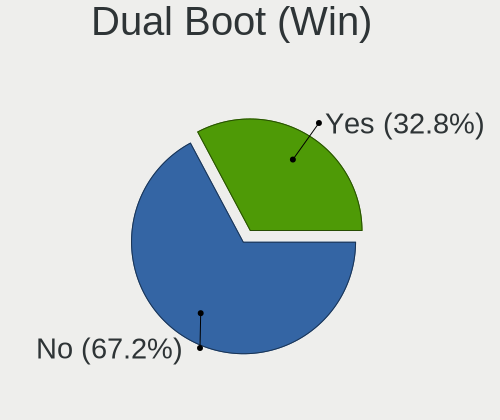
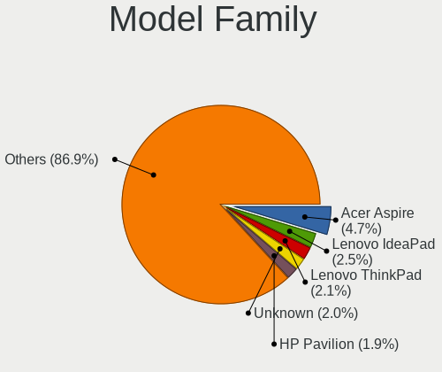
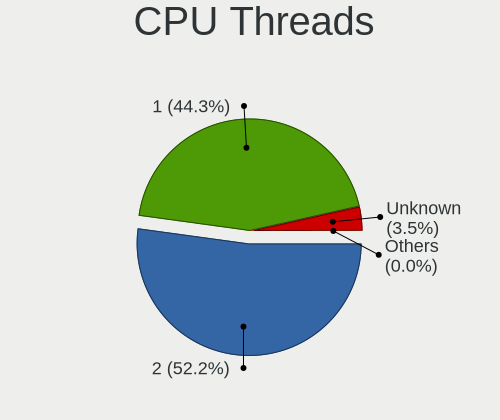

Linux in Russia - Tested Hardware & Statistics
----------------------------------------------

A project to collect tested hardware configurations for Linux in Russia.

Anyone can contribute to this report by the [hw-probe](https://github.com/linuxhw/hw-probe) tool:

    sudo -E hw-probe -all -upload

Please contribute! Especially if your hardware is rare.

This is a report for all computer types. See also reports for [desktops](/Location/Russia/Desktop/README.md) and [notebooks](/Location/Russia/Notebook/README.md).

Contents
--------

* [ Test Cases ](#test-cases)

* [ System ](#system)
  - [ OS                       ](#os)
  - [ OS Family                ](#os-family)
  - [ Kernel                   ](#kernel)
  - [ Kernel Family            ](#kernel-family)
  - [ Kernel Major Ver.        ](#kernel-major-ver)
  - [ Arch                     ](#arch)
  - [ DE                       ](#de)
  - [ Display Server           ](#display-server)
  - [ Display Manager          ](#display-manager)
  - [ OS Lang                  ](#os-lang)
  - [ Boot Mode                ](#boot-mode)
  - [ Filesystem               ](#filesystem)
  - [ Part. scheme             ](#part-scheme)
  - [ Dual Boot with Linux/BSD ](#dual-boot-with-linuxbsd)
  - [ Dual Boot (Win)          ](#dual-boot-win)

* [ Board ](#board)
  - [ Vendor                   ](#vendor)
  - [ Model                    ](#model)
  - [ Model Family             ](#model-family)
  - [ MFG Year                 ](#mfg-year)
  - [ Form Factor              ](#form-factor)
  - [ Secure Boot              ](#secure-boot)
  - [ Coreboot                 ](#coreboot)
  - [ RAM Size                 ](#ram-size)
  - [ RAM Used                 ](#ram-used)
  - [ Total Drives             ](#total-drives)
  - [ Has CD-ROM               ](#has-cd-rom)
  - [ Has Ethernet             ](#has-ethernet)
  - [ Has WiFi                 ](#has-wifi)
  - [ Has Bluetooth            ](#has-bluetooth)

* [ Location ](#location)
  - [ Country                  ](#country)
  - [ City                     ](#city)

* [ Drives ](#drives)
  - [ Drive Vendor             ](#drive-vendor)
  - [ Drive Model              ](#drive-model)
  - [ HDD Vendor               ](#hdd-vendor)
  - [ SSD Vendor               ](#ssd-vendor)
  - [ Drive Kind               ](#drive-kind)
  - [ Drive Connector          ](#drive-connector)
  - [ Drive Size               ](#drive-size)
  - [ Space Total              ](#space-total)
  - [ Space Used               ](#space-used)
  - [ Malfunc. Drives          ](#malfunc-drives)
  - [ Malfunc. Drive Vendor    ](#malfunc-drive-vendor)
  - [ Malfunc. HDD Vendor      ](#malfunc-hdd-vendor)
  - [ Malfunc. Drive Kind      ](#malfunc-drive-kind)
  - [ Failed Drives            ](#failed-drives)
  - [ Failed Drive Vendor      ](#failed-drive-vendor)
  - [ Drive Status             ](#drive-status)

* [ Storage controller ](#storage-controller)
  - [ Storage Vendor           ](#storage-vendor)
  - [ Storage Model            ](#storage-model)
  - [ Storage Kind             ](#storage-kind)

* [ Processor ](#processor)
  - [ CPU Vendor               ](#cpu-vendor)
  - [ CPU Model                ](#cpu-model)
  - [ CPU Model Family         ](#cpu-model-family)
  - [ CPU Cores                ](#cpu-cores)
  - [ CPU Sockets              ](#cpu-sockets)
  - [ CPU Threads              ](#cpu-threads)
  - [ CPU Op-Modes             ](#cpu-op-modes)
  - [ CPU Microcode            ](#cpu-microcode)
  - [ CPU Microarch            ](#cpu-microarch)

* [ Graphics ](#graphics)
  - [ GPU Vendor               ](#gpu-vendor)
  - [ GPU Model                ](#gpu-model)
  - [ GPU Combo                ](#gpu-combo)
  - [ GPU Driver               ](#gpu-driver)
  - [ GPU Memory               ](#gpu-memory)

* [ Monitor ](#monitor)
  - [ Monitor Vendor           ](#monitor-vendor)
  - [ Monitor Model            ](#monitor-model)
  - [ Monitor Resolution       ](#monitor-resolution)
  - [ Monitor Diagonal         ](#monitor-diagonal)
  - [ Monitor Width            ](#monitor-width)
  - [ Aspect Ratio             ](#aspect-ratio)
  - [ Monitor Area             ](#monitor-area)
  - [ Pixel Density            ](#pixel-density)
  - [ Multiple Monitors        ](#multiple-monitors)

* [ Network ](#network)
  - [ Net Controller Vendor    ](#net-controller-vendor)
  - [ Net Controller Model     ](#net-controller-model)
  - [ Wireless Vendor          ](#wireless-vendor)
  - [ Wireless Model           ](#wireless-model)
  - [ Ethernet Vendor          ](#ethernet-vendor)
  - [ Ethernet Model           ](#ethernet-model)
  - [ Net Controller Kind      ](#net-controller-kind)
  - [ Used Controller          ](#used-controller)
  - [ NICs                     ](#nics)
  - [ IPv6                     ](#ipv6)

* [ Bluetooth ](#bluetooth)
  - [ Bluetooth Vendor         ](#bluetooth-vendor)
  - [ Bluetooth Model          ](#bluetooth-model)

* [ Sound ](#sound)
  - [ Sound Vendor             ](#sound-vendor)
  - [ Sound Model              ](#sound-model)

* [ Memory ](#memory)
  - [ Memory Vendor            ](#memory-vendor)
  - [ Memory Model             ](#memory-model)
  - [ Memory Kind              ](#memory-kind)
  - [ Memory Form Factor       ](#memory-form-factor)
  - [ Memory Size              ](#memory-size)
  - [ Memory Speed             ](#memory-speed)

* [ Printers & scanners ](#printers--scanners)
  - [ Printer Vendor           ](#printer-vendor)
  - [ Printer Model            ](#printer-model)
  - [ Scanner Vendor           ](#scanner-vendor)
  - [ Scanner Model            ](#scanner-model)

* [ Camera ](#camera)
  - [ Camera Vendor            ](#camera-vendor)
  - [ Camera Model             ](#camera-model)

* [ Security ](#security)
  - [ Fingerprint Vendor       ](#fingerprint-vendor)
  - [ Fingerprint Model        ](#fingerprint-model)
  - [ Chipcard Vendor          ](#chipcard-vendor)
  - [ Chipcard Model           ](#chipcard-model)

* [ Unsupported ](#unsupported)
  - [ Unsupported Devices      ](#unsupported-devices)
  - [ Unsupported Device Types ](#unsupported-device-types)

Test Cases
----------

Total: 42199

| Vendor        | Model                       | Form-Factor | Probe                                                      | Date         |
|---------------|-----------------------------|-------------|------------------------------------------------------------|--------------|
| HP            | EliteBook 8460p             | Notebook    | [cc6b66c576](https://linux-hardware.org/?probe=cc6b66c576) | Nov 06, 2023 |
| Lenovo        | Yoga 7 14ITL5 82BH          | Convertible | [27b2ce4d8c](https://linux-hardware.org/?probe=27b2ce4d8c) | Nov 06, 2023 |
| Aquarius      | NS585                       | Notebook    | [ddc8256647](https://linux-hardware.org/?probe=ddc8256647) | Nov 06, 2023 |
| MSI           | A520M PRO                   | Desktop     | [b83b272494](https://linux-hardware.org/?probe=b83b272494) | Nov 06, 2023 |
| Aquarius      | NS585                       | Notebook    | [2f4e49837d](https://linux-hardware.org/?probe=2f4e49837d) | Nov 06, 2023 |
| HP            | Laptop 15s-eq2xxx           | Notebook    | [b63a038c08](https://linux-hardware.org/?probe=b63a038c08) | Nov 06, 2023 |
| Aquarius      | NS585                       | Notebook    | [4fea63336a](https://linux-hardware.org/?probe=4fea63336a) | Nov 06, 2023 |
| HP            | Laptop 15-bw0xx             | Notebook    | [bd3e108e8a](https://linux-hardware.org/?probe=bd3e108e8a) | Nov 06, 2023 |
| ASUSTek       | A68HM-K                     | Desktop     | [c3e5415128](https://linux-hardware.org/?probe=c3e5415128) | Nov 06, 2023 |
| ASUSTek       | ASUS TUF Gaming A15 FA50... | Notebook    | [60ec029256](https://linux-hardware.org/?probe=60ec029256) | Nov 05, 2023 |
| Huanan        | X99-QD4 V1.0                | Desktop     | [3cedc8f704](https://linux-hardware.org/?probe=3cedc8f704) | Nov 05, 2023 |
| Unknown       | H96 Max X3                  | Soc         | [362598f755](https://linux-hardware.org/?probe=362598f755) | Nov 05, 2023 |
| ASUSTek       | ROG STRIX B550-F GAMING     | Desktop     | [8ee603dbfc](https://linux-hardware.org/?probe=8ee603dbfc) | Nov 05, 2023 |
| ASUSTek       | X550WA                      | Notebook    | [8c15da796b](https://linux-hardware.org/?probe=8c15da796b) | Nov 05, 2023 |
| HUAWEI        | NBLK-WAX9X                  | Notebook    | [cff5d02cde](https://linux-hardware.org/?probe=cff5d02cde) | Nov 05, 2023 |
| HP            | ProBook 440 G7              | Notebook    | [1d1311204e](https://linux-hardware.org/?probe=1d1311204e) | Nov 05, 2023 |
| ASUSTek       | P5K PRO                     | Desktop     | [7dd5e78310](https://linux-hardware.org/?probe=7dd5e78310) | Nov 05, 2023 |
| HP            | ProBook 6545b               | Notebook    | [a81427fffa](https://linux-hardware.org/?probe=a81427fffa) | Nov 05, 2023 |
| HP            | Laptop 17t-by000            | Notebook    | [b23b606118](https://linux-hardware.org/?probe=b23b606118) | Nov 05, 2023 |
| Acer          | Aspire 5349                 | Notebook    | [b1ca6f597c](https://linux-hardware.org/?probe=b1ca6f597c) | Nov 05, 2023 |
| ASUSTek       | PRIME H310M-R R2.0          | Desktop     | [3d09b709c4](https://linux-hardware.org/?probe=3d09b709c4) | Nov 05, 2023 |
| Lenovo        | IdeaPad 100-15IBY 80MJ      | Notebook    | [f782cf5541](https://linux-hardware.org/?probe=f782cf5541) | Nov 05, 2023 |
| ASUSTek       | PRIME H310M-R R2.0          | Desktop     | [e079b95148](https://linux-hardware.org/?probe=e079b95148) | Nov 05, 2023 |
| Gigabyte      | X570 UD                     | Desktop     | [287ceab4df](https://linux-hardware.org/?probe=287ceab4df) | Nov 05, 2023 |
| Gigabyte      | X570 UD                     | Desktop     | [1c9b1632b8](https://linux-hardware.org/?probe=1c9b1632b8) | Nov 05, 2023 |
| ASUSTek       | VivoBook_ASUSLaptop X521... | Notebook    | [a3a6205085](https://linux-hardware.org/?probe=a3a6205085) | Nov 05, 2023 |
| ASUSTek       | VivoBook_ASUSLaptop X521... | Notebook    | [1d56b84bdd](https://linux-hardware.org/?probe=1d56b84bdd) | Nov 05, 2023 |
| Acer          | Aspire E1-571G              | Notebook    | [fac63c4d5c](https://linux-hardware.org/?probe=fac63c4d5c) | Nov 05, 2023 |
| ASUSTek       | VivoBook 15_ASUS Laptop ... | Notebook    | [5541e01522](https://linux-hardware.org/?probe=5541e01522) | Nov 05, 2023 |
| Acer          | Aspire 5100                 | Notebook    | [62b63704e9](https://linux-hardware.org/?probe=62b63704e9) | Nov 04, 2023 |
| Pegatron      | IPMIP-H55-GEN               | Desktop     | [f87bf6e0dd](https://linux-hardware.org/?probe=f87bf6e0dd) | Nov 04, 2023 |
| Acer          | Aspire 5100                 | Notebook    | [c4d628cb50](https://linux-hardware.org/?probe=c4d628cb50) | Nov 04, 2023 |
| Intel         | DG33BU AAD79951-407         | Desktop     | [734dafca4e](https://linux-hardware.org/?probe=734dafca4e) | Nov 04, 2023 |
| Acer          | TravelMate B118-M           | Notebook    | [051346666e](https://linux-hardware.org/?probe=051346666e) | Nov 04, 2023 |
| Timi          | Redmi Book Pro 15 2022      | Notebook    | [2084300c18](https://linux-hardware.org/?probe=2084300c18) | Nov 04, 2023 |
| MSI           | H110M PRO-D                 | Desktop     | [9a7337554c](https://linux-hardware.org/?probe=9a7337554c) | Nov 04, 2023 |
| Gigabyte      | GA-870A-USB3L               | Desktop     | [d2412dfd7c](https://linux-hardware.org/?probe=d2412dfd7c) | Nov 04, 2023 |
| Acer          | Aspire E5-573G              | Notebook    | [c74051abb7](https://linux-hardware.org/?probe=c74051abb7) | Nov 04, 2023 |
| Acer          | TravelMate P215-54          | Notebook    | [5688b7940d](https://linux-hardware.org/?probe=5688b7940d) | Nov 04, 2023 |
| HP            | Laptop 15s-eq2xxx           | Notebook    | [6fcd2a768b](https://linux-hardware.org/?probe=6fcd2a768b) | Nov 04, 2023 |
| MSI           | Bravo 15 C7VE               | Notebook    | [5db0e7314a](https://linux-hardware.org/?probe=5db0e7314a) | Nov 04, 2023 |
| Acer          | TravelMate P215-54          | Notebook    | [f051dc617c](https://linux-hardware.org/?probe=f051dc617c) | Nov 04, 2023 |
| Lenovo        | IdeaPad 330-15IGM 81D1      | Notebook    | [157f4d1006](https://linux-hardware.org/?probe=157f4d1006) | Nov 04, 2023 |
| Lenovo        | 317E NOK                    | Desktop     | [1d038af880](https://linux-hardware.org/?probe=1d038af880) | Nov 04, 2023 |
| Gigabyte      | H470M K                     | Desktop     | [d69493b7d2](https://linux-hardware.org/?probe=d69493b7d2) | Nov 04, 2023 |
| Pegatron      | E60                         | Desktop     | [42e0c4ad61](https://linux-hardware.org/?probe=42e0c4ad61) | Nov 04, 2023 |
| MSI           | B550M PRO-VDH WIFI          | Desktop     | [cda17ca99b](https://linux-hardware.org/?probe=cda17ca99b) | Nov 04, 2023 |
| Gigabyte      | H470M K                     | Desktop     | [80085c7047](https://linux-hardware.org/?probe=80085c7047) | Nov 04, 2023 |
| ASUSTek       | P8H61-M LX3 R2.0            | Desktop     | [18bafa67dc](https://linux-hardware.org/?probe=18bafa67dc) | Nov 04, 2023 |
| Dell          | Inspiron M5110              | Notebook    | [20e338fb21](https://linux-hardware.org/?probe=20e338fb21) | Nov 04, 2023 |
| ASUSTek       | VivoBook 15_ASUS Laptop ... | Notebook    | [86d2394935](https://linux-hardware.org/?probe=86d2394935) | Nov 03, 2023 |
| ASUSTek       | ROG Strix G513QY_G513QY     | Notebook    | [85a38e7906](https://linux-hardware.org/?probe=85a38e7906) | Nov 03, 2023 |
| Supermicro    | X9DRW                       | Desktop     | [d9bb198389](https://linux-hardware.org/?probe=d9bb198389) | Nov 03, 2023 |
| ASUSTek       | P5QD TURBO                  | Desktop     | [4a350b6fdb](https://linux-hardware.org/?probe=4a350b6fdb) | Nov 03, 2023 |
| Unknown       | Unknown                     | Notebook    | [d27cd12013](https://linux-hardware.org/?probe=d27cd12013) | Nov 03, 2023 |
| DEXP          | Aquilon C14                 | Notebook    | [b91d7803a2](https://linux-hardware.org/?probe=b91d7803a2) | Nov 03, 2023 |
| ASUSTek       | ROG Strix G513RM_G513RM     | Notebook    | [ded1d73643](https://linux-hardware.org/?probe=ded1d73643) | Nov 03, 2023 |
| ASRock        | A770DE+                     | Desktop     | [330e203c8a](https://linux-hardware.org/?probe=330e203c8a) | Nov 03, 2023 |
| Timi          | A35S                        | Notebook    | [d62fbb6f83](https://linux-hardware.org/?probe=d62fbb6f83) | Nov 03, 2023 |
| Intel         | H610-MIX v1.0               | Desktop     | [eeaea55301](https://linux-hardware.org/?probe=eeaea55301) | Nov 03, 2023 |
| HONOR         | NMH-WDX9                    | Notebook    | [11e32e2482](https://linux-hardware.org/?probe=11e32e2482) | Nov 03, 2023 |
| Supermicro    | X8DTU                       | Server      | [17ea09c2b2](https://linux-hardware.org/?probe=17ea09c2b2) | Nov 03, 2023 |
| Supermicro    | X10DRL-i                    | Desktop     | [cada5224ab](https://linux-hardware.org/?probe=cada5224ab) | Nov 03, 2023 |
| ZOTAC         | ZBOXNANO-AD10               | Mini pc     | [2b0fbc5661](https://linux-hardware.org/?probe=2b0fbc5661) | Nov 03, 2023 |
| ETegro Tec... | ETRS125G4 31S2MMB0040       | Server      | [5085991741](https://linux-hardware.org/?probe=5085991741) | Nov 03, 2023 |
| ASRock        | H170M Pro4                  | Desktop     | [b87ccd7768](https://linux-hardware.org/?probe=b87ccd7768) | Nov 03, 2023 |
| Supermicro    | X8DTU                       | Server      | [1e45f05458](https://linux-hardware.org/?probe=1e45f05458) | Nov 03, 2023 |
| Supermicro    | X8DTU                       | Server      | [330f475535](https://linux-hardware.org/?probe=330f475535) | Nov 03, 2023 |
| HUAWEI        | BOM-WXX9                    | Notebook    | [bc3b3daf33](https://linux-hardware.org/?probe=bc3b3daf33) | Nov 03, 2023 |
| Insyde        | Purley                      | Server      | [cb46a7ce21](https://linux-hardware.org/?probe=cb46a7ce21) | Nov 03, 2023 |
| MSI           | 760GM-P21                   | Desktop     | [f3b16a05ae](https://linux-hardware.org/?probe=f3b16a05ae) | Nov 03, 2023 |
| Supermicro    | X10DRU-i+B                  | Desktop     | [305ce5bbcc](https://linux-hardware.org/?probe=305ce5bbcc) | Nov 03, 2023 |
| Supermicro    | X10DDW-i                    | Desktop     | [8a0ff875f1](https://linux-hardware.org/?probe=8a0ff875f1) | Nov 03, 2023 |
| Supermicro    | X10DDW-i                    | Desktop     | [3138fbde8e](https://linux-hardware.org/?probe=3138fbde8e) | Nov 03, 2023 |
| Supermicro    | X10DDW-i                    | Desktop     | [f3023a2a6f](https://linux-hardware.org/?probe=f3023a2a6f) | Nov 03, 2023 |
| Supermicro    | X10DDW-i                    | Desktop     | [d9dcb6003e](https://linux-hardware.org/?probe=d9dcb6003e) | Nov 03, 2023 |
| Apple         | MacBookAir7,1               | Notebook    | [50cb167f37](https://linux-hardware.org/?probe=50cb167f37) | Nov 03, 2023 |
| Shenzhen M... | F7BFD                       | Desktop     | [f2b8e311c3](https://linux-hardware.org/?probe=f2b8e311c3) | Nov 02, 2023 |
| ASUSTek       | A88XM-E                     | Desktop     | [b828019cc1](https://linux-hardware.org/?probe=b828019cc1) | Nov 02, 2023 |
| Lenovo        | G580                        | Notebook    | [d137c3bc30](https://linux-hardware.org/?probe=d137c3bc30) | Nov 02, 2023 |
| Gigabyte      | B550 AORUS PRO AC           | Desktop     | [54a7f5d1fa](https://linux-hardware.org/?probe=54a7f5d1fa) | Nov 02, 2023 |
| Gigabyte      | B550 AORUS PRO AC           | Desktop     | [175020104d](https://linux-hardware.org/?probe=175020104d) | Nov 02, 2023 |
| HP            | Laptop 15-bw0xx             | Notebook    | [589f0a0dfb](https://linux-hardware.org/?probe=589f0a0dfb) | Nov 02, 2023 |
| ASUSTek       | VivoBook_ASUSLaptop M140... | Notebook    | [f1b74562ae](https://linux-hardware.org/?probe=f1b74562ae) | Nov 02, 2023 |
| Supermicro    | X10DRU-i+A                  | Desktop     | [2eee634512](https://linux-hardware.org/?probe=2eee634512) | Nov 02, 2023 |
| Dell          | 08GXHX A06                  | Server      | [ab921499fa](https://linux-hardware.org/?probe=ab921499fa) | Nov 02, 2023 |
| Supermicro    | X8DTL                       | Server      | [c5807873e9](https://linux-hardware.org/?probe=c5807873e9) | Nov 02, 2023 |
| Supermicro    | X9DRW                       | Server      | [0671c88229](https://linux-hardware.org/?probe=0671c88229) | Nov 02, 2023 |
| Supermicro    | X9DRW                       | Desktop     | [406a1425ae](https://linux-hardware.org/?probe=406a1425ae) | Nov 02, 2023 |
| Supermicro    | X9DRW                       | Server      | [0af6a802be](https://linux-hardware.org/?probe=0af6a802be) | Nov 02, 2023 |
| Supermicro    | X9DRW                       | Server      | [953f9bfc89](https://linux-hardware.org/?probe=953f9bfc89) | Nov 02, 2023 |
| Supermicro    | X9DRW                       | Server      | [99fa7a1e00](https://linux-hardware.org/?probe=99fa7a1e00) | Nov 02, 2023 |
| HP            | ProLiant DL360 Gen9         | Server      | [dfb50aae8c](https://linux-hardware.org/?probe=dfb50aae8c) | Nov 02, 2023 |
| HP            | ProLiant DL360 Gen9         | Server      | [8b8de4d7d0](https://linux-hardware.org/?probe=8b8de4d7d0) | Nov 02, 2023 |
| HP            | ProLiant DL360 Gen9         | Server      | [66e431538c](https://linux-hardware.org/?probe=66e431538c) | Nov 02, 2023 |
| KVADRA        | U15W                        | Notebook    | [1c1f562cf5](https://linux-hardware.org/?probe=1c1f562cf5) | Nov 02, 2023 |
| Supermicro    | X10DRL-i                    | Desktop     | [7d77c86bc5](https://linux-hardware.org/?probe=7d77c86bc5) | Nov 02, 2023 |
| Supermicro    | X10DRU-i+                   | Server      | [3a754d74f3](https://linux-hardware.org/?probe=3a754d74f3) | Nov 02, 2023 |
| HP            | ProLiant DL360 Gen9         | Server      | [220bd2a6e2](https://linux-hardware.org/?probe=220bd2a6e2) | Nov 02, 2023 |
| HP            | ProLiant DL360 Gen9         | Server      | [6d4d2cc667](https://linux-hardware.org/?probe=6d4d2cc667) | Nov 02, 2023 |
| Supermicro    | X9DRW                       | Server      | [c99b1358ee](https://linux-hardware.org/?probe=c99b1358ee) | Nov 02, 2023 |
| Supermicro    | X10DRU-i+                   | Server      | [a5260e3398](https://linux-hardware.org/?probe=a5260e3398) | Nov 02, 2023 |
| Supermicro    | X10DRiB                     | Server      | [d164bb48fa](https://linux-hardware.org/?probe=d164bb48fa) | Nov 02, 2023 |
| Supermicro    | X10DRiB                     | Server      | [788451e4cd](https://linux-hardware.org/?probe=788451e4cd) | Nov 02, 2023 |
| Supermicro    | X10DRiB                     | Server      | [758d368461](https://linux-hardware.org/?probe=758d368461) | Nov 02, 2023 |
| MSI           | 760GM-P21                   | Desktop     | [2d08e07e5d](https://linux-hardware.org/?probe=2d08e07e5d) | Nov 02, 2023 |
| ASRock        | H61M-VS                     | Desktop     | [677490b7c2](https://linux-hardware.org/?probe=677490b7c2) | Nov 02, 2023 |
| Digma         | Pro Fortis M DN15P5-8CXN... | Notebook    | [7bb9e8e743](https://linux-hardware.org/?probe=7bb9e8e743) | Nov 02, 2023 |
| Lenovo        | 30BB SDK0J40697 WIN 3305... | All in one  | [b65465f281](https://linux-hardware.org/?probe=b65465f281) | Nov 02, 2023 |
| Insyde        | Purley                      | Server      | [2356c2ecc2](https://linux-hardware.org/?probe=2356c2ecc2) | Nov 02, 2023 |
| Insyde        | Purley                      | Server      | [112f4088aa](https://linux-hardware.org/?probe=112f4088aa) | Nov 02, 2023 |
| Samsung       | 350V5C/351V5C/3540VC/344... | Notebook    | [10b531fcd1](https://linux-hardware.org/?probe=10b531fcd1) | Nov 02, 2023 |
| Gigabyte      | B560M AORUS ELITE           | Desktop     | [3de1d3a50f](https://linux-hardware.org/?probe=3de1d3a50f) | Nov 02, 2023 |
| Gigabyte      | B560M AORUS ELITE           | Desktop     | [64a57926cf](https://linux-hardware.org/?probe=64a57926cf) | Nov 02, 2023 |
| Gigabyte      | 945GCMX-S2                  | Desktop     | [9e43e8bb79](https://linux-hardware.org/?probe=9e43e8bb79) | Nov 01, 2023 |
| ASRock        | N68C-S UCC                  | Desktop     | [cc636af8e3](https://linux-hardware.org/?probe=cc636af8e3) | Nov 01, 2023 |
| ASUSTek       | PRIME B350M-K               | Desktop     | [bc9c6a8334](https://linux-hardware.org/?probe=bc9c6a8334) | Nov 01, 2023 |
| Acer          | TravelMate P259-MG          | Notebook    | [ba3faece8c](https://linux-hardware.org/?probe=ba3faece8c) | Nov 01, 2023 |
| HUAWEI        | DRC-WXX                     | Tablet      | [2764e50f21](https://linux-hardware.org/?probe=2764e50f21) | Nov 01, 2023 |
| HP            | Laptop 15s-eq1xxx           | Notebook    | [075049b538](https://linux-hardware.org/?probe=075049b538) | Nov 01, 2023 |
| Gigabyte      | B550M AORUS ELITE           | Desktop     | [be72cba293](https://linux-hardware.org/?probe=be72cba293) | Nov 01, 2023 |
| ASUSTek       | VivoBook_ASUSLaptop M140... | Notebook    | [0a7341e5e0](https://linux-hardware.org/?probe=0a7341e5e0) | Nov 01, 2023 |
| ASUSTek       | PN53                        | Mini pc     | [5dfa3730a0](https://linux-hardware.org/?probe=5dfa3730a0) | Nov 01, 2023 |
| ASUSTek       | X553SA                      | Notebook    | [0eba32de41](https://linux-hardware.org/?probe=0eba32de41) | Nov 01, 2023 |
| Aquarius      | AQX300M                     | Desktop     | [b70a012245](https://linux-hardware.org/?probe=b70a012245) | Nov 01, 2023 |
| Lenovo        | ThinkPad T14 Gen 3 21AJS... | Notebook    | [a2a8295797](https://linux-hardware.org/?probe=a2a8295797) | Nov 01, 2023 |
| Lenovo        | ThinkPad T14 Gen 3 21AJS... | Notebook    | [0d49a75fe1](https://linux-hardware.org/?probe=0d49a75fe1) | Nov 01, 2023 |
| Lenovo        | ThinkPad T14 Gen 3 21AH0... | Notebook    | [cbe947aefc](https://linux-hardware.org/?probe=cbe947aefc) | Nov 01, 2023 |
| MAINBRD       | OPS62A-SHA                  | Desktop     | [41dc7afbc6](https://linux-hardware.org/?probe=41dc7afbc6) | Nov 01, 2023 |
| Samsung       | P29/28/26                   | Notebook    | [15d449da5d](https://linux-hardware.org/?probe=15d449da5d) | Nov 01, 2023 |
| Dell          | Precision M4700             | Notebook    | [ab52e67d9d](https://linux-hardware.org/?probe=ab52e67d9d) | Nov 01, 2023 |
| Gigabyte      | X570 GAMING X               | Desktop     | [fee5d3eded](https://linux-hardware.org/?probe=fee5d3eded) | Nov 01, 2023 |
| ASRock        | B450M-HDV R4.0              | Desktop     | [c962dd6f41](https://linux-hardware.org/?probe=c962dd6f41) | Nov 01, 2023 |
| Unknown       | Unknown                     | Desktop     | [ae244bf378](https://linux-hardware.org/?probe=ae244bf378) | Nov 01, 2023 |
| ANCOMP        | Learnmate A15-501           | Notebook    | [da0c777960](https://linux-hardware.org/?probe=da0c777960) | Nov 01, 2023 |
| HUAWEI        | DRC-WXX                     | Tablet      | [55b168413e](https://linux-hardware.org/?probe=55b168413e) | Nov 01, 2023 |
| Dell          | G15 5510                    | Notebook    | [60ea93226d](https://linux-hardware.org/?probe=60ea93226d) | Nov 01, 2023 |
| Gigabyte      | B760 GAMING X               | Desktop     | [a360fd740f](https://linux-hardware.org/?probe=a360fd740f) | Nov 01, 2023 |
| Unknown       | Unknown                     | Desktop     | [e135ca8165](https://linux-hardware.org/?probe=e135ca8165) | Oct 31, 2023 |
| Gigabyte      | AX370M-Gaming 3-CF          | Desktop     | [d271d2ae41](https://linux-hardware.org/?probe=d271d2ae41) | Oct 31, 2023 |
| MSI           | Prestige 14Evo A12M         | Notebook    | [98e32e98bf](https://linux-hardware.org/?probe=98e32e98bf) | Oct 31, 2023 |
| Gigabyte      | EP43T-UD3L                  | Desktop     | [a3a25165b1](https://linux-hardware.org/?probe=a3a25165b1) | Oct 31, 2023 |
| Dell          | Inspiron N5050              | Notebook    | [2ec8097b67](https://linux-hardware.org/?probe=2ec8097b67) | Oct 31, 2023 |
| Gigabyte      | A320M-S2H V2-CF             | Desktop     | [763630b66c](https://linux-hardware.org/?probe=763630b66c) | Oct 31, 2023 |
| Lenovo        | Legion Pro 7 16IRX8 82WR    | Notebook    | [f6929f0d98](https://linux-hardware.org/?probe=f6929f0d98) | Oct 31, 2023 |
| HONOR         | BMH-WDX9                    | Notebook    | [a1962fef8a](https://linux-hardware.org/?probe=a1962fef8a) | Oct 31, 2023 |
| Gigabyte      | B75M-D3V                    | Desktop     | [c6d1fc4965](https://linux-hardware.org/?probe=c6d1fc4965) | Oct 31, 2023 |
| Unknown       | Unknown                     | Desktop     | [4e9f4aa1ab](https://linux-hardware.org/?probe=4e9f4aa1ab) | Oct 31, 2023 |
| Gigabyte      | H510M H                     | Desktop     | [d89e17690d](https://linux-hardware.org/?probe=d89e17690d) | Oct 31, 2023 |
| Gigabyte      | H610M H DDR4                | Desktop     | [6e876b597c](https://linux-hardware.org/?probe=6e876b597c) | Oct 31, 2023 |
| Gigabyte      | H610M H DDR4                | Desktop     | [01f9a9c872](https://linux-hardware.org/?probe=01f9a9c872) | Oct 31, 2023 |
| Acer          | Extensa 215-22              | Notebook    | [5fd05270e7](https://linux-hardware.org/?probe=5fd05270e7) | Oct 31, 2023 |
| MSI           | MAG X570S TOMAHAWK MAX W... | Desktop     | [b522c4b372](https://linux-hardware.org/?probe=b522c4b372) | Oct 31, 2023 |
| Lenovo        | Legion Pro 7 16IRX8 82WR    | Notebook    | [794c56fb64](https://linux-hardware.org/?probe=794c56fb64) | Oct 31, 2023 |
| ASRock        | B450M-HDV R4.0              | Desktop     | [54a16261d5](https://linux-hardware.org/?probe=54a16261d5) | Oct 31, 2023 |
| Gigabyte      | Z590 D                      | Desktop     | [d986377165](https://linux-hardware.org/?probe=d986377165) | Oct 31, 2023 |
| ASUSTek       | P8Z77-M                     | Desktop     | [69cd55a4dc](https://linux-hardware.org/?probe=69cd55a4dc) | Oct 31, 2023 |
| Huanan        | X99-F8                      | Desktop     | [0bcf4adaf6](https://linux-hardware.org/?probe=0bcf4adaf6) | Oct 31, 2023 |
| ASUSTek       | M5A78L LE                   | Desktop     | [d7dd5dbdf7](https://linux-hardware.org/?probe=d7dd5dbdf7) | Oct 30, 2023 |
| Gigabyte      | H97M-HD3                    | Desktop     | [0d712d2765](https://linux-hardware.org/?probe=0d712d2765) | Oct 30, 2023 |
| Lenovo        | ThinkPad X260 VB6R77903H    | Notebook    | [c4baf8a67b](https://linux-hardware.org/?probe=c4baf8a67b) | Oct 30, 2023 |
| Dell          | Latitude 7320               | Notebook    | [efc40122bf](https://linux-hardware.org/?probe=efc40122bf) | Oct 30, 2023 |
| THUNDEROBO... | 911AirD                     | Notebook    | [698adeeba7](https://linux-hardware.org/?probe=698adeeba7) | Oct 30, 2023 |
| Apple         | MacBookAir6,2               | Notebook    | [b1a709477b](https://linux-hardware.org/?probe=b1a709477b) | Oct 30, 2023 |
| TECNO         | MEGABOOK T1                 | Notebook    | [2bab6515f4](https://linux-hardware.org/?probe=2bab6515f4) | Oct 30, 2023 |
| Valve         | Jupiter                     | Notebook    | [7eda72383a](https://linux-hardware.org/?probe=7eda72383a) | Oct 30, 2023 |
| Acer          | Extensa 2520G               | Notebook    | [bcc4e567f3](https://linux-hardware.org/?probe=bcc4e567f3) | Oct 30, 2023 |
| ASUSTek       | N61Vn                       | Notebook    | [d8ee34cdbc](https://linux-hardware.org/?probe=d8ee34cdbc) | Oct 30, 2023 |
| Sony          | SVE1511B1RB                 | Notebook    | [74651497a9](https://linux-hardware.org/?probe=74651497a9) | Oct 30, 2023 |
| Apple         | MacBookAir6,2               | Notebook    | [afd23e164c](https://linux-hardware.org/?probe=afd23e164c) | Oct 30, 2023 |
| Supermicro    | X8DTH                       | Server      | [25d685c01e](https://linux-hardware.org/?probe=25d685c01e) | Oct 30, 2023 |
| Supermicro    | X8DTU                       | Server      | [b3198f87dc](https://linux-hardware.org/?probe=b3198f87dc) | Oct 30, 2023 |
| Supermicro    | X8DTU                       | Server      | [9059ae93c8](https://linux-hardware.org/?probe=9059ae93c8) | Oct 30, 2023 |
| Supermicro    | X8DAH                       | Server      | [2da70990c6](https://linux-hardware.org/?probe=2da70990c6) | Oct 30, 2023 |
| HP            | ProLiant DL360 Gen9         | Server      | [26a402ed6d](https://linux-hardware.org/?probe=26a402ed6d) | Oct 30, 2023 |
| Supermicro    | X8DTU                       | Server      | [1d48e8c039](https://linux-hardware.org/?probe=1d48e8c039) | Oct 30, 2023 |
| Supermicro    | X8DTU                       | Server      | [4631401674](https://linux-hardware.org/?probe=4631401674) | Oct 30, 2023 |
| Supermicro    | X8DT6                       | Server      | [45fb3b1fdb](https://linux-hardware.org/?probe=45fb3b1fdb) | Oct 30, 2023 |
| Supermicro    | X8DTU                       | Server      | [21522dd1f4](https://linux-hardware.org/?probe=21522dd1f4) | Oct 30, 2023 |
| Supermicro    | X10DRU-i+B                  | Desktop     | [516d10eb4d](https://linux-hardware.org/?probe=516d10eb4d) | Oct 30, 2023 |
| Supermicro    | X10DRU-i+A                  | Desktop     | [87881094e7](https://linux-hardware.org/?probe=87881094e7) | Oct 30, 2023 |
| Supermicro    | X10DRU-i+                   | Server      | [765e090f58](https://linux-hardware.org/?probe=765e090f58) | Oct 30, 2023 |
| ETegro Tec... | ETRS125G4 31S2MMB0040       | Server      | [bd8a2d432f](https://linux-hardware.org/?probe=bd8a2d432f) | Oct 30, 2023 |
| Supermicro    | X10DRiB                     | Server      | [7a218f5463](https://linux-hardware.org/?probe=7a218f5463) | Oct 30, 2023 |
| Supermicro    | X10DDW-i                    | Desktop     | [175f00718f](https://linux-hardware.org/?probe=175f00718f) | Oct 30, 2023 |
| Supermicro    | X10DDW-i                    | Desktop     | [a3b51e3697](https://linux-hardware.org/?probe=a3b51e3697) | Oct 30, 2023 |
| Supermicro    | X8DTU                       | Server      | [651275ba74](https://linux-hardware.org/?probe=651275ba74) | Oct 30, 2023 |
| HP            | Laptop 15-dy2xxx            | Notebook    | [f39cf8f2f8](https://linux-hardware.org/?probe=f39cf8f2f8) | Oct 30, 2023 |
| ASUSTek       | N53SV                       | Notebook    | [8d853d0cb4](https://linux-hardware.org/?probe=8d853d0cb4) | Oct 30, 2023 |
| ASUSTek       | ZenBook UX425UA_UM425UA     | Notebook    | [de3f77c938](https://linux-hardware.org/?probe=de3f77c938) | Oct 30, 2023 |
| ETegro Tec... | ETRS125G4 31S2MMB0040       | Server      | [d40a2e7c54](https://linux-hardware.org/?probe=d40a2e7c54) | Oct 30, 2023 |
| HP            | ProLiant DL360 Gen9         | Server      | [081a87b55c](https://linux-hardware.org/?probe=081a87b55c) | Oct 30, 2023 |
| MSI           | MPG B550 GAMING PLUS        | Desktop     | [c8b24699a5](https://linux-hardware.org/?probe=c8b24699a5) | Oct 30, 2023 |
| HP            | 84EE 1100                   | All in one  | [85b02dcac3](https://linux-hardware.org/?probe=85b02dcac3) | Oct 30, 2023 |
| ASUSTek       | ROG STRIX Z390-E GAMING     | Desktop     | [102224106e](https://linux-hardware.org/?probe=102224106e) | Oct 30, 2023 |
| ASUSTek       | X540YA                      | Notebook    | [082e5b7e0b](https://linux-hardware.org/?probe=082e5b7e0b) | Oct 29, 2023 |
| Lenovo        | ThinkBook 15 G3 ACL 21A4    | Notebook    | [8ddd5fdfba](https://linux-hardware.org/?probe=8ddd5fdfba) | Oct 29, 2023 |
| ASUSTek       | PRIME B250-PRO              | Desktop     | [ac060a5eb6](https://linux-hardware.org/?probe=ac060a5eb6) | Oct 29, 2023 |
| HUAWEI        | BOM-WXX9                    | Notebook    | [3a547e1959](https://linux-hardware.org/?probe=3a547e1959) | Oct 29, 2023 |
| Gigabyte      | GA-890GPA-UD3H              | Desktop     | [0be3861a6a](https://linux-hardware.org/?probe=0be3861a6a) | Oct 29, 2023 |
| eMachines     | Rhine V1.45                 | Notebook    | [dc1b87d14a](https://linux-hardware.org/?probe=dc1b87d14a) | Oct 29, 2023 |
| Intel         | H81 V2.3                    | Desktop     | [ad1b4d2589](https://linux-hardware.org/?probe=ad1b4d2589) | Oct 29, 2023 |
| Biostar       | H610MH                      | Desktop     | [82198b27e1](https://linux-hardware.org/?probe=82198b27e1) | Oct 29, 2023 |
| Dell          | 0Y5DDC A00                  | Desktop     | [537823e1ce](https://linux-hardware.org/?probe=537823e1ce) | Oct 29, 2023 |
| ASUSTek       | K84L                        | Notebook    | [e6d103b3e4](https://linux-hardware.org/?probe=e6d103b3e4) | Oct 29, 2023 |
| ASUSTek       | Zenbook UX3402VA_UX3402V... | Notebook    | [300d56f39e](https://linux-hardware.org/?probe=300d56f39e) | Oct 29, 2023 |
| Acer          | Extensa 5220                | Notebook    | [d9fbe1bc8a](https://linux-hardware.org/?probe=d9fbe1bc8a) | Oct 29, 2023 |
| ASUSTek       | Zenbook UX3402VA_UX3402V... | Notebook    | [29a362f501](https://linux-hardware.org/?probe=29a362f501) | Oct 29, 2023 |
| ASUSTek       | PRIME H410M-R               | Desktop     | [c9a6bd4217](https://linux-hardware.org/?probe=c9a6bd4217) | Oct 29, 2023 |
| Clevo         | W150HRM                     | Notebook    | [ef386d81b5](https://linux-hardware.org/?probe=ef386d81b5) | Oct 29, 2023 |
| HP            | Pavilion Notebook           | Notebook    | [c76c1fe34a](https://linux-hardware.org/?probe=c76c1fe34a) | Oct 29, 2023 |
| ASUSTek       | M5A87                       | Desktop     | [7e4a0870d1](https://linux-hardware.org/?probe=7e4a0870d1) | Oct 29, 2023 |
| Lenovo        | G780                        | Notebook    | [ffb91c2552](https://linux-hardware.org/?probe=ffb91c2552) | Oct 29, 2023 |
| Lenovo        | G780                        | Notebook    | [86a631f874](https://linux-hardware.org/?probe=86a631f874) | Oct 29, 2023 |
| ASUSTek       | VivoBook_ASUSLaptop K650... | Notebook    | [a123ac023f](https://linux-hardware.org/?probe=a123ac023f) | Oct 29, 2023 |
| Apple         | Mac-CFF7D910A743CAAF iMa... | All in one  | [e2e7788338](https://linux-hardware.org/?probe=e2e7788338) | Oct 29, 2023 |
| Valve         | Jupiter                     | Notebook    | [935baa5e6a](https://linux-hardware.org/?probe=935baa5e6a) | Oct 29, 2023 |
| HUAWEI        | BOM-WXX9                    | Notebook    | [57c7ce8322](https://linux-hardware.org/?probe=57c7ce8322) | Oct 28, 2023 |
| HPE           | ProLiant DL360 Gen10        | Server      | [b8a4774f2c](https://linux-hardware.org/?probe=b8a4774f2c) | Oct 28, 2023 |
| HPE           | ProLiant DL360 Gen10        | Server      | [07d658316a](https://linux-hardware.org/?probe=07d658316a) | Oct 28, 2023 |
| HPE           | ProLiant DL360 Gen10        | Server      | [bb565b917d](https://linux-hardware.org/?probe=bb565b917d) | Oct 28, 2023 |
| Toshiba       | Satellite L755              | Notebook    | [6f0566d95a](https://linux-hardware.org/?probe=6f0566d95a) | Oct 28, 2023 |
| Shenzhen M... | F7BFD                       | Desktop     | [28096584b1](https://linux-hardware.org/?probe=28096584b1) | Oct 28, 2023 |
| MSI           | MS-7235                     | Desktop     | [a20f50ce09](https://linux-hardware.org/?probe=a20f50ce09) | Oct 28, 2023 |
| HP            | Laptop 15-bw0xx             | Notebook    | [63c6987bfa](https://linux-hardware.org/?probe=63c6987bfa) | Oct 28, 2023 |
| Maibenben     | MaiBook X series            | Notebook    | [63e0cb487a](https://linux-hardware.org/?probe=63e0cb487a) | Oct 28, 2023 |
| HP            | Pavilion dv6                | Notebook    | [cb8ef15ece](https://linux-hardware.org/?probe=cb8ef15ece) | Oct 28, 2023 |
| Gigabyte      | EG41MF-US2H                 | Desktop     | [e79e5c88a2](https://linux-hardware.org/?probe=e79e5c88a2) | Oct 28, 2023 |
| HP            | Pavilion dv6                | Notebook    | [88a3365d2c](https://linux-hardware.org/?probe=88a3365d2c) | Oct 28, 2023 |
| Gigabyte      | EG41MF-US2H                 | Desktop     | [54665c8266](https://linux-hardware.org/?probe=54665c8266) | Oct 28, 2023 |
| ICL           | RAYbook Si1512              | Notebook    | [a17fa22636](https://linux-hardware.org/?probe=a17fa22636) | Oct 28, 2023 |
| HUAWEI        | CREM-WXX9                   | Notebook    | [217aaa00da](https://linux-hardware.org/?probe=217aaa00da) | Oct 28, 2023 |
| Gigabyte      | B75M-D3H                    | Desktop     | [97d8cfe6f0](https://linux-hardware.org/?probe=97d8cfe6f0) | Oct 28, 2023 |
| Sony          | VPCEB1S1R                   | Notebook    | [bb50d8e6f3](https://linux-hardware.org/?probe=bb50d8e6f3) | Oct 28, 2023 |
| Lenovo        | IdeaPad 320-15AST 80XV      | Notebook    | [9c28038bcb](https://linux-hardware.org/?probe=9c28038bcb) | Oct 28, 2023 |
| MSI           | A320M GRENADE               | Desktop     | [723b3a152b](https://linux-hardware.org/?probe=723b3a152b) | Oct 28, 2023 |
| Lenovo        | IdeaPad 320-15AST 80XV      | Notebook    | [f7556d51ff](https://linux-hardware.org/?probe=f7556d51ff) | Oct 28, 2023 |
| Gigabyte      | B660M DS3H AX DDR4          | Desktop     | [7610254116](https://linux-hardware.org/?probe=7610254116) | Oct 27, 2023 |
| MSI           | B550M PRO-VDH WIFI          | Desktop     | [2cb1fb1ec9](https://linux-hardware.org/?probe=2cb1fb1ec9) | Oct 27, 2023 |
| Gigabyte      | Z370M D3H-CF                | Desktop     | [80b6c027b0](https://linux-hardware.org/?probe=80b6c027b0) | Oct 27, 2023 |
| HONOR         | BOD-WXX9                    | Notebook    | [6de8b3afda](https://linux-hardware.org/?probe=6de8b3afda) | Oct 27, 2023 |
| AMI           | Aptio CRB                   | Mini pc     | [d0b884f8e1](https://linux-hardware.org/?probe=d0b884f8e1) | Oct 27, 2023 |
| ASUSTek       | X75VC                       | Notebook    | [be944959dc](https://linux-hardware.org/?probe=be944959dc) | Oct 27, 2023 |
| ASUSTek       | TUF Gaming B550-PLUS        | Desktop     | [a8e35b3846](https://linux-hardware.org/?probe=a8e35b3846) | Oct 27, 2023 |
| Supermicro    | X8DAH                       | Server      | [c0ec340dc7](https://linux-hardware.org/?probe=c0ec340dc7) | Oct 27, 2023 |
| Supermicro    | X10DDW-i                    | Desktop     | [4ae7cd098c](https://linux-hardware.org/?probe=4ae7cd098c) | Oct 27, 2023 |
| Dell          | 08GXHX A06                  | Server      | [a49619ecb8](https://linux-hardware.org/?probe=a49619ecb8) | Oct 27, 2023 |
| Supermicro    | X8DTL                       | Server      | [0db5158fce](https://linux-hardware.org/?probe=0db5158fce) | Oct 27, 2023 |
| Supermicro    | X10DDW-i                    | Desktop     | [27eeb454c8](https://linux-hardware.org/?probe=27eeb454c8) | Oct 27, 2023 |
| HP            | Laptop 15s-fq5xxx           | Notebook    | [72d2f9d210](https://linux-hardware.org/?probe=72d2f9d210) | Oct 27, 2023 |
| Supermicro    | X10DDW-i                    | Desktop     | [a822fb4575](https://linux-hardware.org/?probe=a822fb4575) | Oct 27, 2023 |
| Supermicro    | X10DDW-i                    | Desktop     | [7b1a0dde51](https://linux-hardware.org/?probe=7b1a0dde51) | Oct 27, 2023 |
| HP            | Notebook                    | Notebook    | [efb9814479](https://linux-hardware.org/?probe=efb9814479) | Oct 27, 2023 |
| Gigabyte      | Z590 Gaming X               | Desktop     | [86bb741092](https://linux-hardware.org/?probe=86bb741092) | Oct 27, 2023 |
| Acer          | Veriton N4660G              | Desktop     | [712511f568](https://linux-hardware.org/?probe=712511f568) | Oct 27, 2023 |
| Lenovo        | ThinkPad P15v Gen 3 21D8... | Notebook    | [67b966e75c](https://linux-hardware.org/?probe=67b966e75c) | Oct 27, 2023 |
| Supermicro    | X10DDW-i                    | Desktop     | [6afb6d264d](https://linux-hardware.org/?probe=6afb6d264d) | Oct 27, 2023 |
| Supermicro    | X10DDW-i                    | Desktop     | [36fadbfb7a](https://linux-hardware.org/?probe=36fadbfb7a) | Oct 27, 2023 |
| ASUSTek       | N56VZ                       | Notebook    | [bfe478311d](https://linux-hardware.org/?probe=bfe478311d) | Oct 26, 2023 |
| Acer          | Nitro AN515-57              | Notebook    | [3b669afc38](https://linux-hardware.org/?probe=3b669afc38) | Oct 26, 2023 |
| Gigabyte      | B550M AORUS PRO-P           | Desktop     | [298718536d](https://linux-hardware.org/?probe=298718536d) | Oct 26, 2023 |
| ASRock        | G31M-GS                     | Desktop     | [362c4857dd](https://linux-hardware.org/?probe=362c4857dd) | Oct 26, 2023 |
| HP            | Laptop 14s-fq1xxx           | Notebook    | [e8158c3275](https://linux-hardware.org/?probe=e8158c3275) | Oct 26, 2023 |
| HP            | Laptop 14s-fq1xxx           | Notebook    | [ae3bbe4ecf](https://linux-hardware.org/?probe=ae3bbe4ecf) | Oct 26, 2023 |
| Unknown       | Unknown                     | Notebook    | [d246d98312](https://linux-hardware.org/?probe=d246d98312) | Oct 26, 2023 |
| Valve         | Jupiter                     | Notebook    | [8eebce7a7b](https://linux-hardware.org/?probe=8eebce7a7b) | Oct 26, 2023 |
| Unknown       | X133                        | Notebook    | [c653721c37](https://linux-hardware.org/?probe=c653721c37) | Oct 26, 2023 |
| ASUSTek       | ZenBook UX425UA_UM425UA     | Notebook    | [47e99a1356](https://linux-hardware.org/?probe=47e99a1356) | Oct 26, 2023 |
| Maibenben     | MaiBook M                   | Notebook    | [ccee3b60c7](https://linux-hardware.org/?probe=ccee3b60c7) | Oct 26, 2023 |
| ASUSTek       | P5G41T-M LE                 | Desktop     | [ca332e91ff](https://linux-hardware.org/?probe=ca332e91ff) | Oct 26, 2023 |
| Intel         | X99                         | Desktop     | [c23c2dd478](https://linux-hardware.org/?probe=c23c2dd478) | Oct 26, 2023 |
| MSI           | A320M-A PRO                 | Desktop     | [5a0de31e5c](https://linux-hardware.org/?probe=5a0de31e5c) | Oct 26, 2023 |
| Gigabyte      | X670 AORUS ELITE AX         | Desktop     | [fff464540a](https://linux-hardware.org/?probe=fff464540a) | Oct 26, 2023 |
| HP            | ProBook 4730s               | Notebook    | [935df70e31](https://linux-hardware.org/?probe=935df70e31) | Oct 26, 2023 |
| Toshiba       | Satellite C660D             | Notebook    | [8dc1c1d768](https://linux-hardware.org/?probe=8dc1c1d768) | Oct 26, 2023 |
| Pegatron      | 2AC3                        | Desktop     | [1508d1c2f7](https://linux-hardware.org/?probe=1508d1c2f7) | Oct 26, 2023 |
| ANCOMP        | Learnmate A15-501           | Notebook    | [832eeb008b](https://linux-hardware.org/?probe=832eeb008b) | Oct 26, 2023 |
| Unknown       | Unknown                     | Desktop     | [4631da3dbf](https://linux-hardware.org/?probe=4631da3dbf) | Oct 26, 2023 |
| Intel         | H81                         | Desktop     | [59ac163151](https://linux-hardware.org/?probe=59ac163151) | Oct 26, 2023 |
| HP            | 650                         | Notebook    | [0625bd022d](https://linux-hardware.org/?probe=0625bd022d) | Oct 26, 2023 |
| MSI           | B450M PRO-VDH MAX           | Desktop     | [df61e58a34](https://linux-hardware.org/?probe=df61e58a34) | Oct 26, 2023 |
| Sony          | VGN-SR19VRN                 | Notebook    | [b6137146d6](https://linux-hardware.org/?probe=b6137146d6) | Oct 26, 2023 |
| Supermicro    | X11DDW-NT                   | Server      | [fa28d68e1b](https://linux-hardware.org/?probe=fa28d68e1b) | Oct 26, 2023 |
| Lenovo        | IdeaPad S145-15IIL 81W8     | Notebook    | [cc3370083d](https://linux-hardware.org/?probe=cc3370083d) | Oct 26, 2023 |
| Irbis         | NB131                       | Convertible | [6b5d733237](https://linux-hardware.org/?probe=6b5d733237) | Oct 26, 2023 |
| HP            | Pavilion dv6700             | Notebook    | [4e65db3924](https://linux-hardware.org/?probe=4e65db3924) | Oct 26, 2023 |
| HP            | Pavilion g7                 | Notebook    | [5f67a1eab5](https://linux-hardware.org/?probe=5f67a1eab5) | Oct 26, 2023 |
| Huanan        | X99-T8 GAMING V2.0          | Desktop     | [27d22c45c8](https://linux-hardware.org/?probe=27d22c45c8) | Oct 26, 2023 |
| ASUSTek       | G56JR                       | Notebook    | [9dd84ffe04](https://linux-hardware.org/?probe=9dd84ffe04) | Oct 26, 2023 |
| HP            | Pavilion g7                 | Notebook    | [4699d107df](https://linux-hardware.org/?probe=4699d107df) | Oct 26, 2023 |
| Gigabyte      | B550M AORUS PRO-P           | Desktop     | [b74c61d287](https://linux-hardware.org/?probe=b74c61d287) | Oct 25, 2023 |
| Lenovo        | ThinkPad X1 Carbon Gen 1... | Notebook    | [a17a8b4360](https://linux-hardware.org/?probe=a17a8b4360) | Oct 25, 2023 |
| Supermicro    | X11DPG-OT-CPU               | Server      | [4888d617cc](https://linux-hardware.org/?probe=4888d617cc) | Oct 25, 2023 |
| HUAWEI        | NBD-WXX9                    | Notebook    | [4eb93d233a](https://linux-hardware.org/?probe=4eb93d233a) | Oct 25, 2023 |
| Lenovo        | IdeaPad 5 15ITL05 82FG      | Notebook    | [c09c90cd1f](https://linux-hardware.org/?probe=c09c90cd1f) | Oct 25, 2023 |
| Acer          | Aspire 7520                 | Notebook    | [e5636cc92b](https://linux-hardware.org/?probe=e5636cc92b) | Oct 25, 2023 |
| eMachines     | Rhine V1.45                 | Notebook    | [7b3fd7da03](https://linux-hardware.org/?probe=7b3fd7da03) | Oct 25, 2023 |
| Samsung       | R780                        | Notebook    | [c54b18ab4a](https://linux-hardware.org/?probe=c54b18ab4a) | Oct 25, 2023 |
| XIAOMI        | Redmi Book Pro 15 2023      | Notebook    | [556cd62b51](https://linux-hardware.org/?probe=556cd62b51) | Oct 25, 2023 |
| Acer          | Ferrari 3200                | Notebook    | [52f9e06bf9](https://linux-hardware.org/?probe=52f9e06bf9) | Oct 25, 2023 |
| XIAOMI        | Redmi Book Pro 15 2023      | Notebook    | [c764389042](https://linux-hardware.org/?probe=c764389042) | Oct 25, 2023 |
| Lenovo        | MAHOBAY NO DPK              | Desktop     | [7ed95a4707](https://linux-hardware.org/?probe=7ed95a4707) | Oct 25, 2023 |
| ASUSTek       | ROG Strix G513QY_G513QY     | Notebook    | [f8f7f85d08](https://linux-hardware.org/?probe=f8f7f85d08) | Oct 25, 2023 |
| Maibenben     | MaiBook P series            | Notebook    | [227638ee70](https://linux-hardware.org/?probe=227638ee70) | Oct 25, 2023 |
| MSI           | H110M PRO-VD                | Desktop     | [b62701c032](https://linux-hardware.org/?probe=b62701c032) | Oct 25, 2023 |
| Huanan        | X99-F8                      | Desktop     | [69329218c9](https://linux-hardware.org/?probe=69329218c9) | Oct 25, 2023 |
| Acer          | Extensa 2520G               | Notebook    | [d0e546f6d6](https://linux-hardware.org/?probe=d0e546f6d6) | Oct 25, 2023 |
| Acer          | Aspire 5541                 | Notebook    | [df4f0f3912](https://linux-hardware.org/?probe=df4f0f3912) | Oct 25, 2023 |
| Lenovo        | ThinkPad E14 Gen 3 20Y70... | Notebook    | [51e187d4e6](https://linux-hardware.org/?probe=51e187d4e6) | Oct 25, 2023 |
| Acer          | Aspire 7750G                | Notebook    | [673c675bc6](https://linux-hardware.org/?probe=673c675bc6) | Oct 25, 2023 |
| Gigabyte      | A320M-S2H-CF                | Desktop     | [b3e80c2dc5](https://linux-hardware.org/?probe=b3e80c2dc5) | Oct 25, 2023 |
| Lenovo        | V580c 20160                 | Notebook    | [178fe3a497](https://linux-hardware.org/?probe=178fe3a497) | Oct 25, 2023 |
| ASRock        | X570 Phantom Gaming 4       | Desktop     | [893389d935](https://linux-hardware.org/?probe=893389d935) | Oct 25, 2023 |
| ASUSTek       | P5KPL-AM IN/ROEM/SI         | Desktop     | [56826e6464](https://linux-hardware.org/?probe=56826e6464) | Oct 25, 2023 |
| Lenovo        | Unknown                     | Notebook    | [1139846802](https://linux-hardware.org/?probe=1139846802) | Oct 25, 2023 |
| ASUSTek       | P5KPL-AM IN/ROEM/SI         | Desktop     | [b4e2c4d9b6](https://linux-hardware.org/?probe=b4e2c4d9b6) | Oct 25, 2023 |
| MSI           | MPG B650I EDGE WIFI         | Desktop     | [7107e2ed21](https://linux-hardware.org/?probe=7107e2ed21) | Oct 25, 2023 |
| Gigabyte      | H77M-D3H                    | Desktop     | [1d3f58a610](https://linux-hardware.org/?probe=1d3f58a610) | Oct 25, 2023 |
| HONOR         | NMH-WDX9                    | Notebook    | [3a0782c335](https://linux-hardware.org/?probe=3a0782c335) | Oct 25, 2023 |
| Acer          | Extensa 2520G               | Notebook    | [1b58a52442](https://linux-hardware.org/?probe=1b58a52442) | Oct 25, 2023 |
| Samsung       | 350V5C/351V5C/3540VC/344... | Notebook    | [118822d39f](https://linux-hardware.org/?probe=118822d39f) | Oct 25, 2023 |
| ECS           | A55F-M3                     | Desktop     | [6da483b400](https://linux-hardware.org/?probe=6da483b400) | Oct 25, 2023 |
| ASRock        | X570 Taichi                 | Desktop     | [e0a94cc59e](https://linux-hardware.org/?probe=e0a94cc59e) | Oct 25, 2023 |
| MSI           | Katana GF76 11SC            | Notebook    | [b1a5449e72](https://linux-hardware.org/?probe=b1a5449e72) | Oct 25, 2023 |
| HP            | Pavilion dv6700             | Notebook    | [5e143a92d1](https://linux-hardware.org/?probe=5e143a92d1) | Oct 25, 2023 |
| Unknown       | Unknown                     | Soc         | [4fd3fab446](https://linux-hardware.org/?probe=4fd3fab446) | Oct 25, 2023 |
| Unknown       | Unknown                     | Soc         | [a3e344eef0](https://linux-hardware.org/?probe=a3e344eef0) | Oct 25, 2023 |
| HP            | Pavilion dv6                | Notebook    | [d8a8dfefd7](https://linux-hardware.org/?probe=d8a8dfefd7) | Oct 24, 2023 |
| HP            | EliteBook 845 14 inch G1... | Notebook    | [ba2a49fbef](https://linux-hardware.org/?probe=ba2a49fbef) | Oct 24, 2023 |
| Irbis         | NB264                       | Notebook    | [ac65f72c50](https://linux-hardware.org/?probe=ac65f72c50) | Oct 24, 2023 |
| ASUSTek       | X75VC                       | Notebook    | [9e53bba398](https://linux-hardware.org/?probe=9e53bba398) | Oct 24, 2023 |
| Supermicro    | X10DRiB                     | Server      | [e842886d12](https://linux-hardware.org/?probe=e842886d12) | Oct 24, 2023 |
| Supermicro    | X10DRiB                     | Server      | [55c6f1bfba](https://linux-hardware.org/?probe=55c6f1bfba) | Oct 24, 2023 |
| Gigabyte      | X570 GAMING X               | Desktop     | [78716080bb](https://linux-hardware.org/?probe=78716080bb) | Oct 24, 2023 |
| Lenovo        | ThinkPad L520 5017BK4       | Notebook    | [77037e51b0](https://linux-hardware.org/?probe=77037e51b0) | Oct 24, 2023 |
| ASUSTek       | B85M-G                      | Desktop     | [a7463f3745](https://linux-hardware.org/?probe=a7463f3745) | Oct 24, 2023 |
| ASRock        | N68C-GS FX                  | Desktop     | [0c3142b94d](https://linux-hardware.org/?probe=0c3142b94d) | Oct 24, 2023 |
| ASUSTek       | M5A87                       | Desktop     | [273561af88](https://linux-hardware.org/?probe=273561af88) | Oct 24, 2023 |
| Gigabyte      | A320M-H-CF                  | Desktop     | [3d211c5277](https://linux-hardware.org/?probe=3d211c5277) | Oct 24, 2023 |
| Dell          | Precision M4700             | Notebook    | [4d590a378f](https://linux-hardware.org/?probe=4d590a378f) | Oct 24, 2023 |
| HP            | ProLiant DL360 Gen9         | Server      | [58ea2be07e](https://linux-hardware.org/?probe=58ea2be07e) | Oct 24, 2023 |
| ETegro Tec... | ETRS125G4 31S2MMB0040       | Server      | [12ccd0e1fa](https://linux-hardware.org/?probe=12ccd0e1fa) | Oct 24, 2023 |
| Supermicro    | X10DRU-i+                   | Server      | [f4b4702d3a](https://linux-hardware.org/?probe=f4b4702d3a) | Oct 24, 2023 |
| Supermicro    | X10DRiB                     | Server      | [5d54c74ac8](https://linux-hardware.org/?probe=5d54c74ac8) | Oct 24, 2023 |
| Gigabyte      | B550M AORUS ELITE           | Desktop     | [4e13c711c7](https://linux-hardware.org/?probe=4e13c711c7) | Oct 24, 2023 |
| ASUSTek       | H81M-PLUS                   | Desktop     | [541d6f63b0](https://linux-hardware.org/?probe=541d6f63b0) | Oct 23, 2023 |
| Apple         | MacBookPro14,3              | Notebook    | [b706665251](https://linux-hardware.org/?probe=b706665251) | Oct 23, 2023 |
| ASUSTek       | P5G41-M LX2/GB              | Desktop     | [ffc0782186](https://linux-hardware.org/?probe=ffc0782186) | Oct 23, 2023 |
| ASUSTek       | P6X58D-E                    | Desktop     | [6af3baae7b](https://linux-hardware.org/?probe=6af3baae7b) | Oct 23, 2023 |
| MSI           | 770-C45                     | Desktop     | [9b5876d0eb](https://linux-hardware.org/?probe=9b5876d0eb) | Oct 23, 2023 |
| ASUSTek       | ROG Strix G533QM_G533QM     | Notebook    | [a4c0d7be24](https://linux-hardware.org/?probe=a4c0d7be24) | Oct 23, 2023 |
| Packard Be... | EasyNote ENLG81BA           | Notebook    | [a9cb75e4fa](https://linux-hardware.org/?probe=a9cb75e4fa) | Oct 23, 2023 |
| Lenovo        | G500 20236                  | Notebook    | [3effd4e3d3](https://linux-hardware.org/?probe=3effd4e3d3) | Oct 23, 2023 |
| ASUSTek       | N73SV                       | Notebook    | [6be1f80f91](https://linux-hardware.org/?probe=6be1f80f91) | Oct 23, 2023 |
| Intel Clie... | LAPAC71H                    | Notebook    | [257d890bfb](https://linux-hardware.org/?probe=257d890bfb) | Oct 23, 2023 |
| ASRock        | P67 Pro3                    | Desktop     | [93d23ddc07](https://linux-hardware.org/?probe=93d23ddc07) | Oct 23, 2023 |
| Lenovo        | IdeaPad L340-15API 81LW     | Notebook    | [41dfd82cb6](https://linux-hardware.org/?probe=41dfd82cb6) | Oct 23, 2023 |
| Supermicro    | X10SLM-F                    | Server      | [31f2315ddf](https://linux-hardware.org/?probe=31f2315ddf) | Oct 23, 2023 |
| Supermicro    | X10SLM-F                    | Server      | [9b3d3f5bdd](https://linux-hardware.org/?probe=9b3d3f5bdd) | Oct 23, 2023 |
| ASUSTek       | UX310UAK                    | Notebook    | [96f3614a9c](https://linux-hardware.org/?probe=96f3614a9c) | Oct 23, 2023 |
| Acer          | Aspire 5734Z                | Notebook    | [cf4468ed0d](https://linux-hardware.org/?probe=cf4468ed0d) | Oct 23, 2023 |
| Aquarius      | NS585                       | Notebook    | [3c793ad14b](https://linux-hardware.org/?probe=3c793ad14b) | Oct 23, 2023 |
| Aquarius      | NS585                       | Notebook    | [9e7366fb3a](https://linux-hardware.org/?probe=9e7366fb3a) | Oct 23, 2023 |
| Lenovo        | ThinkPad E14 Gen 3 20Y70... | Notebook    | [c2450de2bb](https://linux-hardware.org/?probe=c2450de2bb) | Oct 23, 2023 |
| Lenovo        | 0x36C4                      | All in one  | [d801635668](https://linux-hardware.org/?probe=d801635668) | Oct 23, 2023 |
| Gigabyte      | MZBSWAP-00                  | Desktop     | [1d274146ba](https://linux-hardware.org/?probe=1d274146ba) | Oct 23, 2023 |
| Gigabyte      | G41MT-S2                    | Desktop     | [3df6a3e3e4](https://linux-hardware.org/?probe=3df6a3e3e4) | Oct 23, 2023 |
| Gigabyte      | GA-870A-UD3                 | Desktop     | [e0cffa70b5](https://linux-hardware.org/?probe=e0cffa70b5) | Oct 23, 2023 |
| ASUSTek       | VivoBook_ASUSLaptop M650... | Notebook    | [06d21bfdb4](https://linux-hardware.org/?probe=06d21bfdb4) | Oct 23, 2023 |
| Lenovo        | 1052 SDK0J40697 WIN 3305... | Desktop     | [9bf87234d6](https://linux-hardware.org/?probe=9bf87234d6) | Oct 23, 2023 |
| Lenovo        | 1052 SDK0J40697 WIN 3305... | Desktop     | [d1f56e838d](https://linux-hardware.org/?probe=d1f56e838d) | Oct 23, 2023 |
| ASUSTek       | PRIME B450M-K II            | Desktop     | [4123085fec](https://linux-hardware.org/?probe=4123085fec) | Oct 22, 2023 |
| ASUSTek       | P5KPL-SE                    | Desktop     | [2a58496283](https://linux-hardware.org/?probe=2a58496283) | Oct 22, 2023 |
| Lenovo        | ThinkPad L13 20R30005RT     | Notebook    | [23a9651432](https://linux-hardware.org/?probe=23a9651432) | Oct 22, 2023 |
| Samsung       | N100                        | Notebook    | [449f1837f5](https://linux-hardware.org/?probe=449f1837f5) | Oct 22, 2023 |
| Sony          | VGN-NS11ER_S                | Notebook    | [ece59481cb](https://linux-hardware.org/?probe=ece59481cb) | Oct 22, 2023 |
| HP            | Pavilion dv6                | Notebook    | [71c2062cbf](https://linux-hardware.org/?probe=71c2062cbf) | Oct 22, 2023 |
| Lenovo        | G50-30 80G0                 | Notebook    | [2a00efe761](https://linux-hardware.org/?probe=2a00efe761) | Oct 22, 2023 |
| Lenovo        | IdeaPad 320-15IAP 80XR      | Notebook    | [2ee834d08a](https://linux-hardware.org/?probe=2ee834d08a) | Oct 22, 2023 |
| Gigabyte      | B450M DS3H V2               | Desktop     | [7c81d548d6](https://linux-hardware.org/?probe=7c81d548d6) | Oct 22, 2023 |
| HUAWEI        | BOD-WXX9                    | Notebook    | [102c170156](https://linux-hardware.org/?probe=102c170156) | Oct 22, 2023 |
| Gigabyte      | B360M AORUS Gaming 3-CF     | Desktop     | [7b963d7fff](https://linux-hardware.org/?probe=7b963d7fff) | Oct 21, 2023 |
| Unknown       | R182-N20-UNI                | Server      | [215f8e1d20](https://linux-hardware.org/?probe=215f8e1d20) | Oct 21, 2023 |
| Unknown       | R182-N20-UNI                | Server      | [704c191431](https://linux-hardware.org/?probe=704c191431) | Oct 21, 2023 |
| Unknown       | Unknown                     | Notebook    | [1e239308b1](https://linux-hardware.org/?probe=1e239308b1) | Oct 21, 2023 |
| ASUSTek       | VivoBook_ASUSLaptop M150... | Notebook    | [d1026594ae](https://linux-hardware.org/?probe=d1026594ae) | Oct 21, 2023 |
| Unknown       | Unknown                     | Notebook    | [125d0eedc8](https://linux-hardware.org/?probe=125d0eedc8) | Oct 21, 2023 |
| Unknown       | R182-N20-UNI                | Server      | [3c87db71c6](https://linux-hardware.org/?probe=3c87db71c6) | Oct 21, 2023 |
| Valve         | Jupiter                     | Notebook    | [d93782448d](https://linux-hardware.org/?probe=d93782448d) | Oct 21, 2023 |
| Unknown       | X133                        | Notebook    | [a9f1936d1e](https://linux-hardware.org/?probe=a9f1936d1e) | Oct 21, 2023 |
| HP            | Notebook                    | Notebook    | [3bf9870d4a](https://linux-hardware.org/?probe=3bf9870d4a) | Oct 21, 2023 |
| Samsung       | N100                        | Notebook    | [80cf7b4a53](https://linux-hardware.org/?probe=80cf7b4a53) | Oct 21, 2023 |
| Gigabyte      | A320M-S2H-CF                | Desktop     | [53a0ed7609](https://linux-hardware.org/?probe=53a0ed7609) | Oct 21, 2023 |
| Unknown       | Unknown                     | Soc         | [0a48bce51e](https://linux-hardware.org/?probe=0a48bce51e) | Oct 21, 2023 |
| HP            | Laptop 15s-fq5xxx           | Notebook    | [9610ec84cb](https://linux-hardware.org/?probe=9610ec84cb) | Oct 21, 2023 |
| Acer          | Ferrari 3200                | Notebook    | [01ef021946](https://linux-hardware.org/?probe=01ef021946) | Oct 21, 2023 |
| Lenovo        | ThinkPad T470 20HES06G00    | Notebook    | [334419d1b5](https://linux-hardware.org/?probe=334419d1b5) | Oct 21, 2023 |
| Panasonic     | CF-33-1                     | Tablet      | [948c3429ee](https://linux-hardware.org/?probe=948c3429ee) | Oct 21, 2023 |
| Getac         | S410                        | Notebook    | [7bfd9704f3](https://linux-hardware.org/?probe=7bfd9704f3) | Oct 21, 2023 |
| WinFast       | 761GXK8MC                   | Desktop     | [7b4f49eda5](https://linux-hardware.org/?probe=7b4f49eda5) | Oct 21, 2023 |
| ASRock        | D1800B-ITX                  | Desktop     | [c332512757](https://linux-hardware.org/?probe=c332512757) | Oct 21, 2023 |
| ASRock        | P45DE3                      | Desktop     | [2f9bd57442](https://linux-hardware.org/?probe=2f9bd57442) | Oct 21, 2023 |
| ASUSTek       | PRIME A320M-K               | Desktop     | [57a08b87d8](https://linux-hardware.org/?probe=57a08b87d8) | Oct 21, 2023 |
| ASRock        | B650E PG Riptide WiFi       | Desktop     | [3c5e76a975](https://linux-hardware.org/?probe=3c5e76a975) | Oct 21, 2023 |
| Lenovo        | ThinkPad P15v Gen 3 21D8... | Notebook    | [5e57624ceb](https://linux-hardware.org/?probe=5e57624ceb) | Oct 21, 2023 |
| ASRock        | H61M                        | Desktop     | [b58eae7b88](https://linux-hardware.org/?probe=b58eae7b88) | Oct 21, 2023 |
| Valve         | Jupiter                     | Notebook    | [69762a50c8](https://linux-hardware.org/?probe=69762a50c8) | Oct 21, 2023 |
| Packard Be... | EasyNote TE11HC             | Notebook    | [dc33bae348](https://linux-hardware.org/?probe=dc33bae348) | Oct 21, 2023 |
| ASUSTek       | ASUS TUF Gaming A17 FA70... | Notebook    | [f30ccc13f5](https://linux-hardware.org/?probe=f30ccc13f5) | Oct 21, 2023 |
| Gigabyte      | Z790 AORUS ELITE AX         | Desktop     | [0748fa3430](https://linux-hardware.org/?probe=0748fa3430) | Oct 21, 2023 |
| Gigabyte      | 970A-DS3P                   | Desktop     | [10fab00c5f](https://linux-hardware.org/?probe=10fab00c5f) | Oct 21, 2023 |
| realme        | RMNBXXXX                    | Notebook    | [cd819e512d](https://linux-hardware.org/?probe=cd819e512d) | Oct 20, 2023 |
| realme        | RMNBXXXX                    | Notebook    | [7cff25c875](https://linux-hardware.org/?probe=7cff25c875) | Oct 20, 2023 |
| ASUSTek       | PRIME H410M-R               | Desktop     | [e5362858a0](https://linux-hardware.org/?probe=e5362858a0) | Oct 20, 2023 |
| HUAWEI        | HKD-WXX                     | Notebook    | [73735cfb57](https://linux-hardware.org/?probe=73735cfb57) | Oct 20, 2023 |
| ASUSTek       | PRIME H410M-R               | Desktop     | [01544384cc](https://linux-hardware.org/?probe=01544384cc) | Oct 20, 2023 |
| ASUSTek       | P8H77-M PRO                 | Desktop     | [968efc7996](https://linux-hardware.org/?probe=968efc7996) | Oct 20, 2023 |
| ASUSTek       | PRIME B450M-K               | Desktop     | [a0b48d8a7e](https://linux-hardware.org/?probe=a0b48d8a7e) | Oct 20, 2023 |
| ASRock        | A320M-HDV R4.0              | Desktop     | [17f5bf3cef](https://linux-hardware.org/?probe=17f5bf3cef) | Oct 20, 2023 |
| ASUSTek       | P7H55-M                     | Desktop     | [ad3f143871](https://linux-hardware.org/?probe=ad3f143871) | Oct 20, 2023 |
| Lenovo        | V15-IIL 82C5                | Notebook    | [50f6d4cb01](https://linux-hardware.org/?probe=50f6d4cb01) | Oct 20, 2023 |
| MACHENIKE     | MACHCREATOR-16              | Notebook    | [91f29a5a63](https://linux-hardware.org/?probe=91f29a5a63) | Oct 20, 2023 |
| MSI           | 760GM-P23                   | Desktop     | [77ee2b1957](https://linux-hardware.org/?probe=77ee2b1957) | Oct 20, 2023 |
| ASRock        | J3455M                      | Desktop     | [9e627ef04c](https://linux-hardware.org/?probe=9e627ef04c) | Oct 20, 2023 |
| Dell          | Vostro 14 5410              | Notebook    | [4cb4e5aab9](https://linux-hardware.org/?probe=4cb4e5aab9) | Oct 20, 2023 |
| Graviton      | DMB-H310-TMI01              | All in one  | [2c1e5f43d9](https://linux-hardware.org/?probe=2c1e5f43d9) | Oct 20, 2023 |
| Lenovo        | G505s 20255                 | Notebook    | [71bfa98c37](https://linux-hardware.org/?probe=71bfa98c37) | Oct 20, 2023 |
| HP            | Notebook                    | Notebook    | [4d0eddbb92](https://linux-hardware.org/?probe=4d0eddbb92) | Oct 20, 2023 |
| MSI           | A320M-A PRO                 | Desktop     | [6290cec60c](https://linux-hardware.org/?probe=6290cec60c) | Oct 20, 2023 |
| MSI           | A320M-A PRO                 | Desktop     | [287fa14302](https://linux-hardware.org/?probe=287fa14302) | Oct 20, 2023 |
| Jumper        | Ezbook X3                   | Notebook    | [54ebd459be](https://linux-hardware.org/?probe=54ebd459be) | Oct 20, 2023 |
| Acer          | Aspire E5-523G              | Notebook    | [12b93b3f48](https://linux-hardware.org/?probe=12b93b3f48) | Oct 20, 2023 |
| ASUSTek       | F3JA                        | Notebook    | [6a96b7e347](https://linux-hardware.org/?probe=6a96b7e347) | Oct 20, 2023 |
| Chuwi         | GemiBook XPro               | Notebook    | [2a34fef14c](https://linux-hardware.org/?probe=2a34fef14c) | Oct 19, 2023 |
| Chuwi         | GemiBook XPro               | Notebook    | [6526948818](https://linux-hardware.org/?probe=6526948818) | Oct 19, 2023 |
| Lenovo        | ThinkPad T60 1952W2Q        | Notebook    | [4493954de6](https://linux-hardware.org/?probe=4493954de6) | Oct 19, 2023 |
| TECNO         | MEGABOOK T1                 | Notebook    | [c6b98c8602](https://linux-hardware.org/?probe=c6b98c8602) | Oct 19, 2023 |
| MACHINIST     | X79 Z9-D7 V1.2              | Desktop     | [7ad6760006](https://linux-hardware.org/?probe=7ad6760006) | Oct 19, 2023 |
| Acer          | AOD270                      | Notebook    | [b8c4966af7](https://linux-hardware.org/?probe=b8c4966af7) | Oct 19, 2023 |
| Supermicro    | X9DRW                       | Server      | [56cfb2c513](https://linux-hardware.org/?probe=56cfb2c513) | Oct 19, 2023 |
| ETegro Tec... | ETRS125G4 31S2MMB0040       | Server      | [d6e0e99434](https://linux-hardware.org/?probe=d6e0e99434) | Oct 19, 2023 |
| Supermicro    | X10DDW-i                    | Desktop     | [7f765cc00f](https://linux-hardware.org/?probe=7f765cc00f) | Oct 19, 2023 |
| Supermicro    | X8DTU                       | Server      | [5111ff37fd](https://linux-hardware.org/?probe=5111ff37fd) | Oct 19, 2023 |
| realme        | RMNBXXXX                    | Notebook    | [55266c03b1](https://linux-hardware.org/?probe=55266c03b1) | Oct 19, 2023 |
| ETegro Tec... | ETRS125G4 31S2MMB0040       | Server      | [67b2eb6dd2](https://linux-hardware.org/?probe=67b2eb6dd2) | Oct 19, 2023 |
| ETegro Tec... | ETRS125G4 31S2MMB0040       | Server      | [fcd2d371d2](https://linux-hardware.org/?probe=fcd2d371d2) | Oct 19, 2023 |
| Supermicro    | X10DDW-i                    | Desktop     | [fbe57c97ea](https://linux-hardware.org/?probe=fbe57c97ea) | Oct 19, 2023 |
| ETegro Tec... | ETRS125G4 31S2MMB0040       | Server      | [4d8079e0ee](https://linux-hardware.org/?probe=4d8079e0ee) | Oct 19, 2023 |
| ETegro Tec... | ETRS125G4 31S2MMB0040       | Server      | [c9ec11b5db](https://linux-hardware.org/?probe=c9ec11b5db) | Oct 19, 2023 |
| Supermicro    | X10DRL-i                    | Desktop     | [3ff4f4f39b](https://linux-hardware.org/?probe=3ff4f4f39b) | Oct 19, 2023 |
| ETegro Tec... | ETRS125G4 31S2MMB0040       | Server      | [73cb2d7725](https://linux-hardware.org/?probe=73cb2d7725) | Oct 19, 2023 |
| ETegro Tec... | ETRS125G4 31S2MMB0040       | Server      | [d0c4092d8c](https://linux-hardware.org/?probe=d0c4092d8c) | Oct 19, 2023 |
| Supermicro    | X10DDW-i                    | Desktop     | [bc6515ee92](https://linux-hardware.org/?probe=bc6515ee92) | Oct 19, 2023 |
| Supermicro    | X10DDW-i                    | Desktop     | [2d8d01b0df](https://linux-hardware.org/?probe=2d8d01b0df) | Oct 19, 2023 |
| Supermicro    | X10DDW-i                    | Desktop     | [494b45d07d](https://linux-hardware.org/?probe=494b45d07d) | Oct 19, 2023 |
| Supermicro    | X10DRL-i                    | Desktop     | [f25155c26d](https://linux-hardware.org/?probe=f25155c26d) | Oct 19, 2023 |
| Supermicro    | X10DRL-i                    | Desktop     | [78fdf3830c](https://linux-hardware.org/?probe=78fdf3830c) | Oct 19, 2023 |
| Supermicro    | X10DRiB                     | Server      | [ea6587bb6d](https://linux-hardware.org/?probe=ea6587bb6d) | Oct 19, 2023 |
| MSI           | 760GM-P23                   | Desktop     | [5936be0473](https://linux-hardware.org/?probe=5936be0473) | Oct 19, 2023 |
| ASUSTek       | M5A78L-M LE                 | Desktop     | [3f5646fdfb](https://linux-hardware.org/?probe=3f5646fdfb) | Oct 19, 2023 |
| Supermicro    | X10DRiB                     | Server      | [b29767122f](https://linux-hardware.org/?probe=b29767122f) | Oct 19, 2023 |
| Supermicro    | X10DRiB                     | Server      | [b3a967c2cd](https://linux-hardware.org/?probe=b3a967c2cd) | Oct 19, 2023 |
| ICL           | H510SB-TM v2.0              | All in one  | [5c6a2470fe](https://linux-hardware.org/?probe=5c6a2470fe) | Oct 19, 2023 |
| Lenovo        | IdeaPad Y550P 20035         | Notebook    | [899b4e9638](https://linux-hardware.org/?probe=899b4e9638) | Oct 19, 2023 |
| Dell          | Inspiron 15-3565            | Notebook    | [d60190dd5f](https://linux-hardware.org/?probe=d60190dd5f) | Oct 19, 2023 |
| ASRock        | J3455M                      | Desktop     | [a65255a6ec](https://linux-hardware.org/?probe=a65255a6ec) | Oct 19, 2023 |
| Gigabyte      | B550M K                     | Desktop     | [2167b15aa8](https://linux-hardware.org/?probe=2167b15aa8) | Oct 19, 2023 |
| Acer          | Aspire E5-523G              | Notebook    | [240879310d](https://linux-hardware.org/?probe=240879310d) | Oct 19, 2023 |
| Gigabyte      | B75M-D3V                    | Desktop     | [0fd9732532](https://linux-hardware.org/?probe=0fd9732532) | Oct 19, 2023 |
| Dell          | Inspiron 5558               | Notebook    | [5a4436b191](https://linux-hardware.org/?probe=5a4436b191) | Oct 19, 2023 |
| Acer          | Aspire A315-34              | Notebook    | [1ec00092e6](https://linux-hardware.org/?probe=1ec00092e6) | Oct 19, 2023 |
| Gigabyte      | X58A-UD3R                   | Desktop     | [e5ecd53787](https://linux-hardware.org/?probe=e5ecd53787) | Oct 19, 2023 |
| ASUSTek       | PRIME H310M-A R2.0          | Desktop     | [745f21d8bc](https://linux-hardware.org/?probe=745f21d8bc) | Oct 19, 2023 |
| ETegro Tec... | ETRS125G4 31S2MMB0040       | Server      | [1b6d3e0793](https://linux-hardware.org/?probe=1b6d3e0793) | Oct 19, 2023 |
| Yadro         | YadroB560                   | Desktop     | [d231d3b930](https://linux-hardware.org/?probe=d231d3b930) | Oct 19, 2023 |
| ASUSTek       | P8H61-M LE                  | Desktop     | [4d8a513d99](https://linux-hardware.org/?probe=4d8a513d99) | Oct 19, 2023 |
| MSI           | H110M PRO-VD                | Desktop     | [d0664cf154](https://linux-hardware.org/?probe=d0664cf154) | Oct 19, 2023 |
| Lenovo        | 3708 NOK                    | Desktop     | [398302b1e5](https://linux-hardware.org/?probe=398302b1e5) | Oct 19, 2023 |
| Lenovo        | Legion R7000P APH8 82Y9     | Notebook    | [cd80438b02](https://linux-hardware.org/?probe=cd80438b02) | Oct 19, 2023 |
| Lenovo        | ThinkPad X1 Carbon 2nd 2... | Notebook    | [94cd063a64](https://linux-hardware.org/?probe=94cd063a64) | Oct 19, 2023 |
| ETegro Tec... | ETRS125G4 31S2MMB0040       | Server      | [7c8bcb7cc4](https://linux-hardware.org/?probe=7c8bcb7cc4) | Oct 19, 2023 |
| HP            | 255 G4                      | Notebook    | [0290beac3f](https://linux-hardware.org/?probe=0290beac3f) | Oct 19, 2023 |
| Lenovo        | ThinkPad P15v Gen 3 21D8... | Notebook    | [81bfadb2d9](https://linux-hardware.org/?probe=81bfadb2d9) | Oct 18, 2023 |
| Acer          | TravelMate 4150             | Notebook    | [26bf6dbfcf](https://linux-hardware.org/?probe=26bf6dbfcf) | Oct 18, 2023 |
| Acer          | Aspire 5742G                | Notebook    | [75801ac8e5](https://linux-hardware.org/?probe=75801ac8e5) | Oct 18, 2023 |
| Lenovo        | Legion R7000P APH8 82Y9     | Notebook    | [9c6fb34bab](https://linux-hardware.org/?probe=9c6fb34bab) | Oct 18, 2023 |
| Supermicro    | X8DTL                       | Server      | [2e529b44d8](https://linux-hardware.org/?probe=2e529b44d8) | Oct 18, 2023 |
| Gigabyte      | B550M K                     | Desktop     | [05c587e8e0](https://linux-hardware.org/?probe=05c587e8e0) | Oct 18, 2023 |
| Timi          | Redmi Book Pro 14 2022      | Notebook    | [1984a8305d](https://linux-hardware.org/?probe=1984a8305d) | Oct 18, 2023 |
| Samsung       | Galaxy Tab A 9.7 (2015)     | Soc         | [107a4d7cc8](https://linux-hardware.org/?probe=107a4d7cc8) | Oct 18, 2023 |
| Gigabyte      | B550M AORUS PRO-P           | Desktop     | [6e17195f7d](https://linux-hardware.org/?probe=6e17195f7d) | Oct 18, 2023 |
| HONOR         | HYM-WXX                     | Notebook    | [84da562e08](https://linux-hardware.org/?probe=84da562e08) | Oct 18, 2023 |
| Gigabyte      | H510M H                     | Desktop     | [a0282a457d](https://linux-hardware.org/?probe=a0282a457d) | Oct 18, 2023 |
| Supermicro    | X10DDW-i                    | Desktop     | [b3685de812](https://linux-hardware.org/?probe=b3685de812) | Oct 18, 2023 |
| Supermicro    | X10DDW-i                    | Desktop     | [a84fa735c7](https://linux-hardware.org/?probe=a84fa735c7) | Oct 18, 2023 |
| ASUSTek       | Vivobook Go E1504FA_E150... | Notebook    | [c3a168bb6e](https://linux-hardware.org/?probe=c3a168bb6e) | Oct 18, 2023 |
| ASUSTek       | Vivobook Go E1504FA_E150... | Notebook    | [1054b32ffc](https://linux-hardware.org/?probe=1054b32ffc) | Oct 18, 2023 |
| MSI           | B360M PRO-VD                | Desktop     | [4d1cd49c1c](https://linux-hardware.org/?probe=4d1cd49c1c) | Oct 18, 2023 |
| MSI           | Modern 14 C12M              | Notebook    | [fd48069806](https://linux-hardware.org/?probe=fd48069806) | Oct 18, 2023 |
| ETegro Tec... | ETRS125G4 31S2MMB0040       | Server      | [8cd929cb38](https://linux-hardware.org/?probe=8cd929cb38) | Oct 18, 2023 |
| XIAOMI        | Redmi Book Pro 15 2023      | Notebook    | [2079534fd9](https://linux-hardware.org/?probe=2079534fd9) | Oct 18, 2023 |
| Supermicro    | X8DTU                       | Server      | [73323f9319](https://linux-hardware.org/?probe=73323f9319) | Oct 18, 2023 |
| Supermicro    | X8DT6                       | Server      | [6d6a260da7](https://linux-hardware.org/?probe=6d6a260da7) | Oct 18, 2023 |
| Supermicro    | X8DTU                       | Server      | [c3962e1679](https://linux-hardware.org/?probe=c3962e1679) | Oct 18, 2023 |
| Supermicro    | X8DTU                       | Server      | [73b3867878](https://linux-hardware.org/?probe=73b3867878) | Oct 18, 2023 |
| ETegro Tec... | ETRS125G4 31S2MMB0040       | Server      | [ebbb18f4a2](https://linux-hardware.org/?probe=ebbb18f4a2) | Oct 18, 2023 |
| Supermicro    | X10DRU-i+B                  | Desktop     | [f2e360b8e4](https://linux-hardware.org/?probe=f2e360b8e4) | Oct 18, 2023 |
| Supermicro    | X10DRU-i+A                  | Desktop     | [1245e9bcc8](https://linux-hardware.org/?probe=1245e9bcc8) | Oct 18, 2023 |
| Supermicro    | X9DRW                       | Desktop     | [c57bad94cc](https://linux-hardware.org/?probe=c57bad94cc) | Oct 18, 2023 |
| ETegro Tec... | ETRS125G4 31S2MMB0040       | Server      | [879b6e6692](https://linux-hardware.org/?probe=879b6e6692) | Oct 18, 2023 |
| ETegro Tec... | ETRS125G4 31S2MMB0040       | Server      | [7933a01884](https://linux-hardware.org/?probe=7933a01884) | Oct 18, 2023 |
| Supermicro    | X10DRU-i+                   | Server      | [fb06910a94](https://linux-hardware.org/?probe=fb06910a94) | Oct 18, 2023 |
| Supermicro    | X8DTT                       | Server      | [36e37ee7d4](https://linux-hardware.org/?probe=36e37ee7d4) | Oct 18, 2023 |
| ETegro Tec... | ETRS125G4 31S2MMB0040       | Server      | [e0542704da](https://linux-hardware.org/?probe=e0542704da) | Oct 18, 2023 |
| ETegro Tec... | ETRS125G4 31S2MMB0040       | Server      | [2afb4ee3ec](https://linux-hardware.org/?probe=2afb4ee3ec) | Oct 18, 2023 |
| ETegro Tec... | ETRS125G4 31S2MMB0040       | Server      | [475de522db](https://linux-hardware.org/?probe=475de522db) | Oct 18, 2023 |
| Dell          | 08GXHX A06                  | Server      | [457d4aa4b1](https://linux-hardware.org/?probe=457d4aa4b1) | Oct 18, 2023 |
| ETegro Tec... | ETRS125G4 31S2MMB0040       | Server      | [430a076f74](https://linux-hardware.org/?probe=430a076f74) | Oct 18, 2023 |
| Gigabyte      | G31M-S2L                    | Desktop     | [4d40f6adef](https://linux-hardware.org/?probe=4d40f6adef) | Oct 18, 2023 |
| ASUSTek       | PRIME Z270-P                | Desktop     | [07d65e0ac6](https://linux-hardware.org/?probe=07d65e0ac6) | Oct 18, 2023 |
| Supermicro    | X10DRU-i+A                  | Desktop     | [8f574baa5b](https://linux-hardware.org/?probe=8f574baa5b) | Oct 18, 2023 |
| Maibenben     | Perfectum Series            | Notebook    | [be169368b9](https://linux-hardware.org/?probe=be169368b9) | Oct 18, 2023 |
| Toshiba       | Satellite A200              | Notebook    | [afc5127b45](https://linux-hardware.org/?probe=afc5127b45) | Oct 18, 2023 |
| ASUSTek       | K53SC                       | Notebook    | [5e5a88b3e2](https://linux-hardware.org/?probe=5e5a88b3e2) | Oct 18, 2023 |
| Gigabyte      | H310M S2 x.x                | Desktop     | [dd1f79a66a](https://linux-hardware.org/?probe=dd1f79a66a) | Oct 18, 2023 |
| ASUSTek       | ROG STRIX X370-F GAMING     | Desktop     | [3e5a5380d7](https://linux-hardware.org/?probe=3e5a5380d7) | Oct 18, 2023 |
| HUAWEI        | BOD-WXX9                    | Notebook    | [b6bc7ed678](https://linux-hardware.org/?probe=b6bc7ed678) | Oct 17, 2023 |
| ASUSTek       | Zenbook UX3402VA_UX3402V... | Notebook    | [4d69a046ff](https://linux-hardware.org/?probe=4d69a046ff) | Oct 17, 2023 |
| MACHINIST     | X79 Z9-D7 V1.2              | Desktop     | [bc7e7d2817](https://linux-hardware.org/?probe=bc7e7d2817) | Oct 17, 2023 |
| ETegro Tec... | ETRS125G4 31S2MMB0040       | Server      | [fe359cddfe](https://linux-hardware.org/?probe=fe359cddfe) | Oct 17, 2023 |
| XIAOMI        | Redmi Book Pro 15 2023      | Notebook    | [0f6a579d4f](https://linux-hardware.org/?probe=0f6a579d4f) | Oct 17, 2023 |
| QBIC          | BXT-512-7100U               | Desktop     | [e23f579099](https://linux-hardware.org/?probe=e23f579099) | Oct 17, 2023 |
| Supermicro    | X8DTU                       | Server      | [65e140d6bc](https://linux-hardware.org/?probe=65e140d6bc) | Oct 17, 2023 |
| Supermicro    | X8DTU                       | Server      | [a69f5c714b](https://linux-hardware.org/?probe=a69f5c714b) | Oct 17, 2023 |
| Supermicro    | X8DTU                       | Server      | [3368d4de6b](https://linux-hardware.org/?probe=3368d4de6b) | Oct 17, 2023 |
| Lenovo        | ThinkPad T510 43142PU       | Notebook    | [84b97792e2](https://linux-hardware.org/?probe=84b97792e2) | Oct 17, 2023 |
| OpenYard      | RMB-MR91 01000100           | Server      | [00fb2051a8](https://linux-hardware.org/?probe=00fb2051a8) | Oct 17, 2023 |
| MSI           | PRO X670-P WIFI             | Desktop     | [9d4c7bd9ba](https://linux-hardware.org/?probe=9d4c7bd9ba) | Oct 17, 2023 |
| Acer          | Nitro AN515-57              | Notebook    | [2651ff0eba](https://linux-hardware.org/?probe=2651ff0eba) | Oct 17, 2023 |
| MSI           | PRO X670-P WIFI             | Desktop     | [47378e3400](https://linux-hardware.org/?probe=47378e3400) | Oct 17, 2023 |
| Unknown       | Unknown                     | Desktop     | [9947f3f38b](https://linux-hardware.org/?probe=9947f3f38b) | Oct 17, 2023 |
| Chuwi         | CoreBook XPro               | Notebook    | [02ab9e7a40](https://linux-hardware.org/?probe=02ab9e7a40) | Oct 17, 2023 |
| Supermicro    | X8DT6                       | Server      | [cbf1577dcb](https://linux-hardware.org/?probe=cbf1577dcb) | Oct 17, 2023 |
| Supermicro    | X8DTU                       | Server      | [cb3f1b1544](https://linux-hardware.org/?probe=cb3f1b1544) | Oct 17, 2023 |
| Supermicro    | X8DTU                       | Server      | [b5953f94f2](https://linux-hardware.org/?probe=b5953f94f2) | Oct 17, 2023 |
| Supermicro    | X8DTU                       | Server      | [2d3d29f83e](https://linux-hardware.org/?probe=2d3d29f83e) | Oct 17, 2023 |
| MSI           | Modern 14 C12M              | Notebook    | [35fe973fad](https://linux-hardware.org/?probe=35fe973fad) | Oct 17, 2023 |
| Hardkernel    | ODROID-C4                   | Soc         | [3a322cbde3](https://linux-hardware.org/?probe=3a322cbde3) | Oct 17, 2023 |
| ASRock        | H510M-HVS R2.0              | Desktop     | [83c36787ea](https://linux-hardware.org/?probe=83c36787ea) | Oct 17, 2023 |
| HUAWEI        | RLEF-XX                     | Notebook    | [4a5c5417b7](https://linux-hardware.org/?probe=4a5c5417b7) | Oct 17, 2023 |
| Intel         | H81                         | Desktop     | [317de00832](https://linux-hardware.org/?probe=317de00832) | Oct 17, 2023 |
| Clevo         | NL41MU2                     | Notebook    | [001109b89b](https://linux-hardware.org/?probe=001109b89b) | Oct 17, 2023 |
| Gigabyte      | X570 I AORUS PRO WIFI       | Desktop     | [a80532e1a0](https://linux-hardware.org/?probe=a80532e1a0) | Oct 17, 2023 |
| Clevo         | NL41MU2                     | Notebook    | [da3768d9f4](https://linux-hardware.org/?probe=da3768d9f4) | Oct 17, 2023 |
| Gigabyte      | B360M DS3H                  | Desktop     | [cf5190078f](https://linux-hardware.org/?probe=cf5190078f) | Oct 17, 2023 |
| Unknown       | Unknown                     | Desktop     | [4e34e33eee](https://linux-hardware.org/?probe=4e34e33eee) | Oct 17, 2023 |
| Gigabyte      | B360M DS3H                  | Desktop     | [06e6e5db34](https://linux-hardware.org/?probe=06e6e5db34) | Oct 17, 2023 |
| Unknown       | Unknown                     | Desktop     | [fc0368a716](https://linux-hardware.org/?probe=fc0368a716) | Oct 17, 2023 |
| LTD Delovo... | EVE 1494E ES1280EW          | Tablet      | [97c02ed2e9](https://linux-hardware.org/?probe=97c02ed2e9) | Oct 17, 2023 |
| ASUSTek       | Zenbook 15 UM3504DA_UM35... | Notebook    | [6f1f662d3a](https://linux-hardware.org/?probe=6f1f662d3a) | Oct 17, 2023 |
| OEM           | X79G                        | Desktop     | [887a2b8f36](https://linux-hardware.org/?probe=887a2b8f36) | Oct 17, 2023 |
| MSI           | GT62VR 7RE                  | Notebook    | [612f43c2ae](https://linux-hardware.org/?probe=612f43c2ae) | Oct 17, 2023 |
| Valve         | Jupiter                     | Notebook    | [54604c764b](https://linux-hardware.org/?probe=54604c764b) | Oct 16, 2023 |
| XIAOMI        | Redmi Book Pro 15 2023      | Notebook    | [322171fcdd](https://linux-hardware.org/?probe=322171fcdd) | Oct 16, 2023 |
| Lenovo        | ThinkBook 15 G3 ACL 21A4    | Notebook    | [3c327fc90c](https://linux-hardware.org/?probe=3c327fc90c) | Oct 16, 2023 |
| HP            | 2820h                       | Desktop     | [73769961eb](https://linux-hardware.org/?probe=73769961eb) | Oct 16, 2023 |
| MSI           | VR610                       | Notebook    | [3cac0bd8c9](https://linux-hardware.org/?probe=3cac0bd8c9) | Oct 16, 2023 |
| Fujitsu Si... | AMILO Pro Edition V3405     | Notebook    | [ba0ead0d37](https://linux-hardware.org/?probe=ba0ead0d37) | Oct 16, 2023 |
| Apple         | MacBookPro8,1               | Notebook    | [abfce57204](https://linux-hardware.org/?probe=abfce57204) | Oct 16, 2023 |
| HUAWEI        | HVY-WXX9                    | Notebook    | [57e0cf4149](https://linux-hardware.org/?probe=57e0cf4149) | Oct 16, 2023 |
| ASUSTek       | P8H61-M                     | Desktop     | [66c28b84cf](https://linux-hardware.org/?probe=66c28b84cf) | Oct 16, 2023 |
| ASUSTek       | P8H61-M                     | Desktop     | [982543f4bc](https://linux-hardware.org/?probe=982543f4bc) | Oct 16, 2023 |
| Dell          | Vostro 14 5410              | Notebook    | [219d504a89](https://linux-hardware.org/?probe=219d504a89) | Oct 16, 2023 |
| Clevo         | NL41MU2                     | Notebook    | [9e4818431f](https://linux-hardware.org/?probe=9e4818431f) | Oct 16, 2023 |
| Gigabyte      | B450M S2H V2                | Desktop     | [72258458a5](https://linux-hardware.org/?probe=72258458a5) | Oct 16, 2023 |
| ASUSTek       | PRIME H510M-A               | Desktop     | [8f5d44a983](https://linux-hardware.org/?probe=8f5d44a983) | Oct 16, 2023 |
| MSI           | A520M-A PRO                 | Desktop     | [478d753363](https://linux-hardware.org/?probe=478d753363) | Oct 16, 2023 |
| ASUSTek       | PRIME H510M-A               | Desktop     | [bad56db313](https://linux-hardware.org/?probe=bad56db313) | Oct 16, 2023 |
| IBM           | 94Y7614                     | Server      | [fa65075628](https://linux-hardware.org/?probe=fa65075628) | Oct 16, 2023 |
| Dell          | Latitude E5470              | Notebook    | [0c6b7d2953](https://linux-hardware.org/?probe=0c6b7d2953) | Oct 16, 2023 |
| HP            | EliteBook 845 14 inch G1... | Notebook    | [5ee2d06317](https://linux-hardware.org/?probe=5ee2d06317) | Oct 15, 2023 |
| MSI           | B360M PRO-VD                | Desktop     | [98deafd70e](https://linux-hardware.org/?probe=98deafd70e) | Oct 15, 2023 |
| HUAWEI        | BOM-WXX9                    | Notebook    | [ea047f0b15](https://linux-hardware.org/?probe=ea047f0b15) | Oct 15, 2023 |
| MSI           | Prestige 14Evo A12M         | Notebook    | [9bcdff9506](https://linux-hardware.org/?probe=9bcdff9506) | Oct 15, 2023 |
| MSI           | H110M PRO-D                 | Desktop     | [14ad3343a7](https://linux-hardware.org/?probe=14ad3343a7) | Oct 15, 2023 |
| HP            | Victus by Gaming Laptop ... | Notebook    | [6570860ebd](https://linux-hardware.org/?probe=6570860ebd) | Oct 15, 2023 |
| HONOR         | HYM-WXX                     | Notebook    | [eaff1b458a](https://linux-hardware.org/?probe=eaff1b458a) | Oct 15, 2023 |
| ASUSTek       | P5K PRO                     | Desktop     | [a4c386b42e](https://linux-hardware.org/?probe=a4c386b42e) | Oct 15, 2023 |
| ASUSTek       | PRIME B350-PLUS             | Desktop     | [e040ec5e03](https://linux-hardware.org/?probe=e040ec5e03) | Oct 15, 2023 |
| ASUSTek       | P5K PRO                     | Desktop     | [aa244a1f00](https://linux-hardware.org/?probe=aa244a1f00) | Oct 15, 2023 |
| ASUSTek       | N56VV                       | Notebook    | [657664de04](https://linux-hardware.org/?probe=657664de04) | Oct 15, 2023 |
| Acer          | TravelMate B118-M           | Notebook    | [0d185effc4](https://linux-hardware.org/?probe=0d185effc4) | Oct 15, 2023 |
| eMachines     | Rhine V1.43                 | Notebook    | [1ec836f915](https://linux-hardware.org/?probe=1ec836f915) | Oct 15, 2023 |
| MSI           | Katana GF76 12UC            | Notebook    | [28c2984d39](https://linux-hardware.org/?probe=28c2984d39) | Oct 15, 2023 |
| AZW           | MINI S                      | Desktop     | [0083fabd4c](https://linux-hardware.org/?probe=0083fabd4c) | Oct 15, 2023 |
| MSI           | PRO B660M-P DDR4            | Desktop     | [364fd8849a](https://linux-hardware.org/?probe=364fd8849a) | Oct 15, 2023 |
| Dell          | Inspiron 3576               | Notebook    | [28b33e764d](https://linux-hardware.org/?probe=28b33e764d) | Oct 15, 2023 |
| Lenovo        | Yoga 7 14ARB7 82QF          | Convertible | [4abfd4c7aa](https://linux-hardware.org/?probe=4abfd4c7aa) | Oct 15, 2023 |
| HP            | Laptop 15-ra0xx             | Notebook    | [7d7ff23b31](https://linux-hardware.org/?probe=7d7ff23b31) | Oct 15, 2023 |
| HP            | ProBook 4535s               | Notebook    | [0eb08faa29](https://linux-hardware.org/?probe=0eb08faa29) | Oct 15, 2023 |
| Samsung       | 350V5C/351V5C/3540VC/344... | Notebook    | [60cf13a0ce](https://linux-hardware.org/?probe=60cf13a0ce) | Oct 15, 2023 |
| ASUSTek       | ASUS TUF Gaming A15 FA50... | Notebook    | [5aac34fb6e](https://linux-hardware.org/?probe=5aac34fb6e) | Oct 15, 2023 |
| ECS           | G31T-M                      | Desktop     | [8f11ce9a6a](https://linux-hardware.org/?probe=8f11ce9a6a) | Oct 15, 2023 |
| HP            | 89E8 0100                   | All in one  | [7767a0fc3f](https://linux-hardware.org/?probe=7767a0fc3f) | Oct 15, 2023 |
| ASUSTek       | F3Sr                        | Notebook    | [b7568466f9](https://linux-hardware.org/?probe=b7568466f9) | Oct 14, 2023 |
| MSI           | X299 RAIDER                 | Desktop     | [28f37d6590](https://linux-hardware.org/?probe=28f37d6590) | Oct 14, 2023 |
| MSI           | 770-C45                     | Desktop     | [c1e11a6e3d](https://linux-hardware.org/?probe=c1e11a6e3d) | Oct 14, 2023 |
| Gigabyte      | EP43-DS3L                   | Desktop     | [7cc4c9f010](https://linux-hardware.org/?probe=7cc4c9f010) | Oct 14, 2023 |
| ASUSTek       | P8Z77-V LX                  | Desktop     | [6457a793cd](https://linux-hardware.org/?probe=6457a793cd) | Oct 14, 2023 |
| Gigabyte      | Z390 AORUS ELITE-CF         | Desktop     | [8ee594360c](https://linux-hardware.org/?probe=8ee594360c) | Oct 14, 2023 |
| Gigabyte      | 970A-UD3P                   | Desktop     | [1d90e142fd](https://linux-hardware.org/?probe=1d90e142fd) | Oct 14, 2023 |
| Unknown       | Unknown                     | Notebook    | [02fda3f9f3](https://linux-hardware.org/?probe=02fda3f9f3) | Oct 14, 2023 |
| Unknown       | Unknown                     | Notebook    | [8448bccd6f](https://linux-hardware.org/?probe=8448bccd6f) | Oct 14, 2023 |
| Biostar       | H81MHV3 5.0                 | Desktop     | [11b853321a](https://linux-hardware.org/?probe=11b853321a) | Oct 14, 2023 |
| MSI           | MPG X570 GAMING PRO CARB... | Desktop     | [a8e7e9b968](https://linux-hardware.org/?probe=a8e7e9b968) | Oct 14, 2023 |
| Apple         | MacBook8,1                  | Notebook    | [edb8f551bf](https://linux-hardware.org/?probe=edb8f551bf) | Oct 14, 2023 |
| ASUSTek       | F50GX                       | Notebook    | [4665f359b9](https://linux-hardware.org/?probe=4665f359b9) | Oct 14, 2023 |
| ASUSTek       | Zenbook UX535QE_UM535QE     | Notebook    | [ab093317ba](https://linux-hardware.org/?probe=ab093317ba) | Oct 14, 2023 |
| Maibenben     | MaiBook X series            | Notebook    | [901cc6bd8a](https://linux-hardware.org/?probe=901cc6bd8a) | Oct 14, 2023 |
| HP            | Notebook                    | Notebook    | [20fd24630c](https://linux-hardware.org/?probe=20fd24630c) | Oct 14, 2023 |
| Dell          | Latitude 7390               | Notebook    | [12de4c5026](https://linux-hardware.org/?probe=12de4c5026) | Oct 14, 2023 |
| HP            | Laptop 15s-eq2xxx           | Notebook    | [50698ed07c](https://linux-hardware.org/?probe=50698ed07c) | Oct 14, 2023 |
| Apple         | MacBook8,1                  | Notebook    | [1a8e527488](https://linux-hardware.org/?probe=1a8e527488) | Oct 13, 2023 |
| ASUSTek       | P5QD TURBO                  | Desktop     | [63c82d8692](https://linux-hardware.org/?probe=63c82d8692) | Oct 13, 2023 |
| Biostar       | H81MHV3 5.0                 | Desktop     | [9fdaa00358](https://linux-hardware.org/?probe=9fdaa00358) | Oct 13, 2023 |
| Valve         | Jupiter                     | Notebook    | [594ab95469](https://linux-hardware.org/?probe=594ab95469) | Oct 13, 2023 |
| Acer          | Aspire A515-52G             | Notebook    | [e347245de9](https://linux-hardware.org/?probe=e347245de9) | Oct 13, 2023 |
| Acer          | Nitro AN515-57              | Notebook    | [22e91a6509](https://linux-hardware.org/?probe=22e91a6509) | Oct 13, 2023 |
| Clevo         | NL41MU2                     | Notebook    | [366bab6858](https://linux-hardware.org/?probe=366bab6858) | Oct 13, 2023 |
| Unknown       | Unknown                     | Desktop     | [05b441657d](https://linux-hardware.org/?probe=05b441657d) | Oct 13, 2023 |
| Unknown       | HX90                        | Desktop     | [f247716ab0](https://linux-hardware.org/?probe=f247716ab0) | Oct 13, 2023 |
| ASUSTek       | P8H61-MX R2.0               | Desktop     | [a654820b23](https://linux-hardware.org/?probe=a654820b23) | Oct 13, 2023 |
| ASRock        | H55M-LE                     | Desktop     | [db9ce33137](https://linux-hardware.org/?probe=db9ce33137) | Oct 13, 2023 |
| Acer          | TravelMate 3040             | Notebook    | [8fe8316945](https://linux-hardware.org/?probe=8fe8316945) | Oct 13, 2023 |
| Gigabyte      | H510M H                     | Desktop     | [f5edac9c7d](https://linux-hardware.org/?probe=f5edac9c7d) | Oct 13, 2023 |
| Biostar       | H510MHP                     | Desktop     | [1de1d57c17](https://linux-hardware.org/?probe=1de1d57c17) | Oct 13, 2023 |
| ASUSTek       | H110M-R                     | Desktop     | [6b5ff499ec](https://linux-hardware.org/?probe=6b5ff499ec) | Oct 13, 2023 |
| Gigabyte      | H55M-USB3                   | Desktop     | [ba758fb431](https://linux-hardware.org/?probe=ba758fb431) | Oct 13, 2023 |
| HP            | 635                         | Notebook    | [a44c783f17](https://linux-hardware.org/?probe=a44c783f17) | Oct 13, 2023 |
| Pegatron      | IPPSB-SDQ/H61               | All in one  | [5ce23926ac](https://linux-hardware.org/?probe=5ce23926ac) | Oct 12, 2023 |
| Gigabyte      | A320M-S2H-CF                | Desktop     | [683a06d3a1](https://linux-hardware.org/?probe=683a06d3a1) | Oct 12, 2023 |
| MSI           | PRO H610M-B DDR4            | Desktop     | [5a954486f1](https://linux-hardware.org/?probe=5a954486f1) | Oct 12, 2023 |
| Intel         | X99 V3.0                    | Desktop     | [10d96ed192](https://linux-hardware.org/?probe=10d96ed192) | Oct 12, 2023 |
| Lenovo        | IdeaPad L340-15IRH Gamin... | Notebook    | [4d434ee41b](https://linux-hardware.org/?probe=4d434ee41b) | Oct 12, 2023 |
| Lenovo        | Yoga 7 14ARB7 82QF          | Convertible | [38c92044db](https://linux-hardware.org/?probe=38c92044db) | Oct 12, 2023 |
| Lenovo        | MAHOBAY NO DPK              | Desktop     | [f39e659abb](https://linux-hardware.org/?probe=f39e659abb) | Oct 12, 2023 |
| MSI           | Z390-A PRO                  | Desktop     | [41ceddf203](https://linux-hardware.org/?probe=41ceddf203) | Oct 12, 2023 |
| ANCOMP        | LAPTOP                      | All in one  | [9508f6f8de](https://linux-hardware.org/?probe=9508f6f8de) | Oct 12, 2023 |
| Intel         | X99 V3.0                    | Desktop     | [e22c1235d0](https://linux-hardware.org/?probe=e22c1235d0) | Oct 12, 2023 |
| Clevo         | NL41MU2                     | Notebook    | [b44ced08df](https://linux-hardware.org/?probe=b44ced08df) | Oct 12, 2023 |
| HP            | 89E8 0100                   | All in one  | [d77da738f7](https://linux-hardware.org/?probe=d77da738f7) | Oct 12, 2023 |
| Acer          | Predator PH315-54           | Notebook    | [541e679856](https://linux-hardware.org/?probe=541e679856) | Oct 12, 2023 |
| DEPO Compu... | DPA520S                     | Desktop     | [d6cf338b8c](https://linux-hardware.org/?probe=d6cf338b8c) | Oct 12, 2023 |
| ANCOMP        | Learnmate A15-501           | Notebook    | [6994a91e07](https://linux-hardware.org/?probe=6994a91e07) | Oct 12, 2023 |
| Unknown       | R182-N20-UNI                | Server      | [98afec32b2](https://linux-hardware.org/?probe=98afec32b2) | Oct 12, 2023 |
| ANCOMP        | Learnmate A15-501           | Notebook    | [2d6b73a209](https://linux-hardware.org/?probe=2d6b73a209) | Oct 12, 2023 |
| Dell          | G3 3500                     | Notebook    | [1f975cc52a](https://linux-hardware.org/?probe=1f975cc52a) | Oct 12, 2023 |
| Unknown       | R182-N20-UNI                | Server      | [d19f06b547](https://linux-hardware.org/?probe=d19f06b547) | Oct 12, 2023 |
| Supermicro    | X8DTU                       | Server      | [3097260863](https://linux-hardware.org/?probe=3097260863) | Oct 12, 2023 |
| Supermicro    | X8DTU                       | Server      | [f8b6a9de55](https://linux-hardware.org/?probe=f8b6a9de55) | Oct 12, 2023 |
| Supermicro    | X8DTU                       | Server      | [23bf4bdba5](https://linux-hardware.org/?probe=23bf4bdba5) | Oct 12, 2023 |
| Apple         | Mac-27ADBB7B4CEE8E61 iMa... | All in one  | [a5d87b55d9](https://linux-hardware.org/?probe=a5d87b55d9) | Oct 12, 2023 |
| Unknown       | R182-N20-UNI                | Server      | [27dcd3ddcc](https://linux-hardware.org/?probe=27dcd3ddcc) | Oct 12, 2023 |
| Unknown       | R182-N20-UNI                | Server      | [e18aaeccc6](https://linux-hardware.org/?probe=e18aaeccc6) | Oct 12, 2023 |
| Unknown       | R182-N20-UNI                | Server      | [10beb03b80](https://linux-hardware.org/?probe=10beb03b80) | Oct 12, 2023 |
| Gigabyte      | B550M S2H                   | Desktop     | [fdcf79df44](https://linux-hardware.org/?probe=fdcf79df44) | Oct 12, 2023 |
| ASUSTek       | P8H61-MX R2.0               | Desktop     | [b756b81d33](https://linux-hardware.org/?probe=b756b81d33) | Oct 12, 2023 |
| ASUSTek       | STRIX B250F GAMING          | Desktop     | [8d4eefa612](https://linux-hardware.org/?probe=8d4eefa612) | Oct 12, 2023 |
| Lenovo        | 312D NOK                    | Mini pc     | [23b760e539](https://linux-hardware.org/?probe=23b760e539) | Oct 12, 2023 |
| Lenovo        | 312D NOK                    | Mini pc     | [c3a319200c](https://linux-hardware.org/?probe=c3a319200c) | Oct 12, 2023 |
| MSI           | GT72S 6QE                   | Notebook    | [9a2d87eb4c](https://linux-hardware.org/?probe=9a2d87eb4c) | Oct 12, 2023 |
| MSI           | GT72S 6QE                   | Notebook    | [4927bfc263](https://linux-hardware.org/?probe=4927bfc263) | Oct 12, 2023 |
| Lenovo        | ThinkPad X1 Carbon Gen 9... | Notebook    | [de934434ec](https://linux-hardware.org/?probe=de934434ec) | Oct 11, 2023 |
| HP            | ProBook 4540s               | Notebook    | [c3be7c74a0](https://linux-hardware.org/?probe=c3be7c74a0) | Oct 11, 2023 |
| ASUSTek       | M2N68-AM SE2                | Desktop     | [398c921a7c](https://linux-hardware.org/?probe=398c921a7c) | Oct 11, 2023 |
| ASUSTek       | PRIME A320M-K               | Desktop     | [9af9d0ea5e](https://linux-hardware.org/?probe=9af9d0ea5e) | Oct 11, 2023 |
| HUAWEI        | BOM-WXX9                    | Notebook    | [e9e1455443](https://linux-hardware.org/?probe=e9e1455443) | Oct 11, 2023 |
| Intel Clie... | LAPAC71H                    | Notebook    | [a27690b885](https://linux-hardware.org/?probe=a27690b885) | Oct 11, 2023 |
| HUAWEI        | BOM-WXX9                    | Notebook    | [a52015e7d5](https://linux-hardware.org/?probe=a52015e7d5) | Oct 11, 2023 |
| Lenovo        | 317E NOK                    | Desktop     | [618b7ebe59](https://linux-hardware.org/?probe=618b7ebe59) | Oct 11, 2023 |
| ASUSTek       | T100TAM                     | Notebook    | [b809251676](https://linux-hardware.org/?probe=b809251676) | Oct 11, 2023 |
| MSI           | H310M PRO-M2 PLUS           | Desktop     | [e185192929](https://linux-hardware.org/?probe=e185192929) | Oct 11, 2023 |
| Lenovo        | 3000 G530 4151/200          | Notebook    | [093b1381d7](https://linux-hardware.org/?probe=093b1381d7) | Oct 11, 2023 |
| Gigabyte      | B550M AORUS PRO-P           | Desktop     | [d9183a2d23](https://linux-hardware.org/?probe=d9183a2d23) | Oct 11, 2023 |
| Acer          | AOD270                      | Notebook    | [f42863f60d](https://linux-hardware.org/?probe=f42863f60d) | Oct 11, 2023 |
| ASUSTek       | B85-PLUS                    | Desktop     | [62e3b0f03f](https://linux-hardware.org/?probe=62e3b0f03f) | Oct 11, 2023 |
| Prestigio     | Visconte Quad 3GK           | Notebook    | [5ffdb7e479](https://linux-hardware.org/?probe=5ffdb7e479) | Oct 11, 2023 |
| ASUSTek       | Z170 PRO GAMING             | Desktop     | [f4bae74275](https://linux-hardware.org/?probe=f4bae74275) | Oct 11, 2023 |
| Acer          | Aspire XC-830               | Desktop     | [21a3b6601a](https://linux-hardware.org/?probe=21a3b6601a) | Oct 10, 2023 |
| Acer          | Aspire XC-830               | Desktop     | [c7453db83a](https://linux-hardware.org/?probe=c7453db83a) | Oct 10, 2023 |
| Unknown       | SpringdalePE                | Desktop     | [e29427ba94](https://linux-hardware.org/?probe=e29427ba94) | Oct 10, 2023 |
| HONOR         | HYM-WXX                     | Notebook    | [d8ab8c960a](https://linux-hardware.org/?probe=d8ab8c960a) | Oct 10, 2023 |
| MSI           | 785GM-E51                   | Desktop     | [6034bcda1d](https://linux-hardware.org/?probe=6034bcda1d) | Oct 10, 2023 |
| Dell          | Inspiron 3521               | Notebook    | [290872884b](https://linux-hardware.org/?probe=290872884b) | Oct 10, 2023 |
| IBM           | 94Y7614                     | Server      | [e9f6bf0852](https://linux-hardware.org/?probe=e9f6bf0852) | Oct 10, 2023 |
| Supermicro    | X10SLM-F                    | Server      | [a47217adb4](https://linux-hardware.org/?probe=a47217adb4) | Oct 10, 2023 |
| ASUSTek       | K40IJ                       | Notebook    | [67ca367ad2](https://linux-hardware.org/?probe=67ca367ad2) | Oct 10, 2023 |
| Graviton      | Unknown                     | Notebook    | [69c721a100](https://linux-hardware.org/?probe=69c721a100) | Oct 10, 2023 |
| Acer          | Aspire A315-22              | Notebook    | [837bcf58d1](https://linux-hardware.org/?probe=837bcf58d1) | Oct 10, 2023 |
| Lenovo        | ThinkPad T510 43142PU       | Notebook    | [fb8a2b5bf1](https://linux-hardware.org/?probe=fb8a2b5bf1) | Oct 10, 2023 |
| Intel         | WHITLEY                     | Server      | [a7f2cc8495](https://linux-hardware.org/?probe=a7f2cc8495) | Oct 10, 2023 |
| Unknown       | Unknown                     | Notebook    | [52694348d2](https://linux-hardware.org/?probe=52694348d2) | Oct 10, 2023 |
| Lenovo        | 3752 NOK                    | Desktop     | [e3eda8aae7](https://linux-hardware.org/?probe=e3eda8aae7) | Oct 10, 2023 |
| Gigabyte      | H55M-USB3                   | Desktop     | [9bf81b8cb2](https://linux-hardware.org/?probe=9bf81b8cb2) | Oct 09, 2023 |
| Dell          | Inspiron 5570               | Notebook    | [2de48e2d74](https://linux-hardware.org/?probe=2de48e2d74) | Oct 09, 2023 |
| HUAWEI        | HN-WX9X                     | Notebook    | [3bb1bed686](https://linux-hardware.org/?probe=3bb1bed686) | Oct 09, 2023 |
| Gigabyte      | GA-8S655FX-L                | Desktop     | [4c81a7a377](https://linux-hardware.org/?probe=4c81a7a377) | Oct 09, 2023 |
| HUAWEI        | KLVF-XX                     | Notebook    | [29789b465a](https://linux-hardware.org/?probe=29789b465a) | Oct 09, 2023 |
| ASRock        | Z390 Phantom Gaming-ITX/... | Desktop     | [2c7e31eb6f](https://linux-hardware.org/?probe=2c7e31eb6f) | Oct 09, 2023 |
| ASUSTek       | Z170M-PLUS                  | Desktop     | [dc37b22fc2](https://linux-hardware.org/?probe=dc37b22fc2) | Oct 09, 2023 |
| ASUSTek       | M2A-VM                      | Desktop     | [ac2f8ef69c](https://linux-hardware.org/?probe=ac2f8ef69c) | Oct 09, 2023 |
| Lenovo        | IdeaPad 530S-15IKB 81EV     | Notebook    | [8d074caf6b](https://linux-hardware.org/?probe=8d074caf6b) | Oct 09, 2023 |
| Lenovo        | IdeaPad L3 15IML05 81Y3     | Notebook    | [7f32c31118](https://linux-hardware.org/?probe=7f32c31118) | Oct 09, 2023 |
| ASRock        | N68C-GS FX                  | Desktop     | [2da75b7afa](https://linux-hardware.org/?probe=2da75b7afa) | Oct 09, 2023 |
| Dell          | XPS 13 9310                 | Notebook    | [fc920f0b70](https://linux-hardware.org/?probe=fc920f0b70) | Oct 09, 2023 |
| ASUSTek       | P5KPL-AM IN/GB              | Desktop     | [a1db2cd9a7](https://linux-hardware.org/?probe=a1db2cd9a7) | Oct 09, 2023 |
| Acer          | Swift SF114-34              | Notebook    | [1b92216526](https://linux-hardware.org/?probe=1b92216526) | Oct 09, 2023 |
| MSI           | Z87I                        | Desktop     | [6cd843a979](https://linux-hardware.org/?probe=6cd843a979) | Oct 09, 2023 |
| HP            | ProBook 4545s               | Notebook    | [bc5404508f](https://linux-hardware.org/?probe=bc5404508f) | Oct 09, 2023 |
| ASUSTek       | PRIME B450M-K               | Desktop     | [c21d708813](https://linux-hardware.org/?probe=c21d708813) | Oct 09, 2023 |
| Biostar       | A320MH                      | Desktop     | [9623471fc7](https://linux-hardware.org/?probe=9623471fc7) | Oct 09, 2023 |
| Gigabyte      | B450M K-CF                  | Desktop     | [4f495e0c37](https://linux-hardware.org/?probe=4f495e0c37) | Oct 09, 2023 |
| Gigabyte      | G41MT-S2P                   | Desktop     | [3988bb6847](https://linux-hardware.org/?probe=3988bb6847) | Oct 09, 2023 |
| ASRock        | H410M-HVS                   | Desktop     | [bf5a178b35](https://linux-hardware.org/?probe=bf5a178b35) | Oct 09, 2023 |
| Intel         | SKYBAY                      | Desktop     | [a501059141](https://linux-hardware.org/?probe=a501059141) | Oct 09, 2023 |
| Acer          | Aspire A315-42              | Notebook    | [c0e071789f](https://linux-hardware.org/?probe=c0e071789f) | Oct 09, 2023 |
| MSI           | U210/U210 Light             | Notebook    | [14ee9aa051](https://linux-hardware.org/?probe=14ee9aa051) | Oct 09, 2023 |
| ASUSTek       | M2A74-AM SE                 | Desktop     | [05c13f10df](https://linux-hardware.org/?probe=05c13f10df) | Oct 09, 2023 |
| HUAWEI        | HN-WX9X                     | Notebook    | [a46f5ac57a](https://linux-hardware.org/?probe=a46f5ac57a) | Oct 09, 2023 |
| Gigabyte      | B550M DS3H                  | Desktop     | [7070641150](https://linux-hardware.org/?probe=7070641150) | Oct 08, 2023 |
| Unknown       | Unknown                     | Desktop     | [27022c7042](https://linux-hardware.org/?probe=27022c7042) | Oct 08, 2023 |
| Intel         | S3420GP E51976-406          | Server      | [d9b6483850](https://linux-hardware.org/?probe=d9b6483850) | Oct 08, 2023 |
| Pegatron      | 2A94h                       | Desktop     | [4c5ce13f3a](https://linux-hardware.org/?probe=4c5ce13f3a) | Oct 08, 2023 |
| ASRock        | N68C-GS FX                  | Desktop     | [67ebeba633](https://linux-hardware.org/?probe=67ebeba633) | Oct 08, 2023 |
| ASUSTek       | VivoBook_ASUSLaptop X740... | Notebook    | [e6ba7d9115](https://linux-hardware.org/?probe=e6ba7d9115) | Oct 08, 2023 |
| HUAWEI        | KLVL-WXXW                   | Notebook    | [e2b2cc796b](https://linux-hardware.org/?probe=e2b2cc796b) | Oct 08, 2023 |
| ASUSTek       | ZenBook UX434DA_UM433DA     | Notebook    | [af06968ae1](https://linux-hardware.org/?probe=af06968ae1) | Oct 08, 2023 |
| Gigabyte      | 970A-DS3P                   | Desktop     | [b8d92e6419](https://linux-hardware.org/?probe=b8d92e6419) | Oct 08, 2023 |
| Samsung       | 355V4C/355V4X/355V5C/355... | Notebook    | [0cc35c9eaf](https://linux-hardware.org/?probe=0cc35c9eaf) | Oct 08, 2023 |
| MSI           | MPG X570 GAMING PLUS        | Desktop     | [bb515300c4](https://linux-hardware.org/?probe=bb515300c4) | Oct 08, 2023 |
| MSI           | Alpha 15 B5EEK              | Notebook    | [8af576f99e](https://linux-hardware.org/?probe=8af576f99e) | Oct 08, 2023 |
| MSI           | U210/U210 Light             | Notebook    | [29ff1c90ca](https://linux-hardware.org/?probe=29ff1c90ca) | Oct 08, 2023 |
| HUAWEI        | BOHK-WAX9X                  | Notebook    | [effcb33ac6](https://linux-hardware.org/?probe=effcb33ac6) | Oct 08, 2023 |
| HUAWEI        | BOHK-WAX9X                  | Notebook    | [f007d5f436](https://linux-hardware.org/?probe=f007d5f436) | Oct 08, 2023 |
| Lenovo        | IdeaPad 3 15IML05 81WB      | Notebook    | [ee2df4d880](https://linux-hardware.org/?probe=ee2df4d880) | Oct 08, 2023 |
| ASUSTek       | N56VZ                       | Notebook    | [1fd7b27414](https://linux-hardware.org/?probe=1fd7b27414) | Oct 07, 2023 |
| HUAWEI        | HLYL-WXX9                   | Notebook    | [89674f77b2](https://linux-hardware.org/?probe=89674f77b2) | Oct 07, 2023 |
| Timi          | A35S                        | Notebook    | [58494c03cf](https://linux-hardware.org/?probe=58494c03cf) | Oct 07, 2023 |
| HP            | Laptop 15-bw0xx             | Notebook    | [4440996d7b](https://linux-hardware.org/?probe=4440996d7b) | Oct 07, 2023 |
| HP            | Laptop 15-bw0xx             | Notebook    | [7774477854](https://linux-hardware.org/?probe=7774477854) | Oct 07, 2023 |
| ASUSTek       | TUF Gaming X670E-PLUS WI... | Desktop     | [e401b0c370](https://linux-hardware.org/?probe=e401b0c370) | Oct 07, 2023 |
| HUAWEI        | BOM-WXX9                    | Notebook    | [f473a0a186](https://linux-hardware.org/?probe=f473a0a186) | Oct 07, 2023 |
| XIAOMI        | Redmi Book Pro 15 2023      | Notebook    | [bad231ff7d](https://linux-hardware.org/?probe=bad231ff7d) | Oct 07, 2023 |
| Lenovo        | IdeaPad 3 15ARE05 81W4      | Notebook    | [3c17b94cc2](https://linux-hardware.org/?probe=3c17b94cc2) | Oct 07, 2023 |
| XIAOMI        | Redmi Book Pro 15 2023      | Notebook    | [eac5ec9d19](https://linux-hardware.org/?probe=eac5ec9d19) | Oct 07, 2023 |
| Biostar       | A58MD                       | Desktop     | [4a953dc846](https://linux-hardware.org/?probe=4a953dc846) | Oct 07, 2023 |
| Gigabyte      | 970A-DS3P                   | Desktop     | [5b05f29471](https://linux-hardware.org/?probe=5b05f29471) | Oct 07, 2023 |
| HP            | ProBook 445 G7              | Notebook    | [2107094375](https://linux-hardware.org/?probe=2107094375) | Oct 07, 2023 |
| ASUSTek       | Leonite2                    | Desktop     | [67f5bc1c0a](https://linux-hardware.org/?probe=67f5bc1c0a) | Oct 07, 2023 |
| ASUSTek       | P7H55                       | Desktop     | [89472bd2f3](https://linux-hardware.org/?probe=89472bd2f3) | Oct 07, 2023 |
| Acer          | Aspire A515-52G             | Notebook    | [653d2049d2](https://linux-hardware.org/?probe=653d2049d2) | Oct 07, 2023 |
| Gigabyte      | H97-D3H-CF                  | Desktop     | [6f0b19f927](https://linux-hardware.org/?probe=6f0b19f927) | Oct 07, 2023 |
| ROMBICA       | myBook Eclipse              | Notebook    | [d56fec4995](https://linux-hardware.org/?probe=d56fec4995) | Oct 07, 2023 |
| Gigabyte      | B75M-D3V                    | Desktop     | [17cdd65d6b](https://linux-hardware.org/?probe=17cdd65d6b) | Oct 07, 2023 |
| Gigabyte      | A320M-S2H-CF                | Desktop     | [75ceec744e](https://linux-hardware.org/?probe=75ceec744e) | Oct 07, 2023 |
| Fujitsu       | LIFEBOOK T731               | Notebook    | [aa4a0a63b6](https://linux-hardware.org/?probe=aa4a0a63b6) | Oct 07, 2023 |
| Gigabyte      | GA-K8NE                     | Desktop     | [8cb50a99b7](https://linux-hardware.org/?probe=8cb50a99b7) | Oct 07, 2023 |
| Huanan        | X99-BD4 V1.33               | Desktop     | [9477d90e51](https://linux-hardware.org/?probe=9477d90e51) | Oct 07, 2023 |
| Gigabyte      | F2A55M-DS2                  | Desktop     | [75d90cf644](https://linux-hardware.org/?probe=75d90cf644) | Oct 07, 2023 |
| Apple         | MacBookPro8,1               | Notebook    | [fba1eebca4](https://linux-hardware.org/?probe=fba1eebca4) | Oct 07, 2023 |
| HUAWEI        | HKD-WXX                     | Notebook    | [20886a702a](https://linux-hardware.org/?probe=20886a702a) | Oct 07, 2023 |
| Valve         | Jupiter                     | Notebook    | [7372c13af4](https://linux-hardware.org/?probe=7372c13af4) | Oct 07, 2023 |
| ASUSTek       | P8H77-V LE                  | Desktop     | [0b38be8780](https://linux-hardware.org/?probe=0b38be8780) | Oct 06, 2023 |
| HP            | Laptop 15-rb0xx             | Notebook    | [a52cde95dc](https://linux-hardware.org/?probe=a52cde95dc) | Oct 06, 2023 |
| Timi          | A35S                        | Notebook    | [8d2f6ffa19](https://linux-hardware.org/?probe=8d2f6ffa19) | Oct 06, 2023 |
| Huanan        | X99-TF GAMING V2.0          | Desktop     | [cab0ac17ec](https://linux-hardware.org/?probe=cab0ac17ec) | Oct 06, 2023 |
| MACHINIST     | E5-V2.82H V1.1              | Desktop     | [2a5bdb0b90](https://linux-hardware.org/?probe=2a5bdb0b90) | Oct 06, 2023 |
| ETegro Tec... | ETRS125G4 31S2MMB0040       | Server      | [05442ae79c](https://linux-hardware.org/?probe=05442ae79c) | Oct 06, 2023 |
| ETegro Tec... | ETRS125G4 31S2MMB0040       | Server      | [5bf938f052](https://linux-hardware.org/?probe=5bf938f052) | Oct 06, 2023 |
| ETegro Tec... | ETRS125G4 31S2MMB0040       | Server      | [de13038ef4](https://linux-hardware.org/?probe=de13038ef4) | Oct 06, 2023 |
| ETegro Tec... | ETRS125G4 31S2MMB0040       | Server      | [52f77e494a](https://linux-hardware.org/?probe=52f77e494a) | Oct 06, 2023 |
| ETegro Tec... | ETRS125G4 31S2MMB0040       | Server      | [001fd10988](https://linux-hardware.org/?probe=001fd10988) | Oct 06, 2023 |
| ETegro Tec... | ETRS125G4 31S2MMB0040       | Server      | [923b446462](https://linux-hardware.org/?probe=923b446462) | Oct 06, 2023 |
| ETegro Tec... | ETRS125G4 31S2MMB0040       | Server      | [e8c6e1e3a4](https://linux-hardware.org/?probe=e8c6e1e3a4) | Oct 06, 2023 |
| ETegro Tec... | ETRS125G4 31S2MMB0040       | Server      | [9f6bc7a58c](https://linux-hardware.org/?probe=9f6bc7a58c) | Oct 06, 2023 |
| Dell          | Vostro 5490                 | Notebook    | [041f3f9d7a](https://linux-hardware.org/?probe=041f3f9d7a) | Oct 06, 2023 |
| Supermicro    | X9DRW                       | Server      | [c607fbe494](https://linux-hardware.org/?probe=c607fbe494) | Oct 06, 2023 |
| Supermicro    | X9DRW                       | Desktop     | [e593458a23](https://linux-hardware.org/?probe=e593458a23) | Oct 06, 2023 |
| Supermicro    | X10DRL-i                    | Desktop     | [ef056af977](https://linux-hardware.org/?probe=ef056af977) | Oct 06, 2023 |
| Apple         | MacBookPro8,1               | Notebook    | [1f095979f4](https://linux-hardware.org/?probe=1f095979f4) | Oct 06, 2023 |
| Lenovo        | Legion 5 15ARH7H 82RD       | Notebook    | [4703f4b16b](https://linux-hardware.org/?probe=4703f4b16b) | Oct 06, 2023 |
| HUAWEI        | KPL-W0X                     | Notebook    | [0a4d13a8f8](https://linux-hardware.org/?probe=0a4d13a8f8) | Oct 06, 2023 |
| Gigabyte      | A320M-S2H V2-CF             | Desktop     | [63087df172](https://linux-hardware.org/?probe=63087df172) | Oct 06, 2023 |
| Lenovo        | Yoga 920-13IKB 80Y7         | Convertible | [3d434adf2c](https://linux-hardware.org/?probe=3d434adf2c) | Oct 06, 2023 |
| ASUSTek       | Z87-PRO                     | Desktop     | [31248aa2bf](https://linux-hardware.org/?probe=31248aa2bf) | Oct 06, 2023 |
| ASUSTek       | G50V                        | Notebook    | [90f92902b1](https://linux-hardware.org/?probe=90f92902b1) | Oct 06, 2023 |
| ANCOMP        | LAPTOP                      | All in one  | [ea795eaab6](https://linux-hardware.org/?probe=ea795eaab6) | Oct 06, 2023 |
| ASUSTek       | PRIME X470-PRO              | Desktop     | [37d9a6d75f](https://linux-hardware.org/?probe=37d9a6d75f) | Oct 06, 2023 |
| Kraftway      | ACCORD                      | Notebook    | [b8d5508724](https://linux-hardware.org/?probe=b8d5508724) | Oct 06, 2023 |
| ASUSTek       | P8H77-V LE                  | Desktop     | [26a7af1326](https://linux-hardware.org/?probe=26a7af1326) | Oct 06, 2023 |
| Acer          | Aspire A317-53              | Notebook    | [696bb7d513](https://linux-hardware.org/?probe=696bb7d513) | Oct 05, 2023 |
| Lenovo        | Y520-15IKBN 80WK            | Notebook    | [7b88a62033](https://linux-hardware.org/?probe=7b88a62033) | Oct 05, 2023 |
| HP            | ProBook 640 G5              | Notebook    | [0f174cb973](https://linux-hardware.org/?probe=0f174cb973) | Oct 05, 2023 |
| HP            | ProBook 430 G3              | Notebook    | [ba41311f99](https://linux-hardware.org/?probe=ba41311f99) | Oct 05, 2023 |
| Intel         | SKYBAY                      | Desktop     | [9f8bbc14f4](https://linux-hardware.org/?probe=9f8bbc14f4) | Oct 05, 2023 |
| Lenovo        | ThinkPad X1 Carbon Gen 9... | Notebook    | [26c88c2851](https://linux-hardware.org/?probe=26c88c2851) | Oct 05, 2023 |
| Gigabyte      | B550 AORUS ELITE V2         | Desktop     | [c2fcd9d06e](https://linux-hardware.org/?probe=c2fcd9d06e) | Oct 05, 2023 |
| Lenovo        | 3752 NOK                    | Desktop     | [5e3d37b336](https://linux-hardware.org/?probe=5e3d37b336) | Oct 05, 2023 |
| ECS           | H61H2-M13                   | Desktop     | [7a5404c2d6](https://linux-hardware.org/?probe=7a5404c2d6) | Oct 05, 2023 |
| Gigabyte      | X570 GAMING X               | Desktop     | [3f46a7499f](https://linux-hardware.org/?probe=3f46a7499f) | Oct 05, 2023 |
| Lenovo        | 3135 NOK                    | Mini pc     | [b416bf0b4c](https://linux-hardware.org/?probe=b416bf0b4c) | Oct 05, 2023 |
| Gigabyte      | GA-870A-UD3                 | Desktop     | [fca602c192](https://linux-hardware.org/?probe=fca602c192) | Oct 05, 2023 |
| AZW           | T4 PRO                      | Desktop     | [6d08ccbaf2](https://linux-hardware.org/?probe=6d08ccbaf2) | Oct 05, 2023 |
| AZW           | T4 PRO                      | Desktop     | [f435cc8ab2](https://linux-hardware.org/?probe=f435cc8ab2) | Oct 05, 2023 |
| Fujitsu Si... | AMILO Pro Edition V3405     | Notebook    | [b566dd24ff](https://linux-hardware.org/?probe=b566dd24ff) | Oct 04, 2023 |
| ASUSTek       | PRIME B365M-C               | Desktop     | [81ab5fe3f3](https://linux-hardware.org/?probe=81ab5fe3f3) | Oct 04, 2023 |
| MSI           | P43 Neo-F                   | Desktop     | [4b19989894](https://linux-hardware.org/?probe=4b19989894) | Oct 04, 2023 |
| ASUSTek       | VivoBook_ASUSLaptop X509... | Notebook    | [24abe90441](https://linux-hardware.org/?probe=24abe90441) | Oct 04, 2023 |
| HP            | Pavilion Gaming Laptop 1... | Notebook    | [6256ecb2a2](https://linux-hardware.org/?probe=6256ecb2a2) | Oct 04, 2023 |
| ASUSTek       | GL703VD                     | Notebook    | [cfa1d9861b](https://linux-hardware.org/?probe=cfa1d9861b) | Oct 04, 2023 |
| ASUSTek       | VivoBook_ASUSLaptop X509... | Notebook    | [b47c0e8e2d](https://linux-hardware.org/?probe=b47c0e8e2d) | Oct 04, 2023 |
| ASUSTek       | PRIME H510M-K               | Desktop     | [9483230f98](https://linux-hardware.org/?probe=9483230f98) | Oct 04, 2023 |
| Acer          | Veriton Z4820G              | All in one  | [910da2b318](https://linux-hardware.org/?probe=910da2b318) | Oct 04, 2023 |
| ASUSTek       | P5G41T-M LX2/GB             | Desktop     | [a3ea9b4b56](https://linux-hardware.org/?probe=a3ea9b4b56) | Oct 04, 2023 |
| MSI           | Modern 15 B12M              | Notebook    | [1bbe75aa56](https://linux-hardware.org/?probe=1bbe75aa56) | Oct 04, 2023 |
| Lenovo        | V15 G3 IAP 82TT             | Notebook    | [61278c0720](https://linux-hardware.org/?probe=61278c0720) | Oct 04, 2023 |
| HUAWEI        | RLEF-XX                     | Notebook    | [06499eec7c](https://linux-hardware.org/?probe=06499eec7c) | Oct 04, 2023 |
| F-PLUS EQU... | Unknown                     | Notebook    | [104a5f30e4](https://linux-hardware.org/?probe=104a5f30e4) | Oct 04, 2023 |
| ASUSTek       | P5K PRO                     | Desktop     | [2d4ce43693](https://linux-hardware.org/?probe=2d4ce43693) | Oct 04, 2023 |
| HP            | 250 15.6 inch G9 Noteboo... | Notebook    | [90cb02d71d](https://linux-hardware.org/?probe=90cb02d71d) | Oct 04, 2023 |
| F-PLUS EQU... | FNB-156-P1                  | Notebook    | [aa9a99ccb5](https://linux-hardware.org/?probe=aa9a99ccb5) | Oct 04, 2023 |
| F-PLUS EQU... | FNB-156-P1                  | Notebook    | [200217831d](https://linux-hardware.org/?probe=200217831d) | Oct 04, 2023 |
| HUAWEI        | BOHK-WAX9X                  | Notebook    | [deb34982fa](https://linux-hardware.org/?probe=deb34982fa) | Oct 04, 2023 |
| HP            | Pavilion Gaming Laptop 1... | Notebook    | [2acaa4ddbc](https://linux-hardware.org/?probe=2acaa4ddbc) | Oct 04, 2023 |
| Supermicro    | X10DRH-iT                   | Server      | [0b1b4230d6](https://linux-hardware.org/?probe=0b1b4230d6) | Oct 04, 2023 |
| MSI           | P43 Neo-F                   | Desktop     | [c4e8261756](https://linux-hardware.org/?probe=c4e8261756) | Oct 04, 2023 |
| Supermicro    | X10DRH-iT                   | Server      | [0c8f155b16](https://linux-hardware.org/?probe=0c8f155b16) | Oct 04, 2023 |
| Gigabyte      | X570S AERO G                | Desktop     | [5ddc45085a](https://linux-hardware.org/?probe=5ddc45085a) | Oct 04, 2023 |
| Supermicro    | X8DTT                       | Server      | [1741f50ca0](https://linux-hardware.org/?probe=1741f50ca0) | Oct 04, 2023 |
| 3Logic Gro... | DMB-H510-MCA01              | Desktop     | [a74a8b1c25](https://linux-hardware.org/?probe=a74a8b1c25) | Oct 04, 2023 |
| Acer          | Swift SF314-511             | Notebook    | [86cd22fdcd](https://linux-hardware.org/?probe=86cd22fdcd) | Oct 04, 2023 |
| 3Logic Gro... | DMB-H510-MCA01              | Desktop     | [38db8e9cf2](https://linux-hardware.org/?probe=38db8e9cf2) | Oct 04, 2023 |
| HUAWEI        | CREM-WXX9                   | Notebook    | [e218a8410c](https://linux-hardware.org/?probe=e218a8410c) | Oct 04, 2023 |
| Digma         | EVE 10 A204T ES1240EW       | Tablet      | [42ab46587d](https://linux-hardware.org/?probe=42ab46587d) | Oct 04, 2023 |
| ASUSTek       | PRIME Z270-P                | Desktop     | [207efb7a0a](https://linux-hardware.org/?probe=207efb7a0a) | Oct 04, 2023 |
| HP            | 250 G8 Notebook PC          | Notebook    | [46b3fb73b0](https://linux-hardware.org/?probe=46b3fb73b0) | Oct 04, 2023 |
| ASUSTek       | M5A97 R2.0                  | Desktop     | [ab02b2a3e7](https://linux-hardware.org/?probe=ab02b2a3e7) | Oct 04, 2023 |
| ASUSTek       | ROG Strix G713RM_G713RM     | Notebook    | [01886580a1](https://linux-hardware.org/?probe=01886580a1) | Oct 03, 2023 |
| Unknown       | Unknown                     | Desktop     | [3493650868](https://linux-hardware.org/?probe=3493650868) | Oct 03, 2023 |
| ASUSTek       | P5K                         | Desktop     | [83eea396c1](https://linux-hardware.org/?probe=83eea396c1) | Oct 03, 2023 |
| Lenovo        | G700                        | Notebook    | [7090569f96](https://linux-hardware.org/?probe=7090569f96) | Oct 03, 2023 |
| Acer          | Swift SF314-43              | Notebook    | [b451657ad6](https://linux-hardware.org/?probe=b451657ad6) | Oct 03, 2023 |
| Lenovo        | G70-70 80HW                 | Notebook    | [c63d12108b](https://linux-hardware.org/?probe=c63d12108b) | Oct 03, 2023 |
| MSI           | GS43VR 7RE                  | Notebook    | [cf9a5a8be9](https://linux-hardware.org/?probe=cf9a5a8be9) | Oct 03, 2023 |
| 3Logic Gro... | DMB-H510-MCA01              | Desktop     | [88d950a0fc](https://linux-hardware.org/?probe=88d950a0fc) | Oct 03, 2023 |
| Dell          | System Inspiron 17 7000 ... | Notebook    | [4a237f21f8](https://linux-hardware.org/?probe=4a237f21f8) | Oct 03, 2023 |
| Supermicro    | X10DRU-i+                   | Server      | [b0cae1bede](https://linux-hardware.org/?probe=b0cae1bede) | Oct 03, 2023 |
| Supermicro    | X10DRU-i+                   | Server      | [6adc42f298](https://linux-hardware.org/?probe=6adc42f298) | Oct 03, 2023 |
| Supermicro    | X10DRU-i+                   | Server      | [9103065946](https://linux-hardware.org/?probe=9103065946) | Oct 03, 2023 |
| ECS           | H61H2-M13                   | Desktop     | [df2309fcb0](https://linux-hardware.org/?probe=df2309fcb0) | Oct 03, 2023 |
| ASUSTek       | X551CAP                     | Notebook    | [37d7bd14c7](https://linux-hardware.org/?probe=37d7bd14c7) | Oct 03, 2023 |
| ASUSTek       | PRIME H510M-K               | Desktop     | [62e437adf3](https://linux-hardware.org/?probe=62e437adf3) | Oct 03, 2023 |
| HIPER         | WORKBOOK                    | Notebook    | [902f508256](https://linux-hardware.org/?probe=902f508256) | Oct 03, 2023 |
| Lenovo        | IdeaPad 330S-14IKB 81F4     | Notebook    | [5a882153d9](https://linux-hardware.org/?probe=5a882153d9) | Oct 03, 2023 |
| ASUSTek       | G50V                        | Notebook    | [a6edae3eff](https://linux-hardware.org/?probe=a6edae3eff) | Oct 03, 2023 |
| HP            | Laptop 15s-eq2xxx           | Notebook    | [3f7231bda4](https://linux-hardware.org/?probe=3f7231bda4) | Oct 03, 2023 |
| Getac         | X500G3                      | Notebook    | [919772eed0](https://linux-hardware.org/?probe=919772eed0) | Oct 02, 2023 |
| ASUSTek       | X550CL                      | Notebook    | [fc47e59598](https://linux-hardware.org/?probe=fc47e59598) | Oct 02, 2023 |
| ASRock        | H110M-DGS R3.0              | Desktop     | [a8d8ab9d2c](https://linux-hardware.org/?probe=a8d8ab9d2c) | Oct 02, 2023 |
| Toshiba       | Satellite A200              | Notebook    | [6a3308fba2](https://linux-hardware.org/?probe=6a3308fba2) | Oct 02, 2023 |
| Lenovo        | B570e HuronRiver Platfor... | Notebook    | [cc181da4e1](https://linux-hardware.org/?probe=cc181da4e1) | Oct 02, 2023 |
| MSI           | FM2-A55M-E33                | Desktop     | [ed22a192a5](https://linux-hardware.org/?probe=ed22a192a5) | Oct 02, 2023 |
| Supermicro    | X8DTL                       | Server      | [3fa4f3cbd6](https://linux-hardware.org/?probe=3fa4f3cbd6) | Oct 02, 2023 |
| Dell          | 08GXHX A06                  | Server      | [1cfb014874](https://linux-hardware.org/?probe=1cfb014874) | Oct 02, 2023 |
| Lenovo        | B570e HuronRiver Platfor... | Notebook    | [f35e389d78](https://linux-hardware.org/?probe=f35e389d78) | Oct 02, 2023 |
| Biostar       | H510MHP                     | Desktop     | [1d6b309a9a](https://linux-hardware.org/?probe=1d6b309a9a) | Oct 02, 2023 |
| ASRock        | N68C-GS FX                  | Desktop     | [49d7edb011](https://linux-hardware.org/?probe=49d7edb011) | Oct 02, 2023 |
| MSI           | Katana GF76 12UC            | Notebook    | [3939c14096](https://linux-hardware.org/?probe=3939c14096) | Oct 02, 2023 |
| ASUSTek       | P5K                         | Desktop     | [e8cf25ae85](https://linux-hardware.org/?probe=e8cf25ae85) | Oct 02, 2023 |
| ASUSTek       | P8H61-M LX2 R2.0            | Desktop     | [e1f02a7f4f](https://linux-hardware.org/?probe=e1f02a7f4f) | Oct 02, 2023 |
| MSI           | Z170A TOMAHAWK              | Desktop     | [6f48b6d79c](https://linux-hardware.org/?probe=6f48b6d79c) | Oct 02, 2023 |
| ASUSTek       | TUF Gaming FX505DT_FX505... | Notebook    | [0aa82776f5](https://linux-hardware.org/?probe=0aa82776f5) | Oct 01, 2023 |
| Unknown       | X79                         | Desktop     | [64628cc08d](https://linux-hardware.org/?probe=64628cc08d) | Oct 01, 2023 |
| ASUSTek       | ROG STRIX B650E-F GAMING... | Desktop     | [0236b6af15](https://linux-hardware.org/?probe=0236b6af15) | Oct 01, 2023 |
| HP            | Laptop 15-dw3xxx            | Notebook    | [6443df8957](https://linux-hardware.org/?probe=6443df8957) | Oct 01, 2023 |
| Gigabyte      | B550M AORUS PRO-P           | Desktop     | [7109a8a11b](https://linux-hardware.org/?probe=7109a8a11b) | Oct 01, 2023 |
| ASUSTek       | TUF Gaming B550M-E          | Desktop     | [e9ec306962](https://linux-hardware.org/?probe=e9ec306962) | Oct 01, 2023 |
| Valve         | Jupiter                     | Notebook    | [bb4a397154](https://linux-hardware.org/?probe=bb4a397154) | Oct 01, 2023 |
| ASUSTek       | T305CA                      | Tablet      | [821fb55f33](https://linux-hardware.org/?probe=821fb55f33) | Oct 01, 2023 |
| Dell          | Vostro 5402                 | Notebook    | [2718461962](https://linux-hardware.org/?probe=2718461962) | Oct 01, 2023 |
| MSI           | GE70 0NC/GE70 0ND/GE70K ... | Notebook    | [0939610428](https://linux-hardware.org/?probe=0939610428) | Oct 01, 2023 |
| Gigabyte      | 970A-D3                     | Desktop     | [9b47949b87](https://linux-hardware.org/?probe=9b47949b87) | Oct 01, 2023 |
| Digma         | EVE 11 C421Y ES1067EW       | Notebook    | [2a54b2d3e1](https://linux-hardware.org/?probe=2a54b2d3e1) | Oct 01, 2023 |
| ASUSTek       | PRIME B450-PLUS             | Desktop     | [cd4c3fb654](https://linux-hardware.org/?probe=cd4c3fb654) | Oct 01, 2023 |
| Huanan        | X99 F8D V2.2                | Desktop     | [50101ff8ee](https://linux-hardware.org/?probe=50101ff8ee) | Oct 01, 2023 |
| Gigabyte      | B550M AORUS PRO-P           | Desktop     | [b85781f0d8](https://linux-hardware.org/?probe=b85781f0d8) | Oct 01, 2023 |
| Packard Be... | EasyNote ENLG81BA           | Notebook    | [c10a5eef39](https://linux-hardware.org/?probe=c10a5eef39) | Oct 01, 2023 |
| Acer          | Aspire A315-58              | Notebook    | [bbab99a4f7](https://linux-hardware.org/?probe=bbab99a4f7) | Sep 30, 2023 |
| Gigabyte      | H61M-S2-B3                  | Desktop     | [447e04bd9d](https://linux-hardware.org/?probe=447e04bd9d) | Sep 30, 2023 |
| Lenovo        | G505s 20255                 | Notebook    | [58a1c6e106](https://linux-hardware.org/?probe=58a1c6e106) | Sep 30, 2023 |
| ECS           | G31T-M7                     | Desktop     | [0749fa9352](https://linux-hardware.org/?probe=0749fa9352) | Sep 30, 2023 |
| ASUSTek       | H110M-R                     | Desktop     | [b8aadf6823](https://linux-hardware.org/?probe=b8aadf6823) | Sep 30, 2023 |
| Infinix       | INBOOK X3                   | Notebook    | [6b5c2647c2](https://linux-hardware.org/?probe=6b5c2647c2) | Sep 30, 2023 |
| Lenovo        | ThinkPad X260 VB6R77903H    | Notebook    | [e7dad368d2](https://linux-hardware.org/?probe=e7dad368d2) | Sep 30, 2023 |
| MSI           | 890FXA-GD70                 | Desktop     | [f9c2509bc6](https://linux-hardware.org/?probe=f9c2509bc6) | Sep 30, 2023 |
| Lenovo        | ThinkPad X260 VB6R77903H    | Notebook    | [de3079ae33](https://linux-hardware.org/?probe=de3079ae33) | Sep 30, 2023 |
| Gigabyte      | G31M-S2L                    | Desktop     | [4f147c1f3a](https://linux-hardware.org/?probe=4f147c1f3a) | Sep 30, 2023 |
| HP            | Pavilion Gaming Laptop 1... | Notebook    | [b3959728d3](https://linux-hardware.org/?probe=b3959728d3) | Sep 30, 2023 |
| Gigabyte      | G31M-S2L                    | Desktop     | [391af7c221](https://linux-hardware.org/?probe=391af7c221) | Sep 30, 2023 |
| Lenovo        | IdeaPad C340-14API 81N6     | Notebook    | [73b5907f17](https://linux-hardware.org/?probe=73b5907f17) | Sep 30, 2023 |
| Fujitsu Si... | AMILO Pro Edition V3405     | Notebook    | [4814760ac1](https://linux-hardware.org/?probe=4814760ac1) | Sep 30, 2023 |
| Dell          | Inspiron N5110              | Notebook    | [e796baf50f](https://linux-hardware.org/?probe=e796baf50f) | Sep 30, 2023 |
| ASUSTek       | P8H61-M LX2                 | Desktop     | [b2a213cc18](https://linux-hardware.org/?probe=b2a213cc18) | Sep 30, 2023 |
| Intel Clie... | LAPBC710                    | Notebook    | [3a29dfa2e3](https://linux-hardware.org/?probe=3a29dfa2e3) | Sep 30, 2023 |
| Acer          | Aspire 5560                 | Notebook    | [252d19e4f5](https://linux-hardware.org/?probe=252d19e4f5) | Sep 30, 2023 |
| ASUSTek       | ASUS EXPERTBOOK B1402CBA... | Notebook    | [91873a529a](https://linux-hardware.org/?probe=91873a529a) | Sep 30, 2023 |
| Dell          | Inspiron 15 3525            | Notebook    | [b46d569d14](https://linux-hardware.org/?probe=b46d569d14) | Sep 30, 2023 |
| Dell          | Inspiron 15 3525            | Notebook    | [fb52caaee9](https://linux-hardware.org/?probe=fb52caaee9) | Sep 30, 2023 |
| TECNO         | MEGABOOK T1                 | Notebook    | [9bba77e02b](https://linux-hardware.org/?probe=9bba77e02b) | Sep 30, 2023 |
| MSI           | MAG X570S TOMAHAWK MAX W... | Desktop     | [813b0bcb38](https://linux-hardware.org/?probe=813b0bcb38) | Sep 30, 2023 |
| ASUSTek       | ASUS TUF Gaming A15 FA50... | Notebook    | [527c8192a9](https://linux-hardware.org/?probe=527c8192a9) | Sep 30, 2023 |
| ASUSTek       | P8H61-M LX2                 | Desktop     | [60e32143f5](https://linux-hardware.org/?probe=60e32143f5) | Sep 29, 2023 |
| Dell          | 0WWR83 A05                  | Server      | [f099698b0e](https://linux-hardware.org/?probe=f099698b0e) | Sep 29, 2023 |
| 3Logic Gro... | DMB-H510-MCA01              | Desktop     | [7cc521d927](https://linux-hardware.org/?probe=7cc521d927) | Sep 29, 2023 |
| 3Logic Gro... | DMB-H510-MCA01              | Desktop     | [b952cdd71d](https://linux-hardware.org/?probe=b952cdd71d) | Sep 29, 2023 |
| ASUSTek       | TUF B450M-PRO GAMING        | Desktop     | [b34539564f](https://linux-hardware.org/?probe=b34539564f) | Sep 29, 2023 |
| ASUSTek       | ASUS TUF Gaming A15 FA50... | Notebook    | [96e037afc8](https://linux-hardware.org/?probe=96e037afc8) | Sep 29, 2023 |
| Supermicro    | X8DAH                       | Server      | [fdf4a783aa](https://linux-hardware.org/?probe=fdf4a783aa) | Sep 29, 2023 |
| Acer          | Veriton Z4820G              | All in one  | [5db8dac17e](https://linux-hardware.org/?probe=5db8dac17e) | Sep 29, 2023 |
| HP            | ProLiant DL380p Gen8        | Server      | [9c52136f33](https://linux-hardware.org/?probe=9c52136f33) | Sep 29, 2023 |
| Dell          | Inspiron 5558               | Notebook    | [f94587a692](https://linux-hardware.org/?probe=f94587a692) | Sep 29, 2023 |
| Lenovo        | G70-70 80HW                 | Notebook    | [4e22db020f](https://linux-hardware.org/?probe=4e22db020f) | Sep 29, 2023 |
| HP            | ProLiant DL360 Gen9         | Server      | [c7f7de0a3a](https://linux-hardware.org/?probe=c7f7de0a3a) | Sep 29, 2023 |
| HP            | ProLiant DL360 Gen9         | Server      | [380afb179f](https://linux-hardware.org/?probe=380afb179f) | Sep 29, 2023 |
| HP            | ProLiant DL360 Gen9         | Server      | [002155539d](https://linux-hardware.org/?probe=002155539d) | Sep 29, 2023 |
| HP            | ProLiant DL360 Gen9         | Server      | [1395f33f33](https://linux-hardware.org/?probe=1395f33f33) | Sep 29, 2023 |
| HP            | ProLiant DL360 Gen9         | Server      | [1dc72cc274](https://linux-hardware.org/?probe=1dc72cc274) | Sep 29, 2023 |
| F-PLUS EQU... | FNB-156-P1                  | Notebook    | [cceaaac2d3](https://linux-hardware.org/?probe=cceaaac2d3) | Sep 29, 2023 |
| Supermicro    | X9DRW                       | Server      | [122a3dfb58](https://linux-hardware.org/?probe=122a3dfb58) | Sep 29, 2023 |
| Supermicro    | X9DRW                       | Server      | [4d0fad3a9e](https://linux-hardware.org/?probe=4d0fad3a9e) | Sep 29, 2023 |
| Dell          | 0WWR83 A05                  | Server      | [8df85e28d8](https://linux-hardware.org/?probe=8df85e28d8) | Sep 29, 2023 |
| MSI           | MAG B650 TOMAHAWK WIFI      | Desktop     | [f79a27e406](https://linux-hardware.org/?probe=f79a27e406) | Sep 29, 2023 |
| HP            | ProBook 430 G3              | Notebook    | [5a73271bfd](https://linux-hardware.org/?probe=5a73271bfd) | Sep 29, 2023 |
| Gigabyte      | H97-D3H-CF                  | Desktop     | [c0c34400ad](https://linux-hardware.org/?probe=c0c34400ad) | Sep 29, 2023 |
| Supermicro    | X11DDW-NT                   | Server      | [c7b049f922](https://linux-hardware.org/?probe=c7b049f922) | Sep 29, 2023 |
| Samsung       | 350V5C/351V5C/3540VC/344... | Notebook    | [b9f67caef4](https://linux-hardware.org/?probe=b9f67caef4) | Sep 29, 2023 |
| ASRock        | H510M-HVS R2.0              | Desktop     | [f50b0e51d3](https://linux-hardware.org/?probe=f50b0e51d3) | Sep 29, 2023 |
| Lenovo        | G70-70 80HW                 | Notebook    | [5ef0f97836](https://linux-hardware.org/?probe=5ef0f97836) | Sep 29, 2023 |
| HP            | ProLiant DL360 Gen9         | Server      | [b6d98e8f23](https://linux-hardware.org/?probe=b6d98e8f23) | Sep 29, 2023 |
| HP            | ProLiant DL360 Gen9         | Server      | [448463ac0a](https://linux-hardware.org/?probe=448463ac0a) | Sep 29, 2023 |
| HP            | ProLiant DL360 Gen9         | Server      | [b4fa4a9cff](https://linux-hardware.org/?probe=b4fa4a9cff) | Sep 29, 2023 |
| ETegro Tec... | ETRS125G4 31S2MMB0040       | Server      | [68bb1e4021](https://linux-hardware.org/?probe=68bb1e4021) | Sep 29, 2023 |
| Supermicro    | X9DRW                       | Server      | [21757c8129](https://linux-hardware.org/?probe=21757c8129) | Sep 29, 2023 |
| Supermicro    | X9DRW                       | Server      | [e60890ee3e](https://linux-hardware.org/?probe=e60890ee3e) | Sep 29, 2023 |
| Valve         | Jupiter                     | Notebook    | [acc0ad7283](https://linux-hardware.org/?probe=acc0ad7283) | Sep 28, 2023 |
| ETegro Tec... | ETRS125G4 31S2MMB0040       | Server      | [3191feb756](https://linux-hardware.org/?probe=3191feb756) | Sep 28, 2023 |
| Lenovo        | ThinkPad E490 20N8000SRT    | Notebook    | [274b3b5210](https://linux-hardware.org/?probe=274b3b5210) | Sep 28, 2023 |
| ETegro Tec... | ETRS125G4 31S2MMB0040       | Server      | [a14ff14954](https://linux-hardware.org/?probe=a14ff14954) | Sep 28, 2023 |
| ETegro Tec... | ETRS125G4 31S2MMB0040       | Server      | [cb9984cefb](https://linux-hardware.org/?probe=cb9984cefb) | Sep 28, 2023 |
| ETegro Tec... | ETRS125G4 31S2MMB0040       | Server      | [1cca0d5263](https://linux-hardware.org/?probe=1cca0d5263) | Sep 28, 2023 |
| ETegro Tec... | ETRS125G4 31S2MMB0040       | Server      | [6732e637aa](https://linux-hardware.org/?probe=6732e637aa) | Sep 28, 2023 |
| ETegro Tec... | ETRS125G4 31S2MMB0040       | Server      | [06e76c2108](https://linux-hardware.org/?probe=06e76c2108) | Sep 28, 2023 |
| ETegro Tec... | ETRS125G4 31S2MMB0040       | Server      | [ce41069e7d](https://linux-hardware.org/?probe=ce41069e7d) | Sep 28, 2023 |
| ETegro Tec... | ETRS125G4 31S2MMB0040       | Server      | [d431883e15](https://linux-hardware.org/?probe=d431883e15) | Sep 28, 2023 |
| ETegro Tec... | ETRS125G4 31S2MMB0040       | Server      | [ac05e8b898](https://linux-hardware.org/?probe=ac05e8b898) | Sep 28, 2023 |
| ETegro Tec... | ETRS125G4 31S2MMB0040       | Server      | [eb9e748181](https://linux-hardware.org/?probe=eb9e748181) | Sep 28, 2023 |
| ETegro Tec... | ETRS125G4 31S2MMB0040       | Server      | [1d6887b5f3](https://linux-hardware.org/?probe=1d6887b5f3) | Sep 28, 2023 |
| ETegro Tec... | ETRS125G4 31S2MMB0040       | Server      | [4d27130658](https://linux-hardware.org/?probe=4d27130658) | Sep 28, 2023 |
| ETegro Tec... | ETRS125G4 31S2MMB0040       | Server      | [bb562ae3fe](https://linux-hardware.org/?probe=bb562ae3fe) | Sep 28, 2023 |
| ETegro Tec... | ETRS125G4 31S2MMB0040       | Server      | [c27a8913bf](https://linux-hardware.org/?probe=c27a8913bf) | Sep 28, 2023 |
| ETegro Tec... | ETRS125G4 31S2MMB0040       | Server      | [c00c73fa32](https://linux-hardware.org/?probe=c00c73fa32) | Sep 28, 2023 |
| ETegro Tec... | ETRS125G4 31S2MMB0040       | Server      | [abcb83d7b5](https://linux-hardware.org/?probe=abcb83d7b5) | Sep 28, 2023 |
| ROMBICA       | myBook Eclipse              | Notebook    | [004e1dc4fd](https://linux-hardware.org/?probe=004e1dc4fd) | Sep 28, 2023 |
| ASUSTek       | ASUS TUF Dash F15 FX516P... | Notebook    | [4cef8be854](https://linux-hardware.org/?probe=4cef8be854) | Sep 28, 2023 |
| Supermicro    | X8DTL                       | Server      | [f068e7e4f8](https://linux-hardware.org/?probe=f068e7e4f8) | Sep 28, 2023 |
| Lenovo        | ThinkPad T14 Gen 3 21AH0... | Notebook    | [39fd38bc98](https://linux-hardware.org/?probe=39fd38bc98) | Sep 28, 2023 |
| Lenovo        | ThinkPad T510 43142PU       | Notebook    | [30bd29e170](https://linux-hardware.org/?probe=30bd29e170) | Sep 28, 2023 |
| F-PLUS EQU... | FNB-156-P1                  | Notebook    | [fb8fd7617c](https://linux-hardware.org/?probe=fb8fd7617c) | Sep 28, 2023 |
| Supermicro    | X8DTU                       | Server      | [d72f782d8c](https://linux-hardware.org/?probe=d72f782d8c) | Sep 28, 2023 |
| Supermicro    | X8DTU                       | Server      | [3d9123e719](https://linux-hardware.org/?probe=3d9123e719) | Sep 28, 2023 |
| Wistron       | ProLiant ML110 G6           | Desktop     | [4284ef7737](https://linux-hardware.org/?probe=4284ef7737) | Sep 28, 2023 |
| Infinix       | INBOOK X2 GEN11             | Notebook    | [2ac0204275](https://linux-hardware.org/?probe=2ac0204275) | Sep 28, 2023 |
| Wistron       | ProLiant ML110 G6           | Desktop     | [6282804553](https://linux-hardware.org/?probe=6282804553) | Sep 28, 2023 |
| ICL           | H510SB-TM v2.0              | All in one  | [41193155ed](https://linux-hardware.org/?probe=41193155ed) | Sep 28, 2023 |
| HP            | ProBook 430 G5              | Notebook    | [9e68b6e2be](https://linux-hardware.org/?probe=9e68b6e2be) | Sep 28, 2023 |
| ASUSTek       | PRIME X470-PRO              | Desktop     | [1f420db3fd](https://linux-hardware.org/?probe=1f420db3fd) | Sep 28, 2023 |
| ASRock        | B450 Pro4 R2.0              | Desktop     | [82562e75c3](https://linux-hardware.org/?probe=82562e75c3) | Sep 28, 2023 |
| Lenovo        | ThinkPad X250 20CMS0A200    | Notebook    | [54f848d222](https://linux-hardware.org/?probe=54f848d222) | Sep 28, 2023 |
| ASUSTek       | PRIME X370-PRO              | Desktop     | [872af2bc77](https://linux-hardware.org/?probe=872af2bc77) | Sep 28, 2023 |
| Gigabyte      | H410M H V3                  | Desktop     | [3a08b7188c](https://linux-hardware.org/?probe=3a08b7188c) | Sep 28, 2023 |
| Intel         | X99H                        | Desktop     | [d5390cf599](https://linux-hardware.org/?probe=d5390cf599) | Sep 28, 2023 |
| Pegatron      | IPMSB-H61                   | Desktop     | [d0e64d2ebf](https://linux-hardware.org/?probe=d0e64d2ebf) | Sep 28, 2023 |
| Gigabyte      | C1037UN-EU                  | Desktop     | [3a4cc5469a](https://linux-hardware.org/?probe=3a4cc5469a) | Sep 28, 2023 |
| Gigabyte      | C1037UN-EU                  | Desktop     | [1c2d4da0c6](https://linux-hardware.org/?probe=1c2d4da0c6) | Sep 27, 2023 |
| Gigabyte      | Z390 AORUS MASTER-CF        | Desktop     | [1458dfe403](https://linux-hardware.org/?probe=1458dfe403) | Sep 27, 2023 |
| ASUSTek       | P8H61-MX R2.0               | Desktop     | [cfc3a037ed](https://linux-hardware.org/?probe=cfc3a037ed) | Sep 27, 2023 |
| Huanan        | X99-BD4 V1.34, NALEX        | Desktop     | [493d23b3f0](https://linux-hardware.org/?probe=493d23b3f0) | Sep 27, 2023 |
| ASUSTek       | P5QD TURBO                  | Desktop     | [9e8a75e698](https://linux-hardware.org/?probe=9e8a75e698) | Sep 27, 2023 |
| Supermicro    | X8DAH                       | Server      | [ef771077af](https://linux-hardware.org/?probe=ef771077af) | Sep 27, 2023 |
| Supermicro    | X9DRW                       | Server      | [3dcf1261b5](https://linux-hardware.org/?probe=3dcf1261b5) | Sep 27, 2023 |
| ETegro Tec... | ETRS125G4 31S2MMB0040       | Server      | [2b1ce7346b](https://linux-hardware.org/?probe=2b1ce7346b) | Sep 27, 2023 |

...

See full list of test cases in the file [Test_Cases.md](</Location/Russia/All/Test_Cases.md>).

System
------

OS
--

Installed operating systems

| Name               | Computers | Percent |
|--------------------|-----------|---------|
| ROSA R11           | 3119      | 10.05%  |
| ROSA R10           | 3116      | 10.04%  |
| ROSA R8.1          | 2218      | 7.15%   |
| ROSA R8            | 1995      | 6.43%   |
| ROSA R9            | 1814      | 5.85%   |
| ROSA 12.2          | 1756      | 5.66%   |
| ROSA R11.1         | 1719      | 5.54%   |
| Debian 11          | 1021      | 3.29%   |
| Ubuntu 20.04       | 900       | 2.9%    |
| ROSA 12.4          | 872       | 2.81%   |
| ROSA 12.3          | 831       | 2.68%   |
| Ubuntu 22.04       | 577       | 1.86%   |
| Ubuntu 18.04       | 486       | 1.57%   |
| OpenMandriva 4.2   | 404       | 1.3%    |
| Arch Rolling       | 324       | 1.04%   |
| Debian 12          | 316       | 1.02%   |
| OpenMandriva 4.3   | 297       | 0.96%   |
| ROSA 12.1          | 278       | 0.9%    |
| ROSA 12            | 202       | 0.65%   |
| KDE neon 20.04     | 199       | 0.64%   |
| Manjaro            | 179       | 0.58%   |
| Arch               | 175       | 0.56%   |
| Debian 10          | 174       | 0.56%   |
| Kometa P10         | 165       | 0.53%   |
| Fedora 38          | 156       | 0.5%    |
| Fedora 36          | 154       | 0.5%    |
| Fedora 37          | 151       | 0.49%   |
| Xubuntu 20.04      | 138       | 0.44%   |
| Linux Mint 20.3    | 137       | 0.44%   |
| Linux Mint 19.3    | 134       | 0.43%   |
| OpenMandriva 23.03 | 125       | 0.4%    |
| Red OS 7.3         | 124       | 0.4%    |
| ALT Linux 10.1     | 121       | 0.39%   |
| OpenMandriva 23.01 | 120       | 0.39%   |
| Kubuntu 20.04      | 119       | 0.38%   |
| Fedora 35          | 113       | 0.36%   |
| Linux Mint 18.3    | 112       | 0.36%   |
| Red OS 7.3.2       | 108       | 0.35%   |
| Linux Mint 20.1    | 108       | 0.35%   |
| Linux Mint 19.1    | 105       | 0.34%   |

OS Family
---------

OS without a version

| Name          | Computers | Percent |
|---------------|-----------|---------|
| ROSA          | 15376     | 55.92%  |
| Ubuntu        | 2454      | 8.92%   |
| Debian        | 1528      | 5.56%   |
| Linux Mint    | 1140      | 4.15%   |
| OpenMandriva  | 1070      | 3.89%   |
| Fedora        | 818       | 2.97%   |
| Manjaro       | 634       | 2.31%   |
| ALT Linux     | 589       | 2.14%   |
| Arch          | 481       | 1.75%   |
| Red OS        | 323       | 1.17%   |
| Endless       | 288       | 1.05%   |
| Kubuntu       | 287       | 1.04%   |
| Xubuntu       | 274       | 1%      |
| KDE neon      | 274       | 1%      |
| RED           | 169       | 0.61%   |
| Pop!_OS       | 168       | 0.61%   |
| Gentoo        | 142       | 0.52%   |
| openSUSE      | 112       | 0.41%   |
| Elementary    | 102       | 0.37%   |
| Kali          | 99        | 0.36%   |
| Ubuntu MATE   | 69        | 0.25%   |
| Lubuntu       | 68        | 0.25%   |
| Clear Linux   | 66        | 0.24%   |
| CentOS        | 66        | 0.24%   |
| Zorin         | 64        | 0.23%   |
| LMDE          | 64        | 0.23%   |
| ArcoLinux     | 60        | 0.22%   |
| Ubuntu Unity  | 53        | 0.19%   |
| Cyber Infra   | 53        | 0.19%   |
| RELS          | 47        | 0.17%   |
| SteamOS       | 41        | 0.15%   |
| EndeavourOS   | 38        | 0.14%   |
| Astra Linux   | 38        | 0.14%   |
| MX            | 26        | 0.09%   |
| Artix         | 23        | 0.08%   |
| Parrot        | 19        | 0.07%   |
| Ubuntu Budgie | 17        | 0.06%   |
| RELD          | 17        | 0.06%   |
| Nobara        | 17        | 0.06%   |
| Void Linux    | 15        | 0.05%   |

Kernel
------

Version of the Linux kernel

| Version                             | Computers | Percent |
|-------------------------------------|-----------|---------|
| 5.10.74-generic-2rosa2021.1-x86_64  | 1508      | 4.52%   |
| 4.9.60-nrj-desktop-1rosa-x86_64     | 1358      | 4.07%   |
| 4.15.0-desktop-45.1rosa-x86_64      | 1352      | 4.05%   |
| 4.9.20-nrj-desktop-1rosa-x86_64     | 1280      | 3.83%   |
| 4.1.34-nrj-desktop-2rosa-x86_64     | 761       | 2.28%   |
| 4.9.124-nrj-desktop-1rosa-x86_64    | 619       | 1.85%   |
| 5.10.0-7-amd64                      | 583       | 1.75%   |
| 4.1.25-nrj-desktop-1rosa-x86_64     | 558       | 1.67%   |
| 4.9.9-nrj-desktop-1rosa-x86_64      | 545       | 1.63%   |
| 6.1.20-generic-2rosa2021.1-x86_64   | 481       | 1.44%   |
| 4.1.38-nrj-desktop-2rosa-x86_64     | 476       | 1.43%   |
| 4.9.60-nrj-desktop-1rosa-i586       | 395       | 1.18%   |
| 4.9.76-nrj-desktop-1rosa-x86_64     | 391       | 1.17%   |
| 5.10.14-desktop-1omv4002            | 389       | 1.16%   |
| 4.9.41-nrj-desktop-1rosa-x86_64     | 377       | 1.13%   |
| 4.15.0-desktop-68.5rosa-x86_64      | 369       | 1.1%    |
| 4.9.20-nrj-desktop-1rosa-i586       | 363       | 1.09%   |
| 4.9.155-nrj-desktop-1rosa-x86_64    | 355       | 1.06%   |
| 4.15.0-desktop-45.1rosa-i586        | 349       | 1.04%   |
| 4.15.0-desktop-122.124.1rosa-x86_64 | 332       | 0.99%   |
| 5.10.118-generic-2rosa2021.1-x86_64 | 324       | 0.97%   |
| 5.4.32-generic-2rosa-x86_64         | 318       | 0.95%   |
| 4.15.0-desktop-47.2rosa-x86_64      | 307       | 0.92%   |
| 4.1.34-nrj-desktop-2rosa-i586       | 297       | 0.89%   |
| 5.4.83-generic-2rosa-x86_64         | 296       | 0.89%   |
| 5.15.75-generic-1rosa2021.1-x86_64  | 284       | 0.85%   |
| 5.16.7-desktop-1omv4003             | 272       | 0.81%   |
| 4.9.9-nrj-desktop-1rosa-i586        | 251       | 0.75%   |
| 4.15.0-desktop-94.1rosa-x86_64      | 251       | 0.75%   |
| 5.15.79-generic-1rosa2021.1-x86_64  | 240       | 0.72%   |
| 4.1.38-nrj-desktop-2rosa-i586       | 221       | 0.66%   |
| 4.1.25-nrj-desktop-1rosa-i586       | 204       | 0.61%   |
| 6.1.0-4-amd64                       | 197       | 0.59%   |
| 4.9.95-nrj-desktop-2rosa-x86_64     | 192       | 0.57%   |
| 4.15.0-desktop-60.7rosa-x86_64      | 167       | 0.5%    |
| 6.1.38-generic-1rosa2021.1-x86_64   | 152       | 0.46%   |
| 5.10.0-2-amd64                      | 149       | 0.45%   |
| 4.9.124-nrj-desktop-1rosa-i586      | 143       | 0.43%   |
| 4.9.111-nrj-desktop-2rosa-x86_64    | 143       | 0.43%   |
| 5.10.71-generic-1rosa2021.1-x86_64  | 138       | 0.41%   |

Kernel Family
-------------

Linux kernel without a distro release

| Version  | Computers | Percent |
|----------|-----------|---------|
| 4.15.0   | 4006      | 12.36%  |
| 4.9.60   | 1751      | 5.4%    |
| 4.9.20   | 1642      | 5.07%   |
| 5.10.74  | 1557      | 4.8%    |
| 5.4.0    | 1357      | 4.19%   |
| 5.10.0   | 1063      | 3.28%   |
| 4.1.34   | 1057      | 3.26%   |
| 5.15.0   | 860       | 2.65%   |
| 4.1.38   | 842       | 2.6%    |
| 4.9.9    | 792       | 2.44%   |
| 4.9.124  | 765       | 2.36%   |
| 4.1.25   | 763       | 2.35%   |
| 6.1.20   | 504       | 1.56%   |
| 4.9.76   | 494       | 1.52%   |
| 4.9.41   | 493       | 1.52%   |
| 4.9.155  | 482       | 1.49%   |
| 5.4.32   | 437       | 1.35%   |
| 5.3.0    | 400       | 1.23%   |
| 5.10.14  | 393       | 1.21%   |
| 5.4.83   | 387       | 1.19%   |
| 5.8.0    | 376       | 1.16%   |
| 5.11.0   | 357       | 1.1%    |
| 6.1.0    | 354       | 1.09%   |
| 5.19.0   | 337       | 1.04%   |
| 5.10.118 | 337       | 1.04%   |
| 5.15.75  | 329       | 1.02%   |
| 5.13.0   | 323       | 1%      |
| 5.0.0    | 296       | 0.91%   |
| 5.16.7   | 275       | 0.85%   |
| 4.9.95   | 251       | 0.77%   |
| 5.15.79  | 244       | 0.75%   |
| 6.2.0    | 202       | 0.62%   |
| 4.18.0   | 193       | 0.6%    |
| 4.9.111  | 187       | 0.58%   |
| 6.1.38   | 174       | 0.54%   |
| 4.19.0   | 158       | 0.49%   |
| 6.2.6    | 148       | 0.46%   |
| 3.10.0   | 147       | 0.45%   |
| 4.13.0   | 145       | 0.45%   |
| 4.9.87   | 142       | 0.44%   |

Kernel Major Ver.
-----------------

Linux kernel major version

| Version | Computers | Percent |
|---------|-----------|---------|
| 4.9     | 6234      | 20.5%   |
| 5.10    | 4082      | 13.42%  |
| 4.15    | 4044      | 13.3%   |
| 4.1     | 2602      | 8.56%   |
| 5.4     | 2528      | 8.31%   |
| 5.15    | 2262      | 7.44%   |
| 6.1     | 1548      | 5.09%   |
| 6.2     | 516       | 1.7%    |
| 5.11    | 515       | 1.69%   |
| 5.8     | 499       | 1.64%   |
| 5.3     | 496       | 1.63%   |
| 5.19    | 449       | 1.48%   |
| 5.16    | 430       | 1.41%   |
| 5.13    | 423       | 1.39%   |
| 5.0     | 325       | 1.07%   |
| 6.0     | 277       | 0.91%   |
| 5.18    | 255       | 0.84%   |
| 4.19    | 249       | 0.82%   |
| 5.17    | 227       | 0.75%   |
| 6.4     | 219       | 0.72%   |
| 4.18    | 219       | 0.72%   |
| 5.14    | 184       | 0.61%   |
| 4.13    | 175       | 0.58%   |
| 6.5     | 162       | 0.53%   |
| 5.6     | 157       | 0.52%   |
| 3.10    | 150       | 0.49%   |
| 5.9     | 137       | 0.45%   |
| 6.3     | 127       | 0.42%   |
| 4.4     | 109       | 0.36%   |
| 5.12    | 99        | 0.33%   |
| 5.7     | 93        | 0.31%   |
| 4.8     | 77        | 0.25%   |
| 4.16    | 76        | 0.25%   |
| 5.5     | 71        | 0.23%   |
| 4.10    | 59        | 0.19%   |
| 4.14    | 50        | 0.16%   |
| 3.14    | 43        | 0.14%   |
| 5.2     | 40        | 0.13%   |
| 4.12    | 30        | 0.1%    |
| 4.17    | 27        | 0.09%   |

Arch
----

OS architecture (x86_64, i586, etc.)

| Name        | Computers | Percent |
|-------------|-----------|---------|
| x86_64      | 23459     | 87.02%  |
| i686        | 3396      | 12.6%   |
| aarch64     | 67        | 0.25%   |
| armv7l      | 18        | 0.07%   |
| e2k         | 5         | 0.02%   |
| armv6l      | 5         | 0.02%   |
| armv8l      | 3         | 0.01%   |
| riscv64     | 2         | 0.01%   |
| ppc64       | 1         | 0.004%  |
| ppc         | 1         | 0.004%  |
| mips        | 1         | 0.004%  |
| loongarch64 | 1         | 0.004%  |

DE
--

Desktop Environment

| Name               | Computers | Percent |
|--------------------|-----------|---------|
| KDE4               | 9062      | 31.71%  |
| KDE5               | 7650      | 26.77%  |
| GNOME              | 4882      | 17.08%  |
| Unknown            | 2377      | 8.32%   |
| XFCE               | 1034      | 3.62%   |
| MATE               | 868       | 3.04%   |
| LXQt               | 867       | 3.03%   |
| X-Cinnamon         | 554       | 1.94%   |
| Cinnamon           | 477       | 1.67%   |
| KDE                | 316       | 1.11%   |
| Pantheon           | 97        | 0.34%   |
| LXDE               | 63        | 0.22%   |
| i3                 | 63        | 0.22%   |
| Unity              | 54        | 0.19%   |
| Budgie             | 41        | 0.14%   |
| GNOME Flashback    | 28        | 0.1%    |
| Deepin             | 19        | 0.07%   |
| fly                | 18        | 0.06%   |
| sway               | 17        | 0.06%   |
| awesome            | 11        | 0.04%   |
| GNOME Classic      | 10        | 0.03%   |
| openbox            | 9         | 0.03%   |
| icewm              | 8         | 0.03%   |
| DWM                | 8         | 0.03%   |
| bspwm              | 8         | 0.03%   |
| Hyprland           | 7         | 0.02%   |
| Trinity            | 5         | 0.02%   |
| xmonad             | 4         | 0.01%   |
| lightdm-xsession   | 4         | 0.01%   |
| fluxbox            | 4         | 0.01%   |
| x-session-manager  | 1         | 0.003%  |
| X-Generic          | 1         | 0.003%  |
| steamos            | 1         | 0.003%  |
| qtile              | 1         | 0.003%  |
| pantheon-non-gnome | 1         | 0.003%  |
| none+i3            | 1         | 0.003%  |
| Lumina             | 1         | 0.003%  |
| Lubuntu            | 1         | 0.003%  |
| i3-with-shmlog     | 1         | 0.003%  |
| fvwm2              | 1         | 0.003%  |

Display Server
--------------

X11 or Wayland

| Name        | Computers | Percent |
|-------------|-----------|---------|
| X11         | 21056     | 76.48%  |
| Wayland     | 4581      | 16.64%  |
| Unknown     | 1550      | 5.63%   |
| Tty         | 344       | 1.25%   |
| Web         | 1         | 0.004%  |
| Unspecified | 1         | 0.004%  |

Display Manager
---------------

SDDM, LightDM, etc.

| Name    | Computers | Percent |
|---------|-----------|---------|
| KDM     | 9124      | 32.03%  |
| SDDM    | 7707      | 27.06%  |
| Unknown | 5078      | 17.83%  |
| GDM     | 3395      | 11.92%  |
| LightDM | 1411      | 4.95%   |
| GDM3    | 835       | 2.93%   |
| TDM     | 798       | 2.8%    |
| MDM     | 43        | 0.15%   |
| XDM     | 28        | 0.1%    |
| SLiM    | 18        | 0.06%   |
| FLY-DM  | 17        | 0.06%   |
| LXDM    | 12        | 0.04%   |
| Ly      | 6         | 0.02%   |
| NODM    | 4         | 0.01%   |
| GREETD  | 4         | 0.01%   |
| WDM     | 1         | 0.004%  |
| SLIMSKI | 1         | 0.004%  |
| LDM     | 1         | 0.004%  |

OS Lang
-------

Language

| Lang        | Computers | Percent |
|-------------|-----------|---------|
| Unknown     | 12421     | 44.71%  |
| ru_RU       | 12063     | 43.42%  |
| en_US       | 2770      | 9.97%   |
| C           | 271       | 0.98%   |
| en_GB       | 96        | 0.35%   |
| ru_RU.UTF_8 | 30        | 0.11%   |
| ru_UA       | 20        | 0.07%   |
| C.UTF8      | 15        | 0.05%   |
| POSIX       | 14        | 0.05%   |
| ru_RU.UTF8  | 10        | 0.04%   |
| zh_CN       | 7         | 0.03%   |
| de_DE       | 7         | 0.03%   |
| cv_RU       | 7         | 0.03%   |
| en_DK       | 6         | 0.02%   |
| en_AG       | 6         | 0.02%   |
| ba_RU       | 5         | 0.02%   |
| fr_FR       | 4         | 0.01%   |
| en_CA       | 4         | 0.01%   |
| uk_UA       | 3         | 0.01%   |
| tt_RU       | 3         | 0.01%   |
| es_ES       | 3         | 0.01%   |
| tr_TR       | 2         | 0.01%   |
| pt_BR       | 2         | 0.01%   |
| myv_RU      | 2         | 0.01%   |
| it_IT       | 2         | 0.01%   |
| en_AU       | 2         | 0.01%   |
| ru_RU.utf-8 | 1         | 0.004%  |
| ja_JP       | 1         | 0.004%  |
| en_RU       | 1         | 0.004%  |
| en_NZ       | 1         | 0.004%  |
| en_IL       | 1         | 0.004%  |
| en_GB.utf-8 | 1         | 0.004%  |
| en-US       | 1         | 0.004%  |
| ce_RU       | 1         | 0.004%  |

Boot Mode
---------

EFI or BIOS

| Mode | Computers | Percent |
|------|-----------|---------|
| BIOS | 16977     | 62.23%  |
| EFI  | 10304     | 37.77%  |

Filesystem
----------

Type of filesystem

| Type     | Computers | Percent |
|----------|-----------|---------|
| Ext4     | 16368     | 57.98%  |
| Unknown  | 7582      | 26.86%  |
| Overlay  | 2015      | 7.14%   |
| Btrfs    | 1609      | 5.7%    |
| Xfs      | 226       | 0.8%    |
| Tmpfs    | 130       | 0.46%   |
| Zfs      | 87        | 0.31%   |
| Ext3     | 68        | 0.24%   |
| F2fs     | 44        | 0.16%   |
| Ext2     | 43        | 0.15%   |
| Aufs     | 25        | 0.09%   |
| Reiserfs | 9         | 0.03%   |
| Rootfs   | 6         | 0.02%   |
| XXXXXXX  | 5         | 0.02%   |
| Jfs      | 5         | 0.02%   |
| XXXXX    | 3         | 0.01%   |
| SAMSUNG  | 3         | 0.01%   |
| Ufs      | 1         | 0.004%  |
| Exfat    | 1         | 0.004%  |

Part. scheme
------------

Scheme of partitioning

| Type    | Computers | Percent |
|---------|-----------|---------|
| MBR     | 11164     | 39.57%  |
| GPT     | 9807      | 34.76%  |
| Unknown | 7245      | 25.68%  |

Dual Boot with Linux/BSD
------------------------

Hosting more than one Linux/BSD

| Dual boot | Computers | Percent |
|-----------|-----------|---------|
| No        | 23590     | 85.43%  |
| Yes       | 4023      | 14.57%  |

Dual Boot (Win)
---------------

Hosting Linux and Windows

| Dual boot | Computers | Percent |
|-----------|-----------|---------|
| No        | 18840     | 67.69%  |
| Yes       | 8991      | 32.31%  |

Board
-----

Vendor
------

Motherboard manufacturer

| Name                | Computers | Percent |
|---------------------|-----------|---------|
| ASUSTek Computer    | 6729      | 25.22%  |
| Gigabyte Technology | 3143      | 11.78%  |
| Lenovo              | 2589      | 9.7%    |
| Hewlett-Packard     | 2152      | 8.07%   |
| Acer                | 1949      | 7.31%   |
| MSI                 | 1727      | 6.47%   |
| ASRock              | 1380      | 5.17%   |
| Dell                | 1024      | 3.84%   |
| Samsung Electronics | 682       | 2.56%   |
| Intel               | 506       | 1.9%    |
| Unknown             | 358       | 1.34%   |
| Toshiba             | 304       | 1.14%   |
| Sony                | 288       | 1.08%   |
| ECS                 | 279       | 1.05%   |
| HUAWEI              | 273       | 1.02%   |
| Supermicro          | 243       | 0.91%   |
| Packard Bell        | 188       | 0.7%    |
| Apple               | 170       | 0.64%   |
| Pegatron            | 156       | 0.58%   |
| Biostar             | 143       | 0.54%   |
| Foxconn             | 128       | 0.48%   |
| eMachines           | 127       | 0.48%   |
| Clevo               | 116       | 0.43%   |
| Timi                | 113       | 0.42%   |
| Aquarius            | 109       | 0.41%   |
| Huanan              | 96        | 0.36%   |
| Notebook            | 80        | 0.3%    |
| Digma               | 68        | 0.25%   |
| Fujitsu             | 61        | 0.23%   |
| HONOR               | 60        | 0.22%   |
| Fujitsu Siemens     | 60        | 0.22%   |
| Irbis               | 51        | 0.19%   |
| ICL                 | 44        | 0.16%   |
| Quanta              | 43        | 0.16%   |
| 3Logic Group        | 42        | 0.16%   |
| Valve               | 41        | 0.15%   |
| DNS                 | 40        | 0.15%   |
| Prestigio           | 39        | 0.15%   |
| DEPO Computers      | 39        | 0.15%   |
| Chuwi               | 38        | 0.14%   |

Model
-----

Motherboard model

| Name                             | Computers | Percent |
|----------------------------------|-----------|---------|
| Unknown                          | 458       | 1.72%   |
| ASUS All Series                  | 402       | 1.51%   |
| HP Pavilion g6                   | 126       | 0.47%   |
| HP Notebook                      | 86        | 0.32%   |
| HP Pavilion dv6                  | 85        | 0.32%   |
| MSI MS-7996                      | 78        | 0.29%   |
| HP Laptop 15-bw0xx               | 78        | 0.29%   |
| Gigabyte 970A-DS3P               | 73        | 0.27%   |
| MSI MS-7817                      | 72        | 0.27%   |
| ASUS M5A78L-M LX3                | 69        | 0.26%   |
| ASUS H110M-R                     | 64        | 0.24%   |
| Acer Aspire V3-571G              | 64        | 0.24%   |
| ASUS P8H61-M LX3 R2.0            | 60        | 0.22%   |
| Supermicro Super Server          | 59        | 0.22%   |
| ASUS S20 K29                     | 55        | 0.21%   |
| Lenovo G570 20079                | 54        | 0.2%    |
| Intel SKYBAY                     | 53        | 0.2%    |
| ASUS P5K                         | 51        | 0.19%   |
| ASUS M5A97 R2.0                  | 50        | 0.19%   |
| Aquarius NS585                   | 50        | 0.19%   |
| Lenovo B570e HuronRiver Platform | 48        | 0.18%   |
| ASRock G31M-S                    | 47        | 0.18%   |
| MSI MS-7529                      | 46        | 0.17%   |
| Lenovo B590 20206                | 46        | 0.17%   |
| Gigabyte H61M-S1                 | 46        | 0.17%   |
| Gigabyte G31M-ES2L               | 45        | 0.17%   |
| ASUS P5G41T-M LX2/GB             | 45        | 0.17%   |
| Clevo NL41MU2                    | 44        | 0.16%   |
| ASUS P5KPL-AM                    | 44        | 0.16%   |
| Gigabyte H61M-S2PV               | 43        | 0.16%   |
| ASUS PRIME A320M-K               | 43        | 0.16%   |
| HP Pavilion dv7                  | 42        | 0.16%   |
| Valve Jupiter                    | 41        | 0.15%   |
| MSI MS-7592                      | 41        | 0.15%   |
| HP Pavilion 15                   | 41        | 0.15%   |
| Packard Bell EasyNote TE11HC     | 40        | 0.15%   |
| ASRock N68C-S UCC                | 40        | 0.15%   |
| Lenovo B590 20208                | 39        | 0.15%   |
| Gigabyte H81M-S2V                | 39        | 0.15%   |
| ASUS M5A78L-M/USB3               | 39        | 0.15%   |

Model Family
------------

Motherboard model prefix

| Name                  | Computers | Percent |
|-----------------------|-----------|---------|
| Acer Aspire           | 1314      | 4.93%   |
| Lenovo IdeaPad        | 680       | 2.55%   |
| HP Pavilion           | 540       | 2.02%   |
| Lenovo ThinkPad       | 519       | 1.95%   |
| ASUS PRIME            | 465       | 1.74%   |
| Unknown               | 458       | 1.72%   |
| Dell Inspiron         | 451       | 1.69%   |
| ASUS All              | 402       | 1.51%   |
| ASUS VivoBook         | 344       | 1.29%   |
| HP Laptop             | 322       | 1.21%   |
| Toshiba Satellite     | 281       | 1.05%   |
| HP ProBook            | 280       | 1.05%   |
| ASUS P8H61-M          | 198       | 0.74%   |
| ASUS M5A78L-M         | 180       | 0.67%   |
| Dell Latitude         | 177       | 0.66%   |
| HP Compaq             | 175       | 0.66%   |
| Acer Extensa          | 164       | 0.61%   |
| Packard Bell EasyNote | 157       | 0.59%   |
| ASUS ROG              | 141       | 0.53%   |
| Dell Vostro           | 134       | 0.5%    |
| ASUS TUF              | 134       | 0.5%    |
| ASUS P5KPL-AM         | 130       | 0.49%   |
| ASUS M5A97            | 118       | 0.44%   |
| ASUS P5G41T-M         | 112       | 0.42%   |
| ASUS P5K              | 105       | 0.39%   |
| HP EliteBook          | 103       | 0.39%   |
| Acer TravelMate       | 98        | 0.37%   |
| Lenovo ThinkCentre    | 93        | 0.35%   |
| ASUS P8Z77-V          | 91        | 0.34%   |
| HP Notebook           | 87        | 0.33%   |
| Lenovo B590           | 85        | 0.32%   |
| Lenovo G580           | 81        | 0.3%    |
| Gigabyte B450M        | 80        | 0.3%    |
| MSI MS-7996           | 78        | 0.29%   |
| Lenovo ThinkBook      | 78        | 0.29%   |
| Dell OptiPlex         | 75        | 0.28%   |
| Gigabyte 970A-DS3P    | 74        | 0.28%   |
| ASUS P5Q              | 74        | 0.28%   |
| HP ENVY               | 73        | 0.27%   |
| MSI MS-7817           | 72        | 0.27%   |

MFG Year
--------

Motherboard manufacture year

| Year    | Computers | Percent |
|---------|-----------|---------|
| 2012    | 3179      | 11.92%  |
| 2011    | 2686      | 10.07%  |
| 2010    | 2042      | 7.65%   |
| 2013    | 1852      | 6.94%   |
| 2018    | 1775      | 6.65%   |
| 2009    | 1751      | 6.56%   |
| 2019    | 1466      | 5.5%    |
| 2008    | 1430      | 5.36%   |
| 2020    | 1349      | 5.06%   |
| 2021    | 1273      | 4.77%   |
| 2017    | 1242      | 4.66%   |
| 2007    | 1232      | 4.62%   |
| 2014    | 1175      | 4.4%    |
| 2016    | 1121      | 4.2%    |
| 2015    | 1045      | 3.92%   |
| 2022    | 758       | 2.84%   |
| 2006    | 694       | 2.6%    |
| 2005    | 253       | 0.95%   |
| 2023    | 113       | 0.42%   |
| Unknown | 99        | 0.37%   |
| 2004    | 82        | 0.31%   |
| 2003    | 46        | 0.17%   |
| 2002    | 8         | 0.03%   |
| 2001    | 5         | 0.02%   |
| 2000    | 1         | 0.004%  |

Form Factor
-----------

Physical design of the computer

| Name           | Computers | Percent |
|----------------|-----------|---------|
| Notebook       | 12714     | 47.66%  |
| Desktop        | 12680     | 47.53%  |
| Server         | 376       | 1.41%   |
| All in one     | 368       | 1.38%   |
| Mini pc        | 216       | 0.81%   |
| Convertible    | 129       | 0.48%   |
| Tablet         | 111       | 0.42%   |
| System on chip | 74        | 0.28%   |
| Phone          | 6         | 0.02%   |
| Stick pc       | 2         | 0.01%   |
| Firewall       | 1         | 0.004%  |

Secure Boot
-----------

Enabled or disabled

| State    | Computers | Percent |
|----------|-----------|---------|
| Disabled | 25973     | 97.07%  |
| Enabled  | 785       | 2.93%   |

Coreboot
--------

Have coreboot on board

| Used | Computers | Percent |
|------|-----------|---------|
| No   | 26657     | 99.93%  |
| Yes  | 20        | 0.07%   |

RAM Size
--------

Total RAM memory

| Size in GB      | Computers | Percent |
|-----------------|-----------|---------|
| 3.01-4.0        | 7061      | 25.6%   |
| 4.01-8.0        | 5932      | 21.51%  |
| 8.01-16.0       | 4893      | 17.74%  |
| 16.01-24.0      | 3300      | 11.96%  |
| 1.01-2.0        | 2620      | 9.5%    |
| 2.01-3.0        | 1487      | 5.39%   |
| 32.01-64.0      | 1114      | 4.04%   |
| 0.51-1.0        | 443       | 1.61%   |
| 64.01-256.0     | 368       | 1.33%   |
| 24.01-32.0      | 248       | 0.9%    |
| More than 256.0 | 73        | 0.26%   |
| 0.01-0.5        | 37        | 0.13%   |
| Unknown         | 7         | 0.03%   |

RAM Used
--------

Used RAM memory

| Used GB         | Computers | Percent |
|-----------------|-----------|---------|
| 1.01-2.0        | 11452     | 37.94%  |
| 0.51-1.0        | 9015      | 29.86%  |
| 2.01-3.0        | 4370      | 14.48%  |
| 4.01-8.0        | 2005      | 6.64%   |
| 3.01-4.0        | 1893      | 6.27%   |
| 0.01-0.5        | 665       | 2.2%    |
| 8.01-16.0       | 561       | 1.86%   |
| 16.01-24.0      | 87        | 0.29%   |
| 32.01-64.0      | 40        | 0.13%   |
| 24.01-32.0      | 39        | 0.13%   |
| Unknown         | 37        | 0.12%   |
| 64.01-256.0     | 19        | 0.06%   |
| More than 256.0 | 5         | 0.02%   |

Total Drives
------------

Number of drives on board

| Drives  | Computers | Percent |
|---------|-----------|---------|
| 1       | 17418     | 62.42%  |
| 2       | 6599      | 23.65%  |
| 3       | 2147      | 7.69%   |
| 4       | 859       | 3.08%   |
| 5       | 372       | 1.33%   |
| 0       | 206       | 0.74%   |
| 6       | 120       | 0.43%   |
| 7       | 58        | 0.21%   |
| 8       | 45        | 0.16%   |
| 9       | 18        | 0.06%   |
| 10      | 15        | 0.05%   |
| 11      | 13        | 0.05%   |
| Unknown | 9         | 0.03%   |
| 17      | 4         | 0.01%   |
| 28      | 3         | 0.01%   |
| 16      | 3         | 0.01%   |
| 12      | 3         | 0.01%   |
| 209     | 1         | 0.004%  |
| 40      | 1         | 0.004%  |
| 36      | 1         | 0.004%  |
| 27      | 1         | 0.004%  |
| 26      | 1         | 0.004%  |
| 25      | 1         | 0.004%  |
| 24      | 1         | 0.004%  |
| 21      | 1         | 0.004%  |
| 19      | 1         | 0.004%  |
| 18      | 1         | 0.004%  |
| 15      | 1         | 0.004%  |
| 14      | 1         | 0.004%  |
| 13      | 1         | 0.004%  |

Has CD-ROM
----------

Has CD-ROM on board

| Presented | Computers | Percent |
|-----------|-----------|---------|
| No        | 15126     | 55.71%  |
| Yes       | 12025     | 44.29%  |

Has Ethernet
------------

Has Ethernet on board

| Presented | Computers | Percent |
|-----------|-----------|---------|
| Yes       | 24409     | 91.39%  |
| No        | 2299      | 8.61%   |

Has WiFi
--------

Has WiFi module

| Presented | Computers | Percent |
|-----------|-----------|---------|
| Yes       | 16356     | 60.76%  |
| No        | 10561     | 39.24%  |

Has Bluetooth
-------------

Has Bluetooth module

| Presented | Computers | Percent |
|-----------|-----------|---------|
| No        | 15413     | 56.98%  |
| Yes       | 11637     | 43.02%  |

Location
--------

Country
-------

Geographic location (country)

| Country | Computers | Percent |
|---------|-----------|---------|
| Russia  | 26677     | 100%    |

City
----

Geographic location (city)

| City             | Computers | Percent |
|------------------|-----------|---------|
| Moscow           | 5650      | 19.78%  |
| St Petersburg    | 2307      | 8.08%   |
| Voronezh         | 1259      | 4.41%   |
| Novosibirsk      | 840       | 2.94%   |
| Pecherskoye      | 765       | 2.68%   |
| Krasnodar        | 732       | 2.56%   |
| Yekaterinburg    | 725       | 2.54%   |
| Nizhniy Novgorod | 540       | 1.89%   |
| Samara           | 523       | 1.83%   |
| Perm             | 475       | 1.66%   |
| Rostov-on-Don    | 471       | 1.65%   |
| Chelyabinsk      | 438       | 1.53%   |
| Krasnoyarsk      | 331       | 1.16%   |
| Kazan         | 312       | 1.09%   |
| Saratov          | 304       | 1.06%   |
| Ufa              | 289       | 1.01%   |
| Omsk             | 270       | 0.95%   |
| Volgograd        | 251       | 0.88%   |
| Vladivostok      | 233       | 0.82%   |
| Tyumen           | 230       | 0.81%   |
| Khabarovsk       | 227       | 0.79%   |
| Barnaul          | 220       | 0.77%   |
| Irkutsk          | 209       | 0.73%   |
| Stavropol        | 207       | 0.72%   |
| Yaroslavl        | 174       | 0.61%   |
| Ulyanovsk        | 161       | 0.56%   |
| Tomsk            | 161       | 0.56%   |
| Kaliningrad      | 161       | 0.56%   |
| Kemerovo         | 156       | 0.55%   |
| Tula             | 155       | 0.54%   |
| Belgorod         | 155       | 0.54%   |
| Orenburg         | 146       | 0.51%   |
| Kirov            | 145       | 0.51%   |
| Ryazan           | 140       | 0.49%   |
| Bryansk          | 136       | 0.48%   |
| Tolyatti         | 134       | 0.47%   |
| Novokuznetsk     | 132       | 0.46%   |
| Surgut           | 130       | 0.46%   |
| Izhevsk          | 128       | 0.45%   |
| Penza            | 125       | 0.44%   |

Drives
------

Drive Vendor
------------

Hard drive vendors

| Vendor              | Computers | Drives | Percent |
|---------------------|-----------|--------|---------|
| WDC                 | 7929      | 12954  | 20.59%  |
| Seagate             | 7544      | 11655  | 19.59%  |
| Samsung Electronics | 3521      | 5219   | 9.14%   |
| Toshiba             | 2991      | 4289   | 7.77%   |
| Hitachi             | 2095      | 2892   | 5.44%   |
| Kingston            | 1989      | 2651   | 5.16%   |
| Unknown             | 909       | 1211   | 2.36%   |
| HGST                | 826       | 1271   | 2.14%   |
| Sandisk             | 807       | 1094   | 2.1%    |
| Intel               | 734       | 1193   | 1.91%   |
| A-DATA Technology   | 715       | 1059   | 1.86%   |
| China               | 622       | 850    | 1.62%   |
| Crucial             | 507       | 665    | 1.32%   |
| SK hynix            | 493       | 630    | 1.28%   |
| SPCC                | 465       | 617    | 1.21%   |
| Apacer              | 367       | 473    | 0.95%   |
| OCZ                 | 345       | 436    | 0.9%    |
| Plextor             | 298       | 433    | 0.77%   |
| Maxtor              | 294       | 374    | 0.76%   |
| Micron Technology   | 279       | 432    | 0.72%   |
| Smartbuy            | 241       | 309    | 0.63%   |
| Fujitsu             | 240       | 419    | 0.62%   |
| AMD                 | 204       | 251    | 0.53%   |
| Transcend           | 201       | 251    | 0.52%   |
| Patriot             | 196       | 249    | 0.51%   |
| KingSpec            | 192       | 239    | 0.5%    |
| Silicon Motion      | 184       | 231    | 0.48%   |
| Netac               | 181       | 302    | 0.47%   |
| HUAWEI              | 164       | 201    | 0.43%   |
| KIOXIA              | 147       | 177    | 0.38%   |
| Phison              | 131       | 147    | 0.34%   |
| GOODRAM             | 129       | 169    | 0.33%   |
| Corsair             | 117       | 165    | 0.3%    |
| Unknown             | 109       | 120    | 0.28%   |
| Gigabyte Technology | 106       | 126    | 0.28%   |
| JMicron Technology  | 88        | 94     | 0.23%   |
| Apple               | 81        | 105    | 0.21%   |
| KingDian            | 78        | 118    | 0.2%    |
| Phison Electronics  | 75        | 92     | 0.19%   |
| XrayDisk            | 74        | 99     | 0.19%   |

Drive Model
-----------

Hard drive models

| Model                              | Computers | Percent |
|------------------------------------|-----------|---------|
| Seagate ST500DM002-1BD142 500GB    | 427       | 1.01%   |
| Seagate ST1000LM024 HN-M101MBB 1TB | 313       | 0.74%   |
| Toshiba DT01ACA050 500GB           | 307       | 0.73%   |
| Seagate ST500LT012-1DG142 500GB    | 305       | 0.72%   |
| Toshiba MQ01ABF050 500GB           | 302       | 0.72%   |
| Kingston SA400S37240G 240GB SSD    | 299       | 0.71%   |
| Seagate ST1000DM010-2EP102 1TB     | 281       | 0.67%   |
| Kingston SA400S37120G 120GB SSD    | 272       | 0.64%   |
| Toshiba HDWD110 1TB                | 270       | 0.64%   |
| Seagate ST3500418AS 500GB          | 265       | 0.63%   |
| WDC WD10EZEX-08WN4A0 1TB           | 249       | 0.59%   |
| Seagate ST9500325AS 500GB          | 238       | 0.56%   |
| WDC WDS240G2G0A-00JH30 240GB SSD   | 227       | 0.54%   |
| Kingston SV300S37A120G 120GB SSD   | 225       | 0.53%   |
| Seagate ST1000DM003-1CH162 1TB     | 218       | 0.52%   |
| Seagate ST1000LM035-1RK172 1TB     | 216       | 0.51%   |
| Toshiba DT01ACA100 1TB             | 215       | 0.51%   |
| Samsung SSD 860 EVO 250GB          | 214       | 0.51%   |
| Seagate ST9320325AS 320GB          | 188       | 0.45%   |
| HGST HTS545050A7E680 500GB         | 181       | 0.43%   |
| WDC WDS120G2G0A-00JH30 120GB SSD   | 173       | 0.41%   |
| Toshiba MQ01ABD100 1TB             | 158       | 0.37%   |
| WDC WD5000AAKX-001CA0 500GB        | 143       | 0.34%   |
| Seagate ST3250410AS 250GB          | 142       | 0.34%   |
| Seagate ST1000DM003-1ER162 1TB     | 141       | 0.33%   |
| Samsung SSD 860 EVO 500GB          | 141       | 0.33%   |
| Seagate ST380011A 80GB             | 133       | 0.32%   |
| Toshiba MQ04ABF100 1TB             | 132       | 0.31%   |
| Seagate ST380815AS 80GB            | 132       | 0.31%   |
| Seagate ST31000524AS 1TB           | 130       | 0.31%   |
| Seagate ST31000528AS 1TB           | 129       | 0.31%   |
| Hitachi HTS543232A7A384 320GB      | 128       | 0.3%    |
| Seagate ST500LT012-9WS142 500GB    | 127       | 0.3%    |
| HGST HTS545050A7E380 500GB         | 125       | 0.3%    |
| Seagate ST3160815AS 160GB          | 124       | 0.29%   |
| Kingston SA400S37480G 480GB SSD    | 124       | 0.29%   |
| Crucial CT240BX500SSD1 240GB       | 124       | 0.29%   |
| Hitachi HDS721050CLA362 500GB      | 122       | 0.29%   |
| SPCC Solid State Disk 120GB        | 121       | 0.29%   |
| HGST HTS721010A9E630 1TB           | 121       | 0.29%   |

HDD Vendor
----------

Hard disk drive vendors

| Vendor              | Computers | Drives | Percent |
|---------------------|-----------|--------|---------|
| Seagate             | 7511      | 11581  | 34.14%  |
| WDC                 | 7054      | 11273  | 32.06%  |
| Toshiba             | 2742      | 3916   | 12.46%  |
| Hitachi             | 2094      | 2891   | 9.52%   |
| Samsung Electronics | 1023      | 1419   | 4.65%   |
| HGST                | 826       | 1271   | 3.75%   |
| Maxtor              | 291       | 371    | 1.32%   |
| Fujitsu             | 238       | 417    | 1.08%   |
| Unknown             | 60        | 83     | 0.27%   |
| Apple               | 25        | 34     | 0.11%   |
| External            | 19        | 26     | 0.09%   |
| IBM/Hitachi         | 18        | 21     | 0.08%   |
| Hewlett-Packard     | 15        | 58     | 0.07%   |
| USB3.0              | 6         | 6      | 0.03%   |
| USB                 | 6         | 6      | 0.03%   |
| IBM                 | 5         | 5      | 0.02%   |
| Lenovo              | 4         | 35     | 0.02%   |
| HGST HTS            | 4         | 4      | 0.02%   |
| ASMT                | 4         | 16     | 0.02%   |
| Unknown             | 4         | 4      | 0.02%   |
| WD MediaMax         | 3         | 4      | 0.01%   |
| Quantum             | 3         | 3      | 0.01%   |
| KESU                | 3         | 3      | 0.01%   |
| JMicron Technology  | 3         | 3      | 0.01%   |
| CLOVER              | 3         | 3      | 0.01%   |
| Synology            | 2         | 3      | 0.01%   |
| SCST_BIO            | 2         | 6      | 0.01%   |
| QNAP                | 2         | 6      | 0.01%   |
| MARSHAL             | 2         | 2      | 0.01%   |
| LIO-ORG             | 2         | 2      | 0.01%   |
| IBM-ESXS            | 2         | 3      | 0.01%   |
| ExcelStor           | 2         | 2      | 0.01%   |
| ASMT106x            | 2         | 3      | 0.01%   |
| ZALMAN              | 1         | 1      | 0.005%  |
| VSTORAGE            | 1         | 1      | 0.005%  |
| USB 3.0             | 1         | 1      | 0.005%  |
| TDAS                | 1         | 4      | 0.005%  |
| StoreJet            | 1         | 1      | 0.005%  |
| SILICONMOTION       | 1         | 1      | 0.005%  |
| Silicon             | 1         | 1      | 0.005%  |

SSD Vendor
----------

Solid state drive vendors

| Vendor              | Computers | Drives | Percent |
|---------------------|-----------|--------|---------|
| Kingston            | 1669      | 2217   | 15.46%  |
| Samsung Electronics | 1385      | 2040   | 12.83%  |
| WDC                 | 812       | 1061   | 7.52%   |
| China               | 618       | 846    | 5.72%   |
| A-DATA Technology   | 592       | 875    | 5.48%   |
| Crucial             | 488       | 637    | 4.52%   |
| SanDisk             | 485       | 687    | 4.49%   |
| SPCC                | 440       | 585    | 4.08%   |
| Intel               | 376       | 670    | 3.48%   |
| OCZ                 | 344       | 435    | 3.19%   |
| Apacer              | 304       | 393    | 2.82%   |
| Plextor             | 279       | 390    | 2.58%   |
| Smartbuy            | 228       | 293    | 2.11%   |
| KingSpec            | 190       | 237    | 1.76%   |
| Transcend           | 187       | 229    | 1.73%   |
| AMD                 | 186       | 224    | 1.72%   |
| Patriot             | 183       | 235    | 1.7%    |
| Toshiba             | 160       | 218    | 1.48%   |
| Netac               | 136       | 245    | 1.26%   |
| GOODRAM             | 123       | 163    | 1.14%   |
| Micron Technology   | 120       | 222    | 1.11%   |
| Corsair             | 109       | 153    | 1.01%   |
| SK hynix            | 94        | 115    | 0.87%   |
| KingDian            | 77        | 117    | 0.71%   |
| Gigabyte Technology | 68        | 77     | 0.63%   |
| XrayDisk            | 57        | 77     | 0.53%   |
| Unknown             | 49        | 55     | 0.45%   |
| Kingmax             | 48        | 88     | 0.44%   |
| Foxline             | 45        | 55     | 0.42%   |
| Apple               | 43        | 50     | 0.4%    |
| Hewlett-Packard     | 41        | 88     | 0.38%   |
| LITEON              | 36        | 44     | 0.33%   |
| Qumo                | 31        | 40     | 0.29%   |
| AXIOMTEK            | 30        | 32     | 0.28%   |
| Team                | 29        | 35     | 0.27%   |
| LITEONIT            | 29        | 48     | 0.27%   |
| KingFast            | 29        | 35     | 0.27%   |
| Londisk             | 27        | 32     | 0.25%   |
| TO Exter            | 26        | 30     | 0.24%   |
| Zheino              | 23        | 30     | 0.21%   |

Drive Kind
----------

HDD or SSD

| Kind    | Computers | Drives | Percent |
|---------|-----------|--------|---------|
| HDD     | 18559     | 33511  | 54.89%  |
| SSD     | 9462      | 14905  | 27.98%  |
| NVMe    | 4454      | 6333   | 13.17%  |
| MMC     | 881       | 1201   | 2.61%   |
| Unknown | 456       | 739    | 1.35%   |

Drive Connector
---------------

SATA, SAS, NVMe, etc.

| Type | Computers | Drives | Percent |
|------|-----------|--------|---------|
| SATA | 23086     | 47701  | 78.78%  |
| NVMe | 4414      | 6258   | 15.06%  |
| SAS  | 922       | 1529   | 3.15%   |
| MMC  | 881       | 1201   | 3.01%   |

Drive Size
----------

Size of hard drive

| Size in TB      | Computers | Drives | Percent |
|-----------------|-----------|--------|---------|
| 0.01-0.5        | 19315     | 33145  | 68.16%  |
| 0.51-1.0        | 6967      | 11441  | 24.59%  |
| 1.01-2.0        | 1338      | 2342   | 4.72%   |
| 2.01-3.0        | 294       | 534    | 1.04%   |
| 3.01-4.0        | 249       | 489    | 0.88%   |
| 4.01-10.0       | 134       | 336    | 0.47%   |
| 10.01-20.0      | 31        | 118    | 0.11%   |
| More than 100.0 | 7         | 8      | 0.02%   |
| 0               | 2         | 2      | 0.01%   |
| 20.01-50.0      | 1         | 1      | 0.004%  |

Space Total
-----------

Amount of disk space available on the file system

| Size in GB     | Computers | Percent |
|----------------|-----------|---------|
| 101-250        | 8000      | 27.03%  |
| 251-500        | 6351      | 21.46%  |
| 501-1000       | 3460      | 11.69%  |
| 1-20           | 3133      | 10.58%  |
| 51-100         | 2763      | 9.33%   |
| 21-50          | 1865      | 6.3%    |
| 1001-2000      | 1674      | 5.66%   |
| Unknown        | 1283      | 4.33%   |
| 2001-3000      | 540       | 1.82%   |
| More than 3000 | 532       | 1.8%    |

Space Used
----------

Amount of used disk space

| Used GB        | Computers | Percent |
|----------------|-----------|---------|
| 1-20           | 16125     | 53.79%  |
| 21-50          | 3695      | 12.33%  |
| 101-250        | 2642      | 8.81%   |
| 51-100         | 2376      | 7.93%   |
| 251-500        | 1750      | 5.84%   |
| Unknown        | 1283      | 4.28%   |
| 501-1000       | 1138      | 3.8%    |
| 1001-2000      | 583       | 1.94%   |
| More than 3000 | 214       | 0.71%   |
| 2001-3000      | 169       | 0.56%   |
| 0              | 2         | 0.01%   |

Malfunc. Drives
---------------

Drive models with a malfunction

| Model                              | Computers | Drives | Percent |
|------------------------------------|-----------|--------|---------|
| Seagate ST500DM002-1BD142 500GB    | 162       | 203    | 1.78%   |
| Seagate ST9500325AS 500GB          | 161       | 216    | 1.77%   |
| Seagate ST500LT012-9WS142 500GB    | 115       | 135    | 1.26%   |
| Seagate ST3500418AS 500GB          | 115       | 149    | 1.26%   |
| Seagate ST9320325AS 320GB          | 102       | 128    | 1.12%   |
| Seagate ST3250410AS 250GB          | 95        | 121    | 1.04%   |
| Seagate ST1000LM024 HN-M101MBB 1TB | 88        | 110    | 0.97%   |
| Seagate ST500LT012-1DG142 500GB    | 86        | 105    | 0.94%   |
| Seagate ST9250315AS 250GB          | 84        | 103    | 0.92%   |
| HGST HTS545050A7E680 500GB         | 79        | 118    | 0.87%   |
| WDC WD5000AAKX-001CA0 500GB        | 71        | 90     | 0.78%   |
| Seagate ST3250310AS 250GB          | 69        | 114    | 0.76%   |
| Seagate ST320LT020-9YG142 320GB    | 66        | 94     | 0.72%   |
| Seagate ST3320613AS 320GB          | 63        | 85     | 0.69%   |
| Seagate ST1000DM003-1CH162 1TB     | 60        | 91     | 0.66%   |
| Seagate ST31000528AS 1TB           | 58        | 69     | 0.64%   |
| HGST HTS545050A7E380 500GB         | 56        | 88     | 0.61%   |
| Seagate ST1000DM003-9YN162 1TB     | 55        | 65     | 0.6%    |
| Hitachi HTS543232A7A384 320GB      | 50        | 56     | 0.55%   |
| Hitachi HDS721050CLA362 500GB      | 49        | 59     | 0.54%   |
| Hitachi HTS545025B9A300 250GB      | 48        | 59     | 0.53%   |
| WDC WD5000AADS-00S9B0 500GB        | 46        | 53     | 0.51%   |
| Seagate ST31000524AS 1TB           | 46        | 61     | 0.51%   |
| Seagate ST380011A 80GB             | 45        | 48     | 0.49%   |
| Seagate ST3160815AS 160GB          | 45        | 56     | 0.49%   |
| Seagate ST250DM000-1BD141 250GB    | 45        | 60     | 0.49%   |
| Seagate ST320LT012-9WS14C 320GB    | 43        | 58     | 0.47%   |
| WDC WD3200AAJS-00L7A0 320GB        | 42        | 47     | 0.46%   |
| Seagate ST3250318AS 250GB          | 41        | 53     | 0.45%   |
| Kingston SV300S37A120G 120GB SSD   | 41        | 42     | 0.45%   |
| Hitachi HTS541612J9SA00 120GB      | 40        | 52     | 0.44%   |
| WDC WD5000AAKX-60U6AA0 500GB       | 39        | 60     | 0.43%   |
| Toshiba MQ01ABF050 500GB           | 39        | 55     | 0.43%   |
| Toshiba MQ01ABD050 500GB           | 39        | 46     | 0.43%   |
| Hitachi HDS721010CLA332 1TB        | 39        | 46     | 0.43%   |
| WDC WD10EARS-00Y5B1 1TB            | 38        | 62     | 0.42%   |
| Hitachi HTS547550A9E384 500GB      | 38        | 53     | 0.42%   |
| Hitachi HDS721616PLA380 164GB      | 38        | 52     | 0.42%   |
| Seagate ST380815AS 80GB            | 37        | 49     | 0.41%   |
| WDC WD5000AAKX-00ERMA0 500GB       | 36        | 46     | 0.4%    |

Malfunc. Drive Vendor
---------------------

Vendors of faulty drives

| Vendor              | Computers | Drives | Percent |
|---------------------|-----------|--------|---------|
| Seagate             | 2968      | 4118   | 34.13%  |
| WDC                 | 2149      | 2988   | 24.71%  |
| Hitachi             | 1022      | 1340   | 11.75%  |
| Toshiba             | 636       | 840    | 7.31%   |
| Samsung Electronics | 547       | 740    | 6.29%   |
| HGST                | 230       | 337    | 2.64%   |
| Maxtor              | 169       | 203    | 1.94%   |
| Kingston            | 159       | 184    | 1.83%   |
| OCZ                 | 72        | 91     | 0.83%   |
| Intel               | 67        | 103    | 0.77%   |
| SanDisk             | 66        | 80     | 0.76%   |
| A-DATA Technology   | 56        | 78     | 0.64%   |
| Fujitsu             | 55        | 75     | 0.63%   |
| SPCC                | 51        | 59     | 0.59%   |
| Corsair             | 38        | 53     | 0.44%   |
| China               | 34        | 43     | 0.39%   |
| SK hynix            | 30        | 40     | 0.34%   |
| KingSpec            | 29        | 33     | 0.33%   |
| Kingmax             | 28        | 50     | 0.32%   |
| Plextor             | 23        | 37     | 0.26%   |
| Crucial             | 21        | 34     | 0.24%   |
| AMD                 | 21        | 26     | 0.24%   |
| Netac               | 17        | 18     | 0.2%    |
| IBM/Hitachi         | 16        | 19     | 0.18%   |
| LITEON              | 14        | 16     | 0.16%   |
| Micron Technology   | 13        | 27     | 0.15%   |
| LITEONIT            | 10        | 16     | 0.11%   |
| Unknown             | 10        | 12     | 0.11%   |
| Neo                 | 9         | 17     | 0.1%    |
| OCZ-VERTEX3         | 8         | 13     | 0.09%   |
| Transcend           | 7         | 7      | 0.08%   |
| KingDian            | 7         | 11     | 0.08%   |
| Apple               | 6         | 7      | 0.07%   |
| Apacer              | 6         | 6      | 0.07%   |
| Smartbuy            | 5         | 6      | 0.06%   |
| XrayDisk            | 4         | 6      | 0.05%   |
| SSSTC               | 4         | 6      | 0.05%   |
| XPG                 | 3         | 7      | 0.03%   |
| Team                | 3         | 4      | 0.03%   |
| Silicon Motion      | 3         | 4      | 0.03%   |

Malfunc. HDD Vendor
-------------------

Vendors of faulty HDD drives

| Vendor              | Computers | Drives | Percent |
|---------------------|-----------|--------|---------|
| Seagate             | 2967      | 4115   | 38.64%  |
| WDC                 | 2083      | 2895   | 27.13%  |
| Hitachi             | 1022      | 1340   | 13.31%  |
| Toshiba             | 629       | 833    | 8.19%   |
| Samsung Electronics | 488       | 669    | 6.35%   |
| HGST                | 230       | 337    | 3%      |
| Maxtor              | 169       | 203    | 2.2%    |
| Fujitsu             | 55        | 75     | 0.72%   |
| IBM/Hitachi         | 16        | 19     | 0.21%   |
| IBM                 | 3         | 3      | 0.04%   |
| Hewlett-Packard     | 3         | 4      | 0.04%   |
| Quantum             | 2         | 2      | 0.03%   |
| MARSHAL             | 2         | 2      | 0.03%   |
| HGST HTS            | 2         | 2      | 0.03%   |
| ASMT                | 2         | 4      | 0.03%   |
| Apple               | 2         | 3      | 0.03%   |
| WD MediaMax         | 1         | 1      | 0.01%   |
| External            | 1         | 1      | 0.01%   |
| ExcelStor           | 1         | 1      | 0.01%   |
| Unknown             | 1         | 1      | 0.01%   |

Malfunc. Drive Kind
-------------------

Kinds of faulty drives

| Kind | Computers | Drives | Percent |
|------|-----------|--------|---------|
| HDD  | 7041      | 10510  | 87.48%  |
| SSD  | 947       | 1258   | 11.77%  |
| NVMe | 61        | 84     | 0.76%   |

Failed Drives
-------------

Failed drive models

| Model                              | Computers | Drives | Percent |
|------------------------------------|-----------|--------|---------|
| Seagate ST31000528AS 1TB           | 8         | 10     | 2.81%   |
| Seagate ST31000524AS 1TB           | 7         | 9      | 2.46%   |
| Hitachi HDS721010DLE630 1TB        | 6         | 7      | 2.11%   |
| Seagate ST9500325AS 500GB          | 5         | 5      | 1.75%   |
| Seagate ST3500418AS 500GB          | 5         | 6      | 1.75%   |
| Seagate ST3500412AS 500GB          | 5         | 6      | 1.75%   |
| Samsung Electronics HM321HI 320GB  | 5         | 7      | 1.75%   |
| WDC WD1600BEVT-22ZCT0 160GB        | 4         | 5      | 1.4%    |
| Seagate ST9320325AS 320GB          | 4         | 5      | 1.4%    |
| Seagate ST3320613AS 320GB          | 4         | 5      | 1.4%    |
| HGST HTS721010A9E630 1TB           | 4         | 5      | 1.4%    |
| HGST HTS545050A7E680 500GB         | 4         | 4      | 1.4%    |
| HGST HTS545050A7E380 500GB         | 4         | 4      | 1.4%    |
| WDC WD1600BEVS-22RST0 160GB        | 3         | 4      | 1.05%   |
| Toshiba MQ01ABD050 500GB           | 3         | 3      | 1.05%   |
| Toshiba MK6465GSX 640GB            | 3         | 3      | 1.05%   |
| Toshiba MK3265GSX 320GB            | 3         | 3      | 1.05%   |
| Seagate ST31000333AS 1TB           | 3         | 3      | 1.05%   |
| Seagate ST1000LM024 HN-M101MBB 1TB | 3         | 3      | 1.05%   |
| Samsung Electronics SP0411N 40GB   | 3         | 4      | 1.05%   |
| Maxtor 6Y080L0 82GB                | 3         | 3      | 1.05%   |
| Hitachi HTS547550A9E384 500GB      | 3         | 3      | 1.05%   |
| Hitachi HDS721010CLA332 1TB        | 3         | 3      | 1.05%   |
| HGST HTS541010A9E680 1TB           | 3         | 4      | 1.05%   |
| WDC WD5000AAKS-00V1A0 500GB        | 2         | 2      | 0.7%    |
| WDC WD3200BEVT-22ZCT0 320GB        | 2         | 2      | 0.7%    |
| WDC WD3200AAJS-00L7A0 320GB        | 2         | 2      | 0.7%    |
| WDC WD20EARS-00MVWB0 2TB           | 2         | 2      | 0.7%    |
| WDC WD15EARS-00MVWB0 1TB           | 2         | 4      | 0.7%    |
| Toshiba MK3259GSXP 320GB           | 2         | 2      | 0.7%    |
| Seagate STM3500418AS 500GB         | 2         | 2      | 0.7%    |
| Seagate ST500LT012-1DG142 500GB    | 2         | 2      | 0.7%    |
| Seagate ST500DM005 HD502HJ 500GB   | 2         | 3      | 0.7%    |
| Seagate ST500DM002-1BD142 500GB    | 2         | 2      | 0.7%    |
| Seagate ST500DM002-1BC142 500GB    | 2         | 2      | 0.7%    |
| Seagate ST3750528AS 752GB          | 2         | 2      | 0.7%    |
| Seagate ST3250318AS 250GB          | 2         | 2      | 0.7%    |
| Seagate ST32000542AS 2TB           | 2         | 4      | 0.7%    |
| Seagate ST3160318AS 160GB          | 2         | 2      | 0.7%    |
| Seagate ST250DM000-1BD141 250GB    | 2         | 2      | 0.7%    |

Failed Drive Vendor
-------------------

Failed drive vendors

| Vendor              | Computers | Drives | Percent |
|---------------------|-----------|--------|---------|
| Seagate             | 87        | 104    | 30.74%  |
| WDC                 | 75        | 92     | 26.5%   |
| Samsung Electronics | 35        | 38     | 12.37%  |
| Hitachi             | 27        | 30     | 9.54%   |
| Toshiba             | 23        | 25     | 8.13%   |
| HGST                | 17        | 20     | 6.01%   |
| Maxtor              | 7         | 7      | 2.47%   |
| Intel               | 2         | 5      | 0.71%   |
| Transcend           | 1         | 1      | 0.35%   |
| OCZ                 | 1         | 1      | 0.35%   |
| IBM-ESXS            | 1         | 2      | 0.35%   |
| Hewlett-Packard     | 1         | 1      | 0.35%   |
| GOODRAM             | 1         | 1      | 0.35%   |
| Fujitsu             | 1         | 1      | 0.35%   |
| Crucial             | 1         | 1      | 0.35%   |
| Corsair             | 1         | 1      | 0.35%   |
| Apple               | 1         | 2      | 0.35%   |
| A-DATA Technology   | 1         | 1      | 0.35%   |

Drive Status
------------

Number of failed and malfunc. drives

| Status   | Computers | Drives | Percent |
|----------|-----------|--------|---------|
| Works    | 17393     | 33901  | 55.63%  |
| Malfunc  | 7821      | 11852  | 25.02%  |
| Detected | 5771      | 10602  | 18.46%  |
| Failed   | 279       | 333    | 0.89%   |
| Limited  | 1         | 1      | 0.003%  |

Storage controller
------------------

Storage Vendor
--------------

Storage controller vendors

| Vendor                           | Computers | Percent |
|----------------------------------|-----------|---------|
| Intel                            | 18257     | 57.46%  |
| AMD                              | 5725      | 18.02%  |
| Samsung Electronics              | 1287      | 4.05%   |
| Nvidia                           | 932       | 2.93%   |
| JMicron Technology               | 854       | 2.69%   |
| SanDisk                          | 547       | 1.72%   |
| Marvell Technology Group         | 470       | 1.48%   |
| ASMedia Technology               | 440       | 1.38%   |
| SK hynix                         | 381       | 1.2%    |
| Kingston Technology Company      | 374       | 1.18%   |
| Phison Electronics               | 350       | 1.1%    |
| Silicon Motion                   | 294       | 0.93%   |
| VIA Technologies                 | 230       | 0.72%   |
| Micron Technology                | 168       | 0.53%   |
| KIOXIA                           | 161       | 0.51%   |
| ADATA Technology                 | 145       | 0.46%   |
| Toshiba America Info Systems     | 125       | 0.39%   |
| Silicon Integrated Systems [SiS] | 117       | 0.37%   |
| Realtek Semiconductor            | 109       | 0.34%   |
| LSI Logic / Symbios Logic        | 86        | 0.27%   |
| Union Memory (Shenzhen)          | 72        | 0.23%   |
| Broadcom / LSI                   | 62        | 0.2%    |
| MAXIO Technology (Hangzhou)      | 54        | 0.17%   |
| INNOGRIT                         | 54        | 0.17%   |
| Solid State Storage Technology   | 51        | 0.16%   |
| Adaptec                          | 46        | 0.14%   |
| Shenzhen Longsys Electronics     | 45        | 0.14%   |
| Silicon Image                    | 39        | 0.12%   |
| Micron/Crucial Technology        | 39        | 0.12%   |
| Lite-On Technology               | 38        | 0.12%   |
| Hewlett-Packard                  | 36        | 0.11%   |
| Netac Technology                 | 35        | 0.11%   |
| Integrated Technology Express    | 31        | 0.1%    |
| Yangtze Memory Technologies      | 12        | 0.04%   |
| O2 Micro                         | 10        | 0.03%   |
| Apple                            | 10        | 0.03%   |
| Shenzhen Shichuangyi Electronics | 8         | 0.03%   |
| Seagate Technology               | 6         | 0.02%   |
| Lenovo                           | 6         | 0.02%   |
| Biwin Storage Technology         | 6         | 0.02%   |

Storage Model
-------------

Storage controller models

| Model                                                                                   | Computers | Percent |
|-----------------------------------------------------------------------------------------|-----------|---------|
| AMD FCH SATA Controller [AHCI mode]                                                     | 3016      | 7.57%   |
| Intel NM10/ICH7 Family SATA Controller [IDE mode]                                       | 1511      | 3.79%   |
| Intel 7 Series Chipset Family 6-port SATA Controller [AHCI mode]                        | 1461      | 3.67%   |
| AMD SB7x0/SB8x0/SB9x0 IDE Controller                                                    | 1221      | 3.06%   |
| Intel 82801G (ICH7 Family) IDE Controller                                               | 1220      | 3.06%   |
| AMD SB7x0/SB8x0/SB9x0 SATA Controller [AHCI mode]                                       | 1105      | 2.77%   |
| Intel 8 Series/C220 Series Chipset Family 6-port SATA Controller 1 [AHCI mode]          | 1050      | 2.63%   |
| Intel 6 Series/C200 Series Chipset Family 6 port Mobile SATA AHCI Controller            | 1001      | 2.51%   |
| AMD SB7x0/SB8x0/SB9x0 SATA Controller [IDE mode]                                        | 837       | 2.1%    |
| Intel Sunrise Point-LP SATA Controller [AHCI mode]                                      | 762       | 1.91%   |
| Intel Q170/Q150/B150/H170/H110/Z170/CM236 Chipset SATA Controller [AHCI Mode]           | 699       | 1.75%   |
| Intel 6 Series/C200 Series Chipset Family 6 port Desktop SATA AHCI Controller           | 674       | 1.69%   |
| Intel 6 Series/C200 Series Chipset Family Desktop SATA Controller (IDE mode, ports 4-5) | 630       | 1.58%   |
| Intel 6 Series/C200 Series Chipset Family Desktop SATA Controller (IDE mode, ports 0-3) | 629       | 1.58%   |
| Samsung NVMe SSD Controller SM981/PM981/PM983                                           | 607       | 1.52%   |
| Intel 82801IBM/IEM (ICH9M/ICH9M-E) 4 port SATA Controller [AHCI mode]                   | 550       | 1.38%   |
| Intel 5 Series/3400 Series Chipset 4 port SATA AHCI Controller                          | 532       | 1.33%   |
| AMD 400 Series Chipset SATA Controller                                                  | 506       | 1.27%   |
| Intel 200 Series PCH SATA controller [AHCI mode]                                        | 503       | 1.26%   |
| Intel 7 Series/C210 Series Chipset Family 6-port SATA Controller [AHCI mode]            | 496       | 1.24%   |
| Intel NM10/ICH7 Family SATA Controller [AHCI mode]                                      | 477       | 1.2%    |
| ASMedia ASM1062 Serial ATA Controller                                                   | 418       | 1.05%   |
| Nvidia MCP61 SATA Controller                                                            | 408       | 1.02%   |
| JMicron JMB363 SATA/IDE Controller                                                      | 404       | 1.01%   |
| Intel 82801HM/HEM (ICH8M/ICH8M-E) IDE Controller                                        | 403       | 1.01%   |
| Nvidia MCP61 IDE                                                                        | 381       | 0.96%   |
| Samsung NVMe SSD Controller 980 (DRAM-less)                                             | 356       | 0.89%   |
| Intel 82801 Mobile SATA Controller [RAID mode]                                          | 354       | 0.89%   |
| Intel 8 Series SATA Controller 1 [AHCI mode]                                            | 352       | 0.88%   |
| Intel Atom Processor E3800 Series SATA AHCI Controller                                  | 326       | 0.82%   |
| Intel 82801HM/HEM (ICH8M/ICH8M-E) SATA Controller [AHCI mode]                           | 325       | 0.82%   |
| JMicron JMB368 IDE controller                                                           | 315       | 0.79%   |
| Intel 82801JI (ICH10 Family) 4 port SATA IDE Controller #1                              | 314       | 0.79%   |
| Intel Cannon Lake PCH SATA AHCI Controller                                              | 313       | 0.79%   |
| Intel 82801JI (ICH10 Family) 2 port SATA IDE Controller #2                              | 313       | 0.79%   |
| Intel Celeron/Pentium Silver Processor SATA Controller                                  | 289       | 0.73%   |
| Intel 82801I (ICH9 Family) 2 port SATA Controller [IDE mode]                            | 277       | 0.69%   |
| Intel 500 Series Chipset Family SATA AHCI Controller                                    | 276       | 0.69%   |
| Intel Atom/Celeron/Pentium Processor x5-E8000/J3xxx/N3xxx Series SATA Controller        | 272       | 0.68%   |
| Intel Comet Lake SATA AHCI Controller                                                   | 254       | 0.64%   |

Storage Kind
------------

Kind of storage controller (IDE, SATA, NVMe, SAS, ...)

| Kind | Computers | Percent |
|------|-----------|---------|
| SATA | 19229     | 59.03%  |
| IDE  | 7777      | 23.87%  |
| NVMe | 4436      | 13.62%  |
| RAID | 985       | 3.02%   |
| SAS  | 121       | 0.37%   |
| SCSI | 28        | 0.09%   |

Processor
---------

CPU Vendor
----------

Processor vendors

| Vendor        | Computers | Percent |
|---------------|-----------|---------|
| Intel         | 19421     | 72.79%  |
| AMD           | 7145      | 26.78%  |
| ARM           | 78        | 0.29%   |
| CentaurHauls  | 9         | 0.03%   |
| Unknown       | 7         | 0.03%   |
| QUALCOMM      | 6         | 0.02%   |
| Hisilicon     | 4         | 0.01%   |
| sifive,u74-mc | 2         | 0.01%   |
| PowerMac7,2   | 1         | 0.004%  |
| PowerBook5,6  | 1         | 0.004%  |
| MIPS          | 1         | 0.004%  |
| MBE8C-PC      | 1         | 0.004%  |
| Loongson      | 1         | 0.004%  |
| Elbrus-MCST   | 1         | 0.004%  |
| E8C/EATX      | 1         | 0.004%  |
| E8C-SWTX      | 1         | 0.004%  |
| E8C-mITX      | 1         | 0.004%  |

CPU Model
---------

Processor models

| Model                                         | Computers | Percent |
|-----------------------------------------------|-----------|---------|
| Intel 11th Gen Core i5-1135G7 @ 2.40GHz       | 183       | 0.68%   |
| Intel Core i5-3210M CPU @ 2.50GHz             | 174       | 0.65%   |
| Intel Core 2 Duo CPU E8400 @ 3.00GHz          | 171       | 0.64%   |
| AMD Ryzen 5 3500U with Radeon Vega Mobile Gfx | 163       | 0.61%   |
| Intel Core i5-8250U CPU @ 1.60GHz             | 158       | 0.59%   |
| Intel Core i5-8265U CPU @ 1.60GHz             | 157       | 0.58%   |
| Intel Core i5-3230M CPU @ 2.60GHz             | 146       | 0.54%   |
| Intel Core i5-10210U CPU @ 1.60GHz            | 138       | 0.51%   |
| Intel Core i5-2410M CPU @ 2.30GHz             | 134       | 0.5%    |
| Intel Core i3-2120 CPU @ 3.30GHz              | 128       | 0.48%   |
| Intel Pentium CPU B960 @ 2.20GHz              | 127       | 0.47%   |
| AMD Ryzen 5 3600 6-Core Processor             | 127       | 0.47%   |
| AMD Ryzen 5 5500U with Radeon Graphics        | 126       | 0.47%   |
| Intel Core i5-9400 CPU @ 2.90GHz              | 123       | 0.46%   |
| Intel Core i3-2100 CPU @ 3.10GHz              | 119       | 0.44%   |
| Intel Atom x5-Z8350 CPU @ 1.44GHz             | 118       | 0.44%   |
| Intel Atom CPU N450 @ 1.66GHz                 | 118       | 0.44%   |
| Intel Core i5-7200U CPU @ 2.50GHz             | 117       | 0.44%   |
| Intel Core i5-2450M CPU @ 2.50GHz             | 117       | 0.44%   |
| Intel Core i3-2350M CPU @ 2.30GHz             | 117       | 0.44%   |
| Intel Core 2 Duo CPU E7500 @ 2.93GHz          | 114       | 0.42%   |
| Intel Pentium 4 CPU 3.00GHz                   | 113       | 0.42%   |
| Intel Core i3-3220 CPU @ 3.30GHz              | 113       | 0.42%   |
| Intel Core i5-3470 CPU @ 3.20GHz              | 110       | 0.41%   |
| AMD FX-6300 Six-Core Processor                | 110       | 0.41%   |
| Intel Core i5-2430M CPU @ 2.40GHz             | 108       | 0.4%    |
| Intel Core i3-2310M CPU @ 2.10GHz             | 107       | 0.4%    |
| Intel Celeron CPU N2840 @ 2.16GHz             | 107       | 0.4%    |
| Intel Core i3-6006U CPU @ 2.00GHz             | 106       | 0.39%   |
| AMD Athlon II X2 250 Processor                | 99        | 0.37%   |
| Intel Core i3 CPU M 370 @ 2.40GHz             | 98        | 0.36%   |
| Intel Pentium CPU G4400 @ 3.30GHz             | 97        | 0.36%   |
| Intel Core i3-3110M CPU @ 2.40GHz             | 97        | 0.36%   |
| Intel Celeron CPU N3350 @ 1.10GHz             | 97        | 0.36%   |
| AMD FX-8350 Eight-Core Processor              | 94        | 0.35%   |
| Intel Core i3 CPU M 380 @ 2.53GHz             | 92        | 0.34%   |
| Intel Core 2 Quad CPU Q6600 @ 2.40GHz         | 89        | 0.33%   |
| Intel Atom CPU N270 @ 1.60GHz                 | 89        | 0.33%   |
| AMD E-450 APU with Radeon HD Graphics         | 89        | 0.33%   |
| Intel Core i3-6100 CPU @ 3.70GHz              | 88        | 0.33%   |

CPU Model Family
----------------

Processor model prefix

| Model                   | Computers | Percent |
|-------------------------|-----------|---------|
| Intel Core i5           | 4325      | 16.12%  |
| Intel Core i3           | 3020      | 11.26%  |
| Intel Core i7           | 1981      | 7.38%   |
| Intel Celeron           | 1813      | 6.76%   |
| Intel Pentium           | 1644      | 6.13%   |
| Intel Core 2 Duo        | 1453      | 5.42%   |
| AMD Ryzen 5             | 1213      | 4.52%   |
| Other                   | 1020      | 3.8%    |
| Intel Atom              | 938       | 3.5%    |
| Intel Xeon              | 870       | 3.24%   |
| AMD FX                  | 649       | 2.42%   |
| Intel Pentium Dual-Core | 618       | 2.3%    |
| AMD Ryzen 7             | 591       | 2.2%    |
| AMD Athlon 64 X2        | 442       | 1.65%   |
| Intel Core 2 Quad       | 366       | 1.36%   |
| AMD Ryzen 3             | 346       | 1.29%   |
| AMD A6                  | 340       | 1.27%   |
| AMD Athlon II X2        | 338       | 1.26%   |
| AMD A8                  | 281       | 1.05%   |
| AMD A4                  | 276       | 1.03%   |
| AMD A10                 | 269       | 1%      |
| Intel Pentium 4         | 262       | 0.98%   |
| Intel Pentium Dual      | 246       | 0.92%   |
| Intel Core 2            | 241       | 0.9%    |
| AMD Phenom II X4        | 214       | 0.8%    |
| AMD E                   | 175       | 0.65%   |
| AMD Athlon II X4        | 158       | 0.59%   |
| Intel Genuine           | 151       | 0.56%   |
| AMD Athlon              | 131       | 0.49%   |
| AMD E1                  | 130       | 0.48%   |
| AMD E2                  | 128       | 0.48%   |
| AMD Ryzen 9             | 121       | 0.45%   |
| AMD Athlon II X3        | 121       | 0.45%   |
| Intel Pentium Gold      | 111       | 0.41%   |
| Intel Pentium D         | 109       | 0.41%   |
| Intel Pentium Silver    | 102       | 0.38%   |
| AMD Phenom              | 102       | 0.38%   |
| AMD Athlon 64           | 94        | 0.35%   |
| AMD Phenom II X6        | 86        | 0.32%   |
| Intel Celeron M         | 80        | 0.3%    |

CPU Cores
---------

Number of processor cores

| Number  | Computers | Percent |
|---------|-----------|---------|
| 2       | 13024     | 48.06%  |
| 4       | 7581      | 27.98%  |
| 6       | 1932      | 7.13%   |
| 1       | 1397      | 5.16%   |
| Unknown | 1112      | 4.1%    |
| 8       | 1026      | 3.79%   |
| 3       | 349       | 1.29%   |
| 12      | 259       | 0.96%   |
| 10      | 108       | 0.4%    |
| 16      | 95        | 0.35%   |
| 24      | 58        | 0.21%   |
| 14      | 45        | 0.17%   |
| 28      | 28        | 0.1%    |
| 20      | 23        | 0.08%   |
| 32      | 19        | 0.07%   |
| 40      | 7         | 0.03%   |
| 18      | 7         | 0.03%   |
| 44      | 5         | 0.02%   |
| 96      | 4         | 0.01%   |
| 36      | 4         | 0.01%   |
| 64      | 3         | 0.01%   |
| 48      | 3         | 0.01%   |
| 56      | 2         | 0.01%   |
| 192     | 1         | 0.004%  |
| 128     | 1         | 0.004%  |
| 80      | 1         | 0.004%  |
| 72      | 1         | 0.004%  |
| 26      | 1         | 0.004%  |
| 22      | 1         | 0.004%  |
| 15      | 1         | 0.004%  |
| 5       | 1         | 0.004%  |

CPU Sockets
-----------

Number of sockets

| Number  | Computers | Percent |
|---------|-----------|---------|
| 1       | 26288     | 98.47%  |
| 2       | 352       | 1.32%   |
| Unknown | 44        | 0.16%   |
| 4       | 8         | 0.03%   |
| 3       | 3         | 0.01%   |
| 8       | 1         | 0.004%  |
| 0       | 1         | 0.004%  |

CPU Threads
-----------

Threads per core (Hyper-Threading)

| Number  | Computers | Percent |
|---------|-----------|---------|
| 2       | 13227     | 48.85%  |
| 1       | 12730     | 47.02%  |
| Unknown | 1112      | 4.11%   |
| 8       | 2         | 0.01%   |
| 6       | 2         | 0.01%   |
| 4       | 1         | 0.004%  |

CPU Op-Modes
------------

CPU Operation Modes (32-bit, 64-bit)

| Op mode        | Computers | Percent |
|----------------|-----------|---------|
| 32-bit, 64-bit | 25874     | 96.86%  |
| 32-bit         | 576       | 2.16%   |
| Unknown        | 246       | 0.92%   |
| 64-bit         | 16        | 0.06%   |

CPU Microcode
-------------

Microcode number

| Number     | Computers | Percent |
|------------|-----------|---------|
| Unknown    | 3332      | 12.15%  |
| 0x206a7    | 2345      | 8.55%   |
| 0x306a9    | 1985      | 7.24%   |
| 0x1067a    | 1578      | 5.75%   |
| 0x306c3    | 1146      | 4.18%   |
| 0x010000c8 | 650       | 2.37%   |
| 0x6fd      | 632       | 2.3%    |
| 0x20655    | 583       | 2.13%   |
| 0x906ea    | 553       | 2.02%   |
| 0x506e3    | 497       | 1.81%   |
| 0x10676    | 447       | 1.63%   |
| 0x906e9    | 426       | 1.55%   |
| 0x06001119 | 407       | 1.48%   |
| 0x106ca    | 381       | 1.39%   |
| 0x806ec    | 354       | 1.29%   |
| 0x30678    | 351       | 1.28%   |
| 0x40651    | 328       | 1.2%    |
| 0x806ea    | 322       | 1.17%   |
| 0x08108109 | 315       | 1.15%   |
| 0x806c1    | 302       | 1.1%    |
| 0x6fb      | 289       | 1.05%   |
| 0x406c4    | 268       | 0.98%   |
| 0x806e9    | 263       | 0.96%   |
| 0x406e3    | 260       | 0.95%   |
| 0xa0653    | 250       | 0.91%   |
| 0x06000852 | 234       | 0.85%   |
| 0x20652    | 228       | 0.83%   |
| 0x03000027 | 220       | 0.8%    |
| 0x0a50000c | 201       | 0.73%   |
| 0x306d4    | 199       | 0.73%   |
| 0x05000119 | 191       | 0.7%    |
| 0x08701021 | 187       | 0.68%   |
| 0x0800820d | 186       | 0.68%   |
| 0x0600084f | 171       | 0.62%   |
| 0x6f6      | 165       | 0.6%    |
| 0x506c9    | 165       | 0.6%    |
| 0x07030105 | 162       | 0.59%   |
| 0x906eb    | 161       | 0.59%   |
| 0x106e5    | 161       | 0.59%   |
| 0x06006705 | 161       | 0.59%   |

CPU Microarch
-------------

Microarchitecture

| Name             | Computers | Percent |
|------------------|-----------|---------|
| SandyBridge      | 2609      | 9.72%   |
| KabyLake         | 2602      | 9.7%    |
| IvyBridge        | 2256      | 8.41%   |
| Penryn           | 2085      | 7.77%   |
| Haswell          | 1733      | 6.46%   |
| Core             | 1492      | 5.56%   |
| K10              | 1283      | 4.78%   |
| Piledriver       | 956       | 3.56%   |
| Skylake          | 937       | 3.49%   |
| Westmere         | 926       | 3.45%   |
| Silvermont       | 865       | 3.22%   |
| Unknown          | 778       | 2.9%    |
| Zen+             | 708       | 2.64%   |
| K8 Hammer        | 677       | 2.52%   |
| Bonnell          | 656       | 2.45%   |
| Zen 2            | 622       | 2.32%   |
| NetBurst         | 489       | 1.82%   |
| CometLake        | 481       | 1.79%   |
| Zen 3            | 451       | 1.68%   |
| Zen              | 440       | 1.64%   |
| TigerLake        | 413       | 1.54%   |
| Excavator        | 371       | 1.38%   |
| Broadwell        | 314       | 1.17%   |
| Bobcat           | 300       | 1.12%   |
| Goldmont plus    | 293       | 1.09%   |
| K10 Llano        | 250       | 0.93%   |
| Nehalem          | 235       | 0.88%   |
| IceLake          | 234       | 0.87%   |
| Puma             | 213       | 0.79%   |
| Alderlake Hybrid | 211       | 0.79%   |
| Goldmont         | 205       | 0.76%   |
| P6               | 197       | 0.73%   |
| Bulldozer        | 147       | 0.55%   |
| Steamroller      | 131       | 0.49%   |
| Jaguar           | 125       | 0.47%   |
| K8 & K10 hybrid  | 73        | 0.27%   |
| Tremont          | 58        | 0.22%   |
| K6               | 11        | 0.04%   |
| Gracemont        | 1         | 0.004%  |

Graphics
--------

GPU Vendor
----------

Vendors of graphics cards

| Vendor                                       | Computers | Percent |
|----------------------------------------------|-----------|---------|
| Intel                                        | 12609     | 40.55%  |
| Nvidia                                       | 10129     | 32.57%  |
| AMD                                          | 7868      | 25.3%   |
| ASPEED Technology                            | 215       | 0.69%   |
| Matrox Electronics Systems                   | 183       | 0.59%   |
| Silicon Integrated Systems [SiS]             | 36        | 0.12%   |
| VIA Technologies                             | 27        | 0.09%   |
| ATI Technologies                             | 11        | 0.04%   |
| Huawei Technologies                          | 8         | 0.03%   |
| Zhaoxin                                      | 3         | 0.01%   |
| S3 Graphics                                  | 3         | 0.01%   |
| XGI Technology (eXtreme Graphics Innovation) | 2         | 0.01%   |
| Silicon Motion                               | 2         | 0.01%   |
| Loongson Technology                          | 1         | 0.003%  |

GPU Model
---------

Graphics card models

| Model                                                                                    | Computers | Percent |
|------------------------------------------------------------------------------------------|-----------|---------|
| Intel 2nd Generation Core Processor Family Integrated Graphics Controller                | 1730      | 5.27%   |
| Intel 3rd Gen Core processor Graphics Controller                                         | 1177      | 3.59%   |
| AMD Picasso/Raven 2 [Radeon Vega Series / Radeon Vega Mobile Series]                     | 476       | 1.45%   |
| Intel Atom/Celeron/Pentium Processor x5-E8000/J3xxx/N3xxx Integrated Graphics Controller | 439       | 1.34%   |
| Intel Atom Processor Z36xxx/Z37xxx Series Graphics & Display                             | 421       | 1.28%   |
| Intel Core Processor Integrated Graphics Controller                                      | 418       | 1.27%   |
| Intel Xeon E3-1200 v3/4th Gen Core Processor Integrated Graphics Controller              | 410       | 1.25%   |
| Intel Haswell-ULT Integrated Graphics Controller                                         | 369       | 1.12%   |
| Nvidia GF117M [GeForce 610M/710M/810M/820M / GT 620M/625M/630M/720M]                     | 368       | 1.12%   |
| Intel Atom Processor D4xx/D5xx/N4xx/N5xx Integrated Graphics Controller                  | 366       | 1.12%   |
| Intel Mobile 4 Series Chipset Integrated Graphics Controller                             | 343       | 1.05%   |
| Intel CoffeeLake-S GT2 [UHD Graphics 630]                                                | 336       | 1.02%   |
| Nvidia GP107 [GeForce GTX 1050 Ti]                                                       | 334       | 1.02%   |
| AMD Ellesmere [Radeon RX 470/480/570/570X/580/580X/590]                                  | 320       | 0.98%   |
| Intel TigerLake-LP GT2 [Iris Xe Graphics]                                                | 316       | 0.96%   |
| AMD Renoir [Radeon RX Vega 6 (Ryzen 4000/5000 Mobile Series)]                            | 301       | 0.92%   |
| Intel Xeon E3-1200 v2/3rd Gen Core processor Graphics Controller                         | 288       | 0.88%   |
| Nvidia GK208B [GeForce GT 710]                                                           | 284       | 0.87%   |
| Intel UHD Graphics 620                                                                   | 279       | 0.85%   |
| Intel HD Graphics 620                                                                    | 277       | 0.84%   |
| AMD Cezanne [Radeon Vega Series / Radeon Vega Mobile Series]                             | 275       | 0.84%   |
| Intel 4th Gen Core Processor Integrated Graphics Controller                              | 268       | 0.82%   |
| Nvidia GT218 [GeForce 210]                                                               | 267       | 0.81%   |
| Intel HD Graphics 630                                                                    | 256       | 0.78%   |
| AMD Stoney [Radeon R2/R3/R4/R5 Graphics]                                                 | 255       | 0.78%   |
| Intel Skylake GT2 [HD Graphics 520]                                                      | 249       | 0.76%   |
| Intel Mobile GM965/GL960 Integrated Graphics Controller (secondary)                      | 249       | 0.76%   |
| Intel Mobile GM965/GL960 Integrated Graphics Controller (primary)                        | 249       | 0.76%   |
| Intel WhiskeyLake-U GT2 [UHD Graphics 620]                                               | 247       | 0.75%   |
| Intel CometLake-U GT2 [UHD Graphics]                                                     | 243       | 0.74%   |
| Intel CoffeeLake-H GT2 [UHD Graphics 630]                                                | 237       | 0.72%   |
| Intel HD Graphics 530                                                                    | 234       | 0.71%   |
| Intel 82G33/G31 Express Integrated Graphics Controller                                   | 230       | 0.7%    |
| Intel 4 Series Chipset Integrated Graphics Controller                                    | 230       | 0.7%    |
| AMD Seymour [Radeon HD 6400M/7400M Series]                                               | 221       | 0.67%   |
| Intel Mobile 945GM/GMS/GME, 943/940GML Express Integrated Graphics Controller            | 218       | 0.66%   |
| ASPEED Technology ASPEED Graphics Family                                                 | 215       | 0.66%   |
| AMD Raven Ridge [Radeon Vega Series / Radeon Vega Mobile Series]                         | 209       | 0.64%   |
| Intel GeminiLake [UHD Graphics 600]                                                      | 205       | 0.62%   |
| Intel CometLake-S GT2 [UHD Graphics 630]                                                 | 204       | 0.62%   |

GPU Combo
---------

Combinations of graphics cards

| Name                          | Computers | Percent |
|-------------------------------|-----------|---------|
| 1 x Intel                     | 8676      | 32.11%  |
| 1 x Nvidia                    | 6748      | 24.98%  |
| 1 x AMD                       | 6023      | 22.29%  |
| Intel + Nvidia                | 3050      | 11.29%  |
| 2 x AMD                       | 924       | 3.42%   |
| Intel + AMD                   | 659       | 2.44%   |
| AMD + Nvidia                  | 276       | 1.02%   |
| 1 x ASPEED                    | 194       | 0.72%   |
| 1 x Matrox                    | 172       | 0.64%   |
| Other                         | 110       | 0.41%   |
| 2 x Nvidia                    | 37        | 0.14%   |
| 1 x SiS                       | 36        | 0.13%   |
| 1 x VIA                       | 27        | 0.1%    |
| 2 x Intel                     | 21        | 0.08%   |
| Nvidia + Matrox               | 11        | 0.04%   |
| Nvidia + ASPEED               | 10        | 0.04%   |
| 1 x Huawei Technologies       | 8         | 0.03%   |
| AMD + ASPEED                  | 7         | 0.03%   |
| 3 x AMD                       | 4         | 0.01%   |
| 3 x Nvidia                    | 3         | 0.01%   |
| Intel + 2 x AMD               | 3         | 0.01%   |
| 2 x Nvidia + 1 x ASPEED       | 2         | 0.01%   |
| 1 x Zhaoxin                   | 2         | 0.01%   |
| 1 x XGI                       | 2         | 0.01%   |
| 1 x Silicon Motion            | 2         | 0.01%   |
| 1 x S3 Graphics               | 2         | 0.01%   |
| Intel + 2 x Nvidia            | 2         | 0.01%   |
| 3 x Nvidia + 1 x ASPEED       | 1         | 0.004%  |
| 2 x AMD + 1 x Nvidia          | 1         | 0.004%  |
| Nvidia + Zhaoxin              | 1         | 0.004%  |
| 1 x Loongson Technology       | 1         | 0.004%  |
| Intel + SiS + 1 x S3 Graphics | 1         | 0.004%  |
| Intel + ASPEED                | 1         | 0.004%  |
| Intel + AMD + 4 x Nvidia      | 1         | 0.004%  |
| AMD + 2 x Nvidia              | 1         | 0.004%  |

GPU Driver
----------

Free vs proprietary

| Driver      | Computers | Percent |
|-------------|-----------|---------|
| Free        | 21510     | 77.86%  |
| Proprietary | 3769      | 13.64%  |
| Unknown     | 2347      | 8.5%    |

GPU Memory
----------

Total video memory

| Size in GB | Computers | Percent |
|------------|-----------|---------|
| Unknown    | 9685      | 34.57%  |
| 1.01-2.0   | 6153      | 21.96%  |
| 0.01-0.5   | 5656      | 20.19%  |
| 0.51-1.0   | 3515      | 12.55%  |
| 3.01-4.0   | 1805      | 6.44%   |
| 7.01-8.0   | 530       | 1.89%   |
| 5.01-6.0   | 327       | 1.17%   |
| 2.01-3.0   | 190       | 0.68%   |
| 8.01-16.0  | 135       | 0.48%   |
| 16.01-24.0 | 15        | 0.05%   |
| 4.01-5.0   | 6         | 0.02%   |
| 24.01-32.0 | 1         | 0.004%  |

Monitor
-------

Monitor Vendor
--------------

Monitor vendors

| Vendor                  | Computers | Percent |
|-------------------------|-----------|---------|
| Samsung Electronics     | 4647      | 17.93%  |
| AU Optronics            | 2703      | 10.43%  |
| LG Display              | 1946      | 7.51%   |
| Goldstar                | 1849      | 7.13%   |
| BOE                     | 1703      | 6.57%   |
| Chimei Innolux          | 1586      | 6.12%   |
| Acer                    | 1471      | 5.67%   |
| BenQ                    | 1147      | 4.42%   |
| Philips                 | 928       | 3.58%   |
| Chi Mei Optoelectronics | 850       | 3.28%   |
| Dell                    | 710       | 2.74%   |
| AOC                     | 663       | 2.56%   |
| ViewSonic               | 638       | 2.46%   |
| Ancor Communications    | 448       | 1.73%   |
| Hewlett-Packard         | 447       | 1.72%   |
| Lenovo                  | 347       | 1.34%   |
| NEC Computers           | 304       | 1.17%   |
| LG Philips              | 236       | 0.91%   |
| HannStar                | 206       | 0.79%   |
| Iiyama                  | 204       | 0.79%   |
| Sony                    | 191       | 0.74%   |
| PANDA                   | 188       | 0.73%   |
| Apple                   | 155       | 0.6%    |
| InfoVision              | 127       | 0.49%   |
| Sharp                   | 121       | 0.47%   |
| CPT                     | 118       | 0.46%   |
| ASUSTek Computer        | 114       | 0.44%   |
| Unknown                 | 100       | 0.39%   |
| LG Electronics          | 69        | 0.27%   |
| Envision Peripherals    | 65        | 0.25%   |
| Plain Tree Systems      | 61        | 0.24%   |
| Toshiba                 | 57        | 0.22%   |
| Packard Bell            | 56        | 0.22%   |
| Mi                      | 54        | 0.21%   |
| HHT                     | 52        | 0.2%    |
| MSI                     | 47        | 0.18%   |
| TMX                     | 45        | 0.17%   |
| CSO                     | 43        | 0.17%   |
| HUAWEI                  | 41        | 0.16%   |
| ___                     | 37        | 0.14%   |

Monitor Model
-------------

Monitor models

| Model                                                                    | Computers | Percent |
|--------------------------------------------------------------------------|-----------|---------|
| LG Display LCD Monitor LGD02DC 1366x768 344x194mm 15.5-inch              | 238       | 0.9%    |
| AU Optronics LCD Monitor AUO22EC 1366x768 344x193mm 15.5-inch            | 209       | 0.79%   |
| Chi Mei Optoelectronics LCD Monitor CMO15A7 1366x768 344x193mm 15.5-inch | 181       | 0.68%   |
| AU Optronics LCD Monitor AUO26EC 1366x768 344x193mm 15.5-inch            | 162       | 0.61%   |
| AU Optronics LCD Monitor AUO38ED 1920x1080 344x193mm 15.5-inch           | 159       | 0.6%    |
| Chimei Innolux LCD Monitor CMN15DB 1366x768 344x193mm 15.5-inch          | 113       | 0.43%   |
| Samsung Electronics LCD Monitor SEC3245 1366x768 344x194mm 15.5-inch     | 106       | 0.4%    |
| AU Optronics LCD Monitor AUO21ED 1920x1080 344x194mm 15.5-inch           | 103       | 0.39%   |
| AU Optronics LCD Monitor AUO21EC 1366x768 344x193mm 15.5-inch            | 100       | 0.38%   |
| Chimei Innolux LCD Monitor CMN14D4 1920x1080 309x173mm 13.9-inch         | 96        | 0.36%   |
| LG Display LCD Monitor LGD033A 1366x768 344x194mm 15.5-inch              | 95        | 0.36%   |
| BOE LCD Monitor BOE06A5 1366x768 344x194mm 15.5-inch                     | 95        | 0.36%   |
| Samsung Electronics SyncMaster SAM01E1 1280x1024 376x301mm 19.0-inch     | 91        | 0.34%   |
| Samsung Electronics LCD Monitor SEC5441 1366x768 309x174mm 14.0-inch     | 90        | 0.34%   |
| Samsung Electronics SyncMaster SAM011E 1280x1024 338x270mm 17.0-inch     | 82        | 0.31%   |
| HannStar LCD Monitor HSD03E9 1024x600 220x129mm 10.0-inch                | 77        | 0.29%   |
| AU Optronics LCD Monitor AUO61D2 1024x600 222x125mm 10.0-inch            | 77        | 0.29%   |
| Chi Mei Optoelectronics LCD Monitor CMO1592 1366x768 344x193mm 15.5-inch | 76        | 0.29%   |
| AU Optronics LCD Monitor AUO20EC 1366x768 344x193mm 15.5-inch            | 75        | 0.28%   |
| Samsung Electronics LCD Monitor SEC324A 1366x768 344x194mm 15.5-inch     | 74        | 0.28%   |
| Acer AL1717 A ACRAD46 1280x1024 338x270mm 17.0-inch                      | 73        | 0.28%   |
| Samsung Electronics SyncMaster SAM036E 1280x1024 376x301mm 19.0-inch     | 72        | 0.27%   |
| Goldstar FULL HD GSM5B55 1920x1080 480x270mm 21.7-inch                   | 72        | 0.27%   |
| LG Display LCD Monitor LGD038E 1366x768 344x194mm 15.5-inch              | 69        | 0.26%   |
| Chimei Innolux LCD Monitor CMN15D5 1920x1080 344x193mm 15.5-inch         | 69        | 0.26%   |
| Chimei Innolux LCD Monitor CMN15F5 1920x1080 344x193mm 15.5-inch         | 68        | 0.26%   |
| Philips PHL 243V7 PHLC155 1920x1080 530x300mm 24.0-inch                  | 67        | 0.25%   |
| AU Optronics LCD Monitor AUO45EC 1366x768 344x193mm 15.5-inch            | 66        | 0.25%   |
| Lenovo LCD Monitor LEN40B0 1366x768 345x194mm 15.6-inch                  | 65        | 0.25%   |
| Goldstar W1943 GSM4BAD 1360x768 406x229mm 18.4-inch                      | 65        | 0.25%   |
| BOE LCD Monitor BOE0872 1920x1080 344x194mm 15.5-inch                    | 65        | 0.25%   |
| Samsung Electronics SyncMaster SAM01B7 1280x1024 338x270mm 17.0-inch     | 63        | 0.24%   |
| BOE LCD Monitor BOE0687 1920x1080 344x193mm 15.5-inch                    | 63        | 0.24%   |
| AU Optronics LCD Monitor AUO71EC 1366x768 344x193mm 15.5-inch            | 63        | 0.24%   |
| BOE LCD Monitor BOE0877 1920x1080 309x173mm 13.9-inch                    | 60        | 0.23%   |
| Chi Mei Optoelectronics LCD Monitor CMO15A3 1366x768 344x193mm 15.5-inch | 59        | 0.22%   |
| BOE LCD Monitor BOE069C 1920x1080 344x193mm 15.5-inch                    | 58        | 0.22%   |
| Philips PHL 223V5 PHLC0CF 1920x1080 477x268mm 21.5-inch                  | 56        | 0.21%   |
| AU Optronics LCD Monitor AUO8174 1280x800 331x207mm 15.4-inch            | 55        | 0.21%   |
| AU Optronics LCD Monitor AUO46EC 1366x768 344x193mm 15.5-inch            | 55        | 0.21%   |

Monitor Resolution
------------------

Monitor screen resolution

| Resolution         | Computers | Percent |
|--------------------|-----------|---------|
| 1920x1080 (FHD)    | 9760      | 38.54%  |
| 1366x768 (WXGA)    | 5595      | 22.09%  |
| 1280x1024 (SXGA)   | 2508      | 9.9%    |
| 1600x900 (HD+)     | 1257      | 4.96%   |
| 1280x800 (WXGA)    | 821       | 3.24%   |
| 1440x900 (WXGA+)   | 790       | 3.12%   |
| 1680x1050 (WSXGA+) | 761       | 3%      |
| 3840x2160 (4K)     | 696       | 2.75%   |
| 2560x1440 (QHD)    | 670       | 2.65%   |
| 1024x600           | 397       | 1.57%   |
| 1920x1200 (WUXGA)  | 388       | 1.53%   |
| 1360x768           | 226       | 0.89%   |
| 1024x768 (XGA)     | 214       | 0.84%   |
| 2560x1080          | 150       | 0.59%   |
| Unknown            | 109       | 0.43%   |
| 1600x1200          | 104       | 0.41%   |
| 2560x1600          | 103       | 0.41%   |
| 3440x1440          | 93        | 0.37%   |
| 2160x1440          | 81        | 0.32%   |
| 1280x720 (HD)      | 59        | 0.23%   |
| 2880x1800          | 44        | 0.17%   |
| 800x1280           | 42        | 0.17%   |
| 2288x1287          | 41        | 0.16%   |
| 1920x540           | 41        | 0.16%   |
| 1400x1050          | 38        | 0.15%   |
| 3840x1080          | 31        | 0.12%   |
| 3200x2000          | 26        | 0.1%    |
| 1152x864           | 16        | 0.06%   |
| 2520x1680          | 14        | 0.06%   |
| 2048x1536          | 14        | 0.06%   |
| 1680x945           | 14        | 0.06%   |
| 1280x960           | 14        | 0.06%   |
| 3000x2000          | 13        | 0.05%   |
| 2048x1152          | 12        | 0.05%   |
| 4480x1440          | 11        | 0.04%   |
| 3840x2400          | 10        | 0.04%   |
| 2880x1620          | 9         | 0.04%   |
| 1920x1440          | 9         | 0.04%   |
| 3200x1800 (QHD+)   | 8         | 0.03%   |
| 3456x2160          | 7         | 0.03%   |

Monitor Diagonal
----------------

Diagonal size in inches

| Inches  | Computers | Percent |
|---------|-----------|---------|
| 15      | 7591      | 29.23%  |
| 17      | 2312      | 8.9%    |
| 21      | 2193      | 8.45%   |
| 23      | 1948      | 7.5%    |
| 19      | 1788      | 6.89%   |
| 24      | 1596      | 6.15%   |
| 13      | 1160      | 4.47%   |
| 14      | 1131      | 4.36%   |
| 27      | 1087      | 4.19%   |
| 18      | 753       | 2.9%    |
| 20      | 618       | 2.38%   |
| Unknown | 589       | 2.27%   |
| 22      | 443       | 1.71%   |
| 10      | 414       | 1.59%   |
| 11      | 290       | 1.12%   |
| 12      | 259       | 1%      |
| 31      | 256       | 0.99%   |
| 16      | 209       | 0.8%    |
| 34      | 200       | 0.77%   |
| 40      | 151       | 0.58%   |
| 54      | 119       | 0.46%   |
| 32      | 114       | 0.44%   |
| 72      | 112       | 0.43%   |
| 52      | 70        | 0.27%   |
| 26      | 70        | 0.27%   |
| 25      | 51        | 0.2%    |
| 84      | 49        | 0.19%   |
| 7       | 36        | 0.14%   |
| 48      | 33        | 0.13%   |
| 46      | 33        | 0.13%   |
| 42      | 33        | 0.13%   |
| 142     | 29        | 0.11%   |
| 28      | 29        | 0.11%   |
| 8       | 23        | 0.09%   |
| 43      | 20        | 0.08%   |
| 65      | 16        | 0.06%   |
| 29      | 16        | 0.06%   |
| 33      | 15        | 0.06%   |
| 37      | 11        | 0.04%   |
| 86      | 10        | 0.04%   |

Monitor Width
-------------

Physical width

| Width in mm    | Computers | Percent |
|----------------|-----------|---------|
| 301-350        | 10353     | 40.32%  |
| 401-500        | 4548      | 17.71%  |
| 501-600        | 4474      | 17.42%  |
| 351-400        | 2573      | 10.02%  |
| 201-300        | 1625      | 6.33%   |
| Unknown        | 589       | 2.29%   |
| 601-700        | 362       | 1.41%   |
| 701-800        | 336       | 1.31%   |
| 1001-1500      | 320       | 1.25%   |
| 1501-2000      | 168       | 0.65%   |
| 801-900        | 124       | 0.48%   |
| 901-1000       | 109       | 0.42%   |
| 1-100          | 41        | 0.16%   |
| More than 2000 | 35        | 0.14%   |
| 101-200        | 23        | 0.09%   |

Aspect Ratio
------------

Proportional relationship between the width and the height

| Ratio   | Computers | Percent |
|---------|-----------|---------|
| 16/9    | 17655     | 71.78%  |
| 16/10   | 2899      | 11.79%  |
| 5/4     | 2380      | 9.68%   |
| 4/3     | 568       | 2.31%   |
| Unknown | 420       | 1.71%   |
| 21/9    | 271       | 1.1%    |
| 3/2     | 256       | 1.04%   |
| 6/5     | 49        | 0.2%    |
| 0.67    | 36        | 0.15%   |
| 1.00    | 29        | 0.12%   |
| 32/9    | 11        | 0.04%   |
| 0.56    | 11        | 0.04%   |
| 3.73    | 2         | 0.01%   |
| 2.00    | 2         | 0.01%   |
| 0.62    | 2         | 0.01%   |
| 0.45    | 2         | 0.01%   |
| 3.40    | 1         | 0.004%  |
| 1.96    | 1         | 0.004%  |
| 0.80    | 1         | 0.004%  |

Monitor Area
------------

Area in inch

| Area in inch | Computers | Percent |
|----------------|-----------|---------|
| 101-110        | 7495      | 29.06%  |
| 201-250        | 5229      | 20.27%  |
| 151-200        | 2986      | 11.58%  |
| 141-150        | 1791      | 6.94%   |
| 81-90          | 1760      | 6.82%   |
| 301-350        | 1152      | 4.47%   |
| 121-130        | 931       | 3.61%   |
| 351-500        | 609       | 2.36%   |
| Unknown        | 589       | 2.28%   |
| 71-80          | 530       | 2.05%   |
| More than 1000 | 480       | 1.86%   |
| 251-300        | 451       | 1.75%   |
| 41-50          | 417       | 1.62%   |
| 51-60          | 291       | 1.13%   |
| 501-1000       | 278       | 1.08%   |
| 131-140        | 223       | 0.86%   |
| 61-70          | 209       | 0.81%   |
| 111-120        | 206       | 0.8%    |
| 91-100         | 100       | 0.39%   |
| 1-40           | 64        | 0.25%   |

Pixel Density
-------------

Pixels per inch

| Density       | Computers | Percent |
|---------------|-----------|---------|
| 51-100        | 10747     | 42.62%  |
| 101-120       | 8056      | 31.95%  |
| 121-160       | 4377      | 17.36%  |
| 161-240       | 727       | 2.88%   |
| Unknown       | 589       | 2.34%   |
| 1-50          | 538       | 2.13%   |
| More than 240 | 180       | 0.71%   |

Multiple Monitors
-----------------

Total monitors connected

| Total | Computers | Percent |
|-------|-----------|---------|
| 1     | 22855     | 83.97%  |
| 2     | 2209      | 8.12%   |
| 0     | 2019      | 7.42%   |
| 3     | 131       | 0.48%   |
| 4     | 5         | 0.02%   |

Network
-------

Net Controller Vendor
---------------------

Controller vendors

| Vendor                            | Computers | Percent |
|-----------------------------------|-----------|---------|
| Realtek Semiconductor             | 17048     | 43.3%   |
| Intel                             | 6602      | 16.77%  |
| Qualcomm Atheros                  | 6562      | 16.67%  |
| Broadcom                          | 2175      | 5.52%   |
| Nvidia                            | 763       | 1.94%   |
| Marvell Technology Group          | 731       | 1.86%   |
| Ralink                            | 579       | 1.47%   |
| Broadcom Limited                  | 571       | 1.45%   |
| Ralink Technology                 | 509       | 1.29%   |
| Huawei Technologies               | 503       | 1.28%   |
| MediaTek                          | 383       | 0.97%   |
| TP-Link                           | 355       | 0.9%    |
| VIA Technologies                  | 196       | 0.5%    |
| Xiaomi                            | 189       | 0.48%   |
| D-Link                            | 171       | 0.43%   |
| D-Link System                     | 160       | 0.41%   |
| ASUSTek Computer                  | 144       | 0.37%   |
| Qualcomm Atheros Communications   | 128       | 0.33%   |
| JMicron Technology                | 127       | 0.32%   |
| Attansic Technology               | 113       | 0.29%   |
| ZTE WCDMA Technologies MSM        | 109       | 0.28%   |
| Samsung Electronics               | 108       | 0.27%   |
| Silicon Integrated Systems [SiS]  | 80        | 0.2%    |
| Qualcomm                          | 71        | 0.18%   |
| Mellanox Technologies             | 67        | 0.17%   |
| ASIX Electronics                  | 59        | 0.15%   |
| Sundance Technology Inc / IC Plus | 37        | 0.09%   |
| Gemtek                            | 35        | 0.09%   |
| 3Com                              | 34        | 0.09%   |
| Sierra Wireless                   | 32        | 0.08%   |
| Microsoft                         | 30        | 0.08%   |
| IBM                               | 29        | 0.07%   |
| Hewlett-Packard                   | 26        | 0.07%   |
| OPPO Electronics                  | 25        | 0.06%   |
| Ericsson Business Mobile Networks | 25        | 0.06%   |
| Lenovo                            | 24        | 0.06%   |
| Vimtron Electronics               | 23        | 0.06%   |
| NetGear                           | 23        | 0.06%   |
| Mercucys                          | 23        | 0.06%   |
| HTC (High Tech Computer)          | 23        | 0.06%   |

Net Controller Model
--------------------

Controller models

| Model                                                                   | Computers | Percent |
|-------------------------------------------------------------------------|-----------|---------|
| Realtek RTL8111/8168/8411 PCI Express Gigabit Ethernet Controller       | 12469     | 28.24%  |
| Realtek RTL810xE PCI Express Fast Ethernet controller                   | 2200      | 4.98%   |
| Qualcomm Atheros AR9285 Wireless Network Adapter (PCI-Express)          | 1510      | 3.42%   |
| Qualcomm Atheros AR9485 Wireless Network Adapter                        | 918       | 2.08%   |
| Qualcomm Atheros QCA9565 / AR9565 Wireless Network Adapter              | 656       | 1.49%   |
| Broadcom BCM4313 802.11bgn Wireless Network Adapter                     | 590       | 1.34%   |
| Realtek RTL-8100/8101L/8139 PCI Fast Ethernet Adapter                   | 554       | 1.25%   |
| Qualcomm Atheros QCA9377 802.11ac Wireless Network Adapter              | 553       | 1.25%   |
| Qualcomm Atheros AR8151 v2.0 Gigabit Ethernet                           | 494       | 1.12%   |
| Realtek RTL8821CE 802.11ac PCIe Wireless Network Adapter                | 459       | 1.04%   |
| Realtek RTL8723BE PCIe Wireless Network Adapter                         | 445       | 1.01%   |
| Realtek RTL8822CE 802.11ac PCIe Wireless Network Adapter                | 426       | 0.96%   |
| Nvidia MCP61 Ethernet                                                   | 363       | 0.82%   |
| Qualcomm Atheros AR242x / AR542x Wireless Network Adapter (PCI-Express) | 361       | 0.82%   |
| Intel Wi-Fi 6 AX200                                                     | 352       | 0.8%    |
| Intel Wi-Fi 6 AX201                                                     | 328       | 0.74%   |
| Ralink MT7601U Wireless Adapter                                         | 321       | 0.73%   |
| Broadcom BCM43142 802.11b/g/n                                           | 319       | 0.72%   |
| Intel PRO/Wireless 3945ABG [Golan] Network Connection                   | 284       | 0.64%   |
| Intel Wireless 8265 / 8275                                              | 263       | 0.6%    |
| Qualcomm Atheros AR8131 Gigabit Ethernet                                | 262       | 0.59%   |
| Intel Wireless 7265                                                     | 262       | 0.59%   |
| Qualcomm Atheros AR8161 Gigabit Ethernet                                | 257       | 0.58%   |
| Qualcomm Atheros AR9462 Wireless Network Adapter                        | 252       | 0.57%   |
| Realtek RTL8125 2.5GbE Controller                                       | 251       | 0.57%   |
| Intel Ethernet Connection (2) I219-V                                    | 249       | 0.56%   |
| Broadcom NetLink BCM57785 Gigabit Ethernet PCIe                         | 249       | 0.56%   |
| Huawei Modem/Networkcard                                                | 240       | 0.54%   |
| Qualcomm Atheros AR8121/AR8113/AR8114 Gigabit or Fast Ethernet          | 236       | 0.53%   |
| Realtek RTL8188EUS 802.11n Wireless Network Adapter                     | 231       | 0.52%   |
| Intel Wireless 3165                                                     | 231       | 0.52%   |
| Intel Cannon Lake PCH CNVi WiFi                                         | 226       | 0.51%   |
| Intel 82579LM Gigabit Network Connection (Lewisville)                   | 218       | 0.49%   |
| Intel I211 Gigabit Network Connection                                   | 214       | 0.48%   |
| Qualcomm Atheros AR8152 v2.0 Fast Ethernet                              | 213       | 0.48%   |
| Intel Dual Band Wireless-AC 3168NGW [Stone Peak]                        | 208       | 0.47%   |
| Qualcomm Atheros Attansic L1 Gigabit Ethernet                           | 207       | 0.47%   |
| Ralink RT3290 Wireless 802.11n 1T/1R PCIe                               | 203       | 0.46%   |
| Intel Comet Lake PCH-LP CNVi WiFi                                       | 202       | 0.46%   |
| Marvell Group 88E8040 PCI-E Fast Ethernet Controller                    | 200       | 0.45%   |

Wireless Vendor
---------------

Wireless vendors

| Vendor                            | Computers | Percent |
|-----------------------------------|-----------|---------|
| Qualcomm Atheros                  | 4783      | 28.25%  |
| Intel                             | 4633      | 27.37%  |
| Realtek Semiconductor             | 3279      | 19.37%  |
| Broadcom                          | 1492      | 8.81%   |
| Ralink                            | 579       | 3.42%   |
| Ralink Technology                 | 509       | 3.01%   |
| TP-Link                           | 313       | 1.85%   |
| MediaTek                          | 292       | 1.72%   |
| Broadcom Limited                  | 290       | 1.71%   |
| D-Link                            | 149       | 0.88%   |
| ASUSTek Computer                  | 133       | 0.79%   |
| Qualcomm Atheros Communications   | 128       | 0.76%   |
| D-Link System                     | 71        | 0.42%   |
| Sierra Wireless                   | 32        | 0.19%   |
| Microsoft                         | 30        | 0.18%   |
| Qualcomm                          | 29        | 0.17%   |
| Mercucys                          | 23        | 0.14%   |
| NetGear                           | 22        | 0.13%   |
| IMC Networks                      | 16        | 0.09%   |
| ZyXEL Communications              | 15        | 0.09%   |
| Tenda                             | 13        | 0.08%   |
| Xiaomi                            | 12        | 0.07%   |
| Fibocom                           | 12        | 0.07%   |
| Dell                              | 10        | 0.06%   |
| Micro Star International          | 8         | 0.05%   |
| Edimax Technology                 | 6         | 0.04%   |
| Marvell Technology Group          | 5         | 0.03%   |
| Ericsson Business Mobile Networks | 5         | 0.03%   |
| Unknown                           | 4         | 0.02%   |
| ZyDAS                             | 3         | 0.02%   |
| VIA Technologies                  | 3         | 0.02%   |
| Texas Instruments                 | 3         | 0.02%   |
| Linksys                           | 3         | 0.02%   |
| Hewlett-Packard                   | 3         | 0.02%   |
| Wacom                             | 2         | 0.01%   |
| TRENDnet                          | 2         | 0.01%   |
| Fujitsu Siemens Computers         | 2         | 0.01%   |
| ASUSTek Computer (wrong ID)       | 2         | 0.01%   |
| Z-Com                             | 1         | 0.01%   |
| Wilocity                          | 1         | 0.01%   |

Wireless Model
--------------

Wireless models

| Model                                                                   | Computers | Percent |
|-------------------------------------------------------------------------|-----------|---------|
| Qualcomm Atheros AR9285 Wireless Network Adapter (PCI-Express)          | 1510      | 8.87%   |
| Qualcomm Atheros AR9485 Wireless Network Adapter                        | 918       | 5.4%    |
| Qualcomm Atheros QCA9565 / AR9565 Wireless Network Adapter              | 656       | 3.86%   |
| Broadcom BCM4313 802.11bgn Wireless Network Adapter                     | 590       | 3.47%   |
| Qualcomm Atheros QCA9377 802.11ac Wireless Network Adapter              | 553       | 3.25%   |
| Realtek RTL8821CE 802.11ac PCIe Wireless Network Adapter                | 459       | 2.7%    |
| Realtek RTL8723BE PCIe Wireless Network Adapter                         | 445       | 2.62%   |
| Realtek RTL8822CE 802.11ac PCIe Wireless Network Adapter                | 426       | 2.5%    |
| Qualcomm Atheros AR242x / AR542x Wireless Network Adapter (PCI-Express) | 361       | 2.12%   |
| Intel Wi-Fi 6 AX200                                                     | 352       | 2.07%   |
| Intel Wi-Fi 6 AX201                                                     | 328       | 1.93%   |
| Ralink MT7601U Wireless Adapter                                         | 321       | 1.89%   |
| Broadcom BCM43142 802.11b/g/n                                           | 319       | 1.87%   |
| Intel PRO/Wireless 3945ABG [Golan] Network Connection                   | 284       | 1.67%   |
| Intel Wireless 8265 / 8275                                              | 263       | 1.55%   |
| Intel Wireless 7265                                                     | 262       | 1.54%   |
| Qualcomm Atheros AR9462 Wireless Network Adapter                        | 252       | 1.48%   |
| Realtek RTL8188EUS 802.11n Wireless Network Adapter                     | 231       | 1.36%   |
| Intel Wireless 3165                                                     | 231       | 1.36%   |
| Intel Cannon Lake PCH CNVi WiFi                                         | 226       | 1.33%   |
| Intel Dual Band Wireless-AC 3168NGW [Stone Peak]                        | 208       | 1.22%   |
| Ralink RT3290 Wireless 802.11n 1T/1R PCIe                               | 203       | 1.19%   |
| Intel Comet Lake PCH-LP CNVi WiFi                                       | 202       | 1.19%   |
| Realtek RTL8188CE 802.11b/g/n WiFi Adapter                              | 199       | 1.17%   |
| Realtek RTL8723DE Wireless Network Adapter                              | 197       | 1.16%   |
| Intel Cannon Point-LP CNVi [Wireless-AC]                                | 163       | 0.96%   |
| Intel WiFi Link 5100                                                    | 160       | 0.94%   |
| Intel Wireless 7260                                                     | 153       | 0.9%    |
| Broadcom BCM4312 802.11b/g LP-PHY                                       | 148       | 0.87%   |
| MediaTek MT7921 802.11ax PCI Express Wireless Network Adapter           | 147       | 0.86%   |
| Realtek RTL8723AE PCIe Wireless Network Adapter                         | 144       | 0.85%   |
| Realtek RTL8188EE Wireless Network Adapter                              | 132       | 0.78%   |
| Qualcomm Atheros QCA6174 802.11ac Wireless Network Adapter              | 132       | 0.78%   |
| Intel Centrino Wireless-N 130                                           | 131       | 0.77%   |
| Qualcomm Atheros AR9287 Wireless Network Adapter (PCI-Express)          | 127       | 0.75%   |
| Ralink RT3090 Wireless 802.11n 1T/1R PCIe                               | 122       | 0.72%   |
| Realtek RTL8192CU 802.11n WLAN Adapter                                  | 119       | 0.7%    |
| Realtek RTL8822BE 802.11a/b/g/n/ac WiFi adapter                         | 115       | 0.68%   |
| Intel Alder Lake-P PCH CNVi WiFi                                        | 110       | 0.65%   |
| Intel Dual Band Wireless-AC 3165 Plus Bluetooth                         | 109       | 0.64%   |

Ethernet Vendor
---------------

Ethernet vendors

| Vendor                                 | Computers | Percent |
|----------------------------------------|-----------|---------|
| Realtek Semiconductor                  | 15772     | 60.47%  |
| Intel                                  | 3091      | 11.85%  |
| Qualcomm Atheros                       | 2595      | 9.95%   |
| Broadcom                               | 892       | 3.42%   |
| Nvidia                                 | 762       | 2.92%   |
| Marvell Technology Group               | 726       | 2.78%   |
| Broadcom Limited                       | 291       | 1.12%   |
| VIA Technologies                       | 191       | 0.73%   |
| Xiaomi                                 | 177       | 0.68%   |
| Huawei Technologies                    | 171       | 0.66%   |
| JMicron Technology                     | 127       | 0.49%   |
| Attansic Technology                    | 113       | 0.43%   |
| Samsung Electronics                    | 108       | 0.41%   |
| ZTE WCDMA Technologies MSM             | 104       | 0.4%    |
| D-Link System                          | 90        | 0.35%   |
| MediaTek                               | 88        | 0.34%   |
| Silicon Integrated Systems [SiS]       | 79        | 0.3%    |
| ASIX Electronics                       | 59        | 0.23%   |
| Mellanox Technologies                  | 52        | 0.2%    |
| TP-Link                                | 43        | 0.16%   |
| Qualcomm                               | 42        | 0.16%   |
| Sundance Technology Inc / IC Plus      | 37        | 0.14%   |
| Gemtek                                 | 34        | 0.13%   |
| 3Com                                   | 34        | 0.13%   |
| IBM                                    | 29        | 0.11%   |
| OPPO Electronics                       | 25        | 0.1%    |
| Lenovo                                 | 24        | 0.09%   |
| Vimtron Electronics                    | 23        | 0.09%   |
| HTC (High Tech Computer)               | 23        | 0.09%   |
| D-Link                                 | 22        | 0.08%   |
| Spreadtrum Communications              | 15        | 0.06%   |
| Sony Ericsson Mobile Communications AB | 15        | 0.06%   |
| Aquantia                               | 15        | 0.06%   |
| HMD Global                             | 14        | 0.05%   |
| T & A Mobile Phones                    | 13        | 0.05%   |
| ICS Advent                             | 12        | 0.05%   |
| GCT Semiconductor                      | 12        | 0.05%   |
| ASUSTek Computer                       | 12        | 0.05%   |
| Apple                                  | 12        | 0.05%   |
| Microchip Technology                   | 11        | 0.04%   |

Ethernet Model
--------------

Ethernet models

| Model                                                             | Computers | Percent |
|-------------------------------------------------------------------|-----------|---------|
| Realtek RTL8111/8168/8411 PCI Express Gigabit Ethernet Controller | 12469     | 46.95%  |
| Realtek RTL810xE PCI Express Fast Ethernet controller             | 2200      | 8.28%   |
| Realtek RTL-8100/8101L/8139 PCI Fast Ethernet Adapter             | 554       | 2.09%   |
| Qualcomm Atheros AR8151 v2.0 Gigabit Ethernet                     | 494       | 1.86%   |
| Nvidia MCP61 Ethernet                                             | 363       | 1.37%   |
| Qualcomm Atheros AR8131 Gigabit Ethernet                          | 262       | 0.99%   |
| Qualcomm Atheros AR8161 Gigabit Ethernet                          | 257       | 0.97%   |
| Realtek RTL8125 2.5GbE Controller                                 | 251       | 0.95%   |
| Intel Ethernet Connection (2) I219-V                              | 249       | 0.94%   |
| Broadcom NetLink BCM57785 Gigabit Ethernet PCIe                   | 249       | 0.94%   |
| Qualcomm Atheros AR8121/AR8113/AR8114 Gigabit or Fast Ethernet    | 236       | 0.89%   |
| Intel 82579LM Gigabit Network Connection (Lewisville)             | 218       | 0.82%   |
| Intel I211 Gigabit Network Connection                             | 214       | 0.81%   |
| Qualcomm Atheros AR8152 v2.0 Fast Ethernet                        | 213       | 0.8%    |
| Qualcomm Atheros Attansic L1 Gigabit Ethernet                     | 207       | 0.78%   |
| Marvell Group 88E8040 PCI-E Fast Ethernet Controller              | 200       | 0.75%   |
| Intel 82579V Gigabit Network Connection                           | 193       | 0.73%   |
| Qualcomm Atheros AR8132 Fast Ethernet                             | 180       | 0.68%   |
| Realtek RTL8152 Fast Ethernet Adapter                             | 144       | 0.54%   |
| Realtek RTL8153 Gigabit Ethernet Adapter                          | 140       | 0.53%   |
| Xiaomi Mi/Redmi series (RNDIS)                                    | 139       | 0.52%   |
| Qualcomm Atheros QCA8171 Gigabit Ethernet                         | 137       | 0.52%   |
| VIA VT6105/VT6106S [Rhine-III]                                    | 130       | 0.49%   |
| Intel I350 Gigabit Network Connection                             | 127       | 0.48%   |
| Qualcomm Atheros QCA8172 Fast Ethernet                            | 125       | 0.47%   |
| Qualcomm Atheros AR8162 Fast Ethernet                             | 123       | 0.46%   |
| Attansic AR8152 v2.0 Fast Ethernet                                | 113       | 0.43%   |
| Broadcom NetLink BCM57780 Gigabit Ethernet PCIe                   | 111       | 0.42%   |
| Marvell Group 88E8056 PCI-E Gigabit Ethernet Controller           | 109       | 0.41%   |
| Intel I210 Gigabit Network Connection                             | 106       | 0.4%    |
| Intel Ethernet Controller I225-V                                  | 106       | 0.4%    |
| Intel Ethernet Connection (14) I219-V                             | 106       | 0.4%    |
| JMicron JMC250 PCI Express Gigabit Ethernet Controller            | 104       | 0.39%   |
| Intel WiMAX Connection 2400m                                      | 102       | 0.38%   |
| Intel 82574L Gigabit Network Connection                           | 97        | 0.37%   |
| Qualcomm Atheros Killer E220x Gigabit Ethernet Controller         | 95        | 0.36%   |
| Realtek RTL-8110SC/8169SC Gigabit Ethernet                        | 93        | 0.35%   |
| Marvell Group 88E8055 PCI-E Gigabit Ethernet Controller           | 92        | 0.35%   |
| Intel Ethernet Connection (7) I219-V                              | 92        | 0.35%   |
| Samsung Galaxy series, misc. (tethering mode)                     | 90        | 0.34%   |

Net Controller Kind
-------------------

Ethernet, WiFi or modem

| Kind     | Computers | Percent |
|----------|-----------|---------|
| Ethernet | 24365     | 59%     |
| WiFi     | 16350     | 39.59%  |
| Modem    | 531       | 1.29%   |
| Unknown  | 50        | 0.12%   |

Used Controller
---------------

Currently used network controller

| Kind     | Computers | Percent |
|----------|-----------|---------|
| Ethernet | 14203     | 52.89%  |
| WiFi     | 12645     | 47.08%  |
| Modem    | 5         | 0.02%   |
| Unknown  | 3         | 0.01%   |

NICs
----

Total network controllers on board

| Total | Computers | Percent |
|-------|-----------|---------|
| 2     | 13215     | 49.31%  |
| 1     | 12602     | 47.02%  |
| 0     | 541       | 2.02%   |
| 3     | 237       | 0.88%   |
| 4     | 123       | 0.46%   |
| 6     | 47        | 0.18%   |
| 8     | 16        | 0.06%   |
| 5     | 5         | 0.02%   |
| 7     | 4         | 0.01%   |
| 12    | 3         | 0.01%   |
| 10    | 3         | 0.01%   |
| 11    | 2         | 0.01%   |
| 33    | 1         | 0.004%  |
| 20    | 1         | 0.004%  |
| 14    | 1         | 0.004%  |
| 13    | 1         | 0.004%  |

IPv6
----

IPv6 vs IPv4

| Used | Computers | Percent |
|------|-----------|---------|
| No   | 26247     | 97.92%  |
| Yes  | 557       | 2.08%   |

Bluetooth
---------

Bluetooth Vendor
----------------

Controller vendors

| Vendor                          | Computers | Percent |
|---------------------------------|-----------|---------|
| Intel                           | 3410      | 28.94%  |
| Realtek Semiconductor           | 1421      | 12.06%  |
| Qualcomm Atheros Communications | 1332      | 11.3%   |
| Cambridge Silicon Radio         | 920       | 7.81%   |
| IMC Networks                    | 839       | 7.12%   |
| Broadcom                        | 735       | 6.24%   |
| Lite-On Technology              | 682       | 5.79%   |
| Foxconn / Hon Hai               | 592       | 5.02%   |
| ASUSTek Computer                | 351       | 2.98%   |
| Ralink                          | 203       | 1.72%   |
| Realtek                         | 167       | 1.42%   |
| Apple                           | 166       | 1.41%   |
| Foxconn International           | 159       | 1.35%   |
| Toshiba                         | 158       | 1.34%   |
| Hewlett-Packard                 | 135       | 1.15%   |
| Dell                            | 113       | 0.96%   |
| MediaTek                        | 85        | 0.72%   |
| Alps Electric                   | 67        | 0.57%   |
| Ralink Technology               | 38        | 0.32%   |
| Opticis                         | 33        | 0.28%   |
| Integrated System Solution      | 31        | 0.26%   |
| TP-Link                         | 26        | 0.22%   |
| Chicony Electronics             | 23        | 0.2%    |
| Micro Star International        | 15        | 0.13%   |
| USI                             | 11        | 0.09%   |
| ISSC                            | 10        | 0.08%   |
| Conwise Technology              | 9         | 0.08%   |
| Askey Computer                  | 7         | 0.06%   |
| Taiyo Yuden                     | 5         | 0.04%   |
| Roper                           | 5         | 0.04%   |
| Qcom                            | 5         | 0.04%   |
| HTC (High Tech Computer)        | 5         | 0.04%   |
| Actions                         | 5         | 0.04%   |
| Logitech                        | 4         | 0.03%   |
| D-Link System                   | 4         | 0.03%   |
| Marvell Semiconductor           | 3         | 0.03%   |
| Samsung Electronics             | 2         | 0.02%   |
| Edimax Technology               | 2         | 0.02%   |
| Unknown                         | 2         | 0.02%   |
| TRENDnet                        | 1         | 0.01%   |

Bluetooth Model
---------------

Controller models

| Model                                                                               | Computers | Percent |
|-------------------------------------------------------------------------------------|-----------|---------|
| Intel Bluetooth wireless interface                                                  | 1079      | 9.15%   |
| Cambridge Silicon Radio Bluetooth Dongle (HCI mode)                                 | 920       | 7.8%    |
| Realtek Bluetooth Radio                                                             | 855       | 7.25%   |
| Intel Bluetooth 9460/9560 Jefferson Peak (JfP)                                      | 621       | 5.27%   |
| Intel AX201 Bluetooth                                                               | 606       | 5.14%   |
| Qualcomm Atheros AR3011 Bluetooth                                                   | 418       | 3.54%   |
| Qualcomm Atheros  Bluetooth Device                                                  | 396       | 3.36%   |
| Intel AX200 Bluetooth                                                               | 349       | 2.96%   |
| Realtek  Bluetooth 4.2 Adapter                                                      | 329       | 2.79%   |
| IMC Networks Bluetooth Radio                                                        | 273       | 2.31%   |
| Qualcomm Atheros AR3012 Bluetooth 4.0                                               | 269       | 2.28%   |
| Intel Bluetooth Device                                                              | 228       | 1.93%   |
| Ralink RT3290 Bluetooth                                                             | 203       | 1.72%   |
| Intel Wireless-AC 3168 Bluetooth                                                    | 201       | 1.7%    |
| Foxconn / Hon Hai Bluetooth Device                                                  | 195       | 1.65%   |
| IMC Networks Bluetooth Device                                                       | 189       | 1.6%    |
| Lite-On Qualcomm Atheros QCA9377 Bluetooth                                          | 173       | 1.47%   |
| Lite-On Atheros AR3012 Bluetooth                                                    | 168       | 1.42%   |
| Realtek Bluetooth Radio                                                             | 167       | 1.42%   |
| Lite-On Bluetooth Device                                                            | 165       | 1.4%    |
| Intel Centrino Bluetooth Wireless Transceiver                                       | 158       | 1.34%   |
| Foxconn International BCM43142A0 Bluetooth module                                   | 157       | 1.33%   |
| IMC Networks Atheros AR3012 Bluetooth 4.0 Adapter                                   | 141       | 1.2%    |
| Broadcom BCM2070 Bluetooth 2.1 + EDR                                                | 109       | 0.92%   |
| Broadcom BCM2070 Bluetooth Device                                                   | 107       | 0.91%   |
| Realtek RTL8723B Bluetooth                                                          | 105       | 0.89%   |
| Broadcom BCM2045 Bluetooth                                                          | 102       | 0.86%   |
| Intel AX210 Bluetooth                                                               | 92        | 0.78%   |
| IMC Networks Wireless_Device                                                        | 89        | 0.75%   |
| Intel Wireless-AC 9260 Bluetooth Adapter                                            | 81        | 0.69%   |
| Apple Bluetooth Host Controller                                                     | 78        | 0.66%   |
| Qualcomm Atheros Bluetooth                                                          | 74        | 0.63%   |
| ASUS Broadcom BCM20702A0 Bluetooth                                                  | 73        | 0.62%   |
| MediaTek Wireless_Device                                                            | 71        | 0.6%    |
| Foxconn / Hon Hai Broadcom Bluetooth 2.1 Device                                     | 71        | 0.6%    |
| HP Bluetooth 2.0 Interface [Broadcom BCM2045]                                       | 67        | 0.57%   |
| ASUS BT-183 Bluetooth 2.0+EDR adapter                                               | 66        | 0.56%   |
| Foxconn / Hon Hai Foxconn T77H114 BCM2070 [Single-Chip Bluetooth 2.1 + EDR Adapter] | 64        | 0.54%   |
| Broadcom HP Portable Valentine                                                      | 62        | 0.53%   |
| HP Broadcom 2070 Bluetooth Combo                                                    | 60        | 0.51%   |

Sound
-----

Sound Vendor
------------

Sound card vendors

| Vendor                                       | Computers | Percent |
|----------------------------------------------|-----------|---------|
| Intel                                        | 18180     | 50.77%  |
| AMD                                          | 8257      | 23.06%  |
| Nvidia                                       | 6807      | 19.01%  |
| C-Media Electronics                          | 638       | 1.78%   |
| Creative Labs                                | 332       | 0.93%   |
| VIA Technologies                             | 137       | 0.38%   |
| Creative Technology                          | 119       | 0.33%   |
| Silicon Integrated Systems [SiS]             | 115       | 0.32%   |
| Logitech                                     | 110       | 0.31%   |
| JMTek                                        | 102       | 0.28%   |
| Texas Instruments                            | 75        | 0.21%   |
| Generalplus Technology                       | 74        | 0.21%   |
| ASUSTek Computer                             | 40        | 0.11%   |
| Realtek Semiconductor                        | 31        | 0.09%   |
| Lenovo                                       | 31        | 0.09%   |
| Plantronics                                  | 30        | 0.08%   |
| Kingston Technology                          | 29        | 0.08%   |
| GN Netcom                                    | 25        | 0.07%   |
| Razer USA                                    | 24        | 0.07%   |
| Yamaha                                       | 21        | 0.06%   |
| Sony                                         | 19        | 0.05%   |
| Micro Star International                     | 19        | 0.05%   |
| Focusrite-Novation                           | 18        | 0.05%   |
| A4Tech                                       | 18        | 0.05%   |
| SteelSeries ApS                              | 17        | 0.05%   |
| Samson Technologies                          | 17        | 0.05%   |
| KTMicro                                      | 17        | 0.05%   |
| M-Audio                                      | 13        | 0.04%   |
| XMOS                                         | 12        | 0.03%   |
| Pixart Imaging                               | 12        | 0.03%   |
| Sennheiser Communications                    | 11        | 0.03%   |
| Conexant Systems                             | 11        | 0.03%   |
| BEHRINGER International                      | 11        | 0.03%   |
| Thesycon Systemsoftware & Consulting         | 10        | 0.03%   |
| Nordic Semiconductor ASA                     | 10        | 0.03%   |
| FIFINE Microphones                           | 10        | 0.03%   |
| Ensoniq                                      | 10        | 0.03%   |
| Microsoft                                    | 9         | 0.03%   |
| Zoran Co. Personal Media Division (Nogatech) | 8         | 0.02%   |
| SAVITECH                                     | 8         | 0.02%   |

Sound Model
-----------

Sound card models

| Model                                                                                             | Computers | Percent |
|---------------------------------------------------------------------------------------------------|-----------|---------|
| Intel 6 Series/C200 Series Chipset Family High Definition Audio Controller                        | 2326      | 5.57%   |
| Intel 7 Series/C216 Chipset Family High Definition Audio Controller                               | 2267      | 5.43%   |
| Intel NM10/ICH7 Family High Definition Audio Controller                                           | 2226      | 5.33%   |
| AMD SBx00 Azalia (Intel HDA)                                                                      | 2076      | 4.97%   |
| AMD Family 17h/19h HD Audio Controller                                                            | 1577      | 3.77%   |
| AMD FCH Azalia Controller                                                                         | 1243      | 2.97%   |
| Intel 8 Series/C220 Series Chipset High Definition Audio Controller                               | 1106      | 2.65%   |
| Intel 5 Series/3400 Series Chipset High Definition Audio                                          | 991       | 2.37%   |
| Intel 82801I (ICH9 Family) HD Audio Controller                                                    | 942       | 2.25%   |
| Intel Sunrise Point-LP HD Audio                                                                   | 940       | 2.25%   |
| Nvidia GF108 High Definition Audio Controller                                                     | 842       | 2.01%   |
| AMD Renoir Radeon High Definition Audio Controller                                                | 754       | 1.8%    |
| Intel 100 Series/C230 Series Chipset Family HD Audio Controller                                   | 701       | 1.68%   |
| Intel Xeon E3-1200 v3/4th Gen Core Processor HD Audio Controller                                  | 697       | 1.67%   |
| AMD Raven/Raven2/Fenghuang HDMI/DP Audio Controller                                               | 645       | 1.54%   |
| Intel 82801H (ICH8 Family) HD Audio Controller                                                    | 600       | 1.44%   |
| Nvidia High Definition Audio Controller                                                           | 597       | 1.43%   |
| Intel Cannon Lake PCH cAVS                                                                        | 562       | 1.34%   |
| Nvidia GP107GL High Definition Audio Controller                                                   | 557       | 1.33%   |
| Intel 200 Series PCH HD Audio                                                                     | 521       | 1.25%   |
| Nvidia GK208 HDMI/DP Audio Controller                                                             | 509       | 1.22%   |
| AMD Oland/Hainan/Cape Verde/Pitcairn HDMI Audio [Radeon HD 7000 Series]                           | 481       | 1.15%   |
| AMD Kabini HDMI/DP Audio                                                                          | 438       | 1.05%   |
| Intel 82801JI (ICH10 Family) HD Audio Controller                                                  | 422       | 1.01%   |
| Intel Tiger Lake-LP Smart Sound Technology Audio Controller                                       | 413       | 0.99%   |
| AMD Family 17h (Models 00h-0fh) HD Audio Controller                                               | 399       | 0.95%   |
| Nvidia MCP61 High Definition Audio                                                                | 394       | 0.94%   |
| AMD Starship/Matisse HD Audio Controller                                                          | 388       | 0.93%   |
| Intel 8 Series HD Audio Controller                                                                | 371       | 0.89%   |
| Intel Haswell-ULT HD Audio Controller                                                             | 370       | 0.89%   |
| AMD Family 15h (Models 60h-6fh) Audio Controller                                                  | 366       | 0.88%   |
| Nvidia GK107 HDMI Audio Controller                                                                | 363       | 0.87%   |
| Intel Atom Processor Z36xxx/Z37xxx Series High Definition Audio Controller                        | 342       | 0.82%   |
| AMD Ellesmere HDMI Audio [Radeon RX 470/480 / 570/580/590]                                        | 335       | 0.8%    |
| Intel Cannon Point-LP High Definition Audio Controller                                            | 319       | 0.76%   |
| AMD Trinity HDMI Audio Controller                                                                 | 317       | 0.76%   |
| Intel Celeron/Pentium Silver Processor High Definition Audio                                      | 292       | 0.7%    |
| Intel Atom/Celeron/Pentium Processor x5-E8000/J3xxx/N3xxx Series High Definition Audio Controller | 292       | 0.7%    |
| Nvidia GF119 HDMI Audio Controller                                                                | 284       | 0.68%   |
| Nvidia GM107 High Definition Audio Controller [GeForce 940MX]                                     | 280       | 0.67%   |

Memory
------

Memory Vendor
-------------

Memory module vendors

| Vendor                       | Computers | Percent |
|------------------------------|-----------|---------|
| Unknown                      | 6461      | 24.51%  |
| Samsung Electronics          | 4103      | 15.56%  |
| Kingston                     | 3970      | 15.06%  |
| SK hynix                     | 3144      | 11.93%  |
| Micron Technology            | 1430      | 5.42%   |
| Crucial                      | 1407      | 5.34%   |
| Corsair                      | 592       | 2.25%   |
| Elpida                       | 538       | 2.04%   |
| AMD                          | 515       | 1.95%   |
| A-DATA Technology            | 505       | 1.92%   |
| Nanya Technology             | 485       | 1.84%   |
| Patriot                      | 454       | 1.72%   |
| Ramaxel Technology           | 428       | 1.62%   |
| Unknown (ABCD)               | 161       | 0.61%   |
| Goodram                      | 142       | 0.54%   |
| Goldkey                      | 138       | 0.52%   |
| ASint Technology             | 132       | 0.5%    |
| Apacer                       | 132       | 0.5%    |
| Unknown                      | 121       | 0.46%   |
| Foxline                      | 117       | 0.44%   |
| G.Skill                      | 108       | 0.41%   |
| Transcend                    | 89        | 0.34%   |
| 48spaces                     | 85        | 0.32%   |
| Qumo                         | 82        | 0.31%   |
| Kingmax                      | 79        | 0.3%    |
| Silicon Power                | 67        | 0.25%   |
| Kllisre                      | 66        | 0.25%   |
| SHARETRONIC                  | 56        | 0.21%   |
| Unifosa                      | 55        | 0.21%   |
| ACPI Digital                 | 44        | 0.17%   |
| Qimonda                      | 43        | 0.16%   |
| GeIL                         | 32        | 0.12%   |
| KETECH                       | 31        | 0.12%   |
| Atermiter                    | 31        | 0.12%   |
| Hikvision                    | 28        | 0.11%   |
| Team                         | 24        | 0.09%   |
| Toshiba                      | 21        | 0.08%   |
| Patriot Memory (PDP Systems) | 20        | 0.08%   |
| Ramos Technology             | 19        | 0.07%   |
| Hewlett-Packard              | 19        | 0.07%   |

Memory Model
------------

Memory module models

| Model                                                            | Computers | Percent |
|------------------------------------------------------------------|-----------|---------|
| Unknown RAM Module 2048MB DIMM DDR2 800MT/s                      | 291       | 0.98%   |
| Unknown RAM Module 2048MB DIMM SDRAM                             | 272       | 0.92%   |
| Unknown RAM Module 2048MB DIMM 800MT/s                           | 264       | 0.89%   |
| Samsung RAM M471B5273DH0-CH9 4GB SODIMM DDR3 1334MT/s            | 234       | 0.79%   |
| Unknown RAM Module 1024MB DIMM SDRAM                             | 224       | 0.76%   |
| Unknown RAM Module 2048MB DIMM 1333MT/s                          | 214       | 0.72%   |
| Unknown RAM Module 4096MB DIMM 1333MT/s                          | 206       | 0.7%    |
| Unknown RAM Module 1024MB DIMM DDR2 800MT/s                      | 188       | 0.64%   |
| Samsung RAM M471A5244CB0-CTD 4GB SODIMM DDR4 3266MT/s            | 176       | 0.6%    |
| SK hynix RAM HMT351S6CFR8C-PB 4GB SODIMM DDR3 1600MT/s           | 168       | 0.57%   |
| Samsung RAM M471B5773CHS-CH9 2GB SODIMM 4199MT/s                 | 150       | 0.51%   |
| Unknown RAM Module 1024MB DIMM 800MT/s                           | 142       | 0.48%   |
| Samsung RAM M471B5273CH0-CH9 4GB SODIMM DDR3 1334MT/s            | 140       | 0.47%   |
| Unknown RAM Module 1024MB DIMM DDR2 667MT/s                      | 138       | 0.47%   |
| Samsung RAM M471B5773DH0-CH9 2048MB SODIMM DDR3 1600MT/s         | 138       | 0.47%   |
| Samsung RAM M471B5273DH0-CK0 4GB SODIMM DDR3 1600MT/s            | 134       | 0.45%   |
| Samsung RAM M471B5173DB0-YK0 4GB SODIMM DDR3 1600MT/s            | 130       | 0.44%   |
| Unknown (ABCD) RAM 123456789012345678 2GB SODIMM LPDDR4 2400MT/s | 124       | 0.42%   |
| Unknown RAM Module 2048MB DIMM DDR2 667MT/s                      | 123       | 0.42%   |
| Unknown RAM Module 2048MB SODIMM DDR2 667MT/s                    | 122       | 0.41%   |
| Unknown                                                          | 121       | 0.41%   |
| Samsung RAM M471B5173QH0-YK0 4GB SODIMM DDR3 1600MT/s            | 116       | 0.39%   |
| Unknown RAM Module 2048MB SODIMM DDR2                            | 115       | 0.39%   |
| Unknown RAM Module 2GB DIMM SDRAM                                | 113       | 0.38%   |
| Samsung RAM M471B5173EB0-YK0 4GB SODIMM DDR3 1600MT/s            | 113       | 0.38%   |
| Samsung RAM M471A5244CB0-CRC 4GB SODIMM DDR4 2667MT/s            | 107       | 0.36%   |
| SK hynix RAM HMT451S6BFR8A-PB 4GB SODIMM DDR3 1600MT/s           | 104       | 0.35%   |
| SK hynix RAM HMT451S6AFR8A-PB 4GB SODIMM DDR3 1600MT/s           | 101       | 0.34%   |
| Kingston RAM KHX1600C9D3/4GX 4GB DIMM DDR3 1600MT/s              | 99        | 0.34%   |
| Elpida RAM EBJ41UF8BCS0-DJ-F 4GB SODIMM DDR3 1334MT/s            | 98        | 0.33%   |
| Unknown RAM Module 4096MB DIMM DDR3 1333MT/s                     | 97        | 0.33%   |
| Unknown RAM Module 1024MB SODIMM DDR2                            | 96        | 0.32%   |
| Unknown RAM Module 2048MB DIMM 667MT/s                           | 94        | 0.32%   |
| Unknown RAM Module 1024MB SODIMM DDR2 667MT/s                    | 90        | 0.3%    |
| Unknown RAM Module 2GB DIMM DDR2 800MT/s                         | 87        | 0.29%   |
| Unknown RAM Module 4096MB DIMM 1600MT/s                          | 86        | 0.29%   |
| Unknown RAM Module 1024MB DIMM 667MT/s                           | 86        | 0.29%   |
| Unknown RAM Module 2048MB DIMM DDR3 1333MT/s                     | 85        | 0.29%   |
| Samsung RAM M471B5673FH0-CH9 2GB SODIMM DDR3 1334MT/s            | 85        | 0.29%   |
| Unknown RAM Module 512MB DIMM SDRAM                              | 83        | 0.28%   |

Memory Kind
-----------

Memory module kinds

| Kind         | Computers | Percent |
|--------------|-----------|---------|
| DDR3         | 9529      | 41.31%  |
| DDR4         | 6104      | 26.46%  |
| DDR2         | 2473      | 10.72%  |
| Unknown      | 2178      | 9.44%   |
| SDRAM        | 1540      | 6.68%   |
| DDR          | 432       | 1.87%   |
| LPDDR4       | 428       | 1.86%   |
| DRAM         | 124       | 0.54%   |
| LPDDR3       | 112       | 0.49%   |
| DDR5         | 93        | 0.4%    |
| LPDDR5       | 49        | 0.21%   |
| DDR2 FB-DIMM | 2         | 0.01%   |
| SRAM         | 1         | 0.004%  |
| EEPROM       | 1         | 0.004%  |

Memory Form Factor
------------------

Physical design of the memory module

| Name         | Computers | Percent |
|--------------|-----------|---------|
| DIMM         | 11332     | 49.81%  |
| SODIMM       | 10762     | 47.31%  |
| Row Of Chips | 601       | 2.64%   |
| Chip         | 29        | 0.13%   |
| FB-DIMM      | 16        | 0.07%   |
| Unknown      | 8         | 0.04%   |
| RIMM         | 1         | 0.004%  |

Memory Size
-----------

Memory module size

| Size    | Computers | Percent |
|---------|-----------|---------|
| 4096    | 8342      | 31.57%  |
| 2048    | 6700      | 25.36%  |
| 8192    | 6112      | 23.13%  |
| 1024    | 2801      | 10.6%   |
| 16384   | 1360      | 5.15%   |
| 512     | 561       | 2.12%   |
| 32768   | 377       | 1.43%   |
| 256     | 105       | 0.4%    |
| 65536   | 31        | 0.12%   |
| 1536    | 10        | 0.04%   |
| 12288   | 5         | 0.02%   |
| 32      | 5         | 0.02%   |
| Unknown | 5         | 0.02%   |
| 128     | 2         | 0.01%   |
| 16      | 2         | 0.01%   |
| 258496  | 1         | 0.004%  |
| 129408  | 1         | 0.004%  |
| 24576   | 1         | 0.004%  |
| 1       | 1         | 0.004%  |

Memory Speed
------------

Memory module speed

| Speed   | Computers | Percent |
|---------|-----------|---------|
| 1600    | 5523      | 21.81%  |
| 1333    | 2903      | 11.46%  |
| 2667    | 2004      | 7.91%   |
| 3200    | 1823      | 7.2%    |
| Unknown | 1672      | 6.6%    |
| 800     | 1582      | 6.25%   |
| 667     | 1431      | 5.65%   |
| 1334    | 1407      | 5.56%   |
| 2400    | 1299      | 5.13%   |
| 2133    | 740       | 2.92%   |
| 1066    | 339       | 1.34%   |
| 1067    | 331       | 1.31%   |
| 1867    | 316       | 1.25%   |
| 400     | 314       | 1.24%   |
| 533     | 296       | 1.17%   |
| 4199    | 291       | 1.15%   |
| 1866    | 265       | 1.05%   |
| 3266    | 239       | 0.94%   |
| 3600    | 228       | 0.9%    |
| 333     | 185       | 0.73%   |
| 2933    | 184       | 0.73%   |
| 2666    | 160       | 0.63%   |
| 3400    | 134       | 0.53%   |
| 2048    | 128       | 0.51%   |
| 3733    | 106       | 0.42%   |
| 1800    | 106       | 0.42%   |
| 3466    | 76        | 0.3%    |
| 4267    | 75        | 0.3%    |
| 3000    | 68        | 0.27%   |
| 975     | 67        | 0.26%   |
| 4800    | 66        | 0.26%   |
| 266     | 62        | 0.24%   |
| 2800    | 61        | 0.24%   |
| 6400    | 52        | 0.21%   |
| 3333    | 43        | 0.17%   |
| 2866    | 43        | 0.17%   |
| 1648    | 37        | 0.15%   |
| 1639    | 34        | 0.13%   |
| 66      | 33        | 0.13%   |
| 4266    | 30        | 0.12%   |

Printers & scanners
-------------------

Printer Vendor
--------------

Printer device vendors

| Vendor                          | Computers | Percent |
|---------------------------------|-----------|---------|
| Hewlett-Packard                 | 378       | 29.08%  |
| Canon                           | 269       | 20.69%  |
| Samsung Electronics             | 211       | 16.23%  |
| Seiko Epson                     | 117       | 9%      |
| Brother Industries              | 92        | 7.08%   |
| Xerox                           | 51        | 3.92%   |
| Pantum                          | 45        | 3.46%   |
| Panasonic (Matsushita)          | 37        | 2.85%   |
| Kyocera                         | 26        | 2%      |
| Ricoh                           | 22        | 1.69%   |
| QinHeng Electronics             | 13        | 1%      |
| Prolific Technology             | 8         | 0.62%   |
| NXP Semiconductors              | 3         | 0.23%   |
| Lexmark International           | 3         | 0.23%   |
| Xiaomi                          | 2         | 0.15%   |
| TSC Auto ID Technology          | 2         | 0.15%   |
| STMicroelectronics              | 2         | 0.15%   |
| Konica Minolta                  | 2         | 0.15%   |
| Datamax-O'Neil                  | 2         | 0.15%   |
| Custom Engineering SPA          | 2         | 0.15%   |
| cab Produkttechnik GmbH & Co KG | 2         | 0.15%   |
| Apple                           | 2         | 0.15%   |
| Sharp                           | 1         | 0.08%   |
| Samsung Info. Systems America   | 1         | 0.08%   |
| Oki Data                        | 1         | 0.08%   |
| NCR                             | 1         | 0.08%   |
| KODAK                           | 1         | 0.08%   |
| iDPRT                           | 1         | 0.08%   |
| HIPER                           | 1         | 0.08%   |
| GODEX INTERNATIONAL             | 1         | 0.08%   |
| Fuji Xerox                      | 1         | 0.08%   |

Printer Model
-------------

Printer device models

| Model                                | Computers | Percent |
|--------------------------------------|-----------|---------|
| HP LaserJet 1020                     | 40        | 3.06%   |
| HP LaserJet P1102                    | 35        | 2.68%   |
| Samsung SCX-4200 series              | 34        | 2.6%    |
| HP LaserJet 1018                     | 32        | 2.45%   |
| Canon LBP2900                        | 30        | 2.29%   |
| Panasonic (Matsushita) KX-MB1500RU   | 24        | 1.83%   |
| Samsung SCX-3400 Series              | 22        | 1.68%   |
| HP LaserJet 1010                     | 21        | 1.61%   |
| HP LaserJet P1005                    | 20        | 1.53%   |
| Samsung SCX-3200 Series              | 19        | 1.45%   |
| Seiko Epson Printer                  | 17        | 1.3%    |
| Canon MF4010 series                  | 16        | 1.22%   |
| Canon MF3010                         | 16        | 1.22%   |
| Samsung M2070 Series                 | 15        | 1.15%   |
| Pantum P2200 series                  | 15        | 1.15%   |
| HP LaserJet 1320                     | 15        | 1.15%   |
| Canon MF4410                         | 15        | 1.15%   |
| Seiko Epson USB2.0 Printer           | 14        | 1.07%   |
| HP LaserJet 1200                     | 14        | 1.07%   |
| Brother HL-1110 series               | 14        | 1.07%   |
| QinHeng CH340S                       | 13        | 0.99%   |
| HP DeskJet 2130 series               | 13        | 0.99%   |
| Seiko Epson L210 Series              | 12        | 0.92%   |
| Samsung ML-1640 Series Laser Printer | 12        | 0.92%   |
| Samsung ML-1210 Printer              | 12        | 0.92%   |
| Canon PIXMA MG2500 Series            | 12        | 0.92%   |
| Canon LBP3010/LBP3018/LBP3050        | 12        | 0.92%   |
| Samsung M2020 Series                 | 11        | 0.84%   |
| Pantum M6500 series                  | 11        | 0.84%   |
| HP LaserJet 1022                     | 11        | 0.84%   |
| Canon LBP810                         | 11        | 0.84%   |
| Canon LBP6000                        | 11        | 0.84%   |
| Samsung ML-2010P Mono Laser Printer  | 10        | 0.76%   |
| HP LaserJet 1300                     | 10        | 0.76%   |
| Canon LaserShot LBP-1120 Printer     | 10        | 0.76%   |
| Brother HL-2030 Laser Printer        | 10        | 0.76%   |
| Xerox Phaser 3020                    | 9         | 0.69%   |
| Samsung SCX-4100 Scanner             | 9         | 0.69%   |
| Canon LBP6020                        | 9         | 0.69%   |
| Xerox WorkCentre 3119 Series         | 8         | 0.61%   |

Scanner Vendor
--------------

Scanner device vendors

| Vendor                      | Computers | Percent |
|-----------------------------|-----------|---------|
| Canon                       | 119       | 36.17%  |
| Seiko Epson                 | 84        | 25.53%  |
| Hewlett-Packard             | 58        | 17.63%  |
| Mustek Systems              | 34        | 10.33%  |
| Acer Peripherals (now BenQ) | 13        | 3.95%   |
| Ultima Electronics          | 12        | 3.65%   |
| KYE Systems (Mouse Systems) | 5         | 1.52%   |
| Avision                     | 2         | 0.61%   |
| Plustek                     | 1         | 0.3%    |
| Canon Electronics           | 1         | 0.3%    |

Scanner Model
-------------

Scanner device models

| Model                                                                                 | Computers | Percent |
|---------------------------------------------------------------------------------------|-----------|---------|
| Canon CanoScan LIDE 25                                                                | 21        | 6.36%   |
| HP ScanJet 2400c                                                                      | 20        | 6.06%   |
| Canon CanoScan LiDE 110                                                               | 20        | 6.06%   |
| Canon CanoScan LiDE 120                                                               | 18        | 5.45%   |
| Seiko Epson GT-F650 [GT-S600/Perfection V10/V100]                                     | 13        | 3.94%   |
| Ultima Artec Ultima 2000 (GT6801 based)/Lifetec LT9385/ScanMagic 1200 UB Plus Scanner | 11        | 3.33%   |
| Mustek Systems BearPaw 1200 CU Plus                                                   | 11        | 3.33%   |
| Canon CanoScan LiDE 210                                                               | 11        | 3.33%   |
| Seiko Epson GT-F730 [GT-S630/Perfection V33/V330 Photo]                               | 10        | 3.03%   |
| Seiko Epson GT-F500/GT-F550 [Perfection 2480/2580 PHOTO]                              | 10        | 3.03%   |
| Seiko Epson GT-7400U [Perfection 1270]                                                | 10        | 3.03%   |
| Canon CanoScan N670U/N676U/LiDE 20                                                    | 9         | 2.73%   |
| Seiko Epson GT-F670 [Perfection V200 Photo]                                           | 7         | 2.12%   |
| Mustek Systems SNAPSCAN e22                                                           | 7         | 2.12%   |
| Seiko Epson GT-F520/GT-F570 [Perfection 3590 PHOTO]                                   | 6         | 1.82%   |
| Mustek Systems BearPaw 2400 CU Plus                                                   | 6         | 1.82%   |
| Canon CanoScan LiDE 60                                                                | 6         | 1.82%   |
| Canon CanoScan LiDE 220                                                               | 6         | 1.82%   |
| Canon CanoScan LiDE 100                                                               | 6         | 1.82%   |
| Seiko Epson GT-8400UF [Perfection 1670/1670 PHOTO]                                    | 4         | 1.21%   |
| HP ScanJet 3800c                                                                      | 4         | 1.21%   |
| Canon CanoScan LiDE 70                                                                | 4         | 1.21%   |
| Acer Peripherals (now BenQ) Benq 5560                                                 | 4         | 1.21%   |
| Seiko Epson Perfection 660                                                            | 3         | 0.91%   |
| Seiko Epson GT-X770 [Perfection V500]                                                 | 3         | 0.91%   |
| Mustek Systems BearPaw 2448 TA Plus                                                   | 3         | 0.91%   |
| HP ScanJet 3970c                                                                      | 3         | 0.91%   |
| HP ScanJet 3770                                                                       | 3         | 0.91%   |
| HP Scanjet 200                                                                        | 3         | 0.91%   |
| Canon CanoScan N1240U/LiDE 30                                                         | 3         | 0.91%   |
| Canon CanoScan LiDE 50/LiDE 35/LiDE 40                                                | 3         | 0.91%   |
| Acer Peripherals (now BenQ) Benq 5000                                                 | 3         | 0.91%   |
| Seiko Epson GT-X800 [Perfection 4990 PHOTO]                                           | 2         | 0.61%   |
| Seiko Epson GT-X750 [Perfection 4490 Photo]                                           | 2         | 0.61%   |
| Seiko Epson GT-F720 [GT-S620/Perfection V30/V300 Photo]                               | 2         | 0.61%   |
| Seiko Epson GT-9300UF [Perfection 2400 PHOTO]                                         | 2         | 0.61%   |
| Mustek Systems BearPaw 2448 CU Pro                                                    | 2         | 0.61%   |
| Mustek Systems BearPaw 2400 TA Plus                                                   | 2         | 0.61%   |
| Mustek Systems BearPaw 1200 TA/CS                                                     | 2         | 0.61%   |
| KYE Systems (Mouse Systems) ColorPage-Vivid4                                          | 2         | 0.61%   |

Camera
------

Camera Vendor
-------------

Camera device vendors

| Vendor                                 | Computers | Percent |
|----------------------------------------|-----------|---------|
| Chicony Electronics                    | 2949      | 20.76%  |
| IMC Networks                           | 1404      | 9.89%   |
| Logitech                               | 883       | 6.22%   |
| Realtek Semiconductor                  | 841       | 5.92%   |
| Microdia                               | 785       | 5.53%   |
| Bison Electronics                      | 762       | 5.37%   |
| Suyin                                  | 680       | 4.79%   |
| Z-Star Microelectronics                | 594       | 4.18%   |
| Sunplus Innovation Technology          | 588       | 4.14%   |
| Quanta                                 | 538       | 3.79%   |
| Silicon Motion                         | 434       | 3.06%   |
| Cheng Uei Precision Industry (Foxlink) | 431       | 3.03%   |
| Alcor Micro                            | 401       | 2.82%   |
| Syntek                                 | 377       | 2.65%   |
| Acer                                   | 352       | 2.48%   |
| Apple                                  | 185       | 1.3%    |
| Lite-On Technology                     | 141       | 0.99%   |
| Microsoft                              | 132       | 0.93%   |
| Ricoh                                  | 129       | 0.91%   |
| Luxvisions Innotech Limited            | 123       | 0.87%   |
| ALi                                    | 108       | 0.76%   |
| KYE Systems (Mouse Systems)            | 105       | 0.74%   |
| GEMBIRD                                | 85        | 0.6%    |
| DigiTech                               | 85        | 0.6%    |
| Arkmicro Technologies                  | 77        | 0.54%   |
| SunplusIT                              | 68        | 0.48%   |
| Aveo Technology                        | 64        | 0.45%   |
| Sonix Technology                       | 63        | 0.44%   |
| Samsung Electronics                    | 62        | 0.44%   |
| Pixart Imaging                         | 59        | 0.42%   |
| Cubeternet                             | 56        | 0.39%   |
| Creative Technology                    | 48        | 0.34%   |
| Lenovo                                 | 42        | 0.3%    |
| Primax Electronics                     | 36        | 0.25%   |
| icSpring                               | 34        | 0.24%   |
| Genesys Logic                          | 27        | 0.19%   |
| Importek                               | 25        | 0.18%   |
| Y Media                                | 24        | 0.17%   |
| A4Tech                                 | 24        | 0.17%   |
| Sunplus Technology                     | 20        | 0.14%   |

Camera Model
------------

Camera device models

| Model                                    | Computers | Percent |
|------------------------------------------|-----------|---------|
| Logitech Webcam C270                     | 315       | 2.21%   |
| Chicony HD WebCam                        | 293       | 2.06%   |
| Chicony Integrated Camera                | 289       | 2.03%   |
| IMC Networks USB2.0 VGA UVC WebCam       | 260       | 1.83%   |
| Chicony Lenovo EasyCamera                | 228       | 1.6%    |
| IMC Networks USB2.0 HD UVC WebCam        | 227       | 1.59%   |
| Bison Lenovo Integrated Webcam           | 215       | 1.51%   |
| Z-Star Venus USB2.0 Camera               | 180       | 1.26%   |
| Sunplus HD WebCam                        | 175       | 1.23%   |
| Microdia Integrated_Webcam_HD            | 168       | 1.18%   |
| IMC Networks Integrated Camera           | 161       | 1.13%   |
| IMC Networks UVC VGA Webcam              | 144       | 1.01%   |
| Chicony USB2.0 HD UVC WebCam             | 144       | 1.01%   |
| Chicony USB 2.0 Camera                   | 138       | 0.97%   |
| Realtek Integrated_Webcam_HD             | 129       | 0.91%   |
| Syntek Integrated Camera                 | 128       | 0.9%    |
| Microdia Camera                          | 121       | 0.85%   |
| Z-Star A4 TECH USB2.0 PC Camera J        | 118       | 0.83%   |
| Bison Lenovo EasyCamera                  | 117       | 0.82%   |
| Acer BisonCam, NB Pro                    | 116       | 0.81%   |
| Chicony VGA WebCam                       | 115       | 0.81%   |
| Chicony HP Webcam                        | 115       | 0.81%   |
| Quanta VGA WebCam                        | 111       | 0.78%   |
| Alcor Micro USB 2.0 Camera               | 107       | 0.75%   |
| Realtek Lenovo EasyCamera                | 101       | 0.71%   |
| Realtek USB Camera                       | 94        | 0.66%   |
| IMC Networks HD Camera                   | 94        | 0.66%   |
| Chicony USB2.0 VGA UVC WebCam            | 94        | 0.66%   |
| Alcor Micro Asus Integrated Webcam       | 90        | 0.63%   |
| Microdia USB 2.0 Camera                  | 88        | 0.62%   |
| Silicon Motion WebCam SC-0311139N        | 86        | 0.6%    |
| Z-Star A4 TECH USB2.0 PC Camera E        | 83        | 0.58%   |
| Sunplus Integrated_Webcam_HD             | 83        | 0.58%   |
| Apple iPhone 5/5C/5S/6/SE/7/8/X          | 82        | 0.58%   |
| Syntek Lenovo EasyCamera                 | 81        | 0.57%   |
| IMC Networks Integrated Webcam           | 81        | 0.57%   |
| Chicony 2.0M UVC Webcam / CNF7129        | 81        | 0.57%   |
| Chicony HP Truevision HD                 | 80        | 0.56%   |
| Suyin Acer/HP Integrated Webcam [CN0314] | 78        | 0.55%   |
| DigiTech USB 2.0 PC Camera               | 77        | 0.54%   |

Security
--------

Fingerprint Vendor
------------------

Fingerprint sensor vendors

| Vendor                             | Computers | Percent |
|------------------------------------|-----------|---------|
| Validity Sensors                   | 465       | 29.6%   |
| Shenzhen Goodix Technology         | 327       | 20.81%  |
| Synaptics                          | 242       | 15.4%   |
| AuthenTec                          | 142       | 9.04%   |
| Upek                               | 112       | 7.13%   |
| Elan Microelectronics              | 108       | 6.87%   |
| LighTuning Technology              | 101       | 6.43%   |
| STMicroelectronics                 | 37        | 2.36%   |
| Realtek USB2.0 Finger Print Bridge | 17        | 1.08%   |
| Focal-systems.Corp                 | 15        | 0.95%   |
| Microsoft                          | 2         | 0.13%   |
| Samsung Electronics                | 1         | 0.06%   |
| GDMicroelectronics                 | 1         | 0.06%   |
| FocalTech                          | 1         | 0.06%   |

Fingerprint Model
-----------------

Fingerprint sensor models

| Model                                                                      | Computers | Percent |
|----------------------------------------------------------------------------|-----------|---------|
| Shenzhen Goodix  Fingerprint Device                                        | 268       | 17.06%  |
| Validity Sensors Fingerprint scanner                                       | 104       | 6.62%   |
| Upek Biometric Touchchip/Touchstrip Fingerprint Sensor                     | 94        | 5.98%   |
| Validity Sensors VFS5011 Fingerprint Reader                                | 89        | 5.67%   |
| Validity Sensors VFS495 Fingerprint Reader                                 | 77        | 4.9%    |
| Elan ELAN:Fingerprint                                                      | 72        | 4.58%   |
| Synaptics Prometheus MIS Touch Fingerprint Reader                          | 69        | 4.39%   |
| Shenzhen Goodix Fingerprint Reader                                         | 51        | 3.25%   |
| LighTuning Fingerprint Reader                                              | 45        | 2.86%   |
| AuthenTec AES1600                                                          | 43        | 2.74%   |
| STMicroelectronics Fingerprint Reader                                      | 37        | 2.36%   |
| Synaptics Metallica MOH Touch Fingerprint Reader                           | 35        | 2.23%   |
| AuthenTec AES2501 Fingerprint Sensor                                       | 35        | 2.23%   |
| LighTuning EgisTec Touch Fingerprint Sensor                                | 34        | 2.16%   |
| Elan ELAN:ARM-M4                                                           | 32        | 2.04%   |
| Validity Sensors VFS491                                                    | 28        | 1.78%   |
| Validity Sensors VFS 5011 fingerprint sensor                               | 28        | 1.78%   |
| AuthenTec AES2810                                                          | 28        | 1.78%   |
| Validity Sensors VFS451 Fingerprint Reader                                 | 27        | 1.72%   |
| Validity Sensors VFS471 Fingerprint Reader                                 | 25        | 1.59%   |
| AuthenTec AES1660 Fingerprint Sensor                                       | 22        | 1.4%    |
| Validity Sensors VFS301 Fingerprint Reader                                 | 21        | 1.34%   |
| Synaptics Metallica MIS Touch Fingerprint Reader                           | 20        | 1.27%   |
| Synaptics  WBDI                                                            | 19        | 1.21%   |
| Synaptics FS7604 Touch Fingerprint Sensor with PurePrint                   | 19        | 1.21%   |
| Synaptics Fingerprint reader [HP G6]                                       | 19        | 1.21%   |
| LighTuning ES603 Swipe Fingerprint Sensor                                  | 19        | 1.21%   |
| Upek TCS5B Fingerprint sensor                                              | 18        | 1.15%   |
| Synaptics  FS7604 Touch Fingerprint Sensor with PurePrint                  | 18        | 1.15%   |
| Validity Sensors Synaptics WBDI                                            | 17        | 1.08%   |
| Realtek USB2.0 Finger Print Bridge FocalTech Fingerprint Device            | 17        | 1.08%   |
| Focal-systems.Corp FT9201Fingerprint.                                      | 15        | 0.95%   |
| Synaptics WBDI Fingerprint Reader USB 086                                  | 14        | 0.89%   |
| Validity Sensors VFS101 Fingerprint Reader                                 | 12        | 0.76%   |
| Synaptics UWP WBDI Device                                                  | 12        | 0.76%   |
| Validity Sensors Synaptics VFS7552 Touch Fingerprint Sensor with PurePrint | 11        | 0.7%    |
| Validity Sensors VFS7500 Touch Fingerprint Sensor                          | 10        | 0.64%   |
| Validity Sensors Swipe Fingerprint Sensor                                  | 9         | 0.57%   |
| Synaptics UWP WBDI                                                         | 9         | 0.57%   |
| Shenzhen Goodix FingerPrint                                                | 8         | 0.51%   |

Chipcard Vendor
---------------

Chipcard module vendors

| Vendor                     | Computers | Percent |
|----------------------------|-----------|---------|
| Alcor Micro                | 110       | 32.26%  |
| Broadcom                   | 91        | 26.69%  |
| Upek                       | 26        | 7.62%   |
| O2 Micro                   | 21        | 6.16%   |
| Aktiv                      | 20        | 5.87%   |
| Lenovo                     | 16        | 4.69%   |
| Aladdin Knowledge Systems  | 16        | 4.69%   |
| Aladdin R.D.               | 12        | 3.52%   |
| Yubico.com                 | 7         | 2.05%   |
| Advanced Card Systems      | 7         | 2.05%   |
| Gemalto (was Gemplus)      | 5         | 1.47%   |
| Athena Smartcard Solutions | 4         | 1.17%   |
| NXP Semiconductors         | 2         | 0.59%   |
| Realtek Semiconductor      | 1         | 0.29%   |
| OmniKey                    | 1         | 0.29%   |
| Microchip Technology       | 1         | 0.29%   |
| Castles Technology         | 1         | 0.29%   |

Chipcard Model
--------------

Chipcard module models

| Model                                                                        | Computers | Percent |
|------------------------------------------------------------------------------|-----------|---------|
| Alcor Micro AU9540 Smartcard Reader                                          | 105       | 30.79%  |
| Broadcom BCM5880 Secure Applications Processor                               | 34        | 9.97%   |
| Upek TouchChip Fingerprint Coprocessor (WBF advanced mode)                   | 26        | 7.62%   |
| Broadcom 58200                                                               | 21        | 6.16%   |
| Broadcom 5880                                                                | 20        | 5.87%   |
| Aktiv Rutoken lite                                                           | 20        | 5.87%   |
| O2 Micro OZ776 CCID Smartcard Reader                                         | 18        | 5.28%   |
| Lenovo Integrated Smart Card Reader                                          | 16        | 4.69%   |
| Broadcom BCM5880 Secure Applications Processor with fingerprint swipe sensor | 16        | 4.69%   |
| Aladdin Knowledge Systems Token JC                                           | 16        | 4.69%   |
| Aladdin R.D. JaCarta                                                         | 10        | 2.93%   |
| Yubico.com Yubikey 4/5 U2F+CCID                                              | 7         | 2.05%   |
| Athena Smartcard Solutions ASEDrive CCID                                     | 4         | 1.17%   |
| Alcor Micro Watchdata W 1981                                                 | 4         | 1.17%   |
| O2 Micro Oz776 SmartCard Reader                                              | 3         | 0.88%   |
| Gemalto (was Gemplus) Compact Smart Card Reader Writer                       | 3         | 0.88%   |
| Gemalto (was Gemplus) GemPC Key SmartCard Reader                             | 2         | 0.59%   |
| Advanced Card Systems ACR38 SmartCard Reader                                 | 2         | 0.59%   |
| Advanced Card Systems ACR1281 1S Dual Reader                                 | 2         | 0.59%   |
| Realtek Semiconductor Smart Card Reader Interface                            | 1         | 0.29%   |
| OmniKey Smart Card Reader USB                                                | 1         | 0.29%   |
| NXP Semiconductors PR533                                                     | 1         | 0.29%   |
| NXP Semiconductors PN7462au CCID                                             | 1         | 0.29%   |
| Microchip Technology SMSC USX101x Reader                                     | 1         | 0.29%   |
| Castles Technology EZCCID Smart Card Reader                                  | 1         | 0.29%   |
| Alcor Micro EMV Smartcard Reader                                             | 1         | 0.29%   |
| Aladdin R.D. Smart card reader JCR721                                        | 1         | 0.29%   |
| Aladdin R.D. JaCarta LT                                                      | 1         | 0.29%   |
| Advanced Card Systems Token USB 64K                                          | 1         | 0.29%   |
| Advanced Card Systems ACR39U                                                 | 1         | 0.29%   |
| Advanced Card Systems ACR3901U                                               | 1         | 0.29%   |

Unsupported
-----------

Unsupported Devices
-------------------

Total unsupported devices on board

| Total | Computers | Percent |
|-------|-----------|---------|
| 0     | 20146     | 73.17%  |
| 1     | 5969      | 21.68%  |
| 2     | 1030      | 3.74%   |
| 3     | 237       | 0.86%   |
| 4     | 114       | 0.41%   |
| 5     | 20        | 0.07%   |
| 6     | 14        | 0.05%   |
| 7     | 3         | 0.01%   |
| 9     | 1         | 0.004%  |

Unsupported Device Types
------------------------

Types of unsupported devices

| Type                     | Computers | Percent |
|--------------------------|-----------|---------|
| Graphics card            | 3836      | 44.97%  |
| Fingerprint reader       | 1564      | 18.33%  |
| Net/wireless             | 763       | 8.94%   |
| Communication controller | 473       | 5.54%   |
| Multimedia controller    | 391       | 4.58%   |
| Bluetooth                | 292       | 3.42%   |
| Unassigned class         | 286       | 3.35%   |
| Chipcard                 | 284       | 3.33%   |
| Camera                   | 185       | 2.17%   |
| Sound                    | 93        | 1.09%   |
| Storage                  | 76        | 0.89%   |
| Flash memory             | 67        | 0.79%   |
| Net/ethernet             | 53        | 0.62%   |
| Network                  | 31        | 0.36%   |
| Card reader              | 31        | 0.36%   |
| Modem                    | 30        | 0.35%   |
| Dvb card                 | 22        | 0.26%   |
| Storage/raid             | 17        | 0.2%    |
| Storage/ide              | 10        | 0.12%   |
| Firewire controller      | 10        | 0.12%   |
| Storage/ata              | 7         | 0.08%   |
| Tv card                  | 5         | 0.06%   |
| Unclassified device      | 2         | 0.02%   |
| Wireless                 | 1         | 0.01%   |
| Video                    | 1         | 0.01%   |
| Storage/nvme             | 1         | 0.01%   |

