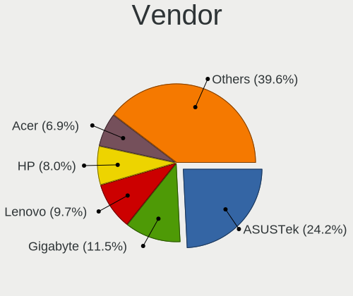
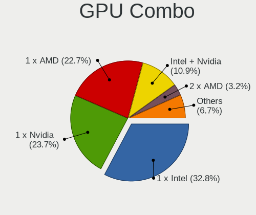
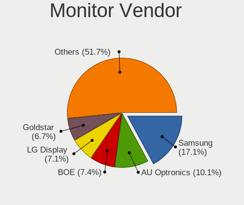
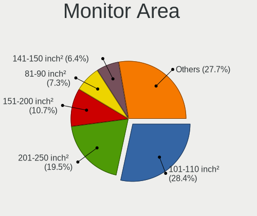
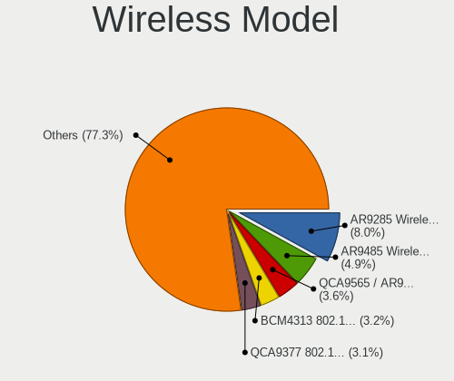

Linux in Russia - Tested Hardware & Statistics
----------------------------------------------

A project to collect tested hardware configurations for Linux in Russia.

Anyone can contribute to this report by the [hw-probe](https://github.com/linuxhw/hw-probe) tool:

    sudo -E hw-probe -all -upload

Please contribute! Especially if your hardware is rare.

This is a report for all computer types. See also reports for [desktops](/Location/Russia/Desktop/README.md) and [notebooks](/Location/Russia/Notebook/README.md).

Contents
--------

* [ Test Cases ](#test-cases)

* [ System ](#system)
  - [ OS                       ](#os)
  - [ OS Family                ](#os-family)
  - [ Kernel                   ](#kernel)
  - [ Kernel Family            ](#kernel-family)
  - [ Kernel Major Ver.        ](#kernel-major-ver)
  - [ Arch                     ](#arch)
  - [ DE                       ](#de)
  - [ Display Server           ](#display-server)
  - [ Display Manager          ](#display-manager)
  - [ OS Lang                  ](#os-lang)
  - [ Boot Mode                ](#boot-mode)
  - [ Filesystem               ](#filesystem)
  - [ Part. scheme             ](#part-scheme)
  - [ Dual Boot with Linux/BSD ](#dual-boot-with-linuxbsd)
  - [ Dual Boot (Win)          ](#dual-boot-win)

* [ Board ](#board)
  - [ Vendor                   ](#vendor)
  - [ Model                    ](#model)
  - [ Model Family             ](#model-family)
  - [ MFG Year                 ](#mfg-year)
  - [ Form Factor              ](#form-factor)
  - [ Secure Boot              ](#secure-boot)
  - [ Coreboot                 ](#coreboot)
  - [ RAM Size                 ](#ram-size)
  - [ RAM Used                 ](#ram-used)
  - [ Total Drives             ](#total-drives)
  - [ Has CD-ROM               ](#has-cd-rom)
  - [ Has Ethernet             ](#has-ethernet)
  - [ Has WiFi                 ](#has-wifi)
  - [ Has Bluetooth            ](#has-bluetooth)

* [ Location ](#location)
  - [ Country                  ](#country)
  - [ City                     ](#city)

* [ Drives ](#drives)
  - [ Drive Vendor             ](#drive-vendor)
  - [ Drive Model              ](#drive-model)
  - [ HDD Vendor               ](#hdd-vendor)
  - [ SSD Vendor               ](#ssd-vendor)
  - [ Drive Kind               ](#drive-kind)
  - [ Drive Connector          ](#drive-connector)
  - [ Drive Size               ](#drive-size)
  - [ Space Total              ](#space-total)
  - [ Space Used               ](#space-used)
  - [ Malfunc. Drives          ](#malfunc-drives)
  - [ Malfunc. Drive Vendor    ](#malfunc-drive-vendor)
  - [ Malfunc. HDD Vendor      ](#malfunc-hdd-vendor)
  - [ Malfunc. Drive Kind      ](#malfunc-drive-kind)
  - [ Failed Drives            ](#failed-drives)
  - [ Failed Drive Vendor      ](#failed-drive-vendor)
  - [ Drive Status             ](#drive-status)

* [ Storage controller ](#storage-controller)
  - [ Storage Vendor           ](#storage-vendor)
  - [ Storage Model            ](#storage-model)
  - [ Storage Kind             ](#storage-kind)

* [ Processor ](#processor)
  - [ CPU Vendor               ](#cpu-vendor)
  - [ CPU Model                ](#cpu-model)
  - [ CPU Model Family         ](#cpu-model-family)
  - [ CPU Cores                ](#cpu-cores)
  - [ CPU Sockets              ](#cpu-sockets)
  - [ CPU Threads              ](#cpu-threads)
  - [ CPU Op-Modes             ](#cpu-op-modes)
  - [ CPU Microcode            ](#cpu-microcode)
  - [ CPU Microarch            ](#cpu-microarch)

* [ Graphics ](#graphics)
  - [ GPU Vendor               ](#gpu-vendor)
  - [ GPU Model                ](#gpu-model)
  - [ GPU Combo                ](#gpu-combo)
  - [ GPU Driver               ](#gpu-driver)
  - [ GPU Memory               ](#gpu-memory)

* [ Monitor ](#monitor)
  - [ Monitor Vendor           ](#monitor-vendor)
  - [ Monitor Model            ](#monitor-model)
  - [ Monitor Resolution       ](#monitor-resolution)
  - [ Monitor Diagonal         ](#monitor-diagonal)
  - [ Monitor Width            ](#monitor-width)
  - [ Aspect Ratio             ](#aspect-ratio)
  - [ Monitor Area             ](#monitor-area)
  - [ Pixel Density            ](#pixel-density)
  - [ Multiple Monitors        ](#multiple-monitors)

* [ Network ](#network)
  - [ Net Controller Vendor    ](#net-controller-vendor)
  - [ Net Controller Model     ](#net-controller-model)
  - [ Wireless Vendor          ](#wireless-vendor)
  - [ Wireless Model           ](#wireless-model)
  - [ Ethernet Vendor          ](#ethernet-vendor)
  - [ Ethernet Model           ](#ethernet-model)
  - [ Net Controller Kind      ](#net-controller-kind)
  - [ Used Controller          ](#used-controller)
  - [ NICs                     ](#nics)
  - [ IPv6                     ](#ipv6)

* [ Bluetooth ](#bluetooth)
  - [ Bluetooth Vendor         ](#bluetooth-vendor)
  - [ Bluetooth Model          ](#bluetooth-model)

* [ Sound ](#sound)
  - [ Sound Vendor             ](#sound-vendor)
  - [ Sound Model              ](#sound-model)

* [ Memory ](#memory)
  - [ Memory Vendor            ](#memory-vendor)
  - [ Memory Model             ](#memory-model)
  - [ Memory Kind              ](#memory-kind)
  - [ Memory Form Factor       ](#memory-form-factor)
  - [ Memory Size              ](#memory-size)
  - [ Memory Speed             ](#memory-speed)

* [ Printers & scanners ](#printers--scanners)
  - [ Printer Vendor           ](#printer-vendor)
  - [ Printer Model            ](#printer-model)
  - [ Scanner Vendor           ](#scanner-vendor)
  - [ Scanner Model            ](#scanner-model)

* [ Camera ](#camera)
  - [ Camera Vendor            ](#camera-vendor)
  - [ Camera Model             ](#camera-model)

* [ Security ](#security)
  - [ Fingerprint Vendor       ](#fingerprint-vendor)
  - [ Fingerprint Model        ](#fingerprint-model)
  - [ Chipcard Vendor          ](#chipcard-vendor)
  - [ Chipcard Model           ](#chipcard-model)

* [ Unsupported ](#unsupported)
  - [ Unsupported Devices      ](#unsupported-devices)
  - [ Unsupported Device Types ](#unsupported-device-types)

Test Cases
----------

Total: 41308

| Vendor        | Model                       | Form-Factor | Probe                                                      | Date         |
|---------------|-----------------------------|-------------|------------------------------------------------------------|--------------|
| Gigabyte      | 970A-D3                     | Desktop     | [9b47949b87](https://linux-hardware.org/?probe=9b47949b87) | Oct 01, 2023 |
| Digma         | EVE 11 C421Y ES1067EW       | Notebook    | [2a54b2d3e1](https://linux-hardware.org/?probe=2a54b2d3e1) | Oct 01, 2023 |
| ASUSTek       | PRIME B450-PLUS             | Desktop     | [cd4c3fb654](https://linux-hardware.org/?probe=cd4c3fb654) | Oct 01, 2023 |
| Huanan        | X99 F8D V2.2                | Desktop     | [50101ff8ee](https://linux-hardware.org/?probe=50101ff8ee) | Oct 01, 2023 |
| Gigabyte      | B550M AORUS PRO-P           | Desktop     | [b85781f0d8](https://linux-hardware.org/?probe=b85781f0d8) | Oct 01, 2023 |
| Packard Be... | EasyNote ENLG81BA           | Notebook    | [c10a5eef39](https://linux-hardware.org/?probe=c10a5eef39) | Oct 01, 2023 |
| Acer          | Aspire A315-58              | Notebook    | [bbab99a4f7](https://linux-hardware.org/?probe=bbab99a4f7) | Sep 30, 2023 |
| Gigabyte      | H61M-S2-B3                  | Desktop     | [447e04bd9d](https://linux-hardware.org/?probe=447e04bd9d) | Sep 30, 2023 |
| Lenovo        | G505s 20255                 | Notebook    | [58a1c6e106](https://linux-hardware.org/?probe=58a1c6e106) | Sep 30, 2023 |
| ECS           | G31T-M7                     | Desktop     | [0749fa9352](https://linux-hardware.org/?probe=0749fa9352) | Sep 30, 2023 |
| ASUSTek       | H110M-R                     | Desktop     | [b8aadf6823](https://linux-hardware.org/?probe=b8aadf6823) | Sep 30, 2023 |
| Infinix       | INBOOK X3                   | Notebook    | [6b5c2647c2](https://linux-hardware.org/?probe=6b5c2647c2) | Sep 30, 2023 |
| Lenovo        | ThinkPad X260 VB6R77903H    | Notebook    | [e7dad368d2](https://linux-hardware.org/?probe=e7dad368d2) | Sep 30, 2023 |
| MSI           | 890FXA-GD70                 | Desktop     | [f9c2509bc6](https://linux-hardware.org/?probe=f9c2509bc6) | Sep 30, 2023 |
| Lenovo        | ThinkPad X260 VB6R77903H    | Notebook    | [de3079ae33](https://linux-hardware.org/?probe=de3079ae33) | Sep 30, 2023 |
| Gigabyte      | G31M-S2L                    | Desktop     | [4f147c1f3a](https://linux-hardware.org/?probe=4f147c1f3a) | Sep 30, 2023 |
| HP            | Pavilion Gaming Laptop 1... | Notebook    | [b3959728d3](https://linux-hardware.org/?probe=b3959728d3) | Sep 30, 2023 |
| Gigabyte      | G31M-S2L                    | Desktop     | [391af7c221](https://linux-hardware.org/?probe=391af7c221) | Sep 30, 2023 |
| Lenovo        | IdeaPad C340-14API 81N6     | Notebook    | [73b5907f17](https://linux-hardware.org/?probe=73b5907f17) | Sep 30, 2023 |
| Fujitsu Si... | AMILO Pro Edition V3405     | Notebook    | [4814760ac1](https://linux-hardware.org/?probe=4814760ac1) | Sep 30, 2023 |
| Dell          | Inspiron N5110              | Notebook    | [e796baf50f](https://linux-hardware.org/?probe=e796baf50f) | Sep 30, 2023 |
| ASUSTek       | P8H61-M LX2                 | Desktop     | [b2a213cc18](https://linux-hardware.org/?probe=b2a213cc18) | Sep 30, 2023 |
| Intel Clie... | LAPBC710                    | Notebook    | [3a29dfa2e3](https://linux-hardware.org/?probe=3a29dfa2e3) | Sep 30, 2023 |
| Acer          | Aspire 5560                 | Notebook    | [252d19e4f5](https://linux-hardware.org/?probe=252d19e4f5) | Sep 30, 2023 |
| ASUSTek       | ASUS EXPERTBOOK B1402CBA... | Notebook    | [91873a529a](https://linux-hardware.org/?probe=91873a529a) | Sep 30, 2023 |
| Dell          | Inspiron 15 3525            | Notebook    | [b46d569d14](https://linux-hardware.org/?probe=b46d569d14) | Sep 30, 2023 |
| Dell          | Inspiron 15 3525            | Notebook    | [fb52caaee9](https://linux-hardware.org/?probe=fb52caaee9) | Sep 30, 2023 |
| TECNO         | MEGABOOK T1                 | Notebook    | [9bba77e02b](https://linux-hardware.org/?probe=9bba77e02b) | Sep 30, 2023 |
| MSI           | MAG X570S TOMAHAWK MAX W... | Desktop     | [813b0bcb38](https://linux-hardware.org/?probe=813b0bcb38) | Sep 30, 2023 |
| ASUSTek       | ASUS TUF Gaming A15 FA50... | Notebook    | [527c8192a9](https://linux-hardware.org/?probe=527c8192a9) | Sep 30, 2023 |
| ASUSTek       | P8H61-M LX2                 | Desktop     | [60e32143f5](https://linux-hardware.org/?probe=60e32143f5) | Sep 29, 2023 |
| Dell          | 0WWR83 A05                  | Server      | [f099698b0e](https://linux-hardware.org/?probe=f099698b0e) | Sep 29, 2023 |
| 3Logic Gro... | DMB-H510-MCA01              | Desktop     | [7cc521d927](https://linux-hardware.org/?probe=7cc521d927) | Sep 29, 2023 |
| 3Logic Gro... | DMB-H510-MCA01              | Desktop     | [b952cdd71d](https://linux-hardware.org/?probe=b952cdd71d) | Sep 29, 2023 |
| ASUSTek       | TUF B450M-PRO GAMING        | Desktop     | [b34539564f](https://linux-hardware.org/?probe=b34539564f) | Sep 29, 2023 |
| ASUSTek       | ASUS TUF Gaming A15 FA50... | Notebook    | [96e037afc8](https://linux-hardware.org/?probe=96e037afc8) | Sep 29, 2023 |
| Supermicro    | X8DAH                       | Server      | [fdf4a783aa](https://linux-hardware.org/?probe=fdf4a783aa) | Sep 29, 2023 |
| Acer          | Veriton Z4820G              | All in one  | [5db8dac17e](https://linux-hardware.org/?probe=5db8dac17e) | Sep 29, 2023 |
| HP            | ProLiant DL380p Gen8        | Server      | [9c52136f33](https://linux-hardware.org/?probe=9c52136f33) | Sep 29, 2023 |
| Dell          | Inspiron 5558               | Notebook    | [f94587a692](https://linux-hardware.org/?probe=f94587a692) | Sep 29, 2023 |
| Lenovo        | G70-70 80HW                 | Notebook    | [4e22db020f](https://linux-hardware.org/?probe=4e22db020f) | Sep 29, 2023 |
| HP            | ProLiant DL360 Gen9         | Server      | [c7f7de0a3a](https://linux-hardware.org/?probe=c7f7de0a3a) | Sep 29, 2023 |
| HP            | ProLiant DL360 Gen9         | Server      | [380afb179f](https://linux-hardware.org/?probe=380afb179f) | Sep 29, 2023 |
| HP            | ProLiant DL360 Gen9         | Server      | [002155539d](https://linux-hardware.org/?probe=002155539d) | Sep 29, 2023 |
| HP            | ProLiant DL360 Gen9         | Server      | [1395f33f33](https://linux-hardware.org/?probe=1395f33f33) | Sep 29, 2023 |
| HP            | ProLiant DL360 Gen9         | Server      | [1dc72cc274](https://linux-hardware.org/?probe=1dc72cc274) | Sep 29, 2023 |
| F-PLUS EQU... | FNB-156-P1                  | Notebook    | [cceaaac2d3](https://linux-hardware.org/?probe=cceaaac2d3) | Sep 29, 2023 |
| Supermicro    | X9DRW                       | Server      | [122a3dfb58](https://linux-hardware.org/?probe=122a3dfb58) | Sep 29, 2023 |
| Supermicro    | X9DRW                       | Server      | [4d0fad3a9e](https://linux-hardware.org/?probe=4d0fad3a9e) | Sep 29, 2023 |
| Dell          | 0WWR83 A05                  | Server      | [8df85e28d8](https://linux-hardware.org/?probe=8df85e28d8) | Sep 29, 2023 |
| MSI           | MAG B650 TOMAHAWK WIFI      | Desktop     | [f79a27e406](https://linux-hardware.org/?probe=f79a27e406) | Sep 29, 2023 |
| HP            | ProBook 430 G3              | Notebook    | [5a73271bfd](https://linux-hardware.org/?probe=5a73271bfd) | Sep 29, 2023 |
| Gigabyte      | H97-D3H-CF                  | Desktop     | [c0c34400ad](https://linux-hardware.org/?probe=c0c34400ad) | Sep 29, 2023 |
| Supermicro    | X11DDW-NT                   | Server      | [c7b049f922](https://linux-hardware.org/?probe=c7b049f922) | Sep 29, 2023 |
| Samsung       | 350V5C/351V5C/3540VC/344... | Notebook    | [b9f67caef4](https://linux-hardware.org/?probe=b9f67caef4) | Sep 29, 2023 |
| ASRock        | H510M-HVS R2.0              | Desktop     | [f50b0e51d3](https://linux-hardware.org/?probe=f50b0e51d3) | Sep 29, 2023 |
| Lenovo        | G70-70 80HW                 | Notebook    | [5ef0f97836](https://linux-hardware.org/?probe=5ef0f97836) | Sep 29, 2023 |
| HP            | ProLiant DL360 Gen9         | Server      | [b6d98e8f23](https://linux-hardware.org/?probe=b6d98e8f23) | Sep 29, 2023 |
| HP            | ProLiant DL360 Gen9         | Server      | [448463ac0a](https://linux-hardware.org/?probe=448463ac0a) | Sep 29, 2023 |
| HP            | ProLiant DL360 Gen9         | Server      | [b4fa4a9cff](https://linux-hardware.org/?probe=b4fa4a9cff) | Sep 29, 2023 |
| ETegro Tec... | ETRS125G4 31S2MMB0040       | Server      | [68bb1e4021](https://linux-hardware.org/?probe=68bb1e4021) | Sep 29, 2023 |
| Supermicro    | X9DRW                       | Server      | [21757c8129](https://linux-hardware.org/?probe=21757c8129) | Sep 29, 2023 |
| Supermicro    | X9DRW                       | Server      | [e60890ee3e](https://linux-hardware.org/?probe=e60890ee3e) | Sep 29, 2023 |
| Valve         | Jupiter                     | Notebook    | [acc0ad7283](https://linux-hardware.org/?probe=acc0ad7283) | Sep 28, 2023 |
| ETegro Tec... | ETRS125G4 31S2MMB0040       | Server      | [3191feb756](https://linux-hardware.org/?probe=3191feb756) | Sep 28, 2023 |
| Lenovo        | ThinkPad E490 20N8000SRT    | Notebook    | [274b3b5210](https://linux-hardware.org/?probe=274b3b5210) | Sep 28, 2023 |
| ETegro Tec... | ETRS125G4 31S2MMB0040       | Server      | [a14ff14954](https://linux-hardware.org/?probe=a14ff14954) | Sep 28, 2023 |
| ETegro Tec... | ETRS125G4 31S2MMB0040       | Server      | [cb9984cefb](https://linux-hardware.org/?probe=cb9984cefb) | Sep 28, 2023 |
| ETegro Tec... | ETRS125G4 31S2MMB0040       | Server      | [1cca0d5263](https://linux-hardware.org/?probe=1cca0d5263) | Sep 28, 2023 |
| ETegro Tec... | ETRS125G4 31S2MMB0040       | Server      | [6732e637aa](https://linux-hardware.org/?probe=6732e637aa) | Sep 28, 2023 |
| ETegro Tec... | ETRS125G4 31S2MMB0040       | Server      | [06e76c2108](https://linux-hardware.org/?probe=06e76c2108) | Sep 28, 2023 |
| ETegro Tec... | ETRS125G4 31S2MMB0040       | Server      | [ce41069e7d](https://linux-hardware.org/?probe=ce41069e7d) | Sep 28, 2023 |
| ETegro Tec... | ETRS125G4 31S2MMB0040       | Server      | [d431883e15](https://linux-hardware.org/?probe=d431883e15) | Sep 28, 2023 |
| ETegro Tec... | ETRS125G4 31S2MMB0040       | Server      | [ac05e8b898](https://linux-hardware.org/?probe=ac05e8b898) | Sep 28, 2023 |
| ETegro Tec... | ETRS125G4 31S2MMB0040       | Server      | [eb9e748181](https://linux-hardware.org/?probe=eb9e748181) | Sep 28, 2023 |
| ETegro Tec... | ETRS125G4 31S2MMB0040       | Server      | [1d6887b5f3](https://linux-hardware.org/?probe=1d6887b5f3) | Sep 28, 2023 |
| ETegro Tec... | ETRS125G4 31S2MMB0040       | Server      | [4d27130658](https://linux-hardware.org/?probe=4d27130658) | Sep 28, 2023 |
| ETegro Tec... | ETRS125G4 31S2MMB0040       | Server      | [bb562ae3fe](https://linux-hardware.org/?probe=bb562ae3fe) | Sep 28, 2023 |
| ETegro Tec... | ETRS125G4 31S2MMB0040       | Server      | [c27a8913bf](https://linux-hardware.org/?probe=c27a8913bf) | Sep 28, 2023 |
| ETegro Tec... | ETRS125G4 31S2MMB0040       | Server      | [c00c73fa32](https://linux-hardware.org/?probe=c00c73fa32) | Sep 28, 2023 |
| ETegro Tec... | ETRS125G4 31S2MMB0040       | Server      | [abcb83d7b5](https://linux-hardware.org/?probe=abcb83d7b5) | Sep 28, 2023 |
| ROMBICA       | myBook Eclipse              | Notebook    | [004e1dc4fd](https://linux-hardware.org/?probe=004e1dc4fd) | Sep 28, 2023 |
| ASUSTek       | ASUS TUF Dash F15 FX516P... | Notebook    | [4cef8be854](https://linux-hardware.org/?probe=4cef8be854) | Sep 28, 2023 |
| Supermicro    | X8DTL                       | Server      | [f068e7e4f8](https://linux-hardware.org/?probe=f068e7e4f8) | Sep 28, 2023 |
| Lenovo        | ThinkPad T14 Gen 3 21AH0... | Notebook    | [39fd38bc98](https://linux-hardware.org/?probe=39fd38bc98) | Sep 28, 2023 |
| Lenovo        | ThinkPad T510 43142PU       | Notebook    | [30bd29e170](https://linux-hardware.org/?probe=30bd29e170) | Sep 28, 2023 |
| F-PLUS EQU... | FNB-156-P1                  | Notebook    | [fb8fd7617c](https://linux-hardware.org/?probe=fb8fd7617c) | Sep 28, 2023 |
| Supermicro    | X8DTU                       | Server      | [d72f782d8c](https://linux-hardware.org/?probe=d72f782d8c) | Sep 28, 2023 |
| Supermicro    | X8DTU                       | Server      | [3d9123e719](https://linux-hardware.org/?probe=3d9123e719) | Sep 28, 2023 |
| Wistron       | ProLiant ML110 G6           | Desktop     | [4284ef7737](https://linux-hardware.org/?probe=4284ef7737) | Sep 28, 2023 |
| Infinix       | INBOOK X2 GEN11             | Notebook    | [2ac0204275](https://linux-hardware.org/?probe=2ac0204275) | Sep 28, 2023 |
| Wistron       | ProLiant ML110 G6           | Desktop     | [6282804553](https://linux-hardware.org/?probe=6282804553) | Sep 28, 2023 |
| ICL           | H510SB-TM v2.0              | All in one  | [41193155ed](https://linux-hardware.org/?probe=41193155ed) | Sep 28, 2023 |
| HP            | ProBook 430 G5              | Notebook    | [9e68b6e2be](https://linux-hardware.org/?probe=9e68b6e2be) | Sep 28, 2023 |
| ASUSTek       | PRIME X470-PRO              | Desktop     | [1f420db3fd](https://linux-hardware.org/?probe=1f420db3fd) | Sep 28, 2023 |
| ASRock        | B450 Pro4 R2.0              | Desktop     | [82562e75c3](https://linux-hardware.org/?probe=82562e75c3) | Sep 28, 2023 |
| Lenovo        | ThinkPad X250 20CMS0A200    | Notebook    | [54f848d222](https://linux-hardware.org/?probe=54f848d222) | Sep 28, 2023 |
| ASUSTek       | PRIME X370-PRO              | Desktop     | [872af2bc77](https://linux-hardware.org/?probe=872af2bc77) | Sep 28, 2023 |
| Gigabyte      | H410M H V3                  | Desktop     | [3a08b7188c](https://linux-hardware.org/?probe=3a08b7188c) | Sep 28, 2023 |
| Intel         | X99H                        | Desktop     | [d5390cf599](https://linux-hardware.org/?probe=d5390cf599) | Sep 28, 2023 |
| Pegatron      | IPMSB-H61                   | Desktop     | [d0e64d2ebf](https://linux-hardware.org/?probe=d0e64d2ebf) | Sep 28, 2023 |
| Gigabyte      | C1037UN-EU                  | Desktop     | [3a4cc5469a](https://linux-hardware.org/?probe=3a4cc5469a) | Sep 28, 2023 |
| Gigabyte      | C1037UN-EU                  | Desktop     | [1c2d4da0c6](https://linux-hardware.org/?probe=1c2d4da0c6) | Sep 27, 2023 |
| Gigabyte      | Z390 AORUS MASTER-CF        | Desktop     | [1458dfe403](https://linux-hardware.org/?probe=1458dfe403) | Sep 27, 2023 |
| ASUSTek       | P8H61-MX R2.0               | Desktop     | [cfc3a037ed](https://linux-hardware.org/?probe=cfc3a037ed) | Sep 27, 2023 |
| Huanan        | X99-BD4 V1.34, NALEX        | Desktop     | [493d23b3f0](https://linux-hardware.org/?probe=493d23b3f0) | Sep 27, 2023 |
| ASUSTek       | P5QD TURBO                  | Desktop     | [9e8a75e698](https://linux-hardware.org/?probe=9e8a75e698) | Sep 27, 2023 |
| Supermicro    | X8DAH                       | Server      | [ef771077af](https://linux-hardware.org/?probe=ef771077af) | Sep 27, 2023 |
| Supermicro    | X9DRW                       | Server      | [3dcf1261b5](https://linux-hardware.org/?probe=3dcf1261b5) | Sep 27, 2023 |
| ETegro Tec... | ETRS125G4 31S2MMB0040       | Server      | [2b1ce7346b](https://linux-hardware.org/?probe=2b1ce7346b) | Sep 27, 2023 |
| ASUSTek       | K50IJ                       | Notebook    | [8556633dad](https://linux-hardware.org/?probe=8556633dad) | Sep 27, 2023 |
| Lenovo        | IdeaPad Gaming 3 15IMH05... | Notebook    | [1317c1f1a9](https://linux-hardware.org/?probe=1317c1f1a9) | Sep 27, 2023 |
| ASUSTek       | PRIME X370-PRO              | Desktop     | [e5cd50e4ea](https://linux-hardware.org/?probe=e5cd50e4ea) | Sep 27, 2023 |
| Lenovo        | ThinkBook 15 G3 ACL 21A4    | Notebook    | [6295f7193c](https://linux-hardware.org/?probe=6295f7193c) | Sep 27, 2023 |
| MSI           | H81M-P33                    | Desktop     | [8b0d086b89](https://linux-hardware.org/?probe=8b0d086b89) | Sep 27, 2023 |
| Lenovo        | XiaoXinPro 16 APH8 83AR     | Notebook    | [9ad96a3803](https://linux-hardware.org/?probe=9ad96a3803) | Sep 27, 2023 |
| MSI           | Bravo 15 C7VE               | Notebook    | [844b7f2a1c](https://linux-hardware.org/?probe=844b7f2a1c) | Sep 27, 2023 |
| ASRock        | B450M Steel Legend          | Desktop     | [b4de4fe266](https://linux-hardware.org/?probe=b4de4fe266) | Sep 27, 2023 |
| ASUSTek       | N550JV                      | Notebook    | [ac27d821ae](https://linux-hardware.org/?probe=ac27d821ae) | Sep 27, 2023 |
| Lenovo        | ThinkBook 15 G3 ACL 21A4    | Notebook    | [278578e488](https://linux-hardware.org/?probe=278578e488) | Sep 27, 2023 |
| Lenovo        | ThinkBook 15 G3 ACL 21A4    | Notebook    | [6f4a404e89](https://linux-hardware.org/?probe=6f4a404e89) | Sep 27, 2023 |
| Chuwi         | GemiBook Pro                | Notebook    | [4ea2bab759](https://linux-hardware.org/?probe=4ea2bab759) | Sep 27, 2023 |
| HUAWEI        | RLEF-XX                     | Notebook    | [156140f867](https://linux-hardware.org/?probe=156140f867) | Sep 27, 2023 |
| Dell          | Latitude 5420               | Notebook    | [4f890f283a](https://linux-hardware.org/?probe=4f890f283a) | Sep 26, 2023 |
| Gigabyte      | B550M AORUS PRO-P           | Desktop     | [ef982a7d39](https://linux-hardware.org/?probe=ef982a7d39) | Sep 26, 2023 |
| Gigabyte      | B550M AORUS PRO-P           | Desktop     | [d8f229b5d7](https://linux-hardware.org/?probe=d8f229b5d7) | Sep 26, 2023 |
| HP            | Laptop 14s-dq2xxx           | Notebook    | [cf522515d7](https://linux-hardware.org/?probe=cf522515d7) | Sep 26, 2023 |
| Insyde        | Purley                      | Server      | [be671b1f3c](https://linux-hardware.org/?probe=be671b1f3c) | Sep 26, 2023 |
| Supermicro    | X10DRL-i                    | Desktop     | [4215bb2639](https://linux-hardware.org/?probe=4215bb2639) | Sep 26, 2023 |
| ASUSTek       | H110M-K                     | Desktop     | [a067d2e97d](https://linux-hardware.org/?probe=a067d2e97d) | Sep 26, 2023 |
| HP            | EliteBook 840 G8 Noteboo... | Notebook    | [243f89703d](https://linux-hardware.org/?probe=243f89703d) | Sep 26, 2023 |
| ETegro Tec... | ETRS125G4 31S2MMB0040       | Server      | [c9ce40639d](https://linux-hardware.org/?probe=c9ce40639d) | Sep 26, 2023 |
| ASUSTek       | P8B75-M LE                  | Desktop     | [96d214417d](https://linux-hardware.org/?probe=96d214417d) | Sep 26, 2023 |
| ASUSTek       | H110M-K                     | Desktop     | [74a379288b](https://linux-hardware.org/?probe=74a379288b) | Sep 26, 2023 |
| HUAWEI        | BDZ-WXX9                    | Notebook    | [a33a848e40](https://linux-hardware.org/?probe=a33a848e40) | Sep 26, 2023 |
| ASRock        | A320M-HDV R3.0              | Desktop     | [c8d5bce997](https://linux-hardware.org/?probe=c8d5bce997) | Sep 26, 2023 |
| Aquarius      | NS585                       | Notebook    | [ce1c1d6e56](https://linux-hardware.org/?probe=ce1c1d6e56) | Sep 26, 2023 |
| DEPO Compu... | DPA520S                     | Desktop     | [45d07666f9](https://linux-hardware.org/?probe=45d07666f9) | Sep 26, 2023 |
| Intel         | DP35DP AAD81073-206         | Desktop     | [426e9aff0f](https://linux-hardware.org/?probe=426e9aff0f) | Sep 26, 2023 |
| Samsung       | DP300A2A-B01RU SEC_SW_RE... | All in one  | [1e8b7eac5c](https://linux-hardware.org/?probe=1e8b7eac5c) | Sep 26, 2023 |
| ASUSTek       | VivoBook_ASUSLaptop M350... | Notebook    | [cf4a15af9e](https://linux-hardware.org/?probe=cf4a15af9e) | Sep 26, 2023 |
| Unknown       | Unknown                     | Soc         | [f1616bca97](https://linux-hardware.org/?probe=f1616bca97) | Sep 26, 2023 |
| Acer          | Aspire 5750ZG               | Notebook    | [b8e46e5780](https://linux-hardware.org/?probe=b8e46e5780) | Sep 26, 2023 |
| Lenovo        | IdeaPad Y510                | Notebook    | [caec91aae7](https://linux-hardware.org/?probe=caec91aae7) | Sep 26, 2023 |
| MSI           | B450M-A PRO MAX             | Desktop     | [41f2aab706](https://linux-hardware.org/?probe=41f2aab706) | Sep 26, 2023 |
| Acer          | TravelMate 5744             | Notebook    | [2e69d317ef](https://linux-hardware.org/?probe=2e69d317ef) | Sep 26, 2023 |
| MSI           | MPG B650I EDGE WIFI         | Desktop     | [fc79d63b87](https://linux-hardware.org/?probe=fc79d63b87) | Sep 26, 2023 |
| Lenovo        | IdeaPad 320-15ISK 80XH      | Notebook    | [6a3291f6bf](https://linux-hardware.org/?probe=6a3291f6bf) | Sep 25, 2023 |
| Lenovo        | IdeaPad 320-15ISK 80XH      | Notebook    | [981e7e8ec5](https://linux-hardware.org/?probe=981e7e8ec5) | Sep 25, 2023 |
| HUAWEI        | BOM-WXX9                    | Notebook    | [8d4ba0b939](https://linux-hardware.org/?probe=8d4ba0b939) | Sep 25, 2023 |
| Dell          | Inspiron 5558               | Notebook    | [dbf4dfe481](https://linux-hardware.org/?probe=dbf4dfe481) | Sep 25, 2023 |
| Shenzhen M... | F7BFD                       | Desktop     | [a4891e1691](https://linux-hardware.org/?probe=a4891e1691) | Sep 25, 2023 |
| Lenovo        | IdeaPad 3 17ALC6 82KV       | Notebook    | [1ce8f959f1](https://linux-hardware.org/?probe=1ce8f959f1) | Sep 25, 2023 |
| ASUSTek       | TUF Gaming B550M-PLUS       | Desktop     | [977a189b29](https://linux-hardware.org/?probe=977a189b29) | Sep 25, 2023 |
| ASUSTek       | P6T DELUXE V2               | Desktop     | [a0fa16f85c](https://linux-hardware.org/?probe=a0fa16f85c) | Sep 25, 2023 |
| AMI           | Aptio CRB                   | Mini pc     | [ca65327602](https://linux-hardware.org/?probe=ca65327602) | Sep 25, 2023 |
| Aquarius      | NS585                       | Notebook    | [e901467e39](https://linux-hardware.org/?probe=e901467e39) | Sep 25, 2023 |
| HP            | 8949 11                     | Desktop     | [acb62cff2b](https://linux-hardware.org/?probe=acb62cff2b) | Sep 25, 2023 |
| HUAWEI        | BOM-WXX9                    | Notebook    | [ed52653514](https://linux-hardware.org/?probe=ed52653514) | Sep 25, 2023 |
| Lenovo        | IdeaPad L340-15API 81LW     | Notebook    | [b85adec006](https://linux-hardware.org/?probe=b85adec006) | Sep 25, 2023 |
| MSI           | Bravo 15 C7VF               | Notebook    | [ab0a5a435f](https://linux-hardware.org/?probe=ab0a5a435f) | Sep 25, 2023 |
| Acer          | Aspire V3-571G              | Notebook    | [6b5dcea023](https://linux-hardware.org/?probe=6b5dcea023) | Sep 25, 2023 |
| Lenovo        | 3123 SDK0J40697 WIN 3305... | All in one  | [96aa5d7dcf](https://linux-hardware.org/?probe=96aa5d7dcf) | Sep 25, 2023 |
| Samsung       | N250P                       | Notebook    | [7eb858a64d](https://linux-hardware.org/?probe=7eb858a64d) | Sep 25, 2023 |
| HP            | 2AF9                        | Desktop     | [0e6399ab05](https://linux-hardware.org/?probe=0e6399ab05) | Sep 25, 2023 |
| Toshiba       | dynabook Satellite B350/... | Notebook    | [2b241af774](https://linux-hardware.org/?probe=2b241af774) | Sep 25, 2023 |
| Gigabyte      | GA-MA770T-UD3               | Desktop     | [85663cb9a6](https://linux-hardware.org/?probe=85663cb9a6) | Sep 25, 2023 |
| MSI           | FM2-A55M-E33                | Desktop     | [40ef9a86ab](https://linux-hardware.org/?probe=40ef9a86ab) | Sep 25, 2023 |
| Acer          | Aspire 3610                 | Notebook    | [021d48bbdb](https://linux-hardware.org/?probe=021d48bbdb) | Sep 25, 2023 |
| ASUSTek       | VivoBook_ASUSLaptop M160... | Notebook    | [811f1951fc](https://linux-hardware.org/?probe=811f1951fc) | Sep 25, 2023 |
| Lenovo        | IdeaPad 5 14ABA7 82SE       | Notebook    | [2695ee345d](https://linux-hardware.org/?probe=2695ee345d) | Sep 24, 2023 |
| Acer          | Aspire A715-42G             | Notebook    | [868a5abe75](https://linux-hardware.org/?probe=868a5abe75) | Sep 24, 2023 |
| Acer          | TravelMate P259-MG          | Notebook    | [26ca7317b2](https://linux-hardware.org/?probe=26ca7317b2) | Sep 24, 2023 |
| Biostar       | B550MH                      | Desktop     | [4ef9bbad17](https://linux-hardware.org/?probe=4ef9bbad17) | Sep 24, 2023 |
| Acer          | Aspire ES1-520              | Notebook    | [c2b98b035f](https://linux-hardware.org/?probe=c2b98b035f) | Sep 24, 2023 |
| Gigabyte      | B450 AORUS ELITE V2         | Desktop     | [57a4e724b8](https://linux-hardware.org/?probe=57a4e724b8) | Sep 24, 2023 |
| HUAWEI        | KLVL-WXXW                   | Notebook    | [f2a543d0dd](https://linux-hardware.org/?probe=f2a543d0dd) | Sep 24, 2023 |
| Lenovo        | G580 20150                  | Notebook    | [f55e42a884](https://linux-hardware.org/?probe=f55e42a884) | Sep 24, 2023 |
| Gigabyte      | GA-MA790XT-UD4P             | Desktop     | [945e2bc260](https://linux-hardware.org/?probe=945e2bc260) | Sep 24, 2023 |
| Samsung       | 300E4Z/300E5Z/300E7Z        | Notebook    | [30d9462d2d](https://linux-hardware.org/?probe=30d9462d2d) | Sep 24, 2023 |
| ASUSTek       | E520                        | Desktop     | [50ea664229](https://linux-hardware.org/?probe=50ea664229) | Sep 24, 2023 |
| Unknown       | X133                        | Notebook    | [eca7c95360](https://linux-hardware.org/?probe=eca7c95360) | Sep 24, 2023 |
| ASRock        | B550 Phantom Gaming 4       | Desktop     | [39e26bf376](https://linux-hardware.org/?probe=39e26bf376) | Sep 24, 2023 |
| Apple         | MacBookPro11,1              | Notebook    | [0f396f4227](https://linux-hardware.org/?probe=0f396f4227) | Sep 24, 2023 |
| Unknown       | Unknown                     | Desktop     | [7e1caa679f](https://linux-hardware.org/?probe=7e1caa679f) | Sep 24, 2023 |
| HUAWEI        | NBD-WXX9                    | Notebook    | [f728eb13bd](https://linux-hardware.org/?probe=f728eb13bd) | Sep 24, 2023 |
| HP            | Laptop 15s-eq2xxx           | Notebook    | [092bb813b4](https://linux-hardware.org/?probe=092bb813b4) | Sep 24, 2023 |
| Unknown       | Unknown                     | Desktop     | [5a57428971](https://linux-hardware.org/?probe=5a57428971) | Sep 24, 2023 |
| Lenovo        | IdeaPad 330-15AST 81D6      | Notebook    | [2814a495de](https://linux-hardware.org/?probe=2814a495de) | Sep 24, 2023 |
| Sony          | VGN-FW11LR                  | Notebook    | [81921a2f1d](https://linux-hardware.org/?probe=81921a2f1d) | Sep 24, 2023 |
| MSI           | MPG Z790 CARBON WIFI        | Desktop     | [d17427680f](https://linux-hardware.org/?probe=d17427680f) | Sep 24, 2023 |
| MSI           | MPG Z790 CARBON WIFI        | Desktop     | [1c0c7815dd](https://linux-hardware.org/?probe=1c0c7815dd) | Sep 24, 2023 |
| ASRock        | H97 Anniversary             | Desktop     | [018c8fa4d1](https://linux-hardware.org/?probe=018c8fa4d1) | Sep 24, 2023 |
| MSI           | H110M PRO-VD PLUS           | Desktop     | [b8d1509801](https://linux-hardware.org/?probe=b8d1509801) | Sep 24, 2023 |
| Timi          | TM1701                      | Notebook    | [0e127afa68](https://linux-hardware.org/?probe=0e127afa68) | Sep 24, 2023 |
| Gigabyte      | G31M-ES2L                   | Desktop     | [bbf676f129](https://linux-hardware.org/?probe=bbf676f129) | Sep 24, 2023 |
| Acer          | Aspire 5520                 | Notebook    | [5bcc67211c](https://linux-hardware.org/?probe=5bcc67211c) | Sep 24, 2023 |
| Unknown       | Unknown                     | Notebook    | [b6f7bc9bd2](https://linux-hardware.org/?probe=b6f7bc9bd2) | Sep 24, 2023 |
| Gigabyte      | H61M-D2-B3                  | Desktop     | [90bdd8a3e6](https://linux-hardware.org/?probe=90bdd8a3e6) | Sep 23, 2023 |
| Gigabyte      | H61M-D2-B3                  | Desktop     | [41dba827f2](https://linux-hardware.org/?probe=41dba827f2) | Sep 23, 2023 |
| HP            | ProBook 450 G1              | Notebook    | [90069ca278](https://linux-hardware.org/?probe=90069ca278) | Sep 23, 2023 |
| ASUSTek       | Z97-C                       | Desktop     | [e4c1f075b9](https://linux-hardware.org/?probe=e4c1f075b9) | Sep 23, 2023 |
| Intel         | NUC7i7BNB J31145-306        | Mini pc     | [cc591b762b](https://linux-hardware.org/?probe=cc591b762b) | Sep 23, 2023 |
| MSI           | MAG X570S TOMAHAWK MAX W... | Desktop     | [17963d3a87](https://linux-hardware.org/?probe=17963d3a87) | Sep 23, 2023 |
| Gigabyte      | H110-D3-CF                  | Desktop     | [0762df27f4](https://linux-hardware.org/?probe=0762df27f4) | Sep 23, 2023 |
| Lenovo        | IdeaPad S145-15IIL 81W8     | Notebook    | [1809080d01](https://linux-hardware.org/?probe=1809080d01) | Sep 23, 2023 |
| Lenovo        | ThinkPad Edge E430c 3365... | Notebook    | [74351c4243](https://linux-hardware.org/?probe=74351c4243) | Sep 23, 2023 |
| Gigabyte      | PH67A-D3-B3                 | Desktop     | [e3023f5f8c](https://linux-hardware.org/?probe=e3023f5f8c) | Sep 23, 2023 |
| ASUSTek       | PRIME X370-PRO              | Desktop     | [1f987f4720](https://linux-hardware.org/?probe=1f987f4720) | Sep 23, 2023 |
| MSI           | B460M PRO-VDH               | Desktop     | [c5429120bb](https://linux-hardware.org/?probe=c5429120bb) | Sep 23, 2023 |
| Acer          | AOHAPPY2                    | Notebook    | [b9937354f2](https://linux-hardware.org/?probe=b9937354f2) | Sep 22, 2023 |
| ASUSTek       | VivoBook_ASUSLaptop X321... | Notebook    | [d62c6d340f](https://linux-hardware.org/?probe=d62c6d340f) | Sep 22, 2023 |
| Acer          | Aspire 5520                 | Notebook    | [8329086779](https://linux-hardware.org/?probe=8329086779) | Sep 22, 2023 |
| Supermicro    | X8DTL                       | Server      | [b7b4359941](https://linux-hardware.org/?probe=b7b4359941) | Sep 22, 2023 |
| Lenovo        | IdeaPad S340-15IWL 81N8     | Notebook    | [c14178c7fa](https://linux-hardware.org/?probe=c14178c7fa) | Sep 22, 2023 |
| ASUSTek       | H81M-A                      | Desktop     | [09ce373b34](https://linux-hardware.org/?probe=09ce373b34) | Sep 22, 2023 |
| Gigabyte      | H61M-DS2H                   | Desktop     | [f3e31ed154](https://linux-hardware.org/?probe=f3e31ed154) | Sep 22, 2023 |
| Gigabyte      | P43-ES3G                    | Desktop     | [79557b8229](https://linux-hardware.org/?probe=79557b8229) | Sep 22, 2023 |
| Samsung       | R505                        | Notebook    | [8aef37cda9](https://linux-hardware.org/?probe=8aef37cda9) | Sep 22, 2023 |
| ASUSTek       | ZenBook UX325EA_UX325EA     | Notebook    | [900334906e](https://linux-hardware.org/?probe=900334906e) | Sep 22, 2023 |
| MSI           | GF65 Thin 9SEXR             | Notebook    | [9fbc54dcb7](https://linux-hardware.org/?probe=9fbc54dcb7) | Sep 22, 2023 |
| ASUSTek       | TUF Gaming X670E-PLUS WI... | Desktop     | [a9f9ccb4f9](https://linux-hardware.org/?probe=a9f9ccb4f9) | Sep 22, 2023 |
| Dell          | Latitude 5420               | Notebook    | [d9c1c1537f](https://linux-hardware.org/?probe=d9c1c1537f) | Sep 22, 2023 |
| HP            | Laptop 14s-fq0xxx           | Notebook    | [3f7ef99bf3](https://linux-hardware.org/?probe=3f7ef99bf3) | Sep 22, 2023 |
| Gigabyte      | H87M-HD3                    | Desktop     | [f5fead6eb4](https://linux-hardware.org/?probe=f5fead6eb4) | Sep 22, 2023 |
| Dell          | 04V528 A02                  | Server      | [96ef3c9fdd](https://linux-hardware.org/?probe=96ef3c9fdd) | Sep 22, 2023 |
| Valve         | Jupiter                     | Notebook    | [b0abd58408](https://linux-hardware.org/?probe=b0abd58408) | Sep 22, 2023 |
| ASUSTek       | X553SA                      | Notebook    | [451784974b](https://linux-hardware.org/?probe=451784974b) | Sep 21, 2023 |
| ASUSTek       | PRIME B660M-K D4            | Desktop     | [85c3791741](https://linux-hardware.org/?probe=85c3791741) | Sep 21, 2023 |
| HP            | EliteBook 840 G5 NOTEBOO... | Notebook    | [0e85445e8e](https://linux-hardware.org/?probe=0e85445e8e) | Sep 21, 2023 |
| HP            | EliteBook 840 G5 NOTEBOO... | Notebook    | [3a372bed63](https://linux-hardware.org/?probe=3a372bed63) | Sep 21, 2023 |
| Timi          | A35S                        | Notebook    | [ae2a6acf26](https://linux-hardware.org/?probe=ae2a6acf26) | Sep 21, 2023 |
| ASRock        | A320M-DVS R4.0              | Desktop     | [893ef72c0c](https://linux-hardware.org/?probe=893ef72c0c) | Sep 21, 2023 |
| ASRock        | A520M-ITX/ac                | Desktop     | [35be6167f1](https://linux-hardware.org/?probe=35be6167f1) | Sep 21, 2023 |
| Biostar       | A68MHE                      | Desktop     | [8ab720b66b](https://linux-hardware.org/?probe=8ab720b66b) | Sep 21, 2023 |
| Gigabyte      | GA-E350N-USB3               | Desktop     | [b9a29448e1](https://linux-hardware.org/?probe=b9a29448e1) | Sep 21, 2023 |
| Supermicro    | X9DRW                       | Server      | [4736311b52](https://linux-hardware.org/?probe=4736311b52) | Sep 21, 2023 |
| HP            | 2820h                       | Desktop     | [cd402f5dad](https://linux-hardware.org/?probe=cd402f5dad) | Sep 21, 2023 |
| Dell          | 0JMK61 A00                  | Server      | [e0bd072160](https://linux-hardware.org/?probe=e0bd072160) | Sep 21, 2023 |
| Dell          | 0RGP26 A00                  | Server      | [d35a82a9ec](https://linux-hardware.org/?probe=d35a82a9ec) | Sep 21, 2023 |
| Dell          | 06DKY5 A03                  | Server      | [a86e860c3d](https://linux-hardware.org/?probe=a86e860c3d) | Sep 21, 2023 |
| Unknown       | Unknown                     | Desktop     | [339f506aa1](https://linux-hardware.org/?probe=339f506aa1) | Sep 21, 2023 |
| Gigabyte      | B360M D3H-CF                | Desktop     | [875f4f3f2a](https://linux-hardware.org/?probe=875f4f3f2a) | Sep 21, 2023 |
| Kraftway      | ACCORD                      | Notebook    | [df4d5654d5](https://linux-hardware.org/?probe=df4d5654d5) | Sep 21, 2023 |
| ASUSTek       | K50IJ                       | Notebook    | [a1dcfd7ff7](https://linux-hardware.org/?probe=a1dcfd7ff7) | Sep 21, 2023 |
| Lenovo        | ThinkPad T510 43142PU       | Notebook    | [527f5eb1a9](https://linux-hardware.org/?probe=527f5eb1a9) | Sep 21, 2023 |
| ASUSTek       | E520                        | Desktop     | [f5be06ecdb](https://linux-hardware.org/?probe=f5be06ecdb) | Sep 21, 2023 |
| Intel         | NUC10i5FNB M38063-308       | Mini pc     | [bb9b5c4509](https://linux-hardware.org/?probe=bb9b5c4509) | Sep 21, 2023 |
| HP            | 630                         | Notebook    | [1ed6efc4de](https://linux-hardware.org/?probe=1ed6efc4de) | Sep 21, 2023 |
| Lenovo        | B590 20208                  | Notebook    | [f8c48a3ed3](https://linux-hardware.org/?probe=f8c48a3ed3) | Sep 21, 2023 |
| Aquarius      | Cmp NS483                   | Convertible | [ab4258a229](https://linux-hardware.org/?probe=ab4258a229) | Sep 20, 2023 |
| Fujitsu Si... | AMILO Li3710                | Notebook    | [5a5c48d3df](https://linux-hardware.org/?probe=5a5c48d3df) | Sep 20, 2023 |
| Gigabyte      | B560M DS3H V2               | Desktop     | [182384fdaa](https://linux-hardware.org/?probe=182384fdaa) | Sep 20, 2023 |
| Shenzhen M... | F7BFD                       | Desktop     | [b898184916](https://linux-hardware.org/?probe=b898184916) | Sep 20, 2023 |
| Clevo         | NL41MU2                     | Notebook    | [68b62bb7da](https://linux-hardware.org/?probe=68b62bb7da) | Sep 20, 2023 |
| iEi           | SAT3 V1.03                  | Desktop     | [d303736416](https://linux-hardware.org/?probe=d303736416) | Sep 20, 2023 |
| ASUSTek       | TUF Gaming FX505GT_FX505... | Notebook    | [c8bbae1068](https://linux-hardware.org/?probe=c8bbae1068) | Sep 20, 2023 |
| ASUSTek       | P7H55-M SI                  | Desktop     | [26648aff1a](https://linux-hardware.org/?probe=26648aff1a) | Sep 20, 2023 |
| ASUSTek       | 1001PX                      | Notebook    | [6331a101c7](https://linux-hardware.org/?probe=6331a101c7) | Sep 20, 2023 |
| HUAWEI        | BOM-WXX9                    | Notebook    | [4861bef61e](https://linux-hardware.org/?probe=4861bef61e) | Sep 20, 2023 |
| HP            | 3048h                       | Desktop     | [f140c33d20](https://linux-hardware.org/?probe=f140c33d20) | Sep 20, 2023 |
| Samsung       | NC210/NC110                 | Notebook    | [1e194a2568](https://linux-hardware.org/?probe=1e194a2568) | Sep 20, 2023 |
| ASUSTek       | Zenbook 15 UM3504DA_UM35... | Notebook    | [27002ca3a9](https://linux-hardware.org/?probe=27002ca3a9) | Sep 20, 2023 |
| ASRock        | N68C-GS FX                  | Desktop     | [7c54afbcbd](https://linux-hardware.org/?probe=7c54afbcbd) | Sep 20, 2023 |
| HP            | Pavilion Gaming Laptop 1... | Notebook    | [17bfc616ef](https://linux-hardware.org/?probe=17bfc616ef) | Sep 20, 2023 |
| ASRock        | H310CM-ITX/ac               | Desktop     | [4959eecff1](https://linux-hardware.org/?probe=4959eecff1) | Sep 19, 2023 |
| Maibenben     | MaiBook M Series            | Notebook    | [dc2eb7a7d7](https://linux-hardware.org/?probe=dc2eb7a7d7) | Sep 19, 2023 |
| Apple         | MacBookPro8,1               | Notebook    | [c1ca0a1d1c](https://linux-hardware.org/?probe=c1ca0a1d1c) | Sep 19, 2023 |
| HUAWEI        | KLVL-WXXW                   | Notebook    | [efed6450c5](https://linux-hardware.org/?probe=efed6450c5) | Sep 19, 2023 |
| Clevo         | W240EL/W250ELQ/W270ELQ      | Notebook    | [6e554fc589](https://linux-hardware.org/?probe=6e554fc589) | Sep 19, 2023 |
| Gigabyte      | H81M-DS2                    | Desktop     | [85d35b008d](https://linux-hardware.org/?probe=85d35b008d) | Sep 19, 2023 |
| ASUSTek       | P8H61-M LE                  | Desktop     | [7f04e1eefd](https://linux-hardware.org/?probe=7f04e1eefd) | Sep 19, 2023 |
| MSI           | Summit E15 A11SCST          | Notebook    | [aa908f1cea](https://linux-hardware.org/?probe=aa908f1cea) | Sep 19, 2023 |
| Toshiba       | QOSMIO X300                 | Notebook    | [fe89cd3f23](https://linux-hardware.org/?probe=fe89cd3f23) | Sep 19, 2023 |
| MSI           | A320M-A PRO                 | Desktop     | [03da63d741](https://linux-hardware.org/?probe=03da63d741) | Sep 19, 2023 |
| ASUSTek       | H81M-K                      | Desktop     | [6735d18449](https://linux-hardware.org/?probe=6735d18449) | Sep 19, 2023 |
| Valve         | Jupiter                     | Notebook    | [458972a2c0](https://linux-hardware.org/?probe=458972a2c0) | Sep 19, 2023 |
| Acer          | Aspire ES1-520              | Notebook    | [8006999633](https://linux-hardware.org/?probe=8006999633) | Sep 19, 2023 |
| Supermicro    | X9DRW                       | Desktop     | [6f4a97a40b](https://linux-hardware.org/?probe=6f4a97a40b) | Sep 19, 2023 |
| Acer          | Aspire A315-42              | Notebook    | [ae09470cce](https://linux-hardware.org/?probe=ae09470cce) | Sep 19, 2023 |
| HUAWEI        | BOM-WXX9                    | Notebook    | [286398db3c](https://linux-hardware.org/?probe=286398db3c) | Sep 19, 2023 |
| HUAWEI        | BOM-WXX9                    | Notebook    | [ad024119be](https://linux-hardware.org/?probe=ad024119be) | Sep 19, 2023 |
| MSI           | GF65 Thin 9SEXR             | Notebook    | [d8166ef941](https://linux-hardware.org/?probe=d8166ef941) | Sep 19, 2023 |
| Acer          | Aspire A315-22G             | Notebook    | [0c047cb731](https://linux-hardware.org/?probe=0c047cb731) | Sep 19, 2023 |
| Gigabyte      | B550I AORUS PRO AX          | Desktop     | [2666cd8dbe](https://linux-hardware.org/?probe=2666cd8dbe) | Sep 19, 2023 |
| ASRock        | FM2A78 Pro4+                | Desktop     | [cad8cdf94c](https://linux-hardware.org/?probe=cad8cdf94c) | Sep 19, 2023 |
| HP            | Pavilion g6                 | Notebook    | [f11438b1a2](https://linux-hardware.org/?probe=f11438b1a2) | Sep 19, 2023 |
| Gigabyte      | 970A-DS3P                   | Desktop     | [0ddcc2944f](https://linux-hardware.org/?probe=0ddcc2944f) | Sep 19, 2023 |
| Intel Clie... | LAPBC710                    | Notebook    | [af446fcb4d](https://linux-hardware.org/?probe=af446fcb4d) | Sep 19, 2023 |
| Intel Clie... | LAPBC710                    | Notebook    | [eae124fa61](https://linux-hardware.org/?probe=eae124fa61) | Sep 19, 2023 |
| HP            | Laptop 15s-eq2xxx           | Notebook    | [53549e3b08](https://linux-hardware.org/?probe=53549e3b08) | Sep 18, 2023 |
| AZW           | GTR V02                     | Desktop     | [094b661573](https://linux-hardware.org/?probe=094b661573) | Sep 18, 2023 |
| iRU           | 17ALC                       | Notebook    | [2d0b23c813](https://linux-hardware.org/?probe=2d0b23c813) | Sep 18, 2023 |
| Acer          | Extensa 215-32              | Notebook    | [6879449933](https://linux-hardware.org/?probe=6879449933) | Sep 18, 2023 |
| Unknown       | DMB-A520-MCA01              | Desktop     | [a959513e7c](https://linux-hardware.org/?probe=a959513e7c) | Sep 18, 2023 |
| Acer          | Veriton Z4630G              | All in one  | [c492dcbc41](https://linux-hardware.org/?probe=c492dcbc41) | Sep 18, 2023 |
| HP            | Pavilion 15                 | Notebook    | [eb15fe383c](https://linux-hardware.org/?probe=eb15fe383c) | Sep 18, 2023 |
| MSI           | MS-7366                     | Desktop     | [96731b6fc6](https://linux-hardware.org/?probe=96731b6fc6) | Sep 18, 2023 |
| Aquarius      | NS585                       | Notebook    | [6ac8bd5909](https://linux-hardware.org/?probe=6ac8bd5909) | Sep 18, 2023 |
| Acer          | Veriton Z4630G              | All in one  | [1515603de8](https://linux-hardware.org/?probe=1515603de8) | Sep 18, 2023 |
| HP            | Pavilion 15                 | Notebook    | [fb86634643](https://linux-hardware.org/?probe=fb86634643) | Sep 18, 2023 |
| HP            | ProBook 445 G8 Notebook ... | Notebook    | [4d986c5384](https://linux-hardware.org/?probe=4d986c5384) | Sep 18, 2023 |
| Lenovo        | 3135 SDK0J40697 WIN 3305... | Mini pc     | [7b293fe65e](https://linux-hardware.org/?probe=7b293fe65e) | Sep 18, 2023 |
| ASUSTek       | J1800I-C                    | Desktop     | [970e148d8d](https://linux-hardware.org/?probe=970e148d8d) | Sep 18, 2023 |
| Intel         | NUC7i7DNB J83500-204        | Mini pc     | [5211528563](https://linux-hardware.org/?probe=5211528563) | Sep 18, 2023 |
| HP            | Notebook                    | Notebook    | [0c80a5c83f](https://linux-hardware.org/?probe=0c80a5c83f) | Sep 18, 2023 |
| MSI           | H81M-P33                    | Desktop     | [d0287bbd0f](https://linux-hardware.org/?probe=d0287bbd0f) | Sep 18, 2023 |
| Acer          | Aspire 5755G                | Notebook    | [f58cf1f72d](https://linux-hardware.org/?probe=f58cf1f72d) | Sep 18, 2023 |
| Fujitsu       | LIFEBOOK N6470              | Notebook    | [bbc02d8d99](https://linux-hardware.org/?probe=bbc02d8d99) | Sep 18, 2023 |
| Clevo         | NL41MU2                     | Notebook    | [ae7db27e79](https://linux-hardware.org/?probe=ae7db27e79) | Sep 18, 2023 |
| Acer          | Aspire 5755G                | Notebook    | [68cef2242a](https://linux-hardware.org/?probe=68cef2242a) | Sep 18, 2023 |
| ASRock        | B450M-HDV R4.0              | Desktop     | [e517de2d8f](https://linux-hardware.org/?probe=e517de2d8f) | Sep 18, 2023 |
| Lenovo        | ThinkPad X250 20CMS0A200    | Notebook    | [43df4bd3f3](https://linux-hardware.org/?probe=43df4bd3f3) | Sep 18, 2023 |
| Gigabyte      | H410M H V3                  | Desktop     | [cdb4402859](https://linux-hardware.org/?probe=cdb4402859) | Sep 18, 2023 |
| ASUSTek       | P5GC-MX/1333                | Desktop     | [232bd09926](https://linux-hardware.org/?probe=232bd09926) | Sep 17, 2023 |
| HUAWEI        | BOM-WXX9                    | Notebook    | [ce88b51f6e](https://linux-hardware.org/?probe=ce88b51f6e) | Sep 17, 2023 |
| HP            | ProBook 4535s               | Notebook    | [4fad5ba2da](https://linux-hardware.org/?probe=4fad5ba2da) | Sep 17, 2023 |
| Lenovo        | H420                        | Desktop     | [3cb3765e4c](https://linux-hardware.org/?probe=3cb3765e4c) | Sep 17, 2023 |
| MSI           | B450M MORTAR MAX            | Desktop     | [beaa4e5554](https://linux-hardware.org/?probe=beaa4e5554) | Sep 17, 2023 |
| Unknown       | Unknown                     | Notebook    | [3b4224eda5](https://linux-hardware.org/?probe=3b4224eda5) | Sep 17, 2023 |
| Supermicro    | X9DR3-F                     | Desktop     | [c2f0532df1](https://linux-hardware.org/?probe=c2f0532df1) | Sep 17, 2023 |
| ASUSTek       | ROG Maximus XIII HERO       | Desktop     | [b07ec8f845](https://linux-hardware.org/?probe=b07ec8f845) | Sep 17, 2023 |
| eMachines     | Rhine V1.43                 | Notebook    | [1dc929e263](https://linux-hardware.org/?probe=1dc929e263) | Sep 17, 2023 |
| Unknown       | Unknown                     | Desktop     | [bd72d25583](https://linux-hardware.org/?probe=bd72d25583) | Sep 17, 2023 |
| ASUSTek       | PN53-G                      | Mini pc     | [5e6499e724](https://linux-hardware.org/?probe=5e6499e724) | Sep 17, 2023 |
| Clevo         | W240EL/W250ELQ/W270ELQ      | Notebook    | [e5a3155306](https://linux-hardware.org/?probe=e5a3155306) | Sep 17, 2023 |
| iRU           | 15ALC                       | Notebook    | [c5839fb7da](https://linux-hardware.org/?probe=c5839fb7da) | Sep 17, 2023 |
| iRU           | 15ALC                       | Notebook    | [87679b8dc1](https://linux-hardware.org/?probe=87679b8dc1) | Sep 17, 2023 |
| ASUSTek       | Zenbook 15 UM3504DA_UM35... | Notebook    | [77a72808f7](https://linux-hardware.org/?probe=77a72808f7) | Sep 17, 2023 |
| MSI           | B460M-A PRO                 | Desktop     | [b2d52a5d1c](https://linux-hardware.org/?probe=b2d52a5d1c) | Sep 16, 2023 |
| Timi          | Redmi Book Pro 14 2022      | Notebook    | [0ebcb848ff](https://linux-hardware.org/?probe=0ebcb848ff) | Sep 16, 2023 |
| Gigabyte      | GA-880GA-UD3H               | Desktop     | [12b833e456](https://linux-hardware.org/?probe=12b833e456) | Sep 16, 2023 |
| Gigabyte      | B550M AORUS PRO-P           | Desktop     | [0f3cba16d7](https://linux-hardware.org/?probe=0f3cba16d7) | Sep 16, 2023 |
| Gigabyte      | EP45T-DS3                   | Desktop     | [0e22b4fe1d](https://linux-hardware.org/?probe=0e22b4fe1d) | Sep 16, 2023 |
| Acer          | Aspire A515-45              | Notebook    | [7cd5acacf7](https://linux-hardware.org/?probe=7cd5acacf7) | Sep 16, 2023 |
| Lenovo        | G570 20079                  | Notebook    | [f2da433d78](https://linux-hardware.org/?probe=f2da433d78) | Sep 16, 2023 |
| ASUSTek       | VivoBook_ASUSLaptop X513... | Notebook    | [80435bbec3](https://linux-hardware.org/?probe=80435bbec3) | Sep 16, 2023 |
| ASUSTek       | 1215P                       | Notebook    | [6741860726](https://linux-hardware.org/?probe=6741860726) | Sep 16, 2023 |
| ASUSTek       | PRIME A320M-K               | Desktop     | [bef465f035](https://linux-hardware.org/?probe=bef465f035) | Sep 16, 2023 |
| Pegatron      | A35                         | Notebook    | [b95829115c](https://linux-hardware.org/?probe=b95829115c) | Sep 16, 2023 |
| Gigabyte      | Z490 AORUS ELITE AC         | Desktop     | [c63f4e5865](https://linux-hardware.org/?probe=c63f4e5865) | Sep 16, 2023 |
| ASUSTek       | 1215P                       | Notebook    | [51735ee7d6](https://linux-hardware.org/?probe=51735ee7d6) | Sep 16, 2023 |
| Unknown       | Unknown                     | Desktop     | [ce7fc75838](https://linux-hardware.org/?probe=ce7fc75838) | Sep 15, 2023 |
| ASUSTek       | VivoBook_ASUSLaptop M650... | Notebook    | [567443136d](https://linux-hardware.org/?probe=567443136d) | Sep 15, 2023 |
| Timi          | Redmi Book Pro 14 2022      | Notebook    | [c5fccb4455](https://linux-hardware.org/?probe=c5fccb4455) | Sep 15, 2023 |
| MSI           | Modern 15 B7M               | Notebook    | [4d35879250](https://linux-hardware.org/?probe=4d35879250) | Sep 15, 2023 |
| F-PLUS EQU... | FNB-156-P1                  | Notebook    | [ddd1dc3953](https://linux-hardware.org/?probe=ddd1dc3953) | Sep 15, 2023 |
| Supermicro    | X10DRU-i+                   | Server      | [5d6d97b855](https://linux-hardware.org/?probe=5d6d97b855) | Sep 15, 2023 |
| Supermicro    | X10DRU-i+A                  | Desktop     | [d0cee7fa36](https://linux-hardware.org/?probe=d0cee7fa36) | Sep 15, 2023 |
| Supermicro    | X10DRU-i+                   | Server      | [1c6bcd12d6](https://linux-hardware.org/?probe=1c6bcd12d6) | Sep 15, 2023 |
| Timi          | Redmi Book Pro 15 2022      | Notebook    | [f9117dd665](https://linux-hardware.org/?probe=f9117dd665) | Sep 15, 2023 |
| HUAWEI        | NBD-WXX9                    | Notebook    | [282def5c2a](https://linux-hardware.org/?probe=282def5c2a) | Sep 15, 2023 |
| Timi          | Redmi Book Pro 15 2022      | Notebook    | [c6cc55c6ec](https://linux-hardware.org/?probe=c6cc55c6ec) | Sep 15, 2023 |
| ASUSTek       | PRIME B660-PLUS D4          | Desktop     | [b6a802c0ac](https://linux-hardware.org/?probe=b6a802c0ac) | Sep 15, 2023 |
| MSI           | A520M-A PRO                 | Desktop     | [d97b8e1ce0](https://linux-hardware.org/?probe=d97b8e1ce0) | Sep 15, 2023 |
| Gigabyte      | B450 AORUS M                | Desktop     | [119acd8c0d](https://linux-hardware.org/?probe=119acd8c0d) | Sep 15, 2023 |
| Supermicro    | X11SSH-F                    | Desktop     | [2f12035902](https://linux-hardware.org/?probe=2f12035902) | Sep 15, 2023 |
| Supermicro    | X11SSH-F                    | Desktop     | [c46a08bb48](https://linux-hardware.org/?probe=c46a08bb48) | Sep 15, 2023 |
| Supermicro    | X11SSH-F                    | Desktop     | [aa351597ea](https://linux-hardware.org/?probe=aa351597ea) | Sep 15, 2023 |
| Gigabyte      | H110M-H-CF                  | Desktop     | [5eadb71ae4](https://linux-hardware.org/?probe=5eadb71ae4) | Sep 15, 2023 |
| ASUSTek       | M3A78-CM                    | Desktop     | [5a47ad5c25](https://linux-hardware.org/?probe=5a47ad5c25) | Sep 15, 2023 |
| ASUSTek       | M3A78-CM                    | Desktop     | [876175ae24](https://linux-hardware.org/?probe=876175ae24) | Sep 15, 2023 |
| ASUSTek       | X507UB                      | Notebook    | [ca19710375](https://linux-hardware.org/?probe=ca19710375) | Sep 15, 2023 |
| Gigabyte      | H55M-USB3                   | Desktop     | [6cf3ece600](https://linux-hardware.org/?probe=6cf3ece600) | Sep 15, 2023 |
| TECNO         | MEGABOOK T1                 | Notebook    | [b15d4ed6b0](https://linux-hardware.org/?probe=b15d4ed6b0) | Sep 15, 2023 |
| HUAWEI        | HKD-WXX                     | Notebook    | [4d0eb9b8d2](https://linux-hardware.org/?probe=4d0eb9b8d2) | Sep 15, 2023 |
| Timi          | A35S                        | Notebook    | [b229627e35](https://linux-hardware.org/?probe=b229627e35) | Sep 14, 2023 |
| MSI           | MAG B550 TOMAHAWK           | Desktop     | [3b3ba64d46](https://linux-hardware.org/?probe=3b3ba64d46) | Sep 14, 2023 |
| Gigabyte      | H61M-S1                     | Desktop     | [40ffb44424](https://linux-hardware.org/?probe=40ffb44424) | Sep 14, 2023 |
| ASRock        | N68-S3 UCC                  | Desktop     | [4164e2d7c7](https://linux-hardware.org/?probe=4164e2d7c7) | Sep 14, 2023 |
| ASUSTek       | VivoBook 15_ASUS Laptop ... | Notebook    | [0ffb2a765f](https://linux-hardware.org/?probe=0ffb2a765f) | Sep 14, 2023 |
| Gigabyte      | B450 AORUS M                | Desktop     | [9b3fc9218b](https://linux-hardware.org/?probe=9b3fc9218b) | Sep 14, 2023 |
| ASUSTek       | B75M-PLUS                   | Desktop     | [6cc800f5dc](https://linux-hardware.org/?probe=6cc800f5dc) | Sep 14, 2023 |
| HP            | G5000 (RY492EA#ACB)         | Notebook    | [0f0a19a64c](https://linux-hardware.org/?probe=0f0a19a64c) | Sep 14, 2023 |
| ASUSTek       | PRIME H510M-A               | Desktop     | [b66654e80e](https://linux-hardware.org/?probe=b66654e80e) | Sep 14, 2023 |
| ASRock        | B450 Pro4                   | Desktop     | [b961eae623](https://linux-hardware.org/?probe=b961eae623) | Sep 14, 2023 |
| HP            | 85A2                        | All in one  | [f1a642ea93](https://linux-hardware.org/?probe=f1a642ea93) | Sep 14, 2023 |
| Clevo         | NL41MU2                     | Notebook    | [4400eaccdb](https://linux-hardware.org/?probe=4400eaccdb) | Sep 14, 2023 |
| ASRock        | B650M PG Riptide            | Desktop     | [3a1c100a69](https://linux-hardware.org/?probe=3a1c100a69) | Sep 14, 2023 |
| ASUSTek       | T100TAM                     | Notebook    | [f3d6cb60ec](https://linux-hardware.org/?probe=f3d6cb60ec) | Sep 14, 2023 |
| Apple         | Mac-942B5BF58194151B        | All in one  | [4323d964fa](https://linux-hardware.org/?probe=4323d964fa) | Sep 14, 2023 |
| Lenovo        | ThinkPad E14 Gen 2 20T60... | Notebook    | [cf69e328c4](https://linux-hardware.org/?probe=cf69e328c4) | Sep 14, 2023 |
| ASUSTek       | PRIME Z690-P D4             | Desktop     | [3c09b49188](https://linux-hardware.org/?probe=3c09b49188) | Sep 14, 2023 |
| Intel         | DH87MC AAG74242-401         | Desktop     | [6c37cc0b51](https://linux-hardware.org/?probe=6c37cc0b51) | Sep 14, 2023 |
| Lenovo        | ThinkPad T14 Gen 1 20S00... | Notebook    | [2f2e7e3663](https://linux-hardware.org/?probe=2f2e7e3663) | Sep 14, 2023 |
| MSI           | PRO H610M-G DDR4            | Desktop     | [33f52069d5](https://linux-hardware.org/?probe=33f52069d5) | Sep 13, 2023 |
| ASUSTek       | ROG Strix G713PI_G713PI     | Notebook    | [d61823257e](https://linux-hardware.org/?probe=d61823257e) | Sep 13, 2023 |
| ASUSTek       | ROG Maximus XIII HERO       | Desktop     | [5923e88c3b](https://linux-hardware.org/?probe=5923e88c3b) | Sep 13, 2023 |
| Supermicro    | X10DRU-i+B                  | Desktop     | [3650d44342](https://linux-hardware.org/?probe=3650d44342) | Sep 13, 2023 |
| Lenovo        | YogaAir 14s APU8 83AA       | Notebook    | [b8b03de96a](https://linux-hardware.org/?probe=b8b03de96a) | Sep 13, 2023 |
| Lenovo        | SHARKBAY 0B98401 PRO        | Desktop     | [904a4a7d23](https://linux-hardware.org/?probe=904a4a7d23) | Sep 13, 2023 |
| Acer          | Veriton X275                | Desktop     | [6dcd8b863a](https://linux-hardware.org/?probe=6dcd8b863a) | Sep 13, 2023 |
| Unknown       | Unknown                     | Desktop     | [2035ddd158](https://linux-hardware.org/?probe=2035ddd158) | Sep 13, 2023 |
| Lenovo        | SHARKBAY 0B98401 PRO        | Desktop     | [d178c2211b](https://linux-hardware.org/?probe=d178c2211b) | Sep 13, 2023 |
| ASRock        | X470 Taichi                 | Desktop     | [49aca37979](https://linux-hardware.org/?probe=49aca37979) | Sep 13, 2023 |
| Dell          | System Inspiron 17 7000 ... | Notebook    | [9dd436fa60](https://linux-hardware.org/?probe=9dd436fa60) | Sep 13, 2023 |
| ASUSTek       | H110M-R                     | Desktop     | [3530c6e606](https://linux-hardware.org/?probe=3530c6e606) | Sep 13, 2023 |
| HP            | Pavilion g6                 | Notebook    | [8ae79d7b93](https://linux-hardware.org/?probe=8ae79d7b93) | Sep 13, 2023 |
| ASUSTek       | PRIME X570-PRO              | Desktop     | [746f94b75d](https://linux-hardware.org/?probe=746f94b75d) | Sep 13, 2023 |
| ASRock        | K10N78D                     | Desktop     | [fa2852026b](https://linux-hardware.org/?probe=fa2852026b) | Sep 13, 2023 |
| ASRock        | K10N78D                     | Desktop     | [adf8e09915](https://linux-hardware.org/?probe=adf8e09915) | Sep 13, 2023 |
| HP            | Laptop 15-da3xxx            | Notebook    | [86c32c23db](https://linux-hardware.org/?probe=86c32c23db) | Sep 13, 2023 |
| HP            | ProBook 6570b               | Notebook    | [baf81a81a2](https://linux-hardware.org/?probe=baf81a81a2) | Sep 13, 2023 |
| Gigabyte      | X570 I AORUS PRO WIFI       | Desktop     | [035fb7f099](https://linux-hardware.org/?probe=035fb7f099) | Sep 13, 2023 |
| Supermicro    | X11SSH-F                    | Desktop     | [3a9630bdc5](https://linux-hardware.org/?probe=3a9630bdc5) | Sep 13, 2023 |
| Lenovo        | BRASWELL NOK                | Desktop     | [621f570151](https://linux-hardware.org/?probe=621f570151) | Sep 13, 2023 |
| ASRock        | E350M1                      | Desktop     | [49c94468cf](https://linux-hardware.org/?probe=49c94468cf) | Sep 13, 2023 |
| Dell          | G3 3579                     | Notebook    | [0da9f9b572](https://linux-hardware.org/?probe=0da9f9b572) | Sep 13, 2023 |
| HP            | ProBook 4310s               | Notebook    | [5c60f06750](https://linux-hardware.org/?probe=5c60f06750) | Sep 13, 2023 |
| HP            | ProBook 6570b               | Notebook    | [90aaacf4af](https://linux-hardware.org/?probe=90aaacf4af) | Sep 13, 2023 |
| HP            | ProBook 445 G7              | Notebook    | [5210aaa5ee](https://linux-hardware.org/?probe=5210aaa5ee) | Sep 13, 2023 |
| ASUSTek       | N56VJ                       | Notebook    | [8cf70251ac](https://linux-hardware.org/?probe=8cf70251ac) | Sep 13, 2023 |
| Lenovo        | ThinkPad E14 Gen 2 20T60... | Notebook    | [2a30486273](https://linux-hardware.org/?probe=2a30486273) | Sep 13, 2023 |
| ASUSTek       | VivoBook_ASUSLaptop X513... | Notebook    | [006062545f](https://linux-hardware.org/?probe=006062545f) | Sep 13, 2023 |
| MSI           | MPG X570 GAMING PRO CARB... | Desktop     | [279517882b](https://linux-hardware.org/?probe=279517882b) | Sep 13, 2023 |
| Acer          | Aspire ES1-311              | Notebook    | [d191439979](https://linux-hardware.org/?probe=d191439979) | Sep 13, 2023 |
| HUAWEI        | KLVL-WXXW                   | Notebook    | [138dfabe47](https://linux-hardware.org/?probe=138dfabe47) | Sep 13, 2023 |
| Acer          | Aspire A515-45              | Notebook    | [1df9430f46](https://linux-hardware.org/?probe=1df9430f46) | Sep 13, 2023 |
| Timi          | Redmi Book Pro 14S          | Notebook    | [261ee2ede0](https://linux-hardware.org/?probe=261ee2ede0) | Sep 13, 2023 |
| Gigabyte      | G1.Assassin                 | Desktop     | [4b60be7fca](https://linux-hardware.org/?probe=4b60be7fca) | Sep 12, 2023 |
| Lenovo        | IdeaPad 3 15IIL05 81WE      | Notebook    | [2260bcd7af](https://linux-hardware.org/?probe=2260bcd7af) | Sep 12, 2023 |
| Gigabyte      | A520M AORUS ELITE           | Desktop     | [05ac023ab9](https://linux-hardware.org/?probe=05ac023ab9) | Sep 12, 2023 |
| HUAWEI        | BOM-WXX9                    | Notebook    | [546dbbeb91](https://linux-hardware.org/?probe=546dbbeb91) | Sep 12, 2023 |
| ASUSTek       | K53SK                       | Notebook    | [5dcbdaa6d7](https://linux-hardware.org/?probe=5dcbdaa6d7) | Sep 12, 2023 |
| ASUSTek       | TUF Gaming B550-PLUS        | Desktop     | [d8747ce048](https://linux-hardware.org/?probe=d8747ce048) | Sep 12, 2023 |
| Dell          | 0J190T A01                  | Desktop     | [b14e059cea](https://linux-hardware.org/?probe=b14e059cea) | Sep 12, 2023 |
| Gigabyte      | A320M-S2H V2-CF             | Desktop     | [e6879c5a23](https://linux-hardware.org/?probe=e6879c5a23) | Sep 12, 2023 |
| MSI           | H510M-A PRO                 | Desktop     | [f1a2a6d936](https://linux-hardware.org/?probe=f1a2a6d936) | Sep 12, 2023 |
| HUAWEI        | NBD-WXX9                    | Notebook    | [663412fd9c](https://linux-hardware.org/?probe=663412fd9c) | Sep 12, 2023 |
| Gigabyte      | GA-870A-UD3                 | Desktop     | [b3acd03fb0](https://linux-hardware.org/?probe=b3acd03fb0) | Sep 12, 2023 |
| ASUSTek       | VivoBook_ASUSLaptop M150... | Notebook    | [9f94d7ad84](https://linux-hardware.org/?probe=9f94d7ad84) | Sep 12, 2023 |
| ASUSTek       | VivoBook_ASUSLaptop M150... | Notebook    | [15457ee4ca](https://linux-hardware.org/?probe=15457ee4ca) | Sep 12, 2023 |
| on Gravito... | Graviton M42i               | All in one  | [3d738e533d](https://linux-hardware.org/?probe=3d738e533d) | Sep 12, 2023 |
| Biostar       | TF570 SLI A2+               | Desktop     | [718a7467d0](https://linux-hardware.org/?probe=718a7467d0) | Sep 12, 2023 |
| ASUSTek       | VivoBook_ASUSLaptop X515... | Notebook    | [675582a822](https://linux-hardware.org/?probe=675582a822) | Sep 12, 2023 |
| ASUSTek       | PRIME X570-P                | Desktop     | [efc20753cd](https://linux-hardware.org/?probe=efc20753cd) | Sep 12, 2023 |
| HP            | ENVY Notebook               | Notebook    | [cd276f172f](https://linux-hardware.org/?probe=cd276f172f) | Sep 12, 2023 |
| ASUSTek       | PRIME X570-P                | Desktop     | [c6f2b822c7](https://linux-hardware.org/?probe=c6f2b822c7) | Sep 12, 2023 |
| Lenovo        | ThinkPad E14 20RA002QRT     | Notebook    | [9aba9182e3](https://linux-hardware.org/?probe=9aba9182e3) | Sep 12, 2023 |
| MSI           | 785GT-E63                   | Desktop     | [ac5b6e8a67](https://linux-hardware.org/?probe=ac5b6e8a67) | Sep 12, 2023 |
| ASUSTek       | ROG Strix G513QY_G513QY     | Notebook    | [f018495b81](https://linux-hardware.org/?probe=f018495b81) | Sep 12, 2023 |
| Gigabyte      | H77N-WIFI                   | Desktop     | [fe040c7510](https://linux-hardware.org/?probe=fe040c7510) | Sep 12, 2023 |
| Lenovo        | G770 20089                  | Notebook    | [39c8088b09](https://linux-hardware.org/?probe=39c8088b09) | Sep 12, 2023 |
| ASUSTek       | P5G41T-M LX2/GB             | Desktop     | [53cdc3e4f0](https://linux-hardware.org/?probe=53cdc3e4f0) | Sep 12, 2023 |
| ASUSTek       | PRIME H310M-R R2.0          | Desktop     | [d7b21557f8](https://linux-hardware.org/?probe=d7b21557f8) | Sep 12, 2023 |
| Gigabyte      | EP45-UD3LR                  | Desktop     | [7dc196091d](https://linux-hardware.org/?probe=7dc196091d) | Sep 12, 2023 |
| ASUSTek       | TUF Gaming B460M-PLUS       | Desktop     | [b99104eeb7](https://linux-hardware.org/?probe=b99104eeb7) | Sep 11, 2023 |
| HUAWEI        | BOM-WXX9                    | Notebook    | [0224dfd46f](https://linux-hardware.org/?probe=0224dfd46f) | Sep 11, 2023 |
| Dell          | Vostro 5481                 | Notebook    | [c8a8b7db55](https://linux-hardware.org/?probe=c8a8b7db55) | Sep 11, 2023 |
| ASUSTek       | VivoBook_ASUSLaptop X415... | Notebook    | [825795d0df](https://linux-hardware.org/?probe=825795d0df) | Sep 11, 2023 |
| Intel         | H81 V2.3                    | Desktop     | [0673e1f5ed](https://linux-hardware.org/?probe=0673e1f5ed) | Sep 11, 2023 |
| ASRock        | B560M-HDV                   | Desktop     | [4df04c540a](https://linux-hardware.org/?probe=4df04c540a) | Sep 11, 2023 |
| Gigabyte      | M68MT-S2                    | Desktop     | [cb129260e1](https://linux-hardware.org/?probe=cb129260e1) | Sep 11, 2023 |
| ECS           | G31T-M9                     | Desktop     | [9d2ba7fe88](https://linux-hardware.org/?probe=9d2ba7fe88) | Sep 11, 2023 |
| Gigabyte      | GA-M56S-S3                  | Desktop     | [df2602c134](https://linux-hardware.org/?probe=df2602c134) | Sep 11, 2023 |
| HP            | Pavilion DV6                | Notebook    | [fde8a8cef6](https://linux-hardware.org/?probe=fde8a8cef6) | Sep 11, 2023 |
| ASUSTek       | P5KPL-AM                    | Desktop     | [3f55a69040](https://linux-hardware.org/?probe=3f55a69040) | Sep 11, 2023 |
| Intel         | H81                         | Desktop     | [9844243c1a](https://linux-hardware.org/?probe=9844243c1a) | Sep 11, 2023 |
| HP            | ProBook 4535s               | Notebook    | [7ba4ddd436](https://linux-hardware.org/?probe=7ba4ddd436) | Sep 11, 2023 |
| ASUSTek       | X505BA                      | Notebook    | [cbb45a815f](https://linux-hardware.org/?probe=cbb45a815f) | Sep 11, 2023 |
| Intel         | SKYBAY                      | Desktop     | [63b6f62eae](https://linux-hardware.org/?probe=63b6f62eae) | Sep 11, 2023 |
| Infinix       | INBOOK X2 GEN11             | Notebook    | [5e87de3be1](https://linux-hardware.org/?probe=5e87de3be1) | Sep 11, 2023 |
| ASUSTek       | PRIME H410M-R               | Desktop     | [962fd46c5c](https://linux-hardware.org/?probe=962fd46c5c) | Sep 11, 2023 |
| Unknown       | X79A                        | Desktop     | [96d6dc2e5d](https://linux-hardware.org/?probe=96d6dc2e5d) | Sep 10, 2023 |
| Notebook      | W54_W94_W955TU,-T,-C        | Notebook    | [7418d15ca6](https://linux-hardware.org/?probe=7418d15ca6) | Sep 10, 2023 |
| Notebook      | W54_W94_W955TU,-T,-C        | Notebook    | [c1f536984f](https://linux-hardware.org/?probe=c1f536984f) | Sep 10, 2023 |
| realme        | RMNBXXXX                    | Notebook    | [93403f6054](https://linux-hardware.org/?probe=93403f6054) | Sep 10, 2023 |
| ASRock        | H110M-DVS R3.0              | Desktop     | [b0305f4ba4](https://linux-hardware.org/?probe=b0305f4ba4) | Sep 10, 2023 |
| Lenovo        | IdeaPad 5 14ABA7 82SE       | Notebook    | [2387d97fff](https://linux-hardware.org/?probe=2387d97fff) | Sep 10, 2023 |
| Timi          | Redmi Book Pro 15 2022      | Notebook    | [b5a174bf19](https://linux-hardware.org/?probe=b5a174bf19) | Sep 10, 2023 |
| ASUSTek       | PRIME H310M-E R2.0          | Desktop     | [5cb754a533](https://linux-hardware.org/?probe=5cb754a533) | Sep 10, 2023 |
| ASUSTek       | ASUS TUF Dash F15 FX516P... | Notebook    | [30fd7bf070](https://linux-hardware.org/?probe=30fd7bf070) | Sep 10, 2023 |
| HUAWEI        | KLVL-WXXW                   | Notebook    | [7cb4d5f364](https://linux-hardware.org/?probe=7cb4d5f364) | Sep 10, 2023 |
| ASUSTek       | PRIME H310M-K               | Desktop     | [a17cc2a1d2](https://linux-hardware.org/?probe=a17cc2a1d2) | Sep 10, 2023 |
| Apple         | MacBookPro13,3              | Notebook    | [225a9ae1c5](https://linux-hardware.org/?probe=225a9ae1c5) | Sep 10, 2023 |
| Lenovo        | 310B SDK0L22696 WIN 3306... | Mini pc     | [df1d9a217d](https://linux-hardware.org/?probe=df1d9a217d) | Sep 10, 2023 |
| Gigabyte      | X570 AORUS ELITE            | Desktop     | [e49a8302ef](https://linux-hardware.org/?probe=e49a8302ef) | Sep 10, 2023 |
| HP            | Unknown                     | Notebook    | [cb5704a65f](https://linux-hardware.org/?probe=cb5704a65f) | Sep 10, 2023 |
| ASUSTek       | N56VJ                       | Notebook    | [cb528e4c6d](https://linux-hardware.org/?probe=cb528e4c6d) | Sep 09, 2023 |
| MSI           | MAG B550M MORTAR WIFI       | Desktop     | [91b6565880](https://linux-hardware.org/?probe=91b6565880) | Sep 09, 2023 |
| MSI           | MAG B650M MORTAR WIFI       | Desktop     | [b3957e19eb](https://linux-hardware.org/?probe=b3957e19eb) | Sep 09, 2023 |
| Acer          | Swift SF314-43              | Notebook    | [7c50d60e91](https://linux-hardware.org/?probe=7c50d60e91) | Sep 09, 2023 |
| ASUSTek       | H81M-E                      | Desktop     | [4bb36bc968](https://linux-hardware.org/?probe=4bb36bc968) | Sep 09, 2023 |
| Toshiba       | Satellite C850-C1S          | Notebook    | [ce5643add2](https://linux-hardware.org/?probe=ce5643add2) | Sep 09, 2023 |
| Lenovo        | IdeaPad Gaming 3 15ARH05... | Notebook    | [82c10c1ff9](https://linux-hardware.org/?probe=82c10c1ff9) | Sep 09, 2023 |
| Raspberry ... | Raspberry Pi Model B Rev... | Soc         | [29a9509cf3](https://linux-hardware.org/?probe=29a9509cf3) | Sep 09, 2023 |
| HP            | Laptop 14s-dq2xxx           | Notebook    | [a61ebacf85](https://linux-hardware.org/?probe=a61ebacf85) | Sep 09, 2023 |
| Timi          | Redmi Book Pro 15 2022      | Notebook    | [d2dbf4cee7](https://linux-hardware.org/?probe=d2dbf4cee7) | Sep 09, 2023 |
| Unknown       | Unknown                     | Notebook    | [bd4b5d82ed](https://linux-hardware.org/?probe=bd4b5d82ed) | Sep 09, 2023 |
| ASUSTek       | P8H61-MX                    | Desktop     | [be54d62e88](https://linux-hardware.org/?probe=be54d62e88) | Sep 09, 2023 |
| ASUSTek       | P8H61-MX                    | Desktop     | [f9568de8f3](https://linux-hardware.org/?probe=f9568de8f3) | Sep 09, 2023 |
| Lenovo        | IdeaPad Gaming 3 15IMH05... | Notebook    | [57e235e93d](https://linux-hardware.org/?probe=57e235e93d) | Sep 09, 2023 |
| Lenovo        | G580 20157                  | Notebook    | [3a772f3179](https://linux-hardware.org/?probe=3a772f3179) | Sep 08, 2023 |
| ASUSTek       | VivoBook_ASUSLaptop X350... | Notebook    | [5e3574fbca](https://linux-hardware.org/?probe=5e3574fbca) | Sep 08, 2023 |
| ASUSTek       | P8H61-M LE/USB3             | Desktop     | [099e89d09f](https://linux-hardware.org/?probe=099e89d09f) | Sep 08, 2023 |
| HP            | Pavilion Gaming Laptop 1... | Notebook    | [e0899f8743](https://linux-hardware.org/?probe=e0899f8743) | Sep 08, 2023 |
| Lenovo        | 31A7 NOK                    | Mini pc     | [8187c9590e](https://linux-hardware.org/?probe=8187c9590e) | Sep 08, 2023 |
| Unknown       | Unknown                     | Desktop     | [72447e3c4b](https://linux-hardware.org/?probe=72447e3c4b) | Sep 08, 2023 |
| Aquarius      | NS685U R11                  | Notebook    | [0a5a01ea58](https://linux-hardware.org/?probe=0a5a01ea58) | Sep 08, 2023 |
| ASUSTek       | VivoBook_ASUSLaptop X321... | Notebook    | [7796aa07e0](https://linux-hardware.org/?probe=7796aa07e0) | Sep 08, 2023 |
| Notebook      | W65_67SC                    | Notebook    | [cefbf3383a](https://linux-hardware.org/?probe=cefbf3383a) | Sep 08, 2023 |
| LTD Delovo... | 15CLG2                      | Notebook    | [2497c739e2](https://linux-hardware.org/?probe=2497c739e2) | Sep 08, 2023 |
| Notebook      | W65_67SC                    | Notebook    | [73eae4d8a0](https://linux-hardware.org/?probe=73eae4d8a0) | Sep 08, 2023 |
| ASUSTek       | Pro H610T D4                | Desktop     | [ebced0bee8](https://linux-hardware.org/?probe=ebced0bee8) | Sep 08, 2023 |
| Dell          | Vostro 15 3510              | Notebook    | [0937591ca4](https://linux-hardware.org/?probe=0937591ca4) | Sep 08, 2023 |
| ASRock        | H510M-HVS R2.0              | Desktop     | [018a3b8abe](https://linux-hardware.org/?probe=018a3b8abe) | Sep 08, 2023 |
| ASUSTek       | X507UB                      | Notebook    | [4604e73045](https://linux-hardware.org/?probe=4604e73045) | Sep 08, 2023 |
| MSI           | 760GA-P43                   | Desktop     | [b067d69499](https://linux-hardware.org/?probe=b067d69499) | Sep 08, 2023 |
| HONOR         | FRI-FXX                     | Notebook    | [6c852bb5bc](https://linux-hardware.org/?probe=6c852bb5bc) | Sep 07, 2023 |
| Unknown       | MT6737 (DT)                 | Soc         | [ca65758798](https://linux-hardware.org/?probe=ca65758798) | Sep 07, 2023 |
| Supermicro    | X10DRU-i+A                  | Desktop     | [abdec86bab](https://linux-hardware.org/?probe=abdec86bab) | Sep 07, 2023 |
| ASUSTek       | B75M-PLUS                   | Desktop     | [394dd17b98](https://linux-hardware.org/?probe=394dd17b98) | Sep 07, 2023 |
| Aquarius      | Cmp NS483                   | Convertible | [2c57d554a3](https://linux-hardware.org/?probe=2c57d554a3) | Sep 07, 2023 |
| ASUSTek       | ProArt Z690-CREATOR WIFI    | Desktop     | [881837a1cb](https://linux-hardware.org/?probe=881837a1cb) | Sep 07, 2023 |
| ASUSTek       | Z170 PRO GAMING             | Desktop     | [7684d60e85](https://linux-hardware.org/?probe=7684d60e85) | Sep 07, 2023 |
| HP            | Pavilion Gaming Laptop 1... | Notebook    | [e2f9ce90d3](https://linux-hardware.org/?probe=e2f9ce90d3) | Sep 07, 2023 |
| Lenovo        | V15-IGL 82C3                | Notebook    | [78ecb1b882](https://linux-hardware.org/?probe=78ecb1b882) | Sep 07, 2023 |
| ASUSTek       | P8H77-V LE                  | Desktop     | [38ebaae5c3](https://linux-hardware.org/?probe=38ebaae5c3) | Sep 07, 2023 |
| Gigabyte      | Z790 UD                     | Desktop     | [3f67617c93](https://linux-hardware.org/?probe=3f67617c93) | Sep 07, 2023 |
| Gigabyte      | H610M S2 V2 DDR4            | Desktop     | [7323821425](https://linux-hardware.org/?probe=7323821425) | Sep 07, 2023 |
| Gigabyte      | X670E AORUS MASTER          | Desktop     | [ade0754252](https://linux-hardware.org/?probe=ade0754252) | Sep 07, 2023 |
| Timi          | Redmi Book Pro 14S          | Notebook    | [b2776d8282](https://linux-hardware.org/?probe=b2776d8282) | Sep 07, 2023 |
| Biostar       | A320MH                      | Desktop     | [87ae9fef79](https://linux-hardware.org/?probe=87ae9fef79) | Sep 07, 2023 |
| Acer          | Veriton X2640G V:1.0        | Desktop     | [76b044add6](https://linux-hardware.org/?probe=76b044add6) | Sep 07, 2023 |
| Gigabyte      | X470 AORUS ULTRA GAMING-... | Desktop     | [67934ce24a](https://linux-hardware.org/?probe=67934ce24a) | Sep 07, 2023 |
| ASUSTek       | P8Z77-V LE PLUS             | Desktop     | [43fa75d035](https://linux-hardware.org/?probe=43fa75d035) | Sep 07, 2023 |
| Biostar       | B550M-SILVER                | Desktop     | [12ad2e157b](https://linux-hardware.org/?probe=12ad2e157b) | Sep 07, 2023 |
| HUAWEI        | NBLK-WAX9X                  | Notebook    | [9911fc5254](https://linux-hardware.org/?probe=9911fc5254) | Sep 07, 2023 |
| Valve         | Jupiter                     | Notebook    | [83b9205283](https://linux-hardware.org/?probe=83b9205283) | Sep 07, 2023 |
| ASUSTek       | ASUS TUF Dash F15 FX516P... | Notebook    | [3c6e29c3c3](https://linux-hardware.org/?probe=3c6e29c3c3) | Sep 06, 2023 |
| ASUSTek       | ZenBook Pro Duo UX582LR_... | Notebook    | [b2ba03726a](https://linux-hardware.org/?probe=b2ba03726a) | Sep 06, 2023 |
| realme        | RMNBXXXX                    | Notebook    | [6783f1d181](https://linux-hardware.org/?probe=6783f1d181) | Sep 06, 2023 |
| ASUSTek       | PRIME X370-PRO              | Desktop     | [d095848fec](https://linux-hardware.org/?probe=d095848fec) | Sep 06, 2023 |
| ASRock        | Z68 Pro3                    | Desktop     | [757ebbe056](https://linux-hardware.org/?probe=757ebbe056) | Sep 06, 2023 |
| HP            | Pavilion dv6                | Notebook    | [08d38c1680](https://linux-hardware.org/?probe=08d38c1680) | Sep 06, 2023 |
| HUAWEI        | NBD-WXX9                    | Notebook    | [29e1f84537](https://linux-hardware.org/?probe=29e1f84537) | Sep 06, 2023 |
| MSI           | GE70 2PE                    | Notebook    | [19dddb0418](https://linux-hardware.org/?probe=19dddb0418) | Sep 06, 2023 |
| realme        | RMNBXXXX                    | Notebook    | [9370483c5f](https://linux-hardware.org/?probe=9370483c5f) | Sep 06, 2023 |
| Timi          | Xiaomi Book Pro 14 2022     | Notebook    | [32c34f0aa2](https://linux-hardware.org/?probe=32c34f0aa2) | Sep 06, 2023 |
| Gigabyte      | F2A68HM-DS2                 | Desktop     | [ffe10aadbe](https://linux-hardware.org/?probe=ffe10aadbe) | Sep 06, 2023 |
| MSI           | MPG B550 GAMING PLUS        | Desktop     | [48cc912b75](https://linux-hardware.org/?probe=48cc912b75) | Sep 06, 2023 |
| Lenovo        | H420                        | Desktop     | [f84aae6411](https://linux-hardware.org/?probe=f84aae6411) | Sep 06, 2023 |
| Maibenben     | MaiBook M                   | Notebook    | [c3a39bc1f1](https://linux-hardware.org/?probe=c3a39bc1f1) | Sep 06, 2023 |
| Supermicro    | X8DTU                       | Server      | [ceac91ff5e](https://linux-hardware.org/?probe=ceac91ff5e) | Sep 06, 2023 |
| Lenovo        | 3708 NOK                    | Desktop     | [153f0dfa9d](https://linux-hardware.org/?probe=153f0dfa9d) | Sep 06, 2023 |
| ASUSTek       | X75VC                       | Notebook    | [ba211ae5ca](https://linux-hardware.org/?probe=ba211ae5ca) | Sep 06, 2023 |
| ASUSTek       | TUF B450M-PRO GAMING        | Desktop     | [5ba13c092c](https://linux-hardware.org/?probe=5ba13c092c) | Sep 06, 2023 |
| Gigabyte      | H61M-S2PV                   | Desktop     | [c22fad9c67](https://linux-hardware.org/?probe=c22fad9c67) | Sep 06, 2023 |
| Lenovo        | 3144                        | Mini pc     | [8dbb3d65e7](https://linux-hardware.org/?probe=8dbb3d65e7) | Sep 06, 2023 |
| Supermicro    | X9DRW                       | Server      | [8108cf6d57](https://linux-hardware.org/?probe=8108cf6d57) | Sep 06, 2023 |
| MSI           | MS-B0A41                    | Desktop     | [c93409061c](https://linux-hardware.org/?probe=c93409061c) | Sep 06, 2023 |
| Supermicro    | X9DRW                       | Desktop     | [01d640708d](https://linux-hardware.org/?probe=01d640708d) | Sep 06, 2023 |
| Clevo         | NL41MU2                     | Notebook    | [c309162d11](https://linux-hardware.org/?probe=c309162d11) | Sep 06, 2023 |
| ASUSTek       | X542UQ                      | Notebook    | [50ecc5159c](https://linux-hardware.org/?probe=50ecc5159c) | Sep 06, 2023 |
| ASUSTek       | X542UQ                      | Notebook    | [b34e0e7866](https://linux-hardware.org/?probe=b34e0e7866) | Sep 06, 2023 |
| Gigabyte      | H410M H V3                  | Desktop     | [c7bdf1cee6](https://linux-hardware.org/?probe=c7bdf1cee6) | Sep 06, 2023 |
| Samsung       | 350V5C/351V5C/3540VC/344... | Notebook    | [e8caa63849](https://linux-hardware.org/?probe=e8caa63849) | Sep 06, 2023 |
| MSI           | B550-A PRO                  | Desktop     | [4a5a98638e](https://linux-hardware.org/?probe=4a5a98638e) | Sep 06, 2023 |
| ASRock        | Z690 PG Velocita            | Desktop     | [0064d9d9e2](https://linux-hardware.org/?probe=0064d9d9e2) | Sep 06, 2023 |
| MSI           | MAG B550 TOMAHAWK           | Desktop     | [1c8b9eed31](https://linux-hardware.org/?probe=1c8b9eed31) | Sep 06, 2023 |
| Biostar       | A68MHE                      | Desktop     | [65bd192bf0](https://linux-hardware.org/?probe=65bd192bf0) | Sep 06, 2023 |
| Gigabyte      | B550M S2H                   | Desktop     | [54556adb0b](https://linux-hardware.org/?probe=54556adb0b) | Sep 05, 2023 |
| ECS           | A740GM-M                    | Desktop     | [132b141a7d](https://linux-hardware.org/?probe=132b141a7d) | Sep 05, 2023 |
| Gigabyte      | F2A85X-UP4                  | Desktop     | [9c7d201848](https://linux-hardware.org/?probe=9c7d201848) | Sep 05, 2023 |
| ASRock        | A320M-HDV R4.0              | Desktop     | [0f5597eb7e](https://linux-hardware.org/?probe=0f5597eb7e) | Sep 05, 2023 |
| ASUSTek       | N76VJ                       | Notebook    | [382d892ff6](https://linux-hardware.org/?probe=382d892ff6) | Sep 05, 2023 |
| Acer          | Nitro AN515-46              | Notebook    | [bbbba2bc47](https://linux-hardware.org/?probe=bbbba2bc47) | Sep 05, 2023 |
| Foxconn       | 2ABF                        | Desktop     | [baad816533](https://linux-hardware.org/?probe=baad816533) | Sep 05, 2023 |
| Unknown       | Unknown                     | Notebook    | [9b4d95cf35](https://linux-hardware.org/?probe=9b4d95cf35) | Sep 05, 2023 |
| Lenovo        | ThinkBook 15 G2 ITL 20VE    | Notebook    | [7d6ff14b38](https://linux-hardware.org/?probe=7d6ff14b38) | Sep 05, 2023 |
| ASRock        | X670E Steel Legend          | Desktop     | [8bca1f8244](https://linux-hardware.org/?probe=8bca1f8244) | Sep 05, 2023 |
| HP            | Pavilion Notebook           | Notebook    | [b8dd9b8f96](https://linux-hardware.org/?probe=b8dd9b8f96) | Sep 05, 2023 |
| Intel         | DP43TF AAE34878-404         | Desktop     | [d83ba68fcb](https://linux-hardware.org/?probe=d83ba68fcb) | Sep 05, 2023 |
| Biostar       | A68MHE                      | Desktop     | [65a3d0ff34](https://linux-hardware.org/?probe=65a3d0ff34) | Sep 05, 2023 |
| ASRock        | B450M Pro4-F R2.0           | Desktop     | [3eef4ac5d3](https://linux-hardware.org/?probe=3eef4ac5d3) | Sep 05, 2023 |
| Dell          | G5 5590                     | Notebook    | [40098c0a79](https://linux-hardware.org/?probe=40098c0a79) | Sep 05, 2023 |
| Dell          | G5 5590                     | Notebook    | [1af9fd689a](https://linux-hardware.org/?probe=1af9fd689a) | Sep 05, 2023 |
| Supermicro    | X9DRW                       | Server      | [0276a103dd](https://linux-hardware.org/?probe=0276a103dd) | Sep 05, 2023 |
| HP            | EliteBook 840 G4            | Notebook    | [28d5496080](https://linux-hardware.org/?probe=28d5496080) | Sep 04, 2023 |
| ASUSTek       | X75VC                       | Notebook    | [0830aad0cc](https://linux-hardware.org/?probe=0830aad0cc) | Sep 04, 2023 |
| Gigabyte      | EP31-DS3L                   | Desktop     | [bce72e53fa](https://linux-hardware.org/?probe=bce72e53fa) | Sep 04, 2023 |
| Supermicro    | X8DTT                       | Server      | [1dbd818a95](https://linux-hardware.org/?probe=1dbd818a95) | Sep 04, 2023 |
| HP            | 8526 MVB, A                 | Desktop     | [3133ab688e](https://linux-hardware.org/?probe=3133ab688e) | Sep 04, 2023 |
| Toshiba       | Satellite A200              | Notebook    | [439b7547a5](https://linux-hardware.org/?probe=439b7547a5) | Sep 04, 2023 |
| HP            | ProLiant DL360 Gen9         | Server      | [5a772c1cbf](https://linux-hardware.org/?probe=5a772c1cbf) | Sep 04, 2023 |
| HP            | ProLiant DL360 Gen9         | Server      | [bbcfaaaaed](https://linux-hardware.org/?probe=bbcfaaaaed) | Sep 04, 2023 |
| MACHINIST     | X99-K9 V2.0                 | Desktop     | [3462791aa1](https://linux-hardware.org/?probe=3462791aa1) | Sep 04, 2023 |
| OEM           | Intel H81                   | Desktop     | [649a092684](https://linux-hardware.org/?probe=649a092684) | Sep 04, 2023 |
| ASRock        | 960GM-VGS3 FX               | Desktop     | [c3059a2ebc](https://linux-hardware.org/?probe=c3059a2ebc) | Sep 04, 2023 |
| Acer          | Aspire 3690                 | Notebook    | [503b015d34](https://linux-hardware.org/?probe=503b015d34) | Sep 04, 2023 |
| MSI           | B360M MORTAR                | Desktop     | [d023a05e0b](https://linux-hardware.org/?probe=d023a05e0b) | Sep 04, 2023 |
| ASUSTek       | N76VB                       | Notebook    | [246d3b2d0a](https://linux-hardware.org/?probe=246d3b2d0a) | Sep 04, 2023 |
| Foxconn       | 2ABF                        | Desktop     | [8928cdbfa8](https://linux-hardware.org/?probe=8928cdbfa8) | Sep 04, 2023 |
| HP            | Laptop 15s-fq2xxx           | Notebook    | [2135954523](https://linux-hardware.org/?probe=2135954523) | Sep 04, 2023 |
| ASUSTek       | Leonite2                    | Desktop     | [543ae5c1f3](https://linux-hardware.org/?probe=543ae5c1f3) | Sep 04, 2023 |
| ASUSTek       | Leonite2                    | Desktop     | [cb59b205d9](https://linux-hardware.org/?probe=cb59b205d9) | Sep 04, 2023 |
| ASRock        | 970 Pro3 R2.0               | Desktop     | [590b5224d9](https://linux-hardware.org/?probe=590b5224d9) | Sep 04, 2023 |
| HP            | Pavilion Laptop 14-dv0xx... | Notebook    | [ee6914ebdf](https://linux-hardware.org/?probe=ee6914ebdf) | Sep 04, 2023 |
| Maibenben     | MaiBook M                   | Notebook    | [7189994067](https://linux-hardware.org/?probe=7189994067) | Sep 04, 2023 |
| HP            | EliteBook 845 14 inch G1... | Notebook    | [8a4af58adc](https://linux-hardware.org/?probe=8a4af58adc) | Sep 04, 2023 |
| MSI           | Prestige 14Evo A12M         | Notebook    | [68bea64ed6](https://linux-hardware.org/?probe=68bea64ed6) | Sep 04, 2023 |
| ASUSTek       | TUF Gaming FX505DT_FX505... | Notebook    | [8320743af2](https://linux-hardware.org/?probe=8320743af2) | Sep 04, 2023 |
| MSI           | B360M MORTAR ILYA MUROME... | Desktop     | [0899e4058a](https://linux-hardware.org/?probe=0899e4058a) | Sep 04, 2023 |
| Lenovo        | IdeaPad S340-15API 81NC     | Notebook    | [18d1abc9ca](https://linux-hardware.org/?probe=18d1abc9ca) | Sep 04, 2023 |
| ASUSTek       | TUF Gaming X670E-PLUS       | Desktop     | [0eff1074a1](https://linux-hardware.org/?probe=0eff1074a1) | Sep 03, 2023 |
| Lenovo        | B460e                       | Notebook    | [7134698bfb](https://linux-hardware.org/?probe=7134698bfb) | Sep 03, 2023 |
| ASUSTek       | X507UB                      | Notebook    | [e74c3ad568](https://linux-hardware.org/?probe=e74c3ad568) | Sep 03, 2023 |
| MSI           | MAG B550 TOMAHAWK           | Desktop     | [c5ffec4746](https://linux-hardware.org/?probe=c5ffec4746) | Sep 03, 2023 |
| ASUSTek       | V221IC                      | All in one  | [1abad6ed2e](https://linux-hardware.org/?probe=1abad6ed2e) | Sep 03, 2023 |
| ASUSTek       | M5A78L-M/USB3               | Desktop     | [d8b388ed5f](https://linux-hardware.org/?probe=d8b388ed5f) | Sep 03, 2023 |
| Apple         | MacBookAir6,2               | Notebook    | [94da12d8d8](https://linux-hardware.org/?probe=94da12d8d8) | Sep 03, 2023 |
| HUAWEI        | FRD-WX9                     | Notebook    | [5831652a84](https://linux-hardware.org/?probe=5831652a84) | Sep 03, 2023 |
| ASUSTek       | 1015BX                      | Notebook    | [7abcd39073](https://linux-hardware.org/?probe=7abcd39073) | Sep 03, 2023 |
| Lenovo        | ThinkPad T410 25188PG       | Notebook    | [603479bd64](https://linux-hardware.org/?probe=603479bd64) | Sep 03, 2023 |
| ASRock        | FM2A78M-HD+                 | Desktop     | [a2d8c14a71](https://linux-hardware.org/?probe=a2d8c14a71) | Sep 03, 2023 |
| ASUSTek       | V221IC                      | All in one  | [06240bab5b](https://linux-hardware.org/?probe=06240bab5b) | Sep 03, 2023 |
| HP            | ENVY m6                     | Notebook    | [0a810c8663](https://linux-hardware.org/?probe=0a810c8663) | Sep 03, 2023 |
| Acer          | Nitro AN515-46              | Notebook    | [ebfb4ddd3e](https://linux-hardware.org/?probe=ebfb4ddd3e) | Sep 03, 2023 |
| ASRock        | A320D4-P1                   | Desktop     | [244c92966f](https://linux-hardware.org/?probe=244c92966f) | Sep 03, 2023 |
| Sony          | VPCEL1E1R                   | Notebook    | [64dec0f73c](https://linux-hardware.org/?probe=64dec0f73c) | Sep 03, 2023 |
| Sony          | VPCEL1E1R                   | Notebook    | [4a55a9ce8d](https://linux-hardware.org/?probe=4a55a9ce8d) | Sep 03, 2023 |
| ASUSTek       | H97M-E                      | Desktop     | [6624329e1c](https://linux-hardware.org/?probe=6624329e1c) | Sep 03, 2023 |
| Gigabyte      | GA-780T-D3L                 | Desktop     | [f0c5bbc0c1](https://linux-hardware.org/?probe=f0c5bbc0c1) | Sep 03, 2023 |
| HP            | Laptop 15-rb0xx             | Notebook    | [0f08b5b0ad](https://linux-hardware.org/?probe=0f08b5b0ad) | Sep 03, 2023 |
| Lenovo        | ThinkPad X230 23252SG       | Notebook    | [78c449e398](https://linux-hardware.org/?probe=78c449e398) | Sep 03, 2023 |
| Lenovo        | ThinkPad X230 23252SG       | Notebook    | [7f25cc995d](https://linux-hardware.org/?probe=7f25cc995d) | Sep 03, 2023 |
| ASUSTek       | M2N                         | Desktop     | [1df62dde56](https://linux-hardware.org/?probe=1df62dde56) | Sep 03, 2023 |
| MSI           | 770-C45                     | Desktop     | [002c1856c6](https://linux-hardware.org/?probe=002c1856c6) | Sep 03, 2023 |
| MSI           | MAG B550M MORTAR WIFI       | Desktop     | [6b33c9cb36](https://linux-hardware.org/?probe=6b33c9cb36) | Sep 02, 2023 |
| MSI           | MAG B550M MORTAR            | Desktop     | [3ee4e0f848](https://linux-hardware.org/?probe=3ee4e0f848) | Sep 02, 2023 |
| Lenovo        | B590 20206                  | Notebook    | [3e11cfff1b](https://linux-hardware.org/?probe=3e11cfff1b) | Sep 02, 2023 |
| MSI           | GT60 2QE                    | Notebook    | [234502653b](https://linux-hardware.org/?probe=234502653b) | Sep 02, 2023 |
| ASUSTek       | TUF Gaming FX504GE_FX80G... | Notebook    | [3969affef8](https://linux-hardware.org/?probe=3969affef8) | Sep 02, 2023 |
| HP            | ProBook 430 G5              | Notebook    | [1785af95b8](https://linux-hardware.org/?probe=1785af95b8) | Sep 02, 2023 |
| ASUSTek       | P7P55-M                     | Desktop     | [c74782636f](https://linux-hardware.org/?probe=c74782636f) | Sep 02, 2023 |
| ASUSTek       | VivoBook_ASUSLaptop M340... | Notebook    | [c5db2939ee](https://linux-hardware.org/?probe=c5db2939ee) | Sep 02, 2023 |
| MSI           | MAG B650M MORTAR WIFI       | Desktop     | [1b5109eb83](https://linux-hardware.org/?probe=1b5109eb83) | Sep 02, 2023 |
| Irbis         | NB133                       | Notebook    | [62f2194b9a](https://linux-hardware.org/?probe=62f2194b9a) | Sep 02, 2023 |
| HONOR         | HYM-WXX                     | Notebook    | [1af7f717b0](https://linux-hardware.org/?probe=1af7f717b0) | Sep 02, 2023 |
| Gigabyte      | X299 UD4 Pro-CF             | Desktop     | [48c352470d](https://linux-hardware.org/?probe=48c352470d) | Sep 02, 2023 |
| ASUSTek       | N750JV                      | Notebook    | [f23cf01c1c](https://linux-hardware.org/?probe=f23cf01c1c) | Sep 02, 2023 |
| Lenovo        | G505 20240                  | Notebook    | [ea15ab596a](https://linux-hardware.org/?probe=ea15ab596a) | Sep 02, 2023 |
| MSI           | MPG B650I EDGE WIFI         | Desktop     | [3ea725d275](https://linux-hardware.org/?probe=3ea725d275) | Sep 02, 2023 |
| HP            | 630                         | Notebook    | [a1f0efde46](https://linux-hardware.org/?probe=a1f0efde46) | Sep 02, 2023 |
| Raspberry ... | Raspberry Pi Zero 2 W Re... | Soc         | [5542a06e1c](https://linux-hardware.org/?probe=5542a06e1c) | Sep 02, 2023 |
| Dell          | Inspiron 3793               | Notebook    | [fb0900afbb](https://linux-hardware.org/?probe=fb0900afbb) | Sep 02, 2023 |
| ASRock        | Z370M Pro4                  | Desktop     | [b50da6446a](https://linux-hardware.org/?probe=b50da6446a) | Sep 02, 2023 |
| Gigabyte      | H510M H                     | Desktop     | [1aeb1ffd17](https://linux-hardware.org/?probe=1aeb1ffd17) | Sep 02, 2023 |
| Valve         | Jupiter                     | Notebook    | [8e59296a5c](https://linux-hardware.org/?probe=8e59296a5c) | Sep 02, 2023 |
| Foxconn       | 45CS                        | Desktop     | [56c503e42c](https://linux-hardware.org/?probe=56c503e42c) | Sep 02, 2023 |
| Apple         | Mac-27ADBB7B4CEE8E61 iMa... | All in one  | [400dc7ae1b](https://linux-hardware.org/?probe=400dc7ae1b) | Sep 01, 2023 |
| Prestigio     | Multipad Visconte V         | Notebook    | [3c60fe1d14](https://linux-hardware.org/?probe=3c60fe1d14) | Sep 01, 2023 |
| ASUSTek       | ROG Maximus XIII HERO       | Desktop     | [91d7a53a1b](https://linux-hardware.org/?probe=91d7a53a1b) | Sep 01, 2023 |
| HP            | EliteBook 845 G8 Noteboo... | Notebook    | [d646fdb00d](https://linux-hardware.org/?probe=d646fdb00d) | Sep 01, 2023 |
| ASUSTek       | STRIX Z270H GAMING          | Desktop     | [1e51610ea3](https://linux-hardware.org/?probe=1e51610ea3) | Sep 01, 2023 |
| eMachines     | eME442                      | Notebook    | [7b765f910c](https://linux-hardware.org/?probe=7b765f910c) | Sep 01, 2023 |
| Gigabyte      | G5 KF                       | Notebook    | [b38cdf7987](https://linux-hardware.org/?probe=b38cdf7987) | Sep 01, 2023 |
| Gigabyte      | G5 KF                       | Notebook    | [3eef6bf0d1](https://linux-hardware.org/?probe=3eef6bf0d1) | Sep 01, 2023 |
| ASUSTek       | PRIME B350-PLUS             | Desktop     | [238b7ca83d](https://linux-hardware.org/?probe=238b7ca83d) | Sep 01, 2023 |
| Huanan        | X99-QD4 V1.0                | Desktop     | [45c37720b0](https://linux-hardware.org/?probe=45c37720b0) | Sep 01, 2023 |
| Aquarius      | Cmp NS483                   | Convertible | [64c1508237](https://linux-hardware.org/?probe=64c1508237) | Sep 01, 2023 |
| ASUSTek       | M5A97 R2.0                  | Desktop     | [52911d341d](https://linux-hardware.org/?probe=52911d341d) | Sep 01, 2023 |
| Packard Be... | EasyNote TE11HC             | Notebook    | [2a11f6be15](https://linux-hardware.org/?probe=2a11f6be15) | Sep 01, 2023 |
| ASUSTek       | ASUS TUF Gaming F17 FX70... | Notebook    | [42547fa1b3](https://linux-hardware.org/?probe=42547fa1b3) | Sep 01, 2023 |
| ASUSTek       | ZenBook UX535LI_UX535LI     | Notebook    | [edd00c35fd](https://linux-hardware.org/?probe=edd00c35fd) | Sep 01, 2023 |
| Lenovo        | Legion R9000P2021H 82JQ     | Notebook    | [1e7179e4f0](https://linux-hardware.org/?probe=1e7179e4f0) | Sep 01, 2023 |
| HONOR         | HYM-WXX                     | Notebook    | [e9f211faf1](https://linux-hardware.org/?probe=e9f211faf1) | Sep 01, 2023 |
| HONOR         | HYM-WXX                     | Notebook    | [b1a3900bdd](https://linux-hardware.org/?probe=b1a3900bdd) | Sep 01, 2023 |
| Unknown       | Unknown                     | Soc         | [8d270a161d](https://linux-hardware.org/?probe=8d270a161d) | Sep 01, 2023 |
| ASRock        | N68-GS4 FX                  | Desktop     | [87f94b4ba7](https://linux-hardware.org/?probe=87f94b4ba7) | Sep 01, 2023 |
| ASUSTek       | N3050T                      | Desktop     | [fa4b0cbf08](https://linux-hardware.org/?probe=fa4b0cbf08) | Sep 01, 2023 |
| MSI           | MPG B650I EDGE WIFI         | Desktop     | [dd5735f315](https://linux-hardware.org/?probe=dd5735f315) | Sep 01, 2023 |
| Apple         | Mac-35C5E08120C7EEAF Mac... | Mini pc     | [16059fa2ec](https://linux-hardware.org/?probe=16059fa2ec) | Sep 01, 2023 |
| ASUSTek       | W7S                         | Notebook    | [6865435d79](https://linux-hardware.org/?probe=6865435d79) | Aug 31, 2023 |
| ASUSTek       | ASUS EXPERTBOOK L2402CYA... | Notebook    | [9881dd3268](https://linux-hardware.org/?probe=9881dd3268) | Aug 31, 2023 |
| ASUSTek       | X550CC                      | Notebook    | [0265cb5d01](https://linux-hardware.org/?probe=0265cb5d01) | Aug 31, 2023 |
| HP            | Notebook                    | Notebook    | [0d55f397ff](https://linux-hardware.org/?probe=0d55f397ff) | Aug 31, 2023 |
| Lenovo        | Z50-70 20354                | Notebook    | [305133ce29](https://linux-hardware.org/?probe=305133ce29) | Aug 31, 2023 |
| Acer          | Veriton N4660G              | Desktop     | [25339d5009](https://linux-hardware.org/?probe=25339d5009) | Aug 31, 2023 |
| Gigabyte      | B450M K-CF                  | Desktop     | [2086d348b2](https://linux-hardware.org/?probe=2086d348b2) | Aug 31, 2023 |
| Intel         | B75                         | Desktop     | [55695d0962](https://linux-hardware.org/?probe=55695d0962) | Aug 31, 2023 |
| HP            | 250 15.6 inch G9 Noteboo... | Notebook    | [7c560dfe57](https://linux-hardware.org/?probe=7c560dfe57) | Aug 31, 2023 |
| MSI           | MPG B550 GAMING PLUS        | Desktop     | [a829cc0dce](https://linux-hardware.org/?probe=a829cc0dce) | Aug 31, 2023 |
| ASUSTek       | P5Q SE2                     | Desktop     | [293c912276](https://linux-hardware.org/?probe=293c912276) | Aug 31, 2023 |
| OrangePi      | Zero3                       | Soc         | [34919a3af1](https://linux-hardware.org/?probe=34919a3af1) | Aug 31, 2023 |
| ASUSTek       | P8H61-M LX3 PLUS R2.0       | Desktop     | [9cb322dda0](https://linux-hardware.org/?probe=9cb322dda0) | Aug 30, 2023 |
| HP            | ProLiant DL360 Gen9         | Server      | [10444e1cd3](https://linux-hardware.org/?probe=10444e1cd3) | Aug 30, 2023 |
| HUAWEI        | KLVF-XX                     | Notebook    | [747a685cc1](https://linux-hardware.org/?probe=747a685cc1) | Aug 30, 2023 |
| Supermicro    | X9DRW                       | Server      | [6b931a0ef2](https://linux-hardware.org/?probe=6b931a0ef2) | Aug 30, 2023 |
| Supermicro    | X9DRW                       | Desktop     | [a71700e059](https://linux-hardware.org/?probe=a71700e059) | Aug 30, 2023 |
| MSI           | H510M-A PRO                 | Desktop     | [afb724c8da](https://linux-hardware.org/?probe=afb724c8da) | Aug 30, 2023 |
| ASUSTek       | P8H61 EVO                   | Desktop     | [facd465366](https://linux-hardware.org/?probe=facd465366) | Aug 30, 2023 |
| ASUSTek       | PRIME B660M-A D4            | Desktop     | [d4f09e50b2](https://linux-hardware.org/?probe=d4f09e50b2) | Aug 30, 2023 |
| Gigabyte      | B450M H                     | Desktop     | [cd7bf0b2db](https://linux-hardware.org/?probe=cd7bf0b2db) | Aug 30, 2023 |
| HUAWEI        | BOM-WXX9                    | Notebook    | [ea587f2b2e](https://linux-hardware.org/?probe=ea587f2b2e) | Aug 30, 2023 |
| ASUSTek       | VivoBook_ASUSLaptop X509... | Notebook    | [ef1b605965](https://linux-hardware.org/?probe=ef1b605965) | Aug 30, 2023 |
| ASUSTek       | K52Je                       | Notebook    | [27136611ed](https://linux-hardware.org/?probe=27136611ed) | Aug 30, 2023 |
| Infinix       | INBOOK X2 GEN11             | Notebook    | [b196e48c97](https://linux-hardware.org/?probe=b196e48c97) | Aug 30, 2023 |
| MSI           | A68HM-P33 V2                | Desktop     | [44d09f93c9](https://linux-hardware.org/?probe=44d09f93c9) | Aug 30, 2023 |
| ASUSTek       | PRIME H310M-R R2.0          | Desktop     | [91d3472ba6](https://linux-hardware.org/?probe=91d3472ba6) | Aug 30, 2023 |
| Timi          | Redmi Book Pro 14 2022      | Notebook    | [0842215d23](https://linux-hardware.org/?probe=0842215d23) | Aug 30, 2023 |
| HP            | Laptop 17-ca1xxx            | Notebook    | [a7b83b57e0](https://linux-hardware.org/?probe=a7b83b57e0) | Aug 30, 2023 |
| Gigabyte      | 970A-DS3P                   | Desktop     | [3eb3a344ee](https://linux-hardware.org/?probe=3eb3a344ee) | Aug 30, 2023 |
| Acer          | Nitro AN515-52              | Notebook    | [efee17a022](https://linux-hardware.org/?probe=efee17a022) | Aug 30, 2023 |
| Supermicro    | X8DTT                       | Server      | [d1c898358d](https://linux-hardware.org/?probe=d1c898358d) | Aug 30, 2023 |
| ASRock        | M3A UCC                     | Desktop     | [b46f15b2d2](https://linux-hardware.org/?probe=b46f15b2d2) | Aug 30, 2023 |
| HP            | Laptop 17-ca1xxx            | Notebook    | [d7860c1c92](https://linux-hardware.org/?probe=d7860c1c92) | Aug 30, 2023 |
| Acer          | TravelMate P259-MG          | Notebook    | [dc9b122d90](https://linux-hardware.org/?probe=dc9b122d90) | Aug 30, 2023 |
| Aquarius      | Cmp NS483                   | Convertible | [4205c815b9](https://linux-hardware.org/?probe=4205c815b9) | Aug 30, 2023 |
| Supermicro    | X9DRW                       | Desktop     | [1ff3234fa5](https://linux-hardware.org/?probe=1ff3234fa5) | Aug 30, 2023 |
| ASUSTek       | VivoBook_ASUSLaptop M350... | Notebook    | [98d2e58ba6](https://linux-hardware.org/?probe=98d2e58ba6) | Aug 30, 2023 |
| HP            | ENVY Notebook               | Notebook    | [eda6f43e59](https://linux-hardware.org/?probe=eda6f43e59) | Aug 30, 2023 |
| Foxconn       | H55MXV Series               | Desktop     | [af9d0ad662](https://linux-hardware.org/?probe=af9d0ad662) | Aug 30, 2023 |
| Foxconn       | 2ABF                        | Desktop     | [26558ed0ce](https://linux-hardware.org/?probe=26558ed0ce) | Aug 30, 2023 |
| Acer          | Aspire A515-57              | Notebook    | [c9a61f810d](https://linux-hardware.org/?probe=c9a61f810d) | Aug 30, 2023 |
| Dell          | 0J2J3Y A00                  | Desktop     | [57ac609885](https://linux-hardware.org/?probe=57ac609885) | Aug 30, 2023 |
| Acer          | Aspire A515-57              | Notebook    | [d6fded6169](https://linux-hardware.org/?probe=d6fded6169) | Aug 30, 2023 |
| Huanan        | X99-QD4 V1.0                | Desktop     | [c5030f8fa1](https://linux-hardware.org/?probe=c5030f8fa1) | Aug 30, 2023 |
| ASUSTek       | VivoBook 15 ASUS Laptop ... | Notebook    | [7b3b082c14](https://linux-hardware.org/?probe=7b3b082c14) | Aug 30, 2023 |
| Gigabyte      | G41M-Combo                  | Desktop     | [927a574e71](https://linux-hardware.org/?probe=927a574e71) | Aug 30, 2023 |
| Digma         | EVE 11 C421Y ES1067EW       | Notebook    | [22e88dc9a5](https://linux-hardware.org/?probe=22e88dc9a5) | Aug 29, 2023 |
| Fujitsu Si... | AMILO Pro Edition V3405     | Notebook    | [95aa09fab6](https://linux-hardware.org/?probe=95aa09fab6) | Aug 29, 2023 |
| HP            | Pavilion dv7                | Notebook    | [2d5e628923](https://linux-hardware.org/?probe=2d5e628923) | Aug 29, 2023 |
| ASUSTek       | PRIME B350-PLUS             | Desktop     | [708fc220a9](https://linux-hardware.org/?probe=708fc220a9) | Aug 29, 2023 |
| MSI           | PH61-SP35                   | Desktop     | [590f47f3fd](https://linux-hardware.org/?probe=590f47f3fd) | Aug 29, 2023 |
| ASUSTek       | PRIME B560-PLUS             | Desktop     | [4acce51a96](https://linux-hardware.org/?probe=4acce51a96) | Aug 29, 2023 |
| Clevo         | NL41MU2                     | Notebook    | [9bd0b91866](https://linux-hardware.org/?probe=9bd0b91866) | Aug 29, 2023 |
| ASUSTek       | PRIME B560-PLUS             | Desktop     | [205286a7e8](https://linux-hardware.org/?probe=205286a7e8) | Aug 29, 2023 |
| ASUSTek       | P8H61-MX                    | Desktop     | [861e741d6a](https://linux-hardware.org/?probe=861e741d6a) | Aug 29, 2023 |
| ASRock        | B460 Steel Legend           | Desktop     | [09ed405682](https://linux-hardware.org/?probe=09ed405682) | Aug 29, 2023 |
| ASUSTek       | STRIX B250G GAMING          | Desktop     | [16d3d84013](https://linux-hardware.org/?probe=16d3d84013) | Aug 29, 2023 |
| ASRock        | X670E Steel Legend          | Desktop     | [6bd291c8b0](https://linux-hardware.org/?probe=6bd291c8b0) | Aug 29, 2023 |
| Gigabyte      | H110-D3-CF                  | Desktop     | [e0d36eed9a](https://linux-hardware.org/?probe=e0d36eed9a) | Aug 29, 2023 |
| Intel         | SKYBAY                      | Desktop     | [59cfa4ea58](https://linux-hardware.org/?probe=59cfa4ea58) | Aug 29, 2023 |
| Timi          | A34S                        | Notebook    | [eb6a3c2430](https://linux-hardware.org/?probe=eb6a3c2430) | Aug 29, 2023 |
| Huanan        | X99-ZD4 V2.1                | Desktop     | [2ab7a21e20](https://linux-hardware.org/?probe=2ab7a21e20) | Aug 29, 2023 |
| ASUSTek       | M3N78-EH                    | Desktop     | [c0fb869905](https://linux-hardware.org/?probe=c0fb869905) | Aug 29, 2023 |
| HP            | ProBook 430 G4 NOTEBOOK ... | Notebook    | [6ee102c046](https://linux-hardware.org/?probe=6ee102c046) | Aug 28, 2023 |
| Gigabyte      | 8IPE1000                    | Desktop     | [50a9455c00](https://linux-hardware.org/?probe=50a9455c00) | Aug 28, 2023 |
| MSI           | 770-C45                     | Desktop     | [6f52d0be24](https://linux-hardware.org/?probe=6f52d0be24) | Aug 28, 2023 |
| Gigabyte      | 8IPE1000                    | Desktop     | [eb4740694a](https://linux-hardware.org/?probe=eb4740694a) | Aug 28, 2023 |
| Supermicro    | X8DAH                       | Server      | [212e13684b](https://linux-hardware.org/?probe=212e13684b) | Aug 28, 2023 |
| Supermicro    | X8DTU                       | Server      | [cd21e7a0c4](https://linux-hardware.org/?probe=cd21e7a0c4) | Aug 28, 2023 |
| Supermicro    | X8DTU                       | Server      | [92730a1996](https://linux-hardware.org/?probe=92730a1996) | Aug 28, 2023 |
| Supermicro    | X10DRU-i+                   | Server      | [3883cc4a8a](https://linux-hardware.org/?probe=3883cc4a8a) | Aug 28, 2023 |
| Supermicro    | X10DRU-i+                   | Server      | [d79a840057](https://linux-hardware.org/?probe=d79a840057) | Aug 28, 2023 |
| Supermicro    | X8DTL                       | Server      | [7b9e15fe6a](https://linux-hardware.org/?probe=7b9e15fe6a) | Aug 28, 2023 |
| Supermicro    | X8DTU                       | Server      | [6d0fc7c8d2](https://linux-hardware.org/?probe=6d0fc7c8d2) | Aug 28, 2023 |
| Supermicro    | X8DTT                       | Server      | [d16e11aed8](https://linux-hardware.org/?probe=d16e11aed8) | Aug 28, 2023 |
| ASRock        | Z97 Pro4                    | Desktop     | [6c232e36c3](https://linux-hardware.org/?probe=6c232e36c3) | Aug 28, 2023 |
| Apple         | MacBook7,1                  | Notebook    | [c823f63fd6](https://linux-hardware.org/?probe=c823f63fd6) | Aug 28, 2023 |
| Apple         | MacBookPro11,3              | Notebook    | [a102cdc504](https://linux-hardware.org/?probe=a102cdc504) | Aug 28, 2023 |
| Dell          | 068CDY A01                  | Server      | [1debff900a](https://linux-hardware.org/?probe=1debff900a) | Aug 28, 2023 |
| ASUSTek       | P5QL/EPU                    | Desktop     | [b2bc9269e5](https://linux-hardware.org/?probe=b2bc9269e5) | Aug 28, 2023 |
| Dell          | Inspiron 3558               | Notebook    | [7c1198413a](https://linux-hardware.org/?probe=7c1198413a) | Aug 28, 2023 |
| ICL           | S1511 G1R                   | Notebook    | [421df1df8d](https://linux-hardware.org/?probe=421df1df8d) | Aug 28, 2023 |
| ASUSTek       | PRIME H510M-R               | Desktop     | [c6614846b5](https://linux-hardware.org/?probe=c6614846b5) | Aug 28, 2023 |
| Gigabyte      | AB350M-DS3H V2-CF           | Desktop     | [9d90b80d9a](https://linux-hardware.org/?probe=9d90b80d9a) | Aug 27, 2023 |
| ASRock        | B460 Steel Legend           | Desktop     | [ad478d48ad](https://linux-hardware.org/?probe=ad478d48ad) | Aug 27, 2023 |
| Gigabyte      | B550M AORUS PRO-P           | Desktop     | [4e7e2a9946](https://linux-hardware.org/?probe=4e7e2a9946) | Aug 27, 2023 |
| MSI           | A320M-A PRO                 | Desktop     | [14d4e6bf4c](https://linux-hardware.org/?probe=14d4e6bf4c) | Aug 27, 2023 |
| Lenovo        | ThinkBook 15 G3 ACL 21A4    | Notebook    | [a3a1e805b2](https://linux-hardware.org/?probe=a3a1e805b2) | Aug 27, 2023 |
| Dell          | Latitude 7400 2-in-1        | Convertible | [b21ba1741e](https://linux-hardware.org/?probe=b21ba1741e) | Aug 27, 2023 |
| ASUSTek       | K42DY                       | Notebook    | [5a9171654b](https://linux-hardware.org/?probe=5a9171654b) | Aug 27, 2023 |
| Infinix       | INBOOK X2 GEN11             | Notebook    | [d8f8a287e6](https://linux-hardware.org/?probe=d8f8a287e6) | Aug 27, 2023 |
| ASUSTek       | PN53-G                      | Mini pc     | [dfc1f52af5](https://linux-hardware.org/?probe=dfc1f52af5) | Aug 27, 2023 |
| Gigabyte      | AB350M-DS3H V2-CF           | Desktop     | [1f59c17089](https://linux-hardware.org/?probe=1f59c17089) | Aug 27, 2023 |
| ASUSTek       | X553SA                      | Notebook    | [ca9ccf934d](https://linux-hardware.org/?probe=ca9ccf934d) | Aug 27, 2023 |
| MSI           | A320M-A PRO                 | Desktop     | [5ad490f8cb](https://linux-hardware.org/?probe=5ad490f8cb) | Aug 27, 2023 |
| Gigabyte      | Z490 GAMING X               | Desktop     | [ee07c69165](https://linux-hardware.org/?probe=ee07c69165) | Aug 27, 2023 |
| ASUSTek       | Zenbook UX3402VA_UX3402V... | Notebook    | [173b99bf55](https://linux-hardware.org/?probe=173b99bf55) | Aug 27, 2023 |
| ASRock        | N68PV-GS                    | Desktop     | [d9171bedd5](https://linux-hardware.org/?probe=d9171bedd5) | Aug 27, 2023 |
| Unknown       | Unknown                     | Desktop     | [4d432af6c0](https://linux-hardware.org/?probe=4d432af6c0) | Aug 27, 2023 |
| Gigabyte      | F2A55M-DS2                  | Desktop     | [3efec986ee](https://linux-hardware.org/?probe=3efec986ee) | Aug 27, 2023 |
| Timi          | Redmi Book Pro 14 2022      | Notebook    | [8f85c500ec](https://linux-hardware.org/?probe=8f85c500ec) | Aug 27, 2023 |
| ASUSTek       | K55VD                       | Notebook    | [eadc869c4b](https://linux-hardware.org/?probe=eadc869c4b) | Aug 27, 2023 |
| ASRock        | X670E Steel Legend          | Desktop     | [c675cc9767](https://linux-hardware.org/?probe=c675cc9767) | Aug 27, 2023 |
| Lenovo        | ThinkBook 14 G4 IAP 21DH    | Notebook    | [4e5f7a05c6](https://linux-hardware.org/?probe=4e5f7a05c6) | Aug 26, 2023 |
| Lenovo        | IdeaPad 110-15ACL 80TJ      | Notebook    | [72e8fd41af](https://linux-hardware.org/?probe=72e8fd41af) | Aug 26, 2023 |
| Acer          | Aspire E5-573G              | Notebook    | [75836d26df](https://linux-hardware.org/?probe=75836d26df) | Aug 26, 2023 |
| Acer          | Aspire A515-45G             | Notebook    | [c0480c060a](https://linux-hardware.org/?probe=c0480c060a) | Aug 26, 2023 |
| Apple         | Mac-F42386C8 PVT            | All in one  | [a869037c97](https://linux-hardware.org/?probe=a869037c97) | Aug 26, 2023 |
| Apple         | Mac-F42386C8 PVT            | All in one  | [df0bcd69ff](https://linux-hardware.org/?probe=df0bcd69ff) | Aug 26, 2023 |
| Gigabyte      | H61M-S2-B3                  | Desktop     | [c9505b94ed](https://linux-hardware.org/?probe=c9505b94ed) | Aug 26, 2023 |
| HP            | ProBook 430 G1              | Notebook    | [aa3b7fe20f](https://linux-hardware.org/?probe=aa3b7fe20f) | Aug 26, 2023 |
| Chuwi         | CoreBook X                  | Notebook    | [95548b426e](https://linux-hardware.org/?probe=95548b426e) | Aug 26, 2023 |
| ASUSTek       | PRIME H310M-K               | Desktop     | [1f606cb9da](https://linux-hardware.org/?probe=1f606cb9da) | Aug 26, 2023 |
| HUAWEI        | BOD-WXX9                    | Notebook    | [8f033793a9](https://linux-hardware.org/?probe=8f033793a9) | Aug 26, 2023 |
| Gigabyte      | Z87-HD3                     | Desktop     | [3601cce38e](https://linux-hardware.org/?probe=3601cce38e) | Aug 26, 2023 |
| HUAWEI        | BOD-WXX9                    | Notebook    | [0e107ac9bb](https://linux-hardware.org/?probe=0e107ac9bb) | Aug 26, 2023 |
| ASUSTek       | P8Z77-V LX                  | Desktop     | [9f1872b5e9](https://linux-hardware.org/?probe=9f1872b5e9) | Aug 26, 2023 |
| Chuwi         | CoreBook X                  | Notebook    | [6bd0ecde29](https://linux-hardware.org/?probe=6bd0ecde29) | Aug 26, 2023 |
| ASUSTek       | VivoBook_ASUSLaptop M140... | Notebook    | [a305956d47](https://linux-hardware.org/?probe=a305956d47) | Aug 26, 2023 |
| MSI           | GL73 8RC                    | Notebook    | [5ca33a6111](https://linux-hardware.org/?probe=5ca33a6111) | Aug 26, 2023 |
| Gigabyte      | GA-880GA-UD3H               | Desktop     | [5d4b85d28b](https://linux-hardware.org/?probe=5d4b85d28b) | Aug 26, 2023 |
| HP            | 240 G8 Notebook PC          | Notebook    | [088ef87d1b](https://linux-hardware.org/?probe=088ef87d1b) | Aug 26, 2023 |
| ASUSTek       | PRIME X370-PRO              | Desktop     | [e4200e4c9a](https://linux-hardware.org/?probe=e4200e4c9a) | Aug 25, 2023 |
| Lenovo        | IdeaPad Z480                | Notebook    | [e0989b8f9e](https://linux-hardware.org/?probe=e0989b8f9e) | Aug 25, 2023 |
| ZOTAC         | ZBOX-MI531/MI551/MI571 R... | Mini pc     | [aec073fccb](https://linux-hardware.org/?probe=aec073fccb) | Aug 25, 2023 |
| ASUSTek       | PRIME X370-PRO              | Desktop     | [fd03f60906](https://linux-hardware.org/?probe=fd03f60906) | Aug 25, 2023 |
| Raspberry ... | Raspberry Pi Model B Rev... | Soc         | [916bceacca](https://linux-hardware.org/?probe=916bceacca) | Aug 25, 2023 |
| Gigabyte      | 990FXA-UD3                  | Desktop     | [083aa2f63c](https://linux-hardware.org/?probe=083aa2f63c) | Aug 25, 2023 |
| ASUSTek       | VivoBook_ASUSLaptop M140... | Notebook    | [aa3de32445](https://linux-hardware.org/?probe=aa3de32445) | Aug 25, 2023 |
| MSI           | B450M MORTAR MAX            | Desktop     | [b328603445](https://linux-hardware.org/?probe=b328603445) | Aug 25, 2023 |
| ASRock        | M3N78D                      | Desktop     | [cbaee686c2](https://linux-hardware.org/?probe=cbaee686c2) | Aug 25, 2023 |
| ASUSTek       | K54HR                       | Notebook    | [5f24b13b35](https://linux-hardware.org/?probe=5f24b13b35) | Aug 25, 2023 |
| ASUSTek       | PRIME H310M-R R2.0          | Desktop     | [0cc7a0f138](https://linux-hardware.org/?probe=0cc7a0f138) | Aug 25, 2023 |
| Lenovo        | 3000 G530 4151/200          | Notebook    | [a5812138d3](https://linux-hardware.org/?probe=a5812138d3) | Aug 25, 2023 |
| ASUSTek       | M4N78 SE                    | Desktop     | [aff07fea82](https://linux-hardware.org/?probe=aff07fea82) | Aug 25, 2023 |
| ASUSTek       | VivoBook_ASUSLaptop M140... | Notebook    | [3ce0d3817d](https://linux-hardware.org/?probe=3ce0d3817d) | Aug 25, 2023 |
| ASUSTek       | PRIME H310M-R R2.0          | Desktop     | [241fead3e6](https://linux-hardware.org/?probe=241fead3e6) | Aug 25, 2023 |
| HP            | ProBook 430 G5              | Notebook    | [2f5a204e94](https://linux-hardware.org/?probe=2f5a204e94) | Aug 25, 2023 |
| Biostar       | TF570 SLI A2+               | Desktop     | [825725cf8d](https://linux-hardware.org/?probe=825725cf8d) | Aug 25, 2023 |
| Lenovo        | ThinkPad T14 Gen 3 21AH0... | Notebook    | [add8b61fa2](https://linux-hardware.org/?probe=add8b61fa2) | Aug 24, 2023 |
| Gigabyte      | H87-HD3                     | Desktop     | [84ef801923](https://linux-hardware.org/?probe=84ef801923) | Aug 24, 2023 |
| Intel         | D2700DC AAG32420-602        | Desktop     | [d3743d52fa](https://linux-hardware.org/?probe=d3743d52fa) | Aug 24, 2023 |
| HP            | 635                         | Notebook    | [4c35f9ca58](https://linux-hardware.org/?probe=4c35f9ca58) | Aug 24, 2023 |
| Timi          | Redmi Book Pro 14 2022      | Notebook    | [298355e334](https://linux-hardware.org/?probe=298355e334) | Aug 24, 2023 |
| Unknown       | Unknown                     | Phone       | [fa01e31d06](https://linux-hardware.org/?probe=fa01e31d06) | Aug 24, 2023 |
| Lenovo        | ThinkPad Edge E120 3043A... | Notebook    | [14d6dcc28e](https://linux-hardware.org/?probe=14d6dcc28e) | Aug 24, 2023 |
| Rockchip      | RK3568 EVB1 DDR4 V10        | Soc         | [846c733ed7](https://linux-hardware.org/?probe=846c733ed7) | Aug 24, 2023 |
| Gigabyte      | H110-D3-CF                  | Desktop     | [2436229edb](https://linux-hardware.org/?probe=2436229edb) | Aug 24, 2023 |
| Intel         | D2700DC AAG32420-602        | Desktop     | [3381b3de96](https://linux-hardware.org/?probe=3381b3de96) | Aug 24, 2023 |
| Gigabyte      | B450M S2H                   | Desktop     | [9d09e14624](https://linux-hardware.org/?probe=9d09e14624) | Aug 24, 2023 |
| Lenovo        | G500 20236                  | Notebook    | [4ec7353bd2](https://linux-hardware.org/?probe=4ec7353bd2) | Aug 24, 2023 |
| Digma         | Pro Fortis M DN15P7-ADXW... | Notebook    | [8b2a8a66d0](https://linux-hardware.org/?probe=8b2a8a66d0) | Aug 24, 2023 |
| ASUSTek       | STRIX H270F GAMING          | Desktop     | [eeff109a12](https://linux-hardware.org/?probe=eeff109a12) | Aug 24, 2023 |
| ASUSTek       | P8H77-M PRO                 | Desktop     | [4953513629](https://linux-hardware.org/?probe=4953513629) | Aug 24, 2023 |
| Supermicro    | X10DRU-i+                   | Server      | [ca7dfec56f](https://linux-hardware.org/?probe=ca7dfec56f) | Aug 24, 2023 |
| Supermicro    | X10DRU-i+                   | Server      | [14a41c3719](https://linux-hardware.org/?probe=14a41c3719) | Aug 24, 2023 |
| Supermicro    | X10DRU-i+                   | Server      | [a60dcbf314](https://linux-hardware.org/?probe=a60dcbf314) | Aug 24, 2023 |
| Supermicro    | X10DRU-i+                   | Server      | [a8b60e35a5](https://linux-hardware.org/?probe=a8b60e35a5) | Aug 24, 2023 |
| Supermicro    | X10DRU-i+                   | Server      | [1e1f8d3969](https://linux-hardware.org/?probe=1e1f8d3969) | Aug 24, 2023 |
| Supermicro    | X10DRU-i+                   | Server      | [bcd724308d](https://linux-hardware.org/?probe=bcd724308d) | Aug 24, 2023 |
| Supermicro    | X10DRU-i+                   | Server      | [28cc19809a](https://linux-hardware.org/?probe=28cc19809a) | Aug 24, 2023 |
| Lenovo        | ThinkPad X120e 0611AN2      | Notebook    | [9938e1fbcc](https://linux-hardware.org/?probe=9938e1fbcc) | Aug 24, 2023 |
| ASUSTek       | M5A78L-M LX3                | Desktop     | [b96cc7270e](https://linux-hardware.org/?probe=b96cc7270e) | Aug 24, 2023 |
| Gigabyte      | AB350M-DS3H V2-CF           | Desktop     | [083700ba74](https://linux-hardware.org/?probe=083700ba74) | Aug 23, 2023 |
| ASRock        | M3N78D                      | Desktop     | [86e93b6cec](https://linux-hardware.org/?probe=86e93b6cec) | Aug 23, 2023 |
| HP            | EliteBook 830 G5            | Notebook    | [15c7624753](https://linux-hardware.org/?probe=15c7624753) | Aug 23, 2023 |
| Acer          | Aspire ES1-311              | Notebook    | [93f204808e](https://linux-hardware.org/?probe=93f204808e) | Aug 23, 2023 |
| ASRock        | P4i945GC                    | Desktop     | [5fd422ae68](https://linux-hardware.org/?probe=5fd422ae68) | Aug 23, 2023 |
| HUAWEI        | BOM-WXX9                    | Notebook    | [061ecf9479](https://linux-hardware.org/?probe=061ecf9479) | Aug 23, 2023 |
| HP            | Pavilion 15                 | Notebook    | [0228bd6d42](https://linux-hardware.org/?probe=0228bd6d42) | Aug 23, 2023 |
| Digma         | Pro Fortis M DN15P7-ADXW... | Notebook    | [400fb89d1d](https://linux-hardware.org/?probe=400fb89d1d) | Aug 23, 2023 |
| AZW           | SER V01                     | Mini pc     | [035a23669b](https://linux-hardware.org/?probe=035a23669b) | Aug 23, 2023 |
| Gigabyte      | F2A55M-DS2                  | Desktop     | [2889ef1f56](https://linux-hardware.org/?probe=2889ef1f56) | Aug 23, 2023 |
| Lenovo        | ThinkBook 16 G4+ ARA 21D... | Notebook    | [01beb6bf37](https://linux-hardware.org/?probe=01beb6bf37) | Aug 23, 2023 |
| ASRock        | X370 Pro4                   | Desktop     | [190a0f1eee](https://linux-hardware.org/?probe=190a0f1eee) | Aug 23, 2023 |
| ANCOMP        | LearnMate A15-501           | Notebook    | [f886cf8a23](https://linux-hardware.org/?probe=f886cf8a23) | Aug 23, 2023 |
| HUAWEI        | BOM-WXX9                    | Notebook    | [08801db21d](https://linux-hardware.org/?probe=08801db21d) | Aug 23, 2023 |
| HUAWEI        | BOM-WXX9                    | Notebook    | [9b3cf2a525](https://linux-hardware.org/?probe=9b3cf2a525) | Aug 23, 2023 |
| Biostar       | A68MHE                      | Desktop     | [3ff360b5c5](https://linux-hardware.org/?probe=3ff360b5c5) | Aug 23, 2023 |
| ASUSTek       | X507UB                      | Notebook    | [6c8e9739d4](https://linux-hardware.org/?probe=6c8e9739d4) | Aug 23, 2023 |
| Yadro Clie... | KVADRA LE15T                | Notebook    | [985b61f2b2](https://linux-hardware.org/?probe=985b61f2b2) | Aug 23, 2023 |
| MSI           | MPG X570 GAMING PLUS        | Desktop     | [1510eba46f](https://linux-hardware.org/?probe=1510eba46f) | Aug 22, 2023 |
| Lenovo        | IdeaPad 3 14ADA05 81W0      | Notebook    | [e3c7a7a5b3](https://linux-hardware.org/?probe=e3c7a7a5b3) | Aug 22, 2023 |
| Infinix       | INBOOK X2                   | Notebook    | [297d07a2e3](https://linux-hardware.org/?probe=297d07a2e3) | Aug 22, 2023 |
| MSI           | PRO B660M-A WIFI DDR4       | Desktop     | [64f3da359d](https://linux-hardware.org/?probe=64f3da359d) | Aug 22, 2023 |
| COLORFUL      | X15 XS 22                   | Notebook    | [2e8aa13f76](https://linux-hardware.org/?probe=2e8aa13f76) | Aug 22, 2023 |
| HUAWEI        | BOM-WXX9                    | Notebook    | [10a345d2ef](https://linux-hardware.org/?probe=10a345d2ef) | Aug 22, 2023 |
| Gigabyte      | H61M-S2PV                   | Desktop     | [df34a2b0db](https://linux-hardware.org/?probe=df34a2b0db) | Aug 22, 2023 |
| MSI           | G31TM-P21                   | Desktop     | [c8aa8973a4](https://linux-hardware.org/?probe=c8aa8973a4) | Aug 22, 2023 |
| Valve         | Jupiter                     | Notebook    | [a83e32b89c](https://linux-hardware.org/?probe=a83e32b89c) | Aug 22, 2023 |
| Foxconn       | 2ABF                        | Desktop     | [82b421a678](https://linux-hardware.org/?probe=82b421a678) | Aug 22, 2023 |
| HP            | Laptop 15-dw3xxx            | Notebook    | [6ca5d6cce7](https://linux-hardware.org/?probe=6ca5d6cce7) | Aug 22, 2023 |
| Lenovo        | B590 20206                  | Notebook    | [d3b3052832](https://linux-hardware.org/?probe=d3b3052832) | Aug 22, 2023 |
| ASUSTek       | P5Q-E                       | Desktop     | [39fa23e4b7](https://linux-hardware.org/?probe=39fa23e4b7) | Aug 22, 2023 |
| HP            | ProBook 655 G1              | Notebook    | [39dbb86112](https://linux-hardware.org/?probe=39dbb86112) | Aug 22, 2023 |
| HP            | ProBook 655 G1              | Notebook    | [2d616412f1](https://linux-hardware.org/?probe=2d616412f1) | Aug 22, 2023 |
| ASUSTek       | E35M1-M                     | Desktop     | [5b3a30e3bc](https://linux-hardware.org/?probe=5b3a30e3bc) | Aug 22, 2023 |
| Acer          | Aspire ES1-512              | Notebook    | [cb2839d263](https://linux-hardware.org/?probe=cb2839d263) | Aug 22, 2023 |
| ASUSTek       | TUF Gaming FX505DT_FX505... | Notebook    | [af048c393b](https://linux-hardware.org/?probe=af048c393b) | Aug 22, 2023 |
| MSI           | H510M-A PRO                 | Desktop     | [e405022cc9](https://linux-hardware.org/?probe=e405022cc9) | Aug 22, 2023 |
| ASUSTek       | VivoBook_ASUSLaptop M650... | Notebook    | [60c353baa1](https://linux-hardware.org/?probe=60c353baa1) | Aug 22, 2023 |
| HP            | ProBook 455 G8 Notebook ... | Notebook    | [7687b9e74a](https://linux-hardware.org/?probe=7687b9e74a) | Aug 22, 2023 |
| Irbis         | NB123                       | Notebook    | [6bfbd824c3](https://linux-hardware.org/?probe=6bfbd824c3) | Aug 22, 2023 |
| ASUSTek       | P7P55-M                     | Desktop     | [01ee3a9784](https://linux-hardware.org/?probe=01ee3a9784) | Aug 21, 2023 |
| Gigabyte      | H61M-S2PV                   | Desktop     | [2e06223da9](https://linux-hardware.org/?probe=2e06223da9) | Aug 21, 2023 |
| MSI           | X470 GAMING PLUS            | Desktop     | [191c724d49](https://linux-hardware.org/?probe=191c724d49) | Aug 21, 2023 |
| ASUSTek       | E35M1-M                     | Desktop     | [c3207e25fd](https://linux-hardware.org/?probe=c3207e25fd) | Aug 21, 2023 |
| MSI           | Modern 14 C12M              | Notebook    | [86efcd3eb7](https://linux-hardware.org/?probe=86efcd3eb7) | Aug 21, 2023 |
| WeiBu         | H310CX1B V1.0               | Desktop     | [b3ec8e66ae](https://linux-hardware.org/?probe=b3ec8e66ae) | Aug 21, 2023 |
| HONOR         | NMH-WDX9                    | Notebook    | [edc1d99b63](https://linux-hardware.org/?probe=edc1d99b63) | Aug 21, 2023 |
| HUAWEI        | BOM-WXX9                    | Notebook    | [3bea77516f](https://linux-hardware.org/?probe=3bea77516f) | Aug 21, 2023 |
| Sony          | VPCEH2J9R                   | Notebook    | [a919beee79](https://linux-hardware.org/?probe=a919beee79) | Aug 21, 2023 |
| Gigabyte      | M68M-S2P                    | Desktop     | [41ba06b203](https://linux-hardware.org/?probe=41ba06b203) | Aug 21, 2023 |
| Biostar       | TF570 SLI A2+               | Desktop     | [3d706eb2f3](https://linux-hardware.org/?probe=3d706eb2f3) | Aug 21, 2023 |
| ASRock        | H510M-HVS R2.0              | Desktop     | [7993a53688](https://linux-hardware.org/?probe=7993a53688) | Aug 21, 2023 |
| HP            | EliteBook 835 13 inch G9... | Notebook    | [f973c9678d](https://linux-hardware.org/?probe=f973c9678d) | Aug 20, 2023 |
| Intel         | X99                         | Desktop     | [c1ad35e185](https://linux-hardware.org/?probe=c1ad35e185) | Aug 20, 2023 |
| Gigabyte      | GA-970A-D3                  | Desktop     | [e784b29438](https://linux-hardware.org/?probe=e784b29438) | Aug 20, 2023 |
| Lenovo        | Legion R9000P2021H 82JQ     | Notebook    | [30f233a018](https://linux-hardware.org/?probe=30f233a018) | Aug 20, 2023 |
| Timi          | Xiaomi Book Air 13 2022     | Convertible | [e4c7b8207c](https://linux-hardware.org/?probe=e4c7b8207c) | Aug 20, 2023 |
| HONOR         | BBR-WAX9                    | Notebook    | [1d013fbf4b](https://linux-hardware.org/?probe=1d013fbf4b) | Aug 20, 2023 |
| HP            | Pavilion Notebook           | Notebook    | [bc9275cc73](https://linux-hardware.org/?probe=bc9275cc73) | Aug 20, 2023 |
| Intel         | X99                         | Desktop     | [3f141e2bd1](https://linux-hardware.org/?probe=3f141e2bd1) | Aug 20, 2023 |
| Dell          | Inspiron 11-3157            | Notebook    | [eae8586474](https://linux-hardware.org/?probe=eae8586474) | Aug 20, 2023 |
| Gigabyte      | B660 DS3H DDR4              | Desktop     | [581265dcb6](https://linux-hardware.org/?probe=581265dcb6) | Aug 20, 2023 |
| Lenovo        | H420                        | Desktop     | [0741adee29](https://linux-hardware.org/?probe=0741adee29) | Aug 20, 2023 |
| HP            | Laptop 17-by1xxx            | Notebook    | [658e65bba8](https://linux-hardware.org/?probe=658e65bba8) | Aug 20, 2023 |
| Gigabyte      | GA-A55M-S2V                 | Desktop     | [11d699cccd](https://linux-hardware.org/?probe=11d699cccd) | Aug 20, 2023 |
| ASUSTek       | P5KPL-AM SE                 | Desktop     | [d8fd2a6d98](https://linux-hardware.org/?probe=d8fd2a6d98) | Aug 20, 2023 |
| ROMBICA       | myBook Eclipse              | Notebook    | [01efda8d0a](https://linux-hardware.org/?probe=01efda8d0a) | Aug 20, 2023 |
| ASUSTek       | P5P41D                      | Desktop     | [4ccbd3e19e](https://linux-hardware.org/?probe=4ccbd3e19e) | Aug 20, 2023 |
| HUAWEI        | KLVD-WXX9                   | Notebook    | [8d8d50eabc](https://linux-hardware.org/?probe=8d8d50eabc) | Aug 20, 2023 |
| Lenovo        | IdeaPad 3 15IML05 81WB      | Notebook    | [b0580e41dc](https://linux-hardware.org/?probe=b0580e41dc) | Aug 20, 2023 |
| HUAWEI        | BOD-WXX9                    | Notebook    | [a3dc3ffc3b](https://linux-hardware.org/?probe=a3dc3ffc3b) | Aug 20, 2023 |
| Biostar       | H310MHC2                    | Desktop     | [12f3b0d269](https://linux-hardware.org/?probe=12f3b0d269) | Aug 20, 2023 |
| Infomash      | RoverBook                   | Notebook    | [a105ac22d7](https://linux-hardware.org/?probe=a105ac22d7) | Aug 20, 2023 |
| HP            | Laptop 15s-eq2xxx           | Notebook    | [34f09bffb0](https://linux-hardware.org/?probe=34f09bffb0) | Aug 20, 2023 |
| Lenovo        | H420                        | Desktop     | [ef44de6298](https://linux-hardware.org/?probe=ef44de6298) | Aug 20, 2023 |
| Lenovo        | IdeaPad 3 15ABA7 82RN       | Notebook    | [8838204e5f](https://linux-hardware.org/?probe=8838204e5f) | Aug 20, 2023 |
| HP            | Laptop 15s-eq2xxx           | Notebook    | [398280327e](https://linux-hardware.org/?probe=398280327e) | Aug 19, 2023 |
| Intel         | X99                         | Desktop     | [e16fe5b0f3](https://linux-hardware.org/?probe=e16fe5b0f3) | Aug 19, 2023 |
| HP            | Pavilion 17                 | Notebook    | [c6a4bc6b75](https://linux-hardware.org/?probe=c6a4bc6b75) | Aug 19, 2023 |
| HUAWEI        | BOD-WXX9                    | Notebook    | [dc1060bc0d](https://linux-hardware.org/?probe=dc1060bc0d) | Aug 19, 2023 |
| HUAWEI        | BOD-WXX9                    | Notebook    | [74c4c66eba](https://linux-hardware.org/?probe=74c4c66eba) | Aug 19, 2023 |
| Gigabyte      | B250M-DS3H-CF               | Desktop     | [34a23c836c](https://linux-hardware.org/?probe=34a23c836c) | Aug 19, 2023 |
| Notebook      | WA50SRQ                     | Notebook    | [615e7be12b](https://linux-hardware.org/?probe=615e7be12b) | Aug 19, 2023 |
| Packard Be... | EasyNote ENTF71BM           | Notebook    | [36417c2601](https://linux-hardware.org/?probe=36417c2601) | Aug 19, 2023 |
| Lenovo        | ThinkPad SL510 28477MG      | Notebook    | [ed572b9b04](https://linux-hardware.org/?probe=ed572b9b04) | Aug 19, 2023 |
| Packard Be... | EasyNote ENTF71BM           | Notebook    | [81dd9b9a7a](https://linux-hardware.org/?probe=81dd9b9a7a) | Aug 19, 2023 |
| K-Systems     | Unknown                     | Desktop     | [52ff91dc03](https://linux-hardware.org/?probe=52ff91dc03) | Aug 19, 2023 |
| HP            | 630                         | Notebook    | [ad9f585249](https://linux-hardware.org/?probe=ad9f585249) | Aug 19, 2023 |
| HP            | Victus by Laptop 16-e0xx... | Notebook    | [651f263a9d](https://linux-hardware.org/?probe=651f263a9d) | Aug 19, 2023 |
| HUAWEI        | NBM-WXX9                    | Notebook    | [ac85dd7bb4](https://linux-hardware.org/?probe=ac85dd7bb4) | Aug 19, 2023 |
| Huanan        | X99-F8D V2.4                | Desktop     | [8af741a2c4](https://linux-hardware.org/?probe=8af741a2c4) | Aug 19, 2023 |
| Samsung       | 350V5C/351V5C/3540VC/344... | Notebook    | [6a0b53d7c1](https://linux-hardware.org/?probe=6a0b53d7c1) | Aug 18, 2023 |
| Supermicro    | X8DTU                       | Server      | [e29948351c](https://linux-hardware.org/?probe=e29948351c) | Aug 18, 2023 |
| ASRock        | Z370 Pro4                   | Desktop     | [9b7cf0384c](https://linux-hardware.org/?probe=9b7cf0384c) | Aug 18, 2023 |
| ASUSTek       | P8H61-MX                    | Desktop     | [767b42eeca](https://linux-hardware.org/?probe=767b42eeca) | Aug 18, 2023 |
| Notebook      | WA50SRQ                     | Notebook    | [5970fa0344](https://linux-hardware.org/?probe=5970fa0344) | Aug 18, 2023 |
| Lenovo        | IdeaPad Slim 3 15ABR8 82... | Notebook    | [12c6ae9006](https://linux-hardware.org/?probe=12c6ae9006) | Aug 18, 2023 |
| Gigabyte      | B450 AORUS ELITE            | Desktop     | [097825338b](https://linux-hardware.org/?probe=097825338b) | Aug 18, 2023 |
| Gigabyte      | B560M D3H                   | Desktop     | [7a9ae970e6](https://linux-hardware.org/?probe=7a9ae970e6) | Aug 18, 2023 |
| ASUSTek       | ROG STRIX Z690-F GAMING ... | Desktop     | [7911ff1df6](https://linux-hardware.org/?probe=7911ff1df6) | Aug 18, 2023 |
| ANCOMP        | LearnMate A15-501           | Notebook    | [cf541ae2bd](https://linux-hardware.org/?probe=cf541ae2bd) | Aug 18, 2023 |
| ASRock        | H510M-HVS R2.0              | Desktop     | [0a2d342da5](https://linux-hardware.org/?probe=0a2d342da5) | Aug 18, 2023 |
| Gigabyte      | X470 AORUS GAMING 5 WIFI... | Desktop     | [2de4fc4556](https://linux-hardware.org/?probe=2de4fc4556) | Aug 18, 2023 |
| ASRock        | H510M-HVS R2.0              | Desktop     | [b83a6ac1b7](https://linux-hardware.org/?probe=b83a6ac1b7) | Aug 18, 2023 |
| ASUSTek       | P8H77-M PRO                 | Desktop     | [98b50f195d](https://linux-hardware.org/?probe=98b50f195d) | Aug 18, 2023 |
| Biostar       | A68MHE                      | Desktop     | [0c88bf33f4](https://linux-hardware.org/?probe=0c88bf33f4) | Aug 18, 2023 |
| HP            | Pavilion 15                 | Notebook    | [83dfd08b75](https://linux-hardware.org/?probe=83dfd08b75) | Aug 18, 2023 |
| DEPO Compu... | DPH410S                     | Desktop     | [88076446b3](https://linux-hardware.org/?probe=88076446b3) | Aug 18, 2023 |
| DEPO Compu... | DPH410S                     | Desktop     | [201a0612e4](https://linux-hardware.org/?probe=201a0612e4) | Aug 18, 2023 |
| MSI           | MS-1057                     | Notebook    | [081ae63942](https://linux-hardware.org/?probe=081ae63942) | Aug 18, 2023 |
| MSI           | MS-1057                     | Notebook    | [615f03f3b8](https://linux-hardware.org/?probe=615f03f3b8) | Aug 18, 2023 |
| ASUSTek       | VivoBook_ASUSLaptop M140... | Notebook    | [417f4d6d5b](https://linux-hardware.org/?probe=417f4d6d5b) | Aug 17, 2023 |
| HP            | Pavilion g6                 | Notebook    | [085d83c79a](https://linux-hardware.org/?probe=085d83c79a) | Aug 17, 2023 |
| Gigabyte      | H61M-S1                     | Desktop     | [dbe8d496ac](https://linux-hardware.org/?probe=dbe8d496ac) | Aug 17, 2023 |
| HUAWEI        | NBD-WXX9                    | Notebook    | [3a7f4ca491](https://linux-hardware.org/?probe=3a7f4ca491) | Aug 17, 2023 |
| ASRock        | 970 Pro3 R2.0               | Desktop     | [54a5786749](https://linux-hardware.org/?probe=54a5786749) | Aug 17, 2023 |
| HUAWEI        | BOM-WXX9                    | Notebook    | [e2078f93dd](https://linux-hardware.org/?probe=e2078f93dd) | Aug 17, 2023 |
| Positivo      | N6440                       | Notebook    | [66e9ee4711](https://linux-hardware.org/?probe=66e9ee4711) | Aug 17, 2023 |
| Sony          | VGN-NW2SRF_S                | Notebook    | [93a310f950](https://linux-hardware.org/?probe=93a310f950) | Aug 17, 2023 |
| Positivo      | N6440                       | Notebook    | [3516f8d728](https://linux-hardware.org/?probe=3516f8d728) | Aug 17, 2023 |
| ASUSTek       | TUF Gaming B660-PLUS WIF... | Desktop     | [4b8894823c](https://linux-hardware.org/?probe=4b8894823c) | Aug 17, 2023 |
| Supermicro    | X8DTU                       | Server      | [2633eb78a6](https://linux-hardware.org/?probe=2633eb78a6) | Aug 17, 2023 |
| Supermicro    | X9DRW                       | Desktop     | [eb0dd75419](https://linux-hardware.org/?probe=eb0dd75419) | Aug 17, 2023 |
| Intel         | X99H                        | Desktop     | [ee1fff7602](https://linux-hardware.org/?probe=ee1fff7602) | Aug 17, 2023 |
| Gigabyte      | B360M DS3H                  | Desktop     | [31165e8a73](https://linux-hardware.org/?probe=31165e8a73) | Aug 17, 2023 |
| Acer          | Aspire E5-575G              | Notebook    | [1bca67f78b](https://linux-hardware.org/?probe=1bca67f78b) | Aug 17, 2023 |
| Supermicro    | X8DTU                       | Server      | [16c5e53f8a](https://linux-hardware.org/?probe=16c5e53f8a) | Aug 17, 2023 |
| Supermicro    | X9DRW                       | Server      | [e8f79a0ff8](https://linux-hardware.org/?probe=e8f79a0ff8) | Aug 17, 2023 |
| Supermicro    | X8DTL                       | Server      | [860b0959e6](https://linux-hardware.org/?probe=860b0959e6) | Aug 17, 2023 |
| Supermicro    | X8DTU                       | Server      | [696b0ae5a9](https://linux-hardware.org/?probe=696b0ae5a9) | Aug 17, 2023 |
| Supermicro    | X8DTT                       | Server      | [3991283a38](https://linux-hardware.org/?probe=3991283a38) | Aug 17, 2023 |
| Lenovo        | ThinkPad X220 4291MW5       | Notebook    | [adf4aceec8](https://linux-hardware.org/?probe=adf4aceec8) | Aug 17, 2023 |
| Lenovo        | ThinkPad E15 Gen 4 21E60... | Notebook    | [cfe21994b6](https://linux-hardware.org/?probe=cfe21994b6) | Aug 17, 2023 |
| Intel         | DE3815TYKH H26998-402       | Desktop     | [a2a8c567a3](https://linux-hardware.org/?probe=a2a8c567a3) | Aug 17, 2023 |
| Sony          | VAIO                        | All in one  | [7478d42db4](https://linux-hardware.org/?probe=7478d42db4) | Aug 17, 2023 |
| Unknown       | Toshiba AC100 / Dynabook... | Notebook    | [98629bd8c4](https://linux-hardware.org/?probe=98629bd8c4) | Aug 17, 2023 |
| MSI           | GF75 Thin 9SCSR             | Notebook    | [365fe49e34](https://linux-hardware.org/?probe=365fe49e34) | Aug 17, 2023 |
| Packard Be... | EasyNote TE11HC             | Notebook    | [f69a3b4363](https://linux-hardware.org/?probe=f69a3b4363) | Aug 17, 2023 |
| Gigabyte      | B85M-D3H                    | Desktop     | [fe8d01fa26](https://linux-hardware.org/?probe=fe8d01fa26) | Aug 17, 2023 |
| HP            | Laptop 15-bs1xx             | Notebook    | [8933be3bc7](https://linux-hardware.org/?probe=8933be3bc7) | Aug 16, 2023 |
| Gigabyte      | GA-MA780G-UD3H              | Desktop     | [83e6c3323d](https://linux-hardware.org/?probe=83e6c3323d) | Aug 16, 2023 |
| Packard Be... | EasyNote TS11HR             | Notebook    | [fb77a4db86](https://linux-hardware.org/?probe=fb77a4db86) | Aug 16, 2023 |
| Acer          | Aspire E5-575G              | Notebook    | [131eb14e26](https://linux-hardware.org/?probe=131eb14e26) | Aug 16, 2023 |
| Supermicro    | X8DTU                       | Server      | [674ea9e9f1](https://linux-hardware.org/?probe=674ea9e9f1) | Aug 16, 2023 |
| Gigabyte      | 965P-S3                     | Desktop     | [d9557da16c](https://linux-hardware.org/?probe=d9557da16c) | Aug 16, 2023 |
| Packard Be... | EasyNote TE11HC             | Notebook    | [af4abf9f1d](https://linux-hardware.org/?probe=af4abf9f1d) | Aug 16, 2023 |
| ASRock        | H310CM-DVS                  | Desktop     | [26b07a9b9c](https://linux-hardware.org/?probe=26b07a9b9c) | Aug 16, 2023 |
| ASUSTek       | X541NA                      | Notebook    | [8e3f72e46d](https://linux-hardware.org/?probe=8e3f72e46d) | Aug 16, 2023 |
| Gigabyte      | P55-USB3                    | Desktop     | [4e25d8ef9f](https://linux-hardware.org/?probe=4e25d8ef9f) | Aug 16, 2023 |
| Timi          | A35S                        | Notebook    | [7f78fd50bd](https://linux-hardware.org/?probe=7f78fd50bd) | Aug 16, 2023 |
| Huanan        | X99-F8 GAMING V5.0          | Desktop     | [25279b238a](https://linux-hardware.org/?probe=25279b238a) | Aug 16, 2023 |
| Acer          | Aspire A315-56              | Notebook    | [ea88be85a3](https://linux-hardware.org/?probe=ea88be85a3) | Aug 16, 2023 |
| A-DATA Tec... | XENIA 14                    | Notebook    | [59faf4a458](https://linux-hardware.org/?probe=59faf4a458) | Aug 15, 2023 |
| A-DATA Tec... | XENIA 14                    | Notebook    | [537cce8a8e](https://linux-hardware.org/?probe=537cce8a8e) | Aug 15, 2023 |
| MSI           | X460/X460DX                 | Notebook    | [2e5d1c9b46](https://linux-hardware.org/?probe=2e5d1c9b46) | Aug 15, 2023 |
| AZW           | SER V01                     | Mini pc     | [f0d325d7d3](https://linux-hardware.org/?probe=f0d325d7d3) | Aug 15, 2023 |
| ASUSTek       | PRIME B450M-K II            | Desktop     | [7052cd45dc](https://linux-hardware.org/?probe=7052cd45dc) | Aug 15, 2023 |
| Acer          | Aspire A315-21G             | Notebook    | [b74079b9cd](https://linux-hardware.org/?probe=b74079b9cd) | Aug 15, 2023 |
| Unknown       | Unknown                     | Desktop     | [632e853b38](https://linux-hardware.org/?probe=632e853b38) | Aug 15, 2023 |
| Lenovo        | ThinkPad X390 20Q1A005CD    | Notebook    | [c299d4ad92](https://linux-hardware.org/?probe=c299d4ad92) | Aug 15, 2023 |
| ASUSTek       | P8H61-M LX                  | Desktop     | [e1d0ef3bb8](https://linux-hardware.org/?probe=e1d0ef3bb8) | Aug 15, 2023 |
| ASUSTek       | M4A77TD                     | Desktop     | [a2c6278e77](https://linux-hardware.org/?probe=a2c6278e77) | Aug 15, 2023 |
| ASUSTek       | P5K SE                      | Desktop     | [8d6a3e990c](https://linux-hardware.org/?probe=8d6a3e990c) | Aug 15, 2023 |
| Supermicro    | X9DRW                       | Desktop     | [0fdb533afb](https://linux-hardware.org/?probe=0fdb533afb) | Aug 15, 2023 |

...

See full list of test cases in the file [Test_Cases.md](</Location/Russia/All/Test_Cases.md>).

System
------

OS
--

Installed operating systems

| Name               | Computers | Percent |
|--------------------|-----------|---------|
| ROSA R11           | 3119      | 10.24%  |
| ROSA R10           | 3116      | 10.23%  |
| ROSA R8.1          | 2217      | 7.28%   |
| ROSA R8            | 1995      | 6.55%   |
| ROSA R9            | 1814      | 5.95%   |
| ROSA 12.2          | 1755      | 5.76%   |
| ROSA R11.1         | 1710      | 5.61%   |
| Debian 11          | 1012      | 3.32%   |
| Ubuntu 20.04       | 898       | 2.95%   |
| ROSA 12.3          | 826       | 2.71%   |
| ROSA 12.4          | 733       | 2.41%   |
| Ubuntu 22.04       | 511       | 1.68%   |
| Ubuntu 18.04       | 486       | 1.6%    |
| OpenMandriva 4.2   | 403       | 1.32%   |
| Arch Rolling       | 309       | 1.01%   |
| OpenMandriva 4.3   | 293       | 0.96%   |
| Debian 12          | 278       | 0.91%   |
| ROSA 12.1          | 276       | 0.91%   |
| KDE neon 20.04     | 199       | 0.65%   |
| ROSA 12            | 181       | 0.59%   |
| Arch               | 175       | 0.57%   |
| Debian 10          | 174       | 0.57%   |
| Manjaro            | 172       | 0.56%   |
| Kometa P10         | 165       | 0.54%   |
| Fedora 36          | 154       | 0.51%   |
| Fedora 37          | 150       | 0.49%   |
| Fedora 38          | 140       | 0.46%   |
| Xubuntu 20.04      | 136       | 0.45%   |
| Linux Mint 20.3    | 136       | 0.45%   |
| Linux Mint 19.3    | 134       | 0.44%   |
| OpenMandriva 23.03 | 124       | 0.41%   |
| OpenMandriva 23.01 | 120       | 0.39%   |
| Kubuntu 20.04      | 119       | 0.39%   |
| ALT Linux 10.1     | 115       | 0.38%   |
| Fedora 35          | 113       | 0.37%   |
| Linux Mint 18.3    | 112       | 0.37%   |
| Red OS 7.3.2       | 108       | 0.35%   |
| Linux Mint 20.1    | 108       | 0.35%   |
| Red OS 7.3         | 106       | 0.35%   |
| Linux Mint 19.1    | 105       | 0.34%   |

OS Family
---------

OS without a version

| Name          | Computers | Percent |
|---------------|-----------|---------|
| ROSA          | 15228     | 56.42%  |
| Ubuntu        | 2365      | 8.76%   |
| Debian        | 1479      | 5.48%   |
| Linux Mint    | 1122      | 4.16%   |
| OpenMandriva  | 1052      | 3.9%    |
| Fedora        | 799       | 2.96%   |
| Manjaro       | 623       | 2.31%   |
| ALT Linux     | 565       | 2.09%   |
| Arch          | 467       | 1.73%   |
| Red OS        | 307       | 1.14%   |
| Endless       | 288       | 1.07%   |
| Kubuntu       | 279       | 1.03%   |
| Xubuntu       | 269       | 1%      |
| KDE neon      | 268       | 0.99%   |
| RED           | 168       | 0.62%   |
| Pop!_OS       | 162       | 0.6%    |
| Gentoo        | 138       | 0.51%   |
| openSUSE      | 110       | 0.41%   |
| Elementary    | 96        | 0.36%   |
| Kali          | 95        | 0.35%   |
| Ubuntu MATE   | 68        | 0.25%   |
| Lubuntu       | 66        | 0.24%   |
| Clear Linux   | 65        | 0.24%   |
| CentOS        | 65        | 0.24%   |
| Zorin         | 63        | 0.23%   |
| LMDE          | 63        | 0.23%   |
| ArcoLinux     | 56        | 0.21%   |
| Ubuntu Unity  | 52        | 0.19%   |
| Cyber Infra   | 46        | 0.17%   |
| RELS          | 44        | 0.16%   |
| Astra Linux   | 36        | 0.13%   |
| EndeavourOS   | 34        | 0.13%   |
| SteamOS       | 33        | 0.12%   |
| MX            | 24        | 0.09%   |
| Artix         | 23        | 0.09%   |
| Parrot        | 18        | 0.07%   |
| Ubuntu Budgie | 17        | 0.06%   |
| RELD          | 16        | 0.06%   |
| Void Linux    | 15        | 0.06%   |
| Calculate     | 15        | 0.06%   |

Kernel
------

Version of the Linux kernel

| Version                             | Computers | Percent |
|-------------------------------------|-----------|---------|
| 5.10.74-generic-2rosa2021.1-x86_64  | 1504      | 4.59%   |
| 4.9.60-nrj-desktop-1rosa-x86_64     | 1358      | 4.15%   |
| 4.15.0-desktop-45.1rosa-x86_64      | 1352      | 4.13%   |
| 4.9.20-nrj-desktop-1rosa-x86_64     | 1280      | 3.91%   |
| 4.1.34-nrj-desktop-2rosa-x86_64     | 761       | 2.32%   |
| 4.9.124-nrj-desktop-1rosa-x86_64    | 619       | 1.89%   |
| 5.10.0-7-amd64                      | 583       | 1.78%   |
| 4.1.25-nrj-desktop-1rosa-x86_64     | 558       | 1.7%    |
| 4.9.9-nrj-desktop-1rosa-x86_64      | 545       | 1.66%   |
| 4.1.38-nrj-desktop-2rosa-x86_64     | 476       | 1.45%   |
| 6.1.20-generic-2rosa2021.1-x86_64   | 431       | 1.32%   |
| 4.9.60-nrj-desktop-1rosa-i586       | 395       | 1.21%   |
| 4.9.76-nrj-desktop-1rosa-x86_64     | 391       | 1.19%   |
| 5.10.14-desktop-1omv4002            | 388       | 1.18%   |
| 4.9.41-nrj-desktop-1rosa-x86_64     | 377       | 1.15%   |
| 4.15.0-desktop-68.5rosa-x86_64      | 369       | 1.13%   |
| 4.9.20-nrj-desktop-1rosa-i586       | 363       | 1.11%   |
| 4.9.155-nrj-desktop-1rosa-x86_64    | 355       | 1.08%   |
| 4.15.0-desktop-45.1rosa-i586        | 349       | 1.07%   |
| 4.15.0-desktop-122.124.1rosa-x86_64 | 329       | 1%      |
| 5.10.118-generic-2rosa2021.1-x86_64 | 323       | 0.99%   |
| 5.4.32-generic-2rosa-x86_64         | 318       | 0.97%   |
| 4.15.0-desktop-47.2rosa-x86_64      | 307       | 0.94%   |
| 4.1.34-nrj-desktop-2rosa-i586       | 297       | 0.91%   |
| 5.4.83-generic-2rosa-x86_64         | 293       | 0.89%   |
| 5.15.75-generic-1rosa2021.1-x86_64  | 281       | 0.86%   |
| 5.16.7-desktop-1omv4003             | 268       | 0.82%   |
| 4.9.9-nrj-desktop-1rosa-i586        | 251       | 0.77%   |
| 4.15.0-desktop-94.1rosa-x86_64      | 251       | 0.77%   |
| 5.15.79-generic-1rosa2021.1-x86_64  | 240       | 0.73%   |
| 4.1.38-nrj-desktop-2rosa-i586       | 220       | 0.67%   |
| 4.1.25-nrj-desktop-1rosa-i586       | 204       | 0.62%   |
| 4.9.95-nrj-desktop-2rosa-x86_64     | 192       | 0.59%   |
| 6.1.0-4-amd64                       | 185       | 0.56%   |
| 4.15.0-desktop-60.7rosa-x86_64      | 167       | 0.51%   |
| 5.10.0-2-amd64                      | 149       | 0.45%   |
| 6.1.38-generic-1rosa2021.1-x86_64   | 146       | 0.45%   |
| 4.9.124-nrj-desktop-1rosa-i586      | 143       | 0.44%   |
| 4.9.111-nrj-desktop-2rosa-x86_64    | 143       | 0.44%   |
| 5.10.71-generic-1rosa2021.1-x86_64  | 138       | 0.42%   |

Kernel Family
-------------

Linux kernel without a distro release

| Version  | Computers | Percent |
|----------|-----------|---------|
| 4.15.0   | 4002      | 12.6%   |
| 4.9.60   | 1751      | 5.51%   |
| 4.9.20   | 1642      | 5.17%   |
| 5.10.74  | 1553      | 4.89%   |
| 5.4.0    | 1355      | 4.27%   |
| 5.10.0   | 1057      | 3.33%   |
| 4.1.34   | 1057      | 3.33%   |
| 4.1.38   | 841       | 2.65%   |
| 5.15.0   | 833       | 2.62%   |
| 4.9.9    | 792       | 2.49%   |
| 4.9.124  | 765       | 2.41%   |
| 4.1.25   | 763       | 2.4%    |
| 4.9.76   | 494       | 1.56%   |
| 4.9.41   | 493       | 1.55%   |
| 4.9.155  | 482       | 1.52%   |
| 6.1.20   | 454       | 1.43%   |
| 5.4.32   | 435       | 1.37%   |
| 5.3.0    | 400       | 1.26%   |
| 5.10.14  | 392       | 1.23%   |
| 5.4.83   | 384       | 1.21%   |
| 5.8.0    | 376       | 1.18%   |
| 5.11.0   | 357       | 1.12%   |
| 5.10.118 | 336       | 1.06%   |
| 5.15.75  | 324       | 1.02%   |
| 6.1.0    | 317       | 1%      |
| 5.13.0   | 316       | 0.99%   |
| 5.0.0    | 296       | 0.93%   |
| 5.16.7   | 271       | 0.85%   |
| 5.19.0   | 266       | 0.84%   |
| 4.9.95   | 251       | 0.79%   |
| 5.15.79  | 244       | 0.77%   |
| 4.18.0   | 192       | 0.6%    |
| 4.9.111  | 187       | 0.59%   |
| 6.1.38   | 166       | 0.52%   |
| 4.19.0   | 158       | 0.5%    |
| 6.2.6    | 147       | 0.46%   |
| 4.13.0   | 145       | 0.46%   |
| 4.9.87   | 142       | 0.45%   |
| 6.2.0    | 141       | 0.44%   |
| 5.10.71  | 139       | 0.44%   |

Kernel Major Ver.
-----------------

Linux kernel major version

| Version | Computers | Percent |
|---------|-----------|---------|
| 4.9     | 6233      | 20.91%  |
| 5.10    | 4061      | 13.63%  |
| 4.15    | 4040      | 13.55%  |
| 4.1     | 2601      | 8.73%   |
| 5.4     | 2520      | 8.45%   |
| 5.15    | 2204      | 7.39%   |
| 6.1     | 1331      | 4.47%   |
| 5.11    | 515       | 1.73%   |
| 5.8     | 499       | 1.67%   |
| 5.3     | 496       | 1.66%   |
| 6.2     | 448       | 1.5%    |
| 5.16    | 426       | 1.43%   |
| 5.13    | 415       | 1.39%   |
| 5.19    | 378       | 1.27%   |
| 5.0     | 325       | 1.09%   |
| 6.0     | 276       | 0.93%   |
| 5.18    | 254       | 0.85%   |
| 4.19    | 249       | 0.84%   |
| 5.17    | 227       | 0.76%   |
| 4.18    | 218       | 0.73%   |
| 6.4     | 201       | 0.67%   |
| 5.14    | 183       | 0.61%   |
| 4.13    | 175       | 0.59%   |
| 5.6     | 157       | 0.53%   |
| 3.10    | 141       | 0.47%   |
| 5.9     | 137       | 0.46%   |
| 6.3     | 123       | 0.41%   |
| 4.4     | 109       | 0.37%   |
| 5.12    | 99        | 0.33%   |
| 5.7     | 93        | 0.31%   |
| 4.8     | 77        | 0.26%   |
| 4.16    | 76        | 0.25%   |
| 5.5     | 71        | 0.24%   |
| 6.5     | 59        | 0.2%    |
| 4.10    | 59        | 0.2%    |
| 4.14    | 50        | 0.17%   |
| 3.14    | 43        | 0.14%   |
| 5.2     | 40        | 0.13%   |
| 4.12    | 30        | 0.1%    |
| 4.17    | 27        | 0.09%   |

Arch
----

OS architecture (x86_64, i586, etc.)

| Name        | Computers | Percent |
|-------------|-----------|---------|
| x86_64      | 22993     | 86.85%  |
| i686        | 3382      | 12.77%  |
| aarch64     | 64        | 0.24%   |
| armv7l      | 18        | 0.07%   |
| e2k         | 5         | 0.02%   |
| armv6l      | 5         | 0.02%   |
| armv8l      | 3         | 0.01%   |
| ppc64       | 1         | 0.004%  |
| ppc         | 1         | 0.004%  |
| mips        | 1         | 0.004%  |
| loongarch64 | 1         | 0.004%  |

DE
--

Desktop Environment

| Name               | Computers | Percent |
|--------------------|-----------|---------|
| KDE4               | 9057      | 32.28%  |
| KDE5               | 7474      | 26.64%  |
| GNOME              | 4737      | 16.88%  |
| Unknown            | 2313      | 8.24%   |
| XFCE               | 1011      | 3.6%    |
| MATE               | 839       | 2.99%   |
| LXQt               | 838       | 2.99%   |
| X-Cinnamon         | 534       | 1.9%    |
| Cinnamon           | 475       | 1.69%   |
| KDE                | 314       | 1.12%   |
| Pantheon           | 91        | 0.32%   |
| LXDE               | 61        | 0.22%   |
| i3                 | 57        | 0.2%    |
| Unity              | 52        | 0.19%   |
| Budgie             | 40        | 0.14%   |
| GNOME Flashback    | 26        | 0.09%   |
| Deepin             | 18        | 0.06%   |
| sway               | 16        | 0.06%   |
| fly                | 16        | 0.06%   |
| awesome            | 11        | 0.04%   |
| GNOME Classic      | 10        | 0.04%   |
| Openbox            | 9         | 0.03%   |
| icewm              | 8         | 0.03%   |
| bspwm              | 8         | 0.03%   |
| Hyprland           | 7         | 0.02%   |
| DWM                | 7         | 0.02%   |
| Trinity            | 5         | 0.02%   |
| xmonad             | 4         | 0.01%   |
| lightdm-xsession   | 4         | 0.01%   |
| fluxbox            | 4         | 0.01%   |
| X-Generic          | 1         | 0.004%  |
| steamos            | 1         | 0.004%  |
| qtile              | 1         | 0.004%  |
| pantheon-non-gnome | 1         | 0.004%  |
| none+i3            | 1         | 0.004%  |
| Lumina             | 1         | 0.004%  |
| Lubuntu            | 1         | 0.004%  |
| i3-with-shmlog     | 1         | 0.004%  |
| fvwm2              | 1         | 0.004%  |
| Enlightenment      | 1         | 0.004%  |

Display Server
--------------

X11 or Wayland

| Name        | Computers | Percent |
|-------------|-----------|---------|
| X11         | 20818     | 77.04%  |
| Wayland     | 4375      | 16.19%  |
| Unknown     | 1498      | 5.54%   |
| Tty         | 329       | 1.22%   |
| Web         | 1         | 0.004%  |
| Unspecified | 1         | 0.004%  |

Display Manager
---------------

SDDM, LightDM, etc.

| Name    | Computers | Percent |
|---------|-----------|---------|
| KDM     | 9119      | 32.61%  |
| SDDM    | 7558      | 27.02%  |
| Unknown | 4934      | 17.64%  |
| GDM     | 3315      | 11.85%  |
| LightDM | 1341      | 4.79%   |
| TDM     | 798       | 2.85%   |
| GDM3    | 769       | 2.75%   |
| MDM     | 43        | 0.15%   |
| XDM     | 28        | 0.1%    |
| SLiM    | 18        | 0.06%   |
| FLY-DM  | 16        | 0.06%   |
| LXDM    | 11        | 0.04%   |
| Ly      | 6         | 0.02%   |
| NODM    | 4         | 0.01%   |
| GREETD  | 4         | 0.01%   |
| WDM     | 1         | 0.004%  |
| SLIMSKI | 1         | 0.004%  |
| LDM     | 1         | 0.004%  |

OS Lang
-------

Language

| Lang        | Computers | Percent |
|-------------|-----------|---------|
| Unknown     | 12417     | 45.52%  |
| ru_RU       | 11721     | 42.97%  |
| en_US       | 2658      | 9.74%   |
| C           | 231       | 0.85%   |
| en_GB       | 91        | 0.33%   |
| ru_RU.UTF_8 | 30        | 0.11%   |
| ru_UA       | 19        | 0.07%   |
| C.UTF8      | 15        | 0.05%   |
| POSIX       | 14        | 0.05%   |
| ru_RU.UTF8  | 10        | 0.04%   |
| zh_CN       | 7         | 0.03%   |
| de_DE       | 7         | 0.03%   |
| cv_RU       | 7         | 0.03%   |
| en_DK       | 6         | 0.02%   |
| en_AG       | 6         | 0.02%   |
| ba_RU       | 5         | 0.02%   |
| fr_FR       | 4         | 0.01%   |
| en_CA       | 4         | 0.01%   |
| uk_UA       | 3         | 0.01%   |
| tt_RU       | 3         | 0.01%   |
| es_ES       | 3         | 0.01%   |
| tr_TR       | 2         | 0.01%   |
| pt_BR       | 2         | 0.01%   |
| myv_RU      | 2         | 0.01%   |
| it_IT       | 2         | 0.01%   |
| ru_RU.utf-8 | 1         | 0.004%  |
| ja_JP       | 1         | 0.004%  |
| en_RU       | 1         | 0.004%  |
| en_NZ       | 1         | 0.004%  |
| en_IL       | 1         | 0.004%  |
| en_GB.utf-8 | 1         | 0.004%  |
| en_AU       | 1         | 0.004%  |
| en-US       | 1         | 0.004%  |
| ce_RU       | 1         | 0.004%  |

Boot Mode
---------

EFI or BIOS

| Mode | Computers | Percent |
|------|-----------|---------|
| BIOS | 16745     | 62.51%  |
| EFI  | 10041     | 37.49%  |

Filesystem
----------

Type of filesystem

| Type     | Computers | Percent |
|----------|-----------|---------|
| Ext4     | 16047     | 57.88%  |
| Unknown  | 7581      | 27.34%  |
| Overlay  | 1950      | 7.03%   |
| Btrfs    | 1533      | 5.53%   |
| Xfs      | 218       | 0.79%   |
| Tmpfs    | 101       | 0.36%   |
| Zfs      | 85        | 0.31%   |
| Ext3     | 68        | 0.25%   |
| F2fs     | 44        | 0.16%   |
| Ext2     | 42        | 0.15%   |
| Aufs     | 24        | 0.09%   |
| Reiserfs | 9         | 0.03%   |
| Rootfs   | 6         | 0.02%   |
| XXXXXXX  | 5         | 0.02%   |
| Jfs      | 5         | 0.02%   |
| XXXXX    | 3         | 0.01%   |
| SAMSUNG  | 3         | 0.01%   |
| Ufs      | 1         | 0.004%  |
| Exfat    | 1         | 0.004%  |

Part. scheme
------------

Scheme of partitioning

| Type    | Computers | Percent |
|---------|-----------|---------|
| MBR     | 11051     | 39.88%  |
| GPT     | 9527      | 34.38%  |
| Unknown | 7135      | 25.75%  |

Dual Boot with Linux/BSD
------------------------

Hosting more than one Linux/BSD

| Dual boot | Computers | Percent |
|-----------|-----------|---------|
| No        | 23192     | 85.56%  |
| Yes       | 3913      | 14.44%  |

Dual Boot (Win)
---------------

Hosting Linux and Windows

| Dual boot | Computers | Percent |
|-----------|-----------|---------|
| No        | 18505     | 67.71%  |
| Yes       | 8825      | 32.29%  |

Board
-----

Vendor
------

Motherboard manufacturer

| Name                | Computers | Percent |
|---------------------|-----------|---------|
| ASUSTek Computer    | 6652      | 25.4%   |
| Gigabyte Technology | 3097      | 11.82%  |
| Lenovo              | 2550      | 9.74%   |
| Hewlett-Packard     | 2114      | 8.07%   |
| Acer                | 1919      | 7.33%   |
| MSI                 | 1692      | 6.46%   |
| ASRock              | 1366      | 5.22%   |
| Dell                | 1011      | 3.86%   |
| Samsung Electronics | 677       | 2.58%   |
| Intel               | 499       | 1.91%   |
| Unknown             | 336       | 1.28%   |
| Toshiba             | 302       | 1.15%   |
| Sony                | 284       | 1.08%   |
| ECS                 | 276       | 1.05%   |
| HUAWEI              | 257       | 0.98%   |
| Supermicro          | 219       | 0.84%   |
| Packard Bell        | 188       | 0.72%   |
| Apple               | 162       | 0.62%   |
| Pegatron            | 152       | 0.58%   |
| Biostar             | 139       | 0.53%   |
| Foxconn             | 128       | 0.49%   |
| eMachines           | 126       | 0.48%   |
| Timi                | 111       | 0.42%   |
| Clevo               | 111       | 0.42%   |
| Aquarius            | 108       | 0.41%   |
| Huanan              | 92        | 0.35%   |
| Notebook            | 80        | 0.31%   |
| Digma               | 66        | 0.25%   |
| Fujitsu Siemens     | 60        | 0.23%   |
| Fujitsu             | 60        | 0.23%   |
| HONOR               | 57        | 0.22%   |
| Irbis               | 51        | 0.19%   |
| Quanta              | 43        | 0.16%   |
| ICL                 | 42        | 0.16%   |
| 3Logic Group        | 41        | 0.16%   |
| DNS                 | 40        | 0.15%   |
| Prestigio           | 38        | 0.15%   |
| DEPO Computers      | 38        | 0.15%   |
| Chuwi               | 36        | 0.14%   |
| AMI                 | 35        | 0.13%   |

Model
-----

Motherboard model

| Name                             | Computers | Percent |
|----------------------------------|-----------|---------|
| Unknown                          | 433       | 1.65%   |
| ASUS All Series                  | 398       | 1.52%   |
| HP Pavilion g6                   | 126       | 0.48%   |
| HP Pavilion dv6                  | 83        | 0.32%   |
| HP Notebook                      | 82        | 0.31%   |
| HP Laptop 15-bw0xx               | 76        | 0.29%   |
| MSI MS-7996                      | 75        | 0.29%   |
| Gigabyte 970A-DS3P               | 73        | 0.28%   |
| MSI MS-7817                      | 72        | 0.27%   |
| ASUS M5A78L-M LX3                | 69        | 0.26%   |
| Acer Aspire V3-571G              | 64        | 0.24%   |
| ASUS H110M-R                     | 63        | 0.24%   |
| Supermicro Super Server          | 59        | 0.23%   |
| ASUS P8H61-M LX3 R2.0            | 59        | 0.23%   |
| ASUS S20 K29                     | 55        | 0.21%   |
| Lenovo G570 20079                | 54        | 0.21%   |
| Intel SKYBAY                     | 51        | 0.19%   |
| ASUS P5K                         | 50        | 0.19%   |
| Aquarius NS585                   | 50        | 0.19%   |
| ASUS M5A97 R2.0                  | 49        | 0.19%   |
| Lenovo B570e HuronRiver Platform | 47        | 0.18%   |
| ASRock G31M-S                    | 47        | 0.18%   |
| MSI MS-7529                      | 46        | 0.18%   |
| Lenovo B590 20206                | 46        | 0.18%   |
| Gigabyte H61M-S1                 | 46        | 0.18%   |
| Gigabyte G31M-ES2L               | 45        | 0.17%   |
| ASUS P5G41T-M LX2/GB             | 45        | 0.17%   |
| ASUS P5KPL-AM                    | 44        | 0.17%   |
| Gigabyte H61M-S2PV               | 43        | 0.16%   |
| HP Pavilion dv7                  | 42        | 0.16%   |
| ASUS PRIME A320M-K               | 42        | 0.16%   |
| MSI MS-7592                      | 41        | 0.16%   |
| HP Pavilion 15                   | 41        | 0.16%   |
| Packard Bell EasyNote TE11HC     | 40        | 0.15%   |
| Clevo NL41MU2                    | 40        | 0.15%   |
| ASRock N68C-S UCC                | 40        | 0.15%   |
| Lenovo B590 20208                | 39        | 0.15%   |
| Gigabyte H81M-S2V                | 39        | 0.15%   |
| ASUS M5A78L-M/USB3               | 39        | 0.15%   |
| ASUS M5A97 LE R2.0               | 38        | 0.15%   |

Model Family
------------

Motherboard model prefix

| Name                  | Computers | Percent |
|-----------------------|-----------|---------|
| Acer Aspire           | 1302      | 4.97%   |
| Lenovo IdeaPad        | 669       | 2.55%   |
| HP Pavilion           | 535       | 2.04%   |
| Lenovo ThinkPad       | 511       | 1.95%   |
| ASUS PRIME            | 454       | 1.73%   |
| Dell Inspiron         | 446       | 1.7%    |
| Unknown               | 433       | 1.65%   |
| ASUS All              | 398       | 1.52%   |
| ASUS VivoBook         | 336       | 1.28%   |
| HP Laptop             | 309       | 1.18%   |
| Toshiba Satellite     | 279       | 1.07%   |
| HP ProBook            | 273       | 1.04%   |
| ASUS P8H61-M          | 194       | 0.74%   |
| ASUS M5A78L-M         | 180       | 0.69%   |
| Dell Latitude         | 175       | 0.67%   |
| HP Compaq             | 174       | 0.66%   |
| Acer Extensa          | 161       | 0.61%   |
| Packard Bell EasyNote | 157       | 0.6%    |
| ASUS ROG              | 134       | 0.51%   |
| Dell Vostro           | 131       | 0.5%    |
| ASUS TUF              | 131       | 0.5%    |
| ASUS P5KPL-AM         | 128       | 0.49%   |
| ASUS M5A97            | 117       | 0.45%   |
| ASUS P5G41T-M         | 111       | 0.42%   |
| ASUS P5K              | 102       | 0.39%   |
| HP EliteBook          | 101       | 0.39%   |
| Acer TravelMate       | 92        | 0.35%   |
| ASUS P8Z77-V          | 90        | 0.34%   |
| Lenovo ThinkCentre    | 88        | 0.34%   |
| Lenovo B590           | 85        | 0.32%   |
| HP Notebook           | 83        | 0.32%   |
| Lenovo G580           | 81        | 0.31%   |
| Lenovo ThinkBook      | 79        | 0.3%    |
| Gigabyte B450M        | 77        | 0.29%   |
| MSI MS-7996           | 75        | 0.29%   |
| Dell OptiPlex         | 75        | 0.29%   |
| Gigabyte 970A-DS3P    | 74        | 0.28%   |
| ASUS P5Q              | 74        | 0.28%   |
| HP ENVY               | 73        | 0.28%   |
| MSI MS-7817           | 72        | 0.27%   |

MFG Year
--------

Motherboard manufacture year

| Year    | Computers | Percent |
|---------|-----------|---------|
| 2012    | 3153      | 12.04%  |
| 2011    | 2653      | 10.13%  |
| 2010    | 2027      | 7.74%   |
| 2013    | 1839      | 7.02%   |
| 2018    | 1741      | 6.65%   |
| 2009    | 1728      | 6.6%    |
| 2019    | 1435      | 5.48%   |
| 2008    | 1420      | 5.42%   |
| 2020    | 1310      | 5%      |
| 2021    | 1231      | 4.7%    |
| 2017    | 1224      | 4.67%   |
| 2007    | 1221      | 4.66%   |
| 2014    | 1169      | 4.46%   |
| 2016    | 1113      | 4.25%   |
| 2015    | 1011      | 3.86%   |
| 2006    | 689       | 2.63%   |
| 2022    | 673       | 2.57%   |
| 2005    | 251       | 0.96%   |
| Unknown | 93        | 0.36%   |
| 2004    | 81        | 0.31%   |
| 2023    | 71        | 0.27%   |
| 2003    | 46        | 0.18%   |
| 2002    | 8         | 0.03%   |
| 2001    | 5         | 0.02%   |
| 2000    | 1         | 0.004%  |

Form Factor
-----------

Physical design of the computer

| Name           | Computers | Percent |
|----------------|-----------|---------|
| Desktop        | 12490     | 47.68%  |
| Notebook       | 12479     | 47.64%  |
| All in one     | 359       | 1.37%   |
| Server         | 343       | 1.31%   |
| Mini pc        | 210       | 0.8%    |
| Convertible    | 126       | 0.48%   |
| Tablet         | 108       | 0.41%   |
| System on chip | 69        | 0.26%   |
| Phone          | 6         | 0.02%   |
| Stick pc       | 2         | 0.01%   |
| Firewall       | 1         | 0.004%  |

Secure Boot
-----------

Enabled or disabled

| State    | Computers | Percent |
|----------|-----------|---------|
| Disabled | 25513     | 97.11%  |
| Enabled  | 760       | 2.89%   |

Coreboot
--------

Have coreboot on board

| Used | Computers | Percent |
|------|-----------|---------|
| No   | 26173     | 99.92%  |
| Yes  | 20        | 0.08%   |

RAM Size
--------

Total RAM memory

| Size in GB      | Computers | Percent |
|-----------------|-----------|---------|
| 3.01-4.0        | 7000      | 25.85%  |
| 4.01-8.0        | 5813      | 21.47%  |
| 8.01-16.0       | 4798      | 17.72%  |
| 16.01-24.0      | 3196      | 11.8%   |
| 1.01-2.0        | 2600      | 9.6%    |
| 2.01-3.0        | 1480      | 5.47%   |
| 32.01-64.0      | 1062      | 3.92%   |
| 0.51-1.0        | 438       | 1.62%   |
| 64.01-256.0     | 344       | 1.27%   |
| 24.01-32.0      | 240       | 0.89%   |
| More than 256.0 | 62        | 0.23%   |
| 0.01-0.5        | 37        | 0.14%   |
| Unknown         | 7         | 0.03%   |

RAM Used
--------

Used RAM memory

| Used GB         | Computers | Percent |
|-----------------|-----------|---------|
| 1.01-2.0        | 11270     | 38.03%  |
| 0.51-1.0        | 8955      | 30.22%  |
| 2.01-3.0        | 4251      | 14.35%  |
| 4.01-8.0        | 1926      | 6.5%    |
| 3.01-4.0        | 1826      | 6.16%   |
| 0.01-0.5        | 656       | 2.21%   |
| 8.01-16.0       | 536       | 1.81%   |
| 16.01-24.0      | 83        | 0.28%   |
| 32.01-64.0      | 37        | 0.12%   |
| Unknown         | 37        | 0.12%   |
| 24.01-32.0      | 34        | 0.11%   |
| 64.01-256.0     | 18        | 0.06%   |
| More than 256.0 | 5         | 0.02%   |

Total Drives
------------

Number of drives on board

| Drives  | Computers | Percent |
|---------|-----------|---------|
| 1       | 17111     | 62.5%   |
| 2       | 6461      | 23.6%   |
| 3       | 2113      | 7.72%   |
| 4       | 844       | 3.08%   |
| 5       | 365       | 1.33%   |
| 0       | 204       | 0.75%   |
| 6       | 117       | 0.43%   |
| 7       | 50        | 0.18%   |
| 8       | 42        | 0.15%   |
| 9       | 15        | 0.05%   |
| 11      | 13        | 0.05%   |
| 10      | 10        | 0.04%   |
| Unknown | 9         | 0.03%   |
| 28      | 3         | 0.01%   |
| 17      | 3         | 0.01%   |
| 16      | 3         | 0.01%   |
| 12      | 3         | 0.01%   |
| 209     | 1         | 0.004%  |
| 40      | 1         | 0.004%  |
| 36      | 1         | 0.004%  |
| 27      | 1         | 0.004%  |
| 26      | 1         | 0.004%  |
| 25      | 1         | 0.004%  |
| 24      | 1         | 0.004%  |
| 21      | 1         | 0.004%  |
| 19      | 1         | 0.004%  |
| 18      | 1         | 0.004%  |
| 15      | 1         | 0.004%  |
| 14      | 1         | 0.004%  |
| 13      | 1         | 0.004%  |

Has CD-ROM
----------

Has CD-ROM on board

| Presented | Computers | Percent |
|-----------|-----------|---------|
| No        | 14705     | 55.15%  |
| Yes       | 11960     | 44.85%  |

Has Ethernet
------------

Has Ethernet on board

| Presented | Computers | Percent |
|-----------|-----------|---------|
| Yes       | 24009     | 91.56%  |
| No        | 2213      | 8.44%   |

Has WiFi
--------

Has WiFi module

| Presented | Computers | Percent |
|-----------|-----------|---------|
| Yes       | 16034     | 60.67%  |
| No        | 10396     | 39.33%  |

Has Bluetooth
-------------

Has Bluetooth module

| Presented | Computers | Percent |
|-----------|-----------|---------|
| No        | 15192     | 57.2%   |
| Yes       | 11366     | 42.8%   |

Location
--------

Country
-------

Geographic location (country)

| Country | Computers | Percent |
|---------|-----------|---------|
| Russia  | 26193     | 100%    |

City
----

Geographic location (city)

| City             | Computers | Percent |
|------------------|-----------|---------|
| Moscow           | 5477      | 19.52%  |
| St Petersburg    | 2266      | 8.08%   |
| Voronezh         | 1242      | 4.43%   |
| Novosibirsk      | 828       | 2.95%   |
| Pecherskoye      | 765       | 2.73%   |
| Krasnodar        | 721       | 2.57%   |
| Yekaterinburg    | 708       | 2.52%   |
| Nizhniy Novgorod | 533       | 1.9%    |
| Samara           | 518       | 1.85%   |
| Perm             | 464       | 1.65%   |
| Rostov-on-Don    | 459       | 1.64%   |
| Chelyabinsk      | 430       | 1.53%   |
| Krasnoyarsk      | 327       | 1.17%   |
| Kazan         | 307       | 1.09%   |
| Saratov          | 300       | 1.07%   |
| Ufa              | 282       | 1.01%   |
| Omsk             | 268       | 0.96%   |
| Volgograd        | 247       | 0.88%   |
| Vladivostok      | 229       | 0.82%   |
| Tyumen           | 227       | 0.81%   |
| Khabarovsk       | 224       | 0.8%    |
| Barnaul          | 217       | 0.77%   |
| Irkutsk          | 208       | 0.74%   |
| Stavropol        | 203       | 0.72%   |
| Yaroslavl        | 168       | 0.6%    |
| Tomsk            | 161       | 0.57%   |
| Kaliningrad      | 161       | 0.57%   |
| Ulyanovsk        | 159       | 0.57%   |
| Kemerovo         | 154       | 0.55%   |
| Tula             | 152       | 0.54%   |
| Belgorod         | 152       | 0.54%   |
| Orenburg         | 144       | 0.51%   |
| Kirov            | 143       | 0.51%   |
| Ryazan           | 138       | 0.49%   |
| Bryansk          | 134       | 0.48%   |
| Tolyatti         | 130       | 0.46%   |
| Novokuznetsk     | 130       | 0.46%   |
| Izhevsk          | 128       | 0.46%   |
| Surgut           | 127       | 0.45%   |
| Penza            | 122       | 0.43%   |

Drives
------

Drive Vendor
------------

Hard drive vendors

| Vendor              | Computers | Drives | Percent |
|---------------------|-----------|--------|---------|
| WDC                 | 7830      | 12795  | 20.73%  |
| Seagate             | 7468      | 11522  | 19.77%  |
| Samsung Electronics | 3439      | 5086   | 9.1%    |
| Toshiba             | 2953      | 4223   | 7.82%   |
| Hitachi             | 2078      | 2858   | 5.5%    |
| Kingston            | 1954      | 2584   | 5.17%   |
| Unknown             | 887       | 1184   | 2.35%   |
| HGST                | 806       | 1222   | 2.13%   |
| SanDisk             | 793       | 1073   | 2.1%    |
| Intel               | 704       | 1087   | 1.86%   |
| A-DATA Technology   | 694       | 1029   | 1.84%   |
| China               | 611       | 830    | 1.62%   |
| Crucial             | 497       | 650    | 1.32%   |
| SK hynix            | 481       | 614    | 1.27%   |
| SPCC                | 460       | 611    | 1.22%   |
| Apacer              | 356       | 454    | 0.94%   |
| OCZ                 | 339       | 430    | 0.9%    |
| Plextor             | 296       | 430    | 0.78%   |
| Maxtor              | 288       | 365    | 0.76%   |
| Micron Technology   | 253       | 366    | 0.67%   |
| Smartbuy            | 235       | 300    | 0.62%   |
| Fujitsu             | 232       | 336    | 0.61%   |
| Transcend           | 197       | 247    | 0.52%   |
| AMD                 | 196       | 242    | 0.52%   |
| Patriot             | 191       | 240    | 0.51%   |
| KingSpec            | 185       | 231    | 0.49%   |
| Silicon Motion      | 175       | 217    | 0.46%   |
| Netac               | 175       | 295    | 0.46%   |
| HUAWEI              | 164       | 201    | 0.43%   |
| KIOXIA              | 134       | 163    | 0.35%   |
| Phison              | 128       | 144    | 0.34%   |
| Goodram             | 128       | 168    | 0.34%   |
| Corsair             | 116       | 164    | 0.31%   |
| Unknown             | 106       | 116    | 0.28%   |
| Gigabyte Technology | 104       | 124    | 0.28%   |
| JMicron Technology  | 85        | 90     | 0.23%   |
| KingDian            | 77        | 117    | 0.2%    |
| Apple               | 76        | 98     | 0.2%    |
| XrayDisk            | 71        | 95     | 0.19%   |
| Phison Electronics  | 69        | 85     | 0.18%   |

Drive Model
-----------

Hard drive models

| Model                              | Computers | Percent |
|------------------------------------|-----------|---------|
| Seagate ST500DM002-1BD142 500GB    | 422       | 1.02%   |
| Seagate ST1000LM024 HN-M101MBB 1TB | 311       | 0.75%   |
| Toshiba DT01ACA050 500GB           | 303       | 0.73%   |
| Seagate ST500LT012-1DG142 500GB    | 303       | 0.73%   |
| Toshiba MQ01ABF050 500GB           | 298       | 0.72%   |
| Kingston SA400S37240G 240GB SSD    | 293       | 0.71%   |
| Seagate ST1000DM010-2EP102 1TB     | 276       | 0.67%   |
| Kingston SA400S37120G 120GB SSD    | 271       | 0.65%   |
| Toshiba HDWD110 1TB                | 269       | 0.65%   |
| Seagate ST3500418AS 500GB          | 264       | 0.64%   |
| WDC WD10EZEX-08WN4A0 1TB           | 246       | 0.59%   |
| Seagate ST9500325AS 500GB          | 237       | 0.57%   |
| WDC WDS240G2G0A-00JH30 240GB SSD   | 224       | 0.54%   |
| Kingston SV300S37A120G 120GB SSD   | 223       | 0.54%   |
| Seagate ST1000DM003-1CH162 1TB     | 217       | 0.52%   |
| Toshiba DT01ACA100 1TB             | 212       | 0.51%   |
| Seagate ST1000LM035-1RK172 1TB     | 211       | 0.51%   |
| Samsung SSD 860 EVO 250GB          | 211       | 0.51%   |
| Seagate ST9320325AS 320GB          | 187       | 0.45%   |
| HGST HTS545050A7E680 500GB         | 181       | 0.44%   |
| WDC WDS120G2G0A-00JH30 120GB SSD   | 171       | 0.41%   |
| Toshiba MQ01ABD100 1TB             | 157       | 0.38%   |
| WDC WD5000AAKX-001CA0 500GB        | 143       | 0.35%   |
| Samsung SSD 860 EVO 500GB          | 141       | 0.34%   |
| Seagate ST3250410AS 250GB          | 140       | 0.34%   |
| Seagate ST1000DM003-1ER162 1TB     | 139       | 0.34%   |
| Seagate ST380011A 80GB             | 133       | 0.32%   |
| Toshiba MQ04ABF100 1TB             | 131       | 0.32%   |
| Seagate ST380815AS 80GB            | 130       | 0.31%   |
| Seagate ST31000528AS 1TB           | 128       | 0.31%   |
| Seagate ST31000524AS 1TB           | 128       | 0.31%   |
| Hitachi HTS543232A7A384 320GB      | 126       | 0.3%    |
| Seagate ST500LT012-9WS142 500GB    | 124       | 0.3%    |
| Seagate ST3160815AS 160GB          | 124       | 0.3%    |
| HGST HTS545050A7E380 500GB         | 123       | 0.3%    |
| Hitachi HDS721050CLA362 500GB      | 122       | 0.29%   |
| Crucial CT240BX500SSD1 240GB       | 121       | 0.29%   |
| SPCC Solid State Disk 120GB        | 120       | 0.29%   |
| Seagate ST9250315AS 250GB          | 119       | 0.29%   |
| HGST HTS721010A9E630 1TB           | 118       | 0.29%   |

HDD Vendor
----------

Hard disk drive vendors

| Vendor              | Computers | Drives | Percent |
|---------------------|-----------|--------|---------|
| Seagate             | 7436      | 11451  | 34.19%  |
| WDC                 | 6974      | 11149  | 32.06%  |
| Toshiba             | 2709      | 3857   | 12.45%  |
| Hitachi             | 2077      | 2857   | 9.55%   |
| Samsung Electronics | 1015      | 1409   | 4.67%   |
| HGST                | 806       | 1222   | 3.71%   |
| Maxtor              | 286       | 363    | 1.31%   |
| Fujitsu             | 230       | 334    | 1.06%   |
| Unknown             | 58        | 80     | 0.27%   |
| Apple               | 25        | 33     | 0.11%   |
| IBM/Hitachi         | 18        | 21     | 0.08%   |
| External            | 18        | 23     | 0.08%   |
| Hewlett-Packard     | 15        | 50     | 0.07%   |
| USB3.0              | 6         | 6      | 0.03%   |
| USB                 | 5         | 5      | 0.02%   |
| IBM                 | 5         | 5      | 0.02%   |
| Lenovo              | 4         | 35     | 0.02%   |
| HGST HTS            | 4         | 4      | 0.02%   |
| ASMT                | 4         | 15     | 0.02%   |
| Unknown             | 4         | 4      | 0.02%   |
| WD MediaMax         | 3         | 4      | 0.01%   |
| Quantum             | 3         | 3      | 0.01%   |
| KESU                | 3         | 3      | 0.01%   |
| JMicron Technology  | 3         | 3      | 0.01%   |
| CLOVER              | 3         | 3      | 0.01%   |
| Synology            | 2         | 3      | 0.01%   |
| SCST_BIO            | 2         | 6      | 0.01%   |
| QNAP                | 2         | 6      | 0.01%   |
| MARSHAL             | 2         | 2      | 0.01%   |
| LIO-ORG             | 2         | 2      | 0.01%   |
| ExcelStor           | 2         | 2      | 0.01%   |
| ASMT106x            | 2         | 3      | 0.01%   |
| ZALMAN              | 1         | 1      | 0.005%  |
| VSTORAGE            | 1         | 1      | 0.005%  |
| USB 3.0             | 1         | 1      | 0.005%  |
| TDAS                | 1         | 4      | 0.005%  |
| StoreJet            | 1         | 1      | 0.005%  |
| SILICONMOTION       | 1         | 1      | 0.005%  |
| Silicon             | 1         | 1      | 0.005%  |
| SAGE                | 1         | 1      | 0.005%  |

SSD Vendor
----------

Solid state drive vendors

| Vendor              | Computers | Drives | Percent |
|---------------------|-----------|--------|---------|
| Kingston            | 1648      | 2171   | 15.52%  |
| Samsung Electronics | 1360      | 2004   | 12.81%  |
| WDC                 | 800       | 1044   | 7.53%   |
| China               | 607       | 826    | 5.72%   |
| A-DATA Technology   | 576       | 851    | 5.42%   |
| SanDisk             | 483       | 681    | 4.55%   |
| Crucial             | 479       | 624    | 4.51%   |
| SPCC                | 435       | 579    | 4.1%    |
| Intel               | 362       | 607    | 3.41%   |
| OCZ                 | 338       | 429    | 3.18%   |
| Apacer              | 296       | 378    | 2.79%   |
| Plextor             | 278       | 388    | 2.62%   |
| Smartbuy            | 222       | 285    | 2.09%   |
| Transcend           | 184       | 226    | 1.73%   |
| KingSpec            | 184       | 230    | 1.73%   |
| AMD                 | 179       | 216    | 1.69%   |
| Patriot             | 178       | 226    | 1.68%   |
| Toshiba             | 158       | 215    | 1.49%   |
| Netac               | 133       | 241    | 1.25%   |
| GOODRAM             | 122       | 162    | 1.15%   |
| Corsair             | 108       | 152    | 1.02%   |
| Micron Technology   | 106       | 169    | 1%      |
| SK hynix            | 92        | 113    | 0.87%   |
| KingDian            | 76        | 116    | 0.72%   |
| Gigabyte Technology | 67        | 76     | 0.63%   |
| JMicron Technology  | 56        | 57     | 0.53%   |
| XrayDisk            | 54        | 73     | 0.51%   |
| Kingmax             | 48        | 88     | 0.45%   |
| Unknown             | 48        | 54     | 0.45%   |
| Foxline             | 44        | 54     | 0.41%   |
| Apple               | 41        | 48     | 0.39%   |
| Hewlett-Packard     | 38        | 69     | 0.36%   |
| LITEON              | 36        | 44     | 0.34%   |
| Qumo                | 29        | 38     | 0.27%   |
| LITEONIT            | 29        | 48     | 0.27%   |
| AXIOMTEK            | 29        | 31     | 0.27%   |
| Team                | 27        | 33     | 0.25%   |
| Londisk             | 27        | 31     | 0.25%   |
| TO Exter            | 26        | 30     | 0.24%   |
| KingFast            | 26        | 32     | 0.24%   |

Drive Kind
----------

HDD or SSD

| Kind    | Computers | Drives | Percent |
|---------|-----------|--------|---------|
| HDD     | 18356     | 33000  | 55.35%  |
| SSD     | 9297      | 14525  | 28.03%  |
| NVMe    | 4207      | 5935   | 12.69%  |
| MMC     | 863       | 1177   | 2.6%    |
| Unknown | 441       | 717    | 1.33%   |

Drive Connector
---------------

SATA, SAS, NVMe, etc.

| Type | Computers | Drives | Percent |
|------|-----------|--------|---------|
| SATA | 22774     | 46827  | 79.27%  |
| NVMe | 4203      | 5923   | 14.63%  |
| SAS  | 889       | 1427   | 3.09%   |
| MMC  | 863       | 1177   | 3%      |

Drive Size
----------

Size of hard drive

| Size in TB      | Computers | Drives | Percent |
|-----------------|-----------|--------|---------|
| 0.01-0.5        | 19114     | 32698  | 68.43%  |
| 0.51-1.0        | 6862      | 11206  | 24.57%  |
| 1.01-2.0        | 1263      | 2205   | 4.52%   |
| 2.01-3.0        | 272       | 505    | 0.97%   |
| 3.01-4.0        | 242       | 448    | 0.87%   |
| 4.01-10.0       | 137       | 333    | 0.49%   |
| 10.01-20.0      | 34        | 119    | 0.12%   |
| More than 100.0 | 7         | 8      | 0.03%   |
| 0               | 2         | 2      | 0.01%   |
| 20.01-50.0      | 1         | 1      | 0.004%  |

Space Total
-----------

Amount of disk space available on the file system

| Size in GB     | Computers | Percent |
|----------------|-----------|---------|
| 101-250        | 7866      | 27.07%  |
| 251-500        | 6233      | 21.45%  |
| 501-1000       | 3390      | 11.66%  |
| 1-20           | 3087      | 10.62%  |
| 51-100         | 2729      | 9.39%   |
| 21-50          | 1850      | 6.37%   |
| 1001-2000      | 1639      | 5.64%   |
| Unknown        | 1234      | 4.25%   |
| 2001-3000      | 528       | 1.82%   |
| More than 3000 | 507       | 1.74%   |

Space Used
----------

Amount of used disk space

| Used GB        | Computers | Percent |
|----------------|-----------|---------|
| 1-20           | 15908     | 54.05%  |
| 21-50          | 3599      | 12.23%  |
| 101-250        | 2585      | 8.78%   |
| 51-100         | 2328      | 7.91%   |
| 251-500        | 1708      | 5.8%    |
| Unknown        | 1234      | 4.19%   |
| 501-1000       | 1123      | 3.82%   |
| 1001-2000      | 575       | 1.95%   |
| More than 3000 | 203       | 0.69%   |
| 2001-3000      | 165       | 0.56%   |
| 0              | 2         | 0.01%   |

Malfunc. Drives
---------------

Drive models with a malfunction

| Model                              | Computers | Drives | Percent |
|------------------------------------|-----------|--------|---------|
| Seagate ST500DM002-1BD142 500GB    | 162       | 203    | 1.79%   |
| Seagate ST9500325AS 500GB          | 161       | 216    | 1.78%   |
| Seagate ST3500418AS 500GB          | 115       | 148    | 1.27%   |
| Seagate ST500LT012-9WS142 500GB    | 112       | 132    | 1.24%   |
| Seagate ST9320325AS 320GB          | 101       | 127    | 1.12%   |
| Seagate ST3250410AS 250GB          | 93        | 119    | 1.03%   |
| Seagate ST1000LM024 HN-M101MBB 1TB | 88        | 109    | 0.97%   |
| Seagate ST500LT012-1DG142 500GB    | 85        | 104    | 0.94%   |
| Seagate ST9250315AS 250GB          | 84        | 103    | 0.93%   |
| HGST HTS545050A7E680 500GB         | 79        | 117    | 0.87%   |
| WDC WD5000AAKX-001CA0 500GB        | 71        | 90     | 0.79%   |
| Seagate ST3250310AS 250GB          | 69        | 114    | 0.76%   |
| Seagate ST320LT020-9YG142 320GB    | 65        | 93     | 0.72%   |
| Seagate ST3320613AS 320GB          | 63        | 84     | 0.7%    |
| Seagate ST1000DM003-1CH162 1TB     | 60        | 91     | 0.66%   |
| Seagate ST31000528AS 1TB           | 58        | 69     | 0.64%   |
| Seagate ST1000DM003-9YN162 1TB     | 55        | 65     | 0.61%   |
| HGST HTS545050A7E380 500GB         | 55        | 87     | 0.61%   |
| Hitachi HTS543232A7A384 320GB      | 49        | 55     | 0.54%   |
| Hitachi HDS721050CLA362 500GB      | 49        | 59     | 0.54%   |
| Hitachi HTS545025B9A300 250GB      | 47        | 58     | 0.52%   |
| WDC WD5000AADS-00S9B0 500GB        | 46        | 53     | 0.51%   |
| Seagate ST380011A 80GB             | 45        | 48     | 0.5%    |
| Seagate ST3160815AS 160GB          | 45        | 56     | 0.5%    |
| Seagate ST31000524AS 1TB           | 45        | 60     | 0.5%    |
| Seagate ST250DM000-1BD141 250GB    | 45        | 60     | 0.5%    |
| Seagate ST320LT012-9WS14C 320GB    | 43        | 57     | 0.48%   |
| WDC WD3200AAJS-00L7A0 320GB        | 42        | 47     | 0.47%   |
| Kingston SV300S37A120G 120GB SSD   | 41        | 42     | 0.45%   |
| Seagate ST3250318AS 250GB          | 40        | 52     | 0.44%   |
| Toshiba MQ01ABD050 500GB           | 39        | 46     | 0.43%   |
| Hitachi HTS541612J9SA00 120GB      | 39        | 51     | 0.43%   |
| Hitachi HDS721010CLA332 1TB        | 39        | 46     | 0.43%   |
| WDC WD5000AAKX-60U6AA0 500GB       | 38        | 59     | 0.42%   |
| WDC WD10EARS-00Y5B1 1TB            | 38        | 62     | 0.42%   |
| Toshiba MQ01ABF050 500GB           | 38        | 53     | 0.42%   |
| Hitachi HTS547550A9E384 500GB      | 38        | 53     | 0.42%   |
| Hitachi HDS721616PLA380 160GB      | 38        | 52     | 0.42%   |
| Seagate ST380815AS 80GB            | 36        | 48     | 0.4%    |
| Seagate ST3160811AS 160GB          | 36        | 52     | 0.4%    |

Malfunc. Drive Vendor
---------------------

Vendors of faulty drives

| Vendor              | Computers | Drives | Percent |
|---------------------|-----------|--------|---------|
| Seagate             | 2951      | 4091   | 34.23%  |
| WDC                 | 2133      | 2967   | 24.74%  |
| Hitachi             | 1014      | 1331   | 11.76%  |
| Toshiba             | 631       | 832    | 7.32%   |
| Samsung Electronics | 540       | 733    | 6.26%   |
| HGST                | 224       | 329    | 2.6%    |
| Maxtor              | 167       | 200    | 1.94%   |
| Kingston            | 157       | 179    | 1.82%   |
| OCZ                 | 72        | 91     | 0.84%   |
| SanDisk             | 66        | 80     | 0.77%   |
| Intel               | 63        | 91     | 0.73%   |
| A-DATA Technology   | 56        | 78     | 0.65%   |
| Fujitsu             | 55        | 73     | 0.64%   |
| SPCC                | 51        | 59     | 0.59%   |
| Corsair             | 37        | 52     | 0.43%   |
| China               | 34        | 42     | 0.39%   |
| SK hynix            | 30        | 40     | 0.35%   |
| KingSpec            | 29        | 33     | 0.34%   |
| Kingmax             | 28        | 50     | 0.32%   |
| Plextor             | 23        | 37     | 0.27%   |
| Crucial             | 21        | 34     | 0.24%   |
| AMD                 | 21        | 26     | 0.24%   |
| Netac               | 17        | 18     | 0.2%    |
| IBM/Hitachi         | 16        | 19     | 0.19%   |
| LITEON              | 14        | 16     | 0.16%   |
| Micron Technology   | 11        | 19     | 0.13%   |
| LITEONIT            | 10        | 16     | 0.12%   |
| Unknown             | 10        | 12     | 0.12%   |
| OCZ-VERTEX3         | 8         | 13     | 0.09%   |
| Neo                 | 8         | 15     | 0.09%   |
| Transcend           | 7         | 7      | 0.08%   |
| KingDian            | 7         | 11     | 0.08%   |
| Apple               | 6         | 7      | 0.07%   |
| Smartbuy            | 5         | 6      | 0.06%   |
| Apacer              | 5         | 5      | 0.06%   |
| XrayDisk            | 4         | 6      | 0.05%   |
| SSSTC               | 4         | 6      | 0.05%   |
| XPG                 | 3         | 7      | 0.03%   |
| Team                | 3         | 4      | 0.03%   |
| Silicon Motion      | 3         | 4      | 0.03%   |

Malfunc. HDD Vendor
-------------------

Vendors of faulty HDD drives

| Vendor              | Computers | Drives | Percent |
|---------------------|-----------|--------|---------|
| Seagate             | 2950      | 4088   | 38.69%  |
| WDC                 | 2069      | 2876   | 27.14%  |
| Hitachi             | 1014      | 1331   | 13.3%   |
| Toshiba             | 624       | 825    | 8.18%   |
| Samsung Electronics | 485       | 666    | 6.36%   |
| HGST                | 224       | 329    | 2.94%   |
| Maxtor              | 167       | 200    | 2.19%   |
| Fujitsu             | 55        | 73     | 0.72%   |
| IBM/Hitachi         | 16        | 19     | 0.21%   |
| IBM                 | 3         | 3      | 0.04%   |
| Hewlett-Packard     | 3         | 4      | 0.04%   |
| Quantum             | 2         | 2      | 0.03%   |
| MARSHAL             | 2         | 2      | 0.03%   |
| HGST HTS            | 2         | 2      | 0.03%   |
| ASMT                | 2         | 4      | 0.03%   |
| Apple               | 2         | 3      | 0.03%   |
| WD MediaMax         | 1         | 1      | 0.01%   |
| External            | 1         | 1      | 0.01%   |
| ExcelStor           | 1         | 1      | 0.01%   |
| Unknown             | 1         | 1      | 0.01%   |

Malfunc. Drive Kind
-------------------

Kinds of faulty drives

| Kind | Computers | Drives | Percent |
|------|-----------|--------|---------|
| HDD  | 6992      | 10431  | 87.62%  |
| SSD  | 930       | 1221   | 11.65%  |
| NVMe | 58        | 81     | 0.73%   |

Failed Drives
-------------

Failed drive models

| Model                              | Computers | Drives | Percent |
|------------------------------------|-----------|--------|---------|
| Seagate ST31000528AS 1TB           | 8         | 10     | 2.83%   |
| Seagate ST31000524AS 1TB           | 7         | 9      | 2.47%   |
| Hitachi HDS721010DLE630 1TB        | 6         | 7      | 2.12%   |
| Seagate ST9500325AS 500GB          | 5         | 5      | 1.77%   |
| Seagate ST3500418AS 500GB          | 5         | 6      | 1.77%   |
| Seagate ST3500412AS 500GB          | 5         | 6      | 1.77%   |
| Samsung Electronics HM321HI 320GB  | 5         | 7      | 1.77%   |
| WDC WD1600BEVT-22ZCT0 160GB        | 4         | 5      | 1.41%   |
| Seagate ST9320325AS 320GB          | 4         | 5      | 1.41%   |
| Seagate ST3320613AS 320GB          | 4         | 5      | 1.41%   |
| HGST HTS721010A9E630 1TB           | 4         | 5      | 1.41%   |
| HGST HTS545050A7E680 500GB         | 4         | 4      | 1.41%   |
| HGST HTS545050A7E380 500GB         | 4         | 4      | 1.41%   |
| WDC WD1600BEVS-22RST0 160GB        | 3         | 4      | 1.06%   |
| Toshiba MQ01ABD050 500GB           | 3         | 3      | 1.06%   |
| Toshiba MK6465GSX 640GB            | 3         | 3      | 1.06%   |
| Toshiba MK3265GSX 320GB            | 3         | 3      | 1.06%   |
| Seagate ST31000333AS 1TB           | 3         | 3      | 1.06%   |
| Seagate ST1000LM024 HN-M101MBB 1TB | 3         | 3      | 1.06%   |
| Samsung Electronics SP0411N 40GB   | 3         | 4      | 1.06%   |
| Maxtor 6Y080L0 82GB                | 3         | 3      | 1.06%   |
| Hitachi HTS547550A9E384 500GB      | 3         | 3      | 1.06%   |
| Hitachi HDS721010CLA332 1TB        | 3         | 3      | 1.06%   |
| WDC WD5000AAKS-00V1A0 500GB        | 2         | 2      | 0.71%   |
| WDC WD3200BEVT-22ZCT0 320GB        | 2         | 2      | 0.71%   |
| WDC WD3200AAJS-00L7A0 320GB        | 2         | 2      | 0.71%   |
| WDC WD20EARS-00MVWB0 2TB           | 2         | 2      | 0.71%   |
| WDC WD15EARS-00MVWB0 1TB           | 2         | 4      | 0.71%   |
| Toshiba MK3259GSXP 320GB           | 2         | 2      | 0.71%   |
| Seagate STM3500418AS 500GB         | 2         | 2      | 0.71%   |
| Seagate ST500LT012-1DG142 500GB    | 2         | 2      | 0.71%   |
| Seagate ST500DM005 HD502HJ 500GB   | 2         | 3      | 0.71%   |
| Seagate ST500DM002-1BD142 500GB    | 2         | 2      | 0.71%   |
| Seagate ST500DM002-1BC142 500GB    | 2         | 2      | 0.71%   |
| Seagate ST3750528AS 752GB          | 2         | 2      | 0.71%   |
| Seagate ST3250318AS 250GB          | 2         | 2      | 0.71%   |
| Seagate ST32000542AS 2TB           | 2         | 4      | 0.71%   |
| Seagate ST3160318AS 160GB          | 2         | 2      | 0.71%   |
| Seagate ST250DM000-1BD141 250GB    | 2         | 2      | 0.71%   |
| Samsung Electronics HM160HI 160GB  | 2         | 2      | 0.71%   |

Failed Drive Vendor
-------------------

Failed drive vendors

| Vendor              | Computers | Drives | Percent |
|---------------------|-----------|--------|---------|
| Seagate             | 87        | 104    | 30.96%  |
| WDC                 | 75        | 92     | 26.69%  |
| Samsung Electronics | 35        | 38     | 12.46%  |
| Hitachi             | 27        | 30     | 9.61%   |
| Toshiba             | 23        | 25     | 8.19%   |
| HGST                | 16        | 18     | 5.69%   |
| Maxtor              | 7         | 7      | 2.49%   |
| Transcend           | 1         | 1      | 0.36%   |
| OCZ                 | 1         | 1      | 0.36%   |
| Intel               | 1         | 1      | 0.36%   |
| IBM-ESXS            | 1         | 2      | 0.36%   |
| Hewlett-Packard     | 1         | 1      | 0.36%   |
| GOODRAM             | 1         | 1      | 0.36%   |
| Fujitsu             | 1         | 1      | 0.36%   |
| Crucial             | 1         | 1      | 0.36%   |
| Corsair             | 1         | 1      | 0.36%   |
| Apple               | 1         | 2      | 0.36%   |
| A-DATA Technology   | 1         | 1      | 0.36%   |

Drive Status
------------

Number of failed and malfunc. drives

| Status   | Computers | Drives | Percent |
|----------|-----------|--------|---------|
| Works    | 17064     | 33030  | 55.56%  |
| Malfunc  | 7754      | 11733  | 25.25%  |
| Detected | 5614      | 10263  | 18.28%  |
| Failed   | 277       | 327    | 0.9%    |
| Limited  | 1         | 1      | 0.003%  |

Storage controller
------------------

Storage Vendor
--------------

Storage controller vendors

| Vendor                           | Computers | Percent |
|----------------------------------|-----------|---------|
| Intel                            | 17964     | 57.72%  |
| AMD                              | 5635      | 18.11%  |
| Samsung Electronics              | 1234      | 3.97%   |
| Nvidia                           | 927       | 2.98%   |
| JMicron Technology               | 844       | 2.71%   |
| SanDisk                          | 522       | 1.68%   |
| Marvell Technology Group         | 461       | 1.48%   |
| ASMedia Technology               | 435       | 1.4%    |
| SK hynix                         | 371       | 1.19%   |
| Kingston Technology Company      | 355       | 1.14%   |
| Phison Electronics               | 336       | 1.08%   |
| Silicon Motion                   | 283       | 0.91%   |
| VIA Technologies                 | 229       | 0.74%   |
| Micron Technology                | 156       | 0.5%    |
| KIOXIA                           | 147       | 0.47%   |
| ADATA Technology                 | 138       | 0.44%   |
| Toshiba America Info Systems     | 123       | 0.4%    |
| Silicon Integrated Systems [SiS] | 116       | 0.37%   |
| Realtek Semiconductor            | 104       | 0.33%   |
| LSI Logic / Symbios Logic        | 78        | 0.25%   |
| Union Memory (Shenzhen)          | 70        | 0.22%   |
| Broadcom / LSI                   | 57        | 0.18%   |
| Solid State Storage Technology   | 50        | 0.16%   |
| INNOGRIT                         | 49        | 0.16%   |
| MAXIO Technology (Hangzhou)      | 46        | 0.15%   |
| Shenzhen Longsys Electronics     | 40        | 0.13%   |
| Silicon Image                    | 39        | 0.13%   |
| Adaptec                          | 39        | 0.13%   |
| Lite-On Technology               | 37        | 0.12%   |
| Hewlett-Packard                  | 35        | 0.11%   |
| Netac Technology                 | 34        | 0.11%   |
| Micron/Crucial Technology        | 33        | 0.11%   |
| Integrated Technology Express    | 31        | 0.1%    |
| Yangtze Memory Technologies      | 11        | 0.04%   |
| O2 Micro                         | 8         | 0.03%   |
| Apple                            | 8         | 0.03%   |
| Seagate Technology               | 6         | 0.02%   |
| Lenovo                           | 6         | 0.02%   |
| ULi Electronics                  | 5         | 0.02%   |
| MCST                             | 5         | 0.02%   |

Storage Model
-------------

Storage controller models

| Model                                                                                   | Computers | Percent |
|-----------------------------------------------------------------------------------------|-----------|---------|
| AMD FCH SATA Controller [AHCI mode]                                                     | 2960      | 7.57%   |
| Intel NM10/ICH7 Family SATA Controller [IDE mode]                                       | 1498      | 3.83%   |
| Intel 7 Series Chipset Family 6-port SATA Controller [AHCI mode]                        | 1451      | 3.71%   |
| Intel 82801G (ICH7 Family) IDE Controller                                               | 1213      | 3.1%    |
| AMD SB7x0/SB8x0/SB9x0 IDE Controller                                                    | 1210      | 3.1%    |
| AMD SB7x0/SB8x0/SB9x0 SATA Controller [AHCI mode]                                       | 1095      | 2.8%    |
| Intel 8 Series/C220 Series Chipset Family 6-port SATA Controller 1 [AHCI mode]          | 1041      | 2.66%   |
| Intel 6 Series/C200 Series Chipset Family 6 port Mobile SATA AHCI Controller            | 985       | 2.52%   |
| AMD SB7x0/SB8x0/SB9x0 SATA Controller [IDE mode]                                        | 831       | 2.13%   |
| Intel Sunrise Point-LP SATA Controller [AHCI mode]                                      | 755       | 1.93%   |
| Intel Q170/Q150/B150/H170/H110/Z170/CM236 Chipset SATA Controller [AHCI Mode]           | 688       | 1.76%   |
| Intel 6 Series/C200 Series Chipset Family 6 port Desktop SATA AHCI Controller           | 669       | 1.71%   |
| Intel 6 Series/C200 Series Chipset Family Desktop SATA Controller (IDE mode, ports 4-5) | 624       | 1.6%    |
| Intel 6 Series/C200 Series Chipset Family Desktop SATA Controller (IDE mode, ports 0-3) | 623       | 1.59%   |
| Samsung NVMe SSD Controller SM981/PM981/PM983                                           | 593       | 1.52%   |
| Intel 82801IBM/IEM (ICH9M/ICH9M-E) 4 port SATA Controller [AHCI mode]                   | 545       | 1.39%   |
| Intel 5 Series/3400 Series Chipset 4 port SATA AHCI Controller                          | 528       | 1.35%   |
| AMD 400 Series Chipset SATA Controller                                                  | 500       | 1.28%   |
| Intel 200 Series PCH SATA controller [AHCI mode]                                        | 497       | 1.27%   |
| Intel 7 Series/C210 Series Chipset Family 6-port SATA Controller [AHCI mode]            | 495       | 1.27%   |
| Intel NM10/ICH7 Family SATA Controller [AHCI mode]                                      | 475       | 1.22%   |
| ASMedia ASM1062 Serial ATA Controller                                                   | 413       | 1.06%   |
| Nvidia MCP61 SATA Controller                                                            | 408       | 1.04%   |
| JMicron JMB363 SATA/IDE Controller                                                      | 400       | 1.02%   |
| Intel 82801HM/HEM (ICH8M/ICH8M-E) IDE Controller                                        | 400       | 1.02%   |
| Nvidia MCP61 IDE                                                                        | 381       | 0.97%   |
| Intel 82801 Mobile SATA Controller [RAID mode]                                          | 351       | 0.9%    |
| Intel 8 Series SATA Controller 1 [AHCI mode]                                            | 351       | 0.9%    |
| Samsung NVMe SSD Controller 980                                                         | 342       | 0.88%   |
| Intel Atom Processor E3800 Series SATA AHCI Controller                                  | 324       | 0.83%   |
| Intel 82801HM/HEM (ICH8M/ICH8M-E) SATA Controller [AHCI mode]                           | 322       | 0.82%   |
| JMicron JMB368 IDE controller                                                           | 312       | 0.8%    |
| Intel 82801JI (ICH10 Family) 4 port SATA IDE Controller #1                              | 307       | 0.79%   |
| Intel 82801JI (ICH10 Family) 2 port SATA IDE Controller #2                              | 306       | 0.78%   |
| Intel Cannon Lake PCH SATA AHCI Controller                                              | 302       | 0.77%   |
| Intel Celeron/Pentium Silver Processor SATA Controller                                  | 279       | 0.71%   |
| Intel 82801I (ICH9 Family) 2 port SATA Controller [IDE mode]                            | 274       | 0.7%    |
| Intel Atom/Celeron/Pentium Processor x5-E8000/J3xxx/N3xxx Series SATA Controller        | 269       | 0.69%   |
| Intel 500 Series Chipset Family SATA AHCI Controller                                    | 262       | 0.67%   |
| Intel 5 Series/3400 Series Chipset 6 port SATA AHCI Controller                          | 251       | 0.64%   |

Storage Kind
------------

Kind of storage controller (IDE, SATA, NVMe, SAS, ...)

| Kind | Computers | Percent |
|------|-----------|---------|
| SATA | 18912     | 59.23%  |
| IDE  | 7705      | 24.13%  |
| NVMe | 4225      | 13.23%  |
| RAID | 954       | 2.99%   |
| SAS  | 106       | 0.33%   |
| SCSI | 28        | 0.09%   |

Processor
---------

CPU Vendor
----------

Processor vendors

| Vendor       | Computers | Percent |
|--------------|-----------|---------|
| Intel        | 19090     | 72.87%  |
| AMD          | 6998      | 26.71%  |
| ARM          | 75        | 0.29%   |
| CentaurHauls | 9         | 0.03%   |
| Qualcomm     | 6         | 0.02%   |
| Unknown      | 6         | 0.02%   |
| Hisilicon    | 4         | 0.02%   |
| PowerMac7,2  | 1         | 0.004%  |
| PowerBook5,6 | 1         | 0.004%  |
| MIPS         | 1         | 0.004%  |
| MBE8C-PC     | 1         | 0.004%  |
| Loongson     | 1         | 0.004%  |
| Elbrus-MCST  | 1         | 0.004%  |
| E8C/EATX     | 1         | 0.004%  |
| E8C-SWTX     | 1         | 0.004%  |
| E8C-mITX     | 1         | 0.004%  |

CPU Model
---------

Processor models

| Model                                         | Computers | Percent |
|-----------------------------------------------|-----------|---------|
| Intel Core i5-3210M CPU @ 2.50GHz             | 173       | 0.66%   |
| Intel 11th Gen Core i5-1135G7 @ 2.40GHz       | 171       | 0.65%   |
| Intel Core 2 Duo CPU E8400 @ 3.00GHz          | 169       | 0.64%   |
| AMD Ryzen 5 3500U with Radeon Vega Mobile Gfx | 162       | 0.61%   |
| Intel Core i5-8265U CPU @ 1.60GHz             | 157       | 0.6%    |
| Intel Core i5-8250U CPU @ 1.60GHz             | 157       | 0.6%    |
| Intel Core i5-3230M CPU @ 2.60GHz             | 145       | 0.55%   |
| Intel Core i5-10210U CPU @ 1.60GHz            | 134       | 0.51%   |
| Intel Core i5-2410M CPU @ 2.30GHz             | 132       | 0.5%    |
| Intel Core i3-2120 CPU @ 3.30GHz              | 128       | 0.49%   |
| Intel Pentium CPU B960 @ 2.20GHz              | 127       | 0.48%   |
| AMD Ryzen 5 3600 6-Core Processor             | 125       | 0.47%   |
| Intel Core i5-9400 CPU @ 2.90GHz              | 122       | 0.46%   |
| Intel Core i3-2100 CPU @ 3.10GHz              | 119       | 0.45%   |
| AMD Ryzen 5 5500U with Radeon Graphics        | 119       | 0.45%   |
| Intel Atom CPU N450 @ 1.66GHz                 | 118       | 0.45%   |
| Intel Core i5-7200U CPU @ 2.50GHz             | 117       | 0.44%   |
| Intel Atom x5-Z8350 CPU @ 1.44GHz             | 117       | 0.44%   |
| Intel Core i3-2350M CPU @ 2.30GHz             | 116       | 0.44%   |
| Intel Core i5-2450M CPU @ 2.50GHz             | 115       | 0.44%   |
| Intel Pentium 4 CPU 3.00GHz                   | 113       | 0.43%   |
| Intel Core 2 Duo CPU E7500 @ 2.93GHz          | 112       | 0.42%   |
| Intel Core i3-3220 CPU @ 3.30GHz              | 111       | 0.42%   |
| AMD FX-6300 Six-Core Processor                | 110       | 0.42%   |
| Intel Core i5-3470 CPU @ 3.20GHz              | 108       | 0.41%   |
| Intel Core i3-2310M CPU @ 2.10GHz             | 106       | 0.4%    |
| Intel Celeron CPU N2840 @ 2.16GHz             | 106       | 0.4%    |
| Intel Core i5-2430M CPU @ 2.40GHz             | 105       | 0.4%    |
| Intel Core i3-6006U CPU @ 2.00GHz             | 105       | 0.4%    |
| Intel Core i3 CPU M 370 @ 2.40GHz             | 98        | 0.37%   |
| Intel Core i3-3110M CPU @ 2.40GHz             | 96        | 0.36%   |
| Intel Celeron CPU N3350 @ 1.10GHz             | 95        | 0.36%   |
| AMD Athlon II X2 250 Processor                | 95        | 0.36%   |
| Intel Pentium CPU G4400 @ 3.30GHz             | 94        | 0.36%   |
| AMD FX-8350 Eight-Core Processor              | 94        | 0.36%   |
| Intel Core i3 CPU M 380 @ 2.53GHz             | 92        | 0.35%   |
| Intel Atom CPU N270 @ 1.60GHz                 | 89        | 0.34%   |
| AMD E-450 APU with Radeon HD Graphics         | 89        | 0.34%   |
| Intel Core i3-6100 CPU @ 3.70GHz              | 88        | 0.33%   |
| Intel Core 2 Quad CPU Q6600 @ 2.40GHz         | 88        | 0.33%   |

CPU Model Family
----------------

Processor model prefix

| Model                   | Computers | Percent |
|-------------------------|-----------|---------|
| Intel Core i5           | 4253      | 16.15%  |
| Intel Core i3           | 2993      | 11.36%  |
| Intel Core i7           | 1951      | 7.41%   |
| Intel Celeron           | 1794      | 6.81%   |
| Intel Pentium           | 1636      | 6.21%   |
| Intel Core 2 Duo        | 1437      | 5.46%   |
| AMD Ryzen 5             | 1177      | 4.47%   |
| Other                   | 936       | 3.55%   |
| Intel Atom              | 932       | 3.54%   |
| Intel Xeon              | 825       | 3.13%   |
| AMD FX                  | 647       | 2.46%   |
| Intel Pentium Dual-Core | 611       | 2.32%   |
| AMD Ryzen 7             | 556       | 2.11%   |
| AMD Athlon 64 X2        | 442       | 1.68%   |
| Intel Core 2 Quad       | 361       | 1.37%   |
| AMD Ryzen 3             | 333       | 1.26%   |
| AMD Athlon II X2        | 333       | 1.26%   |
| AMD A6                  | 332       | 1.26%   |
| AMD A8                  | 278       | 1.06%   |
| AMD A4                  | 275       | 1.04%   |
| AMD A10                 | 269       | 1.02%   |
| Intel Pentium 4         | 261       | 0.99%   |
| Intel Pentium Dual      | 245       | 0.93%   |
| Intel Core 2            | 238       | 0.9%    |
| AMD Phenom II X4        | 213       | 0.81%   |
| AMD E                   | 174       | 0.66%   |
| AMD Athlon II X4        | 155       | 0.59%   |
| Intel Genuine           | 149       | 0.57%   |
| AMD E1                  | 130       | 0.49%   |
| AMD Athlon              | 128       | 0.49%   |
| AMD E2                  | 123       | 0.47%   |
| AMD Athlon II X3        | 121       | 0.46%   |
| AMD Ryzen 9             | 114       | 0.43%   |
| Intel Pentium Gold      | 109       | 0.41%   |
| Intel Pentium D         | 109       | 0.41%   |
| AMD Phenom              | 102       | 0.39%   |
| Intel Pentium Silver    | 99        | 0.38%   |
| AMD Athlon 64           | 94        | 0.36%   |
| AMD Phenom II X6        | 85        | 0.32%   |
| Intel Celeron M         | 80        | 0.3%    |

CPU Cores
---------

Number of processor cores

| Number  | Computers | Percent |
|---------|-----------|---------|
| 2       | 12886     | 48.42%  |
| 4       | 7432      | 27.93%  |
| 6       | 1874      | 7.04%   |
| 1       | 1388      | 5.22%   |
| Unknown | 1108      | 4.16%   |
| 8       | 977       | 3.67%   |
| 3       | 347       | 1.3%    |
| 12      | 225       | 0.85%   |
| 10      | 92        | 0.35%   |
| 16      | 86        | 0.32%   |
| 24      | 52        | 0.2%    |
| 14      | 39        | 0.15%   |
| 28      | 28        | 0.11%   |
| 20      | 22        | 0.08%   |
| 32      | 18        | 0.07%   |
| 18      | 6         | 0.02%   |
| 44      | 5         | 0.02%   |
| 96      | 4         | 0.02%   |
| 40      | 4         | 0.02%   |
| 36      | 4         | 0.02%   |
| 48      | 3         | 0.01%   |
| 64      | 2         | 0.01%   |
| 56      | 2         | 0.01%   |
| 192     | 1         | 0.004%  |
| 128     | 1         | 0.004%  |
| 80      | 1         | 0.004%  |
| 72      | 1         | 0.004%  |
| 22      | 1         | 0.004%  |
| 15      | 1         | 0.004%  |
| 5       | 1         | 0.004%  |

CPU Sockets
-----------

Number of sockets

| Number  | Computers | Percent |
|---------|-----------|---------|
| 1       | 25844     | 98.6%   |
| 2       | 315       | 1.2%    |
| Unknown | 40        | 0.15%   |
| 4       | 8         | 0.03%   |
| 3       | 3         | 0.01%   |
| 8       | 1         | 0.004%  |
| 0       | 1         | 0.004%  |

CPU Threads
-----------

Threads per core (Hyper-Threading)

| Number  | Computers | Percent |
|---------|-----------|---------|
| 2       | 12905     | 48.54%  |
| 1       | 12569     | 47.27%  |
| Unknown | 1108      | 4.17%   |
| 8       | 2         | 0.01%   |
| 6       | 2         | 0.01%   |
| 4       | 1         | 0.004%  |

CPU Op-Modes
------------

CPU Operation Modes (32-bit, 64-bit)

| Op mode        | Computers | Percent |
|----------------|-----------|---------|
| 32-bit, 64-bit | 25395     | 96.82%  |
| 32-bit         | 573       | 2.18%   |
| Unknown        | 244       | 0.93%   |
| 64-bit         | 16        | 0.06%   |

CPU Microcode
-------------

Microcode number

| Number     | Computers | Percent |
|------------|-----------|---------|
| Unknown    | 3154      | 11.71%  |
| 0x206a7    | 2331      | 8.66%   |
| 0x306a9    | 1975      | 7.34%   |
| 0x1067a    | 1560      | 5.79%   |
| 0x306c3    | 1140      | 4.23%   |
| 0x010000c8 | 646       | 2.4%    |
| 0x6fd      | 628       | 2.33%   |
| 0x20655    | 583       | 2.17%   |
| 0x906ea    | 550       | 2.04%   |
| 0x506e3    | 489       | 1.82%   |
| 0x10676    | 443       | 1.65%   |
| 0x906e9    | 422       | 1.57%   |
| 0x06001119 | 407       | 1.51%   |
| 0x106ca    | 380       | 1.41%   |
| 0x806ec    | 351       | 1.3%    |
| 0x30678    | 347       | 1.29%   |
| 0x40651    | 328       | 1.22%   |
| 0x806ea    | 320       | 1.19%   |
| 0x08108109 | 307       | 1.14%   |
| 0x806c1    | 287       | 1.07%   |
| 0x6fb      | 287       | 1.07%   |
| 0x406c4    | 267       | 0.99%   |
| 0x806e9    | 262       | 0.97%   |
| 0x406e3    | 259       | 0.96%   |
| 0xa0653    | 243       | 0.9%    |
| 0x06000852 | 234       | 0.87%   |
| 0x20652    | 225       | 0.84%   |
| 0x03000027 | 217       | 0.81%   |
| 0x306d4    | 197       | 0.73%   |
| 0x0a50000c | 191       | 0.71%   |
| 0x05000119 | 190       | 0.71%   |
| 0x08701021 | 185       | 0.69%   |
| 0x0800820d | 184       | 0.68%   |
| 0x0600084f | 171       | 0.64%   |
| 0x6f6      | 163       | 0.61%   |
| 0x506c9    | 163       | 0.61%   |
| 0x07030105 | 161       | 0.6%    |
| 0x106e5    | 158       | 0.59%   |
| 0x06006705 | 158       | 0.59%   |
| 0x906eb    | 157       | 0.58%   |

CPU Microarch
-------------

Microarchitecture

| Name             | Computers | Percent |
|------------------|-----------|---------|
| SandyBridge      | 2582      | 9.8%    |
| KabyLake         | 2563      | 9.73%   |
| IvyBridge        | 2230      | 8.47%   |
| Penryn           | 2061      | 7.82%   |
| Haswell          | 1710      | 6.49%   |
| Core             | 1481      | 5.62%   |
| K10              | 1270      | 4.82%   |
| Piledriver       | 954       | 3.62%   |
| Westmere         | 917       | 3.48%   |
| Skylake          | 915       | 3.47%   |
| Silvermont       | 857       | 3.25%   |
| Unknown          | 715       | 2.71%   |
| Zen+             | 695       | 2.64%   |
| K8 Hammer        | 671       | 2.55%   |
| Bonnell          | 653       | 2.48%   |
| Zen 2            | 605       | 2.3%    |
| NetBurst         | 488       | 1.85%   |
| CometLake        | 460       | 1.75%   |
| Zen              | 433       | 1.64%   |
| Zen 3            | 425       | 1.61%   |
| TigerLake        | 384       | 1.46%   |
| Excavator        | 362       | 1.37%   |
| Broadwell        | 301       | 1.14%   |
| Bobcat           | 298       | 1.13%   |
| Goldmont plus    | 283       | 1.07%   |
| K10 Llano        | 246       | 0.93%   |
| Nehalem          | 228       | 0.87%   |
| IceLake          | 221       | 0.84%   |
| Puma             | 210       | 0.8%    |
| Goldmont         | 201       | 0.76%   |
| P6               | 195       | 0.74%   |
| Alderlake Hybrid | 185       | 0.7%    |
| Bulldozer        | 145       | 0.55%   |
| Steamroller      | 131       | 0.5%    |
| Jaguar           | 125       | 0.47%   |
| K8 & K10 hybrid  | 72        | 0.27%   |
| Tremont          | 58        | 0.22%   |
| K6               | 11        | 0.04%   |
| Gracemont        | 1         | 0.004%  |

Graphics
--------

GPU Vendor
----------

Vendors of graphics cards

| Vendor                                       | Computers | Percent |
|----------------------------------------------|-----------|---------|
| Intel                                        | 12402     | 40.59%  |
| Nvidia                                       | 10012     | 32.76%  |
| AMD                                          | 7697      | 25.19%  |
| ASPEED Technology                            | 181       | 0.59%   |
| Matrox Electronics Systems                   | 173       | 0.57%   |
| Silicon Integrated Systems [SiS]             | 36        | 0.12%   |
| VIA Technologies                             | 27        | 0.09%   |
| ATI Technologies                             | 10        | 0.03%   |
| Huawei Technologies                          | 8         | 0.03%   |
| Zhaoxin                                      | 3         | 0.01%   |
| S3 Graphics                                  | 3         | 0.01%   |
| XGI Technology (eXtreme Graphics Innovation) | 2         | 0.01%   |
| Silicon Motion                               | 2         | 0.01%   |
| Loongson Technology                          | 1         | 0.003%  |

GPU Model
---------

Graphics card models

| Model                                                                                    | Computers | Percent |
|------------------------------------------------------------------------------------------|-----------|---------|
| Intel 2nd Generation Core Processor Family Integrated Graphics Controller                | 1712      | 5.31%   |
| Intel 3rd Gen Core processor Graphics Controller                                         | 1170      | 3.63%   |
| AMD Picasso/Raven 2 [Radeon Vega Series / Radeon Vega Mobile Series]                     | 467       | 1.45%   |
| Intel Atom/Celeron/Pentium Processor x5-E8000/J3xxx/N3xxx Integrated Graphics Controller | 435       | 1.35%   |
| Intel Atom Processor Z36xxx/Z37xxx Series Graphics & Display                             | 418       | 1.3%    |
| Intel Core Processor Integrated Graphics Controller                                      | 416       | 1.29%   |
| Intel Xeon E3-1200 v3/4th Gen Core Processor Integrated Graphics Controller              | 408       | 1.27%   |
| Nvidia GF117M [GeForce 610M/710M/810M/820M / GT 620M/625M/630M/720M]                     | 367       | 1.14%   |
| Intel Haswell-ULT Integrated Graphics Controller                                         | 367       | 1.14%   |
| Intel Atom Processor D4xx/D5xx/N4xx/N5xx Integrated Graphics Controller                  | 365       | 1.13%   |
| Intel Mobile 4 Series Chipset Integrated Graphics Controller                             | 340       | 1.05%   |
| Nvidia GP107 [GeForce GTX 1050 Ti]                                                       | 332       | 1.03%   |
| Intel CoffeeLake-S GT2 [UHD Graphics 630]                                                | 329       | 1.02%   |
| AMD Ellesmere [Radeon RX 470/480/570/570X/580/580X/590]                                  | 315       | 0.98%   |
| Intel TigerLake-LP GT2 [Iris Xe Graphics]                                                | 297       | 0.92%   |
| AMD Renoir                                                                               | 289       | 0.9%    |
| Intel Xeon E3-1200 v2/3rd Gen Core processor Graphics Controller                         | 283       | 0.88%   |
| Nvidia GK208B [GeForce GT 710]                                                           | 282       | 0.87%   |
| Intel UHD Graphics 620                                                                   | 275       | 0.85%   |
| Intel HD Graphics 620                                                                    | 273       | 0.85%   |
| Intel 4th Gen Core Processor Integrated Graphics Controller                              | 267       | 0.83%   |
| Nvidia GT218 [GeForce 210]                                                               | 264       | 0.82%   |
| AMD Cezanne [Radeon Vega Series / Radeon Vega Mobile Series]                             | 258       | 0.8%    |
| Intel HD Graphics 630                                                                    | 253       | 0.78%   |
| AMD Stoney [Radeon R2/R3/R4/R5 Graphics]                                                 | 249       | 0.77%   |
| Intel WhiskeyLake-U GT2 [UHD Graphics 620]                                               | 247       | 0.77%   |
| Intel Mobile GM965/GL960 Integrated Graphics Controller (secondary)                      | 247       | 0.77%   |
| Intel Mobile GM965/GL960 Integrated Graphics Controller (primary)                        | 247       | 0.77%   |
| Intel Skylake GT2 [HD Graphics 520]                                                      | 245       | 0.76%   |
| Intel CometLake-U GT2 [UHD Graphics]                                                     | 237       | 0.74%   |
| Intel CoffeeLake-H GT2 [UHD Graphics 630]                                                | 236       | 0.73%   |
| Intel HD Graphics 530                                                                    | 229       | 0.71%   |
| Intel 4 Series Chipset Integrated Graphics Controller                                    | 228       | 0.71%   |
| Intel 82G33/G31 Express Integrated Graphics Controller                                   | 224       | 0.69%   |
| AMD Seymour [Radeon HD 6400M/7400M Series]                                               | 219       | 0.68%   |
| Intel Mobile 945GM/GMS/GME, 943/940GML Express Integrated Graphics Controller            | 217       | 0.67%   |
| AMD Raven Ridge [Radeon Vega Series / Radeon Vega Mobile Series]                         | 205       | 0.64%   |
| Intel GeminiLake [UHD Graphics 600]                                                      | 198       | 0.61%   |
| AMD Thames [Radeon HD 7500M/7600M Series]                                                | 196       | 0.61%   |
| Intel CometLake-S GT2 [UHD Graphics 630]                                                 | 192       | 0.6%    |

GPU Combo
---------

Combinations of graphics cards

| Name                          | Computers | Percent |
|-------------------------------|-----------|---------|
| 1 x Intel                     | 8510      | 32.08%  |
| 1 x Nvidia                    | 6678      | 25.17%  |
| 1 x AMD                       | 5886      | 22.19%  |
| Intel + Nvidia                | 3020      | 11.38%  |
| 2 x AMD                       | 910       | 3.43%   |
| Intel + AMD                   | 653       | 2.46%   |
| AMD + Nvidia                  | 260       | 0.98%   |
| 1 x Matrox                    | 162       | 0.61%   |
| 1 x ASPEED                    | 161       | 0.61%   |
| Other                         | 102       | 0.38%   |
| 2 x Nvidia                    | 37        | 0.14%   |
| 1 x SiS                       | 36        | 0.14%   |
| 1 x VIA                       | 27        | 0.1%    |
| 2 x Intel                     | 21        | 0.08%   |
| Nvidia + Matrox               | 11        | 0.04%   |
| Nvidia + ASPEED               | 10        | 0.04%   |
| 1 x Huawei Technologies       | 8         | 0.03%   |
| AMD + ASPEED                  | 7         | 0.03%   |
| 3 x AMD                       | 4         | 0.02%   |
| 3 x Nvidia                    | 3         | 0.01%   |
| 1 x Zhaoxin                   | 2         | 0.01%   |
| 1 x XGI                       | 2         | 0.01%   |
| 1 x Silicon Motion            | 2         | 0.01%   |
| 1 x S3 Graphics               | 2         | 0.01%   |
| Intel + 2 x Nvidia            | 2         | 0.01%   |
| Intel + 2 x AMD               | 2         | 0.01%   |
| 3 x Nvidia + 1 x ASPEED       | 1         | 0.004%  |
| 2 x Nvidia + 1 x ASPEED       | 1         | 0.004%  |
| 2 x AMD + 1 x Nvidia          | 1         | 0.004%  |
| Nvidia + Zhaoxin              | 1         | 0.004%  |
| 1 x Loongson Technology       | 1         | 0.004%  |
| Intel + SiS + 1 x S3 Graphics | 1         | 0.004%  |
| Intel + ASPEED                | 1         | 0.004%  |
| Intel + AMD + 4 x Nvidia      | 1         | 0.004%  |
| AMD + 2 x Nvidia              | 1         | 0.004%  |

GPU Driver
----------

Free vs proprietary

| Driver      | Computers | Percent |
|-------------|-----------|---------|
| Free        | 21136     | 77.91%  |
| Proprietary | 3711      | 13.68%  |
| Unknown     | 2283      | 8.42%   |

GPU Memory
----------

Total video memory

| Size in GB | Computers | Percent |
|------------|-----------|---------|
| Unknown    | 9379      | 34.09%  |
| 1.01-2.0   | 6113      | 22.22%  |
| 0.01-0.5   | 5577      | 20.27%  |
| 0.51-1.0   | 3490      | 12.69%  |
| 3.01-4.0   | 1783      | 6.48%   |
| 7.01-8.0   | 512       | 1.86%   |
| 5.01-6.0   | 319       | 1.16%   |
| 2.01-3.0   | 189       | 0.69%   |
| 8.01-16.0  | 129       | 0.47%   |
| 16.01-24.0 | 14        | 0.05%   |
| 4.01-5.0   | 6         | 0.02%   |
| 24.01-32.0 | 1         | 0.004%  |

Monitor
-------

Monitor Vendor
--------------

Monitor vendors

| Vendor                  | Computers | Percent |
|-------------------------|-----------|---------|
| Samsung Electronics     | 4597      | 18.06%  |
| AU Optronics            | 2662      | 10.46%  |
| LG Display              | 1923      | 7.55%   |
| Goldstar                | 1818      | 7.14%   |
| BOE                     | 1642      | 6.45%   |
| Chimei Innolux          | 1547      | 6.08%   |
| Acer                    | 1451      | 5.7%    |
| BenQ                    | 1132      | 4.45%   |
| Philips                 | 909       | 3.57%   |
| Chi Mei Optoelectronics | 841       | 3.3%    |
| Dell                    | 692       | 2.72%   |
| AOC                     | 652       | 2.56%   |
| ViewSonic               | 630       | 2.47%   |
| Ancor Communications    | 442       | 1.74%   |
| Hewlett-Packard         | 437       | 1.72%   |
| Lenovo                  | 343       | 1.35%   |
| NEC Computers           | 303       | 1.19%   |
| LG Philips              | 233       | 0.92%   |
| HannStar                | 206       | 0.81%   |
| Iiyama                  | 200       | 0.79%   |
| Sony                    | 190       | 0.75%   |
| PANDA                   | 177       | 0.7%    |
| Apple                   | 147       | 0.58%   |
| InfoVision              | 127       | 0.5%    |
| Sharp                   | 120       | 0.47%   |
| CPT                     | 118       | 0.46%   |
| ASUSTek Computer        | 111       | 0.44%   |
| Unknown                 | 96        | 0.38%   |
| LG Electronics          | 68        | 0.27%   |
| Envision Peripherals    | 65        | 0.26%   |
| Plain Tree Systems      | 60        | 0.24%   |
| Toshiba                 | 56        | 0.22%   |
| Packard Bell            | 55        | 0.22%   |
| HHT                     | 50        | 0.2%    |
| Mi                      | 48        | 0.19%   |
| MSI                     | 43        | 0.17%   |
| CSO                     | 41        | 0.16%   |
| TMX                     | 39        | 0.15%   |
| HUAWEI                  | 39        | 0.15%   |
| ___                     | 37        | 0.15%   |

Monitor Model
-------------

Monitor models

| Model                                                                    | Computers | Percent |
|--------------------------------------------------------------------------|-----------|---------|
| LG Display LCD Monitor LGD02DC 1366x768 344x194mm 15.5-inch              | 237       | 0.91%   |
| AU Optronics LCD Monitor AUO22EC 1366x768 344x193mm 15.5-inch            | 208       | 0.8%    |
| Chi Mei Optoelectronics LCD Monitor CMO15A7 1366x768 344x193mm 15.5-inch | 180       | 0.69%   |
| AU Optronics LCD Monitor AUO26EC 1366x768 344x193mm 15.5-inch            | 162       | 0.62%   |
| AU Optronics LCD Monitor AUO38ED 1920x1080 344x193mm 15.5-inch           | 157       | 0.6%    |
| Chimei Innolux LCD Monitor CMN15DB 1366x768 344x193mm 15.5-inch          | 111       | 0.43%   |
| Samsung Electronics LCD Monitor SEC3245 1280x800 331x207mm 15.4-inch     | 106       | 0.41%   |
| AU Optronics LCD Monitor AUO21ED 1920x1080 344x194mm 15.5-inch           | 103       | 0.4%    |
| AU Optronics LCD Monitor AUO21EC 1366x768 344x193mm 15.5-inch            | 96        | 0.37%   |
| BOE LCD Monitor BOE06A5 1366x768 344x194mm 15.5-inch                     | 95        | 0.36%   |
| LG Display LCD Monitor LGD033A 1366x768 344x194mm 15.5-inch              | 94        | 0.36%   |
| Chimei Innolux LCD Monitor CMN14D4 1920x1080 309x173mm 13.9-inch         | 94        | 0.36%   |
| Samsung Electronics SyncMaster SAM01E1 1280x1024 380x300mm 19.1-inch     | 88        | 0.34%   |
| Samsung Electronics LCD Monitor SEC5441 1366x768 344x194mm 15.5-inch     | 88        | 0.34%   |
| Samsung Electronics SyncMaster SAM011E 1280x1024 338x270mm 17.0-inch     | 80        | 0.31%   |
| HannStar LCD Monitor HSD03E9 1024x600 220x129mm 10.0-inch                | 77        | 0.3%    |
| Chi Mei Optoelectronics LCD Monitor CMO1592 1366x768 344x193mm 15.5-inch | 75        | 0.29%   |
| AU Optronics LCD Monitor AUO61D2 1024x600 222x125mm 10.0-inch            | 75        | 0.29%   |
| AU Optronics LCD Monitor AUO20EC 1366x768 344x193mm 15.5-inch            | 75        | 0.29%   |
| Samsung Electronics LCD Monitor SEC324A 1366x768 344x194mm 15.5-inch     | 74        | 0.28%   |
| Acer AL1716 ACRAD46 1280x1024 338x270mm 17.0-inch                        | 73        | 0.28%   |
| Samsung Electronics SyncMaster SAM036E 1280x1024 376x301mm 19.0-inch     | 71        | 0.27%   |
| Goldstar FULL HD GSM5B55 1920x1080 480x270mm 21.7-inch                   | 71        | 0.27%   |
| LG Display LCD Monitor LGD038E 1366x768 344x194mm 15.5-inch              | 69        | 0.27%   |
| Chimei Innolux LCD Monitor CMN15D5 1920x1080 344x193mm 15.5-inch         | 68        | 0.26%   |
| AU Optronics LCD Monitor AUO45EC 1366x768 344x193mm 15.5-inch            | 66        | 0.25%   |
| Philips PHL 243V7 PHLC155 1920x1080 527x296mm 23.8-inch                  | 65        | 0.25%   |
| Lenovo LCD Monitor LEN40B0 1366x768 345x194mm 15.6-inch                  | 65        | 0.25%   |
| Goldstar W1943 GSM4BAD 1360x768 406x229mm 18.4-inch                      | 65        | 0.25%   |
| Chimei Innolux LCD Monitor CMN15F5 1920x1080 344x193mm 15.5-inch         | 65        | 0.25%   |
| BOE LCD Monitor BOE0687 1920x1080 344x193mm 15.5-inch                    | 63        | 0.24%   |
| Samsung Electronics SyncMaster SAM01B7 1280x1024 338x270mm 17.0-inch     | 62        | 0.24%   |
| AU Optronics LCD Monitor AUO71EC 1366x768 344x193mm 15.5-inch            | 61        | 0.23%   |
| BOE LCD Monitor BOE0872 1920x1080 344x194mm 15.5-inch                    | 60        | 0.23%   |
| Chi Mei Optoelectronics LCD Monitor CMO15A3 1366x768 344x193mm 15.5-inch | 58        | 0.22%   |
| BOE LCD Monitor BOE0877 1920x1080 309x173mm 13.9-inch                    | 57        | 0.22%   |
| BOE LCD Monitor BOE069C 1920x1080 344x193mm 15.5-inch                    | 57        | 0.22%   |
| AU Optronics LCD Monitor AUO46EC 1366x768 344x193mm 15.5-inch            | 55        | 0.21%   |
| AU Optronics LCD Monitor AUO8174 1280x800 331x207mm 15.4-inch            | 54        | 0.21%   |
| Philips PHL 223V5 PHLC0CF 1920x1080 477x268mm 21.5-inch                  | 52        | 0.2%    |

Monitor Resolution
------------------

Monitor screen resolution

| Resolution         | Computers | Percent |
|--------------------|-----------|---------|
| 1920x1080 (FHD)    | 9551      | 38.38%  |
| 1366x768 (WXGA)    | 5543      | 22.27%  |
| 1280x1024 (SXGA)   | 2484      | 9.98%   |
| 1600x900 (HD+)     | 1239      | 4.98%   |
| 1280x800 (WXGA)    | 811       | 3.26%   |
| 1440x900 (WXGA+)   | 785       | 3.15%   |
| 1680x1050 (WSXGA+) | 752       | 3.02%   |
| 3840x2160 (4K)     | 676       | 2.72%   |
| 2560x1440 (QHD)    | 643       | 2.58%   |
| 1024x600           | 394       | 1.58%   |
| 1920x1200 (WUXGA)  | 377       | 1.51%   |
| 1360x768           | 224       | 0.9%    |
| 1024x768 (XGA)     | 211       | 0.85%   |
| 2560x1080          | 147       | 0.59%   |
| Unknown            | 108       | 0.43%   |
| 1600x1200          | 104       | 0.42%   |
| 2560x1600          | 97        | 0.39%   |
| 3440x1440          | 88        | 0.35%   |
| 2160x1440          | 75        | 0.3%    |
| 1280x720 (HD)      | 58        | 0.23%   |
| 2880x1800          | 41        | 0.16%   |
| 1920x540           | 41        | 0.16%   |
| 2288x1287          | 38        | 0.15%   |
| 1400x1050          | 38        | 0.15%   |
| 800x1280           | 34        | 0.14%   |
| 3840x1080          | 31        | 0.12%   |
| 3200x2000          | 21        | 0.08%   |
| 1152x864           | 16        | 0.06%   |
| 2048x1536          | 14        | 0.06%   |
| 1680x945           | 14        | 0.06%   |
| 1280x960           | 14        | 0.06%   |
| 2520x1680          | 13        | 0.05%   |
| 3000x2000          | 12        | 0.05%   |
| 2048x1152          | 11        | 0.04%   |
| 4480x1440          | 10        | 0.04%   |
| 3840x2400          | 10        | 0.04%   |
| 2880x1620          | 8         | 0.03%   |
| 1920x1440          | 8         | 0.03%   |
| 3456x2160          | 7         | 0.03%   |
| 3200x1800 (QHD+)   | 7         | 0.03%   |

Monitor Diagonal
----------------

Diagonal size in inches

| Inches  | Computers | Percent |
|---------|-----------|---------|
| 15      | 7471      | 29.3%   |
| 17      | 2285      | 8.96%   |
| 21      | 2160      | 8.47%   |
| 23      | 1907      | 7.48%   |
| 19      | 1769      | 6.94%   |
| 24      | 1562      | 6.13%   |
| 13      | 1138      | 4.46%   |
| 14      | 1096      | 4.3%    |
| 27      | 1049      | 4.11%   |
| 18      | 747       | 2.93%   |
| 20      | 611       | 2.4%    |
| Unknown | 580       | 2.27%   |
| 22      | 439       | 1.72%   |
| 10      | 411       | 1.61%   |
| 11      | 286       | 1.12%   |
| 12      | 254       | 1%      |
| 31      | 249       | 0.98%   |
| 34      | 194       | 0.76%   |
| 16      | 185       | 0.73%   |
| 40      | 149       | 0.58%   |
| 54      | 118       | 0.46%   |
| 32      | 113       | 0.44%   |
| 72      | 111       | 0.44%   |
| 52      | 70        | 0.27%   |
| 26      | 70        | 0.27%   |
| 25      | 50        | 0.2%    |
| 84      | 49        | 0.19%   |
| 48      | 33        | 0.13%   |
| 46      | 33        | 0.13%   |
| 42      | 33        | 0.13%   |
| 7       | 28        | 0.11%   |
| 28      | 27        | 0.11%   |
| 142     | 26        | 0.1%    |
| 8       | 23        | 0.09%   |
| 43      | 20        | 0.08%   |
| 65      | 16        | 0.06%   |
| 33      | 15        | 0.06%   |
| 29      | 15        | 0.06%   |
| 37      | 11        | 0.04%   |
| 86      | 10        | 0.04%   |

Monitor Width
-------------

Physical width

| Width in mm    | Computers | Percent |
|----------------|-----------|---------|
| 301-350        | 10163     | 40.3%   |
| 401-500        | 4493      | 17.82%  |
| 501-600        | 4368      | 17.32%  |
| 351-400        | 2533      | 10.04%  |
| 201-300        | 1600      | 6.34%   |
| Unknown        | 580       | 2.3%    |
| 601-700        | 350       | 1.39%   |
| 701-800        | 329       | 1.3%    |
| 1001-1500      | 319       | 1.26%   |
| 1501-2000      | 167       | 0.66%   |
| 801-900        | 123       | 0.49%   |
| 901-1000       | 107       | 0.42%   |
| 1-100          | 33        | 0.13%   |
| More than 2000 | 32        | 0.13%   |
| 101-200        | 23        | 0.09%   |

Aspect Ratio
------------

Proportional relationship between the width and the height

| Ratio   | Computers | Percent |
|---------|-----------|---------|
| 16/9    | 17349     | 71.78%  |
| 16/10   | 2847      | 11.78%  |
| 5/4     | 2355      | 9.74%   |
| 4/3     | 561       | 2.32%   |
| Unknown | 413       | 1.71%   |
| 21/9    | 262       | 1.08%   |
| 3/2     | 247       | 1.02%   |
| 6/5     | 49        | 0.2%    |
| 0.67    | 28        | 0.12%   |
| 1.00    | 26        | 0.11%   |
| 32/9    | 11        | 0.05%   |
| 0.56    | 11        | 0.05%   |
| 3.73    | 2         | 0.01%   |
| 2.00    | 2         | 0.01%   |
| 0.62    | 2         | 0.01%   |
| 0.45    | 2         | 0.01%   |
| 3.40    | 1         | 0.004%  |
| 1.96    | 1         | 0.004%  |
| 0.80    | 1         | 0.004%  |

Monitor Area
------------

Area in inch

| Area in inch | Computers | Percent |
|----------------|-----------|---------|
| 101-110        | 7373      | 29.11%  |
| 201-250        | 5122      | 20.22%  |
| 151-200        | 2971      | 11.73%  |
| 141-150        | 1774      | 7%      |
| 81-90          | 1707      | 6.74%   |
| 301-350        | 1113      | 4.39%   |
| 121-130        | 900       | 3.55%   |
| 351-500        | 593       | 2.34%   |
| Unknown        | 580       | 2.29%   |
| 71-80          | 525       | 2.07%   |
| More than 1000 | 475       | 1.88%   |
| 251-300        | 441       | 1.74%   |
| 41-50          | 414       | 1.63%   |
| 51-60          | 287       | 1.13%   |
| 501-1000       | 275       | 1.09%   |
| 131-140        | 221       | 0.87%   |
| 61-70          | 206       | 0.81%   |
| 111-120        | 200       | 0.79%   |
| 91-100         | 99        | 0.39%   |
| 1-40           | 56        | 0.22%   |

Pixel Density
-------------

Pixels per inch

| Density       | Computers | Percent |
|---------------|-----------|---------|
| 51-100        | 10585     | 42.75%  |
| 101-120       | 7955      | 32.13%  |
| 121-160       | 4250      | 17.16%  |
| 161-240       | 686       | 2.77%   |
| Unknown       | 580       | 2.34%   |
| 1-50          | 533       | 2.15%   |
| More than 240 | 171       | 0.69%   |

Multiple Monitors
-----------------

Total monitors connected

| Total | Computers | Percent |
|-------|-----------|---------|
| 1     | 22492     | 84.17%  |
| 2     | 2151      | 8.05%   |
| 0     | 1946      | 7.28%   |
| 3     | 127       | 0.48%   |
| 4     | 5         | 0.02%   |

Network
-------

Net Controller Vendor
---------------------

Controller vendors

| Vendor                            | Computers | Percent |
|-----------------------------------|-----------|---------|
| Realtek Semiconductor             | 16752     | 43.31%  |
| Qualcomm Atheros                  | 6508      | 16.82%  |
| Intel                             | 6418      | 16.59%  |
| Broadcom                          | 2149      | 5.56%   |
| Nvidia                            | 758       | 1.96%   |
| Marvell Technology Group          | 724       | 1.87%   |
| Ralink                            | 573       | 1.48%   |
| Broadcom Limited                  | 562       | 1.45%   |
| Huawei Technologies               | 502       | 1.3%    |
| Ralink Technology                 | 500       | 1.29%   |
| MediaTek                          | 357       | 0.92%   |
| TP-Link                           | 347       | 0.9%    |
| VIA Technologies                  | 195       | 0.5%    |
| Xiaomi                            | 181       | 0.47%   |
| D-Link                            | 168       | 0.43%   |
| D-Link System                     | 160       | 0.41%   |
| ASUSTek Computer                  | 144       | 0.37%   |
| Qualcomm Atheros Communications   | 127       | 0.33%   |
| JMicron Technology                | 126       | 0.33%   |
| Attansic Technology               | 113       | 0.29%   |
| ZTE WCDMA Technologies MSM        | 109       | 0.28%   |
| Samsung Electronics               | 101       | 0.26%   |
| Silicon Integrated Systems [SiS]  | 79        | 0.2%    |
| Qualcomm                          | 66        | 0.17%   |
| Mellanox Technologies             | 59        | 0.15%   |
| ASIX Electronics                  | 59        | 0.15%   |
| Sundance Technology Inc / IC Plus | 37        | 0.1%    |
| Gemtek                            | 35        | 0.09%   |
| 3Com                              | 34        | 0.09%   |
| Sierra Wireless                   | 30        | 0.08%   |
| Microsoft                         | 30        | 0.08%   |
| IBM                               | 27        | 0.07%   |
| Hewlett-Packard                   | 26        | 0.07%   |
| Ericsson Business Mobile Networks | 25        | 0.06%   |
| Lenovo                            | 24        | 0.06%   |
| Vimtron Electronics               | 23        | 0.06%   |
| OPPO Electronics                  | 23        | 0.06%   |
| NetGear                           | 23        | 0.06%   |
| HTC (High Tech Computer)          | 23        | 0.06%   |
| Mercucys                          | 22        | 0.06%   |

Net Controller Model
--------------------

Controller models

| Model                                                                   | Computers | Percent |
|-------------------------------------------------------------------------|-----------|---------|
| Realtek RTL8111/8168/8411 PCI Express Gigabit Ethernet Controller       | 12279     | 28.31%  |
| Realtek RTL810xE PCI Express Fast Ethernet controller                   | 2176      | 5.02%   |
| Qualcomm Atheros AR9285 Wireless Network Adapter (PCI-Express)          | 1498      | 3.45%   |
| Qualcomm Atheros AR9485 Wireless Network Adapter                        | 912       | 2.1%    |
| Qualcomm Atheros QCA9565 / AR9565 Wireless Network Adapter              | 655       | 1.51%   |
| Broadcom BCM4313 802.11bgn Wireless Network Adapter                     | 585       | 1.35%   |
| Realtek RTL-8100/8101L/8139 PCI Fast Ethernet Adapter                   | 550       | 1.27%   |
| Qualcomm Atheros QCA9377 802.11ac Wireless Network Adapter              | 544       | 1.25%   |
| Qualcomm Atheros AR8151 v2.0 Gigabit Ethernet                           | 490       | 1.13%   |
| Realtek RTL8821CE 802.11ac PCIe Wireless Network Adapter                | 447       | 1.03%   |
| Realtek RTL8723BE PCIe Wireless Network Adapter                         | 441       | 1.02%   |
| Realtek RTL8822CE 802.11ac PCIe Wireless Network Adapter                | 395       | 0.91%   |
| Nvidia MCP61 Ethernet                                                   | 363       | 0.84%   |
| Qualcomm Atheros AR242x / AR542x Wireless Network Adapter (PCI-Express) | 360       | 0.83%   |
| Intel Wi-Fi 6 AX200                                                     | 344       | 0.79%   |
| Broadcom BCM43142 802.11b/g/n                                           | 316       | 0.73%   |
| Ralink MT7601U Wireless Adapter                                         | 313       | 0.72%   |
| Intel Wi-Fi 6 AX201                                                     | 307       | 0.71%   |
| Intel PRO/Wireless 3945ABG [Golan] Network Connection                   | 281       | 0.65%   |
| Qualcomm Atheros AR8131 Gigabit Ethernet                                | 260       | 0.6%    |
| Qualcomm Atheros AR8161 Gigabit Ethernet                                | 257       | 0.59%   |
| Intel Wireless 8265 / 8275                                              | 256       | 0.59%   |
| Intel Wireless 7265                                                     | 255       | 0.59%   |
| Qualcomm Atheros AR9462 Wireless Network Adapter                        | 252       | 0.58%   |
| Broadcom NetLink BCM57785 Gigabit Ethernet PCIe                         | 248       | 0.57%   |
| Intel Ethernet Connection (2) I219-V                                    | 244       | 0.56%   |
| Huawei Modem/Networkcard                                                | 240       | 0.55%   |
| Realtek RTL8125 2.5GbE Controller                                       | 236       | 0.54%   |
| Qualcomm Atheros AR8121/AR8113/AR8114 Gigabit or Fast Ethernet          | 234       | 0.54%   |
| Realtek RTL8188EUS 802.11n Wireless Network Adapter                     | 227       | 0.52%   |
| Intel Wireless 3165                                                     | 227       | 0.52%   |
| Intel Cannon Lake PCH CNVi WiFi                                         | 223       | 0.51%   |
| Intel 82579LM Gigabit Network Connection (Lewisville)                   | 216       | 0.5%    |
| Qualcomm Atheros AR8152 v2.0 Fast Ethernet                              | 212       | 0.49%   |
| Intel I211 Gigabit Network Connection                                   | 208       | 0.48%   |
| Intel Dual Band Wireless-AC 3168NGW [Stone Peak]                        | 206       | 0.48%   |
| Qualcomm Atheros Attansic L1 Gigabit Ethernet                           | 205       | 0.47%   |
| Ralink RT3290 Wireless 802.11n 1T/1R PCIe                               | 200       | 0.46%   |
| Marvell Group 88E8040 PCI-E Fast Ethernet Controller                    | 199       | 0.46%   |
| Intel Comet Lake PCH-LP CNVi WiFi                                       | 197       | 0.45%   |

Wireless Vendor
---------------

Wireless vendors

| Vendor                          | Computers | Percent |
|---------------------------------|-----------|---------|
| Qualcomm Atheros                | 4742      | 28.58%  |
| Intel                           | 4517      | 27.22%  |
| Realtek Semiconductor           | 3192      | 19.24%  |
| Broadcom                        | 1472      | 8.87%   |
| Ralink                          | 573       | 3.45%   |
| Ralink Technology               | 500       | 3.01%   |
| TP-Link                         | 305       | 1.84%   |
| Broadcom Limited                | 285       | 1.72%   |
| MediaTek                        | 267       | 1.61%   |
| D-Link                          | 146       | 0.88%   |
| ASUSTek Computer                | 133       | 0.8%    |
| Qualcomm Atheros Communications | 127       | 0.77%   |
| D-Link System                   | 71        | 0.43%   |
| Sierra Wireless                 | 30        | 0.18%   |
| Microsoft                       | 30        | 0.18%   |
| Qualcomm                        | 26        | 0.16%   |
| NetGear                         | 22        | 0.13%   |
| Mercucys                        | 22        | 0.13%   |
| IMC Networks                    | 16        | 0.1%    |
| ZyXEL Communications            | 15        | 0.09%   |
| Tenda                           | 13        | 0.08%   |
| Fibocom                         | 12        | 0.07%   |
| Xiaomi                          | 11        | 0.07%   |
| Dell                            | 10        | 0.06%   |
| Micro Star International        | 8         | 0.05%   |
| Edimax Technology               | 6         | 0.04%   |
| Marvell Technology Group        | 5         | 0.03%   |
| ZyDAS                           | 3         | 0.02%   |
| VIA Technologies                | 3         | 0.02%   |
| Texas Instruments               | 3         | 0.02%   |
| Linksys                         | 3         | 0.02%   |
| Hewlett-Packard                 | 3         | 0.02%   |
| Wacom                           | 2         | 0.01%   |
| TRENDnet                        | 2         | 0.01%   |
| Fujitsu Siemens Computers       | 2         | 0.01%   |
| ASUSTek Computer (wrong ID)     | 2         | 0.01%   |
| Z-Com                           | 1         | 0.01%   |
| Wilocity                        | 1         | 0.01%   |
| Quectel Wireless Solutions      | 1         | 0.01%   |
| Qcom                            | 1         | 0.01%   |

Wireless Model
--------------

Wireless models

| Model                                                                   | Computers | Percent |
|-------------------------------------------------------------------------|-----------|---------|
| Qualcomm Atheros AR9285 Wireless Network Adapter (PCI-Express)          | 1498      | 8.98%   |
| Qualcomm Atheros AR9485 Wireless Network Adapter                        | 912       | 5.47%   |
| Qualcomm Atheros QCA9565 / AR9565 Wireless Network Adapter              | 655       | 3.93%   |
| Broadcom BCM4313 802.11bgn Wireless Network Adapter                     | 585       | 3.51%   |
| Qualcomm Atheros QCA9377 802.11ac Wireless Network Adapter              | 544       | 3.26%   |
| Realtek RTL8821CE 802.11ac PCIe Wireless Network Adapter                | 447       | 2.68%   |
| Realtek RTL8723BE PCIe Wireless Network Adapter                         | 441       | 2.64%   |
| Realtek RTL8822CE 802.11ac PCIe Wireless Network Adapter                | 395       | 2.37%   |
| Qualcomm Atheros AR242x / AR542x Wireless Network Adapter (PCI-Express) | 360       | 2.16%   |
| Intel Wi-Fi 6 AX200                                                     | 344       | 2.06%   |
| Broadcom BCM43142 802.11b/g/n                                           | 316       | 1.89%   |
| Ralink MT7601U Wireless Adapter                                         | 313       | 1.88%   |
| Intel Wi-Fi 6 AX201                                                     | 307       | 1.84%   |
| Intel PRO/Wireless 3945ABG [Golan] Network Connection                   | 281       | 1.68%   |
| Intel Wireless 8265 / 8275                                              | 256       | 1.54%   |
| Intel Wireless 7265                                                     | 255       | 1.53%   |
| Qualcomm Atheros AR9462 Wireless Network Adapter                        | 252       | 1.51%   |
| Realtek RTL8188EUS 802.11n Wireless Network Adapter                     | 227       | 1.36%   |
| Intel Wireless 3165                                                     | 227       | 1.36%   |
| Intel Cannon Lake PCH CNVi WiFi                                         | 223       | 1.34%   |
| Intel Dual Band Wireless-AC 3168NGW [Stone Peak]                        | 206       | 1.24%   |
| Ralink RT3290 Wireless 802.11n 1T/1R PCIe                               | 200       | 1.2%    |
| Intel Comet Lake PCH-LP CNVi WiFi                                       | 197       | 1.18%   |
| Realtek RTL8188CE 802.11b/g/n WiFi Adapter                              | 194       | 1.16%   |
| Realtek RTL8723DE Wireless Network Adapter                              | 193       | 1.16%   |
| Intel Cannon Point-LP CNVi [Wireless-AC]                                | 161       | 0.97%   |
| Intel WiFi Link 5100                                                    | 158       | 0.95%   |
| Intel Wireless 7260                                                     | 150       | 0.9%    |
| Broadcom BCM4312 802.11b/g LP-PHY                                       | 145       | 0.87%   |
| Realtek RTL8723AE PCIe Wireless Network Adapter                         | 143       | 0.86%   |
| MediaTek MT7921 802.11ax PCI Express Wireless Network Adapter           | 141       | 0.85%   |
| Intel Centrino Wireless-N 130                                           | 130       | 0.78%   |
| Realtek RTL8188EE Wireless Network Adapter                              | 129       | 0.77%   |
| Qualcomm Atheros QCA6174 802.11ac Wireless Network Adapter              | 126       | 0.76%   |
| Qualcomm Atheros AR9287 Wireless Network Adapter (PCI-Express)          | 126       | 0.76%   |
| Ralink RT3090 Wireless 802.11n 1T/1R PCIe                               | 122       | 0.73%   |
| Realtek RTL8192CU 802.11n WLAN Adapter                                  | 119       | 0.71%   |
| Realtek 802.11n WLAN Adapter                                            | 117       | 0.7%    |
| Realtek RTL8822BE 802.11a/b/g/n/ac WiFi adapter                         | 113       | 0.68%   |
| Intel Dual Band Wireless-AC 3165 Plus Bluetooth                         | 107       | 0.64%   |

Ethernet Vendor
---------------

Ethernet vendors

| Vendor                                 | Computers | Percent |
|----------------------------------------|-----------|---------|
| Realtek Semiconductor                  | 15520     | 60.51%  |
| Intel                                  | 2995      | 11.68%  |
| Qualcomm Atheros                       | 2576      | 10.04%  |
| Broadcom                               | 879       | 3.43%   |
| Nvidia                                 | 757       | 2.95%   |
| Marvell Technology Group               | 719       | 2.8%    |
| Broadcom Limited                       | 287       | 1.12%   |
| VIA Technologies                       | 190       | 0.74%   |
| Xiaomi                                 | 170       | 0.66%   |
| Huawei Technologies                    | 170       | 0.66%   |
| JMicron Technology                     | 126       | 0.49%   |
| Attansic Technology                    | 113       | 0.44%   |
| ZTE WCDMA Technologies MSM             | 104       | 0.41%   |
| Samsung Electronics                    | 101       | 0.39%   |
| D-Link System                          | 90        | 0.35%   |
| MediaTek                               | 87        | 0.34%   |
| Silicon Integrated Systems [SiS]       | 78        | 0.3%    |
| ASIX Electronics                       | 59        | 0.23%   |
| Mellanox Technologies                  | 44        | 0.17%   |
| TP-Link                                | 43        | 0.17%   |
| Qualcomm                               | 40        | 0.16%   |
| Sundance Technology Inc / IC Plus      | 37        | 0.14%   |
| Gemtek                                 | 34        | 0.13%   |
| 3Com                                   | 34        | 0.13%   |
| IBM                                    | 27        | 0.11%   |
| Lenovo                                 | 24        | 0.09%   |
| Vimtron Electronics                    | 23        | 0.09%   |
| OPPO Electronics                       | 23        | 0.09%   |
| HTC (High Tech Computer)               | 23        | 0.09%   |
| D-Link                                 | 22        | 0.09%   |
| Spreadtrum Communications              | 15        | 0.06%   |
| Sony Ericsson Mobile Communications AB | 15        | 0.06%   |
| Aquantia                               | 15        | 0.06%   |
| HMD Global                             | 14        | 0.05%   |
| T & A Mobile Phones                    | 13        | 0.05%   |
| GCT Semiconductor                      | 12        | 0.05%   |
| ASUSTek Computer                       | 12        | 0.05%   |
| ICS Advent                             | 11        | 0.04%   |
| Apple                                  | 11        | 0.04%   |
| Microchip Technology                   | 10        | 0.04%   |

Ethernet Model
--------------

Ethernet models

| Model                                                             | Computers | Percent |
|-------------------------------------------------------------------|-----------|---------|
| Realtek RTL8111/8168/8411 PCI Express Gigabit Ethernet Controller | 12279     | 47.04%  |
| Realtek RTL810xE PCI Express Fast Ethernet controller             | 2176      | 8.34%   |
| Realtek RTL-8100/8101L/8139 PCI Fast Ethernet Adapter             | 550       | 2.11%   |
| Qualcomm Atheros AR8151 v2.0 Gigabit Ethernet                     | 490       | 1.88%   |
| Nvidia MCP61 Ethernet                                             | 363       | 1.39%   |
| Qualcomm Atheros AR8131 Gigabit Ethernet                          | 260       | 1%      |
| Qualcomm Atheros AR8161 Gigabit Ethernet                          | 257       | 0.98%   |
| Broadcom NetLink BCM57785 Gigabit Ethernet PCIe                   | 248       | 0.95%   |
| Intel Ethernet Connection (2) I219-V                              | 244       | 0.93%   |
| Realtek RTL8125 2.5GbE Controller                                 | 236       | 0.9%    |
| Qualcomm Atheros AR8121/AR8113/AR8114 Gigabit or Fast Ethernet    | 234       | 0.9%    |
| Intel 82579LM Gigabit Network Connection (Lewisville)             | 216       | 0.83%   |
| Qualcomm Atheros AR8152 v2.0 Fast Ethernet                        | 212       | 0.81%   |
| Intel I211 Gigabit Network Connection                             | 208       | 0.8%    |
| Qualcomm Atheros Attansic L1 Gigabit Ethernet                     | 205       | 0.79%   |
| Marvell Group 88E8040 PCI-E Fast Ethernet Controller              | 199       | 0.76%   |
| Intel 82579V Gigabit Network Connection                           | 193       | 0.74%   |
| Qualcomm Atheros AR8132 Fast Ethernet                             | 179       | 0.69%   |
| Realtek RTL8152 Fast Ethernet Adapter                             | 139       | 0.53%   |
| Qualcomm Atheros QCA8171 Gigabit Ethernet                         | 137       | 0.52%   |
| Realtek RTL8153 Gigabit Ethernet Adapter                          | 133       | 0.51%   |
| Xiaomi Mi/Redmi series (RNDIS)                                    | 132       | 0.51%   |
| VIA VT6105/VT6106S [Rhine-III]                                    | 129       | 0.49%   |
| Qualcomm Atheros QCA8172 Fast Ethernet                            | 123       | 0.47%   |
| Qualcomm Atheros AR8162 Fast Ethernet                             | 123       | 0.47%   |
| Attansic AR8152 v2.0 Fast Ethernet                                | 113       | 0.43%   |
| Broadcom NetLink BCM57780 Gigabit Ethernet PCIe                   | 111       | 0.43%   |
| Marvell Group 88E8056 PCI-E Gigabit Ethernet Controller           | 107       | 0.41%   |
| JMicron JMC250 PCI Express Gigabit Ethernet Controller            | 103       | 0.39%   |
| Intel WiMAX Connection 2400m                                      | 102       | 0.39%   |
| Intel I210 Gigabit Network Connection                             | 102       | 0.39%   |
| Intel Ethernet Connection (14) I219-V                             | 101       | 0.39%   |
| Intel Ethernet Controller I225-V                                  | 100       | 0.38%   |
| Intel I350 Gigabit Network Connection                             | 99        | 0.38%   |
| Qualcomm Atheros Killer E220x Gigabit Ethernet Controller         | 95        | 0.36%   |
| Intel 82574L Gigabit Network Connection                           | 95        | 0.36%   |
| Realtek RTL-8110SC/8169SC Gigabit Ethernet                        | 91        | 0.35%   |
| Marvell Group 88E8055 PCI-E Gigabit Ethernet Controller           | 91        | 0.35%   |
| Huawei JKM-LX1                                                    | 90        | 0.34%   |
| Intel Ethernet Connection I217-V                                  | 86        | 0.33%   |

Net Controller Kind
-------------------

Ethernet, WiFi or modem

| Kind     | Computers | Percent |
|----------|-----------|---------|
| Ethernet | 23965     | 59.06%  |
| WiFi     | 16029     | 39.5%   |
| Modem    | 532       | 1.31%   |
| Unknown  | 50        | 0.12%   |

Used Controller
---------------

Currently used network controller

| Kind     | Computers | Percent |
|----------|-----------|---------|
| Ethernet | 13968     | 52.98%  |
| WiFi     | 12390     | 46.99%  |
| Modem    | 5         | 0.02%   |
| Unknown  | 3         | 0.01%   |

NICs
----

Total network controllers on board

| Total | Computers | Percent |
|-------|-----------|---------|
| 2     | 12972     | 49.29%  |
| 1     | 12383     | 47.06%  |
| 0     | 530       | 2.01%   |
| 3     | 234       | 0.89%   |
| 4     | 121       | 0.46%   |
| 6     | 40        | 0.15%   |
| 8     | 15        | 0.06%   |
| 5     | 5         | 0.02%   |
| 7     | 4         | 0.02%   |
| 12    | 3         | 0.01%   |
| 10    | 3         | 0.01%   |
| 11    | 2         | 0.01%   |
| 33    | 1         | 0.004%  |
| 20    | 1         | 0.004%  |
| 14    | 1         | 0.004%  |
| 13    | 1         | 0.004%  |

IPv6
----

IPv6 vs IPv4

| Used | Computers | Percent |
|------|-----------|---------|
| No   | 25782     | 97.97%  |
| Yes  | 533       | 2.03%   |

Bluetooth
---------

Bluetooth Vendor
----------------

Controller vendors

| Vendor                          | Computers | Percent |
|---------------------------------|-----------|---------|
| Intel                           | 3306      | 28.74%  |
| Realtek Semiconductor           | 1384      | 12.03%  |
| Qualcomm Atheros Communications | 1313      | 11.41%  |
| Cambridge Silicon Radio         | 905       | 7.87%   |
| IMC Networks                    | 817       | 7.1%    |
| Broadcom                        | 726       | 6.31%   |
| Lite-On Technology              | 673       | 5.85%   |
| Foxconn / Hon Hai               | 582       | 5.06%   |
| ASUSTek Computer                | 345       | 3%      |
| Ralink                          | 200       | 1.74%   |
| Apple                           | 161       | 1.4%    |
| Realtek                         | 157       | 1.36%   |
| Foxconn International           | 157       | 1.36%   |
| Toshiba                         | 156       | 1.36%   |
| Hewlett-Packard                 | 132       | 1.15%   |
| Dell                            | 113       | 0.98%   |
| MediaTek                        | 68        | 0.59%   |
| Alps Electric                   | 66        | 0.57%   |
| Ralink Technology               | 38        | 0.33%   |
| Opticis                         | 32        | 0.28%   |
| Integrated System Solution      | 31        | 0.27%   |
| TP-Link                         | 23        | 0.2%    |
| Chicony Electronics             | 23        | 0.2%    |
| Micro Star International        | 15        | 0.13%   |
| USI                             | 11        | 0.1%    |
| ISSC                            | 10        | 0.09%   |
| Conwise Technology              | 9         | 0.08%   |
| Askey Computer                  | 7         | 0.06%   |
| Taiyo Yuden                     | 5         | 0.04%   |
| Roper                           | 5         | 0.04%   |
| Qcom                            | 5         | 0.04%   |
| HTC (High Tech Computer)        | 5         | 0.04%   |
| Actions                         | 5         | 0.04%   |
| Logitech                        | 4         | 0.03%   |
| D-Link System                   | 4         | 0.03%   |
| Marvell Semiconductor           | 3         | 0.03%   |
| Samsung Electronics             | 2         | 0.02%   |
| Edimax Technology               | 2         | 0.02%   |
| Unknown                         | 2         | 0.02%   |
| TRENDnet                        | 1         | 0.01%   |

Bluetooth Model
---------------

Controller models

| Model                                                                               | Computers | Percent |
|-------------------------------------------------------------------------------------|-----------|---------|
| Intel Bluetooth wireless interface                                                  | 1053      | 9.14%   |
| Cambridge Silicon Radio Bluetooth Dongle (HCI mode)                                 | 905       | 7.86%   |
| Realtek Bluetooth Radio                                                             | 826       | 7.17%   |
| Intel Bluetooth 9460/9560 Jefferson Peak (JfP)                                      | 607       | 5.27%   |
| Intel AX201 Bluetooth                                                               | 568       | 4.93%   |
| Qualcomm Atheros AR3011 Bluetooth                                                   | 412       | 3.58%   |
| Qualcomm Atheros  Bluetooth Device                                                  | 391       | 3.4%    |
| Intel AX200 Bluetooth                                                               | 340       | 2.95%   |
| Realtek  Bluetooth 4.2 Adapter                                                      | 325       | 2.82%   |
| Qualcomm Atheros AR3012 Bluetooth 4.0                                               | 267       | 2.32%   |
| IMC Networks Bluetooth Radio                                                        | 260       | 2.26%   |
| Ralink RT3290 Bluetooth                                                             | 200       | 1.74%   |
| Intel Wireless-AC 3168 Bluetooth                                                    | 199       | 1.73%   |
| Foxconn / Hon Hai Bluetooth Device                                                  | 194       | 1.68%   |
| IMC Networks Bluetooth Device                                                       | 188       | 1.63%   |
| Lite-On Qualcomm Atheros QCA9377 Bluetooth                                          | 169       | 1.47%   |
| Lite-On Atheros AR3012 Bluetooth                                                    | 168       | 1.46%   |
| Lite-On Bluetooth Device                                                            | 165       | 1.43%   |
| Intel Centrino Bluetooth Wireless Transceiver                                       | 158       | 1.37%   |
| Realtek Bluetooth Radio                                                             | 157       | 1.36%   |
| Intel Centrino Advanced-N 6230 Bluetooth adapter                                    | 155       | 1.35%   |
| Foxconn International BCM43142A0 Bluetooth module                                   | 155       | 1.35%   |
| IMC Networks Atheros AR3012 Bluetooth 4.0 Adapter                                   | 140       | 1.22%   |
| Broadcom BCM2070 Bluetooth Device                                                   | 107       | 0.93%   |
| Broadcom BCM2070 Bluetooth 2.1 + EDR                                                | 107       | 0.93%   |
| Realtek RTL8723B Bluetooth                                                          | 105       | 0.91%   |
| Broadcom BCM2045 Bluetooth                                                          | 101       | 0.88%   |
| Intel AX210 Bluetooth                                                               | 89        | 0.77%   |
| IMC Networks Wireless_Device                                                        | 82        | 0.71%   |
| Intel Wireless-AC 9260 Bluetooth Adapter                                            | 79        | 0.69%   |
| Apple Bluetooth Host Controller                                                     | 75        | 0.65%   |
| Qualcomm Atheros Bluetooth                                                          | 74        | 0.64%   |
| ASUS Broadcom BCM20702A0 Bluetooth                                                  | 73        | 0.63%   |
| Foxconn / Hon Hai Broadcom Bluetooth 2.1 Device                                     | 71        | 0.62%   |
| HP Bluetooth 2.0 Interface [Broadcom BCM2045]                                       | 66        | 0.57%   |
| ASUS BT-183 Bluetooth 2.0+EDR adapter                                               | 64        | 0.56%   |
| Intel Bluetooth Device                                                              | 63        | 0.55%   |
| Foxconn / Hon Hai Foxconn T77H114 BCM2070 [Single-Chip Bluetooth 2.1 + EDR Adapter] | 63        | 0.55%   |
| Broadcom HP Portable Valentine                                                      | 62        | 0.54%   |
| Broadcom BCM2045B (BDC-2.1)                                                         | 59        | 0.51%   |

Sound
-----

Sound Vendor
------------

Sound card vendors

| Vendor                               | Computers | Percent |
|--------------------------------------|-----------|---------|
| Intel                                | 17901     | 50.85%  |
| AMD                                  | 8090      | 22.98%  |
| Nvidia                               | 6710      | 19.06%  |
| C-Media Electronics                  | 629       | 1.79%   |
| Creative Labs                        | 330       | 0.94%   |
| VIA Technologies                     | 137       | 0.39%   |
| Creative Technology                  | 116       | 0.33%   |
| Silicon Integrated Systems [SiS]     | 114       | 0.32%   |
| Logitech                             | 108       | 0.31%   |
| JMTek                                | 100       | 0.28%   |
| Generalplus Technology               | 71        | 0.2%    |
| Texas Instruments                    | 70        | 0.2%    |
| ASUSTek Computer                     | 39        | 0.11%   |
| Plantronics                          | 30        | 0.09%   |
| Realtek Semiconductor                | 29        | 0.08%   |
| Lenovo                               | 29        | 0.08%   |
| Kingston Technology                  | 28        | 0.08%   |
| GN Netcom                            | 25        | 0.07%   |
| Razer USA                            | 22        | 0.06%   |
| Yamaha                               | 21        | 0.06%   |
| Sony                                 | 19        | 0.05%   |
| Focusrite-Novation                   | 18        | 0.05%   |
| A4Tech                               | 18        | 0.05%   |
| Samson Technologies                  | 17        | 0.05%   |
| Micro Star International             | 17        | 0.05%   |
| SteelSeries ApS                      | 15        | 0.04%   |
| KTMicro                              | 15        | 0.04%   |
| M-Audio                              | 13        | 0.04%   |
| XMOS                                 | 12        | 0.03%   |
| Pixart Imaging                       | 12        | 0.03%   |
| Conexant Systems                     | 11        | 0.03%   |
| Thesycon Systemsoftware & Consulting | 10        | 0.03%   |
| Sennheiser Communications            | 10        | 0.03%   |
| Nordic Semiconductor ASA             | 10        | 0.03%   |
| Ensoniq                              | 10        | 0.03%   |
| BEHRINGER International              | 10        | 0.03%   |
| Microsoft                            | 9         | 0.03%   |
| fifine Microphones                   | 9         | 0.03%   |
| SAVITECH                             | 8         | 0.02%   |
| Promethean Limited                   | 8         | 0.02%   |

Sound Model
-----------

Sound card models

| Model                                                                                             | Computers | Percent |
|---------------------------------------------------------------------------------------------------|-----------|---------|
| Intel 6 Series/C200 Series Chipset Family High Definition Audio Controller                        | 2299      | 5.6%    |
| Intel 7 Series/C216 Chipset Family High Definition Audio Controller                               | 2250      | 5.48%   |
| Intel NM10/ICH7 Family High Definition Audio Controller                                           | 2209      | 5.38%   |
| AMD SBx00 Azalia (Intel HDA)                                                                      | 2059      | 5.02%   |
| AMD Family 17h/19h HD Audio Controller                                                            | 1500      | 3.65%   |
| AMD FCH Azalia Controller                                                                         | 1233      | 3%      |
| Intel 8 Series/C220 Series Chipset High Definition Audio Controller                               | 1098      | 2.67%   |
| Intel 5 Series/3400 Series Chipset High Definition Audio                                          | 984       | 2.4%    |
| Intel 82801I (ICH9 Family) HD Audio Controller                                                    | 931       | 2.27%   |
| Intel Sunrise Point-LP HD Audio                                                                   | 928       | 2.26%   |
| Nvidia GF108 High Definition Audio Controller                                                     | 835       | 2.03%   |
| AMD Renoir Radeon High Definition Audio Controller                                                | 708       | 1.72%   |
| Intel Xeon E3-1200 v3/4th Gen Core Processor HD Audio Controller                                  | 694       | 1.69%   |
| Intel 100 Series/C230 Series Chipset Family HD Audio Controller                                   | 690       | 1.68%   |
| AMD Raven/Raven2/Fenghuang HDMI/DP Audio Controller                                               | 633       | 1.54%   |
| Intel 82801H (ICH8 Family) HD Audio Controller                                                    | 596       | 1.45%   |
| Nvidia High Definition Audio Controller                                                           | 594       | 1.45%   |
| Nvidia GP107GL High Definition Audio Controller                                                   | 552       | 1.34%   |
| Intel Cannon Lake PCH cAVS                                                                        | 549       | 1.34%   |
| Intel 200 Series PCH HD Audio                                                                     | 514       | 1.25%   |
| Nvidia GK208 HDMI/DP Audio Controller                                                             | 506       | 1.23%   |
| AMD Oland/Hainan/Cape Verde/Pitcairn HDMI Audio [Radeon HD 7000 Series]                           | 473       | 1.15%   |
| AMD Kabini HDMI/DP Audio                                                                          | 433       | 1.05%   |
| Intel 82801JI (ICH10 Family) HD Audio Controller                                                  | 415       | 1.01%   |
| Nvidia MCP61 High Definition Audio                                                                | 394       | 0.96%   |
| AMD Family 17h (Models 00h-0fh) HD Audio Controller                                               | 393       | 0.96%   |
| Intel Tiger Lake-LP Smart Sound Technology Audio Controller                                       | 384       | 0.94%   |
| AMD Starship/Matisse HD Audio Controller                                                          | 379       | 0.92%   |
| Intel 8 Series HD Audio Controller                                                                | 369       | 0.9%    |
| Intel Haswell-ULT HD Audio Controller                                                             | 368       | 0.9%    |
| Nvidia GK107 HDMI Audio Controller                                                                | 360       | 0.88%   |
| AMD Family 15h (Models 60h-6fh) Audio Controller                                                  | 357       | 0.87%   |
| Intel Atom Processor Z36xxx/Z37xxx Series High Definition Audio Controller                        | 340       | 0.83%   |
| AMD Ellesmere HDMI Audio [Radeon RX 470/480 / 570/580/590]                                        | 329       | 0.8%    |
| Intel Cannon Point-LP High Definition Audio Controller                                            | 317       | 0.77%   |
| AMD Trinity HDMI Audio Controller                                                                 | 316       | 0.77%   |
| Intel Atom/Celeron/Pentium Processor x5-E8000/J3xxx/N3xxx Series High Definition Audio Controller | 289       | 0.7%    |
| Nvidia GF119 HDMI Audio Controller                                                                | 284       | 0.69%   |
| Intel Celeron/Pentium Silver Processor High Definition Audio                                      | 282       | 0.69%   |
| Nvidia GM107 High Definition Audio Controller [GeForce 940MX]                                     | 277       | 0.67%   |

Memory
------

Memory Vendor
-------------

Memory module vendors

| Vendor                       | Computers | Percent |
|------------------------------|-----------|---------|
| Unknown                      | 6403      | 24.72%  |
| Samsung Electronics          | 4018      | 15.51%  |
| Kingston                     | 3905      | 15.08%  |
| SK hynix                     | 3097      | 11.96%  |
| Micron Technology            | 1390      | 5.37%   |
| Crucial                      | 1388      | 5.36%   |
| Corsair                      | 585       | 2.26%   |
| Elpida                       | 534       | 2.06%   |
| AMD                          | 500       | 1.93%   |
| A-DATA Technology            | 491       | 1.9%    |
| Nanya Technology             | 478       | 1.85%   |
| Patriot                      | 447       | 1.73%   |
| Ramaxel Technology           | 421       | 1.63%   |
| Unknown (ABCD)               | 155       | 0.6%    |
| GOODRAM                      | 142       | 0.55%   |
| Goldkey                      | 137       | 0.53%   |
| ASint Technology             | 131       | 0.51%   |
| Apacer                       | 122       | 0.47%   |
| Foxline                      | 115       | 0.44%   |
| Unknown                      | 107       | 0.41%   |
| G.Skill                      | 105       | 0.41%   |
| 48spaces                     | 84        | 0.32%   |
| Qumo                         | 82        | 0.32%   |
| Transcend                    | 81        | 0.31%   |
| Kingmax                      | 78        | 0.3%    |
| Kllisre                      | 66        | 0.25%   |
| Silicon Power                | 65        | 0.25%   |
| SHARETRONIC                  | 56        | 0.22%   |
| Unifosa                      | 55        | 0.21%   |
| Qimonda                      | 42        | 0.16%   |
| ACPI Digital                 | 40        | 0.15%   |
| KETECH                       | 31        | 0.12%   |
| GeIL                         | 31        | 0.12%   |
| Atermiter                    | 31        | 0.12%   |
| Hikvision                    | 28        | 0.11%   |
| Team                         | 24        | 0.09%   |
| Toshiba                      | 21        | 0.08%   |
| Patriot Memory (PDP Systems) | 20        | 0.08%   |
| Ramos Technology             | 19        | 0.07%   |
| Hewlett-Packard              | 19        | 0.07%   |

Memory Model
------------

Memory module models

| Model                                                            | Computers | Percent |
|------------------------------------------------------------------|-----------|---------|
| Unknown RAM Module 2048MB DIMM DDR2 800MT/s                      | 291       | 1%      |
| Unknown RAM Module 2048MB DIMM SDRAM                             | 272       | 0.94%   |
| Unknown RAM Module 2048MB DIMM 800MT/s                           | 264       | 0.91%   |
| Samsung RAM M471B5273DH0-CH9 4GB SODIMM DDR3 1334MT/s            | 233       | 0.8%    |
| Unknown RAM Module 1024MB DIMM SDRAM                             | 224       | 0.77%   |
| Unknown RAM Module 2048MB DIMM 1333MT/s                          | 214       | 0.74%   |
| Unknown RAM Module 4096MB DIMM 1333MT/s                          | 206       | 0.71%   |
| Unknown RAM Module 1024MB DIMM DDR2 800MT/s                      | 187       | 0.64%   |
| Samsung RAM M471A5244CB0-CTD 4GB SODIMM DDR4 3266MT/s            | 170       | 0.59%   |
| SK hynix RAM HMT351S6CFR8C-PB 4GB SODIMM DDR3 1600MT/s           | 167       | 0.58%   |
| Samsung RAM M471B5773CHS-CH9 2GB SODIMM DDR3 4199MT/s            | 148       | 0.51%   |
| Unknown RAM Module 1024MB DIMM 800MT/s                           | 142       | 0.49%   |
| Samsung RAM M471B5773DH0-CH9 2048MB SODIMM DDR3 1600MT/s         | 138       | 0.48%   |
| Samsung RAM M471B5273CH0-CH9 4GB SODIMM DDR3 1334MT/s            | 138       | 0.48%   |
| Unknown RAM Module 1024MB DIMM DDR2 667MT/s                      | 137       | 0.47%   |
| Samsung RAM M471B5273DH0-CK0 4GB SODIMM DDR3 1600MT/s            | 134       | 0.46%   |
| Samsung RAM M471B5173DB0-YK0 4GB SODIMM DDR3 1600MT/s            | 130       | 0.45%   |
| Unknown RAM Module 2048MB SODIMM DDR2 667MT/s                    | 122       | 0.42%   |
| Unknown RAM Module 2048MB DIMM DDR2 667MT/s                      | 122       | 0.42%   |
| Unknown (ABCD) RAM 123456789012345678 1GB SODIMM LPDDR4 2400MT/s | 119       | 0.41%   |
| Samsung RAM M471B5173QH0-YK0 4GB SODIMM DDR3 1600MT/s            | 116       | 0.4%    |
| Unknown RAM Module 2048MB SODIMM DDR2                            | 114       | 0.39%   |
| Samsung RAM M471B5173EB0-YK0 4GB SODIMM DDR3 1600MT/s            | 113       | 0.39%   |
| Unknown RAM Module 2GB DIMM SDRAM                                | 109       | 0.38%   |
| Unknown                                                          | 107       | 0.37%   |
| Samsung RAM M471A5244CB0-CRC 4GB SODIMM DDR4 2667MT/s            | 106       | 0.37%   |
| SK hynix RAM HMT451S6BFR8A-PB 4GB SODIMM DDR3 1600MT/s           | 103       | 0.35%   |
| SK hynix RAM HMT451S6AFR8A-PB 4GB SODIMM DDR3 1600MT/s           | 101       | 0.35%   |
| Kingston RAM KHX1600C9D3/4GX 4GB DIMM DDR3 1600MT/s              | 99        | 0.34%   |
| Unknown RAM Module 4096MB DIMM DDR3 1333MT/s                     | 97        | 0.33%   |
| Unknown RAM Module 1024MB SODIMM DDR2                            | 96        | 0.33%   |
| Elpida RAM EBJ41UF8BCS0-DJ-F 4GB SODIMM DDR3 1334MT/s            | 95        | 0.33%   |
| Unknown RAM Module 2048MB DIMM 667MT/s                           | 94        | 0.32%   |
| SK hynix RAM HMT325S6CFR8C-PB 2GB SODIMM DDR3 1600MT/s           | 93        | 0.32%   |
| Unknown RAM Module 1024MB SODIMM DDR2 667MT/s                    | 89        | 0.31%   |
| Unknown RAM Module 4096MB DIMM 1600MT/s                          | 86        | 0.3%    |
| Unknown RAM Module 1024MB DIMM 667MT/s                           | 86        | 0.3%    |
| Unknown RAM Module 2048MB DIMM DDR3 1333MT/s                     | 85        | 0.29%   |
| Samsung RAM M471B5673FH0-CH9 2GB SODIMM DDR3 1334MT/s            | 84        | 0.29%   |
| Unknown RAM Module 512MB DIMM SDRAM                              | 83        | 0.29%   |

Memory Kind
-----------

Memory module kinds

| Kind         | Computers | Percent |
|--------------|-----------|---------|
| DDR3         | 9445      | 41.66%  |
| DDR4         | 5904      | 26.04%  |
| DDR2         | 2447      | 10.79%  |
| Unknown      | 2157      | 9.51%   |
| SDRAM        | 1528      | 6.74%   |
| DDR          | 428       | 1.89%   |
| LPDDR4       | 407       | 1.8%    |
| DRAM         | 123       | 0.54%   |
| LPDDR3       | 111       | 0.49%   |
| DDR5         | 80        | 0.35%   |
| LPDDR5       | 40        | 0.18%   |
| DDR2 FB-DIMM | 2         | 0.01%   |
| SRAM         | 1         | 0.004%  |
| EEPROM       | 1         | 0.004%  |

Memory Form Factor
------------------

Physical design of the memory module

| Name         | Computers | Percent |
|--------------|-----------|---------|
| DIMM         | 11161     | 49.92%  |
| SODIMM       | 10573     | 47.29%  |
| Row Of Chips | 569       | 2.55%   |
| Chip         | 29        | 0.13%   |
| FB-DIMM      | 16        | 0.07%   |
| Unknown      | 8         | 0.04%   |
| RIMM         | 1         | 0.004%  |

Memory Size
-----------

Memory module size

| Size    | Computers | Percent |
|---------|-----------|---------|
| 4096    | 8235      | 31.7%   |
| 2048    | 6635      | 25.54%  |
| 8192    | 5973      | 22.99%  |
| 1024    | 2776      | 10.69%  |
| 16384   | 1282      | 4.94%   |
| 512     | 558       | 2.15%   |
| 32768   | 350       | 1.35%   |
| 256     | 104       | 0.4%    |
| 65536   | 30        | 0.12%   |
| 1536    | 10        | 0.04%   |
| 12288   | 5         | 0.02%   |
| 32      | 5         | 0.02%   |
| Unknown | 5         | 0.02%   |
| 128     | 2         | 0.01%   |
| 16      | 2         | 0.01%   |
| 258496  | 1         | 0.004%  |
| 129408  | 1         | 0.004%  |
| 24576   | 1         | 0.004%  |
| 1       | 1         | 0.004%  |

Memory Speed
------------

Memory module speed

| Speed   | Computers | Percent |
|---------|-----------|---------|
| 1600    | 5514      | 22.16%  |
| 1333    | 2858      | 11.49%  |
| 2667    | 1957      | 7.87%   |
| 3200    | 1676      | 6.74%   |
| Unknown | 1658      | 6.66%   |
| 800     | 1569      | 6.31%   |
| 667     | 1419      | 5.7%    |
| 1334    | 1397      | 5.62%   |
| 2400    | 1286      | 5.17%   |
| 2133    | 726       | 2.92%   |
| 1066    | 334       | 1.34%   |
| 1067    | 327       | 1.31%   |
| 1867    | 314       | 1.26%   |
| 400     | 309       | 1.24%   |
| 533     | 293       | 1.18%   |
| 4199    | 289       | 1.16%   |
| 3600    | 262       | 1.05%   |
| 1866    | 262       | 1.05%   |
| 3266    | 232       | 0.93%   |
| 333     | 185       | 0.74%   |
| 2933    | 182       | 0.73%   |
| 2666    | 144       | 0.58%   |
| 3400    | 133       | 0.53%   |
| 2048    | 126       | 0.51%   |
| 1800    | 105       | 0.42%   |
| 3466    | 75        | 0.3%    |
| 3000    | 68        | 0.27%   |
| 975     | 66        | 0.27%   |
| 4267    | 64        | 0.26%   |
| 266     | 62        | 0.25%   |
| 2800    | 61        | 0.25%   |
| 4800    | 57        | 0.23%   |
| 3733    | 56        | 0.23%   |
| 6400    | 44        | 0.18%   |
| 3333    | 43        | 0.17%   |
| 2866    | 43        | 0.17%   |
| 1648    | 37        | 0.15%   |
| 1639    | 33        | 0.13%   |
| 66      | 33        | 0.13%   |
| 2134    | 30        | 0.12%   |

Printers & scanners
-------------------

Printer Vendor
--------------

Printer device vendors

| Vendor                          | Computers | Percent |
|---------------------------------|-----------|---------|
| Hewlett-Packard                 | 375       | 29.11%  |
| Canon                           | 267       | 20.73%  |
| Samsung Electronics             | 210       | 16.3%   |
| Seiko Epson                     | 115       | 8.93%   |
| Brother Industries              | 91        | 7.07%   |
| Xerox                           | 51        | 3.96%   |
| Pantum                          | 44        | 3.42%   |
| Panasonic (Matsushita)          | 37        | 2.87%   |
| Kyocera                         | 25        | 1.94%   |
| Ricoh                           | 22        | 1.71%   |
| QinHeng Electronics             | 13        | 1.01%   |
| Prolific Technology             | 7         | 0.54%   |
| NXP Semiconductors              | 3         | 0.23%   |
| Lexmark International           | 3         | 0.23%   |
| Xiaomi                          | 2         | 0.16%   |
| TSC Auto ID Technology          | 2         | 0.16%   |
| STMicroelectronics              | 2         | 0.16%   |
| Konica Minolta                  | 2         | 0.16%   |
| Datamax-O'Neil                  | 2         | 0.16%   |
| Custom Engineering SPA          | 2         | 0.16%   |
| cab Produkttechnik GmbH & Co KG | 2         | 0.16%   |
| Apple                           | 2         | 0.16%   |
| Sharp                           | 1         | 0.08%   |
| Samsung Info. Systems America   | 1         | 0.08%   |
| Oki Data                        | 1         | 0.08%   |
| NCR                             | 1         | 0.08%   |
| KODAK                           | 1         | 0.08%   |
| iDPRT                           | 1         | 0.08%   |
| HIPER                           | 1         | 0.08%   |
| GODEX INTERNATIONAL             | 1         | 0.08%   |
| Fuji Xerox                      | 1         | 0.08%   |

Printer Model
-------------

Printer device models

| Model                                 | Computers | Percent |
|---------------------------------------|-----------|---------|
| HP LaserJet 1020                      | 40        | 3.09%   |
| Samsung SCX-4200 series               | 34        | 2.62%   |
| HP LaserJet P1102                     | 33        | 2.55%   |
| HP LaserJet 1018                      | 31        | 2.39%   |
| Canon LBP2900                         | 30        | 2.31%   |
| Panasonic (Matsushita) KX-MB1500RU    | 24        | 1.85%   |
| Samsung SCX-3400 Series               | 22        | 1.7%    |
| HP LaserJet 1010                      | 21        | 1.62%   |
| HP LaserJet P1005                     | 20        | 1.54%   |
| Samsung SCX-3200 Series               | 19        | 1.47%   |
| Seiko Epson Printer                   | 17        | 1.31%   |
| Canon MF4010 series                   | 16        | 1.23%   |
| Canon MF3010                          | 16        | 1.23%   |
| Pantum P2200 series                   | 15        | 1.16%   |
| HP LaserJet 1320                      | 15        | 1.16%   |
| Canon MF4410                          | 15        | 1.16%   |
| Seiko Epson USB2.0 Printer (Hi-speed) | 14        | 1.08%   |
| Samsung M2070 Series                  | 14        | 1.08%   |
| HP LaserJet 1200                      | 14        | 1.08%   |
| Brother HL-1110 series                | 14        | 1.08%   |
| QinHeng CH340S                        | 13        | 1%      |
| HP DeskJet 2130 series                | 13        | 1%      |
| Seiko Epson L210 Series               | 12        | 0.93%   |
| Samsung ML-1640 Series Laser Printer  | 12        | 0.93%   |
| Samsung ML-1210 Printer               | 12        | 0.93%   |
| Canon PIXMA MG2500 Series             | 12        | 0.93%   |
| Canon LBP3010/LBP3018/LBP3050         | 12        | 0.93%   |
| Samsung M2020 Series                  | 11        | 0.85%   |
| Pantum M6500 series                   | 11        | 0.85%   |
| HP LaserJet 1022                      | 11        | 0.85%   |
| Canon LBP6000                         | 11        | 0.85%   |
| Samsung ML-2010P Mono Laser Printer   | 10        | 0.77%   |
| HP LaserJet 1300                      | 10        | 0.77%   |
| Canon LBP810                          | 10        | 0.77%   |
| Canon LaserShot LBP-1120 Printer      | 10        | 0.77%   |
| Brother HL-2030 Laser Printer         | 10        | 0.77%   |
| Xerox Phaser 3020                     | 9         | 0.69%   |
| Samsung SCX-4100 Scanner              | 9         | 0.69%   |
| Canon LBP6020                         | 9         | 0.69%   |
| Xerox WorkCentre 3119 Series          | 8         | 0.62%   |

Scanner Vendor
--------------

Scanner device vendors

| Vendor                      | Computers | Percent |
|-----------------------------|-----------|---------|
| Canon                       | 119       | 36.5%   |
| Seiko Epson                 | 83        | 25.46%  |
| Hewlett-Packard             | 58        | 17.79%  |
| Mustek Systems              | 33        | 10.12%  |
| Acer Peripherals (now BenQ) | 13        | 3.99%   |
| Ultima Electronics          | 12        | 3.68%   |
| KYE Systems (Mouse Systems) | 5         | 1.53%   |
| Avision                     | 2         | 0.61%   |
| Canon Electronics           | 1         | 0.31%   |

Scanner Model
-------------

Scanner device models

| Model                                                                                 | Computers | Percent |
|---------------------------------------------------------------------------------------|-----------|---------|
| Canon CanoScan LIDE 25                                                                | 21        | 6.42%   |
| HP ScanJet 2400c                                                                      | 20        | 6.12%   |
| Canon CanoScan LiDE 110                                                               | 20        | 6.12%   |
| Canon CanoScan LiDE 120                                                               | 18        | 5.5%    |
| Seiko Epson GT-F650 [GT-S600/Perfection V10/V100]                                     | 13        | 3.98%   |
| Ultima Artec Ultima 2000 (GT6801 based)/Lifetec LT9385/ScanMagic 1200 UB Plus Scanner | 11        | 3.36%   |
| Mustek Systems BearPaw 1200 CU Plus                                                   | 11        | 3.36%   |
| Canon CanoScan LiDE 210                                                               | 11        | 3.36%   |
| Seiko Epson GT-F730 [GT-S630/Perfection V33/V330 Photo]                               | 10        | 3.06%   |
| Seiko Epson GT-F500/GT-F550 [Perfection 2480/2580 PHOTO]                              | 10        | 3.06%   |
| Seiko Epson GT-7400U [Perfection 1270]                                                | 10        | 3.06%   |
| Canon CanoScan N670U/N676U/LiDE 20                                                    | 9         | 2.75%   |
| Seiko Epson GT-F670 [Perfection V200 Photo]                                           | 7         | 2.14%   |
| Mustek Systems SNAPSCAN e22                                                           | 7         | 2.14%   |
| Seiko Epson GT-F520/GT-F570 [Perfection 3590 PHOTO]                                   | 6         | 1.83%   |
| Mustek Systems BearPaw 2400 CU Plus                                                   | 6         | 1.83%   |
| Canon CanoScan LiDE 60                                                                | 6         | 1.83%   |
| Canon CanoScan LiDE 220                                                               | 6         | 1.83%   |
| Canon CanoScan LiDE 100                                                               | 6         | 1.83%   |
| Seiko Epson GT-8400UF [Perfection 1670/1670 PHOTO]                                    | 4         | 1.22%   |
| HP ScanJet 3800c                                                                      | 4         | 1.22%   |
| Canon CanoScan LiDE 70                                                                | 4         | 1.22%   |
| Acer Peripherals (now BenQ) Benq 5560                                                 | 4         | 1.22%   |
| Seiko Epson Perfection 660                                                            | 3         | 0.92%   |
| Seiko Epson GT-X770 [Perfection V500]                                                 | 3         | 0.92%   |
| HP ScanJet 3970c                                                                      | 3         | 0.92%   |
| HP ScanJet 3770                                                                       | 3         | 0.92%   |
| HP Scanjet 200                                                                        | 3         | 0.92%   |
| Canon CanoScan N1240U/LiDE 30                                                         | 3         | 0.92%   |
| Canon CanoScan LiDE 50/LiDE 35/LiDE 40                                                | 3         | 0.92%   |
| Acer Peripherals (now BenQ) Benq 5000                                                 | 3         | 0.92%   |
| Seiko Epson GT-X800 [Perfection 4990 PHOTO]                                           | 2         | 0.61%   |
| Seiko Epson GT-X750 [Perfection 4490 Photo]                                           | 2         | 0.61%   |
| Seiko Epson GT-F720 [GT-S620/Perfection V30/V300 Photo]                               | 2         | 0.61%   |
| Seiko Epson GT-9300UF [Perfection 2400 PHOTO]                                         | 2         | 0.61%   |
| Mustek Systems BearPaw 2448 TA Plus                                                   | 2         | 0.61%   |
| Mustek Systems BearPaw 2448 CU Pro                                                    | 2         | 0.61%   |
| Mustek Systems BearPaw 2400 TA Plus                                                   | 2         | 0.61%   |
| Mustek Systems BearPaw 1200 TA/CS                                                     | 2         | 0.61%   |
| KYE Systems (Mouse Systems) ColorPage-Vivid4                                          | 2         | 0.61%   |

Camera
------

Camera Vendor
-------------

Camera device vendors

| Vendor                                 | Computers | Percent |
|----------------------------------------|-----------|---------|
| Chicony Electronics                    | 2909      | 20.84%  |
| IMC Networks                           | 1389      | 9.95%   |
| Logitech                               | 873       | 6.25%   |
| Realtek Semiconductor                  | 829       | 5.94%   |
| Microdia                               | 777       | 5.57%   |
| Bison Electronics                      | 738       | 5.29%   |
| Suyin                                  | 675       | 4.84%   |
| Z-Star Microelectronics                | 588       | 4.21%   |
| Sunplus Innovation Technology          | 571       | 4.09%   |
| Quanta                                 | 511       | 3.66%   |
| Silicon Motion                         | 429       | 3.07%   |
| Cheng Uei Precision Industry (Foxlink) | 426       | 3.05%   |
| Alcor Micro                            | 397       | 2.84%   |
| Syntek                                 | 367       | 2.63%   |
| Acer                                   | 354       | 2.54%   |
| Apple                                  | 181       | 1.3%    |
| Lite-On Technology                     | 137       | 0.98%   |
| Microsoft                              | 132       | 0.95%   |
| Ricoh                                  | 127       | 0.91%   |
| Luxvisions Innotech Limited            | 118       | 0.85%   |
| ALi                                    | 107       | 0.77%   |
| KYE Systems (Mouse Systems)            | 102       | 0.73%   |
| DigiTech                               | 85        | 0.61%   |
| GEMBIRD                                | 84        | 0.6%    |
| Arkmicro Technologies                  | 76        | 0.54%   |
| Aveo Technology                        | 64        | 0.46%   |
| Samsung Electronics                    | 61        | 0.44%   |
| Pixart Imaging                         | 59        | 0.42%   |
| SunplusIT                              | 58        | 0.42%   |
| Sonix Technology                       | 58        | 0.42%   |
| Cubeternet                             | 55        | 0.39%   |
| Creative Technology                    | 48        | 0.34%   |
| Lenovo                                 | 42        | 0.3%    |
| icSpring                               | 32        | 0.23%   |
| Primax Electronics                     | 30        | 0.21%   |
| Genesys Logic                          | 27        | 0.19%   |
| Importek                               | 25        | 0.18%   |
| Y Media                                | 24        | 0.17%   |
| A4Tech                                 | 24        | 0.17%   |
| Sunplus Technology                     | 20        | 0.14%   |

Camera Model
------------

Camera device models

| Model                                    | Computers | Percent |
|------------------------------------------|-----------|---------|
| Logitech Webcam C270                     | 312       | 2.23%   |
| Chicony HD WebCam                        | 287       | 2.05%   |
| Chicony Integrated Camera                | 285       | 2.04%   |
| IMC Networks USB2.0 VGA UVC WebCam       | 258       | 1.84%   |
| Chicony Lenovo EasyCamera                | 228       | 1.63%   |
| IMC Networks USB2.0 HD UVC WebCam        | 222       | 1.59%   |
| Bison Lenovo Integrated Webcam           | 191       | 1.36%   |
| Z-Star Venus USB2.0 Camera               | 177       | 1.26%   |
| Sunplus HD WebCam                        | 174       | 1.24%   |
| Microdia Integrated_Webcam_HD            | 166       | 1.19%   |
| IMC Networks Integrated Camera           | 158       | 1.13%   |
| IMC Networks UVC VGA Webcam              | 144       | 1.03%   |
| Chicony USB2.0 HD UVC WebCam             | 144       | 1.03%   |
| Chicony USB 2.0 Camera                   | 137       | 0.98%   |
| Realtek Integrated_Webcam_HD             | 125       | 0.89%   |
| Syntek Integrated Camera                 | 122       | 0.87%   |
| Bison Lenovo EasyCamera                  | 121       | 0.86%   |
| Microdia Camera                          | 120       | 0.86%   |
| Z-Star A4 TECH USB2.0 PC Camera J        | 118       | 0.84%   |
| Acer BisonCam, NB Pro                    | 115       | 0.82%   |
| Chicony VGA Webcam                       | 113       | 0.81%   |
| Chicony HP Webcam                        | 113       | 0.81%   |
| Alcor Micro USB 2.0 Web Camera           | 106       | 0.76%   |
| Bison Integrated Camera                  | 102       | 0.73%   |
| Realtek Lenovo EasyCamera                | 100       | 0.71%   |
| Quanta VGA WebCam                        | 97        | 0.69%   |
| Sunplus Integrated_Webcam_HD             | 95        | 0.68%   |
| Realtek USB Camera                       | 93        | 0.66%   |
| Chicony USB2.0 VGA UVC WebCam            | 93        | 0.66%   |
| IMC Networks HD Camera                   | 92        | 0.66%   |
| Microdia USB 2.0 Camera                  | 89        | 0.64%   |
| Alcor Micro Asus Integrated Webcam       | 89        | 0.64%   |
| Silicon Motion WebCam SC-0311139N        | 86        | 0.61%   |
| Z-Star A4 tech USB2.0 Camera             | 82        | 0.59%   |
| Apple iPhone 5/5C/5S/6/SE/7/8/X/XR       | 82        | 0.59%   |
| IMC Networks Integrated Webcam           | 81        | 0.58%   |
| Syntek Lenovo EasyCamera                 | 80        | 0.57%   |
| Chicony 2.0M UVC Webcam / CNF7129        | 79        | 0.56%   |
| Suyin Acer/HP Integrated Webcam [CN0314] | 78        | 0.56%   |
| Chicony HP Truevision HD                 | 78        | 0.56%   |

Security
--------

Fingerprint Vendor
------------------

Fingerprint sensor vendors

| Vendor                             | Computers | Percent |
|------------------------------------|-----------|---------|
| Validity Sensors                   | 460       | 30.01%  |
| Shenzhen Goodix Technology         | 314       | 20.48%  |
| Synaptics                          | 232       | 15.13%  |
| AuthenTec                          | 140       | 9.13%   |
| Upek                               | 111       | 7.24%   |
| Elan Microelectronics              | 106       | 6.91%   |
| LighTuning Technology              | 101       | 6.59%   |
| STMicroelectronics                 | 37        | 2.41%   |
| Realtek USB2.0 Finger Print Bridge | 15        | 0.98%   |
| Focal-systems.Corp                 | 13        | 0.85%   |
| Microsoft                          | 2         | 0.13%   |
| Samsung Electronics                | 1         | 0.07%   |
| GDMicroelectronics                 | 1         | 0.07%   |

Fingerprint Model
-----------------

Fingerprint sensor models

| Model                                                                      | Computers | Percent |
|----------------------------------------------------------------------------|-----------|---------|
| Shenzhen Goodix  FingerPrint Device                                        | 256       | 16.7%   |
| Validity Sensors Fingerprint scanner                                       | 103       | 6.72%   |
| Upek Biometric Touchchip/Touchstrip Fingerprint Sensor                     | 93        | 6.07%   |
| Validity Sensors VFS5011 Fingerprint Reader                                | 89        | 5.81%   |
| Validity Sensors VFS495 Fingerprint Reader                                 | 77        | 5.02%   |
| Synaptics Prometheus MIS Touch Fingerprint Reader                          | 68        | 4.44%   |
| Elan ELAN:Fingerprint                                                      | 57        | 3.72%   |
| Shenzhen Goodix Fingerprint Reader                                         | 50        | 3.26%   |
| LighTuning Fingerprint Reader                                              | 45        | 2.94%   |
| AuthenTec AES1600                                                          | 43        | 2.8%    |
| STMicroelectronics Fingerprint Reader                                      | 37        | 2.41%   |
| Synaptics Metallica MOH Touch Fingerprint Reader                           | 35        | 2.28%   |
| LighTuning EgisTec Touch Fingerprint Sensor                                | 34        | 2.22%   |
| AuthenTec AES2501 Fingerprint Sensor                                       | 34        | 2.22%   |
| Elan ELAN:ARM-M4                                                           | 31        | 2.02%   |
| Validity Sensors VFS491                                                    | 28        | 1.83%   |
| AuthenTec AES2810                                                          | 28        | 1.83%   |
| Validity Sensors VFS 5011 fingerprint sensor                               | 27        | 1.76%   |
| Validity Sensors VFS451 Fingerprint Reader                                 | 26        | 1.7%    |
| Validity Sensors VFS471 Fingerprint Reader                                 | 24        | 1.57%   |
| AuthenTec AES1660 Fingerprint Sensor                                       | 22        | 1.44%   |
| Validity Sensors VFS301 Fingerprint Reader                                 | 21        | 1.37%   |
| Synaptics Metallica MIS Touch Fingerprint Reader                           | 20        | 1.3%    |
| Synaptics Fingerprint reader [HP G6]                                       | 19        | 1.24%   |
| LighTuning ES603 Swipe Fingerprint Sensor                                  | 19        | 1.24%   |
| Upek TCS5B Fingerprint sensor                                              | 18        | 1.17%   |
| Synaptics  FS7604 Touch Fingerprint Sensor with PurePrint                  | 18        | 1.17%   |
| Synaptics FS7604 Touch Fingerprint Sensor with PurePrint                   | 18        | 1.17%   |
| Synaptics  WBDI                                                            | 17        | 1.11%   |
| Validity Sensors Synaptics WBDI                                            | 16        | 1.04%   |
| Realtek USB2.0 Finger Print Bridge FocalTech Fingerprint Device            | 15        | 0.98%   |
| Elan WBF Fingerprint Sensor                                                | 14        | 0.91%   |
| Focal-systems.Corp FT9201Fingerprint.                                      | 13        | 0.85%   |
| Validity Sensors VFS101 Fingerprint Reader                                 | 12        | 0.78%   |
| Synaptics WBDI Fingerprint Reader USB 086                                  | 12        | 0.78%   |
| Validity Sensors Synaptics VFS7552 Touch Fingerprint Sensor with PurePrint | 11        | 0.72%   |
| Validity Sensors VFS7500 Touch Fingerprint Sensor                          | 10        | 0.65%   |
| Synaptics UWP WBDI Device                                                  | 10        | 0.65%   |
| Synaptics UWP WBDI                                                         | 10        | 0.65%   |
| Validity Sensors Swipe Fingerprint Sensor                                  | 9         | 0.59%   |

Chipcard Vendor
---------------

Chipcard module vendors

| Vendor                     | Computers | Percent |
|----------------------------|-----------|---------|
| Alcor Micro                | 108       | 32.63%  |
| Broadcom                   | 89        | 26.89%  |
| Upek                       | 26        | 7.85%   |
| O2 Micro                   | 21        | 6.34%   |
| Aktiv                      | 18        | 5.44%   |
| Lenovo                     | 16        | 4.83%   |
| Aladdin Knowledge Systems  | 15        | 4.53%   |
| Aladdin R.D.               | 11        | 3.32%   |
| Yubico.com                 | 7         | 2.11%   |
| Advanced Card Systems      | 7         | 2.11%   |
| Gemalto (was Gemplus)      | 5         | 1.51%   |
| Athena Smartcard Solutions | 4         | 1.21%   |
| OmniKey                    | 1         | 0.3%    |
| NXP Semiconductors         | 1         | 0.3%    |
| Microchip Technology       | 1         | 0.3%    |
| Castles Technology         | 1         | 0.3%    |

Chipcard Model
--------------

Chipcard module models

| Model                                                                        | Computers | Percent |
|------------------------------------------------------------------------------|-----------|---------|
| Alcor Micro AU9540 Smartcard Reader                                          | 103       | 31.12%  |
| Broadcom BCM5880 Secure Applications Processor                               | 34        | 10.27%  |
| Upek TouchChip Fingerprint Coprocessor (WBF advanced mode)                   | 26        | 7.85%   |
| Broadcom 58200                                                               | 20        | 6.04%   |
| Broadcom 5880                                                                | 19        | 5.74%   |
| O2 Micro OZ776 CCID Smartcard Reader                                         | 18        | 5.44%   |
| Aktiv Rutoken lite                                                           | 18        | 5.44%   |
| Lenovo Integrated Smart Card Reader                                          | 16        | 4.83%   |
| Broadcom BCM5880 Secure Applications Processor with fingerprint swipe sensor | 16        | 4.83%   |
| Aladdin Knowledge Systems Token JC                                           | 15        | 4.53%   |
| Aladdin R.D. JaCarta                                                         | 9         | 2.72%   |
| Yubico.com Yubikey 4/5 U2F+CCID                                              | 7         | 2.11%   |
| Athena Smartcard Solutions ASEDrive CCID                                     | 4         | 1.21%   |
| Alcor Micro Watchdata W 1981                                                 | 4         | 1.21%   |
| O2 Micro Oz776 SmartCard Reader                                              | 3         | 0.91%   |
| Gemalto (was Gemplus) Compact Smart Card Reader Writer                       | 3         | 0.91%   |
| Gemalto (was Gemplus) GemPC Key SmartCard Reader                             | 2         | 0.6%    |
| Advanced Card Systems ACR38 SmartCard Reader                                 | 2         | 0.6%    |
| Advanced Card Systems ACR1281 1S Dual Reader                                 | 2         | 0.6%    |
| OmniKey Smart Card Reader USB                                                | 1         | 0.3%    |
| NXP Semiconductors PN7462au CCID                                             | 1         | 0.3%    |
| Microchip Technology SMSC USX101x Reader                                     | 1         | 0.3%    |
| Castles Technology EZCCID Smart Card Reader                                  | 1         | 0.3%    |
| Alcor Micro EMV Smartcard Reader                                             | 1         | 0.3%    |
| Aladdin R.D. Smart card reader JCR721                                        | 1         | 0.3%    |
| Aladdin R.D. JaCarta LT                                                      | 1         | 0.3%    |
| Advanced Card Systems Token USB 64K                                          | 1         | 0.3%    |
| Advanced Card Systems ACR39U                                                 | 1         | 0.3%    |
| Advanced Card Systems ACR3901U                                               | 1         | 0.3%    |

Unsupported
-----------

Unsupported Devices
-------------------

Total unsupported devices on board

| Total | Computers | Percent |
|-------|-----------|---------|
| 0     | 19883     | 73.54%  |
| 1     | 5784      | 21.39%  |
| 2     | 1016      | 3.76%   |
| 3     | 224       | 0.83%   |
| 4     | 94        | 0.35%   |
| 5     | 19        | 0.07%   |
| 6     | 14        | 0.05%   |
| 7     | 3         | 0.01%   |
| 9     | 1         | 0.004%  |

Unsupported Device Types
------------------------

Types of unsupported devices

| Type                     | Computers | Percent |
|--------------------------|-----------|---------|
| Graphics card            | 3695      | 44.86%  |
| Fingerprint reader       | 1526      | 18.53%  |
| Net/wireless             | 751       | 9.12%   |
| Communication controller | 433       | 5.26%   |
| Multimedia controller    | 382       | 4.64%   |
| Bluetooth                | 288       | 3.5%    |
| Chipcard                 | 279       | 3.39%   |
| Unassigned class         | 253       | 3.07%   |
| Camera                   | 182       | 2.21%   |
| Sound                    | 92        | 1.12%   |
| Storage                  | 74        | 0.9%    |
| Flash memory             | 65        | 0.79%   |
| Net/ethernet             | 51        | 0.62%   |
| Network                  | 31        | 0.38%   |
| Modem                    | 30        | 0.36%   |
| Card reader              | 30        | 0.36%   |
| Dvb card                 | 22        | 0.27%   |
| Storage/raid             | 17        | 0.21%   |
| Storage/ide              | 10        | 0.12%   |
| Firewire controller      | 10        | 0.12%   |
| Storage/ata              | 7         | 0.08%   |
| Tv card                  | 5         | 0.06%   |
| Unclassified device      | 2         | 0.02%   |
| Wireless                 | 1         | 0.01%   |
| Video                    | 1         | 0.01%   |

