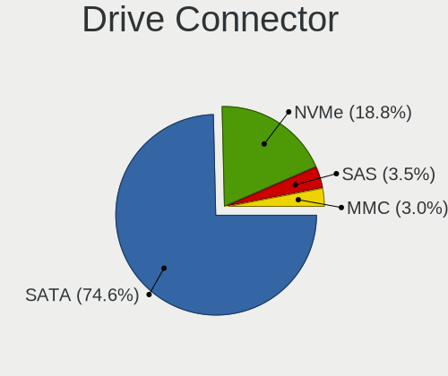
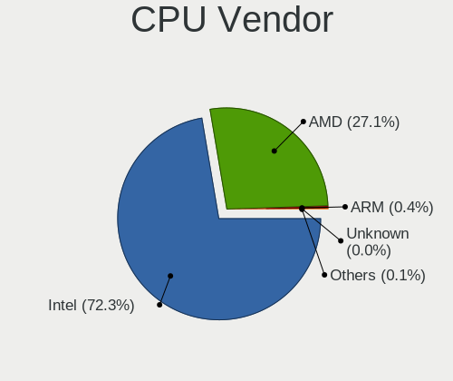
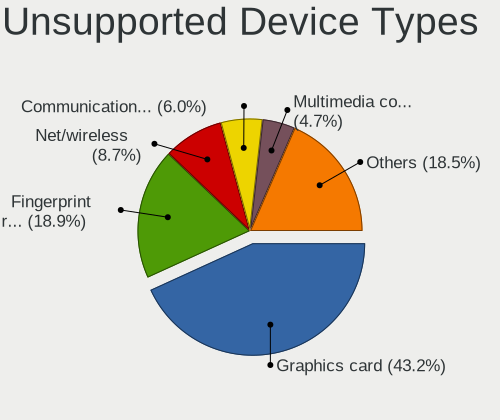

Linux in Russia - Tested Hardware & Statistics
----------------------------------------------

A project to collect tested hardware configurations for Linux in Russia.

Anyone can contribute to this report by the [hw-probe](https://github.com/linuxhw/hw-probe) tool:

    sudo -E hw-probe -all -upload

Please contribute! Especially if your hardware is rare.

This is a report for all computer types. See also reports for [desktops](/Location/Russia/Desktop/README.md) and [notebooks](/Location/Russia/Notebook/README.md).

Contents
--------

* [ Test Cases ](#test-cases)

* [ System ](#system)
  - [ OS                       ](#os)
  - [ OS Family                ](#os-family)
  - [ Kernel                   ](#kernel)
  - [ Kernel Family            ](#kernel-family)
  - [ Kernel Major Ver.        ](#kernel-major-ver)
  - [ Arch                     ](#arch)
  - [ DE                       ](#de)
  - [ Display Server           ](#display-server)
  - [ Display Manager          ](#display-manager)
  - [ OS Lang                  ](#os-lang)
  - [ Boot Mode                ](#boot-mode)
  - [ Filesystem               ](#filesystem)
  - [ Part. scheme             ](#part-scheme)
  - [ Dual Boot with Linux/BSD ](#dual-boot-with-linuxbsd)
  - [ Dual Boot (Win)          ](#dual-boot-win)

* [ Board ](#board)
  - [ Vendor                   ](#vendor)
  - [ Model                    ](#model)
  - [ Model Family             ](#model-family)
  - [ MFG Year                 ](#mfg-year)
  - [ Form Factor              ](#form-factor)
  - [ Secure Boot              ](#secure-boot)
  - [ Coreboot                 ](#coreboot)
  - [ RAM Size                 ](#ram-size)
  - [ RAM Used                 ](#ram-used)
  - [ Total Drives             ](#total-drives)
  - [ Has CD-ROM               ](#has-cd-rom)
  - [ Has Ethernet             ](#has-ethernet)
  - [ Has WiFi                 ](#has-wifi)
  - [ Has Bluetooth            ](#has-bluetooth)

* [ Location ](#location)
  - [ Country                  ](#country)
  - [ City                     ](#city)

* [ Drives ](#drives)
  - [ Drive Vendor             ](#drive-vendor)
  - [ Drive Model              ](#drive-model)
  - [ HDD Vendor               ](#hdd-vendor)
  - [ SSD Vendor               ](#ssd-vendor)
  - [ Drive Kind               ](#drive-kind)
  - [ Drive Connector          ](#drive-connector)
  - [ Drive Size               ](#drive-size)
  - [ Space Total              ](#space-total)
  - [ Space Used               ](#space-used)
  - [ Malfunc. Drives          ](#malfunc-drives)
  - [ Malfunc. Drive Vendor    ](#malfunc-drive-vendor)
  - [ Malfunc. HDD Vendor      ](#malfunc-hdd-vendor)
  - [ Malfunc. Drive Kind      ](#malfunc-drive-kind)
  - [ Failed Drives            ](#failed-drives)
  - [ Failed Drive Vendor      ](#failed-drive-vendor)
  - [ Drive Status             ](#drive-status)

* [ Storage controller ](#storage-controller)
  - [ Storage Vendor           ](#storage-vendor)
  - [ Storage Model            ](#storage-model)
  - [ Storage Kind             ](#storage-kind)

* [ Processor ](#processor)
  - [ CPU Vendor               ](#cpu-vendor)
  - [ CPU Model                ](#cpu-model)
  - [ CPU Model Family         ](#cpu-model-family)
  - [ CPU Cores                ](#cpu-cores)
  - [ CPU Sockets              ](#cpu-sockets)
  - [ CPU Threads              ](#cpu-threads)
  - [ CPU Op-Modes             ](#cpu-op-modes)
  - [ CPU Microcode            ](#cpu-microcode)
  - [ CPU Microarch            ](#cpu-microarch)

* [ Graphics ](#graphics)
  - [ GPU Vendor               ](#gpu-vendor)
  - [ GPU Model                ](#gpu-model)
  - [ GPU Combo                ](#gpu-combo)
  - [ GPU Driver               ](#gpu-driver)
  - [ GPU Memory               ](#gpu-memory)

* [ Monitor ](#monitor)
  - [ Monitor Vendor           ](#monitor-vendor)
  - [ Monitor Model            ](#monitor-model)
  - [ Monitor Resolution       ](#monitor-resolution)
  - [ Monitor Diagonal         ](#monitor-diagonal)
  - [ Monitor Width            ](#monitor-width)
  - [ Aspect Ratio             ](#aspect-ratio)
  - [ Monitor Area             ](#monitor-area)
  - [ Pixel Density            ](#pixel-density)
  - [ Multiple Monitors        ](#multiple-monitors)

* [ Network ](#network)
  - [ Net Controller Vendor    ](#net-controller-vendor)
  - [ Net Controller Model     ](#net-controller-model)
  - [ Wireless Vendor          ](#wireless-vendor)
  - [ Wireless Model           ](#wireless-model)
  - [ Ethernet Vendor          ](#ethernet-vendor)
  - [ Ethernet Model           ](#ethernet-model)
  - [ Net Controller Kind      ](#net-controller-kind)
  - [ Used Controller          ](#used-controller)
  - [ NICs                     ](#nics)
  - [ IPv6                     ](#ipv6)

* [ Bluetooth ](#bluetooth)
  - [ Bluetooth Vendor         ](#bluetooth-vendor)
  - [ Bluetooth Model          ](#bluetooth-model)

* [ Sound ](#sound)
  - [ Sound Vendor             ](#sound-vendor)
  - [ Sound Model              ](#sound-model)

* [ Memory ](#memory)
  - [ Memory Vendor            ](#memory-vendor)
  - [ Memory Model             ](#memory-model)
  - [ Memory Kind              ](#memory-kind)
  - [ Memory Form Factor       ](#memory-form-factor)
  - [ Memory Size              ](#memory-size)
  - [ Memory Speed             ](#memory-speed)

* [ Printers & scanners ](#printers--scanners)
  - [ Printer Vendor           ](#printer-vendor)
  - [ Printer Model            ](#printer-model)
  - [ Scanner Vendor           ](#scanner-vendor)
  - [ Scanner Model            ](#scanner-model)

* [ Camera ](#camera)
  - [ Camera Vendor            ](#camera-vendor)
  - [ Camera Model             ](#camera-model)

* [ Security ](#security)
  - [ Fingerprint Vendor       ](#fingerprint-vendor)
  - [ Fingerprint Model        ](#fingerprint-model)
  - [ Chipcard Vendor          ](#chipcard-vendor)
  - [ Chipcard Model           ](#chipcard-model)

* [ Unsupported ](#unsupported)
  - [ Unsupported Devices      ](#unsupported-devices)
  - [ Unsupported Device Types ](#unsupported-device-types)

Test Cases
----------

Total: 38352

| Vendor        | Model                       | Form-Factor | Probe                                                      | Date         |
|---------------|-----------------------------|-------------|------------------------------------------------------------|--------------|
| Dell          | 0Y5DDC A00                  | Desktop     | [9a9a57dd2b](https://linux-hardware.org/?probe=9a9a57dd2b) | May 01, 2023 |
| Valve         | Jupiter                     | Notebook    | [09f9cbd392](https://linux-hardware.org/?probe=09f9cbd392) | May 01, 2023 |
| ASUSTek       | SABERTOOTH 990FX R2.0       | Desktop     | [41e9bb9584](https://linux-hardware.org/?probe=41e9bb9584) | May 01, 2023 |
| Lenovo        | ThinkBook 15 G2 ITL 20VE    | Notebook    | [8f8a912636](https://linux-hardware.org/?probe=8f8a912636) | May 01, 2023 |
| ASRock        | A520M-ITX/ac                | Desktop     | [5a9f58bcc0](https://linux-hardware.org/?probe=5a9f58bcc0) | Apr 30, 2023 |
| Apple         | MacBookAir7,2               | Notebook    | [1a343a4622](https://linux-hardware.org/?probe=1a343a4622) | Apr 30, 2023 |
| Notebook      | W250EGQ / W270EGQ           | Notebook    | [e523dbbf78](https://linux-hardware.org/?probe=e523dbbf78) | Apr 30, 2023 |
| HP            | Pavilion Gaming Laptop 1... | Notebook    | [43a167afad](https://linux-hardware.org/?probe=43a167afad) | Apr 30, 2023 |
| ASUSTek       | TUF Gaming B550-PLUS        | Desktop     | [0bf0b828d4](https://linux-hardware.org/?probe=0bf0b828d4) | Apr 30, 2023 |
| HP            | Pavilion Gaming Laptop 1... | Notebook    | [0ae3fb5506](https://linux-hardware.org/?probe=0ae3fb5506) | Apr 30, 2023 |
| ASRock        | B650M PG Riptide            | Desktop     | [236258bd78](https://linux-hardware.org/?probe=236258bd78) | Apr 30, 2023 |
| ASUSTek       | P7Q57-M DO                  | Desktop     | [897fc61b8c](https://linux-hardware.org/?probe=897fc61b8c) | Apr 30, 2023 |
| ASUSTek       | P7Q57-M DO                  | Desktop     | [4f502dcb59](https://linux-hardware.org/?probe=4f502dcb59) | Apr 30, 2023 |
| Thomson       | NEO14A-4WH128               | Notebook    | [be47cb81e5](https://linux-hardware.org/?probe=be47cb81e5) | Apr 30, 2023 |
| ASUSTek       | P5K                         | Desktop     | [ea70f7298c](https://linux-hardware.org/?probe=ea70f7298c) | Apr 30, 2023 |
| ASUSTek       | PRIME A320M-K               | Desktop     | [4587583e6a](https://linux-hardware.org/?probe=4587583e6a) | Apr 30, 2023 |
| ASUSTek       | VivoBook 15_ASUS Laptop ... | Notebook    | [4470195d38](https://linux-hardware.org/?probe=4470195d38) | Apr 30, 2023 |
| Dell          | Inspiron N5110              | Notebook    | [9f932190c4](https://linux-hardware.org/?probe=9f932190c4) | Apr 30, 2023 |
| Maibenben     | MaiBook X series            | Notebook    | [5f97e34b20](https://linux-hardware.org/?probe=5f97e34b20) | Apr 30, 2023 |
| MSI           | P67A-C43                    | Desktop     | [68f0d09abd](https://linux-hardware.org/?probe=68f0d09abd) | Apr 30, 2023 |
| HP            | Pavilion Gaming Laptop 1... | Notebook    | [cc7ea9df99](https://linux-hardware.org/?probe=cc7ea9df99) | Apr 30, 2023 |
| Dell          | Vostro 15 3515              | Notebook    | [8f07407e1a](https://linux-hardware.org/?probe=8f07407e1a) | Apr 29, 2023 |
| HP            | Pavilion g6                 | Notebook    | [6d3e51b808](https://linux-hardware.org/?probe=6d3e51b808) | Apr 29, 2023 |
| ASUSTek       | GL702VMK                    | Notebook    | [a3c0cb6515](https://linux-hardware.org/?probe=a3c0cb6515) | Apr 29, 2023 |
| Gigabyte      | GA-A55M-S2HP                | Desktop     | [4a478780d6](https://linux-hardware.org/?probe=4a478780d6) | Apr 29, 2023 |
| ASUSTek       | G56JR                       | Notebook    | [b7eb868ec4](https://linux-hardware.org/?probe=b7eb868ec4) | Apr 29, 2023 |
| HONOR         | HYM-WXX                     | Notebook    | [6923c4c1ce](https://linux-hardware.org/?probe=6923c4c1ce) | Apr 29, 2023 |
| Samsung       | 300E4C/300E5C/300E7C        | Notebook    | [e6257e3e50](https://linux-hardware.org/?probe=e6257e3e50) | Apr 29, 2023 |
| Lenovo        | Unknown                     | Notebook    | [33a55a2347](https://linux-hardware.org/?probe=33a55a2347) | Apr 29, 2023 |
| Clevo         | E512xQ/E4129                | Notebook    | [7499c233c9](https://linux-hardware.org/?probe=7499c233c9) | Apr 29, 2023 |
| Dell          | Inspiron N5110              | Notebook    | [04da6f1db9](https://linux-hardware.org/?probe=04da6f1db9) | Apr 29, 2023 |
| HUAWEI        | BOM-WXX9                    | Notebook    | [b09f495645](https://linux-hardware.org/?probe=b09f495645) | Apr 29, 2023 |
| HUAWEI        | BOM-WXX9                    | Notebook    | [a69dab4a99](https://linux-hardware.org/?probe=a69dab4a99) | Apr 29, 2023 |
| Notebook      | W250EGQ / W270EGQ           | Notebook    | [f25ef6f165](https://linux-hardware.org/?probe=f25ef6f165) | Apr 29, 2023 |
| Toshiba       | Satellite C850-D8K          | Notebook    | [a27eb72e94](https://linux-hardware.org/?probe=a27eb72e94) | Apr 29, 2023 |
| Notebook      | W250EGQ / W270EGQ           | Notebook    | [e4ab273aac](https://linux-hardware.org/?probe=e4ab273aac) | Apr 29, 2023 |
| HP            | 250 G7 Notebook PC          | Notebook    | [e5fe9aa407](https://linux-hardware.org/?probe=e5fe9aa407) | Apr 29, 2023 |
| Toshiba       | Satellite C850-D8K          | Notebook    | [f2f50094ba](https://linux-hardware.org/?probe=f2f50094ba) | Apr 28, 2023 |
| Sony          | VPCSB2A7R                   | Notebook    | [f089770d02](https://linux-hardware.org/?probe=f089770d02) | Apr 28, 2023 |
| Sony          | VPCSB2A7R                   | Notebook    | [89f52ca147](https://linux-hardware.org/?probe=89f52ca147) | Apr 28, 2023 |
| Aquarius      | NS585                       | Notebook    | [b23696ca41](https://linux-hardware.org/?probe=b23696ca41) | Apr 28, 2023 |
| ECS           | A740GM-M                    | Desktop     | [9e69523c9f](https://linux-hardware.org/?probe=9e69523c9f) | Apr 28, 2023 |
| ASUSTek       | ASUS TUF Gaming A15 FA50... | Notebook    | [3059eade71](https://linux-hardware.org/?probe=3059eade71) | Apr 28, 2023 |
| ASRock        | Z77 Extreme3                | Desktop     | [b0c7bac447](https://linux-hardware.org/?probe=b0c7bac447) | Apr 28, 2023 |
| Lenovo        | IdeaPad 5 Pro 14ACN6 82L... | Notebook    | [e665e9d318](https://linux-hardware.org/?probe=e665e9d318) | Apr 28, 2023 |
| Gigabyte      | B550 AORUS MASTER           | Desktop     | [93cf85eecd](https://linux-hardware.org/?probe=93cf85eecd) | Apr 28, 2023 |
| Valve         | Jupiter                     | Notebook    | [583e105bbf](https://linux-hardware.org/?probe=583e105bbf) | Apr 28, 2023 |
| MSI           | Katana GF66 12UGS           | Notebook    | [3607ee704e](https://linux-hardware.org/?probe=3607ee704e) | Apr 28, 2023 |
| Lenovo        | ThinkPad T14 Gen 3 21AH0... | Notebook    | [e0ef7894af](https://linux-hardware.org/?probe=e0ef7894af) | Apr 28, 2023 |
| HP            | 0B54h D                     | Desktop     | [49c56c77af](https://linux-hardware.org/?probe=49c56c77af) | Apr 28, 2023 |
| Acer          | Aspire 5935                 | Notebook    | [9dfeeff104](https://linux-hardware.org/?probe=9dfeeff104) | Apr 28, 2023 |
| ASUSTek       | GL702VMK                    | Notebook    | [5df53b9f76](https://linux-hardware.org/?probe=5df53b9f76) | Apr 28, 2023 |
| ASUSTek       | PRIME H310M-R R2.0          | Desktop     | [41d545e4d7](https://linux-hardware.org/?probe=41d545e4d7) | Apr 28, 2023 |
| ASUSTek       | X51RL                       | Notebook    | [0d18de9922](https://linux-hardware.org/?probe=0d18de9922) | Apr 28, 2023 |
| ASUSTek       | B150-PRO D3                 | Desktop     | [35fa6f9a33](https://linux-hardware.org/?probe=35fa6f9a33) | Apr 28, 2023 |
| F-Plus Mob... | FLAPTOP r                   | Notebook    | [539369db0e](https://linux-hardware.org/?probe=539369db0e) | Apr 28, 2023 |
| Valve         | Jupiter                     | Notebook    | [37534616d7](https://linux-hardware.org/?probe=37534616d7) | Apr 27, 2023 |
| Acer          | Swift SF314-43              | Notebook    | [9ca9aedf16](https://linux-hardware.org/?probe=9ca9aedf16) | Apr 27, 2023 |
| Dell          | Latitude D531               | Notebook    | [a6f2e7170f](https://linux-hardware.org/?probe=a6f2e7170f) | Apr 27, 2023 |
| Dell          | Inspiron N5110              | Notebook    | [2a40d09c1a](https://linux-hardware.org/?probe=2a40d09c1a) | Apr 27, 2023 |
| Lenovo        | B590 20208                  | Notebook    | [912acd510d](https://linux-hardware.org/?probe=912acd510d) | Apr 27, 2023 |
| HP            | Laptop 15-bw0xx             | Notebook    | [387eecc18e](https://linux-hardware.org/?probe=387eecc18e) | Apr 27, 2023 |
| Lenovo        | Legion 5 17ARH05H 82GN      | Notebook    | [e207848340](https://linux-hardware.org/?probe=e207848340) | Apr 27, 2023 |
| Timi          | Redmi Book Pro 14 2022      | Notebook    | [dcc8c22535](https://linux-hardware.org/?probe=dcc8c22535) | Apr 27, 2023 |
| ASRock        | H510M-HDV R2.0              | Desktop     | [91930613cb](https://linux-hardware.org/?probe=91930613cb) | Apr 27, 2023 |
| Dell          | Inspiron N5010              | Notebook    | [78b4f0cd2f](https://linux-hardware.org/?probe=78b4f0cd2f) | Apr 27, 2023 |
| Lenovo        | ThinkPad P15 Gen 1 20ST0... | Notebook    | [a6845d78e4](https://linux-hardware.org/?probe=a6845d78e4) | Apr 27, 2023 |
| Unknown       | Unknown                     | Desktop     | [59d18b7284](https://linux-hardware.org/?probe=59d18b7284) | Apr 27, 2023 |
| ASUSTek       | ROG Strix G513QY_G513QY     | Notebook    | [640a71aea3](https://linux-hardware.org/?probe=640a71aea3) | Apr 27, 2023 |
| ASRock        | A320M-HDV R3.0              | Desktop     | [d395c6168d](https://linux-hardware.org/?probe=d395c6168d) | Apr 27, 2023 |
| ARDOR GAMI... | PD5x_7xPNP_PNR_PNN_PNT      | Notebook    | [e61f528ba5](https://linux-hardware.org/?probe=e61f528ba5) | Apr 27, 2023 |
| Unknown       | Unknown                     | Desktop     | [8599268159](https://linux-hardware.org/?probe=8599268159) | Apr 27, 2023 |
| ASUSTek       | Zenbook UX535QE_UM535QE     | Notebook    | [2093399e21](https://linux-hardware.org/?probe=2093399e21) | Apr 27, 2023 |
| Acer          | Aspire C24-963              | All in one  | [7b4eeebdbc](https://linux-hardware.org/?probe=7b4eeebdbc) | Apr 27, 2023 |
| ASRock        | B365M-ITX/ac                | Desktop     | [e4c8218911](https://linux-hardware.org/?probe=e4c8218911) | Apr 27, 2023 |
| Acer          | Aspire 5720G                | Notebook    | [f566395f99](https://linux-hardware.org/?probe=f566395f99) | Apr 27, 2023 |
| ASUSTek       | M4A785D-M PRO               | Desktop     | [ac2a21023c](https://linux-hardware.org/?probe=ac2a21023c) | Apr 27, 2023 |
| ASUSTek       | ASUS TUF Gaming A15 FA50... | Notebook    | [67288f740c](https://linux-hardware.org/?probe=67288f740c) | Apr 27, 2023 |
| ASUSTek       | N750JV                      | Notebook    | [3ec3c7aa7b](https://linux-hardware.org/?probe=3ec3c7aa7b) | Apr 26, 2023 |
| ASUSTek       | N750JV                      | Notebook    | [53c0f79af9](https://linux-hardware.org/?probe=53c0f79af9) | Apr 26, 2023 |
| MSI           | MS-B0A21                    | Desktop     | [646d14f7b0](https://linux-hardware.org/?probe=646d14f7b0) | Apr 26, 2023 |
| ARDOR GAMI... | PD5x_7xPNP_PNR_PNN_PNT      | Notebook    | [cec3a72c8a](https://linux-hardware.org/?probe=cec3a72c8a) | Apr 26, 2023 |
| ASUSTek       | K501UX                      | Notebook    | [3f46fa9a68](https://linux-hardware.org/?probe=3f46fa9a68) | Apr 26, 2023 |
| Gigabyte      | P75-D3                      | Desktop     | [f9cf28acb8](https://linux-hardware.org/?probe=f9cf28acb8) | Apr 26, 2023 |
| Timi          | RedmiBook Pro 15S           | Notebook    | [7153e7fbe0](https://linux-hardware.org/?probe=7153e7fbe0) | Apr 26, 2023 |
| MSI           | A320M PRO-VD/S              | Desktop     | [f147a5df1c](https://linux-hardware.org/?probe=f147a5df1c) | Apr 26, 2023 |
| Clevo         | NL41MU2                     | Notebook    | [4f2ffb4273](https://linux-hardware.org/?probe=4f2ffb4273) | Apr 26, 2023 |
| MSI           | H110M PRO-VD PLUS           | Desktop     | [95bac1f720](https://linux-hardware.org/?probe=95bac1f720) | Apr 26, 2023 |
| ASUSTek       | ROG STRIX X470-F GAMING     | Desktop     | [62996d1f05](https://linux-hardware.org/?probe=62996d1f05) | Apr 26, 2023 |
| Acer          | Aspire 5935                 | Notebook    | [0430d21b33](https://linux-hardware.org/?probe=0430d21b33) | Apr 26, 2023 |
| Fujitsu Si... | AMILO Pro V2085             | Notebook    | [d577e7c1e8](https://linux-hardware.org/?probe=d577e7c1e8) | Apr 26, 2023 |
| Sony          | SVE1512K1RW                 | Notebook    | [521db31dfc](https://linux-hardware.org/?probe=521db31dfc) | Apr 26, 2023 |
| ZOTAC         | ZBOX-ECM73070C/7307LH/53... | Mini pc     | [c3d1c96452](https://linux-hardware.org/?probe=c3d1c96452) | Apr 26, 2023 |
| HP            | Pavilion g6                 | Notebook    | [e1b7d44502](https://linux-hardware.org/?probe=e1b7d44502) | Apr 26, 2023 |
| Gigabyte      | A320M-H-CF                  | Desktop     | [a1ddcc0d4a](https://linux-hardware.org/?probe=a1ddcc0d4a) | Apr 26, 2023 |
| MSI           | PRO Z690-A WIFI             | Desktop     | [23c9be7614](https://linux-hardware.org/?probe=23c9be7614) | Apr 26, 2023 |
| Unknown       | Unknown                     | Notebook    | [208f6823ed](https://linux-hardware.org/?probe=208f6823ed) | Apr 26, 2023 |
| X79P mothe... | KLLISRE V1.0                | Desktop     | [a7a0059437](https://linux-hardware.org/?probe=a7a0059437) | Apr 26, 2023 |
| ASUSTek       | PRIME H270-PLUS             | Desktop     | [8a0cd0bb6e](https://linux-hardware.org/?probe=8a0cd0bb6e) | Apr 26, 2023 |
| Huanan        | X79 INTEL (INTEL Xeon E5... | Desktop     | [8c9b08bcab](https://linux-hardware.org/?probe=8c9b08bcab) | Apr 26, 2023 |
| Unknown       | ARM5                        | Mini pc     | [62a7da0cc4](https://linux-hardware.org/?probe=62a7da0cc4) | Apr 26, 2023 |
| Acer          | Extensa M2610 V:1.0         | Desktop     | [4a85453666](https://linux-hardware.org/?probe=4a85453666) | Apr 26, 2023 |
| Dell          | Inspiron 5748               | Notebook    | [dd4d50839d](https://linux-hardware.org/?probe=dd4d50839d) | Apr 25, 2023 |
| ASUSTek       | M5A78L-M LX3 PLUS           | Desktop     | [8093a43498](https://linux-hardware.org/?probe=8093a43498) | Apr 25, 2023 |
| Lenovo        | IdeaPad S110 20126          | Notebook    | [4defb36760](https://linux-hardware.org/?probe=4defb36760) | Apr 25, 2023 |
| ASRock        | B450 Pro4                   | Desktop     | [bd406c08f8](https://linux-hardware.org/?probe=bd406c08f8) | Apr 25, 2023 |
| Huanan        | X79 INTEL (INTEL Xeon E5... | Desktop     | [6007547b60](https://linux-hardware.org/?probe=6007547b60) | Apr 25, 2023 |
| ASUSTek       | A68HM-K                     | Desktop     | [ae90303c3a](https://linux-hardware.org/?probe=ae90303c3a) | Apr 25, 2023 |
| ASUSTek       | J1800I-C                    | Desktop     | [0a58f3fa51](https://linux-hardware.org/?probe=0a58f3fa51) | Apr 25, 2023 |
| ASUSTek       | P5QL/EPU                    | Desktop     | [a84428c233](https://linux-hardware.org/?probe=a84428c233) | Apr 25, 2023 |
| Dell          | XPS 13 9310                 | Notebook    | [b9bc4703a8](https://linux-hardware.org/?probe=b9bc4703a8) | Apr 25, 2023 |
| Aquarius      | NS585                       | Notebook    | [a0983c89d8](https://linux-hardware.org/?probe=a0983c89d8) | Apr 25, 2023 |
| Aquarius      | NS585                       | Notebook    | [5d9edb6ed4](https://linux-hardware.org/?probe=5d9edb6ed4) | Apr 25, 2023 |
| Aquarius      | NS585                       | Notebook    | [972d7f6e4a](https://linux-hardware.org/?probe=972d7f6e4a) | Apr 25, 2023 |
| Aquarius      | NS585                       | Notebook    | [c89bbd8bc0](https://linux-hardware.org/?probe=c89bbd8bc0) | Apr 25, 2023 |
| Aquarius      | NS585                       | Notebook    | [a6e5a5f3d1](https://linux-hardware.org/?probe=a6e5a5f3d1) | Apr 25, 2023 |
| Aquarius      | NS585                       | Notebook    | [b6dac5b058](https://linux-hardware.org/?probe=b6dac5b058) | Apr 25, 2023 |
| Aquarius      | NS585                       | Notebook    | [1563889dac](https://linux-hardware.org/?probe=1563889dac) | Apr 25, 2023 |
| Aquarius      | NS585                       | Notebook    | [9bdbad2ab7](https://linux-hardware.org/?probe=9bdbad2ab7) | Apr 25, 2023 |
| Aquarius      | NS585                       | Notebook    | [e30d7dde7b](https://linux-hardware.org/?probe=e30d7dde7b) | Apr 25, 2023 |
| Aquarius      | NS585                       | Notebook    | [68527a900f](https://linux-hardware.org/?probe=68527a900f) | Apr 25, 2023 |
| Lenovo        | H420                        | Desktop     | [265f943a61](https://linux-hardware.org/?probe=265f943a61) | Apr 25, 2023 |
| Aquarius      | NS585                       | Notebook    | [ce99b27fb4](https://linux-hardware.org/?probe=ce99b27fb4) | Apr 25, 2023 |
| Aquarius      | NS585                       | Notebook    | [fc377acae2](https://linux-hardware.org/?probe=fc377acae2) | Apr 25, 2023 |
| Aquarius      | NS585                       | Notebook    | [ed32f24d6e](https://linux-hardware.org/?probe=ed32f24d6e) | Apr 25, 2023 |
| HUAWEI        | CREM-WXX9                   | Notebook    | [fe2d361db9](https://linux-hardware.org/?probe=fe2d361db9) | Apr 25, 2023 |
| Aquarius      | NS585                       | Notebook    | [ea60267a5b](https://linux-hardware.org/?probe=ea60267a5b) | Apr 25, 2023 |
| Aquarius      | NS585                       | Notebook    | [f71897bf76](https://linux-hardware.org/?probe=f71897bf76) | Apr 25, 2023 |
| Aquarius      | NS585                       | Notebook    | [7aa4561ca5](https://linux-hardware.org/?probe=7aa4561ca5) | Apr 25, 2023 |
| Aquarius      | NS585                       | Notebook    | [385ce8cd93](https://linux-hardware.org/?probe=385ce8cd93) | Apr 25, 2023 |
| HP            | 2B43                        | Desktop     | [aa5fb69f7e](https://linux-hardware.org/?probe=aa5fb69f7e) | Apr 25, 2023 |
| Aquarius      | NS585                       | Notebook    | [3fc8926a1a](https://linux-hardware.org/?probe=3fc8926a1a) | Apr 25, 2023 |
| Lenovo        | ThinkPad E14 Gen 2 20T60... | Notebook    | [3a7c24a13f](https://linux-hardware.org/?probe=3a7c24a13f) | Apr 25, 2023 |
| Lenovo        | IdeaPad Z580                | Notebook    | [ad5a6d474b](https://linux-hardware.org/?probe=ad5a6d474b) | Apr 25, 2023 |
| Aquarius      | NS585                       | Notebook    | [58306d0266](https://linux-hardware.org/?probe=58306d0266) | Apr 25, 2023 |
| ICL           | RAYbook Si1512              | Notebook    | [6aa907fd2e](https://linux-hardware.org/?probe=6aa907fd2e) | Apr 25, 2023 |
| Notebook      | W650EH                      | Notebook    | [8e848e589e](https://linux-hardware.org/?probe=8e848e589e) | Apr 25, 2023 |
| Gigabyte      | F2A68HM-DS2                 | Desktop     | [b9b8640409](https://linux-hardware.org/?probe=b9b8640409) | Apr 25, 2023 |
| ICL           | RAYbook Si1512              | Notebook    | [4e960cbe90](https://linux-hardware.org/?probe=4e960cbe90) | Apr 24, 2023 |
| ASRock        | H61M-VG3                    | Desktop     | [3427383977](https://linux-hardware.org/?probe=3427383977) | Apr 24, 2023 |
| ASUSTek       | P5Q                         | Desktop     | [57e3cfa7dc](https://linux-hardware.org/?probe=57e3cfa7dc) | Apr 24, 2023 |
| Acer          | One S1003                   | Tablet      | [140992e52d](https://linux-hardware.org/?probe=140992e52d) | Apr 24, 2023 |
| Gigabyte      | B365M DS3H                  | Desktop     | [90747b3b70](https://linux-hardware.org/?probe=90747b3b70) | Apr 24, 2023 |
| HP            | ProBook 4520s               | Notebook    | [b680525b61](https://linux-hardware.org/?probe=b680525b61) | Apr 24, 2023 |
| Lenovo        | 36F3 No DPK                 | All in one  | [40bd947612](https://linux-hardware.org/?probe=40bd947612) | Apr 24, 2023 |
| Lenovo        | 36F3 SDK0J40688 WIN 3424... | All in one  | [7a81eae6f1](https://linux-hardware.org/?probe=7a81eae6f1) | Apr 24, 2023 |
| HP            | ProBook 4520s               | Notebook    | [e4ce7aed55](https://linux-hardware.org/?probe=e4ce7aed55) | Apr 24, 2023 |
| AZW           | MINI S                      | Desktop     | [d71153ae6e](https://linux-hardware.org/?probe=d71153ae6e) | Apr 24, 2023 |
| Lenovo        | G560 20042                  | Notebook    | [af88bff29f](https://linux-hardware.org/?probe=af88bff29f) | Apr 24, 2023 |
| ASUSTek       | B85M-G                      | Desktop     | [4819635121](https://linux-hardware.org/?probe=4819635121) | Apr 24, 2023 |
| Intel         | SE7320EP2 D11950-402        | Desktop     | [ad1a126878](https://linux-hardware.org/?probe=ad1a126878) | Apr 24, 2023 |
| ASUSTek       | PRIME Z390M-PLUS            | Desktop     | [cac96b2cc9](https://linux-hardware.org/?probe=cac96b2cc9) | Apr 24, 2023 |
| Gigabyte      | H410M H V3                  | Desktop     | [8fd18554d1](https://linux-hardware.org/?probe=8fd18554d1) | Apr 24, 2023 |
| Lenovo        | IdeaPad 3 15IGL05 81WQ      | Notebook    | [52086c894a](https://linux-hardware.org/?probe=52086c894a) | Apr 24, 2023 |
| Lenovo        | ThinkPad T440s 20ARS16G0... | Notebook    | [b019f5af89](https://linux-hardware.org/?probe=b019f5af89) | Apr 24, 2023 |
| Gigabyte      | B550M AORUS ELITE           | Desktop     | [39fd6ad31f](https://linux-hardware.org/?probe=39fd6ad31f) | Apr 24, 2023 |
| Panasonic     | CF-19RHSC8FN                | Notebook    | [cef5165f9c](https://linux-hardware.org/?probe=cef5165f9c) | Apr 23, 2023 |
| ASUSTek       | M5A78L LE                   | Desktop     | [df70910ec6](https://linux-hardware.org/?probe=df70910ec6) | Apr 23, 2023 |
| ASUSTek       | PRIME Z390M-PLUS            | Desktop     | [1a7a3be03e](https://linux-hardware.org/?probe=1a7a3be03e) | Apr 23, 2023 |
| HP            | Pavilion g6                 | Notebook    | [1ca41a3608](https://linux-hardware.org/?probe=1ca41a3608) | Apr 23, 2023 |
| ASUSTek       | ROG STRIX X470-F GAMING     | Desktop     | [88036a75ec](https://linux-hardware.org/?probe=88036a75ec) | Apr 23, 2023 |
| Acer          | Aspire A515-57              | Notebook    | [23f076b6d3](https://linux-hardware.org/?probe=23f076b6d3) | Apr 23, 2023 |
| ASUSTek       | Z170-K                      | Desktop     | [538ebf1f96](https://linux-hardware.org/?probe=538ebf1f96) | Apr 23, 2023 |
| HUAWEI        | KLVC-WXX9                   | Notebook    | [911f7932cc](https://linux-hardware.org/?probe=911f7932cc) | Apr 23, 2023 |
| AZW           | U59                         | Desktop     | [8921a6910d](https://linux-hardware.org/?probe=8921a6910d) | Apr 23, 2023 |
| ASRock        | A320M-DVS R4.0              | Desktop     | [ba7ae1ec90](https://linux-hardware.org/?probe=ba7ae1ec90) | Apr 23, 2023 |
| Acer          | Aspire A315-56              | Notebook    | [5efcb6cf5d](https://linux-hardware.org/?probe=5efcb6cf5d) | Apr 23, 2023 |
| ASUSTek       | UX310UA                     | Notebook    | [a7b628ab1c](https://linux-hardware.org/?probe=a7b628ab1c) | Apr 23, 2023 |
| Intel         | DH61BE AAG14062-206         | Desktop     | [c1817da6ab](https://linux-hardware.org/?probe=c1817da6ab) | Apr 23, 2023 |
| Gigabyte      | H61M-HD2                    | Desktop     | [dd548a2be5](https://linux-hardware.org/?probe=dd548a2be5) | Apr 23, 2023 |
| Acidanther... | Mac-CFF7D910A743CAAF iMa... | All in one  | [332429fc14](https://linux-hardware.org/?probe=332429fc14) | Apr 23, 2023 |
| ASUSTek       | X550CC                      | Notebook    | [f51db9e4de](https://linux-hardware.org/?probe=f51db9e4de) | Apr 23, 2023 |
| Lenovo        | Legion 5 15ARH05 82B5       | Notebook    | [803d0798f1](https://linux-hardware.org/?probe=803d0798f1) | Apr 22, 2023 |
| Gigabyte      | AB350-Gaming 3-CF           | Desktop     | [2f62c287fc](https://linux-hardware.org/?probe=2f62c287fc) | Apr 22, 2023 |
| HP            | 0A60h                       | Desktop     | [e705150840](https://linux-hardware.org/?probe=e705150840) | Apr 22, 2023 |
| ASUSTek       | X551CAP                     | Notebook    | [96dc0b9b7c](https://linux-hardware.org/?probe=96dc0b9b7c) | Apr 22, 2023 |
| ASUSTek       | F1A75-V                     | Desktop     | [ac602a38ec](https://linux-hardware.org/?probe=ac602a38ec) | Apr 22, 2023 |
| Lenovo        | G560 20042                  | Notebook    | [29bfcf59fa](https://linux-hardware.org/?probe=29bfcf59fa) | Apr 22, 2023 |
| Gigabyte      | E3000N                      | Desktop     | [a6d7a7356a](https://linux-hardware.org/?probe=a6d7a7356a) | Apr 22, 2023 |
| MSI           | GP60 2OD                    | Notebook    | [3504850973](https://linux-hardware.org/?probe=3504850973) | Apr 22, 2023 |
| Gigabyte      | B365M H                     | Desktop     | [aca220e594](https://linux-hardware.org/?probe=aca220e594) | Apr 22, 2023 |
| ASUSTek       | M4A785D-M PRO               | Desktop     | [09791c0d84](https://linux-hardware.org/?probe=09791c0d84) | Apr 22, 2023 |
| ASUSTek       | M4A785D-M PRO               | Desktop     | [62dfd33592](https://linux-hardware.org/?probe=62dfd33592) | Apr 22, 2023 |
| Techvision    | TVI7309X B0                 | Desktop     | [26e981dab3](https://linux-hardware.org/?probe=26e981dab3) | Apr 22, 2023 |
| Lenovo        | Yoga 910-13IKB 80VF         | Convertible | [fc367d0743](https://linux-hardware.org/?probe=fc367d0743) | Apr 21, 2023 |
| ASUSTek       | PRIME A320M-K               | Desktop     | [fb1f9f0d16](https://linux-hardware.org/?probe=fb1f9f0d16) | Apr 21, 2023 |
| ASUSTek       | ASUS TUF Gaming F15 FX50... | Notebook    | [dae63185d5](https://linux-hardware.org/?probe=dae63185d5) | Apr 21, 2023 |
| Gigabyte      | P31-S3G                     | Desktop     | [cec5cd32e8](https://linux-hardware.org/?probe=cec5cd32e8) | Apr 21, 2023 |
| Gigabyte      | AB350-Gaming 3-CF           | Desktop     | [ebd7a2d70a](https://linux-hardware.org/?probe=ebd7a2d70a) | Apr 21, 2023 |
| ASUSTek       | F2A85-V                     | Desktop     | [422eb87f07](https://linux-hardware.org/?probe=422eb87f07) | Apr 21, 2023 |
| HP            | ProBook 440 G8 Notebook ... | Notebook    | [40aaf19667](https://linux-hardware.org/?probe=40aaf19667) | Apr 21, 2023 |
| Gigabyte      | H110-D3-CF                  | Desktop     | [bbf67462c7](https://linux-hardware.org/?probe=bbf67462c7) | Apr 21, 2023 |
| Valve         | Jupiter                     | Notebook    | [9091e5efc9](https://linux-hardware.org/?probe=9091e5efc9) | Apr 21, 2023 |
| ASUSTek       | M5A78L LE                   | Desktop     | [3d241113f4](https://linux-hardware.org/?probe=3d241113f4) | Apr 21, 2023 |
| ASUSTek       | P8H61-M LX R2.0             | Desktop     | [ebc4b3095d](https://linux-hardware.org/?probe=ebc4b3095d) | Apr 21, 2023 |
| Lenovo        | IdeaPad S510p 20298         | Notebook    | [8a1e6b7f32](https://linux-hardware.org/?probe=8a1e6b7f32) | Apr 21, 2023 |
| ASRock        | H310M-HDV                   | Desktop     | [ee492f099b](https://linux-hardware.org/?probe=ee492f099b) | Apr 21, 2023 |
| ASUSTek       | M4N68T-M LE                 | Desktop     | [4f1e6c6ce7](https://linux-hardware.org/?probe=4f1e6c6ce7) | Apr 21, 2023 |
| Clevo         | NL41MU2                     | Notebook    | [2f1b310ca2](https://linux-hardware.org/?probe=2f1b310ca2) | Apr 21, 2023 |
| Timi          | Redmi Book Pro 15 2022      | Notebook    | [3fd583ee9b](https://linux-hardware.org/?probe=3fd583ee9b) | Apr 21, 2023 |
| HP            | Compaq 6720s                | Notebook    | [b980c3c57d](https://linux-hardware.org/?probe=b980c3c57d) | Apr 21, 2023 |
| Samsung       | 350V5C/351V5C/3540VC/344... | Notebook    | [0658934d69](https://linux-hardware.org/?probe=0658934d69) | Apr 21, 2023 |
| ASRock        | P43DE                       | Desktop     | [8f2c0ecc69](https://linux-hardware.org/?probe=8f2c0ecc69) | Apr 21, 2023 |
| MSI           | Katana GF66 12UE            | Notebook    | [77725a70a4](https://linux-hardware.org/?probe=77725a70a4) | Apr 21, 2023 |
| ASRock        | H61M-GE                     | Desktop     | [615c74338c](https://linux-hardware.org/?probe=615c74338c) | Apr 21, 2023 |
| Intel         | DG965RY AAD41691-301        | Desktop     | [0a153df418](https://linux-hardware.org/?probe=0a153df418) | Apr 20, 2023 |
| ASUSTek       | ROG STRIX B550-I GAMING     | Desktop     | [d3cfdb3436](https://linux-hardware.org/?probe=d3cfdb3436) | Apr 20, 2023 |
| OrangePi      | 4 (DT)                      | Soc         | [a1c0a82172](https://linux-hardware.org/?probe=a1c0a82172) | Apr 20, 2023 |
| Infinix       | INBOOK X2 GEN11             | Notebook    | [cac51ecb89](https://linux-hardware.org/?probe=cac51ecb89) | Apr 20, 2023 |
| Lenovo        | IdeaPad Gaming 3 15IMH05... | Notebook    | [ce992e6160](https://linux-hardware.org/?probe=ce992e6160) | Apr 20, 2023 |
| Infinix       | INBOOK X2 GEN11             | Notebook    | [7fea1a73bc](https://linux-hardware.org/?probe=7fea1a73bc) | Apr 20, 2023 |
| Lenovo        | IdeaPad L340-15IRH Gamin... | Notebook    | [832f9d1bcf](https://linux-hardware.org/?probe=832f9d1bcf) | Apr 20, 2023 |
| Acer          | Aspire Z5770                | All in one  | [2e34d8a2cc](https://linux-hardware.org/?probe=2e34d8a2cc) | Apr 20, 2023 |
| Acer          | Aspire One 721              | Notebook    | [672386bd50](https://linux-hardware.org/?probe=672386bd50) | Apr 20, 2023 |
| Lenovo        | B570e HuronRiver Platfor... | Notebook    | [9c780361aa](https://linux-hardware.org/?probe=9c780361aa) | Apr 20, 2023 |
| Aquarius      | AQH410T                     | Desktop     | [ecb27c0ff7](https://linux-hardware.org/?probe=ecb27c0ff7) | Apr 20, 2023 |
| Huanan        | X99 F8D V2.2                | Desktop     | [b8c2462ada](https://linux-hardware.org/?probe=b8c2462ada) | Apr 20, 2023 |
| Toshiba       | Satellite X200              | Notebook    | [15035835d0](https://linux-hardware.org/?probe=15035835d0) | Apr 20, 2023 |
| Dell          | Latitude E7470              | Notebook    | [5695d0ab66](https://linux-hardware.org/?probe=5695d0ab66) | Apr 20, 2023 |
| Gigabyte      | A320M-S2H V2-CF             | Desktop     | [7ac787a4fa](https://linux-hardware.org/?probe=7ac787a4fa) | Apr 20, 2023 |
| HUAWEI        | NBLK-WAX9X                  | Notebook    | [3d88744f22](https://linux-hardware.org/?probe=3d88744f22) | Apr 20, 2023 |
| Aquarius      | AQH410T                     | Desktop     | [29e8b5bd74](https://linux-hardware.org/?probe=29e8b5bd74) | Apr 20, 2023 |
| HP            | Notebook                    | Notebook    | [7174065ed3](https://linux-hardware.org/?probe=7174065ed3) | Apr 20, 2023 |
| HP            | OMEN Laptop 15-en1xxx       | Notebook    | [30caba94a4](https://linux-hardware.org/?probe=30caba94a4) | Apr 20, 2023 |
| Aquarius      | NS585                       | Notebook    | [753222f54f](https://linux-hardware.org/?probe=753222f54f) | Apr 20, 2023 |
| Aquarius      | NS585                       | Notebook    | [be0bc2be01](https://linux-hardware.org/?probe=be0bc2be01) | Apr 20, 2023 |
| Gigabyte      | H310M S2H x.x               | Desktop     | [eec2055c19](https://linux-hardware.org/?probe=eec2055c19) | Apr 20, 2023 |
| Aquarius      | NS585                       | Notebook    | [f7f0464c39](https://linux-hardware.org/?probe=f7f0464c39) | Apr 20, 2023 |
| Aquarius      | NS585                       | Notebook    | [8393642230](https://linux-hardware.org/?probe=8393642230) | Apr 20, 2023 |
| ASUSTek       | P5K SE                      | Desktop     | [eeff4cd84c](https://linux-hardware.org/?probe=eeff4cd84c) | Apr 20, 2023 |
| Aquarius      | NS585                       | Notebook    | [a5b9a09e63](https://linux-hardware.org/?probe=a5b9a09e63) | Apr 20, 2023 |
| Biostar       | H61MHV                      | Desktop     | [7b3d591e47](https://linux-hardware.org/?probe=7b3d591e47) | Apr 20, 2023 |
| Gigabyte      | A320M-H-CF                  | Desktop     | [51afdddffc](https://linux-hardware.org/?probe=51afdddffc) | Apr 20, 2023 |
| EPoX Compu... | nForce3 DDR: 8KDA3I Seri... | Desktop     | [ba684478b5](https://linux-hardware.org/?probe=ba684478b5) | Apr 20, 2023 |
| ASRock        | B250M Pro4                  | Desktop     | [5d27011671](https://linux-hardware.org/?probe=5d27011671) | Apr 19, 2023 |
| Lenovo        | ThinkPad T500 2055WAB       | Notebook    | [4e293261bb](https://linux-hardware.org/?probe=4e293261bb) | Apr 19, 2023 |
| ASUSTek       | A8Le                        | Notebook    | [3e4df24741](https://linux-hardware.org/?probe=3e4df24741) | Apr 19, 2023 |
| Valve         | Jupiter                     | Notebook    | [a1a3404a4d](https://linux-hardware.org/?probe=a1a3404a4d) | Apr 19, 2023 |
| MACHINIST     | X99-RS9 V3.1                | Desktop     | [492b8bb4d0](https://linux-hardware.org/?probe=492b8bb4d0) | Apr 19, 2023 |
| MSI           | MPG B550 GAMING PLUS        | Desktop     | [ea69ff8c8b](https://linux-hardware.org/?probe=ea69ff8c8b) | Apr 19, 2023 |
| Lenovo        | V15 G2 ALC 82KD             | Notebook    | [017d095061](https://linux-hardware.org/?probe=017d095061) | Apr 19, 2023 |
| ASRock        | N68-GS4 FX                  | Desktop     | [b01bc53af9](https://linux-hardware.org/?probe=b01bc53af9) | Apr 19, 2023 |
| ASRock        | N68C-GS FX                  | Desktop     | [fc16ea346a](https://linux-hardware.org/?probe=fc16ea346a) | Apr 19, 2023 |
| ASUSTek       | VivoBook_ASUSLaptop M350... | Notebook    | [d669bcc680](https://linux-hardware.org/?probe=d669bcc680) | Apr 19, 2023 |
| Intel         | DH61BF AAG81311-101         | Desktop     | [a9329736fb](https://linux-hardware.org/?probe=a9329736fb) | Apr 19, 2023 |
| Acer          | Aspire 5930                 | Notebook    | [0bca303d94](https://linux-hardware.org/?probe=0bca303d94) | Apr 19, 2023 |
| Acer          | Aspire 5930                 | Notebook    | [af833465b4](https://linux-hardware.org/?probe=af833465b4) | Apr 19, 2023 |
| ASRock        | J3455-ITX                   | Desktop     | [895abaa15e](https://linux-hardware.org/?probe=895abaa15e) | Apr 19, 2023 |
| ASRock        | J3455-ITX                   | Desktop     | [f70d811bbd](https://linux-hardware.org/?probe=f70d811bbd) | Apr 19, 2023 |
| MSI           | H110M PRO-VD                | Desktop     | [d04a1b7f36](https://linux-hardware.org/?probe=d04a1b7f36) | Apr 19, 2023 |
| ASUSTek       | X75VC                       | Notebook    | [68e8f66056](https://linux-hardware.org/?probe=68e8f66056) | Apr 19, 2023 |
| HUAWEI        | BOM-WXX9                    | Notebook    | [cb5a9be901](https://linux-hardware.org/?probe=cb5a9be901) | Apr 19, 2023 |
| ASUSTek       | B75M-PLUS                   | Desktop     | [33cd5127f2](https://linux-hardware.org/?probe=33cd5127f2) | Apr 19, 2023 |
| Gigabyte      | H61M-S1                     | Desktop     | [e2ed275252](https://linux-hardware.org/?probe=e2ed275252) | Apr 19, 2023 |
| Dell          | 0Y5DDC A00                  | Desktop     | [daff249988](https://linux-hardware.org/?probe=daff249988) | Apr 19, 2023 |
| Lenovo        | ThinkPad P70 20ESS0TW00     | Notebook    | [42b45f646d](https://linux-hardware.org/?probe=42b45f646d) | Apr 19, 2023 |
| Lenovo        | ThinkPad X1 Carbon 4th 2... | Notebook    | [cd58803d5c](https://linux-hardware.org/?probe=cd58803d5c) | Apr 19, 2023 |
| Lenovo        | ThinkPad X1 Carbon 4th 2... | Notebook    | [7adb4b2000](https://linux-hardware.org/?probe=7adb4b2000) | Apr 19, 2023 |
| Apple         | Mac-27ADBB7B4CEE8E61 iMa... | All in one  | [94468c31e6](https://linux-hardware.org/?probe=94468c31e6) | Apr 19, 2023 |
| Apple         | Mac-27ADBB7B4CEE8E61 iMa... | All in one  | [c17485e831](https://linux-hardware.org/?probe=c17485e831) | Apr 19, 2023 |
| MSI           | PRO Z690-A WIFI             | Desktop     | [26c96a2c4b](https://linux-hardware.org/?probe=26c96a2c4b) | Apr 19, 2023 |
| MSI           | MPG B550 GAMING EDGE WIF... | Desktop     | [2822b1a8c3](https://linux-hardware.org/?probe=2822b1a8c3) | Apr 19, 2023 |
| Gigabyte      | H61M-S1                     | Desktop     | [a6aaf5f17a](https://linux-hardware.org/?probe=a6aaf5f17a) | Apr 19, 2023 |
| HUAWEI        | NBD-WXX9                    | Notebook    | [a55a03e648](https://linux-hardware.org/?probe=a55a03e648) | Apr 19, 2023 |
| Clevo         | M7x0K                       | Notebook    | [70cb3d8a2a](https://linux-hardware.org/?probe=70cb3d8a2a) | Apr 19, 2023 |
| HP            | 255 G8 Notebook PC          | Notebook    | [699e2a2a80](https://linux-hardware.org/?probe=699e2a2a80) | Apr 18, 2023 |
| Lenovo        | IdeaPad Y570 20091          | Notebook    | [14e15479a1](https://linux-hardware.org/?probe=14e15479a1) | Apr 18, 2023 |
| MSI           | G41M-P33 Combo              | Desktop     | [55ead22ec0](https://linux-hardware.org/?probe=55ead22ec0) | Apr 18, 2023 |
| MSI           | G41M-P33 Combo              | Desktop     | [9fc5380d7a](https://linux-hardware.org/?probe=9fc5380d7a) | Apr 18, 2023 |
| Gigabyte      | B550M AORUS PRO-P           | Desktop     | [023e96a6fd](https://linux-hardware.org/?probe=023e96a6fd) | Apr 18, 2023 |
| Gigabyte      | H310M S2                    | Desktop     | [02a81434f0](https://linux-hardware.org/?probe=02a81434f0) | Apr 18, 2023 |
| Biostar       | A960D+V2                    | Desktop     | [34c47b4141](https://linux-hardware.org/?probe=34c47b4141) | Apr 18, 2023 |
| Acer          | Aspire E5-575G              | Notebook    | [26bce7ac33](https://linux-hardware.org/?probe=26bce7ac33) | Apr 18, 2023 |
| Gigabyte      | 970A-UD3P                   | Desktop     | [38275208cc](https://linux-hardware.org/?probe=38275208cc) | Apr 18, 2023 |
| Lenovo        | IdeaPad S510p 20298         | Notebook    | [7f0be1868e](https://linux-hardware.org/?probe=7f0be1868e) | Apr 18, 2023 |
| ASUSTek       | K40AF                       | Notebook    | [f3e1d56dbc](https://linux-hardware.org/?probe=f3e1d56dbc) | Apr 18, 2023 |
| ICL           | H510SB-TM v2.0              | All in one  | [a61ffc94f5](https://linux-hardware.org/?probe=a61ffc94f5) | Apr 18, 2023 |
| HP            | Pavilion 15                 | Notebook    | [ae147077b1](https://linux-hardware.org/?probe=ae147077b1) | Apr 18, 2023 |
| ASRock        | 970 Pro3 R2.0               | Desktop     | [e816e4de38](https://linux-hardware.org/?probe=e816e4de38) | Apr 18, 2023 |
| Graviton      | DMB-A520-MCA01              | Desktop     | [d0c1433d54](https://linux-hardware.org/?probe=d0c1433d54) | Apr 18, 2023 |
| Lenovo        | B50-30 20382                | Notebook    | [d8995dacdc](https://linux-hardware.org/?probe=d8995dacdc) | Apr 18, 2023 |
| Acer          | Aspire A315-42G             | Notebook    | [aff8d7f5d9](https://linux-hardware.org/?probe=aff8d7f5d9) | Apr 18, 2023 |
| Gigabyte      | F2A68HM-DS2                 | Desktop     | [d7ebec50bf](https://linux-hardware.org/?probe=d7ebec50bf) | Apr 18, 2023 |
| ASL           | BayTrail JHS773             | Desktop     | [3a5977ad04](https://linux-hardware.org/?probe=3a5977ad04) | Apr 18, 2023 |
| Acer          | Aspire A315-34              | Notebook    | [06332b53b1](https://linux-hardware.org/?probe=06332b53b1) | Apr 18, 2023 |
| Supermicro    | X9DRW                       | Server      | [6994c89077](https://linux-hardware.org/?probe=6994c89077) | Apr 17, 2023 |
| ASUSTek       | Pro WS X570-ACE             | Desktop     | [8944559c50](https://linux-hardware.org/?probe=8944559c50) | Apr 17, 2023 |
| ASUSTek       | ROG Zephyrus G15 GA503QM... | Notebook    | [65a5b3f43d](https://linux-hardware.org/?probe=65a5b3f43d) | Apr 17, 2023 |
| ASRock        | H310M-STX                   | Desktop     | [438e774de5](https://linux-hardware.org/?probe=438e774de5) | Apr 17, 2023 |
| Lenovo        | G580                        | Notebook    | [e291c2c0aa](https://linux-hardware.org/?probe=e291c2c0aa) | Apr 17, 2023 |
| MSI           | PRO X670-P WIFI             | Desktop     | [3fdb4f34e0](https://linux-hardware.org/?probe=3fdb4f34e0) | Apr 17, 2023 |
| HP            | OMEN Laptop 15-en1xxx       | Notebook    | [909a9c8c45](https://linux-hardware.org/?probe=909a9c8c45) | Apr 17, 2023 |
| ASRock        | A320M-DVS R4.0              | Desktop     | [b715989fc4](https://linux-hardware.org/?probe=b715989fc4) | Apr 16, 2023 |
| ASRock        | A320M-DVS R4.0              | Desktop     | [213ac87204](https://linux-hardware.org/?probe=213ac87204) | Apr 16, 2023 |
| Biostar       | H81MHV3                     | Desktop     | [384b42f2e6](https://linux-hardware.org/?probe=384b42f2e6) | Apr 16, 2023 |
| Lenovo        | ThinkBook 13s G2 ITL 20V... | Notebook    | [5e265fd8e1](https://linux-hardware.org/?probe=5e265fd8e1) | Apr 16, 2023 |
| ASRock        | B650M PG Riptide            | Desktop     | [e138e763eb](https://linux-hardware.org/?probe=e138e763eb) | Apr 16, 2023 |
| ASRock        | B650M PG Riptide            | Desktop     | [71643d03ec](https://linux-hardware.org/?probe=71643d03ec) | Apr 16, 2023 |
| Gigabyte      | A320M-S2H-CF                | Desktop     | [badd20d374](https://linux-hardware.org/?probe=badd20d374) | Apr 16, 2023 |
| Lenovo        | 367D 31900059 STD           | Desktop     | [e3ebbe3950](https://linux-hardware.org/?probe=e3ebbe3950) | Apr 16, 2023 |
| ASUSTek       | P5K-VM                      | Desktop     | [2c8298a0a8](https://linux-hardware.org/?probe=2c8298a0a8) | Apr 16, 2023 |
| Acer          | Extensa 4220                | Notebook    | [65c0e4f901](https://linux-hardware.org/?probe=65c0e4f901) | Apr 16, 2023 |
| Acer          | Aspire TC-705               | Desktop     | [80bfa42512](https://linux-hardware.org/?probe=80bfa42512) | Apr 16, 2023 |
| HP            | ENVY x360 Convertible 15... | Convertible | [e490562aa9](https://linux-hardware.org/?probe=e490562aa9) | Apr 16, 2023 |
| MSI           | B450M PRO-M2                | Desktop     | [05ae2ac6e6](https://linux-hardware.org/?probe=05ae2ac6e6) | Apr 16, 2023 |
| Digma         | EVE 11 C422 ES1068EW        | Notebook    | [8f62352864](https://linux-hardware.org/?probe=8f62352864) | Apr 16, 2023 |
| Lenovo        | ThinkPad X1 Carbon 5th 2... | Notebook    | [2fcbae14f2](https://linux-hardware.org/?probe=2fcbae14f2) | Apr 16, 2023 |
| Acer          | Nitro AN515-46              | Notebook    | [502263c435](https://linux-hardware.org/?probe=502263c435) | Apr 15, 2023 |
| ASRock        | 970 Pro3 R2.0               | Desktop     | [a70cf56038](https://linux-hardware.org/?probe=a70cf56038) | Apr 15, 2023 |
| Lenovo        | IdeaPad 300-15ISK 80Q7      | Notebook    | [a08b6e5824](https://linux-hardware.org/?probe=a08b6e5824) | Apr 15, 2023 |
| Dell          | Inspiron N5110              | Notebook    | [4f65d649d9](https://linux-hardware.org/?probe=4f65d649d9) | Apr 15, 2023 |
| Dell          | Inspiron MM061              | Notebook    | [b825c609a9](https://linux-hardware.org/?probe=b825c609a9) | Apr 15, 2023 |
| Acer          | Aspire A515-57              | Notebook    | [ecc22845f7](https://linux-hardware.org/?probe=ecc22845f7) | Apr 15, 2023 |
| ASUSTek       | P8H61-MX                    | Desktop     | [4ad2b2bcdc](https://linux-hardware.org/?probe=4ad2b2bcdc) | Apr 15, 2023 |
| ASUSTek       | VivoBook 15_ASUS Laptop ... | Notebook    | [162ef2f577](https://linux-hardware.org/?probe=162ef2f577) | Apr 15, 2023 |
| HP            | Stream Laptop 11-aj0xxx     | Notebook    | [47521a22ef](https://linux-hardware.org/?probe=47521a22ef) | Apr 15, 2023 |
| ASUSTek       | STRIX Z270H GAMING          | Desktop     | [7ac461b735](https://linux-hardware.org/?probe=7ac461b735) | Apr 15, 2023 |
| 3Logic Gro... | Graviton N15i               | Notebook    | [12b7711444](https://linux-hardware.org/?probe=12b7711444) | Apr 15, 2023 |
| HP            | EliteBook 8470p             | Notebook    | [69cb1a0781](https://linux-hardware.org/?probe=69cb1a0781) | Apr 15, 2023 |
| 3Logic Gro... | Graviton N15i               | Notebook    | [a61925937f](https://linux-hardware.org/?probe=a61925937f) | Apr 15, 2023 |
| Lenovo        | IdeaPad Gaming 3 16ARH7 ... | Notebook    | [6bb9c3439d](https://linux-hardware.org/?probe=6bb9c3439d) | Apr 15, 2023 |
| Lenovo        | IdeaPad 300-15ISK 80Q7      | Notebook    | [510bfe2f94](https://linux-hardware.org/?probe=510bfe2f94) | Apr 15, 2023 |
| F-Plus Mob... | FLAPTOP r                   | Notebook    | [0a63354640](https://linux-hardware.org/?probe=0a63354640) | Apr 15, 2023 |
| ASUSTek       | M51Vr                       | Notebook    | [27d265c73d](https://linux-hardware.org/?probe=27d265c73d) | Apr 15, 2023 |
| F-Plus Mob... | FLAPTOP r                   | Notebook    | [1ed54f4477](https://linux-hardware.org/?probe=1ed54f4477) | Apr 15, 2023 |
| MSI           | MPG B550 GAMING CARBON W... | Desktop     | [4f8d3b46f5](https://linux-hardware.org/?probe=4f8d3b46f5) | Apr 15, 2023 |
| HP            | EliteBook 2540p             | Notebook    | [de07820409](https://linux-hardware.org/?probe=de07820409) | Apr 15, 2023 |
| HONOR         | HYM-WXX                     | Notebook    | [109b28f217](https://linux-hardware.org/?probe=109b28f217) | Apr 15, 2023 |
| ASUSTek       | P5KPL-AM                    | Desktop     | [f48937493d](https://linux-hardware.org/?probe=f48937493d) | Apr 15, 2023 |
| ASUSTek       | VivoBook 15_ASUS Laptop ... | Notebook    | [ca241d00f8](https://linux-hardware.org/?probe=ca241d00f8) | Apr 15, 2023 |
| Acer          | Aspire A515-55              | Notebook    | [18414177a2](https://linux-hardware.org/?probe=18414177a2) | Apr 15, 2023 |
| Digma         | EVE 11 C422 ES1068EW        | Notebook    | [a5cce02e71](https://linux-hardware.org/?probe=a5cce02e71) | Apr 14, 2023 |
| MSI           | H81M-P33                    | Desktop     | [e0d66aee3a](https://linux-hardware.org/?probe=e0d66aee3a) | Apr 14, 2023 |
| MSI           | MAG B650 TOMAHAWK WIFI      | Desktop     | [f6a652b68d](https://linux-hardware.org/?probe=f6a652b68d) | Apr 14, 2023 |
| MSI           | B550M PRO-VDH WIFI          | Desktop     | [57e42e5107](https://linux-hardware.org/?probe=57e42e5107) | Apr 14, 2023 |
| Lenovo        | 7Z73CTO1WW 05               | Server      | [29f89998ee](https://linux-hardware.org/?probe=29f89998ee) | Apr 14, 2023 |
| ASUSTek       | M4A78LT-M                   | Desktop     | [64e92bd20f](https://linux-hardware.org/?probe=64e92bd20f) | Apr 14, 2023 |
| Gigabyte      | GA-990XA-UD3                | Desktop     | [d5669e92ed](https://linux-hardware.org/?probe=d5669e92ed) | Apr 14, 2023 |
| MSI           | B550M PRO-VDH WIFI          | Desktop     | [9e1d9ff252](https://linux-hardware.org/?probe=9e1d9ff252) | Apr 14, 2023 |
| ASUSTek       | P11C-X Series               | Desktop     | [2ab6f2745c](https://linux-hardware.org/?probe=2ab6f2745c) | Apr 14, 2023 |
| ASUSTek       | P11C-X Series               | Desktop     | [55f8d9f172](https://linux-hardware.org/?probe=55f8d9f172) | Apr 14, 2023 |
| Notebook      | W65_67SH                    | Notebook    | [d84563301e](https://linux-hardware.org/?probe=d84563301e) | Apr 14, 2023 |
| Acer          | Swift SF114-34              | Notebook    | [45d963eb7c](https://linux-hardware.org/?probe=45d963eb7c) | Apr 14, 2023 |
| Haier         | U1520HD                     | Notebook    | [3084c84bb6](https://linux-hardware.org/?probe=3084c84bb6) | Apr 14, 2023 |
| HUAWEI        | BOM-WXX9                    | Notebook    | [04eead074d](https://linux-hardware.org/?probe=04eead074d) | Apr 14, 2023 |
| HUAWEI        | HLY-WX9XX                   | Notebook    | [d0742654bb](https://linux-hardware.org/?probe=d0742654bb) | Apr 14, 2023 |
| HP            | ProBook 430 G6              | Notebook    | [9a4bce918e](https://linux-hardware.org/?probe=9a4bce918e) | Apr 14, 2023 |
| Gigabyte      | G31M-S2L                    | Desktop     | [eaccdb6a68](https://linux-hardware.org/?probe=eaccdb6a68) | Apr 14, 2023 |
| Gigabyte      | A320M-H-CF                  | Desktop     | [ae3ba04308](https://linux-hardware.org/?probe=ae3ba04308) | Apr 14, 2023 |
| Lenovo        | G505 20240                  | Notebook    | [62bdfa97bd](https://linux-hardware.org/?probe=62bdfa97bd) | Apr 14, 2023 |
| Lenovo        | ThinkPad X1 Yoga Gen 5 2... | Convertible | [7ae190d0be](https://linux-hardware.org/?probe=7ae190d0be) | Apr 14, 2023 |
| Dell          | Latitude E7250              | Notebook    | [a6f30c1df5](https://linux-hardware.org/?probe=a6f30c1df5) | Apr 13, 2023 |
| MSI           | MAG B650 TOMAHAWK WIFI      | Desktop     | [f1f1661f59](https://linux-hardware.org/?probe=f1f1661f59) | Apr 13, 2023 |
| Unchartevi... | 6540                        | Notebook    | [b2acb1d64c](https://linux-hardware.org/?probe=b2acb1d64c) | Apr 13, 2023 |
| Sony          | VGN-NW24MR                  | Notebook    | [3325bb2781](https://linux-hardware.org/?probe=3325bb2781) | Apr 13, 2023 |
| ASUSTek       | K73TA                       | Notebook    | [34319e673a](https://linux-hardware.org/?probe=34319e673a) | Apr 13, 2023 |
| Gigabyte      | MQHUDVI                     | All in one  | [1dc2419a21](https://linux-hardware.org/?probe=1dc2419a21) | Apr 13, 2023 |
| 3Logic Gro... | Graviton N15i-K2            | Notebook    | [7b75b7b08e](https://linux-hardware.org/?probe=7b75b7b08e) | Apr 13, 2023 |
| Apple         | Mac-63001698E7A34814 iMa... | All in one  | [0f3f45f8e9](https://linux-hardware.org/?probe=0f3f45f8e9) | Apr 13, 2023 |
| HUAWEI        | HN-WX9X                     | Notebook    | [20c6c9b49a](https://linux-hardware.org/?probe=20c6c9b49a) | Apr 13, 2023 |
| ASUSTek       | Zenbook UM5401QAB_UM5401... | Notebook    | [fa8b03b686](https://linux-hardware.org/?probe=fa8b03b686) | Apr 13, 2023 |
| Acer          | Extensa 2519                | Notebook    | [8a555b0d7b](https://linux-hardware.org/?probe=8a555b0d7b) | Apr 13, 2023 |
| ASUSTek       | P5KPL-AM IN/GB              | Desktop     | [c7c00c395f](https://linux-hardware.org/?probe=c7c00c395f) | Apr 13, 2023 |
| DEPO Compu... | MS-7846                     | Desktop     | [bf72733735](https://linux-hardware.org/?probe=bf72733735) | Apr 13, 2023 |
| ASUSTek       | PRIME B650-PLUS             | Desktop     | [d05eccd5c7](https://linux-hardware.org/?probe=d05eccd5c7) | Apr 13, 2023 |
| Lenovo        | ThinkPad T490 20N2000NRT    | Notebook    | [ea97cd752d](https://linux-hardware.org/?probe=ea97cd752d) | Apr 13, 2023 |
| Biostar       | G41D3C                      | Desktop     | [96bf9b40ac](https://linux-hardware.org/?probe=96bf9b40ac) | Apr 13, 2023 |
| ASUSTek       | P8H61-M LE R2.0             | Desktop     | [507f555919](https://linux-hardware.org/?probe=507f555919) | Apr 13, 2023 |
| Intel         | SKYBAY                      | Desktop     | [ec2b541d85](https://linux-hardware.org/?probe=ec2b541d85) | Apr 13, 2023 |
| Foxconn       | 2ABF                        | Desktop     | [35a1f24f18](https://linux-hardware.org/?probe=35a1f24f18) | Apr 13, 2023 |
| Acer          | Aspire E5-771G              | Notebook    | [504d600530](https://linux-hardware.org/?probe=504d600530) | Apr 13, 2023 |
| Gigabyte      | B550 GAMING X V2            | Desktop     | [67fa6790f3](https://linux-hardware.org/?probe=67fa6790f3) | Apr 13, 2023 |
| MSI           | MPG B550 GAMING PLUS        | Desktop     | [71542ed659](https://linux-hardware.org/?probe=71542ed659) | Apr 13, 2023 |
| Lenovo        | ThinkPad E14 Gen 2 20T60... | Notebook    | [da97aa7885](https://linux-hardware.org/?probe=da97aa7885) | Apr 13, 2023 |
| HONOR         | HYM-WXX                     | Notebook    | [ab8722ddde](https://linux-hardware.org/?probe=ab8722ddde) | Apr 13, 2023 |
| Lenovo        | ThinkPad X1 Carbon 5th 2... | Notebook    | [5f9d78ce70](https://linux-hardware.org/?probe=5f9d78ce70) | Apr 13, 2023 |
| HUAWEI        | CREM-WXX9                   | Notebook    | [2ecd45a19e](https://linux-hardware.org/?probe=2ecd45a19e) | Apr 13, 2023 |
| Unknown       | Unknown                     | Notebook    | [3637a41ac7](https://linux-hardware.org/?probe=3637a41ac7) | Apr 13, 2023 |
| Gigabyte      | H61M-DS2 DVI                | Desktop     | [fe00316c95](https://linux-hardware.org/?probe=fe00316c95) | Apr 12, 2023 |
| Acer          | Aspire A515-57G             | Notebook    | [73893f31b6](https://linux-hardware.org/?probe=73893f31b6) | Apr 12, 2023 |
| Gigabyte      | A520M DS3H                  | Desktop     | [9a85729d53](https://linux-hardware.org/?probe=9a85729d53) | Apr 12, 2023 |
| HUAWEI        | HLYL-WXX9                   | Notebook    | [db51c5a1f3](https://linux-hardware.org/?probe=db51c5a1f3) | Apr 12, 2023 |
| MSI           | Prestige 14Evo B13M         | Notebook    | [8ded60277f](https://linux-hardware.org/?probe=8ded60277f) | Apr 12, 2023 |
| Acer          | Aspire E1-572G              | Notebook    | [6321e44a81](https://linux-hardware.org/?probe=6321e44a81) | Apr 12, 2023 |
| HP            | ProBook 450 15.6 inch G9... | Notebook    | [49101ad22b](https://linux-hardware.org/?probe=49101ad22b) | Apr 12, 2023 |
| ASRock        | M3N78D FX                   | Desktop     | [618073d9e9](https://linux-hardware.org/?probe=618073d9e9) | Apr 12, 2023 |
| HP            | 81BA 0010                   | All in one  | [b4e5d6fafb](https://linux-hardware.org/?probe=b4e5d6fafb) | Apr 12, 2023 |
| ASRock        | H410D4-P1                   | Desktop     | [3f7d6e5bfb](https://linux-hardware.org/?probe=3f7d6e5bfb) | Apr 12, 2023 |
| Gigabyte      | M68MT-D3P                   | Desktop     | [695e9c2a36](https://linux-hardware.org/?probe=695e9c2a36) | Apr 12, 2023 |
| Dell          | Inspiron N5110              | Notebook    | [38bace81f3](https://linux-hardware.org/?probe=38bace81f3) | Apr 12, 2023 |
| HP            | 3048h                       | Desktop     | [c16e3c4fdc](https://linux-hardware.org/?probe=c16e3c4fdc) | Apr 12, 2023 |
| Toshiba       | Satellite A100              | Notebook    | [064df21bd6](https://linux-hardware.org/?probe=064df21bd6) | Apr 12, 2023 |
| MSI           | Prestige 14Evo B13M         | Notebook    | [f1cafa77dd](https://linux-hardware.org/?probe=f1cafa77dd) | Apr 12, 2023 |
| ASUSTek       | UX31E                       | Notebook    | [ef65b0b616](https://linux-hardware.org/?probe=ef65b0b616) | Apr 12, 2023 |
| Lenovo        | IdeaPad 530S-14IKB 81EU     | Notebook    | [80c85e1b7c](https://linux-hardware.org/?probe=80c85e1b7c) | Apr 11, 2023 |
| Samsung       | R460                        | Notebook    | [9908964d4a](https://linux-hardware.org/?probe=9908964d4a) | Apr 11, 2023 |
| ASUSTek       | X555LJ                      | Notebook    | [a2ac7579a9](https://linux-hardware.org/?probe=a2ac7579a9) | Apr 11, 2023 |
| Lenovo        | ThinkPad T440s 20ARS16G0... | Notebook    | [220a0048d6](https://linux-hardware.org/?probe=220a0048d6) | Apr 11, 2023 |
| HUAWEI        | HVY-WXX9                    | Notebook    | [10da0191c4](https://linux-hardware.org/?probe=10da0191c4) | Apr 11, 2023 |
| ASUSTek       | ROG STRIX B450-F GAMING     | Desktop     | [1429799ca6](https://linux-hardware.org/?probe=1429799ca6) | Apr 11, 2023 |
| Lenovo        | IdeaPad Z470                | Notebook    | [2348aee3d4](https://linux-hardware.org/?probe=2348aee3d4) | Apr 11, 2023 |
| Gigabyte      | H61M-DS2                    | Desktop     | [e0b6eda111](https://linux-hardware.org/?probe=e0b6eda111) | Apr 11, 2023 |
| ASUSTek       | K50IJ                       | Notebook    | [3d7c179225](https://linux-hardware.org/?probe=3d7c179225) | Apr 11, 2023 |
| Intel         | B85 V2.2A                   | Desktop     | [1ca186850c](https://linux-hardware.org/?probe=1ca186850c) | Apr 11, 2023 |
| Sony          | VPCSB2A7R                   | Notebook    | [1620c38937](https://linux-hardware.org/?probe=1620c38937) | Apr 11, 2023 |
| ASUSTek       | ROG STRIX B450-F GAMING     | Desktop     | [8b8b7e1e4e](https://linux-hardware.org/?probe=8b8b7e1e4e) | Apr 11, 2023 |
| Dell          | Inspiron ME051              | Notebook    | [ea73cc4553](https://linux-hardware.org/?probe=ea73cc4553) | Apr 11, 2023 |
| Gigabyte      | GA-78LMT-S2PV               | Desktop     | [a2ddbc2eee](https://linux-hardware.org/?probe=a2ddbc2eee) | Apr 11, 2023 |
| ASUSTek       | X51RL                       | Notebook    | [ca3fb7f6d5](https://linux-hardware.org/?probe=ca3fb7f6d5) | Apr 11, 2023 |
| Clevo         | NL41MU2                     | Notebook    | [322f62ae77](https://linux-hardware.org/?probe=322f62ae77) | Apr 11, 2023 |
| Aquarius      | NS585                       | Notebook    | [6f4b987640](https://linux-hardware.org/?probe=6f4b987640) | Apr 11, 2023 |
| MACHENIKE     | S16                         | Notebook    | [29c566f7b3](https://linux-hardware.org/?probe=29c566f7b3) | Apr 11, 2023 |
| Aquarius      | Cmp NS483                   | Convertible | [2a8ffe8e0d](https://linux-hardware.org/?probe=2a8ffe8e0d) | Apr 11, 2023 |
| Lenovo        | B590 20206                  | Notebook    | [5aad144224](https://linux-hardware.org/?probe=5aad144224) | Apr 11, 2023 |
| Dell          | Latitude 5511               | Notebook    | [fa30633c71](https://linux-hardware.org/?probe=fa30633c71) | Apr 11, 2023 |
| ASUSTek       | P7H55                       | Desktop     | [8ee190d352](https://linux-hardware.org/?probe=8ee190d352) | Apr 11, 2023 |
| Gigabyte      | B450 AORUS M                | Desktop     | [e6f7aa90ab](https://linux-hardware.org/?probe=e6f7aa90ab) | Apr 11, 2023 |
| ASUSTek       | 1011PX                      | Notebook    | [77bd102d23](https://linux-hardware.org/?probe=77bd102d23) | Apr 11, 2023 |
| ASUSTek       | ZenBook UX481FL_UX481FL     | Notebook    | [4a7c0965bd](https://linux-hardware.org/?probe=4a7c0965bd) | Apr 11, 2023 |
| ASUSTek       | Z97-K                       | Desktop     | [8e04d8c50e](https://linux-hardware.org/?probe=8e04d8c50e) | Apr 11, 2023 |
| ZOTAC         | ZBOX-ECM73070C/7307LH/53... | Mini pc     | [6bdb0611ac](https://linux-hardware.org/?probe=6bdb0611ac) | Apr 10, 2023 |
| AZW           | SER                         | Mini pc     | [41fa60329f](https://linux-hardware.org/?probe=41fa60329f) | Apr 10, 2023 |
| MSI           | X470 GAMING PRO MAX         | Desktop     | [068934f572](https://linux-hardware.org/?probe=068934f572) | Apr 10, 2023 |
| Gigabyte      | GA-78LMT-S2P                | Desktop     | [6cff2537ae](https://linux-hardware.org/?probe=6cff2537ae) | Apr 10, 2023 |
| Acer          | Aspire V3-571G              | Notebook    | [bd013771db](https://linux-hardware.org/?probe=bd013771db) | Apr 10, 2023 |
| MSI           | G41M-P33 Combo              | Desktop     | [d2623477d9](https://linux-hardware.org/?probe=d2623477d9) | Apr 10, 2023 |
| Intel         | Unknown                     | Notebook    | [2f7f544903](https://linux-hardware.org/?probe=2f7f544903) | Apr 10, 2023 |
| Gigabyte      | H110M-D3H R2-CF             | Desktop     | [4cb2e51f7d](https://linux-hardware.org/?probe=4cb2e51f7d) | Apr 10, 2023 |
| Clevo         | NL41MU2                     | Notebook    | [720eed31f6](https://linux-hardware.org/?probe=720eed31f6) | Apr 10, 2023 |
| ASUSTek       | UX303UB                     | Notebook    | [f94b0ee950](https://linux-hardware.org/?probe=f94b0ee950) | Apr 10, 2023 |
| Lenovo        | B590 20206                  | Notebook    | [527adf79f4](https://linux-hardware.org/?probe=527adf79f4) | Apr 10, 2023 |
| Unknown       | Unknown                     | Notebook    | [c959a62e36](https://linux-hardware.org/?probe=c959a62e36) | Apr 10, 2023 |
| Gigabyte      | A320M-S2H V2-CF             | Desktop     | [d2e041bd92](https://linux-hardware.org/?probe=d2e041bd92) | Apr 10, 2023 |
| HUAWEI        | HVY-WXX9                    | Notebook    | [5875837a8d](https://linux-hardware.org/?probe=5875837a8d) | Apr 10, 2023 |
| Biostar       | B250MHC                     | Desktop     | [4fee7821ab](https://linux-hardware.org/?probe=4fee7821ab) | Apr 09, 2023 |
| MACHINIST     | X99-k9 V1.0                 | Desktop     | [650acc25ef](https://linux-hardware.org/?probe=650acc25ef) | Apr 09, 2023 |
| Acer          | Extensa 2519                | Notebook    | [cd402c5753](https://linux-hardware.org/?probe=cd402c5753) | Apr 09, 2023 |
| ECS           | H61H2-M17                   | Desktop     | [a2860baaee](https://linux-hardware.org/?probe=a2860baaee) | Apr 09, 2023 |
| Acer          | Extensa 4220                | Notebook    | [32504ab636](https://linux-hardware.org/?probe=32504ab636) | Apr 09, 2023 |
| ASUSTek       | K50IJ                       | Notebook    | [b829712e0d](https://linux-hardware.org/?probe=b829712e0d) | Apr 09, 2023 |
| Lenovo        | IdeaPad Gaming 3 16ARH7 ... | Notebook    | [3ef5fb8adc](https://linux-hardware.org/?probe=3ef5fb8adc) | Apr 09, 2023 |
| Lenovo        | ThinkPad T440s 20ARS16G0... | Notebook    | [5e9063a3a3](https://linux-hardware.org/?probe=5e9063a3a3) | Apr 09, 2023 |
| Supermicro    | X9DRW                       | Server      | [dae7b6b11e](https://linux-hardware.org/?probe=dae7b6b11e) | Apr 09, 2023 |
| ASUSTek       | P5K                         | Desktop     | [00a17a60bf](https://linux-hardware.org/?probe=00a17a60bf) | Apr 09, 2023 |
| ECS           | H67H2-M3                    | Desktop     | [613fd53405](https://linux-hardware.org/?probe=613fd53405) | Apr 09, 2023 |
| ASUSTek       | M4A785TD-V EVO              | Desktop     | [3af0783523](https://linux-hardware.org/?probe=3af0783523) | Apr 09, 2023 |
| DEXP          | Aquilon C15                 | Notebook    | [3f921dc410](https://linux-hardware.org/?probe=3f921dc410) | Apr 09, 2023 |
| Lenovo        | IdeaPad 300-15ISK 80Q7      | Notebook    | [05a8a1a4c7](https://linux-hardware.org/?probe=05a8a1a4c7) | Apr 09, 2023 |
| Intel         | X79M-S                      | Desktop     | [3cec74aa9d](https://linux-hardware.org/?probe=3cec74aa9d) | Apr 09, 2023 |
| MSI           | 2A9C                        | Desktop     | [91d20791c3](https://linux-hardware.org/?probe=91d20791c3) | Apr 09, 2023 |
| ASUSTek       | VivoBook_ASUSLaptop X740... | Notebook    | [5a4d307476](https://linux-hardware.org/?probe=5a4d307476) | Apr 09, 2023 |
| ASUSTek       | PRIME H310M-K               | Desktop     | [e443fd6926](https://linux-hardware.org/?probe=e443fd6926) | Apr 08, 2023 |
| MSI           | PRO H610M-E DDR4            | Desktop     | [64fbe95b80](https://linux-hardware.org/?probe=64fbe95b80) | Apr 08, 2023 |
| Lenovo        | ThinkPad T440s 20ARS16G0... | Notebook    | [50ecb24abc](https://linux-hardware.org/?probe=50ecb24abc) | Apr 08, 2023 |
| Lenovo        | ThinkBook 13s G2 ITL 20V... | Notebook    | [a334fb8e82](https://linux-hardware.org/?probe=a334fb8e82) | Apr 08, 2023 |
| Lenovo        | ThinkBook 13s-IML 20RR      | Notebook    | [c06058447c](https://linux-hardware.org/?probe=c06058447c) | Apr 08, 2023 |
| ASRock        | H87 Performance             | Desktop     | [bcf217db06](https://linux-hardware.org/?probe=bcf217db06) | Apr 08, 2023 |
| Gigabyte      | GA-73PVM-S2                 | Desktop     | [2149d942b3](https://linux-hardware.org/?probe=2149d942b3) | Apr 08, 2023 |
| ASUSTek       | P5KPL-AM SE                 | Desktop     | [4b4e5dfe24](https://linux-hardware.org/?probe=4b4e5dfe24) | Apr 08, 2023 |
| ASUSTek       | VivoBook 15_ASUS Laptop ... | Notebook    | [47b0256864](https://linux-hardware.org/?probe=47b0256864) | Apr 08, 2023 |
| ASUSTek       | K53TA                       | Notebook    | [94ce67f7d9](https://linux-hardware.org/?probe=94ce67f7d9) | Apr 08, 2023 |
| ASRock        | B550 Extreme4               | Desktop     | [26350ccd3f](https://linux-hardware.org/?probe=26350ccd3f) | Apr 08, 2023 |
| MSI           | GL65 Leopard 10SCSR         | Notebook    | [3063414a8c](https://linux-hardware.org/?probe=3063414a8c) | Apr 08, 2023 |
| HONOR         | BMH-WCX9                    | Notebook    | [2082d3c772](https://linux-hardware.org/?probe=2082d3c772) | Apr 08, 2023 |
| ICL           | RAYbook Si1512              | Notebook    | [1dd919f7ff](https://linux-hardware.org/?probe=1dd919f7ff) | Apr 08, 2023 |
| HP            | Pavilion dv6                | Notebook    | [5fddb7053d](https://linux-hardware.org/?probe=5fddb7053d) | Apr 07, 2023 |
| ASUSTek       | VM40B                       | Desktop     | [f371d84955](https://linux-hardware.org/?probe=f371d84955) | Apr 07, 2023 |
| ASRock        | N68PV-GS                    | Desktop     | [bd8595032e](https://linux-hardware.org/?probe=bd8595032e) | Apr 07, 2023 |
| ASUSTek       | VivoBook 15_ASUS Laptop ... | Notebook    | [426fcd7ee1](https://linux-hardware.org/?probe=426fcd7ee1) | Apr 07, 2023 |
| ASUSTek       | VivoBook_ASUSLaptop X530... | Notebook    | [0477a89130](https://linux-hardware.org/?probe=0477a89130) | Apr 07, 2023 |
| ASUSTek       | A8Le                        | Notebook    | [c00ff94698](https://linux-hardware.org/?probe=c00ff94698) | Apr 07, 2023 |
| Intel         | S1200BTL E98681-352         | Server      | [891709c211](https://linux-hardware.org/?probe=891709c211) | Apr 07, 2023 |
| ASRock        | N68-GS4 FX                  | Desktop     | [347c879912](https://linux-hardware.org/?probe=347c879912) | Apr 07, 2023 |
| ECS           | GLKD-I2                     | Desktop     | [ee23104ef2](https://linux-hardware.org/?probe=ee23104ef2) | Apr 07, 2023 |
| HP            | Pavilion 17                 | Notebook    | [43d7593dd5](https://linux-hardware.org/?probe=43d7593dd5) | Apr 07, 2023 |
| Intel         | D945GNT AAC96315-405        | Desktop     | [cdfdfbcda4](https://linux-hardware.org/?probe=cdfdfbcda4) | Apr 07, 2023 |
| HP            | ProBook 450 G6              | Notebook    | [08eb1670cd](https://linux-hardware.org/?probe=08eb1670cd) | Apr 07, 2023 |
| ASUSTek       | P7H55                       | Desktop     | [89966b216e](https://linux-hardware.org/?probe=89966b216e) | Apr 07, 2023 |
| Gigabyte      | H310M A-CF x.x              | Desktop     | [e37377d08b](https://linux-hardware.org/?probe=e37377d08b) | Apr 07, 2023 |
| Graviton      | DMB-H610-TMI01              | All in one  | [e734b33010](https://linux-hardware.org/?probe=e734b33010) | Apr 07, 2023 |
| Timi          | Redmi Book Pro 15 2022      | Notebook    | [8c1127cfab](https://linux-hardware.org/?probe=8c1127cfab) | Apr 07, 2023 |
| Dell          | Vostro 5391                 | Notebook    | [aaa8e31af8](https://linux-hardware.org/?probe=aaa8e31af8) | Apr 07, 2023 |
| Unknown       | Unknown                     | Notebook    | [70ff15284b](https://linux-hardware.org/?probe=70ff15284b) | Apr 07, 2023 |
| Lenovo        | ThinkPad T14 Gen 1 20UD0... | Notebook    | [ce99d19d7c](https://linux-hardware.org/?probe=ce99d19d7c) | Apr 07, 2023 |
| 3Logic Gro... | TUNDRA                      | Server      | [51dc310024](https://linux-hardware.org/?probe=51dc310024) | Apr 07, 2023 |
| Acer          | Swift SF314-41G             | Notebook    | [9906ab0e8b](https://linux-hardware.org/?probe=9906ab0e8b) | Apr 07, 2023 |
| HP            | ProBook 6450b               | Notebook    | [f3c04ce75f](https://linux-hardware.org/?probe=f3c04ce75f) | Apr 06, 2023 |
| MSI           | B450M MORTAR MAX            | Desktop     | [e9281d0364](https://linux-hardware.org/?probe=e9281d0364) | Apr 06, 2023 |
| Clevo         | M815P                       | Notebook    | [e5194b9fea](https://linux-hardware.org/?probe=e5194b9fea) | Apr 06, 2023 |
| MSI           | Z68A-GD65                   | Desktop     | [a8939164e7](https://linux-hardware.org/?probe=a8939164e7) | Apr 06, 2023 |
| Intel         | DH61BF AAG81311-101         | Desktop     | [49921908d1](https://linux-hardware.org/?probe=49921908d1) | Apr 06, 2023 |
| Biostar       | G31D-M7                     | Desktop     | [9d1a5129bd](https://linux-hardware.org/?probe=9d1a5129bd) | Apr 06, 2023 |
| Graviton      | DMB-H610-TMI01              | All in one  | [b0f85c7afd](https://linux-hardware.org/?probe=b0f85c7afd) | Apr 06, 2023 |
| Unknown       | Unknown                     | Notebook    | [9a068872f6](https://linux-hardware.org/?probe=9a068872f6) | Apr 06, 2023 |
| 3Logic Gro... | TUNDRA                      | Server      | [d4d160584c](https://linux-hardware.org/?probe=d4d160584c) | Apr 06, 2023 |
| khadas        | VIM3                        | Soc         | [ddf24fd076](https://linux-hardware.org/?probe=ddf24fd076) | Apr 06, 2023 |
| Huanan        | X99-F8D PLUS V1.1           | Desktop     | [6d7db3d917](https://linux-hardware.org/?probe=6d7db3d917) | Apr 06, 2023 |
| Gigabyte      | F2A55M-DS2                  | Desktop     | [fea5792a8b](https://linux-hardware.org/?probe=fea5792a8b) | Apr 06, 2023 |
| ASUSTek       | H170-PRO                    | Desktop     | [8756f8891c](https://linux-hardware.org/?probe=8756f8891c) | Apr 06, 2023 |
| HP            | ENVY x360 Convertible 13... | Convertible | [a9882c4012](https://linux-hardware.org/?probe=a9882c4012) | Apr 06, 2023 |
| Huanan        | X99-F8D PLUS V1.1           | Desktop     | [9c6a3de994](https://linux-hardware.org/?probe=9c6a3de994) | Apr 05, 2023 |
| Lenovo        | IdeaPad Gaming 3 16ARH7 ... | Notebook    | [e9b2a1fa5d](https://linux-hardware.org/?probe=e9b2a1fa5d) | Apr 05, 2023 |
| HP            | Pavilion dv6                | Notebook    | [67615ec9ff](https://linux-hardware.org/?probe=67615ec9ff) | Apr 05, 2023 |
| Acer          | Nitro AN515-46              | Notebook    | [6611343c84](https://linux-hardware.org/?probe=6611343c84) | Apr 05, 2023 |
| HP            | ENVY x360 Convertible 13... | Convertible | [b949468335](https://linux-hardware.org/?probe=b949468335) | Apr 05, 2023 |
| Delta Comp... | DSS-C621LTG                 | Server      | [18b2bf9ff4](https://linux-hardware.org/?probe=18b2bf9ff4) | Apr 05, 2023 |
| Delta Comp... | DSS-C621LTG                 | Server      | [844c562cb6](https://linux-hardware.org/?probe=844c562cb6) | Apr 05, 2023 |
| Delta Comp... | DSS-C621LTG                 | Server      | [a7057f367a](https://linux-hardware.org/?probe=a7057f367a) | Apr 05, 2023 |
| Delta Comp... | DSS-C621LTG                 | Server      | [0ce29ba75c](https://linux-hardware.org/?probe=0ce29ba75c) | Apr 05, 2023 |
| Acer          | Nitro AN515-46              | Notebook    | [1dcee27dff](https://linux-hardware.org/?probe=1dcee27dff) | Apr 05, 2023 |
| ASUSTek       | VivoBook_ASUSLaptop X509... | Notebook    | [a02839d653](https://linux-hardware.org/?probe=a02839d653) | Apr 05, 2023 |
| MSI           | Katana GF66 12UE            | Notebook    | [5114a5bd7a](https://linux-hardware.org/?probe=5114a5bd7a) | Apr 05, 2023 |
| Gigabyte      | C51-MCP51                   | Desktop     | [64a51d5df8](https://linux-hardware.org/?probe=64a51d5df8) | Apr 05, 2023 |
| Gigabyte      | A320M-S2H-CF                | Desktop     | [495ddacc93](https://linux-hardware.org/?probe=495ddacc93) | Apr 05, 2023 |
| eMachines     | eME728                      | Notebook    | [aff08e7f2d](https://linux-hardware.org/?probe=aff08e7f2d) | Apr 05, 2023 |
| Supermicro    | X10DRL-i                    | Server      | [5e92e7fe1e](https://linux-hardware.org/?probe=5e92e7fe1e) | Apr 05, 2023 |
| HUAWEI        | NDZ-WXX9                    | Notebook    | [707d59612f](https://linux-hardware.org/?probe=707d59612f) | Apr 05, 2023 |
| Supermicro    | X10SRi-FB                   | Server      | [16a0245a41](https://linux-hardware.org/?probe=16a0245a41) | Apr 05, 2023 |
| HUAWEI        | NDZ-WXX9                    | Notebook    | [058290755b](https://linux-hardware.org/?probe=058290755b) | Apr 05, 2023 |
| Supermicro    | X9DRi-LN4+/X9DR3-LN4+       | Server      | [c4b4851a88](https://linux-hardware.org/?probe=c4b4851a88) | Apr 05, 2023 |
| Dell          | 0V0D45 A01                  | All in one  | [1940c6417c](https://linux-hardware.org/?probe=1940c6417c) | Apr 05, 2023 |
| Lenovo        | Y520-15IKBN 80WK            | Notebook    | [9d621102fd](https://linux-hardware.org/?probe=9d621102fd) | Apr 05, 2023 |
| Dinson        | Unknown                     | Desktop     | [2cb920a0bd](https://linux-hardware.org/?probe=2cb920a0bd) | Apr 05, 2023 |
| Acer          | Veriton X4110G              | Desktop     | [0acd5d08f8](https://linux-hardware.org/?probe=0acd5d08f8) | Apr 05, 2023 |
| Unknown       | X79M2-Q                     | Desktop     | [d985b7fa11](https://linux-hardware.org/?probe=d985b7fa11) | Apr 05, 2023 |
| ASUSTek       | P8P67 LE                    | Desktop     | [aea33c89a1](https://linux-hardware.org/?probe=aea33c89a1) | Apr 05, 2023 |
| Acer          | Aspire A114-33              | Notebook    | [ad4bc7aa94](https://linux-hardware.org/?probe=ad4bc7aa94) | Apr 05, 2023 |
| Dell          | Vostro 5481                 | Notebook    | [3754935440](https://linux-hardware.org/?probe=3754935440) | Apr 05, 2023 |
| Acer          | Acadia V1.45                | Notebook    | [8aa933f692](https://linux-hardware.org/?probe=8aa933f692) | Apr 05, 2023 |
| Sony          | VGN-CS31MR_P                | Notebook    | [c97f0353d0](https://linux-hardware.org/?probe=c97f0353d0) | Apr 05, 2023 |
| Gigabyte      | C51-MCP51                   | Desktop     | [31ee5c7a85](https://linux-hardware.org/?probe=31ee5c7a85) | Apr 05, 2023 |
| Gigabyte      | A320M-S2H-CF                | Desktop     | [bec5bda3bd](https://linux-hardware.org/?probe=bec5bda3bd) | Apr 05, 2023 |
| ECS           | GLKD-I2                     | Desktop     | [392f907879](https://linux-hardware.org/?probe=392f907879) | Apr 05, 2023 |
| Gigabyte      | H410M H V3                  | Desktop     | [3a3f22e8aa](https://linux-hardware.org/?probe=3a3f22e8aa) | Apr 05, 2023 |
| ASUSTek       | Z97-K                       | Desktop     | [32f708c916](https://linux-hardware.org/?probe=32f708c916) | Apr 05, 2023 |
| ASUSTek       | PRIME B360M-K               | Desktop     | [caa685db91](https://linux-hardware.org/?probe=caa685db91) | Apr 05, 2023 |
| MSI           | Creator Z16 A12UET          | Notebook    | [240fb67b93](https://linux-hardware.org/?probe=240fb67b93) | Apr 05, 2023 |
| ASRock        | H61MV-ITX                   | Desktop     | [c721707e0a](https://linux-hardware.org/?probe=c721707e0a) | Apr 05, 2023 |
| TPS           | C48P                        | Notebook    | [df8a2ac617](https://linux-hardware.org/?probe=df8a2ac617) | Apr 04, 2023 |
| Gigabyte      | B550 AORUS ELITE AX V2      | Desktop     | [a97a7f6fa5](https://linux-hardware.org/?probe=a97a7f6fa5) | Apr 04, 2023 |
| Timi          | TM1701                      | Notebook    | [5fc6e30961](https://linux-hardware.org/?probe=5fc6e30961) | Apr 04, 2023 |
| Acer          | Aspire M1470                | Desktop     | [d0120a6452](https://linux-hardware.org/?probe=d0120a6452) | Apr 04, 2023 |
| Delta Comp... | DSS-C621LTG                 | Server      | [97e6e94ed2](https://linux-hardware.org/?probe=97e6e94ed2) | Apr 04, 2023 |
| Gigabyte      | H61M-DS2                    | Desktop     | [5a83d4ef1e](https://linux-hardware.org/?probe=5a83d4ef1e) | Apr 04, 2023 |
| Acer          | AO756                       | Notebook    | [4e33479949](https://linux-hardware.org/?probe=4e33479949) | Apr 04, 2023 |
| Sony          | VAIO                        | All in one  | [57e0224ffd](https://linux-hardware.org/?probe=57e0224ffd) | Apr 04, 2023 |
| Lenovo        | 3140 NOK                    | Desktop     | [207d400267](https://linux-hardware.org/?probe=207d400267) | Apr 04, 2023 |
| ASUSTek       | VivoBook_ASUS Laptop X50... | Notebook    | [7d54e77534](https://linux-hardware.org/?probe=7d54e77534) | Apr 04, 2023 |
| ASUSTek       | Z97-K                       | Desktop     | [6e750dfaa5](https://linux-hardware.org/?probe=6e750dfaa5) | Apr 04, 2023 |
| ASRock        | N68-GS4 FX                  | Desktop     | [96928ca8af](https://linux-hardware.org/?probe=96928ca8af) | Apr 04, 2023 |
| HP            | ProBook 4525s               | Notebook    | [164d8993b4](https://linux-hardware.org/?probe=164d8993b4) | Apr 04, 2023 |
| HUAWEI        | HVY-WXX9                    | Notebook    | [858597558c](https://linux-hardware.org/?probe=858597558c) | Apr 03, 2023 |
| HUAWEI        | CREM-WXX9                   | Notebook    | [dd3c0ff2e5](https://linux-hardware.org/?probe=dd3c0ff2e5) | Apr 03, 2023 |
| HUAWEI        | HVY-WXX9                    | Notebook    | [7b761dc41f](https://linux-hardware.org/?probe=7b761dc41f) | Apr 03, 2023 |
| ASRock        | B450 Gaming K4              | Desktop     | [86b0411adf](https://linux-hardware.org/?probe=86b0411adf) | Apr 03, 2023 |
| MSI           | PRO Z790-A WIFI             | Desktop     | [5fd883493a](https://linux-hardware.org/?probe=5fd883493a) | Apr 03, 2023 |
| HP            | Laptop 15s-eq2xxx           | Notebook    | [28652ebe9b](https://linux-hardware.org/?probe=28652ebe9b) | Apr 03, 2023 |
| Foxconn       | H67MP-S/-V/H67MP            | Desktop     | [08612f7258](https://linux-hardware.org/?probe=08612f7258) | Apr 03, 2023 |
| MSI           | G41M-P33 Combo              | Desktop     | [44b5c81131](https://linux-hardware.org/?probe=44b5c81131) | Apr 03, 2023 |
| ASUSTek       | P7H55-USB3                  | Desktop     | [e6ed8a0215](https://linux-hardware.org/?probe=e6ed8a0215) | Apr 03, 2023 |
| MSI           | GE72 6QC                    | Notebook    | [b697e393ac](https://linux-hardware.org/?probe=b697e393ac) | Apr 03, 2023 |
| ASUSTek       | A7U                         | Notebook    | [3828d5841d](https://linux-hardware.org/?probe=3828d5841d) | Apr 03, 2023 |
| ASUSTek       | PRIME B450M-A               | Desktop     | [1b35a0e9f7](https://linux-hardware.org/?probe=1b35a0e9f7) | Apr 03, 2023 |
| Irbis         | NB283                       | Notebook    | [420a997036](https://linux-hardware.org/?probe=420a997036) | Apr 03, 2023 |
| ASUSTek       | ROG Zephyrus G14 GA401QM... | Notebook    | [0f4881cccf](https://linux-hardware.org/?probe=0f4881cccf) | Apr 03, 2023 |
| Unknown       | Unknown                     | Desktop     | [02a35c15b7](https://linux-hardware.org/?probe=02a35c15b7) | Apr 03, 2023 |
| Lenovo        | B590 20208                  | Notebook    | [b48930da93](https://linux-hardware.org/?probe=b48930da93) | Apr 03, 2023 |
| ASRock        | X570 Phantom Gaming 4       | Desktop     | [c9cd8b0217](https://linux-hardware.org/?probe=c9cd8b0217) | Apr 03, 2023 |
| MSI           | B450M MORTAR MAX            | Desktop     | [53ace0533c](https://linux-hardware.org/?probe=53ace0533c) | Apr 03, 2023 |
| Prestigio     | PSB133S01ZFH                | Notebook    | [ba6746febf](https://linux-hardware.org/?probe=ba6746febf) | Apr 03, 2023 |
| HP            | 81C5 MVB                    | Desktop     | [554be8c07b](https://linux-hardware.org/?probe=554be8c07b) | Apr 03, 2023 |
| Lenovo        | ThinkPad Edge 0578A21       | Notebook    | [52a6bcc2f4](https://linux-hardware.org/?probe=52a6bcc2f4) | Apr 03, 2023 |
| Lenovo        | ThinkPad Edge 0578A21       | Notebook    | [26803a939c](https://linux-hardware.org/?probe=26803a939c) | Apr 03, 2023 |
| Huanan        | X99-BD4 V1.33               | Desktop     | [b11d91c675](https://linux-hardware.org/?probe=b11d91c675) | Apr 02, 2023 |
| MSI           | MAG B550M MORTAR MAX WIF... | Desktop     | [36947e0f6f](https://linux-hardware.org/?probe=36947e0f6f) | Apr 02, 2023 |
| Unknown       | V00                         | Mini pc     | [b03cdb02c4](https://linux-hardware.org/?probe=b03cdb02c4) | Apr 02, 2023 |
| Raspberry ... | Raspberry Pi Model B Rev... | Soc         | [3516608f3c](https://linux-hardware.org/?probe=3516608f3c) | Apr 02, 2023 |
| ASUSTek       | UX303UB                     | Notebook    | [9b46784fd5](https://linux-hardware.org/?probe=9b46784fd5) | Apr 02, 2023 |
| MSI           | H510M-A PRO                 | Desktop     | [f580fda8f1](https://linux-hardware.org/?probe=f580fda8f1) | Apr 02, 2023 |
| HP            | ProBook 4540s               | Notebook    | [9ace929040](https://linux-hardware.org/?probe=9ace929040) | Apr 02, 2023 |
| HP            | OMEN by Laptop              | Notebook    | [647c427d7b](https://linux-hardware.org/?probe=647c427d7b) | Apr 02, 2023 |
| ASRock        | H510M-HDV                   | Desktop     | [2cb8a6e1c5](https://linux-hardware.org/?probe=2cb8a6e1c5) | Apr 02, 2023 |
| ASUSTek       | P5KPL-AM                    | Desktop     | [a4e100811d](https://linux-hardware.org/?probe=a4e100811d) | Apr 02, 2023 |
| MSI           | B550M PRO-VDH WIFI          | Desktop     | [2a898637e8](https://linux-hardware.org/?probe=2a898637e8) | Apr 02, 2023 |
| ASUSTek       | P8Z77-M PRO                 | Desktop     | [c2a49fdbe4](https://linux-hardware.org/?probe=c2a49fdbe4) | Apr 02, 2023 |
| MSI           | H81M-P33                    | Desktop     | [cad337e1e8](https://linux-hardware.org/?probe=cad337e1e8) | Apr 02, 2023 |
| ASUSTek       | X551CAP                     | Notebook    | [d197f4a99c](https://linux-hardware.org/?probe=d197f4a99c) | Apr 02, 2023 |
| ASUSTek       | P8H67-V                     | Desktop     | [3a488490ce](https://linux-hardware.org/?probe=3a488490ce) | Apr 02, 2023 |
| Gigabyte      | EP45T-DS3                   | Desktop     | [9639c79ad5](https://linux-hardware.org/?probe=9639c79ad5) | Apr 02, 2023 |
| ASRock        | X570 Phantom Gaming 4       | Desktop     | [f3b1797500](https://linux-hardware.org/?probe=f3b1797500) | Apr 02, 2023 |
| Gigabyte      | Z590M                       | Desktop     | [0d5e6857b8](https://linux-hardware.org/?probe=0d5e6857b8) | Apr 02, 2023 |
| ASUSTek       | H110M-R                     | Desktop     | [589fd53791](https://linux-hardware.org/?probe=589fd53791) | Apr 02, 2023 |
| ASUSTek       | ROG CROSSHAIR X670E HERO    | Desktop     | [9c34c50ec4](https://linux-hardware.org/?probe=9c34c50ec4) | Apr 02, 2023 |
| Nvidia        | MCP7A 2                     | Desktop     | [26ab83ffcb](https://linux-hardware.org/?probe=26ab83ffcb) | Apr 01, 2023 |
| ASUSTek       | PRIME X670-P WIFI           | Desktop     | [2a597d7a33](https://linux-hardware.org/?probe=2a597d7a33) | Apr 01, 2023 |
| HP            | ProBook 470 G0              | Notebook    | [64e05fac23](https://linux-hardware.org/?probe=64e05fac23) | Apr 01, 2023 |
| HUAWEI        | BOM-WXX9                    | Notebook    | [1113516797](https://linux-hardware.org/?probe=1113516797) | Apr 01, 2023 |
| Gigabyte      | Z68X-UD4-B3                 | Desktop     | [79bcb88c5b](https://linux-hardware.org/?probe=79bcb88c5b) | Apr 01, 2023 |
| HUAWEI        | HVY-WXX9                    | Notebook    | [eb7bbd9b91](https://linux-hardware.org/?probe=eb7bbd9b91) | Apr 01, 2023 |
| HUAWEI        | HKD-WXX                     | Notebook    | [c0827316e3](https://linux-hardware.org/?probe=c0827316e3) | Apr 01, 2023 |
| HUAWEI        | HN-WX9X                     | Notebook    | [0769a4d107](https://linux-hardware.org/?probe=0769a4d107) | Apr 01, 2023 |
| MSI           | Sword 15 A12UE              | Notebook    | [3389b32105](https://linux-hardware.org/?probe=3389b32105) | Apr 01, 2023 |
| Haier         | A1410EM                     | Notebook    | [f772f1b9eb](https://linux-hardware.org/?probe=f772f1b9eb) | Apr 01, 2023 |
| Haier         | A1410EM                     | Notebook    | [709a07dd3c](https://linux-hardware.org/?probe=709a07dd3c) | Apr 01, 2023 |
| HP            | ProBook 6475b               | Notebook    | [680348d948](https://linux-hardware.org/?probe=680348d948) | Apr 01, 2023 |
| HP            | 8906 SMVB                   | Desktop     | [74430f2160](https://linux-hardware.org/?probe=74430f2160) | Apr 01, 2023 |
| Acer          | Aspire V5-121               | Notebook    | [d6cc7a67ab](https://linux-hardware.org/?probe=d6cc7a67ab) | Apr 01, 2023 |
| Lenovo        | ThinkPad P1 Gen 4i 20Y30... | Notebook    | [96c53eccb0](https://linux-hardware.org/?probe=96c53eccb0) | Apr 01, 2023 |
| Unknown       | X133                        | Notebook    | [950572f119](https://linux-hardware.org/?probe=950572f119) | Apr 01, 2023 |
| ASUSTek       | F3JP                        | Notebook    | [e561213582](https://linux-hardware.org/?probe=e561213582) | Apr 01, 2023 |
| ASUSTek       | X550LB                      | Notebook    | [3d35ff8b68](https://linux-hardware.org/?probe=3d35ff8b68) | Apr 01, 2023 |
| Gigabyte      | B550 AORUS ELITE V2         | Desktop     | [978a5e2579](https://linux-hardware.org/?probe=978a5e2579) | Apr 01, 2023 |
| Toshiba       | Satellite S50-A-K7M         | Notebook    | [af163d8ec3](https://linux-hardware.org/?probe=af163d8ec3) | Apr 01, 2023 |
| Gigabyte      | G41M-Combo                  | Desktop     | [ac658bcb80](https://linux-hardware.org/?probe=ac658bcb80) | Apr 01, 2023 |
| MSI           | MAG B660M MORTAR WIFI DD... | Desktop     | [c512f4cdd9](https://linux-hardware.org/?probe=c512f4cdd9) | Apr 01, 2023 |
| Gigabyte      | MZGLKDP-00                  | Desktop     | [c9427f4873](https://linux-hardware.org/?probe=c9427f4873) | Apr 01, 2023 |
| Sony          | VPCEH1S1R                   | Notebook    | [12100cdd4b](https://linux-hardware.org/?probe=12100cdd4b) | Apr 01, 2023 |
| Lenovo        | IdeaPad 3 15IIL05 81WE      | Notebook    | [9db0830268](https://linux-hardware.org/?probe=9db0830268) | Apr 01, 2023 |
| MSI           | MAG B660M MORTAR WIFI DD... | Desktop     | [e615755655](https://linux-hardware.org/?probe=e615755655) | Apr 01, 2023 |
| ASUSTek       | M5A78L LE                   | Desktop     | [af64a32a09](https://linux-hardware.org/?probe=af64a32a09) | Apr 01, 2023 |
| MSI           | H510M-A PRO                 | Desktop     | [a6953d3b96](https://linux-hardware.org/?probe=a6953d3b96) | Apr 01, 2023 |
| HUAWEI        | NBD-WXX9                    | Notebook    | [d4c718bdab](https://linux-hardware.org/?probe=d4c718bdab) | Apr 01, 2023 |
| Unknown       | X79                         | Desktop     | [d0592836a5](https://linux-hardware.org/?probe=d0592836a5) | Apr 01, 2023 |
| Lenovo        | ThinkPad X201s 514328U      | Notebook    | [011c475758](https://linux-hardware.org/?probe=011c475758) | Apr 01, 2023 |
| Gigabyte      | A320M-H-CF                  | Desktop     | [a5c21e7892](https://linux-hardware.org/?probe=a5c21e7892) | Apr 01, 2023 |
| Gigabyte      | A320M-H-CF                  | Desktop     | [4b873550ab](https://linux-hardware.org/?probe=4b873550ab) | Apr 01, 2023 |
| HP            | Pavilion dv7                | Notebook    | [00bbec023a](https://linux-hardware.org/?probe=00bbec023a) | Apr 01, 2023 |
| Dell          | XPS 17 9700                 | Notebook    | [5d0a908832](https://linux-hardware.org/?probe=5d0a908832) | Mar 31, 2023 |
| ASUSTek       | X202E                       | Notebook    | [cdcccb09e7](https://linux-hardware.org/?probe=cdcccb09e7) | Mar 31, 2023 |
| ASUSTek       | P8B75-V                     | Desktop     | [5ed3be8dbc](https://linux-hardware.org/?probe=5ed3be8dbc) | Mar 31, 2023 |
| ASUSTek       | X202E                       | Notebook    | [ac12ec53a3](https://linux-hardware.org/?probe=ac12ec53a3) | Mar 31, 2023 |
| ASUSTek       | M5A78L LE                   | Desktop     | [7a23362aac](https://linux-hardware.org/?probe=7a23362aac) | Mar 31, 2023 |
| Lenovo        | IdeaPad Yoga 13 20175       | Notebook    | [66a1075056](https://linux-hardware.org/?probe=66a1075056) | Mar 31, 2023 |
| Fujitsu       | LIFEBOOK NH532              | Notebook    | [68a8171c0a](https://linux-hardware.org/?probe=68a8171c0a) | Mar 31, 2023 |
| Gigabyte      | H61M-DS2                    | Desktop     | [35e4f876ca](https://linux-hardware.org/?probe=35e4f876ca) | Mar 31, 2023 |
| Gigabyte      | H61M-DS2                    | Desktop     | [fca09d31a2](https://linux-hardware.org/?probe=fca09d31a2) | Mar 31, 2023 |
| ASUSTek       | PRIME B660-PLUS D4          | Desktop     | [1ac381c18f](https://linux-hardware.org/?probe=1ac381c18f) | Mar 31, 2023 |
| Gigabyte      | Z77-DS3H                    | Desktop     | [79e2cfa0f1](https://linux-hardware.org/?probe=79e2cfa0f1) | Mar 31, 2023 |
| ASUSTek       | PRIME Z690M-PLUS D4         | Desktop     | [51c601477f](https://linux-hardware.org/?probe=51c601477f) | Mar 31, 2023 |
| Samsung       | 300V3A/300V4A/300V5A/200... | Notebook    | [ad92e27c90](https://linux-hardware.org/?probe=ad92e27c90) | Mar 31, 2023 |
| Gigabyte      | Z77X-UD5H                   | Desktop     | [323d8881a5](https://linux-hardware.org/?probe=323d8881a5) | Mar 31, 2023 |
| ASUSTek       | K53SD                       | Notebook    | [81d03c3707](https://linux-hardware.org/?probe=81d03c3707) | Mar 31, 2023 |
| ASRock        | N68-GS4 FX                  | Desktop     | [573f5db37d](https://linux-hardware.org/?probe=573f5db37d) | Mar 31, 2023 |
| Getac         | F110G6                      | Tablet      | [2a05772cb6](https://linux-hardware.org/?probe=2a05772cb6) | Mar 31, 2023 |
| Chuwi         | CoreBook XPro               | Notebook    | [85ad17d246](https://linux-hardware.org/?probe=85ad17d246) | Mar 31, 2023 |
| HUAWEI        | HN-WX9X                     | Notebook    | [b10ed7894c](https://linux-hardware.org/?probe=b10ed7894c) | Mar 31, 2023 |
| HP            | ProLiant DL380 G6           | Server      | [0cad2b6262](https://linux-hardware.org/?probe=0cad2b6262) | Mar 31, 2023 |
| HP            | ProLiant DL380 G6           | Server      | [953fbb916c](https://linux-hardware.org/?probe=953fbb916c) | Mar 31, 2023 |
| Quanta        | 2AC5 100                    | Desktop     | [7f253a82dc](https://linux-hardware.org/?probe=7f253a82dc) | Mar 31, 2023 |
| ASUSTek       | P8H67-M                     | Desktop     | [3806b33cae](https://linux-hardware.org/?probe=3806b33cae) | Mar 31, 2023 |
| ASUSTek       | TUF Z270 MARK 2             | Desktop     | [6bd60aa5f0](https://linux-hardware.org/?probe=6bd60aa5f0) | Mar 31, 2023 |
| Intel         | S1200BTL E98681-352         | Server      | [6d9ff27de2](https://linux-hardware.org/?probe=6d9ff27de2) | Mar 31, 2023 |
| ASUSTek       | GL502VMK                    | Notebook    | [fe7f43d2db](https://linux-hardware.org/?probe=fe7f43d2db) | Mar 31, 2023 |
| Lenovo        | Legion 5 15IMH05 82AU       | Notebook    | [36c0a38885](https://linux-hardware.org/?probe=36c0a38885) | Mar 31, 2023 |
| Dell          | Inspiron N5010              | Notebook    | [4d3e61950f](https://linux-hardware.org/?probe=4d3e61950f) | Mar 31, 2023 |
| Intel         | S1200BTL E98681-352         | Server      | [50c3fba233](https://linux-hardware.org/?probe=50c3fba233) | Mar 31, 2023 |
| Gigabyte      | 965P-DS4                    | Desktop     | [ddebc735da](https://linux-hardware.org/?probe=ddebc735da) | Mar 31, 2023 |
| Intel         | X79                         | Desktop     | [c06125262b](https://linux-hardware.org/?probe=c06125262b) | Mar 31, 2023 |
| HP            | ProLiant DL380 G5           | Server      | [8cf84909e3](https://linux-hardware.org/?probe=8cf84909e3) | Mar 31, 2023 |
| ASUSTek       | X751LD                      | Notebook    | [2ef82331de](https://linux-hardware.org/?probe=2ef82331de) | Mar 31, 2023 |
| Lenovo        | IdeaPad 300-15ISK 80Q7      | Notebook    | [54f8c5082d](https://linux-hardware.org/?probe=54f8c5082d) | Mar 31, 2023 |
| MSI           | H510M PRO-E                 | Desktop     | [9ec66a8f48](https://linux-hardware.org/?probe=9ec66a8f48) | Mar 31, 2023 |
| Lenovo        | IdeaPad L340-15API 81LW     | Notebook    | [36b3103f3f](https://linux-hardware.org/?probe=36b3103f3f) | Mar 31, 2023 |
| MSI           | G31TM-P21                   | Desktop     | [7404d94ca4](https://linux-hardware.org/?probe=7404d94ca4) | Mar 31, 2023 |
| ASUSTek       | VivoBook 15_ASUS Laptop ... | Notebook    | [8228733171](https://linux-hardware.org/?probe=8228733171) | Mar 31, 2023 |
| ASUSTek       | TUF Gaming B550M-PLUS       | Desktop     | [7a0f5608b2](https://linux-hardware.org/?probe=7a0f5608b2) | Mar 31, 2023 |
| ECS           | H61H2-M6                    | Desktop     | [6c33ee7e15](https://linux-hardware.org/?probe=6c33ee7e15) | Mar 31, 2023 |
| ASRock        | H61M                        | Desktop     | [29327171c4](https://linux-hardware.org/?probe=29327171c4) | Mar 31, 2023 |
| Gigabyte      | EP43-DS3L                   | Desktop     | [b7594db73b](https://linux-hardware.org/?probe=b7594db73b) | Mar 31, 2023 |
| HP            | Spectre x360 Convertible... | Convertible | [6df4368a49](https://linux-hardware.org/?probe=6df4368a49) | Mar 31, 2023 |
| ASUSTek       | M5A78L-M LX3                | Desktop     | [6ff0a3cb3f](https://linux-hardware.org/?probe=6ff0a3cb3f) | Mar 31, 2023 |
| ASUSTek       | K54C                        | Notebook    | [a2a91e2071](https://linux-hardware.org/?probe=a2a91e2071) | Mar 30, 2023 |
| ASUSTek       | PRIME A320M-K               | Desktop     | [3670f0a6ed](https://linux-hardware.org/?probe=3670f0a6ed) | Mar 30, 2023 |
| ASRock        | X570 Phantom Gaming 4       | Desktop     | [1417777bbc](https://linux-hardware.org/?probe=1417777bbc) | Mar 30, 2023 |
| AZW           | U59                         | Desktop     | [c87edfe3b6](https://linux-hardware.org/?probe=c87edfe3b6) | Mar 30, 2023 |
| ASRock        | X570 Phantom Gaming 4       | Desktop     | [2ac52b4538](https://linux-hardware.org/?probe=2ac52b4538) | Mar 30, 2023 |
| Gigabyte      | P41T-D3P                    | Desktop     | [c8cadc8a94](https://linux-hardware.org/?probe=c8cadc8a94) | Mar 30, 2023 |
| HP            | Pavilion dv6                | Notebook    | [c91e4d9c5a](https://linux-hardware.org/?probe=c91e4d9c5a) | Mar 30, 2023 |
| ASUSTek       | X101H                       | Notebook    | [a8a30f0050](https://linux-hardware.org/?probe=a8a30f0050) | Mar 30, 2023 |
| Intel         | B75A                        | Desktop     | [b7b1423f34](https://linux-hardware.org/?probe=b7b1423f34) | Mar 30, 2023 |
| HUAWEI        | KLVL-WXXW                   | Notebook    | [ab31f6f63d](https://linux-hardware.org/?probe=ab31f6f63d) | Mar 30, 2023 |
| Gigabyte      | H410M S2H V2                | Desktop     | [cf13162657](https://linux-hardware.org/?probe=cf13162657) | Mar 30, 2023 |
| HP            | Pavilion Notebook           | Notebook    | [3844e429b1](https://linux-hardware.org/?probe=3844e429b1) | Mar 30, 2023 |
| ASUSTek       | K52JB                       | Notebook    | [45162c9123](https://linux-hardware.org/?probe=45162c9123) | Mar 30, 2023 |
| ASUSTek       | K52JB                       | Notebook    | [c19cd604b3](https://linux-hardware.org/?probe=c19cd604b3) | Mar 30, 2023 |
| MSI           | H510M-A PRO                 | Desktop     | [49a4903c58](https://linux-hardware.org/?probe=49a4903c58) | Mar 30, 2023 |
| Lenovo        | Legion 5 15ACH6H 82JU       | Notebook    | [8e7a5551df](https://linux-hardware.org/?probe=8e7a5551df) | Mar 30, 2023 |
| Acer          | Aspire E5-573G              | Notebook    | [d68a126b9b](https://linux-hardware.org/?probe=d68a126b9b) | Mar 30, 2023 |
| ASUSTek       | P5G41T-M LX2/GB             | Desktop     | [f310910b0e](https://linux-hardware.org/?probe=f310910b0e) | Mar 30, 2023 |
| Toshiba       | Satellite Pro L300          | Notebook    | [04b9e48603](https://linux-hardware.org/?probe=04b9e48603) | Mar 30, 2023 |
| DEPO Compu... | DPC156                      | Notebook    | [fc942702db](https://linux-hardware.org/?probe=fc942702db) | Mar 30, 2023 |
| Foxconn       | 2ABF                        | Desktop     | [8e1750d5e4](https://linux-hardware.org/?probe=8e1750d5e4) | Mar 30, 2023 |
| Fujitsu Si... | D2764-A1 S26361-D2764-A1    | Desktop     | [08af010307](https://linux-hardware.org/?probe=08af010307) | Mar 30, 2023 |
| DEPO Compu... | DPC156                      | Notebook    | [ab5d4b339b](https://linux-hardware.org/?probe=ab5d4b339b) | Mar 30, 2023 |
| ASUSTek       | P8H77-V                     | Desktop     | [1869e23c56](https://linux-hardware.org/?probe=1869e23c56) | Mar 30, 2023 |
| HP            | Pavilion Notebook           | Notebook    | [d3eafe4568](https://linux-hardware.org/?probe=d3eafe4568) | Mar 30, 2023 |
| Dell          | Vostro 5468                 | Notebook    | [4ad7375ed0](https://linux-hardware.org/?probe=4ad7375ed0) | Mar 30, 2023 |
| MSI           | H97 PC Mate                 | Desktop     | [37c098e51a](https://linux-hardware.org/?probe=37c098e51a) | Mar 30, 2023 |
| Gigabyte      | Z390 UD                     | Desktop     | [558d551d9a](https://linux-hardware.org/?probe=558d551d9a) | Mar 30, 2023 |
| Valve         | Jupiter                     | Notebook    | [cf4ac240c4](https://linux-hardware.org/?probe=cf4ac240c4) | Mar 30, 2023 |
| Gigabyte      | GA-A55M-S2V                 | Desktop     | [6bb5f276cd](https://linux-hardware.org/?probe=6bb5f276cd) | Mar 30, 2023 |
| Gigabyte      | H77N-WIFI                   | Desktop     | [fecc161428](https://linux-hardware.org/?probe=fecc161428) | Mar 30, 2023 |
| Gigabyte      | B75M-D3V                    | Desktop     | [d3ae118e3b](https://linux-hardware.org/?probe=d3ae118e3b) | Mar 30, 2023 |
| ASUSTek       | PRIME H310M-R R2.0          | Desktop     | [3ad3c5e45c](https://linux-hardware.org/?probe=3ad3c5e45c) | Mar 30, 2023 |
| Huanan        | X99-QD4 V1.0                | Desktop     | [d88393be26](https://linux-hardware.org/?probe=d88393be26) | Mar 30, 2023 |
| Gigabyte      | H81M-S2V                    | Desktop     | [5a16920bc0](https://linux-hardware.org/?probe=5a16920bc0) | Mar 30, 2023 |
| Acer          | Aspire TC-605               | Desktop     | [5938e606b6](https://linux-hardware.org/?probe=5938e606b6) | Mar 30, 2023 |
| ASRock        | H110M-DGS R3.0              | Desktop     | [0580e11b2f](https://linux-hardware.org/?probe=0580e11b2f) | Mar 29, 2023 |
| ASRock        | B650M PG Riptide            | Desktop     | [f019265109](https://linux-hardware.org/?probe=f019265109) | Mar 29, 2023 |
| AZW           | SER                         | Mini pc     | [40824322c9](https://linux-hardware.org/?probe=40824322c9) | Mar 29, 2023 |
| Unknown       | Unknown                     | Desktop     | [e62607df55](https://linux-hardware.org/?probe=e62607df55) | Mar 29, 2023 |
| ASUSTek       | VivoBook_ASUSLaptop X513... | Notebook    | [d7fedcc338](https://linux-hardware.org/?probe=d7fedcc338) | Mar 29, 2023 |
| ASRock        | N68PV-GS                    | Desktop     | [1c473cd5c6](https://linux-hardware.org/?probe=1c473cd5c6) | Mar 29, 2023 |
| Gigabyte      | 945P-S3                     | Desktop     | [8aa985b6fa](https://linux-hardware.org/?probe=8aa985b6fa) | Mar 29, 2023 |
| Acer          | Aspire 5050                 | Notebook    | [689cd48886](https://linux-hardware.org/?probe=689cd48886) | Mar 29, 2023 |
| ASUSTek       | ProArt Z690-CREATOR WIFI    | Desktop     | [55a22382cc](https://linux-hardware.org/?probe=55a22382cc) | Mar 29, 2023 |
| Dell          | Latitude 5420               | Notebook    | [aee5c648e7](https://linux-hardware.org/?probe=aee5c648e7) | Mar 29, 2023 |
| Clevo         | NL41MU2                     | Notebook    | [69abc76758](https://linux-hardware.org/?probe=69abc76758) | Mar 29, 2023 |
| Dell          | System Inspiron N7110       | Notebook    | [cc23cb7065](https://linux-hardware.org/?probe=cc23cb7065) | Mar 29, 2023 |
| ASRock        | 990FX Extreme3              | Desktop     | [ca172328f1](https://linux-hardware.org/?probe=ca172328f1) | Mar 29, 2023 |
| Lenovo        | ThinkPad X201s 514328U      | Notebook    | [a6dbe138a5](https://linux-hardware.org/?probe=a6dbe138a5) | Mar 29, 2023 |
| Gigabyte      | B550 AORUS ELITE V2         | Desktop     | [599577c3b4](https://linux-hardware.org/?probe=599577c3b4) | Mar 29, 2023 |
| Lenovo        | IdeaPad S145-15API 81UT     | Notebook    | [695a074faf](https://linux-hardware.org/?probe=695a074faf) | Mar 29, 2023 |
| Fujitsu Si... | LIFEBOOK S6410              | Notebook    | [607219699e](https://linux-hardware.org/?probe=607219699e) | Mar 29, 2023 |
| Timi          | TM1701                      | Notebook    | [16ca4bcb7f](https://linux-hardware.org/?probe=16ca4bcb7f) | Mar 29, 2023 |
| ASRock        | H81M-HDS R2.0               | Desktop     | [1f333c98e1](https://linux-hardware.org/?probe=1f333c98e1) | Mar 29, 2023 |
| HONOR         | NBR-WAX9                    | Notebook    | [c0eeee7caf](https://linux-hardware.org/?probe=c0eeee7caf) | Mar 29, 2023 |
| Acer          | Aspire E1-571G              | Notebook    | [574f00dff5](https://linux-hardware.org/?probe=574f00dff5) | Mar 29, 2023 |
| Intel         | NUC10i5FNB K61361-306       | Mini pc     | [9ec87342fd](https://linux-hardware.org/?probe=9ec87342fd) | Mar 29, 2023 |
| Graviton      | DMB-A520-MCA01              | Desktop     | [9d7a43d81f](https://linux-hardware.org/?probe=9d7a43d81f) | Mar 29, 2023 |
| Gigabyte      | B550M DS3H                  | Desktop     | [612dd1dba2](https://linux-hardware.org/?probe=612dd1dba2) | Mar 29, 2023 |
| ASUSTek       | PRIME H310M-R R2.0          | Desktop     | [8400d48ed0](https://linux-hardware.org/?probe=8400d48ed0) | Mar 29, 2023 |
| Clevo         | M815P                       | Notebook    | [ac4eae2a0b](https://linux-hardware.org/?probe=ac4eae2a0b) | Mar 29, 2023 |
| Timi          | Redmi Book Pro 14 2022      | Notebook    | [e9b1759970](https://linux-hardware.org/?probe=e9b1759970) | Mar 29, 2023 |
| Gigabyte      | P55-UD6-C                   | Desktop     | [7c56c30e23](https://linux-hardware.org/?probe=7c56c30e23) | Mar 29, 2023 |
| Gigabyte      | P55-UD6-C                   | Desktop     | [010ed7a818](https://linux-hardware.org/?probe=010ed7a818) | Mar 29, 2023 |
| HUAWEI        | KLVL-WXXW                   | Notebook    | [6c61111706](https://linux-hardware.org/?probe=6c61111706) | Mar 28, 2023 |
| HP            | Pavilion Notebook           | Notebook    | [9cb1834208](https://linux-hardware.org/?probe=9cb1834208) | Mar 28, 2023 |
| Gigabyte      | H410M H V3                  | Desktop     | [10fd7d1526](https://linux-hardware.org/?probe=10fd7d1526) | Mar 28, 2023 |
| Gateway       | LT27                        | Notebook    | [4697cead5f](https://linux-hardware.org/?probe=4697cead5f) | Mar 28, 2023 |
| THUNDEROBO... | 911 Plus                    | Notebook    | [6617ad47b7](https://linux-hardware.org/?probe=6617ad47b7) | Mar 28, 2023 |
| MSI           | X370 GAMING PLUS            | Desktop     | [53543ce276](https://linux-hardware.org/?probe=53543ce276) | Mar 28, 2023 |
| Pegatron      | H36QR                       | Notebook    | [a9f1036ba5](https://linux-hardware.org/?probe=a9f1036ba5) | Mar 28, 2023 |
| Supermicro    | X9DRi-LN4+/X9DR3-LN4+       | Desktop     | [3c3474d69b](https://linux-hardware.org/?probe=3c3474d69b) | Mar 28, 2023 |
| Supermicro    | X9DRi-LN4+/X9DR3-LN4+       | Desktop     | [21f6af6f50](https://linux-hardware.org/?probe=21f6af6f50) | Mar 28, 2023 |
| Pegatron      | H36QR                       | Notebook    | [c3cf444e89](https://linux-hardware.org/?probe=c3cf444e89) | Mar 28, 2023 |
| Gigabyte      | GA-780T-D3L                 | Desktop     | [4f523c6409](https://linux-hardware.org/?probe=4f523c6409) | Mar 28, 2023 |
| HIPER Tech... | HIPER WORKBOOK              | Notebook    | [6e3a79c8b3](https://linux-hardware.org/?probe=6e3a79c8b3) | Mar 28, 2023 |
| MSI           | GE72 6QC                    | Notebook    | [6e593cf965](https://linux-hardware.org/?probe=6e593cf965) | Mar 28, 2023 |
| Gigabyte      | 946GMX-S2                   | Desktop     | [41f98f54fd](https://linux-hardware.org/?probe=41f98f54fd) | Mar 28, 2023 |
| ASUSTek       | X751LD                      | Notebook    | [61382d0bd8](https://linux-hardware.org/?probe=61382d0bd8) | Mar 28, 2023 |
| ASUSTek       | VivoBook 15_ASUS Laptop ... | Notebook    | [d97a249a99](https://linux-hardware.org/?probe=d97a249a99) | Mar 28, 2023 |
| ASUSTek       | P8Z77-V LK                  | Desktop     | [b097373c25](https://linux-hardware.org/?probe=b097373c25) | Mar 28, 2023 |
| MSI           | 770-C45                     | Desktop     | [9b23a7e2d0](https://linux-hardware.org/?probe=9b23a7e2d0) | Mar 28, 2023 |
| Aquarius      | NS685U R11                  | Notebook    | [ecd08ca6d1](https://linux-hardware.org/?probe=ecd08ca6d1) | Mar 28, 2023 |
| Samsung       | 350V5C/351V5C/3540VC/344... | Notebook    | [b8a7f41c86](https://linux-hardware.org/?probe=b8a7f41c86) | Mar 28, 2023 |
| MSI           | MPG B550 GAMING PLUS        | Desktop     | [23438353bb](https://linux-hardware.org/?probe=23438353bb) | Mar 28, 2023 |
| MSI           | MPG B550 GAMING PLUS        | Desktop     | [c49cc33482](https://linux-hardware.org/?probe=c49cc33482) | Mar 28, 2023 |
| MSI           | MS-AA721 100                | All in one  | [f2703ea41c](https://linux-hardware.org/?probe=f2703ea41c) | Mar 28, 2023 |
| Huanan        | X99-F8D V2.6                | Desktop     | [65f96586ec](https://linux-hardware.org/?probe=65f96586ec) | Mar 27, 2023 |
| HP            | Compaq 6720s                | Notebook    | [9998cb9bfb](https://linux-hardware.org/?probe=9998cb9bfb) | Mar 27, 2023 |
| Acer          | Extensa 2530                | Notebook    | [e39fe56d67](https://linux-hardware.org/?probe=e39fe56d67) | Mar 27, 2023 |
| Intel         | X79v2.72 KD V2.0            | Desktop     | [7b9dfca8cc](https://linux-hardware.org/?probe=7b9dfca8cc) | Mar 27, 2023 |
| Foxconn       | 2AA9                        | Desktop     | [97192fc35b](https://linux-hardware.org/?probe=97192fc35b) | Mar 27, 2023 |
| Acer          | NB-EX2510G-53DE             | Notebook    | [d331242786](https://linux-hardware.org/?probe=d331242786) | Mar 27, 2023 |
| HUAWEI        | NBD-WXX9                    | Notebook    | [e7788fd2a4](https://linux-hardware.org/?probe=e7788fd2a4) | Mar 27, 2023 |
| Haier         | P1510SD                     | Notebook    | [8bba4e9b5f](https://linux-hardware.org/?probe=8bba4e9b5f) | Mar 27, 2023 |
| HUAWEI        | NBD-WXX9                    | Notebook    | [d723ff0fa9](https://linux-hardware.org/?probe=d723ff0fa9) | Mar 27, 2023 |
| ASUSTek       | P7H55                       | Desktop     | [40158bca43](https://linux-hardware.org/?probe=40158bca43) | Mar 27, 2023 |
| Pegatron      | A15                         | Notebook    | [2a0a6bdafc](https://linux-hardware.org/?probe=2a0a6bdafc) | Mar 27, 2023 |
| Dell          | Inspiron 5570               | Notebook    | [696a8c86bf](https://linux-hardware.org/?probe=696a8c86bf) | Mar 27, 2023 |
| MSI           | G41M-P33 Combo              | Desktop     | [ea8ce90ed5](https://linux-hardware.org/?probe=ea8ce90ed5) | Mar 27, 2023 |
| MSI           | GE72 6QC                    | Notebook    | [e7c328a9f5](https://linux-hardware.org/?probe=e7c328a9f5) | Mar 27, 2023 |
| Gigabyte      | H110M-S2PV DDR3-CF          | Desktop     | [022acc16f7](https://linux-hardware.org/?probe=022acc16f7) | Mar 27, 2023 |
| Lenovo        | IdeaPad S145-15AST 81N3     | Notebook    | [580e3a1237](https://linux-hardware.org/?probe=580e3a1237) | Mar 27, 2023 |
| Lenovo        | IdeaPad 1 15ALC7 82R4       | Notebook    | [deb6990c19](https://linux-hardware.org/?probe=deb6990c19) | Mar 27, 2023 |
| Acer          | Aspire 5050                 | Notebook    | [8490dcc481](https://linux-hardware.org/?probe=8490dcc481) | Mar 27, 2023 |
| HONOR         | NBR-WAX9                    | Notebook    | [ef91ef3645](https://linux-hardware.org/?probe=ef91ef3645) | Mar 27, 2023 |
| Packard Be... | EasyNote TE11HC             | Notebook    | [dd242e4ae3](https://linux-hardware.org/?probe=dd242e4ae3) | Mar 27, 2023 |
| Unknown       | Unknown                     | Desktop     | [ecf55ab179](https://linux-hardware.org/?probe=ecf55ab179) | Mar 27, 2023 |
| MSI           | Modern 15 B12M              | Notebook    | [eded7b36b1](https://linux-hardware.org/?probe=eded7b36b1) | Mar 27, 2023 |
| Lenovo        | B570e HuronRiver Platfor... | Notebook    | [f5274197b8](https://linux-hardware.org/?probe=f5274197b8) | Mar 27, 2023 |
| ASUSTek       | Maximus VIII HERO           | Desktop     | [23ee1856bc](https://linux-hardware.org/?probe=23ee1856bc) | Mar 27, 2023 |
| Haier         | S15                         | Notebook    | [a75654fe8a](https://linux-hardware.org/?probe=a75654fe8a) | Mar 27, 2023 |
| Lenovo        | B460e                       | Notebook    | [1c79a13a61](https://linux-hardware.org/?probe=1c79a13a61) | Mar 27, 2023 |
| Clevo         | NL41MU2                     | Notebook    | [60191a33b8](https://linux-hardware.org/?probe=60191a33b8) | Mar 27, 2023 |
| MSI           | Katana GF76 11UE            | Notebook    | [b82e15f498](https://linux-hardware.org/?probe=b82e15f498) | Mar 27, 2023 |
| MSI           | Modern 15 B12M              | Notebook    | [9ee3ca41c8](https://linux-hardware.org/?probe=9ee3ca41c8) | Mar 27, 2023 |
| Sony          | VPCF13E8R                   | Notebook    | [a9c7f1d8bc](https://linux-hardware.org/?probe=a9c7f1d8bc) | Mar 27, 2023 |
| Dell          | Latitude E6430              | Notebook    | [ec464ade9c](https://linux-hardware.org/?probe=ec464ade9c) | Mar 27, 2023 |
| Acer          | Aspire V3-551               | Notebook    | [48409a7222](https://linux-hardware.org/?probe=48409a7222) | Mar 27, 2023 |
| Gigabyte      | MRHM3AP                     | Desktop     | [27ac802035](https://linux-hardware.org/?probe=27ac802035) | Mar 26, 2023 |
| Gigabyte      | H77-DS3H                    | Desktop     | [36d80a146f](https://linux-hardware.org/?probe=36d80a146f) | Mar 26, 2023 |
| Lenovo        | ThinkPad E14 Gen 3 20Y70... | Notebook    | [85a8b8b452](https://linux-hardware.org/?probe=85a8b8b452) | Mar 26, 2023 |
| Foxconn       | G41MXE-V                    | Desktop     | [38d87a8061](https://linux-hardware.org/?probe=38d87a8061) | Mar 26, 2023 |
| Packard Be... | EasyNote TE11HC             | Notebook    | [6c942c5a39](https://linux-hardware.org/?probe=6c942c5a39) | Mar 26, 2023 |
| MSI           | GE72 6QC                    | Notebook    | [83793f19c1](https://linux-hardware.org/?probe=83793f19c1) | Mar 26, 2023 |
| ASUSTek       | TUF Gaming B550-PLUS        | Desktop     | [bbfe5423c9](https://linux-hardware.org/?probe=bbfe5423c9) | Mar 26, 2023 |
| ASUSTek       | P5W DH Deluxe               | Desktop     | [781cafa540](https://linux-hardware.org/?probe=781cafa540) | Mar 26, 2023 |
| Acer          | Aspire E1-570G              | Notebook    | [9d123ef87d](https://linux-hardware.org/?probe=9d123ef87d) | Mar 26, 2023 |
| Gigabyte      | G5 KF                       | Notebook    | [5275b7d43a](https://linux-hardware.org/?probe=5275b7d43a) | Mar 26, 2023 |
| Dell          | Inspiron 3576               | Notebook    | [18352c181a](https://linux-hardware.org/?probe=18352c181a) | Mar 26, 2023 |
| Gigabyte      | G5 KF                       | Notebook    | [9dd2faffb3](https://linux-hardware.org/?probe=9dd2faffb3) | Mar 26, 2023 |
| HP            | Victus by Laptop 16-e0xx... | Notebook    | [a7ff24abc4](https://linux-hardware.org/?probe=a7ff24abc4) | Mar 26, 2023 |
| HP            | Victus by Laptop 16-e0xx... | Notebook    | [8d5a135264](https://linux-hardware.org/?probe=8d5a135264) | Mar 26, 2023 |
| ASUSTek       | M5A78L/USB3                 | Desktop     | [732b7b7fab](https://linux-hardware.org/?probe=732b7b7fab) | Mar 26, 2023 |
| HUAWEI        | HN-WX9X                     | Notebook    | [cdc4b03fe2](https://linux-hardware.org/?probe=cdc4b03fe2) | Mar 26, 2023 |
| Samsung       | RV408/RV508                 | Notebook    | [5f5efa7edc](https://linux-hardware.org/?probe=5f5efa7edc) | Mar 25, 2023 |
| Gigabyte      | F2A55M-S1                   | Desktop     | [fff8f87d2a](https://linux-hardware.org/?probe=fff8f87d2a) | Mar 25, 2023 |
| HP            | ProBook 430 G6              | Notebook    | [cd14b86548](https://linux-hardware.org/?probe=cd14b86548) | Mar 25, 2023 |
| Samsung       | RV408/RV508                 | Notebook    | [cce3fdd054](https://linux-hardware.org/?probe=cce3fdd054) | Mar 25, 2023 |
| MSI           | PRO H610M-E DDR4            | Desktop     | [c33415cb2b](https://linux-hardware.org/?probe=c33415cb2b) | Mar 25, 2023 |
| Gigabyte      | B75M-D2V                    | Desktop     | [c98eac375f](https://linux-hardware.org/?probe=c98eac375f) | Mar 25, 2023 |
| ASUSTek       | P5G41T-M LX2/GB             | Desktop     | [8f04388ab5](https://linux-hardware.org/?probe=8f04388ab5) | Mar 25, 2023 |
| Timi          | TM1701                      | Notebook    | [f5dfd4628e](https://linux-hardware.org/?probe=f5dfd4628e) | Mar 25, 2023 |
| Fanless Mi... | Rev GMLR1                   | Mini pc     | [1879a953b7](https://linux-hardware.org/?probe=1879a953b7) | Mar 25, 2023 |
| HP            | EliteBook 855 G8 Noteboo... | Notebook    | [9c21fe4228](https://linux-hardware.org/?probe=9c21fe4228) | Mar 25, 2023 |
| Timi          | TM1701                      | Notebook    | [17e055a118](https://linux-hardware.org/?probe=17e055a118) | Mar 25, 2023 |
| MSI           | A520M PRO                   | Desktop     | [c27ea21be5](https://linux-hardware.org/?probe=c27ea21be5) | Mar 25, 2023 |
| Gigabyte      | GA-78LMT-S2P                | Desktop     | [3ce94dae13](https://linux-hardware.org/?probe=3ce94dae13) | Mar 25, 2023 |
| HP            | 0AA4h                       | Desktop     | [a77b084eba](https://linux-hardware.org/?probe=a77b084eba) | Mar 25, 2023 |
| Intel         | D2700DC AAG32420-602        | Desktop     | [0d20e81321](https://linux-hardware.org/?probe=0d20e81321) | Mar 25, 2023 |
| Toshiba       | Satellite A500              | Notebook    | [cd79c573c6](https://linux-hardware.org/?probe=cd79c573c6) | Mar 25, 2023 |
| Haier         | S15                         | Notebook    | [083feb0355](https://linux-hardware.org/?probe=083feb0355) | Mar 25, 2023 |
| ASUSTek       | ROG Strix G513IH_G513IH     | Notebook    | [f692116967](https://linux-hardware.org/?probe=f692116967) | Mar 25, 2023 |
| Samsung       | NC10                        | Notebook    | [96a0efc869](https://linux-hardware.org/?probe=96a0efc869) | Mar 25, 2023 |
| Samsung       | 300E4A/300E5A/300E7A/343... | Notebook    | [e9d97f4745](https://linux-hardware.org/?probe=e9d97f4745) | Mar 25, 2023 |
| ASUSTek       | P5KPL-AM SE                 | Desktop     | [357a52fe14](https://linux-hardware.org/?probe=357a52fe14) | Mar 25, 2023 |
| ASRock        | X99 Professional Gaming ... | Desktop     | [1cafadad17](https://linux-hardware.org/?probe=1cafadad17) | Mar 25, 2023 |
| ASRock        | X99 Professional Gaming ... | Desktop     | [38cead30d5](https://linux-hardware.org/?probe=38cead30d5) | Mar 25, 2023 |
| ASUSTek       | N53SN                       | Notebook    | [4150c3835d](https://linux-hardware.org/?probe=4150c3835d) | Mar 24, 2023 |
| Gigabyte      | H310N                       | Desktop     | [33a905038c](https://linux-hardware.org/?probe=33a905038c) | Mar 24, 2023 |
| Gigabyte      | X470 AORUS ULTRA GAMING-... | Desktop     | [f185ea819d](https://linux-hardware.org/?probe=f185ea819d) | Mar 24, 2023 |
| Gigabyte      | H61M-DS2                    | Desktop     | [cea1787057](https://linux-hardware.org/?probe=cea1787057) | Mar 24, 2023 |
| ASUSTek       | N550JK                      | Notebook    | [b63ec78860](https://linux-hardware.org/?probe=b63ec78860) | Mar 24, 2023 |
| MACHINIST     | X99-RS9 V3.1                | Desktop     | [c1e2b5e7fb](https://linux-hardware.org/?probe=c1e2b5e7fb) | Mar 24, 2023 |
| ASRock        | Z370M Pro4                  | Desktop     | [765602e7bf](https://linux-hardware.org/?probe=765602e7bf) | Mar 24, 2023 |
| ASRock        | 990FX Extreme3              | Desktop     | [c310b97b8d](https://linux-hardware.org/?probe=c310b97b8d) | Mar 24, 2023 |
| Lenovo        | QIWG5                       | Notebook    | [3136edbf1d](https://linux-hardware.org/?probe=3136edbf1d) | Mar 24, 2023 |
| Packard Be... | EasyNote TE11HC             | Notebook    | [dbea63ed43](https://linux-hardware.org/?probe=dbea63ed43) | Mar 24, 2023 |
| HP            | Laptop 17-ak0xx             | Notebook    | [872e7f18c5](https://linux-hardware.org/?probe=872e7f18c5) | Mar 24, 2023 |
| Unknown       | Unknown                     | Notebook    | [17cc340907](https://linux-hardware.org/?probe=17cc340907) | Mar 24, 2023 |
| Gigabyte      | H410M S2                    | Desktop     | [08b36ebc25](https://linux-hardware.org/?probe=08b36ebc25) | Mar 24, 2023 |
| Unknown       | Unknown                     | Notebook    | [359168b631](https://linux-hardware.org/?probe=359168b631) | Mar 24, 2023 |
| Lenovo        | B50-45 20388                | Notebook    | [5bd617a430](https://linux-hardware.org/?probe=5bd617a430) | Mar 24, 2023 |
| Intel         | D945GNT AAC96315-405        | Desktop     | [fcc7a18f89](https://linux-hardware.org/?probe=fcc7a18f89) | Mar 24, 2023 |
| ASUSTek       | ZenBook UX433FN_BX433FN     | Notebook    | [d8e67b032e](https://linux-hardware.org/?probe=d8e67b032e) | Mar 24, 2023 |
| ASUSTek       | VivoBook 15_ASUS Laptop ... | Notebook    | [a021e21c5f](https://linux-hardware.org/?probe=a021e21c5f) | Mar 24, 2023 |
| Lenovo        | IdeaPad Y560                | Notebook    | [18071acd7e](https://linux-hardware.org/?probe=18071acd7e) | Mar 24, 2023 |
| HP            | 8906 SMVB                   | Desktop     | [ae7d4327f5](https://linux-hardware.org/?probe=ae7d4327f5) | Mar 24, 2023 |
| Unknown       | X79M2-Q                     | Desktop     | [f517d6c26d](https://linux-hardware.org/?probe=f517d6c26d) | Mar 23, 2023 |
| Timi          | Redmi Book Pro 15 2022      | Notebook    | [cba22e109f](https://linux-hardware.org/?probe=cba22e109f) | Mar 23, 2023 |
| ASRock        | N68C-GS FX                  | Desktop     | [03da177044](https://linux-hardware.org/?probe=03da177044) | Mar 23, 2023 |
| Packard Be... | EasyNote TS11HR             | Notebook    | [f03dde8b73](https://linux-hardware.org/?probe=f03dde8b73) | Mar 23, 2023 |
| HP            | EliteBook 855 G8 Noteboo... | Notebook    | [750933836b](https://linux-hardware.org/?probe=750933836b) | Mar 23, 2023 |
| ASUSTek       | VivoBook_ASUSLaptop M650... | Notebook    | [2d44e8f5c2](https://linux-hardware.org/?probe=2d44e8f5c2) | Mar 23, 2023 |
| Gigabyte      | B85M-D2V                    | Desktop     | [afba39d63c](https://linux-hardware.org/?probe=afba39d63c) | Mar 23, 2023 |
| Gigabyte      | 970-GAMING                  | Desktop     | [f16afa095b](https://linux-hardware.org/?probe=f16afa095b) | Mar 23, 2023 |
| HP            | Pavilion Gaming Laptop 1... | Notebook    | [d956770153](https://linux-hardware.org/?probe=d956770153) | Mar 23, 2023 |
| Clevo         | NL41MU2                     | Notebook    | [b56bf816d5](https://linux-hardware.org/?probe=b56bf816d5) | Mar 23, 2023 |
| ECS           | G31T-M9                     | Desktop     | [e314bf5403](https://linux-hardware.org/?probe=e314bf5403) | Mar 23, 2023 |
| Lenovo        | Yoga Slim 7 13ACN5 82CY     | Notebook    | [950e4b69e8](https://linux-hardware.org/?probe=950e4b69e8) | Mar 23, 2023 |
| Clevo         | NL41MU2                     | Notebook    | [88a5d2eb30](https://linux-hardware.org/?probe=88a5d2eb30) | Mar 23, 2023 |
| Gigabyte      | G1.Sniper A88X-CF           | Desktop     | [ea6d900647](https://linux-hardware.org/?probe=ea6d900647) | Mar 23, 2023 |
| Gigabyte      | G1.Sniper A88X-CF           | Desktop     | [86d12b640c](https://linux-hardware.org/?probe=86d12b640c) | Mar 23, 2023 |
| iRU           | P231                        | All in one  | [98e5c0ba37](https://linux-hardware.org/?probe=98e5c0ba37) | Mar 23, 2023 |
| Lenovo        | Y520-15IKBA 80WY            | Notebook    | [e32f728881](https://linux-hardware.org/?probe=e32f728881) | Mar 23, 2023 |
| ASUSTek       | X556UB                      | Notebook    | [97a85936b2](https://linux-hardware.org/?probe=97a85936b2) | Mar 23, 2023 |
| Gigabyte      | B450M S2H                   | Desktop     | [73d22216c2](https://linux-hardware.org/?probe=73d22216c2) | Mar 23, 2023 |
| MSI           | MPG X670E CARBON WIFI       | Desktop     | [a36464850a](https://linux-hardware.org/?probe=a36464850a) | Mar 23, 2023 |
| MSI           | 760GM-P23                   | Desktop     | [f170457555](https://linux-hardware.org/?probe=f170457555) | Mar 23, 2023 |
| ASUSTek       | VivoBook_ASUSLaptop X415... | Notebook    | [fe3c64d71e](https://linux-hardware.org/?probe=fe3c64d71e) | Mar 23, 2023 |
| ASUSTek       | K61IC                       | Notebook    | [b16fb0d3c8](https://linux-hardware.org/?probe=b16fb0d3c8) | Mar 23, 2023 |
| Teclast       | F15Plus 2                   | Notebook    | [70a7bfb366](https://linux-hardware.org/?probe=70a7bfb366) | Mar 23, 2023 |
| realme        | CloudProXXXX                | Notebook    | [aaafa41631](https://linux-hardware.org/?probe=aaafa41631) | Mar 23, 2023 |
| ASUSTek       | H97-PLUS                    | Desktop     | [577716237d](https://linux-hardware.org/?probe=577716237d) | Mar 22, 2023 |
| Lenovo        | G560 20042                  | Notebook    | [2df8b64f07](https://linux-hardware.org/?probe=2df8b64f07) | Mar 22, 2023 |
| Toshiba       | T20                         | Notebook    | [a0757b47d7](https://linux-hardware.org/?probe=a0757b47d7) | Mar 22, 2023 |
| HP            | 635                         | Notebook    | [fef3dd1785](https://linux-hardware.org/?probe=fef3dd1785) | Mar 22, 2023 |
| Gigabyte      | H97M-HD3                    | Desktop     | [ab4dce8483](https://linux-hardware.org/?probe=ab4dce8483) | Mar 22, 2023 |
| Graviton      | DMB-A520-MCA01              | Desktop     | [123e95cee1](https://linux-hardware.org/?probe=123e95cee1) | Mar 22, 2023 |
| ASUSTek       | H97-PLUS                    | Desktop     | [32fa1d46e2](https://linux-hardware.org/?probe=32fa1d46e2) | Mar 22, 2023 |
| Apple         | Mac-F4238CC8 PVT            | All in one  | [59a7093d9b](https://linux-hardware.org/?probe=59a7093d9b) | Mar 22, 2023 |
| DEPO Compu... | MS-7846                     | Desktop     | [baaaef2394](https://linux-hardware.org/?probe=baaaef2394) | Mar 22, 2023 |
| Clevo         | NL41MU2                     | Notebook    | [430f11129e](https://linux-hardware.org/?probe=430f11129e) | Mar 22, 2023 |
| Unknown       | Unknown                     | Desktop     | [5d06af8741](https://linux-hardware.org/?probe=5d06af8741) | Mar 22, 2023 |
| ASUSTek       | X550CC                      | Notebook    | [55d3d0217c](https://linux-hardware.org/?probe=55d3d0217c) | Mar 22, 2023 |
| ASUSTek       | Zenbook UX535QE_UM535QE     | Notebook    | [1f5d2a057c](https://linux-hardware.org/?probe=1f5d2a057c) | Mar 22, 2023 |
| MACHINIST     | X99-k9 V2.0                 | Desktop     | [24377b0218](https://linux-hardware.org/?probe=24377b0218) | Mar 22, 2023 |
| Lenovo        | IdeaPad 330S-14AST 81F8     | Notebook    | [f97f90f7ce](https://linux-hardware.org/?probe=f97f90f7ce) | Mar 22, 2023 |
| ASUSTek       | X550CC                      | Notebook    | [957e5f5f8d](https://linux-hardware.org/?probe=957e5f5f8d) | Mar 22, 2023 |
| ASUSTek       | M2N-MX                      | Desktop     | [7eead8bd18](https://linux-hardware.org/?probe=7eead8bd18) | Mar 22, 2023 |
| Dell          | Latitude 5521               | Notebook    | [ff25b78796](https://linux-hardware.org/?probe=ff25b78796) | Mar 21, 2023 |
| ASUSTek       | ROG STRIX B650E-E GAMING... | Desktop     | [3308202939](https://linux-hardware.org/?probe=3308202939) | Mar 21, 2023 |
| HP            | Pavilion g7                 | Notebook    | [9fbef1354b](https://linux-hardware.org/?probe=9fbef1354b) | Mar 21, 2023 |
| HUAWEI        | CREM-WXX9                   | Notebook    | [64a63f42bf](https://linux-hardware.org/?probe=64a63f42bf) | Mar 21, 2023 |
| MSI           | Sword 15 A12UE              | Notebook    | [f4341a491a](https://linux-hardware.org/?probe=f4341a491a) | Mar 21, 2023 |
| HONOR         | HYM-WXX                     | Notebook    | [df318ed208](https://linux-hardware.org/?probe=df318ed208) | Mar 21, 2023 |
| MSI           | Bravo 15 B5DD               | Notebook    | [a320127e2e](https://linux-hardware.org/?probe=a320127e2e) | Mar 21, 2023 |
| New IT Pro... | C156EP-C8RVTH               | Notebook    | [556d5020f8](https://linux-hardware.org/?probe=556d5020f8) | Mar 21, 2023 |
| New IT Pro... | C156EP-C8RVTH               | Notebook    | [96e84a3c49](https://linux-hardware.org/?probe=96e84a3c49) | Mar 21, 2023 |
| Graviton      | DMB-A520-MCA01              | Desktop     | [24b07c4402](https://linux-hardware.org/?probe=24b07c4402) | Mar 21, 2023 |
| Lenovo        | ThinkBook 15 G2 ITL 20VE    | Notebook    | [a526417aaf](https://linux-hardware.org/?probe=a526417aaf) | Mar 21, 2023 |
| ASUSTek       | VivoBook_ASUSLaptop M350... | Notebook    | [e96b4f9ca9](https://linux-hardware.org/?probe=e96b4f9ca9) | Mar 21, 2023 |
| Intel         | NUC12WSBi5 M46425-302       | Mini pc     | [8e021e8177](https://linux-hardware.org/?probe=8e021e8177) | Mar 21, 2023 |
| Gigabyte      | H77N-WIFI                   | Desktop     | [3a70b6918f](https://linux-hardware.org/?probe=3a70b6918f) | Mar 21, 2023 |
| ASRock        | H470M-HDV                   | Desktop     | [52b14963e3](https://linux-hardware.org/?probe=52b14963e3) | Mar 21, 2023 |
| ASUSTek       | PRIME H310M-R R2.0          | Desktop     | [6b25c70b9f](https://linux-hardware.org/?probe=6b25c70b9f) | Mar 21, 2023 |
| Intel         | NUC7JYB M37329-601          | Mini pc     | [b9649aaa48](https://linux-hardware.org/?probe=b9649aaa48) | Mar 21, 2023 |
| ASRock        | AB350 Pro4                  | Desktop     | [7336ce9057](https://linux-hardware.org/?probe=7336ce9057) | Mar 21, 2023 |
| MSI           | Modern 14 A10M              | Notebook    | [7d9620fdd3](https://linux-hardware.org/?probe=7d9620fdd3) | Mar 21, 2023 |
| ASRock        | AB350 Pro4                  | Desktop     | [01e06fb483](https://linux-hardware.org/?probe=01e06fb483) | Mar 21, 2023 |
| Acer          | Aspire A515-44              | Notebook    | [923686eb97](https://linux-hardware.org/?probe=923686eb97) | Mar 21, 2023 |
| MSI           | B350 GAMING PLUS            | Desktop     | [2d82cffc81](https://linux-hardware.org/?probe=2d82cffc81) | Mar 20, 2023 |
| Acer          | Swift SF315-52G             | Notebook    | [f6042580d0](https://linux-hardware.org/?probe=f6042580d0) | Mar 20, 2023 |
| Gigabyte      | P31-DS3L                    | Desktop     | [7fb5a2f07e](https://linux-hardware.org/?probe=7fb5a2f07e) | Mar 20, 2023 |
| Unknown       | X79M2-Q                     | Desktop     | [11e2caa120](https://linux-hardware.org/?probe=11e2caa120) | Mar 20, 2023 |
| Gigabyte      | B550 AORUS PRO AC           | Desktop     | [e128423a13](https://linux-hardware.org/?probe=e128423a13) | Mar 20, 2023 |
| Lenovo        | ThinkPad T530 2429LT7       | Notebook    | [ebb127610b](https://linux-hardware.org/?probe=ebb127610b) | Mar 20, 2023 |
| Gigabyte      | B360M DS3H                  | Desktop     | [4df457f6bb](https://linux-hardware.org/?probe=4df457f6bb) | Mar 20, 2023 |
| HP            | ProLiant DL380 G6           | Server      | [cba773535e](https://linux-hardware.org/?probe=cba773535e) | Mar 20, 2023 |
| ASUSTek       | P5KPL-AM SE                 | Desktop     | [9a5bfcc056](https://linux-hardware.org/?probe=9a5bfcc056) | Mar 20, 2023 |
| Lenovo        | ThinkPad E15 Gen 4 21E60... | Notebook    | [7bc035af43](https://linux-hardware.org/?probe=7bc035af43) | Mar 20, 2023 |
| Unknown       | Unknown                     | Desktop     | [dfcc73f24d](https://linux-hardware.org/?probe=dfcc73f24d) | Mar 20, 2023 |
| Acer          | Swift SF114-34              | Notebook    | [0648d2d9c3](https://linux-hardware.org/?probe=0648d2d9c3) | Mar 20, 2023 |
| Gigabyte      | B360 AORUS GAMING 3 WIFI... | Desktop     | [e897657a4e](https://linux-hardware.org/?probe=e897657a4e) | Mar 20, 2023 |
| Acer          | Extensa 2509                | Notebook    | [8e0efd63c5](https://linux-hardware.org/?probe=8e0efd63c5) | Mar 20, 2023 |
| ASRock        | H310CM-DVS                  | Desktop     | [2ef180bad0](https://linux-hardware.org/?probe=2ef180bad0) | Mar 20, 2023 |
| Lenovo        | IdeaPad L340-15API 81LW     | Notebook    | [be9b767d92](https://linux-hardware.org/?probe=be9b767d92) | Mar 20, 2023 |
| ASUSTek       | VivoBook_ASUSLaptop X712... | Notebook    | [5b1bccd269](https://linux-hardware.org/?probe=5b1bccd269) | Mar 20, 2023 |
| Gigabyte      | X470 AORUS ULTRA GAMING-... | Desktop     | [f9c84aa26c](https://linux-hardware.org/?probe=f9c84aa26c) | Mar 20, 2023 |
| Gigabyte      | MP32-AR1-00 00030003        | Server      | [8619e38037](https://linux-hardware.org/?probe=8619e38037) | Mar 20, 2023 |
| ASUSTek       | PRIME H310M-R R2.0          | Desktop     | [e49b9e39d5](https://linux-hardware.org/?probe=e49b9e39d5) | Mar 20, 2023 |
| ASUSTek       | X751NV                      | Notebook    | [934e232587](https://linux-hardware.org/?probe=934e232587) | Mar 20, 2023 |
| Samsung       | 300E4A/300E5A/300E7A/343... | Notebook    | [470a7a9123](https://linux-hardware.org/?probe=470a7a9123) | Mar 20, 2023 |
| Acer          | TravelMate 5760             | Notebook    | [712e36569d](https://linux-hardware.org/?probe=712e36569d) | Mar 20, 2023 |
| ASUSTek       | Z97-K                       | Desktop     | [a48a2fbdd0](https://linux-hardware.org/?probe=a48a2fbdd0) | Mar 19, 2023 |
| ASUSTek       | PRIME H270-PLUS             | Desktop     | [4f56864a63](https://linux-hardware.org/?probe=4f56864a63) | Mar 19, 2023 |
| HP            | ProLiant DL380 G6           | Server      | [c831ceef8a](https://linux-hardware.org/?probe=c831ceef8a) | Mar 19, 2023 |
| Soyo          | SY-Classic B660M            | Desktop     | [cebe1d8722](https://linux-hardware.org/?probe=cebe1d8722) | Mar 19, 2023 |
| HP            | 0A54h                       | Desktop     | [6ec15582a7](https://linux-hardware.org/?probe=6ec15582a7) | Mar 19, 2023 |
| Prestigio     | PSB141C01BFH                | Notebook    | [9190e0a0e7](https://linux-hardware.org/?probe=9190e0a0e7) | Mar 19, 2023 |
| Teclast       | F15Plus 2                   | Notebook    | [17558890e2](https://linux-hardware.org/?probe=17558890e2) | Mar 19, 2023 |
| HP            | Laptop 15-rb0xx             | Notebook    | [d7ed5ce80d](https://linux-hardware.org/?probe=d7ed5ce80d) | Mar 19, 2023 |
| Toshiba       | Satellite Pro L300          | Notebook    | [82e7cb9669](https://linux-hardware.org/?probe=82e7cb9669) | Mar 19, 2023 |
| ASRock        | N68C-GS FX                  | Desktop     | [4d50b47e95](https://linux-hardware.org/?probe=4d50b47e95) | Mar 19, 2023 |
| MB            | A320-SF110                  | Desktop     | [588c8f3fe5](https://linux-hardware.org/?probe=588c8f3fe5) | Mar 19, 2023 |
| ASUSTek       | PRIME H310M-R R2.0          | Desktop     | [99096c6a78](https://linux-hardware.org/?probe=99096c6a78) | Mar 19, 2023 |
| ASUSTek       | VivoBook_ASUSLaptop M650... | Notebook    | [74b67b2037](https://linux-hardware.org/?probe=74b67b2037) | Mar 19, 2023 |
| Acidanther... | Mac-CFF7D910A743CAAF iMa... | All in one  | [1854e9efde](https://linux-hardware.org/?probe=1854e9efde) | Mar 19, 2023 |
| HONOR         | GLO-FX6P                    | Notebook    | [0fb3ebc365](https://linux-hardware.org/?probe=0fb3ebc365) | Mar 19, 2023 |
| Supermicro    | X9SRL-F                     | Server      | [eef379bee2](https://linux-hardware.org/?probe=eef379bee2) | Mar 19, 2023 |
| ASUSTek       | X205TA                      | Notebook    | [9727a94199](https://linux-hardware.org/?probe=9727a94199) | Mar 18, 2023 |
| Supermicro    | X9SRL-F                     | Server      | [87f035b169](https://linux-hardware.org/?probe=87f035b169) | Mar 18, 2023 |
| ASUSTek       | UX301LAA                    | Notebook    | [882d4d095b](https://linux-hardware.org/?probe=882d4d095b) | Mar 18, 2023 |
| Lenovo        | IdeaPad S340-15IIL 81VW     | Notebook    | [90ef6ca2b7](https://linux-hardware.org/?probe=90ef6ca2b7) | Mar 18, 2023 |
| ASUSTek       | PRIME B550M-A               | Desktop     | [783a968012](https://linux-hardware.org/?probe=783a968012) | Mar 18, 2023 |
| Gigabyte      | H110M-S2V-CF                | Desktop     | [1bedc9be7e](https://linux-hardware.org/?probe=1bedc9be7e) | Mar 18, 2023 |
| Lenovo        | IdeaPad S340-15IIL 81VW     | Notebook    | [b769745990](https://linux-hardware.org/?probe=b769745990) | Mar 18, 2023 |
| HONOR         | HYM-WXX                     | Notebook    | [bdb5c6a4ee](https://linux-hardware.org/?probe=bdb5c6a4ee) | Mar 18, 2023 |
| Supermicro    | X10SRi-FB                   | Server      | [746daacc72](https://linux-hardware.org/?probe=746daacc72) | Mar 18, 2023 |
| MSI           | GP60 2OD                    | Notebook    | [a3ffd8113f](https://linux-hardware.org/?probe=a3ffd8113f) | Mar 18, 2023 |
| MSI           | MS-B0A21                    | Desktop     | [7b5c0f63da](https://linux-hardware.org/?probe=7b5c0f63da) | Mar 18, 2023 |
| HONOR         | NBR-WAX9                    | Notebook    | [19fd2af680](https://linux-hardware.org/?probe=19fd2af680) | Mar 18, 2023 |
| Acer          | Aspire A315-55G             | Notebook    | [badcc52c19](https://linux-hardware.org/?probe=badcc52c19) | Mar 18, 2023 |
| Gigabyte      | GA-870A-UD3                 | Desktop     | [caf54bddb9](https://linux-hardware.org/?probe=caf54bddb9) | Mar 18, 2023 |
| HP            | Laptop 15-db1xxx            | Notebook    | [08df29b00e](https://linux-hardware.org/?probe=08df29b00e) | Mar 18, 2023 |
| Gigabyte      | 945GCM-S2L                  | Desktop     | [4b484ab326](https://linux-hardware.org/?probe=4b484ab326) | Mar 18, 2023 |
| Positivo      | N6440                       | Notebook    | [98323051b5](https://linux-hardware.org/?probe=98323051b5) | Mar 18, 2023 |
| ASRock        | B550M Phantom Gaming 4      | Desktop     | [c399d3fbf5](https://linux-hardware.org/?probe=c399d3fbf5) | Mar 18, 2023 |
| Gigabyte      | B550 AORUS ELITE AX V2      | Desktop     | [b33066c1b7](https://linux-hardware.org/?probe=b33066c1b7) | Mar 18, 2023 |
| HP            | OMEN Laptop 15-en1xxx       | Notebook    | [233610a033](https://linux-hardware.org/?probe=233610a033) | Mar 18, 2023 |
| ASRock        | N68C-GS FX                  | Desktop     | [94b8c06fdd](https://linux-hardware.org/?probe=94b8c06fdd) | Mar 18, 2023 |
| Apple         | Mac-4BC72D62AD45599E Mac... | Mini pc     | [3d01b5328f](https://linux-hardware.org/?probe=3d01b5328f) | Mar 18, 2023 |
| ASUSTek       | X551CAP                     | Notebook    | [e45da01a7e](https://linux-hardware.org/?probe=e45da01a7e) | Mar 18, 2023 |
| Gigabyte      | G41M-Combo                  | Desktop     | [877608b32b](https://linux-hardware.org/?probe=877608b32b) | Mar 18, 2023 |
| Acer          | Aspire 5310                 | Notebook    | [132691cbda](https://linux-hardware.org/?probe=132691cbda) | Mar 18, 2023 |
| ASRock        | QC6000M                     | Desktop     | [b897493246](https://linux-hardware.org/?probe=b897493246) | Mar 18, 2023 |
| ASUSTek       | VivoBook_ASUSLaptop M650... | Notebook    | [ecc76a5003](https://linux-hardware.org/?probe=ecc76a5003) | Mar 17, 2023 |
| Unknown       | X79M2-Q                     | Desktop     | [fe58227748](https://linux-hardware.org/?probe=fe58227748) | Mar 17, 2023 |
| HONOR         | NBR-WAX9                    | Notebook    | [09541b3bdd](https://linux-hardware.org/?probe=09541b3bdd) | Mar 17, 2023 |
| HONOR         | HYM-WXX                     | Notebook    | [279e932275](https://linux-hardware.org/?probe=279e932275) | Mar 17, 2023 |
| Biostar       | G41-M7                      | Desktop     | [7109205ef0](https://linux-hardware.org/?probe=7109205ef0) | Mar 17, 2023 |
| Aquarius      | NS585                       | Notebook    | [cd1e92458f](https://linux-hardware.org/?probe=cd1e92458f) | Mar 17, 2023 |
| ZOTAC         | H67ITX-C-E                  | Desktop     | [1da59d5440](https://linux-hardware.org/?probe=1da59d5440) | Mar 17, 2023 |
| ASUSTek       | P8H61-M LE                  | Desktop     | [bb43961724](https://linux-hardware.org/?probe=bb43961724) | Mar 17, 2023 |
| ASRock        | N68C-GS FX                  | Desktop     | [814c2e63c6](https://linux-hardware.org/?probe=814c2e63c6) | Mar 17, 2023 |
| HP            | EliteBook 840 G4            | Notebook    | [bb6be61738](https://linux-hardware.org/?probe=bb6be61738) | Mar 17, 2023 |
| Lenovo        | B590 20208                  | Notebook    | [e151d5d899](https://linux-hardware.org/?probe=e151d5d899) | Mar 17, 2023 |
| HIPER         | WORKBOOK                    | Notebook    | [ed14fd6e80](https://linux-hardware.org/?probe=ed14fd6e80) | Mar 17, 2023 |
| Gigabyte      | AB350M-DS3H V2-CF           | Desktop     | [0125449b9f](https://linux-hardware.org/?probe=0125449b9f) | Mar 17, 2023 |
| Biostar       | G41-M7                      | Desktop     | [b1fe372b7d](https://linux-hardware.org/?probe=b1fe372b7d) | Mar 17, 2023 |
| Gigabyte      | M52L-S3P                    | Desktop     | [89660a09c2](https://linux-hardware.org/?probe=89660a09c2) | Mar 17, 2023 |
| Intel         | X99 V1.0                    | Desktop     | [1b993725aa](https://linux-hardware.org/?probe=1b993725aa) | Mar 17, 2023 |
| Gigabyte      | H410M H V3                  | Desktop     | [be0d148aa6](https://linux-hardware.org/?probe=be0d148aa6) | Mar 17, 2023 |
| Gigabyte      | H410M H V3                  | Desktop     | [3b591bcb12](https://linux-hardware.org/?probe=3b591bcb12) | Mar 17, 2023 |
| Intel         | D945GNT AAC96315-405        | Desktop     | [58c99c07a6](https://linux-hardware.org/?probe=58c99c07a6) | Mar 17, 2023 |
| Gigabyte      | H410M H V3                  | Desktop     | [97ef9205b5](https://linux-hardware.org/?probe=97ef9205b5) | Mar 17, 2023 |
| Unknown       | Unknown                     | Notebook    | [d2af864fbb](https://linux-hardware.org/?probe=d2af864fbb) | Mar 17, 2023 |
| ASUSTek       | PRIME B250M-K               | Desktop     | [244382a7f5](https://linux-hardware.org/?probe=244382a7f5) | Mar 17, 2023 |
| Acer          | Nitro AN515-52              | Notebook    | [6ad4034797](https://linux-hardware.org/?probe=6ad4034797) | Mar 17, 2023 |

...

See full list of test cases in the file [Test_Cases.md](</Location/Russia/All/Test_Cases.md>).

System
------

OS
--

Installed operating systems

| Name               | Computers | Percent |
|--------------------|-----------|---------|
| ROSA R11           | 3115      | 10.99%  |
| ROSA R10           | 3115      | 10.99%  |
| ROSA R8.1          | 2217      | 7.82%   |
| ROSA R8            | 1995      | 7.04%   |
| ROSA R9            | 1813      | 6.4%    |
| ROSA 12.2          | 1746      | 6.16%   |
| ROSA R11.1         | 1682      | 5.94%   |
| Debian 11          | 986       | 3.48%   |
| Ubuntu 20.04       | 878       | 3.1%    |
| ROSA 12.3          | 802       | 2.83%   |
| Ubuntu 18.04       | 483       | 1.7%    |
| OpenMandriva 4.2   | 402       | 1.42%   |
| Ubuntu 22.04       | 327       | 1.15%   |
| OpenMandriva 4.3   | 279       | 0.98%   |
| ROSA 12.1          | 266       | 0.94%   |
| Arch Rolling       | 237       | 0.84%   |
| KDE neon 20.04     | 199       | 0.7%    |
| Arch               | 175       | 0.62%   |
| ROSA 12.4          | 174       | 0.61%   |
| Debian 10          | 173       | 0.61%   |
| Kometa P10         | 165       | 0.58%   |
| Manjaro            | 151       | 0.53%   |
| Fedora 36          | 149       | 0.53%   |
| ROSA 12            | 144       | 0.51%   |
| Fedora 37          | 139       | 0.49%   |
| Linux Mint 20.3    | 133       | 0.47%   |
| Linux Mint 19.3    | 133       | 0.47%   |
| Xubuntu 20.04      | 123       | 0.43%   |
| OpenMandriva 23.01 | 118       | 0.42%   |
| Kubuntu 20.04      | 116       | 0.41%   |
| Linux Mint 18.3    | 112       | 0.4%    |
| Fedora 35          | 112       | 0.4%    |
| Linux Mint 20.1    | 108       | 0.38%   |
| Linux Mint 19.1    | 105       | 0.37%   |
| Red OS 7.3.1       | 99        | 0.35%   |
| Linux Mint 20      | 96        | 0.34%   |
| ALT Linux 10.1     | 91        | 0.32%   |
| Red OS 7.3         | 88        | 0.31%   |
| Linux Mint 20.2    | 87        | 0.31%   |
| Linux Mint 19.2    | 87        | 0.31%   |

OS Family
---------

OS without a version

| Name          | Computers | Percent |
|---------------|-----------|---------|
| ROSA          | 14697     | 58.41%  |
| Ubuntu        | 2109      | 8.38%   |
| Debian        | 1282      | 5.09%   |
| Linux Mint    | 1049      | 4.17%   |
| OpenMandriva  | 935       | 3.72%   |
| Fedora        | 668       | 2.65%   |
| Manjaro       | 583       | 2.32%   |
| ALT Linux     | 499       | 1.98%   |
| Arch          | 396       | 1.57%   |
| Endless       | 285       | 1.13%   |
| Red OS        | 257       | 1.02%   |
| KDE neon      | 257       | 1.02%   |
| Kubuntu       | 253       | 1.01%   |
| Xubuntu       | 252       | 1%      |
| RED           | 166       | 0.66%   |
| Pop!_OS       | 142       | 0.56%   |
| Gentoo        | 126       | 0.5%    |
| openSUSE      | 89        | 0.35%   |
| Elementary    | 81        | 0.32%   |
| Kali          | 80        | 0.32%   |
| Ubuntu MATE   | 63        | 0.25%   |
| Clear Linux   | 61        | 0.24%   |
| CentOS        | 61        | 0.24%   |
| Zorin         | 59        | 0.23%   |
| Lubuntu       | 59        | 0.23%   |
| LMDE          | 57        | 0.23%   |
| Ubuntu Unity  | 49        | 0.19%   |
| RELS          | 44        | 0.17%   |
| ArcoLinux     | 37        | 0.15%   |
| Cyber Infra   | 34        | 0.14%   |
| Astra Linux   | 28        | 0.11%   |
| EndeavourOS   | 23        | 0.09%   |
| MX            | 21        | 0.08%   |
| SteamOS       | 20        | 0.08%   |
| Artix         | 20        | 0.08%   |
| Parrot        | 16        | 0.06%   |
| Ubuntu Budgie | 15        | 0.06%   |
| Calculate     | 14        | 0.06%   |
| Void Linux    | 13        | 0.05%   |
| Nobara        | 12        | 0.05%   |

Kernel
------

Version of the Linux kernel

| Version                             | Computers | Percent |
|-------------------------------------|-----------|---------|
| 5.10.74-generic-2rosa2021.1-x86_64  | 1487      | 4.88%   |
| 4.9.60-nrj-desktop-1rosa-x86_64     | 1357      | 4.45%   |
| 4.15.0-desktop-45.1rosa-x86_64      | 1350      | 4.43%   |
| 4.9.20-nrj-desktop-1rosa-x86_64     | 1279      | 4.19%   |
| 4.1.34-nrj-desktop-2rosa-x86_64     | 761       | 2.5%    |
| 4.9.124-nrj-desktop-1rosa-x86_64    | 619       | 2.03%   |
| 5.10.0-7-amd64                      | 583       | 1.91%   |
| 4.1.25-nrj-desktop-1rosa-x86_64     | 558       | 1.83%   |
| 4.9.9-nrj-desktop-1rosa-x86_64      | 545       | 1.79%   |
| 4.1.38-nrj-desktop-2rosa-x86_64     | 476       | 1.56%   |
| 4.9.60-nrj-desktop-1rosa-i586       | 395       | 1.3%    |
| 4.9.76-nrj-desktop-1rosa-x86_64     | 391       | 1.28%   |
| 5.10.14-desktop-1omv4002            | 387       | 1.27%   |
| 4.9.41-nrj-desktop-1rosa-x86_64     | 377       | 1.24%   |
| 4.15.0-desktop-68.5rosa-x86_64      | 369       | 1.21%   |
| 4.9.20-nrj-desktop-1rosa-i586       | 363       | 1.19%   |
| 4.9.155-nrj-desktop-1rosa-x86_64    | 353       | 1.16%   |
| 4.15.0-desktop-45.1rosa-i586        | 347       | 1.14%   |
| 4.15.0-desktop-122.124.1rosa-x86_64 | 324       | 1.06%   |
| 5.10.118-generic-2rosa2021.1-x86_64 | 322       | 1.06%   |
| 5.4.32-generic-2rosa-x86_64         | 315       | 1.03%   |
| 4.15.0-desktop-47.2rosa-x86_64      | 307       | 1.01%   |
| 4.1.34-nrj-desktop-2rosa-i586       | 297       | 0.97%   |
| 5.4.83-generic-2rosa-x86_64         | 288       | 0.94%   |
| 5.15.75-generic-1rosa2021.1-x86_64  | 272       | 0.89%   |
| 5.16.7-desktop-1omv4003             | 259       | 0.85%   |
| 4.9.9-nrj-desktop-1rosa-i586        | 251       | 0.82%   |
| 4.15.0-desktop-94.1rosa-x86_64      | 251       | 0.82%   |
| 5.15.79-generic-1rosa2021.1-x86_64  | 235       | 0.77%   |
| 4.1.38-nrj-desktop-2rosa-i586       | 220       | 0.72%   |
| 4.1.25-nrj-desktop-1rosa-i586       | 204       | 0.67%   |
| 4.9.95-nrj-desktop-2rosa-x86_64     | 192       | 0.63%   |
| 4.15.0-desktop-60.7rosa-x86_64      | 167       | 0.55%   |
| 5.10.0-2-amd64                      | 149       | 0.49%   |
| 4.9.124-nrj-desktop-1rosa-i586      | 143       | 0.47%   |
| 4.9.111-nrj-desktop-2rosa-x86_64    | 143       | 0.47%   |
| 5.10.71-generic-1rosa2021.1-x86_64  | 137       | 0.45%   |
| 5.4.0-42-generic                    | 125       | 0.41%   |
| 4.1.38-nrj-desktop-1rosa-x86_64     | 124       | 0.41%   |
| 6.1.20-generic-2rosa2021.1-x86_64   | 122       | 0.4%    |

Kernel Family
-------------

Linux kernel without a distro release

| Version  | Computers | Percent |
|----------|-----------|---------|
| 4.15.0   | 3986      | 13.5%   |
| 4.9.60   | 1750      | 5.93%   |
| 4.9.20   | 1641      | 5.56%   |
| 5.10.74  | 1536      | 5.2%    |
| 5.4.0    | 1326      | 4.49%   |
| 4.1.34   | 1057      | 3.58%   |
| 5.10.0   | 1029      | 3.48%   |
| 4.1.38   | 841       | 2.85%   |
| 4.9.9    | 792       | 2.68%   |
| 4.9.124  | 765       | 2.59%   |
| 4.1.25   | 763       | 2.58%   |
| 5.15.0   | 650       | 2.2%    |
| 4.9.76   | 494       | 1.67%   |
| 4.9.41   | 493       | 1.67%   |
| 4.9.155  | 479       | 1.62%   |
| 5.4.32   | 431       | 1.46%   |
| 5.3.0    | 400       | 1.35%   |
| 5.10.14  | 391       | 1.32%   |
| 5.8.0    | 376       | 1.27%   |
| 5.4.83   | 371       | 1.26%   |
| 5.11.0   | 356       | 1.21%   |
| 5.10.118 | 335       | 1.13%   |
| 5.15.75  | 312       | 1.06%   |
| 5.13.0   | 303       | 1.03%   |
| 5.0.0    | 295       | 1%      |
| 5.16.7   | 262       | 0.89%   |
| 4.9.95   | 251       | 0.85%   |
| 5.15.79  | 239       | 0.81%   |
| 4.18.0   | 192       | 0.65%   |
| 4.9.111  | 187       | 0.63%   |
| 5.19.0   | 182       | 0.62%   |
| 4.19.0   | 157       | 0.53%   |
| 4.13.0   | 145       | 0.49%   |
| 4.9.87   | 142       | 0.48%   |
| 5.10.71  | 138       | 0.47%   |
| 6.1.20   | 133       | 0.45%   |
| 3.10.0   | 124       | 0.42%   |
| 6.1.1    | 119       | 0.4%    |
| 4.9.14   | 93        | 0.31%   |
| 5.17.11  | 92        | 0.31%   |

Kernel Major Ver.
-----------------

Linux kernel major version

| Version | Computers | Percent |
|---------|-----------|---------|
| 4.9     | 6231      | 22.5%   |
| 4.15    | 4024      | 14.53%  |
| 5.10    | 3955      | 14.28%  |
| 4.1     | 2601      | 9.39%   |
| 5.4     | 2468      | 8.91%   |
| 5.15    | 1901      | 6.86%   |
| 5.11    | 514       | 1.86%   |
| 6.1     | 508       | 1.83%   |
| 5.8     | 499       | 1.8%    |
| 5.3     | 496       | 1.79%   |
| 5.16    | 412       | 1.49%   |
| 5.13    | 402       | 1.45%   |
| 5.0     | 324       | 1.17%   |
| 5.19    | 293       | 1.06%   |
| 6.0     | 269       | 0.97%   |
| 5.18    | 254       | 0.92%   |
| 4.19    | 246       | 0.89%   |
| 5.17    | 221       | 0.8%    |
| 4.18    | 218       | 0.79%   |
| 6.2     | 187       | 0.68%   |
| 4.13    | 175       | 0.63%   |
| 5.14    | 169       | 0.61%   |
| 5.6     | 157       | 0.57%   |
| 5.9     | 137       | 0.49%   |
| 3.10    | 127       | 0.46%   |
| 4.4     | 108       | 0.39%   |
| 5.12    | 99        | 0.36%   |
| 5.7     | 92        | 0.33%   |
| 4.8     | 77        | 0.28%   |
| 4.16    | 76        | 0.27%   |
| 5.5     | 71        | 0.26%   |
| 4.10    | 59        | 0.21%   |
| 4.14    | 49        | 0.18%   |
| 3.14    | 43        | 0.16%   |
| 5.2     | 40        | 0.14%   |
| 4.12    | 30        | 0.11%   |
| 4.17    | 27        | 0.1%    |
| 4.11    | 24        | 0.09%   |
| 5.1     | 18        | 0.06%   |
| 4.7     | 17        | 0.06%   |

Arch
----

OS architecture (x86_64, i586, etc.)

| Name        | Computers | Percent |
|-------------|-----------|---------|
| x86_64      | 21325     | 86.17%  |
| i686        | 3339      | 13.49%  |
| aarch64     | 52        | 0.21%   |
| armv7l      | 15        | 0.06%   |
| armv6l      | 5         | 0.02%   |
| e2k         | 4         | 0.02%   |
| armv8l      | 3         | 0.01%   |
| ppc64       | 1         | 0.004%  |
| ppc         | 1         | 0.004%  |
| mips        | 1         | 0.004%  |
| loongarch64 | 1         | 0.004%  |

DE
--

Desktop Environment

| Name               | Computers | Percent |
|--------------------|-----------|---------|
| KDE4               | 9033      | 34.49%  |
| KDE5               | 6833      | 26.09%  |
| GNOME              | 4199      | 16.03%  |
| Unknown            | 2050      | 7.83%   |
| XFCE               | 908       | 3.47%   |
| LXQt               | 765       | 2.92%   |
| MATE               | 754       | 2.88%   |
| X-Cinnamon         | 466       | 1.78%   |
| Cinnamon           | 465       | 1.78%   |
| KDE                | 313       | 1.2%    |
| Pantheon           | 76        | 0.29%   |
| LXDE               | 55        | 0.21%   |
| Unity              | 49        | 0.19%   |
| i3                 | 46        | 0.18%   |
| Budgie             | 34        | 0.13%   |
| GNOME Flashback    | 24        | 0.09%   |
| Deepin             | 16        | 0.06%   |
| sway               | 15        | 0.06%   |
| fly                | 15        | 0.06%   |
| GNOME Classic      | 10        | 0.04%   |
| Openbox            | 9         | 0.03%   |
| awesome            | 9         | 0.03%   |
| DWM                | 7         | 0.03%   |
| icewm              | 6         | 0.02%   |
| bspwm              | 6         | 0.02%   |
| xmonad             | 4         | 0.02%   |
| Trinity            | 4         | 0.02%   |
| lightdm-xsession   | 4         | 0.02%   |
| Hyprland           | 3         | 0.01%   |
| fluxbox            | 3         | 0.01%   |
| X-Generic          | 1         | 0.004%  |
| steamos            | 1         | 0.004%  |
| qtile              | 1         | 0.004%  |
| pantheon-non-gnome | 1         | 0.004%  |
| none+i3            | 1         | 0.004%  |
| Lumina             | 1         | 0.004%  |
| Lubuntu            | 1         | 0.004%  |
| i3-with-shmlog     | 1         | 0.004%  |
| fvwm2              | 1         | 0.004%  |
| Enlightenment      | 1         | 0.004%  |

Display Server
--------------

X11 or Wayland

| Name    | Computers | Percent |
|---------|-----------|---------|
| X11     | 20025     | 79.55%  |
| Wayland | 3572      | 14.19%  |
| Unknown | 1295      | 5.14%   |
| Tty     | 280       | 1.11%   |
| Web     | 1         | 0.004%  |

Display Manager
---------------

SDDM, LightDM, etc.

| Name    | Computers | Percent |
|---------|-----------|---------|
| KDM     | 9095      | 34.85%  |
| SDDM    | 6980      | 26.75%  |
| Unknown | 4420      | 16.94%  |
| GDM     | 2977      | 11.41%  |
| LightDM | 1106      | 4.24%   |
| TDM     | 798       | 3.06%   |
| GDM3    | 598       | 2.29%   |
| MDM     | 43        | 0.16%   |
| XDM     | 28        | 0.11%   |
| SLiM    | 17        | 0.07%   |
| FLY-DM  | 11        | 0.04%   |
| LXDM    | 9         | 0.03%   |
| Ly      | 6         | 0.02%   |
| NODM    | 4         | 0.02%   |
| GREETD  | 4         | 0.02%   |
| WDM     | 1         | 0.004%  |
| LDM     | 1         | 0.004%  |

OS Lang
-------

Language

| Lang        | Computers | Percent |
|-------------|-----------|---------|
| Unknown     | 12390     | 48.62%  |
| ru_RU       | 10428     | 40.92%  |
| en_US       | 2304      | 9.04%   |
| C           | 131       | 0.51%   |
| en_GB       | 81        | 0.32%   |
| ru_RU.UTF_8 | 30        | 0.12%   |
| ru_UA       | 17        | 0.07%   |
| C.UTF8      | 15        | 0.06%   |
| POSIX       | 12        | 0.05%   |
| ru_RU.UTF8  | 8         | 0.03%   |
| de_DE       | 7         | 0.03%   |
| cv_RU       | 7         | 0.03%   |
| zh_CN       | 6         | 0.02%   |
| en_AG       | 5         | 0.02%   |
| ba_RU       | 5         | 0.02%   |
| en_DK       | 4         | 0.02%   |
| en_CA       | 4         | 0.02%   |
| uk_UA       | 3         | 0.01%   |
| tt_RU       | 3         | 0.01%   |
| fr_FR       | 3         | 0.01%   |
| es_ES       | 3         | 0.01%   |
| tr_TR       | 2         | 0.01%   |
| myv_RU      | 2         | 0.01%   |
| it_IT       | 2         | 0.01%   |
| pt_BR       | 1         | 0.004%  |
| ja_JP       | 1         | 0.004%  |
| en_RU       | 1         | 0.004%  |
| en_NZ       | 1         | 0.004%  |
| en_IL       | 1         | 0.004%  |
| en_GB.utf-8 | 1         | 0.004%  |
| en_AU       | 1         | 0.004%  |
| en-US       | 1         | 0.004%  |
| ce_RU       | 1         | 0.004%  |

Boot Mode
---------

EFI or BIOS

| Mode | Computers | Percent |
|------|-----------|---------|
| BIOS | 15960     | 63.8%   |
| EFI  | 9055      | 36.2%   |

Filesystem
----------

Type of filesystem

| Type     | Computers | Percent |
|----------|-----------|---------|
| Ext4     | 14878     | 57.41%  |
| Unknown  | 7580      | 29.25%  |
| Overlay  | 1704      | 6.58%   |
| Btrfs    | 1274      | 4.92%   |
| Xfs      | 192       | 0.74%   |
| Zfs      | 76        | 0.29%   |
| Ext3     | 67        | 0.26%   |
| Ext2     | 39        | 0.15%   |
| F2fs     | 38        | 0.15%   |
| Aufs     | 21        | 0.08%   |
| Tmpfs    | 15        | 0.06%   |
| Reiserfs | 8         | 0.03%   |
| XXXXXXX  | 5         | 0.02%   |
| Rootfs   | 5         | 0.02%   |
| Jfs      | 5         | 0.02%   |
| SAMSUNG  | 3         | 0.01%   |
| XXXXX    | 2         | 0.01%   |
| Ufs      | 1         | 0.004%  |
| Exfat    | 1         | 0.004%  |

Part. scheme
------------

Scheme of partitioning

| Type    | Computers | Percent |
|---------|-----------|---------|
| MBR     | 10652     | 41.09%  |
| GPT     | 8480      | 32.71%  |
| Unknown | 6790      | 26.19%  |

Dual Boot with Linux/BSD
------------------------

Hosting more than one Linux/BSD

| Dual boot | Computers | Percent |
|-----------|-----------|---------|
| No        | 21772     | 86.08%  |
| Yes       | 3520      | 13.92%  |

Dual Boot (Win)
---------------

Hosting Linux and Windows

| Dual boot | Computers | Percent |
|-----------|-----------|---------|
| No        | 17397     | 68.11%  |
| Yes       | 8147      | 31.89%  |

Board
-----

Vendor
------

Motherboard manufacturer

| Name                | Computers | Percent |
|---------------------|-----------|---------|
| ASUSTek Computer    | 6319      | 25.82%  |
| Gigabyte Technology | 2920      | 11.93%  |
| Lenovo              | 2398      | 9.8%    |
| Hewlett-Packard     | 1988      | 8.12%   |
| Acer                | 1826      | 7.46%   |
| MSI                 | 1551      | 6.34%   |
| ASRock              | 1296      | 5.3%    |
| Dell                | 960       | 3.92%   |
| Samsung Electronics | 652       | 2.66%   |
| Intel               | 470       | 1.92%   |
| Unknown             | 300       | 1.23%   |
| Toshiba             | 291       | 1.19%   |
| Sony                | 276       | 1.13%   |
| ECS                 | 268       | 1.1%    |
| HUAWEI              | 203       | 0.83%   |
| Packard Bell        | 180       | 0.74%   |
| Pegatron            | 148       | 0.6%    |
| Apple               | 141       | 0.58%   |
| Supermicro          | 140       | 0.57%   |
| Biostar             | 129       | 0.53%   |
| Foxconn             | 123       | 0.5%    |
| eMachines           | 121       | 0.49%   |
| Clevo               | 97        | 0.4%    |
| Aquarius            | 96        | 0.39%   |
| Timi                | 85        | 0.35%   |
| Huanan              | 81        | 0.33%   |
| Notebook            | 75        | 0.31%   |
| Fujitsu             | 59        | 0.24%   |
| Digma               | 59        | 0.24%   |
| Fujitsu Siemens     | 57        | 0.23%   |
| Irbis               | 45        | 0.18%   |
| HONOR               | 43        | 0.18%   |
| DNS                 | 40        | 0.16%   |
| Quanta              | 39        | 0.16%   |
| Prestigio           | 37        | 0.15%   |
| 3Logic Group        | 37        | 0.15%   |
| ICL                 | 36        | 0.15%   |
| DEPO Computers      | 35        | 0.14%   |
| AMI                 | 34        | 0.14%   |
| DEXP                | 31        | 0.13%   |

Model
-----

Motherboard model

| Name                             | Computers | Percent |
|----------------------------------|-----------|---------|
| Unknown                          | 390       | 1.59%   |
| ASUS All Series                  | 376       | 1.54%   |
| HP Pavilion g6                   | 124       | 0.51%   |
| HP Notebook                      | 80        | 0.33%   |
| HP Pavilion dv6                  | 79        | 0.32%   |
| HP Laptop 15-bw0xx               | 76        | 0.31%   |
| MSI MS-7996                      | 71        | 0.29%   |
| Gigabyte 970A-DS3P               | 71        | 0.29%   |
| ASUS M5A78L-M LX3                | 68        | 0.28%   |
| MSI MS-7817                      | 67        | 0.27%   |
| ASUS H110M-R                     | 60        | 0.25%   |
| ASUS P8H61-M LX3 R2.0            | 59        | 0.24%   |
| Acer Aspire V3-571G              | 58        | 0.24%   |
| ASUS S20 K29                     | 55        | 0.22%   |
| Lenovo G570 20079                | 52        | 0.21%   |
| Aquarius NS585                   | 50        | 0.2%    |
| Intel SKYBAY                     | 49        | 0.2%    |
| ASUS P5K                         | 48        | 0.2%    |
| Lenovo B570e HuronRiver Platform | 47        | 0.19%   |
| ASUS M5A97 R2.0                  | 46        | 0.19%   |
| ASRock G31M-S                    | 46        | 0.19%   |
| MSI MS-7529                      | 45        | 0.18%   |
| Gigabyte H61M-S1                 | 45        | 0.18%   |
| Gigabyte G31M-ES2L               | 43        | 0.18%   |
| ASUS P5KPL-AM                    | 43        | 0.18%   |
| ASUS P5G41T-M LX2/GB             | 43        | 0.18%   |
| Lenovo B590 20206                | 42        | 0.17%   |
| HP Pavilion dv7                  | 42        | 0.17%   |
| Gigabyte H61M-S2PV               | 40        | 0.16%   |
| ASUS PRIME A320M-K               | 40        | 0.16%   |
| ASRock N68C-S UCC                | 40        | 0.16%   |
| Packard Bell EasyNote TE11HC     | 39        | 0.16%   |
| MSI MS-7592                      | 39        | 0.16%   |
| ASUS M5A78L-M/USB3               | 39        | 0.16%   |
| Supermicro Super Server          | 38        | 0.16%   |
| HP Pavilion 15                   | 38        | 0.16%   |
| Lenovo B590 20208                | 37        | 0.15%   |
| ASUS M5A97 LE R2.0               | 37        | 0.15%   |
| Lenovo G50-45 80E3               | 36        | 0.15%   |
| HUAWEI NBLK-WAX9X                | 34        | 0.14%   |

Model Family
------------

Motherboard model prefix

| Name                  | Computers | Percent |
|-----------------------|-----------|---------|
| Acer Aspire           | 1244      | 5.08%   |
| Lenovo IdeaPad        | 637       | 2.6%    |
| HP Pavilion           | 516       | 2.11%   |
| Lenovo ThinkPad       | 470       | 1.92%   |
| Dell Inspiron         | 429       | 1.75%   |
| ASUS PRIME            | 400       | 1.63%   |
| Unknown               | 390       | 1.59%   |
| ASUS All              | 376       | 1.54%   |
| ASUS VivoBook         | 295       | 1.21%   |
| HP Laptop             | 289       | 1.18%   |
| Toshiba Satellite     | 270       | 1.1%    |
| HP ProBook            | 257       | 1.05%   |
| ASUS P8H61-M          | 190       | 0.78%   |
| ASUS M5A78L-M         | 179       | 0.73%   |
| HP Compaq             | 170       | 0.69%   |
| Dell Latitude         | 169       | 0.69%   |
| Acer Extensa          | 153       | 0.63%   |
| Packard Bell EasyNote | 151       | 0.62%   |
| ASUS P5KPL-AM         | 127       | 0.52%   |
| Dell Vostro           | 123       | 0.5%    |
| ASUS ROG              | 117       | 0.48%   |
| ASUS M5A97            | 112       | 0.46%   |
| ASUS TUF              | 110       | 0.45%   |
| ASUS P5G41T-M         | 106       | 0.43%   |
| ASUS P5K              | 99        | 0.4%    |
| Acer TravelMate       | 89        | 0.36%   |
| HP EliteBook          | 88        | 0.36%   |
| ASUS P8Z77-V          | 86        | 0.35%   |
| HP Notebook           | 81        | 0.33%   |
| Lenovo B590           | 79        | 0.32%   |
| Lenovo G580           | 77        | 0.31%   |
| ASUS P5Q              | 73        | 0.3%    |
| Gigabyte 970A-DS3P    | 72        | 0.29%   |
| Dell OptiPlex         | 72        | 0.29%   |
| MSI MS-7996           | 71        | 0.29%   |
| Lenovo ThinkCentre    | 70        | 0.29%   |
| Lenovo ThinkBook      | 70        | 0.29%   |
| HP ENVY               | 70        | 0.29%   |
| Gigabyte B450M        | 68        | 0.28%   |
| MSI MS-7817           | 67        | 0.27%   |

MFG Year
--------

Motherboard manufacture year

| Year    | Computers | Percent |
|---------|-----------|---------|
| 2012    | 3017      | 12.33%  |
| 2011    | 2543      | 10.39%  |
| 2010    | 1959      | 8.01%   |
| 2013    | 1739      | 7.11%   |
| 2009    | 1656      | 6.77%   |
| 2018    | 1621      | 6.62%   |
| 2008    | 1382      | 5.65%   |
| 2019    | 1338      | 5.47%   |
| 2020    | 1183      | 4.83%   |
| 2017    | 1181      | 4.83%   |
| 2007    | 1181      | 4.83%   |
| 2014    | 1081      | 4.42%   |
| 2016    | 1054      | 4.31%   |
| 2021    | 1016      | 4.15%   |
| 2015    | 975       | 3.98%   |
| 2006    | 677       | 2.77%   |
| 2022    | 395       | 1.61%   |
| 2005    | 250       | 1.02%   |
| Unknown | 81        | 0.33%   |
| 2004    | 80        | 0.33%   |
| 2003    | 43        | 0.18%   |
| 2002    | 8         | 0.03%   |
| 2023    | 5         | 0.02%   |
| 2001    | 5         | 0.02%   |
| 2000    | 1         | 0.004%  |

Form Factor
-----------

Physical design of the computer

| Name           | Computers | Percent |
|----------------|-----------|---------|
| Desktop        | 11792     | 48.19%  |
| Notebook       | 11664     | 47.66%  |
| All in one     | 326       | 1.33%   |
| Server         | 227       | 0.93%   |
| Mini pc        | 190       | 0.78%   |
| Convertible    | 108       | 0.44%   |
| Tablet         | 98        | 0.4%    |
| System on chip | 58        | 0.24%   |
| Phone          | 5         | 0.02%   |
| Stick pc       | 2         | 0.01%   |
| Firewall       | 1         | 0.004%  |

Secure Boot
-----------

Enabled or disabled

| State    | Computers | Percent |
|----------|-----------|---------|
| Disabled | 23886     | 97.34%  |
| Enabled  | 653       | 2.66%   |

Coreboot
--------

Have coreboot on board

| Used | Computers | Percent |
|------|-----------|---------|
| No   | 24453     | 99.93%  |
| Yes  | 18        | 0.07%   |

RAM Size
--------

Total RAM memory

| Size in GB      | Computers | Percent |
|-----------------|-----------|---------|
| 3.01-4.0        | 6771      | 26.77%  |
| 4.01-8.0        | 5386      | 21.29%  |
| 8.01-16.0       | 4463      | 17.64%  |
| 16.01-24.0      | 2817      | 11.14%  |
| 1.01-2.0        | 2543      | 10.05%  |
| 2.01-3.0        | 1445      | 5.71%   |
| 32.01-64.0      | 888       | 3.51%   |
| 0.51-1.0        | 428       | 1.69%   |
| 64.01-256.0     | 265       | 1.05%   |
| 24.01-32.0      | 202       | 0.8%    |
| More than 256.0 | 48        | 0.19%   |
| 0.01-0.5        | 34        | 0.13%   |
| Unknown         | 7         | 0.03%   |

RAM Used
--------

Used RAM memory

| Used GB         | Computers | Percent |
|-----------------|-----------|---------|
| 1.01-2.0        | 10609     | 38.37%  |
| 0.51-1.0        | 8724      | 31.55%  |
| 2.01-3.0        | 3778      | 13.66%  |
| 4.01-8.0        | 1682      | 6.08%   |
| 3.01-4.0        | 1597      | 5.78%   |
| 0.01-0.5        | 626       | 2.26%   |
| 8.01-16.0       | 452       | 1.63%   |
| 16.01-24.0      | 76        | 0.27%   |
| Unknown         | 35        | 0.13%   |
| 32.01-64.0      | 28        | 0.1%    |
| 24.01-32.0      | 27        | 0.1%    |
| 64.01-256.0     | 12        | 0.04%   |
| More than 256.0 | 5         | 0.02%   |

Total Drives
------------

Number of drives on board

| Drives  | Computers | Percent |
|---------|-----------|---------|
| 1       | 16068     | 62.89%  |
| 2       | 6003      | 23.5%   |
| 3       | 1959      | 7.67%   |
| 4       | 772       | 3.02%   |
| 5       | 325       | 1.27%   |
| 0       | 189       | 0.74%   |
| 6       | 105       | 0.41%   |
| 7       | 44        | 0.17%   |
| 8       | 36        | 0.14%   |
| 9       | 12        | 0.05%   |
| Unknown | 9         | 0.04%   |
| 10      | 6         | 0.02%   |
| 11      | 4         | 0.02%   |
| 28      | 3         | 0.01%   |
| 17      | 2         | 0.01%   |
| 16      | 2         | 0.01%   |
| 12      | 2         | 0.01%   |
| 209     | 1         | 0.004%  |
| 27      | 1         | 0.004%  |
| 25      | 1         | 0.004%  |
| 24      | 1         | 0.004%  |
| 21      | 1         | 0.004%  |
| 18      | 1         | 0.004%  |
| 15      | 1         | 0.004%  |
| 13      | 1         | 0.004%  |

Has CD-ROM
----------

Has CD-ROM on board

| Presented | Computers | Percent |
|-----------|-----------|---------|
| No        | 13366     | 53.66%  |
| Yes       | 11545     | 46.34%  |

Has Ethernet
------------

Has Ethernet on board

| Presented | Computers | Percent |
|-----------|-----------|---------|
| Yes       | 22559     | 92.09%  |
| No        | 1937      | 7.91%   |

Has WiFi
--------

Has WiFi module

| Presented | Computers | Percent |
|-----------|-----------|---------|
| Yes       | 14940     | 60.51%  |
| No        | 9749      | 39.49%  |

Has Bluetooth
-------------

Has Bluetooth module

| Presented | Computers | Percent |
|-----------|-----------|---------|
| No        | 14377     | 57.95%  |
| Yes       | 10431     | 42.05%  |

Location
--------

Country
-------

Geographic location (country)

| Country | Computers | Percent |
|---------|-----------|---------|
| Russia  | 24471     | 100%    |

City
----

Geographic location (city)

| City             | Computers | Percent |
|------------------|-----------|---------|
| Moscow           | 4934      | 18.84%  |
| St Petersburg    | 2103      | 8.03%   |
| Voronezh         | 1127      | 4.3%    |
| Novosibirsk      | 787       | 3.01%   |
| Pecherskoye      | 765       | 2.92%   |
| Krasnodar        | 685       | 2.62%   |
| Yekaterinburg    | 673       | 2.57%   |
| Nizhniy Novgorod | 508       | 1.94%   |
| Samara           | 493       | 1.88%   |
| Perm             | 432       | 1.65%   |
| Rostov-on-Don    | 430       | 1.64%   |
| Chelyabinsk      | 409       | 1.56%   |
| Krasnoyarsk      | 311       | 1.19%   |
| Kazan         | 284       | 1.08%   |
| Saratov          | 282       | 1.08%   |
| Ufa              | 264       | 1.01%   |
| Omsk             | 255       | 0.97%   |
| Volgograd        | 225       | 0.86%   |
| Vladivostok      | 211       | 0.81%   |
| Khabarovsk       | 208       | 0.79%   |
| Barnaul          | 206       | 0.79%   |
| Tyumen           | 205       | 0.78%   |
| Stavropol        | 194       | 0.74%   |
| Irkutsk          | 194       | 0.74%   |
| Yaroslavl        | 162       | 0.62%   |
| Kaliningrad      | 154       | 0.59%   |
| Ulyanovsk        | 151       | 0.58%   |
| Kemerovo         | 146       | 0.56%   |
| Belgorod         | 146       | 0.56%   |
| Tomsk            | 145       | 0.55%   |
| Tula             | 144       | 0.55%   |
| Orenburg         | 139       | 0.53%   |
| Kirov            | 133       | 0.51%   |
| Ryazan           | 131       | 0.5%    |
| Novokuznetsk     | 127       | 0.48%   |
| Bryansk          | 127       | 0.48%   |
| Izhevsk          | 122       | 0.47%   |
| Tolyatti         | 120       | 0.46%   |
| Surgut           | 119       | 0.45%   |
| Penza            | 116       | 0.44%   |

Drives
------

Drive Vendor
------------

Hard drive vendors

| Vendor              | Computers | Drives | Percent |
|---------------------|-----------|--------|---------|
| WDC                 | 7480      | 12078  | 21.31%  |
| Seagate             | 7179      | 11027  | 20.46%  |
| Samsung Electronics | 3142      | 4608   | 8.95%   |
| Toshiba             | 2802      | 3941   | 7.98%   |
| Hitachi             | 2013      | 2735   | 5.74%   |
| Kingston            | 1802      | 2369   | 5.13%   |
| Unknown             | 828       | 1096   | 2.36%   |
| HGST                | 773       | 1164   | 2.2%    |
| SanDisk             | 726       | 976    | 2.07%   |
| A-DATA Technology   | 614       | 905    | 1.75%   |
| Intel               | 607       | 927    | 1.73%   |
| China               | 552       | 756    | 1.57%   |
| SPCC                | 437       | 569    | 1.25%   |
| SK hynix            | 433       | 546    | 1.23%   |
| Crucial             | 424       | 560    | 1.21%   |
| OCZ                 | 324       | 412    | 0.92%   |
| Apacer              | 300       | 384    | 0.85%   |
| Plextor             | 281       | 409    | 0.8%    |
| Maxtor              | 279       | 352    | 0.8%    |
| Smartbuy            | 220       | 280    | 0.63%   |
| Micron Technology   | 209       | 306    | 0.6%    |
| Transcend           | 182       | 230    | 0.52%   |
| Fujitsu             | 179       | 215    | 0.51%   |
| KingSpec            | 165       | 206    | 0.47%   |
| Patriot             | 161       | 205    | 0.46%   |
| AMD                 | 161       | 202    | 0.46%   |
| HUAWEI              | 160       | 195    | 0.46%   |
| Silicon Motion      | 136       | 169    | 0.39%   |
| Netac               | 129       | 221    | 0.37%   |
| GOODRAM             | 117       | 155    | 0.33%   |
| Phison              | 114       | 130    | 0.32%   |
| Corsair             | 112       | 159    | 0.32%   |
| KIOXIA              | 106       | 130    | 0.3%    |
| Gigabyte Technology | 92        | 109    | 0.26%   |
| KingDian            | 76        | 116    | 0.22%   |
| Unknown             | 76        | 84     | 0.22%   |
| JMicron Technology  | 70        | 73     | 0.2%    |
| Apple               | 66        | 86     | 0.19%   |
| XPG                 | 61        | 78     | 0.17%   |
| XrayDisk            | 56        | 71     | 0.16%   |

Drive Model
-----------

Hard drive models

| Model                              | Computers | Percent |
|------------------------------------|-----------|---------|
| Seagate ST500DM002-1BD142 500GB    | 408       | 1.06%   |
| Seagate ST1000LM024 HN-M101MBB 1TB | 300       | 0.78%   |
| Seagate ST500LT012-1DG142 500GB    | 293       | 0.76%   |
| Toshiba DT01ACA050 500GB           | 284       | 0.74%   |
| Toshiba MQ01ABF050 500GB           | 282       | 0.73%   |
| Kingston SA400S37240G 240GB SSD    | 263       | 0.68%   |
| Seagate ST1000DM010-2EP102 1TB     | 258       | 0.67%   |
| Seagate ST3500418AS 500GB          | 256       | 0.67%   |
| Kingston SA400S37120G 120GB SSD    | 252       | 0.65%   |
| Toshiba HDWD110 1TB                | 248       | 0.64%   |
| WDC WD10EZEX-08WN4A0 1TB           | 232       | 0.6%    |
| Seagate ST9500325AS 500GB          | 232       | 0.6%    |
| Kingston SV300S37A120G 120GB SSD   | 215       | 0.56%   |
| WDC WDS240G2G0A-00JH30 240GB SSD   | 208       | 0.54%   |
| Seagate ST1000DM003-1CH162 1TB     | 207       | 0.54%   |
| Toshiba DT01ACA100 1TB             | 204       | 0.53%   |
| Samsung SSD 860 EVO 250GB          | 203       | 0.53%   |
| Seagate ST1000LM035-1RK172 970GB   | 198       | 0.51%   |
| Seagate ST9320325AS 320GB          | 185       | 0.48%   |
| HGST HTS545050A7E680 500GB         | 174       | 0.45%   |
| WDC WDS120G2G0A-00JH30 120GB SSD   | 161       | 0.42%   |
| Toshiba MQ01ABD100 1TB             | 151       | 0.39%   |
| WDC WD5000AAKX-001CA0 500GB        | 139       | 0.36%   |
| Seagate ST3250410AS 250GB          | 135       | 0.35%   |
| Seagate ST380011A 80GB             | 130       | 0.34%   |
| Seagate ST380815AS 80GB            | 129       | 0.34%   |
| Samsung SSD 860 EVO 500GB          | 129       | 0.34%   |
| Seagate ST31000524AS 1TB           | 124       | 0.32%   |
| Seagate ST31000528AS 1TB           | 123       | 0.32%   |
| Toshiba MQ04ABF100 1TB             | 121       | 0.31%   |
| Hitachi HTS543232A7A384 320GB      | 121       | 0.31%   |
| SPCC Solid State Disk 120GB        | 119       | 0.31%   |
| Seagate ST9250315AS 250GB          | 119       | 0.31%   |
| Seagate ST500LT012-9WS142 500GB    | 119       | 0.31%   |
| Seagate ST3160815AS 160GB          | 119       | 0.31%   |
| Hitachi HDS721050CLA362 500GB      | 118       | 0.31%   |
| HGST HTS721010A9E630 1TB           | 118       | 0.31%   |
| HGST HTS545050A7E380 500GB         | 117       | 0.3%    |
| Seagate ST3250310AS 250GB          | 115       | 0.3%    |
| Seagate ST1000DM003-1ER162 1TB     | 115       | 0.3%    |

HDD Vendor
----------

Hard disk drive vendors

| Vendor              | Computers | Drives | Percent |
|---------------------|-----------|--------|---------|
| Seagate             | 7149      | 10962  | 34.23%  |
| WDC                 | 6703      | 10574  | 32.09%  |
| Toshiba             | 2573      | 3602   | 12.32%  |
| Hitachi             | 2013      | 2735   | 9.64%   |
| Samsung Electronics | 996       | 1379   | 4.77%   |
| HGST                | 773       | 1164   | 3.7%    |
| Maxtor              | 278       | 351    | 1.33%   |
| Fujitsu             | 177       | 213    | 0.85%   |
| Unknown             | 56        | 74     | 0.27%   |
| JMicron Technology  | 46        | 47     | 0.22%   |
| Apple               | 22        | 28     | 0.11%   |
| IBM/Hitachi         | 18        | 21     | 0.09%   |
| Hewlett-Packard     | 12        | 32     | 0.06%   |
| IBM                 | 5         | 5      | 0.02%   |
| PHD 3.0             | 4         | 4      | 0.02%   |
| HGST HTS            | 4         | 4      | 0.02%   |
| ASMedia             | 4         | 5      | 0.02%   |
| WD MediaMax         | 3         | 4      | 0.01%   |
| USB3.0              | 3         | 3      | 0.01%   |
| Quantum             | 3         | 3      | 0.01%   |
| Lenovo              | 3         | 25     | 0.01%   |
| KESU                | 3         | 3      | 0.01%   |
| CLOVER              | 3         | 3      | 0.01%   |
| ASMT                | 3         | 14     | 0.01%   |
| Unknown             | 3         | 3      | 0.01%   |
| Synology            | 2         | 3      | 0.01%   |
| SCST_BIO            | 2         | 6      | 0.01%   |
| LIO-ORG             | 2         | 2      | 0.01%   |
| HPE                 | 2         | 2      | 0.01%   |
| ExcelStor           | 2         | 2      | 0.01%   |
| ASMT106x            | 2         | 3      | 0.01%   |
| ZALMAN              | 1         | 1      | 0.005%  |
| VSTORAGE            | 1         | 1      | 0.005%  |
| USB 3.0             | 1         | 1      | 0.005%  |
| StoreJet            | 1         | 1      | 0.005%  |
| SILICONMOTION       | 1         | 1      | 0.005%  |
| Silicon             | 1         | 1      | 0.005%  |
| SAGE                | 1         | 1      | 0.005%  |
| QNAP                | 1         | 2      | 0.005%  |
| Pioneer             | 1         | 1      | 0.005%  |

SSD Vendor
----------

Solid state drive vendors

| Vendor              | Computers | Drives | Percent |
|---------------------|-----------|--------|---------|
| Kingston            | 1529      | 2010   | 15.87%  |
| Samsung Electronics | 1247      | 1808   | 12.95%  |
| WDC                 | 740       | 949    | 7.68%   |
| China               | 548       | 752    | 5.69%   |
| A-DATA Technology   | 520       | 759    | 5.4%    |
| SanDisk             | 471       | 656    | 4.89%   |
| SPCC                | 415       | 542    | 4.31%   |
| Crucial             | 410       | 540    | 4.26%   |
| OCZ                 | 323       | 411    | 3.35%   |
| Intel               | 323       | 534    | 3.35%   |
| Plextor             | 264       | 370    | 2.74%   |
| Apacer              | 251       | 325    | 2.61%   |
| Smartbuy            | 208       | 266    | 2.16%   |
| Transcend           | 170       | 211    | 1.76%   |
| KingSpec            | 164       | 205    | 1.7%    |
| Toshiba             | 157       | 213    | 1.63%   |
| Patriot             | 153       | 196    | 1.59%   |
| AMD                 | 146       | 178    | 1.52%   |
| GOODRAM             | 112       | 150    | 1.16%   |
| Netac               | 105       | 189    | 1.09%   |
| Corsair             | 105       | 148    | 1.09%   |
| Micron Technology   | 98        | 152    | 1.02%   |
| SK hynix            | 89        | 109    | 0.92%   |
| KingDian            | 75        | 115    | 0.78%   |
| Gigabyte Technology | 60        | 67     | 0.62%   |
| Kingmax             | 47        | 86     | 0.49%   |
| XrayDisk            | 44        | 57     | 0.46%   |
| Unknown             | 39        | 44     | 0.4%    |
| Foxline             | 37        | 44     | 0.38%   |
| Apple               | 35        | 42     | 0.36%   |
| LITEON              | 32        | 40     | 0.33%   |
| LITEONIT            | 28        | 47     | 0.29%   |
| AXIOMTEK            | 28        | 30     | 0.29%   |
| Qumo                | 26        | 34     | 0.27%   |
| Londisk             | 26        | 30     | 0.27%   |
| KingFast            | 24        | 30     | 0.25%   |
| Hewlett-Packard     | 24        | 35     | 0.25%   |
| Team                | 22        | 26     | 0.23%   |
| Zheino              | 21        | 27     | 0.22%   |
| TO Exter            | 21        | 24     | 0.22%   |

Drive Kind
----------

HDD or SSD

| Kind    | Computers | Drives | Percent |
|---------|-----------|--------|---------|
| HDD     | 17629     | 31299  | 57.15%  |
| SSD     | 8488      | 13098  | 27.52%  |
| NVMe    | 3507      | 4897   | 11.37%  |
| MMC     | 803       | 1085   | 2.6%    |
| Unknown | 420       | 686    | 1.36%   |

Drive Connector
---------------

SATA, SAS, NVMe, etc.

| Type | Computers | Drives | Percent |
|------|-----------|--------|---------|
| SATA | 21617     | 43873  | 80.98%  |
| NVMe | 3503      | 4888   | 13.12%  |
| MMC  | 803       | 1085   | 3.01%   |
| SAS  | 771       | 1219   | 2.89%   |

Drive Size
----------

Size of hard drive

| Size in TB      | Computers | Drives | Percent |
|-----------------|-----------|--------|---------|
| 0.01-0.5        | 18114     | 30693  | 68.54%  |
| 0.51-1.0        | 6458      | 10424  | 24.43%  |
| 1.01-2.0        | 1158      | 1997   | 4.38%   |
| 3.01-4.0        | 285       | 458    | 1.08%   |
| 2.01-3.0        | 259       | 453    | 0.98%   |
| 4.01-10.0       | 122       | 306    | 0.46%   |
| 10.01-20.0      | 30        | 62     | 0.11%   |
| 0               | 2         | 2      | 0.01%   |
| More than 100.0 | 1         | 1      | 0.004%  |
| 20.01-50.0      | 1         | 1      | 0.004%  |

Space Total
-----------

Amount of disk space available on the file system

| Size in GB     | Computers | Percent |
|----------------|-----------|---------|
| 101-250        | 7370      | 27.17%  |
| 251-500        | 5811      | 21.42%  |
| 501-1000       | 3155      | 11.63%  |
| 1-20           | 2947      | 10.86%  |
| 51-100         | 2603      | 9.6%    |
| 21-50          | 1776      | 6.55%   |
| 1001-2000      | 1516      | 5.59%   |
| Unknown        | 1035      | 3.82%   |
| 2001-3000      | 475       | 1.75%   |
| More than 3000 | 437       | 1.61%   |

Space Used
----------

Amount of used disk space

| Used GB        | Computers | Percent |
|----------------|-----------|---------|
| 1-20           | 15091     | 54.95%  |
| 21-50          | 3295      | 12%     |
| 101-250        | 2386      | 8.69%   |
| 51-100         | 2149      | 7.83%   |
| 251-500        | 1605      | 5.84%   |
| 501-1000       | 1045      | 3.81%   |
| Unknown        | 1035      | 3.77%   |
| 1001-2000      | 527       | 1.92%   |
| More than 3000 | 179       | 0.65%   |
| 2001-3000      | 148       | 0.54%   |
| 0              | 2         | 0.01%   |

Malfunc. Drives
---------------

Drive models with a malfunction

| Model                              | Computers | Drives | Percent |
|------------------------------------|-----------|--------|---------|
| Seagate ST500DM002-1BD142 500GB    | 159       | 200    | 1.83%   |
| Seagate ST9500325AS 500GB          | 157       | 210    | 1.81%   |
| Seagate ST3500418AS 500GB          | 113       | 144    | 1.3%    |
| Seagate ST500LT012-9WS142 500GB    | 108       | 128    | 1.24%   |
| Seagate ST9320325AS 320GB          | 100       | 125    | 1.15%   |
| Seagate ST3250410AS 250GB          | 89        | 114    | 1.02%   |
| Seagate ST1000LM024 HN-M101MBB 1TB | 85        | 102    | 0.98%   |
| Seagate ST9250315AS 250GB          | 84        | 103    | 0.97%   |
| Seagate ST500LT012-1DG142 500GB    | 82        | 100    | 0.94%   |
| HGST HTS545050A7E680 500GB         | 78        | 116    | 0.9%    |
| WDC WD5000AAKX-001CA0 500GB        | 68        | 86     | 0.78%   |
| Seagate ST3250310AS 250GB          | 67        | 111    | 0.77%   |
| Seagate ST3320613AS 320GB          | 62        | 82     | 0.71%   |
| Seagate ST320LT020-9YG142 320GB    | 62        | 89     | 0.71%   |
| Seagate ST31000528AS 1TB           | 58        | 68     | 0.67%   |
| Seagate ST1000DM003-1CH162 1TB     | 56        | 86     | 0.64%   |
| Seagate ST1000DM003-9YN162 1TB     | 55        | 65     | 0.63%   |
| HGST HTS545050A7E380 500GB         | 53        | 84     | 0.61%   |
| Hitachi HTS545025B9A300 250GB      | 47        | 57     | 0.54%   |
| Hitachi HDS721050CLA362 500GB      | 47        | 55     | 0.54%   |
| WDC WD5000AADS-00S9B0 500GB        | 46        | 53     | 0.53%   |
| Hitachi HTS543232A7A384 320GB      | 46        | 52     | 0.53%   |
| Seagate ST380011A 80GB             | 45        | 48     | 0.52%   |
| Seagate ST31000524AS 1TB           | 44        | 57     | 0.51%   |
| Seagate ST250DM000-1BD141 250GB    | 44        | 59     | 0.51%   |
| Seagate ST320LT012-9WS14C 320GB    | 42        | 56     | 0.48%   |
| Seagate ST3160815AS 160GB          | 42        | 53     | 0.48%   |
| Seagate ST3250318AS 250GB          | 40        | 50     | 0.46%   |
| Kingston SV300S37A120G 120GB SSD   | 39        | 40     | 0.45%   |
| Hitachi HTS541612J9SA00 120GB      | 39        | 51     | 0.45%   |
| Hitachi HDS721010CLA332 1TB        | 39        | 46     | 0.45%   |
| WDC WD3200AAJS-00L7A0 320GB        | 38        | 43     | 0.44%   |
| Hitachi HTS547550A9E384 500GB      | 38        | 53     | 0.44%   |
| Hitachi HDS721616PLA380 160GB      | 38        | 52     | 0.44%   |
| WDC WD5000AAKX-60U6AA0 500GB       | 37        | 46     | 0.43%   |
| WDC WD10EARS-00Y5B1 1TB            | 37        | 61     | 0.43%   |
| Toshiba MQ01ABD050 500GB           | 37        | 44     | 0.43%   |
| Seagate ST380815AS 80GB            | 36        | 48     | 0.41%   |
| Seagate ST3160811AS 160GB          | 36        | 52     | 0.41%   |
| Hitachi HTS547575A9E384 752GB      | 36        | 52     | 0.41%   |

Malfunc. Drive Vendor
---------------------

Vendors of faulty drives

| Vendor              | Computers | Drives | Percent |
|---------------------|-----------|--------|---------|
| Seagate             | 2864      | 3967   | 34.56%  |
| WDC                 | 2046      | 2825   | 24.69%  |
| Hitachi             | 993       | 1300   | 11.98%  |
| Toshiba             | 603       | 784    | 7.28%   |
| Samsung Electronics | 521       | 704    | 6.29%   |
| HGST                | 217       | 321    | 2.62%   |
| Maxtor              | 161       | 192    | 1.94%   |
| Kingston            | 148       | 169    | 1.79%   |
| OCZ                 | 68        | 86     | 0.82%   |
| SanDisk             | 63        | 77     | 0.76%   |
| A-DATA Technology   | 53        | 74     | 0.64%   |
| Intel               | 52        | 73     | 0.63%   |
| Fujitsu             | 52        | 69     | 0.63%   |
| SPCC                | 48        | 56     | 0.58%   |
| Corsair             | 37        | 52     | 0.45%   |
| KingSpec            | 28        | 32     | 0.34%   |
| SK hynix            | 27        | 37     | 0.33%   |
| Kingmax             | 27        | 48     | 0.33%   |
| China               | 27        | 35     | 0.33%   |
| Plextor             | 21        | 34     | 0.25%   |
| Crucial             | 21        | 34     | 0.25%   |
| IBM/Hitachi         | 16        | 19     | 0.19%   |
| AMD                 | 16        | 21     | 0.19%   |
| LITEON              | 12        | 14     | 0.14%   |
| Micron Technology   | 11        | 19     | 0.13%   |
| Netac               | 10        | 11     | 0.12%   |
| LITEONIT            | 9         | 15     | 0.11%   |
| Unknown             | 9         | 11     | 0.11%   |
| OCZ-VERTEX3         | 8         | 13     | 0.1%    |
| Transcend           | 7         | 7      | 0.08%   |
| KingDian            | 7         | 11     | 0.08%   |
| Neo                 | 6         | 11     | 0.07%   |
| Smartbuy            | 5         | 5      | 0.06%   |
| Apple               | 5         | 6      | 0.06%   |
| Apacer              | 5         | 5      | 0.06%   |
| XrayDisk            | 3         | 3      | 0.04%   |
| XPG                 | 3         | 5      | 0.04%   |
| Team                | 3         | 3      | 0.04%   |
| SSSTC               | 3         | 4      | 0.04%   |
| Silicon Motion      | 3         | 4      | 0.04%   |

Malfunc. HDD Vendor
-------------------

Vendors of faulty HDD drives

| Vendor              | Computers | Drives | Percent |
|---------------------|-----------|--------|---------|
| Seagate             | 2863      | 3964   | 38.78%  |
| WDC                 | 1991      | 2748   | 26.97%  |
| Hitachi             | 993       | 1300   | 13.45%  |
| Toshiba             | 596       | 777    | 8.07%   |
| Samsung Electronics | 475       | 651    | 6.43%   |
| HGST                | 217       | 321    | 2.94%   |
| Maxtor              | 161       | 192    | 2.18%   |
| Fujitsu             | 52        | 69     | 0.7%    |
| IBM/Hitachi         | 16        | 19     | 0.22%   |
| IBM                 | 3         | 3      | 0.04%   |
| Hewlett-Packard     | 3         | 4      | 0.04%   |
| Quantum             | 2         | 2      | 0.03%   |
| HGST HTS            | 2         | 2      | 0.03%   |
| ASMT                | 2         | 4      | 0.03%   |
| Apple               | 2         | 3      | 0.03%   |
| WD MediaMax         | 1         | 1      | 0.01%   |
| MARSHAL             | 1         | 1      | 0.01%   |
| ExcelStor           | 1         | 1      | 0.01%   |
| ASMedia             | 1         | 1      | 0.01%   |
| Unknown             | 1         | 1      | 0.01%   |

Malfunc. Drive Kind
-------------------

Kinds of faulty drives

| Kind | Computers | Drives | Percent |
|------|-----------|--------|---------|
| HDD  | 6776      | 10064  | 88.31%  |
| SSD  | 851       | 1112   | 11.09%  |
| NVMe | 46        | 65     | 0.6%    |

Failed Drives
-------------

Failed drive models

| Model                              | Computers | Drives | Percent |
|------------------------------------|-----------|--------|---------|
| Seagate ST31000528AS 1TB           | 7         | 9      | 2.52%   |
| Seagate ST31000524AS 1TB           | 7         | 9      | 2.52%   |
| Seagate ST9500325AS 500GB          | 5         | 5      | 1.8%    |
| Seagate ST3500418AS 500GB          | 5         | 6      | 1.8%    |
| Seagate ST3500412AS 500GB          | 5         | 6      | 1.8%    |
| Samsung Electronics HM321HI 320GB  | 5         | 7      | 1.8%    |
| Hitachi HDS721010DLE630 1TB        | 5         | 6      | 1.8%    |
| WDC WD1600BEVT-22ZCT0 160GB        | 4         | 5      | 1.44%   |
| Seagate ST9320325AS 320GB          | 4         | 5      | 1.44%   |
| HGST HTS721010A9E630 1TB           | 4         | 5      | 1.44%   |
| HGST HTS545050A7E680 500GB         | 4         | 4      | 1.44%   |
| HGST HTS545050A7E380 500GB         | 4         | 4      | 1.44%   |
| WDC WD1600BEVS-22RST0 160GB        | 3         | 4      | 1.08%   |
| Toshiba MQ01ABD050 500GB           | 3         | 3      | 1.08%   |
| Toshiba MK6465GSX 640GB            | 3         | 3      | 1.08%   |
| Toshiba MK3265GSX 320GB            | 3         | 3      | 1.08%   |
| Seagate ST31000333AS 1TB           | 3         | 3      | 1.08%   |
| Seagate ST1000LM024 HN-M101MBB 1TB | 3         | 3      | 1.08%   |
| Samsung Electronics SP0411N 40GB   | 3         | 4      | 1.08%   |
| Maxtor 6Y080L0 82GB                | 3         | 3      | 1.08%   |
| Hitachi HDS721010CLA332 1TB        | 3         | 3      | 1.08%   |
| WDC WD5000AAKS-00V1A0 500GB        | 2         | 2      | 0.72%   |
| WDC WD3200BEVT-22ZCT0 320GB        | 2         | 2      | 0.72%   |
| WDC WD3200AAJS-00L7A0 320GB        | 2         | 2      | 0.72%   |
| WDC WD20EARS-00MVWB0 2TB           | 2         | 2      | 0.72%   |
| WDC WD15EARS-00MVWB0 1TB           | 2         | 4      | 0.72%   |
| Toshiba MK3259GSXP 320GB           | 2         | 2      | 0.72%   |
| Seagate STM3500418AS 500GB         | 2         | 2      | 0.72%   |
| Seagate ST500LT012-1DG142 500GB    | 2         | 2      | 0.72%   |
| Seagate ST500DM005 HD502HJ 500GB   | 2         | 3      | 0.72%   |
| Seagate ST500DM002-1BD142 500GB    | 2         | 2      | 0.72%   |
| Seagate ST500DM002-1BC142 500GB    | 2         | 2      | 0.72%   |
| Seagate ST3750528AS 752GB          | 2         | 2      | 0.72%   |
| Seagate ST3320613AS 320GB          | 2         | 3      | 0.72%   |
| Seagate ST3250318AS 250GB          | 2         | 2      | 0.72%   |
| Seagate ST32000542AS 2TB           | 2         | 4      | 0.72%   |
| Seagate ST3160318AS 160GB          | 2         | 2      | 0.72%   |
| Seagate ST250DM000-1BD141 250GB    | 2         | 2      | 0.72%   |
| Samsung Electronics HM160HI 160GB  | 2         | 2      | 0.72%   |
| Samsung Electronics HD503HI 500GB  | 2         | 2      | 0.72%   |

Failed Drive Vendor
-------------------

Failed drive vendors

| Vendor              | Computers | Drives | Percent |
|---------------------|-----------|--------|---------|
| Seagate             | 84        | 101    | 30.43%  |
| WDC                 | 75        | 91     | 27.17%  |
| Samsung Electronics | 36        | 39     | 13.04%  |
| Hitachi             | 25        | 28     | 9.06%   |
| Toshiba             | 22        | 24     | 7.97%   |
| HGST                | 16        | 18     | 5.8%    |
| Maxtor              | 7         | 7      | 2.54%   |
| Transcend           | 1         | 1      | 0.36%   |
| OCZ                 | 1         | 1      | 0.36%   |
| Intel               | 1         | 1      | 0.36%   |
| IBM-ESXS            | 1         | 2      | 0.36%   |
| Hewlett-Packard     | 1         | 1      | 0.36%   |
| GOODRAM             | 1         | 1      | 0.36%   |
| Fujitsu             | 1         | 1      | 0.36%   |
| Crucial             | 1         | 1      | 0.36%   |
| Corsair             | 1         | 1      | 0.36%   |
| Apple               | 1         | 2      | 0.36%   |
| A-DATA Technology   | 1         | 1      | 0.36%   |

Drive Status
------------

Number of failed and malfunc. drives

| Status   | Computers | Drives | Percent |
|----------|-----------|--------|---------|
| Works    | 15870     | 30261  | 55.27%  |
| Malfunc  | 7461      | 11241  | 25.98%  |
| Detected | 5110      | 9241   | 17.8%   |
| Failed   | 272       | 321    | 0.95%   |
| Limited  | 1         | 1      | 0.003%  |

Storage controller
------------------

Storage Vendor
--------------

Storage controller vendors

| Vendor                           | Computers | Percent |
|----------------------------------|-----------|---------|
| Intel                            | 16863     | 58.61%  |
| AMD                              | 5306      | 18.44%  |
| Samsung Electronics              | 1051      | 3.65%   |
| Nvidia                           | 905       | 3.15%   |
| JMicron Technology               | 815       | 2.83%   |
| Marvell Technology Group         | 444       | 1.54%   |
| SanDisk                          | 436       | 1.52%   |
| ASMedia Technology               | 400       | 1.39%   |
| SK hynix                         | 328       | 1.14%   |
| Kingston Technology Company      | 305       | 1.06%   |
| Phison Electronics               | 270       | 0.94%   |
| Silicon Motion                   | 228       | 0.79%   |
| VIA Technologies                 | 223       | 0.78%   |
| Micron Technology                | 120       | 0.42%   |
| KIOXIA                           | 119       | 0.41%   |
| Silicon Integrated Systems [SiS] | 115       | 0.4%    |
| Toshiba America Info Systems     | 108       | 0.38%   |
| ADATA Technology                 | 102       | 0.35%   |
| Realtek Semiconductor            | 89        | 0.31%   |
| Union Memory (Shenzhen)          | 65        | 0.23%   |
| Solid State Storage Technology   | 45        | 0.16%   |
| Broadcom / LSI                   | 44        | 0.15%   |
| Silicon Image                    | 39        | 0.14%   |
| Lite-On Technology               | 37        | 0.13%   |
| LSI Logic / Symbios Logic        | 36        | 0.13%   |
| Integrated Technology Express    | 31        | 0.11%   |
| INNOGRIT                         | 30        | 0.1%    |
| MAXIO Technology (Hangzhou)      | 29        | 0.1%    |
| Micron/Crucial Technology        | 25        | 0.09%   |
| Shenzhen Longsys Electronics     | 24        | 0.08%   |
| Hewlett-Packard                  | 22        | 0.08%   |
| Adaptec                          | 21        | 0.07%   |
| Netac Technology                 | 19        | 0.07%   |
| Yangtze Memory Technologies      | 7         | 0.02%   |
| Apple                            | 7         | 0.02%   |
| Lenovo                           | 6         | 0.02%   |
| ULi Electronics                  | 5         | 0.02%   |
| Seagate Technology               | 5         | 0.02%   |
| Lite-On IT Corp. / Plextor       | 5         | 0.02%   |
| Promise Technology               | 4         | 0.01%   |

Storage Model
-------------

Storage controller models

| Model                                                                                   | Computers | Percent |
|-----------------------------------------------------------------------------------------|-----------|---------|
| AMD FCH SATA Controller [AHCI mode]                                                     | 2759      | 7.58%   |
| Intel NM10/ICH7 Family SATA Controller [IDE mode]                                       | 1465      | 4.03%   |
| Intel 7 Series Chipset Family 6-port SATA Controller [AHCI mode]                        | 1388      | 3.82%   |
| Intel 82801G (ICH7 Family) IDE Controller                                               | 1181      | 3.25%   |
| AMD SB7x0/SB8x0/SB9x0 IDE Controller                                                    | 1179      | 3.24%   |
| AMD SB7x0/SB8x0/SB9x0 SATA Controller [AHCI mode]                                       | 1055      | 2.9%    |
| Intel 8 Series/C220 Series Chipset Family 6-port SATA Controller 1 [AHCI mode]          | 974       | 2.68%   |
| Intel 6 Series/C200 Series Chipset Family 6 port Mobile SATA AHCI Controller            | 942       | 2.59%   |
| AMD SB7x0/SB8x0/SB9x0 SATA Controller [IDE mode]                                        | 814       | 2.24%   |
| Intel Sunrise Point-LP SATA Controller [AHCI mode]                                      | 728       | 2%      |
| Intel Q170/Q150/B150/H170/H110/Z170/CM236 Chipset SATA Controller [AHCI Mode]           | 651       | 1.79%   |
| Intel 6 Series/C200 Series Chipset Family 6 port Desktop SATA AHCI Controller           | 638       | 1.75%   |
| Intel 6 Series/C200 Series Chipset Family Desktop SATA Controller (IDE mode, ports 4-5) | 603       | 1.66%   |
| Intel 6 Series/C200 Series Chipset Family Desktop SATA Controller (IDE mode, ports 0-3) | 602       | 1.65%   |
| Samsung NVMe SSD Controller SM981/PM981/PM983                                           | 534       | 1.47%   |
| Intel 82801IBM/IEM (ICH9M/ICH9M-E) 4 port SATA Controller [AHCI mode]                   | 525       | 1.44%   |
| Intel 5 Series/3400 Series Chipset 4 port SATA AHCI Controller                          | 514       | 1.41%   |
| Intel 7 Series/C210 Series Chipset Family 6-port SATA Controller [AHCI mode]            | 479       | 1.32%   |
| Intel NM10/ICH7 Family SATA Controller [AHCI mode]                                      | 461       | 1.27%   |
| Intel 200 Series PCH SATA controller [AHCI mode]                                        | 461       | 1.27%   |
| AMD 400 Series Chipset SATA Controller                                                  | 446       | 1.23%   |
| Nvidia MCP61 SATA Controller                                                            | 401       | 1.1%    |
| JMicron JMB363 SATA/IDE Controller                                                      | 387       | 1.06%   |
| Intel 82801HM/HEM (ICH8M/ICH8M-E) IDE Controller                                        | 384       | 1.06%   |
| ASMedia ASM1062 Serial ATA Controller                                                   | 382       | 1.05%   |
| Nvidia MCP61 IDE                                                                        | 376       | 1.03%   |
| Intel 82801 Mobile SATA Controller [RAID mode]                                          | 330       | 0.91%   |
| Intel 8 Series SATA Controller 1 [AHCI mode]                                            | 330       | 0.91%   |
| Intel Atom Processor E3800 Series SATA AHCI Controller                                  | 315       | 0.87%   |
| Intel 82801HM/HEM (ICH8M/ICH8M-E) SATA Controller [AHCI mode]                           | 310       | 0.85%   |
| JMicron JMB368 IDE controller                                                           | 299       | 0.82%   |
| Intel 82801JI (ICH10 Family) 4 port SATA IDE Controller #1                              | 290       | 0.8%    |
| Intel 82801JI (ICH10 Family) 2 port SATA IDE Controller #2                              | 288       | 0.79%   |
| Samsung NVMe SSD Controller 980                                                         | 283       | 0.78%   |
| Intel Cannon Lake PCH SATA AHCI Controller                                              | 275       | 0.76%   |
| Intel 82801I (ICH9 Family) 2 port SATA Controller [IDE mode]                            | 265       | 0.73%   |
| Intel Atom/Celeron/Pentium Processor x5-E8000/J3xxx/N3xxx Series SATA Controller        | 260       | 0.71%   |
| Intel Celeron/Pentium Silver Processor SATA Controller                                  | 258       | 0.71%   |
| Intel 5 Series/3400 Series Chipset 6 port SATA AHCI Controller                          | 238       | 0.65%   |
| Intel 500 Series Chipset Family SATA AHCI Controller                                    | 227       | 0.62%   |

Storage Kind
------------

Kind of storage controller (IDE, SATA, NVMe, SAS, ...)

| Kind | Computers | Percent |
|------|-----------|---------|
| SATA | 17688     | 59.69%  |
| IDE  | 7491      | 25.28%  |
| NVMe | 3535      | 11.93%  |
| RAID | 855       | 2.89%   |
| SAS  | 52        | 0.18%   |
| SCSI | 12        | 0.04%   |

Processor
---------

CPU Vendor
----------

Processor vendors

| Vendor       | Computers | Percent |
|--------------|-----------|---------|
| Intel        | 17865     | 73%     |
| AMD          | 6516      | 26.63%  |
| ARM          | 61        | 0.25%   |
| CentaurHauls | 9         | 0.04%   |
| QUALCOMM     | 5         | 0.02%   |
| Unknown      | 5         | 0.02%   |
| HiSilicon    | 4         | 0.02%   |
| PowerMac7,2  | 1         | 0.004%  |
| PowerBook5,6 | 1         | 0.004%  |
| MIPS         | 1         | 0.004%  |
| MBE8C-PC     | 1         | 0.004%  |
| Loongson     | 1         | 0.004%  |
| Elbrus-MCST  | 1         | 0.004%  |
| E8C/EATX     | 1         | 0.004%  |
| E8C-SWTX     | 1         | 0.004%  |

CPU Model
---------

Processor models

| Model                                         | Computers | Percent |
|-----------------------------------------------|-----------|---------|
| Intel Core 2 Duo CPU E8400 @ 3.00GHz          | 168       | 0.68%   |
| Intel Core i5-3210M CPU @ 2.50GHz             | 167       | 0.68%   |
| Intel Core i5-8250U CPU @ 1.60GHz             | 153       | 0.62%   |
| Intel Core i5-8265U CPU @ 1.60GHz             | 150       | 0.61%   |
| AMD Ryzen 5 3500U with Radeon Vega Mobile Gfx | 149       | 0.6%    |
| Intel Core i5-3230M CPU @ 2.60GHz             | 143       | 0.58%   |
| Intel 11th Gen Core i5-1135G7 @ 2.40GHz       | 132       | 0.54%   |
| Intel Core i5-2410M CPU @ 2.30GHz             | 129       | 0.52%   |
| Intel Pentium CPU B960 @ 2.20GHz              | 123       | 0.5%    |
| Intel Core i5-9400 CPU @ 2.90GHz              | 119       | 0.48%   |
| Intel Core i3-2120 CPU @ 3.30GHz              | 117       | 0.47%   |
| Intel Core i3-2100 CPU @ 3.10GHz              | 115       | 0.47%   |
| Intel Atom x5-Z8350 CPU @ 1.44GHz             | 115       | 0.47%   |
| Intel Atom CPU N450 @ 1.66GHz                 | 115       | 0.47%   |
| Intel Core i5-10210U CPU @ 1.60GHz            | 114       | 0.46%   |
| Intel Core i3-2350M CPU @ 2.30GHz             | 114       | 0.46%   |
| Intel Pentium 4 CPU 3.00GHz                   | 113       | 0.46%   |
| Intel Core i5-7200U CPU @ 2.50GHz             | 113       | 0.46%   |
| Intel Core 2 Duo CPU E7500 @ 2.93GHz          | 110       | 0.45%   |
| Intel Core i5-2450M CPU @ 2.50GHz             | 108       | 0.44%   |
| Intel Core i3-3220 CPU @ 3.30GHz              | 108       | 0.44%   |
| Intel Celeron CPU N2840 @ 2.16GHz             | 106       | 0.43%   |
| AMD Ryzen 5 3600 6-Core Processor             | 106       | 0.43%   |
| AMD FX-6300 Six-Core Processor                | 106       | 0.43%   |
| Intel Core i5-3470 CPU @ 3.20GHz              | 103       | 0.42%   |
| Intel Core i3-6006U CPU @ 2.00GHz             | 102       | 0.41%   |
| Intel Core i5-2430M CPU @ 2.40GHz             | 101       | 0.41%   |
| Intel Core i3-2310M CPU @ 2.10GHz             | 100       | 0.41%   |
| Intel Core i3 CPU M 370 @ 2.40GHz             | 97        | 0.39%   |
| AMD Ryzen 5 5500U with Radeon Graphics        | 93        | 0.38%   |
| AMD Athlon II X2 250 Processor                | 93        | 0.38%   |
| AMD FX-8350 Eight-Core Processor              | 91        | 0.37%   |
| Intel Pentium CPU G4400 @ 3.30GHz             | 90        | 0.37%   |
| Intel Core i3-3110M CPU @ 2.40GHz             | 90        | 0.37%   |
| Intel Core i3 CPU M 380 @ 2.53GHz             | 90        | 0.37%   |
| AMD E-450 APU with Radeon HD Graphics         | 88        | 0.36%   |
| Intel Celeron CPU N3350 @ 1.10GHz             | 87        | 0.35%   |
| Intel Atom CPU N270 @ 1.60GHz                 | 87        | 0.35%   |
| Intel Core i3-6100 CPU @ 3.70GHz              | 86        | 0.35%   |
| Intel Core 2 Quad CPU Q6600 @ 2.40GHz         | 86        | 0.35%   |

CPU Model Family
----------------

Processor model prefix

| Model                   | Computers | Percent |
|-------------------------|-----------|---------|
| Intel Core i5           | 4030      | 16.38%  |
| Intel Core i3           | 2819      | 11.46%  |
| Intel Core i7           | 1828      | 7.43%   |
| Intel Celeron           | 1699      | 6.91%   |
| Intel Pentium           | 1560      | 6.34%   |
| Intel Core 2 Duo        | 1399      | 5.69%   |
| AMD Ryzen 5             | 1031      | 4.19%   |
| Intel Atom              | 908       | 3.69%   |
| Other                   | 691       | 2.81%   |
| Intel Xeon              | 666       | 2.71%   |
| AMD FX                  | 632       | 2.57%   |
| Intel Pentium Dual-Core | 589       | 2.39%   |
| AMD Ryzen 7             | 448       | 1.82%   |
| AMD Athlon 64 X2        | 435       | 1.77%   |
| Intel Core 2 Quad       | 352       | 1.43%   |
| AMD Athlon II X2        | 328       | 1.33%   |
| AMD A6                  | 324       | 1.32%   |
| AMD Ryzen 3             | 302       | 1.23%   |
| AMD A8                  | 269       | 1.09%   |
| AMD A4                  | 266       | 1.08%   |
| Intel Pentium 4         | 259       | 1.05%   |
| AMD A10                 | 258       | 1.05%   |
| Intel Pentium Dual      | 243       | 0.99%   |
| Intel Core 2            | 230       | 0.93%   |
| AMD Phenom II X4        | 204       | 0.83%   |
| AMD E                   | 166       | 0.67%   |
| AMD Athlon II X4        | 150       | 0.61%   |
| Intel Genuine           | 142       | 0.58%   |
| AMD E1                  | 129       | 0.52%   |
| AMD E2                  | 120       | 0.49%   |
| AMD Athlon II X3        | 117       | 0.48%   |
| AMD Athlon              | 116       | 0.47%   |
| Intel Pentium D         | 106       | 0.43%   |
| AMD Phenom              | 100       | 0.41%   |
| Intel Pentium Silver    | 96        | 0.39%   |
| Intel Pentium Gold      | 95        | 0.39%   |
| AMD Athlon 64           | 91        | 0.37%   |
| AMD Ryzen 9             | 85        | 0.35%   |
| AMD Phenom II X6        | 82        | 0.33%   |
| Intel Celeron M         | 76        | 0.31%   |

CPU Cores
---------

Number of processor cores

| Number  | Computers | Percent |
|---------|-----------|---------|
| 2       | 12333     | 49.58%  |
| 4       | 6915      | 27.8%   |
| 6       | 1653      | 6.65%   |
| 1       | 1354      | 5.44%   |
| Unknown | 1105      | 4.44%   |
| 8       | 802       | 3.22%   |
| 3       | 332       | 1.33%   |
| 12      | 137       | 0.55%   |
| 16      | 61        | 0.25%   |
| 10      | 54        | 0.22%   |
| 24      | 38        | 0.15%   |
| 14      | 24        | 0.1%    |
| 20      | 18        | 0.07%   |
| 32      | 17        | 0.07%   |
| 28      | 7         | 0.03%   |
| 18      | 5         | 0.02%   |
| 96      | 4         | 0.02%   |
| 40      | 4         | 0.02%   |
| 48      | 2         | 0.01%   |
| 36      | 2         | 0.01%   |
| 192     | 1         | 0.004%  |
| 128     | 1         | 0.004%  |
| 80      | 1         | 0.004%  |
| 72      | 1         | 0.004%  |
| 56      | 1         | 0.004%  |
| 22      | 1         | 0.004%  |
| 15      | 1         | 0.004%  |
| 5       | 1         | 0.004%  |

CPU Sockets
-----------

Number of sockets

| Number  | Computers | Percent |
|---------|-----------|---------|
| 1       | 24231     | 98.95%  |
| 2       | 208       | 0.85%   |
| Unknown | 37        | 0.15%   |
| 4       | 8         | 0.03%   |
| 3       | 2         | 0.01%   |
| 8       | 1         | 0.004%  |
| 0       | 1         | 0.004%  |

CPU Threads
-----------

Threads per core (Hyper-Threading)

| Number  | Computers | Percent |
|---------|-----------|---------|
| 1       | 12042     | 48.44%  |
| 2       | 11706     | 47.09%  |
| Unknown | 1105      | 4.45%   |
| 8       | 2         | 0.01%   |
| 6       | 2         | 0.01%   |
| 4       | 1         | 0.004%  |

CPU Op-Modes
------------

CPU Operation Modes (32-bit, 64-bit)

| Op mode        | Computers | Percent |
|----------------|-----------|---------|
| 32-bit, 64-bit | 23693     | 96.68%  |
| 32-bit         | 560       | 2.29%   |
| Unknown        | 238       | 0.97%   |
| 64-bit         | 15        | 0.06%   |

CPU Microcode
-------------

Microcode number

| Number     | Computers | Percent |
|------------|-----------|---------|
| Unknown    | 2567      | 10.23%  |
| 0x206a7    | 2261      | 9.01%   |
| 0x306a9    | 1919      | 7.65%   |
| 0x1067a    | 1513      | 6.03%   |
| 0x306c3    | 1082      | 4.31%   |
| 0x010000c8 | 634       | 2.53%   |
| 0x6fd      | 617       | 2.46%   |
| 0x20655    | 569       | 2.27%   |
| 0x906ea    | 525       | 2.09%   |
| 0x506e3    | 471       | 1.88%   |
| 0x10676    | 433       | 1.73%   |
| 0x06001119 | 399       | 1.59%   |
| 0x906e9    | 397       | 1.58%   |
| 0x106ca    | 372       | 1.48%   |
| 0x30678    | 341       | 1.36%   |
| 0x806ec    | 326       | 1.3%    |
| 0x40651    | 313       | 1.25%   |
| 0x806ea    | 310       | 1.24%   |
| 0x6fb      | 281       | 1.12%   |
| 0x08108109 | 269       | 1.07%   |
| 0x406c4    | 261       | 1.04%   |
| 0x406e3    | 257       | 1.02%   |
| 0x806e9    | 255       | 1.02%   |
| 0x806c1    | 239       | 0.95%   |
| 0x06000852 | 233       | 0.93%   |
| 0x20652    | 220       | 0.88%   |
| 0x03000027 | 215       | 0.86%   |
| 0xa0653    | 210       | 0.84%   |
| 0x306d4    | 191       | 0.76%   |
| 0x05000119 | 189       | 0.75%   |
| 0x0800820d | 171       | 0.68%   |
| 0x0600084f | 171       | 0.68%   |
| 0x08701021 | 167       | 0.67%   |
| 0x6f6      | 160       | 0.64%   |
| 0x07030105 | 159       | 0.63%   |
| 0x506c9    | 154       | 0.61%   |
| 0x906eb    | 152       | 0.61%   |
| 0x30661    | 151       | 0.6%    |
| 0x06006705 | 151       | 0.6%    |
| 0x106e5    | 150       | 0.6%    |

CPU Microarch
-------------

Microarchitecture

| Name             | Computers | Percent |
|------------------|-----------|---------|
| SandyBridge      | 2472      | 10.05%  |
| KabyLake         | 2378      | 9.66%   |
| IvyBridge        | 2104      | 8.55%   |
| Penryn           | 1993      | 8.1%    |
| Haswell          | 1595      | 6.48%   |
| Core             | 1444      | 5.87%   |
| K10              | 1233      | 5.01%   |
| Piledriver       | 924       | 3.75%   |
| Westmere         | 876       | 3.56%   |
| Skylake          | 874       | 3.55%   |
| Silvermont       | 833       | 3.38%   |
| K8 Hammer        | 656       | 2.67%   |
| Zen+             | 636       | 2.58%   |
| Bonnell          | 636       | 2.58%   |
| Unknown          | 574       | 2.33%   |
| Zen 2            | 540       | 2.19%   |
| NetBurst         | 482       | 1.96%   |
| Zen              | 404       | 1.64%   |
| CometLake        | 382       | 1.55%   |
| Excavator        | 346       | 1.41%   |
| Zen 3            | 320       | 1.3%    |
| TigerLake        | 290       | 1.18%   |
| Bobcat           | 287       | 1.17%   |
| Goldmont plus    | 262       | 1.06%   |
| Broadwell        | 253       | 1.03%   |
| K10 Llano        | 241       | 0.98%   |
| Puma             | 207       | 0.84%   |
| Nehalem          | 204       | 0.83%   |
| P6               | 188       | 0.76%   |
| Goldmont         | 184       | 0.75%   |
| IceLake          | 177       | 0.72%   |
| Bulldozer        | 143       | 0.58%   |
| Steamroller      | 128       | 0.52%   |
| Jaguar           | 122       | 0.5%    |
| Alderlake Hybrid | 97        | 0.39%   |
| K8 & K10 hybrid  | 71        | 0.29%   |
| Tremont          | 42        | 0.17%   |
| K6               | 11        | 0.04%   |

Graphics
--------

GPU Vendor
----------

Vendors of graphics cards

| Vendor                                       | Computers | Percent |
|----------------------------------------------|-----------|---------|
| Intel                                        | 11577     | 40.54%  |
| Nvidia                                       | 9457      | 33.12%  |
| AMD                                          | 7204      | 25.23%  |
| ASPEED Technology                            | 120       | 0.42%   |
| Matrox Electronics Systems                   | 107       | 0.37%   |
| Silicon Integrated Systems [SiS]             | 36        | 0.13%   |
| VIA Technologies                             | 26        | 0.09%   |
| ATI Technologies                             | 10        | 0.04%   |
| Huawei Technologies                          | 7         | 0.02%   |
| Zhaoxin                                      | 3         | 0.01%   |
| S3 Graphics                                  | 3         | 0.01%   |
| Silicon Motion                               | 2         | 0.01%   |
| XGI Technology (eXtreme Graphics Innovation) | 1         | 0.004%  |
| Loongson Technology                          | 1         | 0.004%  |

GPU Model
---------

Graphics card models

| Model                                                                                    | Computers | Percent |
|------------------------------------------------------------------------------------------|-----------|---------|
| Intel 2nd Generation Core Processor Family Integrated Graphics Controller                | 1639      | 5.44%   |
| Intel 3rd Gen Core processor Graphics Controller                                         | 1119      | 3.71%   |
| Intel Atom/Celeron/Pentium Processor x5-E8000/J3xxx/N3xxx Integrated Graphics Controller | 424       | 1.41%   |
| AMD Picasso/Raven 2 [Radeon Vega Series / Radeon Vega Mobile Series]                     | 423       | 1.4%    |
| Intel Atom Processor Z36xxx/Z37xxx Series Graphics & Display                             | 405       | 1.34%   |
| Intel Core Processor Integrated Graphics Controller                                      | 403       | 1.34%   |
| Intel Xeon E3-1200 v3/4th Gen Core Processor Integrated Graphics Controller              | 384       | 1.27%   |
| Intel Atom Processor D4xx/D5xx/N4xx/N5xx Integrated Graphics Controller                  | 354       | 1.17%   |
| Nvidia GF117M [GeForce 610M/710M/810M/820M / GT 620M/625M/630M/720M]                     | 350       | 1.16%   |
| Intel Haswell-ULT Integrated Graphics Controller                                         | 342       | 1.13%   |
| Intel Mobile 4 Series Chipset Integrated Graphics Controller                             | 328       | 1.09%   |
| Nvidia GP107 [GeForce GTX 1050 Ti]                                                       | 312       | 1.03%   |
| Intel CoffeeLake-S GT2 [UHD Graphics 630]                                                | 308       | 1.02%   |
| AMD Ellesmere [Radeon RX 470/480/570/570X/580/580X/590]                                  | 288       | 0.96%   |
| Nvidia GK208B [GeForce GT 710]                                                           | 275       | 0.91%   |
| Intel Xeon E3-1200 v2/3rd Gen Core processor Graphics Controller                         | 269       | 0.89%   |
| Intel UHD Graphics 620                                                                   | 265       | 0.88%   |
| Intel HD Graphics 620                                                                    | 265       | 0.88%   |
| AMD Renoir                                                                               | 261       | 0.87%   |
| Intel 4th Gen Core Processor Integrated Graphics Controller                              | 258       | 0.86%   |
| Nvidia GT218 [GeForce 210]                                                               | 255       | 0.85%   |
| Intel Skylake GT2 [HD Graphics 520]                                                      | 239       | 0.79%   |
| Intel Mobile GM965/GL960 Integrated Graphics Controller (secondary)                      | 239       | 0.79%   |
| Intel Mobile GM965/GL960 Integrated Graphics Controller (primary)                        | 239       | 0.79%   |
| AMD Stoney [Radeon R2/R3/R4/R5 Graphics]                                                 | 238       | 0.79%   |
| Intel HD Graphics 630                                                                    | 234       | 0.78%   |
| Intel WhiskeyLake-U GT2 [UHD Graphics 620]                                               | 233       | 0.77%   |
| Intel TigerLake-LP GT2 [Iris Xe Graphics]                                                | 229       | 0.76%   |
| Intel 4 Series Chipset Integrated Graphics Controller                                    | 217       | 0.72%   |
| Intel HD Graphics 530                                                                    | 216       | 0.72%   |
| Intel CoffeeLake-H GT2 [UHD Graphics 630]                                                | 216       | 0.72%   |
| Intel 82G33/G31 Express Integrated Graphics Controller                                   | 216       | 0.72%   |
| Intel Mobile 945GM/GMS/GME, 943/940GML Express Integrated Graphics Controller            | 209       | 0.69%   |
| AMD Seymour [Radeon HD 6400M/7400M Series]                                               | 209       | 0.69%   |
| Intel CometLake-U GT2 [UHD Graphics]                                                     | 203       | 0.67%   |
| AMD Cezanne [Radeon Vega Series / Radeon Vega Mobile Series]                             | 200       | 0.66%   |
| AMD Thames [Radeon HD 7500M/7600M Series]                                                | 190       | 0.63%   |
| AMD Raven Ridge [Radeon Vega Series / Radeon Vega Mobile Series]                         | 188       | 0.62%   |
| Nvidia GF108 [GeForce GT 630]                                                            | 179       | 0.59%   |
| Intel GeminiLake [UHD Graphics 600]                                                      | 179       | 0.59%   |

GPU Combo
---------

Combinations of graphics cards

| Name                          | Computers | Percent |
|-------------------------------|-----------|---------|
| 1 x Intel                     | 7921      | 31.95%  |
| 1 x Nvidia                    | 6366      | 25.68%  |
| 1 x AMD                       | 5498      | 22.18%  |
| Intel + Nvidia                | 2830      | 11.42%  |
| 2 x AMD                       | 869       | 3.51%   |
| Intel + AMD                   | 631       | 2.55%   |
| AMD + Nvidia                  | 219       | 0.88%   |
| 1 x ASPEED                    | 106       | 0.43%   |
| 1 x Matrox                    | 100       | 0.4%    |
| Other                         | 87        | 0.35%   |
| 2 x Nvidia                    | 36        | 0.15%   |
| 1 x SiS                       | 36        | 0.15%   |
| 1 x VIA                       | 26        | 0.1%    |
| 2 x Intel                     | 11        | 0.04%   |
| Nvidia + ASPEED               | 8         | 0.03%   |
| Nvidia + Matrox               | 7         | 0.03%   |
| 1 x Huawei Technologies       | 7         | 0.03%   |
| AMD + ASPEED                  | 5         | 0.02%   |
| 3 x AMD                       | 4         | 0.02%   |
| 3 x Nvidia                    | 3         | 0.01%   |
| 1 x Zhaoxin                   | 2         | 0.01%   |
| 1 x Silicon Motion            | 2         | 0.01%   |
| 1 x S3 Graphics               | 2         | 0.01%   |
| Intel + 2 x Nvidia            | 2         | 0.01%   |
| Intel + 2 x AMD               | 2         | 0.01%   |
| 2 x AMD + 1 x Nvidia          | 1         | 0.004%  |
| 1 x XGI                       | 1         | 0.004%  |
| Nvidia + Zhaoxin              | 1         | 0.004%  |
| 1 x Loongson Technology       | 1         | 0.004%  |
| Intel + SiS + 1 x S3 Graphics | 1         | 0.004%  |
| Intel + ASPEED                | 1         | 0.004%  |
| Intel + AMD + 4 x Nvidia      | 1         | 0.004%  |
| AMD + 2 x Nvidia              | 1         | 0.004%  |

GPU Driver
----------

Free vs proprietary

| Driver      | Computers | Percent |
|-------------|-----------|---------|
| Free        | 19832     | 78.2%   |
| Proprietary | 3468      | 13.67%  |
| Unknown     | 2061      | 8.13%   |

GPU Memory
----------

Total video memory

| Size in GB | Computers | Percent |
|------------|-----------|---------|
| Unknown    | 8310      | 32.32%  |
| 1.01-2.0   | 5947      | 23.13%  |
| 0.01-0.5   | 5355      | 20.83%  |
| 0.51-1.0   | 3375      | 13.13%  |
| 3.01-4.0   | 1699      | 6.61%   |
| 7.01-8.0   | 445       | 1.73%   |
| 5.01-6.0   | 287       | 1.12%   |
| 2.01-3.0   | 184       | 0.72%   |
| 8.01-16.0  | 92        | 0.36%   |
| 16.01-24.0 | 9         | 0.04%   |
| 4.01-5.0   | 6         | 0.02%   |

Monitor
-------

Monitor Vendor
--------------

Monitor vendors

| Vendor                  | Computers | Percent |
|-------------------------|-----------|---------|
| Samsung Electronics     | 4368      | 18.35%  |
| AU Optronics            | 2518      | 10.58%  |
| LG Display              | 1850      | 7.77%   |
| Goldstar                | 1727      | 7.26%   |
| BOE                     | 1426      | 5.99%   |
| Chimei Innolux          | 1409      | 5.92%   |
| Acer                    | 1372      | 5.77%   |
| BenQ                    | 1092      | 4.59%   |
| Philips                 | 847       | 3.56%   |
| Chi Mei Optoelectronics | 805       | 3.38%   |
| Dell                    | 634       | 2.66%   |
| AOC                     | 608       | 2.55%   |
| ViewSonic               | 607       | 2.55%   |
| Ancor Communications    | 423       | 1.78%   |
| Hewlett-Packard         | 400       | 1.68%   |
| Lenovo                  | 324       | 1.36%   |
| NEC Computers           | 288       | 1.21%   |
| LG Philips              | 226       | 0.95%   |
| HannStar                | 199       | 0.84%   |
| Iiyama                  | 189       | 0.79%   |
| Sony                    | 182       | 0.76%   |
| PANDA                   | 151       | 0.63%   |
| Apple                   | 128       | 0.54%   |
| InfoVision              | 121       | 0.51%   |
| CPT                     | 117       | 0.49%   |
| Sharp                   | 113       | 0.47%   |
| ASUSTek Computer        | 94        | 0.39%   |
| Unknown                 | 90        | 0.38%   |
| LG Electronics          | 64        | 0.27%   |
| Envision Peripherals    | 63        | 0.26%   |
| Plain Tree Systems      | 58        | 0.24%   |
| Toshiba                 | 52        | 0.22%   |
| HHT                     | 48        | 0.2%    |
| Packard Bell            | 43        | 0.18%   |
| ___                     | 35        | 0.15%   |
| Mi                      | 35        | 0.15%   |
| CSO                     | 35        | 0.15%   |
| MSI                     | 31        | 0.13%   |
| InnoLux Display         | 31        | 0.13%   |
| TMX                     | 29        | 0.12%   |

Monitor Model
-------------

Monitor models

| Model                                                                    | Computers | Percent |
|--------------------------------------------------------------------------|-----------|---------|
| LG Display LCD Monitor LGD02DC 1366x768 344x194mm 15.5-inch              | 228       | 0.94%   |
| AU Optronics LCD Monitor AUO22EC 1366x768 344x193mm 15.5-inch            | 200       | 0.82%   |
| Chi Mei Optoelectronics LCD Monitor CMO15A7 1366x768 344x193mm 15.5-inch | 173       | 0.71%   |
| AU Optronics LCD Monitor AUO38ED 1920x1080 344x193mm 15.5-inch           | 154       | 0.63%   |
| AU Optronics LCD Monitor AUO26EC 1366x768 344x193mm 15.5-inch            | 154       | 0.63%   |
| Chimei Innolux LCD Monitor CMN15DB 1366x768 344x193mm 15.5-inch          | 107       | 0.44%   |
| Samsung Electronics LCD Monitor SEC3245 1366x768 344x194mm 15.5-inch     | 102       | 0.42%   |
| AU Optronics LCD Monitor AUO21ED 1920x1080 344x193mm 15.5-inch           | 100       | 0.41%   |
| BOE LCD Monitor BOE06A5 1366x768 344x194mm 15.5-inch                     | 92        | 0.38%   |
| AU Optronics LCD Monitor AUO21EC 1366x768 344x193mm 15.5-inch            | 92        | 0.38%   |
| LG Display LCD Monitor LGD033A 1366x768 344x194mm 15.5-inch              | 91        | 0.37%   |
| Samsung Electronics SyncMaster SAM01E1 1280x1024 376x301mm 19.0-inch     | 87        | 0.36%   |
| Samsung Electronics LCD Monitor SEC5441 1366x768 344x194mm 15.5-inch     | 85        | 0.35%   |
| Samsung Electronics SyncMaster SAM011E 1280x1024 338x270mm 17.0-inch     | 77        | 0.32%   |
| Chimei Innolux LCD Monitor CMN14D4 1920x1080 309x173mm 13.9-inch         | 77        | 0.32%   |
| HannStar LCD Monitor HSD03E9 1024x600 220x129mm 10.0-inch                | 76        | 0.31%   |
| AU Optronics LCD Monitor AUO20EC 1366x768 344x193mm 15.5-inch            | 74        | 0.3%    |
| Samsung Electronics LCD Monitor SEC324A 1366x768 344x194mm 15.5-inch     | 73        | 0.3%    |
| Acer AL1716A ACRAD46 1280x1024 338x270mm 17.0-inch                       | 73        | 0.3%    |
| Chi Mei Optoelectronics LCD Monitor CMO1592 1366x768 344x193mm 15.5-inch | 71        | 0.29%   |
| AU Optronics LCD Monitor AUO61D2 1024x600 222x125mm 10.0-inch            | 71        | 0.29%   |
| Samsung Electronics SyncMaster SAM036E 1280x1024 376x301mm 19.0-inch     | 69        | 0.28%   |
| LG Display LCD Monitor LGD038E 1366x768 344x194mm 15.5-inch              | 68        | 0.28%   |
| Chimei Innolux LCD Monitor CMN15D5 1920x1080 344x193mm 15.5-inch         | 67        | 0.28%   |
| Lenovo LCD Monitor LEN40B0 1366x768 345x194mm 15.6-inch                  | 64        | 0.26%   |
| Goldstar W1943 GSM4BAD 1360x768 406x229mm 18.4-inch                      | 64        | 0.26%   |
| Goldstar FULL HD GSM5B55 1920x1080 480x270mm 21.7-inch                   | 64        | 0.26%   |
| AU Optronics LCD Monitor AUO45EC 1366x768 344x193mm 15.5-inch            | 64        | 0.26%   |
| Samsung Electronics SyncMaster SAM01B7 1280x1024 338x270mm 17.0-inch     | 60        | 0.25%   |
| BOE LCD Monitor BOE0687 1920x1080 344x193mm 15.5-inch                    | 60        | 0.25%   |
| AU Optronics LCD Monitor AUO71EC 1366x768 344x193mm 15.5-inch            | 60        | 0.25%   |
| Philips PHL 243V7 PHLC155 1920x1080 527x296mm 23.8-inch                  | 59        | 0.24%   |
| Chimei Innolux LCD Monitor CMN15F5 1920x1080 344x193mm 15.5-inch         | 59        | 0.24%   |
| BOE LCD Monitor BOE069C 1920x1080 344x193mm 15.5-inch                    | 55        | 0.23%   |
| Chi Mei Optoelectronics LCD Monitor CMO15A3 1366x768 344x193mm 15.5-inch | 54        | 0.22%   |
| AU Optronics LCD Monitor AUO46EC 1366x768 344x193mm 15.5-inch            | 53        | 0.22%   |
| AU Optronics LCD Monitor AUO8174 1280x800 331x207mm 15.4-inch            | 52        | 0.21%   |
| Philips PHL 223V5 PHLC0CF 1920x1080 477x268mm 21.5-inch                  | 51        | 0.21%   |
| Chimei Innolux LCD Monitor CMN1728 1600x900 382x215mm 17.3-inch          | 50        | 0.21%   |
| LG Display LCD Monitor LGD02F2 1366x768 344x194mm 15.5-inch              | 49        | 0.2%    |

Monitor Resolution
------------------

Monitor screen resolution

| Resolution         | Computers | Percent |
|--------------------|-----------|---------|
| 1920x1080 (FHD)    | 8792      | 37.75%  |
| 1366x768 (WXGA)    | 5333      | 22.9%   |
| 1280x1024 (SXGA)   | 2437      | 10.46%  |
| 1600x900 (HD+)     | 1189      | 5.11%   |
| 1280x800 (WXGA)    | 780       | 3.35%   |
| 1440x900 (WXGA+)   | 746       | 3.2%    |
| 1680x1050 (WSXGA+) | 734       | 3.15%   |
| 3840x2160 (4K)     | 587       | 2.52%   |
| 2560x1440 (QHD)    | 527       | 2.26%   |
| 1024x600           | 383       | 1.64%   |
| 1920x1200 (WUXGA)  | 340       | 1.46%   |
| 1360x768           | 216       | 0.93%   |
| 1024x768 (XGA)     | 200       | 0.86%   |
| 2560x1080          | 132       | 0.57%   |
| Unknown            | 98        | 0.42%   |
| 1600x1200          | 96        | 0.41%   |
| 3440x1440          | 76        | 0.33%   |
| 2560x1600          | 63        | 0.27%   |
| 2160x1440          | 60        | 0.26%   |
| 1280x720 (HD)      | 56        | 0.24%   |
| 1920x540           | 38        | 0.16%   |
| 2288x1287          | 35        | 0.15%   |
| 1400x1050          | 35        | 0.15%   |
| 2880x1800          | 31        | 0.13%   |
| 3840x1080          | 26        | 0.11%   |
| 800x1280           | 20        | 0.09%   |
| 3200x2000          | 17        | 0.07%   |
| 1152x864           | 15        | 0.06%   |
| 2048x1536          | 14        | 0.06%   |
| 1680x945           | 14        | 0.06%   |
| 1280x960           | 13        | 0.06%   |
| 3000x2000          | 11        | 0.05%   |
| 2520x1680          | 11        | 0.05%   |
| 2048x1152          | 11        | 0.05%   |
| 4480x1440          | 9         | 0.04%   |
| 3840x2400          | 8         | 0.03%   |
| 1920x1440          | 8         | 0.03%   |
| 3200x1800 (QHD+)   | 7         | 0.03%   |
| 3200x1080          | 6         | 0.03%   |
| 5760x2160          | 5         | 0.02%   |

Monitor Diagonal
----------------

Diagonal size in inches

| Inches  | Computers | Percent |
|---------|-----------|---------|
| 15      | 7019      | 29.44%  |
| 17      | 2196      | 9.21%   |
| 21      | 2033      | 8.53%   |
| 23      | 1789      | 7.5%    |
| 19      | 1714      | 7.19%   |
| 24      | 1414      | 5.93%   |
| 13      | 1046      | 4.39%   |
| 14      | 974       | 4.08%   |
| 27      | 927       | 3.89%   |
| 18      | 723       | 3.03%   |
| 20      | 581       | 2.44%   |
| Unknown | 536       | 2.25%   |
| 22      | 430       | 1.8%    |
| 10      | 399       | 1.67%   |
| 11      | 269       | 1.13%   |
| 12      | 241       | 1.01%   |
| 31      | 221       | 0.93%   |
| 34      | 171       | 0.72%   |
| 16      | 152       | 0.64%   |
| 40      | 142       | 0.6%    |
| 32      | 108       | 0.45%   |
| 72      | 105       | 0.44%   |
| 54      | 102       | 0.43%   |
| 26      | 69        | 0.29%   |
| 52      | 63        | 0.26%   |
| 25      | 50        | 0.21%   |
| 84      | 46        | 0.19%   |
| 48      | 32        | 0.13%   |
| 46      | 32        | 0.13%   |
| 42      | 32        | 0.13%   |
| 142     | 23        | 0.1%    |
| 8       | 23        | 0.1%    |
| 28      | 20        | 0.08%   |
| 43      | 17        | 0.07%   |
| 33      | 14        | 0.06%   |
| 7       | 14        | 0.06%   |
| 65      | 13        | 0.05%   |
| 37      | 11        | 0.05%   |
| 29      | 11        | 0.05%   |
| 50      | 9         | 0.04%   |

Monitor Width
-------------

Physical width

| Width in mm    | Computers | Percent |
|----------------|-----------|---------|
| 301-350        | 9509      | 40.31%  |
| 401-500        | 4275      | 18.12%  |
| 501-600        | 4008      | 16.99%  |
| 351-400        | 2427      | 10.29%  |
| 201-300        | 1508      | 6.39%   |
| Unknown        | 536       | 2.27%   |
| 601-700        | 304       | 1.29%   |
| 701-800        | 296       | 1.25%   |
| 1001-1500      | 286       | 1.21%   |
| 1501-2000      | 157       | 0.67%   |
| 801-900        | 116       | 0.49%   |
| 901-1000       | 101       | 0.43%   |
| More than 2000 | 29        | 0.12%   |
| 101-200        | 23        | 0.1%    |
| 1-100          | 15        | 0.06%   |

Aspect Ratio
------------

Proportional relationship between the width and the height

| Ratio   | Computers | Percent |
|---------|-----------|---------|
| 16/9    | 16197     | 71.52%  |
| 16/10   | 2676      | 11.82%  |
| 5/4     | 2300      | 10.16%  |
| 4/3     | 542       | 2.39%   |
| Unknown | 376       | 1.66%   |
| 21/9    | 233       | 1.03%   |
| 3/2     | 219       | 0.97%   |
| 6/5     | 45        | 0.2%    |
| 1.00    | 23        | 0.1%    |
| 0.67    | 14        | 0.06%   |
| 32/9    | 9         | 0.04%   |
| 0.62    | 6         | 0.03%   |
| 3.73    | 2         | 0.01%   |
| 2.00    | 1         | 0.004%  |
| 1.96    | 1         | 0.004%  |
| 0.80    | 1         | 0.004%  |
| 0.45    | 1         | 0.004%  |

Monitor Area
------------

Area in inch

| Area in inch | Computers | Percent |
|----------------|-----------|---------|
| 101-110        | 6919      | 29.2%   |
| 201-250        | 4795      | 20.24%  |
| 151-200        | 2862      | 12.08%  |
| 141-150        | 1729      | 7.3%    |
| 81-90          | 1524      | 6.43%   |
| 301-350        | 991       | 4.18%   |
| 121-130        | 846       | 3.57%   |
| Unknown        | 536       | 2.26%   |
| 351-500        | 528       | 2.23%   |
| 71-80          | 494       | 2.08%   |
| More than 1000 | 426       | 1.8%    |
| 41-50          | 402       | 1.7%    |
| 251-300        | 398       | 1.68%   |
| 51-60          | 269       | 1.14%   |
| 501-1000       | 265       | 1.12%   |
| 131-140        | 212       | 0.89%   |
| 61-70          | 196       | 0.83%   |
| 111-120        | 169       | 0.71%   |
| 91-100         | 97        | 0.41%   |
| 1-40           | 38        | 0.16%   |

Pixel Density
-------------

Pixels per inch

| Density       | Computers | Percent |
|---------------|-----------|---------|
| 51-100        | 10043     | 43.37%  |
| 101-120       | 7577      | 32.72%  |
| 121-160       | 3803      | 16.42%  |
| 161-240       | 559       | 2.41%   |
| Unknown       | 536       | 2.31%   |
| 1-50          | 492       | 2.12%   |
| More than 240 | 145       | 0.63%   |

Multiple Monitors
-----------------

Total monitors connected

| Total | Computers | Percent |
|-------|-----------|---------|
| 1     | 21183     | 84.87%  |
| 2     | 1967      | 7.88%   |
| 0     | 1695      | 6.79%   |
| 3     | 111       | 0.44%   |
| 4     | 3         | 0.01%   |

Network
-------

Net Controller Vendor
---------------------

Controller vendors

| Vendor                            | Computers | Percent |
|-----------------------------------|-----------|---------|
| Realtek Semiconductor             | 15716     | 43.4%   |
| Qualcomm Atheros                  | 6274      | 17.32%  |
| Intel                             | 5739      | 15.85%  |
| Broadcom                          | 2044      | 5.64%   |
| Nvidia                            | 743       | 2.05%   |
| Marvell Technology Group          | 704       | 1.94%   |
| Ralink                            | 556       | 1.54%   |
| Broadcom Limited                  | 532       | 1.47%   |
| Huawei Technologies               | 485       | 1.34%   |
| Ralink Technology                 | 475       | 1.31%   |
| TP-Link                           | 313       | 0.86%   |
| MediaTek                          | 267       | 0.74%   |
| VIA Technologies                  | 193       | 0.53%   |
| D-Link                            | 165       | 0.46%   |
| Xiaomi                            | 155       | 0.43%   |
| D-Link System                     | 155       | 0.43%   |
| ASUSTek Computer                  | 141       | 0.39%   |
| JMicron Technology                | 124       | 0.34%   |
| Qualcomm Atheros Communications   | 123       | 0.34%   |
| Attansic Technology               | 108       | 0.3%    |
| ZTE WCDMA Technologies MSM        | 102       | 0.28%   |
| Samsung Electronics               | 96        | 0.27%   |
| Silicon Integrated Systems [SiS]  | 78        | 0.22%   |
| Qualcomm                          | 52        | 0.14%   |
| ASIX Electronics                  | 49        | 0.14%   |
| Mellanox Technologies             | 44        | 0.12%   |
| Sundance Technology Inc / IC Plus | 37        | 0.1%    |
| Gemtek                            | 35        | 0.1%    |
| 3Com                              | 33        | 0.09%   |
| Sierra Wireless                   | 27        | 0.07%   |
| Microsoft                         | 25        | 0.07%   |
| IBM                               | 25        | 0.07%   |
| Ericsson Business Mobile Networks | 25        | 0.07%   |
| Hewlett-Packard                   | 24        | 0.07%   |
| HTC (High Tech Computer)          | 23        | 0.06%   |
| Vimtron Electronics               | 22        | 0.06%   |
| Lenovo                            | 22        | 0.06%   |
| NetGear                           | 21        | 0.06%   |
| Mercucys                          | 20        | 0.06%   |
| Dell                              | 19        | 0.05%   |

Net Controller Model
--------------------

Controller models

| Model                                                                   | Computers | Percent |
|-------------------------------------------------------------------------|-----------|---------|
| Realtek RTL8111/8168/8411 PCI Express Gigabit Ethernet Controller       | 11535     | 28.41%  |
| Realtek RTL810xE PCI Express Fast Ethernet controller                   | 2113      | 5.2%    |
| Qualcomm Atheros AR9285 Wireless Network Adapter (PCI-Express)          | 1450      | 3.57%   |
| Qualcomm Atheros AR9485 Wireless Network Adapter                        | 878       | 2.16%   |
| Qualcomm Atheros QCA9565 / AR9565 Wireless Network Adapter              | 632       | 1.56%   |
| Broadcom BCM4313 802.11bgn Wireless Network Adapter                     | 570       | 1.4%    |
| Realtek RTL-8100/8101L/8139 PCI Fast Ethernet Adapter                   | 533       | 1.31%   |
| Qualcomm Atheros QCA9377 802.11ac Wireless Network Adapter              | 513       | 1.26%   |
| Qualcomm Atheros AR8151 v2.0 Gigabit Ethernet                           | 471       | 1.16%   |
| Realtek RTL8723BE PCIe Wireless Network Adapter                         | 432       | 1.06%   |
| Realtek RTL8821CE 802.11ac PCIe Wireless Network Adapter                | 407       | 1%      |
| Nvidia MCP61 Ethernet                                                   | 358       | 0.88%   |
| Qualcomm Atheros AR242x / AR542x Wireless Network Adapter (PCI-Express) | 349       | 0.86%   |
| Realtek RTL8822CE 802.11ac PCIe Wireless Network Adapter                | 338       | 0.83%   |
| Intel Wi-Fi 6 AX200                                                     | 312       | 0.77%   |
| Broadcom BCM43142 802.11b/g/n                                           | 302       | 0.74%   |
| Ralink MT7601U Wireless Adapter                                         | 296       | 0.73%   |
| Intel PRO/Wireless 3945ABG [Golan] Network Connection                   | 272       | 0.67%   |
| Qualcomm Atheros AR8131 Gigabit Ethernet                                | 251       | 0.62%   |
| Qualcomm Atheros AR8161 Gigabit Ethernet                                | 249       | 0.61%   |
| Intel Wireless 8265 / 8275                                              | 240       | 0.59%   |
| Huawei Modem/Networkcard                                                | 237       | 0.58%   |
| Qualcomm Atheros AR9462 Wireless Network Adapter                        | 236       | 0.58%   |
| Intel Wireless 7265                                                     | 236       | 0.58%   |
| Broadcom NetLink BCM57785 Gigabit Ethernet PCIe                         | 236       | 0.58%   |
| Intel Wi-Fi 6 AX201                                                     | 231       | 0.57%   |
| Qualcomm Atheros AR8121/AR8113/AR8114 Gigabit or Fast Ethernet          | 229       | 0.56%   |
| Intel Ethernet Connection (2) I219-V                                    | 225       | 0.55%   |
| Realtek RTL8188EUS 802.11n Wireless Network Adapter                     | 215       | 0.53%   |
| Qualcomm Atheros AR8152 v2.0 Fast Ethernet                              | 207       | 0.51%   |
| Intel Wireless 3165                                                     | 207       | 0.51%   |
| Intel Cannon Lake PCH CNVi WiFi                                         | 203       | 0.5%    |
| Intel 82579LM Gigabit Network Connection (Lewisville)                   | 203       | 0.5%    |
| Qualcomm Atheros Attansic L1 Gigabit Ethernet                           | 200       | 0.49%   |
| Ralink RT3290 Wireless 802.11n 1T/1R PCIe                               | 194       | 0.48%   |
| Marvell Group 88E8040 PCI-E Fast Ethernet Controller                    | 192       | 0.47%   |
| Intel I211 Gigabit Network Connection                                   | 191       | 0.47%   |
| Intel Dual Band Wireless-AC 3168NGW [Stone Peak]                        | 190       | 0.47%   |
| Realtek RTL8188CE 802.11b/g/n WiFi Adapter                              | 189       | 0.47%   |
| Intel 82579V Gigabit Network Connection                                 | 188       | 0.46%   |

Wireless Vendor
---------------

Wireless vendors

| Vendor                          | Computers | Percent |
|---------------------------------|-----------|---------|
| Qualcomm Atheros                | 4564      | 29.53%  |
| Intel                           | 4078      | 26.39%  |
| Realtek Semiconductor           | 2947      | 19.07%  |
| Broadcom                        | 1413      | 9.14%   |
| Ralink                          | 556       | 3.6%    |
| Ralink Technology               | 475       | 3.07%   |
| TP-Link                         | 276       | 1.79%   |
| Broadcom Limited                | 264       | 1.71%   |
| MediaTek                        | 185       | 1.2%    |
| D-Link                          | 143       | 0.93%   |
| ASUSTek Computer                | 130       | 0.84%   |
| Qualcomm Atheros Communications | 123       | 0.8%    |
| D-Link System                   | 68        | 0.44%   |
| Sierra Wireless                 | 25        | 0.16%   |
| Microsoft                       | 25        | 0.16%   |
| NetGear                         | 20        | 0.13%   |
| Mercucys                        | 20        | 0.13%   |
| Qualcomm                        | 16        | 0.1%    |
| IMC Networks                    | 16        | 0.1%    |
| ZyXEL Communications            | 14        | 0.09%   |
| Tenda                           | 12        | 0.08%   |
| Fibocom                         | 12        | 0.08%   |
| Xiaomi                          | 10        | 0.06%   |
| Dell                            | 10        | 0.06%   |
| Micro Star International        | 7         | 0.05%   |
| Marvell Technology Group        | 5         | 0.03%   |
| Edimax Technology               | 5         | 0.03%   |
| ZyDAS                           | 3         | 0.02%   |
| VIA Technologies                | 3         | 0.02%   |
| Texas Instruments               | 3         | 0.02%   |
| Hewlett-Packard                 | 3         | 0.02%   |
| Wacom                           | 2         | 0.01%   |
| TRENDnet                        | 2         | 0.01%   |
| Linksys                         | 2         | 0.01%   |
| Fujitsu Siemens Computers       | 2         | 0.01%   |
| ASUSTek Computer (wrong ID)     | 2         | 0.01%   |
| Z-Com                           | 1         | 0.01%   |
| Wilocity                        | 1         | 0.01%   |
| Quectel Wireless Solutions      | 1         | 0.01%   |
| Qcom                            | 1         | 0.01%   |

Wireless Model
--------------

Wireless models

| Model                                                                   | Computers | Percent |
|-------------------------------------------------------------------------|-----------|---------|
| Qualcomm Atheros AR9285 Wireless Network Adapter (PCI-Express)          | 1450      | 9.31%   |
| Qualcomm Atheros AR9485 Wireless Network Adapter                        | 878       | 5.64%   |
| Qualcomm Atheros QCA9565 / AR9565 Wireless Network Adapter              | 632       | 4.06%   |
| Broadcom BCM4313 802.11bgn Wireless Network Adapter                     | 570       | 3.66%   |
| Qualcomm Atheros QCA9377 802.11ac Wireless Network Adapter              | 513       | 3.29%   |
| Realtek RTL8723BE PCIe Wireless Network Adapter                         | 432       | 2.77%   |
| Realtek RTL8821CE 802.11ac PCIe Wireless Network Adapter                | 407       | 2.61%   |
| Qualcomm Atheros AR242x / AR542x Wireless Network Adapter (PCI-Express) | 349       | 2.24%   |
| Realtek RTL8822CE 802.11ac PCIe Wireless Network Adapter                | 338       | 2.17%   |
| Intel Wi-Fi 6 AX200                                                     | 312       | 2%      |
| Broadcom BCM43142 802.11b/g/n                                           | 302       | 1.94%   |
| Ralink MT7601U Wireless Adapter                                         | 296       | 1.9%    |
| Intel PRO/Wireless 3945ABG [Golan] Network Connection                   | 272       | 1.75%   |
| Intel Wireless 8265 / 8275                                              | 240       | 1.54%   |
| Qualcomm Atheros AR9462 Wireless Network Adapter                        | 236       | 1.52%   |
| Intel Wireless 7265                                                     | 236       | 1.52%   |
| Intel Wi-Fi 6 AX201                                                     | 231       | 1.48%   |
| Realtek RTL8188EUS 802.11n Wireless Network Adapter                     | 215       | 1.38%   |
| Intel Wireless 3165                                                     | 207       | 1.33%   |
| Intel Cannon Lake PCH CNVi WiFi                                         | 203       | 1.3%    |
| Ralink RT3290 Wireless 802.11n 1T/1R PCIe                               | 194       | 1.25%   |
| Intel Dual Band Wireless-AC 3168NGW [Stone Peak]                        | 190       | 1.22%   |
| Realtek RTL8188CE 802.11b/g/n WiFi Adapter                              | 189       | 1.21%   |
| Realtek RTL8723DE Wireless Network Adapter                              | 185       | 1.19%   |
| Intel Comet Lake PCH-LP CNVi WiFi                                       | 169       | 1.08%   |
| Intel Cannon Point-LP CNVi [Wireless-AC]                                | 156       | 1%      |
| Intel WiFi Link 5100                                                    | 153       | 0.98%   |
| Intel Wireless 7260                                                     | 143       | 0.92%   |
| Broadcom BCM4312 802.11b/g LP-PHY                                       | 142       | 0.91%   |
| Realtek RTL8723AE PCIe Wireless Network Adapter                         | 139       | 0.89%   |
| Intel Centrino Wireless-N 130                                           | 126       | 0.81%   |
| Qualcomm Atheros AR9287 Wireless Network Adapter (PCI-Express)          | 124       | 0.8%    |
| Realtek RTL8188EE Wireless Network Adapter                              | 123       | 0.79%   |
| Qualcomm Atheros QCA6174 802.11ac Wireless Network Adapter              | 122       | 0.78%   |
| Ralink RT3090 Wireless 802.11n 1T/1R PCIe                               | 119       | 0.76%   |
| Realtek RTL8192CU 802.11n WLAN Adapter                                  | 114       | 0.73%   |
| Realtek RTL8822BE 802.11a/b/g/n/ac WiFi adapter                         | 106       | 0.68%   |
| MediaTek MT7921 802.11ax PCI Express Wireless Network Adapter           | 106       | 0.68%   |
| Qualcomm Atheros AR9271 802.11n                                         | 101       | 0.65%   |
| Intel Centrino Advanced-N 6205 [Taylor Peak]                            | 100       | 0.64%   |

Ethernet Vendor
---------------

Ethernet vendors

| Vendor                                 | Computers | Percent |
|----------------------------------------|-----------|---------|
| Realtek Semiconductor                  | 14615     | 60.82%  |
| Intel                                  | 2617      | 10.89%  |
| Qualcomm Atheros                       | 2491      | 10.37%  |
| Broadcom                               | 821       | 3.42%   |
| Nvidia                                 | 742       | 3.09%   |
| Marvell Technology Group               | 699       | 2.91%   |
| Broadcom Limited                       | 278       | 1.16%   |
| VIA Technologies                       | 188       | 0.78%   |
| Huawei Technologies                    | 157       | 0.65%   |
| Xiaomi                                 | 145       | 0.6%    |
| JMicron Technology                     | 124       | 0.52%   |
| Attansic Technology                    | 108       | 0.45%   |
| ZTE WCDMA Technologies MSM             | 97        | 0.4%    |
| D-Link System                          | 88        | 0.37%   |
| Samsung Electronics                    | 80        | 0.33%   |
| MediaTek                               | 79        | 0.33%   |
| Silicon Integrated Systems [SiS]       | 77        | 0.32%   |
| ASIX Electronics                       | 49        | 0.2%    |
| TP-Link                                | 38        | 0.16%   |
| Sundance Technology Inc / IC Plus      | 37        | 0.15%   |
| Qualcomm                               | 36        | 0.15%   |
| Gemtek                                 | 34        | 0.14%   |
| 3Com                                   | 33        | 0.14%   |
| Mellanox Technologies                  | 32        | 0.13%   |
| IBM                                    | 25        | 0.1%    |
| HTC (High Tech Computer)               | 23        | 0.1%    |
| Vimtron Electronics                    | 22        | 0.09%   |
| Lenovo                                 | 22        | 0.09%   |
| D-Link                                 | 22        | 0.09%   |
| Sony Ericsson Mobile Communications AB | 15        | 0.06%   |
| OPPO Electronics                       | 15        | 0.06%   |
| Aquantia                               | 15        | 0.06%   |
| Spreadtrum Communications              | 14        | 0.06%   |
| HMD Global                             | 14        | 0.06%   |
| T & A Mobile Phones                    | 12        | 0.05%   |
| GCT Semiconductor                      | 12        | 0.05%   |
| ASUSTek Computer                       | 12        | 0.05%   |
| ICS Advent                             | 11        | 0.05%   |
| Microchip Technology                   | 10        | 0.04%   |
| Apple                                  | 10        | 0.04%   |

Ethernet Model
--------------

Ethernet models

| Model                                                             | Computers | Percent |
|-------------------------------------------------------------------|-----------|---------|
| Realtek RTL8111/8168/8411 PCI Express Gigabit Ethernet Controller | 11535     | 47.19%  |
| Realtek RTL810xE PCI Express Fast Ethernet controller             | 2113      | 8.64%   |
| Realtek RTL-8100/8101L/8139 PCI Fast Ethernet Adapter             | 533       | 2.18%   |
| Qualcomm Atheros AR8151 v2.0 Gigabit Ethernet                     | 471       | 1.93%   |
| Nvidia MCP61 Ethernet                                             | 358       | 1.46%   |
| Qualcomm Atheros AR8131 Gigabit Ethernet                          | 251       | 1.03%   |
| Qualcomm Atheros AR8161 Gigabit Ethernet                          | 249       | 1.02%   |
| Broadcom NetLink BCM57785 Gigabit Ethernet PCIe                   | 236       | 0.97%   |
| Qualcomm Atheros AR8121/AR8113/AR8114 Gigabit or Fast Ethernet    | 229       | 0.94%   |
| Intel Ethernet Connection (2) I219-V                              | 225       | 0.92%   |
| Qualcomm Atheros AR8152 v2.0 Fast Ethernet                        | 207       | 0.85%   |
| Intel 82579LM Gigabit Network Connection (Lewisville)             | 203       | 0.83%   |
| Qualcomm Atheros Attansic L1 Gigabit Ethernet                     | 200       | 0.82%   |
| Marvell Group 88E8040 PCI-E Fast Ethernet Controller              | 192       | 0.79%   |
| Intel I211 Gigabit Network Connection                             | 191       | 0.78%   |
| Intel 82579V Gigabit Network Connection                           | 188       | 0.77%   |
| Realtek RTL8125 2.5GbE Controller                                 | 180       | 0.74%   |
| Qualcomm Atheros AR8132 Fast Ethernet                             | 173       | 0.71%   |
| Qualcomm Atheros QCA8171 Gigabit Ethernet                         | 129       | 0.53%   |
| VIA VT6105/VT6106S [Rhine-III]                                    | 127       | 0.52%   |
| Qualcomm Atheros QCA8172 Fast Ethernet                            | 121       | 0.5%    |
| Realtek RTL8152 Fast Ethernet Adapter                             | 120       | 0.49%   |
| Qualcomm Atheros AR8162 Fast Ethernet                             | 119       | 0.49%   |
| Realtek RTL8153 Gigabit Ethernet Adapter                          | 118       | 0.48%   |
| Xiaomi Mi/Redmi series (RNDIS)                                    | 112       | 0.46%   |
| Broadcom NetLink BCM57780 Gigabit Ethernet PCIe                   | 108       | 0.44%   |
| Attansic AR8152 v2.0 Fast Ethernet                                | 108       | 0.44%   |
| Marvell Group 88E8056 PCI-E Gigabit Ethernet Controller           | 104       | 0.43%   |
| JMicron JMC250 PCI Express Gigabit Ethernet Controller            | 101       | 0.41%   |
| Realtek RTL-8110SC/8169SC Gigabit Ethernet                        | 90        | 0.37%   |
| Qualcomm Atheros Killer E220x Gigabit Ethernet Controller         | 88        | 0.36%   |
| Marvell Group 88E8055 PCI-E Gigabit Ethernet Controller           | 86        | 0.35%   |
| Intel I210 Gigabit Network Connection                             | 86        | 0.35%   |
| Intel 82574L Gigabit Network Connection                           | 85        | 0.35%   |
| Realtek RTL8169 PCI Gigabit Ethernet Controller                   | 84        | 0.34%   |
| ZTE WCDMA MSM DEMO Mobile Boardband                               | 83        | 0.34%   |
| Nvidia MCP77 Ethernet                                             | 83        | 0.34%   |
| Intel Ethernet Connection (14) I219-V                             | 83        | 0.34%   |
| Intel Ethernet Connection I217-V                                  | 82        | 0.34%   |
| Huawei ATU-L21                                                    | 82        | 0.34%   |

Net Controller Kind
-------------------

Ethernet, WiFi or modem

| Kind     | Computers | Percent |
|----------|-----------|---------|
| Ethernet | 22518     | 59.21%  |
| WiFi     | 14937     | 39.28%  |
| Modem    | 532       | 1.4%    |
| Unknown  | 43        | 0.11%   |

Used Controller
---------------

Currently used network controller

| Kind     | Computers | Percent |
|----------|-----------|---------|
| Ethernet | 13083     | 53.02%  |
| WiFi     | 11581     | 46.94%  |
| Modem    | 7         | 0.03%   |
| Unknown  | 3         | 0.01%   |

NICs
----

Total network controllers on board

| Total | Computers | Percent |
|-------|-----------|---------|
| 2     | 12191     | 49.59%  |
| 1     | 11560     | 47.02%  |
| 0     | 484       | 1.97%   |
| 3     | 210       | 0.85%   |
| 4     | 75        | 0.31%   |
| 6     | 36        | 0.15%   |
| 8     | 9         | 0.04%   |
| 5     | 5         | 0.02%   |
| 12    | 3         | 0.01%   |
| 7     | 3         | 0.01%   |
| 11    | 2         | 0.01%   |
| 33    | 1         | 0.004%  |
| 20    | 1         | 0.004%  |
| 14    | 1         | 0.004%  |
| 13    | 1         | 0.004%  |
| 10    | 1         | 0.004%  |

IPv6
----

IPv6 vs IPv4

| Used | Computers | Percent |
|------|-----------|---------|
| No   | 24131     | 98.23%  |
| Yes  | 435       | 1.77%   |

Bluetooth
---------

Bluetooth Vendor
----------------

Controller vendors

| Vendor                          | Computers | Percent |
|---------------------------------|-----------|---------|
| Intel                           | 2917      | 27.64%  |
| Realtek Semiconductor           | 1270      | 12.03%  |
| Qualcomm Atheros Communications | 1259      | 11.93%  |
| Cambridge Silicon Radio         | 852       | 8.07%   |
| IMC Networks                    | 731       | 6.93%   |
| Broadcom                        | 715       | 6.77%   |
| Lite-On Technology              | 636       | 6.03%   |
| Foxconn / Hon Hai               | 537       | 5.09%   |
| ASUSTek Computer                | 332       | 3.15%   |
| Ralink                          | 194       | 1.84%   |
| Toshiba                         | 149       | 1.41%   |
| Foxconn International           | 149       | 1.41%   |
| Apple                           | 138       | 1.31%   |
| Realtek                         | 134       | 1.27%   |
| Hewlett-Packard                 | 123       | 1.17%   |
| Dell                            | 109       | 1.03%   |
| Alps Electric                   | 65        | 0.62%   |
| MediaTek                        | 42        | 0.4%    |
| Ralink Technology               | 37        | 0.35%   |
| Integrated System Solution      | 31        | 0.29%   |
| Chicony Electronics             | 23        | 0.22%   |
| Opticis                         | 19        | 0.18%   |
| TP-Link                         | 16        | 0.15%   |
| Micro Star International        | 13        | 0.12%   |
| USI                             | 10        | 0.09%   |
| Conwise Technology              | 9         | 0.09%   |
| Askey Computer                  | 7         | 0.07%   |
| Taiyo Yuden                     | 5         | 0.05%   |
| Roper                           | 5         | 0.05%   |
| Qcom                            | 5         | 0.05%   |
| Logitech                        | 4         | 0.04%   |
| HTC (High Tech Computer)        | 4         | 0.04%   |
| D-Link System                   | 4         | 0.04%   |
| Marvell Semiconductor           | 3         | 0.03%   |
| Samsung Electronics             | 2         | 0.02%   |
| TRENDnet                        | 1         | 0.01%   |
| Syntek                          | 1         | 0.01%   |
| Fujitsu                         | 1         | 0.01%   |
| Edimax Technology               | 1         | 0.01%   |
| Actions                         | 1         | 0.01%   |

Bluetooth Model
---------------

Controller models

| Model                                                                               | Computers | Percent |
|-------------------------------------------------------------------------------------|-----------|---------|
| Intel Bluetooth wireless interface                                                  | 977       | 9.25%   |
| Cambridge Silicon Radio Bluetooth Dongle (HCI mode)                                 | 852       | 8.07%   |
| Realtek Bluetooth Radio                                                             | 729       | 6.9%    |
| Intel Bluetooth 9460/9560 Jefferson Peak (JfP)                                      | 539       | 5.1%    |
| Intel AX201 Bluetooth                                                               | 432       | 4.09%   |
| Qualcomm Atheros  Bluetooth Device                                                  | 422       | 4%      |
| Qualcomm Atheros AR3011 Bluetooth                                                   | 395       | 3.74%   |
| Intel AX200 Bluetooth                                                               | 308       | 2.92%   |
| Realtek  Bluetooth 4.2 Adapter                                                      | 306       | 2.9%    |
| Qualcomm Atheros AR3012 Bluetooth 4.0                                               | 257       | 2.43%   |
| IMC Networks Bluetooth Radio                                                        | 225       | 2.13%   |
| Ralink RT3290 Bluetooth                                                             | 194       | 1.84%   |
| Intel Wireless-AC 3168 Bluetooth                                                    | 185       | 1.75%   |
| Foxconn / Hon Hai Bluetooth Device                                                  | 180       | 1.7%    |
| IMC Networks Bluetooth Device                                                       | 177       | 1.68%   |
| Lite-On Atheros AR3012 Bluetooth                                                    | 162       | 1.53%   |
| Lite-On Qualcomm Atheros QCA9377 Bluetooth                                          | 159       | 1.51%   |
| Lite-On Bluetooth Device                                                            | 158       | 1.5%    |
| Intel Centrino Bluetooth Wireless Transceiver                                       | 153       | 1.45%   |
| Intel Centrino Advanced-N 6230 Bluetooth adapter                                    | 151       | 1.43%   |
| Foxconn International BCM43142A0 Bluetooth module                                   | 147       | 1.39%   |
| IMC Networks Atheros AR3012 Bluetooth 4.0 Adapter                                   | 131       | 1.24%   |
| Realtek 802.11ac WLAN Adapter                                                       | 128       | 1.21%   |
| Broadcom BCM2070 Bluetooth Device                                                   | 107       | 1.01%   |
| Realtek RTL8723B Bluetooth                                                          | 104       | 0.98%   |
| Broadcom BCM2070 Bluetooth 2.1 + EDR                                                | 104       | 0.98%   |
| Broadcom BCM2045 Bluetooth                                                          | 98        | 0.93%   |
| Qualcomm Atheros Bluetooth                                                          | 73        | 0.69%   |
| Intel Wireless-AC 9260 Bluetooth Adapter                                            | 71        | 0.67%   |
| Intel AX210 Bluetooth                                                               | 71        | 0.67%   |
| ASUS Broadcom BCM20702A0 Bluetooth                                                  | 71        | 0.67%   |
| Foxconn / Hon Hai Broadcom Bluetooth 2.1 Device                                     | 68        | 0.64%   |
| HP Bluetooth 2.0 Interface [Broadcom BCM2045]                                       | 65        | 0.62%   |
| Foxconn / Hon Hai Foxconn T77H114 BCM2070 [Single-Chip Bluetooth 2.1 + EDR Adapter] | 62        | 0.59%   |
| Broadcom HP Portable Valentine                                                      | 62        | 0.59%   |
| ASUS BT-183 Bluetooth 2.0+EDR adapter                                               | 62        | 0.59%   |
| Apple Bluetooth Host Controller                                                     | 62        | 0.59%   |
| Toshiba Integrated Bluetooth HCI                                                    | 57        | 0.54%   |
| Broadcom BCM2045B (BDC-2.1)                                                         | 57        | 0.54%   |
| Lite-On Broadcom BCM43142A0 Bluetooth Device                                        | 54        | 0.51%   |

Sound
-----

Sound Vendor
------------

Sound card vendors

| Vendor                               | Computers | Percent |
|--------------------------------------|-----------|---------|
| Intel                                | 16831     | 51.12%  |
| AMD                                  | 7551      | 22.93%  |
| Nvidia                               | 6277      | 19.06%  |
| C-Media Electronics                  | 583       | 1.77%   |
| Creative Labs                        | 315       | 0.96%   |
| VIA Technologies                     | 132       | 0.4%    |
| Silicon Integrated Systems [SiS]     | 113       | 0.34%   |
| Creative Technology                  | 107       | 0.32%   |
| Logitech                             | 99        | 0.3%    |
| JMTek                                | 85        | 0.26%   |
| Texas Instruments                    | 61        | 0.19%   |
| Generalplus Technology               | 56        | 0.17%   |
| ASUSTek Computer                     | 33        | 0.1%    |
| Plantronics                          | 29        | 0.09%   |
| Kingston Technology                  | 26        | 0.08%   |
| Realtek Semiconductor                | 24        | 0.07%   |
| GN Netcom                            | 21        | 0.06%   |
| Lenovo                               | 20        | 0.06%   |
| Yamaha                               | 19        | 0.06%   |
| Razer USA                            | 18        | 0.05%   |
| Sony                                 | 17        | 0.05%   |
| Focusrite-Novation                   | 17        | 0.05%   |
| A4Tech                               | 16        | 0.05%   |
| Samson Technologies                  | 15        | 0.05%   |
| SteelSeries ApS                      | 14        | 0.04%   |
| Pixart Imaging                       | 12        | 0.04%   |
| M-Audio                              | 12        | 0.04%   |
| XMOS                                 | 11        | 0.03%   |
| KTMicro                              | 10        | 0.03%   |
| Ensoniq                              | 10        | 0.03%   |
| Thesycon Systemsoftware & Consulting | 9         | 0.03%   |
| Microsoft                            | 9         | 0.03%   |
| Conexant Systems                     | 9         | 0.03%   |
| Sennheiser Communications            | 8         | 0.02%   |
| Nordic Semiconductor ASA             | 8         | 0.02%   |
| GYROCOM C&C                          | 8         | 0.02%   |
| BEHRINGER International              | 8         | 0.02%   |
| SAVITECH                             | 7         | 0.02%   |
| Promethean Limited                   | 7         | 0.02%   |
| Micro Star International             | 7         | 0.02%   |

Sound Model
-----------

Sound card models

| Model                                                                                             | Computers | Percent |
|---------------------------------------------------------------------------------------------------|-----------|---------|
| Intel 6 Series/C200 Series Chipset Family High Definition Audio Controller                        | 2203      | 5.74%   |
| Intel 7 Series/C216 Chipset Family High Definition Audio Controller                               | 2157      | 5.62%   |
| Intel NM10/ICH7 Family High Definition Audio Controller                                           | 2152      | 5.61%   |
| AMD SBx00 Azalia (Intel HDA)                                                                      | 2001      | 5.22%   |
| AMD Family 17h/19h HD Audio Controller                                                            | 1267      | 3.3%    |
| AMD FCH Azalia Controller                                                                         | 1204      | 3.14%   |
| Intel 8 Series/C220 Series Chipset High Definition Audio Controller                               | 1027      | 2.68%   |
| Intel 5 Series/3400 Series Chipset High Definition Audio                                          | 955       | 2.49%   |
| Intel 82801I (ICH9 Family) HD Audio Controller                                                    | 903       | 2.35%   |
| Intel Sunrise Point-LP HD Audio                                                                   | 896       | 2.34%   |
| Nvidia GF108 High Definition Audio Controller                                                     | 784       | 2.04%   |
| Intel 100 Series/C230 Series Chipset Family HD Audio Controller                                   | 655       | 1.71%   |
| Intel Xeon E3-1200 v3/4th Gen Core Processor HD Audio Controller                                  | 650       | 1.69%   |
| AMD Raven/Raven2/Fenghuang HDMI/DP Audio Controller                                               | 581       | 1.51%   |
| Intel 82801H (ICH8 Family) HD Audio Controller                                                    | 575       | 1.5%    |
| AMD Renoir Radeon High Definition Audio Controller                                                | 575       | 1.5%    |
| Nvidia High Definition Audio Controller                                                           | 571       | 1.49%   |
| Nvidia GP107GL High Definition Audio Controller                                                   | 519       | 1.35%   |
| Intel Cannon Lake PCH cAVS                                                                        | 500       | 1.3%    |
| Nvidia GK208 HDMI/DP Audio Controller                                                             | 484       | 1.26%   |
| Intel 200 Series PCH HD Audio                                                                     | 479       | 1.25%   |
| AMD Oland/Hainan/Cape Verde/Pitcairn HDMI Audio [Radeon HD 7000 Series]                           | 454       | 1.18%   |
| AMD Kabini HDMI/DP Audio                                                                          | 423       | 1.1%    |
| Intel 82801JI (ICH10 Family) HD Audio Controller                                                  | 400       | 1.04%   |
| Nvidia MCP61 High Definition Audio                                                                | 387       | 1.01%   |
| AMD Family 17h (Models 00h-0fh) HD Audio Controller                                               | 371       | 0.97%   |
| Nvidia GK107 HDMI Audio Controller                                                                | 348       | 0.91%   |
| Intel Haswell-ULT HD Audio Controller                                                             | 344       | 0.9%    |
| Intel 8 Series HD Audio Controller                                                                | 344       | 0.9%    |
| AMD Family 15h (Models 60h-6fh) Audio Controller                                                  | 341       | 0.89%   |
| Intel Atom Processor Z36xxx/Z37xxx Series High Definition Audio Controller                        | 331       | 0.86%   |
| AMD Starship/Matisse HD Audio Controller                                                          | 322       | 0.84%   |
| AMD Trinity HDMI Audio Controller                                                                 | 303       | 0.79%   |
| Intel Cannon Point-LP High Definition Audio Controller                                            | 299       | 0.78%   |
| AMD Ellesmere HDMI Audio [Radeon RX 470/480 / 570/580/590]                                        | 299       | 0.78%   |
| Intel Tiger Lake-LP Smart Sound Technology Audio Controller                                       | 290       | 0.76%   |
| Intel Atom/Celeron/Pentium Processor x5-E8000/J3xxx/N3xxx Series High Definition Audio Controller | 280       | 0.73%   |
| Nvidia GF119 HDMI Audio Controller                                                                | 269       | 0.7%    |
| Nvidia GM107 High Definition Audio Controller [GeForce 940MX]                                     | 265       | 0.69%   |
| Intel Celeron/Pentium Silver Processor High Definition Audio                                      | 261       | 0.68%   |

Memory
------

Memory Vendor
-------------

Memory module vendors

| Vendor                       | Computers | Percent |
|------------------------------|-----------|---------|
| Unknown                      | 6218      | 25.67%  |
| Samsung Electronics          | 3675      | 15.17%  |
| Kingston                     | 3652      | 15.08%  |
| SK hynix                     | 2879      | 11.89%  |
| Crucial                      | 1299      | 5.36%   |
| Micron Technology            | 1246      | 5.14%   |
| Corsair                      | 566       | 2.34%   |
| Elpida                       | 512       | 2.11%   |
| Nanya Technology             | 468       | 1.93%   |
| AMD                          | 451       | 1.86%   |
| A-DATA Technology            | 439       | 1.81%   |
| Ramaxel Technology           | 410       | 1.69%   |
| Patriot                      | 403       | 1.66%   |
| Unknown (ABCD)               | 132       | 0.55%   |
| Goodram                      | 132       | 0.55%   |
| Goldkey                      | 132       | 0.55%   |
| ASint Technology             | 125       | 0.52%   |
| Apacer                       | 107       | 0.44%   |
| Foxline                      | 104       | 0.43%   |
| G.Skill                      | 86        | 0.36%   |
| Unknown                      | 82        | 0.34%   |
| 48spaces                     | 81        | 0.33%   |
| Qumo                         | 80        | 0.33%   |
| Kingmax                      | 74        | 0.31%   |
| Transcend                    | 73        | 0.3%    |
| Kllisre                      | 63        | 0.26%   |
| Silicon Power                | 62        | 0.26%   |
| SHARETRONIC                  | 56        | 0.23%   |
| Unifosa                      | 53        | 0.22%   |
| Qimonda                      | 41        | 0.17%   |
| KETECH                       | 31        | 0.13%   |
| GeIL                         | 29        | 0.12%   |
| ACPI Digital                 | 28        | 0.12%   |
| Atermiter                    | 27        | 0.11%   |
| Hikvision                    | 25        | 0.1%    |
| Toshiba                      | 21        | 0.09%   |
| Team                         | 21        | 0.09%   |
| Ramos Technology             | 18        | 0.07%   |
| Kingmax Semiconductor        | 13        | 0.05%   |
| Patriot Memory (PDP Systems) | 12        | 0.05%   |

Memory Model
------------

Memory module models

| Model                                                            | Computers | Percent |
|------------------------------------------------------------------|-----------|---------|
| Unknown RAM Module 2048MB DIMM DDR2 800MT/s                      | 291       | 1.07%   |
| Unknown RAM Module 2048MB DIMM SDRAM                             | 271       | 1%      |
| Unknown RAM Module 2048MB DIMM 800MT/s                           | 264       | 0.97%   |
| Samsung RAM M471B5273DH0-CH9 4GB SODIMM DDR3 1334MT/s            | 225       | 0.83%   |
| Unknown RAM Module 1024MB DIMM SDRAM                             | 224       | 0.82%   |
| Unknown RAM Module 2048MB DIMM 1333MT/s                          | 213       | 0.78%   |
| Unknown RAM Module 4096MB DIMM 1333MT/s                          | 206       | 0.76%   |
| Unknown RAM Module 1024MB DIMM DDR2 800MT/s                      | 186       | 0.68%   |
| SK hynix RAM HMT351S6CFR8C-PB 4GB SODIMM DDR3 1600MT/s           | 162       | 0.6%    |
| Samsung RAM M471A5244CB0-CTD 4GB SODIMM DDR4 3266MT/s            | 155       | 0.57%   |
| Samsung RAM M471B5773CHS-CH9 2GB SODIMM DDR3 4199MT/s            | 145       | 0.53%   |
| Unknown RAM Module 1024MB DIMM 800MT/s                           | 142       | 0.52%   |
| Unknown RAM Module 1024MB DIMM DDR2 667MT/s                      | 137       | 0.5%    |
| Samsung RAM M471B5773DH0-CH9 2GB SODIMM DDR3 1600MT/s            | 135       | 0.5%    |
| Samsung RAM M471B5273CH0-CH9 4GB SODIMM DDR3 1334MT/s            | 133       | 0.49%   |
| Samsung RAM M471B5173DB0-YK0 4GB SODIMM DDR3 1600MT/s            | 127       | 0.47%   |
| Samsung RAM M471B5273DH0-CK0 4GB SODIMM DDR3 1600MT/s            | 125       | 0.46%   |
| Unknown RAM Module 2048MB DIMM DDR2 667MT/s                      | 122       | 0.45%   |
| Unknown RAM Module 2048MB SODIMM DDR2 667MT/s                    | 121       | 0.45%   |
| Samsung RAM M471B5173QH0-YK0 4GB SODIMM DDR3 1600MT/s            | 114       | 0.42%   |
| Unknown RAM Module 2048MB SODIMM DDR2                            | 113       | 0.42%   |
| SK hynix RAM HMT451S6BFR8A-PB 4GB SODIMM DDR3 1600MT/s           | 111       | 0.41%   |
| Samsung RAM M471B5173EB0-YK0 4GB SODIMM DDR3 1600MT/s            | 110       | 0.4%    |
| Samsung RAM M471A5244CB0-CRC 4GB SODIMM DDR4 2667MT/s            | 102       | 0.38%   |
| SK hynix RAM HMT451S6AFR8A-PB 4GB SODIMM DDR3 1600MT/s           | 100       | 0.37%   |
| Unknown RAM Module 2GB DIMM SDRAM                                | 98        | 0.36%   |
| Unknown (ABCD) RAM 123456789012345678 3GB SODIMM LPDDR4 2400MT/s | 98        | 0.36%   |
| Unknown RAM Module 4096MB DIMM DDR3 1333MT/s                     | 97        | 0.36%   |
| Unknown RAM Module 1024MB SODIMM DDR2                            | 95        | 0.35%   |
| Unknown RAM Module 2048MB DIMM 667MT/s                           | 94        | 0.35%   |
| Kingston RAM KHX1600C9D3/4GX 4GB DIMM DDR3 1600MT/s              | 91        | 0.33%   |
| Elpida RAM EBJ41UF8BCS0-DJ-F 4GB SODIMM DDR3 1334MT/s            | 91        | 0.33%   |
| Unknown RAM Module 1024MB SODIMM DDR2 667MT/s                    | 89        | 0.33%   |
| Unknown RAM Module 4096MB DIMM 1600MT/s                          | 86        | 0.32%   |
| Unknown RAM Module 1024MB DIMM 667MT/s                           | 86        | 0.32%   |
| Unknown RAM Module 2048MB DIMM DDR3 1333MT/s                     | 85        | 0.31%   |
| Unknown RAM Module 2048MB DIMM 400MT/s                           | 83        | 0.31%   |
| Unknown RAM Module 512MB DIMM SDRAM                              | 82        | 0.3%    |
| Unknown                                                          | 82        | 0.3%    |
| Samsung RAM M471B5673FH0-CH9 2GB SODIMM DDR3 1334MT/s            | 80        | 0.29%   |

Memory Kind
-----------

Memory module kinds

| Kind    | Computers | Percent |
|---------|-----------|---------|
| DDR3    | 9040      | 42.62%  |
| DDR4    | 5219      | 24.61%  |
| DDR2    | 2373      | 11.19%  |
| Unknown | 2080      | 9.81%   |
| SDRAM   | 1484      | 7%      |
| DDR     | 420       | 1.98%   |
| LPDDR4  | 324       | 1.53%   |
| DRAM    | 113       | 0.53%   |
| LPDDR3  | 106       | 0.5%    |
| DDR5    | 34        | 0.16%   |
| LPDDR5  | 16        | 0.08%   |
| SRAM    | 1         | 0.005%  |
| EEPROM  | 1         | 0.005%  |

Memory Form Factor
------------------

Physical design of the memory module

| Name         | Computers | Percent |
|--------------|-----------|---------|
| DIMM         | 10480     | 50.11%  |
| SODIMM       | 9939      | 47.53%  |
| Row Of Chips | 442       | 2.11%   |
| Chip         | 27        | 0.13%   |
| FB-DIMM      | 16        | 0.08%   |
| Unknown      | 8         | 0.04%   |
| RIMM         | 1         | 0.005%  |

Memory Size
-----------

Memory module size

| Size    | Computers | Percent |
|---------|-----------|---------|
| 4096    | 8083      | 33.37%  |
| 2048    | 6437      | 26.57%  |
| 8192    | 5037      | 20.79%  |
| 1024    | 2695      | 11.13%  |
| 16384   | 1047      | 4.32%   |
| 512     | 544       | 2.25%   |
| 32768   | 224       | 0.92%   |
| 256     | 103       | 0.43%   |
| 65536   | 26        | 0.11%   |
| 1536    | 10        | 0.04%   |
| 32      | 5         | 0.02%   |
| Unknown | 5         | 0.02%   |
| 128     | 2         | 0.01%   |
| 16      | 2         | 0.01%   |
| 258496  | 1         | 0.004%  |
| 129408  | 1         | 0.004%  |
| 1       | 1         | 0.004%  |

Memory Speed
------------

Memory module speed

| Speed   | Computers | Percent |
|---------|-----------|---------|
| 1600    | 5336      | 22.92%  |
| 1333    | 2698      | 11.59%  |
| 2667    | 1769      | 7.6%    |
| Unknown | 1620      | 6.96%   |
| 800     | 1526      | 6.55%   |
| 667     | 1376      | 5.91%   |
| 1334    | 1360      | 5.84%   |
| 3200    | 1304      | 5.6%    |
| 2400    | 1213      | 5.21%   |
| 2133    | 691       | 2.97%   |
| 1067    | 320       | 1.37%   |
| 1066    | 316       | 1.36%   |
| 1867    | 302       | 1.3%    |
| 400     | 302       | 1.3%    |
| 533     | 286       | 1.23%   |
| 4199    | 280       | 1.2%    |
| 1866    | 240       | 1.03%   |
| 3600    | 222       | 0.95%   |
| 3266    | 210       | 0.9%    |
| 333     | 181       | 0.78%   |
| 2933    | 165       | 0.71%   |
| 2666    | 136       | 0.58%   |
| 3400    | 126       | 0.54%   |
| 2048    | 122       | 0.52%   |
| 3466    | 79        | 0.34%   |
| 1800    | 71        | 0.3%    |
| 3000    | 64        | 0.27%   |
| 266     | 62        | 0.27%   |
| 975     | 61        | 0.26%   |
| 2800    | 53        | 0.23%   |
| 2866    | 42        | 0.18%   |
| 3733    | 41        | 0.18%   |
| 4267    | 37        | 0.16%   |
| 3333    | 37        | 0.16%   |
| 1648    | 33        | 0.14%   |
| 66      | 33        | 0.14%   |
| 1639    | 31        | 0.13%   |
| 2134    | 29        | 0.12%   |
| 2000    | 29        | 0.12%   |
| 3334    | 26        | 0.11%   |

Printers & scanners
-------------------

Printer Vendor
--------------

Printer device vendors

| Vendor                          | Computers | Percent |
|---------------------------------|-----------|---------|
| Hewlett-Packard                 | 349       | 28.63%  |
| Canon                           | 257       | 21.08%  |
| Samsung Electronics             | 203       | 16.65%  |
| Seiko Epson                     | 114       | 9.35%   |
| Brother Industries              | 86        | 7.05%   |
| Xerox                           | 47        | 3.86%   |
| Panasonic (Matsushita)          | 37        | 3.04%   |
| Pantum                          | 35        | 2.87%   |
| Kyocera                         | 24        | 1.97%   |
| Ricoh                           | 21        | 1.72%   |
| QinHeng Electronics             | 13        | 1.07%   |
| Prolific Technology             | 7         | 0.57%   |
| NXP Semiconductors              | 3         | 0.25%   |
| Lexmark International           | 3         | 0.25%   |
| Xiaomi                          | 2         | 0.16%   |
| TSC Auto ID Technology          | 2         | 0.16%   |
| STMicroelectronics              | 2         | 0.16%   |
| Konica Minolta                  | 2         | 0.16%   |
| Datamax-O'Neil                  | 2         | 0.16%   |
| cab Produkttechnik GmbH & Co KG | 2         | 0.16%   |
| Apple                           | 2         | 0.16%   |
| Sharp                           | 1         | 0.08%   |
| Samsung Info. Systems America   | 1         | 0.08%   |
| Oki Data                        | 1         | 0.08%   |
| KODAK                           | 1         | 0.08%   |
| GODEX INTERNATIONAL             | 1         | 0.08%   |
| Fuji Xerox                      | 1         | 0.08%   |

Printer Model
-------------

Printer device models

| Model                                 | Computers | Percent |
|---------------------------------------|-----------|---------|
| HP LaserJet 1020                      | 38        | 3.1%    |
| Samsung SCX-4200 series               | 34        | 2.77%   |
| HP LaserJet 1018                      | 31        | 2.53%   |
| HP LaserJet P1102                     | 30        | 2.44%   |
| Canon LBP2900                         | 30        | 2.44%   |
| Panasonic (Matsushita) KX-MB1500RU    | 24        | 1.96%   |
| Samsung SCX-3400 Series               | 21        | 1.71%   |
| HP LaserJet 1010                      | 20        | 1.63%   |
| HP LaserJet P1005                     | 18        | 1.47%   |
| Seiko Epson Printer                   | 17        | 1.39%   |
| Samsung SCX-3200 Series               | 17        | 1.39%   |
| Seiko Epson USB2.0 Printer (Hi-speed) | 14        | 1.14%   |
| HP LaserJet 1320                      | 14        | 1.14%   |
| HP LaserJet 1200                      | 14        | 1.14%   |
| Canon MF4410                          | 14        | 1.14%   |
| Canon MF4010 series                   | 14        | 1.14%   |
| Brother HL-1110 series                | 14        | 1.14%   |
| Samsung M2070 Series                  | 13        | 1.06%   |
| QinHeng CH340S                        | 13        | 1.06%   |
| Pantum P2200 series                   | 13        | 1.06%   |
| Canon MF3010                          | 13        | 1.06%   |
| Samsung ML-1210 Printer               | 12        | 0.98%   |
| Canon PIXMA MG2500 Series             | 12        | 0.98%   |
| Canon LBP3010/LBP3018/LBP3050         | 12        | 0.98%   |
| Seiko Epson L210 Series               | 11        | 0.9%    |
| HP DeskJet 2130 series                | 11        | 0.9%    |
| Canon LBP6000                         | 11        | 0.9%    |
| Samsung ML-2010P Mono Laser Printer   | 10        | 0.81%   |
| Samsung ML-1640 Series Laser Printer  | 10        | 0.81%   |
| Samsung M2020 Series                  | 10        | 0.81%   |
| Pantum M6500 series                   | 10        | 0.81%   |
| HP LaserJet 1300                      | 10        | 0.81%   |
| HP LaserJet 1022                      | 10        | 0.81%   |
| Canon LaserShot LBP-1120 Printer      | 10        | 0.81%   |
| Brother HL-2030 Laser Printer         | 10        | 0.81%   |
| Samsung SCX-4100 Scanner              | 9         | 0.73%   |
| Canon LBP810                          | 9         | 0.73%   |
| Xerox WorkCentre 3119 Series          | 8         | 0.65%   |
| Xerox Phaser 3140 and 3155            | 8         | 0.65%   |
| Samsung ML-216x Series Laser Printer  | 8         | 0.65%   |

Scanner Vendor
--------------

Scanner device vendors

| Vendor                      | Computers | Percent |
|-----------------------------|-----------|---------|
| Canon                       | 114       | 35.96%  |
| Seiko Epson                 | 82        | 25.87%  |
| Hewlett-Packard             | 56        | 17.67%  |
| Mustek Systems              | 32        | 10.09%  |
| Acer Peripherals (now BenQ) | 13        | 4.1%    |
| Ultima Electronics          | 12        | 3.79%   |
| KYE Systems (Mouse Systems) | 5         | 1.58%   |
| Avision                     | 2         | 0.63%   |
| Canon Electronics           | 1         | 0.32%   |

Scanner Model
-------------

Scanner device models

| Model                                                                                 | Computers | Percent |
|---------------------------------------------------------------------------------------|-----------|---------|
| Canon CanoScan LIDE 25                                                                | 20        | 6.29%   |
| HP ScanJet 2400c                                                                      | 19        | 5.97%   |
| Canon CanoScan LiDE 110                                                               | 19        | 5.97%   |
| Canon CanoScan LiDE 120                                                               | 18        | 5.66%   |
| Seiko Epson GT-F650 [GT-S600/Perfection V10/V100]                                     | 13        | 4.09%   |
| Ultima Artec Ultima 2000 (GT6801 based)/Lifetec LT9385/ScanMagic 1200 UB Plus Scanner | 11        | 3.46%   |
| Mustek Systems BearPaw 1200 CU Plus                                                   | 11        | 3.46%   |
| Canon CanoScan LiDE 210                                                               | 11        | 3.46%   |
| Seiko Epson GT-F730 [GT-S630/Perfection V33/V330 Photo]                               | 10        | 3.14%   |
| Seiko Epson GT-F500/GT-F550 [Perfection 2480/2580 PHOTO]                              | 10        | 3.14%   |
| Seiko Epson GT-7400U [Perfection 1270]                                                | 10        | 3.14%   |
| Canon CanoScan N670U/N676U/LiDE 20                                                    | 9         | 2.83%   |
| Seiko Epson GT-F670 [Perfection V200 Photo]                                           | 7         | 2.2%    |
| Seiko Epson GT-F520/GT-F570 [Perfection 3590 PHOTO]                                   | 6         | 1.89%   |
| Mustek Systems SNAPSCAN e22                                                           | 6         | 1.89%   |
| Mustek Systems BearPaw 2400 CU Plus                                                   | 6         | 1.89%   |
| Canon CanoScan LiDE 60                                                                | 6         | 1.89%   |
| Canon CanoScan LiDE 220                                                               | 6         | 1.89%   |
| Canon CanoScan LiDE 100                                                               | 6         | 1.89%   |
| Seiko Epson GT-8400UF [Perfection 1670/1670 PHOTO]                                    | 4         | 1.26%   |
| HP ScanJet 3800c                                                                      | 4         | 1.26%   |
| Canon CanoScan LiDE 70                                                                | 4         | 1.26%   |
| Acer Peripherals (now BenQ) Benq 5560                                                 | 4         | 1.26%   |
| Seiko Epson Perfection 660                                                            | 3         | 0.94%   |
| Seiko Epson GT-X770 [Perfection V500]                                                 | 3         | 0.94%   |
| HP ScanJet 3970c                                                                      | 3         | 0.94%   |
| HP ScanJet 3770                                                                       | 3         | 0.94%   |
| HP Scanjet 200                                                                        | 3         | 0.94%   |
| Canon CanoScan LiDE 50/LiDE 35/LiDE 40                                                | 3         | 0.94%   |
| Acer Peripherals (now BenQ) Benq 5000                                                 | 3         | 0.94%   |
| Seiko Epson GT-X800 [Perfection 4990 PHOTO]                                           | 2         | 0.63%   |
| Seiko Epson GT-X750 [Perfection 4490 Photo]                                           | 2         | 0.63%   |
| Seiko Epson GT-F720 [GT-S620/Perfection V30/V300 Photo]                               | 2         | 0.63%   |
| Seiko Epson GT-9300UF [Perfection 2400 PHOTO]                                         | 2         | 0.63%   |
| Mustek Systems BearPaw 2448 TA Plus                                                   | 2         | 0.63%   |
| Mustek Systems BearPaw 2448 CU Pro                                                    | 2         | 0.63%   |
| Mustek Systems BearPaw 2400 TA Plus                                                   | 2         | 0.63%   |
| Mustek Systems BearPaw 1200 TA/CS                                                     | 2         | 0.63%   |
| KYE Systems (Mouse Systems) ColorPage-Vivid4                                          | 2         | 0.63%   |
| HP ScanJet G4050                                                                      | 2         | 0.63%   |

Camera
------

Camera Vendor
-------------

Camera device vendors

| Vendor                                 | Computers | Percent |
|----------------------------------------|-----------|---------|
| Chicony Electronics                    | 2768      | 21.17%  |
| IMC Networks                           | 1281      | 9.8%    |
| Logitech                               | 843       | 6.45%   |
| Realtek Semiconductor                  | 790       | 6.04%   |
| Microdia                               | 732       | 5.6%    |
| Suyin                                  | 654       | 5%      |
| Acer                                   | 635       | 4.86%   |
| Z-Star Microelectronics                | 569       | 4.35%   |
| Sunplus Innovation Technology          | 509       | 3.89%   |
| Quanta                                 | 436       | 3.33%   |
| Silicon Motion                         | 415       | 3.17%   |
| Cheng Uei Precision Industry (Foxlink) | 398       | 3.04%   |
| Alcor Micro                            | 384       | 2.94%   |
| Bison Electronics                      | 382       | 2.92%   |
| Syntek                                 | 348       | 2.66%   |
| Apple                                  | 155       | 1.19%   |
| Lite-On Technology                     | 128       | 0.98%   |
| Microsoft                              | 126       | 0.96%   |
| Ricoh                                  | 124       | 0.95%   |
| ALi                                    | 104       | 0.8%    |
| KYE Systems (Mouse Systems)            | 99        | 0.76%   |
| Luxvisions Innotech Limited            | 98        | 0.75%   |
| DigiTech                               | 82        | 0.63%   |
| GEMBIRD                                | 79        | 0.6%    |
| Arkmicro Technologies                  | 75        | 0.57%   |
| Aveo Technology                        | 64        | 0.49%   |
| Samsung Electronics                    | 59        | 0.45%   |
| Pixart Imaging                         | 59        | 0.45%   |
| Cubeternet                             | 55        | 0.42%   |
| Creative Technology                    | 43        | 0.33%   |
| Lenovo                                 | 41        | 0.31%   |
| SunplusIT                              | 37        | 0.28%   |
| Sonix Technology                       | 37        | 0.28%   |
| Primax Electronics                     | 32        | 0.24%   |
| Genesys Logic                          | 26        | 0.2%    |
| icSpring                               | 25        | 0.19%   |
| Importek                               | 23        | 0.18%   |
| A4Tech                                 | 21        | 0.16%   |
| Y Media                                | 19        | 0.15%   |
| Sunplus Technology                     | 19        | 0.15%   |

Camera Model
------------

Camera device models

| Model                                    | Computers | Percent |
|------------------------------------------|-----------|---------|
| Logitech Webcam C270                     | 302       | 2.3%    |
| Chicony HD Webcam                        | 288       | 2.2%    |
| Chicony Integrated Camera                | 271       | 2.07%   |
| IMC Networks USB2.0 VGA UVC WebCam       | 246       | 1.88%   |
| Chicony Lenovo EasyCamera                | 220       | 1.68%   |
| IMC Networks USB2.0 HD UVC WebCam        | 192       | 1.46%   |
| Z-Star Venus USB2.0 Camera               | 172       | 1.31%   |
| Sunplus HD Webcam                        | 156       | 1.19%   |
| Microdia Integrated_Webcam_HD            | 154       | 1.18%   |
| Acer Lenovo Integrated Webcam            | 153       | 1.17%   |
| Acer BisonCam, NB Pro                    | 151       | 1.15%   |
| IMC Networks Integrated Camera           | 146       | 1.11%   |
| IMC Networks UVC VGA Webcam              | 140       | 1.07%   |
| Chicony USB2.0 HD UVC WebCam             | 140       | 1.07%   |
| Chicony USB 2.0 Camera                   | 127       | 0.97%   |
| Realtek Integrated_Webcam_HD             | 117       | 0.89%   |
| Microdia Camera                          | 116       | 0.89%   |
| Z-Star A4 TECH USB2.0 PC Camera J        | 115       | 0.88%   |
| Chicony HP Webcam                        | 106       | 0.81%   |
| Syntek Integrated Camera                 | 105       | 0.8%    |
| Alcor Micro SHUNCCM2MP                   | 103       | 0.79%   |
| Chicony VGA WebCam                       | 99        | 0.76%   |
| Realtek Lenovo EasyCamera                | 98        | 0.75%   |
| Quanta VGA WebCam                        | 94        | 0.72%   |
| Chicony USB2.0 VGA UVC WebCam            | 90        | 0.69%   |
| Realtek USB Camera                       | 89        | 0.68%   |
| Acer Integrated Camera                   | 89        | 0.68%   |
| Alcor Micro Asus Integrated Webcam       | 86        | 0.66%   |
| Silicon Motion WebCam SC-0311139N        | 84        | 0.64%   |
| Z-Star Vimicro USB Camera (Altair)       | 80        | 0.61%   |
| Syntek Lenovo EasyCamera                 | 80        | 0.61%   |
| IMC Networks Integrated Webcam           | 79        | 0.6%    |
| GEMBIRD USB2.0 PC CAMERA                 | 78        | 0.6%    |
| Chicony 2.0M UVC Webcam / CNF7129        | 77        | 0.59%   |
| Acer Lenovo EasyCamera                   | 77        | 0.59%   |
| IMC Networks HD Camera                   | 76        | 0.58%   |
| Suyin Acer/HP Integrated Webcam [CN0314] | 74        | 0.56%   |
| DigiTech USB 2.0 PC Camera               | 74        | 0.56%   |
| Chicony HP Truevision HD                 | 74        | 0.56%   |
| Sunplus Integrated_Webcam_HD             | 73        | 0.56%   |

Security
--------

Fingerprint Vendor
------------------

Fingerprint sensor vendors

| Vendor                             | Computers | Percent |
|------------------------------------|-----------|---------|
| Validity Sensors                   | 437       | 31.44%  |
| Shenzhen Goodix Technology         | 257       | 18.49%  |
| Synaptics                          | 209       | 15.04%  |
| AuthenTec                          | 134       | 9.64%   |
| Upek                               | 110       | 7.91%   |
| LighTuning Technology              | 98        | 7.05%   |
| Elan Microelectronics              | 91        | 6.55%   |
| STMicroelectronics                 | 36        | 2.59%   |
| Focal-systems.Corp                 | 11        | 0.79%   |
| Realtek USB2.0 Finger Print Bridge | 4         | 0.29%   |
| Microsoft                          | 2         | 0.14%   |
| Samsung Electronics                | 1         | 0.07%   |

Fingerprint Model
-----------------

Fingerprint sensor models

| Model                                                                      | Computers | Percent |
|----------------------------------------------------------------------------|-----------|---------|
| Shenzhen Goodix  Fingerprint Device                                        | 202       | 14.53%  |
| Validity Sensors Fingerprint scanner                                       | 99        | 7.12%   |
| Upek Biometric Touchchip/Touchstrip Fingerprint Sensor                     | 92        | 6.62%   |
| Validity Sensors VFS5011 Fingerprint Reader                                | 88        | 6.33%   |
| Validity Sensors VFS495 Fingerprint Reader                                 | 73        | 5.25%   |
| Synaptics Prometheus MIS Touch Fingerprint Reader                          | 62        | 4.46%   |
| Elan ELAN:Fingerprint                                                      | 60        | 4.32%   |
| Shenzhen Goodix Fingerprint Reader                                         | 48        | 3.45%   |
| LighTuning Fingerprint Reader                                              | 44        | 3.17%   |
| AuthenTec AES1600                                                          | 42        | 3.02%   |
| STMicroelectronics Fingerprint Reader                                      | 36        | 2.59%   |
| LighTuning EgisTec Touch Fingerprint Sensor                                | 33        | 2.37%   |
| Synaptics Metallica MOH Touch Fingerprint Reader                           | 32        | 2.3%    |
| AuthenTec AES2501 Fingerprint Sensor                                       | 32        | 2.3%    |
| AuthenTec AES2810                                                          | 28        | 2.01%   |
| Validity Sensors VFS491                                                    | 27        | 1.94%   |
| Elan ELAN:ARM-M4                                                           | 27        | 1.94%   |
| Validity Sensors VFS451 Fingerprint Reader                                 | 25        | 1.8%    |
| Validity Sensors VFS 5011 fingerprint sensor                               | 24        | 1.73%   |
| Validity Sensors VFS471 Fingerprint Reader                                 | 20        | 1.44%   |
| Synaptics Metallica MIS Touch Fingerprint Reader                           | 20        | 1.44%   |
| Validity Sensors VFS301 Fingerprint Reader                                 | 19        | 1.37%   |
| LighTuning ES603 Swipe Fingerprint Sensor                                  | 19        | 1.37%   |
| AuthenTec AES1660 Fingerprint Sensor                                       | 19        | 1.37%   |
| Upek TCS5B Fingerprint sensor                                              | 18        | 1.29%   |
| Synaptics  VFS7552 Touch Fingerprint Sensor with PurePrint                 | 17        | 1.22%   |
| Synaptics  FS7604 Touch Fingerprint Sensor with PurePrint                  | 17        | 1.22%   |
| Synaptics  WBDI                                                            | 16        | 1.15%   |
| Validity Sensors Synaptics WBDI                                            | 15        | 1.08%   |
| Synaptics FS7604 Touch Fingerprint Sensor with PurePrint                   | 14        | 1.01%   |
| Validity Sensors VFS101 Fingerprint Reader                                 | 12        | 0.86%   |
| Focal-systems.Corp FT9201Fingerprint.                                      | 11        | 0.79%   |
| Validity Sensors Synaptics VFS7552 Touch Fingerprint Sensor with PurePrint | 10        | 0.72%   |
| Synaptics WBDI Fingerprint Reader USB 086                                  | 10        | 0.72%   |
| Validity Sensors VFS7500 Touch Fingerprint Sensor                          | 9         | 0.65%   |
| Validity Sensors Swipe Fingerprint Sensor                                  | 9         | 0.65%   |
| Synaptics UWP WBDI                                                         | 9         | 0.65%   |
| Synaptics UWP WBDI Device                                                  | 8         | 0.58%   |
| AuthenTec AES2550 Fingerprint Sensor                                       | 8         | 0.58%   |
| Shenzhen Goodix FingerPrint                                                | 7         | 0.5%    |

Chipcard Vendor
---------------

Chipcard module vendors

| Vendor                     | Computers | Percent |
|----------------------------|-----------|---------|
| Alcor Micro                | 102       | 32.08%  |
| Broadcom                   | 86        | 27.04%  |
| Upek                       | 26        | 8.18%   |
| O2 Micro                   | 21        | 6.6%    |
| Aktiv                      | 17        | 5.35%   |
| Lenovo                     | 16        | 5.03%   |
| Aladdin Knowledge Systems  | 15        | 4.72%   |
| Aladdin R.D.               | 9         | 2.83%   |
| Advanced Card Systems      | 7         | 2.2%    |
| Yubico.com                 | 6         | 1.89%   |
| Gemalto (was Gemplus)      | 5         | 1.57%   |
| Athena Smartcard Solutions | 4         | 1.26%   |
| OmniKey                    | 1         | 0.31%   |
| NXP Semiconductors         | 1         | 0.31%   |
| Microchip Technology       | 1         | 0.31%   |
| Castles Technology         | 1         | 0.31%   |

Chipcard Model
--------------

Chipcard module models

| Model                                                                        | Computers | Percent |
|------------------------------------------------------------------------------|-----------|---------|
| Alcor Micro AU9540 Smartcard Reader                                          | 97        | 30.5%   |
| Broadcom BCM5880 Secure Applications Processor                               | 34        | 10.69%  |
| Upek TouchChip Fingerprint Coprocessor (WBF advanced mode)                   | 26        | 8.18%   |
| Broadcom 58200                                                               | 19        | 5.97%   |
| O2 Micro OZ776 CCID Smartcard Reader                                         | 18        | 5.66%   |
| Broadcom 5880                                                                | 18        | 5.66%   |
| Aktiv Rutoken lite                                                           | 17        | 5.35%   |
| Lenovo Integrated Smart Card Reader                                          | 16        | 5.03%   |
| Broadcom BCM5880 Secure Applications Processor with fingerprint swipe sensor | 15        | 4.72%   |
| Aladdin Knowledge Systems Token JC                                           | 15        | 4.72%   |
| Aladdin R.D. JaCarta                                                         | 8         | 2.52%   |
| Yubico.com Yubikey 4 U2F+CCID                                                | 6         | 1.89%   |
| Athena Smartcard Solutions ASEDrive CCID                                     | 4         | 1.26%   |
| Alcor Micro Watchdata W 1981                                                 | 4         | 1.26%   |
| O2 Micro Oz776 SmartCard Reader                                              | 3         | 0.94%   |
| Gemalto (was Gemplus) Compact Smart Card Reader Writer                       | 3         | 0.94%   |
| Gemalto (was Gemplus) GemPC Key SmartCard Reader                             | 2         | 0.63%   |
| Advanced Card Systems ACR38 SmartCard Reader                                 | 2         | 0.63%   |
| Advanced Card Systems ACR1281 1S Dual Reader                                 | 2         | 0.63%   |
| OmniKey Smart Card Reader USB                                                | 1         | 0.31%   |
| NXP Semiconductors PN7462au CCID                                             | 1         | 0.31%   |
| Microchip Technology SMSC USX101x Reader                                     | 1         | 0.31%   |
| Castles Technology EZC                                                       | 1         | 0.31%   |
| Alcor Micro EMV Smartcard Reader                                             | 1         | 0.31%   |
| Aladdin R.D. Smart card reader JCR721                                        | 1         | 0.31%   |
| Advanced Card Systems Token USB 64K                                          | 1         | 0.31%   |
| Advanced Card Systems ACR39U                                                 | 1         | 0.31%   |
| Advanced Card Systems ACR3901U                                               | 1         | 0.31%   |

Unsupported
-----------

Unsupported Devices
-------------------

Total unsupported devices on board

| Total | Computers | Percent |
|-------|-----------|---------|
| 0     | 18773     | 74.3%   |
| 1     | 5276      | 20.88%  |
| 2     | 943       | 3.73%   |
| 3     | 178       | 0.7%    |
| 4     | 67        | 0.27%   |
| 5     | 17        | 0.07%   |
| 6     | 8         | 0.03%   |
| 7     | 3         | 0.01%   |
| 9     | 1         | 0.004%  |

Unsupported Device Types
------------------------

Types of unsupported devices

| Type                     | Computers | Percent |
|--------------------------|-----------|---------|
| Graphics card            | 3304      | 44.56%  |
| Fingerprint reader       | 1385      | 18.68%  |
| Net/wireless             | 700       | 9.44%   |
| Communication controller | 352       | 4.75%   |
| Multimedia controller    | 343       | 4.63%   |
| Bluetooth                | 276       | 3.72%   |
| Chipcard                 | 274       | 3.7%    |
| Unassigned class         | 195       | 2.63%   |
| Camera                   | 166       | 2.24%   |
| Sound                    | 88        | 1.19%   |
| Storage                  | 69        | 0.93%   |
| Flash memory             | 62        | 0.84%   |
| Net/ethernet             | 47        | 0.63%   |
| Modem                    | 30        | 0.4%    |
| Card reader              | 28        | 0.38%   |
| Network                  | 26        | 0.35%   |
| Dvb card                 | 20        | 0.27%   |
| Storage/raid             | 17        | 0.23%   |
| Storage/ide              | 9         | 0.12%   |
| Firewire controller      | 8         | 0.11%   |
| Storage/ata              | 6         | 0.08%   |
| Tv card                  | 5         | 0.07%   |
| Unclassified device      | 2         | 0.03%   |
| Wireless                 | 1         | 0.01%   |
| Video                    | 1         | 0.01%   |

