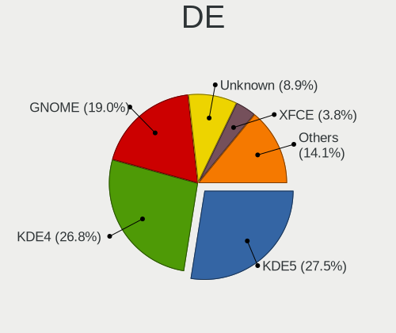
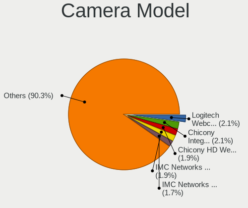

Linux in Russia - Tested Hardware & Statistics
----------------------------------------------

A project to collect tested hardware configurations for Linux in Russia.

Anyone can contribute to this report by the [hw-probe](https://github.com/linuxhw/hw-probe) tool:

    sudo -E hw-probe -all -upload

Please contribute! Especially if your hardware is rare.

This is a report for all computer types. See also reports for [desktops](/Location/Russia/Desktop/README.md) and [notebooks](/Location/Russia/Notebook/README.md).

Contents
--------

* [ Test Cases ](#test-cases)

* [ System ](#system)
  - [ OS                       ](#os)
  - [ OS Family                ](#os-family)
  - [ Kernel                   ](#kernel)
  - [ Kernel Family            ](#kernel-family)
  - [ Kernel Major Ver.        ](#kernel-major-ver)
  - [ Arch                     ](#arch)
  - [ DE                       ](#de)
  - [ Display Server           ](#display-server)
  - [ Display Manager          ](#display-manager)
  - [ OS Lang                  ](#os-lang)
  - [ Boot Mode                ](#boot-mode)
  - [ Filesystem               ](#filesystem)
  - [ Part. scheme             ](#part-scheme)
  - [ Dual Boot with Linux/BSD ](#dual-boot-with-linuxbsd)
  - [ Dual Boot (Win)          ](#dual-boot-win)

* [ Board ](#board)
  - [ Vendor                   ](#vendor)
  - [ Model                    ](#model)
  - [ Model Family             ](#model-family)
  - [ MFG Year                 ](#mfg-year)
  - [ Form Factor              ](#form-factor)
  - [ Secure Boot              ](#secure-boot)
  - [ Coreboot                 ](#coreboot)
  - [ RAM Size                 ](#ram-size)
  - [ RAM Used                 ](#ram-used)
  - [ Total Drives             ](#total-drives)
  - [ Has CD-ROM               ](#has-cd-rom)
  - [ Has Ethernet             ](#has-ethernet)
  - [ Has WiFi                 ](#has-wifi)
  - [ Has Bluetooth            ](#has-bluetooth)

* [ Location ](#location)
  - [ Country                  ](#country)
  - [ City                     ](#city)

* [ Drives ](#drives)
  - [ Drive Vendor             ](#drive-vendor)
  - [ Drive Model              ](#drive-model)
  - [ HDD Vendor               ](#hdd-vendor)
  - [ SSD Vendor               ](#ssd-vendor)
  - [ Drive Kind               ](#drive-kind)
  - [ Drive Connector          ](#drive-connector)
  - [ Drive Size               ](#drive-size)
  - [ Space Total              ](#space-total)
  - [ Space Used               ](#space-used)
  - [ Malfunc. Drives          ](#malfunc-drives)
  - [ Malfunc. Drive Vendor    ](#malfunc-drive-vendor)
  - [ Malfunc. HDD Vendor      ](#malfunc-hdd-vendor)
  - [ Malfunc. Drive Kind      ](#malfunc-drive-kind)
  - [ Failed Drives            ](#failed-drives)
  - [ Failed Drive Vendor      ](#failed-drive-vendor)
  - [ Drive Status             ](#drive-status)

* [ Storage controller ](#storage-controller)
  - [ Storage Vendor           ](#storage-vendor)
  - [ Storage Model            ](#storage-model)
  - [ Storage Kind             ](#storage-kind)

* [ Processor ](#processor)
  - [ CPU Vendor               ](#cpu-vendor)
  - [ CPU Model                ](#cpu-model)
  - [ CPU Model Family         ](#cpu-model-family)
  - [ CPU Cores                ](#cpu-cores)
  - [ CPU Sockets              ](#cpu-sockets)
  - [ CPU Threads              ](#cpu-threads)
  - [ CPU Op-Modes             ](#cpu-op-modes)
  - [ CPU Microcode            ](#cpu-microcode)
  - [ CPU Microarch            ](#cpu-microarch)

* [ Graphics ](#graphics)
  - [ GPU Vendor               ](#gpu-vendor)
  - [ GPU Model                ](#gpu-model)
  - [ GPU Combo                ](#gpu-combo)
  - [ GPU Driver               ](#gpu-driver)
  - [ GPU Memory               ](#gpu-memory)

* [ Monitor ](#monitor)
  - [ Monitor Vendor           ](#monitor-vendor)
  - [ Monitor Model            ](#monitor-model)
  - [ Monitor Resolution       ](#monitor-resolution)
  - [ Monitor Diagonal         ](#monitor-diagonal)
  - [ Monitor Width            ](#monitor-width)
  - [ Aspect Ratio             ](#aspect-ratio)
  - [ Monitor Area             ](#monitor-area)
  - [ Pixel Density            ](#pixel-density)
  - [ Multiple Monitors        ](#multiple-monitors)

* [ Network ](#network)
  - [ Net Controller Vendor    ](#net-controller-vendor)
  - [ Net Controller Model     ](#net-controller-model)
  - [ Wireless Vendor          ](#wireless-vendor)
  - [ Wireless Model           ](#wireless-model)
  - [ Ethernet Vendor          ](#ethernet-vendor)
  - [ Ethernet Model           ](#ethernet-model)
  - [ Net Controller Kind      ](#net-controller-kind)
  - [ Used Controller          ](#used-controller)
  - [ NICs                     ](#nics)
  - [ IPv6                     ](#ipv6)

* [ Bluetooth ](#bluetooth)
  - [ Bluetooth Vendor         ](#bluetooth-vendor)
  - [ Bluetooth Model          ](#bluetooth-model)

* [ Sound ](#sound)
  - [ Sound Vendor             ](#sound-vendor)
  - [ Sound Model              ](#sound-model)

* [ Memory ](#memory)
  - [ Memory Vendor            ](#memory-vendor)
  - [ Memory Model             ](#memory-model)
  - [ Memory Kind              ](#memory-kind)
  - [ Memory Form Factor       ](#memory-form-factor)
  - [ Memory Size              ](#memory-size)
  - [ Memory Speed             ](#memory-speed)

* [ Printers & scanners ](#printers--scanners)
  - [ Printer Vendor           ](#printer-vendor)
  - [ Printer Model            ](#printer-model)
  - [ Scanner Vendor           ](#scanner-vendor)
  - [ Scanner Model            ](#scanner-model)

* [ Camera ](#camera)
  - [ Camera Vendor            ](#camera-vendor)
  - [ Camera Model             ](#camera-model)

* [ Security ](#security)
  - [ Fingerprint Vendor       ](#fingerprint-vendor)
  - [ Fingerprint Model        ](#fingerprint-model)
  - [ Chipcard Vendor          ](#chipcard-vendor)
  - [ Chipcard Model           ](#chipcard-model)

* [ Unsupported ](#unsupported)
  - [ Unsupported Devices      ](#unsupported-devices)
  - [ Unsupported Device Types ](#unsupported-device-types)

Test Cases
----------

Total: 35600

| Vendor        | Model                       | Form-Factor | Probe                                                      | Date         |
|---------------|-----------------------------|-------------|------------------------------------------------------------|--------------|
| MSI           | MS-B0A41                    | Desktop     | [c69ab6fbe8](https://linux-hardware.org/?probe=c69ab6fbe8) | Jan 01, 2023 |
| Dell          | 0TWFTR A02                  | All in one  | [5f63c2fd15](https://linux-hardware.org/?probe=5f63c2fd15) | Dec 31, 2022 |
| HP            | ProLiant DL360 Gen9         | Server      | [54425f89cc](https://linux-hardware.org/?probe=54425f89cc) | Dec 31, 2022 |
| ASUSTek       | M5A78L-M/USB3               | Desktop     | [e18f6635d3](https://linux-hardware.org/?probe=e18f6635d3) | Dec 31, 2022 |
| Lenovo        | ThinkPad T14 Gen 3 21AH0... | Notebook    | [322cf5484d](https://linux-hardware.org/?probe=322cf5484d) | Dec 31, 2022 |
| ASUSTek       | X540YA                      | Notebook    | [37ef421251](https://linux-hardware.org/?probe=37ef421251) | Dec 31, 2022 |
| Lenovo        | G780 20138                  | Notebook    | [896aeb4e20](https://linux-hardware.org/?probe=896aeb4e20) | Dec 31, 2022 |
| Phoenix       | 945GM                       | Desktop     | [d391eaf6e2](https://linux-hardware.org/?probe=d391eaf6e2) | Dec 31, 2022 |
| Raspberry ... | Raspberry Pi                | Soc         | [a5030d74d4](https://linux-hardware.org/?probe=a5030d74d4) | Dec 31, 2022 |
| Gigabyte      | F2A68HM-DS2                 | Desktop     | [7b10613c1e](https://linux-hardware.org/?probe=7b10613c1e) | Dec 31, 2022 |
| HP            | ProLiant DL360p Gen8        | Server      | [9b6998f35c](https://linux-hardware.org/?probe=9b6998f35c) | Dec 31, 2022 |
| MSI           | B550M PRO-VDH WIFI          | Desktop     | [92920d8ac2](https://linux-hardware.org/?probe=92920d8ac2) | Dec 31, 2022 |
| Dell          | Inspiron 15-3552            | Notebook    | [e8b804ddd5](https://linux-hardware.org/?probe=e8b804ddd5) | Dec 31, 2022 |
| Valve         | Jupiter                     | Notebook    | [61cb7375d1](https://linux-hardware.org/?probe=61cb7375d1) | Dec 31, 2022 |
| Samsung       | 300V3A/300V4A/300V5A        | Notebook    | [14b589709d](https://linux-hardware.org/?probe=14b589709d) | Dec 31, 2022 |
| MSI           | H510M-A PRO                 | Desktop     | [4dba3b7c55](https://linux-hardware.org/?probe=4dba3b7c55) | Dec 30, 2022 |
| Gigabyte      | H55M-USB3                   | Desktop     | [729e1569a8](https://linux-hardware.org/?probe=729e1569a8) | Dec 30, 2022 |
| Gigabyte      | H61M-DS2                    | Desktop     | [dff8a56537](https://linux-hardware.org/?probe=dff8a56537) | Dec 30, 2022 |
| Gigabyte      | H55M-USB3                   | Desktop     | [8fdced7ae8](https://linux-hardware.org/?probe=8fdced7ae8) | Dec 30, 2022 |
| MSI           | B360M GAMING PLUS           | Desktop     | [9d4f6afc25](https://linux-hardware.org/?probe=9d4f6afc25) | Dec 30, 2022 |
| MACHENIKE     | MACHCREATOR-16              | Notebook    | [f7ed4a6609](https://linux-hardware.org/?probe=f7ed4a6609) | Dec 30, 2022 |
| Timi          | A35S                        | Notebook    | [c62c9ae956](https://linux-hardware.org/?probe=c62c9ae956) | Dec 30, 2022 |
| HP            | Pavilion g6                 | Notebook    | [6f29ccd86e](https://linux-hardware.org/?probe=6f29ccd86e) | Dec 30, 2022 |
| ASUSTek       | P8Z77-V                     | Desktop     | [b0a607e8d8](https://linux-hardware.org/?probe=b0a607e8d8) | Dec 30, 2022 |
| Lenovo        | IdeaPad L340-15API 81LW     | Notebook    | [5b5e0e4535](https://linux-hardware.org/?probe=5b5e0e4535) | Dec 30, 2022 |
| ASRock        | J3455-ITX                   | Desktop     | [4f45d532ac](https://linux-hardware.org/?probe=4f45d532ac) | Dec 30, 2022 |
| ASUSTek       | VivoBook 15_ASUS Laptop ... | Notebook    | [5710b93654](https://linux-hardware.org/?probe=5710b93654) | Dec 30, 2022 |
| Gigabyte      | H61M-DS2                    | Desktop     | [4ea88219d8](https://linux-hardware.org/?probe=4ea88219d8) | Dec 30, 2022 |
| Dell          | Inspiron 5490               | Notebook    | [c8a80649d2](https://linux-hardware.org/?probe=c8a80649d2) | Dec 30, 2022 |
| AZW           | U59                         | Desktop     | [290e34b89a](https://linux-hardware.org/?probe=290e34b89a) | Dec 30, 2022 |
| ASRock        | N68-GS4 FX                  | Desktop     | [379552e4d2](https://linux-hardware.org/?probe=379552e4d2) | Dec 30, 2022 |
| Lenovo        | IdeaPad 330-15IKB 81DE      | Notebook    | [2d63537d23](https://linux-hardware.org/?probe=2d63537d23) | Dec 30, 2022 |
| ASUSTek       | PRIME B560M-A               | Desktop     | [ee7c086eb6](https://linux-hardware.org/?probe=ee7c086eb6) | Dec 30, 2022 |
| ASUSTek       | UN65U                       | Desktop     | [b7f1365865](https://linux-hardware.org/?probe=b7f1365865) | Dec 30, 2022 |
| ASUSTek       | ROG STRIX B360-F GAMING     | Desktop     | [aa6b264eb4](https://linux-hardware.org/?probe=aa6b264eb4) | Dec 30, 2022 |
| ASUSTek       | VivoBook_ASUS Laptop E21... | Notebook    | [41da11b027](https://linux-hardware.org/?probe=41da11b027) | Dec 30, 2022 |
| Gigabyte      | H55M-USB3                   | Desktop     | [6621ba66ac](https://linux-hardware.org/?probe=6621ba66ac) | Dec 30, 2022 |
| HP            | 82DC 1000                   | All in one  | [12c8c204ff](https://linux-hardware.org/?probe=12c8c204ff) | Dec 30, 2022 |
| Lenovo        | IdeaPad 330-15IKB 81DE      | Notebook    | [954fdfcd25](https://linux-hardware.org/?probe=954fdfcd25) | Dec 30, 2022 |
| Unknown       | Unknown                     | Notebook    | [b74128543f](https://linux-hardware.org/?probe=b74128543f) | Dec 29, 2022 |
| HP            | ProBook 430 G8 Notebook ... | Notebook    | [3f4178001d](https://linux-hardware.org/?probe=3f4178001d) | Dec 29, 2022 |
| Lenovo        | IdeaPad 5 Pro 14ITL6 82L... | Notebook    | [6c836dde26](https://linux-hardware.org/?probe=6c836dde26) | Dec 29, 2022 |
| MACHCREATO... | AB                          | Notebook    | [52a6beb872](https://linux-hardware.org/?probe=52a6beb872) | Dec 29, 2022 |
| Timi          | RedmiBook Pro 15S           | Notebook    | [42640b7b6e](https://linux-hardware.org/?probe=42640b7b6e) | Dec 29, 2022 |
| Timi          | RedmiBook Pro 15S           | Notebook    | [16c240a462](https://linux-hardware.org/?probe=16c240a462) | Dec 29, 2022 |
| Prestigio     | PSB141C04CGH                | Notebook    | [591f91b689](https://linux-hardware.org/?probe=591f91b689) | Dec 29, 2022 |
| MACHENIKE     | MACHCREATOR-16              | Notebook    | [3c627bc707](https://linux-hardware.org/?probe=3c627bc707) | Dec 29, 2022 |
| Gigabyte      | B550 GAMING X               | Desktop     | [6e92b3e37b](https://linux-hardware.org/?probe=6e92b3e37b) | Dec 29, 2022 |
| MACHENIKE     | MACHCREATOR-16              | Notebook    | [b246257695](https://linux-hardware.org/?probe=b246257695) | Dec 29, 2022 |
| HUAWEI        | BOM-WXX9                    | Notebook    | [fb1d454bc2](https://linux-hardware.org/?probe=fb1d454bc2) | Dec 29, 2022 |
| Lenovo        | IdeaPad L340-17IRH Gamin... | Notebook    | [83acd419e0](https://linux-hardware.org/?probe=83acd419e0) | Dec 29, 2022 |
| ASUSTek       | H97-PRO                     | Desktop     | [b96b861fd7](https://linux-hardware.org/?probe=b96b861fd7) | Dec 29, 2022 |
| HUAWEI        | BOM-WXX9                    | Notebook    | [62010fe267](https://linux-hardware.org/?probe=62010fe267) | Dec 29, 2022 |
| ASUSTek       | N551JM                      | Notebook    | [932615a484](https://linux-hardware.org/?probe=932615a484) | Dec 29, 2022 |
| ASUSTek       | K40IN                       | Notebook    | [1b4a2d0604](https://linux-hardware.org/?probe=1b4a2d0604) | Dec 29, 2022 |
| ASRock        | B550 Taichi                 | Desktop     | [469f9d71e2](https://linux-hardware.org/?probe=469f9d71e2) | Dec 29, 2022 |
| ASUSTek       | PRIME A320M-A               | Desktop     | [2cdb821b42](https://linux-hardware.org/?probe=2cdb821b42) | Dec 29, 2022 |
| Lenovo        | IdeaPad L340-15API 81LW     | Notebook    | [a05251fd39](https://linux-hardware.org/?probe=a05251fd39) | Dec 29, 2022 |
| HP            | EliteBook Folio 1040 G3     | Notebook    | [6aad572cd5](https://linux-hardware.org/?probe=6aad572cd5) | Dec 29, 2022 |
| 3Logic Gro... | Graviton N15i-K2            | Notebook    | [fe79eba13b](https://linux-hardware.org/?probe=fe79eba13b) | Dec 29, 2022 |
| Gigabyte      | M61SME-S2L                  | Desktop     | [660194090d](https://linux-hardware.org/?probe=660194090d) | Dec 29, 2022 |
| Gigabyte      | M61SME-S2L                  | Desktop     | [7ba365cac3](https://linux-hardware.org/?probe=7ba365cac3) | Dec 29, 2022 |
| Gigabyte      | H61M-S2V-B3                 | Desktop     | [b3970a8e5a](https://linux-hardware.org/?probe=b3970a8e5a) | Dec 29, 2022 |
| Gigabyte      | B360M HD3                   | Desktop     | [556bc61c51](https://linux-hardware.org/?probe=556bc61c51) | Dec 29, 2022 |
| Gigabyte      | B360M HD3                   | Desktop     | [f0ab6f0649](https://linux-hardware.org/?probe=f0ab6f0649) | Dec 29, 2022 |
| Aquarius      | NS685U R11                  | Notebook    | [d99ae12a0c](https://linux-hardware.org/?probe=d99ae12a0c) | Dec 29, 2022 |
| Lenovo        | V560                        | Notebook    | [f937de4c61](https://linux-hardware.org/?probe=f937de4c61) | Dec 28, 2022 |
| Dell          | Inspiron 5490               | Notebook    | [457c2ae4ae](https://linux-hardware.org/?probe=457c2ae4ae) | Dec 28, 2022 |
| Lenovo        | V14-IIL 82C4                | Notebook    | [221e9b9fd6](https://linux-hardware.org/?probe=221e9b9fd6) | Dec 28, 2022 |
| Dell          | Inspiron 5490               | Notebook    | [fdfd0f21c7](https://linux-hardware.org/?probe=fdfd0f21c7) | Dec 28, 2022 |
| HP            | ENVY x360 Convertible 15... | Convertible | [599c42b4e6](https://linux-hardware.org/?probe=599c42b4e6) | Dec 28, 2022 |
| Clevo         | NL41MU2                     | Notebook    | [6aaaf2e570](https://linux-hardware.org/?probe=6aaaf2e570) | Dec 28, 2022 |
| Lenovo        | IdeaPad L3 15ITL6 82HL      | Notebook    | [0852995abb](https://linux-hardware.org/?probe=0852995abb) | Dec 28, 2022 |
| ASRock        | B450 Gaming K4              | Desktop     | [1afc5015f1](https://linux-hardware.org/?probe=1afc5015f1) | Dec 28, 2022 |
| ASUSTek       | PRIME B450M-A               | Desktop     | [422238387a](https://linux-hardware.org/?probe=422238387a) | Dec 28, 2022 |
| DEPO Compu... | DPC156                      | Notebook    | [b49fe3beb3](https://linux-hardware.org/?probe=b49fe3beb3) | Dec 28, 2022 |
| HUAWEI        | HLYL-WXX9                   | Notebook    | [790b3dcdde](https://linux-hardware.org/?probe=790b3dcdde) | Dec 28, 2022 |
| HP            | ENVY x360 Convertible 15... | Convertible | [c42c0afa9b](https://linux-hardware.org/?probe=c42c0afa9b) | Dec 28, 2022 |
| MSI           | Z97 GAMING 3                | Desktop     | [519607ec55](https://linux-hardware.org/?probe=519607ec55) | Dec 28, 2022 |
| ASUSTek       | M4A79XTD EVO                | Desktop     | [91c217e497](https://linux-hardware.org/?probe=91c217e497) | Dec 28, 2022 |
| Lenovo        | ThinkPad T430 23448AG       | Notebook    | [00ba06cfd1](https://linux-hardware.org/?probe=00ba06cfd1) | Dec 28, 2022 |
| ASUSTek       | VivoBook 15_ASUS Laptop ... | Notebook    | [e36e85614e](https://linux-hardware.org/?probe=e36e85614e) | Dec 28, 2022 |
| ASRock        | J3455-ITX                   | Desktop     | [6e628aeb01](https://linux-hardware.org/?probe=6e628aeb01) | Dec 28, 2022 |
| Lenovo        | ThinkPad E14 Gen 2 20T60... | Notebook    | [b62b4d2134](https://linux-hardware.org/?probe=b62b4d2134) | Dec 27, 2022 |
| MSI           | GL63 8RC                    | Notebook    | [0b973e252f](https://linux-hardware.org/?probe=0b973e252f) | Dec 27, 2022 |
| ASUSTek       | M4A785-M                    | Desktop     | [7fb63e4360](https://linux-hardware.org/?probe=7fb63e4360) | Dec 27, 2022 |
| Gigabyte      | B550M AORUS PRO-P           | Desktop     | [bd232cd937](https://linux-hardware.org/?probe=bd232cd937) | Dec 27, 2022 |
| MSI           | B350 PC MATE                | Desktop     | [3b9dbdb180](https://linux-hardware.org/?probe=3b9dbdb180) | Dec 27, 2022 |
| Toshiba       | Satellite U300              | Notebook    | [88861461c8](https://linux-hardware.org/?probe=88861461c8) | Dec 27, 2022 |
| Lenovo        | ThinkPad T430 23448AG       | Notebook    | [a570034bbc](https://linux-hardware.org/?probe=a570034bbc) | Dec 27, 2022 |
| MSI           | MPG X570 GAMING PLUS        | Desktop     | [1aac1f7eca](https://linux-hardware.org/?probe=1aac1f7eca) | Dec 27, 2022 |
| Gigabyte      | H97-HD3                     | Desktop     | [1707593d6d](https://linux-hardware.org/?probe=1707593d6d) | Dec 27, 2022 |
| ASUSTek       | VivoBook 15_ASUS Laptop ... | Notebook    | [942fbb1ccb](https://linux-hardware.org/?probe=942fbb1ccb) | Dec 27, 2022 |
| HP            | Compaq Presario CQ50        | Notebook    | [802e160a5a](https://linux-hardware.org/?probe=802e160a5a) | Dec 27, 2022 |
| Lenovo        | V14-IIL 82C4                | Notebook    | [2b7f53c989](https://linux-hardware.org/?probe=2b7f53c989) | Dec 27, 2022 |
| ASRock        | H510M-HVS                   | Desktop     | [3733446191](https://linux-hardware.org/?probe=3733446191) | Dec 27, 2022 |
| HP            | Laptop 15s-eq2xxx           | Notebook    | [155c738d10](https://linux-hardware.org/?probe=155c738d10) | Dec 27, 2022 |
| ASUSTek       | K43E                        | Notebook    | [530e44f9c6](https://linux-hardware.org/?probe=530e44f9c6) | Dec 27, 2022 |
| Gigabyte      | B450 I AORUS PRO WIFI-CF    | Desktop     | [dab993d989](https://linux-hardware.org/?probe=dab993d989) | Dec 27, 2022 |
| Unknown       | Unknown                     | Notebook    | [6aa557fb75](https://linux-hardware.org/?probe=6aa557fb75) | Dec 27, 2022 |
| 3Logic Gro... | Graviton N15i-K2            | Notebook    | [4d7e3586e2](https://linux-hardware.org/?probe=4d7e3586e2) | Dec 27, 2022 |
| MACHENIKE     | Machcreator-16              | Notebook    | [682c068af0](https://linux-hardware.org/?probe=682c068af0) | Dec 27, 2022 |
| Clevo         | NL41MU2                     | Notebook    | [0c71831ff4](https://linux-hardware.org/?probe=0c71831ff4) | Dec 27, 2022 |
| Clevo         | NL41MU2                     | Notebook    | [50c31f6b47](https://linux-hardware.org/?probe=50c31f6b47) | Dec 27, 2022 |
| HUAWEI        | NBLK-WAX9X                  | Notebook    | [292ef79b8a](https://linux-hardware.org/?probe=292ef79b8a) | Dec 27, 2022 |
| ASUSTek       | ROG Strix G513QY_G513QY     | Notebook    | [cedce58f23](https://linux-hardware.org/?probe=cedce58f23) | Dec 27, 2022 |
| Pegatron      | APX85-GS                    | Desktop     | [82db9f15c6](https://linux-hardware.org/?probe=82db9f15c6) | Dec 27, 2022 |
| Intel         | X79 (INTEL Xeon E5/Corei... | Desktop     | [23dc9112a8](https://linux-hardware.org/?probe=23dc9112a8) | Dec 27, 2022 |
| HONOR         | BMH-WCX9                    | Notebook    | [815525e6d2](https://linux-hardware.org/?probe=815525e6d2) | Dec 27, 2022 |
| ASUSTek       | ROG Strix G513QY_G513QY     | Notebook    | [0e063e5fd5](https://linux-hardware.org/?probe=0e063e5fd5) | Dec 27, 2022 |
| ASUSTek       | ROG STRIX X570-I GAMING     | Desktop     | [731f916db1](https://linux-hardware.org/?probe=731f916db1) | Dec 27, 2022 |
| Gigabyte      | GA-890XA-UD3                | Desktop     | [492719506f](https://linux-hardware.org/?probe=492719506f) | Dec 27, 2022 |
| Gigabyte      | H510M S2H V2                | Desktop     | [a47cb3fa7c](https://linux-hardware.org/?probe=a47cb3fa7c) | Dec 27, 2022 |
| ASRock        | H470M-HVS                   | Desktop     | [210f0c0375](https://linux-hardware.org/?probe=210f0c0375) | Dec 27, 2022 |
| Gigabyte      | B360M D3H-CF                | Desktop     | [2041ed5cba](https://linux-hardware.org/?probe=2041ed5cba) | Dec 27, 2022 |
| Gigabyte      | H510M S2H V2                | Desktop     | [7ddc3d0292](https://linux-hardware.org/?probe=7ddc3d0292) | Dec 27, 2022 |
| Gigabyte      | i1520N                      | Notebook    | [4f94938d1b](https://linux-hardware.org/?probe=4f94938d1b) | Dec 27, 2022 |
| MSI           | Modern 14 B4MW              | Notebook    | [17bd139f0c](https://linux-hardware.org/?probe=17bd139f0c) | Dec 26, 2022 |
| Digma         | CITI E401 ET4007EW          | Notebook    | [252a51f201](https://linux-hardware.org/?probe=252a51f201) | Dec 26, 2022 |
| Timi          | A18R                        | Notebook    | [83f858038d](https://linux-hardware.org/?probe=83f858038d) | Dec 26, 2022 |
| Lenovo        | IdeaPad 330-15AST 81D6      | Notebook    | [0a5cad12c2](https://linux-hardware.org/?probe=0a5cad12c2) | Dec 26, 2022 |
| Acer          | Aspire Z1-612               | All in one  | [19582f3331](https://linux-hardware.org/?probe=19582f3331) | Dec 26, 2022 |
| ASUSTek       | N56VZ                       | Notebook    | [1ba62f0fab](https://linux-hardware.org/?probe=1ba62f0fab) | Dec 26, 2022 |
| Dell          | G5 5590                     | Notebook    | [43fbc3b36d](https://linux-hardware.org/?probe=43fbc3b36d) | Dec 26, 2022 |
| ASRock        | AB350M-HDV                  | Desktop     | [666ea6d820](https://linux-hardware.org/?probe=666ea6d820) | Dec 26, 2022 |
| Gigabyte      | B660M GAMING DDR4           | Desktop     | [2618b85414](https://linux-hardware.org/?probe=2618b85414) | Dec 26, 2022 |
| Clevo         | NL41MU2                     | Notebook    | [190bb1537d](https://linux-hardware.org/?probe=190bb1537d) | Dec 26, 2022 |
| Clevo         | NL41MU2                     | Notebook    | [0574ad6c44](https://linux-hardware.org/?probe=0574ad6c44) | Dec 26, 2022 |
| ICL           | H510SB-TM v2.0              | All in one  | [9a8967485d](https://linux-hardware.org/?probe=9a8967485d) | Dec 26, 2022 |
| ASUSTek       | M5A78L-M LX V2              | Desktop     | [f040219e23](https://linux-hardware.org/?probe=f040219e23) | Dec 26, 2022 |
| ASUSTek       | PRIME H510T2/CSM            | Desktop     | [b5ff4bd9d6](https://linux-hardware.org/?probe=b5ff4bd9d6) | Dec 26, 2022 |
| Gigabyte      | B360M H                     | Desktop     | [2f0d1b1c8d](https://linux-hardware.org/?probe=2f0d1b1c8d) | Dec 26, 2022 |
| Gigabyte      | B365M DS3H                  | Desktop     | [f9d83535bd](https://linux-hardware.org/?probe=f9d83535bd) | Dec 26, 2022 |
| HP            | 895F                        | All in one  | [670e3fa0fa](https://linux-hardware.org/?probe=670e3fa0fa) | Dec 26, 2022 |
| Gigabyte      | F2A55M-DS2                  | Desktop     | [735d3cfda2](https://linux-hardware.org/?probe=735d3cfda2) | Dec 26, 2022 |
| ASUSTek       | M3A32-MVP DELUXE            | Desktop     | [0fa5809533](https://linux-hardware.org/?probe=0fa5809533) | Dec 26, 2022 |
| HUAWEI        | NBD-WXX9                    | Notebook    | [713b103493](https://linux-hardware.org/?probe=713b103493) | Dec 25, 2022 |
| Gigabyte      | H61M-S1                     | Desktop     | [384000d018](https://linux-hardware.org/?probe=384000d018) | Dec 25, 2022 |
| HP            | 470 G8 Notebook PC          | Notebook    | [6d77c48324](https://linux-hardware.org/?probe=6d77c48324) | Dec 25, 2022 |
| Acer          | Acadia V1.45                | Notebook    | [2d98a8cef2](https://linux-hardware.org/?probe=2d98a8cef2) | Dec 25, 2022 |
| ASUSTek       | P8H61-MX R2.0               | Desktop     | [5174af9fdd](https://linux-hardware.org/?probe=5174af9fdd) | Dec 25, 2022 |
| ASRock        | H110 Pro BTC+               | Desktop     | [29311fe64c](https://linux-hardware.org/?probe=29311fe64c) | Dec 25, 2022 |
| ASUSTek       | P5G41T-M LX                 | Desktop     | [01466a6701](https://linux-hardware.org/?probe=01466a6701) | Dec 25, 2022 |
| ASUSTek       | H81M-K                      | Desktop     | [c702bed39d](https://linux-hardware.org/?probe=c702bed39d) | Dec 25, 2022 |
| Unknown       | Unknown                     | Notebook    | [8f4d031a78](https://linux-hardware.org/?probe=8f4d031a78) | Dec 25, 2022 |
| ASUSTek       | P7H55-M/USB3                | Desktop     | [85b55a267a](https://linux-hardware.org/?probe=85b55a267a) | Dec 25, 2022 |
| Gigabyte      | A320M-S2H V2-CF             | Desktop     | [8994b9a877](https://linux-hardware.org/?probe=8994b9a877) | Dec 25, 2022 |
| LTD Delovo... | 15Y                         | Notebook    | [286aa3fb96](https://linux-hardware.org/?probe=286aa3fb96) | Dec 25, 2022 |
| ASUSTek       | F1A55-M LX R2.0             | Desktop     | [177c5ee2a6](https://linux-hardware.org/?probe=177c5ee2a6) | Dec 25, 2022 |
| ASUSTek       | ROG STRIX X670E-F GAMING... | Desktop     | [628cefc78a](https://linux-hardware.org/?probe=628cefc78a) | Dec 25, 2022 |
| Pegatron      | C15B                        | Notebook    | [f838b3f22c](https://linux-hardware.org/?probe=f838b3f22c) | Dec 25, 2022 |
| HUAWEI        | HVY-WXX9                    | Notebook    | [649291f277](https://linux-hardware.org/?probe=649291f277) | Dec 25, 2022 |
| Gigabyte      | AB350-Gaming 3-CF           | Desktop     | [c545cf1f08](https://linux-hardware.org/?probe=c545cf1f08) | Dec 25, 2022 |
| ASRock        | H110 Pro BTC+               | Desktop     | [90f3fd2f80](https://linux-hardware.org/?probe=90f3fd2f80) | Dec 25, 2022 |
| Huanan        | B660-D4 V1.0                | Desktop     | [2a3d5dc01f](https://linux-hardware.org/?probe=2a3d5dc01f) | Dec 25, 2022 |
| Acer          | Nitro AN515-52              | Notebook    | [1571f74238](https://linux-hardware.org/?probe=1571f74238) | Dec 25, 2022 |
| Unknown       | Unknown                     | Notebook    | [1e55cad727](https://linux-hardware.org/?probe=1e55cad727) | Dec 25, 2022 |
| ASUSTek       | X551CAP                     | Notebook    | [3442037418](https://linux-hardware.org/?probe=3442037418) | Dec 25, 2022 |
| Gigabyte      | B450M DS3H-CF               | Desktop     | [f48ac4aa81](https://linux-hardware.org/?probe=f48ac4aa81) | Dec 25, 2022 |
| ASUSTek       | M51Tr                       | Notebook    | [dffa412a98](https://linux-hardware.org/?probe=dffa412a98) | Dec 25, 2022 |
| Dell          | Inspiron 5490               | Notebook    | [ea09a6daa8](https://linux-hardware.org/?probe=ea09a6daa8) | Dec 25, 2022 |
| Dell          | 00TD00 A00                  | All in one  | [84beba0484](https://linux-hardware.org/?probe=84beba0484) | Dec 25, 2022 |
| Dell          | Inspiron 5490               | Notebook    | [45737153e4](https://linux-hardware.org/?probe=45737153e4) | Dec 25, 2022 |
| MSI           | MAG X570S TOMAHAWK MAX W... | Desktop     | [b98be1b1e7](https://linux-hardware.org/?probe=b98be1b1e7) | Dec 25, 2022 |
| ASRock        | A75M-HVS                    | Desktop     | [5368526dc0](https://linux-hardware.org/?probe=5368526dc0) | Dec 25, 2022 |
| ASRock        | A75M-HVS                    | Desktop     | [fab270a7bf](https://linux-hardware.org/?probe=fab270a7bf) | Dec 25, 2022 |
| Pegatron      | IPPPV-D3G                   | Desktop     | [4d1a2299dc](https://linux-hardware.org/?probe=4d1a2299dc) | Dec 24, 2022 |
| HP            | Laptop 15-bw0xx             | Notebook    | [3bf8001e85](https://linux-hardware.org/?probe=3bf8001e85) | Dec 24, 2022 |
| Dell          | G7 7790                     | Notebook    | [da767d5fd4](https://linux-hardware.org/?probe=da767d5fd4) | Dec 24, 2022 |
| HP            | Laptop 15-bw0xx             | Notebook    | [8a5bfa5e66](https://linux-hardware.org/?probe=8a5bfa5e66) | Dec 24, 2022 |
| ASRock        | B365M-HDV                   | Desktop     | [84ea64b29c](https://linux-hardware.org/?probe=84ea64b29c) | Dec 24, 2022 |
| ASRock        | B365M-HDV                   | Desktop     | [407f76f02f](https://linux-hardware.org/?probe=407f76f02f) | Dec 24, 2022 |
| Acer          | Aspire V3-551G              | Notebook    | [6adf185edf](https://linux-hardware.org/?probe=6adf185edf) | Dec 24, 2022 |
| ASRock        | B450 Gaming K4              | Desktop     | [bb8b44cf69](https://linux-hardware.org/?probe=bb8b44cf69) | Dec 24, 2022 |
| ASUSTek       | P8H67-M LE                  | Desktop     | [892d40f349](https://linux-hardware.org/?probe=892d40f349) | Dec 24, 2022 |
| Gigabyte      | Z390 M GAMING-CF            | Desktop     | [7edfc4df26](https://linux-hardware.org/?probe=7edfc4df26) | Dec 24, 2022 |
| Gigabyte      | Z390 M GAMING-CF            | Desktop     | [7f19b0ef63](https://linux-hardware.org/?probe=7f19b0ef63) | Dec 24, 2022 |
| ASUSTek       | P8H67-M LE                  | Desktop     | [7517437358](https://linux-hardware.org/?probe=7517437358) | Dec 24, 2022 |
| Gigabyte      | B660M D2H DDR4              | Desktop     | [c34803fb1e](https://linux-hardware.org/?probe=c34803fb1e) | Dec 24, 2022 |
| Lenovo        | IdeaPad S145-15AST 81N3     | Notebook    | [8c835888d6](https://linux-hardware.org/?probe=8c835888d6) | Dec 24, 2022 |
| HP            | EliteBook Folio 1040 G3     | Notebook    | [7b8e9fe353](https://linux-hardware.org/?probe=7b8e9fe353) | Dec 24, 2022 |
| Acer          | Aspire A315-21G             | Notebook    | [435933801a](https://linux-hardware.org/?probe=435933801a) | Dec 24, 2022 |
| Gigabyte      | H61M-S2V-B3                 | Desktop     | [6f60f1b6da](https://linux-hardware.org/?probe=6f60f1b6da) | Dec 24, 2022 |
| HP            | Notebook                    | Notebook    | [10dfda9549](https://linux-hardware.org/?probe=10dfda9549) | Dec 24, 2022 |
| Dell          | 0Y5DDC A00                  | Desktop     | [c107bb3a14](https://linux-hardware.org/?probe=c107bb3a14) | Dec 24, 2022 |
| Gigabyte      | B550 AORUS PRO AC           | Desktop     | [83203eef25](https://linux-hardware.org/?probe=83203eef25) | Dec 24, 2022 |
| ASRock        | FM2A68M-DG3+                | Desktop     | [11eb39826a](https://linux-hardware.org/?probe=11eb39826a) | Dec 24, 2022 |
| ASUSTek       | P8B75-V                     | Desktop     | [cf3882b3f7](https://linux-hardware.org/?probe=cf3882b3f7) | Dec 24, 2022 |
| Toshiba       | Satellite C55-A             | Notebook    | [02a3f1cf18](https://linux-hardware.org/?probe=02a3f1cf18) | Dec 24, 2022 |
| Gigabyte      | H55M-S2H                    | Desktop     | [7cecfa756a](https://linux-hardware.org/?probe=7cecfa756a) | Dec 24, 2022 |
| Acer          | Aspire VX5-591G             | Notebook    | [f2e0369ba1](https://linux-hardware.org/?probe=f2e0369ba1) | Dec 24, 2022 |
| Gigabyte      | X470 AORUS GAMING 7 WIFI... | Desktop     | [40c2593694](https://linux-hardware.org/?probe=40c2593694) | Dec 24, 2022 |
| Gigabyte      | A320M-H-CF                  | Desktop     | [81febc2905](https://linux-hardware.org/?probe=81febc2905) | Dec 23, 2022 |
| Dell          | Vostro 5490                 | Notebook    | [f694fa24c8](https://linux-hardware.org/?probe=f694fa24c8) | Dec 23, 2022 |
| Lenovo        | G505s 20255                 | Notebook    | [2a0fc9ecc3](https://linux-hardware.org/?probe=2a0fc9ecc3) | Dec 23, 2022 |
| ASUSTek       | H97-PLUS                    | Desktop     | [0d45265efc](https://linux-hardware.org/?probe=0d45265efc) | Dec 23, 2022 |
| Unknown       | 865GV-ICH5                  | Desktop     | [fe2ef2ef31](https://linux-hardware.org/?probe=fe2ef2ef31) | Dec 23, 2022 |
| HP            | 895F                        | All in one  | [8e512dfec4](https://linux-hardware.org/?probe=8e512dfec4) | Dec 23, 2022 |
| ASUSTek       | TUF B360-PRO GAMING         | Desktop     | [561b98afc3](https://linux-hardware.org/?probe=561b98afc3) | Dec 23, 2022 |
| ASUSTek       | H81M-C                      | Desktop     | [73dc1109eb](https://linux-hardware.org/?probe=73dc1109eb) | Dec 23, 2022 |
| Intel         | ChiefRiver                  | Notebook    | [a23ea2e43e](https://linux-hardware.org/?probe=a23ea2e43e) | Dec 23, 2022 |
| Clevo         | NL41MU2                     | Notebook    | [f9b6dc975b](https://linux-hardware.org/?probe=f9b6dc975b) | Dec 23, 2022 |
| HP            | 895F                        | All in one  | [0360aa0d07](https://linux-hardware.org/?probe=0360aa0d07) | Dec 23, 2022 |
| Unknown       | Unknown                     | Notebook    | [5e4cb87810](https://linux-hardware.org/?probe=5e4cb87810) | Dec 23, 2022 |
| ASUSTek       | PRIME H510T2/CSM            | Desktop     | [f5f35c12a4](https://linux-hardware.org/?probe=f5f35c12a4) | Dec 23, 2022 |
| ASUSTek       | PRIME H510T2/CSM            | Desktop     | [686b84facc](https://linux-hardware.org/?probe=686b84facc) | Dec 23, 2022 |
| Gigabyte      | H310M A-CF x.x              | Desktop     | [daf1310bfa](https://linux-hardware.org/?probe=daf1310bfa) | Dec 23, 2022 |
| HP            | Laptop 15-db0xxx            | Notebook    | [3e269dcad0](https://linux-hardware.org/?probe=3e269dcad0) | Dec 23, 2022 |
| Dell          | Inspiron 5490               | Notebook    | [1c424b5f55](https://linux-hardware.org/?probe=1c424b5f55) | Dec 23, 2022 |
| HP            | Laptop 15-db0xxx            | Notebook    | [27f289cf57](https://linux-hardware.org/?probe=27f289cf57) | Dec 23, 2022 |
| ASUSTek       | TUF Gaming FX705DT_FX705... | Notebook    | [5ce0dacccf](https://linux-hardware.org/?probe=5ce0dacccf) | Dec 23, 2022 |
| ASUSTek       | B85-PLUS                    | Desktop     | [16b14098bf](https://linux-hardware.org/?probe=16b14098bf) | Dec 22, 2022 |
| Unknown       | Unknown                     | Notebook    | [c9637c2acf](https://linux-hardware.org/?probe=c9637c2acf) | Dec 22, 2022 |
| Lenovo        | ThinkPad T14 Gen 2i 20W0... | Notebook    | [451f22ab12](https://linux-hardware.org/?probe=451f22ab12) | Dec 22, 2022 |
| ASUSTek       | PRIME B350M-A               | Desktop     | [b03e4717c0](https://linux-hardware.org/?probe=b03e4717c0) | Dec 22, 2022 |
| ASUSTek       | M51Vr                       | Notebook    | [ffc48a52ea](https://linux-hardware.org/?probe=ffc48a52ea) | Dec 22, 2022 |
| Lenovo        | B570e HuronRiver Platfor... | Notebook    | [672c320794](https://linux-hardware.org/?probe=672c320794) | Dec 22, 2022 |
| HP            | G62                         | Notebook    | [00b47da7dc](https://linux-hardware.org/?probe=00b47da7dc) | Dec 22, 2022 |
| ASUSTek       | P5K                         | Desktop     | [406d3a2d92](https://linux-hardware.org/?probe=406d3a2d92) | Dec 22, 2022 |
| Lenovo        | G700 20251                  | Notebook    | [1a8f388366](https://linux-hardware.org/?probe=1a8f388366) | Dec 22, 2022 |
| Intel         | X99                         | Desktop     | [24e1c625cb](https://linux-hardware.org/?probe=24e1c625cb) | Dec 22, 2022 |
| Lenovo        | SDK0H15299 WIN              | All in one  | [837c6c4be9](https://linux-hardware.org/?probe=837c6c4be9) | Dec 22, 2022 |
| Gigabyte      | EP43-DS3                    | Desktop     | [d0f0cd82f9](https://linux-hardware.org/?probe=d0f0cd82f9) | Dec 22, 2022 |
| Toshiba       | Satellite A300              | Notebook    | [8981102ebe](https://linux-hardware.org/?probe=8981102ebe) | Dec 22, 2022 |
| HP            | ProBook 440 G4              | Notebook    | [c93f96de9e](https://linux-hardware.org/?probe=c93f96de9e) | Dec 22, 2022 |
| Gigabyte      | B550 AORUS ELITE AX V2      | Desktop     | [ae98ccd9c2](https://linux-hardware.org/?probe=ae98ccd9c2) | Dec 22, 2022 |
| ASUSTek       | ASUS TUF Gaming A15 FA50... | Notebook    | [677cb5b0b3](https://linux-hardware.org/?probe=677cb5b0b3) | Dec 22, 2022 |
| Unknown       | 865GV-ICH5                  | Desktop     | [f42b7383f4](https://linux-hardware.org/?probe=f42b7383f4) | Dec 22, 2022 |
| ASRock        | A320M Pro4-F                | Desktop     | [4f2abe0c64](https://linux-hardware.org/?probe=4f2abe0c64) | Dec 22, 2022 |
| Gigabyte      | B450 AORUS ELITE V2         | Desktop     | [2683bf55bf](https://linux-hardware.org/?probe=2683bf55bf) | Dec 22, 2022 |
| ECS           | H110M4-C2H                  | Desktop     | [f349ed8914](https://linux-hardware.org/?probe=f349ed8914) | Dec 22, 2022 |
| HomeNet       | HN-X730                     | All in one  | [b3197a69f3](https://linux-hardware.org/?probe=b3197a69f3) | Dec 22, 2022 |
| Gigabyte      | B550 AORUS ELITE AX V2      | Desktop     | [c485d688ad](https://linux-hardware.org/?probe=c485d688ad) | Dec 22, 2022 |
| DEPO Compu... | DPH410S                     | Desktop     | [0ba02e46fa](https://linux-hardware.org/?probe=0ba02e46fa) | Dec 22, 2022 |
| HP            | ProBook 440 G6              | Notebook    | [ad317dc4fd](https://linux-hardware.org/?probe=ad317dc4fd) | Dec 22, 2022 |
| Lenovo        | ThinkPad E490 20N80019RT    | Notebook    | [87746a4f6c](https://linux-hardware.org/?probe=87746a4f6c) | Dec 22, 2022 |
| ASUSTek       | P5K PRO                     | Desktop     | [4088ff40e3](https://linux-hardware.org/?probe=4088ff40e3) | Dec 22, 2022 |
| Lenovo        | ThinkPad T14 Gen 1 20S1S... | Notebook    | [5f132c928b](https://linux-hardware.org/?probe=5f132c928b) | Dec 22, 2022 |
| ASUSTek       | PRIME X370-PRO              | Desktop     | [10a98289bb](https://linux-hardware.org/?probe=10a98289bb) | Dec 21, 2022 |
| ASUSTek       | VANGUARD B85                | Desktop     | [73560a1b6a](https://linux-hardware.org/?probe=73560a1b6a) | Dec 21, 2022 |
| Gigabyte      | F2A68HM-DS2                 | Desktop     | [b7311f5a21](https://linux-hardware.org/?probe=b7311f5a21) | Dec 21, 2022 |
| ASUSTek       | PRIME H510M-K               | Desktop     | [768834619c](https://linux-hardware.org/?probe=768834619c) | Dec 21, 2022 |
| ASUSTek       | Zenbook UX535QE_UM535QE     | Notebook    | [95b8e650ce](https://linux-hardware.org/?probe=95b8e650ce) | Dec 21, 2022 |
| ASUSTek       | P5KPL-AM IN/ROEM/SI         | Desktop     | [c39538e70e](https://linux-hardware.org/?probe=c39538e70e) | Dec 21, 2022 |
| Lenovo        | G700 20251                  | Notebook    | [afac6a5bfa](https://linux-hardware.org/?probe=afac6a5bfa) | Dec 21, 2022 |
| ASUSTek       | Zenbook UX535QE_UM535QE     | Notebook    | [5262e622da](https://linux-hardware.org/?probe=5262e622da) | Dec 21, 2022 |
| MSI           | Alpha 15 B5EEK              | Notebook    | [d6e55e247a](https://linux-hardware.org/?probe=d6e55e247a) | Dec 21, 2022 |
| HP            | EliteBook Folio 1040 G3     | Notebook    | [3d89cf5c71](https://linux-hardware.org/?probe=3d89cf5c71) | Dec 21, 2022 |
| ASUSTek       | VivoBook_ASUSLaptop X570... | Notebook    | [cc485cc076](https://linux-hardware.org/?probe=cc485cc076) | Dec 21, 2022 |
| MSI           | A320M-A PRO                 | Desktop     | [88eb56085f](https://linux-hardware.org/?probe=88eb56085f) | Dec 21, 2022 |
| ASRock        | ALiveXFire-eSATA2           | Desktop     | [e7383e309b](https://linux-hardware.org/?probe=e7383e309b) | Dec 21, 2022 |
| eMachines     | E525                        | Notebook    | [8368666118](https://linux-hardware.org/?probe=8368666118) | Dec 21, 2022 |
| Samsung       | 350V5C/351V5C/3540VC/344... | Notebook    | [127d74a6ea](https://linux-hardware.org/?probe=127d74a6ea) | Dec 21, 2022 |
| ASUSTek       | X555SJ                      | Notebook    | [c580c82fe2](https://linux-hardware.org/?probe=c580c82fe2) | Dec 21, 2022 |
| Lenovo        | ThinkPad E15 20RD0011RT     | Notebook    | [1f1c718c61](https://linux-hardware.org/?probe=1f1c718c61) | Dec 21, 2022 |
| Lenovo        | G700 20251                  | Notebook    | [ba8b12c87e](https://linux-hardware.org/?probe=ba8b12c87e) | Dec 21, 2022 |
| MSI           | B450-A PRO MAX              | Desktop     | [8ea27950b9](https://linux-hardware.org/?probe=8ea27950b9) | Dec 21, 2022 |
| Gigabyte      | EP41-UD3L                   | Desktop     | [0456782550](https://linux-hardware.org/?probe=0456782550) | Dec 21, 2022 |
| Samsung       | 350V5C/351V5C/3540VC/344... | Notebook    | [c56023ff15](https://linux-hardware.org/?probe=c56023ff15) | Dec 21, 2022 |
| Gigabyte      | EP43-S3L                    | Desktop     | [8a24afa21d](https://linux-hardware.org/?probe=8a24afa21d) | Dec 20, 2022 |
| Intel         | X99                         | Desktop     | [ce9b83b781](https://linux-hardware.org/?probe=ce9b83b781) | Dec 20, 2022 |
| ASUSTek       | TUF Gaming B450-PLUS II     | Desktop     | [e7cfce65f6](https://linux-hardware.org/?probe=e7cfce65f6) | Dec 20, 2022 |
| ASUSTek       | P5QL PRO                    | Desktop     | [44d3238797](https://linux-hardware.org/?probe=44d3238797) | Dec 20, 2022 |
| Huanan        | X79 (INTEL Xeon E5/Core ... | Desktop     | [65d1b97540](https://linux-hardware.org/?probe=65d1b97540) | Dec 20, 2022 |
| Huanan        | X79 (INTEL Xeon E5/Core ... | Desktop     | [18ad099caf](https://linux-hardware.org/?probe=18ad099caf) | Dec 20, 2022 |
| Lenovo        | IdeaPad 310-15IAP 80TT      | Notebook    | [7fe5232b14](https://linux-hardware.org/?probe=7fe5232b14) | Dec 20, 2022 |
| Intel         | DG35EC AAE29266-205         | Desktop     | [3cee3ad865](https://linux-hardware.org/?probe=3cee3ad865) | Dec 20, 2022 |
| Gigabyte      | GA-A75M-UD2H                | Desktop     | [f7e97a6c6c](https://linux-hardware.org/?probe=f7e97a6c6c) | Dec 20, 2022 |
| ASUSTek       | H81M-C                      | Desktop     | [9ae92c3b1e](https://linux-hardware.org/?probe=9ae92c3b1e) | Dec 20, 2022 |
| Gigabyte      | H77N-WIFI                   | Desktop     | [a39b8f54af](https://linux-hardware.org/?probe=a39b8f54af) | Dec 20, 2022 |
| ASUSTek       | M4A79XTD EVO                | Desktop     | [7c854ad5e0](https://linux-hardware.org/?probe=7c854ad5e0) | Dec 20, 2022 |
| ASUSTek       | M4A79XTD EVO                | Desktop     | [f82010222c](https://linux-hardware.org/?probe=f82010222c) | Dec 20, 2022 |
| Lenovo        | ThinkPad E15 20RD0011RT     | Notebook    | [bbfea042cd](https://linux-hardware.org/?probe=bbfea042cd) | Dec 20, 2022 |
| ASUSTek       | X550VC                      | Notebook    | [5d5f66f67a](https://linux-hardware.org/?probe=5d5f66f67a) | Dec 20, 2022 |
| Lenovo        | IdeaPad 5 Pro 14ITL6 82L... | Notebook    | [a7364cab6e](https://linux-hardware.org/?probe=a7364cab6e) | Dec 20, 2022 |
| ASUSTek       | Zenbook UX5400EA_UX5400E... | Notebook    | [011d3e746d](https://linux-hardware.org/?probe=011d3e746d) | Dec 20, 2022 |
| Gigabyte      | Z690 AORUS PRO              | Desktop     | [dd024e0315](https://linux-hardware.org/?probe=dd024e0315) | Dec 20, 2022 |
| ASRock        | Z77M                        | Desktop     | [33c2afa3e0](https://linux-hardware.org/?probe=33c2afa3e0) | Dec 20, 2022 |
| Gigabyte      | 945GCMX-S2                  | Desktop     | [3b9937e6df](https://linux-hardware.org/?probe=3b9937e6df) | Dec 20, 2022 |
| Unknown       | Unknown                     | Desktop     | [5ad56cab50](https://linux-hardware.org/?probe=5ad56cab50) | Dec 19, 2022 |
| Unknown       | Unknown                     | Desktop     | [e06ebbd650](https://linux-hardware.org/?probe=e06ebbd650) | Dec 19, 2022 |
| ASUSTek       | VivoBook_ASUSLaptop X509... | Notebook    | [593cdd8cf6](https://linux-hardware.org/?probe=593cdd8cf6) | Dec 19, 2022 |
| Gigabyte      | B85-HD3                     | Desktop     | [a8d78baa67](https://linux-hardware.org/?probe=a8d78baa67) | Dec 19, 2022 |
| MSI           | CreatorPro Z17 A12UKST      | Notebook    | [6b97aacdf0](https://linux-hardware.org/?probe=6b97aacdf0) | Dec 19, 2022 |
| ASUSTek       | PRIME B550-PLUS             | Desktop     | [70b20b876e](https://linux-hardware.org/?probe=70b20b876e) | Dec 19, 2022 |
| ASUSTek       | PRIME B450M-K               | Desktop     | [de20614d06](https://linux-hardware.org/?probe=de20614d06) | Dec 19, 2022 |
| Gigabyte      | 970A-DS3P                   | Desktop     | [66e45d9a82](https://linux-hardware.org/?probe=66e45d9a82) | Dec 19, 2022 |
| ASUSTek       | PRIME B450M-K               | Desktop     | [90ea21bd4a](https://linux-hardware.org/?probe=90ea21bd4a) | Dec 19, 2022 |
| ASUSTek       | P7P55D EVO                  | Desktop     | [c8f2df83aa](https://linux-hardware.org/?probe=c8f2df83aa) | Dec 19, 2022 |
| ASRock        | P67 Pro3 SE                 | Desktop     | [5a59282fea](https://linux-hardware.org/?probe=5a59282fea) | Dec 19, 2022 |
| Gigabyte      | Z690 AORUS PRO              | Desktop     | [dbefd12c1c](https://linux-hardware.org/?probe=dbefd12c1c) | Dec 19, 2022 |
| Dell          | Latitude 7320               | Notebook    | [25546304f0](https://linux-hardware.org/?probe=25546304f0) | Dec 19, 2022 |
| Dell          | 0Y5DDC A00                  | Desktop     | [aa5228e9b8](https://linux-hardware.org/?probe=aa5228e9b8) | Dec 19, 2022 |
| Dell          | Latitude 7320               | Notebook    | [ad474d946a](https://linux-hardware.org/?probe=ad474d946a) | Dec 19, 2022 |
| HUAWEI        | HVY-WXX9                    | Notebook    | [ebf2594631](https://linux-hardware.org/?probe=ebf2594631) | Dec 19, 2022 |
| ASRock        | H110 Pro BTC+               | Desktop     | [b44ba7da8e](https://linux-hardware.org/?probe=b44ba7da8e) | Dec 19, 2022 |
| ASUSTek       | ASUS TUF Gaming A15 FA50... | Notebook    | [714d2a6dea](https://linux-hardware.org/?probe=714d2a6dea) | Dec 19, 2022 |
| ASRock        | N68-GS3 UCC                 | Desktop     | [19dad9b5b2](https://linux-hardware.org/?probe=19dad9b5b2) | Dec 19, 2022 |
| Gigabyte      | G41MT-ES2L                  | Desktop     | [d23b58b5da](https://linux-hardware.org/?probe=d23b58b5da) | Dec 19, 2022 |
| Intel         | MAHOBAY                     | Desktop     | [7f8c2370d4](https://linux-hardware.org/?probe=7f8c2370d4) | Dec 19, 2022 |
| ASUSTek       | P5QL PRO                    | Desktop     | [5f3343c803](https://linux-hardware.org/?probe=5f3343c803) | Dec 19, 2022 |
| Irbis         | NB264                       | Notebook    | [4bb5935a41](https://linux-hardware.org/?probe=4bb5935a41) | Dec 19, 2022 |
| Irbis         | NB264                       | Notebook    | [1209e6c899](https://linux-hardware.org/?probe=1209e6c899) | Dec 19, 2022 |
| ASUSTek       | TUF Gaming B650-PLUS WIF... | Desktop     | [afcae667f0](https://linux-hardware.org/?probe=afcae667f0) | Dec 19, 2022 |
| Lenovo        | IdeaPad 510-15ISK 80SR      | Notebook    | [a5a207a46d](https://linux-hardware.org/?probe=a5a207a46d) | Dec 19, 2022 |
| ASRock        | Z390 Pro4                   | Desktop     | [478165e478](https://linux-hardware.org/?probe=478165e478) | Dec 18, 2022 |
| Timi          | RedmiBook Pro 15S           | Notebook    | [6a2ea2cc50](https://linux-hardware.org/?probe=6a2ea2cc50) | Dec 18, 2022 |
| Timi          | RedmiBook Pro 15S           | Notebook    | [a1ccdb589e](https://linux-hardware.org/?probe=a1ccdb589e) | Dec 18, 2022 |
| Lenovo        | ThinkPad E15 Gen 4 21E60... | Notebook    | [4c1ad2ea2e](https://linux-hardware.org/?probe=4c1ad2ea2e) | Dec 18, 2022 |
| MSI           | X460/X460DX                 | Notebook    | [6fff37a8a5](https://linux-hardware.org/?probe=6fff37a8a5) | Dec 18, 2022 |
| MSI           | X460/X460DX                 | Notebook    | [71ca32ac12](https://linux-hardware.org/?probe=71ca32ac12) | Dec 18, 2022 |
| ASUSTek       | PRIME B550-PLUS             | Desktop     | [8d21cb0063](https://linux-hardware.org/?probe=8d21cb0063) | Dec 18, 2022 |
| Acer          | Nitro AN515-56              | Notebook    | [cac9892365](https://linux-hardware.org/?probe=cac9892365) | Dec 18, 2022 |
| Gigabyte      | GA-K8NE                     | Desktop     | [64adeb3e60](https://linux-hardware.org/?probe=64adeb3e60) | Dec 18, 2022 |
| Kraftway      | ACCORD                      | Notebook    | [34360d84a8](https://linux-hardware.org/?probe=34360d84a8) | Dec 18, 2022 |
| eMachines     | E525                        | Notebook    | [2a0aeb50bf](https://linux-hardware.org/?probe=2a0aeb50bf) | Dec 18, 2022 |
| Pegatron      | C15B                        | Notebook    | [865b882e8a](https://linux-hardware.org/?probe=865b882e8a) | Dec 18, 2022 |
| Gigabyte      | B550 AORUS ELITE AX V2      | Desktop     | [626b750c51](https://linux-hardware.org/?probe=626b750c51) | Dec 18, 2022 |
| Biostar       | TB250-BTC                   | Desktop     | [00dd0bc59e](https://linux-hardware.org/?probe=00dd0bc59e) | Dec 18, 2022 |
| Kraftway      | ACCORD                      | Notebook    | [a199d930ff](https://linux-hardware.org/?probe=a199d930ff) | Dec 18, 2022 |
| Gigabyte      | PH67A-D3-B3                 | Desktop     | [4760b50d21](https://linux-hardware.org/?probe=4760b50d21) | Dec 18, 2022 |
| Lenovo        | ThinkBook 15 G3 ACL 21A4    | Notebook    | [23b255ed61](https://linux-hardware.org/?probe=23b255ed61) | Dec 18, 2022 |
| ASUSTek       | PRIME B550-PLUS             | Desktop     | [7964862f29](https://linux-hardware.org/?probe=7964862f29) | Dec 18, 2022 |
| ASUSTek       | P8H61-MX R2.0               | Desktop     | [320ef20ffa](https://linux-hardware.org/?probe=320ef20ffa) | Dec 18, 2022 |
| Acer          | AO533                       | Notebook    | [1639951fe5](https://linux-hardware.org/?probe=1639951fe5) | Dec 18, 2022 |
| ASUSTek       | PRIME X470-PRO              | Desktop     | [7e864dc271](https://linux-hardware.org/?probe=7e864dc271) | Dec 18, 2022 |
| Gigabyte      | P41T-D3P                    | Desktop     | [20f90ee21e](https://linux-hardware.org/?probe=20f90ee21e) | Dec 18, 2022 |
| ASUSTek       | K55A                        | Notebook    | [6129e825d9](https://linux-hardware.org/?probe=6129e825d9) | Dec 18, 2022 |
| ASUSTek       | 1201N                       | Notebook    | [214a7002b9](https://linux-hardware.org/?probe=214a7002b9) | Dec 18, 2022 |
| ASUSTek       | P8H77-V LE                  | Desktop     | [3f76e320c0](https://linux-hardware.org/?probe=3f76e320c0) | Dec 18, 2022 |
| Dell          | Inspiron 15-3552            | Notebook    | [0dc1961e62](https://linux-hardware.org/?probe=0dc1961e62) | Dec 18, 2022 |
| Aquarius      | Pro, Std, Elt Series        | Notebook    | [59b7fca136](https://linux-hardware.org/?probe=59b7fca136) | Dec 18, 2022 |
| MSI           | MS-B0A41                    | Desktop     | [3eff37d029](https://linux-hardware.org/?probe=3eff37d029) | Dec 18, 2022 |
| MSI           | H310M PRO-VDH PLUS          | Desktop     | [1212530d94](https://linux-hardware.org/?probe=1212530d94) | Dec 18, 2022 |
| Gigabyte      | B360M D3H-CF                | Desktop     | [6ea891850f](https://linux-hardware.org/?probe=6ea891850f) | Dec 18, 2022 |
| HP            | Pavilion g7                 | Notebook    | [6a1a042504](https://linux-hardware.org/?probe=6a1a042504) | Dec 18, 2022 |
| ASUSTek       | X555UJ                      | Notebook    | [94a9979dd8](https://linux-hardware.org/?probe=94a9979dd8) | Dec 18, 2022 |
| HP            | Pavilion g7                 | Notebook    | [465a08d81a](https://linux-hardware.org/?probe=465a08d81a) | Dec 18, 2022 |
| MSI           | H310M PRO-VDH PLUS          | Desktop     | [19e8973a92](https://linux-hardware.org/?probe=19e8973a92) | Dec 18, 2022 |
| ASUSTek       | N551JM                      | Notebook    | [e02ba85a63](https://linux-hardware.org/?probe=e02ba85a63) | Dec 18, 2022 |
| Lenovo        | G580 20157                  | Notebook    | [c6cce8ff6d](https://linux-hardware.org/?probe=c6cce8ff6d) | Dec 18, 2022 |
| Gigabyte      | H110N-CF                    | Desktop     | [239dcc2a5c](https://linux-hardware.org/?probe=239dcc2a5c) | Dec 18, 2022 |
| Dell          | Inspiron 1525               | Notebook    | [216bedab36](https://linux-hardware.org/?probe=216bedab36) | Dec 18, 2022 |
| ASUSTek       | A88XM-A                     | Desktop     | [e889711ed9](https://linux-hardware.org/?probe=e889711ed9) | Dec 17, 2022 |
| Prestigio     | PSB141C04CGH                | Notebook    | [60f02a4cb4](https://linux-hardware.org/?probe=60f02a4cb4) | Dec 17, 2022 |
| ASUSTek       | M2N-XE                      | Desktop     | [5cf5b3eb1b](https://linux-hardware.org/?probe=5cf5b3eb1b) | Dec 17, 2022 |
| Gigabyte      | X570S AERO G                | Desktop     | [1ec932aa3a](https://linux-hardware.org/?probe=1ec932aa3a) | Dec 17, 2022 |
| ASUSTek       | PRIME B550-PLUS             | Desktop     | [43d229d12e](https://linux-hardware.org/?probe=43d229d12e) | Dec 17, 2022 |
| ASUSTek       | P8H67-M                     | Desktop     | [cf6fc033d6](https://linux-hardware.org/?probe=cf6fc033d6) | Dec 17, 2022 |
| Lenovo        | IdeaPad 510-15ISK 80SR      | Notebook    | [f047451b08](https://linux-hardware.org/?probe=f047451b08) | Dec 17, 2022 |
| ASUSTek       | TUF Gaming B550-PLUS        | Desktop     | [a8936bc5e3](https://linux-hardware.org/?probe=a8936bc5e3) | Dec 17, 2022 |
| MSI           | MAG B550 TOMAHAWK MAX WI... | Desktop     | [74133cd0bd](https://linux-hardware.org/?probe=74133cd0bd) | Dec 17, 2022 |
| ASUSTek       | PRIME B550-PLUS             | Desktop     | [f9f06d0bcb](https://linux-hardware.org/?probe=f9f06d0bcb) | Dec 17, 2022 |
| Gigabyte      | M61SME-S2                   | Desktop     | [8babc33ab6](https://linux-hardware.org/?probe=8babc33ab6) | Dec 17, 2022 |
| ICL           | RAYbook Si1511              | Notebook    | [9994b3ec08](https://linux-hardware.org/?probe=9994b3ec08) | Dec 17, 2022 |
| Unknown       | Shenzhen CYX Industrial ... | Soc         | [59a76aa42b](https://linux-hardware.org/?probe=59a76aa42b) | Dec 17, 2022 |
| Gigabyte      | G5 KE                       | Notebook    | [9ff3d65e35](https://linux-hardware.org/?probe=9ff3d65e35) | Dec 17, 2022 |
| ASUSTek       | ASUS TUF Gaming A15 FA50... | Notebook    | [1fe7ad453e](https://linux-hardware.org/?probe=1fe7ad453e) | Dec 17, 2022 |
| ASUSTek       | ROG Strix G713QM_G713QM     | Notebook    | [c04b0805ad](https://linux-hardware.org/?probe=c04b0805ad) | Dec 17, 2022 |
| ASUSTek       | PRIME B550-PLUS             | Desktop     | [5f8287cae9](https://linux-hardware.org/?probe=5f8287cae9) | Dec 17, 2022 |
| Gigabyte      | X470 AORUS ULTRA GAMING-... | Desktop     | [0eb4a7c919](https://linux-hardware.org/?probe=0eb4a7c919) | Dec 17, 2022 |
| Gigabyte      | F2A55M-DS2                  | Desktop     | [d34f278afd](https://linux-hardware.org/?probe=d34f278afd) | Dec 17, 2022 |
| Gigabyte      | 970A-DS3P                   | Desktop     | [f0303dc0a9](https://linux-hardware.org/?probe=f0303dc0a9) | Dec 17, 2022 |
| Acer          | Aspire C22-820              | All in one  | [3e6cfa25b2](https://linux-hardware.org/?probe=3e6cfa25b2) | Dec 17, 2022 |
| GPD           | G1619-04                    | Notebook    | [0859fa80c8](https://linux-hardware.org/?probe=0859fa80c8) | Dec 17, 2022 |
| Gigabyte      | H81-D3                      | Desktop     | [547126e9e7](https://linux-hardware.org/?probe=547126e9e7) | Dec 17, 2022 |
| Lenovo        | IdeaPad 510-15ISK 80SR      | Notebook    | [645e7245d4](https://linux-hardware.org/?probe=645e7245d4) | Dec 17, 2022 |
| Acer          | Aspire ES1-521              | Notebook    | [4f4f04579a](https://linux-hardware.org/?probe=4f4f04579a) | Dec 17, 2022 |
| Maibenben     | MaiBook M                   | Notebook    | [a216b90cac](https://linux-hardware.org/?probe=a216b90cac) | Dec 17, 2022 |
| ASUSTek       | M3N78-VM                    | Desktop     | [afd0404144](https://linux-hardware.org/?probe=afd0404144) | Dec 17, 2022 |
| ASUSTek       | M3N78-VM                    | Desktop     | [e7e9b42211](https://linux-hardware.org/?probe=e7e9b42211) | Dec 16, 2022 |
| Apple         | MacBook4,1                  | Notebook    | [26bb5af1a4](https://linux-hardware.org/?probe=26bb5af1a4) | Dec 16, 2022 |
| Lenovo        | ThinkPad X200s 7466A17      | Notebook    | [1831439f56](https://linux-hardware.org/?probe=1831439f56) | Dec 16, 2022 |
| ASUSTek       | X550CC                      | Notebook    | [045064bd18](https://linux-hardware.org/?probe=045064bd18) | Dec 16, 2022 |
| HP            | 18E6                        | Desktop     | [62ae9ced0f](https://linux-hardware.org/?probe=62ae9ced0f) | Dec 16, 2022 |
| Unknown       | Unknown                     | Soc         | [4d5a73e0e6](https://linux-hardware.org/?probe=4d5a73e0e6) | Dec 16, 2022 |
| Biostar       | A10N-8800E                  | Desktop     | [bc96dc9caf](https://linux-hardware.org/?probe=bc96dc9caf) | Dec 16, 2022 |
| Acer          | Aspire V5-571G              | Notebook    | [575a61802b](https://linux-hardware.org/?probe=575a61802b) | Dec 16, 2022 |
| Gigabyte      | H110M-M2-CF                 | Desktop     | [11c0643905](https://linux-hardware.org/?probe=11c0643905) | Dec 16, 2022 |
| ASUSTek       | PRIME B560M-A               | Desktop     | [abfa3437b3](https://linux-hardware.org/?probe=abfa3437b3) | Dec 16, 2022 |
| Graviton      | DMB-H510-MCA01              | Desktop     | [702f634fc4](https://linux-hardware.org/?probe=702f634fc4) | Dec 16, 2022 |
| ASUSTek       | PRIME B560M-A               | Desktop     | [f43049fe6d](https://linux-hardware.org/?probe=f43049fe6d) | Dec 16, 2022 |
| 3Logic Gro... | Graviton N15i               | Notebook    | [9d85f624db](https://linux-hardware.org/?probe=9d85f624db) | Dec 16, 2022 |
| Gigabyte      | P75-D3                      | Desktop     | [32b4b4d664](https://linux-hardware.org/?probe=32b4b4d664) | Dec 16, 2022 |
| Dell          | Vostro 5590                 | Notebook    | [3735674d3f](https://linux-hardware.org/?probe=3735674d3f) | Dec 16, 2022 |
| 3Logic Gro... | Graviton N15i-K2            | Notebook    | [a04f7471b9](https://linux-hardware.org/?probe=a04f7471b9) | Dec 16, 2022 |
| MSI           | B450I GAMING PLUS AC        | Desktop     | [59a22369a1](https://linux-hardware.org/?probe=59a22369a1) | Dec 16, 2022 |
| Lenovo        | ThinkPad L430 246429G       | Notebook    | [acb9efe70f](https://linux-hardware.org/?probe=acb9efe70f) | Dec 16, 2022 |
| Samsung       | 350V5C/351V5C/3540VC/344... | Notebook    | [66d31fc2c8](https://linux-hardware.org/?probe=66d31fc2c8) | Dec 16, 2022 |
| Shanghai Z... | ZXE CRB                     | Notebook    | [20ce0a7f23](https://linux-hardware.org/?probe=20ce0a7f23) | Dec 16, 2022 |
| HUAWEI        | NBM-WXX9                    | Notebook    | [a9f5b0866f](https://linux-hardware.org/?probe=a9f5b0866f) | Dec 16, 2022 |
| Dell          | Latitude 7400 2-in-1        | Convertible | [0778bdee4e](https://linux-hardware.org/?probe=0778bdee4e) | Dec 16, 2022 |
| HUAWEI        | KLVL-WXXW                   | Notebook    | [302dc680df](https://linux-hardware.org/?probe=302dc680df) | Dec 16, 2022 |
| HUAWEI        | KLVL-WXXW                   | Notebook    | [d289646ec3](https://linux-hardware.org/?probe=d289646ec3) | Dec 16, 2022 |
| Huanan        | X99-QD4 V1.0                | Desktop     | [a959e56dc8](https://linux-hardware.org/?probe=a959e56dc8) | Dec 15, 2022 |
| ASUSTek       | PRIME B550-PLUS             | Desktop     | [62395615bf](https://linux-hardware.org/?probe=62395615bf) | Dec 15, 2022 |
| Machcreato... | 14                          | Notebook    | [8b69842953](https://linux-hardware.org/?probe=8b69842953) | Dec 15, 2022 |
| ASRock        | X570 Pro4                   | Desktop     | [713a2bcaf4](https://linux-hardware.org/?probe=713a2bcaf4) | Dec 15, 2022 |
| Gigabyte      | F2A85X-UP4                  | Desktop     | [80358a5ba1](https://linux-hardware.org/?probe=80358a5ba1) | Dec 15, 2022 |
| Lenovo        | B590 20206                  | Notebook    | [b2b98c19da](https://linux-hardware.org/?probe=b2b98c19da) | Dec 15, 2022 |
| Irbis         | NB264                       | Notebook    | [14764ec4e5](https://linux-hardware.org/?probe=14764ec4e5) | Dec 15, 2022 |
| Gigabyte      | B550M AORUS ELITE           | Desktop     | [3807037a5c](https://linux-hardware.org/?probe=3807037a5c) | Dec 15, 2022 |
| HUAWEI        | BOM-WXX9                    | Notebook    | [ca39e55353](https://linux-hardware.org/?probe=ca39e55353) | Dec 15, 2022 |
| Lenovo        | ThinkPad T14 Gen 3 21AH0... | Notebook    | [b8cc280665](https://linux-hardware.org/?probe=b8cc280665) | Dec 15, 2022 |
| MSI           | K9N6PGM2-V2                 | Desktop     | [c25f374572](https://linux-hardware.org/?probe=c25f374572) | Dec 15, 2022 |
| ASUSTek       | K40IJ                       | Notebook    | [191b6ded65](https://linux-hardware.org/?probe=191b6ded65) | Dec 15, 2022 |
| Unknown       | Unknown                     | Notebook    | [24bebac773](https://linux-hardware.org/?probe=24bebac773) | Dec 15, 2022 |
| ASUSTek       | H110M-R                     | Desktop     | [6367cb9215](https://linux-hardware.org/?probe=6367cb9215) | Dec 15, 2022 |
| ASRock        | H110 Pro BTC+               | Desktop     | [9821ed300c](https://linux-hardware.org/?probe=9821ed300c) | Dec 15, 2022 |
| Lenovo        | G700 20251                  | Notebook    | [f72bd71975](https://linux-hardware.org/?probe=f72bd71975) | Dec 15, 2022 |
| ASRock        | A520M Pro4                  | Desktop     | [9a6fcc5f1b](https://linux-hardware.org/?probe=9a6fcc5f1b) | Dec 15, 2022 |
| HUAWEI        | KLVL-WXXW                   | Notebook    | [1dd0f2a71f](https://linux-hardware.org/?probe=1dd0f2a71f) | Dec 15, 2022 |
| MSI           | B450-A PRO MAX              | Desktop     | [257ccc50d8](https://linux-hardware.org/?probe=257ccc50d8) | Dec 15, 2022 |
| ASUSTek       | PRIME B450M-A               | Desktop     | [766e33e4fb](https://linux-hardware.org/?probe=766e33e4fb) | Dec 15, 2022 |
| Unknown       | Unknown                     | Notebook    | [643cb41a84](https://linux-hardware.org/?probe=643cb41a84) | Dec 15, 2022 |
| Colorful T... | H610M-K M.2 V20             | Desktop     | [795e44f6f2](https://linux-hardware.org/?probe=795e44f6f2) | Dec 15, 2022 |
| Gigabyte      | H410M H V3                  | Desktop     | [cf668e53f4](https://linux-hardware.org/?probe=cf668e53f4) | Dec 15, 2022 |
| ASRock        | H470M-HVS                   | Desktop     | [3c6c7c5eb5](https://linux-hardware.org/?probe=3c6c7c5eb5) | Dec 15, 2022 |
| Lenovo        | IdeaPad S340-15IIL 81VW     | Notebook    | [e6b439e36e](https://linux-hardware.org/?probe=e6b439e36e) | Dec 15, 2022 |
| Dell          | Inspiron 5370               | Notebook    | [dd8f3feae5](https://linux-hardware.org/?probe=dd8f3feae5) | Dec 15, 2022 |
| Lenovo        | B50-70 20384                | Notebook    | [82edcc6c08](https://linux-hardware.org/?probe=82edcc6c08) | Dec 15, 2022 |
| ASUSTek       | H110M-R                     | Desktop     | [db904895cc](https://linux-hardware.org/?probe=db904895cc) | Dec 15, 2022 |
| Irbis         | NB264                       | Notebook    | [d137aad605](https://linux-hardware.org/?probe=d137aad605) | Dec 14, 2022 |
| Digma         | EVE 11 C421Y ES1067EW       | Notebook    | [458afe13df](https://linux-hardware.org/?probe=458afe13df) | Dec 14, 2022 |
| Gigabyte      | B360M D3H-CF                | Desktop     | [0679db84af](https://linux-hardware.org/?probe=0679db84af) | Dec 14, 2022 |
| Supermicro    | X8DT3                       | Server      | [c2bd925732](https://linux-hardware.org/?probe=c2bd925732) | Dec 14, 2022 |
| ASUSTek       | VivoBook_ASUSLaptop X509... | Notebook    | [c84a4ee6f2](https://linux-hardware.org/?probe=c84a4ee6f2) | Dec 14, 2022 |
| ASUSTek       | F2A55-M LE                  | Desktop     | [f4c6e3c225](https://linux-hardware.org/?probe=f4c6e3c225) | Dec 14, 2022 |
| Gigabyte      | H110M-S2-CF                 | Desktop     | [af9afd9f4b](https://linux-hardware.org/?probe=af9afd9f4b) | Dec 14, 2022 |
| Gigabyte      | GA-MA785GMT-UD2H            | Desktop     | [9e8ad3aefd](https://linux-hardware.org/?probe=9e8ad3aefd) | Dec 14, 2022 |
| Gigabyte      | GA-MA785GMT-UD2H            | Desktop     | [bdbf3d8792](https://linux-hardware.org/?probe=bdbf3d8792) | Dec 14, 2022 |
| ASUSTek       | P8H61-M LX3 R2.0            | Desktop     | [049fef0294](https://linux-hardware.org/?probe=049fef0294) | Dec 14, 2022 |
| ECS           | CMPC                        | Notebook    | [53d853228f](https://linux-hardware.org/?probe=53d853228f) | Dec 14, 2022 |
| ASUSTek       | F7Z                         | Notebook    | [3c42714822](https://linux-hardware.org/?probe=3c42714822) | Dec 14, 2022 |
| Samsung       | 350V5C/351V5C/3540VC/344... | Notebook    | [7040d4353c](https://linux-hardware.org/?probe=7040d4353c) | Dec 14, 2022 |
| Gigabyte      | H77N-WIFI                   | Desktop     | [5093772c0f](https://linux-hardware.org/?probe=5093772c0f) | Dec 14, 2022 |
| Lenovo        | ThinkBook 15-IML 20RW       | Notebook    | [d8d72f23e6](https://linux-hardware.org/?probe=d8d72f23e6) | Dec 14, 2022 |
| ASUSTek       | N73SV                       | Notebook    | [7b729a3a7c](https://linux-hardware.org/?probe=7b729a3a7c) | Dec 14, 2022 |
| Xunlong       | Orange Pi PC Plus           | Soc         | [cb2148ee5d](https://linux-hardware.org/?probe=cb2148ee5d) | Dec 14, 2022 |
| Intel         | X79v2.72 KD V2.0            | Desktop     | [0e58af2a59](https://linux-hardware.org/?probe=0e58af2a59) | Dec 14, 2022 |
| ASUSTek       | M5A97 R2.0                  | Desktop     | [c337db1381](https://linux-hardware.org/?probe=c337db1381) | Dec 14, 2022 |
| Lenovo        | Legion 5 15IMH05H 81Y6      | Notebook    | [1457c2669d](https://linux-hardware.org/?probe=1457c2669d) | Dec 13, 2022 |
| HP            | Pavilion Gaming Laptop 1... | Notebook    | [c476fb8f49](https://linux-hardware.org/?probe=c476fb8f49) | Dec 13, 2022 |
| ASRock        | M3A770DE                    | Desktop     | [2e6b1f9c2d](https://linux-hardware.org/?probe=2e6b1f9c2d) | Dec 13, 2022 |
| Gigabyte      | B550M DS3H                  | Desktop     | [bf6f0c23a2](https://linux-hardware.org/?probe=bf6f0c23a2) | Dec 13, 2022 |
| Dell          | Inspiron 1525               | Notebook    | [5a88d1f0e3](https://linux-hardware.org/?probe=5a88d1f0e3) | Dec 13, 2022 |
| HP            | ENVY x360 Convertible 15... | Convertible | [5a91b63642](https://linux-hardware.org/?probe=5a91b63642) | Dec 13, 2022 |
| Acer          | Aspire 5720                 | Notebook    | [5940b07034](https://linux-hardware.org/?probe=5940b07034) | Dec 13, 2022 |
| Pegatron      | C17A                        | Notebook    | [adde308568](https://linux-hardware.org/?probe=adde308568) | Dec 13, 2022 |
| Gigabyte      | B85M-D3V-A                  | Desktop     | [22431e9b10](https://linux-hardware.org/?probe=22431e9b10) | Dec 13, 2022 |
| ASUSTek       | X99-A II                    | Desktop     | [a6e0258bbe](https://linux-hardware.org/?probe=a6e0258bbe) | Dec 13, 2022 |
| ASUSTek       | N73SV                       | Notebook    | [c696bac1dd](https://linux-hardware.org/?probe=c696bac1dd) | Dec 13, 2022 |
| Gigabyte      | B85M-D3V-A                  | Desktop     | [0e9eba0773](https://linux-hardware.org/?probe=0e9eba0773) | Dec 13, 2022 |
| Lenovo        | IdeaPad 110-15ACL 80TJ      | Notebook    | [5d00840ad3](https://linux-hardware.org/?probe=5d00840ad3) | Dec 13, 2022 |
| Lenovo        | IdeaPad L340-17IRH Gamin... | Notebook    | [b479704ea5](https://linux-hardware.org/?probe=b479704ea5) | Dec 13, 2022 |
| Samsung       | 305V4A/305V5A/3415VA        | Notebook    | [d01e578aa0](https://linux-hardware.org/?probe=d01e578aa0) | Dec 13, 2022 |
| ICL           | H510SB-TM v2.0              | All in one  | [25e63313c0](https://linux-hardware.org/?probe=25e63313c0) | Dec 13, 2022 |
| Sony          | VPCEJ1L1R                   | Notebook    | [25ab3e0119](https://linux-hardware.org/?probe=25ab3e0119) | Dec 13, 2022 |
| ICL           | H510SB-TM v2.0              | All in one  | [b58d61f85f](https://linux-hardware.org/?probe=b58d61f85f) | Dec 13, 2022 |
| ASUSTek       | P7H55-M SI                  | Desktop     | [973e367765](https://linux-hardware.org/?probe=973e367765) | Dec 13, 2022 |
| Valve         | Jupiter                     | Notebook    | [008a4d9a91](https://linux-hardware.org/?probe=008a4d9a91) | Dec 13, 2022 |
| ASUSTek       | P5KPL-AM EPU                | Desktop     | [af674c6b1b](https://linux-hardware.org/?probe=af674c6b1b) | Dec 13, 2022 |
| AZW           | U59                         | Desktop     | [fd5ccbfbd2](https://linux-hardware.org/?probe=fd5ccbfbd2) | Dec 13, 2022 |
| Gigabyte      | Z590 UD AC                  | Desktop     | [895bd1b0b2](https://linux-hardware.org/?probe=895bd1b0b2) | Dec 13, 2022 |
| MSI           | GF65 Thin 10UE              | Notebook    | [ff4ab808c0](https://linux-hardware.org/?probe=ff4ab808c0) | Dec 13, 2022 |
| Clevo         | M7x0K                       | Notebook    | [08ce94ab11](https://linux-hardware.org/?probe=08ce94ab11) | Dec 13, 2022 |
| ASUSTek       | PRIME H270-PRO              | Desktop     | [dc7d6ae170](https://linux-hardware.org/?probe=dc7d6ae170) | Dec 13, 2022 |
| ASUSTek       | PRIME B550-PLUS             | Desktop     | [2f5b88399a](https://linux-hardware.org/?probe=2f5b88399a) | Dec 13, 2022 |
| GPD           | G1619-04                    | Notebook    | [d263576c0f](https://linux-hardware.org/?probe=d263576c0f) | Dec 12, 2022 |
| Intel         | X79v2.72 KD V2.0            | Desktop     | [476f1e7cad](https://linux-hardware.org/?probe=476f1e7cad) | Dec 12, 2022 |
| Lenovo        | V14-IIL 82C4                | Notebook    | [8c4853dba7](https://linux-hardware.org/?probe=8c4853dba7) | Dec 12, 2022 |
| Lenovo        | ThinkPad T440s 20AQ004EU... | Notebook    | [8d04dfe3a5](https://linux-hardware.org/?probe=8d04dfe3a5) | Dec 12, 2022 |
| Timi          | TM1701                      | Notebook    | [ab22ee1055](https://linux-hardware.org/?probe=ab22ee1055) | Dec 12, 2022 |
| MSI           | MEG B550 UNIFY              | Desktop     | [e9a996b54a](https://linux-hardware.org/?probe=e9a996b54a) | Dec 12, 2022 |
| Lenovo        | ThinkPad T460 20FMS1GR17    | Notebook    | [2d90485ea0](https://linux-hardware.org/?probe=2d90485ea0) | Dec 12, 2022 |
| Supermicro    | X11SSM-F                    | Server      | [b0100c59bb](https://linux-hardware.org/?probe=b0100c59bb) | Dec 12, 2022 |
| Supermicro    | X11SSL-F                    | Server      | [7aa0eb0936](https://linux-hardware.org/?probe=7aa0eb0936) | Dec 12, 2022 |
| Sony          | SVE1111M1RW                 | Notebook    | [bc29721da9](https://linux-hardware.org/?probe=bc29721da9) | Dec 12, 2022 |
| ASUSTek       | PB62                        | Desktop     | [fb3796ceea](https://linux-hardware.org/?probe=fb3796ceea) | Dec 12, 2022 |
| Acer          | Aspire 5740                 | Notebook    | [5b35ba45a3](https://linux-hardware.org/?probe=5b35ba45a3) | Dec 12, 2022 |
| Gigabyte      | B450 GAMING X               | Desktop     | [8918608744](https://linux-hardware.org/?probe=8918608744) | Dec 12, 2022 |
| Gigabyte      | H310M A-CF x.x              | Desktop     | [2e0158ba73](https://linux-hardware.org/?probe=2e0158ba73) | Dec 12, 2022 |
| ASUSTek       | PB62                        | Desktop     | [4d4a5fcc93](https://linux-hardware.org/?probe=4d4a5fcc93) | Dec 12, 2022 |
| Gigabyte      | H310M A-CF x.x              | Desktop     | [c6e03bcd07](https://linux-hardware.org/?probe=c6e03bcd07) | Dec 12, 2022 |
| Graviton      | DMB-H610-TMI01              | All in one  | [0b2b77d521](https://linux-hardware.org/?probe=0b2b77d521) | Dec 12, 2022 |
| Lenovo        | IdeaPad Z580                | Notebook    | [4784b53f14](https://linux-hardware.org/?probe=4784b53f14) | Dec 12, 2022 |
| Acer          | Aspire A515-44              | Notebook    | [965817e5f0](https://linux-hardware.org/?probe=965817e5f0) | Dec 11, 2022 |
| Gigabyte      | B450M S2H                   | Desktop     | [c5220a0b87](https://linux-hardware.org/?probe=c5220a0b87) | Dec 11, 2022 |
| Acer          | Aspire A315-42G             | Notebook    | [1d93c8b401](https://linux-hardware.org/?probe=1d93c8b401) | Dec 11, 2022 |
| Toshiba       | Satellite A300              | Notebook    | [211e44e5d2](https://linux-hardware.org/?probe=211e44e5d2) | Dec 11, 2022 |
| Gigabyte      | B550M AORUS PRO-P           | Desktop     | [6964e348d6](https://linux-hardware.org/?probe=6964e348d6) | Dec 11, 2022 |
| Sony          | VPCEB3D4R                   | Notebook    | [5f85b7c516](https://linux-hardware.org/?probe=5f85b7c516) | Dec 11, 2022 |
| ASUSTek       | X99-A II                    | Desktop     | [09f8da551c](https://linux-hardware.org/?probe=09f8da551c) | Dec 11, 2022 |
| MSI           | Z97-G43 GAMING              | Desktop     | [982bf94727](https://linux-hardware.org/?probe=982bf94727) | Dec 11, 2022 |
| Lenovo        | G770 20089                  | Notebook    | [f6f1441538](https://linux-hardware.org/?probe=f6f1441538) | Dec 11, 2022 |
| MSI           | Modern 14 B11MOU            | Notebook    | [ec8ac9bbd7](https://linux-hardware.org/?probe=ec8ac9bbd7) | Dec 11, 2022 |
| ASUSTek       | ROG Zephyrus M16 GU603HE... | Notebook    | [c90a3cb8c2](https://linux-hardware.org/?probe=c90a3cb8c2) | Dec 11, 2022 |
| Acer          | Aspire E5-571G              | Notebook    | [5ddea1e0e0](https://linux-hardware.org/?probe=5ddea1e0e0) | Dec 11, 2022 |
| Gigabyte      | A320M-H-CF                  | Desktop     | [7d4b5e1c20](https://linux-hardware.org/?probe=7d4b5e1c20) | Dec 11, 2022 |
| ASUSTek       | ROG STRIX B550-F GAMING     | Desktop     | [23be4288bb](https://linux-hardware.org/?probe=23be4288bb) | Dec 11, 2022 |
| ASUSTek       | UL30A                       | Notebook    | [f24e02511f](https://linux-hardware.org/?probe=f24e02511f) | Dec 11, 2022 |
| ASUSTek       | ROG STRIX B550-F GAMING     | Desktop     | [121359234c](https://linux-hardware.org/?probe=121359234c) | Dec 11, 2022 |
| Notebook      | WA50SRQ                     | Notebook    | [da74211ac6](https://linux-hardware.org/?probe=da74211ac6) | Dec 11, 2022 |
| Lenovo        | G700 20251                  | Notebook    | [0400a58c53](https://linux-hardware.org/?probe=0400a58c53) | Dec 11, 2022 |
| ASUSTek       | PRIME B450-PLUS             | Desktop     | [f0fa1101ce](https://linux-hardware.org/?probe=f0fa1101ce) | Dec 11, 2022 |
| HP            | Laptop 15-bw0xx             | Notebook    | [5f885c41a0](https://linux-hardware.org/?probe=5f885c41a0) | Dec 11, 2022 |
| Samsung       | SQ45/Q70C/P200              | Notebook    | [4a96589cf5](https://linux-hardware.org/?probe=4a96589cf5) | Dec 11, 2022 |
| Gigabyte      | Z77-DS3H                    | Desktop     | [dbd992f05e](https://linux-hardware.org/?probe=dbd992f05e) | Dec 11, 2022 |
| ASUSTek       | Z170-K                      | Desktop     | [f883834ef1](https://linux-hardware.org/?probe=f883834ef1) | Dec 11, 2022 |
| ASUSTek       | P8H61-M LE/USB3             | Desktop     | [9f72d262ef](https://linux-hardware.org/?probe=9f72d262ef) | Dec 11, 2022 |
| ASUSTek       | Z170-K                      | Desktop     | [8bd005fd95](https://linux-hardware.org/?probe=8bd005fd95) | Dec 11, 2022 |
| ASUSTek       | PRIME B360M-K               | Desktop     | [aac6da2dfb](https://linux-hardware.org/?probe=aac6da2dfb) | Dec 11, 2022 |
| ASUSTek       | N75SF                       | Notebook    | [4d1916b6ca](https://linux-hardware.org/?probe=4d1916b6ca) | Dec 11, 2022 |
| Lenovo        | ThinkPad T14 Gen 1 20S1S... | Notebook    | [b56d83f25b](https://linux-hardware.org/?probe=b56d83f25b) | Dec 10, 2022 |
| ASUSTek       | TUF Gaming B550-PRO         | Desktop     | [e2a043a361](https://linux-hardware.org/?probe=e2a043a361) | Dec 10, 2022 |
| Lenovo        | IdeaPad L340-15API 81LW     | Notebook    | [6cedae9702](https://linux-hardware.org/?probe=6cedae9702) | Dec 10, 2022 |
| Gigabyte      | H77-DS3H                    | Desktop     | [4c52e333dd](https://linux-hardware.org/?probe=4c52e333dd) | Dec 10, 2022 |
| ASRock        | H81M-HDS R2.0               | Desktop     | [e3c2a2bc54](https://linux-hardware.org/?probe=e3c2a2bc54) | Dec 10, 2022 |
| ASRock        | Z270 Pro4                   | Desktop     | [9810ecf266](https://linux-hardware.org/?probe=9810ecf266) | Dec 10, 2022 |
| Lenovo        | IdeaPad Gaming 3 15ARH05... | Notebook    | [bb4615bd96](https://linux-hardware.org/?probe=bb4615bd96) | Dec 10, 2022 |
| Intel         | D2500HN AAG81480-500        | Desktop     | [0963fa0173](https://linux-hardware.org/?probe=0963fa0173) | Dec 10, 2022 |
| Supermicro    | X8DT3                       | Server      | [737f9e5af8](https://linux-hardware.org/?probe=737f9e5af8) | Dec 10, 2022 |
| ASUSTek       | PRIME B350M-A               | Desktop     | [619a4c2f87](https://linux-hardware.org/?probe=619a4c2f87) | Dec 10, 2022 |
| ASRock        | 760GM-HDV                   | Desktop     | [bbd75ce275](https://linux-hardware.org/?probe=bbd75ce275) | Dec 10, 2022 |
| ASUSTek       | Zenbook UX535QE_UM535QE     | Notebook    | [92d1403bdf](https://linux-hardware.org/?probe=92d1403bdf) | Dec 10, 2022 |
| Samsung       | RC530/RC730                 | Notebook    | [4b7783525a](https://linux-hardware.org/?probe=4b7783525a) | Dec 10, 2022 |
| ASUSTek       | P5Q                         | Desktop     | [fbc5b65636](https://linux-hardware.org/?probe=fbc5b65636) | Dec 10, 2022 |
| ASUSTek       | M5A99X EVO R2.0             | Desktop     | [941668ad89](https://linux-hardware.org/?probe=941668ad89) | Dec 10, 2022 |
| ASUSTek       | M5A99X EVO R2.0             | Desktop     | [fc07cad186](https://linux-hardware.org/?probe=fc07cad186) | Dec 10, 2022 |
| ASUSTek       | Z170-P                      | Desktop     | [5180b907e3](https://linux-hardware.org/?probe=5180b907e3) | Dec 10, 2022 |
| MSI           | H310M PRO-VDH PLUS          | Desktop     | [d11e502254](https://linux-hardware.org/?probe=d11e502254) | Dec 10, 2022 |
| HP            | 158A                        | Desktop     | [ebcf08f784](https://linux-hardware.org/?probe=ebcf08f784) | Dec 10, 2022 |
| ASRock        | H97 Anniversary             | Desktop     | [3f7aa1b6de](https://linux-hardware.org/?probe=3f7aa1b6de) | Dec 10, 2022 |
| Acer          | Aspire E1-571G              | Notebook    | [344383d85d](https://linux-hardware.org/?probe=344383d85d) | Dec 10, 2022 |
| ASUSTek       | PRIME X570-P                | Desktop     | [f064a744ba](https://linux-hardware.org/?probe=f064a744ba) | Dec 10, 2022 |
| ASUSTek       | Z170-A                      | Desktop     | [c9df3386c5](https://linux-hardware.org/?probe=c9df3386c5) | Dec 10, 2022 |
| Lenovo        | IdeaPad 3 15ITL6 82H8       | Notebook    | [fa13871cf9](https://linux-hardware.org/?probe=fa13871cf9) | Dec 10, 2022 |
| Lenovo        | V15-IGL 82C3                | Notebook    | [ec71643183](https://linux-hardware.org/?probe=ec71643183) | Dec 09, 2022 |
| Lenovo        | V15-IGL 82C3                | Notebook    | [aa2fd0b3bc](https://linux-hardware.org/?probe=aa2fd0b3bc) | Dec 09, 2022 |
| Pegatron      | C17A                        | Notebook    | [2437a88730](https://linux-hardware.org/?probe=2437a88730) | Dec 09, 2022 |
| HP            | ENVY x360 Convertible 15... | Convertible | [646756d334](https://linux-hardware.org/?probe=646756d334) | Dec 09, 2022 |
| ASUSTek       | P5Q                         | Desktop     | [415b325dd0](https://linux-hardware.org/?probe=415b325dd0) | Dec 09, 2022 |
| Lenovo        | 3130 NOK                    | Mini pc     | [2536c1e0f1](https://linux-hardware.org/?probe=2536c1e0f1) | Dec 09, 2022 |
| Gigabyte      | H61N-USB3                   | Desktop     | [9a8885a88d](https://linux-hardware.org/?probe=9a8885a88d) | Dec 09, 2022 |
| Lenovo        | 3130 NOK                    | Mini pc     | [02df085bd5](https://linux-hardware.org/?probe=02df085bd5) | Dec 09, 2022 |
| ASUSTek       | M5A97 R2.0                  | Desktop     | [75f1600dba](https://linux-hardware.org/?probe=75f1600dba) | Dec 09, 2022 |
| MSI           | Modern 15 B12M              | Notebook    | [b5f43a3075](https://linux-hardware.org/?probe=b5f43a3075) | Dec 09, 2022 |
| HP            | Laptop 14s-dq1xxx           | Notebook    | [6af7fadd72](https://linux-hardware.org/?probe=6af7fadd72) | Dec 09, 2022 |
| HP            | Laptop 14s-dq1xxx           | Notebook    | [7e1510d6c6](https://linux-hardware.org/?probe=7e1510d6c6) | Dec 09, 2022 |
| ASUSTek       | PRIME B450-PLUS             | Desktop     | [ed30003f61](https://linux-hardware.org/?probe=ed30003f61) | Dec 09, 2022 |
| Intel         | NUC8i7HVB J68196-502        | Mini pc     | [52fb3214d5](https://linux-hardware.org/?probe=52fb3214d5) | Dec 09, 2022 |
| MSI           | GP66 Leopard 11UG           | Notebook    | [daffbd93fb](https://linux-hardware.org/?probe=daffbd93fb) | Dec 09, 2022 |
| Gigabyte      | B365M DS3H                  | Desktop     | [89e51f2eaa](https://linux-hardware.org/?probe=89e51f2eaa) | Dec 09, 2022 |
| Gigabyte      | D425TUD                     | Desktop     | [4d8c330a78](https://linux-hardware.org/?probe=4d8c330a78) | Dec 09, 2022 |
| Lenovo        | IdeaPad L340-15API 81LW     | Notebook    | [311f47baef](https://linux-hardware.org/?probe=311f47baef) | Dec 09, 2022 |
| Aquarius      | AQB560M                     | Desktop     | [b4bd04a5a0](https://linux-hardware.org/?probe=b4bd04a5a0) | Dec 09, 2022 |
| Aquarius      | AQB560M                     | Desktop     | [56a6a749bb](https://linux-hardware.org/?probe=56a6a749bb) | Dec 09, 2022 |
| Acer          | Aspire C22-820              | All in one  | [1fb0e14b70](https://linux-hardware.org/?probe=1fb0e14b70) | Dec 09, 2022 |
| Gigabyte      | AORUS 15G KC                | Notebook    | [91e987df99](https://linux-hardware.org/?probe=91e987df99) | Dec 09, 2022 |
| ASRock        | H110M-DGS                   | Desktop     | [2311fd9c2f](https://linux-hardware.org/?probe=2311fd9c2f) | Dec 09, 2022 |
| ASUSTek       | M2N-X                       | Desktop     | [63a0188273](https://linux-hardware.org/?probe=63a0188273) | Dec 09, 2022 |
| Gigabyte      | G31M-S2L                    | Desktop     | [05707c88e0](https://linux-hardware.org/?probe=05707c88e0) | Dec 08, 2022 |
| ASUSTek       | UX310UQK                    | Notebook    | [c4a573e93c](https://linux-hardware.org/?probe=c4a573e93c) | Dec 08, 2022 |
| Acer          | Aspire F5-571G              | Notebook    | [dedd56f0fe](https://linux-hardware.org/?probe=dedd56f0fe) | Dec 08, 2022 |
| Lenovo        | B590 20206                  | Notebook    | [969ca94bb7](https://linux-hardware.org/?probe=969ca94bb7) | Dec 08, 2022 |
| Timi          | Redmi Book Pro 14 2022      | Notebook    | [e7813eb1b3](https://linux-hardware.org/?probe=e7813eb1b3) | Dec 08, 2022 |
| Gigabyte      | H81M-S1                     | Desktop     | [c2ba58af35](https://linux-hardware.org/?probe=c2ba58af35) | Dec 08, 2022 |
| ASUSTek       | K42F                        | Notebook    | [ee90271b2d](https://linux-hardware.org/?probe=ee90271b2d) | Dec 08, 2022 |
| ASUSTek       | N750JV                      | Notebook    | [e06c6025f3](https://linux-hardware.org/?probe=e06c6025f3) | Dec 08, 2022 |
| Dell          | Vostro 14 5410              | Notebook    | [af22c1db61](https://linux-hardware.org/?probe=af22c1db61) | Dec 08, 2022 |
| Gigabyte      | H61M-S2V-B3                 | Desktop     | [4462cb3156](https://linux-hardware.org/?probe=4462cb3156) | Dec 08, 2022 |
| MSI           | PH61-SP35                   | Desktop     | [c3f5b1ddd3](https://linux-hardware.org/?probe=c3f5b1ddd3) | Dec 08, 2022 |
| Gigabyte      | P31-ES3G                    | Desktop     | [21c291e1e2](https://linux-hardware.org/?probe=21c291e1e2) | Dec 08, 2022 |
| Huanan        | X99 F8D V2.2                | Desktop     | [d960add854](https://linux-hardware.org/?probe=d960add854) | Dec 08, 2022 |
| Apple         | MacBookAir6,2               | Notebook    | [65bc0e828c](https://linux-hardware.org/?probe=65bc0e828c) | Dec 08, 2022 |
| HP            | Laptop 15s-eq1xxx           | Notebook    | [79a0f9e73a](https://linux-hardware.org/?probe=79a0f9e73a) | Dec 08, 2022 |
| Packard Be... | DOT S                       | Notebook    | [753f17a658](https://linux-hardware.org/?probe=753f17a658) | Dec 08, 2022 |
| ASRock        | H470M-HVS                   | Desktop     | [2f4b3b1185](https://linux-hardware.org/?probe=2f4b3b1185) | Dec 08, 2022 |
| Acer          | Aspire A315-34              | Notebook    | [85794e606c](https://linux-hardware.org/?probe=85794e606c) | Dec 08, 2022 |
| ASUSTek       | P5W DH Deluxe               | Desktop     | [bedb81f629](https://linux-hardware.org/?probe=bedb81f629) | Dec 08, 2022 |
| MSI           | Modern 14 B11MOU            | Notebook    | [426e23829e](https://linux-hardware.org/?probe=426e23829e) | Dec 08, 2022 |
| HP            | Laptop 15s-eq1xxx           | Notebook    | [c1cd524970](https://linux-hardware.org/?probe=c1cd524970) | Dec 08, 2022 |
| Dell          | Inspiron 3721               | Notebook    | [3bfc5892fe](https://linux-hardware.org/?probe=3bfc5892fe) | Dec 08, 2022 |
| ASUSTek       | H110-PLUS                   | Desktop     | [57e0d3651c](https://linux-hardware.org/?probe=57e0d3651c) | Dec 08, 2022 |
| Apple         | MacBook7,1                  | Notebook    | [317fdfd70b](https://linux-hardware.org/?probe=317fdfd70b) | Dec 08, 2022 |
| ASUSTek       | H81M-R                      | Desktop     | [0858714315](https://linux-hardware.org/?probe=0858714315) | Dec 08, 2022 |
| Samsung       | 350V5C/351V5C/3540VC/344... | Notebook    | [c6d0984a2c](https://linux-hardware.org/?probe=c6d0984a2c) | Dec 08, 2022 |
| Aquarius      | AQB560M                     | Desktop     | [3ac41202cf](https://linux-hardware.org/?probe=3ac41202cf) | Dec 08, 2022 |
| ASUSTek       | U24E                        | Notebook    | [e8bdc6be97](https://linux-hardware.org/?probe=e8bdc6be97) | Dec 08, 2022 |
| Aquarius      | NS685U R11                  | Notebook    | [c0dff8c525](https://linux-hardware.org/?probe=c0dff8c525) | Dec 08, 2022 |
| HP            | ENVY x360 Convertible 13... | Convertible | [6160229247](https://linux-hardware.org/?probe=6160229247) | Dec 07, 2022 |
| HP            | ENVY x360 Convertible 15... | Convertible | [0789961766](https://linux-hardware.org/?probe=0789961766) | Dec 07, 2022 |
| MSI           | Modern 14 B11MOU            | Notebook    | [49e70cf65f](https://linux-hardware.org/?probe=49e70cf65f) | Dec 07, 2022 |
| Dell          | Inspiron 3137               | Notebook    | [2f74d45567](https://linux-hardware.org/?probe=2f74d45567) | Dec 07, 2022 |
| Unknown       | Y116                        | Notebook    | [204f1465c7](https://linux-hardware.org/?probe=204f1465c7) | Dec 07, 2022 |
| HP            | OMEN by Laptop 16-c0xxx     | Notebook    | [cd83a085ba](https://linux-hardware.org/?probe=cd83a085ba) | Dec 07, 2022 |
| Gigabyte      | Z370M D3H-CF                | Desktop     | [dabda33265](https://linux-hardware.org/?probe=dabda33265) | Dec 07, 2022 |
| Lenovo        | IdeaPad 3 15ITL6 82H8       | Notebook    | [fd694a5ddd](https://linux-hardware.org/?probe=fd694a5ddd) | Dec 07, 2022 |
| HP            | ENVY 17                     | Notebook    | [a19d90a89f](https://linux-hardware.org/?probe=a19d90a89f) | Dec 07, 2022 |
| HP            | EliteBook 8540p             | Notebook    | [1c0ff5bf47](https://linux-hardware.org/?probe=1c0ff5bf47) | Dec 07, 2022 |
| HP            | EliteBook 8540p             | Notebook    | [9cf475f84e](https://linux-hardware.org/?probe=9cf475f84e) | Dec 07, 2022 |
| Pegatron      | C17A                        | Notebook    | [5fc3c61389](https://linux-hardware.org/?probe=5fc3c61389) | Dec 07, 2022 |
| eMachines     | ET1350                      | Desktop     | [2d05a7a068](https://linux-hardware.org/?probe=2d05a7a068) | Dec 07, 2022 |
| ASUSTek       | PRIME B350-PLUS             | Desktop     | [038581b13f](https://linux-hardware.org/?probe=038581b13f) | Dec 07, 2022 |
| Lenovo        | 10088                       | All in one  | [5fe857bab3](https://linux-hardware.org/?probe=5fe857bab3) | Dec 07, 2022 |
| Lenovo        | ThinkBook 15 G2 ITL 20VE    | Notebook    | [619fd919a1](https://linux-hardware.org/?probe=619fd919a1) | Dec 07, 2022 |
| ASUSTek       | K53SV                       | Notebook    | [a745b1ead9](https://linux-hardware.org/?probe=a745b1ead9) | Dec 07, 2022 |
| ASRock        | H110 Pro BTC+               | Desktop     | [c4f63ee5a1](https://linux-hardware.org/?probe=c4f63ee5a1) | Dec 06, 2022 |
| ASUSTek       | PRIME A320M-K               | Desktop     | [ae67b039af](https://linux-hardware.org/?probe=ae67b039af) | Dec 06, 2022 |
| Clevo         | P150HMx                     | Notebook    | [f1500b1665](https://linux-hardware.org/?probe=f1500b1665) | Dec 06, 2022 |
| HP            | Pavilion Laptop 15-eh1xx... | Notebook    | [ceae9dc7d5](https://linux-hardware.org/?probe=ceae9dc7d5) | Dec 06, 2022 |
| HC Technol... | HCAR4000-MI                 | Desktop     | [596c3680f3](https://linux-hardware.org/?probe=596c3680f3) | Dec 06, 2022 |
| Gigabyte      | Z390 M GAMING-CF            | Desktop     | [0327ae6d81](https://linux-hardware.org/?probe=0327ae6d81) | Dec 06, 2022 |
| ASUSTek       | PRIME B450M-K               | Desktop     | [7e82777792](https://linux-hardware.org/?probe=7e82777792) | Dec 06, 2022 |
| Gigabyte      | GA-MA770-ES3                | Desktop     | [70c1a43352](https://linux-hardware.org/?probe=70c1a43352) | Dec 06, 2022 |
| ASUSTek       | H170-PRO                    | Desktop     | [37cf939cbd](https://linux-hardware.org/?probe=37cf939cbd) | Dec 06, 2022 |
| ASUSTek       | M2N-XE                      | Desktop     | [663b3c7870](https://linux-hardware.org/?probe=663b3c7870) | Dec 06, 2022 |
| Acer          | Extensa 5220                | Notebook    | [30ca0c3efa](https://linux-hardware.org/?probe=30ca0c3efa) | Dec 06, 2022 |
| HONOR         | BBR-WAX9                    | Notebook    | [d7d701ca15](https://linux-hardware.org/?probe=d7d701ca15) | Dec 06, 2022 |
| ASUSTek       | PRIME B450M-K               | Desktop     | [0e7586e771](https://linux-hardware.org/?probe=0e7586e771) | Dec 06, 2022 |
| Lenovo        | G700 20251                  | Notebook    | [0613a1c41e](https://linux-hardware.org/?probe=0613a1c41e) | Dec 06, 2022 |
| MSI           | Pulse GL66 12UEK            | Notebook    | [ea01a2005e](https://linux-hardware.org/?probe=ea01a2005e) | Dec 06, 2022 |
| HP            | Laptop 17-ak0xx             | Notebook    | [9fb5c9d094](https://linux-hardware.org/?probe=9fb5c9d094) | Dec 06, 2022 |
| HP            | ENVY 17                     | Notebook    | [569f7b0e9f](https://linux-hardware.org/?probe=569f7b0e9f) | Dec 06, 2022 |
| Dell          | 0XHGV1 A00                  | Desktop     | [9b9778c525](https://linux-hardware.org/?probe=9b9778c525) | Dec 06, 2022 |
| HP            | Pavilion 15                 | Notebook    | [eb3caff76e](https://linux-hardware.org/?probe=eb3caff76e) | Dec 06, 2022 |
| ICL           | RAYbook Si1512              | Notebook    | [b8c52ae5cb](https://linux-hardware.org/?probe=b8c52ae5cb) | Dec 06, 2022 |
| ASUSTek       | P7H55-M                     | Desktop     | [aaa5171bd6](https://linux-hardware.org/?probe=aaa5171bd6) | Dec 06, 2022 |
| ASRock        | P67 Pro                     | Desktop     | [74b28c3c76](https://linux-hardware.org/?probe=74b28c3c76) | Dec 06, 2022 |
| HP            | ProBook 440 G5              | Notebook    | [7f9c0a0974](https://linux-hardware.org/?probe=7f9c0a0974) | Dec 06, 2022 |
| MSI           | Pulse GL66 12UEK            | Notebook    | [4438c9636c](https://linux-hardware.org/?probe=4438c9636c) | Dec 06, 2022 |
| ASUSTek       | ASUS TUF Dash F15 FX516P... | Notebook    | [12e33b1925](https://linux-hardware.org/?probe=12e33b1925) | Dec 06, 2022 |
| ASRock        | B450M-HDV                   | Desktop     | [afeed5f423](https://linux-hardware.org/?probe=afeed5f423) | Dec 05, 2022 |
| HP            | ProBook 650 G1              | Notebook    | [d080bb3fe0](https://linux-hardware.org/?probe=d080bb3fe0) | Dec 05, 2022 |
| HP            | ProBook 650 G1              | Notebook    | [8e3bfa4f20](https://linux-hardware.org/?probe=8e3bfa4f20) | Dec 05, 2022 |
| Gigabyte      | U24                         | Notebook    | [dbe62c503d](https://linux-hardware.org/?probe=dbe62c503d) | Dec 05, 2022 |
| Gigabyte      | 970A-DS3P                   | Desktop     | [517e06781a](https://linux-hardware.org/?probe=517e06781a) | Dec 05, 2022 |
| MSI           | H110M PRO-VD                | Desktop     | [64c80c03cf](https://linux-hardware.org/?probe=64c80c03cf) | Dec 05, 2022 |
| MSI           | X470 GAMING PRO CARBON      | Desktop     | [76ce7610ea](https://linux-hardware.org/?probe=76ce7610ea) | Dec 05, 2022 |
| ECS           | 945P/PL-A                   | Desktop     | [8db8eec28d](https://linux-hardware.org/?probe=8db8eec28d) | Dec 05, 2022 |
| Apple         | MacBookPro9,2               | Notebook    | [5827ea2fa5](https://linux-hardware.org/?probe=5827ea2fa5) | Dec 05, 2022 |
| HONOR         | BOHK-WAX9X                  | Notebook    | [543eb800d7](https://linux-hardware.org/?probe=543eb800d7) | Dec 05, 2022 |
| Apple         | MacBookPro9,2               | Notebook    | [7f8dcdb666](https://linux-hardware.org/?probe=7f8dcdb666) | Dec 05, 2022 |
| Gigabyte      | B450 GAMING X               | Desktop     | [c8b886d9bf](https://linux-hardware.org/?probe=c8b886d9bf) | Dec 05, 2022 |
| ASUSTek       | PRIME A320M-K               | Desktop     | [0301ad14ee](https://linux-hardware.org/?probe=0301ad14ee) | Dec 05, 2022 |
| ASUSTek       | A55BM-K                     | Desktop     | [e78b25a518](https://linux-hardware.org/?probe=e78b25a518) | Dec 05, 2022 |
| HP            | Laptop 15s-eq1xxx           | Notebook    | [0cd3371014](https://linux-hardware.org/?probe=0cd3371014) | Dec 05, 2022 |
| MSI           | H97 PC Mate                 | Desktop     | [b8081159ab](https://linux-hardware.org/?probe=b8081159ab) | Dec 05, 2022 |
| Dell          | Inspiron 3521               | Notebook    | [44f8fe348a](https://linux-hardware.org/?probe=44f8fe348a) | Dec 05, 2022 |
| ASUSTek       | ROG Zephyrus G14 GA401QM... | Notebook    | [d512bff9cc](https://linux-hardware.org/?probe=d512bff9cc) | Dec 04, 2022 |
| ASUSTek       | ROG Zephyrus G14 GA401QM... | Notebook    | [fef748b3f4](https://linux-hardware.org/?probe=fef748b3f4) | Dec 04, 2022 |
| IP3 Tech      | GB3B                        | Mini pc     | [c41ea027f7](https://linux-hardware.org/?probe=c41ea027f7) | Dec 04, 2022 |
| MSI           | Sword 15 A12UE              | Notebook    | [32df733b5e](https://linux-hardware.org/?probe=32df733b5e) | Dec 04, 2022 |
| ASRock        | J4205-ITX                   | Desktop     | [f5eb647cc9](https://linux-hardware.org/?probe=f5eb647cc9) | Dec 04, 2022 |
| ASUSTek       | ASUS TUF Gaming A17 FA70... | Notebook    | [90db11aeba](https://linux-hardware.org/?probe=90db11aeba) | Dec 04, 2022 |
| Gigabyte      | B550 AORUS PRO AC           | Desktop     | [930b8d0ff2](https://linux-hardware.org/?probe=930b8d0ff2) | Dec 04, 2022 |
| Lenovo        | ThinkPad L420 7854RP1       | Notebook    | [3216e34b2e](https://linux-hardware.org/?probe=3216e34b2e) | Dec 04, 2022 |
| ASUSTek       | P43E                        | Notebook    | [c21502af00](https://linux-hardware.org/?probe=c21502af00) | Dec 04, 2022 |
| ASUSTek       | PRIME B450M-A               | Desktop     | [10dd0b119a](https://linux-hardware.org/?probe=10dd0b119a) | Dec 04, 2022 |
| Unknown       | Unknown                     | Desktop     | [bdf0020add](https://linux-hardware.org/?probe=bdf0020add) | Dec 04, 2022 |
| HP            | EliteBook 855 G8 Noteboo... | Notebook    | [3ee55cc441](https://linux-hardware.org/?probe=3ee55cc441) | Dec 04, 2022 |
| Acer          | Nitro AN515-43              | Notebook    | [f18907cee0](https://linux-hardware.org/?probe=f18907cee0) | Dec 04, 2022 |
| HP            | 2AAC                        | Desktop     | [a6fb7751ed](https://linux-hardware.org/?probe=a6fb7751ed) | Dec 04, 2022 |
| ASUSTek       | K42F                        | Notebook    | [05ddce411d](https://linux-hardware.org/?probe=05ddce411d) | Dec 04, 2022 |
| Intel         | DG41CN AAE82429-102         | Desktop     | [8d5cd3253c](https://linux-hardware.org/?probe=8d5cd3253c) | Dec 04, 2022 |
| ASUSTek       | P8H61-M LX2 R2.0            | Desktop     | [d3c99c8d63](https://linux-hardware.org/?probe=d3c99c8d63) | Dec 04, 2022 |
| HP            | ProBook 440 G5              | Notebook    | [a8e17ad39c](https://linux-hardware.org/?probe=a8e17ad39c) | Dec 04, 2022 |
| ASUSTek       | X550CC                      | Notebook    | [be693e121b](https://linux-hardware.org/?probe=be693e121b) | Dec 04, 2022 |
| Intel         | D2500HN AAG34776-404        | Desktop     | [b1ccefe421](https://linux-hardware.org/?probe=b1ccefe421) | Dec 04, 2022 |
| ASUSTek       | H81M-C                      | Desktop     | [0218d4ec25](https://linux-hardware.org/?probe=0218d4ec25) | Dec 03, 2022 |
| ASUSTek       | P5K                         | Desktop     | [c05392b19e](https://linux-hardware.org/?probe=c05392b19e) | Dec 03, 2022 |
| Lenovo        | IdeaPad Gaming 3 15ARH05... | Notebook    | [c795306dd2](https://linux-hardware.org/?probe=c795306dd2) | Dec 03, 2022 |
| ASUSTek       | PRIME A320M-A               | Desktop     | [91d50f0379](https://linux-hardware.org/?probe=91d50f0379) | Dec 03, 2022 |
| HP            | ProBook 430 G2              | Notebook    | [a66be8f003](https://linux-hardware.org/?probe=a66be8f003) | Dec 03, 2022 |
| Gigabyte      | P35-DS3                     | Desktop     | [f4be331a61](https://linux-hardware.org/?probe=f4be331a61) | Dec 03, 2022 |
| Lenovo        | MAHOBAY No DPK              | All in one  | [87db7dbb99](https://linux-hardware.org/?probe=87db7dbb99) | Dec 03, 2022 |
| Pegatron      | A15W8                       | Notebook    | [f33c1aea21](https://linux-hardware.org/?probe=f33c1aea21) | Dec 03, 2022 |
| ASUSTek       | H81M-C                      | Desktop     | [ea7168ab4c](https://linux-hardware.org/?probe=ea7168ab4c) | Dec 03, 2022 |
| Gigabyte      | GA-990FXA-UD3               | Desktop     | [1d881e7756](https://linux-hardware.org/?probe=1d881e7756) | Dec 03, 2022 |
| Gigabyte      | A320M-H-CF                  | Desktop     | [78746e7632](https://linux-hardware.org/?probe=78746e7632) | Dec 03, 2022 |
| Gigabyte      | A320M-H-CF                  | Desktop     | [ead86b243b](https://linux-hardware.org/?probe=ead86b243b) | Dec 03, 2022 |
| Unknown       | Unknown                     | Notebook    | [40917baf56](https://linux-hardware.org/?probe=40917baf56) | Dec 03, 2022 |
| ASRock        | K10N78D                     | Desktop     | [7d0d581c7a](https://linux-hardware.org/?probe=7d0d581c7a) | Dec 03, 2022 |
| Lenovo        | IdeaPad 330-15IKB 81DE      | Notebook    | [91bffab1ae](https://linux-hardware.org/?probe=91bffab1ae) | Dec 03, 2022 |
| Lenovo        | IdeaPad 330-14AST 81D5      | Notebook    | [795327c2b7](https://linux-hardware.org/?probe=795327c2b7) | Dec 03, 2022 |
| MSI           | B75A-G41                    | Desktop     | [cbf02bbd94](https://linux-hardware.org/?probe=cbf02bbd94) | Dec 03, 2022 |
| Gigabyte      | A320M-H-CF                  | Desktop     | [f1e82e8a2a](https://linux-hardware.org/?probe=f1e82e8a2a) | Dec 03, 2022 |
| ASRock        | H110 Pro BTC+               | Desktop     | [d485a9f321](https://linux-hardware.org/?probe=d485a9f321) | Dec 03, 2022 |
| Gigabyte      | 970A-UD3P                   | Desktop     | [7bb879efed](https://linux-hardware.org/?probe=7bb879efed) | Dec 03, 2022 |
| Gigabyte      | MZBSWMP-00                  | Desktop     | [76ba1ef6f2](https://linux-hardware.org/?probe=76ba1ef6f2) | Dec 03, 2022 |
| MSI           | P67S-C43                    | Desktop     | [9674663124](https://linux-hardware.org/?probe=9674663124) | Dec 03, 2022 |
| HONOR         | NMH-WCX9                    | Notebook    | [3f107d24d1](https://linux-hardware.org/?probe=3f107d24d1) | Dec 03, 2022 |
| Samsung       | 350V5C/351V5C/3540VC/344... | Notebook    | [6cb73d5a1c](https://linux-hardware.org/?probe=6cb73d5a1c) | Dec 03, 2022 |
| Lenovo        | Legion 5 Pro 16ITH6H 82J... | Notebook    | [77651c30c5](https://linux-hardware.org/?probe=77651c30c5) | Dec 03, 2022 |
| ASUSTek       | Z170M-PLUS                  | Desktop     | [a39dbe7189](https://linux-hardware.org/?probe=a39dbe7189) | Dec 03, 2022 |
| ASUSTek       | X541UJ                      | Notebook    | [898b49da7f](https://linux-hardware.org/?probe=898b49da7f) | Dec 03, 2022 |
| Gigabyte      | H61M-D2-B3                  | Desktop     | [0cc7f26d32](https://linux-hardware.org/?probe=0cc7f26d32) | Dec 02, 2022 |
| ASUSTek       | N750JV                      | Notebook    | [0fc50d63c4](https://linux-hardware.org/?probe=0fc50d63c4) | Dec 02, 2022 |
| Gigabyte      | B550M AORUS PRO-P           | Desktop     | [ec36ceb3fd](https://linux-hardware.org/?probe=ec36ceb3fd) | Dec 02, 2022 |
| Lenovo        | IdeaPad Gaming 3 15IHU6 ... | Notebook    | [e16c372c9c](https://linux-hardware.org/?probe=e16c372c9c) | Dec 02, 2022 |
| ASUSTek       | X550CL                      | Notebook    | [8a2aad437e](https://linux-hardware.org/?probe=8a2aad437e) | Dec 02, 2022 |
| Lenovo        | B590 20208                  | Notebook    | [367c0f8907](https://linux-hardware.org/?probe=367c0f8907) | Dec 02, 2022 |
| MSI           | GE72 6QC                    | Notebook    | [8411668d4d](https://linux-hardware.org/?probe=8411668d4d) | Dec 02, 2022 |
| Intel         | JSL MRD                     | Desktop     | [1a63097a67](https://linux-hardware.org/?probe=1a63097a67) | Dec 02, 2022 |
| ASUSTek       | PRIME B450-PLUS             | Desktop     | [5c0129ab3f](https://linux-hardware.org/?probe=5c0129ab3f) | Dec 02, 2022 |
| Acer          | Aspire 5951G                | Notebook    | [0b1e900a8c](https://linux-hardware.org/?probe=0b1e900a8c) | Dec 02, 2022 |
| ASUSTek       | M5A78L-M LE/USB3            | Desktop     | [eaaeeb57fe](https://linux-hardware.org/?probe=eaaeeb57fe) | Dec 02, 2022 |
| Aquarius      | NS585                       | Notebook    | [bbd3bd3ca6](https://linux-hardware.org/?probe=bbd3bd3ca6) | Dec 02, 2022 |
| HP            | 635                         | Notebook    | [cf79165440](https://linux-hardware.org/?probe=cf79165440) | Dec 02, 2022 |
| ASRock        | H510M-HVS R2.0              | Desktop     | [4309758f8f](https://linux-hardware.org/?probe=4309758f8f) | Dec 02, 2022 |
| Aquarius      | NS585                       | Notebook    | [50222418e5](https://linux-hardware.org/?probe=50222418e5) | Dec 02, 2022 |
| Aquarius      | NS585                       | Notebook    | [d55d40681f](https://linux-hardware.org/?probe=d55d40681f) | Dec 02, 2022 |
| Aquarius      | NS585                       | Notebook    | [9013a1cce6](https://linux-hardware.org/?probe=9013a1cce6) | Dec 02, 2022 |
| Acer          | Aspire V5-572G              | Notebook    | [638e9873a7](https://linux-hardware.org/?probe=638e9873a7) | Dec 02, 2022 |
| Acer          | Aspire V5-572G              | Notebook    | [711acef394](https://linux-hardware.org/?probe=711acef394) | Dec 02, 2022 |
| Unknown       | Y116                        | Notebook    | [5686455162](https://linux-hardware.org/?probe=5686455162) | Dec 02, 2022 |
| Unknown       | Y116                        | Notebook    | [5050c40509](https://linux-hardware.org/?probe=5050c40509) | Dec 02, 2022 |
| Acer          | Swift SF314-510G            | Notebook    | [b66322960d](https://linux-hardware.org/?probe=b66322960d) | Dec 02, 2022 |
| Samsung       | R410                        | Notebook    | [7c2a18f2cc](https://linux-hardware.org/?probe=7c2a18f2cc) | Dec 01, 2022 |
| 3Q            | TD2500G-P-Q3 A01            | Desktop     | [46626558f6](https://linux-hardware.org/?probe=46626558f6) | Dec 01, 2022 |
| ASUSTek       | AT3IONT-I DELUXE            | Desktop     | [16680c5211](https://linux-hardware.org/?probe=16680c5211) | Dec 01, 2022 |
| Acer          | Aspire V3-571G              | Notebook    | [bbb0c707bb](https://linux-hardware.org/?probe=bbb0c707bb) | Dec 01, 2022 |
| Acer          | Aspire V3-771               | Notebook    | [38dfcb79d5](https://linux-hardware.org/?probe=38dfcb79d5) | Dec 01, 2022 |
| Acer          | Aspire 3830TG               | Notebook    | [8bb246cbaa](https://linux-hardware.org/?probe=8bb246cbaa) | Dec 01, 2022 |
| Lenovo        | ThinkPad T440p 20AN0079M... | Notebook    | [79261239c1](https://linux-hardware.org/?probe=79261239c1) | Dec 01, 2022 |
| Acer          | Aspire 3830TG               | Notebook    | [46bcb20e26](https://linux-hardware.org/?probe=46bcb20e26) | Dec 01, 2022 |
| Apple         | Mac-35C5E08120C7EEAF Mac... | Mini pc     | [a203c920d4](https://linux-hardware.org/?probe=a203c920d4) | Dec 01, 2022 |
| Gigabyte      | B450 I AORUS PRO WIFI-CF    | Desktop     | [9866b7f07f](https://linux-hardware.org/?probe=9866b7f07f) | Dec 01, 2022 |
| Lenovo        | ThinkBook 15 G3 ACL 21A4    | Notebook    | [d57de89542](https://linux-hardware.org/?probe=d57de89542) | Dec 01, 2022 |
| Gigabyte      | B450 GAMING X               | Desktop     | [ff5aef2f59](https://linux-hardware.org/?probe=ff5aef2f59) | Dec 01, 2022 |
| ASUSTek       | M5A97 PLUS                  | Desktop     | [63820e3937](https://linux-hardware.org/?probe=63820e3937) | Dec 01, 2022 |
| MSI           | H81M-E33                    | Desktop     | [aa874580d3](https://linux-hardware.org/?probe=aa874580d3) | Dec 01, 2022 |
| Gigabyte      | GA-MA790FXT-UD5P            | Desktop     | [010349b87b](https://linux-hardware.org/?probe=010349b87b) | Dec 01, 2022 |
| Gigabyte      | GA-990FXA-UD7               | Desktop     | [e300be2b5e](https://linux-hardware.org/?probe=e300be2b5e) | Dec 01, 2022 |
| ASUSTek       | P5B                         | Desktop     | [44f13beada](https://linux-hardware.org/?probe=44f13beada) | Dec 01, 2022 |
| HP            | 84EE 1100                   | All in one  | [7efea8ad7f](https://linux-hardware.org/?probe=7efea8ad7f) | Dec 01, 2022 |
| Acer          | Aspire E1-570G              | Notebook    | [b41442c5a1](https://linux-hardware.org/?probe=b41442c5a1) | Dec 01, 2022 |
| Lenovo        | IdeaPad S340-14API 81NB     | Notebook    | [a8156db955](https://linux-hardware.org/?probe=a8156db955) | Dec 01, 2022 |
| ASUSTek       | ASUS TUF Dash F15 FX516P... | Notebook    | [0128a48982](https://linux-hardware.org/?probe=0128a48982) | Dec 01, 2022 |
| ASUSTek       | PRIME Z690-P WIFI D4        | Desktop     | [42932dd5fd](https://linux-hardware.org/?probe=42932dd5fd) | Dec 01, 2022 |
| Lenovo        | 3190 NOK                    | Mini pc     | [b550b6a30e](https://linux-hardware.org/?probe=b550b6a30e) | Dec 01, 2022 |
| Acer          | Aspire 5336                 | Notebook    | [65be105c02](https://linux-hardware.org/?probe=65be105c02) | Dec 01, 2022 |
| Unknown       | Unknown                     | Notebook    | [dceef2a9d5](https://linux-hardware.org/?probe=dceef2a9d5) | Dec 01, 2022 |
| Raspberry ... | Raspberry Pi 3 Model B P... | Soc         | [5fa6ceed90](https://linux-hardware.org/?probe=5fa6ceed90) | Dec 01, 2022 |
| ASUSTek       | P8H77-V LE                  | Desktop     | [d82ed03dd9](https://linux-hardware.org/?probe=d82ed03dd9) | Dec 01, 2022 |
| ASUSTek       | SABERTOOTH X58              | Desktop     | [4ae619c728](https://linux-hardware.org/?probe=4ae619c728) | Dec 01, 2022 |
| Dell          | Vostro 3578                 | Notebook    | [89161c2dee](https://linux-hardware.org/?probe=89161c2dee) | Dec 01, 2022 |
| Lenovo        | B450 1S1680033610187        | Notebook    | [e33670a27b](https://linux-hardware.org/?probe=e33670a27b) | Nov 30, 2022 |
| Acer          | Aspire A315-21              | Notebook    | [7c3a371165](https://linux-hardware.org/?probe=7c3a371165) | Nov 30, 2022 |
| HP            | 255 G4                      | Notebook    | [33b2fb7f31](https://linux-hardware.org/?probe=33b2fb7f31) | Nov 30, 2022 |
| Acer          | Aspire A315-21              | Notebook    | [5f14327a56](https://linux-hardware.org/?probe=5f14327a56) | Nov 30, 2022 |
| sunxi         | FriendlyARM NanoPi NEO 2    | Soc         | [f1e2cbe354](https://linux-hardware.org/?probe=f1e2cbe354) | Nov 30, 2022 |
| Samsung       | 300E4A/300E5A/300E7A/343... | Notebook    | [5f53eff4a6](https://linux-hardware.org/?probe=5f53eff4a6) | Nov 30, 2022 |
| MSI           | GE72 6QC                    | Notebook    | [ba4847397e](https://linux-hardware.org/?probe=ba4847397e) | Nov 30, 2022 |
| Pegatron      | C15B                        | Notebook    | [defacd8748](https://linux-hardware.org/?probe=defacd8748) | Nov 30, 2022 |
| Pegatron      | C15B                        | Notebook    | [92271ab582](https://linux-hardware.org/?probe=92271ab582) | Nov 30, 2022 |
| Unknown       | Unknown                     | Notebook    | [9964cb6fe2](https://linux-hardware.org/?probe=9964cb6fe2) | Nov 30, 2022 |
| Lenovo        | IdeaPad Gaming 3 15ARH05... | Notebook    | [65c3211b0a](https://linux-hardware.org/?probe=65c3211b0a) | Nov 30, 2022 |
| Graviton      | DMB-H510-MCA01              | Desktop     | [4dbcbc3b7a](https://linux-hardware.org/?probe=4dbcbc3b7a) | Nov 30, 2022 |
| Lenovo        | IdeaPad Gaming 3 15ARH05... | Notebook    | [2a8dbc14ef](https://linux-hardware.org/?probe=2a8dbc14ef) | Nov 30, 2022 |
| HUAWEI        | CREM-WXX9                   | Notebook    | [33f7ac03f4](https://linux-hardware.org/?probe=33f7ac03f4) | Nov 30, 2022 |
| Dell          | 0YHMCJ A01                  | Server      | [77f946c99b](https://linux-hardware.org/?probe=77f946c99b) | Nov 30, 2022 |
| Haier         | A1420EM                     | Notebook    | [6f18b3c1ce](https://linux-hardware.org/?probe=6f18b3c1ce) | Nov 30, 2022 |
| Lenovo        | Y520-15IKBN 80WK            | Notebook    | [b245f9da58](https://linux-hardware.org/?probe=b245f9da58) | Nov 30, 2022 |
| Dell          | Inspiron 3558               | Notebook    | [481755baa3](https://linux-hardware.org/?probe=481755baa3) | Nov 30, 2022 |
| Gigabyte      | B450M DS3H-CF               | Desktop     | [952c3681c0](https://linux-hardware.org/?probe=952c3681c0) | Nov 30, 2022 |
| Samsung       | 300E4A/300E5A/300E7A/343... | Notebook    | [aadb9ff1d4](https://linux-hardware.org/?probe=aadb9ff1d4) | Nov 30, 2022 |
| Lenovo        | Legion 5 17ACH6H 82JY       | Notebook    | [f5f86becf7](https://linux-hardware.org/?probe=f5f86becf7) | Nov 30, 2022 |
| ASUSTek       | H81M-C                      | Desktop     | [458ea4bd06](https://linux-hardware.org/?probe=458ea4bd06) | Nov 29, 2022 |
| ASUSTek       | M5A78L/USB3                 | Desktop     | [99c33f6741](https://linux-hardware.org/?probe=99c33f6741) | Nov 29, 2022 |
| HP            | 8437                        | Desktop     | [c5bbfc32f6](https://linux-hardware.org/?probe=c5bbfc32f6) | Nov 29, 2022 |
| Samsung       | R560                        | Notebook    | [936ae4b775](https://linux-hardware.org/?probe=936ae4b775) | Nov 29, 2022 |
| Lenovo        | 3162 SDK0J40697 WIN 3305... | Desktop     | [296ceaab80](https://linux-hardware.org/?probe=296ceaab80) | Nov 29, 2022 |
| Lenovo        | B590 20206                  | Notebook    | [5bec8860f3](https://linux-hardware.org/?probe=5bec8860f3) | Nov 29, 2022 |
| Gigabyte      | B450M DS3H-CF               | Desktop     | [eae94e440a](https://linux-hardware.org/?probe=eae94e440a) | Nov 29, 2022 |
| ASRock        | N68C-S UCC                  | Desktop     | [c7bff3d908](https://linux-hardware.org/?probe=c7bff3d908) | Nov 29, 2022 |
| ASUSTek       | P5KPL-CM                    | Desktop     | [a20e18af73](https://linux-hardware.org/?probe=a20e18af73) | Nov 29, 2022 |
| Apple         | MacBookPro12,1              | Notebook    | [f03f3a9325](https://linux-hardware.org/?probe=f03f3a9325) | Nov 29, 2022 |
| ASUSTek       | Zenbook UX535QE_UM535QE     | Notebook    | [9f473cbdeb](https://linux-hardware.org/?probe=9f473cbdeb) | Nov 29, 2022 |
| Dell          | 0Y5DDC A00                  | Desktop     | [5d4811b390](https://linux-hardware.org/?probe=5d4811b390) | Nov 29, 2022 |
| ASRock        | H510M-HDV                   | Desktop     | [03a1675c85](https://linux-hardware.org/?probe=03a1675c85) | Nov 29, 2022 |
| Gigabyte      | A320M-H-CF                  | Desktop     | [66fe0c3ddf](https://linux-hardware.org/?probe=66fe0c3ddf) | Nov 29, 2022 |
| HP            | ProBook 440 G5              | Notebook    | [45097ff070](https://linux-hardware.org/?probe=45097ff070) | Nov 29, 2022 |
| ECS           | 945P/PL-A                   | Desktop     | [ff47651dd8](https://linux-hardware.org/?probe=ff47651dd8) | Nov 29, 2022 |
| ECS           | BSWI-D2                     | Desktop     | [b7e4fbdd31](https://linux-hardware.org/?probe=b7e4fbdd31) | Nov 29, 2022 |
| Dell          | XPS 15 9500                 | Notebook    | [9c87ab493e](https://linux-hardware.org/?probe=9c87ab493e) | Nov 29, 2022 |
| ASUSTek       | PRIME Z690-P WIFI D4        | Desktop     | [262228b1fb](https://linux-hardware.org/?probe=262228b1fb) | Nov 29, 2022 |
| Lenovo        | G565 20071                  | Notebook    | [659a9a89b9](https://linux-hardware.org/?probe=659a9a89b9) | Nov 28, 2022 |
| Timi          | TM1701                      | Notebook    | [64ee057496](https://linux-hardware.org/?probe=64ee057496) | Nov 28, 2022 |
| ASUSTek       | Zenbook UX535QE_UM535QE     | Notebook    | [a3c2004787](https://linux-hardware.org/?probe=a3c2004787) | Nov 28, 2022 |
| Acer          | Aspire ES1-522              | Notebook    | [114c1d0914](https://linux-hardware.org/?probe=114c1d0914) | Nov 28, 2022 |
| Gigabyte      | GA-MA770-UD3                | Desktop     | [be98ffe55b](https://linux-hardware.org/?probe=be98ffe55b) | Nov 28, 2022 |
| Lenovo        | IdeaPad S340-14API 81NB     | Notebook    | [4fbe923ad2](https://linux-hardware.org/?probe=4fbe923ad2) | Nov 28, 2022 |
| Lenovo        | IdeaPad S340-14API 81NB     | Notebook    | [e117f07f42](https://linux-hardware.org/?probe=e117f07f42) | Nov 28, 2022 |
| ASUSTek       | GL752VW                     | Notebook    | [edc0678b85](https://linux-hardware.org/?probe=edc0678b85) | Nov 28, 2022 |
| Apple         | Mac-27ADBB7B4CEE8E61 iMa... | All in one  | [5947cba303](https://linux-hardware.org/?probe=5947cba303) | Nov 28, 2022 |
| ECS           | H61H2-M13                   | Desktop     | [88988d4d0d](https://linux-hardware.org/?probe=88988d4d0d) | Nov 28, 2022 |
| Lenovo        | Aptio CRB No DPK            | Mini pc     | [eeddc09936](https://linux-hardware.org/?probe=eeddc09936) | Nov 28, 2022 |
| Lenovo        | IdeaPad L340-15API 81LW     | Notebook    | [ddb1791ff6](https://linux-hardware.org/?probe=ddb1791ff6) | Nov 28, 2022 |
| Intel         | X79G V2.x                   | Desktop     | [6b229554fc](https://linux-hardware.org/?probe=6b229554fc) | Nov 28, 2022 |
| Lenovo        | ThinkBook 15 G3 ACL 21A4    | Notebook    | [901fa6e871](https://linux-hardware.org/?probe=901fa6e871) | Nov 28, 2022 |
| Gigabyte      | B365M DS3H                  | Desktop     | [4b9ee0ef6a](https://linux-hardware.org/?probe=4b9ee0ef6a) | Nov 28, 2022 |
| MSI           | MPG Z390 GAMING EDGE AC     | Desktop     | [245ea45167](https://linux-hardware.org/?probe=245ea45167) | Nov 28, 2022 |
| ASUSTek       | ROG Zephyrus G15 GA502IV... | Notebook    | [86f58e68b6](https://linux-hardware.org/?probe=86f58e68b6) | Nov 28, 2022 |
| Gigabyte      | H410M S2H V3                | Desktop     | [8882bfe4f8](https://linux-hardware.org/?probe=8882bfe4f8) | Nov 28, 2022 |
| Lenovo        | ThinkPad L540 20AVA07BJP    | Notebook    | [cfc9d5c8a2](https://linux-hardware.org/?probe=cfc9d5c8a2) | Nov 27, 2022 |
| Gigabyte      | B550 GAMING X               | Desktop     | [f8979201eb](https://linux-hardware.org/?probe=f8979201eb) | Nov 27, 2022 |
| ASUSTek       | P7H55-M                     | Desktop     | [e5ac492508](https://linux-hardware.org/?probe=e5ac492508) | Nov 27, 2022 |
| Unknown       | Unknown                     | Desktop     | [1a24753132](https://linux-hardware.org/?probe=1a24753132) | Nov 27, 2022 |
| Gigabyte      | B450 AORUS ELITE            | Desktop     | [3fda27c7b6](https://linux-hardware.org/?probe=3fda27c7b6) | Nov 27, 2022 |
| Gigabyte      | B450 AORUS ELITE            | Desktop     | [e6a6d0affd](https://linux-hardware.org/?probe=e6a6d0affd) | Nov 27, 2022 |
| HUAWEI        | RLEF-XX                     | Notebook    | [bb5c736032](https://linux-hardware.org/?probe=bb5c736032) | Nov 27, 2022 |
| Quanta        | JW6H                        | Notebook    | [12c85e1c14](https://linux-hardware.org/?probe=12c85e1c14) | Nov 27, 2022 |
| ASUSTek       | PRIME B450M-A               | Desktop     | [2a77cd8415](https://linux-hardware.org/?probe=2a77cd8415) | Nov 27, 2022 |
| ASUSTek       | PRIME B250M-K               | Desktop     | [73b4c53383](https://linux-hardware.org/?probe=73b4c53383) | Nov 27, 2022 |
| HUAWEI        | KLVL-WXXW                   | Notebook    | [7e65f428cc](https://linux-hardware.org/?probe=7e65f428cc) | Nov 27, 2022 |
| HP            | ENVY 17                     | Notebook    | [4a784f4642](https://linux-hardware.org/?probe=4a784f4642) | Nov 27, 2022 |
| Koloe         | X58                         | Desktop     | [8b80e1a74c](https://linux-hardware.org/?probe=8b80e1a74c) | Nov 27, 2022 |
| Lenovo        | IdeaPad 700-15ISK 80RU      | Notebook    | [d9ae3d1795](https://linux-hardware.org/?probe=d9ae3d1795) | Nov 27, 2022 |
| ASUSTek       | P7H55-USB3                  | Desktop     | [ff31791cfb](https://linux-hardware.org/?probe=ff31791cfb) | Nov 27, 2022 |
| Unknown       | Unknown                     | Notebook    | [9e16a80342](https://linux-hardware.org/?probe=9e16a80342) | Nov 27, 2022 |
| ASUSTek       | P7H55-USB3                  | Desktop     | [e09f910876](https://linux-hardware.org/?probe=e09f910876) | Nov 27, 2022 |
| ASRock        | H110M-DGS                   | Desktop     | [6667ba2bc2](https://linux-hardware.org/?probe=6667ba2bc2) | Nov 27, 2022 |
| MACHINIST     | X99-RS9 V3.1                | Desktop     | [86cead0335](https://linux-hardware.org/?probe=86cead0335) | Nov 27, 2022 |
| HP            | Notebook                    | Notebook    | [4ff28b891c](https://linux-hardware.org/?probe=4ff28b891c) | Nov 27, 2022 |
| ASUSTek       | M5A97 LE R2.0               | Desktop     | [4fa4184bfd](https://linux-hardware.org/?probe=4fa4184bfd) | Nov 26, 2022 |
| HP            | Pavilion g6                 | Notebook    | [c5f8f3f82b](https://linux-hardware.org/?probe=c5f8f3f82b) | Nov 26, 2022 |
| Acer          | TravelMate 4200             | Notebook    | [14b60c4afa](https://linux-hardware.org/?probe=14b60c4afa) | Nov 26, 2022 |
| MSI           | J1800I                      | Desktop     | [156269ae8c](https://linux-hardware.org/?probe=156269ae8c) | Nov 26, 2022 |
| Dell          | 0DJ7HC A00                  | Server      | [fe865becbb](https://linux-hardware.org/?probe=fe865becbb) | Nov 26, 2022 |
| ASUSTek       | ASUS TUF Gaming A15 FA50... | Notebook    | [74fcf5cb22](https://linux-hardware.org/?probe=74fcf5cb22) | Nov 26, 2022 |
| ASUSTek       | ASUS TUF Gaming A15 FA50... | Notebook    | [a4dbfc0da9](https://linux-hardware.org/?probe=a4dbfc0da9) | Nov 26, 2022 |
| Acer          | Aspire 5733Z                | Notebook    | [7fc415db1f](https://linux-hardware.org/?probe=7fc415db1f) | Nov 26, 2022 |
| Gigabyte      | GA-MA770-UD3                | Desktop     | [0f4c0786c2](https://linux-hardware.org/?probe=0f4c0786c2) | Nov 26, 2022 |
| ASUSTek       | H110M-R                     | Desktop     | [f35782a773](https://linux-hardware.org/?probe=f35782a773) | Nov 26, 2022 |
| ASUSTek       | PRIME B450M-A               | Desktop     | [f368bfcbe2](https://linux-hardware.org/?probe=f368bfcbe2) | Nov 26, 2022 |
| Sony          | VGN-P31ZRK_G                | Notebook    | [3c0c707fd4](https://linux-hardware.org/?probe=3c0c707fd4) | Nov 26, 2022 |
| Gigabyte      | B560 HD3                    | Desktop     | [f7915b54fb](https://linux-hardware.org/?probe=f7915b54fb) | Nov 26, 2022 |
| Chuwi         | CoreBook X                  | Notebook    | [f0e76c8866](https://linux-hardware.org/?probe=f0e76c8866) | Nov 26, 2022 |
| HP            | Laptop 14s-dq1xxx           | Notebook    | [9b3a058fda](https://linux-hardware.org/?probe=9b3a058fda) | Nov 26, 2022 |
| MACHENIKE     | MACHCREATOR-16              | Notebook    | [15d49eb71a](https://linux-hardware.org/?probe=15d49eb71a) | Nov 26, 2022 |
| AZW           | SER V01                     | Mini pc     | [fa908550bd](https://linux-hardware.org/?probe=fa908550bd) | Nov 26, 2022 |
| ASUSTek       | M4A88TD-V EVO/USB3          | Desktop     | [9419d2017e](https://linux-hardware.org/?probe=9419d2017e) | Nov 26, 2022 |
| Lenovo        | Legion R9000P ARH7H 82RG    | Notebook    | [0e3f081937](https://linux-hardware.org/?probe=0e3f081937) | Nov 26, 2022 |
| ASUSTek       | P8H77-V LE                  | Desktop     | [c17b2fcd65](https://linux-hardware.org/?probe=c17b2fcd65) | Nov 26, 2022 |
| HUAWEI        | MRGF-XX                     | Notebook    | [f60090b407](https://linux-hardware.org/?probe=f60090b407) | Nov 26, 2022 |
| HP            | Notebook                    | Notebook    | [6a8992e3ee](https://linux-hardware.org/?probe=6a8992e3ee) | Nov 26, 2022 |
| ASUSTek       | VivoBook_ASUSLaptop M150... | Notebook    | [52da79e88f](https://linux-hardware.org/?probe=52da79e88f) | Nov 25, 2022 |
| Acer          | Aspire E1-570G              | Notebook    | [9c2f530d6a](https://linux-hardware.org/?probe=9c2f530d6a) | Nov 25, 2022 |
| ASUSTek       | PRIME B360M-D               | Desktop     | [67a7943b8d](https://linux-hardware.org/?probe=67a7943b8d) | Nov 25, 2022 |
| MSI           | K9AG Neo2                   | Desktop     | [a57a6f079b](https://linux-hardware.org/?probe=a57a6f079b) | Nov 25, 2022 |
| Insyde        | CherryTrail                 | Notebook    | [f7728857e6](https://linux-hardware.org/?probe=f7728857e6) | Nov 25, 2022 |
| HP            | Pavilion g7                 | Notebook    | [9b84cb2362](https://linux-hardware.org/?probe=9b84cb2362) | Nov 25, 2022 |
| ASRock        | H55M-LE                     | Desktop     | [75b9a8fb03](https://linux-hardware.org/?probe=75b9a8fb03) | Nov 25, 2022 |
| Gigabyte      | X570S UD                    | Desktop     | [381b3c892d](https://linux-hardware.org/?probe=381b3c892d) | Nov 25, 2022 |
| Biostar       | H310MHC2                    | Desktop     | [49e09047c4](https://linux-hardware.org/?probe=49e09047c4) | Nov 25, 2022 |
| JGINYUE       | B660M-VDH                   | Desktop     | [bd879c87f8](https://linux-hardware.org/?probe=bd879c87f8) | Nov 25, 2022 |
| ASUSTek       | P5K                         | Desktop     | [87e7a3c0d0](https://linux-hardware.org/?probe=87e7a3c0d0) | Nov 25, 2022 |
| Lenovo        | 31900059 STD                | All in one  | [812cce763f](https://linux-hardware.org/?probe=812cce763f) | Nov 25, 2022 |
| ASUSTek       | GL752VW                     | Notebook    | [2dfd7f3926](https://linux-hardware.org/?probe=2dfd7f3926) | Nov 25, 2022 |
| Lenovo        | 31900059 STD                | All in one  | [bfe8939ffc](https://linux-hardware.org/?probe=bfe8939ffc) | Nov 25, 2022 |
| ASUSTek       | P8H61-MX                    | Desktop     | [d2e3977693](https://linux-hardware.org/?probe=d2e3977693) | Nov 25, 2022 |
| DEPO Compu... | DPC156                      | Notebook    | [9607de1a9c](https://linux-hardware.org/?probe=9607de1a9c) | Nov 25, 2022 |
| ASRock        | H110 Pro BTC+               | Desktop     | [db556f793b](https://linux-hardware.org/?probe=db556f793b) | Nov 25, 2022 |
| Lenovo        | ThinkBook 15 G2 ITL 20VE    | Notebook    | [4a758bfcc8](https://linux-hardware.org/?probe=4a758bfcc8) | Nov 25, 2022 |
| Lenovo        | IdeaPad Y580 20132          | Notebook    | [41fc6614f7](https://linux-hardware.org/?probe=41fc6614f7) | Nov 25, 2022 |
| Samsung       | 530U3BI/530U4BI/530U4BH     | Notebook    | [0bb72a6a2a](https://linux-hardware.org/?probe=0bb72a6a2a) | Nov 25, 2022 |
| HUAWEI        | KLVD-WXX9                   | Notebook    | [04b855bde5](https://linux-hardware.org/?probe=04b855bde5) | Nov 25, 2022 |
| Apple         | MacBookPro9,2               | Notebook    | [44b8a68c63](https://linux-hardware.org/?probe=44b8a68c63) | Nov 24, 2022 |
| Lenovo        | B590 20208                  | Notebook    | [9f49ff06cf](https://linux-hardware.org/?probe=9f49ff06cf) | Nov 24, 2022 |
| MSI           | GE72 6QC                    | Notebook    | [07084dd8f9](https://linux-hardware.org/?probe=07084dd8f9) | Nov 24, 2022 |
| Clevo         | NL41MU2                     | Notebook    | [0736d8a48f](https://linux-hardware.org/?probe=0736d8a48f) | Nov 24, 2022 |
| Gigabyte      | B250-FinTech-CF             | Desktop     | [fcc81ea02b](https://linux-hardware.org/?probe=fcc81ea02b) | Nov 24, 2022 |
| HUAWEI        | NBLK-WAX9X                  | Notebook    | [600e3f0f09](https://linux-hardware.org/?probe=600e3f0f09) | Nov 24, 2022 |
| ASUSTek       | PRIME Z590-P                | Desktop     | [7d6cf8c81f](https://linux-hardware.org/?probe=7d6cf8c81f) | Nov 24, 2022 |
| MSI           | TRX40 PRO WIFI              | Desktop     | [3617f324a2](https://linux-hardware.org/?probe=3617f324a2) | Nov 24, 2022 |
| Panasonic     | CF-C2CH2CBMG                | Notebook    | [cf87bdba01](https://linux-hardware.org/?probe=cf87bdba01) | Nov 24, 2022 |
| Lenovo        | IdeaPad L340-15API 81LW     | Notebook    | [ff3d0a1ecf](https://linux-hardware.org/?probe=ff3d0a1ecf) | Nov 24, 2022 |
| Lenovo        | IdeaPad L340-15API 81LW     | Notebook    | [f86569d54b](https://linux-hardware.org/?probe=f86569d54b) | Nov 24, 2022 |
| ASUSTek       | P5Q3                        | Desktop     | [655065ee03](https://linux-hardware.org/?probe=655065ee03) | Nov 24, 2022 |
| ASUSTek       | Zenbook UX535QE_UM535QE     | Notebook    | [299634697d](https://linux-hardware.org/?probe=299634697d) | Nov 24, 2022 |
| Unknown       | Unknown                     | Notebook    | [9b50d75b30](https://linux-hardware.org/?probe=9b50d75b30) | Nov 24, 2022 |
| Aquarius      | NS685U R11                  | Notebook    | [866e6d043c](https://linux-hardware.org/?probe=866e6d043c) | Nov 24, 2022 |
| ASUSTek       | P5P43TD                     | Desktop     | [324669845a](https://linux-hardware.org/?probe=324669845a) | Nov 24, 2022 |
| ASUSTek       | ROG Zephyrus M16 GU603HE... | Notebook    | [a31935f117](https://linux-hardware.org/?probe=a31935f117) | Nov 24, 2022 |
| ASUSTek       | PRIME X370-PRO              | Desktop     | [8a5a155a45](https://linux-hardware.org/?probe=8a5a155a45) | Nov 24, 2022 |
| Aquarius      | NS585                       | Notebook    | [d54530cbcb](https://linux-hardware.org/?probe=d54530cbcb) | Nov 24, 2022 |
| ASRock        | B560M-ITX/ac                | Desktop     | [3e1bbe410c](https://linux-hardware.org/?probe=3e1bbe410c) | Nov 24, 2022 |
| Intel         | NUC8i7HVB J68196-502        | Mini pc     | [2ed85718c2](https://linux-hardware.org/?probe=2ed85718c2) | Nov 24, 2022 |
| eMachines     | Rhine V1.40                 | Other       | [0c40e6da00](https://linux-hardware.org/?probe=0c40e6da00) | Nov 24, 2022 |
| Aquarius      | NS585                       | Notebook    | [64d9bcbcde](https://linux-hardware.org/?probe=64d9bcbcde) | Nov 24, 2022 |
| Aquarius      | NS685U R11                  | Notebook    | [0a9856bad0](https://linux-hardware.org/?probe=0a9856bad0) | Nov 24, 2022 |
| ASUSTek       | P5KPL-VM                    | Desktop     | [4e15e21f75](https://linux-hardware.org/?probe=4e15e21f75) | Nov 24, 2022 |
| ASUSTek       | H81M-C                      | Desktop     | [e892605084](https://linux-hardware.org/?probe=e892605084) | Nov 24, 2022 |
| HUAWEI        | KLVD-WXX9                   | Notebook    | [97b1b927ba](https://linux-hardware.org/?probe=97b1b927ba) | Nov 23, 2022 |
| Lenovo        | IdeaPad 3 15ADA05 81W1      | Notebook    | [66fca8e108](https://linux-hardware.org/?probe=66fca8e108) | Nov 23, 2022 |
| ASUSTek       | A9T                         | Notebook    | [9ce7b8b3e1](https://linux-hardware.org/?probe=9ce7b8b3e1) | Nov 23, 2022 |
| ASUSTek       | P5K Premium                 | Desktop     | [5ff50a49ba](https://linux-hardware.org/?probe=5ff50a49ba) | Nov 23, 2022 |
| HP            | Notebook                    | Notebook    | [f81a524d22](https://linux-hardware.org/?probe=f81a524d22) | Nov 23, 2022 |
| Gigabyte      | GA-78LMT-S2                 | Desktop     | [a17992aaa3](https://linux-hardware.org/?probe=a17992aaa3) | Nov 23, 2022 |
| Gigabyte      | H77N-WIFI                   | Desktop     | [4617b6803a](https://linux-hardware.org/?probe=4617b6803a) | Nov 23, 2022 |
| MSI           | MS-ACD31                    | All in one  | [12e48e36c7](https://linux-hardware.org/?probe=12e48e36c7) | Nov 23, 2022 |
| MSI           | MAG X570 TOMAHAWK WIFI      | Desktop     | [e83d79d385](https://linux-hardware.org/?probe=e83d79d385) | Nov 23, 2022 |
| ASUSTek       | P8Z68-V LX                  | Desktop     | [7153762b68](https://linux-hardware.org/?probe=7153762b68) | Nov 23, 2022 |
| ASUSTek       | VivoBook_ASUSLaptop X760... | Notebook    | [028a796420](https://linux-hardware.org/?probe=028a796420) | Nov 23, 2022 |
| ASUSTek       | VivoBook_ASUSLaptop X760... | Notebook    | [c48ab2a2d5](https://linux-hardware.org/?probe=c48ab2a2d5) | Nov 23, 2022 |
| ASUSTek       | P5KPL-AM IN/ROEM/SI         | Desktop     | [64728372e9](https://linux-hardware.org/?probe=64728372e9) | Nov 23, 2022 |
| HP            | Laptop 15-dw3xxx            | Notebook    | [fbf991818d](https://linux-hardware.org/?probe=fbf991818d) | Nov 23, 2022 |
| HP            | 8582 01100                  | All in one  | [4977f9d91d](https://linux-hardware.org/?probe=4977f9d91d) | Nov 23, 2022 |
| Lenovo        | 7X08CTO1WW                  | Server      | [bafb634a37](https://linux-hardware.org/?probe=bafb634a37) | Nov 23, 2022 |
| Gigabyte      | G31M-ES2L                   | Desktop     | [e8ab5ad410](https://linux-hardware.org/?probe=e8ab5ad410) | Nov 23, 2022 |
| Samsung       | 300E4C/300E5C/300E7C        | Notebook    | [2485671def](https://linux-hardware.org/?probe=2485671def) | Nov 23, 2022 |
| Toshiba       | Satellite U300              | Notebook    | [f24a55abbf](https://linux-hardware.org/?probe=f24a55abbf) | Nov 23, 2022 |
| RuggedPC      | RuggedPadC16V               | Tablet      | [20de4fb74a](https://linux-hardware.org/?probe=20de4fb74a) | Nov 22, 2022 |
| Gigabyte      | X470 AORUS GAMING 7 WIFI... | Desktop     | [3a36391d83](https://linux-hardware.org/?probe=3a36391d83) | Nov 22, 2022 |
| MSI           | MS-N051                     | Notebook    | [efb37aedbe](https://linux-hardware.org/?probe=efb37aedbe) | Nov 22, 2022 |
| Gigabyte      | B450 GAMING X               | Desktop     | [c427f12dca](https://linux-hardware.org/?probe=c427f12dca) | Nov 22, 2022 |
| Timi          | TM1701                      | Notebook    | [3d9c04ccd6](https://linux-hardware.org/?probe=3d9c04ccd6) | Nov 22, 2022 |
| ASUSTek       | VivoBook_ASUSLaptop X571... | Notebook    | [ab91a099a5](https://linux-hardware.org/?probe=ab91a099a5) | Nov 22, 2022 |
| ASUSTek       | TUF Gaming FX505DT_FX505... | Notebook    | [149f57ad9c](https://linux-hardware.org/?probe=149f57ad9c) | Nov 22, 2022 |
| Acer          | Aspire V3-771               | Notebook    | [c0a3895ac4](https://linux-hardware.org/?probe=c0a3895ac4) | Nov 22, 2022 |
| Gigabyte      | 970A-UD3P                   | Desktop     | [2cd736b247](https://linux-hardware.org/?probe=2cd736b247) | Nov 22, 2022 |
| ASUSTek       | PRIME B450M-A               | Desktop     | [49cb3f2e52](https://linux-hardware.org/?probe=49cb3f2e52) | Nov 22, 2022 |
| Biostar       | G41D3+                      | Desktop     | [6ce48937fe](https://linux-hardware.org/?probe=6ce48937fe) | Nov 22, 2022 |
| Sony          | VGN-TZ3RXN_B                | Notebook    | [5986f007c8](https://linux-hardware.org/?probe=5986f007c8) | Nov 22, 2022 |
| Unknown       | Wiren Board rev. 7.3.1 (... | Notebook    | [1f9ccab914](https://linux-hardware.org/?probe=1f9ccab914) | Nov 22, 2022 |
| Acer          | Extensa 4220                | Notebook    | [af778b2ec9](https://linux-hardware.org/?probe=af778b2ec9) | Nov 22, 2022 |
| Acer          | Extensa 4220                | Notebook    | [04187e0d6e](https://linux-hardware.org/?probe=04187e0d6e) | Nov 22, 2022 |
| ECS           | H61H2-M13                   | Desktop     | [6d50058ef8](https://linux-hardware.org/?probe=6d50058ef8) | Nov 22, 2022 |
| ECS           | H61H2-M13                   | Desktop     | [f6a783a27a](https://linux-hardware.org/?probe=f6a783a27a) | Nov 22, 2022 |
| ECS           | H61H2-M13                   | Desktop     | [423fbc1fa0](https://linux-hardware.org/?probe=423fbc1fa0) | Nov 22, 2022 |
| ECS           | H61H2-M13                   | Desktop     | [debc5b7ab9](https://linux-hardware.org/?probe=debc5b7ab9) | Nov 22, 2022 |
| ECS           | H61H2-M13                   | Desktop     | [dc53077baa](https://linux-hardware.org/?probe=dc53077baa) | Nov 22, 2022 |
| ECS           | H61H2-M13                   | Desktop     | [856bb3def2](https://linux-hardware.org/?probe=856bb3def2) | Nov 22, 2022 |
| Foxconn       | H61MXL/H61MXL-K             | Desktop     | [d140a0f503](https://linux-hardware.org/?probe=d140a0f503) | Nov 22, 2022 |
| ECS           | H61H2-M13                   | Desktop     | [ee55108218](https://linux-hardware.org/?probe=ee55108218) | Nov 22, 2022 |
| ECS           | H61H2-M13                   | Desktop     | [ec03d1b050](https://linux-hardware.org/?probe=ec03d1b050) | Nov 22, 2022 |
| ECS           | H61H2-M13                   | Desktop     | [1f2a4089cc](https://linux-hardware.org/?probe=1f2a4089cc) | Nov 22, 2022 |
| Intel         | JSL MRD                     | Desktop     | [31ffd9d911](https://linux-hardware.org/?probe=31ffd9d911) | Nov 22, 2022 |
| ECS           | H61H2-M13                   | Desktop     | [4190bbb2d8](https://linux-hardware.org/?probe=4190bbb2d8) | Nov 22, 2022 |
| HP            | Pavilion Sleekbook 15       | Notebook    | [add4f71bc0](https://linux-hardware.org/?probe=add4f71bc0) | Nov 22, 2022 |
| Dell          | Studio 1558                 | Notebook    | [ef9a6b217c](https://linux-hardware.org/?probe=ef9a6b217c) | Nov 22, 2022 |
| ECS           | H61H2-M13                   | Desktop     | [570a11d74b](https://linux-hardware.org/?probe=570a11d74b) | Nov 22, 2022 |
| HP            | ENVY 6                      | Notebook    | [feb348843e](https://linux-hardware.org/?probe=feb348843e) | Nov 22, 2022 |
| Notebook      | W65_67SF                    | Notebook    | [91f6aa0bfb](https://linux-hardware.org/?probe=91f6aa0bfb) | Nov 22, 2022 |
| Gigabyte      | G41M-ES2L                   | Desktop     | [404927f4cc](https://linux-hardware.org/?probe=404927f4cc) | Nov 22, 2022 |
| Dell          | 0Y5DDC A00                  | Desktop     | [37808c6686](https://linux-hardware.org/?probe=37808c6686) | Nov 22, 2022 |
| ASRock        | H55M-LE                     | Desktop     | [206082ac3f](https://linux-hardware.org/?probe=206082ac3f) | Nov 22, 2022 |
| Acer          | Predator PH315-55           | Notebook    | [f411f75743](https://linux-hardware.org/?probe=f411f75743) | Nov 22, 2022 |
| Acer          | Aspire 5940                 | Notebook    | [33325564e7](https://linux-hardware.org/?probe=33325564e7) | Nov 22, 2022 |
| Samsung       | SR70S/SR71S                 | Notebook    | [27c34cd9df](https://linux-hardware.org/?probe=27c34cd9df) | Nov 22, 2022 |
| Intel         | AB2L .A004                  | Mini pc     | [6124722e1f](https://linux-hardware.org/?probe=6124722e1f) | Nov 22, 2022 |
| ASUSTek       | SABERTOOTH 990FX            | Desktop     | [2575d2aab2](https://linux-hardware.org/?probe=2575d2aab2) | Nov 22, 2022 |
| Samsung       | SR70S/SR71S                 | Notebook    | [2e1f6c73da](https://linux-hardware.org/?probe=2e1f6c73da) | Nov 22, 2022 |
| ASUSTek       | K53SD                       | Notebook    | [c127a0db71](https://linux-hardware.org/?probe=c127a0db71) | Nov 21, 2022 |
| Acer          | TravelMate 5760             | Notebook    | [54c460334e](https://linux-hardware.org/?probe=54c460334e) | Nov 21, 2022 |
| Gigabyte      | B75M-D3V                    | Desktop     | [06396e3088](https://linux-hardware.org/?probe=06396e3088) | Nov 21, 2022 |
| HP            | 8540w                       | Notebook    | [3712bfe3cb](https://linux-hardware.org/?probe=3712bfe3cb) | Nov 21, 2022 |
| Gigabyte      | B550M AORUS PRO-P           | Desktop     | [a22e271ac2](https://linux-hardware.org/?probe=a22e271ac2) | Nov 21, 2022 |
| ASUSTek       | S3N                         | Notebook    | [e4c4a500b8](https://linux-hardware.org/?probe=e4c4a500b8) | Nov 21, 2022 |
| ASUSTek       | Zenbook UX535QE_UM535QE     | Notebook    | [b58bad1779](https://linux-hardware.org/?probe=b58bad1779) | Nov 21, 2022 |
| Lenovo        | IdeaPad S145-15IGM 81MX     | Notebook    | [ed6bb8845a](https://linux-hardware.org/?probe=ed6bb8845a) | Nov 21, 2022 |
| Acer          | Extensa 2519                | Notebook    | [1ab63c7353](https://linux-hardware.org/?probe=1ab63c7353) | Nov 21, 2022 |
| Intel         | H510-AIO T3 E1.3G           | All in one  | [b4b9a74c3a](https://linux-hardware.org/?probe=b4b9a74c3a) | Nov 21, 2022 |
| Lenovo        | B590 20206                  | Notebook    | [7d8faca25a](https://linux-hardware.org/?probe=7d8faca25a) | Nov 21, 2022 |
| Lenovo        | G50-30 80G0                 | Notebook    | [be4f638bc7](https://linux-hardware.org/?probe=be4f638bc7) | Nov 21, 2022 |
| Lenovo        | Legion 5 17IMH05H 81Y8      | Notebook    | [b74040cd21](https://linux-hardware.org/?probe=b74040cd21) | Nov 21, 2022 |
| HP            | EliteBook 855 G8 Noteboo... | Notebook    | [60c1698203](https://linux-hardware.org/?probe=60c1698203) | Nov 21, 2022 |
| Gigabyte      | B365M DS3H                  | Desktop     | [e48d26b26f](https://linux-hardware.org/?probe=e48d26b26f) | Nov 21, 2022 |
| Nvidia        | Tegra                       | Soc         | [770c4e4092](https://linux-hardware.org/?probe=770c4e4092) | Nov 21, 2022 |
| MSI           | PRO H410M-B                 | Desktop     | [a81c612515](https://linux-hardware.org/?probe=a81c612515) | Nov 21, 2022 |
| MSI           | PRO H410M-B                 | Desktop     | [ebc5b13d4e](https://linux-hardware.org/?probe=ebc5b13d4e) | Nov 21, 2022 |
| Biostar       | G41D3+                      | Desktop     | [d1d42fec13](https://linux-hardware.org/?probe=d1d42fec13) | Nov 21, 2022 |
| HP            | Pavilion Laptop 14-ce2xx... | Notebook    | [0e9d717db2](https://linux-hardware.org/?probe=0e9d717db2) | Nov 21, 2022 |
| HUAWEI        | CREM-WXX9                   | Notebook    | [9630927dc1](https://linux-hardware.org/?probe=9630927dc1) | Nov 20, 2022 |
| HP            | Notebook                    | Notebook    | [c8bac5b72d](https://linux-hardware.org/?probe=c8bac5b72d) | Nov 20, 2022 |
| Acer          | Extensa 2519                | Notebook    | [fc5526a30f](https://linux-hardware.org/?probe=fc5526a30f) | Nov 20, 2022 |
| Gigabyte      | H310M S2H x.x               | Desktop     | [97ea29ed26](https://linux-hardware.org/?probe=97ea29ed26) | Nov 20, 2022 |
| Acer          | Extensa 2519                | Notebook    | [5ae619eb32](https://linux-hardware.org/?probe=5ae619eb32) | Nov 20, 2022 |
| Acer          | Extensa 2540                | Notebook    | [2cd32708f2](https://linux-hardware.org/?probe=2cd32708f2) | Nov 20, 2022 |
| ASUSTek       | H81M-PLUS                   | Desktop     | [880e6565e8](https://linux-hardware.org/?probe=880e6565e8) | Nov 20, 2022 |
| Intel         | DG45ID AAE27729-310         | Desktop     | [81ecca3cd1](https://linux-hardware.org/?probe=81ecca3cd1) | Nov 20, 2022 |
| ASUSTek       | M4A785T-M                   | Desktop     | [451b8a6b52](https://linux-hardware.org/?probe=451b8a6b52) | Nov 20, 2022 |
| Gigabyte      | Z77X-D3H                    | Desktop     | [1702f14317](https://linux-hardware.org/?probe=1702f14317) | Nov 20, 2022 |
| HP            | Compaq nx9020 (PG641ES#A... | Notebook    | [ba63296d55](https://linux-hardware.org/?probe=ba63296d55) | Nov 20, 2022 |
| MSI           | X470 GAMING PLUS MAX        | Desktop     | [122a37af55](https://linux-hardware.org/?probe=122a37af55) | Nov 20, 2022 |
| Gigabyte      | B450 AORUS ELITE            | Desktop     | [910d921a9d](https://linux-hardware.org/?probe=910d921a9d) | Nov 20, 2022 |
| Irbis         | NB254                       | Notebook    | [ffa6638fe9](https://linux-hardware.org/?probe=ffa6638fe9) | Nov 20, 2022 |
| ASUSTek       | X550CC                      | Notebook    | [a2eae9195c](https://linux-hardware.org/?probe=a2eae9195c) | Nov 20, 2022 |
| Lenovo        | G560 20042                  | Notebook    | [e2ea91a4ca](https://linux-hardware.org/?probe=e2ea91a4ca) | Nov 20, 2022 |
| ASUSTek       | M5A78L-M LX3                | Desktop     | [b133dcd886](https://linux-hardware.org/?probe=b133dcd886) | Nov 20, 2022 |
| ASUSTek       | F5VL                        | Notebook    | [05614f05b7](https://linux-hardware.org/?probe=05614f05b7) | Nov 20, 2022 |
| ASUSTek       | F5VL                        | Notebook    | [a95f905ff3](https://linux-hardware.org/?probe=a95f905ff3) | Nov 20, 2022 |
| Acer          | Aspire E5-771G              | Notebook    | [5099a55836](https://linux-hardware.org/?probe=5099a55836) | Nov 20, 2022 |
| HUAWEI        | KLVL-WXXW                   | Notebook    | [206a1fe0c7](https://linux-hardware.org/?probe=206a1fe0c7) | Nov 20, 2022 |
| HUAWEI        | KLVL-WXXW                   | Notebook    | [9208bbd2b8](https://linux-hardware.org/?probe=9208bbd2b8) | Nov 20, 2022 |
| Chuwi         | LarkBook                    | Notebook    | [bef3087526](https://linux-hardware.org/?probe=bef3087526) | Nov 20, 2022 |
| ASUSTek       | P7H55                       | Desktop     | [aaaefec31e](https://linux-hardware.org/?probe=aaaefec31e) | Nov 20, 2022 |
| Gigabyte      | AB350M-DS3H-CF              | Desktop     | [64953143a6](https://linux-hardware.org/?probe=64953143a6) | Nov 20, 2022 |
| Pegatron      | A15                         | Notebook    | [dea0a0c81e](https://linux-hardware.org/?probe=dea0a0c81e) | Nov 20, 2022 |
| Acer          | Aspire 5750G                | Notebook    | [8b000b014f](https://linux-hardware.org/?probe=8b000b014f) | Nov 20, 2022 |

...

See full list of test cases in the file [Test_Cases.md](</Location/Russia/All/Test_Cases.md>).

System
------

OS
--

Installed operating systems

| Name             | Computers | Percent |
|------------------|-----------|---------|
| ROSA R10         | 3115      | 11.83%  |
| ROSA R11         | 3113      | 11.82%  |
| ROSA R8.1        | 2217      | 8.42%   |
| ROSA R8          | 1995      | 7.57%   |
| ROSA R9          | 1813      | 6.88%   |
| ROSA 12.2        | 1720      | 6.53%   |
| ROSA R11.1       | 1653      | 6.28%   |
| Debian 11        | 885       | 3.36%   |
| Ubuntu 20.04     | 859       | 3.26%   |
| Ubuntu 18.04     | 476       | 1.81%   |
| OpenMandriva 4.2 | 395       | 1.5%    |
| ROSA 12.3        | 387       | 1.47%   |
| ROSA 12.1        | 258       | 0.98%   |
| OpenMandriva 4.3 | 250       | 0.95%   |
| Ubuntu 22.04     | 225       | 0.85%   |
| KDE neon 20.04   | 199       | 0.76%   |
| Arch Rolling     | 187       | 0.71%   |
| Arch             | 175       | 0.66%   |
| Debian 10        | 168       | 0.64%   |
| Kometa P10       | 165       | 0.63%   |
| Fedora 36        | 144       | 0.55%   |
| ROSA 12          | 136       | 0.52%   |
| Manjaro          | 134       | 0.51%   |
| Linux Mint 19.3  | 131       | 0.5%    |
| Linux Mint 20.3  | 125       | 0.47%   |
| Kubuntu 20.04    | 115       | 0.44%   |
| Linux Mint 18.3  | 112       | 0.43%   |
| Fedora 35        | 110       | 0.42%   |
| Xubuntu 20.04    | 109       | 0.41%   |
| Linux Mint 20.1  | 107       | 0.41%   |
| Linux Mint 19.1  | 105       | 0.4%    |
| Red OS 7.3.1     | 94        | 0.36%   |
| Linux Mint 20    | 94        | 0.36%   |
| Linux Mint 19.2  | 87        | 0.33%   |
| RED X3           | 86        | 0.33%   |
| Linux Mint 20.2  | 86        | 0.33%   |
| Fedora 34        | 85        | 0.32%   |
| Xubuntu 18.04    | 81        | 0.31%   |
| Ubuntu 19.10     | 80        | 0.3%    |
| Linux Mint 19    | 76        | 0.29%   |

OS Family
---------

OS without a version

| Name          | Computers | Percent |
|---------------|-----------|---------|
| ROSA          | 14201     | 60.54%  |
| Ubuntu        | 1941      | 8.27%   |
| Debian        | 1147      | 4.89%   |
| Linux Mint    | 971       | 4.14%   |
| OpenMandriva  | 731       | 3.12%   |
| Fedora        | 560       | 2.39%   |
| Manjaro       | 543       | 2.31%   |
| ALT Linux     | 424       | 1.81%   |
| Arch          | 349       | 1.49%   |
| Endless       | 281       | 1.2%    |
| KDE neon      | 237       | 1.01%   |
| Kubuntu       | 231       | 0.98%   |
| Xubuntu       | 227       | 0.97%   |
| Red OS        | 172       | 0.73%   |
| RED           | 166       | 0.71%   |
| Pop!_OS       | 133       | 0.57%   |
| Gentoo        | 117       | 0.5%    |
| openSUSE      | 79        | 0.34%   |
| Elementary    | 73        | 0.31%   |
| Ubuntu MATE   | 60        | 0.26%   |
| CentOS        | 60        | 0.26%   |
| Clear Linux   | 59        | 0.25%   |
| Kali          | 58        | 0.25%   |
| Lubuntu       | 53        | 0.23%   |
| Zorin         | 52        | 0.22%   |
| Ubuntu Unity  | 47        | 0.2%    |
| LMDE          | 47        | 0.2%    |
| RELS          | 42        | 0.18%   |
| ArcoLinux     | 34        | 0.14%   |
| Astra Linux   | 23        | 0.1%    |
| Artix         | 18        | 0.08%   |
| EndeavourOS   | 17        | 0.07%   |
| Cyber Infra   | 16        | 0.07%   |
| MX            | 15        | 0.06%   |
| Ubuntu Budgie | 14        | 0.06%   |
| Parrot        | 14        | 0.06%   |
| Calculate     | 13        | 0.06%   |
| Void Linux    | 12        | 0.05%   |
| PCS           | 11        | 0.05%   |
| Devuan        | 10        | 0.04%   |

Kernel
------

Version of the Linux kernel

| Version                             | Computers | Percent |
|-------------------------------------|-----------|---------|
| 5.10.74-generic-2rosa2021.1-x86_64  | 1457      | 5.14%   |
| 4.9.60-nrj-desktop-1rosa-x86_64     | 1357      | 4.79%   |
| 4.15.0-desktop-45.1rosa-x86_64      | 1348      | 4.75%   |
| 4.9.20-nrj-desktop-1rosa-x86_64     | 1279      | 4.51%   |
| 4.1.34-nrj-desktop-2rosa-x86_64     | 761       | 2.68%   |
| 4.9.124-nrj-desktop-1rosa-x86_64    | 619       | 2.18%   |
| 5.10.0-7-amd64                      | 583       | 2.06%   |
| 4.1.25-nrj-desktop-1rosa-x86_64     | 558       | 1.97%   |
| 4.9.9-nrj-desktop-1rosa-x86_64      | 545       | 1.92%   |
| 4.1.38-nrj-desktop-2rosa-x86_64     | 476       | 1.68%   |
| 4.9.60-nrj-desktop-1rosa-i586       | 395       | 1.39%   |
| 4.9.76-nrj-desktop-1rosa-x86_64     | 391       | 1.38%   |
| 5.10.14-desktop-1omv4002            | 379       | 1.34%   |
| 4.9.41-nrj-desktop-1rosa-x86_64     | 377       | 1.33%   |
| 4.15.0-desktop-68.5rosa-x86_64      | 369       | 1.3%    |
| 4.9.20-nrj-desktop-1rosa-i586       | 363       | 1.28%   |
| 4.9.155-nrj-desktop-1rosa-x86_64    | 352       | 1.24%   |
| 4.15.0-desktop-45.1rosa-i586        | 346       | 1.22%   |
| 5.10.118-generic-2rosa2021.1-x86_64 | 319       | 1.13%   |
| 4.15.0-desktop-122.124.1rosa-x86_64 | 318       | 1.12%   |
| 5.4.32-generic-2rosa-x86_64         | 309       | 1.09%   |
| 4.15.0-desktop-47.2rosa-x86_64      | 307       | 1.08%   |
| 4.1.34-nrj-desktop-2rosa-i586       | 297       | 1.05%   |
| 5.4.83-generic-2rosa-x86_64         | 281       | 0.99%   |
| 4.9.9-nrj-desktop-1rosa-i586        | 251       | 0.89%   |
| 4.15.0-desktop-94.1rosa-x86_64      | 251       | 0.89%   |
| 5.16.7-desktop-1omv4003             | 239       | 0.84%   |
| 4.1.38-nrj-desktop-2rosa-i586       | 220       | 0.78%   |
| 4.1.25-nrj-desktop-1rosa-i586       | 204       | 0.72%   |
| 4.9.95-nrj-desktop-2rosa-x86_64     | 192       | 0.68%   |
| 4.15.0-desktop-60.7rosa-x86_64      | 167       | 0.59%   |
| 4.9.124-nrj-desktop-1rosa-i586      | 143       | 0.5%    |
| 4.9.111-nrj-desktop-2rosa-x86_64    | 143       | 0.5%    |
| 5.10.71-generic-1rosa2021.1-x86_64  | 132       | 0.47%   |
| 5.15.75-generic-1rosa2021.1-x86_64  | 128       | 0.45%   |
| 5.4.0-42-generic                    | 125       | 0.44%   |
| 4.1.38-nrj-desktop-1rosa-x86_64     | 124       | 0.44%   |
| 4.9.155-nrj-desktop-1rosa-i586      | 120       | 0.42%   |
| 4.9.41-nrj-desktop-1rosa-i586       | 116       | 0.41%   |
| 5.4.32-generic-2rosa-i586           | 113       | 0.4%    |

Kernel Family
-------------

Linux kernel without a distro release

| Version  | Computers | Percent |
|----------|-----------|---------|
| 4.15.0   | 3976      | 14.49%  |
| 4.9.60   | 1750      | 6.38%   |
| 4.9.20   | 1641      | 5.98%   |
| 5.10.74  | 1502      | 5.47%   |
| 5.4.0    | 1290      | 4.7%    |
| 4.1.34   | 1057      | 3.85%   |
| 5.10.0   | 923       | 3.36%   |
| 4.1.38   | 841       | 3.06%   |
| 4.9.9    | 792       | 2.89%   |
| 4.9.124  | 765       | 2.79%   |
| 4.1.25   | 763       | 2.78%   |
| 4.9.76   | 494       | 1.8%    |
| 4.9.41   | 493       | 1.8%    |
| 5.15.0   | 484       | 1.76%   |
| 4.9.155  | 478       | 1.74%   |
| 5.4.32   | 421       | 1.53%   |
| 5.3.0    | 400       | 1.46%   |
| 5.10.14  | 383       | 1.4%    |
| 5.8.0    | 373       | 1.36%   |
| 5.4.83   | 362       | 1.32%   |
| 5.11.0   | 351       | 1.28%   |
| 5.10.118 | 329       | 1.2%    |
| 5.0.0    | 295       | 1.07%   |
| 5.13.0   | 290       | 1.06%   |
| 4.9.95   | 251       | 0.91%   |
| 5.16.7   | 242       | 0.88%   |
| 4.18.0   | 191       | 0.7%    |
| 4.9.111  | 187       | 0.68%   |
| 4.19.0   | 151       | 0.55%   |
| 5.15.75  | 145       | 0.53%   |
| 4.13.0   | 145       | 0.53%   |
| 4.9.87   | 142       | 0.52%   |
| 5.10.71  | 133       | 0.48%   |
| 3.10.0   | 101       | 0.37%   |
| 4.9.14   | 93        | 0.34%   |
| 5.10.109 | 86        | 0.31%   |
| 5.15.79  | 79        | 0.29%   |
| 5.10.102 | 78        | 0.28%   |
| 5.17.11  | 75        | 0.27%   |
| 5.4.40   | 71        | 0.26%   |

Kernel Major Ver.
-----------------

Linux kernel major version

| Version | Computers | Percent |
|---------|-----------|---------|
| 4.9     | 6229      | 24.21%  |
| 4.15    | 4014      | 15.6%   |
| 5.10    | 3718      | 14.45%  |
| 4.1     | 2601      | 10.11%  |
| 5.4     | 2411      | 9.37%   |
| 5.15    | 1277      | 4.96%   |
| 5.11    | 507       | 1.97%   |
| 5.8     | 496       | 1.93%   |
| 5.3     | 496       | 1.93%   |
| 5.13    | 389       | 1.51%   |
| 5.16    | 380       | 1.48%   |
| 5.0     | 324       | 1.26%   |
| 5.18    | 248       | 0.96%   |
| 4.19    | 239       | 0.93%   |
| 4.18    | 217       | 0.84%   |
| 5.17    | 200       | 0.78%   |
| 6.0     | 175       | 0.68%   |
| 4.13    | 175       | 0.68%   |
| 5.19    | 162       | 0.63%   |
| 5.6     | 157       | 0.61%   |
| 5.14    | 154       | 0.6%    |
| 5.9     | 137       | 0.53%   |
| 4.4     | 107       | 0.42%   |
| 3.10    | 104       | 0.4%    |
| 5.12    | 99        | 0.38%   |
| 5.7     | 92        | 0.36%   |
| 4.8     | 76        | 0.3%    |
| 4.16    | 76        | 0.3%    |
| 5.5     | 70        | 0.27%   |
| 4.10    | 59        | 0.23%   |
| 4.14    | 49        | 0.19%   |
| 3.14    | 43        | 0.17%   |
| 5.2     | 40        | 0.16%   |
| 4.12    | 30        | 0.12%   |
| 4.17    | 27        | 0.1%    |
| 4.11    | 24        | 0.09%   |
| 6.1     | 20        | 0.08%   |
| 5.1     | 18        | 0.07%   |
| 4.7     | 17        | 0.07%   |
| 4.20    | 16        | 0.06%   |

Arch
----

OS architecture (x86_64, i586, etc.)

| Name    | Computers | Percent |
|---------|-----------|---------|
| x86_64  | 19750     | 85.44%  |
| i686    | 3295      | 14.25%  |
| aarch64 | 43        | 0.19%   |
| armv7l  | 13        | 0.06%   |
| armv6l  | 5         | 0.02%   |
| e2k     | 4         | 0.02%   |
| armv8l  | 2         | 0.01%   |
| ppc64   | 1         | 0.004%  |
| ppc     | 1         | 0.004%  |
| mips    | 1         | 0.004%  |

DE
--

Desktop Environment

| Name               | Computers | Percent |
|--------------------|-----------|---------|
| KDE4               | 9017      | 36.89%  |
| KDE5               | 6181      | 25.29%  |
| GNOME              | 3666      | 15%     |
| Unknown            | 1906      | 7.8%    |
| XFCE               | 830       | 3.4%    |
| LXQt               | 682       | 2.79%   |
| MATE               | 644       | 2.63%   |
| Cinnamon           | 447       | 1.83%   |
| X-Cinnamon         | 391       | 1.6%    |
| KDE                | 312       | 1.28%   |
| Pantheon           | 68        | 0.28%   |
| LXDE               | 52        | 0.21%   |
| Unity              | 47        | 0.19%   |
| i3                 | 42        | 0.17%   |
| Budgie             | 32        | 0.13%   |
| GNOME Flashback    | 23        | 0.09%   |
| Deepin             | 14        | 0.06%   |
| sway               | 13        | 0.05%   |
| fly                | 12        | 0.05%   |
| GNOME Classic      | 10        | 0.04%   |
| openbox            | 9         | 0.04%   |
| awesome            | 8         | 0.03%   |
| icewm              | 5         | 0.02%   |
| DWM                | 4         | 0.02%   |
| bspwm              | 4         | 0.02%   |
| xmonad             | 3         | 0.01%   |
| Trinity            | 3         | 0.01%   |
| lightdm-xsession   | 3         | 0.01%   |
| Hyprland           | 2         | 0.01%   |
| fluxbox            | 2         | 0.01%   |
| X-Generic          | 1         | 0.004%  |
| qtile              | 1         | 0.004%  |
| pantheon-non-gnome | 1         | 0.004%  |
| none+i3            | 1         | 0.004%  |
| Lumina             | 1         | 0.004%  |
| Lubuntu            | 1         | 0.004%  |
| i3-with-shmlog     | 1         | 0.004%  |
| fvwm2              | 1         | 0.004%  |
| Enlightenment      | 1         | 0.004%  |

Display Server
--------------

X11 or Wayland

| Name    | Computers | Percent |
|---------|-----------|---------|
| X11     | 19103     | 81.49%  |
| Wayland | 2899      | 12.37%  |
| Unknown | 1208      | 5.15%   |
| Tty     | 232       | 0.99%   |
| Web     | 1         | 0.004%  |

Display Manager
---------------

SDDM, LightDM, etc.

| Name    | Computers | Percent |
|---------|-----------|---------|
| KDM     | 9079      | 37.31%  |
| SDDM    | 6381      | 26.22%  |
| Unknown | 4058      | 16.67%  |
| GDM     | 2565      | 10.54%  |
| LightDM | 898       | 3.69%   |
| TDM     | 797       | 3.27%   |
| GDM3    | 447       | 1.84%   |
| MDM     | 43        | 0.18%   |
| XDM     | 26        | 0.11%   |
| SLiM    | 15        | 0.06%   |
| LXDM    | 8         | 0.03%   |
| FLY-DM  | 8         | 0.03%   |
| Ly      | 5         | 0.02%   |
| NODM    | 3         | 0.01%   |
| GREETD  | 2         | 0.01%   |
| WDM     | 1         | 0.004%  |
| LDM     | 1         | 0.004%  |

OS Lang
-------

Language

| Lang        | Computers | Percent |
|-------------|-----------|---------|
| Unknown     | 12355     | 51.93%  |
| ru_RU       | 9149      | 38.46%  |
| en_US       | 1970      | 8.28%   |
| C           | 116       | 0.49%   |
| en_GB       | 70        | 0.29%   |
| ru_RU.UTF_8 | 30        | 0.13%   |
| ru_UA       | 15        | 0.06%   |
| C.UTF8      | 14        | 0.06%   |
| POSIX       | 10        | 0.04%   |
| ru_RU.UTF8  | 8         | 0.03%   |
| zh_CN       | 6         | 0.03%   |
| cv_RU       | 6         | 0.03%   |
| de_DE       | 5         | 0.02%   |
| en_CA       | 4         | 0.02%   |
| en_AG       | 4         | 0.02%   |
| ba_RU       | 4         | 0.02%   |
| uk_UA       | 3         | 0.01%   |
| tt_RU       | 3         | 0.01%   |
| tr_TR       | 2         | 0.01%   |
| myv_RU      | 2         | 0.01%   |
| fr_FR       | 2         | 0.01%   |
| es_ES       | 2         | 0.01%   |
| en_DK       | 2         | 0.01%   |
| pt_BR       | 1         | 0.004%  |
| ja_JP       | 1         | 0.004%  |
| it_IT       | 1         | 0.004%  |
| en_RU       | 1         | 0.004%  |
| en_NZ       | 1         | 0.004%  |
| en_GB.utf-8 | 1         | 0.004%  |
| en_AU       | 1         | 0.004%  |
| en-US       | 1         | 0.004%  |

Boot Mode
---------

EFI or BIOS

| Mode | Computers | Percent |
|------|-----------|---------|
| BIOS | 15222     | 65.2%   |
| EFI  | 8126      | 34.8%   |

Filesystem
----------

Type of filesystem

| Type     | Computers | Percent |
|----------|-----------|---------|
| Ext4     | 13643     | 56.35%  |
| Unknown  | 7579      | 31.3%   |
| Overlay  | 1486      | 6.14%   |
| Btrfs    | 1062      | 4.39%   |
| Xfs      | 180       | 0.74%   |
| Zfs      | 70        | 0.29%   |
| Ext3     | 63        | 0.26%   |
| Ext2     | 39        | 0.16%   |
| F2fs     | 33        | 0.14%   |
| Aufs     | 21        | 0.09%   |
| Reiserfs | 8         | 0.03%   |
| Tmpfs    | 6         | 0.02%   |
| XXXXXXX  | 5         | 0.02%   |
| Rootfs   | 5         | 0.02%   |
| Jfs      | 4         | 0.02%   |
| SAMSUNG  | 3         | 0.01%   |
| XXXXX    | 2         | 0.01%   |
| Ufs      | 1         | 0.004%  |
| Exfat    | 1         | 0.004%  |

Part. scheme
------------

Scheme of partitioning

| Type    | Computers | Percent |
|---------|-----------|---------|
| MBR     | 10212     | 42.15%  |
| GPT     | 7467      | 30.82%  |
| Unknown | 6551      | 27.04%  |

Dual Boot with Linux/BSD
------------------------

Hosting more than one Linux/BSD

| Dual boot | Computers | Percent |
|-----------|-----------|---------|
| No        | 20407     | 86.5%   |
| Yes       | 3186      | 13.5%   |

Dual Boot (Win)
---------------

Hosting Linux and Windows

| Dual boot | Computers | Percent |
|-----------|-----------|---------|
| No        | 16348     | 68.55%  |
| Yes       | 7501      | 31.45%  |

Board
-----

Vendor
------

Motherboard manufacturer

| Name                | Computers | Percent |
|---------------------|-----------|---------|
| ASUSTek Computer    | 5988      | 26.21%  |
| Gigabyte Technology | 2740      | 11.99%  |
| Lenovo              | 2233      | 9.77%   |
| Hewlett-Packard     | 1871      | 8.19%   |
| Acer                | 1730      | 7.57%   |
| MSI                 | 1445      | 6.33%   |
| ASRock              | 1219      | 5.34%   |
| Dell                | 913       | 4%      |
| Samsung Electronics | 634       | 2.78%   |
| Intel               | 430       | 1.88%   |
| Toshiba             | 278       | 1.22%   |
| Sony                | 261       | 1.14%   |
| Unknown             | 260       | 1.14%   |
| ECS                 | 256       | 1.12%   |
| Packard Bell        | 178       | 0.78%   |
| HUAWEI              | 163       | 0.71%   |
| Pegatron            | 144       | 0.63%   |
| Apple               | 133       | 0.58%   |
| Supermicro          | 120       | 0.53%   |
| Biostar             | 118       | 0.52%   |
| Foxconn             | 115       | 0.5%    |
| eMachines           | 115       | 0.5%    |
| Aquarius            | 85        | 0.37%   |
| Clevo               | 75        | 0.33%   |
| Notebook            | 70        | 0.31%   |
| Huanan              | 70        | 0.31%   |
| Timi                | 67        | 0.29%   |
| Digma               | 55        | 0.24%   |
| Fujitsu Siemens     | 54        | 0.24%   |
| Fujitsu             | 54        | 0.24%   |
| Irbis               | 41        | 0.18%   |
| DNS                 | 39        | 0.17%   |
| Quanta              | 37        | 0.16%   |
| Prestigio           | 34        | 0.15%   |
| AMI                 | 33        | 0.14%   |
| 3Logic Group        | 33        | 0.14%   |
| DEPO Computers      | 31        | 0.14%   |
| DEXP                | 29        | 0.13%   |
| ICL                 | 27        | 0.12%   |
| HONOR               | 26        | 0.11%   |

Model
-----

Motherboard model

| Name                             | Computers | Percent |
|----------------------------------|-----------|---------|
| ASUS All Series                  | 352       | 1.54%   |
| Unknown                          | 345       | 1.51%   |
| HP Pavilion g6                   | 122       | 0.53%   |
| HP Notebook                      | 77        | 0.34%   |
| HP Pavilion dv6                  | 74        | 0.32%   |
| HP Laptop 15-bw0xx               | 74        | 0.32%   |
| Gigabyte 970A-DS3P               | 70        | 0.31%   |
| MSI MS-7996                      | 69        | 0.3%    |
| ASUS M5A78L-M LX3                | 67        | 0.29%   |
| MSI MS-7817                      | 65        | 0.28%   |
| ASUS P8H61-M LX3 R2.0            | 58        | 0.25%   |
| Acer Aspire V3-571G              | 57        | 0.25%   |
| ASUS H110M-R                     | 56        | 0.25%   |
| ASUS S20 K29                     | 55        | 0.24%   |
| Lenovo G570 20079                | 52        | 0.23%   |
| Intel SKYBAY                     | 46        | 0.2%    |
| ASRock G31M-S                    | 46        | 0.2%    |
| Aquarius NS585                   | 46        | 0.2%    |
| ASUS P5K                         | 45        | 0.2%    |
| ASUS M5A97 R2.0                  | 45        | 0.2%    |
| MSI MS-7529                      | 43        | 0.19%   |
| Gigabyte H61M-S1                 | 43        | 0.19%   |
| Gigabyte G31M-ES2L               | 43        | 0.19%   |
| Lenovo B570e HuronRiver Platform | 42        | 0.18%   |
| HP Pavilion dv7                  | 40        | 0.18%   |
| ASUS P5KPL-AM                    | 40        | 0.18%   |
| ASUS P5G41T-M LX2/GB             | 40        | 0.18%   |
| Lenovo B590 20206                | 39        | 0.17%   |
| ASUS M5A78L-M/USB3               | 39        | 0.17%   |
| ASRock N68C-S UCC                | 39        | 0.17%   |
| Packard Bell EasyNote TE11HC     | 38        | 0.17%   |
| Gigabyte H61M-S2PV               | 38        | 0.17%   |
| MSI MS-7592                      | 37        | 0.16%   |
| ASUS M5A97 LE R2.0               | 37        | 0.16%   |
| Lenovo G50-45 80E3               | 36        | 0.16%   |
| HP Pavilion 15                   | 36        | 0.16%   |
| Supermicro Super Server          | 34        | 0.15%   |
| Lenovo B590 20208                | 34        | 0.15%   |
| HUAWEI NBLK-WAX9X                | 34        | 0.15%   |
| Gigabyte Z77-DS3H                | 33        | 0.14%   |

Model Family
------------

Motherboard model prefix

| Name                  | Computers | Percent |
|-----------------------|-----------|---------|
| Acer Aspire           | 1176      | 5.15%   |
| Lenovo IdeaPad        | 591       | 2.59%   |
| HP Pavilion           | 492       | 2.15%   |
| Lenovo ThinkPad       | 420       | 1.84%   |
| Dell Inspiron         | 413       | 1.81%   |
| ASUS PRIME            | 362       | 1.58%   |
| ASUS All              | 352       | 1.54%   |
| Unknown               | 345       | 1.51%   |
| HP Laptop             | 276       | 1.21%   |
| ASUS VivoBook         | 269       | 1.18%   |
| Toshiba Satellite     | 258       | 1.13%   |
| HP ProBook            | 234       | 1.02%   |
| ASUS P8H61-M          | 181       | 0.79%   |
| ASUS M5A78L-M         | 175       | 0.77%   |
| HP Compaq             | 161       | 0.7%    |
| Dell Latitude         | 158       | 0.69%   |
| Packard Bell EasyNote | 149       | 0.65%   |
| Acer Extensa          | 145       | 0.63%   |
| ASUS P5KPL-AM         | 123       | 0.54%   |
| Dell Vostro           | 116       | 0.51%   |
| ASUS M5A97            | 111       | 0.49%   |
| ASUS P5G41T-M         | 101       | 0.44%   |
| ASUS TUF              | 99        | 0.43%   |
| ASUS ROG              | 99        | 0.43%   |
| ASUS P5K              | 94        | 0.41%   |
| Acer TravelMate       | 87        | 0.38%   |
| ASUS P8Z77-V          | 84        | 0.37%   |
| HP EliteBook          | 81        | 0.35%   |
| HP Notebook           | 78        | 0.34%   |
| Lenovo G580           | 76        | 0.33%   |
| Lenovo B590           | 73        | 0.32%   |
| Gigabyte 970A-DS3P    | 71        | 0.31%   |
| ASUS P5Q              | 71        | 0.31%   |
| Dell OptiPlex         | 70        | 0.31%   |
| MSI MS-7996           | 69        | 0.3%    |
| HP ENVY               | 66        | 0.29%   |
| MSI MS-7817           | 65        | 0.28%   |
| Lenovo ThinkCentre    | 64        | 0.28%   |
| Gigabyte B450M        | 61        | 0.27%   |
| Lenovo ThinkBook      | 58        | 0.25%   |

MFG Year
--------

Motherboard manufacture year

| Year    | Computers | Percent |
|---------|-----------|---------|
| 2012    | 2906      | 12.72%  |
| 2011    | 2450      | 10.72%  |
| 2010    | 1868      | 8.18%   |
| 2013    | 1657      | 7.25%   |
| 2009    | 1581      | 6.92%   |
| 2018    | 1514      | 6.63%   |
| 2008    | 1340      | 5.87%   |
| 2019    | 1217      | 5.33%   |
| 2007    | 1145      | 5.01%   |
| 2017    | 1118      | 4.89%   |
| 2016    | 1032      | 4.52%   |
| 2020    | 1026      | 4.49%   |
| 2014    | 1017      | 4.45%   |
| 2015    | 904       | 3.96%   |
| 2021    | 791       | 3.46%   |
| 2006    | 648       | 2.84%   |
| 2005    | 244       | 1.07%   |
| 2022    | 182       | 0.8%    |
| 2004    | 79        | 0.35%   |
| Unknown | 72        | 0.32%   |
| 2003    | 41        | 0.18%   |
| 2002    | 7         | 0.03%   |
| 2001    | 5         | 0.02%   |
| 2000    | 1         | 0.004%  |

Form Factor
-----------

Physical design of the computer

| Name           | Computers | Percent |
|----------------|-----------|---------|
| Desktop        | 11083     | 48.51%  |
| Notebook       | 10870     | 47.58%  |
| All in one     | 293       | 1.28%   |
| Server         | 190       | 0.83%   |
| Mini pc        | 167       | 0.73%   |
| Convertible    | 93        | 0.41%   |
| Tablet         | 92        | 0.4%    |
| System on chip | 49        | 0.21%   |
| Phone          | 4         | 0.02%   |
| Stick pc       | 2         | 0.01%   |
| Other          | 1         | 0.004%  |
| Firewall       | 1         | 0.004%  |

Secure Boot
-----------

Enabled or disabled

| State    | Computers | Percent |
|----------|-----------|---------|
| Disabled | 22348     | 97.55%  |
| Enabled  | 561       | 2.45%   |

Coreboot
--------

Have coreboot on board

| Used | Computers | Percent |
|------|-----------|---------|
| No   | 22827     | 99.92%  |
| Yes  | 18        | 0.08%   |

RAM Size
--------

Total RAM memory

| Size in GB      | Computers | Percent |
|-----------------|-----------|---------|
| 3.01-4.0        | 6493      | 27.48%  |
| 4.01-8.0        | 4985      | 21.1%   |
| 8.01-16.0       | 4153      | 17.58%  |
| 16.01-24.0      | 2468      | 10.45%  |
| 1.01-2.0        | 2463      | 10.42%  |
| 2.01-3.0        | 1410      | 5.97%   |
| 32.01-64.0      | 763       | 3.23%   |
| 0.51-1.0        | 417       | 1.77%   |
| 64.01-256.0     | 228       | 0.97%   |
| 24.01-32.0      | 176       | 0.74%   |
| 0.01-0.5        | 33        | 0.14%   |
| More than 256.0 | 30        | 0.13%   |
| Unknown         | 7         | 0.03%   |

RAM Used
--------

Used RAM memory

| Used GB         | Computers | Percent |
|-----------------|-----------|---------|
| 1.01-2.0        | 9952      | 38.59%  |
| 0.51-1.0        | 8476      | 32.87%  |
| 2.01-3.0        | 3336      | 12.94%  |
| 4.01-8.0        | 1488      | 5.77%   |
| 3.01-4.0        | 1400      | 5.43%   |
| 0.01-0.5        | 600       | 2.33%   |
| 8.01-16.0       | 376       | 1.46%   |
| 16.01-24.0      | 66        | 0.26%   |
| Unknown         | 33        | 0.13%   |
| 24.01-32.0      | 23        | 0.09%   |
| 32.01-64.0      | 22        | 0.09%   |
| 64.01-256.0     | 10        | 0.04%   |
| More than 256.0 | 5         | 0.02%   |

Total Drives
------------

Number of drives on board

| Drives  | Computers | Percent |
|---------|-----------|---------|
| 1       | 15057     | 63.17%  |
| 2       | 5597      | 23.48%  |
| 3       | 1820      | 7.64%   |
| 4       | 700       | 2.94%   |
| 5       | 291       | 1.22%   |
| 0       | 171       | 0.72%   |
| 6       | 93        | 0.39%   |
| 7       | 39        | 0.16%   |
| 8       | 31        | 0.13%   |
| 9       | 9         | 0.04%   |
| Unknown | 9         | 0.04%   |
| 10      | 4         | 0.02%   |
| 11      | 3         | 0.01%   |
| 17      | 2         | 0.01%   |
| 12      | 2         | 0.01%   |
| 209     | 1         | 0.004%  |
| 27      | 1         | 0.004%  |
| 21      | 1         | 0.004%  |
| 18      | 1         | 0.004%  |
| 16      | 1         | 0.004%  |
| 15      | 1         | 0.004%  |
| 13      | 1         | 0.004%  |

Has CD-ROM
----------

Has CD-ROM on board

| Presented | Computers | Percent |
|-----------|-----------|---------|
| No        | 12124     | 52.14%  |
| Yes       | 11130     | 47.86%  |

Has Ethernet
------------

Has Ethernet on board

| Presented | Computers | Percent |
|-----------|-----------|---------|
| Yes       | 21178     | 92.62%  |
| No        | 1688      | 7.38%   |

Has WiFi
--------

Has WiFi module

| Presented | Computers | Percent |
|-----------|-----------|---------|
| Yes       | 13845     | 60.08%  |
| No        | 9198      | 39.92%  |

Has Bluetooth
-------------

Has Bluetooth module

| Presented | Computers | Percent |
|-----------|-----------|---------|
| No        | 13621     | 58.82%  |
| Yes       | 9536      | 41.18%  |

Location
--------

Country
-------

Geographic location (country)

| Country | Computers | Percent |
|---------|-----------|---------|
| Russia  | 22845     | 100%    |

City
----

Geographic location (city)

| City             | Computers | Percent |
|------------------|-----------|---------|
| Moscow           | 4533      | 18.55%  |
| St Petersburg    | 1933      | 7.91%   |
| Voronezh         | 1035      | 4.24%   |
| Pecherskoye      | 765       | 3.13%   |
| Novosibirsk      | 737       | 3.02%   |
| Yekaterinburg    | 633       | 2.59%   |
| Krasnodar        | 632       | 2.59%   |
| Nizhniy Novgorod | 476       | 1.95%   |
| Samara           | 454       | 1.86%   |
| Rostov-on-Don    | 413       | 1.69%   |
| Perm             | 405       | 1.66%   |
| Chelyabinsk      | 384       | 1.57%   |
| Krasnoyarsk      | 294       | 1.2%    |
| Kazan         | 269       | 1.1%    |
| Saratov          | 268       | 1.1%    |
| Omsk             | 242       | 0.99%   |
| Ufa              | 241       | 0.99%   |
| Volgograd        | 211       | 0.86%   |
| Khabarovsk       | 200       | 0.82%   |
| Tyumen           | 198       | 0.81%   |
| Barnaul          | 196       | 0.8%    |
| Vladivostok      | 194       | 0.79%   |
| Stavropol        | 183       | 0.75%   |
| Irkutsk          | 182       | 0.74%   |
| Yaroslavl        | 149       | 0.61%   |
| Kaliningrad      | 149       | 0.61%   |
| Kemerovo         | 142       | 0.58%   |
| Ulyanovsk        | 141       | 0.58%   |
| Tula             | 139       | 0.57%   |
| Tomsk            | 139       | 0.57%   |
| Belgorod         | 138       | 0.56%   |
| Orenburg         | 130       | 0.53%   |
| Kirov            | 129       | 0.53%   |
| Ryazan           | 123       | 0.5%    |
| Novokuznetsk     | 121       | 0.5%    |
| Bryansk          | 120       | 0.49%   |
| Tolyatti         | 114       | 0.47%   |
| Izhevsk          | 114       | 0.47%   |
| Surgut           | 112       | 0.46%   |
| Penza            | 112       | 0.46%   |

Drives
------

Drive Vendor
------------

Hard drive vendors

| Vendor              | Computers | Drives | Percent |
|---------------------|-----------|--------|---------|
| WDC                 | 7086      | 11387  | 21.74%  |
| Seagate             | 6848      | 10451  | 21.01%  |
| Samsung Electronics | 2895      | 4164   | 8.88%   |
| Toshiba             | 2653      | 3724   | 8.14%   |
| Hitachi             | 1946      | 2603   | 5.97%   |
| Kingston            | 1643      | 2148   | 5.04%   |
| Unknown             | 758       | 1005   | 2.33%   |
| HGST                | 747       | 1116   | 2.29%   |
| Sandisk             | 658       | 879    | 2.02%   |
| Intel               | 554       | 848    | 1.7%    |
| A-DATA Technology   | 552       | 796    | 1.69%   |
| China               | 483       | 655    | 1.48%   |
| SPCC                | 400       | 519    | 1.23%   |
| Crucial             | 386       | 508    | 1.18%   |
| SK hynix            | 376       | 475    | 1.15%   |
| OCZ                 | 314       | 401    | 0.96%   |
| Maxtor              | 271       | 344    | 0.83%   |
| Plextor             | 266       | 389    | 0.82%   |
| Apacer              | 258       | 329    | 0.79%   |
| Smartbuy            | 198       | 249    | 0.61%   |
| Micron Technology   | 174       | 237    | 0.53%   |
| Fujitsu             | 170       | 204    | 0.52%   |
| Transcend           | 165       | 209    | 0.51%   |
| HUAWEI              | 159       | 194    | 0.49%   |
| KingSpec            | 148       | 187    | 0.45%   |
| AMD                 | 148       | 179    | 0.45%   |
| Patriot             | 136       | 173    | 0.42%   |
| GOODRAM             | 109       | 141    | 0.33%   |
| Corsair             | 109       | 154    | 0.33%   |
| Silicon Motion      | 99        | 123    | 0.3%    |
| Phison              | 97        | 111    | 0.3%    |
| Netac               | 94        | 175    | 0.29%   |
| KIOXIA              | 85        | 99     | 0.26%   |
| KingDian            | 74        | 112    | 0.23%   |
| Gigabyte Technology | 74        | 88     | 0.23%   |
| Apple               | 62        | 80     | 0.19%   |
| JMicron Technology  | 61        | 63     | 0.19%   |
| XPG                 | 55        | 69     | 0.17%   |
| Unknown             | 55        | 61     | 0.17%   |
| Foxline             | 50        | 55     | 0.15%   |

Drive Model
-----------

Hard drive models

| Model                              | Computers | Percent |
|------------------------------------|-----------|---------|
| Seagate ST500DM002-1BD142 500GB    | 382       | 1.07%   |
| Seagate ST1000LM024 HN-M101MBB 1TB | 292       | 0.82%   |
| Seagate ST500LT012-1DG142 500GB    | 285       | 0.8%    |
| Toshiba MQ01ABF050 500GB           | 269       | 0.75%   |
| Toshiba DT01ACA050 500GB           | 262       | 0.73%   |
| Seagate ST3500418AS 500GB          | 244       | 0.68%   |
| Seagate ST1000DM010-2EP102 1TB     | 242       | 0.68%   |
| Kingston SA400S37120G 120GB SSD    | 234       | 0.65%   |
| Kingston SA400S37240G 240GB SSD    | 228       | 0.64%   |
| Toshiba HDWD110 1TB                | 227       | 0.64%   |
| Seagate ST9500325AS 500GB          | 225       | 0.63%   |
| WDC WD10EZEX-08WN4A0 1TB           | 213       | 0.6%    |
| Kingston SV300S37A120G 120GB SSD   | 212       | 0.59%   |
| Seagate ST1000DM003-1CH162 1TB     | 199       | 0.56%   |
| Toshiba DT01ACA100 1TB             | 196       | 0.55%   |
| WDC WDS240G2G0A-00JH30 240GB SSD   | 190       | 0.53%   |
| Samsung SSD 860 EVO 250GB          | 187       | 0.52%   |
| Seagate ST1000LM035-1RK172 1TB     | 184       | 0.51%   |
| Seagate ST9320325AS 320GB          | 173       | 0.48%   |
| HGST HTS545050A7E680 500GB         | 171       | 0.48%   |
| WDC WDS120G2G0A-00JH30 120GB SSD   | 150       | 0.42%   |
| Toshiba MQ01ABD100 1TB             | 140       | 0.39%   |
| WDC WD5000AAKX-001CA0 500GB        | 137       | 0.38%   |
| Seagate ST3250410AS 250GB          | 131       | 0.37%   |
| Seagate ST380011A 80GB             | 129       | 0.36%   |
| Seagate ST380815AS 80GB            | 123       | 0.34%   |
| Seagate ST31000524AS 1TB           | 122       | 0.34%   |
| Hitachi HTS543232A7A384 320GB      | 121       | 0.34%   |
| Seagate ST31000528AS 1TB           | 118       | 0.33%   |
| Samsung SSD 860 EVO 500GB          | 118       | 0.33%   |
| Seagate ST3160815AS 160GB          | 116       | 0.32%   |
| SPCC Solid State Disk 120GB        | 115       | 0.32%   |
| Toshiba MQ04ABF100 1TB             | 114       | 0.32%   |
| Seagate ST500LT012-9WS142 500GB    | 114       | 0.32%   |
| Seagate ST9250315AS 250GB          | 113       | 0.32%   |
| Hitachi HDS721050CLA362 500GB      | 112       | 0.31%   |
| HGST HTS721010A9E630 1TB           | 112       | 0.31%   |
| Seagate ST1000DM003-1ER162 1TB     | 111       | 0.31%   |
| HGST HTS545050A7E380 500GB         | 111       | 0.31%   |
| Seagate ST3250310AS 250GB          | 110       | 0.31%   |

HDD Vendor
----------

Hard disk drive vendors

| Vendor              | Computers | Drives | Percent |
|---------------------|-----------|--------|---------|
| Seagate             | 6818      | 10388  | 34.26%  |
| WDC                 | 6386      | 10023  | 32.09%  |
| Toshiba             | 2438      | 3405   | 12.25%  |
| Hitachi             | 1946      | 2603   | 9.78%   |
| Samsung Electronics | 965       | 1336   | 4.85%   |
| HGST                | 747       | 1116   | 3.75%   |
| Maxtor              | 270       | 343    | 1.36%   |
| Fujitsu             | 168       | 202    | 0.84%   |
| Unknown             | 49        | 64     | 0.25%   |
| Apple               | 22        | 27     | 0.11%   |
| IBM/Hitachi         | 18        | 21     | 0.09%   |
| Hewlett-Packard     | 9         | 13     | 0.05%   |
| IBM                 | 5         | 5      | 0.03%   |
| PHD 3.0             | 4         | 4      | 0.02%   |
| WD MediaMax         | 3         | 4      | 0.02%   |
| USB3.0              | 3         | 3      | 0.02%   |
| Quantum             | 3         | 3      | 0.02%   |
| Lenovo              | 3         | 17     | 0.02%   |
| KESU                | 3         | 3      | 0.02%   |
| HGST HTS            | 3         | 3      | 0.02%   |
| CLOVER              | 3         | 3      | 0.02%   |
| ASMT                | 3         | 12     | 0.02%   |
| Unknown             | 3         | 3      | 0.02%   |
| Synology            | 2         | 3      | 0.01%   |
| SCST_BIO            | 2         | 6      | 0.01%   |
| LIO-ORG             | 2         | 2      | 0.01%   |
| HPE                 | 2         | 2      | 0.01%   |
| ExcelStor           | 2         | 2      | 0.01%   |
| ASMT106x            | 2         | 3      | 0.01%   |
| ZALMAN              | 1         | 1      | 0.01%   |
| USB 3.0             | 1         | 1      | 0.01%   |
| USB                 | 1         | 1      | 0.01%   |
| SILICONMOTION       | 1         | 1      | 0.01%   |
| Silicon             | 1         | 1      | 0.01%   |
| SAGE                | 1         | 1      | 0.01%   |
| QNAP                | 1         | 2      | 0.01%   |
| Pioneer             | 1         | 1      | 0.01%   |
| OEM                 | 1         | 2      | 0.01%   |
| MSCC                | 1         | 1      | 0.01%   |
| MR2020              | 1         | 1      | 0.01%   |

SSD Vendor
----------

Solid state drive vendors

| Vendor              | Computers | Drives | Percent |
|---------------------|-----------|--------|---------|
| Kingston            | 1408      | 1845   | 16.03%  |
| Samsung Electronics | 1151      | 1620   | 13.11%  |
| WDC                 | 681       | 866    | 7.75%   |
| China               | 481       | 653    | 5.48%   |
| A-DATA Technology   | 468       | 667    | 5.33%   |
| SanDisk             | 443       | 611    | 5.04%   |
| SPCC                | 382       | 497    | 4.35%   |
| Crucial             | 376       | 493    | 4.28%   |
| OCZ                 | 313       | 400    | 3.56%   |
| Intel               | 301       | 501    | 3.43%   |
| Plextor             | 251       | 353    | 2.86%   |
| Apacer              | 215       | 281    | 2.45%   |
| Smartbuy            | 190       | 239    | 2.16%   |
| Transcend           | 155       | 195    | 1.76%   |
| Toshiba             | 149       | 202    | 1.7%    |
| KingSpec            | 147       | 186    | 1.67%   |
| AMD                 | 134       | 159    | 1.53%   |
| Patriot             | 130       | 166    | 1.48%   |
| GOODRAM             | 104       | 136    | 1.18%   |
| Corsair             | 102       | 143    | 1.16%   |
| Micron Technology   | 86        | 132    | 0.98%   |
| SK hynix            | 82        | 102    | 0.93%   |
| Netac               | 80        | 157    | 0.91%   |
| KingDian            | 73        | 111    | 0.83%   |
| Gigabyte Technology | 50        | 56     | 0.57%   |
| Kingmax             | 47        | 85     | 0.54%   |
| JMicron Technology  | 38        | 39     | 0.43%   |
| Foxline             | 35        | 40     | 0.4%    |
| Apple               | 33        | 40     | 0.38%   |
| LITEON              | 31        | 39     | 0.35%   |
| XrayDisk            | 29        | 39     | 0.33%   |
| LITEONIT            | 26        | 45     | 0.3%    |
| AXIOMTEK            | 26        | 26     | 0.3%    |
| Londisk             | 25        | 29     | 0.28%   |
| Unknown             | 25        | 28     | 0.28%   |
| Zheino              | 21        | 26     | 0.24%   |
| KingFast            | 21        | 27     | 0.24%   |
| Hewlett-Packard     | 20        | 30     | 0.23%   |
| TO Exter            | 19        | 19     | 0.22%   |
| Seagate             | 18        | 32     | 0.2%    |

Drive Kind
----------

HDD or SSD

| Kind    | Computers | Drives | Percent |
|---------|-----------|--------|---------|
| HDD     | 16818     | 29640  | 58.75%  |
| SSD     | 7757      | 11854  | 27.1%   |
| NVMe    | 2914      | 4027   | 10.18%  |
| MMC     | 735       | 999    | 2.57%   |
| Unknown | 404       | 662    | 1.41%   |

Drive Connector
---------------

SATA, SAS, NVMe, etc.

| Type | Computers | Drives | Percent |
|------|-----------|--------|---------|
| SATA | 20446     | 41058  | 82.43%  |
| NVMe | 2900      | 4003   | 11.69%  |
| MMC  | 735       | 999    | 2.96%   |
| SAS  | 722       | 1122   | 2.91%   |

Drive Size
----------

Size of hard drive

| Size in TB      | Computers | Drives | Percent |
|-----------------|-----------|--------|---------|
| 0.01-0.5        | 17152     | 28852  | 68.88%  |
| 0.51-1.0        | 6042      | 9682   | 24.27%  |
| 1.01-2.0        | 1078      | 1815   | 4.33%   |
| 3.01-4.0        | 254       | 419    | 1.02%   |
| 2.01-3.0        | 239       | 398    | 0.96%   |
| 4.01-10.0       | 110       | 272    | 0.44%   |
| 10.01-20.0      | 20        | 50     | 0.08%   |
| 20.01-50.0      | 2         | 3      | 0.01%   |
| 0               | 2         | 2      | 0.01%   |
| More than 100.0 | 1         | 1      | 0.004%  |

Space Total
-----------

Amount of disk space available on the file system

| Size in GB     | Computers | Percent |
|----------------|-----------|---------|
| 101-250        | 6871      | 27.16%  |
| 251-500        | 5409      | 21.38%  |
| 501-1000       | 2937      | 11.61%  |
| 1-20           | 2773      | 10.96%  |
| 51-100         | 2461      | 9.73%   |
| 21-50          | 1700      | 6.72%   |
| 1001-2000      | 1385      | 5.47%   |
| Unknown        | 942       | 3.72%   |
| 2001-3000      | 432       | 1.71%   |
| More than 3000 | 390       | 1.54%   |

Space Used
----------

Amount of used disk space

| Used GB        | Computers | Percent |
|----------------|-----------|---------|
| 1-20           | 14247     | 55.63%  |
| 21-50          | 2989      | 11.67%  |
| 101-250        | 2201      | 8.59%   |
| 51-100         | 1975      | 7.71%   |
| 251-500        | 1501      | 5.86%   |
| 501-1000       | 977       | 3.82%   |
| Unknown        | 942       | 3.68%   |
| 1001-2000      | 478       | 1.87%   |
| More than 3000 | 162       | 0.63%   |
| 2001-3000      | 135       | 0.53%   |
| 0              | 2         | 0.01%   |

Malfunc. Drives
---------------

Drive models with a malfunction

| Model                              | Computers | Drives | Percent |
|------------------------------------|-----------|--------|---------|
| Seagate ST9500325AS 500GB          | 151       | 202    | 1.82%   |
| Seagate ST500DM002-1BD142 500GB    | 143       | 182    | 1.72%   |
| Seagate ST3500418AS 500GB          | 105       | 134    | 1.27%   |
| Seagate ST500LT012-9WS142 500GB    | 104       | 124    | 1.25%   |
| Seagate ST9320325AS 320GB          | 96        | 121    | 1.16%   |
| Seagate ST3250410AS 250GB          | 87        | 109    | 1.05%   |
| Seagate ST1000LM024 HN-M101MBB 1TB | 83        | 100    | 1%      |
| Seagate ST500LT012-1DG142 500GB    | 80        | 96     | 0.96%   |
| Seagate ST9250315AS 250GB          | 79        | 98     | 0.95%   |
| HGST HTS545050A7E680 500GB         | 77        | 112    | 0.93%   |
| WDC WD5000AAKX-001CA0 500GB        | 66        | 84     | 0.8%    |
| Seagate ST3250310AS 250GB          | 63        | 104    | 0.76%   |
| Seagate ST3320613AS 320GB          | 60        | 78     | 0.72%   |
| Seagate ST320LT020-9YG142 320GB    | 60        | 86     | 0.72%   |
| Seagate ST31000528AS 1TB           | 55        | 65     | 0.66%   |
| Seagate ST1000DM003-9YN162 1TB     | 53        | 63     | 0.64%   |
| Seagate ST1000DM003-1CH162 1TB     | 52        | 80     | 0.63%   |
| HGST HTS545050A7E380 500GB         | 52        | 82     | 0.63%   |
| Hitachi HTS545025B9A300 250GB      | 46        | 56     | 0.55%   |
| Hitachi HTS543232A7A384 320GB      | 46        | 52     | 0.55%   |
| Hitachi HDS721050CLA362 500GB      | 46        | 53     | 0.55%   |
| WDC WD5000AADS-00S9B0 500GB        | 45        | 52     | 0.54%   |
| Seagate ST380011A 80GB             | 45        | 48     | 0.54%   |
| Seagate ST320LT012-9WS14C 320GB    | 42        | 56     | 0.51%   |
| Seagate ST3160815AS 160GB          | 42        | 53     | 0.51%   |
| Seagate ST31000524AS 1TB           | 42        | 55     | 0.51%   |
| Seagate ST250DM000-1BD141 250GB    | 42        | 56     | 0.51%   |
| Seagate ST3250318AS 250GB          | 38        | 45     | 0.46%   |
| Kingston SV300S37A120G 120GB SSD   | 38        | 39     | 0.46%   |
| Hitachi HTS547550A9E384 500GB      | 38        | 53     | 0.46%   |
| WDC WD3200AAJS-00L7A0 320GB        | 37        | 42     | 0.45%   |
| Hitachi HDS721010CLA332 1TB        | 37        | 44     | 0.45%   |
| WDC WD10EARS-00Y5B1 1TB            | 36        | 60     | 0.43%   |
| Seagate ST380815AS 80GB            | 36        | 48     | 0.43%   |
| Hitachi HTS547575A9E384 752GB      | 36        | 52     | 0.43%   |
| Hitachi HTS541612J9SA00 120GB      | 36        | 47     | 0.43%   |
| Hitachi HDS721616PLA380 160GB      | 36        | 49     | 0.43%   |
| WDC WD5000AAKX-60U6AA0 500GB       | 35        | 43     | 0.42%   |
| Toshiba MQ01ABD050 500GB           | 35        | 42     | 0.42%   |
| Seagate ST3160811AS 160GB          | 34        | 49     | 0.41%   |

Malfunc. Drive Vendor
---------------------

Vendors of faulty drives

| Vendor              | Computers | Drives | Percent |
|---------------------|-----------|--------|---------|
| Seagate             | 2738      | 3792   | 34.58%  |
| WDC                 | 1962      | 2711   | 24.78%  |
| Hitachi             | 966       | 1257   | 12.2%   |
| Toshiba             | 575       | 747    | 7.26%   |
| Samsung Electronics | 502       | 682    | 6.34%   |
| HGST                | 211       | 309    | 2.67%   |
| Maxtor              | 159       | 190    | 2.01%   |
| Kingston            | 138       | 159    | 1.74%   |
| OCZ                 | 64        | 81     | 0.81%   |
| SanDisk             | 61        | 75     | 0.77%   |
| Fujitsu             | 49        | 66     | 0.62%   |
| A-DATA Technology   | 49        | 69     | 0.62%   |
| SPCC                | 48        | 56     | 0.61%   |
| Intel               | 47        | 67     | 0.59%   |
| Corsair             | 36        | 50     | 0.45%   |
| Kingmax             | 27        | 47     | 0.34%   |
| SK hynix            | 23        | 32     | 0.29%   |
| KingSpec            | 23        | 25     | 0.29%   |
| China               | 22        | 29     | 0.28%   |
| Crucial             | 21        | 34     | 0.27%   |
| Plextor             | 18        | 31     | 0.23%   |
| IBM/Hitachi         | 16        | 19     | 0.2%    |
| AMD                 | 14        | 18     | 0.18%   |
| Micron Technology   | 11        | 19     | 0.14%   |
| LITEON              | 11        | 13     | 0.14%   |
| OCZ-VERTEX3         | 8         | 13     | 0.1%    |
| LITEONIT            | 8         | 14     | 0.1%    |
| Transcend           | 6         | 6      | 0.08%   |
| KingDian            | 6         | 10     | 0.08%   |
| Smartbuy            | 5         | 5      | 0.06%   |
| Apple               | 5         | 6      | 0.06%   |
| Unknown             | 5         | 6      | 0.06%   |
| Netac               | 4         | 5      | 0.05%   |
| Neo                 | 4         | 6      | 0.05%   |
| XrayDisk            | 3         | 3      | 0.04%   |
| Team                | 3         | 3      | 0.04%   |
| SSSTC               | 3         | 4      | 0.04%   |
| Qumo                | 3         | 4      | 0.04%   |
| IBM                 | 3         | 3      | 0.04%   |
| Espada              | 3         | 4      | 0.04%   |

Malfunc. HDD Vendor
-------------------

Vendors of faulty HDD drives

| Vendor              | Computers | Drives | Percent |
|---------------------|-----------|--------|---------|
| Seagate             | 2737      | 3789   | 38.53%  |
| WDC                 | 1916      | 2643   | 26.97%  |
| Hitachi             | 966       | 1257   | 13.6%   |
| Toshiba             | 569       | 741    | 8.01%   |
| Samsung Electronics | 464       | 639    | 6.53%   |
| HGST                | 211       | 309    | 2.97%   |
| Maxtor              | 159       | 190    | 2.24%   |
| Fujitsu             | 49        | 66     | 0.69%   |
| IBM/Hitachi         | 16        | 19     | 0.23%   |
| IBM                 | 3         | 3      | 0.04%   |
| Quantum             | 2         | 2      | 0.03%   |
| Hewlett-Packard     | 2         | 3      | 0.03%   |
| ASMT                | 2         | 4      | 0.03%   |
| Apple               | 2         | 3      | 0.03%   |
| WD MediaMax         | 1         | 1      | 0.01%   |
| MARSHAL             | 1         | 1      | 0.01%   |
| HGST HTS            | 1         | 1      | 0.01%   |
| ExcelStor           | 1         | 1      | 0.01%   |
| Unknown             | 1         | 1      | 0.01%   |

Malfunc. Drive Kind
-------------------

Kinds of faulty drives

| Kind | Computers | Drives | Percent |
|------|-----------|--------|---------|
| HDD  | 6527      | 9673   | 88.96%  |
| SSD  | 775       | 1015   | 10.56%  |
| NVMe | 35        | 50     | 0.48%   |

Failed Drives
-------------

Failed drive models

| Model                              | Computers | Drives | Percent |
|------------------------------------|-----------|--------|---------|
| Seagate ST31000528AS 1TB           | 7         | 9      | 2.57%   |
| Seagate ST31000524AS 1TB           | 7         | 9      | 2.57%   |
| Seagate ST9500325AS 500GB          | 5         | 5      | 1.84%   |
| Seagate ST3500418AS 500GB          | 5         | 6      | 1.84%   |
| Seagate ST3500412AS 500GB          | 5         | 6      | 1.84%   |
| Samsung Electronics HM321HI 320GB  | 5         | 7      | 1.84%   |
| Hitachi HDS721010DLE630 1TB        | 5         | 6      | 1.84%   |
| WDC WD1600BEVT-22ZCT0 160GB        | 4         | 5      | 1.47%   |
| Seagate ST9320325AS 320GB          | 4         | 5      | 1.47%   |
| HGST HTS721010A9E630 1TB           | 4         | 5      | 1.47%   |
| HGST HTS545050A7E680 500GB         | 4         | 4      | 1.47%   |
| HGST HTS545050A7E380 500GB         | 4         | 4      | 1.47%   |
| WDC WD1600BEVS-22RST0 160GB        | 3         | 4      | 1.1%    |
| Toshiba MQ01ABD050 500GB           | 3         | 3      | 1.1%    |
| Toshiba MK6465GSX 640GB            | 3         | 3      | 1.1%    |
| Toshiba MK3265GSX 320GB            | 3         | 3      | 1.1%    |
| Seagate ST31000333AS 1TB           | 3         | 3      | 1.1%    |
| Seagate ST1000LM024 HN-M101MBB 1TB | 3         | 3      | 1.1%    |
| Samsung Electronics SP0411N 40GB   | 3         | 4      | 1.1%    |
| Maxtor 6Y080L0 81GB                | 3         | 3      | 1.1%    |
| Hitachi HDS721010CLA332 1TB        | 3         | 3      | 1.1%    |
| WDC WD5000AAKS-00V1A0 500GB        | 2         | 2      | 0.74%   |
| WDC WD3200BEVT-22ZCT0 320GB        | 2         | 2      | 0.74%   |
| WDC WD3200AAJS-00L7A0 320GB        | 2         | 2      | 0.74%   |
| WDC WD20EARS-00MVWB0 2TB           | 2         | 2      | 0.74%   |
| WDC WD15EARS-00MVWB0 1TB           | 2         | 4      | 0.74%   |
| Toshiba MK3259GSXP 320GB           | 2         | 2      | 0.74%   |
| Seagate STM3500418AS 500GB         | 2         | 2      | 0.74%   |
| Seagate ST500LT012-1DG142 500GB    | 2         | 2      | 0.74%   |
| Seagate ST500DM005 HD502HJ 500GB   | 2         | 3      | 0.74%   |
| Seagate ST500DM002-1BD142 500GB    | 2         | 2      | 0.74%   |
| Seagate ST500DM002-1BC142 500GB    | 2         | 2      | 0.74%   |
| Seagate ST3750528AS 752GB          | 2         | 2      | 0.74%   |
| Seagate ST3320613AS 320GB          | 2         | 3      | 0.74%   |
| Seagate ST3250318AS 250GB          | 2         | 2      | 0.74%   |
| Seagate ST32000542AS 2TB           | 2         | 4      | 0.74%   |
| Seagate ST3160318AS 160GB          | 2         | 2      | 0.74%   |
| Samsung Electronics HM160HI 160GB  | 2         | 2      | 0.74%   |
| Samsung Electronics HD503HI 500GB  | 2         | 2      | 0.74%   |
| Samsung Electronics HD204UI 2TB    | 2         | 2      | 0.74%   |

Failed Drive Vendor
-------------------

Failed drive vendors

| Vendor              | Computers | Drives | Percent |
|---------------------|-----------|--------|---------|
| Seagate             | 83        | 100    | 30.63%  |
| WDC                 | 74        | 88     | 27.31%  |
| Samsung Electronics | 36        | 39     | 13.28%  |
| Hitachi             | 24        | 27     | 8.86%   |
| Toshiba             | 22        | 24     | 8.12%   |
| HGST                | 16        | 18     | 5.9%    |
| Maxtor              | 7         | 7      | 2.58%   |
| Transcend           | 1         | 1      | 0.37%   |
| OCZ                 | 1         | 1      | 0.37%   |
| Hewlett-Packard     | 1         | 1      | 0.37%   |
| GOODRAM             | 1         | 1      | 0.37%   |
| Fujitsu             | 1         | 1      | 0.37%   |
| Crucial             | 1         | 1      | 0.37%   |
| Corsair             | 1         | 1      | 0.37%   |
| Apple               | 1         | 2      | 0.37%   |
| A-DATA Technology   | 1         | 1      | 0.37%   |

Drive Status
------------

Number of failed and malfunc. drives

| Status   | Computers | Drives | Percent |
|----------|-----------|--------|---------|
| Works    | 14726     | 27690  | 54.89%  |
| Malfunc  | 7140      | 10738  | 26.61%  |
| Detected | 4696      | 8440   | 17.5%   |
| Failed   | 267       | 313    | 1%      |
| Limited  | 1         | 1      | 0.004%  |

Storage controller
------------------

Storage Vendor
--------------

Storage controller vendors

| Vendor                           | Computers | Percent |
|----------------------------------|-----------|---------|
| Intel                            | 15815     | 59.41%  |
| AMD                              | 4964      | 18.65%  |
| Samsung Electronics              | 907       | 3.41%   |
| Nvidia                           | 878       | 3.3%    |
| JMicron Technology               | 784       | 2.95%   |
| Marvell Technology Group         | 424       | 1.59%   |
| ASMedia Technology               | 362       | 1.36%   |
| SanDisk                          | 358       | 1.34%   |
| SK hynix                         | 279       | 1.05%   |
| Kingston Technology Company      | 253       | 0.95%   |
| VIA Technologies                 | 217       | 0.82%   |
| Phison Electronics               | 216       | 0.81%   |
| Silicon Motion                   | 168       | 0.63%   |
| Silicon Integrated Systems [SiS] | 113       | 0.42%   |
| Toshiba America Info Systems     | 101       | 0.38%   |
| KIOXIA                           | 98        | 0.37%   |
| Micron Technology                | 93        | 0.35%   |
| ADATA Technology                 | 86        | 0.32%   |
| Realtek Semiconductor            | 73        | 0.27%   |
| Union Memory (Shenzhen)          | 59        | 0.22%   |
| Broadcom / LSI                   | 40        | 0.15%   |
| Silicon Image                    | 38        | 0.14%   |
| Solid State Storage Technology   | 36        | 0.14%   |
| Lite-On Technology               | 35        | 0.13%   |
| Integrated Technology Express    | 30        | 0.11%   |
| LSI Logic / Symbios Logic        | 29        | 0.11%   |
| Micron/Crucial Technology        | 20        | 0.08%   |
| Adaptec                          | 19        | 0.07%   |
| Hewlett-Packard                  | 15        | 0.06%   |
| MAXIO Technology (Hangzhou)      | 13        | 0.05%   |
| Shenzhen Longsys Electronics     | 11        | 0.04%   |
| INNOGRIT                         | 11        | 0.04%   |
| Netac Technology                 | 9         | 0.03%   |
| Lenovo                           | 6         | 0.02%   |
| Apple                            | 6         | 0.02%   |
| ULi Electronics                  | 5         | 0.02%   |
| Seagate Technology               | 5         | 0.02%   |
| Lite-On IT Corp. / Plextor       | 5         | 0.02%   |
| Yangtze Memory Technologies      | 4         | 0.02%   |
| Promise Technology               | 4         | 0.02%   |

Storage Model
-------------

Storage controller models

| Model                                                                                   | Computers | Percent |
|-----------------------------------------------------------------------------------------|-----------|---------|
| AMD FCH SATA Controller [AHCI mode]                                                     | 2542      | 7.5%    |
| Intel NM10/ICH7 Family SATA Controller [IDE mode]                                       | 1422      | 4.2%    |
| Intel 7 Series Chipset Family 6-port SATA Controller [AHCI mode]                        | 1335      | 3.94%   |
| AMD SB7x0/SB8x0/SB9x0 IDE Controller                                                    | 1143      | 3.37%   |
| Intel 82801G (ICH7 Family) IDE Controller                                               | 1141      | 3.37%   |
| AMD SB7x0/SB8x0/SB9x0 SATA Controller [AHCI mode]                                       | 1019      | 3.01%   |
| Intel 8 Series/C220 Series Chipset Family 6-port SATA Controller 1 [AHCI mode]          | 917       | 2.71%   |
| Intel 6 Series/C200 Series Chipset Family 6 port Mobile SATA AHCI Controller            | 903       | 2.66%   |
| AMD SB7x0/SB8x0/SB9x0 SATA Controller [IDE mode]                                        | 792       | 2.34%   |
| Intel Sunrise Point-LP SATA Controller [AHCI mode]                                      | 692       | 2.04%   |
| Intel Q170/Q150/B150/H170/H110/Z170/CM236 Chipset SATA Controller [AHCI Mode]           | 626       | 1.85%   |
| Intel 6 Series/C200 Series Chipset Family 6 port Desktop SATA AHCI Controller           | 589       | 1.74%   |
| Intel 6 Series/C200 Series Chipset Family Desktop SATA Controller (IDE mode, ports 4-5) | 583       | 1.72%   |
| Intel 6 Series/C200 Series Chipset Family Desktop SATA Controller (IDE mode, ports 0-3) | 582       | 1.72%   |
| Intel 82801IBM/IEM (ICH9M/ICH9M-E) 4 port SATA Controller [AHCI mode]                   | 502       | 1.48%   |
| Intel 5 Series/3400 Series Chipset 4 port SATA AHCI Controller                          | 496       | 1.46%   |
| Samsung NVMe SSD Controller SM981/PM981/PM983                                           | 487       | 1.44%   |
| Intel 7 Series/C210 Series Chipset Family 6-port SATA Controller [AHCI mode]            | 456       | 1.35%   |
| Intel NM10/ICH7 Family SATA Controller [AHCI mode]                                      | 444       | 1.31%   |
| Intel 200 Series PCH SATA controller [AHCI mode]                                        | 431       | 1.27%   |
| AMD 400 Series Chipset SATA Controller                                                  | 402       | 1.19%   |
| Nvidia MCP61 SATA Controller                                                            | 390       | 1.15%   |
| JMicron JMB363 SATA/IDE Controller                                                      | 374       | 1.1%    |
| Nvidia MCP61 IDE                                                                        | 366       | 1.08%   |
| Intel 82801HM/HEM (ICH8M/ICH8M-E) IDE Controller                                        | 366       | 1.08%   |
| ASMedia ASM1062 Serial ATA Controller                                                   | 347       | 1.02%   |
| Intel 8 Series SATA Controller 1 [AHCI mode]                                            | 314       | 0.93%   |
| Intel 82801 Mobile SATA Controller [RAID mode]                                          | 312       | 0.92%   |
| Intel Atom Processor E3800 Series SATA AHCI Controller                                  | 296       | 0.87%   |
| Intel 82801HM/HEM (ICH8M/ICH8M-E) SATA Controller [AHCI mode]                           | 293       | 0.86%   |
| JMicron JMB368 IDE controller                                                           | 289       | 0.85%   |
| Intel 82801JI (ICH10 Family) 4 port SATA IDE Controller #1                              | 280       | 0.83%   |
| Intel 82801JI (ICH10 Family) 2 port SATA IDE Controller #2                              | 280       | 0.83%   |
| Intel 82801I (ICH9 Family) 2 port SATA Controller [IDE mode]                            | 255       | 0.75%   |
| Intel Atom/Celeron/Pentium Processor x5-E8000/J3xxx/N3xxx Series SATA Controller        | 253       | 0.75%   |
| Intel Cannon Lake PCH SATA AHCI Controller                                              | 247       | 0.73%   |
| Samsung NVMe SSD Controller 980                                                         | 236       | 0.7%    |
| Intel 5 Series/3400 Series Chipset 6 port SATA AHCI Controller                          | 222       | 0.66%   |
| Intel Celeron/Pentium Silver Processor SATA Controller                                  | 215       | 0.63%   |
| Intel 5 Series/3400 Series Chipset 4 port SATA IDE Controller                           | 215       | 0.63%   |

Storage Kind
------------

Kind of storage controller (IDE, SATA, NVMe, SAS, ...)

| Kind | Computers | Percent |
|------|-----------|---------|
| SATA | 16506     | 60%     |
| IDE  | 7239      | 26.31%  |
| NVMe | 2932      | 10.66%  |
| RAID | 775       | 2.82%   |
| SAS  | 47        | 0.17%   |
| SCSI | 12        | 0.04%   |

Processor
---------

CPU Vendor
----------

Processor vendors

| Vendor       | Computers | Percent |
|--------------|-----------|---------|
| Intel        | 16731     | 73.23%  |
| AMD          | 6037      | 26.42%  |
| ARM          | 51        | 0.22%   |
| CentaurHauls | 9         | 0.04%   |
| Unknown      | 5         | 0.02%   |
| HiSilicon    | 4         | 0.02%   |
| QUALCOMM     | 3         | 0.01%   |
| PowerMac7,2  | 1         | 0.004%  |
| PowerBook5,6 | 1         | 0.004%  |
| MIPS         | 1         | 0.004%  |
| MBE8C-PC     | 1         | 0.004%  |
| Elbrus-MCST  | 1         | 0.004%  |
| E8C/EATX     | 1         | 0.004%  |
| E8C-SWTX     | 1         | 0.004%  |

CPU Model
---------

Processor models

| Model                                         | Computers | Percent |
|-----------------------------------------------|-----------|---------|
| Intel Core 2 Duo CPU E8400 @ 3.00GHz          | 165       | 0.72%   |
| Intel Core i5-3210M CPU @ 2.50GHz             | 159       | 0.69%   |
| Intel Core i5-8250U CPU @ 1.60GHz             | 144       | 0.63%   |
| AMD Ryzen 5 3500U with Radeon Vega Mobile Gfx | 140       | 0.61%   |
| Intel Core i5-3230M CPU @ 2.60GHz             | 138       | 0.6%    |
| Intel Core i5-8265U CPU @ 1.60GHz             | 137       | 0.6%    |
| Intel Core i5-2410M CPU @ 2.30GHz             | 124       | 0.54%   |
| Intel Pentium CPU B960 @ 2.20GHz              | 122       | 0.53%   |
| Intel Core i5-9400 CPU @ 2.90GHz              | 114       | 0.5%    |
| Intel Pentium 4 CPU 3.00GHz                   | 112       | 0.49%   |
| Intel Atom x5-Z8350 CPU @ 1.44GHz             | 112       | 0.49%   |
| Intel Atom CPU N450 @ 1.66GHz                 | 112       | 0.49%   |
| Intel Core i3-2120 CPU @ 3.30GHz              | 111       | 0.48%   |
| Intel Core i3-2100 CPU @ 3.10GHz              | 110       | 0.48%   |
| Intel Core i5-7200U CPU @ 2.50GHz             | 109       | 0.47%   |
| Intel Core i3-2350M CPU @ 2.30GHz             | 107       | 0.47%   |
| Intel Core i5-2450M CPU @ 2.50GHz             | 106       | 0.46%   |
| Intel Core 2 Duo CPU E7500 @ 2.93GHz          | 104       | 0.45%   |
| AMD FX-6300 Six-Core Processor                | 104       | 0.45%   |
| Intel Celeron CPU N2840 @ 2.16GHz             | 103       | 0.45%   |
| Intel Core i3-3220 CPU @ 3.30GHz              | 102       | 0.44%   |
| Intel Core i5-3470 CPU @ 3.20GHz              | 100       | 0.43%   |
| Intel Core i5-10210U CPU @ 1.60GHz            | 100       | 0.43%   |
| Intel Core i3-6006U CPU @ 2.00GHz             | 100       | 0.43%   |
| Intel 11th Gen Core i5-1135G7 @ 2.40GHz       | 97        | 0.42%   |
| Intel Core i5-2430M CPU @ 2.40GHz             | 96        | 0.42%   |
| Intel Core i3-2310M CPU @ 2.10GHz             | 96        | 0.42%   |
| Intel Core i3 CPU M 370 @ 2.40GHz             | 96        | 0.42%   |
| AMD Ryzen 5 3600 6-Core Processor             | 93        | 0.4%    |
| AMD Athlon II X2 250 Processor                | 91        | 0.4%    |
| AMD FX-8350 Eight-Core Processor              | 89        | 0.39%   |
| Intel Core i3-3110M CPU @ 2.40GHz             | 88        | 0.38%   |
| AMD E-450 APU with Radeon HD Graphics         | 87        | 0.38%   |
| Intel Pentium CPU G4400 @ 3.30GHz             | 85        | 0.37%   |
| Intel Core i3 CPU M 380 @ 2.53GHz             | 85        | 0.37%   |
| Intel Atom CPU N270 @ 1.60GHz                 | 85        | 0.37%   |
| Intel Core i3-6100 CPU @ 3.70GHz              | 82        | 0.36%   |
| Intel Core 2 Quad CPU Q6600 @ 2.40GHz         | 82        | 0.36%   |
| Intel Atom CPU N455 @ 1.66GHz                 | 80        | 0.35%   |
| Intel Celeron CPU N3350 @ 1.10GHz             | 78        | 0.34%   |

CPU Model Family
----------------

Processor model prefix

| Model                   | Computers | Percent |
|-------------------------|-----------|---------|
| Intel Core i5           | 3760      | 16.37%  |
| Intel Core i3           | 2645      | 11.52%  |
| Intel Core i7           | 1730      | 7.53%   |
| Intel Celeron           | 1581      | 6.88%   |
| Intel Pentium           | 1500      | 6.53%   |
| Intel Core 2 Duo        | 1341      | 5.84%   |
| Intel Atom              | 878       | 3.82%   |
| AMD Ryzen 5             | 877       | 3.82%   |
| AMD FX                  | 615       | 2.68%   |
| Intel Xeon              | 594       | 2.59%   |
| Intel Pentium Dual-Core | 571       | 2.49%   |
| Other                   | 507       | 2.21%   |
| AMD Athlon 64 X2        | 423       | 1.84%   |
| AMD Ryzen 7             | 361       | 1.57%   |
| Intel Core 2 Quad       | 338       | 1.47%   |
| AMD Athlon II X2        | 320       | 1.39%   |
| AMD A6                  | 313       | 1.36%   |
| AMD Ryzen 3             | 272       | 1.18%   |
| AMD A8                  | 264       | 1.15%   |
| Intel Pentium 4         | 254       | 1.11%   |
| AMD A4                  | 251       | 1.09%   |
| AMD A10                 | 245       | 1.07%   |
| Intel Pentium Dual      | 235       | 1.02%   |
| Intel Core 2            | 222       | 0.97%   |
| AMD Phenom II X4        | 197       | 0.86%   |
| AMD E                   | 163       | 0.71%   |
| AMD Athlon II X4        | 147       | 0.64%   |
| Intel Genuine           | 136       | 0.59%   |
| AMD E1                  | 122       | 0.53%   |
| AMD Athlon II X3        | 115       | 0.5%    |
| AMD E2                  | 114       | 0.5%    |
| AMD Athlon              | 109       | 0.47%   |
| Intel Pentium D         | 105       | 0.46%   |
| AMD Phenom              | 99        | 0.43%   |
| AMD Athlon 64           | 88        | 0.38%   |
| Intel Pentium Silver    | 85        | 0.37%   |
| Intel Pentium Gold      | 85        | 0.37%   |
| Intel Celeron M         | 74        | 0.32%   |
| AMD Phenom II X6        | 74        | 0.32%   |
| AMD Athlon X4           | 72        | 0.31%   |

CPU Cores
---------

Number of processor cores

| Number  | Computers | Percent |
|---------|-----------|---------|
| 2       | 11750     | 50.57%  |
| 4       | 6389      | 27.5%   |
| 6       | 1417      | 6.1%    |
| 1       | 1303      | 5.61%   |
| Unknown | 1103      | 4.75%   |
| 8       | 667       | 2.87%   |
| 3       | 321       | 1.38%   |
| 12      | 106       | 0.46%   |
| 16      | 53        | 0.23%   |
| 10      | 37        | 0.16%   |
| 24      | 26        | 0.11%   |
| 32      | 15        | 0.06%   |
| 20      | 14        | 0.06%   |
| 14      | 12        | 0.05%   |
| 18      | 5         | 0.02%   |
| 96      | 4         | 0.02%   |
| 40      | 3         | 0.01%   |
| 28      | 3         | 0.01%   |
| 192     | 1         | 0.004%  |
| 128     | 1         | 0.004%  |
| 72      | 1         | 0.004%  |
| 48      | 1         | 0.004%  |
| 36      | 1         | 0.004%  |
| 22      | 1         | 0.004%  |
| 15      | 1         | 0.004%  |
| 5       | 1         | 0.004%  |

CPU Sockets
-----------

Number of sockets

| Number  | Computers | Percent |
|---------|-----------|---------|
| 1       | 22636     | 99.02%  |
| 2       | 178       | 0.78%   |
| Unknown | 35        | 0.15%   |
| 4       | 8         | 0.03%   |
| 8       | 1         | 0.004%  |
| 3       | 1         | 0.004%  |
| 0       | 1         | 0.004%  |

CPU Threads
-----------

Threads per core (Hyper-Threading)

| Number  | Computers | Percent |
|---------|-----------|---------|
| 1       | 11440     | 49.26%  |
| 2       | 10679     | 45.98%  |
| Unknown | 1103      | 4.75%   |
| 6       | 2         | 0.01%   |
| 4       | 1         | 0.004%  |

CPU Op-Modes
------------

CPU Operation Modes (32-bit, 64-bit)

| Op mode        | Computers | Percent |
|----------------|-----------|---------|
| 32-bit, 64-bit | 22088     | 96.55%  |
| 32-bit         | 546       | 2.39%   |
| Unknown        | 231       | 1.01%   |
| 64-bit         | 13        | 0.06%   |

CPU Microcode
-------------

Microcode number

| Number     | Computers | Percent |
|------------|-----------|---------|
| Unknown    | 2208      | 9.44%   |
| 0x206a7    | 2178      | 9.31%   |
| 0x306a9    | 1851      | 7.91%   |
| 0x1067a    | 1454      | 6.22%   |
| 0x306c3    | 1029      | 4.4%    |
| 0x010000c8 | 627       | 2.68%   |
| 0x6fd      | 596       | 2.55%   |
| 0x20655    | 547       | 2.34%   |
| 0x906ea    | 498       | 2.13%   |
| 0x506e3    | 452       | 1.93%   |
| 0x10676    | 422       | 1.8%    |
| 0x06001119 | 388       | 1.66%   |
| 0x906e9    | 378       | 1.62%   |
| 0x106ca    | 359       | 1.53%   |
| 0x30678    | 332       | 1.42%   |
| 0x40651    | 301       | 1.29%   |
| 0x806ec    | 298       | 1.27%   |
| 0x806ea    | 287       | 1.23%   |
| 0x6fb      | 272       | 1.16%   |
| 0x406c4    | 252       | 1.08%   |
| 0x08108109 | 251       | 1.07%   |
| 0x806e9    | 246       | 1.05%   |
| 0x406e3    | 243       | 1.04%   |
| 0x06000852 | 231       | 0.99%   |
| 0x20652    | 210       | 0.9%    |
| 0x03000027 | 210       | 0.9%    |
| 0x05000119 | 186       | 0.8%    |
| 0x806c1    | 183       | 0.78%   |
| 0x306d4    | 178       | 0.76%   |
| 0xa0653    | 172       | 0.74%   |
| 0x0600084f | 171       | 0.73%   |
| 0x6f6      | 155       | 0.66%   |
| 0x07030105 | 155       | 0.66%   |
| 0x0800820d | 153       | 0.65%   |
| 0x08701021 | 149       | 0.64%   |
| 0x30661    | 148       | 0.63%   |
| 0x506c9    | 145       | 0.62%   |
| 0x106e5    | 145       | 0.62%   |
| 0x010000db | 145       | 0.62%   |
| 0x10661    | 143       | 0.61%   |

CPU Microarch
-------------

Microarchitecture

| Name             | Computers | Percent |
|------------------|-----------|---------|
| SandyBridge      | 2357      | 10.26%  |
| KabyLake         | 2198      | 9.57%   |
| IvyBridge        | 2008      | 8.74%   |
| Penryn           | 1910      | 8.31%   |
| Haswell          | 1502      | 6.54%   |
| Core             | 1398      | 6.09%   |
| K10              | 1195      | 5.2%    |
| Piledriver       | 893       | 3.89%   |
| Westmere         | 832       | 3.62%   |
| Skylake          | 819       | 3.57%   |
| Silvermont       | 800       | 3.48%   |
| K8 Hammer        | 639       | 2.78%   |
| Bonnell          | 613       | 2.67%   |
| Zen+             | 585       | 2.55%   |
| NetBurst         | 473       | 2.06%   |
| Zen 2            | 469       | 2.04%   |
| Unknown          | 466       | 2.03%   |
| Zen              | 373       | 1.62%   |
| Excavator        | 328       | 1.43%   |
| CometLake        | 316       | 1.38%   |
| Bobcat           | 280       | 1.22%   |
| K10 Llano        | 233       | 1.01%   |
| Broadwell        | 229       | 1%      |
| Goldmont plus    | 218       | 0.95%   |
| TigerLake        | 217       | 0.94%   |
| Zen 3            | 205       | 0.89%   |
| Puma             | 202       | 0.88%   |
| Nehalem          | 195       | 0.85%   |
| P6               | 180       | 0.78%   |
| Goldmont         | 169       | 0.74%   |
| IceLake          | 147       | 0.64%   |
| Bulldozer        | 140       | 0.61%   |
| Steamroller      | 124       | 0.54%   |
| Jaguar           | 112       | 0.49%   |
| K8 & K10 hybrid  | 69        | 0.3%    |
| Alderlake Hybrid | 41        | 0.18%   |
| Tremont          | 25        | 0.11%   |
| K6               | 11        | 0.05%   |

Graphics
--------

GPU Vendor
----------

Vendors of graphics cards

| Vendor                                       | Computers | Percent |
|----------------------------------------------|-----------|---------|
| Intel                                        | 10765     | 40.4%   |
| Nvidia                                       | 8934      | 33.53%  |
| AMD                                          | 6672      | 25.04%  |
| ASPEED Technology                            | 97        | 0.36%   |
| Matrox Electronics Systems                   | 92        | 0.35%   |
| Silicon Integrated Systems [SiS]             | 36        | 0.14%   |
| VIA Technologies                             | 26        | 0.1%    |
| ATI Technologies                             | 10        | 0.04%   |
| Huawei Technologies                          | 7         | 0.03%   |
| Zhaoxin                                      | 3         | 0.01%   |
| S3 Graphics                                  | 3         | 0.01%   |
| Silicon Motion                               | 2         | 0.01%   |
| XGI Technology (eXtreme Graphics Innovation) | 1         | 0.004%  |

GPU Model
---------

Graphics card models

| Model                                                                                    | Computers | Percent |
|------------------------------------------------------------------------------------------|-----------|---------|
| Intel 2nd Generation Core Processor Family Integrated Graphics Controller                | 1563      | 5.55%   |
| Intel 3rd Gen Core processor Graphics Controller                                         | 1081      | 3.84%   |
| Intel Atom/Celeron/Pentium Processor x5-E8000/J3xxx/N3xxx Integrated Graphics Controller | 413       | 1.47%   |
| AMD Picasso/Raven 2 [Radeon Vega Series / Radeon Vega Mobile Series]                     | 393       | 1.4%    |
| Intel Atom Processor Z36xxx/Z37xxx Series Graphics & Display                             | 383       | 1.36%   |
| Intel Core Processor Integrated Graphics Controller                                      | 378       | 1.34%   |
| Intel Xeon E3-1200 v3/4th Gen Core Processor Integrated Graphics Controller              | 364       | 1.29%   |
| Intel Atom Processor D4xx/D5xx/N4xx/N5xx Integrated Graphics Controller                  | 341       | 1.21%   |
| Nvidia GF117M [GeForce 610M/710M/810M/820M / GT 620M/625M/630M/720M]                     | 336       | 1.19%   |
| Intel Haswell-ULT Integrated Graphics Controller                                         | 326       | 1.16%   |
| Intel Mobile 4 Series Chipset Integrated Graphics Controller                             | 311       | 1.1%    |
| Nvidia GP107 [GeForce GTX 1050 Ti]                                                       | 289       | 1.03%   |
| Intel CoffeeLake-S GT2 [UHD Graphics 630]                                                | 285       | 1.01%   |
| Nvidia GK208B [GeForce GT 710]                                                           | 260       | 0.92%   |
| Intel HD Graphics 620                                                                    | 253       | 0.9%    |
| AMD Ellesmere [Radeon RX 470/480/570/570X/580/580X/590]                                  | 253       | 0.9%    |
| Intel UHD Graphics 620                                                                   | 252       | 0.89%   |
| Intel Xeon E3-1200 v2/3rd Gen Core processor Graphics Controller                         | 247       | 0.88%   |
| Nvidia GT218 [GeForce 210]                                                               | 244       | 0.87%   |
| Intel 4th Gen Core Processor Integrated Graphics Controller                              | 244       | 0.87%   |
| AMD Renoir                                                                               | 233       | 0.83%   |
| Intel Mobile GM965/GL960 Integrated Graphics Controller (secondary)                      | 231       | 0.82%   |
| Intel Mobile GM965/GL960 Integrated Graphics Controller (primary)                        | 231       | 0.82%   |
| AMD Stoney [Radeon R2/R3/R4/R5 Graphics]                                                 | 225       | 0.8%    |
| Intel HD Graphics 630                                                                    | 223       | 0.79%   |
| Intel Skylake GT2 [HD Graphics 520]                                                      | 220       | 0.78%   |
| Intel WhiskeyLake-U GT2 [UHD Graphics 620]                                               | 213       | 0.76%   |
| Intel 82G33/G31 Express Integrated Graphics Controller                                   | 208       | 0.74%   |
| Intel CoffeeLake-H GT2 [UHD Graphics 630]                                                | 207       | 0.73%   |
| Intel 4 Series Chipset Integrated Graphics Controller                                    | 206       | 0.73%   |
| Intel HD Graphics 530                                                                    | 204       | 0.72%   |
| Intel Mobile 945GM/GMS/GME, 943/940GML Express Integrated Graphics Controller            | 203       | 0.72%   |
| AMD Seymour [Radeon HD 6400M/7400M Series]                                               | 203       | 0.72%   |
| AMD Thames [Radeon HD 7500M/7600M Series]                                                | 187       | 0.66%   |
| Intel TigerLake-LP GT2 [Iris Xe Graphics]                                                | 174       | 0.62%   |
| Intel CometLake-U GT2 [UHD Graphics]                                                     | 173       | 0.61%   |
| Nvidia GK107 [GeForce GTX 650]                                                           | 172       | 0.61%   |
| AMD Raven Ridge [Radeon Vega Series / Radeon Vega Mobile Series]                         | 171       | 0.61%   |
| Nvidia GF108 [GeForce GT 630]                                                            | 170       | 0.6%    |
| Nvidia G94 [GeForce 9600 GT]                                                             | 166       | 0.59%   |

GPU Combo
---------

Combinations of graphics cards

| Name                          | Computers | Percent |
|-------------------------------|-----------|---------|
| 1 x Intel                     | 7340      | 31.73%  |
| 1 x Nvidia                    | 6062      | 26.2%   |
| 1 x AMD                       | 5083      | 21.97%  |
| Intel + Nvidia                | 2654      | 11.47%  |
| 2 x AMD                       | 833       | 3.6%    |
| Intel + AMD                   | 591       | 2.55%   |
| AMD + Nvidia                  | 180       | 0.78%   |
| 1 x Matrox                    | 86        | 0.37%   |
| 1 x ASPEED                    | 85        | 0.37%   |
| Other                         | 75        | 0.32%   |
| 1 x SiS                       | 36        | 0.16%   |
| 2 x Nvidia                    | 33        | 0.14%   |
| 1 x VIA                       | 26        | 0.11%   |
| Nvidia + ASPEED               | 7         | 0.03%   |
| 1 x Huawei Technologies       | 7         | 0.03%   |
| 2 x Intel                     | 6         | 0.03%   |
| Nvidia + Matrox               | 6         | 0.03%   |
| AMD + ASPEED                  | 5         | 0.02%   |
| 3 x Nvidia                    | 3         | 0.01%   |
| 3 x AMD                       | 2         | 0.01%   |
| 1 x Zhaoxin                   | 2         | 0.01%   |
| 1 x Silicon Motion            | 2         | 0.01%   |
| 1 x S3 Graphics               | 2         | 0.01%   |
| 2 x AMD + 1 x Nvidia          | 1         | 0.004%  |
| 1 x XGI                       | 1         | 0.004%  |
| Nvidia + Zhaoxin              | 1         | 0.004%  |
| Intel + 2 x Nvidia            | 1         | 0.004%  |
| Intel + 2 x AMD               | 1         | 0.004%  |
| Intel + SiS + 1 x S3 Graphics | 1         | 0.004%  |
| Intel + AMD + 4 x Nvidia      | 1         | 0.004%  |
| AMD + 2 x Nvidia              | 1         | 0.004%  |

GPU Driver
----------

Free vs proprietary

| Driver      | Computers | Percent |
|-------------|-----------|---------|
| Free        | 18491     | 78.06%  |
| Proprietary | 3274      | 13.82%  |
| Unknown     | 1923      | 8.12%   |

GPU Memory
----------

Total video memory

| Size in GB | Computers | Percent |
|------------|-----------|---------|
| Unknown    | 7369      | 30.71%  |
| 1.01-2.0   | 5780      | 24.09%  |
| 0.01-0.5   | 5112      | 21.3%   |
| 0.51-1.0   | 3230      | 13.46%  |
| 3.01-4.0   | 1605      | 6.69%   |
| 7.01-8.0   | 390       | 1.63%   |
| 5.01-6.0   | 255       | 1.06%   |
| 2.01-3.0   | 170       | 0.71%   |
| 8.01-16.0  | 71        | 0.3%    |
| 16.01-24.0 | 8         | 0.03%   |
| 4.01-5.0   | 5         | 0.02%   |

Monitor
-------

Monitor Vendor
--------------

Monitor vendors

| Vendor                  | Computers | Percent |
|-------------------------|-----------|---------|
| Samsung Electronics     | 4166      | 18.69%  |
| AU Optronics            | 2441      | 10.95%  |
| LG Display              | 1748      | 7.84%   |
| Goldstar                | 1656      | 7.43%   |
| Chimei Innolux          | 1291      | 5.79%   |
| Acer                    | 1289      | 5.78%   |
| BOE                     | 1260      | 5.65%   |
| BenQ                    | 1047      | 4.7%    |
| Philips                 | 778       | 3.49%   |
| Chi Mei Optoelectronics | 772       | 3.46%   |
| Dell                    | 600       | 2.69%   |
| ViewSonic               | 578       | 2.59%   |
| AOC                     | 566       | 2.54%   |
| Ancor Communications    | 401       | 1.8%    |
| Hewlett-Packard         | 362       | 1.62%   |
| Lenovo                  | 300       | 1.35%   |
| NEC Computers           | 275       | 1.23%   |
| LG Philips              | 217       | 0.97%   |
| HannStar                | 187       | 0.84%   |
| Iiyama                  | 180       | 0.81%   |
| Sony                    | 164       | 0.74%   |
| PANDA                   | 133       | 0.6%    |
| Apple                   | 121       | 0.54%   |
| InfoVision              | 116       | 0.52%   |
| CPT                     | 114       | 0.51%   |
| Sharp                   | 104       | 0.47%   |
| Unknown                 | 83        | 0.37%   |
| ASUSTek Computer        | 68        | 0.31%   |
| Envision Peripherals    | 62        | 0.28%   |
| LG Electronics          | 59        | 0.26%   |
| Plain Tree Systems      | 58        | 0.26%   |
| Toshiba                 | 47        | 0.21%   |
| HHT                     | 45        | 0.2%    |
| Packard Bell            | 42        | 0.19%   |
| ___                     | 35        | 0.16%   |
| InnoLux Display         | 30        | 0.13%   |
| Quanta Display          | 26        | 0.12%   |
| MiTAC                   | 26        | 0.12%   |
| Panasonic               | 25        | 0.11%   |
| MSI                     | 25        | 0.11%   |

Monitor Model
-------------

Monitor models

| Model                                                                    | Computers | Percent |
|--------------------------------------------------------------------------|-----------|---------|
| LG Display LCD Monitor LGD02DC 1366x768 344x194mm 15.5-inch              | 225       | 0.99%   |
| AU Optronics LCD Monitor AUO22EC 1366x768 344x193mm 15.5-inch            | 191       | 0.84%   |
| Chi Mei Optoelectronics LCD Monitor CMO15A7 1366x768 344x193mm 15.5-inch | 163       | 0.71%   |
| AU Optronics LCD Monitor AUO26EC 1366x768 344x193mm 15.5-inch            | 152       | 0.67%   |
| AU Optronics LCD Monitor AUO38ED 1920x1080 344x193mm 15.5-inch           | 146       | 0.64%   |
| Chimei Innolux LCD Monitor CMN15DB 1366x768 344x193mm 15.5-inch          | 103       | 0.45%   |
| Samsung Electronics LCD Monitor SEC3245 1366x768 344x194mm 15.5-inch     | 99        | 0.43%   |
| AU Optronics LCD Monitor AUO21ED 1920x1080 344x193mm 15.5-inch           | 95        | 0.42%   |
| AU Optronics LCD Monitor AUO21EC 1366x768 344x193mm 15.5-inch            | 91        | 0.4%    |
| BOE LCD Monitor BOE06A5 1366x768 344x194mm 15.5-inch                     | 86        | 0.38%   |
| LG Display LCD Monitor LGD033A 1366x768 344x194mm 15.5-inch              | 85        | 0.37%   |
| Samsung Electronics LCD Monitor SEC5441 1366x768 344x194mm 15.5-inch     | 84        | 0.37%   |
| Samsung Electronics SyncMaster SAM01E1 1280x1024 376x301mm 19.0-inch     | 83        | 0.36%   |
| Samsung Electronics SyncMaster SAM011E 1280x1024 338x270mm 17.0-inch     | 77        | 0.34%   |
| HannStar HSD101PFW2 HSD03E9 1024x600 222x125mm 10.0-inch                 | 74        | 0.32%   |
| AU Optronics LCD Monitor AUO20EC 1366x768 344x193mm 15.5-inch            | 71        | 0.31%   |
| Acer AL1716A ACRAD46 1280x1024 338x270mm 17.0-inch                       | 70        | 0.31%   |
| Chi Mei Optoelectronics LCD Monitor CMO1592 1366x768 344x193mm 15.5-inch | 69        | 0.3%    |
| AU Optronics LCD Monitor AUO61D2 1024x600 222x125mm 10.0-inch            | 69        | 0.3%    |
| Samsung Electronics LCD Monitor SEC324A 1366x768 344x194mm 15.5-inch     | 67        | 0.29%   |
| Chimei Innolux LCD Monitor CMN14D4 1920x1080 309x173mm 13.9-inch         | 67        | 0.29%   |
| LG Display LCD Monitor LGD038E 1366x768 344x194mm 15.5-inch              | 66        | 0.29%   |
| Samsung Electronics SyncMaster SAM036E 1280x1024 376x301mm 19.0-inch     | 65        | 0.29%   |
| AU Optronics LCD Monitor AUO61ED 1920x1080 344x194mm 15.5-inch           | 65        | 0.29%   |
| Chimei Innolux LCD Monitor CMN15D5 1920x1080 344x193mm 15.5-inch         | 64        | 0.28%   |
| AU Optronics LCD Monitor AUO45EC 1366x768 344x193mm 15.5-inch            | 63        | 0.28%   |
| Goldstar W1943 GSM4BAD 1360x768 406x229mm 18.4-inch                      | 62        | 0.27%   |
| Lenovo LCD Monitor LEN40B0 1366x768 344x193mm 15.5-inch                  | 61        | 0.27%   |
| Goldstar FULL HD GSM5B55 1920x1080 480x270mm 21.7-inch                   | 60        | 0.26%   |
| AU Optronics LCD Monitor AUO71EC 1366x768 344x193mm 15.5-inch            | 58        | 0.25%   |
| BOE LCD Monitor BOE0687 1920x1080 344x193mm 15.5-inch                    | 57        | 0.25%   |
| Samsung Electronics SyncMaster SAM01B7 1280x1024 338x270mm 17.0-inch     | 56        | 0.25%   |
| Chimei Innolux LCD Monitor CMN15F5 1920x1080 344x193mm 15.5-inch         | 56        | 0.25%   |
| Philips PHL 243V7 PHLC155 1920x1080 527x296mm 23.8-inch                  | 54        | 0.24%   |
| BOE LCD Monitor BOE069C 1920x1080 344x193mm 15.5-inch                    | 54        | 0.24%   |
| AU Optronics LCD Monitor AUO8174 1280x800 331x207mm 15.4-inch            | 51        | 0.22%   |
| AU Optronics LCD Monitor AUO46EC 1366x768 344x193mm 15.5-inch            | 51        | 0.22%   |
| Chi Mei Optoelectronics LCD Monitor CMO15A3 1366x768 344x193mm 15.5-inch | 50        | 0.22%   |
| Chimei Innolux LCD Monitor CMN15C9 1366x768 344x193mm 15.5-inch          | 49        | 0.21%   |
| LG Display LCD Monitor LGD02F2 1366x768 344x194mm 15.5-inch              | 48        | 0.21%   |

Monitor Resolution
------------------

Monitor screen resolution

| Resolution         | Computers | Percent |
|--------------------|-----------|---------|
| 1920x1080 (FHD)    | 8103      | 37.11%  |
| 1366x768 (WXGA)    | 5109      | 23.39%  |
| 1280x1024 (SXGA)   | 2335      | 10.69%  |
| 1600x900 (HD+)     | 1139      | 5.22%   |
| 1280x800 (WXGA)    | 756       | 3.46%   |
| 1440x900 (WXGA+)   | 718       | 3.29%   |
| 1680x1050 (WSXGA+) | 700       | 3.21%   |
| 3840x2160 (4K)     | 529       | 2.42%   |
| 2560x1440 (QHD)    | 453       | 2.07%   |
| 1024x600           | 371       | 1.7%    |
| 1920x1200 (WUXGA)  | 316       | 1.45%   |
| 1360x768           | 208       | 0.95%   |
| 1024x768 (XGA)     | 196       | 0.9%    |
| 2560x1080          | 126       | 0.58%   |
| 1600x1200          | 97        | 0.44%   |
| Unknown            | 90        | 0.41%   |
| 3440x1440          | 64        | 0.29%   |
| 1280x720 (HD)      | 54        | 0.25%   |
| 2160x1440          | 46        | 0.21%   |
| 2560x1600          | 42        | 0.19%   |
| 1920x540           | 36        | 0.16%   |
| 1400x1050          | 33        | 0.15%   |
| 2288x1287          | 29        | 0.13%   |
| 3840x1080          | 23        | 0.11%   |
| 2880x1800          | 22        | 0.1%    |
| 1152x864           | 15        | 0.07%   |
| 2048x1536          | 14        | 0.06%   |
| 1680x945           | 14        | 0.06%   |
| 1280x960           | 12        | 0.05%   |
| 3000x2000          | 10        | 0.05%   |
| 2048x1152          | 10        | 0.05%   |
| 4480x1440          | 9         | 0.04%   |
| 3200x2000          | 9         | 0.04%   |
| 2520x1680          | 9         | 0.04%   |
| 800x1280           | 8         | 0.04%   |
| 3840x2400          | 8         | 0.04%   |
| 1920x1440          | 8         | 0.04%   |
| 3200x1800 (QHD+)   | 7         | 0.03%   |
| 3200x1080          | 6         | 0.03%   |
| 3456x2160          | 5         | 0.02%   |

Monitor Diagonal
----------------

Diagonal size in inches

| Inches  | Computers | Percent |
|---------|-----------|---------|
| 15      | 6685      | 29.93%  |
| 17      | 2110      | 9.45%   |
| 21      | 1922      | 8.61%   |
| 23      | 1666      | 7.46%   |
| 19      | 1648      | 7.38%   |
| 24      | 1285      | 5.75%   |
| 13      | 949       | 4.25%   |
| 14      | 859       | 3.85%   |
| 27      | 854       | 3.82%   |
| 18      | 688       | 3.08%   |
| 20      | 563       | 2.52%   |
| Unknown | 482       | 2.16%   |
| 22      | 411       | 1.84%   |
| 10      | 384       | 1.72%   |
| 11      | 248       | 1.11%   |
| 12      | 224       | 1%      |
| 31      | 199       | 0.89%   |
| 34      | 155       | 0.69%   |
| 16      | 120       | 0.54%   |
| 54      | 106       | 0.47%   |
| 40      | 100       | 0.45%   |
| 72      | 95        | 0.43%   |
| 32      | 89        | 0.4%    |
| 26      | 65        | 0.29%   |
| 52      | 57        | 0.26%   |
| 84      | 43        | 0.19%   |
| 25      | 42        | 0.19%   |
| 48      | 31        | 0.14%   |
| 46      | 28        | 0.13%   |
| 42      | 28        | 0.13%   |
| 8       | 23        | 0.1%    |
| 43      | 19        | 0.09%   |
| 142     | 18        | 0.08%   |
| 28      | 17        | 0.08%   |
| 33      | 13        | 0.06%   |
| 37      | 11        | 0.05%   |
| 29      | 11        | 0.05%   |
| 50      | 9         | 0.04%   |
| 65      | 8         | 0.04%   |
| 47      | 8         | 0.04%   |

Monitor Width
-------------

Physical width

| Width in mm    | Computers | Percent |
|----------------|-----------|---------|
| 301-350        | 8968      | 40.58%  |
| 401-500        | 4081      | 18.47%  |
| 501-600        | 3699      | 16.74%  |
| 351-400        | 2302      | 10.42%  |
| 201-300        | 1403      | 6.35%   |
| Unknown        | 482       | 2.18%   |
| 1001-1500      | 272       | 1.23%   |
| 601-700        | 269       | 1.22%   |
| 701-800        | 260       | 1.18%   |
| 1501-2000      | 143       | 0.65%   |
| 901-1000       | 96        | 0.43%   |
| 801-900        | 75        | 0.34%   |
| More than 2000 | 23        | 0.1%    |
| 101-200        | 23        | 0.1%    |
| 1-100          | 3         | 0.01%   |

Aspect Ratio
------------

Proportional relationship between the width and the height

| Ratio   | Computers | Percent |
|---------|-----------|---------|
| 16/9    | 15176     | 71.41%  |
| 16/10   | 2518      | 11.85%  |
| 5/4     | 2206      | 10.38%  |
| 4/3     | 520       | 2.45%   |
| Unknown | 336       | 1.58%   |
| 21/9    | 212       | 1%      |
| 3/2     | 200       | 0.94%   |
| 6/5     | 45        | 0.21%   |
| 1.00    | 18        | 0.08%   |
| 32/9    | 9         | 0.04%   |
| 0.62    | 6         | 0.03%   |
| 0.67    | 2         | 0.01%   |
| 3.73    | 1         | 0.005%  |
| 2.00    | 1         | 0.005%  |
| 1.96    | 1         | 0.005%  |
| 0.80    | 1         | 0.005%  |
| 0.45    | 1         | 0.005%  |

Monitor Area
------------

Area in inch

| Area in inch | Computers | Percent |
|----------------|-----------|---------|
| 101-110        | 6569      | 29.59%  |
| 201-250        | 4498      | 20.26%  |
| 151-200        | 2729      | 12.29%  |
| 141-150        | 1665      | 7.5%    |
| 81-90          | 1353      | 6.09%   |
| 301-350        | 913       | 4.11%   |
| 121-130        | 802       | 3.61%   |
| Unknown        | 482       | 2.17%   |
| 351-500        | 466       | 2.1%    |
| 71-80          | 451       | 2.03%   |
| More than 1000 | 394       | 1.77%   |
| 41-50          | 387       | 1.74%   |
| 251-300        | 359       | 1.62%   |
| 51-60          | 248       | 1.12%   |
| 501-1000       | 220       | 0.99%   |
| 131-140        | 203       | 0.91%   |
| 61-70          | 186       | 0.84%   |
| 111-120        | 155       | 0.7%    |
| 91-100         | 93        | 0.42%   |
| 1-40           | 26        | 0.12%   |

Pixel Density
-------------

Pixels per inch

| Density       | Computers | Percent |
|---------------|-----------|---------|
| 51-100        | 9461      | 43.61%  |
| 101-120       | 7233      | 33.34%  |
| 121-160       | 3468      | 15.98%  |
| Unknown       | 482       | 2.22%   |
| 161-240       | 472       | 2.18%   |
| 1-50          | 461       | 2.12%   |
| More than 240 | 120       | 0.55%   |

Multiple Monitors
-----------------

Total monitors connected

| Total | Computers | Percent |
|-------|-----------|---------|
| 1     | 19902     | 85.45%  |
| 2     | 1786      | 7.67%   |
| 0     | 1500      | 6.44%   |
| 3     | 99        | 0.43%   |
| 4     | 3         | 0.01%   |

Network
-------

Net Controller Vendor
---------------------

Controller vendors

| Vendor                            | Computers | Percent |
|-----------------------------------|-----------|---------|
| Realtek Semiconductor             | 14671     | 43.33%  |
| Qualcomm Atheros                  | 6022      | 17.79%  |
| Intel                             | 5165      | 15.26%  |
| Broadcom                          | 1947      | 5.75%   |
| Nvidia                            | 724       | 2.14%   |
| Marvell Technology Group          | 681       | 2.01%   |
| Ralink                            | 540       | 1.6%    |
| Broadcom Limited                  | 508       | 1.5%    |
| Huawei Technologies               | 475       | 1.4%    |
| Ralink Technology                 | 446       | 1.32%   |
| TP-Link                           | 271       | 0.8%    |
| MediaTek                          | 207       | 0.61%   |
| VIA Technologies                  | 187       | 0.55%   |
| D-Link                            | 163       | 0.48%   |
| D-Link System                     | 147       | 0.43%   |
| Xiaomi                            | 136       | 0.4%    |
| ASUSTek Computer                  | 135       | 0.4%    |
| JMicron Technology                | 119       | 0.35%   |
| Qualcomm Atheros Communications   | 116       | 0.34%   |
| Attansic Technology               | 105       | 0.31%   |
| ZTE WCDMA Technologies MSM        | 100       | 0.3%    |
| Samsung Electronics               | 86        | 0.25%   |
| Silicon Integrated Systems [SiS]  | 76        | 0.22%   |
| ASIX Electronics                  | 38        | 0.11%   |
| Sundance Technology Inc / IC Plus | 37        | 0.11%   |
| Qualcomm                          | 37        | 0.11%   |
| Gemtek                            | 35        | 0.1%    |
| 3Com                              | 32        | 0.09%   |
| Mellanox Technologies             | 26        | 0.08%   |
| Microsoft                         | 25        | 0.07%   |
| Ericsson Business Mobile Networks | 25        | 0.07%   |
| Sierra Wireless                   | 24        | 0.07%   |
| Hewlett-Packard                   | 24        | 0.07%   |
| IBM                               | 23        | 0.07%   |
| HTC (High Tech Computer)          | 23        | 0.07%   |
| NetGear                           | 20        | 0.06%   |
| Vimtron Electronics               | 19        | 0.06%   |
| Dell                              | 18        | 0.05%   |
| U-Blox                            | 17        | 0.05%   |
| Mercucys                          | 17        | 0.05%   |

Net Controller Model
--------------------

Controller models

| Model                                                                   | Computers | Percent |
|-------------------------------------------------------------------------|-----------|---------|
| Realtek RTL8111/8168/8411 PCI Express Gigabit Ethernet Controller       | 10790     | 28.47%  |
| Realtek RTL810xE PCI Express Fast Ethernet controller                   | 2039      | 5.38%   |
| Qualcomm Atheros AR9285 Wireless Network Adapter (PCI-Express)          | 1388      | 3.66%   |
| Qualcomm Atheros AR9485 Wireless Network Adapter                        | 855       | 2.26%   |
| Qualcomm Atheros QCA9565 / AR9565 Wireless Network Adapter              | 597       | 1.58%   |
| Broadcom BCM4313 802.11bgn Wireless Network Adapter                     | 552       | 1.46%   |
| Realtek RTL-8100/8101L/8139 PCI Fast Ethernet Adapter                   | 522       | 1.38%   |
| Qualcomm Atheros QCA9377 802.11ac Wireless Network Adapter              | 487       | 1.28%   |
| Qualcomm Atheros AR8151 v2.0 Gigabit Ethernet                           | 457       | 1.21%   |
| Realtek RTL8723BE PCIe Wireless Network Adapter                         | 418       | 1.1%    |
| Realtek RTL8821CE 802.11ac PCIe Wireless Network Adapter                | 367       | 0.97%   |
| Nvidia MCP61 Ethernet                                                   | 348       | 0.92%   |
| Qualcomm Atheros AR242x / AR542x Wireless Network Adapter (PCI-Express) | 341       | 0.9%    |
| Broadcom BCM43142 802.11b/g/n                                           | 292       | 0.77%   |
| Realtek RTL8822CE 802.11ac PCIe Wireless Network Adapter                | 279       | 0.74%   |
| Ralink MT7601U Wireless Adapter                                         | 274       | 0.72%   |
| Intel Wi-Fi 6 AX200                                                     | 270       | 0.71%   |
| Intel PRO/Wireless 3945ABG [Golan] Network Connection                   | 262       | 0.69%   |
| Qualcomm Atheros AR8131 Gigabit Ethernet                                | 240       | 0.63%   |
| Qualcomm Atheros AR8161 Gigabit Ethernet                                | 239       | 0.63%   |
| Huawei Modem/Networkcard                                                | 237       | 0.63%   |
| Broadcom NetLink BCM57785 Gigabit Ethernet PCIe                         | 229       | 0.6%    |
| Intel Wireless 8265 / 8275                                              | 224       | 0.59%   |
| Qualcomm Atheros AR9462 Wireless Network Adapter                        | 223       | 0.59%   |
| Qualcomm Atheros AR8121/AR8113/AR8114 Gigabit or Fast Ethernet          | 223       | 0.59%   |
| Intel Ethernet Connection (2) I219-V                                    | 213       | 0.56%   |
| Intel Wireless 7265                                                     | 206       | 0.54%   |
| Realtek RTL8188EUS 802.11n Wireless Network Adapter                     | 201       | 0.53%   |
| Qualcomm Atheros AR8152 v2.0 Fast Ethernet                              | 201       | 0.53%   |
| Intel Cannon Lake PCH CNVi WiFi                                         | 192       | 0.51%   |
| Qualcomm Atheros Attansic L1 Gigabit Ethernet                           | 191       | 0.5%    |
| Intel 82579LM Gigabit Network Connection (Lewisville)                   | 190       | 0.5%    |
| Marvell Group 88E8040 PCI-E Fast Ethernet Controller                    | 188       | 0.5%    |
| Ralink RT3290 Wireless 802.11n 1T/1R PCIe                               | 187       | 0.49%   |
| Intel Wireless 3165                                                     | 184       | 0.49%   |
| Realtek RTL8188CE 802.11b/g/n WiFi Adapter                              | 181       | 0.48%   |
| Intel 82579V Gigabit Network Connection                                 | 181       | 0.48%   |
| Realtek RTL8723DE Wireless Network Adapter                              | 180       | 0.47%   |
| Intel I211 Gigabit Network Connection                                   | 176       | 0.46%   |
| Intel Dual Band Wireless-AC 3168NGW [Stone Peak]                        | 170       | 0.45%   |

Wireless Vendor
---------------

Wireless vendors

| Vendor                          | Computers | Percent |
|---------------------------------|-----------|---------|
| Qualcomm Atheros                | 4374      | 30.56%  |
| Intel                           | 3634      | 25.39%  |
| Realtek Semiconductor           | 2681      | 18.73%  |
| Broadcom                        | 1361      | 9.51%   |
| Ralink                          | 540       | 3.77%   |
| Ralink Technology               | 446       | 3.12%   |
| Broadcom Limited                | 252       | 1.76%   |
| TP-Link                         | 238       | 1.66%   |
| D-Link                          | 142       | 0.99%   |
| MediaTek                        | 129       | 0.9%    |
| ASUSTek Computer                | 124       | 0.87%   |
| Qualcomm Atheros Communications | 116       | 0.81%   |
| D-Link System                   | 66        | 0.46%   |
| Microsoft                       | 25        | 0.17%   |
| Sierra Wireless                 | 24        | 0.17%   |
| NetGear                         | 19        | 0.13%   |
| Mercucys                        | 17        | 0.12%   |
| IMC Networks                    | 15        | 0.1%    |
| ZyXEL Communications            | 14        | 0.1%    |
| Fibocom                         | 12        | 0.08%   |
| Xiaomi                          | 10        | 0.07%   |
| Dell                            | 10        | 0.07%   |
| Tenda                           | 9         | 0.06%   |
| Micro Star International        | 7         | 0.05%   |
| Marvell Technology Group        | 5         | 0.03%   |
| Edimax Technology               | 5         | 0.03%   |
| Qualcomm                        | 4         | 0.03%   |
| ZyDAS                           | 3         | 0.02%   |
| VIA Technologies                | 3         | 0.02%   |
| Texas Instruments               | 3         | 0.02%   |
| Hewlett-Packard                 | 3         | 0.02%   |
| TRENDnet                        | 2         | 0.01%   |
| Linksys                         | 2         | 0.01%   |
| Fujitsu Siemens Computers       | 2         | 0.01%   |
| ASUSTek Computer (wrong ID)     | 2         | 0.01%   |
| Z-Com                           | 1         | 0.01%   |
| Wilocity                        | 1         | 0.01%   |
| Wacom                           | 1         | 0.01%   |
| Quectel Wireless Solutions      | 1         | 0.01%   |
| Qcom                            | 1         | 0.01%   |

Wireless Model
--------------

Wireless models

| Model                                                                   | Computers | Percent |
|-------------------------------------------------------------------------|-----------|---------|
| Qualcomm Atheros AR9285 Wireless Network Adapter (PCI-Express)          | 1388      | 9.65%   |
| Qualcomm Atheros AR9485 Wireless Network Adapter                        | 855       | 5.94%   |
| Qualcomm Atheros QCA9565 / AR9565 Wireless Network Adapter              | 597       | 4.15%   |
| Broadcom BCM4313 802.11bgn Wireless Network Adapter                     | 552       | 3.84%   |
| Qualcomm Atheros QCA9377 802.11ac Wireless Network Adapter              | 487       | 3.39%   |
| Realtek RTL8723BE PCIe Wireless Network Adapter                         | 418       | 2.91%   |
| Realtek RTL8821CE 802.11ac PCIe Wireless Network Adapter                | 367       | 2.55%   |
| Qualcomm Atheros AR242x / AR542x Wireless Network Adapter (PCI-Express) | 341       | 2.37%   |
| Broadcom BCM43142 802.11b/g/n                                           | 292       | 2.03%   |
| Realtek RTL8822CE 802.11ac PCIe Wireless Network Adapter                | 279       | 1.94%   |
| Ralink MT7601U Wireless Adapter                                         | 274       | 1.9%    |
| Intel Wi-Fi 6 AX200                                                     | 270       | 1.88%   |
| Intel PRO/Wireless 3945ABG [Golan] Network Connection                   | 262       | 1.82%   |
| Intel Wireless 8265 / 8275                                              | 224       | 1.56%   |
| Qualcomm Atheros AR9462 Wireless Network Adapter                        | 223       | 1.55%   |
| Intel Wireless 7265                                                     | 206       | 1.43%   |
| Realtek RTL8188EUS 802.11n Wireless Network Adapter                     | 201       | 1.4%    |
| Intel Cannon Lake PCH CNVi WiFi                                         | 192       | 1.33%   |
| Ralink RT3290 Wireless 802.11n 1T/1R PCIe                               | 187       | 1.3%    |
| Intel Wireless 3165                                                     | 184       | 1.28%   |
| Realtek RTL8188CE 802.11b/g/n WiFi Adapter                              | 181       | 1.26%   |
| Realtek RTL8723DE Wireless Network Adapter                              | 180       | 1.25%   |
| Intel Dual Band Wireless-AC 3168NGW [Stone Peak]                        | 170       | 1.18%   |
| Intel Wi-Fi 6 AX201                                                     | 168       | 1.17%   |
| Intel WiFi Link 5100                                                    | 147       | 1.02%   |
| Intel Comet Lake PCH-LP CNVi WiFi                                       | 147       | 1.02%   |
| Intel Cannon Point-LP CNVi [Wireless-AC]                                | 139       | 0.97%   |
| Broadcom BCM4312 802.11b/g LP-PHY                                       | 136       | 0.95%   |
| Realtek RTL8723AE PCIe Wireless Network Adapter                         | 134       | 0.93%   |
| Intel Wireless 7260                                                     | 131       | 0.91%   |
| Intel Centrino Wireless-N 130                                           | 123       | 0.86%   |
| Qualcomm Atheros AR9287 Wireless Network Adapter (PCI-Express)          | 117       | 0.81%   |
| Realtek RTL8188EE Wireless Network Adapter                              | 116       | 0.81%   |
| Ralink RT3090 Wireless 802.11n 1T/1R PCIe                               | 116       | 0.81%   |
| Qualcomm Atheros QCA6174 802.11ac Wireless Network Adapter              | 115       | 0.8%    |
| Realtek RTL8192CU 802.11n WLAN Adapter                                  | 106       | 0.74%   |
| Realtek RTL8822BE 802.11a/b/g/n/ac WiFi adapter                         | 103       | 0.72%   |
| Qualcomm Atheros AR9271 802.11n                                         | 95        | 0.66%   |
| Intel Centrino Advanced-N 6205 [Taylor Peak]                            | 92        | 0.64%   |
| Intel Centrino Wireless-N 2230                                          | 90        | 0.63%   |

Ethernet Vendor
---------------

Ethernet vendors

| Vendor                                 | Computers | Percent |
|----------------------------------------|-----------|---------|
| Realtek Semiconductor                  | 13700     | 60.65%  |
| Intel                                  | 2410      | 10.67%  |
| Qualcomm Atheros                       | 2395      | 10.6%   |
| Broadcom                               | 769       | 3.4%    |
| Nvidia                                 | 723       | 3.2%    |
| Marvell Technology Group               | 676       | 2.99%   |
| Broadcom Limited                       | 265       | 1.17%   |
| VIA Technologies                       | 182       | 0.81%   |
| Huawei Technologies                    | 149       | 0.66%   |
| Xiaomi                                 | 126       | 0.56%   |
| JMicron Technology                     | 119       | 0.53%   |
| Attansic Technology                    | 105       | 0.46%   |
| ZTE WCDMA Technologies MSM             | 95        | 0.42%   |
| Samsung Electronics                    | 86        | 0.38%   |
| D-Link System                          | 82        | 0.36%   |
| Silicon Integrated Systems [SiS]       | 75        | 0.33%   |
| MediaTek                               | 75        | 0.33%   |
| ASIX Electronics                       | 38        | 0.17%   |
| Sundance Technology Inc / IC Plus      | 37        | 0.16%   |
| TP-Link                                | 34        | 0.15%   |
| Gemtek                                 | 34        | 0.15%   |
| Qualcomm                               | 33        | 0.15%   |
| 3Com                                   | 32        | 0.14%   |
| IBM                                    | 23        | 0.1%    |
| HTC (High Tech Computer)               | 23        | 0.1%    |
| D-Link                                 | 21        | 0.09%   |
| Mellanox Technologies                  | 20        | 0.09%   |
| Vimtron Electronics                    | 19        | 0.08%   |
| Lenovo                                 | 17        | 0.08%   |
| Sony Ericsson Mobile Communications AB | 15        | 0.07%   |
| Spreadtrum Communications              | 14        | 0.06%   |
| HMD Global                             | 14        | 0.06%   |
| GCT Semiconductor                      | 12        | 0.05%   |
| ASUSTek Computer                       | 12        | 0.05%   |
| Aquantia                               | 12        | 0.05%   |
| T & A Mobile Phones                    | 11        | 0.05%   |
| Apple                                  | 10        | 0.04%   |
| OPPO Electronics                       | 9         | 0.04%   |
| Microchip Technology                   | 9         | 0.04%   |
| NTmore                                 | 8         | 0.04%   |

Ethernet Model
--------------

Ethernet models

| Model                                                             | Computers | Percent |
|-------------------------------------------------------------------|-----------|---------|
| Realtek RTL8111/8168/8411 PCI Express Gigabit Ethernet Controller | 10790     | 46.97%  |
| Realtek RTL810xE PCI Express Fast Ethernet controller             | 2039      | 8.88%   |
| Realtek RTL-8100/8101L/8139 PCI Fast Ethernet Adapter             | 522       | 2.27%   |
| Qualcomm Atheros AR8151 v2.0 Gigabit Ethernet                     | 457       | 1.99%   |
| Nvidia MCP61 Ethernet                                             | 348       | 1.52%   |
| Qualcomm Atheros AR8131 Gigabit Ethernet                          | 240       | 1.04%   |
| Qualcomm Atheros AR8161 Gigabit Ethernet                          | 239       | 1.04%   |
| Broadcom NetLink BCM57785 Gigabit Ethernet PCIe                   | 229       | 1%      |
| Qualcomm Atheros AR8121/AR8113/AR8114 Gigabit or Fast Ethernet    | 223       | 0.97%   |
| Intel Ethernet Connection (2) I219-V                              | 213       | 0.93%   |
| Qualcomm Atheros AR8152 v2.0 Fast Ethernet                        | 201       | 0.88%   |
| Qualcomm Atheros Attansic L1 Gigabit Ethernet                     | 191       | 0.83%   |
| Intel 82579LM Gigabit Network Connection (Lewisville)             | 190       | 0.83%   |
| Marvell Group 88E8040 PCI-E Fast Ethernet Controller              | 188       | 0.82%   |
| Intel 82579V Gigabit Network Connection                           | 181       | 0.79%   |
| Intel I211 Gigabit Network Connection                             | 176       | 0.77%   |
| Qualcomm Atheros AR8132 Fast Ethernet                             | 169       | 0.74%   |
| Realtek RTL8125 2.5GbE Controller                                 | 125       | 0.54%   |
| VIA VT6105/VT6106S [Rhine-III]                                    | 122       | 0.53%   |
| Qualcomm Atheros QCA8171 Gigabit Ethernet                         | 120       | 0.52%   |
| Qualcomm Atheros QCA8172 Fast Ethernet                            | 116       | 0.51%   |
| Qualcomm Atheros AR8162 Fast Ethernet                             | 113       | 0.49%   |
| Realtek RTL8152 Fast Ethernet Adapter                             | 105       | 0.46%   |
| Broadcom NetLink BCM57780 Gigabit Ethernet PCIe                   | 105       | 0.46%   |
| Attansic AR8152 v2.0 Fast Ethernet                                | 105       | 0.46%   |
| Marvell Group 88E8056 PCI-E Gigabit Ethernet Controller           | 101       | 0.44%   |
| Realtek RTL8153 Gigabit Ethernet Adapter                          | 99        | 0.43%   |
| JMicron JMC250 PCI Express Gigabit Ethernet Controller            | 97        | 0.42%   |
| Xiaomi Mi/Redmi series (RNDIS)                                    | 95        | 0.41%   |
| Intel WiMAX Connection 2400m                                      | 93        | 0.4%    |
| Realtek RTL-8110SC/8169SC Gigabit Ethernet                        | 88        | 0.38%   |
| Marvell Group 88E8055 PCI-E Gigabit Ethernet Controller           | 84        | 0.37%   |
| Qualcomm Atheros Killer E220x Gigabit Ethernet Controller         | 83        | 0.36%   |
| ZTE WCDMA MSM ZTE WCDMA MSM                                       | 81        | 0.35%   |
| Realtek RTL8169 PCI Gigabit Ethernet Controller                   | 80        | 0.35%   |
| Nvidia MCP77 Ethernet                                             | 80        | 0.35%   |
| Intel 82574L Gigabit Network Connection                           | 80        | 0.35%   |
| Marvell Group 88E8001 Gigabit Ethernet Controller                 | 78        | 0.34%   |
| Intel Ethernet Connection I217-V                                  | 78        | 0.34%   |
| Huawei STK-L21                                                    | 77        | 0.34%   |

Net Controller Kind
-------------------

Ethernet, WiFi or modem

| Kind     | Computers | Percent |
|----------|-----------|---------|
| Ethernet | 21137     | 59.51%  |
| WiFi     | 13842     | 38.97%  |
| Modem    | 503       | 1.42%   |
| Unknown  | 39        | 0.11%   |

Used Controller
---------------

Currently used network controller

| Kind     | Computers | Percent |
|----------|-----------|---------|
| Ethernet | 12221     | 53.08%  |
| WiFi     | 10793     | 46.88%  |
| Modem    | 5         | 0.02%   |
| Unknown  | 3         | 0.01%   |

NICs
----

Total network controllers on board

| Total | Computers | Percent |
|-------|-----------|---------|
| 2     | 11452     | 49.91%  |
| 1     | 10756     | 46.87%  |
| 0     | 445       | 1.94%   |
| 3     | 185       | 0.81%   |
| 4     | 61        | 0.27%   |
| 6     | 23        | 0.1%    |
| 8     | 9         | 0.04%   |
| 5     | 4         | 0.02%   |
| 12    | 3         | 0.01%   |
| 7     | 3         | 0.01%   |
| 33    | 1         | 0.004%  |
| 20    | 1         | 0.004%  |
| 14    | 1         | 0.004%  |
| 13    | 1         | 0.004%  |
| 11    | 1         | 0.004%  |
| 10    | 1         | 0.004%  |

IPv6
----

IPv6 vs IPv4

| Used | Computers | Percent |
|------|-----------|---------|
| No   | 22566     | 98.45%  |
| Yes  | 356       | 1.55%   |

Bluetooth
---------

Bluetooth Vendor
----------------

Controller vendors

| Vendor                          | Computers | Percent |
|---------------------------------|-----------|---------|
| Intel                           | 2540      | 26.32%  |
| Qualcomm Atheros Communications | 1211      | 12.55%  |
| Realtek Semiconductor           | 1170      | 12.12%  |
| Cambridge Silicon Radio         | 786       | 8.15%   |
| Broadcom                        | 680       | 7.05%   |
| IMC Networks                    | 660       | 6.84%   |
| Lite-On Technology              | 593       | 6.15%   |
| Foxconn / Hon Hai               | 489       | 5.07%   |
| ASUSTek Computer                | 313       | 3.24%   |
| Ralink                          | 187       | 1.94%   |
| Foxconn International           | 143       | 1.48%   |
| Toshiba                         | 141       | 1.46%   |
| Apple                           | 131       | 1.36%   |
| Hewlett-Packard                 | 116       | 1.2%    |
| Realtek                         | 115       | 1.19%   |
| Dell                            | 107       | 1.11%   |
| Alps Electric                   | 61        | 0.63%   |
| Ralink Technology               | 37        | 0.38%   |
| Integrated System Solution      | 30        | 0.31%   |
| MediaTek                        | 28        | 0.29%   |
| Chicony Electronics             | 23        | 0.24%   |
| Micro Star International        | 13        | 0.13%   |
| TP-Link                         | 11        | 0.11%   |
| USI                             | 9         | 0.09%   |
| Conwise Technology              | 9         | 0.09%   |
| Askey Computer                  | 7         | 0.07%   |
| Roper                           | 5         | 0.05%   |
| Qcom                            | 5         | 0.05%   |
| Opticis                         | 5         | 0.05%   |
| Taiyo Yuden                     | 4         | 0.04%   |
| Logitech                        | 4         | 0.04%   |
| HTC (High Tech Computer)        | 4         | 0.04%   |
| Marvell Semiconductor           | 3         | 0.03%   |
| D-Link System                   | 3         | 0.03%   |
| Samsung Electronics             | 2         | 0.02%   |
| TRENDnet                        | 1         | 0.01%   |
| Syntek                          | 1         | 0.01%   |
| Fujitsu                         | 1         | 0.01%   |
| Edimax Technology               | 1         | 0.01%   |
| Unknown                         | 1         | 0.01%   |

Bluetooth Model
---------------

Controller models

| Model                                                                               | Computers | Percent |
|-------------------------------------------------------------------------------------|-----------|---------|
| Intel Bluetooth wireless interface                                                  | 887       | 9.19%   |
| Cambridge Silicon Radio Bluetooth Dongle (HCI mode)                                 | 786       | 8.14%   |
| Realtek Bluetooth Radio                                                             | 670       | 6.94%   |
| Intel Bluetooth 9460/9560 Jefferson Peak (JfP)                                      | 466       | 4.83%   |
| Qualcomm Atheros AR3011 Bluetooth                                                   | 382       | 3.96%   |
| Qualcomm Atheros  Bluetooth Device                                                  | 354       | 3.67%   |
| Intel AX201 Bluetooth                                                               | 332       | 3.44%   |
| Realtek  Bluetooth 4.2 Adapter                                                      | 298       | 3.09%   |
| Intel AX200 Bluetooth                                                               | 267       | 2.76%   |
| Qualcomm Atheros AR3012 Bluetooth 4.0                                               | 247       | 2.56%   |
| IMC Networks Bluetooth Radio                                                        | 194       | 2.01%   |
| Ralink RT3290 Bluetooth                                                             | 187       | 1.94%   |
| IMC Networks Bluetooth Device                                                       | 166       | 1.72%   |
| Intel Wireless-AC 3168 Bluetooth                                                    | 164       | 1.7%    |
| Foxconn / Hon Hai Bluetooth Device                                                  | 159       | 1.65%   |
| Lite-On Qualcomm Atheros QCA9377 Bluetooth                                          | 151       | 1.56%   |
| Lite-On Atheros AR3012 Bluetooth                                                    | 151       | 1.56%   |
| Intel Centrino Bluetooth Wireless Transceiver                                       | 151       | 1.56%   |
| Lite-On Bluetooth Device                                                            | 150       | 1.55%   |
| Intel Centrino Advanced-N 6230 Bluetooth adapter                                    | 147       | 1.52%   |
| Foxconn International BCM43142A0 Bluetooth module                                   | 141       | 1.46%   |
| IMC Networks Atheros AR3012 Bluetooth 4.0 Adapter                                   | 127       | 1.32%   |
| Realtek Bluetooth Radio                                                             | 115       | 1.19%   |
| Broadcom BCM2070 Bluetooth Device                                                   | 104       | 1.08%   |
| Realtek RTL8723B Bluetooth                                                          | 102       | 1.06%   |
| Broadcom BCM2070 Bluetooth 2.1 + EDR                                                | 100       | 1.04%   |
| Broadcom BCM2045 Bluetooth                                                          | 94        | 0.97%   |
| Qualcomm Atheros Bluetooth                                                          | 72        | 0.75%   |
| ASUS Broadcom BCM20702A0 Bluetooth                                                  | 67        | 0.69%   |
| Foxconn / Hon Hai Broadcom Bluetooth 2.1 Device                                     | 65        | 0.67%   |
| Intel Wireless-AC 9260 Bluetooth Adapter                                            | 62        | 0.64%   |
| HP Bluetooth 2.0 Interface [Broadcom BCM2045]                                       | 62        | 0.64%   |
| Broadcom HP Portable Valentine                                                      | 60        | 0.62%   |
| Foxconn / Hon Hai Foxconn T77H114 BCM2070 [Single-Chip Bluetooth 2.1 + EDR Adapter] | 58        | 0.6%    |
| ASUS BT-183 Bluetooth 2.0+EDR adapter                                               | 57        | 0.59%   |
| Lite-On Broadcom BCM43142A0 Bluetooth Device                                        | 53        | 0.55%   |
| Apple Bluetooth USB Host Controller                                                 | 53        | 0.55%   |
| Intel AX210 Bluetooth                                                               | 52        | 0.54%   |
| Broadcom BCM2045B (BDC-2.1)                                                         | 52        | 0.54%   |
| ASUS BT-253 Bluetooth Adapter                                                       | 52        | 0.54%   |

Sound
-----

Sound Vendor
------------

Sound card vendors

| Vendor                               | Computers | Percent |
|--------------------------------------|-----------|---------|
| Intel                                | 15751     | 51.33%  |
| AMD                                  | 6992      | 22.79%  |
| Nvidia                               | 5897      | 19.22%  |
| C-Media Electronics                  | 519       | 1.69%   |
| Creative Labs                        | 299       | 0.97%   |
| VIA Technologies                     | 129       | 0.42%   |
| Silicon Integrated Systems [SiS]     | 111       | 0.36%   |
| Creative Technology                  | 96        | 0.31%   |
| Logitech                             | 88        | 0.29%   |
| JMTek                                | 77        | 0.25%   |
| Texas Instruments                    | 52        | 0.17%   |
| Generalplus Technology               | 46        | 0.15%   |
| Plantronics                          | 28        | 0.09%   |
| ASUSTek Computer                     | 26        | 0.08%   |
| Realtek Semiconductor                | 22        | 0.07%   |
| Kingston Technology                  | 22        | 0.07%   |
| Yamaha                               | 18        | 0.06%   |
| A4Tech                               | 16        | 0.05%   |
| Razer USA                            | 15        | 0.05%   |
| GN Netcom                            | 15        | 0.05%   |
| SteelSeries ApS                      | 14        | 0.05%   |
| Sony                                 | 14        | 0.05%   |
| Samson Technologies                  | 14        | 0.05%   |
| Focusrite-Novation                   | 14        | 0.05%   |
| Lenovo                               | 13        | 0.04%   |
| Pixart Imaging                       | 12        | 0.04%   |
| M-Audio                              | 10        | 0.03%   |
| Ensoniq                              | 10        | 0.03%   |
| XMOS                                 | 9         | 0.03%   |
| Thesycon Systemsoftware & Consulting | 9         | 0.03%   |
| Microsoft                            | 9         | 0.03%   |
| Conexant Systems                     | 9         | 0.03%   |
| KTMicro                              | 8         | 0.03%   |
| SAVITECH                             | 7         | 0.02%   |
| ESS Technology                       | 7         | 0.02%   |
| Elite Silicon                        | 7         | 0.02%   |
| DSEA A/S                             | 7         | 0.02%   |
| DigiTech                             | 7         | 0.02%   |
| BEHRINGER International              | 7         | 0.02%   |
| ATI Technologies                     | 7         | 0.02%   |

Sound Model
-----------

Sound card models

| Model                                                                                             | Computers | Percent |
|---------------------------------------------------------------------------------------------------|-----------|---------|
| Intel 6 Series/C200 Series Chipset Family High Definition Audio Controller                        | 2096      | 5.88%   |
| Intel NM10/ICH7 Family High Definition Audio Controller                                           | 2083      | 5.84%   |
| Intel 7 Series/C216 Chipset Family High Definition Audio Controller                               | 2072      | 5.81%   |
| AMD SBx00 Azalia (Intel HDA)                                                                      | 1941      | 5.44%   |
| AMD FCH Azalia Controller                                                                         | 1161      | 3.25%   |
| AMD Family 17h/19h HD Audio Controller                                                            | 1057      | 2.96%   |
| Intel 8 Series/C220 Series Chipset High Definition Audio Controller                               | 968       | 2.71%   |
| Intel 5 Series/3400 Series Chipset High Definition Audio                                          | 909       | 2.55%   |
| Intel 82801I (ICH9 Family) HD Audio Controller                                                    | 867       | 2.43%   |
| Intel Sunrise Point-LP HD Audio                                                                   | 846       | 2.37%   |
| Nvidia GF108 High Definition Audio Controller                                                     | 738       | 2.07%   |
| Intel 100 Series/C230 Series Chipset Family HD Audio Controller                                   | 626       | 1.75%   |
| Intel Xeon E3-1200 v3/4th Gen Core Processor HD Audio Controller                                  | 614       | 1.72%   |
| Nvidia High Definition Audio Controller                                                           | 550       | 1.54%   |
| Intel 82801H (ICH8 Family) HD Audio Controller                                                    | 550       | 1.54%   |
| AMD Raven/Raven2/Fenghuang HDMI/DP Audio Controller                                               | 539       | 1.51%   |
| Nvidia GP107GL High Definition Audio Controller                                                   | 485       | 1.36%   |
| Intel Cannon Lake PCH cAVS                                                                        | 461       | 1.29%   |
| Nvidia GK208 HDMI/DP Audio Controller                                                             | 453       | 1.27%   |
| Intel 200 Series PCH HD Audio                                                                     | 444       | 1.24%   |
| AMD Oland/Hainan/Cape Verde/Pitcairn HDMI Audio [Radeon HD 7000 Series]                           | 437       | 1.23%   |
| AMD Renoir Radeon High Definition Audio Controller                                                | 433       | 1.21%   |
| AMD Kabini HDMI/DP Audio                                                                          | 403       | 1.13%   |
| Intel 82801JI (ICH10 Family) HD Audio Controller                                                  | 384       | 1.08%   |
| Nvidia MCP61 High Definition Audio                                                                | 377       | 1.06%   |
| AMD Family 17h (Models 00h-0fh) HD Audio Controller                                               | 343       | 0.96%   |
| Nvidia GK107 HDMI Audio Controller                                                                | 338       | 0.95%   |
| Intel Haswell-ULT HD Audio Controller                                                             | 328       | 0.92%   |
| Intel 8 Series HD Audio Controller                                                                | 328       | 0.92%   |
| AMD Family 15h (Models 60h-6fh) Audio Controller                                                  | 323       | 0.91%   |
| Intel Atom Processor Z36xxx/Z37xxx Series High Definition Audio Controller                        | 312       | 0.87%   |
| AMD Trinity HDMI Audio Controller                                                                 | 293       | 0.82%   |
| Intel Atom/Celeron/Pentium Processor x5-E8000/J3xxx/N3xxx Series High Definition Audio Controller | 273       | 0.77%   |
| AMD Starship/Matisse HD Audio Controller                                                          | 270       | 0.76%   |
| Intel Cannon Point-LP High Definition Audio Controller                                            | 265       | 0.74%   |
| Nvidia GF119 HDMI Audio Controller                                                                | 261       | 0.73%   |
| AMD Ellesmere HDMI Audio [Radeon RX 470/480 / 570/580/590]                                        | 257       | 0.72%   |
| Nvidia GM107 High Definition Audio Controller [GeForce 940MX]                                     | 249       | 0.7%    |
| AMD Cedar HDMI Audio [Radeon HD 5400/6300/7300 Series]                                            | 246       | 0.69%   |
| AMD RV710/730 HDMI Audio [Radeon HD 4000 series]                                                  | 245       | 0.69%   |

Memory
------

Memory Vendor
-------------

Memory module vendors

| Vendor                | Computers | Percent |
|-----------------------|-----------|---------|
| Unknown               | 5993      | 26.45%  |
| Kingston              | 3412      | 15.06%  |
| Samsung Electronics   | 3408      | 15.04%  |
| SK hynix              | 2721      | 12.01%  |
| Crucial               | 1209      | 5.34%   |
| Micron Technology     | 1119      | 4.94%   |
| Corsair               | 548       | 2.42%   |
| Elpida                | 490       | 2.16%   |
| Nanya Technology      | 450       | 1.99%   |
| A-DATA Technology     | 393       | 1.73%   |
| Ramaxel Technology    | 389       | 1.72%   |
| AMD                   | 389       | 1.72%   |
| Patriot               | 365       | 1.61%   |
| Goldkey               | 123       | 0.54%   |
| ASint Technology      | 123       | 0.54%   |
| Goodram               | 117       | 0.52%   |
| Unknown (ABCD)        | 104       | 0.46%   |
| Foxline               | 87        | 0.38%   |
| Apacer                | 85        | 0.38%   |
| 48spaces              | 78        | 0.34%   |
| Qumo                  | 76        | 0.34%   |
| G.Skill               | 74        | 0.33%   |
| Transcend             | 73        | 0.32%   |
| Kingmax               | 70        | 0.31%   |
| Unknown               | 64        | 0.28%   |
| Kllisre               | 60        | 0.26%   |
| Silicon Power         | 58        | 0.26%   |
| SHARETRONIC           | 53        | 0.23%   |
| Unifosa               | 52        | 0.23%   |
| Qimonda               | 38        | 0.17%   |
| KETECH                | 30        | 0.13%   |
| GeIL                  | 29        | 0.13%   |
| Hikvision             | 24        | 0.11%   |
| Atermiter             | 21        | 0.09%   |
| Team                  | 20        | 0.09%   |
| Toshiba               | 19        | 0.08%   |
| Ramos Technology      | 16        | 0.07%   |
| Kingmax Semiconductor | 12        | 0.05%   |
| Neo Forza             | 10        | 0.04%   |
| Hexon                 | 10        | 0.04%   |

Memory Model
------------

Memory module models

| Model                                                            | Computers | Percent |
|------------------------------------------------------------------|-----------|---------|
| Unknown RAM Module 2048MB DIMM DDR2 800MT/s                      | 289       | 1.13%   |
| Unknown RAM Module 2048MB DIMM SDRAM                             | 271       | 1.06%   |
| Unknown RAM Module 2048MB DIMM 800MT/s                           | 264       | 1.04%   |
| Unknown RAM Module 1024MB DIMM SDRAM                             | 223       | 0.88%   |
| Samsung RAM M471B5273DH0-CH9 4096MB SODIMM DDR3 1334MT/s         | 218       | 0.86%   |
| Unknown RAM Module 2048MB DIMM 1333MT/s                          | 212       | 0.83%   |
| Unknown RAM Module 4096MB DIMM 1333MT/s                          | 205       | 0.8%    |
| Unknown RAM Module 1024MB DIMM DDR2 800MT/s                      | 186       | 0.73%   |
| SK hynix RAM HMT351S6CFR8C-PB 4GB SODIMM DDR3 1600MT/s           | 157       | 0.62%   |
| Samsung RAM M471A5244CB0-CTD 4GB SODIMM DDR4 3266MT/s            | 147       | 0.58%   |
| Unknown RAM Module 1024MB DIMM 800MT/s                           | 142       | 0.56%   |
| Samsung RAM M471B5773CHS-CH9 2GB SODIMM DDR3 4199MT/s            | 141       | 0.55%   |
| Unknown RAM Module 1024MB DIMM DDR2 667MT/s                      | 137       | 0.54%   |
| Samsung RAM M471B5773DH0-CH9 2GB SODIMM DDR3 1600MT/s            | 132       | 0.52%   |
| Samsung RAM M471B5273CH0-CH9 4GB SODIMM DDR3 1334MT/s            | 129       | 0.51%   |
| Samsung RAM M471B5273DH0-CK0 4GB SODIMM DDR3 1600MT/s            | 123       | 0.48%   |
| Samsung RAM M471B5173DB0-YK0 4GB SODIMM DDR3 1600MT/s            | 123       | 0.48%   |
| Unknown RAM Module 2048MB DIMM DDR2 667MT/s                      | 122       | 0.48%   |
| Unknown RAM Module 2048MB SODIMM DDR2 667MT/s                    | 120       | 0.47%   |
| Unknown RAM Module 2048MB SODIMM DDR2                            | 112       | 0.44%   |
| Samsung RAM M471B5173QH0-YK0 4GB SODIMM DDR3 1600MT/s            | 111       | 0.44%   |
| SK hynix RAM HMT451S6BFR8A-PB 4GB SODIMM DDR3 1600MT/s           | 107       | 0.42%   |
| Samsung RAM M471B5173EB0-YK0 4GB SODIMM DDR3 1600MT/s            | 104       | 0.41%   |
| Unknown RAM Module 4096MB DIMM DDR3 1333MT/s                     | 97        | 0.38%   |
| Unknown RAM Module 1024MB SODIMM DDR2                            | 95        | 0.37%   |
| Unknown RAM Module 2048MB DIMM 667MT/s                           | 94        | 0.37%   |
| Samsung RAM M471A5244CB0-CRC 4GB SODIMM DDR4 2667MT/s            | 94        | 0.37%   |
| SK hynix RAM HMT451S6AFR8A-PB 4GB SODIMM DDR3 1600MT/s           | 93        | 0.37%   |
| SK hynix RAM HMT325S6CFR8C-PB 2GB SODIMM DDR3 1600MT/s           | 91        | 0.36%   |
| Kingston RAM KHX1600C9D3/4GX 4GB DIMM DDR3 2400MT/s              | 89        | 0.35%   |
| Elpida RAM EBJ41UF8BCS0-DJ-F 4GB SODIMM DDR3 1334MT/s            | 88        | 0.35%   |
| Unknown RAM Module 1024MB SODIMM DDR2 667MT/s                    | 87        | 0.34%   |
| Unknown RAM Module 2GB DIMM SDRAM                                | 86        | 0.34%   |
| Unknown RAM Module 1024MB DIMM 667MT/s                           | 86        | 0.34%   |
| Unknown RAM Module 4096MB DIMM 1600MT/s                          | 85        | 0.33%   |
| Unknown RAM Module 2048MB DIMM DDR3 1333MT/s                     | 85        | 0.33%   |
| Unknown RAM Module 2048MB DIMM 400MT/s                           | 83        | 0.33%   |
| Unknown (ABCD) RAM 123456789012345678 2GB SODIMM LPDDR4 2400MT/s | 80        | 0.31%   |
| Unknown RAM Module 512MB DIMM SDRAM                              | 79        | 0.31%   |
| Unknown RAM Module 4096MB SODIMM DDR3                            | 77        | 0.3%    |

Memory Kind
-----------

Memory module kinds

| Kind    | Computers | Percent |
|---------|-----------|---------|
| DDR3    | 8656      | 43.59%  |
| DDR4    | 4584      | 23.08%  |
| DDR2    | 2289      | 11.53%  |
| Unknown | 2020      | 10.17%  |
| SDRAM   | 1432      | 7.21%   |
| DDR     | 402       | 2.02%   |
| LPDDR4  | 252       | 1.27%   |
| DRAM    | 111       | 0.56%   |
| LPDDR3  | 97        | 0.49%   |
| DDR5    | 9         | 0.05%   |
| LPDDR5  | 5         | 0.03%   |
| SRAM    | 1         | 0.01%   |
| EEPROM  | 1         | 0.01%   |

Memory Form Factor
------------------

Physical design of the memory module

| Name         | Computers | Percent |
|--------------|-----------|---------|
| DIMM         | 9873      | 50.47%  |
| SODIMM       | 9299      | 47.54%  |
| Row Of Chips | 342       | 1.75%   |
| Chip         | 25        | 0.13%   |
| FB-DIMM      | 13        | 0.07%   |
| Unknown      | 8         | 0.04%   |
| RIMM         | 1         | 0.01%   |

Memory Size
-----------

Memory module size

| Size    | Computers | Percent |
|---------|-----------|---------|
| 4096    | 7697      | 33.9%   |
| 2048    | 6190      | 27.26%  |
| 8192    | 4501      | 19.82%  |
| 1024    | 2615      | 11.52%  |
| 16384   | 872       | 3.84%   |
| 512     | 524       | 2.31%   |
| 32768   | 167       | 0.74%   |
| 256     | 102       | 0.45%   |
| 65536   | 15        | 0.07%   |
| 1536    | 8         | 0.04%   |
| 32      | 5         | 0.02%   |
| Unknown | 5         | 0.02%   |
| 128     | 2         | 0.01%   |
| 16      | 2         | 0.01%   |
| 258496  | 1         | 0.004%  |
| 129408  | 1         | 0.004%  |
| 1       | 1         | 0.004%  |

Memory Speed
------------

Memory module speed

| Speed   | Computers | Percent |
|---------|-----------|---------|
| 1600    | 5049      | 23.18%  |
| 1333    | 2617      | 12.01%  |
| 2667    | 1603      | 7.36%   |
| Unknown | 1573      | 7.22%   |
| 800     | 1471      | 6.75%   |
| 667     | 1328      | 6.1%    |
| 1334    | 1324      | 6.08%   |
| 2400    | 1102      | 5.06%   |
| 3200    | 1064      | 4.88%   |
| 2133    | 661       | 3.03%   |
| 1066    | 310       | 1.42%   |
| 1067    | 304       | 1.4%    |
| 400     | 294       | 1.35%   |
| 1867    | 286       | 1.31%   |
| 4199    | 275       | 1.26%   |
| 533     | 272       | 1.25%   |
| 1866    | 213       | 0.98%   |
| 333     | 174       | 0.8%    |
| 3600    | 158       | 0.73%   |
| 2933    | 152       | 0.7%    |
| 3266    | 147       | 0.67%   |
| 2666    | 120       | 0.55%   |
| 2048    | 115       | 0.53%   |
| 3400    | 108       | 0.5%    |
| 3466    | 73        | 0.34%   |
| 1800    | 70        | 0.32%   |
| 3000    | 62        | 0.28%   |
| 975     | 61        | 0.28%   |
| 266     | 60        | 0.28%   |
| 2866    | 53        | 0.24%   |
| 2800    | 42        | 0.19%   |
| 3066    | 34        | 0.16%   |
| 66      | 33        | 0.15%   |
| 2134    | 32        | 0.15%   |
| 3733    | 31        | 0.14%   |
| 1648    | 31        | 0.14%   |
| 1639    | 31        | 0.14%   |
| 2000    | 28        | 0.13%   |
| 4267    | 27        | 0.12%   |
| 1400    | 25        | 0.11%   |

Printers & scanners
-------------------

Printer Vendor
--------------

Printer device vendors

| Vendor                          | Computers | Percent |
|---------------------------------|-----------|---------|
| Hewlett-Packard                 | 331       | 28.78%  |
| Canon                           | 239       | 20.78%  |
| Samsung Electronics             | 199       | 17.3%   |
| Seiko Epson                     | 107       | 9.3%    |
| Brother Industries              | 82        | 7.13%   |
| Xerox                           | 42        | 3.65%   |
| Panasonic (Matsushita)          | 37        | 3.22%   |
| Pantum                          | 34        | 2.96%   |
| Kyocera                         | 20        | 1.74%   |
| Ricoh                           | 18        | 1.57%   |
| QinHeng Electronics             | 12        | 1.04%   |
| Prolific Technology             | 7         | 0.61%   |
| NXP Semiconductors              | 3         | 0.26%   |
| Lexmark International           | 3         | 0.26%   |
| TSC Auto ID Technology          | 2         | 0.17%   |
| Konica Minolta                  | 2         | 0.17%   |
| Datamax-O'Neil                  | 2         | 0.17%   |
| cab Produkttechnik GmbH & Co KG | 2         | 0.17%   |
| Xiaomi                          | 1         | 0.09%   |
| STMicroelectronics              | 1         | 0.09%   |
| Sharp                           | 1         | 0.09%   |
| Samsung Info. Systems America   | 1         | 0.09%   |
| KODAK                           | 1         | 0.09%   |
| GODEX INTERNATIONAL             | 1         | 0.09%   |
| Fuji Xerox                      | 1         | 0.09%   |
| Apple                           | 1         | 0.09%   |

Printer Model
-------------

Printer device models

| Model                                 | Computers | Percent |
|---------------------------------------|-----------|---------|
| HP LaserJet 1020                      | 38        | 3.28%   |
| Samsung SCX-4200 series               | 34        | 2.94%   |
| Canon LBP2900                         | 30        | 2.59%   |
| HP LaserJet P1102                     | 29        | 2.5%    |
| HP LaserJet 1018                      | 27        | 2.33%   |
| Panasonic (Matsushita) KX-MB1500RU    | 24        | 2.07%   |
| Samsung SCX-3400 Series               | 19        | 1.64%   |
| HP LaserJet 1010                      | 19        | 1.64%   |
| Seiko Epson Printer                   | 17        | 1.47%   |
| Samsung SCX-3200 Series               | 17        | 1.47%   |
| HP LaserJet P1005                     | 17        | 1.47%   |
| Seiko Epson USB2.0 Printer (Hi-speed) | 14        | 1.21%   |
| HP LaserJet 1320                      | 14        | 1.21%   |
| HP LaserJet 1200                      | 14        | 1.21%   |
| Canon MF4410                          | 13        | 1.12%   |
| Canon MF4010 series                   | 13        | 1.12%   |
| Canon MF3010                          | 13        | 1.12%   |
| Brother HL-1110 series                | 13        | 1.12%   |
| Samsung ML-1210 Printer               | 12        | 1.04%   |
| Samsung M2070 Series                  | 12        | 1.04%   |
| QinHeng CH340S                        | 12        | 1.04%   |
| Pantum P2200 series                   | 12        | 1.04%   |
| Canon PIXMA MG2500 Series             | 12        | 1.04%   |
| Canon LBP3010/LBP3018/LBP3050         | 12        | 1.04%   |
| HP DeskJet 2130 series                | 11        | 0.95%   |
| Seiko Epson L210 Series               | 10        | 0.86%   |
| Samsung ML-2010P Mono Laser Printer   | 10        | 0.86%   |
| Samsung ML-1640 Series Laser Printer  | 10        | 0.86%   |
| Samsung M2020 Series                  | 10        | 0.86%   |
| Pantum M6500 series                   | 10        | 0.86%   |
| HP LaserJet 1300                      | 10        | 0.86%   |
| Canon LBP6000                         | 10        | 0.86%   |
| Samsung SCX-4100 Scanner              | 9         | 0.78%   |
| HP LaserJet 1022                      | 9         | 0.78%   |
| Canon LBP810                          | 9         | 0.78%   |
| Canon LaserShot LBP-1120 Printer      | 9         | 0.78%   |
| Brother HL-2030 Laser Printer         | 9         | 0.78%   |
| Xerox WorkCentre 3119 Series          | 8         | 0.69%   |
| Xerox Phaser 3140 and 3155            | 8         | 0.69%   |
| Samsung ML-216x Series Laser Printer  | 8         | 0.69%   |

Scanner Vendor
--------------

Scanner device vendors

| Vendor                      | Computers | Percent |
|-----------------------------|-----------|---------|
| Canon                       | 113       | 36.22%  |
| Seiko Epson                 | 81        | 25.96%  |
| Hewlett-Packard             | 53        | 16.99%  |
| Mustek Systems              | 32        | 10.26%  |
| Acer Peripherals (now BenQ) | 13        | 4.17%   |
| Ultima Electronics          | 12        | 3.85%   |
| KYE Systems (Mouse Systems) | 5         | 1.6%    |
| Avision                     | 2         | 0.64%   |
| Canon Electronics           | 1         | 0.32%   |

Scanner Model
-------------

Scanner device models

| Model                                                                                 | Computers | Percent |
|---------------------------------------------------------------------------------------|-----------|---------|
| Canon CanoScan LIDE 25                                                                | 20        | 6.39%   |
| HP ScanJet 2400c                                                                      | 18        | 5.75%   |
| Canon CanoScan LiDE 120                                                               | 18        | 5.75%   |
| Canon CanoScan LiDE 110                                                               | 18        | 5.75%   |
| Seiko Epson GT-F650 [GT-S600/Perfection V10/V100]                                     | 13        | 4.15%   |
| Ultima Artec Ultima 2000 (GT6801 based)/Lifetec LT9385/ScanMagic 1200 UB Plus Scanner | 11        | 3.51%   |
| Mustek Systems BearPaw 1200 CU Plus                                                   | 11        | 3.51%   |
| Canon CanoScan LiDE 210                                                               | 11        | 3.51%   |
| Seiko Epson GT-F730 [GT-S630/Perfection V33/V330 Photo]                               | 10        | 3.19%   |
| Seiko Epson GT-7400U [Perfection 1270]                                                | 10        | 3.19%   |
| Seiko Epson GT-F500/GT-F550 [Perfection 2480/2580 PHOTO]                              | 9         | 2.88%   |
| Canon CanoScan N670U/N676U/LiDE 20                                                    | 9         | 2.88%   |
| Seiko Epson GT-F670 [Perfection V200 Photo]                                           | 7         | 2.24%   |
| Seiko Epson GT-F520/GT-F570 [Perfection 3590 PHOTO]                                   | 6         | 1.92%   |
| Mustek Systems SNAPSCAN e22                                                           | 6         | 1.92%   |
| Mustek Systems BearPaw 2400 CU Plus                                                   | 6         | 1.92%   |
| Canon CanoScan LiDE 60                                                                | 6         | 1.92%   |
| Canon CanoScan LiDE 220                                                               | 6         | 1.92%   |
| Canon CanoScan LiDE 100                                                               | 6         | 1.92%   |
| Seiko Epson GT-8400UF [Perfection 1670/1670 PHOTO]                                    | 4         | 1.28%   |
| HP ScanJet 3800c                                                                      | 4         | 1.28%   |
| Canon CanoScan LiDE 70                                                                | 4         | 1.28%   |
| Acer Peripherals (now BenQ) Benq 5560                                                 | 4         | 1.28%   |
| Seiko Epson Perfection 660                                                            | 3         | 0.96%   |
| Seiko Epson GT-X770 [Perfection V500]                                                 | 3         | 0.96%   |
| HP ScanJet 3970c                                                                      | 3         | 0.96%   |
| HP ScanJet 3770                                                                       | 3         | 0.96%   |
| HP Scanjet 200                                                                        | 3         | 0.96%   |
| Canon CanoScan LiDE 50/LiDE 35/LiDE 40                                                | 3         | 0.96%   |
| Acer Peripherals (now BenQ) Benq 5000                                                 | 3         | 0.96%   |
| Seiko Epson GT-X800 [Perfection 4990 PHOTO]                                           | 2         | 0.64%   |
| Seiko Epson GT-X750 [Perfection 4490 Photo]                                           | 2         | 0.64%   |
| Seiko Epson GT-F720 [GT-S620/Perfection V30/V300 Photo]                               | 2         | 0.64%   |
| Seiko Epson GT-9300UF [Perfection 2400 PHOTO]                                         | 2         | 0.64%   |
| Mustek Systems BearPaw 2448 TA Plus                                                   | 2         | 0.64%   |
| Mustek Systems BearPaw 2448 CU Pro                                                    | 2         | 0.64%   |
| Mustek Systems BearPaw 2400 TA Plus                                                   | 2         | 0.64%   |
| Mustek Systems BearPaw 1200 TA/CS                                                     | 2         | 0.64%   |
| KYE Systems (Mouse Systems) ColorPage-Vivid4                                          | 2         | 0.64%   |
| HP ScanJet G4050                                                                      | 2         | 0.64%   |

Camera
------

Camera Vendor
-------------

Camera device vendors

| Vendor                                 | Computers | Percent |
|----------------------------------------|-----------|---------|
| Chicony Electronics                    | 2600      | 21.29%  |
| IMC Networks                           | 1183      | 9.69%   |
| Acer                                   | 924       | 7.57%   |
| Logitech                               | 800       | 6.55%   |
| Realtek Semiconductor                  | 747       | 6.12%   |
| Microdia                               | 676       | 5.53%   |
| Suyin                                  | 627       | 5.13%   |
| Z-Star Microelectronics                | 560       | 4.58%   |
| Sunplus Innovation Technology          | 456       | 3.73%   |
| Silicon Motion                         | 400       | 3.27%   |
| Quanta                                 | 382       | 3.13%   |
| Cheng Uei Precision Industry (Foxlink) | 374       | 3.06%   |
| Alcor Micro                            | 368       | 3.01%   |
| Syntek                                 | 332       | 2.72%   |
| Apple                                  | 151       | 1.24%   |
| Microsoft                              | 122       | 1%      |
| Lite-On Technology                     | 122       | 1%      |
| Ricoh                                  | 119       | 0.97%   |
| ALi                                    | 100       | 0.82%   |
| KYE Systems (Mouse Systems)            | 96        | 0.79%   |
| DigiTech                               | 81        | 0.66%   |
| Luxvisions Innotech Limited            | 76        | 0.62%   |
| GEMBIRD                                | 75        | 0.61%   |
| Arkmicro Technologies                  | 74        | 0.61%   |
| Aveo Technology                        | 62        | 0.51%   |
| Pixart Imaging                         | 58        | 0.47%   |
| Samsung Electronics                    | 56        | 0.46%   |
| Cubeternet                             | 50        | 0.41%   |
| Creative Technology                    | 43        | 0.35%   |
| Lenovo                                 | 38        | 0.31%   |
| Primax Electronics                     | 31        | 0.25%   |
| Sonix Technology                       | 26        | 0.21%   |
| Genesys Logic                          | 26        | 0.21%   |
| Importek                               | 23        | 0.19%   |
| Sunplus Technology                     | 19        | 0.16%   |
| A4Tech                                 | 18        | 0.15%   |
| SunplusIT                              | 17        | 0.14%   |
| OmniVision Technologies                | 16        | 0.13%   |
| Unknown                                | 16        | 0.13%   |
| USB Camera                             | 15        | 0.12%   |

Camera Model
------------

Camera device models

| Model                                    | Computers | Percent |
|------------------------------------------|-----------|---------|
| Logitech Webcam C270                     | 287       | 2.34%   |
| Chicony HD WebCam                        | 272       | 2.22%   |
| Chicony Integrated Camera                | 239       | 1.95%   |
| IMC Networks USB2.0 VGA UVC WebCam       | 235       | 1.92%   |
| Chicony Lenovo EasyCamera                | 212       | 1.73%   |
| Acer Lenovo Integrated Webcam            | 191       | 1.56%   |
| IMC Networks USB2.0 HD UVC WebCam        | 169       | 1.38%   |
| Z-Star Venus USB2.0 Camera               | 168       | 1.37%   |
| Acer BisonCam, NB Pro                    | 152       | 1.24%   |
| Microdia Integrated_Webcam_HD            | 145       | 1.18%   |
| Acer Lenovo EasyCamera                   | 143       | 1.17%   |
| Sunplus HD WebCam                        | 142       | 1.16%   |
| IMC Networks UVC VGA Webcam              | 136       | 1.11%   |
| IMC Networks Integrated Camera           | 133       | 1.09%   |
| Chicony USB2.0 HD UVC WebCam             | 130       | 1.06%   |
| Chicony USB 2.0 Camera                   | 120       | 0.98%   |
| Realtek Integrated_Webcam_HD             | 119       | 0.97%   |
| Z-Star A4 TECH USB2.0 PC Camera J        | 114       | 0.93%   |
| Acer Integrated Camera                   | 114       | 0.93%   |
| Microdia Camera                          | 108       | 0.88%   |
| Chicony HP Webcam                        | 107       | 0.87%   |
| Realtek USB Camera                       | 104       | 0.85%   |
| Alcor Micro USB 2.0 Camera               | 97        | 0.79%   |
| Syntek Integrated Camera                 | 95        | 0.78%   |
| Chicony VGA Webcam                       | 95        | 0.78%   |
| Realtek Lenovo EasyCamera                | 94        | 0.77%   |
| Quanta VGA WebCam                        | 88        | 0.72%   |
| Alcor Micro Asus Integrated Webcam       | 86        | 0.7%    |
| Chicony USB2.0 VGA UVC WebCam            | 85        | 0.69%   |
| Silicon Motion WebCam SC-0311139N        | 81        | 0.66%   |
| Syntek Lenovo EasyCamera                 | 79        | 0.65%   |
| Z-Star Vimicro USB Camera (Altair)       | 78        | 0.64%   |
| IMC Networks Integrated Webcam           | 76        | 0.62%   |
| Suyin Acer/HP Integrated Webcam [CN0314] | 74        | 0.6%    |
| Chicony 2.0M UVC Webcam / CNF7129        | 74        | 0.6%    |
| DigiTech USB 2.0 PC Camera               | 73        | 0.6%    |
| Chicony HP Truevision HD                 | 72        | 0.59%   |
| Microdia USB 2.0 Camera                  | 69        | 0.56%   |
| Arkmicro USB2.0 PC CAMERA                | 68        | 0.56%   |
| Apple iPhone5/5C/5S/6                    | 68        | 0.56%   |

Security
--------

Fingerprint Vendor
------------------

Fingerprint sensor vendors

| Vendor                     | Computers | Percent |
|----------------------------|-----------|---------|
| Validity Sensors           | 415       | 33.17%  |
| Shenzhen Goodix Technology | 205       | 16.39%  |
| Synaptics                  | 183       | 14.63%  |
| AuthenTec                  | 127       | 10.15%  |
| Upek                       | 107       | 8.55%   |
| LighTuning Technology      | 88        | 7.03%   |
| Elan Microelectronics      | 82        | 6.55%   |
| STMicroelectronics         | 34        | 2.72%   |
| Focal-systems.Corp         | 8         | 0.64%   |
| Samsung Electronics        | 1         | 0.08%   |
| Microsoft                  | 1         | 0.08%   |

Fingerprint Model
-----------------

Fingerprint sensor models

| Model                                                                      | Computers | Percent |
|----------------------------------------------------------------------------|-----------|---------|
| Shenzhen Goodix  Fingerprint Device                                        | 160       | 12.79%  |
| Validity Sensors Fingerprint scanner                                       | 95        | 7.59%   |
| Upek Biometric Touchchip/Touchstrip Fingerprint Sensor                     | 89        | 7.11%   |
| Validity Sensors VFS5011 Fingerprint Reader                                | 86        | 6.87%   |
| Validity Sensors VFS495 Fingerprint Reader                                 | 73        | 5.84%   |
| Elan ELAN:Fingerprint                                                      | 56        | 4.48%   |
| Synaptics Prometheus MIS Touch Fingerprint Reader                          | 54        | 4.32%   |
| LighTuning Fingerprint Reader                                              | 40        | 3.2%    |
| Shenzhen Goodix Fingerprint Reader                                         | 39        | 3.12%   |
| AuthenTec AES1600                                                          | 39        | 3.12%   |
| STMicroelectronics Fingerprint Reader                                      | 34        | 2.72%   |
| Unknown                                                                    | 32        | 2.56%   |
| AuthenTec AES2501 Fingerprint Sensor                                       | 31        | 2.48%   |
| LighTuning EgisTec Touch Fingerprint Sensor                                | 30        | 2.4%    |
| Synaptics Metallica MOH Touch Fingerprint Reader                           | 29        | 2.32%   |
| AuthenTec AES2810                                                          | 27        | 2.16%   |
| Validity Sensors VFS491                                                    | 25        | 2%      |
| Elan ELAN:ARM-M4                                                           | 23        | 1.84%   |
| Validity Sensors VFS451 Fingerprint Reader                                 | 21        | 1.68%   |
| Validity Sensors VFS 5011 fingerprint sensor                               | 21        | 1.68%   |
| Validity Sensors VFS471 Fingerprint Reader                                 | 20        | 1.6%    |
| Validity Sensors VFS301 Fingerprint Reader                                 | 19        | 1.52%   |
| Synaptics Metallica MIS Touch Fingerprint Reader                           | 19        | 1.52%   |
| Upek TCS5B Fingerprint sensor                                              | 18        | 1.44%   |
| LighTuning ES603 Swipe Fingerprint Sensor                                  | 18        | 1.44%   |
| Synaptics  FS7604 Touch Fingerprint Sensor with PurePrint                  | 17        | 1.36%   |
| AuthenTec AES1660 Fingerprint Sensor                                       | 17        | 1.36%   |
| Synaptics  WBDI                                                            | 16        | 1.28%   |
| Synaptics  VFS7552 Touch Fingerprint Sensor with PurePrint                 | 16        | 1.28%   |
| Validity Sensors Synaptics WBDI                                            | 13        | 1.04%   |
| Validity Sensors VFS101 Fingerprint Reader                                 | 12        | 0.96%   |
| Validity Sensors Synaptics VFS7552 Touch Fingerprint Sensor with PurePrint | 8         | 0.64%   |
| Validity Sensors Swipe Fingerprint Sensor                                  | 8         | 0.64%   |
| Focal-systems.Corp FT9201Fingerprint.                                      | 8         | 0.64%   |
| AuthenTec AES2550 Fingerprint Sensor                                       | 8         | 0.64%   |
| Validity Sensors VFS7500 Touch Fingerprint Sensor                          | 7         | 0.56%   |
| Shenzhen Goodix FingerPrint                                                | 6         | 0.48%   |
| AuthenTec Fingerprint Sensor                                               | 5         | 0.4%    |
| Validity Sensors VFS Fingerprint sensor                                    | 4         | 0.32%   |
| Validity Sensors VFS300 Fingerprint Reader                                 | 3         | 0.24%   |

Chipcard Vendor
---------------

Chipcard module vendors

| Vendor                     | Computers | Percent |
|----------------------------|-----------|---------|
| Alcor Micro                | 95        | 32.53%  |
| Broadcom                   | 79        | 27.05%  |
| Upek                       | 23        | 7.88%   |
| O2 Micro                   | 21        | 7.19%   |
| Lenovo                     | 16        | 5.48%   |
| Aktiv                      | 15        | 5.14%   |
| Aladdin Knowledge Systems  | 13        | 4.45%   |
| Aladdin R.D.               | 7         | 2.4%    |
| Advanced Card Systems      | 6         | 2.05%   |
| Yubico.com                 | 5         | 1.71%   |
| Gemalto (was Gemplus)      | 5         | 1.71%   |
| Athena Smartcard Solutions | 4         | 1.37%   |
| OmniKey                    | 1         | 0.34%   |
| Microchip Technology       | 1         | 0.34%   |
| Castles Technology         | 1         | 0.34%   |

Chipcard Model
--------------

Chipcard module models

| Model                                                                        | Computers | Percent |
|------------------------------------------------------------------------------|-----------|---------|
| Alcor Micro AU9540 Smartcard Reader                                          | 90        | 30.82%  |
| Broadcom BCM5880 Secure Applications Processor                               | 33        | 11.3%   |
| Upek TouchChip Fingerprint Coprocessor (WBF advanced mode)                   | 23        | 7.88%   |
| O2 Micro OZ776 CCID Smartcard Reader                                         | 18        | 6.16%   |
| Broadcom 5880                                                                | 17        | 5.82%   |
| Lenovo Integrated Smart Card Reader                                          | 16        | 5.48%   |
| Broadcom 58200                                                               | 15        | 5.14%   |
| Aktiv Rutoken lite                                                           | 15        | 5.14%   |
| Broadcom BCM5880 Secure Applications Processor with fingerprint swipe sensor | 14        | 4.79%   |
| Aladdin Knowledge Systems Token JC                                           | 13        | 4.45%   |
| Aladdin R.D. JaCarta                                                         | 7         | 2.4%    |
| Yubico.com Yubikey 4/5 U2F+CCID                                              | 5         | 1.71%   |
| Athena Smartcard Solutions ASEDrive CCID                                     | 4         | 1.37%   |
| Alcor Micro Watchdata W 1981                                                 | 4         | 1.37%   |
| O2 Micro Oz776 SmartCard Reader                                              | 3         | 1.03%   |
| Gemalto (was Gemplus) Compact Smart Card Reader Writer                       | 3         | 1.03%   |
| Gemalto (was Gemplus) GemPC Key SmartCard Reader                             | 2         | 0.68%   |
| Advanced Card Systems ACR38 SmartCard Reader                                 | 2         | 0.68%   |
| OmniKey Smart Card Reader USB                                                | 1         | 0.34%   |
| Microchip Technology SMSC USX101x Reader                                     | 1         | 0.34%   |
| Castles Technology EZCCID Smart Card Reader                                  | 1         | 0.34%   |
| Alcor Micro EMV Smartcard Reader                                             | 1         | 0.34%   |
| Advanced Card Systems Token USB 64K                                          | 1         | 0.34%   |
| Advanced Card Systems ACR39U                                                 | 1         | 0.34%   |
| Advanced Card Systems ACR3901U                                               | 1         | 0.34%   |
| Advanced Card Systems ACR1281 1S Dual Reader                                 | 1         | 0.34%   |

Unsupported
-----------

Unsupported Devices
-------------------

Total unsupported devices on board

| Total | Computers | Percent |
|-------|-----------|---------|
| 0     | 17610     | 74.64%  |
| 1     | 4905      | 20.79%  |
| 2     | 835       | 3.54%   |
| 3     | 158       | 0.67%   |
| 4     | 60        | 0.25%   |
| 5     | 14        | 0.06%   |
| 6     | 8         | 0.03%   |
| 7     | 2         | 0.01%   |
| 9     | 1         | 0.004%  |

Unsupported Device Types
------------------------

Types of unsupported devices

| Type                     | Computers | Percent |
|--------------------------|-----------|---------|
| Graphics card            | 3043      | 44.74%  |
| Fingerprint reader       | 1246      | 18.32%  |
| Net/wireless             | 645       | 9.48%   |
| Multimedia controller    | 325       | 4.78%   |
| Communication controller | 324       | 4.76%   |
| Bluetooth                | 262       | 3.85%   |
| Chipcard                 | 257       | 3.78%   |
| Unassigned class         | 167       | 2.46%   |
| Camera                   | 145       | 2.13%   |
| Sound                    | 79        | 1.16%   |
| Storage                  | 66        | 0.97%   |
| Flash memory             | 59        | 0.87%   |
| Net/ethernet             | 43        | 0.63%   |
| Modem                    | 28        | 0.41%   |
| Card reader              | 28        | 0.41%   |
| Network                  | 26        | 0.38%   |
| Dvb card                 | 18        | 0.26%   |
| Storage/raid             | 12        | 0.18%   |
| Storage/ide              | 9         | 0.13%   |
| Firewire controller      | 8         | 0.12%   |
| Storage/ata              | 5         | 0.07%   |
| Tv card                  | 3         | 0.04%   |
| Unclassified device      | 2         | 0.03%   |
| Wireless                 | 1         | 0.01%   |
| Video                    | 1         | 0.01%   |

