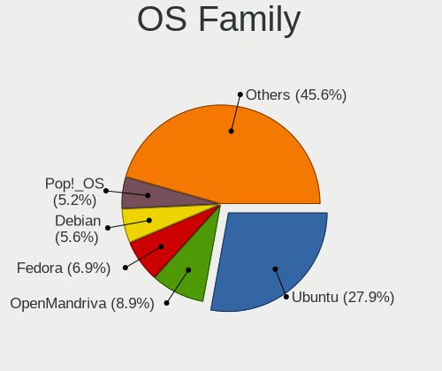
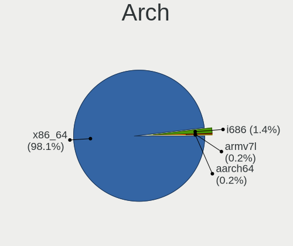
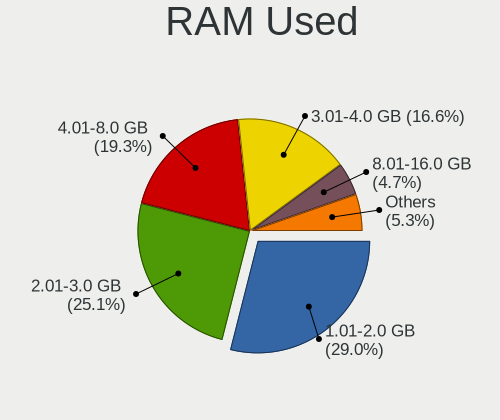
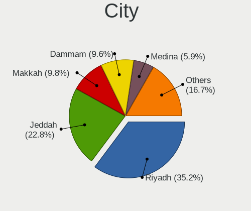
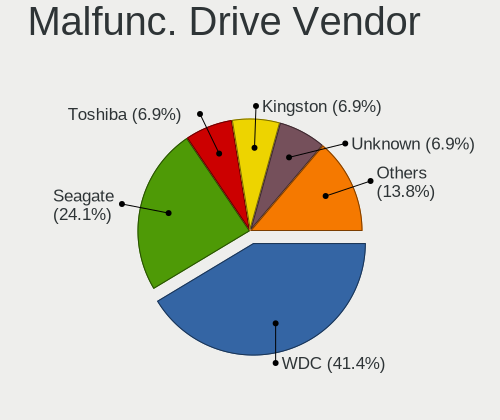
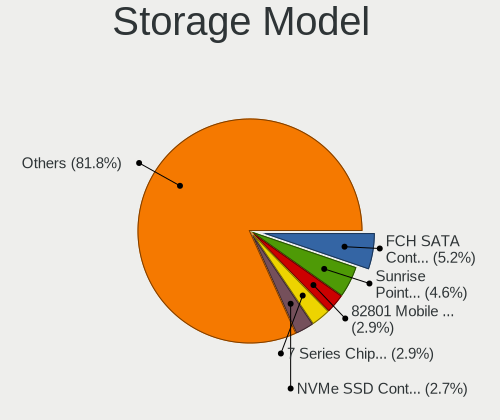
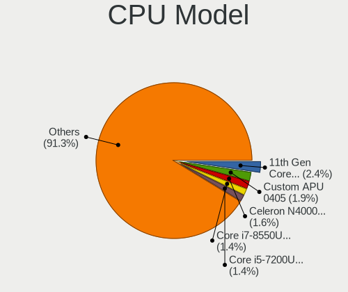
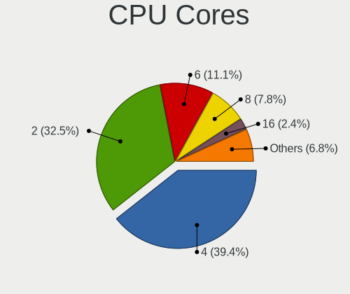
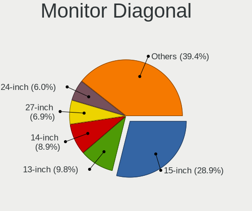
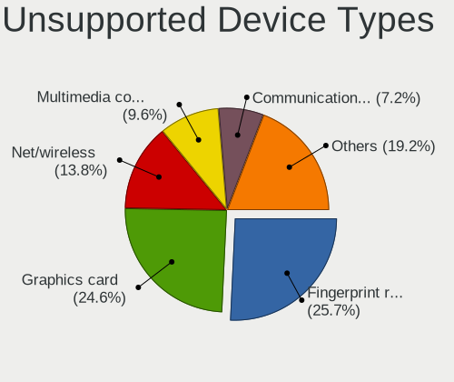

Linux in Saudi Arabia - Tested Hardware & Statistics
----------------------------------------------------

A project to collect tested hardware configurations for Linux in Saudi Arabia.

Anyone can contribute to this report by the [hw-probe](https://github.com/linuxhw/hw-probe) tool:

    sudo -E hw-probe -all -upload

Please contribute! Especially if your hardware is rare.

This is a report for all computer types. See also reports for [desktops](/Location/Saudi_Arabia/Desktop/README.md) and [notebooks](/Location/Saudi_Arabia/Notebook/README.md).

Contents
--------

* [ Test Cases ](#test-cases)

* [ System ](#system)
  - [ OS                       ](#os)
  - [ OS Family                ](#os-family)
  - [ Kernel                   ](#kernel)
  - [ Kernel Family            ](#kernel-family)
  - [ Kernel Major Ver.        ](#kernel-major-ver)
  - [ Arch                     ](#arch)
  - [ DE                       ](#de)
  - [ Display Server           ](#display-server)
  - [ Display Manager          ](#display-manager)
  - [ OS Lang                  ](#os-lang)
  - [ Boot Mode                ](#boot-mode)
  - [ Filesystem               ](#filesystem)
  - [ Part. scheme             ](#part-scheme)
  - [ Dual Boot with Linux/BSD ](#dual-boot-with-linuxbsd)
  - [ Dual Boot (Win)          ](#dual-boot-win)

* [ Board ](#board)
  - [ Vendor                   ](#vendor)
  - [ Model                    ](#model)
  - [ Model Family             ](#model-family)
  - [ MFG Year                 ](#mfg-year)
  - [ Form Factor              ](#form-factor)
  - [ Secure Boot              ](#secure-boot)
  - [ Coreboot                 ](#coreboot)
  - [ RAM Size                 ](#ram-size)
  - [ RAM Used                 ](#ram-used)
  - [ Total Drives             ](#total-drives)
  - [ Has CD-ROM               ](#has-cd-rom)
  - [ Has Ethernet             ](#has-ethernet)
  - [ Has WiFi                 ](#has-wifi)
  - [ Has Bluetooth            ](#has-bluetooth)

* [ Location ](#location)
  - [ Country                  ](#country)
  - [ City                     ](#city)

* [ Drives ](#drives)
  - [ Drive Vendor             ](#drive-vendor)
  - [ Drive Model              ](#drive-model)
  - [ HDD Vendor               ](#hdd-vendor)
  - [ SSD Vendor               ](#ssd-vendor)
  - [ Drive Kind               ](#drive-kind)
  - [ Drive Connector          ](#drive-connector)
  - [ Drive Size               ](#drive-size)
  - [ Space Total              ](#space-total)
  - [ Space Used               ](#space-used)
  - [ Malfunc. Drives          ](#malfunc-drives)
  - [ Malfunc. Drive Vendor    ](#malfunc-drive-vendor)
  - [ Malfunc. HDD Vendor      ](#malfunc-hdd-vendor)
  - [ Malfunc. Drive Kind      ](#malfunc-drive-kind)
  - [ Failed Drives            ](#failed-drives)
  - [ Failed Drive Vendor      ](#failed-drive-vendor)
  - [ Drive Status             ](#drive-status)

* [ Storage controller ](#storage-controller)
  - [ Storage Vendor           ](#storage-vendor)
  - [ Storage Model            ](#storage-model)
  - [ Storage Kind             ](#storage-kind)

* [ Processor ](#processor)
  - [ CPU Vendor               ](#cpu-vendor)
  - [ CPU Model                ](#cpu-model)
  - [ CPU Model Family         ](#cpu-model-family)
  - [ CPU Cores                ](#cpu-cores)
  - [ CPU Sockets              ](#cpu-sockets)
  - [ CPU Threads              ](#cpu-threads)
  - [ CPU Op-Modes             ](#cpu-op-modes)
  - [ CPU Microcode            ](#cpu-microcode)
  - [ CPU Microarch            ](#cpu-microarch)

* [ Graphics ](#graphics)
  - [ GPU Vendor               ](#gpu-vendor)
  - [ GPU Model                ](#gpu-model)
  - [ GPU Combo                ](#gpu-combo)
  - [ GPU Driver               ](#gpu-driver)
  - [ GPU Memory               ](#gpu-memory)

* [ Monitor ](#monitor)
  - [ Monitor Vendor           ](#monitor-vendor)
  - [ Monitor Model            ](#monitor-model)
  - [ Monitor Resolution       ](#monitor-resolution)
  - [ Monitor Diagonal         ](#monitor-diagonal)
  - [ Monitor Width            ](#monitor-width)
  - [ Aspect Ratio             ](#aspect-ratio)
  - [ Monitor Area             ](#monitor-area)
  - [ Pixel Density            ](#pixel-density)
  - [ Multiple Monitors        ](#multiple-monitors)

* [ Network ](#network)
  - [ Net Controller Vendor    ](#net-controller-vendor)
  - [ Net Controller Model     ](#net-controller-model)
  - [ Wireless Vendor          ](#wireless-vendor)
  - [ Wireless Model           ](#wireless-model)
  - [ Ethernet Vendor          ](#ethernet-vendor)
  - [ Ethernet Model           ](#ethernet-model)
  - [ Net Controller Kind      ](#net-controller-kind)
  - [ Used Controller          ](#used-controller)
  - [ NICs                     ](#nics)
  - [ IPv6                     ](#ipv6)

* [ Bluetooth ](#bluetooth)
  - [ Bluetooth Vendor         ](#bluetooth-vendor)
  - [ Bluetooth Model          ](#bluetooth-model)

* [ Sound ](#sound)
  - [ Sound Vendor             ](#sound-vendor)
  - [ Sound Model              ](#sound-model)

* [ Memory ](#memory)
  - [ Memory Vendor            ](#memory-vendor)
  - [ Memory Model             ](#memory-model)
  - [ Memory Kind              ](#memory-kind)
  - [ Memory Form Factor       ](#memory-form-factor)
  - [ Memory Size              ](#memory-size)
  - [ Memory Speed             ](#memory-speed)

* [ Printers & scanners ](#printers--scanners)
  - [ Printer Vendor           ](#printer-vendor)
  - [ Printer Model            ](#printer-model)
  - [ Scanner Vendor           ](#scanner-vendor)
  - [ Scanner Model            ](#scanner-model)

* [ Camera ](#camera)
  - [ Camera Vendor            ](#camera-vendor)
  - [ Camera Model             ](#camera-model)

* [ Security ](#security)
  - [ Fingerprint Vendor       ](#fingerprint-vendor)
  - [ Fingerprint Model        ](#fingerprint-model)
  - [ Chipcard Vendor          ](#chipcard-vendor)
  - [ Chipcard Model           ](#chipcard-model)

* [ Unsupported ](#unsupported)
  - [ Unsupported Devices      ](#unsupported-devices)
  - [ Unsupported Device Types ](#unsupported-device-types)

Test Cases
----------

Total: 356

| Vendor        | Model                       | Form-Factor | Probe                                                      | Date         |
|---------------|-----------------------------|-------------|------------------------------------------------------------|--------------|
| ASUSTek       | PRIME X299-DELUXE           | Desktop     | [d7d06bf7ef](https://linux-hardware.org/?probe=d7d06bf7ef) | May 26, 2022 |
| Lenovo        | SHARKBAY SDK0E50512 STD     | Desktop     | [da5f6c9ba0](https://linux-hardware.org/?probe=da5f6c9ba0) | May 23, 2022 |
| MSI           | GF63 Thin 8RCS              | Notebook    | [8cd1ebfa12](https://linux-hardware.org/?probe=8cd1ebfa12) | May 22, 2022 |
| ASUSTek       | TUF Gaming Z690-PLUS WIF... | Desktop     | [f71ca35596](https://linux-hardware.org/?probe=f71ca35596) | May 06, 2022 |
| Lenovo        | IdeaPad Gaming 3 15ACH6 ... | Notebook    | [c34e9b0da7](https://linux-hardware.org/?probe=c34e9b0da7) | May 05, 2022 |
| Lenovo        | IdeaPad Gaming 3 15ACH6 ... | Notebook    | [b6dc8a3fc8](https://linux-hardware.org/?probe=b6dc8a3fc8) | May 05, 2022 |
| Dell          | Inspiron 3580               | Notebook    | [51d4e9a2e2](https://linux-hardware.org/?probe=51d4e9a2e2) | May 05, 2022 |
| ASUSTek       | ROG Zephyrus G14 GA401IV... | Notebook    | [720d11c11f](https://linux-hardware.org/?probe=720d11c11f) | May 04, 2022 |
| Dell          | 0M9KCM A01                  | Desktop     | [76d9159d32](https://linux-hardware.org/?probe=76d9159d32) | May 03, 2022 |
| Gigabyte      | H110-D3A-CF                 | Desktop     | [74e69f5610](https://linux-hardware.org/?probe=74e69f5610) | May 03, 2022 |
| MSI           | Z77A-G43                    | Desktop     | [2c6195f0b8](https://linux-hardware.org/?probe=2c6195f0b8) | May 02, 2022 |
| Acer          | Aspire V3-571               | Notebook    | [9cab38ff4f](https://linux-hardware.org/?probe=9cab38ff4f) | May 01, 2022 |
| Dell          | Inspiron 3580               | Notebook    | [794ab7ba41](https://linux-hardware.org/?probe=794ab7ba41) | Apr 28, 2022 |
| Dell          | Latitude 7275               | Tablet      | [b7443972f3](https://linux-hardware.org/?probe=b7443972f3) | Apr 28, 2022 |
| ASUSTek       | T102HA                      | Tablet      | [1406a26a6e](https://linux-hardware.org/?probe=1406a26a6e) | Apr 27, 2022 |
| ASUSTek       | T102HA                      | Tablet      | [6dd79c7d6a](https://linux-hardware.org/?probe=6dd79c7d6a) | Apr 27, 2022 |
| Lenovo        | 3733 SDK0T76461 WIN 3422... | Desktop     | [037284e799](https://linux-hardware.org/?probe=037284e799) | Apr 23, 2022 |
| Microsoft     | Surface Pro 7               | Tablet      | [8c3b142c85](https://linux-hardware.org/?probe=8c3b142c85) | Apr 23, 2022 |
| Dell          | Latitude 7275               | Tablet      | [8b373dc563](https://linux-hardware.org/?probe=8b373dc563) | Apr 22, 2022 |
| Lenovo        | SHARKBAY SDK0E50512 STD     | Desktop     | [14fa81fab9](https://linux-hardware.org/?probe=14fa81fab9) | Apr 18, 2022 |
| Dell          | Inspiron 3542               | Notebook    | [196f849315](https://linux-hardware.org/?probe=196f849315) | Apr 18, 2022 |
| Lenovo        | ThinkPad L14 Gen 2 20X10... | Notebook    | [6f75f679f9](https://linux-hardware.org/?probe=6f75f679f9) | Apr 16, 2022 |
| ASRock        | H81 Pro BTC R2.0            | Desktop     | [0c294047d9](https://linux-hardware.org/?probe=0c294047d9) | Apr 13, 2022 |
| ASRock        | H81 Pro BTC R2.0            | Desktop     | [50c38c2cc6](https://linux-hardware.org/?probe=50c38c2cc6) | Apr 12, 2022 |
| Lenovo        | ThinkPad L14 Gen 2 20X10... | Notebook    | [1f799cdbef](https://linux-hardware.org/?probe=1f799cdbef) | Apr 09, 2022 |
| Unknown       | HX90                        | Desktop     | [913b92a244](https://linux-hardware.org/?probe=913b92a244) | Apr 08, 2022 |
| Lenovo        | ThinkPad L14 Gen 2 20X10... | Notebook    | [45548a6fe5](https://linux-hardware.org/?probe=45548a6fe5) | Apr 07, 2022 |
| Acer          | Switch SW312-31             | Tablet      | [1f1a2dbacc](https://linux-hardware.org/?probe=1f1a2dbacc) | Apr 05, 2022 |
| Dell          | Latitude 7275               | Tablet      | [4e3f9ca88e](https://linux-hardware.org/?probe=4e3f9ca88e) | Apr 02, 2022 |
| Unknown       | HX90                        | Desktop     | [9cb3335bb0](https://linux-hardware.org/?probe=9cb3335bb0) | Apr 01, 2022 |
| Unknown       | HX90                        | Desktop     | [cd18483c45](https://linux-hardware.org/?probe=cd18483c45) | Apr 01, 2022 |
| Dell          | 0VD92X A00                  | Desktop     | [464e58f41f](https://linux-hardware.org/?probe=464e58f41f) | Mar 29, 2022 |
| Dell          | 0VD92X A00                  | Desktop     | [567627010e](https://linux-hardware.org/?probe=567627010e) | Mar 29, 2022 |
| Dell          | 0VD92X A00                  | Desktop     | [304f31d5a7](https://linux-hardware.org/?probe=304f31d5a7) | Mar 28, 2022 |
| MSI           | MAG B550 TOMAHAWK           | Desktop     | [bc999f46f9](https://linux-hardware.org/?probe=bc999f46f9) | Mar 28, 2022 |
| Dell          | Latitude 7275               | Tablet      | [1e0ad3b3cd](https://linux-hardware.org/?probe=1e0ad3b3cd) | Mar 27, 2022 |
| Dell          | 0VD92X A00                  | Desktop     | [0e1e24ffe0](https://linux-hardware.org/?probe=0e1e24ffe0) | Mar 27, 2022 |
| Lenovo        | ThinkPad X1 Carbon 7th 2... | Notebook    | [10c6384de8](https://linux-hardware.org/?probe=10c6384de8) | Mar 25, 2022 |
| Gigabyte      | B75M-HD3                    | Desktop     | [b886cf0849](https://linux-hardware.org/?probe=b886cf0849) | Mar 23, 2022 |
| Dell          | Inspiron 14-3467            | Notebook    | [50131c5da4](https://linux-hardware.org/?probe=50131c5da4) | Mar 21, 2022 |
| Acer          | AO751h                      | Notebook    | [23737182d1](https://linux-hardware.org/?probe=23737182d1) | Mar 21, 2022 |
| Dell          | 0VD92X A00                  | Desktop     | [1f00b8ed57](https://linux-hardware.org/?probe=1f00b8ed57) | Mar 21, 2022 |
| Acer          | AO751h                      | Notebook    | [edea28357c](https://linux-hardware.org/?probe=edea28357c) | Mar 18, 2022 |
| Dell          | 0VD92X A00                  | Desktop     | [d52410b817](https://linux-hardware.org/?probe=d52410b817) | Mar 18, 2022 |
| Lenovo        | 3733 SDK0T76461 WIN 3422... | Desktop     | [08239c1637](https://linux-hardware.org/?probe=08239c1637) | Mar 09, 2022 |
| Lenovo        | 3733 SDK0T76461 WIN 3422... | Desktop     | [ce709ce28f](https://linux-hardware.org/?probe=ce709ce28f) | Mar 07, 2022 |
| Lenovo        | SHARKBAY SDK0E50512 STD     | Desktop     | [8a51a8730b](https://linux-hardware.org/?probe=8a51a8730b) | Feb 28, 2022 |
| HP            | ENVY x360 Convertible 15... | Convertible | [b2f7222ddb](https://linux-hardware.org/?probe=b2f7222ddb) | Feb 27, 2022 |
| Dell          | 0WWJRX A00                  | Desktop     | [bb620cc0f9](https://linux-hardware.org/?probe=bb620cc0f9) | Feb 26, 2022 |
| Gigabyte      | MJPLNAB-00                  | Desktop     | [007ec5dbf5](https://linux-hardware.org/?probe=007ec5dbf5) | Feb 24, 2022 |
| Dell          | Latitude 7275               | Tablet      | [14bcc9219c](https://linux-hardware.org/?probe=14bcc9219c) | Feb 18, 2022 |
| Dell          | Latitude 7275               | Tablet      | [143e5a0a20](https://linux-hardware.org/?probe=143e5a0a20) | Feb 16, 2022 |
| ASUSTek       | K53SC                       | Notebook    | [43b019326c](https://linux-hardware.org/?probe=43b019326c) | Feb 12, 2022 |
| ASUSTek       | K53SC                       | Notebook    | [70f23c3da0](https://linux-hardware.org/?probe=70f23c3da0) | Feb 12, 2022 |
| Lenovo        | 3151 SDK0J40697 WIN 3305... | Mini pc     | [fe9b9a47f1](https://linux-hardware.org/?probe=fe9b9a47f1) | Feb 11, 2022 |
| MSI           | MPG B550 GAMING CARBON W... | Desktop     | [73767731d9](https://linux-hardware.org/?probe=73767731d9) | Feb 11, 2022 |
| ASRock        | B365M Phantom Gaming 4      | Desktop     | [9dd59e5403](https://linux-hardware.org/?probe=9dd59e5403) | Feb 08, 2022 |
| Dell          | 09M8Y8 A01                  | Desktop     | [e0748343d9](https://linux-hardware.org/?probe=e0748343d9) | Feb 08, 2022 |
| Dell          | XPS 13 9310                 | Notebook    | [40c74584ee](https://linux-hardware.org/?probe=40c74584ee) | Feb 03, 2022 |
| Acer          | Aspire V3-571               | Notebook    | [ed5c6cf88d](https://linux-hardware.org/?probe=ed5c6cf88d) | Jan 24, 2022 |
| HP            | 15                          | Notebook    | [4dde4c5c0e](https://linux-hardware.org/?probe=4dde4c5c0e) | Jan 17, 2022 |
| Lenovo        | SHARKBAY SDK0E50512 STD     | Desktop     | [92f528e80b](https://linux-hardware.org/?probe=92f528e80b) | Jan 13, 2022 |
| ASRock        | H81 Pro BTC R2.0            | Desktop     | [06673a4f1e](https://linux-hardware.org/?probe=06673a4f1e) | Jan 12, 2022 |
| ASRock        | H81 Pro BTC R2.0            | Desktop     | [5f7b4e3335](https://linux-hardware.org/?probe=5f7b4e3335) | Jan 12, 2022 |
| ASRock        | H81 Pro BTC R2.0            | Desktop     | [ebd229b5fb](https://linux-hardware.org/?probe=ebd229b5fb) | Jan 12, 2022 |
| Lenovo        | SHARKBAY SDK0E50512 STD     | Desktop     | [4debe87ebd](https://linux-hardware.org/?probe=4debe87ebd) | Jan 11, 2022 |
| Lenovo        | ThinkPad L14 Gen 2 20X10... | Notebook    | [261fe8bda7](https://linux-hardware.org/?probe=261fe8bda7) | Jan 07, 2022 |
| Sony          | VPCCA35FA                   | Notebook    | [85f4fcc0b6](https://linux-hardware.org/?probe=85f4fcc0b6) | Jan 03, 2022 |
| Sony          | VPCCA35FA                   | Notebook    | [f69299cbfb](https://linux-hardware.org/?probe=f69299cbfb) | Jan 03, 2022 |
| Lenovo        | Yoga 520-14IKB 81C8         | Convertible | [3fbda09d01](https://linux-hardware.org/?probe=3fbda09d01) | Jan 01, 2022 |
| HP            | 8906 SMVB                   | Desktop     | [be19f6df45](https://linux-hardware.org/?probe=be19f6df45) | Dec 29, 2021 |
| Dell          | Inspiron 3521               | Notebook    | [af800e1071](https://linux-hardware.org/?probe=af800e1071) | Dec 29, 2021 |
| Packard Be... | EasyNote TJ65               | Notebook    | [b98b9252fa](https://linux-hardware.org/?probe=b98b9252fa) | Dec 29, 2021 |
| MSI           | MS-7529                     | Desktop     | [c9b87dcf45](https://linux-hardware.org/?probe=c9b87dcf45) | Dec 27, 2021 |
| Lenovo        | ThinkPad L14 Gen 2 20X10... | Notebook    | [938d24e76e](https://linux-hardware.org/?probe=938d24e76e) | Dec 27, 2021 |
| Lenovo        | SHARKBAY SDK0E50512 STD     | Desktop     | [046dcdd20d](https://linux-hardware.org/?probe=046dcdd20d) | Dec 25, 2021 |
| Acer          | Switch SW312-31             | Tablet      | [af71cff698](https://linux-hardware.org/?probe=af71cff698) | Dec 21, 2021 |
| HP            | EliteBook 8440p             | Notebook    | [0dc23e59a4](https://linux-hardware.org/?probe=0dc23e59a4) | Dec 19, 2021 |
| ASUSTek       | Z170 PRO GAMING             | Desktop     | [609baca194](https://linux-hardware.org/?probe=609baca194) | Dec 16, 2021 |
| ASUSTek       | Z170 PRO GAMING             | Desktop     | [35ec8b1dbb](https://linux-hardware.org/?probe=35ec8b1dbb) | Dec 16, 2021 |
| Acer          | Aspire V3-571               | Notebook    | [071a8f0709](https://linux-hardware.org/?probe=071a8f0709) | Dec 15, 2021 |
| Acer          | Aspire V3-571               | Notebook    | [54680bac44](https://linux-hardware.org/?probe=54680bac44) | Dec 12, 2021 |
| Gigabyte      | Z77-D3H                     | Desktop     | [f73c5829df](https://linux-hardware.org/?probe=f73c5829df) | Dec 12, 2021 |
| Lenovo        | ThinkPad L14 Gen 2 20X10... | Notebook    | [181607bac3](https://linux-hardware.org/?probe=181607bac3) | Dec 10, 2021 |
| Lenovo        | ThinkPad L14 Gen 2 20X10... | Notebook    | [c1de54b513](https://linux-hardware.org/?probe=c1de54b513) | Dec 10, 2021 |
| Lenovo        | ThinkPad L14 Gen 2 20X10... | Notebook    | [bb9141f09c](https://linux-hardware.org/?probe=bb9141f09c) | Dec 09, 2021 |
| Lenovo        | ThinkPad L14 Gen 2 20X10... | Notebook    | [b3c42ca2c2](https://linux-hardware.org/?probe=b3c42ca2c2) | Dec 09, 2021 |
| Lenovo        | V15-IIL 82C5                | Notebook    | [2a151de62b](https://linux-hardware.org/?probe=2a151de62b) | Dec 08, 2021 |
| Lenovo        | ThinkPad L14 Gen 2 20X10... | Notebook    | [830882c4e6](https://linux-hardware.org/?probe=830882c4e6) | Dec 07, 2021 |
| Intel         | DP55WB AAE64798-206         | Desktop     | [6e77546d03](https://linux-hardware.org/?probe=6e77546d03) | Dec 06, 2021 |
| Microsoft     | Surface Pro 7               | Tablet      | [25ca2e2c75](https://linux-hardware.org/?probe=25ca2e2c75) | Dec 04, 2021 |
| Toshiba       | Satellite L500              | Notebook    | [5cc2fbfef5](https://linux-hardware.org/?probe=5cc2fbfef5) | Dec 04, 2021 |
| ASUSTek       | ZenBook UX425QA_UM425QA     | Notebook    | [e3acd70236](https://linux-hardware.org/?probe=e3acd70236) | Dec 02, 2021 |
| Lenovo        | ThinkPad E14 20RA008CAD     | Notebook    | [35fab17b69](https://linux-hardware.org/?probe=35fab17b69) | Dec 01, 2021 |
| HP            | EliteBook 8440p             | Notebook    | [cecc697189](https://linux-hardware.org/?probe=cecc697189) | Nov 30, 2021 |
| Toshiba       | Satellite L500              | Notebook    | [46d5208475](https://linux-hardware.org/?probe=46d5208475) | Nov 28, 2021 |
| Dell          | 0T656F A02                  | Desktop     | [a1abd4e08e](https://linux-hardware.org/?probe=a1abd4e08e) | Nov 26, 2021 |
| Lenovo        | V15-IIL 82C5                | Notebook    | [e37587fbac](https://linux-hardware.org/?probe=e37587fbac) | Nov 23, 2021 |
| Lenovo        | V15-IIL 82C5                | Notebook    | [b050debd0a](https://linux-hardware.org/?probe=b050debd0a) | Nov 22, 2021 |
| Dell          | G3 3590                     | Notebook    | [605f0870d0](https://linux-hardware.org/?probe=605f0870d0) | Nov 16, 2021 |
| Dell          | G3 3590                     | Notebook    | [5bfafc889c](https://linux-hardware.org/?probe=5bfafc889c) | Nov 16, 2021 |
| Lenovo        | SHARKBAY SDK0E50512 STD     | Desktop     | [0ff55f060f](https://linux-hardware.org/?probe=0ff55f060f) | Nov 14, 2021 |
| Gigabyte      | Z390 I AORUS PRO WIFI-CF    | Desktop     | [189e19c60d](https://linux-hardware.org/?probe=189e19c60d) | Nov 09, 2021 |
| Lenovo        | ThinkPad E490 20N8000JAD    | Notebook    | [997e24e5c9](https://linux-hardware.org/?probe=997e24e5c9) | Nov 06, 2021 |
| Lenovo        | ThinkPad E490 20N8000JAD    | Notebook    | [9d70a71c88](https://linux-hardware.org/?probe=9d70a71c88) | Nov 06, 2021 |
| Lenovo        | V570 1066AJU                | Notebook    | [ffb36aac10](https://linux-hardware.org/?probe=ffb36aac10) | Nov 05, 2021 |
| Lenovo        | IdeaPadFlex 5 14IIL05 81... | Convertible | [41451fb2a2](https://linux-hardware.org/?probe=41451fb2a2) | Nov 05, 2021 |
| Lenovo        | SHARKBAY SDK0E50512 STD     | Desktop     | [a5026c4013](https://linux-hardware.org/?probe=a5026c4013) | Oct 21, 2021 |
| Lenovo        | SHARKBAY SDK0E50512 STD     | Desktop     | [20ca9b4679](https://linux-hardware.org/?probe=20ca9b4679) | Oct 18, 2021 |
| Dell          | Inspiron 3593               | Notebook    | [5233ea30c6](https://linux-hardware.org/?probe=5233ea30c6) | Oct 09, 2021 |
| ASUSTek       | Z170 PRO GAMING             | Desktop     | [65c4bea87a](https://linux-hardware.org/?probe=65c4bea87a) | Oct 09, 2021 |
| Lenovo        | SHARKBAY SDK0E50512 STD     | Desktop     | [d91c23c12c](https://linux-hardware.org/?probe=d91c23c12c) | Oct 08, 2021 |
| ASUSTek       | Z170 PRO GAMING             | Desktop     | [b22e6dc21a](https://linux-hardware.org/?probe=b22e6dc21a) | Oct 05, 2021 |
| ASUSTek       | Z170 PRO GAMING             | Desktop     | [428e41ed23](https://linux-hardware.org/?probe=428e41ed23) | Oct 05, 2021 |
| Lenovo        | ThinkPad P52s 20LBS0JC00    | Notebook    | [4c8c63da2f](https://linux-hardware.org/?probe=4c8c63da2f) | Oct 05, 2021 |
| HP            | Laptop 15-da2xxx            | Notebook    | [2e99b047ff](https://linux-hardware.org/?probe=2e99b047ff) | Oct 04, 2021 |
| Dell          | Latitude 7275               | Tablet      | [c844ef39cd](https://linux-hardware.org/?probe=c844ef39cd) | Oct 03, 2021 |
| Acer          | Switch SW312-31             | Tablet      | [85a91a83fa](https://linux-hardware.org/?probe=85a91a83fa) | Oct 01, 2021 |
| ASUSTek       | ROG Zephyrus G14 GA401IV... | Notebook    | [de6b4e47d4](https://linux-hardware.org/?probe=de6b4e47d4) | Oct 01, 2021 |
| HP            | Laptop 15-da2xxx            | Notebook    | [28332170d1](https://linux-hardware.org/?probe=28332170d1) | Sep 28, 2021 |
| Dell          | Inspiron N5110              | Notebook    | [8c04a9e8df](https://linux-hardware.org/?probe=8c04a9e8df) | Sep 22, 2021 |
| Acer          | Aspire E5-573G              | Notebook    | [19374f68da](https://linux-hardware.org/?probe=19374f68da) | Sep 21, 2021 |
| Dell          | 054KM3 A01                  | Desktop     | [6d277dcd36](https://linux-hardware.org/?probe=6d277dcd36) | Sep 18, 2021 |
| Acer          | Aspire V3-571               | Notebook    | [6998aee6d0](https://linux-hardware.org/?probe=6998aee6d0) | Sep 02, 2021 |
| Toshiba       | Satellite C55-B             | Notebook    | [e7a572f322](https://linux-hardware.org/?probe=e7a572f322) | Aug 29, 2021 |
| Gigabyte      | H81M-S2PH                   | Desktop     | [ef4fb4b996](https://linux-hardware.org/?probe=ef4fb4b996) | Aug 28, 2021 |
| Lenovo        | IdeaPadFlex 5 14IIL05 81... | Convertible | [e5251674c0](https://linux-hardware.org/?probe=e5251674c0) | Aug 25, 2021 |
| Toshiba       | Satellite C55-B             | Notebook    | [99dbadcdde](https://linux-hardware.org/?probe=99dbadcdde) | Aug 22, 2021 |
| Apple         | Mac-BE088AF8C5EB4FA2 iMa... | All in one  | [3d5e02e265](https://linux-hardware.org/?probe=3d5e02e265) | Aug 19, 2021 |
| Dell          | Latitude E7440              | Notebook    | [b87783b728](https://linux-hardware.org/?probe=b87783b728) | Aug 18, 2021 |
| Lenovo        | Yoga 520-14IKB 80X8         | Convertible | [4c8282bb42](https://linux-hardware.org/?probe=4c8282bb42) | Aug 16, 2021 |
| Dell          | Latitude E5470              | Notebook    | [f91acefb07](https://linux-hardware.org/?probe=f91acefb07) | Aug 14, 2021 |
| Dell          | 03X6X0 A06                  | Server      | [d52db39eeb](https://linux-hardware.org/?probe=d52db39eeb) | Jul 26, 2021 |
| Dell          | 0M9KCM A00                  | Desktop     | [162b090056](https://linux-hardware.org/?probe=162b090056) | Jul 14, 2021 |
| Lenovo        | Yoga 520-14IKB 80X8         | Convertible | [8d7689bceb](https://linux-hardware.org/?probe=8d7689bceb) | Jul 14, 2021 |
| Dell          | 0M9KCM A00                  | Desktop     | [5bcc11cd03](https://linux-hardware.org/?probe=5bcc11cd03) | Jul 08, 2021 |
| Dell          | XPS 15 9560                 | Notebook    | [9bae1ef315](https://linux-hardware.org/?probe=9bae1ef315) | Jul 07, 2021 |
| ASUSTek       | K43SJ                       | Notebook    | [f4702e95b4](https://linux-hardware.org/?probe=f4702e95b4) | Jul 05, 2021 |
| Dell          | XPS 15 9560                 | Notebook    | [08fad9a114](https://linux-hardware.org/?probe=08fad9a114) | Jul 03, 2021 |
| Dell          | 0W0CHX A01                  | Desktop     | [e0a09aa1a5](https://linux-hardware.org/?probe=e0a09aa1a5) | Jul 01, 2021 |
| Dell          | G3 3590                     | Notebook    | [06d10d0717](https://linux-hardware.org/?probe=06d10d0717) | Jun 26, 2021 |
| Dell          | 0XHGV1 A01                  | Desktop     | [4fcd4b7e98](https://linux-hardware.org/?probe=4fcd4b7e98) | Jun 22, 2021 |
| Intel         | BTC-T37                     | Desktop     | [6cd9eb4fd4](https://linux-hardware.org/?probe=6cd9eb4fd4) | Jun 19, 2021 |
| Intel         | BTC-T37                     | Desktop     | [3f0a790d81](https://linux-hardware.org/?probe=3f0a790d81) | Jun 19, 2021 |
| Dell          | Inspiron 5437               | Notebook    | [06f25de7e3](https://linux-hardware.org/?probe=06f25de7e3) | Jun 19, 2021 |
| Dell          | Inspiron 5437               | Notebook    | [3fcbd5cd4f](https://linux-hardware.org/?probe=3fcbd5cd4f) | Jun 18, 2021 |
| Dell          | G3 3590                     | Notebook    | [877018f0d3](https://linux-hardware.org/?probe=877018f0d3) | Jun 18, 2021 |
| Dell          | G3 3590                     | Notebook    | [adf875d64d](https://linux-hardware.org/?probe=adf875d64d) | Jun 17, 2021 |
| Apple         | Mac-F2268DC8                | All in one  | [7e5e7767c0](https://linux-hardware.org/?probe=7e5e7767c0) | Jun 04, 2021 |
| HP            | Pavilion Gaming Laptop 1... | Notebook    | [d3a001e377](https://linux-hardware.org/?probe=d3a001e377) | Jun 01, 2021 |
| HP            | Pavilion Gaming Laptop 1... | Notebook    | [a4d00095a1](https://linux-hardware.org/?probe=a4d00095a1) | Jun 01, 2021 |
| HP            | ProBook 445 G7              | Notebook    | [88e51bfd39](https://linux-hardware.org/?probe=88e51bfd39) | May 23, 2021 |
| MSI           | Z77A-G43                    | Desktop     | [ea32add5cd](https://linux-hardware.org/?probe=ea32add5cd) | May 20, 2021 |
| HP            | ENVY x360 Convertible 15... | Convertible | [96e19f007a](https://linux-hardware.org/?probe=96e19f007a) | May 20, 2021 |
| HP            | ENVY x360 Convertible 15... | Convertible | [cfcef26a52](https://linux-hardware.org/?probe=cfcef26a52) | May 20, 2021 |
| ASUSTek       | GL502VMK                    | Notebook    | [0d9f5609e7](https://linux-hardware.org/?probe=0d9f5609e7) | May 20, 2021 |
| HP            | ProBook 445 G7              | Notebook    | [ed8c410826](https://linux-hardware.org/?probe=ed8c410826) | May 18, 2021 |
| Dell          | 042P49 A00                  | Desktop     | [f146c310d6](https://linux-hardware.org/?probe=f146c310d6) | May 18, 2021 |
| ASUSTek       | ROG Zephyrus G14 GA401IV... | Notebook    | [1d4c05756f](https://linux-hardware.org/?probe=1d4c05756f) | May 01, 2021 |
| Lenovo        | IdeaPadFlex 5 14IIL05 81... | Convertible | [febcf69966](https://linux-hardware.org/?probe=febcf69966) | Apr 28, 2021 |
| ASRock        | X570 Phantom Gaming-ITX/... | Desktop     | [34b2d651e1](https://linux-hardware.org/?probe=34b2d651e1) | Apr 28, 2021 |
| ASUSTek       | ROG Zephyrus G14 GA401IV... | Notebook    | [9b03874730](https://linux-hardware.org/?probe=9b03874730) | Apr 27, 2021 |
| Lenovo        | IdeaPadFlex 5 14IIL05 81... | Convertible | [e0acc229ef](https://linux-hardware.org/?probe=e0acc229ef) | Apr 25, 2021 |
| Dell          | Latitude E7470              | Notebook    | [1058573f86](https://linux-hardware.org/?probe=1058573f86) | Apr 23, 2021 |
| ASUSTek       | VivoBook_ASUSLaptop X512... | Notebook    | [14fd40d980](https://linux-hardware.org/?probe=14fd40d980) | Apr 17, 2021 |
| ASUSTek       | VivoBook_ASUSLaptop X512... | Notebook    | [0b31da2d02](https://linux-hardware.org/?probe=0b31da2d02) | Apr 16, 2021 |
| Gigabyte      | B75M-HD3                    | Desktop     | [82dd7f530a](https://linux-hardware.org/?probe=82dd7f530a) | Apr 09, 2021 |
| Gigabyte      | B75M-HD3                    | Desktop     | [f97ecb74c0](https://linux-hardware.org/?probe=f97ecb74c0) | Apr 09, 2021 |
| HP            | Pavilion Laptop 15t-eg00... | Notebook    | [cd64675ac7](https://linux-hardware.org/?probe=cd64675ac7) | Mar 30, 2021 |
| Dell          | 0XHGV1 A00                  | Desktop     | [aa8337865d](https://linux-hardware.org/?probe=aa8337865d) | Mar 23, 2021 |
| Toshiba       | Satellite S55t-A            | Notebook    | [9ede240e19](https://linux-hardware.org/?probe=9ede240e19) | Mar 20, 2021 |
| Apple         | MacBookPro9,2               | Notebook    | [7d8acdd5b6](https://linux-hardware.org/?probe=7d8acdd5b6) | Mar 19, 2021 |
| ASUSTek       | P6X58D PREMIUM              | Desktop     | [f568952b1d](https://linux-hardware.org/?probe=f568952b1d) | Mar 10, 2021 |
| Huanan        | X99-F8                      | Desktop     | [3bbee45dc4](https://linux-hardware.org/?probe=3bbee45dc4) | Mar 10, 2021 |
| Toshiba       | Satellite S55t-A            | Notebook    | [5aa53770bf](https://linux-hardware.org/?probe=5aa53770bf) | Mar 06, 2021 |
| Toshiba       | Satellite S55t-A            | Notebook    | [5ed863271a](https://linux-hardware.org/?probe=5ed863271a) | Mar 06, 2021 |
| ASUSTek       | TUF Gaming X570-PLUS        | Desktop     | [c03aab940e](https://linux-hardware.org/?probe=c03aab940e) | Feb 28, 2021 |
| ASUSTek       | TUF Gaming X570-PLUS        | Desktop     | [66003aa802](https://linux-hardware.org/?probe=66003aa802) | Feb 28, 2021 |
| ASUSTek       | PRIME Z490-P                | Desktop     | [290dbb71c2](https://linux-hardware.org/?probe=290dbb71c2) | Feb 25, 2021 |
| Acer          | Nitro AN515-52              | Notebook    | [99ee0e5718](https://linux-hardware.org/?probe=99ee0e5718) | Feb 24, 2021 |
| Acer          | Nitro AN515-52              | Notebook    | [89497c0f27](https://linux-hardware.org/?probe=89497c0f27) | Feb 23, 2021 |
| ASUSTek       | X555UB                      | Notebook    | [260d78f7c8](https://linux-hardware.org/?probe=260d78f7c8) | Feb 20, 2021 |
| HP            | Pavilion g6                 | Notebook    | [30bcebb4be](https://linux-hardware.org/?probe=30bcebb4be) | Feb 16, 2021 |
| HP            | 8591                        | Desktop     | [b6b7f6af35](https://linux-hardware.org/?probe=b6b7f6af35) | Feb 15, 2021 |
| Gigabyte      | Z390 I AORUS PRO WIFI-CF    | Desktop     | [c8b28bb334](https://linux-hardware.org/?probe=c8b28bb334) | Feb 13, 2021 |
| Lenovo        | ThinkPad E460 20ET000MAD    | Notebook    | [cd000b8e6b](https://linux-hardware.org/?probe=cd000b8e6b) | Feb 11, 2021 |
| Dell          | 0GY6Y8 A02                  | Desktop     | [5ed908976b](https://linux-hardware.org/?probe=5ed908976b) | Feb 09, 2021 |
| Dell          | Inspiron 3593               | Notebook    | [5407a15ab7](https://linux-hardware.org/?probe=5407a15ab7) | Feb 09, 2021 |
| Dell          | Inspiron 3593               | Notebook    | [0802cedb25](https://linux-hardware.org/?probe=0802cedb25) | Feb 09, 2021 |
| Dell          | Latitude E4310              | Notebook    | [9c6781e592](https://linux-hardware.org/?probe=9c6781e592) | Feb 08, 2021 |
| MSI           | B450M PRO-M2 V2             | Desktop     | [1d97b5c83d](https://linux-hardware.org/?probe=1d97b5c83d) | Jan 31, 2021 |
| ASUSTek       | ROG Strix G512LWS_G512LW... | Notebook    | [d4d3110510](https://linux-hardware.org/?probe=d4d3110510) | Jan 29, 2021 |
| MSI           | B450M PRO-M2 V2             | Desktop     | [5911afaa7a](https://linux-hardware.org/?probe=5911afaa7a) | Jan 27, 2021 |
| MSI           | B450M PRO-M2 V2             | Desktop     | [6bdd3b4a5d](https://linux-hardware.org/?probe=6bdd3b4a5d) | Jan 27, 2021 |
| Acer          | Spin SP111-33               | Convertible | [0a09d00b74](https://linux-hardware.org/?probe=0a09d00b74) | Jan 23, 2021 |
| Toshiba       | Satellite C855D             | Notebook    | [46d5bf62c7](https://linux-hardware.org/?probe=46d5bf62c7) | Jan 19, 2021 |
| Pegatron      | 2AD5                        | Desktop     | [e289a86560](https://linux-hardware.org/?probe=e289a86560) | Jan 16, 2021 |
| Dell          | Inspiron 3576               | Notebook    | [99f1a1ac09](https://linux-hardware.org/?probe=99f1a1ac09) | Jan 16, 2021 |
| Sony          | VGN-FZ250E                  | Notebook    | [d0d77ffe81](https://linux-hardware.org/?probe=d0d77ffe81) | Jan 15, 2021 |
| HP            | Laptop 14-ck0xxx            | Notebook    | [92ea4004af](https://linux-hardware.org/?probe=92ea4004af) | Jan 15, 2021 |
| Sony          | VGN-FZ250E                  | Notebook    | [68ddc53941](https://linux-hardware.org/?probe=68ddc53941) | Jan 14, 2021 |
| Dell          | Inspiron 3576               | Notebook    | [b21e44d0c4](https://linux-hardware.org/?probe=b21e44d0c4) | Jan 11, 2021 |
| Lenovo        | 3151 SDK0J40697 WIN 3305... | Mini pc     | [e57dfe6f39](https://linux-hardware.org/?probe=e57dfe6f39) | Dec 30, 2020 |
| ASRock        | X570 Phantom Gaming-ITX/... | Desktop     | [2249011658](https://linux-hardware.org/?probe=2249011658) | Dec 30, 2020 |
| Dell          | 0GN6JF A01                  | Desktop     | [b4ea210c79](https://linux-hardware.org/?probe=b4ea210c79) | Dec 27, 2020 |
| Dell          | Vostro 5470                 | Notebook    | [216df384d8](https://linux-hardware.org/?probe=216df384d8) | Dec 22, 2020 |
| Dell          | Vostro 5470                 | Notebook    | [bec1b16786](https://linux-hardware.org/?probe=bec1b16786) | Dec 22, 2020 |
| LG Electro... | R490-G.ARL5RE2              | Notebook    | [58f0c96534](https://linux-hardware.org/?probe=58f0c96534) | Dec 16, 2020 |
| OEM           | B250                        | Desktop     | [80af247c92](https://linux-hardware.org/?probe=80af247c92) | Dec 09, 2020 |
| HP            | 198E                        | Desktop     | [d6e4336d03](https://linux-hardware.org/?probe=d6e4336d03) | Dec 08, 2020 |
| ASRock        | X570 Steel Legend           | Desktop     | [6c1033e9f9](https://linux-hardware.org/?probe=6c1033e9f9) | Dec 04, 2020 |
| ASRock        | X570 Steel Legend           | Desktop     | [1e0a7199b7](https://linux-hardware.org/?probe=1e0a7199b7) | Dec 03, 2020 |
| ASUSTek       | ROG Zephyrus G14 GA401IV... | Notebook    | [239675db8d](https://linux-hardware.org/?probe=239675db8d) | Nov 25, 2020 |
| ASUSTek       | ROG Zephyrus G14 GA401IV... | Notebook    | [dfcc723611](https://linux-hardware.org/?probe=dfcc723611) | Nov 21, 2020 |
| ASUSTek       | ROG Zephyrus G14 GA401IV... | Notebook    | [b164be6cfc](https://linux-hardware.org/?probe=b164be6cfc) | Nov 21, 2020 |
| ASUSTek       | ROG Zephyrus G14 GA401IV... | Notebook    | [1a46306857](https://linux-hardware.org/?probe=1a46306857) | Nov 16, 2020 |
| ASUSTek       | ROG Zephyrus G14 GA401IV... | Notebook    | [a3ffdab533](https://linux-hardware.org/?probe=a3ffdab533) | Nov 16, 2020 |
| HP            | 843C                        | Desktop     | [fd8c0fa877](https://linux-hardware.org/?probe=fd8c0fa877) | Nov 10, 2020 |
| OEM           | B250                        | Desktop     | [f6bcb7135c](https://linux-hardware.org/?probe=f6bcb7135c) | Nov 10, 2020 |
| ASUSTek       | TUF Gaming FX505GM_FX505... | Notebook    | [cce5403051](https://linux-hardware.org/?probe=cce5403051) | Nov 09, 2020 |
| ASUSTek       | ROG Zephyrus G14 GA401IV... | Notebook    | [9737ecaee9](https://linux-hardware.org/?probe=9737ecaee9) | Nov 06, 2020 |
| I-Life Dig... | ZED Air Plus                | Notebook    | [b1a43bf9f2](https://linux-hardware.org/?probe=b1a43bf9f2) | Nov 04, 2020 |
| Dell          | Inspiron 3542               | Notebook    | [c0ad42acb0](https://linux-hardware.org/?probe=c0ad42acb0) | Nov 04, 2020 |
| Dell          | Inspiron 3542               | Notebook    | [b5e6f52433](https://linux-hardware.org/?probe=b5e6f52433) | Nov 04, 2020 |
| ASUSTek       | VivoBook 14_ASUS Laptop ... | Notebook    | [e9ca4c8d42](https://linux-hardware.org/?probe=e9ca4c8d42) | Nov 02, 2020 |
| Dell          | Inspiron 3542               | Notebook    | [292816d53a](https://linux-hardware.org/?probe=292816d53a) | Nov 02, 2020 |
| Acer          | Aspire E1-532P              | Notebook    | [4a2a5fd18c](https://linux-hardware.org/?probe=4a2a5fd18c) | Nov 01, 2020 |
| Lenovo        | ThinkPad X1 Carbon 6th 2... | Notebook    | [c45580b2f3](https://linux-hardware.org/?probe=c45580b2f3) | Oct 28, 2020 |
| Lenovo        | IdeaPadFlex 5 14IIL05 81... | Convertible | [1816b1fb29](https://linux-hardware.org/?probe=1816b1fb29) | Oct 23, 2020 |
| Lenovo        | IdeaPadFlex 5 14IIL05 81... | Convertible | [e80544ed81](https://linux-hardware.org/?probe=e80544ed81) | Oct 20, 2020 |
| MSI           | MS-1454                     | Notebook    | [0accbf6c77](https://linux-hardware.org/?probe=0accbf6c77) | Oct 14, 2020 |
| Lenovo        | IdeaPadFlex 5 14IIL05 81... | Convertible | [1d466d105c](https://linux-hardware.org/?probe=1d466d105c) | Oct 12, 2020 |
| ASUSTek       | ROG STRIX Z390-E GAMING     | Desktop     | [e1c5dde63a](https://linux-hardware.org/?probe=e1c5dde63a) | Oct 12, 2020 |
| Acer          | Swift SF314-52              | Notebook    | [a1665a6de1](https://linux-hardware.org/?probe=a1665a6de1) | Sep 26, 2020 |
| ASRock        | X470 Master SLI/ac          | Desktop     | [3ec057ab8d](https://linux-hardware.org/?probe=3ec057ab8d) | Sep 18, 2020 |
| Acer          | Aspire E5-571G              | Notebook    | [d52f9c5bc7](https://linux-hardware.org/?probe=d52f9c5bc7) | Sep 18, 2020 |
| Lenovo        | IdeaPad 5 14IIL05 81YH      | Notebook    | [6963343ed4](https://linux-hardware.org/?probe=6963343ed4) | Sep 17, 2020 |
| ASRock        | Z270M Pro4                  | Desktop     | [ed0a963b78](https://linux-hardware.org/?probe=ed0a963b78) | Sep 05, 2020 |
| Clevo         | P15xEMx                     | Notebook    | [83d0f6aae6](https://linux-hardware.org/?probe=83d0f6aae6) | Aug 28, 2020 |
| Gigabyte      | H81M-S2PH                   | Desktop     | [8634132c3a](https://linux-hardware.org/?probe=8634132c3a) | Aug 24, 2020 |
| Gigabyte      | H81M-S2PH                   | Desktop     | [54032f9ee7](https://linux-hardware.org/?probe=54032f9ee7) | Aug 19, 2020 |
| Lenovo        | ThinkPad Edge 0301FFG       | Notebook    | [60d3a68581](https://linux-hardware.org/?probe=60d3a68581) | Aug 10, 2020 |
| MSI           | Z370 KRAIT GAMING           | Desktop     | [c04081db17](https://linux-hardware.org/?probe=c04081db17) | Aug 07, 2020 |
| HP            | Pavilion g6                 | Notebook    | [98d75162cc](https://linux-hardware.org/?probe=98d75162cc) | Aug 06, 2020 |
| HUAWEI        | HN-WX9X                     | Notebook    | [41a4a29b16](https://linux-hardware.org/?probe=41a4a29b16) | Aug 02, 2020 |
| Dell          | Inspiron 3542               | Notebook    | [9138a15fe4](https://linux-hardware.org/?probe=9138a15fe4) | Aug 01, 2020 |
| Gigabyte      | Z97X-UD3H-CF                | Desktop     | [fa825c1fce](https://linux-hardware.org/?probe=fa825c1fce) | Jul 26, 2020 |
| Gigabyte      | Z97X-UD3H-CF                | Desktop     | [3098a39bdb](https://linux-hardware.org/?probe=3098a39bdb) | Jul 26, 2020 |
| ASUSTek       | VivoBook 15_ASUS Laptop ... | Notebook    | [fe429f7077](https://linux-hardware.org/?probe=fe429f7077) | Jul 24, 2020 |
| ASUSTek       | VivoBook 15_ASUS Laptop ... | Notebook    | [f9c494b96b](https://linux-hardware.org/?probe=f9c494b96b) | Jul 22, 2020 |
| Unknown       | Unknown                     | Desktop     | [1c82bd39f0](https://linux-hardware.org/?probe=1c82bd39f0) | Jul 01, 2020 |
| Microsoft     | Surface Pro 7               | Tablet      | [69744692b0](https://linux-hardware.org/?probe=69744692b0) | Jun 30, 2020 |
| ASUSTek       | T100TA                      | Notebook    | [f6884bd3db](https://linux-hardware.org/?probe=f6884bd3db) | Jun 26, 2020 |
| ASUSTek       | T100TA                      | Notebook    | [1a288de2c5](https://linux-hardware.org/?probe=1a288de2c5) | Jun 24, 2020 |
| ASUSTek       | T100TA                      | Notebook    | [aa1c1587d1](https://linux-hardware.org/?probe=aa1c1587d1) | Jun 23, 2020 |
| Acer          | Aspire ES1-572              | Notebook    | [a166c179ea](https://linux-hardware.org/?probe=a166c179ea) | Jun 22, 2020 |
| ASUSTek       | L4000H                      | Notebook    | [d385784b22](https://linux-hardware.org/?probe=d385784b22) | Jun 22, 2020 |
| Dell          | 0GN6JF A01                  | Desktop     | [452e0f2712](https://linux-hardware.org/?probe=452e0f2712) | Jun 16, 2020 |
| Acer          | Swift SF314-52              | Notebook    | [c5f91bc1ff](https://linux-hardware.org/?probe=c5f91bc1ff) | Jun 16, 2020 |
| Dell          | Inspiron N5030              | Notebook    | [5641d9b86e](https://linux-hardware.org/?probe=5641d9b86e) | Jun 14, 2020 |
| Gigabyte      | X570 AORUS MASTER           | Desktop     | [6c1261f611](https://linux-hardware.org/?probe=6c1261f611) | Jun 07, 2020 |
| Gigabyte      | X570 AORUS MASTER           | Desktop     | [eb4135b12e](https://linux-hardware.org/?probe=eb4135b12e) | Jun 07, 2020 |
| Pegatron      | 2A84h                       | Desktop     | [a5884bfb13](https://linux-hardware.org/?probe=a5884bfb13) | Jun 01, 2020 |
| ASUSTek       | UX390UAK                    | Notebook    | [0857b4df77](https://linux-hardware.org/?probe=0857b4df77) | May 27, 2020 |
| Gigabyte      | H61M-S2P                    | Desktop     | [aecc9b0111](https://linux-hardware.org/?probe=aecc9b0111) | May 25, 2020 |
| HP            | Pavilion x360 Convertibl... | Convertible | [447ac858da](https://linux-hardware.org/?probe=447ac858da) | May 24, 2020 |
| Sony          | SVF153290X                  | Notebook    | [e19f1c716f](https://linux-hardware.org/?probe=e19f1c716f) | May 23, 2020 |
| Gigabyte      | B75M-HD3                    | Desktop     | [bedfc8fa0f](https://linux-hardware.org/?probe=bedfc8fa0f) | May 21, 2020 |
| Dell          | 0GY6Y8 A03                  | Desktop     | [874c2cb817](https://linux-hardware.org/?probe=874c2cb817) | May 20, 2020 |
| ASUSTek       | VivoBook 15_ASUS Laptop ... | Notebook    | [117bc7af0e](https://linux-hardware.org/?probe=117bc7af0e) | May 17, 2020 |
| ASRock        | 990FX Extreme9              | Desktop     | [1947ac6d52](https://linux-hardware.org/?probe=1947ac6d52) | May 16, 2020 |
| ASRock        | 990FX Extreme9              | Desktop     | [dc7f6cc9e8](https://linux-hardware.org/?probe=dc7f6cc9e8) | May 16, 2020 |
| ASUSTek       | VivoBook 15_ASUS Laptop ... | Notebook    | [0444dd48d1](https://linux-hardware.org/?probe=0444dd48d1) | May 09, 2020 |
| Acer          | Aspire E1-532P              | Notebook    | [b401e8b701](https://linux-hardware.org/?probe=b401e8b701) | Apr 30, 2020 |
| HP            | Pavilion dv6                | Notebook    | [8ee1846a65](https://linux-hardware.org/?probe=8ee1846a65) | Apr 29, 2020 |
| ASUSTek       | VivoBook 14_ASUS Laptop ... | Notebook    | [bff527c13e](https://linux-hardware.org/?probe=bff527c13e) | Apr 29, 2020 |
| ASUSTek       | VivoBook 14_ASUS Laptop ... | Notebook    | [8b02fac19f](https://linux-hardware.org/?probe=8b02fac19f) | Apr 26, 2020 |
| ASRock        | X570 Phantom Gaming-ITX/... | Desktop     | [48acf05b1b](https://linux-hardware.org/?probe=48acf05b1b) | Apr 23, 2020 |
| ASUSTek       | VivoBook 15_ASUS Laptop ... | Notebook    | [640431a321](https://linux-hardware.org/?probe=640431a321) | Apr 16, 2020 |
| ASUSTek       | VivoBook 15_ASUS Laptop ... | Notebook    | [095b8a5cdc](https://linux-hardware.org/?probe=095b8a5cdc) | Apr 16, 2020 |
| ASUSTek       | VivoBook 14_ASUS Laptop ... | Notebook    | [874b42a4b7](https://linux-hardware.org/?probe=874b42a4b7) | Apr 16, 2020 |
| HP            | 15                          | Notebook    | [68b0d776a9](https://linux-hardware.org/?probe=68b0d776a9) | Apr 08, 2020 |
| Samsung       | 870Z5E/880Z5E/680Z5E        | Notebook    | [784de80b54](https://linux-hardware.org/?probe=784de80b54) | Apr 08, 2020 |
| HP            | Notebook                    | Notebook    | [f22cd145c5](https://linux-hardware.org/?probe=f22cd145c5) | Apr 07, 2020 |
| HP            | 15                          | Notebook    | [27ef1499e3](https://linux-hardware.org/?probe=27ef1499e3) | Apr 06, 2020 |
| HP            | 15                          | Notebook    | [0c2b7adf55](https://linux-hardware.org/?probe=0c2b7adf55) | Apr 06, 2020 |
| HP            | 15                          | Notebook    | [ee5fd88936](https://linux-hardware.org/?probe=ee5fd88936) | Apr 03, 2020 |
| HP            | 15                          | Notebook    | [bfd4fe41b3](https://linux-hardware.org/?probe=bfd4fe41b3) | Apr 03, 2020 |
| HP            | Laptop 15-bs1xx             | Notebook    | [cdce411ba5](https://linux-hardware.org/?probe=cdce411ba5) | Mar 13, 2020 |
| HP            | Laptop 15-bs1xx             | Notebook    | [6e7a1c3bc6](https://linux-hardware.org/?probe=6e7a1c3bc6) | Mar 13, 2020 |
| HP            | Laptop 15-da0xxx            | Notebook    | [d3d2a3b89f](https://linux-hardware.org/?probe=d3d2a3b89f) | Mar 05, 2020 |
| ASUSTek       | X555QA                      | Notebook    | [2f0a038eaf](https://linux-hardware.org/?probe=2f0a038eaf) | Feb 11, 2020 |
| ASUSTek       | X555QA                      | Notebook    | [e8062aced5](https://linux-hardware.org/?probe=e8062aced5) | Feb 10, 2020 |
| ASRock        | Z77 Extreme4                | Desktop     | [5aaf89e123](https://linux-hardware.org/?probe=5aaf89e123) | Feb 03, 2020 |
| Dell          | Vostro 1440                 | Notebook    | [203e61a7c9](https://linux-hardware.org/?probe=203e61a7c9) | Feb 01, 2020 |
| Lenovo        | MIIX 320-10ICR 80XF         | Tablet      | [fbdcd4fb9f](https://linux-hardware.org/?probe=fbdcd4fb9f) | Jan 30, 2020 |
| HP            | Notebook                    | Notebook    | [86dc2687ad](https://linux-hardware.org/?probe=86dc2687ad) | Jan 29, 2020 |
| HP            | Notebook                    | Notebook    | [d3e2e18fa2](https://linux-hardware.org/?probe=d3e2e18fa2) | Jan 29, 2020 |
| HP            | Laptop 15-db0xxx            | Notebook    | [9c01b939ce](https://linux-hardware.org/?probe=9c01b939ce) | Jan 27, 2020 |
| HP            | Laptop 15-db0xxx            | Notebook    | [916d1cb7c0](https://linux-hardware.org/?probe=916d1cb7c0) | Jan 27, 2020 |
| Toshiba       | QOSMIO X875                 | Notebook    | [a20b2a7dd7](https://linux-hardware.org/?probe=a20b2a7dd7) | Jan 02, 2020 |
| Toshiba       | QOSMIO X875                 | Notebook    | [953a43ae80](https://linux-hardware.org/?probe=953a43ae80) | Jan 02, 2020 |
| Intel         | DP55WB AAE64798-206         | Desktop     | [bb1c5e0c3a](https://linux-hardware.org/?probe=bb1c5e0c3a) | Jan 01, 2020 |
| ASRock        | X570 Phantom Gaming-ITX/... | Desktop     | [0da4e7552a](https://linux-hardware.org/?probe=0da4e7552a) | Dec 29, 2019 |
| Intel         | DP55WB AAE64798-206         | Desktop     | [c137a7866b](https://linux-hardware.org/?probe=c137a7866b) | Dec 14, 2019 |
| Lenovo        | ThinkPad X230 2325OA3       | Notebook    | [ad8913bb6b](https://linux-hardware.org/?probe=ad8913bb6b) | Dec 09, 2019 |
| GPD           | MicroPC                     | Notebook    | [37bfeee080](https://linux-hardware.org/?probe=37bfeee080) | Dec 09, 2019 |
| MSI           | 2A78h                       | Desktop     | [83e806e50e](https://linux-hardware.org/?probe=83e806e50e) | Oct 25, 2019 |
| MSI           | 2A78h                       | Desktop     | [b5679811c8](https://linux-hardware.org/?probe=b5679811c8) | Oct 25, 2019 |
| MSI           | B360M GAMING PLUS           | Desktop     | [f54aa10fcc](https://linux-hardware.org/?probe=f54aa10fcc) | Oct 24, 2019 |
| MSI           | B360M GAMING PLUS           | Desktop     | [96ee6c9f88](https://linux-hardware.org/?probe=96ee6c9f88) | Oct 24, 2019 |
| ASUSTek       | SABERTOOTH Z97 MARK 2/US... | Desktop     | [4976e1673d](https://linux-hardware.org/?probe=4976e1673d) | Oct 01, 2019 |
| ASUSTek       | X555LDB                     | Notebook    | [fffe9c8500](https://linux-hardware.org/?probe=fffe9c8500) | Sep 04, 2019 |
| ASUSTek       | X555LDB                     | Notebook    | [60bc2f13a4](https://linux-hardware.org/?probe=60bc2f13a4) | Sep 04, 2019 |
| Dell          | 0HN7XN A01                  | Desktop     | [b9dd067151](https://linux-hardware.org/?probe=b9dd067151) | Aug 18, 2019 |
| Dell          | 0HN7XN A01                  | Desktop     | [67161826ca](https://linux-hardware.org/?probe=67161826ca) | Aug 18, 2019 |
| Intel         | DP55WB AAE64798-206         | Desktop     | [0a1b8c3a29](https://linux-hardware.org/?probe=0a1b8c3a29) | Aug 17, 2019 |
| Acer          | Aspire 4752                 | Notebook    | [4b1cbc26db](https://linux-hardware.org/?probe=4b1cbc26db) | Aug 13, 2019 |
| Acer          | Aspire 4752                 | Notebook    | [5670d72491](https://linux-hardware.org/?probe=5670d72491) | Aug 13, 2019 |
| Acer          | Aspire 4752                 | Notebook    | [81bd1c9f07](https://linux-hardware.org/?probe=81bd1c9f07) | Aug 13, 2019 |
| Fujitsu Si... | D2480-A1 S26361-D2480-A1    | Desktop     | [bc9f90fd94](https://linux-hardware.org/?probe=bc9f90fd94) | Jul 20, 2019 |
| Fujitsu Si... | D2480-A1 S26361-D2480-A1    | Desktop     | [a5dd292f0e](https://linux-hardware.org/?probe=a5dd292f0e) | Jul 20, 2019 |
| Intel         | DP55WB AAE64798-206         | Desktop     | [78b4fe060a](https://linux-hardware.org/?probe=78b4fe060a) | Jul 19, 2019 |
| Biostar       | P4M900-M7 FE Ver:1.0        | Desktop     | [b3224eb5fc](https://linux-hardware.org/?probe=b3224eb5fc) | Jul 19, 2019 |
| Intel         | DP55WB AAE64798-206         | Desktop     | [f8b4fc087b](https://linux-hardware.org/?probe=f8b4fc087b) | Jul 13, 2019 |
| Sony          | VPCEA36FA                   | Notebook    | [069db5e1d5](https://linux-hardware.org/?probe=069db5e1d5) | Jul 11, 2019 |
| HUAWEI        | MateBook D                  | Notebook    | [0c82ca3724](https://linux-hardware.org/?probe=0c82ca3724) | Jul 06, 2019 |
| ASUSTek       | X540UA                      | Notebook    | [b66944b7d8](https://linux-hardware.org/?probe=b66944b7d8) | Jun 14, 2019 |
| ASUSTek       | VivoBook 15_ASUS Laptop ... | Notebook    | [630f59eb30](https://linux-hardware.org/?probe=630f59eb30) | Jun 12, 2019 |
| Dell          | Latitude 5285               | Tablet      | [73b87c222f](https://linux-hardware.org/?probe=73b87c222f) | Jun 12, 2019 |
| ASUSTek       | X540UA                      | Notebook    | [3d424bc8d3](https://linux-hardware.org/?probe=3d424bc8d3) | Jun 07, 2019 |
| ASUSTek       | X540UA                      | Notebook    | [8b98fb721c](https://linux-hardware.org/?probe=8b98fb721c) | Jun 07, 2019 |
| Dell          | 0PC5F7 A02                  | Desktop     | [d5c119cb28](https://linux-hardware.org/?probe=d5c119cb28) | Jun 04, 2019 |
| Fujitsu Si... | D2480-A1 S26361-D2480-A1    | Desktop     | [9a655727f9](https://linux-hardware.org/?probe=9a655727f9) | Jun 02, 2019 |
| ASUSTek       | Z97-A                       | Desktop     | [5bca621b29](https://linux-hardware.org/?probe=5bca621b29) | May 31, 2019 |
| ASUSTek       | X540NA                      | Notebook    | [ced21dc1f3](https://linux-hardware.org/?probe=ced21dc1f3) | May 21, 2019 |
| Dell          | Latitude 5285               | Tablet      | [fcedd9ded7](https://linux-hardware.org/?probe=fcedd9ded7) | Apr 25, 2019 |
| ASUSTek       | CROSSHAIR V FORMULA-Z       | Desktop     | [14b4f17a8a](https://linux-hardware.org/?probe=14b4f17a8a) | Apr 22, 2019 |
| Sony          | SVF14N13CXB                 | Notebook    | [37e231ce84](https://linux-hardware.org/?probe=37e231ce84) | Apr 07, 2019 |
| Dell          | 0C27VV A03                  | Desktop     | [4a17c281b7](https://linux-hardware.org/?probe=4a17c281b7) | Apr 05, 2019 |
| HP            | 15                          | Notebook    | [e900ad9cfc](https://linux-hardware.org/?probe=e900ad9cfc) | Mar 15, 2019 |
| Gigabyte      | B360N WIFI-CF               | Desktop     | [8366ef739b](https://linux-hardware.org/?probe=8366ef739b) | Jan 19, 2019 |
| Gigabyte      | B360N WIFI-CF               | Desktop     | [8c5dcea151](https://linux-hardware.org/?probe=8c5dcea151) | Jan 07, 2019 |
| Gigabyte      | B360N WIFI-CF               | Desktop     | [f238cfd7d7](https://linux-hardware.org/?probe=f238cfd7d7) | Jan 07, 2019 |
| Lenovo        | Flex 2-15 20405             | Notebook    | [d44c9b123d](https://linux-hardware.org/?probe=d44c9b123d) | Dec 19, 2018 |
| Lenovo        | Flex 2-15 20405             | Notebook    | [b0c7903cb1](https://linux-hardware.org/?probe=b0c7903cb1) | Dec 19, 2018 |
| Lenovo        | NOK                         | Desktop     | [2761f888c3](https://linux-hardware.org/?probe=2761f888c3) | Nov 16, 2018 |
| Acer          | Aspire E1-532P              | Notebook    | [26e0937896](https://linux-hardware.org/?probe=26e0937896) | Nov 01, 2018 |
| ASUSTek       | ROG STRIX B360-H GAMING     | Desktop     | [3e2fa165a6](https://linux-hardware.org/?probe=3e2fa165a6) | Oct 30, 2018 |
| ASUSTek       | ROG STRIX B360-H GAMING     | Desktop     | [a7272b3797](https://linux-hardware.org/?probe=a7272b3797) | Oct 30, 2018 |
| ASUSTek       | ROG STRIX B360-H GAMING     | Desktop     | [9c149f8d89](https://linux-hardware.org/?probe=9c149f8d89) | Oct 28, 2018 |
| ASUSTek       | ROG STRIX B360-H GAMING     | Desktop     | [5c682ba446](https://linux-hardware.org/?probe=5c682ba446) | Oct 26, 2018 |
| ASUSTek       | ROG STRIX B360-H GAMING     | Desktop     | [28a72027c5](https://linux-hardware.org/?probe=28a72027c5) | Oct 25, 2018 |
| Gigabyte      | P35-DS3R                    | Desktop     | [2f8f1a592b](https://linux-hardware.org/?probe=2f8f1a592b) | Aug 14, 2018 |
| Gigabyte      | H81M-S2PH                   | Desktop     | [d9e3df518a](https://linux-hardware.org/?probe=d9e3df518a) | Dec 08, 2017 |
| Dell          | 0VNP2H A00                  | Desktop     | [68fa7ad805](https://linux-hardware.org/?probe=68fa7ad805) | Nov 25, 2016 |

System
------

OS
--

Installed operating systems

| Name                   | Computers | Percent |
|------------------------|-----------|---------|
| Ubuntu 20.04           | 34        | 14.53%  |
| Ubuntu 18.04           | 17        | 7.26%   |
| OpenMandriva 4.2       | 11        | 4.7%    |
| Fedora 35              | 7         | 2.99%   |
| Pop!_OS 21.10          | 6         | 2.56%   |
| OpenMandriva 4.3       | 6         | 2.56%   |
| Ubuntu 20.10           | 5         | 2.14%   |
| Ubuntu 19.04           | 5         | 2.14%   |
| Pop!_OS 21.04          | 5         | 2.14%   |
| Ubuntu 21.04           | 4         | 1.71%   |
| Ubuntu 19.10           | 4         | 1.71%   |
| Manjaro                | 4         | 1.71%   |
| Kubuntu 20.04          | 4         | 1.71%   |
| Debian Testing         | 4         | 1.71%   |
| Debian 10              | 4         | 1.71%   |
| Zorin 16               | 3         | 1.28%   |
| Ubuntu 21.10           | 3         | 1.28%   |
| ROSA R10               | 3         | 1.28%   |
| Pop!_OS 22.04          | 3         | 1.28%   |
| Pop!_OS 20.10          | 3         | 1.28%   |
| Pop!_OS 20.04          | 3         | 1.28%   |
| Manjaro 20.0.3         | 3         | 1.28%   |
| Linux Mint 20.1        | 3         | 1.28%   |
| KDE neon 20.04         | 3         | 1.28%   |
| Fedora 36              | 3         | 1.28%   |
| Endless 3.3.20-nexthw1 | 3         | 1.28%   |
| Debian 11              | 3         | 1.28%   |
| Arch                   | 3         | 1.28%   |
| Zorin 15               | 2         | 0.85%   |
| Ubuntu 22.04           | 2         | 0.85%   |
| Ubuntu 16.04           | 2         | 0.85%   |
| Manjaro 20.2           | 2         | 0.85%   |
| Linux Mint 20.3        | 2         | 0.85%   |
| Linux Mint 20          | 2         | 0.85%   |
| Kali 2021.2            | 2         | 0.85%   |
| Fedora 33              | 2         | 0.85%   |
| Endless 3.9.0          | 2         | 0.85%   |
| Endless 3.7.8          | 2         | 0.85%   |
| ArcoLinux Rolling      | 2         | 0.85%   |
| Xubuntu 21.10          | 1         | 0.43%   |
| Xubuntu 20.10          | 1         | 0.43%   |
| Xubuntu 20.04          | 1         | 0.43%   |
| Xubuntu 18.04          | 1         | 0.43%   |
| Ubuntu MATE 20.04      | 1         | 0.43%   |
| Ubuntu Budgie 20.04    | 1         | 0.43%   |
| Ubuntu 18.10           | 1         | 0.43%   |
| Solus 4.3              | 1         | 0.43%   |
| Solus 4.1              | 1         | 0.43%   |
| Solus 3.9999           | 1         | 0.43%   |
| ROSA R8.1              | 1         | 0.43%   |
| ROSA R8                | 1         | 0.43%   |
| ROSA R11.1             | 1         | 0.43%   |
| RHEL 8                 | 1         | 0.43%   |
| Q4OS 4                 | 1         | 0.43%   |
| Pear OS 20.04          | 1         | 0.43%   |
| Manjaro 21.2.6         | 1         | 0.43%   |
| Manjaro 21.2.5         | 1         | 0.43%   |
| Manjaro 21.2.0         | 1         | 0.43%   |
| Manjaro 21.1.6         | 1         | 0.43%   |
| Manjaro 21.0.3         | 1         | 0.43%   |

OS Family
---------

OS without a version

| Name          | Computers | Percent |
|---------------|-----------|---------|
| Ubuntu        | 75        | 34.56%  |
| Endless       | 18        | 8.29%   |
| OpenMandriva  | 17        | 7.83%   |
| Pop!_OS       | 14        | 6.45%   |
| Manjaro       | 13        | 5.99%   |
| Fedora        | 13        | 5.99%   |
| Debian        | 11        | 5.07%   |
| Linux Mint    | 7         | 3.23%   |
| ROSA          | 6         | 2.76%   |
| Zorin         | 5         | 2.3%    |
| Xubuntu       | 4         | 1.84%   |
| Kubuntu       | 4         | 1.84%   |
| KDE neon      | 4         | 1.84%   |
| Kali          | 4         | 1.84%   |
| Clear Linux   | 3         | 1.38%   |
| Arch          | 3         | 1.38%   |
| Solus         | 2         | 0.92%   |
| ArcoLinux     | 2         | 0.92%   |
| Ubuntu MATE   | 1         | 0.46%   |
| Ubuntu Budgie | 1         | 0.46%   |
| RHEL          | 1         | 0.46%   |
| Q4OS          | 1         | 0.46%   |
| Pear OS       | 1         | 0.46%   |
| Lubuntu       | 1         | 0.46%   |
| Liberty OS    | 1         | 0.46%   |
| Gentoo        | 1         | 0.46%   |
| EndeavourOS   | 1         | 0.46%   |
| Elementary    | 1         | 0.46%   |
| Drauger OS    | 1         | 0.46%   |
| CentOS        | 1         | 0.46%   |

Kernel
------

Version of the Linux kernel

| Version                         | Computers | Percent |
|---------------------------------|-----------|---------|
| 5.10.14-desktop-1omv4002        | 10        | 3.98%   |
| 5.4.0-42-generic                | 6         | 2.39%   |
| 5.16.7-desktop-1omv4003         | 6         | 2.39%   |
| 5.4.0-19-generic                | 4         | 1.59%   |
| 5.3.0-28-generic                | 4         | 1.59%   |
| 5.13.0-7614-generic             | 4         | 1.59%   |
| 5.11.0-43-generic               | 4         | 1.59%   |
| 4.15.0-15-generic               | 4         | 1.59%   |
| 5.8.0-14-generic                | 3         | 1.2%    |
| 5.16.19-76051619-generic        | 3         | 1.2%    |
| 5.15.5-76051505-generic         | 3         | 1.2%    |
| 5.13.0-37-generic               | 3         | 1.2%    |
| 5.11.0-41-generic               | 3         | 1.2%    |
| 5.11.0-40-generic               | 3         | 1.2%    |
| 5.11.0-31-generic               | 3         | 1.2%    |
| 4.9.60-nrj-desktop-1rosa-x86_64 | 3         | 1.2%    |
| 4.18.0-17-generic               | 3         | 1.2%    |
| 4.15.0-29-generic               | 3         | 1.2%    |
| 5.9.11-3-MANJARO                | 2         | 0.8%    |
| 5.8.0-53-generic                | 2         | 0.8%    |
| 5.8.0-44-generic                | 2         | 0.8%    |
| 5.8.0-41-generic                | 2         | 0.8%    |
| 5.8.0-38-generic                | 2         | 0.8%    |
| 5.8.0-36-generic                | 2         | 0.8%    |
| 5.8.0-25-generic                | 2         | 0.8%    |
| 5.7.9-1-MANJARO                 | 2         | 0.8%    |
| 5.4.0-58-generic                | 2         | 0.8%    |
| 5.4.0-47-generic                | 2         | 0.8%    |
| 5.4.0-39-generic                | 2         | 0.8%    |
| 5.4.0-37-generic                | 2         | 0.8%    |
| 5.4.0-31-generic                | 2         | 0.8%    |
| 5.3.0-2-amd64                   | 2         | 0.8%    |
| 5.15.15-76051515-generic        | 2         | 0.8%    |
| 5.15.0-27-generic               | 2         | 0.8%    |
| 5.13.19-2-MANJARO               | 2         | 0.8%    |
| 5.13.0-39-generic               | 2         | 0.8%    |
| 5.11.0-37-generic               | 2         | 0.8%    |
| 5.10.0-9-amd64                  | 2         | 0.8%    |
| 5.0.0-23-generic                | 2         | 0.8%    |
| 5.0.0-20-generic                | 2         | 0.8%    |
| 4.18.0-25-generic               | 2         | 0.8%    |
| 5.9.10-200.fc33.x86_64          | 1         | 0.4%    |
| 5.9.0-kali1-amd64               | 1         | 0.4%    |
| 5.8.5-arch1-1                   | 1         | 0.4%    |
| 5.8.18-xanmod1                  | 1         | 0.4%    |
| 5.8.11-1-MANJARO                | 1         | 0.4%    |
| 5.8.0-7642-generic              | 1         | 0.4%    |
| 5.8.0-7630-generic              | 1         | 0.4%    |
| 5.8.0-57-generic                | 1         | 0.4%    |
| 5.8.0-55-generic                | 1         | 0.4%    |
| 5.8.0-48-generic                | 1         | 0.4%    |
| 5.8.0-45-generic                | 1         | 0.4%    |
| 5.8.0-43-generic                | 1         | 0.4%    |
| 5.8.0-33-generic                | 1         | 0.4%    |
| 5.8.0-26-generic                | 1         | 0.4%    |
| 5.7.0-3-MANJARO                 | 1         | 0.4%    |
| 5.6.4-152.current               | 1         | 0.4%    |
| 5.6.15-arch1-1                  | 1         | 0.4%    |
| 5.6.15-300.fc32.x86_64          | 1         | 0.4%    |
| 5.6.14-955.native               | 1         | 0.4%    |

Kernel Family
-------------

Linux kernel without a distro release

| Version | Computers | Percent |
|---------|-----------|---------|
| 5.4.0   | 33        | 13.69%  |
| 5.8.0   | 24        | 9.96%   |
| 5.11.0  | 21        | 8.71%   |
| 5.3.0   | 16        | 6.64%   |
| 4.15.0  | 14        | 5.81%   |
| 5.13.0  | 10        | 4.15%   |
| 5.10.14 | 10        | 4.15%   |
| 4.18.0  | 10        | 4.15%   |
| 5.0.0   | 8         | 3.32%   |
| 5.10.0  | 7         | 2.9%    |
| 5.16.7  | 6         | 2.49%   |
| 5.15.0  | 5         | 2.07%   |
| 5.16.19 | 3         | 1.24%   |
| 5.16.11 | 3         | 1.24%   |
| 5.15.5  | 3         | 1.24%   |
| 4.9.60  | 3         | 1.24%   |
| 5.9.11  | 2         | 0.83%   |
| 5.7.9   | 2         | 0.83%   |
| 5.6.15  | 2         | 0.83%   |
| 5.5.0   | 2         | 0.83%   |
| 5.15.15 | 2         | 0.83%   |
| 5.13.19 | 2         | 0.83%   |
| 4.19.0  | 2         | 0.83%   |
| 5.9.10  | 1         | 0.41%   |
| 5.9.0   | 1         | 0.41%   |
| 5.8.5   | 1         | 0.41%   |
| 5.8.18  | 1         | 0.41%   |
| 5.8.11  | 1         | 0.41%   |
| 5.7.0   | 1         | 0.41%   |
| 5.6.4   | 1         | 0.41%   |
| 5.6.14  | 1         | 0.41%   |
| 5.6.0   | 1         | 0.41%   |
| 5.5.7   | 1         | 0.41%   |
| 5.5.6   | 1         | 0.41%   |
| 5.4.123 | 1         | 0.41%   |
| 5.4.12  | 1         | 0.41%   |
| 5.17.8  | 1         | 0.41%   |
| 5.17.5  | 1         | 0.41%   |
| 5.17.4  | 1         | 0.41%   |
| 5.17.1  | 1         | 0.41%   |
| 5.17.0  | 1         | 0.41%   |
| 5.16.5  | 1         | 0.41%   |
| 5.16.20 | 1         | 0.41%   |
| 5.16.16 | 1         | 0.41%   |
| 5.16.15 | 1         | 0.41%   |
| 5.16.10 | 1         | 0.41%   |
| 5.15.8  | 1         | 0.41%   |
| 5.15.7  | 1         | 0.41%   |
| 5.15.6  | 1         | 0.41%   |
| 5.15.32 | 1         | 0.41%   |
| 5.15.19 | 1         | 0.41%   |
| 5.15.11 | 1         | 0.41%   |
| 5.14.21 | 1         | 0.41%   |
| 5.14.16 | 1         | 0.41%   |
| 5.14.10 | 1         | 0.41%   |
| 5.13.4  | 1         | 0.41%   |
| 5.13.10 | 1         | 0.41%   |
| 5.12.9  | 1         | 0.41%   |
| 5.12.15 | 1         | 0.41%   |
| 5.11.19 | 1         | 0.41%   |

Kernel Major Ver.
-----------------

Linux kernel major version

| Version | Computers | Percent |
|---------|-----------|---------|
| 5.4     | 35        | 14.83%  |
| 5.8     | 27        | 11.44%  |
| 5.11    | 24        | 10.17%  |
| 5.10    | 21        | 8.9%    |
| 5.3     | 16        | 6.78%   |
| 5.16    | 15        | 6.36%   |
| 5.15    | 15        | 6.36%   |
| 4.15    | 14        | 5.93%   |
| 5.13    | 13        | 5.51%   |
| 4.18    | 11        | 4.66%   |
| 5.0     | 8         | 3.39%   |
| 4.9     | 6         | 2.54%   |
| 5.6     | 5         | 2.12%   |
| 5.17    | 5         | 2.12%   |
| 5.9     | 4         | 1.69%   |
| 5.5     | 4         | 1.69%   |
| 5.7     | 3         | 1.27%   |
| 5.14    | 3         | 1.27%   |
| 5.12    | 2         | 0.85%   |
| 4.19    | 2         | 0.85%   |
| 4.20    | 1         | 0.42%   |
| 4.13    | 1         | 0.42%   |
| 4.1     | 1         | 0.42%   |

Arch
----

OS architecture (x86_64, i586, etc.)

| Name   | Computers | Percent |
|--------|-----------|---------|
| x86_64 | 192       | 96.97%  |
| i686   | 6         | 3.03%   |

DE
--

Desktop Environment

| Name       | Computers | Percent |
|------------|-----------|---------|
| GNOME      | 105       | 49.07%  |
| KDE5       | 31        | 14.49%  |
| Unknown    | 30        | 14.02%  |
| XFCE       | 11        | 5.14%   |
| KDE        | 9         | 4.21%   |
| X-Cinnamon | 7         | 3.27%   |
| KDE4       | 4         | 1.87%   |
| Cinnamon   | 4         | 1.87%   |
| Budgie     | 3         | 1.4%    |
| Unity      | 2         | 0.93%   |
| trinity    | 1         | 0.47%   |
| Pantheon   | 1         | 0.47%   |
| openbox    | 1         | 0.47%   |
| MATE       | 1         | 0.47%   |
| LXQt       | 1         | 0.47%   |
| i3         | 1         | 0.47%   |
| Deepin     | 1         | 0.47%   |
| bspwm      | 1         | 0.47%   |

Display Server
--------------

X11 or Wayland

| Name    | Computers | Percent |
|---------|-----------|---------|
| X11     | 158       | 77.07%  |
| Wayland | 22        | 10.73%  |
| Unknown | 22        | 10.73%  |
| Tty     | 3         | 1.46%   |

Display Manager
---------------

SDDM, LightDM, etc.

| Name    | Computers | Percent |
|---------|-----------|---------|
| Unknown | 127       | 59.62%  |
| SDDM    | 31        | 14.55%  |
| GDM     | 22        | 10.33%  |
| GDM3    | 14        | 6.57%   |
| TDM     | 9         | 4.23%   |
| LightDM | 6         | 2.82%   |
| KDM     | 4         | 1.88%   |

OS Lang
-------

Language

| Lang    | Computers | Percent |
|---------|-----------|---------|
| en_US   | 137       | 66.18%  |
| Unknown | 33        | 15.94%  |
| ar_SA   | 12        | 5.8%    |
| ar_EG   | 10        | 4.83%   |
| en_GB   | 5         | 2.42%   |
| C       | 4         | 1.93%   |
| ar_AE   | 3         | 1.45%   |
| en_IL   | 1         | 0.48%   |
| en_AU   | 1         | 0.48%   |
| cs_CZ   | 1         | 0.48%   |

Boot Mode
---------

EFI or BIOS

| Mode | Computers | Percent |
|------|-----------|---------|
| BIOS | 111       | 54.15%  |
| EFI  | 94        | 45.85%  |

Filesystem
----------

Type of filesystem

| Type    | Computers | Percent |
|---------|-----------|---------|
| Ext4    | 163       | 79.13%  |
| Unknown | 12        | 5.83%   |
| Overlay | 11        | 5.34%   |
| Btrfs   | 11        | 5.34%   |
| Xfs     | 3         | 1.46%   |
| Ext2    | 3         | 1.46%   |
| Tmpfs   | 2         | 0.97%   |
| Zfs     | 1         | 0.49%   |

Part. scheme
------------

Scheme of partitioning

| Type    | Computers | Percent |
|---------|-----------|---------|
| Unknown | 143       | 68.75%  |
| GPT     | 49        | 23.56%  |
| MBR     | 16        | 7.69%   |

Dual Boot with Linux/BSD
------------------------

Hosting more than one Linux/BSD

| Dual boot | Computers | Percent |
|-----------|-----------|---------|
| No        | 175       | 85.78%  |
| Yes       | 29        | 14.22%  |

Dual Boot (Win)
---------------

Hosting Linux and Windows

| Dual boot | Computers | Percent |
|-----------|-----------|---------|
| No        | 141       | 69.46%  |
| Yes       | 62        | 30.54%  |

Board
-----

Vendor
------

Motherboard manufacturer

| Name                        | Computers | Percent |
|-----------------------------|-----------|---------|
| Dell                        | 43        | 21.72%  |
| ASUSTek Computer            | 36        | 18.18%  |
| Hewlett-Packard             | 23        | 11.62%  |
| Lenovo                      | 22        | 11.11%  |
| Gigabyte Technology         | 12        | 6.06%   |
| Acer                        | 11        | 5.56%   |
| MSI                         | 10        | 5.05%   |
| ASRock                      | 8         | 4.04%   |
| Toshiba                     | 5         | 2.53%   |
| Sony                        | 5         | 2.53%   |
| Apple                       | 3         | 1.52%   |
| Pegatron                    | 2         | 1.01%   |
| Microsoft                   | 2         | 1.01%   |
| Intel                       | 2         | 1.01%   |
| HUAWEI                      | 2         | 1.01%   |
| Unknown                     | 2         | 1.01%   |
| Samsung Electronics         | 1         | 0.51%   |
| Packard Bell                | 1         | 0.51%   |
| OEM                         | 1         | 0.51%   |
| LG Electronics              | 1         | 0.51%   |
| I-Life Digital Technologies | 1         | 0.51%   |
| Huanan                      | 1         | 0.51%   |
| GPD                         | 1         | 0.51%   |
| Fujitsu Siemens             | 1         | 0.51%   |
| Clevo                       | 1         | 0.51%   |
| Biostar                     | 1         | 0.51%   |

Model
-----

Motherboard model

| Name                                       | Computers | Percent |
|--------------------------------------------|-----------|---------|
| ASUS VivoBook 15_ASUS Laptop X540MA_X540MA | 4         | 2.02%   |
| HP 15                                      | 3         | 1.52%   |
| Dell G3 3590                               | 3         | 1.52%   |
| Microsoft Surface Pro 7                    | 2         | 1.01%   |
| HP Pavilion g6                             | 2         | 1.01%   |
| HP Notebook                                | 2         | 1.01%   |
| Gigabyte H81M-S2PH                         | 2         | 1.01%   |
| Dell OptiPlex 9010                         | 2         | 1.01%   |
| Dell OptiPlex 7050                         | 2         | 1.01%   |
| Dell OptiPlex 7010                         | 2         | 1.01%   |
| Dell Latitude 5285                         | 2         | 1.01%   |
| Dell Inspiron 3542                         | 2         | 1.01%   |
| ASUS VivoBook 15_ASUS Laptop X540UAR       | 2         | 1.01%   |
| ASUS VivoBook 14_ASUS Laptop X441MA_X441MA | 2         | 1.01%   |
| ASUS All Series                            | 2         | 1.01%   |
| Unknown                                    | 2         | 1.01%   |
| Toshiba Satellite S55t-A                   | 1         | 0.51%   |
| Toshiba Satellite L500                     | 1         | 0.51%   |
| Toshiba Satellite C855D                    | 1         | 0.51%   |
| Toshiba Satellite C55-B                    | 1         | 0.51%   |
| Toshiba QOSMIO X875                        | 1         | 0.51%   |
| Sony VPCEA36FA                             | 1         | 0.51%   |
| Sony VPCCA35FA                             | 1         | 0.51%   |
| Sony VGN-FZ250E                            | 1         | 0.51%   |
| Sony SVF153290X                            | 1         | 0.51%   |
| Sony SVF14N13CXB                           | 1         | 0.51%   |
| Samsung 870Z5E/880Z5E/680Z5E               | 1         | 0.51%   |
| Pegatron h8-1400ex                         | 1         | 0.51%   |
| Pegatron Compaq dx7500 Microtower          | 1         | 0.51%   |
| Packard Bell EasyNote TJ65                 | 1         | 0.51%   |
| OEM B250                                   | 1         | 0.51%   |
| MSI MS-7C91                                | 1         | 0.51%   |
| MSI MS-7C90                                | 1         | 0.51%   |
| MSI MS-7B84                                | 1         | 0.51%   |
| MSI MS-7B46                                | 1         | 0.51%   |
| MSI MS-7B19                                | 1         | 0.51%   |
| MSI MS-7758                                | 1         | 0.51%   |
| MSI MS-7529                                | 1         | 0.51%   |
| MSI MS-1454                                | 1         | 0.51%   |
| MSI GF63 Thin 8RCS                         | 1         | 0.51%   |
| MSI Compaq dx2390 Microtower               | 1         | 0.51%   |
| LG R490-G.ARL5RE2                          | 1         | 0.51%   |
| Lenovo Yoga 520-14IKB 81C8                 | 1         | 0.51%   |
| Lenovo Yoga 520-14IKB 80X8                 | 1         | 0.51%   |
| Lenovo V570 1066AJU                        | 1         | 0.51%   |
| Lenovo V15-IIL 82C5                        | 1         | 0.51%   |
| Lenovo ThinkPad X230 2325OA3               | 1         | 0.51%   |
| Lenovo ThinkPad X1 Carbon 7th 20QD003LAD   | 1         | 0.51%   |
| Lenovo ThinkPad X1 Carbon 6th 20KH002JUS   | 1         | 0.51%   |
| Lenovo ThinkPad P52s 20LBS0JC00            | 1         | 0.51%   |
| Lenovo ThinkPad L14 Gen 2 20X10044EQ       | 1         | 0.51%   |
| Lenovo ThinkPad Edge 0301FFG               | 1         | 0.51%   |
| Lenovo ThinkPad E490 20N8000JAD            | 1         | 0.51%   |
| Lenovo ThinkPad E460 20ET000MAD            | 1         | 0.51%   |
| Lenovo ThinkPad E14 20RA008CAD             | 1         | 0.51%   |
| Lenovo ThinkCentre M93p 10A8S3C100         | 1         | 0.51%   |
| Lenovo ThinkCentre M75q-1 11A4003XUS       | 1         | 0.51%   |
| Lenovo ThinkCentre E73 10AS0040AX          | 1         | 0.51%   |
| Lenovo MIIX 320-10ICR 80XF                 | 1         | 0.51%   |
| Lenovo Legion T5 26IOB6 90RT00TVKS         | 1         | 0.51%   |

Model Family
------------

Motherboard model prefix

| Name                  | Computers | Percent |
|-----------------------|-----------|---------|
| Dell OptiPlex         | 14        | 7.07%   |
| Dell Inspiron         | 10        | 5.05%   |
| Lenovo ThinkPad       | 9         | 4.55%   |
| ASUS VivoBook         | 9         | 4.55%   |
| HP Pavilion           | 7         | 3.54%   |
| Dell Latitude         | 7         | 3.54%   |
| Acer Aspire           | 6         | 3.03%   |
| HP Laptop             | 5         | 2.53%   |
| Toshiba Satellite     | 4         | 2.02%   |
| Dell Vostro           | 4         | 2.02%   |
| ASUS ROG              | 4         | 2.02%   |
| Lenovo ThinkCentre    | 3         | 1.52%   |
| HP 15                 | 3         | 1.52%   |
| Dell G3               | 3         | 1.52%   |
| ASUS TUF              | 3         | 1.52%   |
| Microsoft Surface     | 2         | 1.01%   |
| Lenovo Yoga           | 2         | 1.01%   |
| Lenovo IdeaPad        | 2         | 1.01%   |
| HP Notebook           | 2         | 1.01%   |
| Gigabyte H81M-S2PH    | 2         | 1.01%   |
| Dell XPS              | 2         | 1.01%   |
| Dell Precision        | 2         | 1.01%   |
| ASUS PRIME            | 2         | 1.01%   |
| ASUS All              | 2         | 1.01%   |
| ASRock X570           | 2         | 1.01%   |
| Unknown               | 2         | 1.01%   |
| Toshiba QOSMIO        | 1         | 0.51%   |
| Sony VPCEA36FA        | 1         | 0.51%   |
| Sony VPCCA35FA        | 1         | 0.51%   |
| Sony VGN-FZ250E       | 1         | 0.51%   |
| Sony SVF153290X       | 1         | 0.51%   |
| Sony SVF14N13CXB      | 1         | 0.51%   |
| Samsung 870Z5E        | 1         | 0.51%   |
| Pegatron h8-1400ex    | 1         | 0.51%   |
| Pegatron Compaq       | 1         | 0.51%   |
| Packard Bell EasyNote | 1         | 0.51%   |
| OEM B250              | 1         | 0.51%   |
| MSI MS-7C91           | 1         | 0.51%   |
| MSI MS-7C90           | 1         | 0.51%   |
| MSI MS-7B84           | 1         | 0.51%   |
| MSI MS-7B46           | 1         | 0.51%   |
| MSI MS-7B19           | 1         | 0.51%   |
| MSI MS-7758           | 1         | 0.51%   |
| MSI MS-7529           | 1         | 0.51%   |
| MSI MS-1454           | 1         | 0.51%   |
| MSI GF63              | 1         | 0.51%   |
| MSI Compaq            | 1         | 0.51%   |
| LG R490-G.ARL5RE2     | 1         | 0.51%   |
| Lenovo V570           | 1         | 0.51%   |
| Lenovo V15-IIL        | 1         | 0.51%   |
| Lenovo MIIX           | 1         | 0.51%   |
| Lenovo Legion         | 1         | 0.51%   |
| Lenovo IdeaPadFlex    | 1         | 0.51%   |
| Lenovo Flex           | 1         | 0.51%   |
| Intel DP55WB          | 1         | 0.51%   |
| Intel BTC-T37         | 1         | 0.51%   |
| I-Life Digital ZED    | 1         | 0.51%   |
| HUAWEI MateBook       | 1         | 0.51%   |
| HUAWEI HN-WX9X        | 1         | 0.51%   |
| Huanan X99-F8         | 1         | 0.51%   |

MFG Year
--------

Motherboard manufacture year

| Year | Computers | Percent |
|------|-----------|---------|
| 2018 | 32        | 16.16%  |
| 2019 | 25        | 12.63%  |
| 2017 | 18        | 9.09%   |
| 2020 | 17        | 8.59%   |
| 2012 | 17        | 8.59%   |
| 2013 | 16        | 8.08%   |
| 2014 | 15        | 7.58%   |
| 2010 | 11        | 5.56%   |
| 2011 | 10        | 5.05%   |
| 2021 | 8         | 4.04%   |
| 2015 | 8         | 4.04%   |
| 2016 | 6         | 3.03%   |
| 2009 | 5         | 2.53%   |
| 2008 | 4         | 2.02%   |
| 2007 | 3         | 1.52%   |
| 2022 | 1         | 0.51%   |
| 2006 | 1         | 0.51%   |
| 2002 | 1         | 0.51%   |

Form Factor
-----------

Physical design of the computer

| Name        | Computers | Percent |
|-------------|-----------|---------|
| Notebook    | 106       | 53.54%  |
| Desktop     | 74        | 37.37%  |
| Tablet      | 8         | 4.04%   |
| Convertible | 6         | 3.03%   |
| All in one  | 2         | 1.01%   |
| Mini pc     | 1         | 0.51%   |
| Server      | 1         | 0.51%   |

Secure Boot
-----------

Enabled or disabled

| State    | Computers | Percent |
|----------|-----------|---------|
| Disabled | 184       | 92.46%  |
| Enabled  | 15        | 7.54%   |

Coreboot
--------

Have coreboot on board

| Used | Computers | Percent |
|------|-----------|---------|
| No   | 198       | 100%    |

RAM Size
--------

Total RAM memory

| Size in GB  | Computers | Percent |
|-------------|-----------|---------|
| 3.01-4.0    | 47        | 23.27%  |
| 4.01-8.0    | 44        | 21.78%  |
| 16.01-24.0  | 36        | 17.82%  |
| 8.01-16.0   | 35        | 17.33%  |
| 32.01-64.0  | 18        | 8.91%   |
| 1.01-2.0    | 11        | 5.45%   |
| 2.01-3.0    | 4         | 1.98%   |
| 24.01-32.0  | 3         | 1.49%   |
| 64.01-256.0 | 3         | 1.49%   |
| 0.51-1.0    | 1         | 0.5%    |

RAM Used
--------

Used RAM memory

| Used GB    | Computers | Percent |
|------------|-----------|---------|
| 1.01-2.0   | 81        | 35.37%  |
| 2.01-3.0   | 58        | 25.33%  |
| 4.01-8.0   | 34        | 14.85%  |
| 3.01-4.0   | 34        | 14.85%  |
| 0.51-1.0   | 15        | 6.55%   |
| 8.01-16.0  | 6         | 2.62%   |
| 16.01-24.0 | 1         | 0.44%   |

Total Drives
------------

Number of drives on board

| Drives | Computers | Percent |
|--------|-----------|---------|
| 1      | 129       | 62.62%  |
| 2      | 43        | 20.87%  |
| 3      | 21        | 10.19%  |
| 4      | 5         | 2.43%   |
| 6      | 3         | 1.46%   |
| 5      | 3         | 1.46%   |
| 7      | 1         | 0.49%   |
| 0      | 1         | 0.49%   |

Has CD-ROM
----------

Has CD-ROM on board

| Presented | Computers | Percent |
|-----------|-----------|---------|
| No        | 119       | 59.5%   |
| Yes       | 81        | 40.5%   |

Has Ethernet
------------

Has Ethernet on board

| Presented | Computers | Percent |
|-----------|-----------|---------|
| Yes       | 166       | 82.59%  |
| No        | 35        | 17.41%  |

Has WiFi
--------

Has WiFi module

| Presented | Computers | Percent |
|-----------|-----------|---------|
| Yes       | 165       | 82.91%  |
| No        | 34        | 17.09%  |

Has Bluetooth
-------------

Has Bluetooth module

| Presented | Computers | Percent |
|-----------|-----------|---------|
| Yes       | 140       | 69.65%  |
| No        | 61        | 30.35%  |

Location
--------

Country
-------

Geographic location (country)

| Country      | Computers | Percent |
|--------------|-----------|---------|
| Saudi Arabia | 198       | 100%    |

City
----

Geographic location (city)

| City                 | Computers | Percent |
|----------------------|-----------|---------|
| Riyadh               | 84        | 39.81%  |
| Jeddah               | 51        | 24.17%  |
| Medina               | 18        | 8.53%   |
| Makkah               | 16        | 7.58%   |
| Dammam               | 15        | 7.11%   |
| Al Qatif             | 7         | 3.32%   |
| Khobar               | 6         | 2.84%   |
| Thuwal               | 3         | 1.42%   |
| Ta'if                | 2         | 0.95%   |
| Dhahran              | 2         | 0.95%   |
| Baq`a' ash Sharqiyah | 2         | 0.95%   |
| Al Faruq             | 2         | 0.95%   |
| Jubail               | 1         | 0.47%   |
| Buraidah             | 1         | 0.47%   |
| Al Hufuf             | 1         | 0.47%   |

Drives
------

Drive Vendor
------------

Hard drive vendors

| Vendor                    | Computers | Drives | Percent |
|---------------------------|-----------|--------|---------|
| WDC                       | 62        | 97     | 20.74%  |
| Seagate                   | 55        | 76     | 18.39%  |
| Toshiba                   | 32        | 40     | 10.7%   |
| Kingston                  | 29        | 44     | 9.7%    |
| Samsung Electronics       | 27        | 42     | 9.03%   |
| Sandisk                   | 15        | 16     | 5.02%   |
| Unknown                   | 12        | 21     | 4.01%   |
| Crucial                   | 8         | 10     | 2.68%   |
| Hitachi                   | 7         | 8      | 2.34%   |
| SK Hynix                  | 6         | 10     | 2.01%   |
| Intel                     | 6         | 11     | 2.01%   |
| Silicon Motion            | 4         | 5      | 1.34%   |
| Team                      | 3         | 3      | 1%      |
| Phison                    | 3         | 3      | 1%      |
| Micron/Crucial Technology | 3         | 3      | 1%      |
| Lexar                     | 3         | 3      | 1%      |
| KingSpec                  | 3         | 3      | 1%      |
| JMicron                   | 2         | 2      | 0.67%   |
| HGST                      | 2         | 5      | 0.67%   |
| Hewlett-Packard           | 2         | 2      | 0.67%   |
| Fujitsu                   | 2         | 2      | 0.67%   |
| China                     | 2         | 2      | 0.67%   |
| WD MediaMax               | 1         | 1      | 0.33%   |
| SPCC                      | 1         | 1      | 0.33%   |
| oyunkey                   | 1         | 1      | 0.33%   |
| MAXTOR                    | 1         | 1      | 0.33%   |
| LITEON                    | 1         | 1      | 0.33%   |
| KIOXIA                    | 1         | 1      | 0.33%   |
| HS-SSD-C100               | 1         | 2      | 0.33%   |
| Hoodisk                   | 1         | 1      | 0.33%   |
| Apple                     | 1         | 2      | 0.33%   |
| A-DATA Technology         | 1         | 1      | 0.33%   |
| Unknown                   | 1         | 1      | 0.33%   |

Drive Model
-----------

Hard drive models

| Model                               | Computers | Percent |
|-------------------------------------|-----------|---------|
| Seagate ST1000LM035-1RK172 1TB      | 12        | 3.56%   |
| Toshiba MQ04ABF100 1TB              | 8         | 2.37%   |
| Kingston SA400S37240G 240GB SSD     | 8         | 2.37%   |
| Kingston SA400S37480G 480GB SSD     | 7         | 2.08%   |
| WDC WD5000AAKX-75U6AA0 500GB        | 4         | 1.19%   |
| WDC WD20EZRZ-00Z5HB0 2TB            | 4         | 1.19%   |
| Seagate ST1000LM024 HN-M101MBB 1TB  | 4         | 1.19%   |
| Samsung NVMe SSD Drive 1024GB       | 4         | 1.19%   |
| WDC WD10EZEX-75WN4A1 1TB            | 3         | 0.89%   |
| Toshiba MQ01ABF050 500GB            | 3         | 0.89%   |
| Seagate ST500LT012-1DG142 500GB     | 3         | 0.89%   |
| Seagate ST500DM002-1BD142 500GB     | 3         | 0.89%   |
| Seagate ST2000LM007-1R8174 2TB      | 3         | 0.89%   |
| Sandisk NVMe SSD Drive 512GB        | 3         | 0.89%   |
| Sandisk NVMe SSD Drive 128GB        | 3         | 0.89%   |
| Samsung SSD 860 EVO 500GB           | 3         | 0.89%   |
| Samsung SSD 860 EVO 1TB             | 3         | 0.89%   |
| Kingston SA400S37960G 960GB SSD     | 3         | 0.89%   |
| Kingston SA400S37120G 120GB SSD     | 3         | 0.89%   |
| Intel NVMe SSD Drive 1024GB         | 3         | 0.89%   |
| WDC WDS120G2G0A-00JH30 120GB SSD    | 2         | 0.59%   |
| WDC WD5000LPCX-00VHAT0 500GB        | 2         | 0.59%   |
| WDC WD10JPVX-22JC3T0 1TB            | 2         | 0.59%   |
| WDC WD10EADS-00M2B0 1TB             | 2         | 0.59%   |
| Unknown MMC Card  64GB              | 2         | 0.59%   |
| Unknown MMC Card  134GB             | 2         | 0.59%   |
| Unknown ED4QT  128GB                | 2         | 0.59%   |
| Toshiba MQ01ABD100 1TB              | 2         | 0.59%   |
| Toshiba MQ01ABD075 752GB            | 2         | 0.59%   |
| Toshiba MK1059GSM 1TB               | 2         | 0.59%   |
| Toshiba KBG30ZMS128G 128GB NVMe SSD | 2         | 0.59%   |
| Toshiba DT01ACA050 500GB            | 2         | 0.59%   |
| SK Hynix NVMe SSD Drive 1024GB      | 2         | 0.59%   |
| Silicon Motion NVMe SSD Drive 2TB   | 2         | 0.59%   |
| Seagate ST9500325AS 500GB           | 2         | 0.59%   |
| Seagate ST1000DM003-9YN162 1TB      | 2         | 0.59%   |
| Seagate ST1000DM003-1SB102 1TB      | 2         | 0.59%   |
| Samsung SSD 960 EVO 250GB           | 2         | 0.59%   |
| Samsung NVMe SSD Drive 500GB        | 2         | 0.59%   |
| Samsung NVMe SSD Drive 256GB        | 2         | 0.59%   |
| Micron/Crucial NVMe SSD Drive 500GB | 2         | 0.59%   |
| Lexar 128GB SSD                     | 2         | 0.59%   |
| Intel SSDPEKNW512G8 512GB           | 2         | 0.59%   |
| Hitachi HTS547575A9E384 752GB       | 2         | 0.59%   |
| Hitachi HTS545050A7E380 500GB       | 2         | 0.59%   |
| Crucial CT500MX500SSD1 500GB        | 2         | 0.59%   |
| Crucial CT1000MX500SSD1 1TB         | 2         | 0.59%   |
| WDC WDS500G2B0B-00YS70 500GB SSD    | 1         | 0.3%    |
| WDC WDS500G2B0A-00SM50 500GB SSD    | 1         | 0.3%    |
| WDC WDS250G3X0C-00SJG0 250GB        | 1         | 0.3%    |
| WDC WDS100T3X0C-00SJG0 1TB          | 1         | 0.3%    |
| WDC WDS100T2B0A-00SM50 1TB SSD      | 1         | 0.3%    |
| WDC WD800JD-00LSA0 80GB             | 1         | 0.3%    |
| WDC WD7500AAKS-00RBA0 752GB         | 1         | 0.3%    |
| WDC WD5000LPVX-08V0TT6 500GB        | 1         | 0.3%    |
| WDC WD5000BEVT-08A0RT1 500GB        | 1         | 0.3%    |
| WDC WD5000AZRX-00A8LB0 500GB        | 1         | 0.3%    |
| WDC WD5000AZLX-75K2TA0 500GB        | 1         | 0.3%    |
| WDC WD5000AAKX-07U6AA0 500GB        | 1         | 0.3%    |
| WDC WD5000AAKX-001CA0 500GB         | 1         | 0.3%    |

HDD Vendor
----------

Hard disk drive vendors

| Vendor  | Computers | Drives | Percent |
|---------|-----------|--------|---------|
| Seagate | 55        | 76     | 36.67%  |
| WDC     | 52        | 81     | 34.67%  |
| Toshiba | 29        | 33     | 19.33%  |
| Hitachi | 7         | 8      | 4.67%   |
| HGST    | 2         | 5      | 1.33%   |
| Fujitsu | 2         | 2      | 1.33%   |
| Unknown | 1         | 1      | 0.67%   |
| MAXTOR  | 1         | 1      | 0.67%   |
| Apple   | 1         | 1      | 0.67%   |

SSD Vendor
----------

Solid state drive vendors

| Vendor              | Computers | Drives | Percent |
|---------------------|-----------|--------|---------|
| Kingston            | 26        | 40     | 33.77%  |
| Samsung Electronics | 13        | 22     | 16.88%  |
| Crucial             | 8         | 10     | 10.39%  |
| SanDisk             | 6         | 6      | 7.79%   |
| WDC                 | 5         | 8      | 6.49%   |
| Lexar               | 3         | 3      | 3.9%    |
| KingSpec            | 3         | 3      | 3.9%    |
| Team                | 2         | 2      | 2.6%    |
| SK Hynix            | 2         | 3      | 2.6%    |
| China               | 2         | 2      | 2.6%    |
| oyunkey             | 1         | 1      | 1.3%    |
| LITEON              | 1         | 1      | 1.3%    |
| JMicron             | 1         | 1      | 1.3%    |
| Hoodisk             | 1         | 1      | 1.3%    |
| Hewlett-Packard     | 1         | 1      | 1.3%    |
| A-DATA Technology   | 1         | 1      | 1.3%    |
| Unknown             | 1         | 1      | 1.3%    |

Drive Kind
----------

HDD or SSD

| Kind    | Computers | Drives | Percent |
|---------|-----------|--------|---------|
| HDD     | 126       | 208    | 47.37%  |
| SSD     | 72        | 106    | 27.07%  |
| NVMe    | 54        | 83     | 20.3%   |
| MMC     | 11        | 20     | 4.14%   |
| Unknown | 3         | 4      | 1.13%   |

Drive Connector
---------------

SATA, SAS, NVMe, etc.

| Type | Computers | Drives | Percent |
|------|-----------|--------|---------|
| SATA | 161       | 312    | 69.7%   |
| NVMe | 54        | 83     | 23.38%  |
| MMC  | 11        | 20     | 4.76%   |
| SAS  | 5         | 6      | 2.16%   |

Drive Size
----------

Size of hard drive

| Size in TB | Computers | Drives | Percent |
|------------|-----------|--------|---------|
| 0.01-0.5   | 92        | 152    | 46%     |
| 0.51-1.0   | 84        | 127    | 42%     |
| 1.01-2.0   | 16        | 24     | 8%      |
| 3.01-4.0   | 5         | 5      | 2.5%    |
| 2.01-3.0   | 2         | 3      | 1%      |
| 4.01-10.0  | 1         | 3      | 0.5%    |

Space Total
-----------

Amount of disk space available on the file system

| Size in GB     | Computers | Percent |
|----------------|-----------|---------|
| 251-500        | 50        | 23.26%  |
| 101-250        | 48        | 22.33%  |
| 501-1000       | 46        | 21.4%   |
| 51-100         | 19        | 8.84%   |
| 1-20           | 15        | 6.98%   |
| 1001-2000      | 11        | 5.12%   |
| More than 3000 | 9         | 4.19%   |
| 21-50          | 8         | 3.72%   |
| 2001-3000      | 6         | 2.79%   |
| Unknown        | 3         | 1.4%    |

Space Used
----------

Amount of used disk space

| Used GB        | Computers | Percent |
|----------------|-----------|---------|
| 1-20           | 90        | 40%     |
| 21-50          | 51        | 22.67%  |
| 51-100         | 26        | 11.56%  |
| 251-500        | 17        | 7.56%   |
| 101-250        | 16        | 7.11%   |
| 501-1000       | 9         | 4%      |
| 1001-2000      | 7         | 3.11%   |
| More than 3000 | 3         | 1.33%   |
| Unknown        | 3         | 1.33%   |
| 2001-3000      | 2         | 0.89%   |
| 0              | 1         | 0.44%   |

Malfunc. Drives
---------------

Drive models with a malfunction

| Model                              | Computers | Drives | Percent |
|------------------------------------|-----------|--------|---------|
| WDC WD5000AAKS-00WWPA0 500GB       | 1         | 1      | 5.88%   |
| WDC WD3200BPVT-75ZEST0 320GB       | 1         | 1      | 5.88%   |
| WDC WD3200AAJS-00L7A0 320GB        | 1         | 1      | 5.88%   |
| WDC WD20EZRZ-00Z5HB0 2TB           | 1         | 1      | 5.88%   |
| WDC WD1600AAJS-60B4A0 160GB        | 1         | 1      | 5.88%   |
| WDC WD10JPVX-22JC3T0 1TB           | 1         | 1      | 5.88%   |
| Toshiba MQ01ABD100 1TB             | 1         | 1      | 5.88%   |
| Seagate ST9320325AS 320GB          | 1         | 1      | 5.88%   |
| Seagate ST500LT012-1DG142 500GB    | 1         | 1      | 5.88%   |
| Seagate ST500DM002-1BD142 500GB    | 1         | 1      | 5.88%   |
| Seagate ST2000DM001-1CH164 2TB     | 1         | 1      | 5.88%   |
| Seagate ST1000LM024 HN-M101MBB 1TB | 1         | 1      | 5.88%   |
| Seagate ST1000DM003-9YN162 1TB     | 1         | 1      | 5.88%   |
| oyunkey SSD 120GB                  | 1         | 1      | 5.88%   |
| Kingston SA400S37480G 480GB SSD    | 1         | 1      | 5.88%   |
| Hitachi HDS721032CLA362 320GB      | 1         | 1      | 5.88%   |
| Unknown                            | 1         | 1      | 5.88%   |

Malfunc. Drive Vendor
---------------------

Vendors of faulty drives

| Vendor   | Computers | Drives | Percent |
|----------|-----------|--------|---------|
| WDC      | 6         | 6      | 37.5%   |
| Seagate  | 5         | 6      | 31.25%  |
| Toshiba  | 1         | 1      | 6.25%   |
| oyunkey  | 1         | 1      | 6.25%   |
| Kingston | 1         | 1      | 6.25%   |
| Hitachi  | 1         | 1      | 6.25%   |
| Unknown  | 1         | 1      | 6.25%   |

Malfunc. HDD Vendor
-------------------

Vendors of faulty HDD drives

| Vendor  | Computers | Drives | Percent |
|---------|-----------|--------|---------|
| WDC     | 6         | 6      | 46.15%  |
| Seagate | 5         | 6      | 38.46%  |
| Toshiba | 1         | 1      | 7.69%   |
| Hitachi | 1         | 1      | 7.69%   |

Malfunc. Drive Kind
-------------------

Kinds of faulty drives

| Kind | Computers | Drives | Percent |
|------|-----------|--------|---------|
| HDD  | 11        | 14     | 78.57%  |
| SSD  | 3         | 3      | 21.43%  |

Failed Drives
-------------

Failed drive models

Zero info for selected period =(

Failed Drive Vendor
-------------------

Failed drive vendors

Zero info for selected period =(

Drive Status
------------

Number of failed and malfunc. drives

| Status   | Computers | Drives | Percent |
|----------|-----------|--------|---------|
| Detected | 147       | 292    | 66.52%  |
| Works    | 61        | 112    | 27.6%   |
| Malfunc  | 13        | 17     | 5.88%   |

Storage controller
------------------

Storage Vendor
--------------

Storage controller vendors

| Vendor                           | Computers | Percent |
|----------------------------------|-----------|---------|
| Intel                            | 160       | 66.12%  |
| AMD                              | 20        | 8.26%   |
| Samsung Electronics              | 16        | 6.61%   |
| Sandisk                          | 12        | 4.96%   |
| Silicon Motion                   | 5         | 2.07%   |
| Toshiba America Info Systems     | 4         | 1.65%   |
| SK Hynix                         | 4         | 1.65%   |
| Kingston Technology Company      | 4         | 1.65%   |
| Phison Electronics               | 3         | 1.24%   |
| Micron/Crucial Technology        | 3         | 1.24%   |
| ASMedia Technology               | 3         | 1.24%   |
| VIA Technologies                 | 1         | 0.41%   |
| Silicon Integrated Systems [SiS] | 1         | 0.41%   |
| Realtek Semiconductor            | 1         | 0.41%   |
| Nvidia                           | 1         | 0.41%   |
| LSI Logic / Symbios Logic        | 1         | 0.41%   |
| JMicron Technology               | 1         | 0.41%   |
| Broadcom / LSI                   | 1         | 0.41%   |
| ADATA Technology                 | 1         | 0.41%   |

Storage Model
-------------

Storage controller models

| Model                                                                            | Computers | Percent |
|----------------------------------------------------------------------------------|-----------|---------|
| Intel Sunrise Point-LP SATA Controller [AHCI mode]                               | 15        | 5.62%   |
| AMD FCH SATA Controller [AHCI mode]                                              | 15        | 5.62%   |
| Intel 82801 Mobile SATA Controller [RAID mode]                                   | 10        | 3.75%   |
| Intel 8 Series SATA Controller 1 [AHCI mode]                                     | 10        | 3.75%   |
| Intel Celeron/Pentium Silver Processor SATA Controller                           | 9         | 3.37%   |
| Intel 7 Series Chipset Family 6-port SATA Controller [AHCI mode]                 | 9         | 3.37%   |
| Samsung NVMe SSD Controller SM981/PM981/PM983                                    | 8         | 3%      |
| Intel SATA Controller [RAID mode]                                                | 8         | 3%      |
| Intel 200 Series PCH SATA controller [AHCI mode]                                 | 8         | 3%      |
| Intel 6 Series/C200 Series Chipset Family 6 port Mobile SATA AHCI Controller     | 7         | 2.62%   |
| Intel Cannon Lake Mobile PCH SATA AHCI Controller                                | 6         | 2.25%   |
| Intel 8 Series/C220 Series Chipset Family 6-port SATA Controller 1 [AHCI mode]   | 6         | 2.25%   |
| Intel 7 Series/C210 Series Chipset Family 6-port SATA Controller [AHCI mode]     | 6         | 2.25%   |
| Intel Cannon Lake PCH SATA AHCI Controller                                       | 5         | 1.87%   |
| Intel SSD 660P Series                                                            | 4         | 1.5%    |
| Intel NM10/ICH7 Family SATA Controller [IDE mode]                                | 4         | 1.5%    |
| Intel 82801IBM/IEM (ICH9M/ICH9M-E) 4 port SATA Controller [AHCI mode]            | 4         | 1.5%    |
| Intel 5 Series/3400 Series Chipset 4 port SATA AHCI Controller                   | 4         | 1.5%    |
| Silicon Motion SM2263EN/SM2263XT SSD Controller                                  | 3         | 1.12%   |
| Sandisk WD Black SN750 / PC SN730 NVMe SSD                                       | 3         | 1.12%   |
| Sandisk PC SN520 NVMe SSD                                                        | 3         | 1.12%   |
| Samsung NVMe SSD Controller SM961/PM961/SM963                                    | 3         | 1.12%   |
| Samsung NVMe SSD Controller 980                                                  | 3         | 1.12%   |
| Intel Volume Management Device NVMe RAID Controller                              | 3         | 1.12%   |
| Intel Q170/Q150/B150/H170/H110/Z170/CM236 Chipset SATA Controller [AHCI Mode]    | 3         | 1.12%   |
| Intel Celeron N3350/Pentium N4200/Atom E3900 Series SATA AHCI Controller         | 3         | 1.12%   |
| Intel 9 Series Chipset Family SATA Controller [AHCI Mode]                        | 3         | 1.12%   |
| Intel 82801G (ICH7 Family) IDE Controller                                        | 3         | 1.12%   |
| ASMedia ASM1062 Serial ATA Controller                                            | 3         | 1.12%   |
| AMD 400 Series Chipset SATA Controller                                           | 3         | 1.12%   |
| Toshiba America Info Systems XG6 NVMe SSD Controller                             | 2         | 0.75%   |
| Toshiba America Info Systems Toshiba America Info Non-Volatile memory controller | 2         | 0.75%   |
| Silicon Motion SM2262/SM2262EN SSD Controller                                    | 2         | 0.75%   |
| Sandisk WD Blue SN550 NVMe SSD                                                   | 2         | 0.75%   |
| Sandisk WD Black 2018/SN750 / PC SN720 NVMe SSD                                  | 2         | 0.75%   |
| Phison E12 NVMe Controller                                                       | 2         | 0.75%   |
| Micron/Crucial P1 NVMe PCIe SSD                                                  | 2         | 0.75%   |
| Kingston Company Company Non-Volatile memory controller                          | 2         | 0.75%   |
| Intel Wildcat Point-LP SATA Controller [AHCI Mode]                               | 2         | 0.75%   |
| Intel Ice Lake-LP SATA Controller [AHCI mode]                                    | 2         | 0.75%   |
| Intel HM170/QM170 Chipset SATA Controller [AHCI Mode]                            | 2         | 0.75%   |
| Intel Comet Lake SATA AHCI Controller                                            | 2         | 0.75%   |
| Intel Cannon Point-LP SATA Controller [AHCI Mode]                                | 2         | 0.75%   |
| Intel 82801JI (ICH10 Family) SATA AHCI Controller                                | 2         | 0.75%   |
| Intel 7 Series/C210 Series Chipset Family 4-port SATA Controller [IDE mode]      | 2         | 0.75%   |
| Intel 7 Series/C210 Series Chipset Family 2-port SATA Controller [IDE mode]      | 2         | 0.75%   |
| Intel 6 Series/C200 Series Chipset Family 6 port Desktop SATA AHCI Controller    | 2         | 0.75%   |
| Intel 5 Series/3400 Series Chipset 6 port SATA AHCI Controller                   | 2         | 0.75%   |
| Intel 5 Series/3400 Series Chipset 4 port SATA IDE Controller                    | 2         | 0.75%   |
| Intel 5 Series/3400 Series Chipset 2 port SATA IDE Controller                    | 2         | 0.75%   |
| AMD SB7x0/SB8x0/SB9x0 SATA Controller [AHCI mode]                                | 2         | 0.75%   |
| AMD 500 Series Chipset SATA Controller                                           | 2         | 0.75%   |
| VIA VT82C586A/B/VT82C686/A/B/VT823x/A/C PIPC Bus Master IDE                      | 1         | 0.37%   |
| VIA Serial ATA Controller                                                        | 1         | 0.37%   |
| SK Hynix PC300 NVMe Solid State Drive 1TB                                        | 1         | 0.37%   |
| SK Hynix Gold P31 SSD                                                            | 1         | 0.37%   |
| SK Hynix BC511                                                                   | 1         | 0.37%   |
| SK Hynix BC501 NVMe Solid State Drive                                            | 1         | 0.37%   |
| Silicon Integrated Systems [SiS] 5513 IDE Controller                             | 1         | 0.37%   |
| Sandisk WD Blue SN500 / PC SN520 NVMe SSD                                        | 1         | 0.37%   |

Storage Kind
------------

Kind of storage controller (IDE, SATA, NVMe, SAS, ...)

| Kind | Computers | Percent |
|------|-----------|---------|
| SATA | 143       | 59.34%  |
| NVMe | 54        | 22.41%  |
| RAID | 23        | 9.54%   |
| IDE  | 20        | 8.3%    |
| SAS  | 1         | 0.41%   |

Processor
---------

CPU Vendor
----------

Processor vendors

| Vendor | Computers | Percent |
|--------|-----------|---------|
| Intel  | 176       | 88.89%  |
| AMD    | 22        | 11.11%  |

CPU Model
---------

Processor models

| Model                                         | Computers | Percent |
|-----------------------------------------------|-----------|---------|
| Intel Celeron N4000 CPU @ 1.10GHz             | 7         | 3.52%   |
| Intel Core i5-7200U CPU @ 2.50GHz             | 5         | 2.51%   |
| Intel Core i5-3470 CPU @ 3.20GHz              | 5         | 2.51%   |
| Intel Core i7-8565U CPU @ 1.80GHz             | 4         | 2.01%   |
| Intel Core i7-9750H CPU @ 2.60GHz             | 3         | 1.51%   |
| Intel Core i7-8750H CPU @ 2.20GHz             | 3         | 1.51%   |
| Intel Core i7-8550U CPU @ 1.80GHz             | 3         | 1.51%   |
| Intel Core i7-4510U CPU @ 2.00GHz             | 3         | 1.51%   |
| Intel Core i5-8250U CPU @ 1.60GHz             | 3         | 1.51%   |
| Intel Core i5-6200U CPU @ 2.30GHz             | 3         | 1.51%   |
| Intel Core i5-2430M CPU @ 2.40GHz             | 3         | 1.51%   |
| Intel Core i5 CPU M 520 @ 2.40GHz             | 3         | 1.51%   |
| Intel 11th Gen Core i7-1165G7 @ 2.80GHz       | 3         | 1.51%   |
| Intel Core i7-9700 CPU @ 3.00GHz              | 2         | 1.01%   |
| Intel Core i7-8700 CPU @ 3.20GHz              | 2         | 1.01%   |
| Intel Core i7-7700K CPU @ 4.20GHz             | 2         | 1.01%   |
| Intel Core i7-7700HQ CPU @ 2.80GHz            | 2         | 1.01%   |
| Intel Core i7-7700 CPU @ 3.60GHz              | 2         | 1.01%   |
| Intel Core i7-7600U CPU @ 2.80GHz             | 2         | 1.01%   |
| Intel Core i7-7500U CPU @ 2.70GHz             | 2         | 1.01%   |
| Intel Core i7-4770 CPU @ 3.40GHz              | 2         | 1.01%   |
| Intel Core i7-4500U CPU @ 1.80GHz             | 2         | 1.01%   |
| Intel Core i7-3770 CPU @ 3.40GHz              | 2         | 1.01%   |
| Intel Core i7-3630QM CPU @ 2.40GHz            | 2         | 1.01%   |
| Intel Core i7-1065G7 CPU @ 1.30GHz            | 2         | 1.01%   |
| Intel Core i5-7500 CPU @ 3.40GHz              | 2         | 1.01%   |
| Intel Core i5-4210U CPU @ 1.70GHz             | 2         | 1.01%   |
| Intel Core i5-4200U CPU @ 1.60GHz             | 2         | 1.01%   |
| Intel Core i5-3230M CPU @ 2.60GHz             | 2         | 1.01%   |
| Intel Core i5-2410M CPU @ 2.30GHz             | 2         | 1.01%   |
| Intel Core i5-1035G1 CPU @ 1.00GHz            | 2         | 1.01%   |
| Intel Core i3-6006U CPU @ 2.00GHz             | 2         | 1.01%   |
| Intel Core i3-2120 CPU @ 3.30GHz              | 2         | 1.01%   |
| Intel Core i3-10100 CPU @ 3.60GHz             | 2         | 1.01%   |
| Intel Core i3 CPU M 370 @ 2.40GHz             | 2         | 1.01%   |
| Intel Core 2 Duo CPU T6600 @ 2.20GHz          | 2         | 1.01%   |
| Intel Core 2 Duo CPU E7600 @ 3.06GHz          | 2         | 1.01%   |
| Intel Core 2 Duo CPU E7500 @ 2.93GHz          | 2         | 1.01%   |
| Intel Celeron CPU N3350 @ 1.10GHz             | 2         | 1.01%   |
| Intel Atom x5-Z8350 CPU @ 1.44GHz             | 2         | 1.01%   |
| AMD Ryzen 9 5900HX with Radeon Graphics       | 2         | 1.01%   |
| AMD Ryzen 9 3950X 16-Core Processor           | 2         | 1.01%   |
| AMD Ryzen 5 3500U with Radeon Vega Mobile Gfx | 2         | 1.01%   |
| Intel Xeon CPU E5-2660 v3 @ 2.60GHz           | 1         | 0.5%    |
| Intel Xeon CPU E5-2630 0 @ 2.30GHz            | 1         | 0.5%    |
| Intel Xeon CPU E5-1650 v2 @ 3.50GHz           | 1         | 0.5%    |
| Intel Xeon CPU E3-1230 V2 @ 3.30GHz           | 1         | 0.5%    |
| Intel Pentium Silver N6005 @ 2.00GHz          | 1         | 0.5%    |
| Intel Pentium Dual-Core CPU T4300 @ 2.10GHz   | 1         | 0.5%    |
| Intel Pentium Dual-Core CPU E5200 @ 2.50GHz   | 1         | 0.5%    |
| Intel Pentium CPU N3510 @ 1.99GHz             | 1         | 0.5%    |
| Intel Pentium 4 CPU 3.60GHz                   | 1         | 0.5%    |
| Intel Pentium 3556U @ 1.70GHz                 | 1         | 0.5%    |
| Intel Mobile Pentium 4 - M CPU 2.20GHz        | 1         | 0.5%    |
| Intel Core m5-6Y57 CPU @ 1.10GHz              | 1         | 0.5%    |
| Intel Core i9-7900X CPU @ 3.30GHz             | 1         | 0.5%    |
| Intel Core i7-9700K CPU @ 3.60GHz             | 1         | 0.5%    |
| Intel Core i7-8700K CPU @ 3.70GHz             | 1         | 0.5%    |
| Intel Core i7-8650U CPU @ 1.90GHz             | 1         | 0.5%    |
| Intel Core i7-6700 CPU @ 3.40GHz              | 1         | 0.5%    |

CPU Model Family
----------------

Processor model prefix

| Model                   | Computers | Percent |
|-------------------------|-----------|---------|
| Intel Core i7           | 58        | 29.15%  |
| Intel Core i5           | 55        | 27.64%  |
| Intel Core i3           | 15        | 7.54%   |
| Intel Celeron           | 15        | 7.54%   |
| AMD Ryzen 5             | 9         | 4.52%   |
| Intel Core 2 Duo        | 8         | 4.02%   |
| Other                   | 6         | 3.02%   |
| AMD Ryzen 9             | 6         | 3.02%   |
| Intel Xeon              | 4         | 2.01%   |
| Intel Atom              | 4         | 2.01%   |
| AMD Ryzen 7             | 3         | 1.51%   |
| Intel Pentium Dual-Core | 2         | 1.01%   |
| Intel Pentium           | 2         | 1.01%   |
| AMD FX                  | 2         | 1.01%   |
| Intel Pentium Silver    | 1         | 0.5%    |
| Intel Pentium 4         | 1         | 0.5%    |
| Intel Mobile Pentium 4  | 1         | 0.5%    |
| Intel Core m5           | 1         | 0.5%    |
| Intel Core i9           | 1         | 0.5%    |
| Intel Core 2 Quad       | 1         | 0.5%    |
| Intel Core 2            | 1         | 0.5%    |
| AMD Ryzen 5 PRO         | 1         | 0.5%    |
| AMD E2                  | 1         | 0.5%    |
| AMD A12                 | 1         | 0.5%    |

CPU Cores
---------

Number of processor cores

| Number | Computers | Percent |
|--------|-----------|---------|
| 4      | 79        | 39.7%   |
| 2      | 79        | 39.7%   |
| 6      | 19        | 9.55%   |
| 8      | 10        | 5.03%   |
| 1      | 6         | 3.02%   |
| 16     | 2         | 1.01%   |
| 12     | 2         | 1.01%   |
| 10     | 2         | 1.01%   |

CPU Sockets
-----------

Number of sockets

| Number | Computers | Percent |
|--------|-----------|---------|
| 1      | 197       | 99.49%  |
| 2      | 1         | 0.51%   |

CPU Threads
-----------

Threads per core (Hyper-Threading)

| Number | Computers | Percent |
|--------|-----------|---------|
| 2      | 135       | 68.18%  |
| 1      | 63        | 31.82%  |

CPU Op-Modes
------------

CPU Operation Modes (32-bit, 64-bit)

| Op mode        | Computers | Percent |
|----------------|-----------|---------|
| 32-bit, 64-bit | 191       | 95.98%  |
| Unknown        | 6         | 3.02%   |
| 32-bit         | 2         | 1.01%   |

CPU Microcode
-------------

Microcode number

| Number     | Computers | Percent |
|------------|-----------|---------|
| Unknown    | 57        | 26.89%  |
| 0x306a9    | 17        | 8.02%   |
| 0x40651    | 11        | 5.19%   |
| 0x306c3    | 11        | 5.19%   |
| 0x206a7    | 11        | 5.19%   |
| 0x1067a    | 10        | 4.72%   |
| 0x806e9    | 7         | 3.3%    |
| 0x906ea    | 6         | 2.83%   |
| 0x906e9    | 6         | 2.83%   |
| 0x806ea    | 6         | 2.83%   |
| 0x706e5    | 5         | 2.36%   |
| 0x706a1    | 5         | 2.36%   |
| 0x406e3    | 5         | 2.36%   |
| 0x806ec    | 4         | 1.89%   |
| 0x806c1    | 4         | 1.89%   |
| 0x20655    | 3         | 1.42%   |
| 0x20652    | 3         | 1.42%   |
| 0x906ed    | 2         | 0.94%   |
| 0x806eb    | 2         | 0.94%   |
| 0x506c9    | 2         | 0.94%   |
| 0x406c4    | 2         | 0.94%   |
| 0x306d4    | 2         | 0.94%   |
| 0x30673    | 2         | 0.94%   |
| 0x08701021 | 2         | 0.94%   |
| 0x08108109 | 2         | 0.94%   |
| 0xf64      | 1         | 0.47%   |
| 0xf27      | 1         | 0.47%   |
| 0xa0653    | 1         | 0.47%   |
| 0xa0652    | 1         | 0.47%   |
| 0x906ec    | 1         | 0.47%   |
| 0x906eb    | 1         | 0.47%   |
| 0x906c0    | 1         | 0.47%   |
| 0x706a8    | 1         | 0.47%   |
| 0x6fa      | 1         | 0.47%   |
| 0x6f2      | 1         | 0.47%   |
| 0x506e3    | 1         | 0.47%   |
| 0x306f2    | 1         | 0.47%   |
| 0x306e4    | 1         | 0.47%   |
| 0x206d7    | 1         | 0.47%   |
| 0x106e5    | 1         | 0.47%   |
| 0x106a4    | 1         | 0.47%   |
| 0x10661    | 1         | 0.47%   |
| 0x0a201009 | 1         | 0.47%   |
| 0x08701013 | 1         | 0.47%   |
| 0x08600106 | 1         | 0.47%   |
| 0x08600104 | 1         | 0.47%   |
| 0x0810100b | 1         | 0.47%   |
| 0x0800820d | 1         | 0.47%   |
| 0x0600611a | 1         | 0.47%   |
| 0x06000852 | 1         | 0.47%   |

CPU Microarch
-------------

Microarchitecture

| Name          | Computers | Percent |
|---------------|-----------|---------|
| KabyLake      | 48        | 24.12%  |
| Haswell       | 23        | 11.56%  |
| IvyBridge     | 21        | 10.55%  |
| SandyBridge   | 12        | 6.03%   |
| Skylake       | 11        | 5.53%   |
| Penryn        | 11        | 5.53%   |
| Goldmont plus | 9         | 4.52%   |
| Westmere      | 7         | 3.52%   |
| Zen+          | 6         | 3.02%   |
| Zen 3         | 6         | 3.02%   |
| Zen 2         | 6         | 3.02%   |
| IceLake       | 6         | 3.02%   |
| TigerLake     | 4         | 2.01%   |
| Silvermont    | 4         | 2.01%   |
| Nehalem       | 3         | 1.51%   |
| Goldmont      | 3         | 1.51%   |
| Core          | 3         | 1.51%   |
| CometLake     | 3         | 1.51%   |
| Piledriver    | 2         | 1.01%   |
| NetBurst      | 2         | 1.01%   |
| Broadwell     | 2         | 1.01%   |
| Unknown       | 2         | 1.01%   |
| Zen           | 1         | 0.5%    |
| Tremont       | 1         | 0.5%    |
| Excavator     | 1         | 0.5%    |
| Bonnell       | 1         | 0.5%    |
| Bobcat        | 1         | 0.5%    |

Graphics
--------

GPU Vendor
----------

Vendors of graphics cards

| Vendor                           | Computers | Percent |
|----------------------------------|-----------|---------|
| Intel                            | 138       | 54.98%  |
| Nvidia                           | 70        | 27.89%  |
| AMD                              | 40        | 15.94%  |
| VIA Technologies                 | 1         | 0.4%    |
| Silicon Integrated Systems [SiS] | 1         | 0.4%    |
| Matrox Electronics Systems       | 1         | 0.4%    |

GPU Model
---------

Graphics card models

| Model                                                                                    | Computers | Percent |
|------------------------------------------------------------------------------------------|-----------|---------|
| Intel Haswell-ULT Integrated Graphics Controller                                         | 11        | 4.31%   |
| Intel 3rd Gen Core processor Graphics Controller                                         | 10        | 3.92%   |
| Intel 2nd Generation Core Processor Family Integrated Graphics Controller                | 10        | 3.92%   |
| Intel HD Graphics 620                                                                    | 9         | 3.53%   |
| Intel GeminiLake [UHD Graphics 600]                                                      | 9         | 3.53%   |
| Intel UHD Graphics 620                                                                   | 7         | 2.75%   |
| Intel Skylake GT2 [HD Graphics 520]                                                      | 7         | 2.75%   |
| Intel CoffeeLake-H GT2 [UHD Graphics 630]                                                | 7         | 2.75%   |
| Intel HD Graphics 630                                                                    | 6         | 2.35%   |
| Intel Core Processor Integrated Graphics Controller                                      | 6         | 2.35%   |
| Intel Xeon E3-1200 v3/4th Gen Core Processor Integrated Graphics Controller              | 5         | 1.96%   |
| AMD Ellesmere [Radeon RX 470/480/570/570X/580/580X/590]                                  | 5         | 1.96%   |
| Nvidia GP107M [GeForce GTX 1050 Mobile]                                                  | 4         | 1.57%   |
| Intel WhiskeyLake-U GT2 [UHD Graphics 620]                                               | 4         | 1.57%   |
| Intel TigerLake-LP GT2 [Iris Xe Graphics]                                                | 4         | 1.57%   |
| AMD Sun XT [Radeon HD 8670A/8670M/8690M / R5 M330 / M430 / Radeon 520 Mobile]            | 4         | 1.57%   |
| AMD Picasso/Raven 2 [Radeon Vega Series / Radeon Vega Mobile Series]                     | 4         | 1.57%   |
| AMD Cezanne                                                                              | 4         | 1.57%   |
| Nvidia GP107M [GeForce GTX 1050 3 GB Max-Q]                                              | 3         | 1.18%   |
| Nvidia GM108M [GeForce 940MX]                                                            | 3         | 1.18%   |
| Nvidia GK208B [GeForce GT 730]                                                           | 3         | 1.18%   |
| Nvidia GF117M [GeForce 610M/710M/810M/820M / GT 620M/625M/630M/720M]                     | 3         | 1.18%   |
| Intel Xeon E3-1200 v2/3rd Gen Core processor Graphics Controller                         | 3         | 1.18%   |
| Intel Mobile 4 Series Chipset Integrated Graphics Controller                             | 3         | 1.18%   |
| Intel Iris Plus Graphics G1 (Ice Lake)                                                   | 3         | 1.18%   |
| Intel HD Graphics 500                                                                    | 3         | 1.18%   |
| Intel CoffeeLake-S GT2 [UHD Graphics 630]                                                | 3         | 1.18%   |
| AMD Jet PRO [Radeon R5 M230 / R7 M260DX / Radeon 520 Mobile]                             | 3         | 1.18%   |
| Nvidia TU116 [GeForce GTX 1650 SUPER]                                                    | 2         | 0.78%   |
| Nvidia GT218 [GeForce 210]                                                               | 2         | 0.78%   |
| Nvidia GM107 [GeForce GTX 750 Ti]                                                        | 2         | 0.78%   |
| Nvidia GK208M [GeForce GT 740M]                                                          | 2         | 0.78%   |
| Nvidia GA106 [GeForce RTX 3060 Lite Hash Rate]                                           | 2         | 0.78%   |
| Intel IvyBridge GT2 [HD Graphics 4000]                                                   | 2         | 0.78%   |
| Intel Iris Plus Graphics G7                                                              | 2         | 0.78%   |
| Intel HD Graphics 5500                                                                   | 2         | 0.78%   |
| Intel CometLake-U GT2 [UHD Graphics]                                                     | 2         | 0.78%   |
| Intel CometLake-S GT2 [UHD Graphics 630]                                                 | 2         | 0.78%   |
| Intel Atom/Celeron/Pentium Processor x5-E8000/J3xxx/N3xxx Integrated Graphics Controller | 2         | 0.78%   |
| Intel Atom Processor Z36xxx/Z37xxx Series Graphics & Display                             | 2         | 0.78%   |
| Intel 4 Series Chipset Integrated Graphics Controller                                    | 2         | 0.78%   |
| AMD Renoir                                                                               | 2         | 0.78%   |
| AMD Navi 10 [Radeon RX 5600 OEM/5600 XT / 5700/5700 XT]                                  | 2         | 0.78%   |
| VIA Technologies CN896/VN896/P4M900 [Chrome 9 HC]                                        | 1         | 0.39%   |
| Silicon Integrated Systems [SiS] 65x/M650/740 PCI/AGP VGA Display Adapter                | 1         | 0.39%   |
| Nvidia TU117M [GeForce MX450]                                                            | 1         | 0.39%   |
| Nvidia TU116 [GeForce GTX 1660]                                                          | 1         | 0.39%   |
| Nvidia TU116 [GeForce GTX 1660 Ti]                                                       | 1         | 0.39%   |
| Nvidia TU106M [GeForce RTX 2060 Max-Q]                                                   | 1         | 0.39%   |
| Nvidia TU106 [GeForce RTX 2070 Rev. A]                                                   | 1         | 0.39%   |
| Nvidia TU106 [GeForce RTX 2060 SUPER]                                                    | 1         | 0.39%   |
| Nvidia TU106 [GeForce RTX 2060 Rev. A]                                                   | 1         | 0.39%   |
| Nvidia TU104M [GeForce RTX 2070 SUPER Mobile / Max-Q]                                    | 1         | 0.39%   |
| Nvidia TU104 [GeForce RTX 2080 SUPER]                                                    | 1         | 0.39%   |
| Nvidia TU104 [GeForce RTX 2070 SUPER]                                                    | 1         | 0.39%   |
| Nvidia GT218 [GeForce 310]                                                               | 1         | 0.39%   |
| Nvidia GT216 [GeForce GT 220]                                                            | 1         | 0.39%   |
| Nvidia GT200GL [Quadro FX 5800]                                                          | 1         | 0.39%   |
| Nvidia GP108M [GeForce MX330]                                                            | 1         | 0.39%   |
| Nvidia GP108M [GeForce MX250]                                                            | 1         | 0.39%   |

GPU Combo
---------

Combinations of graphics cards

| Name           | Computers | Percent |
|----------------|-----------|---------|
| 1 x Intel      | 88        | 44.22%  |
| 1 x Nvidia     | 34        | 17.09%  |
| Intel + Nvidia | 33        | 16.58%  |
| 1 x AMD        | 24        | 12.06%  |
| Intel + AMD    | 13        | 6.53%   |
| AMD + Nvidia   | 3         | 1.51%   |
| 2 x AMD        | 1         | 0.5%    |
| 1 x VIA        | 1         | 0.5%    |
| 1 x SiS        | 1         | 0.5%    |
| 1 x Matrox     | 1         | 0.5%    |

GPU Driver
----------

Free vs proprietary

| Driver      | Computers | Percent |
|-------------|-----------|---------|
| Free        | 160       | 78.05%  |
| Proprietary | 41        | 20%     |
| Unknown     | 4         | 1.95%   |

GPU Memory
----------

Total video memory

| Size in GB | Computers | Percent |
|------------|-----------|---------|
| Unknown    | 124       | 59.9%   |
| 1.01-2.0   | 29        | 14.01%  |
| 3.01-4.0   | 15        | 7.25%   |
| 7.01-8.0   | 11        | 5.31%   |
| 0.51-1.0   | 11        | 5.31%   |
| 0.01-0.5   | 8         | 3.86%   |
| 2.01-3.0   | 5         | 2.42%   |
| 8.01-16.0  | 3         | 1.45%   |
| 5.01-6.0   | 1         | 0.48%   |

Monitor
-------

Monitor Vendor
--------------

Monitor vendors

| Vendor               | Computers | Percent |
|----------------------|-----------|---------|
| BOE                  | 35        | 16.99%  |
| LG Display           | 24        | 11.65%  |
| Samsung Electronics  | 19        | 9.22%   |
| Dell                 | 19        | 9.22%   |
| AU Optronics         | 17        | 8.25%   |
| Chimei Innolux       | 16        | 7.77%   |
| BenQ                 | 9         | 4.37%   |
| Lenovo               | 7         | 3.4%    |
| Unknown              | 6         | 2.91%   |
| SHARP                | 6         | 2.91%   |
| Goldstar             | 6         | 2.91%   |
| Sony                 | 4         | 1.94%   |
| Hewlett-Packard      | 4         | 1.94%   |
| InfoVision           | 3         | 1.46%   |
| Apple                | 3         | 1.46%   |
| Ancor Communications | 3         | 1.46%   |
| ViewSonic            | 2         | 0.97%   |
| TCL                  | 2         | 0.97%   |
| SKY                  | 2         | 0.97%   |
| PANDA                | 2         | 0.97%   |
| AOC                  | 2         | 0.97%   |
| Acer                 | 2         | 0.97%   |
| ___                  | 1         | 0.49%   |
| Tech Concepts        | 1         | 0.49%   |
| Sun                  | 1         | 0.49%   |
| SHC                  | 1         | 0.49%   |
| RTK                  | 1         | 0.49%   |
| Philips              | 1         | 0.49%   |
| LG Electronics       | 1         | 0.49%   |
| Lenovo Group Limited | 1         | 0.49%   |
| Konka                | 1         | 0.49%   |
| InnoLux Display      | 1         | 0.49%   |
| Gigabyte Technology  | 1         | 0.49%   |
| eMachines            | 1         | 0.49%   |
| ASUSTek Computer     | 1         | 0.49%   |

Monitor Model
-------------

Monitor models

| Model                                                                  | Computers | Percent |
|------------------------------------------------------------------------|-----------|---------|
| BOE LCD Monitor BOE06A5 1366x768 344x194mm 15.5-inch                   | 4         | 1.85%   |
| Lenovo LEN Q27h-10 LEN66A7 2560x1440 598x336mm 27.0-inch               | 3         | 1.39%   |
| Dell P2419H DELD0D9 1920x1080 527x296mm 23.8-inch                      | 3         | 1.39%   |
| BOE LCD Monitor BOE0819 1920x1080 344x194mm 15.5-inch                  | 3         | 1.39%   |
| BOE LCD Monitor BOE06A4 1366x768 344x194mm 15.5-inch                   | 3         | 1.39%   |
| AU Optronics LCD Monitor AUO38ED 1920x1080 344x193mm 15.5-inch         | 3         | 1.39%   |
| TCL SMART TV TCL6586 3840x2160 1209x680mm 54.6-inch                    | 2         | 0.93%   |
| Samsung Electronics LCD Monitor SEC5441 1366x768 309x174mm 14.0-inch   | 2         | 0.93%   |
| Samsung Electronics LCD Monitor SEC315A 1366x768 344x194mm 15.5-inch   | 2         | 0.93%   |
| Samsung Electronics LCD Monitor SAM0FEE 3840x2160 1420x800mm 64.2-inch | 2         | 0.93%   |
| Samsung Electronics LCD Monitor SAM0902 1920x1080 700x390mm 31.5-inch  | 2         | 0.93%   |
| LG Display LCD Monitor LGD0555 1536x1024 263x175mm 12.4-inch           | 2         | 0.93%   |
| LG Display LCD Monitor LGD02DC 1366x768 344x194mm 15.5-inch            | 2         | 0.93%   |
| Dell U2413 DELF047 1920x1200 518x324mm 24.1-inch                       | 2         | 0.93%   |
| Dell P2314H DEL4098 1920x1080 509x286mm 23.0-inch                      | 2         | 0.93%   |
| Dell P2312H DEL4076 1920x1080 510x287mm 23.0-inch                      | 2         | 0.93%   |
| Chimei Innolux LCD Monitor CMN15DC 1366x768 340x190mm 15.3-inch        | 2         | 0.93%   |
| Chimei Innolux LCD Monitor CMN14D4 1920x1080 309x173mm 13.9-inch       | 2         | 0.93%   |
| BOE LCD Monitor BOE0802 1920x1080 344x193mm 15.5-inch                  | 2         | 0.93%   |
| BOE LCD Monitor BOE07A1 1920x1080 344x193mm 15.5-inch                  | 2         | 0.93%   |
| BOE LCD Monitor BOE06DC 1920x1280 259x173mm 12.3-inch                  | 2         | 0.93%   |
| BenQ EW3270U BNQ7950 3840x2160 698x393mm 31.5-inch                     | 2         | 0.93%   |
| Ancor Communications MX279 ACI27C3 1920x1080 598x336mm 27.0-inch       | 2         | 0.93%   |
| ___ LCDTV16 ___9000 1360x768                                           | 1         | 0.46%   |
| ViewSonic VA712-2SERIES VSC941C 1280x1024 338x270mm 17.0-inch          | 1         | 0.46%   |
| ViewSonic LCD Monitor VSC0A28 1920x1080 480x270mm 21.7-inch            | 1         | 0.46%   |
| Unknown SMART TV 6488 3840x2160 1209x680mm 54.6-inch                   | 1         | 0.46%   |
| Unknown MS306 0030 1920x1080 708x398mm 32.0-inch                       | 1         | 0.46%   |
| Unknown LCDTV16 9000 1360x768 1600x900mm 72.3-inch                     | 1         | 0.46%   |
| Unknown LCD Monitor SCEI MONITOR 1920x1080                             | 1         | 0.46%   |
| Unknown LCD Monitor SAMSUNG 1920x1080                                  | 1         | 0.46%   |
| Unknown LCD Monitor AAA HDTV 1366x768                                  | 1         | 0.46%   |
| Tech Concepts LCD Monitor TCL SMART TV 3840x2160                       | 1         | 0.46%   |
| Sun SCEI MONITOR SCE0301 1920x1080 522x294mm 23.6-inch                 | 1         | 0.46%   |
| Sony TV SNYAC03 1360x768                                               | 1         | 0.46%   |
| Sony TV *00 SNY7C04 3840x2160 952x535mm 43.0-inch                      | 1         | 0.46%   |
| Sony LCD Monitor TV  *00 3840x2160                                     | 1         | 0.46%   |
| Sony LCD Monitor SNY05FA 1366x768 310x170mm 13.9-inch                  | 1         | 0.46%   |
| SKY TV-PHILCO SKY0104 1920x1080 885x498mm 40.0-inch                    | 1         | 0.46%   |
| SKY TV Monitor SKY0001 1920x1080 885x498mm 40.0-inch                   | 1         | 0.46%   |
| SHC SHARP SHC0030 3840x2160 708x398mm 32.0-inch                        | 1         | 0.46%   |
| Sharp LQ156M1JW09 SHP14D3 1920x1080 344x194mm 15.5-inch                | 1         | 0.46%   |
| Sharp LCD Monitor SHP14FA 3840x2400 288x180mm 13.4-inch                | 1         | 0.46%   |
| Sharp LCD Monitor SHP1476 3840x2160 346x194mm 15.6-inch                | 1         | 0.46%   |
| Sharp LCD Monitor SHP144F 1920x1080 276x156mm 12.5-inch                | 1         | 0.46%   |
| SHARP LCD Monitor HDMI 1920x1080                                       | 1         | 0.46%   |
| Sharp HDMI SHP4176 1920x1080 1210x680mm 54.6-inch                      | 1         | 0.46%   |
| Samsung Electronics U28E590 SAM0C4D 3840x2160 607x345mm 27.5-inch      | 1         | 0.46%   |
| Samsung Electronics SMS19A100 SAM0867 1366x768 410x230mm 18.5-inch     | 1         | 0.46%   |
| Samsung Electronics SMBX2450 SAM0721 1920x1080 530x300mm 24.0-inch     | 1         | 0.46%   |
| Samsung Electronics S24C300 SAM0A2A 1920x1080 521x293mm 23.5-inch      | 1         | 0.46%   |
| Samsung Electronics S22D300 SAM0B3F 1920x1080 477x268mm 21.5-inch      | 1         | 0.46%   |
| Samsung Electronics S22D300 SAM0B3C 1920x1080 477x268mm 21.5-inch      | 1         | 0.46%   |
| Samsung Electronics S19C150 SAM0AE6 1366x768 410x230mm 18.5-inch       | 1         | 0.46%   |
| Samsung Electronics LCD Monitor SMBX2450 3840x1080                     | 1         | 0.46%   |
| Samsung Electronics LCD Monitor SMBX2450                               | 1         | 0.46%   |
| Samsung Electronics LCD Monitor SEC3052 1366x768 344x194mm 15.5-inch   | 1         | 0.46%   |
| Samsung Electronics LCD Monitor SDC4147 1366x768 344x194mm 15.5-inch   | 1         | 0.46%   |
| Samsung Electronics LCD Monitor SAM0A7C 1366x768 698x393mm 31.5-inch   | 1         | 0.46%   |
| Samsung Electronics LC24RG50 SAM0F90 1920x1080 532x304mm 24.1-inch     | 1         | 0.46%   |

Monitor Resolution
------------------

Monitor screen resolution

| Resolution         | Computers | Percent |
|--------------------|-----------|---------|
| 1920x1080 (FHD)    | 82        | 40.59%  |
| 1366x768 (WXGA)    | 67        | 33.17%  |
| 3840x2160 (4K)     | 16        | 7.92%   |
| 2560x1440 (QHD)    | 8         | 3.96%   |
| 1440x900 (WXGA+)   | 4         | 1.98%   |
| 1920x1200 (WUXGA)  | 3         | 1.49%   |
| 1280x1024 (SXGA)   | 3         | 1.49%   |
| 2736x1824          | 2         | 0.99%   |
| 2560x1080          | 2         | 0.99%   |
| 1920x1280          | 2         | 0.99%   |
| 1360x768           | 2         | 0.99%   |
| Unknown            | 2         | 0.99%   |
| 7040x1440          | 1         | 0.5%    |
| 3840x2400          | 1         | 0.5%    |
| 3840x1600          | 1         | 0.5%    |
| 3840x1080          | 1         | 0.5%    |
| 3440x1440          | 1         | 0.5%    |
| 2160x1440          | 1         | 0.5%    |
| 1680x1050 (WSXGA+) | 1         | 0.5%    |
| 1600x900 (HD+)     | 1         | 0.5%    |
| 1280x800 (WXGA)    | 1         | 0.5%    |

Monitor Diagonal
----------------

Diagonal size in inches

| Inches  | Computers | Percent |
|---------|-----------|---------|
| 15      | 65        | 31.1%   |
| 13      | 20        | 9.57%   |
| 14      | 18        | 8.61%   |
| 24      | 17        | 8.13%   |
| 27      | 12        | 5.74%   |
| 23      | 11        | 5.26%   |
| Unknown | 11        | 5.26%   |
| 12      | 8         | 3.83%   |
| 54      | 6         | 2.87%   |
| 31      | 5         | 2.39%   |
| 21      | 5         | 2.39%   |
| 18      | 5         | 2.39%   |
| 17      | 5         | 2.39%   |
| 72      | 3         | 1.44%   |
| 34      | 3         | 1.44%   |
| 84      | 2         | 0.96%   |
| 40      | 2         | 0.96%   |
| 32      | 2         | 0.96%   |
| 19      | 2         | 0.96%   |
| 65      | 1         | 0.48%   |
| 57      | 1         | 0.48%   |
| 52      | 1         | 0.48%   |
| 37      | 1         | 0.48%   |
| 25      | 1         | 0.48%   |
| 22      | 1         | 0.48%   |
| 11      | 1         | 0.48%   |

Monitor Width
-------------

Physical width

| Width in mm | Computers | Percent |
|-------------|-----------|---------|
| 301-350     | 100       | 49.26%  |
| 501-600     | 35        | 17.24%  |
| 401-500     | 13        | 6.4%    |
| 201-300     | 12        | 5.91%   |
| Unknown     | 11        | 5.42%   |
| 1001-1500   | 9         | 4.43%   |
| 601-700     | 6         | 2.96%   |
| 701-800     | 5         | 2.46%   |
| 1501-2000   | 5         | 2.46%   |
| 351-400     | 4         | 1.97%   |
| 801-900     | 3         | 1.48%   |

Aspect Ratio
------------

Proportional relationship between the width and the height

| Ratio   | Computers | Percent |
|---------|-----------|---------|
| 16/9    | 158       | 83.6%   |
| Unknown | 10        | 5.29%   |
| 16/10   | 9         | 4.76%   |
| 3/2     | 5         | 2.65%   |
| 21/9    | 4         | 2.12%   |
| 5/4     | 3         | 1.59%   |

Monitor Area
------------

Area in inch

| Area in inch | Computers | Percent |
|----------------|-----------|---------|
| 101-110        | 64        | 30.77%  |
| 81-90          | 36        | 17.31%  |
| 201-250        | 28        | 13.46%  |
| More than 1000 | 14        | 6.73%   |
| 301-350        | 12        | 5.77%   |
| Unknown        | 11        | 5.29%   |
| 351-500        | 10        | 4.81%   |
| 141-150        | 8         | 3.85%   |
| 61-70          | 6         | 2.88%   |
| 251-300        | 5         | 2.4%    |
| 71-80          | 4         | 1.92%   |
| 151-200        | 3         | 1.44%   |
| 501-1000       | 3         | 1.44%   |
| 51-60          | 1         | 0.48%   |
| 131-140        | 1         | 0.48%   |
| 121-130        | 1         | 0.48%   |
| 91-100         | 1         | 0.48%   |

Pixel Density
-------------

Pixels per inch

| Density       | Computers | Percent |
|---------------|-----------|---------|
| 101-120       | 69        | 33.99%  |
| 51-100        | 56        | 27.59%  |
| 121-160       | 48        | 23.65%  |
| Unknown       | 11        | 5.42%   |
| 1-50          | 10        | 4.93%   |
| 161-240       | 6         | 2.96%   |
| More than 240 | 3         | 1.48%   |

Multiple Monitors
-----------------

Total monitors connected

| Total | Computers | Percent |
|-------|-----------|---------|
| 1     | 172       | 84.73%  |
| 2     | 19        | 9.36%   |
| 0     | 7         | 3.45%   |
| 3     | 4         | 1.97%   |
| 4     | 1         | 0.49%   |

Network
-------

Net Controller Vendor
---------------------

Controller vendors

| Vendor                           | Computers | Percent |
|----------------------------------|-----------|---------|
| Realtek Semiconductor            | 109       | 34.38%  |
| Intel                            | 91        | 28.71%  |
| Qualcomm Atheros                 | 46        | 14.51%  |
| Broadcom                         | 18        | 5.68%   |
| Ralink Technology                | 7         | 2.21%   |
| Samsung Electronics              | 6         | 1.89%   |
| Ralink                           | 6         | 1.89%   |
| MediaTek                         | 4         | 1.26%   |
| Microsoft                        | 3         | 0.95%   |
| Marvell Technology Group         | 3         | 0.95%   |
| Linksys                          | 2         | 0.63%   |
| Dell                             | 2         | 0.63%   |
| D-Link                           | 2         | 0.63%   |
| Apple                            | 2         | 0.63%   |
| Xiaomi                           | 1         | 0.32%   |
| Wilocity                         | 1         | 0.32%   |
| VIA Technologies                 | 1         | 0.32%   |
| TP-Link                          | 1         | 0.32%   |
| T & A Mobile Phones              | 1         | 0.32%   |
| Silicon Integrated Systems [SiS] | 1         | 0.32%   |
| Qualcomm                         | 1         | 0.32%   |
| OPPO Electronics                 | 1         | 0.32%   |
| Nvidia                           | 1         | 0.32%   |
| ICS Advent                       | 1         | 0.32%   |
| Huawei Technologies              | 1         | 0.32%   |
| Edimax Technology                | 1         | 0.32%   |
| DisplayLink                      | 1         | 0.32%   |
| Broadcom Limited                 | 1         | 0.32%   |
| Belkin Components                | 1         | 0.32%   |
| ASIX Electronics                 | 1         | 0.32%   |

Net Controller Model
--------------------

Controller models

| Model                                                             | Computers | Percent |
|-------------------------------------------------------------------|-----------|---------|
| Realtek RTL8111/8168/8411 PCI Express Gigabit Ethernet Controller | 64        | 17.58%  |
| Realtek RTL810xE PCI Express Fast Ethernet controller             | 25        | 6.87%   |
| Qualcomm Atheros QCA9565 / AR9565 Wireless Network Adapter        | 13        | 3.57%   |
| Qualcomm Atheros QCA9377 802.11ac Wireless Network Adapter        | 12        | 3.3%    |
| Intel Wi-Fi 6 AX200                                               | 9         | 2.47%   |
| Intel 82579LM Gigabit Network Connection (Lewisville)             | 8         | 2.2%    |
| Realtek RTL8821CE 802.11ac PCIe Wireless Network Adapter          | 7         | 1.92%   |
| Intel Wireless 8265 / 8275                                        | 7         | 1.92%   |
| Qualcomm Atheros AR9285 Wireless Network Adapter (PCI-Express)    | 6         | 1.65%   |
| Intel I211 Gigabit Network Connection                             | 6         | 1.65%   |
| Intel Cannon Lake PCH CNVi WiFi                                   | 6         | 1.65%   |
| Samsung Galaxy series, misc. (tethering mode)                     | 5         | 1.37%   |
| Realtek RTL8723BE PCIe Wireless Network Adapter                   | 5         | 1.37%   |
| Ralink RT2870/RT3070 Wireless Adapter                             | 5         | 1.37%   |
| Intel Wireless 8260                                               | 5         | 1.37%   |
| Intel Ethernet Connection (7) I219-V                              | 5         | 1.37%   |
| Intel Ethernet Connection (2) I219-V                              | 5         | 1.37%   |
| Intel Wireless 3165                                               | 4         | 1.1%    |
| Intel Ice Lake-LP PCH CNVi WiFi                                   | 4         | 1.1%    |
| Realtek RTL8822CE 802.11ac PCIe Wireless Network Adapter          | 3         | 0.82%   |
| Realtek RTL8188EUS 802.11n Wireless Network Adapter               | 3         | 0.82%   |
| Realtek RTL8125 2.5GbE Controller                                 | 3         | 0.82%   |
| Ralink RT3290 Wireless 802.11n 1T/1R PCIe                         | 3         | 0.82%   |
| Intel Wireless-AC 9260                                            | 3         | 0.82%   |
| Intel Wireless 7265                                               | 3         | 0.82%   |
| Intel Wireless 7260                                               | 3         | 0.82%   |
| Intel Centrino Wireless-N 1000 [Condor Peak]                      | 3         | 0.82%   |
| Broadcom BCM43142 802.11b/g/n                                     | 3         | 0.82%   |
| Realtek RTL8822BE 802.11a/b/g/n/ac WiFi adapter                   | 2         | 0.55%   |
| Realtek RTL8723DE Wireless Network Adapter                        | 2         | 0.55%   |
| Realtek RTL8188EE Wireless Network Adapter                        | 2         | 0.55%   |
| Realtek RTL8187 Wireless Adapter                                  | 2         | 0.55%   |
| Realtek RTL8153 Gigabit Ethernet Adapter                          | 2         | 0.55%   |
| Qualcomm Atheros QCA6174 802.11ac Wireless Network Adapter        | 2         | 0.55%   |
| Qualcomm Atheros AR9485 Wireless Network Adapter                  | 2         | 0.55%   |
| Qualcomm Atheros AR93xx Wireless Network Adapter                  | 2         | 0.55%   |
| Qualcomm Atheros AR928X Wireless Network Adapter (PCI-Express)    | 2         | 0.55%   |
| Qualcomm Atheros AR8161 Gigabit Ethernet                          | 2         | 0.55%   |
| Microsoft RTL8153B GigE [Surface Ethernet Adapter]                | 2         | 0.55%   |
| MEDIATEK MT7921 802.11ax PCI Express Wireless Network Adapter     | 2         | 0.55%   |
| Intel Wi-Fi 6 AX201                                               | 2         | 0.55%   |
| Intel Ethernet Controller I225-V                                  | 2         | 0.55%   |
| Intel Ethernet Connection I219-LM                                 | 2         | 0.55%   |
| Intel Ethernet Connection I217-LM                                 | 2         | 0.55%   |
| Intel Ethernet Connection (2) I218-V                              | 2         | 0.55%   |
| Intel Dual Band Wireless-AC 3168NGW [Stone Peak]                  | 2         | 0.55%   |
| Intel 82583V Gigabit Network Connection                           | 2         | 0.55%   |
| Intel 82577LM Gigabit Network Connection                          | 2         | 0.55%   |
| Dell Wireless 5570e HSPA+ (42Mbps) Mobile Broadband Card          | 2         | 0.55%   |
| Broadcom NetLink BCM5784M Gigabit Ethernet PCIe                   | 2         | 0.55%   |
| Broadcom NetLink BCM57785 Gigabit Ethernet PCIe                   | 2         | 0.55%   |
| Broadcom NetLink BCM57780 Gigabit Ethernet PCIe                   | 2         | 0.55%   |
| Broadcom BCM4360 802.11ac Wireless Network Adapter                | 2         | 0.55%   |
| Apple iPad 4/Mini1                                                | 2         | 0.55%   |
| Xiaomi Mi/Redmi series (RNDIS)                                    | 1         | 0.27%   |
| Wilocity Wil6200 802.11ad Wireless Network Adapter                | 1         | 0.27%   |
| VIA VT6102/VT6103 [Rhine-II]                                      | 1         | 0.27%   |
| TP-Link Archer T9UH v1 [Realtek RTL8814AU]                        | 1         | 0.27%   |
| T & A Mobile Phones A507DL                                        | 1         | 0.27%   |
| Silicon Integrated Systems [SiS] SiS900 PCI Fast Ethernet         | 1         | 0.27%   |

Wireless Vendor
---------------

Wireless vendors

| Vendor                | Computers | Percent |
|-----------------------|-----------|---------|
| Intel                 | 64        | 35.75%  |
| Qualcomm Atheros      | 41        | 22.91%  |
| Realtek Semiconductor | 34        | 18.99%  |
| Broadcom              | 10        | 5.59%   |
| Ralink Technology     | 7         | 3.91%   |
| Ralink                | 6         | 3.35%   |
| MEDIATEK              | 4         | 2.23%   |
| Linksys               | 2         | 1.12%   |
| Dell                  | 2         | 1.12%   |
| D-Link                | 2         | 1.12%   |
| Wilocity              | 1         | 0.56%   |
| TP-Link               | 1         | 0.56%   |
| Qualcomm              | 1         | 0.56%   |
| Microsoft             | 1         | 0.56%   |
| Edimax Technology     | 1         | 0.56%   |
| Broadcom Limited      | 1         | 0.56%   |
| Belkin Components     | 1         | 0.56%   |

Wireless Model
--------------

Wireless models

| Model                                                                   | Computers | Percent |
|-------------------------------------------------------------------------|-----------|---------|
| Qualcomm Atheros QCA9565 / AR9565 Wireless Network Adapter              | 13        | 7.26%   |
| Qualcomm Atheros QCA9377 802.11ac Wireless Network Adapter              | 12        | 6.7%    |
| Intel Wi-Fi 6 AX200                                                     | 9         | 5.03%   |
| Realtek RTL8821CE 802.11ac PCIe Wireless Network Adapter                | 7         | 3.91%   |
| Intel Wireless 8265 / 8275                                              | 7         | 3.91%   |
| Qualcomm Atheros AR9285 Wireless Network Adapter (PCI-Express)          | 6         | 3.35%   |
| Intel Cannon Lake PCH CNVi WiFi                                         | 6         | 3.35%   |
| Realtek RTL8723BE PCIe Wireless Network Adapter                         | 5         | 2.79%   |
| Ralink RT2870/RT3070 Wireless Adapter                                   | 5         | 2.79%   |
| Intel Wireless 8260                                                     | 5         | 2.79%   |
| Intel Wireless 3165                                                     | 4         | 2.23%   |
| Intel Ice Lake-LP PCH CNVi WiFi                                         | 4         | 2.23%   |
| Realtek RTL8822CE 802.11ac PCIe Wireless Network Adapter                | 3         | 1.68%   |
| Realtek RTL8188EUS 802.11n Wireless Network Adapter                     | 3         | 1.68%   |
| Ralink RT3290 Wireless 802.11n 1T/1R PCIe                               | 3         | 1.68%   |
| Intel Wireless-AC 9260                                                  | 3         | 1.68%   |
| Intel Wireless 7265                                                     | 3         | 1.68%   |
| Intel Wireless 7260                                                     | 3         | 1.68%   |
| Intel Centrino Wireless-N 1000 [Condor Peak]                            | 3         | 1.68%   |
| Broadcom BCM43142 802.11b/g/n                                           | 3         | 1.68%   |
| Realtek RTL8822BE 802.11a/b/g/n/ac WiFi adapter                         | 2         | 1.12%   |
| Realtek RTL8723DE Wireless Network Adapter                              | 2         | 1.12%   |
| Realtek RTL8188EE Wireless Network Adapter                              | 2         | 1.12%   |
| Realtek RTL8187 Wireless Adapter                                        | 2         | 1.12%   |
| Qualcomm Atheros QCA6174 802.11ac Wireless Network Adapter              | 2         | 1.12%   |
| Qualcomm Atheros AR9485 Wireless Network Adapter                        | 2         | 1.12%   |
| Qualcomm Atheros AR93xx Wireless Network Adapter                        | 2         | 1.12%   |
| Qualcomm Atheros AR928X Wireless Network Adapter (PCI-Express)          | 2         | 1.12%   |
| MEDIATEK MT7921 802.11ax PCI Express Wireless Network Adapter           | 2         | 1.12%   |
| Intel Wi-Fi 6 AX201                                                     | 2         | 1.12%   |
| Intel Dual Band Wireless-AC 3168NGW [Stone Peak]                        | 2         | 1.12%   |
| Dell Wireless 5570e HSPA+ (42Mbps) Mobile Broadband Card                | 2         | 1.12%   |
| Broadcom BCM4360 802.11ac Wireless Network Adapter                      | 2         | 1.12%   |
| Wilocity Wil6200 802.11ad Wireless Network Adapter                      | 1         | 0.56%   |
| TP-Link Archer T9UH v1 [Realtek RTL8814AU]                              | 1         | 0.56%   |
| Realtek RTL88x2bu [AC1200 Techkey]                                      | 1         | 0.56%   |
| Realtek RTL8812AE 802.11ac PCIe Wireless Network Adapter                | 1         | 0.56%   |
| Realtek RTL8723BU 802.11b/g/n WLAN Adapter                              | 1         | 0.56%   |
| Realtek RTL8723AE PCIe Wireless Network Adapter                         | 1         | 0.56%   |
| Realtek RTL8192EE PCIe Wireless Network Adapter                         | 1         | 0.56%   |
| Realtek RTL8191SEvB Wireless LAN Controller                             | 1         | 0.56%   |
| Realtek RTL8188CE 802.11b/g/n WiFi Adapter                              | 1         | 0.56%   |
| Realtek RTL8187B Wireless Adapter                                       | 1         | 0.56%   |
| Ralink RT2501/RT2573 Wireless Adapter                                   | 1         | 0.56%   |
| Ralink RT2070 Wireless Adapter                                          | 1         | 0.56%   |
| Ralink RT5390R 802.11bgn PCIe Wireless Network Adapter                  | 1         | 0.56%   |
| Ralink RT5360 Wireless 802.11n 1T/1R                                    | 1         | 0.56%   |
| Ralink RT3090 Wireless 802.11n 1T/1R PCIe                               | 1         | 0.56%   |
| Qualcomm QCA6390 Wireless Network Adapter                               | 1         | 0.56%   |
| Qualcomm Atheros AR9287 Wireless Network Adapter (PCI-Express)          | 1         | 0.56%   |
| Qualcomm Atheros AR242x / AR542x Wireless Network Adapter (PCI-Express) | 1         | 0.56%   |
| Microsoft Wireless XBox Controller Dongle                               | 1         | 0.56%   |
| MediaTek Wireless                                                       | 1         | 0.56%   |
| MEDIATEK MT7921K (RZ608) Wi-Fi 6E 80MHz                                 | 1         | 0.56%   |
| Linksys WUSB6100M 802.11a/b/g/n/ac Wireless Adapter                     | 1         | 0.56%   |
| Linksys AE1200 802.11bgn Wireless Adapter [Broadcom BCM43235]           | 1         | 0.56%   |
| Intel Tiger Lake PCH CNVi WiFi                                          | 1         | 0.56%   |
| Intel PRO/Wireless 4965 AG or AGN [Kedron] Network Connection           | 1         | 0.56%   |
| Intel Gemini Lake PCH CNVi WiFi                                         | 1         | 0.56%   |
| Intel Dual Band Wireless-AC 3165 Plus Bluetooth                         | 1         | 0.56%   |

Ethernet Vendor
---------------

Ethernet vendors

| Vendor                           | Computers | Percent |
|----------------------------------|-----------|---------|
| Realtek Semiconductor            | 94        | 51.93%  |
| Intel                            | 47        | 25.97%  |
| Broadcom                         | 11        | 6.08%   |
| Samsung Electronics              | 6         | 3.31%   |
| Qualcomm Atheros                 | 6         | 3.31%   |
| Marvell Technology Group         | 3         | 1.66%   |
| Microsoft                        | 2         | 1.1%    |
| Apple                            | 2         | 1.1%    |
| Xiaomi                           | 1         | 0.55%   |
| VIA Technologies                 | 1         | 0.55%   |
| T & A Mobile Phones              | 1         | 0.55%   |
| Silicon Integrated Systems [SiS] | 1         | 0.55%   |
| OPPO Electronics                 | 1         | 0.55%   |
| Nvidia                           | 1         | 0.55%   |
| ICS Advent                       | 1         | 0.55%   |
| Huawei Technologies              | 1         | 0.55%   |
| DisplayLink                      | 1         | 0.55%   |
| ASIX Electronics                 | 1         | 0.55%   |

Ethernet Model
--------------

Ethernet models

| Model                                                                          | Computers | Percent |
|--------------------------------------------------------------------------------|-----------|---------|
| Realtek RTL8111/8168/8411 PCI Express Gigabit Ethernet Controller              | 64        | 34.78%  |
| Realtek RTL810xE PCI Express Fast Ethernet controller                          | 25        | 13.59%  |
| Intel 82579LM Gigabit Network Connection (Lewisville)                          | 8         | 4.35%   |
| Intel I211 Gigabit Network Connection                                          | 6         | 3.26%   |
| Samsung Galaxy series, misc. (tethering mode)                                  | 5         | 2.72%   |
| Intel Ethernet Connection (7) I219-V                                           | 5         | 2.72%   |
| Intel Ethernet Connection (2) I219-V                                           | 5         | 2.72%   |
| Realtek RTL8125 2.5GbE Controller                                              | 3         | 1.63%   |
| Realtek RTL8153 Gigabit Ethernet Adapter                                       | 2         | 1.09%   |
| Qualcomm Atheros AR8161 Gigabit Ethernet                                       | 2         | 1.09%   |
| Microsoft RTL8153B GigE [Surface Ethernet Adapter]                             | 2         | 1.09%   |
| Intel Ethernet Controller I225-V                                               | 2         | 1.09%   |
| Intel Ethernet Connection I219-LM                                              | 2         | 1.09%   |
| Intel Ethernet Connection I217-LM                                              | 2         | 1.09%   |
| Intel Ethernet Connection (2) I218-V                                           | 2         | 1.09%   |
| Intel 82583V Gigabit Network Connection                                        | 2         | 1.09%   |
| Intel 82577LM Gigabit Network Connection                                       | 2         | 1.09%   |
| Broadcom NetLink BCM5784M Gigabit Ethernet PCIe                                | 2         | 1.09%   |
| Broadcom NetLink BCM57785 Gigabit Ethernet PCIe                                | 2         | 1.09%   |
| Broadcom NetLink BCM57780 Gigabit Ethernet PCIe                                | 2         | 1.09%   |
| Apple iPad 4/Mini1                                                             | 2         | 1.09%   |
| Xiaomi Mi/Redmi series (RNDIS)                                                 | 1         | 0.54%   |
| VIA VT6102/VT6103 [Rhine-II]                                                   | 1         | 0.54%   |
| T & A Mobile Phones A507DL                                                     | 1         | 0.54%   |
| Silicon Integrated Systems [SiS] SiS900 PCI Fast Ethernet                      | 1         | 0.54%   |
| Samsung GT-I9070 (network tethering, USB debugging enabled)                    | 1         | 0.54%   |
| Realtek RTL-8100/8101L/8139 PCI Fast Ethernet Adapter                          | 1         | 0.54%   |
| Qualcomm Atheros QCA8171 Gigabit Ethernet                                      | 1         | 0.54%   |
| Qualcomm Atheros AR8152 v2.0 Fast Ethernet                                     | 1         | 0.54%   |
| Qualcomm Atheros AR8151 v2.0 Gigabit Ethernet                                  | 1         | 0.54%   |
| Qualcomm Atheros AR8131 Gigabit Ethernet                                       | 1         | 0.54%   |
| OPPO realme X50 5G                                                             | 1         | 0.54%   |
| Nvidia MCP79 Ethernet                                                          | 1         | 0.54%   |
| Marvell Group Yukon Optima 88E8059 [PCIe Gigabit Ethernet Controller with AVB] | 1         | 0.54%   |
| Marvell Group 88E8056 PCI-E Gigabit Ethernet Controller                        | 1         | 0.54%   |
| Marvell Group 88E8036 PCI-E Fast Ethernet Controller                           | 1         | 0.54%   |
| Intel Ethernet Connection I219-V                                               | 1         | 0.54%   |
| Intel Ethernet Connection I218-LM                                              | 1         | 0.54%   |
| Intel Ethernet Connection I217-V                                               | 1         | 0.54%   |
| Intel Ethernet Connection (7) I219-LM                                          | 1         | 0.54%   |
| Intel Ethernet Connection (6) I219-V                                           | 1         | 0.54%   |
| Intel Ethernet Connection (5) I219-V                                           | 1         | 0.54%   |
| Intel Ethernet Connection (5) I219-LM                                          | 1         | 0.54%   |
| Intel Ethernet Connection (4) I219-V                                           | 1         | 0.54%   |
| Intel Ethernet Connection (4) I219-LM                                          | 1         | 0.54%   |
| Intel Ethernet Connection (13) I219-V                                          | 1         | 0.54%   |
| Intel 82578DC Gigabit Network Connection                                       | 1         | 0.54%   |
| Intel 82567V-2 Gigabit Network Connection                                      | 1         | 0.54%   |
| Intel 82567LM-3 Gigabit Network Connection                                     | 1         | 0.54%   |
| ICS Advent DM9601 Fast Ethernet Adapter                                        | 1         | 0.54%   |
| Huawei MAR-LX1A                                                                | 1         | 0.54%   |
| DisplayLink Dell D3100 Docking Station                                         | 1         | 0.54%   |
| Broadcom NetXtreme II BCM5716 Gigabit Ethernet                                 | 1         | 0.54%   |
| Broadcom NetXtreme BCM57786 Gigabit Ethernet PCIe                              | 1         | 0.54%   |
| Broadcom NetXtreme BCM57766 Gigabit Ethernet PCIe                              | 1         | 0.54%   |
| Broadcom NetXtreme BCM57765 Gigabit Ethernet PCIe                              | 1         | 0.54%   |
| Broadcom NetLink BCM57781 Gigabit Ethernet PCIe                                | 1         | 0.54%   |
| ASIX AX88179 Gigabit Ethernet                                                  | 1         | 0.54%   |

Net Controller Kind
-------------------

Ethernet, WiFi or modem

| Kind     | Computers | Percent |
|----------|-----------|---------|
| WiFi     | 165       | 50%     |
| Ethernet | 164       | 49.7%   |
| Modem    | 1         | 0.3%    |

Used Controller
---------------

Currently used network controller

| Kind     | Computers | Percent |
|----------|-----------|---------|
| WiFi     | 124       | 61.08%  |
| Ethernet | 79        | 38.92%  |

NICs
----

Total network controllers on board

| Total | Computers | Percent |
|-------|-----------|---------|
| 2     | 114       | 57.29%  |
| 1     | 81        | 40.7%   |
| 3     | 2         | 1.01%   |
| 4     | 1         | 0.5%    |
| 0     | 1         | 0.5%    |

IPv6
----

IPv6 vs IPv4

| Used | Computers | Percent |
|------|-----------|---------|
| No   | 165       | 81.28%  |
| Yes  | 38        | 18.72%  |

Bluetooth
---------

Bluetooth Vendor
----------------

Controller vendors

| Vendor                          | Computers | Percent |
|---------------------------------|-----------|---------|
| Intel                           | 54        | 38.3%   |
| Qualcomm Atheros Communications | 19        | 13.48%  |
| Realtek Semiconductor           | 15        | 10.64%  |
| Cambridge Silicon Radio         | 13        | 9.22%   |
| IMC Networks                    | 9         | 6.38%   |
| Foxconn / Hon Hai               | 8         | 5.67%   |
| Broadcom                        | 5         | 3.55%   |
| Lite-On Technology              | 4         | 2.84%   |
| Ralink                          | 3         | 2.13%   |
| Apple                           | 3         | 2.13%   |
| Toshiba                         | 2         | 1.42%   |
| Dell                            | 2         | 1.42%   |
| Realtek                         | 1         | 0.71%   |
| Qcom                            | 1         | 0.71%   |
| MediaTek                        | 1         | 0.71%   |
| ASUSTek Computer                | 1         | 0.71%   |

Bluetooth Model
---------------

Controller models

| Model                                                                               | Computers | Percent |
|-------------------------------------------------------------------------------------|-----------|---------|
| Intel Bluetooth wireless interface                                                  | 21        | 14.89%  |
| Qualcomm Atheros  Bluetooth Device                                                  | 13        | 9.22%   |
| Cambridge Silicon Radio Bluetooth Dongle (HCI mode)                                 | 13        | 9.22%   |
| Intel Bluetooth 9460/9560 Jefferson Peak (JfP)                                      | 10        | 7.09%   |
| Intel AX200 Bluetooth                                                               | 9         | 6.38%   |
| Realtek Bluetooth Radio                                                             | 7         | 4.96%   |
| Intel AX201 Bluetooth                                                               | 7         | 4.96%   |
| Realtek  Bluetooth 4.2 Adapter                                                      | 6         | 4.26%   |
| IMC Networks Bluetooth Device                                                       | 6         | 4.26%   |
| Ralink RT3290 Bluetooth                                                             | 3         | 2.13%   |
| Qualcomm Atheros AR3011 Bluetooth                                                   | 3         | 2.13%   |
| Intel Wireless-AC 9260 Bluetooth Adapter                                            | 3         | 2.13%   |
| IMC Networks Bluetooth Radio                                                        | 3         | 2.13%   |
| Intel Wireless-AC 3168 Bluetooth                                                    | 2         | 1.42%   |
| Intel Centrino Bluetooth Wireless Transceiver                                       | 2         | 1.42%   |
| Foxconn / Hon Hai Wireless_Device                                                   | 2         | 1.42%   |
| Foxconn / Hon Hai Foxconn T77H114 BCM2070 [Single-Chip Bluetooth 2.1 + EDR Adapter] | 2         | 1.42%   |
| Foxconn / Hon Hai BCM43142A0                                                        | 2         | 1.42%   |
| Apple Bluetooth USB Host Controller                                                 | 2         | 1.42%   |
| Toshiba Bluetooth Device                                                            | 1         | 0.71%   |
| Toshiba Askey for                                                                   | 1         | 0.71%   |
| Realtek RTL8723A Bluetooth                                                          | 1         | 0.71%   |
| Realtek 802.11ac WLAN Adapter                                                       | 1         | 0.71%   |
| Realtek Bluetooth Radio                                                             | 1         | 0.71%   |
| Qualcomm Atheros QCA61x4 Bluetooth 4.0                                              | 1         | 0.71%   |
| Qualcomm Atheros Bluetooth USB Host Controller                                      | 1         | 0.71%   |
| Qualcomm Atheros AR3012 Bluetooth 4.0                                               | 1         | 0.71%   |
| Qcom Broadcom Bluetooth USB                                                         | 1         | 0.71%   |
| MediaTek Wireless_Device                                                            | 1         | 0.71%   |
| Lite-On Qualcomm Atheros Bluetooth                                                  | 1         | 0.71%   |
| Lite-On Bluetooth Device                                                            | 1         | 0.71%   |
| Lite-On BCM43142A0                                                                  | 1         | 0.71%   |
| Lite-On Atheros AR3012 Bluetooth                                                    | 1         | 0.71%   |
| Foxconn / Hon Hai Bluetooth USB Host Controller                                     | 1         | 0.71%   |
| Foxconn / Hon Hai BCM20702A0                                                        | 1         | 0.71%   |
| Dell Wireless 365 Bluetooth                                                         | 1         | 0.71%   |
| Dell DW375 Bluetooth Module                                                         | 1         | 0.71%   |
| Broadcom HP Portable Valentine                                                      | 1         | 0.71%   |
| Broadcom Bluetooth                                                                  | 1         | 0.71%   |
| Broadcom BCM92045B3 ROM                                                             | 1         | 0.71%   |
| Broadcom BCM2070 Bluetooth 2.1 + EDR                                                | 1         | 0.71%   |
| Broadcom BCM2045B (BDC-2.1)                                                         | 1         | 0.71%   |
| ASUS Bluetooth Device                                                               | 1         | 0.71%   |
| Apple Built-in Bluetooth 2.0+EDR HCI                                                | 1         | 0.71%   |

Sound
-----

Sound Vendor
------------

Sound card vendors

| Vendor                           | Computers | Percent |
|----------------------------------|-----------|---------|
| Intel                            | 168       | 61.76%  |
| Nvidia                           | 48        | 17.65%  |
| AMD                              | 35        | 12.87%  |
| C-Media Electronics              | 7         | 2.57%   |
| Creative Labs                    | 3         | 1.1%    |
| VIA Technologies                 | 1         | 0.37%   |
| Texas Instruments                | 1         | 0.37%   |
| Tenx Technology                  | 1         | 0.37%   |
| Silicon Integrated Systems [SiS] | 1         | 0.37%   |
| Samson Technologies              | 1         | 0.37%   |
| Plantronics                      | 1         | 0.37%   |
| Microsoft                        | 1         | 0.37%   |
| Kingston Technology              | 1         | 0.37%   |
| JMTek                            | 1         | 0.37%   |
| Creative Technology              | 1         | 0.37%   |
| Corsair                          | 1         | 0.37%   |

Sound Model
-----------

Sound card models

| Model                                                                      | Computers | Percent |
|----------------------------------------------------------------------------|-----------|---------|
| Intel Sunrise Point-LP HD Audio                                            | 25        | 7.99%   |
| Intel 7 Series/C216 Chipset Family High Definition Audio Controller        | 19        | 6.07%   |
| Intel Cannon Lake PCH cAVS                                                 | 14        | 4.47%   |
| Intel Haswell-ULT HD Audio Controller                                      | 11        | 3.51%   |
| Intel 8 Series HD Audio Controller                                         | 11        | 3.51%   |
| Intel 6 Series/C200 Series Chipset Family High Definition Audio Controller | 11        | 3.51%   |
| AMD Family 17h/19h HD Audio Controller                                     | 11        | 3.51%   |
| Intel Celeron/Pentium Silver Processor High Definition Audio               | 9         | 2.88%   |
| Intel 5 Series/3400 Series Chipset High Definition Audio                   | 9         | 2.88%   |
| Intel 200 Series PCH HD Audio                                              | 9         | 2.88%   |
| Intel 8 Series/C220 Series Chipset High Definition Audio Controller        | 8         | 2.56%   |
| Intel Xeon E3-1200 v3/4th Gen Core Processor HD Audio Controller           | 7         | 2.24%   |
| Intel Ice Lake-LP Smart Sound Technology Audio Controller                  | 6         | 1.92%   |
| AMD Starship/Matisse HD Audio Controller                                   | 6         | 1.92%   |
| AMD Renoir Radeon High Definition Audio Controller                         | 6         | 1.92%   |
| Nvidia GP107GL High Definition Audio Controller                            | 5         | 1.6%    |
| Intel 82801I (ICH9 Family) HD Audio Controller                             | 5         | 1.6%    |
| AMD Raven/Raven2/Fenghuang HDMI/DP Audio Controller                        | 5         | 1.6%    |
| AMD Ellesmere HDMI Audio [Radeon RX 470/480 / 570/580/590]                 | 5         | 1.6%    |
| Nvidia TU116 High Definition Audio Controller                              | 4         | 1.28%   |
| Nvidia TU106 High Definition Audio Controller                              | 4         | 1.28%   |
| Nvidia GK208 HDMI/DP Audio Controller                                      | 4         | 1.28%   |
| Intel Tiger Lake-LP Smart Sound Technology Audio Controller                | 4         | 1.28%   |
| Intel NM10/ICH7 Family High Definition Audio Controller                    | 4         | 1.28%   |
| Intel Cannon Point-LP High Definition Audio Controller                     | 4         | 1.28%   |
| C-Media Electronics CM108 Audio Controller                                 | 4         | 1.28%   |
| Nvidia TU104 HD Audio Controller                                           | 3         | 0.96%   |
| Nvidia High Definition Audio Controller                                    | 3         | 0.96%   |
| Nvidia GP106 High Definition Audio Controller                              | 3         | 0.96%   |
| Nvidia GF108 High Definition Audio Controller                              | 3         | 0.96%   |
| Intel Celeron N3350/Pentium N4200/Atom E3900 Series Audio Cluster          | 3         | 0.96%   |
| Intel 9 Series Chipset Family HD Audio Controller                          | 3         | 0.96%   |
| Intel 100 Series/C230 Series Chipset Family HD Audio Controller            | 3         | 0.96%   |
| AMD SBx00 Azalia (Intel HDA)                                               | 3         | 0.96%   |
| AMD RV710/730 HDMI Audio [Radeon HD 4000 series]                           | 3         | 0.96%   |
| Nvidia GP104 High Definition Audio Controller                              | 2         | 0.64%   |
| Nvidia GM107 High Definition Audio Controller [GeForce 940MX]              | 2         | 0.64%   |
| Nvidia GK107 HDMI Audio Controller                                         | 2         | 0.64%   |
| Nvidia GK104 HDMI Audio Controller                                         | 2         | 0.64%   |
| Nvidia GF114 HDMI Audio Controller                                         | 2         | 0.64%   |
| Nvidia Audio device                                                        | 2         | 0.64%   |
| Intel Wildcat Point-LP High Definition Audio Controller                    | 2         | 0.64%   |
| Intel Comet Lake PCH-LP cAVS                                               | 2         | 0.64%   |
| Intel Comet Lake PCH cAVS                                                  | 2         | 0.64%   |
| Intel CM238 HD Audio Controller                                            | 2         | 0.64%   |
| Intel C600/X79 series chipset High Definition Audio Controller             | 2         | 0.64%   |
| Intel Broadwell-U Audio Controller                                         | 2         | 0.64%   |
| Intel 82801JI (ICH10 Family) HD Audio Controller                           | 2         | 0.64%   |
| C-Media Electronics Audio Adapter (Unitek Y-247A)                          | 2         | 0.64%   |
| AMD Turks HDMI Audio [Radeon HD 6500/6600 / 6700M Series]                  | 2         | 0.64%   |
| AMD Navi 10 HDMI Audio                                                     | 2         | 0.64%   |
| AMD Family 17h (Models 00h-0fh) HD Audio Controller                        | 2         | 0.64%   |
| VIA Technologies VX900/VT8xxx High Definition Audio Controller             | 1         | 0.32%   |
| Texas Instruments PCM2902 Audio Codec                                      | 1         | 0.32%   |
| Tenx Technology TP6911 Audio Headset                                       | 1         | 0.32%   |
| Silicon Integrated Systems [SiS] SiS7012 AC'97 Sound Controller            | 1         | 0.32%   |
| Samson Technologies GoMic compact condenser mic                            | 1         | 0.32%   |
| Plantronics Wireless Audio                                                 | 1         | 0.32%   |
| Nvidia MCP79 High Definition Audio                                         | 1         | 0.32%   |
| Nvidia GT216 HDMI Audio Controller                                         | 1         | 0.32%   |

Memory
------

Memory Vendor
-------------

Memory module vendors

| Vendor                               | Computers | Percent |
|--------------------------------------|-----------|---------|
| Samsung Electronics                  | 21        | 20.79%  |
| SK Hynix                             | 20        | 19.8%   |
| Micron Technology                    | 16        | 15.84%  |
| Kingston                             | 9         | 8.91%   |
| Unknown                              | 7         | 6.93%   |
| Crucial                              | 6         | 5.94%   |
| G.Skill                              | 5         | 4.95%   |
| Elpida                               | 3         | 2.97%   |
| Team                                 | 2         | 1.98%   |
| Hikvision                            | 2         | 1.98%   |
| Unknown (ABCD)                       | 1         | 0.99%   |
| Toshiba                              | 1         | 0.99%   |
| Silicon Power                        | 1         | 0.99%   |
| Ramaxel Technology                   | 1         | 0.99%   |
| Nanya Technology                     | 1         | 0.99%   |
| Lexar Co Limited                     | 1         | 0.99%   |
| Corsair                              | 1         | 0.99%   |
| Chun Well Technology Holding Limited | 1         | 0.99%   |
| ASint Technology                     | 1         | 0.99%   |
| A-DATA Technology                    | 1         | 0.99%   |

Memory Model
------------

Memory module models

| Model                                                            | Computers | Percent |
|------------------------------------------------------------------|-----------|---------|
| Samsung RAM M471A5244CB0-CTD 4GB SODIMM DDR4 3266MT/s            | 3         | 2.8%    |
| SK Hynix RAM HMT451S6BFR8A-PB 4GB SODIMM DDR3 1600MT/s           | 2         | 1.87%   |
| SK Hynix RAM HMT325S6BFR8C-H9 2048MB SODIMM DDR3 1334MT/s        | 2         | 1.87%   |
| SK Hynix RAM HMA851U6AFR6N-UH 4GB DIMM DDR4 2400MT/s             | 2         | 1.87%   |
| Samsung RAM M471B1G73EB0-YK0 8192MB SODIMM DDR3 1600MT/s         | 2         | 1.87%   |
| Kingston RAM KHX2666C16/16G 16GB DIMM DDR4 3200MT/s              | 2         | 1.87%   |
| Hikvision RAM HKED4162DAA1D0MA1 16GB SODIMM DDR4 2667MT/s        | 2         | 1.87%   |
| ELPIDA RAM EBJ21UE8BDS0-DJ-F 2048MB SODIMM DDR3 1334MT/s         | 2         | 1.87%   |
| Unknown RAM Module 8192MB SODIMM DDR3 1600MT/s                   | 1         | 0.93%   |
| Unknown RAM Module 4GB SODIMM DDR3 1600MT/s                      | 1         | 0.93%   |
| Unknown RAM Module 4GB Row Of Chips LPDDR4 4267MT/s              | 1         | 0.93%   |
| Unknown RAM Module 4096MB DIMM DDR3 1333MT/s                     | 1         | 0.93%   |
| Unknown RAM Module 2GB SODIMM DDR2                               | 1         | 0.93%   |
| Unknown RAM Module 2048MB SODIMM DDR2                            | 1         | 0.93%   |
| Unknown RAM Module 16GB SODIMM DDR4 2667MT/s                     | 1         | 0.93%   |
| Unknown RAM Module 1024MB DIMM 667MT/s                           | 1         | 0.93%   |
| Unknown (ABCD) RAM 123456789012345678 2GB SODIMM DDR4 2400MT/s   | 1         | 0.93%   |
| Toshiba RAM 8HTF12864HDY-800G1 2GB SODIMM 1066MT/s               | 1         | 0.93%   |
| Toshiba RAM 64T128020EDL2.5C2 4GB SODIMM 1066MT/s                | 1         | 0.93%   |
| Team RAM TEAMGROUP-UD3-1600 8GB DIMM DDR3 1600MT/s               | 1         | 0.93%   |
| Team RAM Elite-1600 8GB SODIMM DDR3 1600MT/s                     | 1         | 0.93%   |
| SK Hynix RAM Module 2GB SODIMM DDR3 1067MT/s                     | 1         | 0.93%   |
| SK Hynix RAM HYMP125S64CP8-S6 2GB SODIMM DDR 975MT/s             | 1         | 0.93%   |
| SK Hynix RAM HMT451S6AFR8A-PB 4GB SODIMM DDR3 1600MT/s           | 1         | 0.93%   |
| SK Hynix RAM HMT425U6AFR6C-PB 2GB DIMM DDR3 1600MT/s             | 1         | 0.93%   |
| SK Hynix RAM HMP125S6EFR8C-S6 2048MB SODIMM DDR2 800MT/s         | 1         | 0.93%   |
| SK Hynix RAM HMAA1GS6CMR6N-XN 4096MB SODIMM DDR4 3200MT/s        | 1         | 0.93%   |
| SK Hynix RAM HMAA1GS6CJR6N-XN 8192MB SODIMM DDR4 3200MT/s        | 1         | 0.93%   |
| SK Hynix RAM HMA851S6JJR6N-VK 4GB SODIMM DDR4 2667MT/s           | 1         | 0.93%   |
| SK Hynix RAM HMA82GS6CJR8N-VK 16GB SODIMM DDR4 2667MT/s          | 1         | 0.93%   |
| SK Hynix RAM HMA81GS6JJR8N-VK 8GB SODIMM DDR4 2667MT/s           | 1         | 0.93%   |
| SK Hynix RAM HMA81GS6CJR8N-VK 8192MB SODIMM DDR4 2667MT/s        | 1         | 0.93%   |
| SK Hynix RAM HMA81GS6AFR8N-UH 8GB SODIMM DDR4 2667MT/s           | 1         | 0.93%   |
| SK Hynix RAM HMA451R7MFR8N-TF 4GB DIMM DDR4 2133MT/s             | 1         | 0.93%   |
| SK Hynix RAM H9HCNNNCPNALHR-NEE 8GB Row Of Chips LPDDR4 3733MT/s | 1         | 0.93%   |
| SK Hynix RAM H9HCNNNBKNALHR-NEE 2GB Row Of Chips LPDDR4 3733MT/s | 1         | 0.93%   |
| Silicon Power RAM DBST8GN128S 8GB SODIMM DDR3 1333MT/s           | 1         | 0.93%   |
| Samsung RAM Module 8GB DIMM DDR4 2667MT/s                        | 1         | 0.93%   |
| Samsung RAM M471B5773DH0-CH9 2GB SODIMM DDR3 1600MT/s            | 1         | 0.93%   |
| Samsung RAM M471B5773CHS-CH9 2GB SODIMM DDR3 4199MT/s            | 1         | 0.93%   |
| Samsung RAM M471B5673FH0-CF8 2048MB SODIMM DDR3 1067MT/s         | 1         | 0.93%   |
| Samsung RAM M471B5173DB0-YK0 4GB SODIMM DDR3 1600MT/s            | 1         | 0.93%   |
| Samsung RAM M471B1G73CB0-CK0 8GB SODIMM DDR3 1600MT/s            | 1         | 0.93%   |
| Samsung RAM M471A5244CB0-CWE 4GB SODIMM DDR4 3200MT/s            | 1         | 0.93%   |
| Samsung RAM M471A5244CB0-CTD 4GB Row Of Chips DDR4 2667MT/s      | 1         | 0.93%   |
| Samsung RAM M471A1K43DB1-CWE 8GB SODIMM DDR4 3200MT/s            | 1         | 0.93%   |
| Samsung RAM M471A1K43DB1-CTD 8GB SODIMM DDR4 2667MT/s            | 1         | 0.93%   |
| Samsung RAM M471A1K43CB1-CTD 8GB SODIMM DDR4 2667MT/s            | 1         | 0.93%   |
| Samsung RAM M393B1K70DH0-CK0 8192MB DIMM DDR3 1333MT/s           | 1         | 0.93%   |
| Samsung RAM M378B5273CH0-CH9 4096MB DIMM 1867MT/s                | 1         | 0.93%   |
| Samsung RAM M378B5173QH0-CK0 4GB DIMM DDR3 1866MT/s              | 1         | 0.93%   |
| Samsung RAM M378B5173EB0-CK0 4GB DIMM DDR3 1600MT/s              | 1         | 0.93%   |
| Samsung RAM M378B5173DB0-CK0 4GB DIMM DDR3 1600MT/s              | 1         | 0.93%   |
| Samsung RAM M378A4G43MB1-CTD 32GB DIMM DDR4 3466MT/s             | 1         | 0.93%   |
| Ramaxel RAM RMSA3260ME78HAF-2666 8GB SODIMM DDR4 2667MT/s        | 1         | 0.93%   |
| Nanya RAM NT1GC64BH4B0PS-CG 1GB SODIMM DDR3 1333MT/s             | 1         | 0.93%   |
| Micron RAM MT52L1G32D4PG-093 8GB Row Of Chips LPDDR3 2133MT/s    | 1         | 0.93%   |
| Micron RAM Module 4GB SODIMM DDR4 2400MT/s                       | 1         | 0.93%   |
| Micron RAM Module 4GB DIMM DDR3 1333MT/s                         | 1         | 0.93%   |
| Micron RAM Module 1024MB SODIMM LPDDR4 2400MT/s                  | 1         | 0.93%   |

Memory Kind
-----------

Memory module kinds

| Kind    | Computers | Percent |
|---------|-----------|---------|
| DDR4    | 37        | 45.68%  |
| DDR3    | 31        | 38.27%  |
| LPDDR4  | 5         | 6.17%   |
| DDR2    | 4         | 4.94%   |
| SDRAM   | 2         | 2.47%   |
| LPDDR3  | 1         | 1.23%   |
| Unknown | 1         | 1.23%   |

Memory Form Factor
------------------

Physical design of the memory module

| Name         | Computers | Percent |
|--------------|-----------|---------|
| SODIMM       | 48        | 60.76%  |
| DIMM         | 26        | 32.91%  |
| Row Of Chips | 5         | 6.33%   |

Memory Size
-----------

Memory module size

| Size  | Computers | Percent |
|-------|-----------|---------|
| 4096  | 31        | 35.63%  |
| 8192  | 30        | 34.48%  |
| 16384 | 12        | 13.79%  |
| 2048  | 10        | 11.49%  |
| 1024  | 3         | 3.45%   |
| 32768 | 1         | 1.15%   |

Memory Speed
------------

Memory module speed

| Speed   | Computers | Percent |
|---------|-----------|---------|
| 1600    | 16        | 17.39%  |
| 2667    | 15        | 16.3%   |
| 3200    | 12        | 13.04%  |
| 2400    | 8         | 8.7%    |
| 1333    | 8         | 8.7%    |
| 2133    | 5         | 5.43%   |
| 1334    | 4         | 4.35%   |
| 3266    | 3         | 3.26%   |
| 3733    | 2         | 2.17%   |
| 3466    | 2         | 2.17%   |
| 1867    | 2         | 2.17%   |
| 1866    | 2         | 2.17%   |
| 1067    | 2         | 2.17%   |
| 800     | 2         | 2.17%   |
| 4267    | 1         | 1.09%   |
| 4199    | 1         | 1.09%   |
| 3600    | 1         | 1.09%   |
| 1800    | 1         | 1.09%   |
| 1648    | 1         | 1.09%   |
| 1066    | 1         | 1.09%   |
| 975     | 1         | 1.09%   |
| 667     | 1         | 1.09%   |
| Unknown | 1         | 1.09%   |

Printers & scanners
-------------------

Printer Vendor
--------------

Printer device vendors

| Vendor                 | Computers | Percent |
|------------------------|-----------|---------|
| Hewlett-Packard        | 6         | 66.67%  |
| Brother Industries     | 2         | 22.22%  |
| Panasonic (Matsushita) | 1         | 11.11%  |

Printer Model
-------------

Printer device models

| Model                              | Computers | Percent |
|------------------------------------|-----------|---------|
| Brother HL-2130 series             | 2         | 22.22%  |
| Panasonic (Matsushita) KX-MB1500CX | 1         | 11.11%  |
| HP LaserJet P2055 series           | 1         | 11.11%  |
| HP LaserJet P2015 series           | 1         | 11.11%  |
| HP LaserJet M101-M106              | 1         | 11.11%  |
| HP LaserJet CP 1025                | 1         | 11.11%  |
| HP DeskJet Plus 4100 series        | 1         | 11.11%  |
| HP DeskJet 2130 series             | 1         | 11.11%  |

Scanner Vendor
--------------

Scanner device vendors

| Vendor | Computers | Percent |
|--------|-----------|---------|
| Canon  | 1         | 100%    |

Scanner Model
-------------

Scanner device models

| Model                    | Computers | Percent |
|--------------------------|-----------|---------|
| Canon CanoScan LiDE 500F | 1         | 100%    |

Camera
------

Camera Vendor
-------------

Camera device vendors

| Vendor                                 | Computers | Percent |
|----------------------------------------|-----------|---------|
| Chicony Electronics                    | 19        | 17.43%  |
| IMC Networks                           | 18        | 16.51%  |
| Microdia                               | 10        | 9.17%   |
| Realtek Semiconductor                  | 9         | 8.26%   |
| Lite-On Technology                     | 7         | 6.42%   |
| Sunplus Innovation Technology          | 6         | 5.5%    |
| Apple                                  | 6         | 5.5%    |
| Acer                                   | 6         | 5.5%    |
| Suyin                                  | 5         | 4.59%   |
| Microsoft                              | 3         | 2.75%   |
| Cheng Uei Precision Industry (Foxlink) | 3         | 2.75%   |
| Syntek                                 | 2         | 1.83%   |
| Samsung Electronics                    | 2         | 1.83%   |
| Ricoh                                  | 2         | 1.83%   |
| Quanta                                 | 2         | 1.83%   |
| Importek                               | 2         | 1.83%   |
| Alcor Micro                            | 2         | 1.83%   |
| Silicon Motion                         | 1         | 0.92%   |
| Logitech                               | 1         | 0.92%   |
| Lenovo                                 | 1         | 0.92%   |
| Arkmicro Technologies                  | 1         | 0.92%   |
| ARC International                      | 1         | 0.92%   |

Camera Model
------------

Camera device models

| Model                                                   | Computers | Percent |
|---------------------------------------------------------|-----------|---------|
| IMC Networks USB2.0 VGA UVC WebCam                      | 12        | 11.01%  |
| Chicony Integrated Camera                               | 6         | 5.5%    |
| Microdia Integrated_Webcam_HD                           | 5         | 4.59%   |
| IMC Networks USB2.0 HD UVC WebCam                       | 4         | 3.67%   |
| Sunplus Integrated_Webcam_HD                            | 3         | 2.75%   |
| Lite-On HP TrueVision HD Camera                         | 3         | 2.75%   |
| Apple iPhone 5/5C/5S/6/SE                               | 3         | 2.75%   |
| Sunplus HD WebCam                                       | 2         | 1.83%   |
| Samsung Galaxy A5 (MTP)                                 | 2         | 1.83%   |
| Realtek Integrated Webcam HD                            | 2         | 1.83%   |
| Realtek Integrated Webcam                               | 2         | 1.83%   |
| Realtek HP Truevision HD integrated webcam              | 2         | 1.83%   |
| Microdia HP Webcam-101                                  | 2         | 1.83%   |
| Chicony HD WebCam                                       | 2         | 1.83%   |
| Alcor Micro Asus Integrated Webcam                      | 2         | 1.83%   |
| Syntek Integrated Camera                                | 1         | 0.92%   |
| Syntek EasyCamera                                       | 1         | 0.92%   |
| Suyin USB 2.0 Camera                                    | 1         | 0.92%   |
| Suyin Integrated_Webcam_HD                              | 1         | 0.92%   |
| Suyin HP TrueVision HD                                  | 1         | 0.92%   |
| Suyin HP Integrated Webcam                              | 1         | 0.92%   |
| Suyin 1.3M HD WebCam                                    | 1         | 0.92%   |
| Sunplus Feeltek Full HD Webcam 1080P                    | 1         | 0.92%   |
| Silicon Motion WebCam SC-10HDP12631N                    | 1         | 0.92%   |
| Ricoh Visual Communication Camera VGP-VCC8 [R5U870]     | 1         | 0.92%   |
| Ricoh USB2.0 Camera                                     | 1         | 0.92%   |
| Realtek USB2.0 VGA UVC WebCam                           | 1         | 0.92%   |
| Realtek Integrated_Webcam_HD                            | 1         | 0.92%   |
| Realtek HP Truevision HD                                | 1         | 0.92%   |
| Quanta LG Webcam                                        | 1         | 0.92%   |
| Quanta HP Wide Vision HD Camera                         | 1         | 0.92%   |
| Microsoft Microsoft LifeCam Cinema                    | 1         | 0.92%   |
| Microsoft LifeCam HD-5000                               | 1         | 0.92%   |
| Microsoft LifeCam Cinema                                | 1         | 0.92%   |
| Microdia Sonix USB 2.0 Camera                           | 1         | 0.92%   |
| Microdia Lenovo EasyCamera                              | 1         | 0.92%   |
| Microdia Integrated Webcam                              | 1         | 0.92%   |
| Logitech C922 Pro Stream Webcam                         | 1         | 0.92%   |
| Lite-On TOSHIBA Web Camera - HD                         | 1         | 0.92%   |
| Lite-On HP Wide Vision HD Camera                        | 1         | 0.92%   |
| Lite-On HP Webcam                                       | 1         | 0.92%   |
| Lite-On HP HD Camera                                    | 1         | 0.92%   |
| Lenovo Integrated Webcam [R5U877]                       | 1         | 0.92%   |
| Importek TOSHIBA Web Camera - HD                        | 1         | 0.92%   |
| Importek TOSHIBA Web Camera - FHD                       | 1         | 0.92%   |
| IMC Networks TOSHIBA Web Camera - HD                    | 1         | 0.92%   |
| IMC Networks imx188_azurewave(p)                        | 1         | 0.92%   |
| Chicony VGA WebCam                                      | 1         | 0.92%   |
| Chicony USB2.0 VGA UVC WebCam                           | 1         | 0.92%   |
| Chicony USB2.0 UVC WebCam                               | 1         | 0.92%   |
| Chicony Integrated Camera (1280x720@30)                 | 1         | 0.92%   |
| Chicony HP Wide Vision HD Camera                        | 1         | 0.92%   |
| Chicony HP Webcam [2 MP Macro]                          | 1         | 0.92%   |
| Chicony HP Truevision HD                                | 1         | 0.92%   |
| Chicony HD WebCam (Acer)                                | 1         | 0.92%   |
| Chicony HD User Facing                                  | 1         | 0.92%   |
| Chicony Front Camera                                    | 1         | 0.92%   |
| Chicony Acer CrystalEye Webcam                          | 1         | 0.92%   |
| Cheng Uei Precision Industry (Foxlink) HP Webcam        | 1         | 0.92%   |
| Cheng Uei Precision Industry (Foxlink) HP Truevision HD | 1         | 0.92%   |

Security
--------

Fingerprint Vendor
------------------

Fingerprint sensor vendors

| Vendor                     | Computers | Percent |
|----------------------------|-----------|---------|
| Synaptics                  | 8         | 44.44%  |
| Elan Microelectronics      | 3         | 16.67%  |
| Upek                       | 2         | 11.11%  |
| Shenzhen Goodix Technology | 2         | 11.11%  |
| LighTuning Technology      | 2         | 11.11%  |
| Validity Sensors           | 1         | 5.56%   |

Fingerprint Model
-----------------

Fingerprint sensor models

| Model                                                  | Computers | Percent |
|--------------------------------------------------------|-----------|---------|
| Synaptics  WBDI                                        | 2         | 11.11%  |
| Synaptics Prometheus MIS Touch Fingerprint Reader      | 2         | 11.11%  |
| Synaptics Metallica MIS Touch Fingerprint Reader       | 2         | 11.11%  |
| Elan ELAN:Fingerprint                                  | 2         | 11.11%  |
| Validity Sensors VFS101 Fingerprint Reader             | 1         | 5.56%   |
| Upek TCS5B Fingerprint sensor                          | 1         | 5.56%   |
| Upek Biometric Touchchip/Touchstrip Fingerprint Sensor | 1         | 5.56%   |
| Synaptics Metallica MOH Touch Fingerprint Reader       | 1         | 5.56%   |
| Shenzhen Goodix Fingerprint Reader                     | 1         | 5.56%   |
| Shenzhen Goodix FingerPrint                            | 1         | 5.56%   |
| LighTuning ES603 Swipe Fingerprint Sensor              | 1         | 5.56%   |
| LighTuning EgisTec Touch Fingerprint Sensor            | 1         | 5.56%   |
| Elan ELAN:ARM-M4                                       | 1         | 5.56%   |
| Unknown                                                | 1         | 5.56%   |

Chipcard Vendor
---------------

Chipcard module vendors

| Vendor      | Computers | Percent |
|-------------|-----------|---------|
| Broadcom    | 3         | 75%     |
| Alcor Micro | 1         | 25%     |

Chipcard Model
--------------

Chipcard module models

| Model                                                                        | Computers | Percent |
|------------------------------------------------------------------------------|-----------|---------|
| Broadcom BCM5880 Secure Applications Processor with fingerprint swipe sensor | 2         | 50%     |
| Broadcom 5880                                                                | 1         | 25%     |
| Alcor Micro AU9540 Smartcard Reader                                          | 1         | 25%     |

Unsupported
-----------

Unsupported Devices
-------------------

Total unsupported devices on board

| Total | Computers | Percent |
|-------|-----------|---------|
| 0     | 144       | 70.94%  |
| 1     | 49        | 24.14%  |
| 2     | 8         | 3.94%   |
| 4     | 1         | 0.49%   |
| 3     | 1         | 0.49%   |

Unsupported Device Types
------------------------

Types of unsupported devices

| Type                     | Computers | Percent |
|--------------------------|-----------|---------|
| Fingerprint reader       | 18        | 26.87%  |
| Net/wireless             | 14        | 20.9%   |
| Graphics card            | 13        | 19.4%   |
| Multimedia controller    | 5         | 7.46%   |
| Communication controller | 5         | 7.46%   |
| Chipcard                 | 4         | 5.97%   |
| Bluetooth                | 3         | 4.48%   |
| Camera                   | 2         | 2.99%   |
| Unassigned class         | 1         | 1.49%   |
| Storage/raid             | 1         | 1.49%   |
| Modem                    | 1         | 1.49%   |

