Linux in Saudi Arabia - Tested Hardware & Statistics (Desktops)
---------------------------------------------------------------

A project to collect tested hardware configurations for Linux in Saudi Arabia.

Anyone can contribute to this report by the [hw-probe](https://github.com/linuxhw/hw-probe) tool:

    sudo -E hw-probe -all -upload

Please contribute! Especially if your hardware is rare.

Contents
--------

* [ Test Cases ](#test-cases)

* [ System ](#system)
  - [ OS                       ](#os)
  - [ OS Family                ](#os-family)
  - [ Kernel                   ](#kernel)
  - [ Kernel Family            ](#kernel-family)
  - [ Kernel Major Ver.        ](#kernel-major-ver)
  - [ Arch                     ](#arch)
  - [ DE                       ](#de)
  - [ Display Server           ](#display-server)
  - [ Display Manager          ](#display-manager)
  - [ OS Lang                  ](#os-lang)
  - [ Boot Mode                ](#boot-mode)
  - [ Filesystem               ](#filesystem)
  - [ Part. scheme             ](#part-scheme)
  - [ Dual Boot with Linux/BSD ](#dual-boot-with-linuxbsd)
  - [ Dual Boot (Win)          ](#dual-boot-win)

* [ Board ](#board)
  - [ Vendor                   ](#vendor)
  - [ Model                    ](#model)
  - [ Model Family             ](#model-family)
  - [ MFG Year                 ](#mfg-year)
  - [ Form Factor              ](#form-factor)
  - [ Secure Boot              ](#secure-boot)
  - [ Coreboot                 ](#coreboot)
  - [ RAM Size                 ](#ram-size)
  - [ RAM Used                 ](#ram-used)
  - [ Total Drives             ](#total-drives)
  - [ Has CD-ROM               ](#has-cd-rom)
  - [ Has Ethernet             ](#has-ethernet)
  - [ Has WiFi                 ](#has-wifi)
  - [ Has Bluetooth            ](#has-bluetooth)

* [ Location ](#location)
  - [ Country                  ](#country)
  - [ City                     ](#city)

* [ Drives ](#drives)
  - [ Drive Vendor             ](#drive-vendor)
  - [ Drive Model              ](#drive-model)
  - [ HDD Vendor               ](#hdd-vendor)
  - [ SSD Vendor               ](#ssd-vendor)
  - [ Drive Kind               ](#drive-kind)
  - [ Drive Connector          ](#drive-connector)
  - [ Drive Size               ](#drive-size)
  - [ Space Total              ](#space-total)
  - [ Space Used               ](#space-used)
  - [ Malfunc. Drives          ](#malfunc-drives)
  - [ Malfunc. Drive Vendor    ](#malfunc-drive-vendor)
  - [ Malfunc. HDD Vendor      ](#malfunc-hdd-vendor)
  - [ Malfunc. Drive Kind      ](#malfunc-drive-kind)
  - [ Failed Drives            ](#failed-drives)
  - [ Failed Drive Vendor      ](#failed-drive-vendor)
  - [ Drive Status             ](#drive-status)

* [ Storage controller ](#storage-controller)
  - [ Storage Vendor           ](#storage-vendor)
  - [ Storage Model            ](#storage-model)
  - [ Storage Kind             ](#storage-kind)

* [ Processor ](#processor)
  - [ CPU Vendor               ](#cpu-vendor)
  - [ CPU Model                ](#cpu-model)
  - [ CPU Model Family         ](#cpu-model-family)
  - [ CPU Cores                ](#cpu-cores)
  - [ CPU Sockets              ](#cpu-sockets)
  - [ CPU Threads              ](#cpu-threads)
  - [ CPU Op-Modes             ](#cpu-op-modes)
  - [ CPU Microcode            ](#cpu-microcode)
  - [ CPU Microarch            ](#cpu-microarch)

* [ Graphics ](#graphics)
  - [ GPU Vendor               ](#gpu-vendor)
  - [ GPU Model                ](#gpu-model)
  - [ GPU Combo                ](#gpu-combo)
  - [ GPU Driver               ](#gpu-driver)
  - [ GPU Memory               ](#gpu-memory)

* [ Monitor ](#monitor)
  - [ Monitor Vendor           ](#monitor-vendor)
  - [ Monitor Model            ](#monitor-model)
  - [ Monitor Resolution       ](#monitor-resolution)
  - [ Monitor Diagonal         ](#monitor-diagonal)
  - [ Monitor Width            ](#monitor-width)
  - [ Aspect Ratio             ](#aspect-ratio)
  - [ Monitor Area             ](#monitor-area)
  - [ Pixel Density            ](#pixel-density)
  - [ Multiple Monitors        ](#multiple-monitors)

* [ Network ](#network)
  - [ Net Controller Vendor    ](#net-controller-vendor)
  - [ Net Controller Model     ](#net-controller-model)
  - [ Wireless Vendor          ](#wireless-vendor)
  - [ Wireless Model           ](#wireless-model)
  - [ Ethernet Vendor          ](#ethernet-vendor)
  - [ Ethernet Model           ](#ethernet-model)
  - [ Net Controller Kind      ](#net-controller-kind)
  - [ Used Controller          ](#used-controller)
  - [ NICs                     ](#nics)
  - [ IPv6                     ](#ipv6)

* [ Bluetooth ](#bluetooth)
  - [ Bluetooth Vendor         ](#bluetooth-vendor)
  - [ Bluetooth Model          ](#bluetooth-model)

* [ Sound ](#sound)
  - [ Sound Vendor             ](#sound-vendor)
  - [ Sound Model              ](#sound-model)

* [ Memory ](#memory)
  - [ Memory Vendor            ](#memory-vendor)
  - [ Memory Model             ](#memory-model)
  - [ Memory Kind              ](#memory-kind)
  - [ Memory Form Factor       ](#memory-form-factor)
  - [ Memory Size              ](#memory-size)
  - [ Memory Speed             ](#memory-speed)

* [ Printers & scanners ](#printers--scanners)
  - [ Printer Vendor           ](#printer-vendor)
  - [ Printer Model            ](#printer-model)
  - [ Scanner Vendor           ](#scanner-vendor)
  - [ Scanner Model            ](#scanner-model)

* [ Camera ](#camera)
  - [ Camera Vendor            ](#camera-vendor)
  - [ Camera Model             ](#camera-model)

* [ Security ](#security)
  - [ Fingerprint Vendor       ](#fingerprint-vendor)
  - [ Fingerprint Model        ](#fingerprint-model)
  - [ Chipcard Vendor          ](#chipcard-vendor)
  - [ Chipcard Model           ](#chipcard-model)

* [ Unsupported ](#unsupported)
  - [ Unsupported Devices      ](#unsupported-devices)
  - [ Unsupported Device Types ](#unsupported-device-types)

Test Cases
----------

Total: 165

| Vendor        | Model                       | Probe                                                      | Date         |
|---------------|-----------------------------|------------------------------------------------------------|--------------|
| MSI           | Z490-A PRO                  | [e4e5afd812](https://linux-hardware.org/?probe=e4e5afd812) | Dec 29, 2022 |
| Dell          | 0N4YC8 A00                  | [fc766b2a1b](https://linux-hardware.org/?probe=fc766b2a1b) | Dec 28, 2022 |
| HP            | 212B                        | [3df121c98b](https://linux-hardware.org/?probe=3df121c98b) | Dec 21, 2022 |
| MSI           | B550-A PRO                  | [804710787d](https://linux-hardware.org/?probe=804710787d) | Dec 08, 2022 |
| MSI           | MAG B550 TOMAHAWK           | [eb95cbbbe0](https://linux-hardware.org/?probe=eb95cbbbe0) | Dec 03, 2022 |
| MSI           | B560M-A PRO                 | [a92a0830e9](https://linux-hardware.org/?probe=a92a0830e9) | Nov 30, 2022 |
| Lenovo        | SHARKBAY SDK0E50512 STD     | [45dc299d52](https://linux-hardware.org/?probe=45dc299d52) | Nov 25, 2022 |
| HP            | 212B                        | [d5cc313fba](https://linux-hardware.org/?probe=d5cc313fba) | Nov 19, 2022 |
| Lenovo        | SHARKBAY SDK0E50512 STD     | [7de2db4d3a](https://linux-hardware.org/?probe=7de2db4d3a) | Nov 18, 2022 |
| Gigabyte      | H310M S2H x.x               | [cce2975614](https://linux-hardware.org/?probe=cce2975614) | Oct 24, 2022 |
| Gigabyte      | Z97-D3H-CF                  | [5ff7cf2e42](https://linux-hardware.org/?probe=5ff7cf2e42) | Oct 23, 2022 |
| HP            | 8906 SMVB                   | [3e86b56fb8](https://linux-hardware.org/?probe=3e86b56fb8) | Oct 23, 2022 |
| Dell          | 0VD92X A00                  | [7f90427c64](https://linux-hardware.org/?probe=7f90427c64) | Oct 15, 2022 |
| Lenovo        | SHARKBAY SDK0E50512 STD     | [ee22a244e2](https://linux-hardware.org/?probe=ee22a244e2) | Oct 01, 2022 |
| Gigabyte      | PH67A-D3-B3                 | [8373c5268a](https://linux-hardware.org/?probe=8373c5268a) | Sep 05, 2022 |
| Dell          | 0HY9JP A01                  | [b87b0407d9](https://linux-hardware.org/?probe=b87b0407d9) | Aug 29, 2022 |
| Dell          | 0HY9JP A01                  | [fbb579a5d6](https://linux-hardware.org/?probe=fbb579a5d6) | Aug 29, 2022 |
| Lenovo        | SHARKBAY SDK0E50512 STD     | [154440549c](https://linux-hardware.org/?probe=154440549c) | Aug 06, 2022 |
| Lenovo        | SHARKBAY SDK0E50512 STD     | [4f12a5e11e](https://linux-hardware.org/?probe=4f12a5e11e) | Aug 06, 2022 |
| MSI           | MPG X570 GAMING PLUS        | [434edfc4cc](https://linux-hardware.org/?probe=434edfc4cc) | Jul 20, 2022 |
| ASRock        | H81 Pro BTC R2.0            | [1ff4c1d5df](https://linux-hardware.org/?probe=1ff4c1d5df) | Jul 10, 2022 |
| Dell          | 0VD92X A00                  | [5082bf92e9](https://linux-hardware.org/?probe=5082bf92e9) | Jun 26, 2022 |
| Dell          | 0VD92X A00                  | [d0edbadf25](https://linux-hardware.org/?probe=d0edbadf25) | Jun 21, 2022 |
| Lenovo        | SHARKBAY SDK0E50512 STD     | [b7a6099e25](https://linux-hardware.org/?probe=b7a6099e25) | Jun 20, 2022 |
| Dell          | 0VD92X A00                  | [4f3e4e102f](https://linux-hardware.org/?probe=4f3e4e102f) | Jun 14, 2022 |
| Dell          | 0VD92X A00                  | [550ed4b1c0](https://linux-hardware.org/?probe=550ed4b1c0) | Jun 14, 2022 |
| Dell          | 0VD92X A00                  | [e6e0165682](https://linux-hardware.org/?probe=e6e0165682) | Jun 14, 2022 |
| MSI           | B250M BAZOOKA               | [870c420b4b](https://linux-hardware.org/?probe=870c420b4b) | Jun 04, 2022 |
| ASUSTek       | PRIME X299-DELUXE           | [d7d06bf7ef](https://linux-hardware.org/?probe=d7d06bf7ef) | May 26, 2022 |
| Lenovo        | SHARKBAY SDK0E50512 STD     | [da5f6c9ba0](https://linux-hardware.org/?probe=da5f6c9ba0) | May 23, 2022 |
| ASUSTek       | TUF Gaming Z690-PLUS WIF... | [f71ca35596](https://linux-hardware.org/?probe=f71ca35596) | May 06, 2022 |
| Dell          | 0M9KCM A01                  | [76d9159d32](https://linux-hardware.org/?probe=76d9159d32) | May 03, 2022 |
| Gigabyte      | H110-D3A-CF                 | [74e69f5610](https://linux-hardware.org/?probe=74e69f5610) | May 03, 2022 |
| MSI           | Z77A-G43                    | [2c6195f0b8](https://linux-hardware.org/?probe=2c6195f0b8) | May 02, 2022 |
| Lenovo        | 3733 SDK0T76461 WIN 3422... | [037284e799](https://linux-hardware.org/?probe=037284e799) | Apr 23, 2022 |
| Lenovo        | SHARKBAY SDK0E50512 STD     | [14fa81fab9](https://linux-hardware.org/?probe=14fa81fab9) | Apr 18, 2022 |
| ASRock        | H81 Pro BTC R2.0            | [0c294047d9](https://linux-hardware.org/?probe=0c294047d9) | Apr 13, 2022 |
| ASRock        | H81 Pro BTC R2.0            | [50c38c2cc6](https://linux-hardware.org/?probe=50c38c2cc6) | Apr 12, 2022 |
| Unknown       | HX90                        | [913b92a244](https://linux-hardware.org/?probe=913b92a244) | Apr 08, 2022 |
| Unknown       | HX90                        | [9cb3335bb0](https://linux-hardware.org/?probe=9cb3335bb0) | Apr 01, 2022 |
| Unknown       | HX90                        | [cd18483c45](https://linux-hardware.org/?probe=cd18483c45) | Apr 01, 2022 |
| Dell          | 0VD92X A00                  | [464e58f41f](https://linux-hardware.org/?probe=464e58f41f) | Mar 29, 2022 |
| Dell          | 0VD92X A00                  | [567627010e](https://linux-hardware.org/?probe=567627010e) | Mar 29, 2022 |
| Dell          | 0VD92X A00                  | [304f31d5a7](https://linux-hardware.org/?probe=304f31d5a7) | Mar 28, 2022 |
| MSI           | MAG B550 TOMAHAWK           | [bc999f46f9](https://linux-hardware.org/?probe=bc999f46f9) | Mar 28, 2022 |
| Dell          | 0VD92X A00                  | [0e1e24ffe0](https://linux-hardware.org/?probe=0e1e24ffe0) | Mar 27, 2022 |
| Gigabyte      | B75M-HD3                    | [b886cf0849](https://linux-hardware.org/?probe=b886cf0849) | Mar 23, 2022 |
| Dell          | 0VD92X A00                  | [1f00b8ed57](https://linux-hardware.org/?probe=1f00b8ed57) | Mar 21, 2022 |
| Dell          | 0VD92X A00                  | [d52410b817](https://linux-hardware.org/?probe=d52410b817) | Mar 18, 2022 |
| Lenovo        | 3733 SDK0T76461 WIN 3422... | [08239c1637](https://linux-hardware.org/?probe=08239c1637) | Mar 09, 2022 |
| Lenovo        | 3733 SDK0T76461 WIN 3422... | [ce709ce28f](https://linux-hardware.org/?probe=ce709ce28f) | Mar 07, 2022 |
| Lenovo        | SHARKBAY SDK0E50512 STD     | [8a51a8730b](https://linux-hardware.org/?probe=8a51a8730b) | Feb 28, 2022 |
| Dell          | 0WWJRX A00                  | [bb620cc0f9](https://linux-hardware.org/?probe=bb620cc0f9) | Feb 26, 2022 |
| Gigabyte      | MJPLNAB-00                  | [007ec5dbf5](https://linux-hardware.org/?probe=007ec5dbf5) | Feb 24, 2022 |
| MSI           | MPG B550 GAMING CARBON W... | [73767731d9](https://linux-hardware.org/?probe=73767731d9) | Feb 11, 2022 |
| ASRock        | B365M Phantom Gaming 4      | [9dd59e5403](https://linux-hardware.org/?probe=9dd59e5403) | Feb 08, 2022 |
| Dell          | 09M8Y8 A01                  | [e0748343d9](https://linux-hardware.org/?probe=e0748343d9) | Feb 08, 2022 |
| Lenovo        | SHARKBAY SDK0E50512 STD     | [92f528e80b](https://linux-hardware.org/?probe=92f528e80b) | Jan 13, 2022 |
| ASRock        | H81 Pro BTC R2.0            | [06673a4f1e](https://linux-hardware.org/?probe=06673a4f1e) | Jan 12, 2022 |
| ASRock        | H81 Pro BTC R2.0            | [5f7b4e3335](https://linux-hardware.org/?probe=5f7b4e3335) | Jan 12, 2022 |
| ASRock        | H81 Pro BTC R2.0            | [ebd229b5fb](https://linux-hardware.org/?probe=ebd229b5fb) | Jan 12, 2022 |
| Lenovo        | SHARKBAY SDK0E50512 STD     | [4debe87ebd](https://linux-hardware.org/?probe=4debe87ebd) | Jan 11, 2022 |
| HP            | 8906 SMVB                   | [be19f6df45](https://linux-hardware.org/?probe=be19f6df45) | Dec 29, 2021 |
| MSI           | MS-7529                     | [c9b87dcf45](https://linux-hardware.org/?probe=c9b87dcf45) | Dec 27, 2021 |
| Lenovo        | SHARKBAY SDK0E50512 STD     | [046dcdd20d](https://linux-hardware.org/?probe=046dcdd20d) | Dec 25, 2021 |
| ASUSTek       | Z170 PRO GAMING             | [609baca194](https://linux-hardware.org/?probe=609baca194) | Dec 16, 2021 |
| ASUSTek       | Z170 PRO GAMING             | [35ec8b1dbb](https://linux-hardware.org/?probe=35ec8b1dbb) | Dec 16, 2021 |
| Gigabyte      | Z77-D3H                     | [f73c5829df](https://linux-hardware.org/?probe=f73c5829df) | Dec 12, 2021 |
| Intel         | DP55WB AAE64798-206         | [6e77546d03](https://linux-hardware.org/?probe=6e77546d03) | Dec 06, 2021 |
| Dell          | 0T656F A02                  | [a1abd4e08e](https://linux-hardware.org/?probe=a1abd4e08e) | Nov 26, 2021 |
| Lenovo        | SHARKBAY SDK0E50512 STD     | [0ff55f060f](https://linux-hardware.org/?probe=0ff55f060f) | Nov 14, 2021 |
| Gigabyte      | Z390 I AORUS PRO WIFI-CF    | [189e19c60d](https://linux-hardware.org/?probe=189e19c60d) | Nov 09, 2021 |
| Lenovo        | SHARKBAY SDK0E50512 STD     | [a5026c4013](https://linux-hardware.org/?probe=a5026c4013) | Oct 21, 2021 |
| Lenovo        | SHARKBAY SDK0E50512 STD     | [20ca9b4679](https://linux-hardware.org/?probe=20ca9b4679) | Oct 18, 2021 |
| ASUSTek       | Z170 PRO GAMING             | [65c4bea87a](https://linux-hardware.org/?probe=65c4bea87a) | Oct 09, 2021 |
| Lenovo        | SHARKBAY SDK0E50512 STD     | [d91c23c12c](https://linux-hardware.org/?probe=d91c23c12c) | Oct 08, 2021 |
| ASUSTek       | Z170 PRO GAMING             | [b22e6dc21a](https://linux-hardware.org/?probe=b22e6dc21a) | Oct 05, 2021 |
| ASUSTek       | Z170 PRO GAMING             | [428e41ed23](https://linux-hardware.org/?probe=428e41ed23) | Oct 05, 2021 |
| Dell          | 054KM3 A01                  | [6d277dcd36](https://linux-hardware.org/?probe=6d277dcd36) | Sep 18, 2021 |
| Gigabyte      | H81M-S2PH                   | [ef4fb4b996](https://linux-hardware.org/?probe=ef4fb4b996) | Aug 28, 2021 |
| Dell          | 0M9KCM A00                  | [162b090056](https://linux-hardware.org/?probe=162b090056) | Jul 14, 2021 |
| Dell          | 0M9KCM A00                  | [5bcc11cd03](https://linux-hardware.org/?probe=5bcc11cd03) | Jul 08, 2021 |
| Dell          | 0W0CHX A01                  | [e0a09aa1a5](https://linux-hardware.org/?probe=e0a09aa1a5) | Jul 01, 2021 |
| Dell          | 0XHGV1 A01                  | [4fcd4b7e98](https://linux-hardware.org/?probe=4fcd4b7e98) | Jun 22, 2021 |
| Intel         | BTC-T37                     | [6cd9eb4fd4](https://linux-hardware.org/?probe=6cd9eb4fd4) | Jun 19, 2021 |
| Intel         | BTC-T37                     | [3f0a790d81](https://linux-hardware.org/?probe=3f0a790d81) | Jun 19, 2021 |
| MSI           | Z77A-G43                    | [ea32add5cd](https://linux-hardware.org/?probe=ea32add5cd) | May 20, 2021 |
| Dell          | 042P49 A00                  | [f146c310d6](https://linux-hardware.org/?probe=f146c310d6) | May 18, 2021 |
| ASRock        | X570 Phantom Gaming-ITX/... | [34b2d651e1](https://linux-hardware.org/?probe=34b2d651e1) | Apr 28, 2021 |
| Gigabyte      | B75M-HD3                    | [82dd7f530a](https://linux-hardware.org/?probe=82dd7f530a) | Apr 09, 2021 |
| Gigabyte      | B75M-HD3                    | [f97ecb74c0](https://linux-hardware.org/?probe=f97ecb74c0) | Apr 09, 2021 |
| Dell          | 0XHGV1 A00                  | [aa8337865d](https://linux-hardware.org/?probe=aa8337865d) | Mar 23, 2021 |
| ASUSTek       | P6X58D PREMIUM              | [f568952b1d](https://linux-hardware.org/?probe=f568952b1d) | Mar 10, 2021 |
| Huanan        | X99-F8                      | [3bbee45dc4](https://linux-hardware.org/?probe=3bbee45dc4) | Mar 10, 2021 |
| ASUSTek       | TUF Gaming X570-PLUS        | [c03aab940e](https://linux-hardware.org/?probe=c03aab940e) | Feb 28, 2021 |
| ASUSTek       | TUF Gaming X570-PLUS        | [66003aa802](https://linux-hardware.org/?probe=66003aa802) | Feb 28, 2021 |
| ASUSTek       | PRIME Z490-P                | [290dbb71c2](https://linux-hardware.org/?probe=290dbb71c2) | Feb 25, 2021 |
| HP            | 8591                        | [b6b7f6af35](https://linux-hardware.org/?probe=b6b7f6af35) | Feb 15, 2021 |
| Gigabyte      | Z390 I AORUS PRO WIFI-CF    | [c8b28bb334](https://linux-hardware.org/?probe=c8b28bb334) | Feb 13, 2021 |
| Dell          | 0GY6Y8 A02                  | [5ed908976b](https://linux-hardware.org/?probe=5ed908976b) | Feb 09, 2021 |
| MSI           | B450M PRO-M2 V2             | [1d97b5c83d](https://linux-hardware.org/?probe=1d97b5c83d) | Jan 31, 2021 |
| MSI           | B450M PRO-M2 V2             | [5911afaa7a](https://linux-hardware.org/?probe=5911afaa7a) | Jan 27, 2021 |
| MSI           | B450M PRO-M2 V2             | [6bdd3b4a5d](https://linux-hardware.org/?probe=6bdd3b4a5d) | Jan 27, 2021 |
| Pegatron      | 2AD5                        | [e289a86560](https://linux-hardware.org/?probe=e289a86560) | Jan 16, 2021 |
| ASRock        | X570 Phantom Gaming-ITX/... | [2249011658](https://linux-hardware.org/?probe=2249011658) | Dec 30, 2020 |
| Dell          | 0GN6JF A01                  | [b4ea210c79](https://linux-hardware.org/?probe=b4ea210c79) | Dec 27, 2020 |
| OEM           | B250                        | [80af247c92](https://linux-hardware.org/?probe=80af247c92) | Dec 09, 2020 |
| HP            | 198E                        | [d6e4336d03](https://linux-hardware.org/?probe=d6e4336d03) | Dec 08, 2020 |
| ASRock        | X570 Steel Legend           | [6c1033e9f9](https://linux-hardware.org/?probe=6c1033e9f9) | Dec 04, 2020 |
| ASRock        | X570 Steel Legend           | [1e0a7199b7](https://linux-hardware.org/?probe=1e0a7199b7) | Dec 03, 2020 |
| HP            | 843C                        | [fd8c0fa877](https://linux-hardware.org/?probe=fd8c0fa877) | Nov 10, 2020 |
| OEM           | B250                        | [f6bcb7135c](https://linux-hardware.org/?probe=f6bcb7135c) | Nov 10, 2020 |
| ASUSTek       | ROG STRIX Z390-E GAMING     | [e1c5dde63a](https://linux-hardware.org/?probe=e1c5dde63a) | Oct 12, 2020 |
| ASRock        | X470 Master SLI/ac          | [3ec057ab8d](https://linux-hardware.org/?probe=3ec057ab8d) | Sep 18, 2020 |
| ASRock        | Z270M Pro4                  | [ed0a963b78](https://linux-hardware.org/?probe=ed0a963b78) | Sep 05, 2020 |
| Gigabyte      | H81M-S2PH                   | [8634132c3a](https://linux-hardware.org/?probe=8634132c3a) | Aug 24, 2020 |
| Gigabyte      | H81M-S2PH                   | [54032f9ee7](https://linux-hardware.org/?probe=54032f9ee7) | Aug 19, 2020 |
| MSI           | Z370 KRAIT GAMING           | [c04081db17](https://linux-hardware.org/?probe=c04081db17) | Aug 07, 2020 |
| Gigabyte      | Z97X-UD3H-CF                | [fa825c1fce](https://linux-hardware.org/?probe=fa825c1fce) | Jul 26, 2020 |
| Gigabyte      | Z97X-UD3H-CF                | [3098a39bdb](https://linux-hardware.org/?probe=3098a39bdb) | Jul 26, 2020 |
| Unknown       | Unknown                     | [1c82bd39f0](https://linux-hardware.org/?probe=1c82bd39f0) | Jul 01, 2020 |
| Dell          | 0GN6JF A01                  | [452e0f2712](https://linux-hardware.org/?probe=452e0f2712) | Jun 16, 2020 |
| Gigabyte      | X570 AORUS MASTER           | [6c1261f611](https://linux-hardware.org/?probe=6c1261f611) | Jun 07, 2020 |
| Gigabyte      | X570 AORUS MASTER           | [eb4135b12e](https://linux-hardware.org/?probe=eb4135b12e) | Jun 07, 2020 |
| Pegatron      | 2A84h                       | [a5884bfb13](https://linux-hardware.org/?probe=a5884bfb13) | Jun 01, 2020 |
| Gigabyte      | H61M-S2P                    | [aecc9b0111](https://linux-hardware.org/?probe=aecc9b0111) | May 25, 2020 |
| Gigabyte      | B75M-HD3                    | [bedfc8fa0f](https://linux-hardware.org/?probe=bedfc8fa0f) | May 21, 2020 |
| Dell          | 0GY6Y8 A03                  | [874c2cb817](https://linux-hardware.org/?probe=874c2cb817) | May 20, 2020 |
| ASRock        | 990FX Extreme9              | [1947ac6d52](https://linux-hardware.org/?probe=1947ac6d52) | May 16, 2020 |
| ASRock        | 990FX Extreme9              | [dc7f6cc9e8](https://linux-hardware.org/?probe=dc7f6cc9e8) | May 16, 2020 |
| ASRock        | X570 Phantom Gaming-ITX/... | [48acf05b1b](https://linux-hardware.org/?probe=48acf05b1b) | Apr 23, 2020 |
| ASRock        | Z77 Extreme4                | [5aaf89e123](https://linux-hardware.org/?probe=5aaf89e123) | Feb 03, 2020 |
| Intel         | DP55WB AAE64798-206         | [bb1c5e0c3a](https://linux-hardware.org/?probe=bb1c5e0c3a) | Jan 01, 2020 |
| ASRock        | X570 Phantom Gaming-ITX/... | [0da4e7552a](https://linux-hardware.org/?probe=0da4e7552a) | Dec 29, 2019 |
| Intel         | DP55WB AAE64798-206         | [c137a7866b](https://linux-hardware.org/?probe=c137a7866b) | Dec 14, 2019 |
| MSI           | 2A78h                       | [83e806e50e](https://linux-hardware.org/?probe=83e806e50e) | Oct 25, 2019 |
| MSI           | 2A78h                       | [b5679811c8](https://linux-hardware.org/?probe=b5679811c8) | Oct 25, 2019 |
| MSI           | B360M GAMING PLUS           | [f54aa10fcc](https://linux-hardware.org/?probe=f54aa10fcc) | Oct 24, 2019 |
| MSI           | B360M GAMING PLUS           | [96ee6c9f88](https://linux-hardware.org/?probe=96ee6c9f88) | Oct 24, 2019 |
| ASUSTek       | SABERTOOTH Z97 MARK 2/US... | [4976e1673d](https://linux-hardware.org/?probe=4976e1673d) | Oct 01, 2019 |
| Dell          | 0HN7XN A01                  | [b9dd067151](https://linux-hardware.org/?probe=b9dd067151) | Aug 18, 2019 |
| Dell          | 0HN7XN A01                  | [67161826ca](https://linux-hardware.org/?probe=67161826ca) | Aug 18, 2019 |
| Intel         | DP55WB AAE64798-206         | [0a1b8c3a29](https://linux-hardware.org/?probe=0a1b8c3a29) | Aug 17, 2019 |
| Fujitsu Si... | D2480-A1 S26361-D2480-A1    | [bc9f90fd94](https://linux-hardware.org/?probe=bc9f90fd94) | Jul 20, 2019 |
| Fujitsu Si... | D2480-A1 S26361-D2480-A1    | [a5dd292f0e](https://linux-hardware.org/?probe=a5dd292f0e) | Jul 20, 2019 |
| Intel         | DP55WB AAE64798-206         | [78b4fe060a](https://linux-hardware.org/?probe=78b4fe060a) | Jul 19, 2019 |
| Biostar       | P4M900-M7 FE Ver:1.0        | [b3224eb5fc](https://linux-hardware.org/?probe=b3224eb5fc) | Jul 19, 2019 |
| Intel         | DP55WB AAE64798-206         | [f8b4fc087b](https://linux-hardware.org/?probe=f8b4fc087b) | Jul 13, 2019 |
| Dell          | 0PC5F7 A02                  | [d5c119cb28](https://linux-hardware.org/?probe=d5c119cb28) | Jun 04, 2019 |
| Fujitsu Si... | D2480-A1 S26361-D2480-A1    | [9a655727f9](https://linux-hardware.org/?probe=9a655727f9) | Jun 02, 2019 |
| ASUSTek       | Z97-A                       | [5bca621b29](https://linux-hardware.org/?probe=5bca621b29) | May 31, 2019 |
| ASUSTek       | CROSSHAIR V FORMULA-Z       | [14b4f17a8a](https://linux-hardware.org/?probe=14b4f17a8a) | Apr 22, 2019 |
| Dell          | 0C27VV A03                  | [4a17c281b7](https://linux-hardware.org/?probe=4a17c281b7) | Apr 05, 2019 |
| Gigabyte      | B360N WIFI-CF               | [8366ef739b](https://linux-hardware.org/?probe=8366ef739b) | Jan 19, 2019 |
| Gigabyte      | B360N WIFI-CF               | [8c5dcea151](https://linux-hardware.org/?probe=8c5dcea151) | Jan 07, 2019 |
| Gigabyte      | B360N WIFI-CF               | [f238cfd7d7](https://linux-hardware.org/?probe=f238cfd7d7) | Jan 07, 2019 |
| Lenovo        | NOK                         | [2761f888c3](https://linux-hardware.org/?probe=2761f888c3) | Nov 16, 2018 |
| ASUSTek       | ROG STRIX B360-H GAMING     | [3e2fa165a6](https://linux-hardware.org/?probe=3e2fa165a6) | Oct 30, 2018 |
| ASUSTek       | ROG STRIX B360-H GAMING     | [a7272b3797](https://linux-hardware.org/?probe=a7272b3797) | Oct 30, 2018 |
| ASUSTek       | ROG STRIX B360-H GAMING     | [9c149f8d89](https://linux-hardware.org/?probe=9c149f8d89) | Oct 28, 2018 |
| ASUSTek       | ROG STRIX B360-H GAMING     | [5c682ba446](https://linux-hardware.org/?probe=5c682ba446) | Oct 26, 2018 |
| ASUSTek       | ROG STRIX B360-H GAMING     | [28a72027c5](https://linux-hardware.org/?probe=28a72027c5) | Oct 25, 2018 |
| Gigabyte      | P35-DS3R                    | [2f8f1a592b](https://linux-hardware.org/?probe=2f8f1a592b) | Aug 14, 2018 |
| Gigabyte      | H81M-S2PH                   | [d9e3df518a](https://linux-hardware.org/?probe=d9e3df518a) | Dec 08, 2017 |
| Dell          | 0VNP2H A00                  | [68fa7ad805](https://linux-hardware.org/?probe=68fa7ad805) | Nov 25, 2016 |

System
------

OS
--

Installed operating systems

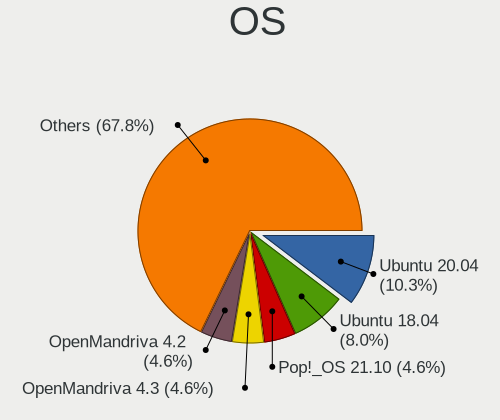

| Name                | Desktops | Percent |
|---------------------|----------|---------|
| Ubuntu 20.04        | 11       | 10.58%  |
| Ubuntu 18.04        | 7        | 6.73%   |
| Ubuntu 22.04        | 5        | 4.81%   |
| OpenMandriva 4.3    | 5        | 4.81%   |
| OpenMandriva 4.2    | 5        | 4.81%   |
| Pop!_OS 21.10       | 4        | 3.85%   |
| Manjaro             | 4        | 3.85%   |
| Debian 10           | 4        | 3.85%   |
| Ubuntu 19.10        | 3        | 2.88%   |
| ROSA R10            | 3        | 2.88%   |
| Ubuntu 21.10        | 2        | 1.92%   |
| Pop!_OS 21.04       | 2        | 1.92%   |
| Manjaro 20.2        | 2        | 1.92%   |
| Fedora 37           | 2        | 1.92%   |
| Fedora 35           | 2        | 1.92%   |
| Endless 3.9.0       | 2        | 1.92%   |
| Arch                | 2        | 1.92%   |
| Zorin 16            | 1        | 0.96%   |
| Zorin 15            | 1        | 0.96%   |
| Ubuntu Unity 18.04  | 1        | 0.96%   |
| Ubuntu Budgie 20.04 | 1        | 0.96%   |
| Ubuntu 22.10        | 1        | 0.96%   |
| Ubuntu 19.04        | 1        | 0.96%   |
| Ubuntu 18.10        | 1        | 0.96%   |
| Ubuntu 16.04        | 1        | 0.96%   |
| Solus 4.3           | 1        | 0.96%   |
| ROSA R8             | 1        | 0.96%   |
| ROSA R11.1          | 1        | 0.96%   |
| Pop!_OS 22.04       | 1        | 0.96%   |
| Pop!_OS 20.10       | 1        | 0.96%   |
| Pear OS 20.04       | 1        | 0.96%   |
| Manjaro 21.1.6      | 1        | 0.96%   |
| Manjaro 21.0.3      | 1        | 0.96%   |
| Manjaro 20.0.3      | 1        | 0.96%   |
| Manjaro 18.0.4      | 1        | 0.96%   |
| Linux Mint 20.3     | 1        | 0.96%   |
| Kubuntu 22.10       | 1        | 0.96%   |
| Kubuntu 20.04       | 1        | 0.96%   |
| Kubuntu 18.04       | 1        | 0.96%   |
| KDE neon 20.04      | 1        | 0.96%   |

OS Family
---------

OS without a version

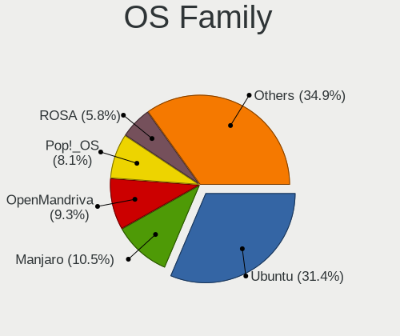

| Name          | Desktops | Percent |
|---------------|----------|---------|
| Ubuntu        | 30       | 31.25%  |
| OpenMandriva  | 10       | 10.42%  |
| Manjaro       | 9        | 9.38%   |
| Pop!_OS       | 7        | 7.29%   |
| Fedora        | 6        | 6.25%   |
| ROSA          | 5        | 5.21%   |
| Endless       | 5        | 5.21%   |
| Debian        | 5        | 5.21%   |
| Zorin         | 2        | 2.08%   |
| Kubuntu       | 2        | 2.08%   |
| Kali          | 2        | 2.08%   |
| Arch          | 2        | 2.08%   |
| Ubuntu Unity  | 1        | 1.04%   |
| Ubuntu Budgie | 1        | 1.04%   |
| Solus         | 1        | 1.04%   |
| Pear OS       | 1        | 1.04%   |
| Linux Mint    | 1        | 1.04%   |
| KDE neon      | 1        | 1.04%   |
| EndeavourOS   | 1        | 1.04%   |
| Drauger OS    | 1        | 1.04%   |
| Clear Linux   | 1        | 1.04%   |
| CentOS        | 1        | 1.04%   |
| ArcoLinux     | 1        | 1.04%   |

Kernel
------

Version of the Linux kernel

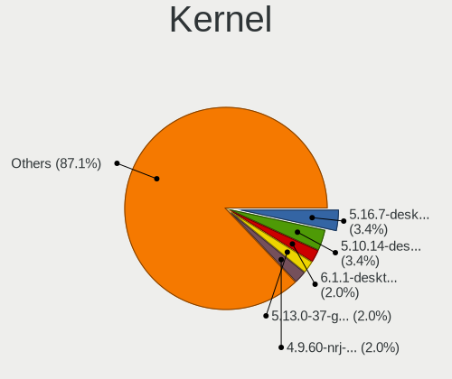

| Version                         | Desktops | Percent |
|---------------------------------|----------|---------|
| 5.16.7-desktop-1omv4003         | 5        | 4.24%   |
| 5.10.14-desktop-1omv4002        | 5        | 4.24%   |
| 5.13.0-37-generic               | 3        | 2.54%   |
| 4.9.60-nrj-desktop-1rosa-x86_64 | 3        | 2.54%   |
| 5.9.11-3-MANJARO                | 2        | 1.69%   |
| 5.8.0-14-generic                | 2        | 1.69%   |
| 5.4.0-42-generic                | 2        | 1.69%   |
| 5.19.0-23-generic               | 2        | 1.69%   |
| 5.15.5-76051505-generic         | 2        | 1.69%   |
| 4.18.0-25-generic               | 2        | 1.69%   |
| 4.18.0-17-generic               | 2        | 1.69%   |
| 6.0.8-300.fc37.x86_64           | 1        | 0.85%   |
| 6.0.8-200.fc36.x86_64           | 1        | 0.85%   |
| 6.0.15-300.fc37.x86_64          | 1        | 0.85%   |
| 6.0.0-1-amd64                   | 1        | 0.85%   |
| 5.9.10-200.fc33.x86_64          | 1        | 0.85%   |
| 5.8.5-arch1-1                   | 1        | 0.85%   |
| 5.8.11-1-MANJARO                | 1        | 0.85%   |
| 5.8.0-7642-generic              | 1        | 0.85%   |
| 5.8.0-55-generic                | 1        | 0.85%   |
| 5.8.0-44-generic                | 1        | 0.85%   |
| 5.7.9-1-MANJARO                 | 1        | 0.85%   |
| 5.6.15-300.fc32.x86_64          | 1        | 0.85%   |
| 5.6.0-2-amd64                   | 1        | 0.85%   |
| 5.5.6-050506-generic            | 1        | 0.85%   |
| 5.5.0-kali2-amd64               | 1        | 0.85%   |
| 5.5.0-2-amd64                   | 1        | 0.85%   |
| 5.4.0-94-generic                | 1        | 0.85%   |
| 5.4.0-77-generic                | 1        | 0.85%   |
| 5.4.0-66-generic                | 1        | 0.85%   |
| 5.4.0-65-generic                | 1        | 0.85%   |
| 5.4.0-47-generic                | 1        | 0.85%   |
| 5.4.0-39-generic                | 1        | 0.85%   |
| 5.4.0-29-generic                | 1        | 0.85%   |
| 5.4.0-19-generic                | 1        | 0.85%   |
| 5.4.0-125-generic               | 1        | 0.85%   |
| 5.4.0-110-generic               | 1        | 0.85%   |
| 5.3.0-3-amd64                   | 1        | 0.85%   |
| 5.3.0-29-generic                | 1        | 0.85%   |
| 5.3.0-28-generic                | 1        | 0.85%   |

Kernel Family
-------------

Linux kernel without a distro release

| Version | Desktops | Percent |
|---------|----------|---------|
| 5.4.0   | 12       | 10.53%  |
| 5.15.0  | 7        | 6.14%   |
| 4.18.0  | 6        | 5.26%   |
| 5.8.0   | 5        | 4.39%   |
| 5.3.0   | 5        | 4.39%   |
| 5.16.7  | 5        | 4.39%   |
| 5.13.0  | 5        | 4.39%   |
| 5.10.14 | 5        | 4.39%   |
| 4.15.0  | 5        | 4.39%   |
| 5.11.0  | 4        | 3.51%   |
| 4.9.60  | 3        | 2.63%   |
| 6.0.8   | 2        | 1.75%   |
| 5.9.11  | 2        | 1.75%   |
| 5.5.0   | 2        | 1.75%   |
| 5.19.0  | 2        | 1.75%   |
| 5.16.11 | 2        | 1.75%   |
| 5.15.5  | 2        | 1.75%   |
| 5.0.0   | 2        | 1.75%   |
| 4.19.0  | 2        | 1.75%   |
| 6.0.15  | 1        | 0.88%   |
| 6.0.0   | 1        | 0.88%   |
| 5.9.10  | 1        | 0.88%   |
| 5.8.5   | 1        | 0.88%   |
| 5.8.11  | 1        | 0.88%   |
| 5.7.9   | 1        | 0.88%   |
| 5.6.15  | 1        | 0.88%   |
| 5.6.0   | 1        | 0.88%   |
| 5.5.6   | 1        | 0.88%   |
| 5.19.12 | 1        | 0.88%   |
| 5.18.5  | 1        | 0.88%   |
| 5.18.16 | 1        | 0.88%   |
| 5.18.12 | 1        | 0.88%   |
| 5.17.8  | 1        | 0.88%   |
| 5.17.5  | 1        | 0.88%   |
| 5.17.1  | 1        | 0.88%   |
| 5.16.20 | 1        | 0.88%   |
| 5.16.19 | 1        | 0.88%   |
| 5.16.0  | 1        | 0.88%   |
| 5.15.8  | 1        | 0.88%   |
| 5.15.7  | 1        | 0.88%   |

Kernel Major Ver.
-----------------

Linux kernel major version

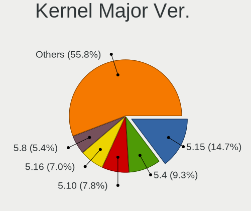

| Version | Desktops | Percent |
|---------|----------|---------|
| 5.15    | 14       | 12.73%  |
| 5.4     | 12       | 10.91%  |
| 5.16    | 9        | 8.18%   |
| 5.10    | 9        | 8.18%   |
| 5.8     | 7        | 6.36%   |
| 4.18    | 6        | 5.45%   |
| 5.3     | 5        | 4.55%   |
| 5.13    | 5        | 4.55%   |
| 5.11    | 5        | 4.55%   |
| 4.15    | 5        | 4.55%   |
| 6.0     | 4        | 3.64%   |
| 4.9     | 4        | 3.64%   |
| 5.9     | 3        | 2.73%   |
| 5.5     | 3        | 2.73%   |
| 5.19    | 3        | 2.73%   |
| 5.17    | 3        | 2.73%   |
| 5.6     | 2        | 1.82%   |
| 5.18    | 2        | 1.82%   |
| 5.14    | 2        | 1.82%   |
| 5.0     | 2        | 1.82%   |
| 4.19    | 2        | 1.82%   |
| 5.7     | 1        | 0.91%   |
| 4.20    | 1        | 0.91%   |
| 4.1     | 1        | 0.91%   |

Arch
----

OS architecture (x86_64, i586, etc.)

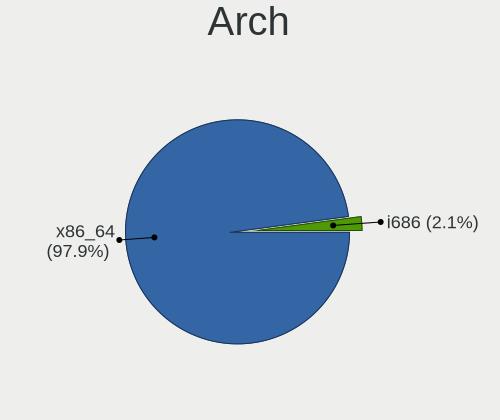

| Name   | Desktops | Percent |
|--------|----------|---------|
| x86_64 | 83       | 97.65%  |
| i686   | 2        | 2.35%   |

DE
--

Desktop Environment

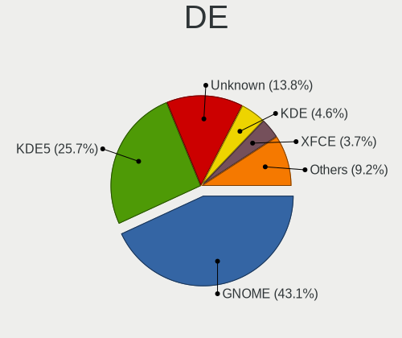

| Name       | Desktops | Percent |
|------------|----------|---------|
| GNOME      | 38       | 40.86%  |
| KDE5       | 22       | 23.66%  |
| Unknown    | 15       | 16.13%  |
| KDE        | 5        | 5.38%   |
| XFCE       | 4        | 4.3%    |
| KDE4       | 3        | 3.23%   |
| Budgie     | 2        | 2.15%   |
| X-Cinnamon | 1        | 1.08%   |
| Unity      | 1        | 1.08%   |
| Deepin     | 1        | 1.08%   |
| Cinnamon   | 1        | 1.08%   |

Display Server
--------------

X11 or Wayland

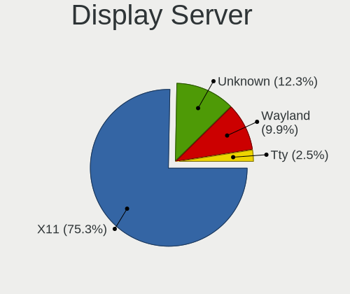

| Name    | Desktops | Percent |
|---------|----------|---------|
| X11     | 67       | 76.14%  |
| Unknown | 10       | 11.36%  |
| Wayland | 9        | 10.23%  |
| Tty     | 2        | 2.27%   |

Display Manager
---------------

SDDM, LightDM, etc.

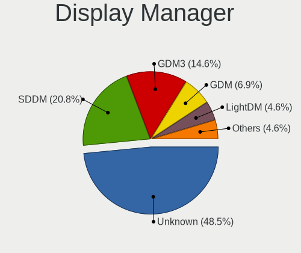

| Name    | Desktops | Percent |
|---------|----------|---------|
| Unknown | 53       | 55.79%  |
| SDDM    | 18       | 18.95%  |
| GDM3    | 9        | 9.47%   |
| GDM     | 6        | 6.32%   |
| TDM     | 3        | 3.16%   |
| LightDM | 3        | 3.16%   |
| KDM     | 3        | 3.16%   |

OS Lang
-------

Language

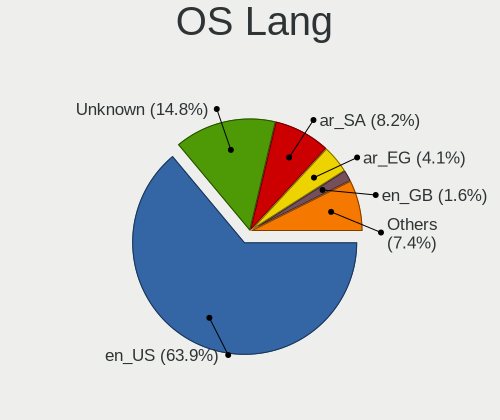

| Lang    | Desktops | Percent |
|---------|----------|---------|
| en_US   | 56       | 60.87%  |
| Unknown | 18       | 19.57%  |
| ar_SA   | 7        | 7.61%   |
| ar_EG   | 3        | 3.26%   |
| en_GB   | 2        | 2.17%   |
| ar_AE   | 2        | 2.17%   |
| en_IL   | 1        | 1.09%   |
| en_AU   | 1        | 1.09%   |
| de_DE   | 1        | 1.09%   |
| C       | 1        | 1.09%   |

Boot Mode
---------

EFI or BIOS

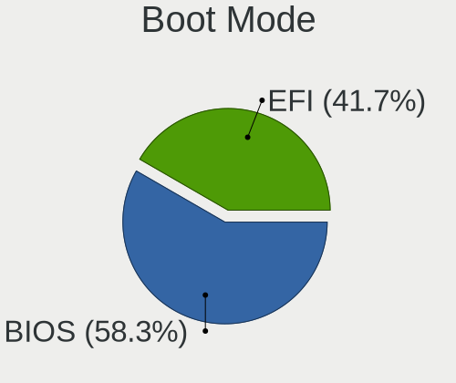

| Mode | Desktops | Percent |
|------|----------|---------|
| BIOS | 56       | 62.22%  |
| EFI  | 34       | 37.78%  |

Filesystem
----------

Type of filesystem

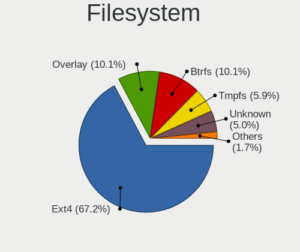

| Type    | Desktops | Percent |
|---------|----------|---------|
| Ext4    | 66       | 74.16%  |
| Overlay | 8        | 8.99%   |
| Btrfs   | 7        | 7.87%   |
| Unknown | 6        | 6.74%   |
| Xfs     | 1        | 1.12%   |
| Ext2    | 1        | 1.12%   |

Part. scheme
------------

Scheme of partitioning

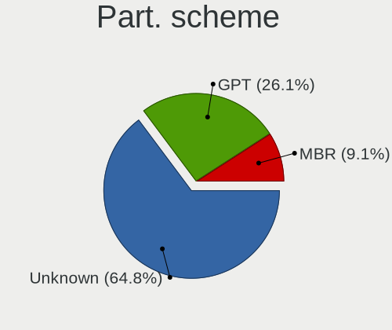

| Type    | Desktops | Percent |
|---------|----------|---------|
| Unknown | 60       | 63.83%  |
| GPT     | 26       | 27.66%  |
| MBR     | 8        | 8.51%   |

Dual Boot with Linux/BSD
------------------------

Hosting more than one Linux/BSD

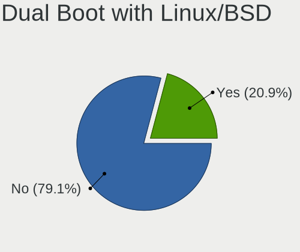

| Dual boot | Desktops | Percent |
|-----------|----------|---------|
| No        | 73       | 82.95%  |
| Yes       | 15       | 17.05%  |

Dual Boot (Win)
---------------

Hosting Linux and Windows

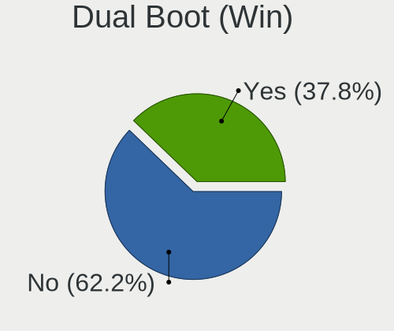

| Dual boot | Desktops | Percent |
|-----------|----------|---------|
| No        | 58       | 64.44%  |
| Yes       | 32       | 35.56%  |

Board
-----

Vendor
------

Motherboard manufacturer

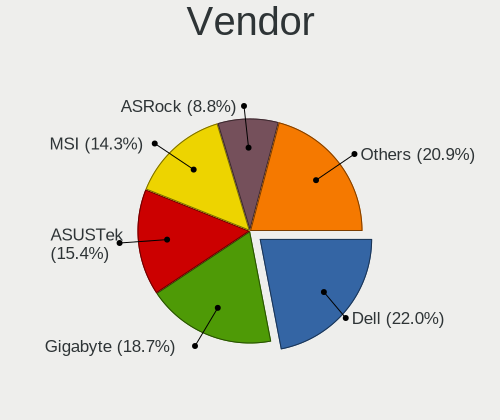

| Name                | Desktops | Percent |
|---------------------|----------|---------|
| Dell                | 20       | 23.53%  |
| Gigabyte Technology | 15       | 17.65%  |
| MSI                 | 13       | 15.29%  |
| ASUSTek Computer    | 11       | 12.94%  |
| ASRock              | 8        | 9.41%   |
| Hewlett-Packard     | 5        | 5.88%   |
| Lenovo              | 3        | 3.53%   |
| Pegatron            | 2        | 2.35%   |
| Intel               | 2        | 2.35%   |
| Unknown             | 2        | 2.35%   |
| OEM                 | 1        | 1.18%   |
| Huanan              | 1        | 1.18%   |
| Fujitsu Siemens     | 1        | 1.18%   |
| Biostar             | 1        | 1.18%   |

Model
-----

Motherboard model

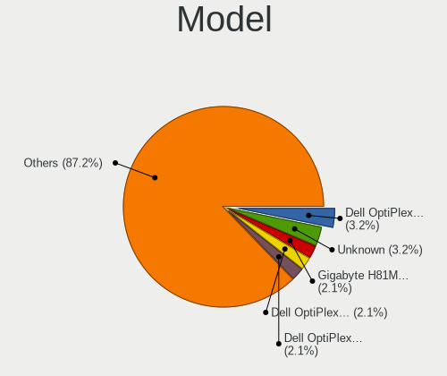

| Name                                 | Desktops | Percent |
|--------------------------------------|----------|---------|
| Gigabyte H81M-S2PH                   | 2        | 2.35%   |
| Dell OptiPlex 9020                   | 2        | 2.35%   |
| Dell OptiPlex 9010                   | 2        | 2.35%   |
| Dell OptiPlex 7050                   | 2        | 2.35%   |
| Dell OptiPlex 7010                   | 2        | 2.35%   |
| ASUS All Series                      | 2        | 2.35%   |
| Unknown                              | 2        | 2.35%   |
| Pegatron h8-1400ex                   | 1        | 1.18%   |
| Pegatron Compaq dx7500 Microtower    | 1        | 1.18%   |
| OEM B250                             | 1        | 1.18%   |
| MSI MS-7D20                          | 1        | 1.18%   |
| MSI MS-7C91                          | 1        | 1.18%   |
| MSI MS-7C90                          | 1        | 1.18%   |
| MSI MS-7C75                          | 1        | 1.18%   |
| MSI MS-7C56                          | 1        | 1.18%   |
| MSI MS-7C37                          | 1        | 1.18%   |
| MSI MS-7B84                          | 1        | 1.18%   |
| MSI MS-7B46                          | 1        | 1.18%   |
| MSI MS-7B19                          | 1        | 1.18%   |
| MSI MS-7A70                          | 1        | 1.18%   |
| MSI MS-7758                          | 1        | 1.18%   |
| MSI MS-7529                          | 1        | 1.18%   |
| MSI Compaq dx2390 Microtower         | 1        | 1.18%   |
| Lenovo ThinkCentre M93p 10A8S3C100   | 1        | 1.18%   |
| Lenovo ThinkCentre E73 10AS0040AX    | 1        | 1.18%   |
| Lenovo Legion T5 26IOB6 90RT00TVKS   | 1        | 1.18%   |
| Intel DP55WB AAE64798-206            | 1        | 1.18%   |
| Intel BTC-T37                        | 1        | 1.18%   |
| Huanan X99-F8                        | 1        | 1.18%   |
| HP Z440 Workstation                  | 1        | 1.18%   |
| HP ProDesk 400 G2 MT (TPM DP)        | 1        | 1.18%   |
| HP Pavilion Gaming Desktop TG01-2xxx | 1        | 1.18%   |
| HP EliteDesk 800 G5 TWR              | 1        | 1.18%   |
| HP 290 G2 MT Business PC             | 1        | 1.18%   |
| Gigabyte Z97X-UD3H                   | 1        | 1.18%   |
| Gigabyte Z97-D3H                     | 1        | 1.18%   |
| Gigabyte Z77-D3H                     | 1        | 1.18%   |
| Gigabyte Z390 I AORUS PRO WIFI       | 1        | 1.18%   |
| Gigabyte X570 AORUS MASTER           | 1        | 1.18%   |
| Gigabyte PH67A-D3-B3                 | 1        | 1.18%   |

Model Family
------------

Motherboard model prefix

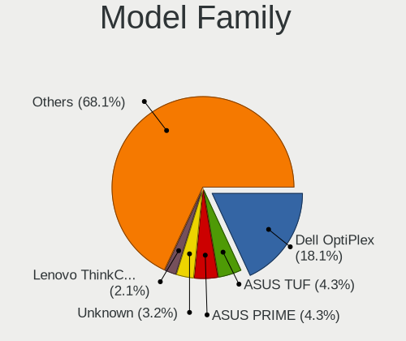

| Name               | Desktops | Percent |
|--------------------|----------|---------|
| Dell OptiPlex      | 16       | 18.82%  |
| Lenovo ThinkCentre | 2        | 2.35%   |
| Gigabyte H81M-S2PH | 2        | 2.35%   |
| Dell Vostro        | 2        | 2.35%   |
| Dell Precision     | 2        | 2.35%   |
| ASUS TUF           | 2        | 2.35%   |
| ASUS ROG           | 2        | 2.35%   |
| ASUS PRIME         | 2        | 2.35%   |
| ASUS All           | 2        | 2.35%   |
| ASRock X570        | 2        | 2.35%   |
| Unknown            | 2        | 2.35%   |
| Pegatron h8-1400ex | 1        | 1.18%   |
| Pegatron Compaq    | 1        | 1.18%   |
| OEM B250           | 1        | 1.18%   |
| MSI MS-7D20        | 1        | 1.18%   |
| MSI MS-7C91        | 1        | 1.18%   |
| MSI MS-7C90        | 1        | 1.18%   |
| MSI MS-7C75        | 1        | 1.18%   |
| MSI MS-7C56        | 1        | 1.18%   |
| MSI MS-7C37        | 1        | 1.18%   |
| MSI MS-7B84        | 1        | 1.18%   |
| MSI MS-7B46        | 1        | 1.18%   |
| MSI MS-7B19        | 1        | 1.18%   |
| MSI MS-7A70        | 1        | 1.18%   |
| MSI MS-7758        | 1        | 1.18%   |
| MSI MS-7529        | 1        | 1.18%   |
| MSI Compaq         | 1        | 1.18%   |
| Lenovo Legion      | 1        | 1.18%   |
| Intel DP55WB       | 1        | 1.18%   |
| Intel BTC-T37      | 1        | 1.18%   |
| Huanan X99-F8      | 1        | 1.18%   |
| HP Z440            | 1        | 1.18%   |
| HP ProDesk         | 1        | 1.18%   |
| HP Pavilion        | 1        | 1.18%   |
| HP EliteDesk       | 1        | 1.18%   |
| HP 290             | 1        | 1.18%   |
| Gigabyte Z97X-UD3H | 1        | 1.18%   |
| Gigabyte Z97-D3H   | 1        | 1.18%   |
| Gigabyte Z77-D3H   | 1        | 1.18%   |
| Gigabyte Z390      | 1        | 1.18%   |

MFG Year
--------

Motherboard manufacture year

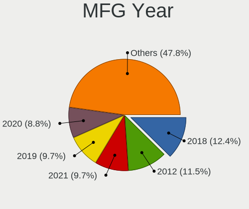

| Year | Desktops | Percent |
|------|----------|---------|
| 2018 | 13       | 15.29%  |
| 2012 | 9        | 10.59%  |
| 2019 | 8        | 9.41%   |
| 2013 | 8        | 9.41%   |
| 2021 | 7        | 8.24%   |
| 2020 | 7        | 8.24%   |
| 2015 | 6        | 7.06%   |
| 2014 | 6        | 7.06%   |
| 2017 | 4        | 4.71%   |
| 2011 | 4        | 4.71%   |
| 2010 | 4        | 4.71%   |
| 2008 | 3        | 3.53%   |
| 2016 | 2        | 2.35%   |
| 2007 | 2        | 2.35%   |
| 2009 | 1        | 1.18%   |
| 2006 | 1        | 1.18%   |

Form Factor
-----------

Physical design of the computer

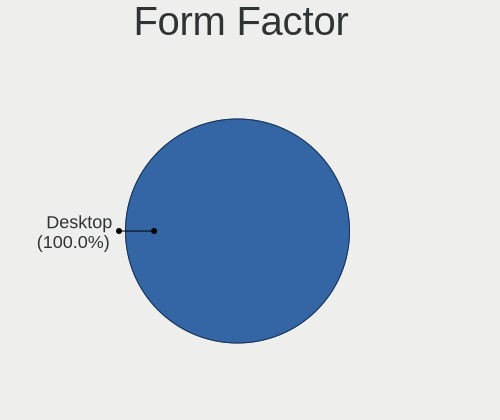

| Name    | Desktops | Percent |
|---------|----------|---------|
| Desktop | 85       | 100%    |

Secure Boot
-----------

Enabled or disabled

| State    | Desktops | Percent |
|----------|----------|---------|
| Disabled | 82       | 96.47%  |
| Enabled  | 3        | 3.53%   |

Coreboot
--------

Have coreboot on board

| Used | Desktops | Percent |
|------|----------|---------|
| No   | 85       | 100%    |

RAM Size
--------

Total RAM memory

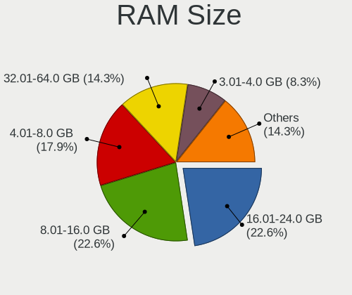

| Size in GB  | Desktops | Percent |
|-------------|----------|---------|
| 16.01-24.0  | 20       | 22.47%  |
| 8.01-16.0   | 19       | 21.35%  |
| 32.01-64.0  | 16       | 17.98%  |
| 4.01-8.0    | 15       | 16.85%  |
| 3.01-4.0    | 7        | 7.87%   |
| 1.01-2.0    | 4        | 4.49%   |
| 24.01-32.0  | 3        | 3.37%   |
| 64.01-256.0 | 3        | 3.37%   |
| 2.01-3.0    | 1        | 1.12%   |
| 0.51-1.0    | 1        | 1.12%   |

RAM Used
--------

Used RAM memory

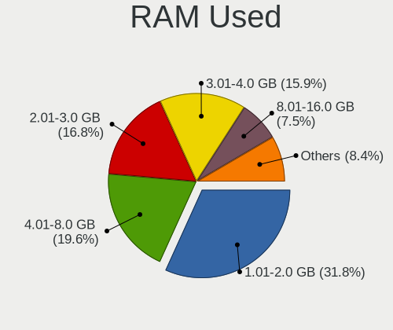

| Used GB    | Desktops | Percent |
|------------|----------|---------|
| 1.01-2.0   | 30       | 30%     |
| 4.01-8.0   | 20       | 20%     |
| 3.01-4.0   | 17       | 17%     |
| 2.01-3.0   | 16       | 16%     |
| 8.01-16.0  | 8        | 8%      |
| 0.51-1.0   | 8        | 8%      |
| 16.01-24.0 | 1        | 1%      |

Total Drives
------------

Number of drives on board

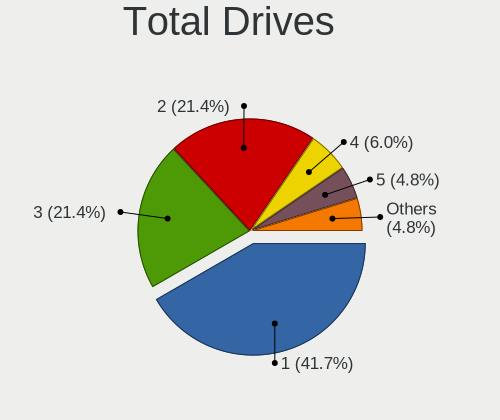

| Drives | Desktops | Percent |
|--------|----------|---------|
| 1      | 40       | 42.11%  |
| 2      | 22       | 23.16%  |
| 3      | 20       | 21.05%  |
| 4      | 5        | 5.26%   |
| 5      | 4        | 4.21%   |
| 6      | 3        | 3.16%   |
| 7      | 1        | 1.05%   |

Has CD-ROM
----------

Has CD-ROM on board

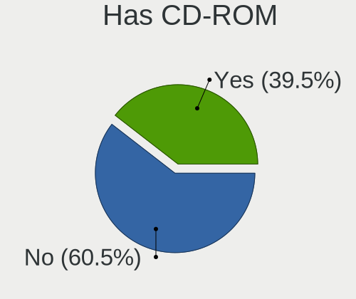

| Presented | Desktops | Percent |
|-----------|----------|---------|
| No        | 52       | 59.77%  |
| Yes       | 35       | 40.23%  |

Has Ethernet
------------

Has Ethernet on board

| Presented | Desktops | Percent |
|-----------|----------|---------|
| Yes       | 85       | 100%    |

Has WiFi
--------

Has WiFi module

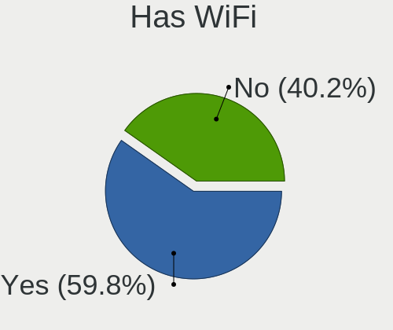

| Presented | Desktops | Percent |
|-----------|----------|---------|
| Yes       | 48       | 55.81%  |
| No        | 38       | 44.19%  |

Has Bluetooth
-------------

Has Bluetooth module

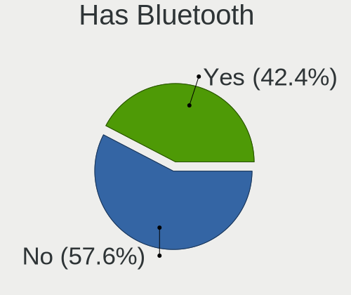

| Presented | Desktops | Percent |
|-----------|----------|---------|
| No        | 53       | 60.23%  |
| Yes       | 35       | 39.77%  |

Location
--------

Country
-------

Geographic location (country)

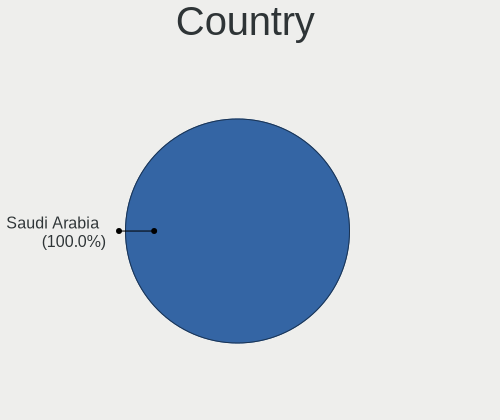

| Country      | Desktops | Percent |
|--------------|----------|---------|
| Saudi Arabia | 85       | 100%    |

City
----

Geographic location (city)

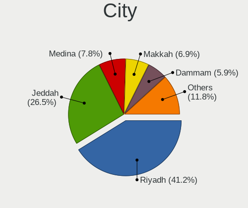

| City                 | Desktops | Percent |
|----------------------|----------|---------|
| Riyadh               | 38       | 41.3%   |
| Jeddah               | 24       | 26.09%  |
| Medina               | 8        | 8.7%    |
| Dammam               | 6        | 6.52%   |
| Makkah               | 5        | 5.43%   |
| Khobar               | 4        | 4.35%   |
| Al Qatif             | 3        | 3.26%   |
| Ta'if                | 1        | 1.09%   |
| Buraidah             | 1        | 1.09%   |
| Baq`a' ash Sharqiyah | 1        | 1.09%   |
| Al Faruq             | 1        | 1.09%   |

Drives
------

Drive Vendor
------------

Hard drive vendors

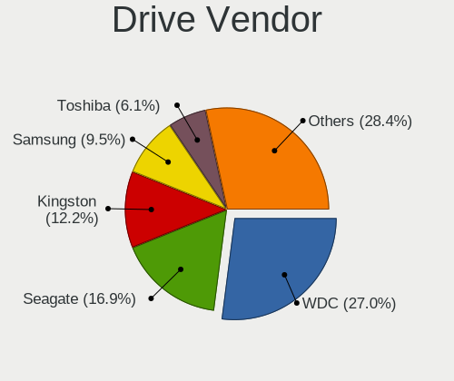

| Vendor                    | Desktops | Drives | Percent |
|---------------------------|----------|--------|---------|
| WDC                       | 45       | 80     | 26.63%  |
| Seagate                   | 28       | 46     | 16.57%  |
| Kingston                  | 21       | 42     | 12.43%  |
| Samsung Electronics       | 15       | 27     | 8.88%   |
| Toshiba                   | 9        | 11     | 5.33%   |
| Crucial                   | 7        | 9      | 4.14%   |
| Team                      | 4        | 4      | 2.37%   |
| Silicon Motion            | 4        | 5      | 2.37%   |
| SanDisk                   | 4        | 4      | 2.37%   |
| Phison                    | 4        | 4      | 2.37%   |
| Hitachi                   | 4        | 5      | 2.37%   |
| Lexar                     | 3        | 3      | 1.78%   |
| Unknown                   | 2        | 4      | 1.18%   |
| Phison Electronics        | 2        | 2      | 1.18%   |
| Intel                     | 2        | 2      | 1.18%   |
| HS-SSD-C100               | 2        | 3      | 1.18%   |
| HGST                      | 2        | 5      | 1.18%   |
| WD MediaMax               | 1        | 1      | 0.59%   |
| SPCC Sol                  | 1        | 1      | 0.59%   |
| SPCC                      | 1        | 1      | 0.59%   |
| PNY                       | 1        | 1      | 0.59%   |
| Micron/Crucial Technology | 1        | 1      | 0.59%   |
| Maxtor                    | 1        | 1      | 0.59%   |
| JMicron Technology        | 1        | 1      | 0.59%   |
| Hoodisk                   | 1        | 1      | 0.59%   |
| Hewlett-Packard           | 1        | 1      | 0.59%   |
| China                     | 1        | 1      | 0.59%   |
| Unknown                   | 1        | 1      | 0.59%   |

Drive Model
-----------

Hard drive models

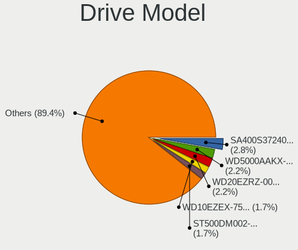

| Model                             | Desktops | Percent |
|-----------------------------------|----------|---------|
| WDC WD20EZRZ-00Z5HB0 2TB          | 5        | 2.46%   |
| Kingston SA400S37240G 240GB SSD   | 5        | 2.46%   |
| WDC WD5000AAKX-75U6AA0 500GB      | 4        | 1.97%   |
| Seagate ST500DM002-1BD142 500GB   | 4        | 1.97%   |
| WDC WD10EZEX-75WN4A1 1TB          | 3        | 1.48%   |
| Kingston SA400S37960G 960GB SSD   | 3        | 1.48%   |
| Kingston SA400S37480G 480GB SSD   | 3        | 1.48%   |
| WDC WDS120G2G0A-00JH30 120GB SSD  | 2        | 0.99%   |
| WDC WD10EZEX-08WN4A0 1TB          | 2        | 0.99%   |
| WDC WD10EADS-00M2B0 1TB           | 2        | 0.99%   |
| Toshiba MK1059GSM 1TB             | 2        | 0.99%   |
| Toshiba DT01ACA050 500GB          | 2        | 0.99%   |
| Silicon Motion NVMe SSD Drive 2TB | 2        | 0.99%   |
| Seagate ST2000LM007-1R8174 2TB    | 2        | 0.99%   |
| Seagate ST1000DM003-9YN162 1TB    | 2        | 0.99%   |
| Seagate ST1000DM003-1SB102 1TB    | 2        | 0.99%   |
| Samsung SSD 960 EVO 250GB         | 2        | 0.99%   |
| Samsung SSD 860 EVO 500GB         | 2        | 0.99%   |
| Samsung SSD 860 EVO 1TB           | 2        | 0.99%   |
| Samsung NVMe SSD Drive 500GB      | 2        | 0.99%   |
| Lexar 128GB SSD                   | 2        | 0.99%   |
| Kingston SH103S3120G 120GB SSD    | 2        | 0.99%   |
| Kingston SA400S37120G 120GB SSD   | 2        | 0.99%   |
| Hitachi HTS545050A7E380 500GB     | 2        | 0.99%   |
| Crucial CT500MX500SSD1 500GB      | 2        | 0.99%   |
| Crucial CT1000MX500SSD1 1TB       | 2        | 0.99%   |
| WDC WDS250G3X0C-00SJG0 250GB      | 1        | 0.49%   |
| WDC WDS100T2B0A-00SM50 1TB SSD    | 1        | 0.49%   |
| WDC WD800JD-00LSA0 80GB           | 1        | 0.49%   |
| WDC WD7500AAKS-00RBA0 752GB       | 1        | 0.49%   |
| WDC WD5000LPCX-00VHAT0 500GB      | 1        | 0.49%   |
| WDC WD5000AZRX-00A8LB0 500GB      | 1        | 0.49%   |
| WDC WD5000AZLX-75K2TA0 500GB      | 1        | 0.49%   |
| WDC WD5000AAKX-07U6AA0 500GB      | 1        | 0.49%   |
| WDC WD5000AAKX-001CA0 500GB       | 1        | 0.49%   |
| WDC WD5000AAKS-00WWPA0 500GB      | 1        | 0.49%   |
| WDC WD5000AAKS-00UU3A0 500GB      | 1        | 0.49%   |
| WDC WD5000AAKS-00TMA0 500GB       | 1        | 0.49%   |
| WDC WD40PURZ-85TTDY0 4TB          | 1        | 0.49%   |
| WDC WD40EZRZ-00G                  | 1        | 0.49%   |

HDD Vendor
----------

Hard disk drive vendors

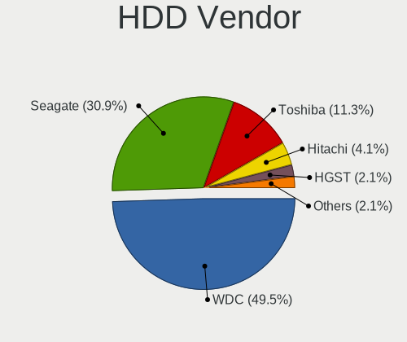

| Vendor  | Desktops | Drives | Percent |
|---------|----------|--------|---------|
| WDC     | 42       | 72     | 48.28%  |
| Seagate | 28       | 46     | 32.18%  |
| Toshiba | 9        | 11     | 10.34%  |
| Hitachi | 4        | 5      | 4.6%    |
| HGST    | 2        | 5      | 2.3%    |
| Unknown | 1        | 3      | 1.15%   |
| Maxtor  | 1        | 1      | 1.15%   |

SSD Vendor
----------

Solid state drive vendors

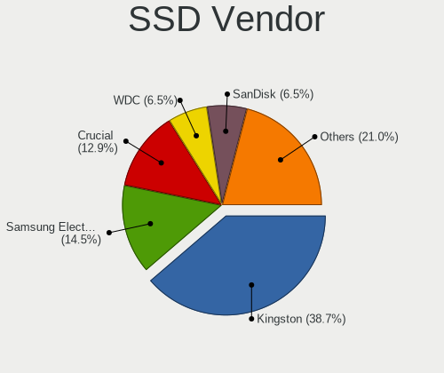

| Vendor              | Desktops | Drives | Percent |
|---------------------|----------|--------|---------|
| Kingston            | 20       | 40     | 37.74%  |
| Samsung Electronics | 8        | 16     | 15.09%  |
| Crucial             | 7        | 9      | 13.21%  |
| WDC                 | 3        | 6      | 5.66%   |
| Team                | 3        | 3      | 5.66%   |
| Lexar               | 3        | 3      | 5.66%   |
| SanDisk             | 2        | 2      | 3.77%   |
| SPCC Sol            | 1        | 1      | 1.89%   |
| SPCC                | 1        | 1      | 1.89%   |
| PNY                 | 1        | 1      | 1.89%   |
| JMicron Technology  | 1        | 1      | 1.89%   |
| Hoodisk             | 1        | 1      | 1.89%   |
| China               | 1        | 1      | 1.89%   |
| Unknown             | 1        | 1      | 1.89%   |

Drive Kind
----------

HDD or SSD

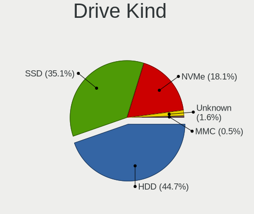

| Kind    | Desktops | Drives | Percent |
|---------|----------|--------|---------|
| HDD     | 64       | 143    | 47.06%  |
| SSD     | 46       | 86     | 33.82%  |
| NVMe    | 23       | 34     | 16.91%  |
| Unknown | 3        | 4      | 2.21%   |

Drive Connector
---------------

SATA, SAS, NVMe, etc.

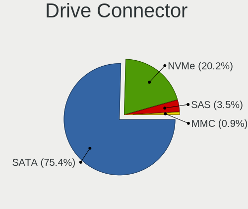

| Type | Desktops | Drives | Percent |
|------|----------|--------|---------|
| SATA | 80       | 224    | 74.77%  |
| NVMe | 23       | 34     | 21.5%   |
| SAS  | 4        | 9      | 3.74%   |

Drive Size
----------

Size of hard drive

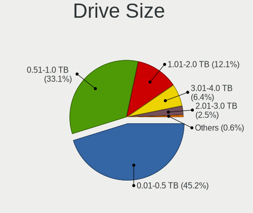

| Size in TB | Desktops | Drives | Percent |
|------------|----------|--------|---------|
| 0.01-0.5   | 51       | 117    | 43.97%  |
| 0.51-1.0   | 38       | 72     | 32.76%  |
| 1.01-2.0   | 16       | 27     | 13.79%  |
| 3.01-4.0   | 8        | 8      | 6.9%    |
| 2.01-3.0   | 2        | 3      | 1.72%   |
| 4.01-10.0  | 1        | 2      | 0.86%   |

Space Total
-----------

Amount of disk space available on the file system

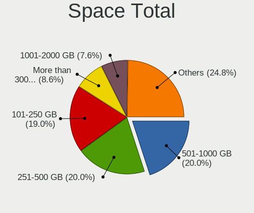

| Size in GB     | Desktops | Percent |
|----------------|----------|---------|
| 101-250        | 20       | 21.51%  |
| 501-1000       | 20       | 21.51%  |
| 251-500        | 18       | 19.35%  |
| More than 3000 | 8        | 8.6%    |
| 1001-2000      | 8        | 8.6%    |
| 2001-3000      | 5        | 5.38%   |
| 1-20           | 5        | 5.38%   |
| 51-100         | 5        | 5.38%   |
| 21-50          | 3        | 3.23%   |
| Unknown        | 1        | 1.08%   |

Space Used
----------

Amount of used disk space

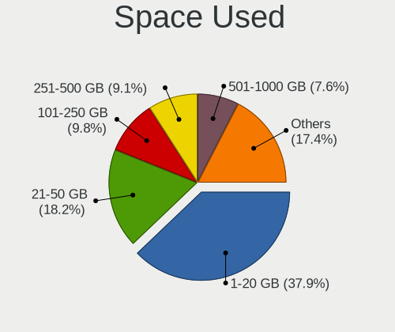

| Used GB        | Desktops | Percent |
|----------------|----------|---------|
| 1-20           | 40       | 39.6%   |
| 21-50          | 16       | 15.84%  |
| 251-500        | 11       | 10.89%  |
| 501-1000       | 8        | 7.92%   |
| 101-250        | 7        | 6.93%   |
| 51-100         | 7        | 6.93%   |
| 1001-2000      | 6        | 5.94%   |
| More than 3000 | 3        | 2.97%   |
| 2001-3000      | 2        | 1.98%   |
| Unknown        | 1        | 0.99%   |

Malfunc. Drives
---------------

Drive models with a malfunction

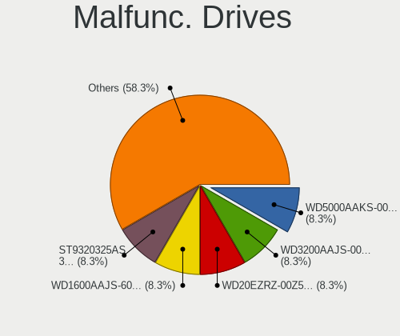

| Model                           | Desktops | Drives | Percent |
|---------------------------------|----------|--------|---------|
| WDC WD5000AAKS-00WWPA0 500GB    | 1        | 1      | 7.14%   |
| WDC WD3200AAJS-00L7A0 320GB     | 1        | 1      | 7.14%   |
| WDC WD20EZRZ-00Z5HB0 2TB        | 1        | 1      | 7.14%   |
| WDC WD1600AAJS-60B4A0 160GB     | 1        | 1      | 7.14%   |
| WDC WD10PURZ-85U8XY0 1TB        | 1        | 1      | 7.14%   |
| WDC WD10EUCX-73YZ1Y0 1TB        | 1        | 1      | 7.14%   |
| Seagate ST9320325AS 320GB       | 1        | 1      | 7.14%   |
| Seagate ST500LT012-1DG142 500GB | 1        | 1      | 7.14%   |
| Seagate ST500DM002-1BD142 500GB | 1        | 1      | 7.14%   |
| Seagate ST2000DM001-1CH164 2TB  | 1        | 1      | 7.14%   |
| Seagate ST1000DM003-9YN162 1TB  | 1        | 1      | 7.14%   |
| Kingston SA400S37480G 480GB SSD | 1        | 1      | 7.14%   |
| Hitachi HDS721032CLA362 320GB   | 1        | 1      | 7.14%   |
| Unknown                         | 1        | 1      | 7.14%   |

Malfunc. Drive Vendor
---------------------

Vendors of faulty drives

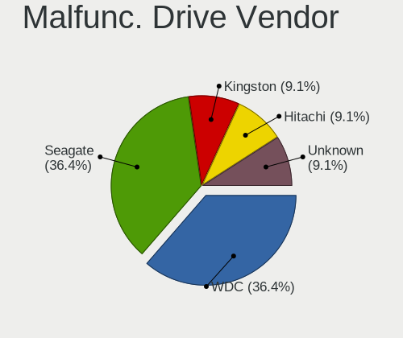

| Vendor   | Desktops | Drives | Percent |
|----------|----------|--------|---------|
| WDC      | 6        | 6      | 46.15%  |
| Seagate  | 4        | 5      | 30.77%  |
| Kingston | 1        | 1      | 7.69%   |
| Hitachi  | 1        | 1      | 7.69%   |
| Unknown  | 1        | 1      | 7.69%   |

Malfunc. HDD Vendor
-------------------

Vendors of faulty HDD drives

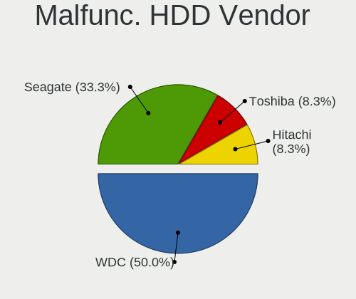

| Vendor  | Desktops | Drives | Percent |
|---------|----------|--------|---------|
| WDC     | 6        | 6      | 54.55%  |
| Seagate | 4        | 5      | 36.36%  |
| Hitachi | 1        | 1      | 9.09%   |

Malfunc. Drive Kind
-------------------

Kinds of faulty drives

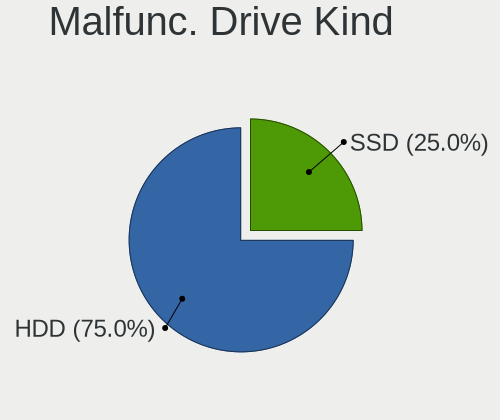

| Kind | Desktops | Drives | Percent |
|------|----------|--------|---------|
| HDD  | 9        | 12     | 81.82%  |
| SSD  | 2        | 2      | 18.18%  |

Failed Drives
-------------

Failed drive models

Zero info for selected period =(

Failed Drive Vendor
-------------------

Failed drive vendors

Zero info for selected period =(

Drive Status
------------

Number of failed and malfunc. drives

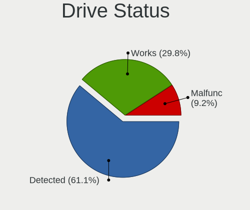

| Status   | Desktops | Drives | Percent |
|----------|----------|--------|---------|
| Detected | 62       | 189    | 62%     |
| Works    | 28       | 64     | 28%     |
| Malfunc  | 10       | 14     | 10%     |

Storage controller
------------------

Storage Vendor
--------------

Storage controller vendors

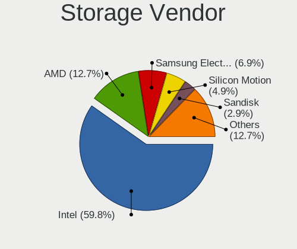

| Vendor                      | Desktops | Percent |
|-----------------------------|----------|---------|
| Intel                       | 70       | 59.83%  |
| AMD                         | 15       | 12.82%  |
| Samsung Electronics         | 8        | 6.84%   |
| Silicon Motion              | 5        | 4.27%   |
| Phison Electronics          | 5        | 4.27%   |
| ASMedia Technology          | 4        | 3.42%   |
| SanDisk                     | 3        | 2.56%   |
| Kingston Technology Company | 2        | 1.71%   |
| VIA Technologies            | 1        | 0.85%   |
| Micron/Crucial Technology   | 1        | 0.85%   |
| LSI Logic / Symbios Logic   | 1        | 0.85%   |
| JMicron Technology          | 1        | 0.85%   |
| ADATA Technology            | 1        | 0.85%   |

Storage Model
-------------

Storage controller models

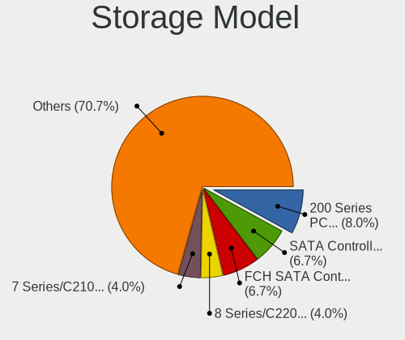

| Model                                                                                   | Desktops | Percent |
|-----------------------------------------------------------------------------------------|----------|---------|
| Intel 200 Series PCH SATA controller [AHCI mode]                                        | 10       | 7.19%   |
| AMD FCH SATA Controller [AHCI mode]                                                     | 9        | 6.47%   |
| Intel SATA Controller [RAID mode]                                                       | 8        | 5.76%   |
| Intel 8 Series/C220 Series Chipset Family 6-port SATA Controller 1 [AHCI mode]          | 6        | 4.32%   |
| Intel 7 Series/C210 Series Chipset Family 6-port SATA Controller [AHCI mode]            | 6        | 4.32%   |
| Intel Cannon Lake PCH SATA AHCI Controller                                              | 5        | 3.6%    |
| Samsung NVMe SSD Controller SM981/PM981/PM983                                           | 4        | 2.88%   |
| Intel NM10/ICH7 Family SATA Controller [IDE mode]                                       | 4        | 2.88%   |
| Intel 9 Series Chipset Family SATA Controller [AHCI Mode]                               | 4        | 2.88%   |
| ASMedia ASM1062 Serial ATA Controller                                                   | 4        | 2.88%   |
| Silicon Motion SM2263EN/SM2263XT SSD Controller                                         | 3        | 2.16%   |
| Phison E12 NVMe Controller                                                              | 3        | 2.16%   |
| Intel 82801G (ICH7 Family) IDE Controller                                               | 3        | 2.16%   |
| AMD 500 Series Chipset SATA Controller                                                  | 3        | 2.16%   |
| AMD 400 Series Chipset SATA Controller                                                  | 3        | 2.16%   |
| Silicon Motion SM2262/SM2262EN SSD Controller                                           | 2        | 1.44%   |
| Samsung NVMe SSD Controller SM961/PM961/SM963                                           | 2        | 1.44%   |
| Samsung NVMe SSD Controller PM9A1/PM9A3/980PRO                                          | 2        | 1.44%   |
| Phison E16 PCIe4 NVMe Controller                                                        | 2        | 1.44%   |
| Intel Q170/Q150/B150/H170/H110/Z170/CM236 Chipset SATA Controller [AHCI Mode]           | 2        | 1.44%   |
| Intel Comet Lake SATA AHCI Controller                                                   | 2        | 1.44%   |
| Intel C610/X99 series chipset sSATA Controller [AHCI mode]                              | 2        | 1.44%   |
| Intel C610/X99 series chipset 6-Port SATA Controller [AHCI mode]                        | 2        | 1.44%   |
| Intel 82801JI (ICH10 Family) SATA AHCI Controller                                       | 2        | 1.44%   |
| Intel 7 Series/C210 Series Chipset Family 4-port SATA Controller [IDE mode]             | 2        | 1.44%   |
| Intel 7 Series/C210 Series Chipset Family 2-port SATA Controller [IDE mode]             | 2        | 1.44%   |
| Intel 6 Series/C200 Series Chipset Family Desktop SATA Controller (IDE mode, ports 4-5) | 2        | 1.44%   |
| Intel 6 Series/C200 Series Chipset Family Desktop SATA Controller (IDE mode, ports 0-3) | 2        | 1.44%   |
| Intel 6 Series/C200 Series Chipset Family 6 port Desktop SATA AHCI Controller           | 2        | 1.44%   |
| Intel 500 Series Chipset Family SATA AHCI Controller                                    | 2        | 1.44%   |
| AMD SB7x0/SB8x0/SB9x0 SATA Controller [AHCI mode]                                       | 2        | 1.44%   |
| VIA VT82C586A/B/VT82C686/A/B/VT823x/A/C PIPC Bus Master IDE                             | 1        | 0.72%   |
| VIA Serial ATA Controller                                                               | 1        | 0.72%   |
| SanDisk WD Blue SN550 NVMe SSD                                                          | 1        | 0.72%   |
| SanDisk WD Black SN750 / PC SN730 NVMe SSD                                              | 1        | 0.72%   |
| SanDisk WD Black NVMe SSD                                                               | 1        | 0.72%   |
| Micron/Crucial P2 NVMe PCIe SSD                                                         | 1        | 0.72%   |
| LSI Logic / Symbios Logic MegaRAID SAS 2008 [Falcon]                                    | 1        | 0.72%   |
| Kingston Company Company Non-Volatile memory controller                                 | 1        | 0.72%   |
| Kingston Company HyperX Predator PCIe AHCI SSD                                          | 1        | 0.72%   |

Storage Kind
------------

Kind of storage controller (IDE, SATA, NVMe, SAS, ...)

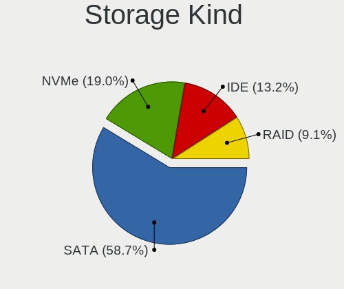

| Kind | Desktops | Percent |
|------|----------|---------|
| SATA | 65       | 57.02%  |
| NVMe | 23       | 20.18%  |
| IDE  | 15       | 13.16%  |
| RAID | 11       | 9.65%   |

Processor
---------

CPU Vendor
----------

Processor vendors

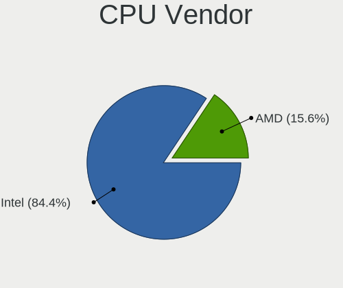

| Vendor | Desktops | Percent |
|--------|----------|---------|
| Intel  | 71       | 83.53%  |
| AMD    | 14       | 16.47%  |

CPU Model
---------

Processor models

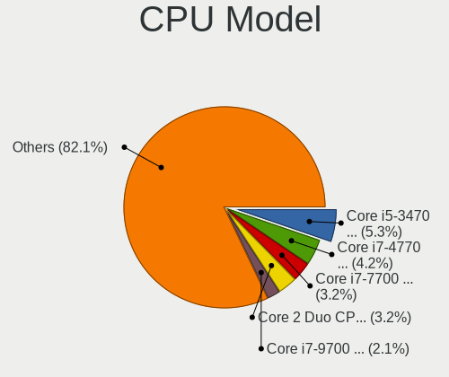

| Model                                       | Desktops | Percent |
|---------------------------------------------|----------|---------|
| Intel Core i5-3470 CPU @ 3.20GHz            | 5        | 5.81%   |
| Intel Core i7-7700 CPU @ 3.60GHz            | 3        | 3.49%   |
| Intel Core i7-4770 CPU @ 3.40GHz            | 3        | 3.49%   |
| Intel Core i7-9700 CPU @ 3.00GHz            | 2        | 2.33%   |
| Intel Core i7-8700 CPU @ 3.20GHz            | 2        | 2.33%   |
| Intel Core i7-7700K CPU @ 4.20GHz           | 2        | 2.33%   |
| Intel Core i7-3770 CPU @ 3.40GHz            | 2        | 2.33%   |
| Intel Core i7-2600 CPU @ 3.40GHz            | 2        | 2.33%   |
| Intel Core i5-7500 CPU @ 3.40GHz            | 2        | 2.33%   |
| Intel Core i3-2120 CPU @ 3.30GHz            | 2        | 2.33%   |
| Intel Core i3-10100 CPU @ 3.60GHz           | 2        | 2.33%   |
| Intel Core 2 Duo CPU E7500 @ 2.93GHz        | 2        | 2.33%   |
| AMD Ryzen 9 3950X 16-Core Processor         | 2        | 2.33%   |
| AMD Ryzen 5 5600X 6-Core Processor          | 2        | 2.33%   |
| Intel Xeon CPU E5-2660 v3 @ 2.60GHz         | 1        | 1.16%   |
| Intel Xeon CPU E5-2630 0 @ 2.30GHz          | 1        | 1.16%   |
| Intel Xeon CPU E5-1650 v2 @ 3.50GHz         | 1        | 1.16%   |
| Intel Xeon CPU E5-1620 v3 @ 3.50GHz         | 1        | 1.16%   |
| Intel Pentium Silver N6005 @ 2.00GHz        | 1        | 1.16%   |
| Intel Pentium Dual-Core CPU E5200 @ 2.50GHz | 1        | 1.16%   |
| Intel Pentium 4 CPU 3.60GHz                 | 1        | 1.16%   |
| Intel Core i9-7900X CPU @ 3.30GHz           | 1        | 1.16%   |
| Intel Core i7-9700K CPU @ 3.60GHz           | 1        | 1.16%   |
| Intel Core i7-8700K CPU @ 3.70GHz           | 1        | 1.16%   |
| Intel Core i7-6700 CPU @ 3.40GHz            | 1        | 1.16%   |
| Intel Core i7-4790K CPU @ 4.00GHz           | 1        | 1.16%   |
| Intel Core i7-4790 CPU @ 3.60GHz            | 1        | 1.16%   |
| Intel Core i7-10700K CPU @ 3.80GHz          | 1        | 1.16%   |
| Intel Core i7 CPU 965 @ 3.20GHz             | 1        | 1.16%   |
| Intel Core i7 CPU 870 @ 2.93GHz             | 1        | 1.16%   |
| Intel Core i7 CPU 860 @ 2.80GHz             | 1        | 1.16%   |
| Intel Core i5-9600K CPU @ 3.70GHz           | 1        | 1.16%   |
| Intel Core i5-9500 CPU @ 3.00GHz            | 1        | 1.16%   |
| Intel Core i5-8500 CPU @ 3.00GHz            | 1        | 1.16%   |
| Intel Core i5-6400 CPU @ 2.70GHz            | 1        | 1.16%   |
| Intel Core i5-4690K CPU @ 3.50GHz           | 1        | 1.16%   |
| Intel Core i5-4690 CPU @ 3.50GHz            | 1        | 1.16%   |
| Intel Core i5-4590S CPU @ 3.00GHz           | 1        | 1.16%   |
| Intel Core i5-4570 CPU @ 3.20GHz            | 1        | 1.16%   |
| Intel Core i5-4460 CPU @ 3.20GHz            | 1        | 1.16%   |

CPU Model Family
----------------

Processor model prefix

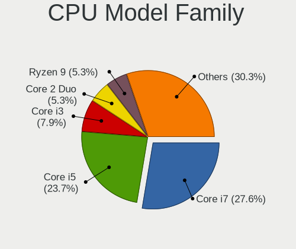

| Model                   | Desktops | Percent |
|-------------------------|----------|---------|
| Intel Core i7           | 25       | 29.07%  |
| Intel Core i5           | 20       | 23.26%  |
| Intel Core i3           | 6        | 6.98%   |
| AMD Ryzen 5             | 5        | 5.81%   |
| Intel Xeon              | 4        | 4.65%   |
| Intel Core 2 Duo        | 4        | 4.65%   |
| AMD Ryzen 9             | 4        | 4.65%   |
| AMD Ryzen 7             | 4        | 4.65%   |
| Other                   | 3        | 3.49%   |
| Intel Celeron           | 3        | 3.49%   |
| AMD FX                  | 2        | 2.33%   |
| Intel Pentium Silver    | 1        | 1.16%   |
| Intel Pentium Dual-Core | 1        | 1.16%   |
| Intel Pentium 4         | 1        | 1.16%   |
| Intel Core i9           | 1        | 1.16%   |
| Intel Core 2 Quad       | 1        | 1.16%   |
| Intel Core 2            | 1        | 1.16%   |

CPU Cores
---------

Number of processor cores

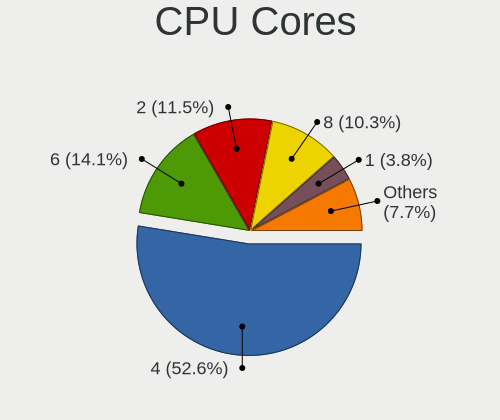

| Number | Desktops | Percent |
|--------|----------|---------|
| 4      | 45       | 52.33%  |
| 6      | 13       | 15.12%  |
| 8      | 10       | 11.63%  |
| 2      | 9        | 10.47%  |
| 1      | 3        | 3.49%   |
| 16     | 2        | 2.33%   |
| 12     | 2        | 2.33%   |
| 10     | 2        | 2.33%   |

CPU Sockets
-----------

Number of sockets

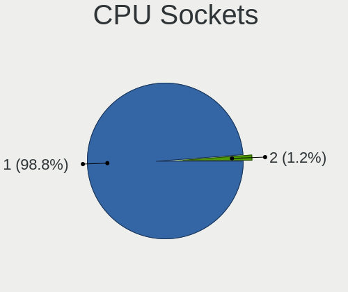

| Number | Desktops | Percent |
|--------|----------|---------|
| 1      | 84       | 98.82%  |
| 2      | 1        | 1.18%   |

CPU Threads
-----------

Threads per core (Hyper-Threading)

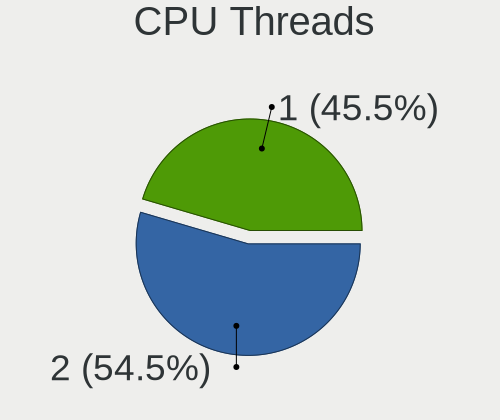

| Number | Desktops | Percent |
|--------|----------|---------|
| 2      | 48       | 55.81%  |
| 1      | 38       | 44.19%  |

CPU Op-Modes
------------

CPU Operation Modes (32-bit, 64-bit)

| Op mode        | Desktops | Percent |
|----------------|----------|---------|
| 32-bit, 64-bit | 83       | 97.65%  |
| Unknown        | 2        | 2.35%   |

CPU Microcode
-------------

Microcode number

| Number     | Desktops | Percent |
|------------|----------|---------|
| Unknown    | 33       | 35.11%  |
| 0x306c3    | 12       | 12.77%  |
| 0x306a9    | 7        | 7.45%   |
| 0x906e9    | 5        | 5.32%   |
| 0x206a7    | 5        | 5.32%   |
| 0x1067a    | 5        | 5.32%   |
| 0x906ea    | 3        | 3.19%   |
| 0xa0653    | 2        | 2.13%   |
| 0x906ed    | 2        | 2.13%   |
| 0x08701021 | 2        | 2.13%   |
| 0xf64      | 1        | 1.06%   |
| 0xa0655    | 1        | 1.06%   |
| 0x906ec    | 1        | 1.06%   |
| 0x906eb    | 1        | 1.06%   |
| 0x906c0    | 1        | 1.06%   |
| 0x6f2      | 1        | 1.06%   |
| 0x506e3    | 1        | 1.06%   |
| 0x506c9    | 1        | 1.06%   |
| 0x306f2    | 1        | 1.06%   |
| 0x306e4    | 1        | 1.06%   |
| 0x206d7    | 1        | 1.06%   |
| 0x106e5    | 1        | 1.06%   |
| 0x106a4    | 1        | 1.06%   |
| 0x10661    | 1        | 1.06%   |
| 0x0a201009 | 1        | 1.06%   |
| 0x08701013 | 1        | 1.06%   |
| 0x0800820d | 1        | 1.06%   |
| 0x06000852 | 1        | 1.06%   |

CPU Microarch
-------------

Microarchitecture

| Name        | Desktops | Percent |
|-------------|----------|---------|
| KabyLake    | 17       | 19.77%  |
| Haswell     | 14       | 16.28%  |
| IvyBridge   | 10       | 11.63%  |
| SandyBridge | 7        | 8.14%   |
| Zen 3       | 6        | 6.98%   |
| Penryn      | 6        | 6.98%   |
| Zen 2       | 4        | 4.65%   |
| Zen+        | 3        | 3.49%   |
| Skylake     | 3        | 3.49%   |
| Nehalem     | 3        | 3.49%   |
| CometLake   | 3        | 3.49%   |
| Unknown     | 3        | 3.49%   |
| Piledriver  | 2        | 2.33%   |
| Core        | 2        | 2.33%   |
| Tremont     | 1        | 1.16%   |
| NetBurst    | 1        | 1.16%   |
| Goldmont    | 1        | 1.16%   |

Graphics
--------

GPU Vendor
----------

Vendors of graphics cards

| Vendor           | Desktops | Percent |
|------------------|----------|---------|
| Nvidia           | 43       | 44.33%  |
| Intel            | 36       | 37.11%  |
| AMD              | 17       | 17.53%  |
| VIA Technologies | 1        | 1.03%   |

GPU Model
---------

Graphics card models

| Model                                                                       | Desktops | Percent |
|-----------------------------------------------------------------------------|----------|---------|
| Intel Xeon E3-1200 v3/4th Gen Core Processor Integrated Graphics Controller | 7        | 7%      |
| Intel HD Graphics 630                                                       | 5        | 5%      |
| Intel 2nd Generation Core Processor Family Integrated Graphics Controller   | 5        | 5%      |
| AMD Ellesmere [Radeon RX 470/480/570/570X/580/580X/590]                     | 5        | 5%      |
| Nvidia GK208B [GeForce GT 730]                                              | 4        | 4%      |
| Nvidia GM107 [GeForce GTX 750 Ti]                                           | 3        | 3%      |
| Intel Xeon E3-1200 v2/3rd Gen Core processor Graphics Controller            | 3        | 3%      |
| Intel CometLake-S GT2 [UHD Graphics 630]                                    | 3        | 3%      |
| Intel CoffeeLake-S GT2 [UHD Graphics 630]                                   | 3        | 3%      |
| Nvidia TU116 [GeForce GTX 1650 SUPER]                                       | 2        | 2%      |
| Nvidia GT218 [GeForce 210]                                                  | 2        | 2%      |
| Nvidia GP106 [GeForce GTX 1060 6GB]                                         | 2        | 2%      |
| Nvidia GA106 [GeForce RTX 3060 Lite Hash Rate]                              | 2        | 2%      |
| Intel IvyBridge GT2 [HD Graphics 4000]                                      | 2        | 2%      |
| Intel 4 Series Chipset Integrated Graphics Controller                       | 2        | 2%      |
| AMD Navi 10 [Radeon RX 5600 OEM/5600 XT / 5700/5700 XT]                     | 2        | 2%      |
| AMD Cezanne [Radeon Vega Series / Radeon Vega Mobile Series]                | 2        | 2%      |
| VIA Technologies CN896/VN896/P4M900 [Chrome 9 HC]                           | 1        | 1%      |
| Nvidia TU116 [GeForce GTX 1660]                                             | 1        | 1%      |
| Nvidia TU116 [GeForce GTX 1660 Ti]                                          | 1        | 1%      |
| Nvidia TU106 [GeForce RTX 2070 Rev. A]                                      | 1        | 1%      |
| Nvidia TU106 [GeForce RTX 2060 SUPER]                                       | 1        | 1%      |
| Nvidia TU106 [GeForce RTX 2060 Rev. A]                                      | 1        | 1%      |
| Nvidia TU104 [GeForce RTX 2080 SUPER]                                       | 1        | 1%      |
| Nvidia TU104 [GeForce RTX 2070 SUPER]                                       | 1        | 1%      |
| Nvidia GT218 [GeForce 310]                                                  | 1        | 1%      |
| Nvidia GT216 [GeForce GT 220]                                               | 1        | 1%      |
| Nvidia GT200GL [Quadro FX 5800]                                             | 1        | 1%      |
| Nvidia GP108 [GeForce GT 1030]                                              | 1        | 1%      |
| Nvidia GP104 [GeForce GTX 1070]                                             | 1        | 1%      |
| Nvidia GP104 [GeForce GTX 1070 Ti]                                          | 1        | 1%      |
| Nvidia GP102 [GeForce GTX 1080 Ti]                                          | 1        | 1%      |
| Nvidia GM206GL [Quadro M2000]                                               | 1        | 1%      |
| Nvidia GM206 [GeForce GTX 960]                                              | 1        | 1%      |
| Nvidia GM206 [GeForce GTX 950]                                              | 1        | 1%      |
| Nvidia GM204 [GeForce GTX 970]                                              | 1        | 1%      |
| Nvidia GK110 [GeForce GTX 780]                                              | 1        | 1%      |
| Nvidia GK107GL [Quadro K600]                                                | 1        | 1%      |
| Nvidia GK106GL [Quadro K4000]                                               | 1        | 1%      |
| Nvidia GK104 [GeForce GTX 770]                                              | 1        | 1%      |

GPU Combo
---------

Combinations of graphics cards

| Name           | Desktops | Percent |
|----------------|----------|---------|
| 1 x Nvidia     | 39       | 45.35%  |
| 1 x Intel      | 26       | 30.23%  |
| 1 x AMD        | 12       | 13.95%  |
| Intel + Nvidia | 3        | 3.49%   |
| Intel + AMD    | 3        | 3.49%   |
| 2 x AMD        | 1        | 1.16%   |
| 1 x VIA        | 1        | 1.16%   |
| AMD + Nvidia   | 1        | 1.16%   |

GPU Driver
----------

Free vs proprietary

| Driver      | Desktops | Percent |
|-------------|----------|---------|
| Free        | 58       | 65.17%  |
| Proprietary | 28       | 31.46%  |
| Unknown     | 3        | 3.37%   |

GPU Memory
----------

Total video memory

| Size in GB | Desktops | Percent |
|------------|----------|---------|
| Unknown    | 44       | 47.83%  |
| 7.01-8.0   | 12       | 13.04%  |
| 1.01-2.0   | 12       | 13.04%  |
| 3.01-4.0   | 10       | 10.87%  |
| 0.51-1.0   | 4        | 4.35%   |
| 0.01-0.5   | 4        | 4.35%   |
| 8.01-16.0  | 3        | 3.26%   |
| 2.01-3.0   | 2        | 2.17%   |
| 5.01-6.0   | 1        | 1.09%   |

Monitor
-------

Monitor Vendor
--------------

Monitor vendors

| Vendor               | Desktops | Percent |
|----------------------|----------|---------|
| Dell                 | 17       | 19.1%   |
| Samsung Electronics  | 15       | 16.85%  |
| BenQ                 | 11       | 12.36%  |
| Goldstar             | 7        | 7.87%   |
| Unknown              | 4        | 4.49%   |
| Hewlett-Packard      | 4        | 4.49%   |
| Acer                 | 4        | 4.49%   |
| Sharp                | 3        | 3.37%   |
| Sony                 | 2        | 2.25%   |
| Lenovo               | 2        | 2.25%   |
| AOC                  | 2        | 2.25%   |
| Ancor Communications | 2        | 2.25%   |
| ViewSonic            | 1        | 1.12%   |
| Tech Concepts        | 1        | 1.12%   |
| TCL                  | 1        | 1.12%   |
| Sun                  | 1        | 1.12%   |
| SKY                  | 1        | 1.12%   |
| SHC                  | 1        | 1.12%   |
| RTK                  | 1        | 1.12%   |
| RGT                  | 1        | 1.12%   |
| Philips              | 1        | 1.12%   |
| LG Electronics       | 1        | 1.12%   |
| Lenovo Group Limited | 1        | 1.12%   |
| Konka                | 1        | 1.12%   |
| Gigabyte Technology  | 1        | 1.12%   |
| GDH                  | 1        | 1.12%   |
| eMachines            | 1        | 1.12%   |
| ASUSTek Computer     | 1        | 1.12%   |

Monitor Model
-------------

Monitor models

| Model                                                                   | Desktops | Percent |
|-------------------------------------------------------------------------|----------|---------|
| Samsung Electronics LCD Monitor SAM0FEE 3840x2160 1872x1053mm 84.6-inch | 2        | 2.02%   |
| Samsung Electronics LCD Monitor SAM0902 1920x1080 410x230mm 18.5-inch   | 2        | 2.02%   |
| Dell SE2717H/HX DELD0A1 1920x1080 600x340mm 27.2-inch                   | 2        | 2.02%   |
| Dell P2419H DELD0D9 1920x1080 527x296mm 23.8-inch                       | 2        | 2.02%   |
| Dell P2312H DEL4076 1920x1080 510x287mm 23.0-inch                       | 2        | 2.02%   |
| BenQ EW3270U BNQ7950 3840x2160 698x393mm 31.5-inch                      | 2        | 2.02%   |
| ViewSonic VX2253 Series VSC0A28 1920x1080 476x268mm 21.5-inch           | 1        | 1.01%   |
| Unknown MS306 0030 1920x1080 708x398mm 32.0-inch                        | 1        | 1.01%   |
| Unknown LCD Monitor SCEI MONITOR 1920x1080                              | 1        | 1.01%   |
| Unknown LCD Monitor SAMSUNG 1920x1080                                   | 1        | 1.01%   |
| Unknown LCD Monitor AAA HDTV 1366x768                                   | 1        | 1.01%   |
| Tech Concepts LCD Monitor TCL SMART TV 3840x2160                        | 1        | 1.01%   |
| TCL SMART TV TCL6586 3840x2160 1209x680mm 54.6-inch                     | 1        | 1.01%   |
| Sun SCEI MONITOR SCE0301 1920x1080 522x294mm 23.6-inch                  | 1        | 1.01%   |
| Sony TV *00 SNY7C04 3840x2160 952x535mm 43.0-inch                       | 1        | 1.01%   |
| Sony LCD Monitor TV  *00 3840x2160                                      | 1        | 1.01%   |
| SKY TV-monitor SKY0104 1920x1080 885x498mm 40.0-inch                    | 1        | 1.01%   |
| SHC SHARP SHC0030 3840x2160 708x398mm 32.0-inch                         | 1        | 1.01%   |
| Sharp SHARP SHC0030 3840x2160 708x398mm 32.0-inch                       | 1        | 1.01%   |
| Sharp LCD Monitor HDMI 1920x1080                                        | 1        | 1.01%   |
| Sharp HDMI SHP4176 1920x1080 1210x680mm 54.6-inch                       | 1        | 1.01%   |
| Samsung Electronics U28E590 SAM0C4E 3840x2160 608x345mm 27.5-inch       | 1        | 1.01%   |
| Samsung Electronics U28E590 SAM0C4D 3840x2160 607x345mm 27.5-inch       | 1        | 1.01%   |
| Samsung Electronics SMS19A100 SAM0867 1366x768 410x230mm 18.5-inch      | 1        | 1.01%   |
| Samsung Electronics SMBX2450 SAM0721 1920x1080 530x300mm 24.0-inch      | 1        | 1.01%   |
| Samsung Electronics S24C300 SAM0A2A 1920x1080 521x293mm 23.5-inch       | 1        | 1.01%   |
| Samsung Electronics S22D300 SAM0B3F 1920x1080 477x268mm 21.5-inch       | 1        | 1.01%   |
| Samsung Electronics S22D300 SAM0B3C 1920x1080 477x268mm 21.5-inch       | 1        | 1.01%   |
| Samsung Electronics S19C150 SAM0AE6 1366x768 410x230mm 18.5-inch        | 1        | 1.01%   |
| Samsung Electronics LCD Monitor SMBX2450 3840x1080                      | 1        | 1.01%   |
| Samsung Electronics LCD Monitor SMBX2450                                | 1        | 1.01%   |
| Samsung Electronics LCD Monitor SAM0A7C 1366x768 698x393mm 31.5-inch    | 1        | 1.01%   |
| Samsung Electronics LC24RG50 SAM0F90 1920x1080 532x304mm 24.1-inch      | 1        | 1.01%   |
| Samsung Electronics C24F390 SAM0D2C 1920x1080 521x293mm 23.5-inch       | 1        | 1.01%   |
| RTK TV RTK0001 3840x2160                                                | 1        | 1.01%   |
| RGT LCD Monitor RGT1352 1920x1080 480x270mm 21.7-inch                   | 1        | 1.01%   |
| Philips 234CL PHLC066 1920x1080 509x286mm 23.0-inch                     | 1        | 1.01%   |
| LG Electronics LCD Monitor LG HDR WFHD                                  | 1        | 1.01%   |
| LG Electronics LCD Monitor LG FULL HD                                   | 1        | 1.01%   |
| Lenovo LEN Q27h-10 LEN66A7 2560x1440 598x336mm 27.0-inch                | 1        | 1.01%   |

Monitor Resolution
------------------

Monitor screen resolution

| Resolution        | Desktops | Percent |
|-------------------|----------|---------|
| 1920x1080 (FHD)   | 45       | 52.33%  |
| 3840x2160 (4K)    | 13       | 15.12%  |
| 1366x768 (WXGA)   | 8        | 9.3%    |
| 2560x1440 (QHD)   | 6        | 6.98%   |
| 1440x900 (WXGA+)  | 3        | 3.49%   |
| 2560x1080         | 2        | 2.33%   |
| 1280x1024 (SXGA)  | 2        | 2.33%   |
| Unknown           | 2        | 2.33%   |
| 7040x1440         | 1        | 1.16%   |
| 3840x1600         | 1        | 1.16%   |
| 3840x1080         | 1        | 1.16%   |
| 3440x1440         | 1        | 1.16%   |
| 1920x1200 (WUXGA) | 1        | 1.16%   |

Monitor Diagonal
----------------

Diagonal size in inches

| Inches  | Desktops | Percent |
|---------|----------|---------|
| 24      | 13       | 14.29%  |
| 27      | 12       | 13.19%  |
| 23      | 12       | 13.19%  |
| Unknown | 10       | 10.99%  |
| 21      | 7        | 7.69%   |
| 18      | 6        | 6.59%   |
| 31      | 5        | 5.49%   |
| 54      | 4        | 4.4%    |
| 34      | 3        | 3.3%    |
| 32      | 3        | 3.3%    |
| 17      | 3        | 3.3%    |
| 84      | 2        | 2.2%    |
| 52      | 2        | 2.2%    |
| 19      | 2        | 2.2%    |
| 72      | 1        | 1.1%    |
| 65      | 1        | 1.1%    |
| 57      | 1        | 1.1%    |
| 40      | 1        | 1.1%    |
| 37      | 1        | 1.1%    |
| 25      | 1        | 1.1%    |
| 22      | 1        | 1.1%    |

Monitor Width
-------------

Physical width

| Width in mm | Desktops | Percent |
|-------------|----------|---------|
| 501-600     | 33       | 37.5%   |
| 401-500     | 16       | 18.18%  |
| Unknown     | 10       | 11.36%  |
| 1001-1500   | 8        | 9.09%   |
| 601-700     | 7        | 7.95%   |
| 701-800     | 6        | 6.82%   |
| 1501-2000   | 3        | 3.41%   |
| 801-900     | 2        | 2.27%   |
| 301-350     | 2        | 2.27%   |
| 351-400     | 1        | 1.14%   |

Aspect Ratio
------------

Proportional relationship between the width and the height

| Ratio   | Desktops | Percent |
|---------|----------|---------|
| 16/9    | 61       | 73.49%  |
| Unknown | 10       | 12.05%  |
| 16/10   | 6        | 7.23%   |
| 21/9    | 4        | 4.82%   |
| 5/4     | 2        | 2.41%   |

Monitor Area
------------

Area in inch²

| Area in inch² | Desktops | Percent |
|----------------|----------|---------|
| 201-250        | 27       | 30.34%  |
| 301-350        | 12       | 13.48%  |
| More than 1000 | 11       | 12.36%  |
| 351-500        | 11       | 12.36%  |
| Unknown        | 10       | 11.24%  |
| 141-150        | 8        | 8.99%   |
| 251-300        | 4        | 4.49%   |
| 151-200        | 3        | 3.37%   |
| 501-1000       | 2        | 2.25%   |
| 131-140        | 1        | 1.12%   |

Pixel Density
-------------

Pixels per inch

| Density | Desktops | Percent |
|---------|----------|---------|
| 51-100  | 53       | 60.92%  |
| 101-120 | 11       | 12.64%  |
| Unknown | 10       | 11.49%  |
| 1-50    | 8        | 9.2%    |
| 121-160 | 5        | 5.75%   |

Multiple Monitors
-----------------

Total monitors connected

| Total | Desktops | Percent |
|-------|----------|---------|
| 1     | 68       | 78.16%  |
| 2     | 14       | 16.09%  |
| 0     | 3        | 3.45%   |
| 3     | 2        | 2.3%    |

Network
-------

Net Controller Vendor
---------------------

Controller vendors

| Vendor                   | Desktops | Percent |
|--------------------------|----------|---------|
| Intel                    | 47       | 34.81%  |
| Realtek Semiconductor    | 42       | 31.11%  |
| Qualcomm Atheros         | 8        | 5.93%   |
| Broadcom                 | 7        | 5.19%   |
| Ralink Technology        | 5        | 3.7%    |
| Samsung Electronics      | 4        | 2.96%   |
| TP-Link                  | 3        | 2.22%   |
| Ralink                   | 2        | 1.48%   |
| MediaTek                 | 2        | 1.48%   |
| Linksys                  | 2        | 1.48%   |
| D-Link                   | 2        | 1.48%   |
| Xiaomi                   | 1        | 0.74%   |
| Wilocity                 | 1        | 0.74%   |
| VIA Technologies         | 1        | 0.74%   |
| T & A Mobile Phones      | 1        | 0.74%   |
| Microsoft                | 1        | 0.74%   |
| Marvell Technology Group | 1        | 0.74%   |
| Huawei Technologies      | 1        | 0.74%   |
| Edimax Technology        | 1        | 0.74%   |
| DisplayLink              | 1        | 0.74%   |
| Belkin Components        | 1        | 0.74%   |
| Apple                    | 1        | 0.74%   |

Net Controller Model
--------------------

Controller models

| Model                                                             | Desktops | Percent |
|-------------------------------------------------------------------|----------|---------|
| Realtek RTL8111/8168/8411 PCI Express Gigabit Ethernet Controller | 32       | 20.78%  |
| Intel 82579LM Gigabit Network Connection (Lewisville)             | 8        | 5.19%   |
| Intel Wi-Fi 6 AX200                                               | 7        | 4.55%   |
| Intel I211 Gigabit Network Connection                             | 6        | 3.9%    |
| Realtek RTL8125 2.5GbE Controller                                 | 5        | 3.25%   |
| Intel Ethernet Connection (7) I219-V                              | 5        | 3.25%   |
| Intel Ethernet Connection (2) I219-V                              | 5        | 3.25%   |
| Samsung Galaxy series, misc. (tethering mode)                     | 4        | 2.6%    |
| Ralink RT2870/RT3070 Wireless Adapter                             | 4        | 2.6%    |
| Qualcomm Atheros AR93xx Wireless Network Adapter                  | 3        | 1.95%   |
| Intel Ethernet Connection I217-LM                                 | 3        | 1.95%   |
| Intel Cannon Lake PCH CNVi WiFi                                   | 3        | 1.95%   |
| Realtek RTL8188EUS 802.11n Wireless Network Adapter               | 2        | 1.3%    |
| Realtek RTL8188EE Wireless Network Adapter                        | 2        | 1.3%    |
| Realtek RTL810xE PCI Express Fast Ethernet controller             | 2        | 1.3%    |
| Qualcomm Atheros AR9285 Wireless Network Adapter (PCI-Express)    | 2        | 1.3%    |
| Intel Wireless 3165                                               | 2        | 1.3%    |
| Intel Ethernet Controller I225-V                                  | 2        | 1.3%    |
| Intel Ethernet Connection I217-V                                  | 2        | 1.3%    |
| Intel Ethernet Connection (2) I218-V                              | 2        | 1.3%    |
| Intel 82583V Gigabit Network Connection                           | 2        | 1.3%    |
| Broadcom NetLink BCM57780 Gigabit Ethernet PCIe                   | 2        | 1.3%    |
| Broadcom BCM4360 802.11ac Wireless Network Adapter                | 2        | 1.3%    |
| Xiaomi Mi/Redmi series (RNDIS)                                    | 1        | 0.65%   |
| Wilocity Wil6200 802.11ad Wireless Network Adapter                | 1        | 0.65%   |
| VIA VT6102/VT6103 [Rhine-II]                                      | 1        | 0.65%   |
| TP-Link Archer T9UH v1 [Realtek RTL8814AU]                        | 1        | 0.65%   |
| TP-Link AC600 wireless Realtek RTL8811AU [Archer T2U Nano]        | 1        | 0.65%   |
| TP-Link 802.11ac WLAN Adapter                                     | 1        | 0.65%   |
| T & A Mobile Phones ALCATEL ONETOUCH PIXI 3 (4)                   | 1        | 0.65%   |
| Samsung GT-I9070 (network tethering, USB debugging enabled)       | 1        | 0.65%   |
| Realtek RTL8822CE 802.11ac PCIe Wireless Network Adapter          | 1        | 0.65%   |
| Realtek RTL8812AE 802.11ac PCIe Wireless Network Adapter          | 1        | 0.65%   |
| Realtek RTL8192EE PCIe Wireless Network Adapter                   | 1        | 0.65%   |
| Realtek RTL8187 Wireless Adapter                                  | 1        | 0.65%   |
| Realtek RTL-8100/8101L/8139 PCI Fast Ethernet Adapter             | 1        | 0.65%   |
| Ralink RT2501/RT2573 Wireless Adapter                             | 1        | 0.65%   |
| Ralink RT5390R 802.11bgn PCIe Wireless Network Adapter            | 1        | 0.65%   |
| Ralink RT5360 Wireless 802.11n 1T/1R                              | 1        | 0.65%   |
| Qualcomm Atheros QCA6174 802.11ac Wireless Network Adapter        | 1        | 0.65%   |

Wireless Vendor
---------------

Wireless vendors

| Vendor                | Desktops | Percent |
|-----------------------|----------|---------|
| Intel                 | 17       | 30.91%  |
| Realtek Semiconductor | 8        | 14.55%  |
| Qualcomm Atheros      | 7        | 12.73%  |
| Ralink Technology     | 5        | 9.09%   |
| TP-Link               | 3        | 5.45%   |
| Broadcom              | 3        | 5.45%   |
| Ralink                | 2        | 3.64%   |
| MediaTek              | 2        | 3.64%   |
| Linksys               | 2        | 3.64%   |
| D-Link                | 2        | 3.64%   |
| Wilocity              | 1        | 1.82%   |
| Microsoft             | 1        | 1.82%   |
| Edimax Technology     | 1        | 1.82%   |
| Belkin Components     | 1        | 1.82%   |

Wireless Model
--------------

Wireless models

| Model                                                                                   | Desktops | Percent |
|-----------------------------------------------------------------------------------------|----------|---------|
| Intel Wi-Fi 6 AX200                                                                     | 7        | 12.73%  |
| Ralink RT2870/RT3070 Wireless Adapter                                                   | 4        | 7.27%   |
| Qualcomm Atheros AR93xx Wireless Network Adapter                                        | 3        | 5.45%   |
| Intel Cannon Lake PCH CNVi WiFi                                                         | 3        | 5.45%   |
| Realtek RTL8188EUS 802.11n Wireless Network Adapter                                     | 2        | 3.64%   |
| Realtek RTL8188EE Wireless Network Adapter                                              | 2        | 3.64%   |
| Qualcomm Atheros AR9285 Wireless Network Adapter (PCI-Express)                          | 2        | 3.64%   |
| Intel Wireless 3165                                                                     | 2        | 3.64%   |
| Broadcom BCM4360 802.11ac Wireless Network Adapter                                      | 2        | 3.64%   |
| Wilocity Wil6200 802.11ad Wireless Network Adapter                                      | 1        | 1.82%   |
| TP-Link Archer T9UH v1 [Realtek RTL8814AU]                                              | 1        | 1.82%   |
| TP-Link AC600 wireless Realtek RTL8811AU [Archer T2U Nano]                              | 1        | 1.82%   |
| TP-Link 802.11ac WLAN Adapter                                                           | 1        | 1.82%   |
| Realtek RTL8822CE 802.11ac PCIe Wireless Network Adapter                                | 1        | 1.82%   |
| Realtek RTL8812AE 802.11ac PCIe Wireless Network Adapter                                | 1        | 1.82%   |
| Realtek RTL8192EE PCIe Wireless Network Adapter                                         | 1        | 1.82%   |
| Realtek RTL8187 Wireless Adapter                                                        | 1        | 1.82%   |
| Ralink RT2501/RT2573 Wireless Adapter                                                   | 1        | 1.82%   |
| Ralink RT5390R 802.11bgn PCIe Wireless Network Adapter                                  | 1        | 1.82%   |
| Ralink RT5360 Wireless 802.11n 1T/1R                                                    | 1        | 1.82%   |
| Qualcomm Atheros QCA6174 802.11ac Wireless Network Adapter                              | 1        | 1.82%   |
| Qualcomm Atheros AR9485 Wireless Network Adapter                                        | 1        | 1.82%   |
| Microsoft Wireless XBox Controller Dongle                                               | 1        | 1.82%   |
| MediaTek MT7921K (RZ608) Wi-Fi 6E 80MHz                                                 | 1        | 1.82%   |
| MediaTek MT7612U 802.11a/b/g/n/ac Wireless Adapter                                      | 1        | 1.82%   |
| Linksys WUSB6100M 802.11a/b/g/n/ac Wireless Adapter                                     | 1        | 1.82%   |
| Linksys AE1200 802.11bgn Wireless Adapter [Broadcom BCM43235]                           | 1        | 1.82%   |
| Intel Wireless-AC 9260                                                                  | 1        | 1.82%   |
| Intel Wireless 7260                                                                     | 1        | 1.82%   |
| Intel Tiger Lake PCH CNVi WiFi                                                          | 1        | 1.82%   |
| Intel Dual Band Wireless-AC 3168NGW [Stone Peak]                                        | 1        | 1.82%   |
| Intel Alder Lake-S PCH CNVi WiFi                                                        | 1        | 1.82%   |
| Edimax EW-7811Un 802.11n Wireless Adapter [Realtek RTL8188CUS]                          | 1        | 1.82%   |
| D-Link DWA-182 Wireless AC Dualband Adapter(rev.C) [Realtek RTL8812AU]                  | 1        | 1.82%   |
| D-Link DWA-171 AC600 DB Wireless Adapter(rev.A1) [Realtek RTL8811AU]                    | 1        | 1.82%   |
| Broadcom BCM43224 802.11a/b/g/n                                                         | 1        | 1.82%   |
| Belkin Components F7D2102 802.11n N300 Micro Wireless Adapter v3000 [Realtek RTL8192CU] | 1        | 1.82%   |

Ethernet Vendor
---------------

Ethernet vendors

| Vendor                   | Desktops | Percent |
|--------------------------|----------|---------|
| Intel                    | 40       | 42.11%  |
| Realtek Semiconductor    | 39       | 41.05%  |
| Samsung Electronics      | 4        | 4.21%   |
| Broadcom                 | 4        | 4.21%   |
| Xiaomi                   | 1        | 1.05%   |
| VIA Technologies         | 1        | 1.05%   |
| T & A Mobile Phones      | 1        | 1.05%   |
| Qualcomm Atheros         | 1        | 1.05%   |
| Marvell Technology Group | 1        | 1.05%   |
| Huawei Technologies      | 1        | 1.05%   |
| DisplayLink              | 1        | 1.05%   |
| Apple                    | 1        | 1.05%   |

Ethernet Model
--------------

Ethernet models

| Model                                                             | Desktops | Percent |
|-------------------------------------------------------------------|----------|---------|
| Realtek RTL8111/8168/8411 PCI Express Gigabit Ethernet Controller | 32       | 32.32%  |
| Intel 82579LM Gigabit Network Connection (Lewisville)             | 8        | 8.08%   |
| Intel I211 Gigabit Network Connection                             | 6        | 6.06%   |
| Realtek RTL8125 2.5GbE Controller                                 | 5        | 5.05%   |
| Intel Ethernet Connection (7) I219-V                              | 5        | 5.05%   |
| Intel Ethernet Connection (2) I219-V                              | 5        | 5.05%   |
| Samsung Galaxy series, misc. (tethering mode)                     | 4        | 4.04%   |
| Intel Ethernet Connection I217-LM                                 | 3        | 3.03%   |
| Realtek RTL810xE PCI Express Fast Ethernet controller             | 2        | 2.02%   |
| Intel Ethernet Controller I225-V                                  | 2        | 2.02%   |
| Intel Ethernet Connection I217-V                                  | 2        | 2.02%   |
| Intel Ethernet Connection (2) I218-V                              | 2        | 2.02%   |
| Intel 82583V Gigabit Network Connection                           | 2        | 2.02%   |
| Broadcom NetLink BCM57780 Gigabit Ethernet PCIe                   | 2        | 2.02%   |
| Xiaomi Mi/Redmi series (RNDIS)                                    | 1        | 1.01%   |
| VIA VT6102/VT6103 [Rhine-II]                                      | 1        | 1.01%   |
| T & A Mobile Phones ALCATEL ONETOUCH PIXI 3 (4)                   | 1        | 1.01%   |
| Samsung GT-I9070 (network tethering, USB debugging enabled)       | 1        | 1.01%   |
| Realtek RTL-8100/8101L/8139 PCI Fast Ethernet Adapter             | 1        | 1.01%   |
| Qualcomm Atheros AR8161 Gigabit Ethernet                          | 1        | 1.01%   |
| Marvell Group 88E8056 PCI-E Gigabit Ethernet Controller           | 1        | 1.01%   |
| Intel Ethernet Connection (7) I219-LM                             | 1        | 1.01%   |
| Intel Ethernet Connection (5) I219-V                              | 1        | 1.01%   |
| Intel Ethernet Connection (5) I219-LM                             | 1        | 1.01%   |
| Intel Ethernet Connection (2) I218-LM                             | 1        | 1.01%   |
| Intel 82578DC Gigabit Network Connection                          | 1        | 1.01%   |
| Intel 82567V-2 Gigabit Network Connection                         | 1        | 1.01%   |
| Intel 82567LM-3 Gigabit Network Connection                        | 1        | 1.01%   |
| Huawei STK-L21                                                    | 1        | 1.01%   |
| DisplayLink Dell D3100 Docking Station                            | 1        | 1.01%   |
| Broadcom NetLink BCM5784M Gigabit Ethernet PCIe                   | 1        | 1.01%   |
| Broadcom NetLink BCM57781 Gigabit Ethernet PCIe                   | 1        | 1.01%   |
| Apple iPad 4/Mini1                                                | 1        | 1.01%   |

Net Controller Kind
-------------------

Ethernet, WiFi or modem

| Kind     | Desktops | Percent |
|----------|----------|---------|
| Ethernet | 84       | 63.64%  |
| WiFi     | 48       | 36.36%  |

Used Controller
---------------

Currently used network controller

| Kind     | Desktops | Percent |
|----------|----------|---------|
| Ethernet | 65       | 73.86%  |
| WiFi     | 23       | 26.14%  |

NICs
----

Total network controllers on board

| Total | Desktops | Percent |
|-------|----------|---------|
| 1     | 50       | 58.14%  |
| 2     | 33       | 38.37%  |
| 3     | 2        | 2.33%   |
| 4     | 1        | 1.16%   |

IPv6
----

IPv6 vs IPv4

| Used | Desktops | Percent |
|------|----------|---------|
| No   | 65       | 72.22%  |
| Yes  | 25       | 27.78%  |

Bluetooth
---------

Bluetooth Vendor
----------------

Controller vendors

| Vendor                  | Desktops | Percent |
|-------------------------|----------|---------|
| Intel                   | 16       | 45.71%  |
| Cambridge Silicon Radio | 13       | 37.14%  |
| Realtek Semiconductor   | 2        | 5.71%   |
| TP-Link                 | 1        | 2.86%   |
| MediaTek                | 1        | 2.86%   |
| Broadcom                | 1        | 2.86%   |
| ASUSTek Computer        | 1        | 2.86%   |

Bluetooth Model
---------------

Controller models

| Model                                               | Desktops | Percent |
|-----------------------------------------------------|----------|---------|
| Cambridge Silicon Radio Bluetooth Dongle (HCI mode) | 13       | 37.14%  |
| Intel AX200 Bluetooth                               | 7        | 20%     |
| Intel Bluetooth 9460/9560 Jefferson Peak (JfP)      | 3        | 8.57%   |
| Realtek Bluetooth Radio                             | 2        | 5.71%   |
| Intel Bluetooth wireless interface                  | 2        | 5.71%   |
| Intel AX201 Bluetooth                               | 2        | 5.71%   |
| TP-Link UB500 Adapter                               | 1        | 2.86%   |
| MediaTek Wireless_Device                            | 1        | 2.86%   |
| Intel Wireless-AC 9260 Bluetooth Adapter            | 1        | 2.86%   |
| Intel Wireless-AC 3168 Bluetooth                    | 1        | 2.86%   |
| Broadcom BCM92045B3 ROM                             | 1        | 2.86%   |
| ASUS Bluetooth Device                               | 1        | 2.86%   |

Sound
-----

Sound Vendor
------------

Sound card vendors

| Vendor              | Desktops | Percent |
|---------------------|----------|---------|
| Intel               | 69       | 44.52%  |
| Nvidia              | 41       | 26.45%  |
| AMD                 | 24       | 15.48%  |
| C-Media Electronics | 8        | 5.16%   |
| Creative Labs       | 3        | 1.94%   |
| VIA Technologies    | 1        | 0.65%   |
| Texas Instruments   | 1        | 0.65%   |
| Tenx Technology     | 1        | 0.65%   |
| Plantronics         | 1        | 0.65%   |
| KTMicro             | 1        | 0.65%   |
| Kingston Technology | 1        | 0.65%   |
| JMTek               | 1        | 0.65%   |
| Creative Technology | 1        | 0.65%   |
| Corsair             | 1        | 0.65%   |
| Cooler Master       | 1        | 0.65%   |

Sound Model
-----------

Sound card models

| Model                                                                      | Desktops | Percent |
|----------------------------------------------------------------------------|----------|---------|
| Intel 200 Series PCH HD Audio                                              | 11       | 6.32%   |
| Intel 7 Series/C216 Chipset Family High Definition Audio Controller        | 9        | 5.17%   |
| Intel Xeon E3-1200 v3/4th Gen Core Processor HD Audio Controller           | 8        | 4.6%    |
| Intel 8 Series/C220 Series Chipset High Definition Audio Controller        | 8        | 4.6%    |
| AMD Starship/Matisse HD Audio Controller                                   | 8        | 4.6%    |
| Intel Cannon Lake PCH cAVS                                                 | 7        | 4.02%   |
| Intel 6 Series/C200 Series Chipset Family High Definition Audio Controller | 6        | 3.45%   |
| AMD Ellesmere HDMI Audio [Radeon RX 470/480 / 570/580/590]                 | 5        | 2.87%   |
| Nvidia TU116 High Definition Audio Controller                              | 4        | 2.3%    |
| Nvidia GK208 HDMI/DP Audio Controller                                      | 4        | 2.3%    |
| Intel NM10/ICH7 Family High Definition Audio Controller                    | 4        | 2.3%    |
| Intel 9 Series Chipset Family HD Audio Controller                          | 4        | 2.3%    |
| C-Media Electronics CM108 Audio Controller                                 | 4        | 2.3%    |
| Nvidia TU106 High Definition Audio Controller                              | 3        | 1.72%   |
| Nvidia High Definition Audio Controller                                    | 3        | 1.72%   |
| Nvidia GM206 High Definition Audio Controller                              | 3        | 1.72%   |
| Nvidia GM107 High Definition Audio Controller [GeForce 940MX]              | 3        | 1.72%   |
| Nvidia GF108 High Definition Audio Controller                              | 3        | 1.72%   |
| C-Media Electronics Audio Adapter (Unitek Y-247A)                          | 3        | 1.72%   |
| AMD SBx00 Azalia (Intel HDA)                                               | 3        | 1.72%   |
| AMD Family 17h/19h HD Audio Controller                                     | 3        | 1.72%   |
| Nvidia TU104 HD Audio Controller                                           | 2        | 1.15%   |
| Nvidia GP106 High Definition Audio Controller                              | 2        | 1.15%   |
| Nvidia GP104 High Definition Audio Controller                              | 2        | 1.15%   |
| Nvidia GK104 HDMI Audio Controller                                         | 2        | 1.15%   |
| Nvidia GA106 High Definition Audio Controller                              | 2        | 1.15%   |
| Intel Tiger Lake-H HD Audio Controller                                     | 2        | 1.15%   |
| Intel Comet Lake PCH cAVS                                                  | 2        | 1.15%   |
| Intel C610/X99 series chipset HD Audio Controller                          | 2        | 1.15%   |
| Intel C600/X79 series chipset High Definition Audio Controller             | 2        | 1.15%   |
| Intel 82801JI (ICH10 Family) HD Audio Controller                           | 2        | 1.15%   |
| Intel 5 Series/3400 Series Chipset High Definition Audio                   | 2        | 1.15%   |
| Intel 100 Series/C230 Series Chipset Family HD Audio Controller            | 2        | 1.15%   |
| AMD Turks HDMI Audio [Radeon HD 6500/6600 / 6700M Series]                  | 2        | 1.15%   |
| AMD Renoir Radeon High Definition Audio Controller                         | 2        | 1.15%   |
| AMD Navi 10 HDMI Audio                                                     | 2        | 1.15%   |
| AMD Family 17h (Models 00h-0fh) HD Audio Controller                        | 2        | 1.15%   |
| VIA Technologies VX900/VT8xxx High Definition Audio Controller             | 1        | 0.57%   |
| Texas Instruments PCM2902 Audio Codec                                      | 1        | 0.57%   |
| Tenx Technology TP6911 Audio Headset                                       | 1        | 0.57%   |

Memory
------

Memory Vendor
-------------

Memory module vendors

| Vendor              | Desktops | Percent |
|---------------------|----------|---------|
| Kingston            | 9        | 19.15%  |
| Samsung Electronics | 8        | 17.02%  |
| Micron Technology   | 6        | 12.77%  |
| G.Skill             | 6        | 12.77%  |
| SK hynix            | 5        | 10.64%  |
| Unknown             | 4        | 8.51%   |
| Team                | 2        | 4.26%   |
| Crucial             | 2        | 4.26%   |
| Lexar Co Limited    | 1        | 2.13%   |
| Hikvision           | 1        | 2.13%   |
| Elpida              | 1        | 2.13%   |
| Corsair             | 1        | 2.13%   |
| A-DATA Technology   | 1        | 2.13%   |

Memory Model
------------

Memory module models

| Model                                                            | Desktops | Percent |
|------------------------------------------------------------------|----------|---------|
| Kingston RAM KHX2666C16/16G 16GB DIMM DDR4 3200MT/s              | 3        | 6%      |
| Team RAM TEAMGROUP-UD3-1600 8GB DIMM DDR3 1600MT/s               | 2        | 4%      |
| SK hynix RAM HMA851U6AFR6N-UH 4GB DIMM DDR4 2400MT/s             | 2        | 4%      |
| Unknown RAM Module 8GB DIMM DDR3 1600MT/s                        | 1        | 2%      |
| Unknown RAM Module 8192MB DIMM 1333MT/s                          | 1        | 2%      |
| Unknown RAM Module 4096MB DIMM DDR3 1333MT/s                     | 1        | 2%      |
| Unknown RAM Module 1024MB DIMM 667MT/s                           | 1        | 2%      |
| SK hynix RAM HMT425U6AFR6C-PB 2GB DIMM DDR3 1600MT/s             | 1        | 2%      |
| SK hynix RAM HMA851U6DJR6N-XN 4096MB DIMM DDR4 3200MT/s          | 1        | 2%      |
| SK hynix RAM HMA451R7MFR8N-TF 4GB DIMM DDR4 2133MT/s             | 1        | 2%      |
| Samsung RAM Module 8GB DIMM DDR4 2667MT/s                        | 1        | 2%      |
| Samsung RAM M393B1K70DH0-CK0 8192MB DIMM DDR3 1333MT/s           | 1        | 2%      |
| Samsung RAM M378B5273CH0-CH9 4GB DIMM DDR3 1867MT/s              | 1        | 2%      |
| Samsung RAM M378B5173QH0-CK0 4GB DIMM DDR3 1600MT/s              | 1        | 2%      |
| Samsung RAM M378B5173EB0-CK0 4GB DIMM DDR3 1600MT/s              | 1        | 2%      |
| Samsung RAM M378B5173DB0-CK0 4GB DIMM DDR3 1600MT/s              | 1        | 2%      |
| Samsung RAM M378A4G43MB1-CTD 32GB DIMM DDR4 3466MT/s             | 1        | 2%      |
| Samsung RAM M378A2G43AB3-CWE 16GB DIMM DDR4 3200MT/s             | 1        | 2%      |
| Micron RAM Module 4GB DIMM DDR3 1333MT/s                         | 1        | 2%      |
| Micron RAM ITC 4GB DIMM DDR3 1648MT/s                            | 1        | 2%      |
| Micron RAM 9JSF51272PZ-1G9E2 4GB DIMM DDR3 1866MT/s              | 1        | 2%      |
| Micron RAM 8JTF51264AZ-1G6E1 4GB DIMM DDR3 1600MT/s              | 1        | 2%      |
| Micron RAM 8JTF25664AZ-1G4D1 2GB DIMM DDR3 1333MT/s              | 1        | 2%      |
| Micron RAM 36JSF1G72PZ-1G6K1 8GB DIMM DDR3 1333MT/s              | 1        | 2%      |
| Lexar Co Limited RAM LD4AS008G-H3200GST 8GB SODIMM DDR4 3200MT/s | 1        | 2%      |
| Kingston RAM KHX1866C10D3/8G 8GB DIMM DDR3 2133MT/s              | 1        | 2%      |
| Kingston RAM KHX1600C10D3/8GX 8192MB DIMM DDR3 1600MT/s          | 1        | 2%      |
| Kingston RAM KHX1600C10D3/8G 8192MB DIMM DDR3 1600MT/s           | 1        | 2%      |
| Kingston RAM 99U5474-023.A00LF 4GB DIMM DDR3 1600MT/s            | 1        | 2%      |
| Kingston RAM 99U5471-050.A00LF 8GB DIMM DDR3 1600MT/s            | 1        | 2%      |
| Kingston RAM 99U5471-037.A00LF 8GB DIMM DDR3 1600MT/s            | 1        | 2%      |
| Kingston RAM 99P5471-012.A00LF 4GB DIMM DDR3 1333MT/s            | 1        | 2%      |
| Kingston RAM 2G-UDIMM 2048MB DIMM DDR 800MT/s                    | 1        | 2%      |
| Hikvision RAM HKED4162DAA1D0MA1 16GB SODIMM DDR4 2667MT/s        | 1        | 2%      |
| G.Skill RAM Module 16384MB DIMM DDR4 2133MT/s                    | 1        | 2%      |
| G.Skill RAM F4-3200C16-8GVRB 8GB DIMM DDR4 3200MT/s              | 1        | 2%      |
| G.Skill RAM F4-3200C16-8GVKB 8GB DIMM DDR4 3866MT/s              | 1        | 2%      |
| G.Skill RAM F4-3200C16-16GVK 16GB DIMM DDR4 3600MT/s             | 1        | 2%      |
| G.Skill RAM F4-3000C14-8GTZR 8GB DIMM DDR4 2133MT/s              | 1        | 2%      |
| G.Skill RAM F4-2400C15-8GVR 8GB DIMM DDR4 3200MT/s               | 1        | 2%      |

Memory Kind
-----------

Memory module kinds

| Kind    | Desktops | Percent |
|---------|----------|---------|
| DDR4    | 18       | 50%     |
| DDR3    | 14       | 38.89%  |
| Unknown | 2        | 5.56%   |
| SDRAM   | 1        | 2.78%   |
| DDR2    | 1        | 2.78%   |

Memory Form Factor
------------------

Physical design of the memory module

| Name   | Desktops | Percent |
|--------|----------|---------|
| DIMM   | 33       | 94.29%  |
| SODIMM | 2        | 5.71%   |

Memory Size
-----------

Memory module size

| Size  | Desktops | Percent |
|-------|----------|---------|
| 8192  | 14       | 36.84%  |
| 4096  | 11       | 28.95%  |
| 16384 | 8        | 21.05%  |
| 2048  | 3        | 7.89%   |
| 32768 | 1        | 2.63%   |
| 1024  | 1        | 2.63%   |

Memory Speed
------------

Memory module speed

| Speed | Desktops | Percent |
|-------|----------|---------|
| 3200  | 8        | 19.05%  |
| 1600  | 6        | 14.29%  |
| 1333  | 6        | 14.29%  |
| 2133  | 4        | 9.52%   |
| 2667  | 3        | 7.14%   |
| 3600  | 2        | 4.76%   |
| 2400  | 2        | 4.76%   |
| 1867  | 2        | 4.76%   |
| 1866  | 2        | 4.76%   |
| 1800  | 2        | 4.76%   |
| 3866  | 1        | 2.38%   |
| 3466  | 1        | 2.38%   |
| 1648  | 1        | 2.38%   |
| 800   | 1        | 2.38%   |
| 667   | 1        | 2.38%   |

Printers & scanners
-------------------

Printer Vendor
--------------

Printer device vendors

| Vendor                 | Desktops | Percent |
|------------------------|----------|---------|
| Hewlett-Packard        | 5        | 62.5%   |
| Brother Industries     | 2        | 25%     |
| Panasonic (Matsushita) | 1        | 12.5%   |

Printer Model
-------------

Printer device models

| Model                              | Desktops | Percent |
|------------------------------------|----------|---------|
| Brother HL-2130 series             | 2        | 22.22%  |
| Panasonic (Matsushita) KX-MB1500RU | 1        | 11.11%  |
| HP LaserJet P2055 series           | 1        | 11.11%  |
| HP LaserJet P2015 series           | 1        | 11.11%  |
| HP LaserJet M101-M106              | 1        | 11.11%  |
| HP LaserJet CP 1025                | 1        | 11.11%  |
| HP DeskJet 2700 series             | 1        | 11.11%  |
| HP DeskJet 2130 series             | 1        | 11.11%  |

Scanner Vendor
--------------

Scanner device vendors

| Vendor | Desktops | Percent |
|--------|----------|---------|
| Canon  | 1        | 100%    |

Scanner Model
-------------

Scanner device models

| Model                    | Desktops | Percent |
|--------------------------|----------|---------|
| Canon CanoScan LiDE 500F | 1        | 100%    |

Camera
------

Camera Vendor
-------------

Camera device vendors

| Vendor                        | Desktops | Percent |
|-------------------------------|----------|---------|
| Microsoft                     | 3        | 30%     |
| ARC International             | 2        | 20%     |
| Apple                         | 2        | 20%     |
| Sunplus Innovation Technology | 1        | 10%     |
| Samsung Electronics           | 1        | 10%     |
| Arkmicro Technologies         | 1        | 10%     |

Camera Model
------------

Camera device models

| Model                                | Desktops | Percent |
|--------------------------------------|----------|---------|
| ARC International Camera             | 2        | 20%     |
| Apple iPhone5/5C/5S/6                | 2        | 20%     |
| Sunplus Feeltek Full HD Webcam 1080P | 1        | 10%     |
| Samsung Galaxy A5 (MTP)              | 1        | 10%     |
| Microsoft Microsoft LifeCam Cinema | 1        | 10%     |
| Microsoft LifeCam HD-5000            | 1        | 10%     |
| Microsoft LifeCam Cinema             | 1        | 10%     |
| Arkmicro USB2.0 PC CAMERA            | 1        | 10%     |

Security
--------

Fingerprint Vendor
------------------

Fingerprint sensor vendors

Zero info for selected period =(

Fingerprint Model
-----------------

Fingerprint sensor models

Zero info for selected period =(

Chipcard Vendor
---------------

Chipcard module vendors

Zero info for selected period =(

Chipcard Model
--------------

Chipcard module models

Zero info for selected period =(

Unsupported
-----------

Unsupported Devices
-------------------

Total unsupported devices on board

| Total | Desktops | Percent |
|-------|----------|---------|
| 0     | 69       | 79.31%  |
| 1     | 16       | 18.39%  |
| 2     | 2        | 2.3%    |

Unsupported Device Types
------------------------

Types of unsupported devices

| Type                     | Desktops | Percent |
|--------------------------|----------|---------|
| Net/wireless             | 10       | 52.63%  |
| Graphics card            | 3        | 15.79%  |
| Unassigned class         | 2        | 10.53%  |
| Communication controller | 2        | 10.53%  |
| Storage/raid             | 1        | 5.26%   |
| Camera                   | 1        | 5.26%   |

