Linux in Saudi Arabia - Tested Hardware & Statistics (Desktops)
---------------------------------------------------------------

A project to collect tested hardware configurations for Linux in Saudi Arabia.

Anyone can contribute to this report by the [hw-probe](https://github.com/linuxhw/hw-probe) tool:

    sudo -E hw-probe -all -upload

Please contribute! Especially if your hardware is rare.

Contents
--------

* [ Test Cases ](#test-cases)

* [ System ](#system)
  - [ OS                       ](#os)
  - [ OS Family                ](#os-family)
  - [ Kernel                   ](#kernel)
  - [ Kernel Family            ](#kernel-family)
  - [ Kernel Major Ver.        ](#kernel-major-ver)
  - [ Arch                     ](#arch)
  - [ DE                       ](#de)
  - [ Display Server           ](#display-server)
  - [ Display Manager          ](#display-manager)
  - [ OS Lang                  ](#os-lang)
  - [ Boot Mode                ](#boot-mode)
  - [ Filesystem               ](#filesystem)
  - [ Part. scheme             ](#part-scheme)
  - [ Dual Boot with Linux/BSD ](#dual-boot-with-linuxbsd)
  - [ Dual Boot (Win)          ](#dual-boot-win)

* [ Board ](#board)
  - [ Vendor                   ](#vendor)
  - [ Model                    ](#model)
  - [ Model Family             ](#model-family)
  - [ MFG Year                 ](#mfg-year)
  - [ Form Factor              ](#form-factor)
  - [ Secure Boot              ](#secure-boot)
  - [ Coreboot                 ](#coreboot)
  - [ RAM Size                 ](#ram-size)
  - [ RAM Used                 ](#ram-used)
  - [ Total Drives             ](#total-drives)
  - [ Has CD-ROM               ](#has-cd-rom)
  - [ Has Ethernet             ](#has-ethernet)
  - [ Has WiFi                 ](#has-wifi)
  - [ Has Bluetooth            ](#has-bluetooth)

* [ Location ](#location)
  - [ Country                  ](#country)
  - [ City                     ](#city)

* [ Drives ](#drives)
  - [ Drive Vendor             ](#drive-vendor)
  - [ Drive Model              ](#drive-model)
  - [ HDD Vendor               ](#hdd-vendor)
  - [ SSD Vendor               ](#ssd-vendor)
  - [ Drive Kind               ](#drive-kind)
  - [ Drive Connector          ](#drive-connector)
  - [ Drive Size               ](#drive-size)
  - [ Space Total              ](#space-total)
  - [ Space Used               ](#space-used)
  - [ Malfunc. Drives          ](#malfunc-drives)
  - [ Malfunc. Drive Vendor    ](#malfunc-drive-vendor)
  - [ Malfunc. HDD Vendor      ](#malfunc-hdd-vendor)
  - [ Malfunc. Drive Kind      ](#malfunc-drive-kind)
  - [ Failed Drives            ](#failed-drives)
  - [ Failed Drive Vendor      ](#failed-drive-vendor)
  - [ Drive Status             ](#drive-status)

* [ Storage controller ](#storage-controller)
  - [ Storage Vendor           ](#storage-vendor)
  - [ Storage Model            ](#storage-model)
  - [ Storage Kind             ](#storage-kind)

* [ Processor ](#processor)
  - [ CPU Vendor               ](#cpu-vendor)
  - [ CPU Model                ](#cpu-model)
  - [ CPU Model Family         ](#cpu-model-family)
  - [ CPU Cores                ](#cpu-cores)
  - [ CPU Sockets              ](#cpu-sockets)
  - [ CPU Threads              ](#cpu-threads)
  - [ CPU Op-Modes             ](#cpu-op-modes)
  - [ CPU Microcode            ](#cpu-microcode)
  - [ CPU Microarch            ](#cpu-microarch)

* [ Graphics ](#graphics)
  - [ GPU Vendor               ](#gpu-vendor)
  - [ GPU Model                ](#gpu-model)
  - [ GPU Combo                ](#gpu-combo)
  - [ GPU Driver               ](#gpu-driver)
  - [ GPU Memory               ](#gpu-memory)

* [ Monitor ](#monitor)
  - [ Monitor Vendor           ](#monitor-vendor)
  - [ Monitor Model            ](#monitor-model)
  - [ Monitor Resolution       ](#monitor-resolution)
  - [ Monitor Diagonal         ](#monitor-diagonal)
  - [ Monitor Width            ](#monitor-width)
  - [ Aspect Ratio             ](#aspect-ratio)
  - [ Monitor Area             ](#monitor-area)
  - [ Pixel Density            ](#pixel-density)
  - [ Multiple Monitors        ](#multiple-monitors)

* [ Network ](#network)
  - [ Net Controller Vendor    ](#net-controller-vendor)
  - [ Net Controller Model     ](#net-controller-model)
  - [ Wireless Vendor          ](#wireless-vendor)
  - [ Wireless Model           ](#wireless-model)
  - [ Ethernet Vendor          ](#ethernet-vendor)
  - [ Ethernet Model           ](#ethernet-model)
  - [ Net Controller Kind      ](#net-controller-kind)
  - [ Used Controller          ](#used-controller)
  - [ NICs                     ](#nics)
  - [ IPv6                     ](#ipv6)

* [ Bluetooth ](#bluetooth)
  - [ Bluetooth Vendor         ](#bluetooth-vendor)
  - [ Bluetooth Model          ](#bluetooth-model)

* [ Sound ](#sound)
  - [ Sound Vendor             ](#sound-vendor)
  - [ Sound Model              ](#sound-model)

* [ Memory ](#memory)
  - [ Memory Vendor            ](#memory-vendor)
  - [ Memory Model             ](#memory-model)
  - [ Memory Kind              ](#memory-kind)
  - [ Memory Form Factor       ](#memory-form-factor)
  - [ Memory Size              ](#memory-size)
  - [ Memory Speed             ](#memory-speed)

* [ Printers & scanners ](#printers--scanners)
  - [ Printer Vendor           ](#printer-vendor)
  - [ Printer Model            ](#printer-model)
  - [ Scanner Vendor           ](#scanner-vendor)
  - [ Scanner Model            ](#scanner-model)

* [ Camera ](#camera)
  - [ Camera Vendor            ](#camera-vendor)
  - [ Camera Model             ](#camera-model)

* [ Security ](#security)
  - [ Fingerprint Vendor       ](#fingerprint-vendor)
  - [ Fingerprint Model        ](#fingerprint-model)
  - [ Chipcard Vendor          ](#chipcard-vendor)
  - [ Chipcard Model           ](#chipcard-model)

* [ Unsupported ](#unsupported)
  - [ Unsupported Devices      ](#unsupported-devices)
  - [ Unsupported Device Types ](#unsupported-device-types)

Test Cases
----------

Total: 347

| Vendor        | Model                       | Probe                                                      | Date         |
|---------------|-----------------------------|------------------------------------------------------------|--------------|
| ASUSTek       | PRIME B760-PLUS             | [cb5776f9a8](https://linux-hardware.org/?probe=cb5776f9a8) | Jan 03, 2026 |
| ASUSTek       | TUF B360-PRO GAMING         | [64fde17b91](https://linux-hardware.org/?probe=64fde17b91) | Dec 19, 2025 |
| ASUSTek       | TUF B360-PRO GAMING         | [6fddeef400](https://linux-hardware.org/?probe=6fddeef400) | Dec 18, 2025 |
| MSI           | MPG X570 GAMING EDGE WIF... | [6fa5ef928d](https://linux-hardware.org/?probe=6fa5ef928d) | Dec 17, 2025 |
| JGINYUE       | B650I Night Devil Ver:      | [47e8b9dad6](https://linux-hardware.org/?probe=47e8b9dad6) | Dec 17, 2025 |
| MSI           | MPG X570 GAMING EDGE WIF... | [3e7855c339](https://linux-hardware.org/?probe=3e7855c339) | Dec 17, 2025 |
| MSI           | MPG Z390 GAMING EDGE AC     | [ce5583c159](https://linux-hardware.org/?probe=ce5583c159) | Dec 13, 2025 |
| ASUSTek       | TUF Gaming B850-PLUS WIF... | [2e9c01e317](https://linux-hardware.org/?probe=2e9c01e317) | Dec 10, 2025 |
| Gigabyte      | H55M-UD2H                   | [9453510f3c](https://linux-hardware.org/?probe=9453510f3c) | Dec 01, 2025 |
| Unknown       | Unknown                     | [bf575de6f2](https://linux-hardware.org/?probe=bf575de6f2) | Nov 28, 2025 |
| ASUSTek       | TUF Gaming Z790-PRO WIFI    | [a9377fb2c0](https://linux-hardware.org/?probe=a9377fb2c0) | Nov 20, 2025 |
| ASUSTek       | TUF Gaming Z790-PRO WIFI    | [64d351156c](https://linux-hardware.org/?probe=64d351156c) | Nov 20, 2025 |
| HP            | 2ADC                        | [5f109faeb9](https://linux-hardware.org/?probe=5f109faeb9) | Nov 17, 2025 |
| HP            | 2ADC                        | [8b4cc1e7d1](https://linux-hardware.org/?probe=8b4cc1e7d1) | Nov 13, 2025 |
| ASUSTek       | SABERTOOTH 990FX            | [510decf495](https://linux-hardware.org/?probe=510decf495) | Nov 11, 2025 |
| ASUSTek       | SABERTOOTH 990FX            | [8c13376341](https://linux-hardware.org/?probe=8c13376341) | Nov 10, 2025 |
| Apple         | Mac-F60DEB81FF30ACF6 Mac... | [e2633b4f8d](https://linux-hardware.org/?probe=e2633b4f8d) | Nov 08, 2025 |
| ASUSTek       | ROG STRIX B850-F GAMING ... | [75214de5d0](https://linux-hardware.org/?probe=75214de5d0) | Nov 07, 2025 |
| Huanan        | X99-QD4 V0.1 693H           | [9fedcc0184](https://linux-hardware.org/?probe=9fedcc0184) | Nov 02, 2025 |
| Dell          | 0K240Y A02                  | [1a9f5c2b8b](https://linux-hardware.org/?probe=1a9f5c2b8b) | Nov 02, 2025 |
| ASUSTek       | PRIME B550M-A               | [15cc0edaaf](https://linux-hardware.org/?probe=15cc0edaaf) | Nov 01, 2025 |
| Gigabyte      | X870 EAGLE WIFI7            | [734f0543c1](https://linux-hardware.org/?probe=734f0543c1) | Oct 10, 2025 |
| Gigabyte      | X870 EAGLE WIFI7            | [9cbf980c59](https://linux-hardware.org/?probe=9cbf980c59) | Oct 07, 2025 |
| Dell          | 06D7TR A00                  | [914857445a](https://linux-hardware.org/?probe=914857445a) | Sep 28, 2025 |
| HP            | 2ADC                        | [c664551bfb](https://linux-hardware.org/?probe=c664551bfb) | Sep 26, 2025 |
| ASUSTek       | PRIME H610M-A WIFI          | [db8969428a](https://linux-hardware.org/?probe=db8969428a) | Sep 24, 2025 |
| ASUSTek       | PRIME H610M-A WIFI          | [16366146d5](https://linux-hardware.org/?probe=16366146d5) | Sep 23, 2025 |
| Gigabyte      | Z68XP-UD4                   | [b63b08e139](https://linux-hardware.org/?probe=b63b08e139) | Sep 16, 2025 |
| Dell          | 0VD92X A00                  | [f41b17f3f9](https://linux-hardware.org/?probe=f41b17f3f9) | Sep 12, 2025 |
| ASUSTek       | TUF Gaming B850M-PLUS WI... | [ceaaf8672c](https://linux-hardware.org/?probe=ceaaf8672c) | Sep 12, 2025 |
| Dell          | 0GY6Y8 A01                  | [e4b8646b35](https://linux-hardware.org/?probe=e4b8646b35) | Aug 29, 2025 |
| ASUSTek       | ROG STRIX B850-F GAMING ... | [0d33552bee](https://linux-hardware.org/?probe=0d33552bee) | Aug 12, 2025 |
| Foxconn       | G31MX Series                | [0d64684506](https://linux-hardware.org/?probe=0d64684506) | Jul 28, 2025 |
| Gigabyte      | B460M DS3H V2               | [e256561540](https://linux-hardware.org/?probe=e256561540) | Jul 27, 2025 |
| MSI           | Z390-A PRO                  | [9d16d99c79](https://linux-hardware.org/?probe=9d16d99c79) | Jul 19, 2025 |
| ASUSTek       | PRIME H610M-A WIFI          | [e45023a036](https://linux-hardware.org/?probe=e45023a036) | Jul 10, 2025 |
| ASUSTek       | PRIME H610M-A WIFI          | [ebc1391cfe](https://linux-hardware.org/?probe=ebc1391cfe) | Jun 28, 2025 |
| Dell          | 0KRC95 A00                  | [2fe6a4f7a5](https://linux-hardware.org/?probe=2fe6a4f7a5) | Jun 25, 2025 |
| ASUSTek       | PRIME X870-P WIFI           | [f0c49d6bf5](https://linux-hardware.org/?probe=f0c49d6bf5) | Jun 20, 2025 |
| ASUSTek       | PRIME X870-P WIFI           | [8172c02004](https://linux-hardware.org/?probe=8172c02004) | Jun 20, 2025 |
| ASUSTek       | PRIME B365M-A               | [cd0eb7c1ca](https://linux-hardware.org/?probe=cd0eb7c1ca) | Jun 07, 2025 |
| ASUSTek       | PRIME B365M-A               | [4d0a52853b](https://linux-hardware.org/?probe=4d0a52853b) | Jun 03, 2025 |
| ASUSTek       | ROG STRIX Z790-F GAMING ... | [d3f950d157](https://linux-hardware.org/?probe=d3f950d157) | May 29, 2025 |
| ASUSTek       | PRIME B760-PLUS             | [7c4874e6a8](https://linux-hardware.org/?probe=7c4874e6a8) | May 26, 2025 |
| Colorful T... | CVN B650M GAMING FROZEN ... | [75d154f967](https://linux-hardware.org/?probe=75d154f967) | May 21, 2025 |
| ASUSTek       | ROG STRIX B850-F GAMING ... | [b49df5fd48](https://linux-hardware.org/?probe=b49df5fd48) | May 07, 2025 |
| Gigabyte      | B460M DS3H V2               | [9f3cbfbde7](https://linux-hardware.org/?probe=9f3cbfbde7) | May 06, 2025 |
| Acer          | Predator PO3-620            | [2a00ff8033](https://linux-hardware.org/?probe=2a00ff8033) | Apr 28, 2025 |
| Gigabyte      | B460M DS3H V2               | [d80d33bd76](https://linux-hardware.org/?probe=d80d33bd76) | Apr 18, 2025 |
| BESSTAR Te... | TH50                        | [48325b32e4](https://linux-hardware.org/?probe=48325b32e4) | Apr 02, 2025 |
| ASUSTek       | PRIME H510M-K R2.0          | [54f98b1b07](https://linux-hardware.org/?probe=54f98b1b07) | Mar 20, 2025 |
| ASRock        | X570 Phantom Gaming 4 Wi... | [7f58b6a0a6](https://linux-hardware.org/?probe=7f58b6a0a6) | Mar 17, 2025 |
| MSI           | PRO B660M-A DDR4            | [1c99c545b7](https://linux-hardware.org/?probe=1c99c545b7) | Mar 14, 2025 |
| ASUSTek       | ROG Maximus Z790 DARK HE... | [bd0b1c2a0e](https://linux-hardware.org/?probe=bd0b1c2a0e) | Mar 08, 2025 |
| ASUSTek       | TUF Gaming B460M-PLUS       | [7d9443d108](https://linux-hardware.org/?probe=7d9443d108) | Mar 04, 2025 |
| ASUSTek       | TUF Gaming B460M-PLUS       | [90a77cddca](https://linux-hardware.org/?probe=90a77cddca) | Mar 03, 2025 |
| MSI           | B450 TOMAHAWK               | [7402e90fea](https://linux-hardware.org/?probe=7402e90fea) | Mar 01, 2025 |
| Gigabyte      | P35-DS3P                    | [c4bd97c371](https://linux-hardware.org/?probe=c4bd97c371) | Mar 01, 2025 |
| ASUSTek       | PRIME X299-A                | [c5282da1ed](https://linux-hardware.org/?probe=c5282da1ed) | Feb 12, 2025 |
| HP            | 8767 A                      | [26ef978001](https://linux-hardware.org/?probe=26ef978001) | Jan 18, 2025 |
| HP            | 8767 A                      | [a241a5930d](https://linux-hardware.org/?probe=a241a5930d) | Jan 18, 2025 |
| Gigabyte      | B560M DS3H AC               | [5b784653f8](https://linux-hardware.org/?probe=5b784653f8) | Jan 08, 2025 |
| Gigabyte      | B460M DS3H V2               | [f3f3a540d4](https://linux-hardware.org/?probe=f3f3a540d4) | Jan 02, 2025 |
| Gigabyte      | B460M DS3H V2               | [2bb09385c0](https://linux-hardware.org/?probe=2bb09385c0) | Dec 30, 2024 |
| ASUSTek       | PRIME H610M-K ARGB          | [8f2f1603ad](https://linux-hardware.org/?probe=8f2f1603ad) | Dec 29, 2024 |
| Gigabyte      | B460M DS3H V2               | [b85d81f6b7](https://linux-hardware.org/?probe=b85d81f6b7) | Dec 28, 2024 |
| MSI           | B450M MORTAR MAX            | [597e16ba37](https://linux-hardware.org/?probe=597e16ba37) | Dec 19, 2024 |
| Lenovo        | 10064                       | [b162e666ea](https://linux-hardware.org/?probe=b162e666ea) | Dec 15, 2024 |
| Dell          | 042P49 A02                  | [c20e30f7fc](https://linux-hardware.org/?probe=c20e30f7fc) | Dec 13, 2024 |
| Apple         | Mac-27AD2F918AE68F61 Mac... | [6ce6b8b12d](https://linux-hardware.org/?probe=6ce6b8b12d) | Nov 26, 2024 |
| Gigabyte      | H110M-DS2-CF                | [0671f8101c](https://linux-hardware.org/?probe=0671f8101c) | Nov 21, 2024 |
| Kllisre       | E5 F9 V1.0                  | [85d3fa537d](https://linux-hardware.org/?probe=85d3fa537d) | Nov 19, 2024 |
| Gigabyte      | Z790 A PRO X WIFI7          | [96214f288a](https://linux-hardware.org/?probe=96214f288a) | Nov 17, 2024 |
| Lenovo        | NOK                         | [ed6031b7a7](https://linux-hardware.org/?probe=ed6031b7a7) | Nov 06, 2024 |
| Dell          | 06D7TR A01                  | [4330cba698](https://linux-hardware.org/?probe=4330cba698) | Oct 18, 2024 |
| ASUSTek       | H170-PLUS D3                | [379530fc58](https://linux-hardware.org/?probe=379530fc58) | Oct 16, 2024 |
| Kllisre       | E5 F9 V1.0                  | [9db5e992cc](https://linux-hardware.org/?probe=9db5e992cc) | Oct 05, 2024 |
| TianBei       | GOD88                       | [14aaf1d0f2](https://linux-hardware.org/?probe=14aaf1d0f2) | Sep 27, 2024 |
| Gigabyte      | H97-D3H-CF                  | [f372a92cfa](https://linux-hardware.org/?probe=f372a92cfa) | Jul 21, 2024 |
| Gigabyte      | H97-D3H-CF                  | [8f97d0913c](https://linux-hardware.org/?probe=8f97d0913c) | Jul 20, 2024 |
| Gigabyte      | P35-DS3P                    | [d4cfed27a4](https://linux-hardware.org/?probe=d4cfed27a4) | Jul 16, 2024 |
| Dell          | 0W0CHX A00                  | [8ae15789dd](https://linux-hardware.org/?probe=8ae15789dd) | Jul 08, 2024 |
| Dell          | 0W0CHX A00                  | [33d77003fc](https://linux-hardware.org/?probe=33d77003fc) | Jul 07, 2024 |
| MSI           | PRO Z690-A WIFI             | [82d11210a6](https://linux-hardware.org/?probe=82d11210a6) | Jul 04, 2024 |
| Gigabyte      | B550 AORUS MASTER           | [269dcf91b7](https://linux-hardware.org/?probe=269dcf91b7) | Jul 01, 2024 |
| ASRock        | B365M-HDV                   | [bc488687bd](https://linux-hardware.org/?probe=bc488687bd) | Jun 25, 2024 |
| ASRock        | B365M-HDV                   | [4a3bb5f053](https://linux-hardware.org/?probe=4a3bb5f053) | Jun 24, 2024 |
| Gigabyte      | B460M DS3H V2               | [77158c1b27](https://linux-hardware.org/?probe=77158c1b27) | Jun 20, 2024 |
| MSI           | B450 GAMING PLUS MAX        | [644863b6f9](https://linux-hardware.org/?probe=644863b6f9) | Jun 17, 2024 |
| ASUSTek       | Pro WS WRX80E-SAGE SE       | [996c152a67](https://linux-hardware.org/?probe=996c152a67) | Jun 12, 2024 |
| GEEKOM        | Mini IT13                   | [a77767e25f](https://linux-hardware.org/?probe=a77767e25f) | Jun 11, 2024 |
| ASUSTek       | X99-DELUXE II               | [b95bd504a0](https://linux-hardware.org/?probe=b95bd504a0) | Jun 11, 2024 |
| Gigabyte      | B460M DS3H V2               | [1b867befe6](https://linux-hardware.org/?probe=1b867befe6) | Jun 10, 2024 |
| HP            | 83E0                        | [add792a17a](https://linux-hardware.org/?probe=add792a17a) | May 29, 2024 |
| MSI           | X470 GAMING PRO CARBON      | [42ad45fdb0](https://linux-hardware.org/?probe=42ad45fdb0) | May 23, 2024 |
| MSI           | X470 GAMING PRO CARBON      | [3e96be14e5](https://linux-hardware.org/?probe=3e96be14e5) | May 23, 2024 |
| Gigabyte      | Z77-D3H                     | [16824e390f](https://linux-hardware.org/?probe=16824e390f) | May 17, 2024 |
| ASUSTek       | G20AJ                       | [bbb2ae3890](https://linux-hardware.org/?probe=bbb2ae3890) | Apr 20, 2024 |
| ASUSTek       | G20AJ                       | [f9741e3c18](https://linux-hardware.org/?probe=f9741e3c18) | Apr 20, 2024 |
| HP            | 2B38                        | [db7129fcde](https://linux-hardware.org/?probe=db7129fcde) | Apr 07, 2024 |
| HP            | 2B38                        | [44386f0027](https://linux-hardware.org/?probe=44386f0027) | Apr 07, 2024 |
| Lenovo        | 3102 SDK0J40697 WIN 3305... | [c55cd9fbac](https://linux-hardware.org/?probe=c55cd9fbac) | Mar 22, 2024 |
| Gigabyte      | B760 DS3H DDR4              | [18eb8a593e](https://linux-hardware.org/?probe=18eb8a593e) | Mar 18, 2024 |
| Dell          | 0JCTF8 A00                  | [eb32037afd](https://linux-hardware.org/?probe=eb32037afd) | Mar 16, 2024 |
| Dell          | 0JCTF8 A00                  | [ff149982e7](https://linux-hardware.org/?probe=ff149982e7) | Mar 16, 2024 |
| ASRock        | B450 Pro4                   | [723f208e9b](https://linux-hardware.org/?probe=723f208e9b) | Mar 14, 2024 |
| ASRock        | B450 Pro4                   | [a3a7dd03fc](https://linux-hardware.org/?probe=a3a7dd03fc) | Mar 14, 2024 |
| Lenovo        | MAHOBAY                     | [ea1d8e1132](https://linux-hardware.org/?probe=ea1d8e1132) | Mar 03, 2024 |
| Gigabyte      | Z790 GAMING X AX            | [094127d440](https://linux-hardware.org/?probe=094127d440) | Feb 26, 2024 |
| Gigabyte      | Z790 GAMING X AX            | [adace6bd02](https://linux-hardware.org/?probe=adace6bd02) | Feb 22, 2024 |
| HP            | 3648h                       | [96e8e58699](https://linux-hardware.org/?probe=96e8e58699) | Feb 11, 2024 |
| Lenovo        | 3733 SDK0T76461 WIN 3422... | [7cd906021e](https://linux-hardware.org/?probe=7cd906021e) | Feb 07, 2024 |
| Lenovo        | 3733 SDK0T76461 WIN 3422... | [bbc54bcc7c](https://linux-hardware.org/?probe=bbc54bcc7c) | Jan 27, 2024 |
| Lenovo        | 3740 NOK                    | [2bfb559750](https://linux-hardware.org/?probe=2bfb559750) | Jan 25, 2024 |
| MSI           | MAG Z790 TOMAHAWK MAX WI... | [803c2f0bd9](https://linux-hardware.org/?probe=803c2f0bd9) | Jan 16, 2024 |
| Lenovo        | MAHOBAY                     | [68a882e9f2](https://linux-hardware.org/?probe=68a882e9f2) | Jan 10, 2024 |
| HP            | 2215                        | [cea6ba103b](https://linux-hardware.org/?probe=cea6ba103b) | Jan 07, 2024 |
| MSI           | MPG B550 GAMING CARBON W... | [4c587bc867](https://linux-hardware.org/?probe=4c587bc867) | Jan 04, 2024 |
| Gigabyte      | B550 AORUS MASTER           | [d52d7379c3](https://linux-hardware.org/?probe=d52d7379c3) | Dec 06, 2023 |
| MSI           | MPG B550 GAMING CARBON W... | [1f793dc2d3](https://linux-hardware.org/?probe=1f793dc2d3) | Nov 28, 2023 |
| Shenzhen M... | F7BAA                       | [a48bfbc481](https://linux-hardware.org/?probe=a48bfbc481) | Nov 26, 2023 |
| Dell          | 0HY9JP A00                  | [f4c78fb767](https://linux-hardware.org/?probe=f4c78fb767) | Nov 19, 2023 |
| Dell          | 0HY9JP A00                  | [c845b4f25f](https://linux-hardware.org/?probe=c845b4f25f) | Nov 18, 2023 |
| ASUSTek       | M5A99X EVO R2.0             | [9aa2678591](https://linux-hardware.org/?probe=9aa2678591) | Nov 15, 2023 |
| ASUSTek       | M5A99X EVO R2.0             | [6c51a94d03](https://linux-hardware.org/?probe=6c51a94d03) | Nov 15, 2023 |
| ASUSTek       | TUF H310-PLUS GAMING        | [b9e39aa8c1](https://linux-hardware.org/?probe=b9e39aa8c1) | Nov 10, 2023 |
| MSI           | 2A9Ch                       | [3e7da65a41](https://linux-hardware.org/?probe=3e7da65a41) | Oct 27, 2023 |
| MSI           | 2A9Ch                       | [6b9e5b921c](https://linux-hardware.org/?probe=6b9e5b921c) | Oct 27, 2023 |
| Gigabyte      | B550 AORUS MASTER           | [a9dd51be33](https://linux-hardware.org/?probe=a9dd51be33) | Oct 23, 2023 |
| MSI           | 2A9Ch                       | [81c485dfbe](https://linux-hardware.org/?probe=81c485dfbe) | Oct 16, 2023 |
| MSI           | 2A9Ch                       | [6b86dab25f](https://linux-hardware.org/?probe=6b86dab25f) | Oct 16, 2023 |
| HP            | 3397                        | [5740126c3c](https://linux-hardware.org/?probe=5740126c3c) | Sep 25, 2023 |
| Lenovo        | 3102 SDK0J40697 WIN 3305... | [40df085797](https://linux-hardware.org/?probe=40df085797) | Sep 12, 2023 |
| Lenovo        | 3102 SDK0J40697 WIN 3305... | [78f326afa5](https://linux-hardware.org/?probe=78f326afa5) | Sep 12, 2023 |
| HP            | 3397                        | [b9dabe8514](https://linux-hardware.org/?probe=b9dabe8514) | Aug 31, 2023 |
| Gigabyte      | Z590 AORUS ELITE AX         | [dc63902a68](https://linux-hardware.org/?probe=dc63902a68) | Aug 31, 2023 |
| Lenovo        | 3740 NOK                    | [b1beaf9e38](https://linux-hardware.org/?probe=b1beaf9e38) | Aug 22, 2023 |
| ASUSTek       | X99-A II                    | [4587b7ff26](https://linux-hardware.org/?probe=4587b7ff26) | Aug 14, 2023 |
| Lenovo        | 3740 NOK                    | [9964e9a820](https://linux-hardware.org/?probe=9964e9a820) | Aug 11, 2023 |
| Dell          | 0HY9JP A00                  | [f28a198267](https://linux-hardware.org/?probe=f28a198267) | Aug 10, 2023 |
| HP            | 3397                        | [d7edc80c00](https://linux-hardware.org/?probe=d7edc80c00) | Aug 08, 2023 |
| Lenovo        | 3102 SDK0J40697 WIN 3305... | [9dcbf7b10c](https://linux-hardware.org/?probe=9dcbf7b10c) | Aug 03, 2023 |
| Gigabyte      | B460M DS3H V2               | [42b35cd473](https://linux-hardware.org/?probe=42b35cd473) | Jul 30, 2023 |
| Lenovo        | 3740 NOK                    | [9e156dd92f](https://linux-hardware.org/?probe=9e156dd92f) | Jul 26, 2023 |
| ASUSTek       | X99-DELUXE II               | [35f41c1327](https://linux-hardware.org/?probe=35f41c1327) | Jul 25, 2023 |
| ASUSTek       | H81M-V3                     | [017671472c](https://linux-hardware.org/?probe=017671472c) | Jul 15, 2023 |
| Dell          | 0N4YC8 A00                  | [b6c778034c](https://linux-hardware.org/?probe=b6c778034c) | Jul 06, 2023 |
| Gigabyte      | Z790 GAMING X AX            | [4d8e159540](https://linux-hardware.org/?probe=4d8e159540) | Jul 04, 2023 |
| ASUSTek       | ROG STRIX B550-E GAMING     | [b7222ef19f](https://linux-hardware.org/?probe=b7222ef19f) | Jul 03, 2023 |
| Gigabyte      | Z790 GAMING X AX            | [6dbef58b31](https://linux-hardware.org/?probe=6dbef58b31) | Jul 02, 2023 |
| Gigabyte      | Z790 GAMING X AX            | [4e2b34c387](https://linux-hardware.org/?probe=4e2b34c387) | Jul 02, 2023 |
| Lenovo        | 3740 NOK                    | [dff301aade](https://linux-hardware.org/?probe=dff301aade) | Jun 25, 2023 |
| Gigabyte      | Z790 GAMING X AX            | [436b4c3ab9](https://linux-hardware.org/?probe=436b4c3ab9) | Jun 16, 2023 |
| DJI           | MANIFOLD 2-C                | [44edfc848e](https://linux-hardware.org/?probe=44edfc848e) | Jun 13, 2023 |
| Gigabyte      | P75-D3                      | [a56c3ceb55](https://linux-hardware.org/?probe=a56c3ceb55) | Jun 02, 2023 |
| Gigabyte      | B460M DS3H V2               | [0d337f6d69](https://linux-hardware.org/?probe=0d337f6d69) | May 19, 2023 |
| ASUSTek       | TUF Gaming B560M-PLUS       | [de65a79bf1](https://linux-hardware.org/?probe=de65a79bf1) | May 06, 2023 |
| ASUSTek       | TUF Gaming B560M-PLUS       | [4b76463d57](https://linux-hardware.org/?probe=4b76463d57) | May 06, 2023 |
| Dell          | 042P49 A02                  | [46dc3b9655](https://linux-hardware.org/?probe=46dc3b9655) | Mar 31, 2023 |
| ASUSTek       | H81M-V3                     | [fd123bea36](https://linux-hardware.org/?probe=fd123bea36) | Mar 29, 2023 |
| ASUSTek       | H81M-V3                     | [ce98454e55](https://linux-hardware.org/?probe=ce98454e55) | Mar 29, 2023 |
| Unknown       | Unknown                     | [ef5bf53c45](https://linux-hardware.org/?probe=ef5bf53c45) | Mar 22, 2023 |
| Unknown       | Unknown                     | [b96104604a](https://linux-hardware.org/?probe=b96104604a) | Mar 22, 2023 |
| Gigabyte      | B365M H                     | [70e1aa9793](https://linux-hardware.org/?probe=70e1aa9793) | Mar 13, 2023 |
| Dell          | 0PC5F7 A03                  | [27f07447f7](https://linux-hardware.org/?probe=27f07447f7) | Feb 23, 2023 |
| HP            | 8053                        | [adbabb5537](https://linux-hardware.org/?probe=adbabb5537) | Feb 17, 2023 |
| Medion        | MS-7797                     | [3421cd9be4](https://linux-hardware.org/?probe=3421cd9be4) | Feb 09, 2023 |
| ASUSTek       | TUF Gaming B460-PLUS        | [afefa761d5](https://linux-hardware.org/?probe=afefa761d5) | Feb 09, 2023 |
| ASUSTek       | TUF Gaming B460-PLUS        | [20086250d5](https://linux-hardware.org/?probe=20086250d5) | Feb 05, 2023 |
| ASUSTek       | TUF Gaming B460-PLUS        | [9905642762](https://linux-hardware.org/?probe=9905642762) | Feb 05, 2023 |
| Unknown       | 1.0                         | [402bce9e43](https://linux-hardware.org/?probe=402bce9e43) | Feb 03, 2023 |
| Unknown       | 1.0                         | [85d36881c1](https://linux-hardware.org/?probe=85d36881c1) | Jan 26, 2023 |
| Unknown       | 1.0                         | [a25e1d1008](https://linux-hardware.org/?probe=a25e1d1008) | Jan 26, 2023 |
| Unknown       | 1.0                         | [99201dd05a](https://linux-hardware.org/?probe=99201dd05a) | Jan 24, 2023 |
| Unknown       | 1.0                         | [678e6d3875](https://linux-hardware.org/?probe=678e6d3875) | Jan 23, 2023 |
| ASUSTek       | TUF Gaming X570-PLUS        | [476d23dca7](https://linux-hardware.org/?probe=476d23dca7) | Jan 21, 2023 |
| ASUSTek       | PRIME Z370-A                | [f215410f54](https://linux-hardware.org/?probe=f215410f54) | Jan 17, 2023 |
| Gigabyte      | G41M-ES2L                   | [b69b2d21e9](https://linux-hardware.org/?probe=b69b2d21e9) | Jan 15, 2023 |
| Gigabyte      | Z370 HD3P-CF                | [5ac16a435c](https://linux-hardware.org/?probe=5ac16a435c) | Jan 09, 2023 |
| Dell          | 0N4YC8 A00                  | [0968211c5b](https://linux-hardware.org/?probe=0968211c5b) | Jan 04, 2023 |
| Dell          | 0N4YC8 A00                  | [4195800fa5](https://linux-hardware.org/?probe=4195800fa5) | Jan 04, 2023 |
| ASUSTek       | PRIME B560M-A               | [3a801b9e90](https://linux-hardware.org/?probe=3a801b9e90) | Jan 01, 2023 |
| MSI           | Z490-A PRO                  | [e4e5afd812](https://linux-hardware.org/?probe=e4e5afd812) | Dec 29, 2022 |
| Dell          | 0N4YC8 A00                  | [fc766b2a1b](https://linux-hardware.org/?probe=fc766b2a1b) | Dec 28, 2022 |
| HP            | 212B                        | [3df121c98b](https://linux-hardware.org/?probe=3df121c98b) | Dec 21, 2022 |
| MSI           | B550-A PRO                  | [804710787d](https://linux-hardware.org/?probe=804710787d) | Dec 08, 2022 |
| MSI           | MAG B550 TOMAHAWK           | [eb95cbbbe0](https://linux-hardware.org/?probe=eb95cbbbe0) | Dec 03, 2022 |
| MSI           | B560M-A PRO                 | [a92a0830e9](https://linux-hardware.org/?probe=a92a0830e9) | Nov 30, 2022 |
| Lenovo        | SHARKBAY SDK0E50512 STD     | [45dc299d52](https://linux-hardware.org/?probe=45dc299d52) | Nov 25, 2022 |
| HP            | 212B                        | [d5cc313fba](https://linux-hardware.org/?probe=d5cc313fba) | Nov 19, 2022 |
| Lenovo        | SHARKBAY SDK0E50512 STD     | [7de2db4d3a](https://linux-hardware.org/?probe=7de2db4d3a) | Nov 18, 2022 |
| Gigabyte      | H310M S2H x.x               | [cce2975614](https://linux-hardware.org/?probe=cce2975614) | Oct 24, 2022 |
| Gigabyte      | Z97-D3H-CF                  | [5ff7cf2e42](https://linux-hardware.org/?probe=5ff7cf2e42) | Oct 23, 2022 |
| HP            | 8906 SMVB                   | [3e86b56fb8](https://linux-hardware.org/?probe=3e86b56fb8) | Oct 23, 2022 |
| Dell          | 0VD92X A00                  | [7f90427c64](https://linux-hardware.org/?probe=7f90427c64) | Oct 15, 2022 |
| Lenovo        | SHARKBAY SDK0E50512 STD     | [ee22a244e2](https://linux-hardware.org/?probe=ee22a244e2) | Oct 01, 2022 |
| Gigabyte      | PH67A-D3-B3                 | [8373c5268a](https://linux-hardware.org/?probe=8373c5268a) | Sep 05, 2022 |
| Dell          | 0HY9JP A01                  | [b87b0407d9](https://linux-hardware.org/?probe=b87b0407d9) | Aug 29, 2022 |
| Dell          | 0HY9JP A01                  | [fbb579a5d6](https://linux-hardware.org/?probe=fbb579a5d6) | Aug 29, 2022 |
| Lenovo        | SHARKBAY SDK0E50512 STD     | [154440549c](https://linux-hardware.org/?probe=154440549c) | Aug 06, 2022 |
| Lenovo        | SHARKBAY SDK0E50512 STD     | [4f12a5e11e](https://linux-hardware.org/?probe=4f12a5e11e) | Aug 06, 2022 |
| MSI           | MPG X570 GAMING PLUS        | [434edfc4cc](https://linux-hardware.org/?probe=434edfc4cc) | Jul 20, 2022 |
| ASRock        | H81 Pro BTC R2.0            | [1ff4c1d5df](https://linux-hardware.org/?probe=1ff4c1d5df) | Jul 10, 2022 |
| Dell          | 0VD92X A00                  | [5082bf92e9](https://linux-hardware.org/?probe=5082bf92e9) | Jun 26, 2022 |
| Dell          | 0VD92X A00                  | [d0edbadf25](https://linux-hardware.org/?probe=d0edbadf25) | Jun 21, 2022 |
| Lenovo        | SHARKBAY SDK0E50512 STD     | [b7a6099e25](https://linux-hardware.org/?probe=b7a6099e25) | Jun 20, 2022 |
| Dell          | 0VD92X A00                  | [4f3e4e102f](https://linux-hardware.org/?probe=4f3e4e102f) | Jun 14, 2022 |
| Dell          | 0VD92X A00                  | [550ed4b1c0](https://linux-hardware.org/?probe=550ed4b1c0) | Jun 14, 2022 |
| Dell          | 0VD92X A00                  | [e6e0165682](https://linux-hardware.org/?probe=e6e0165682) | Jun 14, 2022 |
| MSI           | B250M BAZOOKA               | [870c420b4b](https://linux-hardware.org/?probe=870c420b4b) | Jun 04, 2022 |
| ASUSTek       | PRIME X299-DELUXE           | [d7d06bf7ef](https://linux-hardware.org/?probe=d7d06bf7ef) | May 26, 2022 |
| Lenovo        | SHARKBAY SDK0E50512 STD     | [da5f6c9ba0](https://linux-hardware.org/?probe=da5f6c9ba0) | May 23, 2022 |
| ASUSTek       | TUF Gaming Z690-PLUS WIF... | [f71ca35596](https://linux-hardware.org/?probe=f71ca35596) | May 06, 2022 |
| Dell          | 0M9KCM A01                  | [76d9159d32](https://linux-hardware.org/?probe=76d9159d32) | May 03, 2022 |
| Gigabyte      | H110-D3A-CF                 | [74e69f5610](https://linux-hardware.org/?probe=74e69f5610) | May 03, 2022 |
| MSI           | Z77A-G43                    | [2c6195f0b8](https://linux-hardware.org/?probe=2c6195f0b8) | May 02, 2022 |
| Lenovo        | 3733 SDK0T76461 WIN 3422... | [037284e799](https://linux-hardware.org/?probe=037284e799) | Apr 23, 2022 |
| Lenovo        | SHARKBAY SDK0E50512 STD     | [14fa81fab9](https://linux-hardware.org/?probe=14fa81fab9) | Apr 18, 2022 |
| ASRock        | H81 Pro BTC R2.0            | [0c294047d9](https://linux-hardware.org/?probe=0c294047d9) | Apr 13, 2022 |
| ASRock        | H81 Pro BTC R2.0            | [50c38c2cc6](https://linux-hardware.org/?probe=50c38c2cc6) | Apr 12, 2022 |
| Unknown       | HX90                        | [913b92a244](https://linux-hardware.org/?probe=913b92a244) | Apr 08, 2022 |
| Unknown       | HX90                        | [9cb3335bb0](https://linux-hardware.org/?probe=9cb3335bb0) | Apr 01, 2022 |
| Unknown       | HX90                        | [cd18483c45](https://linux-hardware.org/?probe=cd18483c45) | Apr 01, 2022 |
| Dell          | 0VD92X A00                  | [464e58f41f](https://linux-hardware.org/?probe=464e58f41f) | Mar 29, 2022 |
| Dell          | 0VD92X A00                  | [567627010e](https://linux-hardware.org/?probe=567627010e) | Mar 29, 2022 |
| Dell          | 0VD92X A00                  | [304f31d5a7](https://linux-hardware.org/?probe=304f31d5a7) | Mar 28, 2022 |
| MSI           | MAG B550 TOMAHAWK           | [bc999f46f9](https://linux-hardware.org/?probe=bc999f46f9) | Mar 28, 2022 |
| Dell          | 0VD92X A00                  | [0e1e24ffe0](https://linux-hardware.org/?probe=0e1e24ffe0) | Mar 27, 2022 |
| Gigabyte      | B75M-HD3                    | [b886cf0849](https://linux-hardware.org/?probe=b886cf0849) | Mar 23, 2022 |
| Dell          | 0VD92X A00                  | [1f00b8ed57](https://linux-hardware.org/?probe=1f00b8ed57) | Mar 21, 2022 |
| Dell          | 0VD92X A00                  | [d52410b817](https://linux-hardware.org/?probe=d52410b817) | Mar 18, 2022 |
| Lenovo        | 3733 SDK0T76461 WIN 3422... | [08239c1637](https://linux-hardware.org/?probe=08239c1637) | Mar 09, 2022 |
| Lenovo        | 3733 SDK0T76461 WIN 3422... | [ce709ce28f](https://linux-hardware.org/?probe=ce709ce28f) | Mar 07, 2022 |
| Lenovo        | SHARKBAY SDK0E50512 STD     | [8a51a8730b](https://linux-hardware.org/?probe=8a51a8730b) | Feb 28, 2022 |
| Dell          | 0WWJRX A00                  | [bb620cc0f9](https://linux-hardware.org/?probe=bb620cc0f9) | Feb 26, 2022 |
| Gigabyte      | MJPLNAB-00                  | [007ec5dbf5](https://linux-hardware.org/?probe=007ec5dbf5) | Feb 24, 2022 |
| MSI           | MPG B550 GAMING CARBON W... | [73767731d9](https://linux-hardware.org/?probe=73767731d9) | Feb 11, 2022 |
| ASRock        | B365M Phantom Gaming 4      | [9dd59e5403](https://linux-hardware.org/?probe=9dd59e5403) | Feb 08, 2022 |
| Dell          | 09M8Y8 A01                  | [e0748343d9](https://linux-hardware.org/?probe=e0748343d9) | Feb 08, 2022 |
| Lenovo        | SHARKBAY SDK0E50512 STD     | [92f528e80b](https://linux-hardware.org/?probe=92f528e80b) | Jan 13, 2022 |
| ASRock        | H81 Pro BTC R2.0            | [06673a4f1e](https://linux-hardware.org/?probe=06673a4f1e) | Jan 12, 2022 |
| ASRock        | H81 Pro BTC R2.0            | [5f7b4e3335](https://linux-hardware.org/?probe=5f7b4e3335) | Jan 12, 2022 |
| ASRock        | H81 Pro BTC R2.0            | [ebd229b5fb](https://linux-hardware.org/?probe=ebd229b5fb) | Jan 12, 2022 |
| Lenovo        | SHARKBAY SDK0E50512 STD     | [4debe87ebd](https://linux-hardware.org/?probe=4debe87ebd) | Jan 11, 2022 |
| HP            | 8906 SMVB                   | [be19f6df45](https://linux-hardware.org/?probe=be19f6df45) | Dec 29, 2021 |
| MSI           | MS-7529                     | [c9b87dcf45](https://linux-hardware.org/?probe=c9b87dcf45) | Dec 27, 2021 |
| Lenovo        | SHARKBAY SDK0E50512 STD     | [046dcdd20d](https://linux-hardware.org/?probe=046dcdd20d) | Dec 25, 2021 |
| ASUSTek       | Z170 PRO GAMING             | [609baca194](https://linux-hardware.org/?probe=609baca194) | Dec 16, 2021 |
| ASUSTek       | Z170 PRO GAMING             | [35ec8b1dbb](https://linux-hardware.org/?probe=35ec8b1dbb) | Dec 16, 2021 |
| Gigabyte      | Z77-D3H                     | [f73c5829df](https://linux-hardware.org/?probe=f73c5829df) | Dec 12, 2021 |
| Intel         | DP55WB AAE64798-206         | [6e77546d03](https://linux-hardware.org/?probe=6e77546d03) | Dec 06, 2021 |
| Dell          | 0T656F A02                  | [a1abd4e08e](https://linux-hardware.org/?probe=a1abd4e08e) | Nov 26, 2021 |
| Lenovo        | SHARKBAY SDK0E50512 STD     | [0ff55f060f](https://linux-hardware.org/?probe=0ff55f060f) | Nov 14, 2021 |
| Gigabyte      | Z390 I AORUS PRO WIFI-CF    | [189e19c60d](https://linux-hardware.org/?probe=189e19c60d) | Nov 09, 2021 |
| Lenovo        | SHARKBAY SDK0E50512 STD     | [a5026c4013](https://linux-hardware.org/?probe=a5026c4013) | Oct 21, 2021 |
| Lenovo        | SHARKBAY SDK0E50512 STD     | [20ca9b4679](https://linux-hardware.org/?probe=20ca9b4679) | Oct 18, 2021 |
| ASUSTek       | Z170 PRO GAMING             | [65c4bea87a](https://linux-hardware.org/?probe=65c4bea87a) | Oct 09, 2021 |
| Lenovo        | SHARKBAY SDK0E50512 STD     | [d91c23c12c](https://linux-hardware.org/?probe=d91c23c12c) | Oct 08, 2021 |
| ASUSTek       | Z170 PRO GAMING             | [b22e6dc21a](https://linux-hardware.org/?probe=b22e6dc21a) | Oct 05, 2021 |
| ASUSTek       | Z170 PRO GAMING             | [428e41ed23](https://linux-hardware.org/?probe=428e41ed23) | Oct 05, 2021 |
| Dell          | 054KM3 A01                  | [6d277dcd36](https://linux-hardware.org/?probe=6d277dcd36) | Sep 18, 2021 |
| Gigabyte      | H81M-S2PH                   | [ef4fb4b996](https://linux-hardware.org/?probe=ef4fb4b996) | Aug 28, 2021 |
| Dell          | 0M9KCM A00                  | [162b090056](https://linux-hardware.org/?probe=162b090056) | Jul 14, 2021 |
| Dell          | 0M9KCM A00                  | [5bcc11cd03](https://linux-hardware.org/?probe=5bcc11cd03) | Jul 08, 2021 |
| Dell          | 0W0CHX A01                  | [e0a09aa1a5](https://linux-hardware.org/?probe=e0a09aa1a5) | Jul 01, 2021 |
| Dell          | 0XHGV1 A01                  | [4fcd4b7e98](https://linux-hardware.org/?probe=4fcd4b7e98) | Jun 22, 2021 |
| Intel         | BTC-T37                     | [6cd9eb4fd4](https://linux-hardware.org/?probe=6cd9eb4fd4) | Jun 19, 2021 |
| Intel         | BTC-T37                     | [3f0a790d81](https://linux-hardware.org/?probe=3f0a790d81) | Jun 19, 2021 |
| MSI           | Z77A-G43                    | [ea32add5cd](https://linux-hardware.org/?probe=ea32add5cd) | May 20, 2021 |
| Dell          | 042P49 A00                  | [f146c310d6](https://linux-hardware.org/?probe=f146c310d6) | May 18, 2021 |
| ASRock        | X570 Phantom Gaming-ITX/... | [34b2d651e1](https://linux-hardware.org/?probe=34b2d651e1) | Apr 28, 2021 |
| Gigabyte      | B75M-HD3                    | [82dd7f530a](https://linux-hardware.org/?probe=82dd7f530a) | Apr 09, 2021 |
| Gigabyte      | B75M-HD3                    | [f97ecb74c0](https://linux-hardware.org/?probe=f97ecb74c0) | Apr 09, 2021 |
| Dell          | 0XHGV1 A00                  | [aa8337865d](https://linux-hardware.org/?probe=aa8337865d) | Mar 23, 2021 |
| ASUSTek       | P6X58D PREMIUM              | [f568952b1d](https://linux-hardware.org/?probe=f568952b1d) | Mar 10, 2021 |
| Huanan        | X99-F8                      | [3bbee45dc4](https://linux-hardware.org/?probe=3bbee45dc4) | Mar 10, 2021 |
| ASUSTek       | TUF Gaming X570-PLUS        | [c03aab940e](https://linux-hardware.org/?probe=c03aab940e) | Feb 28, 2021 |
| ASUSTek       | TUF Gaming X570-PLUS        | [66003aa802](https://linux-hardware.org/?probe=66003aa802) | Feb 28, 2021 |
| ASUSTek       | PRIME Z490-P                | [290dbb71c2](https://linux-hardware.org/?probe=290dbb71c2) | Feb 25, 2021 |
| HP            | 8591                        | [b6b7f6af35](https://linux-hardware.org/?probe=b6b7f6af35) | Feb 15, 2021 |
| Gigabyte      | Z390 I AORUS PRO WIFI-CF    | [c8b28bb334](https://linux-hardware.org/?probe=c8b28bb334) | Feb 13, 2021 |
| Dell          | 0GY6Y8 A02                  | [5ed908976b](https://linux-hardware.org/?probe=5ed908976b) | Feb 09, 2021 |
| MSI           | B450M PRO-M2 V2             | [1d97b5c83d](https://linux-hardware.org/?probe=1d97b5c83d) | Jan 31, 2021 |
| MSI           | B450M PRO-M2 V2             | [5911afaa7a](https://linux-hardware.org/?probe=5911afaa7a) | Jan 27, 2021 |
| MSI           | B450M PRO-M2 V2             | [6bdd3b4a5d](https://linux-hardware.org/?probe=6bdd3b4a5d) | Jan 27, 2021 |
| Pegatron      | 2AD5                        | [e289a86560](https://linux-hardware.org/?probe=e289a86560) | Jan 16, 2021 |
| ASRock        | X570 Phantom Gaming-ITX/... | [2249011658](https://linux-hardware.org/?probe=2249011658) | Dec 30, 2020 |
| Dell          | 0GN6JF A01                  | [b4ea210c79](https://linux-hardware.org/?probe=b4ea210c79) | Dec 27, 2020 |
| OEM           | B250                        | [80af247c92](https://linux-hardware.org/?probe=80af247c92) | Dec 09, 2020 |
| HP            | 198E                        | [d6e4336d03](https://linux-hardware.org/?probe=d6e4336d03) | Dec 08, 2020 |
| ASRock        | X570 Steel Legend           | [6c1033e9f9](https://linux-hardware.org/?probe=6c1033e9f9) | Dec 04, 2020 |
| ASRock        | X570 Steel Legend           | [1e0a7199b7](https://linux-hardware.org/?probe=1e0a7199b7) | Dec 03, 2020 |
| HP            | 843C                        | [fd8c0fa877](https://linux-hardware.org/?probe=fd8c0fa877) | Nov 10, 2020 |
| OEM           | B250                        | [f6bcb7135c](https://linux-hardware.org/?probe=f6bcb7135c) | Nov 10, 2020 |
| ASUSTek       | ROG STRIX Z390-E GAMING     | [e1c5dde63a](https://linux-hardware.org/?probe=e1c5dde63a) | Oct 12, 2020 |
| ASRock        | X470 Master SLI/ac          | [3ec057ab8d](https://linux-hardware.org/?probe=3ec057ab8d) | Sep 18, 2020 |
| ASRock        | Z270M Pro4                  | [ed0a963b78](https://linux-hardware.org/?probe=ed0a963b78) | Sep 05, 2020 |
| Gigabyte      | H81M-S2PH                   | [8634132c3a](https://linux-hardware.org/?probe=8634132c3a) | Aug 24, 2020 |
| Gigabyte      | H81M-S2PH                   | [54032f9ee7](https://linux-hardware.org/?probe=54032f9ee7) | Aug 19, 2020 |
| MSI           | Z370 KRAIT GAMING           | [c04081db17](https://linux-hardware.org/?probe=c04081db17) | Aug 07, 2020 |
| Gigabyte      | Z97X-UD3H-CF                | [fa825c1fce](https://linux-hardware.org/?probe=fa825c1fce) | Jul 26, 2020 |
| Gigabyte      | Z97X-UD3H-CF                | [3098a39bdb](https://linux-hardware.org/?probe=3098a39bdb) | Jul 26, 2020 |
| Unknown       | Unknown                     | [1c82bd39f0](https://linux-hardware.org/?probe=1c82bd39f0) | Jul 01, 2020 |
| Dell          | 0GN6JF A01                  | [452e0f2712](https://linux-hardware.org/?probe=452e0f2712) | Jun 16, 2020 |
| Gigabyte      | X570 AORUS MASTER           | [6c1261f611](https://linux-hardware.org/?probe=6c1261f611) | Jun 07, 2020 |
| Gigabyte      | X570 AORUS MASTER           | [eb4135b12e](https://linux-hardware.org/?probe=eb4135b12e) | Jun 07, 2020 |
| Pegatron      | 2A84h                       | [a5884bfb13](https://linux-hardware.org/?probe=a5884bfb13) | Jun 01, 2020 |
| Gigabyte      | H61M-S2P                    | [aecc9b0111](https://linux-hardware.org/?probe=aecc9b0111) | May 25, 2020 |
| Gigabyte      | B75M-HD3                    | [bedfc8fa0f](https://linux-hardware.org/?probe=bedfc8fa0f) | May 21, 2020 |
| Dell          | 0GY6Y8 A03                  | [874c2cb817](https://linux-hardware.org/?probe=874c2cb817) | May 20, 2020 |
| ASRock        | 990FX Extreme9              | [1947ac6d52](https://linux-hardware.org/?probe=1947ac6d52) | May 16, 2020 |
| ASRock        | 990FX Extreme9              | [dc7f6cc9e8](https://linux-hardware.org/?probe=dc7f6cc9e8) | May 16, 2020 |
| ASRock        | X570 Phantom Gaming-ITX/... | [48acf05b1b](https://linux-hardware.org/?probe=48acf05b1b) | Apr 23, 2020 |
| ASRock        | Z77 Extreme4                | [5aaf89e123](https://linux-hardware.org/?probe=5aaf89e123) | Feb 03, 2020 |
| Intel         | DP55WB AAE64798-206         | [bb1c5e0c3a](https://linux-hardware.org/?probe=bb1c5e0c3a) | Jan 01, 2020 |
| ASRock        | X570 Phantom Gaming-ITX/... | [0da4e7552a](https://linux-hardware.org/?probe=0da4e7552a) | Dec 29, 2019 |
| Intel         | DP55WB AAE64798-206         | [c137a7866b](https://linux-hardware.org/?probe=c137a7866b) | Dec 14, 2019 |
| MSI           | 2A78h                       | [83e806e50e](https://linux-hardware.org/?probe=83e806e50e) | Oct 25, 2019 |
| MSI           | 2A78h                       | [b5679811c8](https://linux-hardware.org/?probe=b5679811c8) | Oct 25, 2019 |
| MSI           | B360M GAMING PLUS           | [f54aa10fcc](https://linux-hardware.org/?probe=f54aa10fcc) | Oct 24, 2019 |
| MSI           | B360M GAMING PLUS           | [96ee6c9f88](https://linux-hardware.org/?probe=96ee6c9f88) | Oct 24, 2019 |
| ASUSTek       | SABERTOOTH Z97 MARK 2/US... | [4976e1673d](https://linux-hardware.org/?probe=4976e1673d) | Oct 01, 2019 |
| Dell          | 0HN7XN A01                  | [b9dd067151](https://linux-hardware.org/?probe=b9dd067151) | Aug 18, 2019 |
| Dell          | 0HN7XN A01                  | [67161826ca](https://linux-hardware.org/?probe=67161826ca) | Aug 18, 2019 |
| Intel         | DP55WB AAE64798-206         | [0a1b8c3a29](https://linux-hardware.org/?probe=0a1b8c3a29) | Aug 17, 2019 |
| Fujitsu Si... | D2480-A1 S26361-D2480-A1    | [bc9f90fd94](https://linux-hardware.org/?probe=bc9f90fd94) | Jul 20, 2019 |
| Fujitsu Si... | D2480-A1 S26361-D2480-A1    | [a5dd292f0e](https://linux-hardware.org/?probe=a5dd292f0e) | Jul 20, 2019 |
| Intel         | DP55WB AAE64798-206         | [78b4fe060a](https://linux-hardware.org/?probe=78b4fe060a) | Jul 19, 2019 |
| Biostar       | P4M900-M7 FE Ver:1.0        | [b3224eb5fc](https://linux-hardware.org/?probe=b3224eb5fc) | Jul 19, 2019 |
| Intel         | DP55WB AAE64798-206         | [f8b4fc087b](https://linux-hardware.org/?probe=f8b4fc087b) | Jul 13, 2019 |
| Dell          | 0PC5F7 A02                  | [d5c119cb28](https://linux-hardware.org/?probe=d5c119cb28) | Jun 04, 2019 |
| Fujitsu Si... | D2480-A1 S26361-D2480-A1    | [9a655727f9](https://linux-hardware.org/?probe=9a655727f9) | Jun 02, 2019 |
| ASUSTek       | Z97-A                       | [5bca621b29](https://linux-hardware.org/?probe=5bca621b29) | May 31, 2019 |
| ASUSTek       | CROSSHAIR V FORMULA-Z       | [14b4f17a8a](https://linux-hardware.org/?probe=14b4f17a8a) | Apr 22, 2019 |
| Dell          | 0C27VV A03                  | [4a17c281b7](https://linux-hardware.org/?probe=4a17c281b7) | Apr 05, 2019 |
| Gigabyte      | B360N WIFI-CF               | [8366ef739b](https://linux-hardware.org/?probe=8366ef739b) | Jan 19, 2019 |
| Gigabyte      | B360N WIFI-CF               | [8c5dcea151](https://linux-hardware.org/?probe=8c5dcea151) | Jan 07, 2019 |
| Gigabyte      | B360N WIFI-CF               | [f238cfd7d7](https://linux-hardware.org/?probe=f238cfd7d7) | Jan 07, 2019 |
| Lenovo        | NOK                         | [2761f888c3](https://linux-hardware.org/?probe=2761f888c3) | Nov 16, 2018 |
| ASUSTek       | ROG STRIX B360-H GAMING     | [3e2fa165a6](https://linux-hardware.org/?probe=3e2fa165a6) | Oct 30, 2018 |
| ASUSTek       | ROG STRIX B360-H GAMING     | [a7272b3797](https://linux-hardware.org/?probe=a7272b3797) | Oct 30, 2018 |
| ASUSTek       | ROG STRIX B360-H GAMING     | [9c149f8d89](https://linux-hardware.org/?probe=9c149f8d89) | Oct 28, 2018 |
| ASUSTek       | ROG STRIX B360-H GAMING     | [5c682ba446](https://linux-hardware.org/?probe=5c682ba446) | Oct 26, 2018 |
| ASUSTek       | ROG STRIX B360-H GAMING     | [28a72027c5](https://linux-hardware.org/?probe=28a72027c5) | Oct 25, 2018 |
| Gigabyte      | P35-DS3R                    | [2f8f1a592b](https://linux-hardware.org/?probe=2f8f1a592b) | Aug 14, 2018 |
| Gigabyte      | H81M-S2PH                   | [d9e3df518a](https://linux-hardware.org/?probe=d9e3df518a) | Dec 08, 2017 |
| Dell          | 0VNP2H A00                  | [68fa7ad805](https://linux-hardware.org/?probe=68fa7ad805) | Nov 25, 2016 |

System
------

OS
--

Installed operating systems

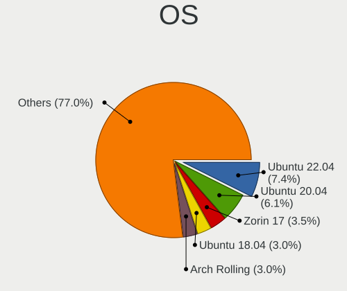

| Name                         | Desktops | Percent |
|------------------------------|----------|---------|
| Ubuntu 22.04                 | 17       | 7.39%   |
| Ubuntu 20.04                 | 14       | 6.09%   |
| Zorin 17                     | 8        | 3.48%   |
| Ubuntu 18.04                 | 7        | 3.04%   |
| Arch Rolling                 | 7        | 3.04%   |
| Ubuntu 24.04                 | 6        | 2.61%   |
| Pop!_OS 22.04                | 6        | 2.61%   |
| OpenMandriva 4.3             | 5        | 2.17%   |
| OpenMandriva 4.2             | 5        | 2.17%   |
| Manjaro                      | 5        | 2.17%   |
| Fedora 42                    | 5        | 2.17%   |
| Debian 12                    | 5        | 2.17%   |
| Pop!_OS 21.10                | 4        | 1.74%   |
| Debian 10                    | 4        | 1.74%   |
| Ubuntu 19.10                 | 3        | 1.3%    |
| ROSA R10                     | 3        | 1.3%    |
| OpenMandriva 23.01           | 3        | 1.3%    |
| Nobara 37                    | 3        | 1.3%    |
| Fedora 40                    | 3        | 1.3%    |
| Debian 11                    | 3        | 1.3%    |
| ArcoLinux Rolling            | 3        | 1.3%    |
| Zorin 18                     | 2        | 0.87%   |
| Ubuntu Unity 18.04           | 2        | 0.87%   |
| Ubuntu 24.10                 | 2        | 0.87%   |
| Ubuntu 22.10                 | 2        | 0.87%   |
| Ubuntu 21.10                 | 2        | 0.87%   |
| Pop!_OS 21.04                | 2        | 0.87%   |
| openSUSE Tumbleweed-XXXXXXXX | 2        | 0.87%   |
| OpenMandriva 6.0             | 2        | 0.87%   |
| OpenMandriva 25.90           | 2        | 0.87%   |
| OpenMandriva 24.12           | 2        | 0.87%   |
| OpenMandriva 23.08           | 2        | 0.87%   |
| Manjaro 20.2                 | 2        | 0.87%   |
| Linux Mint 22.2              | 2        | 0.87%   |
| Linux Mint 22.1              | 2        | 0.87%   |
| Kubuntu 24.04                | 2        | 0.87%   |
| Kubuntu 22.10                | 2        | 0.87%   |
| Fedora 39                    | 2        | 0.87%   |
| Fedora 37                    | 2        | 0.87%   |
| Fedora 35                    | 2        | 0.87%   |

OS Family
---------

OS without a version

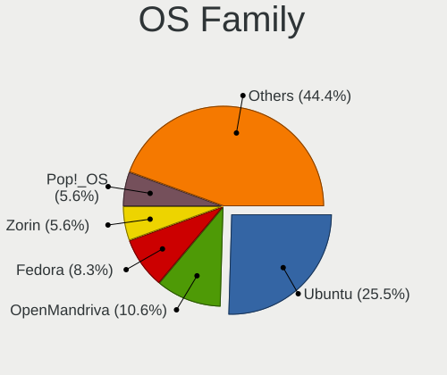

| Name             | Desktops | Percent |
|------------------|----------|---------|
| Ubuntu           | 55       | 25.46%  |
| OpenMandriva     | 23       | 10.65%  |
| Fedora           | 18       | 8.33%   |
| Zorin            | 12       | 5.56%   |
| Pop!_OS          | 12       | 5.56%   |
| Debian           | 12       | 5.56%   |
| Manjaro          | 11       | 5.09%   |
| Linux Mint       | 9        | 4.17%   |
| Arch             | 9        | 4.17%   |
| ROSA             | 8        | 3.7%    |
| Kubuntu          | 7        | 3.24%   |
| Endless          | 5        | 2.31%   |
| Nobara           | 4        | 1.85%   |
| Kali             | 4        | 1.85%   |
| openSUSE         | 3        | 1.39%   |
| KDE neon         | 3        | 1.39%   |
| Bazzite          | 3        | 1.39%   |
| ArcoLinux        | 3        | 1.39%   |
| Ubuntu Unity     | 2        | 0.93%   |
| SteamOS          | 2        | 0.93%   |
| Ubuntu MATE      | 1        | 0.46%   |
| Ubuntu Budgie    | 1        | 0.46%   |
| Solus            | 1        | 0.46%   |
| Pear OS          | 1        | 0.46%   |
| org.kde.Platform | 1        | 0.46%   |
| NixOS            | 1        | 0.46%   |
| Linux Lite       | 1        | 0.46%   |
| EndeavourOS      | 1        | 0.46%   |
| Drauger OS       | 1        | 0.46%   |
| Clear Linux      | 1        | 0.46%   |
| CentOS           | 1        | 0.46%   |

Kernel
------

Version of the Linux kernel

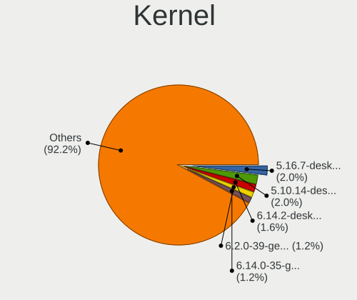

| Version                             | Desktops | Percent |
|-------------------------------------|----------|---------|
| 5.16.7-desktop-1omv4003             | 5        | 1.96%   |
| 5.10.14-desktop-1omv4002            | 5        | 1.96%   |
| 6.14.2-desktop-3omv2590             | 4        | 1.57%   |
| 6.2.0-39-generic                    | 3        | 1.18%   |
| 6.14.0-35-generic                   | 3        | 1.18%   |
| 6.1.1-desktop-1omv2290              | 3        | 1.18%   |
| 5.13.0-37-generic                   | 3        | 1.18%   |
| 4.9.60-nrj-desktop-1rosa-x86_64     | 3        | 1.18%   |
| 6.9.3-76060903-generic              | 2        | 0.78%   |
| 6.8.0-60-generic                    | 2        | 0.78%   |
| 6.5.0-kali3-amd64                   | 2        | 0.78%   |
| 6.5.0-41-generic                    | 2        | 0.78%   |
| 6.5.0-35-generic                    | 2        | 0.78%   |
| 6.4.11-desktop-1omv2390             | 2        | 0.78%   |
| 6.2.0-26-generic                    | 2        | 0.78%   |
| 6.14.0-37-generic                   | 2        | 0.78%   |
| 6.12.1-desktop-1omv2490             | 2        | 0.78%   |
| 6.11.0-21-generic                   | 2        | 0.78%   |
| 5.9.11-3-MANJARO                    | 2        | 0.78%   |
| 5.8.0-14-generic                    | 2        | 0.78%   |
| 5.4.0-42-generic                    | 2        | 0.78%   |
| 5.19.0-50-generic                   | 2        | 0.78%   |
| 5.19.0-23-generic                   | 2        | 0.78%   |
| 5.15.5-76051505-generic             | 2        | 0.78%   |
| 5.15.0-75-generic                   | 2        | 0.78%   |
| 4.18.0-25-generic                   | 2        | 0.78%   |
| 4.18.0-17-generic                   | 2        | 0.78%   |
| 6.9.8-200.fc40.x86_64               | 1        | 0.39%   |
| 6.9.4-1-cachyos                     | 1        | 0.39%   |
| 6.9.12-205.fsync.fc40.x86_64        | 1        | 0.39%   |
| 6.8.5-301.fc40.x86_64               | 1        | 0.39%   |
| 6.8.4-200.fc39.x86_64               | 1        | 0.39%   |
| 6.8.11-300.fc40.x86_64              | 1        | 0.39%   |
| 6.8.0-87-generic                    | 1        | 0.39%   |
| 6.8.0-83-generic                    | 1        | 0.39%   |
| 6.8.0-76060800daily20240311-generic | 1        | 0.39%   |
| 6.8.0-53-generic                    | 1        | 0.39%   |
| 6.8.0-50-generic                    | 1        | 0.39%   |
| 6.8.0-49-generic                    | 1        | 0.39%   |
| 6.8.0-47-lowlatency                 | 1        | 0.39%   |

Kernel Family
-------------

Linux kernel without a distro release

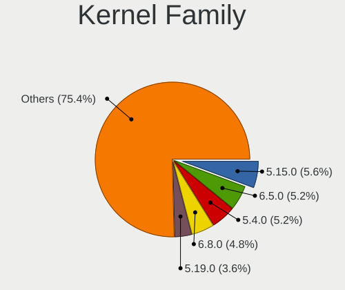

| Version | Desktops | Percent |
|---------|----------|---------|
| 5.15.0  | 14       | 5.65%   |
| 6.5.0   | 13       | 5.24%   |
| 5.4.0   | 13       | 5.24%   |
| 6.8.0   | 12       | 4.84%   |
| 5.19.0  | 9        | 3.63%   |
| 6.2.0   | 8        | 3.23%   |
| 6.14.0  | 7        | 2.82%   |
| 5.8.0   | 6        | 2.42%   |
| 4.18.0  | 6        | 2.42%   |
| 4.15.0  | 6        | 2.42%   |
| 5.3.0   | 5        | 2.02%   |
| 5.16.7  | 5        | 2.02%   |
| 5.13.0  | 5        | 2.02%   |
| 5.10.14 | 5        | 2.02%   |
| 6.14.2  | 4        | 1.61%   |
| 6.11.0  | 4        | 1.61%   |
| 6.1.0   | 4        | 1.61%   |
| 5.11.0  | 4        | 1.61%   |
| 6.1.1   | 3        | 1.21%   |
| 5.10.0  | 3        | 1.21%   |
| 4.9.60  | 3        | 1.21%   |
| 6.9.3   | 2        | 0.81%   |
| 6.7.9   | 2        | 0.81%   |
| 6.4.11  | 2        | 0.81%   |
| 6.16.4  | 2        | 0.81%   |
| 6.13.6  | 2        | 0.81%   |
| 6.12.1  | 2        | 0.81%   |
| 6.0.8   | 2        | 0.81%   |
| 5.9.11  | 2        | 0.81%   |
| 5.5.0   | 2        | 0.81%   |
| 5.16.11 | 2        | 0.81%   |
| 5.15.5  | 2        | 0.81%   |
| 5.0.0   | 2        | 0.81%   |
| 4.19.0  | 2        | 0.81%   |
| 6.9.8   | 1        | 0.4%    |
| 6.9.4   | 1        | 0.4%    |
| 6.9.12  | 1        | 0.4%    |
| 6.8.5   | 1        | 0.4%    |
| 6.8.4   | 1        | 0.4%    |
| 6.8.11  | 1        | 0.4%    |

Kernel Major Ver.
-----------------

Linux kernel major version

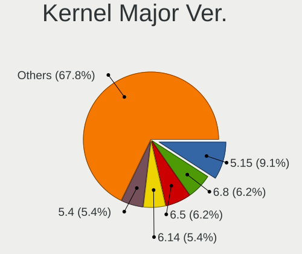

| Version | Desktops | Percent |
|---------|----------|---------|
| 5.15    | 22       | 9.09%   |
| 6.8     | 15       | 6.2%    |
| 6.5     | 15       | 6.2%    |
| 6.14    | 13       | 5.37%   |
| 5.4     | 13       | 5.37%   |
| 6.2     | 11       | 4.55%   |
| 6.1     | 11       | 4.55%   |
| 5.10    | 11       | 4.55%   |
| 5.19    | 10       | 4.13%   |
| 6.12    | 9        | 3.72%   |
| 5.16    | 9        | 3.72%   |
| 5.8     | 8        | 3.31%   |
| 6.11    | 7        | 2.89%   |
| 6.16    | 6        | 2.48%   |
| 4.18    | 6        | 2.48%   |
| 4.15    | 6        | 2.48%   |
| 6.9     | 5        | 2.07%   |
| 6.4     | 5        | 2.07%   |
| 5.3     | 5        | 2.07%   |
| 5.13    | 5        | 2.07%   |
| 5.11    | 5        | 2.07%   |
| 6.6     | 4        | 1.65%   |
| 6.0     | 4        | 1.65%   |
| 4.9     | 4        | 1.65%   |
| 6.7     | 3        | 1.24%   |
| 6.13    | 3        | 1.24%   |
| 5.9     | 3        | 1.24%   |
| 5.5     | 3        | 1.24%   |
| 5.18    | 3        | 1.24%   |
| 5.17    | 3        | 1.24%   |
| 6.17    | 2        | 0.83%   |
| 5.6     | 2        | 0.83%   |
| 5.14    | 2        | 0.83%   |
| 5.0     | 2        | 0.83%   |
| 4.19    | 2        | 0.83%   |
| 6.3     | 1        | 0.41%   |
| 6.15    | 1        | 0.41%   |
| 5.7     | 1        | 0.41%   |
| 4.20    | 1        | 0.41%   |
| 4.1     | 1        | 0.41%   |

Arch
----

OS architecture (x86_64, i586, etc.)

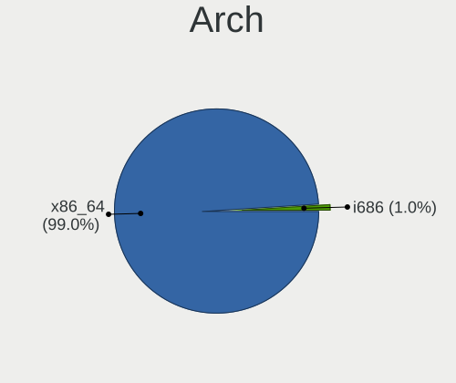

| Name   | Desktops | Percent |
|--------|----------|---------|
| x86_64 | 195      | 98.98%  |
| i686   | 2        | 1.02%   |

DE
--

Desktop Environment

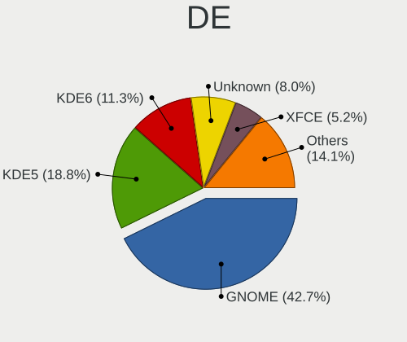

| Name       | Desktops | Percent |
|------------|----------|---------|
| GNOME      | 91       | 42.72%  |
| KDE5       | 40       | 18.78%  |
| KDE6       | 24       | 11.27%  |
| Unknown    | 17       | 7.98%   |
| XFCE       | 11       | 5.16%   |
| X-Cinnamon | 8        | 3.76%   |
| KDE        | 5        | 2.35%   |
| Budgie     | 4        | 1.88%   |
| KDE4       | 3        | 1.41%   |
| Unity      | 2        | 0.94%   |
| Deepin     | 2        | 0.94%   |
| COSMIC     | 2        | 0.94%   |
| MATE       | 1        | 0.47%   |
| Hyprland   | 1        | 0.47%   |
| DDE        | 1        | 0.47%   |
| Cinnamon   | 1        | 0.47%   |

Display Server
--------------

X11 or Wayland

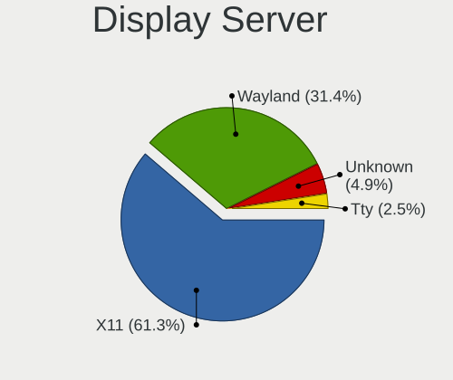

| Name    | Desktops | Percent |
|---------|----------|---------|
| X11     | 125      | 61.27%  |
| Wayland | 64       | 31.37%  |
| Unknown | 10       | 4.9%    |
| Tty     | 5        | 2.45%   |

Display Manager
---------------

SDDM, LightDM, etc.

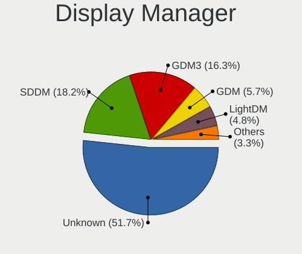

| Name    | Desktops | Percent |
|---------|----------|---------|
| Unknown | 108      | 51.67%  |
| SDDM    | 38       | 18.18%  |
| GDM3    | 34       | 16.27%  |
| GDM     | 12       | 5.74%   |
| LightDM | 10       | 4.78%   |
| TDM     | 3        | 1.44%   |
| KDM     | 3        | 1.44%   |
| GREETD  | 1        | 0.48%   |

OS Lang
-------

Language

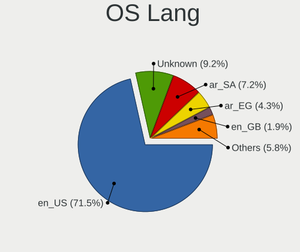

| Lang    | Desktops | Percent |
|---------|----------|---------|
| en_US   | 148      | 71.5%   |
| Unknown | 19       | 9.18%   |
| ar_SA   | 15       | 7.25%   |
| ar_EG   | 9        | 4.35%   |
| en_GB   | 4        | 1.93%   |
| ar_AE   | 3        | 1.45%   |
| C       | 2        | 0.97%   |
| ru_RU   | 1        | 0.48%   |
| nl_BE   | 1        | 0.48%   |
| it_IT   | 1        | 0.48%   |
| en_IL   | 1        | 0.48%   |
| en_AU   | 1        | 0.48%   |
| de_DE   | 1        | 0.48%   |
| ar_KW   | 1        | 0.48%   |

Boot Mode
---------

EFI or BIOS

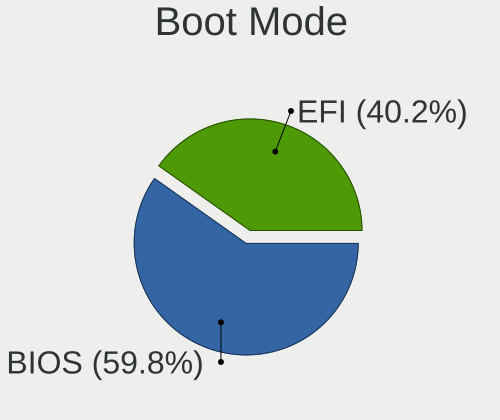

| Mode | Desktops | Percent |
|------|----------|---------|
| BIOS | 125      | 59.81%  |
| EFI  | 84       | 40.19%  |

Filesystem
----------

Type of filesystem

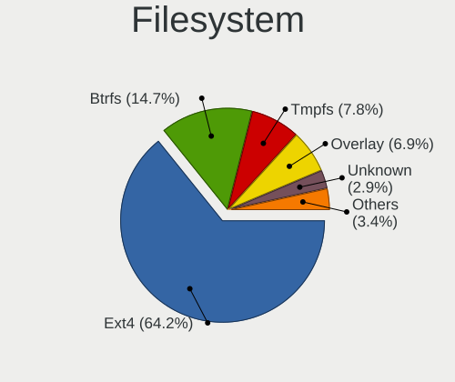

| Type    | Desktops | Percent |
|---------|----------|---------|
| Ext4    | 131      | 64.22%  |
| Btrfs   | 30       | 14.71%  |
| Tmpfs   | 16       | 7.84%   |
| Overlay | 14       | 6.86%   |
| Unknown | 6        | 2.94%   |
| Xfs     | 4        | 1.96%   |
| Zfs     | 2        | 0.98%   |
| Ext2    | 1        | 0.49%   |

Part. scheme
------------

Scheme of partitioning

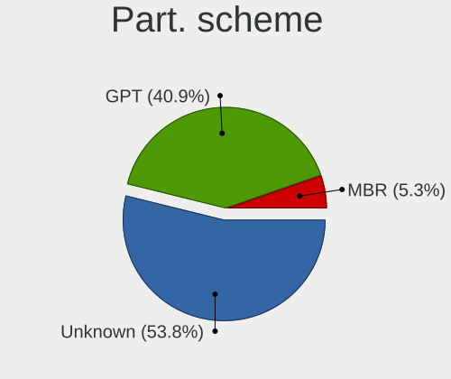

| Type    | Desktops | Percent |
|---------|----------|---------|
| Unknown | 112      | 53.85%  |
| GPT     | 85       | 40.87%  |
| MBR     | 11       | 5.29%   |

Dual Boot with Linux/BSD
------------------------

Hosting more than one Linux/BSD

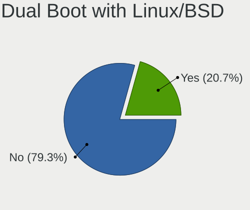

| Dual boot | Desktops | Percent |
|-----------|----------|---------|
| No        | 161      | 79.31%  |
| Yes       | 42       | 20.69%  |

Dual Boot (Win)
---------------

Hosting Linux and Windows

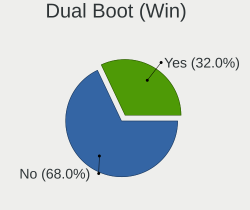

| Dual boot | Desktops | Percent |
|-----------|----------|---------|
| No        | 140      | 67.96%  |
| Yes       | 66       | 32.04%  |

Board
-----

Vendor
------

Motherboard manufacturer

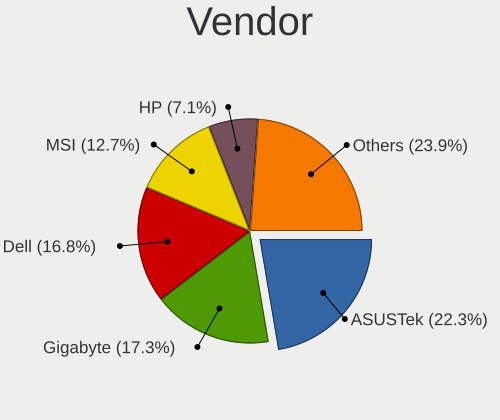

| Name                                 | Desktops | Percent |
|--------------------------------------|----------|---------|
| ASUSTek Computer                     | 44       | 22.34%  |
| Gigabyte Technology                  | 34       | 17.26%  |
| Dell                                 | 33       | 16.75%  |
| MSI                                  | 25       | 12.69%  |
| Hewlett-Packard                      | 14       | 7.11%   |
| ASRock                               | 11       | 5.58%   |
| Lenovo                               | 9        | 4.57%   |
| Unknown                              | 5        | 2.54%   |
| Pegatron                             | 2        | 1.02%   |
| Intel                                | 2        | 1.02%   |
| Huanan                               | 2        | 1.02%   |
| Apple                                | 2        | 1.02%   |
| TianBei                              | 1        | 0.51%   |
| Shenzhen Meigao Electronic Equipment | 1        | 0.51%   |
| OEM                                  | 1        | 0.51%   |
| Medion                               | 1        | 0.51%   |
| Kllisre                              | 1        | 0.51%   |
| JGINYUE                              | 1        | 0.51%   |
| GEEKOM                               | 1        | 0.51%   |
| Fujitsu Siemens                      | 1        | 0.51%   |
| Foxconn                              | 1        | 0.51%   |
| DJI                                  | 1        | 0.51%   |
| Colorful Technology                  | 1        | 0.51%   |
| Biostar                              | 1        | 0.51%   |
| BESSTAR Tech                         | 1        | 0.51%   |
| Acer                                 | 1        | 0.51%   |

Model
-----

Motherboard model

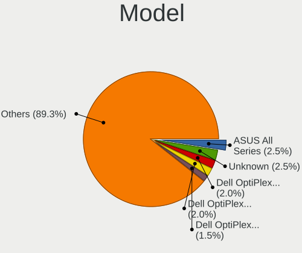

| Name                                       | Desktops | Percent |
|--------------------------------------------|----------|---------|
| ASUS All Series                            | 5        | 2.54%   |
| Unknown                                    | 5        | 2.54%   |
| Dell OptiPlex 9020                         | 4        | 2.03%   |
| Dell OptiPlex 7010                         | 4        | 2.03%   |
| Dell OptiPlex 990                          | 3        | 1.52%   |
| Dell OptiPlex 3010                         | 3        | 1.52%   |
| MSI MS-7C90                                | 2        | 1.02%   |
| MSI MS-7C37                                | 2        | 1.02%   |
| Lenovo Legion T5 26IOB6 90RT00TVKS         | 2        | 1.02%   |
| HP Compaq Elite 8300 SFF                   | 2        | 1.02%   |
| Gigabyte Z77-D3H                           | 2        | 1.02%   |
| Gigabyte H81M-S2PH                         | 2        | 1.02%   |
| Gigabyte B460MDS3HV2                       | 2        | 1.02%   |
| Dell Vostro 3888                           | 2        | 1.02%   |
| Dell OptiPlex 9010                         | 2        | 1.02%   |
| Dell OptiPlex 790                          | 2        | 1.02%   |
| Dell OptiPlex 7050                         | 2        | 1.02%   |
| Dell OptiPlex 3050                         | 2        | 1.02%   |
| ASUS TUF Gaming X570-PLUS                  | 2        | 1.02%   |
| ASUS PRIME H610M-A WIFI                    | 2        | 1.02%   |
| ASUS PRIME B760-PLUS                       | 2        | 1.02%   |
| TianBei GOD88                              | 1        | 0.51%   |
| Shenzhen Meigao Electronic Equipment HX99G | 1        | 0.51%   |
| Pegatron h8-1400ex                         | 1        | 0.51%   |
| Pegatron Compaq dx7500 Microtower          | 1        | 0.51%   |
| OEM B250                                   | 1        | 0.51%   |
| MSI MS-7E25                                | 1        | 0.51%   |
| MSI MS-7D43                                | 1        | 0.51%   |
| MSI MS-7D25                                | 1        | 0.51%   |
| MSI MS-7D20                                | 1        | 0.51%   |
| MSI MS-7C91                                | 1        | 0.51%   |
| MSI MS-7C75                                | 1        | 0.51%   |
| MSI MS-7C56                                | 1        | 0.51%   |
| MSI MS-7C02                                | 1        | 0.51%   |
| MSI MS-7B98                                | 1        | 0.51%   |
| MSI MS-7B89                                | 1        | 0.51%   |
| MSI MS-7B86                                | 1        | 0.51%   |
| MSI MS-7B84                                | 1        | 0.51%   |
| MSI MS-7B78                                | 1        | 0.51%   |
| MSI MS-7B46                                | 1        | 0.51%   |

Model Family
------------

Motherboard model prefix

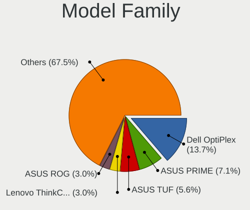

| Name                                       | Desktops | Percent |
|--------------------------------------------|----------|---------|
| Dell OptiPlex                              | 27       | 13.71%  |
| ASUS PRIME                                 | 14       | 7.11%   |
| ASUS TUF                                   | 11       | 5.58%   |
| Lenovo ThinkCentre                         | 6        | 3.05%   |
| ASUS ROG                                   | 6        | 3.05%   |
| ASUS All                                   | 5        | 2.54%   |
| Unknown                                    | 5        | 2.54%   |
| HP EliteDesk                               | 4        | 2.03%   |
| HP Compaq                                  | 3        | 1.52%   |
| Dell Vostro                                | 3        | 1.52%   |
| Dell Precision                             | 3        | 1.52%   |
| ASRock X570                                | 3        | 1.52%   |
| MSI MS-7C90                                | 2        | 1.02%   |
| MSI MS-7C37                                | 2        | 1.02%   |
| Lenovo Legion                              | 2        | 1.02%   |
| HP Pavilion                                | 2        | 1.02%   |
| Gigabyte Z790                              | 2        | 1.02%   |
| Gigabyte Z77-D3H                           | 2        | 1.02%   |
| Gigabyte H81M-S2PH                         | 2        | 1.02%   |
| Gigabyte B460MDS3HV2                       | 2        | 1.02%   |
| TianBei GOD88                              | 1        | 0.51%   |
| Shenzhen Meigao Electronic Equipment HX99G | 1        | 0.51%   |
| Pegatron h8-1400ex                         | 1        | 0.51%   |
| Pegatron Compaq                            | 1        | 0.51%   |
| OEM B250                                   | 1        | 0.51%   |
| MSI MS-7E25                                | 1        | 0.51%   |
| MSI MS-7D43                                | 1        | 0.51%   |
| MSI MS-7D25                                | 1        | 0.51%   |
| MSI MS-7D20                                | 1        | 0.51%   |
| MSI MS-7C91                                | 1        | 0.51%   |
| MSI MS-7C75                                | 1        | 0.51%   |
| MSI MS-7C56                                | 1        | 0.51%   |
| MSI MS-7C02                                | 1        | 0.51%   |
| MSI MS-7B98                                | 1        | 0.51%   |
| MSI MS-7B89                                | 1        | 0.51%   |
| MSI MS-7B86                                | 1        | 0.51%   |
| MSI MS-7B84                                | 1        | 0.51%   |
| MSI MS-7B78                                | 1        | 0.51%   |
| MSI MS-7B46                                | 1        | 0.51%   |
| MSI MS-7B19                                | 1        | 0.51%   |

MFG Year
--------

Motherboard manufacture year

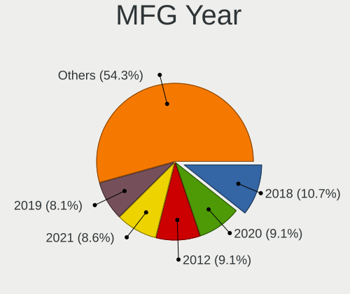

| Year | Desktops | Percent |
|------|----------|---------|
| 2018 | 21       | 10.66%  |
| 2020 | 18       | 9.14%   |
| 2012 | 18       | 9.14%   |
| 2021 | 17       | 8.63%   |
| 2019 | 16       | 8.12%   |
| 2014 | 14       | 7.11%   |
| 2024 | 13       | 6.6%    |
| 2023 | 11       | 5.58%   |
| 2013 | 11       | 5.58%   |
| 2011 | 10       | 5.08%   |
| 2015 | 9        | 4.57%   |
| 2016 | 8        | 4.06%   |
| 2017 | 7        | 3.55%   |
| 2022 | 6        | 3.05%   |
| 2010 | 5        | 2.54%   |
| 2009 | 5        | 2.54%   |
| 2007 | 4        | 2.03%   |
| 2008 | 3        | 1.52%   |
| 2006 | 1        | 0.51%   |

Form Factor
-----------

Physical design of the computer

| Name    | Desktops | Percent |
|---------|----------|---------|
| Desktop | 197      | 100%    |

Secure Boot
-----------

Enabled or disabled

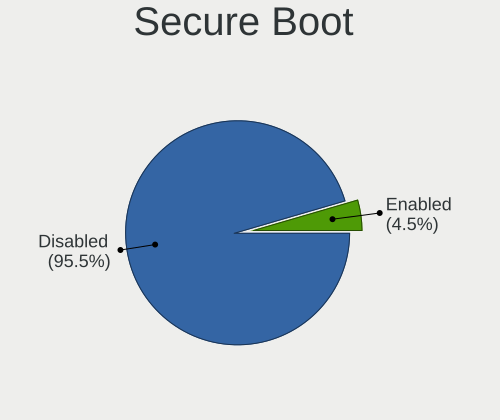

| State    | Desktops | Percent |
|----------|----------|---------|
| Disabled | 190      | 95.48%  |
| Enabled  | 9        | 4.52%   |

Coreboot
--------

Have coreboot on board

| Used | Desktops | Percent |
|------|----------|---------|
| No   | 197      | 100%    |

RAM Size
--------

Total RAM memory

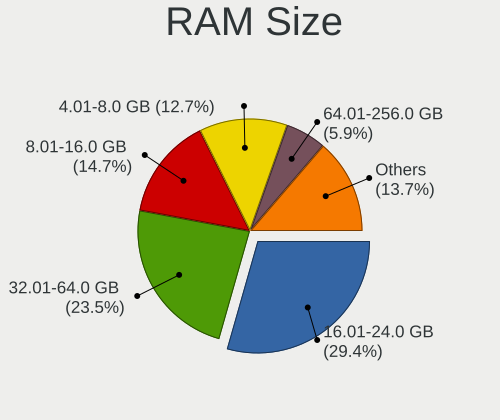

| Size in GB      | Desktops | Percent |
|-----------------|----------|---------|
| 16.01-24.0      | 60       | 29.41%  |
| 32.01-64.0      | 48       | 23.53%  |
| 8.01-16.0       | 30       | 14.71%  |
| 4.01-8.0        | 26       | 12.75%  |
| 64.01-256.0     | 12       | 5.88%   |
| 24.01-32.0      | 10       | 4.9%    |
| 3.01-4.0        | 9        | 4.41%   |
| 1.01-2.0        | 6        | 2.94%   |
| More than 256.0 | 1        | 0.49%   |
| 2.01-3.0        | 1        | 0.49%   |
| 0.51-1.0        | 1        | 0.49%   |

RAM Used
--------

Used RAM memory

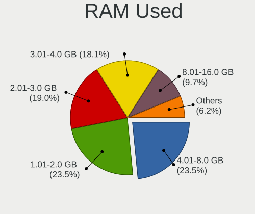

| Used GB    | Desktops | Percent |
|------------|----------|---------|
| 4.01-8.0   | 53       | 23.45%  |
| 1.01-2.0   | 53       | 23.45%  |
| 2.01-3.0   | 43       | 19.03%  |
| 3.01-4.0   | 41       | 18.14%  |
| 8.01-16.0  | 22       | 9.73%   |
| 0.51-1.0   | 9        | 3.98%   |
| 16.01-24.0 | 5        | 2.21%   |

Total Drives
------------

Number of drives on board

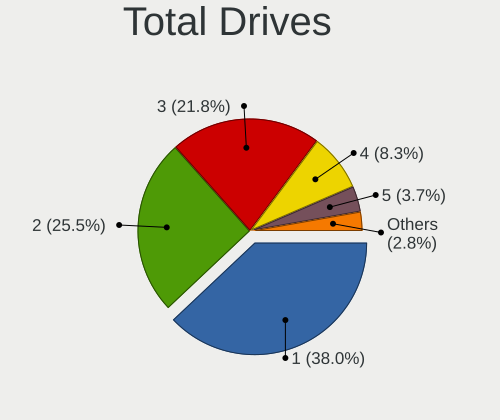

| Drives | Desktops | Percent |
|--------|----------|---------|
| 1      | 82       | 37.96%  |
| 2      | 55       | 25.46%  |
| 3      | 47       | 21.76%  |
| 4      | 18       | 8.33%   |
| 5      | 8        | 3.7%    |
| 6      | 5        | 2.31%   |
| 7      | 1        | 0.46%   |

Has CD-ROM
----------

Has CD-ROM on board

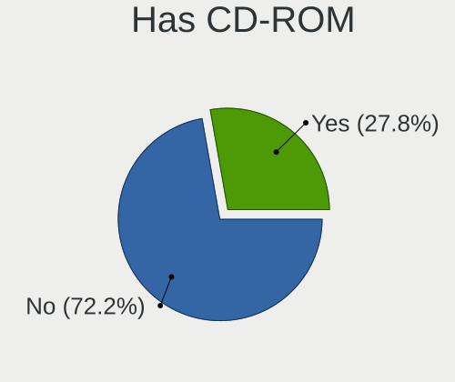

| Presented | Desktops | Percent |
|-----------|----------|---------|
| No        | 143      | 72.22%  |
| Yes       | 55       | 27.78%  |

Has Ethernet
------------

Has Ethernet on board

| Presented | Desktops | Percent |
|-----------|----------|---------|
| Yes       | 197      | 100%    |

Has WiFi
--------

Has WiFi module

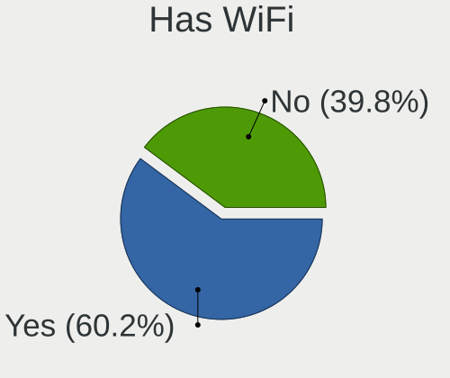

| Presented | Desktops | Percent |
|-----------|----------|---------|
| Yes       | 121      | 60.2%   |
| No        | 80       | 39.8%   |

Has Bluetooth
-------------

Has Bluetooth module

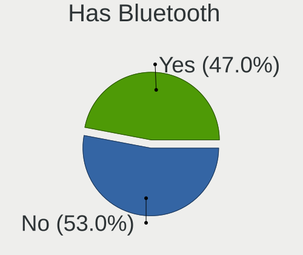

| Presented | Desktops | Percent |
|-----------|----------|---------|
| No        | 107      | 52.97%  |
| Yes       | 95       | 47.03%  |

Location
--------

Country
-------

Geographic location (country)

| Country      | Desktops | Percent |
|--------------|----------|---------|
| Saudi Arabia | 197      | 100%    |

City
----

Geographic location (city)

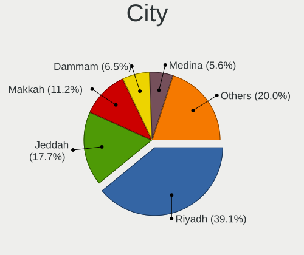

| City                 | Desktops | Percent |
|----------------------|----------|---------|
| Riyadh               | 84       | 39.07%  |
| Jeddah               | 38       | 17.67%  |
| Makkah               | 24       | 11.16%  |
| Dammam               | 14       | 6.51%   |
| Medina               | 12       | 5.58%   |
| Baq`a' ash Sharqiyah | 8        | 3.72%   |
| Khobar               | 6        | 2.79%   |
| Al Qatif             | 6        | 2.79%   |
| Ta'if                | 5        | 2.33%   |
| Dhahran              | 4        | 1.86%   |
| Jubail               | 2        | 0.93%   |
| Buraidah             | 2        | 0.93%   |
| At Tuwal             | 2        | 0.93%   |
| Al Kharj             | 2        | 0.93%   |
| Abha                 | 2        | 0.93%   |
| Shaqra               | 1        | 0.47%   |
| Najran               | 1        | 0.47%   |
| Bisha                | 1        | 0.47%   |
| Al Faruq             | 1        | 0.47%   |

Drives
------

Drive Vendor
------------

Hard drive vendors

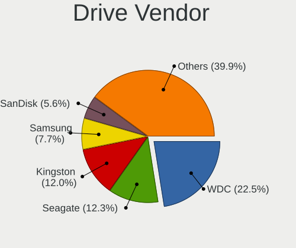

| Vendor                       | Desktops | Drives | Percent |
|------------------------------|----------|--------|---------|
| WDC                          | 88       | 156    | 22.51%  |
| Seagate                      | 48       | 75     | 12.28%  |
| Kingston                     | 47       | 78     | 12.02%  |
| Samsung Electronics          | 30       | 60     | 7.67%   |
| SanDisk                      | 22       | 23     | 5.63%   |
| Toshiba                      | 21       | 24     | 5.37%   |
| Crucial                      | 13       | 16     | 3.32%   |
| Kingston Technology Company  | 12       | 16     | 3.07%   |
| Team                         | 10       | 12     | 2.56%   |
| Lexar                        | 9        | 10     | 2.3%    |
| Phison Electronics           | 7        | 15     | 1.79%   |
| HGST                         | 6        | 11     | 1.53%   |
| Silicon Motion               | 5        | 6      | 1.28%   |
| MAXIO Technology (Hangzhou)  | 5        | 8      | 1.28%   |
| PNY                          | 4        | 5      | 1.02%   |
| Phison                       | 4        | 4      | 1.02%   |
| Micron/Crucial Technology    | 4        | 4      | 1.02%   |
| Hitachi                      | 4        | 5      | 1.02%   |
| China                        | 4        | 4      | 1.02%   |
| Unknown                      | 3        | 6      | 0.77%   |
| Intel                        | 3        | 3      | 0.77%   |
| HS-SSD-C100                  | 3        | 4      | 0.77%   |
| Corsair                      | 3        | 3      | 0.77%   |
| XrayDisk                     | 2        | 3      | 0.51%   |
| SPCC Sol                     | 2        | 2      | 0.51%   |
| SPCC                         | 2        | 3      | 0.51%   |
| Realtek Semiconductor        | 2        | 2      | 0.51%   |
| Micron Technology            | 2        | 4      | 0.51%   |
| KESU                         | 2        | 2      | 0.51%   |
| JMicron Technology           | 2        | 2      | 0.51%   |
| Hewlett-Packard              | 2        | 4      | 0.51%   |
| Apple                        | 2        | 2      | 0.51%   |
| Unknown                      | 2        | 2      | 0.51%   |
| WD MediaMax                  | 1        | 1      | 0.26%   |
| WALRAM                       | 1        | 1      | 0.26%   |
| Transcend                    | 1        | 1      | 0.26%   |
| Thinkplus                    | 1        | 1      | 0.26%   |
| SK hynix                     | 1        | 4      | 0.26%   |
| Shenzhen Longsys Electronics | 1        | 1      | 0.26%   |
| Netac                        | 1        | 1      | 0.26%   |

Drive Model
-----------

Hard drive models

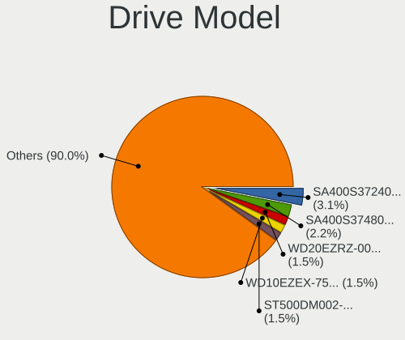

| Model                                             | Desktops | Percent |
|---------------------------------------------------|----------|---------|
| Kingston SA400S37240G 240GB SSD                   | 14       | 3.1%    |
| Kingston SA400S37480G 480GB SSD                   | 10       | 2.21%   |
| WDC WD20EZRZ-00Z5HB0 2TB                          | 7        | 1.55%   |
| WDC WD10EZEX-75WN4A1 1TB                          | 7        | 1.55%   |
| Seagate ST500DM002-1BD142 500GB                   | 7        | 1.55%   |
| Kingston Company SNV2S1000G 1TB                   | 6        | 1.33%   |
| Kingston SA400S37960G 960GB SSD                   | 6        | 1.33%   |
| WDC WD5000AAKX-75U6AA0 500GB                      | 5        | 1.11%   |
| WDC WD10EZEX-08WN4A0 1TB                          | 5        | 1.11%   |
| WDC WD1003FZEX-00MK2A0 1TB                        | 4        | 0.88%   |
| Toshiba MQ01ABD100 1TB                            | 4        | 0.88%   |
| Seagate ST1000DM010-2EP102 1TB                    | 4        | 0.88%   |
| SanDisk SSD PLUS 240GB                            | 4        | 0.88%   |
| Samsung NVMe SSD Controller SM981/PM981/PM983 1TB | 4        | 0.88%   |
| Crucial CT1000MX500SSD1 1TB                       | 4        | 0.88%   |
| WDC WD10EZRX-00A8LB0 1TB                          | 3        | 0.66%   |
| WDC WD10EARX-00N0YB0 1TB                          | 3        | 0.66%   |
| Toshiba DT01ACA050 500GB                          | 3        | 0.66%   |
| Seagate ST1000DM003-1SB102 1TB                    | 3        | 0.66%   |
| Seagate ST1000DM003-1ER162 1TB                    | 3        | 0.66%   |
| SanDisk NVMe SSD Drive 1TB                        | 3        | 0.66%   |
| Samsung SSD 860 EVO 500GB                         | 3        | 0.66%   |
| Samsung SSD 860 EVO 1TB                           | 3        | 0.66%   |
| Phison E12 NVMe Controller 1TB                    | 3        | 0.66%   |
| MAXIO (Hangzhou) NVMe SSD Controller MAP1202 2TB  | 3        | 0.66%   |
| Kingston Company SNV3S1000G 1TB                   | 3        | 0.66%   |
| Kingston SA400S37120G 120GB SSD                   | 3        | 0.66%   |
| Crucial CT240BX500SSD1 240GB                      | 3        | 0.66%   |
| WDC WDS120G2G0A-00JH30 120GB SSD                  | 2        | 0.44%   |
| WDC WD5000AZRX-00A8LB0 500GB                      | 2        | 0.44%   |
| WDC WD40PURX-64GVNY0 4TB                          | 2        | 0.44%   |
| WDC WD4005FZBX-00K5WB0 4TB                        | 2        | 0.44%   |
| WDC WD30EFRX-68EUZN0 3TB                          | 2        | 0.44%   |
| WDC WD20EZRX-00D8PB0 2TB                          | 2        | 0.44%   |
| WDC WD10EZRZ-00HTKB0 1TB                          | 2        | 0.44%   |
| WDC WD10EADS-00M2B0 1TB                           | 2        | 0.44%   |
| Toshiba MQ01ABF050 500GB                          | 2        | 0.44%   |
| Toshiba MK1059GSM 1TB                             | 2        | 0.44%   |
| Toshiba DT01ACA100 1TB                            | 2        | 0.44%   |
| Team T253X2001T 1024GB SSD                        | 2        | 0.44%   |

HDD Vendor
----------

Hard disk drive vendors

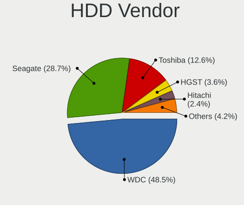

| Vendor              | Desktops | Drives | Percent |
|---------------------|----------|--------|---------|
| WDC                 | 81       | 144    | 48.5%   |
| Seagate             | 48       | 75     | 28.74%  |
| Toshiba             | 21       | 24     | 12.57%  |
| HGST                | 6        | 11     | 3.59%   |
| Hitachi             | 4        | 5      | 2.4%    |
| KESU                | 2        | 2      | 1.2%    |
| JMicron Technology  | 2        | 2      | 1.2%    |
| Unknown             | 1        | 3      | 0.6%    |
| Samsung Electronics | 1        | 2      | 0.6%    |
| Maxtor              | 1        | 1      | 0.6%    |

SSD Vendor
----------

Solid state drive vendors

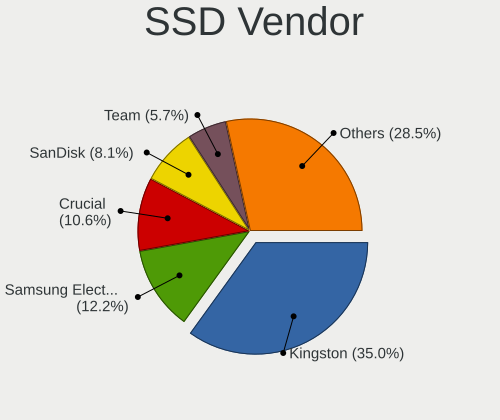

| Vendor              | Desktops | Drives | Percent |
|---------------------|----------|--------|---------|
| Kingston            | 43       | 68     | 34.96%  |
| Samsung Electronics | 15       | 28     | 12.2%   |
| Crucial             | 13       | 16     | 10.57%  |
| SanDisk             | 10       | 10     | 8.13%   |
| Team                | 7        | 9      | 5.69%   |
| Lexar               | 7        | 7      | 5.69%   |
| WDC                 | 5        | 8      | 4.07%   |
| China               | 4        | 4      | 3.25%   |
| PNY                 | 3        | 4      | 2.44%   |
| SPCC Sol            | 2        | 2      | 1.63%   |
| Micron Technology   | 2        | 4      | 1.63%   |
| Unknown             | 2        | 2      | 1.63%   |
| Transcend           | 1        | 1      | 0.81%   |
| Thinkplus           | 1        | 1      | 0.81%   |
| SPCC                | 1        | 2      | 0.81%   |
| KingFast            | 1        | 1      | 0.81%   |
| HPE                 | 1        | 1      | 0.81%   |
| Hoodisk             | 1        | 1      | 0.81%   |
| Hewlett-Packard     | 1        | 3      | 0.81%   |
| Corsair             | 1        | 1      | 0.81%   |
| Apple               | 1        | 1      | 0.81%   |
| A-DATA Technology   | 1        | 1      | 0.81%   |

Drive Kind
----------

HDD or SSD

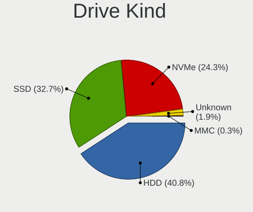

| Kind    | Desktops | Drives | Percent |
|---------|----------|--------|---------|
| HDD     | 131      | 269    | 40.81%  |
| SSD     | 105      | 175    | 32.71%  |
| NVMe    | 78       | 143    | 24.3%   |
| Unknown | 6        | 7      | 1.87%   |
| MMC     | 1        | 2      | 0.31%   |

Drive Connector
---------------

SATA, SAS, NVMe, etc.

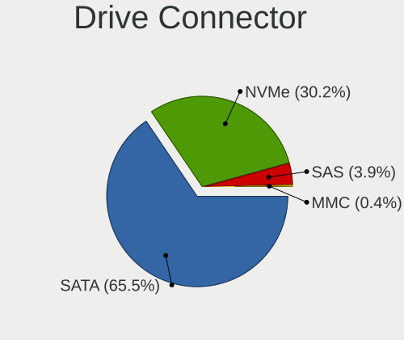

| Type | Desktops | Drives | Percent |
|------|----------|--------|---------|
| SATA | 169      | 436    | 65.5%   |
| NVMe | 78       | 140    | 30.23%  |
| SAS  | 10       | 18     | 3.88%   |
| MMC  | 1        | 2      | 0.39%   |

Drive Size
----------

Size of hard drive

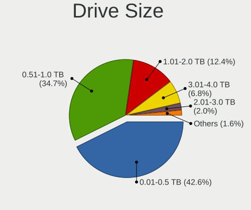

| Size in TB | Desktops | Drives | Percent |
|------------|----------|--------|---------|
| 0.01-0.5   | 107      | 215    | 42.63%  |
| 0.51-1.0   | 87       | 148    | 34.66%  |
| 1.01-2.0   | 31       | 46     | 12.35%  |
| 3.01-4.0   | 17       | 21     | 6.77%   |
| 2.01-3.0   | 5        | 6      | 1.99%   |
| 4.01-10.0  | 3        | 7      | 1.2%    |
| 10.01-20.0 | 1        | 1      | 0.4%    |

Space Total
-----------

Amount of disk space available on the file system

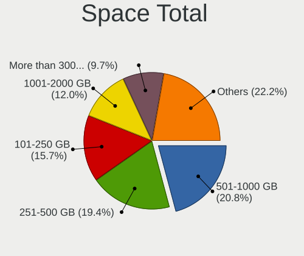

| Size in GB     | Desktops | Percent |
|----------------|----------|---------|
| 501-1000       | 45       | 20.83%  |
| 251-500        | 42       | 19.44%  |
| 101-250        | 34       | 15.74%  |
| 1001-2000      | 26       | 12.04%  |
| More than 3000 | 21       | 9.72%   |
| 2001-3000      | 14       | 6.48%   |
| 1-20           | 11       | 5.09%   |
| 51-100         | 11       | 5.09%   |
| 21-50          | 8        | 3.7%    |
| Unknown        | 4        | 1.85%   |

Space Used
----------

Amount of used disk space

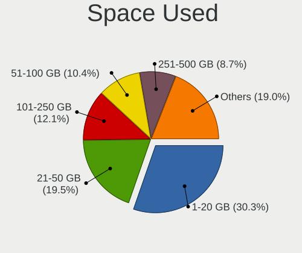

| Used GB        | Desktops | Percent |
|----------------|----------|---------|
| 1-20           | 70       | 30.3%   |
| 21-50          | 45       | 19.48%  |
| 101-250        | 28       | 12.12%  |
| 51-100         | 24       | 10.39%  |
| 251-500        | 20       | 8.66%   |
| 501-1000       | 15       | 6.49%   |
| 1001-2000      | 12       | 5.19%   |
| More than 3000 | 9        | 3.9%    |
| 2001-3000      | 4        | 1.73%   |
| Unknown        | 4        | 1.73%   |

Malfunc. Drives
---------------

Drive models with a malfunction

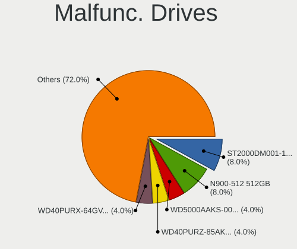

| Model                           | Desktops | Drives | Percent |
|---------------------------------|----------|--------|---------|
| Seagate ST2000DM001-1CH164 2TB  | 2        | 2      | 8%      |
| Unknown                         | 2        | 2      | 8%      |
| WDC WD5000AAKS-00WWPA0 500GB    | 1        | 1      | 4%      |
| WDC WD40PURZ-85AKKY0 4TB        | 1        | 1      | 4%      |
| WDC WD40PURX-64GVNY0 4TB        | 1        | 1      | 4%      |
| WDC WD3200AAJS-00L7A0 320GB     | 1        | 1      | 4%      |
| WDC WD20EZRZ-00Z5HB0 2TB        | 1        | 1      | 4%      |
| WDC WD1600AAJS-60B4A0 160GB     | 1        | 1      | 4%      |
| WDC WD10PURZ-85U8XY0 1TB        | 1        | 1      | 4%      |
| WDC WD10EUCX-73YZ1Y0 1TB        | 1        | 1      | 4%      |
| WDC WD Green 2.5 480GB          | 1        | 1      | 4%      |
| Toshiba MK3265GSXN 320GB        | 1        | 1      | 4%      |
| Seagate ST9320325AS 320GB       | 1        | 1      | 4%      |
| Seagate ST500LT012-1DG142 500GB | 1        | 1      | 4%      |
| Seagate ST500DM002-1BD142 500GB | 1        | 1      | 4%      |
| Seagate ST1000DM003-9YN162 1TB  | 1        | 1      | 4%      |
| Seagate ST1000DM003-1CH162 1TB  | 1        | 1      | 4%      |
| SanDisk SSD PLUS 480GB          | 1        | 1      | 4%      |
| Kingston SMS200S3240G 240GB SSD | 1        | 1      | 4%      |
| Kingston SA400S37480G 480GB SSD | 1        | 1      | 4%      |
| HPE MK001920GWHRU 2TB SSD       | 1        | 1      | 4%      |
| Hitachi HDS721032CLA362 320GB   | 1        | 1      | 4%      |
| Crucial CT525MX300SSD1 528GB    | 1        | 1      | 4%      |

Malfunc. Drive Vendor
---------------------

Vendors of faulty drives

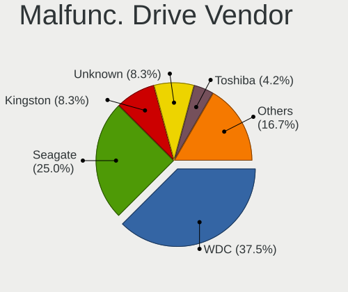

| Vendor   | Desktops | Drives | Percent |
|----------|----------|--------|---------|
| WDC      | 9        | 9      | 37.5%   |
| Seagate  | 6        | 7      | 25%     |
| Kingston | 2        | 2      | 8.33%   |
| Unknown  | 2        | 2      | 8.33%   |
| Toshiba  | 1        | 1      | 4.17%   |
| SanDisk  | 1        | 1      | 4.17%   |
| HPE      | 1        | 1      | 4.17%   |
| Hitachi  | 1        | 1      | 4.17%   |
| Crucial  | 1        | 1      | 4.17%   |

Malfunc. HDD Vendor
-------------------

Vendors of faulty HDD drives

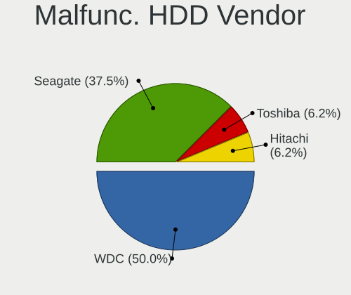

| Vendor  | Desktops | Drives | Percent |
|---------|----------|--------|---------|
| WDC     | 8        | 8      | 50%     |
| Seagate | 6        | 7      | 37.5%   |
| Toshiba | 1        | 1      | 6.25%   |
| Hitachi | 1        | 1      | 6.25%   |

Malfunc. Drive Kind
-------------------

Kinds of faulty drives

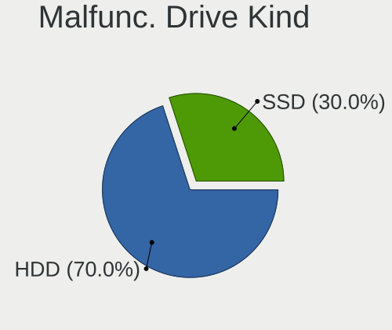

| Kind | Desktops | Drives | Percent |
|------|----------|--------|---------|
| HDD  | 14       | 17     | 70%     |
| SSD  | 6        | 8      | 30%     |

Failed Drives
-------------

Failed drive models

Zero info for selected period =(

Failed Drive Vendor
-------------------

Failed drive vendors

Zero info for selected period =(

Drive Status
------------

Number of failed and malfunc. drives

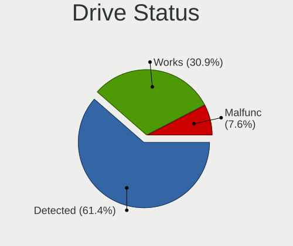

| Status   | Desktops | Drives | Percent |
|----------|----------|--------|---------|
| Detected | 137      | 411    | 61.43%  |
| Works    | 69       | 160    | 30.94%  |
| Malfunc  | 17       | 25     | 7.62%   |

Storage controller
------------------

Storage Vendor
--------------

Storage controller vendors

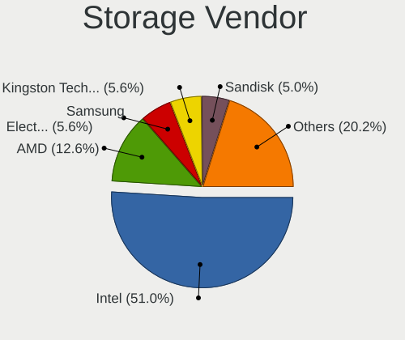

| Vendor                       | Desktops | Percent |
|------------------------------|----------|---------|
| Intel                        | 154      | 50.99%  |
| AMD                          | 38       | 12.58%  |
| Samsung Electronics          | 17       | 5.63%   |
| Kingston Technology Company  | 17       | 5.63%   |
| Sandisk                      | 15       | 4.97%   |
| Phison Electronics           | 13       | 4.3%    |
| ASMedia Technology           | 9        | 2.98%   |
| Silicon Motion               | 7        | 2.32%   |
| MAXIO Technology (Hangzhou)  | 6        | 1.99%   |
| Micron/Crucial Technology    | 4        | 1.32%   |
| JMicron Technology           | 4        | 1.32%   |
| Realtek Semiconductor        | 3        | 0.99%   |
| Hosin Global Electronics     | 3        | 0.99%   |
| Shenzhen Longsys Electronics | 2        | 0.66%   |
| Marvell Technology Group     | 2        | 0.66%   |
| ADATA Technology             | 2        | 0.66%   |
| VIA Technologies             | 1        | 0.33%   |
| SK hynix                     | 1        | 0.33%   |
| Netac Technology             | 1        | 0.33%   |
| LSI Logic / Symbios Logic    | 1        | 0.33%   |
| INNOGRIT                     | 1        | 0.33%   |
| Apple                        | 1        | 0.33%   |

Storage Model
-------------

Storage controller models

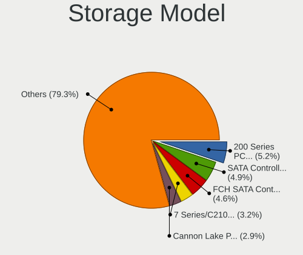

| Model                                                                          | Desktops | Percent |
|--------------------------------------------------------------------------------|----------|---------|
| Intel 200 Series PCH SATA controller [AHCI mode]                               | 18       | 5.17%   |
| Intel SATA Controller [RAID mode]                                              | 17       | 4.89%   |
| AMD FCH SATA Controller [AHCI mode]                                            | 16       | 4.6%    |
| Intel 7 Series/C210 Series Chipset Family 6-port SATA Controller [AHCI mode]   | 11       | 3.16%   |
| Intel Cannon Lake PCH SATA AHCI Controller                                     | 10       | 2.87%   |
| Intel 8 Series/C220 Series Chipset Family 6-port SATA Controller 1 [AHCI mode] | 10       | 2.87%   |
| Intel Raptor Lake SATA AHCI Controller                                         | 9        | 2.59%   |
| ASMedia ASM1061/ASM1062 Serial ATA Controller                                  | 9        | 2.59%   |
| Intel 6 Series/C200 Series Chipset Family 6 port Desktop SATA AHCI Controller  | 8        | 2.3%    |
| AMD 400 Series Chipset SATA Controller                                         | 8        | 2.3%    |
| Samsung NVMe SSD Controller SM981/PM981/PM983                                  | 7        | 2.01%   |
| Intel Alder Lake-S PCH SATA Controller [AHCI Mode]                             | 7        | 2.01%   |
| Intel 500 Series Chipset Family SATA AHCI Controller                           | 7        | 2.01%   |
| AMD 600 Series Chipset SATA Controller                                         | 7        | 2.01%   |
| AMD 500 Series Chipset SATA Controller                                         | 7        | 2.01%   |
| Intel RST Volume Management Device Controller                                  | 6        | 1.72%   |
| Intel NM10/ICH7 Family SATA Controller [IDE mode]                              | 6        | 1.72%   |
| Silicon Motion SM2263EN/SM2263XT (DRAM-less) NVMe SSD Controllers              | 5        | 1.44%   |
| Phison E12 NVMe Controller                                                     | 5        | 1.44%   |
| Intel Comet Lake SATA AHCI Controller                                          | 5        | 1.44%   |
| Intel 9 Series Chipset Family SATA Controller [AHCI Mode]                      | 5        | 1.44%   |
| Intel 400 Series Chipset Family SATA AHCI Controller                           | 5        | 1.44%   |
| Kingston Company NV2 NVMe SSD [E21T] (DRAM-less)                               | 4        | 1.15%   |
| Intel Q170/Q150/B150/H170/H110/Z170/CM236 Chipset SATA Controller [AHCI Mode]  | 4        | 1.15%   |
| Intel C610/X99 series chipset 6-Port SATA Controller [AHCI mode]               | 4        | 1.15%   |
| Intel 82801G (ICH7 Family) IDE Controller                                      | 4        | 1.15%   |
| Intel 7 Series/C210 Series Chipset Family 4-port SATA Controller [IDE mode]    | 4        | 1.15%   |
| Intel 7 Series/C210 Series Chipset Family 2-port SATA Controller [IDE mode]    | 4        | 1.15%   |
| AMD SB7x0/SB8x0/SB9x0 SATA Controller [AHCI mode]                              | 4        | 1.15%   |
| SanDisk WD PC SN810 / Black SN850 NVMe SSD                                     | 3        | 0.86%   |
| Sandisk WD Black SN850X NVMe SSD                                               | 3        | 0.86%   |
| Samsung NVMe SSD Controller SM961/PM961/SM963                                  | 3        | 0.86%   |
| Samsung NVMe SSD Controller S4LV008[Pascal]                                    | 3        | 0.86%   |
| Samsung NVMe SSD Controller PM9A1/PM9A3/980PRO                                 | 3        | 0.86%   |
| Phison E16 PCIe4 NVMe Controller                                               | 3        | 0.86%   |
| Micron/Crucial P2 [Nick P2] / P3 / P3 Plus NVMe PCIe SSD (DRAM-less)           | 3        | 0.86%   |
| MAXIO (Hangzhou) NVMe SSD Controller MAP1602 (DRAM-less)                       | 3        | 0.86%   |
| MAXIO (Hangzhou) NVMe SSD Controller MAP1202 (DRAM-less)                       | 3        | 0.86%   |
| Kingston Company NV3 NVMe SSD [TC2201] (DRAM-less)                             | 3        | 0.86%   |
| Kingston Company NV2 NVMe SSD [SM2267XT] (DRAM-less)                           | 3        | 0.86%   |

Storage Kind
------------

Kind of storage controller (IDE, SATA, NVMe, SAS, ...)

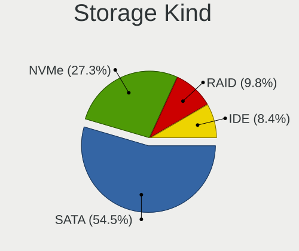

| Kind | Desktops | Percent |
|------|----------|---------|
| SATA | 156      | 54.55%  |
| NVMe | 78       | 27.27%  |
| RAID | 28       | 9.79%   |
| IDE  | 24       | 8.39%   |

Processor
---------

CPU Vendor
----------

Processor vendors

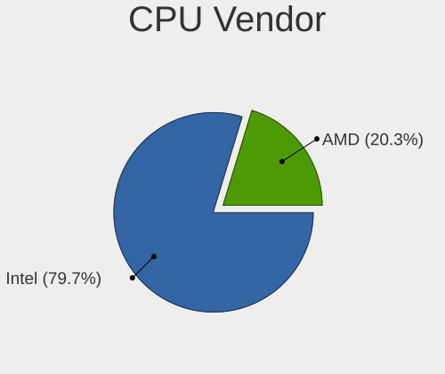

| Vendor | Desktops | Percent |
|--------|----------|---------|
| Intel  | 157      | 79.7%   |
| AMD    | 40       | 20.3%   |

CPU Model
---------

Processor models

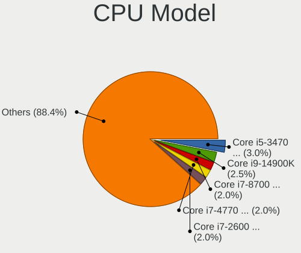

| Model                                  | Desktops | Percent |
|----------------------------------------|----------|---------|
| Intel Core i5-3470 CPU @ 3.20GHz       | 6        | 3.03%   |
| Intel Core i9-14900K                   | 5        | 2.53%   |
| Intel Core i7-8700 CPU @ 3.20GHz       | 4        | 2.02%   |
| Intel Core i7-4770 CPU @ 3.40GHz       | 4        | 2.02%   |
| Intel Core i7-2600 CPU @ 3.40GHz       | 4        | 2.02%   |
| Intel Core i5-7500 CPU @ 3.40GHz       | 4        | 2.02%   |
| Intel Core i5-10400F CPU @ 2.90GHz     | 4        | 2.02%   |
| AMD Ryzen 5 5600X 6-Core Processor     | 4        | 2.02%   |
| Intel Core i7-7700 CPU @ 3.60GHz       | 3        | 1.52%   |
| Intel Core i7-6700 CPU @ 3.40GHz       | 3        | 1.52%   |
| Intel Core i7-3770 CPU @ 3.40GHz       | 3        | 1.52%   |
| Intel Core i5-6400 CPU @ 2.70GHz       | 3        | 1.52%   |
| Intel Core i5-2400 CPU @ 3.10GHz       | 3        | 1.52%   |
| Intel Core i3-2120 CPU @ 3.30GHz       | 3        | 1.52%   |
| Intel Core i3-10100 CPU @ 3.60GHz      | 3        | 1.52%   |
| Intel Core 2 Duo CPU E7500 @ 2.93GHz   | 3        | 1.52%   |
| Intel Xeon CPU E5-1650 v2 @ 3.50GHz    | 2        | 1.01%   |
| Intel Core i7-9700 CPU @ 3.00GHz       | 2        | 1.01%   |
| Intel Core i7-7700K CPU @ 4.20GHz      | 2        | 1.01%   |
| Intel Core i7-4790 CPU @ 3.60GHz       | 2        | 1.01%   |
| Intel Core i7-3770S CPU @ 3.10GHz      | 2        | 1.01%   |
| Intel Core i7-2600K CPU @ 3.40GHz      | 2        | 1.01%   |
| Intel Core i7-10700K CPU @ 3.80GHz     | 2        | 1.01%   |
| Intel Core i7-10700 CPU @ 2.90GHz      | 2        | 1.01%   |
| Intel Core i7 CPU 870 @ 2.93GHz        | 2        | 1.01%   |
| Intel Core i5-9400F CPU @ 2.90GHz      | 2        | 1.01%   |
| Intel Core i5-9400 CPU @ 2.90GHz       | 2        | 1.01%   |
| Intel Core i5-4460 CPU @ 3.20GHz       | 2        | 1.01%   |
| Intel Core i5-3570 CPU @ 3.40GHz       | 2        | 1.01%   |
| Intel Core i5-14400F                   | 2        | 1.01%   |
| Intel Core i5-10400 CPU @ 2.90GHz      | 2        | 1.01%   |
| Intel Core i3-8100 CPU @ 3.60GHz       | 2        | 1.01%   |
| Intel Core i3-3220 CPU @ 3.30GHz       | 2        | 1.01%   |
| Intel Celeron CPU J3455 @ 1.50GHz      | 2        | 1.01%   |
| Intel 11th Gen Core i7-11700 @ 2.50GHz | 2        | 1.01%   |
| Intel 11th Gen Core i5-11400 @ 2.60GHz | 2        | 1.01%   |
| AMD Ryzen 9 5900X 12-Core Processor    | 2        | 1.01%   |
| AMD Ryzen 9 3950X 16-Core Processor    | 2        | 1.01%   |
| AMD Ryzen 7 7800X3D 8-Core Processor   | 2        | 1.01%   |
| AMD Ryzen 7 3700X 8-Core Processor     | 2        | 1.01%   |

CPU Model Family
----------------

Processor model prefix

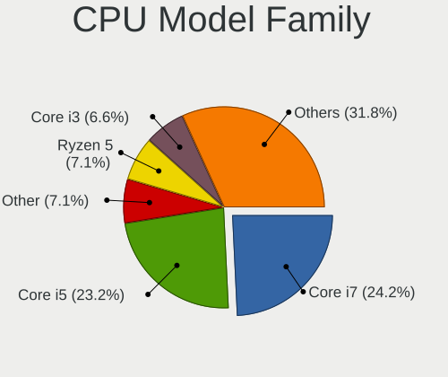

| Model                   | Desktops | Percent |
|-------------------------|----------|---------|
| Intel Core i7           | 48       | 24.24%  |
| Intel Core i5           | 46       | 23.23%  |
| Other                   | 14       | 7.07%   |
| AMD Ryzen 5             | 14       | 7.07%   |
| Intel Core i3           | 13       | 6.57%   |
| AMD Ryzen 7             | 11       | 5.56%   |
| Intel Xeon              | 10       | 5.05%   |
| AMD Ryzen 9             | 10       | 5.05%   |
| Intel Core i9           | 9        | 4.55%   |
| Intel Core 2 Duo        | 7        | 3.54%   |
| Intel Celeron           | 4        | 2.02%   |
| AMD FX                  | 4        | 2.02%   |
| Intel Pentium Silver    | 1        | 0.51%   |
| Intel Pentium Dual-Core | 1        | 0.51%   |
| Intel Pentium 4         | 1        | 0.51%   |
| Intel Core 2 Quad       | 1        | 0.51%   |
| Intel Core 2 Extreme    | 1        | 0.51%   |
| Intel Core 2            | 1        | 0.51%   |
| AMD Ryzen Threadripper  | 1        | 0.51%   |
| AMD A4                  | 1        | 0.51%   |

CPU Cores
---------

Number of processor cores

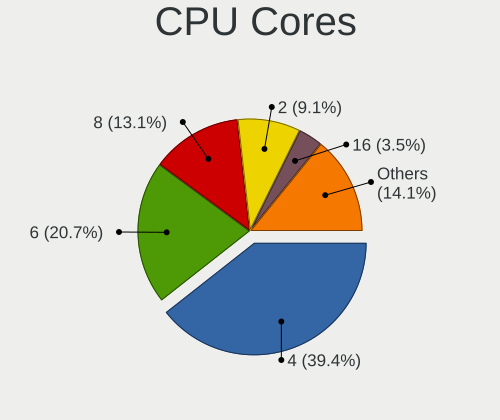

| Number | Desktops | Percent |
|--------|----------|---------|
| 4      | 78       | 39.39%  |
| 6      | 41       | 20.71%  |
| 8      | 26       | 13.13%  |
| 2      | 18       | 9.09%   |
| 16     | 7        | 3.54%   |
| 12     | 7        | 3.54%   |
| 24     | 6        | 3.03%   |
| 10     | 6        | 3.03%   |
| 1      | 4        | 2.02%   |
| 14     | 2        | 1.01%   |
| 32     | 1        | 0.51%   |
| 22     | 1        | 0.51%   |
| 20     | 1        | 0.51%   |

CPU Sockets
-----------

Number of sockets

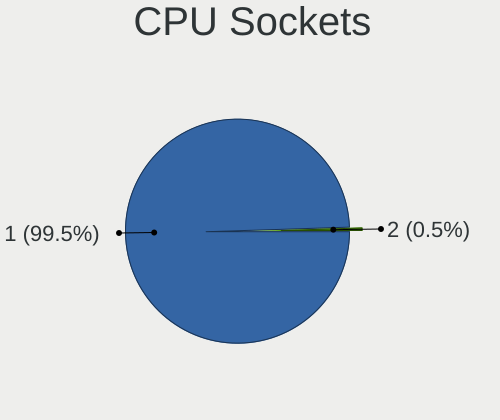

| Number | Desktops | Percent |
|--------|----------|---------|
| 1      | 196      | 99.49%  |
| 2      | 1        | 0.51%   |

CPU Threads
-----------

Threads per core (Hyper-Threading)

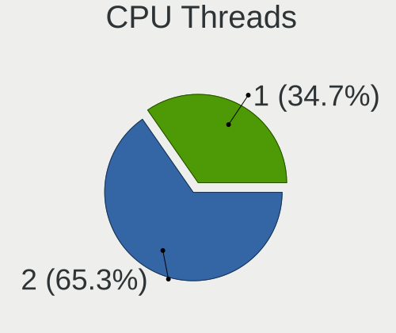

| Number | Desktops | Percent |
|--------|----------|---------|
| 2      | 130      | 65.33%  |
| 1      | 69       | 34.67%  |

CPU Op-Modes
------------

CPU Operation Modes (32-bit, 64-bit)

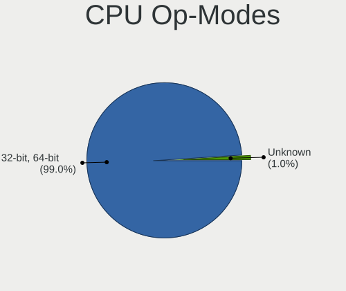

| Op mode        | Desktops | Percent |
|----------------|----------|---------|
| 32-bit, 64-bit | 195      | 98.98%  |
| Unknown        | 2        | 1.02%   |

CPU Microcode
-------------

Microcode number

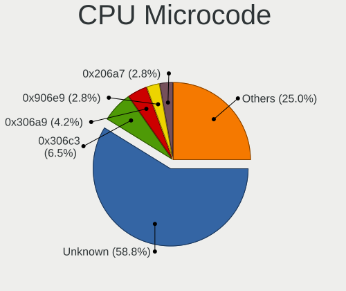

| Number     | Desktops | Percent |
|------------|----------|---------|
| Unknown    | 127      | 58.8%   |
| 0x306c3    | 14       | 6.48%   |
| 0x306a9    | 9        | 4.17%   |
| 0x906e9    | 6        | 2.78%   |
| 0x206a7    | 6        | 2.78%   |
| 0x1067a    | 6        | 2.78%   |
| 0xa0653    | 4        | 1.85%   |
| 0x906ea    | 4        | 1.85%   |
| 0x906ed    | 3        | 1.39%   |
| 0xa0655    | 2        | 0.93%   |
| 0x506c9    | 2        | 0.93%   |
| 0x306e4    | 2        | 0.93%   |
| 0x106e5    | 2        | 0.93%   |
| 0x0a201016 | 2        | 0.93%   |
| 0x08701021 | 2        | 0.93%   |
| 0x0800820d | 2        | 0.93%   |
| 0x06000852 | 2        | 0.93%   |
| 0xf64      | 1        | 0.46%   |
| 0xb0671    | 1        | 0.46%   |
| 0xa0652    | 1        | 0.46%   |
| 0x906ec    | 1        | 0.46%   |
| 0x906eb    | 1        | 0.46%   |
| 0x906c0    | 1        | 0.46%   |
| 0x90675    | 1        | 0.46%   |
| 0x806ea    | 1        | 0.46%   |
| 0x6fb      | 1        | 0.46%   |
| 0x6f2      | 1        | 0.46%   |
| 0x506e3    | 1        | 0.46%   |
| 0x306f2    | 1        | 0.46%   |
| 0x206d7    | 1        | 0.46%   |
| 0x106a4    | 1        | 0.46%   |
| 0x10661    | 1        | 0.46%   |
| 0x0b40401c | 1        | 0.46%   |
| 0x0a404102 | 1        | 0.46%   |
| 0x0a20120a | 1        | 0.46%   |
| 0x0a20102b | 1        | 0.46%   |
| 0x0a201009 | 1        | 0.46%   |
| 0x08701013 | 1        | 0.46%   |

CPU Microarch
-------------

Microarchitecture

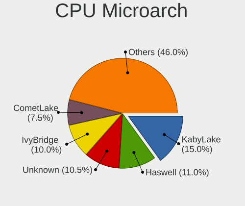

| Name             | Desktops | Percent |
|------------------|----------|---------|
| KabyLake         | 30       | 15%     |
| Haswell          | 22       | 11%     |
| Unknown          | 21       | 10.5%   |
| IvyBridge        | 20       | 10%     |
| CometLake        | 15       | 7.5%    |
| SandyBridge      | 14       | 7%      |
| Zen 3            | 11       | 5.5%    |
| Zen 2            | 10       | 5%      |
| Skylake          | 9        | 4.5%    |
| Penryn           | 9        | 4.5%    |
| Alderlake Hybrid | 9        | 4.5%    |
| Zen+             | 6        | 3%      |
| Nehalem          | 5        | 2.5%    |
| Piledriver       | 4        | 2%      |
| Broadwell        | 4        | 2%      |
| Core             | 3        | 1.5%    |
| Icelake          | 2        | 1%      |
| Goldmont         | 2        | 1%      |
| Tremont          | 1        | 0.5%    |
| TigerLake        | 1        | 0.5%    |
| NetBurst         | 1        | 0.5%    |
| Bulldozer        | 1        | 0.5%    |

Graphics
--------

GPU Vendor
----------

Vendors of graphics cards

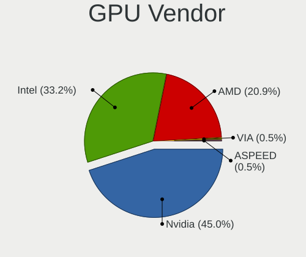

| Vendor            | Desktops | Percent |
|-------------------|----------|---------|
| Nvidia            | 99       | 45%     |
| Intel             | 73       | 33.18%  |
| AMD               | 46       | 20.91%  |
| VIA Technologies  | 1        | 0.45%   |
| ASPEED Technology | 1        | 0.45%   |

GPU Model
---------

Graphics card models

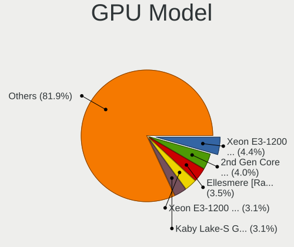

| Model                                                                       | Desktops | Percent |
|-----------------------------------------------------------------------------|----------|---------|
| Intel Xeon E3-1200 v3/4th Gen Core Processor Integrated Graphics Controller | 10       | 4.41%   |
| Intel 2nd Generation Core Processor Family Integrated Graphics Controller   | 9        | 3.96%   |
| AMD Ellesmere [Radeon RX 470/480/570/570X/580/580X/590]                     | 8        | 3.52%   |
| Intel Xeon E3-1200 v2/3rd Gen Core processor Graphics Controller            | 7        | 3.08%   |
| Intel Kaby Lake-S GT2 [HD Graphics 630]                                     | 7        | 3.08%   |
| Intel CoffeeLake-S GT2 [UHD Graphics 630]                                   | 6        | 2.64%   |
| Nvidia GM107 [GeForce GTX 750 Ti]                                           | 5        | 2.2%    |
| Intel CometLake-S GT2 [UHD Graphics 630]                                    | 5        | 2.2%    |
| Nvidia TU106 [GeForce RTX 2060 SUPER]                                       | 4        | 1.76%   |
| Nvidia GK208B [GeForce GT 730]                                              | 4        | 1.76%   |
| Nvidia GA106 [GeForce RTX 3060 Lite Hash Rate]                              | 4        | 1.76%   |
| Nvidia AD107 [GeForce RTX 4060]                                             | 4        | 1.76%   |
| Intel IvyBridge GT2 [HD Graphics 4000]                                      | 4        | 1.76%   |
| Intel 4 Series Chipset Integrated Graphics Controller                       | 4        | 1.76%   |
| AMD Navi 23 [Radeon RX 6600/6600 XT/6600M]                                  | 4        | 1.76%   |
| AMD Granite Ridge [Radeon Graphics]                                         | 4        | 1.76%   |
| Nvidia TU116 [GeForce GTX 1650 SUPER]                                       | 3        | 1.32%   |
| Nvidia TU104 [GeForce RTX 2070 SUPER]                                       | 3        | 1.32%   |
| Nvidia GP104 [GeForce GTX 1070 Ti]                                          | 3        | 1.32%   |
| Nvidia GM204 [GeForce GTX 970]                                              | 3        | 1.32%   |
| Intel Skylake-S GT2 [HD Graphics 530]                                       | 3        | 1.32%   |
| Intel Raptor Lake-S GT1 [UHD Graphics 770]                                  | 3        | 1.32%   |
| AMD Navi 10 [Radeon RX 5600 OEM/5600 XT / 5700/5700 XT]                     | 3        | 1.32%   |
| Nvidia TU117 [GeForce GTX 1650]                                             | 2        | 0.88%   |
| Nvidia TU116 [GeForce GTX 1660]                                             | 2        | 0.88%   |
| Nvidia TU116 [GeForce GTX 1660 Ti]                                          | 2        | 0.88%   |
| Nvidia GT218 [GeForce 210]                                                  | 2        | 0.88%   |
| Nvidia GP108 [GeForce GT 1030]                                              | 2        | 0.88%   |
| Nvidia GP107 [GeForce GTX 1050]                                             | 2        | 0.88%   |
| Nvidia GP107 [GeForce GTX 1050 Ti]                                          | 2        | 0.88%   |
| Nvidia GP106 [GeForce GTX 1060 6GB]                                         | 2        | 0.88%   |
| Nvidia GP104 [GeForce GTX 1070]                                             | 2        | 0.88%   |
| Nvidia GM206 [GeForce GTX 950]                                              | 2        | 0.88%   |
| Nvidia GF108 [GeForce GT 730]                                               | 2        | 0.88%   |
| Nvidia GB205 [GeForce RTX 5070]                                             | 2        | 0.88%   |
| Nvidia AD103 [GeForce RTX 4080 SUPER]                                       | 2        | 0.88%   |
| Intel Apollo Lake GT1 [HD Graphics 500]                                     | 2        | 0.88%   |
| Intel Alder Lake-S GT1 [UHD Graphics 770]                                   | 2        | 0.88%   |
| Intel 82G33/G31 Express Integrated Graphics Controller                      | 2        | 0.88%   |
| Intel 4th Generation Core Processor Family Integrated Graphics Controller   | 2        | 0.88%   |

GPU Combo
---------

Combinations of graphics cards

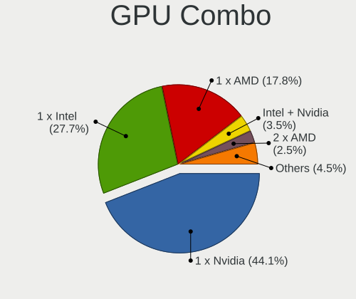

| Name            | Desktops | Percent |
|-----------------|----------|---------|
| 1 x Nvidia      | 89       | 44.06%  |
| 1 x Intel       | 56       | 27.72%  |
| 1 x AMD         | 36       | 17.82%  |
| Intel + Nvidia  | 7        | 3.47%   |
| 2 x AMD         | 5        | 2.48%   |
| Intel + AMD     | 5        | 2.48%   |
| AMD + Nvidia    | 2        | 0.99%   |
| 1 x VIA         | 1        | 0.5%    |
| Nvidia + ASPEED | 1        | 0.5%    |

GPU Driver
----------

Free vs proprietary

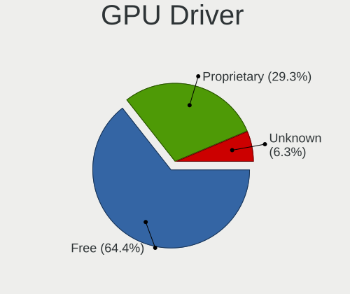

| Driver      | Desktops | Percent |
|-------------|----------|---------|
| Free        | 132      | 64.39%  |
| Proprietary | 60       | 29.27%  |
| Unknown     | 13       | 6.34%   |

GPU Memory
----------

Total video memory

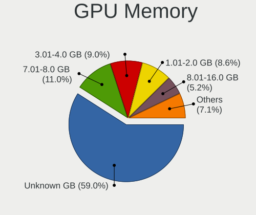

| Size in GB | Desktops | Percent |
|------------|----------|---------|
| Unknown    | 124      | 59.05%  |
| 7.01-8.0   | 23       | 10.95%  |
| 3.01-4.0   | 19       | 9.05%   |
| 1.01-2.0   | 18       | 8.57%   |
| 8.01-16.0  | 11       | 5.24%   |
| 0.51-1.0   | 6        | 2.86%   |
| 0.01-0.5   | 4        | 1.9%    |
| 5.01-6.0   | 2        | 0.95%   |
| 2.01-3.0   | 2        | 0.95%   |
| 24.01-32.0 | 1        | 0.48%   |

Monitor
-------

Monitor Vendor
--------------

Monitor vendors

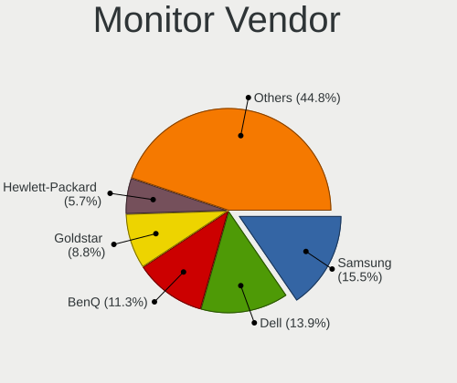

| Vendor               | Desktops | Percent |
|----------------------|----------|---------|
| Samsung Electronics  | 30       | 15.46%  |
| Dell                 | 27       | 13.92%  |
| BenQ                 | 22       | 11.34%  |
| Goldstar             | 17       | 8.76%   |
| Hewlett-Packard      | 11       | 5.67%   |
| Lenovo               | 10       | 5.15%   |
| Acer                 | 7        | 3.61%   |
| AOC                  | 6        | 3.09%   |
| ViewSonic            | 5        | 2.58%   |
| Unknown              | 5        | 2.58%   |
| Sony                 | 5        | 2.58%   |
| ASUSTek Computer     | 5        | 2.58%   |
| Sharp                | 4        | 2.06%   |
| Gigabyte Technology  | 4        | 2.06%   |
| Skyworth             | 2        | 1.03%   |
| SKY                  | 2        | 1.03%   |
| Mi                   | 2        | 1.03%   |
| LG Electronics       | 2        | 1.03%   |
| Ancor Communications | 2        | 1.03%   |
| Xiaomi               | 1        | 0.52%   |
| WIT                  | 1        | 0.52%   |
| WBT                  | 1        | 0.52%   |
| UTV                  | 1        | 0.52%   |
| Unknown (XXX)        | 1        | 0.52%   |
| Tech Concepts        | 1        | 0.52%   |
| TCL                  | 1        | 0.52%   |
| Sun                  | 1        | 0.52%   |
| SKG                  | 1        | 0.52%   |
| SHC                  | 1        | 0.52%   |
| SAC                  | 1        | 0.52%   |
| RTK                  | 1        | 0.52%   |
| RGT                  | 1        | 0.52%   |
| Pioneer              | 1        | 0.52%   |
| Philips              | 1        | 0.52%   |
| MStar                | 1        | 0.52%   |
| Lenovo Group Limited | 1        | 0.52%   |
| LED                  | 1        | 0.52%   |
| Konka                | 1        | 0.52%   |
| HUAWEI               | 1        | 0.52%   |
| HCS                  | 1        | 0.52%   |

Monitor Model
-------------

Monitor models

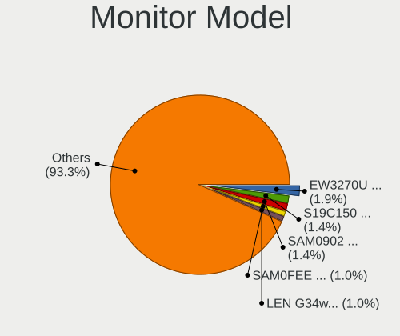

| Model                                                                   | Desktops | Percent |
|-------------------------------------------------------------------------|----------|---------|
| BenQ EW3270U BNQ7950 3840x2160 698x393mm 31.5-inch                      | 4        | 1.9%    |
| Samsung Electronics S19C150 SAM0AE6 1366x768 410x230mm 18.5-inch        | 3        | 1.43%   |
| Samsung Electronics LCD Monitor SAM0902 1920x1080 890x500mm 40.2-inch   | 3        | 1.43%   |
| Samsung Electronics LCD Monitor SAM0FEE 3840x2160 1872x1053mm 84.6-inch | 2        | 0.95%   |
| Lenovo LEN G34w-10 LEN66A1 3440x1440 797x334mm 34.0-inch                | 2        | 0.95%   |
| Lenovo C24-40 LEN63DC 1920x1080 527x296mm 23.8-inch                     | 2        | 0.95%   |
| Dell SE2717H/HX DELD0A1 1920x1080 598x336mm 27.0-inch                   | 2        | 0.95%   |
| Dell S2340L DELD057 1920x1080 509x286mm 23.0-inch                       | 2        | 0.95%   |
| Dell P2419H DELD0D9 1920x1080 527x296mm 23.8-inch                       | 2        | 0.95%   |
| Dell P2312H DEL4076 1920x1080 510x287mm 23.0-inch                       | 2        | 0.95%   |
| BenQ VZ2350 BNQ7B36 1920x1080 509x286mm 23.0-inch                       | 2        | 0.95%   |
| BenQ GL2460 BNQ78CE 1920x1080 531x299mm 24.0-inch                       | 2        | 0.95%   |
| AOC 24G2W1G3 AOC2402 1920x1080 527x296mm 23.8-inch                      | 2        | 0.95%   |
| Xiaomi Mi TV XMD0076 3840x2160 1110x620mm 50.1-inch                     | 1        | 0.48%   |
| WIT DVI WIT00FA 2560x1600 670x430mm 31.3-inch                           | 1        | 0.48%   |
| WBT GOP27QHD165I WBT2703 2560x1440 597x336mm 27.0-inch                  | 1        | 0.48%   |
| ViewSonic VX3218C-QHD VSC103E 2560x1440 697x392mm 31.5-inch             | 1        | 0.48%   |
| ViewSonic VX2458 Series VSC36AF 1920x1080 521x293mm 23.5-inch           | 1        | 0.48%   |
| ViewSonic VX2270 SERIES VSCE02C 1920x1080 476x267mm 21.5-inch           | 1        | 0.48%   |
| ViewSonic VX2253 Series VSC0A28 1920x1080 476x268mm 21.5-inch           | 1        | 0.48%   |
| ViewSonic VA2432-FHD VSCB639 1920x1080 527x296mm 23.8-inch              | 1        | 0.48%   |
| UTV MONITOR UTV002F 3840x2160 1872x1053mm 84.6-inch                     | 1        | 0.48%   |
| Unknown MS306 0030 1920x1080 708x398mm 32.0-inch                        | 1        | 0.48%   |
| Unknown LCD Monitor SCEI MONITOR 1920x1080                              | 1        | 0.48%   |
| Unknown LCD Monitor SAMSUNG 3840x2160                                   | 1        | 0.48%   |
| Unknown LCD Monitor SAMSUNG 1920x1080                                   | 1        | 0.48%   |
| Unknown LCD Monitor AAA HDTV 1366x768                                   | 1        | 0.48%   |
| Unknown (XXX) Beyond TV XXX2851 1920x1080 1210x680mm 54.6-inch          | 1        | 0.48%   |
| Tech Concepts LCD Monitor TCL SMART TV 3840x2160                        | 1        | 0.48%   |
| TCL SMART TV TCL6586 3840x2160 1209x680mm 54.6-inch                     | 1        | 0.48%   |
| Sun SCEI MONITOR SCE0301 1920x1080 522x294mm 23.6-inch                  | 1        | 0.48%   |
| Sony TV SNY6E02 1920x1080                                               | 1        | 0.48%   |
| Sony TV SNY3002 1920x1080 886x498mm 40.0-inch                           | 1        | 0.48%   |
| Sony TV SNY2C02 1920x1080 886x498mm 40.0-inch                           | 1        | 0.48%   |
| Sony TV *00 SNY7C04 3840x2160 1218x685mm 55.0-inch                      | 1        | 0.48%   |
| Sony LCD Monitor TV  *00 3840x2160                                      | 1        | 0.48%   |
| Skyworth TV-monitor SKY1102 3840x2160 708x398mm 32.0-inch               | 1        | 0.48%   |
| Skyworth TV SKY1502 3840x2160 708x398mm 32.0-inch                       | 1        | 0.48%   |
| SKY TV-PHILCO SKY0104 1920x1080 885x498mm 40.0-inch                     | 1        | 0.48%   |
| SKY Skyworth TV SKY1502 3840x2160 708x398mm 32.0-inch                   | 1        | 0.48%   |

Monitor Resolution
------------------

Monitor screen resolution

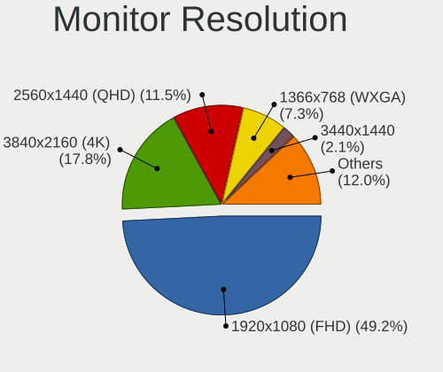

| Resolution         | Desktops | Percent |
|--------------------|----------|---------|
| 1920x1080 (FHD)    | 94       | 49.21%  |
| 3840x2160 (4K)     | 34       | 17.8%   |
| 2560x1440 (QHD)    | 22       | 11.52%  |
| 1366x768 (WXGA)    | 14       | 7.33%   |
| 3440x1440          | 4        | 2.09%   |
| 2560x1080          | 4        | 2.09%   |
| 1600x900 (HD+)     | 3        | 1.57%   |
| 1440x900 (WXGA+)   | 3        | 1.57%   |
| 1280x1024 (SXGA)   | 3        | 1.57%   |
| 3840x1600          | 2        | 1.05%   |
| 3840x1080          | 2        | 1.05%   |
| Unknown            | 2        | 1.05%   |
| 7040x1440          | 1        | 0.52%   |
| 2560x1600          | 1        | 0.52%   |
| 1920x1200 (WUXGA)  | 1        | 0.52%   |
| 1680x1050 (WSXGA+) | 1        | 0.52%   |

Monitor Diagonal
----------------

Diagonal size in inches

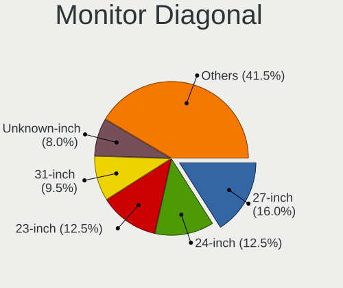

| Inches  | Desktops | Percent |
|---------|----------|---------|
| 27      | 32       | 16%     |
| 24      | 25       | 12.5%   |
| 23      | 25       | 12.5%   |
| 31      | 19       | 9.5%    |
| Unknown | 16       | 8%      |
| 21      | 13       | 6.5%    |
| 18      | 12       | 6%      |
| 84      | 7        | 3.5%    |
| 54      | 7        | 3.5%    |
| 34      | 7        | 3.5%    |
| 32      | 6        | 3%      |
| 19      | 4        | 2%      |
| 72      | 3        | 1.5%    |
| 52      | 3        | 1.5%    |
| 17      | 3        | 1.5%    |
| 40      | 2        | 1%      |
| 22      | 2        | 1%      |
| 82      | 1        | 0.5%    |
| 75      | 1        | 0.5%    |
| 64      | 1        | 0.5%    |
| 63      | 1        | 0.5%    |
| 57      | 1        | 0.5%    |
| 55      | 1        | 0.5%    |
| 48      | 1        | 0.5%    |
| 46      | 1        | 0.5%    |
| 37      | 1        | 0.5%    |
| 29      | 1        | 0.5%    |
| 26      | 1        | 0.5%    |
| 25      | 1        | 0.5%    |
| 20      | 1        | 0.5%    |
| 16      | 1        | 0.5%    |

Monitor Width
-------------

Physical width

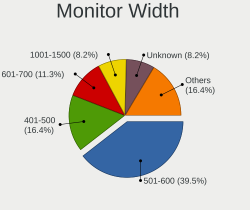

| Width in mm | Desktops | Percent |
|-------------|----------|---------|
| 501-600     | 77       | 39.49%  |
| 401-500     | 32       | 16.41%  |
| 601-700     | 22       | 11.28%  |
| 1001-1500   | 16       | 8.21%   |
| Unknown     | 16       | 8.21%   |
| 701-800     | 12       | 6.15%   |
| 1501-2000   | 12       | 6.15%   |
| 801-900     | 4        | 2.05%   |
| 301-350     | 3        | 1.54%   |
| 351-400     | 1        | 0.51%   |

Aspect Ratio
------------

Proportional relationship between the width and the height

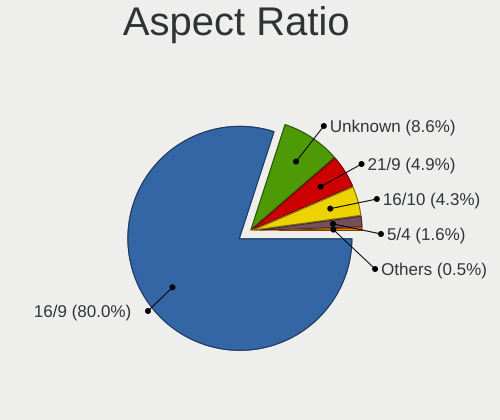

| Ratio   | Desktops | Percent |
|---------|----------|---------|
| 16/9    | 148      | 80%     |
| Unknown | 16       | 8.65%   |
| 21/9    | 9        | 4.86%   |
| 16/10   | 8        | 4.32%   |
| 5/4     | 3        | 1.62%   |
| 32/9    | 1        | 0.54%   |

Monitor Area
------------

Area in inch²

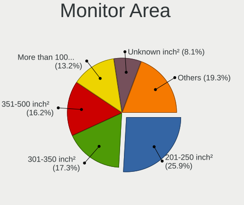

| Area in inch² | Desktops | Percent |
|----------------|----------|---------|
| 201-250        | 51       | 25.89%  |
| 301-350        | 34       | 17.26%  |
| 351-500        | 32       | 16.24%  |
| More than 1000 | 26       | 13.2%   |
| Unknown        | 16       | 8.12%   |
| 141-150        | 15       | 7.61%   |
| 251-300        | 9        | 4.57%   |
| 151-200        | 8        | 4.06%   |
| 501-1000       | 5        | 2.54%   |
| 101-110        | 1        | 0.51%   |

Pixel Density
-------------

Pixels per inch

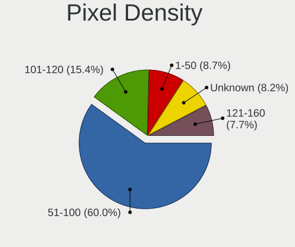

| Density | Desktops | Percent |
|---------|----------|---------|
| 51-100  | 117      | 60%     |
| 101-120 | 30       | 15.38%  |
| 1-50    | 17       | 8.72%   |
| Unknown | 16       | 8.21%   |
| 121-160 | 15       | 7.69%   |

Multiple Monitors
-----------------

Total monitors connected

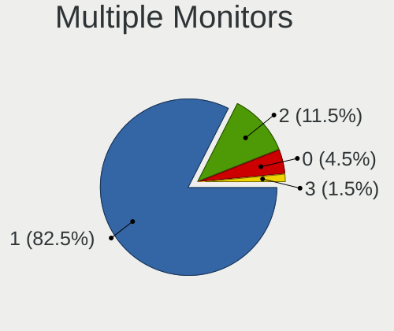

| Total | Desktops | Percent |
|-------|----------|---------|
| 1     | 165      | 82.5%   |
| 2     | 23       | 11.5%   |
| 0     | 9        | 4.5%    |
| 3     | 3        | 1.5%    |

Network
-------

Net Controller Vendor
---------------------

Controller vendors

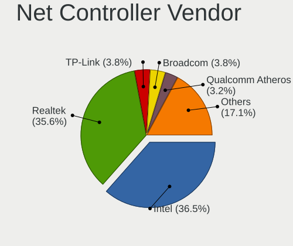

| Vendor                          | Desktops | Percent |
|---------------------------------|----------|---------|
| Intel                           | 115      | 36.51%  |
| Realtek Semiconductor           | 112      | 35.56%  |
| TP-Link                         | 12       | 3.81%   |
| Broadcom                        | 12       | 3.81%   |
| Qualcomm Atheros                | 10       | 3.17%   |
| Ralink Technology               | 9        | 2.86%   |
| MediaTek                        | 9        | 2.86%   |
| Samsung Electronics             | 6        | 1.9%    |
| Ralink                          | 4        | 1.27%   |
| Qualcomm Atheros Communications | 2        | 0.63%   |
| Microsoft                       | 2        | 0.63%   |
| Linksys                         | 2        | 0.63%   |
| Huawei Technologies             | 2        | 0.63%   |
| DisplayLink                     | 2        | 0.63%   |
| D-Link                          | 2        | 0.63%   |
| Apple                           | 2        | 0.63%   |
| Xiaomi                          | 1        | 0.32%   |
| Wilocity                        | 1        | 0.32%   |
| VIA Technologies                | 1        | 0.32%   |
| T & A Mobile Phones             | 1        | 0.32%   |
| Qualcomm Technologies           | 1        | 0.32%   |
| QinHeng Electronics             | 1        | 0.32%   |
| Marvell Technology Group        | 1        | 0.32%   |
| Edimax Technology               | 1        | 0.32%   |
| Conexant Systems                | 1        | 0.32%   |
| Belkin Components               | 1        | 0.32%   |
| ASIX Electronics                | 1        | 0.32%   |
| Aquantia                        | 1        | 0.32%   |

Net Controller Model
--------------------

Controller models

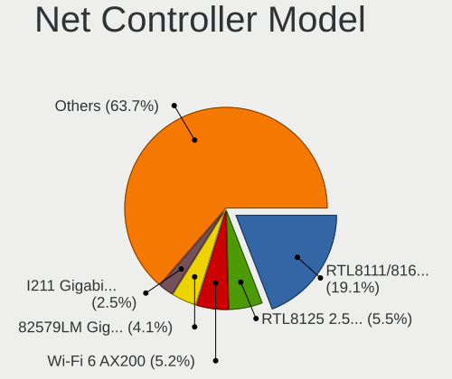

| Model                                                                           | Desktops | Percent |
|---------------------------------------------------------------------------------|----------|---------|
| Realtek RTL8111/8168/8211/8411 PCI Express Gigabit Ethernet Controller          | 70       | 19.13%  |
| Realtek RTL8125 2.5GbE Controller                                               | 20       | 5.46%   |
| Intel Wi-Fi 6 AX200                                                             | 19       | 5.19%   |
| Intel 82579LM Gigabit Network Connection (Lewisville)                           | 15       | 4.1%    |
| Intel I211 Gigabit Network Connection                                           | 9        | 2.46%   |
| Intel Ethernet Connection (7) I219-V                                            | 9        | 2.46%   |
| Intel Ethernet Connection (2) I219-V                                            | 9        | 2.46%   |
| Ralink RT2870/RT3070 Wireless Adapter                                           | 8        | 2.19%   |
| Intel Ethernet Controller I225-V                                                | 8        | 2.19%   |
| TP-Link TL-WN823N v2/v3 [Realtek RTL8192EU]                                     | 7        | 1.91%   |
| Intel Ethernet Connection I217-LM                                               | 7        | 1.91%   |
| Intel Ethernet Controller I226-V                                                | 6        | 1.64%   |
| Samsung Galaxy series, misc. (tethering mode)                                   | 5        | 1.37%   |
| Realtek RTL8188EUS 802.11n Wireless Network Adapter                             | 5        | 1.37%   |
| Intel Ethernet Connection (2) I218-V                                            | 5        | 1.37%   |
| Realtek 802.11ac NIC                                                            | 4        | 1.09%   |
| Intel Wireless 3165                                                             | 4        | 1.09%   |
| Intel Cannon Lake PCH CNVi WiFi                                                 | 4        | 1.09%   |
| Broadcom BCM4360 802.11ac Dual Band Wireless Network Adapter                    | 4        | 1.09%   |
| Realtek RTL88x2bu [AC1200 Techkey]                                              | 3        | 0.82%   |
| Realtek RTL8822CE 802.11ac PCIe Wireless Network Adapter                        | 3        | 0.82%   |
| Realtek RTL810xE PCI Express Fast Ethernet controller                           | 3        | 0.82%   |
| Qualcomm Atheros AR93xx Wireless Network Adapter                                | 3        | 0.82%   |
| MediaTek MT7925 802.11be 160MHz 2x2 PCIe Wireless Network Adapter [Filogic 360] | 3        | 0.82%   |
| MediaTek MT7921K (RZ608) Wi-Fi 6E 80MHz                                         | 3        | 0.82%   |
| Intel Tiger Lake PCH CNVi WiFi                                                  | 3        | 0.82%   |
| Intel Ethernet Connection I217-V                                                | 3        | 0.82%   |
| Intel Ethernet Connection (17) I219-V                                           | 3        | 0.82%   |
| Intel 700 Series Chipset CNVi WiFi                                              | 3        | 0.82%   |
| TP-Link 802.11ac WLAN Adapter                                                   | 2        | 0.55%   |
| Samsung GT-I9070 (network tethering, USB debugging enabled)                     | 2        | 0.55%   |
| Realtek RTL8812AU 802.11a/b/g/n/ac 2T2R DB WLAN Adapter                         | 2        | 0.55%   |
| Realtek RTL8192EE PCIe Wireless Network Adapter                                 | 2        | 0.55%   |
| Realtek RTL8188EE Wireless Network Adapter                                      | 2        | 0.55%   |
| Ralink RT5390R 802.11bgn PCIe Wireless Network Adapter                          | 2        | 0.55%   |
| Qualcomm Atheros AR9271 802.11n                                                 | 2        | 0.55%   |
| Qualcomm Atheros AR9285 Wireless Network Adapter (PCI-Express)                  | 2        | 0.55%   |
| Qualcomm Atheros AR8161 Gigabit Ethernet                                        | 2        | 0.55%   |
| Microsoft Wireless XBox Controller Dongle                                       | 2        | 0.55%   |
| MediaTek MT7922 802.11ax PCI Express Wireless Network Adapter                   | 2        | 0.55%   |

Wireless Vendor
---------------

Wireless vendors

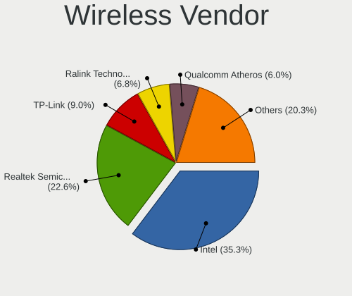

| Vendor                          | Desktops | Percent |
|---------------------------------|----------|---------|
| Intel                           | 47       | 35.34%  |
| Realtek Semiconductor           | 30       | 22.56%  |
| TP-Link                         | 12       | 9.02%   |
| Ralink Technology               | 9        | 6.77%   |
| Qualcomm Atheros                | 8        | 6.02%   |
| Broadcom                        | 7        | 5.26%   |
| MediaTek                        | 5        | 3.76%   |
| Ralink                          | 4        | 3.01%   |
| Qualcomm Atheros Communications | 2        | 1.5%    |
| Microsoft                       | 2        | 1.5%    |
| Linksys                         | 2        | 1.5%    |
| D-Link                          | 2        | 1.5%    |
| Wilocity                        | 1        | 0.75%   |
| Edimax Technology               | 1        | 0.75%   |
| Belkin Components               | 1        | 0.75%   |

Wireless Model
--------------

Wireless models

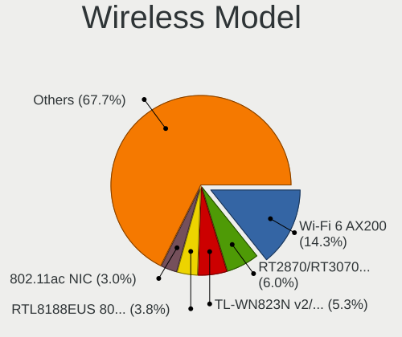

| Model                                                           | Desktops | Percent |
|-----------------------------------------------------------------|----------|---------|
| Intel Wi-Fi 6 AX200                                             | 19       | 14.29%  |
| Ralink RT2870/RT3070 Wireless Adapter                           | 8        | 6.02%   |
| TP-Link TL-WN823N v2/v3 [Realtek RTL8192EU]                     | 7        | 5.26%   |
| Realtek RTL8188EUS 802.11n Wireless Network Adapter             | 5        | 3.76%   |
| Realtek 802.11ac NIC                                            | 4        | 3.01%   |
| Intel Wireless 3165                                             | 4        | 3.01%   |
| Intel Cannon Lake PCH CNVi WiFi                                 | 4        | 3.01%   |
| Broadcom BCM4360 802.11ac Dual Band Wireless Network Adapter    | 4        | 3.01%   |
| Realtek RTL88x2bu [AC1200 Techkey]                              | 3        | 2.26%   |
| Realtek RTL8822CE 802.11ac PCIe Wireless Network Adapter        | 3        | 2.26%   |
| Qualcomm Atheros AR93xx Wireless Network Adapter                | 3        | 2.26%   |
| MediaTek MT7921K (RZ608) Wi-Fi 6E 80MHz                         | 3        | 2.26%   |
| Intel Tiger Lake PCH CNVi WiFi                                  | 3        | 2.26%   |
| Intel 700 Series Chipset CNVi WiFi                              | 3        | 2.26%   |
| TP-Link 802.11ac WLAN Adapter                                   | 2        | 1.5%    |
| Realtek RTL8812AU 802.11a/b/g/n/ac 2T2R DB WLAN Adapter         | 2        | 1.5%    |
| Realtek RTL8192EE PCIe Wireless Network Adapter                 | 2        | 1.5%    |
| Realtek RTL8188EE Wireless Network Adapter                      | 2        | 1.5%    |
| Ralink RT5390R 802.11bgn PCIe Wireless Network Adapter          | 2        | 1.5%    |
| Qualcomm Atheros AR9271 802.11n                                 | 2        | 1.5%    |
| Qualcomm Atheros AR9285 Wireless Network Adapter (PCI-Express)  | 2        | 1.5%    |
| Microsoft Wireless XBox Controller Dongle                       | 2        | 1.5%    |
| Intel Wireless 7260                                             | 2        | 1.5%    |
| Intel Wi-Fi 7(802.11be) AX1775*/AX1790*/BE20*/BE401/BE1750* 2x2 | 2        | 1.5%    |
| Intel Dual Band Wireless-AC 3168NGW [Stone Peak]                | 2        | 1.5%    |
| Intel Comet Lake PCH CNVi WiFi                                  | 2        | 1.5%    |
| Wilocity Wil6200 802.11ad Wireless Network Adapter              | 1        | 0.75%   |
| TP-Link Archer T9UH v1 [Realtek RTL8814AU]                      | 1        | 0.75%   |
| TP-Link AC600 wireless Realtek RTL8811AU [Archer T2U Nano]      | 1        | 0.75%   |
| TP-Link 802.11ac NIC                                            | 1        | 0.75%   |
| Realtek RTL8821CE 802.11ac PCIe Wireless Network Adapter        | 1        | 0.75%   |
| Realtek RTL8821AE 802.11ac PCIe Wireless Network Adapter        | 1        | 0.75%   |
| Realtek RTL8814AU 802.11a/b/g/n/ac Wireless Adapter             | 1        | 0.75%   |
| Realtek RTL8812AE 802.11ac PCIe Wireless Network Adapter        | 1        | 0.75%   |
| Realtek RTL8192EU 802.11b/g/n WLAN Adapter                      | 1        | 0.75%   |
| Realtek RTL8188ETV Wireless LAN 802.11n Network Adapter         | 1        | 0.75%   |
| Realtek RTL8188CUS 802.11n WLAN Adapter                         | 1        | 0.75%   |
| Realtek RTL8188CE 802.11b/g/n WiFi Adapter                      | 1        | 0.75%   |
| Realtek RTL8187 Wireless Adapter                                | 1        | 0.75%   |
| Ralink RT2501/RT2573 Wireless Adapter                           | 1        | 0.75%   |

Ethernet Vendor
---------------

Ethernet vendors

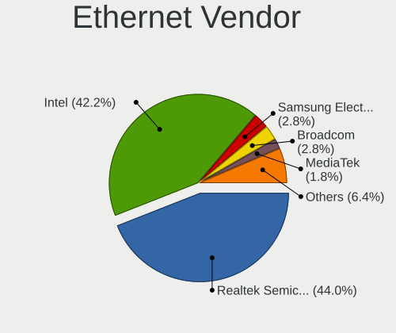

| Vendor                   | Desktops | Percent |
|--------------------------|----------|---------|
| Realtek Semiconductor    | 96       | 44.04%  |
| Intel                    | 92       | 42.2%   |
| Samsung Electronics      | 6        | 2.75%   |
| Broadcom                 | 6        | 2.75%   |
| MediaTek                 | 4        | 1.83%   |
| Qualcomm Atheros         | 2        | 0.92%   |
| Huawei Technologies      | 2        | 0.92%   |
| DisplayLink              | 2        | 0.92%   |
| Xiaomi                   | 1        | 0.46%   |
| VIA Technologies         | 1        | 0.46%   |
| T & A Mobile Phones      | 1        | 0.46%   |
| Qualcomm Technologies    | 1        | 0.46%   |
| Marvell Technology Group | 1        | 0.46%   |
| ASIX Electronics         | 1        | 0.46%   |
| Aquantia                 | 1        | 0.46%   |
| Apple                    | 1        | 0.46%   |

Ethernet Model
--------------

Ethernet models

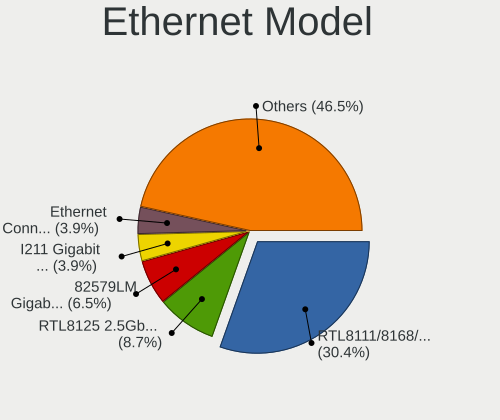

| Model                                                                           | Desktops | Percent |
|---------------------------------------------------------------------------------|----------|---------|
| Realtek RTL8111/8168/8211/8411 PCI Express Gigabit Ethernet Controller          | 70       | 30.43%  |
| Realtek RTL8125 2.5GbE Controller                                               | 20       | 8.7%    |
| Intel 82579LM Gigabit Network Connection (Lewisville)                           | 15       | 6.52%   |
| Intel I211 Gigabit Network Connection                                           | 9        | 3.91%   |
| Intel Ethernet Connection (7) I219-V                                            | 9        | 3.91%   |
| Intel Ethernet Connection (2) I219-V                                            | 9        | 3.91%   |
| Intel Ethernet Controller I225-V                                                | 8        | 3.48%   |
| Intel Ethernet Connection I217-LM                                               | 7        | 3.04%   |
| Intel Ethernet Controller I226-V                                                | 6        | 2.61%   |
| Samsung Galaxy series, misc. (tethering mode)                                   | 5        | 2.17%   |
| Intel Ethernet Connection (2) I218-V                                            | 5        | 2.17%   |
| Realtek RTL810xE PCI Express Fast Ethernet controller                           | 3        | 1.3%    |
| MediaTek MT7925 802.11be 160MHz 2x2 PCIe Wireless Network Adapter [Filogic 360] | 3        | 1.3%    |
| Intel Ethernet Connection I217-V                                                | 3        | 1.3%    |
| Intel Ethernet Connection (17) I219-V                                           | 3        | 1.3%    |
| Samsung GT-I9070 (network tethering, USB debugging enabled)                     | 2        | 0.87%   |
| Qualcomm Atheros AR8161 Gigabit Ethernet                                        | 2        | 0.87%   |
| Intel Ethernet Controller 10-Gigabit X540-AT2                                   | 2        | 0.87%   |
| Intel Ethernet Connection (7) I219-LM                                           | 2        | 0.87%   |
| Intel Ethernet Connection (2) I219-LM                                           | 2        | 0.87%   |
| Intel Ethernet Connection (12) I219-V                                           | 2        | 0.87%   |
| Intel Ethernet Connection (11) I219-V                                           | 2        | 0.87%   |
| Intel 82583V Gigabit Network Connection                                         | 2        | 0.87%   |
| Intel 82567LM-3 Gigabit Network Connection                                      | 2        | 0.87%   |
| Broadcom NetLink BCM57780 Gigabit Ethernet PCIe                                 | 2        | 0.87%   |
| Xiaomi Mi/Redmi series (RNDIS)                                                  | 1        | 0.43%   |
| VIA VT6102/VT6103 [Rhine-II]                                                    | 1        | 0.43%   |
| T & A Mobile Phones AQUOS V6                                                    | 1        | 0.43%   |
| Realtek RTL8922AE 802.11be PCIe Wireless Network Adapter                        | 1        | 0.43%   |
| Realtek RTL8852BE PCIe 802.11ax Wireless Network Controller                     | 1        | 0.43%   |
| Realtek RTL8153 Gigabit Ethernet Adapter                                        | 1        | 0.43%   |
| Realtek RTL8152 Fast Ethernet Adapter                                           | 1        | 0.43%   |
| Realtek RTL8126 5GbE Controller                                                 | 1        | 0.43%   |
| Realtek RTL8111/8168/8411 PCI Express Gigabit Ethernet Controller               | 1        | 0.43%   |
| Realtek RTL-8100/8101L/8139 PCI Fast Ethernet Adapter                           | 1        | 0.43%   |
| Realtek Killer E2600 GbE Controller                                             | 1        | 0.43%   |
| Qualcomm WCN785x Wi-Fi 7(802.11be) 320MHz 2x2 [FastConnect 7800]                | 1        | 0.43%   |
| MediaTek MT7922 802.11ax PCI Express Wireless Network Adapter                   | 1        | 0.43%   |
| Marvell Group 88E8056 PCI-E Gigabit Ethernet Controller                         | 1        | 0.43%   |
| Intel Ethernet Controller X550                                                  | 1        | 0.43%   |

Net Controller Kind
-------------------

Ethernet, WiFi or modem

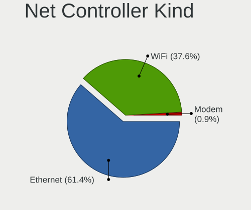

| Kind     | Desktops | Percent |
|----------|----------|---------|
| Ethernet | 196      | 61.44%  |
| WiFi     | 120      | 37.62%  |
| Modem    | 3        | 0.94%   |

Used Controller
---------------

Currently used network controller

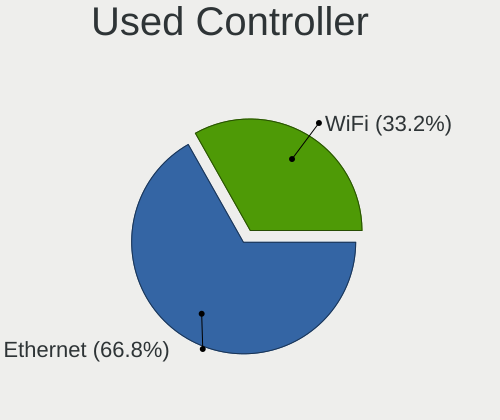

| Kind     | Desktops | Percent |
|----------|----------|---------|
| Ethernet | 141      | 66.82%  |
| WiFi     | 70       | 33.18%  |

NICs
----

Total network controllers on board

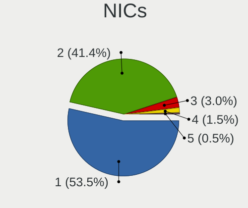

| Total | Desktops | Percent |
|-------|----------|---------|
| 1     | 106      | 53.54%  |
| 2     | 82       | 41.41%  |
| 3     | 6        | 3.03%   |
| 4     | 3        | 1.52%   |
| 5     | 1        | 0.51%   |

IPv6
----

IPv6 vs IPv4

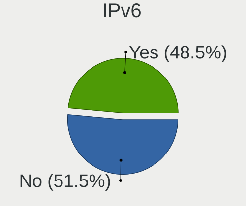

| Used | Desktops | Percent |
|------|----------|---------|
| No   | 105      | 51.47%  |
| Yes  | 99       | 48.53%  |

Bluetooth
---------

Bluetooth Vendor
----------------

Controller vendors

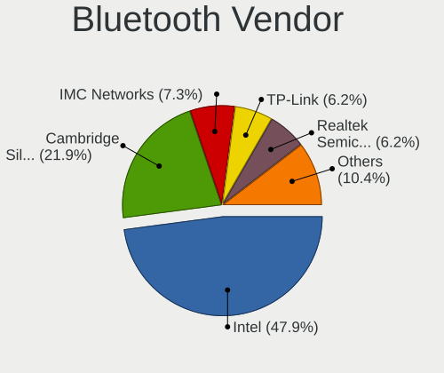

| Vendor                  | Desktops | Percent |
|-------------------------|----------|---------|
| Intel                   | 46       | 47.92%  |
| Cambridge Silicon Radio | 21       | 21.88%  |
| IMC Networks            | 7        | 7.29%   |
| TP-Link                 | 6        | 6.25%   |
| Realtek Semiconductor   | 6        | 6.25%   |
| MediaTek                | 3        | 3.13%   |
| Foxconn / Hon Hai       | 2        | 2.08%   |
| ASUSTek Computer        | 2        | 2.08%   |
| SiW                     | 1        | 1.04%   |
| Broadcom                | 1        | 1.04%   |
| Apple                   | 1        | 1.04%   |

Bluetooth Model
---------------

Controller models

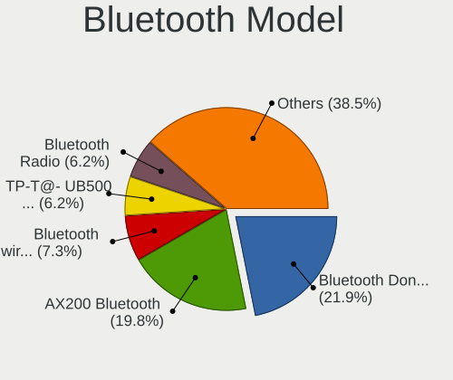

| Model                                                 | Desktops | Percent |
|-------------------------------------------------------|----------|---------|
| Cambridge Silicon Radio Bluetooth Dongle (HCI mode)   | 21       | 21.88%  |
| Intel AX200 Bluetooth                                 | 19       | 19.79%  |
| Intel Bluetooth wireless interface                    | 7        | 7.29%   |
| TP-Link TP-T@- UB500 Adapter                          | 6        | 6.25%   |
| Realtek Bluetooth Radio                               | 6        | 6.25%   |
| Intel Bluetooth Device                                | 6        | 6.25%   |
| Intel AX201 Bluetooth                                 | 6        | 6.25%   |
| Intel Bluetooth 9460/9560 Jefferson Peak (JfP)        | 4        | 4.17%   |
| IMC Networks Bluetooth Radio                          | 4        | 4.17%   |
| MediaTek Wireless_Device                              | 3        | 3.13%   |
| IMC Networks Wireless_Device                          | 3        | 3.13%   |
| Intel Wireless-AC 3168 Bluetooth                      | 2        | 2.08%   |
| SiW SiW                                               | 1        | 1.04%   |
| Intel Wireless-AC 9260 Bluetooth Adapter              | 1        | 1.04%   |
| Intel AX210 Bluetooth                                 | 1        | 1.04%   |
| Foxconn / Hon Hai Wireless_Device                     | 1        | 1.04%   |
| Foxconn / Hon Hai Bluetooth Device                    | 1        | 1.04%   |
| Broadcom BCM43142A0 Bluetooth 4.0                     | 1        | 1.04%   |
| ASUS Broadcom BCM20702 Single-Chip Bluetooth 4.0 + LE | 1        | 1.04%   |
| ASUS Bluetooth Device                                 | 1        | 1.04%   |
| Apple Bluetooth Host Controller                       | 1        | 1.04%   |

Sound
-----

Sound Vendor
------------

Sound card vendors

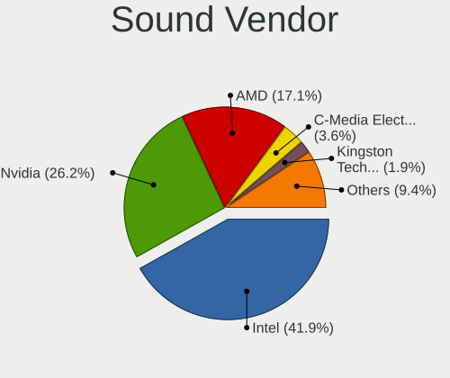

| Vendor                                       | Desktops | Percent |
|----------------------------------------------|----------|---------|
| Intel                                        | 152      | 41.87%  |
| Nvidia                                       | 95       | 26.17%  |
| AMD                                          | 62       | 17.08%  |
| C-Media Electronics                          | 13       | 3.58%   |
| Kingston Technology                          | 7        | 1.93%   |
| ASUSTek Computer                             | 4        | 1.1%    |
| Hewlett-Packard                              | 3        | 0.83%   |
| Creative Labs                                | 3        | 0.83%   |
| Tenx Technology                              | 2        | 0.55%   |
| Razer USA                                    | 2        | 0.55%   |
| MV-SILICON                                   | 2        | 0.55%   |
| Logitech                                     | 2        | 0.55%   |
| JMTek                                        | 2        | 0.55%   |
| Zoran Co. Personal Media Division (Nogatech) | 1        | 0.28%   |
| VIA Technologies                             | 1        | 0.28%   |
| Texas Instruments                            | 1        | 0.28%   |
| Samson Technologies                          | 1        | 0.28%   |
| Plantronics                                  | 1        | 0.28%   |
| Micro Star International                     | 1        | 0.28%   |
| KTMicro                                      | 1        | 0.28%   |
| GYROCOM C&C                                  | 1        | 0.28%   |
| GN Netcom                                    | 1        | 0.28%   |
| Creative Technology                          | 1        | 0.28%   |
| Corsair                                      | 1        | 0.28%   |
| Cooler Master                                | 1        | 0.28%   |
| Bose                                         | 1        | 0.28%   |
| Apple                                        | 1        | 0.28%   |

Sound Model
-----------

Sound card models

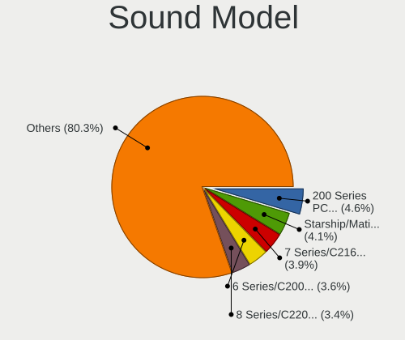

| Model                                                                      | Desktops | Percent |
|----------------------------------------------------------------------------|----------|---------|
| Intel 200 Series PCH HD Audio                                              | 19       | 4.62%   |
| AMD Starship/Matisse HD Audio Controller                                   | 17       | 4.14%   |
| Intel 7 Series/C216 Chipset Family High Definition Audio Controller        | 16       | 3.89%   |
| Intel 6 Series/C200 Series Chipset Family High Definition Audio Controller | 15       | 3.65%   |
| Intel 8 Series/C220 Series Chipset High Definition Audio Controller        | 14       | 3.41%   |
| AMD Ryzen HD Audio Controller                                              | 13       | 3.16%   |
| Intel Xeon E3-1200 v3/4th Gen Core Processor HD Audio Controller           | 12       | 2.92%   |
| Intel Cannon Lake PCH cAVS                                                 | 12       | 2.92%   |
| Intel Raptor Lake High Definition Audio Controller                         | 9        | 2.19%   |
| AMD Ellesmere HDMI Audio [Radeon RX 470/480 / 570/580/590]                 | 9        | 2.19%   |
| Intel Comet Lake PCH cAVS                                                  | 8        | 1.95%   |
| AMD Navi 21/23 HDMI/DP Audio Controller                                    | 8        | 1.95%   |
| Nvidia TU116 High Definition Audio Controller                              | 7        | 1.7%    |
| Nvidia TU106 High Definition Audio Controller                              | 7        | 1.7%    |
| Intel Alder Lake-S HD Audio Controller                                     | 7        | 1.7%    |
| Nvidia GP104 High Definition Audio Controller                              | 6        | 1.46%   |
| Nvidia GM107 High Definition Audio Controller [GeForce 940MX]              | 6        | 1.46%   |
| Intel NM10/ICH7 Family High Definition Audio Controller                    | 6        | 1.46%   |
| Intel 9 Series Chipset Family HD Audio Controller                          | 6        | 1.46%   |
| Intel 100 Series/C230 Series Chipset Family HD Audio Controller            | 6        | 1.46%   |
| AMD Radeon High Definition Audio Controller                                | 6        | 1.46%   |
| Nvidia GF108 High Definition Audio Controller                              | 5        | 1.22%   |
| Nvidia GA106 High Definition Audio Controller                              | 5        | 1.22%   |
| Intel C610/X99 series chipset HD Audio Controller                          | 5        | 1.22%   |
| C-Media Electronics Audio Adapter (Unitek Y-247A)                          | 5        | 1.22%   |
| AMD SBx00 Azalia (Intel HDA)                                               | 5        | 1.22%   |
| AMD Family 17h (Models 00h-0fh) HD Audio Controller                        | 5        | 1.22%   |
| Nvidia TU104 HD Audio Controller                                           | 4        | 0.97%   |
| Nvidia GP107GL High Definition Audio Controller                            | 4        | 0.97%   |
| Nvidia GM206 High Definition Audio Controller                              | 4        | 0.97%   |
| Nvidia GK208 HDMI/DP Audio Controller                                      | 4        | 0.97%   |
| Nvidia AD107 High Definition Audio Controller                              | 4        | 0.97%   |
| Kingston Technology HyperX 7.1 Audio                                       | 4        | 0.97%   |
| Intel Tiger Lake-H HD Audio Controller                                     | 4        | 0.97%   |
| Intel Comet Lake PCH-V cAVS                                                | 4        | 0.97%   |
| C-Media Electronics CM108 Audio Controller                                 | 4        | 0.97%   |
| ASUSTek Computer USB Audio                                                 | 4        | 0.97%   |
| AMD Renoir/Cezanne HDMI/DP Audio Controller                                | 4        | 0.97%   |
| AMD Navi 31 HDMI/DP Audio                                                  | 4        | 0.97%   |
| Nvidia TU107 GeForce GTX 1650 High Definition Audio Controller             | 3        | 0.73%   |

Memory
------

Memory Vendor
-------------

Memory module vendors

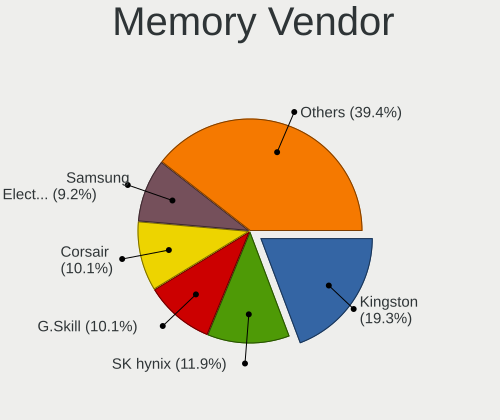

| Vendor                | Desktops | Percent |
|-----------------------|----------|---------|
| Kingston              | 21       | 19.27%  |
| SK hynix              | 13       | 11.93%  |
| G.Skill               | 11       | 10.09%  |
| Corsair               | 11       | 10.09%  |
| Samsung Electronics   | 10       | 9.17%   |
| Micron Technology     | 10       | 9.17%   |
| Unknown               | 9        | 8.26%   |
| Team                  | 9        | 8.26%   |
| Crucial               | 3        | 2.75%   |
| Lexar Co Limited      | 2        | 1.83%   |
| Hikvision             | 2        | 1.83%   |
| Unknown (ABCD)        | 1        | 0.92%   |
| Ramaxel Technology    | 1        | 0.92%   |
| Nanya Technology      | 1        | 0.92%   |
| Kingmax Semiconductor | 1        | 0.92%   |
| Elpida                | 1        | 0.92%   |
| D3860000              | 1        | 0.92%   |
| A-DATA Technology     | 1        | 0.92%   |
| Unknown               | 1        | 0.92%   |

Memory Model
------------

Memory module models

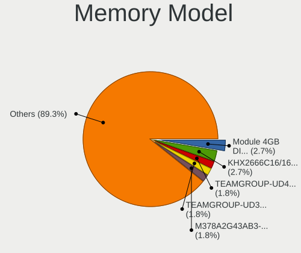

| Model                                                          | Desktops | Percent |
|----------------------------------------------------------------|----------|---------|
| Micron RAM Module 4GB DIMM DDR3 1333MT/s                       | 3        | 2.68%   |
| Kingston RAM KHX2666C16/16G 16GB DIMM DDR4 3200MT/s            | 3        | 2.68%   |
| Team RAM TEAMGROUP-UD4-3200 8GB DIMM DDR4 3733MT/s             | 2        | 1.79%   |
| Team RAM TEAMGROUP-UD3-1600 8GB DIMM DDR3 1866MT/s             | 2        | 1.79%   |
| SK hynix RAM HMA851U6DJR6N-XN 4GB DIMM DDR4 3200MT/s           | 2        | 1.79%   |
| SK hynix RAM HMA851U6AFR6N-UH 4GB DIMM DDR4 2400MT/s           | 2        | 1.79%   |
| Samsung RAM M378A2G43AB3-CWE 16GB DIMM DDR4 3200MT/s           | 2        | 1.79%   |
| G.Skill RAM F3-12800CL10-8GBXL 8GB DIMM DDR3 1600MT/s          | 2        | 1.79%   |
| Unknown RAM Module 8GB DIMM DDR3 1600MT/s                      | 1        | 0.89%   |
| Unknown RAM Module 8GB DIMM 1333MT/s                           | 1        | 0.89%   |
| Unknown RAM Module 8192MB DIMM 1333MT/s                        | 1        | 0.89%   |
| Unknown RAM Module 4GB DIMM DDR3 1600MT/s                      | 1        | 0.89%   |
| Unknown RAM Module 4096MB DIMM DDR3 1333MT/s                   | 1        | 0.89%   |
| Unknown RAM Module 2GB DIMM 800MT/s                            | 1        | 0.89%   |
| Unknown RAM Module 16GB DIMM DDR4 2667MT/s                     | 1        | 0.89%   |
| Unknown RAM Module 1024MB DIMM 667MT/s                         | 1        | 0.89%   |
| Unknown RAM CL18-22-22 D4-3600 16384MB DIMM DDR4 3600MT/s      | 1        | 0.89%   |
| Unknown (ABCD) RAM 123456789012345678 2GB DIMM LPDDR4 2133MT/s | 1        | 0.89%   |
| Team RAM UD5-8000 24GB DIMM DDR5 8000MT/s                      | 1        | 0.89%   |
| Team RAM UD5-6400 16GB DIMM DDR5 12800MT/s                     | 1        | 0.89%   |
| Team RAM UD5-5600 16GB DIMM DDR5 12800MT/s                     | 1        | 0.89%   |
| Team RAM TEAMGROUP-UD4-3600 16GB DIMM DDR4 3600MT/s            | 1        | 0.89%   |
| Team RAM Dark-1600 8GB DIMM DDR3 1600MT/s                      | 1        | 0.89%   |
| SK hynix RAM Module 16GB SODIMM DDR4 3200MT/s                  | 1        | 0.89%   |
| SK hynix RAM Module 16GB DIMM DDR4 2933MT/s                    | 1        | 0.89%   |
| SK hynix RAM HMT451S6AFR8A-PB 4GB SODIMM DDR3 1600MT/s         | 1        | 0.89%   |
| SK hynix RAM HMT425U6AFR6C-PB 2GB DIMM DDR3 1600MT/s           | 1        | 0.89%   |
| SK hynix RAM HMT325U6CFR8C-H9 2GB DIMM DDR3 1600MT/s           | 1        | 0.89%   |
| SK hynix RAM HMA81GU6CJR8N-VK 8GB DIMM DDR4 2667MT/s           | 1        | 0.89%   |
| SK hynix RAM HMA451R7MFR8N-TF 4GB DIMM DDR4 2133MT/s           | 1        | 0.89%   |
| SK hynix RAM HMA42GR7AFR4N-TF 16GB RIMM DDR4 2133MT/s          | 1        | 0.89%   |
| SK hynix RAM HKNNNFBMAVAR-NEH 2GB Row Of Chips LPDDR4 3200MT/s | 1        | 0.89%   |
| Samsung RAM Module 8GB DIMM DDR4 2667MT/s                      | 1        | 0.89%   |
| Samsung RAM M393B1K70DH0-CK0 8192MB DIMM DDR3 1333MT/s         | 1        | 0.89%   |
| Samsung RAM M393A4K40EB3-CWE 32GB DIMM DDR4 3200MT/s           | 1        | 0.89%   |
| Samsung RAM M378B5273CH0-CH9 4GB DIMM DDR3 1867MT/s            | 1        | 0.89%   |
| Samsung RAM M378B5173QH0-CK0 4GB DIMM DDR3                     | 1        | 0.89%   |
| Samsung RAM M378B5173EB0-CK0 4GB DIMM DDR3 1600MT/s            | 1        | 0.89%   |
| Samsung RAM M378B5173DB0-CK0 4096MB DIMM DDR3 1600MT/s         | 1        | 0.89%   |
| Samsung RAM M378A4G43MB1-CTD 32GB DIMM DDR4 3466MT/s           | 1        | 0.89%   |

Memory Kind
-----------

Memory module kinds

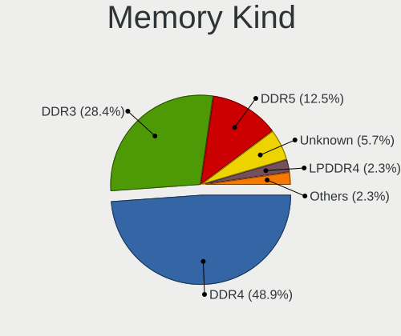

| Kind    | Desktops | Percent |
|---------|----------|---------|
| DDR4    | 43       | 48.86%  |
| DDR3    | 25       | 28.41%  |
| DDR5    | 11       | 12.5%   |
| Unknown | 5        | 5.68%   |
| LPDDR4  | 2        | 2.27%   |
| SDRAM   | 1        | 1.14%   |
| DDR2    | 1        | 1.14%   |

Memory Form Factor
------------------

Physical design of the memory module

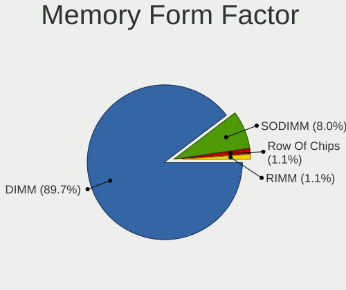

| Name         | Desktops | Percent |
|--------------|----------|---------|
| DIMM         | 78       | 89.66%  |
| SODIMM       | 7        | 8.05%   |
| Row Of Chips | 1        | 1.15%   |
| RIMM         | 1        | 1.15%   |

Memory Size
-----------

Memory module size

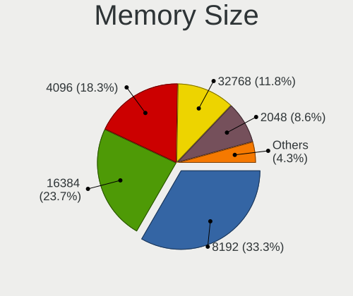

| Size  | Desktops | Percent |
|-------|----------|---------|
| 8192  | 31       | 33.33%  |
| 16384 | 22       | 23.66%  |
| 4096  | 17       | 18.28%  |
| 32768 | 11       | 11.83%  |
| 2048  | 8        | 8.6%    |
| 49152 | 2        | 2.15%   |
| 24576 | 1        | 1.08%   |
| 1024  | 1        | 1.08%   |

Memory Speed
------------

Memory module speed

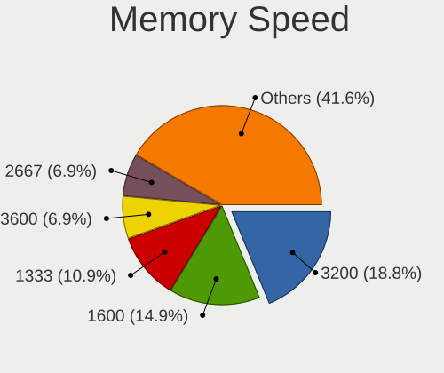

| Speed | Desktops | Percent |
|-------|----------|---------|
| 3200  | 19       | 18.81%  |
| 1600  | 15       | 14.85%  |
| 1333  | 11       | 10.89%  |
| 3600  | 7        | 6.93%   |
| 2667  | 7        | 6.93%   |
| 2133  | 6        | 5.94%   |
| 2400  | 4        | 3.96%   |
| 1866  | 4        | 3.96%   |
| 6000  | 3        | 2.97%   |
| 12800 | 2        | 1.98%   |
| 4800  | 2        | 1.98%   |
| 4000  | 2        | 1.98%   |
| 3733  | 2        | 1.98%   |
| 2933  | 2        | 1.98%   |
| 800   | 2        | 1.98%   |
| 38122 | 1        | 0.99%   |
| 8000  | 1        | 0.99%   |
| 7000  | 1        | 0.99%   |
| 6400  | 1        | 0.99%   |
| 5600  | 1        | 0.99%   |
| 3466  | 1        | 0.99%   |
| 3400  | 1        | 0.99%   |
| 2666  | 1        | 0.99%   |
| 1867  | 1        | 0.99%   |
| 1800  | 1        | 0.99%   |
| 1648  | 1        | 0.99%   |
| 1639  | 1        | 0.99%   |
| 667   | 1        | 0.99%   |

Printers & scanners
-------------------

Printer Vendor
--------------

Printer device vendors

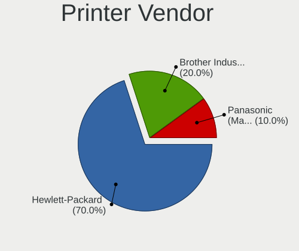

| Vendor                 | Desktops | Percent |
|------------------------|----------|---------|
| Hewlett-Packard        | 7        | 70%     |
| Brother Industries     | 2        | 20%     |
| Panasonic (Matsushita) | 1        | 10%     |

Printer Model
-------------

Printer device models

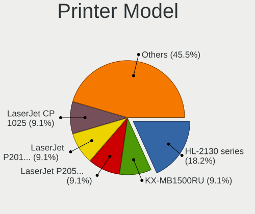

| Model                              | Desktops | Percent |
|------------------------------------|----------|---------|
| Brother HL-2130 series             | 2        | 18.18%  |
| Panasonic (Matsushita) KX-MB1500RU | 1        | 9.09%   |
| HP LaserJet P2055 series           | 1        | 9.09%   |
| HP LaserJet P2015 series           | 1        | 9.09%   |
| HP LaserJet CP 1025                | 1        | 9.09%   |
| HP LaserJet 400 M401dne            | 1        | 9.09%   |
| HP LaserJet 1020                   | 1        | 9.09%   |
| HP HP LaserJet M101-M106           | 1        | 9.09%   |
| HP DeskJet 2700 series             | 1        | 9.09%   |
| HP DeskJet 2130 series             | 1        | 9.09%   |

Scanner Vendor
--------------

Scanner device vendors

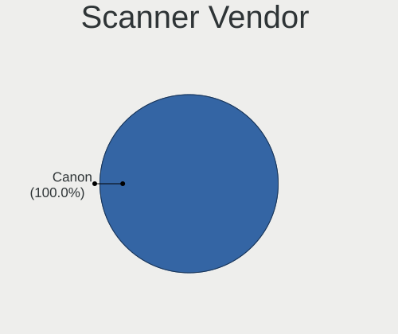

| Vendor | Desktops | Percent |
|--------|----------|---------|
| Canon  | 2        | 100%    |

Scanner Model
-------------

Scanner device models

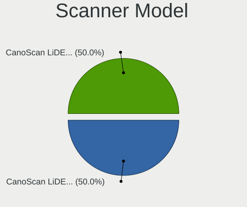

| Model                    | Desktops | Percent |
|--------------------------|----------|---------|
| Canon CanoScan LiDE 500F | 1        | 50%     |
| Canon CanoScan LiDE 120  | 1        | 50%     |

Camera
------

Camera Vendor
-------------

Camera device vendors

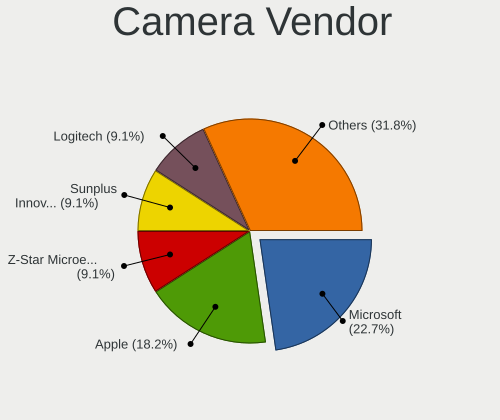

| Vendor                        | Desktops | Percent |
|-------------------------------|----------|---------|
| Microsoft                     | 5        | 22.73%  |
| Apple                         | 4        | 18.18%  |
| Z-Star Microelectronics       | 2        | 9.09%   |
| Sunplus Innovation Technology | 2        | 9.09%   |
| Logitech                      | 2        | 9.09%   |
| ARC International             | 2        | 9.09%   |
| Samsung Electronics           | 1        | 4.55%   |
| Realtek Semiconductor         | 1        | 4.55%   |
| Bison Electronics             | 1        | 4.55%   |
| Arkmicro Technologies         | 1        | 4.55%   |
| Anker PowerConf C200          | 1        | 4.55%   |

Camera Model
------------

Camera device models

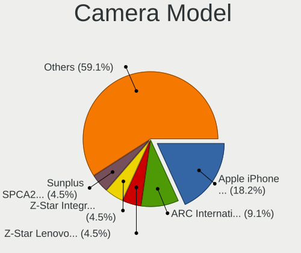

| Model                                     | Desktops | Percent |
|-------------------------------------------|----------|---------|
| Apple iPhone 5/5C/5S/6/SE/7/8/X           | 4        | 18.18%  |
| ARC International Camera                  | 2        | 9.09%   |
| Z-Star Lenovo IdeaCentre Web Camera       | 1        | 4.55%   |
| Z-Star Integrated Camera                  | 1        | 4.55%   |
| Sunplus SPCA2688 AV Camera                | 1        | 4.55%   |
| Sunplus Integrated_Webcam_HD              | 1        | 4.55%   |
| Samsung Galaxy series, misc. (MTP mode)   | 1        | 4.55%   |
| Realtek HP 1.0MP High Definition Webcam   | 1        | 4.55%   |
| Microsoft Microsoft LifeCam Cinema        | 1        | 4.55%   |
| Microsoft LifeCam VX-800                  | 1        | 4.55%   |
| Microsoft LifeCam HD-5000                 | 1        | 4.55%   |
| Microsoft LifeCam HD-3000                 | 1        | 4.55%   |
| Microsoft LifeCam Cinema                  | 1        | 4.55%   |
| Logitech Webcam C310                      | 1        | 4.55%   |
| Logitech BRIO 4K Stream Edition           | 1        | 4.55%   |
| Bison Integrated Camera                   | 1        | 4.55%   |
| Arkmicro USB2.0 PC CAMERA                 | 1        | 4.55%   |
| Anker PowerConf C200 Anker PowerConf C200 | 1        | 4.55%   |

Security
--------

Fingerprint Vendor
------------------

Fingerprint sensor vendors

Zero info for selected period =(

Fingerprint Model
-----------------

Fingerprint sensor models

Zero info for selected period =(

Chipcard Vendor
---------------

Chipcard module vendors

Zero info for selected period =(

Chipcard Model
--------------

Chipcard module models

Zero info for selected period =(

Unsupported
-----------

Unsupported Devices
-------------------

Total unsupported devices on board

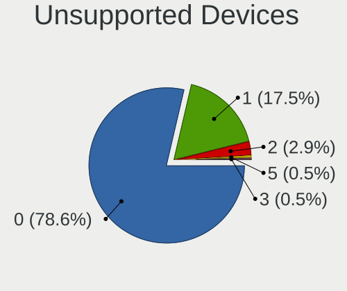

| Total | Desktops | Percent |
|-------|----------|---------|
| 0     | 162      | 78.64%  |
| 1     | 36       | 17.48%  |
| 2     | 6        | 2.91%   |
| 5     | 1        | 0.49%   |
| 3     | 1        | 0.49%   |

Unsupported Device Types
------------------------

Types of unsupported devices

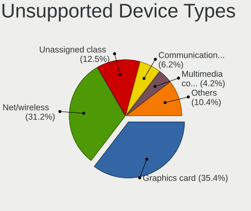

| Type                     | Desktops | Percent |
|--------------------------|----------|---------|
| Graphics card            | 17       | 35.42%  |
| Net/wireless             | 15       | 31.25%  |
| Unassigned class         | 6        | 12.5%   |
| Communication controller | 3        | 6.25%   |
| Multimedia controller    | 2        | 4.17%   |
| Storage/raid             | 1        | 2.08%   |
| Sound                    | 1        | 2.08%   |
| Network                  | 1        | 2.08%   |
| Dvb card                 | 1        | 2.08%   |
| Camera                   | 1        | 2.08%   |

