Linux in Saudi Arabia - Tested Hardware & Statistics (Notebooks)
----------------------------------------------------------------

A project to collect tested hardware configurations for Linux in Saudi Arabia.

Anyone can contribute to this report by the [hw-probe](https://github.com/linuxhw/hw-probe) tool:

    sudo -E hw-probe -all -upload

Please contribute! Especially if your hardware is rare.

Contents
--------

* [ Test Cases ](#test-cases)

* [ System ](#system)
  - [ OS                       ](#os)
  - [ OS Family                ](#os-family)
  - [ Kernel                   ](#kernel)
  - [ Kernel Family            ](#kernel-family)
  - [ Kernel Major Ver.        ](#kernel-major-ver)
  - [ Arch                     ](#arch)
  - [ DE                       ](#de)
  - [ Display Server           ](#display-server)
  - [ Display Manager          ](#display-manager)
  - [ OS Lang                  ](#os-lang)
  - [ Boot Mode                ](#boot-mode)
  - [ Filesystem               ](#filesystem)
  - [ Part. scheme             ](#part-scheme)
  - [ Dual Boot with Linux/BSD ](#dual-boot-with-linuxbsd)
  - [ Dual Boot (Win)          ](#dual-boot-win)

* [ Board ](#board)
  - [ Vendor                   ](#vendor)
  - [ Model                    ](#model)
  - [ Model Family             ](#model-family)
  - [ MFG Year                 ](#mfg-year)
  - [ Form Factor              ](#form-factor)
  - [ Secure Boot              ](#secure-boot)
  - [ Coreboot                 ](#coreboot)
  - [ RAM Size                 ](#ram-size)
  - [ RAM Used                 ](#ram-used)
  - [ Total Drives             ](#total-drives)
  - [ Has CD-ROM               ](#has-cd-rom)
  - [ Has Ethernet             ](#has-ethernet)
  - [ Has WiFi                 ](#has-wifi)
  - [ Has Bluetooth            ](#has-bluetooth)

* [ Location ](#location)
  - [ Country                  ](#country)
  - [ City                     ](#city)

* [ Drives ](#drives)
  - [ Drive Vendor             ](#drive-vendor)
  - [ Drive Model              ](#drive-model)
  - [ HDD Vendor               ](#hdd-vendor)
  - [ SSD Vendor               ](#ssd-vendor)
  - [ Drive Kind               ](#drive-kind)
  - [ Drive Connector          ](#drive-connector)
  - [ Drive Size               ](#drive-size)
  - [ Space Total              ](#space-total)
  - [ Space Used               ](#space-used)
  - [ Malfunc. Drives          ](#malfunc-drives)
  - [ Malfunc. Drive Vendor    ](#malfunc-drive-vendor)
  - [ Malfunc. HDD Vendor      ](#malfunc-hdd-vendor)
  - [ Malfunc. Drive Kind      ](#malfunc-drive-kind)
  - [ Failed Drives            ](#failed-drives)
  - [ Failed Drive Vendor      ](#failed-drive-vendor)
  - [ Drive Status             ](#drive-status)

* [ Storage controller ](#storage-controller)
  - [ Storage Vendor           ](#storage-vendor)
  - [ Storage Model            ](#storage-model)
  - [ Storage Kind             ](#storage-kind)

* [ Processor ](#processor)
  - [ CPU Vendor               ](#cpu-vendor)
  - [ CPU Model                ](#cpu-model)
  - [ CPU Model Family         ](#cpu-model-family)
  - [ CPU Cores                ](#cpu-cores)
  - [ CPU Sockets              ](#cpu-sockets)
  - [ CPU Threads              ](#cpu-threads)
  - [ CPU Op-Modes             ](#cpu-op-modes)
  - [ CPU Microcode            ](#cpu-microcode)
  - [ CPU Microarch            ](#cpu-microarch)

* [ Graphics ](#graphics)
  - [ GPU Vendor               ](#gpu-vendor)
  - [ GPU Model                ](#gpu-model)
  - [ GPU Combo                ](#gpu-combo)
  - [ GPU Driver               ](#gpu-driver)
  - [ GPU Memory               ](#gpu-memory)

* [ Monitor ](#monitor)
  - [ Monitor Vendor           ](#monitor-vendor)
  - [ Monitor Model            ](#monitor-model)
  - [ Monitor Resolution       ](#monitor-resolution)
  - [ Monitor Diagonal         ](#monitor-diagonal)
  - [ Monitor Width            ](#monitor-width)
  - [ Aspect Ratio             ](#aspect-ratio)
  - [ Monitor Area             ](#monitor-area)
  - [ Pixel Density            ](#pixel-density)
  - [ Multiple Monitors        ](#multiple-monitors)

* [ Network ](#network)
  - [ Net Controller Vendor    ](#net-controller-vendor)
  - [ Net Controller Model     ](#net-controller-model)
  - [ Wireless Vendor          ](#wireless-vendor)
  - [ Wireless Model           ](#wireless-model)
  - [ Ethernet Vendor          ](#ethernet-vendor)
  - [ Ethernet Model           ](#ethernet-model)
  - [ Net Controller Kind      ](#net-controller-kind)
  - [ Used Controller          ](#used-controller)
  - [ NICs                     ](#nics)
  - [ IPv6                     ](#ipv6)

* [ Bluetooth ](#bluetooth)
  - [ Bluetooth Vendor         ](#bluetooth-vendor)
  - [ Bluetooth Model          ](#bluetooth-model)

* [ Sound ](#sound)
  - [ Sound Vendor             ](#sound-vendor)
  - [ Sound Model              ](#sound-model)

* [ Memory ](#memory)
  - [ Memory Vendor            ](#memory-vendor)
  - [ Memory Model             ](#memory-model)
  - [ Memory Kind              ](#memory-kind)
  - [ Memory Form Factor       ](#memory-form-factor)
  - [ Memory Size              ](#memory-size)
  - [ Memory Speed             ](#memory-speed)

* [ Printers & scanners ](#printers--scanners)
  - [ Printer Vendor           ](#printer-vendor)
  - [ Printer Model            ](#printer-model)
  - [ Scanner Vendor           ](#scanner-vendor)
  - [ Scanner Model            ](#scanner-model)

* [ Camera ](#camera)
  - [ Camera Vendor            ](#camera-vendor)
  - [ Camera Model             ](#camera-model)

* [ Security ](#security)
  - [ Fingerprint Vendor       ](#fingerprint-vendor)
  - [ Fingerprint Model        ](#fingerprint-model)
  - [ Chipcard Vendor          ](#chipcard-vendor)
  - [ Chipcard Model           ](#chipcard-model)

* [ Unsupported ](#unsupported)
  - [ Unsupported Devices      ](#unsupported-devices)
  - [ Unsupported Device Types ](#unsupported-device-types)

Test Cases
----------

Total: 288

| Vendor        | Model                       | Probe                                                      | Date         |
|---------------|-----------------------------|------------------------------------------------------------|--------------|
| Dell          | G3 3590                     | [681f15e9c0](https://linux-hardware.org/?probe=681f15e9c0) | Dec 27, 2023 |
| Dell          | G3 3590                     | [f009abd381](https://linux-hardware.org/?probe=f009abd381) | Nov 25, 2023 |
| Dell          | Inspiron N5110              | [78992043bf](https://linux-hardware.org/?probe=78992043bf) | Nov 20, 2023 |
| Valve         | Jupiter                     | [97695463df](https://linux-hardware.org/?probe=97695463df) | Nov 17, 2023 |
| Valve         | Jupiter                     | [8734420ff1](https://linux-hardware.org/?probe=8734420ff1) | Nov 17, 2023 |
| HUAWEI        | KLVL-WXX9                   | [e45cab7f2c](https://linux-hardware.org/?probe=e45cab7f2c) | Nov 12, 2023 |
| Acer          | Aspire 5920                 | [02fa7cf5bb](https://linux-hardware.org/?probe=02fa7cf5bb) | Nov 03, 2023 |
| Dell          | XPS 15 9520                 | [6b6da0ca4a](https://linux-hardware.org/?probe=6b6da0ca4a) | Nov 01, 2023 |
| Toshiba       | Satellite C650              | [5236a2eca3](https://linux-hardware.org/?probe=5236a2eca3) | Oct 26, 2023 |
| HP            | Laptop 15-da2xxx            | [6f746b3af3](https://linux-hardware.org/?probe=6f746b3af3) | Oct 23, 2023 |
| Dell          | Latitude E6520              | [e29f6e9ba8](https://linux-hardware.org/?probe=e29f6e9ba8) | Oct 11, 2023 |
| Apple         | MacBookPro11,5              | [98784d1e51](https://linux-hardware.org/?probe=98784d1e51) | Oct 08, 2023 |
| HP            | ProBook 6560b               | [c4710bf9c2](https://linux-hardware.org/?probe=c4710bf9c2) | Oct 01, 2023 |
| Lenovo        | IdeaPad 3 14IIL05 81WD      | [683cbd037a](https://linux-hardware.org/?probe=683cbd037a) | Sep 23, 2023 |
| Apple         | MacBookPro9,2               | [8064cec888](https://linux-hardware.org/?probe=8064cec888) | Sep 17, 2023 |
| Apple         | MacBook5,2                  | [7cdaac7be4](https://linux-hardware.org/?probe=7cdaac7be4) | Sep 16, 2023 |
| Apple         | MacBook5,2                  | [192e02b434](https://linux-hardware.org/?probe=192e02b434) | Sep 15, 2023 |
| Dell          | Inspiron 5537               | [b06966adc5](https://linux-hardware.org/?probe=b06966adc5) | Sep 14, 2023 |
| Dell          | Inspiron 5537               | [9f459c45cc](https://linux-hardware.org/?probe=9f459c45cc) | Sep 14, 2023 |
| Apple         | MacBookPro8,1               | [f913de368f](https://linux-hardware.org/?probe=f913de368f) | Sep 07, 2023 |
| Apple         | MacBookPro8,1               | [423b8d7135](https://linux-hardware.org/?probe=423b8d7135) | Sep 07, 2023 |
| Lenovo        | B40-70 20392                | [ebf45c27f4](https://linux-hardware.org/?probe=ebf45c27f4) | Aug 07, 2023 |
| Lenovo        | B40-70 20392                | [221f9de00a](https://linux-hardware.org/?probe=221f9de00a) | Aug 06, 2023 |
| GIADA         | Unknown                     | [cd8b23468a](https://linux-hardware.org/?probe=cd8b23468a) | Aug 03, 2023 |
| Toshiba       | Satellite C850-B239         | [a075f60c70](https://linux-hardware.org/?probe=a075f60c70) | Aug 02, 2023 |
| Unknown       | Unknown                     | [570c98e6ab](https://linux-hardware.org/?probe=570c98e6ab) | Aug 01, 2023 |
| Unknown       | Unknown                     | [f54f3f3a4b](https://linux-hardware.org/?probe=f54f3f3a4b) | Aug 01, 2023 |
| Valve         | Jupiter                     | [fc294ac015](https://linux-hardware.org/?probe=fc294ac015) | Jul 27, 2023 |
| HP            | EliteBook 840 G5            | [f371e0efe5](https://linux-hardware.org/?probe=f371e0efe5) | Jul 22, 2023 |
| ASUSTek       | VivoBook_ASUSLaptop M150... | [55639a6416](https://linux-hardware.org/?probe=55639a6416) | Jul 21, 2023 |
| ASUSTek       | VivoBook_ASUSLaptop M150... | [8b2077101c](https://linux-hardware.org/?probe=8b2077101c) | Jul 21, 2023 |
| Acer          | Aspire A715-42G             | [ac10700edb](https://linux-hardware.org/?probe=ac10700edb) | Jul 13, 2023 |
| Dell          | G3 3590                     | [adf89d2bba](https://linux-hardware.org/?probe=adf89d2bba) | Jul 12, 2023 |
| Lenovo        | B40-70 20392                | [02a31c9704](https://linux-hardware.org/?probe=02a31c9704) | Jul 01, 2023 |
| Lenovo        | B40-70 20392                | [45739a208c](https://linux-hardware.org/?probe=45739a208c) | Jul 01, 2023 |
| Dell          | Latitude 3520               | [6e996e08f9](https://linux-hardware.org/?probe=6e996e08f9) | Jul 01, 2023 |
| ASUSTek       | TUF Gaming FX505DT_FX505... | [39ec9cf6c4](https://linux-hardware.org/?probe=39ec9cf6c4) | Jun 27, 2023 |
| Dell          | Inspiron 3576               | [c756e98d81](https://linux-hardware.org/?probe=c756e98d81) | Jun 24, 2023 |
| Dell          | Inspiron 3576               | [874b84ce94](https://linux-hardware.org/?probe=874b84ce94) | Jun 24, 2023 |
| HP            | Laptop 15-da0xxx            | [7da8691a87](https://linux-hardware.org/?probe=7da8691a87) | Jun 17, 2023 |
| HP            | Laptop 15-da1xxx            | [5bc14dc937](https://linux-hardware.org/?probe=5bc14dc937) | Jun 12, 2023 |
| Valve         | Jupiter                     | [8c9765a31c](https://linux-hardware.org/?probe=8c9765a31c) | Jun 11, 2023 |
| Toshiba       | Satellite L635              | [4f124d1525](https://linux-hardware.org/?probe=4f124d1525) | Jun 09, 2023 |
| Valve         | Jupiter                     | [d21eb9432c](https://linux-hardware.org/?probe=d21eb9432c) | Jun 03, 2023 |
| Dell          | Latitude E6520              | [bb8bc9b8ae](https://linux-hardware.org/?probe=bb8bc9b8ae) | May 24, 2023 |
| Google        | Akemi                       | [595f8b1a24](https://linux-hardware.org/?probe=595f8b1a24) | May 20, 2023 |
| ASUSTek       | ROG Zephyrus G14 GA401IV... | [93979d632e](https://linux-hardware.org/?probe=93979d632e) | May 15, 2023 |
| Lenovo        | IdeaPad Z470                | [2b11351f94](https://linux-hardware.org/?probe=2b11351f94) | May 14, 2023 |
| Samsung       | 300E4A/300E5A/300E7A/343... | [155b921e10](https://linux-hardware.org/?probe=155b921e10) | May 13, 2023 |
| Lenovo        | Legion 5 Pro 16ACH6H 82J... | [38806ed70c](https://linux-hardware.org/?probe=38806ed70c) | Apr 24, 2023 |
| HUAWEI        | KLVD-WXX9                   | [ae500cf4af](https://linux-hardware.org/?probe=ae500cf4af) | Apr 22, 2023 |
| Samsung       | 300E4A/300E5A/300E7A/343... | [3e9d210a94](https://linux-hardware.org/?probe=3e9d210a94) | Apr 16, 2023 |
| ASUSTek       | ZenBook UX435EG_UX435EG     | [4b338ba7f9](https://linux-hardware.org/?probe=4b338ba7f9) | Apr 15, 2023 |
| HP            | Laptop 15-da1xxx            | [84c8a107d4](https://linux-hardware.org/?probe=84c8a107d4) | Apr 06, 2023 |
| Acer          | Aspire ES1-572              | [39e1087c79](https://linux-hardware.org/?probe=39e1087c79) | Apr 04, 2023 |
| Unknown       | Unknown                     | [ef5bf53c45](https://linux-hardware.org/?probe=ef5bf53c45) | Mar 22, 2023 |
| Unknown       | Unknown                     | [b96104604a](https://linux-hardware.org/?probe=b96104604a) | Mar 22, 2023 |
| Apple         | MacBookAir7,2               | [9509c77e2b](https://linux-hardware.org/?probe=9509c77e2b) | Mar 13, 2023 |
| ASUSTek       | ROG Zephyrus G15 GA503QM... | [b8ea458df5](https://linux-hardware.org/?probe=b8ea458df5) | Mar 08, 2023 |
| Sony          | VGN-FZ250E                  | [ca7937209b](https://linux-hardware.org/?probe=ca7937209b) | Mar 06, 2023 |
| Lenovo        | IdeaPad Gaming 3 15IMH05... | [d488fc0d9a](https://linux-hardware.org/?probe=d488fc0d9a) | Feb 22, 2023 |
| HP            | Laptop 15-da2xxx            | [76cbc7df6d](https://linux-hardware.org/?probe=76cbc7df6d) | Feb 21, 2023 |
| ASUSTek       | TUF Gaming FX505DU_FX505... | [e70b65f78d](https://linux-hardware.org/?probe=e70b65f78d) | Feb 20, 2023 |
| Dell          | Latitude E6520              | [b04c6e8984](https://linux-hardware.org/?probe=b04c6e8984) | Feb 18, 2023 |
| HUAWEI        | BOHK-WAX9X                  | [bd0b1f7e94](https://linux-hardware.org/?probe=bd0b1f7e94) | Jan 27, 2023 |
| HUAWEI        | BOHK-WAX9X                  | [a22071f9ec](https://linux-hardware.org/?probe=a22071f9ec) | Jan 26, 2023 |
| Acer          | Aspire A315-55G             | [70559c048c](https://linux-hardware.org/?probe=70559c048c) | Jan 25, 2023 |
| HP            | Pavilion Gaming Laptop 1... | [bc55bf24ac](https://linux-hardware.org/?probe=bc55bf24ac) | Jan 21, 2023 |
| HP            | Unknown                     | [fedf225852](https://linux-hardware.org/?probe=fedf225852) | Jan 17, 2023 |
| HP            | Unknown                     | [8b89da1da5](https://linux-hardware.org/?probe=8b89da1da5) | Jan 17, 2023 |
| Lenovo        | ThinkPad S1 Yoga 12 20DL... | [e9e902c625](https://linux-hardware.org/?probe=e9e902c625) | Jan 17, 2023 |
| Lenovo        | ThinkPad S1 Yoga 12 20DL... | [00ebda8ae9](https://linux-hardware.org/?probe=00ebda8ae9) | Jan 17, 2023 |
| Valve         | Jupiter                     | [b927a3e937](https://linux-hardware.org/?probe=b927a3e937) | Jan 16, 2023 |
| Valve         | Jupiter                     | [2b476ca470](https://linux-hardware.org/?probe=2b476ca470) | Jan 16, 2023 |
| MSI           | GF63 Thin 10SC              | [26379f8b8d](https://linux-hardware.org/?probe=26379f8b8d) | Jan 11, 2023 |
| HUAWEI        | KLVD-WXX9                   | [71d684a605](https://linux-hardware.org/?probe=71d684a605) | Jan 11, 2023 |
| Toshiba       | Satellite C850-B561         | [562d6cde14](https://linux-hardware.org/?probe=562d6cde14) | Jan 11, 2023 |
| Lenovo        | Legion 5 Pro 16ACH6H 82J... | [5d3f8e9948](https://linux-hardware.org/?probe=5d3f8e9948) | Jan 09, 2023 |
| HUAWEI        | KLVD-WXX9                   | [e662d0e58a](https://linux-hardware.org/?probe=e662d0e58a) | Jan 07, 2023 |
| Lenovo        | ThinkPad E14 Gen 2 20TA0... | [2c6b6c2558](https://linux-hardware.org/?probe=2c6b6c2558) | Jan 04, 2023 |
| Lenovo        | Legion 5 Pro 16ACH6H 82J... | [d326e34afc](https://linux-hardware.org/?probe=d326e34afc) | Dec 31, 2022 |
| Lenovo        | Legion 5 Pro 16ACH6H 82J... | [816ab16fd0](https://linux-hardware.org/?probe=816ab16fd0) | Dec 30, 2022 |
| Lenovo        | Legion 5 Pro 16ACH6H 82J... | [43e6103cd0](https://linux-hardware.org/?probe=43e6103cd0) | Dec 29, 2022 |
| Toshiba       | Satellite L635              | [be223c0ff1](https://linux-hardware.org/?probe=be223c0ff1) | Dec 03, 2022 |
| Toshiba       | Satellite L500              | [5579ea8656](https://linux-hardware.org/?probe=5579ea8656) | Nov 17, 2022 |
| Dell          | Venue 8 Pro 5830            | [8890410dfc](https://linux-hardware.org/?probe=8890410dfc) | Nov 01, 2022 |
| ASUSTek       | VivoBook_ASUSLaptop X512... | [4c0e49ae2b](https://linux-hardware.org/?probe=4c0e49ae2b) | Oct 23, 2022 |
| Apple         | MacBookPro13,2              | [8eaf391b08](https://linux-hardware.org/?probe=8eaf391b08) | Oct 12, 2022 |
| ASUSTek       | VivoBook_ASUSLaptop X512... | [f7f3439df7](https://linux-hardware.org/?probe=f7f3439df7) | Oct 11, 2022 |
| Dell          | Inspiron 5558               | [61f05a7c32](https://linux-hardware.org/?probe=61f05a7c32) | Oct 10, 2022 |
| Sony          | SVF15A13SAB                 | [7c39add556](https://linux-hardware.org/?probe=7c39add556) | Oct 06, 2022 |
| ASUSTek       | VivoBook_ASUSLaptop X512... | [de59de7b14](https://linux-hardware.org/?probe=de59de7b14) | Oct 04, 2022 |
| Lenovo        | ThinkBook 13s-IML 20RR      | [d153a4f97a](https://linux-hardware.org/?probe=d153a4f97a) | Sep 29, 2022 |
| HUAWEI        | RLEF-XX                     | [7bab2cbc57](https://linux-hardware.org/?probe=7bab2cbc57) | Sep 25, 2022 |
| Dell          | G15 5515                    | [ae769dae75](https://linux-hardware.org/?probe=ae769dae75) | Sep 24, 2022 |
| Dell          | G15 5515                    | [893c248dec](https://linux-hardware.org/?probe=893c248dec) | Sep 24, 2022 |
| Dell          | G15 5515                    | [f308590417](https://linux-hardware.org/?probe=f308590417) | Sep 20, 2022 |
| Dell          | G15 5515                    | [d6a647ab30](https://linux-hardware.org/?probe=d6a647ab30) | Sep 20, 2022 |
| Notebook      | PD5x_7xPNP_PNN_PNT          | [a934e23e1f](https://linux-hardware.org/?probe=a934e23e1f) | Sep 16, 2022 |
| HUAWEI        | BOHB-WAX9                   | [5dc824a596](https://linux-hardware.org/?probe=5dc824a596) | Sep 16, 2022 |
| Notebook      | NH5xAx                      | [e8487cd15f](https://linux-hardware.org/?probe=e8487cd15f) | Aug 31, 2022 |
| Lenovo        | IdeaPad 320-15IKB 81BT      | [ef34b3c3aa](https://linux-hardware.org/?probe=ef34b3c3aa) | Aug 31, 2022 |
| Dell          | Vostro 15 3515              | [4ecdbb8b4b](https://linux-hardware.org/?probe=4ecdbb8b4b) | Aug 15, 2022 |
| Acer          | Aspire 4752                 | [9854c38629](https://linux-hardware.org/?probe=9854c38629) | Aug 14, 2022 |
| HP            | Pavilion Gaming Laptop 1... | [ed6b6ce93e](https://linux-hardware.org/?probe=ed6b6ce93e) | Aug 03, 2022 |
| eMachines     | Unknown                     | [8c6dcb08a7](https://linux-hardware.org/?probe=8c6dcb08a7) | Jul 31, 2022 |
| Lenovo        | B590 20206                  | [f9eddff413](https://linux-hardware.org/?probe=f9eddff413) | Jun 19, 2022 |
| MSI           | GF63 Thin 8RCS              | [8cd1ebfa12](https://linux-hardware.org/?probe=8cd1ebfa12) | May 22, 2022 |
| Lenovo        | IdeaPad Gaming 3 15ACH6 ... | [c34e9b0da7](https://linux-hardware.org/?probe=c34e9b0da7) | May 05, 2022 |
| Lenovo        | IdeaPad Gaming 3 15ACH6 ... | [b6dc8a3fc8](https://linux-hardware.org/?probe=b6dc8a3fc8) | May 05, 2022 |
| Dell          | Inspiron 3580               | [51d4e9a2e2](https://linux-hardware.org/?probe=51d4e9a2e2) | May 05, 2022 |
| ASUSTek       | ROG Zephyrus G14 GA401IV... | [720d11c11f](https://linux-hardware.org/?probe=720d11c11f) | May 04, 2022 |
| Acer          | Aspire V3-571               | [9cab38ff4f](https://linux-hardware.org/?probe=9cab38ff4f) | May 01, 2022 |
| Dell          | Inspiron 3580               | [794ab7ba41](https://linux-hardware.org/?probe=794ab7ba41) | Apr 28, 2022 |
| Dell          | Inspiron 3542               | [196f849315](https://linux-hardware.org/?probe=196f849315) | Apr 18, 2022 |
| Lenovo        | ThinkPad L14 Gen 2 20X10... | [6f75f679f9](https://linux-hardware.org/?probe=6f75f679f9) | Apr 16, 2022 |
| Lenovo        | ThinkPad L14 Gen 2 20X10... | [1f799cdbef](https://linux-hardware.org/?probe=1f799cdbef) | Apr 09, 2022 |
| Lenovo        | ThinkPad L14 Gen 2 20X10... | [45548a6fe5](https://linux-hardware.org/?probe=45548a6fe5) | Apr 07, 2022 |
| Lenovo        | ThinkPad X1 Carbon 7th 2... | [10c6384de8](https://linux-hardware.org/?probe=10c6384de8) | Mar 25, 2022 |
| Dell          | Inspiron 14-3467            | [50131c5da4](https://linux-hardware.org/?probe=50131c5da4) | Mar 21, 2022 |
| Acer          | AO751h                      | [23737182d1](https://linux-hardware.org/?probe=23737182d1) | Mar 21, 2022 |
| Acer          | AO751h                      | [edea28357c](https://linux-hardware.org/?probe=edea28357c) | Mar 18, 2022 |
| ASUSTek       | K53SC                       | [43b019326c](https://linux-hardware.org/?probe=43b019326c) | Feb 12, 2022 |
| ASUSTek       | K53SC                       | [70f23c3da0](https://linux-hardware.org/?probe=70f23c3da0) | Feb 12, 2022 |
| Dell          | XPS 13 9310                 | [40c74584ee](https://linux-hardware.org/?probe=40c74584ee) | Feb 03, 2022 |
| Acer          | Aspire V3-571               | [ed5c6cf88d](https://linux-hardware.org/?probe=ed5c6cf88d) | Jan 24, 2022 |
| HP            | 15                          | [4dde4c5c0e](https://linux-hardware.org/?probe=4dde4c5c0e) | Jan 17, 2022 |
| Lenovo        | ThinkPad L14 Gen 2 20X10... | [261fe8bda7](https://linux-hardware.org/?probe=261fe8bda7) | Jan 07, 2022 |
| Sony          | VPCCA35FA                   | [85f4fcc0b6](https://linux-hardware.org/?probe=85f4fcc0b6) | Jan 03, 2022 |
| Sony          | VPCCA35FA                   | [f69299cbfb](https://linux-hardware.org/?probe=f69299cbfb) | Jan 03, 2022 |
| Dell          | Inspiron 3521               | [af800e1071](https://linux-hardware.org/?probe=af800e1071) | Dec 29, 2021 |
| Packard Be... | EasyNote TJ65               | [b98b9252fa](https://linux-hardware.org/?probe=b98b9252fa) | Dec 29, 2021 |
| Lenovo        | ThinkPad L14 Gen 2 20X10... | [938d24e76e](https://linux-hardware.org/?probe=938d24e76e) | Dec 27, 2021 |
| HP            | EliteBook 8440p             | [0dc23e59a4](https://linux-hardware.org/?probe=0dc23e59a4) | Dec 19, 2021 |
| Acer          | Aspire V3-571               | [071a8f0709](https://linux-hardware.org/?probe=071a8f0709) | Dec 15, 2021 |
| Acer          | Aspire V3-571               | [54680bac44](https://linux-hardware.org/?probe=54680bac44) | Dec 12, 2021 |
| Lenovo        | ThinkPad L14 Gen 2 20X10... | [181607bac3](https://linux-hardware.org/?probe=181607bac3) | Dec 10, 2021 |
| Lenovo        | ThinkPad L14 Gen 2 20X10... | [c1de54b513](https://linux-hardware.org/?probe=c1de54b513) | Dec 10, 2021 |
| Lenovo        | ThinkPad L14 Gen 2 20X10... | [bb9141f09c](https://linux-hardware.org/?probe=bb9141f09c) | Dec 09, 2021 |
| Lenovo        | ThinkPad L14 Gen 2 20X10... | [b3c42ca2c2](https://linux-hardware.org/?probe=b3c42ca2c2) | Dec 09, 2021 |
| Lenovo        | V15-IIL 82C5                | [2a151de62b](https://linux-hardware.org/?probe=2a151de62b) | Dec 08, 2021 |
| Lenovo        | ThinkPad L14 Gen 2 20X10... | [830882c4e6](https://linux-hardware.org/?probe=830882c4e6) | Dec 07, 2021 |
| Toshiba       | Satellite L500              | [5cc2fbfef5](https://linux-hardware.org/?probe=5cc2fbfef5) | Dec 04, 2021 |
| ASUSTek       | ZenBook UX425QA_UM425QA     | [e3acd70236](https://linux-hardware.org/?probe=e3acd70236) | Dec 02, 2021 |
| Lenovo        | ThinkPad E14 20RA008CAD     | [35fab17b69](https://linux-hardware.org/?probe=35fab17b69) | Dec 01, 2021 |
| HP            | EliteBook 8440p             | [cecc697189](https://linux-hardware.org/?probe=cecc697189) | Nov 30, 2021 |
| Toshiba       | Satellite L500              | [46d5208475](https://linux-hardware.org/?probe=46d5208475) | Nov 28, 2021 |
| Lenovo        | V15-IIL 82C5                | [e37587fbac](https://linux-hardware.org/?probe=e37587fbac) | Nov 23, 2021 |
| Lenovo        | V15-IIL 82C5                | [b050debd0a](https://linux-hardware.org/?probe=b050debd0a) | Nov 22, 2021 |
| Dell          | G3 3590                     | [605f0870d0](https://linux-hardware.org/?probe=605f0870d0) | Nov 16, 2021 |
| Dell          | G3 3590                     | [5bfafc889c](https://linux-hardware.org/?probe=5bfafc889c) | Nov 16, 2021 |
| Lenovo        | ThinkPad E490 20N8000JAD    | [997e24e5c9](https://linux-hardware.org/?probe=997e24e5c9) | Nov 06, 2021 |
| Lenovo        | ThinkPad E490 20N8000JAD    | [9d70a71c88](https://linux-hardware.org/?probe=9d70a71c88) | Nov 06, 2021 |
| Lenovo        | V570 1066AJU                | [ffb36aac10](https://linux-hardware.org/?probe=ffb36aac10) | Nov 05, 2021 |
| Dell          | Inspiron 3593               | [5233ea30c6](https://linux-hardware.org/?probe=5233ea30c6) | Oct 09, 2021 |
| Lenovo        | ThinkPad P52s 20LBS0JC00    | [4c8c63da2f](https://linux-hardware.org/?probe=4c8c63da2f) | Oct 05, 2021 |
| HP            | Laptop 15-da2xxx            | [2e99b047ff](https://linux-hardware.org/?probe=2e99b047ff) | Oct 04, 2021 |
| ASUSTek       | ROG Zephyrus G14 GA401IV... | [de6b4e47d4](https://linux-hardware.org/?probe=de6b4e47d4) | Oct 01, 2021 |
| HP            | Laptop 15-da2xxx            | [28332170d1](https://linux-hardware.org/?probe=28332170d1) | Sep 28, 2021 |
| Dell          | Inspiron N5110              | [8c04a9e8df](https://linux-hardware.org/?probe=8c04a9e8df) | Sep 22, 2021 |
| Acer          | Aspire E5-573G              | [19374f68da](https://linux-hardware.org/?probe=19374f68da) | Sep 21, 2021 |
| Acer          | Aspire V3-571               | [6998aee6d0](https://linux-hardware.org/?probe=6998aee6d0) | Sep 02, 2021 |
| Toshiba       | Satellite C55-B             | [e7a572f322](https://linux-hardware.org/?probe=e7a572f322) | Aug 29, 2021 |
| Toshiba       | Satellite C55-B             | [99dbadcdde](https://linux-hardware.org/?probe=99dbadcdde) | Aug 22, 2021 |
| Dell          | Latitude E7440              | [b87783b728](https://linux-hardware.org/?probe=b87783b728) | Aug 18, 2021 |
| Dell          | Latitude E5470              | [f91acefb07](https://linux-hardware.org/?probe=f91acefb07) | Aug 14, 2021 |
| Dell          | XPS 15 9560                 | [9bae1ef315](https://linux-hardware.org/?probe=9bae1ef315) | Jul 07, 2021 |
| ASUSTek       | K43SJ                       | [f4702e95b4](https://linux-hardware.org/?probe=f4702e95b4) | Jul 05, 2021 |
| Dell          | XPS 15 9560                 | [08fad9a114](https://linux-hardware.org/?probe=08fad9a114) | Jul 03, 2021 |
| Dell          | G3 3590                     | [06d10d0717](https://linux-hardware.org/?probe=06d10d0717) | Jun 26, 2021 |
| Dell          | Inspiron 5437               | [06f25de7e3](https://linux-hardware.org/?probe=06f25de7e3) | Jun 19, 2021 |
| Dell          | Inspiron 5437               | [3fcbd5cd4f](https://linux-hardware.org/?probe=3fcbd5cd4f) | Jun 18, 2021 |
| Dell          | G3 3590                     | [877018f0d3](https://linux-hardware.org/?probe=877018f0d3) | Jun 18, 2021 |
| Dell          | G3 3590                     | [adf875d64d](https://linux-hardware.org/?probe=adf875d64d) | Jun 17, 2021 |
| HP            | Pavilion Gaming Laptop 1... | [d3a001e377](https://linux-hardware.org/?probe=d3a001e377) | Jun 01, 2021 |
| HP            | Pavilion Gaming Laptop 1... | [a4d00095a1](https://linux-hardware.org/?probe=a4d00095a1) | Jun 01, 2021 |
| HP            | ProBook 445 G7              | [88e51bfd39](https://linux-hardware.org/?probe=88e51bfd39) | May 23, 2021 |
| ASUSTek       | GL502VMK                    | [0d9f5609e7](https://linux-hardware.org/?probe=0d9f5609e7) | May 20, 2021 |
| HP            | ProBook 445 G7              | [ed8c410826](https://linux-hardware.org/?probe=ed8c410826) | May 18, 2021 |
| ASUSTek       | ROG Zephyrus G14 GA401IV... | [1d4c05756f](https://linux-hardware.org/?probe=1d4c05756f) | May 01, 2021 |
| ASUSTek       | ROG Zephyrus G14 GA401IV... | [9b03874730](https://linux-hardware.org/?probe=9b03874730) | Apr 27, 2021 |
| Dell          | Latitude E7470              | [1058573f86](https://linux-hardware.org/?probe=1058573f86) | Apr 23, 2021 |
| ASUSTek       | VivoBook_ASUSLaptop X512... | [14fd40d980](https://linux-hardware.org/?probe=14fd40d980) | Apr 17, 2021 |
| ASUSTek       | VivoBook_ASUSLaptop X512... | [0b31da2d02](https://linux-hardware.org/?probe=0b31da2d02) | Apr 16, 2021 |
| HP            | Pavilion Laptop 15t-eg00... | [cd64675ac7](https://linux-hardware.org/?probe=cd64675ac7) | Mar 30, 2021 |
| Toshiba       | Satellite S55t-A            | [9ede240e19](https://linux-hardware.org/?probe=9ede240e19) | Mar 20, 2021 |
| Apple         | MacBookPro9,2               | [7d8acdd5b6](https://linux-hardware.org/?probe=7d8acdd5b6) | Mar 19, 2021 |
| Toshiba       | Satellite S55t-A            | [5aa53770bf](https://linux-hardware.org/?probe=5aa53770bf) | Mar 06, 2021 |
| Toshiba       | Satellite S55t-A            | [5ed863271a](https://linux-hardware.org/?probe=5ed863271a) | Mar 06, 2021 |
| Acer          | Nitro AN515-52              | [99ee0e5718](https://linux-hardware.org/?probe=99ee0e5718) | Feb 24, 2021 |
| Acer          | Nitro AN515-52              | [89497c0f27](https://linux-hardware.org/?probe=89497c0f27) | Feb 23, 2021 |
| ASUSTek       | X555UB                      | [260d78f7c8](https://linux-hardware.org/?probe=260d78f7c8) | Feb 20, 2021 |
| HP            | Pavilion g6                 | [30bcebb4be](https://linux-hardware.org/?probe=30bcebb4be) | Feb 16, 2021 |
| Lenovo        | ThinkPad E460 20ET000MAD    | [cd000b8e6b](https://linux-hardware.org/?probe=cd000b8e6b) | Feb 11, 2021 |
| Dell          | Inspiron 3593               | [5407a15ab7](https://linux-hardware.org/?probe=5407a15ab7) | Feb 09, 2021 |
| Dell          | Inspiron 3593               | [0802cedb25](https://linux-hardware.org/?probe=0802cedb25) | Feb 09, 2021 |
| Dell          | Latitude E4310              | [9c6781e592](https://linux-hardware.org/?probe=9c6781e592) | Feb 08, 2021 |
| ASUSTek       | ROG Strix G512LWS_G512LW... | [d4d3110510](https://linux-hardware.org/?probe=d4d3110510) | Jan 29, 2021 |
| Toshiba       | Satellite C855D             | [46d5bf62c7](https://linux-hardware.org/?probe=46d5bf62c7) | Jan 19, 2021 |
| Dell          | Inspiron 3576               | [99f1a1ac09](https://linux-hardware.org/?probe=99f1a1ac09) | Jan 16, 2021 |
| Sony          | VGN-FZ250E                  | [d0d77ffe81](https://linux-hardware.org/?probe=d0d77ffe81) | Jan 15, 2021 |
| HP            | Laptop 14-ck0xxx            | [92ea4004af](https://linux-hardware.org/?probe=92ea4004af) | Jan 15, 2021 |
| Sony          | VGN-FZ250E                  | [68ddc53941](https://linux-hardware.org/?probe=68ddc53941) | Jan 14, 2021 |
| Dell          | Inspiron 3576               | [b21e44d0c4](https://linux-hardware.org/?probe=b21e44d0c4) | Jan 11, 2021 |
| Dell          | Vostro 5470                 | [216df384d8](https://linux-hardware.org/?probe=216df384d8) | Dec 22, 2020 |
| Dell          | Vostro 5470                 | [bec1b16786](https://linux-hardware.org/?probe=bec1b16786) | Dec 22, 2020 |
| LG Electro... | R490-G.ARL5RE2              | [58f0c96534](https://linux-hardware.org/?probe=58f0c96534) | Dec 16, 2020 |
| ASUSTek       | ROG Zephyrus G14 GA401IV... | [239675db8d](https://linux-hardware.org/?probe=239675db8d) | Nov 25, 2020 |
| ASUSTek       | ROG Zephyrus G14 GA401IV... | [dfcc723611](https://linux-hardware.org/?probe=dfcc723611) | Nov 21, 2020 |
| ASUSTek       | ROG Zephyrus G14 GA401IV... | [b164be6cfc](https://linux-hardware.org/?probe=b164be6cfc) | Nov 21, 2020 |
| ASUSTek       | ROG Zephyrus G14 GA401IV... | [1a46306857](https://linux-hardware.org/?probe=1a46306857) | Nov 16, 2020 |
| ASUSTek       | ROG Zephyrus G14 GA401IV... | [a3ffdab533](https://linux-hardware.org/?probe=a3ffdab533) | Nov 16, 2020 |
| ASUSTek       | TUF Gaming FX505GM_FX505... | [cce5403051](https://linux-hardware.org/?probe=cce5403051) | Nov 09, 2020 |
| ASUSTek       | ROG Zephyrus G14 GA401IV... | [9737ecaee9](https://linux-hardware.org/?probe=9737ecaee9) | Nov 06, 2020 |
| I-Life Dig... | ZED Air Plus                | [b1a43bf9f2](https://linux-hardware.org/?probe=b1a43bf9f2) | Nov 04, 2020 |
| Dell          | Inspiron 3542               | [c0ad42acb0](https://linux-hardware.org/?probe=c0ad42acb0) | Nov 04, 2020 |
| Dell          | Inspiron 3542               | [b5e6f52433](https://linux-hardware.org/?probe=b5e6f52433) | Nov 04, 2020 |
| ASUSTek       | VivoBook 14_ASUS Laptop ... | [e9ca4c8d42](https://linux-hardware.org/?probe=e9ca4c8d42) | Nov 02, 2020 |
| Dell          | Inspiron 3542               | [292816d53a](https://linux-hardware.org/?probe=292816d53a) | Nov 02, 2020 |
| Acer          | Aspire E1-532P              | [4a2a5fd18c](https://linux-hardware.org/?probe=4a2a5fd18c) | Nov 01, 2020 |
| Lenovo        | ThinkPad X1 Carbon 6th 2... | [c45580b2f3](https://linux-hardware.org/?probe=c45580b2f3) | Oct 28, 2020 |
| MSI           | MS-1454                     | [0accbf6c77](https://linux-hardware.org/?probe=0accbf6c77) | Oct 14, 2020 |
| Acer          | Swift SF314-52              | [a1665a6de1](https://linux-hardware.org/?probe=a1665a6de1) | Sep 26, 2020 |
| Acer          | Aspire E5-571G              | [d52f9c5bc7](https://linux-hardware.org/?probe=d52f9c5bc7) | Sep 18, 2020 |
| Lenovo        | IdeaPad 5 14IIL05 81YH      | [6963343ed4](https://linux-hardware.org/?probe=6963343ed4) | Sep 17, 2020 |
| Clevo         | P15xEMx                     | [83d0f6aae6](https://linux-hardware.org/?probe=83d0f6aae6) | Aug 28, 2020 |
| Lenovo        | ThinkPad Edge 0301FFG       | [60d3a68581](https://linux-hardware.org/?probe=60d3a68581) | Aug 10, 2020 |
| HP            | Pavilion g6                 | [98d75162cc](https://linux-hardware.org/?probe=98d75162cc) | Aug 06, 2020 |
| HUAWEI        | HN-WX9X                     | [41a4a29b16](https://linux-hardware.org/?probe=41a4a29b16) | Aug 02, 2020 |
| Dell          | Inspiron 3542               | [9138a15fe4](https://linux-hardware.org/?probe=9138a15fe4) | Aug 01, 2020 |
| ASUSTek       | VivoBook 15_ASUS Laptop ... | [fe429f7077](https://linux-hardware.org/?probe=fe429f7077) | Jul 24, 2020 |
| ASUSTek       | VivoBook 15_ASUS Laptop ... | [f9c494b96b](https://linux-hardware.org/?probe=f9c494b96b) | Jul 22, 2020 |
| ASUSTek       | T100TA                      | [f6884bd3db](https://linux-hardware.org/?probe=f6884bd3db) | Jun 26, 2020 |
| ASUSTek       | T100TA                      | [1a288de2c5](https://linux-hardware.org/?probe=1a288de2c5) | Jun 24, 2020 |
| ASUSTek       | T100TA                      | [aa1c1587d1](https://linux-hardware.org/?probe=aa1c1587d1) | Jun 23, 2020 |
| Acer          | Aspire ES1-572              | [a166c179ea](https://linux-hardware.org/?probe=a166c179ea) | Jun 22, 2020 |
| ASUSTek       | L4000H                      | [d385784b22](https://linux-hardware.org/?probe=d385784b22) | Jun 22, 2020 |
| Acer          | Swift SF314-52              | [c5f91bc1ff](https://linux-hardware.org/?probe=c5f91bc1ff) | Jun 16, 2020 |
| Dell          | Inspiron N5030              | [5641d9b86e](https://linux-hardware.org/?probe=5641d9b86e) | Jun 14, 2020 |
| ASUSTek       | UX390UAK                    | [0857b4df77](https://linux-hardware.org/?probe=0857b4df77) | May 27, 2020 |
| Sony          | SVF153290X                  | [e19f1c716f](https://linux-hardware.org/?probe=e19f1c716f) | May 23, 2020 |
| ASUSTek       | VivoBook 15_ASUS Laptop ... | [117bc7af0e](https://linux-hardware.org/?probe=117bc7af0e) | May 17, 2020 |
| ASUSTek       | VivoBook 15_ASUS Laptop ... | [0444dd48d1](https://linux-hardware.org/?probe=0444dd48d1) | May 09, 2020 |
| Acer          | Aspire E1-532P              | [b401e8b701](https://linux-hardware.org/?probe=b401e8b701) | Apr 30, 2020 |
| HP            | Pavilion dv6                | [8ee1846a65](https://linux-hardware.org/?probe=8ee1846a65) | Apr 29, 2020 |
| ASUSTek       | VivoBook 14_ASUS Laptop ... | [bff527c13e](https://linux-hardware.org/?probe=bff527c13e) | Apr 29, 2020 |
| ASUSTek       | VivoBook 14_ASUS Laptop ... | [8b02fac19f](https://linux-hardware.org/?probe=8b02fac19f) | Apr 26, 2020 |
| ASUSTek       | VivoBook 15_ASUS Laptop ... | [640431a321](https://linux-hardware.org/?probe=640431a321) | Apr 16, 2020 |
| ASUSTek       | VivoBook 15_ASUS Laptop ... | [095b8a5cdc](https://linux-hardware.org/?probe=095b8a5cdc) | Apr 16, 2020 |
| ASUSTek       | VivoBook 14_ASUS Laptop ... | [874b42a4b7](https://linux-hardware.org/?probe=874b42a4b7) | Apr 16, 2020 |
| HP            | 15                          | [68b0d776a9](https://linux-hardware.org/?probe=68b0d776a9) | Apr 08, 2020 |
| Samsung       | 870Z5E/880Z5E/680Z5E        | [784de80b54](https://linux-hardware.org/?probe=784de80b54) | Apr 08, 2020 |
| HP            | Notebook                    | [f22cd145c5](https://linux-hardware.org/?probe=f22cd145c5) | Apr 07, 2020 |
| HP            | 15                          | [27ef1499e3](https://linux-hardware.org/?probe=27ef1499e3) | Apr 06, 2020 |
| HP            | 15                          | [0c2b7adf55](https://linux-hardware.org/?probe=0c2b7adf55) | Apr 06, 2020 |
| HP            | 15                          | [ee5fd88936](https://linux-hardware.org/?probe=ee5fd88936) | Apr 03, 2020 |
| HP            | 15                          | [bfd4fe41b3](https://linux-hardware.org/?probe=bfd4fe41b3) | Apr 03, 2020 |
| HP            | Laptop 15-bs1xx             | [cdce411ba5](https://linux-hardware.org/?probe=cdce411ba5) | Mar 13, 2020 |
| HP            | Laptop 15-bs1xx             | [6e7a1c3bc6](https://linux-hardware.org/?probe=6e7a1c3bc6) | Mar 13, 2020 |
| HP            | Laptop 15-da0xxx            | [d3d2a3b89f](https://linux-hardware.org/?probe=d3d2a3b89f) | Mar 05, 2020 |
| ASUSTek       | X555QA                      | [2f0a038eaf](https://linux-hardware.org/?probe=2f0a038eaf) | Feb 11, 2020 |
| ASUSTek       | X555QA                      | [e8062aced5](https://linux-hardware.org/?probe=e8062aced5) | Feb 10, 2020 |
| Dell          | Vostro 1440                 | [203e61a7c9](https://linux-hardware.org/?probe=203e61a7c9) | Feb 01, 2020 |
| HP            | Notebook                    | [86dc2687ad](https://linux-hardware.org/?probe=86dc2687ad) | Jan 29, 2020 |
| HP            | Notebook                    | [d3e2e18fa2](https://linux-hardware.org/?probe=d3e2e18fa2) | Jan 29, 2020 |
| HP            | Laptop 15-db0xxx            | [9c01b939ce](https://linux-hardware.org/?probe=9c01b939ce) | Jan 27, 2020 |
| HP            | Laptop 15-db0xxx            | [916d1cb7c0](https://linux-hardware.org/?probe=916d1cb7c0) | Jan 27, 2020 |
| Toshiba       | QOSMIO X875                 | [a20b2a7dd7](https://linux-hardware.org/?probe=a20b2a7dd7) | Jan 02, 2020 |
| Toshiba       | QOSMIO X875                 | [953a43ae80](https://linux-hardware.org/?probe=953a43ae80) | Jan 02, 2020 |
| Lenovo        | ThinkPad X230 2325OA3       | [ad8913bb6b](https://linux-hardware.org/?probe=ad8913bb6b) | Dec 09, 2019 |
| GPD           | MicroPC                     | [37bfeee080](https://linux-hardware.org/?probe=37bfeee080) | Dec 09, 2019 |
| ASUSTek       | X555LDB                     | [fffe9c8500](https://linux-hardware.org/?probe=fffe9c8500) | Sep 04, 2019 |
| ASUSTek       | X555LDB                     | [60bc2f13a4](https://linux-hardware.org/?probe=60bc2f13a4) | Sep 04, 2019 |
| Acer          | Aspire 4752                 | [4b1cbc26db](https://linux-hardware.org/?probe=4b1cbc26db) | Aug 13, 2019 |
| Acer          | Aspire 4752                 | [5670d72491](https://linux-hardware.org/?probe=5670d72491) | Aug 13, 2019 |
| Acer          | Aspire 4752                 | [81bd1c9f07](https://linux-hardware.org/?probe=81bd1c9f07) | Aug 13, 2019 |
| Sony          | VPCEA36FA                   | [069db5e1d5](https://linux-hardware.org/?probe=069db5e1d5) | Jul 11, 2019 |
| HUAWEI        | MateBook D                  | [0c82ca3724](https://linux-hardware.org/?probe=0c82ca3724) | Jul 06, 2019 |
| ASUSTek       | X540UA                      | [b66944b7d8](https://linux-hardware.org/?probe=b66944b7d8) | Jun 14, 2019 |
| ASUSTek       | VivoBook 15_ASUS Laptop ... | [630f59eb30](https://linux-hardware.org/?probe=630f59eb30) | Jun 12, 2019 |
| ASUSTek       | X540UA                      | [3d424bc8d3](https://linux-hardware.org/?probe=3d424bc8d3) | Jun 07, 2019 |
| ASUSTek       | X540UA                      | [8b98fb721c](https://linux-hardware.org/?probe=8b98fb721c) | Jun 07, 2019 |
| ASUSTek       | X540NA                      | [ced21dc1f3](https://linux-hardware.org/?probe=ced21dc1f3) | May 21, 2019 |
| Sony          | SVF14N13CXB                 | [37e231ce84](https://linux-hardware.org/?probe=37e231ce84) | Apr 07, 2019 |
| HP            | 15                          | [e900ad9cfc](https://linux-hardware.org/?probe=e900ad9cfc) | Mar 15, 2019 |
| Lenovo        | Flex 2-15 20405             | [d44c9b123d](https://linux-hardware.org/?probe=d44c9b123d) | Dec 19, 2018 |
| Lenovo        | Flex 2-15 20405             | [b0c7903cb1](https://linux-hardware.org/?probe=b0c7903cb1) | Dec 19, 2018 |
| Acer          | Aspire E1-532P              | [26e0937896](https://linux-hardware.org/?probe=26e0937896) | Nov 01, 2018 |

System
------

OS
--

Installed operating systems

| Name                   | Notebooks | Percent |
|------------------------|-----------|---------|
| Ubuntu 20.04           | 24        | 12.12%  |
| Ubuntu 22.04           | 14        | 7.07%   |
| Ubuntu 18.04           | 11        | 5.56%   |
| OpenMandriva 4.3       | 8         | 4.04%   |
| OpenMandriva 4.2       | 7         | 3.54%   |
| Zorin 16               | 5         | 2.53%   |
| Fedora 35              | 5         | 2.53%   |
| Ubuntu 20.10           | 4         | 2.02%   |
| Pop!_OS 22.04          | 4         | 2.02%   |
| Ubuntu 21.04           | 3         | 1.52%   |
| Pop!_OS 20.04          | 3         | 1.52%   |
| Linux Mint 21.2        | 3         | 1.52%   |
| Fedora 38              | 3         | 1.52%   |
| Endless 3.3.20-nexthw1 | 3         | 1.52%   |
| Debian Testing         | 3         | 1.52%   |
| Arch Rolling           | 3         | 1.52%   |
| Arch                   | 3         | 1.52%   |
| Ubuntu 23.04           | 2         | 1.01%   |
| Ubuntu 19.04           | 2         | 1.01%   |
| SteamOS 3.4.8          | 2         | 1.01%   |
| Pop!_OS 20.10          | 2         | 1.01%   |
| Manjaro 20.0.3         | 2         | 1.01%   |
| Manjaro                | 2         | 1.01%   |
| LMDE 6                 | 2         | 1.01%   |
| Linux Mint 21.1        | 2         | 1.01%   |
| Linux Mint 21          | 2         | 1.01%   |
| Linux Mint 20.1        | 2         | 1.01%   |
| Linux Mint 20          | 2         | 1.01%   |
| Kubuntu 20.04          | 2         | 1.01%   |
| KDE neon 22.04         | 2         | 1.01%   |
| Kali 2021.2            | 2         | 1.01%   |
| Fedora 36              | 2         | 1.01%   |
| Endless 3.7.8          | 2         | 1.01%   |
| Debian 11              | 2         | 1.01%   |
| Xubuntu 20.10          | 1         | 0.51%   |
| Xubuntu 20.04          | 1         | 0.51%   |
| Xubuntu 18.04          | 1         | 0.51%   |
| Ubuntu Unity 16.04     | 1         | 0.51%   |
| Ubuntu Kylin 18.04     | 1         | 0.51%   |
| Ubuntu Budgie 20.04    | 1         | 0.51%   |

OS Family
---------

OS without a version

| Name          | Notebooks | Percent |
|---------------|-----------|---------|
| Ubuntu        | 60        | 32.43%  |
| OpenMandriva  | 17        | 9.19%   |
| Endless       | 13        | 7.03%   |
| Fedora        | 12        | 6.49%   |
| Linux Mint    | 11        | 5.95%   |
| Pop!_OS       | 7         | 3.78%   |
| Manjaro       | 6         | 3.24%   |
| Debian        | 6         | 3.24%   |
| Arch          | 6         | 3.24%   |
| Zorin         | 5         | 2.7%    |
| SteamOS       | 5         | 2.7%    |
| KDE neon      | 4         | 2.16%   |
| Kali          | 4         | 2.16%   |
| Xubuntu       | 3         | 1.62%   |
| Kubuntu       | 3         | 1.62%   |
| Elementary    | 3         | 1.62%   |
| LMDE          | 2         | 1.08%   |
| Clear Linux   | 2         | 1.08%   |
| ChimeraOS     | 2         | 1.08%   |
| ArcoLinux     | 2         | 1.08%   |
| Ubuntu Unity  | 1         | 0.54%   |
| Ubuntu Kylin  | 1         | 0.54%   |
| Ubuntu Budgie | 1         | 0.54%   |
| Solus         | 1         | 0.54%   |
| ROSA          | 1         | 0.54%   |
| Rocky Linux   | 1         | 0.54%   |
| RHEL          | 1         | 0.54%   |
| Q4OS          | 1         | 0.54%   |
| PostmarketOS  | 1         | 0.54%   |
| Parrot        | 1         | 0.54%   |
| Liberty OS    | 1         | 0.54%   |
| Gentoo        | 1         | 0.54%   |

Kernel
------

Version of the Linux kernel

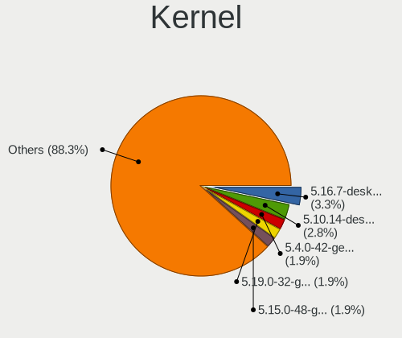

| Version                                            | Notebooks | Percent |
|----------------------------------------------------|-----------|---------|
| 5.16.7-desktop-1omv4003                            | 7         | 3.37%   |
| 5.10.14-desktop-1omv4002                           | 6         | 2.88%   |
| 5.4.0-42-generic                                   | 4         | 1.92%   |
| 5.19.0-32-generic                                  | 4         | 1.92%   |
| 5.15.0-48-generic                                  | 4         | 1.92%   |
| 4.15.0-15-generic                                  | 4         | 1.92%   |
| 6.2.0-32-generic                                   | 3         | 1.44%   |
| 5.4.0-19-generic                                   | 3         | 1.44%   |
| 5.13.0-valve36-1-neptune                           | 3         | 1.44%   |
| 5.11.0-43-generic                                  | 3         | 1.44%   |
| 6.3.8-200.fc38.x86_64                              | 2         | 0.96%   |
| 6.1.0-13-amd64                                     | 2         | 0.96%   |
| 5.8.0-53-generic                                   | 2         | 0.96%   |
| 5.8.0-41-generic                                   | 2         | 0.96%   |
| 5.8.0-38-generic                                   | 2         | 0.96%   |
| 5.8.0-36-generic                                   | 2         | 0.96%   |
| 5.4.0-58-generic                                   | 2         | 0.96%   |
| 5.4.0-37-generic                                   | 2         | 0.96%   |
| 5.3.0-28-generic                                   | 2         | 0.96%   |
| 5.3.0-2-amd64                                      | 2         | 0.96%   |
| 5.15.0-76-generic                                  | 2         | 0.96%   |
| 5.15.0-58-generic                                  | 2         | 0.96%   |
| 5.15.0-56-generic                                  | 2         | 0.96%   |
| 5.11.0-41-generic                                  | 2         | 0.96%   |
| 5.11.0-40-generic                                  | 2         | 0.96%   |
| 5.11.0-37-generic                                  | 2         | 0.96%   |
| 5.11.0-31-generic                                  | 2         | 0.96%   |
| 5.0.0-20-generic                                   | 2         | 0.96%   |
| 4.15.0-29-generic                                  | 2         | 0.96%   |
| 6.5.6-76060506-generic                             | 1         | 0.48%   |
| 6.5.3-desktop-1omv2390                             | 1         | 0.48%   |
| 6.5.3-arch1-1                                      | 1         | 0.48%   |
| 6.4.4-arch1-1                                      | 1         | 0.48%   |
| 6.4.0-0.rc6.20230614gitb6dad5178cea.49.fc39.x86_64 | 1         | 0.48%   |
| 6.3.9-chimeraos-1                                  | 1         | 0.48%   |
| 6.3.2-arch1-1                                      | 1         | 0.48%   |
| 6.2.6-desktop-1omv2390                             | 1         | 0.48%   |
| 6.2.15-300.fc38.x86_64                             | 1         | 0.48%   |
| 6.2.0-39-generic                                   | 1         | 0.48%   |
| 6.2.0-37-generic                                   | 1         | 0.48%   |

Kernel Family
-------------

Linux kernel without a distro release

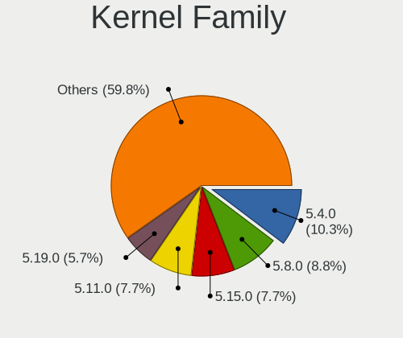

| Version | Notebooks | Percent |
|---------|-----------|---------|
| 5.4.0   | 20        | 10.05%  |
| 5.8.0   | 17        | 8.54%   |
| 5.15.0  | 15        | 7.54%   |
| 5.11.0  | 15        | 7.54%   |
| 6.2.0   | 11        | 5.53%   |
| 5.19.0  | 11        | 5.53%   |
| 5.3.0   | 10        | 5.03%   |
| 4.15.0  | 9         | 4.52%   |
| 5.16.7  | 7         | 3.52%   |
| 5.10.14 | 6         | 3.02%   |
| 5.13.0  | 5         | 2.51%   |
| 5.10.0  | 5         | 2.51%   |
| 5.0.0   | 4         | 2.01%   |
| 4.18.0  | 4         | 2.01%   |
| 6.1.0   | 3         | 1.51%   |
| 6.5.3   | 2         | 1.01%   |
| 6.3.8   | 2         | 1.01%   |
| 6.5.6   | 1         | 0.5%    |
| 6.4.4   | 1         | 0.5%    |
| 6.4.0   | 1         | 0.5%    |
| 6.3.9   | 1         | 0.5%    |
| 6.3.2   | 1         | 0.5%    |
| 6.2.6   | 1         | 0.5%    |
| 6.2.15  | 1         | 0.5%    |
| 6.1.8   | 1         | 0.5%    |
| 6.1.52  | 1         | 0.5%    |
| 6.1.11  | 1         | 0.5%    |
| 6.0.6   | 1         | 0.5%    |
| 6.0.5   | 1         | 0.5%    |
| 6.0.12  | 1         | 0.5%    |
| 5.9.0   | 1         | 0.5%    |
| 5.8.18  | 1         | 0.5%    |
| 5.7.9   | 1         | 0.5%    |
| 5.7.0   | 1         | 0.5%    |
| 5.6.4   | 1         | 0.5%    |
| 5.6.15  | 1         | 0.5%    |
| 5.6.14  | 1         | 0.5%    |
| 5.5.7   | 1         | 0.5%    |
| 5.4.123 | 1         | 0.5%    |
| 5.4.12  | 1         | 0.5%    |

Kernel Major Ver.
-----------------

Linux kernel major version

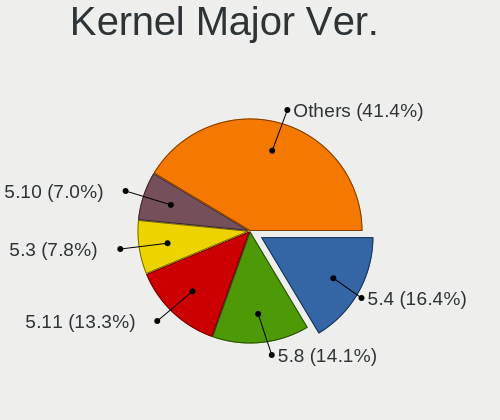

| Version | Notebooks | Percent |
|---------|-----------|---------|
| 5.4     | 22        | 11.22%  |
| 5.15    | 19        | 9.69%   |
| 5.8     | 18        | 9.18%   |
| 5.11    | 17        | 8.67%   |
| 5.19    | 14        | 7.14%   |
| 6.2     | 13        | 6.63%   |
| 5.16    | 12        | 6.12%   |
| 5.10    | 12        | 6.12%   |
| 5.3     | 10        | 5.1%    |
| 4.15    | 9         | 4.59%   |
| 6.1     | 6         | 3.06%   |
| 5.13    | 6         | 3.06%   |
| 4.18    | 5         | 2.55%   |
| 6.3     | 4         | 2.04%   |
| 5.0     | 4         | 2.04%   |
| 6.5     | 3         | 1.53%   |
| 6.0     | 3         | 1.53%   |
| 5.6     | 3         | 1.53%   |
| 5.18    | 3         | 1.53%   |
| 6.4     | 2         | 1.02%   |
| 5.7     | 2         | 1.02%   |
| 5.14    | 2         | 1.02%   |
| 4.9     | 2         | 1.02%   |
| 5.9     | 1         | 0.51%   |
| 5.5     | 1         | 0.51%   |
| 5.17    | 1         | 0.51%   |
| 4.13    | 1         | 0.51%   |
| 3.10    | 1         | 0.51%   |

Arch
----

OS architecture (x86_64, i586, etc.)

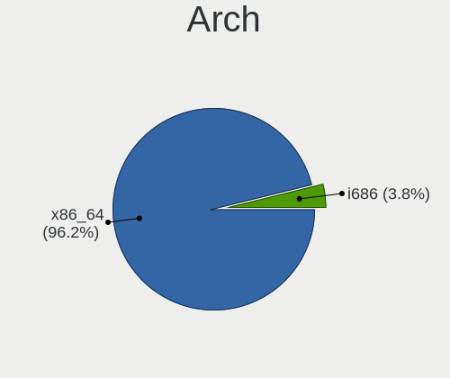

| Name   | Notebooks | Percent |
|--------|-----------|---------|
| x86_64 | 168       | 97.11%  |
| i686   | 4         | 2.31%   |
| armv7l | 1         | 0.58%   |

DE
--

Desktop Environment

| Name       | Notebooks | Percent |
|------------|-----------|---------|
| GNOME      | 96        | 52.17%  |
| KDE5       | 34        | 18.48%  |
| Unknown    | 16        | 8.7%    |
| X-Cinnamon | 11        | 5.98%   |
| XFCE       | 10        | 5.43%   |
| Pantheon   | 3         | 1.63%   |
| Cinnamon   | 3         | 1.63%   |
| KDE        | 2         | 1.09%   |
| Budgie     | 2         | 1.09%   |
| Unity      | 1         | 0.54%   |
| UKUI       | 1         | 0.54%   |
| trinity    | 1         | 0.54%   |
| openbox    | 1         | 0.54%   |
| MATE       | 1         | 0.54%   |
| KDE4       | 1         | 0.54%   |
| i3         | 1         | 0.54%   |

Display Server
--------------

X11 or Wayland

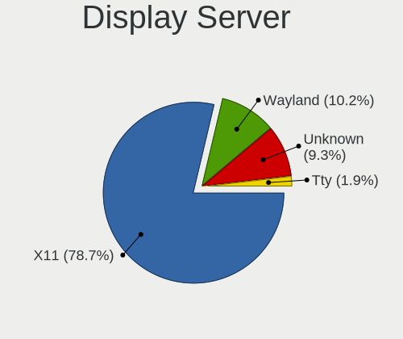

| Name    | Notebooks | Percent |
|---------|-----------|---------|
| X11     | 127       | 71.35%  |
| Wayland | 37        | 20.79%  |
| Unknown | 11        | 6.18%   |
| Tty     | 3         | 1.69%   |

Display Manager
---------------

SDDM, LightDM, etc.

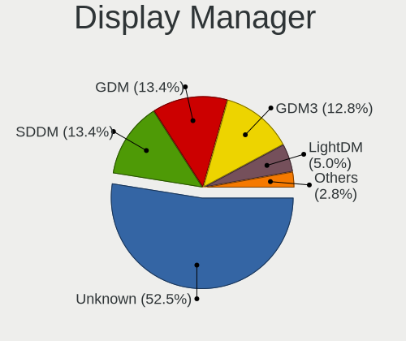

| Name    | Notebooks | Percent |
|---------|-----------|---------|
| Unknown | 94        | 52.22%  |
| SDDM    | 24        | 13.33%  |
| GDM     | 24        | 13.33%  |
| GDM3    | 23        | 12.78%  |
| LightDM | 10        | 5.56%   |
| TDM     | 4         | 2.22%   |
| KDM     | 1         | 0.56%   |

OS Lang
-------

Language

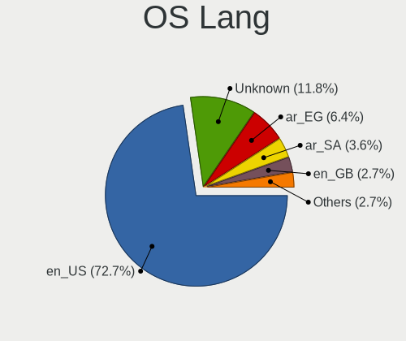

| Lang    | Notebooks | Percent |
|---------|-----------|---------|
| en_US   | 130       | 73.86%  |
| Unknown | 13        | 7.39%   |
| ar_SA   | 9         | 5.11%   |
| en_GB   | 8         | 4.55%   |
| ar_EG   | 7         | 3.98%   |
| C       | 4         | 2.27%   |
| fr_FR   | 1         | 0.57%   |
| en_IN   | 1         | 0.57%   |
| en_AG   | 1         | 0.57%   |
| Default | 1         | 0.57%   |
| ar_AE   | 1         | 0.57%   |

Boot Mode
---------

EFI or BIOS

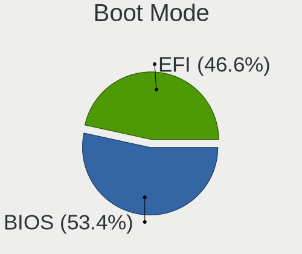

| Mode | Notebooks | Percent |
|------|-----------|---------|
| BIOS | 94        | 53.41%  |
| EFI  | 82        | 46.59%  |

Filesystem
----------

Type of filesystem

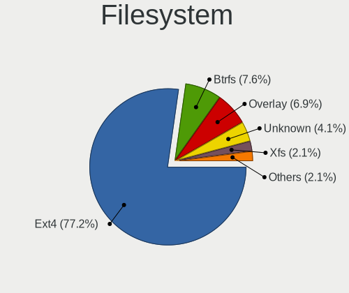

| Type    | Notebooks | Percent |
|---------|-----------|---------|
| Ext4    | 127       | 71.35%  |
| Btrfs   | 20        | 11.24%  |
| Tmpfs   | 10        | 5.62%   |
| Overlay | 10        | 5.62%   |
| Unknown | 6         | 3.37%   |
| Xfs     | 3         | 1.69%   |
| Zfs     | 1         | 0.56%   |
| Ext2    | 1         | 0.56%   |

Part. scheme
------------

Scheme of partitioning

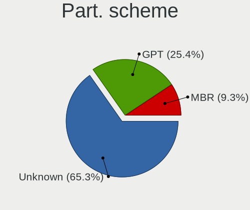

| Type    | Notebooks | Percent |
|---------|-----------|---------|
| Unknown | 102       | 57.3%   |
| GPT     | 57        | 32.02%  |
| MBR     | 19        | 10.67%  |

Dual Boot with Linux/BSD
------------------------

Hosting more than one Linux/BSD

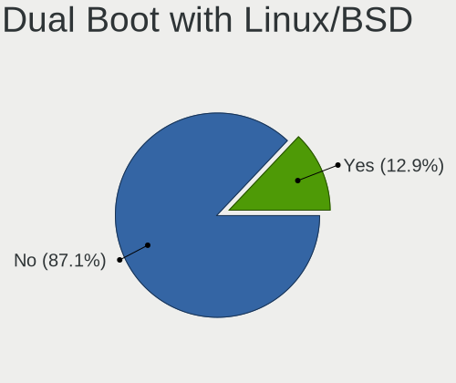

| Dual boot | Notebooks | Percent |
|-----------|-----------|---------|
| No        | 154       | 87.01%  |
| Yes       | 23        | 12.99%  |

Dual Boot (Win)
---------------

Hosting Linux and Windows

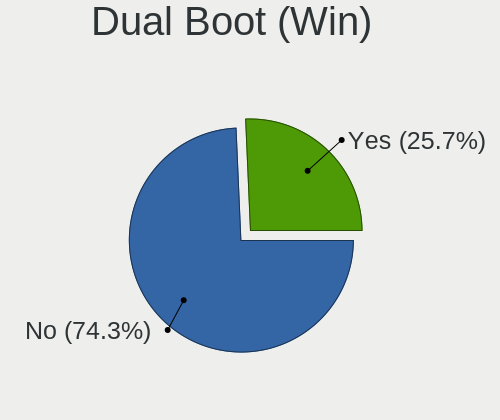

| Dual boot | Notebooks | Percent |
|-----------|-----------|---------|
| No        | 130       | 72.63%  |
| Yes       | 49        | 27.37%  |

Board
-----

Vendor
------

Motherboard manufacturer

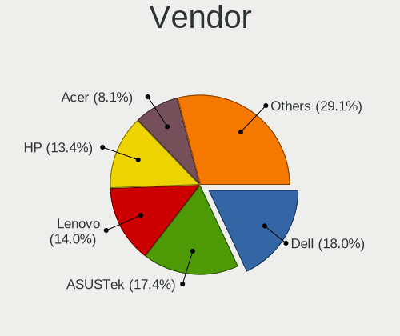

| Name                        | Notebooks | Percent |
|-----------------------------|-----------|---------|
| Dell                        | 32        | 18.5%   |
| ASUSTek Computer            | 30        | 17.34%  |
| Lenovo                      | 24        | 13.87%  |
| Hewlett-Packard             | 23        | 13.29%  |
| Acer                        | 14        | 8.09%   |
| Toshiba                     | 9         | 5.2%    |
| HUAWEI                      | 7         | 4.05%   |
| Apple                       | 7         | 4.05%   |
| Sony                        | 6         | 3.47%   |
| Valve                       | 4         | 2.31%   |
| MSI                         | 3         | 1.73%   |
| Samsung Electronics         | 2         | 1.16%   |
| Notebook                    | 2         | 1.16%   |
| Unknown                     | 2         | 1.16%   |
| Packard Bell                | 1         | 0.58%   |
| LG Electronics              | 1         | 0.58%   |
| I-Life Digital Technologies | 1         | 0.58%   |
| GPD                         | 1         | 0.58%   |
| Google                      | 1         | 0.58%   |
| GIADA                       | 1         | 0.58%   |
| eMachines                   | 1         | 0.58%   |
| Clevo                       | 1         | 0.58%   |

Model
-----

Motherboard model

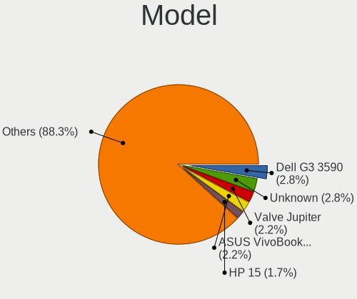

| Name                                       | Notebooks | Percent |
|--------------------------------------------|-----------|---------|
| Dell G3 3590                               | 5         | 2.89%   |
| Unknown                                    | 5         | 2.89%   |
| Valve Jupiter                              | 4         | 2.31%   |
| ASUS VivoBook 15_ASUS Laptop X540MA_X540MA | 4         | 2.31%   |
| HP 15                                      | 3         | 1.73%   |
| HP Pavilion g6                             | 2         | 1.16%   |
| HP Notebook                                | 2         | 1.16%   |
| HP Laptop 15-da2xxx                        | 2         | 1.16%   |
| HP Laptop 15-da0xxx                        | 2         | 1.16%   |
| Dell Inspiron N5110                        | 2         | 1.16%   |
| Dell Inspiron 3542                         | 2         | 1.16%   |
| ASUS VivoBook_ASUSLaptop X512DA_X512DA     | 2         | 1.16%   |
| ASUS VivoBook 15_ASUS Laptop X540UAR       | 2         | 1.16%   |
| ASUS VivoBook 14_ASUS Laptop X441MA_X441MA | 2         | 1.16%   |
| Apple MacBookPro9,2                        | 2         | 1.16%   |
| Acer Aspire ES1-572                        | 2         | 1.16%   |
| Acer Aspire 4752                           | 2         | 1.16%   |
| Toshiba Satellite S55t-A                   | 1         | 0.58%   |
| Toshiba Satellite L635                     | 1         | 0.58%   |
| Toshiba Satellite L500                     | 1         | 0.58%   |
| Toshiba Satellite C855D                    | 1         | 0.58%   |
| Toshiba Satellite C850-B561                | 1         | 0.58%   |
| Toshiba Satellite C850-B239                | 1         | 0.58%   |
| Toshiba Satellite C650                     | 1         | 0.58%   |
| Toshiba Satellite C55-B                    | 1         | 0.58%   |
| Toshiba QOSMIO X875                        | 1         | 0.58%   |
| Sony VPCEA36FA                             | 1         | 0.58%   |
| Sony VPCCA35FA                             | 1         | 0.58%   |
| Sony VGN-FZ250E                            | 1         | 0.58%   |
| Sony SVF15A13SAB                           | 1         | 0.58%   |
| Sony SVF153290X                            | 1         | 0.58%   |
| Sony SVF14N13CXB                           | 1         | 0.58%   |
| Samsung 870Z5E/880Z5E/680Z5E               | 1         | 0.58%   |
| Samsung 300E4A/300E5A/300E7A/3430EA/3530EA | 1         | 0.58%   |
| Packard Bell EasyNote TJ65                 | 1         | 0.58%   |
| Notebook PD5x_7xPNP_PNN_PNT                | 1         | 0.58%   |
| Notebook NH5xAx                            | 1         | 0.58%   |
| MSI MS-1454                                | 1         | 0.58%   |
| MSI GF63 Thin 8RCS                         | 1         | 0.58%   |
| MSI GF63 Thin 10SC                         | 1         | 0.58%   |

Model Family
------------

Motherboard model prefix

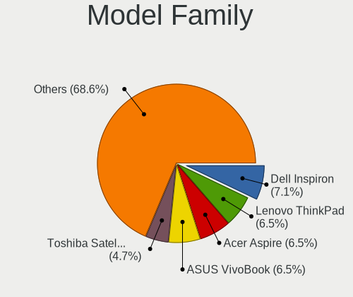

| Name                  | Notebooks | Percent |
|-----------------------|-----------|---------|
| Dell Inspiron         | 13        | 7.51%   |
| Lenovo ThinkPad       | 11        | 6.36%   |
| ASUS VivoBook         | 11        | 6.36%   |
| Acer Aspire           | 11        | 6.36%   |
| Toshiba Satellite     | 8         | 4.62%   |
| HP Laptop             | 8         | 4.62%   |
| Lenovo IdeaPad        | 6         | 3.47%   |
| Dell Latitude         | 6         | 3.47%   |
| HP Pavilion           | 5         | 2.89%   |
| Dell G3               | 5         | 2.89%   |
| Unknown               | 5         | 2.89%   |
| Valve Jupiter         | 4         | 2.31%   |
| HP 15                 | 3         | 1.73%   |
| Dell XPS              | 3         | 1.73%   |
| Dell Vostro           | 3         | 1.73%   |
| ASUS TUF              | 3         | 1.73%   |
| ASUS ROG              | 3         | 1.73%   |
| MSI GF63              | 2         | 1.16%   |
| HP ProBook            | 2         | 1.16%   |
| HP Notebook           | 2         | 1.16%   |
| HP EliteBook          | 2         | 1.16%   |
| ASUS ZenBook          | 2         | 1.16%   |
| Apple MacBookPro9     | 2         | 1.16%   |
| Toshiba QOSMIO        | 1         | 0.58%   |
| Sony VPCEA36FA        | 1         | 0.58%   |
| Sony VPCCA35FA        | 1         | 0.58%   |
| Sony VGN-FZ250E       | 1         | 0.58%   |
| Sony SVF15A13SAB      | 1         | 0.58%   |
| Sony SVF153290X       | 1         | 0.58%   |
| Sony SVF14N13CXB      | 1         | 0.58%   |
| Samsung 870Z5E        | 1         | 0.58%   |
| Samsung 300E4A        | 1         | 0.58%   |
| Packard Bell EasyNote | 1         | 0.58%   |
| Notebook PD5x         | 1         | 0.58%   |
| Notebook NH5xAx       | 1         | 0.58%   |
| MSI MS-1454           | 1         | 0.58%   |
| LG R490-G.ARL5RE2     | 1         | 0.58%   |
| Lenovo V570           | 1         | 0.58%   |
| Lenovo V15-IIL        | 1         | 0.58%   |
| Lenovo ThinkBook      | 1         | 0.58%   |

MFG Year
--------

Motherboard manufacture year

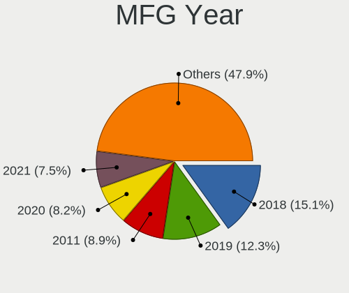

| Year    | Notebooks | Percent |
|---------|-----------|---------|
| 2018    | 23        | 13.29%  |
| 2019    | 22        | 12.72%  |
| 2011    | 16        | 9.25%   |
| 2020    | 15        | 8.67%   |
| 2021    | 12        | 6.94%   |
| 2012    | 12        | 6.94%   |
| 2016    | 10        | 5.78%   |
| 2014    | 10        | 5.78%   |
| 2013    | 10        | 5.78%   |
| 2017    | 9         | 5.2%    |
| 2010    | 9         | 5.2%    |
| 2022    | 8         | 4.62%   |
| 2015    | 5         | 2.89%   |
| 2009    | 4         | 2.31%   |
| 2007    | 3         | 1.73%   |
| 2023    | 2         | 1.16%   |
| 2008    | 1         | 0.58%   |
| 2002    | 1         | 0.58%   |
| Unknown | 1         | 0.58%   |

Form Factor
-----------

Physical design of the computer

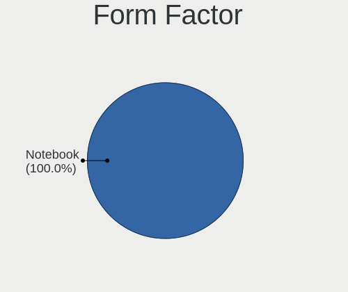

| Name     | Notebooks | Percent |
|----------|-----------|---------|
| Notebook | 173       | 100%    |

Secure Boot
-----------

Enabled or disabled

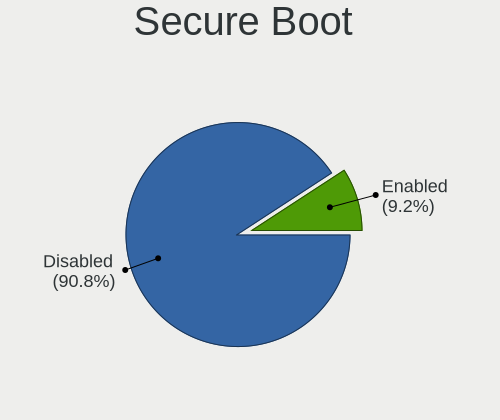

| State    | Notebooks | Percent |
|----------|-----------|---------|
| Disabled | 159       | 90.86%  |
| Enabled  | 16        | 9.14%   |

Coreboot
--------

Have coreboot on board

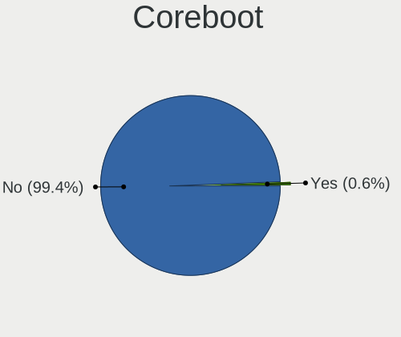

| Used | Notebooks | Percent |
|------|-----------|---------|
| No   | 172       | 99.42%  |
| Yes  | 1         | 0.58%   |

RAM Size
--------

Total RAM memory

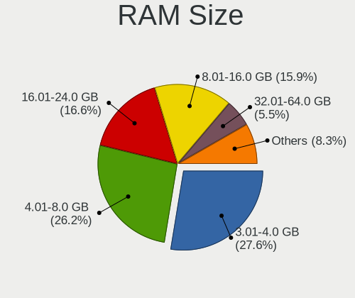

| Size in GB  | Notebooks | Percent |
|-------------|-----------|---------|
| 4.01-8.0    | 51        | 28.65%  |
| 3.01-4.0    | 45        | 25.28%  |
| 8.01-16.0   | 29        | 16.29%  |
| 16.01-24.0  | 28        | 15.73%  |
| 32.01-64.0  | 10        | 5.62%   |
| 1.01-2.0    | 9         | 5.06%   |
| 2.01-3.0    | 5         | 2.81%   |
| 64.01-256.0 | 1         | 0.56%   |

RAM Used
--------

Used RAM memory

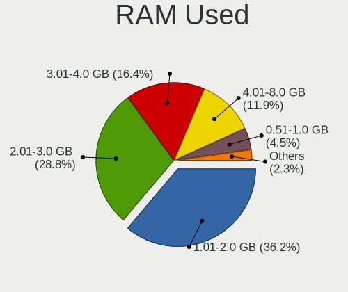

| Used GB   | Notebooks | Percent |
|-----------|-----------|---------|
| 1.01-2.0  | 70        | 36.46%  |
| 2.01-3.0  | 54        | 28.13%  |
| 3.01-4.0  | 31        | 16.15%  |
| 4.01-8.0  | 23        | 11.98%  |
| 0.51-1.0  | 8         | 4.17%   |
| 8.01-16.0 | 4         | 2.08%   |
| 0.01-0.5  | 1         | 0.52%   |
| Unknown   | 1         | 0.52%   |

Total Drives
------------

Number of drives on board

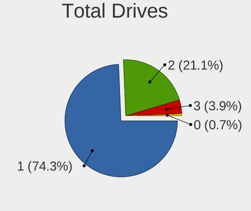

| Drives | Notebooks | Percent |
|--------|-----------|---------|
| 1      | 127       | 71.35%  |
| 2      | 42        | 23.6%   |
| 3      | 8         | 4.49%   |
| 0      | 1         | 0.56%   |

Has CD-ROM
----------

Has CD-ROM on board

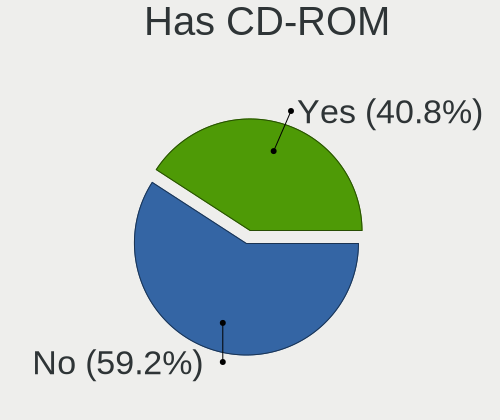

| Presented | Notebooks | Percent |
|-----------|-----------|---------|
| No        | 105       | 59.66%  |
| Yes       | 71        | 40.34%  |

Has Ethernet
------------

Has Ethernet on board

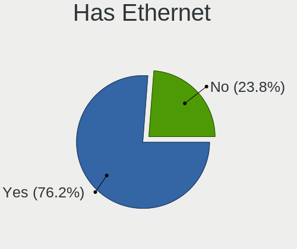

| Presented | Notebooks | Percent |
|-----------|-----------|---------|
| Yes       | 132       | 75.86%  |
| No        | 42        | 24.14%  |

Has WiFi
--------

Has WiFi module

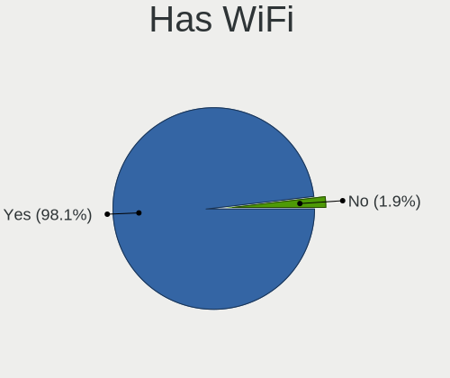

| Presented | Notebooks | Percent |
|-----------|-----------|---------|
| Yes       | 170       | 98.27%  |
| No        | 3         | 1.73%   |

Has Bluetooth
-------------

Has Bluetooth module

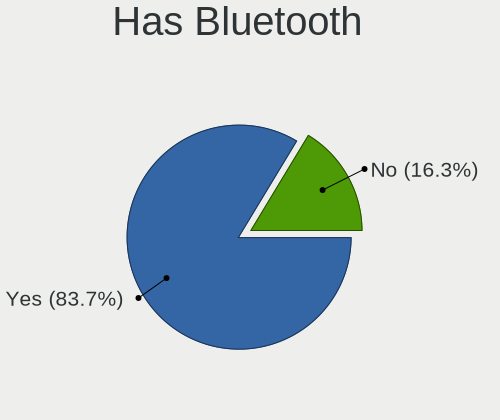

| Presented | Notebooks | Percent |
|-----------|-----------|---------|
| Yes       | 147       | 84.48%  |
| No        | 27        | 15.52%  |

Location
--------

Country
-------

Geographic location (country)

| Country      | Notebooks | Percent |
|--------------|-----------|---------|
| Saudi Arabia | 173       | 100%    |

City
----

Geographic location (city)

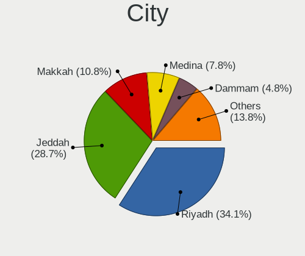

| City                 | Notebooks | Percent |
|----------------------|-----------|---------|
| Riyadh               | 65        | 35.71%  |
| Jeddah               | 50        | 27.47%  |
| Makkah               | 18        | 9.89%   |
| Medina               | 13        | 7.14%   |
| Dammam               | 9         | 4.95%   |
| Khobar               | 5         | 2.75%   |
| Dhahran              | 4         | 2.2%    |
| Al Qatif             | 4         | 2.2%    |
| Thuwal               | 3         | 1.65%   |
| Ta'if                | 2         | 1.1%    |
| Baq`a' ash Sharqiyah | 2         | 1.1%    |
| Yanbu                | 1         | 0.55%   |
| Sayhat               | 1         | 0.55%   |
| Jubail               | 1         | 0.55%   |
| Buraidah             | 1         | 0.55%   |
| Al Hufuf             | 1         | 0.55%   |
| Al Faruq             | 1         | 0.55%   |
| Abha                 | 1         | 0.55%   |

Drives
------

Drive Vendor
------------

Hard drive vendors

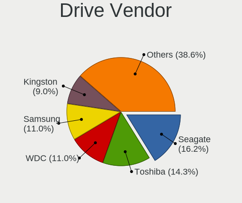

| Vendor                    | Notebooks | Drives | Percent |
|---------------------------|-----------|--------|---------|
| Seagate                   | 34        | 44     | 15.74%  |
| Toshiba                   | 31        | 43     | 14.35%  |
| WDC                       | 25        | 31     | 11.57%  |
| Samsung Electronics       | 23        | 28     | 10.65%  |
| Kingston                  | 20        | 23     | 9.26%   |
| SanDisk                   | 12        | 12     | 5.56%   |
| Unknown                   | 11        | 13     | 5.09%   |
| SK hynix                  | 8         | 11     | 3.7%    |
| Intel                     | 8         | 14     | 3.7%    |
| Micron/Crucial Technology | 4         | 4      | 1.85%   |
| JMicron Technology        | 3         | 3      | 1.39%   |
| Hitachi                   | 3         | 3      | 1.39%   |
| Crucial                   | 3         | 4      | 1.39%   |
| Apple                     | 3         | 4      | 1.39%   |
| Phison Electronics        | 2         | 2      | 0.93%   |
| KingSpec                  | 2         | 2      | 0.93%   |
| Hewlett-Packard           | 2         | 2      | 0.93%   |
| Fujitsu                   | 2         | 3      | 0.93%   |
| China                     | 2         | 2      | 0.93%   |
| YS                        | 1         | 2      | 0.46%   |
| YMTC                      | 1         | 1      | 0.46%   |
| XrayDisk                  | 1         | 1      | 0.46%   |
| Union Memory              | 1         | 1      | 0.46%   |
| SPCC                      | 1         | 1      | 0.46%   |
| Silicon Motion            | 1         | 1      | 0.46%   |
| PNY                       | 1         | 1      | 0.46%   |
| Phison                    | 1         | 2      | 0.46%   |
| OYUNKEY                   | 1         | 1      | 0.46%   |
| Micron Technology         | 1         | 1      | 0.46%   |
| Lexar                     | 1         | 1      | 0.46%   |
| KIOXIA                    | 1         | 1      | 0.46%   |
| HS-SSD-C                  | 1         | 1      | 0.46%   |
| G-DRIVE                   | 1         | 1      | 0.46%   |
| Fanxiang                  | 1         | 1      | 0.46%   |
| Biostar                   | 1         | 1      | 0.46%   |
| ASMT                      | 1         | 1      | 0.46%   |
| A-DATA Technology         | 1         | 1      | 0.46%   |

Drive Model
-----------

Hard drive models

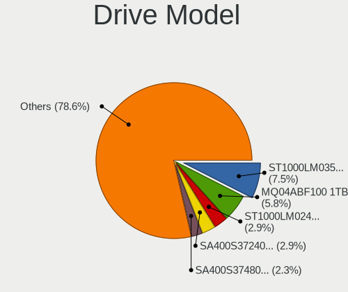

| Model                                               | Notebooks | Percent |
|-----------------------------------------------------|-----------|---------|
| Seagate ST1000LM035-1RK172 1TB                      | 14        | 6.19%   |
| Toshiba MQ04ABF100 1TB                              | 13        | 5.75%   |
| Kingston SA400S37240G 240GB SSD                     | 8         | 3.54%   |
| Seagate ST1000LM024 HN-M101MBB 1TB                  | 6         | 2.65%   |
| Kingston SA400S37480G 480GB SSD                     | 6         | 2.65%   |
| Toshiba MQ01ABD100 1TB                              | 4         | 1.77%   |
| WDC WD10JPVX-22JC3T0 1TB                            | 3         | 1.33%   |
| SanDisk NVMe SSD Drive 128GB                        | 3         | 1.33%   |
| JMicron Tech 250GB                                  | 3         | 1.33%   |
| Intel SSD 660P Series 1TB                           | 3         | 1.33%   |
| WDC WD10SPZX-08Z10 1TB                              | 2         | 0.88%   |
| Unknown MMC Card  32GB                              | 2         | 0.88%   |
| Unknown MMC Card  256GB                             | 2         | 0.88%   |
| Unknown MMC Card  16GB                              | 2         | 0.88%   |
| Toshiba MQ01ABF050 500GB                            | 2         | 0.88%   |
| Toshiba MQ01ABD075 752GB                            | 2         | 0.88%   |
| Toshiba KBG40ZNS256G NVMe 256GB                     | 2         | 0.88%   |
| SK hynix NVMe SSD Drive 1024GB                      | 2         | 0.88%   |
| SK hynix BC501 NVMe Solid State Drive 512GB         | 2         | 0.88%   |
| Seagate ST9500325AS 500GB                           | 2         | 0.88%   |
| Seagate ST500LT012-1DG142 500GB                     | 2         | 0.88%   |
| Samsung NVMe SSD Drive 1024GB                       | 2         | 0.88%   |
| Samsung NVMe SSD Controller SM981/PM981/PM983 512GB | 2         | 0.88%   |
| Phison PS5013 E13 NVMe Controller 512GB             | 2         | 0.88%   |
| Micron/Crucial P2 NVMe PCIe SSD 4TB                 | 2         | 0.88%   |
| Kingston SA400S37120G 120GB SSD                     | 2         | 0.88%   |
| Intel SSDPEKNW512G8 512GB                           | 2         | 0.88%   |
| Intel NVMe SSD Drive 1024GB                         | 2         | 0.88%   |
| HP SSD S700 1TB                                     | 2         | 0.88%   |
| YS SSD 240GB                                        | 1         | 0.44%   |
| YMTC PC005 256GB                                    | 1         | 0.44%   |
| XrayDisk SSD 1TB                                    | 1         | 0.44%   |
| WDC WDS500G2B0B-00YS70 500GB SSD                    | 1         | 0.44%   |
| WDC WDS500G2B0A-00SM50 500GB SSD                    | 1         | 0.44%   |
| WDC WDS1024G2G0A-00JH30 1024GB SSD                  | 1         | 0.44%   |
| WDC WDS100T3X0C-00SJG0 1TB                          | 1         | 0.44%   |
| WDC WD7500BPVT-24HXZT1 752GB                        | 1         | 0.44%   |
| WDC WD5000LPVX-08V0TT6 500GB                        | 1         | 0.44%   |
| WDC WD5000LPCX-00VHAT0 500GB                        | 1         | 0.44%   |
| WDC WD5000BEVT-08A0RT1 500GB                        | 1         | 0.44%   |

HDD Vendor
----------

Hard disk drive vendors

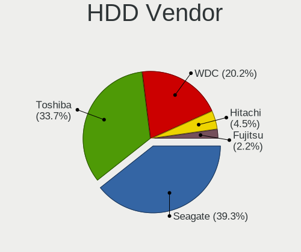

| Vendor  | Notebooks | Drives | Percent |
|---------|-----------|--------|---------|
| Seagate | 34        | 44     | 39.08%  |
| Toshiba | 30        | 35     | 34.48%  |
| WDC     | 18        | 23     | 20.69%  |
| Hitachi | 3         | 3      | 3.45%   |
| Fujitsu | 2         | 3      | 2.3%    |

SSD Vendor
----------

Solid state drive vendors

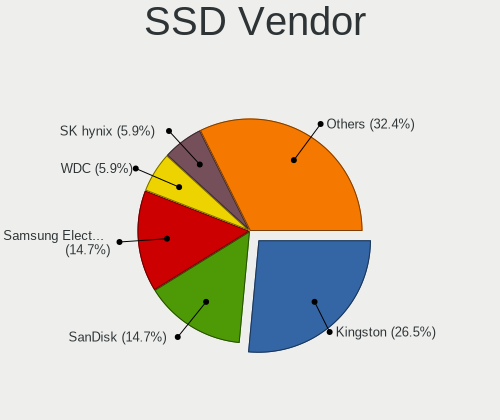

| Vendor              | Notebooks | Drives | Percent |
|---------------------|-----------|--------|---------|
| Kingston            | 17        | 20     | 30.36%  |
| SanDisk             | 8         | 8      | 14.29%  |
| Samsung Electronics | 7         | 7      | 12.5%   |
| WDC                 | 3         | 3      | 5.36%   |
| Crucial             | 3         | 3      | 5.36%   |
| SK hynix            | 2         | 3      | 3.57%   |
| KingSpec            | 2         | 2      | 3.57%   |
| Hewlett-Packard     | 2         | 2      | 3.57%   |
| China               | 2         | 2      | 3.57%   |
| Apple               | 2         | 2      | 3.57%   |
| YS                  | 1         | 2      | 1.79%   |
| XrayDisk            | 1         | 1      | 1.79%   |
| PNY                 | 1         | 1      | 1.79%   |
| OYUNKEY             | 1         | 1      | 1.79%   |
| Lexar               | 1         | 1      | 1.79%   |
| G-DRIVE             | 1         | 1      | 1.79%   |
| ASMT                | 1         | 1      | 1.79%   |
| A-DATA Technology   | 1         | 1      | 1.79%   |

Drive Kind
----------

HDD or SSD

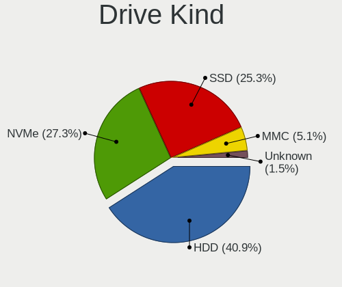

| Kind    | Notebooks | Drives | Percent |
|---------|-----------|--------|---------|
| HDD     | 85        | 108    | 39.91%  |
| NVMe    | 58        | 81     | 27.23%  |
| SSD     | 55        | 61     | 25.82%  |
| MMC     | 11        | 14     | 5.16%   |
| Unknown | 4         | 4      | 1.88%   |

Drive Connector
---------------

SATA, SAS, NVMe, etc.

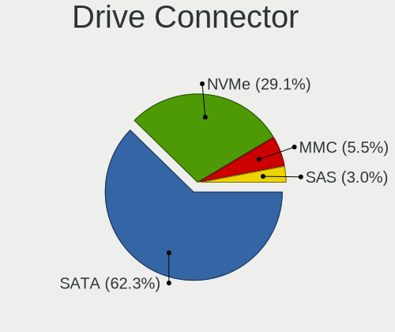

| Type | Notebooks | Drives | Percent |
|------|-----------|--------|---------|
| SATA | 124       | 166    | 62.31%  |
| NVMe | 58        | 81     | 29.15%  |
| MMC  | 11        | 14     | 5.53%   |
| SAS  | 6         | 7      | 3.02%   |

Drive Size
----------

Size of hard drive

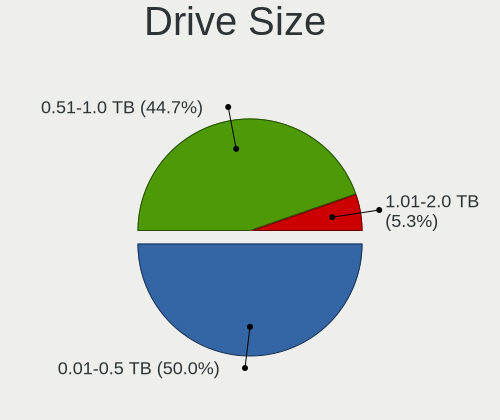

| Size in TB | Notebooks | Drives | Percent |
|------------|-----------|--------|---------|
| 0.01-0.5   | 67        | 84     | 49.63%  |
| 0.51-1.0   | 62        | 79     | 45.93%  |
| 1.01-2.0   | 6         | 6      | 4.44%   |

Space Total
-----------

Amount of disk space available on the file system

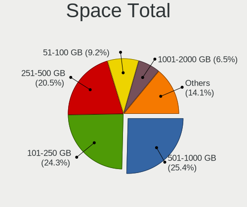

| Size in GB     | Notebooks | Percent |
|----------------|-----------|---------|
| 501-1000       | 47        | 25.41%  |
| 101-250        | 45        | 24.32%  |
| 251-500        | 38        | 20.54%  |
| 51-100         | 17        | 9.19%   |
| 1001-2000      | 12        | 6.49%   |
| 1-20           | 9         | 4.86%   |
| 21-50          | 8         | 4.32%   |
| More than 3000 | 4         | 2.16%   |
| Unknown        | 3         | 1.62%   |
| 2001-3000      | 2         | 1.08%   |

Space Used
----------

Amount of used disk space

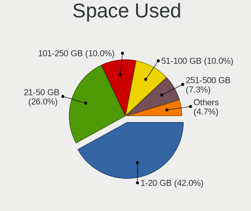

| Used GB        | Notebooks | Percent |
|----------------|-----------|---------|
| 1-20           | 75        | 38.66%  |
| 21-50          | 47        | 24.23%  |
| 51-100         | 25        | 12.89%  |
| 101-250        | 21        | 10.82%  |
| 251-500        | 14        | 7.22%   |
| 501-1000       | 6         | 3.09%   |
| Unknown        | 3         | 1.55%   |
| 1001-2000      | 2         | 1.03%   |
| More than 3000 | 1         | 0.52%   |

Malfunc. Drives
---------------

Drive models with a malfunction

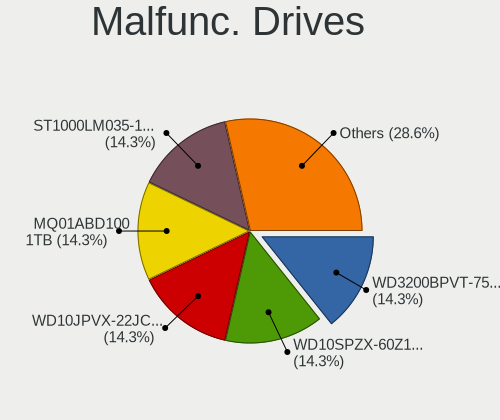

| Model                              | Notebooks | Drives | Percent |
|------------------------------------|-----------|--------|---------|
| YS SSD 240GB                       | 1         | 1      | 11.11%  |
| WDC WD3200BPVT-75ZEST0 320GB       | 1         | 1      | 11.11%  |
| WDC WD10SPZX-60Z10T0 1TB           | 1         | 1      | 11.11%  |
| WDC WD10SPZX-08Z10 1TB             | 1         | 1      | 11.11%  |
| WDC WD10JPVX-22JC3T0 1TB           | 1         | 1      | 11.11%  |
| Toshiba MQ01ABD100 1TB             | 1         | 1      | 11.11%  |
| Seagate ST1000LM035-1RK172 1TB     | 1         | 1      | 11.11%  |
| Seagate ST1000LM024 HN-M101MBB 1TB | 1         | 1      | 11.11%  |
| OYUNKEY SSD 120GB                  | 1         | 1      | 11.11%  |

Malfunc. Drive Vendor
---------------------

Vendors of faulty drives

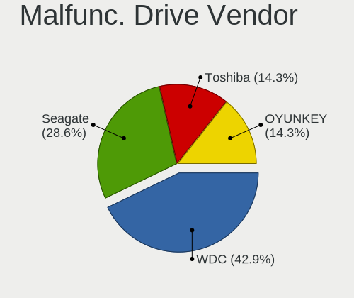

| Vendor  | Notebooks | Drives | Percent |
|---------|-----------|--------|---------|
| WDC     | 4         | 4      | 44.44%  |
| Seagate | 2         | 2      | 22.22%  |
| YS      | 1         | 1      | 11.11%  |
| Toshiba | 1         | 1      | 11.11%  |
| OYUNKEY | 1         | 1      | 11.11%  |

Malfunc. HDD Vendor
-------------------

Vendors of faulty HDD drives

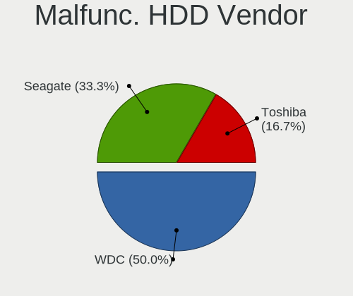

| Vendor  | Notebooks | Drives | Percent |
|---------|-----------|--------|---------|
| WDC     | 4         | 4      | 57.14%  |
| Seagate | 2         | 2      | 28.57%  |
| Toshiba | 1         | 1      | 14.29%  |

Malfunc. Drive Kind
-------------------

Kinds of faulty drives

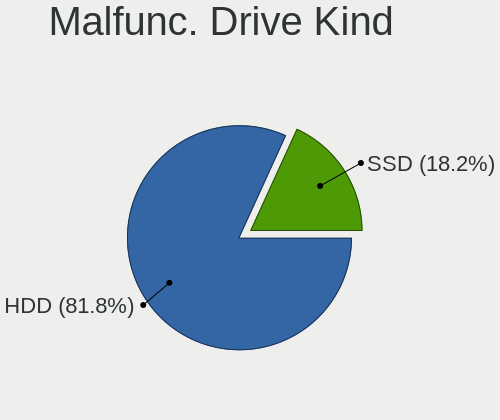

| Kind | Notebooks | Drives | Percent |
|------|-----------|--------|---------|
| HDD  | 7         | 7      | 77.78%  |
| SSD  | 2         | 2      | 22.22%  |

Failed Drives
-------------

Failed drive models

Zero info for selected period =(

Failed Drive Vendor
-------------------

Failed drive vendors

Zero info for selected period =(

Drive Status
------------

Number of failed and malfunc. drives

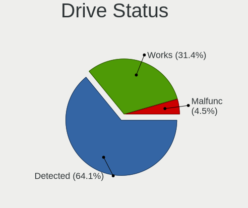

| Status   | Notebooks | Drives | Percent |
|----------|-----------|--------|---------|
| Detected | 118       | 169    | 63.78%  |
| Works    | 58        | 90     | 31.35%  |
| Malfunc  | 9         | 9      | 4.86%   |

Storage controller
------------------

Storage Vendor
--------------

Storage controller vendors

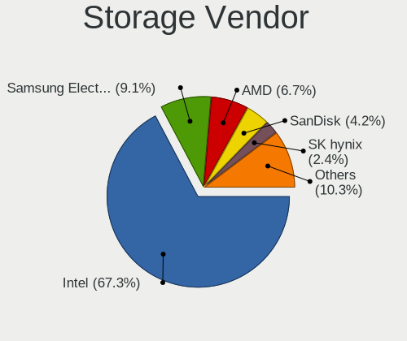

| Vendor                           | Notebooks | Percent |
|----------------------------------|-----------|---------|
| Intel                            | 132       | 65.67%  |
| Samsung Electronics              | 17        | 8.46%   |
| AMD                              | 13        | 6.47%   |
| SanDisk                          | 8         | 3.98%   |
| SK hynix                         | 6         | 2.99%   |
| Micron/Crucial Technology        | 5         | 2.49%   |
| Phison Electronics               | 3         | 1.49%   |
| Kingston Technology Company      | 3         | 1.49%   |
| Toshiba America Info Systems     | 2         | 1%      |
| Silicon Motion                   | 2         | 1%      |
| KIOXIA                           | 2         | 1%      |
| Yangtze Memory Technologies      | 1         | 0.5%    |
| Union Memory (Shenzhen)          | 1         | 0.5%    |
| Silicon Integrated Systems [SiS] | 1         | 0.5%    |
| Realtek Semiconductor            | 1         | 0.5%    |
| Nvidia                           | 1         | 0.5%    |
| Micron Technology                | 1         | 0.5%    |
| INNOGRIT                         | 1         | 0.5%    |
| Apple                            | 1         | 0.5%    |

Storage Model
-------------

Storage controller models

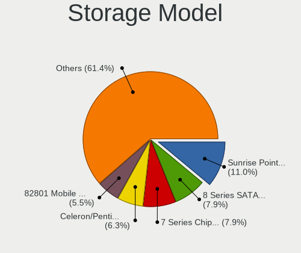

| Model                                                                                  | Notebooks | Percent |
|----------------------------------------------------------------------------------------|-----------|---------|
| Intel Sunrise Point-LP SATA Controller [AHCI mode]                                     | 17        | 8.02%   |
| Intel 7 Series Chipset Family 6-port SATA Controller [AHCI mode]                       | 14        | 6.6%    |
| Intel 6 Series/C200 Series Chipset Family 6 port Mobile SATA AHCI Controller           | 13        | 6.13%   |
| AMD FCH SATA Controller [AHCI mode]                                                    | 13        | 6.13%   |
| Intel 82801 Mobile SATA Controller [RAID mode]                                         | 12        | 5.66%   |
| Intel 8 Series SATA Controller 1 [AHCI mode]                                           | 12        | 5.66%   |
| Samsung NVMe SSD Controller 980 (DRAM-less)                                            | 8         | 3.77%   |
| Intel Celeron/Pentium Silver Processor SATA Controller                                 | 8         | 3.77%   |
| Intel Cannon Lake Mobile PCH SATA AHCI Controller                                      | 8         | 3.77%   |
| Samsung NVMe SSD Controller SM981/PM981/PM983                                          | 7         | 3.3%    |
| Intel 82801IBM/IEM (ICH9M/ICH9M-E) 4 port SATA Controller [AHCI mode]                  | 6         | 2.83%   |
| Intel SSD 660P Series                                                                  | 5         | 2.36%   |
| Intel 5 Series/3400 Series Chipset 4 port SATA AHCI Controller                         | 5         | 2.36%   |
| Intel Wildcat Point-LP SATA Controller [AHCI Mode]                                     | 4         | 1.89%   |
| SanDisk PC SN520 x2 M.2 2230 NVMe SSD                                                  | 3         | 1.42%   |
| Phison PS5013-E13 PCIe3 NVMe Controller (DRAM-less)                                    | 3         | 1.42%   |
| Intel Volume Management Device NVMe RAID Controller                                    | 3         | 1.42%   |
| Intel Ice Lake-LP SATA Controller [AHCI mode]                                          | 3         | 1.42%   |
| Intel Comet Lake SATA AHCI Controller                                                  | 3         | 1.42%   |
| Intel 400 Series Chipset Family SATA AHCI Controller                                   | 3         | 1.42%   |
| Toshiba America Info Systems XG6 NVMe SSD Controller                                   | 2         | 0.94%   |
| SK hynix Gold P31/BC711/PC711 NVMe Solid State Drive                                   | 2         | 0.94%   |
| SK hynix BC501 NVMe Solid State Drive                                                  | 2         | 0.94%   |
| SanDisk Extreme Pro / WD Black SN750 / PC SN730 / Red SN700 NVMe SSD                   | 2         | 0.94%   |
| SanDisk Extreme Pro / WD Black 2018/SN750/PC SN720 NVMe SSD                            | 2         | 0.94%   |
| Samsung S4LN058A01[SSUBX] AHCI SSD Controller (Apple slot)                             | 2         | 0.94%   |
| Micron/Crucial P2 [Nick P2] / P3 / P3 Plus NVMe PCIe SSD (DRAM-less)                   | 2         | 0.94%   |
| Micron/Crucial P1 NVMe PCIe SSD[Frampton]                                              | 2         | 0.94%   |
| KIOXIA NVMe SSD Controller BG4 (DRAM-less)                                             | 2         | 0.94%   |
| Kingston Company OM8PCP Design-In PCIe 3 NVMe SSD (DRAM-less)                          | 2         | 0.94%   |
| Intel SSD 670p Series [Keystone Harbor]                                                | 2         | 0.94%   |
| Intel HM170/QM170 Chipset SATA Controller [AHCI Mode]                                  | 2         | 0.94%   |
| Intel Cannon Point-LP SATA Controller [AHCI Mode]                                      | 2         | 0.94%   |
| Intel 82801HM/HEM (ICH8M/ICH8M-E) SATA Controller [AHCI mode]                          | 2         | 0.94%   |
| Intel 82801HM/HEM (ICH8M/ICH8M-E) IDE Controller                                       | 2         | 0.94%   |
| Intel 6 Series/C200 Series Chipset Family Mobile SATA Controller (IDE mode, ports 4-5) | 2         | 0.94%   |
| Intel 6 Series/C200 Series Chipset Family Mobile SATA Controller (IDE mode, ports 0-3) | 2         | 0.94%   |
| Yangtze Memory PC005 NVMe SSD                                                          | 1         | 0.47%   |
| Union Memory (Shenzhen) AM620 PCIe 3.0 NVMe SSD 256GB                                  | 1         | 0.47%   |
| SK hynix Platinum P41/PC801 NVMe Solid State Drive                                     | 1         | 0.47%   |

Storage Kind
------------

Kind of storage controller (IDE, SATA, NVMe, SAS, ...)

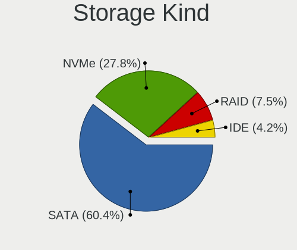

| Kind | Notebooks | Percent |
|------|-----------|---------|
| SATA | 123       | 60.29%  |
| NVMe | 58        | 28.43%  |
| RAID | 15        | 7.35%   |
| IDE  | 8         | 3.92%   |

Processor
---------

CPU Vendor
----------

Processor vendors

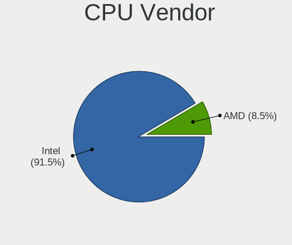

| Vendor | Notebooks | Percent |
|--------|-----------|---------|
| Intel  | 147       | 84.97%  |
| AMD    | 25        | 14.45%  |
| ARM    | 1         | 0.58%   |

CPU Model
---------

Processor models

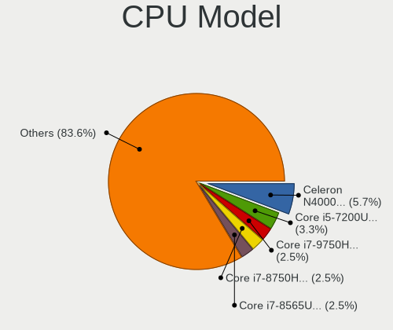

| Model                                         | Notebooks | Percent |
|-----------------------------------------------|-----------|---------|
| Intel Celeron N4000 CPU @ 1.10GHz             | 7         | 4.02%   |
| Intel Core i7-9750H CPU @ 2.60GHz             | 5         | 2.87%   |
| Intel Core i5-7200U CPU @ 2.50GHz             | 5         | 2.87%   |
| Intel 11th Gen Core i7-1165G7 @ 2.80GHz       | 5         | 2.87%   |
| Intel Core i7-4510U CPU @ 2.00GHz             | 4         | 2.3%    |
| Intel Core i5-6200U CPU @ 2.30GHz             | 4         | 2.3%    |
| Intel Core i5-2430M CPU @ 2.40GHz             | 4         | 2.3%    |
| AMD Ryzen 5 3500U with Radeon Vega Mobile Gfx | 4         | 2.3%    |
| AMD Custom APU 0405                           | 4         | 2.3%    |
| Intel Core i7-8750H CPU @ 2.20GHz             | 3         | 1.72%   |
| Intel Core i7-8565U CPU @ 1.80GHz             | 3         | 1.72%   |
| Intel Core i7-8550U CPU @ 1.80GHz             | 3         | 1.72%   |
| Intel Core i7-7500U CPU @ 2.70GHz             | 3         | 1.72%   |
| Intel Core i7-4500U CPU @ 1.80GHz             | 3         | 1.72%   |
| Intel Core i5-8250U CPU @ 1.60GHz             | 3         | 1.72%   |
| Intel Core i5-2450M CPU @ 2.50GHz             | 3         | 1.72%   |
| Intel Core i5-2410M CPU @ 2.30GHz             | 3         | 1.72%   |
| Intel Core i5-10210U CPU @ 1.60GHz            | 3         | 1.72%   |
| Intel Core i5 CPU M 520 @ 2.40GHz             | 3         | 1.72%   |
| Intel Core i3 CPU M 370 @ 2.40GHz             | 3         | 1.72%   |
| Intel 12th Gen Core i7-12700H                 | 3         | 1.72%   |
| Intel Core i7-7700HQ CPU @ 2.80GHz            | 2         | 1.15%   |
| Intel Core i7-3630QM CPU @ 2.40GHz            | 2         | 1.15%   |
| Intel Core i7-2620M CPU @ 2.70GHz             | 2         | 1.15%   |
| Intel Core i7-10750H CPU @ 2.60GHz            | 2         | 1.15%   |
| Intel Core i7-10510U CPU @ 1.80GHz            | 2         | 1.15%   |
| Intel Core i5-5200U CPU @ 2.20GHz             | 2         | 1.15%   |
| Intel Core i5-4210U CPU @ 1.70GHz             | 2         | 1.15%   |
| Intel Core i5-4200U CPU @ 1.60GHz             | 2         | 1.15%   |
| Intel Core i5-3230M CPU @ 2.60GHz             | 2         | 1.15%   |
| Intel Core i5-3210M CPU @ 2.50GHz             | 2         | 1.15%   |
| Intel Core i3-7020U CPU @ 2.30GHz             | 2         | 1.15%   |
| Intel Core i3-6006U CPU @ 2.00GHz             | 2         | 1.15%   |
| Intel Core i3-10110U CPU @ 2.10GHz            | 2         | 1.15%   |
| Intel Core i3-1005G1 CPU @ 1.20GHz            | 2         | 1.15%   |
| Intel Core 2 Duo CPU T6600 @ 2.20GHz          | 2         | 1.15%   |
| AMD Ryzen 7 5800H with Radeon Graphics        | 2         | 1.15%   |
| AMD Ryzen 7 3750H with Radeon Vega Mobile Gfx | 2         | 1.15%   |
| AMD Ryzen 5 5600H with Radeon Graphics        | 2         | 1.15%   |
| Intel Pentium Dual-Core CPU T4500 @ 2.30GHz   | 1         | 0.57%   |

CPU Model Family
----------------

Processor model prefix

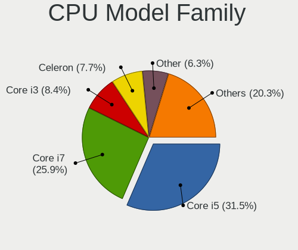

| Model                   | Notebooks | Percent |
|-------------------------|-----------|---------|
| Intel Core i5           | 50        | 28.74%  |
| Intel Core i7           | 44        | 25.29%  |
| Intel Core i3           | 17        | 9.77%   |
| Other                   | 14        | 8.05%   |
| Intel Celeron           | 11        | 6.32%   |
| AMD Ryzen 5             | 11        | 6.32%   |
| Intel Core 2 Duo        | 5         | 2.87%   |
| AMD Ryzen 7             | 5         | 2.87%   |
| Intel Pentium Dual-Core | 3         | 1.72%   |
| Intel Atom              | 3         | 1.72%   |
| AMD Ryzen 9             | 3         | 1.72%   |
| Intel Pentium           | 2         | 1.15%   |
| Intel Mobile Pentium 4  | 1         | 0.57%   |
| Intel Genuine           | 1         | 0.57%   |
| Intel Core i9           | 1         | 0.57%   |
| ARM ARMv7               | 1         | 0.57%   |
| AMD E2                  | 1         | 0.57%   |
| AMD A12                 | 1         | 0.57%   |

CPU Cores
---------

Number of processor cores

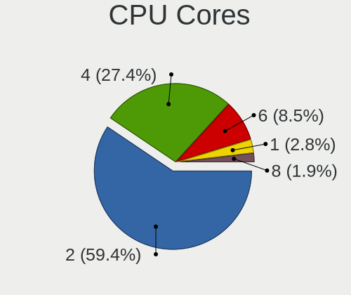

| Number | Notebooks | Percent |
|--------|-----------|---------|
| 2      | 94        | 54.34%  |
| 4      | 49        | 28.32%  |
| 6      | 16        | 9.25%   |
| 8      | 7         | 4.05%   |
| 1      | 4         | 2.31%   |
| 14     | 3         | 1.73%   |

CPU Sockets
-----------

Number of sockets

| Number | Notebooks | Percent |
|--------|-----------|---------|
| 1      | 173       | 100%    |

CPU Threads
-----------

Threads per core (Hyper-Threading)

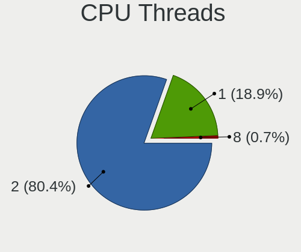

| Number | Notebooks | Percent |
|--------|-----------|---------|
| 2      | 141       | 81.5%   |
| 1      | 31        | 17.92%  |
| 8      | 1         | 0.58%   |

CPU Op-Modes
------------

CPU Operation Modes (32-bit, 64-bit)

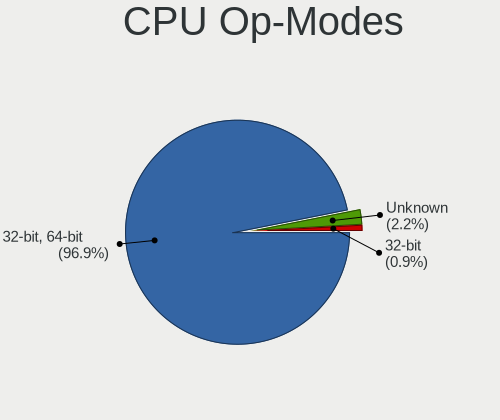

| Op mode        | Notebooks | Percent |
|----------------|-----------|---------|
| 32-bit, 64-bit | 167       | 95.98%  |
| Unknown        | 5         | 2.87%   |
| 32-bit         | 2         | 1.15%   |

CPU Microcode
-------------

Microcode number

| Number     | Notebooks | Percent |
|------------|-----------|---------|
| Unknown    | 65        | 35.71%  |
| 0x206a7    | 12        | 6.59%   |
| 0x40651    | 11        | 6.04%   |
| 0x306a9    | 11        | 6.04%   |
| 0x406e3    | 7         | 3.85%   |
| 0x806ec    | 6         | 3.3%    |
| 0x806c1    | 6         | 3.3%    |
| 0x1067a    | 6         | 3.3%    |
| 0x806ea    | 5         | 2.75%   |
| 0x706a1    | 5         | 2.75%   |
| 0x906ea    | 4         | 2.2%    |
| 0x806e9    | 4         | 2.2%    |
| 0x306d4    | 4         | 2.2%    |
| 0x20655    | 4         | 2.2%    |
| 0xa0652    | 3         | 1.65%   |
| 0x706e5    | 3         | 1.65%   |
| 0x30673    | 3         | 1.65%   |
| 0x20652    | 3         | 1.65%   |
| 0x08108109 | 3         | 1.65%   |
| 0x906a3    | 2         | 1.1%    |
| 0x08600106 | 2         | 1.1%    |
| 0xf27      | 1         | 0.55%   |
| 0x906e9    | 1         | 0.55%   |
| 0x806eb    | 1         | 0.55%   |
| 0x6fd      | 1         | 0.55%   |
| 0x6fa      | 1         | 0.55%   |
| 0x306c3    | 1         | 0.55%   |
| 0x106f1    | 1         | 0.55%   |
| 0x0a50000d | 1         | 0.55%   |
| 0x08701013 | 1         | 0.55%   |
| 0x08600104 | 1         | 0.55%   |
| 0x08108102 | 1         | 0.55%   |
| 0x0810100b | 1         | 0.55%   |
| 0x0600611a | 1         | 0.55%   |

CPU Microarch
-------------

Microarchitecture

| Name             | Notebooks | Percent |
|------------------|-----------|---------|
| KabyLake         | 38        | 21.84%  |
| SandyBridge      | 17        | 9.77%   |
| Haswell          | 15        | 8.62%   |
| IvyBridge        | 13        | 7.47%   |
| Skylake          | 9         | 5.17%   |
| Westmere         | 8         | 4.6%    |
| Goldmont plus    | 8         | 4.6%    |
| Unknown          | 8         | 4.6%    |
| Zen+             | 7         | 4.02%   |
| TigerLake        | 7         | 4.02%   |
| Penryn           | 7         | 4.02%   |
| Zen 3            | 6         | 3.45%   |
| CometLake        | 5         | 2.87%   |
| Broadwell        | 5         | 2.87%   |
| Zen 2            | 4         | 2.3%    |
| IceLake          | 4         | 2.3%    |
| Silvermont       | 3         | 1.72%   |
| Core             | 2         | 1.15%   |
| Alderlake Hybrid | 2         | 1.15%   |
| Zen              | 1         | 0.57%   |
| NetBurst         | 1         | 0.57%   |
| Goldmont         | 1         | 0.57%   |
| Excavator        | 1         | 0.57%   |
| Bonnell          | 1         | 0.57%   |
| Bobcat           | 1         | 0.57%   |

Graphics
--------

GPU Vendor
----------

Vendors of graphics cards

| Vendor                           | Notebooks | Percent |
|----------------------------------|-----------|---------|
| Intel                            | 139       | 59.4%   |
| Nvidia                           | 53        | 22.65%  |
| AMD                              | 41        | 17.52%  |
| Silicon Integrated Systems [SiS] | 1         | 0.43%   |

GPU Model
---------

Graphics card models

| Model                                                                         | Notebooks | Percent |
|-------------------------------------------------------------------------------|-----------|---------|
| Intel 2nd Generation Core Processor Family Integrated Graphics Controller     | 16        | 6.78%   |
| Intel Haswell-ULT Integrated Graphics Controller                              | 13        | 5.51%   |
| Intel 3rd Gen Core processor Graphics Controller                              | 13        | 5.51%   |
| Intel HD Graphics 620                                                         | 10        | 4.24%   |
| Intel CoffeeLake-H GT2 [UHD Graphics 630]                                     | 9         | 3.81%   |
| Intel Skylake GT2 [HD Graphics 520]                                           | 8         | 3.39%   |
| Intel GeminiLake [UHD Graphics 600]                                           | 8         | 3.39%   |
| Intel UHD Graphics 620                                                        | 7         | 2.97%   |
| Intel TigerLake-LP GT2 [Iris Xe Graphics]                                     | 7         | 2.97%   |
| AMD Picasso/Raven 2 [Radeon Vega Series / Radeon Vega Mobile Series]          | 7         | 2.97%   |
| Intel Core Processor Integrated Graphics Controller                           | 6         | 2.54%   |
| Intel CometLake-U GT2 [UHD Graphics]                                          | 6         | 2.54%   |
| AMD Cezanne [Radeon Vega Series / Radeon Vega Mobile Series]                  | 6         | 2.54%   |
| Intel Mobile 4 Series Chipset Integrated Graphics Controller                  | 5         | 2.12%   |
| AMD Sun XT [Radeon HD 8670A/8670M/8690M / R5 M330 / M430 / Radeon 520 Mobile] | 5         | 2.12%   |
| Nvidia TU117M [GeForce GTX 1650 Mobile / Max-Q]                               | 4         | 1.69%   |
| Nvidia GP107M [GeForce GTX 1050 Mobile]                                       | 4         | 1.69%   |
| Intel WhiskeyLake-U GT2 [UHD Graphics 620]                                    | 4         | 1.69%   |
| Intel HD Graphics 5500                                                        | 4         | 1.69%   |
| Intel CometLake-H GT2 [UHD Graphics]                                          | 4         | 1.69%   |
| AMD VanGogh [AMD Custom GPU 0405]                                             | 4         | 1.69%   |
| Nvidia GP107M [GeForce GTX 1050 3 GB Max-Q]                                   | 3         | 1.27%   |
| Nvidia GF117M [GeForce 610M/710M/810M/820M / GT 620M/625M/630M/720M]          | 3         | 1.27%   |
| Nvidia GA107M [GeForce RTX 3050 Mobile]                                       | 3         | 1.27%   |
| Intel Iris Plus Graphics G1 (Ice Lake)                                        | 3         | 1.27%   |
| Intel Atom Processor Z36xxx/Z37xxx Series Graphics & Display                  | 3         | 1.27%   |
| Intel Alder Lake-P GT2 [Iris Xe Graphics]                                     | 3         | 1.27%   |
| AMD Renoir [Radeon RX Vega 6 (Ryzen 4000/5000 Mobile Series)]                 | 3         | 1.27%   |
| AMD Jet PRO [Radeon R5 M230 / R7 M260DX / Radeon 520/610 Mobile]              | 3         | 1.27%   |
| Nvidia TU117M [GeForce GTX 1650 Ti Mobile]                                    | 2         | 0.85%   |
| Nvidia GP108M [GeForce MX230]                                                 | 2         | 0.85%   |
| Nvidia GM108M [GeForce MX110]                                                 | 2         | 0.85%   |
| Nvidia GK208M [GeForce GT 740M]                                               | 2         | 0.85%   |
| Nvidia GK208BM [GeForce 920M]                                                 | 2         | 0.85%   |
| Nvidia GF119M [GeForce GT 520MX]                                              | 2         | 0.85%   |
| Nvidia GA106M [GeForce RTX 3060 Mobile / Max-Q]                               | 2         | 0.85%   |
| Intel Mobile GM965/GL960 Integrated Graphics Controller (secondary)           | 2         | 0.85%   |
| Intel Mobile GM965/GL960 Integrated Graphics Controller (primary)             | 2         | 0.85%   |
| Silicon Integrated Systems [SiS] 65x/M650/740 PCI/AGP VGA Display Adapter     | 1         | 0.42%   |
| Nvidia TU117M [GeForce MX450]                                                 | 1         | 0.42%   |

GPU Combo
---------

Combinations of graphics cards

| Name           | Notebooks | Percent |
|----------------|-----------|---------|
| 1 x Intel      | 86        | 49.43%  |
| Intel + Nvidia | 41        | 23.56%  |
| 1 x AMD        | 22        | 12.64%  |
| Intel + AMD    | 12        | 6.9%    |
| AMD + Nvidia   | 7         | 4.02%   |
| 1 x Nvidia     | 4         | 2.3%    |
| Other          | 1         | 0.57%   |
| 1 x SiS        | 1         | 0.57%   |

GPU Driver
----------

Free vs proprietary

| Driver      | Notebooks | Percent |
|-------------|-----------|---------|
| Free        | 149       | 84.18%  |
| Proprietary | 26        | 14.69%  |
| Unknown     | 2         | 1.13%   |

GPU Memory
----------

Total video memory

| Size in GB | Notebooks | Percent |
|------------|-----------|---------|
| Unknown    | 122       | 70.11%  |
| 1.01-2.0   | 22        | 12.64%  |
| 3.01-4.0   | 10        | 5.75%   |
| 0.51-1.0   | 8         | 4.6%    |
| 0.01-0.5   | 7         | 4.02%   |
| 2.01-3.0   | 3         | 1.72%   |
| 7.01-8.0   | 2         | 1.15%   |

Monitor
-------

Monitor Vendor
--------------

Monitor vendors

| Vendor                  | Notebooks | Percent |
|-------------------------|-----------|---------|
| BOE                     | 48        | 25.81%  |
| LG Display              | 28        | 15.05%  |
| AU Optronics            | 26        | 13.98%  |
| Chimei Innolux          | 22        | 11.83%  |
| Samsung Electronics     | 11        | 5.91%   |
| Apple                   | 7         | 3.76%   |
| PANDA                   | 5         | 2.69%   |
| Lenovo                  | 5         | 2.69%   |
| Dell                    | 5         | 2.69%   |
| Valve                   | 4         | 2.15%   |
| Chi Mei Optoelectronics | 4         | 2.15%   |
| Unknown                 | 3         | 1.61%   |
| Sharp                   | 3         | 1.61%   |
| Sony                    | 2         | 1.08%   |
| Goldstar                | 2         | 1.08%   |
| ___                     | 1         | 0.54%   |
| ViewSonic               | 1         | 0.54%   |
| Unknown (XXX)           | 1         | 0.54%   |
| Toshiba                 | 1         | 0.54%   |
| SKY                     | 1         | 0.54%   |
| LG Philips              | 1         | 0.54%   |
| InnoLux Display         | 1         | 0.54%   |
| InfoVision              | 1         | 0.54%   |
| Huion                   | 1         | 0.54%   |
| ASUSTek Computer        | 1         | 0.54%   |
| Ancor Communications    | 1         | 0.54%   |

Monitor Model
-------------

Monitor models

| Model                                                                    | Notebooks | Percent |
|--------------------------------------------------------------------------|-----------|---------|
| Valve ANX7530 U VLV3001 800x1280 100x150mm 7.1-inch                      | 4         | 2.14%   |
| BOE LCD Monitor BOE06A5 1366x768 344x194mm 15.5-inch                     | 4         | 2.14%   |
| Samsung Electronics LCD Monitor SEC5441 1366x768 344x194mm 15.5-inch     | 3         | 1.6%    |
| Chimei Innolux LCD Monitor CMN15F5 1920x1080 344x193mm 15.5-inch         | 3         | 1.6%    |
| Chimei Innolux LCD Monitor CMN14D4 1920x1080 309x173mm 13.9-inch         | 3         | 1.6%    |
| BOE LCD Monitor BOE0819 1920x1080 344x194mm 15.5-inch                    | 3         | 1.6%    |
| BOE LCD Monitor BOE06A4 1366x768 344x194mm 15.5-inch                     | 3         | 1.6%    |
| AU Optronics LCD Monitor AUO38ED 1920x1080 344x193mm 15.5-inch           | 3         | 1.6%    |
| Unknown SMART TV 6488 3840x2160 1209x680mm 54.6-inch                     | 2         | 1.07%   |
| Samsung Electronics LCD Monitor SEC315A 1366x768 344x194mm 15.5-inch     | 2         | 1.07%   |
| LG Display LCD Monitor LGD02DC 1366x768 344x194mm 15.5-inch              | 2         | 1.07%   |
| Chimei Innolux LCD Monitor CMN15DC 1366x768 344x193mm 15.5-inch          | 2         | 1.07%   |
| Chimei Innolux LCD Monitor CMN15DB 1366x768 344x193mm 15.5-inch          | 2         | 1.07%   |
| Chi Mei Optoelectronics LCD Monitor CMO1592 1366x768 344x193mm 15.5-inch | 2         | 1.07%   |
| BOE LCD Monitor BOE0893 2160x1440 296x197mm 14.0-inch                    | 2         | 1.07%   |
| BOE LCD Monitor BOE0872 1920x1080 344x194mm 15.5-inch                    | 2         | 1.07%   |
| BOE LCD Monitor BOE0802 1920x1080 344x193mm 15.5-inch                    | 2         | 1.07%   |
| BOE LCD Monitor BOE07CB 1920x1080 344x193mm 15.5-inch                    | 2         | 1.07%   |
| BOE LCD Monitor BOE07A1 1920x1080 344x193mm 15.5-inch                    | 2         | 1.07%   |
| BOE LCD Monitor BOE0672 1366x768 344x194mm 15.5-inch                     | 2         | 1.07%   |
| AU Optronics LCD Monitor AUO21ED 1920x1080 344x193mm 15.5-inch           | 2         | 1.07%   |
| AU Optronics LCD Monitor AUO183C 1366x768 309x173mm 13.9-inch            | 2         | 1.07%   |
| ___ LCDTV16 ___9000 1360x768                                             | 1         | 0.53%   |
| ViewSonic VA712-2SERIES VSC941C 1280x1024 338x270mm 17.0-inch            | 1         | 0.53%   |
| Unknown LCDTV16 9000 1360x768 1600x900mm 72.3-inch                       | 1         | 0.53%   |
| Unknown (XXX) Beyond TV XXX2851 1920x1080 1209x680mm 54.6-inch           | 1         | 0.53%   |
| Toshiba ScreenXpert TSB8888 1080x2160                                    | 1         | 0.53%   |
| Sony TV SNYAC03 1360x768                                                 | 1         | 0.53%   |
| Sony NvidiaDefault SNY05FA 1366x768 290x170mm 13.2-inch                  | 1         | 0.53%   |
| SKY TV-monitor SKY0001 1360x768 890x500mm 40.2-inch                      | 1         | 0.53%   |
| Sharp LQ156M1JW09 SHP14D3 1920x1080 344x194mm 15.5-inch                  | 1         | 0.53%   |
| Sharp LCD Monitor SHP14FA 3840x2400 288x180mm 13.4-inch                  | 1         | 0.53%   |
| Sharp LCD Monitor SHP1476 3840x2160 346x194mm 15.6-inch                  | 1         | 0.53%   |
| Samsung Electronics LCD Monitor SEC4351 1366x768 344x194mm 15.5-inch     | 1         | 0.53%   |
| Samsung Electronics LCD Monitor SEC4249 1366x768 309x174mm 14.0-inch     | 1         | 0.53%   |
| Samsung Electronics LCD Monitor SEC3052 1366x768 256x144mm 11.6-inch     | 1         | 0.53%   |
| Samsung Electronics LCD Monitor SDC4161 1920x1080 344x194mm 15.5-inch    | 1         | 0.53%   |
| Samsung Electronics LCD Monitor SDC4147 1366x768 344x194mm 15.5-inch     | 1         | 0.53%   |
| Samsung Electronics CF791 SAM0DC3 3440x1440 797x333mm 34.0-inch          | 1         | 0.53%   |
| PANDA LM156LF1L03 NCP001C 1920x1080 344x194mm 15.5-inch                  | 1         | 0.53%   |

Monitor Resolution
------------------

Monitor screen resolution

| Resolution        | Notebooks | Percent |
|-------------------|-----------|---------|
| 1366x768 (WXGA)   | 77        | 42.78%  |
| 1920x1080 (FHD)   | 68        | 37.78%  |
| 3840x2160 (4K)    | 7         | 3.89%   |
| 1280x800 (WXGA)   | 5         | 2.78%   |
| 800x1280          | 4         | 2.22%   |
| 2160x1440         | 3         | 1.67%   |
| 1920x1200 (WUXGA) | 3         | 1.67%   |
| 2880x1800         | 2         | 1.11%   |
| 2560x1440 (QHD)   | 2         | 1.11%   |
| 1440x900 (WXGA+)  | 2         | 1.11%   |
| 1360x768          | 2         | 1.11%   |
| 3840x2400         | 1         | 0.56%   |
| 3440x1440         | 1         | 0.56%   |
| 2560x1600         | 1         | 0.56%   |
| 1600x900 (HD+)    | 1         | 0.56%   |
| 1280x1024 (SXGA)  | 1         | 0.56%   |

Monitor Diagonal
----------------

Diagonal size in inches

| Inches  | Notebooks | Percent |
|---------|-----------|---------|
| 15      | 101       | 54.01%  |
| 13      | 29        | 15.51%  |
| 14      | 22        | 11.76%  |
| 24      | 5         | 2.67%   |
| 12      | 4         | 2.14%   |
| 7       | 4         | 2.14%   |
| 54      | 3         | 1.6%    |
| 17      | 3         | 1.6%    |
| 16      | 3         | 1.6%    |
| 72      | 2         | 1.07%   |
| 27      | 2         | 1.07%   |
| 86      | 1         | 0.53%   |
| 40      | 1         | 0.53%   |
| 34      | 1         | 0.53%   |
| 31      | 1         | 0.53%   |
| 23      | 1         | 0.53%   |
| 21      | 1         | 0.53%   |
| 18      | 1         | 0.53%   |
| 11      | 1         | 0.53%   |
| Unknown | 1         | 0.53%   |

Monitor Width
-------------

Physical width

| Width in mm | Notebooks | Percent |
|-------------|-----------|---------|
| 301-350     | 139       | 75.54%  |
| 201-300     | 17        | 9.24%   |
| 501-600     | 6         | 3.26%   |
| 351-400     | 6         | 3.26%   |
| 1001-1500   | 4         | 2.17%   |
| 1-100       | 4         | 2.17%   |
| 401-500     | 2         | 1.09%   |
| 1501-2000   | 2         | 1.09%   |
| 801-900     | 1         | 0.54%   |
| 701-800     | 1         | 0.54%   |
| 601-700     | 1         | 0.54%   |
| Unknown     | 1         | 0.54%   |

Aspect Ratio
------------

Proportional relationship between the width and the height

| Ratio | Notebooks | Percent |
|-------|-----------|---------|
| 16/9  | 147       | 86.47%  |
| 16/10 | 13        | 7.65%   |
| 0.67  | 4         | 2.35%   |
| 3/2   | 3         | 1.76%   |
| 5/4   | 1         | 0.59%   |
| 21/9  | 1         | 0.59%   |
| 0.56  | 1         | 0.59%   |

Monitor Area
------------

Area in inch²

| Area in inch² | Notebooks | Percent |
|----------------|-----------|---------|
| 101-110        | 101       | 54.01%  |
| 81-90          | 46        | 24.6%   |
| More than 1000 | 6         | 3.21%   |
| 71-80          | 5         | 2.67%   |
| 201-250        | 5         | 2.67%   |
| 61-70          | 4         | 2.14%   |
| 1-40           | 4         | 2.14%   |
| 351-500        | 2         | 1.07%   |
| 301-350        | 2         | 1.07%   |
| 251-300        | 2         | 1.07%   |
| 141-150        | 2         | 1.07%   |
| 121-130        | 2         | 1.07%   |
| 111-120        | 2         | 1.07%   |
| 51-60          | 1         | 0.53%   |
| 501-1000       | 1         | 0.53%   |
| 91-100         | 1         | 0.53%   |
| Unknown        | 1         | 0.53%   |

Pixel Density
-------------

Pixels per inch

| Density       | Notebooks | Percent |
|---------------|-----------|---------|
| 101-120       | 75        | 41.21%  |
| 121-160       | 64        | 35.16%  |
| 51-100        | 20        | 10.99%  |
| 161-240       | 14        | 7.69%   |
| More than 240 | 4         | 2.2%    |
| 1-50          | 4         | 2.2%    |
| Unknown       | 1         | 0.55%   |

Multiple Monitors
-----------------

Total monitors connected

| Total | Notebooks | Percent |
|-------|-----------|---------|
| 1     | 152       | 86.36%  |
| 2     | 16        | 9.09%   |
| 0     | 4         | 2.27%   |
| 3     | 3         | 1.7%    |
| 4     | 1         | 0.57%   |

Network
-------

Net Controller Vendor
---------------------

Controller vendors

| Vendor                           | Notebooks | Percent |
|----------------------------------|-----------|---------|
| Realtek Semiconductor            | 111       | 40.66%  |
| Intel                            | 64        | 23.44%  |
| Qualcomm Atheros                 | 46        | 16.85%  |
| Broadcom                         | 20        | 7.33%   |
| Ralink                           | 5         | 1.83%   |
| MediaTek                         | 5         | 1.83%   |
| Samsung Electronics              | 4         | 1.47%   |
| Ralink Technology                | 3         | 1.1%    |
| Novatel Wireless                 | 2         | 0.73%   |
| Marvell Technology Group         | 2         | 0.73%   |
| Broadcom Limited                 | 2         | 0.73%   |
| Silicon Integrated Systems [SiS] | 1         | 0.37%   |
| Qualcomm                         | 1         | 0.37%   |
| OPPO Electronics                 | 1         | 0.37%   |
| Nvidia                           | 1         | 0.37%   |
| Microsoft                        | 1         | 0.37%   |
| ICS Advent                       | 1         | 0.37%   |
| Dell                             | 1         | 0.37%   |
| ASIX Electronics                 | 1         | 0.37%   |
| Apple                            | 1         | 0.37%   |

Net Controller Model
--------------------

Controller models

| Model                                                             | Notebooks | Percent |
|-------------------------------------------------------------------|-----------|---------|
| Realtek RTL8111/8168/8411 PCI Express Gigabit Ethernet Controller | 60        | 18.75%  |
| Realtek RTL810xE PCI Express Fast Ethernet controller             | 29        | 9.06%   |
| Qualcomm Atheros QCA9565 / AR9565 Wireless Network Adapter        | 14        | 4.38%   |
| Qualcomm Atheros QCA9377 802.11ac Wireless Network Adapter        | 14        | 4.38%   |
| Realtek RTL8821CE 802.11ac PCIe Wireless Network Adapter          | 11        | 3.44%   |
| Realtek RTL8822CE 802.11ac PCIe Wireless Network Adapter          | 10        | 3.13%   |
| Qualcomm Atheros AR9285 Wireless Network Adapter (PCI-Express)    | 7         | 2.19%   |
| Intel Wireless 8265 / 8275                                        | 7         | 2.19%   |
| Realtek RTL8723BE PCIe Wireless Network Adapter                   | 5         | 1.56%   |
| MediaTek MT7921 802.11ax PCI Express Wireless Network Adapter     | 5         | 1.56%   |
| Intel Wi-Fi 6 AX201                                               | 5         | 1.56%   |
| Broadcom BCM43142 802.11b/g/n                                     | 5         | 1.56%   |
| Intel Wireless 8260                                               | 4         | 1.25%   |
| Intel Wi-Fi 6 AX200                                               | 4         | 1.25%   |
| Intel Centrino Wireless-N 1000 [Condor Peak]                      | 4         | 1.25%   |
| Samsung Galaxy series, misc. (tethering mode)                     | 3         | 0.94%   |
| Realtek RTL8723AE PCIe Wireless Network Adapter                   | 3         | 0.94%   |
| Realtek RTL8188EUS 802.11n Wireless Network Adapter               | 3         | 0.94%   |
| Ralink RT3290 Wireless 802.11n 1T/1R PCIe                         | 3         | 0.94%   |
| Intel Wireless 7265                                               | 3         | 0.94%   |
| Intel Wireless 7260                                               | 3         | 0.94%   |
| Intel Ethernet Connection I219-LM                                 | 3         | 0.94%   |
| Intel Comet Lake PCH-LP CNVi WiFi                                 | 3         | 0.94%   |
| Intel Comet Lake PCH CNVi WiFi                                    | 3         | 0.94%   |
| Intel Cannon Lake PCH CNVi WiFi                                   | 3         | 0.94%   |
| Broadcom NetXtreme BCM57765 Gigabit Ethernet PCIe                 | 3         | 0.94%   |
| Broadcom NetLink BCM57785 Gigabit Ethernet PCIe                   | 3         | 0.94%   |
| Broadcom BCM4331 802.11a/b/g/n                                    | 3         | 0.94%   |
| Broadcom BCM4313 802.11bgn Wireless Network Adapter               | 3         | 0.94%   |
| Realtek RTL8723DE Wireless Network Adapter                        | 2         | 0.63%   |
| Realtek RTL8153 Gigabit Ethernet Adapter                          | 2         | 0.63%   |
| Qualcomm Atheros AR9287 Wireless Network Adapter (PCI-Express)    | 2         | 0.63%   |
| Qualcomm Atheros AR8152 v1.1 Fast Ethernet                        | 2         | 0.63%   |
| Novatel Wireless M2100                                            | 2         | 0.63%   |
| Intel Wireless 3165                                               | 2         | 0.63%   |
| Intel Ice Lake-LP PCH CNVi WiFi                                   | 2         | 0.63%   |
| Intel Ethernet Connection (4) I219-V                              | 2         | 0.63%   |
| Intel Dual Band Wireless-AC 3168NGW [Stone Peak]                  | 2         | 0.63%   |
| Intel Centrino Advanced-N 6205 [Taylor Peak]                      | 2         | 0.63%   |
| Intel Alder Lake-P PCH CNVi WiFi                                  | 2         | 0.63%   |

Wireless Vendor
---------------

Wireless vendors

| Vendor                | Notebooks | Percent |
|-----------------------|-----------|---------|
| Intel                 | 61        | 34.46%  |
| Realtek Semiconductor | 43        | 24.29%  |
| Qualcomm Atheros      | 41        | 23.16%  |
| Broadcom              | 15        | 8.47%   |
| Ralink                | 5         | 2.82%   |
| MediaTek              | 5         | 2.82%   |
| Ralink Technology     | 3         | 1.69%   |
| Broadcom Limited      | 2         | 1.13%   |
| Qualcomm              | 1         | 0.56%   |
| Dell                  | 1         | 0.56%   |

Wireless Model
--------------

Wireless models

| Model                                                          | Notebooks | Percent |
|----------------------------------------------------------------|-----------|---------|
| Qualcomm Atheros QCA9565 / AR9565 Wireless Network Adapter     | 14        | 7.87%   |
| Qualcomm Atheros QCA9377 802.11ac Wireless Network Adapter     | 14        | 7.87%   |
| Realtek RTL8821CE 802.11ac PCIe Wireless Network Adapter       | 11        | 6.18%   |
| Realtek RTL8822CE 802.11ac PCIe Wireless Network Adapter       | 10        | 5.62%   |
| Qualcomm Atheros AR9285 Wireless Network Adapter (PCI-Express) | 7         | 3.93%   |
| Intel Wireless 8265 / 8275                                     | 7         | 3.93%   |
| Realtek RTL8723BE PCIe Wireless Network Adapter                | 5         | 2.81%   |
| MediaTek MT7921 802.11ax PCI Express Wireless Network Adapter  | 5         | 2.81%   |
| Intel Wi-Fi 6 AX201                                            | 5         | 2.81%   |
| Broadcom BCM43142 802.11b/g/n                                  | 5         | 2.81%   |
| Intel Wireless 8260                                            | 4         | 2.25%   |
| Intel Wi-Fi 6 AX200                                            | 4         | 2.25%   |
| Intel Centrino Wireless-N 1000 [Condor Peak]                   | 4         | 2.25%   |
| Realtek RTL8723AE PCIe Wireless Network Adapter                | 3         | 1.69%   |
| Realtek RTL8188EUS 802.11n Wireless Network Adapter            | 3         | 1.69%   |
| Ralink RT3290 Wireless 802.11n 1T/1R PCIe                      | 3         | 1.69%   |
| Intel Wireless 7265                                            | 3         | 1.69%   |
| Intel Wireless 7260                                            | 3         | 1.69%   |
| Intel Comet Lake PCH-LP CNVi WiFi                              | 3         | 1.69%   |
| Intel Comet Lake PCH CNVi WiFi                                 | 3         | 1.69%   |
| Intel Cannon Lake PCH CNVi WiFi                                | 3         | 1.69%   |
| Broadcom BCM4331 802.11a/b/g/n                                 | 3         | 1.69%   |
| Broadcom BCM4313 802.11bgn Wireless Network Adapter            | 3         | 1.69%   |
| Realtek RTL8723DE Wireless Network Adapter                     | 2         | 1.12%   |
| Qualcomm Atheros AR9287 Wireless Network Adapter (PCI-Express) | 2         | 1.12%   |
| Intel Wireless 3165                                            | 2         | 1.12%   |
| Intel Ice Lake-LP PCH CNVi WiFi                                | 2         | 1.12%   |
| Intel Dual Band Wireless-AC 3168NGW [Stone Peak]               | 2         | 1.12%   |
| Intel Centrino Advanced-N 6205 [Taylor Peak]                   | 2         | 1.12%   |
| Intel Alder Lake-P PCH CNVi WiFi                               | 2         | 1.12%   |
| Broadcom BCM43602 802.11ac Wireless LAN SoC                    | 2         | 1.12%   |
| Realtek RTL88x2bu [AC1200 Techkey]                             | 1         | 0.56%   |
| Realtek RTL8852AE 802.11ax PCIe Wireless Network Adapter       | 1         | 0.56%   |
| Realtek RTL8822BE 802.11a/b/g/n/ac WiFi adapter                | 1         | 0.56%   |
| Realtek RTL8723BU 802.11b/g/n WLAN Adapter                     | 1         | 0.56%   |
| Realtek RTL8191SEvB Wireless LAN Controller                    | 1         | 0.56%   |
| Realtek RTL8188RU 802.11n WLAN Adapter                         | 1         | 0.56%   |
| Realtek RTL8188EE Wireless Network Adapter                     | 1         | 0.56%   |
| Realtek RTL8188CE 802.11b/g/n WiFi Adapter                     | 1         | 0.56%   |
| Realtek RTL8187B Wireless Adapter                              | 1         | 0.56%   |

Ethernet Vendor
---------------

Ethernet vendors

| Vendor                           | Notebooks | Percent |
|----------------------------------|-----------|---------|
| Realtek Semiconductor            | 93        | 66.91%  |
| Intel                            | 15        | 10.79%  |
| Broadcom                         | 9         | 6.47%   |
| Qualcomm Atheros                 | 8         | 5.76%   |
| Samsung Electronics              | 3         | 2.16%   |
| Novatel Wireless                 | 2         | 1.44%   |
| Marvell Technology Group         | 2         | 1.44%   |
| Silicon Integrated Systems [SiS] | 1         | 0.72%   |
| OPPO Electronics                 | 1         | 0.72%   |
| Nvidia                           | 1         | 0.72%   |
| Microsoft                        | 1         | 0.72%   |
| ICS Advent                       | 1         | 0.72%   |
| ASIX Electronics                 | 1         | 0.72%   |
| Apple                            | 1         | 0.72%   |

Ethernet Model
--------------

Ethernet models

| Model                                                                          | Notebooks | Percent |
|--------------------------------------------------------------------------------|-----------|---------|
| Realtek RTL8111/8168/8411 PCI Express Gigabit Ethernet Controller              | 60        | 42.86%  |
| Realtek RTL810xE PCI Express Fast Ethernet controller                          | 29        | 20.71%  |
| Samsung Galaxy series, misc. (tethering mode)                                  | 3         | 2.14%   |
| Intel Ethernet Connection I219-LM                                              | 3         | 2.14%   |
| Broadcom NetXtreme BCM57765 Gigabit Ethernet PCIe                              | 3         | 2.14%   |
| Broadcom NetLink BCM57785 Gigabit Ethernet PCIe                                | 3         | 2.14%   |
| Realtek RTL8153 Gigabit Ethernet Adapter                                       | 2         | 1.43%   |
| Qualcomm Atheros AR8152 v1.1 Fast Ethernet                                     | 2         | 1.43%   |
| Novatel Wireless M2100                                                         | 2         | 1.43%   |
| Intel Ethernet Connection (4) I219-V                                           | 2         | 1.43%   |
| Intel 82579LM Gigabit Network Connection (Lewisville)                          | 2         | 1.43%   |
| Intel 82577LM Gigabit Network Connection                                       | 2         | 1.43%   |
| Silicon Integrated Systems [SiS] SiS900 PCI Fast Ethernet                      | 1         | 0.71%   |
| Realtek RTL8152 Fast Ethernet Adapter                                          | 1         | 0.71%   |
| Realtek RTL8125 2.5GbE Controller                                              | 1         | 0.71%   |
| Realtek PCIe GbE Family Controller                                             | 1         | 0.71%   |
| Qualcomm Atheros QCA8171 Gigabit Ethernet                                      | 1         | 0.71%   |
| Qualcomm Atheros AR8161 Gigabit Ethernet                                       | 1         | 0.71%   |
| Qualcomm Atheros AR8152 v2.0 Fast Ethernet                                     | 1         | 0.71%   |
| Qualcomm Atheros AR8151 v2.0 Gigabit Ethernet                                  | 1         | 0.71%   |
| Qualcomm Atheros AR8132 Fast Ethernet                                          | 1         | 0.71%   |
| Qualcomm Atheros AR8131 Gigabit Ethernet                                       | 1         | 0.71%   |
| OPPO SM8350-IDP _SN:27BAACC8                                                   | 1         | 0.71%   |
| Nvidia MCP79 Ethernet                                                          | 1         | 0.71%   |
| Microsoft RTL8153B GigE [Surface Ethernet Adapter]                             | 1         | 0.71%   |
| Marvell Group Yukon Optima 88E8059 [PCIe Gigabit Ethernet Controller with AVB] | 1         | 0.71%   |
| Marvell Group 88E8036 PCI-E Fast Ethernet Controller                           | 1         | 0.71%   |
| Intel Ethernet Connection I219-V                                               | 1         | 0.71%   |
| Intel Ethernet Connection I218-LM                                              | 1         | 0.71%   |
| Intel Ethernet Connection (6) I219-V                                           | 1         | 0.71%   |
| Intel Ethernet Connection (4) I219-LM                                          | 1         | 0.71%   |
| Intel Ethernet Connection (13) I219-V                                          | 1         | 0.71%   |
| Intel 82579V Gigabit Network Connection                                        | 1         | 0.71%   |
| ICS Advent DM9601 Fast Ethernet Adapter                                        | 1         | 0.71%   |
| Broadcom NetXtreme BCM57786 Gigabit Ethernet PCIe                              | 1         | 0.71%   |
| Broadcom NetLink BCM5787M Gigabit Ethernet PCI Express                         | 1         | 0.71%   |
| Broadcom NetLink BCM5784M Gigabit Ethernet PCIe                                | 1         | 0.71%   |
| ASIX AX88179 Gigabit Ethernet                                                  | 1         | 0.71%   |
| Apple iPad 4/Mini1                                                             | 1         | 0.71%   |

Net Controller Kind
-------------------

Ethernet, WiFi or modem

| Kind     | Notebooks | Percent |
|----------|-----------|---------|
| WiFi     | 169       | 55.78%  |
| Ethernet | 132       | 43.56%  |
| Modem    | 2         | 0.66%   |

Used Controller
---------------

Currently used network controller

| Kind     | Notebooks | Percent |
|----------|-----------|---------|
| WiFi     | 145       | 82.39%  |
| Ethernet | 31        | 17.61%  |

NICs
----

Total network controllers on board

| Total | Notebooks | Percent |
|-------|-----------|---------|
| 2     | 122       | 70.52%  |
| 1     | 48        | 27.75%  |
| 0     | 3         | 1.73%   |

IPv6
----

IPv6 vs IPv4

| Used | Notebooks | Percent |
|------|-----------|---------|
| No   | 121       | 66.85%  |
| Yes  | 60        | 33.15%  |

Bluetooth
---------

Bluetooth Vendor
----------------

Controller vendors

| Vendor                          | Notebooks | Percent |
|---------------------------------|-----------|---------|
| Intel                           | 48        | 32.43%  |
| Qualcomm Atheros Communications | 22        | 14.86%  |
| IMC Networks                    | 17        | 11.49%  |
| Realtek Semiconductor           | 16        | 10.81%  |
| Foxconn / Hon Hai               | 11        | 7.43%   |
| Lite-On Technology              | 7         | 4.73%   |
| Apple                           | 6         | 4.05%   |
| Toshiba                         | 5         | 3.38%   |
| Broadcom                        | 5         | 3.38%   |
| Realtek                         | 3         | 2.03%   |
| Ralink                          | 3         | 2.03%   |
| Dell                            | 2         | 1.35%   |
| Ralink Technology               | 1         | 0.68%   |
| Qcom                            | 1         | 0.68%   |
| Hewlett-Packard                 | 1         | 0.68%   |

Bluetooth Model
---------------

Controller models

| Model                                                                               | Notebooks | Percent |
|-------------------------------------------------------------------------------------|-----------|---------|
| Intel Bluetooth wireless interface                                                  | 20        | 13.51%  |
| Qualcomm Atheros  Bluetooth Device                                                  | 11        | 7.43%   |
| Intel Bluetooth Device                                                              | 11        | 7.43%   |
| Realtek Bluetooth Radio                                                             | 9         | 6.08%   |
| Intel Bluetooth 9460/9560 Jefferson Peak (JfP)                                      | 8         | 5.41%   |
| Realtek  Bluetooth 4.2 Adapter                                                      | 6         | 4.05%   |
| IMC Networks Bluetooth Device                                                       | 6         | 4.05%   |
| IMC Networks Bluetooth Radio                                                        | 5         | 3.38%   |
| Qualcomm Atheros AR3011 Bluetooth                                                   | 4         | 2.7%    |
| IMC Networks 802.11ac WLAN Adapter                                                  | 4         | 2.7%    |
| Realtek Bluetooth Radio                                                             | 3         | 2.03%   |
| Ralink RT3290 Bluetooth                                                             | 3         | 2.03%   |
| Qualcomm Atheros AR9462 Bluetooth                                                   | 3         | 2.03%   |
| Intel AX200 Bluetooth                                                               | 3         | 2.03%   |
| Foxconn / Hon Hai BCM43142A0                                                        | 3         | 2.03%   |
| Apple Bluetooth USB Host Controller                                                 | 3         | 2.03%   |
| Toshiba RT Bluetooth Radio                                                          | 2         | 1.35%   |
| Qualcomm Atheros AR3012 Bluetooth 4.0                                               | 2         | 1.35%   |
| Intel Wireless-AC 3168 Bluetooth                                                    | 2         | 1.35%   |
| Intel Centrino Bluetooth Wireless Transceiver                                       | 2         | 1.35%   |
| IMC Networks Wireless_Device                                                        | 2         | 1.35%   |
| Foxconn / Hon Hai MediaTek Bluetooth Adapter                                        | 2         | 1.35%   |
| Foxconn / Hon Hai Foxconn T77H114 BCM2070 [Single-Chip Bluetooth 2.1 + EDR Adapter] | 2         | 1.35%   |
| Foxconn / Hon Hai Bluetooth USB Host Controller                                     | 2         | 1.35%   |
| Apple Bluetooth Host Controller                                                     | 2         | 1.35%   |
| Toshiba Bluetooth Device                                                            | 1         | 0.68%   |
| Toshiba Askey for                                                                   | 1         | 0.68%   |
| Toshiba Askey Bluetooth Module                                                      | 1         | 0.68%   |
| Realtek RTL8723A Bluetooth                                                          | 1         | 0.68%   |
| Ralink CSR BS8510                                                                   | 1         | 0.68%   |
| Qualcomm Atheros QCA61x4 Bluetooth 4.0                                              | 1         | 0.68%   |
| Qualcomm Atheros Bluetooth USB Host Controller                                      | 1         | 0.68%   |
| Qcom Broadcom Bluetooth USB                                                         | 1         | 0.68%   |
| Lite-On Wireless_Device                                                             | 1         | 0.68%   |
| Lite-On Qualcomm Atheros QCA9377 Bluetooth                                          | 1         | 0.68%   |
| Lite-On Qualcomm Atheros Bluetooth                                                  | 1         | 0.68%   |
| Lite-On Broadcom BCM43142A0 Bluetooth Device                                        | 1         | 0.68%   |
| Lite-On Bluetooth Device                                                            | 1         | 0.68%   |
| Lite-On BCM43142A0                                                                  | 1         | 0.68%   |
| Lite-On Atheros AR3012 Bluetooth                                                    | 1         | 0.68%   |

Sound
-----

Sound Vendor
------------

Sound card vendors

| Vendor                           | Notebooks | Percent |
|----------------------------------|-----------|---------|
| Intel                            | 143       | 70.44%  |
| AMD                              | 29        | 14.29%  |
| Nvidia                           | 26        | 12.81%  |
| Silicon Integrated Systems [SiS] | 1         | 0.49%   |
| Samson Technologies              | 1         | 0.49%   |
| Nreal                            | 1         | 0.49%   |
| Focusrite-Novation               | 1         | 0.49%   |
| Cooler Master                    | 1         | 0.49%   |

Sound Model
-----------

Sound card models

| Model                                                                      | Notebooks | Percent |
|----------------------------------------------------------------------------|-----------|---------|
| Intel Sunrise Point-LP HD Audio                                            | 26        | 10.88%  |
| AMD Family 17h/19h HD Audio Controller                                     | 18        | 7.53%   |
| Intel 7 Series/C216 Chipset Family High Definition Audio Controller        | 15        | 6.28%   |
| Intel 6 Series/C200 Series Chipset Family High Definition Audio Controller | 15        | 6.28%   |
| Intel Haswell-ULT HD Audio Controller                                      | 13        | 5.44%   |
| Intel 8 Series HD Audio Controller                                         | 13        | 5.44%   |
| Intel Cannon Lake PCH cAVS                                                 | 9         | 3.77%   |
| AMD Renoir Radeon High Definition Audio Controller                         | 9         | 3.77%   |
| Intel Celeron/Pentium Silver Processor High Definition Audio               | 8         | 3.35%   |
| Intel 5 Series/3400 Series Chipset High Definition Audio                   | 8         | 3.35%   |
| Intel Tiger Lake-LP Smart Sound Technology Audio Controller                | 7         | 2.93%   |
| Intel Comet Lake PCH-LP cAVS                                               | 7         | 2.93%   |
| Intel 82801I (ICH9 Family) HD Audio Controller                             | 6         | 2.51%   |
| AMD Raven/Raven2/Fenghuang HDMI/DP Audio Controller                        | 6         | 2.51%   |
| Nvidia GP107GL High Definition Audio Controller                            | 5         | 2.09%   |
| Intel Wildcat Point-LP High Definition Audio Controller                    | 5         | 2.09%   |
| Intel Broadwell-U Audio Controller                                         | 5         | 2.09%   |
| Nvidia TU107 GeForce GTX 1650 High Definition Audio Controller             | 4         | 1.67%   |
| Intel Ice Lake-LP Smart Sound Technology Audio Controller                  | 4         | 1.67%   |
| Intel Comet Lake PCH cAVS                                                  | 4         | 1.67%   |
| Intel Cannon Point-LP High Definition Audio Controller                     | 4         | 1.67%   |
| AMD Rembrandt Radeon High Definition Audio Controller                      | 4         | 1.67%   |
| Intel Alder Lake PCH-P High Definition Audio Controller                    | 3         | 1.26%   |
| Nvidia TU106 High Definition Audio Controller                              | 2         | 0.84%   |
| Nvidia GP106 High Definition Audio Controller                              | 2         | 0.84%   |
| Nvidia GK208 HDMI/DP Audio Controller                                      | 2         | 0.84%   |
| Nvidia Audio device                                                        | 2         | 0.84%   |
| Intel CM238 HD Audio Controller                                            | 2         | 0.84%   |
| Intel 82801H (ICH8 Family) HD Audio Controller                             | 2         | 0.84%   |
| Intel 8 Series/C220 Series Chipset High Definition Audio Controller        | 2         | 0.84%   |
| Silicon Integrated Systems [SiS] SiS7012 AC'97 Sound Controller            | 1         | 0.42%   |
| Samson Technologies GoMic compact condenser mic                            | 1         | 0.42%   |
| Nvidia TU116 High Definition Audio Controller                              | 1         | 0.42%   |
| Nvidia TU104 HD Audio Controller                                           | 1         | 0.42%   |
| Nvidia MCP79 High Definition Audio                                         | 1         | 0.42%   |
| Nvidia GK107 HDMI Audio Controller                                         | 1         | 0.42%   |
| Nvidia GK104 HDMI Audio Controller                                         | 1         | 0.42%   |
| Nvidia GF119 HDMI Audio Controller                                         | 1         | 0.42%   |
| Nvidia GF114 HDMI Audio Controller                                         | 1         | 0.42%   |
| Nvidia GF108 High Definition Audio Controller                              | 1         | 0.42%   |

Memory
------

Memory Vendor
-------------

Memory module vendors

| Vendor                               | Notebooks | Percent |
|--------------------------------------|-----------|---------|
| Samsung Electronics                  | 26        | 27.37%  |
| SK hynix                             | 21        | 22.11%  |
| Micron Technology                    | 13        | 13.68%  |
| Crucial                              | 8         | 8.42%   |
| Kingston                             | 7         | 7.37%   |
| Unknown                              | 6         | 6.32%   |
| Elpida                               | 2         | 2.11%   |
| Unknown (ABCD)                       | 1         | 1.05%   |
| Unknown (0x00FFFFFFFFFFFFFF)         | 1         | 1.05%   |
| Toshiba                              | 1         | 1.05%   |
| Team                                 | 1         | 1.05%   |
| Silicon Power                        | 1         | 1.05%   |
| Ramaxel Technology                   | 1         | 1.05%   |
| Patriot Memory (PDP Systems)         | 1         | 1.05%   |
| Nanya Technology                     | 1         | 1.05%   |
| KLEVV                                | 1         | 1.05%   |
| Hikvision                            | 1         | 1.05%   |
| Chun Well Technology Holding Limited | 1         | 1.05%   |
| ASint Technology                     | 1         | 1.05%   |

Memory Model
------------

Memory module models

| Model                                                            | Notebooks | Percent |
|------------------------------------------------------------------|-----------|---------|
| SK hynix RAM HMT451S6BFR8A-PB 4GB SODIMM DDR3 1600MT/s           | 3         | 3.03%   |
| SK hynix RAM HMA81GS6JJR8N-VK 8GB SODIMM DDR4 2667MT/s           | 3         | 3.03%   |
| Samsung RAM M471B1G73EB0-YK0 8192MB SODIMM DDR3 1600MT/s         | 3         | 3.03%   |
| Samsung RAM M471A5244CB0-CTD 4GB SODIMM DDR4 3266MT/s            | 3         | 3.03%   |
| SK hynix RAM HMT325S6BFR8C-H9 2GB SODIMM DDR3 1334MT/s           | 2         | 2.02%   |
| Samsung RAM M471B5673FH0-CF8 2GB SODIMM 1067MT/s                 | 2         | 2.02%   |
| Samsung RAM M471B5273CH0-CH9 4096MB SODIMM DDR3 1334MT/s         | 2         | 2.02%   |
| Samsung RAM M471A5244CB0-CTD 4GB Row Of Chips DDR4 2667MT/s      | 2         | 2.02%   |
| Samsung RAM M471A1K43DB1-CTD 8GB SODIMM DDR4 2667MT/s            | 2         | 2.02%   |
| Elpida RAM EBJ21UE8BDS0-DJ-F 2GB SODIMM DDR3 1334MT/s            | 2         | 2.02%   |
| Unknown RAM Module 8192MB SODIMM DDR3 1600MT/s                   | 1         | 1.01%   |
| Unknown RAM Module 4GB SODIMM DDR4 2667MT/s                      | 1         | 1.01%   |
| Unknown RAM Module 4GB Row Of Chips LPDDR4 4267MT/s              | 1         | 1.01%   |
| Unknown RAM Module 2GB SODIMM DDR3 1333MT/s                      | 1         | 1.01%   |
| Unknown RAM Module 2GB SODIMM DDR2                               | 1         | 1.01%   |
| Unknown RAM Module 2GB SODIMM 800MT/s                            | 1         | 1.01%   |
| Unknown RAM Module 2048MB SODIMM DDR2                            | 1         | 1.01%   |
| Unknown (ABCD) RAM 123456789012345678 2GB SODIMM LPDDR4 2400MT/s | 1         | 1.01%   |
| Unknown (0x00FFFFFFFFFFFFFF) RAM Module 4GB SODIMM DDR2 667MT/s  | 1         | 1.01%   |
| Toshiba RAM 8HTF12864HDY-800G1 1GB SODIMM 1066MT/s               | 1         | 1.01%   |
| Toshiba RAM 64T128020EDL2.5C2 2GB SODIMM 1066MT/s                | 1         | 1.01%   |
| Team RAM Elite-1600 8GB SODIMM DDR3 1600MT/s                     | 1         | 1.01%   |
| SK hynix RAM Module 4GB SODIMM DDR3 1600MT/s                     | 1         | 1.01%   |
| SK hynix RAM Module 16GB SODIMM DDR4 3200MT/s                    | 1         | 1.01%   |
| SK hynix RAM HYMP125S64CP8-S6 2GB SODIMM DDR2 975MT/s            | 1         | 1.01%   |
| SK hynix RAM HMT451S6AFR8A-PB 4096MB SODIMM DDR3 1600MT/s        | 1         | 1.01%   |
| SK hynix RAM HMT425S6AFR6A-PB 2048MB SODIMM 1600MT/s             | 1         | 1.01%   |
| SK hynix RAM HMT351S6EFR8A-PB 4GB SODIMM DDR3 1600MT/s           | 1         | 1.01%   |
| SK hynix RAM HMT112S6TFR8C-G7 1GB SODIMM DDR3 1067MT/s           | 1         | 1.01%   |
| SK hynix RAM HMP125S6EFR8C-S6 2GB SODIMM DDR2 800MT/s            | 1         | 1.01%   |
| SK hynix RAM HMAA1GS6CMR6N-XN 8GB SODIMM DDR4 3200MT/s           | 1         | 1.01%   |
| SK hynix RAM HMAA1GS6CJR6N-XN 8GB SODIMM DDR4 3200MT/s           | 1         | 1.01%   |
| SK hynix RAM HMA851S6JJR6N-VK 4GB SODIMM DDR4 2667MT/s           | 1         | 1.01%   |
| SK hynix RAM HMA82GS6JJR8N-VK 16GB SODIMM DDR4 2667MT/s          | 1         | 1.01%   |
| SK hynix RAM HMA82GS6CJR8N-VK 16GB SODIMM DDR4 2667MT/s          | 1         | 1.01%   |
| SK hynix RAM HMA81GS6CJR8N-VK 8GB SODIMM DDR4 2667MT/s           | 1         | 1.01%   |
| Silicon Power RAM DBST8GN128S 8GB SODIMM DDR3 1333MT/s           | 1         | 1.01%   |
| Samsung RAM M471B5773DH0-CK0 2GB SODIMM DDR3 1600MT/s            | 1         | 1.01%   |
| Samsung RAM M471B5773DH0-CH9 2048MB SODIMM DDR3 1600MT/s         | 1         | 1.01%   |
| Samsung RAM M471B5773CHS-CH9 2GB SODIMM DDR3 4199MT/s            | 1         | 1.01%   |

Memory Kind
-----------

Memory module kinds

| Kind    | Notebooks | Percent |
|---------|-----------|---------|
| DDR4    | 34        | 44.74%  |
| DDR3    | 31        | 40.79%  |
| DDR2    | 4         | 5.26%   |
| LPDDR4  | 3         | 3.95%   |
| LPDDR3  | 2         | 2.63%   |
| SDRAM   | 1         | 1.32%   |
| Unknown | 1         | 1.32%   |

Memory Form Factor
------------------

Physical design of the memory module

| Name         | Notebooks | Percent |
|--------------|-----------|---------|
| SODIMM       | 68        | 90.67%  |
| Row Of Chips | 7         | 9.33%   |

Memory Size
-----------

Memory module size

| Size  | Notebooks | Percent |
|-------|-----------|---------|
| 8192  | 30        | 35.71%  |
| 4096  | 30        | 35.71%  |
| 2048  | 11        | 13.1%   |
| 16384 | 9         | 10.71%  |
| 32768 | 2         | 2.38%   |
| 1024  | 2         | 2.38%   |

Memory Speed
------------

Memory module speed

| Speed   | Notebooks | Percent |
|---------|-----------|---------|
| 1600    | 21        | 24.14%  |
| 2667    | 19        | 21.84%  |
| 3200    | 14        | 16.09%  |
| 1334    | 9         | 10.34%  |
| 2133    | 4         | 4.6%    |
| 3266    | 3         | 3.45%   |
| 2400    | 3         | 3.45%   |
| 1333    | 3         | 3.45%   |
| 4267    | 2         | 2.3%    |
| 1067    | 2         | 2.3%    |
| 800     | 2         | 2.3%    |
| 4199    | 1         | 1.15%   |
| 1066    | 1         | 1.15%   |
| 975     | 1         | 1.15%   |
| 667     | 1         | 1.15%   |
| Unknown | 1         | 1.15%   |

Printers & scanners
-------------------

Printer Vendor
--------------

Printer device vendors

Zero info for selected period =(

Printer Model
-------------

Printer device models

Zero info for selected period =(

Scanner Vendor
--------------

Scanner device vendors

Zero info for selected period =(

Scanner Model
-------------

Scanner device models

Zero info for selected period =(

Camera
------

Camera Vendor
-------------

Camera device vendors

| Vendor                                 | Notebooks | Percent |
|----------------------------------------|-----------|---------|
| Chicony Electronics                    | 29        | 20.14%  |
| IMC Networks                           | 26        | 18.06%  |
| Microdia                               | 17        | 11.81%  |
| Realtek Semiconductor                  | 10        | 6.94%   |
| Bison Electronics                      | 10        | 6.94%   |
| Sunplus Innovation Technology          | 8         | 5.56%   |
| Suyin                                  | 7         | 4.86%   |
| Quanta                                 | 6         | 4.17%   |
| Lite-On Technology                     | 6         | 4.17%   |
| Cheng Uei Precision Industry (Foxlink) | 5         | 3.47%   |
| Apple                                  | 5         | 3.47%   |
| Importek                               | 4         | 2.78%   |
| Silicon Motion                         | 2         | 1.39%   |
| Ricoh                                  | 2         | 1.39%   |
| Alcor Micro                            | 2         | 1.39%   |
| Samsung Electronics                    | 1         | 0.69%   |
| Luxvisions Innotech Limited            | 1         | 0.69%   |
| Logitech                               | 1         | 0.69%   |
| Lenovo                                 | 1         | 0.69%   |
| Acer                                   | 1         | 0.69%   |

Camera Model
------------

Camera device models

| Model                                                          | Notebooks | Percent |
|----------------------------------------------------------------|-----------|---------|
| IMC Networks USB2.0 VGA UVC WebCam                             | 12        | 8.33%   |
| Chicony Integrated Camera                                      | 10        | 6.94%   |
| Microdia Integrated_Webcam_HD                                  | 9         | 6.25%   |
| IMC Networks USB2.0 HD UVC WebCam                              | 9         | 6.25%   |
| Sunplus Integrated_Webcam_HD                                   | 4         | 2.78%   |
| Lite-On HP TrueVision HD Camera                                | 3         | 2.08%   |
| IMC Networks HD Camera                                         | 3         | 2.08%   |
| Bison Lenovo EasyCamera                                        | 3         | 2.08%   |
| Bison Integrated Camera                                        | 3         | 2.08%   |
| Apple FaceTime HD Camera                                       | 3         | 2.08%   |
| Suyin 1.3M HD WebCam                                           | 2         | 1.39%   |
| Sunplus HD WebCam                                              | 2         | 1.39%   |
| Realtek Integrated Webcam HD                                   | 2         | 1.39%   |
| Realtek Integrated Webcam                                      | 2         | 1.39%   |
| Realtek HP Truevision HD integrated webcam                     | 2         | 1.39%   |
| Microdia HP Integrated Webcam                                  | 2         | 1.39%   |
| Importek Laptop Integrated Webcam                              | 2         | 1.39%   |
| Chicony HD WebCam                                              | 2         | 1.39%   |
| Chicony HD User Facing                                         | 2         | 1.39%   |
| Chicony Front Camera                                           | 2         | 1.39%   |
| Cheng Uei Precision Industry (Foxlink) HP TrueVision HD Camera | 2         | 1.39%   |
| Apple iPhone 5/5C/5S/6/SE                                      | 2         | 1.39%   |
| Alcor Micro Asus Integrated Webcam                             | 2         | 1.39%   |
| Suyin USB 2.0 Camera                                           | 1         | 0.69%   |
| Suyin Integrated_Webcam_HD                                     | 1         | 0.69%   |
| Suyin HP TrueVision HD                                         | 1         | 0.69%   |
| Suyin HP Integrated Webcam                                     | 1         | 0.69%   |
| Suyin Acer CrystalEye Webcam                                   | 1         | 0.69%   |
| Sunplus Laptop_Integrated_Webcam_FHD                           | 1         | 0.69%   |
| Sunplus HP Universal Camera                                    | 1         | 0.69%   |
| Silicon Motion WebCam SC-10HDP12631N                           | 1         | 0.69%   |
| Silicon Motion WebCam SC-03FFL11939N                           | 1         | 0.69%   |
| Samsung Galaxy series, misc. (MTP mode)                        | 1         | 0.69%   |
| Ricoh Visual Communication Camera VGP-VCC8 [R5U870]            | 1         | 0.69%   |
| Ricoh USB2.0 Camera                                            | 1         | 0.69%   |
| Realtek USB2.0 VGA UVC WebCam                                  | 1         | 0.69%   |
| Realtek Integrated_Webcam_HD                                   | 1         | 0.69%   |
| Realtek HP Truevision HD                                       | 1         | 0.69%   |
| Realtek Acer 640 x 480 laptop camera                           | 1         | 0.69%   |
| Quanta VGA WebCam                                              | 1         | 0.69%   |

Security
--------

Fingerprint Vendor
------------------

Fingerprint sensor vendors

| Vendor                     | Notebooks | Percent |
|----------------------------|-----------|---------|
| Shenzhen Goodix Technology | 6         | 28.57%  |
| Synaptics                  | 5         | 23.81%  |
| Validity Sensors           | 4         | 19.05%  |
| Upek                       | 2         | 9.52%   |
| LighTuning Technology      | 2         | 9.52%   |
| Elan Microelectronics      | 2         | 9.52%   |

Fingerprint Model
-----------------

Fingerprint sensor models

| Model                                                                      | Notebooks | Percent |
|----------------------------------------------------------------------------|-----------|---------|
| Shenzhen Goodix  Fingerprint Device                                        | 4         | 19.05%  |
| Validity Sensors VFS471 Fingerprint Reader                                 | 2         | 9.52%   |
| Synaptics Prometheus MIS Touch Fingerprint Reader                          | 2         | 9.52%   |
| Synaptics Metallica MIS Touch Fingerprint Reader                           | 2         | 9.52%   |
| Validity Sensors VFS101 Fingerprint Reader                                 | 1         | 4.76%   |
| Validity Sensors Synaptics VFS7552 Touch Fingerprint Sensor with PurePrint | 1         | 4.76%   |
| Upek TCS5B Fingerprint sensor                                              | 1         | 4.76%   |
| Upek Biometric Touchchip/Touchstrip Fingerprint Sensor                     | 1         | 4.76%   |
| Synaptics Metallica MOH Touch Fingerprint Reader                           | 1         | 4.76%   |
| Shenzhen Goodix Fingerprint Reader                                         | 1         | 4.76%   |
| Shenzhen Goodix FingerPrint                                                | 1         | 4.76%   |
| LighTuning ES603 Swipe Fingerprint Sensor                                  | 1         | 4.76%   |
| LighTuning EgisTec Touch Fingerprint Sensor                                | 1         | 4.76%   |
| Elan ELAN:Fingerprint                                                      | 1         | 4.76%   |
| Elan ELAN:ARM-M4                                                           | 1         | 4.76%   |

Chipcard Vendor
---------------

Chipcard module vendors

| Vendor      | Notebooks | Percent |
|-------------|-----------|---------|
| Broadcom    | 4         | 80%     |
| Alcor Micro | 1         | 20%     |

Chipcard Model
--------------

Chipcard module models

| Model                                                                        | Notebooks | Percent |
|------------------------------------------------------------------------------|-----------|---------|
| Broadcom BCM5880 Secure Applications Processor with fingerprint swipe sensor | 2         | 40%     |
| Broadcom BCM5880 Secure Applications Processor                               | 1         | 20%     |
| Broadcom 5880                                                                | 1         | 20%     |
| Alcor Micro AU9540 Smartcard Reader                                          | 1         | 20%     |

Unsupported
-----------

Unsupported Devices
-------------------

Total unsupported devices on board

| Total | Notebooks | Percent |
|-------|-----------|---------|
| 0     | 121       | 67.6%   |
| 1     | 51        | 28.49%  |
| 2     | 5         | 2.79%   |
| 4     | 1         | 0.56%   |
| 3     | 1         | 0.56%   |

Unsupported Device Types
------------------------

Types of unsupported devices

| Type                     | Notebooks | Percent |
|--------------------------|-----------|---------|
| Fingerprint reader       | 21        | 32.31%  |
| Graphics card            | 17        | 26.15%  |
| Net/wireless             | 7         | 10.77%  |
| Multimedia controller    | 7         | 10.77%  |
| Chipcard                 | 5         | 7.69%   |
| Bluetooth                | 3         | 4.62%   |
| Camera                   | 2         | 3.08%   |
| Storage                  | 1         | 1.54%   |
| Modem                    | 1         | 1.54%   |
| Communication controller | 1         | 1.54%   |

