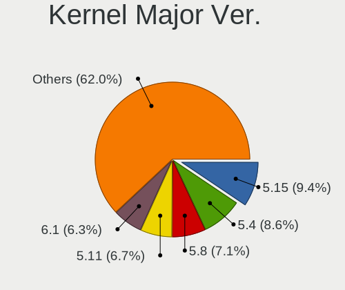
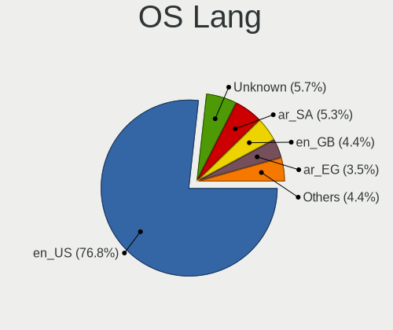
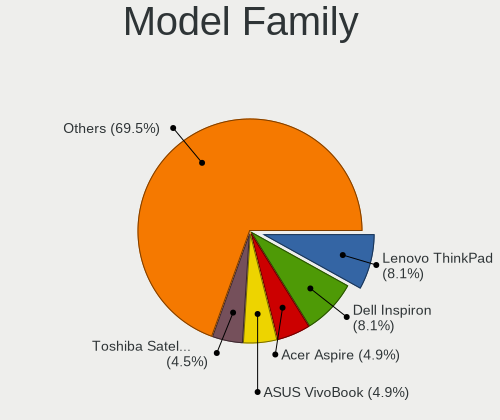
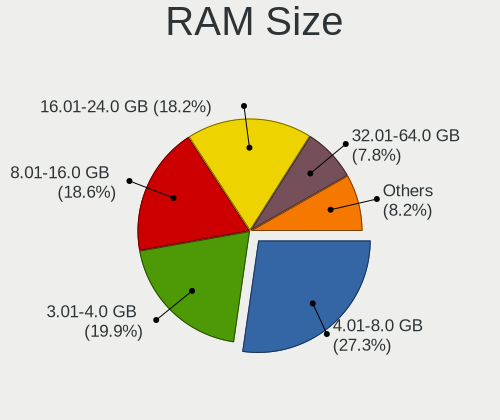
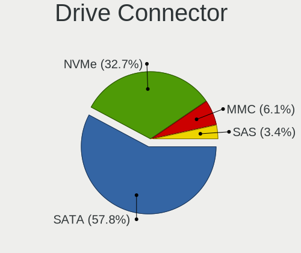
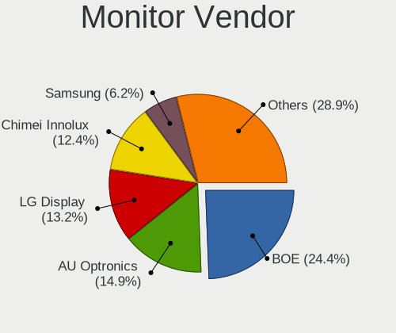
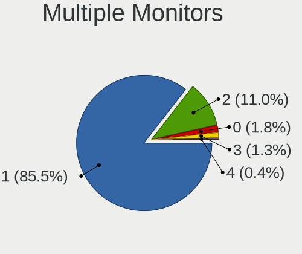
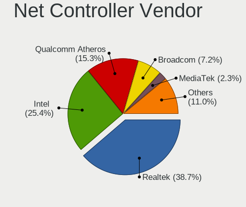

Linux in Saudi Arabia - Tested Hardware & Statistics (Notebooks)
----------------------------------------------------------------

A project to collect tested hardware configurations for Linux in Saudi Arabia.

Anyone can contribute to this report by the [hw-probe](https://github.com/linuxhw/hw-probe) tool:

    sudo -E hw-probe -all -upload

Please contribute! Especially if your hardware is rare.

Contents
--------

* [ Test Cases ](#test-cases)

* [ System ](#system)
  - [ OS                       ](#os)
  - [ OS Family                ](#os-family)
  - [ Kernel                   ](#kernel)
  - [ Kernel Family            ](#kernel-family)
  - [ Kernel Major Ver.        ](#kernel-major-ver)
  - [ Arch                     ](#arch)
  - [ DE                       ](#de)
  - [ Display Server           ](#display-server)
  - [ Display Manager          ](#display-manager)
  - [ OS Lang                  ](#os-lang)
  - [ Boot Mode                ](#boot-mode)
  - [ Filesystem               ](#filesystem)
  - [ Part. scheme             ](#part-scheme)
  - [ Dual Boot with Linux/BSD ](#dual-boot-with-linuxbsd)
  - [ Dual Boot (Win)          ](#dual-boot-win)

* [ Board ](#board)
  - [ Vendor                   ](#vendor)
  - [ Model                    ](#model)
  - [ Model Family             ](#model-family)
  - [ MFG Year                 ](#mfg-year)
  - [ Form Factor              ](#form-factor)
  - [ Secure Boot              ](#secure-boot)
  - [ Coreboot                 ](#coreboot)
  - [ RAM Size                 ](#ram-size)
  - [ RAM Used                 ](#ram-used)
  - [ Total Drives             ](#total-drives)
  - [ Has CD-ROM               ](#has-cd-rom)
  - [ Has Ethernet             ](#has-ethernet)
  - [ Has WiFi                 ](#has-wifi)
  - [ Has Bluetooth            ](#has-bluetooth)

* [ Location ](#location)
  - [ Country                  ](#country)
  - [ City                     ](#city)

* [ Drives ](#drives)
  - [ Drive Vendor             ](#drive-vendor)
  - [ Drive Model              ](#drive-model)
  - [ HDD Vendor               ](#hdd-vendor)
  - [ SSD Vendor               ](#ssd-vendor)
  - [ Drive Kind               ](#drive-kind)
  - [ Drive Connector          ](#drive-connector)
  - [ Drive Size               ](#drive-size)
  - [ Space Total              ](#space-total)
  - [ Space Used               ](#space-used)
  - [ Malfunc. Drives          ](#malfunc-drives)
  - [ Malfunc. Drive Vendor    ](#malfunc-drive-vendor)
  - [ Malfunc. HDD Vendor      ](#malfunc-hdd-vendor)
  - [ Malfunc. Drive Kind      ](#malfunc-drive-kind)
  - [ Failed Drives            ](#failed-drives)
  - [ Failed Drive Vendor      ](#failed-drive-vendor)
  - [ Drive Status             ](#drive-status)

* [ Storage controller ](#storage-controller)
  - [ Storage Vendor           ](#storage-vendor)
  - [ Storage Model            ](#storage-model)
  - [ Storage Kind             ](#storage-kind)

* [ Processor ](#processor)
  - [ CPU Vendor               ](#cpu-vendor)
  - [ CPU Model                ](#cpu-model)
  - [ CPU Model Family         ](#cpu-model-family)
  - [ CPU Cores                ](#cpu-cores)
  - [ CPU Sockets              ](#cpu-sockets)
  - [ CPU Threads              ](#cpu-threads)
  - [ CPU Op-Modes             ](#cpu-op-modes)
  - [ CPU Microcode            ](#cpu-microcode)
  - [ CPU Microarch            ](#cpu-microarch)

* [ Graphics ](#graphics)
  - [ GPU Vendor               ](#gpu-vendor)
  - [ GPU Model                ](#gpu-model)
  - [ GPU Combo                ](#gpu-combo)
  - [ GPU Driver               ](#gpu-driver)
  - [ GPU Memory               ](#gpu-memory)

* [ Monitor ](#monitor)
  - [ Monitor Vendor           ](#monitor-vendor)
  - [ Monitor Model            ](#monitor-model)
  - [ Monitor Resolution       ](#monitor-resolution)
  - [ Monitor Diagonal         ](#monitor-diagonal)
  - [ Monitor Width            ](#monitor-width)
  - [ Aspect Ratio             ](#aspect-ratio)
  - [ Monitor Area             ](#monitor-area)
  - [ Pixel Density            ](#pixel-density)
  - [ Multiple Monitors        ](#multiple-monitors)

* [ Network ](#network)
  - [ Net Controller Vendor    ](#net-controller-vendor)
  - [ Net Controller Model     ](#net-controller-model)
  - [ Wireless Vendor          ](#wireless-vendor)
  - [ Wireless Model           ](#wireless-model)
  - [ Ethernet Vendor          ](#ethernet-vendor)
  - [ Ethernet Model           ](#ethernet-model)
  - [ Net Controller Kind      ](#net-controller-kind)
  - [ Used Controller          ](#used-controller)
  - [ NICs                     ](#nics)
  - [ IPv6                     ](#ipv6)

* [ Bluetooth ](#bluetooth)
  - [ Bluetooth Vendor         ](#bluetooth-vendor)
  - [ Bluetooth Model          ](#bluetooth-model)

* [ Sound ](#sound)
  - [ Sound Vendor             ](#sound-vendor)
  - [ Sound Model              ](#sound-model)

* [ Memory ](#memory)
  - [ Memory Vendor            ](#memory-vendor)
  - [ Memory Model             ](#memory-model)
  - [ Memory Kind              ](#memory-kind)
  - [ Memory Form Factor       ](#memory-form-factor)
  - [ Memory Size              ](#memory-size)
  - [ Memory Speed             ](#memory-speed)

* [ Printers & scanners ](#printers--scanners)
  - [ Printer Vendor           ](#printer-vendor)
  - [ Printer Model            ](#printer-model)
  - [ Scanner Vendor           ](#scanner-vendor)
  - [ Scanner Model            ](#scanner-model)

* [ Camera ](#camera)
  - [ Camera Vendor            ](#camera-vendor)
  - [ Camera Model             ](#camera-model)

* [ Security ](#security)
  - [ Fingerprint Vendor       ](#fingerprint-vendor)
  - [ Fingerprint Model        ](#fingerprint-model)
  - [ Chipcard Vendor          ](#chipcard-vendor)
  - [ Chipcard Model           ](#chipcard-model)

* [ Unsupported ](#unsupported)
  - [ Unsupported Devices      ](#unsupported-devices)
  - [ Unsupported Device Types ](#unsupported-device-types)

Test Cases
----------

Total: 373

| Vendor        | Model                       | Probe                                                      | Date         |
|---------------|-----------------------------|------------------------------------------------------------|--------------|
| Lenovo        | ThinkPad Edge 0301FFG       | [526994e0a4](https://linux-hardware.org/?probe=526994e0a4) | Dec 31, 2024 |
| ASUSTek       | Zenbook UX3402ZA            | [be06529f29](https://linux-hardware.org/?probe=be06529f29) | Dec 28, 2024 |
| Lenovo        | ThinkPad T440s 20ARA000A... | [606caa4eb0](https://linux-hardware.org/?probe=606caa4eb0) | Dec 22, 2024 |
| Lenovo        | ThinkPad T440s 20ARA000A... | [813d572708](https://linux-hardware.org/?probe=813d572708) | Dec 22, 2024 |
| HUAWEI        | KLVD-WXX9                   | [a5df0d3fd9](https://linux-hardware.org/?probe=a5df0d3fd9) | Dec 22, 2024 |
| Apple         | MacBookPro12,1              | [e4de3821da](https://linux-hardware.org/?probe=e4de3821da) | Dec 20, 2024 |
| Dell          | Inspiron 3542               | [f75f271653](https://linux-hardware.org/?probe=f75f271653) | Dec 03, 2024 |
| Dell          | Inspiron 3542               | [841b30c302](https://linux-hardware.org/?probe=841b30c302) | Dec 03, 2024 |
| Lenovo        | IdeaPad Gaming 3 15IHU6 ... | [c56cdb7a5f](https://linux-hardware.org/?probe=c56cdb7a5f) | Nov 30, 2024 |
| Lenovo        | IdeaPad Gaming 3 15IHU6 ... | [eaca726e51](https://linux-hardware.org/?probe=eaca726e51) | Nov 30, 2024 |
| Apple         | MacBookPro11,3              | [3d753784a0](https://linux-hardware.org/?probe=3d753784a0) | Nov 28, 2024 |
| HP            | Laptop 15g-br1xx            | [f51b7c2e9d](https://linux-hardware.org/?probe=f51b7c2e9d) | Nov 20, 2024 |
| Valve         | Jupiter                     | [f811772f91](https://linux-hardware.org/?probe=f811772f91) | Nov 09, 2024 |
| Valve         | Jupiter                     | [44366fc1ea](https://linux-hardware.org/?probe=44366fc1ea) | Nov 06, 2024 |
| Toshiba       | Satellite P55W-C            | [84c58de68f](https://linux-hardware.org/?probe=84c58de68f) | Oct 23, 2024 |
| Toshiba       | Satellite P55W-C            | [2fbe7927f9](https://linux-hardware.org/?probe=2fbe7927f9) | Oct 23, 2024 |
| HP            | Laptop 15-da2xxx            | [2993fbf2fd](https://linux-hardware.org/?probe=2993fbf2fd) | Oct 23, 2024 |
| Valve         | Jupiter                     | [2cc13c14ff](https://linux-hardware.org/?probe=2cc13c14ff) | Oct 11, 2024 |
| Dell          | Inspiron 7577               | [42d1b5a375](https://linux-hardware.org/?probe=42d1b5a375) | Oct 08, 2024 |
| Lenovo        | ThinkPad E14 Gen 4 21E30... | [f497c7ae2d](https://linux-hardware.org/?probe=f497c7ae2d) | Sep 30, 2024 |
| Acer          | Swift SFX14-41G             | [ec357b358b](https://linux-hardware.org/?probe=ec357b358b) | Sep 24, 2024 |
| Dell          | Inspiron 7577               | [ebda65fac2](https://linux-hardware.org/?probe=ebda65fac2) | Sep 23, 2024 |
| Lenovo        | ThinkPad P1 20MD001WUS      | [946c8f41c7](https://linux-hardware.org/?probe=946c8f41c7) | Sep 21, 2024 |
| MSI           | Modern 14 B5M               | [9978e53d19](https://linux-hardware.org/?probe=9978e53d19) | Sep 08, 2024 |
| Lenovo        | ThinkPad X1 Carbon 6th 2... | [483fb4e9e2](https://linux-hardware.org/?probe=483fb4e9e2) | Sep 07, 2024 |
| MSI           | Modern 14 B5M               | [3d4ad593f5](https://linux-hardware.org/?probe=3d4ad593f5) | Sep 02, 2024 |
| ASUSTek       | VivoBook_ASUSLaptop X512... | [5977adeb69](https://linux-hardware.org/?probe=5977adeb69) | Aug 27, 2024 |
| Lenovo        | IdeaPad Gaming 3 15IHU6 ... | [affe4b35c6](https://linux-hardware.org/?probe=affe4b35c6) | Aug 18, 2024 |
| ASUSTek       | VivoBook_ASUSLaptop M150... | [7a840c3125](https://linux-hardware.org/?probe=7a840c3125) | Aug 18, 2024 |
| Lenovo        | IdeaPad 5 15ITL05 82FG      | [d55a76a395](https://linux-hardware.org/?probe=d55a76a395) | Aug 17, 2024 |
| MSI           | GP73 Leopard 8RE            | [ece6c56479](https://linux-hardware.org/?probe=ece6c56479) | Aug 17, 2024 |
| ASUSTek       | VivoBook_ASUSLaptop X512... | [752156b44a](https://linux-hardware.org/?probe=752156b44a) | Aug 16, 2024 |
| Lenovo        | ThinkPad X1 Carbon Gen 8... | [8a69009d48](https://linux-hardware.org/?probe=8a69009d48) | Aug 15, 2024 |
| Lenovo        | ThinkPad X1 Carbon Gen 8... | [fc2c81e0a1](https://linux-hardware.org/?probe=fc2c81e0a1) | Aug 11, 2024 |
| Lenovo        | ThinkPad P16v Gen 1 21FD... | [ad6eb57434](https://linux-hardware.org/?probe=ad6eb57434) | Aug 09, 2024 |
| Lenovo        | ThinkPad X1 Carbon 6th 2... | [9f1f1cd1fe](https://linux-hardware.org/?probe=9f1f1cd1fe) | Aug 01, 2024 |
| Lenovo        | ThinkPad X1 Carbon 6th 2... | [637a30175e](https://linux-hardware.org/?probe=637a30175e) | Jul 28, 2024 |
| Apple         | MacBookPro11,3              | [2cb98cd569](https://linux-hardware.org/?probe=2cb98cd569) | Jul 27, 2024 |
| HP            | Pavilion Laptop 15-eh0xx... | [ba13a043f7](https://linux-hardware.org/?probe=ba13a043f7) | Jul 25, 2024 |
| HP            | Pavilion Laptop 15-eh0xx... | [6e210dbe32](https://linux-hardware.org/?probe=6e210dbe32) | Jul 24, 2024 |
| Fujitsu       | CELSIUS H730                | [0882a15af4](https://linux-hardware.org/?probe=0882a15af4) | Jul 23, 2024 |
| ASUSTek       | ROG Flow X13 GV301QE_GV3... | [78050f4878](https://linux-hardware.org/?probe=78050f4878) | Jul 20, 2024 |
| ASUSTek       | ROG Flow X13 GV301QE_GV3... | [1d6f70595c](https://linux-hardware.org/?probe=1d6f70595c) | Jul 19, 2024 |
| ASUSTek       | S550CM                      | [effe093e11](https://linux-hardware.org/?probe=effe093e11) | Jul 17, 2024 |
| Valve         | Galileo                     | [c81b1ef308](https://linux-hardware.org/?probe=c81b1ef308) | Jul 14, 2024 |
| Dell          | G3 3590                     | [df288cdcaf](https://linux-hardware.org/?probe=df288cdcaf) | Jul 14, 2024 |
| ASUSTek       | VivoBook_ASUSLaptop X512... | [a7eb520a49](https://linux-hardware.org/?probe=a7eb520a49) | Jul 12, 2024 |
| ASUSTek       | VivoBook_ASUSLaptop X512... | [05aecfd062](https://linux-hardware.org/?probe=05aecfd062) | Jul 12, 2024 |
| Lenovo        | G580 20150                  | [5137ace569](https://linux-hardware.org/?probe=5137ace569) | Jul 08, 2024 |
| Lenovo        | G580 20150                  | [c4c28daaee](https://linux-hardware.org/?probe=c4c28daaee) | Jul 07, 2024 |
| ASUSTek       | VivoBook_ASUSLaptop X512... | [48b56d8828](https://linux-hardware.org/?probe=48b56d8828) | Jul 02, 2024 |
| Apple         | MacBookPro11,3              | [6aa7f99b04](https://linux-hardware.org/?probe=6aa7f99b04) | Jun 26, 2024 |
| Razer         | Blade Pro                   | [4e48c6dcde](https://linux-hardware.org/?probe=4e48c6dcde) | Jun 26, 2024 |
| I-Life Dig... | ZED AIR                     | [3d4f3140df](https://linux-hardware.org/?probe=3d4f3140df) | Jun 16, 2024 |
| I-Life Dig... | ZED AIR                     | [c62f439782](https://linux-hardware.org/?probe=c62f439782) | Jun 16, 2024 |
| HUAWEI        | KLVG-XX                     | [b1f7ffbf4a](https://linux-hardware.org/?probe=b1f7ffbf4a) | Jun 14, 2024 |
| ASUSTek       | VivoBook_ASUSLaptop X512... | [e570948d49](https://linux-hardware.org/?probe=e570948d49) | Jun 10, 2024 |
| MSI           | Modern 14 B4MW              | [ed6e21156a](https://linux-hardware.org/?probe=ed6e21156a) | Jun 10, 2024 |
| HP            | Laptop 15-da2xxx            | [bcf8969f1e](https://linux-hardware.org/?probe=bcf8969f1e) | May 31, 2024 |
| Valve         | Jupiter                     | [44a1aa1433](https://linux-hardware.org/?probe=44a1aa1433) | May 27, 2024 |
| Valve         | Jupiter                     | [1ddb224c47](https://linux-hardware.org/?probe=1ddb224c47) | May 27, 2024 |
| Lenovo        | ThinkPad P50 20EQS3X10C     | [cfccc1ca5a](https://linux-hardware.org/?probe=cfccc1ca5a) | May 27, 2024 |
| Lenovo        | ThinkPad P50 20EQS3X10C     | [2859984d97](https://linux-hardware.org/?probe=2859984d97) | May 19, 2024 |
| Valve         | Galileo                     | [1c500922b5](https://linux-hardware.org/?probe=1c500922b5) | May 19, 2024 |
| Valve         | Galileo                     | [9549cb7d85](https://linux-hardware.org/?probe=9549cb7d85) | May 19, 2024 |
| Valve         | Galileo                     | [a85c23cf18](https://linux-hardware.org/?probe=a85c23cf18) | May 19, 2024 |
| HP            | Pavilion Laptop 15-eh0xx... | [c12c2839cb](https://linux-hardware.org/?probe=c12c2839cb) | May 19, 2024 |
| HP            | Pavilion Laptop 15-eh0xx... | [73bdf58ea3](https://linux-hardware.org/?probe=73bdf58ea3) | May 15, 2024 |
| HP            | Laptop 15-da2xxx            | [d553213278](https://linux-hardware.org/?probe=d553213278) | May 10, 2024 |
| HP            | Pavilion Laptop 15-eh0xx... | [cf6fc980de](https://linux-hardware.org/?probe=cf6fc980de) | May 07, 2024 |
| HP            | Pavilion Laptop 15-eh0xx... | [3380a14ae9](https://linux-hardware.org/?probe=3380a14ae9) | May 02, 2024 |
| MSI           | GL75 Leopard 10SFK          | [2cde0c8054](https://linux-hardware.org/?probe=2cde0c8054) | Apr 28, 2024 |
| Valve         | Jupiter                     | [8cd7c7653a](https://linux-hardware.org/?probe=8cd7c7653a) | Apr 07, 2024 |
| Lenovo        | B50-70 20384                | [f78c6087ac](https://linux-hardware.org/?probe=f78c6087ac) | Mar 31, 2024 |
| HUAWEI        | BOD-WXX9                    | [f07c7e7a17](https://linux-hardware.org/?probe=f07c7e7a17) | Mar 23, 2024 |
| ASUSTek       | X541SA                      | [4f1901506d](https://linux-hardware.org/?probe=4f1901506d) | Mar 22, 2024 |
| MSI           | GF63 Thin 8SC               | [bbc6edbc2d](https://linux-hardware.org/?probe=bbc6edbc2d) | Mar 09, 2024 |
| ASUSTek       | GL552VX                     | [01ea0912c3](https://linux-hardware.org/?probe=01ea0912c3) | Mar 03, 2024 |
| Dell          | Inspiron 3581               | [62a3c2b526](https://linux-hardware.org/?probe=62a3c2b526) | Feb 11, 2024 |
| Lenovo        | Unknown                     | [46ccd12f05](https://linux-hardware.org/?probe=46ccd12f05) | Feb 04, 2024 |
| Dell          | Inspiron 3581               | [7a5cfbd8d3](https://linux-hardware.org/?probe=7a5cfbd8d3) | Jan 25, 2024 |
| Dell          | Inspiron 3581               | [dbf2745f1f](https://linux-hardware.org/?probe=dbf2745f1f) | Jan 25, 2024 |
| Dell          | Latitude E5540              | [2e1716a6aa](https://linux-hardware.org/?probe=2e1716a6aa) | Jan 22, 2024 |
| HP            | ENVY TS 15                  | [4d83b8cef9](https://linux-hardware.org/?probe=4d83b8cef9) | Jan 19, 2024 |
| Toshiba       | Satellite C850-B820         | [321a8ae666](https://linux-hardware.org/?probe=321a8ae666) | Jan 17, 2024 |
| HP            | Pavilion Notebook           | [a4afc8bb1f](https://linux-hardware.org/?probe=a4afc8bb1f) | Jan 12, 2024 |
| Dell          | Inspiron 1525               | [debaccaee2](https://linux-hardware.org/?probe=debaccaee2) | Jan 04, 2024 |
| Dell          | G3 3590                     | [681f15e9c0](https://linux-hardware.org/?probe=681f15e9c0) | Dec 27, 2023 |
| Dell          | G3 3590                     | [f009abd381](https://linux-hardware.org/?probe=f009abd381) | Nov 25, 2023 |
| Dell          | Inspiron N5110              | [78992043bf](https://linux-hardware.org/?probe=78992043bf) | Nov 20, 2023 |
| Valve         | Jupiter                     | [97695463df](https://linux-hardware.org/?probe=97695463df) | Nov 17, 2023 |
| Valve         | Jupiter                     | [8734420ff1](https://linux-hardware.org/?probe=8734420ff1) | Nov 17, 2023 |
| HUAWEI        | KLVL-WXX9                   | [e45cab7f2c](https://linux-hardware.org/?probe=e45cab7f2c) | Nov 12, 2023 |
| Acer          | Aspire 5920                 | [02fa7cf5bb](https://linux-hardware.org/?probe=02fa7cf5bb) | Nov 03, 2023 |
| Dell          | XPS 15 9520                 | [6b6da0ca4a](https://linux-hardware.org/?probe=6b6da0ca4a) | Nov 01, 2023 |
| Toshiba       | Satellite C650              | [5236a2eca3](https://linux-hardware.org/?probe=5236a2eca3) | Oct 26, 2023 |
| HP            | Laptop 15-da2xxx            | [6f746b3af3](https://linux-hardware.org/?probe=6f746b3af3) | Oct 23, 2023 |
| Dell          | Latitude E6520              | [e29f6e9ba8](https://linux-hardware.org/?probe=e29f6e9ba8) | Oct 11, 2023 |
| Apple         | MacBookPro11,5              | [98784d1e51](https://linux-hardware.org/?probe=98784d1e51) | Oct 08, 2023 |
| HP            | ProBook 6560b               | [c4710bf9c2](https://linux-hardware.org/?probe=c4710bf9c2) | Oct 01, 2023 |
| Lenovo        | IdeaPad 3 14IIL05 81WD      | [683cbd037a](https://linux-hardware.org/?probe=683cbd037a) | Sep 23, 2023 |
| Apple         | MacBookPro9,2               | [8064cec888](https://linux-hardware.org/?probe=8064cec888) | Sep 17, 2023 |
| Apple         | MacBook5,2                  | [7cdaac7be4](https://linux-hardware.org/?probe=7cdaac7be4) | Sep 16, 2023 |
| Apple         | MacBook5,2                  | [192e02b434](https://linux-hardware.org/?probe=192e02b434) | Sep 15, 2023 |
| Dell          | Inspiron 5537               | [b06966adc5](https://linux-hardware.org/?probe=b06966adc5) | Sep 14, 2023 |
| Dell          | Inspiron 5537               | [9f459c45cc](https://linux-hardware.org/?probe=9f459c45cc) | Sep 14, 2023 |
| Apple         | MacBookPro8,1               | [f913de368f](https://linux-hardware.org/?probe=f913de368f) | Sep 07, 2023 |
| Apple         | MacBookPro8,1               | [423b8d7135](https://linux-hardware.org/?probe=423b8d7135) | Sep 07, 2023 |
| Lenovo        | B40-70 20392                | [ebf45c27f4](https://linux-hardware.org/?probe=ebf45c27f4) | Aug 07, 2023 |
| Lenovo        | B40-70 20392                | [221f9de00a](https://linux-hardware.org/?probe=221f9de00a) | Aug 06, 2023 |
| GIADA         | Unknown                     | [cd8b23468a](https://linux-hardware.org/?probe=cd8b23468a) | Aug 03, 2023 |
| Toshiba       | Satellite C850-B239         | [a075f60c70](https://linux-hardware.org/?probe=a075f60c70) | Aug 02, 2023 |
| Unknown       | Unknown                     | [570c98e6ab](https://linux-hardware.org/?probe=570c98e6ab) | Aug 01, 2023 |
| Unknown       | Unknown                     | [f54f3f3a4b](https://linux-hardware.org/?probe=f54f3f3a4b) | Aug 01, 2023 |
| Valve         | Jupiter                     | [fc294ac015](https://linux-hardware.org/?probe=fc294ac015) | Jul 27, 2023 |
| HP            | EliteBook 840 G5            | [f371e0efe5](https://linux-hardware.org/?probe=f371e0efe5) | Jul 22, 2023 |
| ASUSTek       | VivoBook_ASUSLaptop M150... | [55639a6416](https://linux-hardware.org/?probe=55639a6416) | Jul 21, 2023 |
| ASUSTek       | VivoBook_ASUSLaptop M150... | [8b2077101c](https://linux-hardware.org/?probe=8b2077101c) | Jul 21, 2023 |
| Acer          | Aspire A715-42G             | [ac10700edb](https://linux-hardware.org/?probe=ac10700edb) | Jul 13, 2023 |
| Dell          | G3 3590                     | [adf89d2bba](https://linux-hardware.org/?probe=adf89d2bba) | Jul 12, 2023 |
| Lenovo        | B40-70 20392                | [02a31c9704](https://linux-hardware.org/?probe=02a31c9704) | Jul 01, 2023 |
| Lenovo        | B40-70 20392                | [45739a208c](https://linux-hardware.org/?probe=45739a208c) | Jul 01, 2023 |
| Dell          | Latitude 3520               | [6e996e08f9](https://linux-hardware.org/?probe=6e996e08f9) | Jul 01, 2023 |
| ASUSTek       | TUF Gaming FX505DT_FX505... | [39ec9cf6c4](https://linux-hardware.org/?probe=39ec9cf6c4) | Jun 27, 2023 |
| Dell          | Inspiron 3576               | [c756e98d81](https://linux-hardware.org/?probe=c756e98d81) | Jun 24, 2023 |
| Dell          | Inspiron 3576               | [874b84ce94](https://linux-hardware.org/?probe=874b84ce94) | Jun 24, 2023 |
| HP            | Laptop 15-da0xxx            | [7da8691a87](https://linux-hardware.org/?probe=7da8691a87) | Jun 17, 2023 |
| HP            | Laptop 15-da1xxx            | [5bc14dc937](https://linux-hardware.org/?probe=5bc14dc937) | Jun 12, 2023 |
| Valve         | Jupiter                     | [8c9765a31c](https://linux-hardware.org/?probe=8c9765a31c) | Jun 11, 2023 |
| Toshiba       | Satellite L635              | [4f124d1525](https://linux-hardware.org/?probe=4f124d1525) | Jun 09, 2023 |
| Valve         | Jupiter                     | [d21eb9432c](https://linux-hardware.org/?probe=d21eb9432c) | Jun 03, 2023 |
| Dell          | Latitude E6520              | [bb8bc9b8ae](https://linux-hardware.org/?probe=bb8bc9b8ae) | May 24, 2023 |
| Google        | Akemi                       | [595f8b1a24](https://linux-hardware.org/?probe=595f8b1a24) | May 20, 2023 |
| ASUSTek       | ROG Zephyrus G14 GA401IV... | [93979d632e](https://linux-hardware.org/?probe=93979d632e) | May 15, 2023 |
| Lenovo        | IdeaPad Z470                | [2b11351f94](https://linux-hardware.org/?probe=2b11351f94) | May 14, 2023 |
| Samsung       | 300E4A/300E5A/300E7A/343... | [155b921e10](https://linux-hardware.org/?probe=155b921e10) | May 13, 2023 |
| Lenovo        | Legion 5 Pro 16ACH6H 82J... | [38806ed70c](https://linux-hardware.org/?probe=38806ed70c) | Apr 24, 2023 |
| HUAWEI        | KLVD-WXX9                   | [ae500cf4af](https://linux-hardware.org/?probe=ae500cf4af) | Apr 22, 2023 |
| Samsung       | 300E4A/300E5A/300E7A/343... | [3e9d210a94](https://linux-hardware.org/?probe=3e9d210a94) | Apr 16, 2023 |
| ASUSTek       | ZenBook UX435EG_UX435EG     | [4b338ba7f9](https://linux-hardware.org/?probe=4b338ba7f9) | Apr 15, 2023 |
| HP            | Laptop 15-da1xxx            | [84c8a107d4](https://linux-hardware.org/?probe=84c8a107d4) | Apr 06, 2023 |
| Acer          | Aspire ES1-572              | [39e1087c79](https://linux-hardware.org/?probe=39e1087c79) | Apr 04, 2023 |
| Apple         | MacBookAir7,2               | [9509c77e2b](https://linux-hardware.org/?probe=9509c77e2b) | Mar 13, 2023 |
| ASUSTek       | ROG Zephyrus G15 GA503QM... | [b8ea458df5](https://linux-hardware.org/?probe=b8ea458df5) | Mar 08, 2023 |
| Sony          | VGN-FZ250E                  | [ca7937209b](https://linux-hardware.org/?probe=ca7937209b) | Mar 06, 2023 |
| Lenovo        | IdeaPad Gaming 3 15IMH05... | [d488fc0d9a](https://linux-hardware.org/?probe=d488fc0d9a) | Feb 22, 2023 |
| HP            | Laptop 15-da2xxx            | [76cbc7df6d](https://linux-hardware.org/?probe=76cbc7df6d) | Feb 21, 2023 |
| ASUSTek       | TUF Gaming FX505DU_FX505... | [e70b65f78d](https://linux-hardware.org/?probe=e70b65f78d) | Feb 20, 2023 |
| Dell          | Latitude E6520              | [b04c6e8984](https://linux-hardware.org/?probe=b04c6e8984) | Feb 18, 2023 |
| HUAWEI        | BOHK-WAX9X                  | [bd0b1f7e94](https://linux-hardware.org/?probe=bd0b1f7e94) | Jan 27, 2023 |
| HUAWEI        | BOHK-WAX9X                  | [a22071f9ec](https://linux-hardware.org/?probe=a22071f9ec) | Jan 26, 2023 |
| Acer          | Aspire A315-55G             | [70559c048c](https://linux-hardware.org/?probe=70559c048c) | Jan 25, 2023 |
| HP            | Pavilion Gaming Laptop 1... | [bc55bf24ac](https://linux-hardware.org/?probe=bc55bf24ac) | Jan 21, 2023 |
| HP            | Unknown                     | [fedf225852](https://linux-hardware.org/?probe=fedf225852) | Jan 17, 2023 |
| HP            | Unknown                     | [8b89da1da5](https://linux-hardware.org/?probe=8b89da1da5) | Jan 17, 2023 |
| Lenovo        | ThinkPad S1 Yoga 12 20DL... | [e9e902c625](https://linux-hardware.org/?probe=e9e902c625) | Jan 17, 2023 |
| Lenovo        | ThinkPad S1 Yoga 12 20DL... | [00ebda8ae9](https://linux-hardware.org/?probe=00ebda8ae9) | Jan 17, 2023 |
| Valve         | Jupiter                     | [b927a3e937](https://linux-hardware.org/?probe=b927a3e937) | Jan 16, 2023 |
| Valve         | Jupiter                     | [2b476ca470](https://linux-hardware.org/?probe=2b476ca470) | Jan 16, 2023 |
| MSI           | GF63 Thin 10SC              | [26379f8b8d](https://linux-hardware.org/?probe=26379f8b8d) | Jan 11, 2023 |
| HUAWEI        | KLVD-WXX9                   | [71d684a605](https://linux-hardware.org/?probe=71d684a605) | Jan 11, 2023 |
| Toshiba       | Satellite C850-B561         | [562d6cde14](https://linux-hardware.org/?probe=562d6cde14) | Jan 11, 2023 |
| Lenovo        | Legion 5 Pro 16ACH6H 82J... | [5d3f8e9948](https://linux-hardware.org/?probe=5d3f8e9948) | Jan 09, 2023 |
| HUAWEI        | KLVD-WXX9                   | [e662d0e58a](https://linux-hardware.org/?probe=e662d0e58a) | Jan 07, 2023 |
| Lenovo        | ThinkPad E14 Gen 2 20TA0... | [2c6b6c2558](https://linux-hardware.org/?probe=2c6b6c2558) | Jan 04, 2023 |
| Lenovo        | Legion 5 Pro 16ACH6H 82J... | [d326e34afc](https://linux-hardware.org/?probe=d326e34afc) | Dec 31, 2022 |
| Lenovo        | Legion 5 Pro 16ACH6H 82J... | [816ab16fd0](https://linux-hardware.org/?probe=816ab16fd0) | Dec 30, 2022 |
| Lenovo        | Legion 5 Pro 16ACH6H 82J... | [43e6103cd0](https://linux-hardware.org/?probe=43e6103cd0) | Dec 29, 2022 |
| Toshiba       | Satellite L635              | [be223c0ff1](https://linux-hardware.org/?probe=be223c0ff1) | Dec 03, 2022 |
| Toshiba       | Satellite L500              | [5579ea8656](https://linux-hardware.org/?probe=5579ea8656) | Nov 17, 2022 |
| Dell          | Venue 8 Pro 5830            | [8890410dfc](https://linux-hardware.org/?probe=8890410dfc) | Nov 01, 2022 |
| ASUSTek       | VivoBook_ASUSLaptop X512... | [4c0e49ae2b](https://linux-hardware.org/?probe=4c0e49ae2b) | Oct 23, 2022 |
| Apple         | MacBookPro13,2              | [8eaf391b08](https://linux-hardware.org/?probe=8eaf391b08) | Oct 12, 2022 |
| ASUSTek       | VivoBook_ASUSLaptop X512... | [f7f3439df7](https://linux-hardware.org/?probe=f7f3439df7) | Oct 11, 2022 |
| Dell          | Inspiron 5558               | [61f05a7c32](https://linux-hardware.org/?probe=61f05a7c32) | Oct 10, 2022 |
| Sony          | SVF15A13SAB                 | [7c39add556](https://linux-hardware.org/?probe=7c39add556) | Oct 06, 2022 |
| ASUSTek       | VivoBook_ASUSLaptop X512... | [de59de7b14](https://linux-hardware.org/?probe=de59de7b14) | Oct 04, 2022 |
| Lenovo        | ThinkBook 13s-IML 20RR      | [d153a4f97a](https://linux-hardware.org/?probe=d153a4f97a) | Sep 29, 2022 |
| HUAWEI        | RLEF-XX                     | [7bab2cbc57](https://linux-hardware.org/?probe=7bab2cbc57) | Sep 25, 2022 |
| Dell          | G15 5515                    | [ae769dae75](https://linux-hardware.org/?probe=ae769dae75) | Sep 24, 2022 |
| Dell          | G15 5515                    | [893c248dec](https://linux-hardware.org/?probe=893c248dec) | Sep 24, 2022 |
| Dell          | G15 5515                    | [f308590417](https://linux-hardware.org/?probe=f308590417) | Sep 20, 2022 |
| Dell          | G15 5515                    | [d6a647ab30](https://linux-hardware.org/?probe=d6a647ab30) | Sep 20, 2022 |
| Notebook      | PD5x_7xPNP_PNN_PNT          | [a934e23e1f](https://linux-hardware.org/?probe=a934e23e1f) | Sep 16, 2022 |
| HUAWEI        | BOHB-WAX9                   | [5dc824a596](https://linux-hardware.org/?probe=5dc824a596) | Sep 16, 2022 |
| Notebook      | NH5xAx                      | [e8487cd15f](https://linux-hardware.org/?probe=e8487cd15f) | Aug 31, 2022 |
| Lenovo        | IdeaPad 320-15IKB 81BT      | [ef34b3c3aa](https://linux-hardware.org/?probe=ef34b3c3aa) | Aug 31, 2022 |
| Dell          | Vostro 15 3515              | [4ecdbb8b4b](https://linux-hardware.org/?probe=4ecdbb8b4b) | Aug 15, 2022 |
| Acer          | Aspire 4752                 | [9854c38629](https://linux-hardware.org/?probe=9854c38629) | Aug 14, 2022 |
| HP            | Pavilion Gaming Laptop 1... | [ed6b6ce93e](https://linux-hardware.org/?probe=ed6b6ce93e) | Aug 03, 2022 |
| eMachines     | Unknown                     | [8c6dcb08a7](https://linux-hardware.org/?probe=8c6dcb08a7) | Jul 31, 2022 |
| Lenovo        | B590 20206                  | [f9eddff413](https://linux-hardware.org/?probe=f9eddff413) | Jun 19, 2022 |
| MSI           | GF63 Thin 8RCS              | [8cd1ebfa12](https://linux-hardware.org/?probe=8cd1ebfa12) | May 22, 2022 |
| Lenovo        | IdeaPad Gaming 3 15ACH6 ... | [c34e9b0da7](https://linux-hardware.org/?probe=c34e9b0da7) | May 05, 2022 |
| Lenovo        | IdeaPad Gaming 3 15ACH6 ... | [b6dc8a3fc8](https://linux-hardware.org/?probe=b6dc8a3fc8) | May 05, 2022 |
| Dell          | Inspiron 3580               | [51d4e9a2e2](https://linux-hardware.org/?probe=51d4e9a2e2) | May 05, 2022 |
| ASUSTek       | ROG Zephyrus G14 GA401IV... | [720d11c11f](https://linux-hardware.org/?probe=720d11c11f) | May 04, 2022 |
| Acer          | Aspire V3-571               | [9cab38ff4f](https://linux-hardware.org/?probe=9cab38ff4f) | May 01, 2022 |
| Dell          | Inspiron 3580               | [794ab7ba41](https://linux-hardware.org/?probe=794ab7ba41) | Apr 28, 2022 |
| Dell          | Inspiron 3542               | [196f849315](https://linux-hardware.org/?probe=196f849315) | Apr 18, 2022 |
| Lenovo        | ThinkPad L14 Gen 2 20X10... | [6f75f679f9](https://linux-hardware.org/?probe=6f75f679f9) | Apr 16, 2022 |
| Lenovo        | ThinkPad L14 Gen 2 20X10... | [1f799cdbef](https://linux-hardware.org/?probe=1f799cdbef) | Apr 09, 2022 |
| Lenovo        | ThinkPad L14 Gen 2 20X10... | [45548a6fe5](https://linux-hardware.org/?probe=45548a6fe5) | Apr 07, 2022 |
| Lenovo        | ThinkPad X1 Carbon 7th 2... | [10c6384de8](https://linux-hardware.org/?probe=10c6384de8) | Mar 25, 2022 |
| Dell          | Inspiron 14-3467            | [50131c5da4](https://linux-hardware.org/?probe=50131c5da4) | Mar 21, 2022 |
| Acer          | AO751h                      | [23737182d1](https://linux-hardware.org/?probe=23737182d1) | Mar 21, 2022 |
| Acer          | AO751h                      | [edea28357c](https://linux-hardware.org/?probe=edea28357c) | Mar 18, 2022 |
| ASUSTek       | K53SC                       | [43b019326c](https://linux-hardware.org/?probe=43b019326c) | Feb 12, 2022 |
| ASUSTek       | K53SC                       | [70f23c3da0](https://linux-hardware.org/?probe=70f23c3da0) | Feb 12, 2022 |
| Dell          | XPS 13 9310                 | [40c74584ee](https://linux-hardware.org/?probe=40c74584ee) | Feb 03, 2022 |
| Acer          | Aspire V3-571               | [ed5c6cf88d](https://linux-hardware.org/?probe=ed5c6cf88d) | Jan 24, 2022 |
| HP            | 15                          | [4dde4c5c0e](https://linux-hardware.org/?probe=4dde4c5c0e) | Jan 17, 2022 |
| Lenovo        | ThinkPad L14 Gen 2 20X10... | [261fe8bda7](https://linux-hardware.org/?probe=261fe8bda7) | Jan 07, 2022 |
| Sony          | VPCCA35FA                   | [85f4fcc0b6](https://linux-hardware.org/?probe=85f4fcc0b6) | Jan 03, 2022 |
| Sony          | VPCCA35FA                   | [f69299cbfb](https://linux-hardware.org/?probe=f69299cbfb) | Jan 03, 2022 |
| Dell          | Inspiron 3521               | [af800e1071](https://linux-hardware.org/?probe=af800e1071) | Dec 29, 2021 |
| Packard Be... | EasyNote TJ65               | [b98b9252fa](https://linux-hardware.org/?probe=b98b9252fa) | Dec 29, 2021 |
| Lenovo        | ThinkPad L14 Gen 2 20X10... | [938d24e76e](https://linux-hardware.org/?probe=938d24e76e) | Dec 27, 2021 |
| HP            | EliteBook 8440p             | [0dc23e59a4](https://linux-hardware.org/?probe=0dc23e59a4) | Dec 19, 2021 |
| Acer          | Aspire V3-571               | [071a8f0709](https://linux-hardware.org/?probe=071a8f0709) | Dec 15, 2021 |
| Acer          | Aspire V3-571               | [54680bac44](https://linux-hardware.org/?probe=54680bac44) | Dec 12, 2021 |
| Lenovo        | ThinkPad L14 Gen 2 20X10... | [181607bac3](https://linux-hardware.org/?probe=181607bac3) | Dec 10, 2021 |
| Lenovo        | ThinkPad L14 Gen 2 20X10... | [c1de54b513](https://linux-hardware.org/?probe=c1de54b513) | Dec 10, 2021 |
| Lenovo        | ThinkPad L14 Gen 2 20X10... | [bb9141f09c](https://linux-hardware.org/?probe=bb9141f09c) | Dec 09, 2021 |
| Lenovo        | ThinkPad L14 Gen 2 20X10... | [b3c42ca2c2](https://linux-hardware.org/?probe=b3c42ca2c2) | Dec 09, 2021 |
| Lenovo        | V15-IIL 82C5                | [2a151de62b](https://linux-hardware.org/?probe=2a151de62b) | Dec 08, 2021 |
| Lenovo        | ThinkPad L14 Gen 2 20X10... | [830882c4e6](https://linux-hardware.org/?probe=830882c4e6) | Dec 07, 2021 |
| Toshiba       | Satellite L500              | [5cc2fbfef5](https://linux-hardware.org/?probe=5cc2fbfef5) | Dec 04, 2021 |
| ASUSTek       | ZenBook UX425QA_UM425QA     | [e3acd70236](https://linux-hardware.org/?probe=e3acd70236) | Dec 02, 2021 |
| Lenovo        | ThinkPad E14 20RA008CAD     | [35fab17b69](https://linux-hardware.org/?probe=35fab17b69) | Dec 01, 2021 |
| HP            | EliteBook 8440p             | [cecc697189](https://linux-hardware.org/?probe=cecc697189) | Nov 30, 2021 |
| Toshiba       | Satellite L500              | [46d5208475](https://linux-hardware.org/?probe=46d5208475) | Nov 28, 2021 |
| Lenovo        | V15-IIL 82C5                | [e37587fbac](https://linux-hardware.org/?probe=e37587fbac) | Nov 23, 2021 |
| Lenovo        | V15-IIL 82C5                | [b050debd0a](https://linux-hardware.org/?probe=b050debd0a) | Nov 22, 2021 |
| Dell          | G3 3590                     | [605f0870d0](https://linux-hardware.org/?probe=605f0870d0) | Nov 16, 2021 |
| Dell          | G3 3590                     | [5bfafc889c](https://linux-hardware.org/?probe=5bfafc889c) | Nov 16, 2021 |
| Lenovo        | ThinkPad E490 20N8000JAD    | [997e24e5c9](https://linux-hardware.org/?probe=997e24e5c9) | Nov 06, 2021 |
| Lenovo        | ThinkPad E490 20N8000JAD    | [9d70a71c88](https://linux-hardware.org/?probe=9d70a71c88) | Nov 06, 2021 |
| Lenovo        | V570 1066AJU                | [ffb36aac10](https://linux-hardware.org/?probe=ffb36aac10) | Nov 05, 2021 |
| Dell          | Inspiron 3593               | [5233ea30c6](https://linux-hardware.org/?probe=5233ea30c6) | Oct 09, 2021 |
| Lenovo        | ThinkPad P52s 20LBS0JC00    | [4c8c63da2f](https://linux-hardware.org/?probe=4c8c63da2f) | Oct 05, 2021 |
| HP            | Laptop 15-da2xxx            | [2e99b047ff](https://linux-hardware.org/?probe=2e99b047ff) | Oct 04, 2021 |
| ASUSTek       | ROG Zephyrus G14 GA401IV... | [de6b4e47d4](https://linux-hardware.org/?probe=de6b4e47d4) | Oct 01, 2021 |
| HP            | Laptop 15-da2xxx            | [28332170d1](https://linux-hardware.org/?probe=28332170d1) | Sep 28, 2021 |
| Dell          | Inspiron N5110              | [8c04a9e8df](https://linux-hardware.org/?probe=8c04a9e8df) | Sep 22, 2021 |
| Acer          | Aspire E5-573G              | [19374f68da](https://linux-hardware.org/?probe=19374f68da) | Sep 21, 2021 |
| Acer          | Aspire V3-571               | [6998aee6d0](https://linux-hardware.org/?probe=6998aee6d0) | Sep 02, 2021 |
| Toshiba       | Satellite C55-B             | [e7a572f322](https://linux-hardware.org/?probe=e7a572f322) | Aug 29, 2021 |
| Toshiba       | Satellite C55-B             | [99dbadcdde](https://linux-hardware.org/?probe=99dbadcdde) | Aug 22, 2021 |
| Dell          | Latitude E7440              | [b87783b728](https://linux-hardware.org/?probe=b87783b728) | Aug 18, 2021 |
| Dell          | Latitude E5470              | [f91acefb07](https://linux-hardware.org/?probe=f91acefb07) | Aug 14, 2021 |
| Dell          | XPS 15 9560                 | [9bae1ef315](https://linux-hardware.org/?probe=9bae1ef315) | Jul 07, 2021 |
| ASUSTek       | K43SJ                       | [f4702e95b4](https://linux-hardware.org/?probe=f4702e95b4) | Jul 05, 2021 |
| Dell          | XPS 15 9560                 | [08fad9a114](https://linux-hardware.org/?probe=08fad9a114) | Jul 03, 2021 |
| Dell          | G3 3590                     | [06d10d0717](https://linux-hardware.org/?probe=06d10d0717) | Jun 26, 2021 |
| Dell          | Inspiron 5437               | [06f25de7e3](https://linux-hardware.org/?probe=06f25de7e3) | Jun 19, 2021 |
| Dell          | Inspiron 5437               | [3fcbd5cd4f](https://linux-hardware.org/?probe=3fcbd5cd4f) | Jun 18, 2021 |
| Dell          | G3 3590                     | [877018f0d3](https://linux-hardware.org/?probe=877018f0d3) | Jun 18, 2021 |
| Dell          | G3 3590                     | [adf875d64d](https://linux-hardware.org/?probe=adf875d64d) | Jun 17, 2021 |
| HP            | Pavilion Gaming Laptop 1... | [d3a001e377](https://linux-hardware.org/?probe=d3a001e377) | Jun 01, 2021 |
| HP            | Pavilion Gaming Laptop 1... | [a4d00095a1](https://linux-hardware.org/?probe=a4d00095a1) | Jun 01, 2021 |
| HP            | ProBook 445 G7              | [88e51bfd39](https://linux-hardware.org/?probe=88e51bfd39) | May 23, 2021 |
| ASUSTek       | GL502VMK                    | [0d9f5609e7](https://linux-hardware.org/?probe=0d9f5609e7) | May 20, 2021 |
| HP            | ProBook 445 G7              | [ed8c410826](https://linux-hardware.org/?probe=ed8c410826) | May 18, 2021 |
| ASUSTek       | ROG Zephyrus G14 GA401IV... | [1d4c05756f](https://linux-hardware.org/?probe=1d4c05756f) | May 01, 2021 |
| ASUSTek       | ROG Zephyrus G14 GA401IV... | [9b03874730](https://linux-hardware.org/?probe=9b03874730) | Apr 27, 2021 |
| Dell          | Latitude E7470              | [1058573f86](https://linux-hardware.org/?probe=1058573f86) | Apr 23, 2021 |
| ASUSTek       | VivoBook_ASUSLaptop X512... | [14fd40d980](https://linux-hardware.org/?probe=14fd40d980) | Apr 17, 2021 |
| ASUSTek       | VivoBook_ASUSLaptop X512... | [0b31da2d02](https://linux-hardware.org/?probe=0b31da2d02) | Apr 16, 2021 |
| HP            | Pavilion Laptop 15t-eg00... | [cd64675ac7](https://linux-hardware.org/?probe=cd64675ac7) | Mar 30, 2021 |
| Toshiba       | Satellite S55t-A            | [9ede240e19](https://linux-hardware.org/?probe=9ede240e19) | Mar 20, 2021 |
| Apple         | MacBookPro9,2               | [7d8acdd5b6](https://linux-hardware.org/?probe=7d8acdd5b6) | Mar 19, 2021 |
| Toshiba       | Satellite S55t-A            | [5aa53770bf](https://linux-hardware.org/?probe=5aa53770bf) | Mar 06, 2021 |
| Toshiba       | Satellite S55t-A            | [5ed863271a](https://linux-hardware.org/?probe=5ed863271a) | Mar 06, 2021 |
| Acer          | Nitro AN515-52              | [99ee0e5718](https://linux-hardware.org/?probe=99ee0e5718) | Feb 24, 2021 |
| Acer          | Nitro AN515-52              | [89497c0f27](https://linux-hardware.org/?probe=89497c0f27) | Feb 23, 2021 |
| ASUSTek       | X555UB                      | [260d78f7c8](https://linux-hardware.org/?probe=260d78f7c8) | Feb 20, 2021 |
| HP            | Pavilion g6                 | [30bcebb4be](https://linux-hardware.org/?probe=30bcebb4be) | Feb 16, 2021 |
| Lenovo        | ThinkPad E460 20ET000MAD    | [cd000b8e6b](https://linux-hardware.org/?probe=cd000b8e6b) | Feb 11, 2021 |
| Dell          | Inspiron 3593               | [5407a15ab7](https://linux-hardware.org/?probe=5407a15ab7) | Feb 09, 2021 |
| Dell          | Inspiron 3593               | [0802cedb25](https://linux-hardware.org/?probe=0802cedb25) | Feb 09, 2021 |
| Dell          | Latitude E4310              | [9c6781e592](https://linux-hardware.org/?probe=9c6781e592) | Feb 08, 2021 |
| ASUSTek       | ROG Strix G512LWS_G512LW... | [d4d3110510](https://linux-hardware.org/?probe=d4d3110510) | Jan 29, 2021 |
| Toshiba       | Satellite C855D             | [46d5bf62c7](https://linux-hardware.org/?probe=46d5bf62c7) | Jan 19, 2021 |
| Dell          | Inspiron 3576               | [99f1a1ac09](https://linux-hardware.org/?probe=99f1a1ac09) | Jan 16, 2021 |
| Sony          | VGN-FZ250E                  | [d0d77ffe81](https://linux-hardware.org/?probe=d0d77ffe81) | Jan 15, 2021 |
| HP            | Laptop 14-ck0xxx            | [92ea4004af](https://linux-hardware.org/?probe=92ea4004af) | Jan 15, 2021 |
| Sony          | VGN-FZ250E                  | [68ddc53941](https://linux-hardware.org/?probe=68ddc53941) | Jan 14, 2021 |
| Dell          | Inspiron 3576               | [b21e44d0c4](https://linux-hardware.org/?probe=b21e44d0c4) | Jan 11, 2021 |
| Dell          | Vostro 5470                 | [216df384d8](https://linux-hardware.org/?probe=216df384d8) | Dec 22, 2020 |
| Dell          | Vostro 5470                 | [bec1b16786](https://linux-hardware.org/?probe=bec1b16786) | Dec 22, 2020 |
| LG Electro... | R490-G.ARL5RE2              | [58f0c96534](https://linux-hardware.org/?probe=58f0c96534) | Dec 16, 2020 |
| ASUSTek       | ROG Zephyrus G14 GA401IV... | [239675db8d](https://linux-hardware.org/?probe=239675db8d) | Nov 25, 2020 |
| ASUSTek       | ROG Zephyrus G14 GA401IV... | [dfcc723611](https://linux-hardware.org/?probe=dfcc723611) | Nov 21, 2020 |
| ASUSTek       | ROG Zephyrus G14 GA401IV... | [b164be6cfc](https://linux-hardware.org/?probe=b164be6cfc) | Nov 21, 2020 |
| ASUSTek       | ROG Zephyrus G14 GA401IV... | [1a46306857](https://linux-hardware.org/?probe=1a46306857) | Nov 16, 2020 |
| ASUSTek       | ROG Zephyrus G14 GA401IV... | [a3ffdab533](https://linux-hardware.org/?probe=a3ffdab533) | Nov 16, 2020 |
| ASUSTek       | TUF Gaming FX505GM_FX505... | [cce5403051](https://linux-hardware.org/?probe=cce5403051) | Nov 09, 2020 |
| ASUSTek       | ROG Zephyrus G14 GA401IV... | [9737ecaee9](https://linux-hardware.org/?probe=9737ecaee9) | Nov 06, 2020 |
| I-Life Dig... | ZED Air Plus                | [b1a43bf9f2](https://linux-hardware.org/?probe=b1a43bf9f2) | Nov 04, 2020 |
| Dell          | Inspiron 3542               | [c0ad42acb0](https://linux-hardware.org/?probe=c0ad42acb0) | Nov 04, 2020 |
| Dell          | Inspiron 3542               | [b5e6f52433](https://linux-hardware.org/?probe=b5e6f52433) | Nov 04, 2020 |
| ASUSTek       | VivoBook 14_ASUS Laptop ... | [e9ca4c8d42](https://linux-hardware.org/?probe=e9ca4c8d42) | Nov 02, 2020 |
| Dell          | Inspiron 3542               | [292816d53a](https://linux-hardware.org/?probe=292816d53a) | Nov 02, 2020 |
| Acer          | Aspire E1-532P              | [4a2a5fd18c](https://linux-hardware.org/?probe=4a2a5fd18c) | Nov 01, 2020 |
| Lenovo        | ThinkPad X1 Carbon 6th 2... | [c45580b2f3](https://linux-hardware.org/?probe=c45580b2f3) | Oct 28, 2020 |
| MSI           | MS-1454                     | [0accbf6c77](https://linux-hardware.org/?probe=0accbf6c77) | Oct 14, 2020 |
| Acer          | Swift SF314-52              | [a1665a6de1](https://linux-hardware.org/?probe=a1665a6de1) | Sep 26, 2020 |
| Acer          | Aspire E5-571G              | [d52f9c5bc7](https://linux-hardware.org/?probe=d52f9c5bc7) | Sep 18, 2020 |
| Lenovo        | IdeaPad 5 14IIL05 81YH      | [6963343ed4](https://linux-hardware.org/?probe=6963343ed4) | Sep 17, 2020 |
| Clevo         | P15xEMx                     | [83d0f6aae6](https://linux-hardware.org/?probe=83d0f6aae6) | Aug 28, 2020 |
| Lenovo        | ThinkPad Edge 0301FFG       | [60d3a68581](https://linux-hardware.org/?probe=60d3a68581) | Aug 10, 2020 |
| HP            | Pavilion g6                 | [98d75162cc](https://linux-hardware.org/?probe=98d75162cc) | Aug 06, 2020 |
| HUAWEI        | HN-WX9X                     | [41a4a29b16](https://linux-hardware.org/?probe=41a4a29b16) | Aug 02, 2020 |
| Dell          | Inspiron 3542               | [9138a15fe4](https://linux-hardware.org/?probe=9138a15fe4) | Aug 01, 2020 |
| ASUSTek       | VivoBook 15_ASUS Laptop ... | [fe429f7077](https://linux-hardware.org/?probe=fe429f7077) | Jul 24, 2020 |
| ASUSTek       | VivoBook 15_ASUS Laptop ... | [f9c494b96b](https://linux-hardware.org/?probe=f9c494b96b) | Jul 22, 2020 |
| ASUSTek       | T100TA                      | [f6884bd3db](https://linux-hardware.org/?probe=f6884bd3db) | Jun 26, 2020 |
| ASUSTek       | T100TA                      | [1a288de2c5](https://linux-hardware.org/?probe=1a288de2c5) | Jun 24, 2020 |
| ASUSTek       | T100TA                      | [aa1c1587d1](https://linux-hardware.org/?probe=aa1c1587d1) | Jun 23, 2020 |
| Acer          | Aspire ES1-572              | [a166c179ea](https://linux-hardware.org/?probe=a166c179ea) | Jun 22, 2020 |
| ASUSTek       | L4000H                      | [d385784b22](https://linux-hardware.org/?probe=d385784b22) | Jun 22, 2020 |
| Acer          | Swift SF314-52              | [c5f91bc1ff](https://linux-hardware.org/?probe=c5f91bc1ff) | Jun 16, 2020 |
| Dell          | Inspiron N5030              | [5641d9b86e](https://linux-hardware.org/?probe=5641d9b86e) | Jun 14, 2020 |
| ASUSTek       | UX390UAK                    | [0857b4df77](https://linux-hardware.org/?probe=0857b4df77) | May 27, 2020 |
| Sony          | SVF153290X                  | [e19f1c716f](https://linux-hardware.org/?probe=e19f1c716f) | May 23, 2020 |
| ASUSTek       | VivoBook 15_ASUS Laptop ... | [117bc7af0e](https://linux-hardware.org/?probe=117bc7af0e) | May 17, 2020 |
| ASUSTek       | VivoBook 15_ASUS Laptop ... | [0444dd48d1](https://linux-hardware.org/?probe=0444dd48d1) | May 09, 2020 |
| Acer          | Aspire E1-532P              | [b401e8b701](https://linux-hardware.org/?probe=b401e8b701) | Apr 30, 2020 |
| HP            | Pavilion dv6                | [8ee1846a65](https://linux-hardware.org/?probe=8ee1846a65) | Apr 29, 2020 |
| ASUSTek       | VivoBook 14_ASUS Laptop ... | [bff527c13e](https://linux-hardware.org/?probe=bff527c13e) | Apr 29, 2020 |
| ASUSTek       | VivoBook 14_ASUS Laptop ... | [8b02fac19f](https://linux-hardware.org/?probe=8b02fac19f) | Apr 26, 2020 |
| ASUSTek       | VivoBook 15_ASUS Laptop ... | [640431a321](https://linux-hardware.org/?probe=640431a321) | Apr 16, 2020 |
| ASUSTek       | VivoBook 15_ASUS Laptop ... | [095b8a5cdc](https://linux-hardware.org/?probe=095b8a5cdc) | Apr 16, 2020 |
| ASUSTek       | VivoBook 14_ASUS Laptop ... | [874b42a4b7](https://linux-hardware.org/?probe=874b42a4b7) | Apr 16, 2020 |
| HP            | 15                          | [68b0d776a9](https://linux-hardware.org/?probe=68b0d776a9) | Apr 08, 2020 |
| Samsung       | 870Z5E/880Z5E/680Z5E        | [784de80b54](https://linux-hardware.org/?probe=784de80b54) | Apr 08, 2020 |
| HP            | Notebook                    | [f22cd145c5](https://linux-hardware.org/?probe=f22cd145c5) | Apr 07, 2020 |
| HP            | 15                          | [27ef1499e3](https://linux-hardware.org/?probe=27ef1499e3) | Apr 06, 2020 |
| HP            | 15                          | [0c2b7adf55](https://linux-hardware.org/?probe=0c2b7adf55) | Apr 06, 2020 |
| HP            | 15                          | [ee5fd88936](https://linux-hardware.org/?probe=ee5fd88936) | Apr 03, 2020 |
| HP            | 15                          | [bfd4fe41b3](https://linux-hardware.org/?probe=bfd4fe41b3) | Apr 03, 2020 |
| HP            | Laptop 15-bs1xx             | [cdce411ba5](https://linux-hardware.org/?probe=cdce411ba5) | Mar 13, 2020 |
| HP            | Laptop 15-bs1xx             | [6e7a1c3bc6](https://linux-hardware.org/?probe=6e7a1c3bc6) | Mar 13, 2020 |
| HP            | Laptop 15-da0xxx            | [d3d2a3b89f](https://linux-hardware.org/?probe=d3d2a3b89f) | Mar 05, 2020 |
| ASUSTek       | X555QA                      | [2f0a038eaf](https://linux-hardware.org/?probe=2f0a038eaf) | Feb 11, 2020 |
| ASUSTek       | X555QA                      | [e8062aced5](https://linux-hardware.org/?probe=e8062aced5) | Feb 10, 2020 |
| Dell          | Vostro 1440                 | [203e61a7c9](https://linux-hardware.org/?probe=203e61a7c9) | Feb 01, 2020 |
| HP            | Notebook                    | [86dc2687ad](https://linux-hardware.org/?probe=86dc2687ad) | Jan 29, 2020 |
| HP            | Notebook                    | [d3e2e18fa2](https://linux-hardware.org/?probe=d3e2e18fa2) | Jan 29, 2020 |
| HP            | Laptop 15-db0xxx            | [9c01b939ce](https://linux-hardware.org/?probe=9c01b939ce) | Jan 27, 2020 |
| HP            | Laptop 15-db0xxx            | [916d1cb7c0](https://linux-hardware.org/?probe=916d1cb7c0) | Jan 27, 2020 |
| Toshiba       | QOSMIO X875                 | [a20b2a7dd7](https://linux-hardware.org/?probe=a20b2a7dd7) | Jan 02, 2020 |
| Toshiba       | QOSMIO X875                 | [953a43ae80](https://linux-hardware.org/?probe=953a43ae80) | Jan 02, 2020 |
| Lenovo        | ThinkPad X230 2325OA3       | [ad8913bb6b](https://linux-hardware.org/?probe=ad8913bb6b) | Dec 09, 2019 |
| GPD           | MicroPC                     | [37bfeee080](https://linux-hardware.org/?probe=37bfeee080) | Dec 09, 2019 |
| ASUSTek       | X555LDB                     | [fffe9c8500](https://linux-hardware.org/?probe=fffe9c8500) | Sep 04, 2019 |
| ASUSTek       | X555LDB                     | [60bc2f13a4](https://linux-hardware.org/?probe=60bc2f13a4) | Sep 04, 2019 |
| Acer          | Aspire 4752                 | [4b1cbc26db](https://linux-hardware.org/?probe=4b1cbc26db) | Aug 13, 2019 |
| Acer          | Aspire 4752                 | [5670d72491](https://linux-hardware.org/?probe=5670d72491) | Aug 13, 2019 |
| Acer          | Aspire 4752                 | [81bd1c9f07](https://linux-hardware.org/?probe=81bd1c9f07) | Aug 13, 2019 |
| Sony          | VPCEA36FA                   | [069db5e1d5](https://linux-hardware.org/?probe=069db5e1d5) | Jul 11, 2019 |
| HUAWEI        | MateBook D                  | [0c82ca3724](https://linux-hardware.org/?probe=0c82ca3724) | Jul 06, 2019 |
| ASUSTek       | X540UA                      | [b66944b7d8](https://linux-hardware.org/?probe=b66944b7d8) | Jun 14, 2019 |
| ASUSTek       | VivoBook 15_ASUS Laptop ... | [630f59eb30](https://linux-hardware.org/?probe=630f59eb30) | Jun 12, 2019 |
| ASUSTek       | X540UA                      | [3d424bc8d3](https://linux-hardware.org/?probe=3d424bc8d3) | Jun 07, 2019 |
| ASUSTek       | X540UA                      | [8b98fb721c](https://linux-hardware.org/?probe=8b98fb721c) | Jun 07, 2019 |
| ASUSTek       | X540NA                      | [ced21dc1f3](https://linux-hardware.org/?probe=ced21dc1f3) | May 21, 2019 |
| Sony          | SVF14N13CXB                 | [37e231ce84](https://linux-hardware.org/?probe=37e231ce84) | Apr 07, 2019 |
| HP            | 15                          | [e900ad9cfc](https://linux-hardware.org/?probe=e900ad9cfc) | Mar 15, 2019 |
| Lenovo        | Flex 2-15 20405             | [d44c9b123d](https://linux-hardware.org/?probe=d44c9b123d) | Dec 19, 2018 |
| Lenovo        | Flex 2-15 20405             | [b0c7903cb1](https://linux-hardware.org/?probe=b0c7903cb1) | Dec 19, 2018 |
| Acer          | Aspire E1-532P              | [26e0937896](https://linux-hardware.org/?probe=26e0937896) | Nov 01, 2018 |

System
------

OS
--

Installed operating systems

| Name                   | Notebooks | Percent |
|------------------------|-----------|---------|
| Ubuntu 20.04           | 24        | 9.38%   |
| Ubuntu 22.04           | 19        | 7.42%   |
| Ubuntu 18.04           | 11        | 4.3%    |
| Pop!_OS 22.04          | 9         | 3.52%   |
| OpenMandriva 4.3       | 8         | 3.13%   |
| Zorin 16               | 7         | 2.73%   |
| OpenMandriva 4.2       | 7         | 2.73%   |
| Debian 12              | 7         | 2.73%   |
| Ubuntu 24.04           | 5         | 1.95%   |
| Arch Rolling           | 5         | 1.95%   |
| Ubuntu 20.10           | 4         | 1.56%   |
| Fedora 35              | 4         | 1.56%   |
| Ubuntu 21.04           | 3         | 1.17%   |
| SteamOS 3.5.19         | 3         | 1.17%   |
| Pop!_OS 20.04          | 3         | 1.17%   |
| Linux Mint 21.2        | 3         | 1.17%   |
| KDE neon 22.04         | 3         | 1.17%   |
| Fedora 38              | 3         | 1.17%   |
| Endless 3.3.20-nexthw1 | 3         | 1.17%   |
| Debian Testing         | 3         | 1.17%   |
| Arch                   | 3         | 1.17%   |
| Zorin 17               | 2         | 0.78%   |
| Ubuntu 23.04           | 2         | 0.78%   |
| Ubuntu 19.04           | 2         | 0.78%   |
| SteamOS 3.4.8          | 2         | 0.78%   |
| Pop!_OS 20.10          | 2         | 0.78%   |
| OpenMandriva 23.08     | 2         | 0.78%   |
| NixOS 24.11            | 2         | 0.78%   |
| Manjaro 20.0.3         | 2         | 0.78%   |
| Manjaro                | 2         | 0.78%   |
| LMDE 6                 | 2         | 0.78%   |
| Linux Mint 21.3        | 2         | 0.78%   |
| Linux Mint 21.1        | 2         | 0.78%   |
| Linux Mint 21          | 2         | 0.78%   |
| Linux Mint 20.1        | 2         | 0.78%   |
| Linux Mint 20          | 2         | 0.78%   |
| Kubuntu 24.04          | 2         | 0.78%   |
| Kubuntu 20.04          | 2         | 0.78%   |
| Kali 2021.2            | 2         | 0.78%   |
| Fedora 40              | 2         | 0.78%   |

OS Family
---------

OS without a version

| Name          | Notebooks | Percent |
|---------------|-----------|---------|
| Ubuntu        | 70        | 29.17%  |
| OpenMandriva  | 21        | 8.75%   |
| Fedora        | 15        | 6.25%   |
| Linux Mint    | 13        | 5.42%   |
| Endless       | 13        | 5.42%   |
| Pop!_OS       | 12        | 5%      |
| Debian        | 12        | 5%      |
| SteamOS       | 10        | 4.17%   |
| Zorin         | 9         | 3.75%   |
| Arch          | 8         | 3.33%   |
| Manjaro       | 7         | 2.92%   |
| KDE neon      | 6         | 2.5%    |
| Kubuntu       | 5         | 2.08%   |
| Kali          | 5         | 2.08%   |
| Xubuntu       | 3         | 1.25%   |
| Elementary    | 3         | 1.25%   |
| Parrot        | 2         | 0.83%   |
| NixOS         | 2         | 0.83%   |
| LMDE          | 2         | 0.83%   |
| Clear Linux   | 2         | 0.83%   |
| ChimeraOS     | 2         | 0.83%   |
| ArcoLinux     | 2         | 0.83%   |
| Ubuntu Unity  | 1         | 0.42%   |
| Ubuntu Kylin  | 1         | 0.42%   |
| Ubuntu Budgie | 1         | 0.42%   |
| Solus         | 1         | 0.42%   |
| ROSA          | 1         | 0.42%   |
| Rocky Linux   | 1         | 0.42%   |
| RHEL          | 1         | 0.42%   |
| Q4OS          | 1         | 0.42%   |
| PostmarketOS  | 1         | 0.42%   |
| Lubuntu       | 1         | 0.42%   |
| Liberty OS    | 1         | 0.42%   |
| Gentoo        | 1         | 0.42%   |
| Garuda Linux  | 1         | 0.42%   |
| BigLinux      | 1         | 0.42%   |
| Bazzite       | 1         | 0.42%   |
| Artix         | 1         | 0.42%   |

Kernel
------

Version of the Linux kernel

| Version                     | Notebooks | Percent |
|-----------------------------|-----------|---------|
| 5.16.7-desktop-1omv4003     | 7         | 2.58%   |
| 5.10.14-desktop-1omv4002    | 6         | 2.21%   |
| 6.1.52-valve16-1-neptune-61 | 4         | 1.48%   |
| 5.4.0-42-generic            | 4         | 1.48%   |
| 5.19.0-32-generic           | 4         | 1.48%   |
| 5.15.0-48-generic           | 4         | 1.48%   |
| 4.15.0-15-generic           | 4         | 1.48%   |
| 6.9.3-76060903-generic      | 3         | 1.11%   |
| 6.8.0-49-generic            | 3         | 1.11%   |
| 6.8.0-40-generic            | 3         | 1.11%   |
| 6.2.0-32-generic            | 3         | 1.11%   |
| 5.4.0-19-generic            | 3         | 1.11%   |
| 5.13.0-valve36-1-neptune    | 3         | 1.11%   |
| 5.11.0-43-generic           | 3         | 1.11%   |
| 6.8.0-35-generic            | 2         | 0.74%   |
| 6.5.0-26-generic            | 2         | 0.74%   |
| 6.4.11-desktop-1omv2390     | 2         | 0.74%   |
| 6.3.8-200.fc38.x86_64       | 2         | 0.74%   |
| 6.2.0-39-generic            | 2         | 0.74%   |
| 6.1.0-28-amd64              | 2         | 0.74%   |
| 6.1.0-23-amd64              | 2         | 0.74%   |
| 6.1.0-13-amd64              | 2         | 0.74%   |
| 5.8.0-53-generic            | 2         | 0.74%   |
| 5.8.0-41-generic            | 2         | 0.74%   |
| 5.8.0-38-generic            | 2         | 0.74%   |
| 5.8.0-36-generic            | 2         | 0.74%   |
| 5.4.0-58-generic            | 2         | 0.74%   |
| 5.4.0-37-generic            | 2         | 0.74%   |
| 5.3.0-28-generic            | 2         | 0.74%   |
| 5.3.0-2-amd64               | 2         | 0.74%   |
| 5.15.0-91-generic           | 2         | 0.74%   |
| 5.15.0-76-generic           | 2         | 0.74%   |
| 5.15.0-58-generic           | 2         | 0.74%   |
| 5.15.0-56-generic           | 2         | 0.74%   |
| 5.11.0-41-generic           | 2         | 0.74%   |
| 5.11.0-40-generic           | 2         | 0.74%   |
| 5.11.0-37-generic           | 2         | 0.74%   |
| 5.11.0-31-generic           | 2         | 0.74%   |
| 5.0.0-20-generic            | 2         | 0.74%   |
| 4.15.0-29-generic           | 2         | 0.74%   |

Kernel Family
-------------

Linux kernel without a distro release

| Version | Notebooks | Percent |
|---------|-----------|---------|
| 5.4.0   | 20        | 7.75%   |
| 5.15.0  | 20        | 7.75%   |
| 5.8.0   | 17        | 6.59%   |
| 5.11.0  | 15        | 5.81%   |
| 6.8.0   | 13        | 5.04%   |
| 6.2.0   | 11        | 4.26%   |
| 5.19.0  | 11        | 4.26%   |
| 5.3.0   | 10        | 3.88%   |
| 6.1.0   | 9         | 3.49%   |
| 4.15.0  | 9         | 3.49%   |
| 6.5.0   | 7         | 2.71%   |
| 5.16.7  | 7         | 2.71%   |
| 5.13.0  | 6         | 2.33%   |
| 5.10.14 | 6         | 2.33%   |
| 6.1.52  | 5         | 1.94%   |
| 6.9.3   | 4         | 1.55%   |
| 5.10.0  | 4         | 1.55%   |
| 5.0.0   | 4         | 1.55%   |
| 4.18.0  | 4         | 1.55%   |
| 6.9.9   | 2         | 0.78%   |
| 6.8.11  | 2         | 0.78%   |
| 6.5.3   | 2         | 0.78%   |
| 6.4.11  | 2         | 0.78%   |
| 6.3.8   | 2         | 0.78%   |
| 6.9.2   | 1         | 0.39%   |
| 6.9.12  | 1         | 0.39%   |
| 6.6.6   | 1         | 0.39%   |
| 6.6.19  | 1         | 0.39%   |
| 6.6.10  | 1         | 0.39%   |
| 6.5.6   | 1         | 0.39%   |
| 6.4.4   | 1         | 0.39%   |
| 6.4.0   | 1         | 0.39%   |
| 6.3.9   | 1         | 0.39%   |
| 6.3.2   | 1         | 0.39%   |
| 6.2.6   | 1         | 0.39%   |
| 6.2.16  | 1         | 0.39%   |
| 6.2.15  | 1         | 0.39%   |
| 6.11.2  | 1         | 0.39%   |
| 6.11.0  | 1         | 0.39%   |
| 6.10.8  | 1         | 0.39%   |

Kernel Major Ver.
-----------------

Linux kernel major version

| Version | Notebooks | Percent |
|---------|-----------|---------|
| 5.15    | 24        | 9.41%   |
| 5.4     | 22        | 8.63%   |
| 5.8     | 18        | 7.06%   |
| 5.11    | 17        | 6.67%   |
| 6.1     | 16        | 6.27%   |
| 6.8     | 15        | 5.88%   |
| 6.2     | 14        | 5.49%   |
| 5.19    | 14        | 5.49%   |
| 5.16    | 12        | 4.71%   |
| 5.10    | 11        | 4.31%   |
| 6.5     | 10        | 3.92%   |
| 5.3     | 10        | 3.92%   |
| 4.15    | 9         | 3.53%   |
| 6.9     | 7         | 2.75%   |
| 6.10    | 7         | 2.75%   |
| 5.13    | 7         | 2.75%   |
| 4.18    | 5         | 1.96%   |
| 6.4     | 4         | 1.57%   |
| 6.3     | 4         | 1.57%   |
| 5.0     | 4         | 1.57%   |
| 6.6     | 3         | 1.18%   |
| 6.0     | 3         | 1.18%   |
| 5.6     | 3         | 1.18%   |
| 5.18    | 3         | 1.18%   |
| 6.11    | 2         | 0.78%   |
| 5.7     | 2         | 0.78%   |
| 5.14    | 2         | 0.78%   |
| 4.9     | 2         | 0.78%   |
| 5.9     | 1         | 0.39%   |
| 5.5     | 1         | 0.39%   |
| 5.17    | 1         | 0.39%   |
| 4.13    | 1         | 0.39%   |
| 3.10    | 1         | 0.39%   |

Arch
----

OS architecture (x86_64, i586, etc.)

| Name   | Notebooks | Percent |
|--------|-----------|---------|
| x86_64 | 218       | 97.76%  |
| i686   | 4         | 1.79%   |
| armv7l | 1         | 0.45%   |

DE
--

Desktop Environment

| Name       | Notebooks | Percent |
|------------|-----------|---------|
| GNOME      | 120       | 50.42%  |
| KDE5       | 45        | 18.91%  |
| Unknown    | 19        | 7.98%   |
| X-Cinnamon | 14        | 5.88%   |
| XFCE       | 13        | 5.46%   |
| KDE6       | 6         | 2.52%   |
| KDE        | 4         | 1.68%   |
| Pantheon   | 3         | 1.26%   |
| Cinnamon   | 3         | 1.26%   |
| MATE       | 2         | 0.84%   |
| Budgie     | 2         | 0.84%   |
| Unity      | 1         | 0.42%   |
| UKUI       | 1         | 0.42%   |
| trinity    | 1         | 0.42%   |
| openbox    | 1         | 0.42%   |
| LXQt       | 1         | 0.42%   |
| KDE4       | 1         | 0.42%   |
| i3         | 1         | 0.42%   |

Display Server
--------------

X11 or Wayland

| Name    | Notebooks | Percent |
|---------|-----------|---------|
| X11     | 154       | 66.96%  |
| Wayland | 59        | 25.65%  |
| Unknown | 11        | 4.78%   |
| Tty     | 6         | 2.61%   |

Display Manager
---------------

SDDM, LightDM, etc.

| Name    | Notebooks | Percent |
|---------|-----------|---------|
| Unknown | 120       | 51.28%  |
| GDM3    | 37        | 15.81%  |
| SDDM    | 34        | 14.53%  |
| GDM     | 26        | 11.11%  |
| LightDM | 12        | 5.13%   |
| TDM     | 4         | 1.71%   |
| KDM     | 1         | 0.43%   |

OS Lang
-------

Language

| Lang    | Notebooks | Percent |
|---------|-----------|---------|
| en_US   | 175       | 76.75%  |
| Unknown | 13        | 5.7%    |
| ar_SA   | 12        | 5.26%   |
| en_GB   | 10        | 4.39%   |
| ar_EG   | 8         | 3.51%   |
| C       | 4         | 1.75%   |
| fr_FR   | 1         | 0.44%   |
| en_IN   | 1         | 0.44%   |
| en_AG   | 1         | 0.44%   |
| Default | 1         | 0.44%   |
| ar_SY   | 1         | 0.44%   |
| ar_AE   | 1         | 0.44%   |

Boot Mode
---------

EFI or BIOS

| Mode | Notebooks | Percent |
|------|-----------|---------|
| BIOS | 125       | 54.35%  |
| EFI  | 105       | 45.65%  |

Filesystem
----------

Type of filesystem

| Type    | Notebooks | Percent |
|---------|-----------|---------|
| Ext4    | 155       | 67.69%  |
| Btrfs   | 35        | 15.28%  |
| Tmpfs   | 14        | 6.11%   |
| Overlay | 12        | 5.24%   |
| Unknown | 6         | 2.62%   |
| Xfs     | 5         | 2.18%   |
| Zfs     | 1         | 0.44%   |
| Ext2    | 1         | 0.44%   |

Part. scheme
------------

Scheme of partitioning

| Type    | Notebooks | Percent |
|---------|-----------|---------|
| Unknown | 126       | 54.78%  |
| GPT     | 84        | 36.52%  |
| MBR     | 20        | 8.7%    |

Dual Boot with Linux/BSD
------------------------

Hosting more than one Linux/BSD

| Dual boot | Notebooks | Percent |
|-----------|-----------|---------|
| No        | 198       | 86.46%  |
| Yes       | 31        | 13.54%  |

Dual Boot (Win)
---------------

Hosting Linux and Windows

| Dual boot | Notebooks | Percent |
|-----------|-----------|---------|
| No        | 174       | 75%     |
| Yes       | 58        | 25%     |

Board
-----

Vendor
------

Motherboard manufacturer

| Name                        | Notebooks | Percent |
|-----------------------------|-----------|---------|
| Dell                        | 38        | 17.04%  |
| Lenovo                      | 36        | 16.14%  |
| ASUSTek Computer            | 35        | 15.7%   |
| Hewlett-Packard             | 27        | 12.11%  |
| Acer                        | 15        | 6.73%   |
| Toshiba                     | 11        | 4.93%   |
| Valve                       | 10        | 4.48%   |
| HUAWEI                      | 10        | 4.48%   |
| Apple                       | 10        | 4.48%   |
| MSI                         | 9         | 4.04%   |
| Sony                        | 6         | 2.69%   |
| Samsung Electronics         | 2         | 0.9%    |
| Notebook                    | 2         | 0.9%    |
| I-Life Digital Technologies | 2         | 0.9%    |
| Razer                       | 1         | 0.45%   |
| Packard Bell                | 1         | 0.45%   |
| LG Electronics              | 1         | 0.45%   |
| GPD                         | 1         | 0.45%   |
| Google                      | 1         | 0.45%   |
| GIADA                       | 1         | 0.45%   |
| Fujitsu                     | 1         | 0.45%   |
| eMachines                   | 1         | 0.45%   |
| Clevo                       | 1         | 0.45%   |
| Unknown                     | 1         | 0.45%   |

Model
-----

Motherboard model

| Name                                       | Notebooks | Percent |
|--------------------------------------------|-----------|---------|
| Valve Jupiter                              | 8         | 3.59%   |
| Dell G3 3590                               | 5         | 2.24%   |
| Unknown                                    | 5         | 2.24%   |
| ASUS VivoBook 15_ASUS Laptop X540MA_X540MA | 4         | 1.79%   |
| HP 15                                      | 3         | 1.35%   |
| Dell Inspiron 3542                         | 3         | 1.35%   |
| Valve Galileo                              | 2         | 0.9%    |
| MSI Modern 14 B5M                          | 2         | 0.9%    |
| HUAWEI KLVD-WXX9                           | 2         | 0.9%    |
| HP Pavilion g6                             | 2         | 0.9%    |
| HP Notebook                                | 2         | 0.9%    |
| HP Laptop 15-da2xxx                        | 2         | 0.9%    |
| HP Laptop 15-da0xxx                        | 2         | 0.9%    |
| Dell Inspiron N5110                        | 2         | 0.9%    |
| Dell Inspiron 3581                         | 2         | 0.9%    |
| ASUS VivoBook_ASUSLaptop X512DA_X512DA     | 2         | 0.9%    |
| ASUS VivoBook 15_ASUS Laptop X540UAR       | 2         | 0.9%    |
| ASUS VivoBook 14_ASUS Laptop X441MA_X441MA | 2         | 0.9%    |
| Apple MacBookPro9,2                        | 2         | 0.9%    |
| Apple MacBookPro11,3                       | 2         | 0.9%    |
| Acer Aspire ES1-572                        | 2         | 0.9%    |
| Acer Aspire 4752                           | 2         | 0.9%    |
| Toshiba Satellite S55t-A                   | 1         | 0.45%   |
| Toshiba Satellite P55W-C                   | 1         | 0.45%   |
| Toshiba Satellite L635                     | 1         | 0.45%   |
| Toshiba Satellite L500                     | 1         | 0.45%   |
| Toshiba Satellite C855D                    | 1         | 0.45%   |
| Toshiba Satellite C850-B820                | 1         | 0.45%   |
| Toshiba Satellite C850-B561                | 1         | 0.45%   |
| Toshiba Satellite C850-B239                | 1         | 0.45%   |
| Toshiba Satellite C650                     | 1         | 0.45%   |
| Toshiba Satellite C55-B                    | 1         | 0.45%   |
| Toshiba QOSMIO X875                        | 1         | 0.45%   |
| Sony VPCEA36FA                             | 1         | 0.45%   |
| Sony VPCCA35FA                             | 1         | 0.45%   |
| Sony VGN-FZ250E                            | 1         | 0.45%   |
| Sony SVF15A13SAB                           | 1         | 0.45%   |
| Sony SVF153290X                            | 1         | 0.45%   |
| Sony SVF14N13CXB                           | 1         | 0.45%   |
| Samsung 870Z5E/880Z5E/680Z5E               | 1         | 0.45%   |

Model Family
------------

Motherboard model prefix

| Name                  | Notebooks | Percent |
|-----------------------|-----------|---------|
| Lenovo ThinkPad       | 18        | 8.07%   |
| Dell Inspiron         | 18        | 8.07%   |
| ASUS VivoBook         | 11        | 4.93%   |
| Acer Aspire           | 11        | 4.93%   |
| Toshiba Satellite     | 10        | 4.48%   |
| HP Laptop             | 9         | 4.04%   |
| Valve Jupiter         | 8         | 3.59%   |
| Lenovo IdeaPad        | 8         | 3.59%   |
| HP Pavilion           | 7         | 3.14%   |
| Dell Latitude         | 7         | 3.14%   |
| Dell G3               | 5         | 2.24%   |
| Unknown               | 5         | 2.24%   |
| ASUS ROG              | 4         | 1.79%   |
| MSI Modern            | 3         | 1.35%   |
| MSI GF63              | 3         | 1.35%   |
| HP 15                 | 3         | 1.35%   |
| Dell XPS              | 3         | 1.35%   |
| Dell Vostro           | 3         | 1.35%   |
| ASUS Zenbook          | 3         | 1.35%   |
| ASUS TUF              | 3         | 1.35%   |
| Apple MacBookPro11    | 3         | 1.35%   |
| Valve Galileo         | 2         | 0.9%    |
| I-Life Digital ZED    | 2         | 0.9%    |
| HUAWEI KLVD-WXX9      | 2         | 0.9%    |
| HP ProBook            | 2         | 0.9%    |
| HP Notebook           | 2         | 0.9%    |
| HP EliteBook          | 2         | 0.9%    |
| Apple MacBookPro9     | 2         | 0.9%    |
| Acer Swift            | 2         | 0.9%    |
| Toshiba QOSMIO        | 1         | 0.45%   |
| Sony VPCEA36FA        | 1         | 0.45%   |
| Sony VPCCA35FA        | 1         | 0.45%   |
| Sony VGN-FZ250E       | 1         | 0.45%   |
| Sony SVF15A13SAB      | 1         | 0.45%   |
| Sony SVF153290X       | 1         | 0.45%   |
| Sony SVF14N13CXB      | 1         | 0.45%   |
| Samsung 870Z5E        | 1         | 0.45%   |
| Samsung 300E4A        | 1         | 0.45%   |
| Razer Blade           | 1         | 0.45%   |
| Packard Bell EasyNote | 1         | 0.45%   |

MFG Year
--------

Motherboard manufacture year

| Year    | Notebooks | Percent |
|---------|-----------|---------|
| 2018    | 29        | 13%     |
| 2019    | 22        | 9.87%   |
| 2020    | 21        | 9.42%   |
| 2021    | 19        | 8.52%   |
| 2013    | 16        | 7.17%   |
| 2011    | 16        | 7.17%   |
| 2012    | 15        | 6.73%   |
| 2016    | 14        | 6.28%   |
| 2014    | 12        | 5.38%   |
| 2017    | 11        | 4.93%   |
| 2022    | 9         | 4.04%   |
| 2010    | 9         | 4.04%   |
| 2015    | 8         | 3.59%   |
| 2023    | 6         | 2.69%   |
| 2024    | 4         | 1.79%   |
| 2009    | 4         | 1.79%   |
| 2008    | 3         | 1.35%   |
| 2007    | 3         | 1.35%   |
| 2002    | 1         | 0.45%   |
| Unknown | 1         | 0.45%   |

Form Factor
-----------

Physical design of the computer

| Name     | Notebooks | Percent |
|----------|-----------|---------|
| Notebook | 223       | 100%    |

Secure Boot
-----------

Enabled or disabled

| State    | Notebooks | Percent |
|----------|-----------|---------|
| Disabled | 209       | 92.48%  |
| Enabled  | 17        | 7.52%   |

Coreboot
--------

Have coreboot on board

| Used | Notebooks | Percent |
|------|-----------|---------|
| No   | 222       | 99.55%  |
| Yes  | 1         | 0.45%   |

RAM Size
--------

Total RAM memory

| Size in GB  | Notebooks | Percent |
|-------------|-----------|---------|
| 4.01-8.0    | 63        | 27.27%  |
| 3.01-4.0    | 46        | 19.91%  |
| 8.01-16.0   | 43        | 18.61%  |
| 16.01-24.0  | 42        | 18.18%  |
| 32.01-64.0  | 18        | 7.79%   |
| 1.01-2.0    | 12        | 5.19%   |
| 2.01-3.0    | 5         | 2.16%   |
| 24.01-32.0  | 1         | 0.43%   |
| 64.01-256.0 | 1         | 0.43%   |

RAM Used
--------

Used RAM memory

| Used GB   | Notebooks | Percent |
|-----------|-----------|---------|
| 1.01-2.0  | 80        | 32.26%  |
| 2.01-3.0  | 68        | 27.42%  |
| 4.01-8.0  | 41        | 16.53%  |
| 3.01-4.0  | 40        | 16.13%  |
| 0.51-1.0  | 11        | 4.44%   |
| 8.01-16.0 | 6         | 2.42%   |
| 0.01-0.5  | 1         | 0.4%    |
| Unknown   | 1         | 0.4%    |

Total Drives
------------

Number of drives on board

| Drives | Notebooks | Percent |
|--------|-----------|---------|
| 1      | 156       | 67.53%  |
| 2      | 64        | 27.71%  |
| 3      | 10        | 4.33%   |
| 0      | 1         | 0.43%   |

Has CD-ROM
----------

Has CD-ROM on board

| Presented | Notebooks | Percent |
|-----------|-----------|---------|
| No        | 144       | 63.72%  |
| Yes       | 82        | 36.28%  |

Has Ethernet
------------

Has Ethernet on board

| Presented | Notebooks | Percent |
|-----------|-----------|---------|
| Yes       | 163       | 72.44%  |
| No        | 62        | 27.56%  |

Has WiFi
--------

Has WiFi module

| Presented | Notebooks | Percent |
|-----------|-----------|---------|
| Yes       | 218       | 97.76%  |
| No        | 5         | 2.24%   |

Has Bluetooth
-------------

Has Bluetooth module

| Presented | Notebooks | Percent |
|-----------|-----------|---------|
| Yes       | 192       | 85.33%  |
| No        | 33        | 14.67%  |

Location
--------

Country
-------

Geographic location (country)

| Country      | Notebooks | Percent |
|--------------|-----------|---------|
| Saudi Arabia | 223       | 100%    |

City
----

Geographic location (city)

| City                 | Notebooks | Percent |
|----------------------|-----------|---------|
| Riyadh               | 81        | 34.18%  |
| Jeddah               | 62        | 26.16%  |
| Makkah               | 23        | 9.7%    |
| Dammam               | 19        | 8.02%   |
| Medina               | 15        | 6.33%   |
| Khobar               | 6         | 2.53%   |
| Al Qatif             | 6         | 2.53%   |
| Dhahran              | 4         | 1.69%   |
| Buraidah             | 4         | 1.69%   |
| Thuwal               | 3         | 1.27%   |
| Ta'if                | 2         | 0.84%   |
| Baq`a' ash Sharqiyah | 2         | 0.84%   |
| Abha                 | 2         | 0.84%   |
| Yanbu                | 1         | 0.42%   |
| Sayhat               | 1         | 0.42%   |
| Najran               | 1         | 0.42%   |
| Jubail               | 1         | 0.42%   |
| Jizan                | 1         | 0.42%   |
| Al Kharj             | 1         | 0.42%   |
| Al Hufuf             | 1         | 0.42%   |
| Al Faruq             | 1         | 0.42%   |

Drives
------

Drive Vendor
------------

Hard drive vendors

| Vendor                      | Notebooks | Drives | Percent |
|-----------------------------|-----------|--------|---------|
| Seagate                     | 39        | 50     | 13.45%  |
| Samsung Electronics         | 35        | 41     | 12.07%  |
| Toshiba                     | 34        | 49     | 11.72%  |
| WDC                         | 30        | 36     | 10.34%  |
| Kingston                    | 27        | 36     | 9.31%   |
| SanDisk                     | 20        | 20     | 6.9%    |
| Unknown                     | 16        | 18     | 5.52%   |
| SK hynix                    | 10        | 14     | 3.45%   |
| Intel                       | 10        | 17     | 3.45%   |
| Micron Technology           | 6         | 6      | 2.07%   |
| Apple                       | 6         | 8      | 2.07%   |
| Phison Electronics          | 4         | 4      | 1.38%   |
| Micron/Crucial Technology   | 4         | 4      | 1.38%   |
| JMicron Technology          | 4         | 4      | 1.38%   |
| Hitachi                     | 4         | 4      | 1.38%   |
| China                       | 4         | 6      | 1.38%   |
| KIOXIA                      | 3         | 5      | 1.03%   |
| Crucial                     | 3         | 4      | 1.03%   |
| Phison                      | 2         | 3      | 0.69%   |
| MAXIO Technology (Hangzhou) | 2         | 2      | 0.69%   |
| KingSpec                    | 2         | 2      | 0.69%   |
| Hewlett-Packard             | 2         | 2      | 0.69%   |
| Fujitsu                     | 2         | 3      | 0.69%   |
| Unknown                     | 2         | 2      | 0.69%   |
| YS                          | 1         | 2      | 0.34%   |
| YMTC                        | 1         | 1      | 0.34%   |
| XrayDisk                    | 1         | 1      | 0.34%   |
| Union Memory                | 1         | 1      | 0.34%   |
| SPCC                        | 1         | 1      | 0.34%   |
| Silicon Motion              | 1         | 1      | 0.34%   |
| PNY                         | 1         | 1      | 0.34%   |
| OYUNKEY                     | 1         | 1      | 0.34%   |
| Lite-On Technology          | 1         | 1      | 0.34%   |
| Lexar                       | 1         | 1      | 0.34%   |
| Kingston Technology Company | 1         | 1      | 0.34%   |
| HS-SSD-E100                 | 1         | 1      | 0.34%   |
| HS-SSD-C                    | 1         | 1      | 0.34%   |
| HGST                        | 1         | 1      | 0.34%   |
| GLOWAY                      | 1         | 2      | 0.34%   |
| G-DRIVE                     | 1         | 1      | 0.34%   |

Drive Model
-----------

Hard drive models

| Model                                               | Notebooks | Percent |
|-----------------------------------------------------|-----------|---------|
| Toshiba MQ04ABF100 1TB                              | 14        | 4.65%   |
| Seagate ST1000LM035-1RK172 1TB                      | 14        | 4.65%   |
| Kingston SA400S37240G 240GB SSD                     | 11        | 3.65%   |
| Seagate ST1000LM024 HN-M101MBB 1TB                  | 8         | 2.66%   |
| Kingston SA400S37480G 480GB SSD                     | 7         | 2.33%   |
| Toshiba MQ01ABD100 1TB                              | 4         | 1.33%   |
| WDC WD10JPVX-22JC3T0 1TB                            | 3         | 1%      |
| Unknown MMC Card  32GB                              | 3         | 1%      |
| Toshiba MQ01ABF050 500GB                            | 3         | 1%      |
| SanDisk NVMe SSD Drive 128GB                        | 3         | 1%      |
| Samsung NVMe SSD Controller SM981/PM981/PM983 512GB | 3         | 1%      |
| Samsung MZ9LQ512HBLU-00BVL 512GB                    | 3         | 1%      |
| Samsung MZ9LQ256HBJD-00BVL 256GB                    | 3         | 1%      |
| Phison PS5013 E13 NVMe Controller 512GB             | 3         | 1%      |
| Kingston SA400S37120G 120GB SSD                     | 3         | 1%      |
| JMicron Tech 250GB                                  | 3         | 1%      |
| Intel SSD 660P Series 1024GB                        | 3         | 1%      |
| WDC WD10SPZX-08Z10 1TB                              | 2         | 0.66%   |
| Unknown MMC Card  512GB                             | 2         | 0.66%   |
| Unknown MMC Card  256GB                             | 2         | 0.66%   |
| Unknown MMC Card  16GB                              | 2         | 0.66%   |
| Toshiba MQ01ABD075 752GB                            | 2         | 0.66%   |
| Toshiba KBG40ZNS256G NVMe 256GB                     | 2         | 0.66%   |
| SK hynix NVMe SSD Drive 1024GB                      | 2         | 0.66%   |
| SK hynix BC501 NVMe Solid State Drive 512GB         | 2         | 0.66%   |
| Seagate ST9500325AS 500GB                           | 2         | 0.66%   |
| Seagate ST500LT012-1DG142 500GB                     | 2         | 0.66%   |
| Samsung SSD 860 EVO 1TB                             | 2         | 0.66%   |
| Samsung NVMe SSD Drive 1024GB                       | 2         | 0.66%   |
| Phison 311CD0512GB                                  | 2         | 0.66%   |
| Micron/Crucial P2 NVMe PCIe SSD 500GB               | 2         | 0.66%   |
| Micron 2400_MTFDKBK2T0QFM 2TB                       | 2         | 0.66%   |
| MAXIO (Hangzhou) NVMe SSD Controller MAP1202 512GB  | 2         | 0.66%   |
| Kingston OM8PCP3512F-AI1 512GB                      | 2         | 0.66%   |
| Intel SSDPEKNW512G8 512GB                           | 2         | 0.66%   |
| Intel SSDPEKNU512GZ 512GB                           | 2         | 0.66%   |
| Intel SSDPEKNU010TZ 1TB                             | 2         | 0.66%   |
| Intel NVMe SSD Drive 1024GB                         | 2         | 0.66%   |
| HP SSD S700 1TB                                     | 2         | 0.66%   |
| Apple SSD SM0512F 500GB                             | 2         | 0.66%   |

HDD Vendor
----------

Hard disk drive vendors

| Vendor             | Notebooks | Drives | Percent |
|--------------------|-----------|--------|---------|
| Seagate            | 39        | 50     | 39.8%   |
| Toshiba            | 32        | 39     | 32.65%  |
| WDC                | 19        | 24     | 19.39%  |
| Hitachi            | 4         | 4      | 4.08%   |
| Fujitsu            | 2         | 3      | 2.04%   |
| JMicron Technology | 1         | 1      | 1.02%   |
| HGST               | 1         | 1      | 1.02%   |

SSD Vendor
----------

Solid state drive vendors

| Vendor              | Notebooks | Drives | Percent |
|---------------------|-----------|--------|---------|
| Kingston            | 22        | 28     | 26.83%  |
| SanDisk             | 14        | 14     | 17.07%  |
| Samsung Electronics | 10        | 10     | 12.2%   |
| WDC                 | 6         | 6      | 7.32%   |
| Apple               | 5         | 6      | 6.1%    |
| China               | 4         | 6      | 4.88%   |
| SK hynix            | 3         | 5      | 3.66%   |
| Crucial             | 3         | 3      | 3.66%   |
| KingSpec            | 2         | 2      | 2.44%   |
| Hewlett-Packard     | 2         | 2      | 2.44%   |
| YS                  | 1         | 2      | 1.22%   |
| XrayDisk            | 1         | 1      | 1.22%   |
| PNY                 | 1         | 1      | 1.22%   |
| OYUNKEY             | 1         | 1      | 1.22%   |
| Micron Technology   | 1         | 1      | 1.22%   |
| Lexar               | 1         | 1      | 1.22%   |
| GLOWAY              | 1         | 2      | 1.22%   |
| G-DRIVE             | 1         | 1      | 1.22%   |
| ASMT                | 1         | 1      | 1.22%   |
| A-DATA Technology   | 1         | 1      | 1.22%   |
| Unknown             | 1         | 1      | 1.22%   |

Drive Kind
----------

HDD or SSD

| Kind    | Notebooks | Drives | Percent |
|---------|-----------|--------|---------|
| HDD     | 96        | 122    | 34.16%  |
| NVMe    | 86        | 119    | 30.6%   |
| SSD     | 77        | 95     | 27.4%   |
| MMC     | 16        | 19     | 5.69%   |
| Unknown | 6         | 6      | 2.14%   |

Drive Connector
---------------

SATA, SAS, NVMe, etc.

| Type | Notebooks | Drives | Percent |
|------|-----------|--------|---------|
| SATA | 152       | 212    | 57.79%  |
| NVMe | 86        | 119    | 32.7%   |
| MMC  | 16        | 19     | 6.08%   |
| SAS  | 9         | 11     | 3.42%   |

Drive Size
----------

Size of hard drive

| Size in TB | Notebooks | Drives | Percent |
|------------|-----------|--------|---------|
| 0.01-0.5   | 88        | 112    | 51.76%  |
| 0.51-1.0   | 77        | 100    | 45.29%  |
| 1.01-2.0   | 5         | 5      | 2.94%   |

Space Total
-----------

Amount of disk space available on the file system

| Size in GB     | Notebooks | Percent |
|----------------|-----------|---------|
| 101-250        | 59        | 24.38%  |
| 251-500        | 56        | 23.14%  |
| 501-1000       | 55        | 22.73%  |
| 51-100         | 19        | 7.85%   |
| 1001-2000      | 17        | 7.02%   |
| 1-20           | 12        | 4.96%   |
| 21-50          | 11        | 4.55%   |
| 2001-3000      | 5         | 2.07%   |
| More than 3000 | 4         | 1.65%   |
| Unknown        | 4         | 1.65%   |

Space Used
----------

Amount of used disk space

| Used GB        | Notebooks | Percent |
|----------------|-----------|---------|
| 1-20           | 99        | 39.13%  |
| 21-50          | 56        | 22.13%  |
| 51-100         | 32        | 12.65%  |
| 101-250        | 29        | 11.46%  |
| 251-500        | 21        | 8.3%    |
| 501-1000       | 9         | 3.56%   |
| Unknown        | 4         | 1.58%   |
| 1001-2000      | 2         | 0.79%   |
| More than 3000 | 1         | 0.4%    |

Malfunc. Drives
---------------

Drive models with a malfunction

| Model                              | Notebooks | Drives | Percent |
|------------------------------------|-----------|--------|---------|
| YS SSD 240GB                       | 1         | 1      | 9.09%   |
| WDC WD3200BPVT-75ZEST0 320GB       | 1         | 1      | 9.09%   |
| WDC WD10SPZX-60Z10T0 1TB           | 1         | 1      | 9.09%   |
| WDC WD10SPZX-08Z10 1TB             | 1         | 1      | 9.09%   |
| WDC WD10JPVX-60JC3T1 1TB           | 1         | 1      | 9.09%   |
| WDC WD10JPVX-22JC3T0 1TB           | 1         | 1      | 9.09%   |
| Toshiba MQ01ABD100 1TB             | 1         | 1      | 9.09%   |
| Seagate ST500LT012-9WS142 500GB    | 1         | 1      | 9.09%   |
| Seagate ST1000LM035-1RK172 1TB     | 1         | 1      | 9.09%   |
| Seagate ST1000LM024 HN-M101MBB 1TB | 1         | 1      | 9.09%   |
| OYUNKEY SSD 120GB                  | 1         | 1      | 9.09%   |

Malfunc. Drive Vendor
---------------------

Vendors of faulty drives

| Vendor  | Notebooks | Drives | Percent |
|---------|-----------|--------|---------|
| WDC     | 5         | 5      | 45.45%  |
| Seagate | 3         | 3      | 27.27%  |
| YS      | 1         | 1      | 9.09%   |
| Toshiba | 1         | 1      | 9.09%   |
| OYUNKEY | 1         | 1      | 9.09%   |

Malfunc. HDD Vendor
-------------------

Vendors of faulty HDD drives

| Vendor  | Notebooks | Drives | Percent |
|---------|-----------|--------|---------|
| WDC     | 5         | 5      | 55.56%  |
| Seagate | 3         | 3      | 33.33%  |
| Toshiba | 1         | 1      | 11.11%  |

Malfunc. Drive Kind
-------------------

Kinds of faulty drives

| Kind | Notebooks | Drives | Percent |
|------|-----------|--------|---------|
| HDD  | 9         | 9      | 81.82%  |
| SSD  | 2         | 2      | 18.18%  |

Failed Drives
-------------

Failed drive models

Zero info for selected period =(

Failed Drive Vendor
-------------------

Failed drive vendors

Zero info for selected period =(

Drive Status
------------

Number of failed and malfunc. drives

| Status   | Notebooks | Drives | Percent |
|----------|-----------|--------|---------|
| Detected | 147       | 225    | 61.25%  |
| Works    | 82        | 125    | 34.17%  |
| Malfunc  | 11        | 11     | 4.58%   |

Storage controller
------------------

Storage Vendor
--------------

Storage controller vendors

| Vendor                           | Notebooks | Percent |
|----------------------------------|-----------|---------|
| Intel                            | 159       | 60.92%  |
| Samsung Electronics              | 29        | 11.11%  |
| AMD                              | 15        | 5.75%   |
| SanDisk                          | 11        | 4.21%   |
| SK hynix                         | 7         | 2.68%   |
| Phison Electronics               | 6         | 2.3%    |
| Kingston Technology Company      | 6         | 2.3%    |
| Micron/Crucial Technology        | 5         | 1.92%   |
| Micron Technology                | 5         | 1.92%   |
| KIOXIA                           | 4         | 1.53%   |
| Toshiba America Info Systems     | 3         | 1.15%   |
| Silicon Motion                   | 2         | 0.77%   |
| MAXIO Technology (Hangzhou)      | 2         | 0.77%   |
| Yangtze Memory Technologies      | 1         | 0.38%   |
| Union Memory (Shenzhen)          | 1         | 0.38%   |
| Silicon Integrated Systems [SiS] | 1         | 0.38%   |
| Realtek Semiconductor            | 1         | 0.38%   |
| Nvidia                           | 1         | 0.38%   |
| Lite-On Technology               | 1         | 0.38%   |
| Apple                            | 1         | 0.38%   |

Storage Model
-------------

Storage controller models

| Model                                                                          | Notebooks | Percent |
|--------------------------------------------------------------------------------|-----------|---------|
| Intel Sunrise Point-LP SATA Controller [AHCI mode]                             | 22        | 8%      |
| Intel 7 Series Chipset Family 6-port SATA Controller [AHCI mode]               | 16        | 5.82%   |
| Intel 8 Series SATA Controller 1 [AHCI mode]                                   | 15        | 5.45%   |
| AMD FCH SATA Controller [AHCI mode]                                            | 15        | 5.45%   |
| Samsung NVMe SSD Controller 980 (DRAM-less)                                    | 13        | 4.73%   |
| Intel 82801 Mobile SATA Controller [RAID mode]                                 | 13        | 4.73%   |
| Intel 6 Series/C200 Series Chipset Family 6 port Mobile SATA AHCI Controller   | 13        | 4.73%   |
| Intel Cannon Lake Mobile PCH SATA AHCI Controller                              | 10        | 3.64%   |
| Samsung NVMe SSD Controller SM981/PM981/PM983                                  | 9         | 3.27%   |
| Intel Celeron/Pentium Silver Processor SATA Controller                         | 8         | 2.91%   |
| Intel 82801IBM/IEM (ICH9M/ICH9M-E) 4 port SATA Controller [AHCI mode]          | 7         | 2.55%   |
| Phison PS5013-E13 PCIe3 NVMe Controller (DRAM-less)                            | 5         | 1.82%   |
| Intel Wildcat Point-LP SATA Controller [AHCI Mode]                             | 5         | 1.82%   |
| Intel SSD 660P Series                                                          | 5         | 1.82%   |
| Intel 5 Series/3400 Series Chipset 4 port SATA AHCI Controller                 | 5         | 1.82%   |
| KIOXIA NVMe SSD Controller BG4 (DRAM-less)                                     | 4         | 1.45%   |
| Kingston Company OM8PCP Design-In PCIe 3 NVMe SSD (DRAM-less)                  | 4         | 1.45%   |
| Intel Volume Management Device NVMe RAID Controller                            | 4         | 1.45%   |
| Intel SSD 670p Series [Keystone Harbor]                                        | 4         | 1.45%   |
| Intel HM170/QM170 Chipset SATA Controller [AHCI Mode]                          | 4         | 1.45%   |
| SanDisk PC SN520 x2 M.2 2230 NVMe SSD                                          | 3         | 1.09%   |
| SanDisk Extreme Pro / WD Black SN750 / PC SN730 / Red SN700 NVMe SSD           | 3         | 1.09%   |
| Samsung S4LN058A01[SSUBX] AHCI SSD Controller (Apple slot)                     | 3         | 1.09%   |
| Intel Tiger Lake-LP SATA Controller                                            | 3         | 1.09%   |
| Intel Ice Lake-LP SATA Controller [AHCI mode]                                  | 3         | 1.09%   |
| Intel Comet Lake SATA AHCI Controller                                          | 3         | 1.09%   |
| Intel 82801HM/HEM (ICH8M/ICH8M-E) SATA Controller [AHCI mode]                  | 3         | 1.09%   |
| Intel 82801HM/HEM (ICH8M/ICH8M-E) IDE Controller                               | 3         | 1.09%   |
| Intel 8 Series/C220 Series Chipset Family 6-port SATA Controller 1 [AHCI mode] | 3         | 1.09%   |
| Intel 400 Series Chipset Family SATA AHCI Controller                           | 3         | 1.09%   |
| Toshiba America Info Systems XG6 NVMe SSD Controller                           | 2         | 0.73%   |
| SK hynix Gold P31/BC711/PC711 NVMe Solid State Drive                           | 2         | 0.73%   |
| SK hynix BC501 NVMe Solid State Drive                                          | 2         | 0.73%   |
| SanDisk Extreme Pro / WD Black 2018/SN750/PC SN720 NVMe SSD                    | 2         | 0.73%   |
| Samsung S4LN053X01 AHCI SSD Controller(Apple slot)                             | 2         | 0.73%   |
| Samsung NVMe SSD Controller SM961/PM961/SM963                                  | 2         | 0.73%   |
| Micron/Crucial P2 [Nick P2] / P3 / P3 Plus NVMe PCIe SSD (DRAM-less)           | 2         | 0.73%   |
| Micron/Crucial P1 NVMe PCIe SSD[Frampton]                                      | 2         | 0.73%   |
| Micron 2400 NVMe SSD (DRAM-less)                                               | 2         | 0.73%   |
| Micron 2210 NVMe SSD [Cobain]                                                  | 2         | 0.73%   |

Storage Kind
------------

Kind of storage controller (IDE, SATA, NVMe, SAS, ...)

| Kind | Notebooks | Percent |
|------|-----------|---------|
| SATA | 151       | 57.2%   |
| NVMe | 86        | 32.58%  |
| RAID | 17        | 6.44%   |
| IDE  | 10        | 3.79%   |

Processor
---------

CPU Vendor
----------

Processor vendors

| Vendor | Notebooks | Percent |
|--------|-----------|---------|
| Intel  | 185       | 82.96%  |
| AMD    | 37        | 16.59%  |
| ARM    | 1         | 0.45%   |

CPU Model
---------

Processor models

| Model                                         | Notebooks | Percent |
|-----------------------------------------------|-----------|---------|
| Intel 11th Gen Core i7-1165G7 @ 2.80GHz       | 8         | 3.57%   |
| AMD Custom APU 0405                           | 8         | 3.57%   |
| Intel Celeron N4000 CPU @ 1.10GHz             | 7         | 3.13%   |
| Intel Core i7-9750H CPU @ 2.60GHz             | 5         | 2.23%   |
| Intel Core i5-7200U CPU @ 2.50GHz             | 5         | 2.23%   |
| Intel Core i7-8750H CPU @ 2.20GHz             | 4         | 1.79%   |
| Intel Core i7-4510U CPU @ 2.00GHz             | 4         | 1.79%   |
| Intel Core i7-4500U CPU @ 1.80GHz             | 4         | 1.79%   |
| Intel Core i5-8250U CPU @ 1.60GHz             | 4         | 1.79%   |
| Intel Core i5-6200U CPU @ 2.30GHz             | 4         | 1.79%   |
| Intel Core i5-2430M CPU @ 2.40GHz             | 4         | 1.79%   |
| Intel Core i3-7020U CPU @ 2.30GHz             | 4         | 1.79%   |
| AMD Ryzen 5 3500U with Radeon Vega Mobile Gfx | 4         | 1.79%   |
| Intel Core i7-8565U CPU @ 1.80GHz             | 3         | 1.34%   |
| Intel Core i7-8550U CPU @ 1.80GHz             | 3         | 1.34%   |
| Intel Core i7-7500U CPU @ 2.70GHz             | 3         | 1.34%   |
| Intel Core i7-4600U CPU @ 2.10GHz             | 3         | 1.34%   |
| Intel Core i7-3630QM CPU @ 2.40GHz            | 3         | 1.34%   |
| Intel Core i7-10750H CPU @ 2.60GHz            | 3         | 1.34%   |
| Intel Core i5-5200U CPU @ 2.20GHz             | 3         | 1.34%   |
| Intel Core i5-2450M CPU @ 2.50GHz             | 3         | 1.34%   |
| Intel Core i5-2410M CPU @ 2.30GHz             | 3         | 1.34%   |
| Intel Core i5-10210U CPU @ 1.60GHz            | 3         | 1.34%   |
| Intel Core i5 CPU M 520 @ 2.40GHz             | 3         | 1.34%   |
| Intel Core i3 CPU M 370 @ 2.40GHz             | 3         | 1.34%   |
| Intel 12th Gen Core i7-12700H                 | 3         | 1.34%   |
| Intel Core i7-8650U CPU @ 1.90GHz             | 2         | 0.89%   |
| Intel Core i7-7700HQ CPU @ 2.80GHz            | 2         | 0.89%   |
| Intel Core i7-6500U CPU @ 2.50GHz             | 2         | 0.89%   |
| Intel Core i7-2620M CPU @ 2.70GHz             | 2         | 0.89%   |
| Intel Core i7-10510U CPU @ 1.80GHz            | 2         | 0.89%   |
| Intel Core i5-8300H CPU @ 2.30GHz             | 2         | 0.89%   |
| Intel Core i5-4210U CPU @ 1.70GHz             | 2         | 0.89%   |
| Intel Core i5-4200U CPU @ 1.60GHz             | 2         | 0.89%   |
| Intel Core i5-3317U CPU @ 1.70GHz             | 2         | 0.89%   |
| Intel Core i5-3230M CPU @ 2.60GHz             | 2         | 0.89%   |
| Intel Core i5-3210M CPU @ 2.50GHz             | 2         | 0.89%   |
| Intel Core i3-6006U CPU @ 2.00GHz             | 2         | 0.89%   |
| Intel Core i3-10110U CPU @ 2.10GHz            | 2         | 0.89%   |
| Intel Core i3-1005G1 CPU @ 1.20GHz            | 2         | 0.89%   |

CPU Model Family
----------------

Processor model prefix

| Model                   | Notebooks | Percent |
|-------------------------|-----------|---------|
| Intel Core i7           | 60        | 26.79%  |
| Intel Core i5           | 57        | 25.45%  |
| Other                   | 28        | 12.5%   |
| Intel Core i3           | 21        | 9.38%   |
| Intel Celeron           | 12        | 5.36%   |
| AMD Ryzen 5             | 11        | 4.91%   |
| AMD Ryzen 7             | 10        | 4.46%   |
| Intel Core 2 Duo        | 6         | 2.68%   |
| Intel Pentium Dual-Core | 4         | 1.79%   |
| Intel Atom              | 4         | 1.79%   |
| AMD Ryzen 9             | 4         | 1.79%   |
| Intel Pentium           | 2         | 0.89%   |
| Intel Mobile Pentium 4  | 1         | 0.45%   |
| Intel Genuine           | 1         | 0.45%   |
| ARM ARMv7               | 1         | 0.45%   |
| AMD E2                  | 1         | 0.45%   |
| AMD A12                 | 1         | 0.45%   |

CPU Cores
---------

Number of processor cores

| Number | Notebooks | Percent |
|--------|-----------|---------|
| 2      | 108       | 48.43%  |
| 4      | 74        | 33.18%  |
| 6      | 18        | 8.07%   |
| 8      | 12        | 5.38%   |
| 14     | 4         | 1.79%   |
| 1      | 4         | 1.79%   |
| 12     | 2         | 0.9%    |
| 10     | 1         | 0.45%   |

CPU Sockets
-----------

Number of sockets

| Number | Notebooks | Percent |
|--------|-----------|---------|
| 1      | 223       | 100%    |

CPU Threads
-----------

Threads per core (Hyper-Threading)

| Number | Notebooks | Percent |
|--------|-----------|---------|
| 2      | 184       | 82.51%  |
| 1      | 38        | 17.04%  |
| 8      | 1         | 0.45%   |

CPU Op-Modes
------------

CPU Operation Modes (32-bit, 64-bit)

| Op mode        | Notebooks | Percent |
|----------------|-----------|---------|
| 32-bit, 64-bit | 217       | 96.88%  |
| Unknown        | 5         | 2.23%   |
| 32-bit         | 2         | 0.89%   |

CPU Microcode
-------------

Microcode number

| Number     | Notebooks | Percent |
|------------|-----------|---------|
| Unknown    | 111       | 47.03%  |
| 0x40651    | 12        | 5.08%   |
| 0x306a9    | 12        | 5.08%   |
| 0x206a7    | 12        | 5.08%   |
| 0x1067a    | 8         | 3.39%   |
| 0x406e3    | 7         | 2.97%   |
| 0x806ec    | 6         | 2.54%   |
| 0x806c1    | 6         | 2.54%   |
| 0x806ea    | 5         | 2.12%   |
| 0x706a1    | 5         | 2.12%   |
| 0x906ea    | 4         | 1.69%   |
| 0x806e9    | 4         | 1.69%   |
| 0x306d4    | 4         | 1.69%   |
| 0x20655    | 4         | 1.69%   |
| 0xa0652    | 3         | 1.27%   |
| 0x906a3    | 3         | 1.27%   |
| 0x706e5    | 3         | 1.27%   |
| 0x30673    | 3         | 1.27%   |
| 0x20652    | 3         | 1.27%   |
| 0x08108109 | 3         | 1.27%   |
| 0x08600106 | 2         | 0.85%   |
| 0xf27      | 1         | 0.42%   |
| 0xb06a2    | 1         | 0.42%   |
| 0x906e9    | 1         | 0.42%   |
| 0x806eb    | 1         | 0.42%   |
| 0x6fd      | 1         | 0.42%   |
| 0x6fa      | 1         | 0.42%   |
| 0x306c3    | 1         | 0.42%   |
| 0x106f1    | 1         | 0.42%   |
| 0x0a50000d | 1         | 0.42%   |
| 0x08901003 | 1         | 0.42%   |
| 0x08701013 | 1         | 0.42%   |
| 0x08600109 | 1         | 0.42%   |
| 0x08600104 | 1         | 0.42%   |
| 0x08108102 | 1         | 0.42%   |
| 0x0810100b | 1         | 0.42%   |
| 0x0600611a | 1         | 0.42%   |

CPU Microarch
-------------

Microarchitecture

| Name             | Notebooks | Percent |
|------------------|-----------|---------|
| KabyLake         | 48        | 21.43%  |
| Haswell          | 23        | 10.27%  |
| SandyBridge      | 17        | 7.59%   |
| Unknown          | 17        | 7.59%   |
| IvyBridge        | 16        | 7.14%   |
| Skylake          | 12        | 5.36%   |
| TigerLake        | 11        | 4.91%   |
| Penryn           | 9         | 4.02%   |
| Zen 3            | 8         | 3.57%   |
| Westmere         | 8         | 3.57%   |
| Goldmont plus    | 8         | 3.57%   |
| Zen+             | 7         | 3.13%   |
| Broadwell        | 7         | 3.13%   |
| Zen 2            | 6         | 2.68%   |
| Silvermont       | 5         | 2.23%   |
| CometLake        | 5         | 2.23%   |
| Alderlake Hybrid | 5         | 2.23%   |
| IceLake          | 4         | 1.79%   |
| Core             | 2         | 0.89%   |
| Zen              | 1         | 0.45%   |
| NetBurst         | 1         | 0.45%   |
| Goldmont         | 1         | 0.45%   |
| Excavator        | 1         | 0.45%   |
| Bonnell          | 1         | 0.45%   |
| Bobcat           | 1         | 0.45%   |

Graphics
--------

GPU Vendor
----------

Vendors of graphics cards

| Vendor                           | Notebooks | Percent |
|----------------------------------|-----------|---------|
| Intel                            | 173       | 57.67%  |
| Nvidia                           | 70        | 23.33%  |
| AMD                              | 56        | 18.67%  |
| Silicon Integrated Systems [SiS] | 1         | 0.33%   |

GPU Model
---------

Graphics card models

| Model                                                                         | Notebooks | Percent |
|-------------------------------------------------------------------------------|-----------|---------|
| Intel Haswell-ULT Integrated Graphics Controller                              | 17        | 5.61%   |
| Intel 2nd Generation Core Processor Family Integrated Graphics Controller     | 16        | 5.28%   |
| Intel 3rd Gen Core processor Graphics Controller                              | 15        | 4.95%   |
| Intel HD Graphics 620                                                         | 12        | 3.96%   |
| Intel CoffeeLake-H GT2 [UHD Graphics 630]                                     | 12        | 3.96%   |
| Intel TigerLake-LP GT2 [Iris Xe Graphics]                                     | 11        | 3.63%   |
| Intel UHD Graphics 620                                                        | 9         | 2.97%   |
| Intel Skylake GT2 [HD Graphics 520]                                           | 9         | 2.97%   |
| Intel GeminiLake [UHD Graphics 600]                                           | 8         | 2.64%   |
| AMD VanGogh [AMD Custom GPU 0405]                                             | 8         | 2.64%   |
| AMD Cezanne [Radeon Vega Series / Radeon Vega Mobile Series]                  | 8         | 2.64%   |
| Intel CometLake-U GT2 [UHD Graphics]                                          | 7         | 2.31%   |
| AMD Picasso/Raven 2 [Radeon Vega Series / Radeon Vega Mobile Series]          | 7         | 2.31%   |
| Intel Mobile 4 Series Chipset Integrated Graphics Controller                  | 6         | 1.98%   |
| Intel Core Processor Integrated Graphics Controller                           | 6         | 1.98%   |
| AMD Sun XT [Radeon HD 8670A/8670M/8690M / R5 M330 / M430 / Radeon 520 Mobile] | 6         | 1.98%   |
| Nvidia TU117M [GeForce GTX 1650 Mobile / Max-Q]                               | 5         | 1.65%   |
| Intel HD Graphics 5500                                                        | 5         | 1.65%   |
| AMD Renoir [Radeon Vega Series / Radeon Vega Mobile Series]                   | 5         | 1.65%   |
| Nvidia GP107M [GeForce GTX 1050 Mobile]                                       | 4         | 1.32%   |
| Nvidia GF117M [GeForce 610M/710M/810M/820M / GT 620M/625M/630M/720M]          | 4         | 1.32%   |
| Nvidia GA107M [GeForce RTX 3050 Ti Mobile]                                    | 4         | 1.32%   |
| Intel WhiskeyLake-U GT2 [UHD Graphics 620]                                    | 4         | 1.32%   |
| Intel CometLake-H GT2 [UHD Graphics]                                          | 4         | 1.32%   |
| Intel Atom Processor Z36xxx/Z37xxx Series Graphics & Display                  | 4         | 1.32%   |
| Intel Alder Lake-P GT2 [Iris Xe Graphics]                                     | 4         | 1.32%   |
| Nvidia GP107M [GeForce GTX 1050 3 GB Max-Q]                                   | 3         | 0.99%   |
| Nvidia GP106M [GeForce GTX 1060 Mobile]                                       | 3         | 0.99%   |
| Nvidia GA107M [GeForce RTX 3050 Mobile]                                       | 3         | 0.99%   |
| Intel Mobile GM965/GL960 Integrated Graphics Controller (secondary)           | 3         | 0.99%   |
| Intel Mobile GM965/GL960 Integrated Graphics Controller (primary)             | 3         | 0.99%   |
| Intel Iris Plus Graphics G1 (Ice Lake)                                        | 3         | 0.99%   |
| Intel 4th Gen Core Processor Integrated Graphics Controller                   | 3         | 0.99%   |
| AMD Lucienne                                                                  | 3         | 0.99%   |
| AMD Jet PRO [Radeon R5 M230 / R7 M260DX / Radeon 520/610 Mobile]              | 3         | 0.99%   |
| Nvidia TU117M [GeForce MX450]                                                 | 2         | 0.66%   |
| Nvidia TU106M [GeForce RTX 2070 Mobile / Max-Q Refresh]                       | 2         | 0.66%   |
| Nvidia GP108M [GeForce MX230]                                                 | 2         | 0.66%   |
| Nvidia GM108M [GeForce MX110]                                                 | 2         | 0.66%   |
| Nvidia GM108M [GeForce 940MX]                                                 | 2         | 0.66%   |

GPU Combo
---------

Combinations of graphics cards

| Name           | Notebooks | Percent |
|----------------|-----------|---------|
| 1 x Intel      | 105       | 46.67%  |
| Intel + Nvidia | 53        | 23.56%  |
| 1 x AMD        | 33        | 14.67%  |
| Intel + AMD    | 14        | 6.22%   |
| AMD + Nvidia   | 10        | 4.44%   |
| 1 x Nvidia     | 7         | 3.11%   |
| Other          | 1         | 0.44%   |
| 2 x Intel      | 1         | 0.44%   |
| 1 x SiS        | 1         | 0.44%   |

GPU Driver
----------

Free vs proprietary

| Driver      | Notebooks | Percent |
|-------------|-----------|---------|
| Free        | 187       | 81.66%  |
| Proprietary | 39        | 17.03%  |
| Unknown     | 3         | 1.31%   |

GPU Memory
----------

Total video memory

| Size in GB | Notebooks | Percent |
|------------|-----------|---------|
| Unknown    | 161       | 70.93%  |
| 1.01-2.0   | 26        | 11.45%  |
| 0.01-0.5   | 12        | 5.29%   |
| 3.01-4.0   | 11        | 4.85%   |
| 0.51-1.0   | 11        | 4.85%   |
| 7.01-8.0   | 3         | 1.32%   |
| 2.01-3.0   | 3         | 1.32%   |

Monitor
-------

Monitor Vendor
--------------

Monitor vendors

| Vendor                  | Notebooks | Percent |
|-------------------------|-----------|---------|
| BOE                     | 59        | 24.38%  |
| AU Optronics            | 36        | 14.88%  |
| LG Display              | 32        | 13.22%  |
| Chimei Innolux          | 30        | 12.4%   |
| Samsung Electronics     | 15        | 6.2%    |
| Valve                   | 10        | 4.13%   |
| Apple                   | 10        | 4.13%   |
| Lenovo                  | 6         | 2.48%   |
| PANDA                   | 5         | 2.07%   |
| Dell                    | 5         | 2.07%   |
| Sharp                   | 4         | 1.65%   |
| Chi Mei Optoelectronics | 4         | 1.65%   |
| BenQ                    | 4         | 1.65%   |
| Unknown                 | 3         | 1.24%   |
| Goldstar                | 3         | 1.24%   |
| Sony                    | 2         | 0.83%   |
| ___                     | 1         | 0.41%   |
| Xiaomi                  | 1         | 0.41%   |
| ViewSonic               | 1         | 0.41%   |
| Unknown (XXX)           | 1         | 0.41%   |
| Toshiba                 | 1         | 0.41%   |
| SKY                     | 1         | 0.41%   |
| LG Philips              | 1         | 0.41%   |
| KGS                     | 1         | 0.41%   |
| InnoLux Display         | 1         | 0.41%   |
| InfoVision              | 1         | 0.41%   |
| Huion                   | 1         | 0.41%   |
| CHO                     | 1         | 0.41%   |
| ASUSTek Computer        | 1         | 0.41%   |
| Ancor Communications    | 1         | 0.41%   |

Monitor Model
-------------

Monitor models

| Model                                                                    | Notebooks | Percent |
|--------------------------------------------------------------------------|-----------|---------|
| Valve ANX7530 U VLV3001 800x1280 100x150mm 7.1-inch                      | 8         | 3.29%   |
| Chimei Innolux LCD Monitor CMN15F5 1920x1080 344x193mm 15.5-inch         | 4         | 1.65%   |
| BOE LCD Monitor BOE0893 2160x1440 296x197mm 14.0-inch                    | 4         | 1.65%   |
| BOE LCD Monitor BOE0802 1920x1080 344x193mm 15.5-inch                    | 4         | 1.65%   |
| BOE LCD Monitor BOE06A5 1366x768 344x194mm 15.5-inch                     | 4         | 1.65%   |
| AU Optronics LCD Monitor AUO38ED 1920x1080 344x193mm 15.5-inch           | 4         | 1.65%   |
| Samsung Electronics LCD Monitor SEC5441 1280x800 286x179mm 13.3-inch     | 3         | 1.23%   |
| Chimei Innolux LCD Monitor CMN14D4 1920x1080 309x173mm 13.9-inch         | 3         | 1.23%   |
| BOE LCD Monitor BOE0872 1920x1080 344x194mm 15.5-inch                    | 3         | 1.23%   |
| BOE LCD Monitor BOE0819 1920x1080 344x194mm 15.5-inch                    | 3         | 1.23%   |
| BOE LCD Monitor BOE06A4 1366x768 344x194mm 15.5-inch                     | 3         | 1.23%   |
| BOE LCD Monitor BOE0672 1366x768 344x194mm 15.5-inch                     | 3         | 1.23%   |
| BenQ EX3203R BNQ7F66 2560x1440 698x393mm 31.5-inch                       | 3         | 1.23%   |
| AU Optronics LCD Monitor AUO21ED 1920x1080 344x193mm 15.5-inch           | 3         | 1.23%   |
| Valve ANX7530 U VLV3003 800x1280 100x160mm 7.4-inch                      | 2         | 0.82%   |
| Unknown SMART TV 6488 3840x2160 1209x680mm 54.6-inch                     | 2         | 0.82%   |
| Samsung Electronics LCD Monitor SEC315A 1366x768 340x190mm 15.3-inch     | 2         | 0.82%   |
| LG Display LCD Monitor LGD046F 1920x1080 344x194mm 15.5-inch             | 2         | 0.82%   |
| LG Display LCD Monitor LGD02DC 1366x768 344x194mm 15.5-inch              | 2         | 0.82%   |
| Goldstar IPS FULLHD GSM5AB8 1920x1080 480x270mm 21.7-inch                | 2         | 0.82%   |
| Chimei Innolux LCD Monitor CMN15DC 1366x768 344x193mm 15.5-inch          | 2         | 0.82%   |
| Chimei Innolux LCD Monitor CMN15DB 1366x768 344x193mm 15.5-inch          | 2         | 0.82%   |
| Chimei Innolux LCD Monitor CMN15BB 1920x1080 344x194mm 15.5-inch         | 2         | 0.82%   |
| Chi Mei Optoelectronics LCD Monitor CMO1592 1366x768 350x190mm 15.7-inch | 2         | 0.82%   |
| BOE LCD Monitor BOE0A81 1920x1080 344x194mm 15.5-inch                    | 2         | 0.82%   |
| BOE LCD Monitor BOE08D7 1920x1080 309x174mm 14.0-inch                    | 2         | 0.82%   |
| BOE LCD Monitor BOE07CB 1920x1080 344x193mm 15.5-inch                    | 2         | 0.82%   |
| BOE LCD Monitor BOE07A1 1920x1080 344x193mm 15.5-inch                    | 2         | 0.82%   |
| AU Optronics LCD Monitor AUO403D 1920x1080 309x174mm 14.0-inch           | 2         | 0.82%   |
| AU Optronics LCD Monitor AUO183C 1366x768 309x173mm 13.9-inch            | 2         | 0.82%   |
| ___ LCD TV ___9000 1360x768                                              | 1         | 0.41%   |
| Xiaomi Mi TV XMD0076 3840x2160 800x450mm 36.1-inch                       | 1         | 0.41%   |
| ViewSonic VA712-2SERIES VSC941C 1280x1024 338x270mm 17.0-inch            | 1         | 0.41%   |
| Unknown LCDTV16 9000 1360x768 1600x900mm 72.3-inch                       | 1         | 0.41%   |
| Unknown (XXX) Beyond TV XXX2851 3840x2160 1210x680mm 54.6-inch           | 1         | 0.41%   |
| Toshiba ScreenXpert TSB8888 1080x2160                                    | 1         | 0.41%   |
| Sony TV SNYAC03 1680x1050                                                | 1         | 0.41%   |
| Sony LCD Monitor SNY05FA 1366x768 310x170mm 13.9-inch                    | 1         | 0.41%   |
| SKY TV-monitor SKY0001 1920x1080 885x498mm 40.0-inch                     | 1         | 0.41%   |
| Sharp LQ156M1JW09 SHP14D3 1920x1080 344x194mm 15.5-inch                  | 1         | 0.41%   |

Monitor Resolution
------------------

Monitor screen resolution

| Resolution         | Notebooks | Percent |
|--------------------|-----------|---------|
| 1920x1080 (FHD)    | 92        | 39.66%  |
| 1366x768 (WXGA)    | 83        | 35.78%  |
| 800x1280           | 10        | 4.31%   |
| 3840x2160 (4K)     | 10        | 4.31%   |
| 1280x800 (WXGA)    | 6         | 2.59%   |
| 2880x1800          | 5         | 2.16%   |
| 2560x1440 (QHD)    | 5         | 2.16%   |
| 2160x1440          | 5         | 2.16%   |
| 3840x2400          | 3         | 1.29%   |
| 1920x1200 (WUXGA)  | 3         | 1.29%   |
| 2560x1600          | 2         | 0.86%   |
| 1680x1050 (WSXGA+) | 2         | 0.86%   |
| 1600x900 (HD+)     | 2         | 0.86%   |
| 3440x1440          | 1         | 0.43%   |
| 1440x900 (WXGA+)   | 1         | 0.43%   |
| 1360x768           | 1         | 0.43%   |
| 1280x1024 (SXGA)   | 1         | 0.43%   |

Monitor Diagonal
----------------

Diagonal size in inches

| Inches  | Notebooks | Percent |
|---------|-----------|---------|
| 15      | 124       | 51.03%  |
| 14      | 34        | 13.99%  |
| 13      | 33        | 13.58%  |
| 7       | 10        | 4.12%   |
| 24      | 5         | 2.06%   |
| 17      | 5         | 2.06%   |
| 12      | 5         | 2.06%   |
| 54      | 4         | 1.65%   |
| 31      | 4         | 1.65%   |
| 27      | 3         | 1.23%   |
| 21      | 3         | 1.23%   |
| 16      | 3         | 1.23%   |
| 72      | 2         | 0.82%   |
| 86      | 1         | 0.41%   |
| 63      | 1         | 0.41%   |
| 40      | 1         | 0.41%   |
| 34      | 1         | 0.41%   |
| 23      | 1         | 0.41%   |
| 18      | 1         | 0.41%   |
| 11      | 1         | 0.41%   |
| Unknown | 1         | 0.41%   |

Monitor Width
-------------

Physical width

| Width in mm | Notebooks | Percent |
|-------------|-----------|---------|
| 301-350     | 174       | 72.5%   |
| 201-300     | 23        | 9.58%   |
| 1-100       | 10        | 4.17%   |
| 501-600     | 7         | 2.92%   |
| 351-400     | 7         | 2.92%   |
| 1001-1500   | 6         | 2.5%    |
| 601-700     | 4         | 1.67%   |
| 401-500     | 4         | 1.67%   |
| 1501-2000   | 2         | 0.83%   |
| 801-900     | 1         | 0.42%   |
| 701-800     | 1         | 0.42%   |
| Unknown     | 1         | 0.42%   |

Aspect Ratio
------------

Proportional relationship between the width and the height

| Ratio | Notebooks | Percent |
|-------|-----------|---------|
| 16/9  | 181       | 82.27%  |
| 16/10 | 21        | 9.55%   |
| 0.67  | 8         | 3.64%   |
| 3/2   | 5         | 2.27%   |
| 0.62  | 2         | 0.91%   |
| 5/4   | 1         | 0.45%   |
| 21/9  | 1         | 0.45%   |
| 0.56  | 1         | 0.45%   |

Monitor Area
------------

Area in inch

| Area in inch | Notebooks | Percent |
|----------------|-----------|---------|
| 101-110        | 123       | 50.62%  |
| 81-90          | 60        | 24.69%  |
| 1-40           | 10        | 4.12%   |
| More than 1000 | 8         | 3.29%   |
| 71-80          | 7         | 2.88%   |
| 201-250        | 7         | 2.88%   |
| 61-70          | 5         | 2.06%   |
| 351-500        | 5         | 2.06%   |
| 121-130        | 4         | 1.65%   |
| 301-350        | 3         | 1.23%   |
| 111-120        | 3         | 1.23%   |
| 251-300        | 2         | 0.82%   |
| 141-150        | 2         | 0.82%   |
| 51-60          | 1         | 0.41%   |
| 501-1000       | 1         | 0.41%   |
| 91-100         | 1         | 0.41%   |
| Unknown        | 1         | 0.41%   |

Pixel Density
-------------

Pixels per inch

| Density       | Notebooks | Percent |
|---------------|-----------|---------|
| 121-160       | 91        | 38.24%  |
| 101-120       | 83        | 34.87%  |
| 161-240       | 26        | 10.92%  |
| 51-100        | 26        | 10.92%  |
| More than 240 | 7         | 2.94%   |
| 1-50          | 4         | 1.68%   |
| Unknown       | 1         | 0.42%   |

Multiple Monitors
-----------------

Total monitors connected

| Total | Notebooks | Percent |
|-------|-----------|---------|
| 1     | 195       | 85.53%  |
| 2     | 25        | 10.96%  |
| 0     | 4         | 1.75%   |
| 3     | 3         | 1.32%   |
| 4     | 1         | 0.44%   |

Network
-------

Net Controller Vendor
---------------------

Controller vendors

| Vendor                           | Notebooks | Percent |
|----------------------------------|-----------|---------|
| Realtek Semiconductor            | 134       | 38.73%  |
| Intel                            | 88        | 25.43%  |
| Qualcomm Atheros                 | 53        | 15.32%  |
| Broadcom                         | 25        | 7.23%   |
| MediaTek                         | 8         | 2.31%   |
| Samsung Electronics              | 5         | 1.45%   |
| Ralink                           | 5         | 1.45%   |
| Broadcom Limited                 | 4         | 1.16%   |
| Ralink Technology                | 3         | 0.87%   |
| Qualcomm                         | 3         | 0.87%   |
| Marvell Technology Group         | 3         | 0.87%   |
| ASIX Electronics                 | 3         | 0.87%   |
| Novatel Wireless                 | 2         | 0.58%   |
| TP-Link                          | 1         | 0.29%   |
| Silicon Integrated Systems [SiS] | 1         | 0.29%   |
| OPPO Electronics                 | 1         | 0.29%   |
| Nvidia                           | 1         | 0.29%   |
| Microsoft                        | 1         | 0.29%   |
| Lenovo                           | 1         | 0.29%   |
| ICS Advent                       | 1         | 0.29%   |
| Huawei Technologies              | 1         | 0.29%   |
| Dell                             | 1         | 0.29%   |
| Apple                            | 1         | 0.29%   |

Net Controller Model
--------------------

Controller models

| Model                                                                  | Notebooks | Percent |
|------------------------------------------------------------------------|-----------|---------|
| Realtek RTL8111/8168/8211/8411 PCI Express Gigabit Ethernet Controller | 68        | 16.67%  |
| Realtek RTL810xE PCI Express Fast Ethernet controller                  | 34        | 8.33%   |
| Realtek RTL8822CE 802.11ac PCIe Wireless Network Adapter               | 16        | 3.92%   |
| Qualcomm Atheros QCA9565 / AR9565 Wireless Network Adapter             | 16        | 3.92%   |
| Qualcomm Atheros QCA9377 802.11ac Wireless Network Adapter             | 16        | 3.92%   |
| Realtek RTL8821CE 802.11ac PCIe Wireless Network Adapter               | 11        | 2.7%    |
| Intel Wireless 8265 / 8275                                             | 9         | 2.21%   |
| Intel Wi-Fi 6 AX201                                                    | 9         | 2.21%   |
| Realtek RTL8153 Gigabit Ethernet Adapter                               | 7         | 1.72%   |
| Qualcomm Atheros AR9285 Wireless Network Adapter (PCI-Express)         | 7         | 1.72%   |
| MediaTek MT7921 802.11ax PCI Express Wireless Network Adapter          | 6         | 1.47%   |
| Intel Wireless 8260                                                    | 6         | 1.47%   |
| Intel Cannon Lake PCH CNVi WiFi                                        | 6         | 1.47%   |
| Broadcom BCM43142 802.11b/g/n                                          | 6         | 1.47%   |
| Realtek RTL8723BE PCIe Wireless Network Adapter                        | 5         | 1.23%   |
| Intel Wireless 7260                                                    | 5         | 1.23%   |
| Intel Wi-Fi 6 AX200                                                    | 5         | 1.23%   |
| Samsung Galaxy series, misc. (tethering mode)                          | 4         | 0.98%   |
| Realtek RTL8723AE PCIe Wireless Network Adapter                        | 4         | 0.98%   |
| Intel Wireless 7265                                                    | 4         | 0.98%   |
| Intel Comet Lake PCH-LP CNVi WiFi                                      | 4         | 0.98%   |
| Intel Comet Lake PCH CNVi WiFi                                         | 4         | 0.98%   |
| Intel Centrino Wireless-N 1000 [Condor Peak]                           | 4         | 0.98%   |
| Intel Alder Lake-P PCH CNVi WiFi                                       | 4         | 0.98%   |
| Realtek RTL8723DE Wireless Network Adapter                             | 3         | 0.74%   |
| Realtek RTL8188EUS 802.11n Wireless Network Adapter                    | 3         | 0.74%   |
| Ralink RT3290 Wireless 802.11n 1T/1R PCIe                              | 3         | 0.74%   |
| Intel Ethernet Connection I219-LM                                      | 3         | 0.74%   |
| Intel Ethernet Connection I218-LM                                      | 3         | 0.74%   |
| Broadcom NetXtreme BCM57765 Gigabit Ethernet PCIe                      | 3         | 0.74%   |
| Broadcom NetLink BCM57785 Gigabit Ethernet PCIe                        | 3         | 0.74%   |
| Broadcom BCM43602 802.11ac Wireless LAN SoC                            | 3         | 0.74%   |
| Broadcom BCM4331 802.11a/b/g/n                                         | 3         | 0.74%   |
| Broadcom BCM4313 802.11bgn Wireless Network Adapter                    | 3         | 0.74%   |
| ASIX AX88179 Gigabit Ethernet                                          | 3         | 0.74%   |
| Realtek RTL8152 Fast Ethernet Adapter                                  | 2         | 0.49%   |
| Qualcomm QCNFA765 Wireless Network Adapter                             | 2         | 0.49%   |
| Qualcomm Atheros QCA6174 802.11ac Wireless Network Adapter             | 2         | 0.49%   |
| Qualcomm Atheros AR9287 Wireless Network Adapter (PCI-Express)         | 2         | 0.49%   |
| Qualcomm Atheros AR8152 v1.1 Fast Ethernet                             | 2         | 0.49%   |

Wireless Vendor
---------------

Wireless vendors

| Vendor                | Notebooks | Percent |
|-----------------------|-----------|---------|
| Intel                 | 84        | 36.84%  |
| Realtek Semiconductor | 53        | 23.25%  |
| Qualcomm Atheros      | 46        | 20.18%  |
| Broadcom              | 20        | 8.77%   |
| MediaTek              | 8         | 3.51%   |
| Ralink                | 5         | 2.19%   |
| Broadcom Limited      | 4         | 1.75%   |
| Ralink Technology     | 3         | 1.32%   |
| Qualcomm              | 3         | 1.32%   |
| TP-Link               | 1         | 0.44%   |
| Dell                  | 1         | 0.44%   |

Wireless Model
--------------

Wireless models

| Model                                                          | Notebooks | Percent |
|----------------------------------------------------------------|-----------|---------|
| Realtek RTL8822CE 802.11ac PCIe Wireless Network Adapter       | 16        | 6.96%   |
| Qualcomm Atheros QCA9565 / AR9565 Wireless Network Adapter     | 16        | 6.96%   |
| Qualcomm Atheros QCA9377 802.11ac Wireless Network Adapter     | 16        | 6.96%   |
| Realtek RTL8821CE 802.11ac PCIe Wireless Network Adapter       | 11        | 4.78%   |
| Intel Wireless 8265 / 8275                                     | 9         | 3.91%   |
| Intel Wi-Fi 6 AX201                                            | 9         | 3.91%   |
| Qualcomm Atheros AR9285 Wireless Network Adapter (PCI-Express) | 7         | 3.04%   |
| MediaTek MT7921 802.11ax PCI Express Wireless Network Adapter  | 6         | 2.61%   |
| Intel Wireless 8260                                            | 6         | 2.61%   |
| Intel Cannon Lake PCH CNVi WiFi                                | 6         | 2.61%   |
| Broadcom BCM43142 802.11b/g/n                                  | 6         | 2.61%   |
| Realtek RTL8723BE PCIe Wireless Network Adapter                | 5         | 2.17%   |
| Intel Wireless 7260                                            | 5         | 2.17%   |
| Intel Wi-Fi 6 AX200                                            | 5         | 2.17%   |
| Realtek RTL8723AE PCIe Wireless Network Adapter                | 4         | 1.74%   |
| Intel Wireless 7265                                            | 4         | 1.74%   |
| Intel Comet Lake PCH-LP CNVi WiFi                              | 4         | 1.74%   |
| Intel Comet Lake PCH CNVi WiFi                                 | 4         | 1.74%   |
| Intel Centrino Wireless-N 1000 [Condor Peak]                   | 4         | 1.74%   |
| Intel Alder Lake-P PCH CNVi WiFi                               | 4         | 1.74%   |
| Realtek RTL8723DE Wireless Network Adapter                     | 3         | 1.3%    |
| Realtek RTL8188EUS 802.11n Wireless Network Adapter            | 3         | 1.3%    |
| Ralink RT3290 Wireless 802.11n 1T/1R PCIe                      | 3         | 1.3%    |
| Broadcom BCM43602 802.11ac Wireless LAN SoC                    | 3         | 1.3%    |
| Broadcom BCM4331 802.11a/b/g/n                                 | 3         | 1.3%    |
| Broadcom BCM4313 802.11bgn Wireless Network Adapter            | 3         | 1.3%    |
| Qualcomm QCNFA765 Wireless Network Adapter                     | 2         | 0.87%   |
| Qualcomm Atheros QCA6174 802.11ac Wireless Network Adapter     | 2         | 0.87%   |
| Qualcomm Atheros AR9287 Wireless Network Adapter (PCI-Express) | 2         | 0.87%   |
| MediaTek MT7921K (RZ608) Wi-Fi 6E 80MHz                        | 2         | 0.87%   |
| Intel Wireless 3165                                            | 2         | 0.87%   |
| Intel Raptor Lake PCH CNVi WiFi                                | 2         | 0.87%   |
| Intel Ice Lake-LP PCH CNVi WiFi                                | 2         | 0.87%   |
| Intel Dual Band Wireless-AC 3168NGW [Stone Peak]               | 2         | 0.87%   |
| Intel Centrino Wireless-N 2230                                 | 2         | 0.87%   |
| Intel Centrino Advanced-N 6205 [Taylor Peak]                   | 2         | 0.87%   |
| Broadcom Limited BCM4313 802.11bgn Wireless Network Adapter    | 2         | 0.87%   |
| Broadcom BCM4360 802.11ac Dual Band Wireless Network Adapter   | 2         | 0.87%   |
| TP-Link TL-WN823N v2/v3 [Realtek RTL8192EU]                    | 1         | 0.43%   |
| Realtek RTL88x2bu [AC1200 Techkey]                             | 1         | 0.43%   |

Ethernet Vendor
---------------

Ethernet vendors

| Vendor                           | Notebooks | Percent |
|----------------------------------|-----------|---------|
| Realtek Semiconductor            | 111       | 63.79%  |
| Intel                            | 23        | 13.22%  |
| Qualcomm Atheros                 | 11        | 6.32%   |
| Broadcom                         | 9         | 5.17%   |
| Samsung Electronics              | 4         | 2.3%    |
| Marvell Technology Group         | 3         | 1.72%   |
| ASIX Electronics                 | 3         | 1.72%   |
| Novatel Wireless                 | 2         | 1.15%   |
| Silicon Integrated Systems [SiS] | 1         | 0.57%   |
| OPPO Electronics                 | 1         | 0.57%   |
| Nvidia                           | 1         | 0.57%   |
| Microsoft                        | 1         | 0.57%   |
| Lenovo                           | 1         | 0.57%   |
| ICS Advent                       | 1         | 0.57%   |
| Huawei Technologies              | 1         | 0.57%   |
| Apple                            | 1         | 0.57%   |

Ethernet Model
--------------

Ethernet models

| Model                                                                          | Notebooks | Percent |
|--------------------------------------------------------------------------------|-----------|---------|
| Realtek RTL8111/8168/8211/8411 PCI Express Gigabit Ethernet Controller         | 68        | 38.64%  |
| Realtek RTL810xE PCI Express Fast Ethernet controller                          | 34        | 19.32%  |
| Realtek RTL8153 Gigabit Ethernet Adapter                                       | 7         | 3.98%   |
| Samsung Galaxy series, misc. (tethering mode)                                  | 4         | 2.27%   |
| Intel Ethernet Connection I219-LM                                              | 3         | 1.7%    |
| Intel Ethernet Connection I218-LM                                              | 3         | 1.7%    |
| Broadcom NetXtreme BCM57765 Gigabit Ethernet PCIe                              | 3         | 1.7%    |
| Broadcom NetLink BCM57785 Gigabit Ethernet PCIe                                | 3         | 1.7%    |
| ASIX AX88179 Gigabit Ethernet                                                  | 3         | 1.7%    |
| Realtek RTL8152 Fast Ethernet Adapter                                          | 2         | 1.14%   |
| Qualcomm Atheros AR8152 v1.1 Fast Ethernet                                     | 2         | 1.14%   |
| Novatel Wireless M2100                                                         | 2         | 1.14%   |
| Intel Ethernet Connection (4) I219-V                                           | 2         | 1.14%   |
| Intel Ethernet Connection (4) I219-LM                                          | 2         | 1.14%   |
| Intel 82579LM Gigabit Network Connection (Lewisville)                          | 2         | 1.14%   |
| Intel 82577LM Gigabit Network Connection                                       | 2         | 1.14%   |
| Silicon Integrated Systems [SiS] SiS900 PCI Fast Ethernet                      | 1         | 0.57%   |
| Realtek RTL8125 2.5GbE Controller                                              | 1         | 0.57%   |
| Realtek PCIe GbE Family Controller                                             | 1         | 0.57%   |
| Qualcomm Atheros QCA8171 Gigabit Ethernet                                      | 1         | 0.57%   |
| Qualcomm Atheros Killer E2500 Gigabit Ethernet Controller                      | 1         | 0.57%   |
| Qualcomm Atheros Killer E2400 Gigabit Ethernet Controller                      | 1         | 0.57%   |
| Qualcomm Atheros AR8162 Fast Ethernet                                          | 1         | 0.57%   |
| Qualcomm Atheros AR8161 Gigabit Ethernet                                       | 1         | 0.57%   |
| Qualcomm Atheros AR8152 v2.0 Fast Ethernet                                     | 1         | 0.57%   |
| Qualcomm Atheros AR8151 v2.0 Gigabit Ethernet                                  | 1         | 0.57%   |
| Qualcomm Atheros AR8132 Fast Ethernet                                          | 1         | 0.57%   |
| Qualcomm Atheros AR8131 Gigabit Ethernet                                       | 1         | 0.57%   |
| OPPO OnePlus Nord 4                                                            | 1         | 0.57%   |
| Nvidia MCP79 Ethernet                                                          | 1         | 0.57%   |
| Microsoft RTL8153B GigE [Surface Ethernet Adapter]                             | 1         | 0.57%   |
| Marvell Group Yukon Optima 88E8059 [PCIe Gigabit Ethernet Controller with AVB] | 1         | 0.57%   |
| Marvell Group 88E8040 PCI-E Fast Ethernet Controller                           | 1         | 0.57%   |
| Marvell Group 88E8036 PCI-E Fast Ethernet Controller                           | 1         | 0.57%   |
| Lenovo ThinkPad TBT 3 Dock                                                     | 1         | 0.57%   |
| Intel Ethernet Connection I219-V                                               | 1         | 0.57%   |
| Intel Ethernet Connection I217-LM                                              | 1         | 0.57%   |
| Intel Ethernet Connection (7) I219-LM                                          | 1         | 0.57%   |
| Intel Ethernet Connection (6) I219-V                                           | 1         | 0.57%   |
| Intel Ethernet Connection (2) I219-LM                                          | 1         | 0.57%   |

Net Controller Kind
-------------------

Ethernet, WiFi or modem

| Kind     | Notebooks | Percent |
|----------|-----------|---------|
| WiFi     | 218       | 56.92%  |
| Ethernet | 163       | 42.56%  |
| Modem    | 2         | 0.52%   |

Used Controller
---------------

Currently used network controller

| Kind     | Notebooks | Percent |
|----------|-----------|---------|
| WiFi     | 189       | 83.26%  |
| Ethernet | 38        | 16.74%  |

NICs
----

Total network controllers on board

| Total | Notebooks | Percent |
|-------|-----------|---------|
| 2     | 147       | 65.92%  |
| 1     | 72        | 32.29%  |
| 0     | 4         | 1.79%   |

IPv6
----

IPv6 vs IPv4

| Used | Notebooks | Percent |
|------|-----------|---------|
| No   | 152       | 64.96%  |
| Yes  | 82        | 35.04%  |

Bluetooth
---------

Bluetooth Vendor
----------------

Controller vendors

| Vendor                          | Notebooks | Percent |
|---------------------------------|-----------|---------|
| Intel                           | 70        | 36.27%  |
| Qualcomm Atheros Communications | 25        | 12.95%  |
| IMC Networks                    | 23        | 11.92%  |
| Realtek Semiconductor           | 19        | 9.84%   |
| Foxconn / Hon Hai               | 12        | 6.22%   |
| Apple                           | 9         | 4.66%   |
| Lite-On Technology              | 8         | 4.15%   |
| Broadcom                        | 8         | 4.15%   |
| Toshiba                         | 5         | 2.59%   |
| Realtek                         | 3         | 1.55%   |
| Ralink                          | 3         | 1.55%   |
| Dell                            | 3         | 1.55%   |
| MediaTek                        | 2         | 1.04%   |
| Ralink Technology               | 1         | 0.52%   |
| Qcom                            | 1         | 0.52%   |
| Hewlett-Packard                 | 1         | 0.52%   |

Bluetooth Model
---------------

Controller models

| Model                                                                               | Notebooks | Percent |
|-------------------------------------------------------------------------------------|-----------|---------|
| Intel Bluetooth wireless interface                                                  | 27        | 13.99%  |
| Intel AX201 Bluetooth                                                               | 17        | 8.81%   |
| IMC Networks Bluetooth Radio                                                        | 14        | 7.25%   |
| Qualcomm Atheros  Bluetooth Device                                                  | 12        | 6.22%   |
| Intel Bluetooth 9460/9560 Jefferson Peak (JfP)                                      | 12        | 6.22%   |
| Realtek Bluetooth Radio                                                             | 11        | 5.7%    |
| Realtek  Bluetooth 4.2 Adapter                                                      | 7         | 3.63%   |
| IMC Networks Bluetooth Device                                                       | 7         | 3.63%   |
| Apple Bluetooth Host Controller                                                     | 5         | 2.59%   |
| Qualcomm Atheros AR3011 Bluetooth                                                   | 4         | 2.07%   |
| Intel AX200 Bluetooth                                                               | 4         | 2.07%   |
| Realtek Bluetooth Radio                                                             | 3         | 1.55%   |
| Ralink RT3290 Bluetooth                                                             | 3         | 1.55%   |
| Qualcomm Atheros AR9462 Bluetooth                                                   | 3         | 1.55%   |
| Qualcomm Atheros AR3012 Bluetooth 4.0                                               | 3         | 1.55%   |
| Intel Centrino Bluetooth Wireless Transceiver                                       | 3         | 1.55%   |
| Intel AX211 Bluetooth                                                               | 3         | 1.55%   |
| Foxconn / Hon Hai BCM43142A0                                                        | 3         | 1.55%   |
| Apple Bluetooth USB Host Controller                                                 | 3         | 1.55%   |
| Toshiba RT Bluetooth Radio                                                          | 2         | 1.04%   |
| Qualcomm Atheros QCA61x4 Bluetooth 4.0                                              | 2         | 1.04%   |
| MediaTek Wireless_Device                                                            | 2         | 1.04%   |
| Lite-On Wireless_Device                                                             | 2         | 1.04%   |
| Intel Wireless-AC 3168 Bluetooth                                                    | 2         | 1.04%   |
| IMC Networks Wireless_Device                                                        | 2         | 1.04%   |
| Foxconn / Hon Hai MediaTek Bluetooth Adapter                                        | 2         | 1.04%   |
| Foxconn / Hon Hai Foxconn T77H114 BCM2070 [Single-Chip Bluetooth 2.1 + EDR Adapter] | 2         | 1.04%   |
| Foxconn / Hon Hai Bluetooth USB Host Controller                                     | 2         | 1.04%   |
| Toshiba Bluetooth Device                                                            | 1         | 0.52%   |
| Toshiba Askey for                                                                   | 1         | 0.52%   |
| Toshiba Askey Bluetooth Module                                                      | 1         | 0.52%   |
| Realtek RTL8723A Bluetooth                                                          | 1         | 0.52%   |
| Ralink CSR BS8510                                                                   | 1         | 0.52%   |
| Qualcomm Atheros Bluetooth USB Host Controller                                      | 1         | 0.52%   |
| Qcom Broadcom Bluetooth USB                                                         | 1         | 0.52%   |
| Lite-On Qualcomm Atheros QCA9377 Bluetooth                                          | 1         | 0.52%   |
| Lite-On Qualcomm Atheros Bluetooth                                                  | 1         | 0.52%   |
| Lite-On Broadcom BCM43142A0 Bluetooth Device                                        | 1         | 0.52%   |
| Lite-On Bluetooth Device                                                            | 1         | 0.52%   |
| Lite-On BCM43142A0                                                                  | 1         | 0.52%   |

Sound
-----

Sound Vendor
------------

Sound card vendors

| Vendor                           | Notebooks | Percent |
|----------------------------------|-----------|---------|
| Intel                            | 180       | 67.42%  |
| AMD                              | 42        | 15.73%  |
| Nvidia                           | 34        | 12.73%  |
| Realtek Semiconductor            | 2         | 0.75%   |
| Kingston Technology              | 2         | 0.75%   |
| Silicon Integrated Systems [SiS] | 1         | 0.37%   |
| Samson Technologies              | 1         | 0.37%   |
| Nreal                            | 1         | 0.37%   |
| MV-SILICON                       | 1         | 0.37%   |
| Jieli Technology                 | 1         | 0.37%   |
| Focusrite-Novation               | 1         | 0.37%   |
| Cooler Master                    | 1         | 0.37%   |

Sound Model
-----------

Sound card models

| Model                                                                      | Notebooks | Percent |
|----------------------------------------------------------------------------|-----------|---------|
| Intel Sunrise Point-LP HD Audio                                            | 31        | 9.78%   |
| AMD Family 17h/19h/1ah HD Audio Controller                                 | 24        | 7.57%   |
| Intel 7 Series/C216 Chipset Family High Definition Audio Controller        | 18        | 5.68%   |
| Intel Haswell-ULT HD Audio Controller                                      | 17        | 5.36%   |
| Intel 8 Series HD Audio Controller                                         | 17        | 5.36%   |
| Intel 6 Series/C200 Series Chipset Family High Definition Audio Controller | 15        | 4.73%   |
| AMD Renoir Radeon High Definition Audio Controller                         | 15        | 4.73%   |
| Intel Cannon Lake PCH cAVS                                                 | 12        | 3.79%   |
| Intel Tiger Lake-LP Smart Sound Technology Audio Controller                | 11        | 3.47%   |
| AMD Rembrandt Radeon High Definition Audio Controller                      | 10        | 3.15%   |
| Intel Comet Lake PCH-LP cAVS                                               | 8         | 2.52%   |
| Intel Celeron/Pentium Silver Processor High Definition Audio               | 8         | 2.52%   |
| Intel 5 Series/3400 Series Chipset High Definition Audio                   | 8         | 2.52%   |
| Intel Wildcat Point-LP High Definition Audio Controller                    | 7         | 2.21%   |
| Intel Broadwell-U Audio Controller                                         | 7         | 2.21%   |
| Intel 82801I (ICH9 Family) HD Audio Controller                             | 7         | 2.21%   |
| Nvidia GP107GL High Definition Audio Controller                            | 6         | 1.89%   |
| Intel 8 Series/C220 Series Chipset High Definition Audio Controller        | 6         | 1.89%   |
| AMD Raven/Raven2/Fenghuang HDMI/DP Audio Controller                        | 6         | 1.89%   |
| Intel Alder Lake PCH-P High Definition Audio Controller                    | 5         | 1.58%   |
| Nvidia TU107 GeForce GTX 1650 High Definition Audio Controller             | 4         | 1.26%   |
| Nvidia GP106 High Definition Audio Controller                              | 4         | 1.26%   |
| Intel Ice Lake-LP Smart Sound Technology Audio Controller                  | 4         | 1.26%   |
| Intel Comet Lake PCH cAVS                                                  | 4         | 1.26%   |
| Intel CM238 HD Audio Controller                                            | 4         | 1.26%   |
| Intel Cannon Point-LP High Definition Audio Controller                     | 4         | 1.26%   |
| Nvidia TU106 High Definition Audio Controller                              | 3         | 0.95%   |
| Nvidia GK107 HDMI Audio Controller                                         | 3         | 0.95%   |
| Intel Xeon E3-1200 v3/4th Gen Core Processor HD Audio Controller           | 3         | 0.95%   |
| Intel 82801H (ICH8 Family) HD Audio Controller                             | 3         | 0.95%   |
| Realtek Semiconductor USB Audio                                            | 2         | 0.63%   |
| Nvidia GK208 HDMI/DP Audio Controller                                      | 2         | 0.63%   |
| Kingston Technology HyperX 7.1 Audio                                       | 2         | 0.63%   |
| Intel Raptor Lake-P/U/H cAVS                                               | 2         | 0.63%   |
| Intel 100 Series/C230 Series Chipset Family HD Audio Controller            | 2         | 0.63%   |
| Silicon Integrated Systems [SiS] SiS7012 AC'97 Sound Controller            | 1         | 0.32%   |
| Samson Technologies GoMic compact condenser mic                            | 1         | 0.32%   |
| Nvidia TU116 High Definition Audio Controller                              | 1         | 0.32%   |
| Nvidia TU104 HD Audio Controller                                           | 1         | 0.32%   |
| Nvidia MCP79 High Definition Audio                                         | 1         | 0.32%   |

Memory
------

Memory Vendor
-------------

Memory module vendors

| Vendor                               | Notebooks | Percent |
|--------------------------------------|-----------|---------|
| Samsung Electronics                  | 37        | 30.08%  |
| SK hynix                             | 28        | 22.76%  |
| Micron Technology                    | 17        | 13.82%  |
| Kingston                             | 9         | 7.32%   |
| Crucial                              | 9         | 7.32%   |
| Unknown                              | 7         | 5.69%   |
| Elpida                               | 2         | 1.63%   |
| Unknown (ABCD)                       | 1         | 0.81%   |
| Unknown (0x00FFFFFFFFFFFFFF)         | 1         | 0.81%   |
| Toshiba                              | 1         | 0.81%   |
| Team                                 | 1         | 0.81%   |
| Silicon Power                        | 1         | 0.81%   |
| Ramaxel Technology                   | 1         | 0.81%   |
| Patriot Memory (PDP Systems)         | 1         | 0.81%   |
| Nanya Technology                     | 1         | 0.81%   |
| KLEVV                                | 1         | 0.81%   |
| Hikvision                            | 1         | 0.81%   |
| G.Skill                              | 1         | 0.81%   |
| Chun Well Technology Holding Limited | 1         | 0.81%   |
| ASint Technology                     | 1         | 0.81%   |
| A-DATA Technology                    | 1         | 0.81%   |

Memory Model
------------

Memory module models

| Model                                                            | Notebooks | Percent |
|------------------------------------------------------------------|-----------|---------|
| SK hynix RAM HMA81GS6JJR8N-VK 8GB SODIMM DDR4 2667MT/s           | 3         | 2.33%   |
| Samsung RAM M471B1G73EB0-YK0 8GB SODIMM DDR3 1600MT/s            | 3         | 2.33%   |
| Samsung RAM M471A5244CB0-CTD 4GB SODIMM DDR4 3266MT/s            | 3         | 2.33%   |
| SK hynix RAM Module 8GB SODIMM DDR3 1600MT/s                     | 2         | 1.55%   |
| SK hynix RAM HMT451S6BFR8A-PB 4GB SODIMM DDR3 1600MT/s           | 2         | 1.55%   |
| SK hynix RAM HMT451S6AFR8A-PB 4GB SODIMM DDR3 1600MT/s           | 2         | 1.55%   |
| SK hynix RAM HMT325S6BFR8C-H9 2GB SODIMM DDR3 1334MT/s           | 2         | 1.55%   |
| SK hynix RAM HMA82GS6CJR8N-VK 16GB SODIMM DDR4 2667MT/s          | 2         | 1.55%   |
| Samsung RAM M471B5673FH0-CF8 2GB SODIMM DDR3 1067MT/s            | 2         | 1.55%   |
| Samsung RAM M471B5273CH0-CH9 4GB SODIMM DDR3 1334MT/s            | 2         | 1.55%   |
| Samsung RAM M471A5244CB0-CTD 4GB Row Of Chips DDR4 2667MT/s      | 2         | 1.55%   |
| Samsung RAM M471A1K43EB1-CWE 8GB SODIMM DDR4 3200MT/s            | 2         | 1.55%   |
| Samsung RAM M471A1K43DB1-CWE 8GB SODIMM DDR4 3200MT/s            | 2         | 1.55%   |
| Samsung RAM M471A1K43DB1-CTD 8GB SODIMM DDR4 2667MT/s            | 2         | 1.55%   |
| Samsung RAM M471A1G44AB0-CWE 8GB Row Of Chips DDR4 3200MT/s      | 2         | 1.55%   |
| Elpida RAM EBJ21UE8BDS0-DJ-F 2GB SODIMM DDR3 1334MT/s            | 2         | 1.55%   |
| Unknown RAM Module 8192MB SODIMM DDR3 1600MT/s                   | 1         | 0.78%   |
| Unknown RAM Module 4GB SODIMM DDR4 2667MT/s                      | 1         | 0.78%   |
| Unknown RAM Module 4GB Row Of Chips LPDDR4 4267MT/s              | 1         | 0.78%   |
| Unknown RAM Module 2GB SODIMM DDR3 1333MT/s                      | 1         | 0.78%   |
| Unknown RAM Module 2GB SODIMM DDR2                               | 1         | 0.78%   |
| Unknown RAM Module 2GB SODIMM 800MT/s                            | 1         | 0.78%   |
| Unknown RAM Module 2GB Row Of Chips LPDDR4 4267MT/s              | 1         | 0.78%   |
| Unknown RAM Module 2048MB SODIMM DDR2                            | 1         | 0.78%   |
| Unknown (ABCD) RAM 123456789012345678 2GB SODIMM LPDDR3 2400MT/s | 1         | 0.78%   |
| Unknown (0x00FFFFFFFFFFFFFF) RAM Module 4GB SODIMM DDR2 667MT/s  | 1         | 0.78%   |
| Toshiba RAM 8HTF12864HDY-800G1 4096MB SODIMM 1066MT/s            | 1         | 0.78%   |
| Toshiba RAM 64T128020EDL2.5C2 4096MB SODIMM 1066MT/s             | 1         | 0.78%   |
| Team RAM Elite-1600 4GB SODIMM DDR3 1600MT/s                     | 1         | 0.78%   |
| SK hynix RAM Module 4GB SODIMM DDR3 1600MT/s                     | 1         | 0.78%   |
| SK hynix RAM HYMP125S64CP8-S6 2048MB SODIMM DDR2 975MT/s         | 1         | 0.78%   |
| SK hynix RAM HMT851S6AMR6A-PB 4GB Chip DDR3 1600MT/s             | 1         | 0.78%   |
| SK hynix RAM HMT451S6BFR8A-PB 4096MB SODIMM DDR3 1600MT/s        | 1         | 0.78%   |
| SK hynix RAM HMT425S6AFR6A-PB 2GB SODIMM DDR3 1600MT/s           | 1         | 0.78%   |
| SK hynix RAM HMT41GS6BFR8A-PB 8GB SODIMM DDR3 1600MT/s           | 1         | 0.78%   |
| SK hynix RAM HMT351S6EFR8A-PB 4GB SODIMM DDR3 1600MT/s           | 1         | 0.78%   |
| SK hynix RAM HMT112S6TFR8C-G7 1GB SODIMM DDR3 1067MT/s           | 1         | 0.78%   |
| SK hynix RAM HMP125S6EFR8C-S6 2GB SODIMM DDR2 800MT/s            | 1         | 0.78%   |
| SK hynix RAM HMAA1GS6CMR6N-XN 4GB SODIMM DDR4 3200MT/s           | 1         | 0.78%   |
| SK hynix RAM HMAA1GS6CJR6N-XN 8GB SODIMM DDR4 3200MT/s           | 1         | 0.78%   |

Memory Kind
-----------

Memory module kinds

| Kind    | Notebooks | Percent |
|---------|-----------|---------|
| DDR4    | 47        | 46.08%  |
| DDR3    | 37        | 36.27%  |
| LPDDR4  | 5         | 4.9%    |
| LPDDR3  | 4         | 3.92%   |
| DDR2    | 4         | 3.92%   |
| LPDDR5  | 2         | 1.96%   |
| SDRAM   | 1         | 0.98%   |
| DDR5    | 1         | 0.98%   |
| Unknown | 1         | 0.98%   |

Memory Form Factor
------------------

Physical design of the memory module

| Name         | Notebooks | Percent |
|--------------|-----------|---------|
| SODIMM       | 86        | 85.15%  |
| Row Of Chips | 14        | 13.86%  |
| Chip         | 1         | 0.99%   |

Memory Size
-----------

Memory module size

| Size  | Notebooks | Percent |
|-------|-----------|---------|
| 8192  | 47        | 41.96%  |
| 4096  | 34        | 30.36%  |
| 16384 | 14        | 12.5%   |
| 2048  | 12        | 10.71%  |
| 32768 | 3         | 2.68%   |
| 1024  | 2         | 1.79%   |

Memory Speed
------------

Memory module speed

| Speed   | Notebooks | Percent |
|---------|-----------|---------|
| 1600    | 27        | 23.68%  |
| 2667    | 25        | 21.93%  |
| 3200    | 20        | 17.54%  |
| 1334    | 9         | 7.89%   |
| 2133    | 6         | 5.26%   |
| 2400    | 5         | 4.39%   |
| 4267    | 3         | 2.63%   |
| 3266    | 3         | 2.63%   |
| 1333    | 3         | 2.63%   |
| 4266    | 2         | 1.75%   |
| 1067    | 2         | 1.75%   |
| 800     | 2         | 1.75%   |
| 6400    | 1         | 0.88%   |
| 5600    | 1         | 0.88%   |
| 4199    | 1         | 0.88%   |
| 1066    | 1         | 0.88%   |
| 975     | 1         | 0.88%   |
| 667     | 1         | 0.88%   |
| Unknown | 1         | 0.88%   |

Printers & scanners
-------------------

Printer Vendor
--------------

Printer device vendors

| Vendor             | Notebooks | Percent |
|--------------------|-----------|---------|
| Brother Industries | 1         | 100%    |

Printer Model
-------------

Printer device models

| Model            | Notebooks | Percent |
|------------------|-----------|---------|
| Brother DCP-T300 | 1         | 100%    |

Scanner Vendor
--------------

Scanner device vendors

Zero info for selected period =(

Scanner Model
-------------

Scanner device models

Zero info for selected period =(

Camera
------

Camera Vendor
-------------

Camera device vendors

| Vendor                                 | Notebooks | Percent |
|----------------------------------------|-----------|---------|
| Chicony Electronics                    | 32        | 18.29%  |
| IMC Networks                           | 29        | 16.57%  |
| Microdia                               | 20        | 11.43%  |
| Bison Electronics                      | 16        | 9.14%   |
| Realtek Semiconductor                  | 12        | 6.86%   |
| Sunplus Innovation Technology          | 9         | 5.14%   |
| Quanta                                 | 9         | 5.14%   |
| Lite-On Technology                     | 8         | 4.57%   |
| Suyin                                  | 7         | 4%      |
| Cheng Uei Precision Industry (Foxlink) | 6         | 3.43%   |
| Apple                                  | 5         | 2.86%   |
| Importek                               | 4         | 2.29%   |
| Alcor Micro                            | 3         | 1.71%   |
| Silicon Motion                         | 2         | 1.14%   |
| Ricoh                                  | 2         | 1.14%   |
| Luxvisions Innotech Limited            | 2         | 1.14%   |
| Lenovo                                 | 2         | 1.14%   |
| Acer                                   | 2         | 1.14%   |
| TXD                                    | 1         | 0.57%   |
| Sonix Technology                       | 1         | 0.57%   |
| Samsung Electronics                    | 1         | 0.57%   |
| OmniVision Technologies                | 1         | 0.57%   |
| Logitech                               | 1         | 0.57%   |

Camera Model
------------

Camera device models

| Model                                                          | Notebooks | Percent |
|----------------------------------------------------------------|-----------|---------|
| IMC Networks USB2.0 VGA UVC WebCam                             | 12        | 6.86%   |
| Microdia Integrated_Webcam_HD                                  | 11        | 6.29%   |
| Chicony Integrated Camera                                      | 11        | 6.29%   |
| IMC Networks USB2.0 HD UVC WebCam                              | 10        | 5.71%   |
| Bison Integrated Camera                                        | 6         | 3.43%   |
| Sunplus Integrated_Webcam_HD                                   | 3         | 1.71%   |
| Lite-On HP TrueVision HD Camera                                | 3         | 1.71%   |
| IMC Networks HD Camera                                         | 3         | 1.71%   |
| Bison Lenovo EasyCamera                                        | 3         | 1.71%   |
| Apple FaceTime HD Camera                                       | 3         | 1.71%   |
| Suyin 1.3M HD WebCam                                           | 2         | 1.14%   |
| Sunplus HD WebCam                                              | 2         | 1.14%   |
| Realtek Integrated Webcam HD                                   | 2         | 1.14%   |
| Realtek Integrated Webcam                                      | 2         | 1.14%   |
| Realtek HP Truevision HD integrated webcam                     | 2         | 1.14%   |
| Quanta HD Camera                                               | 2         | 1.14%   |
| Microdia Laptop_Integrated_Webcam_HD                           | 2         | 1.14%   |
| Microdia HP Integrated Webcam                                  | 2         | 1.14%   |
| Lite-On TOSHIBA Web Camera - HD                                | 2         | 1.14%   |
| Importek Laptop Integrated Webcam                              | 2         | 1.14%   |
| Chicony HD User Facing                                         | 2         | 1.14%   |
| Chicony Front Camera                                           | 2         | 1.14%   |
| Cheng Uei Precision Industry (Foxlink) HP TrueVision HD Camera | 2         | 1.14%   |
| Bison HD Webcam                                                | 2         | 1.14%   |
| Apple iPhone 5/5C/5S/6/SE/7/8/X/XR                             | 2         | 1.14%   |
| Alcor Micro Asus Integrated Webcam                             | 2         | 1.14%   |
| Acer Integrated Camera                                         | 2         | 1.14%   |
| TXD HD Camera                                                  | 1         | 0.57%   |
| Suyin USB 2.0 Camera                                           | 1         | 0.57%   |
| Suyin Integrated_Webcam_HD                                     | 1         | 0.57%   |
| Suyin HP TrueVision HD                                         | 1         | 0.57%   |
| Suyin HP Integrated Webcam                                     | 1         | 0.57%   |
| Suyin Acer CrystalEye Webcam                                   | 1         | 0.57%   |
| Sunplus USB Camera                                             | 1         | 0.57%   |
| Sunplus Laptop_Integrated_Webcam_FHD                           | 1         | 0.57%   |
| Sunplus HP Universal Camera                                    | 1         | 0.57%   |
| Sunplus HP TrueVision HD Camera                                | 1         | 0.57%   |
| Sonix USB2.0 FHD UVC WebCam                                    | 1         | 0.57%   |
| Silicon Motion WebCam SC-10HDP12631N                           | 1         | 0.57%   |
| Silicon Motion WebCam SC-03FFL11939N                           | 1         | 0.57%   |

Security
--------

Fingerprint Vendor
------------------

Fingerprint sensor vendors

| Vendor                     | Notebooks | Percent |
|----------------------------|-----------|---------|
| Shenzhen Goodix Technology | 9         | 27.27%  |
| Validity Sensors           | 8         | 24.24%  |
| Synaptics                  | 8         | 24.24%  |
| Elan Microelectronics      | 3         | 9.09%   |
| Upek                       | 2         | 6.06%   |
| LighTuning Technology      | 2         | 6.06%   |
| AuthenTec                  | 1         | 3.03%   |

Fingerprint Model
-----------------

Fingerprint sensor models

| Model                                                                      | Notebooks | Percent |
|----------------------------------------------------------------------------|-----------|---------|
| Shenzhen Goodix  Fingerprint Device                                        | 7         | 21.21%  |
| Synaptics Metallica MIS Touch Fingerprint Reader                           | 4         | 12.12%  |
| Synaptics Prometheus MIS Touch Fingerprint Reader                          | 3         | 9.09%   |
| Validity Sensors VFS471 Fingerprint Reader                                 | 2         | 6.06%   |
| Elan ELAN:ARM-M4                                                           | 2         | 6.06%   |
| Validity Sensors VFS7500 Touch Fingerprint Sensor                          | 1         | 3.03%   |
| Validity Sensors VFS495 Fingerprint Reader                                 | 1         | 3.03%   |
| Validity Sensors VFS101 Fingerprint Reader                                 | 1         | 3.03%   |
| Validity Sensors VFS 5011 fingerprint sensor                               | 1         | 3.03%   |
| Validity Sensors Synaptics VFS7552 Touch Fingerprint Sensor with PurePrint | 1         | 3.03%   |
| Validity Sensors Swipe Fingerprint Sensor                                  | 1         | 3.03%   |
| Upek TCS5B Fingerprint sensor                                              | 1         | 3.03%   |
| Upek Biometric Touchchip/Touchstrip Fingerprint Sensor                     | 1         | 3.03%   |
| Synaptics Metallica MOH Touch Fingerprint Reader                           | 1         | 3.03%   |
| Shenzhen Goodix Fingerprint Reader                                         | 1         | 3.03%   |
| Shenzhen Goodix FingerPrint                                                | 1         | 3.03%   |
| LighTuning ES603 Swipe Fingerprint Sensor                                  | 1         | 3.03%   |
| LighTuning EgisTec Touch Fingerprint Sensor                                | 1         | 3.03%   |
| Elan ELAN:Fingerprint                                                      | 1         | 3.03%   |
| AuthenTec AES2810                                                          | 1         | 3.03%   |

Chipcard Vendor
---------------

Chipcard module vendors

| Vendor      | Notebooks | Percent |
|-------------|-----------|---------|
| Broadcom    | 4         | 57.14%  |
| Alcor Micro | 2         | 28.57%  |
| O2 Micro    | 1         | 14.29%  |

Chipcard Model
--------------

Chipcard module models

| Model                                                                        | Notebooks | Percent |
|------------------------------------------------------------------------------|-----------|---------|
| Broadcom BCM5880 Secure Applications Processor with fingerprint swipe sensor | 2         | 28.57%  |
| Alcor Micro AU9540 Smartcard Reader                                          | 2         | 28.57%  |
| O2 Micro OZ776 CCID Smartcard Reader                                         | 1         | 14.29%  |
| Broadcom BCM5880 Secure Applications Processor                               | 1         | 14.29%  |
| Broadcom 5880                                                                | 1         | 14.29%  |

Unsupported
-----------

Unsupported Devices
-------------------

Total unsupported devices on board

| Total | Notebooks | Percent |
|-------|-----------|---------|
| 0     | 153       | 66.81%  |
| 1     | 65        | 28.38%  |
| 2     | 8         | 3.49%   |
| 3     | 2         | 0.87%   |
| 4     | 1         | 0.44%   |

Unsupported Device Types
------------------------

Types of unsupported devices

| Type                     | Notebooks | Percent |
|--------------------------|-----------|---------|
| Fingerprint reader       | 33        | 37.5%   |
| Graphics card            | 20        | 22.73%  |
| Multimedia controller    | 11        | 12.5%   |
| Net/wireless             | 7         | 7.95%   |
| Chipcard                 | 7         | 7.95%   |
| Camera                   | 3         | 3.41%   |
| Bluetooth                | 3         | 3.41%   |
| Communication controller | 2         | 2.27%   |
| Storage                  | 1         | 1.14%   |
| Modem                    | 1         | 1.14%   |

