Linux in Saudi Arabia - Tested Hardware & Statistics
----------------------------------------------------

A project to collect tested hardware configurations for Linux in Saudi Arabia.

Anyone can contribute to this report by the [hw-probe](https://github.com/linuxhw/hw-probe) tool:

    sudo -E hw-probe -all -upload

Please contribute! Especially if your hardware is rare.

This is a report for all computer types. See also reports for [desktops](/Location/Saudi_Arabia/Desktop/README.md) and [notebooks](/Location/Saudi_Arabia/Notebook/README.md).

Contents
--------

* [ Test Cases ](#test-cases)

* [ System ](#system)
  - [ OS                       ](#os)
  - [ OS Family                ](#os-family)
  - [ Kernel                   ](#kernel)
  - [ Kernel Family            ](#kernel-family)
  - [ Kernel Major Ver.        ](#kernel-major-ver)
  - [ Arch                     ](#arch)
  - [ DE                       ](#de)
  - [ Display Server           ](#display-server)
  - [ Display Manager          ](#display-manager)
  - [ OS Lang                  ](#os-lang)
  - [ Boot Mode                ](#boot-mode)
  - [ Filesystem               ](#filesystem)
  - [ Part. scheme             ](#part-scheme)
  - [ Dual Boot with Linux/BSD ](#dual-boot-with-linuxbsd)
  - [ Dual Boot (Win)          ](#dual-boot-win)

* [ Board ](#board)
  - [ Vendor                   ](#vendor)
  - [ Model                    ](#model)
  - [ Model Family             ](#model-family)
  - [ MFG Year                 ](#mfg-year)
  - [ Form Factor              ](#form-factor)
  - [ Secure Boot              ](#secure-boot)
  - [ Coreboot                 ](#coreboot)
  - [ RAM Size                 ](#ram-size)
  - [ RAM Used                 ](#ram-used)
  - [ Total Drives             ](#total-drives)
  - [ Has CD-ROM               ](#has-cd-rom)
  - [ Has Ethernet             ](#has-ethernet)
  - [ Has WiFi                 ](#has-wifi)
  - [ Has Bluetooth            ](#has-bluetooth)

* [ Location ](#location)
  - [ Country                  ](#country)
  - [ City                     ](#city)

* [ Drives ](#drives)
  - [ Drive Vendor             ](#drive-vendor)
  - [ Drive Model              ](#drive-model)
  - [ HDD Vendor               ](#hdd-vendor)
  - [ SSD Vendor               ](#ssd-vendor)
  - [ Drive Kind               ](#drive-kind)
  - [ Drive Connector          ](#drive-connector)
  - [ Drive Size               ](#drive-size)
  - [ Space Total              ](#space-total)
  - [ Space Used               ](#space-used)
  - [ Malfunc. Drives          ](#malfunc-drives)
  - [ Malfunc. Drive Vendor    ](#malfunc-drive-vendor)
  - [ Malfunc. HDD Vendor      ](#malfunc-hdd-vendor)
  - [ Malfunc. Drive Kind      ](#malfunc-drive-kind)
  - [ Failed Drives            ](#failed-drives)
  - [ Failed Drive Vendor      ](#failed-drive-vendor)
  - [ Drive Status             ](#drive-status)

* [ Storage controller ](#storage-controller)
  - [ Storage Vendor           ](#storage-vendor)
  - [ Storage Model            ](#storage-model)
  - [ Storage Kind             ](#storage-kind)

* [ Processor ](#processor)
  - [ CPU Vendor               ](#cpu-vendor)
  - [ CPU Model                ](#cpu-model)
  - [ CPU Model Family         ](#cpu-model-family)
  - [ CPU Cores                ](#cpu-cores)
  - [ CPU Sockets              ](#cpu-sockets)
  - [ CPU Threads              ](#cpu-threads)
  - [ CPU Op-Modes             ](#cpu-op-modes)
  - [ CPU Microcode            ](#cpu-microcode)
  - [ CPU Microarch            ](#cpu-microarch)

* [ Graphics ](#graphics)
  - [ GPU Vendor               ](#gpu-vendor)
  - [ GPU Model                ](#gpu-model)
  - [ GPU Combo                ](#gpu-combo)
  - [ GPU Driver               ](#gpu-driver)
  - [ GPU Memory               ](#gpu-memory)

* [ Monitor ](#monitor)
  - [ Monitor Vendor           ](#monitor-vendor)
  - [ Monitor Model            ](#monitor-model)
  - [ Monitor Resolution       ](#monitor-resolution)
  - [ Monitor Diagonal         ](#monitor-diagonal)
  - [ Monitor Width            ](#monitor-width)
  - [ Aspect Ratio             ](#aspect-ratio)
  - [ Monitor Area             ](#monitor-area)
  - [ Pixel Density            ](#pixel-density)
  - [ Multiple Monitors        ](#multiple-monitors)

* [ Network ](#network)
  - [ Net Controller Vendor    ](#net-controller-vendor)
  - [ Net Controller Model     ](#net-controller-model)
  - [ Wireless Vendor          ](#wireless-vendor)
  - [ Wireless Model           ](#wireless-model)
  - [ Ethernet Vendor          ](#ethernet-vendor)
  - [ Ethernet Model           ](#ethernet-model)
  - [ Net Controller Kind      ](#net-controller-kind)
  - [ Used Controller          ](#used-controller)
  - [ NICs                     ](#nics)
  - [ IPv6                     ](#ipv6)

* [ Bluetooth ](#bluetooth)
  - [ Bluetooth Vendor         ](#bluetooth-vendor)
  - [ Bluetooth Model          ](#bluetooth-model)

* [ Sound ](#sound)
  - [ Sound Vendor             ](#sound-vendor)
  - [ Sound Model              ](#sound-model)

* [ Memory ](#memory)
  - [ Memory Vendor            ](#memory-vendor)
  - [ Memory Model             ](#memory-model)
  - [ Memory Kind              ](#memory-kind)
  - [ Memory Form Factor       ](#memory-form-factor)
  - [ Memory Size              ](#memory-size)
  - [ Memory Speed             ](#memory-speed)

* [ Printers & scanners ](#printers--scanners)
  - [ Printer Vendor           ](#printer-vendor)
  - [ Printer Model            ](#printer-model)
  - [ Scanner Vendor           ](#scanner-vendor)
  - [ Scanner Model            ](#scanner-model)

* [ Camera ](#camera)
  - [ Camera Vendor            ](#camera-vendor)
  - [ Camera Model             ](#camera-model)

* [ Security ](#security)
  - [ Fingerprint Vendor       ](#fingerprint-vendor)
  - [ Fingerprint Model        ](#fingerprint-model)
  - [ Chipcard Vendor          ](#chipcard-vendor)
  - [ Chipcard Model           ](#chipcard-model)

* [ Unsupported ](#unsupported)
  - [ Unsupported Devices      ](#unsupported-devices)
  - [ Unsupported Device Types ](#unsupported-device-types)

Test Cases
----------

Total: 763

| Vendor        | Model                       | Form-Factor | Probe                                                      | Date         |
|---------------|-----------------------------|-------------|------------------------------------------------------------|--------------|
| ASUSTek       | ASUS Zenbook Duo UX8406M... | Tablet      | [de52972775](https://linux-hardware.org/?probe=de52972775) | Jan 05, 2025 |
| ASUSTek       | ASUS Zenbook Duo UX8406M... | Tablet      | [d82c706a63](https://linux-hardware.org/?probe=d82c706a63) | Jan 05, 2025 |
| Gigabyte      | B460M DS3H V2               | Desktop     | [f3f3a540d4](https://linux-hardware.org/?probe=f3f3a540d4) | Jan 02, 2025 |
| Lenovo        | ThinkPad Edge 0301FFG       | Notebook    | [526994e0a4](https://linux-hardware.org/?probe=526994e0a4) | Dec 31, 2024 |
| Gigabyte      | B460M DS3H V2               | Desktop     | [2bb09385c0](https://linux-hardware.org/?probe=2bb09385c0) | Dec 30, 2024 |
| ASUSTek       | PRIME H610M-K ARGB          | Desktop     | [8f2f1603ad](https://linux-hardware.org/?probe=8f2f1603ad) | Dec 29, 2024 |
| ASUSTek       | Zenbook UX3402ZA            | Notebook    | [be06529f29](https://linux-hardware.org/?probe=be06529f29) | Dec 28, 2024 |
| Gigabyte      | B460M DS3H V2               | Desktop     | [b85d81f6b7](https://linux-hardware.org/?probe=b85d81f6b7) | Dec 28, 2024 |
| Lenovo        | ThinkPad T440s 20ARA000A... | Notebook    | [606caa4eb0](https://linux-hardware.org/?probe=606caa4eb0) | Dec 22, 2024 |
| Lenovo        | ThinkPad T440s 20ARA000A... | Notebook    | [813d572708](https://linux-hardware.org/?probe=813d572708) | Dec 22, 2024 |
| HUAWEI        | KLVD-WXX9                   | Notebook    | [a5df0d3fd9](https://linux-hardware.org/?probe=a5df0d3fd9) | Dec 22, 2024 |
| Apple         | MacBookPro12,1              | Notebook    | [e4de3821da](https://linux-hardware.org/?probe=e4de3821da) | Dec 20, 2024 |
| MSI           | B450M MORTAR MAX            | Desktop     | [597e16ba37](https://linux-hardware.org/?probe=597e16ba37) | Dec 19, 2024 |
| Lenovo        | 10064                       | Desktop     | [b162e666ea](https://linux-hardware.org/?probe=b162e666ea) | Dec 15, 2024 |
| Dell          | 042P49 A02                  | Desktop     | [c20e30f7fc](https://linux-hardware.org/?probe=c20e30f7fc) | Dec 13, 2024 |
| Dell          | Inspiron 3542               | Notebook    | [f75f271653](https://linux-hardware.org/?probe=f75f271653) | Dec 03, 2024 |
| Dell          | Inspiron 3542               | Notebook    | [841b30c302](https://linux-hardware.org/?probe=841b30c302) | Dec 03, 2024 |
| Lenovo        | IdeaPad Gaming 3 15IHU6 ... | Notebook    | [c56cdb7a5f](https://linux-hardware.org/?probe=c56cdb7a5f) | Nov 30, 2024 |
| Lenovo        | IdeaPad Gaming 3 15IHU6 ... | Notebook    | [eaca726e51](https://linux-hardware.org/?probe=eaca726e51) | Nov 30, 2024 |
| Apple         | MacBookPro11,3              | Notebook    | [3d753784a0](https://linux-hardware.org/?probe=3d753784a0) | Nov 28, 2024 |
| Apple         | Mac-27AD2F918AE68F61 Mac... | Desktop     | [6ce6b8b12d](https://linux-hardware.org/?probe=6ce6b8b12d) | Nov 26, 2024 |
| Gigabyte      | H110M-DS2-CF                | Desktop     | [0671f8101c](https://linux-hardware.org/?probe=0671f8101c) | Nov 21, 2024 |
| HP            | Laptop 15g-br1xx            | Notebook    | [f51b7c2e9d](https://linux-hardware.org/?probe=f51b7c2e9d) | Nov 20, 2024 |
| Kllisre       | E5 F9 V1.0                  | Desktop     | [85d3fa537d](https://linux-hardware.org/?probe=85d3fa537d) | Nov 19, 2024 |
| Gigabyte      | Z790 A PRO X WIFI7          | Desktop     | [96214f288a](https://linux-hardware.org/?probe=96214f288a) | Nov 17, 2024 |
| HP            | ENVY x360 Convertible       | Convertible | [eaec9bbe9c](https://linux-hardware.org/?probe=eaec9bbe9c) | Nov 10, 2024 |
| Valve         | Jupiter                     | Notebook    | [f811772f91](https://linux-hardware.org/?probe=f811772f91) | Nov 09, 2024 |
| Valve         | Jupiter                     | Notebook    | [44366fc1ea](https://linux-hardware.org/?probe=44366fc1ea) | Nov 06, 2024 |
| Lenovo        | NOK                         | Desktop     | [ed6031b7a7](https://linux-hardware.org/?probe=ed6031b7a7) | Nov 06, 2024 |
| Toshiba       | Satellite P55W-C            | Notebook    | [84c58de68f](https://linux-hardware.org/?probe=84c58de68f) | Oct 23, 2024 |
| Toshiba       | Satellite P55W-C            | Notebook    | [2fbe7927f9](https://linux-hardware.org/?probe=2fbe7927f9) | Oct 23, 2024 |
| HP            | Laptop 15-da2xxx            | Notebook    | [2993fbf2fd](https://linux-hardware.org/?probe=2993fbf2fd) | Oct 23, 2024 |
| ASUSTek       | ASUS Zenbook Duo UX8406M... | Tablet      | [38f8e57e3c](https://linux-hardware.org/?probe=38f8e57e3c) | Oct 18, 2024 |
| Dell          | 06D7TR A01                  | Desktop     | [4330cba698](https://linux-hardware.org/?probe=4330cba698) | Oct 18, 2024 |
| ASUSTek       | H170-PLUS D3                | Desktop     | [379530fc58](https://linux-hardware.org/?probe=379530fc58) | Oct 16, 2024 |
| ASUSTek       | ASUS Zenbook Duo UX8406M... | Tablet      | [0e64ddf767](https://linux-hardware.org/?probe=0e64ddf767) | Oct 13, 2024 |
| Valve         | Jupiter                     | Notebook    | [2cc13c14ff](https://linux-hardware.org/?probe=2cc13c14ff) | Oct 11, 2024 |
| ASUSTek       | ASUS Zenbook Duo UX8406M... | Tablet      | [e3c86ca015](https://linux-hardware.org/?probe=e3c86ca015) | Oct 11, 2024 |
| Dell          | Inspiron 7577               | Notebook    | [42d1b5a375](https://linux-hardware.org/?probe=42d1b5a375) | Oct 08, 2024 |
| Lenovo        | IdeaPadFlex 5 14IIL05 81... | Convertible | [7ecac82228](https://linux-hardware.org/?probe=7ecac82228) | Oct 07, 2024 |
| Kllisre       | E5 F9 V1.0                  | Desktop     | [9db5e992cc](https://linux-hardware.org/?probe=9db5e992cc) | Oct 05, 2024 |
| Lenovo        | IdeaPadFlex 5 14IIL05 81... | Convertible | [842009ca41](https://linux-hardware.org/?probe=842009ca41) | Sep 30, 2024 |
| Lenovo        | ThinkPad E14 Gen 4 21E30... | Notebook    | [f497c7ae2d](https://linux-hardware.org/?probe=f497c7ae2d) | Sep 30, 2024 |
| TianBei       | GOD88                       | Desktop     | [14aaf1d0f2](https://linux-hardware.org/?probe=14aaf1d0f2) | Sep 27, 2024 |
| Acer          | Swift SFX14-41G             | Notebook    | [ec357b358b](https://linux-hardware.org/?probe=ec357b358b) | Sep 24, 2024 |
| Dell          | Inspiron 7577               | Notebook    | [ebda65fac2](https://linux-hardware.org/?probe=ebda65fac2) | Sep 23, 2024 |
| Lenovo        | ThinkPad P1 20MD001WUS      | Notebook    | [946c8f41c7](https://linux-hardware.org/?probe=946c8f41c7) | Sep 21, 2024 |
| MSI           | Modern 14 B5M               | Notebook    | [9978e53d19](https://linux-hardware.org/?probe=9978e53d19) | Sep 08, 2024 |
| Lenovo        | ThinkPad X1 Carbon 6th 2... | Notebook    | [483fb4e9e2](https://linux-hardware.org/?probe=483fb4e9e2) | Sep 07, 2024 |
| Lenovo        | Yoga 920-13IKB 80Y7         | Convertible | [7b953a8f80](https://linux-hardware.org/?probe=7b953a8f80) | Sep 07, 2024 |
| MSI           | Modern 14 B5M               | Notebook    | [3d4ad593f5](https://linux-hardware.org/?probe=3d4ad593f5) | Sep 02, 2024 |
| Lenovo        | IdeaPadFlex 5 14IIL05 81... | Convertible | [ee2689b4e0](https://linux-hardware.org/?probe=ee2689b4e0) | Aug 27, 2024 |
| ASUSTek       | VivoBook_ASUSLaptop X512... | Notebook    | [5977adeb69](https://linux-hardware.org/?probe=5977adeb69) | Aug 27, 2024 |
| Lenovo        | IdeaPad Gaming 3 15IHU6 ... | Notebook    | [affe4b35c6](https://linux-hardware.org/?probe=affe4b35c6) | Aug 18, 2024 |
| ASUSTek       | VivoBook_ASUSLaptop M150... | Notebook    | [7a840c3125](https://linux-hardware.org/?probe=7a840c3125) | Aug 18, 2024 |
| Lenovo        | IdeaPad 5 15ITL05 82FG      | Notebook    | [d55a76a395](https://linux-hardware.org/?probe=d55a76a395) | Aug 17, 2024 |
| MSI           | GP73 Leopard 8RE            | Notebook    | [ece6c56479](https://linux-hardware.org/?probe=ece6c56479) | Aug 17, 2024 |
| ASUSTek       | VivoBook_ASUSLaptop X512... | Notebook    | [752156b44a](https://linux-hardware.org/?probe=752156b44a) | Aug 16, 2024 |
| Lenovo        | ThinkPad X1 Carbon Gen 8... | Notebook    | [8a69009d48](https://linux-hardware.org/?probe=8a69009d48) | Aug 15, 2024 |
| Lenovo        | ThinkPad X1 Carbon Gen 8... | Notebook    | [fc2c81e0a1](https://linux-hardware.org/?probe=fc2c81e0a1) | Aug 11, 2024 |
| Lenovo        | ThinkPad P16v Gen 1 21FD... | Notebook    | [ad6eb57434](https://linux-hardware.org/?probe=ad6eb57434) | Aug 09, 2024 |
| Dell          | 060K5C A06                  | Server      | [075693e3a5](https://linux-hardware.org/?probe=075693e3a5) | Aug 02, 2024 |
| Lenovo        | ThinkPad X1 Carbon 6th 2... | Notebook    | [9f1f1cd1fe](https://linux-hardware.org/?probe=9f1f1cd1fe) | Aug 01, 2024 |
| Lenovo        | ThinkPad X1 Carbon 6th 2... | Notebook    | [637a30175e](https://linux-hardware.org/?probe=637a30175e) | Jul 28, 2024 |
| Apple         | MacBookPro11,3              | Notebook    | [2cb98cd569](https://linux-hardware.org/?probe=2cb98cd569) | Jul 27, 2024 |
| HP            | Pavilion Laptop 15-eh0xx... | Notebook    | [ba13a043f7](https://linux-hardware.org/?probe=ba13a043f7) | Jul 25, 2024 |
| ASUSTek       | ROG Ally RC71L_RC71L        | Tablet      | [8aec486e34](https://linux-hardware.org/?probe=8aec486e34) | Jul 25, 2024 |
| HP            | Pavilion Laptop 15-eh0xx... | Notebook    | [6e210dbe32](https://linux-hardware.org/?probe=6e210dbe32) | Jul 24, 2024 |
| Dell          | 060K5C A06                  | Server      | [5c5692ba57](https://linux-hardware.org/?probe=5c5692ba57) | Jul 24, 2024 |
| Fujitsu       | CELSIUS H730                | Notebook    | [0882a15af4](https://linux-hardware.org/?probe=0882a15af4) | Jul 23, 2024 |
| Gigabyte      | H97-D3H-CF                  | Desktop     | [f372a92cfa](https://linux-hardware.org/?probe=f372a92cfa) | Jul 21, 2024 |
| Gigabyte      | H97-D3H-CF                  | Desktop     | [8f97d0913c](https://linux-hardware.org/?probe=8f97d0913c) | Jul 20, 2024 |
| ASUSTek       | ROG Flow X13 GV301QE_GV3... | Notebook    | [78050f4878](https://linux-hardware.org/?probe=78050f4878) | Jul 20, 2024 |
| ASUSTek       | ROG Flow X13 GV301QE_GV3... | Notebook    | [1d6f70595c](https://linux-hardware.org/?probe=1d6f70595c) | Jul 19, 2024 |
| ASUSTek       | S550CM                      | Notebook    | [effe093e11](https://linux-hardware.org/?probe=effe093e11) | Jul 17, 2024 |
| Gigabyte      | P35-DS3P                    | Desktop     | [d4cfed27a4](https://linux-hardware.org/?probe=d4cfed27a4) | Jul 16, 2024 |
| Valve         | Galileo                     | Notebook    | [c81b1ef308](https://linux-hardware.org/?probe=c81b1ef308) | Jul 14, 2024 |
| Dell          | G3 3590                     | Notebook    | [df288cdcaf](https://linux-hardware.org/?probe=df288cdcaf) | Jul 14, 2024 |
| ASUSTek       | VivoBook_ASUSLaptop X512... | Notebook    | [a7eb520a49](https://linux-hardware.org/?probe=a7eb520a49) | Jul 12, 2024 |
| ASUSTek       | VivoBook_ASUSLaptop X512... | Notebook    | [05aecfd062](https://linux-hardware.org/?probe=05aecfd062) | Jul 12, 2024 |
| Unknown       | HTC Corporation. MSM8996... | Phone       | [44a3c96a1c](https://linux-hardware.org/?probe=44a3c96a1c) | Jul 08, 2024 |
| Dell          | 0W0CHX A00                  | Desktop     | [8ae15789dd](https://linux-hardware.org/?probe=8ae15789dd) | Jul 08, 2024 |
| Lenovo        | G580 20150                  | Notebook    | [5137ace569](https://linux-hardware.org/?probe=5137ace569) | Jul 08, 2024 |
| Microsoft     | Surface Pro 7               | Tablet      | [2c427e70fd](https://linux-hardware.org/?probe=2c427e70fd) | Jul 08, 2024 |
| Dell          | 0W0CHX A00                  | Desktop     | [33d77003fc](https://linux-hardware.org/?probe=33d77003fc) | Jul 07, 2024 |
| Microsoft     | Surface Pro 7               | Tablet      | [1ce1cc819a](https://linux-hardware.org/?probe=1ce1cc819a) | Jul 07, 2024 |
| Lenovo        | G580 20150                  | Notebook    | [c4c28daaee](https://linux-hardware.org/?probe=c4c28daaee) | Jul 07, 2024 |
| MSI           | PRO Z690-A WIFI             | Desktop     | [82d11210a6](https://linux-hardware.org/?probe=82d11210a6) | Jul 04, 2024 |
| ASUSTek       | VivoBook_ASUSLaptop X512... | Notebook    | [48b56d8828](https://linux-hardware.org/?probe=48b56d8828) | Jul 02, 2024 |
| Gigabyte      | B550 AORUS MASTER           | Desktop     | [269dcf91b7](https://linux-hardware.org/?probe=269dcf91b7) | Jul 01, 2024 |
| Apple         | MacBookPro11,3              | Notebook    | [6aa7f99b04](https://linux-hardware.org/?probe=6aa7f99b04) | Jun 26, 2024 |
| Razer         | Blade Pro                   | Notebook    | [4e48c6dcde](https://linux-hardware.org/?probe=4e48c6dcde) | Jun 26, 2024 |
| ASRock        | B365M-HDV                   | Desktop     | [bc488687bd](https://linux-hardware.org/?probe=bc488687bd) | Jun 25, 2024 |
| ASRock        | B365M-HDV                   | Desktop     | [4a3bb5f053](https://linux-hardware.org/?probe=4a3bb5f053) | Jun 24, 2024 |
| Gigabyte      | B460M DS3H V2               | Desktop     | [77158c1b27](https://linux-hardware.org/?probe=77158c1b27) | Jun 20, 2024 |
| MSI           | B450 GAMING PLUS MAX        | Desktop     | [644863b6f9](https://linux-hardware.org/?probe=644863b6f9) | Jun 17, 2024 |
| I-Life Dig... | ZED AIR                     | Notebook    | [3d4f3140df](https://linux-hardware.org/?probe=3d4f3140df) | Jun 16, 2024 |
| I-Life Dig... | ZED AIR                     | Notebook    | [c62f439782](https://linux-hardware.org/?probe=c62f439782) | Jun 16, 2024 |
| HUAWEI        | KLVG-XX                     | Notebook    | [b1f7ffbf4a](https://linux-hardware.org/?probe=b1f7ffbf4a) | Jun 14, 2024 |
| ASUSTek       | Pro WS WRX80E-SAGE SE       | Desktop     | [996c152a67](https://linux-hardware.org/?probe=996c152a67) | Jun 12, 2024 |
| GEEKOM        | Mini IT13                   | Desktop     | [a77767e25f](https://linux-hardware.org/?probe=a77767e25f) | Jun 11, 2024 |
| ASUSTek       | X99-DELUXE II               | Desktop     | [b95bd504a0](https://linux-hardware.org/?probe=b95bd504a0) | Jun 11, 2024 |
| ASUSTek       | VivoBook_ASUSLaptop X512... | Notebook    | [e570948d49](https://linux-hardware.org/?probe=e570948d49) | Jun 10, 2024 |
| Gigabyte      | B460M DS3H V2               | Desktop     | [1b867befe6](https://linux-hardware.org/?probe=1b867befe6) | Jun 10, 2024 |
| MSI           | Modern 14 B4MW              | Notebook    | [ed6e21156a](https://linux-hardware.org/?probe=ed6e21156a) | Jun 10, 2024 |
| HP            | Laptop 15-da2xxx            | Notebook    | [bcf8969f1e](https://linux-hardware.org/?probe=bcf8969f1e) | May 31, 2024 |
| HP            | 83E0                        | Desktop     | [add792a17a](https://linux-hardware.org/?probe=add792a17a) | May 29, 2024 |
| Valve         | Jupiter                     | Notebook    | [44a1aa1433](https://linux-hardware.org/?probe=44a1aa1433) | May 27, 2024 |
| Valve         | Jupiter                     | Notebook    | [1ddb224c47](https://linux-hardware.org/?probe=1ddb224c47) | May 27, 2024 |
| Lenovo        | ThinkPad P50 20EQS3X10C     | Notebook    | [cfccc1ca5a](https://linux-hardware.org/?probe=cfccc1ca5a) | May 27, 2024 |
| MSI           | X470 GAMING PRO CARBON      | Desktop     | [42ad45fdb0](https://linux-hardware.org/?probe=42ad45fdb0) | May 23, 2024 |
| MSI           | X470 GAMING PRO CARBON      | Desktop     | [3e96be14e5](https://linux-hardware.org/?probe=3e96be14e5) | May 23, 2024 |
| Lenovo        | ThinkPad P50 20EQS3X10C     | Notebook    | [2859984d97](https://linux-hardware.org/?probe=2859984d97) | May 19, 2024 |
| Valve         | Galileo                     | Notebook    | [1c500922b5](https://linux-hardware.org/?probe=1c500922b5) | May 19, 2024 |
| Valve         | Galileo                     | Notebook    | [9549cb7d85](https://linux-hardware.org/?probe=9549cb7d85) | May 19, 2024 |
| Valve         | Galileo                     | Notebook    | [a85c23cf18](https://linux-hardware.org/?probe=a85c23cf18) | May 19, 2024 |
| HP            | Pavilion Laptop 15-eh0xx... | Notebook    | [c12c2839cb](https://linux-hardware.org/?probe=c12c2839cb) | May 19, 2024 |
| Gigabyte      | Z77-D3H                     | Desktop     | [16824e390f](https://linux-hardware.org/?probe=16824e390f) | May 17, 2024 |
| HP            | Pavilion Laptop 15-eh0xx... | Notebook    | [73bdf58ea3](https://linux-hardware.org/?probe=73bdf58ea3) | May 15, 2024 |
| Lenovo        | Yoga 6 13ALC6 82ND          | Convertible | [551dbd7ee2](https://linux-hardware.org/?probe=551dbd7ee2) | May 10, 2024 |
| HP            | Laptop 15-da2xxx            | Notebook    | [d553213278](https://linux-hardware.org/?probe=d553213278) | May 10, 2024 |
| HP            | Pavilion Laptop 15-eh0xx... | Notebook    | [cf6fc980de](https://linux-hardware.org/?probe=cf6fc980de) | May 07, 2024 |
| HP            | Pavilion Laptop 15-eh0xx... | Notebook    | [3380a14ae9](https://linux-hardware.org/?probe=3380a14ae9) | May 02, 2024 |
| MSI           | GL75 Leopard 10SFK          | Notebook    | [2cde0c8054](https://linux-hardware.org/?probe=2cde0c8054) | Apr 28, 2024 |
| ASUSTek       | G20AJ                       | Desktop     | [bbb2ae3890](https://linux-hardware.org/?probe=bbb2ae3890) | Apr 20, 2024 |
| ASUSTek       | G20AJ                       | Desktop     | [f9741e3c18](https://linux-hardware.org/?probe=f9741e3c18) | Apr 20, 2024 |
| HP            | 2B38                        | Desktop     | [db7129fcde](https://linux-hardware.org/?probe=db7129fcde) | Apr 07, 2024 |
| HP            | 2B38                        | Desktop     | [44386f0027](https://linux-hardware.org/?probe=44386f0027) | Apr 07, 2024 |
| Valve         | Jupiter                     | Notebook    | [8cd7c7653a](https://linux-hardware.org/?probe=8cd7c7653a) | Apr 07, 2024 |
| Lenovo        | B50-70 20384                | Notebook    | [f78c6087ac](https://linux-hardware.org/?probe=f78c6087ac) | Mar 31, 2024 |
| Apple         | Mac-AA95B1DDAB278B95 iMa... | All in one  | [c5020d4c73](https://linux-hardware.org/?probe=c5020d4c73) | Mar 27, 2024 |
| Apple         | Mac-AA95B1DDAB278B95 iMa... | All in one  | [1d78b76824](https://linux-hardware.org/?probe=1d78b76824) | Mar 27, 2024 |
| HP            | Pavilion x360 Convertibl... | Convertible | [d11f38f81c](https://linux-hardware.org/?probe=d11f38f81c) | Mar 25, 2024 |
| HUAWEI        | BOD-WXX9                    | Notebook    | [f07c7e7a17](https://linux-hardware.org/?probe=f07c7e7a17) | Mar 23, 2024 |
| ASUSTek       | X541SA                      | Notebook    | [4f1901506d](https://linux-hardware.org/?probe=4f1901506d) | Mar 22, 2024 |
| Lenovo        | 3102 SDK0J40697 WIN 3305... | Desktop     | [c55cd9fbac](https://linux-hardware.org/?probe=c55cd9fbac) | Mar 22, 2024 |
| Gigabyte      | B760 DS3H DDR4              | Desktop     | [18eb8a593e](https://linux-hardware.org/?probe=18eb8a593e) | Mar 18, 2024 |
| Dell          | 0JCTF8 A00                  | Desktop     | [eb32037afd](https://linux-hardware.org/?probe=eb32037afd) | Mar 16, 2024 |
| Dell          | 0JCTF8 A00                  | Desktop     | [ff149982e7](https://linux-hardware.org/?probe=ff149982e7) | Mar 16, 2024 |
| ASRock        | B450 Pro4                   | Desktop     | [723f208e9b](https://linux-hardware.org/?probe=723f208e9b) | Mar 14, 2024 |
| ASRock        | B450 Pro4                   | Desktop     | [a3a7dd03fc](https://linux-hardware.org/?probe=a3a7dd03fc) | Mar 14, 2024 |
| MSI           | GF63 Thin 8SC               | Notebook    | [bbc6edbc2d](https://linux-hardware.org/?probe=bbc6edbc2d) | Mar 09, 2024 |
| ASUSTek       | GL552VX                     | Notebook    | [01ea0912c3](https://linux-hardware.org/?probe=01ea0912c3) | Mar 03, 2024 |
| Lenovo        | MAHOBAY                     | Desktop     | [ea1d8e1132](https://linux-hardware.org/?probe=ea1d8e1132) | Mar 03, 2024 |
| Gigabyte      | Z790 GAMING X AX            | Desktop     | [094127d440](https://linux-hardware.org/?probe=094127d440) | Feb 26, 2024 |
| Gigabyte      | Z790 GAMING X AX            | Desktop     | [adace6bd02](https://linux-hardware.org/?probe=adace6bd02) | Feb 22, 2024 |
| Dell          | Inspiron 3581               | Notebook    | [62a3c2b526](https://linux-hardware.org/?probe=62a3c2b526) | Feb 11, 2024 |
| HP            | 3648h                       | Desktop     | [96e8e58699](https://linux-hardware.org/?probe=96e8e58699) | Feb 11, 2024 |
| Lenovo        | 3733 SDK0T76461 WIN 3422... | Desktop     | [7cd906021e](https://linux-hardware.org/?probe=7cd906021e) | Feb 07, 2024 |
| Lenovo        | Unknown                     | Notebook    | [46ccd12f05](https://linux-hardware.org/?probe=46ccd12f05) | Feb 04, 2024 |
| Shenzhen M... | F7BSC                       | Mini pc     | [37b70e517a](https://linux-hardware.org/?probe=37b70e517a) | Feb 03, 2024 |
| Lenovo        | 3733 SDK0T76461 WIN 3422... | Desktop     | [bbc54bcc7c](https://linux-hardware.org/?probe=bbc54bcc7c) | Jan 27, 2024 |
| Dell          | Inspiron 3581               | Notebook    | [7a5cfbd8d3](https://linux-hardware.org/?probe=7a5cfbd8d3) | Jan 25, 2024 |
| Dell          | Inspiron 3581               | Notebook    | [dbf2745f1f](https://linux-hardware.org/?probe=dbf2745f1f) | Jan 25, 2024 |
| Lenovo        | 3740 NOK                    | Desktop     | [2bfb559750](https://linux-hardware.org/?probe=2bfb559750) | Jan 25, 2024 |
| Dell          | Latitude E5540              | Notebook    | [2e1716a6aa](https://linux-hardware.org/?probe=2e1716a6aa) | Jan 22, 2024 |
| HP            | ENVY TS 15                  | Notebook    | [4d83b8cef9](https://linux-hardware.org/?probe=4d83b8cef9) | Jan 19, 2024 |
| Lenovo        | 3136 SDK0J40697 WIN 3305... | Mini pc     | [7f0443badf](https://linux-hardware.org/?probe=7f0443badf) | Jan 18, 2024 |
| Toshiba       | Satellite C850-B820         | Notebook    | [321a8ae666](https://linux-hardware.org/?probe=321a8ae666) | Jan 17, 2024 |
| MSI           | MAG Z790 TOMAHAWK MAX WI... | Desktop     | [803c2f0bd9](https://linux-hardware.org/?probe=803c2f0bd9) | Jan 16, 2024 |
| HP            | Pavilion Notebook           | Notebook    | [a4afc8bb1f](https://linux-hardware.org/?probe=a4afc8bb1f) | Jan 12, 2024 |
| Lenovo        | MAHOBAY                     | Desktop     | [68a882e9f2](https://linux-hardware.org/?probe=68a882e9f2) | Jan 10, 2024 |
| HP            | 2215                        | Desktop     | [cea6ba103b](https://linux-hardware.org/?probe=cea6ba103b) | Jan 07, 2024 |
| Apple         | Mac-031AEE4D24BFF0B1 Mac... | Mini pc     | [e4ce5a17a5](https://linux-hardware.org/?probe=e4ce5a17a5) | Jan 05, 2024 |
| MSI           | MPG B550 GAMING CARBON W... | Desktop     | [4c587bc867](https://linux-hardware.org/?probe=4c587bc867) | Jan 04, 2024 |
| Dell          | Inspiron 1525               | Notebook    | [debaccaee2](https://linux-hardware.org/?probe=debaccaee2) | Jan 04, 2024 |
| Dell          | G3 3590                     | Notebook    | [681f15e9c0](https://linux-hardware.org/?probe=681f15e9c0) | Dec 27, 2023 |
| Lenovo        | 3136 SDK0J40697 WIN 3305... | Mini pc     | [e778e7923a](https://linux-hardware.org/?probe=e778e7923a) | Dec 22, 2023 |
| Lenovo        | 3136 SDK0J40697 WIN 3305... | Mini pc     | [b601b75917](https://linux-hardware.org/?probe=b601b75917) | Dec 22, 2023 |
| Gigabyte      | B550 AORUS MASTER           | Desktop     | [d52d7379c3](https://linux-hardware.org/?probe=d52d7379c3) | Dec 06, 2023 |
| MSI           | MPG B550 GAMING CARBON W... | Desktop     | [1f793dc2d3](https://linux-hardware.org/?probe=1f793dc2d3) | Nov 28, 2023 |
| Shenzhen M... | F7BAA                       | Desktop     | [a48bfbc481](https://linux-hardware.org/?probe=a48bfbc481) | Nov 26, 2023 |
| Dell          | G3 3590                     | Notebook    | [f009abd381](https://linux-hardware.org/?probe=f009abd381) | Nov 25, 2023 |
| Dell          | Inspiron N5110              | Notebook    | [78992043bf](https://linux-hardware.org/?probe=78992043bf) | Nov 20, 2023 |
| Dell          | 0HY9JP A00                  | Desktop     | [f4c78fb767](https://linux-hardware.org/?probe=f4c78fb767) | Nov 19, 2023 |
| Dell          | 0HY9JP A00                  | Desktop     | [c845b4f25f](https://linux-hardware.org/?probe=c845b4f25f) | Nov 18, 2023 |
| Valve         | Jupiter                     | Notebook    | [97695463df](https://linux-hardware.org/?probe=97695463df) | Nov 17, 2023 |
| Valve         | Jupiter                     | Notebook    | [8734420ff1](https://linux-hardware.org/?probe=8734420ff1) | Nov 17, 2023 |
| ASUSTek       | M5A99X EVO R2.0             | Desktop     | [9aa2678591](https://linux-hardware.org/?probe=9aa2678591) | Nov 15, 2023 |
| ASUSTek       | M5A99X EVO R2.0             | Desktop     | [6c51a94d03](https://linux-hardware.org/?probe=6c51a94d03) | Nov 15, 2023 |
| Apple         | Mac-031AEE4D24BFF0B1 Mac... | Mini pc     | [d0f2727a4d](https://linux-hardware.org/?probe=d0f2727a4d) | Nov 15, 2023 |
| HUAWEI        | KLVL-WXX9                   | Notebook    | [e45cab7f2c](https://linux-hardware.org/?probe=e45cab7f2c) | Nov 12, 2023 |
| ASUSTek       | TUF H310-PLUS GAMING        | Desktop     | [b9e39aa8c1](https://linux-hardware.org/?probe=b9e39aa8c1) | Nov 10, 2023 |
| Acer          | Aspire 5920                 | Notebook    | [02fa7cf5bb](https://linux-hardware.org/?probe=02fa7cf5bb) | Nov 03, 2023 |
| Dell          | XPS 15 9520                 | Notebook    | [6b6da0ca4a](https://linux-hardware.org/?probe=6b6da0ca4a) | Nov 01, 2023 |
| MSI           | 2A9Ch                       | Desktop     | [3e7da65a41](https://linux-hardware.org/?probe=3e7da65a41) | Oct 27, 2023 |
| MSI           | 2A9Ch                       | Desktop     | [6b9e5b921c](https://linux-hardware.org/?probe=6b9e5b921c) | Oct 27, 2023 |
| Toshiba       | Satellite C650              | Notebook    | [5236a2eca3](https://linux-hardware.org/?probe=5236a2eca3) | Oct 26, 2023 |
| HP            | Laptop 15-da2xxx            | Notebook    | [6f746b3af3](https://linux-hardware.org/?probe=6f746b3af3) | Oct 23, 2023 |
| Gigabyte      | B550 AORUS MASTER           | Desktop     | [a9dd51be33](https://linux-hardware.org/?probe=a9dd51be33) | Oct 23, 2023 |
| HP            | Pavilion x360 Convertibl... | Convertible | [08387f2a94](https://linux-hardware.org/?probe=08387f2a94) | Oct 19, 2023 |
| HP            | Pavilion x360 Convertibl... | Convertible | [e2b8718a7d](https://linux-hardware.org/?probe=e2b8718a7d) | Oct 19, 2023 |
| MSI           | 2A9Ch                       | Desktop     | [81c485dfbe](https://linux-hardware.org/?probe=81c485dfbe) | Oct 16, 2023 |
| MSI           | 2A9Ch                       | Desktop     | [6b86dab25f](https://linux-hardware.org/?probe=6b86dab25f) | Oct 16, 2023 |
| Dell          | Latitude E6520              | Notebook    | [e29f6e9ba8](https://linux-hardware.org/?probe=e29f6e9ba8) | Oct 11, 2023 |
| Apple         | MacBookPro11,5              | Notebook    | [98784d1e51](https://linux-hardware.org/?probe=98784d1e51) | Oct 08, 2023 |
| Dynabook      | PORTEGE X30W-J              | Convertible | [aa212009a2](https://linux-hardware.org/?probe=aa212009a2) | Oct 06, 2023 |
| Lenovo        | IdeaPadFlex 5 14IIL05 81... | Convertible | [e1f02c6934](https://linux-hardware.org/?probe=e1f02c6934) | Oct 03, 2023 |
| HP            | ProBook 6560b               | Notebook    | [c4710bf9c2](https://linux-hardware.org/?probe=c4710bf9c2) | Oct 01, 2023 |
| HP            | 3397                        | Desktop     | [5740126c3c](https://linux-hardware.org/?probe=5740126c3c) | Sep 25, 2023 |
| Lenovo        | IdeaPad 3 14IIL05 81WD      | Notebook    | [683cbd037a](https://linux-hardware.org/?probe=683cbd037a) | Sep 23, 2023 |
| Apple         | MacBookPro9,2               | Notebook    | [8064cec888](https://linux-hardware.org/?probe=8064cec888) | Sep 17, 2023 |
| Apple         | MacBook5,2                  | Notebook    | [7cdaac7be4](https://linux-hardware.org/?probe=7cdaac7be4) | Sep 16, 2023 |
| Apple         | MacBook5,2                  | Notebook    | [192e02b434](https://linux-hardware.org/?probe=192e02b434) | Sep 15, 2023 |
| Dell          | Inspiron 5537               | Notebook    | [b06966adc5](https://linux-hardware.org/?probe=b06966adc5) | Sep 14, 2023 |
| Dell          | Inspiron 5537               | Notebook    | [9f459c45cc](https://linux-hardware.org/?probe=9f459c45cc) | Sep 14, 2023 |
| Lenovo        | 3102 SDK0J40697 WIN 3305... | Desktop     | [40df085797](https://linux-hardware.org/?probe=40df085797) | Sep 12, 2023 |
| Lenovo        | 3102 SDK0J40697 WIN 3305... | Desktop     | [78f326afa5](https://linux-hardware.org/?probe=78f326afa5) | Sep 12, 2023 |
| Apple         | MacBookPro8,1               | Notebook    | [f913de368f](https://linux-hardware.org/?probe=f913de368f) | Sep 07, 2023 |
| Apple         | MacBookPro8,1               | Notebook    | [423b8d7135](https://linux-hardware.org/?probe=423b8d7135) | Sep 07, 2023 |
| HP            | 3397                        | Desktop     | [b9dabe8514](https://linux-hardware.org/?probe=b9dabe8514) | Aug 31, 2023 |
| Gigabyte      | Z590 AORUS ELITE AX         | Desktop     | [dc63902a68](https://linux-hardware.org/?probe=dc63902a68) | Aug 31, 2023 |
| Acer          | Switch SW312-31             | Tablet      | [082e1c2cc1](https://linux-hardware.org/?probe=082e1c2cc1) | Aug 24, 2023 |
| Lenovo        | 3740 NOK                    | Desktop     | [b1beaf9e38](https://linux-hardware.org/?probe=b1beaf9e38) | Aug 22, 2023 |
| Lenovo        | IdeaPadFlex 5 14IIL05 81... | Convertible | [088582c57c](https://linux-hardware.org/?probe=088582c57c) | Aug 15, 2023 |
| ASUSTek       | X99-A II                    | Desktop     | [4587b7ff26](https://linux-hardware.org/?probe=4587b7ff26) | Aug 14, 2023 |
| Lenovo        | 3740 NOK                    | Desktop     | [9964e9a820](https://linux-hardware.org/?probe=9964e9a820) | Aug 11, 2023 |
| Lenovo        | ThinkPad X1 Yoga 20FRS02... | Convertible | [ba520853af](https://linux-hardware.org/?probe=ba520853af) | Aug 10, 2023 |
| Lenovo        | ThinkPad X1 Yoga 20FRS02... | Convertible | [534fd57945](https://linux-hardware.org/?probe=534fd57945) | Aug 10, 2023 |
| Dell          | 0HY9JP A00                  | Desktop     | [f28a198267](https://linux-hardware.org/?probe=f28a198267) | Aug 10, 2023 |
| HP            | 3397                        | Desktop     | [d7edc80c00](https://linux-hardware.org/?probe=d7edc80c00) | Aug 08, 2023 |
| Lenovo        | B40-70 20392                | Notebook    | [ebf45c27f4](https://linux-hardware.org/?probe=ebf45c27f4) | Aug 07, 2023 |
| Lenovo        | B40-70 20392                | Notebook    | [221f9de00a](https://linux-hardware.org/?probe=221f9de00a) | Aug 06, 2023 |
| Apple         | Mac-031AEE4D24BFF0B1 Mac... | Mini pc     | [ea70e92c9a](https://linux-hardware.org/?probe=ea70e92c9a) | Aug 05, 2023 |
| GIADA         | Unknown                     | Notebook    | [cd8b23468a](https://linux-hardware.org/?probe=cd8b23468a) | Aug 03, 2023 |
| Lenovo        | 3102 SDK0J40697 WIN 3305... | Desktop     | [9dcbf7b10c](https://linux-hardware.org/?probe=9dcbf7b10c) | Aug 03, 2023 |
| Toshiba       | Satellite C850-B239         | Notebook    | [a075f60c70](https://linux-hardware.org/?probe=a075f60c70) | Aug 02, 2023 |
| Unknown       | Unknown                     | Notebook    | [570c98e6ab](https://linux-hardware.org/?probe=570c98e6ab) | Aug 01, 2023 |
| Unknown       | Unknown                     | Notebook    | [f54f3f3a4b](https://linux-hardware.org/?probe=f54f3f3a4b) | Aug 01, 2023 |
| Apple         | Mac-031AEE4D24BFF0B1 Mac... | Mini pc     | [70b94de26b](https://linux-hardware.org/?probe=70b94de26b) | Jul 31, 2023 |
| Gigabyte      | B460M DS3H V2               | Desktop     | [42b35cd473](https://linux-hardware.org/?probe=42b35cd473) | Jul 30, 2023 |
| Valve         | Jupiter                     | Notebook    | [fc294ac015](https://linux-hardware.org/?probe=fc294ac015) | Jul 27, 2023 |
| Lenovo        | 3740 NOK                    | Desktop     | [9e156dd92f](https://linux-hardware.org/?probe=9e156dd92f) | Jul 26, 2023 |
| ASUSTek       | X99-DELUXE II               | Desktop     | [35f41c1327](https://linux-hardware.org/?probe=35f41c1327) | Jul 25, 2023 |
| HP            | EliteBook 840 G5            | Notebook    | [f371e0efe5](https://linux-hardware.org/?probe=f371e0efe5) | Jul 22, 2023 |
| ASUSTek       | VivoBook_ASUSLaptop M150... | Notebook    | [55639a6416](https://linux-hardware.org/?probe=55639a6416) | Jul 21, 2023 |
| ASUSTek       | VivoBook_ASUSLaptop M150... | Notebook    | [8b2077101c](https://linux-hardware.org/?probe=8b2077101c) | Jul 21, 2023 |
| ASUSTek       | H81M-V3                     | Desktop     | [017671472c](https://linux-hardware.org/?probe=017671472c) | Jul 15, 2023 |
| Acer          | Aspire A715-42G             | Notebook    | [ac10700edb](https://linux-hardware.org/?probe=ac10700edb) | Jul 13, 2023 |
| Dell          | G3 3590                     | Notebook    | [adf89d2bba](https://linux-hardware.org/?probe=adf89d2bba) | Jul 12, 2023 |
| Apple         | Mac-031AEE4D24BFF0B1 Mac... | Mini pc     | [35f03cf89f](https://linux-hardware.org/?probe=35f03cf89f) | Jul 10, 2023 |
| Dell          | 0N4YC8 A00                  | Desktop     | [b6c778034c](https://linux-hardware.org/?probe=b6c778034c) | Jul 06, 2023 |
| Gigabyte      | Z790 GAMING X AX            | Desktop     | [4d8e159540](https://linux-hardware.org/?probe=4d8e159540) | Jul 04, 2023 |
| ASUSTek       | ROG STRIX B550-E GAMING     | Desktop     | [b7222ef19f](https://linux-hardware.org/?probe=b7222ef19f) | Jul 03, 2023 |
| Gigabyte      | Z790 GAMING X AX            | Desktop     | [6dbef58b31](https://linux-hardware.org/?probe=6dbef58b31) | Jul 02, 2023 |
| Gigabyte      | Z790 GAMING X AX            | Desktop     | [4e2b34c387](https://linux-hardware.org/?probe=4e2b34c387) | Jul 02, 2023 |
| Lenovo        | B40-70 20392                | Notebook    | [02a31c9704](https://linux-hardware.org/?probe=02a31c9704) | Jul 01, 2023 |
| Lenovo        | B40-70 20392                | Notebook    | [45739a208c](https://linux-hardware.org/?probe=45739a208c) | Jul 01, 2023 |
| Dell          | Latitude 3520               | Notebook    | [6e996e08f9](https://linux-hardware.org/?probe=6e996e08f9) | Jul 01, 2023 |
| Apple         | Mac-031AEE4D24BFF0B1 Mac... | Mini pc     | [c3ae8b2d38](https://linux-hardware.org/?probe=c3ae8b2d38) | Jun 27, 2023 |
| ASUSTek       | TUF Gaming FX505DT_FX505... | Notebook    | [39ec9cf6c4](https://linux-hardware.org/?probe=39ec9cf6c4) | Jun 27, 2023 |
| Lenovo        | 3740 NOK                    | Desktop     | [dff301aade](https://linux-hardware.org/?probe=dff301aade) | Jun 25, 2023 |
| Dell          | Inspiron 3576               | Notebook    | [c756e98d81](https://linux-hardware.org/?probe=c756e98d81) | Jun 24, 2023 |
| Dell          | Inspiron 3576               | Notebook    | [874b84ce94](https://linux-hardware.org/?probe=874b84ce94) | Jun 24, 2023 |
| Acer          | Switch SW312-31             | Tablet      | [4f0ec49165](https://linux-hardware.org/?probe=4f0ec49165) | Jun 17, 2023 |
| HP            | Laptop 15-da0xxx            | Notebook    | [7da8691a87](https://linux-hardware.org/?probe=7da8691a87) | Jun 17, 2023 |
| Gigabyte      | Z790 GAMING X AX            | Desktop     | [436b4c3ab9](https://linux-hardware.org/?probe=436b4c3ab9) | Jun 16, 2023 |
| DJI           | MANIFOLD 2-C                | Desktop     | [44edfc848e](https://linux-hardware.org/?probe=44edfc848e) | Jun 13, 2023 |
| HP            | Laptop 15-da1xxx            | Notebook    | [5bc14dc937](https://linux-hardware.org/?probe=5bc14dc937) | Jun 12, 2023 |
| Valve         | Jupiter                     | Notebook    | [8c9765a31c](https://linux-hardware.org/?probe=8c9765a31c) | Jun 11, 2023 |
| Toshiba       | Satellite L635              | Notebook    | [4f124d1525](https://linux-hardware.org/?probe=4f124d1525) | Jun 09, 2023 |
| Valve         | Jupiter                     | Notebook    | [d21eb9432c](https://linux-hardware.org/?probe=d21eb9432c) | Jun 03, 2023 |
| Gigabyte      | P75-D3                      | Desktop     | [a56c3ceb55](https://linux-hardware.org/?probe=a56c3ceb55) | Jun 02, 2023 |
| Dell          | XPS 15 9575                 | Convertible | [bed704ac70](https://linux-hardware.org/?probe=bed704ac70) | May 27, 2023 |
| Dell          | Latitude E6520              | Notebook    | [bb8bc9b8ae](https://linux-hardware.org/?probe=bb8bc9b8ae) | May 24, 2023 |
| Google        | Akemi                       | Notebook    | [595f8b1a24](https://linux-hardware.org/?probe=595f8b1a24) | May 20, 2023 |
| Gigabyte      | B460M DS3H V2               | Desktop     | [0d337f6d69](https://linux-hardware.org/?probe=0d337f6d69) | May 19, 2023 |
| ASUSTek       | ROG Zephyrus G14 GA401IV... | Notebook    | [93979d632e](https://linux-hardware.org/?probe=93979d632e) | May 15, 2023 |
| Lenovo        | IdeaPad Z470                | Notebook    | [2b11351f94](https://linux-hardware.org/?probe=2b11351f94) | May 14, 2023 |
| Samsung       | 300E4A/300E5A/300E7A/343... | Notebook    | [155b921e10](https://linux-hardware.org/?probe=155b921e10) | May 13, 2023 |
| ASUSTek       | TUF Gaming B560M-PLUS       | Desktop     | [de65a79bf1](https://linux-hardware.org/?probe=de65a79bf1) | May 06, 2023 |
| ASUSTek       | TUF Gaming B560M-PLUS       | Desktop     | [4b76463d57](https://linux-hardware.org/?probe=4b76463d57) | May 06, 2023 |
| Apple         | Mac-031AEE4D24BFF0B1 Mac... | Mini pc     | [3da35d8bc2](https://linux-hardware.org/?probe=3da35d8bc2) | May 04, 2023 |
| Lenovo        | Legion 5 Pro 16ACH6H 82J... | Notebook    | [38806ed70c](https://linux-hardware.org/?probe=38806ed70c) | Apr 24, 2023 |
| HUAWEI        | KLVD-WXX9                   | Notebook    | [ae500cf4af](https://linux-hardware.org/?probe=ae500cf4af) | Apr 22, 2023 |
| Samsung       | 300E4A/300E5A/300E7A/343... | Notebook    | [3e9d210a94](https://linux-hardware.org/?probe=3e9d210a94) | Apr 16, 2023 |
| ASUSTek       | ZenBook UX435EG_UX435EG     | Notebook    | [4b338ba7f9](https://linux-hardware.org/?probe=4b338ba7f9) | Apr 15, 2023 |
| HP            | Laptop 15-da1xxx            | Notebook    | [84c8a107d4](https://linux-hardware.org/?probe=84c8a107d4) | Apr 06, 2023 |
| Acer          | Aspire ES1-572              | Notebook    | [39e1087c79](https://linux-hardware.org/?probe=39e1087c79) | Apr 04, 2023 |
| Dell          | Latitude 7275               | Tablet      | [c118ca04bc](https://linux-hardware.org/?probe=c118ca04bc) | Apr 01, 2023 |
| Dell          | 042P49 A02                  | Desktop     | [46dc3b9655](https://linux-hardware.org/?probe=46dc3b9655) | Mar 31, 2023 |
| ASUSTek       | H81M-V3                     | Desktop     | [fd123bea36](https://linux-hardware.org/?probe=fd123bea36) | Mar 29, 2023 |
| ASUSTek       | H81M-V3                     | Desktop     | [ce98454e55](https://linux-hardware.org/?probe=ce98454e55) | Mar 29, 2023 |
| Lenovo        | IdeaPadFlex 5 14IIL05 81... | Convertible | [70e9f673c2](https://linux-hardware.org/?probe=70e9f673c2) | Mar 23, 2023 |
| Apple         | Mac-031AEE4D24BFF0B1 Mac... | Mini pc     | [70a7fd895e](https://linux-hardware.org/?probe=70a7fd895e) | Mar 22, 2023 |
| Unknown       | Unknown                     | Desktop     | [ef5bf53c45](https://linux-hardware.org/?probe=ef5bf53c45) | Mar 22, 2023 |
| Unknown       | Unknown                     | Desktop     | [b96104604a](https://linux-hardware.org/?probe=b96104604a) | Mar 22, 2023 |
| Apple         | Mac-031AEE4D24BFF0B1 Mac... | Mini pc     | [ca34d8e7d4](https://linux-hardware.org/?probe=ca34d8e7d4) | Mar 20, 2023 |
| Apple         | MacBookAir7,2               | Notebook    | [9509c77e2b](https://linux-hardware.org/?probe=9509c77e2b) | Mar 13, 2023 |
| Gigabyte      | B365M H                     | Desktop     | [70e1aa9793](https://linux-hardware.org/?probe=70e1aa9793) | Mar 13, 2023 |
| ASUSTek       | ROG Zephyrus G15 GA503QM... | Notebook    | [b8ea458df5](https://linux-hardware.org/?probe=b8ea458df5) | Mar 08, 2023 |
| Sony          | VGN-FZ250E                  | Notebook    | [ca7937209b](https://linux-hardware.org/?probe=ca7937209b) | Mar 06, 2023 |
| Apple         | Mac-031AEE4D24BFF0B1 Mac... | Mini pc     | [82889a28a0](https://linux-hardware.org/?probe=82889a28a0) | Feb 23, 2023 |
| Dell          | 0PC5F7 A03                  | Desktop     | [27f07447f7](https://linux-hardware.org/?probe=27f07447f7) | Feb 23, 2023 |
| Lenovo        | IdeaPad Gaming 3 15IMH05... | Notebook    | [d488fc0d9a](https://linux-hardware.org/?probe=d488fc0d9a) | Feb 22, 2023 |
| HP            | Laptop 15-da2xxx            | Notebook    | [76cbc7df6d](https://linux-hardware.org/?probe=76cbc7df6d) | Feb 21, 2023 |
| ASUSTek       | TUF Gaming FX505DU_FX505... | Notebook    | [e70b65f78d](https://linux-hardware.org/?probe=e70b65f78d) | Feb 20, 2023 |
| Apple         | Mac-031AEE4D24BFF0B1 Mac... | Mini pc     | [61befa2690](https://linux-hardware.org/?probe=61befa2690) | Feb 18, 2023 |
| Dell          | Latitude E6520              | Notebook    | [b04c6e8984](https://linux-hardware.org/?probe=b04c6e8984) | Feb 18, 2023 |
| HP            | 8053                        | Desktop     | [adbabb5537](https://linux-hardware.org/?probe=adbabb5537) | Feb 17, 2023 |
| HUAWEI        | MateBook E                  | Tablet      | [072689df7b](https://linux-hardware.org/?probe=072689df7b) | Feb 13, 2023 |
| HUAWEI        | MateBook E                  | Tablet      | [a31eb3e8aa](https://linux-hardware.org/?probe=a31eb3e8aa) | Feb 13, 2023 |
| Apple         | Mac-031AEE4D24BFF0B1 Mac... | Mini pc     | [c4eb0b2a62](https://linux-hardware.org/?probe=c4eb0b2a62) | Feb 11, 2023 |
| Microsoft     | Surface Pro 4               | Tablet      | [dba0167a53](https://linux-hardware.org/?probe=dba0167a53) | Feb 09, 2023 |
| Microsoft     | Surface Pro 4               | Tablet      | [ad403b2126](https://linux-hardware.org/?probe=ad403b2126) | Feb 09, 2023 |
| Medion        | MS-7797                     | Desktop     | [3421cd9be4](https://linux-hardware.org/?probe=3421cd9be4) | Feb 09, 2023 |
| ASUSTek       | TUF Gaming B460-PLUS        | Desktop     | [afefa761d5](https://linux-hardware.org/?probe=afefa761d5) | Feb 09, 2023 |
| HP            | Pavilion x360 Convertibl... | Convertible | [0e931084a7](https://linux-hardware.org/?probe=0e931084a7) | Feb 05, 2023 |
| ASUSTek       | TUF Gaming B460-PLUS        | Desktop     | [20086250d5](https://linux-hardware.org/?probe=20086250d5) | Feb 05, 2023 |
| ASUSTek       | TUF Gaming B460-PLUS        | Desktop     | [9905642762](https://linux-hardware.org/?probe=9905642762) | Feb 05, 2023 |
| HP            | ENVY x360 Convertible 13... | Convertible | [5566e6facb](https://linux-hardware.org/?probe=5566e6facb) | Feb 05, 2023 |
| HP            | ENVY x360 Convertible 13... | Convertible | [6c1ee5e95d](https://linux-hardware.org/?probe=6c1ee5e95d) | Feb 04, 2023 |
| Unknown       | 1.0                         | Desktop     | [402bce9e43](https://linux-hardware.org/?probe=402bce9e43) | Feb 03, 2023 |
| HUAWEI        | BOHK-WAX9X                  | Notebook    | [bd0b1f7e94](https://linux-hardware.org/?probe=bd0b1f7e94) | Jan 27, 2023 |
| HUAWEI        | BOHK-WAX9X                  | Notebook    | [a22071f9ec](https://linux-hardware.org/?probe=a22071f9ec) | Jan 26, 2023 |
| Unknown       | 1.0                         | Desktop     | [85d36881c1](https://linux-hardware.org/?probe=85d36881c1) | Jan 26, 2023 |
| Unknown       | 1.0                         | Desktop     | [a25e1d1008](https://linux-hardware.org/?probe=a25e1d1008) | Jan 26, 2023 |
| Acer          | Aspire A315-55G             | Notebook    | [70559c048c](https://linux-hardware.org/?probe=70559c048c) | Jan 25, 2023 |
| Unknown       | 1.0                         | Desktop     | [99201dd05a](https://linux-hardware.org/?probe=99201dd05a) | Jan 24, 2023 |
| Unknown       | 1.0                         | Desktop     | [678e6d3875](https://linux-hardware.org/?probe=678e6d3875) | Jan 23, 2023 |
| ASUSTek       | TUF Gaming X570-PLUS        | Desktop     | [476d23dca7](https://linux-hardware.org/?probe=476d23dca7) | Jan 21, 2023 |
| HP            | Pavilion Gaming Laptop 1... | Notebook    | [bc55bf24ac](https://linux-hardware.org/?probe=bc55bf24ac) | Jan 21, 2023 |
| HUAWEI        | MateBook E                  | Tablet      | [8298edf3bc](https://linux-hardware.org/?probe=8298edf3bc) | Jan 19, 2023 |
| HP            | Unknown                     | Notebook    | [fedf225852](https://linux-hardware.org/?probe=fedf225852) | Jan 17, 2023 |
| ASUSTek       | PRIME Z370-A                | Desktop     | [f215410f54](https://linux-hardware.org/?probe=f215410f54) | Jan 17, 2023 |
| HP            | Unknown                     | Notebook    | [8b89da1da5](https://linux-hardware.org/?probe=8b89da1da5) | Jan 17, 2023 |
| Lenovo        | ThinkPad S1 Yoga 12 20DL... | Notebook    | [e9e902c625](https://linux-hardware.org/?probe=e9e902c625) | Jan 17, 2023 |
| Lenovo        | ThinkPad S1 Yoga 12 20DL... | Notebook    | [00ebda8ae9](https://linux-hardware.org/?probe=00ebda8ae9) | Jan 17, 2023 |
| Valve         | Jupiter                     | Notebook    | [b927a3e937](https://linux-hardware.org/?probe=b927a3e937) | Jan 16, 2023 |
| Valve         | Jupiter                     | Notebook    | [2b476ca470](https://linux-hardware.org/?probe=2b476ca470) | Jan 16, 2023 |
| Gigabyte      | G41M-ES2L                   | Desktop     | [b69b2d21e9](https://linux-hardware.org/?probe=b69b2d21e9) | Jan 15, 2023 |
| MSI           | GF63 Thin 10SC              | Notebook    | [26379f8b8d](https://linux-hardware.org/?probe=26379f8b8d) | Jan 11, 2023 |
| HUAWEI        | KLVD-WXX9                   | Notebook    | [71d684a605](https://linux-hardware.org/?probe=71d684a605) | Jan 11, 2023 |
| Toshiba       | Satellite C850-B561         | Notebook    | [562d6cde14](https://linux-hardware.org/?probe=562d6cde14) | Jan 11, 2023 |
| Gigabyte      | Z370 HD3P-CF                | Desktop     | [5ac16a435c](https://linux-hardware.org/?probe=5ac16a435c) | Jan 09, 2023 |
| Lenovo        | Legion 5 Pro 16ACH6H 82J... | Notebook    | [5d3f8e9948](https://linux-hardware.org/?probe=5d3f8e9948) | Jan 09, 2023 |
| HUAWEI        | KLVD-WXX9                   | Notebook    | [e662d0e58a](https://linux-hardware.org/?probe=e662d0e58a) | Jan 07, 2023 |
| Lenovo        | ThinkPad E14 Gen 2 20TA0... | Notebook    | [2c6b6c2558](https://linux-hardware.org/?probe=2c6b6c2558) | Jan 04, 2023 |
| Dell          | 0N4YC8 A00                  | Desktop     | [0968211c5b](https://linux-hardware.org/?probe=0968211c5b) | Jan 04, 2023 |
| Dell          | 0N4YC8 A00                  | Desktop     | [4195800fa5](https://linux-hardware.org/?probe=4195800fa5) | Jan 04, 2023 |
| ASUSTek       | PRIME B560M-A               | Desktop     | [3a801b9e90](https://linux-hardware.org/?probe=3a801b9e90) | Jan 01, 2023 |
| Acer          | Spin SP513-54N              | Convertible | [0cb6dfa7ce](https://linux-hardware.org/?probe=0cb6dfa7ce) | Dec 31, 2022 |
| Lenovo        | Legion 5 Pro 16ACH6H 82J... | Notebook    | [d326e34afc](https://linux-hardware.org/?probe=d326e34afc) | Dec 31, 2022 |
| Lenovo        | Legion 5 Pro 16ACH6H 82J... | Notebook    | [816ab16fd0](https://linux-hardware.org/?probe=816ab16fd0) | Dec 30, 2022 |
| Lenovo        | Legion 5 Pro 16ACH6H 82J... | Notebook    | [43e6103cd0](https://linux-hardware.org/?probe=43e6103cd0) | Dec 29, 2022 |
| MSI           | Z490-A PRO                  | Desktop     | [e4e5afd812](https://linux-hardware.org/?probe=e4e5afd812) | Dec 29, 2022 |
| Dell          | 0N4YC8 A00                  | Desktop     | [fc766b2a1b](https://linux-hardware.org/?probe=fc766b2a1b) | Dec 28, 2022 |
| Lenovo        | IdeaPadFlex 5 14IIL05 81... | Convertible | [eeec310401](https://linux-hardware.org/?probe=eeec310401) | Dec 26, 2022 |
| Lenovo        | Yoga 6 13ALC6 82ND          | Convertible | [13d0daca4c](https://linux-hardware.org/?probe=13d0daca4c) | Dec 23, 2022 |
| HP            | 212B                        | Desktop     | [3df121c98b](https://linux-hardware.org/?probe=3df121c98b) | Dec 21, 2022 |
| Lenovo        | IdeaPadFlex 5 14IIL05 81... | Convertible | [42584fd968](https://linux-hardware.org/?probe=42584fd968) | Dec 11, 2022 |
| MSI           | B550-A PRO                  | Desktop     | [804710787d](https://linux-hardware.org/?probe=804710787d) | Dec 08, 2022 |
| MSI           | MAG B550 TOMAHAWK           | Desktop     | [eb95cbbbe0](https://linux-hardware.org/?probe=eb95cbbbe0) | Dec 03, 2022 |
| Toshiba       | Satellite L635              | Notebook    | [be223c0ff1](https://linux-hardware.org/?probe=be223c0ff1) | Dec 03, 2022 |
| MSI           | B560M-A PRO                 | Desktop     | [a92a0830e9](https://linux-hardware.org/?probe=a92a0830e9) | Nov 30, 2022 |
| Lenovo        | SHARKBAY SDK0E50512 STD     | Desktop     | [45dc299d52](https://linux-hardware.org/?probe=45dc299d52) | Nov 25, 2022 |
| HP            | 212B                        | Desktop     | [d5cc313fba](https://linux-hardware.org/?probe=d5cc313fba) | Nov 19, 2022 |
| Lenovo        | SHARKBAY SDK0E50512 STD     | Desktop     | [7de2db4d3a](https://linux-hardware.org/?probe=7de2db4d3a) | Nov 18, 2022 |
| Toshiba       | Satellite L500              | Notebook    | [5579ea8656](https://linux-hardware.org/?probe=5579ea8656) | Nov 17, 2022 |
| Dell          | Venue 8 Pro 5830            | Notebook    | [8890410dfc](https://linux-hardware.org/?probe=8890410dfc) | Nov 01, 2022 |
| Gigabyte      | H310M S2H x.x               | Desktop     | [cce2975614](https://linux-hardware.org/?probe=cce2975614) | Oct 24, 2022 |
| Gigabyte      | Z97-D3H-CF                  | Desktop     | [5ff7cf2e42](https://linux-hardware.org/?probe=5ff7cf2e42) | Oct 23, 2022 |
| ASUSTek       | VivoBook_ASUSLaptop X512... | Notebook    | [4c0e49ae2b](https://linux-hardware.org/?probe=4c0e49ae2b) | Oct 23, 2022 |
| HP            | 8906 SMVB                   | Desktop     | [3e86b56fb8](https://linux-hardware.org/?probe=3e86b56fb8) | Oct 23, 2022 |
| Dell          | 0VD92X A00                  | Desktop     | [7f90427c64](https://linux-hardware.org/?probe=7f90427c64) | Oct 15, 2022 |
| Apple         | MacBookPro13,2              | Notebook    | [8eaf391b08](https://linux-hardware.org/?probe=8eaf391b08) | Oct 12, 2022 |
| ASUSTek       | VivoBook_ASUSLaptop X512... | Notebook    | [f7f3439df7](https://linux-hardware.org/?probe=f7f3439df7) | Oct 11, 2022 |
| Dell          | Inspiron 5558               | Notebook    | [61f05a7c32](https://linux-hardware.org/?probe=61f05a7c32) | Oct 10, 2022 |
| Sony          | SVF15A13SAB                 | Notebook    | [7c39add556](https://linux-hardware.org/?probe=7c39add556) | Oct 06, 2022 |
| ASUSTek       | VivoBook_ASUSLaptop X512... | Notebook    | [de59de7b14](https://linux-hardware.org/?probe=de59de7b14) | Oct 04, 2022 |
| Lenovo        | SHARKBAY SDK0E50512 STD     | Desktop     | [ee22a244e2](https://linux-hardware.org/?probe=ee22a244e2) | Oct 01, 2022 |
| Lenovo        | IdeaPadFlex 5 14IIL05 81... | Convertible | [bf7151a851](https://linux-hardware.org/?probe=bf7151a851) | Sep 30, 2022 |
| Lenovo        | ThinkBook 13s-IML 20RR      | Notebook    | [d153a4f97a](https://linux-hardware.org/?probe=d153a4f97a) | Sep 29, 2022 |
| HUAWEI        | RLEF-XX                     | Notebook    | [7bab2cbc57](https://linux-hardware.org/?probe=7bab2cbc57) | Sep 25, 2022 |
| Dell          | G15 5515                    | Notebook    | [ae769dae75](https://linux-hardware.org/?probe=ae769dae75) | Sep 24, 2022 |
| Dell          | G15 5515                    | Notebook    | [893c248dec](https://linux-hardware.org/?probe=893c248dec) | Sep 24, 2022 |
| Dell          | G15 5515                    | Notebook    | [f308590417](https://linux-hardware.org/?probe=f308590417) | Sep 20, 2022 |
| Dell          | G15 5515                    | Notebook    | [d6a647ab30](https://linux-hardware.org/?probe=d6a647ab30) | Sep 20, 2022 |
| Notebook      | PD5x_7xPNP_PNN_PNT          | Notebook    | [a934e23e1f](https://linux-hardware.org/?probe=a934e23e1f) | Sep 16, 2022 |
| HUAWEI        | BOHB-WAX9                   | Notebook    | [5dc824a596](https://linux-hardware.org/?probe=5dc824a596) | Sep 16, 2022 |
| HP            | ENVY x360 Convertible 15... | Convertible | [c65050e714](https://linux-hardware.org/?probe=c65050e714) | Sep 09, 2022 |
| Gigabyte      | PH67A-D3-B3                 | Desktop     | [8373c5268a](https://linux-hardware.org/?probe=8373c5268a) | Sep 05, 2022 |
| Dell          | Latitude 7275               | Tablet      | [fce77a6b4b](https://linux-hardware.org/?probe=fce77a6b4b) | Aug 31, 2022 |
| Dell          | Latitude 7275               | Tablet      | [896ceefe29](https://linux-hardware.org/?probe=896ceefe29) | Aug 31, 2022 |
| Notebook      | NH5xAx                      | Notebook    | [e8487cd15f](https://linux-hardware.org/?probe=e8487cd15f) | Aug 31, 2022 |
| Lenovo        | IdeaPad 320-15IKB 81BT      | Notebook    | [ef34b3c3aa](https://linux-hardware.org/?probe=ef34b3c3aa) | Aug 31, 2022 |
| Dell          | 0HY9JP A01                  | Desktop     | [b87b0407d9](https://linux-hardware.org/?probe=b87b0407d9) | Aug 29, 2022 |
| Dell          | 0HY9JP A01                  | Desktop     | [fbb579a5d6](https://linux-hardware.org/?probe=fbb579a5d6) | Aug 29, 2022 |
| Dell          | Vostro 15 3515              | Notebook    | [4ecdbb8b4b](https://linux-hardware.org/?probe=4ecdbb8b4b) | Aug 15, 2022 |
| Acer          | Aspire 4752                 | Notebook    | [9854c38629](https://linux-hardware.org/?probe=9854c38629) | Aug 14, 2022 |
| Lenovo        | SHARKBAY SDK0E50512 STD     | Desktop     | [154440549c](https://linux-hardware.org/?probe=154440549c) | Aug 06, 2022 |
| Lenovo        | SHARKBAY SDK0E50512 STD     | Desktop     | [4f12a5e11e](https://linux-hardware.org/?probe=4f12a5e11e) | Aug 06, 2022 |
| HP            | Pavilion Gaming Laptop 1... | Notebook    | [ed6b6ce93e](https://linux-hardware.org/?probe=ed6b6ce93e) | Aug 03, 2022 |
| Lenovo        | IdeaPad C340-14IWL 81N4     | Convertible | [1364037a8f](https://linux-hardware.org/?probe=1364037a8f) | Aug 01, 2022 |
| eMachines     | Unknown                     | Notebook    | [8c6dcb08a7](https://linux-hardware.org/?probe=8c6dcb08a7) | Jul 31, 2022 |
| MSI           | MPG X570 GAMING PLUS        | Desktop     | [434edfc4cc](https://linux-hardware.org/?probe=434edfc4cc) | Jul 20, 2022 |
| ASRock        | H81 Pro BTC R2.0            | Desktop     | [1ff4c1d5df](https://linux-hardware.org/?probe=1ff4c1d5df) | Jul 10, 2022 |
| Dell          | 0VD92X A00                  | Desktop     | [5082bf92e9](https://linux-hardware.org/?probe=5082bf92e9) | Jun 26, 2022 |
| Dell          | 0VD92X A00                  | Desktop     | [d0edbadf25](https://linux-hardware.org/?probe=d0edbadf25) | Jun 21, 2022 |
| Lenovo        | SHARKBAY SDK0E50512 STD     | Desktop     | [b7a6099e25](https://linux-hardware.org/?probe=b7a6099e25) | Jun 20, 2022 |
| Lenovo        | B590 20206                  | Notebook    | [f9eddff413](https://linux-hardware.org/?probe=f9eddff413) | Jun 19, 2022 |
| Dell          | 0VD92X A00                  | Desktop     | [4f3e4e102f](https://linux-hardware.org/?probe=4f3e4e102f) | Jun 14, 2022 |
| Dell          | 0VD92X A00                  | Desktop     | [550ed4b1c0](https://linux-hardware.org/?probe=550ed4b1c0) | Jun 14, 2022 |
| Dell          | 0VD92X A00                  | Desktop     | [e6e0165682](https://linux-hardware.org/?probe=e6e0165682) | Jun 14, 2022 |
| Dell          | 06WXJT A02                  | Server      | [2dfd532279](https://linux-hardware.org/?probe=2dfd532279) | Jun 08, 2022 |
| MSI           | B250M BAZOOKA               | Desktop     | [870c420b4b](https://linux-hardware.org/?probe=870c420b4b) | Jun 04, 2022 |
| Lenovo        | IdeaPadFlex 5 14IIL05 81... | Convertible | [34a1b11f96](https://linux-hardware.org/?probe=34a1b11f96) | Jun 02, 2022 |
| ASUSTek       | PRIME X299-DELUXE           | Desktop     | [d7d06bf7ef](https://linux-hardware.org/?probe=d7d06bf7ef) | May 26, 2022 |
| Lenovo        | SHARKBAY SDK0E50512 STD     | Desktop     | [da5f6c9ba0](https://linux-hardware.org/?probe=da5f6c9ba0) | May 23, 2022 |
| MSI           | GF63 Thin 8RCS              | Notebook    | [8cd1ebfa12](https://linux-hardware.org/?probe=8cd1ebfa12) | May 22, 2022 |
| ASUSTek       | TUF Gaming Z690-PLUS WIF... | Desktop     | [f71ca35596](https://linux-hardware.org/?probe=f71ca35596) | May 06, 2022 |
| Lenovo        | IdeaPad Gaming 3 15ACH6 ... | Notebook    | [c34e9b0da7](https://linux-hardware.org/?probe=c34e9b0da7) | May 05, 2022 |
| Lenovo        | IdeaPad Gaming 3 15ACH6 ... | Notebook    | [b6dc8a3fc8](https://linux-hardware.org/?probe=b6dc8a3fc8) | May 05, 2022 |
| Dell          | Inspiron 3580               | Notebook    | [51d4e9a2e2](https://linux-hardware.org/?probe=51d4e9a2e2) | May 05, 2022 |
| ASUSTek       | ROG Zephyrus G14 GA401IV... | Notebook    | [720d11c11f](https://linux-hardware.org/?probe=720d11c11f) | May 04, 2022 |
| Dell          | 0M9KCM A01                  | Desktop     | [76d9159d32](https://linux-hardware.org/?probe=76d9159d32) | May 03, 2022 |
| Gigabyte      | H110-D3A-CF                 | Desktop     | [74e69f5610](https://linux-hardware.org/?probe=74e69f5610) | May 03, 2022 |
| MSI           | Z77A-G43                    | Desktop     | [2c6195f0b8](https://linux-hardware.org/?probe=2c6195f0b8) | May 02, 2022 |
| Acer          | Aspire V3-571               | Notebook    | [9cab38ff4f](https://linux-hardware.org/?probe=9cab38ff4f) | May 01, 2022 |
| Dell          | Inspiron 3580               | Notebook    | [794ab7ba41](https://linux-hardware.org/?probe=794ab7ba41) | Apr 28, 2022 |
| Dell          | Latitude 7275               | Tablet      | [b7443972f3](https://linux-hardware.org/?probe=b7443972f3) | Apr 28, 2022 |
| ASUSTek       | T102HA                      | Tablet      | [1406a26a6e](https://linux-hardware.org/?probe=1406a26a6e) | Apr 27, 2022 |
| ASUSTek       | T102HA                      | Tablet      | [6dd79c7d6a](https://linux-hardware.org/?probe=6dd79c7d6a) | Apr 27, 2022 |
| Lenovo        | 3733 SDK0T76461 WIN 3422... | Desktop     | [037284e799](https://linux-hardware.org/?probe=037284e799) | Apr 23, 2022 |
| Microsoft     | Surface Pro 7               | Tablet      | [8c3b142c85](https://linux-hardware.org/?probe=8c3b142c85) | Apr 23, 2022 |
| Dell          | Latitude 7275               | Tablet      | [8b373dc563](https://linux-hardware.org/?probe=8b373dc563) | Apr 22, 2022 |
| Lenovo        | SHARKBAY SDK0E50512 STD     | Desktop     | [14fa81fab9](https://linux-hardware.org/?probe=14fa81fab9) | Apr 18, 2022 |
| Dell          | Inspiron 3542               | Notebook    | [196f849315](https://linux-hardware.org/?probe=196f849315) | Apr 18, 2022 |
| Lenovo        | ThinkPad L14 Gen 2 20X10... | Notebook    | [6f75f679f9](https://linux-hardware.org/?probe=6f75f679f9) | Apr 16, 2022 |
| ASRock        | H81 Pro BTC R2.0            | Desktop     | [0c294047d9](https://linux-hardware.org/?probe=0c294047d9) | Apr 13, 2022 |
| ASRock        | H81 Pro BTC R2.0            | Desktop     | [50c38c2cc6](https://linux-hardware.org/?probe=50c38c2cc6) | Apr 12, 2022 |
| Lenovo        | ThinkPad L14 Gen 2 20X10... | Notebook    | [1f799cdbef](https://linux-hardware.org/?probe=1f799cdbef) | Apr 09, 2022 |
| Unknown       | HX90                        | Desktop     | [913b92a244](https://linux-hardware.org/?probe=913b92a244) | Apr 08, 2022 |
| Lenovo        | ThinkPad L14 Gen 2 20X10... | Notebook    | [45548a6fe5](https://linux-hardware.org/?probe=45548a6fe5) | Apr 07, 2022 |
| Acer          | Switch SW312-31             | Tablet      | [1f1a2dbacc](https://linux-hardware.org/?probe=1f1a2dbacc) | Apr 05, 2022 |
| Dell          | Latitude 7275               | Tablet      | [4e3f9ca88e](https://linux-hardware.org/?probe=4e3f9ca88e) | Apr 02, 2022 |
| Unknown       | HX90                        | Desktop     | [9cb3335bb0](https://linux-hardware.org/?probe=9cb3335bb0) | Apr 01, 2022 |
| Unknown       | HX90                        | Desktop     | [cd18483c45](https://linux-hardware.org/?probe=cd18483c45) | Apr 01, 2022 |
| Dell          | 0VD92X A00                  | Desktop     | [464e58f41f](https://linux-hardware.org/?probe=464e58f41f) | Mar 29, 2022 |
| Dell          | 0VD92X A00                  | Desktop     | [567627010e](https://linux-hardware.org/?probe=567627010e) | Mar 29, 2022 |
| Dell          | 0VD92X A00                  | Desktop     | [304f31d5a7](https://linux-hardware.org/?probe=304f31d5a7) | Mar 28, 2022 |
| MSI           | MAG B550 TOMAHAWK           | Desktop     | [bc999f46f9](https://linux-hardware.org/?probe=bc999f46f9) | Mar 28, 2022 |
| Dell          | Latitude 7275               | Tablet      | [1e0ad3b3cd](https://linux-hardware.org/?probe=1e0ad3b3cd) | Mar 27, 2022 |
| Dell          | 0VD92X A00                  | Desktop     | [0e1e24ffe0](https://linux-hardware.org/?probe=0e1e24ffe0) | Mar 27, 2022 |
| Lenovo        | ThinkPad X1 Carbon 7th 2... | Notebook    | [10c6384de8](https://linux-hardware.org/?probe=10c6384de8) | Mar 25, 2022 |
| Gigabyte      | B75M-HD3                    | Desktop     | [b886cf0849](https://linux-hardware.org/?probe=b886cf0849) | Mar 23, 2022 |
| Dell          | Inspiron 14-3467            | Notebook    | [50131c5da4](https://linux-hardware.org/?probe=50131c5da4) | Mar 21, 2022 |
| Acer          | AO751h                      | Notebook    | [23737182d1](https://linux-hardware.org/?probe=23737182d1) | Mar 21, 2022 |
| Dell          | 0VD92X A00                  | Desktop     | [1f00b8ed57](https://linux-hardware.org/?probe=1f00b8ed57) | Mar 21, 2022 |
| Acer          | AO751h                      | Notebook    | [edea28357c](https://linux-hardware.org/?probe=edea28357c) | Mar 18, 2022 |
| Dell          | 0VD92X A00                  | Desktop     | [d52410b817](https://linux-hardware.org/?probe=d52410b817) | Mar 18, 2022 |
| Lenovo        | 3733 SDK0T76461 WIN 3422... | Desktop     | [08239c1637](https://linux-hardware.org/?probe=08239c1637) | Mar 09, 2022 |
| Lenovo        | 3733 SDK0T76461 WIN 3422... | Desktop     | [ce709ce28f](https://linux-hardware.org/?probe=ce709ce28f) | Mar 07, 2022 |
| Lenovo        | SHARKBAY SDK0E50512 STD     | Desktop     | [8a51a8730b](https://linux-hardware.org/?probe=8a51a8730b) | Feb 28, 2022 |
| HP            | ENVY x360 Convertible 15... | Convertible | [b2f7222ddb](https://linux-hardware.org/?probe=b2f7222ddb) | Feb 27, 2022 |
| Dell          | 0WWJRX A00                  | Desktop     | [bb620cc0f9](https://linux-hardware.org/?probe=bb620cc0f9) | Feb 26, 2022 |
| Gigabyte      | MJPLNAB-00                  | Desktop     | [007ec5dbf5](https://linux-hardware.org/?probe=007ec5dbf5) | Feb 24, 2022 |
| Dell          | Latitude 7275               | Tablet      | [14bcc9219c](https://linux-hardware.org/?probe=14bcc9219c) | Feb 18, 2022 |
| Dell          | Latitude 7275               | Tablet      | [143e5a0a20](https://linux-hardware.org/?probe=143e5a0a20) | Feb 16, 2022 |
| ASUSTek       | K53SC                       | Notebook    | [43b019326c](https://linux-hardware.org/?probe=43b019326c) | Feb 12, 2022 |
| ASUSTek       | K53SC                       | Notebook    | [70f23c3da0](https://linux-hardware.org/?probe=70f23c3da0) | Feb 12, 2022 |
| Lenovo        | 3151 SDK0J40697 WIN 3305... | Mini pc     | [fe9b9a47f1](https://linux-hardware.org/?probe=fe9b9a47f1) | Feb 11, 2022 |
| MSI           | MPG B550 GAMING CARBON W... | Desktop     | [73767731d9](https://linux-hardware.org/?probe=73767731d9) | Feb 11, 2022 |
| ASRock        | B365M Phantom Gaming 4      | Desktop     | [9dd59e5403](https://linux-hardware.org/?probe=9dd59e5403) | Feb 08, 2022 |
| Dell          | 09M8Y8 A01                  | Desktop     | [e0748343d9](https://linux-hardware.org/?probe=e0748343d9) | Feb 08, 2022 |
| Dell          | XPS 13 9310                 | Notebook    | [40c74584ee](https://linux-hardware.org/?probe=40c74584ee) | Feb 03, 2022 |
| Acer          | Aspire V3-571               | Notebook    | [ed5c6cf88d](https://linux-hardware.org/?probe=ed5c6cf88d) | Jan 24, 2022 |
| HP            | 15                          | Notebook    | [4dde4c5c0e](https://linux-hardware.org/?probe=4dde4c5c0e) | Jan 17, 2022 |
| Lenovo        | SHARKBAY SDK0E50512 STD     | Desktop     | [92f528e80b](https://linux-hardware.org/?probe=92f528e80b) | Jan 13, 2022 |
| ASRock        | H81 Pro BTC R2.0            | Desktop     | [06673a4f1e](https://linux-hardware.org/?probe=06673a4f1e) | Jan 12, 2022 |
| ASRock        | H81 Pro BTC R2.0            | Desktop     | [5f7b4e3335](https://linux-hardware.org/?probe=5f7b4e3335) | Jan 12, 2022 |
| ASRock        | H81 Pro BTC R2.0            | Desktop     | [ebd229b5fb](https://linux-hardware.org/?probe=ebd229b5fb) | Jan 12, 2022 |
| Lenovo        | SHARKBAY SDK0E50512 STD     | Desktop     | [4debe87ebd](https://linux-hardware.org/?probe=4debe87ebd) | Jan 11, 2022 |
| Lenovo        | ThinkPad L14 Gen 2 20X10... | Notebook    | [261fe8bda7](https://linux-hardware.org/?probe=261fe8bda7) | Jan 07, 2022 |
| Sony          | VPCCA35FA                   | Notebook    | [85f4fcc0b6](https://linux-hardware.org/?probe=85f4fcc0b6) | Jan 03, 2022 |
| Sony          | VPCCA35FA                   | Notebook    | [f69299cbfb](https://linux-hardware.org/?probe=f69299cbfb) | Jan 03, 2022 |
| Lenovo        | Yoga 520-14IKB 81C8         | Convertible | [3fbda09d01](https://linux-hardware.org/?probe=3fbda09d01) | Jan 01, 2022 |
| HP            | 8906 SMVB                   | Desktop     | [be19f6df45](https://linux-hardware.org/?probe=be19f6df45) | Dec 29, 2021 |
| Dell          | Inspiron 3521               | Notebook    | [af800e1071](https://linux-hardware.org/?probe=af800e1071) | Dec 29, 2021 |
| Packard Be... | EasyNote TJ65               | Notebook    | [b98b9252fa](https://linux-hardware.org/?probe=b98b9252fa) | Dec 29, 2021 |
| MSI           | MS-7529                     | Desktop     | [c9b87dcf45](https://linux-hardware.org/?probe=c9b87dcf45) | Dec 27, 2021 |
| Lenovo        | ThinkPad L14 Gen 2 20X10... | Notebook    | [938d24e76e](https://linux-hardware.org/?probe=938d24e76e) | Dec 27, 2021 |
| Lenovo        | SHARKBAY SDK0E50512 STD     | Desktop     | [046dcdd20d](https://linux-hardware.org/?probe=046dcdd20d) | Dec 25, 2021 |
| Acer          | Switch SW312-31             | Tablet      | [af71cff698](https://linux-hardware.org/?probe=af71cff698) | Dec 21, 2021 |
| HP            | EliteBook 8440p             | Notebook    | [0dc23e59a4](https://linux-hardware.org/?probe=0dc23e59a4) | Dec 19, 2021 |
| ASUSTek       | Z170 PRO GAMING             | Desktop     | [609baca194](https://linux-hardware.org/?probe=609baca194) | Dec 16, 2021 |
| ASUSTek       | Z170 PRO GAMING             | Desktop     | [35ec8b1dbb](https://linux-hardware.org/?probe=35ec8b1dbb) | Dec 16, 2021 |
| Acer          | Aspire V3-571               | Notebook    | [071a8f0709](https://linux-hardware.org/?probe=071a8f0709) | Dec 15, 2021 |
| Acer          | Aspire V3-571               | Notebook    | [54680bac44](https://linux-hardware.org/?probe=54680bac44) | Dec 12, 2021 |
| Gigabyte      | Z77-D3H                     | Desktop     | [f73c5829df](https://linux-hardware.org/?probe=f73c5829df) | Dec 12, 2021 |
| Lenovo        | ThinkPad L14 Gen 2 20X10... | Notebook    | [181607bac3](https://linux-hardware.org/?probe=181607bac3) | Dec 10, 2021 |
| Lenovo        | ThinkPad L14 Gen 2 20X10... | Notebook    | [c1de54b513](https://linux-hardware.org/?probe=c1de54b513) | Dec 10, 2021 |
| Lenovo        | ThinkPad L14 Gen 2 20X10... | Notebook    | [bb9141f09c](https://linux-hardware.org/?probe=bb9141f09c) | Dec 09, 2021 |
| Lenovo        | ThinkPad L14 Gen 2 20X10... | Notebook    | [b3c42ca2c2](https://linux-hardware.org/?probe=b3c42ca2c2) | Dec 09, 2021 |
| Lenovo        | V15-IIL 82C5                | Notebook    | [2a151de62b](https://linux-hardware.org/?probe=2a151de62b) | Dec 08, 2021 |
| Lenovo        | ThinkPad L14 Gen 2 20X10... | Notebook    | [830882c4e6](https://linux-hardware.org/?probe=830882c4e6) | Dec 07, 2021 |
| Intel         | DP55WB AAE64798-206         | Desktop     | [6e77546d03](https://linux-hardware.org/?probe=6e77546d03) | Dec 06, 2021 |
| Microsoft     | Surface Pro 7               | Tablet      | [25ca2e2c75](https://linux-hardware.org/?probe=25ca2e2c75) | Dec 04, 2021 |
| Toshiba       | Satellite L500              | Notebook    | [5cc2fbfef5](https://linux-hardware.org/?probe=5cc2fbfef5) | Dec 04, 2021 |
| ASUSTek       | ZenBook UX425QA_UM425QA     | Notebook    | [e3acd70236](https://linux-hardware.org/?probe=e3acd70236) | Dec 02, 2021 |
| Lenovo        | ThinkPad E14 20RA008CAD     | Notebook    | [35fab17b69](https://linux-hardware.org/?probe=35fab17b69) | Dec 01, 2021 |
| HP            | EliteBook 8440p             | Notebook    | [cecc697189](https://linux-hardware.org/?probe=cecc697189) | Nov 30, 2021 |
| Toshiba       | Satellite L500              | Notebook    | [46d5208475](https://linux-hardware.org/?probe=46d5208475) | Nov 28, 2021 |
| Dell          | 0T656F A02                  | Desktop     | [a1abd4e08e](https://linux-hardware.org/?probe=a1abd4e08e) | Nov 26, 2021 |
| Lenovo        | V15-IIL 82C5                | Notebook    | [e37587fbac](https://linux-hardware.org/?probe=e37587fbac) | Nov 23, 2021 |
| Lenovo        | V15-IIL 82C5                | Notebook    | [b050debd0a](https://linux-hardware.org/?probe=b050debd0a) | Nov 22, 2021 |
| Dell          | G3 3590                     | Notebook    | [605f0870d0](https://linux-hardware.org/?probe=605f0870d0) | Nov 16, 2021 |
| Dell          | G3 3590                     | Notebook    | [5bfafc889c](https://linux-hardware.org/?probe=5bfafc889c) | Nov 16, 2021 |
| Lenovo        | SHARKBAY SDK0E50512 STD     | Desktop     | [0ff55f060f](https://linux-hardware.org/?probe=0ff55f060f) | Nov 14, 2021 |
| Gigabyte      | Z390 I AORUS PRO WIFI-CF    | Desktop     | [189e19c60d](https://linux-hardware.org/?probe=189e19c60d) | Nov 09, 2021 |
| Lenovo        | ThinkPad E490 20N8000JAD    | Notebook    | [997e24e5c9](https://linux-hardware.org/?probe=997e24e5c9) | Nov 06, 2021 |
| Lenovo        | ThinkPad E490 20N8000JAD    | Notebook    | [9d70a71c88](https://linux-hardware.org/?probe=9d70a71c88) | Nov 06, 2021 |
| Lenovo        | V570 1066AJU                | Notebook    | [ffb36aac10](https://linux-hardware.org/?probe=ffb36aac10) | Nov 05, 2021 |
| Lenovo        | IdeaPadFlex 5 14IIL05 81... | Convertible | [41451fb2a2](https://linux-hardware.org/?probe=41451fb2a2) | Nov 05, 2021 |
| Lenovo        | SHARKBAY SDK0E50512 STD     | Desktop     | [a5026c4013](https://linux-hardware.org/?probe=a5026c4013) | Oct 21, 2021 |
| Lenovo        | SHARKBAY SDK0E50512 STD     | Desktop     | [20ca9b4679](https://linux-hardware.org/?probe=20ca9b4679) | Oct 18, 2021 |
| Dell          | Inspiron 3593               | Notebook    | [5233ea30c6](https://linux-hardware.org/?probe=5233ea30c6) | Oct 09, 2021 |
| ASUSTek       | Z170 PRO GAMING             | Desktop     | [65c4bea87a](https://linux-hardware.org/?probe=65c4bea87a) | Oct 09, 2021 |
| Lenovo        | SHARKBAY SDK0E50512 STD     | Desktop     | [d91c23c12c](https://linux-hardware.org/?probe=d91c23c12c) | Oct 08, 2021 |
| ASUSTek       | Z170 PRO GAMING             | Desktop     | [b22e6dc21a](https://linux-hardware.org/?probe=b22e6dc21a) | Oct 05, 2021 |
| ASUSTek       | Z170 PRO GAMING             | Desktop     | [428e41ed23](https://linux-hardware.org/?probe=428e41ed23) | Oct 05, 2021 |
| Lenovo        | ThinkPad P52s 20LBS0JC00    | Notebook    | [4c8c63da2f](https://linux-hardware.org/?probe=4c8c63da2f) | Oct 05, 2021 |
| HP            | Laptop 15-da2xxx            | Notebook    | [2e99b047ff](https://linux-hardware.org/?probe=2e99b047ff) | Oct 04, 2021 |
| Dell          | Latitude 7275               | Tablet      | [c844ef39cd](https://linux-hardware.org/?probe=c844ef39cd) | Oct 03, 2021 |
| Acer          | Switch SW312-31             | Tablet      | [85a91a83fa](https://linux-hardware.org/?probe=85a91a83fa) | Oct 01, 2021 |
| ASUSTek       | ROG Zephyrus G14 GA401IV... | Notebook    | [de6b4e47d4](https://linux-hardware.org/?probe=de6b4e47d4) | Oct 01, 2021 |
| HP            | Laptop 15-da2xxx            | Notebook    | [28332170d1](https://linux-hardware.org/?probe=28332170d1) | Sep 28, 2021 |
| Dell          | Inspiron N5110              | Notebook    | [8c04a9e8df](https://linux-hardware.org/?probe=8c04a9e8df) | Sep 22, 2021 |
| Acer          | Aspire E5-573G              | Notebook    | [19374f68da](https://linux-hardware.org/?probe=19374f68da) | Sep 21, 2021 |
| Dell          | 054KM3 A01                  | Desktop     | [6d277dcd36](https://linux-hardware.org/?probe=6d277dcd36) | Sep 18, 2021 |
| Acer          | Aspire V3-571               | Notebook    | [6998aee6d0](https://linux-hardware.org/?probe=6998aee6d0) | Sep 02, 2021 |
| Toshiba       | Satellite C55-B             | Notebook    | [e7a572f322](https://linux-hardware.org/?probe=e7a572f322) | Aug 29, 2021 |
| Gigabyte      | H81M-S2PH                   | Desktop     | [ef4fb4b996](https://linux-hardware.org/?probe=ef4fb4b996) | Aug 28, 2021 |
| Lenovo        | IdeaPadFlex 5 14IIL05 81... | Convertible | [e5251674c0](https://linux-hardware.org/?probe=e5251674c0) | Aug 25, 2021 |
| Toshiba       | Satellite C55-B             | Notebook    | [99dbadcdde](https://linux-hardware.org/?probe=99dbadcdde) | Aug 22, 2021 |
| Apple         | Mac-BE088AF8C5EB4FA2 iMa... | All in one  | [3d5e02e265](https://linux-hardware.org/?probe=3d5e02e265) | Aug 19, 2021 |
| Dell          | Latitude E7440              | Notebook    | [b87783b728](https://linux-hardware.org/?probe=b87783b728) | Aug 18, 2021 |
| Lenovo        | Yoga 520-14IKB 80X8         | Convertible | [4c8282bb42](https://linux-hardware.org/?probe=4c8282bb42) | Aug 16, 2021 |
| Dell          | Latitude E5470              | Notebook    | [f91acefb07](https://linux-hardware.org/?probe=f91acefb07) | Aug 14, 2021 |
| Dell          | 03X6X0 A06                  | Server      | [d52db39eeb](https://linux-hardware.org/?probe=d52db39eeb) | Jul 26, 2021 |
| Dell          | 0M9KCM A00                  | Desktop     | [162b090056](https://linux-hardware.org/?probe=162b090056) | Jul 14, 2021 |
| Lenovo        | Yoga 520-14IKB 80X8         | Convertible | [8d7689bceb](https://linux-hardware.org/?probe=8d7689bceb) | Jul 14, 2021 |
| Dell          | 0M9KCM A00                  | Desktop     | [5bcc11cd03](https://linux-hardware.org/?probe=5bcc11cd03) | Jul 08, 2021 |
| Dell          | XPS 15 9560                 | Notebook    | [9bae1ef315](https://linux-hardware.org/?probe=9bae1ef315) | Jul 07, 2021 |
| ASUSTek       | K43SJ                       | Notebook    | [f4702e95b4](https://linux-hardware.org/?probe=f4702e95b4) | Jul 05, 2021 |
| Dell          | XPS 15 9560                 | Notebook    | [08fad9a114](https://linux-hardware.org/?probe=08fad9a114) | Jul 03, 2021 |
| Dell          | 0W0CHX A01                  | Desktop     | [e0a09aa1a5](https://linux-hardware.org/?probe=e0a09aa1a5) | Jul 01, 2021 |
| Dell          | G3 3590                     | Notebook    | [06d10d0717](https://linux-hardware.org/?probe=06d10d0717) | Jun 26, 2021 |
| Dell          | 0XHGV1 A01                  | Desktop     | [4fcd4b7e98](https://linux-hardware.org/?probe=4fcd4b7e98) | Jun 22, 2021 |
| Intel         | BTC-T37                     | Desktop     | [6cd9eb4fd4](https://linux-hardware.org/?probe=6cd9eb4fd4) | Jun 19, 2021 |
| Intel         | BTC-T37                     | Desktop     | [3f0a790d81](https://linux-hardware.org/?probe=3f0a790d81) | Jun 19, 2021 |
| Dell          | Inspiron 5437               | Notebook    | [06f25de7e3](https://linux-hardware.org/?probe=06f25de7e3) | Jun 19, 2021 |
| Dell          | Inspiron 5437               | Notebook    | [3fcbd5cd4f](https://linux-hardware.org/?probe=3fcbd5cd4f) | Jun 18, 2021 |
| Dell          | G3 3590                     | Notebook    | [877018f0d3](https://linux-hardware.org/?probe=877018f0d3) | Jun 18, 2021 |
| Dell          | G3 3590                     | Notebook    | [adf875d64d](https://linux-hardware.org/?probe=adf875d64d) | Jun 17, 2021 |
| Apple         | Mac-F2268DC8                | All in one  | [7e5e7767c0](https://linux-hardware.org/?probe=7e5e7767c0) | Jun 04, 2021 |
| HP            | Pavilion Gaming Laptop 1... | Notebook    | [d3a001e377](https://linux-hardware.org/?probe=d3a001e377) | Jun 01, 2021 |
| HP            | Pavilion Gaming Laptop 1... | Notebook    | [a4d00095a1](https://linux-hardware.org/?probe=a4d00095a1) | Jun 01, 2021 |
| HP            | ProBook 445 G7              | Notebook    | [88e51bfd39](https://linux-hardware.org/?probe=88e51bfd39) | May 23, 2021 |
| MSI           | Z77A-G43                    | Desktop     | [ea32add5cd](https://linux-hardware.org/?probe=ea32add5cd) | May 20, 2021 |
| HP            | ENVY x360 Convertible 15... | Convertible | [96e19f007a](https://linux-hardware.org/?probe=96e19f007a) | May 20, 2021 |
| HP            | ENVY x360 Convertible 15... | Convertible | [cfcef26a52](https://linux-hardware.org/?probe=cfcef26a52) | May 20, 2021 |
| ASUSTek       | GL502VMK                    | Notebook    | [0d9f5609e7](https://linux-hardware.org/?probe=0d9f5609e7) | May 20, 2021 |
| HP            | ProBook 445 G7              | Notebook    | [ed8c410826](https://linux-hardware.org/?probe=ed8c410826) | May 18, 2021 |
| Dell          | 042P49 A00                  | Desktop     | [f146c310d6](https://linux-hardware.org/?probe=f146c310d6) | May 18, 2021 |
| ASUSTek       | ROG Zephyrus G14 GA401IV... | Notebook    | [1d4c05756f](https://linux-hardware.org/?probe=1d4c05756f) | May 01, 2021 |
| Lenovo        | IdeaPadFlex 5 14IIL05 81... | Convertible | [febcf69966](https://linux-hardware.org/?probe=febcf69966) | Apr 28, 2021 |
| ASRock        | X570 Phantom Gaming-ITX/... | Desktop     | [34b2d651e1](https://linux-hardware.org/?probe=34b2d651e1) | Apr 28, 2021 |
| ASUSTek       | ROG Zephyrus G14 GA401IV... | Notebook    | [9b03874730](https://linux-hardware.org/?probe=9b03874730) | Apr 27, 2021 |
| Lenovo        | IdeaPadFlex 5 14IIL05 81... | Convertible | [e0acc229ef](https://linux-hardware.org/?probe=e0acc229ef) | Apr 25, 2021 |
| Dell          | Latitude E7470              | Notebook    | [1058573f86](https://linux-hardware.org/?probe=1058573f86) | Apr 23, 2021 |
| ASUSTek       | VivoBook_ASUSLaptop X512... | Notebook    | [14fd40d980](https://linux-hardware.org/?probe=14fd40d980) | Apr 17, 2021 |
| ASUSTek       | VivoBook_ASUSLaptop X512... | Notebook    | [0b31da2d02](https://linux-hardware.org/?probe=0b31da2d02) | Apr 16, 2021 |
| Gigabyte      | B75M-HD3                    | Desktop     | [82dd7f530a](https://linux-hardware.org/?probe=82dd7f530a) | Apr 09, 2021 |
| Gigabyte      | B75M-HD3                    | Desktop     | [f97ecb74c0](https://linux-hardware.org/?probe=f97ecb74c0) | Apr 09, 2021 |
| HP            | Pavilion Laptop 15t-eg00... | Notebook    | [cd64675ac7](https://linux-hardware.org/?probe=cd64675ac7) | Mar 30, 2021 |
| Dell          | 0XHGV1 A00                  | Desktop     | [aa8337865d](https://linux-hardware.org/?probe=aa8337865d) | Mar 23, 2021 |
| Toshiba       | Satellite S55t-A            | Notebook    | [9ede240e19](https://linux-hardware.org/?probe=9ede240e19) | Mar 20, 2021 |
| Apple         | MacBookPro9,2               | Notebook    | [7d8acdd5b6](https://linux-hardware.org/?probe=7d8acdd5b6) | Mar 19, 2021 |
| ASUSTek       | P6X58D PREMIUM              | Desktop     | [f568952b1d](https://linux-hardware.org/?probe=f568952b1d) | Mar 10, 2021 |
| Huanan        | X99-F8                      | Desktop     | [3bbee45dc4](https://linux-hardware.org/?probe=3bbee45dc4) | Mar 10, 2021 |
| Toshiba       | Satellite S55t-A            | Notebook    | [5aa53770bf](https://linux-hardware.org/?probe=5aa53770bf) | Mar 06, 2021 |
| Toshiba       | Satellite S55t-A            | Notebook    | [5ed863271a](https://linux-hardware.org/?probe=5ed863271a) | Mar 06, 2021 |
| ASUSTek       | TUF Gaming X570-PLUS        | Desktop     | [c03aab940e](https://linux-hardware.org/?probe=c03aab940e) | Feb 28, 2021 |
| ASUSTek       | TUF Gaming X570-PLUS        | Desktop     | [66003aa802](https://linux-hardware.org/?probe=66003aa802) | Feb 28, 2021 |
| ASUSTek       | PRIME Z490-P                | Desktop     | [290dbb71c2](https://linux-hardware.org/?probe=290dbb71c2) | Feb 25, 2021 |
| Acer          | Nitro AN515-52              | Notebook    | [99ee0e5718](https://linux-hardware.org/?probe=99ee0e5718) | Feb 24, 2021 |
| Acer          | Nitro AN515-52              | Notebook    | [89497c0f27](https://linux-hardware.org/?probe=89497c0f27) | Feb 23, 2021 |
| ASUSTek       | X555UB                      | Notebook    | [260d78f7c8](https://linux-hardware.org/?probe=260d78f7c8) | Feb 20, 2021 |
| HP            | Pavilion g6                 | Notebook    | [30bcebb4be](https://linux-hardware.org/?probe=30bcebb4be) | Feb 16, 2021 |
| HP            | 8591                        | Desktop     | [b6b7f6af35](https://linux-hardware.org/?probe=b6b7f6af35) | Feb 15, 2021 |
| Gigabyte      | Z390 I AORUS PRO WIFI-CF    | Desktop     | [c8b28bb334](https://linux-hardware.org/?probe=c8b28bb334) | Feb 13, 2021 |
| Lenovo        | ThinkPad E460 20ET000MAD    | Notebook    | [cd000b8e6b](https://linux-hardware.org/?probe=cd000b8e6b) | Feb 11, 2021 |
| Dell          | 0GY6Y8 A02                  | Desktop     | [5ed908976b](https://linux-hardware.org/?probe=5ed908976b) | Feb 09, 2021 |
| Dell          | Inspiron 3593               | Notebook    | [5407a15ab7](https://linux-hardware.org/?probe=5407a15ab7) | Feb 09, 2021 |
| Dell          | Inspiron 3593               | Notebook    | [0802cedb25](https://linux-hardware.org/?probe=0802cedb25) | Feb 09, 2021 |
| Dell          | Latitude E4310              | Notebook    | [9c6781e592](https://linux-hardware.org/?probe=9c6781e592) | Feb 08, 2021 |
| MSI           | B450M PRO-M2 V2             | Desktop     | [1d97b5c83d](https://linux-hardware.org/?probe=1d97b5c83d) | Jan 31, 2021 |
| ASUSTek       | ROG Strix G512LWS_G512LW... | Notebook    | [d4d3110510](https://linux-hardware.org/?probe=d4d3110510) | Jan 29, 2021 |
| MSI           | B450M PRO-M2 V2             | Desktop     | [5911afaa7a](https://linux-hardware.org/?probe=5911afaa7a) | Jan 27, 2021 |
| MSI           | B450M PRO-M2 V2             | Desktop     | [6bdd3b4a5d](https://linux-hardware.org/?probe=6bdd3b4a5d) | Jan 27, 2021 |
| Acer          | Spin SP111-33               | Convertible | [0a09d00b74](https://linux-hardware.org/?probe=0a09d00b74) | Jan 23, 2021 |
| Toshiba       | Satellite C855D             | Notebook    | [46d5bf62c7](https://linux-hardware.org/?probe=46d5bf62c7) | Jan 19, 2021 |
| Pegatron      | 2AD5                        | Desktop     | [e289a86560](https://linux-hardware.org/?probe=e289a86560) | Jan 16, 2021 |
| Dell          | Inspiron 3576               | Notebook    | [99f1a1ac09](https://linux-hardware.org/?probe=99f1a1ac09) | Jan 16, 2021 |
| Sony          | VGN-FZ250E                  | Notebook    | [d0d77ffe81](https://linux-hardware.org/?probe=d0d77ffe81) | Jan 15, 2021 |
| HP            | Laptop 14-ck0xxx            | Notebook    | [92ea4004af](https://linux-hardware.org/?probe=92ea4004af) | Jan 15, 2021 |
| Sony          | VGN-FZ250E                  | Notebook    | [68ddc53941](https://linux-hardware.org/?probe=68ddc53941) | Jan 14, 2021 |
| Dell          | Inspiron 3576               | Notebook    | [b21e44d0c4](https://linux-hardware.org/?probe=b21e44d0c4) | Jan 11, 2021 |
| Lenovo        | 3151 SDK0J40697 WIN 3305... | Mini pc     | [e57dfe6f39](https://linux-hardware.org/?probe=e57dfe6f39) | Dec 30, 2020 |
| ASRock        | X570 Phantom Gaming-ITX/... | Desktop     | [2249011658](https://linux-hardware.org/?probe=2249011658) | Dec 30, 2020 |
| Dell          | 0GN6JF A01                  | Desktop     | [b4ea210c79](https://linux-hardware.org/?probe=b4ea210c79) | Dec 27, 2020 |
| Dell          | Vostro 5470                 | Notebook    | [216df384d8](https://linux-hardware.org/?probe=216df384d8) | Dec 22, 2020 |
| Dell          | Vostro 5470                 | Notebook    | [bec1b16786](https://linux-hardware.org/?probe=bec1b16786) | Dec 22, 2020 |
| LG Electro... | R490-G.ARL5RE2              | Notebook    | [58f0c96534](https://linux-hardware.org/?probe=58f0c96534) | Dec 16, 2020 |
| OEM           | B250                        | Desktop     | [80af247c92](https://linux-hardware.org/?probe=80af247c92) | Dec 09, 2020 |
| HP            | 198E                        | Desktop     | [d6e4336d03](https://linux-hardware.org/?probe=d6e4336d03) | Dec 08, 2020 |
| ASRock        | X570 Steel Legend           | Desktop     | [6c1033e9f9](https://linux-hardware.org/?probe=6c1033e9f9) | Dec 04, 2020 |
| ASRock        | X570 Steel Legend           | Desktop     | [1e0a7199b7](https://linux-hardware.org/?probe=1e0a7199b7) | Dec 03, 2020 |
| ASUSTek       | ROG Zephyrus G14 GA401IV... | Notebook    | [239675db8d](https://linux-hardware.org/?probe=239675db8d) | Nov 25, 2020 |
| ASUSTek       | ROG Zephyrus G14 GA401IV... | Notebook    | [dfcc723611](https://linux-hardware.org/?probe=dfcc723611) | Nov 21, 2020 |
| ASUSTek       | ROG Zephyrus G14 GA401IV... | Notebook    | [b164be6cfc](https://linux-hardware.org/?probe=b164be6cfc) | Nov 21, 2020 |
| ASUSTek       | ROG Zephyrus G14 GA401IV... | Notebook    | [1a46306857](https://linux-hardware.org/?probe=1a46306857) | Nov 16, 2020 |
| ASUSTek       | ROG Zephyrus G14 GA401IV... | Notebook    | [a3ffdab533](https://linux-hardware.org/?probe=a3ffdab533) | Nov 16, 2020 |
| HP            | 843C                        | Desktop     | [fd8c0fa877](https://linux-hardware.org/?probe=fd8c0fa877) | Nov 10, 2020 |
| OEM           | B250                        | Desktop     | [f6bcb7135c](https://linux-hardware.org/?probe=f6bcb7135c) | Nov 10, 2020 |
| ASUSTek       | TUF Gaming FX505GM_FX505... | Notebook    | [cce5403051](https://linux-hardware.org/?probe=cce5403051) | Nov 09, 2020 |
| ASUSTek       | ROG Zephyrus G14 GA401IV... | Notebook    | [9737ecaee9](https://linux-hardware.org/?probe=9737ecaee9) | Nov 06, 2020 |
| I-Life Dig... | ZED Air Plus                | Notebook    | [b1a43bf9f2](https://linux-hardware.org/?probe=b1a43bf9f2) | Nov 04, 2020 |
| Dell          | Inspiron 3542               | Notebook    | [c0ad42acb0](https://linux-hardware.org/?probe=c0ad42acb0) | Nov 04, 2020 |
| Dell          | Inspiron 3542               | Notebook    | [b5e6f52433](https://linux-hardware.org/?probe=b5e6f52433) | Nov 04, 2020 |
| ASUSTek       | VivoBook 14_ASUS Laptop ... | Notebook    | [e9ca4c8d42](https://linux-hardware.org/?probe=e9ca4c8d42) | Nov 02, 2020 |
| Dell          | Inspiron 3542               | Notebook    | [292816d53a](https://linux-hardware.org/?probe=292816d53a) | Nov 02, 2020 |
| Acer          | Aspire E1-532P              | Notebook    | [4a2a5fd18c](https://linux-hardware.org/?probe=4a2a5fd18c) | Nov 01, 2020 |
| Lenovo        | ThinkPad X1 Carbon 6th 2... | Notebook    | [c45580b2f3](https://linux-hardware.org/?probe=c45580b2f3) | Oct 28, 2020 |
| Lenovo        | IdeaPadFlex 5 14IIL05 81... | Convertible | [1816b1fb29](https://linux-hardware.org/?probe=1816b1fb29) | Oct 23, 2020 |
| Lenovo        | IdeaPadFlex 5 14IIL05 81... | Convertible | [e80544ed81](https://linux-hardware.org/?probe=e80544ed81) | Oct 20, 2020 |
| MSI           | MS-1454                     | Notebook    | [0accbf6c77](https://linux-hardware.org/?probe=0accbf6c77) | Oct 14, 2020 |
| Lenovo        | IdeaPadFlex 5 14IIL05 81... | Convertible | [1d466d105c](https://linux-hardware.org/?probe=1d466d105c) | Oct 12, 2020 |
| ASUSTek       | ROG STRIX Z390-E GAMING     | Desktop     | [e1c5dde63a](https://linux-hardware.org/?probe=e1c5dde63a) | Oct 12, 2020 |
| Acer          | Swift SF314-52              | Notebook    | [a1665a6de1](https://linux-hardware.org/?probe=a1665a6de1) | Sep 26, 2020 |
| ASRock        | X470 Master SLI/ac          | Desktop     | [3ec057ab8d](https://linux-hardware.org/?probe=3ec057ab8d) | Sep 18, 2020 |
| Acer          | Aspire E5-571G              | Notebook    | [d52f9c5bc7](https://linux-hardware.org/?probe=d52f9c5bc7) | Sep 18, 2020 |
| Lenovo        | IdeaPad 5 14IIL05 81YH      | Notebook    | [6963343ed4](https://linux-hardware.org/?probe=6963343ed4) | Sep 17, 2020 |
| ASRock        | Z270M Pro4                  | Desktop     | [ed0a963b78](https://linux-hardware.org/?probe=ed0a963b78) | Sep 05, 2020 |
| Clevo         | P15xEMx                     | Notebook    | [83d0f6aae6](https://linux-hardware.org/?probe=83d0f6aae6) | Aug 28, 2020 |
| Gigabyte      | H81M-S2PH                   | Desktop     | [8634132c3a](https://linux-hardware.org/?probe=8634132c3a) | Aug 24, 2020 |
| Gigabyte      | H81M-S2PH                   | Desktop     | [54032f9ee7](https://linux-hardware.org/?probe=54032f9ee7) | Aug 19, 2020 |
| Lenovo        | ThinkPad Edge 0301FFG       | Notebook    | [60d3a68581](https://linux-hardware.org/?probe=60d3a68581) | Aug 10, 2020 |
| MSI           | Z370 KRAIT GAMING           | Desktop     | [c04081db17](https://linux-hardware.org/?probe=c04081db17) | Aug 07, 2020 |
| HP            | Pavilion g6                 | Notebook    | [98d75162cc](https://linux-hardware.org/?probe=98d75162cc) | Aug 06, 2020 |
| HUAWEI        | HN-WX9X                     | Notebook    | [41a4a29b16](https://linux-hardware.org/?probe=41a4a29b16) | Aug 02, 2020 |
| Dell          | Inspiron 3542               | Notebook    | [9138a15fe4](https://linux-hardware.org/?probe=9138a15fe4) | Aug 01, 2020 |
| Gigabyte      | Z97X-UD3H-CF                | Desktop     | [fa825c1fce](https://linux-hardware.org/?probe=fa825c1fce) | Jul 26, 2020 |
| Gigabyte      | Z97X-UD3H-CF                | Desktop     | [3098a39bdb](https://linux-hardware.org/?probe=3098a39bdb) | Jul 26, 2020 |
| ASUSTek       | VivoBook 15_ASUS Laptop ... | Notebook    | [fe429f7077](https://linux-hardware.org/?probe=fe429f7077) | Jul 24, 2020 |
| ASUSTek       | VivoBook 15_ASUS Laptop ... | Notebook    | [f9c494b96b](https://linux-hardware.org/?probe=f9c494b96b) | Jul 22, 2020 |
| Unknown       | Unknown                     | Desktop     | [1c82bd39f0](https://linux-hardware.org/?probe=1c82bd39f0) | Jul 01, 2020 |
| Microsoft     | Surface Pro 7               | Tablet      | [69744692b0](https://linux-hardware.org/?probe=69744692b0) | Jun 30, 2020 |
| ASUSTek       | T100TA                      | Notebook    | [f6884bd3db](https://linux-hardware.org/?probe=f6884bd3db) | Jun 26, 2020 |
| ASUSTek       | T100TA                      | Notebook    | [1a288de2c5](https://linux-hardware.org/?probe=1a288de2c5) | Jun 24, 2020 |
| ASUSTek       | T100TA                      | Notebook    | [aa1c1587d1](https://linux-hardware.org/?probe=aa1c1587d1) | Jun 23, 2020 |
| Acer          | Aspire ES1-572              | Notebook    | [a166c179ea](https://linux-hardware.org/?probe=a166c179ea) | Jun 22, 2020 |
| ASUSTek       | L4000H                      | Notebook    | [d385784b22](https://linux-hardware.org/?probe=d385784b22) | Jun 22, 2020 |
| Dell          | 0GN6JF A01                  | Desktop     | [452e0f2712](https://linux-hardware.org/?probe=452e0f2712) | Jun 16, 2020 |
| Acer          | Swift SF314-52              | Notebook    | [c5f91bc1ff](https://linux-hardware.org/?probe=c5f91bc1ff) | Jun 16, 2020 |
| Dell          | Inspiron N5030              | Notebook    | [5641d9b86e](https://linux-hardware.org/?probe=5641d9b86e) | Jun 14, 2020 |
| Gigabyte      | X570 AORUS MASTER           | Desktop     | [6c1261f611](https://linux-hardware.org/?probe=6c1261f611) | Jun 07, 2020 |
| Gigabyte      | X570 AORUS MASTER           | Desktop     | [eb4135b12e](https://linux-hardware.org/?probe=eb4135b12e) | Jun 07, 2020 |
| Pegatron      | 2A84h                       | Desktop     | [a5884bfb13](https://linux-hardware.org/?probe=a5884bfb13) | Jun 01, 2020 |
| ASUSTek       | UX390UAK                    | Notebook    | [0857b4df77](https://linux-hardware.org/?probe=0857b4df77) | May 27, 2020 |
| Gigabyte      | H61M-S2P                    | Desktop     | [aecc9b0111](https://linux-hardware.org/?probe=aecc9b0111) | May 25, 2020 |
| HP            | Pavilion x360 Convertibl... | Convertible | [447ac858da](https://linux-hardware.org/?probe=447ac858da) | May 24, 2020 |
| Sony          | SVF153290X                  | Notebook    | [e19f1c716f](https://linux-hardware.org/?probe=e19f1c716f) | May 23, 2020 |
| Gigabyte      | B75M-HD3                    | Desktop     | [bedfc8fa0f](https://linux-hardware.org/?probe=bedfc8fa0f) | May 21, 2020 |
| Dell          | 0GY6Y8 A03                  | Desktop     | [874c2cb817](https://linux-hardware.org/?probe=874c2cb817) | May 20, 2020 |
| ASUSTek       | VivoBook 15_ASUS Laptop ... | Notebook    | [117bc7af0e](https://linux-hardware.org/?probe=117bc7af0e) | May 17, 2020 |
| ASRock        | 990FX Extreme9              | Desktop     | [1947ac6d52](https://linux-hardware.org/?probe=1947ac6d52) | May 16, 2020 |
| ASRock        | 990FX Extreme9              | Desktop     | [dc7f6cc9e8](https://linux-hardware.org/?probe=dc7f6cc9e8) | May 16, 2020 |
| ASUSTek       | VivoBook 15_ASUS Laptop ... | Notebook    | [0444dd48d1](https://linux-hardware.org/?probe=0444dd48d1) | May 09, 2020 |
| Acer          | Aspire E1-532P              | Notebook    | [b401e8b701](https://linux-hardware.org/?probe=b401e8b701) | Apr 30, 2020 |
| HP            | Pavilion dv6                | Notebook    | [8ee1846a65](https://linux-hardware.org/?probe=8ee1846a65) | Apr 29, 2020 |
| ASUSTek       | VivoBook 14_ASUS Laptop ... | Notebook    | [bff527c13e](https://linux-hardware.org/?probe=bff527c13e) | Apr 29, 2020 |
| ASUSTek       | VivoBook 14_ASUS Laptop ... | Notebook    | [8b02fac19f](https://linux-hardware.org/?probe=8b02fac19f) | Apr 26, 2020 |
| ASRock        | X570 Phantom Gaming-ITX/... | Desktop     | [48acf05b1b](https://linux-hardware.org/?probe=48acf05b1b) | Apr 23, 2020 |
| ASUSTek       | VivoBook 15_ASUS Laptop ... | Notebook    | [640431a321](https://linux-hardware.org/?probe=640431a321) | Apr 16, 2020 |
| ASUSTek       | VivoBook 15_ASUS Laptop ... | Notebook    | [095b8a5cdc](https://linux-hardware.org/?probe=095b8a5cdc) | Apr 16, 2020 |
| ASUSTek       | VivoBook 14_ASUS Laptop ... | Notebook    | [874b42a4b7](https://linux-hardware.org/?probe=874b42a4b7) | Apr 16, 2020 |
| HP            | 15                          | Notebook    | [68b0d776a9](https://linux-hardware.org/?probe=68b0d776a9) | Apr 08, 2020 |
| Samsung       | 870Z5E/880Z5E/680Z5E        | Notebook    | [784de80b54](https://linux-hardware.org/?probe=784de80b54) | Apr 08, 2020 |
| HP            | Notebook                    | Notebook    | [f22cd145c5](https://linux-hardware.org/?probe=f22cd145c5) | Apr 07, 2020 |
| HP            | 15                          | Notebook    | [27ef1499e3](https://linux-hardware.org/?probe=27ef1499e3) | Apr 06, 2020 |
| HP            | 15                          | Notebook    | [0c2b7adf55](https://linux-hardware.org/?probe=0c2b7adf55) | Apr 06, 2020 |
| HP            | 15                          | Notebook    | [ee5fd88936](https://linux-hardware.org/?probe=ee5fd88936) | Apr 03, 2020 |
| HP            | 15                          | Notebook    | [bfd4fe41b3](https://linux-hardware.org/?probe=bfd4fe41b3) | Apr 03, 2020 |
| HP            | Laptop 15-bs1xx             | Notebook    | [cdce411ba5](https://linux-hardware.org/?probe=cdce411ba5) | Mar 13, 2020 |
| HP            | Laptop 15-bs1xx             | Notebook    | [6e7a1c3bc6](https://linux-hardware.org/?probe=6e7a1c3bc6) | Mar 13, 2020 |
| HP            | Laptop 15-da0xxx            | Notebook    | [d3d2a3b89f](https://linux-hardware.org/?probe=d3d2a3b89f) | Mar 05, 2020 |
| ASUSTek       | X555QA                      | Notebook    | [2f0a038eaf](https://linux-hardware.org/?probe=2f0a038eaf) | Feb 11, 2020 |
| ASUSTek       | X555QA                      | Notebook    | [e8062aced5](https://linux-hardware.org/?probe=e8062aced5) | Feb 10, 2020 |
| ASRock        | Z77 Extreme4                | Desktop     | [5aaf89e123](https://linux-hardware.org/?probe=5aaf89e123) | Feb 03, 2020 |
| Dell          | Vostro 1440                 | Notebook    | [203e61a7c9](https://linux-hardware.org/?probe=203e61a7c9) | Feb 01, 2020 |
| Lenovo        | MIIX 320-10ICR 80XF         | Tablet      | [fbdcd4fb9f](https://linux-hardware.org/?probe=fbdcd4fb9f) | Jan 30, 2020 |
| HP            | Notebook                    | Notebook    | [86dc2687ad](https://linux-hardware.org/?probe=86dc2687ad) | Jan 29, 2020 |
| HP            | Notebook                    | Notebook    | [d3e2e18fa2](https://linux-hardware.org/?probe=d3e2e18fa2) | Jan 29, 2020 |
| HP            | Laptop 15-db0xxx            | Notebook    | [9c01b939ce](https://linux-hardware.org/?probe=9c01b939ce) | Jan 27, 2020 |
| HP            | Laptop 15-db0xxx            | Notebook    | [916d1cb7c0](https://linux-hardware.org/?probe=916d1cb7c0) | Jan 27, 2020 |
| Toshiba       | QOSMIO X875                 | Notebook    | [a20b2a7dd7](https://linux-hardware.org/?probe=a20b2a7dd7) | Jan 02, 2020 |
| Toshiba       | QOSMIO X875                 | Notebook    | [953a43ae80](https://linux-hardware.org/?probe=953a43ae80) | Jan 02, 2020 |
| Intel         | DP55WB AAE64798-206         | Desktop     | [bb1c5e0c3a](https://linux-hardware.org/?probe=bb1c5e0c3a) | Jan 01, 2020 |
| ASRock        | X570 Phantom Gaming-ITX/... | Desktop     | [0da4e7552a](https://linux-hardware.org/?probe=0da4e7552a) | Dec 29, 2019 |
| Intel         | DP55WB AAE64798-206         | Desktop     | [c137a7866b](https://linux-hardware.org/?probe=c137a7866b) | Dec 14, 2019 |
| Lenovo        | ThinkPad X230 2325OA3       | Notebook    | [ad8913bb6b](https://linux-hardware.org/?probe=ad8913bb6b) | Dec 09, 2019 |
| GPD           | MicroPC                     | Notebook    | [37bfeee080](https://linux-hardware.org/?probe=37bfeee080) | Dec 09, 2019 |
| MSI           | 2A78h                       | Desktop     | [83e806e50e](https://linux-hardware.org/?probe=83e806e50e) | Oct 25, 2019 |
| MSI           | 2A78h                       | Desktop     | [b5679811c8](https://linux-hardware.org/?probe=b5679811c8) | Oct 25, 2019 |
| MSI           | B360M GAMING PLUS           | Desktop     | [f54aa10fcc](https://linux-hardware.org/?probe=f54aa10fcc) | Oct 24, 2019 |
| MSI           | B360M GAMING PLUS           | Desktop     | [96ee6c9f88](https://linux-hardware.org/?probe=96ee6c9f88) | Oct 24, 2019 |
| ASUSTek       | SABERTOOTH Z97 MARK 2/US... | Desktop     | [4976e1673d](https://linux-hardware.org/?probe=4976e1673d) | Oct 01, 2019 |
| ASUSTek       | X555LDB                     | Notebook    | [fffe9c8500](https://linux-hardware.org/?probe=fffe9c8500) | Sep 04, 2019 |
| ASUSTek       | X555LDB                     | Notebook    | [60bc2f13a4](https://linux-hardware.org/?probe=60bc2f13a4) | Sep 04, 2019 |
| Dell          | 0HN7XN A01                  | Desktop     | [b9dd067151](https://linux-hardware.org/?probe=b9dd067151) | Aug 18, 2019 |
| Dell          | 0HN7XN A01                  | Desktop     | [67161826ca](https://linux-hardware.org/?probe=67161826ca) | Aug 18, 2019 |
| Intel         | DP55WB AAE64798-206         | Desktop     | [0a1b8c3a29](https://linux-hardware.org/?probe=0a1b8c3a29) | Aug 17, 2019 |
| Acer          | Aspire 4752                 | Notebook    | [4b1cbc26db](https://linux-hardware.org/?probe=4b1cbc26db) | Aug 13, 2019 |
| Acer          | Aspire 4752                 | Notebook    | [5670d72491](https://linux-hardware.org/?probe=5670d72491) | Aug 13, 2019 |
| Acer          | Aspire 4752                 | Notebook    | [81bd1c9f07](https://linux-hardware.org/?probe=81bd1c9f07) | Aug 13, 2019 |
| Fujitsu Si... | D2480-A1 S26361-D2480-A1    | Desktop     | [bc9f90fd94](https://linux-hardware.org/?probe=bc9f90fd94) | Jul 20, 2019 |
| Fujitsu Si... | D2480-A1 S26361-D2480-A1    | Desktop     | [a5dd292f0e](https://linux-hardware.org/?probe=a5dd292f0e) | Jul 20, 2019 |
| Intel         | DP55WB AAE64798-206         | Desktop     | [78b4fe060a](https://linux-hardware.org/?probe=78b4fe060a) | Jul 19, 2019 |
| Biostar       | P4M900-M7 FE Ver:1.0        | Desktop     | [b3224eb5fc](https://linux-hardware.org/?probe=b3224eb5fc) | Jul 19, 2019 |
| Intel         | DP55WB AAE64798-206         | Desktop     | [f8b4fc087b](https://linux-hardware.org/?probe=f8b4fc087b) | Jul 13, 2019 |
| Sony          | VPCEA36FA                   | Notebook    | [069db5e1d5](https://linux-hardware.org/?probe=069db5e1d5) | Jul 11, 2019 |
| HUAWEI        | MateBook D                  | Notebook    | [0c82ca3724](https://linux-hardware.org/?probe=0c82ca3724) | Jul 06, 2019 |
| ASUSTek       | X540UA                      | Notebook    | [b66944b7d8](https://linux-hardware.org/?probe=b66944b7d8) | Jun 14, 2019 |
| ASUSTek       | VivoBook 15_ASUS Laptop ... | Notebook    | [630f59eb30](https://linux-hardware.org/?probe=630f59eb30) | Jun 12, 2019 |
| Dell          | Latitude 5285               | Tablet      | [73b87c222f](https://linux-hardware.org/?probe=73b87c222f) | Jun 12, 2019 |
| ASUSTek       | X540UA                      | Notebook    | [3d424bc8d3](https://linux-hardware.org/?probe=3d424bc8d3) | Jun 07, 2019 |
| ASUSTek       | X540UA                      | Notebook    | [8b98fb721c](https://linux-hardware.org/?probe=8b98fb721c) | Jun 07, 2019 |
| Dell          | 0PC5F7 A02                  | Desktop     | [d5c119cb28](https://linux-hardware.org/?probe=d5c119cb28) | Jun 04, 2019 |
| Fujitsu Si... | D2480-A1 S26361-D2480-A1    | Desktop     | [9a655727f9](https://linux-hardware.org/?probe=9a655727f9) | Jun 02, 2019 |
| ASUSTek       | Z97-A                       | Desktop     | [5bca621b29](https://linux-hardware.org/?probe=5bca621b29) | May 31, 2019 |
| ASUSTek       | X540NA                      | Notebook    | [ced21dc1f3](https://linux-hardware.org/?probe=ced21dc1f3) | May 21, 2019 |
| Dell          | Latitude 5285               | Tablet      | [fcedd9ded7](https://linux-hardware.org/?probe=fcedd9ded7) | Apr 25, 2019 |
| ASUSTek       | CROSSHAIR V FORMULA-Z       | Desktop     | [14b4f17a8a](https://linux-hardware.org/?probe=14b4f17a8a) | Apr 22, 2019 |
| Sony          | SVF14N13CXB                 | Notebook    | [37e231ce84](https://linux-hardware.org/?probe=37e231ce84) | Apr 07, 2019 |
| Dell          | 0C27VV A03                  | Desktop     | [4a17c281b7](https://linux-hardware.org/?probe=4a17c281b7) | Apr 05, 2019 |
| HP            | 15                          | Notebook    | [e900ad9cfc](https://linux-hardware.org/?probe=e900ad9cfc) | Mar 15, 2019 |
| Gigabyte      | B360N WIFI-CF               | Desktop     | [8366ef739b](https://linux-hardware.org/?probe=8366ef739b) | Jan 19, 2019 |
| Gigabyte      | B360N WIFI-CF               | Desktop     | [8c5dcea151](https://linux-hardware.org/?probe=8c5dcea151) | Jan 07, 2019 |
| Gigabyte      | B360N WIFI-CF               | Desktop     | [f238cfd7d7](https://linux-hardware.org/?probe=f238cfd7d7) | Jan 07, 2019 |
| Lenovo        | Flex 2-15 20405             | Notebook    | [d44c9b123d](https://linux-hardware.org/?probe=d44c9b123d) | Dec 19, 2018 |
| Lenovo        | Flex 2-15 20405             | Notebook    | [b0c7903cb1](https://linux-hardware.org/?probe=b0c7903cb1) | Dec 19, 2018 |
| Lenovo        | NOK                         | Desktop     | [2761f888c3](https://linux-hardware.org/?probe=2761f888c3) | Nov 16, 2018 |
| Acer          | Aspire E1-532P              | Notebook    | [26e0937896](https://linux-hardware.org/?probe=26e0937896) | Nov 01, 2018 |
| ASUSTek       | ROG STRIX B360-H GAMING     | Desktop     | [3e2fa165a6](https://linux-hardware.org/?probe=3e2fa165a6) | Oct 30, 2018 |
| ASUSTek       | ROG STRIX B360-H GAMING     | Desktop     | [a7272b3797](https://linux-hardware.org/?probe=a7272b3797) | Oct 30, 2018 |
| ASUSTek       | ROG STRIX B360-H GAMING     | Desktop     | [9c149f8d89](https://linux-hardware.org/?probe=9c149f8d89) | Oct 28, 2018 |
| ASUSTek       | ROG STRIX B360-H GAMING     | Desktop     | [5c682ba446](https://linux-hardware.org/?probe=5c682ba446) | Oct 26, 2018 |
| ASUSTek       | ROG STRIX B360-H GAMING     | Desktop     | [28a72027c5](https://linux-hardware.org/?probe=28a72027c5) | Oct 25, 2018 |
| Gigabyte      | P35-DS3R                    | Desktop     | [2f8f1a592b](https://linux-hardware.org/?probe=2f8f1a592b) | Aug 14, 2018 |
| Gigabyte      | H81M-S2PH                   | Desktop     | [d9e3df518a](https://linux-hardware.org/?probe=d9e3df518a) | Dec 08, 2017 |
| Dell          | 0VNP2H A00                  | Desktop     | [68fa7ad805](https://linux-hardware.org/?probe=68fa7ad805) | Nov 25, 2016 |

...

See full list of test cases in the file [Test_Cases.md](</Location/Saudi_Arabia/All/Test_Cases.md>).

System
------

OS
--

Installed operating systems

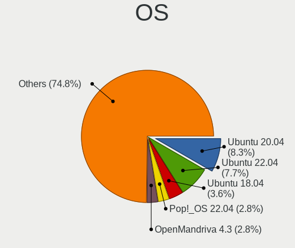

| Name               | Computers | Percent |
|--------------------|-----------|---------|
| Ubuntu 20.04       | 42        | 8.33%   |
| Ubuntu 22.04       | 39        | 7.74%   |
| Ubuntu 18.04       | 18        | 3.57%   |
| Pop!_OS 22.04      | 14        | 2.78%   |
| OpenMandriva 4.3   | 14        | 2.78%   |
| OpenMandriva 4.2   | 13        | 2.58%   |
| Debian 12          | 12        | 2.38%   |
| Zorin 17           | 11        | 2.18%   |
| Zorin 16           | 10        | 1.98%   |
| Ubuntu 24.04       | 7         | 1.39%   |
| Manjaro            | 7         | 1.39%   |
| Arch Rolling       | 7         | 1.39%   |
| Pop!_OS 21.10      | 6         | 1.19%   |
| Fedora 39          | 6         | 1.19%   |
| Fedora 35          | 6         | 1.19%   |
| Debian 11          | 6         | 1.19%   |
| Ubuntu 23.04       | 5         | 0.99%   |
| Ubuntu 20.10       | 5         | 0.99%   |
| Ubuntu 19.04       | 5         | 0.99%   |
| Pop!_OS 21.04      | 5         | 0.99%   |
| KDE neon 20.04     | 5         | 0.99%   |
| Fedora 40          | 5         | 0.99%   |
| Fedora 38          | 5         | 0.99%   |
| ArcoLinux Rolling  | 5         | 0.99%   |
| Arch               | 5         | 0.99%   |
| Ubuntu 21.10       | 4         | 0.79%   |
| Ubuntu 21.04       | 4         | 0.79%   |
| Ubuntu 19.10       | 4         | 0.79%   |
| OpenMandriva 23.08 | 4         | 0.79%   |
| Nobara 37          | 4         | 0.79%   |
| Linux Mint 21.2    | 4         | 0.79%   |
| Kubuntu 22.10      | 4         | 0.79%   |
| Kubuntu 20.04      | 4         | 0.79%   |
| KDE neon 22.04     | 4         | 0.79%   |
| Fedora 36          | 4         | 0.79%   |
| Debian Testing     | 4         | 0.79%   |
| Debian 10          | 4         | 0.79%   |
| Ubuntu 22.10       | 3         | 0.6%    |
| SteamOS 3.5.19     | 3         | 0.6%    |
| ROSA R10           | 3         | 0.6%    |

OS Family
---------

OS without a version

| Name             | Computers | Percent |
|------------------|-----------|---------|
| Ubuntu           | 129       | 27.86%  |
| OpenMandriva     | 41        | 8.86%   |
| Fedora           | 32        | 6.91%   |
| Debian           | 26        | 5.62%   |
| Pop!_OS          | 24        | 5.18%   |
| Zorin            | 23        | 4.97%   |
| Linux Mint       | 20        | 4.32%   |
| Endless          | 18        | 3.89%   |
| Manjaro          | 17        | 3.67%   |
| Kubuntu          | 13        | 2.81%   |
| Kali             | 13        | 2.81%   |
| Arch             | 12        | 2.59%   |
| KDE neon         | 11        | 2.38%   |
| SteamOS          | 10        | 2.16%   |
| ROSA             | 8         | 1.73%   |
| ArcoLinux        | 6         | 1.3%    |
| Nobara           | 5         | 1.08%   |
| Xubuntu          | 4         | 0.86%   |
| Ubuntu Unity     | 3         | 0.65%   |
| Ubuntu Budgie    | 3         | 0.65%   |
| Elementary       | 3         | 0.65%   |
| Clear Linux      | 3         | 0.65%   |
| ChimeraOS        | 3         | 0.65%   |
| Bazzite          | 3         | 0.65%   |
| Ubuntu MATE      | 2         | 0.43%   |
| Solus            | 2         | 0.43%   |
| RHEL             | 2         | 0.43%   |
| Parrot           | 2         | 0.43%   |
| org.kde.Platform | 2         | 0.43%   |
| NixOS            | 2         | 0.43%   |
| Lubuntu          | 2         | 0.43%   |
| LMDE             | 2         | 0.43%   |
| EndeavourOS      | 2         | 0.43%   |
| Ubuntu Kylin     | 1         | 0.22%   |
| Rocky Linux      | 1         | 0.22%   |
| Q4OS             | 1         | 0.22%   |
| PostmarketOS     | 1         | 0.22%   |
| Pear OS          | 1         | 0.22%   |
| openSUSE         | 1         | 0.22%   |
| Linux Lite       | 1         | 0.22%   |

Kernel
------

Version of the Linux kernel

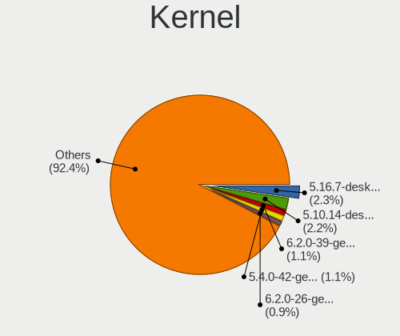

| Version                     | Computers | Percent |
|-----------------------------|-----------|---------|
| 5.16.7-desktop-1omv4003     | 13        | 2.34%   |
| 5.10.14-desktop-1omv4002    | 12        | 2.16%   |
| 6.2.0-39-generic            | 6         | 1.08%   |
| 5.4.0-42-generic            | 6         | 1.08%   |
| 6.2.0-26-generic            | 5         | 0.9%    |
| 5.19.0-32-generic           | 5         | 0.9%    |
| 6.9.3-76060903-generic      | 4         | 0.72%   |
| 6.8.0-49-generic            | 4         | 0.72%   |
| 6.8.0-40-generic            | 4         | 0.72%   |
| 6.5.0-26-generic            | 4         | 0.72%   |
| 6.4.11-desktop-1omv2390     | 4         | 0.72%   |
| 6.2.0-32-generic            | 4         | 0.72%   |
| 6.1.52-valve16-1-neptune-61 | 4         | 0.72%   |
| 5.4.0-19-generic            | 4         | 0.72%   |
| 5.3.0-28-generic            | 4         | 0.72%   |
| 5.19.0-26-generic           | 4         | 0.72%   |
| 5.15.0-58-generic           | 4         | 0.72%   |
| 5.15.0-48-generic           | 4         | 0.72%   |
| 5.13.0-7614-generic         | 4         | 0.72%   |
| 5.11.0-43-generic           | 4         | 0.72%   |
| 4.15.0-15-generic           | 4         | 0.72%   |
| 6.8.0-50-generic            | 3         | 0.54%   |
| 6.5.0-41-generic            | 3         | 0.54%   |
| 6.5.0-35-generic            | 3         | 0.54%   |
| 6.5.0-14-generic            | 3         | 0.54%   |
| 6.3.8-200.fc38.x86_64       | 3         | 0.54%   |
| 6.2.16-20-pve               | 3         | 0.54%   |
| 6.2.0-34-generic            | 3         | 0.54%   |
| 6.1.1-desktop-1omv2290      | 3         | 0.54%   |
| 6.1.0-28-amd64              | 3         | 0.54%   |
| 5.8.0-14-generic            | 3         | 0.54%   |
| 5.19.0-50-generic           | 3         | 0.54%   |
| 5.16.19-76051619-generic    | 3         | 0.54%   |
| 5.15.5-76051505-generic     | 3         | 0.54%   |
| 5.15.0-76-generic           | 3         | 0.54%   |
| 5.15.0-56-generic           | 3         | 0.54%   |
| 5.15.0-46-generic           | 3         | 0.54%   |
| 5.15.0-122-generic          | 3         | 0.54%   |
| 5.13.0-valve36-1-neptune    | 3         | 0.54%   |
| 5.13.0-37-generic           | 3         | 0.54%   |

Kernel Family
-------------

Linux kernel without a distro release

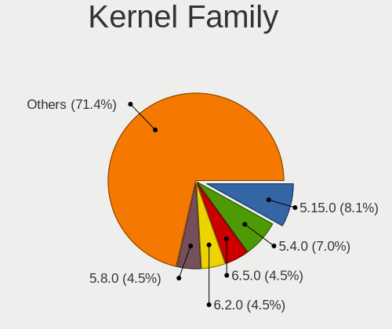

| Version | Computers | Percent |
|---------|-----------|---------|
| 5.15.0  | 43        | 8.08%   |
| 5.4.0   | 37        | 6.95%   |
| 6.5.0   | 24        | 4.51%   |
| 6.2.0   | 24        | 4.51%   |
| 5.8.0   | 24        | 4.51%   |
| 5.19.0  | 24        | 4.51%   |
| 6.8.0   | 21        | 3.95%   |
| 5.11.0  | 21        | 3.95%   |
| 5.3.0   | 16        | 3.01%   |
| 4.15.0  | 15        | 2.82%   |
| 6.1.0   | 14        | 2.63%   |
| 5.13.0  | 14        | 2.63%   |
| 5.16.7  | 13        | 2.44%   |
| 5.10.14 | 12        | 2.26%   |
| 5.10.0  | 10        | 1.88%   |
| 4.18.0  | 10        | 1.88%   |
| 5.0.0   | 8         | 1.5%    |
| 6.9.3   | 5         | 0.94%   |
| 6.1.52  | 5         | 0.94%   |
| 6.4.11  | 4         | 0.75%   |
| 6.2.6   | 4         | 0.75%   |
| 6.9.9   | 3         | 0.56%   |
| 6.8.11  | 3         | 0.56%   |
| 6.7.9   | 3         | 0.56%   |
| 6.5.3   | 3         | 0.56%   |
| 6.3.8   | 3         | 0.56%   |
| 6.2.16  | 3         | 0.56%   |
| 6.11.0  | 3         | 0.56%   |
| 6.1.1   | 3         | 0.56%   |
| 6.0.0   | 3         | 0.56%   |
| 5.16.19 | 3         | 0.56%   |
| 5.16.11 | 3         | 0.56%   |
| 5.15.5  | 3         | 0.56%   |
| 4.9.60  | 3         | 0.56%   |
| 6.9.12  | 2         | 0.38%   |
| 6.6.9   | 2         | 0.38%   |
| 6.6.6   | 2         | 0.38%   |
| 6.6.10  | 2         | 0.38%   |
| 6.5.6   | 2         | 0.38%   |
| 6.4.7   | 2         | 0.38%   |

Kernel Major Ver.
-----------------

Linux kernel major version

| Version | Computers | Percent |
|---------|-----------|---------|
| 5.15    | 56        | 10.75%  |
| 5.4     | 39        | 7.49%   |
| 6.2     | 33        | 6.33%   |
| 6.5     | 30        | 5.76%   |
| 6.1     | 29        | 5.57%   |
| 5.19    | 28        | 5.37%   |
| 5.8     | 27        | 5.18%   |
| 6.8     | 26        | 4.99%   |
| 5.10    | 26        | 4.99%   |
| 5.16    | 24        | 4.61%   |
| 5.11    | 24        | 4.61%   |
| 5.13    | 17        | 3.26%   |
| 5.3     | 16        | 3.07%   |
| 4.15    | 15        | 2.88%   |
| 6.9     | 12        | 2.3%    |
| 4.18    | 11        | 2.11%   |
| 6.6     | 10        | 1.92%   |
| 6.4     | 9         | 1.73%   |
| 6.0     | 9         | 1.73%   |
| 5.0     | 8         | 1.54%   |
| 6.11    | 7         | 1.34%   |
| 6.10    | 7         | 1.34%   |
| 6.3     | 6         | 1.15%   |
| 5.18    | 6         | 1.15%   |
| 4.9     | 6         | 1.15%   |
| 5.6     | 5         | 0.96%   |
| 5.17    | 5         | 0.96%   |
| 5.14    | 5         | 0.96%   |
| 6.7     | 4         | 0.77%   |
| 5.9     | 4         | 0.77%   |
| 5.5     | 4         | 0.77%   |
| 5.7     | 3         | 0.58%   |
| 5.12    | 2         | 0.38%   |
| 4.19    | 2         | 0.38%   |
| 6.12    | 1         | 0.19%   |
| 4.20    | 1         | 0.19%   |
| 4.13    | 1         | 0.19%   |
| 4.1     | 1         | 0.19%   |
| 3.18    | 1         | 0.19%   |
| 3.10    | 1         | 0.19%   |

Arch
----

OS architecture (x86_64, i586, etc.)

| Name    | Computers | Percent |
|---------|-----------|---------|
| x86_64  | 415       | 98.11%  |
| i686    | 6         | 1.42%   |
| armv7l  | 1         | 0.24%   |
| aarch64 | 1         | 0.24%   |

DE
--

Desktop Environment

| Name       | Computers | Percent |
|------------|-----------|---------|
| GNOME      | 222       | 48.58%  |
| KDE5       | 89        | 19.47%  |
| Unknown    | 41        | 8.97%   |
| XFCE       | 26        | 5.69%   |
| X-Cinnamon | 21        | 4.6%    |
| KDE6       | 11        | 2.41%   |
| KDE        | 11        | 2.41%   |
| Budgie     | 7         | 1.53%   |
| MATE       | 4         | 0.88%   |
| KDE4       | 4         | 0.88%   |
| Cinnamon   | 4         | 0.88%   |
| Unity      | 3         | 0.66%   |
| Pantheon   | 3         | 0.66%   |
| LXQt       | 2         | 0.44%   |
| Deepin     | 2         | 0.44%   |
| UKUI       | 1         | 0.22%   |
| trinity    | 1         | 0.22%   |
| openbox    | 1         | 0.22%   |
| i3         | 1         | 0.22%   |
| DDE        | 1         | 0.22%   |
| COSMIC     | 1         | 0.22%   |
| bspwm      | 1         | 0.22%   |

Display Server
--------------

X11 or Wayland

| Name    | Computers | Percent |
|---------|-----------|---------|
| X11     | 288       | 65.31%  |
| Wayland | 116       | 26.3%   |
| Unknown | 25        | 5.67%   |
| Tty     | 12        | 2.72%   |

Display Manager
---------------

SDDM, LightDM, etc.

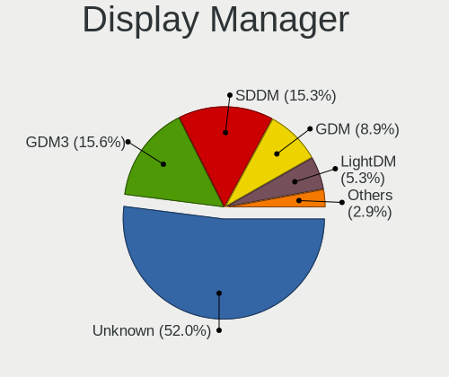

| Name    | Computers | Percent |
|---------|-----------|---------|
| Unknown | 234       | 52%     |
| GDM3    | 70        | 15.56%  |
| SDDM    | 69        | 15.33%  |
| GDM     | 40        | 8.89%   |
| LightDM | 24        | 5.33%   |
| TDM     | 9         | 2%      |
| KDM     | 4         | 0.89%   |

OS Lang
-------

Language

| Lang    | Computers | Percent |
|---------|-----------|---------|
| en_US   | 325       | 74.03%  |
| Unknown | 35        | 7.97%   |
| ar_SA   | 29        | 6.61%   |
| ar_EG   | 15        | 3.42%   |
| en_GB   | 13        | 2.96%   |
| C       | 5         | 1.14%   |
| ar_AE   | 3         | 0.68%   |
| en_AG   | 2         | 0.46%   |
| ru_RU   | 1         | 0.23%   |
| nl_BE   | 1         | 0.23%   |
| it_IT   | 1         | 0.23%   |
| fr_FR   | 1         | 0.23%   |
| en_IN   | 1         | 0.23%   |
| en_IL   | 1         | 0.23%   |
| en_AU   | 1         | 0.23%   |
| de_DE   | 1         | 0.23%   |
| Default | 1         | 0.23%   |
| cs_CZ   | 1         | 0.23%   |
| ar_SY   | 1         | 0.23%   |
| ar_KW   | 1         | 0.23%   |

Boot Mode
---------

EFI or BIOS

| Mode | Computers | Percent |
|------|-----------|---------|
| BIOS | 243       | 54.61%  |
| EFI  | 202       | 45.39%  |

Filesystem
----------

Type of filesystem

| Type    | Computers | Percent |
|---------|-----------|---------|
| Ext4    | 296       | 67.43%  |
| Btrfs   | 60        | 13.67%  |
| Tmpfs   | 31        | 7.06%   |
| Overlay | 27        | 6.15%   |
| Unknown | 13        | 2.96%   |
| Xfs     | 8         | 1.82%   |
| Ext2    | 3         | 0.68%   |
| Zfs     | 1         | 0.23%   |

Part. scheme
------------

Scheme of partitioning

| Type    | Computers | Percent |
|---------|-----------|---------|
| Unknown | 242       | 54.38%  |
| GPT     | 173       | 38.88%  |
| MBR     | 30        | 6.74%   |

Dual Boot with Linux/BSD
------------------------

Hosting more than one Linux/BSD

| Dual boot | Computers | Percent |
|-----------|-----------|---------|
| No        | 367       | 84.76%  |
| Yes       | 66        | 15.24%  |

Dual Boot (Win)
---------------

Hosting Linux and Windows

| Dual boot | Computers | Percent |
|-----------|-----------|---------|
| No        | 312       | 70.75%  |
| Yes       | 129       | 29.25%  |

Board
-----

Vendor
------

Motherboard manufacturer

| Name                                 | Computers | Percent |
|--------------------------------------|-----------|---------|
| Dell                                 | 73        | 17.26%  |
| ASUSTek Computer                     | 67        | 15.84%  |
| Lenovo                               | 55        | 13%     |
| Hewlett-Packard                      | 47        | 11.11%  |
| Gigabyte Technology                  | 30        | 7.09%   |
| MSI                                  | 29        | 6.86%   |
| Acer                                 | 18        | 4.26%   |
| Apple                                | 15        | 3.55%   |
| Toshiba                              | 11        | 2.6%    |
| HUAWEI                               | 11        | 2.6%    |
| Valve                                | 10        | 2.36%   |
| ASRock                               | 10        | 2.36%   |
| Sony                                 | 6         | 1.42%   |
| Unknown                              | 6         | 1.42%   |
| Microsoft                            | 4         | 0.95%   |
| Shenzhen Meigao Electronic Equipment | 2         | 0.47%   |
| Samsung Electronics                  | 2         | 0.47%   |
| Pegatron                             | 2         | 0.47%   |
| Notebook                             | 2         | 0.47%   |
| Intel                                | 2         | 0.47%   |
| I-Life Digital Technologies          | 2         | 0.47%   |
| TianBei                              | 1         | 0.24%   |
| Razer                                | 1         | 0.24%   |
| Packard Bell                         | 1         | 0.24%   |
| OEM                                  | 1         | 0.24%   |
| Medion                               | 1         | 0.24%   |
| LG Electronics                       | 1         | 0.24%   |
| Kllisre                              | 1         | 0.24%   |
| Huanan                               | 1         | 0.24%   |
| GPD                                  | 1         | 0.24%   |
| Google                               | 1         | 0.24%   |
| GIADA                                | 1         | 0.24%   |
| GEEKOM                               | 1         | 0.24%   |
| Fujitsu Siemens                      | 1         | 0.24%   |
| Fujitsu                              | 1         | 0.24%   |
| eMachines                            | 1         | 0.24%   |
| Dynabook                             | 1         | 0.24%   |
| DJI                                  | 1         | 0.24%   |
| Clevo                                | 1         | 0.24%   |
| Biostar                              | 1         | 0.24%   |

Model
-----

Motherboard model

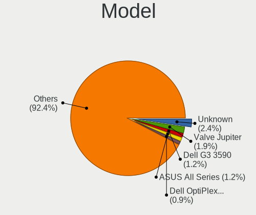

| Name                                       | Computers | Percent |
|--------------------------------------------|-----------|---------|
| Unknown                                    | 10        | 2.36%   |
| Valve Jupiter                              | 8         | 1.89%   |
| Dell G3 3590                               | 5         | 1.18%   |
| ASUS All Series                            | 5         | 1.18%   |
| Dell OptiPlex 9020                         | 4         | 0.95%   |
| ASUS VivoBook 15_ASUS Laptop X540MA_X540MA | 4         | 0.95%   |
| ASUS ASUS Zenbook Duo UX8406MA_UX8406MA    | 4         | 0.95%   |
| Microsoft Surface Pro 7                    | 3         | 0.71%   |
| HP 15                                      | 3         | 0.71%   |
| Dell OptiPlex 3010                         | 3         | 0.71%   |
| Dell Inspiron 3542                         | 3         | 0.71%   |
| Valve Galileo                              | 2         | 0.47%   |
| MSI MS-7C90                                | 2         | 0.47%   |
| MSI Modern 14 B5M                          | 2         | 0.47%   |
| Lenovo Legion T5 26IOB6 90RT00TVKS         | 2         | 0.47%   |
| HUAWEI KLVD-WXX9                           | 2         | 0.47%   |
| HP Pavilion g6                             | 2         | 0.47%   |
| HP Notebook                                | 2         | 0.47%   |
| HP Laptop 15-da2xxx                        | 2         | 0.47%   |
| HP Laptop 15-da0xxx                        | 2         | 0.47%   |
| HP ENVY x360 Convertible 15-ed1xxx         | 2         | 0.47%   |
| HP Compaq Elite 8300 SFF                   | 2         | 0.47%   |
| Gigabyte Z77-D3H                           | 2         | 0.47%   |
| Gigabyte H81M-S2PH                         | 2         | 0.47%   |
| Gigabyte B460MDS3HV2                       | 2         | 0.47%   |
| Dell OptiPlex 990                          | 2         | 0.47%   |
| Dell OptiPlex 9010                         | 2         | 0.47%   |
| Dell OptiPlex 790                          | 2         | 0.47%   |
| Dell OptiPlex 7050                         | 2         | 0.47%   |
| Dell OptiPlex 7010                         | 2         | 0.47%   |
| Dell OptiPlex 3050                         | 2         | 0.47%   |
| Dell Latitude 5285                         | 2         | 0.47%   |
| Dell Inspiron N5110                        | 2         | 0.47%   |
| Dell Inspiron 3581                         | 2         | 0.47%   |
| ASUS VivoBook_ASUSLaptop X512DA_X512DA     | 2         | 0.47%   |
| ASUS VivoBook 15_ASUS Laptop X540UAR       | 2         | 0.47%   |
| ASUS VivoBook 14_ASUS Laptop X441MA_X441MA | 2         | 0.47%   |
| ASUS TUF Gaming X570-PLUS                  | 2         | 0.47%   |
| Apple MacBookPro9,2                        | 2         | 0.47%   |
| Apple MacBookPro11,3                       | 2         | 0.47%   |

Model Family
------------

Motherboard model prefix

| Name               | Computers | Percent |
|--------------------|-----------|---------|
| Dell OptiPlex      | 24        | 5.67%   |
| Lenovo ThinkPad    | 19        | 4.49%   |
| Dell Inspiron      | 18        | 4.26%   |
| HP Pavilion        | 12        | 2.84%   |
| ASUS VivoBook      | 11        | 2.6%    |
| Acer Aspire        | 11        | 2.6%    |
| Toshiba Satellite  | 10        | 2.36%   |
| Dell Latitude      | 10        | 2.36%   |
| Unknown            | 10        | 2.36%   |
| Lenovo IdeaPad     | 9         | 2.13%   |
| HP Laptop          | 9         | 2.13%   |
| ASUS TUF           | 9         | 2.13%   |
| Valve Jupiter      | 8         | 1.89%   |
| Lenovo ThinkCentre | 8         | 1.89%   |
| ASUS ROG           | 8         | 1.89%   |
| HP ENVY            | 5         | 1.18%   |
| Dell Vostro        | 5         | 1.18%   |
| Dell G3            | 5         | 1.18%   |
| ASUS PRIME         | 5         | 1.18%   |
| ASUS All           | 5         | 1.18%   |
| Microsoft Surface  | 4         | 0.95%   |
| Lenovo Yoga        | 4         | 0.95%   |
| HP EliteDesk       | 4         | 0.95%   |
| Dell XPS           | 4         | 0.95%   |
| ASUS ASUS          | 4         | 0.95%   |
| MSI Modern         | 3         | 0.71%   |
| MSI GF63           | 3         | 0.71%   |
| Lenovo Legion      | 3         | 0.71%   |
| HP Compaq          | 3         | 0.71%   |
| HP 15              | 3         | 0.71%   |
| Dell Precision     | 3         | 0.71%   |
| ASUS ZenBook       | 3         | 0.71%   |
| Apple MacBookPro11 | 3         | 0.71%   |
| Valve Galileo      | 2         | 0.47%   |
| MSI MS-7C90        | 2         | 0.47%   |
| I-Life Digital ZED | 2         | 0.47%   |
| HUAWEI MateBook    | 2         | 0.47%   |
| HUAWEI KLVD-WXX9   | 2         | 0.47%   |
| HP ProBook         | 2         | 0.47%   |
| HP Notebook        | 2         | 0.47%   |

MFG Year
--------

Motherboard manufacture year

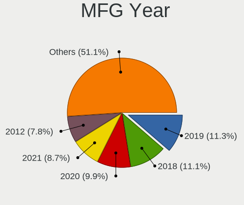

| Year    | Computers | Percent |
|---------|-----------|---------|
| 2019    | 48        | 11.35%  |
| 2018    | 47        | 11.11%  |
| 2020    | 42        | 9.93%   |
| 2021    | 37        | 8.75%   |
| 2012    | 33        | 7.8%    |
| 2017    | 27        | 6.38%   |
| 2013    | 27        | 6.38%   |
| 2014    | 25        | 5.91%   |
| 2011    | 23        | 5.44%   |
| 2016    | 22        | 5.2%    |
| 2015    | 17        | 4.02%   |
| 2010    | 14        | 3.31%   |
| 2023    | 13        | 3.07%   |
| 2024    | 12        | 2.84%   |
| 2022    | 11        | 2.6%    |
| 2009    | 9         | 2.13%   |
| 2008    | 6         | 1.42%   |
| 2007    | 6         | 1.42%   |
| Unknown | 2         | 0.47%   |
| 2006    | 1         | 0.24%   |
| 2002    | 1         | 0.24%   |

Form Factor
-----------

Physical design of the computer

| Name        | Computers | Percent |
|-------------|-----------|---------|
| Notebook    | 223       | 52.72%  |
| Desktop     | 154       | 36.41%  |
| Convertible | 19        | 4.49%   |
| Tablet      | 16        | 3.78%   |
| Mini pc     | 4         | 0.95%   |
| All in one  | 3         | 0.71%   |
| Server      | 3         | 0.71%   |
| Phone       | 1         | 0.24%   |

Secure Boot
-----------

Enabled or disabled

| State    | Computers | Percent |
|----------|-----------|---------|
| Disabled | 399       | 93.22%  |
| Enabled  | 29        | 6.78%   |

Coreboot
--------

Have coreboot on board

| Used | Computers | Percent |
|------|-----------|---------|
| No   | 422       | 99.76%  |
| Yes  | 1         | 0.24%   |

RAM Size
--------

Total RAM memory

| Size in GB      | Computers | Percent |
|-----------------|-----------|---------|
| 4.01-8.0        | 99        | 22.71%  |
| 16.01-24.0      | 99        | 22.71%  |
| 8.01-16.0       | 76        | 17.43%  |
| 3.01-4.0        | 62        | 14.22%  |
| 32.01-64.0      | 53        | 12.16%  |
| 1.01-2.0        | 19        | 4.36%   |
| 64.01-256.0     | 10        | 2.29%   |
| 24.01-32.0      | 9         | 2.06%   |
| 2.01-3.0        | 6         | 1.38%   |
| More than 256.0 | 2         | 0.46%   |
| 0.51-1.0        | 1         | 0.23%   |

RAM Used
--------

Used RAM memory

| Used GB    | Computers | Percent |
|------------|-----------|---------|
| 1.01-2.0   | 141       | 28.95%  |
| 2.01-3.0   | 122       | 25.05%  |
| 4.01-8.0   | 94        | 19.3%   |
| 3.01-4.0   | 81        | 16.63%  |
| 8.01-16.0  | 23        | 4.72%   |
| 0.51-1.0   | 21        | 4.31%   |
| 16.01-24.0 | 3         | 0.62%   |
| 0.01-0.5   | 1         | 0.21%   |
| Unknown    | 1         | 0.21%   |

Total Drives
------------

Number of drives on board

| Drives | Computers | Percent |
|--------|-----------|---------|
| 1      | 257       | 57.11%  |
| 2      | 120       | 26.67%  |
| 3      | 43        | 9.56%   |
| 4      | 17        | 3.78%   |
| 6      | 6         | 1.33%   |
| 5      | 5         | 1.11%   |
| 7      | 1         | 0.22%   |
| 0      | 1         | 0.22%   |

Has CD-ROM
----------

Has CD-ROM on board

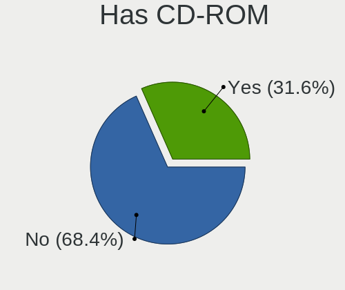

| Presented | Computers | Percent |
|-----------|-----------|---------|
| No        | 292       | 68.38%  |
| Yes       | 135       | 31.62%  |

Has Ethernet
------------

Has Ethernet on board

| Presented | Computers | Percent |
|-----------|-----------|---------|
| Yes       | 341       | 79.67%  |
| No        | 87        | 20.33%  |

Has WiFi
--------

Has WiFi module

| Presented | Computers | Percent |
|-----------|-----------|---------|
| Yes       | 357       | 83.8%   |
| No        | 69        | 16.2%   |

Has Bluetooth
-------------

Has Bluetooth module

| Presented | Computers | Percent |
|-----------|-----------|---------|
| Yes       | 300       | 69.93%  |
| No        | 129       | 30.07%  |

Location
--------

Country
-------

Geographic location (country)

| Country      | Computers | Percent |
|--------------|-----------|---------|
| Saudi Arabia | 423       | 100%    |

City
----

Geographic location (city)

| City                 | Computers | Percent |
|----------------------|-----------|---------|
| Riyadh               | 162       | 35.22%  |
| Jeddah               | 105       | 22.83%  |
| Makkah               | 45        | 9.78%   |
| Dammam               | 44        | 9.57%   |
| Medina               | 27        | 5.87%   |
| Khobar               | 12        | 2.61%   |
| Al Qatif             | 12        | 2.61%   |
| Dhahran              | 8         | 1.74%   |
| Baq`a' ash Sharqiyah | 8         | 1.74%   |
| Ta'if                | 7         | 1.52%   |
| Buraidah             | 6         | 1.3%    |
| Jubail               | 4         | 0.87%   |
| Abha                 | 4         | 0.87%   |
| Thuwal               | 3         | 0.65%   |
| At Tuwal             | 2         | 0.43%   |
| Al Faruq             | 2         | 0.43%   |
| Yanbu                | 1         | 0.22%   |
| Shaqra               | 1         | 0.22%   |
| Sayhat               | 1         | 0.22%   |
| Najran               | 1         | 0.22%   |
| Jizan                | 1         | 0.22%   |
| Bisha                | 1         | 0.22%   |
| Al Majridah        | 1         | 0.22%   |
| Al Kharj             | 1         | 0.22%   |
| Al Hufuf             | 1         | 0.22%   |

Drives
------

Drive Vendor
------------

Hard drive vendors

| Vendor                       | Computers | Drives | Percent |
|------------------------------|-----------|--------|---------|
| WDC                          | 110       | 173    | 16.79%  |
| Seagate                      | 81        | 117    | 12.37%  |
| Kingston                     | 70        | 115    | 10.69%  |
| Samsung Electronics          | 69        | 109    | 10.53%  |
| Toshiba                      | 55        | 73     | 8.4%    |
| Sandisk                      | 45        | 49     | 6.87%   |
| Unknown                      | 26        | 43     | 3.97%   |
| SK hynix                     | 13        | 32     | 1.98%   |
| Intel                        | 13        | 23     | 1.98%   |
| Crucial                      | 12        | 15     | 1.83%   |
| Phison Electronics           | 9         | 14     | 1.37%   |
| Hitachi                      | 9         | 10     | 1.37%   |
| Apple                        | 9         | 12     | 1.37%   |
| Team                         | 8         | 8      | 1.22%   |
| Micron Technology            | 8         | 8      | 1.22%   |
| Micron/Crucial Technology    | 7         | 7      | 1.07%   |
| Lexar                        | 7         | 7      | 1.07%   |
| China                        | 7         | 9      | 1.07%   |
| Phison                       | 6         | 7      | 0.92%   |
| Kingston Technology Company  | 6         | 7      | 0.92%   |
| HGST                         | 6         | 10     | 0.92%   |
| Silicon Motion               | 5         | 6      | 0.76%   |
| MAXIO Technology (Hangzhou)  | 5         | 9      | 0.76%   |
| JMicron Technology           | 5         | 5      | 0.76%   |
| PNY                          | 4         | 5      | 0.61%   |
| KIOXIA                       | 4         | 6      | 0.61%   |
| Hewlett-Packard              | 4         | 6      | 0.61%   |
| Unknown                      | 4         | 4      | 0.61%   |
| SPCC                         | 3         | 4      | 0.46%   |
| Realtek Semiconductor        | 3         | 3      | 0.46%   |
| KingSpec                     | 3         | 3      | 0.46%   |
| XrayDisk                     | 2         | 3      | 0.31%   |
| SPCC Sol                     | 2         | 2      | 0.31%   |
| Shenzhen Longsys Electronics | 2         | 2      | 0.31%   |
| LITEON                       | 2         | 2      | 0.31%   |
| KESU                         | 2         | 2      | 0.31%   |
| HS-SSD-C100                  | 2         | 3      | 0.31%   |
| Fujitsu                      | 2         | 3      | 0.31%   |
| YS                           | 1         | 2      | 0.15%   |
| YMTC                         | 1         | 1      | 0.15%   |

Drive Model
-----------

Hard drive models

| Model                                               | Computers | Percent |
|-----------------------------------------------------|-----------|---------|
| Kingston SA400S37240G 240GB SSD                     | 23        | 3.18%   |
| Toshiba MQ04ABF100 1TB                              | 16        | 2.21%   |
| Kingston SA400S37480G 480GB SSD                     | 15        | 2.07%   |
| Seagate ST1000LM035-1RK172 1TB                      | 14        | 1.94%   |
| Seagate ST1000LM024 HN-M101MBB 1TB                  | 9         | 1.24%   |
| Toshiba MQ01ABD100 1TB                              | 8         | 1.11%   |
| WDC WD20EZRZ-00Z5HB0 2TB                            | 7         | 0.97%   |
| Seagate ST500DM002-1BD142 500GB                     | 7         | 0.97%   |
| Samsung NVMe SSD Controller SM981/PM981/PM983 512GB | 7         | 0.97%   |
| Kingston SA400S37120G 120GB SSD                     | 6         | 0.83%   |
| WDC WD10EZEX-75WN4A1 1TB                            | 5         | 0.69%   |
| WDC WD10EZEX-08WN4A0 1TB                            | 5         | 0.69%   |
| SanDisk SSD PLUS 240GB                              | 5         | 0.69%   |
| Samsung SSD 860 EVO 1TB                             | 5         | 0.69%   |
| Samsung NVMe SSD Drive 1024GB                       | 5         | 0.69%   |
| Phison PS5013 E13 NVMe Controller 512GB             | 5         | 0.69%   |
| MAXIO (Hangzhou) NVMe SSD Controller MAP1202 512GB  | 5         | 0.69%   |
| WDC WD5000AAKX-75U6AA0 500GB                        | 4         | 0.55%   |
| Unknown MMC Card  32GB                              | 4         | 0.55%   |
| Toshiba MQ01ABF050 500GB                            | 4         | 0.55%   |
| Lexar 128GB SSD                                     | 4         | 0.55%   |
| Kingston Company SNV2S1000G 1TB                     | 4         | 0.55%   |
| Kingston SA400S37960G 960GB SSD                     | 4         | 0.55%   |
| Unknown                                             | 4         | 0.55%   |
| WDC WD10JPVX-22JC3T0 1TB                            | 3         | 0.41%   |
| WDC WD10EARX-00N0YB0 1TB                            | 3         | 0.41%   |
| Toshiba DT01ACA050 500GB                            | 3         | 0.41%   |
| Seagate ST500LT012-1DG142 500GB                     | 3         | 0.41%   |
| Seagate ST2000LM007-1R8174 2TB                      | 3         | 0.41%   |
| Seagate ST1000DM010-2EP102 1TB                      | 3         | 0.41%   |
| Sandisk WD PC SN740 SDDPNQE-2T00-1102 2TB           | 3         | 0.41%   |
| SanDisk SSD PLUS 480GB                              | 3         | 0.41%   |
| SanDisk NVMe SSD Drive 512GB                        | 3         | 0.41%   |
| SanDisk NVMe SSD Drive 128GB                        | 3         | 0.41%   |
| Samsung SSD 860 EVO 500GB                           | 3         | 0.41%   |
| Samsung MZ9LQ512HBLU-00BVL 512GB                    | 3         | 0.41%   |
| Samsung MZ9LQ256HBJD-00BVL 256GB                    | 3         | 0.41%   |
| Micron/Crucial P2 NVMe PCIe SSD 500GB               | 3         | 0.41%   |
| Kingston SH103S3120G 120GB SSD                      | 3         | 0.41%   |
| JMicron Tech 250GB                                  | 3         | 0.41%   |

HDD Vendor
----------

Hard disk drive vendors

| Vendor              | Computers | Drives | Percent |
|---------------------|-----------|--------|---------|
| WDC                 | 90        | 147    | 36.29%  |
| Seagate             | 81        | 117    | 32.66%  |
| Toshiba             | 51        | 61     | 20.56%  |
| Hitachi             | 9         | 10     | 3.63%   |
| HGST                | 6         | 10     | 2.42%   |
| KESU                | 2         | 2      | 0.81%   |
| JMicron Technology  | 2         | 2      | 0.81%   |
| Fujitsu             | 2         | 3      | 0.81%   |
| Apple               | 2         | 2      | 0.81%   |
| Unknown             | 1         | 3      | 0.4%    |
| Samsung Electronics | 1         | 2      | 0.4%    |
| Maxtor              | 1         | 1      | 0.4%    |

SSD Vendor
----------

Solid state drive vendors

| Vendor              | Computers | Drives | Percent |
|---------------------|-----------|--------|---------|
| Kingston            | 60        | 96     | 31.58%  |
| SanDisk             | 24        | 25     | 12.63%  |
| Samsung Electronics | 24        | 42     | 12.63%  |
| Crucial             | 12        | 14     | 6.32%   |
| WDC                 | 11        | 14     | 5.79%   |
| China               | 7         | 9      | 3.68%   |
| Lexar               | 6         | 6      | 3.16%   |
| Team                | 5         | 5      | 2.63%   |
| Apple               | 5         | 6      | 2.63%   |
| SK hynix            | 3         | 5      | 1.58%   |
| PNY                 | 3         | 4      | 1.58%   |
| KingSpec            | 3         | 3      | 1.58%   |
| Hewlett-Packard     | 3         | 5      | 1.58%   |
| Unknown             | 3         | 3      | 1.58%   |
| SPCC Sol            | 2         | 2      | 1.05%   |
| Micron Technology   | 2         | 2      | 1.05%   |
| LITEON              | 2         | 2      | 1.05%   |
| YS                  | 1         | 2      | 0.53%   |
| XrayDisk            | 1         | 1      | 0.53%   |
| Transcend           | 1         | 1      | 0.53%   |
| Thinkplus           | 1         | 1      | 0.53%   |
| SPCC                | 1         | 2      | 0.53%   |
| OYUNKEY             | 1         | 1      | 0.53%   |
| NVMe                | 1         | 1      | 0.53%   |
| KingFast            | 1         | 1      | 0.53%   |
| Intel               | 1         | 4      | 0.53%   |
| Hoodisk             | 1         | 1      | 0.53%   |
| GLOWAY              | 1         | 2      | 0.53%   |
| G-DRIVE             | 1         | 1      | 0.53%   |
| Corsair             | 1         | 1      | 0.53%   |
| ASMT                | 1         | 1      | 0.53%   |
| A-DATA Technology   | 1         | 1      | 0.53%   |

Drive Kind
----------

HDD or SSD

| Kind    | Computers | Drives | Percent |
|---------|-----------|--------|---------|
| HDD     | 212       | 360    | 36.36%  |
| SSD     | 168       | 264    | 28.82%  |
| NVMe    | 166       | 266    | 28.47%  |
| MMC     | 25        | 41     | 4.29%   |
| Unknown | 12        | 13     | 2.06%   |

Drive Connector
---------------

SATA, SAS, NVMe, etc.

| Type | Computers | Drives | Percent |
|------|-----------|--------|---------|
| SATA | 303       | 611    | 59.18%  |
| NVMe | 166       | 264    | 32.42%  |
| MMC  | 25        | 41     | 4.88%   |
| SAS  | 18        | 28     | 3.52%   |

Drive Size
----------

Size of hard drive

| Size in TB | Computers | Drives | Percent |
|------------|-----------|--------|---------|
| 0.01-0.5   | 185       | 320    | 47.44%  |
| 0.51-1.0   | 156       | 232    | 40%     |
| 1.01-2.0   | 28        | 42     | 7.18%   |
| 3.01-4.0   | 13        | 17     | 3.33%   |
| 2.01-3.0   | 6         | 7      | 1.54%   |
| 4.01-10.0  | 2         | 6      | 0.51%   |

Space Total
-----------

Amount of disk space available on the file system

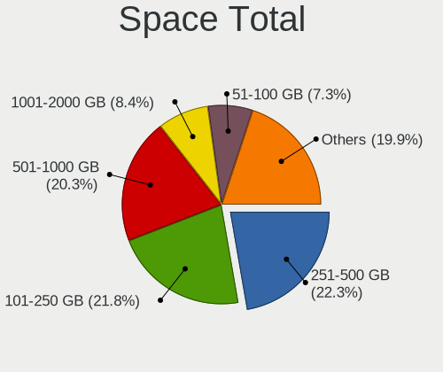

| Size in GB     | Computers | Percent |
|----------------|-----------|---------|
| 251-500        | 104       | 22.27%  |
| 101-250        | 102       | 21.84%  |
| 501-1000       | 95        | 20.34%  |
| 1001-2000      | 39        | 8.35%   |
| 51-100         | 34        | 7.28%   |
| 1-20           | 28        | 6%      |
| More than 3000 | 19        | 4.07%   |
| 2001-3000      | 19        | 4.07%   |
| 21-50          | 18        | 3.85%   |
| Unknown        | 9         | 1.93%   |

Space Used
----------

Amount of used disk space

| Used GB        | Computers | Percent |
|----------------|-----------|---------|
| 1-20           | 180       | 36.22%  |
| 21-50          | 101       | 20.32%  |
| 51-100         | 61        | 12.27%  |
| 101-250        | 57        | 11.47%  |
| 251-500        | 41        | 8.25%   |
| 501-1000       | 22        | 4.43%   |
| 1001-2000      | 13        | 2.62%   |
| Unknown        | 9         | 1.81%   |
| More than 3000 | 7         | 1.41%   |
| 2001-3000      | 5         | 1.01%   |
| 0              | 1         | 0.2%    |

Malfunc. Drives
---------------

Drive models with a malfunction

| Model                              | Computers | Drives | Percent |
|------------------------------------|-----------|--------|---------|
| Unknown                            | 2         | 2      | 6.67%   |
| YS SSD 240GB                       | 1         | 1      | 3.33%   |
| WDC WD5000AAKS-00WWPA0 500GB       | 1         | 1      | 3.33%   |
| WDC WD3200BPVT-75ZEST0 320GB       | 1         | 1      | 3.33%   |
| WDC WD3200AAJS-00L7A0 320GB        | 1         | 1      | 3.33%   |
| WDC WD20EZRZ-00Z5HB0 2TB           | 1         | 1      | 3.33%   |
| WDC WD1600AAJS-60B4A0 160GB        | 1         | 1      | 3.33%   |
| WDC WD10SPZX-60Z10T0 1TB           | 1         | 1      | 3.33%   |
| WDC WD10SPZX-08Z10 1TB             | 1         | 1      | 3.33%   |
| WDC WD10PURZ-85U8XY0 1TB           | 1         | 1      | 3.33%   |
| WDC WD10JPVX-60JC3T1 1TB           | 1         | 1      | 3.33%   |
| WDC WD10JPVX-22JC3T0 1TB           | 1         | 1      | 3.33%   |
| WDC WD10EUCX-73YZ1Y0 1TB           | 1         | 1      | 3.33%   |
| WDC WD Green 2.5 480GB SSD         | 1         | 1      | 3.33%   |
| Toshiba MQ01ABD100 1TB             | 1         | 1      | 3.33%   |
| Toshiba MK3265GSXN 320GB           | 1         | 1      | 3.33%   |
| Seagate ST9320325AS 320GB          | 1         | 1      | 3.33%   |
| Seagate ST500LT012-9WS142 500GB    | 1         | 1      | 3.33%   |
| Seagate ST500LT012-1DG142 500GB    | 1         | 1      | 3.33%   |
| Seagate ST500DM002-1BD142 500GB    | 1         | 1      | 3.33%   |
| Seagate ST2000DM001-1CH164 2TB     | 1         | 1      | 3.33%   |
| Seagate ST1000LM035-1RK172 1TB     | 1         | 1      | 3.33%   |
| Seagate ST1000LM024 HN-M101MBB 1TB | 1         | 1      | 3.33%   |
| Seagate ST1000DM003-9YN162 1TB     | 1         | 1      | 3.33%   |
| SanDisk SSD PLUS 480GB             | 1         | 1      | 3.33%   |
| OYUNKEY SSD 120GB                  | 1         | 1      | 3.33%   |
| Kingston SMS200S3240G 240GB SSD    | 1         | 1      | 3.33%   |
| Kingston SA400S37480G 480GB SSD    | 1         | 1      | 3.33%   |
| Hitachi HDS721032CLA362 320GB      | 1         | 1      | 3.33%   |

Malfunc. Drive Vendor
---------------------

Vendors of faulty drives

| Vendor   | Computers | Drives | Percent |
|----------|-----------|--------|---------|
| WDC      | 12        | 12     | 41.38%  |
| Seagate  | 7         | 8      | 24.14%  |
| Toshiba  | 2         | 2      | 6.9%    |
| Kingston | 2         | 2      | 6.9%    |
| Unknown  | 2         | 2      | 6.9%    |
| YS       | 1         | 1      | 3.45%   |
| SanDisk  | 1         | 1      | 3.45%   |
| OYUNKEY  | 1         | 1      | 3.45%   |
| Hitachi  | 1         | 1      | 3.45%   |

Malfunc. HDD Vendor
-------------------

Vendors of faulty HDD drives

| Vendor  | Computers | Drives | Percent |
|---------|-----------|--------|---------|
| WDC     | 11        | 11     | 52.38%  |
| Seagate | 7         | 8      | 33.33%  |
| Toshiba | 2         | 2      | 9.52%   |
| Hitachi | 1         | 1      | 4.76%   |

Malfunc. Drive Kind
-------------------

Kinds of faulty drives

| Kind | Computers | Drives | Percent |
|------|-----------|--------|---------|
| HDD  | 19        | 22     | 76%     |
| SSD  | 6         | 8      | 24%     |

Failed Drives
-------------

Failed drive models

Zero info for selected period =(

Failed Drive Vendor
-------------------

Failed drive vendors

Zero info for selected period =(

Drive Status
------------

Number of failed and malfunc. drives

| Status   | Computers | Drives | Percent |
|----------|-----------|--------|---------|
| Detected | 291       | 635    | 62.31%  |
| Works    | 152       | 279    | 32.55%  |
| Malfunc  | 24        | 30     | 5.14%   |

Storage controller
------------------

Storage Vendor
--------------

Storage controller vendors

| Vendor                           | Computers | Percent |
|----------------------------------|-----------|---------|
| Intel                            | 306       | 56.25%  |
| Samsung Electronics              | 50        | 9.19%   |
| AMD                              | 44        | 8.09%   |
| SanDisk                          | 28        | 5.15%   |
| Kingston Technology Company      | 17        | 3.13%   |
| Phison Electronics               | 15        | 2.76%   |
| SK hynix                         | 10        | 1.84%   |
| Silicon Motion                   | 8         | 1.47%   |
| Micron/Crucial Technology        | 8         | 1.47%   |
| ASMedia Technology               | 8         | 1.47%   |
| Micron Technology                | 6         | 1.1%    |
| Toshiba America Info Systems     | 5         | 0.92%   |
| Realtek Semiconductor            | 5         | 0.92%   |
| MAXIO Technology (Hangzhou)      | 5         | 0.92%   |
| KIOXIA                           | 5         | 0.92%   |
| Broadcom / LSI                   | 3         | 0.55%   |
| Union Memory (Shenzhen)          | 2         | 0.37%   |
| Shenzhen Longsys Electronics     | 2         | 0.37%   |
| Nvidia                           | 2         | 0.37%   |
| JMicron Technology               | 2         | 0.37%   |
| Hosin Global Electronics         | 2         | 0.37%   |
| Apple                            | 2         | 0.37%   |
| Yangtze Memory Technologies      | 1         | 0.18%   |
| VIA Technologies                 | 1         | 0.18%   |
| Silicon Integrated Systems [SiS] | 1         | 0.18%   |
| Netac Technology                 | 1         | 0.18%   |
| Marvell Technology Group         | 1         | 0.18%   |
| LSI Logic / Symbios Logic        | 1         | 0.18%   |
| Lite-On Technology               | 1         | 0.18%   |
| INNOGRIT                         | 1         | 0.18%   |
| ADATA Technology                 | 1         | 0.18%   |

Storage Model
-------------

Storage controller models

| Model                                                                          | Computers | Percent |
|--------------------------------------------------------------------------------|-----------|---------|
| AMD FCH SATA Controller [AHCI mode]                                            | 31        | 5.24%   |
| Intel Sunrise Point-LP SATA Controller [AHCI mode]                             | 27        | 4.56%   |
| Intel 82801 Mobile SATA Controller [RAID mode]                                 | 17        | 2.87%   |
| Intel 7 Series Chipset Family 6-port SATA Controller [AHCI mode]               | 17        | 2.87%   |
| Samsung NVMe SSD Controller SM981/PM981/PM983                                  | 16        | 2.7%    |
| Samsung NVMe SSD Controller 980 (DRAM-less)                                    | 16        | 2.7%    |
| Intel 8 Series SATA Controller 1 [AHCI mode]                                   | 16        | 2.7%    |
| Intel 200 Series PCH SATA controller [AHCI mode]                               | 16        | 2.7%    |
| Intel SATA Controller [RAID mode]                                              | 14        | 2.36%   |
| Intel 6 Series/C200 Series Chipset Family 6 port Mobile SATA AHCI Controller   | 14        | 2.36%   |
| Intel 8 Series/C220 Series Chipset Family 6-port SATA Controller 1 [AHCI mode] | 13        | 2.2%    |
| Intel Volume Management Device NVMe RAID Controller                            | 10        | 1.69%   |
| Intel Cannon Lake Mobile PCH SATA AHCI Controller                              | 10        | 1.69%   |
| Intel Celeron/Pentium Silver Processor SATA Controller                         | 9         | 1.52%   |
| Intel Cannon Lake PCH SATA AHCI Controller                                     | 9         | 1.52%   |
| Intel 7 Series/C210 Series Chipset Family 6-port SATA Controller [AHCI mode]   | 9         | 1.52%   |
| Intel 6 Series/C200 Series Chipset Family 6 port Desktop SATA AHCI Controller  | 8         | 1.35%   |
| ASMedia ASM1061/ASM1062 Serial ATA Controller                                  | 8         | 1.35%   |
| AMD 400 Series Chipset SATA Controller                                         | 8         | 1.35%   |
| Phison PS5013-E13 PCIe3 NVMe Controller (DRAM-less)                            | 7         | 1.18%   |
| Intel 82801IBM/IEM (ICH9M/ICH9M-E) 4 port SATA Controller [AHCI mode]          | 7         | 1.18%   |
| SanDisk Extreme Pro / WD Black SN750 / PC SN730 / Red SN700 NVMe SSD           | 6         | 1.01%   |
| Intel SSD 660P Series                                                          | 6         | 1.01%   |
| Intel Q170/Q150/B150/H170/H110/Z170/CM236 Chipset SATA Controller [AHCI Mode]  | 6         | 1.01%   |
| Intel Comet Lake SATA AHCI Controller                                          | 6         | 1.01%   |
| Intel 500 Series Chipset Family SATA AHCI Controller                           | 6         | 1.01%   |
| Intel 400 Series Chipset Family SATA AHCI Controller                           | 6         | 1.01%   |
| AMD 500 Series Chipset SATA Controller                                         | 6         | 1.01%   |
| Silicon Motion SM2263EN/SM2263XT (DRAM-less) NVMe SSD Controllers              | 5         | 0.84%   |
| MAXIO (Hangzhou) NVMe SSD Controller MAP1202 (DRAM-less)                       | 5         | 0.84%   |
| KIOXIA NVMe SSD Controller BG4 (DRAM-less)                                     | 5         | 0.84%   |
| Intel Wildcat Point-LP SATA Controller [AHCI Mode]                             | 5         | 0.84%   |
| Intel NM10/ICH7 Family SATA Controller [IDE mode]                              | 5         | 0.84%   |
| Intel 9 Series Chipset Family SATA Controller [AHCI Mode]                      | 5         | 0.84%   |
| Intel 5 Series/3400 Series Chipset 4 port SATA AHCI Controller                 | 5         | 0.84%   |
| SanDisk WD Black SN770 / PC SN740 256GB / PC SN560 (DRAM-less) NVMe SSD        | 4         | 0.68%   |
| SanDisk Ultra 3D / WD PC SN530, IX SN530, Blue SN550 NVMe SSD (DRAM-less)      | 4         | 0.68%   |
| Samsung NVMe SSD Controller SM961/PM961/SM963                                  | 4         | 0.68%   |
| Samsung NVMe SSD Controller PM9A1/PM9A3/980PRO                                 | 4         | 0.68%   |
| Phison E12 NVMe Controller                                                     | 4         | 0.68%   |

Storage Kind
------------

Kind of storage controller (IDE, SATA, NVMe, SAS, ...)

| Kind | Computers | Percent |
|------|-----------|---------|
| SATA | 289       | 54.32%  |
| NVMe | 166       | 31.2%   |
| RAID | 45        | 8.46%   |
| IDE  | 31        | 5.83%   |
| SAS  | 1         | 0.19%   |

Processor
---------

CPU Vendor
----------

Processor vendors

| Vendor   | Computers | Percent |
|----------|-----------|---------|
| Intel    | 352       | 83.22%  |
| AMD      | 69        | 16.31%  |
| Qualcomm | 1         | 0.24%   |
| ARM      | 1         | 0.24%   |

CPU Model
---------

Processor models

| Model                                         | Computers | Percent |
|-----------------------------------------------|-----------|---------|
| Intel 11th Gen Core i7-1165G7 @ 2.80GHz       | 10        | 2.35%   |
| AMD Custom APU 0405                           | 8         | 1.88%   |
| Intel Celeron N4000 CPU @ 1.10GHz             | 7         | 1.65%   |
| Intel Core i7-8550U CPU @ 1.80GHz             | 6         | 1.41%   |
| Intel Core i5-7200U CPU @ 2.50GHz             | 6         | 1.41%   |
| Intel Core i5-3470 CPU @ 3.20GHz              | 6         | 1.41%   |
| Intel Core i7-9750H CPU @ 2.60GHz             | 5         | 1.18%   |
| Intel Core Ultra 9 185H                       | 4         | 0.94%   |
| Intel Core i7-8750H CPU @ 2.20GHz             | 4         | 0.94%   |
| Intel Core i7-8565U CPU @ 1.80GHz             | 4         | 0.94%   |
| Intel Core i7-7500U CPU @ 2.70GHz             | 4         | 0.94%   |
| Intel Core i7-4770 CPU @ 3.40GHz              | 4         | 0.94%   |
| Intel Core i7-4510U CPU @ 2.00GHz             | 4         | 0.94%   |
| Intel Core i7-4500U CPU @ 1.80GHz             | 4         | 0.94%   |
| Intel Core i7-2600 CPU @ 3.40GHz              | 4         | 0.94%   |
| Intel Core i5-8250U CPU @ 1.60GHz             | 4         | 0.94%   |
| Intel Core i5-7500 CPU @ 3.40GHz              | 4         | 0.94%   |
| Intel Core i5-6200U CPU @ 2.30GHz             | 4         | 0.94%   |
| Intel Core i5-2430M CPU @ 2.40GHz             | 4         | 0.94%   |
| Intel Core i5-10210U CPU @ 1.60GHz            | 4         | 0.94%   |
| Intel Core i3-7020U CPU @ 2.30GHz             | 4         | 0.94%   |
| AMD Ryzen 5 5600X 6-Core Processor            | 4         | 0.94%   |
| AMD Ryzen 5 3500U with Radeon Vega Mobile Gfx | 4         | 0.94%   |
| Intel Core i7-8700 CPU @ 3.20GHz              | 3         | 0.71%   |
| Intel Core i7-7700 CPU @ 3.60GHz              | 3         | 0.71%   |
| Intel Core i7-6700 CPU @ 3.40GHz              | 3         | 0.71%   |
| Intel Core i7-4600U CPU @ 2.10GHz             | 3         | 0.71%   |
| Intel Core i7-3770 CPU @ 3.40GHz              | 3         | 0.71%   |
| Intel Core i7-3630QM CPU @ 2.40GHz            | 3         | 0.71%   |
| Intel Core i7-10750H CPU @ 2.60GHz            | 3         | 0.71%   |
| Intel Core i7-1065G7 CPU @ 1.30GHz            | 3         | 0.71%   |
| Intel Core i5-6400 CPU @ 2.70GHz              | 3         | 0.71%   |
| Intel Core i5-5200U CPU @ 2.20GHz             | 3         | 0.71%   |
| Intel Core i5-4200U CPU @ 1.60GHz             | 3         | 0.71%   |
| Intel Core i5-3210M CPU @ 2.50GHz             | 3         | 0.71%   |
| Intel Core i5-2450M CPU @ 2.50GHz             | 3         | 0.71%   |
| Intel Core i5-2410M CPU @ 2.30GHz             | 3         | 0.71%   |
| Intel Core i5 CPU M 520 @ 2.40GHz             | 3         | 0.71%   |
| Intel Core i3-10100 CPU @ 3.60GHz             | 3         | 0.71%   |
| Intel Core i3 CPU M 370 @ 2.40GHz             | 3         | 0.71%   |

CPU Model Family
----------------

Processor model prefix

| Model                   | Computers | Percent |
|-------------------------|-----------|---------|
| Intel Core i7           | 113       | 26.59%  |
| Intel Core i5           | 101       | 23.76%  |
| Other                   | 46        | 10.82%  |
| Intel Core i3           | 33        | 7.76%   |
| AMD Ryzen 5             | 22        | 5.18%   |
| Intel Celeron           | 18        | 4.24%   |
| AMD Ryzen 7             | 18        | 4.24%   |
| Intel Core 2 Duo        | 13        | 3.06%   |
| AMD Ryzen 9             | 11        | 2.59%   |
| Intel Xeon              | 8         | 1.88%   |
| Intel Atom              | 6         | 1.41%   |
| Intel Pentium Dual-Core | 5         | 1.18%   |
| Intel Core i9           | 4         | 0.94%   |
| Intel Core              | 4         | 0.94%   |
| Intel Pentium           | 3         | 0.71%   |
| AMD FX                  | 3         | 0.71%   |
| Intel Xeon Silver       | 1         | 0.24%   |
| Intel Xeon Gold         | 1         | 0.24%   |
| Intel Pentium Silver    | 1         | 0.24%   |
| Intel Pentium 4         | 1         | 0.24%   |
| Intel Mobile Pentium 4  | 1         | 0.24%   |
| Intel Genuine           | 1         | 0.24%   |
| Intel Core m5           | 1         | 0.24%   |
| Intel Core m3           | 1         | 0.24%   |
| Intel Core 2 Quad       | 1         | 0.24%   |
| Intel Core 2 Extreme    | 1         | 0.24%   |
| Intel Core 2            | 1         | 0.24%   |
| ARM ARMv7               | 1         | 0.24%   |
| AMD Ryzen Threadripper  | 1         | 0.24%   |
| AMD Ryzen 5 PRO         | 1         | 0.24%   |
| AMD E2                  | 1         | 0.24%   |
| AMD A4                  | 1         | 0.24%   |
| AMD A12                 | 1         | 0.24%   |

CPU Cores
---------

Number of processor cores

| Number | Computers | Percent |
|--------|-----------|---------|
| 4      | 167       | 39.39%  |
| 2      | 138       | 32.55%  |
| 6      | 47        | 11.08%  |
| 8      | 33        | 7.78%   |
| 16     | 10        | 2.36%   |
| 1      | 8         | 1.89%   |
| 12     | 7         | 1.65%   |
| 14     | 5         | 1.18%   |
| 10     | 4         | 0.94%   |
| 24     | 2         | 0.47%   |
| 40     | 1         | 0.24%   |
| 32     | 1         | 0.24%   |
| 20     | 1         | 0.24%   |

CPU Sockets
-----------

Number of sockets

| Number | Computers | Percent |
|--------|-----------|---------|
| 1      | 420       | 99.29%  |
| 2      | 3         | 0.71%   |

CPU Threads
-----------

Threads per core (Hyper-Threading)

| Number | Computers | Percent |
|--------|-----------|---------|
| 2      | 316       | 74.35%  |
| 1      | 108       | 25.41%  |
| 8      | 1         | 0.24%   |

CPU Op-Modes
------------

CPU Operation Modes (32-bit, 64-bit)

| Op mode        | Computers | Percent |
|----------------|-----------|---------|
| 32-bit, 64-bit | 415       | 97.88%  |
| Unknown        | 7         | 1.65%   |
| 32-bit         | 2         | 0.47%   |

CPU Microcode
-------------

Microcode number

| Number     | Computers | Percent |
|------------|-----------|---------|
| Unknown    | 216       | 47.26%  |
| 0x306a9    | 22        | 4.81%   |
| 0x206a7    | 18        | 3.94%   |
| 0x306c3    | 15        | 3.28%   |
| 0x1067a    | 15        | 3.28%   |
| 0x40651    | 12        | 2.63%   |
| 0x906e9    | 9         | 1.97%   |
| 0x806c1    | 9         | 1.97%   |
| 0x906ea    | 8         | 1.75%   |
| 0x806e9    | 8         | 1.75%   |
| 0x406e3    | 8         | 1.75%   |
| 0x806ec    | 7         | 1.53%   |
| 0x806ea    | 7         | 1.53%   |
| 0x706e5    | 6         | 1.31%   |
| 0x706a1    | 5         | 1.09%   |
| 0xa0653    | 4         | 0.88%   |
| 0xa0652    | 4         | 0.88%   |
| 0x306d4    | 4         | 0.88%   |
| 0x20655    | 4         | 0.88%   |
| 0x08108109 | 4         | 0.88%   |
| 0xa06a4    | 3         | 0.66%   |
| 0x906ed    | 3         | 0.66%   |
| 0x906a3    | 3         | 0.66%   |
| 0x506c9    | 3         | 0.66%   |
| 0x30673    | 3         | 0.66%   |
| 0x20652    | 3         | 0.66%   |
| 0xa0655    | 2         | 0.44%   |
| 0x806eb    | 2         | 0.44%   |
| 0x406c4    | 2         | 0.44%   |
| 0x106e5    | 2         | 0.44%   |
| 0x0a201016 | 2         | 0.44%   |
| 0x08701021 | 2         | 0.44%   |
| 0x08701013 | 2         | 0.44%   |
| 0x08600106 | 2         | 0.44%   |
| 0x0810100b | 2         | 0.44%   |
| 0x0800820d | 2         | 0.44%   |
| 0x06000852 | 2         | 0.44%   |
| 0xf64      | 1         | 0.22%   |
| 0xf27      | 1         | 0.22%   |
| 0xb06a2    | 1         | 0.22%   |

CPU Microarch
-------------

Microarchitecture

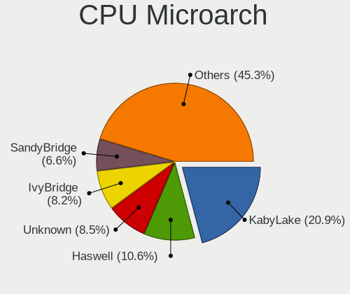

| Name             | Computers | Percent |
|------------------|-----------|---------|
| KabyLake         | 89        | 20.89%  |
| Haswell          | 45        | 10.56%  |
| Unknown          | 36        | 8.45%   |
| IvyBridge        | 35        | 8.22%   |
| SandyBridge      | 28        | 6.57%   |
| Skylake          | 25        | 5.87%   |
| Zen 3            | 18        | 4.23%   |
| Penryn           | 18        | 4.23%   |
| TigerLake        | 15        | 3.52%   |
| CometLake        | 14        | 3.29%   |
| Zen+             | 13        | 3.05%   |
| Zen 2            | 13        | 3.05%   |
| Icelake          | 11        | 2.58%   |
| Goldmont plus    | 9         | 2.11%   |
| Broadwell        | 9         | 2.11%   |
| Westmere         | 8         | 1.88%   |
| Alderlake Hybrid | 8         | 1.88%   |
| Silvermont       | 7         | 1.64%   |
| Core             | 5         | 1.17%   |
| Piledriver       | 4         | 0.94%   |
| Nehalem          | 4         | 0.94%   |
| Goldmont         | 4         | 0.94%   |
| Zen              | 2         | 0.47%   |
| NetBurst         | 2         | 0.47%   |
| Tremont          | 1         | 0.23%   |
| Excavator        | 1         | 0.23%   |
| Bonnell          | 1         | 0.23%   |
| Bobcat           | 1         | 0.23%   |

Graphics
--------

GPU Vendor
----------

Vendors of graphics cards

| Vendor                           | Computers | Percent |
|----------------------------------|-----------|---------|
| Intel                            | 270       | 51.33%  |
| Nvidia                           | 156       | 29.66%  |
| AMD                              | 94        | 17.87%  |
| Matrox Electronics Systems       | 2         | 0.38%   |
| VIA Technologies                 | 1         | 0.19%   |
| Silicon Integrated Systems [SiS] | 1         | 0.19%   |
| ATI Technologies                 | 1         | 0.19%   |
| ASPEED Technology                | 1         | 0.19%   |

GPU Model
---------

Graphics card models

| Model                                                                         | Computers | Percent |
|-------------------------------------------------------------------------------|-----------|---------|
| Intel 2nd Generation Core Processor Family Integrated Graphics Controller     | 22        | 4.13%   |
| Intel Haswell-ULT Integrated Graphics Controller                              | 18        | 3.38%   |
| Intel HD Graphics 620                                                         | 17        | 3.19%   |
| Intel 3rd Gen Core processor Graphics Controller                              | 16        | 3%      |
| Intel TigerLake-LP GT2 [Iris Xe Graphics]                                     | 15        | 2.81%   |
| Intel UHD Graphics 620                                                        | 12        | 2.25%   |
| Intel CoffeeLake-H GT2 [UHD Graphics 630]                                     | 12        | 2.25%   |
| Intel Xeon E3-1200 v3/4th Gen Core Processor Integrated Graphics Controller   | 10        | 1.88%   |
| Intel Skylake GT2 [HD Graphics 520]                                           | 10        | 1.88%   |
| Intel HD Graphics 630                                                         | 10        | 1.88%   |
| AMD Cezanne [Radeon Vega Series / Radeon Vega Mobile Series]                  | 10        | 1.88%   |
| Intel GeminiLake [UHD Graphics 600]                                           | 9         | 1.69%   |
| AMD Picasso/Raven 2 [Radeon Vega Series / Radeon Vega Mobile Series]          | 9         | 1.69%   |
| Intel CometLake-U GT2 [UHD Graphics]                                          | 8         | 1.5%    |
| AMD VanGogh [AMD Custom GPU 0405]                                             | 8         | 1.5%    |
| AMD Ellesmere [Radeon RX 470/480/570/570X/580/580X/590]                       | 8         | 1.5%    |
| Intel CoffeeLake-S GT2 [UHD Graphics 630]                                     | 7         | 1.31%   |
| Intel Xeon E3-1200 v2/3rd Gen Core processor Graphics Controller              | 6         | 1.13%   |
| Intel Mobile 4 Series Chipset Integrated Graphics Controller                  | 6         | 1.13%   |
| Intel Core Processor Integrated Graphics Controller                           | 6         | 1.13%   |
| AMD Sun XT [Radeon HD 8670A/8670M/8690M / R5 M330 / M430 / Radeon 520 Mobile] | 6         | 1.13%   |
| Nvidia TU117M [GeForce GTX 1650 Mobile / Max-Q]                               | 5         | 0.94%   |
| Intel WhiskeyLake-U GT2 [UHD Graphics 620]                                    | 5         | 0.94%   |
| Intel HD Graphics 5500                                                        | 5         | 0.94%   |
| Intel HD Graphics 530                                                         | 5         | 0.94%   |
| Intel CometLake-H GT2 [UHD Graphics]                                          | 5         | 0.94%   |
| AMD Renoir [Radeon Vega Series / Radeon Vega Mobile Series]                   | 5         | 0.94%   |
| Nvidia TU117M [GeForce MX450]                                                 | 4         | 0.75%   |
| Nvidia GP107M [GeForce GTX 1050 Mobile]                                       | 4         | 0.75%   |
| Nvidia GM108M [GeForce 940MX]                                                 | 4         | 0.75%   |
| Nvidia GK208B [GeForce GT 730]                                                | 4         | 0.75%   |
| Nvidia GF117M [GeForce 610M/710M/810M/820M / GT 620M/625M/630M/720M]          | 4         | 0.75%   |
| Nvidia GA107M [GeForce RTX 3050 Ti Mobile]                                    | 4         | 0.75%   |
| Nvidia GA106 [GeForce RTX 3060 Lite Hash Rate]                                | 4         | 0.75%   |
| Intel Meteor Lake-P [Intel Arc Graphics]                                      | 4         | 0.75%   |
| Intel Iris Plus Graphics G1 (Ice Lake)                                        | 4         | 0.75%   |
| Intel HD Graphics 500                                                         | 4         | 0.75%   |
| Intel CometLake-S GT2 [UHD Graphics 630]                                      | 4         | 0.75%   |
| Intel Atom Processor Z36xxx/Z37xxx Series Graphics & Display                  | 4         | 0.75%   |
| Intel Alder Lake-P GT2 [Iris Xe Graphics]                                     | 4         | 0.75%   |

GPU Combo
---------

Combinations of graphics cards

| Name            | Computers | Percent |
|-----------------|-----------|---------|
| 1 x Intel       | 179       | 41.82%  |
| 1 x Nvidia      | 77        | 17.99%  |
| Intel + Nvidia  | 67        | 15.65%  |
| 1 x AMD         | 65        | 15.19%  |
| Intel + AMD     | 20        | 4.67%   |
| AMD + Nvidia    | 11        | 2.57%   |
| Other           | 2         | 0.47%   |
| 1 x Matrox      | 2         | 0.47%   |
| 2 x Intel       | 1         | 0.23%   |
| 2 x AMD         | 1         | 0.23%   |
| 1 x VIA         | 1         | 0.23%   |
| 1 x SiS         | 1         | 0.23%   |
| Nvidia + ASPEED | 1         | 0.23%   |

GPU Driver
----------

Free vs proprietary

| Driver      | Computers | Percent |
|-------------|-----------|---------|
| Free        | 330       | 75.51%  |
| Proprietary | 92        | 21.05%  |
| Unknown     | 15        | 3.43%   |

GPU Memory
----------

Total video memory

| Size in GB | Computers | Percent |
|------------|-----------|---------|
| Unknown    | 289       | 65.68%  |
| 1.01-2.0   | 47        | 10.68%  |
| 3.01-4.0   | 32        | 7.27%   |
| 7.01-8.0   | 22        | 5%      |
| 0.51-1.0   | 18        | 4.09%   |
| 0.01-0.5   | 18        | 4.09%   |
| 8.01-16.0  | 6         | 1.36%   |
| 2.01-3.0   | 5         | 1.14%   |
| 5.01-6.0   | 2         | 0.45%   |
| 24.01-32.0 | 1         | 0.23%   |

Monitor
-------

Monitor Vendor
--------------

Monitor vendors

| Vendor                  | Computers | Percent |
|-------------------------|-----------|---------|
| BOE                     | 65        | 14.67%  |
| Samsung Electronics     | 45        | 10.16%  |
| LG Display              | 39        | 8.8%    |
| Chimei Innolux          | 37        | 8.35%   |
| AU Optronics            | 37        | 8.35%   |
| Dell                    | 32        | 7.22%   |
| BenQ                    | 25        | 5.64%   |
| Lenovo                  | 17        | 3.84%   |
| Goldstar                | 16        | 3.61%   |
| Apple                   | 13        | 2.93%   |
| Sharp                   | 11        | 2.48%   |
| Valve                   | 10        | 2.26%   |
| Hewlett-Packard         | 10        | 2.26%   |
| Unknown                 | 8         | 1.81%   |
| Sony                    | 5         | 1.13%   |
| PANDA                   | 5         | 1.13%   |
| Acer                    | 5         | 1.13%   |
| InfoVision              | 4         | 0.9%    |
| Chi Mei Optoelectronics | 4         | 0.9%    |
| AOC                     | 4         | 0.9%    |
| ViewSonic               | 3         | 0.68%   |
| SKY                     | 3         | 0.68%   |
| Ancor Communications    | 3         | 0.68%   |
| Xiaomi                  | 2         | 0.45%   |
| Unknown (XXX)           | 2         | 0.45%   |
| TCL                     | 2         | 0.45%   |
| Gigabyte Technology     | 2         | 0.45%   |
| CL@                     | 2         | 0.45%   |
| ASUSTek Computer        | 2         | 0.45%   |
| ___                     | 1         | 0.23%   |
| WIT                     | 1         | 0.23%   |
| WBT                     | 1         | 0.23%   |
| UGD                     | 1         | 0.23%   |
| Toshiba                 | 1         | 0.23%   |
| TMX                     | 1         | 0.23%   |
| Tech Concepts           | 1         | 0.23%   |
| Sun                     | 1         | 0.23%   |
| SHC                     | 1         | 0.23%   |
| SAC                     | 1         | 0.23%   |
| RTK                     | 1         | 0.23%   |

Monitor Model
-------------

Monitor models

| Model                                                                   | Computers | Percent |
|-------------------------------------------------------------------------|-----------|---------|
| Valve ANX7530 U VLV3001 800x1280 100x150mm 7.1-inch                     | 8         | 1.75%   |
| Chimei Innolux LCD Monitor CMN15F5 1920x1080 344x193mm 15.5-inch        | 4         | 0.87%   |
| BOE LCD Monitor BOE0893 2160x1440 296x197mm 14.0-inch                   | 4         | 0.87%   |
| BOE LCD Monitor BOE0802 1920x1080 344x193mm 15.5-inch                   | 4         | 0.87%   |
| BOE LCD Monitor BOE06A5 1366x768 344x194mm 15.5-inch                    | 4         | 0.87%   |
| BenQ EX3203R BNQ7F66 2560x1440 698x393mm 31.5-inch                      | 4         | 0.87%   |
| BenQ EW3270U BNQ7950 3840x2160 698x393mm 31.5-inch                      | 4         | 0.87%   |
| AU Optronics LCD Monitor AUO38ED 1920x1080 344x193mm 15.5-inch          | 4         | 0.87%   |
| Samsung Electronics S19C150 SAM0AE6 1366x768 410x230mm 18.5-inch        | 3         | 0.66%   |
| Samsung Electronics LCD Monitor SEC5441 1280x800 286x179mm 13.3-inch    | 3         | 0.66%   |
| Samsung Electronics LCD Monitor SAM0902 1920x1080 700x390mm 31.5-inch   | 3         | 0.66%   |
| LG Display LCD Monitor LGD0555 2880x1920 274x183mm 13.0-inch            | 3         | 0.66%   |
| Lenovo LEN Q27h-10 LEN66A7 2560x1440 598x336mm 27.0-inch                | 3         | 0.66%   |
| Lenovo LEN G34w-10 LEN66A1 3440x1440 797x334mm 34.0-inch                | 3         | 0.66%   |
| Dell P2419H DELD0D9 1920x1080 527x296mm 23.8-inch                       | 3         | 0.66%   |
| Chimei Innolux LCD Monitor CMN14D4 1920x1080 309x173mm 13.9-inch        | 3         | 0.66%   |
| BOE LCD Monitor BOE0872 1920x1080 344x194mm 15.5-inch                   | 3         | 0.66%   |
| BOE LCD Monitor BOE0819 1920x1080 344x194mm 15.5-inch                   | 3         | 0.66%   |
| BOE LCD Monitor BOE06A4 1366x768 344x194mm 15.5-inch                    | 3         | 0.66%   |
| BOE LCD Monitor BOE0672 1366x768 344x194mm 15.5-inch                    | 3         | 0.66%   |
| BenQ GL2460 BNQ78CE 1920x1080 531x299mm 24.0-inch                       | 3         | 0.66%   |
| AU Optronics LCD Monitor AUO21ED 1920x1080 344x193mm 15.5-inch          | 3         | 0.66%   |
| Xiaomi Mi TV XMD0076 3840x2160 800x450mm 36.1-inch                      | 2         | 0.44%   |
| Valve ANX7530 U VLV3003 800x1280 100x160mm 7.4-inch                     | 2         | 0.44%   |
| Unknown SMART TV 6488 3840x2160 1209x680mm 54.6-inch                    | 2         | 0.44%   |
| Unknown (XXX) Beyond TV XXX2851 3840x2160 1210x680mm 54.6-inch          | 2         | 0.44%   |
| TCL SMART TV TCL6586 3840x2160 1209x680mm 54.6-inch                     | 2         | 0.44%   |
| Samsung Electronics LCD Monitor SEC315A 1366x768 340x190mm 15.3-inch    | 2         | 0.44%   |
| Samsung Electronics LCD Monitor SAM0FEE 3840x2160 1872x1053mm 84.6-inch | 2         | 0.44%   |
| Samsung Electronics LCD Monitor SAM0DF6 3840x2160 890x500mm 40.2-inch   | 2         | 0.44%   |
| LG Display LCD Monitor LGD046F 1920x1080 344x194mm 15.5-inch            | 2         | 0.44%   |
| LG Display LCD Monitor LGD02DC 1366x768 344x194mm 15.5-inch             | 2         | 0.44%   |
| Goldstar IPS FULLHD GSM5AB8 1920x1080 480x270mm 21.7-inch               | 2         | 0.44%   |
| Dell U2413 DELF047 1920x1200 518x324mm 24.1-inch                        | 2         | 0.44%   |
| Dell SE2717H/HX DELD0A1 1920x1080 598x336mm 27.0-inch                   | 2         | 0.44%   |
| Dell P2314H DEL4098 1920x1080 509x286mm 23.0-inch                       | 2         | 0.44%   |
| Dell P2312H DEL4076 1920x1080 510x287mm 23.0-inch                       | 2         | 0.44%   |
| CL@ CM 3316 CL@0C5E 1920x1080 1214x683mm 54.8-inch                      | 2         | 0.44%   |
| Chimei Innolux LCD Monitor CMN15DC 1366x768 344x193mm 15.5-inch         | 2         | 0.44%   |
| Chimei Innolux LCD Monitor CMN15DB 1366x768 344x193mm 15.5-inch         | 2         | 0.44%   |

Monitor Resolution
------------------

Monitor screen resolution

| Resolution         | Computers | Percent |
|--------------------|-----------|---------|
| 1920x1080 (FHD)    | 183       | 42.76%  |
| 1366x768 (WXGA)    | 101       | 23.6%   |
| 3840x2160 (4K)     | 46        | 10.75%  |
| 2560x1440 (QHD)    | 22        | 5.14%   |
| 800x1280           | 10        | 2.34%   |
| 2160x1440          | 6         | 1.4%    |
| 1280x800 (WXGA)    | 6         | 1.4%    |
| 2880x1800          | 5         | 1.17%   |
| 1920x1200 (WUXGA)  | 5         | 1.17%   |
| 1600x900 (HD+)     | 5         | 1.17%   |
| 3440x1440          | 4         | 0.93%   |
| 2560x1080          | 4         | 0.93%   |
| 1680x1050 (WSXGA+) | 4         | 0.93%   |
| 1280x1024 (SXGA)   | 4         | 0.93%   |
| 3840x2400          | 3         | 0.7%    |
| 2880x1920          | 3         | 0.7%    |
| 2560x1600          | 3         | 0.7%    |
| 1440x900 (WXGA+)   | 3         | 0.7%    |
| 3840x1080          | 2         | 0.47%   |
| 1920x1280          | 2         | 0.47%   |
| Unknown            | 2         | 0.47%   |
| 7040x1440          | 1         | 0.23%   |
| 3840x1600          | 1         | 0.23%   |
| 2736x1824          | 1         | 0.23%   |
| 2256x1504          | 1         | 0.23%   |
| 1360x768           | 1         | 0.23%   |

Monitor Diagonal
----------------

Diagonal size in inches

| Inches  | Computers | Percent |
|---------|-----------|---------|
| 15      | 129       | 28.86%  |
| 13      | 44        | 9.84%   |
| 14      | 40        | 8.95%   |
| 27      | 31        | 6.94%   |
| 24      | 27        | 6.04%   |
| 23      | 19        | 4.25%   |
| 31      | 18        | 4.03%   |
| Unknown | 16        | 3.58%   |
| 54      | 14        | 3.13%   |
| 21      | 13        | 2.91%   |
| 18      | 13        | 2.91%   |
| 7       | 11        | 2.46%   |
| 12      | 10        | 2.24%   |
| 34      | 8         | 1.79%   |
| 17      | 8         | 1.79%   |
| 84      | 6         | 1.34%   |
| 72      | 4         | 0.89%   |
| 32      | 4         | 0.89%   |
| 19      | 4         | 0.89%   |
| 16      | 4         | 0.89%   |
| 52      | 3         | 0.67%   |
| 40      | 3         | 0.67%   |
| 22      | 3         | 0.67%   |
| 11      | 3         | 0.67%   |
| 48      | 2         | 0.45%   |
| 86      | 1         | 0.22%   |
| 75      | 1         | 0.22%   |
| 64      | 1         | 0.22%   |
| 63      | 1         | 0.22%   |
| 57      | 1         | 0.22%   |
| 46      | 1         | 0.22%   |
| 37      | 1         | 0.22%   |
| 29      | 1         | 0.22%   |
| 25      | 1         | 0.22%   |
| 20      | 1         | 0.22%   |

Monitor Width
-------------

Physical width

| Width in mm | Computers | Percent |
|-------------|-----------|---------|
| 301-350     | 190       | 43.08%  |
| 501-600     | 71        | 16.1%   |
| 201-300     | 39        | 8.84%   |
| 401-500     | 34        | 7.71%   |
| 1001-1500   | 24        | 5.44%   |
| 601-700     | 21        | 4.76%   |
| Unknown     | 16        | 3.63%   |
| 701-800     | 12        | 2.72%   |
| 1501-2000   | 11        | 2.49%   |
| 1-100       | 10        | 2.27%   |
| 351-400     | 8         | 1.81%   |
| 801-900     | 4         | 0.91%   |
| 101-200     | 1         | 0.23%   |

Aspect Ratio
------------

Proportional relationship between the width and the height

| Ratio   | Computers | Percent |
|---------|-----------|---------|
| 16/9    | 325       | 79.27%  |
| 16/10   | 30        | 7.32%   |
| Unknown | 15        | 3.66%   |
| 3/2     | 13        | 3.17%   |
| 21/9    | 10        | 2.44%   |
| 0.67    | 8         | 1.95%   |
| 5/4     | 4         | 0.98%   |
| 0.62    | 2         | 0.49%   |
| 4/3     | 1         | 0.24%   |
| 32/9    | 1         | 0.24%   |
| 0.56    | 1         | 0.24%   |

Monitor Area
------------

Area in inch

| Area in inch | Computers | Percent |
|----------------|-----------|---------|
| 101-110        | 129       | 29.05%  |
| 81-90          | 69        | 15.54%  |
| 201-250        | 49        | 11.04%  |
| More than 1000 | 33        | 7.43%   |
| 301-350        | 32        | 7.21%   |
| 351-500        | 30        | 6.76%   |
| 141-150        | 17        | 3.83%   |
| Unknown        | 16        | 3.6%    |
| 71-80          | 14        | 3.15%   |
| 1-40           | 11        | 2.48%   |
| 61-70          | 10        | 2.25%   |
| 251-300        | 9         | 2.03%   |
| 151-200        | 8         | 1.8%    |
| 501-1000       | 6         | 1.35%   |
| 121-130        | 4         | 0.9%    |
| 51-60          | 3         | 0.68%   |
| 111-120        | 3         | 0.68%   |
| 91-100         | 1         | 0.23%   |

Pixel Density
-------------

Pixels per inch

| Density       | Computers | Percent |
|---------------|-----------|---------|
| 51-100        | 132       | 30.21%  |
| 121-160       | 110       | 25.17%  |
| 101-120       | 110       | 25.17%  |
| 161-240       | 37        | 8.47%   |
| 1-50          | 18        | 4.12%   |
| Unknown       | 16        | 3.66%   |
| More than 240 | 14        | 3.2%    |

Multiple Monitors
-----------------

Total monitors connected

| Total | Computers | Percent |
|-------|-----------|---------|
| 1     | 361       | 82.8%   |
| 2     | 51        | 11.7%   |
| 0     | 17        | 3.9%    |
| 3     | 6         | 1.38%   |
| 4     | 1         | 0.23%   |

Network
-------

Net Controller Vendor
---------------------

Controller vendors

| Vendor                           | Computers | Percent |
|----------------------------------|-----------|---------|
| Realtek Semiconductor            | 229       | 34.75%  |
| Intel                            | 207       | 31.41%  |
| Qualcomm Atheros                 | 68        | 10.32%  |
| Broadcom                         | 42        | 6.37%   |
| MediaTek                         | 14        | 2.12%   |
| Ralink Technology                | 12        | 1.82%   |
| TP-Link                          | 10        | 1.52%   |
| Samsung Electronics              | 10        | 1.52%   |
| Ralink                           | 8         | 1.21%   |
| ASIX Electronics                 | 6         | 0.91%   |
| Marvell Technology Group         | 5         | 0.76%   |
| Microsoft                        | 4         | 0.61%   |
| Broadcom Limited                 | 4         | 0.61%   |
| Qualcomm                         | 3         | 0.46%   |
| Huawei Technologies              | 3         | 0.46%   |
| Dell                             | 3         | 0.46%   |
| Apple                            | 3         | 0.46%   |
| Xiaomi                           | 2         | 0.3%    |
| Qualcomm Atheros Communications  | 2         | 0.3%    |
| Nvidia                           | 2         | 0.3%    |
| Novatel Wireless                 | 2         | 0.3%    |
| Linksys                          | 2         | 0.3%    |
| Lenovo                           | 2         | 0.3%    |
| DisplayLink                      | 2         | 0.3%    |
| D-Link                           | 2         | 0.3%    |
| Wilocity                         | 1         | 0.15%   |
| VIA Technologies                 | 1         | 0.15%   |
| T & A Mobile Phones              | 1         | 0.15%   |
| Silicon Integrated Systems [SiS] | 1         | 0.15%   |
| Realtek                          | 1         | 0.15%   |
| Qualcomm Technologies            | 1         | 0.15%   |
| OPPO Electronics                 | 1         | 0.15%   |
| ICS Advent                       | 1         | 0.15%   |
| Edimax Technology                | 1         | 0.15%   |
| Conexant Systems                 | 1         | 0.15%   |
| Belkin Components                | 1         | 0.15%   |
| Aquantia                         | 1         | 0.15%   |

Net Controller Model
--------------------

Controller models

| Model                                                                  | Computers | Percent |
|------------------------------------------------------------------------|-----------|---------|
| Realtek RTL8111/8168/8211/8411 PCI Express Gigabit Ethernet Controller | 125       | 16.38%  |
| Realtek RTL810xE PCI Express Fast Ethernet controller                  | 36        | 4.72%   |
| Qualcomm Atheros QCA9377 802.11ac Wireless Network Adapter             | 19        | 2.49%   |
| Intel Wi-Fi 6 AX200                                                    | 19        | 2.49%   |
| Realtek RTL8822CE 802.11ac PCIe Wireless Network Adapter               | 18        | 2.36%   |
| Qualcomm Atheros QCA9565 / AR9565 Wireless Network Adapter             | 16        | 2.1%    |
| Intel 82579LM Gigabit Network Connection (Lewisville)                  | 14        | 1.83%   |
| Realtek RTL8125 2.5GbE Controller                                      | 13        | 1.7%    |
| Realtek RTL8153 Gigabit Ethernet Adapter                               | 12        | 1.57%   |
| Intel Wireless 8265 / 8275                                             | 12        | 1.57%   |
| Intel Wi-Fi 6 AX201                                                    | 12        | 1.57%   |
| Realtek RTL8821CE 802.11ac PCIe Wireless Network Adapter               | 11        | 1.44%   |
| Samsung Galaxy series, misc. (tethering mode)                          | 9         | 1.18%   |
| Ralink RT2870/RT3070 Wireless Adapter                                  | 9         | 1.18%   |
| Qualcomm Atheros AR9285 Wireless Network Adapter (PCI-Express)         | 9         | 1.18%   |
| Intel Wireless 8260                                                    | 9         | 1.18%   |
| Intel Cannon Lake PCH CNVi WiFi                                        | 9         | 1.18%   |
| Realtek RTL8188EUS 802.11n Wireless Network Adapter                    | 8         | 1.05%   |
| Intel I211 Gigabit Network Connection                                  | 8         | 1.05%   |
| Intel Ethernet Connection (2) I219-V                                   | 8         | 1.05%   |
| MediaTek MT7921 802.11ax PCI Express Wireless Network Adapter          | 7         | 0.92%   |
| Intel Wireless 7265                                                    | 7         | 0.92%   |
| Intel Wireless 7260                                                    | 7         | 0.92%   |
| Intel Ice Lake-LP PCH CNVi WiFi                                        | 7         | 0.92%   |
| Intel Ethernet Controller I225-V                                       | 7         | 0.92%   |
| Intel Ethernet Connection I217-LM                                      | 7         | 0.92%   |
| Broadcom BCM43142 802.11b/g/n                                          | 7         | 0.92%   |
| Intel Wireless 3165                                                    | 6         | 0.79%   |
| Intel Ethernet Connection (7) I219-V                                   | 6         | 0.79%   |
| ASIX AX88179 Gigabit Ethernet                                          | 6         | 0.79%   |
| TP-Link TL-WN823N v2/v3 [Realtek RTL8192EU]                            | 5         | 0.66%   |
| Realtek RTL8723BE PCIe Wireless Network Adapter                        | 5         | 0.66%   |
| Intel Ethernet Connection I219-LM                                      | 5         | 0.66%   |
| Intel Ethernet Connection (2) I218-V                                   | 5         | 0.66%   |
| Broadcom BCM4360 802.11ac Dual Band Wireless Network Adapter           | 5         | 0.66%   |
| Realtek RTL8723AE PCIe Wireless Network Adapter                        | 4         | 0.52%   |
| Realtek 802.11ac NIC                                                   | 4         | 0.52%   |
| Qualcomm Atheros QCA6174 802.11ac Wireless Network Adapter             | 4         | 0.52%   |
| MediaTek MT7921K (RZ608) Wi-Fi 6E 80MHz                                | 4         | 0.52%   |
| Intel Meteor Lake PCH CNVi WiFi                                        | 4         | 0.52%   |

Wireless Vendor
---------------

Wireless vendors

| Vendor                          | Computers | Percent |
|---------------------------------|-----------|---------|
| Intel                           | 144       | 37.6%   |
| Realtek Semiconductor           | 82        | 21.41%  |
| Qualcomm Atheros                | 59        | 15.4%   |
| Broadcom                        | 30        | 7.83%   |
| MediaTek                        | 14        | 3.66%   |
| Ralink Technology               | 12        | 3.13%   |
| TP-Link                         | 10        | 2.61%   |
| Ralink                          | 8         | 2.09%   |
| Broadcom Limited                | 4         | 1.04%   |
| Qualcomm                        | 3         | 0.78%   |
| Dell                            | 3         | 0.78%   |
| Qualcomm Atheros Communications | 2         | 0.52%   |
| Microsoft                       | 2         | 0.52%   |
| Linksys                         | 2         | 0.52%   |
| D-Link                          | 2         | 0.52%   |
| Wilocity                        | 1         | 0.26%   |
| Realtek                         | 1         | 0.26%   |
| Qualcomm Technologies           | 1         | 0.26%   |
| Marvell Technology Group        | 1         | 0.26%   |
| Edimax Technology               | 1         | 0.26%   |
| Belkin Components               | 1         | 0.26%   |

Wireless Model
--------------

Wireless models

| Model                                                          | Computers | Percent |
|----------------------------------------------------------------|-----------|---------|
| Qualcomm Atheros QCA9377 802.11ac Wireless Network Adapter     | 19        | 4.94%   |
| Intel Wi-Fi 6 AX200                                            | 19        | 4.94%   |
| Realtek RTL8822CE 802.11ac PCIe Wireless Network Adapter       | 18        | 4.68%   |
| Qualcomm Atheros QCA9565 / AR9565 Wireless Network Adapter     | 16        | 4.16%   |
| Intel Wireless 8265 / 8275                                     | 12        | 3.12%   |
| Intel Wi-Fi 6 AX201                                            | 12        | 3.12%   |
| Realtek RTL8821CE 802.11ac PCIe Wireless Network Adapter       | 11        | 2.86%   |
| Ralink RT2870/RT3070 Wireless Adapter                          | 9         | 2.34%   |
| Qualcomm Atheros AR9285 Wireless Network Adapter (PCI-Express) | 9         | 2.34%   |
| Intel Wireless 8260                                            | 9         | 2.34%   |
| Intel Cannon Lake PCH CNVi WiFi                                | 9         | 2.34%   |
| Realtek RTL8188EUS 802.11n Wireless Network Adapter            | 8         | 2.08%   |
| MediaTek MT7921 802.11ax PCI Express Wireless Network Adapter  | 7         | 1.82%   |
| Intel Wireless 7265                                            | 7         | 1.82%   |
| Intel Wireless 7260                                            | 7         | 1.82%   |
| Intel Ice Lake-LP PCH CNVi WiFi                                | 7         | 1.82%   |
| Broadcom BCM43142 802.11b/g/n                                  | 7         | 1.82%   |
| Intel Wireless 3165                                            | 6         | 1.56%   |
| TP-Link TL-WN823N v2/v3 [Realtek RTL8192EU]                    | 5         | 1.3%    |
| Realtek RTL8723BE PCIe Wireless Network Adapter                | 5         | 1.3%    |
| Broadcom BCM4360 802.11ac Dual Band Wireless Network Adapter   | 5         | 1.3%    |
| Realtek RTL8723AE PCIe Wireless Network Adapter                | 4         | 1.04%   |
| Realtek 802.11ac NIC                                           | 4         | 1.04%   |
| Qualcomm Atheros QCA6174 802.11ac Wireless Network Adapter     | 4         | 1.04%   |
| MediaTek MT7921K (RZ608) Wi-Fi 6E 80MHz                        | 4         | 1.04%   |
| Intel Meteor Lake PCH CNVi WiFi                                | 4         | 1.04%   |
| Intel Dual Band Wireless-AC 3168NGW [Stone Peak]               | 4         | 1.04%   |
| Intel Comet Lake PCH-LP CNVi WiFi                              | 4         | 1.04%   |
| Intel Comet Lake PCH CNVi WiFi                                 | 4         | 1.04%   |
| Intel Centrino Wireless-N 1000 [Condor Peak]                   | 4         | 1.04%   |
| Intel Alder Lake-P PCH CNVi WiFi                               | 4         | 1.04%   |
| Broadcom BCM43602 802.11ac Wireless LAN SoC                    | 4         | 1.04%   |
| Broadcom BCM4331 802.11a/b/g/n                                 | 4         | 1.04%   |
| Realtek RTL88x2bu [AC1200 Techkey]                             | 3         | 0.78%   |
| Realtek RTL8822BE 802.11a/b/g/n/ac WiFi adapter                | 3         | 0.78%   |
| Realtek RTL8812AU 802.11a/b/g/n/ac 2T2R DB WLAN Adapter        | 3         | 0.78%   |
| Realtek RTL8723DE Wireless Network Adapter                     | 3         | 0.78%   |
| Realtek RTL8188EE Wireless Network Adapter                     | 3         | 0.78%   |
| Ralink RT3290 Wireless 802.11n 1T/1R PCIe                      | 3         | 0.78%   |
| Qualcomm Atheros AR93xx Wireless Network Adapter               | 3         | 0.78%   |

Ethernet Vendor
---------------

Ethernet vendors

| Vendor                           | Computers | Percent |
|----------------------------------|-----------|---------|
| Realtek Semiconductor            | 188       | 51.65%  |
| Intel                            | 102       | 28.02%  |
| Broadcom                         | 19        | 5.22%   |
| Qualcomm Atheros                 | 13        | 3.57%   |
| Samsung Electronics              | 9         | 2.47%   |
| ASIX Electronics                 | 6         | 1.65%   |
| Marvell Technology Group         | 4         | 1.1%    |
| Huawei Technologies              | 3         | 0.82%   |
| Xiaomi                           | 2         | 0.55%   |
| Nvidia                           | 2         | 0.55%   |
| Novatel Wireless                 | 2         | 0.55%   |
| Microsoft                        | 2         | 0.55%   |
| Lenovo                           | 2         | 0.55%   |
| DisplayLink                      | 2         | 0.55%   |
| Apple                            | 2         | 0.55%   |
| VIA Technologies                 | 1         | 0.27%   |
| T & A Mobile Phones              | 1         | 0.27%   |
| Silicon Integrated Systems [SiS] | 1         | 0.27%   |
| OPPO Electronics                 | 1         | 0.27%   |
| ICS Advent                       | 1         | 0.27%   |
| Aquantia                         | 1         | 0.27%   |

Ethernet Model
--------------

Ethernet models

| Model                                                                  | Computers | Percent |
|------------------------------------------------------------------------|-----------|---------|
| Realtek RTL8111/8168/8211/8411 PCI Express Gigabit Ethernet Controller | 125       | 33.51%  |
| Realtek RTL810xE PCI Express Fast Ethernet controller                  | 36        | 9.65%   |
| Intel 82579LM Gigabit Network Connection (Lewisville)                  | 14        | 3.75%   |
| Realtek RTL8125 2.5GbE Controller                                      | 13        | 3.49%   |
| Realtek RTL8153 Gigabit Ethernet Adapter                               | 12        | 3.22%   |
| Samsung Galaxy series, misc. (tethering mode)                          | 9         | 2.41%   |
| Intel I211 Gigabit Network Connection                                  | 8         | 2.14%   |
| Intel Ethernet Connection (2) I219-V                                   | 8         | 2.14%   |
| Intel Ethernet Controller I225-V                                       | 7         | 1.88%   |
| Intel Ethernet Connection I217-LM                                      | 7         | 1.88%   |
| Intel Ethernet Connection (7) I219-V                                   | 6         | 1.61%   |
| ASIX AX88179 Gigabit Ethernet                                          | 6         | 1.61%   |
| Intel Ethernet Connection I219-LM                                      | 5         | 1.34%   |
| Intel Ethernet Connection (2) I218-V                                   | 5         | 1.34%   |
| Intel Ethernet Connection (7) I219-LM                                  | 4         | 1.07%   |
| Qualcomm Atheros AR8161 Gigabit Ethernet                               | 3         | 0.8%    |
| Intel Ethernet Connection I218-LM                                      | 3         | 0.8%    |
| Intel Ethernet Connection I217-V                                       | 3         | 0.8%    |
| Intel Ethernet Connection (2) I219-LM                                  | 3         | 0.8%    |
| Broadcom NetXtreme BCM57766 Gigabit Ethernet PCIe                      | 3         | 0.8%    |
| Broadcom NetXtreme BCM57765 Gigabit Ethernet PCIe                      | 3         | 0.8%    |
| Broadcom NetLink BCM57785 Gigabit Ethernet PCIe                        | 3         | 0.8%    |
| Realtek RTL8152 Fast Ethernet Adapter                                  | 2         | 0.54%   |
| Qualcomm Atheros AR8152 v1.1 Fast Ethernet                             | 2         | 0.54%   |
| Nvidia MCP79 Ethernet                                                  | 2         | 0.54%   |
| Novatel Wireless M2100                                                 | 2         | 0.54%   |
| Microsoft RTL8153B GigE [Surface Ethernet Adapter]                     | 2         | 0.54%   |
| Intel Ethernet Controller I226-V                                       | 2         | 0.54%   |
| Intel Ethernet Connection (4) I219-V                                   | 2         | 0.54%   |
| Intel Ethernet Connection (4) I219-LM                                  | 2         | 0.54%   |
| Intel Ethernet Connection (11) I219-V                                  | 2         | 0.54%   |
| Intel 82583V Gigabit Network Connection                                | 2         | 0.54%   |
| Intel 82579V Gigabit Network Connection                                | 2         | 0.54%   |
| Intel 82577LM Gigabit Network Connection                               | 2         | 0.54%   |
| Intel 82567LM-3 Gigabit Network Connection                             | 2         | 0.54%   |
| Huawei FOA-LX9                                                         | 2         | 0.54%   |
| Broadcom NetLink BCM5784M Gigabit Ethernet PCIe                        | 2         | 0.54%   |
| Broadcom NetLink BCM57780 Gigabit Ethernet PCIe                        | 2         | 0.54%   |
| Apple iPad 4/Mini1                                                     | 2         | 0.54%   |
| Xiaomi Mi/Redmi series (RNDIS)                                         | 1         | 0.27%   |

Net Controller Kind
-------------------

Ethernet, WiFi or modem

| Kind     | Computers | Percent |
|----------|-----------|---------|
| WiFi     | 356       | 51.08%  |
| Ethernet | 336       | 48.21%  |
| Modem    | 5         | 0.72%   |

Used Controller
---------------

Currently used network controller

| Kind     | Computers | Percent |
|----------|-----------|---------|
| WiFi     | 278       | 63.47%  |
| Ethernet | 160       | 36.53%  |

NICs
----

Total network controllers on board

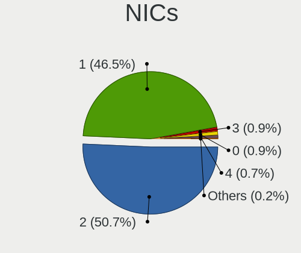

| Total | Computers | Percent |
|-------|-----------|---------|
| 2     | 215       | 50.71%  |
| 1     | 197       | 46.46%  |
| 3     | 4         | 0.94%   |
| 0     | 4         | 0.94%   |
| 4     | 3         | 0.71%   |
| 5     | 1         | 0.24%   |

IPv6
----

IPv6 vs IPv4

| Used | Computers | Percent |
|------|-----------|---------|
| No   | 272       | 61.4%   |
| Yes  | 171       | 38.6%   |

Bluetooth
---------

Bluetooth Vendor
----------------

Controller vendors

| Vendor                          | Computers | Percent |
|---------------------------------|-----------|---------|
| Intel                           | 129       | 42.72%  |
| Qualcomm Atheros Communications | 27        | 8.94%   |
| IMC Networks                    | 27        | 8.94%   |
| Realtek Semiconductor           | 26        | 8.61%   |
| Cambridge Silicon Radio         | 20        | 6.62%   |
| Foxconn / Hon Hai               | 15        | 4.97%   |
| Apple                           | 12        | 3.97%   |
| Broadcom                        | 9         | 2.98%   |
| Lite-On Technology              | 8         | 2.65%   |
| Toshiba                         | 5         | 1.66%   |
| TP-Link                         | 4         | 1.32%   |
| MediaTek                        | 4         | 1.32%   |
| Realtek                         | 3         | 0.99%   |
| Ralink                          | 3         | 0.99%   |
| Dell                            | 3         | 0.99%   |
| ASUSTek Computer                | 2         | 0.66%   |
| SiW                             | 1         | 0.33%   |
| Ralink Technology               | 1         | 0.33%   |
| Qcom                            | 1         | 0.33%   |
| Marvell Semiconductor           | 1         | 0.33%   |
| Hewlett-Packard                 | 1         | 0.33%   |

Bluetooth Model
---------------

Controller models

| Model                                                                               | Computers | Percent |
|-------------------------------------------------------------------------------------|-----------|---------|
| Intel Bluetooth wireless interface                                                  | 41        | 13.58%  |
| Intel AX201 Bluetooth                                                               | 28        | 9.27%   |
| Cambridge Silicon Radio Bluetooth Dongle (HCI mode)                                 | 20        | 6.62%   |
| Intel Bluetooth 9460/9560 Jefferson Peak (JfP)                                      | 18        | 5.96%   |
| Intel AX200 Bluetooth                                                               | 18        | 5.96%   |
| Realtek Bluetooth Radio                                                             | 16        | 5.3%    |
| IMC Networks Bluetooth Radio                                                        | 15        | 4.97%   |
| Qualcomm Atheros  Bluetooth Device                                                  | 14        | 4.64%   |
| Realtek  Bluetooth 4.2 Adapter                                                      | 9         | 2.98%   |
| Intel AX211 Bluetooth                                                               | 9         | 2.98%   |
| IMC Networks Bluetooth Device                                                       | 8         | 2.65%   |
| Apple Bluetooth USB Host Controller                                                 | 5         | 1.66%   |
| Apple Bluetooth Host Controller                                                     | 5         | 1.66%   |
| TP-Link TP-Link Bluetooth USB Adapter                                               | 4         | 1.32%   |
| Qualcomm Atheros AR3011 Bluetooth                                                   | 4         | 1.32%   |
| MediaTek Wireless_Device                                                            | 4         | 1.32%   |
| Intel Wireless-AC 3168 Bluetooth                                                    | 4         | 1.32%   |
| IMC Networks Wireless_Device                                                        | 4         | 1.32%   |
| Realtek Bluetooth Radio                                                             | 3         | 0.99%   |
| Ralink RT3290 Bluetooth                                                             | 3         | 0.99%   |
| Qualcomm Atheros AR9462 Bluetooth                                                   | 3         | 0.99%   |
| Qualcomm Atheros AR3012 Bluetooth 4.0                                               | 3         | 0.99%   |
| Intel Wireless-AC 9260 Bluetooth Adapter                                            | 3         | 0.99%   |
| Intel Centrino Bluetooth Wireless Transceiver                                       | 3         | 0.99%   |
| Intel AX210 Bluetooth                                                               | 3         | 0.99%   |
| Foxconn / Hon Hai BCM43142A0                                                        | 3         | 0.99%   |
| Toshiba RT Bluetooth Radio                                                          | 2         | 0.66%   |
| Qualcomm Atheros QCA61x4 Bluetooth 4.0                                              | 2         | 0.66%   |
| Lite-On Wireless_Device                                                             | 2         | 0.66%   |
| Foxconn / Hon Hai MediaTek Bluetooth Adapter                                        | 2         | 0.66%   |
| Foxconn / Hon Hai Foxconn T77H114 BCM2070 [Single-Chip Bluetooth 2.1 + EDR Adapter] | 2         | 0.66%   |
| Foxconn / Hon Hai Bluetooth USB Host Controller                                     | 2         | 0.66%   |
| Foxconn / Hon Hai Bluetooth Device                                                  | 2         | 0.66%   |
| Apple Built-in Bluetooth 2.0+EDR HCI                                                | 2         | 0.66%   |
| Toshiba Bluetooth Device                                                            | 1         | 0.33%   |
| Toshiba Askey for                                                                   | 1         | 0.33%   |
| Toshiba Askey Bluetooth Module                                                      | 1         | 0.33%   |
| SiW SiW                                                                             | 1         | 0.33%   |
| Realtek RTL8723A Bluetooth                                                          | 1         | 0.33%   |
| Ralink CSR BS8510                                                                   | 1         | 0.33%   |

Sound
-----

Sound Vendor
------------

Sound card vendors

| Vendor                           | Computers | Percent |
|----------------------------------|-----------|---------|
| Intel                            | 338       | 57%     |
| Nvidia                           | 110       | 18.55%  |
| AMD                              | 93        | 15.68%  |
| C-Media Electronics              | 12        | 2.02%   |
| Kingston Technology              | 6         | 1.01%   |
| Creative Labs                    | 3         | 0.51%   |
| Tenx Technology                  | 2         | 0.34%   |
| Realtek Semiconductor            | 2         | 0.34%   |
| MV-SILICON                       | 2         | 0.34%   |
| Cooler Master                    | 2         | 0.34%   |
| VIA Technologies                 | 1         | 0.17%   |
| Texas Instruments                | 1         | 0.17%   |
| Sony                             | 1         | 0.17%   |
| Silicon Integrated Systems [SiS] | 1         | 0.17%   |
| Samson Technologies              | 1         | 0.17%   |
| Razer USA                        | 1         | 0.17%   |
| Plantronics                      | 1         | 0.17%   |
| Nreal                            | 1         | 0.17%   |
| Nordic Semiconductor ASA         | 1         | 0.17%   |
| Microsoft                        | 1         | 0.17%   |
| Micro Star International         | 1         | 0.17%   |
| Logitech                         | 1         | 0.17%   |
| Lenovo                           | 1         | 0.17%   |
| KTMicro                          | 1         | 0.17%   |
| JMTek                            | 1         | 0.17%   |
| Jieli Technology                 | 1         | 0.17%   |
| Hewlett-Packard                  | 1         | 0.17%   |
| GYROCOM C&C                      | 1         | 0.17%   |
| Focusrite-Novation               | 1         | 0.17%   |
| Creative Technology              | 1         | 0.17%   |
| Corsair                          | 1         | 0.17%   |
| ASUSTek Computer                 | 1         | 0.17%   |
| Apple                            | 1         | 0.17%   |

Sound Model
-----------

Sound card models

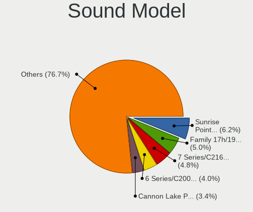

| Model                                                                      | Computers | Percent |
|----------------------------------------------------------------------------|-----------|---------|
| Intel Sunrise Point-LP HD Audio                                            | 42        | 6.17%   |
| AMD Family 17h/19h/1ah HD Audio Controller                                 | 34        | 4.99%   |
| Intel 7 Series/C216 Chipset Family High Definition Audio Controller        | 33        | 4.85%   |
| Intel 6 Series/C200 Series Chipset Family High Definition Audio Controller | 27        | 3.96%   |
| Intel Cannon Lake PCH cAVS                                                 | 23        | 3.38%   |
| Intel 8 Series/C220 Series Chipset High Definition Audio Controller        | 19        | 2.79%   |
| Intel Haswell-ULT HD Audio Controller                                      | 18        | 2.64%   |
| Intel 8 Series HD Audio Controller                                         | 18        | 2.64%   |
| AMD Renoir Radeon High Definition Audio Controller                         | 18        | 2.64%   |
| Intel 200 Series PCH HD Audio                                              | 17        | 2.5%    |
| AMD Starship/Matisse HD Audio Controller                                   | 16        | 2.35%   |
| Intel Xeon E3-1200 v3/4th Gen Core Processor HD Audio Controller           | 15        | 2.2%    |
| Intel Tiger Lake-LP Smart Sound Technology Audio Controller                | 15        | 2.2%    |
| AMD Rembrandt Radeon High Definition Audio Controller                      | 13        | 1.91%   |
| Intel 5 Series/3400 Series Chipset High Definition Audio                   | 11        | 1.62%   |
| Nvidia GP107GL High Definition Audio Controller                            | 9         | 1.32%   |
| Intel Ice Lake-LP Smart Sound Technology Audio Controller                  | 9         | 1.32%   |
| Intel Comet Lake PCH-LP cAVS                                               | 9         | 1.32%   |
| Intel Comet Lake PCH cAVS                                                  | 9         | 1.32%   |
| Intel Celeron/Pentium Silver Processor High Definition Audio               | 9         | 1.32%   |
| Intel 82801I (ICH9 Family) HD Audio Controller                             | 9         | 1.32%   |
| Intel 100 Series/C230 Series Chipset Family HD Audio Controller            | 9         | 1.32%   |
| AMD Raven/Raven2/Fenghuang HDMI/DP Audio Controller                        | 9         | 1.32%   |
| AMD Ellesmere HDMI Audio [Radeon RX 470/480 / 570/580/590]                 | 9         | 1.32%   |
| Nvidia TU106 High Definition Audio Controller                              | 8         | 1.17%   |
| Nvidia TU116 High Definition Audio Controller                              | 7         | 1.03%   |
| Intel Wildcat Point-LP High Definition Audio Controller                    | 7         | 1.03%   |
| Intel Broadwell-U Audio Controller                                         | 7         | 1.03%   |
| Nvidia TU107 GeForce GTX 1650 High Definition Audio Controller             | 6         | 0.88%   |
| Nvidia GP106 High Definition Audio Controller                              | 6         | 0.88%   |
| Nvidia GP104 High Definition Audio Controller                              | 6         | 0.88%   |
| Nvidia GK208 HDMI/DP Audio Controller                                      | 6         | 0.88%   |
| Nvidia GF108 High Definition Audio Controller                              | 6         | 0.88%   |
| Nvidia GA106 High Definition Audio Controller                              | 6         | 0.88%   |
| Intel Cannon Point-LP High Definition Audio Controller                     | 6         | 0.88%   |
| Intel 9 Series Chipset Family HD Audio Controller                          | 6         | 0.88%   |
| Nvidia GM107 High Definition Audio Controller [GeForce 940MX]              | 5         | 0.73%   |
| Nvidia GK107 HDMI Audio Controller                                         | 5         | 0.73%   |
| Intel NM10/ICH7 Family High Definition Audio Controller                    | 5         | 0.73%   |
| Intel CM238 HD Audio Controller                                            | 5         | 0.73%   |

Memory
------

Memory Vendor
-------------

Memory module vendors

| Vendor                               | Computers | Percent |
|--------------------------------------|-----------|---------|
| Samsung Electronics                  | 53        | 23.04%  |
| SK hynix                             | 46        | 20%     |
| Micron Technology                    | 30        | 13.04%  |
| Kingston                             | 27        | 11.74%  |
| Unknown                              | 16        | 6.96%   |
| Crucial                              | 12        | 5.22%   |
| G.Skill                              | 10        | 4.35%   |
| Team                                 | 7         | 3.04%   |
| Corsair                              | 6         | 2.61%   |
| Hikvision                            | 3         | 1.3%    |
| Elpida                               | 3         | 1.3%    |
| Unknown (ABCD)                       | 2         | 0.87%   |
| Nanya Technology                     | 2         | 0.87%   |
| A-DATA Technology                    | 2         | 0.87%   |
| Unknown (0x00FFFFFFFFFFFFFF)         | 1         | 0.43%   |
| Toshiba                              | 1         | 0.43%   |
| Silicon Power                        | 1         | 0.43%   |
| Ramaxel Technology                   | 1         | 0.43%   |
| Patriot Memory (PDP Systems)         | 1         | 0.43%   |
| Lexar Co Limited                     | 1         | 0.43%   |
| KLEVV                                | 1         | 0.43%   |
| Kingmax Semiconductor                | 1         | 0.43%   |
| D3860000                             | 1         | 0.43%   |
| Chun Well Technology Holding Limited | 1         | 0.43%   |
| ASint Technology                     | 1         | 0.43%   |

Memory Model
------------

Memory module models

| Model                                                        | Computers | Percent |
|--------------------------------------------------------------|-----------|---------|
| Samsung RAM M471A5244CB0-CTD 4GB SODIMM DDR4 3266MT/s        | 4         | 1.66%   |
| SK hynix RAM HMA82GS6CJR8N-VK 16GB SODIMM DDR4 2667MT/s      | 3         | 1.24%   |
| SK hynix RAM HMA81GS6JJR8N-VK 8GB SODIMM DDR4 2667MT/s       | 3         | 1.24%   |
| Samsung RAM M471B1G73EB0-YK0 8GB SODIMM DDR3 1600MT/s        | 3         | 1.24%   |
| Samsung RAM M471A1K43DB1-CWE 8GB SODIMM DDR4 3200MT/s        | 3         | 1.24%   |
| Kingston RAM KHX2666C16/16G 16GB DIMM DDR4 3200MT/s          | 3         | 1.24%   |
| Team RAM TEAMGROUP-UD3-1600 8GB DIMM DDR3 1600MT/s           | 2         | 0.83%   |
| SK hynix RAM Module 8GB SODIMM DDR3 1600MT/s                 | 2         | 0.83%   |
| SK hynix RAM HMT451S6BFR8A-PB 4GB SODIMM DDR3 1600MT/s       | 2         | 0.83%   |
| SK hynix RAM HMT451S6AFR8A-PB 4GB SODIMM DDR3 1600MT/s       | 2         | 0.83%   |
| SK hynix RAM HMT325S6BFR8C-H9 2GB SODIMM DDR3 1334MT/s       | 2         | 0.83%   |
| SK hynix RAM HMA851U6AFR6N-UH 4GB DIMM DDR4 2400MT/s         | 2         | 0.83%   |
| SK hynix RAM H58G66BK7BX067 4GB Row Of Chips LPDDR5 8533MT/s | 2         | 0.83%   |
| Samsung RAM M471B5673FH0-CF8 2GB SODIMM DDR3 1067MT/s        | 2         | 0.83%   |
| Samsung RAM M471B5273CH0-CH9 4GB SODIMM DDR3 1334MT/s        | 2         | 0.83%   |
| Samsung RAM M471A5244CB0-CTD 4GB Row Of Chips DDR4 2667MT/s  | 2         | 0.83%   |
| Samsung RAM M471A1K43EB1-CWE 8GB SODIMM DDR4 3200MT/s        | 2         | 0.83%   |
| Samsung RAM M471A1K43DB1-CTD 8GB SODIMM DDR4 2667MT/s        | 2         | 0.83%   |
| Samsung RAM M471A1G44AB0-CWE 8GB Row Of Chips DDR4 3200MT/s  | 2         | 0.83%   |
| Micron RAM Module 4GB DIMM DDR3 1333MT/s                     | 2         | 0.83%   |
| Micron RAM 16KTF1G64HZ-1G6E1 8GB SODIMM DDR3 1600MT/s        | 2         | 0.83%   |
| Hikvision RAM HKED4162DAA1D0MA1 16GB SODIMM DDR4 2667MT/s    | 2         | 0.83%   |
| G.Skill RAM F3-12800CL10-8GBXL 8GB DIMM DDR3 1600MT/s        | 2         | 0.83%   |
| Elpida RAM EBJ21UE8BDS0-DJ-F 2GB SODIMM DDR3 1334MT/s        | 2         | 0.83%   |
| Unknown RAM Module 8GB DIMM DDR3 1600MT/s                    | 1         | 0.41%   |
| Unknown RAM Module 8192MB SODIMM DDR3 1600MT/s               | 1         | 0.41%   |
| Unknown RAM Module 8192MB DIMM 1333MT/s                      | 1         | 0.41%   |
| Unknown RAM Module 4GB SODIMM DDR4 2667MT/s                  | 1         | 0.41%   |
| Unknown RAM Module 4GB SODIMM DDR3 1600MT/s                  | 1         | 0.41%   |
| Unknown RAM Module 4GB Row Of Chips LPDDR4 4267MT/s          | 1         | 0.41%   |
| Unknown RAM Module 4GB DIMM DDR3 1600MT/s                    | 1         | 0.41%   |
| Unknown RAM Module 4096MB DIMM DDR3 1333MT/s                 | 1         | 0.41%   |
| Unknown RAM Module 2GB SODIMM DDR3 1333MT/s                  | 1         | 0.41%   |
| Unknown RAM Module 2GB SODIMM DDR2                           | 1         | 0.41%   |
| Unknown RAM Module 2GB SODIMM 800MT/s                        | 1         | 0.41%   |
| Unknown RAM Module 2GB Row Of Chips LPDDR4 4267MT/s          | 1         | 0.41%   |
| Unknown RAM Module 2GB DIMM 800MT/s                          | 1         | 0.41%   |
| Unknown RAM Module 2048MB SODIMM DDR2                        | 1         | 0.41%   |
| Unknown RAM Module 16GB SODIMM DDR4 2667MT/s                 | 1         | 0.41%   |
| Unknown RAM Module 1024MB DIMM 667MT/s                       | 1         | 0.41%   |

Memory Kind
-----------

Memory module kinds

| Kind    | Computers | Percent |
|---------|-----------|---------|
| DDR4    | 93        | 48.69%  |
| DDR3    | 62        | 32.46%  |
| LPDDR4  | 10        | 5.24%   |
| LPDDR3  | 6         | 3.14%   |
| DDR5    | 5         | 2.62%   |
| DDR2    | 5         | 2.62%   |
| LPDDR5  | 4         | 2.09%   |
| Unknown | 4         | 2.09%   |
| SDRAM   | 2         | 1.05%   |

Memory Form Factor
------------------

Physical design of the memory module

| Name         | Computers | Percent |
|--------------|-----------|---------|
| SODIMM       | 103       | 54.21%  |
| DIMM         | 63        | 33.16%  |
| Row Of Chips | 22        | 11.58%  |
| Chip         | 2         | 1.05%   |

Memory Size
-----------

Memory module size

| Size  | Computers | Percent |
|-------|-----------|---------|
| 8192  | 80        | 39.22%  |
| 4096  | 54        | 26.47%  |
| 16384 | 35        | 17.16%  |
| 2048  | 19        | 9.31%   |
| 32768 | 10        | 4.9%    |
| 1024  | 4         | 1.96%   |
| 65536 | 1         | 0.49%   |
| 24576 | 1         | 0.49%   |

Memory Speed
------------

Memory module speed

| Speed   | Computers | Percent |
|---------|-----------|---------|
| 1600    | 41        | 19.25%  |
| 3200    | 39        | 18.31%  |
| 2667    | 34        | 15.96%  |
| 1333    | 12        | 5.63%   |
| 2400    | 11        | 5.16%   |
| 2133    | 11        | 5.16%   |
| 1334    | 9         | 4.23%   |
| 3600    | 6         | 2.82%   |
| 4267    | 4         | 1.88%   |
| 3266    | 4         | 1.88%   |
| 1867    | 4         | 1.88%   |
| 800     | 4         | 1.88%   |
| 3733    | 3         | 1.41%   |
| 1800    | 3         | 1.41%   |
| 1067    | 3         | 1.41%   |
| 8533    | 2         | 0.94%   |
| 4266    | 2         | 0.94%   |
| 4000    | 2         | 0.94%   |
| 2933    | 2         | 0.94%   |
| 1866    | 2         | 0.94%   |
| 667     | 2         | 0.94%   |
| 12800   | 1         | 0.47%   |
| 8000    | 1         | 0.47%   |
| 6400    | 1         | 0.47%   |
| 5600    | 1         | 0.47%   |
| 4800    | 1         | 0.47%   |
| 4199    | 1         | 0.47%   |
| 3466    | 1         | 0.47%   |
| 3400    | 1         | 0.47%   |
| 1648    | 1         | 0.47%   |
| 1639    | 1         | 0.47%   |
| 1066    | 1         | 0.47%   |
| 975     | 1         | 0.47%   |
| Unknown | 1         | 0.47%   |

Printers & scanners
-------------------

Printer Vendor
--------------

Printer device vendors

| Vendor                 | Computers | Percent |
|------------------------|-----------|---------|
| Hewlett-Packard        | 8         | 66.67%  |
| Brother Industries     | 3         | 25%     |
| Panasonic (Matsushita) | 1         | 8.33%   |

Printer Model
-------------

Printer device models

| Model                              | Computers | Percent |
|------------------------------------|-----------|---------|
| Brother HL-2130 series             | 2         | 15.38%  |
| Panasonic (Matsushita) KX-MB1500RU | 1         | 7.69%   |
| HP LaserJet P2055 series           | 1         | 7.69%   |
| HP LaserJet P2015 series           | 1         | 7.69%   |
| HP LaserJet M101-M106              | 1         | 7.69%   |
| HP LaserJet CP 1025                | 1         | 7.69%   |
| HP LaserJet 400 M401n              | 1         | 7.69%   |
| HP LaserJet 1020                   | 1         | 7.69%   |
| HP DeskJet Plus 4100 series        | 1         | 7.69%   |
| HP DeskJet 2700 series             | 1         | 7.69%   |
| HP DeskJet 2130 series             | 1         | 7.69%   |
| Brother DCP-T300                   | 1         | 7.69%   |

Scanner Vendor
--------------

Scanner device vendors

| Vendor | Computers | Percent |
|--------|-----------|---------|
| Canon  | 2         | 100%    |

Scanner Model
-------------

Scanner device models

| Model                    | Computers | Percent |
|--------------------------|-----------|---------|
| Canon CanoScan LiDE 500F | 1         | 50%     |
| Canon CanoScan LiDE 120  | 1         | 50%     |

Camera
------

Camera Vendor
-------------

Camera device vendors

| Vendor                                 | Computers | Percent |
|----------------------------------------|-----------|---------|
| Chicony Electronics                    | 40        | 17.7%   |
| IMC Networks                           | 29        | 12.83%  |
| Microdia                               | 20        | 8.85%   |
| Bison Electronics                      | 18        | 7.96%   |
| Apple                                  | 15        | 6.64%   |
| Realtek Semiconductor                  | 13        | 5.75%   |
| Sunplus Innovation Technology          | 12        | 5.31%   |
| Quanta                                 | 10        | 4.42%   |
| Lite-On Technology                     | 9         | 3.98%   |
| Suyin                                  | 7         | 3.1%    |
| Cheng Uei Precision Industry (Foxlink) | 7         | 3.1%    |
| Microsoft                              | 6         | 2.65%   |
| Shinetech                              | 4         | 1.77%   |
| Samsung Electronics                    | 4         | 1.77%   |
| Importek                               | 4         | 1.77%   |
| Luxvisions Innotech Limited            | 3         | 1.33%   |
| Alcor Micro                            | 3         | 1.33%   |
| Acer                                   | 3         | 1.33%   |
| Z-Star Microelectronics                | 2         | 0.88%   |
| Syntek                                 | 2         | 0.88%   |
| Silicon Motion                         | 2         | 0.88%   |
| Ricoh                                  | 2         | 0.88%   |
| Logitech                               | 2         | 0.88%   |
| Lenovo                                 | 2         | 0.88%   |
| ARC International                      | 2         | 0.88%   |
| TXD                                    | 1         | 0.44%   |
| Sonix Technology                       | 1         | 0.44%   |
| OmniVision Technologies                | 1         | 0.44%   |
| Arkmicro Technologies                  | 1         | 0.44%   |
| Anker PowerConf C200                   | 1         | 0.44%   |

Camera Model
------------

Camera device models

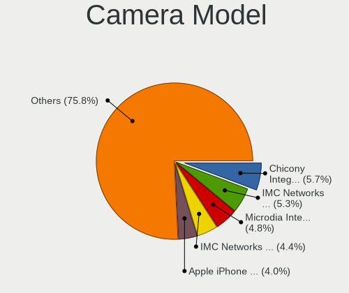

| Model                                                          | Computers | Percent |
|----------------------------------------------------------------|-----------|---------|
| Chicony Integrated Camera                                      | 13        | 5.73%   |
| IMC Networks USB2.0 VGA UVC WebCam                             | 12        | 5.29%   |
| Microdia Integrated_Webcam_HD                                  | 11        | 4.85%   |
| IMC Networks USB2.0 HD UVC WebCam                              | 10        | 4.41%   |
| Apple iPhone 5/5C/5S/6/SE/7/8/X/XR                             | 9         | 3.96%   |
| Bison Integrated Camera                                        | 7         | 3.08%   |
| Sunplus Integrated_Webcam_HD                                   | 4         | 1.76%   |
| Shinetech USB2.0 FHD UVC WebCam                                | 4         | 1.76%   |
| Samsung Galaxy series, misc. (MTP mode)                        | 4         | 1.76%   |
| Lite-On HP TrueVision HD Camera                                | 3         | 1.32%   |
| IMC Networks HD Camera                                         | 3         | 1.32%   |
| Bison Lenovo EasyCamera                                        | 3         | 1.32%   |
| Apple FaceTime HD Camera                                       | 3         | 1.32%   |
| Acer Integrated Camera                                         | 3         | 1.32%   |
| Suyin 1.3M HD WebCam                                           | 2         | 0.88%   |
| Sunplus HD WebCam                                              | 2         | 0.88%   |
| Realtek Integrated_Webcam_HD                                   | 2         | 0.88%   |
| Realtek Integrated Webcam HD                                   | 2         | 0.88%   |
| Realtek Integrated Webcam                                      | 2         | 0.88%   |
| Realtek HP Truevision HD integrated webcam                     | 2         | 0.88%   |
| Quanta HP Wide Vision HD Camera                                | 2         | 0.88%   |
| Quanta HD Camera                                               | 2         | 0.88%   |
| Microsoft LifeCam HD-3000                                      | 2         | 0.88%   |
| Microdia Laptop_Integrated_Webcam_HD                           | 2         | 0.88%   |
| Microdia HP Integrated Webcam                                  | 2         | 0.88%   |
| Luxvisions Innotech Limited HP Wide Vision HD Camera           | 2         | 0.88%   |
| Lite-On TOSHIBA Web Camera - HD                                | 2         | 0.88%   |
| Importek Laptop Integrated Webcam                              | 2         | 0.88%   |
| Chicony HP Wide Vision HD Camera                               | 2         | 0.88%   |
| Chicony HD WebCam                                              | 2         | 0.88%   |
| Chicony HD User Facing                                         | 2         | 0.88%   |
| Chicony Front Camera                                           | 2         | 0.88%   |
| Chicony EasyCamera                                             | 2         | 0.88%   |
| Cheng Uei Precision Industry (Foxlink) HP TrueVision HD Camera | 2         | 0.88%   |
| Bison HD Webcam                                                | 2         | 0.88%   |
| ARC International Camera                                       | 2         | 0.88%   |
| Apple FaceTime HD Camera (Built-in)                            | 2         | 0.88%   |
| Alcor Micro Asus Integrated Webcam                             | 2         | 0.88%   |
| Z-Star Lenovo IdeaCentre Web Camera                            | 1         | 0.44%   |
| Z-Star Integrated Camera                                       | 1         | 0.44%   |

Security
--------

Fingerprint Vendor
------------------

Fingerprint sensor vendors

| Vendor                     | Computers | Percent |
|----------------------------|-----------|---------|
| Synaptics                  | 14        | 32.56%  |
| Shenzhen Goodix Technology | 10        | 23.26%  |
| Validity Sensors           | 9         | 20.93%  |
| Elan Microelectronics      | 5         | 11.63%  |
| Upek                       | 2         | 4.65%   |
| LighTuning Technology      | 2         | 4.65%   |
| AuthenTec                  | 1         | 2.33%   |

Fingerprint Model
-----------------

Fingerprint sensor models

| Model                                                                      | Computers | Percent |
|----------------------------------------------------------------------------|-----------|---------|
| Shenzhen Goodix  Fingerprint Device                                        | 7         | 16.28%  |
| Synaptics Metallica MIS Touch Fingerprint Reader                           | 4         | 9.3%    |
| Synaptics  WBDI                                                            | 3         | 6.98%   |
| Synaptics Prometheus MIS Touch Fingerprint Reader                          | 3         | 6.98%   |
| Elan ELAN:ARM-M4                                                           | 3         | 6.98%   |
| Validity Sensors VFS7500 Touch Fingerprint Sensor                          | 2         | 4.65%   |
| Validity Sensors VFS471 Fingerprint Reader                                 | 2         | 4.65%   |
| Synaptics Fingerprint scanner                                              | 2         | 4.65%   |
| Shenzhen Goodix Fingerprint Reader                                         | 2         | 4.65%   |
| Elan ELAN:Fingerprint                                                      | 2         | 4.65%   |
| Validity Sensors VFS495 Fingerprint Reader                                 | 1         | 2.33%   |
| Validity Sensors VFS101 Fingerprint Reader                                 | 1         | 2.33%   |
| Validity Sensors VFS 5011 fingerprint sensor                               | 1         | 2.33%   |
| Validity Sensors Synaptics VFS7552 Touch Fingerprint Sensor with PurePrint | 1         | 2.33%   |
| Validity Sensors Swipe Fingerprint Sensor                                  | 1         | 2.33%   |
| Upek TCS5B Fingerprint sensor                                              | 1         | 2.33%   |
| Upek Biometric Touchchip/Touchstrip Fingerprint Sensor                     | 1         | 2.33%   |
| Synaptics WBDI                                                             | 1         | 2.33%   |
| Synaptics Metallica MOH Touch Fingerprint Reader                           | 1         | 2.33%   |
| Shenzhen Goodix FingerPrint                                                | 1         | 2.33%   |
| LighTuning ES603 Swipe Fingerprint Sensor                                  | 1         | 2.33%   |
| LighTuning EgisTec Touch Fingerprint Sensor                                | 1         | 2.33%   |
| AuthenTec AES2810                                                          | 1         | 2.33%   |

Chipcard Vendor
---------------

Chipcard module vendors

| Vendor      | Computers | Percent |
|-------------|-----------|---------|
| Broadcom    | 4         | 57.14%  |
| Alcor Micro | 2         | 28.57%  |
| O2 Micro    | 1         | 14.29%  |

Chipcard Model
--------------

Chipcard module models

| Model                                                                        | Computers | Percent |
|------------------------------------------------------------------------------|-----------|---------|
| Broadcom BCM5880 Secure Applications Processor with fingerprint swipe sensor | 2         | 28.57%  |
| Alcor Micro AU9540 Smartcard Reader                                          | 2         | 28.57%  |
| O2 Micro OZ776 CCID Smartcard Reader                                         | 1         | 14.29%  |
| Broadcom BCM5880 Secure Applications Processor                               | 1         | 14.29%  |
| Broadcom 5880                                                                | 1         | 14.29%  |

Unsupported
-----------

Unsupported Devices
-------------------

Total unsupported devices on board

| Total | Computers | Percent |
|-------|-----------|---------|
| 0     | 302       | 68.33%  |
| 1     | 110       | 24.89%  |
| 2     | 22        | 4.98%   |
| 3     | 6         | 1.36%   |
| 4     | 2         | 0.45%   |

Unsupported Device Types
------------------------

Types of unsupported devices

| Type                     | Computers | Percent |
|--------------------------|-----------|---------|
| Fingerprint reader       | 43        | 25.75%  |
| Graphics card            | 41        | 24.55%  |
| Net/wireless             | 23        | 13.77%  |
| Multimedia controller    | 16        | 9.58%   |
| Communication controller | 12        | 7.19%   |
| Unassigned class         | 7         | 4.19%   |
| Chipcard                 | 7         | 4.19%   |
| Sound                    | 4         | 2.4%    |
| Camera                   | 4         | 2.4%    |
| Bluetooth                | 4         | 2.4%    |
| Storage/raid             | 1         | 0.6%    |
| Storage/ide              | 1         | 0.6%    |
| Storage                  | 1         | 0.6%    |
| Modem                    | 1         | 0.6%    |
| Dvb card                 | 1         | 0.6%    |
| Card reader              | 1         | 0.6%    |

