Linux in Saudi Arabia - Tested Hardware & Statistics
----------------------------------------------------

A project to collect tested hardware configurations for Linux in Saudi Arabia.

Anyone can contribute to this report by the [hw-probe](https://github.com/linuxhw/hw-probe) tool:

    sudo -E hw-probe -all -upload

Please contribute! Especially if your hardware is rare.

This is a report for all computer types. See also reports for [desktops](/Location/Saudi_Arabia/Desktop/README.md) and [notebooks](/Location/Saudi_Arabia/Notebook/README.md).

Contents
--------

* [ Test Cases ](#test-cases)

* [ System ](#system)
  - [ OS                       ](#os)
  - [ OS Family                ](#os-family)
  - [ Kernel                   ](#kernel)
  - [ Kernel Family            ](#kernel-family)
  - [ Kernel Major Ver.        ](#kernel-major-ver)
  - [ Arch                     ](#arch)
  - [ DE                       ](#de)
  - [ Display Server           ](#display-server)
  - [ Display Manager          ](#display-manager)
  - [ OS Lang                  ](#os-lang)
  - [ Boot Mode                ](#boot-mode)
  - [ Filesystem               ](#filesystem)
  - [ Part. scheme             ](#part-scheme)
  - [ Dual Boot with Linux/BSD ](#dual-boot-with-linuxbsd)
  - [ Dual Boot (Win)          ](#dual-boot-win)

* [ Board ](#board)
  - [ Vendor                   ](#vendor)
  - [ Model                    ](#model)
  - [ Model Family             ](#model-family)
  - [ MFG Year                 ](#mfg-year)
  - [ Form Factor              ](#form-factor)
  - [ Secure Boot              ](#secure-boot)
  - [ Coreboot                 ](#coreboot)
  - [ RAM Size                 ](#ram-size)
  - [ RAM Used                 ](#ram-used)
  - [ Total Drives             ](#total-drives)
  - [ Has CD-ROM               ](#has-cd-rom)
  - [ Has Ethernet             ](#has-ethernet)
  - [ Has WiFi                 ](#has-wifi)
  - [ Has Bluetooth            ](#has-bluetooth)

* [ Location ](#location)
  - [ Country                  ](#country)
  - [ City                     ](#city)

* [ Drives ](#drives)
  - [ Drive Vendor             ](#drive-vendor)
  - [ Drive Model              ](#drive-model)
  - [ HDD Vendor               ](#hdd-vendor)
  - [ SSD Vendor               ](#ssd-vendor)
  - [ Drive Kind               ](#drive-kind)
  - [ Drive Connector          ](#drive-connector)
  - [ Drive Size               ](#drive-size)
  - [ Space Total              ](#space-total)
  - [ Space Used               ](#space-used)
  - [ Malfunc. Drives          ](#malfunc-drives)
  - [ Malfunc. Drive Vendor    ](#malfunc-drive-vendor)
  - [ Malfunc. HDD Vendor      ](#malfunc-hdd-vendor)
  - [ Malfunc. Drive Kind      ](#malfunc-drive-kind)
  - [ Failed Drives            ](#failed-drives)
  - [ Failed Drive Vendor      ](#failed-drive-vendor)
  - [ Drive Status             ](#drive-status)

* [ Storage controller ](#storage-controller)
  - [ Storage Vendor           ](#storage-vendor)
  - [ Storage Model            ](#storage-model)
  - [ Storage Kind             ](#storage-kind)

* [ Processor ](#processor)
  - [ CPU Vendor               ](#cpu-vendor)
  - [ CPU Model                ](#cpu-model)
  - [ CPU Model Family         ](#cpu-model-family)
  - [ CPU Cores                ](#cpu-cores)
  - [ CPU Sockets              ](#cpu-sockets)
  - [ CPU Threads              ](#cpu-threads)
  - [ CPU Op-Modes             ](#cpu-op-modes)
  - [ CPU Microcode            ](#cpu-microcode)
  - [ CPU Microarch            ](#cpu-microarch)

* [ Graphics ](#graphics)
  - [ GPU Vendor               ](#gpu-vendor)
  - [ GPU Model                ](#gpu-model)
  - [ GPU Combo                ](#gpu-combo)
  - [ GPU Driver               ](#gpu-driver)
  - [ GPU Memory               ](#gpu-memory)

* [ Monitor ](#monitor)
  - [ Monitor Vendor           ](#monitor-vendor)
  - [ Monitor Model            ](#monitor-model)
  - [ Monitor Resolution       ](#monitor-resolution)
  - [ Monitor Diagonal         ](#monitor-diagonal)
  - [ Monitor Width            ](#monitor-width)
  - [ Aspect Ratio             ](#aspect-ratio)
  - [ Monitor Area             ](#monitor-area)
  - [ Pixel Density            ](#pixel-density)
  - [ Multiple Monitors        ](#multiple-monitors)

* [ Network ](#network)
  - [ Net Controller Vendor    ](#net-controller-vendor)
  - [ Net Controller Model     ](#net-controller-model)
  - [ Wireless Vendor          ](#wireless-vendor)
  - [ Wireless Model           ](#wireless-model)
  - [ Ethernet Vendor          ](#ethernet-vendor)
  - [ Ethernet Model           ](#ethernet-model)
  - [ Net Controller Kind      ](#net-controller-kind)
  - [ Used Controller          ](#used-controller)
  - [ NICs                     ](#nics)
  - [ IPv6                     ](#ipv6)

* [ Bluetooth ](#bluetooth)
  - [ Bluetooth Vendor         ](#bluetooth-vendor)
  - [ Bluetooth Model          ](#bluetooth-model)

* [ Sound ](#sound)
  - [ Sound Vendor             ](#sound-vendor)
  - [ Sound Model              ](#sound-model)

* [ Memory ](#memory)
  - [ Memory Vendor            ](#memory-vendor)
  - [ Memory Model             ](#memory-model)
  - [ Memory Kind              ](#memory-kind)
  - [ Memory Form Factor       ](#memory-form-factor)
  - [ Memory Size              ](#memory-size)
  - [ Memory Speed             ](#memory-speed)

* [ Printers & scanners ](#printers--scanners)
  - [ Printer Vendor           ](#printer-vendor)
  - [ Printer Model            ](#printer-model)
  - [ Scanner Vendor           ](#scanner-vendor)
  - [ Scanner Model            ](#scanner-model)

* [ Camera ](#camera)
  - [ Camera Vendor            ](#camera-vendor)
  - [ Camera Model             ](#camera-model)

* [ Security ](#security)
  - [ Fingerprint Vendor       ](#fingerprint-vendor)
  - [ Fingerprint Model        ](#fingerprint-model)
  - [ Chipcard Vendor          ](#chipcard-vendor)
  - [ Chipcard Model           ](#chipcard-model)

* [ Unsupported ](#unsupported)
  - [ Unsupported Devices      ](#unsupported-devices)
  - [ Unsupported Device Types ](#unsupported-device-types)

Test Cases
----------

Total: 564

| Vendor        | Model                       | Form-Factor | Probe                                                      | Date         |
|---------------|-----------------------------|-------------|------------------------------------------------------------|--------------|
| HP            | 3397                        | Desktop     | [5740126c3c](https://linux-hardware.org/?probe=5740126c3c) | Sep 25, 2023 |
| Lenovo        | IdeaPad 3 14IIL05 81WD      | Notebook    | [683cbd037a](https://linux-hardware.org/?probe=683cbd037a) | Sep 23, 2023 |
| Apple         | MacBookPro9,2               | Notebook    | [8064cec888](https://linux-hardware.org/?probe=8064cec888) | Sep 17, 2023 |
| Apple         | MacBook5,2                  | Notebook    | [7cdaac7be4](https://linux-hardware.org/?probe=7cdaac7be4) | Sep 16, 2023 |
| Apple         | MacBook5,2                  | Notebook    | [192e02b434](https://linux-hardware.org/?probe=192e02b434) | Sep 15, 2023 |
| Dell          | Inspiron 5537               | Notebook    | [b06966adc5](https://linux-hardware.org/?probe=b06966adc5) | Sep 14, 2023 |
| Dell          | Inspiron 5537               | Notebook    | [9f459c45cc](https://linux-hardware.org/?probe=9f459c45cc) | Sep 14, 2023 |
| Lenovo        | 3102 SDK0J40697 WIN 3305... | Desktop     | [40df085797](https://linux-hardware.org/?probe=40df085797) | Sep 12, 2023 |
| Lenovo        | 3102 SDK0J40697 WIN 3305... | Desktop     | [78f326afa5](https://linux-hardware.org/?probe=78f326afa5) | Sep 12, 2023 |
| Apple         | MacBookPro8,1               | Notebook    | [f913de368f](https://linux-hardware.org/?probe=f913de368f) | Sep 07, 2023 |
| Apple         | MacBookPro8,1               | Notebook    | [423b8d7135](https://linux-hardware.org/?probe=423b8d7135) | Sep 07, 2023 |
| HP            | 3397                        | Desktop     | [b9dabe8514](https://linux-hardware.org/?probe=b9dabe8514) | Aug 31, 2023 |
| Gigabyte      | Z590 AORUS ELITE AX         | Desktop     | [dc63902a68](https://linux-hardware.org/?probe=dc63902a68) | Aug 31, 2023 |
| Acer          | Switch SW312-31             | Tablet      | [082e1c2cc1](https://linux-hardware.org/?probe=082e1c2cc1) | Aug 24, 2023 |
| Lenovo        | 3740 NOK                    | Desktop     | [b1beaf9e38](https://linux-hardware.org/?probe=b1beaf9e38) | Aug 22, 2023 |
| Lenovo        | IdeaPadFlex 5 14IIL05 81... | Convertible | [088582c57c](https://linux-hardware.org/?probe=088582c57c) | Aug 15, 2023 |
| ASUSTek       | X99-A II                    | Desktop     | [4587b7ff26](https://linux-hardware.org/?probe=4587b7ff26) | Aug 14, 2023 |
| Lenovo        | 3740 NOK                    | Desktop     | [9964e9a820](https://linux-hardware.org/?probe=9964e9a820) | Aug 11, 2023 |
| Lenovo        | ThinkPad X1 Yoga 20FRS02... | Convertible | [ba520853af](https://linux-hardware.org/?probe=ba520853af) | Aug 10, 2023 |
| Lenovo        | ThinkPad X1 Yoga 20FRS02... | Convertible | [534fd57945](https://linux-hardware.org/?probe=534fd57945) | Aug 10, 2023 |
| Dell          | 0HY9JP A00                  | Desktop     | [f28a198267](https://linux-hardware.org/?probe=f28a198267) | Aug 10, 2023 |
| HP            | 3397                        | Desktop     | [d7edc80c00](https://linux-hardware.org/?probe=d7edc80c00) | Aug 08, 2023 |
| Lenovo        | B40-70 20392                | Notebook    | [ebf45c27f4](https://linux-hardware.org/?probe=ebf45c27f4) | Aug 07, 2023 |
| Lenovo        | B40-70 20392                | Notebook    | [221f9de00a](https://linux-hardware.org/?probe=221f9de00a) | Aug 06, 2023 |
| Apple         | Mac-031AEE4D24BFF0B1 Mac... | Mini pc     | [ea70e92c9a](https://linux-hardware.org/?probe=ea70e92c9a) | Aug 05, 2023 |
| GIADA         | Unknown                     | Notebook    | [cd8b23468a](https://linux-hardware.org/?probe=cd8b23468a) | Aug 03, 2023 |
| Lenovo        | 3102 SDK0J40697 WIN 3305... | Desktop     | [9dcbf7b10c](https://linux-hardware.org/?probe=9dcbf7b10c) | Aug 03, 2023 |
| Toshiba       | Satellite C850-B239         | Notebook    | [a075f60c70](https://linux-hardware.org/?probe=a075f60c70) | Aug 02, 2023 |
| Unknown       | Unknown                     | Notebook    | [570c98e6ab](https://linux-hardware.org/?probe=570c98e6ab) | Aug 01, 2023 |
| Unknown       | Unknown                     | Notebook    | [f54f3f3a4b](https://linux-hardware.org/?probe=f54f3f3a4b) | Aug 01, 2023 |
| Apple         | Mac-031AEE4D24BFF0B1 Mac... | Mini pc     | [70b94de26b](https://linux-hardware.org/?probe=70b94de26b) | Jul 31, 2023 |
| Gigabyte      | B460M DS3H V2               | Desktop     | [42b35cd473](https://linux-hardware.org/?probe=42b35cd473) | Jul 30, 2023 |
| Valve         | Jupiter                     | Notebook    | [fc294ac015](https://linux-hardware.org/?probe=fc294ac015) | Jul 27, 2023 |
| Lenovo        | 3740 NOK                    | Desktop     | [9e156dd92f](https://linux-hardware.org/?probe=9e156dd92f) | Jul 26, 2023 |
| ASUSTek       | X99-DELUXE II               | Desktop     | [35f41c1327](https://linux-hardware.org/?probe=35f41c1327) | Jul 25, 2023 |
| HP            | EliteBook 840 G5            | Notebook    | [f371e0efe5](https://linux-hardware.org/?probe=f371e0efe5) | Jul 22, 2023 |
| ASUSTek       | VivoBook_ASUSLaptop M150... | Notebook    | [55639a6416](https://linux-hardware.org/?probe=55639a6416) | Jul 21, 2023 |
| ASUSTek       | VivoBook_ASUSLaptop M150... | Notebook    | [8b2077101c](https://linux-hardware.org/?probe=8b2077101c) | Jul 21, 2023 |
| ASUSTek       | H81M-V3                     | Desktop     | [017671472c](https://linux-hardware.org/?probe=017671472c) | Jul 15, 2023 |
| Acer          | Aspire A715-42G             | Notebook    | [ac10700edb](https://linux-hardware.org/?probe=ac10700edb) | Jul 13, 2023 |
| Dell          | G3 3590                     | Notebook    | [adf89d2bba](https://linux-hardware.org/?probe=adf89d2bba) | Jul 12, 2023 |
| Apple         | Mac-031AEE4D24BFF0B1 Mac... | Mini pc     | [35f03cf89f](https://linux-hardware.org/?probe=35f03cf89f) | Jul 10, 2023 |
| Dell          | 0N4YC8 A00                  | Desktop     | [b6c778034c](https://linux-hardware.org/?probe=b6c778034c) | Jul 06, 2023 |
| Gigabyte      | Z790 GAMING X AX            | Desktop     | [4d8e159540](https://linux-hardware.org/?probe=4d8e159540) | Jul 04, 2023 |
| ASUSTek       | ROG STRIX B550-E GAMING     | Desktop     | [b7222ef19f](https://linux-hardware.org/?probe=b7222ef19f) | Jul 03, 2023 |
| Gigabyte      | Z790 GAMING X AX            | Desktop     | [6dbef58b31](https://linux-hardware.org/?probe=6dbef58b31) | Jul 02, 2023 |
| Gigabyte      | Z790 GAMING X AX            | Desktop     | [4e2b34c387](https://linux-hardware.org/?probe=4e2b34c387) | Jul 02, 2023 |
| Lenovo        | B40-70 20392                | Notebook    | [02a31c9704](https://linux-hardware.org/?probe=02a31c9704) | Jul 01, 2023 |
| Lenovo        | B40-70 20392                | Notebook    | [45739a208c](https://linux-hardware.org/?probe=45739a208c) | Jul 01, 2023 |
| Dell          | Latitude 3520               | Notebook    | [6e996e08f9](https://linux-hardware.org/?probe=6e996e08f9) | Jul 01, 2023 |
| Apple         | Mac-031AEE4D24BFF0B1 Mac... | Mini pc     | [c3ae8b2d38](https://linux-hardware.org/?probe=c3ae8b2d38) | Jun 27, 2023 |
| ASUSTek       | TUF Gaming FX505DT_FX505... | Notebook    | [39ec9cf6c4](https://linux-hardware.org/?probe=39ec9cf6c4) | Jun 27, 2023 |
| Lenovo        | 3740 NOK                    | Desktop     | [dff301aade](https://linux-hardware.org/?probe=dff301aade) | Jun 25, 2023 |
| Dell          | Inspiron 3576               | Notebook    | [c756e98d81](https://linux-hardware.org/?probe=c756e98d81) | Jun 24, 2023 |
| Dell          | Inspiron 3576               | Notebook    | [874b84ce94](https://linux-hardware.org/?probe=874b84ce94) | Jun 24, 2023 |
| Acer          | Switch SW312-31             | Tablet      | [4f0ec49165](https://linux-hardware.org/?probe=4f0ec49165) | Jun 17, 2023 |
| HP            | Laptop 15-da0xxx            | Notebook    | [7da8691a87](https://linux-hardware.org/?probe=7da8691a87) | Jun 17, 2023 |
| Gigabyte      | Z790 GAMING X AX            | Desktop     | [436b4c3ab9](https://linux-hardware.org/?probe=436b4c3ab9) | Jun 16, 2023 |
| DJI           | MANIFOLD 2-C                | Desktop     | [44edfc848e](https://linux-hardware.org/?probe=44edfc848e) | Jun 13, 2023 |
| HP            | Laptop 15-da1xxx            | Notebook    | [5bc14dc937](https://linux-hardware.org/?probe=5bc14dc937) | Jun 12, 2023 |
| Valve         | Jupiter                     | Notebook    | [8c9765a31c](https://linux-hardware.org/?probe=8c9765a31c) | Jun 11, 2023 |
| Toshiba       | Satellite L635              | Notebook    | [4f124d1525](https://linux-hardware.org/?probe=4f124d1525) | Jun 09, 2023 |
| Valve         | Jupiter                     | Notebook    | [d21eb9432c](https://linux-hardware.org/?probe=d21eb9432c) | Jun 03, 2023 |
| Gigabyte      | P75-D3                      | Desktop     | [a56c3ceb55](https://linux-hardware.org/?probe=a56c3ceb55) | Jun 02, 2023 |
| Dell          | XPS 15 9575                 | Convertible | [bed704ac70](https://linux-hardware.org/?probe=bed704ac70) | May 27, 2023 |
| Dell          | Latitude E6520              | Notebook    | [bb8bc9b8ae](https://linux-hardware.org/?probe=bb8bc9b8ae) | May 24, 2023 |
| Google        | Akemi                       | Notebook    | [595f8b1a24](https://linux-hardware.org/?probe=595f8b1a24) | May 20, 2023 |
| Gigabyte      | B460M DS3H V2               | Desktop     | [0d337f6d69](https://linux-hardware.org/?probe=0d337f6d69) | May 19, 2023 |
| ASUSTek       | ROG Zephyrus G14 GA401IV... | Notebook    | [93979d632e](https://linux-hardware.org/?probe=93979d632e) | May 15, 2023 |
| Lenovo        | IdeaPad Z470                | Notebook    | [2b11351f94](https://linux-hardware.org/?probe=2b11351f94) | May 14, 2023 |
| Samsung       | 300E4A/300E5A/300E7A/343... | Notebook    | [155b921e10](https://linux-hardware.org/?probe=155b921e10) | May 13, 2023 |
| ASUSTek       | TUF Gaming B560M-PLUS       | Desktop     | [de65a79bf1](https://linux-hardware.org/?probe=de65a79bf1) | May 06, 2023 |
| ASUSTek       | TUF Gaming B560M-PLUS       | Desktop     | [4b76463d57](https://linux-hardware.org/?probe=4b76463d57) | May 06, 2023 |
| Apple         | Mac-031AEE4D24BFF0B1 Mac... | Mini pc     | [3da35d8bc2](https://linux-hardware.org/?probe=3da35d8bc2) | May 04, 2023 |
| Lenovo        | Legion 5 Pro 16ACH6H 82J... | Notebook    | [38806ed70c](https://linux-hardware.org/?probe=38806ed70c) | Apr 24, 2023 |
| HUAWEI        | KLVD-WXX9                   | Notebook    | [ae500cf4af](https://linux-hardware.org/?probe=ae500cf4af) | Apr 22, 2023 |
| Samsung       | 300E4A/300E5A/300E7A/343... | Notebook    | [3e9d210a94](https://linux-hardware.org/?probe=3e9d210a94) | Apr 16, 2023 |
| ASUSTek       | ZenBook UX435EG_UX435EG     | Notebook    | [4b338ba7f9](https://linux-hardware.org/?probe=4b338ba7f9) | Apr 15, 2023 |
| HP            | Laptop 15-da1xxx            | Notebook    | [84c8a107d4](https://linux-hardware.org/?probe=84c8a107d4) | Apr 06, 2023 |
| Acer          | Aspire ES1-572              | Notebook    | [39e1087c79](https://linux-hardware.org/?probe=39e1087c79) | Apr 04, 2023 |
| Dell          | Latitude 7275               | Tablet      | [c118ca04bc](https://linux-hardware.org/?probe=c118ca04bc) | Apr 01, 2023 |
| Dell          | 042P49 A02                  | Desktop     | [46dc3b9655](https://linux-hardware.org/?probe=46dc3b9655) | Mar 31, 2023 |
| ASUSTek       | H81M-V3                     | Desktop     | [fd123bea36](https://linux-hardware.org/?probe=fd123bea36) | Mar 29, 2023 |
| ASUSTek       | H81M-V3                     | Desktop     | [ce98454e55](https://linux-hardware.org/?probe=ce98454e55) | Mar 29, 2023 |
| Lenovo        | IdeaPadFlex 5 14IIL05 81... | Convertible | [70e9f673c2](https://linux-hardware.org/?probe=70e9f673c2) | Mar 23, 2023 |
| Apple         | Mac-031AEE4D24BFF0B1 Mac... | Mini pc     | [70a7fd895e](https://linux-hardware.org/?probe=70a7fd895e) | Mar 22, 2023 |
| Unknown       | Unknown                     | Notebook    | [ef5bf53c45](https://linux-hardware.org/?probe=ef5bf53c45) | Mar 22, 2023 |
| Unknown       | Unknown                     | Notebook    | [b96104604a](https://linux-hardware.org/?probe=b96104604a) | Mar 22, 2023 |
| Apple         | Mac-031AEE4D24BFF0B1 Mac... | Mini pc     | [ca34d8e7d4](https://linux-hardware.org/?probe=ca34d8e7d4) | Mar 20, 2023 |
| Apple         | MacBookAir7,2               | Notebook    | [9509c77e2b](https://linux-hardware.org/?probe=9509c77e2b) | Mar 13, 2023 |
| Gigabyte      | B365M H                     | Desktop     | [70e1aa9793](https://linux-hardware.org/?probe=70e1aa9793) | Mar 13, 2023 |
| ASUSTek       | ROG Zephyrus G15 GA503QM... | Notebook    | [b8ea458df5](https://linux-hardware.org/?probe=b8ea458df5) | Mar 08, 2023 |
| Sony          | VGN-FZ250E                  | Notebook    | [ca7937209b](https://linux-hardware.org/?probe=ca7937209b) | Mar 06, 2023 |
| Apple         | Mac-031AEE4D24BFF0B1 Mac... | Mini pc     | [82889a28a0](https://linux-hardware.org/?probe=82889a28a0) | Feb 23, 2023 |
| Dell          | 0PC5F7 A03                  | Desktop     | [27f07447f7](https://linux-hardware.org/?probe=27f07447f7) | Feb 23, 2023 |
| Lenovo        | IdeaPad Gaming 3 15IMH05... | Notebook    | [d488fc0d9a](https://linux-hardware.org/?probe=d488fc0d9a) | Feb 22, 2023 |
| HP            | Laptop 15-da2xxx            | Notebook    | [76cbc7df6d](https://linux-hardware.org/?probe=76cbc7df6d) | Feb 21, 2023 |
| ASUSTek       | TUF Gaming FX505DU_FX505... | Notebook    | [e70b65f78d](https://linux-hardware.org/?probe=e70b65f78d) | Feb 20, 2023 |
| Apple         | Mac-031AEE4D24BFF0B1 Mac... | Mini pc     | [61befa2690](https://linux-hardware.org/?probe=61befa2690) | Feb 18, 2023 |
| Dell          | Latitude E6520              | Notebook    | [b04c6e8984](https://linux-hardware.org/?probe=b04c6e8984) | Feb 18, 2023 |
| HP            | 8053                        | Desktop     | [adbabb5537](https://linux-hardware.org/?probe=adbabb5537) | Feb 17, 2023 |
| HUAWEI        | MateBook E                  | Tablet      | [072689df7b](https://linux-hardware.org/?probe=072689df7b) | Feb 13, 2023 |
| HUAWEI        | MateBook E                  | Tablet      | [a31eb3e8aa](https://linux-hardware.org/?probe=a31eb3e8aa) | Feb 13, 2023 |
| Apple         | Mac-031AEE4D24BFF0B1 Mac... | Mini pc     | [c4eb0b2a62](https://linux-hardware.org/?probe=c4eb0b2a62) | Feb 11, 2023 |
| Microsoft     | Surface Pro 4               | Tablet      | [dba0167a53](https://linux-hardware.org/?probe=dba0167a53) | Feb 09, 2023 |
| Microsoft     | Surface Pro 4               | Tablet      | [ad403b2126](https://linux-hardware.org/?probe=ad403b2126) | Feb 09, 2023 |
| Medion        | MS-7797                     | Desktop     | [3421cd9be4](https://linux-hardware.org/?probe=3421cd9be4) | Feb 09, 2023 |
| ASUSTek       | TUF Gaming B460-PLUS        | Desktop     | [afefa761d5](https://linux-hardware.org/?probe=afefa761d5) | Feb 09, 2023 |
| HP            | Pavilion x360 Convertibl... | Convertible | [0e931084a7](https://linux-hardware.org/?probe=0e931084a7) | Feb 05, 2023 |
| ASUSTek       | TUF Gaming B460-PLUS        | Desktop     | [20086250d5](https://linux-hardware.org/?probe=20086250d5) | Feb 05, 2023 |
| ASUSTek       | TUF Gaming B460-PLUS        | Desktop     | [9905642762](https://linux-hardware.org/?probe=9905642762) | Feb 05, 2023 |
| HP            | ENVY x360 Convertible 13... | Convertible | [5566e6facb](https://linux-hardware.org/?probe=5566e6facb) | Feb 05, 2023 |
| HP            | ENVY x360 Convertible 13... | Convertible | [6c1ee5e95d](https://linux-hardware.org/?probe=6c1ee5e95d) | Feb 04, 2023 |
| Unknown       | 1.0                         | Desktop     | [402bce9e43](https://linux-hardware.org/?probe=402bce9e43) | Feb 03, 2023 |
| HUAWEI        | BOHK-WAX9X                  | Notebook    | [bd0b1f7e94](https://linux-hardware.org/?probe=bd0b1f7e94) | Jan 27, 2023 |
| HUAWEI        | BOHK-WAX9X                  | Notebook    | [a22071f9ec](https://linux-hardware.org/?probe=a22071f9ec) | Jan 26, 2023 |
| Unknown       | 1.0                         | Desktop     | [85d36881c1](https://linux-hardware.org/?probe=85d36881c1) | Jan 26, 2023 |
| Unknown       | 1.0                         | Desktop     | [a25e1d1008](https://linux-hardware.org/?probe=a25e1d1008) | Jan 26, 2023 |
| Acer          | Aspire A315-55G             | Notebook    | [70559c048c](https://linux-hardware.org/?probe=70559c048c) | Jan 25, 2023 |
| Unknown       | 1.0                         | Desktop     | [99201dd05a](https://linux-hardware.org/?probe=99201dd05a) | Jan 24, 2023 |
| Unknown       | 1.0                         | Desktop     | [678e6d3875](https://linux-hardware.org/?probe=678e6d3875) | Jan 23, 2023 |
| ASUSTek       | TUF Gaming X570-PLUS        | Desktop     | [476d23dca7](https://linux-hardware.org/?probe=476d23dca7) | Jan 21, 2023 |
| HP            | Pavilion Gaming Laptop 1... | Notebook    | [bc55bf24ac](https://linux-hardware.org/?probe=bc55bf24ac) | Jan 21, 2023 |
| HUAWEI        | MateBook E                  | Tablet      | [8298edf3bc](https://linux-hardware.org/?probe=8298edf3bc) | Jan 19, 2023 |
| HP            | Unknown                     | Notebook    | [fedf225852](https://linux-hardware.org/?probe=fedf225852) | Jan 17, 2023 |
| ASUSTek       | PRIME Z370-A                | Desktop     | [f215410f54](https://linux-hardware.org/?probe=f215410f54) | Jan 17, 2023 |
| HP            | Unknown                     | Notebook    | [8b89da1da5](https://linux-hardware.org/?probe=8b89da1da5) | Jan 17, 2023 |
| Lenovo        | ThinkPad S1 Yoga 12 20DL... | Notebook    | [e9e902c625](https://linux-hardware.org/?probe=e9e902c625) | Jan 17, 2023 |
| Lenovo        | ThinkPad S1 Yoga 12 20DL... | Notebook    | [00ebda8ae9](https://linux-hardware.org/?probe=00ebda8ae9) | Jan 17, 2023 |
| Valve         | Jupiter                     | Notebook    | [b927a3e937](https://linux-hardware.org/?probe=b927a3e937) | Jan 16, 2023 |
| Valve         | Jupiter                     | Notebook    | [2b476ca470](https://linux-hardware.org/?probe=2b476ca470) | Jan 16, 2023 |
| Gigabyte      | G41M-ES2L                   | Desktop     | [b69b2d21e9](https://linux-hardware.org/?probe=b69b2d21e9) | Jan 15, 2023 |
| MSI           | GF63 Thin 10SC              | Notebook    | [26379f8b8d](https://linux-hardware.org/?probe=26379f8b8d) | Jan 11, 2023 |
| HUAWEI        | KLVD-WXX9                   | Notebook    | [71d684a605](https://linux-hardware.org/?probe=71d684a605) | Jan 11, 2023 |
| Toshiba       | Satellite C850-B561         | Notebook    | [562d6cde14](https://linux-hardware.org/?probe=562d6cde14) | Jan 11, 2023 |
| Gigabyte      | Z370 HD3P-CF                | Desktop     | [5ac16a435c](https://linux-hardware.org/?probe=5ac16a435c) | Jan 09, 2023 |
| Lenovo        | Legion 5 Pro 16ACH6H 82J... | Notebook    | [5d3f8e9948](https://linux-hardware.org/?probe=5d3f8e9948) | Jan 09, 2023 |
| HUAWEI        | KLVD-WXX9                   | Notebook    | [e662d0e58a](https://linux-hardware.org/?probe=e662d0e58a) | Jan 07, 2023 |
| Lenovo        | ThinkPad E14 Gen 2 20TA0... | Notebook    | [2c6b6c2558](https://linux-hardware.org/?probe=2c6b6c2558) | Jan 04, 2023 |
| Dell          | 0N4YC8 A00                  | Desktop     | [0968211c5b](https://linux-hardware.org/?probe=0968211c5b) | Jan 04, 2023 |
| Dell          | 0N4YC8 A00                  | Desktop     | [4195800fa5](https://linux-hardware.org/?probe=4195800fa5) | Jan 04, 2023 |
| ASUSTek       | PRIME B560M-A               | Desktop     | [3a801b9e90](https://linux-hardware.org/?probe=3a801b9e90) | Jan 01, 2023 |
| Acer          | Spin SP513-54N              | Convertible | [0cb6dfa7ce](https://linux-hardware.org/?probe=0cb6dfa7ce) | Dec 31, 2022 |
| Lenovo        | Legion 5 Pro 16ACH6H 82J... | Notebook    | [d326e34afc](https://linux-hardware.org/?probe=d326e34afc) | Dec 31, 2022 |
| Lenovo        | Legion 5 Pro 16ACH6H 82J... | Notebook    | [816ab16fd0](https://linux-hardware.org/?probe=816ab16fd0) | Dec 30, 2022 |
| Lenovo        | Legion 5 Pro 16ACH6H 82J... | Notebook    | [43e6103cd0](https://linux-hardware.org/?probe=43e6103cd0) | Dec 29, 2022 |
| MSI           | Z490-A PRO                  | Desktop     | [e4e5afd812](https://linux-hardware.org/?probe=e4e5afd812) | Dec 29, 2022 |
| Dell          | 0N4YC8 A00                  | Desktop     | [fc766b2a1b](https://linux-hardware.org/?probe=fc766b2a1b) | Dec 28, 2022 |
| Lenovo        | IdeaPadFlex 5 14IIL05 81... | Convertible | [eeec310401](https://linux-hardware.org/?probe=eeec310401) | Dec 26, 2022 |
| Lenovo        | Yoga 6 13ALC6 82ND          | Convertible | [13d0daca4c](https://linux-hardware.org/?probe=13d0daca4c) | Dec 23, 2022 |
| HP            | 212B                        | Desktop     | [3df121c98b](https://linux-hardware.org/?probe=3df121c98b) | Dec 21, 2022 |
| Lenovo        | IdeaPadFlex 5 14IIL05 81... | Convertible | [42584fd968](https://linux-hardware.org/?probe=42584fd968) | Dec 11, 2022 |
| MSI           | B550-A PRO                  | Desktop     | [804710787d](https://linux-hardware.org/?probe=804710787d) | Dec 08, 2022 |
| MSI           | MAG B550 TOMAHAWK           | Desktop     | [eb95cbbbe0](https://linux-hardware.org/?probe=eb95cbbbe0) | Dec 03, 2022 |
| Toshiba       | Satellite L635              | Notebook    | [be223c0ff1](https://linux-hardware.org/?probe=be223c0ff1) | Dec 03, 2022 |
| MSI           | B560M-A PRO                 | Desktop     | [a92a0830e9](https://linux-hardware.org/?probe=a92a0830e9) | Nov 30, 2022 |
| Lenovo        | SHARKBAY SDK0E50512 STD     | Desktop     | [45dc299d52](https://linux-hardware.org/?probe=45dc299d52) | Nov 25, 2022 |
| HP            | 212B                        | Desktop     | [d5cc313fba](https://linux-hardware.org/?probe=d5cc313fba) | Nov 19, 2022 |
| Lenovo        | SHARKBAY SDK0E50512 STD     | Desktop     | [7de2db4d3a](https://linux-hardware.org/?probe=7de2db4d3a) | Nov 18, 2022 |
| Toshiba       | Satellite L500              | Notebook    | [5579ea8656](https://linux-hardware.org/?probe=5579ea8656) | Nov 17, 2022 |
| Dell          | Venue 8 Pro 5830            | Notebook    | [8890410dfc](https://linux-hardware.org/?probe=8890410dfc) | Nov 01, 2022 |
| Gigabyte      | H310M S2H x.x               | Desktop     | [cce2975614](https://linux-hardware.org/?probe=cce2975614) | Oct 24, 2022 |
| Gigabyte      | Z97-D3H-CF                  | Desktop     | [5ff7cf2e42](https://linux-hardware.org/?probe=5ff7cf2e42) | Oct 23, 2022 |
| ASUSTek       | VivoBook_ASUSLaptop X512... | Notebook    | [4c0e49ae2b](https://linux-hardware.org/?probe=4c0e49ae2b) | Oct 23, 2022 |
| HP            | 8906 SMVB                   | Desktop     | [3e86b56fb8](https://linux-hardware.org/?probe=3e86b56fb8) | Oct 23, 2022 |
| Dell          | 0VD92X A00                  | Desktop     | [7f90427c64](https://linux-hardware.org/?probe=7f90427c64) | Oct 15, 2022 |
| Apple         | MacBookPro13,2              | Notebook    | [8eaf391b08](https://linux-hardware.org/?probe=8eaf391b08) | Oct 12, 2022 |
| ASUSTek       | VivoBook_ASUSLaptop X512... | Notebook    | [f7f3439df7](https://linux-hardware.org/?probe=f7f3439df7) | Oct 11, 2022 |
| Dell          | Inspiron 5558               | Notebook    | [61f05a7c32](https://linux-hardware.org/?probe=61f05a7c32) | Oct 10, 2022 |
| Sony          | SVF15A13SAB                 | Notebook    | [7c39add556](https://linux-hardware.org/?probe=7c39add556) | Oct 06, 2022 |
| ASUSTek       | VivoBook_ASUSLaptop X512... | Notebook    | [de59de7b14](https://linux-hardware.org/?probe=de59de7b14) | Oct 04, 2022 |
| Lenovo        | SHARKBAY SDK0E50512 STD     | Desktop     | [ee22a244e2](https://linux-hardware.org/?probe=ee22a244e2) | Oct 01, 2022 |
| Lenovo        | IdeaPadFlex 5 14IIL05 81... | Convertible | [bf7151a851](https://linux-hardware.org/?probe=bf7151a851) | Sep 30, 2022 |
| Lenovo        | ThinkBook 13s-IML 20RR      | Notebook    | [d153a4f97a](https://linux-hardware.org/?probe=d153a4f97a) | Sep 29, 2022 |
| HUAWEI        | RLEF-XX                     | Notebook    | [7bab2cbc57](https://linux-hardware.org/?probe=7bab2cbc57) | Sep 25, 2022 |
| Dell          | G15 5515                    | Notebook    | [ae769dae75](https://linux-hardware.org/?probe=ae769dae75) | Sep 24, 2022 |
| Dell          | G15 5515                    | Notebook    | [893c248dec](https://linux-hardware.org/?probe=893c248dec) | Sep 24, 2022 |
| Dell          | G15 5515                    | Notebook    | [f308590417](https://linux-hardware.org/?probe=f308590417) | Sep 20, 2022 |
| Dell          | G15 5515                    | Notebook    | [d6a647ab30](https://linux-hardware.org/?probe=d6a647ab30) | Sep 20, 2022 |
| Notebook      | PD5x_7xPNP_PNN_PNT          | Notebook    | [a934e23e1f](https://linux-hardware.org/?probe=a934e23e1f) | Sep 16, 2022 |
| HUAWEI        | BOHB-WAX9                   | Notebook    | [5dc824a596](https://linux-hardware.org/?probe=5dc824a596) | Sep 16, 2022 |
| HP            | ENVY x360 Convertible 15... | Convertible | [c65050e714](https://linux-hardware.org/?probe=c65050e714) | Sep 09, 2022 |
| Gigabyte      | PH67A-D3-B3                 | Desktop     | [8373c5268a](https://linux-hardware.org/?probe=8373c5268a) | Sep 05, 2022 |
| Dell          | Latitude 7275               | Tablet      | [fce77a6b4b](https://linux-hardware.org/?probe=fce77a6b4b) | Aug 31, 2022 |
| Dell          | Latitude 7275               | Tablet      | [896ceefe29](https://linux-hardware.org/?probe=896ceefe29) | Aug 31, 2022 |
| Notebook      | NH5xAx                      | Notebook    | [e8487cd15f](https://linux-hardware.org/?probe=e8487cd15f) | Aug 31, 2022 |
| Lenovo        | IdeaPad 320-15IKB 81BT      | Notebook    | [ef34b3c3aa](https://linux-hardware.org/?probe=ef34b3c3aa) | Aug 31, 2022 |
| Dell          | 0HY9JP A01                  | Desktop     | [b87b0407d9](https://linux-hardware.org/?probe=b87b0407d9) | Aug 29, 2022 |
| Dell          | 0HY9JP A01                  | Desktop     | [fbb579a5d6](https://linux-hardware.org/?probe=fbb579a5d6) | Aug 29, 2022 |
| Dell          | Vostro 15 3515              | Notebook    | [4ecdbb8b4b](https://linux-hardware.org/?probe=4ecdbb8b4b) | Aug 15, 2022 |
| Acer          | Aspire 4752                 | Notebook    | [9854c38629](https://linux-hardware.org/?probe=9854c38629) | Aug 14, 2022 |
| Lenovo        | SHARKBAY SDK0E50512 STD     | Desktop     | [154440549c](https://linux-hardware.org/?probe=154440549c) | Aug 06, 2022 |
| Lenovo        | SHARKBAY SDK0E50512 STD     | Desktop     | [4f12a5e11e](https://linux-hardware.org/?probe=4f12a5e11e) | Aug 06, 2022 |
| HP            | Pavilion Gaming Laptop 1... | Notebook    | [ed6b6ce93e](https://linux-hardware.org/?probe=ed6b6ce93e) | Aug 03, 2022 |
| Lenovo        | IdeaPad C340-14IWL 81N4     | Convertible | [1364037a8f](https://linux-hardware.org/?probe=1364037a8f) | Aug 01, 2022 |
| eMachines     | Unknown                     | Notebook    | [8c6dcb08a7](https://linux-hardware.org/?probe=8c6dcb08a7) | Jul 31, 2022 |
| MSI           | MPG X570 GAMING PLUS        | Desktop     | [434edfc4cc](https://linux-hardware.org/?probe=434edfc4cc) | Jul 20, 2022 |
| ASRock        | H81 Pro BTC R2.0            | Desktop     | [1ff4c1d5df](https://linux-hardware.org/?probe=1ff4c1d5df) | Jul 10, 2022 |
| Dell          | 0VD92X A00                  | Desktop     | [5082bf92e9](https://linux-hardware.org/?probe=5082bf92e9) | Jun 26, 2022 |
| Dell          | 0VD92X A00                  | Desktop     | [d0edbadf25](https://linux-hardware.org/?probe=d0edbadf25) | Jun 21, 2022 |
| Lenovo        | SHARKBAY SDK0E50512 STD     | Desktop     | [b7a6099e25](https://linux-hardware.org/?probe=b7a6099e25) | Jun 20, 2022 |
| Lenovo        | B590 20206                  | Notebook    | [f9eddff413](https://linux-hardware.org/?probe=f9eddff413) | Jun 19, 2022 |
| Dell          | 0VD92X A00                  | Desktop     | [4f3e4e102f](https://linux-hardware.org/?probe=4f3e4e102f) | Jun 14, 2022 |
| Dell          | 0VD92X A00                  | Desktop     | [550ed4b1c0](https://linux-hardware.org/?probe=550ed4b1c0) | Jun 14, 2022 |
| Dell          | 0VD92X A00                  | Desktop     | [e6e0165682](https://linux-hardware.org/?probe=e6e0165682) | Jun 14, 2022 |
| Dell          | 06WXJT A02                  | Server      | [2dfd532279](https://linux-hardware.org/?probe=2dfd532279) | Jun 08, 2022 |
| MSI           | B250M BAZOOKA               | Desktop     | [870c420b4b](https://linux-hardware.org/?probe=870c420b4b) | Jun 04, 2022 |
| Lenovo        | IdeaPadFlex 5 14IIL05 81... | Convertible | [34a1b11f96](https://linux-hardware.org/?probe=34a1b11f96) | Jun 02, 2022 |
| ASUSTek       | PRIME X299-DELUXE           | Desktop     | [d7d06bf7ef](https://linux-hardware.org/?probe=d7d06bf7ef) | May 26, 2022 |
| Lenovo        | SHARKBAY SDK0E50512 STD     | Desktop     | [da5f6c9ba0](https://linux-hardware.org/?probe=da5f6c9ba0) | May 23, 2022 |
| MSI           | GF63 Thin 8RCS              | Notebook    | [8cd1ebfa12](https://linux-hardware.org/?probe=8cd1ebfa12) | May 22, 2022 |
| ASUSTek       | TUF Gaming Z690-PLUS WIF... | Desktop     | [f71ca35596](https://linux-hardware.org/?probe=f71ca35596) | May 06, 2022 |
| Lenovo        | IdeaPad Gaming 3 15ACH6 ... | Notebook    | [c34e9b0da7](https://linux-hardware.org/?probe=c34e9b0da7) | May 05, 2022 |
| Lenovo        | IdeaPad Gaming 3 15ACH6 ... | Notebook    | [b6dc8a3fc8](https://linux-hardware.org/?probe=b6dc8a3fc8) | May 05, 2022 |
| Dell          | Inspiron 3580               | Notebook    | [51d4e9a2e2](https://linux-hardware.org/?probe=51d4e9a2e2) | May 05, 2022 |
| ASUSTek       | ROG Zephyrus G14 GA401IV... | Notebook    | [720d11c11f](https://linux-hardware.org/?probe=720d11c11f) | May 04, 2022 |
| Dell          | 0M9KCM A01                  | Desktop     | [76d9159d32](https://linux-hardware.org/?probe=76d9159d32) | May 03, 2022 |
| Gigabyte      | H110-D3A-CF                 | Desktop     | [74e69f5610](https://linux-hardware.org/?probe=74e69f5610) | May 03, 2022 |
| MSI           | Z77A-G43                    | Desktop     | [2c6195f0b8](https://linux-hardware.org/?probe=2c6195f0b8) | May 02, 2022 |
| Acer          | Aspire V3-571               | Notebook    | [9cab38ff4f](https://linux-hardware.org/?probe=9cab38ff4f) | May 01, 2022 |
| Dell          | Inspiron 3580               | Notebook    | [794ab7ba41](https://linux-hardware.org/?probe=794ab7ba41) | Apr 28, 2022 |
| Dell          | Latitude 7275               | Tablet      | [b7443972f3](https://linux-hardware.org/?probe=b7443972f3) | Apr 28, 2022 |
| ASUSTek       | T102HA                      | Tablet      | [1406a26a6e](https://linux-hardware.org/?probe=1406a26a6e) | Apr 27, 2022 |
| ASUSTek       | T102HA                      | Tablet      | [6dd79c7d6a](https://linux-hardware.org/?probe=6dd79c7d6a) | Apr 27, 2022 |
| Lenovo        | 3733 SDK0T76461 WIN 3422... | Desktop     | [037284e799](https://linux-hardware.org/?probe=037284e799) | Apr 23, 2022 |
| Microsoft     | Surface Pro 7               | Tablet      | [8c3b142c85](https://linux-hardware.org/?probe=8c3b142c85) | Apr 23, 2022 |
| Dell          | Latitude 7275               | Tablet      | [8b373dc563](https://linux-hardware.org/?probe=8b373dc563) | Apr 22, 2022 |
| Lenovo        | SHARKBAY SDK0E50512 STD     | Desktop     | [14fa81fab9](https://linux-hardware.org/?probe=14fa81fab9) | Apr 18, 2022 |
| Dell          | Inspiron 3542               | Notebook    | [196f849315](https://linux-hardware.org/?probe=196f849315) | Apr 18, 2022 |
| Lenovo        | ThinkPad L14 Gen 2 20X10... | Notebook    | [6f75f679f9](https://linux-hardware.org/?probe=6f75f679f9) | Apr 16, 2022 |
| ASRock        | H81 Pro BTC R2.0            | Desktop     | [0c294047d9](https://linux-hardware.org/?probe=0c294047d9) | Apr 13, 2022 |
| ASRock        | H81 Pro BTC R2.0            | Desktop     | [50c38c2cc6](https://linux-hardware.org/?probe=50c38c2cc6) | Apr 12, 2022 |
| Lenovo        | ThinkPad L14 Gen 2 20X10... | Notebook    | [1f799cdbef](https://linux-hardware.org/?probe=1f799cdbef) | Apr 09, 2022 |
| Unknown       | HX90                        | Desktop     | [913b92a244](https://linux-hardware.org/?probe=913b92a244) | Apr 08, 2022 |
| Lenovo        | ThinkPad L14 Gen 2 20X10... | Notebook    | [45548a6fe5](https://linux-hardware.org/?probe=45548a6fe5) | Apr 07, 2022 |
| Acer          | Switch SW312-31             | Tablet      | [1f1a2dbacc](https://linux-hardware.org/?probe=1f1a2dbacc) | Apr 05, 2022 |
| Dell          | Latitude 7275               | Tablet      | [4e3f9ca88e](https://linux-hardware.org/?probe=4e3f9ca88e) | Apr 02, 2022 |
| Unknown       | HX90                        | Desktop     | [9cb3335bb0](https://linux-hardware.org/?probe=9cb3335bb0) | Apr 01, 2022 |
| Unknown       | HX90                        | Desktop     | [cd18483c45](https://linux-hardware.org/?probe=cd18483c45) | Apr 01, 2022 |
| Dell          | 0VD92X A00                  | Desktop     | [464e58f41f](https://linux-hardware.org/?probe=464e58f41f) | Mar 29, 2022 |
| Dell          | 0VD92X A00                  | Desktop     | [567627010e](https://linux-hardware.org/?probe=567627010e) | Mar 29, 2022 |
| Dell          | 0VD92X A00                  | Desktop     | [304f31d5a7](https://linux-hardware.org/?probe=304f31d5a7) | Mar 28, 2022 |
| MSI           | MAG B550 TOMAHAWK           | Desktop     | [bc999f46f9](https://linux-hardware.org/?probe=bc999f46f9) | Mar 28, 2022 |
| Dell          | Latitude 7275               | Tablet      | [1e0ad3b3cd](https://linux-hardware.org/?probe=1e0ad3b3cd) | Mar 27, 2022 |
| Dell          | 0VD92X A00                  | Desktop     | [0e1e24ffe0](https://linux-hardware.org/?probe=0e1e24ffe0) | Mar 27, 2022 |
| Lenovo        | ThinkPad X1 Carbon 7th 2... | Notebook    | [10c6384de8](https://linux-hardware.org/?probe=10c6384de8) | Mar 25, 2022 |
| Gigabyte      | B75M-HD3                    | Desktop     | [b886cf0849](https://linux-hardware.org/?probe=b886cf0849) | Mar 23, 2022 |
| Dell          | Inspiron 14-3467            | Notebook    | [50131c5da4](https://linux-hardware.org/?probe=50131c5da4) | Mar 21, 2022 |
| Acer          | AO751h                      | Notebook    | [23737182d1](https://linux-hardware.org/?probe=23737182d1) | Mar 21, 2022 |
| Dell          | 0VD92X A00                  | Desktop     | [1f00b8ed57](https://linux-hardware.org/?probe=1f00b8ed57) | Mar 21, 2022 |
| Acer          | AO751h                      | Notebook    | [edea28357c](https://linux-hardware.org/?probe=edea28357c) | Mar 18, 2022 |
| Dell          | 0VD92X A00                  | Desktop     | [d52410b817](https://linux-hardware.org/?probe=d52410b817) | Mar 18, 2022 |
| Lenovo        | 3733 SDK0T76461 WIN 3422... | Desktop     | [08239c1637](https://linux-hardware.org/?probe=08239c1637) | Mar 09, 2022 |
| Lenovo        | 3733 SDK0T76461 WIN 3422... | Desktop     | [ce709ce28f](https://linux-hardware.org/?probe=ce709ce28f) | Mar 07, 2022 |
| Lenovo        | SHARKBAY SDK0E50512 STD     | Desktop     | [8a51a8730b](https://linux-hardware.org/?probe=8a51a8730b) | Feb 28, 2022 |
| HP            | ENVY x360 Convertible 15... | Convertible | [b2f7222ddb](https://linux-hardware.org/?probe=b2f7222ddb) | Feb 27, 2022 |
| Dell          | 0WWJRX A00                  | Desktop     | [bb620cc0f9](https://linux-hardware.org/?probe=bb620cc0f9) | Feb 26, 2022 |
| Gigabyte      | MJPLNAB-00                  | Desktop     | [007ec5dbf5](https://linux-hardware.org/?probe=007ec5dbf5) | Feb 24, 2022 |
| Dell          | Latitude 7275               | Tablet      | [14bcc9219c](https://linux-hardware.org/?probe=14bcc9219c) | Feb 18, 2022 |
| Dell          | Latitude 7275               | Tablet      | [143e5a0a20](https://linux-hardware.org/?probe=143e5a0a20) | Feb 16, 2022 |
| ASUSTek       | K53SC                       | Notebook    | [43b019326c](https://linux-hardware.org/?probe=43b019326c) | Feb 12, 2022 |
| ASUSTek       | K53SC                       | Notebook    | [70f23c3da0](https://linux-hardware.org/?probe=70f23c3da0) | Feb 12, 2022 |
| Lenovo        | 3151 SDK0J40697 WIN 3305... | Mini pc     | [fe9b9a47f1](https://linux-hardware.org/?probe=fe9b9a47f1) | Feb 11, 2022 |
| MSI           | MPG B550 GAMING CARBON W... | Desktop     | [73767731d9](https://linux-hardware.org/?probe=73767731d9) | Feb 11, 2022 |
| ASRock        | B365M Phantom Gaming 4      | Desktop     | [9dd59e5403](https://linux-hardware.org/?probe=9dd59e5403) | Feb 08, 2022 |
| Dell          | 09M8Y8 A01                  | Desktop     | [e0748343d9](https://linux-hardware.org/?probe=e0748343d9) | Feb 08, 2022 |
| Dell          | XPS 13 9310                 | Notebook    | [40c74584ee](https://linux-hardware.org/?probe=40c74584ee) | Feb 03, 2022 |
| Acer          | Aspire V3-571               | Notebook    | [ed5c6cf88d](https://linux-hardware.org/?probe=ed5c6cf88d) | Jan 24, 2022 |
| HP            | 15                          | Notebook    | [4dde4c5c0e](https://linux-hardware.org/?probe=4dde4c5c0e) | Jan 17, 2022 |
| Lenovo        | SHARKBAY SDK0E50512 STD     | Desktop     | [92f528e80b](https://linux-hardware.org/?probe=92f528e80b) | Jan 13, 2022 |
| ASRock        | H81 Pro BTC R2.0            | Desktop     | [06673a4f1e](https://linux-hardware.org/?probe=06673a4f1e) | Jan 12, 2022 |
| ASRock        | H81 Pro BTC R2.0            | Desktop     | [5f7b4e3335](https://linux-hardware.org/?probe=5f7b4e3335) | Jan 12, 2022 |
| ASRock        | H81 Pro BTC R2.0            | Desktop     | [ebd229b5fb](https://linux-hardware.org/?probe=ebd229b5fb) | Jan 12, 2022 |
| Lenovo        | SHARKBAY SDK0E50512 STD     | Desktop     | [4debe87ebd](https://linux-hardware.org/?probe=4debe87ebd) | Jan 11, 2022 |
| Lenovo        | ThinkPad L14 Gen 2 20X10... | Notebook    | [261fe8bda7](https://linux-hardware.org/?probe=261fe8bda7) | Jan 07, 2022 |
| Sony          | VPCCA35FA                   | Notebook    | [85f4fcc0b6](https://linux-hardware.org/?probe=85f4fcc0b6) | Jan 03, 2022 |
| Sony          | VPCCA35FA                   | Notebook    | [f69299cbfb](https://linux-hardware.org/?probe=f69299cbfb) | Jan 03, 2022 |
| Lenovo        | Yoga 520-14IKB 81C8         | Convertible | [3fbda09d01](https://linux-hardware.org/?probe=3fbda09d01) | Jan 01, 2022 |
| HP            | 8906 SMVB                   | Desktop     | [be19f6df45](https://linux-hardware.org/?probe=be19f6df45) | Dec 29, 2021 |
| Dell          | Inspiron 3521               | Notebook    | [af800e1071](https://linux-hardware.org/?probe=af800e1071) | Dec 29, 2021 |
| Packard Be... | EasyNote TJ65               | Notebook    | [b98b9252fa](https://linux-hardware.org/?probe=b98b9252fa) | Dec 29, 2021 |
| MSI           | MS-7529                     | Desktop     | [c9b87dcf45](https://linux-hardware.org/?probe=c9b87dcf45) | Dec 27, 2021 |
| Lenovo        | ThinkPad L14 Gen 2 20X10... | Notebook    | [938d24e76e](https://linux-hardware.org/?probe=938d24e76e) | Dec 27, 2021 |
| Lenovo        | SHARKBAY SDK0E50512 STD     | Desktop     | [046dcdd20d](https://linux-hardware.org/?probe=046dcdd20d) | Dec 25, 2021 |
| Acer          | Switch SW312-31             | Tablet      | [af71cff698](https://linux-hardware.org/?probe=af71cff698) | Dec 21, 2021 |
| HP            | EliteBook 8440p             | Notebook    | [0dc23e59a4](https://linux-hardware.org/?probe=0dc23e59a4) | Dec 19, 2021 |
| ASUSTek       | Z170 PRO GAMING             | Desktop     | [609baca194](https://linux-hardware.org/?probe=609baca194) | Dec 16, 2021 |
| ASUSTek       | Z170 PRO GAMING             | Desktop     | [35ec8b1dbb](https://linux-hardware.org/?probe=35ec8b1dbb) | Dec 16, 2021 |
| Acer          | Aspire V3-571               | Notebook    | [071a8f0709](https://linux-hardware.org/?probe=071a8f0709) | Dec 15, 2021 |
| Acer          | Aspire V3-571               | Notebook    | [54680bac44](https://linux-hardware.org/?probe=54680bac44) | Dec 12, 2021 |
| Gigabyte      | Z77-D3H                     | Desktop     | [f73c5829df](https://linux-hardware.org/?probe=f73c5829df) | Dec 12, 2021 |
| Lenovo        | ThinkPad L14 Gen 2 20X10... | Notebook    | [181607bac3](https://linux-hardware.org/?probe=181607bac3) | Dec 10, 2021 |
| Lenovo        | ThinkPad L14 Gen 2 20X10... | Notebook    | [c1de54b513](https://linux-hardware.org/?probe=c1de54b513) | Dec 10, 2021 |
| Lenovo        | ThinkPad L14 Gen 2 20X10... | Notebook    | [bb9141f09c](https://linux-hardware.org/?probe=bb9141f09c) | Dec 09, 2021 |
| Lenovo        | ThinkPad L14 Gen 2 20X10... | Notebook    | [b3c42ca2c2](https://linux-hardware.org/?probe=b3c42ca2c2) | Dec 09, 2021 |
| Lenovo        | V15-IIL 82C5                | Notebook    | [2a151de62b](https://linux-hardware.org/?probe=2a151de62b) | Dec 08, 2021 |
| Lenovo        | ThinkPad L14 Gen 2 20X10... | Notebook    | [830882c4e6](https://linux-hardware.org/?probe=830882c4e6) | Dec 07, 2021 |
| Intel         | DP55WB AAE64798-206         | Desktop     | [6e77546d03](https://linux-hardware.org/?probe=6e77546d03) | Dec 06, 2021 |
| Microsoft     | Surface Pro 7               | Tablet      | [25ca2e2c75](https://linux-hardware.org/?probe=25ca2e2c75) | Dec 04, 2021 |
| Toshiba       | Satellite L500              | Notebook    | [5cc2fbfef5](https://linux-hardware.org/?probe=5cc2fbfef5) | Dec 04, 2021 |
| ASUSTek       | ZenBook UX425QA_UM425QA     | Notebook    | [e3acd70236](https://linux-hardware.org/?probe=e3acd70236) | Dec 02, 2021 |
| Lenovo        | ThinkPad E14 20RA008CAD     | Notebook    | [35fab17b69](https://linux-hardware.org/?probe=35fab17b69) | Dec 01, 2021 |
| HP            | EliteBook 8440p             | Notebook    | [cecc697189](https://linux-hardware.org/?probe=cecc697189) | Nov 30, 2021 |
| Toshiba       | Satellite L500              | Notebook    | [46d5208475](https://linux-hardware.org/?probe=46d5208475) | Nov 28, 2021 |
| Dell          | 0T656F A02                  | Desktop     | [a1abd4e08e](https://linux-hardware.org/?probe=a1abd4e08e) | Nov 26, 2021 |
| Lenovo        | V15-IIL 82C5                | Notebook    | [e37587fbac](https://linux-hardware.org/?probe=e37587fbac) | Nov 23, 2021 |
| Lenovo        | V15-IIL 82C5                | Notebook    | [b050debd0a](https://linux-hardware.org/?probe=b050debd0a) | Nov 22, 2021 |
| Dell          | G3 3590                     | Notebook    | [605f0870d0](https://linux-hardware.org/?probe=605f0870d0) | Nov 16, 2021 |
| Dell          | G3 3590                     | Notebook    | [5bfafc889c](https://linux-hardware.org/?probe=5bfafc889c) | Nov 16, 2021 |
| Lenovo        | SHARKBAY SDK0E50512 STD     | Desktop     | [0ff55f060f](https://linux-hardware.org/?probe=0ff55f060f) | Nov 14, 2021 |
| Gigabyte      | Z390 I AORUS PRO WIFI-CF    | Desktop     | [189e19c60d](https://linux-hardware.org/?probe=189e19c60d) | Nov 09, 2021 |
| Lenovo        | ThinkPad E490 20N8000JAD    | Notebook    | [997e24e5c9](https://linux-hardware.org/?probe=997e24e5c9) | Nov 06, 2021 |
| Lenovo        | ThinkPad E490 20N8000JAD    | Notebook    | [9d70a71c88](https://linux-hardware.org/?probe=9d70a71c88) | Nov 06, 2021 |
| Lenovo        | V570 1066AJU                | Notebook    | [ffb36aac10](https://linux-hardware.org/?probe=ffb36aac10) | Nov 05, 2021 |
| Lenovo        | IdeaPadFlex 5 14IIL05 81... | Convertible | [41451fb2a2](https://linux-hardware.org/?probe=41451fb2a2) | Nov 05, 2021 |
| Lenovo        | SHARKBAY SDK0E50512 STD     | Desktop     | [a5026c4013](https://linux-hardware.org/?probe=a5026c4013) | Oct 21, 2021 |
| Lenovo        | SHARKBAY SDK0E50512 STD     | Desktop     | [20ca9b4679](https://linux-hardware.org/?probe=20ca9b4679) | Oct 18, 2021 |
| Dell          | Inspiron 3593               | Notebook    | [5233ea30c6](https://linux-hardware.org/?probe=5233ea30c6) | Oct 09, 2021 |
| ASUSTek       | Z170 PRO GAMING             | Desktop     | [65c4bea87a](https://linux-hardware.org/?probe=65c4bea87a) | Oct 09, 2021 |
| Lenovo        | SHARKBAY SDK0E50512 STD     | Desktop     | [d91c23c12c](https://linux-hardware.org/?probe=d91c23c12c) | Oct 08, 2021 |
| ASUSTek       | Z170 PRO GAMING             | Desktop     | [b22e6dc21a](https://linux-hardware.org/?probe=b22e6dc21a) | Oct 05, 2021 |
| ASUSTek       | Z170 PRO GAMING             | Desktop     | [428e41ed23](https://linux-hardware.org/?probe=428e41ed23) | Oct 05, 2021 |
| Lenovo        | ThinkPad P52s 20LBS0JC00    | Notebook    | [4c8c63da2f](https://linux-hardware.org/?probe=4c8c63da2f) | Oct 05, 2021 |
| HP            | Laptop 15-da2xxx            | Notebook    | [2e99b047ff](https://linux-hardware.org/?probe=2e99b047ff) | Oct 04, 2021 |
| Dell          | Latitude 7275               | Tablet      | [c844ef39cd](https://linux-hardware.org/?probe=c844ef39cd) | Oct 03, 2021 |
| Acer          | Switch SW312-31             | Tablet      | [85a91a83fa](https://linux-hardware.org/?probe=85a91a83fa) | Oct 01, 2021 |
| ASUSTek       | ROG Zephyrus G14 GA401IV... | Notebook    | [de6b4e47d4](https://linux-hardware.org/?probe=de6b4e47d4) | Oct 01, 2021 |
| HP            | Laptop 15-da2xxx            | Notebook    | [28332170d1](https://linux-hardware.org/?probe=28332170d1) | Sep 28, 2021 |
| Dell          | Inspiron N5110              | Notebook    | [8c04a9e8df](https://linux-hardware.org/?probe=8c04a9e8df) | Sep 22, 2021 |
| Acer          | Aspire E5-573G              | Notebook    | [19374f68da](https://linux-hardware.org/?probe=19374f68da) | Sep 21, 2021 |
| Dell          | 054KM3 A01                  | Desktop     | [6d277dcd36](https://linux-hardware.org/?probe=6d277dcd36) | Sep 18, 2021 |
| Acer          | Aspire V3-571               | Notebook    | [6998aee6d0](https://linux-hardware.org/?probe=6998aee6d0) | Sep 02, 2021 |
| Toshiba       | Satellite C55-B             | Notebook    | [e7a572f322](https://linux-hardware.org/?probe=e7a572f322) | Aug 29, 2021 |
| Gigabyte      | H81M-S2PH                   | Desktop     | [ef4fb4b996](https://linux-hardware.org/?probe=ef4fb4b996) | Aug 28, 2021 |
| Lenovo        | IdeaPadFlex 5 14IIL05 81... | Convertible | [e5251674c0](https://linux-hardware.org/?probe=e5251674c0) | Aug 25, 2021 |
| Toshiba       | Satellite C55-B             | Notebook    | [99dbadcdde](https://linux-hardware.org/?probe=99dbadcdde) | Aug 22, 2021 |
| Apple         | Mac-BE088AF8C5EB4FA2 iMa... | All in one  | [3d5e02e265](https://linux-hardware.org/?probe=3d5e02e265) | Aug 19, 2021 |
| Dell          | Latitude E7440              | Notebook    | [b87783b728](https://linux-hardware.org/?probe=b87783b728) | Aug 18, 2021 |
| Lenovo        | Yoga 520-14IKB 80X8         | Convertible | [4c8282bb42](https://linux-hardware.org/?probe=4c8282bb42) | Aug 16, 2021 |
| Dell          | Latitude E5470              | Notebook    | [f91acefb07](https://linux-hardware.org/?probe=f91acefb07) | Aug 14, 2021 |
| Dell          | 03X6X0 A06                  | Server      | [d52db39eeb](https://linux-hardware.org/?probe=d52db39eeb) | Jul 26, 2021 |
| Dell          | 0M9KCM A00                  | Desktop     | [162b090056](https://linux-hardware.org/?probe=162b090056) | Jul 14, 2021 |
| Lenovo        | Yoga 520-14IKB 80X8         | Convertible | [8d7689bceb](https://linux-hardware.org/?probe=8d7689bceb) | Jul 14, 2021 |
| Dell          | 0M9KCM A00                  | Desktop     | [5bcc11cd03](https://linux-hardware.org/?probe=5bcc11cd03) | Jul 08, 2021 |
| Dell          | XPS 15 9560                 | Notebook    | [9bae1ef315](https://linux-hardware.org/?probe=9bae1ef315) | Jul 07, 2021 |
| ASUSTek       | K43SJ                       | Notebook    | [f4702e95b4](https://linux-hardware.org/?probe=f4702e95b4) | Jul 05, 2021 |
| Dell          | XPS 15 9560                 | Notebook    | [08fad9a114](https://linux-hardware.org/?probe=08fad9a114) | Jul 03, 2021 |
| Dell          | 0W0CHX A01                  | Desktop     | [e0a09aa1a5](https://linux-hardware.org/?probe=e0a09aa1a5) | Jul 01, 2021 |
| Dell          | G3 3590                     | Notebook    | [06d10d0717](https://linux-hardware.org/?probe=06d10d0717) | Jun 26, 2021 |
| Dell          | 0XHGV1 A01                  | Desktop     | [4fcd4b7e98](https://linux-hardware.org/?probe=4fcd4b7e98) | Jun 22, 2021 |
| Intel         | BTC-T37                     | Desktop     | [6cd9eb4fd4](https://linux-hardware.org/?probe=6cd9eb4fd4) | Jun 19, 2021 |
| Intel         | BTC-T37                     | Desktop     | [3f0a790d81](https://linux-hardware.org/?probe=3f0a790d81) | Jun 19, 2021 |
| Dell          | Inspiron 5437               | Notebook    | [06f25de7e3](https://linux-hardware.org/?probe=06f25de7e3) | Jun 19, 2021 |
| Dell          | Inspiron 5437               | Notebook    | [3fcbd5cd4f](https://linux-hardware.org/?probe=3fcbd5cd4f) | Jun 18, 2021 |
| Dell          | G3 3590                     | Notebook    | [877018f0d3](https://linux-hardware.org/?probe=877018f0d3) | Jun 18, 2021 |
| Dell          | G3 3590                     | Notebook    | [adf875d64d](https://linux-hardware.org/?probe=adf875d64d) | Jun 17, 2021 |
| Apple         | Mac-F2268DC8                | All in one  | [7e5e7767c0](https://linux-hardware.org/?probe=7e5e7767c0) | Jun 04, 2021 |
| HP            | Pavilion Gaming Laptop 1... | Notebook    | [d3a001e377](https://linux-hardware.org/?probe=d3a001e377) | Jun 01, 2021 |
| HP            | Pavilion Gaming Laptop 1... | Notebook    | [a4d00095a1](https://linux-hardware.org/?probe=a4d00095a1) | Jun 01, 2021 |
| HP            | ProBook 445 G7              | Notebook    | [88e51bfd39](https://linux-hardware.org/?probe=88e51bfd39) | May 23, 2021 |
| MSI           | Z77A-G43                    | Desktop     | [ea32add5cd](https://linux-hardware.org/?probe=ea32add5cd) | May 20, 2021 |
| HP            | ENVY x360 Convertible 15... | Convertible | [96e19f007a](https://linux-hardware.org/?probe=96e19f007a) | May 20, 2021 |
| HP            | ENVY x360 Convertible 15... | Convertible | [cfcef26a52](https://linux-hardware.org/?probe=cfcef26a52) | May 20, 2021 |
| ASUSTek       | GL502VMK                    | Notebook    | [0d9f5609e7](https://linux-hardware.org/?probe=0d9f5609e7) | May 20, 2021 |
| HP            | ProBook 445 G7              | Notebook    | [ed8c410826](https://linux-hardware.org/?probe=ed8c410826) | May 18, 2021 |
| Dell          | 042P49 A00                  | Desktop     | [f146c310d6](https://linux-hardware.org/?probe=f146c310d6) | May 18, 2021 |
| ASUSTek       | ROG Zephyrus G14 GA401IV... | Notebook    | [1d4c05756f](https://linux-hardware.org/?probe=1d4c05756f) | May 01, 2021 |
| Lenovo        | IdeaPadFlex 5 14IIL05 81... | Convertible | [febcf69966](https://linux-hardware.org/?probe=febcf69966) | Apr 28, 2021 |
| ASRock        | X570 Phantom Gaming-ITX/... | Desktop     | [34b2d651e1](https://linux-hardware.org/?probe=34b2d651e1) | Apr 28, 2021 |
| ASUSTek       | ROG Zephyrus G14 GA401IV... | Notebook    | [9b03874730](https://linux-hardware.org/?probe=9b03874730) | Apr 27, 2021 |
| Lenovo        | IdeaPadFlex 5 14IIL05 81... | Convertible | [e0acc229ef](https://linux-hardware.org/?probe=e0acc229ef) | Apr 25, 2021 |
| Dell          | Latitude E7470              | Notebook    | [1058573f86](https://linux-hardware.org/?probe=1058573f86) | Apr 23, 2021 |
| ASUSTek       | VivoBook_ASUSLaptop X512... | Notebook    | [14fd40d980](https://linux-hardware.org/?probe=14fd40d980) | Apr 17, 2021 |
| ASUSTek       | VivoBook_ASUSLaptop X512... | Notebook    | [0b31da2d02](https://linux-hardware.org/?probe=0b31da2d02) | Apr 16, 2021 |
| Gigabyte      | B75M-HD3                    | Desktop     | [82dd7f530a](https://linux-hardware.org/?probe=82dd7f530a) | Apr 09, 2021 |
| Gigabyte      | B75M-HD3                    | Desktop     | [f97ecb74c0](https://linux-hardware.org/?probe=f97ecb74c0) | Apr 09, 2021 |
| HP            | Pavilion Laptop 15t-eg00... | Notebook    | [cd64675ac7](https://linux-hardware.org/?probe=cd64675ac7) | Mar 30, 2021 |
| Dell          | 0XHGV1 A00                  | Desktop     | [aa8337865d](https://linux-hardware.org/?probe=aa8337865d) | Mar 23, 2021 |
| Toshiba       | Satellite S55t-A            | Notebook    | [9ede240e19](https://linux-hardware.org/?probe=9ede240e19) | Mar 20, 2021 |
| Apple         | MacBookPro9,2               | Notebook    | [7d8acdd5b6](https://linux-hardware.org/?probe=7d8acdd5b6) | Mar 19, 2021 |
| ASUSTek       | P6X58D PREMIUM              | Desktop     | [f568952b1d](https://linux-hardware.org/?probe=f568952b1d) | Mar 10, 2021 |
| Huanan        | X99-F8                      | Desktop     | [3bbee45dc4](https://linux-hardware.org/?probe=3bbee45dc4) | Mar 10, 2021 |
| Toshiba       | Satellite S55t-A            | Notebook    | [5aa53770bf](https://linux-hardware.org/?probe=5aa53770bf) | Mar 06, 2021 |
| Toshiba       | Satellite S55t-A            | Notebook    | [5ed863271a](https://linux-hardware.org/?probe=5ed863271a) | Mar 06, 2021 |
| ASUSTek       | TUF Gaming X570-PLUS        | Desktop     | [c03aab940e](https://linux-hardware.org/?probe=c03aab940e) | Feb 28, 2021 |
| ASUSTek       | TUF Gaming X570-PLUS        | Desktop     | [66003aa802](https://linux-hardware.org/?probe=66003aa802) | Feb 28, 2021 |
| ASUSTek       | PRIME Z490-P                | Desktop     | [290dbb71c2](https://linux-hardware.org/?probe=290dbb71c2) | Feb 25, 2021 |
| Acer          | Nitro AN515-52              | Notebook    | [99ee0e5718](https://linux-hardware.org/?probe=99ee0e5718) | Feb 24, 2021 |
| Acer          | Nitro AN515-52              | Notebook    | [89497c0f27](https://linux-hardware.org/?probe=89497c0f27) | Feb 23, 2021 |
| ASUSTek       | X555UB                      | Notebook    | [260d78f7c8](https://linux-hardware.org/?probe=260d78f7c8) | Feb 20, 2021 |
| HP            | Pavilion g6                 | Notebook    | [30bcebb4be](https://linux-hardware.org/?probe=30bcebb4be) | Feb 16, 2021 |
| HP            | 8591                        | Desktop     | [b6b7f6af35](https://linux-hardware.org/?probe=b6b7f6af35) | Feb 15, 2021 |
| Gigabyte      | Z390 I AORUS PRO WIFI-CF    | Desktop     | [c8b28bb334](https://linux-hardware.org/?probe=c8b28bb334) | Feb 13, 2021 |
| Lenovo        | ThinkPad E460 20ET000MAD    | Notebook    | [cd000b8e6b](https://linux-hardware.org/?probe=cd000b8e6b) | Feb 11, 2021 |
| Dell          | 0GY6Y8 A02                  | Desktop     | [5ed908976b](https://linux-hardware.org/?probe=5ed908976b) | Feb 09, 2021 |
| Dell          | Inspiron 3593               | Notebook    | [5407a15ab7](https://linux-hardware.org/?probe=5407a15ab7) | Feb 09, 2021 |
| Dell          | Inspiron 3593               | Notebook    | [0802cedb25](https://linux-hardware.org/?probe=0802cedb25) | Feb 09, 2021 |
| Dell          | Latitude E4310              | Notebook    | [9c6781e592](https://linux-hardware.org/?probe=9c6781e592) | Feb 08, 2021 |
| MSI           | B450M PRO-M2 V2             | Desktop     | [1d97b5c83d](https://linux-hardware.org/?probe=1d97b5c83d) | Jan 31, 2021 |
| ASUSTek       | ROG Strix G512LWS_G512LW... | Notebook    | [d4d3110510](https://linux-hardware.org/?probe=d4d3110510) | Jan 29, 2021 |
| MSI           | B450M PRO-M2 V2             | Desktop     | [5911afaa7a](https://linux-hardware.org/?probe=5911afaa7a) | Jan 27, 2021 |
| MSI           | B450M PRO-M2 V2             | Desktop     | [6bdd3b4a5d](https://linux-hardware.org/?probe=6bdd3b4a5d) | Jan 27, 2021 |
| Acer          | Spin SP111-33               | Convertible | [0a09d00b74](https://linux-hardware.org/?probe=0a09d00b74) | Jan 23, 2021 |
| Toshiba       | Satellite C855D             | Notebook    | [46d5bf62c7](https://linux-hardware.org/?probe=46d5bf62c7) | Jan 19, 2021 |
| Pegatron      | 2AD5                        | Desktop     | [e289a86560](https://linux-hardware.org/?probe=e289a86560) | Jan 16, 2021 |
| Dell          | Inspiron 3576               | Notebook    | [99f1a1ac09](https://linux-hardware.org/?probe=99f1a1ac09) | Jan 16, 2021 |
| Sony          | VGN-FZ250E                  | Notebook    | [d0d77ffe81](https://linux-hardware.org/?probe=d0d77ffe81) | Jan 15, 2021 |
| HP            | Laptop 14-ck0xxx            | Notebook    | [92ea4004af](https://linux-hardware.org/?probe=92ea4004af) | Jan 15, 2021 |
| Sony          | VGN-FZ250E                  | Notebook    | [68ddc53941](https://linux-hardware.org/?probe=68ddc53941) | Jan 14, 2021 |
| Dell          | Inspiron 3576               | Notebook    | [b21e44d0c4](https://linux-hardware.org/?probe=b21e44d0c4) | Jan 11, 2021 |
| Lenovo        | 3151 SDK0J40697 WIN 3305... | Mini pc     | [e57dfe6f39](https://linux-hardware.org/?probe=e57dfe6f39) | Dec 30, 2020 |
| ASRock        | X570 Phantom Gaming-ITX/... | Desktop     | [2249011658](https://linux-hardware.org/?probe=2249011658) | Dec 30, 2020 |
| Dell          | 0GN6JF A01                  | Desktop     | [b4ea210c79](https://linux-hardware.org/?probe=b4ea210c79) | Dec 27, 2020 |
| Dell          | Vostro 5470                 | Notebook    | [216df384d8](https://linux-hardware.org/?probe=216df384d8) | Dec 22, 2020 |
| Dell          | Vostro 5470                 | Notebook    | [bec1b16786](https://linux-hardware.org/?probe=bec1b16786) | Dec 22, 2020 |
| LG Electro... | R490-G.ARL5RE2              | Notebook    | [58f0c96534](https://linux-hardware.org/?probe=58f0c96534) | Dec 16, 2020 |
| OEM           | B250                        | Desktop     | [80af247c92](https://linux-hardware.org/?probe=80af247c92) | Dec 09, 2020 |
| HP            | 198E                        | Desktop     | [d6e4336d03](https://linux-hardware.org/?probe=d6e4336d03) | Dec 08, 2020 |
| ASRock        | X570 Steel Legend           | Desktop     | [6c1033e9f9](https://linux-hardware.org/?probe=6c1033e9f9) | Dec 04, 2020 |
| ASRock        | X570 Steel Legend           | Desktop     | [1e0a7199b7](https://linux-hardware.org/?probe=1e0a7199b7) | Dec 03, 2020 |
| ASUSTek       | ROG Zephyrus G14 GA401IV... | Notebook    | [239675db8d](https://linux-hardware.org/?probe=239675db8d) | Nov 25, 2020 |
| ASUSTek       | ROG Zephyrus G14 GA401IV... | Notebook    | [dfcc723611](https://linux-hardware.org/?probe=dfcc723611) | Nov 21, 2020 |
| ASUSTek       | ROG Zephyrus G14 GA401IV... | Notebook    | [b164be6cfc](https://linux-hardware.org/?probe=b164be6cfc) | Nov 21, 2020 |
| ASUSTek       | ROG Zephyrus G14 GA401IV... | Notebook    | [1a46306857](https://linux-hardware.org/?probe=1a46306857) | Nov 16, 2020 |
| ASUSTek       | ROG Zephyrus G14 GA401IV... | Notebook    | [a3ffdab533](https://linux-hardware.org/?probe=a3ffdab533) | Nov 16, 2020 |
| HP            | 843C                        | Desktop     | [fd8c0fa877](https://linux-hardware.org/?probe=fd8c0fa877) | Nov 10, 2020 |
| OEM           | B250                        | Desktop     | [f6bcb7135c](https://linux-hardware.org/?probe=f6bcb7135c) | Nov 10, 2020 |
| ASUSTek       | TUF Gaming FX505GM_FX505... | Notebook    | [cce5403051](https://linux-hardware.org/?probe=cce5403051) | Nov 09, 2020 |
| ASUSTek       | ROG Zephyrus G14 GA401IV... | Notebook    | [9737ecaee9](https://linux-hardware.org/?probe=9737ecaee9) | Nov 06, 2020 |
| I-Life Dig... | ZED Air Plus                | Notebook    | [b1a43bf9f2](https://linux-hardware.org/?probe=b1a43bf9f2) | Nov 04, 2020 |
| Dell          | Inspiron 3542               | Notebook    | [c0ad42acb0](https://linux-hardware.org/?probe=c0ad42acb0) | Nov 04, 2020 |
| Dell          | Inspiron 3542               | Notebook    | [b5e6f52433](https://linux-hardware.org/?probe=b5e6f52433) | Nov 04, 2020 |
| ASUSTek       | VivoBook 14_ASUS Laptop ... | Notebook    | [e9ca4c8d42](https://linux-hardware.org/?probe=e9ca4c8d42) | Nov 02, 2020 |
| Dell          | Inspiron 3542               | Notebook    | [292816d53a](https://linux-hardware.org/?probe=292816d53a) | Nov 02, 2020 |
| Acer          | Aspire E1-532P              | Notebook    | [4a2a5fd18c](https://linux-hardware.org/?probe=4a2a5fd18c) | Nov 01, 2020 |
| Lenovo        | ThinkPad X1 Carbon 6th 2... | Notebook    | [c45580b2f3](https://linux-hardware.org/?probe=c45580b2f3) | Oct 28, 2020 |
| Lenovo        | IdeaPadFlex 5 14IIL05 81... | Convertible | [1816b1fb29](https://linux-hardware.org/?probe=1816b1fb29) | Oct 23, 2020 |
| Lenovo        | IdeaPadFlex 5 14IIL05 81... | Convertible | [e80544ed81](https://linux-hardware.org/?probe=e80544ed81) | Oct 20, 2020 |
| MSI           | MS-1454                     | Notebook    | [0accbf6c77](https://linux-hardware.org/?probe=0accbf6c77) | Oct 14, 2020 |
| Lenovo        | IdeaPadFlex 5 14IIL05 81... | Convertible | [1d466d105c](https://linux-hardware.org/?probe=1d466d105c) | Oct 12, 2020 |
| ASUSTek       | ROG STRIX Z390-E GAMING     | Desktop     | [e1c5dde63a](https://linux-hardware.org/?probe=e1c5dde63a) | Oct 12, 2020 |
| Acer          | Swift SF314-52              | Notebook    | [a1665a6de1](https://linux-hardware.org/?probe=a1665a6de1) | Sep 26, 2020 |
| ASRock        | X470 Master SLI/ac          | Desktop     | [3ec057ab8d](https://linux-hardware.org/?probe=3ec057ab8d) | Sep 18, 2020 |
| Acer          | Aspire E5-571G              | Notebook    | [d52f9c5bc7](https://linux-hardware.org/?probe=d52f9c5bc7) | Sep 18, 2020 |
| Lenovo        | IdeaPad 5 14IIL05 81YH      | Notebook    | [6963343ed4](https://linux-hardware.org/?probe=6963343ed4) | Sep 17, 2020 |
| ASRock        | Z270M Pro4                  | Desktop     | [ed0a963b78](https://linux-hardware.org/?probe=ed0a963b78) | Sep 05, 2020 |
| Clevo         | P15xEMx                     | Notebook    | [83d0f6aae6](https://linux-hardware.org/?probe=83d0f6aae6) | Aug 28, 2020 |
| Gigabyte      | H81M-S2PH                   | Desktop     | [8634132c3a](https://linux-hardware.org/?probe=8634132c3a) | Aug 24, 2020 |
| Gigabyte      | H81M-S2PH                   | Desktop     | [54032f9ee7](https://linux-hardware.org/?probe=54032f9ee7) | Aug 19, 2020 |
| Lenovo        | ThinkPad Edge 0301FFG       | Notebook    | [60d3a68581](https://linux-hardware.org/?probe=60d3a68581) | Aug 10, 2020 |
| MSI           | Z370 KRAIT GAMING           | Desktop     | [c04081db17](https://linux-hardware.org/?probe=c04081db17) | Aug 07, 2020 |
| HP            | Pavilion g6                 | Notebook    | [98d75162cc](https://linux-hardware.org/?probe=98d75162cc) | Aug 06, 2020 |
| HUAWEI        | HN-WX9X                     | Notebook    | [41a4a29b16](https://linux-hardware.org/?probe=41a4a29b16) | Aug 02, 2020 |
| Dell          | Inspiron 3542               | Notebook    | [9138a15fe4](https://linux-hardware.org/?probe=9138a15fe4) | Aug 01, 2020 |
| Gigabyte      | Z97X-UD3H-CF                | Desktop     | [fa825c1fce](https://linux-hardware.org/?probe=fa825c1fce) | Jul 26, 2020 |
| Gigabyte      | Z97X-UD3H-CF                | Desktop     | [3098a39bdb](https://linux-hardware.org/?probe=3098a39bdb) | Jul 26, 2020 |
| ASUSTek       | VivoBook 15_ASUS Laptop ... | Notebook    | [fe429f7077](https://linux-hardware.org/?probe=fe429f7077) | Jul 24, 2020 |
| ASUSTek       | VivoBook 15_ASUS Laptop ... | Notebook    | [f9c494b96b](https://linux-hardware.org/?probe=f9c494b96b) | Jul 22, 2020 |
| Unknown       | Unknown                     | Desktop     | [1c82bd39f0](https://linux-hardware.org/?probe=1c82bd39f0) | Jul 01, 2020 |
| Microsoft     | Surface Pro 7               | Tablet      | [69744692b0](https://linux-hardware.org/?probe=69744692b0) | Jun 30, 2020 |
| ASUSTek       | T100TA                      | Notebook    | [f6884bd3db](https://linux-hardware.org/?probe=f6884bd3db) | Jun 26, 2020 |
| ASUSTek       | T100TA                      | Notebook    | [1a288de2c5](https://linux-hardware.org/?probe=1a288de2c5) | Jun 24, 2020 |
| ASUSTek       | T100TA                      | Notebook    | [aa1c1587d1](https://linux-hardware.org/?probe=aa1c1587d1) | Jun 23, 2020 |
| Acer          | Aspire ES1-572              | Notebook    | [a166c179ea](https://linux-hardware.org/?probe=a166c179ea) | Jun 22, 2020 |
| ASUSTek       | L4000H                      | Notebook    | [d385784b22](https://linux-hardware.org/?probe=d385784b22) | Jun 22, 2020 |
| Dell          | 0GN6JF A01                  | Desktop     | [452e0f2712](https://linux-hardware.org/?probe=452e0f2712) | Jun 16, 2020 |
| Acer          | Swift SF314-52              | Notebook    | [c5f91bc1ff](https://linux-hardware.org/?probe=c5f91bc1ff) | Jun 16, 2020 |
| Dell          | Inspiron N5030              | Notebook    | [5641d9b86e](https://linux-hardware.org/?probe=5641d9b86e) | Jun 14, 2020 |
| Gigabyte      | X570 AORUS MASTER           | Desktop     | [6c1261f611](https://linux-hardware.org/?probe=6c1261f611) | Jun 07, 2020 |
| Gigabyte      | X570 AORUS MASTER           | Desktop     | [eb4135b12e](https://linux-hardware.org/?probe=eb4135b12e) | Jun 07, 2020 |
| Pegatron      | 2A84h                       | Desktop     | [a5884bfb13](https://linux-hardware.org/?probe=a5884bfb13) | Jun 01, 2020 |
| ASUSTek       | UX390UAK                    | Notebook    | [0857b4df77](https://linux-hardware.org/?probe=0857b4df77) | May 27, 2020 |
| Gigabyte      | H61M-S2P                    | Desktop     | [aecc9b0111](https://linux-hardware.org/?probe=aecc9b0111) | May 25, 2020 |
| HP            | Pavilion x360 Convertibl... | Convertible | [447ac858da](https://linux-hardware.org/?probe=447ac858da) | May 24, 2020 |
| Sony          | SVF153290X                  | Notebook    | [e19f1c716f](https://linux-hardware.org/?probe=e19f1c716f) | May 23, 2020 |
| Gigabyte      | B75M-HD3                    | Desktop     | [bedfc8fa0f](https://linux-hardware.org/?probe=bedfc8fa0f) | May 21, 2020 |
| Dell          | 0GY6Y8 A03                  | Desktop     | [874c2cb817](https://linux-hardware.org/?probe=874c2cb817) | May 20, 2020 |
| ASUSTek       | VivoBook 15_ASUS Laptop ... | Notebook    | [117bc7af0e](https://linux-hardware.org/?probe=117bc7af0e) | May 17, 2020 |
| ASRock        | 990FX Extreme9              | Desktop     | [1947ac6d52](https://linux-hardware.org/?probe=1947ac6d52) | May 16, 2020 |
| ASRock        | 990FX Extreme9              | Desktop     | [dc7f6cc9e8](https://linux-hardware.org/?probe=dc7f6cc9e8) | May 16, 2020 |
| ASUSTek       | VivoBook 15_ASUS Laptop ... | Notebook    | [0444dd48d1](https://linux-hardware.org/?probe=0444dd48d1) | May 09, 2020 |
| Acer          | Aspire E1-532P              | Notebook    | [b401e8b701](https://linux-hardware.org/?probe=b401e8b701) | Apr 30, 2020 |
| HP            | Pavilion dv6                | Notebook    | [8ee1846a65](https://linux-hardware.org/?probe=8ee1846a65) | Apr 29, 2020 |
| ASUSTek       | VivoBook 14_ASUS Laptop ... | Notebook    | [bff527c13e](https://linux-hardware.org/?probe=bff527c13e) | Apr 29, 2020 |
| ASUSTek       | VivoBook 14_ASUS Laptop ... | Notebook    | [8b02fac19f](https://linux-hardware.org/?probe=8b02fac19f) | Apr 26, 2020 |
| ASRock        | X570 Phantom Gaming-ITX/... | Desktop     | [48acf05b1b](https://linux-hardware.org/?probe=48acf05b1b) | Apr 23, 2020 |
| ASUSTek       | VivoBook 15_ASUS Laptop ... | Notebook    | [640431a321](https://linux-hardware.org/?probe=640431a321) | Apr 16, 2020 |
| ASUSTek       | VivoBook 15_ASUS Laptop ... | Notebook    | [095b8a5cdc](https://linux-hardware.org/?probe=095b8a5cdc) | Apr 16, 2020 |
| ASUSTek       | VivoBook 14_ASUS Laptop ... | Notebook    | [874b42a4b7](https://linux-hardware.org/?probe=874b42a4b7) | Apr 16, 2020 |
| HP            | 15                          | Notebook    | [68b0d776a9](https://linux-hardware.org/?probe=68b0d776a9) | Apr 08, 2020 |
| Samsung       | 870Z5E/880Z5E/680Z5E        | Notebook    | [784de80b54](https://linux-hardware.org/?probe=784de80b54) | Apr 08, 2020 |
| HP            | Notebook                    | Notebook    | [f22cd145c5](https://linux-hardware.org/?probe=f22cd145c5) | Apr 07, 2020 |
| HP            | 15                          | Notebook    | [27ef1499e3](https://linux-hardware.org/?probe=27ef1499e3) | Apr 06, 2020 |
| HP            | 15                          | Notebook    | [0c2b7adf55](https://linux-hardware.org/?probe=0c2b7adf55) | Apr 06, 2020 |
| HP            | 15                          | Notebook    | [ee5fd88936](https://linux-hardware.org/?probe=ee5fd88936) | Apr 03, 2020 |
| HP            | 15                          | Notebook    | [bfd4fe41b3](https://linux-hardware.org/?probe=bfd4fe41b3) | Apr 03, 2020 |
| HP            | Laptop 15-bs1xx             | Notebook    | [cdce411ba5](https://linux-hardware.org/?probe=cdce411ba5) | Mar 13, 2020 |
| HP            | Laptop 15-bs1xx             | Notebook    | [6e7a1c3bc6](https://linux-hardware.org/?probe=6e7a1c3bc6) | Mar 13, 2020 |
| HP            | Laptop 15-da0xxx            | Notebook    | [d3d2a3b89f](https://linux-hardware.org/?probe=d3d2a3b89f) | Mar 05, 2020 |
| ASUSTek       | X555QA                      | Notebook    | [2f0a038eaf](https://linux-hardware.org/?probe=2f0a038eaf) | Feb 11, 2020 |
| ASUSTek       | X555QA                      | Notebook    | [e8062aced5](https://linux-hardware.org/?probe=e8062aced5) | Feb 10, 2020 |
| ASRock        | Z77 Extreme4                | Desktop     | [5aaf89e123](https://linux-hardware.org/?probe=5aaf89e123) | Feb 03, 2020 |
| Dell          | Vostro 1440                 | Notebook    | [203e61a7c9](https://linux-hardware.org/?probe=203e61a7c9) | Feb 01, 2020 |
| Lenovo        | MIIX 320-10ICR 80XF         | Tablet      | [fbdcd4fb9f](https://linux-hardware.org/?probe=fbdcd4fb9f) | Jan 30, 2020 |
| HP            | Notebook                    | Notebook    | [86dc2687ad](https://linux-hardware.org/?probe=86dc2687ad) | Jan 29, 2020 |
| HP            | Notebook                    | Notebook    | [d3e2e18fa2](https://linux-hardware.org/?probe=d3e2e18fa2) | Jan 29, 2020 |
| HP            | Laptop 15-db0xxx            | Notebook    | [9c01b939ce](https://linux-hardware.org/?probe=9c01b939ce) | Jan 27, 2020 |
| HP            | Laptop 15-db0xxx            | Notebook    | [916d1cb7c0](https://linux-hardware.org/?probe=916d1cb7c0) | Jan 27, 2020 |
| Toshiba       | QOSMIO X875                 | Notebook    | [a20b2a7dd7](https://linux-hardware.org/?probe=a20b2a7dd7) | Jan 02, 2020 |
| Toshiba       | QOSMIO X875                 | Notebook    | [953a43ae80](https://linux-hardware.org/?probe=953a43ae80) | Jan 02, 2020 |
| Intel         | DP55WB AAE64798-206         | Desktop     | [bb1c5e0c3a](https://linux-hardware.org/?probe=bb1c5e0c3a) | Jan 01, 2020 |
| ASRock        | X570 Phantom Gaming-ITX/... | Desktop     | [0da4e7552a](https://linux-hardware.org/?probe=0da4e7552a) | Dec 29, 2019 |
| Intel         | DP55WB AAE64798-206         | Desktop     | [c137a7866b](https://linux-hardware.org/?probe=c137a7866b) | Dec 14, 2019 |
| Lenovo        | ThinkPad X230 2325OA3       | Notebook    | [ad8913bb6b](https://linux-hardware.org/?probe=ad8913bb6b) | Dec 09, 2019 |
| GPD           | MicroPC                     | Notebook    | [37bfeee080](https://linux-hardware.org/?probe=37bfeee080) | Dec 09, 2019 |
| MSI           | 2A78h                       | Desktop     | [83e806e50e](https://linux-hardware.org/?probe=83e806e50e) | Oct 25, 2019 |
| MSI           | 2A78h                       | Desktop     | [b5679811c8](https://linux-hardware.org/?probe=b5679811c8) | Oct 25, 2019 |
| MSI           | B360M GAMING PLUS           | Desktop     | [f54aa10fcc](https://linux-hardware.org/?probe=f54aa10fcc) | Oct 24, 2019 |
| MSI           | B360M GAMING PLUS           | Desktop     | [96ee6c9f88](https://linux-hardware.org/?probe=96ee6c9f88) | Oct 24, 2019 |
| ASUSTek       | SABERTOOTH Z97 MARK 2/US... | Desktop     | [4976e1673d](https://linux-hardware.org/?probe=4976e1673d) | Oct 01, 2019 |
| ASUSTek       | X555LDB                     | Notebook    | [fffe9c8500](https://linux-hardware.org/?probe=fffe9c8500) | Sep 04, 2019 |
| ASUSTek       | X555LDB                     | Notebook    | [60bc2f13a4](https://linux-hardware.org/?probe=60bc2f13a4) | Sep 04, 2019 |
| Dell          | 0HN7XN A01                  | Desktop     | [b9dd067151](https://linux-hardware.org/?probe=b9dd067151) | Aug 18, 2019 |
| Dell          | 0HN7XN A01                  | Desktop     | [67161826ca](https://linux-hardware.org/?probe=67161826ca) | Aug 18, 2019 |
| Intel         | DP55WB AAE64798-206         | Desktop     | [0a1b8c3a29](https://linux-hardware.org/?probe=0a1b8c3a29) | Aug 17, 2019 |
| Acer          | Aspire 4752                 | Notebook    | [4b1cbc26db](https://linux-hardware.org/?probe=4b1cbc26db) | Aug 13, 2019 |
| Acer          | Aspire 4752                 | Notebook    | [5670d72491](https://linux-hardware.org/?probe=5670d72491) | Aug 13, 2019 |
| Acer          | Aspire 4752                 | Notebook    | [81bd1c9f07](https://linux-hardware.org/?probe=81bd1c9f07) | Aug 13, 2019 |
| Fujitsu Si... | D2480-A1 S26361-D2480-A1    | Desktop     | [bc9f90fd94](https://linux-hardware.org/?probe=bc9f90fd94) | Jul 20, 2019 |
| Fujitsu Si... | D2480-A1 S26361-D2480-A1    | Desktop     | [a5dd292f0e](https://linux-hardware.org/?probe=a5dd292f0e) | Jul 20, 2019 |
| Intel         | DP55WB AAE64798-206         | Desktop     | [78b4fe060a](https://linux-hardware.org/?probe=78b4fe060a) | Jul 19, 2019 |
| Biostar       | P4M900-M7 FE Ver:1.0        | Desktop     | [b3224eb5fc](https://linux-hardware.org/?probe=b3224eb5fc) | Jul 19, 2019 |
| Intel         | DP55WB AAE64798-206         | Desktop     | [f8b4fc087b](https://linux-hardware.org/?probe=f8b4fc087b) | Jul 13, 2019 |
| Sony          | VPCEA36FA                   | Notebook    | [069db5e1d5](https://linux-hardware.org/?probe=069db5e1d5) | Jul 11, 2019 |
| HUAWEI        | MateBook D                  | Notebook    | [0c82ca3724](https://linux-hardware.org/?probe=0c82ca3724) | Jul 06, 2019 |
| ASUSTek       | X540UA                      | Notebook    | [b66944b7d8](https://linux-hardware.org/?probe=b66944b7d8) | Jun 14, 2019 |
| ASUSTek       | VivoBook 15_ASUS Laptop ... | Notebook    | [630f59eb30](https://linux-hardware.org/?probe=630f59eb30) | Jun 12, 2019 |
| Dell          | Latitude 5285               | Tablet      | [73b87c222f](https://linux-hardware.org/?probe=73b87c222f) | Jun 12, 2019 |
| ASUSTek       | X540UA                      | Notebook    | [3d424bc8d3](https://linux-hardware.org/?probe=3d424bc8d3) | Jun 07, 2019 |
| ASUSTek       | X540UA                      | Notebook    | [8b98fb721c](https://linux-hardware.org/?probe=8b98fb721c) | Jun 07, 2019 |
| Dell          | 0PC5F7 A02                  | Desktop     | [d5c119cb28](https://linux-hardware.org/?probe=d5c119cb28) | Jun 04, 2019 |
| Fujitsu Si... | D2480-A1 S26361-D2480-A1    | Desktop     | [9a655727f9](https://linux-hardware.org/?probe=9a655727f9) | Jun 02, 2019 |
| ASUSTek       | Z97-A                       | Desktop     | [5bca621b29](https://linux-hardware.org/?probe=5bca621b29) | May 31, 2019 |
| ASUSTek       | X540NA                      | Notebook    | [ced21dc1f3](https://linux-hardware.org/?probe=ced21dc1f3) | May 21, 2019 |
| Dell          | Latitude 5285               | Tablet      | [fcedd9ded7](https://linux-hardware.org/?probe=fcedd9ded7) | Apr 25, 2019 |
| ASUSTek       | CROSSHAIR V FORMULA-Z       | Desktop     | [14b4f17a8a](https://linux-hardware.org/?probe=14b4f17a8a) | Apr 22, 2019 |
| Sony          | SVF14N13CXB                 | Notebook    | [37e231ce84](https://linux-hardware.org/?probe=37e231ce84) | Apr 07, 2019 |
| Dell          | 0C27VV A03                  | Desktop     | [4a17c281b7](https://linux-hardware.org/?probe=4a17c281b7) | Apr 05, 2019 |
| HP            | 15                          | Notebook    | [e900ad9cfc](https://linux-hardware.org/?probe=e900ad9cfc) | Mar 15, 2019 |
| Gigabyte      | B360N WIFI-CF               | Desktop     | [8366ef739b](https://linux-hardware.org/?probe=8366ef739b) | Jan 19, 2019 |
| Gigabyte      | B360N WIFI-CF               | Desktop     | [8c5dcea151](https://linux-hardware.org/?probe=8c5dcea151) | Jan 07, 2019 |
| Gigabyte      | B360N WIFI-CF               | Desktop     | [f238cfd7d7](https://linux-hardware.org/?probe=f238cfd7d7) | Jan 07, 2019 |
| Lenovo        | Flex 2-15 20405             | Notebook    | [d44c9b123d](https://linux-hardware.org/?probe=d44c9b123d) | Dec 19, 2018 |
| Lenovo        | Flex 2-15 20405             | Notebook    | [b0c7903cb1](https://linux-hardware.org/?probe=b0c7903cb1) | Dec 19, 2018 |
| Lenovo        | NOK                         | Desktop     | [2761f888c3](https://linux-hardware.org/?probe=2761f888c3) | Nov 16, 2018 |
| Acer          | Aspire E1-532P              | Notebook    | [26e0937896](https://linux-hardware.org/?probe=26e0937896) | Nov 01, 2018 |
| ASUSTek       | ROG STRIX B360-H GAMING     | Desktop     | [3e2fa165a6](https://linux-hardware.org/?probe=3e2fa165a6) | Oct 30, 2018 |
| ASUSTek       | ROG STRIX B360-H GAMING     | Desktop     | [a7272b3797](https://linux-hardware.org/?probe=a7272b3797) | Oct 30, 2018 |
| ASUSTek       | ROG STRIX B360-H GAMING     | Desktop     | [9c149f8d89](https://linux-hardware.org/?probe=9c149f8d89) | Oct 28, 2018 |
| ASUSTek       | ROG STRIX B360-H GAMING     | Desktop     | [5c682ba446](https://linux-hardware.org/?probe=5c682ba446) | Oct 26, 2018 |
| ASUSTek       | ROG STRIX B360-H GAMING     | Desktop     | [28a72027c5](https://linux-hardware.org/?probe=28a72027c5) | Oct 25, 2018 |
| Gigabyte      | P35-DS3R                    | Desktop     | [2f8f1a592b](https://linux-hardware.org/?probe=2f8f1a592b) | Aug 14, 2018 |
| Gigabyte      | H81M-S2PH                   | Desktop     | [d9e3df518a](https://linux-hardware.org/?probe=d9e3df518a) | Dec 08, 2017 |
| Dell          | 0VNP2H A00                  | Desktop     | [68fa7ad805](https://linux-hardware.org/?probe=68fa7ad805) | Nov 25, 2016 |

...

See full list of test cases in the file [Test_Cases.md](</Location/Saudi_Arabia/All/Test_Cases.md>).

System
------

OS
--

Installed operating systems

| Name                   | Computers | Percent |
|------------------------|-----------|---------|
| Ubuntu 20.04           | 38        | 10.38%  |
| Ubuntu 22.04           | 25        | 6.83%   |
| Ubuntu 18.04           | 18        | 4.92%   |
| OpenMandriva 4.3       | 14        | 3.83%   |
| OpenMandriva 4.2       | 13        | 3.55%   |
| Zorin 16               | 7         | 1.91%   |
| Manjaro                | 7         | 1.91%   |
| Fedora 35              | 7         | 1.91%   |
| Pop!_OS 21.10          | 6         | 1.64%   |
| Debian 11              | 6         | 1.64%   |
| Ubuntu 20.10           | 5         | 1.37%   |
| Ubuntu 19.04           | 5         | 1.37%   |
| Pop!_OS 22.04          | 5         | 1.37%   |
| Pop!_OS 21.04          | 5         | 1.37%   |
| KDE neon 20.04         | 5         | 1.37%   |
| Fedora 38              | 5         | 1.37%   |
| Arch                   | 5         | 1.37%   |
| Ubuntu 21.04           | 4         | 1.09%   |
| Ubuntu 19.10           | 4         | 1.09%   |
| Nobara 37              | 4         | 1.09%   |
| Kubuntu 22.10          | 4         | 1.09%   |
| Kubuntu 20.04          | 4         | 1.09%   |
| Fedora 36              | 4         | 1.09%   |
| Debian Testing         | 4         | 1.09%   |
| Debian 10              | 4         | 1.09%   |
| ArcoLinux Rolling      | 4         | 1.09%   |
| Arch Rolling           | 4         | 1.09%   |
| Ubuntu 22.10           | 3         | 0.82%   |
| Ubuntu 21.10           | 3         | 0.82%   |
| ROSA R10               | 3         | 0.82%   |
| Pop!_OS 20.10          | 3         | 0.82%   |
| Pop!_OS 20.04          | 3         | 0.82%   |
| OpenMandriva 23.01     | 3         | 0.82%   |
| Manjaro 20.0.3         | 3         | 0.82%   |
| Linux Mint 21.1        | 3         | 0.82%   |
| Linux Mint 20.3        | 3         | 0.82%   |
| Linux Mint 20.1        | 3         | 0.82%   |
| Endless 3.3.20-nexthw1 | 3         | 0.82%   |
| Zorin 15               | 2         | 0.55%   |
| Ubuntu Unity 18.04     | 2         | 0.55%   |

OS Family
---------

OS without a version

| Name             | Computers | Percent |
|------------------|-----------|---------|
| Ubuntu           | 101       | 29.88%  |
| OpenMandriva     | 35        | 10.36%  |
| Fedora           | 22        | 6.51%   |
| Endless          | 18        | 5.33%   |
| Manjaro          | 16        | 4.73%   |
| Pop!_OS          | 15        | 4.44%   |
| Debian           | 14        | 4.14%   |
| Linux Mint       | 13        | 3.85%   |
| Zorin            | 9         | 2.66%   |
| Kubuntu          | 9         | 2.66%   |
| Kali             | 9         | 2.66%   |
| Arch             | 9         | 2.66%   |
| ROSA             | 8         | 2.37%   |
| KDE neon         | 8         | 2.37%   |
| Nobara           | 5         | 1.48%   |
| ArcoLinux        | 5         | 1.48%   |
| Xubuntu          | 4         | 1.18%   |
| SteamOS          | 4         | 1.18%   |
| Ubuntu Unity     | 3         | 0.89%   |
| Elementary       | 3         | 0.89%   |
| Clear Linux      | 3         | 0.89%   |
| Ubuntu MATE      | 2         | 0.59%   |
| Ubuntu Budgie    | 2         | 0.59%   |
| Solus            | 2         | 0.59%   |
| org.kde.Platform | 2         | 0.59%   |
| EndeavourOS      | 2         | 0.59%   |
| ChimeraOS        | 2         | 0.59%   |
| Rocky Linux      | 1         | 0.3%    |
| RHEL             | 1         | 0.3%    |
| Q4OS             | 1         | 0.3%    |
| PostmarketOS     | 1         | 0.3%    |
| Pear OS          | 1         | 0.3%    |
| Parrot           | 1         | 0.3%    |
| Lubuntu          | 1         | 0.3%    |
| LMDE             | 1         | 0.3%    |
| Linux Lite       | 1         | 0.3%    |
| Liberty OS       | 1         | 0.3%    |
| Gentoo           | 1         | 0.3%    |
| Drauger OS       | 1         | 0.3%    |
| CentOS           | 1         | 0.3%    |

Kernel
------

Version of the Linux kernel

| Version                         | Computers | Percent |
|---------------------------------|-----------|---------|
| 5.16.7-desktop-1omv4003         | 13        | 3.22%   |
| 5.10.14-desktop-1omv4002        | 12        | 2.97%   |
| 5.4.0-42-generic                | 6         | 1.49%   |
| 6.2.0-26-generic                | 5         | 1.24%   |
| 5.19.0-32-generic               | 5         | 1.24%   |
| 6.2.0-32-generic                | 4         | 0.99%   |
| 5.4.0-19-generic                | 4         | 0.99%   |
| 5.3.0-28-generic                | 4         | 0.99%   |
| 5.19.0-26-generic               | 4         | 0.99%   |
| 5.15.0-58-generic               | 4         | 0.99%   |
| 5.15.0-48-generic               | 4         | 0.99%   |
| 5.13.0-7614-generic             | 4         | 0.99%   |
| 5.11.0-43-generic               | 4         | 0.99%   |
| 4.15.0-15-generic               | 4         | 0.99%   |
| 6.3.8-200.fc38.x86_64           | 3         | 0.74%   |
| 6.1.1-desktop-1omv2290          | 3         | 0.74%   |
| 5.8.0-14-generic                | 3         | 0.74%   |
| 5.19.0-50-generic               | 3         | 0.74%   |
| 5.16.19-76051619-generic        | 3         | 0.74%   |
| 5.15.5-76051505-generic         | 3         | 0.74%   |
| 5.15.0-76-generic               | 3         | 0.74%   |
| 5.15.0-56-generic               | 3         | 0.74%   |
| 5.15.0-46-generic               | 3         | 0.74%   |
| 5.13.0-valve36-1-neptune        | 3         | 0.74%   |
| 5.13.0-37-generic               | 3         | 0.74%   |
| 5.11.0-41-generic               | 3         | 0.74%   |
| 5.11.0-40-generic               | 3         | 0.74%   |
| 5.11.0-31-generic               | 3         | 0.74%   |
| 4.9.60-nrj-desktop-1rosa-x86_64 | 3         | 0.74%   |
| 4.18.0-17-generic               | 3         | 0.74%   |
| 4.15.0-29-generic               | 3         | 0.74%   |
| 6.4.7-200.fc38.x86_64           | 2         | 0.5%    |
| 6.4.11-desktop-1omv2390         | 2         | 0.5%    |
| 6.2.6-desktop-1omv2390          | 2         | 0.5%    |
| 6.0.0-kali6-amd64               | 2         | 0.5%    |
| 5.9.11-3-MANJARO                | 2         | 0.5%    |
| 5.8.0-53-generic                | 2         | 0.5%    |
| 5.8.0-44-generic                | 2         | 0.5%    |
| 5.8.0-41-generic                | 2         | 0.5%    |
| 5.8.0-38-generic                | 2         | 0.5%    |

Kernel Family
-------------

Linux kernel without a distro release

| Version | Computers | Percent |
|---------|-----------|---------|
| 5.4.0   | 35        | 9.09%   |
| 5.15.0  | 31        | 8.05%   |
| 5.8.0   | 24        | 6.23%   |
| 5.19.0  | 24        | 6.23%   |
| 5.11.0  | 21        | 5.45%   |
| 5.3.0   | 16        | 4.16%   |
| 4.15.0  | 15        | 3.9%    |
| 5.16.7  | 13        | 3.38%   |
| 5.13.0  | 13        | 3.38%   |
| 5.10.14 | 12        | 3.12%   |
| 6.2.0   | 11        | 2.86%   |
| 5.10.0  | 10        | 2.6%    |
| 4.18.0  | 10        | 2.6%    |
| 5.0.0   | 8         | 2.08%   |
| 6.2.6   | 4         | 1.04%   |
| 6.3.8   | 3         | 0.78%   |
| 6.1.1   | 3         | 0.78%   |
| 6.1.0   | 3         | 0.78%   |
| 6.0.0   | 3         | 0.78%   |
| 5.16.19 | 3         | 0.78%   |
| 5.16.11 | 3         | 0.78%   |
| 5.15.5  | 3         | 0.78%   |
| 4.9.60  | 3         | 0.78%   |
| 6.5.3   | 2         | 0.52%   |
| 6.4.7   | 2         | 0.52%   |
| 6.4.11  | 2         | 0.52%   |
| 6.1.8   | 2         | 0.52%   |
| 6.1.11  | 2         | 0.52%   |
| 6.0.8   | 2         | 0.52%   |
| 5.9.11  | 2         | 0.52%   |
| 5.7.9   | 2         | 0.52%   |
| 5.6.15  | 2         | 0.52%   |
| 5.5.0   | 2         | 0.52%   |
| 5.19.12 | 2         | 0.52%   |
| 5.15.15 | 2         | 0.52%   |
| 5.13.19 | 2         | 0.52%   |
| 4.19.0  | 2         | 0.52%   |
| 6.4.4   | 1         | 0.26%   |
| 6.4.1   | 1         | 0.26%   |
| 6.4.0   | 1         | 0.26%   |

Kernel Major Ver.
-----------------

Linux kernel major version

| Version | Computers | Percent |
|---------|-----------|---------|
| 5.15    | 44        | 11.73%  |
| 5.4     | 37        | 9.87%   |
| 5.19    | 28        | 7.47%   |
| 5.8     | 27        | 7.2%    |
| 5.10    | 26        | 6.93%   |
| 5.16    | 24        | 6.4%    |
| 5.11    | 24        | 6.4%    |
| 6.2     | 17        | 4.53%   |
| 5.3     | 16        | 4.27%   |
| 5.13    | 16        | 4.27%   |
| 4.15    | 15        | 4%      |
| 6.1     | 13        | 3.47%   |
| 4.18    | 11        | 2.93%   |
| 6.0     | 9         | 2.4%    |
| 5.0     | 8         | 2.13%   |
| 6.4     | 7         | 1.87%   |
| 6.3     | 6         | 1.6%    |
| 5.18    | 6         | 1.6%    |
| 4.9     | 6         | 1.6%    |
| 5.6     | 5         | 1.33%   |
| 5.17    | 5         | 1.33%   |
| 5.9     | 4         | 1.07%   |
| 5.5     | 4         | 1.07%   |
| 5.14    | 4         | 1.07%   |
| 5.7     | 3         | 0.8%    |
| 6.5     | 2         | 0.53%   |
| 5.12    | 2         | 0.53%   |
| 4.19    | 2         | 0.53%   |
| 4.20    | 1         | 0.27%   |
| 4.13    | 1         | 0.27%   |
| 4.1     | 1         | 0.27%   |
| 3.10    | 1         | 0.27%   |

Arch
----

OS architecture (x86_64, i586, etc.)

| Name   | Computers | Percent |
|--------|-----------|---------|
| x86_64 | 299       | 97.71%  |
| i686   | 6         | 1.96%   |
| armv7l | 1         | 0.33%   |

DE
--

Desktop Environment

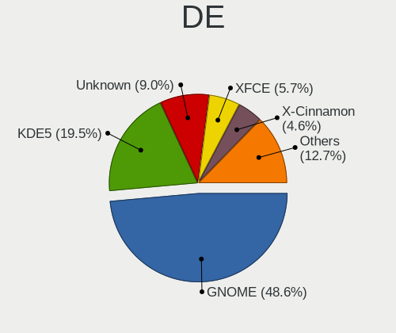

| Name       | Computers | Percent |
|------------|-----------|---------|
| GNOME      | 156       | 47.27%  |
| KDE5       | 70        | 21.21%  |
| Unknown    | 34        | 10.3%   |
| XFCE       | 19        | 5.76%   |
| X-Cinnamon | 14        | 4.24%   |
| KDE        | 9         | 2.73%   |
| KDE4       | 4         | 1.21%   |
| Cinnamon   | 4         | 1.21%   |
| Budgie     | 4         | 1.21%   |
| Unity      | 3         | 0.91%   |
| Pantheon   | 3         | 0.91%   |
| MATE       | 3         | 0.91%   |
| Deepin     | 2         | 0.61%   |
| trinity    | 1         | 0.3%    |
| openbox    | 1         | 0.3%    |
| LXQt       | 1         | 0.3%    |
| i3         | 1         | 0.3%    |
| bspwm      | 1         | 0.3%    |

Display Server
--------------

X11 or Wayland

| Name    | Computers | Percent |
|---------|-----------|---------|
| X11     | 225       | 70.31%  |
| Wayland | 66        | 20.63%  |
| Unknown | 24        | 7.5%    |
| Tty     | 5         | 1.56%   |

Display Manager
---------------

SDDM, LightDM, etc.

| Name    | Computers | Percent |
|---------|-----------|---------|
| Unknown | 171       | 52.29%  |
| SDDM    | 55        | 16.82%  |
| GDM3    | 39        | 11.93%  |
| GDM     | 34        | 10.4%   |
| LightDM | 15        | 4.59%   |
| TDM     | 9         | 2.75%   |
| KDM     | 4         | 1.22%   |

OS Lang
-------

Language

| Lang    | Computers | Percent |
|---------|-----------|---------|
| en_US   | 221       | 69.28%  |
| Unknown | 33        | 10.34%  |
| ar_SA   | 21        | 6.58%   |
| ar_EG   | 13        | 4.08%   |
| en_GB   | 10        | 3.13%   |
| C       | 6         | 1.88%   |
| ar_AE   | 3         | 0.94%   |
| en_AG   | 2         | 0.63%   |
| ru_RU   | 1         | 0.31%   |
| nl_BE   | 1         | 0.31%   |
| fr_FR   | 1         | 0.31%   |
| en_IN   | 1         | 0.31%   |
| en_IL   | 1         | 0.31%   |
| en_AU   | 1         | 0.31%   |
| de_DE   | 1         | 0.31%   |
| Default | 1         | 0.31%   |
| cs_CZ   | 1         | 0.31%   |
| ar_KW   | 1         | 0.31%   |

Boot Mode
---------

EFI or BIOS

| Mode | Computers | Percent |
|------|-----------|---------|
| BIOS | 167       | 52.19%  |
| EFI  | 153       | 47.81%  |

Filesystem
----------

Type of filesystem

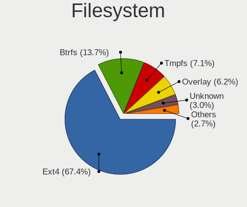

| Type    | Computers | Percent |
|---------|-----------|---------|
| Ext4    | 230       | 71.43%  |
| Btrfs   | 34        | 10.56%  |
| Overlay | 23        | 7.14%   |
| Tmpfs   | 15        | 4.66%   |
| Unknown | 12        | 3.73%   |
| Xfs     | 4         | 1.24%   |
| Ext2    | 3         | 0.93%   |
| Zfs     | 1         | 0.31%   |

Part. scheme
------------

Scheme of partitioning

| Type    | Computers | Percent |
|---------|-----------|---------|
| Unknown | 185       | 57.1%   |
| GPT     | 114       | 35.19%  |
| MBR     | 25        | 7.72%   |

Dual Boot with Linux/BSD
------------------------

Hosting more than one Linux/BSD

| Dual boot | Computers | Percent |
|-----------|-----------|---------|
| No        | 267       | 85.3%   |
| Yes       | 46        | 14.7%   |

Dual Boot (Win)
---------------

Hosting Linux and Windows

| Dual boot | Computers | Percent |
|-----------|-----------|---------|
| No        | 221       | 69.72%  |
| Yes       | 96        | 30.28%  |

Board
-----

Vendor
------

Motherboard manufacturer

| Name                        | Computers | Percent |
|-----------------------------|-----------|---------|
| Dell                        | 59        | 19.28%  |
| ASUSTek Computer            | 51        | 16.67%  |
| Lenovo                      | 37        | 12.09%  |
| Hewlett-Packard             | 34        | 11.11%  |
| Gigabyte Technology         | 22        | 7.19%   |
| MSI                         | 16        | 5.23%   |
| Acer                        | 16        | 5.23%   |
| Apple                       | 9         | 2.94%   |
| Toshiba                     | 8         | 2.61%   |
| ASRock                      | 8         | 2.61%   |
| HUAWEI                      | 7         | 2.29%   |
| Sony                        | 6         | 1.96%   |
| Unknown                     | 5         | 1.63%   |
| Valve                       | 3         | 0.98%   |
| Microsoft                   | 3         | 0.98%   |
| Samsung Electronics         | 2         | 0.65%   |
| Pegatron                    | 2         | 0.65%   |
| Notebook                    | 2         | 0.65%   |
| Intel                       | 2         | 0.65%   |
| Packard Bell                | 1         | 0.33%   |
| OEM                         | 1         | 0.33%   |
| Medion                      | 1         | 0.33%   |
| LG Electronics              | 1         | 0.33%   |
| I-Life Digital Technologies | 1         | 0.33%   |
| Huanan                      | 1         | 0.33%   |
| GPD                         | 1         | 0.33%   |
| Google                      | 1         | 0.33%   |
| GIADA                       | 1         | 0.33%   |
| Fujitsu Siemens             | 1         | 0.33%   |
| eMachines                   | 1         | 0.33%   |
| DJI                         | 1         | 0.33%   |
| Clevo                       | 1         | 0.33%   |
| Biostar                     | 1         | 0.33%   |

Model
-----

Motherboard model

| Name                                       | Computers | Percent |
|--------------------------------------------|-----------|---------|
| Unknown                                    | 8         | 2.61%   |
| ASUS All Series                            | 5         | 1.63%   |
| Dell OptiPlex 9020                         | 4         | 1.31%   |
| Dell G3 3590                               | 4         | 1.31%   |
| ASUS VivoBook 15_ASUS Laptop X540MA_X540MA | 4         | 1.31%   |
| Valve Jupiter                              | 3         | 0.98%   |
| HP 15                                      | 3         | 0.98%   |
| Microsoft Surface Pro 7                    | 2         | 0.65%   |
| HP Pavilion g6                             | 2         | 0.65%   |
| HP Notebook                                | 2         | 0.65%   |
| HP Laptop 15-da0xxx                        | 2         | 0.65%   |
| HP ENVY x360 Convertible 15-ed1xxx         | 2         | 0.65%   |
| HP Compaq Elite 8300 SFF                   | 2         | 0.65%   |
| Gigabyte H81M-S2PH                         | 2         | 0.65%   |
| Dell OptiPlex 9010                         | 2         | 0.65%   |
| Dell OptiPlex 790                          | 2         | 0.65%   |
| Dell OptiPlex 7050                         | 2         | 0.65%   |
| Dell OptiPlex 7010                         | 2         | 0.65%   |
| Dell OptiPlex 3010                         | 2         | 0.65%   |
| Dell Latitude 5285                         | 2         | 0.65%   |
| Dell Inspiron 3542                         | 2         | 0.65%   |
| ASUS VivoBook_ASUSLaptop X512DA_X512DA     | 2         | 0.65%   |
| ASUS VivoBook 15_ASUS Laptop X540UAR       | 2         | 0.65%   |
| ASUS VivoBook 14_ASUS Laptop X441MA_X441MA | 2         | 0.65%   |
| ASUS TUF Gaming X570-PLUS                  | 2         | 0.65%   |
| Apple MacBookPro9,2                        | 2         | 0.65%   |
| Acer Aspire ES1-572                        | 2         | 0.65%   |
| Acer Aspire 4752                           | 2         | 0.65%   |
| Toshiba Satellite S55t-A                   | 1         | 0.33%   |
| Toshiba Satellite L635                     | 1         | 0.33%   |
| Toshiba Satellite L500                     | 1         | 0.33%   |
| Toshiba Satellite C855D                    | 1         | 0.33%   |
| Toshiba Satellite C850-B561                | 1         | 0.33%   |
| Toshiba Satellite C850-B239                | 1         | 0.33%   |
| Toshiba Satellite C55-B                    | 1         | 0.33%   |
| Toshiba QOSMIO X875                        | 1         | 0.33%   |
| Sony VPCEA36FA                             | 1         | 0.33%   |
| Sony VPCCA35FA                             | 1         | 0.33%   |
| Sony VGN-FZ250E                            | 1         | 0.33%   |
| Sony SVF15A13SAB                           | 1         | 0.33%   |

Model Family
------------

Motherboard model prefix

| Name               | Computers | Percent |
|--------------------|-----------|---------|
| Dell OptiPlex      | 20        | 6.54%   |
| Lenovo ThinkPad    | 12        | 3.92%   |
| Dell Inspiron      | 12        | 3.92%   |
| ASUS VivoBook      | 11        | 3.59%   |
| Acer Aspire        | 10        | 3.27%   |
| Dell Latitude      | 9         | 2.94%   |
| HP Pavilion        | 8         | 2.61%   |
| ASUS TUF           | 8         | 2.61%   |
| Unknown            | 8         | 2.61%   |
| Toshiba Satellite  | 7         | 2.29%   |
| Lenovo IdeaPad     | 7         | 2.29%   |
| HP Laptop          | 7         | 2.29%   |
| ASUS ROG           | 6         | 1.96%   |
| Lenovo ThinkCentre | 5         | 1.63%   |
| Dell Vostro        | 5         | 1.63%   |
| ASUS All           | 5         | 1.63%   |
| Dell G3            | 4         | 1.31%   |
| ASUS PRIME         | 4         | 1.31%   |
| Valve Jupiter      | 3         | 0.98%   |
| Microsoft Surface  | 3         | 0.98%   |
| Lenovo Yoga        | 3         | 0.98%   |
| HP ENVY            | 3         | 0.98%   |
| HP 15              | 3         | 0.98%   |
| Dell XPS           | 3         | 0.98%   |
| MSI GF63           | 2         | 0.65%   |
| Lenovo Legion      | 2         | 0.65%   |
| HUAWEI MateBook    | 2         | 0.65%   |
| HP Notebook        | 2         | 0.65%   |
| HP EliteDesk       | 2         | 0.65%   |
| HP EliteBook       | 2         | 0.65%   |
| HP Compaq          | 2         | 0.65%   |
| Gigabyte H81M-S2PH | 2         | 0.65%   |
| Dell Precision     | 2         | 0.65%   |
| Dell PowerEdge     | 2         | 0.65%   |
| ASUS ZenBook       | 2         | 0.65%   |
| ASRock X570        | 2         | 0.65%   |
| Apple MacBookPro9  | 2         | 0.65%   |
| Acer Spin          | 2         | 0.65%   |
| Toshiba QOSMIO     | 1         | 0.33%   |
| Sony VPCEA36FA     | 1         | 0.33%   |

MFG Year
--------

Motherboard manufacture year

| Year    | Computers | Percent |
|---------|-----------|---------|
| 2019    | 39        | 12.75%  |
| 2018    | 38        | 12.42%  |
| 2020    | 31        | 10.13%  |
| 2012    | 26        | 8.5%    |
| 2021    | 25        | 8.17%   |
| 2017    | 23        | 7.52%   |
| 2013    | 21        | 6.86%   |
| 2011    | 19        | 6.21%   |
| 2014    | 17        | 5.56%   |
| 2016    | 15        | 4.9%    |
| 2015    | 13        | 4.25%   |
| 2010    | 12        | 3.92%   |
| 2022    | 8         | 2.61%   |
| 2009    | 7         | 2.29%   |
| 2008    | 4         | 1.31%   |
| 2007    | 3         | 0.98%   |
| 2023    | 2         | 0.65%   |
| 2006    | 1         | 0.33%   |
| 2002    | 1         | 0.33%   |
| Unknown | 1         | 0.33%   |

Form Factor
-----------

Physical design of the computer

| Name        | Computers | Percent |
|-------------|-----------|---------|
| Notebook    | 163       | 53.27%  |
| Desktop     | 113       | 36.93%  |
| Convertible | 14        | 4.58%   |
| Tablet      | 10        | 3.27%   |
| Mini pc     | 2         | 0.65%   |
| All in one  | 2         | 0.65%   |
| Server      | 2         | 0.65%   |

Secure Boot
-----------

Enabled or disabled

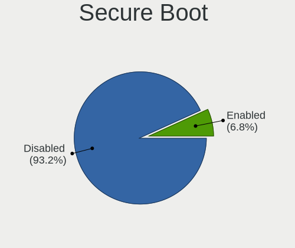

| State    | Computers | Percent |
|----------|-----------|---------|
| Disabled | 285       | 92.23%  |
| Enabled  | 24        | 7.77%   |

Coreboot
--------

Have coreboot on board

| Used | Computers | Percent |
|------|-----------|---------|
| No   | 305       | 99.67%  |
| Yes  | 1         | 0.33%   |

RAM Size
--------

Total RAM memory

| Size in GB  | Computers | Percent |
|-------------|-----------|---------|
| 4.01-8.0    | 74        | 23.49%  |
| 16.01-24.0  | 66        | 20.95%  |
| 3.01-4.0    | 59        | 18.73%  |
| 8.01-16.0   | 54        | 17.14%  |
| 32.01-64.0  | 31        | 9.84%   |
| 1.01-2.0    | 14        | 4.44%   |
| 64.01-256.0 | 6         | 1.9%    |
| 24.01-32.0  | 5         | 1.59%   |
| 2.01-3.0    | 5         | 1.59%   |
| 0.51-1.0    | 1         | 0.32%   |

RAM Used
--------

Used RAM memory

| Used GB    | Computers | Percent |
|------------|-----------|---------|
| 1.01-2.0   | 118       | 33.05%  |
| 2.01-3.0   | 92        | 25.77%  |
| 3.01-4.0   | 60        | 16.81%  |
| 4.01-8.0   | 54        | 15.13%  |
| 0.51-1.0   | 18        | 5.04%   |
| 8.01-16.0  | 11        | 3.08%   |
| 16.01-24.0 | 2         | 0.56%   |
| 0.01-0.5   | 1         | 0.28%   |
| Unknown    | 1         | 0.28%   |

Total Drives
------------

Number of drives on board

| Drives | Computers | Percent |
|--------|-----------|---------|
| 1      | 192       | 59.44%  |
| 2      | 76        | 23.53%  |
| 3      | 32        | 9.91%   |
| 4      | 12        | 3.72%   |
| 5      | 5         | 1.55%   |
| 6      | 4         | 1.24%   |
| 7      | 1         | 0.31%   |
| 0      | 1         | 0.31%   |

Has CD-ROM
----------

Has CD-ROM on board

| Presented | Computers | Percent |
|-----------|-----------|---------|
| No        | 195       | 62.9%   |
| Yes       | 115       | 37.1%   |

Has Ethernet
------------

Has Ethernet on board

| Presented | Computers | Percent |
|-----------|-----------|---------|
| Yes       | 251       | 81.23%  |
| No        | 58        | 18.77%  |

Has WiFi
--------

Has WiFi module

| Presented | Computers | Percent |
|-----------|-----------|---------|
| Yes       | 256       | 83.39%  |
| No        | 51        | 16.61%  |

Has Bluetooth
-------------

Has Bluetooth module

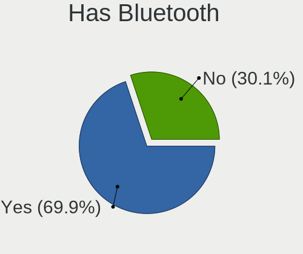

| Presented | Computers | Percent |
|-----------|-----------|---------|
| Yes       | 215       | 69.35%  |
| No        | 95        | 30.65%  |

Location
--------

Country
-------

Geographic location (country)

| Country      | Computers | Percent |
|--------------|-----------|---------|
| Saudi Arabia | 306       | 100%    |

City
----

Geographic location (city)

| City                 | Computers | Percent |
|----------------------|-----------|---------|
| Riyadh               | 116       | 35.05%  |
| Jeddah               | 84        | 25.38%  |
| Makkah               | 34        | 10.27%  |
| Medina               | 25        | 7.55%   |
| Dammam               | 24        | 7.25%   |
| Khobar               | 10        | 3.02%   |
| Al Qatif             | 9         | 2.72%   |
| Dhahran              | 5         | 1.51%   |
| Baq`a' ash Sharqiyah | 5         | 1.51%   |
| Ta'if                | 4         | 1.21%   |
| Thuwal               | 3         | 0.91%   |
| Jubail               | 2         | 0.6%    |
| Buraidah             | 2         | 0.6%    |
| Al Faruq             | 2         | 0.6%    |
| Shaqra               | 1         | 0.3%    |
| Sayhat               | 1         | 0.3%    |
| Bisha                | 1         | 0.3%    |
| At Tuwal             | 1         | 0.3%    |
| Al Hufuf             | 1         | 0.3%    |
| Abha                 | 1         | 0.3%    |

Drives
------

Drive Vendor
------------

Hard drive vendors

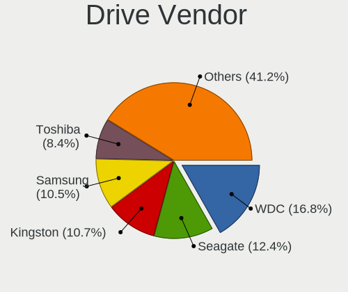

| Vendor                      | Computers | Drives | Percent |
|-----------------------------|-----------|--------|---------|
| WDC                         | 86        | 140    | 18.3%   |
| Seagate                     | 69        | 101    | 14.68%  |
| Kingston                    | 52        | 83     | 11.06%  |
| Samsung Electronics         | 49        | 80     | 10.43%  |
| Toshiba                     | 44        | 55     | 9.36%   |
| SanDisk                     | 27        | 29     | 5.74%   |
| Unknown                     | 19        | 36     | 4.04%   |
| Intel                       | 11        | 20     | 2.34%   |
| Crucial                     | 11        | 14     | 2.34%   |
| SK hynix                    | 10        | 23     | 2.13%   |
| Hitachi                     | 7         | 8      | 1.49%   |
| Micron/Crucial Technology   | 6         | 6      | 1.28%   |
| Lexar                       | 6         | 6      | 1.28%   |
| Team                        | 5         | 5      | 1.06%   |
| Silicon Motion              | 5         | 6      | 1.06%   |
| Phison Electronics          | 5         | 6      | 1.06%   |
| Phison                      | 5         | 6      | 1.06%   |
| JMicron Technology          | 4         | 4      | 0.85%   |
| China                       | 4         | 4      | 0.85%   |
| PNY                         | 3         | 3      | 0.64%   |
| KingSpec                    | 3         | 3      | 0.64%   |
| Hewlett-Packard             | 3         | 3      | 0.64%   |
| Apple                       | 3         | 5      | 0.64%   |
| SPCC                        | 2         | 3      | 0.43%   |
| Micron Technology           | 2         | 2      | 0.43%   |
| HS-SSD-C100                 | 2         | 3      | 0.43%   |
| HGST                        | 2         | 5      | 0.43%   |
| Fujitsu                     | 2         | 3      | 0.43%   |
| Unknown                     | 2         | 2      | 0.43%   |
| YS                          | 1         | 2      | 0.21%   |
| YMTC                        | 1         | 1      | 0.21%   |
| XrayDisk                    | 1         | 1      | 0.21%   |
| WD MediaMax                 | 1         | 1      | 0.21%   |
| Union Memory                | 1         | 1      | 0.21%   |
| UMIS                        | 1         | 1      | 0.21%   |
| Transcend                   | 1         | 1      | 0.21%   |
| SPCC Sol                    | 1         | 1      | 0.21%   |
| OYUNKEY                     | 1         | 1      | 0.21%   |
| Maxtor                      | 1         | 1      | 0.21%   |
| MAXIO Technology (Hangzhou) | 1         | 2      | 0.21%   |

Drive Model
-----------

Hard drive models

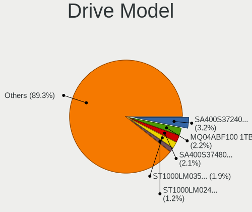

| Model                                               | Computers | Percent |
|-----------------------------------------------------|-----------|---------|
| Kingston SA400S37240G 240GB SSD                     | 18        | 3.42%   |
| Seagate ST1000LM035-1RK172 1TB                      | 14        | 2.66%   |
| Toshiba MQ04ABF100 1TB                              | 13        | 2.47%   |
| Kingston SA400S37480G 480GB SSD                     | 13        | 2.47%   |
| WDC WD20EZRZ-00Z5HB0 2TB                            | 6         | 1.14%   |
| Seagate ST1000LM024 HN-M101MBB 1TB                  | 6         | 1.14%   |
| Toshiba MQ01ABD100 1TB                              | 5         | 0.95%   |
| Seagate ST500DM002-1BD142 500GB                     | 5         | 0.95%   |
| Samsung NVMe SSD Drive 1024GB                       | 5         | 0.95%   |
| Kingston SA400S37120G 120GB SSD                     | 5         | 0.95%   |
| WDC WD5000AAKX-75U6AA0 500GB                        | 4         | 0.76%   |
| WDC WD10EZEX-75WN4A1 1TB                            | 4         | 0.76%   |
| Samsung SSD 860 EVO 1TB                             | 4         | 0.76%   |
| Lexar 128GB SSD                                     | 4         | 0.76%   |
| Unknown MMC Card  32GB                              | 3         | 0.57%   |
| Toshiba MQ01ABF050 500GB                            | 3         | 0.57%   |
| Toshiba DT01ACA050 500GB                            | 3         | 0.57%   |
| Seagate ST500LT012-1DG142 500GB                     | 3         | 0.57%   |
| Seagate ST2000LM007-1R8174 2TB                      | 3         | 0.57%   |
| SanDisk NVMe SSD Drive 512GB                        | 3         | 0.57%   |
| SanDisk NVMe SSD Drive 128GB                        | 3         | 0.57%   |
| Samsung SSD 860 EVO 500GB                           | 3         | 0.57%   |
| Samsung NVMe SSD Controller SM981/PM981/PM983 256GB | 3         | 0.57%   |
| Phison PS5013 E13 NVMe Controller 512GB             | 3         | 0.57%   |
| Micron/Crucial P2 NVMe PCIe SSD 1TB                 | 3         | 0.57%   |
| Kingston SA400S37960G 960GB SSD                     | 3         | 0.57%   |
| JMicron Tech 250GB                                  | 3         | 0.57%   |
| Intel SSD 660P Series 1024GB                        | 3         | 0.57%   |
| Intel NVMe SSD Drive 1024GB                         | 3         | 0.57%   |
| Crucial CT500MX500SSD1 500GB                        | 3         | 0.57%   |
| Crucial CT1000MX500SSD1 1TB                         | 3         | 0.57%   |
| WDC WDS120G2G0A-00JH30 120GB SSD                    | 2         | 0.38%   |
| WDC WD5000LPCX-00VHAT0 500GB                        | 2         | 0.38%   |
| WDC WD20EZRX-00D8PB0 2TB                            | 2         | 0.38%   |
| WDC WD10SPZX-08Z10 1TB                              | 2         | 0.38%   |
| WDC WD10JPVX-22JC3T0 1TB                            | 2         | 0.38%   |
| WDC WD10EZRX-00A8LB0 1TB                            | 2         | 0.38%   |
| WDC WD10EZEX-08WN4A0 1TB                            | 2         | 0.38%   |
| WDC WD10EARX-00N0YB0 1TB                            | 2         | 0.38%   |
| WDC WD10EADS-00M2B0 1TB                             | 2         | 0.38%   |

HDD Vendor
----------

Hard disk drive vendors

| Vendor  | Computers | Drives | Percent |
|---------|-----------|--------|---------|
| WDC     | 74        | 122    | 37.19%  |
| Seagate | 69        | 101    | 34.67%  |
| Toshiba | 41        | 47     | 20.6%   |
| Hitachi | 7         | 8      | 3.52%   |
| HGST    | 2         | 5      | 1.01%   |
| Fujitsu | 2         | 3      | 1.01%   |
| Unknown | 1         | 3      | 0.5%    |
| Maxtor  | 1         | 1      | 0.5%    |
| KESU    | 1         | 1      | 0.5%    |
| Apple   | 1         | 1      | 0.5%    |

SSD Vendor
----------

Solid state drive vendors

| Vendor              | Computers | Drives | Percent |
|---------------------|-----------|--------|---------|
| Kingston            | 47        | 77     | 34.31%  |
| Samsung Electronics | 20        | 36     | 14.6%   |
| SanDisk             | 13        | 14     | 9.49%   |
| Crucial             | 11        | 13     | 8.03%   |
| WDC                 | 6         | 9      | 4.38%   |
| Lexar               | 5         | 5      | 3.65%   |
| Team                | 4         | 4      | 2.92%   |
| China               | 4         | 4      | 2.92%   |
| PNY                 | 3         | 3      | 2.19%   |
| KingSpec            | 3         | 3      | 2.19%   |
| SK hynix            | 2         | 3      | 1.46%   |
| Hewlett-Packard     | 2         | 2      | 1.46%   |
| Unknown             | 2         | 2      | 1.46%   |
| YS                  | 1         | 2      | 0.73%   |
| XrayDisk            | 1         | 1      | 0.73%   |
| Transcend           | 1         | 1      | 0.73%   |
| SPCC Sol            | 1         | 1      | 0.73%   |
| SPCC                | 1         | 2      | 0.73%   |
| OYUNKEY             | 1         | 1      | 0.73%   |
| LITEON              | 1         | 1      | 0.73%   |
| JMicron Technology  | 1         | 1      | 0.73%   |
| Intel               | 1         | 4      | 0.73%   |
| Hoodisk             | 1         | 1      | 0.73%   |
| G-DRIVE             | 1         | 1      | 0.73%   |
| Corsair             | 1         | 1      | 0.73%   |
| ASMT                | 1         | 1      | 0.73%   |
| Apple               | 1         | 1      | 0.73%   |
| A-DATA Technology   | 1         | 1      | 0.73%   |

Drive Kind
----------

HDD or SSD

| Kind    | Computers | Drives | Percent |
|---------|-----------|--------|---------|
| HDD     | 168       | 292    | 40.29%  |
| SSD     | 122       | 195    | 29.26%  |
| NVMe    | 103       | 159    | 24.7%   |
| MMC     | 18        | 34     | 4.32%   |
| Unknown | 6         | 7      | 1.44%   |

Drive Connector
---------------

SATA, SAS, NVMe, etc.

| Type | Computers | Drives | Percent |
|------|-----------|--------|---------|
| SATA | 233       | 476    | 64.01%  |
| NVMe | 103       | 159    | 28.3%   |
| MMC  | 18        | 34     | 4.95%   |
| SAS  | 10        | 18     | 2.75%   |

Drive Size
----------

Size of hard drive

| Size in TB | Computers | Drives | Percent |
|------------|-----------|--------|---------|
| 0.01-0.5   | 137       | 247    | 46.13%  |
| 0.51-1.0   | 121       | 182    | 40.74%  |
| 1.01-2.0   | 24        | 36     | 8.08%   |
| 3.01-4.0   | 10        | 12     | 3.37%   |
| 2.01-3.0   | 4         | 5      | 1.35%   |
| 4.01-10.0  | 1         | 5      | 0.34%   |

Space Total
-----------

Amount of disk space available on the file system

| Size in GB     | Computers | Percent |
|----------------|-----------|---------|
| 101-250        | 79        | 23.37%  |
| 251-500        | 71        | 21.01%  |
| 501-1000       | 71        | 21.01%  |
| 51-100         | 26        | 7.69%   |
| 1001-2000      | 23        | 6.8%    |
| 1-20           | 22        | 6.51%   |
| More than 3000 | 14        | 4.14%   |
| 21-50          | 13        | 3.85%   |
| 2001-3000      | 13        | 3.85%   |
| Unknown        | 6         | 1.78%   |

Space Used
----------

Amount of used disk space

| Used GB        | Computers | Percent |
|----------------|-----------|---------|
| 1-20           | 138       | 38.76%  |
| 21-50          | 77        | 21.63%  |
| 51-100         | 39        | 10.96%  |
| 101-250        | 36        | 10.11%  |
| 251-500        | 26        | 7.3%    |
| 501-1000       | 14        | 3.93%   |
| 1001-2000      | 11        | 3.09%   |
| Unknown        | 6         | 1.69%   |
| More than 3000 | 5         | 1.4%    |
| 2001-3000      | 3         | 0.84%   |
| 0              | 1         | 0.28%   |

Malfunc. Drives
---------------

Drive models with a malfunction

| Model                              | Computers | Drives | Percent |
|------------------------------------|-----------|--------|---------|
| Unknown                            | 2         | 2      | 7.41%   |
| YS SSD 240GB                       | 1         | 1      | 3.7%    |
| WDC WD5000AAKS-00WWPA0 500GB       | 1         | 1      | 3.7%    |
| WDC WD3200BPVT-75ZEST0 320GB       | 1         | 1      | 3.7%    |
| WDC WD3200AAJS-00L7A0 320GB        | 1         | 1      | 3.7%    |
| WDC WD20EZRZ-00Z5HB0 2TB           | 1         | 1      | 3.7%    |
| WDC WD1600AAJS-60B4A0 160GB        | 1         | 1      | 3.7%    |
| WDC WD10SPZX-60Z10T0 1TB           | 1         | 1      | 3.7%    |
| WDC WD10SPZX-08Z10 1TB             | 1         | 1      | 3.7%    |
| WDC WD10PURZ-85U8XY0 1TB           | 1         | 1      | 3.7%    |
| WDC WD10JPVX-22JC3T0 1TB           | 1         | 1      | 3.7%    |
| WDC WD10EUCX-73YZ1Y0 1TB           | 1         | 1      | 3.7%    |
| WDC WD Green 2.5 480GB SSD         | 1         | 1      | 3.7%    |
| Toshiba MQ01ABD100 1TB             | 1         | 1      | 3.7%    |
| Seagate ST9320325AS 320GB          | 1         | 1      | 3.7%    |
| Seagate ST500LT012-1DG142 500GB    | 1         | 1      | 3.7%    |
| Seagate ST500DM002-1BD142 500GB    | 1         | 1      | 3.7%    |
| Seagate ST2000DM001-1CH164 2TB     | 1         | 1      | 3.7%    |
| Seagate ST1000LM035-1RK172 1TB     | 1         | 1      | 3.7%    |
| Seagate ST1000LM024 HN-M101MBB 1TB | 1         | 1      | 3.7%    |
| Seagate ST1000DM003-9YN162 1TB     | 1         | 1      | 3.7%    |
| SanDisk SSD PLUS 480GB             | 1         | 1      | 3.7%    |
| OYUNKEY SSD 120GB                  | 1         | 1      | 3.7%    |
| Kingston SMS200S3240G 240GB SSD    | 1         | 1      | 3.7%    |
| Kingston SA400S37480G 480GB SSD    | 1         | 1      | 3.7%    |
| Hitachi HDS721032CLA362 320GB      | 1         | 1      | 3.7%    |

Malfunc. Drive Vendor
---------------------

Vendors of faulty drives

| Vendor   | Computers | Drives | Percent |
|----------|-----------|--------|---------|
| WDC      | 11        | 11     | 42.31%  |
| Seagate  | 6         | 7      | 23.08%  |
| Kingston | 2         | 2      | 7.69%   |
| Unknown  | 2         | 2      | 7.69%   |
| YS       | 1         | 1      | 3.85%   |
| Toshiba  | 1         | 1      | 3.85%   |
| SanDisk  | 1         | 1      | 3.85%   |
| OYUNKEY  | 1         | 1      | 3.85%   |
| Hitachi  | 1         | 1      | 3.85%   |

Malfunc. HDD Vendor
-------------------

Vendors of faulty HDD drives

| Vendor  | Computers | Drives | Percent |
|---------|-----------|--------|---------|
| WDC     | 10        | 10     | 55.56%  |
| Seagate | 6         | 7      | 33.33%  |
| Toshiba | 1         | 1      | 5.56%   |
| Hitachi | 1         | 1      | 5.56%   |

Malfunc. Drive Kind
-------------------

Kinds of faulty drives

| Kind | Computers | Drives | Percent |
|------|-----------|--------|---------|
| HDD  | 16        | 19     | 72.73%  |
| SSD  | 6         | 8      | 27.27%  |

Failed Drives
-------------

Failed drive models

Zero info for selected period =(

Failed Drive Vendor
-------------------

Failed drive vendors

Zero info for selected period =(

Drive Status
------------

Number of failed and malfunc. drives

| Status   | Computers | Drives | Percent |
|----------|-----------|--------|---------|
| Detected | 213       | 468    | 62.65%  |
| Works    | 106       | 192    | 31.18%  |
| Malfunc  | 21        | 27     | 6.18%   |

Storage controller
------------------

Storage Vendor
--------------

Storage controller vendors

| Vendor                           | Computers | Percent |
|----------------------------------|-----------|---------|
| Intel                            | 235       | 61.52%  |
| AMD                              | 33        | 8.64%   |
| Samsung Electronics              | 31        | 8.12%   |
| SanDisk                          | 18        | 4.71%   |
| Phison Electronics               | 9         | 2.36%   |
| SK hynix                         | 8         | 2.09%   |
| Silicon Motion                   | 7         | 1.83%   |
| Micron/Crucial Technology        | 7         | 1.83%   |
| Kingston Technology Company      | 6         | 1.57%   |
| Toshiba America Info Systems     | 4         | 1.05%   |
| ASMedia Technology               | 4         | 1.05%   |
| Union Memory (Shenzhen)          | 2         | 0.52%   |
| Nvidia                           | 2         | 0.52%   |
| Micron Technology                | 2         | 0.52%   |
| Broadcom / LSI                   | 2         | 0.52%   |
| Yangtze Memory Technologies      | 1         | 0.26%   |
| VIA Technologies                 | 1         | 0.26%   |
| Silicon Integrated Systems [SiS] | 1         | 0.26%   |
| Realtek Semiconductor            | 1         | 0.26%   |
| MAXIO Technology (Hangzhou)      | 1         | 0.26%   |
| Marvell Technology Group         | 1         | 0.26%   |
| LSI Logic / Symbios Logic        | 1         | 0.26%   |
| KIOXIA                           | 1         | 0.26%   |
| JMicron Technology               | 1         | 0.26%   |
| INNOGRIT                         | 1         | 0.26%   |
| Apple                            | 1         | 0.26%   |
| ADATA Technology                 | 1         | 0.26%   |

Storage Model
-------------

Storage controller models

| Model                                                                          | Computers | Percent |
|--------------------------------------------------------------------------------|-----------|---------|
| AMD FCH SATA Controller [AHCI mode]                                            | 26        | 6.28%   |
| Intel Sunrise Point-LP SATA Controller [AHCI mode]                             | 20        | 4.83%   |
| Intel 7 Series Chipset Family 6-port SATA Controller [AHCI mode]               | 15        | 3.62%   |
| Intel 82801 Mobile SATA Controller [RAID mode]                                 | 14        | 3.38%   |
| Intel 200 Series PCH SATA controller [AHCI mode]                               | 14        | 3.38%   |
| Intel 8 Series SATA Controller 1 [AHCI mode]                                   | 12        | 2.9%    |
| Intel 6 Series/C200 Series Chipset Family 6 port Mobile SATA AHCI Controller   | 12        | 2.9%    |
| Samsung NVMe SSD Controller SM981/PM981/PM983                                  | 11        | 2.66%   |
| Samsung NVMe SSD Controller 980                                                | 11        | 2.66%   |
| Intel SATA Controller [RAID mode]                                              | 10        | 2.42%   |
| Intel Celeron/Pentium Silver Processor SATA Controller                         | 9         | 2.17%   |
| Intel 8 Series/C220 Series Chipset Family 6-port SATA Controller 1 [AHCI mode] | 9         | 2.17%   |
| Intel 7 Series/C210 Series Chipset Family 6-port SATA Controller [AHCI mode]   | 9         | 2.17%   |
| Intel Cannon Lake Mobile PCH SATA AHCI Controller                              | 7         | 1.69%   |
| Intel Volume Management Device NVMe RAID Controller                            | 6         | 1.45%   |
| Intel SSD 660P Series                                                          | 6         | 1.45%   |
| Intel Comet Lake SATA AHCI Controller                                          | 6         | 1.45%   |
| Intel NM10/ICH7 Family SATA Controller [IDE mode]                              | 5         | 1.21%   |
| Intel Cannon Lake PCH SATA AHCI Controller                                     | 5         | 1.21%   |
| Intel 82801IBM/IEM (ICH9M/ICH9M-E) 4 port SATA Controller [AHCI mode]          | 5         | 1.21%   |
| Intel 6 Series/C200 Series Chipset Family 6 port Desktop SATA AHCI Controller  | 5         | 1.21%   |
| Intel 500 Series Chipset Family SATA AHCI Controller                           | 5         | 1.21%   |
| Intel 5 Series/3400 Series Chipset 4 port SATA AHCI Controller                 | 5         | 1.21%   |
| Intel 400 Series Chipset Family SATA AHCI Controller                           | 5         | 1.21%   |
| Silicon Motion SM2263EN/SM2263XT (DRAM-less) NVMe SSD Controllers              | 4         | 0.97%   |
| SanDisk PC SN520 NVMe SSD                                                      | 4         | 0.97%   |
| Phison PS5013 E13 NVMe Controller                                              | 4         | 0.97%   |
| Micron/Crucial P2 [Nick P2] / P3 / P3 Plus NVMe PCIe SSD (DRAM-less)           | 4         | 0.97%   |
| Intel Wildcat Point-LP SATA Controller [AHCI Mode]                             | 4         | 0.97%   |
| Intel Celeron N3350/Pentium N4200/Atom E3900 Series SATA AHCI Controller       | 4         | 0.97%   |
| Intel C610/X99 series chipset 6-Port SATA Controller [AHCI mode]               | 4         | 0.97%   |
| Intel 9 Series Chipset Family SATA Controller [AHCI Mode]                      | 4         | 0.97%   |
| ASMedia ASM1062 Serial ATA Controller                                          | 4         | 0.97%   |
| AMD 500 Series Chipset SATA Controller                                         | 4         | 0.97%   |
| AMD 400 Series Chipset SATA Controller                                         | 4         | 0.97%   |
| SK hynix Gold P31/BC711/PC711 NVMe Solid State Drive                           | 3         | 0.72%   |
| SK hynix BC501 NVMe Solid State Drive                                          | 3         | 0.72%   |
| SanDisk WD Blue SN550 NVMe SSD                                                 | 3         | 0.72%   |
| SanDisk WD Blue SN500 / PC SN520 NVMe SSD                                      | 3         | 0.72%   |
| SanDisk WD Black SN750 / PC SN730 NVMe SSD                                     | 3         | 0.72%   |

Storage Kind
------------

Kind of storage controller (IDE, SATA, NVMe, SAS, ...)

| Kind | Computers | Percent |
|------|-----------|---------|
| SATA | 219       | 57.94%  |
| NVMe | 103       | 27.25%  |
| RAID | 32        | 8.47%   |
| IDE  | 23        | 6.08%   |
| SAS  | 1         | 0.26%   |

Processor
---------

CPU Vendor
----------

Processor vendors

| Vendor | Computers | Percent |
|--------|-----------|---------|
| Intel  | 263       | 85.95%  |
| AMD    | 42        | 13.73%  |
| ARM    | 1         | 0.33%   |

CPU Model
---------

Processor models

| Model                                         | Computers | Percent |
|-----------------------------------------------|-----------|---------|
| Intel Celeron N4000 CPU @ 1.10GHz             | 7         | 2.27%   |
| Intel 11th Gen Core i7-1165G7 @ 2.80GHz       | 7         | 2.27%   |
| Intel Core i5-7200U CPU @ 2.50GHz             | 6         | 1.95%   |
| Intel Core i5-3470 CPU @ 3.20GHz              | 6         | 1.95%   |
| Intel Core i7-8550U CPU @ 1.80GHz             | 5         | 1.62%   |
| Intel Core i7-9750H CPU @ 2.60GHz             | 4         | 1.3%    |
| Intel Core i7-8565U CPU @ 1.80GHz             | 4         | 1.3%    |
| Intel Core i7-4770 CPU @ 3.40GHz              | 4         | 1.3%    |
| Intel Core i7-4510U CPU @ 2.00GHz             | 4         | 1.3%    |
| Intel Core i5-6200U CPU @ 2.30GHz             | 4         | 1.3%    |
| AMD Ryzen 5 3500U with Radeon Vega Mobile Gfx | 4         | 1.3%    |
| Intel Core i7-8750H CPU @ 2.20GHz             | 3         | 0.97%   |
| Intel Core i7-7700 CPU @ 3.60GHz              | 3         | 0.97%   |
| Intel Core i7-7500U CPU @ 2.70GHz             | 3         | 0.97%   |
| Intel Core i7-4500U CPU @ 1.80GHz             | 3         | 0.97%   |
| Intel Core i7-1065G7 CPU @ 1.30GHz            | 3         | 0.97%   |
| Intel Core i5-8250U CPU @ 1.60GHz             | 3         | 0.97%   |
| Intel Core i5-7500 CPU @ 3.40GHz              | 3         | 0.97%   |
| Intel Core i5-3210M CPU @ 2.50GHz             | 3         | 0.97%   |
| Intel Core i5-2450M CPU @ 2.50GHz             | 3         | 0.97%   |
| Intel Core i5-2430M CPU @ 2.40GHz             | 3         | 0.97%   |
| Intel Core i5-2410M CPU @ 2.30GHz             | 3         | 0.97%   |
| Intel Core i5 CPU M 520 @ 2.40GHz             | 3         | 0.97%   |
| Intel Core i3-10100 CPU @ 3.60GHz             | 3         | 0.97%   |
| Intel Core i3 CPU M 370 @ 2.40GHz             | 3         | 0.97%   |
| Intel Core 2 Duo CPU E7500 @ 2.93GHz          | 3         | 0.97%   |
| AMD Ryzen 5 5600X 6-Core Processor            | 3         | 0.97%   |
| AMD Custom APU 0405                           | 3         | 0.97%   |
| Intel Core i7-9700 CPU @ 3.00GHz              | 2         | 0.65%   |
| Intel Core i7-8700 CPU @ 3.20GHz              | 2         | 0.65%   |
| Intel Core i7-7700K CPU @ 4.20GHz             | 2         | 0.65%   |
| Intel Core i7-7700HQ CPU @ 2.80GHz            | 2         | 0.65%   |
| Intel Core i7-7600U CPU @ 2.80GHz             | 2         | 0.65%   |
| Intel Core i7-6700 CPU @ 3.40GHz              | 2         | 0.65%   |
| Intel Core i7-6600U CPU @ 2.60GHz             | 2         | 0.65%   |
| Intel Core i7-4790 CPU @ 3.60GHz              | 2         | 0.65%   |
| Intel Core i7-3770 CPU @ 3.40GHz              | 2         | 0.65%   |
| Intel Core i7-3630QM CPU @ 2.40GHz            | 2         | 0.65%   |
| Intel Core i7-2620M CPU @ 2.70GHz             | 2         | 0.65%   |
| Intel Core i7-2600 CPU @ 3.40GHz              | 2         | 0.65%   |

CPU Model Family
----------------

Processor model prefix

| Model                   | Computers | Percent |
|-------------------------|-----------|---------|
| Intel Core i7           | 84        | 27.27%  |
| Intel Core i5           | 80        | 25.97%  |
| Intel Core i3           | 26        | 8.44%   |
| Other                   | 21        | 6.82%   |
| AMD Ryzen 5             | 18        | 5.84%   |
| Intel Celeron           | 17        | 5.52%   |
| Intel Core 2 Duo        | 10        | 3.25%   |
| AMD Ryzen 7             | 10        | 3.25%   |
| AMD Ryzen 9             | 7         | 2.27%   |
| Intel Xeon              | 6         | 1.95%   |
| Intel Atom              | 5         | 1.62%   |
| Intel Pentium Dual-Core | 3         | 0.97%   |
| Intel Pentium           | 3         | 0.97%   |
| Intel Core i9           | 3         | 0.97%   |
| AMD FX                  | 2         | 0.65%   |
| Intel Xeon Silver       | 1         | 0.32%   |
| Intel Pentium Silver    | 1         | 0.32%   |
| Intel Pentium 4         | 1         | 0.32%   |
| Intel Mobile Pentium 4  | 1         | 0.32%   |
| Intel Genuine           | 1         | 0.32%   |
| Intel Core m5           | 1         | 0.32%   |
| Intel Core m3           | 1         | 0.32%   |
| Intel Core 2 Quad       | 1         | 0.32%   |
| Intel Core 2            | 1         | 0.32%   |
| ARM ARMv7               | 1         | 0.32%   |
| AMD Ryzen 5 PRO         | 1         | 0.32%   |
| AMD E2                  | 1         | 0.32%   |
| AMD A12                 | 1         | 0.32%   |

CPU Cores
---------

Number of processor cores

| Number | Computers | Percent |
|--------|-----------|---------|
| 4      | 119       | 38.76%  |
| 2      | 115       | 37.46%  |
| 6      | 35        | 11.4%   |
| 8      | 20        | 6.51%   |
| 1      | 7         | 2.28%   |
| 10     | 3         | 0.98%   |
| 16     | 2         | 0.65%   |
| 14     | 2         | 0.65%   |
| 12     | 2         | 0.65%   |
| 24     | 1         | 0.33%   |
| 20     | 1         | 0.33%   |

CPU Sockets
-----------

Number of sockets

| Number | Computers | Percent |
|--------|-----------|---------|
| 1      | 304       | 99.35%  |
| 2      | 2         | 0.65%   |

CPU Threads
-----------

Threads per core (Hyper-Threading)

| Number | Computers | Percent |
|--------|-----------|---------|
| 2      | 224       | 72.96%  |
| 1      | 82        | 26.71%  |
| 8      | 1         | 0.33%   |

CPU Op-Modes
------------

CPU Operation Modes (32-bit, 64-bit)

| Op mode        | Computers | Percent |
|----------------|-----------|---------|
| 32-bit, 64-bit | 298       | 97.07%  |
| Unknown        | 7         | 2.28%   |
| 32-bit         | 2         | 0.65%   |

CPU Microcode
-------------

Microcode number

| Number     | Computers | Percent |
|------------|-----------|---------|
| Unknown    | 115       | 34.74%  |
| 0x306a9    | 21        | 6.34%   |
| 0x206a7    | 18        | 5.44%   |
| 0x306c3    | 14        | 4.23%   |
| 0x1067a    | 12        | 3.63%   |
| 0x40651    | 11        | 3.32%   |
| 0x906e9    | 9         | 2.72%   |
| 0x906ea    | 8         | 2.42%   |
| 0x806e9    | 8         | 2.42%   |
| 0x806c1    | 8         | 2.42%   |
| 0x406e3    | 8         | 2.42%   |
| 0x806ec    | 7         | 2.11%   |
| 0x806ea    | 7         | 2.11%   |
| 0x706e5    | 6         | 1.81%   |
| 0x706a1    | 5         | 1.51%   |
| 0x306d4    | 4         | 1.21%   |
| 0x20655    | 4         | 1.21%   |
| 0x08108109 | 4         | 1.21%   |
| 0xa0653    | 3         | 0.91%   |
| 0xa0652    | 3         | 0.91%   |
| 0x906ed    | 3         | 0.91%   |
| 0x506c9    | 3         | 0.91%   |
| 0x30673    | 3         | 0.91%   |
| 0x20652    | 3         | 0.91%   |
| 0xa0655    | 2         | 0.6%    |
| 0x906a3    | 2         | 0.6%    |
| 0x806eb    | 2         | 0.6%    |
| 0x406c4    | 2         | 0.6%    |
| 0x08701021 | 2         | 0.6%    |
| 0x08701013 | 2         | 0.6%    |
| 0x0810100b | 2         | 0.6%    |
| 0x0800820d | 2         | 0.6%    |
| 0xf64      | 1         | 0.3%    |
| 0xf27      | 1         | 0.3%    |
| 0xb0671    | 1         | 0.3%    |
| 0x906ec    | 1         | 0.3%    |
| 0x906eb    | 1         | 0.3%    |
| 0x906c0    | 1         | 0.3%    |
| 0x90675    | 1         | 0.3%    |
| 0x706a8    | 1         | 0.3%    |

CPU Microarch
-------------

Microarchitecture

| Name             | Computers | Percent |
|------------------|-----------|---------|
| KabyLake         | 68        | 22.01%  |
| Haswell          | 32        | 10.36%  |
| IvyBridge        | 29        | 9.39%   |
| SandyBridge      | 24        | 7.77%   |
| Skylake          | 17        | 5.5%    |
| Penryn           | 14        | 4.53%   |
| Zen 3            | 13        | 4.21%   |
| Zen+             | 12        | 3.88%   |
| Unknown          | 12        | 3.88%   |
| CometLake        | 11        | 3.56%   |
| TigerLake        | 10        | 3.24%   |
| IceLake          | 9         | 2.91%   |
| Goldmont plus    | 9         | 2.91%   |
| Westmere         | 8         | 2.59%   |
| Zen 2            | 7         | 2.27%   |
| Broadwell        | 6         | 1.94%   |
| Silvermont       | 5         | 1.62%   |
| Goldmont         | 4         | 1.29%   |
| Nehalem          | 3         | 0.97%   |
| Core             | 3         | 0.97%   |
| Alderlake Hybrid | 3         | 0.97%   |
| Zen              | 2         | 0.65%   |
| Piledriver       | 2         | 0.65%   |
| NetBurst         | 2         | 0.65%   |
| Tremont          | 1         | 0.32%   |
| Excavator        | 1         | 0.32%   |
| Bonnell          | 1         | 0.32%   |
| Bobcat           | 1         | 0.32%   |

Graphics
--------

GPU Vendor
----------

Vendors of graphics cards

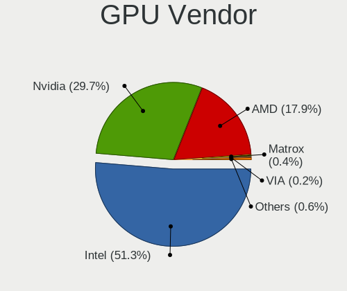

| Vendor                           | Computers | Percent |
|----------------------------------|-----------|---------|
| Intel                            | 204       | 53.13%  |
| Nvidia                           | 110       | 28.65%  |
| AMD                              | 65        | 16.93%  |
| Matrox Electronics Systems       | 2         | 0.52%   |
| VIA Technologies                 | 1         | 0.26%   |
| Silicon Integrated Systems [SiS] | 1         | 0.26%   |
| ATI Technologies                 | 1         | 0.26%   |

GPU Model
---------

Graphics card models

| Model                                                                         | Computers | Percent |
|-------------------------------------------------------------------------------|-----------|---------|
| Intel 2nd Generation Core Processor Family Integrated Graphics Controller     | 19        | 4.9%    |
| Intel 3rd Gen Core processor Graphics Controller                              | 14        | 3.61%   |
| Intel HD Graphics 620                                                         | 13        | 3.35%   |
| Intel Haswell-ULT Integrated Graphics Controller                              | 13        | 3.35%   |
| Intel TigerLake-LP GT2 [Iris Xe Graphics]                                     | 10        | 2.58%   |
| Intel UHD Graphics 620                                                        | 9         | 2.32%   |
| Intel Skylake GT2 [HD Graphics 520]                                           | 9         | 2.32%   |
| Intel GeminiLake [UHD Graphics 600]                                           | 9         | 2.32%   |
| AMD Picasso/Raven 2 [Radeon Vega Series / Radeon Vega Mobile Series]          | 9         | 2.32%   |
| Intel Xeon E3-1200 v3/4th Gen Core Processor Integrated Graphics Controller   | 8         | 2.06%   |
| Intel HD Graphics 630                                                         | 8         | 2.06%   |
| Intel CoffeeLake-H GT2 [UHD Graphics 630]                                     | 8         | 2.06%   |
| AMD Cezanne [Radeon Vega Series / Radeon Vega Mobile Series]                  | 8         | 2.06%   |
| AMD Ellesmere [Radeon RX 470/480/570/570X/580/580X/590]                       | 7         | 1.8%    |
| Intel Core Processor Integrated Graphics Controller                           | 6         | 1.55%   |
| Intel CometLake-U GT2 [UHD Graphics]                                          | 6         | 1.55%   |
| Intel Xeon E3-1200 v2/3rd Gen Core processor Graphics Controller              | 5         | 1.29%   |
| Intel WhiskeyLake-U GT2 [UHD Graphics 620]                                    | 5         | 1.29%   |
| AMD Sun XT [Radeon HD 8670A/8670M/8690M / R5 M330 / M430 / Radeon 520 Mobile] | 5         | 1.29%   |
| Nvidia GP107M [GeForce GTX 1050 Mobile]                                       | 4         | 1.03%   |
| Nvidia GK208B [GeForce GT 730]                                                | 4         | 1.03%   |
| Intel Mobile 4 Series Chipset Integrated Graphics Controller                  | 4         | 1.03%   |
| Intel Iris Plus Graphics G1 (Ice Lake)                                        | 4         | 1.03%   |
| Intel HD Graphics 5500                                                        | 4         | 1.03%   |
| Intel HD Graphics 500                                                         | 4         | 1.03%   |
| Intel CometLake-S GT2 [UHD Graphics 630]                                      | 4         | 1.03%   |
| Intel CometLake-H GT2 [UHD Graphics]                                          | 4         | 1.03%   |
| Intel CoffeeLake-S GT2 [UHD Graphics 630]                                     | 4         | 1.03%   |
| Nvidia TU117M [GeForce MX450]                                                 | 3         | 0.77%   |
| Nvidia TU117M [GeForce GTX 1650 Mobile / Max-Q]                               | 3         | 0.77%   |
| Nvidia TU116 [GeForce GTX 1650 SUPER]                                         | 3         | 0.77%   |
| Nvidia GP107M [GeForce GTX 1050 3 GB Max-Q]                                   | 3         | 0.77%   |
| Nvidia GM108M [GeForce 940MX]                                                 | 3         | 0.77%   |
| Nvidia GM107 [GeForce GTX 750 Ti]                                             | 3         | 0.77%   |
| Nvidia GF117M [GeForce 610M/710M/810M/820M / GT 620M/625M/630M/720M]          | 3         | 0.77%   |
| Nvidia GA107M [GeForce RTX 3050 Mobile]                                       | 3         | 0.77%   |
| Nvidia GA106 [GeForce RTX 3060 Lite Hash Rate]                                | 3         | 0.77%   |
| Intel Iris Plus Graphics G7                                                   | 3         | 0.77%   |
| Intel Atom Processor Z36xxx/Z37xxx Series Graphics & Display                  | 3         | 0.77%   |
| Intel 4 Series Chipset Integrated Graphics Controller                         | 3         | 0.77%   |

GPU Combo
---------

Combinations of graphics cards

| Name           | Computers | Percent |
|----------------|-----------|---------|
| 1 x Intel      | 136       | 44.16%  |
| 1 x Nvidia     | 53        | 17.21%  |
| Intel + Nvidia | 48        | 15.58%  |
| 1 x AMD        | 41        | 13.31%  |
| Intel + AMD    | 16        | 5.19%   |
| AMD + Nvidia   | 8         | 2.6%    |
| 1 x Matrox     | 2         | 0.65%   |
| Other          | 1         | 0.32%   |
| 2 x AMD        | 1         | 0.32%   |
| 1 x VIA        | 1         | 0.32%   |
| 1 x SiS        | 1         | 0.32%   |

GPU Driver
----------

Free vs proprietary

| Driver      | Computers | Percent |
|-------------|-----------|---------|
| Free        | 249       | 78.55%  |
| Proprietary | 61        | 19.24%  |
| Unknown     | 7         | 2.21%   |

GPU Memory
----------

Total video memory

| Size in GB | Computers | Percent |
|------------|-----------|---------|
| Unknown    | 197       | 62.15%  |
| 1.01-2.0   | 40        | 12.62%  |
| 3.01-4.0   | 26        | 8.2%    |
| 7.01-8.0   | 17        | 5.36%   |
| 0.51-1.0   | 14        | 4.42%   |
| 0.01-0.5   | 12        | 3.79%   |
| 2.01-3.0   | 5         | 1.58%   |
| 8.01-16.0  | 5         | 1.58%   |
| 5.01-6.0   | 1         | 0.32%   |

Monitor
-------

Monitor Vendor
--------------

Monitor vendors

| Vendor                  | Computers | Percent |
|-------------------------|-----------|---------|
| BOE                     | 50        | 15.34%  |
| Samsung Electronics     | 34        | 10.43%  |
| LG Display              | 31        | 9.51%   |
| Chimei Innolux          | 28        | 8.59%   |
| Dell                    | 26        | 7.98%   |
| AU Optronics            | 25        | 7.67%   |
| BenQ                    | 16        | 4.91%   |
| Lenovo                  | 11        | 3.37%   |
| Goldstar                | 11        | 3.37%   |
| Hewlett-Packard         | 10        | 3.07%   |
| Sharp                   | 8         | 2.45%   |
| Apple                   | 8         | 2.45%   |
| Unknown                 | 7         | 2.15%   |
| Sony                    | 5         | 1.53%   |
| PANDA                   | 5         | 1.53%   |
| Acer                    | 5         | 1.53%   |
| InfoVision              | 4         | 1.23%   |
| Valve                   | 3         | 0.92%   |
| Ancor Communications    | 3         | 0.92%   |
| ViewSonic               | 2         | 0.61%   |
| TCL                     | 2         | 0.61%   |
| SKY                     | 2         | 0.61%   |
| Gigabyte Technology     | 2         | 0.61%   |
| Chi Mei Optoelectronics | 2         | 0.61%   |
| ASUSTek Computer        | 2         | 0.61%   |
| AOC                     | 2         | 0.61%   |
| ___                     | 1         | 0.31%   |
| WIT                     | 1         | 0.31%   |
| Toshiba                 | 1         | 0.31%   |
| Tech Concepts           | 1         | 0.31%   |
| Sun                     | 1         | 0.31%   |
| SHC                     | 1         | 0.31%   |
| RTK                     | 1         | 0.31%   |
| RGT                     | 1         | 0.31%   |
| Philips                 | 1         | 0.31%   |
| Panasonic               | 1         | 0.31%   |
| MStar                   | 1         | 0.31%   |
| Mi                      | 1         | 0.31%   |
| LG Electronics          | 1         | 0.31%   |
| Lenovo Group Limited    | 1         | 0.31%   |

Monitor Model
-------------

Monitor models

| Model                                                                    | Computers | Percent |
|--------------------------------------------------------------------------|-----------|---------|
| BOE LCD Monitor BOE06A5 1366x768 344x194mm 15.5-inch                     | 4         | 1.18%   |
| BenQ EW3270U BNQ7950 3840x2160 698x393mm 31.5-inch                       | 4         | 1.18%   |
| Valve ANX7530 U VLV3001 800x1280 100x150mm 7.1-inch                      | 3         | 0.89%   |
| Samsung Electronics LCD Monitor SEC5441 1366x768 344x194mm 15.5-inch     | 3         | 0.89%   |
| Samsung Electronics LCD Monitor SAM0902 1920x1080 700x390mm 31.5-inch    | 3         | 0.89%   |
| Lenovo LEN Q27h-10 LEN66A7 2560x1440 598x336mm 27.0-inch                 | 3         | 0.89%   |
| Lenovo LEN G34w-10 LEN66A1 3440x1440 797x334mm 34.0-inch                 | 3         | 0.89%   |
| Dell P2419H DELD0D9 1920x1080 527x296mm 23.8-inch                        | 3         | 0.89%   |
| Chimei Innolux LCD Monitor CMN15F5 1920x1080 344x193mm 15.5-inch         | 3         | 0.89%   |
| Chimei Innolux LCD Monitor CMN14D4 1920x1080 309x173mm 13.9-inch         | 3         | 0.89%   |
| BOE LCD Monitor BOE0819 1920x1080 344x194mm 15.5-inch                    | 3         | 0.89%   |
| BOE LCD Monitor BOE06A4 1366x768 344x194mm 15.5-inch                     | 3         | 0.89%   |
| BenQ GL2460 BNQ78CE 1920x1080 531x299mm 24.0-inch                        | 3         | 0.89%   |
| AU Optronics LCD Monitor AUO38ED 1920x1080 344x193mm 15.5-inch           | 3         | 0.89%   |
| Unknown SMART TV 6488 3840x2160 1209x680mm 54.6-inch                     | 2         | 0.59%   |
| TCL SMART TV TCL6586 3840x2160 1209x680mm 54.6-inch                      | 2         | 0.59%   |
| Samsung Electronics S19C150 SAM0AE6 1366x768 410x230mm 18.5-inch         | 2         | 0.59%   |
| Samsung Electronics LCD Monitor SEC315A 1366x768 344x194mm 15.5-inch     | 2         | 0.59%   |
| Samsung Electronics LCD Monitor SAM0FEE 3840x2160 1872x1053mm 84.6-inch  | 2         | 0.59%   |
| LG Display LCD Monitor LGD0555 2736x1824 260x173mm 12.3-inch             | 2         | 0.59%   |
| LG Display LCD Monitor LGD02DC 1366x768 344x194mm 15.5-inch              | 2         | 0.59%   |
| Dell U2413 DELF047 1920x1200 518x324mm 24.1-inch                         | 2         | 0.59%   |
| Dell SE2717H/HX DELD0A1 1920x1080 598x336mm 27.0-inch                    | 2         | 0.59%   |
| Dell P2314H DEL4098 1920x1080 509x286mm 23.0-inch                        | 2         | 0.59%   |
| Dell P2312H DEL4076 1920x1080 510x287mm 23.0-inch                        | 2         | 0.59%   |
| Chimei Innolux LCD Monitor CMN15DC 1366x768 344x193mm 15.5-inch          | 2         | 0.59%   |
| Chimei Innolux LCD Monitor CMN1517 1920x1080 344x193mm 15.5-inch         | 2         | 0.59%   |
| Chimei Innolux LCD Monitor CMN14D6 1366x768 309x173mm 13.9-inch          | 2         | 0.59%   |
| Chi Mei Optoelectronics LCD Monitor CMO1592 1366x768 344x193mm 15.5-inch | 2         | 0.59%   |
| BOE LCD Monitor BOE0872 1920x1080 344x194mm 15.5-inch                    | 2         | 0.59%   |
| BOE LCD Monitor BOE0802 1920x1080 344x193mm 15.5-inch                    | 2         | 0.59%   |
| BOE LCD Monitor BOE07A1 1920x1080 344x193mm 15.5-inch                    | 2         | 0.59%   |
| BOE LCD Monitor BOE06DC 1920x1280 259x173mm 12.3-inch                    | 2         | 0.59%   |
| BOE LCD Monitor BOE0672 1366x768 344x194mm 15.5-inch                     | 2         | 0.59%   |
| AU Optronics LCD Monitor AUO21ED 1920x1080 344x194mm 15.5-inch           | 2         | 0.59%   |
| AU Optronics LCD Monitor AUO183C 1366x768 309x173mm 13.9-inch            | 2         | 0.59%   |
| Ancor Communications MX279 ACI27C3 1920x1080 598x336mm 27.0-inch         | 2         | 0.59%   |
| ___ LCDTV16 ___9000 1360x768                                             | 1         | 0.3%    |
| WIT DVI WIT00FA 2560x1600 670x430mm 31.3-inch                            | 1         | 0.3%    |
| ViewSonic VX2253 Series VSC0A28 1920x1080 476x268mm 21.5-inch            | 1         | 0.3%    |

Monitor Resolution
------------------

Monitor screen resolution

| Resolution         | Computers | Percent |
|--------------------|-----------|---------|
| 1920x1080 (FHD)    | 138       | 43.81%  |
| 1366x768 (WXGA)    | 87        | 27.62%  |
| 3840x2160 (4K)     | 27        | 8.57%   |
| 2560x1440 (QHD)    | 13        | 4.13%   |
| 3440x1440          | 5         | 1.59%   |
| 1920x1200 (WUXGA)  | 4         | 1.27%   |
| 1440x900 (WXGA+)   | 4         | 1.27%   |
| 1280x800 (WXGA)    | 4         | 1.27%   |
| 800x1280           | 3         | 0.95%   |
| 2736x1824          | 3         | 0.95%   |
| 2560x1080          | 3         | 0.95%   |
| 2160x1440          | 3         | 0.95%   |
| 1280x1024 (SXGA)   | 3         | 0.95%   |
| 2560x1600          | 2         | 0.63%   |
| 1920x1280          | 2         | 0.63%   |
| 1680x1050 (WSXGA+) | 2         | 0.63%   |
| 1600x900 (HD+)     | 2         | 0.63%   |
| 1360x768           | 2         | 0.63%   |
| Unknown            | 2         | 0.63%   |
| 7040x1440          | 1         | 0.32%   |
| 3840x2400          | 1         | 0.32%   |
| 3840x1600          | 1         | 0.32%   |
| 3840x1080          | 1         | 0.32%   |
| 2880x1800          | 1         | 0.32%   |
| 2256x1504          | 1         | 0.32%   |

Monitor Diagonal
----------------

Diagonal size in inches

| Inches  | Computers | Percent |
|---------|-----------|---------|
| 15      | 97        | 29.39%  |
| 13      | 35        | 10.61%  |
| 14      | 25        | 7.58%   |
| 24      | 24        | 7.27%   |
| 27      | 21        | 6.36%   |
| 23      | 15        | 4.55%   |
| Unknown | 12        | 3.64%   |
| 31      | 11        | 3.33%   |
| 12      | 11        | 3.33%   |
| 21      | 10        | 3.03%   |
| 18      | 10        | 3.03%   |
| 54      | 9         | 2.73%   |
| 34      | 7         | 2.12%   |
| 17      | 6         | 1.82%   |
| 72      | 4         | 1.21%   |
| 32      | 4         | 1.21%   |
| 84      | 3         | 0.91%   |
| 52      | 3         | 0.91%   |
| 22      | 3         | 0.91%   |
| 16      | 3         | 0.91%   |
| 7       | 3         | 0.91%   |
| 40      | 2         | 0.61%   |
| 19      | 2         | 0.61%   |
| 11      | 2         | 0.61%   |
| 86      | 1         | 0.3%    |
| 65      | 1         | 0.3%    |
| 57      | 1         | 0.3%    |
| 46      | 1         | 0.3%    |
| 37      | 1         | 0.3%    |
| 29      | 1         | 0.3%    |
| 25      | 1         | 0.3%    |
| 20      | 1         | 0.3%    |

Monitor Width
-------------

Physical width

| Width in mm | Computers | Percent |
|-------------|-----------|---------|
| 301-350     | 143       | 44.14%  |
| 501-600     | 54        | 16.67%  |
| 201-300     | 28        | 8.64%   |
| 401-500     | 26        | 8.02%   |
| 1001-1500   | 16        | 4.94%   |
| 601-700     | 14        | 4.32%   |
| Unknown     | 12        | 3.7%    |
| 701-800     | 11        | 3.4%    |
| 351-400     | 7         | 2.16%   |
| 1501-2000   | 7         | 2.16%   |
| 801-900     | 3         | 0.93%   |
| 1-100       | 3         | 0.93%   |

Aspect Ratio
------------

Proportional relationship between the width and the height

| Ratio   | Computers | Percent |
|---------|-----------|---------|
| 16/9    | 245       | 81.67%  |
| 16/10   | 18        | 6%      |
| Unknown | 11        | 3.67%   |
| 3/2     | 9         | 3%      |
| 21/9    | 9         | 3%      |
| 5/4     | 3         | 1%      |
| 0.67    | 3         | 1%      |
| 4/3     | 1         | 0.33%   |
| 0.56    | 1         | 0.33%   |

Monitor Area
------------

Area in inch

| Area in inch | Computers | Percent |
|----------------|-----------|---------|
| 101-110        | 97        | 29.66%  |
| 81-90          | 52        | 15.9%   |
| 201-250        | 42        | 12.84%  |
| More than 1000 | 22        | 6.73%   |
| 351-500        | 22        | 6.73%   |
| 301-350        | 22        | 6.73%   |
| 141-150        | 13        | 3.98%   |
| Unknown        | 12        | 3.67%   |
| 71-80          | 9         | 2.75%   |
| 61-70          | 9         | 2.75%   |
| 251-300        | 7         | 2.14%   |
| 151-200        | 5         | 1.53%   |
| 501-1000       | 4         | 1.22%   |
| 1-40           | 3         | 0.92%   |
| 121-130        | 3         | 0.92%   |
| 51-60          | 2         | 0.61%   |
| 111-120        | 2         | 0.61%   |
| 91-100         | 1         | 0.31%   |

Pixel Density
-------------

Pixels per inch

| Density       | Computers | Percent |
|---------------|-----------|---------|
| 101-120       | 94        | 29.56%  |
| 51-100        | 92        | 28.93%  |
| 121-160       | 79        | 24.84%  |
| 161-240       | 19        | 5.97%   |
| 1-50          | 16        | 5.03%   |
| Unknown       | 12        | 3.77%   |
| More than 240 | 6         | 1.89%   |

Multiple Monitors
-----------------

Total monitors connected

| Total | Computers | Percent |
|-------|-----------|---------|
| 1     | 264       | 83.54%  |
| 2     | 36        | 11.39%  |
| 0     | 9         | 2.85%   |
| 3     | 6         | 1.9%    |
| 4     | 1         | 0.32%   |

Network
-------

Net Controller Vendor
---------------------

Controller vendors

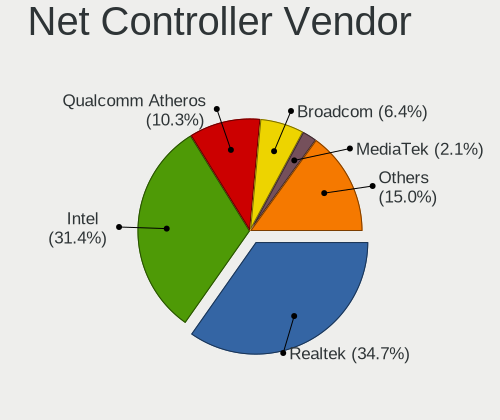

| Vendor                           | Computers | Percent |
|----------------------------------|-----------|---------|
| Realtek Semiconductor            | 168       | 35.37%  |
| Intel                            | 144       | 30.32%  |
| Qualcomm Atheros                 | 57        | 12%     |
| Broadcom                         | 29        | 6.11%   |
| Samsung Electronics              | 9         | 1.89%   |
| Ralink Technology                | 9         | 1.89%   |
| TP-Link                          | 8         | 1.68%   |
| MediaTek                         | 8         | 1.68%   |
| Ralink                           | 7         | 1.47%   |
| Microsoft                        | 4         | 0.84%   |
| Marvell Technology Group         | 4         | 0.84%   |
| Dell                             | 3         | 0.63%   |
| Xiaomi                           | 2         | 0.42%   |
| Nvidia                           | 2         | 0.42%   |
| Linksys                          | 2         | 0.42%   |
| D-Link                           | 2         | 0.42%   |
| Broadcom Limited                 | 2         | 0.42%   |
| ASIX Electronics                 | 2         | 0.42%   |
| Apple                            | 2         | 0.42%   |
| Wilocity                         | 1         | 0.21%   |
| VIA Technologies                 | 1         | 0.21%   |
| T & A Mobile Phones              | 1         | 0.21%   |
| Silicon Integrated Systems [SiS] | 1         | 0.21%   |
| Qualcomm                         | 1         | 0.21%   |
| OPPO Electronics                 | 1         | 0.21%   |
| ICS Advent                       | 1         | 0.21%   |
| Huawei Technologies              | 1         | 0.21%   |
| Edimax Technology                | 1         | 0.21%   |
| DisplayLink                      | 1         | 0.21%   |
| Belkin Components                | 1         | 0.21%   |

Net Controller Model
--------------------

Controller models

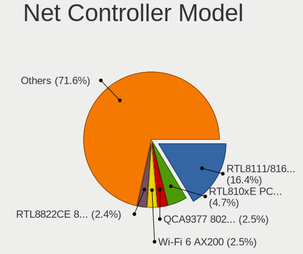

| Model                                                             | Computers | Percent |
|-------------------------------------------------------------------|-----------|---------|
| Realtek RTL8111/8168/8411 PCI Express Gigabit Ethernet Controller | 100       | 18.21%  |
| Realtek RTL810xE PCI Express Fast Ethernet controller             | 30        | 5.46%   |
| Qualcomm Atheros QCA9377 802.11ac Wireless Network Adapter        | 16        | 2.91%   |
| Qualcomm Atheros QCA9565 / AR9565 Wireless Network Adapter        | 14        | 2.55%   |
| Intel Wi-Fi 6 AX200                                               | 14        | 2.55%   |
| Intel 82579LM Gigabit Network Connection (Lewisville)             | 13        | 2.37%   |
| Realtek RTL8821CE 802.11ac PCIe Wireless Network Adapter          | 11        | 2%      |
| Intel Wireless 8265 / 8275                                        | 10        | 1.82%   |
| Realtek RTL8125 2.5GbE Controller                                 | 9         | 1.64%   |
| Samsung Galaxy series, misc. (tethering mode)                     | 8         | 1.46%   |
| Realtek RTL8822CE 802.11ac PCIe Wireless Network Adapter          | 8         | 1.46%   |
| Ralink RT2870/RT3070 Wireless Adapter                             | 7         | 1.28%   |
| Qualcomm Atheros AR9285 Wireless Network Adapter (PCI-Express)    | 7         | 1.28%   |
| Intel Wireless 8260                                               | 7         | 1.28%   |
| Intel Wi-Fi 6 AX201                                               | 7         | 1.28%   |
| Intel I211 Gigabit Network Connection                             | 7         | 1.28%   |
| Intel Ethernet Connection (2) I219-V                              | 7         | 1.28%   |
| MediaTek MT7921 802.11ax PCI Express Wireless Network Adapter     | 6         | 1.09%   |
| Intel Ice Lake-LP PCH CNVi WiFi                                   | 6         | 1.09%   |
| Intel Cannon Lake PCH CNVi WiFi                                   | 6         | 1.09%   |
| Realtek RTL8723BE PCIe Wireless Network Adapter                   | 5         | 0.91%   |
| Realtek RTL8188EUS 802.11n Wireless Network Adapter               | 5         | 0.91%   |
| Intel Wireless 7265                                               | 5         | 0.91%   |
| Intel Wireless 7260                                               | 5         | 0.91%   |
| Intel Wireless 3165                                               | 5         | 0.91%   |
| Intel Ethernet Connection I219-LM                                 | 5         | 0.91%   |
| Intel Ethernet Connection I217-LM                                 | 5         | 0.91%   |
| Intel Ethernet Connection (7) I219-V                              | 5         | 0.91%   |
| Broadcom BCM43142 802.11b/g/n                                     | 5         | 0.91%   |
| TP-Link TL-WN823N v2/v3 [Realtek RTL8192EU]                       | 4         | 0.73%   |
| Realtek RTL8153 Gigabit Ethernet Adapter                          | 4         | 0.73%   |
| Intel Ethernet Controller I225-V                                  | 4         | 0.73%   |
| Intel Ethernet Connection (2) I218-V                              | 4         | 0.73%   |
| Intel Centrino Wireless-N 1000 [Condor Peak]                      | 4         | 0.73%   |
| Broadcom BCM4331 802.11a/b/g/n                                    | 4         | 0.73%   |
| Realtek RTL8822BE 802.11a/b/g/n/ac WiFi adapter                   | 3         | 0.55%   |
| Realtek RTL8723AE PCIe Wireless Network Adapter                   | 3         | 0.55%   |
| Realtek RTL8188EE Wireless Network Adapter                        | 3         | 0.55%   |
| Ralink RT3290 Wireless 802.11n 1T/1R PCIe                         | 3         | 0.55%   |
| Qualcomm Atheros QCA6174 802.11ac Wireless Network Adapter        | 3         | 0.55%   |

Wireless Vendor
---------------

Wireless vendors

| Vendor                   | Computers | Percent |
|--------------------------|-----------|---------|
| Intel                    | 100       | 36.63%  |
| Realtek Semiconductor    | 55        | 20.15%  |
| Qualcomm Atheros         | 51        | 18.68%  |
| Broadcom                 | 19        | 6.96%   |
| Ralink Technology        | 9         | 3.3%    |
| TP-Link                  | 8         | 2.93%   |
| MediaTek                 | 8         | 2.93%   |
| Ralink                   | 7         | 2.56%   |
| Dell                     | 3         | 1.1%    |
| Microsoft                | 2         | 0.73%   |
| Linksys                  | 2         | 0.73%   |
| D-Link                   | 2         | 0.73%   |
| Broadcom Limited         | 2         | 0.73%   |
| Wilocity                 | 1         | 0.37%   |
| Qualcomm                 | 1         | 0.37%   |
| Marvell Technology Group | 1         | 0.37%   |
| Edimax Technology        | 1         | 0.37%   |
| Belkin Components        | 1         | 0.37%   |

Wireless Model
--------------

Wireless models

| Model                                                          | Computers | Percent |
|----------------------------------------------------------------|-----------|---------|
| Qualcomm Atheros QCA9377 802.11ac Wireless Network Adapter     | 16        | 5.86%   |
| Qualcomm Atheros QCA9565 / AR9565 Wireless Network Adapter     | 14        | 5.13%   |
| Intel Wi-Fi 6 AX200                                            | 14        | 5.13%   |
| Realtek RTL8821CE 802.11ac PCIe Wireless Network Adapter       | 11        | 4.03%   |
| Intel Wireless 8265 / 8275                                     | 10        | 3.66%   |
| Realtek RTL8822CE 802.11ac PCIe Wireless Network Adapter       | 8         | 2.93%   |
| Ralink RT2870/RT3070 Wireless Adapter                          | 7         | 2.56%   |
| Qualcomm Atheros AR9285 Wireless Network Adapter (PCI-Express) | 7         | 2.56%   |
| Intel Wireless 8260                                            | 7         | 2.56%   |
| Intel Wi-Fi 6 AX201                                            | 7         | 2.56%   |
| MediaTek MT7921 802.11ax PCI Express Wireless Network Adapter  | 6         | 2.2%    |
| Intel Ice Lake-LP PCH CNVi WiFi                                | 6         | 2.2%    |
| Intel Cannon Lake PCH CNVi WiFi                                | 6         | 2.2%    |
| Realtek RTL8723BE PCIe Wireless Network Adapter                | 5         | 1.83%   |
| Realtek RTL8188EUS 802.11n Wireless Network Adapter            | 5         | 1.83%   |
| Intel Wireless 7265                                            | 5         | 1.83%   |
| Intel Wireless 7260                                            | 5         | 1.83%   |
| Intel Wireless 3165                                            | 5         | 1.83%   |
| Broadcom BCM43142 802.11b/g/n                                  | 5         | 1.83%   |
| TP-Link TL-WN823N v2/v3 [Realtek RTL8192EU]                    | 4         | 1.47%   |
| Intel Centrino Wireless-N 1000 [Condor Peak]                   | 4         | 1.47%   |
| Broadcom BCM4331 802.11a/b/g/n                                 | 4         | 1.47%   |
| Realtek RTL8822BE 802.11a/b/g/n/ac WiFi adapter                | 3         | 1.1%    |
| Realtek RTL8723AE PCIe Wireless Network Adapter                | 3         | 1.1%    |
| Realtek RTL8188EE Wireless Network Adapter                     | 3         | 1.1%    |
| Ralink RT3290 Wireless 802.11n 1T/1R PCIe                      | 3         | 1.1%    |
| Qualcomm Atheros QCA6174 802.11ac Wireless Network Adapter     | 3         | 1.1%    |
| Qualcomm Atheros AR93xx Wireless Network Adapter               | 3         | 1.1%    |
| Intel Wireless-AC 9260                                         | 3         | 1.1%    |
| Intel Dual Band Wireless-AC 3168NGW [Stone Peak]               | 3         | 1.1%    |
| Intel Comet Lake PCH-LP CNVi WiFi                              | 3         | 1.1%    |
| Intel Comet Lake PCH CNVi WiFi                                 | 3         | 1.1%    |
| Dell Wireless 5570e HSPA+ (42Mbps) Mobile Broadband Card       | 3         | 1.1%    |
| Broadcom BCM4360 802.11ac Wireless Network Adapter             | 3         | 1.1%    |
| Realtek RTL88x2bu [AC1200 Techkey]                             | 2         | 0.73%   |
| Realtek RTL8852AE 802.11ax PCIe Wireless Network Adapter       | 2         | 0.73%   |
| Realtek RTL8723DE Wireless Network Adapter                     | 2         | 0.73%   |
| Realtek RTL8187 Wireless Adapter                               | 2         | 0.73%   |
| Qualcomm Atheros AR9485 Wireless Network Adapter               | 2         | 0.73%   |
| Qualcomm Atheros AR928X Wireless Network Adapter (PCI-Express) | 2         | 0.73%   |

Ethernet Vendor
---------------

Ethernet vendors

| Vendor                           | Computers | Percent |
|----------------------------------|-----------|---------|
| Realtek Semiconductor            | 144       | 53.53%  |
| Intel                            | 72        | 26.77%  |
| Broadcom                         | 16        | 5.95%   |
| Samsung Electronics              | 9         | 3.35%   |
| Qualcomm Atheros                 | 8         | 2.97%   |
| Marvell Technology Group         | 3         | 1.12%   |
| Xiaomi                           | 2         | 0.74%   |
| Nvidia                           | 2         | 0.74%   |
| Microsoft                        | 2         | 0.74%   |
| ASIX Electronics                 | 2         | 0.74%   |
| Apple                            | 2         | 0.74%   |
| VIA Technologies                 | 1         | 0.37%   |
| T & A Mobile Phones              | 1         | 0.37%   |
| Silicon Integrated Systems [SiS] | 1         | 0.37%   |
| OPPO Electronics                 | 1         | 0.37%   |
| ICS Advent                       | 1         | 0.37%   |
| Huawei Technologies              | 1         | 0.37%   |
| DisplayLink                      | 1         | 0.37%   |

Ethernet Model
--------------

Ethernet models

| Model                                                             | Computers | Percent |
|-------------------------------------------------------------------|-----------|---------|
| Realtek RTL8111/8168/8411 PCI Express Gigabit Ethernet Controller | 100       | 36.36%  |
| Realtek RTL810xE PCI Express Fast Ethernet controller             | 30        | 10.91%  |
| Intel 82579LM Gigabit Network Connection (Lewisville)             | 13        | 4.73%   |
| Realtek RTL8125 2.5GbE Controller                                 | 9         | 3.27%   |
| Samsung Galaxy series, misc. (tethering mode)                     | 8         | 2.91%   |
| Intel I211 Gigabit Network Connection                             | 7         | 2.55%   |
| Intel Ethernet Connection (2) I219-V                              | 7         | 2.55%   |
| Intel Ethernet Connection I219-LM                                 | 5         | 1.82%   |
| Intel Ethernet Connection I217-LM                                 | 5         | 1.82%   |
| Intel Ethernet Connection (7) I219-V                              | 5         | 1.82%   |
| Realtek RTL8153 Gigabit Ethernet Adapter                          | 4         | 1.45%   |
| Intel Ethernet Controller I225-V                                  | 4         | 1.45%   |
| Intel Ethernet Connection (2) I218-V                              | 4         | 1.45%   |
| Broadcom NetXtreme BCM57765 Gigabit Ethernet PCIe                 | 3         | 1.09%   |
| Broadcom NetLink BCM57785 Gigabit Ethernet PCIe                   | 3         | 1.09%   |
| Samsung GT-I9070 (network tethering, USB debugging enabled)       | 2         | 0.73%   |
| Qualcomm Atheros AR8161 Gigabit Ethernet                          | 2         | 0.73%   |
| Nvidia MCP79 Ethernet                                             | 2         | 0.73%   |
| Microsoft RTL8153B GigE [Surface Ethernet Adapter]                | 2         | 0.73%   |
| Intel Ethernet Connection I217-V                                  | 2         | 0.73%   |
| Intel Ethernet Connection (4) I219-V                              | 2         | 0.73%   |
| Intel 82583V Gigabit Network Connection                           | 2         | 0.73%   |
| Intel 82577LM Gigabit Network Connection                          | 2         | 0.73%   |
| Broadcom NetXtreme BCM57766 Gigabit Ethernet PCIe                 | 2         | 0.73%   |
| Broadcom NetLink BCM5784M Gigabit Ethernet PCIe                   | 2         | 0.73%   |
| Broadcom NetLink BCM57780 Gigabit Ethernet PCIe                   | 2         | 0.73%   |
| ASIX AX88179 Gigabit Ethernet                                     | 2         | 0.73%   |
| Apple iPad 4/Mini1                                                | 2         | 0.73%   |
| Xiaomi Mi/Redmi series (RNDIS)                                    | 1         | 0.36%   |
| Xiaomi Mi/Redmi series (RNDIS + ADB)                              | 1         | 0.36%   |
| VIA VT6102/VT6103 [Rhine-II]                                      | 1         | 0.36%   |
| T & A Mobile Phones Alcatel 1                                     | 1         | 0.36%   |
| Silicon Integrated Systems [SiS] SiS900 PCI Fast Ethernet         | 1         | 0.36%   |
| Realtek RTL-8100/8101L/8139 PCI Fast Ethernet Adapter             | 1         | 0.36%   |
| Realtek PCIe GbE Family Controller                                | 1         | 0.36%   |
| Qualcomm Atheros QCA8171 Gigabit Ethernet                         | 1         | 0.36%   |
| Qualcomm Atheros AR8152 v2.0 Fast Ethernet                        | 1         | 0.36%   |
| Qualcomm Atheros AR8152 v1.1 Fast Ethernet                        | 1         | 0.36%   |
| Qualcomm Atheros AR8151 v2.0 Gigabit Ethernet                     | 1         | 0.36%   |
| Qualcomm Atheros AR8132 Fast Ethernet                             | 1         | 0.36%   |

Net Controller Kind
-------------------

Ethernet, WiFi or modem

| Kind     | Computers | Percent |
|----------|-----------|---------|
| WiFi     | 254       | 50.4%   |
| Ethernet | 249       | 49.4%   |
| Modem    | 1         | 0.2%    |

Used Controller
---------------

Currently used network controller

| Kind     | Computers | Percent |
|----------|-----------|---------|
| WiFi     | 198       | 62.46%  |
| Ethernet | 119       | 37.54%  |

NICs
----

Total network controllers on board

| Total | Computers | Percent |
|-------|-----------|---------|
| 2     | 165       | 53.75%  |
| 1     | 134       | 43.65%  |
| 4     | 3         | 0.98%   |
| 0     | 3         | 0.98%   |
| 3     | 2         | 0.65%   |

IPv6
----

IPv6 vs IPv4

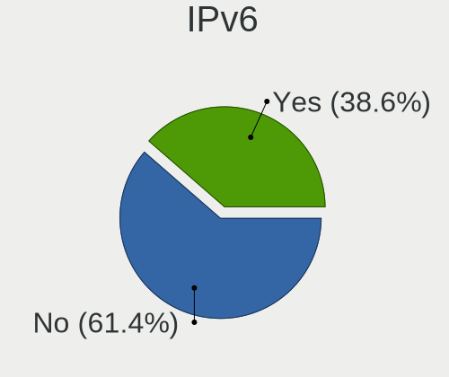

| Used | Computers | Percent |
|------|-----------|---------|
| No   | 215       | 66.98%  |
| Yes  | 106       | 33.02%  |

Bluetooth
---------

Bluetooth Vendor
----------------

Controller vendors

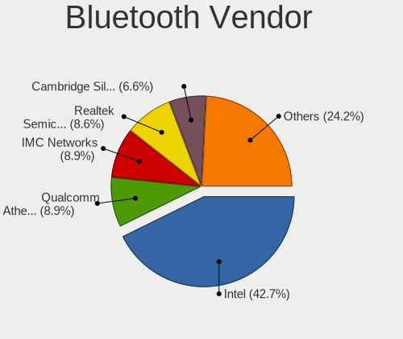

| Vendor                          | Computers | Percent |
|---------------------------------|-----------|---------|
| Intel                           | 87        | 40.09%  |
| Qualcomm Atheros Communications | 22        | 10.14%  |
| Realtek Semiconductor           | 20        | 9.22%   |
| IMC Networks                    | 18        | 8.29%   |
| Cambridge Silicon Radio         | 17        | 7.83%   |
| Foxconn / Hon Hai               | 12        | 5.53%   |
| Apple                           | 8         | 3.69%   |
| Lite-On Technology              | 7         | 3.23%   |
| Toshiba                         | 5         | 2.3%    |
| Broadcom                        | 4         | 1.84%   |
| TP-Link                         | 3         | 1.38%   |
| Ralink                          | 3         | 1.38%   |
| Realtek                         | 2         | 0.92%   |
| Dell                            | 2         | 0.92%   |
| ASUSTek Computer                | 2         | 0.92%   |
| Ralink Technology               | 1         | 0.46%   |
| Qcom                            | 1         | 0.46%   |
| MediaTek                        | 1         | 0.46%   |
| Marvell Semiconductor           | 1         | 0.46%   |
| ISSC                            | 1         | 0.46%   |

Bluetooth Model
---------------

Controller models

| Model                                                                               | Computers | Percent |
|-------------------------------------------------------------------------------------|-----------|---------|
| Intel Bluetooth wireless interface                                                  | 32        | 14.75%  |
| Intel AX201 Bluetooth                                                               | 18        | 8.29%   |
| Cambridge Silicon Radio Bluetooth Dongle (HCI mode)                                 | 17        | 7.83%   |
| Intel Bluetooth 9460/9560 Jefferson Peak (JfP)                                      | 14        | 6.45%   |
| Intel AX200 Bluetooth                                                               | 13        | 5.99%   |
| Qualcomm Atheros  Bluetooth Device                                                  | 12        | 5.53%   |
| Realtek Bluetooth Radio                                                             | 11        | 5.07%   |
| Realtek  Bluetooth 4.2 Adapter                                                      | 8         | 3.69%   |
| IMC Networks Bluetooth Radio                                                        | 8         | 3.69%   |
| IMC Networks Bluetooth Device                                                       | 7         | 3.23%   |
| Apple Bluetooth USB Host Controller                                                 | 5         | 2.3%    |
| TP-Link UB5A Adapter                                                                | 3         | 1.38%   |
| Ralink RT3290 Bluetooth                                                             | 3         | 1.38%   |
| Qualcomm Atheros AR9462 Bluetooth                                                   | 3         | 1.38%   |
| Qualcomm Atheros AR3011 Bluetooth                                                   | 3         | 1.38%   |
| Intel Wireless-AC 9260 Bluetooth Adapter                                            | 3         | 1.38%   |
| Intel Wireless-AC 3168 Bluetooth                                                    | 3         | 1.38%   |
| IMC Networks Wireless_Device                                                        | 3         | 1.38%   |
| Foxconn / Hon Hai BCM43142A0                                                        | 3         | 1.38%   |
| Toshiba RT Bluetooth Radio                                                          | 2         | 0.92%   |
| Realtek Bluetooth Radio                                                             | 2         | 0.92%   |
| Qualcomm Atheros AR3012 Bluetooth 4.0                                               | 2         | 0.92%   |
| Intel Centrino Bluetooth Wireless Transceiver                                       | 2         | 0.92%   |
| Foxconn / Hon Hai MediaTek Bluetooth Adapter                                        | 2         | 0.92%   |
| Foxconn / Hon Hai Foxconn T77H114 BCM2070 [Single-Chip Bluetooth 2.1 + EDR Adapter] | 2         | 0.92%   |
| Foxconn / Hon Hai Bluetooth USB Host Controller                                     | 2         | 0.92%   |
| Apple Built-in Bluetooth 2.0+EDR HCI                                                | 2         | 0.92%   |
| Toshiba Bluetooth Device                                                            | 1         | 0.46%   |
| Toshiba Askey for                                                                   | 1         | 0.46%   |
| Toshiba Askey Bluetooth Module                                                      | 1         | 0.46%   |
| Realtek RTL8723A Bluetooth                                                          | 1         | 0.46%   |
| Ralink CSR BS8510                                                                   | 1         | 0.46%   |
| Qualcomm Atheros QCA61x4 Bluetooth 4.0                                              | 1         | 0.46%   |
| Qualcomm Atheros Bluetooth USB Host Controller                                      | 1         | 0.46%   |
| Qcom Broadcom Bluetooth USB                                                         | 1         | 0.46%   |
| MediaTek Wireless_Device                                                            | 1         | 0.46%   |
| Marvell Bluetooth and Wireless LAN Composite                                        | 1         | 0.46%   |
| Lite-On Wireless_Device                                                             | 1         | 0.46%   |
| Lite-On Qualcomm Atheros QCA9377 Bluetooth                                          | 1         | 0.46%   |
| Lite-On Qualcomm Atheros Bluetooth                                                  | 1         | 0.46%   |

Sound
-----

Sound Vendor
------------

Sound card vendors

| Vendor                           | Computers | Percent |
|----------------------------------|-----------|---------|
| Intel                            | 251       | 59.62%  |
| Nvidia                           | 78        | 18.53%  |
| AMD                              | 60        | 14.25%  |
| C-Media Electronics              | 10        | 2.38%   |
| Creative Labs                    | 3         | 0.71%   |
| Tenx Technology                  | 2         | 0.48%   |
| Kingston Technology              | 2         | 0.48%   |
| Cooler Master                    | 2         | 0.48%   |
| VIA Technologies                 | 1         | 0.24%   |
| Texas Instruments                | 1         | 0.24%   |
| Silicon Integrated Systems [SiS] | 1         | 0.24%   |
| Samson Technologies              | 1         | 0.24%   |
| Plantronics                      | 1         | 0.24%   |
| Nreal                            | 1         | 0.24%   |
| Nordic Semiconductor ASA         | 1         | 0.24%   |
| Microsoft                        | 1         | 0.24%   |
| Logitech                         | 1         | 0.24%   |
| JMTek                            | 1         | 0.24%   |
| DCMT Technology                  | 1         | 0.24%   |
| Creative Technology              | 1         | 0.24%   |
| Corsair                          | 1         | 0.24%   |

Sound Model
-----------

Sound card models

| Model                                                                      | Computers | Percent |
|----------------------------------------------------------------------------|-----------|---------|
| Intel Sunrise Point-LP HD Audio                                            | 34        | 7.04%   |
| Intel 7 Series/C216 Chipset Family High Definition Audio Controller        | 29        | 6%      |
| AMD Family 17h/19h HD Audio Controller                                     | 23        | 4.76%   |
| Intel 6 Series/C200 Series Chipset Family High Definition Audio Controller | 21        | 4.35%   |
| Intel Cannon Lake PCH cAVS                                                 | 15        | 3.11%   |
| Intel 200 Series PCH HD Audio                                              | 15        | 3.11%   |
| Intel Haswell-ULT HD Audio Controller                                      | 13        | 2.69%   |
| Intel 8 Series HD Audio Controller                                         | 13        | 2.69%   |
| Intel 8 Series/C220 Series Chipset High Definition Audio Controller        | 12        | 2.48%   |
| Intel Xeon E3-1200 v3/4th Gen Core Processor HD Audio Controller           | 11        | 2.28%   |
| AMD Renoir Radeon High Definition Audio Controller                         | 11        | 2.28%   |
| Intel Tiger Lake-LP Smart Sound Technology Audio Controller                | 10        | 2.07%   |
| Intel 5 Series/3400 Series Chipset High Definition Audio                   | 10        | 2.07%   |
| AMD Starship/Matisse HD Audio Controller                                   | 10        | 2.07%   |
| Intel Celeron/Pentium Silver Processor High Definition Audio               | 9         | 1.86%   |
| AMD Raven/Raven2/Fenghuang HDMI/DP Audio Controller                        | 9         | 1.86%   |
| Intel Ice Lake-LP Smart Sound Technology Audio Controller                  | 8         | 1.66%   |
| Nvidia GP107GL High Definition Audio Controller                            | 7         | 1.45%   |
| Intel Comet Lake PCH cAVS                                                  | 7         | 1.45%   |
| AMD Ellesmere HDMI Audio [Radeon RX 470/480 / 570/580/590]                 | 7         | 1.45%   |
| Nvidia TU116 High Definition Audio Controller                              | 6         | 1.24%   |
| Nvidia TU106 High Definition Audio Controller                              | 6         | 1.24%   |
| Nvidia GK208 HDMI/DP Audio Controller                                      | 6         | 1.24%   |
| Intel Comet Lake PCH-LP cAVS                                               | 6         | 1.24%   |
| Intel Cannon Point-LP High Definition Audio Controller                     | 6         | 1.24%   |
| Intel 82801I (ICH9 Family) HD Audio Controller                             | 6         | 1.24%   |
| Intel Wildcat Point-LP High Definition Audio Controller                    | 5         | 1.04%   |
| Intel NM10/ICH7 Family High Definition Audio Controller                    | 5         | 1.04%   |
| Intel Broadwell-U Audio Controller                                         | 5         | 1.04%   |
| Nvidia GP106 High Definition Audio Controller                              | 4         | 0.83%   |
| Nvidia GP104 High Definition Audio Controller                              | 4         | 0.83%   |
| Nvidia GF108 High Definition Audio Controller                              | 4         | 0.83%   |
| Nvidia GA106 High Definition Audio Controller                              | 4         | 0.83%   |
| Intel Celeron N3350/Pentium N4200/Atom E3900 Series Audio Cluster          | 4         | 0.83%   |
| Intel C610/X99 series chipset HD Audio Controller                          | 4         | 0.83%   |
| Intel 9 Series Chipset Family HD Audio Controller                          | 4         | 0.83%   |
| Intel 100 Series/C230 Series Chipset Family HD Audio Controller            | 4         | 0.83%   |
| C-Media Electronics CM108 Audio Controller                                 | 4         | 0.83%   |
| C-Media Electronics Audio Adapter (Unitek Y-247A)                          | 4         | 0.83%   |
| Nvidia TU107 GeForce GTX 1650 High Definition Audio Controller             | 3         | 0.62%   |

Memory
------

Memory Vendor
-------------

Memory module vendors

| Vendor                               | Computers | Percent |
|--------------------------------------|-----------|---------|
| Samsung Electronics                  | 35        | 20.71%  |
| SK hynix                             | 32        | 18.93%  |
| Micron Technology                    | 24        | 14.2%   |
| Kingston                             | 19        | 11.24%  |
| Unknown                              | 14        | 8.28%   |
| Crucial                              | 11        | 6.51%   |
| G.Skill                              | 6         | 3.55%   |
| Team                                 | 4         | 2.37%   |
| Corsair                              | 4         | 2.37%   |
| Elpida                               | 3         | 1.78%   |
| Unknown (ABCD)                       | 2         | 1.18%   |
| Nanya Technology                     | 2         | 1.18%   |
| Hikvision                            | 2         | 1.18%   |
| Unknown (0x00FFFFFFFFFFFFFF)         | 1         | 0.59%   |
| Toshiba                              | 1         | 0.59%   |
| Silicon Power                        | 1         | 0.59%   |
| Ramaxel Technology                   | 1         | 0.59%   |
| Patriot Memory (PDP Systems)         | 1         | 0.59%   |
| Lexar Co Limited                     | 1         | 0.59%   |
| KLEVV                                | 1         | 0.59%   |
| Kingmax Semiconductor                | 1         | 0.59%   |
| Chun Well Technology Holding Limited | 1         | 0.59%   |
| ASint Technology                     | 1         | 0.59%   |
| A-DATA Technology                    | 1         | 0.59%   |

Memory Model
------------

Memory module models

| Model                                                            | Computers | Percent |
|------------------------------------------------------------------|-----------|---------|
| Samsung RAM M471A5244CB0-CTD 4GB SODIMM DDR4 3266MT/s            | 4         | 2.25%   |
| SK hynix RAM HMT451S6BFR8A-PB 4GB SODIMM DDR3 1600MT/s           | 3         | 1.69%   |
| Samsung RAM M471B1G73EB0-YK0 8GB SODIMM DDR3 1600MT/s            | 3         | 1.69%   |
| Kingston RAM KHX2666C16/16G 16GB DIMM DDR4 3200MT/s              | 3         | 1.69%   |
| Team RAM TEAMGROUP-UD3-1600 8192MB DIMM DDR3 1600MT/s            | 2         | 1.12%   |
| SK hynix RAM HMT325S6BFR8C-H9 2GB SODIMM DDR3 1334MT/s           | 2         | 1.12%   |
| SK hynix RAM HMA851U6AFR6N-UH 4GB DIMM DDR4 2400MT/s             | 2         | 1.12%   |
| SK hynix RAM HMA81GS6JJR8N-VK 8GB SODIMM DDR4 2667MT/s           | 2         | 1.12%   |
| Samsung RAM M471B5673FH0-CF8 2GB SODIMM DDR3 1067MT/s            | 2         | 1.12%   |
| Samsung RAM M471B5273CH0-CH9 4GB SODIMM DDR3 1334MT/s            | 2         | 1.12%   |
| Samsung RAM M471A5244CB0-CTD 4GB Row Of Chips DDR4 2667MT/s      | 2         | 1.12%   |
| Samsung RAM M471A1K43DB1-CWE 8GB SODIMM DDR4 3200MT/s            | 2         | 1.12%   |
| Samsung RAM M471A1K43DB1-CTD 8GB SODIMM DDR4 2667MT/s            | 2         | 1.12%   |
| Micron RAM Module 4GB DIMM DDR3 1333MT/s                         | 2         | 1.12%   |
| Hikvision RAM HKED4162DAA1D0MA1 16GB SODIMM DDR4 2667MT/s        | 2         | 1.12%   |
| Elpida RAM EBJ21UE8BDS0-DJ-F 2GB SODIMM DDR3 1334MT/s            | 2         | 1.12%   |
| Unknown RAM Module 8GB DIMM DDR3 1600MT/s                        | 1         | 0.56%   |
| Unknown RAM Module 8192MB SODIMM DDR3 1600MT/s                   | 1         | 0.56%   |
| Unknown RAM Module 8192MB DIMM 1333MT/s                          | 1         | 0.56%   |
| Unknown RAM Module 4GB SODIMM DDR4 2667MT/s                      | 1         | 0.56%   |
| Unknown RAM Module 4GB SODIMM DDR3 1600MT/s                      | 1         | 0.56%   |
| Unknown RAM Module 4GB Row Of Chips LPDDR4 4267MT/s              | 1         | 0.56%   |
| Unknown RAM Module 4GB DIMM DDR3 1600MT/s                        | 1         | 0.56%   |
| Unknown RAM Module 4096MB DIMM DDR3 1333MT/s                     | 1         | 0.56%   |
| Unknown RAM Module 2GB SODIMM DDR3 1333MT/s                      | 1         | 0.56%   |
| Unknown RAM Module 2GB SODIMM DDR2                               | 1         | 0.56%   |
| Unknown RAM Module 2GB SODIMM 800MT/s                            | 1         | 0.56%   |
| Unknown RAM Module 2GB DIMM 800MT/s                              | 1         | 0.56%   |
| Unknown RAM Module 2048MB SODIMM DDR2                            | 1         | 0.56%   |
| Unknown RAM Module 16GB SODIMM DDR4 2667MT/s                     | 1         | 0.56%   |
| Unknown RAM Module 1024MB DIMM 667MT/s                           | 1         | 0.56%   |
| Unknown (ABCD) RAM 123456789012345678 4GB DIMM LPDDR4 2400MT/s   | 1         | 0.56%   |
| Unknown (ABCD) RAM 123456789012345678 1GB SODIMM LPDDR4 2400MT/s | 1         | 0.56%   |
| Unknown (0x00FFFFFFFFFFFFFF) RAM Module 4GB SODIMM DDR2 667MT/s  | 1         | 0.56%   |
| Toshiba RAM 8HTF12864HDY-800G1 2GB SODIMM 1066MT/s               | 1         | 0.56%   |
| Toshiba RAM 64T128020EDL2.5C2 2GB SODIMM 1066MT/s                | 1         | 0.56%   |
| Team RAM TEAMGROUP-UD4-3200 8GB DIMM DDR4 3733MT/s               | 1         | 0.56%   |
| Team RAM Elite-1600 8GB SODIMM DDR3 1600MT/s                     | 1         | 0.56%   |
| SK hynix RAM Module 4GB SODIMM DDR3 1600MT/s                     | 1         | 0.56%   |
| SK hynix RAM Module 2GB SODIMM DDR3 1067MT/s                     | 1         | 0.56%   |

Memory Kind
-----------

Memory module kinds

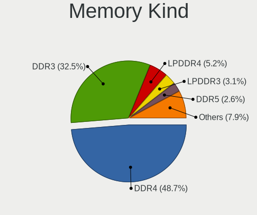

| Kind    | Computers | Percent |
|---------|-----------|---------|
| DDR4    | 66        | 48.18%  |
| DDR3    | 49        | 35.77%  |
| LPDDR4  | 7         | 5.11%   |
| DDR2    | 5         | 3.65%   |
| LPDDR3  | 4         | 2.92%   |
| Unknown | 4         | 2.92%   |
| SDRAM   | 2         | 1.46%   |

Memory Form Factor
------------------

Physical design of the memory module

| Name         | Computers | Percent |
|--------------|-----------|---------|
| SODIMM       | 76        | 55.88%  |
| DIMM         | 48        | 35.29%  |
| Row Of Chips | 11        | 8.09%   |
| Chip         | 1         | 0.74%   |

Memory Size
-----------

Memory module size

| Size  | Computers | Percent |
|-------|-----------|---------|
| 8192  | 52        | 35.14%  |
| 4096  | 46        | 31.08%  |
| 16384 | 23        | 15.54%  |
| 2048  | 18        | 12.16%  |
| 32768 | 5         | 3.38%   |
| 1024  | 4         | 2.7%    |

Memory Speed
------------

Memory module speed

| Speed   | Computers | Percent |
|---------|-----------|---------|
| 1600    | 30        | 19.23%  |
| 3200    | 26        | 16.67%  |
| 2667    | 25        | 16.03%  |
| 1333    | 11        | 7.05%   |
| 1334    | 9         | 5.77%   |
| 2400    | 8         | 5.13%   |
| 2133    | 8         | 5.13%   |
| 3266    | 4         | 2.56%   |
| 1867    | 4         | 2.56%   |
| 800     | 4         | 2.56%   |
| 3733    | 3         | 1.92%   |
| 3600    | 3         | 1.92%   |
| 1800    | 3         | 1.92%   |
| 1067    | 3         | 1.92%   |
| 4267    | 2         | 1.28%   |
| 1866    | 2         | 1.28%   |
| 667     | 2         | 1.28%   |
| 4199    | 1         | 0.64%   |
| 3866    | 1         | 0.64%   |
| 3466    | 1         | 0.64%   |
| 3000    | 1         | 0.64%   |
| 2933    | 1         | 0.64%   |
| 1648    | 1         | 0.64%   |
| 1066    | 1         | 0.64%   |
| 975     | 1         | 0.64%   |
| Unknown | 1         | 0.64%   |

Printers & scanners
-------------------

Printer Vendor
--------------

Printer device vendors

| Vendor                 | Computers | Percent |
|------------------------|-----------|---------|
| Hewlett-Packard        | 7         | 70%     |
| Brother Industries     | 2         | 20%     |
| Panasonic (Matsushita) | 1         | 10%     |

Printer Model
-------------

Printer device models

| Model                              | Computers | Percent |
|------------------------------------|-----------|---------|
| Brother HL-2130 series             | 2         | 18.18%  |
| Panasonic (Matsushita) KX-MB1500RU | 1         | 9.09%   |
| HP LaserJet P2055 series           | 1         | 9.09%   |
| HP LaserJet P2015 series           | 1         | 9.09%   |
| HP LaserJet M101-M106              | 1         | 9.09%   |
| HP LaserJet CP 1025nw              | 1         | 9.09%   |
| HP LaserJet 1020                   | 1         | 9.09%   |
| HP DeskJet Plus 4100 series        | 1         | 9.09%   |
| HP DeskJet 2700 series             | 1         | 9.09%   |
| HP DeskJet 2130 series             | 1         | 9.09%   |

Scanner Vendor
--------------

Scanner device vendors

| Vendor | Computers | Percent |
|--------|-----------|---------|
| Canon  | 1         | 100%    |

Scanner Model
-------------

Scanner device models

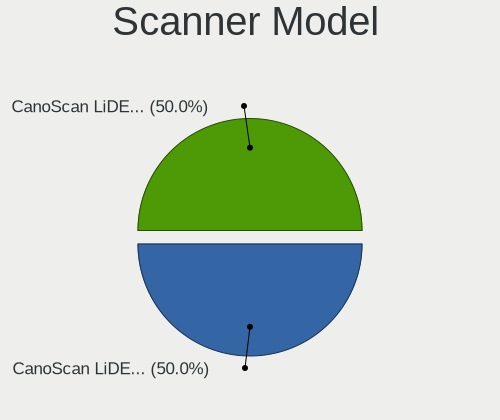

| Model                    | Computers | Percent |
|--------------------------|-----------|---------|
| Canon CanoScan LiDE 500F | 1         | 100%    |

Camera
------

Camera Vendor
-------------

Camera device vendors

| Vendor                                 | Computers | Percent |
|----------------------------------------|-----------|---------|
| Chicony Electronics                    | 32        | 19.39%  |
| IMC Networks                           | 25        | 15.15%  |
| Microdia                               | 15        | 9.09%   |
| Bison Electronics                      | 12        | 7.27%   |
| Realtek Semiconductor                  | 11        | 6.67%   |
| Apple                                  | 10        | 6.06%   |
| Sunplus Innovation Technology          | 9         | 5.45%   |
| Quanta                                 | 7         | 4.24%   |
| Lite-On Technology                     | 7         | 4.24%   |
| Suyin                                  | 6         | 3.64%   |
| Cheng Uei Precision Industry (Foxlink) | 5         | 3.03%   |
| Microsoft                              | 4         | 2.42%   |
| Samsung Electronics                    | 3         | 1.82%   |
| Importek                               | 3         | 1.82%   |
| Syntek                                 | 2         | 1.21%   |
| Silicon Motion                         | 2         | 1.21%   |
| Ricoh                                  | 2         | 1.21%   |
| Luxvisions Innotech Limited            | 2         | 1.21%   |
| ARC International                      | 2         | 1.21%   |
| Alcor Micro                            | 2         | 1.21%   |
| Logitech                               | 1         | 0.61%   |
| Lenovo                                 | 1         | 0.61%   |
| Arkmicro Technologies                  | 1         | 0.61%   |
| Acer                                   | 1         | 0.61%   |

Camera Model
------------

Camera device models

| Model                                                          | Computers | Percent |
|----------------------------------------------------------------|-----------|---------|
| IMC Networks USB2.0 VGA UVC WebCam                             | 12        | 7.23%   |
| Chicony Integrated Camera                                      | 12        | 7.23%   |
| IMC Networks USB2.0 HD UVC WebCam                              | 9         | 5.42%   |
| Microdia Integrated_Webcam_HD                                  | 8         | 4.82%   |
| Apple iPhone 5/5C/5S/6/SE/7/8/X/XR                             | 5         | 3.01%   |
| Sunplus Integrated_Webcam_HD                                   | 4         | 2.41%   |
| Bison Integrated Camera                                        | 4         | 2.41%   |
| Samsung Galaxy series, misc. (MTP mode)                        | 3         | 1.81%   |
| Lite-On HP TrueVision HD Camera                                | 3         | 1.81%   |
| Bison Lenovo EasyCamera                                        | 3         | 1.81%   |
| Apple FaceTime HD Camera                                       | 3         | 1.81%   |
| Sunplus HD WebCam                                              | 2         | 1.2%    |
| Realtek Integrated_Webcam_HD                                   | 2         | 1.2%    |
| Realtek Integrated Webcam HD                                   | 2         | 1.2%    |
| Realtek Integrated Webcam                                      | 2         | 1.2%    |
| Realtek HP Truevision HD integrated webcam                     | 2         | 1.2%    |
| Quanta HP Wide Vision HD Camera                                | 2         | 1.2%    |
| Microdia HP Integrated Webcam                                  | 2         | 1.2%    |
| IMC Networks HD Camera                                         | 2         | 1.2%    |
| Chicony HP Wide Vision HD Camera                               | 2         | 1.2%    |
| Chicony HD WebCam                                              | 2         | 1.2%    |
| Chicony HD User Facing                                         | 2         | 1.2%    |
| Chicony Front Camera                                           | 2         | 1.2%    |
| Cheng Uei Precision Industry (Foxlink) HP TrueVision HD Camera | 2         | 1.2%    |
| ARC International Camera                                       | 2         | 1.2%    |
| Alcor Micro Asus Integrated Webcam                             | 2         | 1.2%    |
| Syntek Integrated Camera                                       | 1         | 0.6%    |
| Syntek EasyCamera                                              | 1         | 0.6%    |
| Suyin USB 2.0 Camera                                           | 1         | 0.6%    |
| Suyin Integrated_Webcam_HD                                     | 1         | 0.6%    |
| Suyin HP TrueVision HD                                         | 1         | 0.6%    |
| Suyin HP Integrated Webcam                                     | 1         | 0.6%    |
| Suyin 1.3M HD WebCam                                           | 1         | 0.6%    |
| Suyin 1.3M Front                                               | 1         | 0.6%    |
| Sunplus Laptop_Integrated_Webcam_FHD                           | 1         | 0.6%    |
| Sunplus HP Universal Camera                                    | 1         | 0.6%    |
| Sunplus Feeltek Full HD Webcam 1080P                           | 1         | 0.6%    |
| Silicon Motion WebCam SC-10HDP12631N                           | 1         | 0.6%    |
| Silicon Motion WebCam SC-03FFL11939N                           | 1         | 0.6%    |
| Ricoh Visual Communication Camera VGP-VCC8 [R5U870]            | 1         | 0.6%    |

Security
--------

Fingerprint Vendor
------------------

Fingerprint sensor vendors

| Vendor                     | Computers | Percent |
|----------------------------|-----------|---------|
| Synaptics                  | 9         | 33.33%  |
| Shenzhen Goodix Technology | 6         | 22.22%  |
| Validity Sensors           | 4         | 14.81%  |
| Elan Microelectronics      | 4         | 14.81%  |
| Upek                       | 2         | 7.41%   |
| LighTuning Technology      | 2         | 7.41%   |

Fingerprint Model
-----------------

Fingerprint sensor models

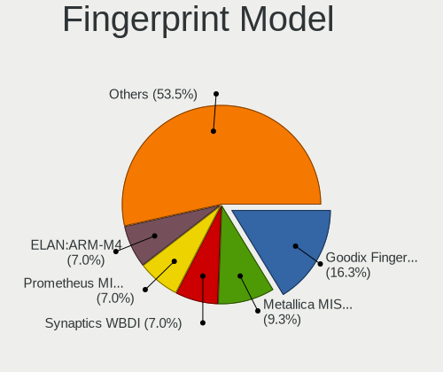

| Model                                                                      | Computers | Percent |
|----------------------------------------------------------------------------|-----------|---------|
| Shenzhen Goodix  FingerPrint Device                                        | 3         | 11.11%  |
| Synaptics  WBDI                                                            | 2         | 7.41%   |
| Synaptics Prometheus MIS Touch Fingerprint Reader                          | 2         | 7.41%   |
| Synaptics Metallica MIS Touch Fingerprint Reader                           | 2         | 7.41%   |
| Shenzhen Goodix Fingerprint Reader                                         | 2         | 7.41%   |
| Elan ELAN:Fingerprint                                                      | 2         | 7.41%   |
| Elan ELAN:ARM-M4                                                           | 2         | 7.41%   |
| Validity Sensors VFS7500 Touch Fingerprint Sensor                          | 1         | 3.7%    |
| Validity Sensors VFS471 Fingerprint Reader                                 | 1         | 3.7%    |
| Validity Sensors VFS101 Fingerprint Reader                                 | 1         | 3.7%    |
| Validity Sensors Synaptics VFS7552 Touch Fingerprint Sensor with PurePrint | 1         | 3.7%    |
| Upek TCS5B Fingerprint sensor                                              | 1         | 3.7%    |
| Upek Biometric Touchchip/Touchstrip Fingerprint Sensor                     | 1         | 3.7%    |
| Synaptics WBDI                                                             | 1         | 3.7%    |
| Synaptics Metallica MOH Touch Fingerprint Reader                           | 1         | 3.7%    |
| Synaptics Fingerprint scanner                                              | 1         | 3.7%    |
| Shenzhen Goodix FingerPrint                                                | 1         | 3.7%    |
| LighTuning ES603 Swipe Fingerprint Sensor                                  | 1         | 3.7%    |
| LighTuning EgisTec Touch Fingerprint Sensor                                | 1         | 3.7%    |

Chipcard Vendor
---------------

Chipcard module vendors

| Vendor      | Computers | Percent |
|-------------|-----------|---------|
| Broadcom    | 4         | 80%     |
| Alcor Micro | 1         | 20%     |

Chipcard Model
--------------

Chipcard module models

| Model                                                                        | Computers | Percent |
|------------------------------------------------------------------------------|-----------|---------|
| Broadcom BCM5880 Secure Applications Processor with fingerprint swipe sensor | 2         | 40%     |
| Broadcom BCM5880 Secure Applications Processor                               | 1         | 20%     |
| Broadcom 5880                                                                | 1         | 20%     |
| Alcor Micro AU9540 Smartcard Reader                                          | 1         | 20%     |

Unsupported
-----------

Unsupported Devices
-------------------

Total unsupported devices on board

| Total | Computers | Percent |
|-------|-----------|---------|
| 0     | 224       | 69.78%  |
| 1     | 80        | 24.92%  |
| 2     | 14        | 4.36%   |
| 3     | 2         | 0.62%   |
| 4     | 1         | 0.31%   |

Unsupported Device Types
------------------------

Types of unsupported devices

| Type                     | Computers | Percent |
|--------------------------|-----------|---------|
| Fingerprint reader       | 27        | 25%     |
| Graphics card            | 26        | 24.07%  |
| Net/wireless             | 18        | 16.67%  |
| Multimedia controller    | 10        | 9.26%   |
| Communication controller | 7         | 6.48%   |
| Unassigned class         | 5         | 4.63%   |
| Chipcard                 | 5         | 4.63%   |
| Bluetooth                | 4         | 3.7%    |
| Camera                   | 3         | 2.78%   |
| Storage/raid             | 1         | 0.93%   |
| Storage                  | 1         | 0.93%   |
| Modem                    | 1         | 0.93%   |

