Linux in Serbia - Tested Hardware & Statistics
----------------------------------------------

A project to collect tested hardware configurations for Linux in Serbia.

Anyone can contribute to this report by the [hw-probe](https://github.com/linuxhw/hw-probe) tool:

    sudo -E hw-probe -all -upload

Please contribute! Especially if your hardware is rare.

This is a report for all computer types. See also reports for [desktops](/Location/Serbia/Desktop/README.md) and [notebooks](/Location/Serbia/Notebook/README.md).

Contents
--------

* [ Test Cases ](#test-cases)

* [ System ](#system)
  - [ OS                       ](#os)
  - [ OS Family                ](#os-family)
  - [ Kernel                   ](#kernel)
  - [ Kernel Family            ](#kernel-family)
  - [ Kernel Major Ver.        ](#kernel-major-ver)
  - [ Arch                     ](#arch)
  - [ DE                       ](#de)
  - [ Display Server           ](#display-server)
  - [ Display Manager          ](#display-manager)
  - [ OS Lang                  ](#os-lang)
  - [ Boot Mode                ](#boot-mode)
  - [ Filesystem               ](#filesystem)
  - [ Part. scheme             ](#part-scheme)
  - [ Dual Boot with Linux/BSD ](#dual-boot-with-linuxbsd)
  - [ Dual Boot (Win)          ](#dual-boot-win)

* [ Board ](#board)
  - [ Vendor                   ](#vendor)
  - [ Model                    ](#model)
  - [ Model Family             ](#model-family)
  - [ MFG Year                 ](#mfg-year)
  - [ Form Factor              ](#form-factor)
  - [ Secure Boot              ](#secure-boot)
  - [ Coreboot                 ](#coreboot)
  - [ RAM Size                 ](#ram-size)
  - [ RAM Used                 ](#ram-used)
  - [ Total Drives             ](#total-drives)
  - [ Has CD-ROM               ](#has-cd-rom)
  - [ Has Ethernet             ](#has-ethernet)
  - [ Has WiFi                 ](#has-wifi)
  - [ Has Bluetooth            ](#has-bluetooth)

* [ Location ](#location)
  - [ Country                  ](#country)
  - [ City                     ](#city)

* [ Drives ](#drives)
  - [ Drive Vendor             ](#drive-vendor)
  - [ Drive Model              ](#drive-model)
  - [ HDD Vendor               ](#hdd-vendor)
  - [ SSD Vendor               ](#ssd-vendor)
  - [ Drive Kind               ](#drive-kind)
  - [ Drive Connector          ](#drive-connector)
  - [ Drive Size               ](#drive-size)
  - [ Space Total              ](#space-total)
  - [ Space Used               ](#space-used)
  - [ Malfunc. Drives          ](#malfunc-drives)
  - [ Malfunc. Drive Vendor    ](#malfunc-drive-vendor)
  - [ Malfunc. HDD Vendor      ](#malfunc-hdd-vendor)
  - [ Malfunc. Drive Kind      ](#malfunc-drive-kind)
  - [ Failed Drives            ](#failed-drives)
  - [ Failed Drive Vendor      ](#failed-drive-vendor)
  - [ Drive Status             ](#drive-status)

* [ Storage controller ](#storage-controller)
  - [ Storage Vendor           ](#storage-vendor)
  - [ Storage Model            ](#storage-model)
  - [ Storage Kind             ](#storage-kind)

* [ Processor ](#processor)
  - [ CPU Vendor               ](#cpu-vendor)
  - [ CPU Model                ](#cpu-model)
  - [ CPU Model Family         ](#cpu-model-family)
  - [ CPU Cores                ](#cpu-cores)
  - [ CPU Sockets              ](#cpu-sockets)
  - [ CPU Threads              ](#cpu-threads)
  - [ CPU Op-Modes             ](#cpu-op-modes)
  - [ CPU Microcode            ](#cpu-microcode)
  - [ CPU Microarch            ](#cpu-microarch)

* [ Graphics ](#graphics)
  - [ GPU Vendor               ](#gpu-vendor)
  - [ GPU Model                ](#gpu-model)
  - [ GPU Combo                ](#gpu-combo)
  - [ GPU Driver               ](#gpu-driver)
  - [ GPU Memory               ](#gpu-memory)

* [ Monitor ](#monitor)
  - [ Monitor Vendor           ](#monitor-vendor)
  - [ Monitor Model            ](#monitor-model)
  - [ Monitor Resolution       ](#monitor-resolution)
  - [ Monitor Diagonal         ](#monitor-diagonal)
  - [ Monitor Width            ](#monitor-width)
  - [ Aspect Ratio             ](#aspect-ratio)
  - [ Monitor Area             ](#monitor-area)
  - [ Pixel Density            ](#pixel-density)
  - [ Multiple Monitors        ](#multiple-monitors)

* [ Network ](#network)
  - [ Net Controller Vendor    ](#net-controller-vendor)
  - [ Net Controller Model     ](#net-controller-model)
  - [ Wireless Vendor          ](#wireless-vendor)
  - [ Wireless Model           ](#wireless-model)
  - [ Ethernet Vendor          ](#ethernet-vendor)
  - [ Ethernet Model           ](#ethernet-model)
  - [ Net Controller Kind      ](#net-controller-kind)
  - [ Used Controller          ](#used-controller)
  - [ NICs                     ](#nics)
  - [ IPv6                     ](#ipv6)

* [ Bluetooth ](#bluetooth)
  - [ Bluetooth Vendor         ](#bluetooth-vendor)
  - [ Bluetooth Model          ](#bluetooth-model)

* [ Sound ](#sound)
  - [ Sound Vendor             ](#sound-vendor)
  - [ Sound Model              ](#sound-model)

* [ Memory ](#memory)
  - [ Memory Vendor            ](#memory-vendor)
  - [ Memory Model             ](#memory-model)
  - [ Memory Kind              ](#memory-kind)
  - [ Memory Form Factor       ](#memory-form-factor)
  - [ Memory Size              ](#memory-size)
  - [ Memory Speed             ](#memory-speed)

* [ Printers & scanners ](#printers--scanners)
  - [ Printer Vendor           ](#printer-vendor)
  - [ Printer Model            ](#printer-model)
  - [ Scanner Vendor           ](#scanner-vendor)
  - [ Scanner Model            ](#scanner-model)

* [ Camera ](#camera)
  - [ Camera Vendor            ](#camera-vendor)
  - [ Camera Model             ](#camera-model)

* [ Security ](#security)
  - [ Fingerprint Vendor       ](#fingerprint-vendor)
  - [ Fingerprint Model        ](#fingerprint-model)
  - [ Chipcard Vendor          ](#chipcard-vendor)
  - [ Chipcard Model           ](#chipcard-model)

* [ Unsupported ](#unsupported)
  - [ Unsupported Devices      ](#unsupported-devices)
  - [ Unsupported Device Types ](#unsupported-device-types)

Test Cases
----------

Total: 1796

| Vendor        | Model                       | Form-Factor | Probe                                                      | Date         |
|---------------|-----------------------------|-------------|------------------------------------------------------------|--------------|
| MSI           | MAG B550 TOMAHAWK           | Desktop     | [8ae82d1a94](https://linux-hardware.org/?probe=8ae82d1a94) | Jan 03, 2026 |
| MSI           | MAG B550 TOMAHAWK           | Desktop     | [7a41f2433d](https://linux-hardware.org/?probe=7a41f2433d) | Jan 03, 2026 |
| ASUSTek       | PRIME A320M-K               | Desktop     | [a202127500](https://linux-hardware.org/?probe=a202127500) | Jan 03, 2026 |
| ASUSTek       | PRIME B360M-K               | Desktop     | [240414693b](https://linux-hardware.org/?probe=240414693b) | Jan 03, 2026 |
| Gigabyte      | A520M K V2                  | Desktop     | [6a63cf2a4a](https://linux-hardware.org/?probe=6a63cf2a4a) | Dec 25, 2025 |
| ASUSTek       | PRIME H310I-PLUS R2.0       | Desktop     | [ad7fdaf936](https://linux-hardware.org/?probe=ad7fdaf936) | Dec 24, 2025 |
| Lenovo        | G560 20042                  | Notebook    | [e17c822249](https://linux-hardware.org/?probe=e17c822249) | Dec 24, 2025 |
| Dell          | Precision 7560              | Notebook    | [89aa07d4ea](https://linux-hardware.org/?probe=89aa07d4ea) | Dec 22, 2025 |
| Lenovo        | Yoga 910-13IKB 80VF         | Convertible | [add7f128f5](https://linux-hardware.org/?probe=add7f128f5) | Dec 22, 2025 |
| eMachines     | eME642G                     | Notebook    | [0f2e86ec06](https://linux-hardware.org/?probe=0f2e86ec06) | Dec 21, 2025 |
| Dell          | 040DDP A01                  | Desktop     | [19a7f7f720](https://linux-hardware.org/?probe=19a7f7f720) | Dec 19, 2025 |
| Apple         | MacBook5,2                  | Notebook    | [cd01a8c44e](https://linux-hardware.org/?probe=cd01a8c44e) | Dec 15, 2025 |
| Lenovo        | ThinkPad X1 Carbon Gen 1... | Notebook    | [f4148167f2](https://linux-hardware.org/?probe=f4148167f2) | Dec 13, 2025 |
| MSI           | PRO A620M-B                 | Desktop     | [a7021339f5](https://linux-hardware.org/?probe=a7021339f5) | Dec 10, 2025 |
| Gigabyte      | B550 AORUS ELITE AX V2      | Desktop     | [1ba06b803c](https://linux-hardware.org/?probe=1ba06b803c) | Dec 08, 2025 |
| ASUSTek       | ROG CROSSHAIR X870E HERO    | Desktop     | [bf2a86b672](https://linux-hardware.org/?probe=bf2a86b672) | Dec 07, 2025 |
| Gigabyte      | B550 AORUS ELITE AX V2      | Desktop     | [810fcd5291](https://linux-hardware.org/?probe=810fcd5291) | Dec 07, 2025 |
| Lenovo        | IdeaPad N581 7505           | Notebook    | [5f1468e0bd](https://linux-hardware.org/?probe=5f1468e0bd) | Dec 07, 2025 |
| HP            | EliteBook 8440p             | Notebook    | [1a8a8c610d](https://linux-hardware.org/?probe=1a8a8c610d) | Dec 07, 2025 |
| Biostar       | A320MH                      | Desktop     | [a74bb24d0c](https://linux-hardware.org/?probe=a74bb24d0c) | Dec 06, 2025 |
| MSI           | X570-A PRO                  | Desktop     | [04f301b2a4](https://linux-hardware.org/?probe=04f301b2a4) | Dec 05, 2025 |
| HONOR         | MRA-XXX                     | Notebook    | [35a02e8c69](https://linux-hardware.org/?probe=35a02e8c69) | Nov 30, 2025 |
| Lenovo        | ThinkPad T480 20L6S2LK3A    | Notebook    | [8e5df87b1a](https://linux-hardware.org/?probe=8e5df87b1a) | Nov 29, 2025 |
| ASUSTek       | X550CC                      | Notebook    | [4c81a5aac8](https://linux-hardware.org/?probe=4c81a5aac8) | Nov 26, 2025 |
| ASUSTek       | X550CC                      | Notebook    | [d0cd150ef0](https://linux-hardware.org/?probe=d0cd150ef0) | Nov 26, 2025 |
| Fujitsu       | D3120-A1 S26361-D3120-A1    | Desktop     | [02419caa02](https://linux-hardware.org/?probe=02419caa02) | Nov 23, 2025 |
| Gigabyte      | A520M K V2                  | Desktop     | [fe5de0b7a1](https://linux-hardware.org/?probe=fe5de0b7a1) | Nov 22, 2025 |
| ASUSTek       | M4A89TD PRO USB3            | Desktop     | [f382111e45](https://linux-hardware.org/?probe=f382111e45) | Nov 22, 2025 |
| Gigabyte      | A520M K V2                  | Desktop     | [a79b0fabe7](https://linux-hardware.org/?probe=a79b0fabe7) | Nov 21, 2025 |
| Maibenben     | Perfectum Series            | Notebook    | [a29c249351](https://linux-hardware.org/?probe=a29c249351) | Nov 20, 2025 |
| Gigabyte      | GA-MA770T-UD3P              | Desktop     | [4544f05395](https://linux-hardware.org/?probe=4544f05395) | Nov 17, 2025 |
| Toshiba       | Satellite L855              | Notebook    | [b7eb8caaaa](https://linux-hardware.org/?probe=b7eb8caaaa) | Nov 13, 2025 |
| ASUSTek       | PRIME A320M-K               | Desktop     | [5c4b92ca28](https://linux-hardware.org/?probe=5c4b92ca28) | Nov 06, 2025 |
| Microsoft     | Surface Pro 7+              | Tablet      | [bd48ffc67a](https://linux-hardware.org/?probe=bd48ffc67a) | Nov 05, 2025 |
| ASUSTek       | ROG STRIX X870E-E GAMING... | Desktop     | [570ced0ee1](https://linux-hardware.org/?probe=570ced0ee1) | Nov 05, 2025 |
| Gigabyte      | 970A-DS3P                   | Desktop     | [5e8311413c](https://linux-hardware.org/?probe=5e8311413c) | Nov 01, 2025 |
| Gigabyte      | B550 AORUS ELITE AX V2      | Desktop     | [6f79f5a202](https://linux-hardware.org/?probe=6f79f5a202) | Nov 01, 2025 |
| HP            | EliteBook x360 830 G6       | Convertible | [7af561011f](https://linux-hardware.org/?probe=7af561011f) | Nov 01, 2025 |
| Gigabyte      | A520M K V2                  | Desktop     | [2411bfde61](https://linux-hardware.org/?probe=2411bfde61) | Oct 31, 2025 |
| Gigabyte      | A520M K V2                  | Desktop     | [a976f77803](https://linux-hardware.org/?probe=a976f77803) | Oct 31, 2025 |
| MSI           | GE60 2PF                    | Notebook    | [77d360619e](https://linux-hardware.org/?probe=77d360619e) | Oct 29, 2025 |
| HP            | ProBook 430 G2              | Notebook    | [33c986bd6c](https://linux-hardware.org/?probe=33c986bd6c) | Oct 26, 2025 |
| Gigabyte      | P55-UD3L                    | Desktop     | [270a1fbb73](https://linux-hardware.org/?probe=270a1fbb73) | Oct 26, 2025 |
| ASUSTek       | PRIME X299-A                | Desktop     | [b587ee1ade](https://linux-hardware.org/?probe=b587ee1ade) | Oct 24, 2025 |
| ASUSTek       | VivoBook_ASUSLaptop X150... | Notebook    | [84cd0a5a45](https://linux-hardware.org/?probe=84cd0a5a45) | Oct 20, 2025 |
| HP            | 3047h                       | Desktop     | [803e9d9f32](https://linux-hardware.org/?probe=803e9d9f32) | Oct 20, 2025 |
| Fujitsu Si... | D2831-S1 S26361-D2831-S1    | Desktop     | [e0a766d68e](https://linux-hardware.org/?probe=e0a766d68e) | Oct 16, 2025 |
| Fujitsu Si... | D2831-S1 S26361-D2831-S1    | Desktop     | [3bd9b95b4c](https://linux-hardware.org/?probe=3bd9b95b4c) | Oct 16, 2025 |
| Samsung       | 300V3A/300V4A/300V5A/200... | Notebook    | [4dcbcdf02c](https://linux-hardware.org/?probe=4dcbcdf02c) | Oct 16, 2025 |
| MSI           | MAG X570 TOMAHAWK WIFI      | Desktop     | [85db833299](https://linux-hardware.org/?probe=85db833299) | Oct 12, 2025 |
| Gigabyte      | H61M-S2PV                   | Desktop     | [22991cb906](https://linux-hardware.org/?probe=22991cb906) | Oct 06, 2025 |
| Gigabyte      | H61M-S2PV                   | Desktop     | [69417b2c40](https://linux-hardware.org/?probe=69417b2c40) | Oct 06, 2025 |
| Lenovo        | ThinkPad T470s 20HF004QM... | Notebook    | [135701788c](https://linux-hardware.org/?probe=135701788c) | Oct 05, 2025 |
| MSI           | G41M-P23                    | Desktop     | [ef935d9e4d](https://linux-hardware.org/?probe=ef935d9e4d) | Oct 03, 2025 |
| Dell          | Inspiron 5720               | Notebook    | [d28f20bcea](https://linux-hardware.org/?probe=d28f20bcea) | Oct 03, 2025 |
| MSI           | X570-A PRO                  | Desktop     | [f68ab931ce](https://linux-hardware.org/?probe=f68ab931ce) | Oct 03, 2025 |
| MSI           | B450M BAZOOKA MAX WIFI      | Desktop     | [6807cd8456](https://linux-hardware.org/?probe=6807cd8456) | Oct 03, 2025 |
| Lenovo        | IdeaPad 100S-14IBR 80R9     | Notebook    | [373190b264](https://linux-hardware.org/?probe=373190b264) | Sep 29, 2025 |
| ASUSTek       | VivoBook_ASUS Laptop X50... | Notebook    | [3706f5e8b7](https://linux-hardware.org/?probe=3706f5e8b7) | Sep 27, 2025 |
| Lenovo        | ThinkPad E14 20RA001LGE     | Notebook    | [aa48364370](https://linux-hardware.org/?probe=aa48364370) | Sep 24, 2025 |
| MSI           | G41M-P23                    | Desktop     | [26f65abd84](https://linux-hardware.org/?probe=26f65abd84) | Sep 23, 2025 |
| Biostar       | A32M2                       | Desktop     | [a36156c315](https://linux-hardware.org/?probe=a36156c315) | Sep 22, 2025 |
| Gigabyte      | 970A-DS3P                   | Desktop     | [7d186dde36](https://linux-hardware.org/?probe=7d186dde36) | Sep 22, 2025 |
| ASUSTek       | PRIME Z590-P                | Desktop     | [2fed1aaaee](https://linux-hardware.org/?probe=2fed1aaaee) | Sep 22, 2025 |
| Timi          | A35                         | Notebook    | [1fcba71b91](https://linux-hardware.org/?probe=1fcba71b91) | Sep 21, 2025 |
| Dell          | Inspiron 3576               | Notebook    | [8b52e8a58a](https://linux-hardware.org/?probe=8b52e8a58a) | Sep 18, 2025 |
| ASRock        | A520M-HVS                   | Desktop     | [cae4821288](https://linux-hardware.org/?probe=cae4821288) | Sep 16, 2025 |
| Gigabyte      | A520M K V2                  | Desktop     | [4ef7b60bdb](https://linux-hardware.org/?probe=4ef7b60bdb) | Sep 16, 2025 |
| Fujitsu       | LIFEBOOK A3511              | Notebook    | [445c121a74](https://linux-hardware.org/?probe=445c121a74) | Sep 14, 2025 |
| ASUSTek       | VivoBook_ASUSLaptop X150... | Notebook    | [0e1a311eb7](https://linux-hardware.org/?probe=0e1a311eb7) | Sep 14, 2025 |
| ASRock        | B450 Pro4                   | Desktop     | [404d9b19d5](https://linux-hardware.org/?probe=404d9b19d5) | Sep 14, 2025 |
| Gigabyte      | 970A-DS3P                   | Desktop     | [a8c1f85116](https://linux-hardware.org/?probe=a8c1f85116) | Sep 10, 2025 |
| Fujitsu Si... | D2831-S1 S26361-D2831-S1    | Desktop     | [95ac54b38e](https://linux-hardware.org/?probe=95ac54b38e) | Sep 08, 2025 |
| MSI           | MAG X670E TOMAHAWK WIFI     | Desktop     | [88cc856d53](https://linux-hardware.org/?probe=88cc856d53) | Sep 08, 2025 |
| Acer          | Aspire VN7-793G             | Notebook    | [26dbe30294](https://linux-hardware.org/?probe=26dbe30294) | Sep 05, 2025 |
| Apple         | MacBook5,1                  | Notebook    | [67a2d8c156](https://linux-hardware.org/?probe=67a2d8c156) | Sep 05, 2025 |
| Lenovo        | ThinkBook 16 G8 IRL 21SH    | Notebook    | [e235124a60](https://linux-hardware.org/?probe=e235124a60) | Sep 04, 2025 |
| Lenovo        | ThinkPad P1 Gen 4i 20Y3S... | Notebook    | [452e8bedd2](https://linux-hardware.org/?probe=452e8bedd2) | Sep 04, 2025 |
| Gigabyte      | A520M K V2                  | Desktop     | [42125e3b26](https://linux-hardware.org/?probe=42125e3b26) | Sep 04, 2025 |
| MSI           | G41M-P23                    | Desktop     | [dd16dd0207](https://linux-hardware.org/?probe=dd16dd0207) | Sep 01, 2025 |
| HP            | ProBook 440 G3              | Notebook    | [dad3927c77](https://linux-hardware.org/?probe=dad3927c77) | Aug 26, 2025 |
| MSI           | G41M-P23                    | Desktop     | [147762c09b](https://linux-hardware.org/?probe=147762c09b) | Aug 25, 2025 |
| MSI           | 970 GAMING                  | Desktop     | [11aa9e5ac1](https://linux-hardware.org/?probe=11aa9e5ac1) | Aug 21, 2025 |
| Lenovo        | Legion 5 15IMH05 82AU       | Notebook    | [4cb7516f31](https://linux-hardware.org/?probe=4cb7516f31) | Aug 20, 2025 |
| ASUSTek       | Vivobook Go E1504FA_E150... | Notebook    | [9b1a2d1e94](https://linux-hardware.org/?probe=9b1a2d1e94) | Aug 17, 2025 |
| ASUSTek       | M5A78L-M LX3                | Desktop     | [84dbbd366f](https://linux-hardware.org/?probe=84dbbd366f) | Aug 10, 2025 |
| Apple         | Mac-F2238BAE iMac11,3       | All in one  | [ffd25b7b10](https://linux-hardware.org/?probe=ffd25b7b10) | Aug 07, 2025 |
| Dell          | Vostro 15 3530              | Notebook    | [af3edee5a3](https://linux-hardware.org/?probe=af3edee5a3) | Aug 05, 2025 |
| Lenovo        | ThinkPad T14s Gen 3 21CQ... | Notebook    | [41a3102b28](https://linux-hardware.org/?probe=41a3102b28) | Aug 05, 2025 |
| Toshiba       | Satellite C855-1TV          | Notebook    | [925a8f922a](https://linux-hardware.org/?probe=925a8f922a) | Aug 04, 2025 |
| ASRock        | B450M-HDV R4.0              | Desktop     | [1deba8e5c6](https://linux-hardware.org/?probe=1deba8e5c6) | Jul 31, 2025 |
| Apple         | MacBookPro9,2               | Notebook    | [8582bc8f7f](https://linux-hardware.org/?probe=8582bc8f7f) | Jul 31, 2025 |
| GMKtec        | NucBox K6                   | Desktop     | [db6090e269](https://linux-hardware.org/?probe=db6090e269) | Jul 28, 2025 |
| HP            | 625                         | Notebook    | [6de688d694](https://linux-hardware.org/?probe=6de688d694) | Jul 27, 2025 |
| Lenovo        | Yoga Pro 9 14IRP8 83BU      | Notebook    | [18a830a267](https://linux-hardware.org/?probe=18a830a267) | Jul 22, 2025 |
| Lenovo        | ThinkCentre M81 5049D7G     | Desktop     | [f68a03b430](https://linux-hardware.org/?probe=f68a03b430) | Jul 21, 2025 |
| MSI           | MS-7369                     | Desktop     | [101559a840](https://linux-hardware.org/?probe=101559a840) | Jul 21, 2025 |
| HP            | 8876 11                     | Desktop     | [25f187c55e](https://linux-hardware.org/?probe=25f187c55e) | Jul 21, 2025 |
| ASUSTek       | TUF Gaming X570-PLUS        | Desktop     | [f33811f1e0](https://linux-hardware.org/?probe=f33811f1e0) | Jul 21, 2025 |
| ASUSTek       | TUF Gaming B550M-E          | Desktop     | [2f899494da](https://linux-hardware.org/?probe=2f899494da) | Jul 19, 2025 |
| ASUSTek       | PRIME A320M-K               | Desktop     | [de98f68147](https://linux-hardware.org/?probe=de98f68147) | Jul 18, 2025 |
| ASUSTek       | TUF Gaming B550M-E          | Desktop     | [f85283eb56](https://linux-hardware.org/?probe=f85283eb56) | Jul 18, 2025 |
| Acer          | Aspire E5-771G              | Notebook    | [22dc6ac787](https://linux-hardware.org/?probe=22dc6ac787) | Jul 16, 2025 |
| Toshiba       | Satellite C855-1TV          | Notebook    | [d1b8c220f3](https://linux-hardware.org/?probe=d1b8c220f3) | Jul 15, 2025 |
| Lenovo        | Legion Go 8APU1 83E1        | Tablet      | [f5d705a3e4](https://linux-hardware.org/?probe=f5d705a3e4) | Jul 15, 2025 |
| MSI           | MAG B650 TOMAHAWK WIFI      | Desktop     | [da0812321b](https://linux-hardware.org/?probe=da0812321b) | Jul 15, 2025 |
| Lenovo        | Legion Go 8APU1 83E1        | Tablet      | [5a26b09c48](https://linux-hardware.org/?probe=5a26b09c48) | Jul 15, 2025 |
| Toshiba       | Satellite C855-1TV          | Notebook    | [227a76aba2](https://linux-hardware.org/?probe=227a76aba2) | Jul 14, 2025 |
| ASUSTek       | UX303LB                     | Notebook    | [869f426861](https://linux-hardware.org/?probe=869f426861) | Jul 13, 2025 |
| ASUSTek       | TUF Gaming B550M-E WIFI     | Desktop     | [d33f4f2308](https://linux-hardware.org/?probe=d33f4f2308) | Jul 12, 2025 |
| Lenovo        | Legion 5 15IMH05 82AU       | Notebook    | [0fd57bbce9](https://linux-hardware.org/?probe=0fd57bbce9) | Jul 12, 2025 |
| Gigabyte      | B650M GAMING X AX           | Desktop     | [9935d9bd79](https://linux-hardware.org/?probe=9935d9bd79) | Jul 10, 2025 |
| ASRock        | H510M-HDV/M.2 SE            | Desktop     | [7bde003bf5](https://linux-hardware.org/?probe=7bde003bf5) | Jul 09, 2025 |
| Lenovo        | IdeaPad Slim 3 15IAN8 82... | Notebook    | [393af8b648](https://linux-hardware.org/?probe=393af8b648) | Jul 09, 2025 |
| Lenovo        | IdeaPad Slim 3 15IAN8 82... | Notebook    | [e927486418](https://linux-hardware.org/?probe=e927486418) | Jul 09, 2025 |
| Toshiba       | Satellite C855-1TV          | Notebook    | [aaf11cc388](https://linux-hardware.org/?probe=aaf11cc388) | Jul 07, 2025 |
| ASUSTek       | TUF Gaming B550M-E WIFI     | Desktop     | [e3c38a64dd](https://linux-hardware.org/?probe=e3c38a64dd) | Jul 07, 2025 |
| Gigabyte      | B650 AORUS ELITE AX V2      | Desktop     | [fdb4281629](https://linux-hardware.org/?probe=fdb4281629) | Jul 04, 2025 |
| Gigabyte      | B650M AORUS ELITE AX        | Desktop     | [868ba7a6bd](https://linux-hardware.org/?probe=868ba7a6bd) | Jul 01, 2025 |
| Gigabyte      | X870E AORUS XTREME AI TO... | Desktop     | [044594ef18](https://linux-hardware.org/?probe=044594ef18) | Jun 28, 2025 |
| Lenovo        | Legion Pro 5 16ARX8 82WM    | Notebook    | [68af441be3](https://linux-hardware.org/?probe=68af441be3) | Jun 28, 2025 |
| Acer          | Aspire AG15-51P             | Notebook    | [99e44d4c41](https://linux-hardware.org/?probe=99e44d4c41) | Jun 27, 2025 |
| MSI           | MPG B550 GAMING PLUS        | Desktop     | [40e49873de](https://linux-hardware.org/?probe=40e49873de) | Jun 25, 2025 |
| Dell          | Latitude 7400               | Notebook    | [6ef6dba394](https://linux-hardware.org/?probe=6ef6dba394) | Jun 21, 2025 |
| Dell          | Latitude 7400               | Notebook    | [af46e1f02d](https://linux-hardware.org/?probe=af46e1f02d) | Jun 21, 2025 |
| Lenovo        | IdeaPad 110-15IBR 80T7      | Notebook    | [183158b0f6](https://linux-hardware.org/?probe=183158b0f6) | Jun 21, 2025 |
| Toshiba       | Satellite C855-1TV          | Notebook    | [948deb8c43](https://linux-hardware.org/?probe=948deb8c43) | Jun 15, 2025 |
| Huion         | Kavmas Studio 16            | Notebook    | [3dc1c8ea95](https://linux-hardware.org/?probe=3dc1c8ea95) | Jun 15, 2025 |
| Gigabyte      | B560M H                     | Desktop     | [2e437e2c3d](https://linux-hardware.org/?probe=2e437e2c3d) | Jun 14, 2025 |
| Alienware     | 0VDT73 A00                  | Desktop     | [60ba2df3ea](https://linux-hardware.org/?probe=60ba2df3ea) | Jun 13, 2025 |
| Acer          | Aspire A315-23              | Notebook    | [838cae8199](https://linux-hardware.org/?probe=838cae8199) | Jun 09, 2025 |
| HP            | Notebook                    | Notebook    | [8e678c782d](https://linux-hardware.org/?probe=8e678c782d) | Jun 08, 2025 |
| ASUSTek       | K53U                        | Notebook    | [dd2cb048be](https://linux-hardware.org/?probe=dd2cb048be) | Jun 07, 2025 |
| Lenovo        | IdeaPad 3 15ALC6 82KU       | Notebook    | [55ba6e9314](https://linux-hardware.org/?probe=55ba6e9314) | Jun 05, 2025 |
| Lenovo        | IdeaPadFlex 5 14ABR8 82X... | Convertible | [e8fcb604e3](https://linux-hardware.org/?probe=e8fcb604e3) | Jun 05, 2025 |
| HP            | Notebook                    | Notebook    | [2c61696d4a](https://linux-hardware.org/?probe=2c61696d4a) | Jun 05, 2025 |
| ASRock        | B650M Pro RS                | Desktop     | [84328a5747](https://linux-hardware.org/?probe=84328a5747) | Jun 04, 2025 |
| Lenovo        | IdeaPad 3 15ABA7 82RN       | Notebook    | [8f4bdda1e0](https://linux-hardware.org/?probe=8f4bdda1e0) | Jun 01, 2025 |
| Gigabyte      | B550 AORUS PRO AC           | Desktop     | [ec03624f11](https://linux-hardware.org/?probe=ec03624f11) | May 30, 2025 |
| Toshiba       | Satellite C855-1TV          | Notebook    | [f4e2ee27bd](https://linux-hardware.org/?probe=f4e2ee27bd) | May 24, 2025 |
| Acer          | Aspire A315-44P             | Notebook    | [49b57ea945](https://linux-hardware.org/?probe=49b57ea945) | May 23, 2025 |
| Acer          | Aspire A315-44P             | Notebook    | [9c4e661da1](https://linux-hardware.org/?probe=9c4e661da1) | May 23, 2025 |
| MSI           | Summit E13 AI Evo A1MTG     | Notebook    | [bf2eb29374](https://linux-hardware.org/?probe=bf2eb29374) | May 23, 2025 |
| Toshiba       | Satellite C855-1TV          | Notebook    | [97030bc787](https://linux-hardware.org/?probe=97030bc787) | May 16, 2025 |
| ASUSTek       | H81M-R                      | Desktop     | [40ce4669c4](https://linux-hardware.org/?probe=40ce4669c4) | May 12, 2025 |
| HP            | 255 G5                      | Notebook    | [022de65e36](https://linux-hardware.org/?probe=022de65e36) | May 11, 2025 |
| ASUSTek       | PRIME A520M-K               | Desktop     | [22d312b398](https://linux-hardware.org/?probe=22d312b398) | May 09, 2025 |
| Lenovo        | ThinkBook 16 G7 ARP 21MW    | Notebook    | [b6487f8c17](https://linux-hardware.org/?probe=b6487f8c17) | May 09, 2025 |
| HP            | Presario C700               | Notebook    | [3782cb3704](https://linux-hardware.org/?probe=3782cb3704) | May 08, 2025 |
| ASRock        | A320M-DGS                   | Desktop     | [37831c5591](https://linux-hardware.org/?probe=37831c5591) | May 08, 2025 |
| MSI           | B450M PRO-VDH PLUS          | Desktop     | [5c0e6cfa15](https://linux-hardware.org/?probe=5c0e6cfa15) | May 07, 2025 |
| HP            | 18E5                        | Desktop     | [c736cbc8e9](https://linux-hardware.org/?probe=c736cbc8e9) | Apr 30, 2025 |
| ASUSTek       | P5K PRO                     | Desktop     | [6261bed97c](https://linux-hardware.org/?probe=6261bed97c) | Apr 28, 2025 |
| ASUSTek       | PRIME B550M-K ARGB          | Desktop     | [9b2d8d26e8](https://linux-hardware.org/?probe=9b2d8d26e8) | Apr 27, 2025 |
| Gigabyte      | B450M S2H                   | Desktop     | [2f8863eb81](https://linux-hardware.org/?probe=2f8863eb81) | Apr 27, 2025 |
| HP            | Presario CQ57               | Notebook    | [ee9842724a](https://linux-hardware.org/?probe=ee9842724a) | Apr 27, 2025 |
| Dell          | Vostro 15 3510              | Notebook    | [bf270dec95](https://linux-hardware.org/?probe=bf270dec95) | Apr 25, 2025 |
| Lenovo        | ThinkPad W500 4061WFA       | Notebook    | [a3c08476fd](https://linux-hardware.org/?probe=a3c08476fd) | Apr 23, 2025 |
| Gigabyte      | Z170-D3H-CF                 | Desktop     | [937c1b0b4f](https://linux-hardware.org/?probe=937c1b0b4f) | Apr 20, 2025 |
| Lenovo        | IdeaPad 100-14IBY 80MH      | Notebook    | [7b0b4994c6](https://linux-hardware.org/?probe=7b0b4994c6) | Apr 19, 2025 |
| HP            | Laptop 15-dw1xxx            | Notebook    | [223498764f](https://linux-hardware.org/?probe=223498764f) | Apr 16, 2025 |
| Lenovo        | ThinkBook 16 G6 ABP 21KK    | Notebook    | [c77acb480d](https://linux-hardware.org/?probe=c77acb480d) | Apr 14, 2025 |
| Lenovo        | ThinkBook 16 G6 ABP 21KK    | Notebook    | [0b40780bb0](https://linux-hardware.org/?probe=0b40780bb0) | Apr 14, 2025 |
| Lenovo        | V15-IGL 82C3                | Notebook    | [c5bb869868](https://linux-hardware.org/?probe=c5bb869868) | Apr 12, 2025 |
| ASRock        | B450 Gaming K4              | Desktop     | [a5c093e256](https://linux-hardware.org/?probe=a5c093e256) | Apr 10, 2025 |
| Toshiba       | Satellite L10W-B-101        | Notebook    | [dd14830ef3](https://linux-hardware.org/?probe=dd14830ef3) | Apr 10, 2025 |
| Dell          | Latitude 3450               | Notebook    | [66dac2dc33](https://linux-hardware.org/?probe=66dac2dc33) | Apr 09, 2025 |
| MSI           | C847MS-E33                  | Desktop     | [46cd07a997](https://linux-hardware.org/?probe=46cd07a997) | Apr 07, 2025 |
| Gigabyte      | A520I AC                    | Desktop     | [2f84124859](https://linux-hardware.org/?probe=2f84124859) | Apr 07, 2025 |
| HP            | Laptop 15-ra0xx             | Notebook    | [b594dc1db1](https://linux-hardware.org/?probe=b594dc1db1) | Apr 07, 2025 |
| Gigabyte      | Z97X-Gaming 3               | Desktop     | [79ff36bf59](https://linux-hardware.org/?probe=79ff36bf59) | Apr 06, 2025 |
| Dell          | Latitude 3450               | Notebook    | [8da74c34a2](https://linux-hardware.org/?probe=8da74c34a2) | Apr 01, 2025 |
| Lenovo        | IdeaPad 3 15ALC6 82KU       | Notebook    | [5b897ae567](https://linux-hardware.org/?probe=5b897ae567) | Apr 01, 2025 |
| MSI           | B450 TOMAHAWK MAX           | Desktop     | [fccb44b1a4](https://linux-hardware.org/?probe=fccb44b1a4) | Mar 31, 2025 |
| ASUSTek       | M5A78L-M/USB3               | Desktop     | [3152745e0c](https://linux-hardware.org/?probe=3152745e0c) | Mar 28, 2025 |
| ASUSTek       | A55BM-K                     | Desktop     | [4aa3fc7e2b](https://linux-hardware.org/?probe=4aa3fc7e2b) | Mar 27, 2025 |
| ASRock        | A520M-HVS                   | Desktop     | [cfcf828918](https://linux-hardware.org/?probe=cfcf828918) | Mar 26, 2025 |
| ASUSTek       | M5A78L-M/USB3               | Desktop     | [7e550e8391](https://linux-hardware.org/?probe=7e550e8391) | Mar 24, 2025 |
| HP            | Laptop 14s-fr0xxx           | Notebook    | [d167955d96](https://linux-hardware.org/?probe=d167955d96) | Mar 23, 2025 |
| Lenovo        | ThinkBook 15-IIL 20SM       | Notebook    | [c4cfee14ef](https://linux-hardware.org/?probe=c4cfee14ef) | Mar 21, 2025 |
| ASUSTek       | H81M-K                      | Desktop     | [d4b535e26e](https://linux-hardware.org/?probe=d4b535e26e) | Mar 14, 2025 |
| Gigabyte      | P61-S3-B3                   | Desktop     | [bd438c67b1](https://linux-hardware.org/?probe=bd438c67b1) | Mar 14, 2025 |
| ASUSTek       | AM1M-A                      | Desktop     | [172821f926](https://linux-hardware.org/?probe=172821f926) | Mar 14, 2025 |
| Gigabyte      | 970A-DS3P                   | Desktop     | [b3efa14e34](https://linux-hardware.org/?probe=b3efa14e34) | Mar 13, 2025 |
| Acer          | TravelMate P214-52          | Notebook    | [aba1551a7b](https://linux-hardware.org/?probe=aba1551a7b) | Mar 07, 2025 |
| Techvision    | TVI7309X B0                 | Desktop     | [8db6e99e2d](https://linux-hardware.org/?probe=8db6e99e2d) | Mar 05, 2025 |
| LattePanda    | 3 Delta LP-BS-7-S70JR200... | Desktop     | [431bcafcec](https://linux-hardware.org/?probe=431bcafcec) | Mar 05, 2025 |
| ASUSTek       | ProArt B550-CREATOR         | Desktop     | [0b9668b151](https://linux-hardware.org/?probe=0b9668b151) | Mar 05, 2025 |
| ASUSTek       | ProArt B550-CREATOR         | Desktop     | [c13e4e967b](https://linux-hardware.org/?probe=c13e4e967b) | Mar 05, 2025 |
| Lenovo        | ThinkPad T460 20FMS43J0V    | Notebook    | [089417b799](https://linux-hardware.org/?probe=089417b799) | Mar 03, 2025 |
| Acer          | Aspire ES1-512              | Notebook    | [8043c7c014](https://linux-hardware.org/?probe=8043c7c014) | Mar 02, 2025 |
| Lenovo        | IdeaPad Slim 5 14AHP9 83... | Notebook    | [bffaf32ff4](https://linux-hardware.org/?probe=bffaf32ff4) | Feb 25, 2025 |
| Sony          | VPCEB4X1E                   | Notebook    | [8b853bc4af](https://linux-hardware.org/?probe=8b853bc4af) | Feb 25, 2025 |
| Lenovo        | ThinkPad T61 64669YG        | Notebook    | [311862f324](https://linux-hardware.org/?probe=311862f324) | Feb 23, 2025 |
| Dell          | Inspiron 7577               | Notebook    | [71d3c276e9](https://linux-hardware.org/?probe=71d3c276e9) | Feb 22, 2025 |
| Toshiba       | Satellite L755              | Notebook    | [3efdfd83ea](https://linux-hardware.org/?probe=3efdfd83ea) | Feb 22, 2025 |
| ASUSTek       | X55A                        | Notebook    | [7a56c05033](https://linux-hardware.org/?probe=7a56c05033) | Feb 22, 2025 |
| Apple         | MacBookPro11,3              | Notebook    | [ad1dd0d17d](https://linux-hardware.org/?probe=ad1dd0d17d) | Feb 21, 2025 |
| Apple         | MacBook6,1                  | Notebook    | [c4dc60cb5e](https://linux-hardware.org/?probe=c4dc60cb5e) | Feb 21, 2025 |
| HP            | Laptop 15s-fq2xxx           | Notebook    | [157b3a58b7](https://linux-hardware.org/?probe=157b3a58b7) | Feb 21, 2025 |
| Lenovo        | ThinkPad T410 2522AN7       | Notebook    | [a6fe10d0a4](https://linux-hardware.org/?probe=a6fe10d0a4) | Feb 21, 2025 |
| Lenovo        | ThinkPad T410 2522AN7       | Notebook    | [e7e08853c7](https://linux-hardware.org/?probe=e7e08853c7) | Feb 21, 2025 |
| Acer          | Aspire VN7-793G             | Notebook    | [69d13b33e9](https://linux-hardware.org/?probe=69d13b33e9) | Feb 21, 2025 |
| Lenovo        | ThinkPad X1 Carbon Gen 1... | Notebook    | [aa3146a236](https://linux-hardware.org/?probe=aa3146a236) | Feb 21, 2025 |
| LattePanda    | 3 Delta LP-BS-7-S70JR200... | Desktop     | [21305dabd1](https://linux-hardware.org/?probe=21305dabd1) | Feb 20, 2025 |
| Dell          | Latitude E6520              | Notebook    | [505bae611a](https://linux-hardware.org/?probe=505bae611a) | Feb 20, 2025 |
| Lenovo        | ThinkPad X1 Carbon Gen 1... | Notebook    | [226bedcc69](https://linux-hardware.org/?probe=226bedcc69) | Feb 20, 2025 |
| Dell          | Vostro 15 3535              | Notebook    | [199b18d8e5](https://linux-hardware.org/?probe=199b18d8e5) | Feb 18, 2025 |
| Dell          | 0D24M8 A01                  | Desktop     | [c6a8cebbaa](https://linux-hardware.org/?probe=c6a8cebbaa) | Feb 18, 2025 |
| Dell          | 0D24M8 A01                  | Desktop     | [b42e74427c](https://linux-hardware.org/?probe=b42e74427c) | Feb 18, 2025 |
| HP            | 2000                        | Notebook    | [7f7bcec351](https://linux-hardware.org/?probe=7f7bcec351) | Feb 18, 2025 |
| ASRock        | B650 PG Lightning           | Desktop     | [784766b416](https://linux-hardware.org/?probe=784766b416) | Feb 17, 2025 |
| Toshiba       | Satellite C55-C             | Notebook    | [c1d219f8f9](https://linux-hardware.org/?probe=c1d219f8f9) | Feb 16, 2025 |
| HP            | Laptop 15s-fq2xxx           | Notebook    | [4b2e9aeaf3](https://linux-hardware.org/?probe=4b2e9aeaf3) | Feb 14, 2025 |
| Toshiba       | Satellite C875D             | Notebook    | [be40b2ec02](https://linux-hardware.org/?probe=be40b2ec02) | Feb 12, 2025 |
| MSI           | GE62 6QC                    | Notebook    | [8f5408136e](https://linux-hardware.org/?probe=8f5408136e) | Feb 12, 2025 |
| ASUSTek       | PRIME B550-PLUS             | Desktop     | [5affcd0d4d](https://linux-hardware.org/?probe=5affcd0d4d) | Feb 04, 2025 |
| ASRock        | A520M-HVS                   | Desktop     | [9319f87279](https://linux-hardware.org/?probe=9319f87279) | Feb 04, 2025 |
| Lenovo        | ThinkPad T61 7661E26        | Notebook    | [e6ee51adc1](https://linux-hardware.org/?probe=e6ee51adc1) | Feb 03, 2025 |
| Toshiba       | Satellite P500              | Notebook    | [b0a9517f32](https://linux-hardware.org/?probe=b0a9517f32) | Feb 03, 2025 |
| ASUSTek       | AM1M-A                      | Desktop     | [5656890cf9](https://linux-hardware.org/?probe=5656890cf9) | Feb 02, 2025 |
| ASUSTek       | AM1M-A                      | Desktop     | [18899f774f](https://linux-hardware.org/?probe=18899f774f) | Feb 02, 2025 |
| ASUSTek       | M5A78L-M/USB3               | Desktop     | [4a3c2707ef](https://linux-hardware.org/?probe=4a3c2707ef) | Feb 01, 2025 |
| Lenovo        | 3130 SEK0N11843 IOT 3806... | Mini pc     | [e22e2cc019](https://linux-hardware.org/?probe=e22e2cc019) | Feb 01, 2025 |
| ASUSTek       | TUF Gaming Z690-PLUS WIF... | Desktop     | [6cdf3062d3](https://linux-hardware.org/?probe=6cdf3062d3) | Jan 31, 2025 |
| Gigabyte      | B450M DS3H-CF               | Desktop     | [dc86672f8e](https://linux-hardware.org/?probe=dc86672f8e) | Jan 30, 2025 |
| ASUSTek       | A55BM-K                     | Desktop     | [4e65923ff3](https://linux-hardware.org/?probe=4e65923ff3) | Jan 27, 2025 |
| HP            | ProBook 450 15.6 inch G9... | Notebook    | [9baeac27c5](https://linux-hardware.org/?probe=9baeac27c5) | Jan 27, 2025 |
| Lenovo        | H420                        | Desktop     | [09594b0e4e](https://linux-hardware.org/?probe=09594b0e4e) | Jan 25, 2025 |
| Lenovo        | ThinkPad T14s Gen 3 21CQ... | Notebook    | [6d19c4e909](https://linux-hardware.org/?probe=6d19c4e909) | Jan 24, 2025 |
| Lenovo        | ThinkPad T480 20L6S29E0D    | Notebook    | [f71e3d2a0b](https://linux-hardware.org/?probe=f71e3d2a0b) | Jan 24, 2025 |
| ASRock        | B450 Pro4                   | Desktop     | [f355dd7eac](https://linux-hardware.org/?probe=f355dd7eac) | Jan 24, 2025 |
| Lenovo        | ThinkBook 16 G7 IML 21MS    | Notebook    | [05534db00b](https://linux-hardware.org/?probe=05534db00b) | Jan 24, 2025 |
| Lenovo        | ThinkBook 16 G7 IML 21MS    | Notebook    | [5d9ad551c5](https://linux-hardware.org/?probe=5d9ad551c5) | Jan 24, 2025 |
| Gigabyte      | B760 GAMING X DDR4          | Desktop     | [84f8adf577](https://linux-hardware.org/?probe=84f8adf577) | Jan 23, 2025 |
| Dell          | Vostro 3501                 | Notebook    | [7bad056fe7](https://linux-hardware.org/?probe=7bad056fe7) | Jan 23, 2025 |
| Gigabyte      | A520M K V2                  | Desktop     | [f8d949489b](https://linux-hardware.org/?probe=f8d949489b) | Jan 23, 2025 |
| Medion        | P6402 MD60800               | Notebook    | [4800763819](https://linux-hardware.org/?probe=4800763819) | Jan 22, 2025 |
| Gigabyte      | B450M DS3H-CF               | Desktop     | [6240db0196](https://linux-hardware.org/?probe=6240db0196) | Jan 20, 2025 |
| ASUSTek       | ProArt B760-CREATOR         | Desktop     | [ab8f335bfa](https://linux-hardware.org/?probe=ab8f335bfa) | Jan 20, 2025 |
| MSI           | X370 GAMING PRO             | Desktop     | [41c1ed2419](https://linux-hardware.org/?probe=41c1ed2419) | Jan 19, 2025 |
| Lenovo        | ThinkPad X1 Carbon 6th 2... | Notebook    | [38d07f9e8c](https://linux-hardware.org/?probe=38d07f9e8c) | Jan 12, 2025 |
| Gigabyte      | B450 AORUS PRO-CF           | Desktop     | [5bd7bc7466](https://linux-hardware.org/?probe=5bd7bc7466) | Jan 12, 2025 |
| ASUSTek       | PRIME A320M-K               | Desktop     | [90cd9b97ea](https://linux-hardware.org/?probe=90cd9b97ea) | Jan 11, 2025 |
| MSI           | B450M-A PRO MAX II          | Desktop     | [3461c8acc3](https://linux-hardware.org/?probe=3461c8acc3) | Jan 09, 2025 |
| Intel         | NUC12WSBi3 M36953-303       | Mini pc     | [3369d3c586](https://linux-hardware.org/?probe=3369d3c586) | Jan 09, 2025 |
| Lenovo        | V15-IGL 82C3                | Notebook    | [f32375b739](https://linux-hardware.org/?probe=f32375b739) | Jan 07, 2025 |
| Lenovo        | ThinkPad X1 Carbon Gen 1... | Notebook    | [fec4ba1f41](https://linux-hardware.org/?probe=fec4ba1f41) | Jan 06, 2025 |
| Biostar       | TA970 Plus                  | Desktop     | [afb51cfe18](https://linux-hardware.org/?probe=afb51cfe18) | Jan 06, 2025 |
| ASUSTek       | M4A89GTD-PRO/USB3           | Desktop     | [b2b5aa8eec](https://linux-hardware.org/?probe=b2b5aa8eec) | Jan 05, 2025 |
| Gigabyte      | Z390 AORUS PRO-CF           | Desktop     | [315981955a](https://linux-hardware.org/?probe=315981955a) | Jan 03, 2025 |
| Gigabyte      | Z390 AORUS PRO-CF           | Desktop     | [118b96c4df](https://linux-hardware.org/?probe=118b96c4df) | Jan 03, 2025 |
| Fujitsu       | LIFEBOOK A3510              | Notebook    | [fd4e4972d2](https://linux-hardware.org/?probe=fd4e4972d2) | Jan 02, 2025 |
| Lenovo        | ThinkPad X230 23252UG       | Notebook    | [d8b0adf8fb](https://linux-hardware.org/?probe=d8b0adf8fb) | Dec 29, 2024 |
| Gigabyte      | H61M-S2PV                   | Desktop     | [58be9bacfd](https://linux-hardware.org/?probe=58be9bacfd) | Dec 29, 2024 |
| Lenovo        | ThinkCentre M81 5049D7G     | Desktop     | [2434fa6399](https://linux-hardware.org/?probe=2434fa6399) | Dec 27, 2024 |
| Lenovo        | ThinkPad T14 Gen 2i 20W0... | Notebook    | [118daf4ced](https://linux-hardware.org/?probe=118daf4ced) | Dec 27, 2024 |
| Chuwi         | MiniBook X                  | Notebook    | [2959afdb7e](https://linux-hardware.org/?probe=2959afdb7e) | Dec 27, 2024 |
| ASUSTek       | TUF Gaming B760M-PLUS WI... | Desktop     | [049870e2b4](https://linux-hardware.org/?probe=049870e2b4) | Dec 26, 2024 |
| Apple         | MacBookPro13,2              | Notebook    | [be5b63853b](https://linux-hardware.org/?probe=be5b63853b) | Dec 25, 2024 |
| Gigabyte      | AERO 17 KC                  | Notebook    | [3c4ef2900f](https://linux-hardware.org/?probe=3c4ef2900f) | Dec 24, 2024 |
| HP            | 3396                        | Desktop     | [c26082be18](https://linux-hardware.org/?probe=c26082be18) | Dec 23, 2024 |
| HP            | 3396                        | Desktop     | [a2eda9a830](https://linux-hardware.org/?probe=a2eda9a830) | Dec 23, 2024 |
| ASRock        | N68-GS4 FX                  | Desktop     | [e21e961747](https://linux-hardware.org/?probe=e21e961747) | Dec 22, 2024 |
| Lenovo        | ThinkBook 15 G4 IAP 21DJ    | Notebook    | [2f18fb67da](https://linux-hardware.org/?probe=2f18fb67da) | Dec 21, 2024 |
| ASUSTek       | Zenbook 15 UM3504DA_UM35... | Notebook    | [80f587830a](https://linux-hardware.org/?probe=80f587830a) | Dec 20, 2024 |
| Intel         | NUC13ANBi3 M89896-203       | Mini pc     | [70fdf813cc](https://linux-hardware.org/?probe=70fdf813cc) | Dec 20, 2024 |
| MSI           | MAG Z790 TOMAHAWK WIFI      | Desktop     | [54970d3023](https://linux-hardware.org/?probe=54970d3023) | Dec 20, 2024 |
| HP            | EliteBook x360 1040 G5      | Convertible | [fcbbbb8ad9](https://linux-hardware.org/?probe=fcbbbb8ad9) | Dec 16, 2024 |
| Lenovo        | ThinkPad T14s Gen 6 21N1... | Notebook    | [179774f835](https://linux-hardware.org/?probe=179774f835) | Dec 15, 2024 |
| Intel         | NUC12WSBi3 M36953-303       | Mini pc     | [fb3d972ca7](https://linux-hardware.org/?probe=fb3d972ca7) | Dec 14, 2024 |
| Acer          | TravelMate 5760G            | Notebook    | [2cd886d5d0](https://linux-hardware.org/?probe=2cd886d5d0) | Dec 14, 2024 |
| Gigabyte      | H81M-S                      | Desktop     | [68e2f55258](https://linux-hardware.org/?probe=68e2f55258) | Dec 13, 2024 |
| Lenovo        | B50-45 20388                | Notebook    | [72fb11f0e5](https://linux-hardware.org/?probe=72fb11f0e5) | Dec 13, 2024 |
| ASUSTek       | VivoBook_ASUSLaptop X150... | Notebook    | [8444dbbcc1](https://linux-hardware.org/?probe=8444dbbcc1) | Dec 10, 2024 |
| Huanan        | X99-TF                      | Desktop     | [8fd5cc725c](https://linux-hardware.org/?probe=8fd5cc725c) | Dec 10, 2024 |
| ASUSTek       | TUF B450M-PLUS GAMING       | Desktop     | [f3e2067835](https://linux-hardware.org/?probe=f3e2067835) | Dec 10, 2024 |
| Samsung       | 300V3A/300V4A/300V5A/200... | Notebook    | [6806bb33b6](https://linux-hardware.org/?probe=6806bb33b6) | Dec 04, 2024 |
| MSI           | G41M-P28                    | Desktop     | [1b74dfddb0](https://linux-hardware.org/?probe=1b74dfddb0) | Dec 04, 2024 |
| ASUSTek       | VivoBook_ASUSLaptop M650... | Notebook    | [09c386afe5](https://linux-hardware.org/?probe=09c386afe5) | Dec 03, 2024 |
| MSI           | G41M-P28                    | Desktop     | [971098953a](https://linux-hardware.org/?probe=971098953a) | Dec 02, 2024 |
| ASUSTek       | PRIME Z590-P                | Desktop     | [2e9144632c](https://linux-hardware.org/?probe=2e9144632c) | Dec 02, 2024 |
| HP            | ProBook 430 G1              | Notebook    | [d2da1e52a6](https://linux-hardware.org/?probe=d2da1e52a6) | Dec 02, 2024 |
| Lenovo        | ThinkPad T14 Gen 1 20UD0... | Notebook    | [614c58469c](https://linux-hardware.org/?probe=614c58469c) | Dec 01, 2024 |
| Samsung       | 300V3A/300V4A/300V5A/200... | Notebook    | [d8e8d7035d](https://linux-hardware.org/?probe=d8e8d7035d) | Dec 01, 2024 |
| HP            | 255 G1                      | Notebook    | [0dd46cadda](https://linux-hardware.org/?probe=0dd46cadda) | Nov 29, 2024 |
| MSI           | 770-C45                     | Desktop     | [02a86ec1fe](https://linux-hardware.org/?probe=02a86ec1fe) | Nov 29, 2024 |
| Lenovo        | IdeaPad Slim 3 15IAH8 83... | Notebook    | [d24fd529d4](https://linux-hardware.org/?probe=d24fd529d4) | Nov 25, 2024 |
| Dell          | Latitude E6520              | Notebook    | [38d394dc79](https://linux-hardware.org/?probe=38d394dc79) | Nov 24, 2024 |
| ASUSTek       | PRIME Z590-P                | Desktop     | [5b66a14834](https://linux-hardware.org/?probe=5b66a14834) | Nov 20, 2024 |
| HP            | EliteBook 840 G3            | Notebook    | [351278b423](https://linux-hardware.org/?probe=351278b423) | Nov 20, 2024 |
| Acer          | Veriton S6610G              | Desktop     | [07703559d2](https://linux-hardware.org/?probe=07703559d2) | Nov 18, 2024 |
| MSI           | Thin GF63 12UC              | Notebook    | [be325a4b33](https://linux-hardware.org/?probe=be325a4b33) | Nov 17, 2024 |
| MSI           | G41M-P28                    | Desktop     | [6883386504](https://linux-hardware.org/?probe=6883386504) | Nov 15, 2024 |
| ASUSTek       | G75VW                       | Notebook    | [7d2ebdaf04](https://linux-hardware.org/?probe=7d2ebdaf04) | Nov 12, 2024 |
| Dixonsxp      | Crestline & ICH8M Chipse... | Notebook    | [dc7ab7548b](https://linux-hardware.org/?probe=dc7ab7548b) | Nov 10, 2024 |
| Medion        | P6402 MD60800               | Notebook    | [53a167ff43](https://linux-hardware.org/?probe=53a167ff43) | Nov 10, 2024 |
| MSI           | G41M-P28                    | Desktop     | [e0db0a9627](https://linux-hardware.org/?probe=e0db0a9627) | Nov 09, 2024 |
| Gigabyte      | Z97X-Gaming 3               | Desktop     | [2cb55cd612](https://linux-hardware.org/?probe=2cb55cd612) | Nov 09, 2024 |
| Gigabyte      | Z97X-Gaming 3               | Desktop     | [6fd033b535](https://linux-hardware.org/?probe=6fd033b535) | Nov 09, 2024 |
| ASRock        | B450M-HDV R4.0              | Desktop     | [05a19e97e0](https://linux-hardware.org/?probe=05a19e97e0) | Nov 07, 2024 |
| ASUSTek       | P5Q SE2                     | Desktop     | [9a4a8316c4](https://linux-hardware.org/?probe=9a4a8316c4) | Nov 05, 2024 |
| Dell          | 0F6X5P A00                  | Desktop     | [7277892ee3](https://linux-hardware.org/?probe=7277892ee3) | Nov 03, 2024 |
| Dell          | 0F6X5P A00                  | Desktop     | [009ebdabc7](https://linux-hardware.org/?probe=009ebdabc7) | Nov 03, 2024 |
| Gigabyte      | Z68P-DS3                    | Desktop     | [27bd6c0cf8](https://linux-hardware.org/?probe=27bd6c0cf8) | Nov 03, 2024 |
| Medion        | MS-7366                     | Desktop     | [0fe38a33d1](https://linux-hardware.org/?probe=0fe38a33d1) | Oct 31, 2024 |
| Lenovo        | ThinkPad X121e 30457KG      | Notebook    | [9242b92b87](https://linux-hardware.org/?probe=9242b92b87) | Oct 30, 2024 |
| MSI           | MAG X670E TOMAHAWK WIFI     | Desktop     | [6027aa7a82](https://linux-hardware.org/?probe=6027aa7a82) | Oct 29, 2024 |
| MSI           | MAG X670E TOMAHAWK WIFI     | Desktop     | [0846a29ce4](https://linux-hardware.org/?probe=0846a29ce4) | Oct 29, 2024 |
| Lenovo        | ThinkPad X220 Tablet 429... | Notebook    | [dca92ab806](https://linux-hardware.org/?probe=dca92ab806) | Oct 29, 2024 |
| Medion        | MS-7366                     | Desktop     | [786514f25e](https://linux-hardware.org/?probe=786514f25e) | Oct 27, 2024 |
| Acer          | Aspire A315-44P             | Notebook    | [e0ef97f425](https://linux-hardware.org/?probe=e0ef97f425) | Oct 24, 2024 |
| Lenovo        | ThinkPad X220 Tablet 429... | Notebook    | [7bdbf89412](https://linux-hardware.org/?probe=7bdbf89412) | Oct 22, 2024 |
| ASUSTek       | PRIME A320M-K               | Desktop     | [dd1a2d866e](https://linux-hardware.org/?probe=dd1a2d866e) | Oct 19, 2024 |
| ASUSTek       | PRIME A320M-K               | Desktop     | [d167d5b4b6](https://linux-hardware.org/?probe=d167d5b4b6) | Oct 19, 2024 |
| HP            | 802F                        | Desktop     | [5553cbd4ca](https://linux-hardware.org/?probe=5553cbd4ca) | Oct 17, 2024 |
| HP            | Laptop 14s-fq1xxx           | Notebook    | [36ce072639](https://linux-hardware.org/?probe=36ce072639) | Oct 14, 2024 |
| Acer          | Aspire A315-44P             | Notebook    | [a6d453856a](https://linux-hardware.org/?probe=a6d453856a) | Oct 12, 2024 |
| Micro Comp... | HX100G                      | Desktop     | [2e97a25812](https://linux-hardware.org/?probe=2e97a25812) | Oct 11, 2024 |
| Lenovo        | ThinkBook 16 G7 IML 21MS    | Notebook    | [f8affb06fa](https://linux-hardware.org/?probe=f8affb06fa) | Oct 04, 2024 |
| Huanan        | X99-F8                      | Desktop     | [619b6f5845](https://linux-hardware.org/?probe=619b6f5845) | Oct 02, 2024 |
| Gigabyte      | H110M-S2-CF                 | Desktop     | [458b6c459d](https://linux-hardware.org/?probe=458b6c459d) | Sep 29, 2024 |
| Gigabyte      | H110M-S2-CF                 | Desktop     | [a44ff28e8a](https://linux-hardware.org/?probe=a44ff28e8a) | Sep 29, 2024 |
| Lenovo        | ThinkPad T450 20BV0003US    | Notebook    | [8b03391a58](https://linux-hardware.org/?probe=8b03391a58) | Sep 27, 2024 |
| Lenovo        | ThinkPad T450 20BV0003US    | Notebook    | [219c383c65](https://linux-hardware.org/?probe=219c383c65) | Sep 27, 2024 |
| HP            | Notebook                    | Notebook    | [cfe81118c3](https://linux-hardware.org/?probe=cfe81118c3) | Sep 27, 2024 |
| HP            | Notebook                    | Notebook    | [0695d61a4c](https://linux-hardware.org/?probe=0695d61a4c) | Sep 27, 2024 |
| Medion        | MS-7366                     | Desktop     | [d3f9e281e9](https://linux-hardware.org/?probe=d3f9e281e9) | Sep 23, 2024 |
| Gigabyte      | H110-D3A-CF                 | Desktop     | [dd3a3a163e](https://linux-hardware.org/?probe=dd3a3a163e) | Sep 22, 2024 |
| Lenovo        | ThinkBook 16 G7 IML 21MS    | Notebook    | [9ea36acf55](https://linux-hardware.org/?probe=9ea36acf55) | Sep 21, 2024 |
| MACHINIST     | X99-RS9 V1.11               | Desktop     | [845631b912](https://linux-hardware.org/?probe=845631b912) | Sep 17, 2024 |
| MSI           | GP66 Leopard 11UG           | Notebook    | [789fe7c711](https://linux-hardware.org/?probe=789fe7c711) | Sep 17, 2024 |
| Dell          | Inspiron 3593               | Notebook    | [fd31f9fa22](https://linux-hardware.org/?probe=fd31f9fa22) | Sep 13, 2024 |
| Lenovo        | ThinkPad T14 Gen 2i 20W0... | Notebook    | [73285b148e](https://linux-hardware.org/?probe=73285b148e) | Sep 11, 2024 |
| HP            | ProBook 440 G3              | Notebook    | [d3d00715d8](https://linux-hardware.org/?probe=d3d00715d8) | Sep 10, 2024 |
| Gigabyte      | AERO 17 KC                  | Notebook    | [ef6af38948](https://linux-hardware.org/?probe=ef6af38948) | Sep 09, 2024 |
| HP            | Notebook                    | Notebook    | [f0c02f3bc1](https://linux-hardware.org/?probe=f0c02f3bc1) | Sep 06, 2024 |
| Acer          | Aspire M3970                | Desktop     | [5c1577174f](https://linux-hardware.org/?probe=5c1577174f) | Sep 06, 2024 |
| Lenovo        | ThinkPad L13 Yoga Gen 2 ... | Convertible | [1f335c0708](https://linux-hardware.org/?probe=1f335c0708) | Sep 05, 2024 |
| Lenovo        | IdeaPad S145-15AST 81N3     | Notebook    | [eb3537a844](https://linux-hardware.org/?probe=eb3537a844) | Sep 04, 2024 |
| Lenovo        | G50-30 80G0                 | Notebook    | [eaa7e8d7c1](https://linux-hardware.org/?probe=eaa7e8d7c1) | Sep 04, 2024 |
| Lenovo        | ThinkPad T590 20N5S4GB00    | Notebook    | [30fc6b8d42](https://linux-hardware.org/?probe=30fc6b8d42) | Sep 03, 2024 |
| HP            | 802F                        | Desktop     | [7c43df09f7](https://linux-hardware.org/?probe=7c43df09f7) | Sep 02, 2024 |
| Lenovo        | Yoga 7 14ARP8 82YM          | Notebook    | [be1aacd5af](https://linux-hardware.org/?probe=be1aacd5af) | Sep 02, 2024 |
| ASUSTek       | K52F                        | Notebook    | [2f931b5122](https://linux-hardware.org/?probe=2f931b5122) | Aug 31, 2024 |
| HP            | EliteBook 850 G4            | Notebook    | [196f460748](https://linux-hardware.org/?probe=196f460748) | Aug 26, 2024 |
| Toshiba       | Satellite L755              | Notebook    | [25ca4ce2bc](https://linux-hardware.org/?probe=25ca4ce2bc) | Aug 25, 2024 |
| HP            | EliteBook 840 G6            | Notebook    | [27ca85151e](https://linux-hardware.org/?probe=27ca85151e) | Aug 23, 2024 |
| ASUSTek       | M4A89GTD-PRO/USB3           | Desktop     | [099d384a90](https://linux-hardware.org/?probe=099d384a90) | Aug 22, 2024 |
| Lenovo        | Yoga Pro 9 16IMH9 83DN      | Notebook    | [d559890fdd](https://linux-hardware.org/?probe=d559890fdd) | Aug 21, 2024 |
| ASUSTek       | M4A89GTD-PRO/USB3           | Desktop     | [1dbcd28c43](https://linux-hardware.org/?probe=1dbcd28c43) | Aug 20, 2024 |
| Biostar       | TA970 Plus                  | Desktop     | [377448fd65](https://linux-hardware.org/?probe=377448fd65) | Aug 18, 2024 |
| Biostar       | TA970 Plus                  | Desktop     | [acb6724986](https://linux-hardware.org/?probe=acb6724986) | Aug 18, 2024 |
| HP            | Pavilion dv7                | Notebook    | [7f5ad0bf57](https://linux-hardware.org/?probe=7f5ad0bf57) | Aug 13, 2024 |
| ASUSTek       | PRIME B360M-K               | Desktop     | [404b2b9643](https://linux-hardware.org/?probe=404b2b9643) | Aug 11, 2024 |
| Lenovo        | IdeaPad Slim 3 15IAN8 82... | Notebook    | [e204f712c3](https://linux-hardware.org/?probe=e204f712c3) | Aug 11, 2024 |
| Acer          | Aspire 5755G                | Notebook    | [e6f02a1205](https://linux-hardware.org/?probe=e6f02a1205) | Aug 11, 2024 |
| Lenovo        | IdeaPad Slim 3 15IAN8 82... | Notebook    | [5adc998ab5](https://linux-hardware.org/?probe=5adc998ab5) | Aug 09, 2024 |
| ASUSTek       | A88X-PRO                    | Desktop     | [f21a622ef1](https://linux-hardware.org/?probe=f21a622ef1) | Aug 08, 2024 |
| ASRock        | B650M-HDV/M.2               | Desktop     | [c7526a6b65](https://linux-hardware.org/?probe=c7526a6b65) | Aug 06, 2024 |
| Apple         | Mac-F226BEC8 PVT            | All in one  | [dc9b0a0864](https://linux-hardware.org/?probe=dc9b0a0864) | Aug 05, 2024 |
| Lenovo        | ThinkPad T61 7659CA1        | Notebook    | [8c59adcf60](https://linux-hardware.org/?probe=8c59adcf60) | Aug 04, 2024 |
| Gigabyte      | B760I AORUS PRO DDR4        | Desktop     | [6436b82f92](https://linux-hardware.org/?probe=6436b82f92) | Aug 03, 2024 |
| Biostar       | TA970 Plus                  | Desktop     | [b9ca2cb935](https://linux-hardware.org/?probe=b9ca2cb935) | Aug 02, 2024 |
| ASUSTek       | PRIME Z590-P                | Desktop     | [caf4309fbe](https://linux-hardware.org/?probe=caf4309fbe) | Aug 02, 2024 |
| MSI           | B650 GAMING PLUS WIFI       | Desktop     | [0208f0ca86](https://linux-hardware.org/?probe=0208f0ca86) | Aug 01, 2024 |
| Lenovo        | ThinkPad T590 20N5S4GB00    | Notebook    | [c8205a5fa3](https://linux-hardware.org/?probe=c8205a5fa3) | Jul 30, 2024 |
| Lenovo        | ThinkPad T590 20N5S4GB00    | Notebook    | [b9d54d7c03](https://linux-hardware.org/?probe=b9d54d7c03) | Jul 30, 2024 |
| Lenovo        | ThinkPad T590 20N5S4GB00    | Notebook    | [800180188f](https://linux-hardware.org/?probe=800180188f) | Jul 30, 2024 |
| ASUSTek       | PRIME B360M-K               | Desktop     | [d64109dd83](https://linux-hardware.org/?probe=d64109dd83) | Jul 27, 2024 |
| ASUSTek       | PRIME B350M-A               | Desktop     | [7eca7458ea](https://linux-hardware.org/?probe=7eca7458ea) | Jul 26, 2024 |
| HP            | ProBook 440 G3              | Notebook    | [2bb0d4150f](https://linux-hardware.org/?probe=2bb0d4150f) | Jul 24, 2024 |
| Lenovo        | ThinkBook 15 G2 ARE 20VG    | Notebook    | [c6b7f59209](https://linux-hardware.org/?probe=c6b7f59209) | Jul 23, 2024 |
| Dell          | 0XPDFK A01                  | Desktop     | [dd90b71690](https://linux-hardware.org/?probe=dd90b71690) | Jul 23, 2024 |
| Gigabyte      | B760I AORUS PRO DDR4        | Desktop     | [b392840045](https://linux-hardware.org/?probe=b392840045) | Jul 22, 2024 |
| Lenovo        | 312A NOK                    | Desktop     | [3f3e891da0](https://linux-hardware.org/?probe=3f3e891da0) | Jul 22, 2024 |
| MSI           | GF615M-P33 V2               | Desktop     | [1fdecde171](https://linux-hardware.org/?probe=1fdecde171) | Jul 19, 2024 |
| ASUSTek       | X555LB                      | Notebook    | [6d5758cab5](https://linux-hardware.org/?probe=6d5758cab5) | Jul 19, 2024 |
| Lenovo        | ThinkBook 15 G4 IAP 21DJ    | Notebook    | [0e35608bc8](https://linux-hardware.org/?probe=0e35608bc8) | Jul 18, 2024 |
| Intel         | NUC8BEB J72692-306          | Mini pc     | [b651a9fdfd](https://linux-hardware.org/?probe=b651a9fdfd) | Jul 17, 2024 |
| Lenovo        | Legion S7 15ACH6 82K8       | Notebook    | [6366941838](https://linux-hardware.org/?probe=6366941838) | Jul 17, 2024 |
| Lenovo        | Legion S7 15ACH6 82K8       | Notebook    | [d7346cbde0](https://linux-hardware.org/?probe=d7346cbde0) | Jul 17, 2024 |
| Dell          | Latitude E7440              | Notebook    | [452d574c2c](https://linux-hardware.org/?probe=452d574c2c) | Jul 09, 2024 |
| Toshiba       | Satellite L755              | Notebook    | [3a39db9d9b](https://linux-hardware.org/?probe=3a39db9d9b) | Jul 09, 2024 |
| Gigabyte      | X570 AORUS PRO              | Desktop     | [04b16c05af](https://linux-hardware.org/?probe=04b16c05af) | Jul 09, 2024 |
| ASUSTek       | A58M-E                      | Desktop     | [fd43969147](https://linux-hardware.org/?probe=fd43969147) | Jul 08, 2024 |
| HP            | Pavilion Gaming Laptop 1... | Notebook    | [9999aa95d2](https://linux-hardware.org/?probe=9999aa95d2) | Jul 07, 2024 |
| ASUSTek       | ROG Zephyrus G14 GA401II... | Notebook    | [70831ae4a2](https://linux-hardware.org/?probe=70831ae4a2) | Jul 07, 2024 |
| ASUSTek       | PRIME A320M-K               | Desktop     | [32be2b30f2](https://linux-hardware.org/?probe=32be2b30f2) | Jul 05, 2024 |
| MSI           | H81M-P33                    | Desktop     | [51486f85b1](https://linux-hardware.org/?probe=51486f85b1) | Jul 04, 2024 |
| ASUSTek       | VivoBook_ASUSLaptop M150... | Notebook    | [1dba93f632](https://linux-hardware.org/?probe=1dba93f632) | Jul 04, 2024 |
| ASUSTek       | ROG STRIX X370-F GAMING     | Desktop     | [8fefff6140](https://linux-hardware.org/?probe=8fefff6140) | Jul 03, 2024 |
| Acer          | Aspire 5755G                | Notebook    | [d8a111b796](https://linux-hardware.org/?probe=d8a111b796) | Jul 02, 2024 |
| ASUSTek       | ROG Zephyrus G14 GA401II... | Notebook    | [8732c453e6](https://linux-hardware.org/?probe=8732c453e6) | Jun 30, 2024 |
| HP            | Pavilion Power Laptop 15... | Notebook    | [5b9357a1e9](https://linux-hardware.org/?probe=5b9357a1e9) | Jun 29, 2024 |
| HP            | Laptop 15-db1xxx            | Notebook    | [3bf2ec223f](https://linux-hardware.org/?probe=3bf2ec223f) | Jun 19, 2024 |
| ASUSTek       | ROG CROSSHAIR X670E HERO    | Desktop     | [86f612102d](https://linux-hardware.org/?probe=86f612102d) | Jun 19, 2024 |
| ASUSTek       | X551MA                      | Notebook    | [d01928c9c4](https://linux-hardware.org/?probe=d01928c9c4) | Jun 15, 2024 |
| ASUSTek       | PRIME A320M-K               | Desktop     | [5f188d375a](https://linux-hardware.org/?probe=5f188d375a) | Jun 14, 2024 |
| ASUSTek       | PRIME A320M-K               | Desktop     | [172e6fc98d](https://linux-hardware.org/?probe=172e6fc98d) | Jun 14, 2024 |
| HP            | Compaq Presario CQ60        | Notebook    | [594a3967a3](https://linux-hardware.org/?probe=594a3967a3) | Jun 12, 2024 |
| Dixonsxp      | Crestline & ICH8M Chipse... | Notebook    | [b254287019](https://linux-hardware.org/?probe=b254287019) | Jun 12, 2024 |
| Lenovo        | IdeaPad S530-13IWL 81J7     | Notebook    | [74799da2eb](https://linux-hardware.org/?probe=74799da2eb) | Jun 12, 2024 |
| HP            | Pavilion Power Laptop 15... | Notebook    | [9a9443ff79](https://linux-hardware.org/?probe=9a9443ff79) | Jun 09, 2024 |
| ASUSTek       | PRIME B360M-K               | Desktop     | [765ca44aab](https://linux-hardware.org/?probe=765ca44aab) | Jun 09, 2024 |
| Lenovo        | Yoga Slim 7 Pro 14ACH5 8... | Notebook    | [48e65e34a9](https://linux-hardware.org/?probe=48e65e34a9) | Jun 06, 2024 |
| Lenovo        | ThinkPad X1 Carbon Gen 8... | Notebook    | [0a84719b87](https://linux-hardware.org/?probe=0a84719b87) | Jun 04, 2024 |
| ASUSTek       | ROG Zephyrus G14 GA401II... | Notebook    | [4e4564be77](https://linux-hardware.org/?probe=4e4564be77) | Jun 03, 2024 |
| HP            | 250 G6 Notebook PC          | Notebook    | [a7e26ce30a](https://linux-hardware.org/?probe=a7e26ce30a) | Jun 03, 2024 |
| Acer          | Aspire A114-31              | Notebook    | [3953005786](https://linux-hardware.org/?probe=3953005786) | May 31, 2024 |
| Acer          | Aspire A114-31              | Notebook    | [48735b6276](https://linux-hardware.org/?probe=48735b6276) | May 31, 2024 |
| MSI           | H61M-P20                    | Desktop     | [4577901498](https://linux-hardware.org/?probe=4577901498) | May 31, 2024 |
| HP            | 8918                        | Desktop     | [1004c84bae](https://linux-hardware.org/?probe=1004c84bae) | May 30, 2024 |
| ASUSTek       | X540LA                      | Notebook    | [cd4885af14](https://linux-hardware.org/?probe=cd4885af14) | May 28, 2024 |
| Apple         | MacBookPro8,1               | Notebook    | [b545c96334](https://linux-hardware.org/?probe=b545c96334) | May 28, 2024 |
| Dell          | 0DR845                      | Desktop     | [a1c98b014b](https://linux-hardware.org/?probe=a1c98b014b) | May 28, 2024 |
| Lenovo        | ThinkPad T590 20N5S4GB00    | Notebook    | [7370423e6a](https://linux-hardware.org/?probe=7370423e6a) | May 27, 2024 |
| Dell          | 0PJDGF A02                  | Desktop     | [51a5de7770](https://linux-hardware.org/?probe=51a5de7770) | May 26, 2024 |
| Lenovo        | ThinkBook 15-IIL 20SM       | Notebook    | [ad48868e24](https://linux-hardware.org/?probe=ad48868e24) | May 24, 2024 |
| Dell          | 05XGC8 A01                  | Desktop     | [4b62db7f29](https://linux-hardware.org/?probe=4b62db7f29) | May 21, 2024 |
| ASUSTek       | X540LA                      | Notebook    | [0544db3223](https://linux-hardware.org/?probe=0544db3223) | May 21, 2024 |
| Gigabyte      | M61PME-S2                   | Desktop     | [e84ce47888](https://linux-hardware.org/?probe=e84ce47888) | May 20, 2024 |
| Dell          | 0M5DCD A00                  | Desktop     | [79c4c910aa](https://linux-hardware.org/?probe=79c4c910aa) | May 16, 2024 |
| Dixonsxp      | Crestline & ICH8M Chipse... | Notebook    | [4cab92f5ed](https://linux-hardware.org/?probe=4cab92f5ed) | May 15, 2024 |
| Gigabyte      | GA-890GPA-UD3H              | Desktop     | [c7cb63d9fb](https://linux-hardware.org/?probe=c7cb63d9fb) | May 12, 2024 |
| Medion        | MS-7366                     | Desktop     | [0c36270a48](https://linux-hardware.org/?probe=0c36270a48) | May 06, 2024 |
| ASUSTek       | TUF Gaming B650M-E WIFI     | Desktop     | [e5f565474a](https://linux-hardware.org/?probe=e5f565474a) | May 05, 2024 |
| Acer          | AOD270                      | Notebook    | [af6b765474](https://linux-hardware.org/?probe=af6b765474) | May 05, 2024 |
| ASUSTek       | VivoBook_ASUSLaptop TP36... | Convertible | [8a94ca6d0c](https://linux-hardware.org/?probe=8a94ca6d0c) | May 03, 2024 |
| HP            | ProBook 430 G1              | Notebook    | [7aa4826b7e](https://linux-hardware.org/?probe=7aa4826b7e) | May 03, 2024 |
| Lenovo        | B50-45 20388                | Notebook    | [49ad9c2e0e](https://linux-hardware.org/?probe=49ad9c2e0e) | May 03, 2024 |
| Gigabyte      | Z170XP-SLI-CF               | Desktop     | [32ad893888](https://linux-hardware.org/?probe=32ad893888) | May 02, 2024 |
| Lenovo        | Yoga 730-13IKB 81CT         | Convertible | [0663c3f0ee](https://linux-hardware.org/?probe=0663c3f0ee) | Apr 30, 2024 |
| Acer          | Aspire A515-44              | Notebook    | [d580243e57](https://linux-hardware.org/?probe=d580243e57) | Apr 30, 2024 |
| HP            | ProBook 440 G3              | Notebook    | [27ac0cda6c](https://linux-hardware.org/?probe=27ac0cda6c) | Apr 29, 2024 |
| ASUSTek       | M4A89GTD-PRO                | Desktop     | [d40738eda7](https://linux-hardware.org/?probe=d40738eda7) | Apr 28, 2024 |
| Dixonsxp      | Crestline & ICH8M Chipse... | Notebook    | [1361feafda](https://linux-hardware.org/?probe=1361feafda) | Apr 28, 2024 |
| HP            | Laptop 15-da0xxx            | Notebook    | [a0fcbd666f](https://linux-hardware.org/?probe=a0fcbd666f) | Apr 28, 2024 |
| ASUSTek       | VivoBook_ASUSLaptop M160... | Notebook    | [3989576cd6](https://linux-hardware.org/?probe=3989576cd6) | Apr 28, 2024 |
| Fujitsu       | D3167-A1 S26361-D3167-A1    | Desktop     | [5182ad8bd7](https://linux-hardware.org/?probe=5182ad8bd7) | Apr 27, 2024 |
| Dixonsxp      | Crestline & ICH8M Chipse... | Notebook    | [a9e235a9db](https://linux-hardware.org/?probe=a9e235a9db) | Apr 27, 2024 |
| Acer          | TravelMate P215-53          | Notebook    | [00d58edb3b](https://linux-hardware.org/?probe=00d58edb3b) | Apr 27, 2024 |
| HP            | ProBook 430 G1              | Notebook    | [9230399ac5](https://linux-hardware.org/?probe=9230399ac5) | Apr 25, 2024 |
| HP            | EliteBook 8460p             | Notebook    | [d8ad825d7c](https://linux-hardware.org/?probe=d8ad825d7c) | Apr 25, 2024 |
| HP            | EliteBook 8460p             | Notebook    | [7dab54dc06](https://linux-hardware.org/?probe=7dab54dc06) | Apr 24, 2024 |
| Lenovo        | G505s 20255                 | Notebook    | [b7d2ec7d4d](https://linux-hardware.org/?probe=b7d2ec7d4d) | Apr 24, 2024 |
| Toshiba       | Satellite Pro L650          | Notebook    | [5a4eb9f755](https://linux-hardware.org/?probe=5a4eb9f755) | Apr 24, 2024 |
| ASUSTek       | TUF B450M-PLUS GAMING       | Desktop     | [11d418a07c](https://linux-hardware.org/?probe=11d418a07c) | Apr 22, 2024 |
| ASRock        | H81 Pro BTC                 | Desktop     | [93fdc2cae0](https://linux-hardware.org/?probe=93fdc2cae0) | Apr 22, 2024 |
| SLIMBOOK      | Executive                   | Notebook    | [bdaee49e30](https://linux-hardware.org/?probe=bdaee49e30) | Apr 19, 2024 |
| ASUSTek       | PRIME B360M-K               | Desktop     | [2231063264](https://linux-hardware.org/?probe=2231063264) | Apr 19, 2024 |
| ASUSTek       | PRIME B360M-K               | Desktop     | [aeef377b48](https://linux-hardware.org/?probe=aeef377b48) | Apr 19, 2024 |
| Lenovo        | IdeaPad Slim 3 15IAN8 82... | Notebook    | [7e7a28ef89](https://linux-hardware.org/?probe=7e7a28ef89) | Apr 18, 2024 |
| HP            | ProBook 470 G1              | Notebook    | [a400b6efad](https://linux-hardware.org/?probe=a400b6efad) | Apr 17, 2024 |
| ASUSTek       | VivoBook_ASUSLaptop M150... | Notebook    | [7597455fe9](https://linux-hardware.org/?probe=7597455fe9) | Apr 16, 2024 |
| ASUSTek       | PRIME Z270-P                | Desktop     | [aaed2b7478](https://linux-hardware.org/?probe=aaed2b7478) | Apr 14, 2024 |
| Dell          | Inspiron 1521               | Notebook    | [0eae25d659](https://linux-hardware.org/?probe=0eae25d659) | Apr 13, 2024 |
| Dell          | 0YC9KY A00                  | Desktop     | [d97e9bda3d](https://linux-hardware.org/?probe=d97e9bda3d) | Apr 12, 2024 |
| Dell          | 0YC9KY A00                  | Desktop     | [250b239ec8](https://linux-hardware.org/?probe=250b239ec8) | Apr 12, 2024 |
| ASUSTek       | VivoBook_ASUSLaptop M150... | Notebook    | [b40a1b3e44](https://linux-hardware.org/?probe=b40a1b3e44) | Apr 12, 2024 |
| HP            | Pavilion x360 2-in-1 Lap... | Convertible | [6fee790c89](https://linux-hardware.org/?probe=6fee790c89) | Apr 11, 2024 |
| Lenovo        | ThinkPad X201 3680A44       | Notebook    | [db6aadf372](https://linux-hardware.org/?probe=db6aadf372) | Apr 10, 2024 |
| ASUSTek       | ROG Zephyrus G14 GA401II... | Notebook    | [0ca999c16b](https://linux-hardware.org/?probe=0ca999c16b) | Apr 06, 2024 |
| Lenovo        | IdeaPad Slim 3 15IAN8 82... | Notebook    | [5d0259d7a1](https://linux-hardware.org/?probe=5d0259d7a1) | Apr 06, 2024 |
| ASUSTek       | PRIME A320M-K               | Desktop     | [17dac6592c](https://linux-hardware.org/?probe=17dac6592c) | Apr 06, 2024 |
| Lenovo        | IdeaPad Slim 3 15IAN8 82... | Notebook    | [47c56bd4ee](https://linux-hardware.org/?probe=47c56bd4ee) | Apr 05, 2024 |
| ASUSTek       | PRIME A320M-K               | Desktop     | [7238741c32](https://linux-hardware.org/?probe=7238741c32) | Apr 05, 2024 |
| Lenovo        | IdeaPad Slim 3 15IAN8 82... | Notebook    | [a9490d11d7](https://linux-hardware.org/?probe=a9490d11d7) | Apr 04, 2024 |
| Acer          | Aspire A515-44              | Notebook    | [4b51c98fb6](https://linux-hardware.org/?probe=4b51c98fb6) | Apr 04, 2024 |
| Dell          | Latitude E7440              | Notebook    | [81be6cf5c3](https://linux-hardware.org/?probe=81be6cf5c3) | Apr 02, 2024 |
| Lenovo        | Yoga 730-13IKB 81CT         | Convertible | [9ce8633d67](https://linux-hardware.org/?probe=9ce8633d67) | Apr 02, 2024 |
| Gigabyte      | GA-890GPA-UD3H              | Desktop     | [6d4eaf0bc7](https://linux-hardware.org/?probe=6d4eaf0bc7) | Apr 01, 2024 |
| Lenovo        | ThinkPad E16 Gen 1 21JT0... | Notebook    | [1d1e0bf9da](https://linux-hardware.org/?probe=1d1e0bf9da) | Apr 01, 2024 |
| Acer          | Aspire V3-331               | Notebook    | [0b74c17835](https://linux-hardware.org/?probe=0b74c17835) | Apr 01, 2024 |
| ASUSTek       | PRIME A320M-K               | Desktop     | [0bd97f775d](https://linux-hardware.org/?probe=0bd97f775d) | Apr 01, 2024 |
| ASUSTek       | PRIME A320M-K               | Desktop     | [d952efad38](https://linux-hardware.org/?probe=d952efad38) | Apr 01, 2024 |
| ASUSTek       | ROG STRIX X299-E GAMING     | Desktop     | [fd422008e5](https://linux-hardware.org/?probe=fd422008e5) | Mar 26, 2024 |
| Dell          | Vostro 3520                 | Notebook    | [233178d530](https://linux-hardware.org/?probe=233178d530) | Mar 25, 2024 |
| ASUSTek       | PRIME A320M-K               | Desktop     | [052a56e30a](https://linux-hardware.org/?probe=052a56e30a) | Mar 23, 2024 |
| ASUSTek       | VivoBook_ASUSLaptop X512... | Notebook    | [eb3211feaf](https://linux-hardware.org/?probe=eb3211feaf) | Mar 20, 2024 |
| ASUSTek       | PRIME Z590-P                | Desktop     | [73f72d473b](https://linux-hardware.org/?probe=73f72d473b) | Mar 19, 2024 |
| ASUSTek       | PRIME Z590-P                | Desktop     | [b526dd935f](https://linux-hardware.org/?probe=b526dd935f) | Mar 19, 2024 |
| ASUSTek       | PRIME Z270-P                | Desktop     | [12f62966ac](https://linux-hardware.org/?probe=12f62966ac) | Mar 19, 2024 |
| HP            | EliteBook 840 Aero G8 No... | Notebook    | [ad05f2ffb7](https://linux-hardware.org/?probe=ad05f2ffb7) | Mar 18, 2024 |
| Lenovo        | ThinkBook 15 G4 IAP 21DJ    | Notebook    | [0e826ebda8](https://linux-hardware.org/?probe=0e826ebda8) | Mar 17, 2024 |
| Gigabyte      | B550M DS3H                  | Desktop     | [d61cccde04](https://linux-hardware.org/?probe=d61cccde04) | Mar 17, 2024 |
| Gigabyte      | B550M DS3H                  | Desktop     | [aeb84570e9](https://linux-hardware.org/?probe=aeb84570e9) | Mar 17, 2024 |
| Framework     | Laptop 16 (AMD Ryzen 704... | Notebook    | [aaab952c4c](https://linux-hardware.org/?probe=aaab952c4c) | Mar 14, 2024 |
| HP            | Pavilion dm3                | Notebook    | [2ae7a34348](https://linux-hardware.org/?probe=2ae7a34348) | Mar 13, 2024 |
| HP            | Pavilion x360 2-in-1 Lap... | Convertible | [59f5c0bcab](https://linux-hardware.org/?probe=59f5c0bcab) | Mar 10, 2024 |
| HP            | Pavilion x360 2-in-1 Lap... | Convertible | [d9046242c5](https://linux-hardware.org/?probe=d9046242c5) | Mar 10, 2024 |
| ASUSTek       | ROG Strix G513RC_G513RC     | Notebook    | [4832f2d4f3](https://linux-hardware.org/?probe=4832f2d4f3) | Mar 09, 2024 |
| ASUSTek       | ROG Strix G513RC_G513RC     | Notebook    | [3908a94356](https://linux-hardware.org/?probe=3908a94356) | Mar 08, 2024 |
| ASUSTek       | VivoBook_ASUSLaptop X150... | Notebook    | [829d14a64a](https://linux-hardware.org/?probe=829d14a64a) | Mar 08, 2024 |
| MSI           | B75MA-E33                   | Desktop     | [ef665444e1](https://linux-hardware.org/?probe=ef665444e1) | Mar 07, 2024 |
| ASUSTek       | VivoBook_ASUSLaptop M160... | Notebook    | [30b8f48fa3](https://linux-hardware.org/?probe=30b8f48fa3) | Mar 05, 2024 |
| HP            | OMEN by Laptop 17-ck1xxx    | Notebook    | [3fac30b86d](https://linux-hardware.org/?probe=3fac30b86d) | Mar 04, 2024 |
| Gigabyte      | B550 AORUS PRO AC           | Desktop     | [5e2bacbc0c](https://linux-hardware.org/?probe=5e2bacbc0c) | Mar 02, 2024 |
| HUAWEI        | HKD-WXX                     | Notebook    | [ec838546ec](https://linux-hardware.org/?probe=ec838546ec) | Feb 29, 2024 |
| Fujitsu       | D3603-A1 S26361-D3603-A1    | Desktop     | [ae1b4fe578](https://linux-hardware.org/?probe=ae1b4fe578) | Feb 28, 2024 |
| HP            | EliteBook 840 G5            | Notebook    | [2c00c513d3](https://linux-hardware.org/?probe=2c00c513d3) | Feb 26, 2024 |
| HP            | EliteBook 840 G5            | Notebook    | [60b6b91372](https://linux-hardware.org/?probe=60b6b91372) | Feb 26, 2024 |
| ASUSTek       | PRIME B250M-K               | Desktop     | [01587cc1ed](https://linux-hardware.org/?probe=01587cc1ed) | Feb 24, 2024 |
| HP            | ENVY x360 2-in-1 Laptop ... | Convertible | [349dce666a](https://linux-hardware.org/?probe=349dce666a) | Feb 23, 2024 |
| Gigabyte      | Z390 UD                     | Desktop     | [81ce4601b2](https://linux-hardware.org/?probe=81ce4601b2) | Feb 21, 2024 |
| ASUSTek       | PRIME Z270-P                | Desktop     | [03c4445d03](https://linux-hardware.org/?probe=03c4445d03) | Feb 20, 2024 |
| Lenovo        | Unknown                     | Notebook    | [a51f2dad65](https://linux-hardware.org/?probe=a51f2dad65) | Feb 15, 2024 |
| HP            | Laptop 15-db0xxx            | Notebook    | [31bafcc0cc](https://linux-hardware.org/?probe=31bafcc0cc) | Feb 13, 2024 |
| Gigabyte      | GA-890GPA-UD3H              | Desktop     | [1c432f8df1](https://linux-hardware.org/?probe=1c432f8df1) | Feb 11, 2024 |
| Fujitsu       | D3603-A1 S26361-D3603-A1    | Desktop     | [b8338080c9](https://linux-hardware.org/?probe=b8338080c9) | Feb 08, 2024 |
| Gigabyte      | GA-890GPA-UD3H              | Desktop     | [a0c3cd5ffd](https://linux-hardware.org/?probe=a0c3cd5ffd) | Feb 04, 2024 |
| Lenovo        | IdeaPad 3 15IGL05 81WQ      | Notebook    | [f2003839e0](https://linux-hardware.org/?probe=f2003839e0) | Feb 01, 2024 |
| Huanan        | X99-8M-F V1.4               | Desktop     | [7625188b91](https://linux-hardware.org/?probe=7625188b91) | Jan 31, 2024 |
| MSI           | 970A-G46                    | Desktop     | [9a7594f5ae](https://linux-hardware.org/?probe=9a7594f5ae) | Jan 29, 2024 |
| Gigabyte      | GA-MA770T-UD3P              | Desktop     | [13d6b2dc0a](https://linux-hardware.org/?probe=13d6b2dc0a) | Jan 27, 2024 |
| HP            | EliteBook 840 G3            | Notebook    | [84264495d3](https://linux-hardware.org/?probe=84264495d3) | Jan 27, 2024 |
| Gigabyte      | GA-890GPA-UD3H              | Desktop     | [f17f689f78](https://linux-hardware.org/?probe=f17f689f78) | Jan 27, 2024 |
| Huanan        | X99-8M-F V1.4               | Desktop     | [65388b76e1](https://linux-hardware.org/?probe=65388b76e1) | Jan 25, 2024 |
| Lenovo        | IdeaPad 5 14ALC05 82LM      | Notebook    | [594794b707](https://linux-hardware.org/?probe=594794b707) | Jan 23, 2024 |
| MSI           | MPG X670E CARBON WIFI       | Desktop     | [8d46c388c2](https://linux-hardware.org/?probe=8d46c388c2) | Jan 22, 2024 |
| Lenovo        | IdeaPad 3 15IGL05 81WQ      | Notebook    | [aca7a5c7c5](https://linux-hardware.org/?probe=aca7a5c7c5) | Jan 19, 2024 |
| Lenovo        | MIIX 520-12IKB 20M3         | Tablet      | [7b3ac920a3](https://linux-hardware.org/?probe=7b3ac920a3) | Jan 17, 2024 |
| Lenovo        | IdeaPad S145-15AST 81N3     | Notebook    | [8906f7de53](https://linux-hardware.org/?probe=8906f7de53) | Jan 16, 2024 |
| ASUSTek       | VivoBook_ASUSLaptop N760... | Notebook    | [e2058a8b66](https://linux-hardware.org/?probe=e2058a8b66) | Jan 14, 2024 |
| Lenovo        | ThinkPad X1 Carbon Gen 1... | Notebook    | [301f2ec339](https://linux-hardware.org/?probe=301f2ec339) | Jan 12, 2024 |
| Lenovo        | ThinkPad X1 Carbon Gen 1... | Notebook    | [84d67dfe96](https://linux-hardware.org/?probe=84d67dfe96) | Jan 12, 2024 |
| Lenovo        | MIIX 520-12IKB 20M3         | Tablet      | [9d75a6f8e8](https://linux-hardware.org/?probe=9d75a6f8e8) | Jan 08, 2024 |
| Gigabyte      | GA-890GPA-UD3H              | Desktop     | [c5f32d31a4](https://linux-hardware.org/?probe=c5f32d31a4) | Jan 06, 2024 |
| ASUSTek       | ProArt B550-CREATOR         | Desktop     | [9867b126a0](https://linux-hardware.org/?probe=9867b126a0) | Jan 05, 2024 |
| ASUSTek       | ProArt B550-CREATOR         | Desktop     | [84614ee22e](https://linux-hardware.org/?probe=84614ee22e) | Dec 28, 2023 |
| MSI           | B450M PRO-M2                | Desktop     | [5b0afba8bf](https://linux-hardware.org/?probe=5b0afba8bf) | Dec 27, 2023 |
| Gigabyte      | Z170-HD3-CF                 | Desktop     | [99e618d817](https://linux-hardware.org/?probe=99e618d817) | Dec 26, 2023 |
| Lenovo        | ThinkBook 15 G4 IAP 21DJ    | Notebook    | [a32866554a](https://linux-hardware.org/?probe=a32866554a) | Dec 26, 2023 |
| Lenovo        | Legion Pro 7 16IRX8H 82W... | Notebook    | [97f532d3c8](https://linux-hardware.org/?probe=97f532d3c8) | Dec 26, 2023 |
| Dell          | Inspiron 3521               | Notebook    | [a109a64bdd](https://linux-hardware.org/?probe=a109a64bdd) | Dec 24, 2023 |
| Dell          | 0XPDFK A01                  | Desktop     | [538aa9126b](https://linux-hardware.org/?probe=538aa9126b) | Dec 23, 2023 |
| ASUSTek       | M4A89GTD-PRO/USB3           | Desktop     | [af51ef8978](https://linux-hardware.org/?probe=af51ef8978) | Dec 20, 2023 |
| ASUSTek       | M4A89GTD-PRO/USB3           | Desktop     | [7cda066ff6](https://linux-hardware.org/?probe=7cda066ff6) | Dec 20, 2023 |
| ASUSTek       | M4A89GTD-PRO/USB3           | Desktop     | [ad9eaf3ae6](https://linux-hardware.org/?probe=ad9eaf3ae6) | Dec 16, 2023 |
| Lenovo        | IdeaPad S145-15AST 81N3     | Notebook    | [dc5e6d8ad5](https://linux-hardware.org/?probe=dc5e6d8ad5) | Dec 16, 2023 |
| Lenovo        | ThinkPad T14s Gen 1 20T1... | Notebook    | [0121e6cb47](https://linux-hardware.org/?probe=0121e6cb47) | Dec 15, 2023 |
| HUAWEI        | CREFG-XX                    | Notebook    | [ee1bdd536f](https://linux-hardware.org/?probe=ee1bdd536f) | Dec 15, 2023 |
| ASUSTek       | M4A89GTD-PRO/USB3           | Desktop     | [9362181823](https://linux-hardware.org/?probe=9362181823) | Dec 14, 2023 |
| Lenovo        | Legion Slim 5 16IRH8 82Y... | Notebook    | [cda15a71e9](https://linux-hardware.org/?probe=cda15a71e9) | Dec 14, 2023 |
| Gigabyte      | F2A88XM-HD3                 | Desktop     | [f2efee9279](https://linux-hardware.org/?probe=f2efee9279) | Dec 13, 2023 |
| Gigabyte      | F2A88XM-HD3                 | Desktop     | [0e23ff0a06](https://linux-hardware.org/?probe=0e23ff0a06) | Dec 13, 2023 |
| ASUSTek       | PRIME A320M-K               | Desktop     | [ec3c3d632c](https://linux-hardware.org/?probe=ec3c3d632c) | Dec 11, 2023 |
| Lenovo        | ThinkPad L14 Gen 2 20X1S... | Notebook    | [371f238337](https://linux-hardware.org/?probe=371f238337) | Dec 11, 2023 |
| MSI           | MS-7309                     | Desktop     | [bfc6167f25](https://linux-hardware.org/?probe=bfc6167f25) | Dec 06, 2023 |
| MSI           | MS-7309                     | Desktop     | [556b1ebd9a](https://linux-hardware.org/?probe=556b1ebd9a) | Dec 06, 2023 |
| Fujitsu       | D3009-A1 S26361-D3009-A1    | Desktop     | [73890cb8c3](https://linux-hardware.org/?probe=73890cb8c3) | Dec 05, 2023 |
| Dell          | 0XPDFK A01                  | Desktop     | [5ebbbca196](https://linux-hardware.org/?probe=5ebbbca196) | Dec 04, 2023 |
| ASUSTek       | VivoBook_ASUSLaptop X512... | Notebook    | [1c72ad4560](https://linux-hardware.org/?probe=1c72ad4560) | Dec 04, 2023 |
| ASRock        | B450M-HDV                   | Desktop     | [d59279f095](https://linux-hardware.org/?probe=d59279f095) | Dec 01, 2023 |
| ASRock        | B450 Pro4 R2.0              | Desktop     | [53fc7f6723](https://linux-hardware.org/?probe=53fc7f6723) | Nov 30, 2023 |
| eMachines     | eME440                      | Notebook    | [a622dddd66](https://linux-hardware.org/?probe=a622dddd66) | Nov 29, 2023 |
| Medion        | MS-7621                     | Desktop     | [18f32a871d](https://linux-hardware.org/?probe=18f32a871d) | Nov 28, 2023 |
| Dell          | Precision M4500             | Notebook    | [044aca6d38](https://linux-hardware.org/?probe=044aca6d38) | Nov 27, 2023 |
| MSI           | B450M PRO-M2                | Desktop     | [aa2febcb00](https://linux-hardware.org/?probe=aa2febcb00) | Nov 25, 2023 |
| HP            | EliteBook 840 G3            | Notebook    | [7a52012e4f](https://linux-hardware.org/?probe=7a52012e4f) | Nov 23, 2023 |
| Purism        | Librem 13 v4                | Notebook    | [0fdc9f6ef8](https://linux-hardware.org/?probe=0fdc9f6ef8) | Nov 23, 2023 |
| Purism        | Librem 13 v4                | Notebook    | [83c0da5aab](https://linux-hardware.org/?probe=83c0da5aab) | Nov 23, 2023 |
| Gigabyte      | H77N-WIFI                   | Desktop     | [6e0d000498](https://linux-hardware.org/?probe=6e0d000498) | Nov 20, 2023 |
| HP            | EliteBook 840 G3            | Notebook    | [a286df39d9](https://linux-hardware.org/?probe=a286df39d9) | Nov 20, 2023 |
| MSI           | B450M-A PRO MAX             | Desktop     | [d300ce9afc](https://linux-hardware.org/?probe=d300ce9afc) | Nov 19, 2023 |
| HP            | Laptop 15-da0xxx            | Notebook    | [666f76f4e9](https://linux-hardware.org/?probe=666f76f4e9) | Nov 18, 2023 |
| HP            | EliteBook 840 G3            | Notebook    | [827e0f3b54](https://linux-hardware.org/?probe=827e0f3b54) | Nov 16, 2023 |
| Lenovo        | ThinkPad X1 Carbon 6th 2... | Notebook    | [8e6ebc6d70](https://linux-hardware.org/?probe=8e6ebc6d70) | Nov 15, 2023 |
| HP            | Laptop 15-da0xxx            | Notebook    | [3f0b4a0bfe](https://linux-hardware.org/?probe=3f0b4a0bfe) | Nov 15, 2023 |
| Gigabyte      | B450M DS3H-CF               | Desktop     | [cdc5e8d8dc](https://linux-hardware.org/?probe=cdc5e8d8dc) | Nov 15, 2023 |
| Gigabyte      | B450M DS3H-CF               | Desktop     | [b740ed00c5](https://linux-hardware.org/?probe=b740ed00c5) | Nov 15, 2023 |
| ASUSTek       | AM1M-A                      | Desktop     | [4029b9094e](https://linux-hardware.org/?probe=4029b9094e) | Nov 15, 2023 |
| Gigabyte      | Z390 UD                     | Desktop     | [f961fee784](https://linux-hardware.org/?probe=f961fee784) | Nov 14, 2023 |
| Toshiba       | Satellite C55t-A            | Notebook    | [22d791cf19](https://linux-hardware.org/?probe=22d791cf19) | Nov 12, 2023 |
| Fujitsu       | D3603-A1 S26361-D3603-A1    | Desktop     | [8f08acd434](https://linux-hardware.org/?probe=8f08acd434) | Nov 12, 2023 |
| ASUSTek       | M5A87                       | Desktop     | [40a4f6c6f0](https://linux-hardware.org/?probe=40a4f6c6f0) | Nov 11, 2023 |
| Lenovo        | ThinkPad T440p 20AN00DEU... | Notebook    | [99fde80a79](https://linux-hardware.org/?probe=99fde80a79) | Nov 11, 2023 |
| HP            | 250 G8 Notebook PC          | Notebook    | [fda2670cc5](https://linux-hardware.org/?probe=fda2670cc5) | Nov 10, 2023 |
| HP            | ENVY x360 2-in-1 Laptop ... | Convertible | [e528ff720f](https://linux-hardware.org/?probe=e528ff720f) | Nov 09, 2023 |
| Lenovo        | ThinkPad E14 Gen 5 21JR0... | Notebook    | [e736653169](https://linux-hardware.org/?probe=e736653169) | Nov 08, 2023 |
| HP            | 250 G8 Notebook PC          | Notebook    | [38b21b9f64](https://linux-hardware.org/?probe=38b21b9f64) | Nov 08, 2023 |
| Gigabyte      | A320M-H-CF                  | Desktop     | [105d51f329](https://linux-hardware.org/?probe=105d51f329) | Nov 05, 2023 |
| HP            | 655                         | Notebook    | [8cf9aa61c7](https://linux-hardware.org/?probe=8cf9aa61c7) | Nov 04, 2023 |
| HP            | 250 G8 Notebook PC          | Notebook    | [7a24e5115a](https://linux-hardware.org/?probe=7a24e5115a) | Nov 04, 2023 |
| Lenovo        | ThinkPad E14 Gen 5 21JR0... | Notebook    | [d1d65399a0](https://linux-hardware.org/?probe=d1d65399a0) | Nov 03, 2023 |
| ASRock        | B450 Pro4 R2.0              | Desktop     | [c950f24711](https://linux-hardware.org/?probe=c950f24711) | Nov 01, 2023 |
| Dell          | Inspiron 3542               | Notebook    | [87ec116ea6](https://linux-hardware.org/?probe=87ec116ea6) | Nov 01, 2023 |
| Lenovo        | Yoga 9 14IAP7 82LU          | Convertible | [babfdba8f2](https://linux-hardware.org/?probe=babfdba8f2) | Oct 30, 2023 |
| Gigabyte      | B450M H                     | Desktop     | [102b9b2a5b](https://linux-hardware.org/?probe=102b9b2a5b) | Oct 25, 2023 |
| HP            | 250 G8 Notebook PC          | Notebook    | [cd1abadd3a](https://linux-hardware.org/?probe=cd1abadd3a) | Oct 25, 2023 |
| Samsung       | 355V4C/356V4C/3445VC/354... | Notebook    | [4312e9a007](https://linux-hardware.org/?probe=4312e9a007) | Oct 19, 2023 |
| ASUSTek       | A68HM-K                     | Desktop     | [d8abffeee6](https://linux-hardware.org/?probe=d8abffeee6) | Oct 18, 2023 |
| Gigabyte      | Z390 GAMING SLI-CF          | Desktop     | [c593fd76c4](https://linux-hardware.org/?probe=c593fd76c4) | Oct 16, 2023 |
| HP            | 250 G8 Notebook PC          | Notebook    | [916bfc1646](https://linux-hardware.org/?probe=916bfc1646) | Oct 11, 2023 |
| ASUSTek       | PRIME B450M-K               | Desktop     | [89b9e4e457](https://linux-hardware.org/?probe=89b9e4e457) | Oct 10, 2023 |
| MSI           | A320M-A PRO MAX             | Desktop     | [21bc791bbd](https://linux-hardware.org/?probe=21bc791bbd) | Oct 10, 2023 |
| ASUSTek       | B85-PRO GAMER               | Desktop     | [10baa7a046](https://linux-hardware.org/?probe=10baa7a046) | Oct 06, 2023 |
| HP            | EliteBook 820 G3            | Notebook    | [c474599b04](https://linux-hardware.org/?probe=c474599b04) | Oct 03, 2023 |
| Lenovo        | IdeaPad 5 14ALC05 82LM      | Notebook    | [4f7948d877](https://linux-hardware.org/?probe=4f7948d877) | Oct 02, 2023 |
| Lenovo        | ThinkCentre M57 6075Y3W     | Desktop     | [8e39080ed3](https://linux-hardware.org/?probe=8e39080ed3) | Sep 28, 2023 |
| Gigabyte      | EX58-UD5                    | Desktop     | [060deb4c88](https://linux-hardware.org/?probe=060deb4c88) | Sep 26, 2023 |
| ASRock        | X370 Pro4                   | Desktop     | [1939307392](https://linux-hardware.org/?probe=1939307392) | Sep 25, 2023 |
| Gigabyte      | GA-890GPA-UD3H              | Desktop     | [1752297c85](https://linux-hardware.org/?probe=1752297c85) | Sep 22, 2023 |
| Biostar       | A68N-2100                   | Desktop     | [c035c2e73b](https://linux-hardware.org/?probe=c035c2e73b) | Sep 22, 2023 |
| Apple         | Mac-F2268CC8                | All in one  | [b8821b0cf1](https://linux-hardware.org/?probe=b8821b0cf1) | Sep 21, 2023 |
| Gigabyte      | H61M-D2-B3                  | Desktop     | [d8f04cd109](https://linux-hardware.org/?probe=d8f04cd109) | Sep 19, 2023 |
| ASUSTek       | Vivobook Go E1504FA_E150... | Notebook    | [a8b35a2b8f](https://linux-hardware.org/?probe=a8b35a2b8f) | Sep 19, 2023 |
| Dell          | Vostro 15 3515              | Notebook    | [1929f30e86](https://linux-hardware.org/?probe=1929f30e86) | Sep 18, 2023 |
| HP            | Laptop 15-da0xxx            | Notebook    | [d66a3d9329](https://linux-hardware.org/?probe=d66a3d9329) | Sep 18, 2023 |
| ASUSTek       | K52JT                       | Notebook    | [5cf28fa81f](https://linux-hardware.org/?probe=5cf28fa81f) | Sep 16, 2023 |
| ASUSTek       | ROG Strix G513RM_G513RM     | Notebook    | [2085bafc62](https://linux-hardware.org/?probe=2085bafc62) | Sep 16, 2023 |
| Lenovo        | IdeaPad 100-15IBD 80QQ      | Notebook    | [797e19424f](https://linux-hardware.org/?probe=797e19424f) | Sep 16, 2023 |
| ASUSTek       | K54C                        | Notebook    | [23a000c4d4](https://linux-hardware.org/?probe=23a000c4d4) | Sep 16, 2023 |
| Lenovo        | ThinkPad T440p 20AWS5260... | Notebook    | [43ff008024](https://linux-hardware.org/?probe=43ff008024) | Sep 14, 2023 |
| Dell          | Latitude E7250              | Notebook    | [44983ff513](https://linux-hardware.org/?probe=44983ff513) | Sep 11, 2023 |
| Lenovo        | ThinkPad X220 Tablet 429... | Notebook    | [740fa4fb21](https://linux-hardware.org/?probe=740fa4fb21) | Sep 11, 2023 |
| HUAWEI        | HKD-WXX                     | Notebook    | [3b97b2d662](https://linux-hardware.org/?probe=3b97b2d662) | Sep 09, 2023 |
| ASUSTek       | PRIME A320M-K               | Desktop     | [04d60f1b2d](https://linux-hardware.org/?probe=04d60f1b2d) | Sep 06, 2023 |
| Gigabyte      | GA-890GPA-UD3H              | Desktop     | [d66af7c01e](https://linux-hardware.org/?probe=d66af7c01e) | Sep 05, 2023 |
| Dell          | Latitude E5430 non-vPro     | Notebook    | [ee1a881e82](https://linux-hardware.org/?probe=ee1a881e82) | Sep 04, 2023 |
| ASRock        | B450M-HDV R4.0              | Desktop     | [b87e106b6b](https://linux-hardware.org/?probe=b87e106b6b) | Sep 04, 2023 |
| Apple         | Mac-942B59F58194171B iMa... | All in one  | [60d302fc0f](https://linux-hardware.org/?probe=60d302fc0f) | Sep 03, 2023 |
| Lenovo        | Legion Slim 5 16IRH8 82Y... | Notebook    | [8f29742c47](https://linux-hardware.org/?probe=8f29742c47) | Sep 02, 2023 |
| ASUSTek       | UX303LN                     | Notebook    | [43e624c0b4](https://linux-hardware.org/?probe=43e624c0b4) | Aug 30, 2023 |
| HP            | EliteBook 835 G7 Noteboo... | Notebook    | [fec29a37b2](https://linux-hardware.org/?probe=fec29a37b2) | Aug 27, 2023 |
| MSI           | GP76 Leopard 11UG           | Notebook    | [5de726089b](https://linux-hardware.org/?probe=5de726089b) | Aug 26, 2023 |
| HP            | 1497                        | Desktop     | [32a8075d02](https://linux-hardware.org/?probe=32a8075d02) | Aug 25, 2023 |
| Raspberry ... | Raspberry Pi 4 Model B R... | Soc         | [d648900305](https://linux-hardware.org/?probe=d648900305) | Aug 24, 2023 |
| Raspberry ... | Raspberry Pi 4 Model B R... | Soc         | [0ec42f4555](https://linux-hardware.org/?probe=0ec42f4555) | Aug 24, 2023 |
| Lenovo        | 312A NOK                    | Desktop     | [88533268cf](https://linux-hardware.org/?probe=88533268cf) | Aug 23, 2023 |
| Lenovo        | IdeaPad 5 14ALC05 82LM      | Notebook    | [e0d5cce513](https://linux-hardware.org/?probe=e0d5cce513) | Aug 23, 2023 |
| Apple         | MacBookPro8,2               | Notebook    | [2c42cc3ebb](https://linux-hardware.org/?probe=2c42cc3ebb) | Aug 18, 2023 |
| Lenovo        | ThinkPad T61 7661ZSF        | Notebook    | [2a461c159d](https://linux-hardware.org/?probe=2a461c159d) | Aug 18, 2023 |
| HP            | 255 15.6 inch G9 Noteboo... | Notebook    | [fb2095ddea](https://linux-hardware.org/?probe=fb2095ddea) | Aug 17, 2023 |
| HP            | EliteBook 8560w             | Notebook    | [dfdde7225d](https://linux-hardware.org/?probe=dfdde7225d) | Aug 13, 2023 |
| HP            | ENVY x360 Convertible 13... | Convertible | [618857a4ae](https://linux-hardware.org/?probe=618857a4ae) | Aug 12, 2023 |
| Lenovo        | ThinkPad Edge 03193VG       | Notebook    | [abb370836a](https://linux-hardware.org/?probe=abb370836a) | Aug 10, 2023 |
| HP            | EliteBook 8560w             | Notebook    | [ea34946fbd](https://linux-hardware.org/?probe=ea34946fbd) | Aug 09, 2023 |
| Alienware     | 14                          | Notebook    | [192b13997d](https://linux-hardware.org/?probe=192b13997d) | Aug 09, 2023 |
| Dell          | Latitude E7450              | Notebook    | [a426887b24](https://linux-hardware.org/?probe=a426887b24) | Aug 08, 2023 |
| HP            | EliteBook 8560w             | Notebook    | [b2177d3c55](https://linux-hardware.org/?probe=b2177d3c55) | Aug 06, 2023 |
| Dell          | Inspiron 5521               | Notebook    | [21063bc0bb](https://linux-hardware.org/?probe=21063bc0bb) | Aug 05, 2023 |
| Apple         | MacBookPro8,2               | Notebook    | [573e7f6ad0](https://linux-hardware.org/?probe=573e7f6ad0) | Aug 03, 2023 |
| Acer          | Aspire ES1-520              | Notebook    | [437e15fae7](https://linux-hardware.org/?probe=437e15fae7) | Aug 03, 2023 |
| Acer          | Aspire 5733                 | Notebook    | [f09853c0ed](https://linux-hardware.org/?probe=f09853c0ed) | Aug 03, 2023 |
| Acer          | Aspire ES1-520              | Notebook    | [1cf260b959](https://linux-hardware.org/?probe=1cf260b959) | Aug 02, 2023 |
| ASUSTek       | VivoBook_ASUSLaptop M340... | Notebook    | [f75ea8cfef](https://linux-hardware.org/?probe=f75ea8cfef) | Aug 02, 2023 |
| ASUSTek       | K54C                        | Notebook    | [f4fcf79e7e](https://linux-hardware.org/?probe=f4fcf79e7e) | Aug 02, 2023 |
| Gigabyte      | B450 I AORUS PRO WIFI-CF    | Desktop     | [883a115efd](https://linux-hardware.org/?probe=883a115efd) | Aug 02, 2023 |
| Lenovo        | V15-IGL 82C3                | Notebook    | [6c0a6fff0a](https://linux-hardware.org/?probe=6c0a6fff0a) | Jul 31, 2023 |
| HP            | EliteBook 840 G5            | Notebook    | [875ac8e861](https://linux-hardware.org/?probe=875ac8e861) | Jul 31, 2023 |
| ASUSTek       | VivoBook_ASUSLaptop M340... | Notebook    | [19b6ecf591](https://linux-hardware.org/?probe=19b6ecf591) | Jul 29, 2023 |
| Lenovo        | IdeaPad C340-14IWL 81N4     | Convertible | [14dbf1a55b](https://linux-hardware.org/?probe=14dbf1a55b) | Jul 26, 2023 |
| Apple         | MacBookPro8,2               | Notebook    | [10db13c772](https://linux-hardware.org/?probe=10db13c772) | Jul 26, 2023 |
| Synology      | DS923+                      | Notebook    | [4e023a4222](https://linux-hardware.org/?probe=4e023a4222) | Jul 21, 2023 |
| ASUSTek       | PRIME Z270-P                | Desktop     | [e9c650988e](https://linux-hardware.org/?probe=e9c650988e) | Jul 20, 2023 |
| Lenovo        | Legion 5 15ARH05H 82B1      | Notebook    | [31c0d94d23](https://linux-hardware.org/?probe=31c0d94d23) | Jul 18, 2023 |
| HP            | EliteBook 845 G8 Noteboo... | Notebook    | [d4a4fec7c0](https://linux-hardware.org/?probe=d4a4fec7c0) | Jul 17, 2023 |
| Lenovo        | IdeaPad 110-15IBR 80T7      | Notebook    | [6130474cb1](https://linux-hardware.org/?probe=6130474cb1) | Jul 13, 2023 |
| ASUSTek       | VivoBook_ASUSLaptop X512... | Notebook    | [b1ceb90106](https://linux-hardware.org/?probe=b1ceb90106) | Jul 12, 2023 |
| ASUSTek       | PRIME Z590-P                | Desktop     | [8d33346009](https://linux-hardware.org/?probe=8d33346009) | Jul 10, 2023 |
| Lenovo        | ThinkPad T460 20FMS43Q00    | Notebook    | [3f0c520d07](https://linux-hardware.org/?probe=3f0c520d07) | Jul 10, 2023 |
| MSI           | B450M-A PRO MAX             | Desktop     | [ceccedafbd](https://linux-hardware.org/?probe=ceccedafbd) | Jul 10, 2023 |
| HP            | 8918                        | Desktop     | [af366ea249](https://linux-hardware.org/?probe=af366ea249) | Jul 07, 2023 |
| ASUSTek       | H81M-R                      | Desktop     | [12561e59a4](https://linux-hardware.org/?probe=12561e59a4) | Jul 07, 2023 |
| ASUSTek       | H81M-R                      | Desktop     | [48526cd359](https://linux-hardware.org/?probe=48526cd359) | Jul 07, 2023 |
| Gigabyte      | H61M-S1                     | Desktop     | [b6be2d7f9f](https://linux-hardware.org/?probe=b6be2d7f9f) | Jun 30, 2023 |
| ASUSTek       | PRIME A320M-K               | Desktop     | [ec846958c9](https://linux-hardware.org/?probe=ec846958c9) | Jun 30, 2023 |
| ASUSTek       | PRIME A320M-K               | Desktop     | [310342d290](https://linux-hardware.org/?probe=310342d290) | Jun 30, 2023 |
| Gigabyte      | X79-UP4                     | Desktop     | [c269ef3dd7](https://linux-hardware.org/?probe=c269ef3dd7) | Jun 24, 2023 |
| Gigabyte      | B250M-DS3H-CF               | Desktop     | [1ca06fb3a9](https://linux-hardware.org/?probe=1ca06fb3a9) | Jun 23, 2023 |
| Gigabyte      | H77-D3H                     | Desktop     | [67f3cd78e2](https://linux-hardware.org/?probe=67f3cd78e2) | Jun 22, 2023 |
| HP            | EliteBook 830 G6            | Notebook    | [7a29f3d086](https://linux-hardware.org/?probe=7a29f3d086) | Jun 20, 2023 |
| Lenovo        | ThinkBook 15 G4 IAP 21DJ    | Notebook    | [8550e224ec](https://linux-hardware.org/?probe=8550e224ec) | Jun 20, 2023 |
| Gigabyte      | GA-890GPA-UD3H              | Desktop     | [eeb6dfe9be](https://linux-hardware.org/?probe=eeb6dfe9be) | Jun 18, 2023 |
| Lenovo        | G550 20023                  | Notebook    | [a1eac5da7c](https://linux-hardware.org/?probe=a1eac5da7c) | Jun 18, 2023 |
| ASRock        | A320M-HDV R4.0              | Desktop     | [e2e55f5267](https://linux-hardware.org/?probe=e2e55f5267) | Jun 16, 2023 |
| Gigabyte      | B450M DS3H V2               | Desktop     | [c3ec3eaa27](https://linux-hardware.org/?probe=c3ec3eaa27) | Jun 13, 2023 |
| ASUSTek       | M5A99X EVO                  | Desktop     | [45094360f2](https://linux-hardware.org/?probe=45094360f2) | Jun 11, 2023 |
| ASUSTek       | PRIME Z270-P                | Desktop     | [57fcd66521](https://linux-hardware.org/?probe=57fcd66521) | Jun 11, 2023 |
| Dell          | 0D883F A06                  | Desktop     | [f0d5120461](https://linux-hardware.org/?probe=f0d5120461) | Jun 10, 2023 |
| Acer          | Predator G3600              | Desktop     | [02a0cf3a71](https://linux-hardware.org/?probe=02a0cf3a71) | Jun 10, 2023 |
| Gigabyte      | GA-MA770-US3                | Desktop     | [c22850601d](https://linux-hardware.org/?probe=c22850601d) | Jun 07, 2023 |
| HP            | OMEN by Laptop 16-c0xxx     | Notebook    | [9529a983b8](https://linux-hardware.org/?probe=9529a983b8) | Jun 07, 2023 |
| Lenovo        | ThinkPad X201 3680Y4F       | Notebook    | [7823148e7d](https://linux-hardware.org/?probe=7823148e7d) | Jun 07, 2023 |
| Acer          | Aspire A315-31              | Notebook    | [d5da1b4b30](https://linux-hardware.org/?probe=d5da1b4b30) | Jun 06, 2023 |
| ASRock        | A320M-HDV R4.0              | Desktop     | [5e9fd3f392](https://linux-hardware.org/?probe=5e9fd3f392) | Jun 05, 2023 |
| Gigabyte      | X79-UP4                     | Desktop     | [e3fd506f5e](https://linux-hardware.org/?probe=e3fd506f5e) | Jun 03, 2023 |
| Fujitsu       | D3161-A1 S26361-D3161-A1    | Desktop     | [70a097a219](https://linux-hardware.org/?probe=70a097a219) | Jun 02, 2023 |
| Lenovo        | ThinkBook 15 G2 ITL 20VE    | Notebook    | [c198463bc3](https://linux-hardware.org/?probe=c198463bc3) | May 31, 2023 |
| Gigabyte      | Z97-HD3                     | Desktop     | [8505864d45](https://linux-hardware.org/?probe=8505864d45) | May 30, 2023 |
| Lenovo        | ThinkBook 15 G2 ITL 20VE    | Notebook    | [574e88c4f3](https://linux-hardware.org/?probe=574e88c4f3) | May 28, 2023 |
| Acer          | Nitro AN517-54              | Notebook    | [4feb3e3196](https://linux-hardware.org/?probe=4feb3e3196) | May 27, 2023 |
| Dell          | Latitude 5440               | Notebook    | [9ed4f0e7ac](https://linux-hardware.org/?probe=9ed4f0e7ac) | May 27, 2023 |
| ASUSTek       | A88X-PRO                    | Desktop     | [b5fd752412](https://linux-hardware.org/?probe=b5fd752412) | May 27, 2023 |
| Lenovo        | ThinkBook 15 G2 ITL 20VE    | Notebook    | [4362f979b8](https://linux-hardware.org/?probe=4362f979b8) | May 26, 2023 |
| HP            | EliteBook 820 G1            | Notebook    | [1498cf091b](https://linux-hardware.org/?probe=1498cf091b) | May 26, 2023 |
| HP            | EliteBook 820 G1            | Notebook    | [46a6988c7a](https://linux-hardware.org/?probe=46a6988c7a) | May 25, 2023 |
| Dell          | Latitude 5440               | Notebook    | [5a27bd40e7](https://linux-hardware.org/?probe=5a27bd40e7) | May 25, 2023 |
| HP            | 250 G8 Notebook PC          | Notebook    | [b7d26b3293](https://linux-hardware.org/?probe=b7d26b3293) | May 24, 2023 |
| HP            | 250 G8 Notebook PC          | Notebook    | [e3a554c09d](https://linux-hardware.org/?probe=e3a554c09d) | May 24, 2023 |
| Intel         | DG31PR AAD97573-302         | Desktop     | [a36e076c17](https://linux-hardware.org/?probe=a36e076c17) | May 23, 2023 |
| Acer          | Aspire A715-42G             | Notebook    | [39bb190ac7](https://linux-hardware.org/?probe=39bb190ac7) | May 22, 2023 |
| Gigabyte      | F2A55M-S1                   | Desktop     | [59ede76205](https://linux-hardware.org/?probe=59ede76205) | May 22, 2023 |
| Gigabyte      | F2A55M-S1                   | Desktop     | [a5c1b4eecd](https://linux-hardware.org/?probe=a5c1b4eecd) | May 22, 2023 |
| Apple         | MacBookPro16,2              | Notebook    | [e4adcd71f1](https://linux-hardware.org/?probe=e4adcd71f1) | May 21, 2023 |
| Apple         | MacBookPro16,2              | Notebook    | [09f37f2540](https://linux-hardware.org/?probe=09f37f2540) | May 21, 2023 |
| ASUSTek       | X540SC                      | Notebook    | [240bb6c246](https://linux-hardware.org/?probe=240bb6c246) | May 21, 2023 |
| Acer          | Aspire XC-705               | Desktop     | [bdd393edd7](https://linux-hardware.org/?probe=bdd393edd7) | May 21, 2023 |
| Raspberry ... | Raspberry Pi 4 Model B R... | Soc         | [596f37cc9d](https://linux-hardware.org/?probe=596f37cc9d) | May 21, 2023 |
| HP            | EliteBook 820 G1            | Notebook    | [386869568d](https://linux-hardware.org/?probe=386869568d) | May 17, 2023 |
| Lenovo        | IdeaPadFlex 5 14ARE05 81... | Convertible | [467ffa6773](https://linux-hardware.org/?probe=467ffa6773) | May 16, 2023 |
| Lenovo        | IdeaPadFlex 5 14ARE05 81... | Convertible | [146d4e4aff](https://linux-hardware.org/?probe=146d4e4aff) | May 16, 2023 |
| HP            | 250 G8 Notebook PC          | Notebook    | [47430a463a](https://linux-hardware.org/?probe=47430a463a) | May 15, 2023 |
| HP            | EliteBook 820 G1            | Notebook    | [e50adfaff9](https://linux-hardware.org/?probe=e50adfaff9) | May 15, 2023 |
| Acer          | Aspire A715-42G             | Notebook    | [b43ec1363a](https://linux-hardware.org/?probe=b43ec1363a) | May 14, 2023 |
| Acer          | Aspire A715-42G             | Notebook    | [b80a472c1a](https://linux-hardware.org/?probe=b80a472c1a) | May 14, 2023 |
| Dell          | Precision M4500             | Notebook    | [315cccc082](https://linux-hardware.org/?probe=315cccc082) | May 14, 2023 |
| ASUSTek       | PRIME Z270-P                | Desktop     | [e826ca7941](https://linux-hardware.org/?probe=e826ca7941) | May 11, 2023 |
| Timi          | Xiaomi Book Pro 14 2022     | Notebook    | [d01779a93b](https://linux-hardware.org/?probe=d01779a93b) | May 09, 2023 |
| Lenovo        | G550 20023                  | Notebook    | [33cc483e77](https://linux-hardware.org/?probe=33cc483e77) | May 09, 2023 |
| Lenovo        | IdeaPad 720S-13ARR 81BR     | Notebook    | [a9fe0fdf88](https://linux-hardware.org/?probe=a9fe0fdf88) | May 07, 2023 |
| Gigabyte      | GA-890GPA-UD3H              | Desktop     | [b1fb1bdecf](https://linux-hardware.org/?probe=b1fb1bdecf) | May 06, 2023 |
| ASUSTek       | A88X-PRO                    | Desktop     | [faabff7b74](https://linux-hardware.org/?probe=faabff7b74) | May 06, 2023 |
| MSI           | B450 TOMAHAWK MAX           | Desktop     | [3a7e1532da](https://linux-hardware.org/?probe=3a7e1532da) | May 03, 2023 |
| Intel         | NUC13SBBi5 M89887-303       | Mini pc     | [77577a0447](https://linux-hardware.org/?probe=77577a0447) | May 02, 2023 |
| ASUSTek       | P5B-Deluxe                  | Desktop     | [d0d3458299](https://linux-hardware.org/?probe=d0d3458299) | Apr 29, 2023 |
| MSI           | MS-9661 SA                  | Server      | [1888fa6df7](https://linux-hardware.org/?probe=1888fa6df7) | Apr 29, 2023 |
| Apple         | MacBookPro6,2               | Notebook    | [3e154e4ccc](https://linux-hardware.org/?probe=3e154e4ccc) | Apr 28, 2023 |
| Apple         | MacBookPro6,2               | Notebook    | [2628c3040f](https://linux-hardware.org/?probe=2628c3040f) | Apr 28, 2023 |
| HP            | OMEN by Laptop 15-dh1xxx    | Notebook    | [3c104a89ef](https://linux-hardware.org/?probe=3c104a89ef) | Apr 26, 2023 |
| Dell          | Vostro 15 3510              | Notebook    | [81cae0ba77](https://linux-hardware.org/?probe=81cae0ba77) | Apr 26, 2023 |
| ASUSTek       | PRIME Z590-P                | Desktop     | [5d03070db6](https://linux-hardware.org/?probe=5d03070db6) | Apr 24, 2023 |
| ASUSTek       | P5B-MX                      | Desktop     | [3770e032b4](https://linux-hardware.org/?probe=3770e032b4) | Apr 21, 2023 |
| ASUSTek       | PN62S                       | Mini pc     | [8b7d9ca6fd](https://linux-hardware.org/?probe=8b7d9ca6fd) | Apr 21, 2023 |
| Lenovo        | IdeaPad S530-13IWL 81J7     | Notebook    | [167000be9b](https://linux-hardware.org/?probe=167000be9b) | Apr 21, 2023 |
| Lenovo        | ThinkPad T14 Gen 1 20UDS... | Notebook    | [258a5bb354](https://linux-hardware.org/?probe=258a5bb354) | Apr 19, 2023 |
| Lenovo        | IdeaPad 5 Pro 16ACH6 82L... | Notebook    | [889301578c](https://linux-hardware.org/?probe=889301578c) | Apr 18, 2023 |
| Acer          | Aspire 5336                 | Notebook    | [ddf5053ffa](https://linux-hardware.org/?probe=ddf5053ffa) | Apr 18, 2023 |
| Raspberry ... | Raspberry Pi                | Soc         | [34514d69bd](https://linux-hardware.org/?probe=34514d69bd) | Apr 15, 2023 |
| Gigabyte      | F2A68HM-S1                  | Desktop     | [b5ce8ee6ec](https://linux-hardware.org/?probe=b5ce8ee6ec) | Apr 13, 2023 |
| Gigabyte      | A320M-H-CF                  | Desktop     | [6ac890debf](https://linux-hardware.org/?probe=6ac890debf) | Apr 12, 2023 |
| Lenovo        | ThinkBook 15-IIL 20SM       | Notebook    | [55a12acf3a](https://linux-hardware.org/?probe=55a12acf3a) | Apr 12, 2023 |
| ASUSTek       | PRIME Z590-P                | Desktop     | [e4299a2ce6](https://linux-hardware.org/?probe=e4299a2ce6) | Apr 11, 2023 |
| Gigabyte      | G41MT-S2                    | Desktop     | [73233d1c4c](https://linux-hardware.org/?probe=73233d1c4c) | Apr 11, 2023 |
| ASUSTek       | M2N4-SLI                    | Desktop     | [870bba0c09](https://linux-hardware.org/?probe=870bba0c09) | Apr 03, 2023 |
| Lenovo        | V570 1066EDG                | Notebook    | [8a8a256b79](https://linux-hardware.org/?probe=8a8a256b79) | Apr 02, 2023 |
| Lenovo        | ThinkPad T570 W10DG 20JX... | Notebook    | [51c7ed9156](https://linux-hardware.org/?probe=51c7ed9156) | Apr 01, 2023 |
| Gigabyte      | B450 I AORUS PRO WIFI-CF    | Desktop     | [b4a624599e](https://linux-hardware.org/?probe=b4a624599e) | Apr 01, 2023 |
| MSI           | H61M-P20                    | Desktop     | [18409d7178](https://linux-hardware.org/?probe=18409d7178) | Mar 28, 2023 |
| ASUSTek       | PRIME A320M-K               | Desktop     | [8d0ef2d912](https://linux-hardware.org/?probe=8d0ef2d912) | Mar 26, 2023 |
| ASUSTek       | E200HA                      | Notebook    | [5dfef9c764](https://linux-hardware.org/?probe=5dfef9c764) | Mar 26, 2023 |
| Lenovo        | IdeaPad 110-15IBR 80T7      | Notebook    | [178936b7f4](https://linux-hardware.org/?probe=178936b7f4) | Mar 24, 2023 |
| HP            | EliteBook 2530p             | Notebook    | [06ad8714ea](https://linux-hardware.org/?probe=06ad8714ea) | Mar 22, 2023 |
| ASUSTek       | T300CHI                     | Notebook    | [371961ad53](https://linux-hardware.org/?probe=371961ad53) | Mar 19, 2023 |
| Lenovo        | G550 20023                  | Notebook    | [6296457407](https://linux-hardware.org/?probe=6296457407) | Mar 18, 2023 |
| Lenovo        | G550 20023                  | Notebook    | [f5bd764775](https://linux-hardware.org/?probe=f5bd764775) | Mar 18, 2023 |
| Lenovo        | G550 20023                  | Notebook    | [c356d98a54](https://linux-hardware.org/?probe=c356d98a54) | Mar 17, 2023 |
| Gigabyte      | B450M DS3H-CF               | Desktop     | [b48ee031b3](https://linux-hardware.org/?probe=b48ee031b3) | Mar 13, 2023 |
| ASUSTek       | H97-PRO                     | Desktop     | [b03c056ee1](https://linux-hardware.org/?probe=b03c056ee1) | Mar 13, 2023 |
| ASUSTek       | K93SV                       | Notebook    | [aa66f39ad6](https://linux-hardware.org/?probe=aa66f39ad6) | Mar 13, 2023 |
| Medion        | MS-7800                     | Desktop     | [fcd708adc0](https://linux-hardware.org/?probe=fcd708adc0) | Mar 08, 2023 |
| ASUSTek       | E200HA                      | Notebook    | [46a16afb4b](https://linux-hardware.org/?probe=46a16afb4b) | Mar 03, 2023 |
| Gigabyte      | B450M DS3H-CF               | Desktop     | [25e3173dc4](https://linux-hardware.org/?probe=25e3173dc4) | Mar 01, 2023 |
| Gigabyte      | GA-M56S-S3                  | Desktop     | [e8e3f57eef](https://linux-hardware.org/?probe=e8e3f57eef) | Feb 26, 2023 |
| Apple         | Mac-F22C86C8                | Mini pc     | [a206715ec6](https://linux-hardware.org/?probe=a206715ec6) | Feb 26, 2023 |
| Lenovo        | V570 1066EDG                | Notebook    | [deb326cc4b](https://linux-hardware.org/?probe=deb326cc4b) | Feb 26, 2023 |
| Lenovo        | V570 1066EDG                | Notebook    | [cc220b6122](https://linux-hardware.org/?probe=cc220b6122) | Feb 26, 2023 |
| Apple         | Mac-F22C86C8                | Mini pc     | [d227d114f4](https://linux-hardware.org/?probe=d227d114f4) | Feb 25, 2023 |
| Lenovo        | ThinkPad T495s 20QJS0GG0... | Notebook    | [6186149a54](https://linux-hardware.org/?probe=6186149a54) | Feb 24, 2023 |
| ASUSTek       | M4A89GTD-PRO/USB3           | Desktop     | [9171567db4](https://linux-hardware.org/?probe=9171567db4) | Feb 24, 2023 |
| Lenovo        | 3138 NO DPK                 | Desktop     | [2beb8f24f3](https://linux-hardware.org/?probe=2beb8f24f3) | Feb 20, 2023 |
| Lenovo        | 3138 NO DPK                 | Desktop     | [992af7508c](https://linux-hardware.org/?probe=992af7508c) | Feb 20, 2023 |
| Apple         | Mac-F22C86C8                | Mini pc     | [1eb4b696ac](https://linux-hardware.org/?probe=1eb4b696ac) | Feb 18, 2023 |
| Apple         | Mac-F22C86C8                | Mini pc     | [5dde619cce](https://linux-hardware.org/?probe=5dde619cce) | Feb 18, 2023 |
| HONOR         | NBR-WAX9                    | Notebook    | [b16ea0055d](https://linux-hardware.org/?probe=b16ea0055d) | Feb 17, 2023 |
| MSI           | B450M PRO-M2                | Desktop     | [eb1d201d1c](https://linux-hardware.org/?probe=eb1d201d1c) | Feb 15, 2023 |
| Gigabyte      | G41MT-S2                    | Desktop     | [9dfc369401](https://linux-hardware.org/?probe=9dfc369401) | Feb 15, 2023 |
| HP            | OMEN by Laptop 17-ck1xxx    | Notebook    | [18f60be847](https://linux-hardware.org/?probe=18f60be847) | Feb 13, 2023 |
| Biostar       | A68N-2100                   | Desktop     | [a0ebf68180](https://linux-hardware.org/?probe=a0ebf68180) | Feb 10, 2023 |
| ASUSTek       | VivoBook_ASUSLaptop X515... | Notebook    | [2f721ad33a](https://linux-hardware.org/?probe=2f721ad33a) | Feb 10, 2023 |
| ASUSTek       | ROG Strix G733QR_G733QR     | Notebook    | [da12318597](https://linux-hardware.org/?probe=da12318597) | Feb 10, 2023 |
| Apple         | Mac-F22C86C8                | Mini pc     | [f48f01414c](https://linux-hardware.org/?probe=f48f01414c) | Feb 08, 2023 |
| Dell          | Inspiron 3558               | Notebook    | [310425ba43](https://linux-hardware.org/?probe=310425ba43) | Feb 08, 2023 |
| Lenovo        | V570 1066EDG                | Notebook    | [f963048c4c](https://linux-hardware.org/?probe=f963048c4c) | Feb 08, 2023 |
| Lenovo        | V570 1066EDG                | Notebook    | [e3ffc73e43](https://linux-hardware.org/?probe=e3ffc73e43) | Feb 06, 2023 |
| TWC           | Unknown                     | Notebook    | [4ea2803396](https://linux-hardware.org/?probe=4ea2803396) | Feb 06, 2023 |
| HP            | Pavilion Laptop 14-dv1xx... | Notebook    | [fcd4f7a01a](https://linux-hardware.org/?probe=fcd4f7a01a) | Feb 06, 2023 |
| HP            | 250 G5 Notebook PC          | Notebook    | [d389ca29d1](https://linux-hardware.org/?probe=d389ca29d1) | Feb 06, 2023 |
| Lenovo        | V570 1066EDG                | Notebook    | [00714979fe](https://linux-hardware.org/?probe=00714979fe) | Feb 06, 2023 |
| Apple         | Mac-F22C86C8                | Mini pc     | [8f7c4b8632](https://linux-hardware.org/?probe=8f7c4b8632) | Feb 05, 2023 |
| Dell          | XPS 15 9550                 | Notebook    | [200495d065](https://linux-hardware.org/?probe=200495d065) | Feb 04, 2023 |
| NCR           | Pocono                      | Desktop     | [1a1c878e10](https://linux-hardware.org/?probe=1a1c878e10) | Jan 31, 2023 |
| Dell          | Vostro 15 3515              | Notebook    | [357d14774f](https://linux-hardware.org/?probe=357d14774f) | Jan 30, 2023 |
| ASRock        | FM2A68M-DG3+                | Desktop     | [7fb4a85c09](https://linux-hardware.org/?probe=7fb4a85c09) | Jan 30, 2023 |
| ASUSTek       | K55A                        | Notebook    | [e3088b45e1](https://linux-hardware.org/?probe=e3088b45e1) | Jan 29, 2023 |
| ASUSTek       | K93SV                       | Notebook    | [3b4dd13d9f](https://linux-hardware.org/?probe=3b4dd13d9f) | Jan 29, 2023 |
| Toshiba       | Satellite C870-17H          | Notebook    | [8fe4718795](https://linux-hardware.org/?probe=8fe4718795) | Jan 28, 2023 |
| Lenovo        | ThinkPad L15 Gen 1 20U70... | Notebook    | [d825caa85e](https://linux-hardware.org/?probe=d825caa85e) | Jan 27, 2023 |
| Dell          | Precision 3550              | Notebook    | [4c42615cef](https://linux-hardware.org/?probe=4c42615cef) | Jan 27, 2023 |
| HP            | Laptop 15s-eq3xxx           | Notebook    | [b871955b27](https://linux-hardware.org/?probe=b871955b27) | Jan 23, 2023 |
| Lenovo        | 312A NOK                    | Desktop     | [ef4e303beb](https://linux-hardware.org/?probe=ef4e303beb) | Jan 23, 2023 |
| ASUSTek       | PRIME A320M-K               | Desktop     | [b20da22e41](https://linux-hardware.org/?probe=b20da22e41) | Jan 23, 2023 |
| HP            | Pavilion Laptop 14-dv1xx... | Notebook    | [2194886c52](https://linux-hardware.org/?probe=2194886c52) | Jan 23, 2023 |
| Acer          | Aspire 5755G                | Notebook    | [1bf0fe4342](https://linux-hardware.org/?probe=1bf0fe4342) | Jan 22, 2023 |
| Gigabyte      | G41MT-S2                    | Desktop     | [8f19cbfb31](https://linux-hardware.org/?probe=8f19cbfb31) | Jan 22, 2023 |
| Apple         | MacBookPro5,3               | Notebook    | [2375f407c7](https://linux-hardware.org/?probe=2375f407c7) | Jan 22, 2023 |
| ASUSTek       | A68HM-K                     | Desktop     | [770d2f3bb4](https://linux-hardware.org/?probe=770d2f3bb4) | Jan 22, 2023 |
| ASUSTek       | X453MA                      | Notebook    | [94b155d9c2](https://linux-hardware.org/?probe=94b155d9c2) | Jan 21, 2023 |
| Apple         | Mac-F22C86C8                | Mini pc     | [9db2cc3370](https://linux-hardware.org/?probe=9db2cc3370) | Jan 21, 2023 |
| Lenovo        | SHARKBAY NOK                | Desktop     | [bc8b02043e](https://linux-hardware.org/?probe=bc8b02043e) | Jan 20, 2023 |
| HP            | Pavilion Laptop 14-dv1xx... | Notebook    | [db998abdae](https://linux-hardware.org/?probe=db998abdae) | Jan 19, 2023 |
| ASUSTek       | X201EP                      | Notebook    | [def6593908](https://linux-hardware.org/?probe=def6593908) | Jan 16, 2023 |
| Apple         | Mac-F22C86C8                | Mini pc     | [c5d6c74b79](https://linux-hardware.org/?probe=c5d6c74b79) | Jan 15, 2023 |
| Lenovo        | IdeaPad 510-15IKB 80SV      | Notebook    | [a09ace045e](https://linux-hardware.org/?probe=a09ace045e) | Jan 15, 2023 |
| Apple         | Mac-F22C86C8                | Mini pc     | [9738e56558](https://linux-hardware.org/?probe=9738e56558) | Jan 15, 2023 |
| ASUSTek       | VivoBook_ASUSLaptop M340... | Notebook    | [295ef21c8b](https://linux-hardware.org/?probe=295ef21c8b) | Jan 15, 2023 |
| ASUSTek       | M4A89GTD-PRO/USB3           | Desktop     | [61a73fa103](https://linux-hardware.org/?probe=61a73fa103) | Jan 12, 2023 |
| Lenovo        | IdeaPad Y570 20091          | Notebook    | [3538dd1b8a](https://linux-hardware.org/?probe=3538dd1b8a) | Jan 11, 2023 |
| Lenovo        | ThinkPad T430 2349JN0       | Notebook    | [fceb17b32c](https://linux-hardware.org/?probe=fceb17b32c) | Jan 10, 2023 |
| Lenovo        | ThinkPad T430 2349JN0       | Notebook    | [04a54f4c2f](https://linux-hardware.org/?probe=04a54f4c2f) | Jan 09, 2023 |
| Dell          | Inspiron 3537               | Notebook    | [234580243d](https://linux-hardware.org/?probe=234580243d) | Jan 08, 2023 |
| Lenovo        | ThinkPad W500 4061WFA       | Notebook    | [4850dba7c8](https://linux-hardware.org/?probe=4850dba7c8) | Jan 08, 2023 |
| ASUSTek       | E200HA                      | Notebook    | [f84fb1bab3](https://linux-hardware.org/?probe=f84fb1bab3) | Jan 08, 2023 |
| Medion        | MS-7621                     | Desktop     | [da2d61d475](https://linux-hardware.org/?probe=da2d61d475) | Jan 07, 2023 |
| ASRock        | X570 Pro4                   | Desktop     | [db00fde012](https://linux-hardware.org/?probe=db00fde012) | Jan 07, 2023 |
| Apple         | Mac-F22C86C8                | Mini pc     | [87392c38d4](https://linux-hardware.org/?probe=87392c38d4) | Jan 06, 2023 |
| eMachines     | E725                        | Notebook    | [0655d63f70](https://linux-hardware.org/?probe=0655d63f70) | Jan 06, 2023 |
| Apple         | Mac-F22C86C8                | Mini pc     | [4e71ce9f1c](https://linux-hardware.org/?probe=4e71ce9f1c) | Jan 05, 2023 |
| Lenovo        | ThinkPad S1 Yoga 20CD003... | Notebook    | [1afcc520de](https://linux-hardware.org/?probe=1afcc520de) | Jan 05, 2023 |
| Apple         | Mac-F22C86C8                | Mini pc     | [2ffb7cc11b](https://linux-hardware.org/?probe=2ffb7cc11b) | Jan 05, 2023 |
| ASUSTek       | K52JT                       | Notebook    | [77abcf7aee](https://linux-hardware.org/?probe=77abcf7aee) | Jan 05, 2023 |
| Gigabyte      | A320M-H-CF                  | Desktop     | [b4511daea8](https://linux-hardware.org/?probe=b4511daea8) | Dec 30, 2022 |
| HP            | 255 G8 Notebook PC          | Notebook    | [05209e0503](https://linux-hardware.org/?probe=05209e0503) | Dec 29, 2022 |
| HP            | Victus by Laptop 16-e1xx... | Notebook    | [25183d70e2](https://linux-hardware.org/?probe=25183d70e2) | Dec 29, 2022 |
| Apple         | Mac-F22C86C8                | Mini pc     | [e90b9703e5](https://linux-hardware.org/?probe=e90b9703e5) | Dec 28, 2022 |
| Gigabyte      | A320M-H-CF                  | Desktop     | [aff2b93aa5](https://linux-hardware.org/?probe=aff2b93aa5) | Dec 28, 2022 |
| ASUSTek       | ROG STRIX B450-F GAMING ... | Desktop     | [ee98173357](https://linux-hardware.org/?probe=ee98173357) | Dec 27, 2022 |
| Acer          | Aspire 5741                 | Notebook    | [1c41b5afb0](https://linux-hardware.org/?probe=1c41b5afb0) | Dec 27, 2022 |
| ASUSTek       | M4A89GTD-PRO/USB3           | Desktop     | [f51a366bc2](https://linux-hardware.org/?probe=f51a366bc2) | Dec 26, 2022 |
| NCR           | Pocono                      | Desktop     | [d50ad710fb](https://linux-hardware.org/?probe=d50ad710fb) | Dec 26, 2022 |
| Lenovo        | IdeaPad C340-14IWL 81N4     | Convertible | [b30f8a638b](https://linux-hardware.org/?probe=b30f8a638b) | Dec 26, 2022 |
| Gigabyte      | B450M S2H                   | Desktop     | [500abd4186](https://linux-hardware.org/?probe=500abd4186) | Dec 25, 2022 |
| HUAWEI        | CREM-WXX9                   | Notebook    | [a48a2f6362](https://linux-hardware.org/?probe=a48a2f6362) | Dec 24, 2022 |
| ASUSTek       | M4A89GTD-PRO/USB3           | Desktop     | [73c8ec2eb1](https://linux-hardware.org/?probe=73c8ec2eb1) | Dec 22, 2022 |
| Lenovo        | Legion 7 16IAX7 82TD        | Notebook    | [46e5d4fe56](https://linux-hardware.org/?probe=46e5d4fe56) | Dec 20, 2022 |
| ASUSTek       | TUF Gaming B550M-PLUS       | Desktop     | [caaddcd344](https://linux-hardware.org/?probe=caaddcd344) | Dec 18, 2022 |
| MSI           | MPG X570S EDGE MAX WIFI     | Desktop     | [45eafa4ade](https://linux-hardware.org/?probe=45eafa4ade) | Dec 17, 2022 |
| Lenovo        | ThinkBook 15 G2 ARE 20VG    | Notebook    | [e8b0c03cb9](https://linux-hardware.org/?probe=e8b0c03cb9) | Dec 15, 2022 |
| Apple         | Mac-F22C86C8                | Mini pc     | [f53a29ef5e](https://linux-hardware.org/?probe=f53a29ef5e) | Dec 11, 2022 |
| ASUSTek       | P5KPL-AM/PS                 | Desktop     | [1fb1bc61c1](https://linux-hardware.org/?probe=1fb1bc61c1) | Dec 10, 2022 |
| ASUSTek       | P5KPL-AM/PS                 | Desktop     | [4cfe094684](https://linux-hardware.org/?probe=4cfe094684) | Dec 10, 2022 |
| Apple         | Mac-F22C86C8                | Mini pc     | [2e9e8cd930](https://linux-hardware.org/?probe=2e9e8cd930) | Dec 09, 2022 |
| Gigabyte      | B550 AORUS PRO V2           | Desktop     | [def749869a](https://linux-hardware.org/?probe=def749869a) | Dec 07, 2022 |
| ASUSTek       | ROG STRIX B550-E GAMING     | Desktop     | [6abdbbb7e7](https://linux-hardware.org/?probe=6abdbbb7e7) | Dec 07, 2022 |
| Gigabyte      | B450M DS3H-CF               | Desktop     | [9789efe96c](https://linux-hardware.org/?probe=9789efe96c) | Dec 07, 2022 |
| Gigabyte      | B450M DS3H-CF               | Desktop     | [9b5a24a1a2](https://linux-hardware.org/?probe=9b5a24a1a2) | Dec 07, 2022 |
| ASUSTek       | P7P55D DELUXE               | Desktop     | [a0864dbdc7](https://linux-hardware.org/?probe=a0864dbdc7) | Dec 06, 2022 |
| ASUSTek       | P7P55D DELUXE               | Desktop     | [ecb93d2406](https://linux-hardware.org/?probe=ecb93d2406) | Dec 06, 2022 |
| Gigabyte      | B250M-DS3H-CF               | Desktop     | [3fb8809375](https://linux-hardware.org/?probe=3fb8809375) | Dec 06, 2022 |
| Acer          | Nitro AN517-51              | Notebook    | [6b5fd6a48c](https://linux-hardware.org/?probe=6b5fd6a48c) | Dec 05, 2022 |
| Apple         | Mac-F22C86C8                | Mini pc     | [dc937d6d65](https://linux-hardware.org/?probe=dc937d6d65) | Dec 04, 2022 |
| ASUSTek       | PRIME A320M-K               | Desktop     | [a15aba2f94](https://linux-hardware.org/?probe=a15aba2f94) | Dec 04, 2022 |
| Lenovo        | ThinkPad T14 Gen 1 20UDS... | Notebook    | [937053920b](https://linux-hardware.org/?probe=937053920b) | Dec 04, 2022 |
| Apple         | Mac-F22C86C8                | Mini pc     | [9e22aec274](https://linux-hardware.org/?probe=9e22aec274) | Dec 03, 2022 |
| Dell          | Inspiron N5050              | Notebook    | [c6bca6efa8](https://linux-hardware.org/?probe=c6bca6efa8) | Dec 03, 2022 |
| Gigabyte      | B450M DS3H-CF               | Desktop     | [660b9b7529](https://linux-hardware.org/?probe=660b9b7529) | Dec 01, 2022 |
| Gigabyte      | B450M DS3H-CF               | Desktop     | [9d7fdf83b6](https://linux-hardware.org/?probe=9d7fdf83b6) | Dec 01, 2022 |
| ASRock        | B75M-DGS                    | Desktop     | [ca277bb16c](https://linux-hardware.org/?probe=ca277bb16c) | Nov 30, 2022 |
| Dell          | Inspiron N5050              | Notebook    | [e4c533a89b](https://linux-hardware.org/?probe=e4c533a89b) | Nov 28, 2022 |
| ASUSTek       | PRIME B450M-K               | Desktop     | [944ade9560](https://linux-hardware.org/?probe=944ade9560) | Nov 28, 2022 |
| ASUSTek       | PRIME A320M-K               | Desktop     | [37b51f19ef](https://linux-hardware.org/?probe=37b51f19ef) | Nov 27, 2022 |
| Lenovo        | ThinkPad X1 Carbon 34601... | Notebook    | [ed678da106](https://linux-hardware.org/?probe=ed678da106) | Nov 26, 2022 |
| HP            | ProBook 445 14 inch G9 N... | Notebook    | [a20535bd66](https://linux-hardware.org/?probe=a20535bd66) | Nov 24, 2022 |
| ASRock        | B450M-HDV R4.0              | Desktop     | [9dbd34c7bd](https://linux-hardware.org/?probe=9dbd34c7bd) | Nov 23, 2022 |
| ASRock        | B450M-HDV R4.0              | Desktop     | [5786af4776](https://linux-hardware.org/?probe=5786af4776) | Nov 23, 2022 |
| ASUSTek       | ROG STRIX X670E-F GAMING... | Desktop     | [a28ef28876](https://linux-hardware.org/?probe=a28ef28876) | Nov 20, 2022 |
| HP            | Pavilion dv7                | Notebook    | [839266e415](https://linux-hardware.org/?probe=839266e415) | Nov 19, 2022 |
| HP            | Notebook                    | Notebook    | [2721a90e68](https://linux-hardware.org/?probe=2721a90e68) | Nov 19, 2022 |
| Dell          | Inspiron 3584               | Notebook    | [c3fde80859](https://linux-hardware.org/?probe=c3fde80859) | Nov 14, 2022 |
| Dell          | Inspiron 3584               | Notebook    | [c8e8add499](https://linux-hardware.org/?probe=c8e8add499) | Nov 14, 2022 |
| ASUSTek       | K93SV                       | Notebook    | [8511ee86ad](https://linux-hardware.org/?probe=8511ee86ad) | Nov 12, 2022 |
| ASUSTek       | VivoBook_ASUSLaptop X515... | Notebook    | [db62973b36](https://linux-hardware.org/?probe=db62973b36) | Nov 06, 2022 |
| HP            | 212B                        | Desktop     | [d2ccd70744](https://linux-hardware.org/?probe=d2ccd70744) | Nov 05, 2022 |
| Apple         | Mac-F22C86C8                | Mini pc     | [80e34bf59e](https://linux-hardware.org/?probe=80e34bf59e) | Nov 05, 2022 |
| Apple         | Mac-F22C86C8                | Mini pc     | [fd5bbb3392](https://linux-hardware.org/?probe=fd5bbb3392) | Nov 05, 2022 |
| Acer          | Aspire V3-571G              | Notebook    | [3d642bde4b](https://linux-hardware.org/?probe=3d642bde4b) | Nov 05, 2022 |
| Timi          | RedmiBook 14 II             | Notebook    | [374be77f36](https://linux-hardware.org/?probe=374be77f36) | Nov 05, 2022 |
| ASUSTek       | X751LB                      | Notebook    | [b9f1ea7699](https://linux-hardware.org/?probe=b9f1ea7699) | Nov 04, 2022 |
| ASUSTek       | X751LB                      | Notebook    | [e7334f33eb](https://linux-hardware.org/?probe=e7334f33eb) | Nov 04, 2022 |
| Lenovo        | IdeaPad 5 15ALC05 82LN      | Notebook    | [7d6d6c3c3a](https://linux-hardware.org/?probe=7d6d6c3c3a) | Nov 04, 2022 |
| Acer          | Aspire V3-571G              | Notebook    | [990a38ea87](https://linux-hardware.org/?probe=990a38ea87) | Nov 01, 2022 |
| Gigabyte      | AB350M-DS3H V2-CF           | Desktop     | [27b07caa39](https://linux-hardware.org/?probe=27b07caa39) | Oct 31, 2022 |
| ASUSTek       | H97-PRO                     | Desktop     | [bae404d45c](https://linux-hardware.org/?probe=bae404d45c) | Oct 31, 2022 |
| Gigabyte      | F2A88X-D3H                  | Desktop     | [7290b40608](https://linux-hardware.org/?probe=7290b40608) | Oct 27, 2022 |
| MSI           | MS-7309                     | Desktop     | [fe0fae3528](https://linux-hardware.org/?probe=fe0fae3528) | Oct 26, 2022 |
| MSI           | MS-7309                     | Desktop     | [2db582d6dd](https://linux-hardware.org/?probe=2db582d6dd) | Oct 25, 2022 |
| Lenovo        | ThinkPad X1 Nano Gen 1 2... | Notebook    | [491477817a](https://linux-hardware.org/?probe=491477817a) | Oct 25, 2022 |
| ASUSTek       | ROG STRIX X670E-F GAMING... | Desktop     | [fbd1924bea](https://linux-hardware.org/?probe=fbd1924bea) | Oct 25, 2022 |
| Gigabyte      | P35C-DS3R                   | Desktop     | [c6966a0df9](https://linux-hardware.org/?probe=c6966a0df9) | Oct 25, 2022 |
| Gigabyte      | P35C-DS3R                   | Desktop     | [5b4ecfb7e9](https://linux-hardware.org/?probe=5b4ecfb7e9) | Oct 25, 2022 |
| MSI           | H61M-P20                    | Desktop     | [a50648c486](https://linux-hardware.org/?probe=a50648c486) | Oct 21, 2022 |
| ASUSTek       | N750JK                      | Notebook    | [341d4b53b1](https://linux-hardware.org/?probe=341d4b53b1) | Oct 20, 2022 |
| ASUSTek       | P5B-Deluxe                  | Desktop     | [95a75ab35b](https://linux-hardware.org/?probe=95a75ab35b) | Oct 19, 2022 |
| ASUSTek       | ROG STRIX X670E-F GAMING... | Desktop     | [6941ece1e9](https://linux-hardware.org/?probe=6941ece1e9) | Oct 18, 2022 |
| Apple         | Mac-F22C86C8                | Mini pc     | [f62a50602b](https://linux-hardware.org/?probe=f62a50602b) | Oct 17, 2022 |
| Apple         | Mac-F22C86C8                | Mini pc     | [b364048b01](https://linux-hardware.org/?probe=b364048b01) | Oct 17, 2022 |
| Lenovo        | IdeaPad 320-15ISK 80XH      | Notebook    | [d928c22430](https://linux-hardware.org/?probe=d928c22430) | Oct 14, 2022 |
| MSI           | GP66 Leopard 10UG           | Notebook    | [c2082a042d](https://linux-hardware.org/?probe=c2082a042d) | Oct 06, 2022 |
| Lenovo        | IdeaPad 5 14ARE05 81YM      | Notebook    | [b07d3b7b7f](https://linux-hardware.org/?probe=b07d3b7b7f) | Oct 05, 2022 |
| ASUSTek       | H61M-K                      | Desktop     | [e0408b49e7](https://linux-hardware.org/?probe=e0408b49e7) | Oct 02, 2022 |
| Lenovo        | B50-45 20388                | Notebook    | [c5f81be3fd](https://linux-hardware.org/?probe=c5f81be3fd) | Oct 02, 2022 |
| Lenovo        | V570 1066EDG                | Notebook    | [8e2439c590](https://linux-hardware.org/?probe=8e2439c590) | Oct 01, 2022 |
| Dell          | Precision M4800             | Notebook    | [d4142adadc](https://linux-hardware.org/?probe=d4142adadc) | Sep 29, 2022 |
| Lenovo        | ThinkPad X230 Tablet 343... | Notebook    | [d06b40ddf1](https://linux-hardware.org/?probe=d06b40ddf1) | Sep 29, 2022 |
| MSI           | MAG X570 TOMAHAWK WIFI      | Desktop     | [6bfc8d43ef](https://linux-hardware.org/?probe=6bfc8d43ef) | Sep 27, 2022 |
| Gigabyte      | X570 AORUS ELITE            | Desktop     | [b21f5fee1a](https://linux-hardware.org/?probe=b21f5fee1a) | Sep 26, 2022 |
| Gigabyte      | X570 AORUS ELITE            | Desktop     | [24c93934d4](https://linux-hardware.org/?probe=24c93934d4) | Sep 26, 2022 |
| Gigabyte      | X570 AORUS ELITE            | Desktop     | [29f2bd4304](https://linux-hardware.org/?probe=29f2bd4304) | Sep 25, 2022 |
| Apple         | Mac-F22C86C8                | Mini pc     | [675cc67ba8](https://linux-hardware.org/?probe=675cc67ba8) | Sep 25, 2022 |
| Apple         | Mac-F22C86C8                | Mini pc     | [ffedff132b](https://linux-hardware.org/?probe=ffedff132b) | Sep 25, 2022 |
| Dell          | Latitude 5285               | Tablet      | [1717754347](https://linux-hardware.org/?probe=1717754347) | Sep 24, 2022 |
| Biostar       | TB250-BTC                   | Desktop     | [0a4522a059](https://linux-hardware.org/?probe=0a4522a059) | Sep 24, 2022 |
| Lenovo        | IdeaPad 5 14IIL05 81YH      | Notebook    | [9fbedd972e](https://linux-hardware.org/?probe=9fbedd972e) | Sep 24, 2022 |
| ASUSTek       | PRIME A320M-K               | Desktop     | [815fe42722](https://linux-hardware.org/?probe=815fe42722) | Sep 23, 2022 |
| Lenovo        | ThinkPad L14 Gen 2 20X1S... | Notebook    | [6e943a4d35](https://linux-hardware.org/?probe=6e943a4d35) | Sep 23, 2022 |
| Lenovo        | IdeaPad 5 14ALC05 82LM      | Notebook    | [641ad27b06](https://linux-hardware.org/?probe=641ad27b06) | Sep 22, 2022 |
| Gigabyte      | A320M-S2H-CF                | Desktop     | [015c8dd353](https://linux-hardware.org/?probe=015c8dd353) | Sep 20, 2022 |
| HP            | ProBook 6560b               | Notebook    | [743f401352](https://linux-hardware.org/?probe=743f401352) | Sep 20, 2022 |
| Apple         | Mac-F22C86C8                | Mini pc     | [4eea730197](https://linux-hardware.org/?probe=4eea730197) | Sep 18, 2022 |
| Apple         | Mac-F22C86C8                | Mini pc     | [9e2454a5ab](https://linux-hardware.org/?probe=9e2454a5ab) | Sep 18, 2022 |
| ASUSTek       | P5Q PRO TURBO               | Desktop     | [96564b490b](https://linux-hardware.org/?probe=96564b490b) | Sep 15, 2022 |
| ASUSTek       | P5Q PRO TURBO               | Desktop     | [846849e46c](https://linux-hardware.org/?probe=846849e46c) | Sep 15, 2022 |
| Lenovo        | IdeaPad Gaming 3 15IHU6 ... | Notebook    | [d0d43b3cc5](https://linux-hardware.org/?probe=d0d43b3cc5) | Sep 14, 2022 |
| Dell          | Inspiron N5050              | Notebook    | [131f5046db](https://linux-hardware.org/?probe=131f5046db) | Sep 11, 2022 |
| Apple         | MacBookPro8,2               | Notebook    | [a30032ef92](https://linux-hardware.org/?probe=a30032ef92) | Sep 11, 2022 |
| Apple         | MacBookPro8,2               | Notebook    | [0645f03606](https://linux-hardware.org/?probe=0645f03606) | Sep 11, 2022 |
| Foxconn       | 2AA9                        | Desktop     | [b671b09c1a](https://linux-hardware.org/?probe=b671b09c1a) | Sep 11, 2022 |
| ASUSTek       | PRIME A320M-K               | Desktop     | [cb47ce6e71](https://linux-hardware.org/?probe=cb47ce6e71) | Sep 09, 2022 |
| LG Electro... | 17Z990-R.AAS8U1             | Notebook    | [2df5aeabed](https://linux-hardware.org/?probe=2df5aeabed) | Sep 08, 2022 |
| ASUSTek       | M4A89GTD-PRO/USB3           | Desktop     | [a355222b61](https://linux-hardware.org/?probe=a355222b61) | Sep 07, 2022 |
| Dell          | Inspiron 3593               | Notebook    | [fd6ab0c9e5](https://linux-hardware.org/?probe=fd6ab0c9e5) | Sep 07, 2022 |
| HP            | 304Bh                       | Desktop     | [d395dd6c91](https://linux-hardware.org/?probe=d395dd6c91) | Sep 04, 2022 |
| ASUSTek       | Zenbook UX5400EA_UX5400E... | Notebook    | [6ce8accfb1](https://linux-hardware.org/?probe=6ce8accfb1) | Sep 04, 2022 |
| Apple         | MacBookPro5,1               | Notebook    | [beec88b95c](https://linux-hardware.org/?probe=beec88b95c) | Sep 04, 2022 |
| Apple         | MacBookPro5,1               | Notebook    | [4c90105342](https://linux-hardware.org/?probe=4c90105342) | Sep 01, 2022 |
| Apple         | Mac-F22C86C8                | Mini pc     | [76046f5112](https://linux-hardware.org/?probe=76046f5112) | Aug 30, 2022 |
| Apple         | Mac-F22C86C8                | Mini pc     | [95c8025613](https://linux-hardware.org/?probe=95c8025613) | Aug 30, 2022 |
| ASUSTek       | Zenbook UX5401ZAS_UX5401... | Notebook    | [e3c7cd81e8](https://linux-hardware.org/?probe=e3c7cd81e8) | Aug 27, 2022 |
| Apple         | Mac-F22C86C8                | Mini pc     | [818b7e0b19](https://linux-hardware.org/?probe=818b7e0b19) | Aug 27, 2022 |
| Apple         | Mac-F22C86C8                | Mini pc     | [df8598d6f6](https://linux-hardware.org/?probe=df8598d6f6) | Aug 27, 2022 |
| Lenovo        | IdeaPad 3 15IIL05 81WE      | Notebook    | [f945f778b2](https://linux-hardware.org/?probe=f945f778b2) | Aug 26, 2022 |
| Gigabyte      | 965P-DS3                    | Desktop     | [38a4407789](https://linux-hardware.org/?probe=38a4407789) | Aug 25, 2022 |
| Apple         | MacBookPro5,1               | Notebook    | [6efab17b42](https://linux-hardware.org/?probe=6efab17b42) | Aug 25, 2022 |
| HP            | 0980h                       | Desktop     | [1b4bdc2dd3](https://linux-hardware.org/?probe=1b4bdc2dd3) | Aug 25, 2022 |
| HP            | 0980h                       | Desktop     | [28433ca1db](https://linux-hardware.org/?probe=28433ca1db) | Aug 25, 2022 |
| ASUSTek       | VivoBook_ASUSLaptop X531... | Notebook    | [255a1cdf9a](https://linux-hardware.org/?probe=255a1cdf9a) | Aug 24, 2022 |
| Raspberry ... | Raspberry Pi 4 Model B R... | Soc         | [141267e725](https://linux-hardware.org/?probe=141267e725) | Aug 23, 2022 |
| Raspberry ... | Raspberry Pi 4 Model B R... | Soc         | [2a9d448350](https://linux-hardware.org/?probe=2a9d448350) | Aug 23, 2022 |
| Apple         | Mac-F22C86C8                | Mini pc     | [f7b5d18cbe](https://linux-hardware.org/?probe=f7b5d18cbe) | Aug 23, 2022 |
| HP            | 304Bh                       | Desktop     | [1e3d59e493](https://linux-hardware.org/?probe=1e3d59e493) | Aug 21, 2022 |
| ASUSTek       | X542BA                      | Notebook    | [7e86736ebc](https://linux-hardware.org/?probe=7e86736ebc) | Aug 21, 2022 |
| Apple         | Mac-F22C86C8                | Mini pc     | [83bdc1ea13](https://linux-hardware.org/?probe=83bdc1ea13) | Aug 19, 2022 |
| ASUSTek       | K54C                        | Notebook    | [e10b52270f](https://linux-hardware.org/?probe=e10b52270f) | Aug 17, 2022 |
| Dell          | Inspiron 3521               | Notebook    | [ebf974be3e](https://linux-hardware.org/?probe=ebf974be3e) | Aug 13, 2022 |
| Dell          | Inspiron 3521               | Notebook    | [6dd71dbcf3](https://linux-hardware.org/?probe=6dd71dbcf3) | Aug 12, 2022 |
| Lenovo        | IdeaPad 3 15ITL6 82H8       | Notebook    | [fa9cdcd977](https://linux-hardware.org/?probe=fa9cdcd977) | Aug 12, 2022 |
| Apple         | MacBookPro5,1               | Notebook    | [ab09f2f44b](https://linux-hardware.org/?probe=ab09f2f44b) | Aug 11, 2022 |
| Sony          | VPCZ12M9E                   | Notebook    | [75f1c2f156](https://linux-hardware.org/?probe=75f1c2f156) | Aug 02, 2022 |
| Fujitsu       | D2990-A2 S26361-D2990-A2    | Desktop     | [bbeebdd421](https://linux-hardware.org/?probe=bbeebdd421) | Aug 01, 2022 |
| Gigabyte      | B450M DS3H-CF               | Desktop     | [7c68dbe47e](https://linux-hardware.org/?probe=7c68dbe47e) | Aug 01, 2022 |
| Gigabyte      | B450M DS3H-CF               | Desktop     | [6532751d00](https://linux-hardware.org/?probe=6532751d00) | Aug 01, 2022 |
| Sony          | VPCEE23FX                   | Notebook    | [b4108910d3](https://linux-hardware.org/?probe=b4108910d3) | Jul 25, 2022 |
| Acer          | Nitro AN515-55              | Notebook    | [b121274e4f](https://linux-hardware.org/?probe=b121274e4f) | Jul 23, 2022 |
| Apple         | MacBookPro5,1               | Notebook    | [4bae560f04](https://linux-hardware.org/?probe=4bae560f04) | Jul 22, 2022 |
| ASRock        | H81 Pro BTC R2.0            | Desktop     | [bece300d92](https://linux-hardware.org/?probe=bece300d92) | Jul 20, 2022 |
| Apple         | MacBookPro5,1               | Notebook    | [8a81341ecd](https://linux-hardware.org/?probe=8a81341ecd) | Jul 18, 2022 |
| HP            | Compaq nx7300 (RU373ES#A... | Notebook    | [3004f1d2b9](https://linux-hardware.org/?probe=3004f1d2b9) | Jul 16, 2022 |
| Gigabyte      | AERO 17 KC                  | Notebook    | [b6398b12e2](https://linux-hardware.org/?probe=b6398b12e2) | Jul 13, 2022 |
| Gigabyte      | B550M AORUS PRO-P           | Desktop     | [0c4f85c70e](https://linux-hardware.org/?probe=0c4f85c70e) | Jul 13, 2022 |
| Lenovo        | ThinkPad X280 20KES8D400    | Notebook    | [fdc339a6b0](https://linux-hardware.org/?probe=fdc339a6b0) | Jul 09, 2022 |
| Lenovo        | ThinkPad X280 20KES8D400    | Notebook    | [7d2b04b0ce](https://linux-hardware.org/?probe=7d2b04b0ce) | Jul 09, 2022 |
| Dell          | Vostro 15 3515              | Notebook    | [c6e9a42a66](https://linux-hardware.org/?probe=c6e9a42a66) | Jul 08, 2022 |
| ASUSTek       | VivoBook_ASUS Laptop X50... | Notebook    | [c01cf9f7fc](https://linux-hardware.org/?probe=c01cf9f7fc) | Jul 05, 2022 |
| HP            | 250 G4                      | Notebook    | [3d629889b2](https://linux-hardware.org/?probe=3d629889b2) | Jul 05, 2022 |
| HP            | 250 G4                      | Notebook    | [e19f8a8485](https://linux-hardware.org/?probe=e19f8a8485) | Jul 05, 2022 |
| Lenovo        | Legion 5 17ACH6 82K0        | Notebook    | [be7fd47ea1](https://linux-hardware.org/?probe=be7fd47ea1) | Jul 04, 2022 |
| Timi          | TM1613                      | Notebook    | [6d3f245289](https://linux-hardware.org/?probe=6d3f245289) | Jul 04, 2022 |
| Timi          | TM1613                      | Notebook    | [38d9919cfd](https://linux-hardware.org/?probe=38d9919cfd) | Jul 03, 2022 |
| Dell          | Inspiron 3593               | Notebook    | [5b091180ec](https://linux-hardware.org/?probe=5b091180ec) | Jun 28, 2022 |
| MSI           | H61M-P20                    | Desktop     | [c86cefdaa6](https://linux-hardware.org/?probe=c86cefdaa6) | Jun 26, 2022 |
| HP            | ENVY x360 Convertible 15... | Convertible | [0db95d58d4](https://linux-hardware.org/?probe=0db95d58d4) | Jun 24, 2022 |
| Lenovo        | ThinkPad T560 20FJS1KE00    | Notebook    | [f0cd91b4d2](https://linux-hardware.org/?probe=f0cd91b4d2) | Jun 21, 2022 |
| Lenovo        | Unknown                     | Notebook    | [cd2f32d91c](https://linux-hardware.org/?probe=cd2f32d91c) | Jun 16, 2022 |
| HP            | Pavilion Notebook           | Notebook    | [06c982ad14](https://linux-hardware.org/?probe=06c982ad14) | Jun 16, 2022 |
| Lenovo        | ThinkPad T60 2007FUG        | Notebook    | [2c1a306677](https://linux-hardware.org/?probe=2c1a306677) | Jun 16, 2022 |
| ASUSTek       | H110M-R                     | Desktop     | [74d3cc8728](https://linux-hardware.org/?probe=74d3cc8728) | Jun 14, 2022 |
| ASRock        | G41C-GS                     | Desktop     | [c498f6f3bd](https://linux-hardware.org/?probe=c498f6f3bd) | Jun 13, 2022 |
| HP            | ENVY x360 Convertible 15... | Convertible | [12471a5b0e](https://linux-hardware.org/?probe=12471a5b0e) | Jun 10, 2022 |
| ASUSTek       | K55VD                       | Notebook    | [7fa5d36a45](https://linux-hardware.org/?probe=7fa5d36a45) | Jun 04, 2022 |
| Gigabyte      | GA-H310TN-R2                | Desktop     | [2fecd41e0b](https://linux-hardware.org/?probe=2fecd41e0b) | Jun 03, 2022 |

...

See full list of test cases in the file [Test_Cases.md](</Location/Serbia/All/Test_Cases.md>).

System
------

OS
--

Installed operating systems

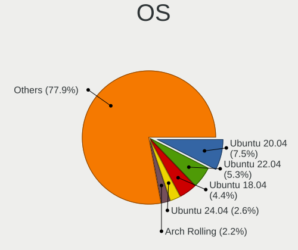

| Name                         | Computers | Percent |
|------------------------------|-----------|---------|
| Ubuntu 20.04                 | 98        | 7.54%   |
| Ubuntu 22.04                 | 69        | 5.31%   |
| Ubuntu 18.04                 | 57        | 4.38%   |
| Ubuntu 24.04                 | 34        | 2.62%   |
| Arch Rolling                 | 29        | 2.23%   |
| OpenMandriva 4.3             | 28        | 2.15%   |
| Pop!_OS 22.04                | 27        | 2.08%   |
| OpenMandriva 4.2             | 26        | 2%      |
| Zorin 16                     | 21        | 1.62%   |
| Debian 12                    | 21        | 1.62%   |
| Fedora 40                    | 20        | 1.54%   |
| OpenMandriva 24.12           | 19        | 1.46%   |
| BlackPanther 18.1            | 19        | 1.46%   |
| ArcoLinux Rolling            | 16        | 1.23%   |
| Zorin 17                     | 15        | 1.15%   |
| OpenMandriva 23.01           | 15        | 1.15%   |
| Fedora 41                    | 15        | 1.15%   |
| KDE neon 20.04               | 14        | 1.08%   |
| Zorin 15                     | 13        | 1%      |
| Arch                         | 13        | 1%      |
| ROSA R11                     | 12        | 0.92%   |
| ROSA R10                     | 12        | 0.92%   |
| Fedora 38                    | 12        | 0.92%   |
| EndeavourOS Rolling          | 12        | 0.92%   |
| Ubuntu 19.10                 | 11        | 0.85%   |
| openSUSE Tumbleweed-XXXXXXXX | 11        | 0.85%   |
| Linux Mint 19.3              | 11        | 0.85%   |
| Fedora 42                    | 11        | 0.85%   |
| Fedora 39                    | 11        | 0.85%   |
| Ubuntu 21.10                 | 10        | 0.77%   |
| OpenMandriva 25.90           | 10        | 0.77%   |
| OpenMandriva 23.08           | 10        | 0.77%   |
| Manjaro                      | 10        | 0.77%   |
| Linux Mint 22.1              | 10        | 0.77%   |
| Zorin 18                     | 9         | 0.69%   |
| OpenMandriva 25.06           | 9         | 0.69%   |
| MX 23                        | 9         | 0.69%   |
| Linux Mint 21.1              | 9         | 0.69%   |
| Linux Mint 20.3              | 9         | 0.69%   |
| Kubuntu 22.04                | 9         | 0.69%   |

OS Family
---------

OS without a version

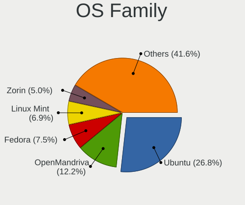

| Name             | Computers | Percent |
|------------------|-----------|---------|
| Ubuntu           | 320       | 26.76%  |
| OpenMandriva     | 146       | 12.21%  |
| Fedora           | 90        | 7.53%   |
| Linux Mint       | 83        | 6.94%   |
| Zorin            | 60        | 5.02%   |
| ROSA             | 45        | 3.76%   |
| Pop!_OS          | 45        | 3.76%   |
| Arch             | 42        | 3.51%   |
| Debian           | 36        | 3.01%   |
| Endless          | 35        | 2.93%   |
| Manjaro          | 29        | 2.42%   |
| Kubuntu          | 28        | 2.34%   |
| KDE neon         | 22        | 1.84%   |
| BlackPanther     | 21        | 1.76%   |
| openSUSE         | 18        | 1.51%   |
| ArcoLinux        | 18        | 1.51%   |
| Xubuntu          | 17        | 1.42%   |
| MX               | 16        | 1.34%   |
| Kali             | 12        | 1%      |
| EndeavourOS      | 12        | 1%      |
| Bazzite          | 11        | 0.92%   |
| Elementary       | 7         | 0.59%   |
| Nobara           | 5         | 0.42%   |
| Lubuntu          | 5         | 0.42%   |
| LMDE             | 5         | 0.42%   |
| Ubuntu Unity     | 4         | 0.33%   |
| Ubuntu MATE      | 4         | 0.33%   |
| NixOS            | 4         | 0.33%   |
| Clear Linux      | 4         | 0.33%   |
| CentOS           | 4         | 0.33%   |
| CachyOS          | 4         | 0.33%   |
| Linux Lite       | 3         | 0.25%   |
| Gentoo           | 3         | 0.25%   |
| Garuda Linux     | 3         | 0.25%   |
| Void Linux       | 2         | 0.17%   |
| Ubuntu Budgie    | 2         | 0.17%   |
| Slackware        | 2         | 0.17%   |
| Peppermint       | 2         | 0.17%   |
| PCLinuxOS        | 2         | 0.17%   |
| org.kde.Platform | 2         | 0.17%   |

Kernel
------

Version of the Linux kernel

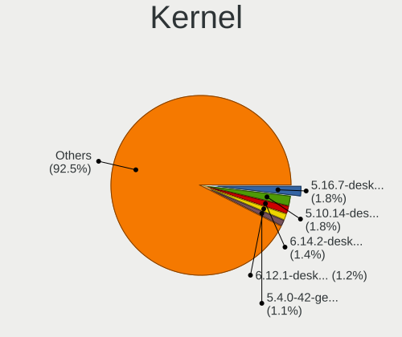

| Version                  | Computers | Percent |
|--------------------------|-----------|---------|
| 5.16.7-desktop-1omv4003  | 26        | 1.85%   |
| 5.10.14-desktop-1omv4002 | 26        | 1.85%   |
| 6.14.2-desktop-3omv2590  | 20        | 1.42%   |
| 6.12.1-desktop-1omv2490  | 17        | 1.21%   |
| 5.4.0-42-generic         | 16        | 1.14%   |
| 6.1.1-desktop-1omv2290   | 15        | 1.07%   |
| 4.18.16-desktop-1bP      | 15        | 1.07%   |
| 6.4.11-desktop-1omv2390  | 10        | 0.71%   |
| 5.15.0-56-generic        | 10        | 0.71%   |
| 6.8.0-51-generic         | 8         | 0.57%   |
| 5.3.0-40-generic         | 8         | 0.57%   |
| 4.18.0-15-generic        | 8         | 0.57%   |
| 6.6.2-desktop-1omv2390   | 7         | 0.5%    |
| 5.8.0-14-generic         | 7         | 0.5%    |
| 5.15.0-53-generic        | 7         | 0.5%    |
| 6.8.0-52-generic         | 6         | 0.43%   |
| 6.5.0-35-generic         | 6         | 0.43%   |
| 5.4.0-58-generic         | 6         | 0.43%   |
| 5.4.0-48-generic         | 6         | 0.43%   |
| 5.15.0-48-generic        | 6         | 0.43%   |
| 5.15.0-46-generic        | 6         | 0.43%   |
| 5.11.0-35-generic        | 6         | 0.43%   |
| 5.11.0-27-generic        | 6         | 0.43%   |
| 4.18.0-17-generic        | 6         | 0.43%   |
| 6.9.3-76060903-generic   | 5         | 0.36%   |
| 6.8.0-45-generic         | 5         | 0.36%   |
| 6.8.0-31-generic         | 5         | 0.36%   |
| 6.5.0-27-generic         | 5         | 0.36%   |
| 6.5.0-26-generic         | 5         | 0.36%   |
| 6.2.6-desktop-1omv2390   | 5         | 0.36%   |
| 6.2.0-26-generic         | 5         | 0.36%   |
| 6.14.0-36-generic        | 5         | 0.36%   |
| 6.12.9-desktop-1omv2490  | 5         | 0.36%   |
| 5.4.0-54-generic         | 5         | 0.36%   |
| 5.4.0-52-generic         | 5         | 0.36%   |
| 5.4.0-47-generic         | 5         | 0.36%   |
| 5.4.0-31-generic         | 5         | 0.36%   |
| 5.4.0-29-generic         | 5         | 0.36%   |
| 5.3.0-51-generic         | 5         | 0.36%   |
| 5.15.0-76-generic        | 5         | 0.36%   |

Kernel Family
-------------

Linux kernel without a distro release

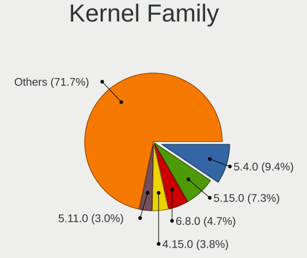

| Version | Computers | Percent |
|---------|-----------|---------|
| 5.4.0   | 125       | 9.42%   |
| 5.15.0  | 97        | 7.31%   |
| 6.8.0   | 63        | 4.75%   |
| 4.15.0  | 51        | 3.84%   |
| 5.11.0  | 40        | 3.01%   |
| 5.8.0   | 37        | 2.79%   |
| 5.3.0   | 37        | 2.79%   |
| 6.5.0   | 35        | 2.64%   |
| 5.13.0  | 32        | 2.41%   |
| 6.1.0   | 30        | 2.26%   |
| 4.18.0  | 30        | 2.26%   |
| 5.16.7  | 26        | 1.96%   |
| 5.10.14 | 26        | 1.96%   |
| 6.14.0  | 25        | 1.88%   |
| 5.19.0  | 25        | 1.88%   |
| 6.14.2  | 23        | 1.73%   |
| 5.0.0   | 23        | 1.73%   |
| 6.2.0   | 18        | 1.36%   |
| 6.12.1  | 18        | 1.36%   |
| 6.1.1   | 17        | 1.28%   |
| 4.18.16 | 15        | 1.13%   |
| 6.4.11  | 13        | 0.98%   |
| 6.11.0  | 12        | 0.9%    |
| 5.10.0  | 11        | 0.83%   |
| 6.2.6   | 9         | 0.68%   |
| 6.6.2   | 7         | 0.53%   |
| 6.12.9  | 7         | 0.53%   |
| 4.9.20  | 7         | 0.53%   |
| 6.9.3   | 6         | 0.45%   |
| 6.4.6   | 6         | 0.45%   |
| 6.16.4  | 5         | 0.38%   |
| 5.10.74 | 5         | 0.38%   |
| 4.9.60  | 5         | 0.38%   |
| 6.9.7   | 4         | 0.3%    |
| 6.17.7  | 4         | 0.3%    |
| 6.15.6  | 4         | 0.3%    |
| 6.14.9  | 4         | 0.3%    |
| 6.12.5  | 4         | 0.3%    |
| 6.11.7  | 4         | 0.3%    |
| 6.10.0  | 4         | 0.3%    |

Kernel Major Ver.
-----------------

Linux kernel major version

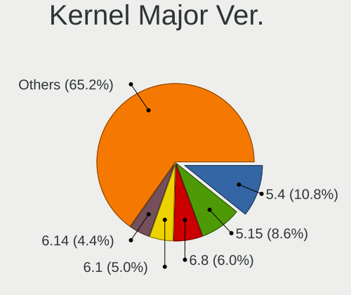

| Version | Computers | Percent |
|---------|-----------|---------|
| 5.4     | 141       | 10.77%  |
| 5.15    | 113       | 8.63%   |
| 6.8     | 79        | 6.04%   |
| 6.1     | 65        | 4.97%   |
| 6.14    | 57        | 4.35%   |
| 4.15    | 51        | 3.9%    |
| 5.11    | 50        | 3.82%   |
| 6.12    | 49        | 3.74%   |
| 5.10    | 49        | 3.74%   |
| 6.5     | 47        | 3.59%   |
| 4.18    | 45        | 3.44%   |
| 5.3     | 43        | 3.28%   |
| 5.8     | 42        | 3.21%   |
| 5.19    | 40        | 3.06%   |
| 5.13    | 36        | 2.75%   |
| 6.2     | 35        | 2.67%   |
| 5.16    | 35        | 2.67%   |
| 6.4     | 29        | 2.22%   |
| 5.0     | 26        | 1.99%   |
| 6.6     | 25        | 1.91%   |
| 6.11    | 25        | 1.91%   |
| 4.9     | 21        | 1.6%    |
| 6.0     | 19        | 1.45%   |
| 6.9     | 18        | 1.38%   |
| 6.10    | 17        | 1.3%    |
| 6.17    | 13        | 0.99%   |
| 6.3     | 12        | 0.92%   |
| 6.13    | 12        | 0.92%   |
| 5.6     | 11        | 0.84%   |
| 6.16    | 9         | 0.69%   |
| 5.14    | 9         | 0.69%   |
| 6.7     | 8         | 0.61%   |
| 6.15    | 8         | 0.61%   |
| 5.9     | 8         | 0.61%   |
| 5.7     | 8         | 0.61%   |
| 4.19    | 8         | 0.61%   |
| 5.18    | 7         | 0.53%   |
| 5.17    | 7         | 0.53%   |
| 4.1     | 6         | 0.46%   |
| 5.12    | 5         | 0.38%   |

Arch
----

OS architecture (x86_64, i586, etc.)

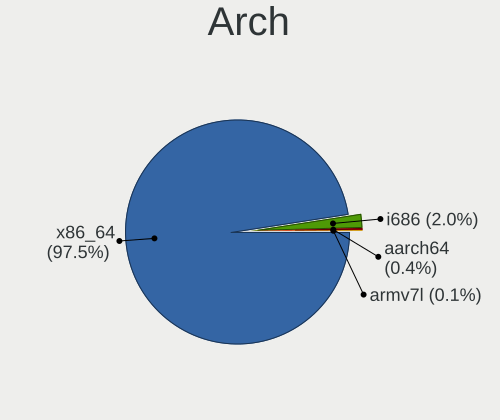

| Name    | Computers | Percent |
|---------|-----------|---------|
| x86_64  | 1114      | 97.55%  |
| i686    | 23        | 2.01%   |
| aarch64 | 4         | 0.35%   |
| armv7l  | 1         | 0.09%   |

DE
--

Desktop Environment

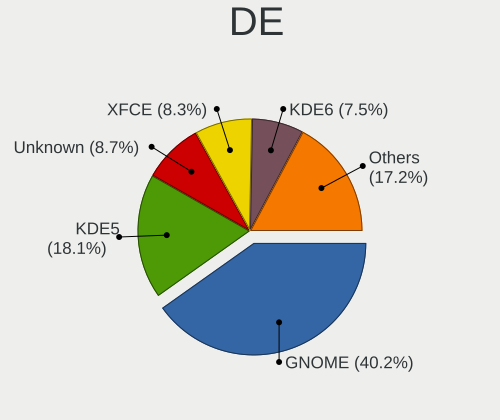

| Name            | Computers | Percent |
|-----------------|-----------|---------|
| GNOME           | 483       | 40.18%  |
| KDE5            | 217       | 18.05%  |
| Unknown         | 105       | 8.74%   |
| XFCE            | 100       | 8.32%   |
| KDE6            | 90        | 7.49%   |
| X-Cinnamon      | 74        | 6.16%   |
| KDE4            | 26        | 2.16%   |
| KDE             | 20        | 1.66%   |
| LXQt            | 14        | 1.16%   |
| Cinnamon        | 11        | 0.92%   |
| MATE            | 10        | 0.83%   |
| i3              | 9         | 0.75%   |
| Pantheon        | 7         | 0.58%   |
| LXDE            | 5         | 0.42%   |
| Unity           | 4         | 0.33%   |
| Hyprland        | 4         | 0.33%   |
| Deepin          | 4         | 0.33%   |
| qtile           | 3         | 0.25%   |
| GNOME Flashback | 3         | 0.25%   |
| sway            | 2         | 0.17%   |
| Budgie          | 2         | 0.17%   |
| Trinity         | 1         | 0.08%   |
| Openbox         | 1         | 0.08%   |
| niri            | 1         | 0.08%   |
| i3-with-shmlog  | 1         | 0.08%   |
| GNOME Classic   | 1         | 0.08%   |
| DWM             | 1         | 0.08%   |
| COSMIC          | 1         | 0.08%   |
| BunsenLabs      | 1         | 0.08%   |
| awesome         | 1         | 0.08%   |

Display Server
--------------

X11 or Wayland

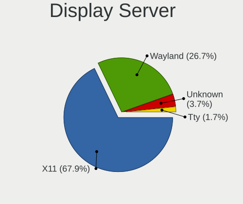

| Name    | Computers | Percent |
|---------|-----------|---------|
| X11     | 815       | 67.86%  |
| Wayland | 321       | 26.73%  |
| Unknown | 45        | 3.75%   |
| Tty     | 20        | 1.67%   |

Display Manager
---------------

SDDM, LightDM, etc.

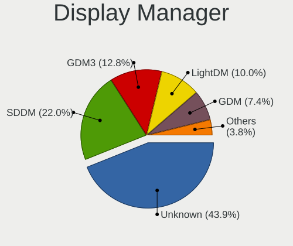

| Name    | Computers | Percent |
|---------|-----------|---------|
| Unknown | 525       | 43.93%  |
| SDDM    | 263       | 22.01%  |
| GDM3    | 153       | 12.8%   |
| LightDM | 119       | 9.96%   |
| GDM     | 89        | 7.45%   |
| KDM     | 23        | 1.92%   |
| TDM     | 15        | 1.26%   |
| XDM     | 2         | 0.17%   |
| Ly      | 2         | 0.17%   |
| MDM     | 1         | 0.08%   |
| LY-DM   | 1         | 0.08%   |
| LXDM    | 1         | 0.08%   |
| GREETD  | 1         | 0.08%   |

OS Lang
-------

Language

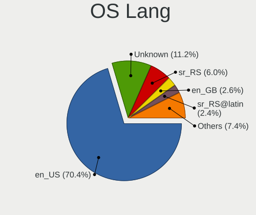

| Lang        | Computers | Percent |
|-------------|-----------|---------|
| en_US       | 836       | 70.43%  |
| Unknown     | 133       | 11.2%   |
| sr_RS       | 71        | 5.98%   |
| en_GB       | 31        | 2.61%   |
| sr_RS@latin | 28        | 2.36%   |
| C           | 25        | 2.11%   |
| hu_HU       | 17        | 1.43%   |
| ru_RU       | 14        | 1.18%   |
| de_DE       | 13        | 1.1%    |
| hr_HR       | 5         | 0.42%   |
| en_AU       | 3         | 0.25%   |
| sk_SK       | 2         | 0.17%   |
| en_DK       | 2         | 0.17%   |
| en_BW       | 2         | 0.17%   |
| Default     | 2         | 0.17%   |
| nl_NL       | 1         | 0.08%   |
| en_IE       | 1         | 0.08%   |
| en_CA       | 1         | 0.08%   |

Boot Mode
---------

EFI or BIOS

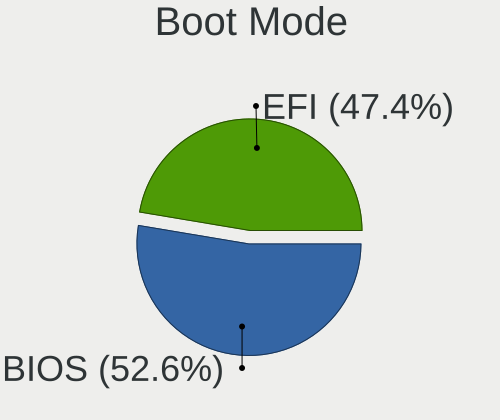

| Mode | Computers | Percent |
|------|-----------|---------|
| BIOS | 618       | 52.64%  |
| EFI  | 556       | 47.36%  |

Filesystem
----------

Type of filesystem

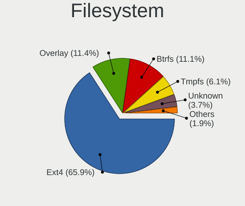

| Type    | Computers | Percent |
|---------|-----------|---------|
| Ext4    | 789       | 65.86%  |
| Overlay | 136       | 11.35%  |
| Btrfs   | 133       | 11.1%   |
| Tmpfs   | 73        | 6.09%   |
| Unknown | 44        | 3.67%   |
| Xfs     | 11        | 0.92%   |
| Zfs     | 8         | 0.67%   |
| Ext3    | 2         | 0.17%   |
| Ext2    | 2         | 0.17%   |

Part. scheme
------------

Scheme of partitioning

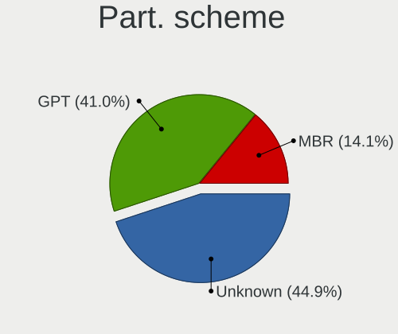

| Type    | Computers | Percent |
|---------|-----------|---------|
| Unknown | 532       | 44.93%  |
| GPT     | 485       | 40.96%  |
| MBR     | 167       | 14.1%   |

Dual Boot with Linux/BSD
------------------------

Hosting more than one Linux/BSD

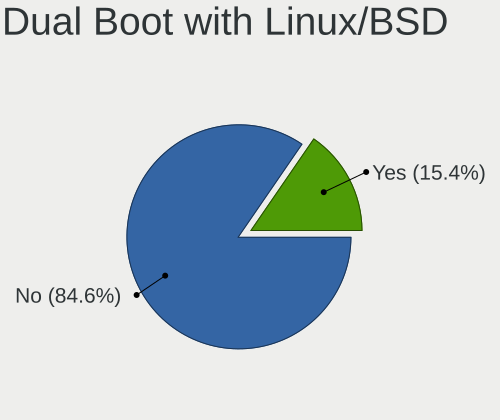

| Dual boot | Computers | Percent |
|-----------|-----------|---------|
| No        | 987       | 84.58%  |
| Yes       | 180       | 15.42%  |

Dual Boot (Win)
---------------

Hosting Linux and Windows

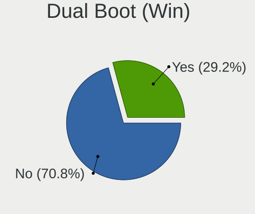

| Dual boot | Computers | Percent |
|-----------|-----------|---------|
| No        | 828       | 70.77%  |
| Yes       | 342       | 29.23%  |

Board
-----

Vendor
------

Motherboard manufacturer

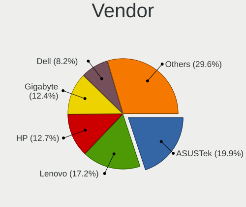

| Name                             | Computers | Percent |
|----------------------------------|-----------|---------|
| ASUSTek Computer                 | 227       | 19.93%  |
| Lenovo                           | 196       | 17.21%  |
| Hewlett-Packard                  | 145       | 12.73%  |
| Gigabyte Technology              | 141       | 12.38%  |
| Dell                             | 93        | 8.17%   |
| MSI                              | 88        | 7.73%   |
| Acer                             | 60        | 5.27%   |
| ASRock                           | 34        | 2.99%   |
| Apple                            | 22        | 1.93%   |
| Toshiba                          | 20        | 1.76%   |
| Fujitsu                          | 15        | 1.32%   |
| Biostar                          | 14        | 1.23%   |
| Intel                            | 8         | 0.7%    |
| Fujitsu Siemens                  | 7         | 0.61%   |
| Sony                             | 6         | 0.53%   |
| Medion                           | 6         | 0.53%   |
| Timi                             | 4         | 0.35%   |
| Samsung Electronics              | 4         | 0.35%   |
| Raspberry Pi Foundation          | 4         | 0.35%   |
| HUAWEI                           | 4         | 0.35%   |
| Huanan                           | 3         | 0.26%   |
| eMachines                        | 3         | 0.26%   |
| Pegatron                         | 2         | 0.18%   |
| LG Electronics                   | 2         | 0.18%   |
| HONOR                            | 2         | 0.18%   |
| Alienware                        | 2         | 0.18%   |
| TWC                              | 1         | 0.09%   |
| Techvision                       | 1         | 0.09%   |
| Synology                         | 1         | 0.09%   |
| Supermicro                       | 1         | 0.09%   |
| Sun Microsystems                 | 1         | 0.09%   |
| SLIMBOOK                         | 1         | 0.09%   |
| Sapphire                         | 1         | 0.09%   |
| Razer                            | 1         | 0.09%   |
| Purism                           | 1         | 0.09%   |
| Packard Bell                     | 1         | 0.09%   |
| NCR                              | 1         | 0.09%   |
| Microsoft                        | 1         | 0.09%   |
| Micro Computer (HK) Tech Limited | 1         | 0.09%   |
| MACHINIST                        | 1         | 0.09%   |

Model
-----

Motherboard model

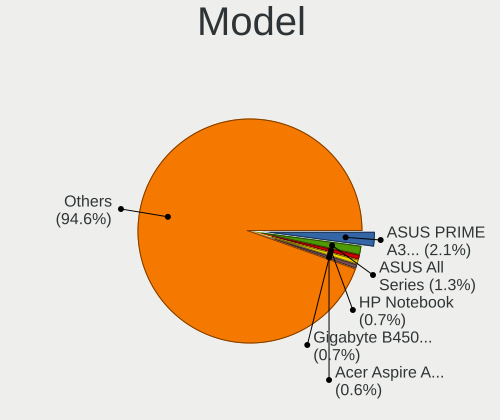

| Name                          | Computers | Percent |
|-------------------------------|-----------|---------|
| ASUS PRIME A320M-K            | 24        | 2.11%   |
| ASUS All Series               | 15        | 1.32%   |
| HP Notebook                   | 8         | 0.7%    |
| Gigabyte B450M DS3H           | 8         | 0.7%    |
| Acer Aspire A315-31           | 7         | 0.61%   |
| MSI MS-7309                   | 6         | 0.53%   |
| Gigabyte H61M-S2PV            | 6         | 0.53%   |
| Gigabyte 970A-DS3P            | 5         | 0.44%   |
| Biostar A320MH                | 5         | 0.44%   |
| MSI MS-7C52                   | 4         | 0.35%   |
| MSI MS-7C02                   | 4         | 0.35%   |
| MSI MS-7788                   | 4         | 0.35%   |
| MSI MS-7693                   | 4         | 0.35%   |
| MSI MS-7641                   | 4         | 0.35%   |
| MSI MS-7592                   | 4         | 0.35%   |
| HP ProBook 440 G3             | 4         | 0.35%   |
| Gigabyte A320M-H              | 4         | 0.35%   |
| Dell Inspiron 3593            | 4         | 0.35%   |
| Unknown                       | 4         | 0.35%   |
| MSI MS-7C84                   | 3         | 0.26%   |
| MSI MS-7721                   | 3         | 0.26%   |
| MSI MS-7597                   | 3         | 0.26%   |
| Lenovo V330-15IKB 81AX        | 3         | 0.26%   |
| Lenovo IdeaPad 5 14ARE05 81YM | 3         | 0.26%   |
| Lenovo IdeaPad 5 14ALC05 82LM | 3         | 0.26%   |
| Lenovo IdeaPad 330-15IKB 81DE | 3         | 0.26%   |
| Lenovo IdeaPad 3 15IIL05 81WE | 3         | 0.26%   |
| Lenovo IdeaPad 110-15IBR 80T7 | 3         | 0.26%   |
| Lenovo B50-45 20388           | 3         | 0.26%   |
| HP Pavilion dv7               | 3         | 0.26%   |
| HP Laptop 15-ra0xx            | 3         | 0.26%   |
| HP Laptop 15-db1xxx           | 3         | 0.26%   |
| HP Laptop 15-db0xxx           | 3         | 0.26%   |
| HP Laptop 15-da0xxx           | 3         | 0.26%   |
| HP EliteBook 840 G5           | 3         | 0.26%   |
| HP 250 G5 Notebook PC         | 3         | 0.26%   |
| Gigabyte GA-890GPA-UD3H       | 3         | 0.26%   |
| Gigabyte F2A68HM-S1           | 3         | 0.26%   |
| Gigabyte EX58-UD5             | 3         | 0.26%   |
| Gigabyte B450M S2H            | 3         | 0.26%   |

Model Family
------------

Motherboard model prefix

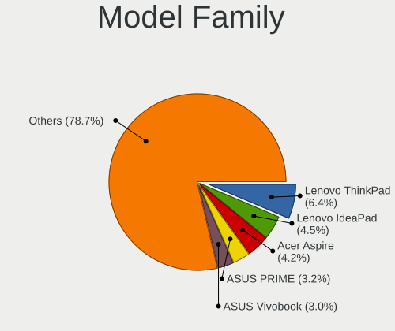

| Name                  | Computers | Percent |
|-----------------------|-----------|---------|
| Lenovo ThinkPad       | 73        | 6.41%   |
| Lenovo IdeaPad        | 51        | 4.48%   |
| Acer Aspire           | 48        | 4.21%   |
| ASUS PRIME            | 37        | 3.25%   |
| ASUS Vivobook         | 34        | 2.99%   |
| Dell Inspiron         | 33        | 2.9%    |
| HP Laptop             | 23        | 2.02%   |
| HP EliteBook          | 23        | 2.02%   |
| Dell Latitude         | 21        | 1.84%   |
| Toshiba Satellite     | 18        | 1.58%   |
| HP ProBook            | 18        | 1.58%   |
| HP Compaq             | 15        | 1.32%   |
| ASUS ROG              | 15        | 1.32%   |
| ASUS All              | 15        | 1.32%   |
| Lenovo Legion         | 13        | 1.14%   |
| HP Pavilion           | 13        | 1.14%   |
| Gigabyte B450M        | 13        | 1.14%   |
| Dell OptiPlex         | 13        | 1.14%   |
| Lenovo ThinkBook      | 12        | 1.05%   |
| Dell Vostro           | 12        | 1.05%   |
| ASUS TUF              | 11        | 0.97%   |
| Lenovo Yoga           | 8         | 0.7%    |
| HP Notebook           | 8         | 0.7%    |
| HP 250                | 8         | 0.7%    |
| Fujitsu ESPRIMO       | 8         | 0.7%    |
| Dell Precision        | 8         | 0.7%    |
| Lenovo ThinkCentre    | 7         | 0.61%   |
| MSI MS-7309           | 6         | 0.53%   |
| Gigabyte H61M-S2PV    | 6         | 0.53%   |
| HP OMEN               | 5         | 0.44%   |
| Gigabyte 970A-DS3P    | 5         | 0.44%   |
| Fujitsu Siemens AMILO | 5         | 0.44%   |
| Fujitsu LIFEBOOK      | 5         | 0.44%   |
| Biostar A320MH        | 5         | 0.44%   |
| RPi Raspberry         | 4         | 0.35%   |
| MSI MS-7C52           | 4         | 0.35%   |
| MSI MS-7C02           | 4         | 0.35%   |
| MSI MS-7788           | 4         | 0.35%   |
| MSI MS-7693           | 4         | 0.35%   |
| MSI MS-7641           | 4         | 0.35%   |

MFG Year
--------

Motherboard manufacture year

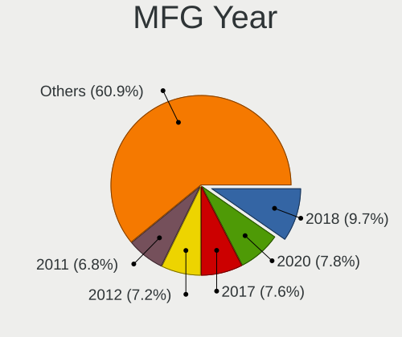

| Year    | Computers | Percent |
|---------|-----------|---------|
| 2018    | 110       | 9.66%   |
| 2020    | 89        | 7.81%   |
| 2017    | 86        | 7.55%   |
| 2012    | 82        | 7.2%    |
| 2011    | 78        | 6.85%   |
| 2019    | 77        | 6.76%   |
| 2014    | 72        | 6.32%   |
| 2013    | 71        | 6.23%   |
| 2010    | 61        | 5.36%   |
| 2021    | 53        | 4.65%   |
| 2009    | 52        | 4.57%   |
| 2023    | 48        | 4.21%   |
| 2022    | 48        | 4.21%   |
| 2016    | 47        | 4.13%   |
| 2015    | 43        | 3.78%   |
| 2008    | 41        | 3.6%    |
| 2007    | 35        | 3.07%   |
| 2006    | 19        | 1.67%   |
| 2024    | 18        | 1.58%   |
| 2025    | 3         | 0.26%   |
| Unknown | 3         | 0.26%   |
| 2005    | 2         | 0.18%   |
| 2004    | 1         | 0.09%   |

Form Factor
-----------

Physical design of the computer

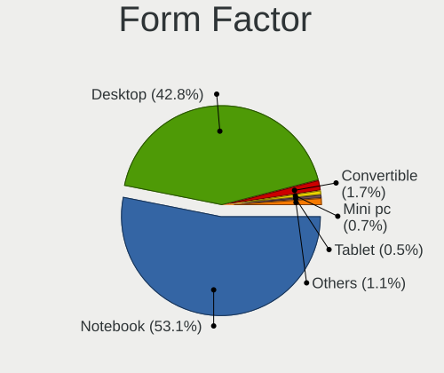

| Name           | Computers | Percent |
|----------------|-----------|---------|
| Notebook       | 605       | 53.12%  |
| Desktop        | 488       | 42.84%  |
| Convertible    | 19        | 1.67%   |
| Mini pc        | 8         | 0.7%    |
| Tablet         | 6         | 0.53%   |
| All in one     | 6         | 0.53%   |
| System on chip | 4         | 0.35%   |
| Server         | 3         | 0.26%   |

Secure Boot
-----------

Enabled or disabled

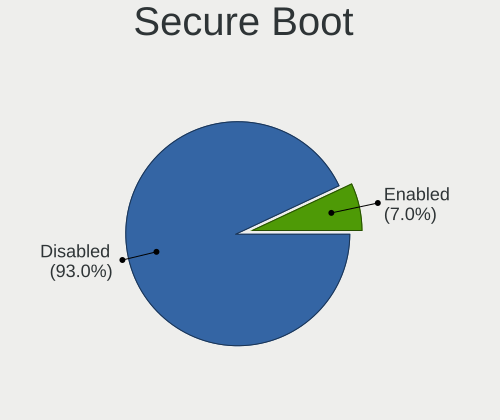

| State    | Computers | Percent |
|----------|-----------|---------|
| Disabled | 1067      | 93.03%  |
| Enabled  | 80        | 6.97%   |

Coreboot
--------

Have coreboot on board

| Used | Computers | Percent |
|------|-----------|---------|
| No   | 1138      | 99.91%  |
| Yes  | 1         | 0.09%   |

RAM Size
--------

Total RAM memory

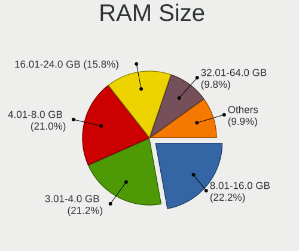

| Size in GB  | Computers | Percent |
|-------------|-----------|---------|
| 8.01-16.0   | 259       | 22.16%  |
| 3.01-4.0    | 248       | 21.21%  |
| 4.01-8.0    | 246       | 21.04%  |
| 16.01-24.0  | 185       | 15.83%  |
| 32.01-64.0  | 115       | 9.84%   |
| 1.01-2.0    | 46        | 3.93%   |
| 24.01-32.0  | 28        | 2.4%    |
| 64.01-256.0 | 19        | 1.63%   |
| 2.01-3.0    | 17        | 1.45%   |
| 0.51-1.0    | 6         | 0.51%   |

RAM Used
--------

Used RAM memory

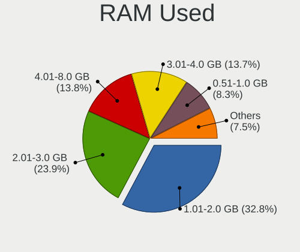

| Used GB    | Computers | Percent |
|------------|-----------|---------|
| 1.01-2.0   | 425       | 32.79%  |
| 2.01-3.0   | 310       | 23.92%  |
| 4.01-8.0   | 179       | 13.81%  |
| 3.01-4.0   | 177       | 13.66%  |
| 0.51-1.0   | 108       | 8.33%   |
| 8.01-16.0  | 66        | 5.09%   |
| 0.01-0.5   | 15        | 1.16%   |
| 16.01-24.0 | 12        | 0.93%   |
| 24.01-32.0 | 4         | 0.31%   |

Total Drives
------------

Number of drives on board

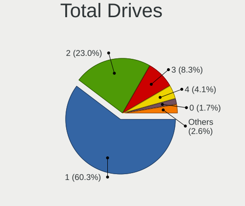

| Drives  | Computers | Percent |
|---------|-----------|---------|
| 1       | 711       | 60.31%  |
| 2       | 271       | 22.99%  |
| 3       | 98        | 8.31%   |
| 4       | 48        | 4.07%   |
| 0       | 20        | 1.7%    |
| 5       | 17        | 1.44%   |
| 7       | 5         | 0.42%   |
| 6       | 5         | 0.42%   |
| Unknown | 2         | 0.17%   |
| 10      | 1         | 0.08%   |
| 8       | 1         | 0.08%   |

Has CD-ROM
----------

Has CD-ROM on board

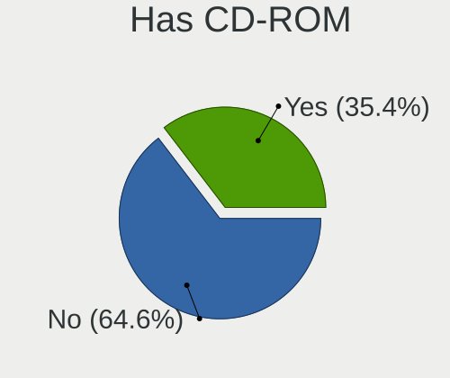

| Presented | Computers | Percent |
|-----------|-----------|---------|
| No        | 750       | 64.6%   |
| Yes       | 411       | 35.4%   |

Has Ethernet
------------

Has Ethernet on board

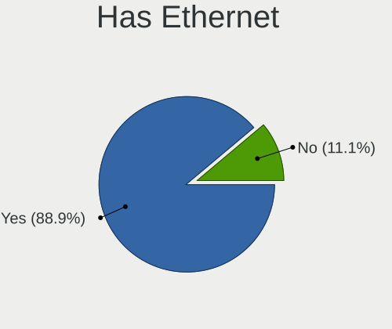

| Presented | Computers | Percent |
|-----------|-----------|---------|
| Yes       | 1015      | 88.88%  |
| No        | 127       | 11.12%  |

Has WiFi
--------

Has WiFi module

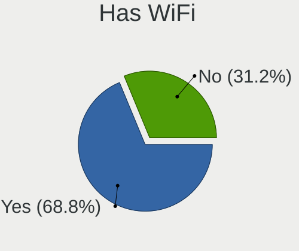

| Presented | Computers | Percent |
|-----------|-----------|---------|
| Yes       | 788       | 68.76%  |
| No        | 358       | 31.24%  |

Has Bluetooth
-------------

Has Bluetooth module

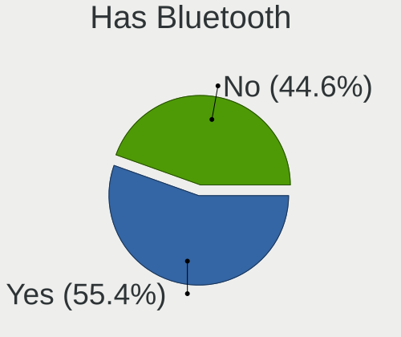

| Presented | Computers | Percent |
|-----------|-----------|---------|
| Yes       | 641       | 55.45%  |
| No        | 515       | 44.55%  |

Location
--------

Country
-------

Geographic location (country)

| Country | Computers | Percent |
|---------|-----------|---------|
| Serbia  | 1139      | 100%    |

City
----

Geographic location (city)

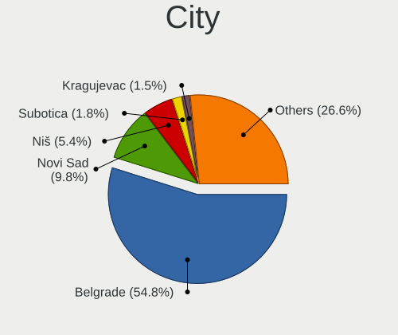

| City               | Computers | Percent |
|--------------------|-----------|---------|
| Belgrade           | 675       | 54.83%  |
| Novi Sad           | 121       | 9.83%   |
| Niš               | 67        | 5.44%   |
| Subotica           | 22        | 1.79%   |
| Kragujevac         | 18        | 1.46%   |
| Zrenjanin          | 17        | 1.38%   |
| Pančevo           | 14        | 1.14%   |
| Požarevac         | 10        | 0.81%   |
| Leskovac           | 10        | 0.81%   |
| Čačak            | 9         | 0.73%   |
| Backa Topola       | 8         | 0.65%   |
| Senta              | 7         | 0.57%   |
| Semlin             | 7         | 0.57%   |
| Sabac              | 7         | 0.57%   |
| Bor                | 7         | 0.57%   |
| Becej              | 7         | 0.57%   |
| Vršac             | 6         | 0.49%   |
| Palanka            | 6         | 0.49%   |
| Kruševac          | 6         | 0.49%   |
| Kraljevo           | 6         | 0.49%   |
| Karloca            | 6         | 0.49%   |
| Jagodina           | 6         | 0.49%   |
| Indjija            | 6         | 0.49%   |
| Savski Venac       | 5         | 0.41%   |
| Ruma               | 5         | 0.41%   |
| Vranje             | 4         | 0.32%   |
| Stara Pazova       | 4         | 0.32%   |
| Sremska Mitrovica  | 4         | 0.32%   |
| Sombor             | 4         | 0.32%   |
| Smederevo          | 4         | 0.32%   |
| Pirot              | 4         | 0.32%   |
| Obrenovac          | 4         | 0.32%   |
| Novi Karlovci      | 4         | 0.32%   |
| Novi Belgrade      | 4         | 0.32%   |
| New Belgrade       | 4         | 0.32%   |
| Lazarevac          | 4         | 0.32%   |
| Cuprija            | 4         | 0.32%   |
| Banatsko Novo Selo | 4         | 0.32%   |
| Ada                | 4         | 0.32%   |
| Trstenik           | 3         | 0.24%   |

Drives
------

Drive Vendor
------------

Hard drive vendors

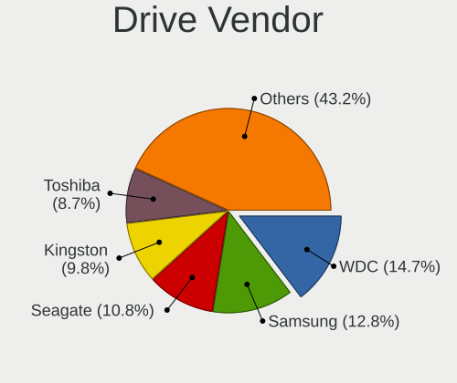

| Vendor                      | Computers | Drives | Percent |
|-----------------------------|-----------|--------|---------|
| WDC                         | 245       | 401    | 14.68%  |
| Samsung Electronics         | 214       | 313    | 12.82%  |
| Seagate                     | 180       | 249    | 10.78%  |
| Kingston                    | 163       | 233    | 9.77%   |
| Toshiba                     | 146       | 198    | 8.75%   |
| SanDisk                     | 71        | 95     | 4.25%   |
| Hitachi                     | 66        | 93     | 3.95%   |
| SPCC                        | 53        | 80     | 3.18%   |
| SK hynix                    | 40        | 49     | 2.4%    |
| Patriot                     | 39        | 46     | 2.34%   |
| Unknown                     | 34        | 45     | 2.04%   |
| Intel                       | 33        | 47     | 1.98%   |
| Micron Technology           | 32        | 40     | 1.92%   |
| HGST                        | 27        | 42     | 1.62%   |
| Gigabyte Technology         | 24        | 32     | 1.44%   |
| Biostar                     | 21        | 25     | 1.26%   |
| Transcend                   | 20        | 28     | 1.2%    |
| Kingston Technology Company | 20        | 34     | 1.2%    |
| A-DATA Technology           | 20        | 20     | 1.2%    |
| Crucial                     | 19        | 23     | 1.14%   |
| Maxtor                      | 13        | 14     | 0.78%   |
| Apacer                      | 11        | 13     | 0.66%   |
| Silicon Motion              | 10        | 20     | 0.6%    |
| KIOXIA                      | 10        | 11     | 0.6%    |
| Phison Electronics          | 9         | 15     | 0.54%   |
| ADATA Technology            | 9         | 10     | 0.54%   |
| GeIL                        | 8         | 10     | 0.48%   |
| Fujitsu                     | 8         | 9      | 0.48%   |
| China                       | 8         | 14     | 0.48%   |
| Unknown                     | 8         | 14     | 0.48%   |
| LITEON                      | 7         | 8      | 0.42%   |
| Verbatim                    | 6         | 7      | 0.36%   |
| Realtek Semiconductor       | 5         | 8      | 0.3%    |
| Phison                      | 5         | 14     | 0.3%    |
| MAXIO Technology (Hangzhou) | 5         | 6      | 0.3%    |
| PNY                         | 4         | 9      | 0.24%   |
| Netac                       | 4         | 6      | 0.24%   |
| ExcelStor                   | 4         | 4      | 0.24%   |
| Apple                       | 4         | 5      | 0.24%   |
| AMD                         | 4         | 6      | 0.24%   |

Drive Model
-----------

Hard drive models

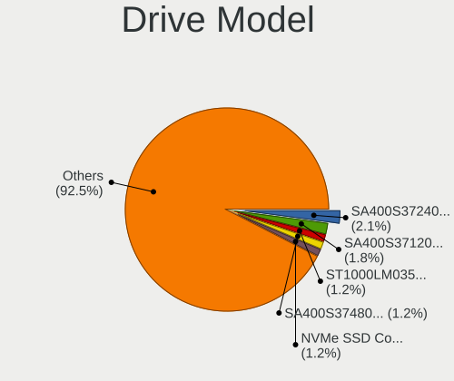

| Model                                                 | Computers | Percent |
|-------------------------------------------------------|-----------|---------|
| Kingston SA400S37240G 240GB SSD                       | 38        | 2.11%   |
| Kingston SA400S37120G 120GB SSD                       | 33        | 1.83%   |
| Seagate ST1000LM035-1RK172 1TB                        | 22        | 1.22%   |
| Kingston SA400S37480G 480GB SSD                       | 22        | 1.22%   |
| Samsung NVMe SSD Controller SM981/PM981/PM983 1TB     | 21        | 1.16%   |
| Toshiba DT01ACA100 1TB                                | 20        | 1.11%   |
| Toshiba MQ01ABF050 500GB                              | 19        | 1.05%   |
| Samsung NVMe SSD Controller PM9A1/PM9A3/980PRO 1TB    | 16        | 0.89%   |
| SPCC Solid State Disk 256GB                           | 14        | 0.78%   |
| Toshiba DT01ACA050 500GB                              | 12        | 0.67%   |
| Samsung SSD 860 EVO 250GB                             | 12        | 0.67%   |
| Gigabyte GP-GSTFS31240GNTD 240GB SSD                  | 12        | 0.67%   |
| Seagate ST500LT012-1DG142 500GB                       | 11        | 0.61%   |
| Seagate ST1000DM010-2EP102 1TB                        | 11        | 0.61%   |
| Seagate ST1000DM003-1ER162 1TB                        | 11        | 0.61%   |
| WDC WD5000AAKX-001CA0 500GB                           | 10        | 0.55%   |
| Samsung SSD 850 EVO 250GB                             | 10        | 0.55%   |
| SPCC Solid State Disk 512GB                           | 9         | 0.5%    |
| Biostar S100-120GB SSD                                | 9         | 0.5%    |
| Toshiba MQ04ABF100 1TB                                | 8         | 0.44%   |
| Toshiba MQ01ABD100 1TB                                | 8         | 0.44%   |
| Toshiba HDWD110 1TB                                   | 8         | 0.44%   |
| Seagate ST1000LM024 HN-M101MBB 1TB                    | 8         | 0.44%   |
| Patriot Burst 240GB SSD                               | 8         | 0.44%   |
| Kingston SNVS500G 500GB                               | 8         | 0.44%   |
| Unknown                                               | 8         | 0.44%   |
| SPCC Solid State Disk 128GB                           | 7         | 0.39%   |
| Silicon Motion SM2263EN/SM2263XT SSD Controller 512GB | 7         | 0.39%   |
| Seagate ST500LT012-9WS142 500GB                       | 7         | 0.39%   |
| Sandisk WD Blue SN550 NVMe SSD 1024GB                 | 7         | 0.39%   |
| Samsung SSD 860 EVO 500GB                             | 7         | 0.39%   |
| Samsung NVMe SSD Drive 500GB                          | 7         | 0.39%   |
| Samsung NVMe SSD Drive 256GB                          | 7         | 0.39%   |
| Samsung MZALQ512HALU-000L2 512GB                      | 7         | 0.39%   |
| Kingston SKC3000S1024G 1TB                            | 7         | 0.39%   |
| Hitachi HDS721050CLA362 500GB                         | 7         | 0.39%   |
| Gigabyte GP-GSTFS31120GNTD 120GB SSD                  | 7         | 0.39%   |
| WDC WDS500G2B0A 500GB SSD                             | 6         | 0.33%   |
| WDC WD10EZEX-08WN4A0 1TB                              | 6         | 0.33%   |
| SPCC Solid State Disk 120GB                           | 6         | 0.33%   |

HDD Vendor
----------

Hard disk drive vendors

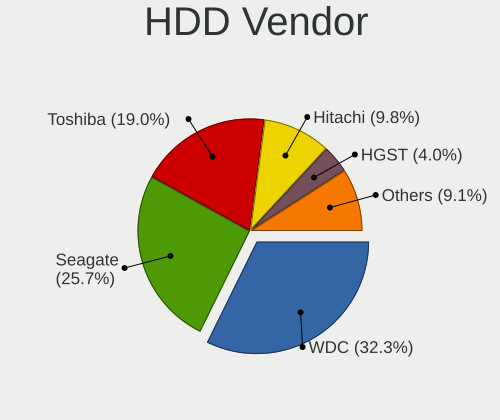

| Vendor              | Computers | Drives | Percent |
|---------------------|-----------|--------|---------|
| WDC                 | 217       | 362    | 32.29%  |
| Seagate             | 173       | 240    | 25.74%  |
| Toshiba             | 128       | 176    | 19.05%  |
| Hitachi             | 66        | 93     | 9.82%   |
| HGST                | 27        | 42     | 4.02%   |
| Samsung Electronics | 25        | 34     | 3.72%   |
| Maxtor              | 13        | 14     | 1.93%   |
| Fujitsu             | 8         | 9      | 1.19%   |
| ExcelStor           | 4         | 4      | 0.6%    |
| JMicron Technology  | 3         | 3      | 0.45%   |
| Unknown             | 2         | 2      | 0.3%    |
| Intenso             | 2         | 2      | 0.3%    |
| TO Exter            | 1         | 1      | 0.15%   |
| QUANTUM             | 1         | 1      | 0.15%   |
| IBM/Hitachi         | 1         | 1      | 0.15%   |
| Apple               | 1         | 1      | 0.15%   |

SSD Vendor
----------

Solid state drive vendors

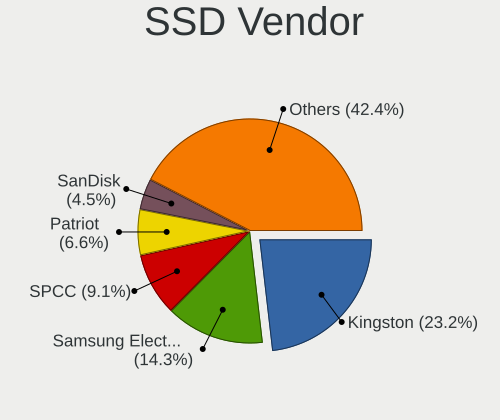

| Vendor              | Computers | Drives | Percent |
|---------------------|-----------|--------|---------|
| Kingston            | 130       | 185    | 23.17%  |
| Samsung Electronics | 80        | 103    | 14.26%  |
| SPCC                | 51        | 78     | 9.09%   |
| Patriot             | 37        | 44     | 6.6%    |
| SanDisk             | 25        | 42     | 4.46%   |
| Gigabyte Technology | 21        | 28     | 3.74%   |
| Transcend           | 20        | 28     | 3.57%   |
| Biostar             | 20        | 24     | 3.57%   |
| Crucial             | 19        | 23     | 3.39%   |
| A-DATA Technology   | 17        | 17     | 3.03%   |
| WDC                 | 16        | 20     | 2.85%   |
| Intel               | 13        | 17     | 2.32%   |
| Micron Technology   | 10        | 13     | 1.78%   |
| Apacer              | 10        | 12     | 1.78%   |
| GeIL                | 8         | 10     | 1.43%   |
| China               | 8         | 14     | 1.43%   |
| Toshiba             | 7         | 8      | 1.25%   |
| LITEON              | 7         | 8      | 1.25%   |
| Verbatim            | 6         | 7      | 1.07%   |
| Unknown             | 6         | 11     | 1.07%   |
| SK hynix            | 4         | 5      | 0.71%   |
| PNY                 | 4         | 9      | 0.71%   |
| AMD                 | 4         | 6      | 0.71%   |
| TwinMOS             | 3         | 3      | 0.53%   |
| StoreJet            | 3         | 4      | 0.53%   |
| OCZ                 | 3         | 4      | 0.53%   |
| Netac               | 3         | 5      | 0.53%   |
| Lexar               | 3         | 7      | 0.53%   |
| Team                | 2         | 4      | 0.36%   |
| Seagate             | 2         | 2      | 0.36%   |
| PHD 3.0             | 2         | 3      | 0.36%   |
| Vi550               | 1         | 1      | 0.18%   |
| TECHLEAF-SSD        | 1         | 1      | 0.18%   |
| SSSTC               | 1         | 1      | 0.18%   |
| Phison              | 1         | 2      | 0.18%   |
| Mushkin             | 1         | 1      | 0.18%   |
| LITEONIT            | 1         | 1      | 0.18%   |
| Leven               | 1         | 1      | 0.18%   |
| Lenovo              | 1         | 1      | 0.18%   |
| KingDian            | 1         | 1      | 0.18%   |

Drive Kind
----------

HDD or SSD

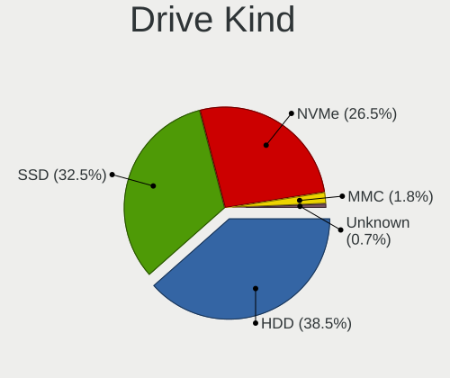

| Kind    | Computers | Drives | Percent |
|---------|-----------|--------|---------|
| HDD     | 570       | 985    | 38.46%  |
| SSD     | 482       | 762    | 32.52%  |
| NVMe    | 393       | 571    | 26.52%  |
| MMC     | 27        | 35     | 1.82%   |
| Unknown | 10        | 14     | 0.67%   |

Drive Connector
---------------

SATA, SAS, NVMe, etc.

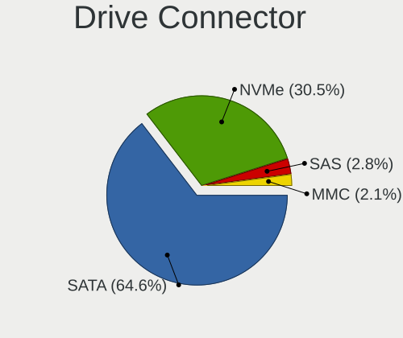

| Type | Computers | Drives | Percent |
|------|-----------|--------|---------|
| SATA | 832       | 1719   | 64.6%   |
| NVMe | 393       | 570    | 30.51%  |
| SAS  | 36        | 43     | 2.8%    |
| MMC  | 27        | 35     | 2.1%    |

Drive Size
----------

Size of hard drive

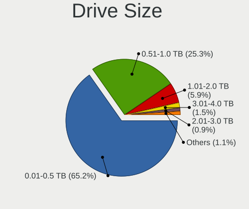

| Size in TB | Computers | Drives | Percent |
|------------|-----------|--------|---------|
| 0.01-0.5   | 689       | 1159   | 65.25%  |
| 0.51-1.0   | 267       | 396    | 25.28%  |
| 1.01-2.0   | 62        | 115    | 5.87%   |
| 3.01-4.0   | 16        | 26     | 1.52%   |
| 2.01-3.0   | 10        | 23     | 0.95%   |
| 4.01-10.0  | 9         | 19     | 0.85%   |
| 10.01-20.0 | 3         | 9      | 0.28%   |

Space Total
-----------

Amount of disk space available on the file system

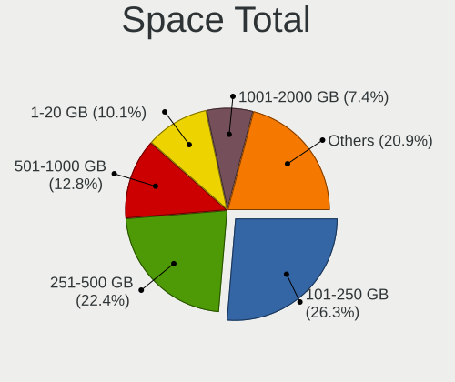

| Size in GB     | Computers | Percent |
|----------------|-----------|---------|
| 101-250        | 327       | 26.33%  |
| 251-500        | 278       | 22.38%  |
| 501-1000       | 159       | 12.8%   |
| 1-20           | 126       | 10.14%  |
| 1001-2000      | 92        | 7.41%   |
| 51-100         | 68        | 5.48%   |
| Unknown        | 61        | 4.91%   |
| 21-50          | 50        | 4.03%   |
| More than 3000 | 41        | 3.3%    |
| 2001-3000      | 40        | 3.22%   |

Space Used
----------

Amount of used disk space

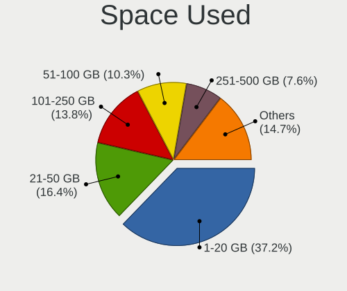

| Used GB        | Computers | Percent |
|----------------|-----------|---------|
| 1-20           | 479       | 37.22%  |
| 21-50          | 211       | 16.39%  |
| 101-250        | 177       | 13.75%  |
| 51-100         | 133       | 10.33%  |
| 251-500        | 98        | 7.61%   |
| Unknown        | 61        | 4.74%   |
| 501-1000       | 57        | 4.43%   |
| 1001-2000      | 41        | 3.19%   |
| 2001-3000      | 15        | 1.17%   |
| More than 3000 | 9         | 0.7%    |
| 0              | 6         | 0.47%   |

Malfunc. Drives
---------------

Drive models with a malfunction

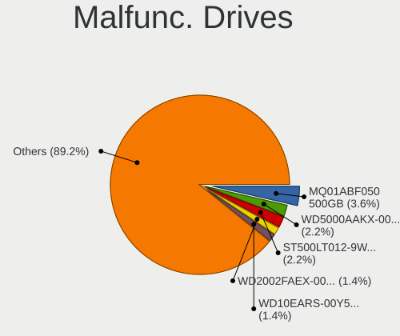

| Model                              | Computers | Drives | Percent |
|------------------------------------|-----------|--------|---------|
| Toshiba MQ01ABF050 500GB           | 5         | 5      | 3.6%    |
| WDC WD5000AAKX-001CA0 500GB        | 3         | 3      | 2.16%   |
| Seagate ST500LT012-9WS142 500GB    | 3         | 3      | 2.16%   |
| WDC WD2002FAEX-007BA0 2TB          | 2         | 3      | 1.44%   |
| WDC WD10EARS-00Y5B1 1TB            | 2         | 2      | 1.44%   |
| WDC WD10EALX-009BA0 1TB            | 2         | 3      | 1.44%   |
| WDC WD1003FZEX-00MK2A0 1TB         | 2         | 2      | 1.44%   |
| Seagate ST500DM002-1BD142 500GB    | 2         | 5      | 1.44%   |
| Seagate ST380815AS 80GB            | 2         | 2      | 1.44%   |
| Seagate ST2000DM006-2DM164 2TB     | 2         | 2      | 1.44%   |
| Seagate ST1000LM035-1RK172 1TB     | 2         | 2      | 1.44%   |
| Seagate ST1000LM024 HN-M101MBB 1TB | 2         | 3      | 1.44%   |
| Seagate ST1000DM003-1CH162 1TB     | 2         | 2      | 1.44%   |
| Maxtor STM3250310AS 250GB          | 2         | 2      | 1.44%   |
| Intel SSDSC2CW120A3 120GB          | 2         | 2      | 1.44%   |
| Hitachi HTS545050A7E380 500GB      | 2         | 2      | 1.44%   |
| Hitachi HTS541612J9SA00 120GB      | 2         | 2      | 1.44%   |
| Hitachi HDP725050GLA360 500GB      | 2         | 2      | 1.44%   |
| Hitachi HCP725032GLA380 320GB      | 2         | 3      | 1.44%   |
| HGST HTS725050A7E630 500GB         | 2         | 6      | 1.44%   |
| HGST HTS545050A7E680 500GB         | 2         | 3      | 1.44%   |
| WDC WD5002AALX-00J37A0 500GB       | 1         | 1      | 0.72%   |
| WDC WD5000LPVX-22V0TT0 500GB       | 1         | 1      | 0.72%   |
| WDC WD5000BEVT-24A0RT0 500GB       | 1         | 1      | 0.72%   |
| WDC WD5000AAKX-603CA0 500GB        | 1         | 1      | 0.72%   |
| WDC WD5000AAKX-329BA0 500GB        | 1         | 1      | 0.72%   |
| WDC WD5000AAKX-07U6AA0 500GB       | 1         | 1      | 0.72%   |
| WDC WD5000AAKS-65A7B0 500GB        | 1         | 1      | 0.72%   |
| WDC WD5000AAKS-00UU3A0 500GB       | 1         | 1      | 0.72%   |
| WDC WD5000AAKS-00TMA0 500GB        | 1         | 1      | 0.72%   |
| WDC WD40EZRX-00SPEB0 4TB           | 1         | 1      | 0.72%   |
| WDC WD40EFRX-68WT0N0 4TB           | 1         | 1      | 0.72%   |
| WDC WD3200BEVT-22ZCT0 320GB        | 1         | 1      | 0.72%   |
| WDC WD3200BEKX-75B7WT0 320GB       | 1         | 1      | 0.72%   |
| WDC WD3200BEKT-60PVMT0 320GB       | 1         | 1      | 0.72%   |
| WDC WD3200AVVS-63L2B0 320GB        | 1         | 1      | 0.72%   |
| WDC WD3200AVVS-56L2B0 320GB        | 1         | 1      | 0.72%   |
| WDC WD20EARX-00PASB0 2TB           | 1         | 1      | 0.72%   |
| WDC WD2003FYYS-05T9B0 2TB          | 1         | 1      | 0.72%   |
| WDC WD2002FAEX-00MJRA0 2TB         | 1         | 1      | 0.72%   |

Malfunc. Drive Vendor
---------------------

Vendors of faulty drives

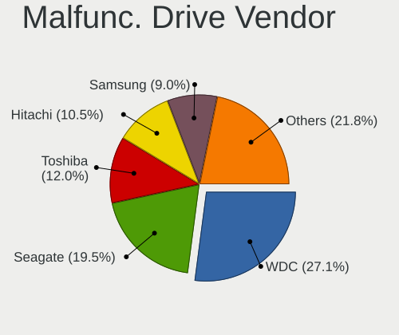

| Vendor                | Computers | Drives | Percent |
|-----------------------|-----------|--------|---------|
| WDC                   | 36        | 44     | 27.07%  |
| Seagate               | 26        | 32     | 19.55%  |
| Toshiba               | 16        | 16     | 12.03%  |
| Hitachi               | 14        | 17     | 10.53%  |
| Samsung Electronics   | 12        | 16     | 9.02%   |
| HGST                  | 6         | 12     | 4.51%   |
| Maxtor                | 5         | 6      | 3.76%   |
| Kingston              | 3         | 3      | 2.26%   |
| Fujitsu               | 3         | 3      | 2.26%   |
| SPCC                  | 2         | 2      | 1.5%    |
| Intel                 | 2         | 2      | 1.5%    |
| ExcelStor             | 2         | 2      | 1.5%    |
| Verbatim              | 1         | 1      | 0.75%   |
| SK hynix              | 1         | 2      | 0.75%   |
| Realtek Semiconductor | 1         | 1      | 0.75%   |
| Patriot               | 1         | 1      | 0.75%   |
| Crucial               | 1         | 1      | 0.75%   |
| A-DATA Technology     | 1         | 1      | 0.75%   |

Malfunc. HDD Vendor
-------------------

Vendors of faulty HDD drives

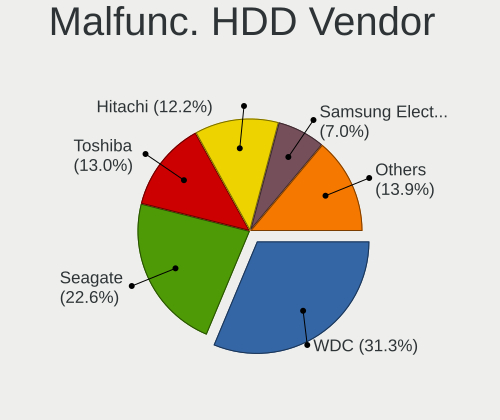

| Vendor              | Computers | Drives | Percent |
|---------------------|-----------|--------|---------|
| WDC                 | 36        | 44     | 31.3%   |
| Seagate             | 26        | 32     | 22.61%  |
| Toshiba             | 15        | 15     | 13.04%  |
| Hitachi             | 14        | 17     | 12.17%  |
| Samsung Electronics | 8         | 10     | 6.96%   |
| HGST                | 6         | 12     | 5.22%   |
| Maxtor              | 5         | 6      | 4.35%   |
| Fujitsu             | 3         | 3      | 2.61%   |
| ExcelStor           | 2         | 2      | 1.74%   |

Malfunc. Drive Kind
-------------------

Kinds of faulty drives

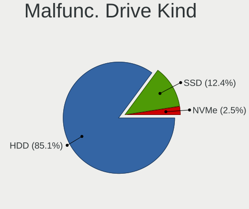

| Kind | Computers | Drives | Percent |
|------|-----------|--------|---------|
| HDD  | 103       | 141    | 85.12%  |
| SSD  | 15        | 18     | 12.4%   |
| NVMe | 3         | 3      | 2.48%   |

Failed Drives
-------------

Failed drive models

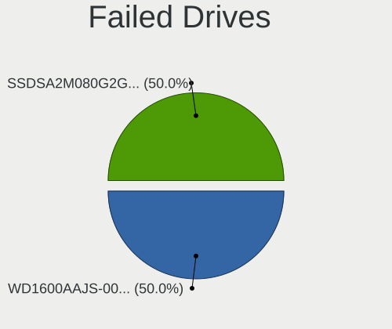

| Model                        | Computers | Drives | Percent |
|------------------------------|-----------|--------|---------|
| WDC WD1600AAJS-00YZCA0 160GB | 1         | 1      | 50%     |
| Intel SSDSA2M080G2GC 80GB    | 1         | 1      | 50%     |

Failed Drive Vendor
-------------------

Failed drive vendors

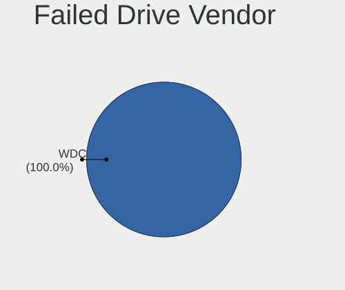

| Vendor | Computers | Drives | Percent |
|--------|-----------|--------|---------|
| WDC    | 1         | 1      | 50%     |
| Intel  | 1         | 1      | 50%     |

Drive Status
------------

Number of failed and malfunc. drives

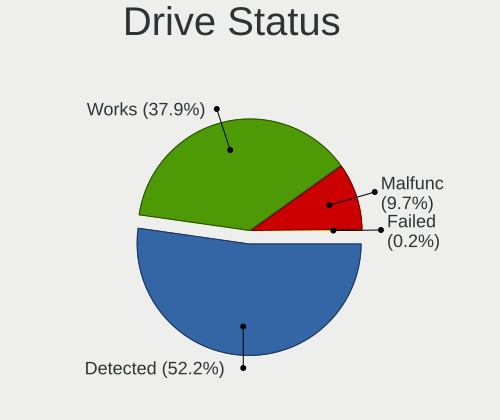

| Status   | Computers | Drives | Percent |
|----------|-----------|--------|---------|
| Detected | 640       | 1388   | 52.24%  |
| Works    | 464       | 815    | 37.88%  |
| Malfunc  | 119       | 162    | 9.71%   |
| Failed   | 2         | 2      | 0.16%   |

Storage controller
------------------

Storage Vendor
--------------

Storage controller vendors

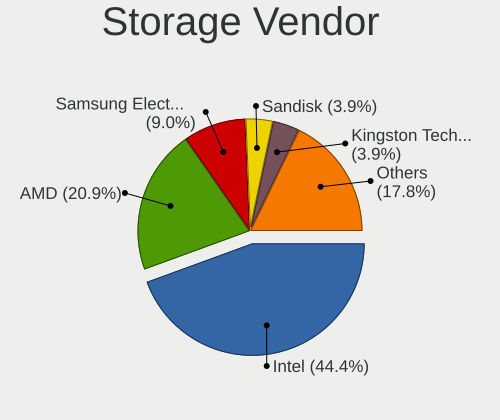

| Vendor                         | Computers | Percent |
|--------------------------------|-----------|---------|
| Intel                          | 653       | 44.42%  |
| AMD                            | 307       | 20.88%  |
| Samsung Electronics            | 133       | 9.05%   |
| Sandisk                        | 58        | 3.95%   |
| Kingston Technology Company    | 57        | 3.88%   |
| Nvidia                         | 39        | 2.65%   |
| SK hynix                       | 36        | 2.45%   |
| JMicron Technology             | 26        | 1.77%   |
| Micron Technology              | 22        | 1.5%    |
| ASMedia Technology             | 18        | 1.22%   |
| Phison Electronics             | 15        | 1.02%   |
| Toshiba America Info Systems   | 12        | 0.82%   |
| Silicon Motion                 | 12        | 0.82%   |
| Marvell Technology Group       | 11        | 0.75%   |
| KIOXIA                         | 10        | 0.68%   |
| ADATA Technology               | 10        | 0.68%   |
| MAXIO Technology (Hangzhou)    | 7         | 0.48%   |
| Realtek Semiconductor          | 6         | 0.41%   |
| VIA Technologies               | 5         | 0.34%   |
| Solidigm                       | 5         | 0.34%   |
| Union Memory (Shenzhen)        | 4         | 0.27%   |
| Shenzhen Longsys Electronics   | 4         | 0.27%   |
| Broadcom / LSI                 | 3         | 0.2%    |
| Solid State Storage Technology | 2         | 0.14%   |
| Seagate Technology             | 2         | 0.14%   |
| Micron/Crucial Technology      | 2         | 0.14%   |
| LSI Logic / Symbios Logic      | 2         | 0.14%   |
| Lenovo                         | 2         | 0.14%   |
| Apple                          | 2         | 0.14%   |
| Yangtze Memory Technologies    | 1         | 0.07%   |
| Transcend                      | 1         | 0.07%   |
| Silicon Image                  | 1         | 0.07%   |
| Hosin Global Electronics       | 1         | 0.07%   |
| Unknown                        | 1         | 0.07%   |

Storage Model
-------------

Storage controller models

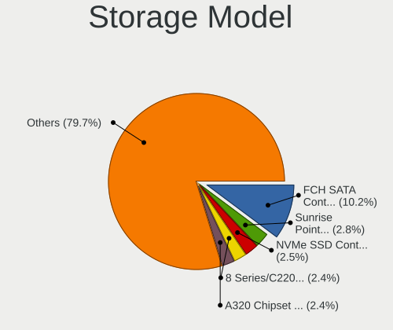

| Model                                                                                   | Computers | Percent |
|-----------------------------------------------------------------------------------------|-----------|---------|
| AMD FCH SATA Controller [AHCI mode]                                                     | 177       | 10.2%   |
| Intel Sunrise Point-LP SATA Controller [AHCI mode]                                      | 48        | 2.77%   |
| Samsung NVMe SSD Controller SM981/PM981/PM983                                           | 44        | 2.54%   |
| Intel 8 Series/C220 Series Chipset Family 6-port SATA Controller 1 [AHCI mode]          | 42        | 2.42%   |
| AMD A320 Chipset SATA Controller [AHCI mode]                                            | 41        | 2.36%   |
| AMD 400 Series Chipset SATA Controller                                                  | 41        | 2.36%   |
| Intel 7 Series Chipset Family 6-port SATA Controller [AHCI mode]                        | 40        | 2.31%   |
| Intel 6 Series/C200 Series Chipset Family 6 port Mobile SATA AHCI Controller            | 37        | 2.13%   |
| AMD SB7x0/SB8x0/SB9x0 SATA Controller [AHCI mode]                                       | 33        | 1.9%    |
| AMD SB7x0/SB8x0/SB9x0 IDE Controller                                                    | 32        | 1.84%   |
| Samsung NVMe SSD Controller 980 (DRAM-less)                                             | 28        | 1.61%   |
| Intel NM10/ICH7 Family SATA Controller [IDE mode]                                       | 28        | 1.61%   |
| Intel 82801 Mobile SATA Controller [RAID mode]                                          | 28        | 1.61%   |
| AMD SB7x0/SB8x0/SB9x0 SATA Controller [IDE mode]                                        | 26        | 1.5%    |
| AMD 500 Series Chipset SATA Controller                                                  | 25        | 1.44%   |
| Intel 82801G (ICH7 Family) IDE Controller                                               | 24        | 1.38%   |
| Samsung NVMe SSD Controller PM9A1/PM9A3/980PRO                                          | 22        | 1.27%   |
| Intel 6 Series/C200 Series Chipset Family 6 port Desktop SATA AHCI Controller           | 22        | 1.27%   |
| Intel Wildcat Point-LP SATA Controller [AHCI Mode]                                      | 20        | 1.15%   |
| Intel 7 Series/C210 Series Chipset Family 6-port SATA Controller [AHCI mode]            | 19        | 1.1%    |
| AMD 600 Series Chipset SATA Controller                                                  | 18        | 1.04%   |
| Intel 200 Series PCH SATA controller [AHCI mode]                                        | 17        | 0.98%   |
| Intel Volume Management Device NVMe RAID Controller                                     | 16        | 0.92%   |
| Intel Q170/Q150/B150/H170/H110/Z170/CM236 Chipset SATA Controller [AHCI Mode]           | 16        | 0.92%   |
| Intel Cannon Lake PCH SATA AHCI Controller                                              | 16        | 0.92%   |
| Intel 8 Series SATA Controller 1 [AHCI mode]                                            | 16        | 0.92%   |
| Samsung NVMe SSD Controller SM961/PM961/SM963                                           | 15        | 0.86%   |
| Nvidia MCP61 SATA Controller                                                            | 15        | 0.86%   |
| JMicron JMB363 SATA/IDE Controller                                                      | 15        | 0.86%   |
| Intel Celeron N3350/Pentium N4200/Atom E3900 Series SATA AHCI Controller                | 15        | 0.86%   |
| Intel Atom/Celeron/Pentium Processor x5-E8000/J3xxx/N3xxx Series SATA Controller        | 15        | 0.86%   |
| Intel Atom Processor E3800 Series SATA AHCI Controller                                  | 15        | 0.86%   |
| Intel 6 Series/C200 Series Chipset Family Desktop SATA Controller (IDE mode, ports 4-5) | 15        | 0.86%   |
| Intel 6 Series/C200 Series Chipset Family Desktop SATA Controller (IDE mode, ports 0-3) | 15        | 0.86%   |
| Nvidia MCP61 IDE                                                                        | 14        | 0.81%   |
| SanDisk Ultra 3D / WD PC SN530, IX SN530, Blue SN550 NVMe SSD (DRAM-less)               | 13        | 0.75%   |
| Intel Ice Lake-LP SATA Controller [AHCI mode]                                           | 13        | 0.75%   |
| Intel 82801IBM/IEM (ICH9M/ICH9M-E) 4 port SATA Controller [AHCI mode]                   | 13        | 0.75%   |
| Intel 82801HM/HEM (ICH8M/ICH8M-E) SATA Controller [AHCI mode]                           | 13        | 0.75%   |
| Intel 82801HM/HEM (ICH8M/ICH8M-E) IDE Controller                                        | 13        | 0.75%   |

Storage Kind
------------

Kind of storage controller (IDE, SATA, NVMe, SAS, ...)

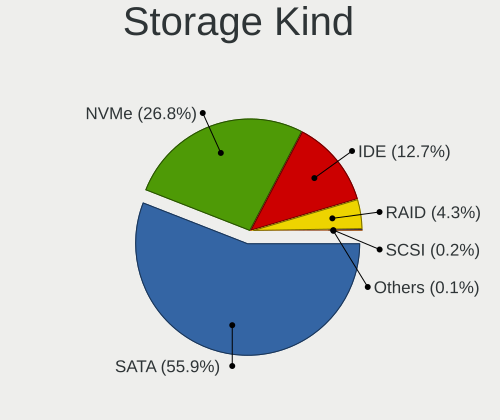

| Kind | Computers | Percent |
|------|-----------|---------|
| SATA | 830       | 55.93%  |
| NVMe | 397       | 26.75%  |
| IDE  | 189       | 12.74%  |
| RAID | 64        | 4.31%   |
| SCSI | 3         | 0.2%    |
| SAS  | 1         | 0.07%   |

Processor
---------

CPU Vendor
----------

Processor vendors

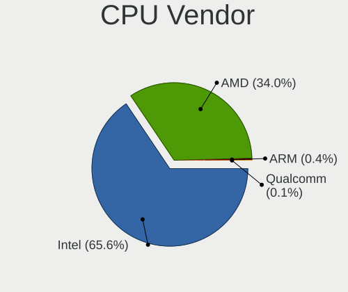

| Vendor   | Computers | Percent |
|----------|-----------|---------|
| Intel    | 747       | 65.58%  |
| AMD      | 387       | 33.98%  |
| ARM      | 4         | 0.35%   |
| Qualcomm | 1         | 0.09%   |

CPU Model
---------

Processor models

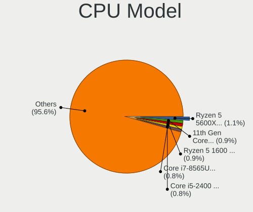

| Model                                         | Computers | Percent |
|-----------------------------------------------|-----------|---------|
| AMD Ryzen 5 5600X 6-Core Processor            | 12        | 1.05%   |
| Intel 11th Gen Core i5-1135G7 @ 2.40GHz       | 10        | 0.88%   |
| AMD Ryzen 5 1600 Six-Core Processor           | 10        | 0.88%   |
| Intel Core i7-8565U CPU @ 1.80GHz             | 9         | 0.79%   |
| Intel Core i5-2400 CPU @ 3.10GHz              | 9         | 0.79%   |
| Intel Core i5-1035G1 CPU @ 1.00GHz            | 9         | 0.79%   |
| Intel Core i7-8550U CPU @ 1.80GHz             | 8         | 0.7%    |
| Intel Core i3-6006U CPU @ 2.00GHz             | 7         | 0.61%   |
| Intel Core i3-5005U CPU @ 2.00GHz             | 7         | 0.61%   |
| Intel Celeron CPU N3350 @ 1.10GHz             | 7         | 0.61%   |
| Intel Celeron CPU N3060 @ 1.60GHz             | 7         | 0.61%   |
| Intel 11th Gen Core i7-1165G7 @ 2.80GHz       | 7         | 0.61%   |
| AMD Ryzen 9 5900X 12-Core Processor           | 7         | 0.61%   |
| AMD Ryzen 5 5600G with Radeon Graphics        | 7         | 0.61%   |
| AMD Ryzen 5 3600 6-Core Processor             | 7         | 0.61%   |
| AMD Ryzen 5 3500U with Radeon Vega Mobile Gfx | 7         | 0.61%   |
| AMD Ryzen 5 2500U with Radeon Vega Mobile Gfx | 7         | 0.61%   |
| Intel Core i7-8750H CPU @ 2.20GHz             | 6         | 0.53%   |
| Intel Core i7-6500U CPU @ 2.50GHz             | 6         | 0.53%   |
| Intel Core i7-3770 CPU @ 3.40GHz              | 6         | 0.53%   |
| Intel Core i5-7200U CPU @ 2.50GHz             | 6         | 0.53%   |
| AMD Ryzen 7 7730U with Radeon Graphics        | 6         | 0.53%   |
| AMD Ryzen 7 4700U with Radeon Graphics        | 6         | 0.53%   |
| AMD Ryzen 5 2400G with Radeon Vega Graphics   | 6         | 0.53%   |
| AMD Ryzen 3 3200G with Radeon Vega Graphics   | 6         | 0.53%   |
| AMD FX-6300 Six-Core Processor                | 6         | 0.53%   |
| Intel Pentium Silver N5030 CPU @ 1.10GHz      | 5         | 0.44%   |
| Intel Pentium CPU N4200 @ 1.10GHz             | 5         | 0.44%   |
| Intel Core i7-7700HQ CPU @ 2.80GHz            | 5         | 0.44%   |
| Intel Core i7-6600U CPU @ 2.60GHz             | 5         | 0.44%   |
| Intel Core i7-2670QM CPU @ 2.20GHz            | 5         | 0.44%   |
| Intel Core i7-10750H CPU @ 2.60GHz            | 5         | 0.44%   |
| Intel Core i5-8350U CPU @ 1.70GHz             | 5         | 0.44%   |
| Intel Core i5-7300U CPU @ 2.60GHz             | 5         | 0.44%   |
| Intel Core i5-6300U CPU @ 2.40GHz             | 5         | 0.44%   |
| Intel Core i5-6200U CPU @ 2.30GHz             | 5         | 0.44%   |
| Intel Core i5-5200U CPU @ 2.20GHz             | 5         | 0.44%   |
| Intel Core i3-8100 CPU @ 3.60GHz              | 5         | 0.44%   |
| Intel Core i3-4160 CPU @ 3.60GHz              | 5         | 0.44%   |
| Intel Core i3-2120 CPU @ 3.30GHz              | 5         | 0.44%   |

CPU Model Family
----------------

Processor model prefix

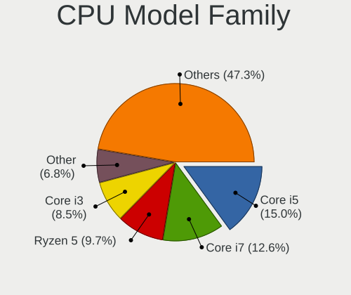

| Model                   | Computers | Percent |
|-------------------------|-----------|---------|
| Intel Core i5           | 171       | 14.99%  |
| Intel Core i7           | 144       | 12.62%  |
| AMD Ryzen 5             | 111       | 9.73%   |
| Intel Core i3           | 97        | 8.5%    |
| Other                   | 78        | 6.84%   |
| AMD Ryzen 7             | 66        | 5.78%   |
| Intel Celeron           | 64        | 5.61%   |
| Intel Core 2 Duo        | 56        | 4.91%   |
| Intel Pentium           | 49        | 4.29%   |
| AMD Ryzen 3             | 29        | 2.54%   |
| Intel Xeon              | 21        | 1.84%   |
| AMD FX                  | 20        | 1.75%   |
| AMD Ryzen 9             | 19        | 1.67%   |
| Intel Pentium Dual-Core | 12        | 1.05%   |
| AMD Phenom II X4        | 12        | 1.05%   |
| AMD Athlon II X2        | 11        | 0.96%   |
| Intel Core 2 Quad       | 10        | 0.88%   |
| Intel Atom              | 10        | 0.88%   |
| AMD Ryzen 5 PRO         | 10        | 0.88%   |
| AMD Athlon X4           | 10        | 0.88%   |
| AMD A4                  | 10        | 0.88%   |
| AMD A8                  | 9         | 0.79%   |
| Intel Core              | 8         | 0.7%    |
| AMD Athlon 64 X2        | 8         | 0.7%    |
| Intel Pentium Silver    | 7         | 0.61%   |
| AMD Athlon              | 7         | 0.61%   |
| Intel Core 2            | 6         | 0.53%   |
| AMD Athlon II X4        | 6         | 0.53%   |
| AMD A6                  | 6         | 0.53%   |
| Intel Pentium Gold      | 5         | 0.44%   |
| AMD E2                  | 5         | 0.44%   |
| AMD Athlon II X3        | 5         | 0.44%   |
| Intel Pentium Dual      | 4         | 0.35%   |
| AMD Athlon II           | 4         | 0.35%   |
| AMD A10                 | 4         | 0.35%   |
| Intel Pentium M         | 3         | 0.26%   |
| Intel Core i9           | 3         | 0.26%   |
| AMD Ryzen 3 PRO         | 3         | 0.26%   |
| AMD Phenom II X6        | 3         | 0.26%   |
| AMD E1                  | 3         | 0.26%   |

CPU Cores
---------

Number of processor cores

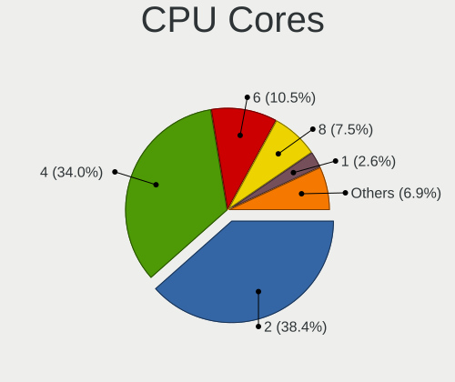

| Number  | Computers | Percent |
|---------|-----------|---------|
| 2       | 439       | 38.44%  |
| 4       | 388       | 33.98%  |
| 6       | 120       | 10.51%  |
| 8       | 86        | 7.53%   |
| 1       | 30        | 2.63%   |
| 12      | 17        | 1.49%   |
| 10      | 17        | 1.49%   |
| 16      | 15        | 1.31%   |
| 14      | 13        | 1.14%   |
| 3       | 11        | 0.96%   |
| 24      | 2         | 0.18%   |
| Unknown | 2         | 0.18%   |
| 32      | 1         | 0.09%   |
| 5       | 1         | 0.09%   |

CPU Sockets
-----------

Number of sockets

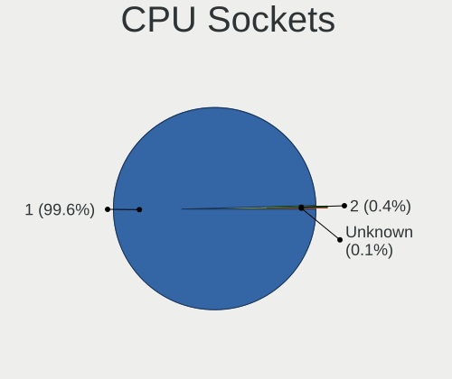

| Number  | Computers | Percent |
|---------|-----------|---------|
| 1       | 1134      | 99.56%  |
| 2       | 4         | 0.35%   |
| Unknown | 1         | 0.09%   |

CPU Threads
-----------

Threads per core (Hyper-Threading)

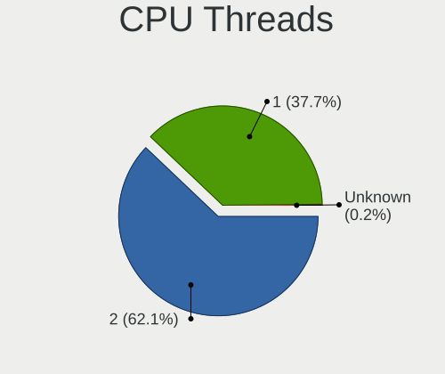

| Number  | Computers | Percent |
|---------|-----------|---------|
| 2       | 709       | 62.08%  |
| 1       | 431       | 37.74%  |
| Unknown | 2         | 0.18%   |

CPU Op-Modes
------------

CPU Operation Modes (32-bit, 64-bit)

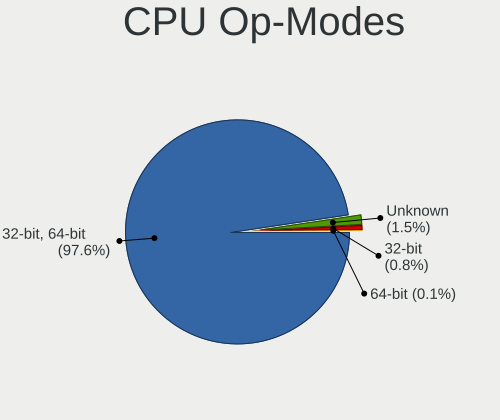

| Op mode        | Computers | Percent |
|----------------|-----------|---------|
| 32-bit, 64-bit | 1113      | 97.63%  |
| Unknown        | 17        | 1.49%   |
| 32-bit         | 9         | 0.79%   |
| 64-bit         | 1         | 0.09%   |

CPU Microcode
-------------

Microcode number

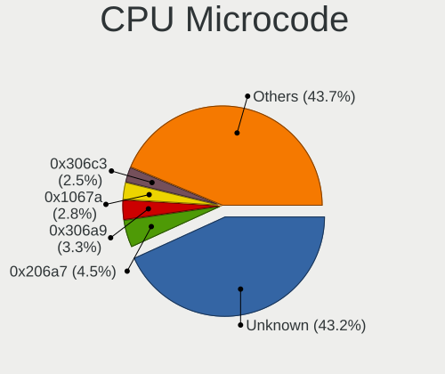

| Number     | Computers | Percent |
|------------|-----------|---------|
| Unknown    | 518       | 43.2%   |
| 0x206a7    | 54        | 4.5%    |
| 0x306a9    | 39        | 3.25%   |
| 0x1067a    | 34        | 2.84%   |
| 0x306c3    | 30        | 2.5%    |
| 0x406e3    | 21        | 1.75%   |
| 0x906ea    | 18        | 1.5%    |
| 0x806ea    | 18        | 1.5%    |
| 0x08108109 | 18        | 1.5%    |
| 0x0800820d | 17        | 1.42%   |
| 0x6fd      | 15        | 1.25%   |
| 0x010000c8 | 15        | 1.25%   |
| 0x906e9    | 14        | 1.17%   |
| 0x806ec    | 13        | 1.08%   |
| 0x506e3    | 12        | 1%      |
| 0x506c9    | 12        | 1%      |
| 0x40651    | 12        | 1%      |
| 0x06001119 | 12        | 1%      |
| 0x806e9    | 11        | 0.92%   |
| 0x706e5    | 11        | 0.92%   |
| 0x10676    | 11        | 0.92%   |
| 0x306d4    | 10        | 0.83%   |
| 0x0a50000c | 10        | 0.83%   |
| 0x806c1    | 9         | 0.75%   |
| 0x406c4    | 9         | 0.75%   |
| 0x0a50000d | 9         | 0.75%   |
| 0x08101016 | 8         | 0.67%   |
| 0x30678    | 7         | 0.58%   |
| 0x20655    | 7         | 0.58%   |
| 0x08701021 | 7         | 0.58%   |
| 0x08600106 | 7         | 0.58%   |
| 0x08108102 | 7         | 0.58%   |
| 0x806eb    | 6         | 0.5%    |
| 0x6fb      | 6         | 0.5%    |
| 0x20652    | 6         | 0.5%    |
| 0x106e5    | 6         | 0.5%    |
| 0x06003106 | 6         | 0.5%    |
| 0xa0652    | 5         | 0.42%   |
| 0x706a8    | 5         | 0.42%   |
| 0x08608103 | 5         | 0.42%   |

CPU Microarch
-------------

Microarchitecture

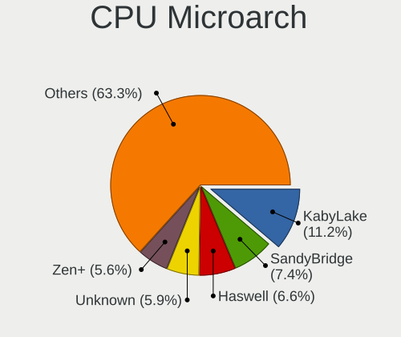

| Name              | Computers | Percent |
|-------------------|-----------|---------|
| KabyLake          | 128       | 11.22%  |
| SandyBridge       | 85        | 7.45%   |
| Haswell           | 75        | 6.57%   |
| Unknown           | 67        | 5.87%   |
| Zen+              | 64        | 5.61%   |
| Penryn            | 63        | 5.52%   |
| Zen 3             | 61        | 5.35%   |
| IvyBridge         | 60        | 5.26%   |
| Skylake           | 51        | 4.47%   |
| K10               | 51        | 4.47%   |
| Zen 2             | 41        | 3.59%   |
| Zen               | 37        | 3.24%   |
| Piledriver        | 37        | 3.24%   |
| Core              | 34        | 2.98%   |
| Silvermont        | 33        | 2.89%   |
| Alderlake Hybrid  | 33        | 2.89%   |
| Westmere          | 27        | 2.37%   |
| TigerLake         | 24        | 2.1%    |
| Broadwell         | 22        | 1.93%   |
| Icelake           | 20        | 1.75%   |
| Goldmont          | 15        | 1.31%   |
| Nehalem           | 14        | 1.23%   |
| Goldmont plus     | 12        | 1.05%   |
| K8 Hammer         | 11        | 0.96%   |
| CometLake         | 10        | 0.88%   |
| Steamroller       | 9         | 0.79%   |
| Jaguar            | 8         | 0.7%    |
| Puma              | 7         | 0.61%   |
| P6                | 7         | 0.61%   |
| Bonnell           | 6         | 0.53%   |
| Excavator         | 5         | 0.44%   |
| Bobcat            | 5         | 0.44%   |
| Tremont           | 4         | 0.35%   |
| Meteorlake Hybrid | 4         | 0.35%   |
| K8 & K10 hybrid   | 3         | 0.26%   |
| NetBurst          | 2         | 0.18%   |
| K10 Llano         | 2         | 0.18%   |
| Bulldozer         | 2         | 0.18%   |
| Lunarlake Hybrid  | 1         | 0.09%   |
| Gracemont         | 1         | 0.09%   |

Graphics
--------

GPU Vendor
----------

Vendors of graphics cards

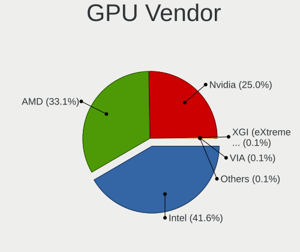

| Vendor                                       | Computers | Percent |
|----------------------------------------------|-----------|---------|
| Intel                                        | 555       | 41.6%   |
| AMD                                          | 442       | 33.13%  |
| Nvidia                                       | 333       | 24.96%  |
| XGI Technology (eXtreme Graphics Innovation) | 1         | 0.07%   |
| VIA Technologies                             | 1         | 0.07%   |
| Matrox Electronics Systems                   | 1         | 0.07%   |
| ASPEED Technology                            | 1         | 0.07%   |

GPU Model
---------

Graphics card models

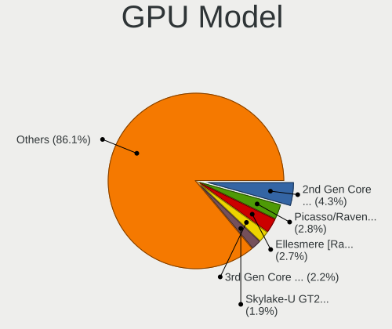

| Model                                                                                    | Computers | Percent |
|------------------------------------------------------------------------------------------|-----------|---------|
| Intel 2nd Generation Core Processor Family Integrated Graphics Controller                | 60        | 4.33%   |
| AMD Picasso/Raven 2 [Radeon Vega Series / Radeon Vega Mobile Series]                     | 39        | 2.81%   |
| AMD Ellesmere [Radeon RX 470/480/570/570X/580/580X/590]                                  | 38        | 2.74%   |
| Intel 3rd Gen Core processor Graphics Controller                                         | 30        | 2.16%   |
| Intel Skylake-U GT2 [HD Graphics 520]                                                    | 26        | 1.87%   |
| AMD Renoir [Radeon Vega Series / Radeon Vega Mobile Series]                              | 22        | 1.59%   |
| Intel TigerLake-LP GT2 [Iris Xe Graphics]                                                | 21        | 1.51%   |
| Intel Kaby Lake-R GT2 [UHD Graphics 620]                                                 | 21        | 1.51%   |
| Intel WhiskeyLake-U GT2 [UHD Graphics 620]                                               | 19        | 1.37%   |
| Intel Haswell-ULT Integrated Graphics Controller                                         | 18        | 1.3%    |
| Intel Broadwell-U GT2 [HD Graphics 5500]                                                 | 18        | 1.3%    |
| Intel Atom/Celeron/Pentium Processor x5-E8000/J3xxx/N3xxx Integrated Graphics Controller | 18        | 1.3%    |
| AMD Raven Ridge [Radeon Vega Series / Radeon Vega Mobile Series]                         | 17        | 1.23%   |
| AMD Cezanne [Radeon Vega Series / Radeon Vega Mobile Series]                             | 17        | 1.23%   |
| Intel Kaby Lake-U GT2 [HD Graphics 620]                                                  | 16        | 1.15%   |
| Intel Core Processor Integrated Graphics Controller                                      | 16        | 1.15%   |
| Intel 4th Gen Core Processor Integrated Graphics Controller                              | 15        | 1.08%   |
| Intel Atom Processor Z36xxx/Z37xxx Series Graphics & Display                             | 14        | 1.01%   |
| AMD Barcelo                                                                              | 14        | 1.01%   |
| Nvidia GP107M [GeForce GTX 1050 Mobile]                                                  | 12        | 0.87%   |
| Intel Xeon E3-1200 v3/4th Gen Core Processor Integrated Graphics Controller              | 12        | 0.87%   |
| Intel Iris Plus Graphics G1 (Ice Lake)                                                   | 12        | 0.87%   |
| Intel CoffeeLake-H GT2 [UHD Graphics 630]                                                | 12        | 0.87%   |
| AMD Lucienne                                                                             | 12        | 0.87%   |
| Intel Xeon E3-1200 v2/3rd Gen Core processor Graphics Controller                         | 10        | 0.72%   |
| Intel Raptor Lake-P [Iris Xe Graphics]                                                   | 10        | 0.72%   |
| Intel Mobile 4 Series Chipset Integrated Graphics Controller                             | 10        | 0.72%   |
| Intel CometLake-U GT2 [UHD Graphics]                                                     | 10        | 0.72%   |
| Intel CoffeeLake-S GT2 [UHD Graphics 630]                                                | 10        | 0.72%   |
| Intel Apollo Lake GT1 [HD Graphics 500]                                                  | 10        | 0.72%   |
| AMD Oland PRO [Radeon R7 240/340 / Radeon 520]                                           | 10        | 0.72%   |
| AMD Cedar [Radeon HD 5000/6000/7350/8350 Series]                                         | 10        | 0.72%   |
| Intel Mobile GM965/GL960 Integrated Graphics Controller (secondary)                      | 9         | 0.65%   |
| Intel Mobile GM965/GL960 Integrated Graphics Controller (primary)                        | 9         | 0.65%   |
| Intel 4th Generation Core Processor Family Integrated Graphics Controller                | 9         | 0.65%   |
| AMD Turks PRO [Radeon HD 6570/7570/8550 / R5 230]                                        | 9         | 0.65%   |
| AMD Sun XT [Radeon HD 8670A/8670M/8690M / R5 M330 / M430 / Radeon 520 Mobile]            | 9         | 0.65%   |
| AMD RS880M [Mobility Radeon HD 4225/4250]                                                | 9         | 0.65%   |
| AMD Navi 23 [Radeon RX 6600/6600 XT/6600M]                                               | 9         | 0.65%   |
| AMD Lexa PRO [Radeon 540/540X/550/550X / RX 540X/550/550X]                               | 9         | 0.65%   |

GPU Combo
---------

Combinations of graphics cards

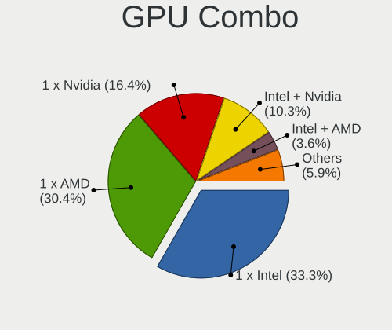

| Name           | Computers | Percent |
|----------------|-----------|---------|
| 1 x Intel      | 383       | 33.3%   |
| 1 x AMD        | 350       | 30.43%  |
| 1 x Nvidia     | 189       | 16.43%  |
| Intel + Nvidia | 119       | 10.35%  |
| Intel + AMD    | 41        | 3.57%   |
| 2 x AMD        | 28        | 2.43%   |
| AMD + Nvidia   | 22        | 1.91%   |
| Other          | 6         | 0.52%   |
| 2 x Intel      | 5         | 0.43%   |
| 2 x Nvidia     | 3         | 0.26%   |
| 1 x VIA        | 1         | 0.09%   |
| Nvidia + XGI   | 1         | 0.09%   |
| 1 x Matrox     | 1         | 0.09%   |
| 1 x ASPEED     | 1         | 0.09%   |

GPU Driver
----------

Free vs proprietary

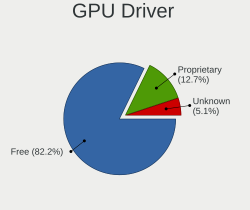

| Driver      | Computers | Percent |
|-------------|-----------|---------|
| Free        | 954       | 82.24%  |
| Proprietary | 147       | 12.67%  |
| Unknown     | 59        | 5.09%   |

GPU Memory
----------

Total video memory

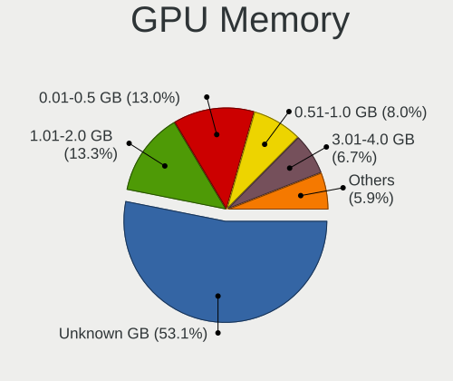

| Size in GB | Computers | Percent |
|------------|-----------|---------|
| Unknown    | 630       | 53.12%  |
| 1.01-2.0   | 158       | 13.32%  |
| 0.01-0.5   | 154       | 12.98%  |
| 0.51-1.0   | 95        | 8.01%   |
| 3.01-4.0   | 79        | 6.66%   |
| 7.01-8.0   | 39        | 3.29%   |
| 8.01-16.0  | 14        | 1.18%   |
| 5.01-6.0   | 13        | 1.1%    |
| 2.01-3.0   | 4         | 0.34%   |

Monitor
-------

Monitor Vendor
--------------

Monitor vendors

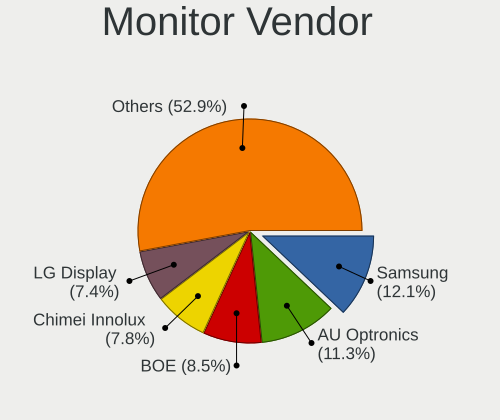

| Vendor                  | Computers | Percent |
|-------------------------|-----------|---------|
| Samsung Electronics     | 151       | 12.07%  |
| AU Optronics            | 141       | 11.27%  |
| BOE                     | 106       | 8.47%   |
| Chimei Innolux          | 98        | 7.83%   |
| LG Display              | 93        | 7.43%   |
| Dell                    | 86        | 6.87%   |
| Goldstar                | 79        | 6.31%   |
| Philips                 | 67        | 5.36%   |
| Lenovo                  | 42        | 3.36%   |
| Hewlett-Packard         | 36        | 2.88%   |
| BenQ                    | 29        | 2.32%   |
| Acer                    | 28        | 2.24%   |
| AOC                     | 27        | 2.16%   |
| Ancor Communications    | 25        | 2%      |
| ASUSTek Computer        | 20        | 1.6%    |
| Apple                   | 20        | 1.6%    |
| Chi Mei Optoelectronics | 19        | 1.52%   |
| ViewSonic               | 18        | 1.44%   |
| PANDA                   | 12        | 0.96%   |
| Sharp                   | 11        | 0.88%   |
| Unknown                 | 9         | 0.72%   |
| LG Electronics          | 8         | 0.64%   |
| InfoVision              | 8         | 0.64%   |
| Sony                    | 7         | 0.56%   |
| Toshiba                 | 6         | 0.48%   |
| LG Philips              | 6         | 0.48%   |
| Gigabyte Technology     | 6         | 0.48%   |
| CHD                     | 6         | 0.48%   |
| Belinea                 | 6         | 0.48%   |
| Fujitsu Siemens         | 5         | 0.4%    |
| Vestel Elektronik       | 4         | 0.32%   |
| RTK                     | 4         | 0.32%   |
| OEM                     | 4         | 0.32%   |
| Iiyama                  | 4         | 0.32%   |
| CSO                     | 4         | 0.32%   |
| CPT                     | 4         | 0.32%   |
| KTC                     | 3         | 0.24%   |
| Hitachi                 | 3         | 0.24%   |
| HIC                     | 3         | 0.24%   |
| SUNNY                   | 2         | 0.16%   |

Monitor Model
-------------

Monitor models

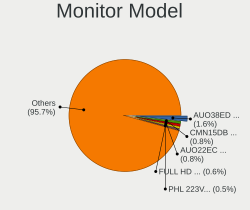

| Model                                                                    | Computers | Percent |
|--------------------------------------------------------------------------|-----------|---------|
| AU Optronics LCD Monitor AUO38ED 1920x1080 344x193mm 15.5-inch           | 21        | 1.62%   |
| Chimei Innolux LCD Monitor CMN15DB 1366x768 344x193mm 15.5-inch          | 10        | 0.77%   |
| AU Optronics LCD Monitor AUO22EC 1366x768 344x193mm 15.5-inch            | 10        | 0.77%   |
| Goldstar FULL HD GSM5B55 1920x1080 480x270mm 21.7-inch                   | 8         | 0.62%   |
| Philips PHL 223V5 PHLC0CF 1920x1080 477x268mm 21.5-inch                  | 7         | 0.54%   |
| Chimei Innolux LCD Monitor CMN15D5 1920x1080 344x193mm 15.5-inch         | 7         | 0.54%   |
| Chimei Innolux LCD Monitor CMN14D4 1920x1080 309x173mm 13.9-inch         | 7         | 0.54%   |
| Philips PHL 273V7 PHLC156 1920x1080 598x336mm 27.0-inch                  | 6         | 0.46%   |
| Philips PHL 226E9Q PHLC17D 1920x1080 480x270mm 21.7-inch                 | 6         | 0.46%   |
| Chimei Innolux LCD Monitor CMN15E7 1920x1080 344x193mm 15.5-inch         | 6         | 0.46%   |
| BOE LCD Monitor BOE0812 1920x1080 344x194mm 15.5-inch                    | 6         | 0.46%   |
| BOE LCD Monitor BOE06A4 1366x768 344x194mm 15.5-inch                     | 6         | 0.46%   |
| Unknown LCD Monitor FFFF 2288x1287 2550x2550mm 142.0-inch                | 5         | 0.39%   |
| Philips PHL 243V5 PHLC0D1 1920x1080 521x293mm 23.5-inch                  | 5         | 0.39%   |
| PANDA LCD Monitor NCP004D 1920x1080 344x194mm 15.5-inch                  | 5         | 0.39%   |
| LG Display LCD Monitor LGD02DC 1366x768 344x194mm 15.5-inch              | 5         | 0.39%   |
| Dell P2419H DELD0DA 1920x1080 527x296mm 23.8-inch                        | 5         | 0.39%   |
| Chimei Innolux LCD Monitor CMN15F5 1920x1080 344x193mm 15.5-inch         | 5         | 0.39%   |
| AU Optronics LCD Monitor AUO26EC 1366x768 344x193mm 15.5-inch            | 5         | 0.39%   |
| Vestel Elektronik 40UHD_LCD_TV VES3700 3840x2160 880x500mm 39.8-inch     | 4         | 0.31%   |
| Toshiba TV TSB0108 1920x1080 698x393mm 31.5-inch                         | 4         | 0.31%   |
| Samsung Electronics LCD Monitor SDC4161 1920x1080 344x194mm 15.5-inch    | 4         | 0.31%   |
| Philips PHL 328P6A PHL0913 2560x1440 698x393mm 31.5-inch                 | 4         | 0.31%   |
| Goldstar W2240 GSM57A0 1920x1080 477x268mm 21.5-inch                     | 4         | 0.31%   |
| Goldstar LG IPS FULLHD GSM5AB8 1920x1080 480x270mm 21.7-inch             | 4         | 0.31%   |
| Dell P2417H DELA0DC 1920x1080 527x296mm 23.8-inch                        | 4         | 0.31%   |
| Chimei Innolux LCD Monitor CMN15CA 1366x768 344x193mm 15.5-inch          | 4         | 0.31%   |
| Chi Mei Optoelectronics LCD Monitor CMO15A7 1366x768 344x193mm 15.5-inch | 4         | 0.31%   |
| BOE LCD Monitor BOE069C 1920x1080 344x193mm 15.5-inch                    | 4         | 0.31%   |
| BOE LCD Monitor BOE0687 1920x1080 344x193mm 15.5-inch                    | 4         | 0.31%   |
| BOE LCD Monitor BOE0675 1366x768 344x194mm 15.5-inch                     | 4         | 0.31%   |
| AU Optronics LCD Monitor AUO312C 1366x768 293x164mm 13.2-inch            | 4         | 0.31%   |
| AU Optronics LCD Monitor AUO20EC 1366x768 344x193mm 15.5-inch            | 4         | 0.31%   |
| AU Optronics LCD Monitor AUO1B3D 1920x1080 309x173mm 13.9-inch           | 4         | 0.31%   |
| AOC 32G2WG3 AOC3202 1920x1080 698x393mm 31.5-inch                        | 4         | 0.31%   |
| Samsung Electronics SyncMaster SAM0564 1360x768 410x230mm 18.5-inch      | 3         | 0.23%   |
| Samsung Electronics SyncMaster SAM01B7 1280x1024 340x270mm 17.1-inch     | 3         | 0.23%   |
| Samsung Electronics S24F350 SAM0D20 1920x1080 521x293mm 23.5-inch        | 3         | 0.23%   |
| Samsung Electronics S22B300 SAM08AA 1920x1080 477x268mm 21.5-inch        | 3         | 0.23%   |
| Samsung Electronics LCD Monitor SEC544B 1600x900 382x214mm 17.2-inch     | 3         | 0.23%   |

Monitor Resolution
------------------

Monitor screen resolution

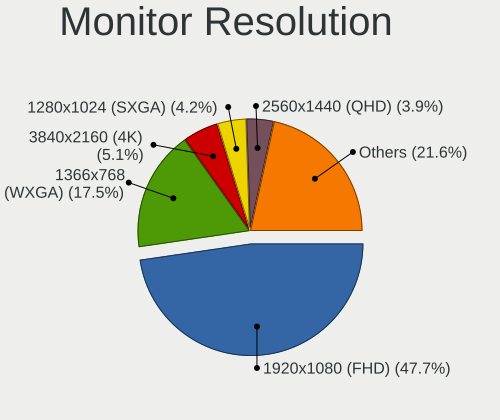

| Resolution         | Computers | Percent |
|--------------------|-----------|---------|
| 1920x1080 (FHD)    | 568       | 47.69%  |
| 1366x768 (WXGA)    | 208       | 17.46%  |
| 3840x2160 (4K)     | 61        | 5.12%   |
| 1280x1024 (SXGA)   | 50        | 4.2%    |
| 2560x1440 (QHD)    | 47        | 3.95%   |
| 1920x1200 (WUXGA)  | 39        | 3.27%   |
| 1680x1050 (WSXGA+) | 33        | 2.77%   |
| 1280x800 (WXGA)    | 27        | 2.27%   |
| 1440x900 (WXGA+)   | 25        | 2.1%    |
| 1600x900 (HD+)     | 22        | 1.85%   |
| 2560x1600          | 12        | 1.01%   |
| 2880x1800          | 10        | 0.84%   |
| 1360x768           | 9         | 0.76%   |
| Unknown            | 9         | 0.76%   |
| 1920x540           | 8         | 0.67%   |
| 2560x1080          | 7         | 0.59%   |
| 3840x1080          | 6         | 0.5%    |
| 3440x1440          | 5         | 0.42%   |
| 2288x1287          | 5         | 0.42%   |
| 1024x768 (XGA)     | 4         | 0.34%   |
| 1024x600           | 4         | 0.34%   |
| 2520x1680          | 3         | 0.25%   |
| 1600x1200          | 3         | 0.25%   |
| 1280x720 (HD)      | 3         | 0.25%   |
| 3840x2400          | 2         | 0.17%   |
| 3200x2000          | 2         | 0.17%   |
| 2880x1920          | 2         | 0.17%   |
| 1680x945           | 2         | 0.17%   |
| 1400x1050          | 2         | 0.17%   |
| 7680x2160          | 1         | 0.08%   |
| 4096x2304          | 1         | 0.08%   |
| 3456x2160          | 1         | 0.08%   |
| 3360x1200          | 1         | 0.08%   |
| 3280x1080          | 1         | 0.08%   |
| 3200x1800 (QHD+)   | 1         | 0.08%   |
| 3072x1920          | 1         | 0.08%   |
| 2880x1620          | 1         | 0.08%   |
| 2240x1400          | 1         | 0.08%   |
| 2160x1350          | 1         | 0.08%   |
| 1920x1280          | 1         | 0.08%   |

Monitor Diagonal
----------------

Diagonal size in inches

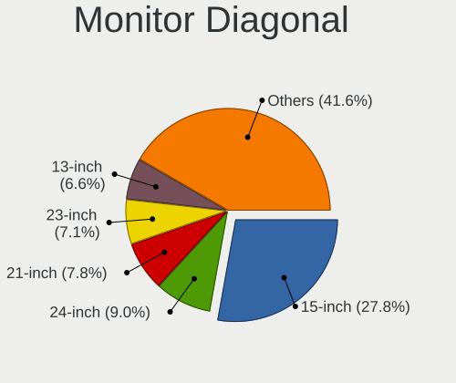

| Inches  | Computers | Percent |
|---------|-----------|---------|
| 15      | 348       | 27.82%  |
| 24      | 113       | 9.03%   |
| 21      | 98        | 7.83%   |
| 23      | 89        | 7.11%   |
| 13      | 82        | 6.55%   |
| 27      | 81        | 6.47%   |
| 14      | 76        | 6.08%   |
| 17      | 65        | 5.2%    |
| Unknown | 43        | 3.44%   |
| 31      | 31        | 2.48%   |
| 19      | 31        | 2.48%   |
| 18      | 30        | 2.4%    |
| 22      | 25        | 2%      |
| 16      | 24        | 1.92%   |
| 12      | 21        | 1.68%   |
| 34      | 10        | 0.8%    |
| 20      | 10        | 0.8%    |
| 72      | 9         | 0.72%   |
| 84      | 8         | 0.64%   |
| 11      | 7         | 0.56%   |
| 142     | 5         | 0.4%    |
| 32      | 5         | 0.4%    |
| 26      | 5         | 0.4%    |
| 52      | 4         | 0.32%   |
| 46      | 4         | 0.32%   |
| 40      | 4         | 0.32%   |
| 54      | 3         | 0.24%   |
| 10      | 3         | 0.24%   |
| 48      | 2         | 0.16%   |
| 43      | 2         | 0.16%   |
| 25      | 2         | 0.16%   |
| 8       | 2         | 0.16%   |
| 86      | 1         | 0.08%   |
| 65      | 1         | 0.08%   |
| 64      | 1         | 0.08%   |
| 63      | 1         | 0.08%   |
| 47      | 1         | 0.08%   |
| 42      | 1         | 0.08%   |
| 39      | 1         | 0.08%   |
| 33      | 1         | 0.08%   |

Monitor Width
-------------

Physical width

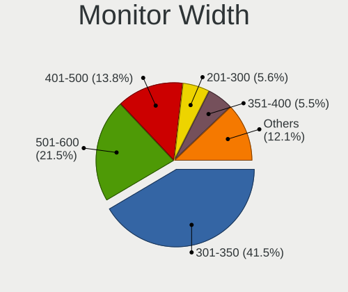

| Width in mm    | Computers | Percent |
|----------------|-----------|---------|
| 301-350        | 510       | 41.5%   |
| 501-600        | 264       | 21.48%  |
| 401-500        | 170       | 13.83%  |
| 201-300        | 69        | 5.61%   |
| 351-400        | 67        | 5.45%   |
| Unknown        | 43        | 3.5%    |
| 601-700        | 40        | 3.25%   |
| 1001-1500      | 18        | 1.46%   |
| 1501-2000      | 17        | 1.38%   |
| 701-800        | 16        | 1.3%    |
| More than 2000 | 5         | 0.41%   |
| 801-900        | 5         | 0.41%   |
| 901-1000       | 3         | 0.24%   |
| 101-200        | 2         | 0.16%   |

Aspect Ratio
------------

Proportional relationship between the width and the height

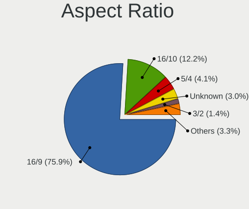

| Ratio   | Computers | Percent |
|---------|-----------|---------|
| 16/9    | 852       | 75.94%  |
| 16/10   | 137       | 12.21%  |
| 5/4     | 46        | 4.1%    |
| Unknown | 34        | 3.03%   |
| 3/2     | 16        | 1.43%   |
| 4/3     | 15        | 1.34%   |
| 21/9    | 11        | 0.98%   |
| 1.00    | 5         | 0.45%   |
| 32/9    | 3         | 0.27%   |
| 6/5     | 1         | 0.09%   |
| 0.63    | 1         | 0.09%   |
| 0.56    | 1         | 0.09%   |

Monitor Area
------------

Area in inch²

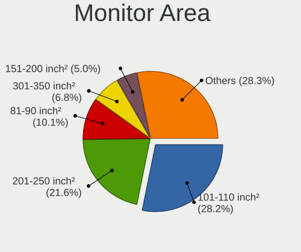

| Area in inch² | Computers | Percent |
|----------------|-----------|---------|
| 101-110        | 348       | 28.18%  |
| 201-250        | 267       | 21.62%  |
| 81-90          | 125       | 10.12%  |
| 301-350        | 84        | 6.8%    |
| 151-200        | 62        | 5.02%   |
| 141-150        | 50        | 4.05%   |
| 351-500        | 47        | 3.81%   |
| Unknown        | 43        | 3.48%   |
| 121-130        | 36        | 2.91%   |
| More than 1000 | 33        | 2.67%   |
| 251-300        | 33        | 2.67%   |
| 71-80          | 32        | 2.59%   |
| 111-120        | 24        | 1.94%   |
| 61-70          | 17        | 1.38%   |
| 501-1000       | 15        | 1.21%   |
| 51-60          | 7         | 0.57%   |
| 91-100         | 4         | 0.32%   |
| 41-50          | 3         | 0.24%   |
| 131-140        | 3         | 0.24%   |
| 1-40           | 2         | 0.16%   |

Pixel Density
-------------

Pixels per inch

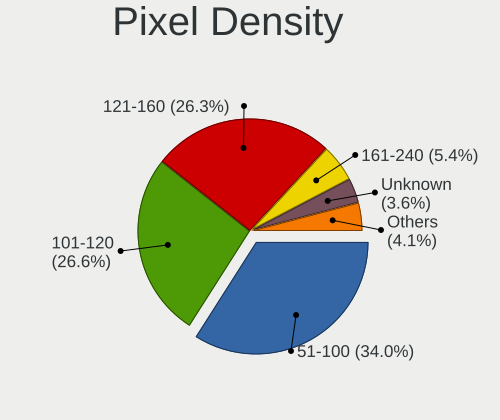

| Density       | Computers | Percent |
|---------------|-----------|---------|
| 51-100        | 408       | 34.03%  |
| 101-120       | 319       | 26.61%  |
| 121-160       | 315       | 26.27%  |
| 161-240       | 65        | 5.42%   |
| Unknown       | 43        | 3.59%   |
| 1-50          | 30        | 2.5%    |
| More than 240 | 19        | 1.58%   |

Multiple Monitors
-----------------

Total monitors connected

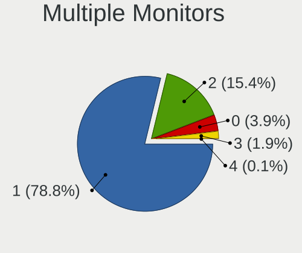

| Total | Computers | Percent |
|-------|-----------|---------|
| 1     | 928       | 78.78%  |
| 2     | 181       | 15.37%  |
| 0     | 46        | 3.9%    |
| 3     | 22        | 1.87%   |
| 4     | 1         | 0.08%   |

Network
-------

Net Controller Vendor
---------------------

Controller vendors

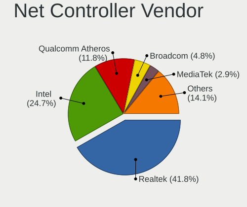

| Vendor                            | Computers | Percent |
|-----------------------------------|-----------|---------|
| Realtek Semiconductor             | 701       | 41.75%  |
| Intel                             | 414       | 24.66%  |
| Qualcomm Atheros                  | 198       | 11.79%  |
| Broadcom                          | 81        | 4.82%   |
| MediaTek                          | 49        | 2.92%   |
| TP-Link                           | 33        | 1.97%   |
| Nvidia                            | 30        | 1.79%   |
| Ralink                            | 19        | 1.13%   |
| Ralink Technology                 | 17        | 1.01%   |
| Qualcomm Atheros Communications   | 14        | 0.83%   |
| Broadcom Limited                  | 12        | 0.71%   |
| Marvell Technology Group          | 11        | 0.66%   |
| Dell                              | 8         | 0.48%   |
| Samsung Electronics               | 7         | 0.42%   |
| Xiaomi                            | 5         | 0.3%    |
| D-Link                            | 5         | 0.3%    |
| ASUSTek Computer                  | 5         | 0.3%    |
| ASIX Electronics                  | 5         | 0.3%    |
| Sierra Wireless                   | 4         | 0.24%   |
| Ericsson Business Mobile Networks | 4         | 0.24%   |
| Edimax Technology                 | 4         | 0.24%   |
| ZTE WCDMA Technologies MSM        | 3         | 0.18%   |
| VIA Technologies                  | 3         | 0.18%   |
| Shenzhen Goodix Technology        | 3         | 0.18%   |
| Lenovo                            | 3         | 0.18%   |
| JMicron Technology                | 3         | 0.18%   |
| Huawei Technologies               | 3         | 0.18%   |
| Hewlett-Packard                   | 3         | 0.18%   |
| Qualcomm Technologies             | 2         | 0.12%   |
| OPPO Electronics                  | 2         | 0.12%   |
| Motorola PCS                      | 2         | 0.12%   |
| IMC Networks                      | 2         | 0.12%   |
| Fibocom                           | 2         | 0.12%   |
| D-Link System                     | 2         | 0.12%   |
| Aquantia                          | 2         | 0.12%   |
| ZyXEL Communications              | 1         | 0.06%   |
| Texas Instruments                 | 1         | 0.06%   |
| Sundance Technology Inc / IC Plus | 1         | 0.06%   |
| Sigma Designs                     | 1         | 0.06%   |
| Qualcomm                          | 1         | 0.06%   |

Net Controller Model
--------------------

Controller models

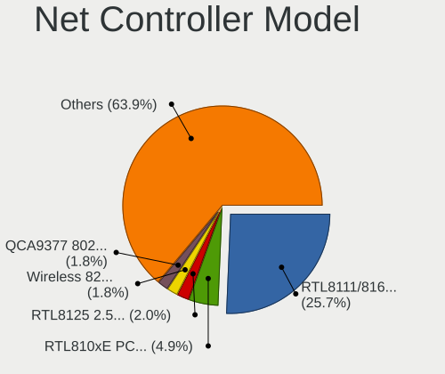

| Model                                                                  | Computers | Percent |
|------------------------------------------------------------------------|-----------|---------|
| Realtek RTL8111/8168/8211/8411 PCI Express Gigabit Ethernet Controller | 491       | 25.65%  |
| Realtek RTL810xE PCI Express Fast Ethernet controller                  | 93        | 4.86%   |
| Realtek RTL8125 2.5GbE Controller                                      | 38        | 1.99%   |
| Intel Wireless 8265 / 8275                                             | 35        | 1.83%   |
| Qualcomm Atheros QCA9377 802.11ac Wireless Network Adapter             | 34        | 1.78%   |
| Realtek RTL8821CE 802.11ac PCIe Wireless Network Adapter               | 32        | 1.67%   |
| Qualcomm Atheros QCA9565 / AR9565 Wireless Network Adapter             | 32        | 1.67%   |
| Intel 82579LM Gigabit Network Connection (Lewisville)                  | 28        | 1.46%   |
| Intel Wi-Fi 6 AX200                                                    | 25        | 1.31%   |
| Realtek RTL8822CE 802.11ac PCIe Wireless Network Adapter               | 21        | 1.1%    |
| MediaTek MT7922 802.11ax PCI Express Wireless Network Adapter          | 18        | 0.94%   |
| Realtek RTL8153 Gigabit Ethernet Adapter                               | 17        | 0.89%   |
| Qualcomm Atheros AR9485 Wireless Network Adapter                       | 17        | 0.89%   |
| Realtek RTL8723BE PCIe Wireless Network Adapter                        | 16        | 0.84%   |
| MediaTek MT7921 802.11ax PCIe Wireless Network Adapter [Filogic 330]   | 16        | 0.84%   |
| Intel Wireless 8260                                                    | 16        | 0.84%   |
| Intel Wireless 3165                                                    | 16        | 0.84%   |
| Intel Wi-Fi 6 AX201                                                    | 16        | 0.84%   |
| Broadcom BCM43142 802.11b/g/n                                          | 16        | 0.84%   |
| Qualcomm Atheros AR9285 Wireless Network Adapter (PCI-Express)         | 15        | 0.78%   |
| TP-Link TL-WN722N v2/v3 [Realtek RTL8188EUS]                           | 14        | 0.73%   |
| Intel Wireless 7260                                                    | 14        | 0.73%   |
| Intel Wi-Fi 6E(802.11ax) AX210/AX1675* 2x2 [Typhoon Peak]              | 14        | 0.73%   |
| Broadcom BCM4313 802.11bgn Wireless Network Adapter                    | 14        | 0.73%   |
| Qualcomm Atheros AR8151 v2.0 Gigabit Ethernet                          | 13        | 0.68%   |
| Intel Cannon Point-LP CNVi [Wireless-AC]                               | 13        | 0.68%   |
| Intel I211 Gigabit Network Connection                                  | 12        | 0.63%   |
| Intel Ethernet Connection (4) I219-LM                                  | 11        | 0.57%   |
| Intel Ethernet Connection (2) I219-V                                   | 11        | 0.57%   |
| Intel Centrino Advanced-N 6205 [Taylor Peak]                           | 11        | 0.57%   |
| Qualcomm Atheros QCA6174 802.11ac Wireless Network Adapter             | 10        | 0.52%   |
| Qualcomm Atheros AR9271 802.11n                                        | 10        | 0.52%   |
| Qualcomm Atheros AR9462 Wireless Network Adapter                       | 10        | 0.52%   |
| Nvidia MCP79 Ethernet                                                  | 10        | 0.52%   |
| MediaTek MT7902 802.11ax PCIe Wireless Network Adapter [Filogic 310]   | 10        | 0.52%   |
| Intel Ethernet Connection I219-LM                                      | 10        | 0.52%   |
| Intel Ethernet Connection I217-LM                                      | 10        | 0.52%   |
| Realtek RTL-8100/8101L/8139 PCI Fast Ethernet Adapter                  | 9         | 0.47%   |
| Qualcomm Atheros AR9287 Wireless Network Adapter (PCI-Express)         | 9         | 0.47%   |
| Qualcomm Atheros AR8161 Gigabit Ethernet                               | 9         | 0.47%   |

Wireless Vendor
---------------

Wireless vendors

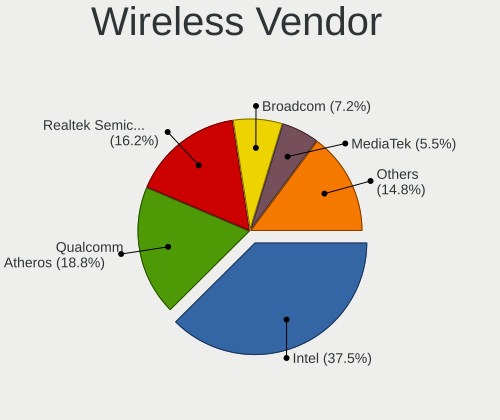

| Vendor                                | Computers | Percent |
|---------------------------------------|-----------|---------|
| Intel                                 | 309       | 37.55%  |
| Qualcomm Atheros                      | 155       | 18.83%  |
| Realtek Semiconductor                 | 133       | 16.16%  |
| Broadcom                              | 59        | 7.17%   |
| MediaTek                              | 45        | 5.47%   |
| TP-Link                               | 31        | 3.77%   |
| Ralink                                | 19        | 2.31%   |
| Ralink Technology                     | 17        | 2.07%   |
| Qualcomm Atheros Communications       | 14        | 1.7%    |
| Dell                                  | 5         | 0.61%   |
| D-Link                                | 5         | 0.61%   |
| ASUSTek Computer                      | 5         | 0.61%   |
| Sierra Wireless                       | 4         | 0.49%   |
| Edimax Technology                     | 4         | 0.49%   |
| Hewlett-Packard                       | 3         | 0.36%   |
| Broadcom Limited                      | 3         | 0.36%   |
| IMC Networks                          | 2         | 0.24%   |
| Fibocom                               | 2         | 0.24%   |
| ZyXEL Communications                  | 1         | 0.12%   |
| Qualcomm Technologies                 | 1         | 0.12%   |
| Qualcomm                              | 1         | 0.12%   |
| NetGear                               | 1         | 0.12%   |
| Mercucys                              | 1         | 0.12%   |
| Linksys                               | 1         | 0.12%   |
| D-Link System                         | 1         | 0.12%   |
| 802.11g Adapter [Linksys WUSB54GC v3] | 1         | 0.12%   |

Wireless Model
--------------

Wireless models

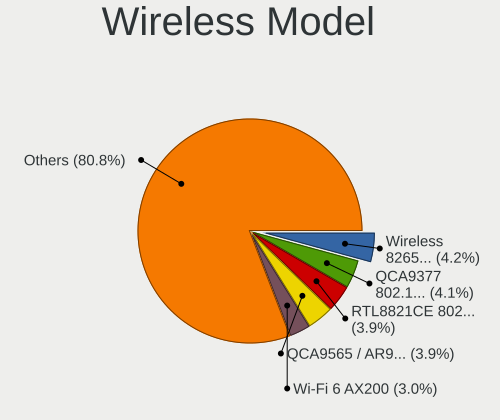

| Model                                                                | Computers | Percent |
|----------------------------------------------------------------------|-----------|---------|
| Intel Wireless 8265 / 8275                                           | 35        | 4.24%   |
| Qualcomm Atheros QCA9377 802.11ac Wireless Network Adapter           | 34        | 4.12%   |
| Realtek RTL8821CE 802.11ac PCIe Wireless Network Adapter             | 32        | 3.88%   |
| Qualcomm Atheros QCA9565 / AR9565 Wireless Network Adapter           | 32        | 3.88%   |
| Intel Wi-Fi 6 AX200                                                  | 25        | 3.03%   |
| Realtek RTL8822CE 802.11ac PCIe Wireless Network Adapter             | 21        | 2.55%   |
| Qualcomm Atheros AR9485 Wireless Network Adapter                     | 17        | 2.06%   |
| MediaTek MT7922 802.11ax PCI Express Wireless Network Adapter        | 17        | 2.06%   |
| Realtek RTL8723BE PCIe Wireless Network Adapter                      | 16        | 1.94%   |
| MediaTek MT7921 802.11ax PCIe Wireless Network Adapter [Filogic 330] | 16        | 1.94%   |
| Intel Wireless 8260                                                  | 16        | 1.94%   |
| Intel Wireless 3165                                                  | 16        | 1.94%   |
| Intel Wi-Fi 6 AX201                                                  | 16        | 1.94%   |
| Broadcom BCM43142 802.11b/g/n                                        | 16        | 1.94%   |
| Qualcomm Atheros AR9285 Wireless Network Adapter (PCI-Express)       | 15        | 1.82%   |
| TP-Link TL-WN722N v2/v3 [Realtek RTL8188EUS]                         | 14        | 1.7%    |
| Intel Wireless 7260                                                  | 14        | 1.7%    |
| Intel Wi-Fi 6E(802.11ax) AX210/AX1675* 2x2 [Typhoon Peak]            | 14        | 1.7%    |
| Broadcom BCM4313 802.11bgn Wireless Network Adapter                  | 14        | 1.7%    |
| Intel Cannon Point-LP CNVi [Wireless-AC]                             | 13        | 1.58%   |
| Intel Centrino Advanced-N 6205 [Taylor Peak]                         | 11        | 1.33%   |
| Qualcomm Atheros QCA6174 802.11ac Wireless Network Adapter           | 10        | 1.21%   |
| Qualcomm Atheros AR9271 802.11n                                      | 10        | 1.21%   |
| Qualcomm Atheros AR9462 Wireless Network Adapter                     | 10        | 1.21%   |
| MediaTek MT7902 802.11ax PCIe Wireless Network Adapter [Filogic 310] | 10        | 1.21%   |
| Qualcomm Atheros AR9287 Wireless Network Adapter (PCI-Express)       | 9         | 1.09%   |
| Intel Wireless 7265                                                  | 9         | 1.09%   |
| Intel Raptor Lake PCH CNVi WiFi                                      | 9         | 1.09%   |
| Intel Ice Lake-LP PCH CNVi WiFi                                      | 9         | 1.09%   |
| Intel Comet Lake PCH-LP CNVi WiFi                                    | 9         | 1.09%   |
| Intel Wireless 3160                                                  | 8         | 0.97%   |
| Intel Dual Band Wireless-AC 3168NGW [Stone Peak]                     | 8         | 0.97%   |
| Intel Dual Band Wireless-AC 3165 Plus Bluetooth                      | 8         | 0.97%   |
| Realtek RTL8822BE 802.11a/b/g/n/ac WiFi adapter                      | 7         | 0.85%   |
| Intel PRO/Wireless 3945ABG [Golan] Network Connection                | 7         | 0.85%   |
| Intel Comet Lake PCH CNVi WiFi                                       | 7         | 0.85%   |
| Intel Cannon Lake PCH CNVi WiFi                                      | 7         | 0.85%   |
| Realtek RTL8852BE PCIe 802.11ax Wireless Network Controller          | 6         | 0.73%   |
| Realtek RTL8821AE 802.11ac PCIe Wireless Network Adapter             | 6         | 0.73%   |
| Realtek RTL8192EU 802.11b/g/n WLAN Adapter                           | 6         | 0.73%   |

Ethernet Vendor
---------------

Ethernet vendors

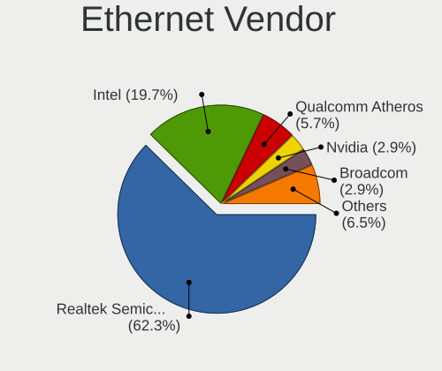

| Vendor                            | Computers | Percent |
|-----------------------------------|-----------|---------|
| Realtek Semiconductor             | 654       | 62.35%  |
| Intel                             | 207       | 19.73%  |
| Qualcomm Atheros                  | 60        | 5.72%   |
| Nvidia                            | 30        | 2.86%   |
| Broadcom                          | 30        | 2.86%   |
| Marvell Technology Group          | 11        | 1.05%   |
| Broadcom Limited                  | 9         | 0.86%   |
| Samsung Electronics               | 7         | 0.67%   |
| Xiaomi                            | 5         | 0.48%   |
| ASIX Electronics                  | 5         | 0.48%   |
| MediaTek                          | 4         | 0.38%   |
| VIA Technologies                  | 3         | 0.29%   |
| Lenovo                            | 3         | 0.29%   |
| JMicron Technology                | 3         | 0.29%   |
| TP-Link                           | 2         | 0.19%   |
| OPPO Electronics                  | 2         | 0.19%   |
| Motorola PCS                      | 2         | 0.19%   |
| Aquantia                          | 2         | 0.19%   |
| ZTE WCDMA Technologies MSM        | 1         | 0.1%    |
| Sundance Technology Inc / IC Plus | 1         | 0.1%    |
| Qualcomm Technologies             | 1         | 0.1%    |
| OnePlus Technology (Shenzhen)     | 1         | 0.1%    |
| ICS Advent                        | 1         | 0.1%    |
| Huawei Technologies               | 1         | 0.1%    |
| DisplayLink                       | 1         | 0.1%    |
| D-Link System                     | 1         | 0.1%    |
| Apple                             | 1         | 0.1%    |
| ADMtek                            | 1         | 0.1%    |

Ethernet Model
--------------

Ethernet models

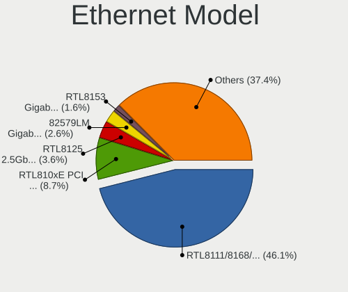

| Model                                                                  | Computers | Percent |
|------------------------------------------------------------------------|-----------|---------|
| Realtek RTL8111/8168/8211/8411 PCI Express Gigabit Ethernet Controller | 491       | 46.06%  |
| Realtek RTL810xE PCI Express Fast Ethernet controller                  | 93        | 8.72%   |
| Realtek RTL8125 2.5GbE Controller                                      | 38        | 3.56%   |
| Intel 82579LM Gigabit Network Connection (Lewisville)                  | 28        | 2.63%   |
| Realtek RTL8153 Gigabit Ethernet Adapter                               | 17        | 1.59%   |
| Qualcomm Atheros AR8151 v2.0 Gigabit Ethernet                          | 13        | 1.22%   |
| Intel I211 Gigabit Network Connection                                  | 12        | 1.13%   |
| Intel Ethernet Connection (4) I219-LM                                  | 11        | 1.03%   |
| Intel Ethernet Connection (2) I219-V                                   | 11        | 1.03%   |
| Nvidia MCP79 Ethernet                                                  | 10        | 0.94%   |
| Intel Ethernet Connection I219-LM                                      | 10        | 0.94%   |
| Intel Ethernet Connection I217-LM                                      | 10        | 0.94%   |
| Realtek RTL-8100/8101L/8139 PCI Fast Ethernet Adapter                  | 9         | 0.84%   |
| Qualcomm Atheros AR8161 Gigabit Ethernet                               | 9         | 0.84%   |
| Intel Ethernet Controller I225-V                                       | 9         | 0.84%   |
| Nvidia MCP61 Ethernet                                                  | 8         | 0.75%   |
| Intel 82577LM Gigabit Network Connection                               | 8         | 0.75%   |
| Qualcomm Atheros Killer E220x Gigabit Ethernet Controller              | 7         | 0.66%   |
| Intel 82579V Gigabit Network Connection                                | 7         | 0.66%   |
| Qualcomm Atheros AR8131 Gigabit Ethernet                               | 6         | 0.56%   |
| Intel Ethernet Connection (7) I219-V                                   | 6         | 0.56%   |
| Broadcom NetXtreme BCM57765 Gigabit Ethernet PCIe                      | 6         | 0.56%   |
| Broadcom NetLink BCM57785 Gigabit Ethernet PCIe                        | 6         | 0.56%   |
| Qualcomm Atheros QCA8172 Fast Ethernet                                 | 5         | 0.47%   |
| Intel Ethernet Controller I226-V                                       | 5         | 0.47%   |
| Intel Ethernet Connection I218-LM                                      | 5         | 0.47%   |
| Intel Ethernet Connection I217-V                                       | 5         | 0.47%   |
| Intel Ethernet Connection (13) I219-V                                  | 5         | 0.47%   |
| Intel 82566MM Gigabit Network Connection                               | 5         | 0.47%   |
| ASIX AX88179 Gigabit Ethernet                                          | 5         | 0.47%   |
| Samsung Galaxy series, misc. (tethering mode)                          | 4         | 0.38%   |
| Realtek RTL8152 Fast Ethernet Adapter                                  | 4         | 0.38%   |
| Realtek RTL-8110SC/8169SC Gigabit Ethernet                             | 4         | 0.38%   |
| Qualcomm Atheros AR8121/AR8113/AR8114 Gigabit or Fast Ethernet         | 4         | 0.38%   |
| Intel Ethernet Connection (7) I219-LM                                  | 4         | 0.38%   |
| Intel Ethernet Connection (6) I219-V                                   | 4         | 0.38%   |
| Intel Ethernet Connection (4) I219-V                                   | 4         | 0.38%   |
| Intel Ethernet Connection (2) I219-LM                                  | 4         | 0.38%   |
| Intel 82567LM-3 Gigabit Network Connection                             | 4         | 0.38%   |
| Intel 82567LM Gigabit Network Connection                               | 4         | 0.38%   |

Net Controller Kind
-------------------

Ethernet, WiFi or modem

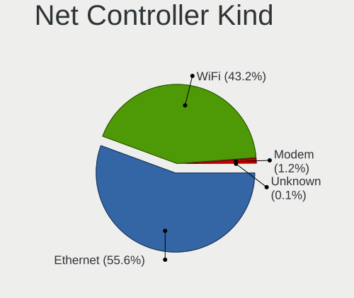

| Kind     | Computers | Percent |
|----------|-----------|---------|
| Ethernet | 1014      | 55.59%  |
| WiFi     | 788       | 43.2%   |
| Modem    | 21        | 1.15%   |
| Unknown  | 1         | 0.05%   |

Used Controller
---------------

Currently used network controller

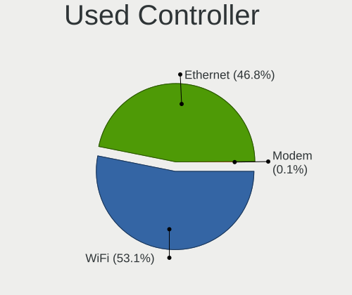

| Kind     | Computers | Percent |
|----------|-----------|---------|
| WiFi     | 625       | 53.15%  |
| Ethernet | 550       | 46.77%  |
| Modem    | 1         | 0.09%   |

NICs
----

Total network controllers on board

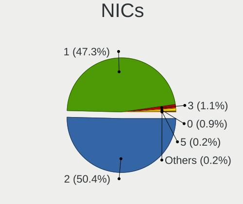

| Total | Computers | Percent |
|-------|-----------|---------|
| 2     | 575       | 50.39%  |
| 1     | 540       | 47.33%  |
| 3     | 12        | 1.05%   |
| 0     | 10        | 0.88%   |
| 5     | 2         | 0.18%   |
| 8     | 1         | 0.09%   |
| 4     | 1         | 0.09%   |

IPv6
----

IPv6 vs IPv4

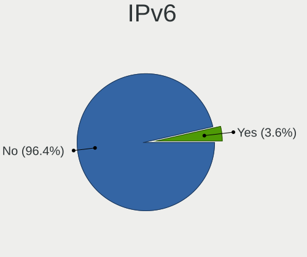

| Used | Computers | Percent |
|------|-----------|---------|
| No   | 1104      | 96.42%  |
| Yes  | 41        | 3.58%   |

Bluetooth
---------

Bluetooth Vendor
----------------

Controller vendors

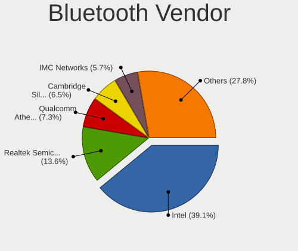

| Vendor                          | Computers | Percent |
|---------------------------------|-----------|---------|
| Intel                           | 252       | 39.07%  |
| Realtek Semiconductor           | 88        | 13.64%  |
| Qualcomm Atheros Communications | 47        | 7.29%   |
| Cambridge Silicon Radio         | 42        | 6.51%   |
| IMC Networks                    | 37        | 5.74%   |
| Lite-On Technology              | 34        | 5.27%   |
| Foxconn / Hon Hai               | 32        | 4.96%   |
| Broadcom                        | 26        | 4.03%   |
| Apple                           | 19        | 2.95%   |
| ASUSTek Computer                | 13        | 2.02%   |
| Toshiba                         | 9         | 1.4%    |
| MediaTek                        | 9         | 1.4%    |
| Hewlett-Packard                 | 8         | 1.24%   |
| Dell                            | 6         | 0.93%   |
| Ralink                          | 5         | 0.78%   |
| TP-Link                         | 4         | 0.62%   |
| USI                             | 3         | 0.47%   |
| Foxconn International           | 3         | 0.47%   |
| Ralink Technology               | 2         | 0.31%   |
| Unknown                         | 2         | 0.31%   |
| Realtek                         | 1         | 0.16%   |
| Opticis                         | 1         | 0.16%   |
| Askey Computer                  | 1         | 0.16%   |
| Alps Electric                   | 1         | 0.16%   |

Bluetooth Model
---------------

Controller models

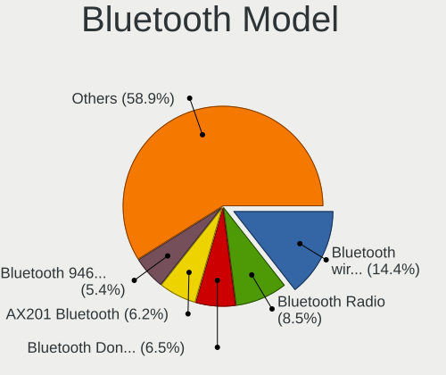

| Model                                               | Computers | Percent |
|-----------------------------------------------------|-----------|---------|
| Intel Bluetooth wireless interface                  | 93        | 14.42%  |
| Realtek Bluetooth Radio                             | 55        | 8.53%   |
| Cambridge Silicon Radio Bluetooth Dongle (HCI mode) | 42        | 6.51%   |
| Intel AX201 Bluetooth                               | 40        | 6.2%    |
| Intel Bluetooth 9460/9560 Jefferson Peak (JfP)      | 35        | 5.43%   |
| Intel AX200 Bluetooth                               | 25        | 3.88%   |
| Intel Bluetooth Device                              | 24        | 3.72%   |
| Qualcomm Atheros  Bluetooth Device                  | 21        | 3.26%   |
| Realtek  Bluetooth 4.2 Adapter                      | 19        | 2.95%   |
| IMC Networks Wireless_Device                        | 17        | 2.64%   |
| Lite-On Qualcomm Atheros QCA9377 Bluetooth          | 14        | 2.17%   |
| Intel AX210 Bluetooth                               | 14        | 2.17%   |
| Foxconn / Hon Hai Wireless_Device                   | 11        | 1.71%   |
| Lite-On Bluetooth Device                            | 10        | 1.55%   |
| IMC Networks Bluetooth Radio                        | 10        | 1.55%   |
| Apple Bluetooth Host Controller                     | 10        | 1.55%   |
| MediaTek Wireless_Device                            | 9         | 1.4%    |
| Foxconn / Hon Hai MediaTek Bluetooth Adapter        | 8         | 1.24%   |
| Intel Wireless-AC 3168 Bluetooth                    | 7         | 1.09%   |
| Qualcomm Atheros AR9462 Bluetooth                   | 6         | 0.93%   |
| Qualcomm Atheros AR3012 Bluetooth 4.0               | 6         | 0.93%   |
| Intel Centrino Bluetooth Wireless Transceiver       | 6         | 0.93%   |
| Foxconn / Hon Hai Bluetooth Device                  | 6         | 0.93%   |
| ASUS Broadcom BCM20702A0 Bluetooth                  | 6         | 0.93%   |
| Realtek RTL8821A Bluetooth                          | 5         | 0.78%   |
| Ralink RT3290 Bluetooth                             | 5         | 0.78%   |
| Qualcomm Atheros QCA61x4 Bluetooth 4.0              | 5         | 0.78%   |
| Qualcomm Atheros AR3011 Bluetooth                   | 5         | 0.78%   |
| Lite-On Atheros AR3012 Bluetooth                    | 5         | 0.78%   |
| HP Broadcom 2070 Bluetooth Combo                    | 5         | 0.78%   |
| Dell DW375 Bluetooth Module                         | 5         | 0.78%   |
| Broadcom BCM43142A0 Bluetooth 4.0                   | 5         | 0.78%   |
| ASUS ASUS USB-BT500                                 | 5         | 0.78%   |
| TP-Link TP-T@- UB500 Adapter                        | 4         | 0.62%   |
| Realtek RTL8723B Bluetooth                          | 4         | 0.62%   |
| Qualcomm Atheros AR3012 Bluetooth                   | 4         | 0.62%   |
| Intel Centrino Advanced-N 6230 Bluetooth adapter    | 4         | 0.62%   |
| IMC Networks Bluetooth Device                       | 4         | 0.62%   |
| Apple Built-in Bluetooth 2.0+EDR HCI                | 4         | 0.62%   |
| Toshiba Bluetooth Device                            | 3         | 0.47%   |

Sound
-----

Sound Vendor
------------

Sound card vendors

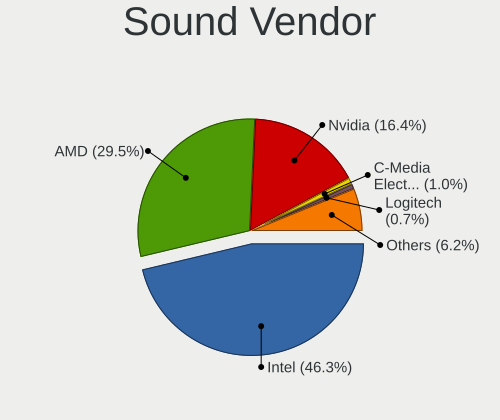

| Vendor                               | Computers | Percent |
|--------------------------------------|-----------|---------|
| Intel                                | 721       | 46.28%  |
| AMD                                  | 459       | 29.46%  |
| Nvidia                               | 256       | 16.43%  |
| C-Media Electronics                  | 15        | 0.96%   |
| Logitech                             | 11        | 0.71%   |
| Creative Labs                        | 8         | 0.51%   |
| Hewlett-Packard                      | 7         | 0.45%   |
| Generalplus Technology               | 5         | 0.32%   |
| Focusrite-Novation                   | 5         | 0.32%   |
| ASUSTek Computer                     | 5         | 0.32%   |
| VIA Technologies                     | 4         | 0.26%   |
| Microsoft                            | 4         | 0.26%   |
| Thesycon Systemsoftware & Consulting | 3         | 0.19%   |
| Tenx Technology                      | 3         | 0.19%   |
| Plantronics                          | 3         | 0.19%   |
| Micro Star International             | 3         | 0.19%   |
| Lenovo                               | 3         | 0.19%   |
| Sony                                 | 2         | 0.13%   |
| RODE Microphones                     | 2         | 0.13%   |
| Native Instruments                   | 2         | 0.13%   |
| Kingston Technology                  | 2         | 0.13%   |
| JMTek                                | 2         | 0.13%   |
| JBL                                  | 2         | 0.13%   |
| GN Netcom                            | 2         | 0.13%   |
| Apple                                | 2         | 0.13%   |
| XMOS                                 | 1         | 0.06%   |
| Veho                                 | 1         | 0.06%   |
| Valve Software                       | 1         | 0.06%   |
| Unknown                              | 1         | 0.06%   |
| Turtle Beach                         | 1         | 0.06%   |
| Syntek                               | 1         | 0.06%   |
| SteelSeries ApS                      | 1         | 0.06%   |
| SAVITECH                             | 1         | 0.06%   |
| Realtek Semiconductor                | 1         | 0.06%   |
| Razer USA                            | 1         | 0.06%   |
| PreSonus Audio Electronics           | 1         | 0.06%   |
| Orbbec 3D Technology International   | 1         | 0.06%   |
| Oculus VR                            | 1         | 0.06%   |
| Nordic Semiconductor ASA             | 1         | 0.06%   |
| Meizu                                | 1         | 0.06%   |

Sound Model
-----------

Sound card models

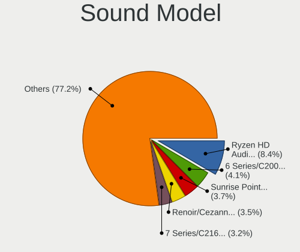

| Model                                                                                             | Computers | Percent |
|---------------------------------------------------------------------------------------------------|-----------|---------|
| AMD Ryzen HD Audio Controller                                                                     | 163       | 8.44%   |
| Intel 6 Series/C200 Series Chipset Family High Definition Audio Controller                        | 79        | 4.09%   |
| Intel Sunrise Point-LP HD Audio                                                                   | 71        | 3.67%   |
| AMD Renoir/Cezanne HDMI/DP Audio Controller                                                       | 67        | 3.47%   |
| Intel 7 Series/C216 Chipset Family High Definition Audio Controller                               | 61        | 3.16%   |
| AMD SBx00 Azalia (Intel HDA)                                                                      | 58        | 3%      |
| AMD Raven/Raven2/Fenghuang HDMI/DP Audio Controller                                               | 55        | 2.85%   |
| Intel 8 Series/C220 Series Chipset High Definition Audio Controller                               | 48        | 2.48%   |
| AMD FCH Azalia Controller                                                                         | 47        | 2.43%   |
| AMD Starship/Matisse HD Audio Controller                                                          | 42        | 2.17%   |
| Intel NM10/ICH7 Family High Definition Audio Controller                                           | 39        | 2.02%   |
| AMD Oland/Hainan/Cape Verde/Pitcairn HDMI Audio [Radeon HD 7000 Series]                           | 38        | 1.97%   |
| AMD Family 17h (Models 00h-0fh) HD Audio Controller                                               | 38        | 1.97%   |
| AMD Ellesmere HDMI Audio [Radeon RX 470/480 / 570/580/590]                                        | 38        | 1.97%   |
| Intel 5 Series/3400 Series Chipset High Definition Audio                                          | 31        | 1.6%    |
| Intel Xeon E3-1200 v3/4th Gen Core Processor HD Audio Controller                                  | 30        | 1.55%   |
| Intel Cannon Lake PCH cAVS                                                                        | 28        | 1.45%   |
| AMD Radeon High Definition Audio Controller                                                       | 25        | 1.29%   |
| Intel Tiger Lake-LP Smart Sound Technology Audio Controller                                       | 24        | 1.24%   |
| Intel 82801I (ICH9 Family) HD Audio Controller                                                    | 23        | 1.19%   |
| Intel 100 Series/C230 Series Chipset Family HD Audio Controller                                   | 22        | 1.14%   |
| Intel Wildcat Point-LP High Definition Audio Controller                                           | 21        | 1.09%   |
| Intel Broadwell-U Audio Controller                                                                | 21        | 1.09%   |
| AMD Baffin HDMI/DP Audio [Radeon RX 550 640SP / RX 560/560X]                                      | 21        | 1.09%   |
| Nvidia GP107GL High Definition Audio Controller                                                   | 20        | 1.04%   |
| Intel Cannon Point-LP High Definition Audio Controller                                            | 20        | 1.04%   |
| AMD Navi 21/23 HDMI/DP Audio Controller                                                           | 19        | 0.98%   |
| Intel Haswell-ULT HD Audio Controller                                                             | 18        | 0.93%   |
| Intel 8 Series HD Audio Controller                                                                | 18        | 0.93%   |
| Nvidia GP104 High Definition Audio Controller                                                     | 17        | 0.88%   |
| Intel 200 Series PCH HD Audio                                                                     | 17        | 0.88%   |
| Intel Ice Lake-LP Smart Sound Technology Audio Controller                                         | 16        | 0.83%   |
| Intel Alder Lake PCH-P High Definition Audio Controller                                           | 16        | 0.83%   |
| Intel 82801H (ICH8 Family) HD Audio Controller                                                    | 16        | 0.83%   |
| Nvidia MCP61 High Definition Audio                                                                | 15        | 0.78%   |
| Nvidia GF108 High Definition Audio Controller                                                     | 15        | 0.78%   |
| Nvidia GA104 High Definition Audio Controller                                                     | 15        | 0.78%   |
| Intel Celeron N3350/Pentium N4200/Atom E3900 Series Audio Cluster                                 | 15        | 0.78%   |
| Intel Atom/Celeron/Pentium Processor x5-E8000/J3xxx/N3xxx Series High Definition Audio Controller | 15        | 0.78%   |
| Intel Atom Processor Z36xxx/Z37xxx Series High Definition Audio Controller                        | 15        | 0.78%   |

Memory
------

Memory Vendor
-------------

Memory module vendors

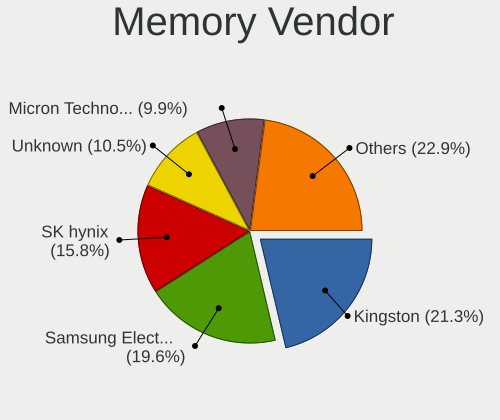

| Vendor              | Computers | Percent |
|---------------------|-----------|---------|
| Kingston            | 161       | 21.32%  |
| Samsung Electronics | 148       | 19.6%   |
| SK hynix            | 119       | 15.76%  |
| Unknown             | 79        | 10.46%  |
| Micron Technology   | 75        | 9.93%   |
| Ramaxel Technology  | 20        | 2.65%   |
| Patriot             | 20        | 2.65%   |
| Crucial             | 20        | 2.65%   |
| Transcend           | 15        | 1.99%   |
| Corsair             | 15        | 1.99%   |
| A-DATA Technology   | 14        | 1.85%   |
| Elpida              | 10        | 1.32%   |
| Apacer              | 9         | 1.19%   |
| Nanya Technology    | 8         | 1.06%   |
| G.Skill             | 8         | 1.06%   |
| Unknown             | 8         | 1.06%   |
| Silicon Power       | 5         | 0.66%   |
| GeIL                | 3         | 0.4%    |
| Qimonda             | 2         | 0.26%   |
| Unknown (89F7)      | 1         | 0.13%   |
| Unknown (06F1)      | 1         | 0.13%   |
| Unifosa             | 1         | 0.13%   |
| Swissbit            | 1         | 0.13%   |
| SHARETRONIC         | 1         | 0.13%   |
| Ramos Technology    | 1         | 0.13%   |
| PNY                 | 1         | 0.13%   |
| Patriot Memory      | 1         | 0.13%   |
| Mushkin             | 1         | 0.13%   |
| Kllisre             | 1         | 0.13%   |
| KETECH              | 1         | 0.13%   |
| Exceleram           | 1         | 0.13%   |
| CSX                 | 1         | 0.13%   |
| AMD                 | 1         | 0.13%   |
| Aeneon              | 1         | 0.13%   |
| 48spaces            | 1         | 0.13%   |

Memory Model
------------

Memory module models

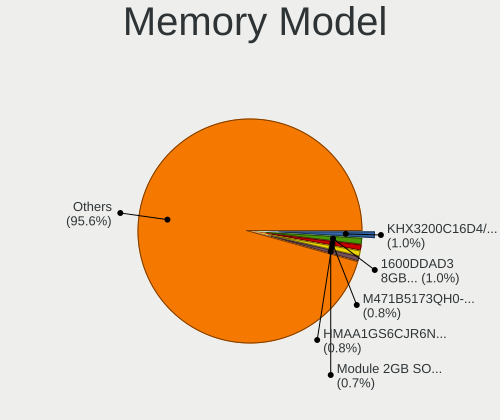

| Model                                                    | Computers | Percent |
|----------------------------------------------------------|-----------|---------|
| Kingston RAM KHX3200C16D4/8GX 8GB DIMM DDR4 3733MT/s     | 8         | 0.97%   |
| Unknown                                                  | 8         | 0.97%   |
| SK hynix RAM HMAA1GS6CJR6N-XN 8GB SODIMM DDR4 3200MT/s   | 7         | 0.85%   |
| Samsung RAM M471B5173QH0-YK0 4GB SODIMM DDR3 1600MT/s    | 7         | 0.85%   |
| Unknown RAM Module 2GB SODIMM DDR2 667MT/s               | 6         | 0.73%   |
| SK hynix RAM HMA851S6AFR6N-UH 4GB SODIMM DDR4 2667MT/s   | 6         | 0.73%   |
| Samsung RAM M471A5244CB0-CTD 4GB SODIMM DDR4 3266MT/s    | 6         | 0.73%   |
| Samsung RAM M471A5244CB0-CRC 4GB SODIMM DDR4 2667MT/s    | 6         | 0.73%   |
| Micron RAM 8ATF1G64HZ-3G2J1 8GB SODIMM DDR4 3200MT/s     | 6         | 0.73%   |
| Micron RAM 4ATF51264HZ-2G6E1 4GB SODIMM DDR4 2667MT/s    | 6         | 0.73%   |
| Micron RAM 4ATF1G64HZ-3G2F1 8GB SODIMM DDR4 3200MT/s     | 6         | 0.73%   |
| Micron RAM 4ATF1G64HZ-3G2E1 8GB SODIMM DDR4 3200MT/s     | 6         | 0.73%   |
| Kingston RAM KHX2400C15/8G 8GB DIMM DDR4 3400MT/s        | 6         | 0.73%   |
| Kingston RAM KHX1866C10D3/8G 8GB DIMM DDR3 1867MT/s      | 6         | 0.73%   |
| Kingston RAM KF3200C16D4/8GX 8GiB DIMM DDR4 3600MT/s     | 6         | 0.73%   |
| Kingston RAM 99U5428-018.A00LF 8GB SODIMM DDR3 1600MT/s  | 6         | 0.73%   |
| SK hynix RAM HMA851S6JJR6N-VK 4GB SODIMM DDR4 2667MT/s   | 5         | 0.6%    |
| SK hynix RAM HMA81GS6DJR8N-XN 8GB SODIMM DDR4 3200MT/s   | 5         | 0.6%    |
| Samsung RAM M471B5173EB0-YK0 4GB SODIMM DDR3 1600MT/s    | 5         | 0.6%    |
| Samsung RAM M471A1G44BB0-CWE 8GB SODIMM DDR4 3200MT/s    | 5         | 0.6%    |
| Samsung RAM M471A1G44AB0-CWE 8GiB SODIMM DDR4 3200MT/s   | 5         | 0.6%    |
| Kingston RAM KHX3200C16D4/16GX 16GB DIMM DDR4 3600MT/s   | 5         | 0.6%    |
| Unknown RAM Module 2048MB DIMM 1333MT/s                  | 4         | 0.48%   |
| Unknown RAM CL19-19-19 D4-2666 8192MB DIMM DDR4 2400MT/s | 4         | 0.48%   |
| SK hynix RAM HMT451S6BFR8A-PB 4GB SODIMM DDR3 1600MT/s   | 4         | 0.48%   |
| Samsung RAM M471B5773DH0-CH9 2GB SODIMM DDR3 1600MT/s    | 4         | 0.48%   |
| Samsung RAM M471B5173DB0-YK0 4GB SODIMM DDR3 1600MT/s    | 4         | 0.48%   |
| Samsung RAM M471B1G73DB0-YK0 8GB SODIMM DDR3 1600MT/s    | 4         | 0.48%   |
| Samsung RAM M471A5244CB0-CWE 4GB SODIMM DDR4 3200MT/s    | 4         | 0.48%   |
| Samsung RAM M471A1K43EB1-CWE 8GB SODIMM DDR4 3200MT/s    | 4         | 0.48%   |
| Samsung RAM M471A1K43DB1-CWE 8GB SODIMM DDR4 3200MT/s    | 4         | 0.48%   |
| Patriot RAM 3000 C16 Series 8GB DIMM DDR4 3200MT/s       | 4         | 0.48%   |
| Micron RAM 4ATF51264HZ-2G6E! 4GB SODIMM DDR4 2400MT/s    | 4         | 0.48%   |
| Kingston RAM KF3200C20S4/32GX 32GB SODIMM DDR4 3200MT/s  | 4         | 0.48%   |
| Kingston RAM KF3200C16D4/16GX 16GB DIMM DDR4 3733MT/s    | 4         | 0.48%   |
| Elpida RAM EBJ41UF8BCS0-DJ-F 4GB SODIMM DDR3 1334MT/s    | 4         | 0.48%   |
| Unknown RAM Module 2GB DIMM 1333MT/s                     | 3         | 0.36%   |
| SK hynix RAM HMCG78MEBSA092N 16GB SODIMM DDR5 4800MT/s   | 3         | 0.36%   |
| SK hynix RAM HMCG78AGBSA095N 16GB SODIMM DDR5 5600MT/s   | 3         | 0.36%   |
| SK hynix RAM HMAG68EXNSA051N 8GB SODIMM DDR4 3200MT/s    | 3         | 0.36%   |

Memory Kind
-----------

Memory module kinds

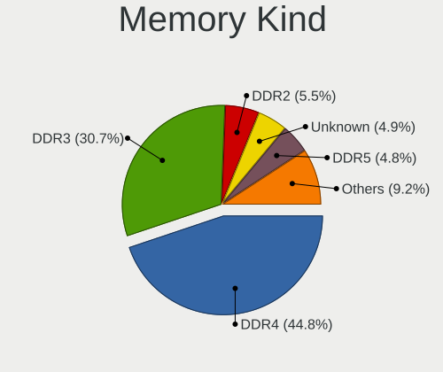

| Kind    | Computers | Percent |
|---------|-----------|---------|
| DDR4    | 283       | 44.85%  |
| DDR3    | 194       | 30.74%  |
| DDR2    | 35        | 5.55%   |
| Unknown | 31        | 4.91%   |
| DDR5    | 30        | 4.75%   |
| LPDDR5  | 17        | 2.69%   |
| SDRAM   | 16        | 2.54%   |
| LPDDR4  | 13        | 2.06%   |
| LPDDR3  | 6         | 0.95%   |
| DDR     | 5         | 0.79%   |
| DRAM    | 1         | 0.16%   |

Memory Form Factor
------------------

Physical design of the memory module

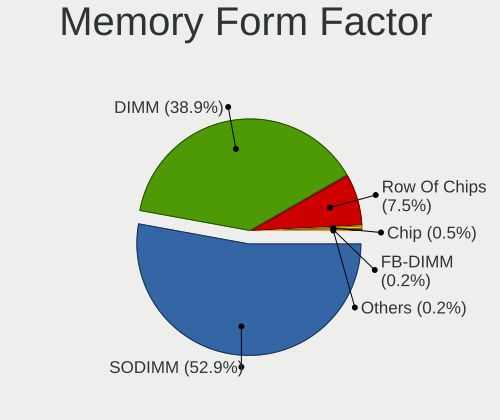

| Name         | Computers | Percent |
|--------------|-----------|---------|
| SODIMM       | 332       | 52.87%  |
| DIMM         | 244       | 38.85%  |
| Row Of Chips | 47        | 7.48%   |
| Chip         | 3         | 0.48%   |
| FB-DIMM      | 1         | 0.16%   |
| Unknown      | 1         | 0.16%   |

Memory Size
-----------

Memory module size

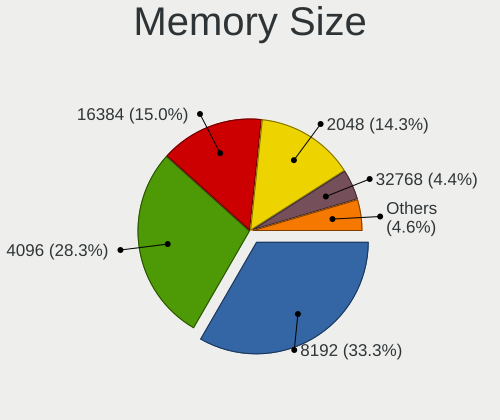

| Size  | Computers | Percent |
|-------|-----------|---------|
| 8192  | 233       | 33.33%  |
| 4096  | 198       | 28.33%  |
| 16384 | 105       | 15.02%  |
| 2048  | 100       | 14.31%  |
| 32768 | 31        | 4.43%   |
| 1024  | 28        | 4.01%   |
| 512   | 3         | 0.43%   |
| 3072  | 1         | 0.14%   |

Memory Speed
------------

Memory module speed

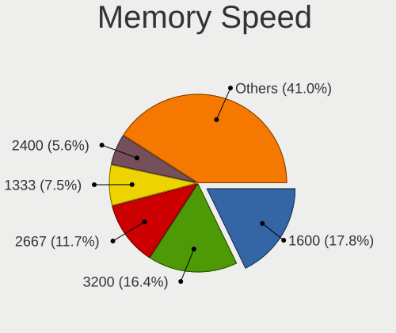

| Speed   | Computers | Percent |
|---------|-----------|---------|
| 1600    | 126       | 17.8%   |
| 3200    | 116       | 16.38%  |
| 2667    | 83        | 11.72%  |
| 1333    | 53        | 7.49%   |
| 2400    | 40        | 5.65%   |
| 2133    | 26        | 3.67%   |
| 667     | 24        | 3.39%   |
| 800     | 22        | 3.11%   |
| 3600    | 21        | 2.97%   |
| 3733    | 16        | 2.26%   |
| 1334    | 16        | 2.26%   |
| 6400    | 15        | 2.12%   |
| 1067    | 14        | 1.98%   |
| 5600    | 12        | 1.69%   |
| 3400    | 11        | 1.55%   |
| Unknown | 10        | 1.41%   |
| 1866    | 8         | 1.13%   |
| 4800    | 7         | 0.99%   |
| 4199    | 7         | 0.99%   |
| 6000    | 6         | 0.85%   |
| 3266    | 6         | 0.85%   |
| 2666    | 6         | 0.85%   |
| 4267    | 5         | 0.71%   |
| 2048    | 4         | 0.56%   |
| 8533    | 3         | 0.42%   |
| 8400    | 3         | 0.42%   |
| 3933    | 3         | 0.42%   |
| 3466    | 3         | 0.42%   |
| 2933    | 3         | 0.42%   |
| 975     | 3         | 0.42%   |
| 400     | 3         | 0.42%   |
| 7500    | 2         | 0.28%   |
| 4000    | 2         | 0.28%   |
| 3333    | 2         | 0.28%   |
| 3151    | 2         | 0.28%   |
| 3000    | 2         | 0.28%   |
| 2800    | 2         | 0.28%   |
| 1867    | 2         | 0.28%   |
| 1800    | 2         | 0.28%   |
| 1648    | 2         | 0.28%   |

Printers & scanners
-------------------

Printer Vendor
--------------

Printer device vendors

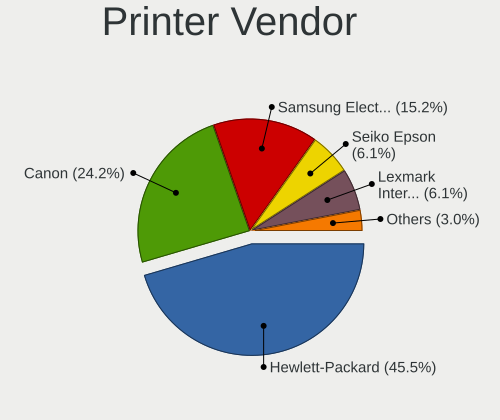

| Vendor                | Computers | Percent |
|-----------------------|-----------|---------|
| Hewlett-Packard       | 15        | 45.45%  |
| Canon                 | 8         | 24.24%  |
| Samsung Electronics   | 5         | 15.15%  |
| Seiko Epson           | 2         | 6.06%   |
| Lexmark International | 2         | 6.06%   |
| Xerox                 | 1         | 3.03%   |

Printer Model
-------------

Printer device models

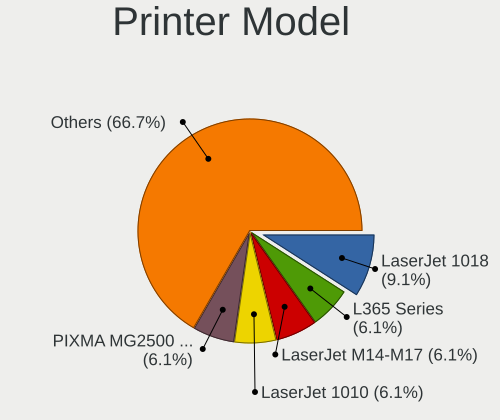

| Model                                      | Computers | Percent |
|--------------------------------------------|-----------|---------|
| HP LaserJet 1018                           | 3         | 9.09%   |
| Seiko Epson L365 Series                    | 2         | 6.06%   |
| HP LaserJet M14-M17                        | 2         | 6.06%   |
| HP LaserJet 1010                           | 2         | 6.06%   |
| Canon PIXMA MG2500 Series                  | 2         | 6.06%   |
| Xerox Phaser 3140 and 3155                 | 1         | 3.03%   |
| Samsung SCX-4623 Series                    | 1         | 3.03%   |
| Samsung SCX-3400 Series                    | 1         | 3.03%   |
| Samsung ML-216x Series Laser Printer       | 1         | 3.03%   |
| Samsung ML-1660 Series                     | 1         | 3.03%   |
| Samsung M2070 Series                       | 1         | 3.03%   |
| Lexmark International Lexmark MS312dn      | 1         | 3.03%   |
| Lexmark International InkJet Color Printer | 1         | 3.03%   |
| HP LaserJet P2015 series                   | 1         | 3.03%   |
| HP LaserJet P2014                          | 1         | 3.03%   |
| HP LaserJet P1005                          | 1         | 3.03%   |
| HP LaserJet CP 1025                        | 1         | 3.03%   |
| HP LaserJet 1200                           | 1         | 3.03%   |
| HP LaserJet 1020                           | 1         | 3.03%   |
| HP HP LaserJet M101-M106                   | 1         | 3.03%   |
| HP DeskJet 845c                            | 1         | 3.03%   |
| Canon LiDE 300                             | 1         | 3.03%   |
| Canon LBP810                               | 1         | 3.03%   |
| Canon LBP6030/6030B/6018L                  | 1         | 3.03%   |
| Canon LBP2900                              | 1         | 3.03%   |
| Canon iP7200 series                        | 1         | 3.03%   |
| Canon G600 series                          | 1         | 3.03%   |

Scanner Vendor
--------------

Scanner device vendors

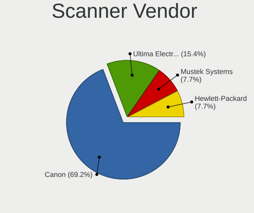

| Vendor             | Computers | Percent |
|--------------------|-----------|---------|
| Canon              | 9         | 60%     |
| Ultima Electronics | 2         | 13.33%  |
| Mustek Systems     | 2         | 13.33%  |
| Seiko Epson        | 1         | 6.67%   |
| Hewlett-Packard    | 1         | 6.67%   |

Scanner Model
-------------

Scanner device models

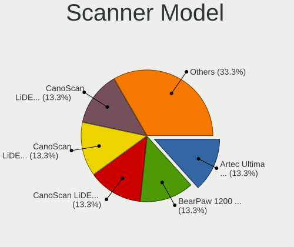

| Model                                                                                 | Computers | Percent |
|---------------------------------------------------------------------------------------|-----------|---------|
| Ultima Artec Ultima 2000 (GT6801 based)/Lifetec LT9385/ScanMagic 1200 UB Plus Scanner | 2         | 13.33%  |
| Mustek Systems BearPaw 1200 CU Plus                                                   | 2         | 13.33%  |
| Canon CanoScan LiDE 210                                                               | 2         | 13.33%  |
| Canon CanoScan LiDE 110                                                               | 2         | 13.33%  |
| Canon CanoScan LiDE 100                                                               | 2         | 13.33%  |
| Seiko Epson GT-7300U [Perfection 1260/1260 PHOTO]                                     | 1         | 6.67%   |
| HP ScanJet 2200c                                                                      | 1         | 6.67%   |
| Canon CanoScan N1240U/LiDE 30                                                         | 1         | 6.67%   |
| Canon CanoScan LIDE 25                                                                | 1         | 6.67%   |
| Canon CanoScan LiDE 120                                                               | 1         | 6.67%   |

Camera
------

Camera Vendor
-------------

Camera device vendors

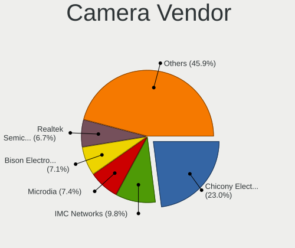

| Vendor                                 | Computers | Percent |
|----------------------------------------|-----------|---------|
| Chicony Electronics                    | 152       | 23.03%  |
| IMC Networks                           | 65        | 9.85%   |
| Microdia                               | 49        | 7.42%   |
| Bison Electronics                      | 47        | 7.12%   |
| Realtek Semiconductor                  | 44        | 6.67%   |
| Logitech                               | 40        | 6.06%   |
| Quanta                                 | 32        | 4.85%   |
| Sunplus Innovation Technology          | 26        | 3.94%   |
| Syntek                                 | 25        | 3.79%   |
| Cheng Uei Precision Industry (Foxlink) | 24        | 3.64%   |
| Suyin                                  | 21        | 3.18%   |
| Apple                                  | 18        | 2.73%   |
| Luxvisions Innotech Limited            | 14        | 2.12%   |
| Lite-On Technology                     | 12        | 1.82%   |
| KYE Systems (Mouse Systems)            | 9         | 1.36%   |
| Shinetech                              | 8         | 1.21%   |
| Silicon Motion                         | 6         | 0.91%   |
| Sonix Technology                       | 5         | 0.76%   |
| Lenovo                                 | 5         | 0.76%   |
| Importek                               | 5         | 0.76%   |
| ALi                                    | 4         | 0.61%   |
| Z-Star Microelectronics                | 3         | 0.45%   |
| Hewlett-Packard                        | 3         | 0.45%   |
| Aveo Technology                        | 3         | 0.45%   |
| Alcor Micro                            | 3         | 0.45%   |
| Acer                                   | 3         | 0.45%   |
| Sweex                                  | 2         | 0.3%    |
| Ricoh                                  | 2         | 0.3%    |
| Primax Electronics                     | 2         | 0.3%    |
| OmniVision Technologies                | 2         | 0.3%    |
| GEMBIRD                                | 2         | 0.3%    |
| Cubeternet                             | 2         | 0.3%    |
| Arkmicro Technologies                  | 2         | 0.3%    |
| YGTek                                  | 1         | 0.15%   |
| Xiaomi                                 | 1         | 0.15%   |
| Valve Software                         | 1         | 0.15%   |
| USB CAMERA                             | 1         | 0.15%   |
| Trust                                  | 1         | 0.15%   |
| SunplusIT                              | 1         | 0.15%   |
| Sony                                   | 1         | 0.15%   |

Camera Model
------------

Camera device models

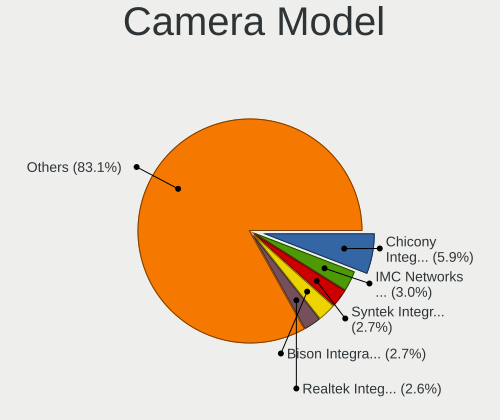

| Model                                                          | Computers | Percent |
|----------------------------------------------------------------|-----------|---------|
| Chicony Integrated Camera                                      | 39        | 5.88%   |
| IMC Networks USB2.0 VGA UVC WebCam                             | 20        | 3.02%   |
| Syntek Integrated Camera                                       | 18        | 2.71%   |
| Bison Integrated Camera                                        | 18        | 2.71%   |
| Realtek Integrated_Webcam_HD                                   | 17        | 2.56%   |
| Microdia Integrated_Webcam_HD                                  | 16        | 2.41%   |
| IMC Networks USB2.0 HD UVC WebCam                              | 15        | 2.26%   |
| IMC Networks Integrated Camera                                 | 14        | 2.11%   |
| Sunplus Integrated_Webcam_HD                                   | 10        | 1.51%   |
| Logitech Webcam C270                                           | 10        | 1.51%   |
| Chicony HP Webcam                                              | 10        | 1.51%   |
| Apple Built-in iSight                                          | 9         | 1.36%   |
| Microdia Camera                                                | 8         | 1.21%   |
| ShineTech USB2.0 HD UVC WebCam                                 | 7         | 1.06%   |
| Quanta HD Webcam                                               | 7         | 1.06%   |
| Chicony VGA Webcam                                             | 7         | 1.06%   |
| Chicony TOSHIBA Web Camera - HD                                | 7         | 1.06%   |
| Bison Lenovo EasyCamera                                        | 7         | 1.06%   |
| Quanta VGA WebCam                                              | 6         | 0.9%    |
| Logitech Webcam C170                                           | 6         | 0.9%    |
| Chicony Integrated Camera (1280x720@30)                        | 6         | 0.9%    |
| Chicony HD WebCam                                              | 6         | 0.9%    |
| Chicony EasyCamera                                             | 6         | 0.9%    |
| Suyin Acer/HP Integrated Webcam [CN0314]                       | 5         | 0.75%   |
| Sunplus Asus Webcam                                            | 5         | 0.75%   |
| Realtek USB Camera                                             | 5         | 0.75%   |
| Quanta HD User Facing                                          | 5         | 0.75%   |
| Microdia Integrated Webcam                                     | 5         | 0.75%   |
| Luxvisions Innotech Limited HP TrueVision HD Camera            | 5         | 0.75%   |
| Chicony HP HD Camera                                           | 5         | 0.75%   |
| Cheng Uei Precision Industry (Foxlink) HP Webcam               | 5         | 0.75%   |
| Cheng Uei Precision Industry (Foxlink) HP TrueVision HD Camera | 5         | 0.75%   |
| Cheng Uei Precision Industry (Foxlink) HP HD Camera            | 5         | 0.75%   |
| Apple FaceTime HD Camera                                       | 5         | 0.75%   |
| Syntek EasyCamera                                              | 4         | 0.6%    |
| Realtek Lenovo EasyCamera                                      | 4         | 0.6%    |
| Quanta HP TrueVision HD Camera                                 | 4         | 0.6%    |
| IMC Networks EasyCamera                                        | 4         | 0.6%    |
| Chicony USB2.0 VGA UVC WebCam                                  | 4         | 0.6%    |
| Chicony HP Wide Vision HD Camera                               | 4         | 0.6%    |

Security
--------

Fingerprint Vendor
------------------

Fingerprint sensor vendors

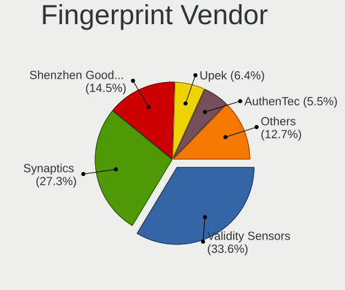

| Vendor                             | Computers | Percent |
|------------------------------------|-----------|---------|
| Validity Sensors                   | 37        | 33.64%  |
| Synaptics                          | 30        | 27.27%  |
| Shenzhen Goodix Technology         | 16        | 14.55%  |
| Upek                               | 7         | 6.36%   |
| AuthenTec                          | 6         | 5.45%   |
| Elan Microelectronics              | 5         | 4.55%   |
| STMicroelectronics                 | 3         | 2.73%   |
| LighTuning Technology              | 3         | 2.73%   |
| Realtek USB2.0 Finger Print Bridge | 2         | 1.82%   |
| Microsoft                          | 1         | 0.91%   |

Fingerprint Model
-----------------

Fingerprint sensor models

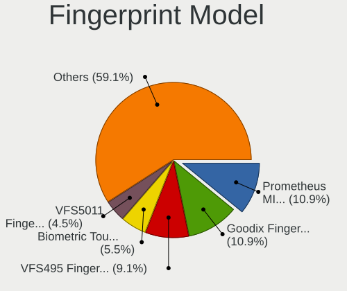

| Model                                                                      | Computers | Percent |
|----------------------------------------------------------------------------|-----------|---------|
| Synaptics Prometheus MIS Touch Fingerprint Reader                          | 12        | 10.91%  |
| Shenzhen Goodix  FingerPrint Device                                        | 12        | 10.91%  |
| Validity Sensors VFS495 Fingerprint Reader                                 | 10        | 9.09%   |
| Upek Biometric Touchchip/Touchstrip Fingerprint Sensor                     | 6         | 5.45%   |
| Validity Sensors VFS5011 Fingerprint Reader                                | 5         | 4.55%   |
| Synaptics  WBDI                                                            | 5         | 4.55%   |
| Validity Sensors VFS471 Fingerprint Reader                                 | 4         | 3.64%   |
| Validity Sensors VFS 5011 fingerprint sensor                               | 4         | 3.64%   |
| Validity Sensors Synaptics VFS7552 Touch Fingerprint Sensor with PurePrint | 4         | 3.64%   |
| Shenzhen Goodix Fingerprint Reader                                         | 4         | 3.64%   |
| Elan ELAN:Fingerprint                                                      | 4         | 3.64%   |
| Validity Sensors VFS7500 Touch Fingerprint Sensor                          | 3         | 2.73%   |
| Validity Sensors Synaptics WBDI                                            | 3         | 2.73%   |
| Synaptics Metallica MIS Touch Fingerprint Reader                           | 3         | 2.73%   |
| Synaptics Fingerprint reader [HP G6]                                       | 3         | 2.73%   |
| STMicroelectronics Fingerprint Reader                                      | 3         | 2.73%   |
| AuthenTec AES2501 Fingerprint Sensor                                       | 3         | 2.73%   |
| Synaptics WBDI                                                             | 2         | 1.82%   |
| Synaptics Prometheus Fingerprint Reader                                    | 2         | 1.82%   |
| Realtek USB2.0 Finger Print Bridge FocalTech Fingerprint Device            | 2         | 1.82%   |
| LighTuning ES603 Swipe Fingerprint Sensor                                  | 2         | 1.82%   |
| AuthenTec AES2810                                                          | 2         | 1.82%   |
| Validity Sensors VFS451 Fingerprint Reader                                 | 1         | 0.91%   |
| Validity Sensors VFS101 Fingerprint Reader                                 | 1         | 0.91%   |
| Validity Sensors VFS Fingerprint sensor                                    | 1         | 0.91%   |
| Validity Sensors Fingerprint scanner                                       | 1         | 0.91%   |
| Upek TCS5B Fingerprint sensor                                              | 1         | 0.91%   |
| Synaptics UWP WBDI Device                                                  | 1         | 0.91%   |
| Synaptics UWP WBDI                                                         | 1         | 0.91%   |
| Synaptics FS7604 Touch Fingerprint Sensor with PurePrint                   | 1         | 0.91%   |
| Microsoft Fingerprint Reader                                               | 1         | 0.91%   |
| LighTuning EgisTec Touch Fingerprint Sensor                                | 1         | 0.91%   |
| Elan ELAN:ARM-M4                                                           | 1         | 0.91%   |
| AuthenTec AES1660 Fingerprint Sensor                                       | 1         | 0.91%   |

Chipcard Vendor
---------------

Chipcard module vendors

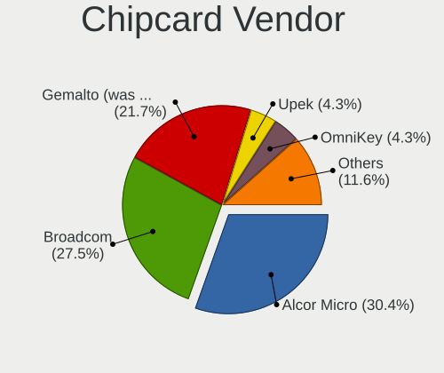

| Vendor                    | Computers | Percent |
|---------------------------|-----------|---------|
| Alcor Micro               | 21        | 30.43%  |
| Broadcom                  | 19        | 27.54%  |
| Gemalto (was Gemplus)     | 15        | 21.74%  |
| Upek                      | 3         | 4.35%   |
| OmniKey                   | 3         | 4.35%   |
| O2 Micro                  | 2         | 2.9%    |
| Lenovo                    | 2         | 2.9%    |
| Yubico.com                | 1         | 1.45%   |
| Realtek Semiconductor     | 1         | 1.45%   |
| Precise Biometrics        | 1         | 1.45%   |
| Fujitsu Siemens Computers | 1         | 1.45%   |

Chipcard Model
--------------

Chipcard module models

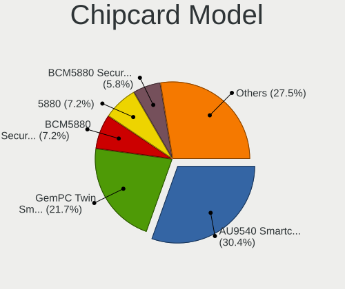

| Model                                                                        | Computers | Percent |
|------------------------------------------------------------------------------|-----------|---------|
| Alcor Micro AU9540 Smartcard Reader                                          | 21        | 30.43%  |
| Gemalto (was Gemplus) GemPC Twin SmartCard Reader                            | 15        | 21.74%  |
| Broadcom BCM5880 Secure Applications Processor                               | 5         | 7.25%   |
| Broadcom 5880                                                                | 5         | 7.25%   |
| Broadcom BCM5880 Secure Applications Processor with fingerprint swipe sensor | 4         | 5.8%    |
| Broadcom BCM58200 ControlVault 3 (FingerPrint sensor + Contacted SmartCard)  | 4         | 5.8%    |
| Upek TouchChip Fingerprint Coprocessor (WBF advanced mode)                   | 3         | 4.35%   |
| O2 Micro OZ776 CCID Smartcard Reader                                         | 2         | 2.9%    |
| Lenovo Integrated Smart Card Reader                                          | 2         | 2.9%    |
| Yubico.com Yubikey 4/5 U2F+CCID                                              | 1         | 1.45%   |
| Realtek Semiconductor Smart Card Reader Interface                            | 1         | 1.45%   |
| Precise Biometrics 200 MC FingerPrint and SmartCard Reader                   | 1         | 1.45%   |
| OmniKey CardMan 4321                                                         | 1         | 1.45%   |
| OmniKey CardMan 3021 / 3121                                                  | 1         | 1.45%   |
| OmniKey 3x21 Smart Card Reader                                               | 1         | 1.45%   |
| Fujitsu Siemens Computers SmartCard Reader 2A                                | 1         | 1.45%   |
| Broadcom 58200                                                               | 1         | 1.45%   |

Unsupported
-----------

Unsupported Devices
-------------------

Total unsupported devices on board

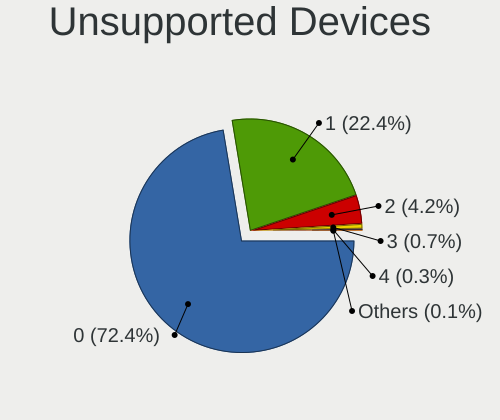

| Total | Computers | Percent |
|-------|-----------|---------|
| 0     | 852       | 72.39%  |
| 1     | 264       | 22.43%  |
| 2     | 49        | 4.16%   |
| 3     | 8         | 0.68%   |
| 4     | 3         | 0.25%   |
| 8     | 1         | 0.08%   |

Unsupported Device Types
------------------------

Types of unsupported devices

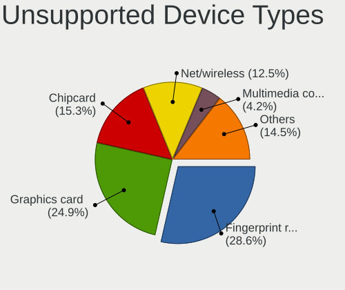

| Type                     | Computers | Percent |
|--------------------------|-----------|---------|
| Fingerprint reader       | 110       | 28.57%  |
| Graphics card            | 96        | 24.94%  |
| Chipcard                 | 59        | 15.32%  |
| Net/wireless             | 48        | 12.47%  |
| Multimedia controller    | 16        | 4.16%   |
| Bluetooth                | 12        | 3.12%   |
| Sound                    | 8         | 2.08%   |
| Communication controller | 8         | 2.08%   |
| Camera                   | 7         | 1.82%   |
| Card reader              | 6         | 1.56%   |
| Unassigned class         | 4         | 1.04%   |
| Storage                  | 3         | 0.78%   |
| Net/ethernet             | 3         | 0.78%   |
| Modem                    | 2         | 0.52%   |
| Storage/ide              | 1         | 0.26%   |
| Network                  | 1         | 0.26%   |
| Dvb card                 | 1         | 0.26%   |

